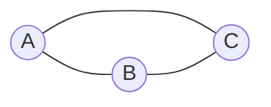
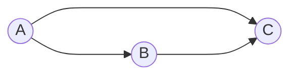
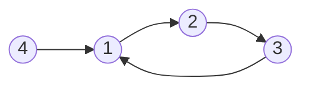
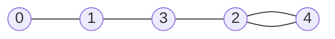
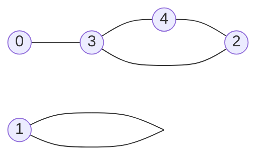

[TOC]

# 11.1

## 575-分糖果

> 每日一题


因为数组长度一定为偶数，假设数组长度为n，那么对应妹妹会分得到$\frac{n}{2}$个糖果

所以理想情况下，妹妹最多有$\frac{n}{2}$种糖果

所以可以这么做，遍历整个数组统计糖果的种类

如果糖果种类k，$k \leq \frac{n}{2}$，这意味着糖果种类少，此时妹妹一定可以获得k种糖果

如果糖果种类k，$k > \frac{n}{2}$，这意味着糖果种类太多了，此时妹妹最多只获得$\frac{n}{2}$种糖果

```java
class Solution {
    public int distributeCandies(int[] candyType) {
        HashSet<Integer> set = new HashSet<>();
        for(int num : candyType){
            set.add(num);
        }
        int k = set.size();
        int n = candyType.length;
        n /= 2;
        return k < n ? k : n;
    }
}
```

## 3-无重复的最长字串


这题一看就是滑动窗口

通过一个map维护一个滑动窗口

```java
class Solution {
    public int lengthOfLongestSubstring(String s) {
        HashMap<Character, Integer> map = new HashMap<>();
        int left = 0;
        int rst = 0;
        for(int right = 0; right < s.length(); right++){
            char c = s.charAt(right);
            if(map.containsKey(c)){
               left = Math.max(left, map.get(c) + 1);
            }
            map.put(c, right);
            rst = Math.max(rst, right - left + 1);
        }
        return rst;
    }
}
```

要注意的是这里面`left = Math.max(left, map.get(c) + 1);`很关键

考虑输入中的这种情况：`abcbdea`

如果没有取max，最开始left会指向c，但随着right指向a的时候，left会指向b，取max是为了防止窗口大小异常

> 因为这里的map包含全部的字符，并不是map中的即为窗口中的

考虑另一种实现：通过一个set维护一个窗口，如果重复了，就开删，从left开始删除，直到把重复的也删掉，这样窗口大小就是无重复子串的大小

```java
class Solution {
    public int lengthOfLongestSubstring(String s) {
        HashSet<Character> set = new HashSet<>();
        int left = 0;
        int rst = 0;
        for(int right = 0; right < s.length(); right++){
            char c = s.charAt(right);
            if(set.contains(c)){
                while(s.charAt(left) != c && left <= right){
                    set.remove(s.charAt(left++));
                }
                set.remove(s.charAt(left++));
            }
            set.add(c);
            rst = Math.max(rst, set.size());
        }
        return rst;
    }
}
```

## 11-盛最多水的容器


这题做过一次就不会忘了，双指针

每次的容量是left和right中较小的那个乘二者之间的距离

每次令较小的那个移动，因为只有这样，才有可能让容量变大

```java
class Solution {
    public int maxArea(int[] height) {
        int left = 0;
        int right = height.length - 1;
        int rst = 0;
        while(left < right){
            rst = Math.max(rst, Math.min(height[left], height[right]) * (right - left));
            if(height[left] < height[right]){
                left++;
            }else{
                right--;
            }
        }
        return rst;
    }
}
```

## 15-三数之和


一个典型的双指针

首先对数组进行排序，然后从左或从右开始遍历整个数组，并取当前元素的值为value

每次迭代的内部维护两个指针，让这两个指针的和为-value即可，如果小于的话，移动左指针，如果大于的话，移动右指针，否则加入list后二者都移动

值得注意的是，要保证不重复，可以通过：

* 加入set，利用set去重
* 手动去重

显然第二种更好，其实也挺好做的，就是如果当前位置可以加入list，然后left和right移动前后指针指向数据大小相同，那一定是重复的元素

> 这一点对于外面的元素也是一样的

```java
class Solution {
    public List<List<Integer>> threeSum(int[] nums) {
        List<List<Integer>> list = new ArrayList<>();
        Arrays.sort(nums);
        for(int j = nums.length - 1; j >= 2; j--){
            int left = 0;
            int right = j - 1;
            int value = -nums[j];
            if(j < nums.length - 1 && nums[j] == nums[j + 1]){
                continue;
            }
            while(left < right){
                int sum = nums[left] + nums[right];
                if(sum == value){
                    list.add(Arrays.asList(nums[left], nums[right], nums[j]));
                    left++;
                    while(left < right && nums[left] == nums[left - 1]){
                        left++;
                    }
                    right--;
                    while(left < right && nums[right] == nums[right + 1]){
                        right--;
                    }
                }else if(sum < value){
                    left++;
                }else{
                    right--;
                }
            }
        }
        return list;
    }
}
```

# 11.2

## 237-删除链表中的节点


因为给的节点不是头部节点，所以不能查询到节点后删除

给的节点也一定不是尾部节点，因为如果是尾部，上一个节点还无法访问，这个节点是删不掉的

```java
class Solution {
    public void deleteNode(ListNode node) {
        if(node.next.next != null){
            node.val = node.next.val;
            deleteNode(node.next);
        }else{
            node.val = node.next.val;
            node.next = null;
        }
    }
}
```

## 45-跳跃游戏II


这一看就是dp，一维dp，`dp[i]`表示到达下标为i的最小步数

`dp[i] = min(dp[i - 1], dp[i - 2],......) + 1`

就没头了

可以这样考虑，对于顺序：$i \leq j\leq k\leq p$，一定有$dp[i]\leq dp[j]\leq dp[k]\leq dp[p]$

要求`dp[i]`的时候，找到一个最早能到达$i$的节点$j$，有`dp[i] = dp[j] + 1`

```java
class Solution {
    public int jump(int[] nums) {
        int[] dp = new int[nums.length];
        //j为一个下标，可以用来计算到达的最远边界
        int j = 0;
        for(int i = 1; i < nums.length; i++){
            while(j + nums[j] < i){
                j++;
            }
            dp[i] = dp[j] + 1;
        }
        return dp[nums.length - 1];
    }
}
```

## 1004-最大连续1的个数III


翻译一下，这个题就是找一个滑动窗口的最大长度，这个窗口内0的个数最大为k

```java
class Solution {
    public int longestOnes(int[] nums, int k) {
        int rst = 0;
        int left = 0;
        int buffer = k;
        for(int right = 0; right < nums.length; right++){
            if(nums[right] == 0){
                //buffer能减的时候就减，不能减就移动左边界
                if(buffer > 0){
                    buffer--;
                }else{
                    while(left < right && nums[left] != 0){
                        left++;
                    }
                    left++;
                }
            }
            rst = Math.max(rst, right - left + 1);
        }
        return rst;
    }
}
```

## [413. 等差数列划分](https://leetcode-cn.com/problems/arithmetic-slices/)


我最开始想的是，枚举左边界，不断移动右边界，如果能构成等差数列，就让rst自增

```java
class Solution {
    public int numberOfArithmeticSlices(int[] nums) {
        int rst = 0;
        //因为等差数列中至少有三个元素，所以i最大取length - 1
        for(int i = 0; i <= nums.length - 3; i++){
            //求一个gap，然后向后面找看看这个gap能维持多远
            int gap = nums[i + 1] - nums[i];
            for(int j = i + 2; j < nums.length; j++){
                if(nums[j] - nums[j - 1] == gap){
                    rst++;
                }else{
                    break;
                }
            }
        }
        return rst;
    }
}
```

然而这样做，时间复杂度是$O(n^2)$

然后题解说可以这样做：

先固定一个左边界，然后一直向右找右边界，找到一个最大的区间

在这个区间内任何连续的子集都是一个解

当子集长度为len时，只有一个子集

当子集长度为len - 1时，此时有两个子集

....

当子集长度为3（len - （len - 3））时，此时有len - 2个子集

所以通过等差数列求和可以找到从左边界到右边界的所有等差数列的数目

然后找下一个等差数列的时候，需要让左边界取右边界的取值，即left = right

```java
class Solution {
    public int numberOfArithmeticSlices(int[] nums) {
        int rst = 0;
        for(int i = 0; i <= nums.length - 3;){
            int gap = nums[i + 1] - nums[i];
            int j = i + 2;
            for(; j < nums.length; j++){
                if(nums[j] - nums[j - 1] != gap){
                    break;
                }
            }
            int len = j - i;
            rst += (len - 2) * (len - 1) / 2;
            //这里为j - 1是因为在for循环结束的时候j已经增过一次了，所以j为右边界右边的索引
            i = j - 1;
        }
        return rst;
    }   
}
```

在2022/3/3再添加一个while的写法：

```java
class Solution {
    public int numberOfArithmeticSlices(int[] nums) {
        int left = 0;
        int right = 2;
        int rst = 0;
        while (right < nums.length) {
            while (right < nums.length && nums[right] - nums[right - 1] == nums[right - 1] - nums[right - 2]) {
                right++;
            }
            int len = right - left;
            if (len >= 3) {
                rst += (len - 1) * (len - 2) / 2;
            }
            left = right - 1;
            right++;
        }

        return rst;
    }
}
```


## [395-至少有 K 个重复字符的最长子串](https://leetcode-cn.com/problems/longest-substring-with-at-least-k-repeating-characters/)


这个题一看就没思路

题解说可以从小的值入手，提示中给出s仅有小写英文字母组成

可以认为在字串中字符的种类最多有26种

所以可以这样做，遍历字符的种类，循环内部维护一个滑动窗口，保证滑动窗口中字符的种类不超过外层的i

```java
class Solution {
    public int longestSubstring(String s, int k) {
        //统计每个字符的频率
        int[] cnt = new int[26];
        int len = s.length();
        int rst = 0;
        for(int i = 1; i <= 26; i++){
            Arrays.fill(cnt, 0);
            //窗口左边界
            int left = 0;
            //窗口内字符出现次数不小于k的种类
            int sum = 0;
            //窗口内字符出现种类
            int total = 0;
            for(int right = 0; right < len; right++){
                int c = s.charAt(right) - 'a';
                cnt[c]++;
                //一旦频率为1，就让total自增
                if(cnt[c] == 1){
                    total++;
                }
                //一旦频率为k就让sum自增
                if(cnt[c] == k){
                    sum++;
                }
                //如果total的大小大于i的时候需要移动左边界
                while(total > i){
                    int u = s.charAt(left++) - 'a';
                    //移动完后需要改变频率，并修正total和sum
                    cnt[u]--;
                    if(cnt[u] == 0){
                        total--;
                    }
                    if(cnt[u] == k - 1){
                        sum--;
                    }
                }
                //每次满足条件的时候就计算一次rst
                if(total == sum){
                    rst = Math.max(rst, right - left + 1);
                }
            }
        }
        return rst;
    }
}
```

## 1178-猜字谜


这个题我是这么考虑的，puzzles作为外层遍历的字符串，内层遍历words中的每一个字符串，如果words中字符串中每个字符出现的频率不超过puzzles中的频率，且words中包含puzzles中的第一个字符，那么就然rst自增

然而：


就这个数据范围就离谱：如果按我的方式来，时间复杂度为$10^9$

还是，题解让从puzzles的小的值入手，因为puzzles中的字符串中的每一个字符串的长度都为7

所以可以这样做，保证puzzles中的每个字符串的第一个字符不动，然后还有6个字符

对于这6个字符，选择子集的时候，每一个可以选择加入或不加入，即一共$2^6 = 64$中组合方式（注意puzzles中每一个字符串中的字符都不一样）

即对于puzzles中的某一个字符串，一共有64个可选择的子集，即words中最多有64种选择

那如何表示这些组合呢，他是这样的，状态压缩，6位每一位由可0可1，6位一个数字，根据这个数子构建子字符串

> 假设puzzles中字符串为：`abcde`（就先假设长度为5吧），那么如果words中字符串为`aaaa`是匹配的，`aaaaaaaaaa`也是匹配的，就是说和频率无关

```java
class Solution {
    public List<Integer> findNumOfValidWords(String[] words, String[] puzzles) {
        List<Integer> list = new ArrayList<>();
        HashMap<Integer, Integer> map = new HashMap<>();
        //得到每一个words中的二进制表示，就26位，只考虑出现不出现，不考虑个数
        for(int i = 0; i < words.length; i++){
            int rst = getInt(words[i]);
            map.put(rst, map.getOrDefault(rst, 0) + 1);
        }
        //遍历外层puzzles
        for(int i = 0; i < puzzles.length; i++){
            int rst = 0;
            //第一位一定不能动
            int val = 1 << puzzles[i].charAt(0) - 'a';
            String s = puzzles[i];
            for(int count = 0; count < 64; count++){
                //计算tmp，每一个puzzles[i]计算64个tmp
                int tmp = val;
                //k为6位组合中的数字表示，防止count被改变，所以不能直接动count
                int k = count;
                int j = 0;
                //就是根据puzzles中某字符串的后六位计算tmp
                while(k != 0){
                    if((k & 1) == 1){
                        tmp |= 1 << (s.charAt(j + 1) - 'a');
                    }
                    k >>= 1;
                    j++;
                }
                //如果map中存了tmp就加上
                rst += map.getOrDefault(tmp, 0);
            }
            list.add(rst);
        }
        return list;
    }
    private int getInt(String s){
        int rst = 0;
        for(int i = 0; i < s.length(); i++){
            int c = s.charAt(i) - 'a';
            rst |= 1 << c;
        }
        return rst;
    }
}
```

其实如果不能保证puzzles中字符串的每个字符都是不同的，也能这么算

# 11.3

## 407-接雨水II

> 每日一题


对于每一个格子，显然只有内部的格子能够储水，边界的无论如何都会漏掉

内部的格子，能储水的量取决于边界的最小值

考虑一个小根堆，其内部为一个数组`nums[]`，大小为3，`nums[0]`表示行号，`nums[1]`表示列号，`nums[2]`表示此处的高度

维护一个boolean数组用来记录哪些位置已经被访问过

```java
class Solution {
    private static final int[][] directions = {{1, 0}, {-1, 0}, {0, 1}, {0, -1}};
    private boolean[][] marked;
    public int trapRainWater(int[][] heightMap) {
        PriorityQueue<int[]> queue = new PriorityQueue<>((nums1, nums2) -> nums1[2] - nums2[2]);
        int row = heightMap.length;
        int col = heightMap[0].length;
        this.marked = new boolean[row][col];
        //首先将边界都入堆
        for(int i = 0; i < col; i++){
            queue.offer(new int[]{0, i, heightMap[0][i]});
            queue.offer(new int[]{row - 1, i, heightMap[row - 1][i]});
            marked[0][i] = true;
            marked[row - 1][i] = true;
        }
        for(int i = 1; i < row - 1; i++){
            queue.offer(new int[]{i, 0, heightMap[i][0]});
            queue.offer(new int[]{i, col - 1, heightMap[i][col - 1]});
            marked[i][0] = true;
            marked[i][col - 1] = true;
        }
        int rst = 0;
        //堆为空的时候，配合着marked数组，表示遍历完所有位置
        while(!queue.isEmpty()){
            //取堆顶，这个堆顶是边界，是目前最小的边界
            int[] tmp = queue.poll();
            //遍历四个方向
            for(int i = 0; i < 4; i++){
                int mx = tmp[0] + directions[i][0];
                int my = tmp[1] + directions[i][1];
                //如果四个方向中超出数组范围或已经遍历过就不考虑
                if(mx >= 0 && mx < row && my >= 0 && my < col && !marked[mx][my]){
                    /*
                    	剩下的mx，my对应的格子一定不是边界，而是内部的格子
                    	因为我们采用小根堆，着意味着，此时(mx，my)这个格子最小的边界就是(tmp[0],tmp[1])
                    	然后更新rst，并将mx，my这个格子变为新的边界，入堆，要注意的是，此时mx，my的高度为注完水之后的高度
                    	如果注水之前mx,my高度小于边界高度，则注水，并将边界的高度“保留并传递下去”
                    	如果注水之前mx，my高度不小于边界高度，就不能注水，此时mx，my对应于一个新的边界，记录下去
                    */
                    if(heightMap[mx][my] < tmp[2]){
                        rst += tmp[2] - heightMap[mx][my];
                        heightMap[mx][my] = tmp[2];
                    }
                    queue.offer(new int[]{mx, my, heightMap[mx][my]});
                    marked[mx][my] = true;
                }
            }
        }
        return rst;
    }
}
```

更详细的可以看：[题解](https://leetcode-cn.com/problems/trapping-rain-water-ii/solution/you-xian-dui-lie-de-si-lu-jie-jue-jie-yu-shui-ii-b/)

## [42-接雨水](https://leetcode-cn.com/problems/trapping-rain-water/)


这个题很经典

对于每一个位置，其能注入水的大小取决于左右边界中小的那个

所以可以先遍历数组（左遍历一次，右遍历一次），找到每一个位置上对应的左侧最大高度和右侧最大高度

```java
class Solution {
    public int trap(int[] height) {
        int len = height.length;
        int[] leftMax = new int[len];
        int[] rightMax = new int[len];
        leftMax[0] = 0;
        rightMax[len - 1] = 0;
        int sum = 0;
        for(int i = 1; i < len; i++){
            leftMax[i] = Math.max(leftMax[i - 1], height[i - 1]); 
        }
        for(int i = len - 2; i >= 0; i--){
            rightMax[i] = Math.max(rightMax[i + 1], height[i + 1]);
        }
        int tmp = 0;
        for(int i = 0; i < len; i++){
            tmp = Math.min(leftMax[i], rightMax[i]);
            tmp -= height[i];
            if(tmp > 0){
                sum += tmp;
            }
        }
        return sum;
    }
}
```

也可以通过面积做差的方式算


首先通过一次遍历计算

一个全面积：`total = heightMax * heightLength`

一个矩形的面积：$\text{square} = \sum \text{height[i]}$

全面积：`total = 矩形面积 + 代求面积 + 多余面积`

然后从左向右边遍历得到一个以左边界为准的左侧全面积`lsum = 矩形面积 + 代求面积 + 右侧多余面积`

> 这里面的右侧是指最大高度的右侧

然后从右向左遍历得到一个以右边界为准的右侧全面积`rsum = 矩形面积 + 代求面积 + 左侧多余面积`

> 这里面的左侧是指最大高度的左侧

这样`lsum + rsum = 2 * (矩形面积 + 代求面积) + 多余面积`

> 关键点在于多余面积只计算一次，剩下的面积都计算了两次

这样`代求面积 = lsum + rsum - 全面积 - 矩形面积`

```java
class Solution {
    public int trap(int[] height) {
        int len = height.length;
        int squre = 0;
        int max = 0;
        for(int i = 0; i < len; i++){
            squre += height[i];
            max = Math.max(max, height[i]);
        }
        int total = len * max;
        int lsum = 0;
        int lmax = 0;
        for(int i = 0; i < len; i++){
            lmax = Math.max(lmax, height[i]);
            lsum += lmax;
        }
        int rsum = 0;
        int rmax = 0;
        for(int i = len - 1; i >= 0; i--){
            rmax = Math.max(rmax, height[i]);
            rsum += rmax;
        }
        return rsum + lsum - total - squre;
    }
}
```

## 705-设计哈希集合

> 今天全是简单题


实际中一个HashSet是由一个数组加链表的形式组成的

数组下标表示元素的hash值，如果hash值相同的时候，就将这个位置变为一个链表，相同hash值的元素位于一个链表中

```java
class MyHashSet {
    //这个值是一个最好是一个质数，这样hash冲突最小，数学上的证明，不会
    private static final int size = 5001;
    private node[] nodes;

    public MyHashSet() {
        this.nodes = new node[size];
    }
    
    public void add(int key) {
        int index = getIndex(key);
        if(nodes[index] == null) {
        	nodes[index] = new node(key);
        	return;
        }
        node tmp = nodes[index];
        while(tmp.getValue() != key && tmp.hasNext()) {
        	tmp = tmp.getNext();
        }
        if(tmp.getValue() == key) {
        	return;
        }
        if(!tmp.hasNext()) {
        	tmp.setNext(new node(key));
        }
       
    }
    //删除的时候，使用一个哨兵
    public void remove(int key) {
        int index = getIndex(key);
        node pre = new node();
        pre.setNext(nodes[index]);
        node tmp = pre;
        while(pre.getNext() != null && pre.getNext().getValue() != key){
            pre = pre.getNext();
        }
        if(pre.getNext() == null){
            return;
        }
        if(pre.getNext().getValue() == key){
            pre.setNext(pre.getNext().getNext());
        }
        nodes[index] = tmp.getNext();
    }
    
    public boolean contains(int key) {
        int index = getIndex(key);
        node pre = new node();
        pre.setNext(nodes[index]);
        while(pre.getNext() != null && pre.getNext().getValue() != key){
            pre = pre.getNext();
        }
        if(pre.getNext() == null){
            return false;
        }
        return true;
    }

    private int getIndex(int key){
        return key % size;
    }
}
class node{
    private int key;
    private node next;
    
    public node(){

    }

    public node(int key){
        this.key = key;
    }
    public boolean hasNext(){
        return next != null;
    }
    
    public int getValue(){
        return key;
    }

    public node getNext(){
        return next;
    }

    public void setNext(node next){
        this.next = next;
    }
}
```

## 706-设计哈希映射


和上面差不多，就是现在节点中还需要存的是键值对

```java
class MyHashMap {
    private static final int size = 5001;
    private node[] nodes;
    public MyHashMap() {
        nodes = new node[size];
    }
    
    public void put(int key, int value) {
        int index = getIndex(key);
        if(nodes[index] == null){
            nodes[index] = new node(key, value);
        }else{
            node tmp = nodes[index];
            while(tmp.key != key && tmp.next != null){
                tmp = tmp.next;
            }
            if(tmp.key == key){
                tmp.value = value;
                return;
            }
            tmp.next = new node(key, value);
        }
    }
    
    public int get(int key) {
        int index = getIndex(key);
        node tmp = nodes[index];
        if(tmp == null){
            return -1;
        }
        while(tmp.key != key && tmp.next != null){
            tmp = tmp.next;
        }
        if(tmp.key == key){
            return tmp.value;
        }
        return -1;
    }
    
    public void remove(int key) {
        int index = getIndex(key);
        node pre = new node();
        pre.next = nodes[index];
        node tmp = pre;
        while(pre.next != null && pre.next.key != key){
            pre = pre.next;
        }
        if(pre.next == null){
            return;
        }
        pre.next = pre.next.next;
        nodes[index] = tmp.next;
    }

    private int getIndex(int key){
        return key % size;
    }
}

class node{
    int key;
    int value;
    node next;
    
    public node(){

    }

    public node(int key, int value){
        this.key = key;
        this.value = value;
    }
}
```

## 232-用栈实现队列


这个题，要求使用栈实现一个队列

最简单的做法就是一个栈负责将元素压栈，当需要出队列的时候，将其全部出栈并压入另一个栈，这样对于另一个栈而言就是队列的出顺序

反过来，如果需要再次入队列，就再倒过来

```java
class MyQueue {
    private Deque<Integer> in;
    private Deque<Integer> out;
    public MyQueue() {
        this.in = new LinkedList<>();
        this.out = new LinkedList<>();
    }
    
    public void push(int x) {
        while(!out.isEmpty()){
            in.push(out.pop());
        }
        in.push(x);
    }
    
    public int pop() {
        while(!in.isEmpty()){
            out.push(in.pop());
        }
        return out.pop();
    }
    
    public int peek() {
        while(!in.isEmpty()){
            out.push(in.pop());
        }
        return out.peek();
    }
    
    public boolean empty() {
        return out.isEmpty() && in.isEmpty();
    }
}
```

实际上这个可以优化为均摊时间复杂度为$O(1)$

考虑不是每次出队列的时候都需要倒，也不是每次入队列的时候都需要倒

实际上只有负责出的那个栈空了的时候才需要倒过去

也就是在进行了一次$O(n)$的出队列操作后，后面n次的出队列都是$O(1)$复杂度的

```java
class MyQueue {
    private Deque<Integer> in;
    private Deque<Integer> out;
    public MyQueue() {
        this.in = new LinkedList<>();
        this.out = new LinkedList<>();
    }
    
    public void push(int x) {
        in.push(x);
    }
    
    public int pop() {
        if(out.isEmpty()){
            while(!in.isEmpty()){
                out.push(in.pop());
            }
        }
        return out.pop();
    }
    
    public int peek() {
        if(out.isEmpty()){
            while(!in.isEmpty()){
                out.push(in.pop());
            }
        }
        return out.peek();
    }
    
    public boolean empty() {
        return out.isEmpty() && in.isEmpty();
    }
}
```

## 一个arr三个stack


没什么想说的

```java
class TripleInOne {
    private int[] arr;
    private int p1;
    private int p2;
    private int p3;
    private int stackSize;
    public TripleInOne(int stackSize) {
        arr = new int[stackSize * 3];
        p1 = 0;
        p2 = stackSize;
        p3 = stackSize * 2;
        this.stackSize = stackSize;
    }
    
    public void push(int stackNum, int value) {
        if(stackNum == 0 && p1 < stackSize){
            arr[p1++] = value;
            return;
        }
        if(stackNum == 1 && p2 < 2 * stackSize){
            arr[p2++] = value;
            return;
        }
        if(stackNum == 2 && p3 < 3 * stackSize){
            arr[p3++] = value;
            return;
        }
    }
    
    public int pop(int stackNum) {
        if(stackNum == 0 && p1 > 0){
            p1--;
            return arr[p1];
        }
        if(stackNum == 1 && p2 > stackSize){
            p2--;
            return arr[p2];
        }
        if(stackNum == 2 && p3 > 2 * stackSize){
            p3--;
            return arr[p3];
        }
        return -1;
    }
    
    public int peek(int stackNum) {
        if(stackNum == 0 && p1 > 0){
            return arr[p1 - 1];
        }
        if(stackNum == 1 && p2 > stackSize){
            return arr[p2 - 1];
        }
        if(stackNum == 2 && p3 > 2 * stackSize){
            return arr[p3 - 1];
        }
        return -1;
    }
    
    public boolean isEmpty(int stackNum) {
        if(stackNum == 0){
            return p1 == 0;
        }
        if(stackNum == 1){
            return p2 == stackSize;
        }
        if(stackNum == 2){
            return p3 == stackSize * 2;
        }
        return false;
    }
}
```

## 225-用队列实现栈


这个就更没什么说的了，一个队列就按照正常的顺序入队列，需要出栈的时候，就将前面n-1个元素出队，并再从后面入队

随后队列头就是栈顶

```java
class MyStack {
    private Deque<Integer> queue;
    public MyStack() {
        queue = new LinkedList<>();
    }
    
    public void push(int x) {
        queue.offer(x);
    }
    
    public int pop() {
        int size = queue.size();
        for(int i = 0; i < size - 1;i++){
            queue.offer(queue.poll());
        }
        return queue.poll();
    }
    
    public int top() {
        int size = queue.size();
        for(int i = 0; i < size - 1;i++){
            queue.offer(queue.poll());
        }
        int rst = queue.poll();
        queue.offer(rst);
        return rst;
    }
    
    public boolean empty() {
        return queue.isEmpty();
    }
}
```

## 155-最小栈


采用一个辅助栈实现最小栈，这个辅助栈是一个单调栈，且为单调递减的栈

并不是每次入栈的时候都需要辅助栈入栈的（也可以选择同步入栈，我选的是只有小于等于当前栈顶的时候才入辅助栈）

```java
class MinStack {
    private Deque<Integer> stack;
    private Deque<Integer> min;
    public MinStack() {
        this.stack = new LinkedList<>();
        this.min = new LinkedList<>();
    }
    
    public void push(int val) {
        stack.push(val);
        //最小栈为空，没办法，这个时候没有比的，只能入栈
        if(min.isEmpty()){
            min.push(val);
        }else{
            //不空的时候和栈顶比，只有小于等于栈顶的时候入栈
            if(min.peek() >= val){
                min.push(val);
            }
        }
    }
    
    public void pop() {
        int tmp = stack.pop();
        //出栈的时候，如果栈顶和辅助栈的站顶相同的时候辅助栈出栈
        if(tmp == min.peek()){
            min.pop();
        }
    }
    
    public int top() {
        return stack.peek();
    }
    
    public int getMin() {
        return min.peek();
    }
}
```

## 146-LRU缓存机制


他说的是以$O(1)$的时间复杂度插入和删除，实际上如果你的时间复杂度更大的时候，就会超时

通过设置一个双向链表实现，当缓存满的时候，如果再加元素就从链表尾部删除一个，然后把他加在链表头部

> 我看它使用双向链表就是为了保证能$O(1)$的时间复杂度
>
> 我最开始使用双端队列就不行

```java
class LRUCache {
    private HashMap<Integer, Node> map;
    private int capacity;
    private Node head;
    private Node tail;
    public LRUCache(int capacity) {
        this.map = new HashMap<>();
        this.capacity = capacity;
        //两个哨兵head和tail
        this.head = new Node(-1, -1);
        this.tail = new Node(-1, -1);
        head.next = tail;
        tail.pre = head;
    }
    //每次get就将对应的节点放在链表头部
    public int get(int key) {
        Node tmp = map.get(key);
        if(tmp != null){
            update(tmp);
            return tmp.value;
        }
        return -1;
    }
    
    public void put(int key, int value) {
        if(map.containsKey(key)){
            update(map.get(key));
            map.get(key).value = value;
        }else{
            if(map.size() == capacity){
                int oldKey = tail.pre.key;
                tail.pre = tail.pre.pre;
                tail.pre.next = tail; 
                map.remove(oldKey);
            }
            Node newKey = new Node(key, value);
            newKey.next = head.next;
            newKey.next.pre = newKey;
            head.next = newKey;
            newKey.pre = head;
            map.put(key, newKey);
        }
        
    }
	/*
		关键在于不需要遍历双向链表找某个节点的位置，只要能调用这个函数一定会保证链表中有这个节点
    	然后就直接把它前后节点一连
    	把他往链表头一插就行了
    */
    private void update(Node tmp){
        
        tmp.pre.next = tmp.next;
        tmp.next.pre = tmp.pre;

        
        tmp.next = head.next;
        tmp.next.pre = tmp;
        head.next = tmp;
        tmp.pre = head;
        
    }  
}
class Node{
    Node pre;
    Node next;
    int key;
    int value;
    
    public Node(int key, int value){
        this.key = key;
        this.value = value;
    }
}
```

# 11.4

## [367-有效的完全平方数](https://leetcode-cn.com/problems/valid-perfect-square/)

> 每日一题


这个题就是求一个数的算数平方根（整数）

经典二分

```java
class Solution {
    public boolean isPerfectSquare(int num) {
        int sqrt = getSqrt(num);
        if(sqrt * sqrt == num){
            return true;
        }
        return false;
    }
    private int getSqrt(int num){
        long left = 1;
        long right = num;
        while(left < right){
            long mid = left + ((right - left) >> 1);
            if(mid * mid < num){
                left = mid + 1;
            }else{
                right = mid;
            }
        }
        return (int)left;
    }
}
```

> 现在写二分的时候，特别喜欢left为0，right为length - 1，然后循环条件left < right，因为这样永远不会出现下标越界的情况
>
> 而且出循环，要么已经找到了，要么left==right，就很爽

实际上，这个题也可以根据数学公式去解：$n^2 = 1 + 3 + 5 + .... + 2n - 1$，就是所有奇数的求和

然后，就可以用一个循环，第一次减去1，第二次减去3，迭代下去，如果n为0，就返回true，如果n小于0就返回false

## 421

> 宫水三叶的每日一题 :white_check_mark:


这个题，一看，暴力就完事了，我看评论有人这么做还没超时

正经的题解，使用了字典树

把所有的数字看成32位的二进制

然后根节点有两个子节点分别表示0和1

根节点到子节点的顺序在数字中为降序，即根节点的权值大于子节点

```java
class Solution {
    Node root;
    public int findMaximumXOR(int[] nums) {
        root = new Node();
        int rst = 0;
        //从头开始加入数字，每次加入后，就将这个数字在字典树中找一个异或
        for(int i = 0; i < nums.length; i++){
            add(nums[i]);
            rst = Math.max(rst, getVal(nums[i]));
        }
        return rst;
    }
    public void add(int num){
        Node cur = root;
        for(int i = 30; i >= 0; i--){
            int p = num >> i;
            p &= 1;
            if(cur.child[p] == null){
                cur.child[p] = new Node();
            }
            cur = cur.child[p];
        }
    }
    /*
    	找最大异或值的过程
    	如果当前位置为1那么需要找字典树中对应位置为0的，这样取异或才是1
    	而且从高的数位向低的数位找，这样异或的结果最大
    */
    public int getVal(int num){
        int rst = 0;
        Node cur = root;
        for(int i = 30; i >= 0; i--){
            //输入值num在数位为i的二进制为p
            int p = ((num >> i) & 1) ;
            int q = p ^ 1;
            rst <<= 1;
            if(cur.child[q] != null){
                cur = cur.child[q];
                rst |= q;
            }else{
                cur = cur.child[p];
                rst |= p;
            }
        }
        return rst ^ num;
    }
}
class Node{
    Node[] child;
    public Node(){
        this.child = new Node[2];
    }
}
```

因为题目中说了，输入范围为$0\to2^{31} - 1$，就是说最大的数有31位（从第0位到第30位），所以循环移位的时候，从左移30位开始就行

## 460


和昨天的LRU很像，不过在昨天双向链表的基础上，还需要统计每个键值对的频率

需要删除的时候，删频率最低的，频率相等的时候，才考虑删链表尾部的

更新的时候，也不是将节点直接提到最前面，而是将节点提到频率加1的子链表头部

```java
class LFUCache {
    private HashMap<Integer, Node> map;
    //两个哨兵，这样就不用考虑next，pre为null的时候了
    private Node head;
    private Node tail;
    private int capacity;

    public LFUCache(int capacity) {
        this.capacity = capacity;
        map = new HashMap<>();
        head = new Node(-1, -1);
        tail = new Node(-1, -1);
        head.next = tail;
        tail.pre = head;
    }
    
    public int get(int key) {
        if(map.containsKey(key)){
            Node tmp = map.get(key);
            tmp.count++;
            //先从链表中删掉指定节点，然后根据update，再加回去
            update(breaklist(tmp));
            return tmp.value;
        }
        return -1;
    }
    
    public void put(int key, int value) {
        //特判，这个没什么说的
        if(this.capacity == 0){
            return;
        }
        if(get(key) != -1){
            map.get(key).value = value;
            return;
        }

        if(map.size() == capacity){
            map.remove(tail.pre.key);
            breaklist(tail.pre);
        }
        Node newNode = new Node(key, value);
        map.put(key, newNode);

        update(newNode);
    }

    public void update(Node node){
        Node tmp = head;
        while(tmp.next.count > node.count){
            tmp = tmp.next;
        }
        node.pre = tmp;
        node.next = tmp.next;

        tmp.next.pre = node;
        tmp.next = node;
    }
	//从链表中删掉指定的节点
    public Node breaklist(Node node){
        node.pre.next = node.next;
        node.next.pre = node.pre;
        return node;
    }
}
class Node{
    //count体现了频率，默认为1，所有每次get和put相同的键的时候自增
    int count;
    Node pre;
    Node next;
    int key;
    int value;
    
    public Node(int key, int value){
        this.key = key;
        this.value = value;
        this.count = 1;
    }
}
```

双向链表最大的好处是可以以$O(1)$的时间复杂度删除元素

这种做法，在需要update的时候，时间复杂度为$O(n)$，体现不出双向链表的好处了

另一种做法是这样：

考虑构建一个双向链表的双向链表的结构

外层的双向链表表示频率，内层的双向链表类似昨天的LRU


```java
class LFUCache {
    private HashMap<Integer, Bucket> map;
    //Bucket表示外层的链表节点，每个bucket内部有若干Node
    private Bucket head;
    private Bucket tail;
    private int capacity;

    public LFUCache(int capacity) {
        this.capacity = capacity;
        map = new HashMap<>();
        head = new Bucket(0);
        tail = new Bucket(0);
        head.next = tail;
        tail.pre = head;
    }
    
    public int get(int key) {
        if(map.containsKey(key)){
            Bucket bucket = map.get(key);
            Node node = bucket.deleteNode(key);
            if(bucket.next == tail){
                Bucket newBucket = new Bucket(bucket.idx + 1);
                newBucket.next = tail;
                newBucket.pre = bucket;
                bucket.next = newBucket;
                tail.pre = newBucket;
            }
            bucket.next.put(key, node);
            map.put(key, bucket.next);
            return node.value;
        }
        return -1;
    }
    
    public void put(int key, int value) {
        if(this.capacity == 0){
            return;
        }
        if(map.containsKey(key)){
            Bucket bucket = map.get(key);
            Node node = bucket.deleteNode(key);
            node.value = value;
            if(bucket.next == tail){
                Bucket newBucket = new Bucket(bucket.idx + 1);
                newBucket.next = tail;
                newBucket.pre = bucket;
                tail.pre = newBucket;
                bucket.next = newBucket;
                
            }
            bucket.next.put(key, node);
            map.put(key, bucket.next);
            return;
        }
        if(map.size() == capacity){
        	Bucket bucket = head.next;
        	while(bucket.map.size() == 0) {
        		bucket = bucket.next;
        	}
            Node node = bucket.deleteLast();
            map.remove(node.key);
        }
        Node node = new Node(key, value);
        if(head.next == tail) {
        	Bucket bucket = new Bucket(1);
        	bucket.pre = head;
        	bucket.next = tail;
        	head.next = bucket;
        	tail.pre = bucket;
        }
        head.next.put(key, node);
        map.put(key, head.next);        
    }
}
class Bucket{
    Bucket next;
    Bucket pre;
    HashMap<Integer, Node> map;
    Node head;
    Node tail;
    int idx;
    public Bucket(int idx){
        this.idx = idx;
        this.head = new Node(-1, -1);
        this.tail = new Node(-1, -1);
        this.map = new HashMap<>();
        head.next = tail;
        tail.pre = head;
    }

    public void put(int key, Node n){
        map.put(key, n);
        head.next.pre = n;
        n.next = head.next;
        head.next = n;
        n.pre = head;
    }

    public Node deleteNode(int key){
        Node node = map.remove(key);
        node.pre.next = node.next;
        node.next.pre = node.pre;
        return node;
    }

    public Node deleteLast(){
    	Node node = tail.pre;
        node.pre.next = tail;
        tail.pre = node.pre;
        map.remove(node.key);
        return node;
    }

}
class Node{
    Node pre;
    Node next;
    int key;
    int value;
    
    public Node(int key, int value){
        this.key = key;
        this.value = value;
    }
}
```

实现起来并不复杂，就是有几个细节需要注意

## 17


典型的回溯

```java
class Solution {
    private HashMap<Integer, String> map;
    private List<String> rst;
    private int len;
    private String digits;
    private StringBuilder sb;
    public List<String> letterCombinations(String digits) {
        this.map = new HashMap<>();
        this.rst = new ArrayList<>();
        this.len = digits.length();
        if(len == 0){
            return rst;
        }
        this.digits = digits;
        this.sb = new StringBuilder();
        map.put(2, "abc");
        map.put(3, "def");
        map.put(4, "ghi");
        map.put(5, "jkl");
        map.put(6, "mno");
        map.put(7, "pqrs");
        map.put(8, "tuv");
        map.put(9, "wxyz");
        dfs(0);
        return rst;
    }
    public void dfs(int i){
        if(i == len){
            rst.add(sb.toString()); 
            return;
        }
        int num = digits.charAt(i) - '0';
        String s = map.get(num);
        for(int j = 0; j < s.length(); j++){
            sb.append(s.charAt(j));
            dfs(i + 1);
            sb.delete(sb.length() - 1, sb.length());
        }
    }
}
```

## 36


我上来就是状态压缩，一个int32位，那我只需要27位

```java
class Solution {
    /* 
    	marked通过01确定行、列、子块内是否填充数字
    	比较巧的是，对于一个数独，有9行9列9个子块，每行、列、子块种又只能填入1-9一共9个数字
    	我是这么定义的marked[0]即表示第1行，也表示第1列，也表示第一个子块
    	只不过，第一行中1-9占用marked[0]的1-9位，而第一列占用marked[0]的10-18位，最后第一个子块占用marked[0]的第19-27位
    */
    private int[] marked;
    public boolean isValidSudoku(char[][] board) {
        this.marked = new int[9];
        for(int i = 0; i < 9; i++){
            for(int j = 0; j < 9; j++){
                if(board[i][j] != '.'){
                    //block这个公式用来计算矩阵中任意一个位置所属于的子块标号
                    int block = (i / 3) * 3 + j / 3;
                    int num = board[i][j] - '0';
                    if(((marked[i] >> num) & 1) == 1){
                        return false;
                    }
                    marked[i] |= 1 << num;
                    if(((marked[j] >> (9 + num)) & 1) == 1){
                        return false;
                    }
                    marked[j] |= 1 << (num + 9);
                    if(((marked[block] >> (18 + num)) & 1) == 1){
                        return false;
                    }
                    marked[block] |= 1 << (num + 18);
                }
            }
        }
        return true;
    }
}
```

## 37


和上面一样，我上来就是状态压缩

然后暴力回溯直到x变为9（x合法范围位0-8）

```java
class Solution {
    private int[] marked;
    private char[][] board;
    public void solveSudoku(char[][] board) {
        this.marked = new int[9];
        this.board = board;
        for(int i = 0; i < 9; i++){
            for(int j = 0; j < 9; j++){
                if(board[i][j] != '.'){
                    int block = (i / 3) * 3 + j / 3;
                    int num = board[i][j] - '0';
                    marked[i] |= 1 << num;
                    marked[j] |= 1 << (num + 9);
                    marked[block] |= 1 << (num + 18);
                }
            }
        }
        dfs(0, 0);
    }
    private boolean dfs(int x, int y){
        if(x == 9){
            return true;
        }
        if(y == 9){
            return dfs(x + 1, 0);
        }
        if(board[x][y] != '.'){
            return dfs(x, y + 1);
        }
        for(int i = 1; i <= 9; i++){
            int block = (x / 3) * 3 + y / 3;
            if((((marked[x] >> i) & 1) == 0) && (((marked[y] >> (i + 9)) & 1) == 0) && (((marked[block] >> (i + 18)) & 1) == 0)){
                char num = (char)(i + '0');
                board[x][y] = num;
                marked[x] |= 1 << i;
                marked[y] |= 1 << (i + 9);
                marked[block] |= 1 << (i + 18);
                if(dfs(x, y + 1)){
                    return true;
                }else{
                    board[x][y] = '.';
                    marked[x] ^= 1 << i;
                    marked[y] ^= 1 << (i + 9);
                    marked[block] ^= 1 << (i + 18);
                }
            }
        }
        return false;
    }
}
```

## 39


这个题一眼看上去，还以为能背包DP，然而它要求所有的方案数，所以只能暴力了

```java
class Solution {
    private List<List<Integer>> rst;
    private List<Integer> path;
    private int target;
    private int[] candidates;
    private int len;
    public List<List<Integer>> combinationSum(int[] candidates, int target) {
        this.rst = new ArrayList<>();
        this.path = new ArrayList<>();
        this.target = target;
        this.candidates = candidates;
        this.len = candidates.length;
        dfs(0, 0);
        return rst;
    }

    public void dfs(int i, int total){
        if(i == len){
            return;
        }
        if(total == target){
            rst.add(new ArrayList(path));
            return;
        }
        for(int j = i; j < len; j++){
            if(candidates[j] + total <= target){
                path.add(candidates[j]);
                dfs(j, candidates[j] + total);
                path.remove(path.size() - 1);
            }
        }
    }
}
```

# 11.5

## 1218

> 每日一题


》

这个题直接dp

定义`dp[i]`为考虑第i位时最长子序列的长度，所以最小为1

至于状态转移方程，需要在`arr[i]`前面找到一个`arr[j]`使得`arr[i] - arr[j] = differ`，那么有`dp[i] = dp[j] + 1`

最开始没想着用map缓存，然后就超时了

```java
class Solution {
    public int longestSubsequence(int[] arr, int difference) {
        int len = arr.length;
        int[] dp = new int[len];
        dp[0] = 1;
        int rst = 1;
        for(int i = 1; i < len; i++){
            dp[i] = 1;
            for(int j = i - 1; j >= 0; j--){
                if(arr[i] - arr[j] == difference){
                    dp[i] += dp[j];
                    break;
                }
            }
            rst = Math.max(rst, dp[i]);
        }
        return rst;
    }
}
```

后来引入了map

```java
class Solution {
    public int longestSubsequence(int[] arr, int difference) {
        HashMap<Integer, Integer> map = new HashMap<>();
        int len = arr.length;
        int[] dp = new int[len];
        int rst = 1;
        for(int i = 0; i < len; i++){
            //如果能获取到arr[i] - diff的下标jia'jiuwanle
            int index  = map.getOrDefault(arr[i] - difference, -1);
            dp[i] = 1;
            if(index != -1){
                dp[i] += dp[index];
            }
            map.put(arr[i], i);
            rst = Math.max(rst, dp[i]);
        }
        return rst;
    }
}
```

## 40


类似于39题，这个题考虑数组中的元素只能选一次

然而这个题，他的示例数组中有重复的元素，所以我的做法是先排序

```java
class Solution {
    private List<List<Integer>> rst;
    private int[] candidates;
    private int target;
    private List<Integer> path;
    private int len;
    public List<List<Integer>> combinationSum2(int[] candidates, int target) {
        this.rst = new ArrayList<>();
        this.path = new ArrayList<>();
        this.candidates = candidates;
        Arrays.sort(candidates);
        this.target = target;
        this.len = candidates.length;
        dfs(0, 0);
        return rst;
    }
    private void dfs(int i, int total){
        if(total == target){
            rst.add(new ArrayList(path));
            return;
        }
        if(i == len){
            return;
        }
        for(int j = i; j < len; j++){
            /*
            	为了防止重复，这样做，如果前后的相等就跳过去
            	而为了保证从当前位置i选取的元素至少能选一次，需要加上j>i时才判断
            	否则会出现因为前后两个数字重复，但在这一层递归的时候并没有选择
            */
            if(j > i && candidates[j] == candidates[j - 1]){
                continue;
            }
            if(candidates[j] + total <= target){
                path.add(candidates[j]);
                dfs(j + 1, total + candidates[j]);
                path.remove(path.size() - 1);
            }

        }
    }
}
```

## 216


这个最开始想多了，还想着剪枝，其实不用那么麻烦

```java
class Solution {
    private List<List<Integer>> rst;
    private List<Integer> path;
    private int n;
    private int k;
    public List<List<Integer>> combinationSum3(int k, int n) {
        this.rst = new ArrayList<>();
        this.n = n;
        this.path = new ArrayList<>();
        this.k = k;
        dfs(0, 1);
        return rst;
    }
    //total表示和，p表示当前的位置，对于当前的p，可以选择加入path中，也可以选择不加入path
    private void dfs(int total, int p){
        //加入rst的条件，必须path长度为k且total为n
        if(total == n && path.size() == k){
            rst.add(new ArrayList<>(path));
            return;
        }
        //如果只有path长度为k的时候，total凑不出来，或者当前元素都到10了就直接返回
        if(path.size() == k || p == 10){
            return;
        }
        path.add(p);
        dfs(total + p, p + 1);
        path.remove(path.size() - 1);
        dfs(total, p + 1);
    }
}
```

## 377


这题最开始真以为是背包dp来着，后来发现，这[1,1,2]和[1,2,1]居然算成两种情况了

题解确实看的迷糊

`dp[i]`表示和为i的所有组合数目，因为每次选择都是独立的，就是说每次选择都可以从数组中随便选，不用担心重复

状态转移方程`dp[i] += dp[i - num]`，要求`i >= num`，num为数组中任意的数字

```java
class Solution {
    public int combinationSum4(int[] nums, int target) {
        int[] dp = new int[target + 1];
        dp[0] = 1;
        for(int j = 0; j <= target; j++){
            for(int num : nums){
                if(j >= num){
                    dp[j] += dp[j - num];
                }
            }
        }
        return dp[target];
    }
}
```

## 131


因为求的是所有方案，不是个数，这就暴力回溯

首先判断一整个字符串中哪部分可以构成回文串

```java
class Solution {
    //dp[i][j]表示由i到j是否可以构成回文子串
    private boolean[][] dp;
    private int len;
    private List<List<String>> rst;
    private List<String> path;
    private String s;
    public List<List<String>> partition(String s) {
        this.s = s;
        this.rst = new ArrayList<>();
        this.path = new ArrayList<>();
        this.len = s.length();
        this.dp = new boolean[len][len];
        for(int i = 0; i < len; i++){
            dp[i][i] = true;
        }
        for(int i = len - 2; i >= 0; i--){
            if(s.charAt(i) == s.charAt(i + 1)){
                dp[i][i + 1] = true;
            }
            for(int j = i + 2; j < len; j++){
                if(dp[i + 1][j - 1] && s.charAt(i) == s.charAt(j)){
                    dp[i][j] = true;
                }
            }
        }
        //dfs传入的是每次的起点
        dfs(0);
        return rst;
        
    }
    private void dfs(int begin){
        if(begin == len){
            rst.add(new ArrayList<>(path));
            return;
        }
        for(int i = begin; i < len; i++){
            //当从起始位置到当前位置可以构成回文子串的时候，该字串加入path，并将位置移动进入下一层递归
            if(dp[begin][i]){
                path.add(s.substring(begin, i + 1));
                dfs(i + 1);
                path.remove(path.size() - 1);
            }
        }

    }
}
```

## 132


和上面最大的差距就是现在不求所有方案了，要求分割次数最少的那个

其实还是需要先判断，整个字符串，那些部分可以构成回文子串

```java
class Solution {
    public int minCut(String s) {
        int len = s.length();
        boolean[][] dp = new boolean[len][len];
        //这样做dp写起来更统一一点，枚举右边界，内层枚举左边界
        for(int j = 0; j < len; j++){
            dp[j][j] = true;
            for(int i = j - 1; i >= 0; i--){
                if(s.charAt(i) == s.charAt(j) && (i == j - 1 || dp[i + 1][j - 1])){
                    dp[i][j] = true;
                }
            }
        }
        //l[i]表示包括当前位置i的字串，最小分割次数
        int[] l = new int[len];
        for(int i = 1; i < len; i++){
            //如果从0到当前位置可以构成回文子串，那么最小分割次数为0，只有不能的时候才需要计算
            if(!dp[0][i]){
                int min = Integer.MAX_VALUE;
                //计算的时候从右边界开始向左枚举左边界，要求左边界和右边界构成的字串必须是回文的
                for(int j = i; j > 0; j--){
                    if(dp[j][i]){
                        //在所有满足回文的左边界中找到一个分割次数最小的
                        min = Math.min(min, l[j - 1]);
                    }
                }
                l[i] = min + 1;
            }
        }
        return l[len - 1];
    }
}
```

# 11.6

## 268

> 每日一题


给的数组长度len，表示所有数字为0-len

可以这样做，求出0-len所有数字的和

然后将nums中每一个数字加起来

做差得到的就是未在数组中出现数字的大小

```java
class Solution {
    public int missingNumber(int[] nums) {
        int n = nums.length;
        int sum = ((1 + n) * n) / 2;
        int total = 0;
        for(int i = 0; i < n; i++){
            total += nums[i];
        }
        return sum - total;
    }
}
```

## 137


使用map存储的就不说了

他是这样的，因为int类型的数据都是具有32位的，所以可以用一个32大小的数组进行统计每一位出现的次数

然后让数组中每一位模3，剩下不是0的组合在一起就是代求的数

```java
class Solution {
    public int singleNumber(int[] nums) {
        int[] count = new int[32];

        for(int i = 0; i < nums.length; i++){
            int tmp = nums[i];
            int j = 0;
            while(j < 32){
                if((tmp & 1) == 1){
                    count[j]++;
                }
                j++;
                tmp >>= 1;
            }
        }
        for(int i = 0; i < 32; i++){
            count[i] %= 3;
        }
        int rst = 0;
        for(int i = 0; i < 32; i++){
            rst |= (count[i] << i);
        }
        return rst;
    }
}
```

## Comparator

一般我都写成lambda的形式

```java
Integer[] nums = new Integer[] {1,2,3,4,5,6};
Arrays.sort(nums, (num1, num2) -> num1 - num2);
for(int num : nums) {
    System.out.println(num);
}
```

他是这样的，实现`compare(T o1, T o2)`方法，默认是一种升序排列

这个方法自己写，他认为如果返回正数就认为`o1 > o2`

那如果按照上面的写法，最后就应该是升序的

但为了实现降序，我们可以在`o1 < o2`的时候返回一个正数

就这样写：

```java
Integer[] nums = new Integer[] {1,2,3,4,5,6};
Arrays.sort(nums, (num1, num2) -> num2 - num1);
for(int num : nums) {
    System.out.println(num);
}
```

## [295-数据流的中位数](https://leetcode-cn.com/problems/find-median-from-data-stream/)


求一个数据流的中位数，使用两个堆

一个大顶堆，一个小顶堆，要求：大顶堆中元素都小于小顶堆中的元素

并且两个堆的大小差最大为1

这样当集合中元素个数为奇数的时候，中位数为小顶堆和大顶堆中元素个数多的那个堆顶

当集合中元素个数为偶数的时候，中位数为小顶堆堆顶和大顶堆堆顶的中位数

```java
class MedianFinder {
    private PriorityQueue<Integer> large;
    private PriorityQueue<Integer> small;
    public MedianFinder() {
        this.large = new PriorityQueue<>((num1, num2) -> num2 - num1);
        this.small = new PriorityQueue<>((num1, num2) -> num1 - num2);
    }
    
    public void addNum(int num) {
        //在没有元素的时候，优先存放在小顶堆，优先大顶堆也行
        if(small.isEmpty()){
            small.offer(num);
            return;
        }
        //一个新的元素进来了，先和小堆顶比较，比小顶堆小放进大顶堆，否则放进小顶堆
        if(num < small.peek()){
            large.offer(num);
        }else{
            small.offer(num);
        }
        //一定要保证两个堆大小之差不超过1
        if(small.size() - large.size() > 1){
            large.offer(small.poll());
        }
        if(large.size() - small.size() > 1){
            small.offer(large.poll());
        }
    }
    
    public double findMedian() {
        int size = small.size() + large.size();
        double rst = 0;
        if(size % 2 == 0){
            rst = (double)(small.peek() + large.peek());
            rst /= 2;
        }else{
            if(small.size() > large.size()) {
            	rst = small.peek();
            }else {
            	rst = large.peek();
            }
        }
        return rst;
    }
}
```

## [382. 链表随机节点](https://leetcode-cn.com/problems/linked-list-random-node/)


这个就是一个水塘抽样问题

因为节点长度不知道，还要求每个节点被选的概率相同

这样考虑：当数据中遇到了第$i$个元素，选择其为被抽取节点的概率为$\frac{1}{i}$，对应不选的概率为$1-\frac{1}{i}$

假设一共有n个数据，从头向后遍历每一个节点，遍历到第n个节点的时候，最后选择的节点，就是抽取出来的节点

```java
class Solution {
    private ListNode head;
    public Solution(ListNode head) {
        this.head = head;
    }
    
    public int getRandom() {
        Random r = new Random();
        int rst = 0;
        //使用i统计当前已经遍历的节点个数
        int i = 0;
        ListNode tmp = head;
        while(tmp != null){
            //如果生成的随机数为0，概率为1/i
            if(r.nextInt(++i) == 0){
                rst = tmp.val;
            }
            tmp = tmp.next;
        }
        return rst;
    }
}
```

考虑第一个元素的时候i取1，此时随机数生成范围为`[0,1)`，整数，即一定会选择第一个元素

考虑第二个元素的时候i取2，此时随机数生成范围为`[0,2]`，整数，有$\frac{1}{2}$的概率选择第二个元素

...

考虑第n个元素的时候i取n，此时随机数生成范围为`[0, n)`，整数，有$\frac{1}{n}$的概率选择第n个元素

## [398. 随机数索引](https://leetcode-cn.com/problems/random-pick-index/)


这个题其实和上面差不多，对于一个特定的数字，其实不用考虑其在数组中一共出现了几次

每次抽取的时候都将整个数组视为一个数据流，这样只要遍历到同样的元素就重新选择一次

```java
class Solution {
    private int[] nums;
    public Solution(int[] nums) {
        this.nums = nums;
    }
    
    public int pick(int target) {
        Random r = new Random();
        int index = 0;
        int i = 0;
        for(int j = 0; j < nums.length; j++){
            if(nums[j] == target && r.nextInt(++i) == 0){
                index = j;
            }
        }
        return index;
    }
}
```

## [435. 无重叠区间](https://leetcode.cn/problems/non-overlapping-intervals/)


这种，我愿称之为重叠区间问题

这种，要么根据区间尾部对区间进行排序，要么根据区间头部对区间进行排序

这题，根据区间尾部进行排序，然后选最短的那个，所有和最短的那个重叠的都应该删除

然后考虑下一个不重叠的最短的，重复上面的过程，最终所有选择的就是最长的无重叠的子区间

```java
class Solution {
    public int eraseOverlapIntervals(int[][] intervals) {
        //首先根据区间尾部进行排序，增序
        Arrays.sort(intervals, (int[] nums1, int[] nums2) -> nums1[nums1.length - 1] - nums2[nums2.length - 1]);
        int rst = 0;
        int end = intervals[0][intervals[0].length - 1];
        for(int i = 1; i < intervals.length; i++){
            //一旦重叠就删去，否则因为是升序的，就更新end
            if(intervals[i][0] < end){
                rst++;
            }else{
                end = intervals[i][intervals[i].length - 1];
            }
        }
        return rst;
    }
}
```

## [452. 用最少数量的箭引爆气球](https://leetcode.cn/problems/minimum-number-of-arrows-to-burst-balloons/)


这题其实和上面的题是一样的

使用最少的箭数，最理想的情况下，在所有区间中存在相互不重叠的区间，对于这些区间，只能使用不同的箭

所以不重叠的数量最多的子区间个数就是最少的箭

需要注意的是，当两个区间边界重叠的时候在这个题中认为是区间重叠的

```java
class Solution {
    public int findMinArrowShots(int[][] points) {
        Arrays.sort(points, (int[] nums1, int[] nums2) -> {
            if(nums1[1] > nums2[1]){
                return 1;
            }else{
                return -1;
            }
        });
        int rst = 1;
        int end = points[0][1];
        for(int i = 1; i < points.length; i++){
            if(points[i][0] > end){
                rst++;
                end = points[i][1];
            }
        }
        return rst;
    }
}
```

## 1024


考虑使用dp，`dp[i][j]`为在考虑了第i个片段后，覆盖到j所需要的片段的最少的数量

当然这个需要考虑的是出现间断的情况：即如果有区间`[0,2],[4,6]`这种情况

需要先对所有的片段进行排序，按照区间头部的顺序进行排序

```java
class Solution {
    //无效状态
    private static final int INF = 0x3f3f3f3f;
    public int videoStitching(int[][] clips, int time) {
        Arrays.sort(clips, (int[] nums1, int[] nums2) -> (nums1[0] - nums2[0]));
        int len = clips.length;
        int[][] dp = new int[len + 1][time + 1];
        if(clips[0][0] != 0){
            return -1;
        }
        //dp[0][j]表示不考虑任何片段，凑成j长度需要的片段数量，显然只有dp[0][0]是有效的
        for(int j = 1; j <= time; j++){
        	dp[0][j] = INF;
        }
        /*
        	状态转移方程：
        	如果不选当前片段，dp[i][j] = dp[i - 1][j]
        	如果选当前片段，需要区分选取的长度
        */
        for(int i = 1; i <= len; i++){
            for(int j = 0; j <= time; j++){
                dp[i][j] = dp[i - 1][j];
                //选取长度最远从当前片段的尾部开始，到当前片段的头部结束，只有在前一个状态有效的时候进行状态转移
                for(int k = 1; j <= clips[i - 1][1] && j - k >= clips[i - 1][0]; k++){
                	if(dp[i - 1][j - k] != INF) {
                		dp[i][j] = Math.min(dp[i][j], dp[i - 1][j - k] + 1);
                	}
                }
            }
        }
        if(dp[len][time] == INF){
            return -1;
        }
        return dp[len][time];
    }
}
```

其实根据上面的情况，显然可以通过降维进行优化

降维后从后向前遍历整个数组得到

```java
class Solution {
    private static final int INF = 0x3f3f3f3f;
    public int videoStitching(int[][] clips, int time) {
        Arrays.sort(clips, (int[] nums1, int[] nums2) -> (nums1[0] - nums2[0]));
        int len = clips.length;
        int[] dp = new int[time + 1];
        if(clips[0][0] != 0){
            return -1;
        }
        for(int j = 1; j <= time; j++){
        	dp[j] = INF;
        }
        for(int i = 1; i <= len; i++){
            for(int j = time; j >= 0; j--){
                for(int k = 1; j <= clips[i - 1][1] && j - k >= clips[i - 1][0]; k++){
                	if(dp[j - k] != INF) {
                		dp[j] = Math.min(dp[j], dp[j - k] + 1);
                	}
                }
            }
        }
        if(dp[time] == INF){
            return -1;
        }
        return dp[time];
    }
}
```

其实很干燥，因为只有空间上的优化

另一个想法是贪心

考虑如果做片段才能最少呢

首先必须让选取的全部片段加在一起能够覆盖整个范围，然后在此基础上进可能少的使用片段

考虑以片段头部为顺序对片段进行排序，当出现相同的头部的时候，选择最长的那个作为选取的片段

```java
class Solution {
    public int videoStitching(int[][] clips, int time) {
        Arrays.sort(clips, (int[] nums1, int[] nums2) -> {
            if(nums1[0] == nums2[0]){
                return nums2[1] - nums1[1];
            }
            return nums1[0] - nums2[0];
        });
        int len = clips.length;
        int rst = 0;
        //end为最远的位置
        int end = 0;
        // i 为当前位置
        int i = 0;
        while(i < len){
            int j = i;
            int max = 0;
            /*
            	我们需要考虑的是，当前位置能到的最远的范围内，选一个下标，这个下标作为头部，具有最远的尾部
            	而因为我们对所有片段根据头部进行了排序，头部相同的，第一个肯定是最远的
            	所以上面的问题变为了，给定一个end，找一个最远的不同的头部
            */
            for(;j < len && clips[j][0] <= end; j++){
                //因为相同头部的，靠前的肯定尾部更长，所以如果第一头部考虑过，剩下相同的头部就不考虑了
                if(j > i && clips[j][0] == clips[j - 1][0]){
                    continue;
                }
                max = Math.max(max, clips[j][1]);
            }
            //因为每次从j = i开始，如果进行遍历后j和i还是相等的，证明当前的i对应的end太短了，够不到下一个j
            if(j == i){
                return -1;
            }
            //每次一轮for循环结束后，相当于选取了一个片段
            rst++;
            //更新最远的尾部
            end = max;
            i = j;
            //有可能出现最远的尾部已经超出了我们预设的范围
            if(end >= time){
                return rst;
            }
        }
        //假如已经遍历完所有的片段，还是够不到预设的目标值，显然凑不成完成的视频
        return -1;
    }
}
```

# 11.7

## 598

> 每日一题


```java
class Solution {
    public int maxCount(int m, int n, int[][] ops) {
        for(int i = 0; i < ops.length; i++){
            m = Math.min(m, ops[i][0]);
            n = Math.min(n, ops[i][1]);
        }        
        return m * n;
    }
}
```

## 525


考虑使用前缀和的方式

如果当前为0，则认为权重是-1，如果当前为1，则认为权重为1

这样所有前缀和为0的下标中最大的为子序列的长度

更为一般的是，两个前缀和相等的区间内部为一个可能的子区间，找到这样的区间，最长的，就是代求的rst

> 前缀和preSum[i]不包括i

```java
class Solution {
    public int findMaxLength(int[] nums) {
        int len = nums.length;
        //preSum[i]表示在考虑了数组中第i位之后的前缀和
        int[] preSum = new int[len + 1];
        for(int i = 1; i <= len; i++){
            preSum[i] = preSum[i - 1] + (nums[i - 1] == 0 ? -1 : 1);
        }
        int rst = 0;
        //认为i为右边界，j为左边界，遍历所有的子区间
        for(int i = 0; i < len; i++){
            for(int j = -1; j < i; j++){
                if(preSum[i + 1] - preSum[j + 1] == 0){
                    rst = Math.max(rst, i - j);
                }
            }
        }
        return rst;
    }
}
```

> 因为数据量为$10^5$，两层for，时间复杂度为$o(n^2)$，需要处理的数据为$10^{10}$，1s内来不及，会超时，所以使用map优化

```java
class Solution {
    public int findMaxLength(int[] nums) {
        HashMap<Integer, Integer> map = new HashMap<>();
        int len = nums.length;
        int[] preSum = new int[len + 1];
        //map中存放的是，前缀和某一值的最小的下标
        map.put(0, -1);
        for(int i = 1; i <= len; i++){
            preSum[i] = preSum[i - 1] + (nums[i - 1] == 0 ? -1 : 1);
           	//一旦map中有了某个键就不再更新，因为从前向后遍历，这样做可以保证对于某一个key，其value（index）一定是最小的
            if(!map.containsKey(preSum[i])){
                map.put(preSum[i], i - 1);
            }
        }
        int rst = 0;
        for(int i = 0; i <= len; i++){
            int index = map.get(preSum[i]);
            rst = Math.max(rst, i - 1 - index);
        }
        return rst;
    }
}
```

## 303


有点白给的前缀和问题

```java
class NumArray {
    private int[] preSum;
    private int[] nums;
    private int len;
    public NumArray(int[] nums) {
        this.nums = nums;
        this.len = nums.length;
        this.preSum = new int[len + 1];
        for(int i = 1; i <= len; i++){
            preSum[i] = preSum[i - 1] + nums[i - 1];
        }
    }
    
    public int sumRange(int left, int right) {
        return preSum[right] - preSum[left] + nums[right];
    }
}
```

## 304


变成二维的前缀和了


前缀和这么求，`preSum[i][j]`表示一个二维矩阵的和

```java
class NumMatrix {
    private int row;
    private int col;
    private int[][] matrix;
    private int[][] preSum;
    public NumMatrix(int[][] matrix) {
        this.matrix = matrix;
        this.row = matrix.length;
        this.col = matrix[0].length;
        this.preSum = new int[row + 1][col + 1];
        for(int i = 1; i <= row; i++){
            for(int j = 1; j <= col; j++){
                preSum[i][j] = preSum[i - 1][j] + preSum[i][j - 1] - preSum[i - 1][j - 1] + matrix[i - 1][j - 1];
            }
        }
    }
    /*
    	实际求解的时候，因为preSum[i][j]不包括当前位置的i，j，所以对右下角的坐标需要调整
    	同时还需要减去无用的分量，这部分需要画图
    */
    public int sumRegion(int row1, int col1, int row2, int col2) {
        row2++;
        col2++;
        return preSum[row2][col2] - preSum[row1][col2] - preSum[row2][col1] + preSum[row1][col1];
    }
}
```

## 560


很明显的前缀和

一般的求法是，先求出前缀和，然后两层循环，分别枚举左端点和右端点

那样做的时间复杂度是$O(n^2)$

考虑加入一个HashMap降低时间复杂度

对于每一个前缀和，为了让子区间内部和为k，对应头部的前缀和可以计算出来，就是`preSum[j] - k`，如果知道了具有这样前缀的个数，就知道子区间的个数了

```java
class Solution {
    public int subarraySum(int[] nums, int k) {
        int len = nums.length;
        //map中存储的为前缀和大小为特定值的个数
        HashMap<Integer, Integer> map = new HashMap<>();
        map.put(0, 1);
        int[] preSum = new int[len + 1];
        int rst = 0;
        for(int i = 1; i <= len; i++){
            preSum[i] = preSum[i - 1] + nums[i - 1];
            int target = preSum[i] - k;
            
            rst += map.getOrDefault(target, 0);
            map.put(preSum[i], map.getOrDefault(preSum[i], 0) + 1);
        }
        return rst;

    }
}
```

## 523-连续子数组和


假设存在这样一个子区间，那么一定有：`preSum[j] - preSum[i] = n * k`，区间为`[i, j]`

直接这样看好像没什么规律，实际上可以写成：$\frac{preSum[j] - preSum[i]}{k} = n$，其中n一定是一个整数

子区间和能整除k，这也就意味着`preSum[j] mod k = preSum[i] mod k`

所以可以使用一个set，存储已经有的前缀和与k的模值，在向后遍历的过程中，如果出现了相同的模值，就意味着找到了对应的字串

```java
class Solution {
    public boolean checkSubarraySum(int[] nums, int k) {
        int len = nums.length;
        int[] preSum = new int[len + 1];
        HashSet<Integer> set = new HashSet<>();
        for(int i = 1; i <= len; i++){
            preSum[i] = preSum[i - 1] + nums[i - 1];
            //因为要求字串长度至少为2，所以不是一上来就放进set中
            if(i >= 2){
                set.add(preSum[i - 2] % k);
            }
            if(set.contains(preSum[i] % k)){
                return true;
            }
        }
        return false;
    }
}
```

## 974-和可被K整除的子数组


这个题有点像上面560，523结合的题

他要求的是，子区间的个数，其中子区间和必须为给定值的整数倍

还是使用一个map存储已经有的模值的个数，如果当前的模值和在map中已经出现了，就让rst加上

```java
class Solution {
    public int subarraysDivByK(int[] nums, int k) {
        int len = nums.length;
        int[] preSum = new int[len + 1];
        HashMap<Integer, Integer> map = new HashMap<>();
        int rst = 0;
        map.put(0, 1);
        for(int i = 1; i <= len; i++){
            preSum[i] = preSum[i - 1] + nums[i - 1];
            /*
            	引入tmp是因为当perSum为负数的时候，其模值也是负的
            	比如在java中如果计算-5 mod 3，得到的结果为-2，但实际上应该是1
            	这是语言的特性
            */
            int tmp = preSum[i] % k;
            if(tmp < 0){
                tmp += k;
            }
            rst += map.getOrDefault(tmp, 0);
            map.put(tmp, map.getOrDefault(tmp, 0) + 1);
        }
        return rst;
    }
}
```

## 724-寻找数组的中心下标


这个就更不用多说了吧，稍微包装了一下的前缀和

```java
class Solution {
    public int pivotIndex(int[] nums) {
        int len = nums.length;
        int[] preSum = new int[len + 1];
        for(int i = 1; i <= len; i++){
            preSum[i] = preSum[i - 1] + nums[i - 1];
        }
        for(int i = 0; i < len; i++){
            int leftsum = preSum[i];
            //要注意的是，在计算右侧和的时候，用整体的和减去左侧和，还需要减去当前位置的值，因为前缀和preSum[i]表示i之前元素的和
            int rightsum = preSum[len] - leftsum - nums[i];
            if(leftsum == rightsum){
                return i;
            }
        }
        return -1;
    }
}
```

## 713-乘积小于k的子数组


这个题最开始想用前缀和来着，后来发现不对劲啊，它这个数太大了乘不了的，假设每个数取1000，最多$10^4$个数，乘起来就是$(10^3)^{10^4}$

使用的是滑动窗口，毕竟是连续的子序列么

滑动窗口左端初始为0，右端初始为0，计算窗口内子序列的积（就是nums[0]）

如果满足小于k的条件，就让右端向右滑动，否则让左端向右滑动

> 每次右端右划的时候结算，结算的时候加上的子序列都具有相同的右端点

```java
class Solution {
    public int numSubarrayProductLessThanK(int[] nums, int k) {
       int len = nums.length;
       int rst = 0;
       int total = 1;
       int left = 0;
       for(int right = 0; right < len; right++){
           total *= nums[right];
           while(total >= k && left < len){
               total /= nums[left++];
           }
           if(right >= left){
               rst += right - left + 1;
           }
       }
       return rst;
    }
}
```

# 11.8

## 299-猜数字游戏


使用一个HashMap存储词频，如果对应位置相等就不放入map中，直接让bulls自增就行

```java
class Solution {
    public String getHint(String secret, String guess) {
        int bulls = 0;
        int cows = 0;
        //如果secret中出现了，就让频率加1，反之如果guess中出现了就让频率减1
        HashMap<Character, Integer> map = new HashMap<>();
        for(int i = 0; i < secret.length(); i++){
            char s = secret.charAt(i);
            char g = guess.charAt(i);
            if(s == g){
                bulls++;
            }else{
                //如果在secert加入前就已经有了（当前位置为负数）证明前面guess中出现过
                if(map.getOrDefault(s, 0) < 0){
                    cows++;
                }
                //如果在guess加入前就有了（当前位置为正数）证明前面在secert中出现过
                if(map.getOrDefault(g, 0) > 0){
                    cows++;
                }
                map.put(s, map.getOrDefault(s, 0) + 1);
                map.put(g, map.getOrDefault(g, 0) - 1);
            }
        }
        StringBuilder sb = new StringBuilder();
        sb.append(bulls);
        sb.append("A");
        sb.append(cows);
        sb.append("B");
        return sb.toString();
    }
}
```

## [380. O(1) 时间插入、删除和获取随机元素](https://leetcode-cn.com/problems/insert-delete-getrandom-o1/)


在$O(1)$的时间内进行插入和删除，这很容易联想到使用一个`set`

但是他还要求在$O(1)$的时间内实现获取随机数

之前学过的，比较高端的获取随机数的方法也就是水塘抽样了，不过那个每次抽样的是时候需要遍历数组，时间复杂度为$O(n)$

既然它要求在$O(1)$的时间内获得随机数，那就不能进行复杂操作了，直接原生调用一次`random.nextInt()`，这种随机很容易联想到list，假如有一个list，我们确实可以通过这种方式在$O(1)$的时间内，获取到list中的一个随机数；此外，我们也知道对于`ArrayList`而言，`add`操作的均摊时间复杂度为$O(1)$，然而对于list而言问题就出现在`remove`操作上

我们都知道对于list，`remove`操作需要找到指定`value`元素的下标索引，对应`value`位置的元素删除后，在将后面的元素依次覆盖前一个元素，所以需要遍历数组，从而时间复杂度为$O(n)$，也就是说**对于`list`，`remove`操作的瓶颈在于找到指定`val`的`index`，并覆盖**

对于覆盖，这个其实好说，我们直接把当前位置的元素和最后一个位置的元素互换位置就好了，只不过此时我们需要手动维护一个`size`变量确定`list`的合法大小，那么现在主要的问题就在于如何在$O(1)$的时间内找到`val`的`index`，如果存在这种优化，那么此时对于`list`而言，删除操作的时间复杂度会降低为$O(1)$

说到这里，其实也能看出来，可以在$O(1)$的时间内，根据`val(key)`找到`index(value)`这种结构不就是`map`吗，所以我们可以通过让`map`维护`list`中不同元素的下标的方式，对`list`实现在$O(1)$的时间内删除一个元素

```java
class RandomizedSet {
    private List<Integer> list;
    private Map<Integer, Integer> map;
    private Random random;
    private int size;
    public RandomizedSet() {
        this.list = new ArrayList<>();
        this.map = new HashMap<>();
        this.random = new Random();
        this.size = 0;
    }
    
    public boolean insert(int val) {
        if (map.containsKey(val)) return false;
        if (size < list.size()) {
            list.set(size, val);
        }else {
            list.add(val);
        }
        map.put(val, size++);
        return true;
    }
    
    public boolean remove(int val) {
        if (!map.containsKey(val)) return false;
        int idx = map.remove(val);
        int lastValue = list.get(size - 1);
        if (lastValue != val) {
            list.set(idx, lastValue);
            map.put(lastValue, idx);    
        }
        size--;
        return true;
    }
    
    public int getRandom() {
        int idx = random.nextInt(size);
        return list.get(idx);
    }
}
```

## 710-黑名单中的随机数


这题不看就是不会

他这个数据量为$ 10^9 $，真不能随便取

因为给了一个blacklist和一个大的范围

所以最后可以取的数的个数为`n - BL.length`

如果直接用这个范围作为随机数的范围，显然在这个范围内可能出现元素存在于BL中，且在这个范围外存在合法值无法取到

所以一个方法是将这个范围内非法值映射到这个范围外部的合法值

这样，如果根据random函数取到一个index，如果这个index非法，就返回其map中的取值，如果合法直接返回这个值本身

> 实际的写法是无论这个值是都通过map取值，但因为map中键都是非法值，所以调用的是getOrDefault函数

```java
class Solution {
    private HashMap<Integer, Integer> map;
    private Random r;
    private int len;
    public Solution(int n, int[] blacklist) {
        this.len = n - blacklist.length;
        this.map = new HashMap<>();
        this.r = new Random();
        int last = n - 1;
        //事先将blacklist中的元素放进map中
        for(int i : blacklist){
            map.put(i, 0);
        }
        for(int i : blacklist){
            //这个数本来就在范围外，不取
            if(i >= len){
                continue;
            }
            //程序运行到这里，一定是一个范围内的非法值，需要为他找到一个能映射的合法值
            while(map.containsKey(last)){
                last--;
            }
            map.put(i, last--);
        }
    }
    
    public int pick() {
        int index = r.nextInt(len);
        return map.getOrDefault(index, index);
    }
}
```

## 862-和至少为k的最短子数组


这个题最开始想着用双指针限制一个滑动窗口来着，后来发现无法应对数组元素为负数的情况

题解的解法是通过一个单调队列维护一个滑动窗口

前缀和的思想：对于一个满足条件的子区间`[i,j)`，一定满足`preSum[j] - preSum[i] >= k`，也就是`preSum[j] - k >= preSum[i]`

显然如果`preSum[i]`越小越容易满足这个条件

为了找到最短的子区间，要求i和j尽可能接近

维护一个单调递增的队列，存储的为前缀和下标索引

```java
class Solution {
    public int shortestSubarray(int[] nums, int k) {
        int len = nums.length;
        int[] preSum = new int[len + 1];
        Deque<Integer> deque = new LinkedList<>();
        deque.offerLast(0);
        int rst = len + 1;
        for(int i = 1; i <= len; i++){
            preSum[i] = preSum[i - 1] + nums[i - 1];
            int limit = preSum[i] - k;
            while(!deque.isEmpty() && preSum[deque.peekFirst()] <= limit){
                rst = Math.min(rst, i - deque.pollFirst());
            }
            while(!deque.isEmpty() && preSum[deque.peekLast()] > preSum[i]){
                deque.pollLast();
            }
            deque.offerLast(i);
        }
        return rst == len + 1 ? -1 : rst;
    }
}
```

而因为存在极端输入，需要换成long

```java
class Solution {
    public int shortestSubarray(int[] nums, int k) {
        int len = nums.length;
        long[] preSum = new long[len + 1];
        Deque<Integer> deque = new LinkedList<>();
        deque.offerLast(0);
        int rst = len + 1;
        for(int i = 1; i <= len; i++){
            preSum[i] = preSum[i - 1] + nums[i - 1];
            long limit = preSum[i] - (long)k;
            
            while(!deque.isEmpty() && preSum[deque.peekFirst()] <= limit){
                rst = Math.min(rst, i - deque.pollFirst());
            }
            while(!deque.isEmpty() && preSum[deque.peekLast()] >= preSum[i]){
                deque.pollLast();
            }
            deque.offerLast(i);
        }
        return rst == len + 1 ? -1 : rst;
    }
}
```

## 树状数组

可以用来计算数组的前n项和

尤其是对需要数组进行修改操作

> 不然一个前缀和就够了


下方的为原来的数组，上方红色的节点为树状数组的节点

> 先考虑如何通过一个树状数组获得前n项的和，然后再考虑如果构建这样一个树状数组

假设原来的数组长度为8，下标为1-8，用A表示

对应树状数组下标：1-8，用C表示

有：`C[1] = A[1]`、`C[2] = A[1] + A[2]`...`C[8] = A[1] + A[8] + ... + A[8]`

如果要计算前n项的和，假设为7，有`sum = C[7] + C[6] + C[4]`

可以这么记忆：写成二进制的形式

$ (7)_{10} = (0111)_2$

$ (6)_{10} = (0110)_2$

$ (4)_{10} = (0100)_2$

就是找到一个最高位的1，然后从最低为不断把1变为0，加在一起就是所有的和

问题在于如何通过7直接获得6呢

显然6和7相比就是最低为的1变为0了，4和6相比就是最低为的1变为0了

那么问题就变为如何找到最低位的1了

有个函数：

```java
public lowbit int(int num){
    return num & (-num);
}
```

别管原理了，反正就是通过这个函数，就能获得一个数（num）二进制表示中仅最低为1的数（return）

如果将数字写成二进制的形式，有这样的性质：每个$C[x]$节点覆盖的节点的个数为$lowbit(x)$，且这个节点的父节点为：$C[x + lowbit(x)]$

如果这个知道了，剩下的就好写了

```java
//注意这里的index不是常规意义的数组下标索引，这里的0是无效值，index从1开始
public int sum(int index){
    int rst = 0;
    while(index > 0){
        rst += C[index];
        index -= lowbit(index);
    }
}
```

好了，现在如果能够获得树状数组，很容易就能获得一个数组的前n项的和

关键在于如何构建这样一个树状数组

默认初始化一个数组的时候，它的值都是0

我们可以认为每次添加新的元素，都是在原来的基础上，为元素增加一个$\Delta$，$\Delta = nums[i] - 0$

当改变了一个`A[i]`后，影响的是与其相关联的树状数组中的结构，影响`C[i]、C[i + lowbit(i)]、C[i + lowbit(i) + lowbit(i + lowbit(i))]...`

```java
//这里的index一样，还是从1开始
public void add(int index, int num){
	while(index <= n){
        C[index] += num;
        index += lowbit(index);
    }
}
```

这样就完成了树状数组的构建

随后如果想要更新元素

```java
//为了和真实的数组对应这里的index从0开始
public void update(int index, int alterNum){
    if(nums[index] == alterNum){
        return;
    }
    int gap = alterNum - nums[index];
    add(index + 1, gap);
}
```

这样引出一个307

## [307. 区域和检索 - 数组可修改](https://leetcode-cn.com/problems/range-sum-query-mutable/)


我上去就是一个树状数组

```java
class NumArray {
    private int[] nums;
    private int[] c;
    private int len;
    public NumArray(int[] nums) {
        this.nums = nums;
        this.len = nums.length;
        this.c = new int[len + 1];
        for(int i = 0; i < len; i++){
            add(i + 1, nums[i]);
        }
    }
    
    public void add(int index, int val){
        while(index <= len){
            c[index] += val;
            index += lowbit(index);
        }
    }

    public void update(int index, int val) {
        if(nums[index] == val){
            return;
        }
        int gap = val - nums[index];
        nums[index] = val;
        add(index + 1, gap);
    }
    
    public int sumRange(int left, int right) {
        right++;
        int rightsum = 0;
        int leftsum = 0;
        while(right > 0){
            rightsum += c[right];
            right -= lowbit(right);
        }
        while(left > 0){
            leftsum += c[left];
            left -= lowbit(left);
        }
        return rightsum - leftsum;
    }

    public int lowbit(int i){
        return i & (-i);
    }
}
```


# 11.9

## 488-祖玛游戏

> 每日一题


做过的最恶心的每日一题

最开始的想法，插入board中的球必须和hand中的球对应上

比如上面的示例1，选择掷出R的时候一定插入RR这个位置

但被教育了

考虑这样的输入：board：`RRWWRRBBRR `，hand：`WB`

这样输入最开始感觉好像处理不了了

但其实是这样的：

先将W（或B）插入头部或者尾部位置

如果插入的是W，变为了：RRWWRRBBR**W**R

> 加粗的为新加的

然后将另一个球插到B的位置上：RRWWRR**BBB**RWR

> 加粗的中间

然后消掉了B，变为：RRWWRRRWR

随后消掉R，变为RRWWWR

也就是说第一颗球不一定需要消掉其他的球

那就完了呀，这剪不了支了

所以只能对于手中的每一个球，都在board中找一个位置加入

```java
class Solution {
    //定义无效值
    private static final int INF = 0x3f3f3f3f;
    //记忆化搜索
    private HashMap<String, Integer> map;
    private int handLen;
    private String hand;
    //状态压缩，记录hand中哪些球已经打出去了
    private int marked;
    public int findMinStep(String board, String hand) {
        this.map = new HashMap<>();
        this.handLen = hand.length();
        this.hand = hand;
        this.marked = 0;
        int rst = dfs(board);
        return rst == INF ? -1 : rst;
    }
    private int dfs(String board){
        if(board.length() == 0){
            return 0;
        }
        if(map.containsKey(board)){
            return map.get(board);
        }
        int rst = INF;
        for(int i = 0; i < handLen; i++){
            //hand中打出去的球只能略过下一个
            if(((marked >> i) & 1) == 1){
                continue;
            }
            //记录当前打出去的球
            marked ^= 1 << i;
            int boardLen = board.length();
            char boll = hand.charAt(i);
            //对于hand中的一个球，其能在的位置为board中共len + 1个位置（包括头尾）
            for(int j = 0; j <= boardLen; j++){
                StringBuilder sb = new StringBuilder();
                sb.append(board.substring(0, j)).append(boll);
                if(j < boardLen){
                    sb.append(board.substring(j, boardLen));
                }
                int k = j;
                //球打出去后看一下能不能消掉，如果能消掉，就看消掉后还能不能消掉，直到不能消掉为止，其实这个位置while（true）效果一样
                while(k >= 0 && k < sb.length()){
                    int left = k;
                    int right = k;
                    while(left > 0 && sb.charAt(left - 1) == sb.charAt(k)){
                        left--;
                    }
                    while(right < sb.length() - 1 && sb.charAt(right + 1) == sb.charAt(k)){
                        right++;
                    }
                    if(right - left + 1 >= 3){
                        sb.delete(left, right + 1);
                        k = left;
                    }else{
                        break;
                    }
                }
                //进入下一层迭代
                rst = Math.min(rst, dfs(sb.toString()) + 1);
            }
            //将当前打出去的球恢复，以便打出下一球的时候进行迭代
            marked ^= 1 << i;
        }
        map.put(board, rst);
        return rst;
    }
}
```

## 528-按权重随机选择


就是说给一个数组，然后每一个数字表示被选中的权重的时候，随机选一个数

最开始想着如果有数组：`nums = {1, 2, 3}`，那我就构架一个新的数组长这样：`{1, 2, 2, 3, 3, 3, 3}`，然后在这个数组中随机取数字

但其实这样不行，因为每个数据大小$1\leq w[i]\leq 10^5$，然后数组长度：$1\leq w.length\leq 10^4$

如果这么来，会构建一个超级大的数组

然后考虑前缀和的方式，生成的随机数`num`是从`1 - sum`范围内的

然后找`num`所在的区间，假设有`preSum[i] < num`，`preSum[j] >= num`，那么返回下标j - 1

> 随便举个例子就行：
>
> 比如{2，3，4}
>
> 随机数范围：1-9
>
> 生成1，2的时候，返回下标0，preSum[1] = 2
>
> 生成3，4，5的时候，返回下标1，preSum[2] = 5
>
> 生成6，7，8，9的时候，返回下标2，preSum[3] = 9

```java
class Solution {
    private int len;
    private int[] preSum;
    private Random r;

    public Solution(int[] w) {
        this.len = w.length;
        this.r = new Random();
        this.preSum = new int[len + 1];
        for(int i = 1; i <= len; i++){
            preSum[i] = preSum[i - 1] + w[i - 1];
        }

    }
    
    public int pickIndex() {
        int num = r.nextInt(preSum[len]) + 1;
        int left = 1;
        int right = len;
        while(left < right){
            int mid = left + ((right - left) >> 1);
            if(preSum[mid] > num){
                right = mid;
            }else if(preSum[mid] < num){
                left = mid + 1;
            }else{
                return mid - 1;
            }
        }
        return left - 1;
    }
}
```

## [497. 非重叠矩形中的随机点](https://leetcode.cn/problems/random-point-in-non-overlapping-rectangles/)


因为不重叠，所以可以直接统计面积(前缀和的形式)，随机的时候根据前缀和数组的单调性确定随机的点对应的矩形(二分确定)；然后在矩形区域内再进行随机

>   因为使用 int 类型保存面积，所以尽管称其为面积，也可以认为是点数，所以随机到对应的矩形之后也可以直接找到当前面积对应的点

```java
class Solution {
    private static final Random R = new Random();
    private int[] preSum;
    private int[][] rects;
    public Solution(int[][] rects) {
        this.preSum = new int[rects.length + 1];
        for (int i = 1; i <= rects.length; i++) {
            preSum[i] = preSum[i - 1] + (rects[i - 1][2] - rects[i - 1][0] + 1) * (rects[i - 1][3] - rects[i - 1][1] + 1);
        }
        this.rects = rects;
    }
    
    public int[] pick() {
        int picked = R.nextInt(preSum[preSum.length - 1]) + 1;
        int left = 0;
        int right = preSum.length - 1;
        while (left < right) {
            int mid = left + ((right - left) >> 1);
            if (preSum[mid] < picked) {
                left = mid + 1;
            } else {
                right = mid;
            }
        }
        int idx = left - 1;
        int weight = rects[idx][2] - rects[idx][0] + 1;
        int height = rects[idx][3] - rects[idx][1] + 1;
        int x = R.nextInt(weight) + rects[idx][0];
        int y = R.nextInt(height) + rects[idx][1];
        return new int[]{x, y};
    }
}
```

# 11.10

## 495-提莫攻击

> 每日一题


```java
class Solution {
    public int findPoisonedDuration(int[] timeSeries, int duration) {
        int total = 0;
        for(int i = 0; i < timeSeries.length; i++){
            if(i < timeSeries.length - 1){
                total += Math.min(duration, timeSeries[i + 1] - timeSeries[i]);
            }else{
                total += duration;
            }
        }
        return total;
    }
}
```

## 300-最长递增子序列


LIS噩梦的开始

考虑使用dp，`dp[i]`表示以i结尾的最长递增子序列的长度

```java
class Solution {
    public int lengthOfLIS(int[] nums) {
        int len = nums.length;
        int[] dp = new int[len];
        int rst = 0;
        for(int i = 0; i < len; i++){
            //对于每一个位置，显然最小长度为1
            dp[i] = 1;
            int pre = 0;
            //状态转移方程：dp[i] = max{dp[j],....} + 1，j < i且num[j] < num[i]
            for(int j = i - 1; j >= 0 ; j--){
                if(nums[j] < nums[i]){
                    pre = Math.max(pre, dp[j]);
                }              
            }
            dp[i] += pre;
            rst = Math.max(rst, dp[i]);
        }
        return rst;
    }
}
```

时间复杂度$o(n^2)$

太长了，换一个考虑使用贪心

贪心的思想是，为了保证长度最长，每次只需要后一个num比前一个num大一点点就行了

就是说上升的幅度最小

定义$d[i]$表示长度为i + 1的递增子序列的结尾的最小值，此时数组$d[i]$不表示子序列，是拼凑起来的

比如$d[0]$表示所有长度为1的递增子序列，其尾部的最小值

这个数组是一个严格递增的，证明：

严格递增意味着对于任意的下标$i < j$，一定有$d[i] < d[j]$

反证法，假设存在下标$i < j$，使得有：$d[i] \geq d[j]$

那么一定有一个长为i + 1的递增子序列，假如说为：$a_0, a_1,...,a_i$，还一定有一个长为j + 1的递增子序列，假如说为$b_0, b_1,...,b_j$，则有$a_i \geq b_j$

因为$i < j$，所以在b序列中一定存在$b_i$，且一定有：$b_i < b_j\leq a_i$

如果设这样的话，我们对于d数组的定义为$d[i]$长度为i的递增子序列中尾部的最小值，但此时$b_i < a_i$，和定义矛盾

所以假设不成立，所以这个数组一定是一个严格单调增的数组

现在的问题在于如何维护这样一个数组

考虑对于一个num，如果num大于d数组尾部，那让num变为d新的尾部

如果num小于d数组的尾部，需要在d数组中找到一个数，这个数前面的数小于num，而这个数刚好大于等于num，那么将这个数修改为num，说明对于长度为i的递增子序列找到了一个新的更小的尾部（就是num）

这个查找的过程因为是对于有序数组进行查找，可以使用二分

```java
class Solution {
    public int lengthOfLIS(int[] nums) {
        int len = nums.length;
        int[] d = new int[len];
        //初始时d数组第一个元素为num[0]
        d[0] = nums[0];
        //end用来标识d数组的尾部
        int end = 1;
        for(int i = 1; i < len; i++){
            //当前数字大于尾部的时候，直接加进来
            if(nums[i] > d[end - 1]){
                d[end++] = nums[i];
            }else{
                //小于的时候二分，给当前数字找一个合适的位置
                int left = 0;
                int right = end - 1;
                //这个二分过后，left的位置就是刚好大于等于num的位置
                while(left < right){
                    int mid = left + ((right - left) >> 1);
                    if(d[mid] < nums[i]){
                        left = mid + 1;
                    }else if(d[mid] > nums[i]){
                        right = mid;
                    }else{
                        left = mid;
                        break;
                    }
                }
                d[left] = nums[i];
            }
        }
        return end;
    }
}
```

## 334-递增的三元子序列


根据上面思路，直接一个贪心，如果长度为3，马上返回，否则结束循环返回false

```java
class Solution {
    public boolean increasingTriplet(int[] nums) {
        int end = 1;
        int[] d = new int[3];
        d[0] = nums[0];
        for(int i = 1; i < nums.length; i++){
            if(nums[i] > d[end - 1]){
                d[end++] = nums[i];
                if(end == 3){
                    return true;
                }
            }else{
                int left = 0;
                int right = end - 1;
                while(left < right){
                    int mid = left + ((right - left) >> 1);
                    if(d[mid] < nums[i]){
                        left = mid + 1;
                    }else if(d[mid] > nums[i]){
                        right = mid;
                    }else{
                        left = mid;
                        break;
                    }
                }
                d[left] = nums[i];
            }
        }
        return false;
    }
}
```

## 960-删除造序III


这种题就是不做不会，看完题解就会

先说结论，这就是一个求最长递增子序列的题

因为一定是要删除元素，且删完之后一定是递增的，要求删的尽可能少，所以要尽可能留多一点，留下来的，子序列为递增的，这不就是求最长递增子序列

这个题中dp[i]表示以i结尾的最长子序列的长度，最短为1（和一般的题一样）

然后往前找，此时需要注意，需要满足前一个i - 1位置上元素小于当前位置上元素

在这个题中，要求strs数组中所有项都满足这个条件的时候，才能向前推进

举例来说如果此时有两个字符串分别为："abc"，”eaf“，考虑i = 1这个位置上，此时虽然第一个字符串满足’a‘ < 'b'，但对于第二字符串而言有'e' > 'a'，所以在i = 1位置上最长子序列长度为1

```java
class Solution {
    public int minDeletionSize(String[] strs) {
        int longest = 0;
        int[] dp = new int[strs[0].length()];
        for(int j = 0; j < dp.length; j++){
            dp[j] = 1;
            int pre = 0;
            for(int k = j - 1; k >= 0; k--){
                boolean flag = true;
                for(int i = 0; i < strs.length; i++){
                    if(strs[i].charAt(k) > strs[i].charAt(j)){
                        flag = false;
                        break;
                    }
                }
                if(flag){
                    pre = Math.max(pre, dp[k]);
                }
            }
            dp[j] += pre;
            longest = Math.max(longest, dp[j]);
        }
        return strs[0].length() - longest;
    }
}
```

## 剑指51-数组中的逆序对


这个题暴力解法，枚举右端点，向左侧找，时间复杂度$o(n^2)$，超时

对于求逆序，考虑使用归并排序的特点

所有的逆序包括左侧区间的逆序，右侧区间的逆序，和跨越两个区间的逆序

归并在并的时候可以计算逆序的数量，且并的时候，因为分成两段：前一段：start-mid，后一段mid + 1-end

仅在其中某一段进行合并的时候才计数，不然就重复了

我选择的是在第二段合并的时候进行计数

举例，考虑左侧有序数组为：[2,3,5,7]，右侧有序数组为：[1,4,6,8]

现在左指针指向2，右指针指向1

显然在辅助数组中第一个元素应该是1，即应该放入右侧数组中的元素1，因为1 < 2，此时的逆序有mid - left + 1 = 4

然后右指针指向4，左指针指向2，显然应该将左侧数组中的元素2放入辅助数组，因为仅在右侧放入的时候对逆序计数，故此时仅放入就行

随后左侧指针指向3，右侧指针指向4，同上将3放入辅助数组

随后左侧指针指向5，右侧指针指向4，此时将4放入辅助数组，并对逆序计数，为2

随后左侧指针指向5，右侧指针指向6...

无论是在左侧放入辅助数组的时候考虑逆序还是右侧放入辅助数组的时候考虑，只要记住，二选一就行，不然就重复了

```java
class Solution {
    private int[] nums;
    private int[] tmp;
    public int reversePairs(int[] nums) {
        int len = nums.length;
        if(len < 2){
            return 0;
        }
        //原数组和辅助数组
        this.nums = nums;
        this.tmp = new int[len];
        return sort(0, len - 1);
    }
    private int sort(int begin, int end){
        if(begin < end){
            int mid = begin + ((end - begin) >> 1);
            int leftVal = sort(begin, mid);
            int rightVal = sort(mid + 1, end);
            int cross = merge(begin, mid, end);
            return leftVal + rightVal + cross;
        }
        return 0;

    }
    private int merge(int begin, int mid, int end){
        int sum = 0;
        int i = begin;
        int j = mid + 1;
        int p = begin;
        while(i <= mid && j <= end){
            //一个关键点在于只有右侧指针指向的位置小于左侧指针的位置的时候才计数，相等的时候不计数
            if(nums[j] < nums[i]){
                tmp[p++] = nums[j++];
                sum += mid - i + 1;
            }else{
                tmp[p++] = nums[i++];
            }
        }
        //只要出了循环，左侧和右侧至少有一个为空
        while(i <= mid){
            tmp[p++] = nums[i++];
        }
        while(j <= end){
            tmp[p++] = nums[j++];
        }
        //将辅助数组中元素拷回去
        for(int k = begin; k <= end; k++){
            nums[k] = tmp[k];
        }
        return sum;
    }
}
```

这个题还能用树状数组做

关于树状数组的离散化，我是这么认为的，离散化忽略了数组元素之间的实际数值大小，仅保留了元素之间的大小关系

举个例子如果一个数组为：[5,2,6,1]，就将其离散化为[3,2,4,1]，就是说5在这个数组中从小到大排第三个

这有什么好处呢，这样可以让整个数组更加紧密，因为使用树状数组，统计的不是元素的大小，而是使用它的大小关系，统计元素的数目，所以绝对大小就没那么关键了

扯远了，接着说这个题怎么办

统计逆序，那么对于一个位置向后找有多少个比它小的元素，那么向前找有多少个比他大的元素

这里考虑向后找有多少个比它小的元素

这么考虑，从后向前遍历，就拿上面的数组为例

先考虑1，发现树状数组比1小的元素的个数为0（前缀和），那么认为1对于逆序的统计没有贡献，然后将1加入树状数组

考虑4（就是原数组中的6），发现树状数组中比4小的元素个数为1（刚加进去的），那么认为此时具有一个逆序，然后将4加入树状数组

考虑2，发现树状数组中比2小的元素个数为1（加进去的1），那么认为此时有一个逆序，然后将2加入树状数组

考虑3（就是原数组的5），发现树状数组中比3小的元素个数为2（加进去的1和2），那么认为此时有两个逆序，然后将3加入树状数组

统计逆序的个数为4

```java
class Solution {
    private int[] tree;
    private int n;
    public int reversePairs(int[] nums) {
        //hashset用来去重，为后面离散化做准备
        HashSet<Integer> set = new HashSet<>();
        for(int num : nums){
            set.add(num);
        }
        //n为树状数组中最大的下标
        this.n = set.size();
        int[] arr = new int[n];
        this.tree = new int[n + 1];
        int index = 0;
        //将set中去重之后的元素加入arr中
        for(int num : set){
            arr[index++] = num;
        }
        //排序
        Arrays.sort(arr);
        //排好序的arr中存储的还是原来的数，但此时下标可以认为是离散值
        for(int i = 0; i < nums.length; i++){
            //为nums中每一个数找一个离散值，离散值为arr对应位置的下标 + 1（因为数组下标从0开始）
            nums[i] = Arrays.binarySearch(arr, nums[i]) + 1;
        }
        //此前都属于离散化，之后为求值部分
        int rst = 0;
        //从后向前遍历
        for(int i = nums.length - 1; i >= 0; i--){
            //找到当前index之前有多少个元素
            rst += sum(nums[i] - 1);
            //将此时的数据加入树状数组，其实就是让树状数组这个位置处自增
            update(nums[i]);
        }
        return rst;
    }

    private int lowbit(int num){
        return num & (-num);
    }

    private int sum(int index){
        int rst = 0;
        while(index > 0){
            rst += tree[index];
            index -= lowbit(index);
        }
        return rst;
    }

    private void update(int index){
        while(index <= n){
            tree[index]++;
            index += lowbit(index);
        }
    }
}
```

关于为什么在统计逆序的时候，考虑向后找有多少个比当前位置小的元素

关键不在于向后，而在于找有多少个元素比当前位置小

树状数组用来统计前缀和真的太爽了，比当前位置小，就是统计在此之前元素个数总和

直接一个前缀和就搞定了

如果非要考虑向前找有多少个比当前位置大的元素，就从前向后遍历，然后计算后缀和，其实也好算，就算两次前缀和然后做差就行了

## [315. 计算右侧小于当前元素的个数](https://leetcode.cn/problems/count-of-smaller-numbers-after-self/)


这个题和上面的基本差不多，他求的不是逆序的总和，而是每一个位置的逆序

那么树状数组仍然适用

```java
class Solution {
    private int[] tree;
    private int n;
    public List<Integer> countSmaller(int[] nums) {
        HashSet<Integer> set = new HashSet<>();
        for(int num : nums){
            set.add(num);
        }
        this.n = set.size();
        int[] arr = new int[n];
        this.tree = new int[n + 1];
        int index = 0;
        for(int num : set){
            arr[index++] = num;
        }
        Arrays.sort(arr);
        for(int i = 0; i < nums.length; i++){
            nums[i] = Arrays.binarySearch(arr, nums[i]) + 1;
        }
        int[] rst = new int[nums.length];
        for(int i = nums.length - 1; i >= 0; i--){
            rst[i] = sum(nums[i] - 1);
            update(nums[i]);

        }
        //装杯
        return Arrays.stream(rst).boxed().collect(Collectors.toList());    
    }
    
    private int lowbit(int x){
        return x &(-x);
    }

    private void update(int index){
        while(index <= n){
            tree[index] ++;
            index += lowbit(index);
        }
    }

    private int sum(int index){
        int rst = 0;
        while(index > 0){
            rst += tree[index];
            index -= lowbit(index);
        }
        return rst;
    }
}
```

# 11.11

## [629. K个逆序对数组](https://leetcode.cn/problems/k-inverse-pairs-array/)

> 每日一题


这个题他要求的是给定范围后指定逆序大小的逆序对的个数

因为不是求每一个组合，所以如果暴力搜索必然超时，你看这个数据范围 1000，组合一下就是 $1000!$，显然只能 DP

根据 80 多年的做题经验，状态定义 dp\[i][j] 表示考虑数字 1 到 i 时，逆序的个数为 j 的组合的个数

然后考虑状态转移，对于数字 i 前面已经摆好了 i - 1 个数，这样 i 有 i 个位置可以放

加入插到最前面，那么之前 i - 1 个数和当前的 i 都将构成逆序关系，就是说逆序个数会增加 i - 1；如果插到最后面，那么之前 i - 1 个数和当前的 i 都不构成逆序关系，就是说逆序个数不变

所以状态转移方程来了呀：dp\[i][j] = dp\[i - 1][j] + dp\[i - 1][j - 1] + ... + dp\[i - 1][j - (i - 1)] 

```java
class Solution {
    private static final int mod = 1000000007;
    public int kInversePairs(int n, int k) {
        int[][] dp = new int[n + 1][k + 1];
        int[][] preSum = new int[n + 1][k + 1];
        dp[1][0] = 1;
        Arrays.fill(preSum[1], 1);
        for(int i = 2; i <= n; i++){
            for(int j = 0; j <= k; j++){
                dp[i][j] = j >= i ? preSum[i - 1][j] - preSum[i - 1][j - i] : preSum[i - 1][j];
                if(j == 0){
                    preSum[i][j] = 1;
                }else{
                    preSum[i][j] = dp[i][j] + preSum[i][j - 1];
                    preSum[i][j] %= mod;
                }
                
            }
        }
        return dp[n][k];
    }
}
```

然后就超时了

其实这上面有重复的计算，你计算$dp[i][j]$的时候，计算了上一行一共$i$项的和，这$i$项中有$i - 1$项的和在计算$dp[i][j - 1]$的时候已经计算过了

题解简化的方式是引入一个前缀和数组

考虑一个$perSum[i][j]$为考虑前i个数时，逆序个数小于等于j的和

> 一般的前缀和preSum[i]不包括第i项的取值，这里包括了

```java
class Solution {
    private static final int mod = 1000000007;
    public int kInversePairs(int n, int k) {
        int[][] dp = new int[n + 1][k + 1];
        int[][] preSum = new int[n + 1][k + 1];
        dp[1][0] = 1;
        Arrays.fill(preSum[1], 1);
        for(int i = 2; i <= n; i++){
            for(int j = 0; j <= k; j++){
                //就是这里取mod有点不明白，剩下的都还好
                dp[i][j] = j >= i ? (preSum[i - 1][j] - preSum[i - 1][j - i] + mod) % mod : preSum[i - 1][j];
                preSum[i][j] = dp[i][j];
                if(j > 0){
                    preSum += pre[i][j - 1];
                }
                preSum[i][j] %= mod;
            }
        }
        return dp[n][k];
    }
}
```

# 11.12

## 375-猜数字大小II


没看出来需要使用dp

但，区间dp

首先假设$dp[i][j]$为在数字区间为$i$到$j$内获胜的最小数值

那么要求的就是$dp[1][n]$（因为我的下标从0开始，所以我求的是$dp[0][n - 1]$）

假设猜测的数为$k,i\leq k\leq j$，如果猜错了，需要支付$k$，下一步在区间$[i, k - 1]$或区间$[k + 1, j]$内猜测

考虑最坏的情况，第一次猜测k到猜中需要支付的最大值为：$k + max\{dp[i][k - 1], dp[k + 1][j]\}$

因为要找的是最差情况下，支付最大值的最小值，所以$dp[i][j] = min_{i\leq k\leq j}(k + max(dp[i][k - 1], dp[k + 1][j]))$

考虑如果$i \geq j$的时候，$dp[i][j] = 0$，因为如果$i > j$，此时区间非法，如果$i == j$，区间内只有一个数，一定能猜中，不需要支付

注意遍历的时候，i从后向前遍历，而j从前向后遍历

```java
class Solution {
    public int getMoneyAmount(int n) {
        int[][] dp = new int[n][n];
        for(int i = n - 1; i >= 0; i--){
            for(int j = i + 1; j < n; j++){
                int pre = Integer.MAX_VALUE;
                for(int k = i; k <= j; k++){
                    //a，b是为了防止数组下标索引越界
                    int a = k > 0 ? dp[i][k - 1] : 0;
                    int b = k < n - 1 ? dp[k + 1][j] : 0;
                    pre = Math.min(pre, k + 1 + Math.max(a, b));
                }
                dp[i][j] = pre;
            }
        }
        return dp[0][n - 1];
    }
}
```

## 1707-与数组中元素的最大异或值


这题一眼看上去，和之前做过的求最大异或值的那个[421](https://leetcode-cn.com/problems/maximum-xor-of-two-numbers-in-an-array/)很像，采用类似的解法

因为存在限制，不能一下子把全部元素加入数组中

所以这样做，将数组排序，再将queries按照queries[1]的顺序排序

每次加入的时候，将nums中不大于queries[1]的加进去，然后查询一次最大异或值，注意在排序前需要记录下标，才能将该异或值放在正确的地方

```java
class Solution {
    public int[] maximizeXor(int[] nums, int[][] queries) {
        //记录下标，表示原queries数组对应的位置
        HashMap<int[], Integer> map = new HashMap<>();
        for(int i = 0; i < queries.length; i++){
            map.put(queries[i], i);
        }
        Arrays.sort(nums);
        Arrays.sort(queries, (int[] nums1, int[] nums2) -> nums1[1] - nums2[1]);
        Trie root = new Trie();
        int[] rst = new int[queries.length];
        int j = 0;
        for(int i = 0; i < queries.length; i++){
            //按照题目意思，如果queries[i][1]小于数组中最小的元素，这个位置填上-1
            if(queries[i][1] < nums[0]){
                rst[map.get(queries[i])] = -1;
            }else{
                //将所有不大于的全加进去
                while(j < nums.length && nums[j] <= queries[i][1]){
                    root.add(nums[j++]);
                }
                rst[map.get(queries[i])] = root.getMax(queries[i][0]);
            }
        }
        return rst;
    }
}
//其实这个题的核心在于字典树
class Trie{
    Trie[] children;

    public Trie(){
        this.children = new Trie[2];
    }
    
    public void add(int num){
        Trie node = this;
        for(int i = 30; i >= 0; i--){
            int ops = (num >> i) & 1;
            if(node.children[ops] == null){
                node.children[ops] = new Trie();
            }
            node = node.children[ops];
        }
    }

    public int getMax(int num){
        Trie node = this;
        int rst = 0;
        for(int i = 30; i >= 0; i--){
            int ops = (num >> i) & 1;
            if(node.children[ops ^ 1] != null){
                rst += 1 << i;
                node = node.children[ops ^ 1];
            }else{
                node = node.children[ops];
            }
        }
        return rst;
    }
}
```

## 1691-堆叠长方体的最大高度


这个题关键在于立方体可以旋转，从常理上来讲，因为是高度最高，所以肯定是希望三条边中最大的那个作为高，然后一下子就不会了，因为怕如果旋转之前和叠在一起，旋转之后就不能叠了

其实不用，可以证明的是，如果旋转之前能叠在一起，那么按照高最大排序旋转之后还能叠在一起

可以简单证明一下：

考虑两个立方体：长宽高分别为$a_1,b_1,c_1$和$a_2,b_2,c_2$，假设前一个可以叠在后一个上，即有：$a_1\leq a_2,b_1\leq b_2,c_1\leq c_2$

对于第一个立方体，假设最大的那个边为：$d_1$，对应的对于第二个立方体最大的那个边为$d_2$，其中$d_1 \leq d_2$

因为按照边的升序顺序排序，并将最高的那个边认为是高，剩下的假设最小的那个为宽，中间的为长

那么旋转之后$d_1$对应的边可能不是$d_2$了，但它对应的边一定不可能比$d_2$小，这样高这个维度的条件，旋转之后满足了

而对于长和宽，可以任意给定优先级，相当于在两个维度上的旋转，类似于高满足的条件，这两个维度也一定满足

> 实在不行就那笔推一下，三个维度很好推

```java
class Solution {
    public int maxHeight(int[][] cuboids) {
        int len = cuboids.length;
        //首先将每个立方体旋转，排序，找到高
        for(int i = 0; i < len; i++){
            Arrays.sort(cuboids[i]);
        }
        //然后对所有立方体按照高度进行排序，高度一样的时候，按照宽度或者长度排，第二个维度一样的时候，再按照第三个维度排
        Arrays.sort(cuboids, (int[] nums1, int[] nums2) ->{
            if(nums1[2] > nums2[2]){
                return 1;
            }else if(nums1[2] < nums2[2]){
                return -1;
            }else if(nums1[0] > nums2[0]){
                return 1;
            }else if(nums1[0] < nums2[0]){
                return -1;
            }else {
                return nums1[1] - nums2[1];
            }
        });
        //dp[i]的定义在包含第i个立方体的情况下，高度的最大值
        int[] dp = new int[len];
        int rst = 0;
        for(int i = 0; i < len; i++){
            dp[i] = cuboids[i][2];
            int pre = 0;
            for(int j = i - 1; j >= 0; j--){
                if(cuboids[j][0] <= cuboids[i][0] && cuboids[j][1] <= cuboids[i][1] && cuboids[j][2] <= cuboids[i][2]){
                    pre = Math.max(pre, dp[j]);
                }
            }
            dp[i] += pre;
            rst = Math.max(rst, dp[i]);
        }
        return rst;
    }
}
```

## [1713-得到子序列的最少操作次数](https://leetcode-cn.com/problems/minimum-operations-to-make-a-subsequence/)


这个题，很鬼，关键信息，target中没有重复元素，所以这样做，记录target中每个元素的下标和元素之间的对应关系，在arr中的任务就是找到这些下标的最长上升子序列，就是变成了LIS问题了

```java
class Solution {
    public int minOperations(int[] target, int[] arr) {
        HashMap<Integer, Integer> map = new HashMap<>();
        int tLen = target.length;
        int aLen = arr.length;
        //记录下标和元素的关系
        for(int i = 0; i < tLen; i++){
            map.put(target[i], i);
        }
        //将arr中属于target数组的元素加入list中，要注意的是list中加入的是对应元素的下标
        List<Integer> list = new ArrayList<>();
        for(int i = 0; i < aLen; i++){
            if(map.containsKey(arr[i])){
                list.add(map.get(arr[i]));
            }
        }
        int len = list.size();
        //用这个防止下标索引越界，即list中元素个数为0的情况
        if(len == 0) {
        	return tLen;
        }
        int[] d = new int[tLen];
        d[0] = list.get(0);
        int end = 0;
        //查询整个list找到最大的长度
        for(int i = 1; i < len; i++){
            if(list.get(i) > d[end]){
                d[++end] = list.get(i);
            }else if(list.get(i) < d[end]){
                int left = 0;
                int right = end;
                while(left < right){
                    int mid = left + ((right - left) >> 1);
                    if(d[mid] < list.get(i)){
                        left = mid + 1;
                    }else{
                        right = mid;
                    }
                }
                d[left] = list.get(i);
            }
        }
        //返回值就是target长度减去最长子序列的长度
        return tLen - (end + 1);
    }
}
```

## [1143-最长公共子序列](https://leetcode-cn.com/problems/longest-common-subsequence/)


算是经典题型吧

典型的dp，$dp[i][j]$表示text1中前i个和字符和text2中前j个字符最大公共子序列的长度

很好考虑的一点：当text1在位置i上元素和text2在位置j上元素相同的时候，显然有$dp[i][j] = dp[i - 1][j - 1] + 1$

关键在于如果二者不相等的时候怎么办：

考虑此时有：$dp[i][j] = max(dp[i - 1][j], dp[i][j - 1])$，代表不使用text1中i时（可能使用text2中j）和不使用text2中j时（可能使用text1中i）的两种情况下的最大值

> 不是说LCS中一定没有i和j，只是说出现的的时候他俩不能匹配

今天学到一个技巧，在判断关于字符串的时候，默认在两个字符串前面加上一个空格，在结束的位置再删去，这样就不用特判了

```java
class Solution {
    public int longestCommonSubsequence(String text1, String text2) {
        int len1 = text1.length();
        int len2 = text2.length();
        //给text1和text2补上两个空格
        int[][] dp = new int[len1 + 1][len2 + 1];
        //这样空格只能和空格匹配，所以都是1
        for(int j = 0; j <= len2; j++){
            dp[0][j] = 1;
        }
        for(int i = 1; i < len1; i++){
            dp[i][0] = 1;
        }
        //普普通通的状态转移方程
        for(int i = 1; i <= len1; i++){
            for(int j = 1; j <= len2; j++){
                if(text1.charAt(i - 1) == text2.charAt(j - 1)){
                    dp[i][j] = dp[i - 1][j - 1] + 1;
                }else{
                    dp[i][j] = Math.max(dp[i - 1][j], dp[i][j - 1]);
                }
            }
        }
        //返回的考虑LCS的时候不要忘了把空格删掉
        return dp[len1][len2] - 1;
    }
}
```

[降维优化：](https://leetcode-cn.com/problems/longest-common-subsequence/solution/er-wei-shu-zu-dphe-yi-wei-shu-zu-dpde-sh-w96r/)

```java
class Solution {
    public int longestCommonSubsequence(String text1, String text2) {
        int len1 = text1.length();
        int len2 = text2.length();
        int[] dp = new int[len2 + 1];
        for(int j = 0; j <= len2; j++){
            dp[j] = 1;
        }
        for(int i = 1; i <= len1; i++){
            int tmp = dp[0];
            for(int j = 1; j <= len2; j++){
                int pre = dp[j];
                if(text1.charAt(i - 1) == text2.charAt(j - 1)){
                    dp[j] = tmp + 1;
                }else{
                    dp[j] = Math.max(dp[j], dp[j - 1]);
                }
                tmp = pre;
            }
        }
        return dp[len2] - 1;
    }
}
```

> 太难想了属于是

# 11.13

## 520-检测大写字母

> 每日一题


没啥说的

```java
class Solution {
    public boolean detectCapitalUse(String word) {
        String upper = word.toUpperCase();
        String lower = word.toLowerCase();
        String first = lower.substring(0, 1).toUpperCase() + lower.substring(1, lower.length());
        if (word.equals(upper) || word.equals(lower) || word.equals(first)) {
            return true;
        }
        return false;
    }
}
```

## 计算器类型的问题

这种题说简单，就是两个栈的问题，说不好做，主要有几个细节需要注意

首先维护两个栈：一个nums存放操作数，一个ops维护操作符

然后需要对不同的操作符维护一个优先级关系

优先级最低的：加减

优先级其次的：乘除

再后：位运算

> 注意还可以使用自定义的符号，不过也要考虑好其优先级

优先级可以使用一个map维护

然后就可以遍历字符串了

首先如果是空格，直接跳过去

如果是操作数，使用一个循环获得一个完整的操作数，随后入栈

如果是一个运算符，再将其放入操作符栈之前，需要先将操作数栈中优先级小于等于该运算符的运算掉

> 比如：1 + 2 - 3
>
> 遇到-的时候，需要先计算1 + 2，得到3并压入操作数栈，然后再将-压入操作符栈
>
> 再比如：1 + 2 * 3
>
> 遇到*的时候，因为其优先级更大，所以不能将操作数栈中的数先运算，需要直接将其压入操作数栈

如果是左括号，直接加入操作符栈

如果是右括号，对操作符栈和操作数栈进行弹栈，直到遇到一个左括号

> 其实从这里就能看出来，优先级最高的是括号，这个和常理认知相同

还有几个细节：

为了防止字符串第一个数为负数：比如-1 + 2，需要再操作数栈中先放入一个0

> 最后弹栈的时候不影响，最多就是返回后操作数栈中还剩下一个0

为了防止左括号后第一个数为负数：比如（-1 + 2），如果遇到左括号，需要向右去探，如果遇到正负号需要先在操作数栈中放入一个0

## 224-基本计算器


首先仅在考虑操作符只有正负号和括号的情况

此时的优先级只有正负号，和括号

```java
class Solution {
    private Deque<Integer> nums;
    private Deque<Character> ops;
    public int calculate(String s) {
        this.nums = new LinkedList<>();
        this.ops = new LinkedList<>();
        int len = s.length();
        nums.push(0);
        for (int i = 0; i < len; i++) {
            char c = s.charAt(i);
            if (c == ' ') {
                continue;
            }
            //这段无论在什么计算器中都是通用的，注意最后修改i的取值
            if (c <= '9' && c >= '0') {
                int n = c - '0';
                int j = i + 1;
                for(; j < len; j++){
                    char next = s.charAt(j);
                    if (next <= '9' && next >= '0') {
                        n = n * 10 + next - '0';
                    }else{
                        break;
                    }
                }
                nums.push(n);
                i = j - 1;
                //遇到右括号，直接计算直到遇到左括号
            }else if (c == ')') {
                opearte();
                ops.pop();
                //这里对于左括号的处理存在问题，比如无法处理(  -2  + 1)的情况
            }else if (c == '(') {
                ops.push(c);
                if(s.charAt(i + 1) == '+' || s.charAt(i + 1) == '-'){
                    nums.push(0);
                }
            }else{
                opearte();
                ops.push(c);
            }
        } 
        opearte();
        return nums.pop();
    }
    //注意这里的operate函数仅受右括号和遍历完整个字符串两种事件驱动，没有运算符的优先级
    private void opearte() {
        while (!ops.isEmpty() && ops.peek() != '(') {
            int num1 = nums.pop();
            int num2 = nums.pop();
            if (ops.pop() == '+') {
                nums.push(num2 + num1);
            }else {
                nums.push(num2 - num1);
            }
        }
    }
}
```

## 227-基本计算器II


因为引入了乘除，需要维护一个优先级，使用map维护一个优先级

```java
class Solution {
    private Deque<Integer> nums;
    private Deque<Character> ops;
    private Map<Character, Integer> map;
    public int calculate(String s) {
        this.nums = new LinkedList<>();
        this.ops = new LinkedList<>();
        this.map = new HashMap<>();
        map.put('+', 1);
        map.put('-', 1);
        map.put('*', 2);
        map.put('/', 2);
        nums.push(0);
        int len = s.length();
        for(int i = 0; i < len; i++){
            char c = s.charAt(i);
            if (c == ' ') {
                continue;
            }
            if (c <= '9' && c >= '0') {
                int n = c - '0';
                int j = i + 1;
                for(; j < len; j++){
                    char next = s.charAt(j);
                    if(next >= '0' && next <= '9'){
                        n = n * 10 + next - '0';
                    }else{
                        break;
                    }
                }
                i = j - 1;
                nums.push(n);
                //else中的情况就是为运算符的情况，此时需要先判断当前运算符的优先级是否大于操作符栈顶的优先级
            }else{
                operate(c);
                ops.push(c);
            }
        }
        operate();
        return nums.pop();
    }
    //重载了operate方法，如果遍历完整个字符串之后就不用考虑优先级了，直接算就行
    private void operate() {
        while(!ops.isEmpty()) {
            int num1 = nums.pop();
            int num2 = nums.pop();
            char o = ops.pop();
            if (o == '+') {
                nums.push(num2 + num1);
            }else if (o == '-') {
                nums.push(num2 - num1);
            }else if (o == '*') {
                nums.push(num2 * num1);
            }else{
                nums.push(num2 / num1);
            }
        }
    }
    private void operate(char symbol){
        int right = map.get(symbol);
        while(!ops.isEmpty() && map.get(ops.peek()) >= right){
            int num1 = nums.pop();
            int num2 = nums.pop();
            char o = ops.pop();
            if (o == '+') {
                nums.push(num2 + num1);
            }else if (o == '-') {
                nums.push(num2 - num1);
            }else if (o == '*') {
                nums.push(num2 * num1);
            }else{
                nums.push(num2 / num1);
            }
        }

    }
}
```

## [516-最长回文子序列](https://leetcode-cn.com/problems/longest-palindromic-subsequence/)


和最长公共子序列问题差不多，至少dp的形式差不多

`dp[i][j]`表示从i到j最长回文子序列的长度

如果`s[i] == s[j]`，那么`dp[i][j] = dp[i + 1][j - 1] + 2`

如果不相等的时候，这意味着从i到j的最长回文子序列至少不包括i和j中的一个

此时`dp[i][j] = max(dp[i + 1][j], dp[i][j - 1])`

```java
class Solution {
    public int longestPalindromeSubseq(String s) {
        int len = s.length();
        int[][] dp = new int[len][len];
        for (int j = 0; j < len; j++) {
            dp[j][j] = 1;
        }
        int rst = 1;
        for (int j = 1; j < len; j++) {
            char end = s.charAt(j);
            for (int i = j - 1; i >= 0; i--) {
                char begin = s.charAt(i);
                if (begin == end) {
                    dp[i][j] = 2 + dp[i + 1][j - 1];
                }else {
                    dp[i][j] = Math.max(dp[i + 1][j], dp[i][j - 1]);
                }
            }
        }
        return dp[0][len - 1];
    }
}
```

# 11.14

## [677. 键值映射](https://leetcode.cn/problems/map-sum-pairs/)


第一直觉是使用字典树，没什么好说的

后来发现可能插入重复的字符串，就再加一个map

```java
class MapSum {
    private Trie root;
    private Map<String, Integer> map;

    public MapSum() {
        this.root = new Trie();
        this.map = new HashMap<>();
    }
    //考虑到可能出现重复的键，就加一个map，修正val
    public void insert(String key, int val) {
        int gap = val - map.getOrDefault(key, 0);
        root.insert(key, gap);
        map.put(key, val);
    }
    
    public int sum(String prefix) {
        return root.getSum(prefix);
    }
}
//对于每一个字符节点都具有一个val，记录了所有具有共同前缀的字符串的和
class Trie {
    private Trie[] children;
    private int val;

    public Trie() {
        this.children = new Trie[26];
        this.val = 0;
    }

    public void insert(String key, int val) {
        Trie node = this;
        for (int i = 0; i < key.length(); i++) {
            int k = key.charAt(i) - 'a';
            if (node.children[k] == null) {
                node.children[k] = new Trie();
            }
            node.children[k].val += val;
            node = node.children[k];
        }
    }

    public int getSum(String prefix) {
        Trie node = this;
        for (int i = 0; i < prefix.length(); i++) {
            int k = prefix.charAt(i) - 'a';
            if (node.children[k] == null) {
                return 0;
            }
            node = node.children[k];
        }
        return node.val;
    }
}
```

## 659-分割数组为连续子序列


不做不会

对于序列中的一个数字，为了构成子序列，存在两种情况：

* 接在上一个子序列后面
* 自己做头部：为了构成子序列，如果自己做头部，需要后面至少有两个连续的数

考虑一个输入：[1,2,3,4,5,5,6,7]

显然可以构成一个连续的子序列，其中第一个为：[1,2,3,4,5]，第二个为：[5,6,7]

对于4这个数字，其可以做头部，也可以接在前一个子序列后面，这里优先考虑接在前一个子序列的后面

> 这个原因真的不知道

维护两个map

一个freq统计频率

一个need，用来计算一个数字是否可以接在子序列的后面，比如如果现在有一个子序列为：[1,2,3]那么need.get(4) = 1

```java
class Solution {
    public boolean isPossible(int[] nums) {
        HashMap<Integer, Integer> freq = new HashMap<>();
        HashMap<Integer, Integer> need = new HashMap<>();
        for (int num : nums) {
            freq.put(num, freq.getOrDefault(num, 0) + 1);
        }
        for (int num : nums) {
            //第一个if的原因在后面
            if (freq.get(num) == 0) {
                continue;
                //判断当前的数能否接在已有的子序列后面
            }else if (need.getOrDefault(num, 0) > 0) {
                //如果能接，首先频率会降低，然后修正need，num + 1的need自增，num的need自减
                freq.put(num, freq.get(num) - 1);
                need.put(num, need.get(num) - 1);
                need.put(num + 1, need.getOrDefault(num + 1, 0) + 1);
                //如果不能接，就看看能不能自己做头部，此时需要后面两个的频率都大于0
            }else if (freq.getOrDefault(num + 1, 0) > 0 && freq.getOrDefault(num + 2, 0) > 0) {
                //如果能做头部，就将自己的频率，后面两个的频率都自减，这就是为什么前面第一个if判断频率是否为0
                freq.put(num, freq.get(num) - 1);
                freq.put(num + 1, freq.get(num + 1) - 1);
                freq.put(num + 2, freq.get(num + 2) - 1);
                //一个新的子序列构建好了，修正need，num + 3的need自增
                need.put(num + 3, need.getOrDefault(num + 3, 0) + 1);
                //如果既不能接在已有子序列的后面，也不能自己做头部，就只能返回false了
            }else {
                return false;
            }
        }
        return true;
    }
}
```

> 其实想用数组来着，后来发现它没给数组的输入范围，就给了数组长度

## 700-二叉树中的搜索


```java
class Solution {
    public TreeNode searchBST(TreeNode root, int val) {
        while (root != null && root.val != val) {
            if (root.val < val) {
                root = root.right;
            }else {
                root = root.left;
            }
        }
        if(root == null){
            return null;
        }
        return root;
    }
}
```

## 701-二叉搜索树中的插入操作


```java
class Solution {
    public TreeNode insertIntoBST(TreeNode root, int val) {
        if(root == null) {
            return new TreeNode(val);
        }
        TreeNode tmp = root;
        while (tmp.val != val) {
            if (tmp.val < val) {
                if (tmp.right == null) {
                    tmp.right = new TreeNode(val);
                    break;
                }else {
                    tmp = tmp.right;
                }
            }else {
                if (tmp.left == null) {
                    tmp.left = new TreeNode(val);
                    break;
                }else {
                    tmp = tmp.left;
                }
            }
        }
        return root;
    }
}
```

## 关于BFS

有几个关键点

首先需要借助队列

对于路径可能重复的情况需要一个集合用来统计已经访问过的路径

优化的时候可以考虑使用双向BFS

## 111-二叉树的最小深度


这题最开始使用的是DFS，挺费时间的

后来换成了BFS，当遍历到一个节点其子节点均为null的时候返回

```java
class Solution {
    public int minDepth(TreeNode root) {
        if(root == null){
            return 0;
        }
        Queue<TreeNode> queue = new LinkedList<>();
        queue.offer(root);
        int rst = 0;
        //这种外层while，内层for的结构基本上就是BFS的结构了
        while (!queue.isEmpty()) {
            rst++;
            int size = queue.size();
            for (int i = 0; i < size; i++) {
                TreeNode tmp = queue.poll();
                if (tmp.left == null && tmp.right == null) {
                    return rst;
                }else {
                    if (tmp.left != null) {
                        queue.offer(tmp.left);
                    }
                    if (tmp.right != null) {
                        queue.offer(tmp.right);
                    }
                }
            }
        }
        return rst;
    }
}
```

## [752-打开转盘锁](https://leetcode-cn.com/problems/open-the-lock/)


这个题最开始真的不知道怎么做

后来看了一眼提示，他说可以认为求的是最短路径

考虑起点为”0000“，终点为target，每个节点具有8个邻居节点：每一位加一或者减一，就能看成一个图求最短路径

```java
class Solution {
    public int openLock(String[] deadends, String target) {
        //一个set用来统计deadend，一个set统计访问过的节点
        Set<String> set = new HashSet<>();
        Set<String> visit = new HashSet<>();
        for (String s : deadends) {
            set.add(s);
        }
        int rst = 0;
        String start = "0000";
        //如果起始节点被锁了，就直接返回-1
        if(set.contains(start)){
            return -1;
        }
        //如果起始节点就是终点，直接放回0
        if(start.equals(target)){
            return rst;
        }
        Queue<String> queue = new LinkedList<>();
        queue.add(start);
        visit.add(start);
        while(!queue.isEmpty()){
            rst++;
            int size = queue.size();
            //BFS每次遍历一层
            for (int i = 0; i < size; i++) {
                char[] tmp = queue.poll().toCharArray();
                for (int j = 0; j < 4; j++) {
                    char[] test = tmp.clone();
                    int num = tmp[j] - '0';
                    int ops = num + 1;
                    if(ops > 9){
                        ops = 0;
                    }
                    test[j] = (char)(ops + '0');
                    String s = new String(test);
                    //如果凑成了target，就返回rst
                    if (s.equals(target)) {
                        return rst;
                    }
                    //如果下一个节点为锁或者下一个节点已经访问过了就不再加入队列中了
                    if(!set.contains(s) && !visit.contains(s)){
                        queue.offer(s);
                    }
                    visit.add(s);
                    //下面的逻辑和上面相同，就是从加变成了减
                    ops = num - 1;
                    if (ops < 0) {
                        ops = 9;
                    }
                    test[j] = (char)(ops + '0');
                    s = new String(test);
                    if (s.equals(target)) {
                        return rst;
                    }
                    if(!set.contains(s) && !visit.contains(s)){
                        queue.offer(s);
                    }
                    visit.add(s);
                }
            }
        }
        //如果queue为空，只能是因为遇到了锁
        return -1;
    }
}
```

上面的过程可以优化

首先可以将锁和访问过的节点visit一起统计，因为其实二者的作用是相同的，都是为了限制当前节点的下一个位置

还可以使用双向的BFS，因为在这个题中尾部的目标节点已知了，此时返回的标志变为了当前后两个方向上访问的节点的集合存在交集的时候返回

```java
class Solution {
    public int openLock(String[] deadends, String target) {
        if (target.equals("0000")) {
            return 0;
        }
        //两个set分别从前向后、从后向前统计访问过的节点
        HashSet<String> visitBeginToEnd = new HashSet<>();
        HashSet<String> visitEndToBegin = new HashSet<>();
        for (String s : deadends) {
            visitBeginToEnd.add(s);
            visitEndToBegin.add(s);
        }
        if (visitBeginToEnd.contains("0000")) {
            return -1;
        }
        //两个队列
        Queue<String> beginToEnd = new LinkedList<>();
        Queue<String> endToBegin = new LinkedList<>();
        beginToEnd.offer("0000");
        visitBeginToEnd.add("0000");
        endToBegin.offer(target);
        visitEndToBegin.add(target);
        int forward = 0;
        int backward = 0;
        //只要有一个队列空，就肯定不能访问到目的节点
        while (!beginToEnd.isEmpty() && !endToBegin.isEmpty()) {
            int size = beginToEnd.size();
            forward++;
            for (int i = 0; i < size; i++) {
                char[] tmp = beginToEnd.poll().toCharArray();
                for (int j = 0; j < 4; j++) {
                    char[] t = tmp.clone();
                    int num = t[j] - '0';
                    int ops = num + 1;
                    if (ops > 9) {
                        ops = 0;
                    }
                    t[j] = (char)(ops + '0');
                    String s = new String(t);
                    //只有当此时的节点没有访问过才进行下一步操作
                    if (!visitBeginToEnd.contains(s)) {
                        if (visitEndToBegin.contains(s)) {
                            return forward + backward;
                        }
                        visitBeginToEnd.add(s);
                        beginToEnd.offer(s);
                    }
                    ops = num - 1;
                    if (ops < 0) {
                        ops = 9;
                    }
                    t[j] = (char)(ops + '0');
                    s = new String(t);
                    if (!visitBeginToEnd.contains(s)) {
                        if (visitEndToBegin.contains(s)) {
                            return forward + backward;
                        }
                        visitBeginToEnd.add(s);
                        beginToEnd.offer(s);
                    }
                }
            }
            //对于从后向前遍历的队列其处理过程和从前向后的队列是类似的
            size = endToBegin.size();
            backward++;
            for (int i = 0; i < size; i++) {
                char[] tmp = endToBegin.poll().toCharArray();
                for (int j = 0; j < 4; j++) {
                    char[] t = tmp.clone();
                    int num = t[j] - '0';
                    int ops = num + 1;
                    if (ops > 9) {
                        ops = 0;
                    }
                    t[j] = (char)(ops + '0');
                    String s = new String(t);
                    if (!visitEndToBegin.contains(s)) {
                        if (visitBeginToEnd.contains(s)) {
                            return forward + backward;
                        }
                        visitEndToBegin.add(s);
                        endToBegin.offer(s);
                    }
                    ops = num - 1;
                    if (ops < 0) {
                        ops = 9;
                    }
                    t[j] = (char)(ops + '0');
                    s = new String(t);
                    if (!visitEndToBegin.contains(s)) {
                        if (visitBeginToEnd.contains(s)) {
                            return forward + backward;
                        }
                        visitEndToBegin.add(s);
                        endToBegin.offer(s);
                    }
                }
            }
        }
        return -1;
    }
}
```

## [773-滑动谜题](https://leetcode-cn.com/problems/sliding-puzzle/)


神奇的BFS，暴力的搜索

题解都说要改成一维的，我就不，我就按二维的来，当然需要付出很多代价

```java
class Solution {
   	//每次移动的方向就这4个没有别的了
    private static final int[][] directions = {{1, 0}, {-1, 0}, {0, 1}, {0, -1}};

    public int slidingPuzzle(int[][] board) {
        int[][] target = new int[][]{{1, 2, 3}, {4, 5, 0}};
        if (cmp(target, board)) {
            return 0;
        }
        //付出代价之二，不能用普通的hashset去重了，因为其对于两个数组判断是否相等判断的是地址
        Set<int[][]> visited = new TreeSet<>((int[][] nums1, int[][] nums2) -> {
            for (int i = 0; i < 2; i++) {
                for (int j = 0; j < 3; j++) {
                    if (nums1[i][j] < nums2[i][j]) {
                        return -1;
                    }else if (nums1[i][j] > nums2[i][j]) {
                        return 1;
                    }
                }
            }
            return 0;
        });
        
        Queue<int[][]> queue = new LinkedList<>();
        visited.add(board);
        queue.offer(board);
        int rst = 0;
        while (!queue.isEmpty()) {
            rst++;
            int size = queue.size();
            for (int i = 0; i < size; i++) {
                int[][] tmp = queue.poll();
                int[] index = getIndex(tmp);
                for (int j = 0; j < 4; j++) {
                    int[][] test = getClone(tmp);
                    int mx = index[0] + directions[j][0];
                    int my = index[1] + directions[j][1];
                    //检查这些下标索引是否合法
                    if (mx < 2 && mx >= 0 && my < 3 && my >= 0) {
                        //这里的交换直接复制就行，因为其中一个必然是0，所以不需要辅助变量
                        test[index[0]][index[1]] = test[mx][my];
                        test[mx][my] = 0;
                        //只有当当前位置没有遍历过才进行进一步的检查
                        if (!visited.contains(test)) {
                            if (cmp(test, target)) {
                                return rst;
                            }
                            visited.add(test);
                            queue.offer(test);
                        }
                    }
                }
            }
        }
        return -1;
    }
	//付出代价之一，需要自己定义一个函数用来判断两个数组是否相等，直接等于号相当于比较地址
    private boolean cmp(int[][] nums1, int[][] nums2) {
        for (int i = 0; i < 2; i++) {
            for (int j = 0; j < 3; j++) {
                if (nums1[i][j] != nums2[i][j]) {
                    return false;
                }
            }
        }
        return true;
    }
	//付出代价之三，需要定义一个函数用来获取二维的坐标索引
    private int[] getIndex(int[][] nums) {
        int[] rst = new int[2];
        for (int i = 0; i < 2; i++) {
            for(int j = 0; j <3; j++) {
                if (nums[i][j] == 0) {
                    rst[0] = i;
                    rst[1] = j;
                    break;
                }
            }
        }
        return rst;
    }
    /*
    	付出的代价之四，需要自定义一个clone函数用来复制一个数组
    	因为这是一个二维的数组，可以认为是一个对象数组，Object类的clone函数，是浅复制
    	为了生成两个互不相关的数组，需要自定义一个clone函数
    */
    private int[][] getClone(int[][] nums) {
        int[][] rst = new int[2][3];
        for(int i = 0; i < 2; i++) {
            for(int j = 0; j < 3; j++) {
                rst[i][j] = nums[i][j];
            }
        }
        return rst;
    }
}
```

## [127-单词接龙](https://leetcode-cn.com/problems/word-ladder/)


这题不说还真不知道能用BFS做，才发现原来BFS这种暴力解法也这么通用

```java
class Solution {
    public int ladderLength(String beginWord, String endWord, List<String> wordList) {
        Set<String> set = new HashSet<>();
        Queue<String> queue = new LinkedList<>();
        set.add(beginWord);
        queue.offer(beginWord);
        //这个题比较特殊，计算的不是一共变换了几次，而是考虑从开始到结束一共经历了多少个节点
        int rst = 1;
        while (!queue.isEmpty()) {
            rst++;
            int size = queue.size();
            for (int i = 0; i < size; i++) {
                String tmp = queue.poll();
                for (String s : wordList) {
                    //汉明距离为1可以直接变换
                    if (!set.contains(s) && distance(s, tmp) == 1) {
                        if (s.equals(endWord)) {
                            return rst;
                        }
                        set.add(s);
                        queue.offer(s);
                    }
                }
            }
        }
        return 0;
    }

    private int distance(String s1, String s2) {
        int rst = 0;
        for (int i = 0; i < s1.length(); i++) {
            if (s1.charAt(i) != s2.charAt(i)) {
                rst++;
            }
        }
        return rst;
    }
}
```

优化的地方：

* 双向BFS
* 使用boolean类型数组标记访问过的节点
* 比较前后两个队列的大小，优先遍历小的那个

```java
class Solution {
    public int ladderLength(String beginWord, String endWord, List<String> wordList) {
        int len = wordList.size();
        int index = -1;
        for (int i = 0; i < len; i++) {
            if(wordList.get(i).equals(endWord)){
                index = i;
                break;
            }
        }
        if (index == -1) {
            return 0;
        }
        
        boolean[] visitedBeginToEnd = new boolean[len];
        boolean[] visitedEndToBegin = new boolean[len];
        Queue<String> beginToEnd = new LinkedList<>();
        Queue<String> endToBegin = new LinkedList<>();
        visitedEndToBegin[index] = true;;
        beginToEnd.offer(beginWord);
        endToBegin.offer(endWord);
        int forward = 1;
        int backward = 0;
        while (!beginToEnd.isEmpty() && !endToBegin.isEmpty()) {
            if (beginToEnd.size() <= endToBegin.size()) {
                forward++;
                int size = beginToEnd.size();
                for (int i = 0; i < size; i++) {
                    String tmp = beginToEnd.poll();
                    for (int j = 0; j < len; j++) {
                        if (!visitedBeginToEnd[j] && distance(wordList.get(j), tmp) == 1) {
                            if (visitedEndToBegin[j]) {
                                return forward + backward;
                            }
                            visitedBeginToEnd[j] = true;
                            beginToEnd.offer(wordList.get(j));
                        }
                    }
                }
                backward++;
                size = endToBegin.size();
                for (int i = 0; i < size; i++) {
                    String tmp = endToBegin.poll();
                    for (int j = 0; j < len; j++) {
                        if (!visitedEndToBegin[j] && distance(wordList.get(j), tmp) == 1) {
                            if (visitedBeginToEnd[j]) {
                                return forward + backward;
                            }
                            visitedEndToBegin[j] = true;
                            endToBegin.offer(wordList.get(j));
                        }
                    }
                }
                //这里写的有点复杂了，其实可以交换一下引用就行的
            }else {
                int size = endToBegin.size();
                backward++;
                for (int i = 0; i < size; i++) {
                    String tmp = endToBegin.poll();
                    for (int j = 0; j < len; j++) {
                        if (!visitedEndToBegin[j] && distance(wordList.get(j), tmp) == 1) {
                            if (visitedBeginToEnd[j]) {
                                return forward + backward;
                            }
                            visitedEndToBegin[j] = true;
                            endToBegin.offer(wordList.get(j));
                        }
                    }
                }
                forward++;
                size = beginToEnd.size();
                for (int i = 0; i < size; i++) {
                    String tmp = beginToEnd.poll();
                    for (int j = 0; j < len; j++) {
                        if (!visitedBeginToEnd[j] && distance(wordList.get(j), tmp) == 1) {
                            if (visitedEndToBegin[j]) {
                                return forward + backward;
                            }
                            visitedBeginToEnd[j] = true;
                            beginToEnd.offer(wordList.get(j));
                        }
                    }
                }
            }
            
        }
        return 0;
    }

    private int distance(String s1, String s2) {
        int rst = 0;
        for (int i = 0; i < s1.length(); i++) {
            if (s1.charAt(i) != s2.charAt(i)) {
                rst++;
            }
        }
        return rst;
    }
}
```

# 11.15

## 几个智商题

### 292-Nim游戏


首先这个题分析，如果剩下1-3个石头，必然获胜

如果剩下4个石头，那么必然失败，因为无论那多少个，都拿不完，但剩下的无论怎么拿都能拿完

所以4个石头是一个分水岭，轮到这个人拿的时候只剩下了4个石头他都必输

而5个石头的情况和1个石头类似，此时拿1个，让另一个人拿4个；6个石头的情况和2个石头的情况类似，此时拿2个，让剩下的人拿4个...

所以如果是4的倍数，在最佳的选择下，必然会输，而只要不是4的倍数，必然赢

```java
class Solution {
    public boolean canWinNim(int n) {
        if (n % 4 == 0) {
            return false;
        }
        return true;
    }
}
```

### 877-石子游戏


看起来很牛逼，其实很简单，因为先拿的人必然赢

原因是这样的，首先一共有偶数堆石子，而石子的总数为奇数个，如果将所有石子编号，并分为奇偶数，那么一定有奇数编号下石子总数和偶数编号下总数不相等

假设奇数编号下石子更多

第一个选的人，可以从第一个堆选（编号为奇数），也可以从最后一个堆选（编号为偶数）

如果第一个人从第一个堆里选，第二个人无论从哪里选，都只能从偶数堆里选

如果第一个人从最后一个堆里选，第二个人无论从哪里选，都只能从奇数堆里选

也就是说，在已知奇偶哪个堆总数多的情况下，第一个人可以选择从奇数或者偶数堆里选，而第二个人只能选第一个人选剩下的

所以第一个人必然会赢

```java
class Solution {
    public boolean stoneGame(int[] piles) {
        return true;
    }
}
```

### 319-灯泡开关


这题最开始的想法是整一个大数组，n个布尔值，然后走n边，最后看看剩下几个亮的

太麻烦了

这题应该这么看

如果有6盏灯，第6盏灯会在第1，2，3，6轮改变状态，最后又变成关闭的状态

这几个数有一个特点：$1\times 6 = 6;2\times3 =6$

就是说6具有多少个约数就说明6的状态改变了几次，同理第5盏灯改变2次状态

我们需要的是剩下的灯还亮着，所以改变的次数应该是奇数

因为约数都是成对出现的，所以如果约数的个数为奇数，那么只可能成对的两个约数相等

即考虑16盏灯的情况：$1\times 16 = 16;2\times 8 = 16;4\times 4 = 16$

所以现在这个问题变成了，从1到n存在多少个完全平方数

对于16盏灯的情况：有1，4，9，16四个数

可以认为此时个数为对n开根号并向下取整

```java
class Solution {
    public int bulbSwitch(int n) {
        return (int)Math.sqrt(n);
    }
}
```

## [433-最小基因变化](https://leetcode-cn.com/problems/minimum-genetic-mutation/)


单词接龙青春版

使用BFS进行搜索，每次仅一位不同的可以进行下一轮搜索，使用set标记已经访问过的节点

```java
class Solution {
    public int minMutation(String start, String end, String[] bank) {
        HashSet<String> set = new HashSet<>();
        int len = bank.length;
        for (String s : bank) {
            set.add(s);
        }
        if (!set.contains(end)) {
            return -1;
        }
        HashSet<String> visitedBeginToEnd = new HashSet<>();
        Queue<String> beginToEnd = new LinkedList<>();
        beginToEnd.offer(start);
        visitedBeginToEnd.add(start);
        int rst = 0;
        while (!beginToEnd.isEmpty()) {
            int size = beginToEnd.size();
            rst++;
            for (int i = 0; i < size; i++) {
                String tmp = beginToEnd.poll();
                for (String s : bank) {
                    if(!visitedBeginToEnd.contains(s) && isLegal(s, tmp)) {
                        if (s.equals(end)) {
                            return rst;
                        }
                        beginToEnd.offer(s);
                        visitedBeginToEnd.add(s);
                    }
                }
            }
        }
        return -1;
    }
    private boolean isLegal(String s1, String s2) {
        int rst = 0;
        for (int i = 0; i < s1.length(); i++) {
            if (s1.charAt(i) != s2.charAt(i)) {
                rst++;
                if (rst > 1) {
                    return false;
                }
            }
        }
        return rst == 1;
    }
}
```

## 1239-串联字符串的最大长度


不重复的最长串联的长度

使用DFS进行搜索，因为字符中仅含有小写的字母，编码的时候使用状态压缩，进行位运算

函数签名：`void dfs(int i, int sum, int total)`，其中

i表示当前搜索到了数组中的第i位，sum表示当前编码，total表示编码中1的个数

当i大小等于数组长度的时候停止搜索，然后根据total的大小更新返回值rst

```java
class Solution {
    private int size;
    private int[] nums;
    private int rst;
    //map没什么实际作用，加速获取，相当于buffer，不用也行
    private HashMap<Integer, Integer> map;
    public int maxLength(List<String> arr) {
        //set用来筛选掉哪些自身就存在重复字符的字符串
        Set<Integer> set = new HashSet<>();
        for (String s : arr) {
            int sum = 0;
            int len = s.length();
            boolean flag = true;
            for (int i = 0; i < len; i++) {
                int num = s.charAt(i) - 'a';
                if (((sum >> num) & 1) == 1) {
                    flag = false;
                    break;
                }
                sum |= 1 << num;
            }
            if (flag) {
                set.add(sum);
            }
        }
        //筛选后的set是我们可以选择的字符串集对应的编码集
        this.size = set.size();
        this.nums = new int[size];
        this.rst = 0;
        this.map = new HashMap<>();
        int index = 0;
        //这里将set拷贝到数组中，方便访问任意位置的元素
        for (int num : set) {
            nums[index++] = num;
        }
        dfs(0, 0, 0);
        return rst;
    }

    private void dfs(int p, int total, int sum) {
        if (p == size) {
            rst = Math.max(rst, total);
            return;
        }
		/*
            对于当前位置p，可以选择
            * 如果不冲突的时候将当前的字符串加入
            * 不加入
        */    
        if (isNotConflict(sum, nums[p])) {
            dfs(p + 1, total + get(nums[p]), sum | nums[p]);
        }

        dfs(p + 1, total, sum);
    }
	//判断是否产生冲突
    private boolean isNotConflict(int num1, int num2) {
        for (int i = 0; i < 26; i++) {
            if ((((num1 >> i) & 1) & ((num2 >> i) & 1)) == 1) {
                return false;
            }
        }
        return true;
    }
	//get用来统计一个编码中1的个数
    private int get(int num) {
        if (map.containsKey(num)) {
            return map.get(num);
        }
        int rst = 0;
        for (int i = num; i > 0; i -= lowbit(i)) {
            rst++;
        }
        map.put(num, rst);
        return rst;
    }
	//这个lowbit真的好用，这样统计1的个数比每次遍历32位更快
    private int lowbit(int num) {
        return num & (-num);
    }
}
```

## 126-单词接龙II


相比于单词接龙，它不仅需要求出最短的长度，还需要求出每一个满足最短长度的路径

因为要求的是所有最短的方案的每个节点，所以暴力DFS是避免不了的

我是这么做的，先进行BFS，获得需要搜索的最大深度，然后再DFS

```java
class Solution {
    private HashMap<Integer, Set<String>> map;
    private List<List<String>> rst;
    private int count;
    private String endWord;
    public List<List<String>> findLadders(String beginWord, String endWord, List<String> wordList) {
        this.rst = new ArrayList<>();
        HashSet<String> set = new HashSet<>(wordList);
        //首先对于endWord不在list中的情况直接返回空表
        if (!set.contains(endWord)) {
            return rst;
        }
        this.map = new HashMap<>();
        this.endWord = endWord;
        count = bfs(count, beginWord, endWord, wordList);
        if (count == -1) {
            return rst;
        }
        List<String> path = new ArrayList<>();
        path.add(beginWord);
        dfs(1, path, beginWord);
        return rst;
    }

    private void dfs(int i, List<String> path, String word) {
        if (i == count) {
            if (isLegal(word, endWord)) {
                path.add(endWord);
                rst.add(new ArrayList<>(path));
                path.remove(path.size() - 1);
            }
            return;
        }
        Set<String> tmp = map.get(i);
        for (String s : tmp) {
            if (isLegal(s, word)) {
                path.add(s);
                dfs(i + 1, path, s);
                path.remove(path.size() - 1);
            }
        }

    }

    private int bfs(int count, String beginWord, String endWord, List<String> wordList) {
        //这里面的set用来统计访问过的节点，queue用来辅助BFS
        HashSet<String> set = new HashSet<>();
        Queue<String> queue = new LinkedList<>();
        set.add(beginWord);
        queue.offer(beginWord);
		//这里的count标识了节点在图中属于第几层，最终的返回值也是count，表示最少几层就能找到目的字符串
        while (!queue.isEmpty()) {
            count++;
            int size = queue.size();
            //这里的set会记录同一层中的所有节点，记录完成后放入map，map的键位层号，值为这里的set，方便进行DFS
            Set<String> val = new HashSet<>();
            for (int i = 0; i < size; i++) {
                String tmp = queue.poll();
                for (String s : wordList) {
                    if(!set.contains(s) && isLegal(tmp, s)) {
                        if(s.equals(endWord)) {
                            return count;
                        }
                        val.add(s);
                        queue.offer(s);
                        set.add(s);
                    }
                }
            }
            map.put(count, val);
        }
        return -1;
    }
	//判断两个字符转是否仅有一位不同，只有当一位不同的是否才返回true
    private boolean isLegal(String s1, String s2) {
        int rst = 0;
        for (int i = 0; i < s1.length(); i++) {
            if (s1.charAt(i) != s2.charAt(i)) {
                rst++;
                if (rst > 1) {
                    return false;
                }
            }
        }
        return rst == 1;
    }
}
```

# 11.16

## 391-完美矩形

> 每日一题


就nm离谱

首先如果一个完美矩形一定是一个完整的矩形，具有四个顶点，不重复，不遗漏，且每个小的矩形的面积拼起来构成完美矩形的面积

考虑对于每一个小矩形，将其4个顶点放入集合中，对于集合中已经出现的顶点，就删掉

因为如果顶点出现重复的情况，说明这个点不是完美矩形的顶点

所以在完美矩形的情况下，最后集合中会剩余4个顶点

考虑每个矩形面积，每次遇到一个矩形就在总和中累加上去，这样统计的是所有小矩形的面积和

至于完美矩形的面积，需要考虑左下和右上对角方向上的点，找到最左下和最右上的点即可

还没完，就算最后剩下4个顶点，并且所有小矩形面积加在一起等于完美矩形的面积，还是不行

还需要验证剩下的四个点，正好为完美矩形上的四个点

```java
class Solution {
    public boolean isRectangleCover(int[][] rectangles) {
        Set<int[]> set = new TreeSet<>((int[] nums1, int[] nums2) -> {
            if (nums1[0] != nums2[0]) {
                return nums1[0] - nums2[0];
            }else if(nums1[1] != nums2[1]){
                return nums1[1] - nums2[1];
            }else{
                return 0;
            }
        });
        int[] left = new int[]{Integer.MAX_VALUE, Integer.MAX_VALUE};
        int[] right = new int[]{Integer.MIN_VALUE, Integer.MIN_VALUE};
        int sum = 0;
        for(int[] nums : rectangles) {
            sum += (nums[3] - nums[1]) * (nums[2] - nums[0]);
            if (nums[0] <= left[0] && nums[1] <= left[1]) {
                left[0] = nums[0];
                left[1] = nums[1];
            }
            if (nums[2] >= right[0] && nums[3] >= right[1]) {
                right[0] = nums[2];
                right[1] = nums[3];
            }
            int[][] points = new int[4][2];
            points[0] = new int[]{nums[0], nums[1]};
            points[1] = new int[]{nums[2], nums[3]};
            points[2] = new int[]{nums[0], nums[3]};
            points[3] = new int[]{nums[2], nums[1]};
            for(int[] tmp : points) {
                if (set.contains(tmp)) {
                    set.remove(tmp);
                }else {
                    set.add(tmp);
                }
            }
        }
        int[][] points = new int[4][2];
        points[0] = new int[]{left[0], left[1]};
        points[1] = new int[]{right[0], right[1]};
        points[2] = new int[]{left[0], right[1]};
        points[3] = new int[]{right[0], left[1]};
        for (int[] num : points) {
            if (!set.contains(num)) {
                return false;
            }
        }
        return set.size() == 4 && (sum == (right[1] - left[1]) * (right[0] - left[0]));
    }
}
```

# 11.17

## 318-最大单词长度乘积


只有小写字母，字符串中没有重复的单词，我上来就考虑位运算

```java
class Solution {
    public int maxProduct(String[] words) {
        int[] nums = new int[words.length];
        int rst = 0;
        nums[0] = getNum(words[0]);
        for (int i = 1; i < words.length; i++) {
            nums[i] = getNum(words[i]);
            for(int j = 0; j < i; j++) {
                if (isLegal(nums[j], nums[i])) {
                    rst = Math.max(rst, words[j].length() * words[i].length());
                }
            }
        }
        return rst;
    }

    private int getNum(String s) {
        int rst = 0;
        for (int i = 0; i < s.length(); i++) {
            int num = s.charAt(i) - 'a';
            rst |= 1 << num;
        }
        return rst;
    }

    private boolean isLegal(int num1, int num2) {
        for (int i = 0; i < 26; i++) {
            if ((((num1 >> i) & 1) & ((num2 >> i) & 1)) == 1) {
                return false;
            }
        }
        return true;
    }
}
```

## 20-有效的括号


没什么好说的，如果是左括号就入栈，如果是右括号就看栈顶是不是对应的左括号，不是直接返回false

遍历完之后看看栈是否为空

```java
class Solution {
    public boolean isValid(String s) {
        Deque<Character> stack = new LinkedList<>();
        //这里唯一的技巧就是使用了map
        HashMap<Character, Character> map = new HashMap<>();
        map.put('{', '}');
        map.put('(', ')');
        map.put('[', ']');
        char[] chars = s.toCharArray();
        for (int i = 0; i < chars.length; i++) {
            if (map.containsKey(chars[i])) {
                stack.push(chars[i]);
            }else if (stack.isEmpty() || map.get(stack.pop()) != chars[i]){
                return false;
            }
        }
        return stack.isEmpty();
    }
}
```

## 921-使括号有效的最少添加


维护计数器left，表示左括号的数量

遇到左括号的时候自增，遇到右括号的时候自减

如果出现了当left为0，而遇到了右括号的情况，此时右括号非法，记录这样的右括号的个数

```java
class Solution {
    public int minAddToMakeValid(String s) {
        int leftIllegal = 0;
        int rightIllegal = 0;
        int left = 0;
        char[] chars = s.toCharArray();
        for (int i = 0; i < chars.length; i++) {
            if (chars[i] == '(') {
                left++;
            }else if(chars[i] == ')') {
                if (left == 0) {
                    rightIllegal++;
                }else {
                    left--;
                }
            }
        }
        //如果最后剩下了几个左括号没有右括号匹配，那么剩下的左括号也是非法的
        leftIllegal = left;
        return leftIllegal + rightIllegal;
    }
}
```

## 1541-平衡括号字符串的最少插入次数


和上面921很相似，这不过现在自定义了匹配规则，一个左括号必须匹配两个连续的右括号

> 就是说对于这样的字符串：`()()))`，如果不考虑连续的右括号，那么这个不用补，但如果考虑一个左括号对应的两个右括号必须连续的话，那么此时需要补上两个右括号和一个左括号，一共三个

思路和上面差不多

也是维护一个左括号的计数，遇到了就让计数器自增2，表示需要的右括号的个数

如果遇到了右括号，让计数器减2，需要查看右括号后面是不是右括号，如果不是的话，需要让返回值rst自增，表示这个位置需要一个右括号

对于那些遇到右括号，计数器已经是0的情况，同样需要考虑右括号后面是不是右括号，如果是的话，rst自增表示当前位置前需要一个左括号，如果不是的话，rst加2表示当前位置前后分别需要一个左括号和右括号

```java
class Solution {
    public int minInsertions(String s) {
        int rst = 0;
        int demand = 0;
        int len = s.length();
        for (int i = 0; i < len; i++) {
            char c = s.charAt(i);
            if (c == '(') {
                demand += 2;
            }else {
                if(demand == 0) {
                    if (i < len - 1 && s.charAt(i + 1) == ')') {
                        i++;
                        rst++;
                    }else {
                        rst += 2;
                    }
                }else {
                    if (i < len - 1 && s.charAt(i + 1) == ')') {
                        i++;
                    }else {
                        rst++;
                    }
                    demand -= 2;
                    
                }
            }
        }
        //注意遍历完之后rst还需要加上需要的右括号的数量
        rst += demand;
        return rst;
    }
}
```

不可以遇到一个右括号就让demand减去1，这样不能保证新加入的右括号和当前位置右括号的连续性，用上面的例子试一下就知道了

## 22-括号生成


这题中的括号和上面不是一类的，放在一起纯粹是因为名字里由括号

这题一眼看上去就是DFS暴力回溯

```java
class Solution {
    private List<String> rst;
    private StringBuilder path;
    public List<String> generateParenthesis(int n) {
        this.rst = new ArrayList<>();
        this.path = new StringBuilder();
        dfs(n, n);
        return rst;
    }

    private void dfs(int left, int right) {
        if (left == 0 && right == 0) {
            rst.add(path.toString());
            return;
        }
        if (left > 0) {
            path.append('(');
            dfs(left - 1, right);
            path.delete(path.length() - 1, path.length());
        }
        if(left < right && right > 0) {
            path.append(')');
            dfs(left, right - 1);
            path.delete(path.length() - 1, path.length());
        }

    }
}
```

## 1003-检查替换后的词是否有效


对于一个任意的，合法的字符串一定有：

对于字母a，前面可能是a,b,c都有可能

对于字母b，前面可能是a,c，但绝对不可能是b

对于字母c，前面可能是b,c，但绝对不可能是a

现在的策略是这样，使用栈记录字符

如果遇到a，直接入栈

如果遇到b，判断栈顶字符是不是a，如果不是或者栈空，返回false

如果遇到c，连续两次出栈，并且前面必须一个是a，一个是b

```java
class Solution {
    public boolean isValid(String s) {
        Deque<Character> stack = new LinkedList<>();
        for (int i = 0; i < s.length(); i++) {
            char c = s.charAt(i);
            if (c == 'a') {
                stack.push(c);
            }else if (c == 'b') {
                if(stack.isEmpty() || stack.peek() != 'a') {
                    return false;
                }
                stack.push(c);
            }else {
                if (stack.size() < 2) {
                    return false;
                }
                char sec = stack.pop();
                char fir = stack.pop();
                if (fir != 'a' || sec != 'b') {
                    return false;
                }
            }
        }
        return stack.isEmpty();
    }
}
```

## 32-最长有效括号


考虑使用dp，`dp[i]`定义为考虑包含下标为i结尾的字符串具有的最长有效括号的长度

显然如果位置i处为左括号，那么dp[i] = 0

状态转移方程：

如果i前面为一个左括号，显然有：`dp[i] = dp[i - 2] + 2`

如果i前面为一个右括号，那么前面的右括号对应的长度为：`dp[i - 1]`，那么位置：`i - dp[i - 1] - 1`处对应的以i - 1为结尾的最长有效括号前面的一个位置

如果这个位置为左括号，那么有：`dp[i] = dp[i - 1] + 2 + dp[i - dp[i - 1] - 2]`

如果这个位置为右括号，那么：`dp[i] = 0`

返回值应该为这些dp中的最大值

```java
class Solution {
    public int longestValidParentheses(String s) {
        int len = s.length();
        int[] dp = new int[len];
        int rst = 0;
        char[] chars = s.toCharArray();
        for (int i = 1; i < len; i++) {
            if (chars[i] == ')') {
                if (chars[i - 1] == '(') {
                    int factor = (i - 2) >= 0 ? dp[i - 2] : 0;
                    dp[i] = 2 + factor; 
                }else {
                    if (i - dp[i - 1] - 1 >= 0 && chars[i - dp[i - 1] -1] == '(') {
                        int factor = i - dp[i - 1] - 2 >= 0 ? dp[i - dp[i - 1] - 2] : 0;
                        dp[i] = dp[i - 1] + 2 + factor;
                    }
                }
                rst = Math.max(rst, dp[i]);
            }
        }
        return rst;
    }
}
```

还有一个解法，使用的是两个指针

这种解法一般想不到，具体参考[题解的方法三](https://leetcode-cn.com/problems/longest-valid-parentheses/solution/zui-chang-you-xiao-gua-hao-by-leetcode-solution/)

```java
class Solution {
    public int longestValidParentheses(String s) {
        int left = 0;
        int right = 0;
        int len = s.length();
        int rst = 0;
        for (int i = 0; i < len; i++) {
            if (s.charAt(i) == '(') {
                left++;
            }else {
                right++;
            }
            if (right > left) {
                right = 0;
                left = 0;
            }else if (right == left) {
                rst = Math.max(rst, left * 2);
            }
        }
        
        left = 0;
        right = 0;
        for (int i = len - 1; i >= 0; i--) {
            if (s.charAt(i) == ')') {
                right++;
            } else {
                left++;
            }
            if (left > right) {
                right = 0;
                left = 0;
            }else if (left == right) {
                rst = Math.max(rst, right * 2);
            }
        }

        return rst;
    }
}
```

## 再来一次树状数组

### 更新单点，求区间和

```java
class TreeArray {
    //nodes为树状数组的节点，下标从1开始
    private int[] nodes;
    //size为树状数组的大小
    private int size;
    //nums存储原数组
    private int[] nums;
    public TreeArray(int[] nums) {
        this.nums = nums;
        this.size = nums.length;
        this.nodes = new int[size + 1];
        for (int i = 1; i <= size; i++) {
            addNode(i, nums[i - 1]);
        }
    }
    
    private int lowbit(int num) {
        return num & (-num);
    }
    
    public int getSum(int index) {
        int rst = 0;
        while (index > 0) {
            rst += nodes[index];
            index -= lowbit(index);
        }
        return rst;
    }
    /*
    	update函数会先比较新数值和原来数值大小关系，进对于差值进行更新
    	要注意的是，这里的index是数组的index，而调用add的时候需要加一变成树状数组的index
    */
    public void update(int index, int newNum) {
        int gap = newNum - nums[index];
        if (gap == 0) {
            return;
        }
        index++;
        addNode(index, gap);
    }
	//addNode函数为树状数组的节点赋值，因为初始值为0赋值的时候直接加上
    private void addNode(int index, int num) {
        while (index <= size) {
            nodes[index] += num;
            index += lowbit(index);
        }
    }
}
```

### 更新区间，求单点值

如果要更新一个区间，考虑加入的是差分数组的值

假设原数组：nums = {1,2,3,5,6,9}

对应的差分数组为：diff = {1,1,1,2,1,3}

现在在原数组中让从2到6的元素增加1，那么新的数组为：numNew = {1,3,4,6,7,9}

新的差分数组为：diffNew = {1,2,1,2,1,2}

总结一下上面的规律，如果要更新区间：[i, j]

那么对于差分数组要更新的只有：diff[i]，diff[j + 1]

如果要求的是单点的值，这个很简单，调用sum函数，全加起来就行

所以我们的策略是，将差分数组加入树状数组

原来的策略：nums -> nodes

现在的策略是：diff -> nodes

```java
class TreeArray {
    private int[] diff;
    private int size;
    
    public TreeArray(int[] nums) {
        this.size = nums.length;
        diff = new int[size + 1];
        addDiff(1, nums[0]);
        for (int i = 2; i <= size; i++) {
            addDiff(i, nums[i - 1] - nums[i - 2]);
        }
    }
    
    private int lowbit(int num) {
        return num & (-num);
    }
    
    private void addDiff(int index, int diffNum) {
        while(index <= size) {
            diff[index] += diffNum;
            index += lowbit(index);
        }
    }
    
    public void update(int left, int right, int gap) {
        addDiff(left + 1, gap);
        addDiff(right + 2, -gap);
    }
    
    public int getSingle(int index) {
        int rst = 0;
        index++;
        while(index > 0) {
            rst += diff[index];
            index -= lowbit(index);
        }
        return rst;
    }
}
```

### 更新区间，求区间和

其实根据上面的写法能看出来，如果要对区间进行更新，使用差分比较方便，因为每次更新的时候只需要修改两个节点（diff中的两个节点，不是树中的）就行

考虑：$A[i] = \sum _{k = 1}^{i}D[k]$

那么：前n项和：$\sum_{i = 1}^{n}A[i] = \sum_{i = 1}^{n}\sum_{k = 1}^{i}D[k]$

> $sum = A[n] + A[n - 1] + ... + A[1] = (D[n] + D[n - 1] + ... + D[1]) + (D[n - 1] + D[n - 2] + ... + D[1]) + ... + D[1]$

所以总结一下：$sum = n * (D[n] + D[n - 1] + ... + D[1]) - (n - n) D[1] - (n - 1) D[2] - (n - 2)D[3] - ... - D[n - 1]$

所以维护两个数组：$D[i]$（和上面一样），和$(i - 1)D[i]$

```java
class TreeArray {
    private int[] nodes;
    private int[] de;
    private int size;
    
    public TreeArray(int[] nums) {
        this.size = nums.length;
        this.nodes = new int[size + 1];
        this.de = new int[size + 1];
        addDiff(1, nums[0]);
        for (int i = 2; i <= size; i++) {
            int gap = nums[i - 1] - nums[i - 2];
            
            addDiff(i, gap);
            
            addDe(i, (i - 1) * gap);
        }
    }
    
    private int lowbit(int num) {
        return num & (-num);
    }
    
    private void addDiff(int index, int diffNum) {
        while (index <= size) {
            nodes[index] += diffNum;
            index += lowbit(index);
        }
    }
    
    private void addDe(int index, int deNum) {
        while (index <= size) {
            de[index] += deNum;
            index += lowbit(index);
        }
    }
    
    public void update(int left, int right, int gap) {
        addDiff(left + 1, gap);
        addDiff(right + 2, -gap);
        addDe(left + 1, gap * left);
        addDe(right + 2, -gap * (right + 1));
    }
    
    public int getSingle(int index) {
        int rst = 0;
        index++;
        while (index > 0) {
            rst += nodes[index];
            index -= lowbit(index);
        }
        return rst;
    }
    
    private int getDeSum(int index) {
        int rst = 0;
        while (index > 0) {
            rst += de[index];
            index -= lowbit(index);
        }
        return rst;
    }
    
    public int getSum(int index) {
        return (index + 1) * getSingle(index) - getDeSum(index + 1);
    }
}
```

## [1109. 航班预订统计](https://leetcode-cn.com/problems/corporate-flight-bookings/)


改变区间,然后获取每个位置处的值,可以使用上面树状数组的写法,或者直接用diff数组,都行

```java
class Solution {
    public int[] corpFlightBookings(int[][] bookings, int n) {
        int[] diff = new int[n];
        for (int i = 0; i < bookings.length; i++) {
            int l = bookings[i][0] - 1;
            int r = bookings[i][1] - 1;
            diff[l] += bookings[i][2];
            if (r < n - 1) {
                diff[r + 1] -= bookings[i][2];
            }
        }
        return getNums(diff);
    }

    private int[] getNums(int[] diff) {
        int len = diff.length;
        int[] nums = new int[len];
        nums[0] = diff[0];
        for (int i = 1; i < len; i++) {
            nums[i] = nums[i - 1] + diff[i];
        }
        return nums;
    }
}
```

# 11.18

## 563-二叉树的坡度

> 每日一题


先统计每个节点的左右和，然后计算

> 甚至还用了map作为缓存

```java
class Solution {
    private HashMap<TreeNode, Integer> map;
    private int rst;

    public int findTilt(TreeNode root) {
        this.map = new HashMap<>();
        this.rst = 0;
        dfs(root);
        return rst;
    }

    private void dfs(TreeNode node) {
        if (node == null) {
            return;
        }

        int left = getSum(node.left);
        int right = getSum(node.right);

        rst += Math.abs(left - right);

        dfs(node.left);
        dfs(node.right);
    }

    private int getSum(TreeNode node) {
        if (node == null) {
            return 0;
        }
        if (map.containsKey(node)) {
            return map.get(node);
        }
        int left = getSum(node.left);
        int right = getSum(node.right);
        int total = left + right + node.val;
        map.put(node, total);
        return total;
    }
}
```

实际上完全不用这么写，可以一边计算左右和，一边计算坡度

```java
class Solution {
    private int rst;
    public int findTilt(TreeNode root) {
        this.rst = 0;
        dfs(root);
        return rst;
    }

    private int dfs(TreeNode node) {
        if (node == null) {
            return 0;
        }
        int left = dfs(node.left);
        int right = dfs(node.right);
        rst += Math.abs(left - right);
        return node.val + left + right;
    }
}
```

> 我是废物

## 204-计数质数


埃氏筛

考虑第一个质数为2,那么所有2的倍数都不是质数了,即从2到n,标记上所有2的倍数

然后考虑下一个没有被标记的质数,就是3,那么所有3的倍数都不是质数了

依次类推

```java
class Solution {
    public int countPrimes(int n) {
        if (n <= 1) {
            return 0;
        }
        boolean[] nums = new boolean[n + 1];
        int rst = 0;
        for (int i = 2; i < n; i++) {
            if (!nums[i]) {
                rst++;
                for (int k = 2; i * k < n; k++) {
                    nums[i * k] = true;
                }
            }
        }
        return rst;
    }
}
```

然后觉得这个不行,考虑线性筛,欧拉筛,这么考虑,维护一个质数表,每个数和质数表中的数乘积的数都不是质数了

遍历从2到n的所有数

发现2为第一个质数(没有被标记),此时质数表中只有一个数2,那么4就不是质数了

然后考虑3为第二个质数(没有被标记),此时质数表中有2,3两个质数,那么6和9就不是质数了

然后考虑4,因为已经被标记过了,所以不是质数,不过还需要用它去筛选,此时质数表中有2和3,发现8不是质数了

要注意的是,此时不能筛选掉12,因为在进行遍历的时候有一个规律,就是如果遇到当前数能够整除质数表中的数的时候,就标记二者的乘积,随后退出循环

> 只有这样才能保证$o(n)$的时间复杂度

```java
class Solution {
    public int countPrimes(int n) {
        if (n <= 1) {
            return 0;
        }
        boolean[] nums = new boolean[n];
        List<Integer> prime = new ArrayList<>();
        
        for (int i = 2; i < n; i++) {
            if (!nums[i]) {
                prime.add(i);   
            }
            for (int j = 0; j < prime.size() && i * prime.get(j) < n ;j++){
                nums[i * prime.get(j)] = true;
                if (i % prime.get(j) == 0) {
                    break;
                }
            }
        }
        return prime.size();
    }
}
```

## 关于HashMap

java8之前HashMap底层结构是数组加链表的形式

java8之后如果会在满足一定条件后转化为数组加红黑树的形式

如果链表的长度大于8的时候，且当前数组长度为64，会将其转化为数组加红黑树

> 只满足链表长度大于8的时候会先扩容

HashMap默认大小为16，支持自定义容量大小，不过会将其转化成刚好大于等于当前容量的2的幂次，比如如果自定义大小为17，那么初始化容量为32，如果自定义大小为16，那么初始化容量为16

```java
public HashMap(int initialCapacity, float loadFactor) {
        if (initialCapacity < 0)
            throw new IllegalArgumentException("Illegal initial capacity: " +
                                               initialCapacity);
        if (initialCapacity > MAXIMUM_CAPACITY)
            initialCapacity = MAXIMUM_CAPACITY;
        if (loadFactor <= 0 || Float.isNaN(loadFactor))
            throw new IllegalArgumentException("Illegal load factor: " +
                                               loadFactor);
        this.loadFactor = loadFactor;
        this.threshold = tableSizeFor(initialCapacity);
    }
     public HashMap(int initialCapacity) {
        this(initialCapacity, DEFAULT_LOAD_FACTOR);
    }
static final int tableSizeFor(int cap) {
        int n = cap - 1;
        n |= n >>> 1;
        n |= n >>> 2;
        n |= n >>> 4;
        n |= n >>> 8;
        n |= n >>> 16;
        return (n < 0) ? 1 : (n >= MAXIMUM_CAPACITY) ? MAXIMUM_CAPACITY : n + 1;
    }
```

这里面关键的地方在于takeSizeFor方法的实现

很巧妙，返回的n刚好是大于等于n的2的某一个幂次


HashMap每次扩容的时候，大小翻倍

HashMap并非线程安全，所以如果需要保证线程安全，使用ConcurrentHashMap

> 尽管Hashtable也是线程安全的，但不建议使用

关于hash方法，因为要把键值对放在数组中的某一个位置上，所以放入前，会调用hash获取对应的数组下标

对于一般的对象hashCode方法返回一个int类型的值，对应能够映射的范围为$2^{32}$很难出现hash碰撞的情况

而实际上map的容量不可能那么大，所以实际中的索引下标：`index = hash & (size - 1)`

hash值可以认为是调用hash方法的返回值，这个与运算的等价于将hash值对map的容量大小取余；因为前面说了map容量大小永远为2的幂次，减去1后二进制表示中全部为1，这样再进行与运算就相当于取余了

然而有一个问题是，如果map的hash函数就是简单的返回键的hash值的话，就没有充分利用键本身hash值的全部信息，因为只有其地位被保留下来（与运算的时候），高位全部抛弃

所以实际的hash方法是这样的


将高位和地位取异或，就让高位的信息能够在地位体现

混合后增加了低位的随机性，同时因为是算数右移位也保留了高位信息

# 11.19

## 397-整数替换


最开始想着dp，太傻逼了

看题解说的是记忆化搜索

偶数直接除二，奇数的话选择加一和减一最小的那个

```java
class Solution {
    private HashMap<Long, Integer> map;
    public int integerReplacement(int n) {
        this.map = new HashMap<>();
        return dfs(n * 1L);
    }
    
    private int dfs(long n) {
        if (n == 1) {
            return 0;
        }

        if (map.containsKey(n)) {
            return map.get(n);
        }
        int rst = 1;
        if ((n & 1) == 1) {
            rst += Math.min(dfs(n + 1), dfs(n - 1));
        }else {
            rst += dfs(n / 2);
        }

        map.put(n, rst);
        return rst;
    }
    
}
```

> 因为数据范围中有TMax，如果加一的话会溢出，所以现在考虑使用long

后来又看题解说可以优化

如果将n写成二进制，我们的目的是将其变为$(0001)_2$，除二意味着右移，只有当最低位为0的时候可以右移

对应的如果最低为1，说明这个数为奇数，我们可以考虑加一或者减一的操作

综上，为了步骤最小，如果能右移就一定先右移

所以我们加一减一的操作目的就是为了更好的右移

如果最后两位是：$(1\text{xxxx}01)_2$此时如果选择加一，将变为：$(1\text{xxxx}10)_2$，随后只能右移一位；而如果减1，将变为：$(1\text{xxxx}00)_2$，虽有能右移两位

为了尽可能多的右移以减少变为1所需要的次数，**对于最后两位为$(01)_2$**的情况，选择减一

同理可得**对于最后两位为$(11)_2$**的情况，选择加一

当然注意存在特例，对于3，应该选择减去1，然后再右移一位，一共两次操作

```java
class Solution {
    public int integerReplacement(int n) {
        int rst = 0;
        long index = n * 1L;
        while (index > 1) {
            if ((index & 1) == 0) {
                index /= 2;
                rst++;
            }else {
                if (index == 3) {
                    rst += 2;
                    break;
                }else {
                    if (((index >> 1) & 1) == 1) {
                        index++;
                    }else {
                        index--;
                    }
                    rst++;
                }
            }
        }
        return rst;
    }
}
```

## 痛苦的迭代

就卡在这里了上不去了

## 206-反转链表


### 递归

```java
class Solution {
    public ListNode reverseList(ListNode head) {
        if (head == null || head.next == null) {
            return head;
        }
        ListNode newHead = reverseList(head.next);
        head.next.next = head;
        head.next = null;
        return newHead;
    }
}
```

虽然这题递归不是最优的方法，还是写出来了

### 迭代

```java
class Solution {
    public ListNode reverseList(ListNode head) {
        ListNode curr = head;
        ListNode pre = null;
        while (curr != null) {
            ListNode next = curr.next;
            curr.next = pre;
            pre = curr;
            curr = next;
        }
        return pre;
    }
}
```

就当模板吧，以后的反转链表就按照迭代的方式写吧

## 92-反转链表II


可以递归加迭代的方式解决

如果当前head节点不是要反转的节点，就递归的选择后一个节点；如果已经是要反转的节点，就反转k个

和上面最大的不同在于，反转一个范围内的节点

```java
class Solution {
    //这里面的left和right认为是下标，最小为1
    public ListNode reverseBetween(ListNode head, int left, int right) {
        if (head == null) {
            return head;
        }
        if (left != 1) {
            head.next = reverseBetween(head.next, left - 1, right - 1);
            return head;
        }
        ListNode curr = head;
        ListNode pre = null;
        while (right != 0) {
            ListNode next = curr.next;
            curr.next = pre;
            pre = curr;
            curr = next;
            right--;
        }
        head.next = curr;
        return pre;
    }
}
```

## 25-K个一组翻转链表，又名超级加倍


当时我就蒙了

因为你反转的时候不知道能不能翻，还得先看看后面节点个数够不够

总之这个也能递归的解决

这样考虑，对于一个链表，首先反转前k个，以第k+1个节点为头部，可以认为是另一个链表，可以再调用一次这个函数实现反转

所以思路是这样的：


这里面的关键点在于反转从head到tail部分的链表，我这里的反转不包含tail

```java
class Solution {
    public ListNode reverseKGroup(ListNode head, int k) {
        ListNode tail = head;
        for (int i = 0; i < k; i++) {
            if (tail == null) {
                return head;
            }
            tail = tail.next;
        }
        //出循环的时候tail指向的是第k + 1个节点
        ListNode newHead = reverse(head, tail);
        head.next = reverseKGroup(tail, k);
        return newHead;
    }

    private ListNode reverse(ListNode head, ListNode tail) {
        ListNode curr = head;
        ListNode pre = null;
        //类似于反转整个链表的时候判断条件为curr != null
        while (curr != tail) {
            ListNode next = curr.next;
            curr.next = pre;
            pre = curr;
            curr = next;
        }
        return pre;
    }
}
```

## 226-反转二叉树


没什么好说的

```java
class Solution {
    public TreeNode invertTree(TreeNode root) {
        if (root == null) {
            return null;
        }
        TreeNode left = root.left;
        root.left =  invertTree(root.right);
        root.right = invertTree(left);
        return root;
    }
}
```

## 116-填充每一个节点的下一个右侧节点指针


这题一看用的就是BFS，没用上递归

```java
class Solution {
    public Node connect(Node root) {
        if (root == null) {
            return null;
        } 
        Queue<Node> queue = new LinkedList<>();
        queue.offer(root);
        while (!queue.isEmpty()) {
            int size = queue.size();
            for (int i = 0; i < size; i++) {
                Node tmp = queue.poll();
                if(i != size - 1) {
                    tmp.next = queue.peek();
                }
                if (tmp.left != null) {
                    queue.offer(tmp.left);
                }
                if (tmp.right != null) {
                    queue.offer(tmp.right);
                }
            }
        }
        return root;
    }
}
```

## 114-二叉树展开为链表


这就是很明显的递归

```java
class Solution {
    public void flatten(TreeNode root) {
        //base case
        if (root == null) {
            return;
        }
        TreeNode right = root.right;
        TreeNode left = root.left;
        //展开左右子树
        flatten(right);
        flatten(left);
        //根据先序遍历先左子树，最后右子树
        root.right = left;
        TreeNode per = root;
        while (per.right != null) {
            per = per.right;
        }
        per.right = right;
        root.left = null;
    }
}
```

## 430-扁平化多级双向链表


就是说现在一个双向链表存在孩子节点，现在要求展平所有节点，消除孩子节点

这个也可以使用递归做

```java
class Solution {
    public Node flatten(Node head) {
        if (head == null) {
            return null;
        }
        Node per = head;
        //这里如果当前具有孩子节点，就让当前节点的下一个节点为展平之后的孩子节点，随后还需要将当前节点尾部节点接上去
        if (head.child != null) {
            Node tmp = head.next;
            Node newNext = flatten(head.child);
            head.child = null;
            head.next = newNext;
            newNext.prev = head;
            if(tmp != null) {
                while (per.next != null) {
                    per = per.next;
                }
                per.next = tmp;
                tmp.prev = per;
            }
        }
        per.next = flatten(per.next);
        return head;
    }
}
```

上面的方法因为递归调用的是flatten方法，返回的是头节点，这样不能加速递归

可以自定义一个flat方法，返回的节点为链表尾部的节点

```java
class Solution {
    public Node flatten(Node head) {
        dfs(head);
        return head;
    }
    
    private Node dfs(Node node) {
        Node pre = null;
        //因为要返回尾部的节点，这里需要一个循环，保证能遍历到尾部
        while(node != null) {
            if (node.child != null) {
                Node tmp = node.next;
                node.next = node.child;
                node.child.prev = node;
                Node lastChild = dfs(node.child);
                node.child = null;
                node = lastChild;
                if (tmp != null) {
                    lastChild.next = tmp;
                    tmp.prev = lastChild;
                    node = tmp;
                }
                pre = node;
            }else {
                pre = node;
                node = node.next;
            }
        }
        
        return pre;
    }
}
```

## 654-最大二叉树


就是说，给一个数组，当前节点为数组中最大的，当前index前面的数放在当前节点的左子树，当前index后面的数放在当前节点的右子树

有点分治的感觉了

```java
class Solution {
    private int[] nums;
    public TreeNode constructMaximumBinaryTree(int[] nums) {
        this.nums = nums;
        return construct(0, nums.length - 1);
    }

    private TreeNode construct(int left, int right) {
        if (left <= right) {
            int index = left;
            for (int i = left + 1; i <= right; i++) {
                if (nums[i] > nums[index]) {
                    index = i;
                }
            }
            TreeNode node = new TreeNode(nums[index]);
            node.left =  construct(left, index - 1);
            node.right = construct(index + 1, right);
            return node;
        }
        return null;
    }
}
```

## 998-最大二叉树II


就是说现在多了一个节点，要插入最大树中

题目保证了新插入的节点在数值上和树中其他节点不同

考虑如果比当前根节点大时，那么此时这个新节点就是新的根，且当前的树会称为新根的左子树，因为新的数插在原数组的最后面

如果比当前根节点小时，那么此时这个节点会插入当前数的右子树中，因为大小上更小，且下标索引更靠后

而进入右子树中，会再经历一次上述的判断过程，所以可以递归实现插入

```java
class Solution {
    public TreeNode insertIntoMaxTree(TreeNode root, int val) {
        TreeNode rst = new TreeNode(val);
        //base case
        if (root == null) {
            return rst;
        }
        if (root.val < val) {
            rst.left = root;
            return rst;
        }
        root.right = insertIntoMaxTree(root.right, val);
        return root;
    }
}
```

## 105-从前序与中序遍历序列构造二叉树


这题太经典了

还有一道兄弟题，从后序和中序遍历中构造二叉树，过程和这个不能说一摸一样只能说完全一致

和前面654一样，都是分治，先找到当前位置的根节点，对于前序来说就是第一个节点，然后找到左右子树对应的遍历顺序，然后递归的构造出二叉树

```java
class Solution {
    private int[] preorder;
    private int[] inorder;
    public TreeNode buildTree(int[] preorder, int[] inorder) {
        this.preorder = preorder;
        this.inorder = inorder;
        return buildTree(0, preorder.length -1, 0, inorder.length - 1);
    }
    
    private TreeNode buildTree(int preBegin, int preEnd, int inBegin, int inEnd) {
        if (preBegin <= preEnd && inBegin <= inEnd) {
            int val = preorder[preBegin];
            TreeNode head = new TreeNode(val);
            int index = 0;
            for (int i = inBegin; i <= inEnd; i++) {
                if (inorder[i] == val) {
                    index = i;
                    break;
                }
            }
            int leftLength = index - inBegin;
            int rightLength = inEnd - index;
            head.left = buildTree(preBegin + 1, preBegin + leftLength, inBegin, index - 1);
            head.right = buildTree(preBegin + leftLength + 1, preEnd, index + 1, inEnd);
            return head;
        }
        return null;
    }
}
```

这里面可以优化的过程在于找到了前序遍历中的根节点，而遍历中序遍历找到当前根从而确定左右子树大小的过程

因为题目中说了，所有节点大小都是不一样的，所以可以这样，将中序遍历中所有数加入一个map中，映射val和下标索引的关系

一旦通过前序遍历中的val确定了节点大小，直接查询map就能获得对应的中序遍历中的下标索引了

```java
class Solution {
    private int[] preorder;
    private int[] inorder;
    private HashMap<Integer, Integer> map;
    public TreeNode buildTree(int[] preorder, int[] inorder) {
        this.preorder = preorder;
        this.inorder = inorder;
        this.map = new HashMap<>();
        for (int i = 0; i < inorder.length; i++) {
            map.put(inorder[i], i);
        }
        return buildTree(0, preorder.length -1, 0, inorder.length - 1);
    }
    
    private TreeNode buildTree(int preBegin, int preEnd, int inBegin, int inEnd) {
        if (preBegin <= preEnd && inBegin <= inEnd) {
            int val = preorder[preBegin];
            TreeNode head = new TreeNode(val);
            int index = map.get(val);
            int leftLength = index - inBegin;
            int rightLength = inEnd - index;
            head.left = buildTree(preBegin + 1, preBegin + leftLength, inBegin, index - 1);
            head.right = buildTree(preBegin + leftLength + 1, preEnd, index + 1, inEnd);
            return head;
        }
        return null;
    }
}
```

## 106从中序和后序遍历构造二叉树


直接给出带map的优化后的版本

```java
class Solution {
    private int[] inorder;
    private int[] postorder;
    private HashMap<Integer, Integer> map;
    public TreeNode buildTree(int[] inorder, int[] postorder) {
        this.inorder = inorder;
        this.postorder = postorder;
        this.map = new HashMap<>();
        for (int i = 0; i < inorder.length; i++) {
            map.put(inorder[i], i);
        }
        return buildTree(0, inorder.length - 1, 0, postorder.length - 1);
    }

    private TreeNode buildTree(int inBegin, int inEnd, int postBegin, int postEnd) {
        if (inBegin <= inEnd && postBegin <= postEnd) {
            int headVal = postorder[postEnd];
            TreeNode head = new TreeNode(headVal);
            int index = map.get(headVal);
            int leftLength = index - inBegin;
            int rightLength = inEnd - index;
            head.left = buildTree(inBegin, index - 1, postBegin, postBegin + leftLength - 1);
            head.right = buildTree(index + 1, inEnd, postBegin + leftLength, postEnd - 1);
            return head;
        }
        return null;
    }  
}
```

完全一样

# 11.20

## 594-最长和谐子序列

> 每日一题


我还想着dp呢

然后一看标签，排序，哈希

懂了，直接一个排序

然后map记录所有第一个num的下标，一边遍历一遍记录

```java
class Solution {
    public int findLHS(int[] nums) {
        Arrays.sort(nums);
        HashMap<Integer, Integer> map = new HashMap<>();
        int rst = 0;
        for (int i = 0; i < nums.length; i++) {
            if (!map.containsKey(nums[i])) {
                map.put(nums[i], i);
            }
            int preIndex = map.getOrDefault(nums[i] - 1, Integer.MAX_VALUE);
            rst = Math.max(rst, i - preIndex + 1);
        }
        return rst;
    }
}
```

## 24-两两交换链表中的节点


就当是巩固昨天的那个每k个节点交换一次的题了

相当于简化版

一样的思路，就是看节点够不够两个，够就交换，剩下的递归完成

```java
class Solution {
    public ListNode swapPairs(ListNode head) {
        //投机取巧，这里如果head为null，返回null，就是head，如果head.next是null，就是说只有一个节点，显然还是返回head
        if (head == null || head.next == null) {
            return head;
        }
        //交换
        ListNode newHead = head.next;
        ListNode next = newHead.next;
        newHead.next = head;
        //迭代后面全部的节点
        head.next = swapPairs(next);
        return newHead;
    }
}
```

## 297-二叉树的序列化与反序列化


这题我一看就会，直接层序遍历BFS，生成的字符串就是平时题目中给出的形式

然后根据层序遍历构建回一个树

### 层序遍历

```java
public class Codec {
    //定义节点为null的时，字符为#，每个字符结尾都带有一个“，"用来标识一个整体
    private static final String NULL_VAL = "#";
    private static final String END_VAL = ",";
    //这里面让队列在类被加载的时候就创建出来，后面不管有几个对象用的都是同一个队列，尽量减少了空间消耗
    private static Queue<TreeNode> queue;
    
    static {
        queue = new LinkedList<>();
    }
    // Encodes a tree to a single string.
    public String serialize(TreeNode root) {
        StringBuilder sb = new StringBuilder();
        if (root == null) {
            sb.append(NULL_VAL).append(END_VAL);
        }else {
            queue.offer(root);
            sb.append(root.val).append(END_VAL);
            while (!queue.isEmpty()) {
                int size = queue.size();
                for (int i = 0; i < size; i++) {
                    TreeNode tmp = queue.poll();
                    //对于某一个节点，如果其有一个子树为空就需要放入一个null值，起到对齐的作用
                    if (tmp.left == null) {
                        sb.append(NULL_VAL).append(END_VAL);
                    }else {
                        queue.offer(tmp.left);
                        sb.append(tmp.left.val).append(END_VAL);
                    }
                    if (tmp.right == null) {
                        sb.append(NULL_VAL).append(END_VAL);
                    }else {
                        queue.offer(tmp.right);
                        sb.append(tmp.right.val).append(END_VAL);
                    }
                }
            }
        }
        return sb.toString();
    }

    // Decodes your encoded data to tree.
    //首先根据当前接收到的字符串获取到每个节点的val（节点可为null）
    public TreeNode deserialize(String data) {
        Queue<String> nodes = new ArrayDeque<>();
        for (String s : data.split(END_VAL)) {
            nodes.offer(s);
        }
        return deserialize(nodes);
    }

    private TreeNode deserialize(Queue<String> nodes) {
        String val = nodes.poll();
        if (val.equals(NULL_VAL)) {
            return null;
        }
        TreeNode root = new TreeNode(Integer.parseInt(val));
        queue.offer(root);
        while (!queue.isEmpty()) {
            int size = queue.size();
            for (int i = 0; i < size; i++) {
                TreeNode tmp = queue.poll();
                val = nodes.poll();
                if (!val.equals(NULL_VAL)) {
                    tmp.left = new TreeNode(Integer.parseInt(val));
                    queue.offer(tmp.left);
                }
                val = nodes.poll();
                if (!val.equals(NULL_VAL)) {
                    tmp.right = new TreeNode(Integer.parseInt(val));
                    queue.offer(tmp.right);
                }
            }
        }
        return root;
    }
}
```

然而这个题最关键的并不是使用BFS实现

要讲的是，如何使用前序，后序遍历的方式实现序列化和反序列化

> 中序遍历不能实现反序列化，因为找不到根节点

### 前序遍历

```java
public class Codec {
    private static final String NULL_VAL = "#";
    private static final String END_VAL = ",";
    // Encodes a tree to a single string.
    public String serialize(TreeNode root) {
        StringBuilder sb = new StringBuilder();
        if (root == null) {
            sb.append(NULL_VAL).append(END_VAL);
        }else {
            //先自己位置然后再左子树，最后右子树
            sb.append(root.val).append(END_VAL);
            sb.append(serialize(root.left));
            sb.append(serialize(root.right));
        }
        return sb.toString();
    }

    // Decodes your encoded data to tree.
    public TreeNode deserialize(String data) {
        Deque<String> nodes = new ArrayDeque<>();
        for (String s : data.split(",")) {
            nodes.offer(s);
        }
        return deserialize(nodes);
    }

    public TreeNode deserialize(Deque<String> nodes) {
        //第一个就是根，根可能为空
        String rootVal = nodes.poll();
        if (rootVal.equals(NULL_VAL)) {
            return null;
        }
        TreeNode root = new TreeNode(Integer.parseInt(rootVal));
        root.left = deserialize(nodes);
        root.right = deserialize(nodes);
        return root;
    }
}
```

### 后序遍历

```java
public class Codec {
    private static final String NULL_VAL = "#";
    private static final String END_VAL = ",";
    // Encodes a tree to a single string.
    public String serialize(TreeNode root) {
        StringBuilder sb = new StringBuilder();
        if (root == null) {
            sb.append(NULL_VAL).append(END_VAL);
        }else {
            sb.append(serialize(root.left));
            sb.append(serialize(root.right));
            sb.append(root.val).append(END_VAL);
        }
        return sb.toString();
    }

    // Decodes your encoded data to tree.
    public TreeNode deserialize(String data) {
        Deque<String> nodes = new ArrayDeque<>();
        for (String s : data.split(",")) {
            nodes.push(s);
        }
        return deserialize(nodes);
    }

    public TreeNode deserialize(Deque<String> nodes) {
       	//pop出来的时候先出来的根，同样根可能为空
        String rootVal = nodes.pop();
        if (rootVal.equals(NULL_VAL)) {
           return null;
        }
        //因为加入的时候先左后右最后自己，现在依次出栈，为自己，然后是右子树，最后才是左子树
        TreeNode root = new TreeNode(Integer.parseInt(rootVal));
        root.right = deserialize(nodes);
        root.left = deserialize(nodes);
        return root;
    }
}
```

## 652-寻找重复的子树


这题最开始是这么想的，当前节点中重复的子树包含三部分：左子树中重复的，右子树中重复的，左子树中和右子树中相同的

然而问题在于如何判断两个树是否一致

就用到了我们上面写的序列化

考虑如果将一个树进行序列化，那么两个树是否相同就可以通过比较两个树序列化后的字符串进行判断了

紧接着，使用哪一种序列化

考虑使用的是后序遍历的形式

原因是这样的，在这个题中，我们更希望的是从下向上构建一棵树

> 道理上是这样，但其实我先序遍历也不影响结果

```java
class Solution {
    private static final String NULL_VAL = "#";
    private static final String END_VAL = ",";
    private HashMap<String, Integer> map;
    private List<TreeNode> rst;
    public List<TreeNode> findDuplicateSubtrees(TreeNode root) {
        this.map = new HashMap<>();
        this.rst = new ArrayList<>();
        serialize(root);
        return rst;
    }

    private String serialize(TreeNode root) {
        StringBuilder sb = new StringBuilder();
        if (root == null) {
            sb.append(NULL_VAL).append(END_VAL);
        }else {
            
            sb.append(serialize(root.left));
            sb.append(serialize(root.right));
            sb.append(root.val).append(END_VAL);
            
            if (map.getOrDefault(sb.toString(), -1) == 1) {
                rst.add(root);
            }
            map.put(sb.toString(), map.getOrDefault(sb.toString(), 0) + 1) ;
        }
        return sb.toString();
    }
}
```

## 872-叶子相似的树


最开始层序遍历BFS，然后发现示例都过不了，寄

然后发现这个应该DFS，对于第一个树，DFS遍历一遍，叶子节点放入list中

对于第二个树也是DFS遍历一遍，叶子节点放入list中，然后比较对应位置处元素是否相等

```java
class Solution {
    private List<Integer> list;
    public boolean leafSimilar(TreeNode root1, TreeNode root2) {
        this.list = new ArrayList<>();
        dfs(root1);
        int index = list.size();
        
        dfs(root2);
        //首先大小关系必须满足条件
        if (index * 2 != list.size()) {
            return false;
        }
        for (int i = 0; i < index; i++) {
            if (list.get(i) != list.get(i + index)) {
                return false;
            }
        }
        return true;
    }

    private void dfs(TreeNode root) {
        if (root.left == null && root.right == null) {
            list.add(root.val);
        }else {
            if (root.left != null) {
                dfs(root.left);
            }
            if (root.right != null) {
                dfs(root.right);
            }
        }
    }
}
```

## 230-二叉搜索树中第K小的元素


二叉搜索树最显著的性质就是如果中序遍历，那么元素大小关系一定是增序的

然后因为我比较烦递归，直接莫里斯中序遍历

```java
class Solution {
    public int kthSmallest(TreeNode root, int k) {
        int count = 0;
        TreeNode predecessor = null;
        while (count < k) {
            if (root.left == null) {
                count++;
                //值得注意是，这里每次count计数的时候都需要让predecessor指向当前节点，root，正好和predecessor的意义对应上了，前驱节点
                predecessor = root;
                root = root.right;
            }else {
                predecessor = root.left;
                while (predecessor.right != null && predecessor.right != root) {
                    predecessor = predecessor.right;
                }
                if (predecessor.right == null) {
                    predecessor.right = root;
                    root = root.left;
                }else {
                    count++;
                    predecessor.right = null;
                    //值得注意是，这里每次count计数的时候都需要让predecessor指向当前节点，root
                    predecessor = root;
                    root = root.right;
                }
            }
        }
        return predecessor.val;
    }
}
```

## 98-验证二叉搜索树


甚至比上面的还简单，还是一样的中序遍历，如果每个元素之间是递增的关系，那么就返回true，只要出现一个逆序就返回false

```java
class Solution {
    public boolean isValidBST(TreeNode root) {
        TreeNode predecessor = null;
        //一个max作为前驱节点的值
        long max = Long.MIN_VALUE;
        while (root != null) {
            if (root.left != null) {
                predecessor = root.left;
                while (predecessor.right != null && predecessor.right != root) {
                    predecessor = predecessor.right;
                }
                if (predecessor.right == null) {
                    predecessor.right = root;
                    root = root.left;
                }else {
                    if (root.val <= max) {
                        return false;
                    }
                    max = root.val;
                    predecessor.right = null;
                    root = root.right;    
                }
            }else {
                if (root.val <= max) {
                    return false;
                }
                max = root.val;
                root = root.right;
            }
        }
        return true;
    }
}
```

## 538-把二叉搜索树转化为累加树


这几个题都差不多，都是利用了中序遍历二叉搜索树能够得到一个升序的序列这个性质

这个题要求当前节点的值为一个大于等于当前节点值的加和

很简单，现在还是中序遍历，只不过先遍历右子树，这样得到的第一个节点就是整个树种最大的了

就是一个改造一下的莫里斯遍历

```java
class Solution {
    public TreeNode convertBST(TreeNode root) {
        int total = 0;
        TreeNode predecessor = null;
        TreeNode curr = root;
        while (curr != null) {
            if (curr.right == null) {
                total += curr.val;
                curr.val = total;
                curr = curr.left;
            }else {
                predecessor = curr.right;
                while (predecessor.left != null && predecessor.left != curr) {
                    predecessor = predecessor.left;
                }
                if (predecessor.left == null) {
                    predecessor.left = curr;
                    curr = curr.right;
                }else {
                    total += curr.val;
                    curr.val = total;
                    predecessor.left = null;
                    curr = curr.left;
                }
            }
        }
        return root;
    }
}
```

## 450-删除二叉搜索树中的节点


这个确实不太一样，就是需要判断的条件有点多

首先对于一个树，要判断要删除的节点在哪个位置

然后就是删除的条件了，到底怎么做才算是删除，如果当前节点是叶子节点，那么当前节点为空就是删除了，如果当前节点具有左右子树，两种方式实现删除：

* 从左子树中选择最大的节点，将其val作为当前节点的val，然后删除左子树中最大的节点
* 从右子树中选择最小的节点，将其val作为当前节点的val，然后删除右子树中最小的节点

对于上面这两种，如果被删除的节点只有一个左或右子树的时候，没得选

如果左右子树都存在，那么他们的优先级随意，反正系统都判定为正确的

```java
class Solution {
    public TreeNode deleteNode(TreeNode root, int key) {
        //root为null，直接返回就行
        if (root == null) {
            return null;
        }
        //随后进行遍历找到需要删除的节点，curr指向root，而pre是curr的上一个节点
        TreeNode curr = root;
        TreeNode pre = null;
        while (curr != null && curr.val != key) {
            pre = curr;
            if (curr.val < key) {
                curr = curr.right;
            }else {
                curr = curr.left;
            }
        }
        //pre为null的时候意味着需要删除的是根节点
        if (pre == null) {
            return deleteNode(curr);
        }else {
            if (pre.left == curr) {
                pre.left = deleteNode(curr);
            }else {
                pre.right = deleteNode(curr);
            }
        }
        return root;
    }
    //递归的删除节点，要删除的就是传入的这个节点
    private TreeNode deleteNode(TreeNode node) {
        //如果要删除的节点为空，直接返回空就行
        if (node == null) {
            return null;
        }
        //如果要删除的节点是叶子节点，返回空，表示删完就没了
        if (node.left == null && node.right == null) {
            return null;
        }
        /*
        	表示要删除的节点具有子节点，有可能既有左子树又有右子树，反正至少有一个
        	我的优先级是先找左子树，如果有左子树就找左子树中最大的那个
        	没有左子树就找右子树中最小的那个
        */
        TreeNode pre = node;
        TreeNode curr = null;
        if (node.left != null) {
            curr = node.left;
            /*
            	左子树中有两种情况：
            		* 左子树中没有右子树，那么左子树中最大的就是左子树的根节点，此时curr指向左子树的根，而pre的左子节点为curr
            		* 左子树中有右子树，那么左子树中最大的就是左子树的最右子树，此时curr指向最右子树，而pre的右子节点为curr
            */
            while (curr.right != null) {
                pre = curr;
                curr = curr.right;
            }
            node.val = curr.val;
            if (pre == node) {
                pre.left = deleteNode(curr);
            }else {
                pre.right = deleteNode(curr);
            }
        }else {
            curr = node.right;
             /*
            	右子树中有两种情况：
            		* 右子树中没有左子树，那么右子树中最小的就是右子树的根节点，此时curr指向右子树的根，而pre的右子节点为curr
            		* 右子树中有左子树，那么右子树中最小的就是右子树的最左子树，此时curr指向最左子树，而pre的左子节点为curr
            */
            while (curr.left != null) {
                pre = curr;
                curr = curr.left;
            }
            node.val = curr.val;
            if (pre == node) {
                pre.right = deleteNode(curr);
            }else {
                pre.left = deleteNode(curr);
            }
        }
        return node;
    }
}
```

## 随便看看KMP

KMP，根据模板pat生成一个有限状态机，然后利用这个有限状态机匹配文本txt

假设pat为：ABABC，那么状态机应该长成这样：


考虑最开始状态为 0，最终状态为 5（即字符串的长度）

我们需要计算的是状态 0，1，2，3，4 在不同的输入情况下的状态转移（一旦转移到状态 5，表明匹配了已经）

考虑使用一个二维的 dp 表示状态转移：`dp[i][j]`表示，在状态为 i 的时候，输入为 j ，转移的下一个状态

显然 dp 的第一个维度大小取决于字符串的长度，第二个维度大小取决于字符表的大小，考虑题目中一般为字母，可以认为 26 就行

如果已经得到了完整的状态转移，那么匹配的过程可以写成：

```java
//返回值int为从index处开始匹配
public int isMatch(String txt) {
    int state = 0;
    for (int i = 0; i < txt.length(); i++) {
        //认为只存在小写字母
        state = dp[state][txt.charAt(i) - 'a'];
        if (state == pat.length()) {
            return i - txt.length() + 1;
        }
    }
    return -1;
}
```

现在关键在于如何构建好 dp 数组

> 要注意的是构建有限状态机的过程仅和 pat 有关

假设现在处于状态 4，那么对于不同的输入有：


在状态 4 

* 如果下一个输入为 C，转移到状态 5表示完成了匹配

* 如果下一个输入为 A，转移到状态 3，因为状态 2 和状态 4 具有相似的前缀

* 如果下一个输入为 B，转移到状态 0

好的那么现在压力来到了如何找到应该转移的状态这边

```java
public void construct(String pat) {
    //影子状态
    int x = 0;
    int len = pat.length();
    dp[0][pat.charAt(0) - 'a'] = 1;
    for (int i = 1; i < len; i++) {
		for (int j = 0; j < 26; j++) dp[i][j] = dp[x][j];
        dp[i][pat.charAt(i)] = i + 1;
     	//这里可以保证影子状态具有和i相同的前缀，并且影子状态落后于当前状态
        x = dp[x][pat.charAt(i)];
    }
}
```

### 28-实现strStr()

> KMP裸题


```java
class Solution {
    public int strStr(String haystack, String needle) {
        int len = needle.length();
        if (len == 0) {
            return 0;
        }
        int[][] dp = new int[len][26];
        dp[0][needle.charAt(0) - 'a'] = 1;
        int x = 0;
        for (int i = 1; i < needle.length(); i++) {
            for (int j = 0; j < 26; j++) {
                dp[i][j] = dp[x][j];
            }
            dp[i][needle.charAt(i) - 'a'] = i + 1;
            x = dp[x][needle.charAt(i) - 'a'];
        }
        int state = 0;
        for (int i = 0; i < haystack.length(); i++) {
            state = dp[state][haystack.charAt(i) - 'a'];
            if (state == len) {
                return i - len + 1;
            }
        }
        return -1;
    }
}
```

# 11.21

## 559-N叉树的最大深度

> 每日一题


随便写递归

```java
class Solution {
    public int maxDepth(Node root) {
        if (root == null) {
            return 0;
        }
        int max = 0;
        for (Node child : root.children) {
            max = Math.max(max, maxDepth(child));
        }
        return 1 + max;
    }
}
```

## 96-不同的二叉搜索树


一个dp解决

考虑输入为n的时候，可以选择让1，2，....，n分别作为根节点

当1作为根节点的时候，左子树必须为空，右子树的个数为n-2个，写道这里就发现原来当前的状态可以从前面的状态转移过来，所以用dp

```java
class Solution {
    public int numTrees(int n) {
        int[] dp = new int[n + 1];
        dp[0] = 1;
        dp[1] = 1;
        for (int i = 2; i <= n; i++) {
            for (int j = 1; j <= i; j++) {
                dp[i] += dp[j - 1] * dp[i - j];
            }
        }
        return dp[n];
    }
}
```

## 95-不同的二叉搜索树II


这个题就厉害了，现在不仅要求二叉搜索树，还需要全找出来

全部方案这一点，就说明了必须暴搜，一个DFS带走

```java
class Solution {
    public List<TreeNode> generateTrees(int n) {
        //搜索区间1到n
        return generateTrees(1, n);
    }
    
    private List<TreeNode> generateTrees(int start, int end){
        List<TreeNode> list = new LinkedList<>();
        if(start > end){
            list.add(null);
        }else{
            TreeNode tmp = null;
            for(int i = start; i <= end; i++){
                List<TreeNode> left = generateTrees(start, i - 1);
                List<TreeNode> right = generateTrees(i + 1, end);
                for(TreeNode l : left){
                    for(TreeNode r : right){
                    	tmp = new TreeNode(i);
                        tmp.right = r;
                        tmp.left = l;
                        list.add(tmp);
                    }
                } 
            }
        }
        return list;
    }
}

```

然后发现，可以使用一个map加速搜索，给定一个区间，固定一个list

```java
class Solution {
    private TreeMap<int[], List<TreeNode>> map;

    public List<TreeNode> generateTrees(int n) {
        map = new TreeMap<>((nums1, nums2) -> {
            if (nums1[0] == nums2[0] && nums1[1] == nums2[1]) {
                return 0;
            }
            return 1;
        });
        return generateTrees(1, n);
    }

    private List<TreeNode> generateTrees(int left, int right) {
        int[] index = new int[]{left, right};
        if (map.containsKey(index)) {
            return map.get(index);
        }
        List<TreeNode> rst = new ArrayList<>();
        if (left > right) {
            rst.add(null);
        }else if (left == right) {
            rst.add(new TreeNode(left));
        }else {
            for (int i = left; i <= right; i++) {
                List<TreeNode> leftNode = generateTrees(left, i - 1);
                List<TreeNode> rightNode = generateTrees(i + 1, right);
                for (TreeNode l : leftNode) {
                    for (TreeNode r : rightNode) {
                        TreeNode head = new TreeNode(i);
                        head.left = l;
                        head.right = r;
                        rst.add(head);
                    }
                }
            }
        }
        map.put(index, rst);
        return rst;
    }
}
```

> 其实没什么用

## 1373-二叉搜索子树的最大键值和


就是说现在有一个二叉树，需要找到其子树中属于二叉搜索树的子树们，从他们中间找到最大的和作为返回值

注意在这个题目中如果一个树是BST，但是节点都是负数，那么返回值为0

考虑使用后序遍历，因为如果是后序的话可以先知道左右子树的完整形态

对于一个节点，如果要参与比较，首先以其自身作为根节点必须能构成BST，要求左子树是一颗BST，右子树是一颗BST

同时还需要当前节点的值大于左子树中的最大值，小于右子树中的最小值

只有满足这个条件才能说明包括当前节点计算的和是有效的

因为要找的是最大的值，所以需要让其和max进行比较，不断更新max

这里面要注意的是，首先需要判断左右子树是不是BST，如果是要需要知道其最大最小值，以及其各自的和，所以一个返回值是不够用的

现在自定义一个数组作为返回值

定义：

rst[0]表示以当前节点为根节点的树是不是一个BST，如果rst[0]为0表示不是；如果rst[0]为1表示是

rst[1]表示包括当前节点在内的和，显然只有rst[0]为0的时候参考这个字段才是有意义的

rst[2]表示当前节点为根的树的最小值，同上，需要rst[0]为0才有意义

rst[3]表示当前节点为根的树的最大值

```java
class Solution {
    private int max;

    public int maxSumBST(TreeNode root) {
        this.max = 0;
        cal(root);
        return max;
    }

    private int[] cal(TreeNode root) {
        int[] rst = new int[4];
        //base case，如果当前节点为空，不影响父节点是BST，所以这里定义rst[0]为2作为区分
        if (root == null) {
            rst[0] = 2;
            return rst;
        }
        //base case，如果当前节点没有子节点，那么当前节点一定是一个BST
        if (root.left == null && root.right == null) {
            rst[0] = 1;
            rst[1] = root.val;
            rst[2] = rst[1];
            rst[3] = rst[1];
            max = Math.max(max, rst[1]);
            return rst;
        }
        //获取左右子树的情况
        int[] left = cal(root.left);
        int[] right = cal(root.right);
        //当左右子树都是BST的时候，包括左右子树为空的情况，这里左右子树最多空一个，空两个的作为上面的base case了
        if (left[0] != 0 && right[0] != 0) {
            //左右子树都不空
            if (left[0] == 1 && right[0] == 1 && left[3] < root.val && right[2] > root.val) {
                rst[0] = 1;
                rst[1] = root.val + left[1] + right[1];
                rst[2] = left[2];
                rst[3] = right[3];
                max = Math.max(max, rst[1]);
            }else {
                //左空
                if (left[0] == 2 && right[2] > root.val) {
                    rst[0] = 1;
                    rst[1] = root.val + right[1];
                    rst[2] = root.val;
                    rst[3] = right[3];
                    max = Math.max(max, rst[1]);
                }
                //右子树空
                if (right[0] == 2 && left[3] < root.val) {
                    rst[0] = 1;
                    rst[1] = root.val + left[1];
                    rst[2] = left[2];
                    rst[3] = root.val;
                    max = Math.max(max, rst[1]);
                }
            }
        }
        //只要左右子树有一个不是BST，就没有比较的意义了，因为当前节点绝不可能是BST的根，直接返回就好
        return rst;
    }
}
```

还有一种写法，更简单，把左右子树为空的情况并进来了

```java
class Solution {
    private int max;

    public int maxSumBST(TreeNode root) {
        this.max = 0;
        cal(root);
        return max;
    }

    private int[] cal(TreeNode root) {
        int[] rst = new int[4];
        //如果当前节点为空，为了不影响判断最大最小值，当最大值取Integer的最小值，最小值取Integer的最大值
        if (root == null) {
            rst[0] = 1;
            rst[1] = 0;
            rst[2] = Integer.MAX_VALUE;
            rst[3] = Integer.MIN_VALUE;
            return rst;
        }
        int[] left = cal(root.left);
        int[] right = cal(root.right);
        if (left[0] != 0 && right[0] != 0 && left[3] < root.val && right[2] > root.val) {
            rst[0] = 1;
            rst[1] = root.val + left[1] + right[1];
            rst[2] = Math.min(root.val, left[2]);
            rst[3] = Math.max(root.val, right[3]);
            max = Math.max(max, rst[1]);
        }
        return rst;
    }
}
```

## 341-扁平化嵌套列表迭代器


就是说现在有一个类NestedInteger，里面保存的要么是一个元素的val，要么保存的是一个NestedInteger类的list

现在给定一个NestedInteger的list，让我们将其扁平化，实现迭代器的作用

最开始还没反应过来，直接一个list，一个add方法，遇到一个对象就看看里面是不是一个值，如果是就直接加进list中，如果不是就递归的调用这个方法

list作为全局变量，也不会乱，挺好想的

```java
public class NestedIterator implements Iterator<Integer> {
    private List<Integer> list;
    private int index;

    public NestedIterator(List<NestedInteger> nestedList) {
        this.list = new ArrayList<>();
        this.index = 0;
        for (NestedInteger n : nestedList) {
            addEle(n);
        }
    }

    private void addEle (NestedInteger n) {
        if (n.isInteger()) {
            list.add(n.getInteger());
        }else {
            for (NestedInteger ele: n.getList()) {
                addEle(ele);
            }
        }
    }

    @Override
    public Integer next() {
        return list.get(index++);
    }

    @Override
    public boolean hasNext() {
        return index < list.size();
    }
}
```

后来发现不对劲啊，瞄了一眼题解，说这就是一个N叉树的遍历

我才发现，就是遍历N叉树的叶子节点

再后来说可以进一步压缩空间，不是在类创建的时候就把整个list构建好

先不构建，当调用next的时候再构建

然后我就蒙了，仔细一看就是用了一个链表

直接一个双端队列的实现

> 因为说了是迭代器的实现，迭代器在进行迭代的时候有一个特点，就是一定要先调用hashNext，返回true的时候再调用next

```java
public class NestedIterator implements Iterator<Integer> {
    Deque<NestedInteger> deque;
    //其实没什么好说的，就是先不管那么多先都存下来
    public NestedIterator(List<NestedInteger> nestedList) {
        this.deque = new LinkedList<>(nestedList);
    }

    @Override
    public Integer next() {
        return deque.pollFirst().getInteger();
    }

    @Override
    public boolean hasNext() {
        //调用next的时候，看看队列头是不是一个单独的元素，如果不是就拆开，然后按顺序放回去，然后再看看是不是一个单独的元素，迭代下去
        while (!deque.isEmpty() && !deque.peekFirst().isInteger()) {
            List<NestedInteger> l = deque.pollFirst().getList();
            for(int i = l.size() - 1; i >= 0; i--) {
                deque.offerFirst(l.remove(i));
            }
        }
        return !deque.isEmpty();
    }
}
```

## [565. 数组嵌套](https://leetcode.cn/problems/array-nesting/)


这题反应了好一会才意识到，这就是遍历一个图，找最长不重复的路径

这我熟啊，就DFS就完事了

```java
class Solution {
    private int max;
    private int[] nums;
    private static int tmp;
    public int arrayNesting(int[] nums) {
        this.max = 0;
        this.nums = nums;
        for (int i = 0; i < nums.length; i++) {
            if (nums[i] >= 0) {
                dfs(i, 0);
            }
        }
        return max;
    }

    private void dfs(int index, int sum) {
        if (nums[index] >= 0) {
            tmp = nums[index];
            nums[index] = -1;
            dfs(tmp, sum + 1);
        }else {
            max = Math.max(max, sum);
        }
    }
}
```

就上面这种写法，像极了当时学图的时候书上DFS的写法

## 385-迷你语法分析器


其实没什么，和上面的扁平化也没什么关系

说的简单一点就是一个匹配括号的题目，一个栈搞定，我看有人用的是递归，差不多，反正递归用的也是虚拟机栈

```java
class Solution {
    public NestedInteger deserialize(String s) {
        int len = s.length();
        if (len == 0) {
            return null;
        }
        //不是list的情况，这个时候直接返回就行
        if (s.charAt(0) != '[') {
            NestedInteger n = new NestedInteger();
            n.setInteger(Integer.parseInt(s));
            return n;
        }
        Deque<NestedInteger> stack = new LinkedList<>();
        //每次遇到一个左括号就新建一个NestedInteger，并入栈，每次遇到一个右括号就出栈，为了保证最后返回时写法的统一性，遍历到最后再入栈
        for (int i = 0; i < len; i++) {
            if(s.charAt(i) == '[') {
                stack.push(new NestedInteger());
            }else {
                if (s.charAt(i) == ']') {
                    NestedInteger n = stack.pop();
                    if (!stack.isEmpty()) {
                        stack.peek().add(n);
                    }else {
                        stack.push(n);
                    }
                }else {
                    //不是左右括号就剩下逗号和有效字符两种情况了
                    if (s.charAt(i) == ',') {
                        continue;
                    }
                    int j = i + 1;
                    for (; j < len && s.charAt(j) != ',' && s.charAt(j) != ']'; j++);
                    NestedInteger n = new NestedInteger();
                    n.setInteger(Integer.parseInt(s.substring(i, j)));
                    stack.peek().add(n);
                    i = j - 1;
                }
            }
        }
        return stack.pop();
    }
}
```

## 722-删除注释


挺枯燥的就，也没什么特别的地方，就是把条件考虑全了就行

一堆if-else

```java
class Solution {
    public List<String> removeComments(String[] source) {
        StringBuilder buffer = new StringBuilder();
        List<String> rst = new ArrayList<>();
        //state为0，当前没有注释，直接插入就行，state当前遇到的注释为//,state为2当前遇到的注释为/*
        int state = 0;
        for (String s : source) {
            for (int i = 0; i < s.length(); i++) {
                char c = s.charAt(i);
                if (state == 0) {
                    if (c != '/') {
                        buffer.append(c);
                    }else {
                        if (i + 1 < s.length()) {
                            if (s.charAt(i + 1) == '/') {
                                state = 1;
                                if (buffer.length() > 0) {
                                    rst.add(buffer.toString());
                                    buffer.delete(0, buffer.length());
                                }
                            }else if (s.charAt(i + 1) == '*') {
                                state = 2;
                                i++;
                            }else {
                                buffer.append(c);
                            }
                        }else {
                            buffer.append(c);
                        }
                    }
                }else if (state == 2 && c == '*' && i + 1 < s.length() && s.charAt(i + 1) == '/') {
                    state = 0;
                    i++;
                }
            }
            if (state == 0 && buffer.length() > 0) {
                rst.add(buffer.toString());
                buffer.delete(0, buffer.length());
            }
            if (state == 1) {
                state = 0;
            }
        }
        return rst;
    }
}
```

# 11.22

## 384-打乱数组（补充洗牌算法）

> 每日一题


可以认为是洗牌算法裸题

考虑一个数组长度为n，下标从0到n - 1

然后生成一个范围从0到n - 1的随机下标indexR

随后交换这个下标位置的元素和n - 1位置处的元素

之后迭代上面的过程，生成范围从0到n - 2的随机下标

...

直到范围变为0到1，此时随机生成下标，和下标为1的交换，完成了全部随机过程

时间复杂度$o(n)$，空间复杂度$o(1)$

```java
class Solution {
    private int[] nums;
    private Random r;
    public Solution(int[] nums) {
        this.nums = nums;
        this.r = new Random();
    }
    
    public int[] reset() {
        return nums;
    }
    
    public int[] shuffle() {
        int[] rst = nums.clone();
        for (int sphere = nums.length; sphere > 0; sphere--) {
            int index = r.nextInt(sphere);
            int tmp = rst[index];
            rst[index] = rst[sphere - 1];
            rst[sphere - 1] = tmp;
        }
        return rst;
    }
}
```

# 11.23

## [859-亲密字符串](https://leetcode-cn.com/problems/buddy-strings/)


就首先两个字符串大小必须一样

然后两个字符串的词频必须一样

统计词频的时候不要忘了统计字符串中不一样的个数

不一样的位置有2个的时候直接返回true；没有不一样的地方的时候需要判断是否有重复字符，比如示例3中的“aa”这种

```java
class Solution {
    public boolean buddyStrings(String s, String goal) {
        if (s.length() != goal.length()) {
            return false;
        }
        int[] freqs = new int[26];
        int[] freqg = new int[26];
        int rst = 0;
        int len = s.length();
        for (int i = 0; i < len; i++) {
            freqs[s.charAt(i) - 'a']++;
            freqg[goal.charAt(i) - 'a']++;
            if (s.charAt(i) != goal.charAt(i)) {
                rst++;
            }
        }
        boolean hasDup = false;
        for (int i = 0; i < 26; i++) {
            if (freqg[i] != freqs[i]) {
                return false;
            }
            if (freqg[i] > 1) {
                hasDup = true;
            }
        }
        
        return rst == 2 || (rst == 0 && hasDup);
    }
}
```

## [128-最长连续序列](https://leetcode-cn.com/problems/longest-consecutive-sequence/)


这题很精妙

我最开始还想着排序呢，一看要求在$o(n)$的条件下解决这个问题，排序是拉倒了

不看题解真不会

是这样的，对于一个连续的最长序列，考虑有：x位于数组中，x+1、x+2...x+y均位于数组中，那么此时最长的序列长度为y+1

所以其实可以把这些元素放入一个集合set中，遍历整个集合

> set还能去重多好

然后发现不对啊，如果对于一个num，我想知道它最远能走多远，还是要迭代内部再来一个遍历，最坏的情况下时间复杂度为$o(n)$，这一叠加起来不变成$o(n^2)$了吗，这还不如排序呢

其实是可以降低时间复杂度实现最坏情况下，均摊$o(1)$的

我们上面的问题在于，假设遍历到x后找到了最远能到x+y，然后如果遍历到x+1会再遍历到x+y，这就做了无用功

所以题解中说如果当前num没有前驱节点的时候再向后遍历（比如当前是num，当且仅当集合中没有num - 1的时候再向后找）

> 其实也可以认为如果当前num没有后驱节点的时候再向前遍历（比如当前是num，当且仅当集合中没有num+1的时候再向前找）

```java
class Solution {
    public int longestConsecutive(int[] nums) {
        Set<Integer> set = Arrays.stream(nums).boxed().collect(Collectors.toSet());
        int rst = 0;
        for (int num : set) {
            int tmp = 1;
            if (set.contains(num + 1)) {
                continue;
            }
            int fore = num - 1;
            while(set.contains(fore)) {
                tmp++;
                fore--;
            }
            rst = Math.max(tmp, rst);
        }
        return rst;
    }
}
```

> 这题解真的惊到我了，说难吧也不难，就是很巧妙

## 有向图和无向图的环

考虑无向图中的环的时候不需要使用布尔数组onStack，一个visited就能判断了




做DFS的时候：从只要从一个点开始深搜，只要搜的过程中发现了已经访问过的节点，就说明有环

```java
public void dfs(int index) {
   	visited[index] = true;
	for (int neighbor : neighbors) {
        if (!visited[neighbor]) {
            dfs(neighbor);
        }else {
            hasCycle = true;
        }
    }
}
```

而有向图就不太一样了，就像下面的图，DFS的时候会两次遇到C，但不能认为有环，所以对于有向图需要额外的onStack表明当前节点是否在路径上



```java
public void dfs(int index) {
   	visited[index] = true;
    onStack[index] = true;
	for (int neighbor : neighbors) {
        if (!visited[neighbor]) {
            dfs(neighbor);
        }else if (onStack[neighbor]) {
            hasCycle = true;
        }
    }
    onStack[index] = false;
}
```

## 二分图

就是节点染色问题

考虑一个图，给所有节点着色，使得一条边上两个节点的颜色不同


这个问题有一个通解

使用DFS，BFS都可以解决

## [785-二分图裸题](https://leetcode-cn.com/problems/is-graph-bipartite/)


### DFS

```java
class Solution {
    private int[][] graph;
    private boolean[] visited;
    //一个全局变量，这样写dfs的时候返回类型void类型就好
    private boolean isTowColorable;
    //判断二分图的关键，表示节点颜色，false，true两种颜色
    private boolean[] color;
    public boolean isBipartite(int[][] graph) {
        this.graph = graph;
        int n = graph.length;
        this.visited = new boolean[n];
        this.color = new boolean[n];
        this.isTowColorable = true;
        for (int i = 0; i < n; i++) {
            //因为图可能不是全连通的，所以这里调用dfs的时候迭代
            if (!visited[i]) {
                dfs(i);
            }
        }
        return isTowColorable;
    }

    private void dfs(int index) {
        visited[index] = true;
        for (int neighbor : graph[index]) {
            if (!isTowColorable) {
                return;
            }
            if (!visited[neighbor]) {
                color[neighbor] = ! color[index];
                dfs(neighbor);
                //这里是关键，如果二分图中邻居节点已经被访问过，查看彼此颜色是否相同
            }else if (color[neighbor] == color[index]) {
                isTowColorable = false;
                return;
            }
        }
    }
}
```

### BFS

我其实更喜欢BFS，因为不需要递归，一个大的迭代就行了，也不需要全局变量

```java
class Solution {
    public boolean isBipartite(int[][] graph) {
        int n = graph.length;
        boolean[] visited = new boolean[n];
        boolean[] color = new boolean[n];
        Queue<Integer> queue = new LinkedList<>();
        for (int i = 0; i < n; i++) {
            if (!visited[i]) {
                queue.offer(i);
                visited[i] = true;
                while (!queue.isEmpty()) {
                    int size = queue.size();
                    for (int j = 0; j < size; j++) {
                        int tmp = queue.poll();
                        for (int neighbor : graph[tmp]) {
                            if (!visited[neighbor]) {
                                color[neighbor] = ! color[tmp];
                                queue.offer(neighbor);
                                visited[neighbor] = true;
                            }else if (color[neighbor] == color[tmp]) {
                                return false;
                            }
                        }
                    }
                }
            }
        }
        return true;
    }
}
```

## [886-可能的二分法](https://leetcode-cn.com/problems/possible-bipartition/)


和上面的没什么区别，这里面dislike可以认为是边的集合，然后看看图是不是二分图

可能最大的区别在于需要自己构建好邻接表吧

### DFS

```java
class Solution {
    private boolean[] visited;
    private boolean[] color;
    private boolean isTowColoable;
    private List<List<Integer>> edges;
    public boolean possibleBipartition(int n, int[][] dislikes) {
        this.visited = new boolean[n + 1];
        this.color = new boolean[n + 1];
        this.isTowColoable = true;
        this.edges = new ArrayList<>();
        edges.add(new ArrayList<>());
        for (int i = 0; i < n; i++) {
            edges.add(new ArrayList<>());
        }
        for (int[] edge : dislikes) {
            edges.get(edge[0]).add(edge[1]);
            edges.get(edge[1]).add(edge[0]);
        }
        for (int i = 1; i <= n; i++) {
            if (!visited[i]) {
                dfs(i);
            }
        }
        return isTowColoable;
    }
    
    private void dfs(int index) {
        visited[index] = true;
        for (int neighbor : edges.get(index)) {
            if (!isTowColoable) {
                return;
            }
            if (!visited[neighbor]) {
                color[neighbor] = ! color[index];
                dfs(neighbor);
            }else if (color[index] == color[neighbor]){
                isTowColoable = false;
                return;
            }
        }
    }
}
```

### BFS

```java
class Solution {
    public boolean possibleBipartition(int n, int[][] dislikes) {
        boolean[] visited = new boolean[n + 1];
        boolean[] color = new boolean[n + 1];
        boolean isTowColoable = true;
        List<List<Integer>> edges = new ArrayList<>();
        edges.add(new ArrayList<>());
        for (int i = 0; i < n; i++) {
            edges.add(new ArrayList<>());
        }
        for (int[] edge : dislikes) {
            edges.get(edge[0]).add(edge[1]);
            edges.get(edge[1]).add(edge[0]);
        }
        Queue<Integer> queue = new LinkedList<>();
        for (int i = 1; i <= n; i++) {
            if(!visited[i]) {
                queue.offer(i);
                visited[i] = true;
                while (!queue.isEmpty()) {
                    int size = queue.size();
                    for (int j = 0; j < size; j++) {
                        int tmp = queue.poll();
                        for (int neighbor : edges.get(tmp)) {
                            if (!visited[neighbor]) {
                                queue.offer(neighbor);
                                color[neighbor] = !color[tmp];
                                visited[neighbor] = true;
                            }else if (color[neighbor] == color[tmp]) {
                                return false;
                            }
                        }
                    }
                }
            }
        }
        return true;
    }
}
```

## Dijkstra最短路径

计算的是，图中所有点到一个起点的最短路径，要注意的是，这里边的权重不能为负

> 如果需要计算两个点之间的最短路径，可以提前返回

这个算法说白了可以认为是一个特殊的BFS

使用一个辅助类，张这样

```java
class Node {
	int id;
	int disToOri;
	
	public Node(int id, int disToOri) {
		this.id = id;
		this.disToOri = disToOri;
	}
}
```

解释一下，这里面表示的是图中的节点，其中id就是节点的编号，一般和给的图中的编号一样

disToOri表示当前节点到源节点的距离，会对其进行修改，所以不是说新建一个节点的时候获得的就是最小值

Dijkstra算法的核心在于，每次从队列中取出的是和源节点最近的，显而易见，需要的是优先队列

比如说：

从0（起点）开始，随后将0的邻居节点1，3，4加入队列，并更新他们的最短路径

随后迭代，从队列中取出的是4，然后将5加入队列，然后更新5的最短路径

然后取出的是3

...

要注意的是，每次取出的，节点表示我们已经找到了到该节点的最短路径

比如上面第一次取出的是4，所以4到0的最短路径大小就是5，因为在队列中的所有节点中，就这个节点和0最近

证明是证不明白的

## [743-网络延迟时间](https://leetcode-cn.com/problems/network-delay-time/)


这题问需要多久使得全部节点收到信号

我理解的是：给一个源节点，找到该节点到图中全部节点的最短路径，然后在这些最短路径中找最大的那个，返回

那就Dijkstra吧

```java
class Solution {
    public int networkDelayTime(int[][] times, int n, int k) {
        //因为它给的输入不好用，所以自己定义了一个邻接表，
        List<List<int[]>> edges = new ArrayList<>();
        //因为下标从1开始，所以多放一个list
        edges.add(new ArrayList<>());
        for (int i = 0; i < n; i++) {
            edges.add(new ArrayList<>());
        }
        //对于list中存的是有向边的终点和边权，就是说数组中有两项，第一项为终点，第二项为边权
        for (int[] edge : times) {
            edges.get(edge[0]).add(new int[]{edge[1], edge[2]});
        }
        //到所有边的距离，因为下标从1开始，所有加一
        int[] disTo = new int[n + 1];
        //默认距离为无穷大，不过起点到自己的距离为0，下标0是非法值，为了不干扰后面计算max，这里也初始化为0
        Arrays.fill(disTo, Integer.MAX_VALUE);
        disTo[k] = 0;
        disTo[0] = 0;
        //优先队列，根据节点到源节点的距离排序，从小到大，第一个放起点
        PriorityQueue<Node> queue = new PriorityQueue<>((a, b) -> a.disToOri - b.disToOri);
        queue.offer(new Node(k, 0));
        /*
        	迭代，每次取出的就是和源节点最近的节点，如果可以就将其对应的邻居节点放入队列
        */
        while (!queue.isEmpty()) {
            Node tmp = queue.poll();
            int id = tmp.id;
            int disToOri = tmp.disToOri;
            //已经有一条更短的路径到达过id这个位置了
            if (disTo[id] < disToOri) {
                continue;
            }
            
            for (int[] neighbors : edges.get(id)) {
                //找每个邻居节点看看能不能更新，如果可以更新，就加入优先队列
                int neighborId = neighbors[0];
                int weight = neighbors[1];
                if (disTo[neighborId] > weight + disToOri) {
                    disTo[neighborId] = weight + disToOri;
                    queue.offer(new Node(neighborId, disTo[neighborId]));
                }
            }
        }
        //找到最短路径的最大值
        int max = 0;
        for (int cost : disTo) {
            max = Math.max(max, cost);
        }
        return max == Integer.MAX_VALUE ? -1 : max;

    } 
    class Node {
        int id;
        int disToOri;

        public Node(int id, int disToOri) {
            this.id = id;
            this.disToOri = disToOri;
        }
    }
}
```

## [1631-最小体力消耗路径](https://leetcode-cn.com/problems/path-with-minimum-effort/)


我dp都打算开始写了，现在你告诉我每次的移动方向为前后左右四个方向

而且它路径的开销还不是简单的求和或者做差，说的是一整条路径上，两个相邻节点的绝对值的最大值

反正求得的是从一个点到另一个点的最短路径，而且边权非负

因为他是一个二维的图，横纵两个方向，我看不习惯，所以还是变成了一维的样子

对每个节点进行编号，先排一行的，然后换下一行，所以可以根据一个节点的坐标位置获得对应编号，就是下面的getIndex函数

一个节点最多具有4个邻居节点，根据这种矩阵的样子，我的做法是写一个方向偏移量数组，老套路了

```java
class Solution {
    private int row;
    private int col;
    private static final int[][] directions = new int[][]{{1, 0}, {-1, 0}, {0, 1}, {0, -1}};

    public int minimumEffortPath(int[][] heights) {
        this.row = heights.length;
        this.col = heights[0].length;
        int total = row * col;
        //还是一样的默认距离为正无穷，不过显然当前起点到自己的距离应该是0
        int[] disTo = new int[total];
        Arrays.fill(disTo, Integer.MAX_VALUE);
        disTo[0] = 0;
        PriorityQueue<Node> queue = new PriorityQueue<>((a, b) -> a.disToOri - b.disToOri);
        queue.offer(new Node(0, 0));
        while (!queue.isEmpty()) {
            Node tmp = queue.poll();
            int id = tmp.id;
            int disToOri = tmp.disToOri;
            //这里很关键，前面说了每次取出的就是最短的，所以如果取出的就是终点的话，返回就行了，也许能有点加速作用
            if (id == total - 1) {
                return disTo[id];
            }
            //说明到当前节点已经有更短的路了
            if (disTo[id] < disToOri) {
                continue;
            }
            //来了，现在需要根据一个节点的编号获取横纵坐标，从而和偏移数组运算得到邻居的坐标
            int[] position = getPositons(id);
            for (int i = 0; i < 4; i++) {
                int mx = position[0] + directions[i][0];
                int my = position[1] + directions[i][1];
                //检查邻居节点坐标的合法性
                if (mx >= 0 && mx < row && my >= 0 && my < col) {
                    int index = getIndex(mx, my);
                    //计算当前节点和邻居节点的差值
                    int gap = Math.abs(heights[position[0]][position[1]] - heights[mx][my]);
                    //因为前面说过这个题对应开销的定义为相邻节点差的绝对值的最大值，此时需要更新如果从tmp节点到当前邻居节点这条路的开销
                    int cost = Math.max(gap, disTo[id]);
                    //将从tmp来到邻居节点的开销和其他路径的开销比较，只有小于的时候才更新
                    if (cost < disTo[index]) {
                        disTo[index] = cost;
                        queue.offer(new Node(index, cost));
                    }
                }
            }
        }
        return disTo[total - 1];
    }

    private int getIndex(int x, int y) {
        return x * col + y;
    }

    private int[] getPositons(int index) {
        return new int[]{index / col, index % col};
    }

    class Node {
        int id;
        int disToOri;

        public Node(int id, int disToOri) {
            this.id = id;
            this.disToOri = disToOri;
        }
    }   
}
```

## [1514-概率最大的路径](https://leetcode-cn.com/problems/path-with-maximum-probability/)


这个题很不一样，路径的开销是每条路径的乘积，而且要求的是路径开销的最大值

不过其实道理都是一样的，现在就变成每次从优先队列中选一个最大的出队列，然后只有当邻居的新开销更大的时候才更新

```java
class Solution {
    public double maxProbability(int n, int[][] edges, double[] succProb, int start, int end) {
        //建立邻接表的时候挺无奈的，为了保证统一性还得用double表示标号，后面又强制转换为int，不过这些转换都是没有损失的
        List<List<double[]>> neighbors = new ArrayList<>();
        for (int i = 0; i < n; i++) {
            neighbors.add(new ArrayList<>());
        }
        for (int i = 0; i < succProb.length; i++) {
            neighbors.get(edges[i][0]).add(new double[]{(double)edges[i][1], succProb[i]});
            neighbors.get(edges[i][1]).add(new double[]{(double)edges[i][0], succProb[i]});
        }
       
        double[] dis = new double[n];
        dis[start] = 1;
        //这里lambda表达式直接返回会报错，因为两个double类型减完后还是double，因为有负数的情况，就不直接强制类型转化了，谁知道-0.1会变成-1还是0
        PriorityQueue<Node> heap = new PriorityQueue<>((a, b) -> {
            if (b.disToOri > a.disToOri) {
                return 1;
            }else if (b.disToOri < a.disToOri) {
                return -1;
            }else {
                return 0;
            }
        });
        //显然对于起点，开销为1，即一定会成功
        heap.offer(new Node(start, 1));
        while (!heap.isEmpty()) {
            Node tmp = heap.poll();
            int id = tmp.id;
            double disToOri = tmp.disToOri;
            //同样的可以提前返回
            if (id == end) {
                return dis[id];
            }
            if (dis[id] > disToOri) {
                continue;
            }
            for (double[] neighbor : neighbors.get(id)) {
                int neighborId = (int)neighbor[0];
                double weight = neighbor[1];
                if (weight * disToOri > dis[neighborId]) {
                    dis[neighborId] = weight * disToOri;
                    heap.offer(new Node(neighborId, dis[neighborId]));
                } 
            }
        }
        return dis[end];
    }
    class Node {
        int id;
        double disToOri;

        public Node(int id, double disToOri) {
            this.id = id;
            this.disToOri = disToOri;
        }
    }
}
```

## [1372-二叉树中的最长交错路径](https://leetcode-cn.com/problems/longest-zigzag-path-in-a-binary-tree/)


今日份二叉树

后序遍历，不多说了

```java
class Solution {
    private int max = 0;
    public int longestZigZag(TreeNode root) {
        this.max = 0;
        dfs(root);
        return max - 1;
    }

    private int[] dfs(TreeNode root) {
        int[] rst = new int[2];
        if (root == null) {
            return rst;
        }
        int[] left = dfs(root.left);
        int[] right = dfs(root.right);
        rst[0] = 1 + left[1];
        rst[1] = 1 + right[0];
        max = Math.max(max, rst[0]);
        max = Math.max(max, rst[1]);
        return rst;
    }
}
```

# 11.24

## [423-从英文中重建数字](https://leetcode-cn.com/problems/reconstruct-original-digits-from-english/)


这题显然统计字符频率，然后拼凑字符

问题在于可能有同一组频率，有多种组合，比如说，4，5这种，你也不好说到底有几个

### DFS(超时)

所以第一次想着DFS，因为题目说了，数字从小到大，所以现在从0开始深搜

对于当前数字num，根据当前的频率，有两种选择，包含当前的，不包含当前的

而又因为一个数字可以多次选择，所以当选择当前数字num后，下一层递归可以选择num + 1或者继续为num

然后base case是num为10了，或者字符串一共的长度等于输入字符串的长度了

这样做自我感觉没什么问题，不过超时了，毕竟$10^5$

```java
class Solution {
    private static HashMap<String, String> map;
    private static ArrayList<String> list;
    private int len;
    private String rst;
    private boolean hasRst;
    private int[] freq;

    static {
        map = new HashMap<>();
        list = new ArrayList<>();
        map.put("zero", "0");
        list.add("zero");
        map.put("one", "1");
        list.add("one");
        map.put("two", "2");
        list.add("two");
        map.put("three", "3");
        list.add("three");
        map.put("four", "4");
        list.add("four");
        map.put("five", "5");
        list.add("five");
        map.put("six", "6");
        list.add("six");
        map.put("seven", "7");
        list.add("seven");
        map.put("eight", "8");
        list.add("eight");
        map.put("nine", "9");
        list.add("nine");
    }
    public String originalDigits(String s) {
        this.freq = new int[26];
        this.len = s.length();
        this.hasRst = false;
        for (int i = 0; i < s.length(); i++) {
            freq[s.charAt(i) - 'a']++;
        }
        StringBuilder sb = new StringBuilder();
        dfs(0, sb, 0);        
        return rst;
    }

    private void dfs (int sum, StringBuilder sb, int index) {
        if (hasRst) {
            return;
        }
        if (sum == len) {
            rst = sb.toString();
            hasRst = true;
            return;
        }
        if (index == 10) {
            return;
        }

        String key = list.get(index);
        boolean isContains = true;
        for (int i = 0; i < key.length(); i++) {
            if (freq[key.charAt(i) - 'a'] == 0) {
                isContains = false;
                break;
            }
        }
        if (isContains) {
            String value = map.get(key);
            sb.append(value);
            sum += key.length();
            for (int i = 0; i < key.length(); i++) {
                freq[key.charAt(i) - 'a']--;
            }
            dfs(sum, sb, index);
            dfs(sum, sb, index + 1);
            sb.delete(sb.length() - value.length(), sb.length());
            sum -= key.length();
            for (int i = 0; i < key.length(); i++) {
                freq[key.charAt(i) - 'a']++;
            }
        }
            
        dfs(0, sb, index + 1);

    }

}
```

### [题解](https://leetcode-cn.com/problems/reconstruct-original-digits-from-english/solution/gong-shui-san-xie-nao-jin-ji-zhuan-wan-m-vg7a/)

然后就看题解了

他说不能按照从小到大的顺序找，因为这10个单词里面有的中的字符是独一无二的

比如0中的z就是独一无二的，所以有几个z就有几个0

所以还是和上面一样，然后先找0，再找8...

```java
class Solution {
    private static HashMap<String, Integer> map;
    private static ArrayList<String> list;

    static {

        map = new HashMap<>();
        list = new ArrayList<>();
        map.put("zero", 0);
        map.put("one", 1);
        map.put("two", 2);
        map.put("three", 3);
        map.put("four", 4);
        map.put("five", 5);
        map.put("six", 6);
        map.put("seven", 7);
        map.put("eight", 8);
        map.put("nine", 9);
		//反正按照这个顺序的话，就没有重复的字符
        list.add("zero");
        list.add("eight");
        list.add("six");
        list.add("three");
        list.add("two");
        list.add("seven");
        list.add("five");
        list.add("nine");
        list.add("four");
        list.add("one");

    }
    public String originalDigits(String s) {
        int[] freq = new int[26];
        for (int i = 0; i < s.length(); i++) {
            freq[s.charAt(i) - 'a']++;
        }        
        List<Integer> rst = new ArrayList<>();
        for (String key : list) {
            boolean isContains = true;
            while (isContains) {
                for (int i = 0; i < key.length(); i++) {
                    if (freq[key.charAt(i) - 'a'] == 0) {
                        isContains = false;
                        break;
                    }
                }
                if (isContains) {
                    rst.add(map.get(key));
                    for (int i = 0; i < key.length(); i++) {
                        freq[key.charAt(i) - 'a']--;
                    }
                }
            }
        }
        //因为要升序，所以最后还得排个序
        rst.sort((num1, num2) -> num1 - num2);
        StringBuilder sb = new StringBuilder();
        for (int num : rst) {
            sb.append(num);
        }
        return sb.toString();
    }

}
```

## [130-被围绕的区域](https://leetcode-cn.com/problems/surrounded-regions/)


### DFS

因为只有和边界无关的O能变为X，所以可以从边界上的O开始进行DFS，标记上那些能访问到的O

让后遍历整个board（其实就是board的内部），然后找到那些没有被标记过的O，把他们变为X就行了

我这里选择的是将边界上的或者和边界上有关的O变为A，然后遍历整个board，把剩下的O变为X

最后再一次遍历一次边界，进行DFS把A变为O

```java
class Solution {
    private static final int[][] directions = new int[][]{{1, 0}, {-1, 0}, {0, 1}, {0, -1}};
    private char[][] board;
    private int row;
    private int col;

    public void solve(char[][] board) {
        this.board = board;
        this.row = board.length;
        this.col = board[0].length;
        change('A', 'O');
        for (int i = 1; i < row - 1; i++) {
            for (int j = 1; j < col - 1; j++) {
                if (board[i][j] == 'O') {
                    board[i][j] = 'X';
                }
            }
        }
        change('O', 'A');
    }
	
    private void change (char target, char ori) {
        for (int i = 0; i < col; i++) {
            if (board[0][i] == ori) {
                dfs(0, i, target, ori);
            }
            if (board[row - 1][i] == ori) {
                dfs(row - 1, i, target, ori);
            }
        }
        for (int i = 1; i < row - 1; i++) {
            if (board[i][0] == ori) {
                dfs(i, 0, target, ori);
            }
            if (board[i][col - 1] == ori) {
                dfs(i, col - 1, target, ori);
            }
        }
    }

    private void dfs(int x, int y, char target, char ori) {
        board[x][y] = target;
        for (int i = 0; i < 4; i++) {
            int mx = x + directions[i][0];
            int my = y + directions[i][1];
            if (mx >= 0 && mx < row && my >= 0 && my < col) {
                if (board[mx][my] == ori) {
                    dfs(mx, my, target, ori);
                }
            }
        }
    }
}
```

### Union-Find

这个属实是没想到

首先边界上的，和边界有关的O是不会改变的，可以认为他们是一类

剩下的那些O，可以认为是另一类

现在把边界上的O和一个固定的，特殊的位置连接，他们变为一类

然后遍历整个board，对于每次遇到的O，把他们和它周围的O连接起来

这样，如果有的O和边界连在一起了，那么这个O连带着的一个区域的O都和边界连在一起了

完成遍历后，再进行一次遍历，看看当前位置的O是不是和那个特殊位置是连通的

```java
class Solution {
    private int[] ele;
    private int[] weight;
    private static final int[][] directions = new int[][] {{1, 0}, {-1, 0}, {0, -1}, {0, 1}};
    private int row;
    private int col;

    public void solve(char[][] board) {
        this.row = board.length;
        this.col = board[0].length;
        //我这里的特殊位置就是下标索引为row*col的位置
        int total = row * col;
        this.ele = new int[total + 1];
        this.weight = new int[total + 1];
        for (int i = 0; i < ele.length; i++) {
            ele[i] = i;
            weight[i] = 1;
        }
        for (int i = 0; i < col; i++) {
            if (board[0][i] == 'O') {
                union(getIndex(0, i), total);
            }
            if (board[row - 1][i] == 'O') {
                union(getIndex(row - 1, i), total);
            }
        }
        for (int i = 1; i < row - 1; i++) {
            if (board[i][0] == 'O') {
                union(getIndex(i, 0), total);
            }
            if (board[i][col - 1] == 'O') {
                union(getIndex(i, col - 1), total);
            }
        }
        for (int i = 1; i < row - 1; i++) {
            for (int j = 1; j < col - 1; j++) {
                if (board[i][j] == 'O') {
                    for (int k = 0; k < 4; k++) {
                        int mx = i + directions[k][0];
                        int my = j + directions[k][1];
                        if (board[mx][my] == 'O') {
                            union(getIndex(i, j), getIndex(mx, my));
                        }
                    }
                }
                
            }
        }
        for (int i = 1; i < row - 1; i++) {
            for (int j = 1; j < col - 1; j++) {
                if (board[i][j] == 'O' && !isConnect(getIndex(i, j), total)) {
                    board[i][j] = 'X';
                }
            }
        }


    }

    private int getIndex(int x, int y) {
        return x * col + y;
    }

    public void union(int p, int q) {
        int rootP = find(p);
        int rootQ = find(q);
        if (rootP == rootQ) {
            return;
        }
        if (weight[rootP] < weight[rootQ]) {
            ele[rootP] = rootQ;
            weight[rootQ] += weight[rootP];
        }else {
            ele[rootQ] = rootP;
            weight[rootP] += weight[rootQ];
        }
    }

    public int find (int p) {
        while (ele[p] != p) {
            p = ele[p];
        }
        return p;
    }

    public boolean isConnect(int p, int q) {
        return find(p) == find(q);
    }
}
```

## [990-等式方程的可满足性](https://leetcode-cn.com/problems/satisfiability-of-equality-equations/)


### 并查集

这个就直接并查集就行，很直接，只要相等就说明是一个并查集

先遍历一遍，遇到相等的就放进一个集合中

再遍历一遍，检查那些不相等的是不是在一个集合中

```java
class Solution {
    private int[] ele;
    private int[] weight;

    public boolean equationsPossible(String[] equations) {
        this.ele = new int[26];
        this.weight = new int[26];
        for (int i = 0; i < 26; i++) {
            ele[i] = i;
            weight[i] = 1;
        }
        for (String s : equations) {
            if (s.charAt(1) == '=') {
                union(s.charAt(0) - 'a', s.charAt(3) - 'a');
            }
        }
        for (String s : equations) {
            if (s.charAt(1) == '!' && isConnect(s.charAt(0) - 'a', s.charAt(3) - 'a')) {
                return false;
            }
        }
        return true;
    }

    private int find (int index) {
        while (ele[index] != index) {
            index = ele[index];
        }
        return index;
    }

    private boolean isConnect(int p, int q) {
        return find(p) == find(q);
    }

    private void union (int p, int q) {
        int rootP = find(p);
        int rootQ = find(q);
        if (weight[rootP] < weight[rootQ]) {
            ele[rootP] = rootQ;
            weight[rootQ] += weight[rootP];
        }else {
            ele[rootQ] = rootP;
            weight[rootP] += weight[rootQ];
        }
    }
}
```

## [685-冗余连接II](https://leetcode-cn.com/problems/redundant-connection-ii/)


属实是没想到用并查集怎么做，所以用的还是DFS

之前有一个冗余连接I，那个是无向图，找到最后一个使得整个图中出现环的边

这个不一样啊，这个是有向图，不能那么莽了

首先根据他这个定义，如果是一个有根树，一定满足：当且仅有一个节点的入度为0，且其余节点的入度必须为1

他给的这个示例一中就没有环，但是节点3的入度为2，所以删除的边一定是以3为终点的

特别的对于一个环，可能所有边的入度都是1，这个时候需要找的是构成环的最后一条边

还有一种可能既有环又有入度为2的节点



如果输入的此时需要删除的边一定是环中，指向入度为2的节点的那个边

所以入度需要统计，环也需要统计

如果没有入度为2的节点，此时根据环作为删除的标准

如果存在入度为2的节点：当没有环的时候，考虑删掉使得入度为2的那一条边；如果有环，就找环中指向这个节点的边

```java
class Solution {
    private List<List<Integer>> neighbors;
    private boolean[] visited;
    private boolean[] onStack;
    private Set<Integer> set;
    private boolean hasCycle;
    //计算有向图中的环，需要额外的辅助数组edgeTo
    private int[] edgeTo;

    public int[] findRedundantDirectedConnection(int[][] edges) {
        int n = edges.length;
        int[] indegree = new int[n + 1];
        this.neighbors = new ArrayList<>();
        neighbors.add(new ArrayList<>());
        for (int i = 1; i <= n; i++) {
            neighbors.add(new ArrayList<>());
        }
        this.visited = new boolean[n + 1];
        this.onStack = new boolean[n + 1];
        this.set = new HashSet<>();
        this.hasCycle = false;
        this.edgeTo = new int[n + 1];
        int[] rst = new int[2];
        int start = 0;
        int end = 0;
        for (int[] edge : edges) { 
            neighbors.get(edge[0]).add(edge[1]);
            if (indegree[edge[1]] == 1) {
                start = edge[0];
                end = edge[1];
            }
            indegree[edge[1]]++;
        }
        for (int i = 1; i <= n; i++) {
            if (hasCycle) {
                break;
            }
            if (!visited[i]) {
                dfs(i);
            }
        }
        
        if (set.size() == 0) {
            return new int[]{start, end};
        }
        if (end == 0) {
            for (int i = 0; i < n; i++) {
                if (set.contains(edges[i][0]) && set.contains(edges[i][1])) {
                    rst[0] = edges[i][0];
                    rst[1] = edges[i][1];
                }
            }
        }else {
            for (int i = 0; i < n; i++) {
                if (set.contains(edges[i][0]) && set.contains(edges[i][1]) && edges[i][1] == end) {
                    rst[0] = edges[i][0];
                    rst[1] = edges[i][1];
                    break;
                }
            }
        }
        
        return rst;
    }

    private void dfs(int index) {
        visited[index] = true;
        onStack[index] = true;
        
        for (int neighbor : neighbors.get(index)) {
            if (hasCycle) {
                return;
            }
            if (!visited[neighbor]) {
                edgeTo[neighbor] = index;
                dfs(neighbor);
            }else if (onStack[neighbor]) {
                int x = index;
                for (; x != neighbor; x = edgeTo[x]) {
                    set.add(x);
                }
                set.add(x);
                return;
            }
        }
        onStack[index] = false;
    }
}
```

## [1584-连接所有点的最小费用(最小生成树)](https://leetcode-cn.com/problems/min-cost-to-connect-all-points/)


最小生成树，就是说一张图中n个节点，现在考虑一个树，即n-1条边，使得图中恰好没有环

然后最小生成树说的是将从图中选择n-1条边有多种选法，现在要求这些边的总开销最小

首先考虑无向图的情况（简单点）

为了保证最小，且是一个树（无环），这样做：贪心，每次选择所有边中开销最小的加入图中，且保证加入这条边之后图中没有环

对于无向图而言，保证无环可以通过并查集实现

从小到大遍历所有的边，如果一个边的两个点在不同的集合中，遍历到这条边的时候就将他们连接起来，如果遍历到这条边的时候发现这两个点已经在一个集合中了，就进行下一层迭代，跳过当前这条边

```java
class Solution {
    private List<int[]> edges;
    private int[] ele;
    private int[] weight;
    public int minCostConnectPoints(int[][] points) {
        int n = points.length;
        this.ele = new int[n];
        this.weight = new int[n];
        this.edges = new ArrayList<>();
        for (int i = 0; i < n; i++) {
            ele[i] = i;
            weight[i] = 1;
            for (int j = 0; j < i; j++) {
                int val = Math.abs(points[i][0] - points[j][0]) + Math.abs(points[i][1] - points[j][1]);
                edges.add(new int[]{i, j, val});
            }
        }
        edges.sort((nums1, nums2) -> nums1[2] - nums2[2]);
        int mst = 0;
        int edgeNum = 0;
        for (int[] edge : edges) {
            if (edgeNum == n - 1) {
                break;
            }
            if (!isConnect(edge[0], edge[1])) {
                mst += edge[2];
                edgeNum++;
                union(edge[0], edge[1]);
            }else {
                continue;
            }
        }
        return mst;
    }

    private int find(int index) {
        while(ele[index] != index) {
            index = ele[index];
        }
        return index;
    }

    private boolean isConnect(int p, int q) {
        return find(p) == find(q);
    }

    private void union(int p, int q) {
        int rootP = find(p);
        int rootQ = find(q);
        if (rootP == rootQ) {
            return;
        }
        if (weight[rootP] < weight[rootQ]) {
            ele[rootP] = rootQ;
            weight[rootQ] += weight[rootP]; 
        }else {
            ele[rootQ] = rootP;
            weight[rootP] += weight[rootQ];
        }
    }
}
```

## [355-设计推特](https://leetcode-cn.com/problems/design-twitter/)


这个真是好题，一个典型的面向对象的编程思想

Twitter类中有两个内部类，一个Usr表示用户，一个Tweet表示消息

一个思想是，用户这个类具有的行为是关注，取关，发消息这些行为

一个用户需要维护自己发的消息内容，一个对象拥有自己的id作为属性

每次发出的消息具有自己的id，同时还具有时间属性

所以现在Urs类中有一个Tweet对象，表示自己发的消息，而Tweet通过链表的形式呈现

对于顶层的Twitter类而言，需要维护的是用户的ID和Usr对象之间的关系

```java
class Twitter {
    private Map<Integer, Usr> usrs;
    private static int globalTime = 0;

    public Twitter() {
        this.usrs = new HashMap<>();
    }
    
    public void postTweet(int userId, int tweetId) {
        Usr u = usrs.get(userId);
        if (u == null) {
            u = new Usr(userId);
            usrs.put(userId, u);
        }
        u.post(tweetId);
    }
    //这个方法其实就是把一个用户关注的所有人的消息链表合并，要合并链表后的前10个，所以现在使用一个优先队列完成合并，其实也可以归并的
    public List<Integer> getNewsFeed(int userId) {
        Usr u = usrs.get(userId);
        List<Integer> rst = new ArrayList<>();
        if (u == null) {
            return rst;
        }
        PriorityQueue<Tweet> heap = new PriorityQueue<>((tweet1, tweet2) -> tweet2.timeStamp - tweet1.timeStamp);
        if (u.msg != null) {
            heap.offer(u.msg);
        }
        Set<Integer> followSet = u.follow;
        for (Integer i : followSet) {
            Usr tmp = usrs.get(i);
            if (tmp != null && tmp.msg != null) {
                heap.offer(tmp.msg);    
            }
        }
        while (!heap.isEmpty()) {
            Tweet tmp = heap.poll();
            if (tmp.next != null) {
                heap.offer(tmp.next);
            }
            rst.add(tmp.id);
            if (rst.size() == 10) {
                break;
            }
        }
        return rst;
    }
    
    public void follow(int followerId, int followeeId) {
        Usr u = usrs.get(followerId);
        if (u == null) {
            u = new Usr(followerId);
            usrs.put(followerId, u);
        }
        u.follow(followeeId);
    }
    
    public void unfollow(int followerId, int followeeId) {
        Usr u = usrs.get(followerId);
        if (u == null) {
            u = new Usr(followerId);
            usrs.put(followerId, u);
        }
        u.unfollow(followeeId);
    }
    

    class Usr {
        int id;
        Set<Integer> follow;
        Tweet msg;

        public Usr(int id) {
            this.id = id;
            this.follow = new HashSet<>();
        }

        public void follow(int followerId) {
            follow.add(followerId);
        }

        public void unfollow(int followerId) {
            follow.remove(followerId);
        }

        public void post(int tweetId) {
            Tweet newMsg = new Tweet(tweetId);
            newMsg.next = msg;
            msg = newMsg;
        }

    }

    class Tweet {
        int id;
        int timeStamp;
        Tweet next;
        
        public Tweet(int id) {
            this.id = id;
            timeStamp = ++globalTime;
        }
    }
}
```

# 11.25

## [458-可怜的小猪](https://leetcode-cn.com/problems/poor-pigs/)


别说了，就公式

考虑测试的次数为T，小猪的个数为x，要在N个桶中找到那个有毒的桶，一定有：$(1 + T) ^x \geq N$

为了保证x最小，那么可以迭代，小于N作为条件

```java
class Solution {
    public int poorPigs(int buckets, int minutesToDie, int minutesToTest) {
        if (buckets == 1) {
            return 0;
        }
        int factor = minutesToTest / minutesToDie + 1;
        int num = 1;
        int total = factor;
        while (total < buckets) {
            total *= factor;
            num++;
        }
        return num;
    }
}
```

## [10-正则表达式匹配](https://leetcode-cn.com/problems/regular-expression-matching/)


噩梦

其实dp的定义很好想，`dp[i][j]`表示在s中的前i项和p中的前j项是否匹配

p中有三种字符：

* 普通的小写字母，如果当前位置j和s中位置i处字符相同，那么显然：`dp[i][j] = dp[i - 1][j - 1]`

* 特殊字符`.`，这个其实是一个万能匹配项，如果碰到了，直接有`dp[i][j] = dp[i - 1][j - 1]`

* 特殊字符`*`，这个就不好说了，因为如果在一个字符后面出现了，可以是0个，1个，2个...若干

  即如果碰到了：`b*`，可以等价于：`""`、`"b"`、`"bb"`、...

  不过其实上面这个这些其实可以分为两类：不匹配和匹配多个，所以当前位置的状态应该是这两类的或运算

  对于`b*`其实可以变为：`""`和`"b*" + "b"`这两类

  * 如果不匹配，那么有：`dp[i][j] = dp[i][j - 2]`

  * 如果要匹配，必须有条件：`s[i] == p[j - 1]`，就是说s中位置i的字符怎么说也得和p中j - 1位置处（星号前面那个）字符相等；而就像上面说的，将`b*`变为了`"b*" + "b"`后可以认为，此时可以不考虑s中i处的字符是否满足条件，而只去管i前面的和`b*`是否匹配，即此时有：`dp[i][j] = dp[i-1][j]`

除了上面说的还有一些需要注意的细节

比如说对于当s为空的时候，p是否匹配，因为p中的星号可以匹配0个字符，所以对于这样的结构：`a*b*c*d*`，这种一个字母接着一个星号的，可以认为和空是匹配的（说的就是你示例4）

在比如说一个特殊的字符`.`如果出现了`.*`那就不得了了，此时就不用管i和j - 1位置处是否相等了，因为`.`一定是匹配的

```java
class Solution {
    public boolean isMatch(String s, String p) {
        int sLen = s.length();
        int pLen = p.length();
        boolean[][] dp = new boolean[sLen + 1][pLen + 1];
        dp[0][0] = true;
        int index = 2;
        while (pLen >= index && p.charAt(index - 1) == '*') {
            dp[0][index] = true;
            index += 2;
        }
        
        for (int i = 1; i <= sLen; i++) {
            char sc = s.charAt(i - 1);
            for (int j = 1; j <= pLen; j++) {
                char pc = p.charAt(j - 1);
                if (pc == sc || pc == '.') {
                    dp[i][j] = dp[i - 1][j - 1];
                }else if (pc == '*') {
                    char pre = p.charAt(j - 2);
                    dp[i][j] = dp[i][j - 2];
                    if (pre == sc || pre == '.') {
                        dp[i][j] |= dp[i - 1][j];
                    }
                }
            }
        }
        return dp[sLen][pLen];
    }
}
```

## [48-旋转图像](https://leetcode-cn.com/problems/rotate-image/)


  

  第一行变为最后一列了

```java
class Solution {
    public void rotate(int[][] matrix) {
        int n = matrix.length;
        int[][] help = new int[n][n];
        for (int i = 0; i < n; i++) {
            for (int j = 0; j < n; j++) {
                help[i][j] = matrix[i][j];
            }
        }
        for (int i = 0; i < n; i++) {
            for (int j = 0; j < n; j++) {
                matrix[j][n - 1 - i] = help[i][j];
            }
        }
    }
}
```

## [49-字母异位词分组](https://leetcode-cn.com/problems/group-anagrams/)


就根据不同的词频分组

```java
class Solution {
    public List<List<String>> groupAnagrams(String[] strs) {
        List<List<String>> rst = new ArrayList<>();
        //TreeMap主要用来比较键的s
        Map<int[], Integer> map = new TreeMap<>((nums1, nums2) -> {
            for (int i = 0; i < 26; i++) {
                if (nums1[i] > nums2[i]) {
                    return 1;
                }else if (nums1[i] < nums2[i]) {
                    return -1;
                }
            }
            return 0;
        });
        
        for (int i = 0; i < strs.length; i++) {
            int[] freq = new int[26];
            for (int j = 0; j < strs[i].length(); j++) {
                freq[strs[i].charAt(j) - 'a']++;
            }
            int index = map.getOrDefault(freq, -1);
            if (index == -1) {
                List<String> list = new ArrayList<>();
                list.add(strs[i]);
                rst.add(list);
                map.put(freq, rst.size() - 1);
            }else {
                rst.get(index).add(strs[i]);
            }
        }
        return rst;
    }
}
```

# 11.26

今天每日一题是二叉搜索树的查找，就没什么写的略过

## [56-合并区间](https://leetcode-cn.com/problems/merge-intervals/)


就按照区间的左端点排个序就行了

然后从固定一个左端点，找到最远可以到达的右端点，最后再合并

因为个数不知道有几个，所以先放进list中

```java
class Solution {
    public int[][] merge(int[][] intervals) {
        Arrays.sort(intervals, (nums1, nums2) -> nums1[0] - nums2[0]);
        int len = intervals.length;
        List<int[]> list = new ArrayList<>();
        int left = 0;
        int right = 0;
        while (right < len) {
            int start = intervals[left][0];
            int end = intervals[left][1];
            while (right < len && intervals[right][0] <= end) {
                end = Math.max(intervals[right][1], end);
                right++;
            }
            list.add(new int[]{start, end});
            left = right;
        }
        int[][] rst = new int[list.size()][2];
        for (int i = 0; i < rst.length; i++) {
            rst[i] = list.get(i);
        }
        return rst;
    }
}
```

## [75-颜色分类](https://leetcode-cn.com/problems/sort-colors/)


这个题，我不管，就原地排序好了

直接一个快排

```java
class Solution {
    public void sortColors(int[] nums) {
        quickSort(nums, 0, nums.length - 1);
    }
    public void quickSort(int[] nums, int left, int right) {
        if (left < right) {
            int index = partition(nums, left, right);
            quickSort(nums, left, index - 1);
            quickSort(nums, index + 1, right);
        }
    }

    public int partition(int[] nums, int left, int right) {
        int cmp = nums[left];
        int i = left;
        int j = right;
        while (i < j) {
            while (i < j && nums[j] >= cmp) j--;
            while (i < j && nums[i] <= cmp) i++;
            int tmp = nums[i];
            nums[i] = nums[j];
            nums[j] = tmp;
        }
        int tmp = nums[j];
        nums[j] = cmp;
        nums[left] = tmp;
        return j;
    }
}
```

## 快排模板

推不明白了，就记住一个模板得了

记住递归的时候条件是left < right，没有等于的情况

然后每次找到左端点作为参考，切分结束的标志是i < j，最后交换参考点和j

```java
public static void quickSort(int[] nums, int left, int right) {
	    if (left < right) {
	        int index = partition(nums, left, right);
	        quickSort(nums, left, index - 1);
	        quickSort(nums, index + 1, right);
	    }
	}
	
	public static int partition(int[] nums, int left, int right) {
	    int cmp = nums[left];
	    int i = left;
	    int j = right;
	    while (i < j) {
	        while (j > i && nums[j] >= cmp) j--;
	        while (i < j && nums[i] <= cmp) i++;
	        
	        int tmp = nums[i];
            nums[i] = nums[j];
            nums[j] = tmp;
	    }
	    int tmp = nums[j];
	    nums[j] = cmp;
	    nums[left] = tmp;
	    return j;
	}
```

## 后序遍历yyds

## [124-二叉树中的最大路径和](https://leetcode-cn.com/problems/binary-tree-maximum-path-sum/)


因为路径可能不包含当前节点，所以就不使用它给出的函数作为递归函数了

自己定义一个函数 pathSum，表示包含当前节点的最大和，维护一个全局变量 max，不断更新，这样可以递归实现

```java
class Solution {
    private int maxSum;
    public int maxPathSum(TreeNode root) {
        this.maxSum = Integer.MIN_VALUE;
        pathSum(root);
        return maxSum;
    }
	
    /**
     * 求解以某个节点为结尾的最大路径和
     * @param root 根节点(结尾节点)
     */
    private int pathSum(TreeNode root) {
        //base case，当节点为空的时候包含当前节点的最大和为0
        if (root == null) return 0;
        // 求解左右子树的最大路径和
        int left = pathSum(root.left);
        int right = pathSum(root.right);
        /**
         * 以当前节点为结尾的最大路径只能从左右两个子树选择一个，或者一个都不选
         * 如果左右子树的最大子树也是小于 0 的那么以当前节点为结尾的最大路径和就不需要考虑两个子树了
         */
        int max = Math.max(left, right);
        int rst = root.val;
        if (max > 0) rst += max;
        /**
         * 更新全局变量
         * 更新 rst 有三种情况
         * 左右子树选择一个，左右子树全选，左右子树一个都不选
         * 因为 rst 本身就是左右子树选择一个和一个都不选的最大值
         * 因此这里更新的时候使用 rst 和左右子树都选择这两种情况更新
         */
        maxSum = Math.max(maxSum, Math.max(rst, left + right + root.val));
        return rst;
    }
}
```

## [687-最长同值路径](https://leetcode-cn.com/problems/longest-univalue-path/)


这个题虽然是中等题，其实没有上面那个好做

它要求的是边数，所以最少具有两个节点

类似于上面那个题，递归，维护一个全局变量，不断更新这个全局变量

自定义的迭代函数为包含当前节点的具有相同值的边的个数

```java
class Solution {
    private int max = 0;
    public int longestUnivaluePath(TreeNode root) {
        dfs(root);
        return max;
    }

    private int dfs(TreeNode root) {
        if (root == null) {
            return 0;
        }
        if (root.left == null && root.right == null) {
            return 0;
        }
        //分别获取左右子树的边的最大值
        int l = dfs(root.left);
        int r = dfs(root.right);
        if (root.left != null) {
            /*
            	这里要注意如果当前节点和左子树的值不相等，那不管刚才获取到的l是多少都和当前节点无关
            	而如果值相等，那么直接加一表示当前节点到左子树的边
            */
            if (root.val == root.left.val) {
                l++;
            }else {
                l = 0;
            }
        }
        //这里和上面一样
        if (root.right != null) {
            if (root.val == root.right.val) {
                r++;
            }else {
                r = 0;
            }
        }
        //最后更新的时候就是把两个加在一起
        max = Math.max(max, l + r);
        //和上面124类似，返回的时候不能直接返回l+r，因为路径会重复，所以返回二者中大的那个
        return Math.max(l, r);
    }
}
```

## [257-二叉树的所有路径](https://leetcode-cn.com/problems/binary-tree-paths/)


这个没什么好说的吧，后序遍历

```java
class Solution {
    public List<String> binaryTreePaths(TreeNode root) {
        List<String> rst = new ArrayList<>();
        if (root == null) {
            return rst;
        }
        return new ArrayList<>(binarySearch(root));
    }
	//这里使用队列就是显得，不想额外的空间，非得折腾一下，变为两个函数
    public Queue<String> binarySearch(TreeNode root) {
        Queue<String> rst = new LinkedList<>();
        if (root == null) {
            return rst;
        }
        rst.addAll(binarySearch(root.left));
        rst.addAll(binarySearch(root.right));
        String s = String.valueOf(root.val);
        if (rst.size() == 0) {
            rst.add(s);
            return rst;
        }
        s += "->";
        for (int i = 0; i < rst.size(); i++) {
            String tmp = rst.poll();
            tmp = s + tmp;
            rst.offer(tmp);
        }
        return rst;
    }
}
```

## [129-求根节点到叶子节点的数字和](https://leetcode-cn.com/problems/sum-root-to-leaf-numbers/)


这题贼特，就是说统计所有根节点到叶子节点组成的数，然后加起来

没什么说的，直接DFS，把所有数放入list中

```java
class Solution {
    private List<Integer> list;
    public int sumNumbers(TreeNode root) {
        this.list = new ArrayList<>();
        dfs(root, root.val);
        return list.stream().reduce((a, b) -> a + b).get();
    }

    private void dfs(TreeNode root, int total) {
        if (root.left == null && root.right == null) {
            list.add(total);
            return;
        }
        total *= 10;
        if (root.left != null) {
            dfs(root.left, total + root.left.val);
        }
        if (root.right != null) {
            dfs(root.right, total + root.right.val);
        } 
        
    }
}
```

## [112-路径总和](https://leetcode-cn.com/problems/path-sum/)


这题因为节点可能为负数，目标和也可能为负数，所以就不能随便剪枝了

要注意的是，必须从根搜索到叶子，所以不能提前返回

就老老实实DFS就行

```java
class Solution {
    public boolean hasPathSum(TreeNode root, int targetSum) {
        if (root == null) {
            return false;
        }
        targetSum -= root.val;
        if (root.left == null && root.right == null && targetSum == 0) {
            return true;
        }
        return hasPathSum(root.left, targetSum) || hasPathSum(root.right, targetSum);
    }
}
```

## [113-路径总和II](https://leetcode-cn.com/problems/path-sum-ii/)


找所有，一看这种标签，D就完事了

和上面那个一样，也是必须从根节点到叶子节点

```java
class Solution {
    private List<List<Integer>> rst;

    public List<List<Integer>> pathSum(TreeNode root, int targetSum) {
        this.rst = new ArrayList<>();
        if (root == null) {
            return rst;
        }
        
        List<Integer> path = new ArrayList<>();
        path.add(root.val);
        dfs(root, targetSum, path);
        return rst;
    }
    private void dfs(TreeNode root, int targetSum, List<Integer> path) {
        targetSum -= root.val;
        if (targetSum == 0 && root.left == null && root.right == null) {
            rst.add(new ArrayList<>(path));
            return;
        }

        if (root.left != null) {
            path.add(root.left.val);
            dfs(root.left, targetSum, path);
            path.remove(path.size() - 1);    
        }

        if (root.right != null) {
            path.add(root.right.val);
            dfs(root.right, targetSum, path);
            path.remove(path.size() - 1);
        }

    }
}
```

## [437-路径总和III](https://leetcode-cn.com/problems/path-sum-iii/)


真就做了一遍还不会？

这个题，第一个思路，枚举起始节点

写两个DFS，第一个dfs枚举每个节点作为起点的情况，第二个DFS从给定的根节点开始，深搜，注意第二个dfs不会放弃任何一个节点

```java
class Solution {
    private int targetSum;
    private int sum;
    public int pathSum(TreeNode root, int targetSum) {
        this.sum = 0;
        this.targetSum = targetSum;
        //根节点为空的时候直接返回0就行
        if (root == null) {
            return sum;
        }
        dfs1(root);
        return sum;
    }

    private void dfs1(TreeNode root) {
        if (root == null) {
            return;
        }
        dfs2(root, 0);
        dfs1(root.left);
        dfs1(root.right);
        
    }

    private void dfs2(TreeNode root, int total) {
        
        if (root == null){
            return;
        }
        total += root.val;
        if (total == targetSum) {
            sum++;
        }
        dfs2(root.left, total);
        dfs2(root.right, total);
    }

}
```

然后打死都没想到这题居然和前缀和还有关系

不多说了，直接看[题解](https://leetcode-cn.com/problems/path-sum-iii/solution/gong-shui-san-xie-yi-ti-shuang-jie-dfs-q-usa7/)

```java
class Solution {
    private HashMap<Integer, Integer> map;
    private int targetSum;
    private int sum = 0;
    public int pathSum(TreeNode root, int targetSum) {
        if (root == null) {
            return 0;
        }
        this.map = new HashMap<>();
        map.put(0, 1);
        this.targetSum = targetSum;
        this.sum = 0;
        dfs(root, 0);
        return sum;
    }
    private void dfs(TreeNode root, int total) {
        total += root.val;
        //看看有没有区间和为target，如果有就看看有几个，如果没有返回的是0
        sum += map.getOrDefault(total - targetSum, 0);
        //把包含当前节点的前缀和和放入map中
        map.put(total, map.getOrDefault(total, 0) + 1);
        if (root.left != null) {
            dfs(root.left, total);
        }
        if (root.right != null) {
            dfs(root.right, total);
        }
        //把包含当前节点的前缀和移除map，题解说是怕影响遍历的另一颗子树
        map.put(total, map.get(total) - 1);
    }
}
```

## [136-只出现一次的数字](https://leetcode-cn.com/problems/single-number/)


不多比比，直接异或

```java
class Solution {
    public int singleNumber(int[] nums) {
        return Arrays.stream(nums).boxed().reduce((a, b) -> a ^ b).get();
    }
}
```

# 11.27

## [519-随机翻转矩阵](https://leetcode-cn.com/problems/random-flip-matrix/)

> 每日一题


这题到最后都没想明白为什么不能用洗牌算法

最后还是参考[题解](https://leetcode-cn.com/problems/random-flip-matrix/solution/gong-shui-san-xie-note-bie-pian-yi-ti-sh-e6gi/)了

首先，不用多说，需要把这个二维的左边变为一维的

### 双指针

这个就是考虑每次随便获得一个index

如果这个点之前选过，就向左、向后移动两个指针

找到第一个没有选过的点，把那个点标记为选过了，返回那个点就好

```java
class Solution {
    private int size;
    private int row;
    private int col;
    private Random r;
    private HashSet<Integer> set;
    public Solution(int m, int n) {
        this.size = m * n;
        this.row = m;
        this.col = n;
        this.r = new Random();
        this.set = new HashSet<>();
    }
    
    public int[] flip() {
        int index = r.nextInt(size);
        int l = index;
        int r = index;
        while (l >= 0 && set.contains(l)) {
            l--;
        }
        while (r < size && set.contains(r)) {
            r++;
        }
        if (l >= 0 && !set.contains(l)) {
            set.add(l);
            return getPosition(l);
        }
        if (r < size && !set.contains(r)) {
            set.add(r);
            return getPosition(r);
        }
        return null;
    }
    
    public void reset() {
        set.clear();
    }

    public int[] getPosition(int index) {
        return new int[]{index / col, index % col};
    }
}
```

### Map

这个最开始我想到了，后来把自己绕晕了，就没用这个方法

其实还好

每次从0到size - 1中随机生成一个index，每轮让这个size自减

如果在合法范围内出现过一次后，就将其放入map中让它映射这个范围外没有被选过的数，在这个题中，每次应该映射的是边界，就是size - 1这个位置

```java
public int[] flip() {
    int index = random.nextInt(size);
	int[] rst = map.getOrDefault(index, index);
    map.put(index, size--);
    return rst;
}
```

把上面的话翻译一下就是这个样子，但其实上面的代码有问题

考虑这样一个数组：`[0, 1, 2, 3, 4]`五个数

第一次假如选了3，自然map中存一个`<3, 4>`键值对，此时返回的是3

第二次假如选了2，此时根据上面的代码存入的是`<2, 3>`键值对，此时返回的是2

第三次假如又选中了2，那么此时返回的是3

正常情况下，第三次返回的应该是4

问题就出现在每次将键值对放入map中的时候没有看看值是不是已经被访问过了

所以上面的应该改为：

```java
public int[] flip() {
    int index = random.nextInt(size);
	int[] rst = map.getOrDefault(index, index);
    map.put(index, map.getOrDefault(size - 1, size - 1));
    size--;
    return rst;
}
```

完整的：

```java
class Solution {
    private int size;
    private int row;
    private int col;
    private Random r;
    private HashMap<Integer, Integer> map;
    public Solution(int m, int n) {
        this.size = m * n;
        this.row = m;
        this.col = n;
        this.r = new Random();
        this.map = new HashMap<>();
    }
    
    public int[] flip() {
        int index = r.nextInt(size);
        int[] rst = getPosition(map.getOrDefault(index, index));
        map.put(index, map.getOrDefault(size - 1, size - 1)); 
        size--;
        return rst;
    }
    
    public void reset() {
        map.clear();
        size = row * col;
    }

    public int[] getPosition(int index) {
        return new int[]{index / col, index % col};
    }
}
```

这个映射关系自己想确实容易晕，可以这样考虑：对于一个任意的index，具有两种状态

* 未被访问过：此时需要返回这个index，并建立正确的映射关系
* 已经被访问过：此时需要返回这个index在map中的val，并建立正确的映射关系

现在关键点在于如何建立正确的映射关系：

正常情况下，应该建立的是当前位置到size - 1这个位置的映射，因为在下一轮中size - 1这个位置变为了无法访问的位置

如果size - 1这个位置没有被访问过，就是说map中没有这个键，那你直接建立关系就行

但如果size - 1这个位置被访问过，那map中一定存在size - 1到其他位置（val）的映射关系，且**val对应的那个位置是没有被访问过的**（考虑的是之前能获得一个正确的映射关系，有点递归的意思在里面了）

### 补充一下关于Random

random类在初始化的时候，需要指定一个种子

这个种子可以是指定的，如果不指定，那么默认的种子是一个和系统当前时间有关的数

每次使用random对象调用random方法的时候，都是根据这个种子一顿操作得到一个结果

如果种子是固定的，那么当在一个范围内生成随机数就是固定的

比如：

```java
public static void main(String[] args) {
    for (int i = 0; i < 10; i++) {
        Random rand = new Random(47);   
        for(int j = 0; j < 10; j++) {
            System.out.print(rand.nextInt(20) + ";");
        }
        System.out.println();
    }  
}
```

考虑每次对random对象调用10次nextInt方法，打印输出

结果长成这样：


可以看到，只要种子固定，范围固定，那么随后这个对象调用random产生的随机数就固定下来了，看起来好像就不具有随机性了

不过从统计意义上，只要调用的次数足够多，那么每个数出现的频率还是近似于概率的

为了保证每次生成一个random对象的时候都具有随机性，new对象的时候不传参数就好了

## [141-环形链表](https://leetcode-cn.com/problems/linked-list-cycle/)


为了保证时间复杂度为$o(1)$现在考虑将走过的节点的值修改为最大值

```java
public class Solution {
    public boolean hasCycle(ListNode head) {
        if(head == null) {
            return false;
        }
        head.val = Integer.MAX_VALUE;
        while (head.next != null) {
            head = head.next;
            if (head.val == Integer.MAX_VALUE) {
                return true;
            }
            head.val = Integer.MAX_VALUE;
        }
        return false;
    }
}
```

这种十分不优雅，还把人家原来的数据给改了，怎么不上天呢

后来看说可以使用快慢双指针，直呼内行

```java
public class Solution {
    public boolean hasCycle(ListNode head) {
        ListNode fast = head;
        ListNode slow = head;
        while (fast != null && fast.next != null) {
            fast = fast.next.next;
            slow = slow.next;
            if (slow == fast) {
                return true;
            }
        }
        return false;
    }
}
```

只要快慢指针碰到了就说明有环

## [142-环形链表II](https://leetcode-cn.com/problems/linked-list-cycle-ii/)


这题真是打死都没想到居然还可以使用双指针，最开始的想法是使用一个set，如果碰到重复的就返回

```java
public class Solution {
    public ListNode detectCycle(ListNode head) {
        if (head == null) {
            return head;
        }
        Set<ListNode> set = new HashSet<>();
        set.add(head);
        while (head.next != null) {
            head = head.next;
            if (set.contains(head)) {
                return head;
            }
            set.add(head);
        }
        return null;
    }
}
```

其实还好

结果看了[题解](https://leetcode-cn.com/problems/linked-list-cycle-ii/solution/huan-xing-lian-biao-ii-by-leetcode-solution/)，这破题居然也可以双指针

考虑这个链中的环长这样：


对于链中不是环的部分，假设长度为a，假设快慢指针在环中距离入环点b处相遇，从当前位置继续前进到入环点距离为c

显然整个环长度为b + c

首先一定要知道的是，慢指针最远走不过半个环就会和快指针第一次相遇

这是因为快指针每次走两个节点，而慢指针每次走一个节点，如果这两个指针是运动的，那么他们的速度关系为快指针速度为慢指针两倍，就是说当慢指针都能走完半个环的时候，快指针可以走完整个环

假如快指针在和慢指针相遇的时候已经走了n整个环，因此快指针走过的距离为：`a + (b + c) * n + b`而慢指针走过的距离为：$a + b$

我们知道的是快指针走过的距离为慢指针的二倍，那么有：$a + (b + c) * n + b = 2(a + b)$

化简一下得到：$a = (b + c) * (n - 1) + c$

乍一看这也没什么

现在我说，如果当快慢指针相遇后，从起点再安排一个指针p，让这个指针一直运动（同时慢指针也运动），那么我说这个指针p早晚会和慢指针碰上，且一定是在入环点碰上

其实上面的式子已经说明了一切，碰上的时候，慢指针刚好围着环走了n - 1环

```java
public class Solution {
    public ListNode detectCycle(ListNode head) {
        if (head == null) {
            return head;
        }
        ListNode fast = head;
        ListNode slow = head;
        while (fast != null && fast.next != null) {
            fast = fast.next.next;
            slow = slow.next;
            if (fast == slow) {
                ListNode p = head;
                while (p != slow) {
                    p = p.next;
                    slow = slow.next;
                }
                return p;
            }
        }
        return null;
    }
}
```

## [202-快乐数](https://leetcode-cn.com/problems/happy-number/)


这题听这个题目的，他说的，如果不能变成1最后会循环回来

那我就假设不会出现无限不循环的情况

那这个不就是看看有没有环吗，直接快慢双指针安排

```java
class Solution {
    public boolean isHappy(int n) {
        int fast = n;
        int slow = n;
        while(fast != 1) {
            fast = beHappy(beHappy(fast));
            if (fast == 1) {
                return true;
            }
            slow = beHappy(slow);
            if (fast == slow) {
                return false;
            }
        }
        return true;
    }

    public int beHappy(int num) {
        int rst = 0;
        while (num > 0) {
            int factor = num % 10;
            rst += factor * factor;
            num /= 10;
        }
        return rst;
    }
}
```

## [287-寻找重复数](https://leetcode-cn.com/problems/find-the-duplicate-number/)


这题总是感觉好像以前做过

因为它给的数据特殊，一共从1到N，而数组大小为N，对应下标为0-N

所以我是这么做的，在index位置处遇到了数字num[index]，那么将num[num[index] - 1]这个位置处数据变为负数

如果有的地方数字出多次出现，那么在改变下标为num[index] - 1这个位置的数之前这个位置就已经是负数了，此时返回即可

```java
class Solution {
    public int findDuplicate(int[] nums) {
        for (int i = 0; i < nums.length; i++) {
            int index = Math.abs(nums[i]) - 1;
            if (nums[index] > 0) {
                nums[index] = -nums[index];
            }else {
                return index + 1;
            }
        }
        return 0;
    }
}
```

而这种做法更改了原数据，感觉不太行

[题解](https://leetcode-cn.com/problems/find-the-duplicate-number/solution/xun-zhao-zhong-fu-shu-by-leetcode-solution/)中有一个方法，快慢指针，对nums数组建图，每个位置有一条从i到nums[i]的边，因为有重复的，就是说现在这张图中有环，我们要找的就是入环点

根据示例1构建的图：



根据示例2构建的图：



所以还是一样的，先安排一个快慢指针，直到快指针和慢指针相遇

然后从起点再安排一个指针，这个指针和慢指针一起移动，直到二者相遇，此时为入环点

```java
class Solution {
    public int findDuplicate(int[] nums) {
        int slow = nums[0];
        int fast = nums[nums[0]];
        while (fast != slow) {
            fast = nums[nums[fast]];
            slow = nums[slow];
        }
        int p = 0;
        while (p != slow) {
            p = nums[p];
            slow = nums[slow];
        }
        return p;
    }
}
```

## [139-单词拆分](https://leetcode-cn.com/problems/word-break/)


判断当前单词是不是可以由wordDict中组成

拿到当前单词s后，遍历wordDict，有哪些能匹配，然后将s截断，递归的判断，base case 为截断的s为空的时候

```java
class Solution {
    //加了一个map起到记忆化搜索的作用
    private Map<String, Boolean> map;
    private List<String> wordDict;
    public boolean wordBreak(String s, List<String> wordDict) {
        this.map = new HashMap<>();
        map.put("", true);
        this.wordDict = wordDict;
        return dfs(s);
    }

    private boolean dfs(String s) {
        if (map.containsKey(s)) {
            return map.get(s);
        }
        boolean isMatched = false;
        for (String word : wordDict) {
            if (isVaild(s, word)) {
                isMatched |= dfs(s.substring(word.length(), s.length()));
                if (isMatched) {
                    break;
                }
            }
        }
        map.put(s, isMatched);
        return isMatched;
    }

    private boolean isVaild(String s, String pat) {
        int pLen = pat.length();
        int sLen = s.length();
        if (pLen > sLen) {
            return false;
        }
        for (int i = 0; i < pLen; i++) {
            if (s.charAt(i) != pat.charAt(i)) {
                return false;
            }
        }
        return true;
    }
}
```

或者使用字典树，把wordDict中全部字符串放入字典树中，然后开始搜索，遇到一个isEnd就开始进行下一层的递归

map用来加速查找，加速这样的：`"a","aa","aaa","aaaa","aaac"`

```java
class Solution {
    private Map<Integer, Boolean> map;
    private Trie root;
    private String s;
    public boolean wordBreak(String s, List<String> wordDict) {
        this.map = new HashMap<>();
        map.put(s.length(), true);
        this.s = s;
        this.root = new Trie();

        for (String word : wordDict) {
            root.add(word);
        }
        return dfs(0);
    }

    private boolean dfs(int begin) {
        if (map.containsKey(begin)) {
            return map.get(begin);
        }
        boolean isMatch = false;
        Trie per = root;
        int next = begin;
        while (per != null && next < s.length()) {
            int index = s.charAt(next) - 'a';
            per = per.children[index];
            if (per != null) {
                next++;
                if (per.isEnd) {
                    isMatch |= dfs(next);
                    if (isMatch) {
                        map.put(next, true);
                        return isMatch;
                    }
                }
            }
        }
        map.put(begin, isMatch);
        return isMatch;
    }
}
class Trie {
    boolean isEnd;
    Trie[] children;

    public Trie() {
        this.isEnd = false;
        this.children = new Trie[26];
    }

    public void add(String s) {
        Trie root = this;
        for (int i = 0; i < s.length(); i++) {
            int index = s.charAt(i) - 'a';
            if (root.children[index] == null) {
                root.children[index] = new Trie();
            }
            root = root.children[index];
        }
        root.isEnd = true;
    }
}
```

## [140-单词拆分II](https://leetcode-cn.com/problems/word-break-ii/)


上面说的是找到一个方案，这个是找全部的，那就没办法了，暴力DFS就好

```java
class Solution {
    private int len;
    private List<String> rst;
    private List<String> wordDict;
    private String s;
    private StringBuilder path;
    public List<String> wordBreak(String s, List<String> wordDict) {
        this.s = s;
        this.wordDict = wordDict;
        this.rst = new ArrayList<>();
        this.len = s.length();
        this.path = new StringBuilder();
        dfs(0);
        return rst;
    }

    private void dfs(int begin) {
        if (begin == len) {
            path.delete(path.length() - 1, path.length());
            rst.add(path.toString());
            path.append(" ");
            return;
        }

        for (String word : wordDict) {
            if (isValid(begin, word)) {
                path.append(word).append(" ");
                dfs(begin + word.length());
                path.delete(path.length() - word.length() - 1, path.length());
            }
        }
    }

    private boolean isValid(int begin, String pat) {
        int sLen = len - begin;
        int pLen = pat.length();
        if (pLen > sLen) {
            return false;
        }
        for (int i = 0; i < pLen; i++) {
            if (pat.charAt(i) != s.charAt(i + begin)) {
                return false;
            }
        }
        return true;
    }
}
```

# 11.28

今天的每一题做过


不多说了，滑动窗口，加上一个freq统计词频，一个diff统计不同的词频的字符个数

```java
class Solution {
    public List<Integer> findAnagrams(String s, String p) {
        int len = p.length();
        List<Integer> rst = new ArrayList<>();
        if (len > s.length()) return rst;
        int[] freq = new int[26];
        for (int i = 0; i < len; i++) {
            freq[s.charAt(i) - 'a']++;
            freq[p.charAt(i) - 'a']--;
        }
        int diff = (int)Arrays.stream(freq).filter(num -> num != 0).count();
        if (diff == 0) rst.add(0);
        for (int i = len; i < s.length(); i++) {
            char in = s.charAt(i);
            char out = s.charAt(i - len);
            if (freq[in - 'a'] == 0) diff++;
            if (freq[out - 'a'] == 0) diff++;
            freq[in - 'a']++;
            freq[out - 'a']--;
            if (freq[in - 'a'] == 0) diff--;
            if (freq[out - 'a'] == 0) diff--;
            if (diff == 0) rst.add(i - len + 1);
        }
        return rst;
    }
}
```

## [169-多数元素](https://leetcode-cn.com/problems/majority-element/)


首先是map的恶臭解法：

```java
class Solution {
    public int majorityElement(int[] nums) {
        int freq = nums.length / 2 + 1;
        HashMap<Integer, Integer> map = new HashMap<>();
        for (int i = 0; i < nums.length; i++) {
            map.put(nums[i], map.getOrDefault(nums[i], 0) + 1);
        }
        for (int key : map.keySet()) {
            if (map.get(key) >= freq) {
                return key;
            }
        }
        return 0;
    }
}
```

反正是过了

然后是关于摩尔选举

**摩尔投票 ：在集合中寻找可能存在的多数元素，这一元素在输入的序列重复出现并占到了序列元素的一半以上；在第一遍遍历之后应该再进行一个遍历以统计第一次算法遍历的结果出现次数，确定其是否为众数；如果一个序列中没有占到多数的元素，那么第一次的结果就可能是无效的随机元素。**

这个算法适用于求众数

具体一点的是这样的，首先有一个count和candidate，初始情况下count为0而candidate为无效值

然后遍历整个数组根据count更新candidate

* 如果count为0，跟新candidate为当前的num，同时将count赋值为1
* 否则，判断当前num和candidate是否和num相等
  * 如果相等，count自增
  * 如果不相等，count自减

要注意的是根据这个算法，全部遍历一次之后得到的可能并不是一个有效的的出现个数大于$\lfloor\frac{n}{2}\rfloor$的num，这种主要是因为输入中本身就非法导致的

所以需要再遍历一次，统计对应num出现的频率，看看是不是真的大于

对于这道题就不用了，因为这个题保证了输入的合法性

```java
class Solution {
    public int majorityElement(int[] nums) {
        int candidate = 0;
        int count = 0;
        for (int num : nums) {
            if (count == 0) {
                candidate = num;
                count++;
            }else {
                count += num == candidate ? 1 : -1;
            }
        }
        return candidate;
    }
}
```

## [229-求众数II](https://leetcode-cn.com/problems/majority-element-ii/)


这个题最大的区别在于现在需要找到所有出现次数超过$\lfloor\frac{n}{3}\rfloor$的数

这种数，最多具有两个，也有可能只有一个

恶臭解法就不说了

其实摩尔选举对于这种可以解决，将摩尔选举拓展为，统计出现次数超过：$\lfloor\frac{n}{k}\rfloor$的数字，要注意的是这种数字最多具有k - 1个

所以我们的决策是，统计k - 1个候选人，维护n - 1个count，遍历整个数组

* 如果当前数字num不是候选人的话，就让所有候选人的count自减
* 如果当前数字num是候选人的话，就让对应候选人的count自增

不要忘了最后统计一下每个候选人出现的频率，只有当频率真正超过设定的时候才加入rst

```java
class Solution {
    public List<Integer> majorityElement(int[] nums) {
        int candidate_1 = 0;
        int count_1 = 0;
        int candidate_2 = 0;
        int count_2 = 0;
        for (int num : nums) {
            if (count_1 == 0) {
                candidate_1 = num;
                count_1 = 1;
            }else if (count_2 == 0) {
                candidate_2 = num;
                count_2 = 1;
            }else if (num == candidate_1) {
                count_1++;
            }else if (num == candidate_2) {
                count_2++;
            }else {
                count_1--;
                count_2--;
            }
        }
        count_1 = 0;
        count_2  = 0;
        for (int num : nums) {
            if (num == candidate_1) {
                count_1++;
            }else if (num == candidate_2) {
                count_2++;
            }
        }
        List<Integer> rst = new ArrayList<>();
        int freq = nums.length / 3;
        if (count_1 > freq) {
            rst.add(candidate_1);
        }
        if (count_2 > freq) {
            rst.add(candidate_2);
        }
        return rst;
    }
}
```

上述的代码有问题，如果输入为：`[2,1,1,3,1,4,5,6]`，输出为空

问题出现在当遍历到3的时候，原来对应2位置处的count_1变为0了，此后遍历到1，更新了candidate_1，而事实上candidate_2已经是1了

就是说现在一个候选人占了两个位置，导致统计的时候不能获取正确的频率

优化的时候选择先计数，才考虑频率是否为0的情况

```java
class Solution {
    public List<Integer> majorityElement(int[] nums) {
        int candidate_1 = 0;
        int count_1 = 0;
        int candidate_2 = 0;
        int count_2 = 0;
        for (int num : nums) {
            /*
            	这里面主要是第一次遍历的时候candidate值是非法的，不能进行比较，所以判断条件加上一个count为0
           		还有就是看到了只有当count不为0的时候才更新，如果恰好当前candidate的count为0，而此时num有和candidate相等的情况
           		比如[2,1,3,1]，这种输入
           		其实不用担心，毕竟如果count为0，我们会通过更新candidate的方式，间接更新count
           */
            if (count_1 != 0 && num == candidate_1) {
                count_1++;
            }else if (count_2 != 0 && num == candidate_2) {
                count_2++;
            }else if (count_1 == 0) {
                candidate_1 = num;
                count_1 = 1;
            }else if (count_2 == 0) {
                candidate_2 = num;
                count_2 = 1;
            }else {
                count_1 --;
                count_2 --;
            }
        }
        count_1 = 0;
        count_2  = 0;
        for (int num : nums) {
            if (num == candidate_1) {
                count_1++;
            }else if (num == candidate_2) {
                count_2++;
            }
        }
        List<Integer> rst = new ArrayList<>();
        int freq = nums.length / 3;
        if (count_1 > freq) {
            rst.add(candidate_1);
        }
        if (count_2 > freq) {
            rst.add(candidate_2);
        }
        return rst;
    }
}
```

## [152-乘积最大子数组](https://leetcode-cn.com/problems/maximum-product-subarray/)


一看就DP，一d就不会，主要是乘积可能有负数的情况

考虑如果`dp[i]`表示包括当前位置的子数组的最大乘积，不能确定其和`dp[i - 1]`的关系，因为此时这里的数可能是负数

这题要不就记住吧

它实际上维护了两个dp，一个最大值，一个最小值，我也不证明了，因为不会，开摆

$f_{max}[i] = max(f_{max}[i - 1] \times nums[i], f_{min}[i - 1] \times nums[i], nums[i])$

$f_{min}[i] = min(f_{min}[i - 1] \times nums[i], f_{max}[i - 1] \times nums[i], nums[i])$

```java
class Solution {
    public int maxProduct(int[] nums) {
        int len = nums.length;
        int[] max = new int[len];
        int[] min = new int[len];
        int rst = nums[0];
        max[0] = nums[0];
        min[0] = nums[0];
        for (int i = 1; i < len; i++) {
            max[i] = Math.max(nums[i], nums[i] * max[i - 1]);
            max[i] = Math.max(nums[i] * min[i - 1], max[i]);
            min[i] = Math.min(nums[i] * min[i - 1], nums[i]);
            min[i] = Math.min(nums[i] * max[i - 1], min[i]);
            rst = Math.max(rst, max[i]);
        }
        return rst;
    }
}
```

## [160-相交链表](https://leetcode-cn.com/problems/intersection-of-two-linked-lists/)


这题属实逆天，你也不知道那个位置相交，两个链表还不一样长

看了题解是这么考虑的：


如果两个指针一个从A的头部开始记为p1，一个从B的头部开始记为p2

向后遍历到链表尾部，如果p1遇到了尾部，就让其从B开始遍历，如果b遇到了尾部就让其从A开始遍历

这样从开始到结束，每个指针走过的长度都是，A中独立部分 + B中独立部分 + 重叠部分

```java
public class Solution {
    public ListNode getIntersectionNode(ListNode headA, ListNode headB) {
        ListNode p1 = headA;
        ListNode p2 = headB;
        //这个主要是怕，如果两个链表没有重叠部分，两个指针就这么一直走下去了
        boolean visited = false;
        while (p1 != null && p2 != null) {
            if (p1 == p2) return p1;
            p1 = p1.next;
            p2 = p2.next;
            if (p1 == null && !visited) {
                p1 = headB;
                visited = true;
            }
            if (p2 == null) {
                p2 = headA;
            }
        }
        return null;
    }
}
```

## [147-对链表进行插入排序](https://leetcode-cn.com/problems/insertion-sort-list/)


题目都说了，让插入排序，时间复杂度为$o(n^2)$，没什么技巧

```java
class Solution {
    public ListNode insertionSortList(ListNode head) {
        if (head == null || head.next == null) {
            return head;
        }
        //哨兵节点
        ListNode fore = new ListNode();
        fore.next = head;
        ListNode per = head;
        ListNode next = head.next;
        while (next != null) {
            if (next.val >= per.val) {
                per = next;
                next = next.next;
            }else {
                per.next = next.next;
                ListNode p = fore;
                ListNode n = fore.next;
                while (n != per && n.val < next.val) {
                    p = n;
                    n = n.next;
                }
                p.next = next;
                next.next = n;
                next = per.next;
            }
        }
        return fore.next;
    }
}
```

## [148-排序链表](https://leetcode-cn.com/problems/sort-list/)


试过了，如果是$o(n^2)$的过不了

所以能选的只有$o(nlogn)$的了，归并，快排，堆排

死都没想到这题居然能归并

并的这部分就是之前写过的合并两个链表，可以递归写，也可以迭代写，这部分好写

然后就是分的这部分，分的base case是当前需要合并的只有一个节点的时候

使用一个快慢指针找到链表的中间位置然后开始分

```java
class Solution {
    public ListNode sortList(ListNode head) {
        return sortList(head, null);
    }
	//这个函数的意思是排序链表从head到end的部分，不包含end
    public ListNode sortList(ListNode begin, ListNode end) {
        if (begin == null) {
            return begin;
        }
        if (begin.next == end) {
            //这里很关键，你别剩下一个节点的时候就直接给他返回去了，把后面的设置为null再返回，不然合并的时候就停不下来了
            begin.next = null;
            return begin;
        }
        ListNode slow = begin;
        ListNode fast = begin;
        while (fast != end) {
            fast = fast.next;
            slow = slow.next;
            if (fast != end) {
                fast = fast.next;
            }
        }
        ListNode l1 = sortList(begin, slow);
        ListNode l2 = sortList(slow, end);
        return merge(l1, l2);
    }

    private ListNode merge(ListNode node1, ListNode node2) {
        if (node1 == null) {
            return node2;
        }
        if (node2 == null) {
            return node1;
        }
        if (node1.val < node2.val) {
            node1.next = merge(node1.next, node2);
            return node1;
        }else {
            node2.next = merge(node1, node2.next);
            return node2;
        }
    }
}
```

## [283-移动零](https://leetcode-cn.com/problems/move-zeroes/)


恶臭解法：不是0的放入队列，然后拷贝回原数组

```java
class Solution {
    public void moveZeroes(int[] nums) {
        Queue<Integer> queue = new LinkedList<>();
        for (int num : nums) {
            if (num != 0) {
                queue.offer(num);
            }
        }
        Arrays.fill(nums, 0);
        int index = 0;
        while (!queue.isEmpty()) {
            nums[index++] = queue.poll();
        }
    }
}
```

双指针：解法类似于之前的27题，[10.18/27](./21_10.md#27)

```java
class Solution {
    public void moveZeroes(int[] nums) {
        int slow = 0;
        int fast = 0;
        while (fast < nums.length) {
            while (fast < nums.length && nums[fast] == 0) {
                fast++;
            }
            if (fast < nums.length) {
                nums[slow++] = nums[fast++];
            }
        }
        while (slow < nums.length) {
            nums[slow++] = 0;
        }
    }
}
```

## [215-数组中第K个最大的元素](https://leetcode-cn.com/problems/kth-largest-element-in-an-array/)


恶臭做法，全放入大顶堆中，然后连续出堆k次

```java
class Solution {
    public int findKthLargest(int[] nums, int k) {
        PriorityQueue<Integer> heap = new PriorityQueue<>((num1, num2) -> num2 - num1);
        for (int num : nums) {
            heap.offer(num);
        }
        while (k > 1) {
            heap.poll();
            k--;
        }
        return heap.poll();
    }
}
```

稍微好一点的，使用小顶堆，控制堆中元素的个数最多为k，遍历一次数组，如果超过了就出堆

遍历完整个数组后，显然堆中有k个元素

此时堆顶对应的元素就是第K个最大的元素

```java
class Solution {
    public int findKthLargest(int[] nums, int k) {
        PriorityQueue<Integer> heap = new PriorityQueue<>((num1, num2) -> num1 - num2);
        for (int num : nums) {
            heap.offer(num);
            if (heap.size() > k) {
                heap.poll();
            }
        }
        return heap.poll();
        
    }
}
```

# 11.29

今天的每日一题也做过，[10.18/786](./21_10.md#786)


恶臭解法：多路合并和堆

对于下标为$i$的元素，其能构成的分数有：$i - 1$个，分子对应下标从小到大依次为：$0,1,2...i - 2$

所以其实这个题可以看成是$i - 1$个升序的数组的合并，找到这里面排第K的

使用优先队列，先将每一路的数组头部假如堆中

然后不断出堆，如果出堆的数组具有后序，就加入堆中，注意维护一个小顶堆，因为不想直接存小数，所以其实存的是数组，数组里面是下标

```java
class Solution {
    public int[] kthSmallestPrimeFraction(int[] arr, int k) {
        PriorityQueue<int[]> heap = new PriorityQueue<>((nums1, nums2) -> (arr[nums1[0]] * arr[nums2[1]] - arr[nums2[0]] * arr[nums1[1]]));
        for (int i = 1; i < arr.length; i++) {
            heap.offer(new int[]{0, i});
        }
        while (k > 0) {
            int[] tmp = heap.poll();
            k--;
            if (k == 0) {
                return new int[]{arr[tmp[0]], arr[tmp[1]]};
            }
            if (tmp[0] + 1 < tmp[1]) {
                heap.offer(new int[]{tmp[0] + 1, tmp[1]});
            }
        }
        return null;
    }
}
```

香香解法：二分

所有分数的范围从0到1，开区间，可以对这个区间进行二分，然后统计左区间（或右区间）内小于等于当前位置的分数的个数

如果这个数为k，那么左区间中最大的那个分数，就是我们要找的值

> 根据数组的有序性，很容易统计小于所有分数中小于某一个分数的个数

```java
class Solution {
    private int[] arr;

    public int[] kthSmallestPrimeFraction(int[] arr, int k) {
        this.arr = arr;
        double left = 0;
        double right = 1;
        while (left < right) {
            double mid = (left + right) / 2;
            /*
            	count函数统计的是小于等于mid的分数的个数，返回值为数组，大小为3
            	tmp[0]对应个数
            	tmp[1]对应这些分数中最大的那个分子，tmp[1]对应这些分数中最大的那个分母
            */
            int[] tmp = count(mid);
            //这里面更新区间的时候注意一旦得到了k，直接返回对应分子分母
            if (tmp[0] < k) {
                left = mid;
            }else if (tmp[0] > k) {
                right = mid;
            }else {
                return new int[]{tmp[1], tmp[2]};
            }
        }
        return null;
    }
	//采用双指针更新区间
    private int[] count(double mid) {
        int[] rst = new int[3];
        for (int right = 1; right < arr.length; right++) {
            int left = 0;
            for (; (double)(arr[left]) / (double)(arr[right]) <= mid; left++);
            rst[0] += left;
            if (left > 0 && arr[left - 1] * rst[2] >= arr[right] * rst[1]) {
                rst[1] = arr[left - 1];
                rst[2] = arr[right];
            }
        } 
        return rst;
    }
}
```

## [347-前K个高频元素](https://leetcode-cn.com/problems/top-k-frequent-elements/)


统计频率，放堆里面，然后依次取出，麻了

```java
class Solution {
    public int[] topKFrequent(int[] nums, int k) {
         int[] rst = new int[k];
         Map<Integer, Integer> map = new HashMap<>();
        for (int i = 0; i < nums.length; i++) {
            map.put(nums[i], map.getOrDefault(nums[i], 0) + 1);     
        }
        PriorityQueue<int[]> heap = new PriorityQueue<>((nums1, nums2) -> (nums2[1] - nums1[1]));
        for (int key : map.keySet()) {
            heap.offer(new int[]{key, map.get(key)});
        }
        int index = 0;
        while (index < k) {
            rst[index++] = heap.poll()[0];
        }
        return rst;
    }
```

## [312-戳气球](https://leetcode-cn.com/problems/burst-balloons/)


这个状态转移方程其实还挺不好想的

考虑`dp[i][j]`为戳破区间`(i, j)`内所有气球能获得的最大的分，要注意，这里是开区间（很关键）

因为要戳破所有的气球，所以现在考虑将整个数组的头和尾分别补上一个1得到一个新的数组

此时返回值为：`dp[0][len + 1]`，实际有效的气球下标从1到len

考虑状态转移方程，这样想，对于区间`(i, j)`，考虑最后一个戳破的气球为k，那么整个区间的得分可以写为：`dp[i][k] + dp[k][j] + nums[i] * nums[k] * nums[j]`，之所以可以这样写，就是因为上面说了，这里定义的dp是开区间

所以其实现在也就好说了，我们要找的区间最大值，枚举k就行了

这里要注意的是，采用双指针的方式，右指针遍历整个数组，左指针外层循环的时候，内层从右指针开始向左侧枚举，这样区间的左右边界通过左右指针确定

而在区间的内部还需要一层遍历k在不同位置处的取值

```java
class Solution {
    public int maxCoins(int[] nums) {
        int len = nums.length;
        int[] ballon = new int[len + 2];
        ballon[0] = 1;
        ballon[len + 1] = 1;
        for (int i = 1; i <= len; i++) {
            ballon[i] = nums[i - 1];
        }
        int[][] dp = new int[len + 2][len + 2];
        for (int j = 2; j <= len + 1; j++) {
            for (int i = j - 2; i >= 0; i--) {
                for (int k = j - 1; k > i; k--) {
                    dp[i][j] = Math.max(dp[i][j], dp[i][k] + dp[k][j] + ballon[i] * ballon[k] * ballon[j]);
                }
            }
        }
        return dp[0][len + 1];
    }
}
```

## [235-二叉搜索树的最近公共祖先](https://leetcode-cn.com/problems/lowest-common-ancestor-of-a-binary-search-tree/)


简单题简单做

```java
class Solution {
    public TreeNode lowestCommonAncestor(TreeNode root, TreeNode p, TreeNode q) {
        if (root == null) {
            return null;
        }
        if (p.val < root.val && q.val < root.val) {
            return lowestCommonAncestor(root.left, p, q);
        }
        if (p.val > root.val && q.val > root.val) {
            return lowestCommonAncestor(root.right, p, q);
        }
        return root;
    }
}
```

## [236-二叉树的公共祖先](https://leetcode-cn.com/problems/lowest-common-ancestor-of-a-binary-tree/)


这种一看就是递归

首先说一下base case：

* 最简单的，如果当前节点为空，那么返回null

* 如果当前节点为p或者q，那么返回对应的元素（这里很关键）

如果当前节点既不是p也不是q那么：需要递归的获取左右子树

* 如果递归获取到的左右子树都空，那么返回空

* 如果递归获取到的左右边子树都不空，那么当前节点就是最近公共祖先

  > 因为题目保证了，所有节点取值都不相同，不会重复，左右子树均不空意味着肯定一个是p一个是q

* 如果获取到的左右子树有一个不空，就返回对应不空的那个

```java
class Solution {
    public TreeNode lowestCommonAncestor(TreeNode root, TreeNode p, TreeNode q) {
        if (root == null) {
            return null;
        }
        if (root == p || root == q) {
            return root;
        }

        TreeNode left = lowestCommonAncestor(root.left, p, q);
        TreeNode right = lowestCommonAncestor(root.right, p, q);

        if (left != null && right != null) {
            return root;
        }

        if (left == null && right == null) {
            return null;
        }

        return left == null ? right : left;
        
    }
}
```

# 11.30

> 每日一题

## [400-第N位数字](https://leetcode-cn.com/problems/nth-digit/)


这个题，一开始确实不会

首先对于长度为$len$的数字，其对应的区间为：$[10^{len - 1}, 10^{len} - 1]$

比如长为1的数字，区间为：$[1, 9]$；长为2的数字，区间为：$[10, 99]$...

区间的长度为：$10^{len} - 1 - 10^{len - 1} + 1 = 9 \times 10^{len - 1}$

这样考虑前x个区间，一共包含了：$\sum _{x}x\times9\times10^{x - 1}$个数字

所以第一步可以通过逐步递减的方式，得知当前N对应的那个num的长度

随后因为该区间内每个数字的长度已知，N剩余值已知，可以推算出，当前N对应的那个num在该区间中的位置，和N对应num中的位置

具体方式如下，考虑N和

```java
class Solution {
    public int findNthDigit(int n) {
        int len = 1;
        long tmp;
        //剩余的n必须大于整个区间的长度
        while ((long)n - (tmp = totalNum(len)) > 0) {
            n -= tmp;
            len++;
        }
        //求当前区间内的基址比如[10,99]这个数字长为2的区间，基址就是10
        int base = (int)Math.pow(10, len - 1);
        //这里的自减是为了对齐，比如n取10和11时，对应的数字为10中的1和0，而经过迭代后n分别变成了1和2，表示当前区间的第一个数和第二个数
        n--;
        //使用除区间内每个数字长度的方式获得n所在的Num在区间内的偏移
        int rank = n / len;
        //将偏移量和基址相加获得实际的num
        int num = base + rank;
        //通过除的形式获得n在当前Num中对应的位数
        int re = n % len;
        //re可能的结果：0,1,2...n-1；如果为n-1的话，直接让num模10得到的解释最低为了，剩下的需要除若干10后在模10，获得对应的位数
        while (len - re > 1) {
            num /= 10;
            re++;
        }
        return num % 10;
    }
	//计算一个每个数字长为len的区间的总长度
    private long totalNum(int len) {
        return len * 9 * (long)Math.pow(10, len - 1);
    }
}
```

## 打家劫舍系列

于 22_12_14 重写了题解[打家劫舍问题](./22_12.md#打家劫舍问题)
