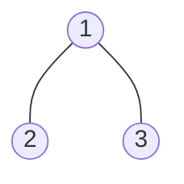
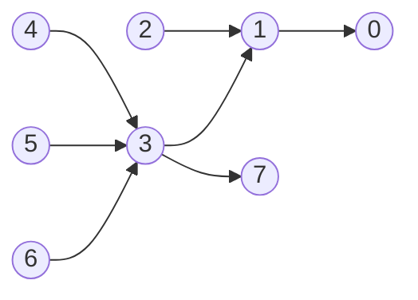

[toc]

# 12.1

## [1446-连续字符](https://leetcode-cn.com/problems/consecutive-characters/)


这题没什么说的，双指针

```java
class Solution {
    public int maxPower(String s) {
        int left = 0;
        int rst = 0;
        for (int right = 0; right < s.length(); right++) {
            while(left < right && s.charAt(left) != s.charAt(right)) left++;
            rst = Math.max(right - left + 1, rst);
        }
        return rst;
    }
}
```

## [621-任务调度器](https://leetcode-cn.com/problems/task-scheduler/)


这个题的[题解](https://leetcode-cn.com/problems/task-scheduler/solution/tong-zi-by-popopop/)真的惊到我了，说是使用桶的思想

首先说一下我知道的，因为都是大写字母，我知道肯定要统计词频

因为还有一个冷却时间，不能无限制的进行任务，所以我觉得应该从个数多的那个下手

所以要完成所有任务，至少也需要最多数量的那个任务的轮次

比如它给的示例1，因为A的数量最多，所以最少也需要三轮才能完成全部任务

然后就不会了

而他给出的方式是这样的：先考虑一种类型的任务


在它的这个示例中，假设A是最多的，且n为2，假如只考虑A的时候，完成时间参考上图（每行为一个桶），此时需要的时间为：$桶的个数\times(n + 1)$

现在向这些桶中添加其他种类的任务：


假设存在**一个B**和A的任务个数相同，还加了C，此时需要的时间为：$(桶的个数 - 1)\times(n + 1) + 最后一桶任务数$

> 关于最后一个桶中的任务数，因为前面统计过每种任务出现的频率，现在考虑最后一个桶中的任务数大小等于所有种类任务中出现频率最多的种类数，比如上面的例子中，最大频率为3，且A和B的频率均为3，所以最后一个桶中有两个任务

考虑继续添加：


此时需要的时间的计算方式还是不变的

但如果继续添加呢：


考虑上面这种情况，此时看上去多了一列，此时考虑扩充部分桶的大小

> 要注意的是，桶初始大小是根据n的大小给定的，即一定为n + 1

那现在坏了啊，要扩充桶大小，我怎么知道那几个桶扩多大呢

其实这里不需要担心，因为看图就能看出来了，对于上面这种情况，如果任务的种类继续增加，此后将不会存在处理器休眠的情况，因为其他种类的任务会占据休眠的时间，故这种情况下需要的时间等于任务的数量

当任务种类较少的时，任务不足够覆盖桶，此时需要的时间为：$(桶的个数 - 1)\times(n + 1) + 最后一桶任务数$，而如果任务种类较多的时候，任务完全可以覆盖桶，那么需要的时间将取决于任务的个数，所以我们的返回值应该是这两者中大的那个

```java
class Solution {
    public int leastInterval(char[] tasks, int n) {
        int[] freq = new int[26];
        for (int i = 0; i < tasks.length; i++) {
            freq[tasks[i] - 'A']++;
        }
        Arrays.sort(freq);
        int maxLen = 1;
        for (int i = 24; i >= 0 && freq[25] == freq[i]; i--, maxLen++);
        return Math.max((freq[25] - 1) * (n + 1) + maxLen, tasks.length);
    }
}
```

## [581-最短无序连续子数组](https://leetcode-cn.com/problems/shortest-unsorted-continuous-subarray/)


恶臭解法：排序，然后两个指针left和right，left从0开始向后，right从len - 1开始向前，知道排序后的数组和原数组nums中对饮位置不同的时候停止更新

此时left和right就是两个边界

```java
class Solution {
    public int findUnsortedSubarray(int[] nums) {
        int[] c = nums.clone();
        Arrays.sort(c);
        int left = 0;
        int right = nums.length - 1;
        while (left < nums.length && nums[left] == c[left]) left++;
        while (right >= 0 && nums[right] == c[right]) right--;
        return left < right ? right - left + 1 : 0;
    }
}
```

拿脚都能算出来时间复杂度为$o(nlogn)$空间复杂度为$o(n)$

香香解法：

首先这个数组可以分成三个部分：第一部分是低位已经排好序的部分，第二部分是我们要排序的部分，第三部分是高位已经排好序的部分

现在就是要确定第二部分的大小


看上面的图，红色的对应于第二部分的最大值，黄色的对应于第二部分的最小值

现在考虑维护一个最大值，从左向右遍历的时候，在第一部分这个最大值会不断更新，然而进入了第二部分，这个最大值不是实时更新的，比如说遇到了红线，现在最大值变为了红线，继续向后遍历发现后面的数变小了，这就是第二部分的标志（因为它不再升序了）

要明确一点就是，这个最大值肯定不再第二部分和第三部分的交界处，因为如果这样那第三部分的边界就又能向左探一个单位了

所以我们肯定会在第二部分的中间找到一个最大值，第二部分和第三部分的边界肯定小于这个最大值，那这就好说了，只要找到当前num小于最大值我们就更新边界right

左侧边界left是通过从右向左遍历然后维护最小值得到的

> 这里面的关键在于，第二部分的最大值肯定不在第二部分和第三部分的边界，而第二部分的最小值也肯定不在第二部分和第一部分的边界

```java
class Solution {
    public int findUnsortedSubarray(int[] nums) {
        int left = 0;
        int right = 0;
        int max = Integer.MIN_VALUE;
        for (int i = 0; i < nums.length; i++) {
            if (nums[i] < max) {
                right = i;
            }else {
                max = nums[i];
            }
        }
        int min = Integer.MAX_VALUE;
        for (int i = nums.length - 1; i >= 0; i--) {
            if (nums[i] > min) {
                left = i;
            }else {
                min = nums[i];
            }
        }
        return left < right ? right - left + 1 : 0;
    }
}
```

## [406-根据身高重建队列](https://leetcode-cn.com/problems/queue-reconstruction-by-height/)


这题最开始写的可复杂了

首先最矮的那个人的位置是确定的，根据其对应数组的index1可以确定位置

比如示例1中最矮的那个人是4，前面有4个比他高的，所以它排在第5位

排好最矮的那个后，排剩下的人中最矮的那个，它需要在剩下的位置中通过index1确定其对应的位置

依次排好所有人

```java
class Solution {
    public int[][] reconstructQueue(int[][] people) {
        Arrays.sort(people, (nums1, nums2) -> nums1[0] == nums2[0] ? nums1[1] - nums2[1] : nums2[0] - nums1[0]);
        int len = people.length;
        int[][] rst = new int[len][2];
        //将位置用-1标识，表示这个位置没做人，因为题目说了，最矮的可能高度为0
        for (int i = 0; i < len; i++) {
            rst[i][0] = -1;
            rst[i][1] = -1;
        }
        for (int i = 0; i < len; i++) {
            int offset = people[i][1];
            int count = 0;
            int j = 0;
            for (; j < len; j++) {
                if (rst[j][0] == -1 || rst[j][0] == people[i][0]) {
                    count++;
                }
                if (count == offset + 1) {
                    break;
                }
            }
            rst[j][0] = people[i][0];
            rst[j][1] = people[i][1];
        }
        return rst;
    }
}
```

这个方法不好

因为它不够精简

然后看了[题解](https://leetcode-cn.com/problems/queue-reconstruction-by-height/solution/406-gen-ju-shen-gao-zhong-jian-dui-lie-java-xian-p/)，他先排序，按照高度从大到小排序，先排最高的，因为最高的前面肯定没人，然后通过数组index1标识应该在链表中插入的位置，一个一个向链表中插入剩下的人

```java
class Solution {
    public int[][] reconstructQueue(int[][] people) {
        /*
        	注意这里排序的时候，在高度一样的时候，一定要先排靠前的
        	因为我们用的是链表，根据index插入的时候一定要连续
        */
        Arrays.sort(people, (nums1, nums2) -> nums2[0] == nums1[0] ? nums1[1] - nums2[1] : nums2[0] - nums1[0]);
        List<int[]> list = new LinkedList<>();
        for (int[] nums : people) {
            list.add(nums[1], nums);
        }
        return list.toArray(new int[people.length][2]);
    }
}
```

## [394-字符串解码](https://leetcode-cn.com/problems/decode-string/)


这个没什么好说的，一个栈解决，遇到右括号就出栈，直到遇到左括号，然后继续弹栈看看需要我重复多少次

重复的计算好后重新入栈

最后栈中剩下的就是我们需要的

为了方便统计，实际实现的时候使用的双端队列

```java
class Solution {
    public String decodeString(String s) {
        Deque<Character> deque = new LinkedList<>();
        int len = s.length();
        StringBuilder pat = new StringBuilder();
        for (int i = 0; i < len; i++) {
            char c = s.charAt(i);
            if (c == ']') {
                pat.delete(0, pat.length());
                while (deque.peekLast() != '[') {
                    pat.append(deque.pollLast());
                }
                deque.pollLast();
                int num = 0;
                int factor = 1;
                while (!deque.isEmpty() && isValid(deque.peekLast())) {
                    num += factor * (deque.pollLast() -'0');
                    factor *= 10;
                }
                String tmp = pat.toString();
                while (num > 1) {
                    pat.append(tmp);
                    num--;
                }
                for (int j = pat.length() - 1; j >= 0; j--) {
                    deque.offerLast(pat.charAt(j));
                }
            }else {
                deque.offerLast(s.charAt(i));
            }
        }
        pat.delete(0, pat.length());
        while (!deque.isEmpty()) {
            pat.append(deque.pollFirst());
        }
        return pat.toString();
    }

    private boolean isValid(char c) {
        return c <= '9' && c >= '0';
    }
}
```

## [53-最大子数组和](https://leetcode-cn.com/problems/maximum-subarray/)


`dp[i]`表示包括当前i位置元素的最大子数组的和

当前位置一共有两种选择，要么贴在前一个数后面，跟他们构成一个更大的子数组；要么自己当头部，新开一个数组

所以实际中取这两者的max

```java
class Solution {
    public int maxSubArray(int[] nums) {
        int len = nums.length;
        int[] dp = new int[len];
        dp[0] = nums[0];
        int rst = dp[0];
        for (int i = 1; i < len; i++) {
            dp[i] = Math.max(dp[i - 1] + nums[i], nums[i]);
            rst = Math.max(rst, dp[i]);
        }
        return rst;
    }
}
```

## 238-除自身以外数组的乘积


恶臭解法：统计两个数组left和right，`left[i]`表示i左侧所有元素的乘积，而`right[i]`表示i右侧所有元素的乘积

然后返回值左边取一个右边取一个

```java
class Solution {
    public int[] productExceptSelf(int[] nums) {
        int len = nums.length;
        int[] rst = new int[len];
        if (len == 0) {
            return rst;
        }
        int[] left = new int[len];
        left[0] = 1;
        for (int i = 1; i < len; i++) {
            left[i] = left[i - 1] * nums[i - 1];
        }
        int[] right = new int[len];
        right[len - 1] = 1;
        for (int i = len - 2; i >= 0; i--) {
            right[i] = right[i + 1] * nums[i + 1];
        }
        
        for (int i = 0; i < len; i++) {
            rst[i] = left[i] * right[i];
        }
        return rst;
    }
}
```

香香的解法：将其空间变为常熟级别，首先可以让`rst[i]`本身先表示为i左侧所有元素的乘积，这一点一次遍历就能得到

然后再从右向左遍历，期间维护一个变量right，初始值为1，然后每次乘上i右侧的数，具体的直接看代码吧

```java
class Solution {
    public int[] productExceptSelf(int[] nums) {
        int len = nums.length;
        int[] rst = new int[len];
        if (len == 0) {
            return rst;
        }
        rst[0] = 1;
        for (int i = 1; i < len; i++) {
            rst[i] = rst[i - 1] * nums[i - 1];
        }
        //i = len - 1的情况不许要乘right
        int right = 1;
        for (int i = len - 2; i >= 0; i--) {
            right *= nums[i + 1];
            rst[i] *= right;
        }
        return rst;
    }
}
```

## [697-数组的度](https://leetcode-cn.com/problems/degree-of-an-array/)


这个题我是两个map解决的，一个用来统计频率，一个用来更新最远的下标

需要遍历两次数组：

第一次遍历的时候找到最大的频率maxFreq，维护两个map

第二次遍历的时候看看那些键对应的freq和maxFreq相等，如果相等就根据当前的i和下标的map算一个区间大小，因为要找最小值，所以初始rst设置为正无穷，具体的看代码吧

```java
class Solution {
    public int findShortestSubArray(int[] nums) {
        Map<Integer, Integer> freq = new HashMap<>();
        Map<Integer, Integer> index = new HashMap<>();
        int maxFreq = 0;
        for (int i = 0; i < nums.length; i++) {
            freq.put(nums[i], freq.getOrDefault(nums[i], 0) + 1);
            maxFreq = Math.max(maxFreq, freq.get(nums[i]));
            index.put(nums[i], i);
        }
        int rst = Integer.MAX_VALUE;
        for (int i = 0; i < nums.length; i++) {
            if (freq.get(nums[i]) == maxFreq) {
                rst = Math.min(index.get(nums[i]) - i + 1, rst);
                /*
                	注意这里很关键
                	因为遍历到后面可能还会出相同的键
                	不过只有第一个和最后一个之间算出来的区间大小才是合法的
                */
                freq.put(nums[i], 0);
            }
        }
        return rst;
    }
}
```

## [978-最长湍流子数组](https://leetcode-cn.com/problems/longest-turbulent-subarray/)


十分生硬的dp，定义`dp[i]`为包含当前位置i在内的最长湍流子数组大小

首先如果数组长度为1，那么直接返回1就好

对于其余任意一个i要么能和前面的数一起组成湍流子数组，要么不行

从大小上：

* 满足条件：$nums[i] < nums[i - 1]$且$nums[i - 2] < nums[i - 1]$的时候，即前一个位置是极大值
* 或者满足条件：$nums[i] > nums[i - 1]$且$nums[i - 2] > nums[i - 1]$的时候，即前一个位置是极小值

这两个满足一个说明当前位置可以加在前一个湍流子数组的后面，此时`dp[i] = dp[i - 1] + 1`

而如果这两个条件都不满足，那需要比较前一个位置和当前位置的大小

* 如果二者相等，那么`dp[i] = 1`，说明此时不能和前面的位置i - 1一起构成一个湍流子数组
* 如果二者不相等，那么`dp[i] = 2`，说明此时最长的湍流子数组为包含前一个位置的子数组

```java
class Solution {
    public int maxTurbulenceSize(int[] nums) {
        int len = nums.length;
        if (len == 1) {
            return 1;
        }
        int[] dp = new int[len];
        dp[0] = 1;
        dp[1] = nums[1] == nums[0] ? 1 : 2;
        int rst = dp[1];
        for (int i = 2; i < len; i++) {
            if ((nums[i] > nums[i - 1] && nums[i - 2] > nums[i - 1]) || (nums[i] < nums[i - 1] && nums[i - 2] < nums[i - 1])) {
                dp[i] = dp[i - 1] + 1;
            }else if (nums[i] == nums[i - 1]){
                dp[i] = 1;
            }else {
                dp[i] = 2;
            }
            rst = Math.max(rst, dp[i]);
        }
        return rst;
    }
}
```

## 关于i++和++i

不多说直接反编译：

首先是i++：

```java
public class test1{
	public static void main(String args[]){
		int i = 3;
		int j = i++;
		System.out.println(j);
	}
}
```

反编译后得到：

```java
public static void main(java.lang.String[]);
    descriptor: ([Ljava/lang/String;)V
    flags: (0x0009) ACC_PUBLIC, ACC_STATIC
    Code:
      stack=2, locals=3, args_size=1
         0: iconst_3
         1: istore_1
         2: iload_1
         3: iinc          1, 1
         6: istore_2
         7: getstatic     #7                  // Field java/lang/System.out:Ljava/io/PrintStream;
        10: iload_2
        11: invokevirtual #13                 // Method java/io/PrintStream.println:(I)V
        14: return
```


第一步将常数3放入操作数栈就是0

第二步将常数数放入局部变量表1的位置


第三步从局部变量表中1的位置中取出并放入操作数中

然后注意`iinc`，它可以直接对局部变量表中的数进行自增的操作，是不会影响操作数栈中的数的

关于`iinc` ：


最后一步将操作数栈中的操作数放入局部变量表中2的位置

然后是++i：

```java
public class test2{
	public static void main(String[] args) {
		int i = 3;
		int j = ++i;
		System.out.println(j);
	}
}
```

反编译：

```java
public static void main(java.lang.String[]);
    descriptor: ([Ljava/lang/String;)V
    flags: (0x0009) ACC_PUBLIC, ACC_STATIC
    Code:
      stack=2, locals=3, args_size=1
         0: iconst_3
         1: istore_1
         2: iinc          1, 1
         5: iload_1
         6: istore_2
         7: getstatic     #7                  // Field java/lang/System.out:Ljava/io/PrintStream;
        10: iload_2
        11: invokevirtual #13                 // Method java/io/PrintStream.println:(I)V
        14: return
```


第一步将常数3放入操作数栈就是0

第二步将常数数放入局部变量表1的位置

> 这两步和上面一样

从第三步开始就开始不一样了，直接将局部变量表中数自增

然后从局部变量表中1的位置加在常量放入操作数栈中

最后将操作数栈中常数放入局部变量表2的位置

关于for循环中的这两种写法：

首先是i++：

```java
public class test1 {
    public static void main(String[] args) {
        for (int i = 0; i < 3; i++) {
            System.out.println(i);
        }
    }
}
```


然后是++i：

```java
public class test2 {
    public static void main(String[] args) {
        for (int i = 0; i < 3; ++i) {
            System.out.println(i);
        }
    }
}
```


可以看到二者并没有任何区别，都是直接对局部变量表中i的位置的数进行加的操作

```java
void ipp(){
    int i=3;
    i++;
}
void ppi(){
    int i=3;
    ++i;
}
```

其实对于上面这两种写法，因为不涉及到赋值，所以在编译后得到的字节码指令都长下面这样

```java
0: iconst_3
1: istore_1
2: iinc    1, 1
5: return
```


# 12.2

## [506-相对名次](https://leetcode-cn.com/problems/relative-ranks/)


排序是跑不了了

我是用了一个大顶堆，存放的是一个大小为2的数组，`arr[0]`表示分数，`arr[1]`表示下标

然后依次从堆中取出放入rst中就好了

```java
class Solution {
    private static final String[] medal = {"Gold Medal", "Silver Medal", "Bronze Medal"};
    public String[] findRelativeRanks(int[] score) {
        PriorityQueue<int[]> heap = new PriorityQueue<>((nums1, nums2) -> nums2[0] - nums1[0]);
        for (int i = 0; i < score.length; i++) {
            heap.offer(new int[]{score[i], i});
        }
        String[] rst = new String[score.length];
        for (int i = 0; i < 3 && !heap.isEmpty(); i++) {
            rst[heap.poll()[1]] = medal[i];
        }
        int base = 4;
        while (!heap.isEmpty()) {
            rst[heap.poll()[1]] = Integer.toString(base);
            base++;
        }
        return rst;
    }
}
```

## 数组中重复的数字

这是一类问题，就是说给一个数组，大小为n

现在考虑这个数组中翻入元素$1\to n$（或者$0\to n - 1$）

然后现在说这个数组中有重复的数字，即数组中至少有两个下标位置存储数据大小相同

然后要么求谁没出现，要么求谁重复出现了

我采用的策略是，先遍历一次数组，对于每一个位置处的num，如果是合法的，那么他就会对应一个下标

比如如果数组中应该存储的是$1\to n$，那么对于任意一个合法的数字其对应的下标为$num - 1$

然后检查对应下标位置处存储的是不是大小和当前num相同的数，就是看看$nums[num - 1]$和$num$是否相等

如果不相等就把当前位置和$num - 1$交换

> 上面的操作其实相当于一个hash映射

然后再遍历一次数组，如果对应下标index处存储的不是index + 1，说明缺失了index + 1，同时也说明了$nums[index]$这个数是重复的

### [448-找到所有数组中消失的数字](https://leetcode-cn.com/problems/find-all-numbers-disappeared-in-an-array/)


因为范围是从1到n，数组下标索引从0到n - 1，都是n个数

所以现在这么考虑，我们尽可能的让数组下标为index的地方存储的数据为index + 1

比如说现在我们的`nums[0] = 5`那我们就让当前位置和下标为4的位置交换一下

交换后得到新的num，然后再看看那个num对应下标存的数是不是num

核心条件：当`nums[nums[i] - 1] != nums[i]`的时候交换，即当前位置元素所对应的那个下标存储的不是当前大小的数的时候交换

这里面最关键的点在于，他考虑的不是当前的位置index应该放哪个数，而是当前位置的数num应该放在哪个位置

而至于那个没有出现，就看看哪里index对应的不是index + 1，就说明index + 1没有出现

反应到这个题上就是：

```java
class Solution {
    public List<Integer> findDisappearedNumbers(int[] nums) {
        List<Integer> rst = new ArrayList<>();
        for (int i = 0; i < nums.length; i++) {
            while (nums[nums[i] - 1] != nums[i]) swap(nums, i, nums[i] - 1);
        }
        for (int i = 0; i < nums.length; i++) {
            if (nums[i] != i + 1) {
                rst.add(i + 1);
            }
        }
        return rst;
    }

    private void swap(int[] nums, int index1, int index2) {
        int tmp = nums[index1];
        nums[index1] = nums[index2];
        nums[index2] = tmp;
    }
}
```

### [442-数组中重复的数据](https://leetcode-cn.com/problems/find-all-duplicates-in-an-array/)


这个题和上面的那个没什么区别，上面说的是那个没出现，这个说的那个重复了，而且他这个只会重复2次

```java
class Solution {
    public List<Integer> findDuplicates(int[] nums) {
        List<Integer> list = new ArrayList<>();
        for (int i = 0; i < nums.length; i++) {
            while (nums[nums[i] - 1] != nums[i]) swap(nums, nums[i] - 1, i);
        }
        for (int i = 0; i < nums.length; i++) {
            if (nums[i] != i + 1) {
                list.add(nums[i]);
            }
        }
        return list;
    }

    private void swap(int[] nums, int index1, int index2) {
        int tmp = nums[index1];
        nums[index1] = nums[index2];
        nums[index2] = tmp;
    }
}
```

### 287

这个题以前做过[11.27/287](21_11.md#287-寻找重复数)


现在换思路了，就按照上面的想法

数字从1到n，对应数组下标0到n -1

返回的时候直接返回下标位于n的数就行，这个位置的数一定是多出来的

```java
class Solution {
    public int findDuplicate(int[] nums) {
        for (int i = 0; i < nums.length; i++) {
            while (nums[nums[i] - 1] != nums[i]) swap(nums, i, nums[i] - 1);
        }
        return nums[nums.length - 1];
    }

    private void swap(int[] nums, int index1, int index2) {
        int tmp = nums[index1];
        nums[index1] = nums[index2];
        nums[index2] = tmp;
    }
}
```

### [41-缺失的第一个正数](https://leetcode-cn.com/problems/first-missing-positive/)


这个也可以使用上面的思路，保证遍历到的正数位于正确的位置上

数组大小为n，返回值的范围一定是：[1, n + 1]，且只有当数组中的数为从1到n的排列的时候返回的是n + 1

其余情况下返回值范围为：[1, n]恰好有n个数那么我们还是可以建立一个映射关系对应数组下标0到n - 1

按照上面的思路交换，不过这里要注意的是，要保证数组下标索引是有效的，只有当num处于合法范围的时候才用作映射下标

```java
class Solution {
    public int firstMissingPositive(int[] nums) {
        for (int i = 0; i < nums.length; i++) {
            //这里的条件多了两条，就是为了保证下标索引是有效的
            while (nums[i] > 0 && nums[i] < nums.length && nums[nums[i] - 1] != nums[i]) {
                int tmp = nums[nums[i] - 1];
                nums[nums[i] - 1] = nums[i];
                nums[i] = tmp;
            }
        }
        for (int i = 0; i < nums.length; i++) {
            if (nums[i] != i + 1) {
                return i + 1;
            }
        }
        return nums.length + 1;
    }
}
```

### [剑指03-数组中重复的数字](https://leetcode-cn.com/problems/shu-zu-zhong-zhong-fu-de-shu-zi-lcof/)


这个其实是最简单的情况了

```java
class Solution {
    public int findRepeatNumber(int[] nums) {
        for (int i = 0; i < nums.length; i++) {
            while (nums[nums[i]] != nums[i]) swap(nums, nums[i], i);
        }
        for (int i = 0; i < nums.length; i++) {
            if (nums[i] != i) {
                return nums[i];
            }
        }
        return 0;
    }

    private void swap(int[] nums, int index1, int index2) {
        int tmp = nums[index1];
        nums[index1] = nums[index2];
        nums[index2] = tmp;
    }
}
```

## [765-情侣牵手](https://leetcode-cn.com/problems/couples-holding-hands/)


这题的并查集解法没看懂

用的是贪心，两个两个找

如果对当前两个恰好是一对就不管了，看后面的，然后如果不是一对，随便找一个位置的交换，保证当前位置能凑成一对就行

所以map是避免不了的了，怎么说也得做一个从数值到下标的映射

```java
class Solution {
    private HashMap<Integer, Integer> map;
    public int minSwapsCouples(int[] row) {
        this.map = new HashMap<>();
        for (int i = 0; i < row.length; i++) {
            map.put(row[i], i);
        }
        int count = 0;
        for (int i = 0; i < row.length; i += 2) {
            //当前配对的标志是二者除2的商相同
            if (row[i] / 2 != row[i + 1] / 2) {
                //因为是随便找，所以我固定第一个位置不同，改变第二个位置
                if (row[i] % 2 == 0) {
                    swap(row, i + 1, map.get(row[i] + 1));
                }else {
                    swap(row, i + 1, map.get(row[i] - 1));
                }
                count++;
            }
        }
        return count;
    }

    private void swap(int[] nums, int index1, int index2) {
        int tmp = nums[index1];
        nums[index1] = nums[index2];
        nums[index2] = tmp;
        //这里很关键，交换了之后别忘了把map中对应位置也改了
        map.put(nums[index1], index1);
        map.put(nums[index2], index2);
    }
}
```

# 12.3

## [1005-K次取反后最大化数组和](https://leetcode-cn.com/problems/maximize-sum-of-array-after-k-negations/)

> 每日一题


这题这么想，如果有负数，那我肯定先变负数啊

如果没有负数了，我能选的是0或者正数，为了让总和最大，我肯定要变0（如果存在的话）或者正数里面最小的那个

如果有0的话那无论k取多少都没关系，因为我可以选择只对0进行操作；如果没有0的话，那只能变正数了，此时的k如果是偶数个，那也没有影响，因为变过去后还能变回来；而如果k是奇数个，那必须产生一个负数了

比如示例1：就没有负数，也没有0，所以怎么说也得把一个正数变成负的，为了变得最少，把最小的正数变了

其实到这里已经发现了，我们处理的永远是小的数

不管是负数，0，还是最小的正数，我们永远会变的就是小的数，所以是需要一定的顺序的，但又不需要完全排序

考虑使用小顶堆，这样每次获取到的都是所有数中最小的那个

```java
class Solution {
    public int largestSumAfterKNegations(int[] nums, int k) {
        PriorityQueue<Integer> heap = new PriorityQueue<>();
        for (int i = 0; i < nums.length; i++) heap.offer(nums[i]);
        while(k > 0) {
            int tmp = heap.poll();
            if (tmp < 0) {
                heap.offer(-tmp);
                k--;
            }else {
                if (tmp > 0) {
                    if (k % 2 == 0) {
                        heap.offer(tmp);
                    }else {
                        heap.offer(-tmp);
                    }
                }
                break;
            }
        }
        int rst = 0;
        while (!heap.isEmpty()) rst += heap.poll();
        return rst;
    }
}
```

现在考虑优化（这个真是看了[题解](https://leetcode-cn.com/problems/maximize-sum-of-array-after-k-negations/solution/gong-shui-san-xie-jian-dan-fen-qing-kuan-6qwu)才明白），题目说了数字范围从-100到100，采用一个计数数组大小为201，统计每个数出现的频率，从负数开始变，然后变0，最后实在不行再变正数（我下面把0和正数的情况写在一起了）

注意为了数组下标索引合法，这里使用了偏移，即实际下标为num + 100

```java
class Solution {
    public int largestSumAfterKNegations(int[] nums, int k) {
        int[] freq = new int[201];
        for (int i = 0; i < nums.length; i++) freq[nums[i] + 100]++;
        for (int i = -100; i < 0 && k > 0; i++) {
            while (freq[i + 100] > 0 && k > 0) {
                freq[i + 100]--;
                freq[-i + 100]++;
                k--;
            }
        }
        for (int i = 0; i <= 100 && k > 0; i++) {
            if (freq[i + 100] > 0 && k > 0) {
                if (k % 2 != 0) {
                    freq[-i + 100]++;
                    freq[i + 100]--;
                }
                break;
            }
        }
        int rst = 0;
        for (int i = -100; i <= 100; i++) rst += i * freq[i + 100];
        return rst;
    }
}
```

## [543-二叉树的直径](https://leetcode-cn.com/problems/diameter-of-binary-tree/)


递归求解：递归函数的作用，求出不重复路径上最多的节点数；节点数知道后，边的数目就是节点数减1

关于不重复：



像这种树，路径上补充不重复节点数为3，但返回的时候向上返回2，因为只能从左子树和右子树中选择一个最大的返回，不然其父节点到子节点的路径就不能保证不重复了；所以需要维护一个全局变量，更新rst，但不会直接返回rst

```java
class Solution {
    private int rst;
    public int diameterOfBinaryTree(TreeNode root) {
        this.rst = 0;
        height(root);
        return rst - 1;
    }

    private int height(TreeNode root) {
        if (root == null) {
            return 0;
        }
        int left = height(root.left);
        int right = height(root.right);
        rst = Math.max(rst, left + right + 1);
        return Math.max(left, right) + 1;
    }
}
```

## [617-合并二叉树](https://leetcode-cn.com/problems/merge-two-binary-trees/)


递归的典中典，一个前序遍历解决

主要在于考虑好当前节点，再考虑子节点的情况

```java
class Solution {
    public TreeNode mergeTrees(TreeNode root1, TreeNode root2) {
        if (root1 == null) {
            return root2;
        }else if (root2 == null) {
            return root1;
        }
        TreeNode root = new TreeNode(root1.val + root2.val);
        root.left = mergeTrees(root1.left, root2.left);
        root.right = mergeTrees(root1.right, root2.right);
        return root;
    }
}
```

## [461-汉明距离](https://leetcode-cn.com/problems/hamming-distance/)


这题我会，先异或，然后统计1的个数

这里使用lowbit统计纯粹就是看起来厉害一点，其实移位也是一样的

```java
class Solution {
    public int hammingDistance(int x, int y) {
        x = x ^ y;
        int rst = 0;
        while (x > 0) {
            x -= lowbit(x);
            rst++;
        }
        return rst;
    }

    private int lowbit(int x) {
        return x &(-x);
    }
}
```

## [477-汉明距离总和](https://leetcode-cn.com/problems/total-hamming-distance/)


看到这个题都给我激动坏了，我心思，上面刚写了一个汉明距离，这里就统计总的距离

直接调上面的函数就完事了

```java
class Solution {
    public int totalHammingDistance(int[] nums) {
        int rst = 0;
        for (int i = 0; i < nums.length; i++) {
            for (int j = i + 1; j < nums.length; j++) {
                rst += hammingDistance(nums[i], nums[j]);
            }
        }
        return rst;
    }
    public int hammingDistance(int x, int y) {
        x = x ^ y;
        int rst = 0;
        while (x > 0) {
            x -= lowbit(x);
            rst++;
        }
        return rst;
    }

    private int lowbit(int x) {
        return x &(-x);
    }
}
```

然后一个$o(n^2)$就超时了

其实这个题可以$o(n)$解决，[题解](https://leetcode-cn.com/problems/total-hamming-distance/solution/gong-shui-san-xie-ying-yong-cheng-fa-yua-g21t/)中说，其实统计的是所有数中，每一位为1的和0的个数

比如对于第x位，假设有n个数，其中$n_1$个在这位是1，有$n_2$个这位是0，那么第x位对于整体汉明距离的贡献就是：$n_1\times n_2$，而由于总数是一定的，其实统计$n_1$就可以了，贡献为：$n_1\times(n - n_1)$

对于这道题，因为都是正数，使用符号数表示，只用统计前面31位就行了

所以$rst = \sum_{i = 0}^{31} cal(i)$，其中$cal(i)$的计算方式就按照上面的来

```java
class Solution {
    public int totalHammingDistance(int[] nums) {
        int len = nums.length;
        int rst = 0;
        int freq;
        for (int i = 0; i < 31; i++) {
            freq = 0;
            for (int num : nums) {
                if (((num >> i) & 1) == 1) {
                    freq++;
                }
            }
            rst += freq * (len - freq);
        }
        return rst;
    }
}
```

## LCS问题

这里说的是最长公共子序列（longest common sequence），这种题就是dp了，状态转移方程都差不多

$\text{dp[i][j]} = \begin{cases}\text{dp[i - 1][j - 1]...} & \text{条件1}\\\text{极值(dp[i][j - 1], dp[i - 1][j])...}&\text{条件2}\end{cases}$

注意这里的...他们可能是加点什么或者减点什么，反正不一定直接能变过去

[LCS裸题](21_11.md#1143-最长公共子序列)


定义`dp[i][j]`为字符串text1前i项字符和字符串text2前j项字符的最长公共子序列的长度

然后考虑text1中第i项和text2中第j项，如果$text1[i] == text2[j]$那么此时二者都可以存在于公共子序列中，那么此时有：$dp[i][j] = dp[i - 1][j - 1] + 1$

而如果二者不相等，那么二者中至少有一个不能存在于公共子序列中：

如果我们令：$dp[i][j] = dp[i - 1][j]$，即我们认为text1中前i项和text2前j项中最长公共子序列的长度等于text1中前i - 1项和text2中前j项中最长公共子序列的长度

那么这就变相的等价于我们认为text1中第i项不在公共子序列中，同理也可能认为text2中第j项不在公共子序列中

因为我们要找的是最长长度，所以现在取二者中最大值：`dp[i][j] = max(dp[i - 1][j], dp[i][j - 1])`

然后考虑初始化dp数组，如果定义dp数组长度为`(len1 + 1)*(len2 + 1)`，显然`dp[0][i],dp[i][0]`都是0，毕竟前0项无论和谁比较公共长度都是0

```java
class Solution {
    public int longestCommonSubsequence(String text1, String text2) {
        int len1 = text1.length();
        int len2 = text2.length();
        int[][] dp = new int[len1 + 1][len2 + 1];
        for (int i = 1; i <= len1; i++) {
            char c1 = text1.charAt(i - 1);
            for (int j = 1; j <= len2; j++) {
                char c2 = text2.charAt(j - 1);
                if (c1 == c2) {
                    dp[i][j] = dp[i - 1][j - 1] + 1;
                }else {
                    dp[i][j] = Math.max(dp[i - 1][j], dp[i][j - 1]);
                }
            }
        }
        return dp[len1][len2];
    }
}
```

### [583-两个字符串的删除操作](https://leetcode-cn.com/problems/delete-operation-for-two-strings/)


这个题说的是求把word1变为word2需要删除的最少操作，其实也是找word1和word2最长公共的部分，因为删除的结果剩下的就是最长公共子序列

和上面的题没什么不一样，如果不想改变dp的定义，只需要在返回的时候，返回值变为`len1 + len2 - 2 * dp[len1][len2]`就好

我改变了dp的定义：`dp[i][j] `为使得word1前i项和word2前j项相同，所需要删除的最小步数

当`word1[i] == word2[j]`的时候，此时不用删，所以有：`dp[i][j] = dp[i - 1][j - 1]`

如果二者不相等的时候，至少需要删一个，为了保证整体删的最少，`dp[i][j] = min(dp[i - 1][j], dp[i][j - 1]) + 1`

注意初始化的时候，`dp[i][0],dp[0][i]`都是i

```java
class Solution {
    public int minDistance(String word1, String word2) {
        int len1 = word1.length();
        int len2 = word2.length();
        int[][] dp = new int[len1 + 1][len2 + 1];
        for (int i = 1; i <= len2; i++) {
            dp[0][i] = i;
        }
        for (int i = 1; i <= len1; i++) {
            dp[i][0] = i;
        }
        for (int i = 1; i <= len1; i++) {
            char c1 = word1.charAt(i - 1);
            for (int j = 1; j <= len2; j++) {
                char c2 = word2.charAt(j - 1);
                if (c1 == c2) {
                    dp[i][j] = dp[i - 1][j - 1];
                }else {
                    dp[i][j] = Math.min(dp[i - 1][j], dp[i][j - 1]) + 1;
                }
            }
        }
        return dp[len1][len2];
    }
}
```

### [712-两字符串的最小ASCII删除和](https://leetcode-cn.com/problems/minimum-ascii-delete-sum-for-two-strings/)


这个题和上面最大的区别在于，现在也是要删，不过不是要求删的次数最少，而是所有被删除元素的ASCII值的和最小

类似的定义：`dp[i][j]`为s1前i项和s2前j项相等的时候需要删除ASCII值的和的最小值

s1[i]和s2[j]相等的时候，就不说了，和上面一样

关键在于不相等的时候有：`dp[i][j] = min(dp[i - 1][j] + s1[i], dp[i][j - 1] + s2[j])`

```java
class Solution {
    public int minimumDeleteSum(String s1, String s2) {
        int len1 = s1.length();
        int len2 = s2.length();
        int[][] dp = new int[len1 + 1][len2 + 1];
        for(int i = 1; i <= len2; i++) {
            dp[0][i] = dp[0][i - 1] + s2.charAt(i - 1);
        }
        for (int i = 1; i <= len1; i++) {
            dp[i][0] = dp[i - 1][0] + s1.charAt(i - 1);
        }

        for (int i = 1; i <= len1; i++) {
            char c1 = s1.charAt(i - 1);
            for (int j = 1; j <= len2; j++) {
                char c2 = s2.charAt(j - 1);
                if (c1 == c2) {
                    dp[i][j] = dp[i - 1][j - 1];
                }else {
                    dp[i][j] = Math.min(dp[i - 1][j] + c1, dp[i][j - 1] + c2);
                }
            }
        }
        
        return dp[len1][len2];
    } 
}
```

### [1035-不相交的线](https://leetcode-cn.com/problems/uncrossed-lines/)


这题如果不是恰好遇到了，根本不会想到这个也是求最长公共子序列的长度

这里面很关键一个点在于**字符串的子序列中字符先后的顺序是不能改变的**，这一点保证了不会出现相交的情况：

比如说上面的示例1，如果能构成子序列，最长也就是14或者12，如果我们将两个2连在一起，就是相交，在nums1中2出现在4后面，nums2中2出现在4前面，所以如果二者已经以14为公共子序列了，那么2绝对不会插进来

```java
class Solution {
    public int maxUncrossedLines(int[] nums1, int[] nums2) {
        int len1 = nums1.length;
        int len2 = nums2.length;
        int[][] dp = new int[len1 + 1][len2 + 1];
        for (int i = 1; i <= len1; i++) {
            for (int j = 1; j <= len2; j++) {
                if (nums1[i - 1] == nums2[j - 1]) {
                    dp[i][j] = dp[i - 1][j - 1] + 1;
                }else {
                    dp[i][j] = Math.max(dp[i - 1][j], dp[i][j - 1]);
                }
            }
        }
        return dp[len1][len2];
    }
}
```

## [72-编辑距离](https://leetcode-cn.com/problems/edit-distance/)


其实做完上面的LCS后，对于这种字符串凑成相等的都留下后遗症了

直觉上感觉就能使用dp做，状态定义：`dp[i][j]`表示word1的前i位和word2的前j位的编辑距离

先考虑最简单的情况：如果当`word1[i] == word2[j]`的时候，显然有：`dp[i][j] = dp[i - 1][j - 1]`

然后再考虑不相等的情况：这里先提前说明一下，为了把word1和word2变得相等，需要改变word1或者word2，其实到底改变谁并不关键，不管是把word1变为word2，还是把word2变为word1，或者word1变一部分，word2变一部分，其实都一样，所以下面讨论的时候，认为只把word1变为word2

现在因为对应i和j位置上不相等，肯定是要改变的，我们能进行的操作也就是删除，增加，改写

如果这里我们选择改写那么有：`dp[i][j] = dp[i - 1][j - 1] + 1`，这是因为对于当前位置i和j，我们改变了i这个位置的字符，所以操作数加一，而没有改变j；考虑前i位和前j位的一共进行的操作数的时候，其余的操作都是在word1的i - 1位之前和word2的j - 1位之前产生的，对应于`dp[i - 1][j - 1]`

如果这里我们选择删除那么有：`dp[i][j] = dp[i - 1][j] + 1`，这是因为如果我们删除了word1在位置i处的字符，会使得操作数加一，此外删除word1[i]后，对于word1前i位和word2前j位编辑距离就仅取决于word1前i - 1位和word2的前j位了

如果这里我们选择增添那么有：`dp[i][j] = dp[i][j - 1] + 1`，这是因为如果我们在word1的位置i处添加了一个字符，会使操作数加一，此外添加一个字符后word2中位置j会和新添加的字符对齐，而word1中位置i会和word2中位置j - 1对齐

如果不相等的时候，我们有三种选择，为了让整体编辑距离最小，我们选择编辑距离最小的那个

而至于初始化，我们定义dp数组大小为`(len1 + 1) * (len2 + 1)`

所以所有的`dp[i][0],dp[0][i]`都是i，因为考虑一个字符串中没有字符的情况的时候，另一个字符串想要和它匹配只能删除

```java
class Solution {
    public int minDistance(String word1, String word2) {
        int len1 = word1.length();
        int len2 = word2.length();
        if (len1 == 0) {
            return len2;
        }
        if (len2 == 0) {
            return len1;
        }

        int[][] dp = new int[len1 + 1][len2 + 1];
        for (int i = 1; i <= len2; i++) {
            dp[0][i] = i;
        }
        for (int i = 1; i <= len1; i++) {
            dp[i][0] = i;
        }

        for (int i = 1; i <= len1; i++) {
            char c1 = word1.charAt(i - 1);
            for (int j = 1; j <= len2; j++) {
                char c2 = word2.charAt(j - 1);
                if (c1 == c2) {
                    dp[i][j] = dp[i - 1][j - 1];
                }else {
                    dp[i][j] = Math.min(dp[i - 1][j - 1], Math.min(dp[i - 1][j], dp[i][j - 1])) + 1;
                }
            }
        }
        return dp[len1][len2];
    }
}
```

好题

## [1750-删除字符串两端相同字符后的最短长度](https://leetcode-cn.com/problems/minimum-length-of-string-after-deleting-similar-ends/)


这个中等题就是来搞笑的

```java
class Solution {
    public int minimumLength(String s) {
        int left = 0;
        int right = s.length() - 1;
        while (left < right && s.charAt(left) == s.charAt(right)) {
            while (left < right && s.charAt(left + 1) == s.charAt(left)) left++;
            while (left < right && s.charAt(right - 1) == s.charAt(right)) right--;
            left++;
            right--;
        }
        return right >= left ? right - left + 1 : 0;
    }
}
```

## 多源BFS

多源BFS是求从多个源点到达一个或多个汇点的最短路径，并且通过建立「**虚拟**源点」的方式，我们可以「多源 BFS」转换回「单源 BFS」问题。

> 看不懂

举个例子吧：

### [1162-地图分析](https://leetcode-cn.com/problems/as-far-from-land-as-possible/)


这个题如果正常做肯定就枚举每个点进行BFS，然后遇到陆地就停止BFS，看看陆地和它有多远

这种其实不太行，首先每个点枚举一次，时间复杂度就已经是$o(n^2)$了，如果再对每个点进行一次BFS考虑最坏的情况都是海洋的情况，时间复杂度就变成了$o(n^4)$了

n是100，数据量是$10^8$，反正已经在超时的边缘了

现在改一下，题目说找海洋到陆地，现在我们找陆地到海洋：从每个「陆地」区域出发，多个「陆地」区域每次同时向往扩散一圈，每个「海洋」区域被首次覆盖时所对应的圈数，就是「海洋」区域距离最近的「陆地」区域的距离。


看起来真的变成多源BFS了，前面还说了，可以通过虚拟节点将多源BFS变为单源BFS

那我们就设置一个虚拟节点，认为这个节点的邻节点是所有的陆地


实际操作的时候，不需要管这个虚拟节点，直接将所有的陆地加入队列就好了

```java
class Solution {
    private static final int[][] directions = new int[][]{{1, 0}, {0, 1}, {-1, 0}, {0, -1}};
    private int n;
    public int maxDistance(int[][] grid) {
        Deque<Integer> deque = new LinkedList<>();
        this.n = grid.length;
        int step = -1;
        boolean[][] marked = new boolean[n][n];
        for (int i = 0; i < n; i++) {
            for (int j = 0; j < n; j++) {
                if (grid[i][j] == 1) {
                    marked[i][j] = true;
                    deque.offer(getIndex(i, j));
                }
            }
        }
        while (!deque.isEmpty()) {
            int size = deque.size();
            for (int i = 0; i < size; i++) {
                int tmp = deque.poll();
                int x = tmp / n;
                int y = tmp % n;
                for (int[] direction : directions) {
                    int mx = direction[0] + x;
                    int my = direction[1] + y;
                    if (mx >= 0 && mx < n && my >= 0 && my < n && !marked[mx][my]) {
                        marked[mx][my] = true;
                        deque.offer(getIndex(mx, my));
                    }
                }
            }
            if (!deque.isEmpty()) {
                step = step == -1 ? 1 : step + 1;
            }
        }
        return step;
    }

    private int getIndex(int x, int y) {
        return x * n + y; 
    }
}
```

这个为什么能简化时间复杂度呢，我觉得如果直接不按照多源BFS的方式来，就是枚举每一个满足条件的节点，单独进行BFS，而如果按照多源BFS的方式，就变成了对所有满足条件的节点一起，进行BFS

## 双向BFS

### 2059-转化数字最小运算数


这个题一看就是BFS，特别的可以使用双端BFS加速搜索

注意使用一个map避免搜索重复的位置

```java
class Solution {
    public int minimumOperations(int[] nums, int start, int goal) {
        Map<Integer, Integer> foreMap = new HashMap<>();
        Map<Integer, Integer> backMap = new HashMap<>();
        foreMap.put(start, 0);
        backMap.put(goal, 0);
        Deque<Integer> foreDeque = new LinkedList<>();
        foreDeque.offer(start);
        Deque<Integer> backDeque = new LinkedList<>();
        backDeque.offer(goal);
        int foreStep = 0;
        int backStep = 0;
        while (!foreDeque.isEmpty() && !backDeque.isEmpty()) {
            int foreSize = foreDeque.size();
            int backSize = backDeque.size();
            foreStep++;
            backStep++;
            for (int i = 0; i < foreSize; i++) {
                int tmp = foreDeque.poll();
                for (int num : nums) {
                    int op = tmp + num;
                    if (backMap.containsKey(op)) return backMap.get(op) + foreStep;
                    if (!foreMap.containsKey(op) && op <= 1000 && op >= 0) {
                        foreMap.put(op, foreStep);
                        foreDeque.offer(op);
                    }
                    op = tmp - num;
                    if (backMap.containsKey(op)) return backMap.get(op) + foreStep;
                    if (!foreMap.containsKey(op) && op <= 1000 && op >= 0) {
                        foreMap.put(op, foreStep);
                        foreDeque.offer(op);
                    }
                    op = tmp ^ num;
                    if (backMap.containsKey(op)) return backMap.get(op) + foreStep;
                    if (!foreMap.containsKey(op) && op <= 1000 && op >= 0) {
                        foreMap.put(op, foreStep);
                        foreDeque.offer(op);
                    }
                }
            }

            for (int i = 0; i < backSize; i++) {
                int tmp = backDeque.poll();
                for (int num : nums) {
                    int op = num + tmp;
                    if (foreMap.containsKey(op)) return foreMap.get(op) + backStep;
                    if (!backMap.containsKey(op) && op <= 1000 && op >= 0) {
                        backMap.put(op, backStep);
                        backDeque.offer(op);
                    }
                    op = tmp - num;
                    if (foreMap.containsKey(op)) return foreMap.get(op) + backStep;
                    if (!backMap.containsKey(op) && op <= 1000 && op >= 0) {
                        backMap.put(op, backStep);
                        backDeque.offer(op);
                    }
                    op = tmp ^ num;
                    if (foreMap.containsKey(op)) return foreMap.get(op) + backStep;
                    if (!backMap.containsKey(op) && op <= 1000 && op >= 0) {
                        backMap.put(op, backStep);
                        backDeque.offer(op);
                    }
                }
            }
        }
        return -1;
    }
}
```

关于双端BFS以前也写过一些：[11.14/752](21_11.md#752-打开转盘锁)、[11.14/773](21_11.md#773-滑动谜题)、[11.14/127](21_11.md#127-单词接龙)、[11.15/433](21_11.md#433-最小基因变化)

# 12.4

## 383-赎金信

> 每日一题


简单的统计词频就好了

```java
class Solution {
    public boolean canConstruct(String ransomNote, String magazine) {
        int len1 = magazine.length();
        int len2 = ransomNote.length();
        if (len2 > len1) {
            return false;
        }
        int[] freq = new int[26];
        for (int i = 0; i < len1; i++) {
            freq[magazine.charAt(i) - 'a']++;
        }
        for (int i = 0; i < len2; i++) {
            freq[ransomNote.charAt(i) - 'a']--;
        }
        for (int num : freq) {
            if (num < 0) {
                return false;
            }
        }
        return true;
    }
}
```

## 回文

首先要注意的是子序列和子串的区别

子序列是说从原序列（数组）中按照原来的顺序，抽取出的元素构成的新的字符串（或者是数组）

而子串（子数组）说的是从原序列（数组）中，抽取出连续的一部分，这两者很不一样

以字符串为例子：

如果：有：`abcdef`为原字符串，那么`abe`可以称为子序列，但不能称为子串；其实如果这么看，子串更像是子序列的一个子集

先来一道和子序列完全无关的回文

### [409-最长回文串](https://leetcode-cn.com/problems/longest-palindrome/)


完全不需要考虑子序列或者子串，计算一下词频就好了

```java
class Solution {
    public int longestPalindrome(String s) {
        int[] freq = new int[58];
        for (int i = 0; i < s.length(); i++) {
            freq[s.charAt(i) - 'A']++;
        }
        int rst = 0;
        boolean max = false;
        for (int num : freq) {
            if ((num & 1) == 0) {
                rst += num;
            }else {
                max = true;
                rst += num - 1;
            }
        }
        return rst + (max ? 1 : 0);
    }
}
```

唯一需要注意的地方在于要考虑回文串中字符都是成对出现的，中心的字符可以是例外，比如`bab`其中a只出现了一次，但是由它构成的字符串还是回文串

### 回文子串

回文的，连续的子串

解决回文子串的问题可以选择：

* 使用类似 LCS 问题的 dp 进行解决，定义`dp[i][j]`为从s[i]到s[j]是否构成一个回文子串，时间复杂度为 $O(n^2)$，空间复杂度为 $O(n^2)$

* 使用中心扩展算法解决：其实就是枚举回文的中点，让

  * 每个位置 idx 作为回文中点
  * 每两个位置中的空格作为回文中点

  然后考虑最长的回文子串的长度

* 使用优化后的中心扩展算法 Manacher，对于中心扩展算法而言，我们考虑后一个位置的最长回文子串的时候可以利用前一个位置的信息加速查找，具体的可以参考 [Manacher算法](./一些算法.md#Manacher)

#### [5-最长回文子串](https://leetcode-cn.com/problems/longest-palindromic-substring/)


这道题要找的是最长的回文子串，那么我们可以使用DP维护一个全局变量rst，表示待返回的最长回文子串，根据我们每次获得的dp更新rst

考虑`dp[i][j]`的定义为：从s[i]到s[j]是否构成一个回文子串

状态转移方程：显然如果`s[i] == s[j]`，那么有：`dp[i][j] = dp[i + 1][j - 1]`

如果两个端点字符不相等，显然`dp[i][j] = false`

编码的时候需要注意了，对于所有合法的i，显然有：`dp[i][i] = true`，表示单个字符可以构成一个回文子串

还有就是当`i = j - 1`的时候：`dp[i][j]`仅和两端字符是否相等有关

最后注意计算的时候，让右侧端点j遍历整个数组，而左侧端点i从j - 1的地方开始不断向左侧移动

```java
class Solution {
    public String longestPalindrome(String s) {
        int len = s.length();
        boolean[][] dp = new boolean[len][len];
        for (int j = 0; j < len; j++) {
            dp[j][j] = true;
        }
        String rst = new String(s.substring(0, 1));
        for (int j = 0; j < len; j++) {
            for (int i = 0; i < j; i++) {
                if (i == j - 1) {
                    dp[i][j] = s.charAt(i) == s.charAt(j);
                }else {
                    dp[i][j] = s.charAt(i) == s.charAt(j) && dp[i + 1][j - 1];
                }
                if (dp[i][j] && j - i + 1 > rst.length()) {
                    rst = s.substring(i, j + 1);
                }
            }
        }
        return rst;
    }
}
```

时间复杂度为$o(n^2)$，空间复杂度$o(n^2)$

其实从上面的状态转移方程就能看出来了，感觉有点大材小用，如果两端不相等，直接写一个false进去，没有使用之前的状态，缺失有点浪费

下面有一种更好的方式：就是枚举端点

遍历数组的时候考虑让数组中每一个位置作为回文子串的中心，然后看看以它为中心的回文子串最大可以多大

不过要注意上述得到的可能不是真正最大的回文子串，因为以一个字符为中心获得的回文子串长度一定是奇数，现在遍历数组的时候考虑：

* 以当前位置i为中心，找到最长的回文子串
* 以当前位置i和后一个位置i + 1两个之间的点为中心，找到最长的回文子串（这样找出的回文子串长度为偶数）

```java
class Solution {
    public String longestPalindrome(String s) {
        int len = s.length();
        String rst = s.substring(0, 1);
        for (int i = 0; i < len; i++) {
            String tmp = palindrome(s, i, i);
            if (tmp.length() > rst.length()) {
                rst = tmp;
            }
            tmp = palindrome(s, i, i + 1);
            if (tmp.length() > rst.length()) {
                rst = tmp;
            }
        }
        return rst;
    }
	//这个函数很关键，它将两种回文子串的查找统一了
    private String palindrome(String s, int left, int right) {
        while (left >= 0 && right < s.length() && s.charAt(left) == s.charAt(right)) {
            left--;
            right++;
        }
        //注意这里离开循环的时候，左右边界都是非法值，所以切分子串的时候，从left+1开始到right结束
        return s.substring(left + 1, right);
    }
}
```

使用 Manacher 算法的求解可以参考 [Manacher算法](./基础不牢地动山摇.md#Manacher)

#### [647-回文子串](https://leetcode-cn.com/problems/palindromic-substrings/)


现在要统计数目：还是可以使用上面的方法，遍历每一个点，以其作为回文子串的中心，我们会找到一个最大的长度，然后以当前位置为中心的回文子串的数目就很好计算了

```java
class Solution {
    public int countSubstrings(String s) {
        int rst = 0;
        for (int i = 0; i < s.length(); i++) {
            rst += (getPalindrome(s, i, i) >> 1) + 1;
            rst += (getPalindrome(s, i, i + 1) >> 1);
        }
        return rst;
    }

    private int getPalindrome(String s, int left, int right) {
        while (left >= 0 && right < s.length() && s.charAt(left) == s.charAt(right)) {
            left--;
            right++;
        }
        return right - left - 1;
    }
}
```

和上面最大的区别在于现在返回的是区间的最大长度，要注意如果回文子串的长度为奇数（以某一个位置i为中心），那么个数为长度除2加一，比如`bab`就相当于具有2个回文子串：`bab`和`a`；而如果回文子串长度为偶数（以某两个连续位置中间的点为中心），那么个数为长度除2，比如`baab`，就具有2个回文子串

Manacher 的写法如下：

```java
class Solution {
    public int countSubstrings(String s) {
        int len = 1 + (s.length() << 1);
        char[] chars = new char[len];
        int[] dp = new int[len];
        int rst = 0;
        chars[0] = '#';
        int idx = 1;
        for (int i = 0; i < s.length(); i++) {
            chars[idx++] = s.charAt(i);
            chars[idx++] = '#';
        }
        int j = -1;
        int right = -1;
        for (int i = 0; i < len; i++) {
            int curLen = 0;
            if (right > i) {
                curLen = Math.min(dp[2 * j - i], right - i);
                curLen = expand(chars, i - curLen, i + curLen);
            } else {
                curLen = expand(chars, i, i);
            }
            dp[i] = curLen;
            if (chars[i] == '#') {
                rst += (curLen + 1) >> 1;
            } else {
                rst += curLen >> 1;
                rst++;
            }
        }
        return rst;
    }

    private int expand(char[] chars, int left, int right) {
        while (left >= 0 && right < chars.length && chars[left] == chars[right]) {
            left--;
            right++;
        }
        return (right - left - 2) >> 1;
    }
}
```

确实快了一点点

当你以为这就完了，那就想的太简单了

#### [336-回文对](https://leetcode-cn.com/problems/palindrome-pairs/)


判断两个字符串拼接在一起后还是不是回文的了

暴力解法：遍历所有的拼接结果，判断拼接的是不是一个回文的，时间复杂度为$o(n^2\times m)$，根本过不了

然后参考[官解](https://leetcode-cn.com/problems/palindrome-pairs/solution/hui-wen-dui-by-leetcode-solution/)，现在考虑如果两个字符串进行拼接，`s1,s2`，长度分别为`len1, len2`，假如二者拼接后得到了一个回文串

二者长度关系有三种：

* `len1 == len2`，此时`s1,s2`的关系是彼此是对方的回文串
* `len1 < len2`，此时$s_2$更长，考虑$s_2$由两部分组成：$s_2 = s_2' + \hat{s}_1$，其中$s_2'$表示$s_2$本身回文的部分，而$\hat{s}_1$表示和$s_1$中回文的部分
* `len1 > len2`，此时$s_1$更长，考虑$s_1$由两部分组成：$s_1 = s_1' + \hat{s}_2$，其中$s_1'$表示$s_1$本身回文的部分，而$\hat{s}_2$表示和$s_2$中回文的部分

所以对于任意的字符可以这样操作，认为当前字符串是$s_1,s_2$中长的那个，然后：

* 获得前缀，然后看看前缀是不是回文的，如果是回文的就看看数组中是否存在和后面一部分回文的

* 获得后缀，然后看看后缀是不是回文的，如果是回文的就看看数组中是否存在和前面一部分回文的

这里面前后缀最短为0，最长为len，即字符串本身的长度(存疑)

具体的可以使用map记录下标和字符串的关系

> 这里也可以使用字典树记录字符串和下标的关系，此时字典树的结构如：
>
> ```java
> class Trie {
> 	Trie[] children;
> 	int idx;
> 	public Trie() {
> 		this.children = new Trie[26];
> 		this.idx = -1;
> 	}
> }
> ```

特别的对于示例1，现在考虑字符串`abcd`

如果前缀长度为0，找到了`dcba`，所以得到一个回文串：`dcbaabcd`

如果前缀长度为len，我们需要找到空字符，如果有的话得到的将是：`"" + s`

如果后缀长度为0，找到了`dcba`，所得得到一个回文串：`abcddcba`

如果后缀长度为len，我们需要找到空字符，如果有的话得到的将是：`s+""`

所以其实前缀长度为0和后缀长度为0的情况可以写在一起，一次得到两个回文串；同理前缀长度为len和后缀长度为len可以写在一起，一次得到两个回文串

除了上面的注意事项，还需要注意，我们的答案不能重复，比如上面`abcd`找完，加入rst后，再找到`dcba`的时候不能再加一遍了，所以人为的添加一个规矩，就是只有当找到的字符串下标大于当前位置下标的时候再添加

> 前面说了只有当下标更大的时候再添加，现在有一个特例就是空字符，它在什么时候都可以添加，除了自身，如果我们遍历的时候发现当前位置长度为0就直接选择下一个元素

```java
class Solution {
    public List<List<Integer>> palindromePairs(String[] words) {
        List<List<Integer>> rst = new ArrayList<>();
        HashMap<String, Integer> map = new HashMap<>();
        
        for (int i = 0; i < words.length; i++) {
            map.put(words[i], i);
        }
        for (int i = 0; i < words.length; i++) {
            int sLen = words[i].length();
            if (sLen == 0) {
                continue;
            }
            int index = -1;
            if ((index = map.getOrDefault(reverse(words[i], 0, sLen - 1), -1)) > i) {
                rst.add(Arrays.asList(index, i));
                rst.add(Arrays.asList(i, index));
            }
            if ((isPalindrome(words[i], 0, sLen - 1)) && ((index = map.getOrDefault("", -1)) > -1)) {
                rst.add(Arrays.asList(index, i));
                rst.add(Arrays.asList(i, index));
            }
            //前缀不断变长，最长也只能是len - 1，因为上面已经处理过长度为len的情况了
            for (int j = 0; j < sLen - 1; j++) {
              if (isPalindrome(words[i], 0, j) && (index = map.getOrDefault(reverse(words[i], j + 1, sLen - 1), -1)) > -1) {
                  rst.add(Arrays.asList(index, i));
              }
            }
            //后缀不断变成，最长也只能是len - 1,理由同上
            for (int j = sLen - 1; j > 0; j--) {
                if (isPalindrome(words[i], j, sLen - 1) 
                    && (index = map.getOrDefault(reverse(words[i], 0, j - 1), -1)) > -1) {
                    rst.add(Arrays.asList(i, index));
                }
            }
        }
        return rst;
    }
	//对一个字符串特定位置翻转，返回翻转后对应位置的字符串
    private String reverse(String s, int left, int right) {
        StringBuilder builder = new StringBuilder();
        for (int i = right; i >= left; i--) {
            builder.append(s.charAt(i));
        }
        return builder.toString();
    }
	//判断一个字符串特定区间是否是回文的
    private boolean isPalindrome(String s, int left, int right) {
        if (left == right) return true;
        while (left < right) {
            if (s.charAt(left) != s.charAt(right)) {
                return false;
            }
            left++;
            right--;
        }
        return true;
    }
}
```

然而这个方案超时了

个人分析，主要原因，翻转的次数太多了，因为map中存储字符串是正序存储的，所以每次判断的的时候，需要对一个字符串的一部分进行翻转

map中存储的已经是翻转之后的字符串，这样每次比较的时候只需要对当前字符串进行截取操作就好了

还有一部分原因：对于每个字符串会进行找前缀和找后缀两个操作，这两个操作其实同时进行，会减少一个线性的时间

```java
class Solution {
    public List<List<Integer>> palindromePairs(String[] words) {
        List<List<Integer>> rst = new ArrayList<>();
        HashMap<String, Integer> map = new HashMap<>();
        
        for (int i = 0; i < words.length; i++) {
            map.put(new StringBuilder(words[i]).reverse().toString(), i);
        }
        for (int i = 0; i < words.length; i++) {
            int sLen = words[i].length();
            if (sLen == 0) {
                continue;
            }
            int index = -1;
            if ((index = map.getOrDefault(words[i], -1)) > i) {
                rst.add(Arrays.asList(index, i));
                rst.add(Arrays.asList(i, index));
            }
            if ((isPalindrome(words[i], 0, sLen - 1)) 
                && ((index = map.getOrDefault("", -1)) > -1)) {
                rst.add(Arrays.asList(index, i));
                rst.add(Arrays.asList(i, index));
            }
            for (int j = 0; j < sLen; j++) {
                if (j < sLen - 1 && isPalindrome(words[i], 0, j) 
                    && (index = map.getOrDefault(words[i].substring(j + 1, sLen), -1)) > -1) {
                    rst.add(Arrays.asList(index, i));
                }
                int k = sLen - 1 - j;
                if (k > 0 && isPalindrome(words[i], k, sLen - 1) 
                    && (index = map.getOrDefault(words[i].substring(0, k), -1)) > -1) {
                    rst.add(Arrays.asList(i, index));
                }
            }
        }
        return rst;
    }

    private boolean isPalindrome(String s, int left, int right) {
        if (left == right) return true;
        while (left < right) {
            if (s.charAt(left) != s.charAt(right)) {
                return false;
            }
            left++;
            right--;
        }
        return true;
    }
}
```

现在学会了 Manacher 算法可以降低求解回文子串的时间开销，具体的细节参考代码注释

```java
class Solution {
	private Trie root;
	public List<List<Integer>> palindromePairs(String[] words) {
		this.root = new Trie();
        // 将字符串放入字典树
		for (int i = 0; i < words.length; i++) add(words[i], i);
        // 结果集
		List<List<Integer>> rst = new ArrayList<>();
        // 遍历每个字符串
		for (int i = 0; i < words.length; i++) {
            // 因为是要判断回文，所以使用 manacher 算法加速运算
			int len = words[i].length();
			char[] chars = new char[(len << 1) + 1];
			int idx = 0;
			for (int j = 0; j < len; j++) {
				chars[idx++] = '#';
				chars[idx++] = words[i].charAt(j);
			}
			chars[idx] = '#';
            // 首先找一下和当前字符串 s 构成回文关系的 s'，为了防止重复添加，这里限制仅添加形式为 [i, pre] 的
            // 此外还要注意，如果 s 本身就是回文的，不要把 [i, i] 添加进入结果集
			int pre = query(chars, 0, chars.length - 1);
			if (pre != -1 && pre != i) rst.add(Arrays.asList(i, pre));
            // 常规 manacher
			int right = -1;
			int prePos = -1;
			int[] dp = new int[chars.length];
			for (int j = 0; j < chars.length; j++) {
				int curLen = 0;
				if (right > j) curLen = Math.min(dp[(prePos << 1) - j], right - j);
				curLen = getLen(chars, j - curLen, j + curLen);
				dp[j] = curLen;
				if (j + curLen > right) {
					prePos = j;
					right = j + curLen;
				}
				// 当前位置到开头部分是回文的
                // 注意到排除了 curLen 为 0 的情况，因为此时和查找和当前字符 s 回文的字符 s' 重复了
                // 比如 words = ["abc", "cba"]，此时就会添加好多个重复的结果
                // 遍历到 abc 的时候会添加一次 [1,0] 和 [0,1] 遍历到 cba 的时候又会添加一次 [1,0] 和 [0,1]
                // 这也就是为什么将寻找 s' 的任务放在了循环外边，而不是循环内部
				if (j - curLen == 0 && curLen != 0) {
					int target = query(chars, j + curLen + 1, chars.length - 1);
					if (target != -1) rst.add(Arrays.asList(target, i));
				}
				// 当前位置到结尾是回文的
                // 注意到排除了 curLen 为 0 的情况，具体原因和上面一致
				if (j + curLen == chars.length - 1 && curLen != 0) {
					int target = query(chars, 0, j - curLen - 1);
					if (target != -1) rst.add(Arrays.asList(i, target));
				}
			}
		}
		return rst;
	}

	/**
	 * 获取回文臂长
	 */
	private int getLen(char[] chars, int left, int right) {
		while (left >= 0 && right < chars.length && chars[left] == chars[right]) {
			left--;
			right++;
		}
		return (right - left - 2) >> 1;
	}

	/**
	 * 查询和 chars 中 begin 到 end 相同的字符串的位置
	 * 如果没找到就返回 -1
	 * 因为倒序存储字符，所以在字典树中找到和 chars 相同的的字符串，就是找到了和 chars 回文的字符串
     * 注意输入中 begin > end 情况，此时表明 chars 数组为一个回文数组，此时需要寻找的是一个空字符
     * 因为在存储的时候已经将 root 的 idx 设置为空字符的位置了，所以直接返回 root.idx 即可
	 */
	private int query(char[] chars, int begin, int end) {
		Trie node = root;
		if (begin > end) return root.idx;
		for (int i = begin; i <= end; i++) {
			if (chars[i] == '#') continue;
			int idx = chars[i] - 'a';
			if (node.childern[idx] == null) return -1;
			node = node.childern[idx];
		}
		return node.idx;
	}

	/**
	 * 倒序存储字符串
     * 特别的对于空字符，会修改 root 的 idx
	 */
	private void add(String word, int idx) {
		Trie node = root;
		for (int i = word.length() - 1; i >= 0; i--) {
			int index = word.charAt(i) - 'a';
			if (node.childern[index] == null) node.childern[index] = new Trie();
			node = node.childern[index];
		}
		node.idx = idx;
	}
}

class Trie {
	int idx;
	Trie[] childern;
	public Trie() {
		this.idx = -1;
		this.childern = new Trie[26];
	}
}
```

#### [214-最短回文串](https://leetcode-cn.com/problems/shortest-palindrome/)


考虑字符串$s = \hat{s} + s'$，其中$\hat{s}$表示字符串中最长回文的部分，$s'$表示其他部分

我们新构建的$ss = s'' + \hat{s} + s'$，其中$s''$表示将$s'$回文，重点在于如何找到最长回文部分：$\hat{s}$

这里有两种做法：

* 要么使用上面的 Manacher 算法求解包含了字符串最右侧的最远边界
* 要么使用下面介绍的 KMP 求解的思路

现在考虑将$s$翻转得到新的字符串：$s'' + \hat{s}$，然后用现有的$s$作为模板对其进行匹配，KMP结束的时最终状态表示了回文部分的长度

> 这里面最关键的利用了回文部分翻转不变的特性

```java
class Solution {
    public String shortestPalindrome(String s) {
        int len = s.length();
        if (len == 0) {
            return "";
        }
        int[][] dp = new int[len + 1][26];
        int x = 0;
        dp[0][s.charAt(0) - 'a'] = 1;
        for (int i = 1; i < len; i++) {
            for (int j = 0; j < 26; j++) {
                dp[i][j] = dp[x][j];
            }
            dp[i][s.charAt(i) - 'a'] = i + 1;
            x = dp[x][s.charAt(i) - 'a'];
        }
        String reverse = getReverse(s);
        int state = 0;
        for (int i = 0; i < len; i++) {
            state = dp[state][reverse.charAt(i) - 'a'];
        }
        StringBuilder builder = new StringBuilder();
        builder.append(getReverse(s.substring(state, len)));
        builder.append(s);
        return builder.toString();
    }

    private String getReverse(String s) {
        StringBuilder builder = new StringBuilder();
        for (int i = s.length() - 1; i >= 0; i--) {
            builder.append(s.charAt(i));
        }
        return builder.toString();
    }
}
```

下面给出 Manacher 的解法，这个解法相对比较好理解，就是找到最远的边界 i，使得 i - len = 0，其中 len 表示位置 i 的臂长，这样可以保证右侧多出的需要在左侧手动补充的回文部分最少

> 要说明的是，这里在编码的时候把题意理解错了，以为既可以选择在字符串左侧补充也可以选择在右侧补充，然后选择少的那个作为最后的答案，但其实这个题比较简单，他已经说明了，仅允许在字符串左侧填充
>
> 所以字符串的形式必然为 $s = \hat{s} + s'$，其中$\hat{s}$表示字符串中最长回文的部分，$s'$表示其他部分

```java
class Solution {
	public String shortestPalindrome(String s) {
        // 右侧的边界下标
		int echoIdx = -1;
		// Manacher 算法默写
		int len = (s.length() << 1) + 1;
		char[] chars = new char[len];
		int[] dp = new int[len];
		chars[0] = '#';
		int idx = 1;
		for (int i = 0; i < s.length(); i++) {
			chars[idx++] = s.charAt(i);
			chars[idx++] = '#';
		}
		int j = -1;
		int right = -1;
		for (int i = 0; i < len; i++) {
			int curLen = 0;
			if (right > i) {
				curLen = Math.min(dp[2 * j - i], right - i);
				curLen = expand(chars, i - curLen, i + curLen);
			} else {
				curLen = expand(chars, i, i);
			}
			dp[i] = curLen;
			if (i + curLen > right) {
				j = i;
				right = i + curLen;
			}
			// 更新右侧边界
			if (i - curLen == 0) echoIdx = i + curLen + 1;
		}

		StringBuilder builder = new StringBuilder();
		for (int i = len - 1; i >= echoIdx; i--) {
			if (chars[i] == '#') continue;;
			builder.append(chars[i]);
		}
		builder.append(s);
		return builder.toString();
	}

	private int expand(char[] chars, int left, int right) {
		while (left >= 0 && right < chars.length && chars[left--] == chars[right++]);
		return (right - left - 2) >> 1;
	}
}
```

### 回文子序列

子序列的问题都差不多，dp上手，可以参考[两种思路](https://mp.weixin.qq.com/s/zNai1pzXHeB2tQE6AdOXTA)

其实最长回文子序列这个以前做过：[11.13/516](21_11.md#516-最长回文子序列)


状态定义：`dp[i][j]`为从i到j的最长回文子序列的长度

状态转移方程：先考虑简单的，当`s[i] == s[j]`时，显然，`dp[i][j] = dp[i + 1][j - 1] + 2`，相当于在原来的长度上加了新的左右端点，所以长度加2

然后考虑如果不相等的时候：此时显然`s[i],s[j]`不能同时出现在子序列中（至少在子序列中它俩不是对应的关系），现在考虑舍弃`s[i]`那么有`dp[i][j] = dp[i + 1][j]`，表示从i到j的最长子序列的长度和从i + 1到j的最长子序列长度相等（即舍去了s[i]），同理还可以舍弃`s[j]`，所以为了找到最大的那个我们在两个当中取最大值，即`dp[i][j] = max(dp[i + 1][j], dp[i][j - 1])`

```java
class Solution {
    public int longestPalindromeSubseq(String s) {
        int len = s.length();
        int[][] dp = new int[len][len];
        for (int j = 0; j < len; j++) {
            dp[j][j] = 1;
        }
        for (int j = 1; j < len; j++) {
            char end = s.charAt(j);
            for (int i = j - 1; i >= 0; i--) {
                char begin = s.charAt(i);
                if (begin == end) {
                    dp[i][j] = 2 + dp[i + 1][j - 1];
                }else {
                    dp[i][j] = Math.max(dp[i + 1][j], dp[i][j - 1]);
                }
            }
        }
        return dp[0][len - 1];
    }
}
```

## 来点KMP

### [459-重复子字符串](https://leetcode-cn.com/problems/repeated-substring-pattern/)


现在考虑一个字符串是不是由一个子串多次重复构造的

考虑一个由子串重复而构造的字符串：`abcabc`

将其循环移位一次后得到：`cabacb`，循环移位两次后得到：`bcabca`，循环移位3次后得到：`abcabc`

所以我们可以通过循环移位的方式确定一个字符串是不是由子串重复得到的，但是这样做有点太麻烦了

[题解](https://leetcode-cn.com/problems/repeated-substring-pattern/solution/jian-dan-ming-liao-guan-yu-javaliang-xing-dai-ma-s/)中有一个办法，将两个一样的原字符串拼接，并在其上面进行搜索

如果将上面两个字符串拼接得到：`abcabcabcabc`，这样直接搜肯定不行，因为一上来就匹配了

所以掐头去尾：`a(bcabcabcabcab)c -> bcabcabcab`

在这里如果能搜到原来的字符串，就返回true

> 匹配用的当然是KMP了
>
> 其实上面的写法还能进行优化，因为对于一个字符串而言，如果它是通过子字符串重叠构成的，那么子字符串的长度最长就是整个字符串的一半，所以其实不需要循环移位那么多次，循环$\frac{len}{2}$就可以了，同样的拼接的时候也不仅仅是掐头去尾，直接掐前一半，留后一半，搜索就好

```java
class Solution {
    public boolean repeatedSubstringPattern(String s) {
        return isMatch (s, (s + s).substring(1, s.length() * 2 - 1));
    }

   private boolean isMatch(String pat, String txt) {
       int pLen = pat.length();
       int[][] dp = new int[pLen + 1][26];
       dp[0][pat.charAt(0) - 'a'] = 1;
       int x = 0;
       for (int i = 1; i < pLen; i++) {
           for (int j = 0; j < 26; j++) dp[i][j] = dp[x][j];
           dp[i][pat.charAt(i) - 'a'] = i + 1;
           x = dp[x][pat.charAt(i) - 'a'];
       }
       int state = 0;
       for (int i = 0; i < txt.length(); i++) {
           state = dp[state][txt.charAt(i) - 'a'];
           if (state == pLen) {
               return true;
           }
       }
       return false;
    }
}
```

### 686-重复叠加字符串匹配


现在给了两个字符串，判断一个字符串是不是另一个字符串重复重叠若干次后的子串，如果是，那么重复了多少次

本来想着多次拼接，多次搜索来着，后来感觉这样太麻烦了，反正是多次重叠得到的，干脆就原地找得了

这样的b作为模板进行匹配，这种搜索最多具有aLen个开头，如果每个开头都不能匹配，那就只能返回-1了

对a进行搜索，搜索结束标志，要么到达了终止状态，要么a中所有字符作为开头都已经用完了

```java
class Solution {
    public int repeatedStringMatch(String a, String b) {
        int bLen = b.length();
        int[][] dp = new int[bLen][26];
        dp[0][b.charAt(0) - 'a'] = 1;
        int x = 0;
        for (int i = 1; i < bLen; i++) {
            for (int j = 0; j < 26; j++) dp[i][j] = dp[x][j];
            dp[i][b.charAt(i) - 'a'] = i + 1;
            x = dp[x][b.charAt(i) - 'a'];
        }
        int aLen = a.length();
        int state = 0;
        /*
        	两个指针一个表示实际和b匹配的长度，一个表示在字符串a上的长度
        	匹配终止的标志，将字符串a已经循环了一遍之后发现还是不能匹配上
        */
        for (int i = 0; i - state < aLen; i++) {
            int ii = i % aLen;
            state = dp[state][a.charAt(ii) - 'a'];
            if (state == bLen) {
                return i / aLen + 1;
            }
        }
        return -1;
    }
}
```

# 12.5

## 取幂次和开根号

### [69-sqrt(x)](https://leetcode-cn.com/problems/sqrtx/)

牛顿迭代法开根号裸题


这个题要求对一个数开根号，还不让用库函数

基本的想法是二分，但是不够简洁

所以使用牛顿迭代法：

思想是这样的：考虑对一个数`num`开根号，那么这等价于求曲线$f(x) = x ^2 - num$和横轴的交点

现在在曲线上任意找一个点$x_0$，从这个点做切线，和横轴交于点$x_1$，此时$x_1$一定比$x_0$更接近零点

如果此时对曲线上点$x_1$做切线，重复上述操作，每次得到的和横轴的交点都会和零点更近


至于迭代的方程：考虑$x_0$处的切线，有：$y - (x_0^2 - num) = 2x_0(x - x_0)$，和横轴相交的时候得到：$x = \frac{x_0 + \frac{num}{x_0}}{2}$

所以我们递推公式就是：$x_{n + 1} = \frac{x_n + \frac{num}{x_n}}{2}$

一般的情况下，我们使用num本身作为第一次迭代的点（注意，如果num为0的时候直接返回0就好）

至于迭代什么时候结束，主要取决于两次迭代得到的两个点之间的距离，一般认为两次迭代距离小于$10^{-7}$的时候就可以停止迭代了

```java
class Solution {
    public int mySqrt(int x) {
        if (x == 0) {
            return 0;
        }
        double x0 = x;
        double x1;
        while (true) {
            //注意这里除法的时候不要忘了对x转型，不然除2得到的精度不够
            x1 = x0 / 2 + (double)x / 2 / x0;
            if (Math.abs(x0 - x1) < 1e-7) {
                break;
            }
            x0 = x1;
        }
        return (int)x0;
    }
}
```

牛顿迭代法以前写过：[8.29/牛顿迭代法](21_8_9.md#牛顿迭代法求平方根)

类似的还有一道：[11.4/367](21_11.md#367-有效的完全平方数)


当时用的二分现在换成牛顿迭代法：

```java
class Solution {
    public boolean isPerfectSquare(int num) {
        int sqrt = getSqrt(num);
        if(sqrt * sqrt == num){
            return true;
        }
        return false;
    }
    private int getSqrt(int num){
        double x0 = num;
        double x1;
        while (true) {
            x1 = x0 / 2 + (double)(num) / 2/ x0;
            if (Math.abs(x1 - x0) < 1e-7) {
                break;
            }
            x0 = x1;
        }
        return (int)x1;
    }
}
```

### [50-Pow(x, n)](https://leetcode-cn.com/problems/powx-n/)


这个题就是让手动实现一个取幂次的函数

对于负幂次的情况，直接令$x$取$\frac{1}{x}$，同时$n$取反就好了，要注意的是，如果x是0的话，直接返回就好了，不用纠结n的正负了

普通的求幂次，是一个一个乘，其实有更好的方法：采用快速幂的方式

比如n为10，即$n = (1010)_2$

此时认为需要乘的是$x^8$和$x^2$

这有什么好处呢，对于一个n为32位表示的数，我们最多需要进行32次迭代就可以得到结果，总比一个一个乘要快得多

```java
class Solution {
    public double myPow(double x, int n) {
        if (x == 0) {
            return 0;
        }
        long times = n;
        if (times < 0) {
            x = 1 / x;
            times = -times;
        }
        double rst = 1;
        while (times > 0) {
            //看看当前times最低位是不是1，如果是的话需要更新rst
            if ((times & 1) == 1) {
                rst *= x;
            }
            //每回合基数都是上一回合的平方
            x *= x;
            //注意要不断左移
            times >>= 1;
        }
        return rst;
    }
}
```

### [372-超级次方](https://leetcode-cn.com/problems/super-pow/)

> 每日一题


这个显然不能一个一个乘

对于$a^b$，如果$b = [433852]$，那么认为$a^b = a^{[433850]}\times a^2 = (a^{[43385]})^{10}\times a^2$

这就出现了递归的形式

然后关于mod运算有：$(x\times y)\mod{k} = (x\mod{k}\times y\mod(k))\mod{k}$

> 很好证明：
>
> 假如：$x = Ak + B,y = Ck + D$
>
> 那么$(x\times y)\mod{k} = ((Ak + B)\times(Ck + D))\mod k = (ACk^2 + (AD + BC)k + BD)\mod{k} = (BD)\mod(k)$
>
> 而$(x\mod{k}\times y\mod(k))\mod{k} = (BD)\mod{k}$
>
> 得证

那现在好算了啊，直接递归

```java
class Solution {
    private static final int mod = 1337;
    private int a;
    private int[] b;
    public int superPow(int a, int[] b) {
        this.a = a;
        this.b = b;
        return superPow(b.length - 1);
    }

    private int superPow(int limit) {
        //递归终止表示，index（这里是limit）为-1的时候
        if (limit == -1) {
            return 1;
        }
        long base = a;
        //这里面使用了带有取模的快速幂
        long op1 = getPow(base, b[limit]);
        long op2 = getPow((long)superPow(limit - 1), 10);
        return (int)(op1 * op2) % mod;
    }

    private long getPow(long num, int times) {
        long rst = 1;
        while (times > 0) {
            if ((times & 1) == 1) {
                rst *= num;
                rst %= mod;
            }
            num *= num;
            num %= mod;
            times >>= 1;
        }
        return rst;
    }
}
```

### 两个铺垫

#### [74-搜索二维矩阵](https://leetcode-cn.com/problems/search-a-2d-matrix-ii/)


这个没什么多说的吧，每行是增序的，每列还是增序的，而且每行最后一个都比下一行第一的小

直接一个二分，唯一需要注意的地方是吧下标和坐标进行转换（一维变成二维的）

```java
class Solution {
    public boolean searchMatrix(int[][] matrix, int target) {
        int row = matrix.length;
        int col = matrix[0].length;
        int left = 0;
        int right = row * col - 1;
        while (left < right) {
            int mid = left + ((right - left) >> 1);
            int x = mid / col;
            int y = mid % col;
            if (matrix[x][y] == target) {
                return true;
            }else if (matrix[x][y] < target) {
                left = mid + 1;
            }else {
                right = mid;
            }
        }
        return matrix[left / col][left % col] == target;
    }
}
```

#### [240-搜索二维矩阵II](https://leetcode-cn.com/problems/search-a-2d-matrix-ii/)


这个题和上面最大的区别在于，现在不是每行最后一个小于下一行第一个了

很容易想到，那我每行进行一次二分就好了，这样做的时间复杂度是：$o(mlogn)$，m和n分别为行或列（搜索行搜素列都行）

一种比较好的方式是从矩阵的右上角`(0, n - 1)`开始进行搜索

在搜索过程中，如果我们位于坐标`(x, y)`，那么对应的搜索区间是从当前位置到矩阵左下角的区域，即行的范围为$[x, m - 1]$，列的范围为$[0, y]$

在搜索的过程中，如果：

* $matirx[x][y] == target$：这意味着找到了，返回true
* $matrix[x][y] < target$：这意味着当前位置元素所在的行小于目标元素，此时需要令x自增，搜索下一行
* $matrix[x][y] > target$：此时需要令y自减搜索前一列

注意如果搜索到x，y变为非法值，此时返回false

```java
class Solution {
    public boolean searchMatrix(int[][] matrix, int target) {
        int row = matrix.length;
        int col = matrix[0].length;
        int j = col - 1;
        int i = 0;
        while (i < row && j >= 0) {
            if (matrix[i][j] == target) {
                return true;
            }else if (matrix[i][j] < target) {
                i++;
            }else {
                j--;
            }
        }
        return false;
    }
}
```

### [633-平方数之和](https://leetcode-cn.com/problems/sum-of-square-numbers/)


为什么说上面是这个题的铺垫呢

这个题可以通过双指针解决：假设a初始值为0，b初始值为$int(\sqrt{c})$，然后计算两个数的完全平方和

如果恰好和c相等，那么返回true

如果小于c，那么令a自增

如果大于c，那么令b自减

看起来很有道理，却又总是感觉这样做会不会漏掉，其实可以这么考虑，假设我们要搜索的是18，我们可以列出一个矩阵，如下


这个矩阵行就是我们定义的第一个指针a，列就是我们定义的第二个指针b

这样看下去感觉好像搜索一个元素在矩阵中的位置就是上面的240了，这是所有的可能，注意搜索停止的标志，是当a和b相等的时候（此时进行最后一次搜索），因为这个矩阵的特点是关于主对角线对称

```java
class Solution {
    public boolean judgeSquareSum(int c) {
        long a = 0;
        long b = (long)Math.sqrt(c);
        while (a <= b) {
            long rst = a * a + b * b;
            if (rst == c) {
                return true;
            }else if (rst < c){
                a++;
            }else {
                b--;
            }
        }
        return false;
    }
}
```


> 这个不敲了，感觉[他写的](https://leetcode-cn.com/problems/sum-of-square-numbers/solution/shuang-zhi-zhen-de-ben-zhi-er-wei-ju-zhe-ebn3/)太好了

## 双堆问题

现在只看到用在求中位数的情景中

先来一个简单的：[11.6/295](21_11.md#295数据流的中位数)，我愿称为双堆问题的裸题


维护两个堆，一个大顶堆和一个小顶堆，其中要求大顶堆堆顶小于小顶堆堆顶，且两个堆的大小相差不超过1

这样，对于中位数就只和两个堆顶有关了

插入新元素的时候，可以选择优先大顶堆或者优先小顶堆，都行

我这里选择的是优先大顶堆

```java
class MedianFinder {
    private PriorityQueue<Integer> max;
    private PriorityQueue<Integer> min;
    /** initialize your data structure here. */
    public MedianFinder() {
        this.max = new PriorityQueue<>((num1, num2) -> num2 - num1);
        this.min = new PriorityQueue<>((num1, num2) -> num1 - num2);
    }
    
    public void addNum(int num) {
        //优先大顶堆，所以初始化的时候先插入大顶堆中
        if (max.isEmpty()) {
            max.offer(num);
            return;
        }
        /*
        	插入一个元素后，对于剩下的，考虑和大顶堆堆顶进行比较
        	注意插入完一个元素后要检查堆中元素个数差是否不超过1
        	如果超过了，需要让元素多的那个堆的堆顶插入到少的那个里面
        */
        if (num > max.peek()) {
            min.offer(num);
            if (min.size() - max.size() > 1) {
                max.offer(min.poll());
            }
        }else {
            max.offer(num);
            if (max.size() - min.size() > 1) {
                min.offer(max.poll());
            }
        }
    }
    //如果两堆元素个数相同，返回两堆顶中位数就好，否则返回元素多的那个堆顶
    public double findMedian() {
        if (max.size() == min.size()) {
            return ((double)max.peek() + (double)min.peek()) / 2;
        }
        return max.size() > min.size() ? (double)max.peek() : (double)min.peek();
    }
}
```

上面的题目中只是说元素会不断增加，因此难点在于求出不断增加的数据流中的中位数

而如果我们考虑这个数据流中数据可能减少的情况，此时就不好说了

因为对于堆而言只有堆顶是可知的，剩下的元素无法直接获取

此时需要引入一个技巧，延时删除，即当前堆中元素先不着急删，可以等到后面再删，只不过我先标记上

### [480-滑动窗口中位数](https://leetcode-cn.com/problems/sliding-window-median/)


这个题数据流也是不断增加的，只不过每次还需要删除元素

我的做法是改了一下堆的中存储的格式，并使用了延时删除

现在我的堆中存储的是一个数组，大小为2，arr[0]表示当前元素在nums中的下标，而arr[1]表示当前元素本身

我还引入两个变量maxBuffer和minBuffer，分别表示两个堆中应该删除的元素个数

堆只能直接获取堆顶的元素，那我说当堆顶更新的时候，我会进行判断，新的堆顶是否应该删除

此外将添加元素和删除元素，寻找中位数三个过程抽象出来，写成了三个方法

```java
class Solution {
    private PriorityQueue<int[]> max;
    private PriorityQueue<int[]> min;
    //buffer表示对应堆中应该删除的元素个数
    private int maxBuffer;
    private int minBuffer;
    private double[] rst;
    private int[] nums;
    private int k;
    public double[] medianSlidingWindow(int[] nums, int k) {
        this.max = new PriorityQueue<>((nums1, nums2) -> nums2[1] - nums1[1]);
        this.min = new PriorityQueue<>((nums1, nums2) -> nums1[1] - nums2[1]);
        this.maxBuffer = 0;
        this.minBuffer = 0;
        this.rst = new double[nums.length - k + 1];
        this.nums = nums;
        this.k = k;
        for (int i = 0; i < k; i++) {
            //初始的时候向两个堆中添加k个元素，正好是一个窗口
            add(i);
        }
        for (int i = 0; i <= nums.length - k; i++) {
            //每轮先获取一个中位数，然后删除掉窗口最左侧的元素，并新加入一个窗口最右侧的元素（滑动窗口）
            rst[i] = getMedia();
            delete(i);
            add(i + k);
        }
        return rst;
    }
	/*
		checkMax和checkMin差不多，就是使用的堆不一样
    	根据当前的函数签名其实也能看出来，如果堆顶的下标小于参数index的时候，就让它出堆
    */
    private void checkMin(int index) {
        while (!min.isEmpty() && min.peek()[0] < index) {
            min.poll();
            minBuffer--;
        }
    }

    private void checkMax(int index) {
         while (!max.isEmpty() && max.peek()[0] < index) {
            max.poll();
            maxBuffer--;
        }
    }
	//删除的时候，比较好的结果是需要删的就是堆顶，此时更新就好了，如果不是的话，需要更新对应堆的buffer，说明对应堆中应该删除的元素个数加一
    private void delete(int index) {
        if (nums[index] < max.peek()[1]) {
            maxBuffer++;
        }else if (nums[index] == max.peek()[1]) {
            max.poll();
            checkMax(index);
        }else if (nums[index] == min.peek()[1]) {
            min.poll();
            checkMin(index);
        }else {
            minBuffer++;
        }
    }
	//这个方法是用来获取中位数的，其实和295中的差不多，就是现在不能直接比较两个堆的大小了，还需要将两个堆的大小减去对应应该删除的元素个数
    private double getMedia() {
        int validMaxSize = max.size() - maxBuffer;
        int validMinSize = min.size() - minBuffer;
        /*
            注意这里，因为每次获取中位数的时候都是对于一个窗口而言的
        	所以其实只要窗口大小给定了，就知道如果获取中位数了（只要看看窗口大小是奇数还是偶数就行）
        	如果窗口大小是偶数，那么显然，小顶堆中占一半，大顶堆中占一半
        	如果窗口大小是奇数，那么就需要看看到底哪个堆中元素多了
        */
        if ((k & 1) == 1) return validMaxSize > validMinSize ? (double)max.peek()[1] : (double)min.peek()[1];
        return ((double)max.peek()[1] + (double)min.peek()[1]) / 2;
    }
	//这个方法用来添加nums中下标为index的新元素
    private void add(int index) {
        //要注意的是，当窗口滑动到最右侧的时候，不需要再添加元素了，因为滑不了了已经，所以这里特判
        if (index >= nums.length) {
            return;
        }
        int validMaxSize = max.size() - maxBuffer;
        int validMinSize = min.size() - minBuffer;
        /*
        	因为我还是大顶堆优先的原则，所以这里判断一下大顶堆是不是空
        	不过下面需要注意了，如果大顶堆为空不能直接放入大顶堆中
        	如果是初始化的情况，那直接放，没问题，就像295中那样
        	但考虑如果因为删除导致大顶堆中元素为空，而小顶堆不为空，那此时正确的做法是放入小顶堆中
        	然后根据元素数量的关系，判断是否需要让小顶堆堆顶进入大顶堆
        	现在我们需要注意的是，两个堆中可能具有需要删除的元素，所以两个堆元素个数差不超过1这个条件应该修正为：
        	两个堆中有效的元素个数差不超过1
        */
        if (max.isEmpty()) {
            if (min.isEmpty()) {
                max.offer(new int[]{index, nums[index]});
                return;
            }else {
                min.offer(new int[]{index, nums[index]});
                validMinSize++;
                if (validMinSize - validMaxSize > 1) {
                    max.offer(min.poll());
                    checkMin(index - k + 1);
                }
                return;
            }
            
        }
        //这里面比较关键的一点在于如果更换堆顶后，要检查一下新的堆顶是不是合法值，如果它应该删除，那我们就这个时候删
        if (nums[index] > max.peek()[1]) {
            min.offer(new int[]{index, nums[index]});
            validMinSize++;
            if (validMinSize - validMaxSize > 1) {
                max.offer(min.poll());
                //检查新的堆顶是不是合法值，注意参数的选取，窗口外的是非法值，所以输入的参数为窗口的左边界
                checkMin(index - k + 1);
            }
        }else {
            max.offer(new int[]{index, nums[index]});
            validMaxSize++;
            if (validMaxSize - validMinSize > 1) {
                min.offer(max.poll());
                //检查新的堆顶是不是合法值
                checkMax(index - k + 1);
            }
        }
    }
}
```

现在这么看已经差不多了，只不过它的输入可能取到$-2^{31}$这种离谱的情况，int已经不够用了

所以更新使用long数组

剩下的都一样

```java
class Solution {
    private PriorityQueue<long[]> max;
    private PriorityQueue<long[]> min;
    private int maxBuffer;
    private int minBuffer;
    private double[] rst;
    private int[] nums;
    private int k;
    public double[] medianSlidingWindow(int[] nums, int k) {
        this.max = new PriorityQueue<>((nums1, nums2) -> {
            if (nums2[1] > nums1[1]) {
                return 1;
            }else if (nums2[1] < nums1[1]){
                return -1;
            }
            return 0;
        });
        //因为compare方法返回是一个int类型的变量，所以现在需要重新写lambda表达式了
        this.min = new PriorityQueue<>((nums1, nums2) -> {
           if (nums1[1] > nums2[1]) {
               return 1;
           }else if (nums1[1] < nums2[1]){
               return -1;
           }
           return 0;
        });  
        this.maxBuffer = 0;
        this.minBuffer = 0;
        this.rst = new double[nums.length - k + 1];
        this.nums = nums;
        this.k = k;
        for (int i = 0; i < k; i++) {
            add(i);
        }
        for (int i = 0; i <= nums.length - k; i++) {
            rst[i] = getMedia();
            delete(i);
            add(i + k);
        }
        return rst;
    }

    private void checkMin(int index) {
        while (!min.isEmpty() && min.peek()[0] < index) {
            min.poll();
            minBuffer--;
        }
    }

    private void checkMax(int index) {
         while (!max.isEmpty() && max.peek()[0] < index) {
            max.poll();
            maxBuffer--;
        }
    }

    private void delete(int index) {
        if (nums[index] < max.peek()[1]) {
            maxBuffer++;
        }else if (nums[index] == max.peek()[1]) {
            max.poll();
            checkMax(index);
        }else if (nums[index] == min.peek()[1]) {
            min.poll();
            checkMin(index);
        }else {
            minBuffer++;
        }
    }

    private double getMedia() {
        int validMaxSize = max.size() - maxBuffer;
        int validMinSize = min.size() - minBuffer;
        if ((k & 1) == 1) return validMaxSize > validMinSize ? (double)max.peek()[1] : (double)min.peek()[1];
        return ((double)max.peek()[1] + (double)min.peek()[1]) / 2;
    }

    private void add(int index) {
        if (index >= nums.length) {
            return;
        }
        int validMaxSize = max.size() - maxBuffer;
        int validMinSize = min.size() - minBuffer;
        if (max.isEmpty()) {
            if (min.isEmpty()) {
                max.offer(new long[]{index, nums[index]});
                return;
            }else {
                min.offer(new long[]{index, nums[index]});
                validMinSize++;
                if (validMinSize - validMaxSize > 1) {
                    max.offer(min.poll());
                    checkMin(index - k + 1);
                }
                return;
            }
        }
        if (nums[index] > max.peek()[1]) {
            min.offer(new long[]{index, nums[index]});
            validMinSize++;
            if (validMinSize - validMaxSize > 1) {
                max.offer(min.poll());
                checkMin(index - k + 1);
            }
        }else {
            max.offer(new long[]{index, nums[index]});
            validMaxSize++;
            if (validMaxSize - validMinSize > 1) {
                min.offer(max.poll());
                checkMax(index - k + 1);
            }
        }
    }
}
```

# 12.6

## [1816-截断句子](https://leetcode-cn.com/problems/truncate-sentence/)

> 每日一题


就挺没意思的，使用空格分一下，然后加进入就行了

```java
class Solution {
    public String truncateSentence(String s, int k) {
        String[] word = s.split(" ");
        StringBuilder builder = new StringBuilder();
        for (int i = 0; i < k; i++) {
            builder.append(word[i]).append(" ");
        }
        builder.delete(builder.length() - 1, builder.length());
        return builder.toString();
    }
}
```

## [909-蛇梯棋](https://leetcode-cn.com/problems/snakes-and-ladders/)

> 宫水三叶的每日一题 :white_check_mark:


这个题很常规啊，就BFS就行

从num为1开始，每次有6中选择，注意如果板子上当前为梯子或:snake:的时候只能跳转

需要注意的地方是，构建一个从num到当前位置`(x, y)`的映射函数，这个函数其实也好写，先求行号，再根据奇数行和偶数行不同的方向，求出列号就行

还要注意为了避免出现回环，应该记录走过的位置

```java
class Solution {
    private int n;
    public int snakesAndLadders(int[][] board) {
        this.n = board.length;
        int target = n * n;
        Queue<Integer> queue = new LinkedList<>();
        boolean[] marked = new boolean[target + 1];
        queue.offer(1);
        marked[1] = true;
        int step = 0;
        while (!queue.isEmpty()) {
            int size = queue.size();
            step++;
            for (int i = 0; i < size; i++) {
                int tmp = queue.poll();
                for (int j = 1; j <= 6; j++) {
                    if (j + tmp == target) return step;
                    int[] position = getPosition(tmp + j);
                    if (board[position[0]][position[1]] != -1) {
                        if (board[position[0]][position[1]] == target) return step;
                        if (!marked[board[position[0]][position[1]]]) {
                            marked[board[position[0]][position[1]]] = true;
                            queue.offer(board[position[0]][position[1]]);
                        }
                    }else if (!marked[j + tmp]){
                        marked[j + tmp] = true;
                        queue.offer(j + tmp);
                    }
                }
            }
        }
        return -1;
    }

    private int[] getPosition(int num) {
        int base = (num - 1) / n;
        int re = (num - 1) % n;
        int x = n - (base + 1);
        int y = (base & 1) == 0 ? re : n - (re + 1);
        return new int[]{x, y};
    }
}
```

## 单调栈的一个应用

平时真的不太用到单调栈，也就是NextGreaterNumber的时候会用到吧

这部分主要是关于移除元素的：[题解](https://leetcode-cn.com/problems/remove-duplicate-letters/solution/yi-zhao-chi-bian-li-kou-si-dao-ti-ma-ma-zai-ye-b-4/)

### [402-移掉K位数字](https://leetcode-cn.com/problems/remove-k-digits/)


固定了，必须移除K个数字，移除后剩余len - k个元素，

为了让剩下的数字组合起来最大，数字从左到右应该尽量保持升序

还有一个关键点在于必须保持数字之间的相互顺序

反正就是三个条件：

* 剩下的数字最小
* 数字之间顺序不改变
* 必须移除掉K个数字

使用单调栈，为了让剩下的元素最小，尽量保证栈单调递增的特性

遍历所有元素，对于每一个位置，选择入栈，但入栈之前选择是否进行弹栈；如果栈顶元素大于当前元素那我们可以将其移除，说明如果当前元素在其对应位置的时候会得到更小的值

要注意的是，要保证弹栈的数量不能超过K；同时如果当前元素和栈顶相等的时候不弹栈，因为如果后面有更小的元素会让这里弹栈的

上面的策略会让栈中剩下的元素个数超过len - k，如果剩下的元素太多，就仅考虑栈底的元素（因为如果剩下的多，说明弹栈的不到K，剩下的还都是升序，栈底的最小）

```java
class Solution {
    public String removeKdigits(String num, int k) {
        Deque<Character> deque = new LinkedList<>();
        int len = num.length();
        int remain = len - k;
        for (int i = 0; i < len; i++) {
            char c = num.charAt(i);
            while (!deque.isEmpty() && deque.peekLast() > c && k > 0) {
                deque.pollLast();
                k--;
            }
            deque.offerLast(c);
        }
        StringBuilder builder = new StringBuilder();
        for(int i = 0; i < remain; i++) {
            char c = deque.pollFirst();
            if (builder.length() == 0 && c == '0') {
                continue;
            }
            builder.append(c);
        }
        if (builder.length() == 0) {
            builder.append('0');
        }
        return builder.toString();
    }
}
```

> 因为输出的时候不允许有：`0200`这种情况，所以如果开头是0，在最后构造字符串的时候略过去；如果最后没剩下元素，总不能返回空，那就返回一个0

### [316-去除重复字母](https://leetcode-cn.com/problems/remove-duplicate-letters/)


这个题和上面的最大的区别在于现在要求：

* 每个元素仅出现一次
* 相对顺序不变
* 字典序最小

其实就是条件从必须删除K个变为了每个元素只要一个

所以为了确定每个元素删多少个，需要先遍历一遍，记录freq，每个元素的频率

整体上还是使用单调栈，尽量保证单调递增，如果遇到栈顶元素比当前更大，需要知道其再后面是否还会出现，如果还出现的话可以弹栈

同时为了保证每个元素仅出现一次，如果一个元素入栈后，再次遍历到这个元素就不入栈了，所以需要flag记录元素是否已经入栈

```java
class Solution {
    public String removeDuplicateLetters(String s) {
        int[] freq = new int[26];
        boolean[] onStack = new boolean[26];
        int len = s.length();
        for (int i = 0; i < len; i++) {
            freq[s.charAt(i) - 'a']++;
        }
        Deque<Character> deque = new LinkedList<>();
        for (int i = 0; i < len; i++) {
            int tmp = s.charAt(i) - 'a';
            int pre;
            freq[tmp]--;
            if (onStack[tmp]) {
                continue;
            }
            while (!deque.isEmpty() && (pre = deque.peekLast() - 'a') > tmp && freq[pre] > 0) {
                onStack[pre] = false;
                deque.pollLast();
            }
            deque.offerLast((char)(tmp + 'a'));
            onStack[tmp] = true;
            
        }
        StringBuilder builder = new StringBuilder();
        for (Character c : deque) {
            builder.append(c);
        }
        return builder.toString();
    }
}
```

### [321-拼接最大数](https://leetcode-cn.com/problems/create-maximum-number/)


这个题看起来挺不好做的，其实也挺不好做

本身以为有更好的做法，其实还是使用枚举

因为他说了最后剩下K个，令$k = k_1 + k_2$分别表示第一个数组和第二个数组中剩下的元素个数

然后就可以调用上面[402](#402-移除掉K位数字)中已经写好的方法，得到两个数组，最后将两个数组拼接（归并中的并）起来就好了

现在说一下细节：

* 首先应该挑选出元素个数少的数组，从这个数组开始遍历：遍历的起点和终点都不能直接肯定

  * 起点：如果长数组长度比k长，那短数组中最少留0个元素；否则最少留k - 长数组长度
  * 终点：如果这个短数组长度已经比k大了，那么终点为k；否则终点为短数组长度

* 然后我们需要得到两个移除元素后的数组，这里面其实和402中差不多

* 接下来就是合并了，为了保证两个数组合并后的数组是最大的，这里面和归并排序中合并差不多，但问题出现再如果两个指针指向的元素相同的时候：现在假设i，j指向元素大小相等，此时应该向后看

  * 如果后面的元素大小还是想等，就继续向后，直到出现了不相等或者有一个遍历到了数组尾部
  * 如果有一个遍历到数组尾部，就优先让当前位置取没有到数组尾部的哪个
  * 如果同时达到数组尾部，那随便选一个好了，没有其他影响

  > 其实这里面有优化空间，对于最恶劣的输入，两个数组完全一样，且后一个元素大于前一个元素；此时如果还是这样遍历，那对于每个位置都会出现相等，都会这样从当前位置遍历到数组尾部，这太费时间了，其实可以加一个map加速的，只不过这仅对某些恶劣输入有效，所以实际中没有使用map

* 最后是比较，因为是暴力枚举，所以需要不断更新结果，这个方法其实好写，只要两个数组中某一位不一样就能比较出大小

```java
class Solution {
    public int[] maxNumber(int[] nums1, int[] nums2, int k) {
        int[] rst = new int[k];
        if (nums2.length < nums1.length) {
            int[] tmp = nums1;
            nums1 = nums2;
            nums2 = tmp;
        }
        int min = Math.min(k, nums1.length);
        for (int i = nums2.length > k ? 0 : k - nums2.length; i <= min; i++) {
            int[] arr1 = maxNumber(nums1, i);
            int[] arr2 = maxNumber(nums2, k - i);
            int[] tmp = merge(arr1, arr2);
            if (larger(tmp, rst)) {
                rst = tmp;
            }
        }
        return rst;
    }

    private int[] maxNumber(int[] nums, int remain) {
        if (remain == 0) {
            return new int[0];
        }
        int len = nums.length;
        if (remain == len) {
            return nums;
        }
        Deque<Integer> deque = new LinkedList<>();
        int delete = len - remain;
        for (int i = 0; i < len; i++) {
            while (!deque.isEmpty() && deque.peekLast() < nums[i] && delete > 0) {
                deque.pollLast();
                delete--;
            }
            deque.offerLast(nums[i]);
        }
        int[] rst = new int[remain];
        for (int i = 0; i < remain; i++) {
            rst[i] = deque.pollFirst();
        }
        return rst;
    }

    private int[] merge(int[] arr1, int[] arr2) {
        int len1 = arr1.length;
        int len2 = arr2.length;
        int[] rst = new int[len1 + len2];
        int i = 0;
        int j = 0;
        int p = 0;
        while (i < len1 && j < len2) {
            if (arr1[i] > arr2[j]) {
                rst[p++] = arr1[i++];
            }else if (arr1[i] < arr2[j]) {
                rst[p++] = arr2[j++];
            }else {
                int ii = i + 1;
                int jj = j + 1;
                while (ii < len1 && jj < len2 && arr1[ii] == arr2[jj]) {
                    ii++;
                    jj++;
                }
                if (ii < len1 && jj < len2) {
                    if (arr1[ii] > arr2[jj]) {
                        rst[p++] = arr1[i++];
                    }else {
                        rst[p++] = arr2[j++];
                    }
                }else {
                    if (ii == len1) {
                        rst[p++] = arr2[j++];
                    }else {
                        rst[p++] = arr1[i++];
                    }
                }
            }
        }
        while (i < len1) {
            rst[p++] = arr1[i++];
        }
        while (j < len2) {
            rst[p++] = arr2[j++];
        }
        return rst;
    }

    private boolean larger(int[] arr1, int[] arr2) {
        for (int i = 0; i < arr1.length; i++) {
            if (arr1[i] > arr2[i]) {
                return true;
            }else if (arr1[i] < arr2[i]) {
                return false;
            }
        }
        return false;
    }
}
```

今天在补充一下[接雨水](21_11.md#42-接雨水)


现在使用是超级厉害的双指针

采用两个指针left、right和两个变量leftMax、rightMax

最开始的时候left指向0，right指向len - 1，而leftMax和rightMax都是0

然后每回合更新max值

最关键的地方来了：

* 如果leftMax小于rightMax的时候，此时计算left位置处可以存储的雨水
* 如果leftMax大于rightMax的时候，此时计算right位置处可以存储的雨水
* 如果相等的时候，随便选一个边就行

为什么这么做能行？一个位置能存水的高度取决于两边最大高度的最小值

对于left，leftMax是有效的，而rightMax是不太可靠的，因为left真正的右侧最大值可能比rightMax高（但绝对不可能比rightMax小），所以我仅在leftMax更小的时候才考虑left处能存储的雨水

对于right，同理

至于循环终止的条件，是在left和right相等的时候，根据我们上方的写法，最终left和right会在所有挡板最高的位置处相遇，此时不需要考虑存储的雨水量，不过要知道的是，如果这里包含等号，也是正确的

```java
class Solution {
    public int trap(int[] height) {
        int left = 0;
        int right = height.length - 1;
        int leftMax = 0;
        int rightMax = 0;
        int rst = 0;
        while (left < right) {
            leftMax = Math.max(leftMax, height[left]);
            rightMax = Math.max(rightMax, height[right]);
            if (leftMax < rightMax) {
                rst += leftMax - height[left++];
            }else {
                rst += rightMax - height[right--];
            }
        }
        return rst;
    }
}
```

# 12.7

## [1034-边界着色](https://leetcode-cn.com/problems/coloring-a-border/)

> 每日一题


这题最开始一看说连通分量，想着能不能用并查集来着

后来感觉还是正常搜索方便一点，因为这里面不需要遍历所有的位置，只是从它给定的点开始构成的连通分量需要计算边界

### DFS

其实不管是DFS还是BFS关键的地方是确定我们当前这个位置是不是要进行着色

题目说了，如果是边界，矩阵的边界或者和其他区域的边界都要着色，也就是说**如果不着色，那么它四个方向上必须都是和当前位置相同的颜色**

那就好办了，一个计数器统计一下就好了

所以我们会在搜索结束的时候检查计数器，如果计数器说四周四个都是同样颜色的，那我们就不改变当前位置颜色

```java
class Solution {
    private static final int[][] directions = new int[][] {{1, 0}, {-1, 0}, {0, 1}, {0, -1}};
    private boolean[][] visited;
    private int row;
    private int col;
    private int color;
    private int[][] grid;
    public int[][] colorBorder(int[][] grid, int x, int y, int color) {
        this.row = grid.length;
        this.col = grid[0].length;
        this.visited = new boolean[row][col];
        this.color = color;
        this.grid = grid;
        dfs(x, y);
        return grid;
    }

    private void dfs(int x, int y) {
        visited[x][y] = true;
        int count = 0;
        for (int[] direction : directions) {
            int mx = x + direction[0];
            int my = y + direction[1];
            if (mx >= 0 && mx < row && my >= 0 && my < col && grid[x][y] == grid[mx][my]) {
                count++;
                //注意这里，它只有在下一个点没有被访问过的时候才进行搜索
                if (!visited[mx][my]) {
                    dfs(mx, my);
                }
            }
        }
        if (count < 4) {
            grid[x][y] = color;
        }
    }
}
```

然而上面的过不了示例3

返回结果是：`[[2,2,2],[2,2,2],[2,2,2]]`

具体分析一下，发现因为我们没有开辟额外的数组空间存储结果，直接在原来的数组上改写；我们还在for循环中进行递归，导致计数器不能正常计数（因为深搜会搜到头，然后才返回，并将一路上能改写的都改了），所以当搜索再回到起点的时候，矩阵已经不是原来的矩阵了，颜色已经改过了

个人认为，可以不改写原矩阵，新开辟一个空间存放我们的结果，这样每次计数的时候都不会因为改颜色而影响

但我的方式是两次循环，第一次用来计数，第二次用来递归

```java
class Solution {
    private static final int[][] directions = new int[][] {{1, 0}, {-1, 0}, {0, 1}, {0, -1}};
    private boolean[][] visited;
    private int row;
    private int col;
    private int color;
    private int[][] grid;
    public int[][] colorBorder(int[][] grid, int x, int y, int color) {
        this.row = grid.length;
        this.col = grid[0].length;
        this.visited = new boolean[row][col];
        this.color = color;
        this.grid = grid;
        dfs(x, y);
        return grid;
    }

    private void dfs(int x, int y) {
        visited[x][y] = true;
        int count = 0;
        for (int[] direction : directions) {
            int mx = x + direction[0];
            int my = y + direction[1];
            if (mx >= 0 && mx < row && my >= 0 && my < col && grid[x][y] == grid[mx][my]) {
                count++;
            }
        }
        for (int[] direction : directions) {
            int mx = x + direction[0];
            int my = y + direction[1];
            if (mx >= 0 && mx < row && my >= 0 && my < col && !visited[mx][my] && grid[x][y] == grid[mx][my]) {
                dfs(mx, my);
            }
        }
        if (count < 4) {
            grid[x][y] = color;
        }
    }
}
```

### BFS

因为上面是先计数，再进行递归，感觉反倒有点像BFS了，所以再用BFS做一下

因为不想用队列存数组，所以做了二维下标到一维索引的转换

注意对于BFS而言，计数的时候，上一个块如果能改，肯定是改完了，所以我们的计数是标志是：如果四周的块已经遍历过，或者没遍历过但是颜色一样，都算

```java
class Solution {
    private static final int[][] directions = new int[][] {{1, 0}, {-1, 0}, {0, 1}, {0, -1}};
    private boolean[][] visited;
    private int row;
    private int col;
    private int color;
    private int[][] grid;
    public int[][] colorBorder(int[][] grid, int x, int y, int color) {
        this.row = grid.length;
        this.col = grid[0].length;
        this.visited = new boolean[row][col];
        this.color = color;
        this.grid = grid;
        bfs(x, y);
        return grid;
    }

    private void bfs(int x, int y) {
        Queue<Integer> queue = new LinkedList<>();
        queue.offer(getIndex(x, y));
        while (!queue.isEmpty()) {
            int size = queue.size();
            for (int i = 0; i < size; i++) {
                int[] tmp = getPosition(queue.poll());
                visited[tmp[0]][tmp[1]] = true;
                int count = 0;
                for (int[] direction : directions) {
                    int mx = tmp[0] + direction[0];
                    int my = tmp[1] + direction[1];
                    if (mx >= 0 && mx < row && my >= 0 && my < col && (grid[mx][my] == grid[tmp[0]][tmp[1]] || visited[mx][my])) {
                        count++;
                        if (!visited[mx][my]) {
                            queue.offer(getIndex(mx, my));
                        }
                    }
                }
                if (count < 4) {
                    grid[tmp[0]][tmp[1]] = color;
                }
            }
        }
    }

    private int getIndex(int x, int y) {
        return x * col + y;
    }

    private int[] getPosition(int index) {
        return new int[]{index / col, index % col};
    }
}
```

这一版就只有最后一个样例没有通过，我感觉很奇怪

没办法，Debug，可是他这个输入实在是太大了，通过删行减列总算是把他变小了

不试试还真不知道，这里面其实没什么大毛病，问题出现在了更新visited数组这一点上

举个例子：

考虑2x2的一个矩阵：$\left[\begin{matrix}1&1\\1&1 \end{matrix}\right]$，如果从坐标（1，0）开始遍历，第一轮将（1，1），（0，0）放入矩阵

当出队列的时候才将（1，1），（0，0）标记为true，此时这两个点进行BFS的时候都会把（0，1）放入队列，因为在他们看来这个点就是没有遍历过的点

虽然不知道多次将一个点放入队列有什么坏处，但肯定没什么好处

所以后面再放入矩阵之前就把他标记为true了

```java
class Solution {
    private static final int[][] directions = new int[][] {{1, 0}, {-1, 0}, {0, 1}, {0, -1}};
    private boolean[][] visited;
    private int row;
    private int col;
    private int color;
    private int[][] grid;
    public int[][] colorBorder(int[][] grid, int x, int y, int color) {
        this.row = grid.length;
        this.col = grid[0].length;
        this.visited = new boolean[row][col];
        this.color = color;
        this.grid = grid;
        bfs(x, y);
        return grid;
    }

    private void bfs(int x, int y) {
        visited[x][y] = true;
        Queue<Integer> queue = new LinkedList<>();
        queue.offer(getIndex(x, y));
        while (!queue.isEmpty()) {
            int size = queue.size();
            for (int i = 0; i < size; i++) {
                int[] tmp = getPosition(queue.poll());
                
                int count = 0;
                for (int[] direction : directions) {
                    int mx = tmp[0] + direction[0];
                    int my = tmp[1] + direction[1];
                    if (mx >= 0 && mx < row && my >= 0 && my < col && (grid[mx][my] == grid[tmp[0]][tmp[1]] || visited[mx][my])) {
                        count++;
                        if (!visited[mx][my]) {
                            visited[mx][my] = true;
                            queue.offer(getIndex(mx, my));
                        }
                    }
                }
                if (count < 4) {
                    grid[tmp[0]][tmp[1]] = color;
                }
            }
        }
    }

    private int getIndex(int x, int y) {
        return x * col + y;
    }

    private int[] getPosition(int index) {
        return new int[]{index / col, index % col};
    }
}
```

## 今天来买股票

[参考](https://mp.weixin.qq.com/s/4nqJMIyCKQD7IJ-HI6S3Vg)

[外国大佬的解释(国内大佬翻译)](https://leetcode-cn.com/circle/article/qiAgHn/)

买股票这个系列确实有点东西，好久不做了，真说一下子做出来还挺不容易的

他这个系列中，不允许一次持有多只股票，然后就在交易次数上动手脚，或者再加上手续费，冻结期，其实都差不多

> 其实如果一次持有多只股票感觉也差不多，就是在第三个维度上动手脚

股票系列状态有三个：天数，最大允许交易的次数，当前手中是否持股（我定义的是持股为1，不持股为0）

所以最一般的形式是`dp[i][j][k]`，这个形式对应于[188-买股票的时机IV](https://leetcode-cn.com/problems/best-time-to-buy-and-sell-stock-iv/)

考虑一共len天，最多允许k次交易，那么返回应该是：`dp[len - 1][k][0]`，即在第len天（编码的时候第一维0表示第一天）最多允许k次交易后，不持有股票的时候的最大收益

> 不能返回`dp[len - 1][k][1]`，这个肯定比上面的小，因为它还有股票没卖掉呢

考虑状态转移方程：

* `dp[i][j][0] = max(dp[i - 1][j][0], dp[i - 1][j][1] + price[i])`

> 即如果第i天不持有股票，可能原因有2个：
>
> * 第i - 1天就不持有股票
> * 第i - 1天持有，但是今天卖了
>
> 需要从这两个中选一个最大的

* `dp[i][j][1] = max(dp[i - 1][j][1], dp[i - 1][j - 1][0] - price[i])`

> 即如果第i天持有股票，可能的原因有2个：
>
> * 第i - 1天就持有股票
> * 第i - 1天不持有股票，但是今天买了

上面的状态转移方程中最关键的点在于：当我们开始买股票的时候，就算一次交易；而不是在卖掉股票的时候才计算交易次数；一定要注意，不能在卖的时候才计算交易次数，如果那样，可能导致买的时候交易次数已经非法了

然后就是初始状态，要注意我们第二个维度定义的是，最大允许交易的次数，所以这个次数为0是不在我们考虑范围内的

在base case中，定义：

* `dp[0][j][0] = 0`，其中$1\leq j\leq k$

> 表示当第一天的时候，如果我们此时不持有股票，不可能是原来有今天卖掉了（和状态转移方程对应）
>
> 此时我们手里的资金为0

* `dp[0][j][1] = -price[0]`，其中$1\leq j\leq k$

> 表示第一天的时候，如果我们此时持有股票，不可能是昨天买的（和状态转移方程对应）
>
> 此时我们手里的资金为-price[0]

### [121-买卖股票的最佳时机](https://leetcode-cn.com/problems/best-time-to-buy-and-sell-stock/)


首先根据题意，这个仅允许最多交易一次，那么根据上面的状态转移方程和base很容易写出

```java
class Solution {
    public int maxProfit(int[] prices) {
        int len = prices.length;
        int[][][] dp = new int[len][2][2];
        dp[0][1][1] = -prices[0];
        for (int i = 1; i < len; i++) {
            dp[i][1][0] = Math.max(dp[i - 1][1][0], dp[i - 1][1][1] + prices[i]);
            dp[i][1][1] = Math.max(dp[i - 1][1][1], -prices[i]);
        } 
        return dp[len - 1][1][0];
    }
}
```

现在我看到了第二个维度好像没什么用啊，毕竟是仅允许一次交易，去掉这个维度，降低复杂度

```java
class Solution {
    public int maxProfit(int[] prices) {
        int len = prices.length;
        int[][] dp = new int[len][2];
        dp[0][1] = -prices[0];
        for (int i = 1; i < len; i++) {
            dp[i][0] = Math.max(dp[i - 1][0], dp[i - 1][1] + prices[i]);
            dp[i][1] = Math.max(dp[i - 1][1], -prices[i]);
        } 
        return dp[len - 1][0];
    }
}
```

我觉得还是不太行，我发现今天的状态仅仅和昨天的状态有关，再降维

> 能降维主要是这里面：`dp[i][1]`和`dp[i - 1][0]`没什么关系

```java
class Solution {
    public int maxProfit(int[] prices) {
        int dp_0 = 0;
        int dp_1 = -prices[0];
        for (int i = 1; i < prices.length; i++) {
            dp_0 = Math.max(dp_0, dp_1 + prices[i]);
            dp_1 = Math.max(dp_1, -prices[i]);
        }
        return dp_0;
    }
}
```

> 要注意一定先更新dp_0后再更新dp_1
>
> 我觉得行了

### [122-买卖股票的最佳时机II](https://leetcode-cn.com/problems/best-time-to-buy-and-sell-stock-ii/)


和上面题最大的区别在于现在不考虑交易次数限制了，随便交易，只要前一天手里面没有股票今天就可以买

同样的我们也不需要记录K这个维度了

```java
class Solution {
    public int maxProfit(int[] prices) {
        int dp_0 = 0;
        int dp_1 = -prices[0];
        for (int i = 1; i < prices.length; i++) {
            dp_0 = Math.max(dp_0, dp_1 + prices[i]);
            dp_1 = Math.max(dp_1, dp_0 - prices[i]);
        }
        return dp_0;
    }
}
```

> 和上面的[121](#121-买卖股票的最佳时机)最大的区别在于dp_1的求解
>
> 今天手里有股票可能是昨天手里就有股票，还有可能是昨天没有，今天刚买的
>
> 但注意，因为121中只能买一次，所以状态转移方程中是：`max(dp_1,-price[i])`，表示今天第一次买

### [714-买卖股票的最佳时机含手续费](https://leetcode-cn.com/problems/best-time-to-buy-and-sell-stock-with-transaction-fee/)


这个题可以看成，现在买的时候更贵了，剩下的和[122](#122-买卖股票的最佳时机II)一样

```java
class Solution {
    public int maxProfit(int[] prices, int fee) {
        int dp_0 = 0;
        int dp_1 = -prices[0] - fee;
        for (int i = 1; i < prices.length; i++) {
            dp_0 = Math.max(dp_0, dp_1 + prices[i]);
            dp_1 = Math.max(dp_1, dp_0 - prices[i] - fee);
        }
        return dp_0;
    }
}
```

### [309-最佳买卖股票时机含冷冻期](https://leetcode-cn.com/problems/best-time-to-buy-and-sell-stock-with-cooldown/)


现在说的是如果今天卖了股票，那么明天不能买股票，冷冻期为1天

区别在于如果第i天持股，那么状态需要从第i - 2天转移过来

```java
class Solution {
    public int maxProfit(int[] prices) {
        int len = prices.length;
        int[][] dp = new int[len][2];
        dp[0][1] = -prices[0];
        for (int i = 1; i < len; i++) {
            dp[i][0] = Math.max(dp[i - 1][1] + prices[i], dp[i - 1][0]);
            dp[i][1] = dp[i - 1][1];
            if (i > 2) {
                dp[i][1] = Math.max(dp[i - 2][0] - prices[i], dp[i][1]);
            }else {
                dp[i][1] = Math.max(-prices[i], dp[i][1]);
            }
        }
        return dp[len - 1][0];
    }
}
```

### [123-买卖股票的最佳时机III](https://leetcode-cn.com/problems/best-time-to-buy-and-sell-stock-iii/)


现在限制最大交易次数为2次，我们先老实的写一版三维的

```java
class Solution {
    public int maxProfit(int[] prices) {
        int len = prices.length;
        int[][][] dp = new int[len][3][2];
        dp[0][1][1] = -prices[0];
        dp[0][2][1] = -prices[0];
        for (int i = 1; i < len; i++) {
            for (int j = 1; j <= 2; j++) {
                dp[i][j][0] = Math.max(dp[i - 1][j][1] + prices[i], dp[i - 1][j][0]);
                dp[i][j][1] = Math.max(dp[i - 1][j - 1][0] - prices[i], dp[i - 1][j][1]);
            }
        }
        return dp[len - 1][2][0];
    }
}
```

后来发现这个k只会取1或者2，那我直接写就好了

```java
class Solution {
    public int maxProfit(int[] prices) {
        int len = prices.length;
        int[][][] dp = new int[len][3][2];
        dp[0][1][1] = -prices[0];
        dp[0][2][1] = -prices[0];
        for (int i = 1; i < len; i++) {
            dp[i][1][0] = Math.max(dp[i - 1][1][0], dp[i - 1][1][1] + prices[i]);
            dp[i][1][1] = Math.max(dp[i - 1][1][1], -prices[i]);
            dp[i][2][0] = Math.max(dp[i - 1][2][0], dp[i - 1][2][1] + prices[i]);
            dp[i][2][1] = Math.max(dp[i - 1][2][1], dp[i - 1][1][0] - prices[i]);
        }
        return dp[len - 1][2][0];
    }
}
```

这还是显得不够优雅，发现当前状态仅和前一天状态有关，再优化

```java
class Solution {
    public int maxProfit(int[] prices) {
        int len = prices.length;
        int dp_11 = -prices[0];
        int dp_10 = 0;
        int dp_21 = -prices[0];
        int dp_20 = 0;
        for (int i = 1; i < len; i++) {
            dp_20 = Math.max(dp_20, dp_21 + prices[i]);
            dp_21 = Math.max(dp_21, dp_10 - prices[i]);
            dp_10 = Math.max(dp_10, dp_11 + prices[i]);
            dp_11 = Math.max(dp_11, -prices[i]);
        }
        return dp_20;
    }
}
```

> 严格规范上面的顺序，只能这么写

### [188-买卖股票的最佳时机IV](https://leetcode-cn.com/problems/best-time-to-buy-and-sell-stock-iv/)


这个题就是最普适的题目了

能够优化的点在于，如果发现当前的k大于$\frac{n}{2}$的时候，可以将这个题优化成为[122](#122-买卖股票的最佳时机II)，因为一次买卖至少需要2天

```java
class Solution {
    public int maxProfit(int k, int[] prices) {
        int len = prices.length;
        if (len == 0) {
            return 0;
        }
        if (k > len / 2) {
            return maxProfit(prices);
        }
        int[][][] dp = new int[len][k + 1][2];
        for (int j = 1; j <= k; j++) {
            dp[0][j][1] = -prices[0];
        }
        for (int i = 1; i < len; i++) {
            for (int j = 1; j <= k; j++) {
                dp[i][j][0] = Math.max(dp[i - 1][j][0], dp[i - 1][j][1] + prices[i]);
                dp[i][j][1] = Math.max(dp[i - 1][j][1], dp[i - 1][j - 1][0] - prices[i]);
            }
        }
        return dp[len - 1][k][0];
    }
    public int maxProfit(int[] prices) {
        int dp_0 = 0;
        int dp_1 = -prices[0];
        for (int i = 1; i < prices.length; i++) {
            dp_0 = Math.max(dp_0, dp_1 + prices[i]);
            dp_1 = Math.max(dp_1, dp_0 - prices[i]);
        }
        return dp_0;
    }
}
```

令我想不到的是，他居然还能优化：

```java
class Solution {
    public int maxProfit(int k, int[] prices) {
        int len = prices.length;
        if (len == 0) {
            return 0;
        }
        if (k > len / 2) {
            return maxProfit(prices);
        }
        int[][] dp = new int[k + 1][2];
        for (int j = 1; j <= k; j++) {
            dp[j][1] = -prices[0];
        }
        for (int i = 1; i < len; i++) {
            for (int j = k; j >= 1; j--) {
                dp[j][0] = Math.max(dp[j][0], dp[j][1] + prices[i]);
                dp[j][1] = Math.max(dp[j][1], dp[j - 1][0] - prices[i]);
            }
        }
        return dp[k][0];
    }
    public int maxProfit(int[] prices) {
        int dp_0 = 0;
        int dp_1 = -prices[0];
        for (int i = 1; i < prices.length; i++) {
            dp_0 = Math.max(dp_0, dp_1 + prices[i]);
            dp_1 = Math.max(dp_1, dp_0 - prices[i]);
        }
        return dp_0;
    }
}
```

现在考虑当前状态仅和前一天状态有关，所以再降维

> 我最开始还以为因为状态和j - 1有关，就不能降维了呢，结果他给我来了一个倒着求

# 12.8


## 今天上岛

就是岛屿类型的问题，其实都很简单

可以使用DFS，BFS，或者并查集都是可以的

先来一道简单：

### [463-岛屿的周长](https://leetcode-cn.com/problems/island-perimeter/submissions/)


就是求周长，常规的DFS就行

```java
class Solution {
    private static final int[][] directions; 
    private boolean[][] visited;
    private int[][] grid;
    private int row;
    private int col;

    static {
        directions = new int[][]{{1, 0}, {-1, 0}, {0, 1}, {0, -1}};
    }
    public int islandPerimeter(int[][] grid) {
        this.row = grid.length;
        this.col = grid[0].length; 
        this.visited = new boolean[row][col];
        this.grid = grid;
        int rst = 0;
        for (int i = 0; i < row; i++) {
            for (int j = 0; j < col; j++) {
                if(grid[i][j] == 1 && !visited[i][j]) {
                    rst += dfs(i, j);
                }
            }
        }
        return rst;  
    }

    private int dfs(int x, int y) {
        int rst = 0;
        visited[x][y] = true;
        for (int[] direction : directions) {
            int mx = x + direction[0];
            int my = y + direction[1];
            if (mx >= 0 && mx < row && my >= 0 && my < col) {
                if (grid[mx][my] == 1) {
                    if (!visited[mx][my]) {
                        rst += dfs(mx, my);
                    }
                }else {
                    rst++;
                }
            }else {
                rst++;
            }
        }
        return rst;
    }
}
```

后来发现可以通过改写当前位置的值的方式，避免使用visited数组

```java
class Solution {
    private static final int[][] directions = {{1, 0}, {-1, 0}, {0, 1}, {0, -1}}; 
    private int[][] grid;
    private int row;
    private int col;

    public int islandPerimeter(int[][] grid) {
        this.row = grid.length;
        this.col = grid[0].length; 
        this.grid = grid;
        int rst = 0;
        for (int i = 0; i < row; i++) {
            for (int j = 0; j < col; j++) {
                if(grid[i][j] == 1) {
                    rst += dfs(i, j);
                }
            }
        }
        return rst;
    }

    private int dfs(int x, int y) {
        int rst = 0;
        grid[x][y] = 2;
        for (int[] direction : directions) {
            int mx = x + direction[0];
            int my = y + direction[1];
            if (mx >= 0 && mx < row && my >= 0 && my < col) {
                if (grid[mx][my] == 1) {
                    rst += dfs(mx, my);
                }else if (grid[mx][my] == 0){
                    rst++;
                }
            }else {
                rst++;
            }
        }
        return rst;
    }
}
```

上面这种写法，相当于把原数组淹没了，这种写法避免了额外的visited数组开销

但是问题在于现在更改了原来的数据，一般数组传递的是引用，你这个方法这么一改，可能后面的全乱了

所以如果真的要用这个，要注意返回前将数组的值改回去

### [200-岛屿数量](https://leetcode-cn.com/problems/number-of-islands/)


这个题其实比上面的求周长的题还好做

第一眼看上去感觉使用并查集好做：

相当于求最后连通图的个数，注意每个水域单独计算，遇到水域的时候修正连通个数

```java
class Solution {
    private static final int[][] directions = {{1, 0}, {-1, 0}, {0, 1}, {0, -1}};
    private int[] ele;
    private int[] weight;
    private int count;
    private int row;
    private int col;
    
    public int numIslands(char[][] grid) {
        this.row = grid.length;
        this.col = grid[0].length;
        this.count = row * col;
        this.ele = new int[count];
        this.weight = new int[count];
        for (int i = 0; i < count; i++) {
            ele[i] = i;
            weight[i] = 1;
        }
        for (int i = 0; i < row; i++) {
            for (int j = 0; j < col; j++) {
                if (grid[i][j] == '1') {
                    for (int[] direction : directions) {
                        int mx = direction[0] + i;
                        int my = direction[1] + j;
                        if (mx < row && mx >= 0 && my >=0 && my < col && grid[mx][my] == '1') {
                            union(getIndex(i, j), getIndex(mx, my));
                        }
                    }
                }else {
                    count--;
                }
            }
        }
        return count;
    }

    private int getIndex(int x, int y) {
        return x * col + y;
    }

    private int find(int index) {
        while (ele[index] != index) {
            index = ele[index];
        }
        return index;
    }

    private void union(int index1, int index2) {
        int root1 = find(index1);
        int root2 = find(index2);
        if (root1 == root2) return;
        count--;
        if (weight[root1] < weight[root2]) {
            ele[root1] = root2;
            weight[root2] += weight[root1];
        }else {
            ele[root2] = root1;
            weight[root1] += weight[root2];
        }
    }
}
```

不过真正好的办法是使用DFS，并加上我们刚才说过的通过将原数组淹没，节省了visited数组的开销

```java
class Solution {
    private static final int[][] directions = {{1, 0}, {-1, 0}, {0, 1}, {0, -1}};
    private char[][] grid;
    private int row;
    private int col;
    
    public int numIslands(char[][] grid) {
        this.row = grid.length;
        this.col = grid[0].length;
        this.grid = grid;
        int rst = 0;
        for (int i = 0; i < row; i++) {
            for (int j = 0; j < col; j++) {
                if (grid[i][j] == '1') {
                    rst++;
                    dfs(i, j);
                }
                
            }
        }
        return rst;
    }

    private void dfs(int x, int y) {
        grid[x][y] = '0';
        for (int[] direction : directions) {
            int mx = x + direction[0];
            int my = y + direction[1];
            if (mx >= 0 && mx < row && my >= 0 && my < col && grid[mx][my] == '1') {
                dfs(mx, my);
            }
        }
    }
}
```

### [1254-统计封闭岛屿的数目](https://leetcode-cn.com/problems/number-of-closed-islands/)


这个题给我的第一印象不是使用DFS，而是使用BFS

从一个点开始，BFS，如果搜到边界，那么打上标记，说明这里不是一个独立的岛，不过要继续搜索，主要是为了更新visited数组；如果搜到队列空的时候还没有遇到边界，说明这是一个独立的岛

```java
class Solution {
    private static final int[][] directions = {{1, 0}, {-1, 0}, {0, 1}, {0, -1}};
    public int closedIsland(int[][] grid) {
        int row = grid.length;
        int col = grid[0].length;
        Queue<int[]> queue = new LinkedList<>();
        boolean[][] visited = new boolean[row][col];
        int rst = 0;
        for (int i = 0; i < row; i++) {
            for (int j = 0; j < col; j++) {
                if (grid[i][j] == 0 && !visited[i][j]) {
                    visited[i][j] = true;
                    queue.offer(new int[]{i, j});
                    boolean isIsolate = true;
                    while (!queue.isEmpty()) {
                        int size = queue.size();
                        for (int k = 0; k < size; k++) {
                            int[] tmp = queue.poll();
                            for (int[] direction : directions) {
                                int mx = tmp[0] + direction[0];
                                int my = tmp[1] + direction[1];
                                if (mx < row && mx >= 0 && my >= 0 && my < col) {
                                    if (grid[mx][my] == 0 && !visited[mx][my]) {
                                        visited[mx][my] = true;
                                        queue.offer(new int[]{mx, my});
                                    }
                                }else {
                                    isIsolate = false;
                                }
                            }
                        }
                    }
                    if (isIsolate) {
                        rst++;
                    }
                }
            }
        }
        return rst;
    }
}
```

然而，使用DFS甚至更好，可以通过一次遍历边界的方式，找到所有和边界连接的陆地，将他们淹没，然后再对内部区域使用DFS

```java
class Solution {
    private static final int[][] directions = {{1, 0}, {-1, 0}, {0, 1}, {0, -1}};
    private int[][] grid;
    private int row;
    private int col;
    public int closedIsland(int[][] grid) {
        this.grid = grid;
        this.row = grid.length;
        this.col = grid[0].length;
        int rst = 0;
        for (int i = 0; i < row; i++) {
            if (grid[i][0] == 0) {
                dfs(i, 0);
            }
            if (grid[i][col - 1] == 0) {
                dfs(i, col - 1);
            }
        }
        for (int j = 1; j < col - 1; j++) {
            if (grid[0][j] == 0) {
                dfs(0, j);
            }
            if (grid[row - 1][j] == 0) {
                dfs(row - 1, j);
            }
        }
        for (int i = 1; i < row - 1; i++) {
            for (int j = 1; j < col - 1; j++) {
                if (grid[i][j] == 0) {
                    rst++;
                    dfs(i, j);
                }
            }
        }
        return rst;
    }

    private void dfs(int x, int y) {
        grid[x][y] = 2;
        for (int[] direction : directions) {
            int mx = x + direction[0];
            int my = y + direction[1];
            if (mx >= 0 && mx < row && my >= 0 && my < col && grid[mx][my] == 0) {
                dfs(mx, my);
            }
        }
    }
}
```

后来使用并查集有做了一版，这里主要参考了[130-被围绕的区域](21_11.md#130-被围绕的区域)

假设有一个dummy节点，让所有边界上或者和边界相联的节点与这个dummy节点连通

```java
class Solution {
    private static final int[][] directions = {{1, 0}, {-1, 0}, {0, 1}, {0, -1}};
    private int col;
    private int[] ele;
    private int[] weight;
    private int count;
    public int closedIsland(int[][] grid) {
        int row = grid.length;
        this.col = grid[0].length;
        int total = row * col;
        this.count = total + 1;
        this.ele = new int[total + 1];
        this.weight = new int[total + 1];
        for (int i = 0; i <= total; i++) {
            ele[i] = i;
            weight[i] = 1;
        }
        for (int i = 0; i < row; i++) {
            if (grid[i][0] == 0) {
                union(getIndex(i, 0), total);
            }else {
                count--;
            }
            if (grid[i][col - 1] == 0) {
                union(getIndex(i, col - 1), total);
            }else {
                count--;
            }
        }
        for (int j = 1; j < col - 1; j++) {
            if (grid[0][j] == 0) {
                union(getIndex(0, j), total);
            }else{
                count--;
            }
            if (grid[row - 1][j] == 0) {
                union(getIndex(row - 1, j), total);
            }else {
                count--;
            }
        }
        for (int i = 1; i < row - 1; i++) {
            for (int j = 1; j < col - 1; j++) {
                if (grid[i][j] == 0) {
                    for (int[] direction : directions) {
                        int mx = i + direction[0];
                        int my = j + direction[1];
                        if (mx >= 0 && mx < row && my >= 0 && my < col && grid[mx][my] == 0) {
                            union(getIndex(i, j), getIndex(mx, my));
                        }
                    }
                }else {
                    count--;
                }
            }
        }
        count--;
        return count > 0 ? count : 0;
    }

    private int getIndex(int x, int y) {
        return x * col + y;
    }

    private int find(int index) {
        while (ele[index] != index) {
            index = ele[index];
        }
        return index;
    }

    private void union(int index1, int index2) {
        int root1 = find(index1);
        int root2 = find(index2);
        if (root1 == root2) {
            return;
        }
        count--;
        if (weight[root1] < weight[root2]) {
            ele[root1] = root2;
            weight[root2] += weight[root1];
        }else {
            ele[root2] = root1;
            weight[root1] += weight[root2];
        }

    }
}
```

### [1020-飞地的数量](https://leetcode-cn.com/problems/number-of-enclaves/)


这个题其实和上面的差不多，上面题目要找的是独立的岛屿的个数，而这个题其实找的是所有独立岛屿的大小总和

这里就只使用了DFS

```java
class Solution {
    private static final int[][] directions = {{1, 0}, {-1, 0}, {0, 1}, {0, -1}};
    private int row;
    private int col;
    private int[][] grid;
    public int numEnclaves(int[][] grid) {
        this.row = grid.length;
        this.col = grid[0].length;
        this.grid = grid;
        int rst = 0;
        for (int i = 0; i < row; i++) {
            if (grid[i][0] == 1) dfs(i, 0);
            if (grid[i][col - 1] == 1) dfs(i, col - 1);
        }
        for (int j = 1; j < col - 1; j++) {
            if (grid[0][j] == 1) dfs(0, j);
            if (grid[row - 1][j] == 1) dfs(row - 1, j);
        }
        for (int i = 1; i < row - 1; i++) {
            for (int j = 1; j < col - 1; j++) {
                if (grid[i][j] == 1) {
                    rst += dfs(i, j);
                }
            }
        }
        return rst;
    }

    private int dfs(int x, int y) {
        int rst = 1;
        grid[x][y] = 2;
        for (int[] direction : directions) {
            int mx = x + direction[0];
            int my = y + direction[1];
            if (mx >= 0 && mx < row && my >= 0 && my < col) {
                if (grid[mx][my] == 1) {
                    rst += dfs(mx, my);
                }
            }
        }
        return rst;
    }
}
```

### [695-岛屿最大面积](https://leetcode-cn.com/problems/max-area-of-island/)


使用是带有淹没岛屿的DFS

> 私底下还是用了BFS，普通DFS，Union-Find，但都没这个快

```java
class Solution {
    private static final int[][] directions = {{1, 0}, {-1, 0}, {0, 1}, {0, -1}};
    private int row;
    private int col;
    private int[][] grid;

    public int maxAreaOfIsland(int[][] grid) {
        this.grid = grid;
        this.row = grid.length;
        this.col = grid[0].length;
        int rst = 0;
        for (int i = 0; i < row; i++) {
            for (int j = 0; j < col; j++) {
                if (grid[i][j] == 1) rst = Math.max(rst, dfs(i, j));
            }
        }
        return rst;
    }

    private int dfs(int x, int y) {
        int rst = 1;
        grid[x][y] = 0;
        for (int[] direction : directions) {
            int mx = x + direction[0];
            int my = y + direction[1];
            if (mx >= 0 && mx < row && my >= 0 && my < col && grid[mx][my] == 1) {
                rst += dfs(mx, my);
            }
        }
        return rst;
    }
}
```

### [1905-统计子岛屿](https://leetcode-cn.com/problems/count-sub-islands/)


这个题也想着淹没岛屿来着，但是不能一上来就统计，先判断是不是子岛屿，然后再统计所以dfs函数返回值是一个boolean类型的，仅当是子岛屿的时候才计数

```java
class Solution {
    private static final int[][] directions = new int[][]{{1, 0}, {-1, 0}, {0, 1}, {0, -1}};
    private int row;
    private int col;
    private int[][] grid1;
    private int[][] grid2;

    public int countSubIslands(int[][] grid1, int[][] grid2) {
        int rst = 0;
        this.row = grid2.length;
        this.col = grid2[0].length;
        this.grid1 = grid1;
        this.grid2 = grid2;
        for (int i = 0; i < row; i++) {
            for (int j = 0; j < col; j++) {
                if (grid2[i][j] == 1 && dfs(i, j)) rst++;
            }
        }
        return rst;
    }

    private boolean dfs(int x, int y) {
        boolean flag = grid1[x][y] == 1;
        grid2[x][y] = 0;
        for (int[] direction : directions) {
            int mx = x + direction[0];
            int my = y + direction[1];
            if (mx < row && mx >= 0 && my < col && my >= 0 && grid2[mx][my] == 1) {
                flag &= dfs(mx, my);
                if (grid1[mx][my] == 0) flag = false;
            }
        }
        return flag;
    }
}
```

然而[题解](https://mp.weixin.qq.com/s/IZQkb-M27dt-AZ1VICThOw)有给我来了新花样

他先遍历一遍，找到那些再grid2中是1但是在grid1中是0的点，从这些点开始进行DFS，淹没他们，不计数，说明他们不属于子岛屿

然后再遍历一遍，此时遇到任何的岛屿都开始计数

```java
class Solution {
    private static final int[][] directions = new int[][]{{1, 0}, {-1, 0}, {0, 1}, {0, -1}};
    private int row;
    private int col;
    private int[][] grid2;

    public int countSubIslands(int[][] grid1, int[][] grid2) {
        this.row = grid2.length;
        this.col = grid2[0].length;
        this.grid2 = grid2;
        for (int i = 0; i < row; i++) {
            for (int j = 0; j < col; j++) {
                if (grid2[i][j] == 1 && grid1[i][j] == 0) dfs(i, j);
            }
        }
        int rst  = 0;
        for (int i = 0; i < row; i++) {
            for (int j = 0; j < col; j++) {
                if (grid2[i][j] == 1) {
                    rst++;
                    dfs(i, j);
                }
            }
        }
        return rst;
    }

    private void dfs(int x, int y) {
        grid2[x][y] = 0;
        for (int[] direction : directions) {
            int mx = x + direction[0];
            int my = y + direction[1];
            if (mx >= 0 && mx < row && my >= 0 && my < col && grid2[mx][my] == 1) {
                dfs(mx, my);
            } 
        }
    }
}
```

> 总能给我点新花样

# 12.9

## [794-有效的井字游戏](https://leetcode-cn.com/problems/valid-tic-tac-toe-state/)

> 每日一题


这个题就分类讨论就行

首先计算盘上O和X的数量，因为X先手，所以O数量不可能比X多

然后讨论

* 当X数量和O一样多的时候，X不可能赢，因为X先下，如果赢了，O不会再下
* 当X数量比O数量多的时候，O不可能赢，因为X又下了一步，所以之前O没有赢

```java
class Solution {
    public boolean validTicTacToe(String[] board) {
        int ocount = 0;
        int xcount = 0;
        for (int i = 0; i < 3; i++) {
            String tmp = board[i];
            for (int j = 0; j < 3; j++) {
                char c = tmp.charAt(j);
                if (c == 'O') ocount++;
                else if (c == 'X') xcount++;
            }
        }
        if (xcount < ocount || xcount - ocount > 1) return false;
        if (xcount == ocount && isWin(board, 'X')) return false;
        if (xcount > ocount && isWin(board, 'O')) return false;
        return true;
    }

    private boolean isWin(String[] board, char s) {
        for (int i = 0; i < 3; i++) {
            int j = 0;
            for (; j < 3 && board[i].charAt(j) == s; j++);
            if (j == 3) return true;
        }
        for (int i = 0; i < 3; i++) {
            int j = 0; 
            for (; j < 3 && board[j].charAt(i) == s; j++);
            if (j == 3) return true;
        }
        return (board[1].charAt(1) == s) && (((board[0].charAt(0) == s) && (board[2].charAt(2) == s)) || ((board[0].charAt(2) == s) && (board[2].charAt(0) == s))); 
    }
}
```

# 12.10

## [748-最短补全词](https://leetcode-cn.com/problems/shortest-completing-word/)


简单的模拟，统计licensePlate中的词频，然后遍历整个words数组，计算词频，至少包含整个模板，找到最短单词

```java
class Solution {
    public String shortestCompletingWord(String licensePlate, String[] words) {
        int[] freq = new int[26];
        licensePlate = licensePlate.toLowerCase();
        for (int i = 0; i < licensePlate.length(); i++) {
            char c = licensePlate.charAt(i);
            if (c <= 'z' && c >= 'a') freq[c - 'a']++;
        }
        String rst = null;
        for (String s : words) {
            if (rst != null && s.length() >= rst.length()) continue;
            int[] tmp = new int[26];
            for (int i = 0; i < s.length(); i++) tmp[s.charAt(i) - 'a']++;
            int i = 0;
            for (; i < 26; i++) {
                if (freq[i] > tmp[i]) break;
            }
            if (i == 26) rst = s;
        }
        return rst;
    }
}
```

## [815-公交路线](https://leetcode-cn.com/problems/bus-routes/)

> 宫水三叶每日一题：:white_check_mark:


BFS，每个路线作为一个节点

考虑一个map用来存储车站所在的所有线路，使用set用来对线路去重

开始的时候set中存储的是包含有起点的所有线路，将他们入队列

遍历终止的条件，当遍历线路中的每一个节点的时候遇到了终点，就返回

```java
class Solution {
    public int numBusesToDestination(int[][] routes, int source, int target) {
        if (source == target) return 0;
        Queue<Integer> queue = new LinkedList<>();
        Map<Integer, Set<Integer>> map = new HashMap<>();
        Set<Integer> visited = new HashSet<>();
        for (int i = 0; i < routes.length; i++) {
            for (int num : routes[i]) {
                if (num == source) {
                    queue.offer(i);
                    visited.add(i);
                }
                Set<Integer> set = map.getOrDefault(num, new HashSet<>());
                set.add(i);
                map.put(num, set);
            }
        }
        int step = 0;
        while (!queue.isEmpty()) {
            int size = queue.size();
            step++;
            for (int i = 0; i < size; i++) {
                int tmp = queue.poll();
                for (int num : routes[tmp]) {
                    if (num == target) {
                        return step;
                    }
                    for (int route : map.get(num)) {
                        if (!visited.contains(route)) {
                            queue.offer(route);
                            visited.add(route);
                        }
                    }
                }
            }
        }
        return -1;
    }
}
```

可以优化的地方：改成[双端BFS](https://mp.weixin.qq.com/s/0Gv4wJIlMOglwH-vdH3j3g)

他说，如果无解时，双端BFS还不如单端BFS

所以现在预处理，使用并查集判断原点和终点是否连通

其实不太行，一下子就慢下来了，还不如不预处理呢

```java
class Solution {
    private static final int LEN = (int) (1e6);
    private int[] ele;
    private int[] weight;
    public int numBusesToDestination(int[][] routes, int source, int target) {
        if (source == target) return 0;
        this.ele = new int[LEN];
        this.weight = new int[LEN];
        for (int i = 0; i < LEN; i++) {
            ele[i] = i;
            weight[i] = 1;
        }
        for (int[] stations : routes) {
            for (int station : stations) union(station, stations[0]);
        }
        if (!isConnect(source, target)) {
            return -1;
        }
    
        Queue<Integer> foreQueue = new LinkedList<>();
        Queue<Integer> backQueue = new LinkedList<>();

        Map<Integer, Set<Integer>> map = new HashMap<>();
        Set<Integer> foreVisited = new HashSet<>();
        Set<Integer> backVisited = new HashSet<>();
        for (int i = 0; i < routes.length; i++) {
            for (int num : routes[i]) {
                if (num == source) {
                    foreQueue.offer(i);
                    foreVisited.add(i);
                }
                if (num == target) {
                    backQueue.offer(i);
                    backVisited.add(i);
                }
                Set<Integer> set = map.getOrDefault(num, new HashSet<>());
                set.add(i);
                map.put(num, set);
            }
        }
        int foreStep = 0;
        int backStep = 0;
        while (!foreQueue.isEmpty() && !backQueue.isEmpty()) {
            int size = foreQueue.size();
            foreStep++;
            for (int i = 0; i < size; i++) {
                int tmp = foreQueue.poll();
                if (backVisited.contains(tmp)) return foreStep + backStep;
                for (int num : routes[tmp]) {
                    for (int route : map.get(num)) {
                        if (!foreVisited.contains(route)) {
                            foreQueue.offer(route);
                            foreVisited.add(route);
                        }
                    }
                }
            }
            size = backQueue.size();
            backStep++;
            for (int i = 0; i < size; i++) {
                int tmp =backQueue.poll();
                if (foreVisited.contains(tmp)) return foreStep + backStep;
                for (int num : routes[tmp]) {
                    for (int route : map.get(num)) {
                        if (!backVisited.contains(route)) {
                            backVisited.add(route);
                            backQueue.offer(route);
                        }
                    }
                }
            }

        }
        return -1;
    }

    private int find (int index) {
        while (ele[index] != index) index = ele[index];
        return index;
    }

    private void union (int index1, int index2) {
        int root1 = find(index1);
        int root2 = find(index2);
        if (root1 == root2) return;
        if (weight[root1] < weight[root2]) {
            ele[root1] = root2;
            weight[root2] += weight[root1];
        }else {
            ele[root2] = root1;
            weight[root1] += weight[root2];
        }
    }

    private boolean isConnect(int index1, int index2) {
        return find(index1) == find(index2);
    }
}
```

# 12.11

## [911-在线选举](https://leetcode-cn.com/problems/online-election/)


这题怎么二分啊

因为时间是单调递增的，所以在某一时刻候选人得票最多的候选人是确定的（或者得票相等，但最近获得投票的候选人是确定的）

先考虑记录下领先的候选人改变的时刻

比如说对于上面的示例，记录下

在0时候，候选人0领先；在5时刻，候选人1领先（因为最近投票）

然后根据这些时刻进行二分就好

有一些细节：首先肯定是要知道每个候选人都有几票的，所以需要一个map

然后我们需要一个线性结构存储候选人改变的时刻，所以需要一个list

我们需要记住上一个时刻的候选人是谁，当前时刻新的投票有没有改变候选人

还有就是二分的细节，出循环的时候注意当前位置和t的关系

```java
class TopVotedCandidate {
    private List<int[]> list;
    public TopVotedCandidate(int[] persons, int[] times) {
        Map<Integer, Integer> map = new HashMap<>();
        list = new ArrayList<>();
        int cur = 0;
        int pre = -1;
        for (int i = 0; i < persons.length; i++) {
            map.put(persons[i], map.getOrDefault(persons[i], 0) + 1);
            int perCount = map.get(persons[i]);
            if (perCount >= cur && persons[i] != pre) {
                pre = persons[i];
                list.add(new int[]{times[i], persons[i]});
            }
            cur = Math.max(cur, perCount);
        }
    }
    
    public int q(int t) {
        int left = 0;
        int right = list.size() - 1;
        while (left < right) {
            int mid = left + ((right - left) >> 1);
            if (list.get(mid)[0] < t) {
                left = mid + 1;
            }else {
                right = mid;
            }
        }
        if (list.get(left)[0] <= t) return list.get(left)[1];
        return list.get(left - 1)[1];
    }
}
```

## [446-等差数列划分II-子序列](https://leetcode-cn.com/problems/arithmetic-slices-ii-subsequence/)


这个题要求的是等差子序列, 常规的DP定义: dp[i] 表示以 i 结尾的等差数组序列的个数, 不过在所有以 i 结尾的等差序列中, 公差不一定相等

对于位置 i, 需要知道公差为 $d_1,d_2...$ 并以当前位置为结尾的子序列个数, 这里使用一个 map 用来存储不同公差的子序列个数, 即 key 为公差, value 为序列个数

由于每个位置需要使用一个 map 表示子序列的个数, 因此这里的状态使用一个 list 定义

考虑对于某一个公差 d 和某一个位置 i, 有: $dp[i]_d = \sum_{j =0} ^{i - 1}(dp[j]_d + 1)$, 其中 $j < i$

这里面比较关键的点在于加一, 其表示的是 $num[j], nums[i]$ 这个只有两个元素的序列, 而前面的 $dp[j]$ 表示的是我们将 $nums[i]$ 跟在 $nums[j]_d$ 后面, 构成的新的最长的子序列

这里并没有考虑数组子序列长度至少为 3 这个条件, 这个后面考虑如何去除, 先看代码

```java
class Solution {
    public int numberOfArithmeticSlices(int[] nums) {
        List<HashMap<Long, Integer>> dp = new ArrayList<>();
        int len = nums.length;
        for (int i = 0; i < len; i++) {
            HashMap<Long, Integer> per = new HashMap<>();
            for (int j = 0; j < i; j++) {
                HashMap<Long, Integer> pre = dp.get(j);
                long d = (long)nums[i] - (long)nums[j];
                int cnt = pre.getOrDefault(d, 0) + 1;
                per.put(d, per.getOrDefault(d, 0) + cnt);
            }
            dp.add(per);
        }
        int rst = 0;
        for (int i = 0; i < len; i++) {
            HashMap<Long, Integer> per = dp.get(i);
            for (Long key : per.keySet()) {
                rst += per.get(key);
            }
        }
        rst -= len * (len - 1) / 2;
        return rst;
    }
}
```

为了在答案中去除那些包含了长度为2的子序列，我们只需要将rst减去$((len - 1)\times len)\div 2$

解释一下：因为对于数组中任意两个构成的无效子序列，一共有$((len - 1)\times len)\div 2$这么多（就是求和公式）

今天还做了[1713](21_11.md#1713-得到子序列的最少操作次数)


这个题真好，这个虽然以前做过，但是已经忘掉了，

我最开始一看感觉就是LCS，后来直接超时，LCS一定是$o(n^2)$

它整个题目中最关键的点在于target中不包含任何重复元素，从这一点出发，可以将这个问题简化为LIS问题，对于使用了贪心的LIS问题，时间复杂度降到了$o(n\log n)$

对于target中出现过的num，我们人为的给一个权重，然后我们在arr中按照这个权重找到最长上升子序列

```java
class Solution {
    public int minOperations(int[] target, int[] arr) {
        HashMap<Integer, Integer> map = new HashMap<>();
        for (int i = 0; i < target.length; i++) {
            map.put(target[i], i + 1);
        }
        int[] d = new int[arr.length];
        int end = 0;
        for (int i = 0; i < arr.length; i++) {
            int size = map.getOrDefault(arr[i], 0);
            if (size == 0) continue;
            if (end == 0 || size > d[end - 1]) {
                d[end++] = size;
            }else {
                int left = 0;
                int right = end - 1;
                while (left < right) {
                    int mid = left + ((right - left) >> 1);
                    if (d[mid] < size) {
                        left = mid + 1;
                    }else {
                        right = mid;
                    }
                }
                d[left] = size;
            }
        }
        return target.length - end;
    }
}
```

说不定以后还得忘，但这个题出的真好


# 12.13

## [807-保持城市天际线](https://leetcode-cn.com/problems/max-increase-to-keep-city-skyline/)


这道题读懂题目很关键

我们要找的是每一行和每一列中最高的建筑的高度

然后将遍历整个矩阵，对于矩阵中每一个块，找到对应列和行的最大值中最小的那个和当前位置做差得到的就是可以增加的高度

整个问题的关键在于高效的找到每一行和每一列中最高的那个，其实也就是遍历矩阵

```java
class Solution {
    public int maxIncreaseKeepingSkyline(int[][] grid) {
        int row = grid.length;
        int col = grid[0].length;
        int[] rowMax = new int[row];
        int[] colMax = new int[col];
        for (int i = 0; i < row; i++) {
            for (int j = 0; j < col; j++) {
                rowMax[i] = Math.max(rowMax[i], grid[i][j]);
                colMax[j] = Math.max(colMax[j], grid[i][j]);
            }
        }
        int rst = 0;
        for (int i = 0; i < row; i++) {
            for (int j = 0; j < col; j++) {
                int minHeight = Math.min(rowMax[i], colMax[j]);
                rst += minHeight - grid[i][j];
            }
        }
        return rst;
    }
}
```

# 12.14

## 单调栈

其实单调栈以前就做过，后来有忘掉了实在想不到什么时候能用上

知道遇到了一个题1856，简而言之，就是说一个数组，找到以某一个元素为最小值的最长子数组

如果是以前的话，可能就直接双指针了，向左向右找，然后就是$o(n^2)$，就不太行，如果使用单调栈，这个问题可以降低复杂度为$o(n)$

还有一类问题，对原来的数组进行一些删减，要求剩下的具有最大的字典序，或者最小的字典序，这种问题也可以使用单调栈解决

还有一些别的应该也可以使用

先看一种最简单的类型，即NextGreaterElement问题，基础问题很简单，给一个数组，要求返回一个同样大小的数组，rst数组中存储的是原数组中下标索引靠后的第一个比当前位置大的元素，比如一个数组长这样：`[1,2,3,4]`，那么返回就应该是：`[2,3,4,-1]`，这里面最后是-1表示没有存在更大的了，这种类型的就可以使用单调栈解决，维护一个单调递减的栈即可

### [496-下一个更大的元素](https://leetcode-cn.com/problems/next-greater-element-i/)


其实这个题并不是单纯的nextGreaterElement，他是两个数组，要求返回一个大小和nums1一样大的数组，这个数组中存储着nums2中对应元素的nextGreaterElement

现在我们不考虑那么多，就只是针对nums2，求这个数组的nextGreaterElement

我们维护一个单调递减的栈，要注意的是**对于遍历到的元素，都会入栈，只不过有的元素入栈前需要先弹栈**（这一点一定要明确，单调栈都是这样的）

至于为什么是单调递减的，后面再说，现在就记住，维护一个栈，单调递减

对于示例1，有：`[1,3,4,2]`，这个数组：

先遍历到1，因为此时栈为空，所以不弹栈；

然后遍历到3，此时栈顶是1，比3小，所以弹栈，我们注意到1这个元素比3小，说明3是1的nextGreaterElement，这就已经找到一个结果了，我们需要在rst中1对应位置上填上3，那1对应的下标是0，所以rst[0] = 3；从这里其实就能注意到了，为了能够定位rst中元素对应的下标索引，我们应该**在单调栈中存储数组的下标**而不是绝对大小，因为通过下标可以找到元素，而只知道元素不能找到下标（可以认为数组下标含有的信息更多，以后的单调栈问题存储的都是数组下标）

然后遍历到4，此时栈顶为3，类似于上面的步骤，将3弹栈，并在rst中3对应位置填上4

然后遍历到2结束遍历，此时栈中仅有4，2两个元素

遍历完之后发现rst中有的值还没有填入，其实就是无效的值了，说明在nums2数组中这些位置上没有nextGreaterElement，在这些位置上填-1就好

下面的部分就和单调栈无关了

我们需要找到nums1中元素对应nums2中的nextGreaterElement，使用一个map更好，就是说上面的rst换成一个map，称为一个元素到nextGreaterElement的映射

```java
class Solution {
    public int[] nextGreaterElement(int[] nums1, int[] nums2) {
        Deque<Integer> stack = new ArrayDeque<>();
        HashMap<Integer, Integer> map = new HashMap<>();
        for (int i = 0; i < nums2.length; i++) {
            while (!stack.isEmpty() && stack.peekLast() < nums2[i]) {
                map.put(stack.pollLast(), nums2[i]);
            }
            stack.offerLast(nums2[i]);
        }
        int n = nums1.length;
        int[] rst = new int[n];
        for (int i = 0; i < n; i++) {
            rst[i] = map.getOrDefault(nums1[i], -1);
        }
        return rst;
    }
}
```

几个问题：

首先，我们看到了，栈中存储的并不是数组下标而是绝对数值，这个纯粹的巧合，这个题存元素更好，不过一般情况下，都是存下标的

然后说一下为什么要维护一个单调递减的栈，这个可以说是~~凭感觉~~，其实不是，这样想啊，如果是数组中元素降序排列，那么所有位置的nextGreaterElement都是-1，即不存在下一个更大的元素，能找到下一个更大的元素，其实是找数组中升序关系，找到一个就找到了一个位置的nextGreaterElement，我们使用一个单调递减的栈，就是为了凸显出这种升序关系（好吧我编不下去了，其实就是经验）

### [739-每日温度](https://leetcode-cn.com/problems/daily-temperatures/)


这个题就是单纯的nextGreaterElement

还是一样，维护一个单调递减的栈

如果遍历到当前元素比栈顶大，说明栈顶下标锁对应的下一个温度更高的天气就是今天，这两天的间隔就是下标的差值

```java
class Solution {
    public int[] dailyTemperatures(int[] temperatures) {
        Deque<Integer> stack = new ArrayDeque<>();
        int n = temperatures.length;
        int[] rst = new int[n];
        for (int i = 0; i < n; i++) {
            while (!stack.isEmpty() && temperatures[stack.peekLast()] < temperatures[i]) {
                int index = stack.pollLast();
                rst[index] = i - index;
            }
            stack.offerLast(i);
        }
        return rst;
    }
}
```

### [503-下一个更大的元素II](https://leetcode-cn.com/problems/next-greater-element-ii/)


这个题更是典中典，现在说这是一个循环数组，要找下一个更大的元素，处理这种循环的，常规套路就是将数组长度翻倍，在原数组后面再补上一个数组


但其实我们不需要真的将原数组翻倍，只要在遍历的时候让i（原来从0到len - 1）从0遍历到2len - 1就好了，然后实际使用下标的时候使用的是下标和len取模之后的值，剩下的部分都一样

```java
class Solution {
    public int[] nextGreaterElements(int[] nums) {
        Deque<Integer> stack = new ArrayDeque<>();
        int n = nums.length;
        int[] rst = new int[n];
        Arrays.fill(rst, -1);
        for (int i = 0; i < 2 * n - 1; i++) {
            while (!stack.isEmpty() && nums[stack.peekLast()] < nums[i % n]) {
                rst[stack.pollLast()] = nums[i % n];
            }
            stack.offerLast(i % n);
        }
        return rst;
    }
}
```

可能存在的问题

如果是循环数组的话，当遍历再一次回到原点会不会把原来已经写好的rst给改乱了呢

其实不会，因为这样想，我们遍历的时候只有弹栈的时候会改写rst，而如果第一次遍历能够弹栈，第二次遍历还是会在同样的位置弹栈

而反观第一次弹不了栈的，在遍历完一轮后有可能弹栈

下面考虑来点稍微难一点的

### [556-下一个更大的元素III](https://leetcode-cn.com/problems/next-greater-element-iii/)


这个题说是现在给一个数，有若干位，现在需要交换其中的两位使得新的数能够变得更大（大于当前n的最小的值）

先不想这个题，假如说一个数中，有多少个0，多少个1..都是固定的，如果我们需要让这些数组合在一起得到一个最大值，那么我们必须让这些数字是降序排列的（从高位到地位是降序，后面说升序或者降序都是默认从高位到低位），而如果为了让这些数组合在一起得到一个最小值，就需要让他们升序排列

对于这个题，如果一个数从最高位到最低位已经是降序排列的了，那么还是这些数，已经组合不成一个更大的数了，此时返回-1就好

如果原来并不是降序排列，我们为了让数字变得更大，是要把原来排序是降序一对数交换得到一个升序才行

问题在于对于一个特定的n具有好多个升序的数，如何交换才能获得一个刚好大于n的数呢

直观上，交换低位的变化肯定比交换高位变化的小，比如：`123456`，如果交换的是5和6，得到的是`123465`，而如果交换的是1和2，得到的是`213456`，所以交换5和6得到的数相对更小

所以结论已经得到了，我们从后向前找（从高位到低位是升序，那么从低位到高位就是降序），找到第一个出现降序的位置，将其交换就好，根据我们前面关于单调栈的讨论，如果要找降序，我们就维护一个单调递增的栈就好

但新的问题紧接着就来了考虑这样一个输入：`xxx35421`，其中xxx随便什么都行，对于这样结尾的如果按照上面的讨论，遇到一个降序，交换了3和5，得到了`xxx53421`，但其实这个输入真正最小值是：`xxx41235`，它实际交换的是4和3，交换后的位置升序排列了

所以现在总结一下真正的交换原则是：从后向前找到第一个降序的，然后先不着急交换，开始弹栈，弹到当此时栈顶是最后一个大于当前元素的位置的时候，停止弹栈，然后交换栈顶和当前位置，并且对于当前位置到尾部进行一个升序排列

这里面还有几个点需要注意，就是数字其实不太好操作，我这里将他变成了字符数组，还有最后返回的时候要注意返回的更大的值有没有超出int类型的范围如果超了就返回-1（这一点其实也是再说中间变量使用long类型存储）

```java
class Solution {
    public int nextGreaterElement(int n) {
        char[] chars = String.valueOf(n).toCharArray();
        Deque<Integer> stack = new ArrayDeque<>();
        boolean hasChange = false;
        for (int i = chars.length - 1; i >= 0; i--) {
            if (!stack.isEmpty() && chars[stack.peekLast()] > chars[i]) {
                int index = 0;
                while (!stack.isEmpty() && chars[stack.peekLast()] > chars[i]) {
                    index = stack.pollLast();
                }
                char tmp = chars[index];
                chars[index] = chars[i];
                chars[i] = tmp;
                hasChange = true;
                stack.offer(i + 1);
                break;
            }
            stack.offerLast(i);
        }
        if (!hasChange) return -1;
        int index = stack.peekLast();
        Arrays.sort(chars, index, chars.length);
        Long rst = Long.parseLong(new String(chars));
        if (rst > 2147483647 || rst < 1) return -1;
        return rst.intValue();
    }
}
```

下面这一类问题我愿意称为单调栈对于求区间的应用

是这样的，给定一个数组，让你求以数组中某一个位置为最小值（或者最大值）的最长区间

常规的思路时间复杂度是$o(n^2)$，就是双指针么，不过如果使用单调栈，时间复杂度会下降为$o(n)$

### [84-柱状图中最大的矩形](https://leetcode-cn.com/problems/largest-rectangle-in-histogram/)


我翻译一下，这个题其实就是求以某一个值为最小值的最大区间，然后矩形面积就是当前位置高度和区间宽度的乘积

这里主要参考了[题解](https://leetcode-cn.com/problems/largest-rectangle-in-histogram/solution/bao-li-jie-fa-zhan-by-liweiwei1419/)，使用了一个单调栈，单调递增

考虑示例1：`[2, 1, 5, 6, 2, 3]`


遍历位置0的数字2，此时不知道以2为最小值的区间有多大，反正左边界是0


然后位置1的数字1，此时能够确定以2为最小值的右边界就是当前位置1，因为出现了高度递减，当前位置比前一个位置更矮，所以不能延伸到当前位置，此时确定了以2为最小值的区间的最大宽度，即从数组开始到当前位置


然后遍历位置2的数字5，我们能够确定以数字5为最小值的左边界通过栈顶元素1确定，但是右边界还不知道，所以先入栈再说


然后遍历到位置3的数字6，理由同上，直接放入


然后位置4的数字2，发现当前位置比栈顶小，说明当前位置是以栈顶为最小值的右边界，所以我们将栈顶弹栈，将6弹栈后发现栈中还存有元素，所以新的栈顶确定了以6为最小值的左边界；同理新的栈顶还是比当前位置大，所以以新的栈顶5为最小值的右边界也是当前位置，同样的将其弹栈，得到新的栈顶1，所以以5为最小值的区间的左边界是1所在的位置


最后遍历到最后一个位置3，当前位置比栈顶大，能够确定当前位置的左边界通过栈顶确定，而右边界未知，所以先入栈再说

因为遍历完整个数组后，栈中还存有剩余的元素，我们开始弹栈


对于5这个位置，它存放的元素大小是3，将他弹栈后，栈中还有剩余的元素，所以其所在的区间就是从弹栈后的栈顶到数组尾部（不包括栈顶）


对于4这个位置的数字2，和上面的数字3同理，因为栈顶还有元素，所以区间宽度为栈顶到数组尾部


最后对于位置1的数字1，弹栈后栈中没有数字了，因为我们这是一个单调递增的栈，所以其实1就是整个数组中的最小值，所以**他的区间宽度为整个数组宽度**

所以其实综上我们的策略是：

* 如果当前位置比栈顶大，直接放入

* 如果当前位置比栈顶小，我们弹栈：

  * 得到旧栈顶和新栈顶，此时以旧栈顶最小值的区间的左边界是新栈顶，而右边界是当前位置；
  * 如果弹栈后栈空了，说明当前位置的左边界是数组开始位置0，因为在原数组中没有比旧栈顶更小的元素了
  
  随后迭代此过程，直到当前位置比栈顶大，或者栈被弹空了，此时把当前位置入栈


* 遍历完整个数组后栈中剩余的元素，我们还是弹栈，具体策略和上面相同，不同的地方在于右边界是数组尾部

```java
class Solution {
    public int largestRectangleArea(int[] heights) {
        Deque<Integer> stack = new ArrayDeque<>();
        int n = heights.length;
        int rst = 0;
        for (int i = 0; i < n; i++) {
            while (!stack.isEmpty() && heights[stack.peekLast()] > heights[i]) {
                int index = stack.pollLast();
                if (stack.isEmpty()) {
                    rst = Math.max(rst, heights[index] * i);
                }else {
                    rst = Math.max(rst, heights[index] * (i - stack.peekLast() - 1));
                }
            }
            stack.offerLast(i);
        }
        while (!stack.isEmpty()) {
            int index = stack.pollLast();
            if (stack.isEmpty()) {
                rst = Math.max(rst, heights[index] * n);
            }else {
                rst = Math.max(rst, heights[index] * (n - stack.peekLast() - 1));
            }
        }
        return rst;
    }
}
```

其实这样就行了，但我感觉不够优雅，为什么要每次都判断弹栈后栈空还是栈不空，太麻烦了

现在考虑假如一个哨兵，就是在遍历之前我们先往栈中添加一个元素-1（就是一个等效的下标，这个值本身是无效的，不过是为了方便计算），这样每次直接计算就好了也不需要判断栈是不是空了，唯一不同点在于我们循环弹栈的条件变了，不再是栈空，而是当栈中元素个数大于1的时候才考虑弹栈

```java
class Solution {
    public int largestRectangleArea(int[] heights) {
        int n = heights.length;
        Deque<Integer> stack = new ArrayDeque<>();
        stack.offerLast(-1);
        int rst = 0;
        for (int i = 0; i < n; i++) {
            while (stack.size() > 1 && heights[stack.peekLast()] > heights[i]) {
                rst = Math.max(rst, heights[stack.pollLast()] * (i - stack.peekLast() - 1));
            }
            stack.offerLast(i);
        }
        while (stack.size() > 1) {
            rst = Math.max(rst, heights[stack.pollLast()] * (n - stack.peekLast() - 1));
        }
        return rst;
    }
}
```

### [85-最大矩形](https://leetcode-cn.com/problems/maximal-rectangle/)


其实有了上面的题作为铺垫，这个题就好说多了，你就对于每一行都求一次，遍历调用row次上面求最大柱形的方法就好

唯一需要注意的点在于每次更新的时候维护柱形的高度，如果遇到了0，那么将高度清0

```java
class Solution {
    public int maximalRectangle(char[][] matrix) {
        int col = matrix[0].length;
        int row = matrix.length;
        int[] heights = new int[col];
        int max = 0;
        for (int i = 0; i < row; i++) {
            for (int j = 0; j < col; j++) {
                if (matrix[i][j] == '0') {
                    heights[j] = 0;
                }else {
                    heights[j]++;
                }
            }
            max = Math.max(max, getMaxHeight(heights));
        }
        return max;
    }

    public int getMaxHeight(int[] heights) {
       int n = heights.length;
        Deque<Integer> stack = new ArrayDeque<>();
        stack.offerLast(-1);
        int rst = 0;
        for (int i = 0; i < n; i++) {
            while (stack.size() > 1 && heights[stack.peekLast()] > heights[i]) {
                rst = Math.max(rst, heights[stack.pollLast()] * (i - stack.peekLast() - 1));
            }
            stack.offerLast(i);
        }
        while (stack.size() > 1) {
            rst = Math.max(rst, heights[stack.pollLast()] * (n - stack.peekLast() - 1));
        }
        return rst;
    }
}
```

### [1856-子数组最小乘积的最大值](https://leetcode-cn.com/problems/maximum-subarray-min-product/)


这个题基本上就明牌了，子数组必须连续，所以就想直到以某一个位置为最小值的区间到底有多长，你找到了区间的左右边界，就能根据前缀和确定这个区间元素和，然后乘我们的元素大小就是区间乘积值，然后我们从头遍历到尾部，每一个都这么求一遍，不断更新rst

要注意的是为了防止数字太大，这里使用long存储rst，最后再取模

```java
class Solution {
    private static final int mod = 1000000007;
    public int maxSumMinProduct(int[] nums) {
        int n = nums.length;
        long[] preSum = new long[n + 1];
        for (int i = 1; i <= n; i++) {
            preSum[i] = preSum[i - 1] + (long)nums[i - 1];
        }
        long rst = 0;
        Deque<Integer> deque = new ArrayDeque<>();
        deque.offer(-1);
        for (int i = 0; i < n; i++) {
            while (deque.size() > 1 && nums[deque.peekLast()] >= nums[i]) {
                int index = deque.pollLast();
                int end = i;
                int begin = deque.peekLast() + 1;
                rst = Math.max(rst, (long)nums[index] * (preSum[end] - preSum[begin]));
            }
            deque.offerLast(i);
        }
        while (deque.size() > 1) {
            int index = deque.pollLast();
            int end = n;
            int begin = deque.peekLast() + 1;
            rst = Math.max(rst, (long)nums[index] * (preSum[end] - preSum[begin]));
        }
        return (int)(rst % mod);
    }
}
```

其实如果我们考虑是NextGreaterElement这种问题，它本身也是一种以当前位置为最小值求最大区间的问题，只不过它不需要求左边界，它只需要求一个右边界，所以其实上面说的两类问题严格意义上说应该是一类问题

### [901-股票价格跨度](https://leetcode-cn.com/problems/online-stock-span/)


你就比如说这个题，他就是一个对于某一个点要找的是以它为最大值的左边界，其实套路都是一样的

输入不是一起给出的，而是动态的，其实这些都不关键，我们维护一个单调递减的栈，还是使用哨兵的想法先放入一个-1，循环的条件是size大于1

```java
class StockSpanner {
    private Deque<int[]> stack;
    private int count;
    public StockSpanner() {
        this.stack = new ArrayDeque<>();
        this.count = 0;
        stack.offerLast(new int[]{-1, -1});
    }
    
    public int next(int price) {
        while (stack.size() > 1 && stack.peekLast()[1] <= price) {
            stack.pollLast();
        }
        int len = count - stack.peekLast()[0];
        stack.offerLast(new int[]{count++, price});
        return len;
    }
}
```

下面要说的是另一类问题，叫取出一个数组或者字符串中的元素，可能是去除固定数量(k)或者是去除重复的，要求剩下的字典序或者数值上最大最小的问题

### [402-移掉K位数字](#402-移掉K位数字)


这个问题其实之前写过，他说固定要移除K位数字，为了保证剩下的在数值上具有最小值，我们需要保证移除后，剩下的元素能够尽量保证增序

所以使用一个栈结构，一个单调递增的栈，如果当前位置比栈顶小，就弹栈，直到当前位置大于等于栈顶

> 时刻记得，单调栈问题，所有元素都会入栈，只不过有的元素在入栈前会弹栈

剩下的需要注意：

前导0的问题，因为我们保证的是一个单调递增的栈，所以不可避免的会出现剩下的部分以0为开头，对于这种情况，我使用的是双端队列模拟栈，因此只需要队列头部出队列就好了

还有如果最后栈中没有剩下的元素，即如果栈中本来剩下的全都是0，然后去除前导0的时候又全都给去除了，剩下的栈就空了，此时需要返回的是"0"，而不是空字符串

```java
class Solution {
    public String removeKdigits(String num, int k) {
        int n = num.length();
        //特判提前返回，这里不特判也行
        if (k == n) return new String("0");
        Deque<Character> stack = new ArrayDeque<>();
        for (int i = 0; i < n; i++) {
            char c = num.charAt(i);
            while (!stack.isEmpty() && stack.peekLast() > c && k > 0) {
                stack.pollLast();
                k--;
            }
            stack.offerLast(c);
        }
        while (k > 0) {
            stack.pollLast();
            k--;
        }
        while (!stack.isEmpty() && stack.peekFirst() == '0') stack.pollFirst();
        StringBuilder builder = new StringBuilder();
        while (!stack.isEmpty()) builder.append(stack.pollFirst());
        if (builder.length() == 0) builder.append("0");
        return builder.toString();
    }
}
```

### [316-去除重复字母](#316-去除重复字母)


这个题以前也做过，他的要求是去重并保留至少1个，并要求剩下的最小

如果我们不管去重这个条件，其实和上面的题是一样的，都是一个单调递增的栈，然后不断弹栈再入栈，上面的题限制是弹栈的数量是有限的，而这个题的限制是每种字符都仅需要1个，不能多也不能少

所以如果我们要弹栈的时候，需要直到这个字符后面还有没有了，比如：`bcab`，当a入栈的时候发现后面已经没有c了所以此时c不能弹栈，再比如：`abcab`，当我们遇到第二个a的时候就不应该让他入栈，因为再次入栈就重复了

> 所以这个题和一般的单调栈的题目出现了不同点，在于并不是我们遇到的所有元素都会入栈

为了知道当前栈顶能不能弹栈，我们需要统计一个freq数组表示词频，在我们进行压栈操作的时候，这个数组用来统计后面还没有出现的字符的数量；同时为了避免重复入栈我们需要知道那些字符已经入栈了，所有使用一个boolean类型的数组（使用一个set也行，只不过因为只有26个元素，其实数组应该是要比集合查询还快的）

```java
class Solution {
    public String removeDuplicateLetters(String s) {
        int[] freq = new int[26];
        int n = s.length();
        for (int i = 0; i < n; i++) {
            freq[s.charAt(i) - 'a']++;
        }
        Deque<Character> stack = new ArrayDeque<>();
        boolean[] onStack = new boolean[26];
        for (int i = 0; i < n; i++) {
            int per = s.charAt(i) - 'a';
            freq[per]--;
            if (onStack[per]) continue;
            int pre;
            while (!stack.isEmpty() && (pre = stack.peekLast() - 'a') > per && freq[pre] > 0) {
                stack.pollLast();
                onStack[pre] = false;
            }
            stack.offerLast((char)(per + 'a'));
            onStack[per] = true;
        }
        StringBuilder builder = new StringBuilder();
        while (!stack.isEmpty()) {
            builder.append(stack.pollFirst());
        }
        return builder.toString();
    }
}
```


# 12.15

## [851-喧闹和富有](https://leetcode-cn.com/problems/loud-and-rich/)


这个题一看就是拓扑排序，根据贫富关系建图，更富有的指向贫穷的，使用BFS进行拓扑排序，问题在于如何找到路径上最安静的那个

那示例1举个例子：



我们最开始找的时候肯定是从入度为0的点开始的，在上图中就是2，4，5，6，因为我们不知道谁会比他们更富有，所以他们在rst中取值都是自身，对于其他点，我们选择多次更新，且仅当入度变为0的时候入队；

```java
class Solution {
    public int[] loudAndRich(int[][] richer, int[] quiet) {
        int n = quiet.length;
        List<List<Integer>> neighbors = new ArrayList<>();
        for (int i = 0; i < n; i++) neighbors.add(new ArrayList<>());
        int[] indegree = new int[n];
        for (int[] neighbor : richer) {
            neighbors.get(neighbor[0]).add(neighbor[1]);
            indegree[neighbor[1]]++;
        }
        int[] rst = new int[n];
        Queue<Integer> queue = new LinkedList<>();
        for (int i = 0; i < n; i++) {
            rst[i] = i;
            if (indegree[i] == 0) queue.offer(i);
        }
        while (!queue.isEmpty()) {
            int size = queue.size();
            for (int i = 0; i < size; i++) {
                int tmp = queue.poll();
                for (int neighbor : neighbors.get(tmp)) {
                    //这里是整个代码的核心，通过这个进行更新rst
                    if (quiet[rst[tmp]] < quiet[rst[neighbor]]) rst[neighbor] = rst[tmp];
                    /*
                    	更新neighbor的时候，不是比较neighbor和tmp的quiet值
                    	而是比较rst[tmp]和rst[neighbor]的quiet值
                    	因为rst[neighbor]表示了所有比neighbor更富有的中，最安静的那个（包含自己）
                    	rst[tmp]表示了目前比tmp更富有的中，最安静的那个（包含自己）
                    	注意前面遍历的时候已经让rst[i] = i了
                    */
                    indegree[neighbor]--;
                    if (indegree[neighbor] == 0) queue.offer(neighbor);
                }
            }
        }
        return rst;
    }
}
```

# 12.16

因为今天的每日一题太狗了，就不写笔记了

## [871-最低加油次数](https://leetcode-cn.com/problems/minimum-number-of-refueling-stops/)


今天这个题确实不好想

最开始还想着前缀和，看看如果到站了，能不能拿汽油，如果不拿后面还能不能到

其实不是这么想的，正确的想法应该是，如果遇到了加油站，我就把油带着，但是我就是不用

当我走不动的时候我再从我带着的油里面找一个量最大的加上，这个时候再把加油计数器加一

然后继续，要么我能继续走到终点，要么我就停在半路上没油了

所以这其实是一道贪心加堆的问题

```java
class Solution {
    public int minRefuelStops(int target, int startFuel, int[][] stations) {
        int rst = 0;
        PriorityQueue<Integer> heap = new PriorityQueue<>((num1, num2) -> num2 - num1);
        int dis = startFuel;
        int index = 0;
        while (dis < target) {
            while (index < stations.length && stations[index][0] <= dis) {
                heap.offer(stations[index++][1]);
            }
            if (!heap.isEmpty()) {
                dis += heap.poll();
                rst++;
            }else {
                return -1;
            }
        }
        return rst;
    }
}
```

接下来的两个题的解法并不是最快的，是那种最好理解的

## [1235-规划兼职工作](https://leetcode-cn.com/problems/maximum-profit-in-job-scheduling/)


现在将时间和收益放到一个数组中，然后根据工作的结束时间对工作进行排序

然后使用动态规划，考虑dp[i]表示考虑前i项工作的时候，获得的最大收益

```java
class Solution {
    public int jobScheduling(int[] startTime, int[] endTime, int[] profit) {
        int n = startTime.length;
        int[][] jobs = new int[n][3];
        for (int i = 0; i < n; i++) {
            jobs[i][0] = startTime[i];
            jobs[i][1] = endTime[i];
            jobs[i][2] = profit[i];
        }
        Arrays.sort(jobs, (nums1, nums2) -> nums1[1] - nums2[1]);
        int[] dp = new int[n + 1];
        for (int i = 1; i <= n; i++) {
            int pre = 0;
            //注意这里，如果从第i项向前找看看这项工作能不能接在某些工作后面，需要满足时间条件
            for (int j = i - 1; j >= 1; j--) {
                if (jobs[j - 1][1] <= jobs[i - 1][0]) {
                    pre = j;
                    break;
                }
            }
            //考虑前i项时最大收益，对于第i项具有选和不选两种选择从中选择一个最大的
            dp[i] = Math.max(dp[i - 1], dp[pre] + jobs[i - 1][2]);
        }
        return dp[n];
    }
}
```

# 12.17

## [1518-换酒问题](https://leetcode-cn.com/problems/water-bottles/)

> 每日一题，困难题我唯唯诺诺，简单题我重拳出击


一个循环解决

```java
class Solution {
    public int numWaterBottles(int numBottles, int numExchange) {
        int rst = numBottles;
        int empty = numBottles;
        int tmp = 0;
        while ((tmp = empty / numExchange) != 0) {
            rst += tmp;
            empty = empty % numExchange + tmp;
        }
        return rst;
    }
}
```

## [802-找到最终的安全状态](https://leetcode-cn.com/problems/find-eventual-safe-states/)

>  宫水三叶每日一题：:white_check_mark:


这个图要找的是哪些点不会进入环

首先对于一个环，环中任意一个节点的入度和出度都至少为1；要找不会进入环的节点，显然通过入度判断是不合适的，不过出度为0的倒是肯定不在环中，也会不会进入环，但是出度为0并不能找到所有不进入环的点

但出度为0这个条件其实还是可以有一点启发作用的，如果我们使用一个反向图，那么出度就变成了入度

从这个思路来看，如果原图中一个节点会指向一个环，那么在反向图进行BFS的时候这个节点的入度绝对不会减少到0，因为反向图中的环会指向这个节点

所以我们可以构造一个反向图，并进行BFS，拓扑排序

```java
class Solution {
    public List<Integer> eventualSafeNodes(int[][] graph) {
        List<List<Integer>> neighbors = new ArrayList<>();
        int n = graph.length;
        int[] indegree = new int[n];
        for (int i = 0; i < n; i++) neighbors.add(new ArrayList<>());
        for (int i = 0; i < n; i++) {
            for (int j = 0; j < graph[i].length; j++) {
                neighbors.get(graph[i][j]).add(i);
                indegree[i]++;
            }
        }
        Queue<Integer> queue = new LinkedList<>();
        for (int i = 0; i < n; i++) {
            if (indegree[i] == 0) queue.offer(i);
        }
        while (!queue.isEmpty()) {
            int size = queue.size();
            for (int i = 0; i < size; i++) {
                int tmp = queue.poll();
                for (int neighbor : neighbors.get(tmp)) {
                    indegree[neighbor]--;
                    if (indegree[neighbor] == 0) {
                        queue.offer(neighbor);
                    }
                }
            }
        }
        List<Integer> rst = new ArrayList<>();
        for (int i = 0; i < n; i++) {
            if (indegree[i] == 0) rst.add(i);
        }
        return rst;
    }
}
```

## [955-删除造序II](https://leetcode-cn.com/problems/delete-columns-to-make-sorted-ii/)


这个真是好题

我们的想法是这样的，不考虑删除多少列，而考虑那些列能够保留

对于任意的一列，能保留下来的前提是这一列和之前的所有列在一起能够构成一个增序的数组，这个其实就是暴力法

初始的时候一列的不留，显然是满足条件的，此时考虑第一列，如果加上第一列后还是满足条件，我们就保留，如果不满足就不保留，剩下的列都是依次类推

```java
class Solution {
    public int minDeletionSize(String[] strs) {
        int n =  strs.length;
        int len = strs[0].length();
        String[] construct = new String[n];
        for (int i = 0; i < n; i++) construct[i] = new String();
        for (int i = 0; i < len; i++) {
            String[] tmp = Arrays.copyOf(construct, n);
            for (int j = 0; j < n; j++) {
                tmp[j] += strs[j].charAt(i);
            }
            if (isOrder(tmp)) construct = tmp;
        }
        
        return len - construct[0].length();
    }

    private boolean isOrder(String[] strs) {
        for (int i = 1; i < strs.length; i++) {
            if (!greaterOrEqual(strs[i - 1], strs[i])) return false;
        }
        return true;
    }

    private boolean greaterOrEqual(String s1, String s2) {
        for (int i = 0; i < s1.length(); i++) {
            if (s1.charAt(i) < s2.charAt(i)) {
                return true;
            }else if (s1.charAt(i) > s2.charAt(i)) {
                return false;
            }
        }
        return true;
    }
}
```

非常的暴力，反正能过

但是其实上面考虑的有一点多余，对于两个字符串$(\text{axxx})$和$(\text{bxxx})$，不管这些$\text{xxx}$取什么值，都是满足前一个字符串的字典序更小的条件的

就是说对于两个字符串如果从某一列中其中一个的字符严格小于另一个的字符，那么他们的字典序就已经确定了，我们不需要再考虑他们对是否能增加一列的影响了

现在考虑使用一个布尔类型的数组，表示当前位置处字典序是否严格大于前一个位置

```java
class Solution {
    public int minDeletionSize(String[] strs) {
        int n = strs.length;
        int len = strs[0].length();
        boolean[] isOrder = new boolean[n];
        int in = 0;
        for (int i = 0; i < len; i++) {
            //表明当前列是否能够插入
            boolean insert = true;
            for (int j = 1; j < n; j++) {
                //如果当前位置字典序已经严格大于前一个位置了，就不考虑这个位置了
                if (isOrder[j]) continue;
                //如果前面几列不能保证字典序严格大于，当前位置的字符又小于前面的字符，那就说明这一列不能插入
                if (strs[j].charAt(i) < strs[j - 1].charAt(i)) {
                    insert = false;
                    break;
                }
            }
            if (insert) {
                //注意如果能够插入的列，要更新boolean数组
                in++;
                for (int j = 1; j < n; j++) {
                    if (strs[j].charAt(i) > strs[j - 1].charAt(i)) isOrder[j] = true;
                }
            }
        }
        return len - in;
    }
}
```

## [396-旋转函数](https://leetcode-cn.com/problems/rotate-function/)


这个题你要是真就每次从头加出来一个F(k)就真寄了

其实这些数之间都是有联系的，考虑$F(1)$和$F(0)$直接的联系，$F(1)$将$F(0)$尾部的数字的权重置位0，然后对于$F(0)$中剩下的数，每个权重都增加了1

我们可以认为：$F(0) = [4,3,2]6$，括号里面表示下一轮还存在的数字，括号外边表示要被去除的数字，同理，下一轮要被剔除的数字是2，有：$F(1) = 4,3]2[6$

继续有：$F(2) = 4]3[2,6]$，$F(3) = 4[3,2,6]$

我们相当于维护了一个窗口，这个窗口默认从0到n - 2，每一轮这个窗口会将上一轮剔除的元素加进来，并将这一轮要剔除的元素剔除

要剔除的元素默认位于n - 1，当这个元素遍历到0的时候结束遍历

```java
class Solution {
    public int maxRotateFunction(int[] nums) {
        int n = nums.length;
        int window = 0;
        int base = 0;
        for (int i = 1; i < n; i++) {
            base += i * nums[i];
        }
        for (int i = 0; i < n - 1; i++) {
            window += nums[i];
        }
        int max = base;
        for (int reducePointer = n - 1; reducePointer > 0; reducePointer--) {
            //将要被剔除的元素剔除，并将窗口内的元素权重加1，这一步循环刚进来的时候其实是在求F(1)
            base = base - (n - 1)*nums[reducePointer] + window;
            window += nums[reducePointer];
            window -= nums[reducePointer - 1];
            max = Math.max(max, base);
            
        }
        return max;
    }
}
```


# 12.18

## [419-甲板上的战舰](https://leetcode-cn.com/problems/battleships-in-a-board/)


这个题其实最关键的点在于它的进阶要求：一次扫描，$o(1)$的额外空间，不更改原数组，真狗

我们现在使用一个办法，即遇到舰艇的头部的时候才计数

```java
class Solution {
    public int countBattleships(char[][] board) {
        int rst = 0;
        for (int i = 0; i < board.length; i++) {
            for (int j = 0; j < board[0].length; j++) {
                if (board[i][j] == 'X') {
                    if (i > 0 && board[i - 1][j] == 'X') continue;
                    if (j > 0 && board[i][j - 1] == 'X') continue;
                    rst++;
                }
            }
        }
        return rst;
    }
}
```

## [863-二叉树中所有距离为K的节点](https://leetcode-cn.com/problems/all-nodes-distance-k-in-binary-tree/)


这个题，如果不是二叉树，直接BFS就行，很好做；最直观的方法，把这个二叉树变成一个图，建好图了就可以正常BFS搜索了

```java
class Solution {
    private List<List<Integer>> neighbors;
    public List<Integer> distanceK(TreeNode root, TreeNode target, int k) {
        List<Integer> rst = new ArrayList<>();
        if (k == 0) {
            rst.add(target.val);
            return rst;
        }
        this.neighbors = new ArrayList<>();
        for (int i = 0; i <= 500; i++) neighbors.add(new ArrayList<>());
        boolean[] visited = new boolean[501];
        dfs(root);
        
        Queue<Integer> queue = new LinkedList<>();
        queue.offer(target.val);
        visited[target.val] = true;
        while (!queue.isEmpty() && k > 0) {
            int size = queue.size();
            k--;
            for (int i = 0; i < size; i++) {
                int tmp = queue.poll();
                for (int neighbor : neighbors.get(tmp)) 
                if (!visited[neighbor]) {
                    queue.offer(neighbor);
                    visited[neighbor] = true;
                }
            }
            if (k == 0) {
                while (!queue.isEmpty()) rst.add(queue.poll());
            }
        }
        return rst;
    }

    private void dfs(TreeNode root) {
        System.out.println(root.val);
        if (root.left != null) {
            neighbors.get(root.val).add(root.left.val);
            neighbors.get(root.left.val).add(root.val);
            dfs(root.left);
        }
        if (root.right != null) {
            neighbors.get(root.val).add(root.right.val);
            neighbors.get(root.right.val).add(root.val);
            dfs(root.right);
        }

    }
}
```

但这种建图的方式有点慢，更推荐使用[链式前向星建图](./一些算法.md#链式前向星建图)

```java
/**
 * Definition for a binary tree node.
 * public class TreeNode {
 *     int val;
 *     TreeNode left;
 *     TreeNode right;
 *     TreeNode(int x) { val = x; }
 * }
 */
class Solution {
    private static final int N = 510;
    private static final int M = N * 3;
    private int[] h, e, ne;
    private int idx;
    private List<Integer> rst;
    public List<Integer> distanceK(TreeNode root, TreeNode target, int k) {
        this.h = new int[N];
        Arrays.fill(h, -1);
        this.e = new int[M];
        this.ne = new int[M];
        this.rst = new ArrayList<>();
        dfs_b(root);
        dfs_s(target.val, -1, 0, k);
        return rst;
    }
	// 搜索
    private void dfs_s(int node, int fa, int cost, int k) {
        if (cost == k) {
            rst.add(node);
            return;
        }
        for (int i = h[node]; i != -1; i = ne[i]) {
            int j = e[i];
            if (j == fa) continue;
            dfs_s(j, node, cost + 1, k);
        }
    }
	// 建树
    private void dfs_b(TreeNode node) {
        if (node.left != null) {
            add(node.val, node.left.val);
            add(node.left.val, node.val);
            dfs_b(node.left);
        }
        if (node.right != null) {
            add(node.val, node.right.val);
            add(node.right.val, node.val);
            dfs_b(node.right);
        }
    }

    private void add(int a, int b) {
        e[idx] = b;
        ne[idx] = h[a];
        h[a] = idx++;
    }
}
```

## 关于二分

正常的二分求一个值是否存在，很好写，关键如果他要求的是一个区间怎么办

比如说数组`[1,2,2,2,2,2,3]`，现在让找到的是区间的左边界和右边界

我平时的二分长成这样：

```java
public static int leftBound(int[] nums, int target) {
    int left = 0;
    int right = nums.length - 1;
    while (left < right) {
        int mid = left + ((right - left) >> 1);
        if (nums[mid] < target) {
            left = mid + 1;
        }else {
            right = mid;
        }
    }
    return nums[left] == target ? left : -1;
}
```

就是说如果遇到当前mid小于target的时候将left拓展到mid + 1；否则将right缩回到mid

这种写法我认为好处在于，跳出循环的条件是left和right相等，而left和right的取值分别是0和len - 1，这意味着他们跳出循环的时候不会出现下标索引越界的情况

但是要注意的是如果当前值不存在于数组中的情况：所以跳出循环后不能直接返回left，而是需要判断left指向的位置存储的数据是不是target

* 如果这个target很小，小于数组中的最小值，那么right会不断缩回到left为止
* 如果这个target很大，大于数组中的最大值，那么left会不断扩展扩展到right为止
* 如果这个target在两个边界之间，但是还是不存在，最终出循环的点是刚好大于target的数

### 找target右边界的二分/区间左边界的二分

其实从上面的方法名称上来看，就知道了，它什么都不用改就能求出左边界

### 找target左边界的二分

```java
public static int rightBound(int[] nums, int target) {
    int left = 0;
    int right = nums.length - 1;
    while (left < right) {
        int mid = left + ((right - left) >> 1);
        if (nums[mid] > target) {
            right = mid;
        }else {
            left = mid + 1;
        }
    }
    if (nums[left] == target) {
        return left;
    }
    if (left > 0) {
        return nums[left - 1] == target ? left - 1 : -1;
    }
    return -1;
}
```

和上面最大的区别在于现在当target和mid相等的时候会将left指针移动到mid+1的位置

注意上面这种写法会导致出循环的时候，要么left位于我们代求区间的右侧，比如：`[1,2,2,2,3]`跳出循环的时候left指向3，所以默认返回left - 1；但是如果target在数组中没有出现过的话是不能直接返回的，所以需要判断$left - 1$这个位置上是不是target，但一旦涉及到减一的操作，就可能导致数组下标索引越界，所以还需要提前判断有没有越界，如果越界的话显然也返回-1表示未找到

正常情况下，target的右边界对应位置为left - 1指向的位置，但是也有例外，对于输入数组为：`[1,2,2]`target为2的情况，此时left会不断向右侧扩散一直到右边界，所以left最后取值为len - 1，此时最右侧边界就是left了

综上判断的时候：

* 首先比较`nums[left]`是不是target
* 然后在`left > 0`的情况下比较，`nums[left - 1]`是不是target
* 如果都不是就返回-1

现在来两个应用：

### [1235-规划兼职工作](#1235-规划兼职工作)


这个题上面说过，其核心思想是使用动态规划，首先将工作开始时间，结束时间，收益三者绑定封装成一个工作，然后根据结束时间对所有的工作进行排序，之后定义`dp[i]`为考虑前i项工作可以获得的最大收益，显然在考虑第i项工作的时候有选和不选两种选择，我们从中选择一个更大的进行选择

我们知道如果要选当前工作需要保证当前工作的起始时间大于等于前一项工作的结束时间，这就利用上了前面根据结束时间进行的排序，因为是已经排好序的了，现在可以通过二分找到结束时间小于等于当前开始时间的最后一个位置

> 代码中除了找到前驱工作不同以外剩下的和之前的都一样
>
> 要注意我们的dp下标从1开始，表示考虑前面1项工作的时候最大收益

```java
class Solution {
    public int jobScheduling(int[] startTime, int[] endTime, int[] profit) {
        int n = startTime.length;
        int[][] jobs = new int[n][3];
        for (int i = 0; i < n; i++) {
            jobs[i][0] = startTime[i];
            jobs[i][1] = endTime[i];
            jobs[i][2] = profit[i];
        }
        Arrays.sort(jobs, (nums1, nums2) -> nums1[1] - nums2[1]);
        int[] dp = new int[n + 1];
        for (int i = 1; i <= n; i++) {
            int pre = 0;
            int left = 1;
            int right = i - 1;
            while (left < right) {
                int mid = left + ((right - left) >> 1);
                if (jobs[mid - 1][1] > jobs[i - 1][0]) {
                    right = mid;
                }else {
                    left = mid + 1;
                }
            }
            if (jobs[left - 1][1] <= jobs[i - 1][0]) {
                pre = left;
            }else if (left > 1 && jobs[left - 2][1] <= jobs[i - 1][0]) {
                pre = left - 1;
            }
            dp[i] = Math.max(dp[i - 1], dp[pre] + jobs[i - 1][2]);
        }
        return dp[n];
    }
}
```

### [1751-最多可以参加的会议数目II](https://leetcode-cn.com/problems/maximum-number-of-events-that-can-be-attended-ii/)


和上一道题基本一样，区别在于我们现在限制了能够参加的事件的数目，并且只有当前事件的开始事件大于上一个事件的截止时间才可以参与

所以其实思想都一样，排序并且dp，只不过现在的dp是一个二维的dp，定义`dp[i][j]`为考虑前i项事件，并参与不超过j项事件时可以获得的最大的收益

同样的如果要选择当前事件需要找到前驱事件，这时候我们的排序就起到作用了，上去就是一个二分查找

```java
class Solution {
    public int maxValue(int[][] events, int k) {
        Arrays.sort(events, (nums1, nums2) -> nums1[1] - nums2[1]);
        int n = events.length;
        int[][] dp = new int[n + 1][k + 1];
        for (int i = 1; i <= n; i++) {
            int beginTime = events[i - 1][0];
            int left = 1;
            int right = i - 1;
            while (left < right) {
                int mid = left + ((right - left) >> 1);
                if (events[mid - 1][1] < beginTime) {
                    left = mid + 1;
                }else {
                    right = mid;
                }
            }
            int pre = events[left - 1][1] < beginTime ? left : left - 1;
            
            for (int j = 1; j <= k; j++) {
                dp[i][j] = Math.max(dp[i - 1][j], dp[pre][j - 1] + events[i - 1][2]);
            }
        }
        return dp[n][k];
    }
}
```

好吧你已经注意到了，我们现在的写法好像是在求左边界，其实是这样的，因为我们要知道的第一个小于当前时间的位置，换句话说我们要找到就是当前时间左边界再左侧一个单位的位置

### 最后一点小总结

其实二分这里很灵活的，网上的帖子各种各样的，看的多了反倒是容易记混了

我这里是这样的有一个固定的模板：

```java
int left = 0;
int right = nums.length - 1;
while (left < right) {
    int mid = left + ((right - left) >> 1);
    if (nums[mid] < target) {
        left = mid + 1;
    }else {
        right = mid;
    }
}
```

注意上面的写法，其实相当于我们在找左边界，如果要找右边界，那么就将判断的小于号变成小于等于号

但不管怎么变，始终要记住的是，变化的时候一定要让`left = mid + 1`，`right = mid`，最关键的地方是前者，前者必须遵守，不然有可能进入死循环

# 12.19

## [997-找到小镇的法官](https://leetcode-cn.com/problems/find-the-town-judge/)


很简单就是到一个节点，他的入度为n - 1，出度为0

```java
class Solution {
    public int findJudge(int n, int[][] trust) {
        int[] indegree = new int[n];
        int[] outdegree = new int[n];
        for (int[] t : trust) {
            indegree[t[1] - 1]++;
            outdegree[t[0] - 1]++;
        }
        for (int i = 0; i < n; i++) {
            if (indegree[i] == n - 1 && outdegree[i] == 0) {
                return i + 1;
            } 
        }
        return -1;
    }
}
```

# 12.20

## [1203-项目管理](https://leetcode-cn.com/problems/sort-items-by-groups-respecting-dependencies/)


这道题让我见识到了项目管理的恐怖:sweat_smile:

这题就是明牌拓扑排序，关键是现在不是几个节点之间的排序，还涉及到组的问题，首先要明确的是，因为涉及到拓扑排序，所以这个图中肯定是没有环的

> 我觉得题目应该完善一下

就是所有的项目是按照组进行分配的，每个项目具有自己的组，当然有一些项目没人要，就没有组

现在一个组要开始自己组内的项目，也许会因为依赖关系需要别的组先进行，即自己组中项目依赖于其他组中项目

根据题目要求，一个组内部项目必须彼此相邻，但组和组之间又可能存在依赖关系，所以我们最终的排序关系中大面积上是按照组进行分配的，而每个组内部项目和项目之间又存在序号关系

现在考虑先排好组和组之间的序号关系，然后对于每个组再进行排序

有例外的项目，他们的组号是-1，这些是不属于任何组的项目，而他们可能作为某些组的前置项目

所以我们第一件事情，是将这个项目分配给一个组，如果即从m开始，每次遇到一个-1的时候就将其加1，即每个项目单独一个组

一共有两张图，一张表示组内部节点的图，一张表示组和组之间的图

```java
class Solution {
    public int[] sortItems(int n, int m, int[] group, List<List<Integer>> beforeItems) {
        //节点之间的图，考虑一共n个节点，如果两个节点不在一个组中，就没有边
        List<List<Integer>> neighbors = new ArrayList<>();
        //组之间的图，目前节点数目未知
        List<List<Integer>> groupNeighbor = new ArrayList<>();
        //首先是一个组的集合，list大小为组的个数，然后每个element是一个set，表示同组中的所有节点
        List<Set<Integer>> items = new ArrayList<>();
        //组的集合，之所以这么写是为了下面对组调用order方法的排序的时候形式上和对组内元素调用order方法相同
        Set<Integer> groupElements = new HashSet<>();
        int groupId = m;
        //遍历所有的节点，如果有组号为-1的重新赋予组号，对于剩下的，new一个list出来表示节点的邻接表
        for (int i = 0; i < n; i++) {
            if (group[i] == -1) group[i] = groupId++;
            neighbors.add(new ArrayList<>());
        }
        //遍历所有的组，给组建图
        for (int i = 0; i < groupId; i++) {
            items.add(new HashSet<>());
            groupNeighbor.add(new ArrayList<>());
        }
        for (int i = 0; i < n; i++) {
            items.get(group[i]).add(i);
            //这里一定要注意在这个地方再把组添加进去，不然它有的输入组号并不是连续的，可能4个组，但是没有下标为1的那个组，贼气人
            groupElements.add(group[i]);
        }
        //我们遍历图的方式是BFS，所以需要统计入度
        int[] indegree = new int[n];
        int[] groupDegree = new int[groupId];
        //如果前置项目和当前项目是一个组的，就放入一个组，表示组内的项目顺序，如果不是一个组的就相当于给出组和组之间的顺序
        for (int i = 0; i < n; i++) {
            for (int neighbor : beforeItems.get(i)) {
                if (group[neighbor] == group[i]) {
                    neighbors.get(neighbor).add(i);
                    indegree[i]++;
                }else {
                    groupNeighbor.get(group[neighbor]).add(group[i]);
                    groupDegree[group[i]]++;
                }
            }
        }
        List<Integer> groupOrder = getOrder(groupNeighbor, groupDegree, groupElements);
        if (groupOrder.size() == 0) return new int[0];
        int[] rst = new int[n];
        int index = 0;
        for (int order : groupOrder) {
            Set<Integer> elements = items.get(order);
            List<Integer> elementOrder = getOrder(neighbors, indegree, elements);
            if (elementOrder.size() == 0) return new int[0];
            for (int element : elementOrder) {
                rst[index++] = element;
            }
        } 
        return rst;
        
    }

    private List<Integer> getOrder(List<List<Integer>> edges, int[] indegree, Set<Integer> elements) {
        Queue<Integer> queue = new LinkedList<>();
        for (int element : elements) {
            if (indegree[element] == 0) queue.offer(element);
        }
        List<Integer> rst = new ArrayList<>();
        while (!queue.isEmpty()) {
            int size = queue.size();
            for (int i = 0; i < size; i++) {
                int tmp = queue.poll();
                rst.add(tmp);
                for (int neighbor : edges.get(tmp)) {
                    indegree[neighbor]--;
                    if (indegree[neighbor] == 0) queue.offer(neighbor);
                }
            }
        }
        return rst.size() == elements.size() ? rst : new ArrayList<>();
    }
}
```

# 12.23

## [187-重复的DNA序列](https://leetcode-cn.com/problems/repeated-dna-sequences/)


其实这个题因为子串长度为10，所以就算不使用hash的方法，每次都判断子串是否一样也能通过

就是单纯的放入map中，然后再进行判断

```java
class Solution {
    public List<String> findRepeatedDnaSequences(String s) {
        List<String> list = new ArrayList<>();
        HashMap<String, Integer> map = new HashMap<>();
        String tmp;
        for(int count = 0; count + 10 <= s.length(); count++){
            tmp = s.substring(count, count + 10);
            if(map.containsKey(tmp)){
                if(map.get(tmp) == 1){
                    list.add(tmp);
                    map.put(tmp, map.get(tmp) + 1); 
                }
            }else{
                map.put(tmp, 1);
            }
        }
        return list;
    }
}
```

为什么说这个不太好呢，主要是因为在判断两个字符串是否相等的时候，是需要判断两个字符串的hash值是否相等的，所以当我们的窗口移动的时候会进行很多重复的计算，有一定的优化空间

下面引入了[字符串前缀哈希](./一些算法.md#字符串前缀哈希)的写法

因为我们需要提前处理字符串，但后面再判断是否存在一样的hash值的时候就省去了很多重复的计算，hash值可以通过类似前缀和求区间和的方式求出

```java
class Solution {
    private static final int pri = 13131;
    public List<String> findRepeatedDnaSequences(String s) {
        int len = s.length();
        List<String> rst = new ArrayList<>();
        if (len <= 10) return rst;
        int[] h = new int[len + 1];
        int[] p = new int[len + 1];
        p[0] = 1;
        for (int i = 1; i <= len; i++) {
            h[i] = h[i - 1] * pri + s.charAt(i - 1);
            p[i] = p[i - 1] * pri; 
        }
        HashMap<Integer, Integer> map = new HashMap<>();
        for (int i = 1; i <= len - 9; i++) {
            int hash = h[i + 9] - h[i - 1] * p[10];
            int freq = map.getOrDefault(hash, 0);
            if (freq == 1) {
                rst.add(s.substring(i - 1, i + 9));
            }
            map.put(hash, freq + 1);
        }
        return rst;
    }
}
```

而其实这个题固定了滑动窗口的大小，就是10，那么我们所有的区间长度都是10，现在就可以省去p数组了

```java
class Solution {
    private static final int pri = 13131;
    private static int pris;
    static {
        pris = 1;
        for (int i = 1; i <= 10; i++) pris *= pri;
    }
    public List<String> findRepeatedDnaSequences(String s) {
        int len = s.length();
        List<String> rst = new ArrayList<>();
        if (len <= 10) return rst;
        int[] h = new int[len + 1];
        for (int i = 1; i <= len; i++) h[i] = h[i - 1] * pri + s.charAt(i - 1);
        HashMap<Integer, Integer> map = new HashMap<>();
        for (int i = 1; i <= len - 9; i++) {
            int hash = h[i + 9] - h[i - 1] * pris;
            int freq = map.getOrDefault(hash, 0);
            if (freq == 1) rst.add(s.substring(i - 1, i + 9));
            map.put(hash, freq + 1);
        }
        return rst;
    }
}
```

### 22_4_3

重写了一下，已经忘了字符串hash了

```java
class Solution {
    private static final int PRI = 13131;
    public List<String> findRepeatedDnaSequences(String s) {
        Set<String> rst = new HashSet<>();
        Set<Integer> set = new HashSet<>();
        int len = s.length();
        int[] hash = new int[len + 1];
        for (int i = 0; i < len; i++) {
            hash[i + 1] = hash[i] * PRI + s.charAt(i);
        }
        int factor = 1;
        for (int i = 0; i < 10; i++) {
            factor *= PRI;
        }
        for (int i = 9; i < len; i++) {
            int tmp = hash[i + 1] - hash[i - 9] * factor;
            if (set.contains(tmp)) {
                rst.add(s.substring(i - 9, i + 1));
            }else {
                set.add(tmp);
            }
        }
        return new ArrayList<>(rst);
    }
}
```

## [1044-最长重复子串](https://leetcode-cn.com/problems/longest-duplicate-substring/)


这个题是今天的每日一题

首先这个题可是使用二分，二分的点在于子串的长度，举个例子，如果返回子串长度为5，这意味着，所有长度大于5的子串都不具有重复性，而所有长度小于等于5的都具有重复性，因此产生了二段性，所以可以二分

所以我们二分具有重复子串的长度为mid，然后判断是否具有重复的子串，这个判断的过程就是利用了字符串前缀哈希

```java
class Solution {
    private String s;
    private long[] h;
    private long[] p;
    private static final int pri = 1313131;
    public String longestDupSubstring(String s) {
        this.s = s;
        int left = 0;
        int right = s.length();
        this.h = new long[right + 1];
        this.p = new long[right + 1];
        p[0] = 1;
        for (int i = 1; i <= right; i++) {
            h[i] = h[i - 1] * pri + s.charAt(i - 1);
            p[i] = p[i - 1] * pri;
        }
        String rst = "";
        while (left < right) {
            int mid = left + ((right - left) >> 1);
            String tmp = getDupSubstring(mid);
            if (tmp.length() > 0) {
                left = mid + 1;
                rst = tmp;
            } else {
                right = mid;
            }
        }
        return rst;
    }

    private String getDupSubstring(int len) {
        if (len == 0) return ""; 
        Set<Long> tmp = new HashSet<>();
        for (int i = 1; i <= s.length() - len + 1; i++) {
           long hash = h[i + len - 1] - h[i - 1] * p[len];
           if (tmp.contains(hash)) return s.substring(i - 1, i - 1 + len);
           tmp.add(hash);
        } 
        return "";
    }
}
```

# 12.24

## [1705-吃苹果的最大数目](https://leetcode-cn.com/problems/maximum-number-of-eaten-apples/)


这题一看就是贪心

为了吃到最多数目的苹果，我们肯定是要先吃那些要坏掉的苹果

这其实就相当于给所有的苹果按照腐烂的时间进行一次排序，利用堆很容易实现这个（小顶堆）

同时我们还需要维护苹果的个数，所以堆中存储的是一个大小为2的数组

所以整体逻辑是这样：

* 我们吃苹果有两个前提，满足任意一个都行：要么后几天还能继续产出苹果（数组还没遍历完），要么剩下的苹果中还有未腐烂的（队列非空）
* 今天吃的是最先要腐烂的苹果（堆顶出堆）
* 然后如果我们出堆的这些苹果中，还要一段时间才过期，**并且**今天吃完了后还有剩余，我们会让这堆苹果入堆，说明将来还能继续吃

这里面有一个要注意的点：就是因为我们是按照时间进行入堆的，就是说和堆顶是同一天的节点可能有多个，假如堆顶恰好今天就过期，那么剩下的节点今天也会过期，不过根据我们上面的描述，我们并没有让这些节点出堆，这样等到后一天的判断的时候，新的堆顶已经过期了，所以，每次获取堆顶元素之前，我们应该先保证堆顶在时间上是有效的，所以我们会先把那些过期的堆顶出堆

```java
class Solution {
    public int eatenApples(int[] apples, int[] days) {
        int n = apples.length;
        int rst = 0;
        //nums[0]表示过期的时间（准确来说是过期的前一天），nums[1]表示这天的苹果个数
        PriorityQueue<int[]> queue = new PriorityQueue<>((nums1, nums2) -> nums1[0] - nums2[0]);
        //表示天数
        int i = 0;
        //如果当前没有遍历完数组，或者堆不是空的就继续迭代
        while (i < n || !queue.isEmpty()) {
            //小细节，如果今天没有苹果，今天就不入堆
            if (i < n && apples[i] != 0) queue.offer(new int[]{i + days[i] - 1, apples[i]});
            //过期堆顶出堆
            while (!queue.isEmpty() && queue.peek()[0] < i) queue.poll();
            //如果堆中还剩下未过期的，我们就从里面找一个最快要过期的，今天吃
            if (!queue.isEmpty()) {
                int[] tmp = queue.poll();
                rst++;
                tmp[1]--;
                //如果今日吃完了，并且今天吃的这堆至少明天还能吃，并且今天这堆还剩下了，就放回堆中
                if (tmp[0] > i && tmp[1] > 0) {
                    queue.offer(tmp);
                }
            }
            //记得更新天数
            i++;
        }
        return rst;
    }
}
```

# 12.25

## [1609-奇偶数](https://leetcode-cn.com/problems/even-odd-tree/)


一看就是层序遍历，做的稍微有点麻烦了：

```java
class Solution {
    public boolean isEvenOddTree(TreeNode root) {
        if ((root.val & 1) == 0) return false;
        Queue<TreeNode> queue = new LinkedList<>();
        boolean step = true;
        queue.offer(root);
        while (!queue.isEmpty()) {
            step = !step;
            int size = queue.size();
            int pre = step ? 0 : Integer.MAX_VALUE;
            for (int i = 0; i < size; i++) {
                TreeNode tmp = queue.poll();
                if (tmp.left != null) {
                    if (isValid(step, tmp.left, pre)) {
                        queue.offer(tmp.left);
                        pre = tmp.left.val;
                    }else return false;
                }
                if (tmp.right != null) {
                    if (isValid(step, tmp.right, pre)) {
                        queue.offer(tmp.right);
                        pre = tmp.right.val;
                    }else return false;
                }
            }
        }
        return true;
    }
    private boolean isValid(boolean step, TreeNode node, int pre) {
        int val = node.val;
        if (!step) {
            if ((val & 1) == 1 || val >= pre) return false;
        }else {
            if ((val & 1) == 0 || val <= pre) return false;
        }
        return true;
    }
}
```

# 12.26

今天的每日一题没什么写的，不过我又遇到了list转换为arr的这个问题

所以今天好好查一下：

要注意的是，无论是arr转list，还是list转arr，如果实在是忘掉了，就直接一个for循环搞定，虽然不够优雅，但一定够AC了，不然的话，就从算法上找找吧，一个arr和list的转化再费时间，再优化，也不会有什么大提升（但是优雅）

## Array转化为List

要注意的是，最开始犯的错误：

```java
	@Test
    public void test() {
        int[] nums = {1,2,3};
        System.out.println(Arrays.asList(nums));//[[I@6404f418]
    }
```

我们都认为，直接一个asList就可以打印出结果，但实际上这样调用asList方法，得到的list中存储的是nums数组本身，而不是数组中的元素

如果我换一种写法：

```java
	@Test
	public void test() {
        String[] words = {"a","b","c"};
	    System.out.println(Arrays.asList(words));//["a", "b", "c"]
	}
```

在这种情况下，打印的就是数组中每个元素了

所以其实原因已经很显然了，List中不能存储原始数据类型，没有List<int>这种类型的list，如果上面的写法换一下变成：

```java
	@Test
	public void test() {
	    Integer[] nums = {1,2,3};
	    System.out.println(Arrays.asList(nums));//[1, 2, 3]
	}
```

这种情况下，就能将数组中所有元素存储到list中了，但这样写还是不够优雅，我就是想要一个int类型的数组，为什么要把它封装

好吧，在java8的新特性中，提供了流的写法：

```java
	@Test
	public void test() {
	    int[] nums = {1,2,3}; 
        System.out.println(Arrays.stream(nums).
                           boxed().collect(Collectors.toList()));//[1, 2, 3]
	}
```

上面使用`Arrays.asList()`方法返回的list，并不是我们熟知的位于`java.util`包下的List，这个方法，返回的是一个ArrayList，这个ArrayList是Arrays的一个内部类：

```java
public static <T> List<T> asList(T... a) {
    return new ArrayList<>(a);
}
private static class ArrayList<E> extends AbstractList<E>
        implements RandomAccess, java.io.Serializable
```

> 在源码里面这两个就挨在一起

Arrays.asList方法返回是不是一个可变的list，如果试图向里面添加元素会有异常：`java.lang.UnsupportedOperationException`，如果希望向这个list中添加元素的话，我们需要这么写：

```java
	@Test
	public void test() {
	    Integer[] nums = {1,2,3};
	    List<Integer> list = new ArrayList<>(Arrays.asList(nums));
	    list.add(4);
	    System.out.println(list);//[1, 2, 3, 4]
	}
```

要注意的是Arrays.asList方法返回的list并不是真的不能更改，他只是不能添加，不能删除，但是他可以改变某一个位置的元素

```java
	@Test
	public void test() {
	    Integer[] nums = {1,2,3};
	    List<Integer> list = Arrays.asList(nums);
	    list.set(1, 4);
	    System.out.println(list);//[1, 4, 3]
	}
```

还要再强调的是Arrays.asList方法还可以这么写：

```java
	@Test
	public void test() {
	    System.out.println(Arrays.asList(1, 2, 3));//[1, 2, 3]
	}
```

所以将arr转换为list一共具有三种方式：

* 如果是arr类型不是原始数据类型，直接通过：`Arrays.asList()`方法，获得一个list（不可变）
* 如果arr类型是原始数据类型，在java8时候可以通过：`Arrays.stream(arr).boxed().collect(Collectors.toList())`获得一个list（可变）
* 如果arr类型是原始数据类型，且我们一直数组大小固定的时候开可以通过：`Arrays.asList(e1, e2, ...)`的方式获取list

## 将List转化为Array

对于List接口，具有方法：`Object[] toArray()`和方法`<T> T[] toArray(T[] a)`

* `Object[] toArray()`，固定放回一个`Object`类型的数组，所以其实和list的泛型是没什么关系的，什么类型的数组都可以使用，但是我觉得不够优雅，因为到时候还需要强制类型转换才能获得想要的的数组
* `<T> T[] toArray(T[] a)`，这个就很有意思了，他需要一个数组作为参数，并返回同类型的数组，这个类型和我们List的泛型有关

一旦涉及到了泛型，这意味着我们不能获得一个原始类型的数组，通过这个方法有两种获取数组的写法：

要么使用预先确定好了大小的数组：

```java
	@Test
	public void test() {
	    int[] nums = {1, 2, 3, 4};
        List<Integer> list = Arrays.stream(nums).
            boxed().collect(Collectors.toList());  
        Integer[] rst = list.toArray(new Integer[list.size()]);
        for (int num : rst) System.out.println(num);
	}
```

要么使用空的数组：

```java
	@Test
	public void test() {
	    int[] nums = {1, 2, 3, 4};
        List<Integer> list = Arrays.stream(nums).
        boxed().collect(Collectors.toList());  
        Integer[] rst = list.toArray(new Integer[0]);
        for (int num : rst) System.out.println(num);
	}
```

现在的话其实更推荐使用空数组的写法：

> *From JetBrains Intellij Idea inspection:*
>
> There are two styles to convert a collection to an array: either using a pre-sized array (like **c.toArray(new String[c.size()])**) or using an empty array (like **c.toArray(new String[0])**.
> 
>  In older Java versions using pre-sized array was recommended, as the reflection call which is necessary to create an array of proper size was quite slow. However since late updates of OpenJDK 6 this call was intrinsified, making the performance of the empty array version the same and sometimes even better, compared to the pre-sized version. Also passing pre-sized array is dangerous for a concurrent or synchronized collection as a data race is possible between the **size** and **toArray** call which may result in extra nulls at the end of the array, if the collection was concurrently shrunk during the operation.
> 
>  This inspection allows to follow the uniform style: either using an empty array (which is recommended in modern Java) or using a pre-sized array (which might be faster in older Java versions or non-HotSpot based JVMs).

其实就是如果使用的是带有预先确定了大小的数组的写法，在多线程的情况下可能出现线程不安全的问题

在java8引入流的写法后可以写成：

```java
	@Test
	public void test() {
	    int[] nums = {1, 2, 3, 4};
        List<Integer> list = Arrays.stream(nums).
            boxed().collect(Collectors.toList());  
        Integer[] rst = list.stream().toArray(new IntFunction<Integer[]>() {
            @Override
            public Integer[] apply(int value) {
                return new Integer[value];
            }
        });
        for (int num : rst) System.out.println(num);
	}
```

使用流的`toArray()`方法，这个方法需要实现一个函数式接口：`IntFunction`，这个接口中只有一个方法`apply`，接受一个int类型的参数，并返回对应类型的数组

所以其实上面的匿名内部类的写法可以写成：使用了Lambda表达式的写法

```java
	@Test
	public void test() {
	    int[] nums = {1, 2, 3, 4};
        List<Integer> list = Arrays.stream(nums).
            boxed().collect(Collectors.toList());  
        Integer[] rst = list.stream().toArray(size -> new Integer[size]);
        for (int num : rst) System.out.println(num);
        
	}
```

所以综上将list转化为array其实也是三种方法：

* 使用List接口的`toArray()`方法，并强制类型转化
* 使用List接口的`toArray(T[] a)`，建议传入一个空数组
* 使用java8stream流的新特性`toArray()`，并使用lambda表达式简化书写

好吧，这样看下来对于基本数据类型还是需要通过for循环的方式转换，寄

# 12.27

## 825-适龄的朋友


这个题看条件就知道不需要考虑第三条，因为如果第三条满足，那么第二条一定满足

对于数组中任意一个用户x，它具有自己的age，他向着另一个用户y发哦是那个好友请求，当且仅当：

$0.5\times age[x] + 7 < age[y]\leq x$，其实根据这个式子我们就能看出来了，这个题需要先排序

这里面要注意如果x小于等于14时，不可能存在这样的y

所以我们二分，找到数组中刚好大于$0.5\times age[x] + 7$的左边界，同时，记录一个map，表示右边界

```java
class Solution {
    public int numFriendRequests(int[] ages) {
        Arrays.sort(ages);
        int rst = 0;
        int n = ages.length;
        Map<Integer, Integer> map = new HashMap<>();
        for (int i = 0; i < n; i++) map.put(ages[i], i);
        for (int i = 0; i < n; i++) {
            if (ages[i] <= 14) continue;
            int left = 0;
            int right = i;
            int target = ages[i] / 2 + 7;
            while (left < right) {
                int mid = left + ((right - left) >> 1);
                if (ages[mid] <= target) {
                    left = mid + 1;
                }else {
                    right = mid;
                }
            }
            //注意这里left一定是刚好满足条件的左边界，而map获取到的恰好是满足条件的右边界
            //这里直接让左右边界相减得到的正好是不包含当前位置的区间大小
            rst += map.get(ages[i]) - left;
        }
        return rst;        
    }
}
```

这个题二分反倒是有些慢了，更快的做法是使用双指针，对于任意一个位置，将其考虑为y，那么能够向他申请好友的x，一定有：$y\leq x < 2y - 14$，同样的如果当前y小于等于14，将不存在这样的x

```java
class Solution {
    public int numFriendRequests(int[] ages) {
        Arrays.sort(ages);
        int rst = 0;
        int n = ages.length;
        int left = 0;
        int right = 0;
        for (int i = 0; i < n; i++) {
            if (ages[i] <= 14) continue;
            int target = 2 * ages[i] -14;
            while (left < n && ages[left] < ages[i]) left++;
            while (right < n && ages[right] < target) right++;
            //我们这里的left和right就是对应的左右边界，但是这个区间内每一个x都是可取的，所以计数的时候加一
            rst += right - left - 1;
        }
        return rst;        
    }
}
```

我们上面的做法最大的开销在于排序，事实上因为这个题的输入范围在0到120之间，完全可以使用桶排序，加快排序

当使用桶排序的时候，我们要找的是一个区间内元素的个数，所以考虑使用前缀和优化查找

```java
class Solution {
    public int numFriendRequests(int[] ages) {
        int[] bucket = new int[121];
        for (int age : ages) bucket[age]++;
        //上面的操作后bucket[i]表示age小于等于i的用户的个数
        for (int i = 1; i <= 120; i++) bucket[i] += bucket[i - 1];
        int rst = 0;
        for (int i = 15; i <= 120; i++) {
            int num = bucket[i] - bucket[i - 1];
            if (num == 0) continue;
            //这里不要忘了加
            int target = Math.min(i * 2 - 14, 121);
            rst += (bucket[target - 1] - bucket[i - 1] - 1) * num;
        }
        return rst;        
    }
}
```

# 12.28

## [472-连接词](https://leetcode-cn.com/problems/concatenated-words/)


字典树爆搜，先排序，然后从头开始枚举所有的单词，先搜索，然后添加

如果枚举到当前的单词时连接词，就将其放入结果集中，而要注意，**不要将其放入字典树中**，原因有两个：

因为如果当前单词是连接词，那么说明当前单词可以由字典树中的单词构造得到，在搜索后续的单词时，如果后续单词可以通过当前连接词得到，那么同样可以通过前面的单词得到，所以不放入可以减少字典树大小；其次，在 DFS 爆搜的时候，会扫描整个单词，当遇到了 isEnd 为 true 时，会进行深层迭代，不将连接词放入字典树，可以减少迭代次数，变相的进行了剪枝

整个搜索过程其实就是扫描字符串，当扫描到叶子节点时(isEnd 为 true)，进行深层迭代，当迭代到字符串结尾时，将直接返回 true

```java
class Solution {
    private Trie root;
    public List<String> findAllConcatenatedWordsInADict(String[] words) {
        this.root = new Trie();
        List<String> rst = new ArrayList<>();
        Arrays.sort(words, (w1, w2) -> w1.length() - w2.length());
        for (String w : words) {
            if (dfs(w, 0)) rst.add(w);
            else add(w);
        }
        return rst;
    }
    
    private boolean dfs(String w, int idx) {
        if (idx == w.length()) return true;
        Trie node = root;
        for (int i = idx; i < w.length(); i++) {
            int ii = w.charAt(i) - 'a';
            if (node.children[ii] == null) return false;
            node = node.children[ii];
            if (node.isEnd && dfs(w, i + 1)) return true;
        }
        return false;
    }
    
    private void add(String w) {
        Trie node = root;   
        for (int i = 0; i < w.length(); i++) {
            int idx = w.charAt(i) - 'a';
            if (node.children[idx] == null) node.children[idx] = new Trie();
            node = node.children[idx];
        }
        node.isEnd = true;
    }
}

class Trie {
    Trie[] children;
    boolean isEnd;
    
    public Trie() {
        this.children = new Trie[26];
        this.isEnd = false;
    }
}
```

==**23/1/27 更新**== 本题最开始的输入范围很大，后面改变了输入范围，降低了本题的难度，目前的输入为：


相比之下，单个单词的长度不会超过 30 了，且不存在空字符了，降低了要求，这样不使用 vis 数组也可以过了

在输入 words[i].length 最大取到 1000 的情况下需要通过记忆化搜索优化爆搜的时间复杂度，在[题解](https://leetcode-cn.com/problems/concatenated-words/solution/lian-jie-ci-by-leetcode-solution-mj4d/)中使用了一个 vis 数组，表示是否从当前 idx 位置搜索过，如果之前搜索过，说明失败过，直接返回 false 即可

```java
class Solution {
    private Trie root;
    private int[] vis;
    public List<String> findAllConcatenatedWordsInADict(String[] words) {
        this.root = new Trie();
        List<String> rst = new ArrayList<>();
        Arrays.sort(words, (w1, w2) -> w1.length() - w2.length());
        this.vis = new int[1010];
        for (String w : words) {
            Arrays.fill(vis, 0);
            if (dfs(w, 0)) rst.add(w);
            else add(w);
        }
        return rst;
    }
    
    private boolean dfs(String w, int idx) {
        if (idx == w.length()) return true;
        if (vis[idx] == 1) return false;
        vis[idx] = 1;
        Trie node = root;
        for (int i = idx; i < w.length(); i++) {
            int ii = w.charAt(i) - 'a';
            if (node.children[ii] == null) return false;
            node = node.children[ii];
            if (node.isEnd && dfs(w, i + 1)) return true;
        }
        return false;
    }
    
    private void add(String w) {
        Trie node = root;   
        for (int i = 0; i < w.length(); i++) {
            int idx = w.charAt(i) - 'a';
            if (node.children[idx] == null) node.children[idx] = new Trie();
            node = node.children[idx];
        }
        node.isEnd = true;
    }
}

class Trie {
    Trie[] children;
    boolean isEnd;
    
    public Trie() {
        this.children = new Trie[26];
        this.isEnd = false;
    }
}
```

# 12.30

## [1296-划分数组为连续数字的集合](https://leetcode-cn.com/problems/divide-array-in-sets-of-k-consecutive-numbers/)


这个题看题就看了好长时间

它说的是能不能将大数组划分成多个子数组，要求这些子数组中数字必须是连续的，且子数组长度必须为k

我的做法是排序，然后使用一个map，遍历整个数组，统计词频

然后再遍历一次，从词频不是0的开始，判断其后连续的k - 1个数是不是存在，如果存在让其词频减一

```java
class Solution {
    public boolean isPossibleDivide(int[] nums, int k) {
        HashMap<Integer, Integer> map = new HashMap<>();
        for (int num : nums) map.put(num, map.getOrDefault(num, 0) + 1);
        Arrays.sort(nums);
        int n = nums.length;
        for (int index = 0; index < n; index++) {
            int amount = 0;
            if ((amount = map.get(nums[index])) > 0) {
                map.put(nums[index], amount - 1);
                if (index + k > n) return false;
                for (int j = 1; j < k; j++) {
                    if ((amount = map.getOrDefault(nums[index] + j, 0)) > 0) {
                        map.put(nums[index] + j, amount - 1);
                    }else return false;
                }
            }
        }
        return true;
    }
}
```

还可以使用一个堆（其实相当于堆排序）

```java
class Solution {
    public boolean isPossibleDivide(int[] nums, int k) {
        PriorityQueue<Integer> heap = new PriorityQueue<>();
        Map<Integer, Integer> map = new HashMap<>();
        for (int num : nums) {
            map.put(num, map.getOrDefault(num, 0) + 1);
            heap.offer(num);
        }
        while (!heap.isEmpty()) {
            int head = heap.poll();
            int amount = map.get(head);
            if (amount > 0) {
                map.put(head, amount - 1);
                for (int j = 1; j < k; j++) {
                    if ((amount = map.getOrDefault(head + j, 0)) > 0) {
                        map.put(head + j, amount - 1);
                    }else return false;
                }
            }
        }
        return true;
    }
}
```

# 12.31

## [507-完美数](https://leetcode-cn.com/problems/perfect-number/)

> 简单题我重拳出击


简单的迭代就好了，从2一直迭代到$\sqrt{num}$，找到所有的因数

```java
class Solution {
    public boolean checkPerfectNumber(int num) {
        if (num == 1) return false;
        int sum = 1;
        int right = (int)Math.sqrt(num);
        for (int i = 2; i <= right; i++) {
            if ((num % i) == 0) {
                sum += i;
                sum += num / i;
            }
        }
        return sum == num;
    }
}
```

既然涉及到求根号，当然少不了我最喜欢的牛顿迭代法：

```java
class Solution {
    private static final double gap = 1e-6;
    public boolean checkPerfectNumber(int num) {
        if (num == 1) return false;
        int sum = 1;
        int right = getSqrt(num);
        for (int i = 2; i <= right; i++) {
            if ((num % i) == 0) {
                sum += i;
                sum += num / i;
            }
        }
        return sum == num;
    }

    public int getSqrt(int num) {
        double x = num;
        double x0 = 0;
        while (true) {
            x0 = x / 2 + (double) num / 2 / x;
            if (Math.abs(x - x0) < gap) break;
            x = x0;
        }
        return (int)x;
    }
}
```


