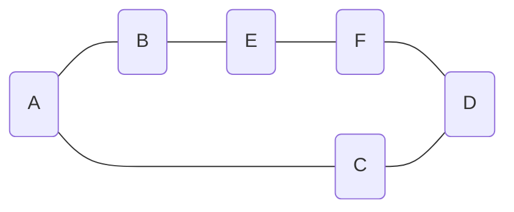
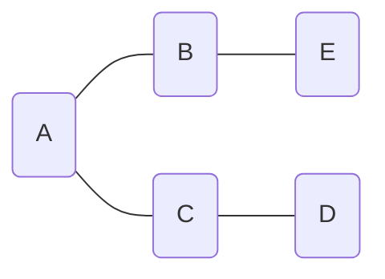

# 11.4

## [754. 到达终点数字](https://leetcode.cn/problems/reach-a-number/)


假设移动中正向的步数为 x，负向的为 y(y < 0)，那么有：

*   x + y = target
*   x - y = (1 + n) * n / 2

最极致的情况下，就是全部为正向移动，此时如果移动了 n 次，那么可以走到的最远的位置为 (1 + n) * n / 2

显然，对于所有可以走到 target 的 n，一定有 target <= (1 + n) * n / 2

假设 sum = (1 + n) * n / 2，考虑让 1~n 中的一部分数变为负数

如果 1 变为负数，那么有 sum' = sum - 2；如果 2 变为负数，那么 sum' = sum - 4...

这里就能看出来，对于一个确定的 n，对应了一个最大的 sum，那么不管让哪个数变为负数，那么 sum' 和 sum 的奇偶性都是相同的

因此 **target 和 sum 的奇偶性必须是一样的**

只要满足了奇偶性一致，那么一定可以通过移动得到 target

>   可以这样理解：target = sum + 2y；(y < 0)
>
>   我并不关心 y 具体是怎么构成的，但只要 sum 和 target 的奇偶性相同，那么 y 就是存在的

```java
class Solution {
    public int reachNumber(int target) {
        if (target < 0) target = -target;
        int left = 1;
        int right = (int)1e5 + 1;
        while (left < right) {
            int mid = left + ((right - left) >> 1);
            long sum = ((long)(1 + mid) * (mid)) >> 1;
            if (sum < target) left = mid + 1;
            else right = mid;
        }
        // 找到第一个使得 sum >= target 的 n
        int rst = left;
        long sum = ((long)(1 + rst) * (rst)) >> 1;
        while (((sum - target) & 1) == 1) {
            rst++;
            sum = ((long)(1 + rst) * (rst)) >> 1;
        }
        return rst;
    }
}
```

# 11.5

## [212. 单词搜索 II](https://leetcode.cn/problems/word-search-ii/)


==暴力搜索也许在 21/10/20 的时候还能过，不过现在的话，应该过不了了==

首先看一下输入范围，单词长度最长不过为 10，因此 dfs 深度为 10

既然涉及到深搜，就需要考虑重复遍历的问题，这里通过修改 board 的方式避免创建 visited 数组

如果是爆搜的话，还需要 path 变量保存所有遍历到的位置，并将 words 的元素放入 set 中，每轮 dfs 都需要判断一次是否存在对应的 path

这里没有使用 set 存储 words，而是通过字典树 Trie 保存了所有的 word，然后修改了字典树的属性 isEnd，避免每次递归终点时，还需要遍历 path 才能得到路径上的字符串

```java
class Solution {
	private static final int[][] DIR = {{1, 0}, {-1, 0}, {0, 1}, {0, -1}};
	public List<String> findWords(char[][] board, String[] words) {
		Trie root = new Trie();
		for (String s : words) {
			Trie node = root;
			for (int i = 0; i < s.length(); i++) {
				int idx = s.charAt(i) - 'a';
				if (node.children[idx] == null) node.children[idx] = new Trie();
				node = node.children[idx];
			}
			node.word = s;
		}
		int row = board.length;
		int col = board[0].length;
        // 对字典树的删除操作相对麻烦，因此这里的偷懒了使用 set 去重
		Set<String> rst = new HashSet<>();
		for (int i = 0; i < row; i++) {
			for (int j = 0; j < col; j++) {
				int idx = board[i][j] - 'a';
				if (root.children[idx] != null) {
                    // 通过修改原数组 board 的方式避免创建 visited 数组
					char c = board[i][j];
					board[i][j] = '#';
					dfs(i, j, root.children[idx], rst, 1, row, col, board);
					board[i][j] = c;
				}
			}
		}
		return new ArrayList<>(rst);
	}

	private void dfs(int x, int y, Trie node, Set<String> rst, int step, int row, int col, char[][] board) {
		if (!"".equals(node.word)) rst.add(node.word);
		if (step == 10) return;
		for (int[] d : DIR) {
			int mx = x + d[0];
			int my = y + d[1];
			if (mx >= 0 && mx < row && my >= 0 && my < col) {
				int idx = board[mx][my] - 'a';
				if (idx >= 0 && node.children[idx] != null) {
					char c = board[mx][my];
					board[mx][my] = '#';
					dfs(mx, my, node.children[idx], rst, step + 1, row, col, board);
					board[mx][my] = c;
				}
			}
		}
	}
}

class Trie {
	Trie[] children;
    // 使用 word 属性代替 isEnd，表示从根节点到当前节点的字符串，默认为空
	String word;

	public Trie() {
		this.children = new Trie[26];
		this.word = "";
	}
}
```

# 11.6

## [1478. 安排邮筒](https://leetcode.cn/problems/allocate-mailboxes/)


考虑如果只有一个邮筒，那么显然邮筒的应该放在所有房子位置的中位数上

如果存在多个邮筒，可以通过记忆化搜索取得最优：

```java
class Solution {
    public int minDistance(int[] houses, int k) {
        Arrays.sort(houses);
        int[][] buff = new int[k][houses.length];
        for (int i = 0; i < k; i++) Arrays.fill(buff[i], -1);
        return dfs(0, 0, buff, houses, k);
    }
	
    /**
     * 当前为第 i 个邮筒，之前已经安排好了 j 个房子对应邮筒的位置
     */
    private int dfs(int i, int j, int[][] buff, int[] houses, int k) {
        // 如果已经安排好了所有的房子，那么直接返回 0 即可
        if (j == houses.length) return 0;
        // 如果在房子还有剩余的情况下，已经没有邮筒可以安排了，那么需要返回非法值
        if (i == k) return 0x3f3f3f3f;
		// 记忆化搜索的关键
        if (buff[i][j] != -1) return buff[i][j];
		// 默认当前邮筒仅安排一个房子，此时被安排的房子的开销为 0
        int rst = dfs(i + 1, j + 1, buff, houses, k);
        // 当前邮筒可以安排的房子的个数从 2 开始遍历，结束于将所有的房子都安排到当前邮筒
        for (int l = 2; l <= houses.length - j; l++) {
            // 每层递归让一段连续的房子占用一个邮筒，此时为了让开销最小
            // 邮筒应该放在这段连续房子的位置的中位数上
            // 此时开销为每个区间的和
            int cost = 0;
            int p = j;
            int q = j + l - 1;
            while (p < q) cost += houses[q--] - houses[p++];
            rst = Math.min(rst, cost + dfs(i + 1, j + l, buff, houses, k));
        }

        buff[i][j] = rst;
        return buff[i][j];
    }
}
```

# 11.8

## [139. 单词拆分](https://leetcode.cn/problems/word-break/)


经典复刻，这个题，比较简单的解法是 dp，考虑 dp[i] 表示前 i 个字符组成的字符串是否可以通过 wordDict 组合得到

那么可以通过枚举左边界的方式，进行状态转移，即，如果存在一个左边界 j，有 dp[j] = 1，且 从 j + 1 到 i 内的子字符串在 wordDict 中出现，那么 dp[i] = 1(表示 dp[i] 可以从 dp[j] 处转移得到)

```java
class Solution {
	public boolean wordBreak(String s, List<String> wordDict) {
		Set<String> set = new HashSet<>(wordDict);
		int len = s.length();
		int[] dp = new int[len + 1];
		dp[0] = 1;
		for (int i = 1; i <= len; i++) {
			for (int j = i; j > 0; j--) {
				if (dp[j - 1] == 1 && set.contains(s.substring(j - 1, i))) {
					dp[i] = 1;
					break;
				}
			}
		}
		return dp[len] == 1;
	}
}
```

不过一般这种题，也是可以爆搜的，因为这里每种单词的使用次数是不限的，因此这里使用了字典树维护所有的单词

```java
class Solution {
    private Trie root;
    public boolean wordBreak(String s, List<String> wordDict) {
        this.root = new Trie();
        for (String word : wordDict) insert(word);
        return dfs(s, 0);
    }

    private boolean dfs(String word, int idx) {
        if (idx == word.length()) return true;
        Trie node = root;
        for (int i = idx; i < word.length(); i++) {
            int j = word.charAt(i) - 'a';
            if (node.children[j] == null) break;
            node = node.children[j];
            if (node.isEnd && dfs(word, i + 1)) return true;
        }
        return false;
    }

    private void insert(String word) {
        Trie node = root;
        for (int i = 0; i < word.length(); i++) {
            int idx = word.charAt(i) - 'a';
            if (node.children[idx] == null) node.children[idx] = new Trie();
            node = node.children[idx];
        }
        node.isEnd = true;
    }
}

class Trie {
    Trie[] children;
    boolean isEnd;

    public Trie() {
        this.children = new Trie[26];
        this.isEnd = false;
    }
}
```

然后就超时了，显然爆搜的方式还是太慢了，所有还是引入了 buff 数组进行记忆化搜索

>   能 dp，理论上也是能记忆化搜索的

```java
class Solution {
    private Trie root;
    public boolean wordBreak(String s, List<String> wordDict) {
        this.root = new Trie();
        int[] buff = new int[s.length()];
        Arrays.fill(buff, -1);
        for (String word : wordDict) insert(word);
        return dfs(s, 0, buff);
    }

    private boolean dfs(String word, int idx, int[] buff) {
        if (idx == word.length()) return true;
        if (buff[idx] != -1) return buff[idx] == 1;
        Trie node = root;
        for (int i = idx; i < word.length(); i++) {
            int j = word.charAt(i) - 'a';
            if (node.children[j] == null) break;
            node = node.children[j];
            if (node.isEnd && dfs(word, i + 1, buff)) {
                buff[i] = 1;
                return true;
            }
        }
        buff[idx] = 0;
        return false;
    }

    private void insert(String word) {
        Trie node = root;
        for (int i = 0; i < word.length(); i++) {
            int idx = word.charAt(i) - 'a';
            if (node.children[idx] == null) node.children[idx] = new Trie();
            node = node.children[idx];
        }
        node.isEnd = true;
    }
}

class Trie {
    Trie[] children;
    boolean isEnd;

    public Trie() {
        this.children = new Trie[26];
        this.isEnd = false;
    }
}
```

## [140. 单词拆分 II](https://leetcode.cn/problems/word-break-ii/)


这个题其实就是爆搜题，要求枚举所有的方案数目，因此从数据范围上也能看出来，这里的 s 最长不过 20

```java
class Solution {
    private Trie root;
    private StringBuilder builder;
    public List<String> wordBreak(String s, List<String> wordDict) {
        this.root = new Trie();
        this.builder = new StringBuilder();
        for (String word : wordDict) insert(word);
        List<String> rst = new ArrayList<>();
        Deque<String> path = new ArrayDeque<>();
        dfs(s, 0, rst, path);
        return rst;
    }
	/**
	 * 常规爆搜
	 */
    private void dfs(String s, int idx, List<String> rst, Deque<String> path) {
        if (idx == s.length()) {
            this.builder.delete(0, builder.length());
            for (String word : path) this.builder.append(word).append(" ");
            this.builder.delete(this.builder.length() - 1, this.builder.length());
            rst.add(this.builder.toString());
            return;
        }
        Trie node = root;
        for (int i = idx; i < s.length(); i++) {
            int child = s.charAt(i) - 'a';
            if (node.children[child] == null) break;
            node = node.children[child];
            if (!"".equals(node.word)) {
                path.offerLast(node.word);
                dfs(s, i + 1, rst, path);
                path.pollLast();
            }
        }
    }

    /**
     * 向字典树中添加单词
     */
    private void insert(String word) {
        Trie node = root;
        for (int i = 0; i < word.length(); i++) {
            int idx = word.charAt(i) - 'a';
            if (node.children[idx] == null) node.children[idx] = new Trie();
            node = node.children[idx];
        }
        node.word = word;
    }
}

class Trie {
    Trie[] children;
    // 修改了字典树中节点的定义, 舍去了 isEnd, 而直接把对应的字符串保存了起来
    String word;

    public Trie() {
        this.children = new Trie[26];
        this.word = "";
    }
}
```

# 11.10

## [864. 获取所有钥匙的最短路径](https://leetcode.cn/problems/shortest-path-to-get-all-keys/)


看到了最短路径，就想着用 BFS 了，但和一般的 BFS 不太一样的时，这个题可以走回头路，每当拿到一个新的钥匙的时候，就可以走回头路了

因为题目已经说了，最多有 6 把钥匙，使用一个 int 类型的 mask 掩码即可表示每种钥匙的获取情况

那么现在可以将原来的 visited 数组改造一下：visited\[i]\[j][k] 表示对于位置 (i, j) 是否在掩码为 k 的情况下访问过

```java
class Solution {
	private static final int[][] DIR = {{-1, 0}, {1, 0}, {0, 1}, {0, -1}};
	public int shortestPathAllKeys(String[] grid) {
		int row = grid.length;
		int col = grid[0].length();
        int x = -1;
		int y = -1;
		int target = 0;
        // 记录起点和最终要达到的掩码 target
		for (int i = 0; i < row; i++) {
			for (int j = 0; j < col; j++) {
				char c = grid[i].charAt(j);
				if (c == '@') {
					x = i;
					y = j;
				} else if (c >= 'a' && c <= 'f') target |= 1 << (c - 'a');
			}
		}
		Deque<int[]> queue = new ArrayDeque<>();
		int[][][] visited = new int[row][col][1 << 6];
		queue.offerLast(new int[]{x, y, 0});
		visited[x][y][0] = 1;
		int step = 0;
		while (!queue.isEmpty()) {
			int size = queue.size();
			step++;
			for (int i = 0; i < size; i++) {
				int[] tmp = queue.pollFirst();
				for (int[] d : DIR) {
					int mx = tmp[0] + d[0];
					int my = tmp[1] + d[1];
					int mask = tmp[2];
					if (mx >= 0 && mx < row && my >= 0 && my < col && visited[mx][my][mask] == 0) {
						char c = grid[mx].charAt(my);
						if (c == '#' || ((c >= 'A' && c <= 'F') && (((mask >> (c - 'A')) & 1) == 0 ))) continue;
						if (c >= 'a' && c <= 'f') {
							mask |= 1 << (c - 'a');
							if (mask == target) return step;
						}
						visited[mx][my][mask] = 1;
						queue.offerLast(new int[]{mx, my, mask});
					}
				}
			}
		}
		return -1;
	}
}
```

# 11.12

## [790. 多米诺和托米诺平铺](https://leetcode.cn/problems/domino-and-tromino-tiling/)


单纯的菜, 本来是一道 dp 硬是没找到规律, 还得看题解: [找不到规律？请看图！](https://leetcode.cn/problems/domino-and-tromino-tiling/solution/by-endlesscheng-umpp/)


有了状态转移方程, 后面都好说：

```java
class Solution {
    private static final int N = 1010;
    private static final int[] dp = new int[N];
    private static final int MOD = (int)1e9 + 7;
    static {
        dp[1] = 1;
        dp[2] = 2;
        dp[3] = 5;
        for (int i = 4; i < N; i++) {
            long tmp = (((long) dp[i - 1]) << 1) + (long)dp[i - 3];
            tmp %= MOD;
            dp[i] = (int)tmp;
        } 
    }
    public int numTilings(int n) {
        return dp[n];
    }
}
```

>   本来是可以滚动数组优化的, 这里其实就是打表了

# 11.14

## [805. 数组的均值分割](https://leetcode.cn/problems/split-array-with-same-average/)


算一下，如果说整个数组大小为 n，所有元素的和为 s，分割的第一部分为新数组 A，和为 s’，元素个数为 n’，那么有：$\frac{s'}{n'} = \frac{s - s'}{n - n'}$

整理一下得到：$s'n = n's$，即 $\frac{s'}{n'} = \frac{s}{n}$ 即本题要求的是：将数组分为两个新数组，且这两个新数组的均值和数组的均值相等

换句话说，只要能从原数组中选择一部分，构成新数组，只要这个新数组的均值可以和原数组的均值相等，那么就找到了一种分割方法

考虑如果将原数组中的每个数都减去一个均值，那么原数组的均值将变为 0，这样原问题就等效于从数组中选出一些项，让这些项的和为 0

计算均值，可能出现浮点数，涉及到浮点数，就可能存在误差，因此这里并不是真的计算了均值

如果均值为 avg(可能为浮点数)，但 avg x n 一定不是浮点数(为各元素的总和)，那么此时可以：令 nums[i] = nums[i] x n - avg x n

通过和固定系数 n 乘积后，得到的结果相比于之前扩大了，但现在肯定是一个整数，且查询的要求还是一样的，即从原数组中找出某些项，让这些项的和为 0

至于枚举数组中的每一项，因为数组最长为 30 位，因此如果爆搜，那么时间复杂度将达到 $2^{30} > 10^9$，因此肯定会超时

到这里其实就已经不会做了，后来看了下题解，题解的做法是折半搜索

现在仅搜索前半段，并使用一个 map 记录二元组(sum, cnt)，表示从数组的前半段，存在数组和为 sum，且选中了前半段中 cnt 个数的集合

特别的因为一个 sum，可能具有多个 cnt，因此，这里的使用了 map 嵌套 set 的方式表示集合，即定义了：Map<Integer, Set\<Integer>> sumToCnt

搜索完数组的前半段，再处理后半段，后半段搜索到终点时，记录下当前的集合的和 sum，如果在 map 中存在一个对应和为 -sum 的键，说明前半段的一个集合(至少一个) 和后半段的集合(当前搜索路)可以组合为一个和为 0 的数组

要注意的是将一个数组分割为两个数组，这两个数组不能为空 ! 因此最后返回的时候不仅需要考虑键的情况，还需要考虑集合中元素的个数

>   如果不需要考虑元素个数的话，其实一个 set 就行了

```java
class Solution {
    public boolean splitArraySameAverage(int[] nums) {
        int sum = 0;
        for (int num : nums) sum += num;
        int n = nums.length;
        for (int i = 0; i < n; i++) nums[i] = nums[i] * n - sum;
        Map<Integer, Set<Integer>> stc = new HashMap<>();
        dfs1(0, 0, 0, n >> 1, stc, nums);
        return dfs2(0, n >> 1, 0, n, stc, nums);
    }
	/**
	 * 第二次 dfs 处理数组的后半段
	 */
    private boolean dfs2(int pre, int idx, int cnt, int limit, Map<Integer, Set<Integer>> stc, int[] nums) {
        if (idx == limit) {
            if (stc.containsKey(-pre)) {
                Set<Integer> cnts = stc.get(-pre);
                for (int c : cnts) {
                    // 注意当前集合不能为空
                    if (c == 0 && cnt == 0) continue;
                    // 当前集合不能占用所有元素
                    if (c + cnt != limit) return true;
                }
            }
            return false;
        }
        return dfs2(pre, idx + 1, cnt, limit, stc, nums) || dfs2(pre + nums[idx], idx + 1, cnt + 1, limit, stc, nums);
    }
	
    /**
     * 第一次 dfs 处理数组的前半段
     */
    private void dfs1(int pre, int idx, int cnt, int limit, Map<Integer, Set<Integer>> stc, int[] nums) {
        if (idx == limit) {
            Set<Integer> cnts = stc.getOrDefault(pre, new HashSet<>());
            cnts.add(cnt);
            stc.put(pre, cnts);
            return;
        }

        dfs1(pre, idx + 1, cnt, limit, stc, nums);
        dfs1(pre + nums[idx], idx + 1, cnt + 1, limit, stc, nums);
    }
}
```

## [947. 移除最多的同行或同列石头](https://leetcode.cn/problems/most-stones-removed-with-same-row-or-column/)

<div style="text-align:center;">
	<a href="https://leetcode.cn/problems/most-stones-removed-with-same-row-or-column/" >
		
	</a>
</div>


题意看上去很难理解，其实画个图还是很明确的

对于示例 1，使用矩阵表示为：$\begin{bmatrix}A&B&x\\C&x&D\\x&E&F\end{bmatrix}$

矩阵中大写字母表示一个石头，石头移除的条件为同一行或同一列至少还有一个石头，如果通过无向图的方式将行和列的关系写出来，那么可以写成：



现在构成了一个环，如果从环中去除一个节点，那么构成了一个链表，比如删除了 F，那么构成了



考虑节点 B 和 E，如果先删除 B，那么此时 E 会从链表中断开，无法被删除；而如果先删除 E 那么此时 B 因为还在链表中，可以被继续删除

因此一个理想的删除是，逐渐删除那些入度为 1 的点，如果不存在入度为 1 点，说明存在环，此时删除环中任意一个点，然后继续删除新的入度为 1 的点，直到最终图中仅剩下一个节点

因此对于一个连通图，如果点数为 N，那么最多可以删除掉 N - 1 个点

因此本题的最大值等效于：连通图的个数 x (连通图中点数 - 1)

求解联通图个数和点数可以通过带权的并查集实现

```java
class Solution {
    private int[] p;
    private int[] w;
    public int removeStones(int[][] stones) {
        int n = stones.length;
        this.p = new int[n];
        this.w = new int[n];
        for (int i = 0; i < n; i++) {
            p[i] = i;
            w[i] = 1;
        }
        for (int i = 0; i < n; i++) {
            for (int j = i + 1; j < n; j++) {
                if (stones[i][0] == stones[j][0] || stones[i][1] == stones[j][1]) union(i, j);
            }
        }
        int rst = 0;
        for (int i = 0; i < n; i++) {
            int p = find(i);
            if (w[p] > 0) {
                rst += w[p] - 1;
                w[p] = 0;
            }
        }
        return rst;
    }

    /**
     * 路径压缩
     */
    private int find(int i) {
        while (p[i] != i) {
            p[i] = p[p[i]];
            if (p[p[i]] != p[i]) w[p[i]] -= w[i];
            i = p[i];
        } 
        return i;
    }

    /**
     * 按秩合并
     */
    private void union(int a, int b) {
        a = find(a);
        b = find(b);
        if (a == b) return;
        if (w[a] < w[b]) {
            w[b] += w[a];
            p[a] = b;
        } else {
            w[a] += w[b];
            p[b] = a;
        }
    }
    
}
```

对于并查集而言, 每个节点只需要合并到同行/同列的节点所在的连通块上即可, 不需要将当前节点与同行/同列中的所有节点合并, 因此完全可以避免二重循环合并

```java
class Solution {
    private static final int N = (int)1e4 + 10;
    private int[] p;
    private int[] w;
    public int removeStones(int[][] stones) {
        int n = stones.length;
        this.p = new int[n];
        this.w = new int[n];
        
        for (int i = 0; i < n; i ++) {
            p[i] = i;
            w[i] = 1;
        }
        
        int[] rs = new int[N];
        int[] cs = new int[N];
        
        Arrays.fill(rs, -1);
        Arrays.fill(cs, -1);
        
        for (int i = 0; i < n; i ++) {
            if (rs[stones[i][0]] != -1)
                union(i, rs[stones[i][0]]);
            if (cs[stones[i][1]] != -1)
                union(i, cs[stones[i][1]]);
            
            rs[stones[i][0]] = i;
            cs[stones[i][1]] = i;
        }
        
        int[] vis = new int[n];
        
        int rst = 0;
        for (int i = 0; i < n; i ++) {
            int j = find(i);
            if (vis[j] == 1)
                continue;
            rst += w[j] - 1;
            vis[j] = 1;
        }
        
        return rst;
    }
    
    private int find(int x) {
        if (p[x] != x) 
            p[x] = find(p[x]);
        return p[x];
    }
    
    private void union(int a, int b) {
        int pa = find(a);
        int pb = find(b);
        if (pa == pb)
            return;
        if (w[pa] > w[pb]) {
            p[pb] = pa;
            w[pa] += w[pb];
        } else {
            p[pa] = pb;
            w[pb] += w[pa];
        }
    }
}
```

当然普通的 dfs 也可以

```java
class Solution {
    private int[] h;
    private int[] e;
    private int[] ne;
    private int idx;
    public int removeStones(int[][] stones) {
        int n = stones.length;
        this.h = new int[n];
        this.e = new int[((n * (n - 1)) >> 1) + 10];
        this.ne = new int[((n * (n - 1)) >> 1) + 10];
        Arrays.fill(h, -1);
        for (int i = 0; i < n; i++) {
            for (int j = i + 1; j < n; j++) {
                if (stones[i][0] == stones[j][0] || stones[i][1] == stones[j][1]) {
                    insert(i, j);
                    insert(j, i);
                }
            }
        }
        int rst = 0;
        int[] vis = new int[n];
        for (int i = 0; i < n; i++) {
            if (vis[i] == 0) {
                vis[i] = 1;
                rst += dfs(i, vis) - 1;
            }
        }
        
        return rst;
    }
	// 返回连通图的大小
    private int dfs(int idx, int[] vis) {
        int rst = 1;
        for (int ed = h[idx]; ed != -1; ed = ne[ed]) {
            int end = e[ed];
            if (vis[end] == 1) continue;
            vis[end] = 1;
            rst += dfs(end, vis);
        }
        return rst;
    }

    private void insert(int a, int b) {
        e[idx] = b;
        ne[idx] = h[a];
        h[a] = idx++;
    }
}
```

# 11.16

## [775. 全局倒置与局部倒置](https://leetcode.cn/problems/global-and-local-inversions/)


局部倒置，就是后一个数比前一个数更大的个数，这个遍历一遍就能算出来

全局倒置，这个其实就是求逆序对的个数，通过一次归并排序就能求出来

```java
class Solution {
    public boolean isIdealPermutation(int[] nums) {
        int pCount = 0;
        for (int i = 0; i < nums.length - 1; i++) {
            if (nums[i] > nums[i + 1]) pCount++;
        }
        int tCount = mergeCount(nums, 0, nums.length - 1, new int[nums.length]);
        return tCount == pCount;
    }

    private int mergeCount(int[] nums, int left, int right, int[] tmp) {
        if (left >= right) return 0;
        int mid = left + ((right - left) >> 1);
        int rst = 0;
        rst += mergeCount(nums, left, mid, tmp);
        rst += mergeCount(nums, mid + 1, right, tmp);
        rst += merge(nums, left, mid, right, tmp);
        return rst;
    }

    private int merge(int[] nums, int left, int mid, int right, int[] tmp) {
        int p = left;
        int q = mid + 1;
        int idx = left;
        int rst = 0;
        while (p <= mid && q <= right) {
            if (nums[p] <= nums[q]) tmp[idx++] = nums[p++];
            else {
                rst += mid - p + 1;
                tmp[idx++] = nums[q++];
            }
        }
        while (p <= mid) tmp[idx++] = nums[p++];
        while (q <= right) tmp[idx++] = nums[q++];
        for (int i = left; i <= right; i++) nums[i] = tmp[i];
        return rst;
    }
}
```

时间复杂度 $O(n\log n)$ 肯定能过，但问题在于不够优雅，没有利用上题目中的条件：数组中的数据为 0~n - 1 的一个排列

从定义上来看，局部倒序是全局倒序的一个子集，仔细考虑一下，对于一个正序的数组，那么形式一定是：[0, 1, 2, ..., n - 1]，全局倒置和局部倒置都是 0

如果交换正序数组中的两个相邻元素，此时会产生一个局部倒序和一个全局倒序，但如果交换的元素不是相邻的，比如对于数组：[0,1,2,3] 如果交换了 0 和 2 那么得到了 [2,1,0,3]；这个数组具有 3 个全局倒序和 2 个局部倒序

到这里，其实就可以看出来了，如果希望局部倒序的数量和全局倒序的数量相等，那么需要让数组相比于正序数组仅仅发生了相邻位置的交换

```java
class Solution {
    public boolean isIdealPermutation(int[] nums) {
        int n = nums.length;
        for (int i = 0; i < n; i++) {
            if (nums[i] == i) continue;
            if (i < n - 1 && nums[i] == i + 1 && nums[i + 1] == i) i++;
            else return false;
        }
        return true;
    }
}
```

# 11.17

## [792. 匹配子序列的单词数](https://leetcode.cn/problems/number-of-matching-subsequences/)


没多想直接爆搜了，时间复杂度$O((m + n) * 5000)$，在 $10^8$ 级别，直接 TLE

```java
class Solution {
    public int numMatchingSubseq(String s, String[] words) {
        int rst = 0;
        for (String word : words) {
            for (int i = 0, j = 0; i < s.length() && j < word.length(); i++) {
                if (s.charAt(i) == word.charAt(j)) j++;
                if (j == word.length()) rst++;
            }
        }
        return rst;
    }
}
```

本来我以为这种已经爆搜已经足够高效了，但居然会 TLE

对于结果集，枚举 words 中的每个字符串，并遍历字符串中的每个字符，这个操作是必须的，即基础的时间复杂度肯定为 50 x 5000 这个级别

关键在于在 s 中搜索的时候，能不能加快查找，之前搜索的慢，其实主要是因为对于每个字符都需要遍历一次 s

考虑对于任意一个 word，当遍历其每一个字符时，其实我关心的是对应字符在 s 中的位置(不存在也是一种位置)，从这个思路出发，可以使用一个 list 嵌套 list 保存 s 中每个字符的位置，这样对于任意一个 word，可以通过二分高效的判断其每一个字符在 s 中出现的位置

```java
class Solution {
    public int numMatchingSubseq(String s, String[] words) {
        int rst = 0;
        List<List<Integer>> freq = new ArrayList<>(26);
        for (int i = 0; i< 26; i++) freq.add(new ArrayList<>());
        for (int i = 0; i < s.length(); i++) freq.get(s.charAt(i) - 'a').add(i);
        for (String word : words) {
            // 记录一个字符在 s 中的位置
            int pre = -1;
            int i = 0;
            for (; i < word.length(); i++) {
                int idx = word.charAt(i) - 'a';
                if (freq.get(idx).size() == 0) break;
                // 通过二分的方式查找当前字符在 s 中第一个大于 pre 的位置
                int left = 0;
                int right = freq.get(idx).size() - 1;
                while (left < right) {
                    int mid = left + ((right - left) >> 1);
                    if (freq.get(idx).get(mid) <= pre) left = mid + 1;
                    else right = mid;
                }
                if (freq.get(idx).get(left) > pre) pre = freq.get(idx).get(left);
                else break;
            }
            if (i == word.length()) rst++;
        }
        return rst;
    }
}
```

时间复杂度为$O(m * 50 * \log n)$，其中 m 为 words 的长度，n 为 s 的长度

本来我以为这种写法已经足够简洁了，没想到还有更简单的做法，即借助了桶的思想，将每个 word 以桶的形式保存起来，在遍历 s 的时候不断移动桶

```java
class Solution {
    public int numMatchingSubseq(String s, String[] words) {
        int rst = 0;
        List<Deque<Bucket>> freq = new ArrayList<>(26);
        for (int i = 0; i < 26; i++) freq.add(new ArrayDeque<>());
        // 根据 word 的第一个字符的位置入桶
        for (String word : words) freq.get(word.charAt(0) - 'a').offerLast(new Bucket(word));
        // 遍历 s 的同时让对应位置的字符串出桶，并加入下一个桶
        for (int i = 0; i < s.length(); i++) {
            Deque<Bucket> buckets = freq.get(s.charAt(i) - 'a');
            int size = buckets.size();
            for (int j = 0; j < size; j++) {
                Bucket tmp = buckets.pollFirst();
                tmp.idx++;
                if (tmp.idx == tmp.word.length()) rst++;
                else freq.get(tmp.word.charAt(tmp.idx) - 'a').offerLast(tmp);
            }
        }
        return rst;
    }
}

class Bucket {
    String word;
    int idx;
    public Bucket(String word) {
        this.word = word;
    }
}
```

时间复杂度 $O(n + m * 50)$，其中 n 为 s 的长度 m 为 words 的长度

# 11.22

## [878. 第 N 个神奇数字](https://leetcode.cn/problems/nth-magical-number/)


看了一下范围 $10^9$，这下 $O(n)$ 都过不了，只能想着二分了

考虑从 1 到 n，可以整除 a 的数字有 $\lfloor\frac{n}{a}\rfloor$，可以整除 b 数字有 $\lfloor\frac{n}{b}\rfloor$，这些数字中有重复的部分，即 a 和 b 的最小公倍数


通过如图的方式，可以计算得到 1 到 n 范围内，所有可以整除 a 或 b 的数字个数

```java
class Solution {
	private static final int MOD = (int)1e9 + 7;
	public int nthMagicalNumber(int n, int a, int b) {
		long right = (long)Math.min(a, b) * n;
		long left = 1;
		int g = gcd(a, b);
        // 最小公倍数 * 最大公约数 = a * b
		int l = a * b / g;
		while (left < right) {
			long mid = left + ((right - left) >> 1);
			long cnt = mid / a + mid / b - mid / l;
			if (cnt < n) left = mid + 1;
			else right = mid;
		}
		return (int)(left % MOD);
	}

	// 最大公约数
	private int gcd(int a, int b) {
		return b == 0 ? a : gcd(b, a % b);
	}
}
```

# 11.24

## [795. 区间子数组个数](https://leetcode.cn/problems/number-of-subarrays-with-bounded-maximum/)


一眼单调栈，找到左右边界，一看题解，他直接一次遍历就结束了 ???

按照题解的思路，因为需要找到最大值在 [left, right] 的子区间个数，那么等价于先求出最大值不超过 right 的子区间个数，和最大值不超过 left 的子区间个数，然后二者做差即可

所以现在这个题就变成了求解最大值不超过 limit 的区间个数，这个问题可以通过双指针，在 $O(n)$ 的时间内求解

更为具体的，可以找到那些超过 limit 的边界，考虑如果具有两个边界，b1 和 b2，那么这个区间内的子区间个数为 (b2 - b1 + 1 + 1) * (b2 - b1 + 1) >> 1

>   题解更绝，他考虑的是以每个数结尾的子区间个数，这样甚至都不需要使用乘法(避免 int 乘法溢出)

```java
class Solution {
	public int numSubarrayBoundedMax(int[] nums, int left, int right) {
        return cnt(nums, right) - cnt(nums, left - 1);
	}

    private int cnt(int[] nums, int limit) {
        int rst = 0;
        int pre = -1;
        // 循环累加的是以某个数结尾的子区间个数
        for (int i = 0; i < nums.length; i++) {
            if (nums[i] > limit) pre = i;
            rst += i - pre;
        }
        return rst;
    }
}
```

# 11.26

## [882. 细分图中的可到达节点](https://leetcode.cn/problems/reachable-nodes-in-subdivided-graph/)


一个最短路的应用题

考虑将一条边上新增的节点视为边权，那么可以通过 dijkstra 求解从 0 节点开始到达所有节点的最短路径

根据 maxMoves 可以判断出某个节点是否可以从 0 节点到达

然后考虑每条边上的节点是否可以走到:

*   对于边 [u, v]，根据 dijkstra 可以知道从 0 节点到 u 和 v 的最短路
*   如果**可以从 0 节点走到** u，那么 u -> v 边上，可以经过节点的最大数目为 min(cnt[u, v], maxMoves - dis[u])，记为 minU
*   对于节点 v 也是同理，记为 minV

如果直接将 u 和 v 的 min 加入结果集的话，可能会出现重复的部分，因此实际加入的为 min(minU + minV, cnt[u, v])

注意到这里还仅仅是可以从 0 节点走到 u(v) 的情况，在遍历所有边的时候，还要考虑 maxMoves - dis[u] 的正负关系

```java
class Solution {
	private int[] h, e, ne, w;
	private int idx;

	public int reachableNodes(int[][] edges, int maxMoves, int n) {
		this.h = new int[n];
		Arrays.fill(h, -1);
		int len = edges.length << 1;
		this.e = new int[len];
		this.ne = new int[len];
		this.w = new int[len];
		this.idx = 0;
		int[] dis = new int[n];
		Arrays.fill(dis, 0x3f3f3f3f);
		int[] st = new int[n];
		for (int[] edge : edges) {
            // 注意存图的时候是无向图，同时如果需要新增 cnt 个节点，那么边权为 cnt + 1
			insert(edge[0], edge[1], edge[2] + 1);
			insert(edge[1], edge[0], edge[2] + 1);
		}
		int rst = 0;
		PriorityQueue<int[]> heap = new PriorityQueue<>(Comparator.comparingInt(nums -> nums[1]));
		heap.offer(new int[]{0, 0});
		dis[0] = 0;
        // dijkstra 求解最短路
		while (!heap.isEmpty()) {
			int[] tmp = heap.poll();
			if (st[tmp[0]] == 1) continue;
			st[tmp[0]] = 1;
            if (dis[tmp[0]] <= maxMoves) rst++;
			for (int ee = h[tmp[0]]; ee != -1; ee = ne[ee]) {
				int end = e[ee];
				if (dis[end] > dis[tmp[0]] + w[ee]) {
					dis[end] = dis[tmp[0]] + w[ee];
					heap.offer(new int[]{end, dis[end]});
				}
			}
		}
        // 遍历所有边
		for (int[] edge : edges) {
			int tmp = 0;
            // 首先看看到 u 之后还能走多少步
			int len1 = maxMoves - dis[edge[0]];
            // 只有当 len1 > 0 时才进行累加
			if (len1 > 0) tmp += len1;
			int len2 = maxMoves - dis[edge[1]];
			if (len2 > 0) tmp += len2;
            // 新节点数最多为 cnt，len1 + len2 不能超过这个值
			rst += Math.min(edge[2], tmp);
		}
		return rst;
	}

	private void insert(int a, int b, int ww) {
		e[idx] = b;
		w[idx] = ww;
		ne[idx] = h[a];
		h[a] = idx++;
	}
}
```

# 11.28

## [813. 最大平均值和的分组](https://leetcode.cn/problems/largest-sum-of-averages/)


本来还想贪心一下，不过这里因为要求的是对原数组进行分割得到子数组

最开始定义 f\[i][j] 为将 nums 的前 i 项分为 j 段得到的最大均值和，这里的区分点，为最后一段的大小：

如果 j = 1：f\[i][1] = preSum[i] / i

如果 j > 1: 此时需要枚举最后一段的开头 p，p 可以从 j 取到 i

对于每一个 p 有 cost = f\[p - 1][j - 1] + (preSum[i] - preSum[p - 1]) / (i - p + 1)

其实这里就发现问题了，因为每层遍历的 j 都仅和 j - 1 有关，因此这里修改了 dp 的定义 f\[i][j] 定义为前 j 个数字分为 i 段的最大均值和

```java
class Solution {
    public double largestSumOfAverages(int[] nums, int k) {
        int n = nums.length;
        double[] preSum = new double[n + 1];
        for (int i = 1; i <= n; i++) preSum[i] = preSum[i - 1] + nums[i - 1];
        double[][] f = new double[k + 1][n + 1];
        for (int j = 1; j <= n; j++) f[1][j] = preSum[j] / j;
        for (int i = 2; i <= k; i++) {
            for (int j = i; j <= n; j++) {
                for (int p = i; p <= j; p++) {
                    f[i][j] = Math.max(f[i][j], f[i - 1][p - 1] + (preSum[j] - preSum[p - 1]) / (j - p + 1));
                }
            }
        }
        return f[k][n];
    }
}
```


