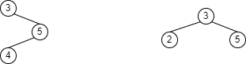

# 4.1

## [954. 二倍数对数组](https://leetcode-cn.com/problems/array-of-doubled-pairs/)


太典了

简单的统计词频，并排序

```java
class Solution {
    public boolean canReorderDoubled(int[] arr) {
        Map<Integer, Integer> freq = new HashMap<>();
        
        for (int num : arr) {
            freq.put(num, freq.getOrDefault(num, 0) + 1);
        }
        List<Integer> list = new ArrayList<>();
        for (int key : freq.keySet()) {
            list.add(key);
        }
        // 注意这里有负数，所以需要取
        list.sort((a, b) -> Math.abs(a) - Math.abs(b));
        for (int i = 0; i < list.size(); i++) {
            int per = list.get(i);
            if (freq.get(per) == 0) continue;
            int target = per * 2;
            if (freq.getOrDefault(target, 0) < freq.get(per)) return false;
            freq.put(target, freq.get(target) - freq.get(per));
            freq.put(per, 0);
        }
        return true;
    }
}
```

根据数据输入范围，甚至可以使用桶排序

```java
class Solution {
	private static final int SIZE = (int)1e5 + 1;
	public boolean canReorderDoubled(int[] arr) {
		int[] freq = new int[SIZE];
		int count = 0;
		// 先统计非负数，判断非负数是否满足条件
        for (int num : arr) {
			if (num < 0) continue;
			freq[num]++;
			count++;
		}
		if ((freq[0] & 1) == 1) return false;
		count -= freq[0];
		if (!validate(freq, count)) return false;
		count = 0;
        // 统计负数
		for (int num : arr) {
			if (num >= 0) continue;
			freq[-num]++;
			count++;
		}
		if (!validate(freq, count)) return false;
		return true;
	}

	private boolean validate(int[] freq, int count) {
		int idx = 1;
		int limit = (SIZE - 1) >> 1;
		while (idx <= limit) {
			if (freq[idx] > 0) {
				freq[idx << 1] -= freq[idx];
				if (freq[idx << 1] < 0) return false;
				count -= freq[idx] << 1;
				freq[idx] = 0;
			}
			idx++;
		}
		if (count > 0) return false;
		return true;
	}
}
```


# 4.3

## [31. 下一个排列](https://leetcode-cn.com/problems/next-permutation/)


这个从数组尾部向前遍历比较方便

一个数组，如果从尾部到头部，是升序排列的，那么组合的数字一定是最大的

而如果一旦出现了降序，那么就一定有比当前数字更大的组合

比如：`[5,4,3,2,1]`这个数组从尾部到头部就是升序，故这个数组的组合方式已经是最大的了

而比如：`[1,2,3,2,1]`，这个数组从尾部到头部最开始也是升序，后来在`2,3`这个位置处出现了降序，为了得到更大的数字，我们将降序的两个数字交换，得到`[1,3,2,2,1]`，而实际上，如果在`3`之后，让数组从尾部到头部变为降序，那么得到的数字会更小，所以，下一个更大的数字是：`[1,3,1,1,2]`

更为一般的形式是：`[1,2,5,4,3,2,1]`，和上面一样在`2,5`这个位置处出现了降序，而这个时候我们交换的不是`2,5`，而是把`2xx3`中，将`2`和`3`交换，得到的是`[1,3,5,4,2,2,1]`，此后在将后面升序的部分，通过双指针的形式变为降序；这里面在升序的部分中找到3，即第一个比降序的2更大的元素，是比较关键的，因为从`5,4,3,2,1`这部分中，全部是升序排列（从尾部到头部），所以可以通过二分的形式快速查找到`3`是升序部分中所有大于2的最小的值

> 因为这个题目中数组长度仅为100，所以二分查找和线性查找相比，优势并不明显

```java
class Solution {
    public void nextPermutation(int[] nums) {
        int right = nums.length - 1;
        int left = right - 1;
        while (left >= 0 && nums[left] >= nums[left + 1]) left--;
        if (left >= 0) {
            int l = left + 1;
            int r = right;
            while (l < r) {
                int m = l + ((r - l + 1) >> 1);
                if (nums[m] <= nums[left]) {
                    r = m - 1;
                }else {
                    l = m;
                }
            }
            int tmp = nums[left];
            nums[left] = nums[l];
            nums[l] = tmp;
        }
        exchange(nums, left + 1, right);
    }
    
    private void exchange(int[] nums, int left, int right) {
        while (left < right) {
            int tmp = nums[left];
            nums[left] = nums[right];
            nums[right] = tmp;
            left++;
            right--;
        }
    }
}
```

# 4.4

## [307. 区域和检索 - 数组可修改](https://leetcode-cn.com/problems/range-sum-query-mutable/)


这个以前写过，一个树状数组解决

```java
class NumArray {
    private int[] treeNode;
    private int[] nums;
    public NumArray(int[] nums) {
        this.nums = nums;
        this.treeNode = new int[nums.length + 1];
        for (int i = 1; i <= nums.length; i++) {
            modify(i, nums[i - 1]);
        }
    }
    
    public void update(int index, int val) {
        modify(index + 1, val - nums[index]);
        nums[index] = val;
    }
    
    public int sumRange(int left, int right) {
        return sum(right + 1) - sum(left);
    }

    private void modify(int idx, int value) {
        while (idx < treeNode.length) {
            treeNode[idx] += value;
            idx += lowBit(idx);
        }
    }

    private int sum(int idx) {
        int rst = 0;
        while (idx > 0) {
            rst += treeNode[idx];
            idx -= lowBit(idx);
        }
        return rst;
    }

    private int lowBit(int num) {
        return num & (-num);
    }
}
```

## [1721. 交换链表中的节点](https://leetcode-cn.com/problems/swapping-nodes-in-a-linked-list/)


一次遍历解决，先找到头部的第k个节点，然后双指针，找到尾部的第k个节点

```java
class Solution {
    public ListNode swapNodes(ListNode head, int k) {
        ListNode fast = head;
        ListNode slow = null;
        int idx = 1;
        while (idx < k) {
            fast = fast.next;
            idx++;
        }
        ListNode front = fast;
        slow = head;
        while (fast.next != null) {
            fast = fast.next;
            slow = slow.next;
        }
        ListNode back = slow;
        int tmp = front.val;
        front.val = back.val;
        back.val = tmp;
        return head;
    }
}
```

# 4.9

## [780. 到达终点](https://leetcode-cn.com/problems/reaching-points/)


这个题，从起点找到终点确实比较困难，但是如果反过来的话，还是能看出规律的

首先我们知道这里面的点是没有负数的，不管是原点或是终点，都是正数的点

其次，我们知道每次进行点的变换的时候规律都是`(x, y) -> (x, x + y)`或`(x, y) -> (x + y, y)`

那么我们是不是就可以认为，一个点的坐标中，大的那个值，一定是通过小的那个值变换得到的呢

比如我们以第一个例子举例：`(3,5)`，坐标中小的那个值是通过大的转化而来，从而有：

`(3, 5) -> (3, 2) -> (1, 2) -> (1, 1)`

很容易就可以从目标的`(tx, ty)`回退到`(sx, sy)`

但是注意这个数据范围：$10^9$，这个数据太大了，大到我们甚至无法接受$O(n)$的时间复杂度

所以肯定存在优化，比如，我们最开始是`(tx, ty)`，其中`ty >> tx`，以至于我们需要不断减去`tx`才可以，这样的话，我们其实可以将重复的循环变为$O(1)$的取模，即使用`ty % tx`代替

我们从`(tx, ty)`回退到`(sx, sy)`是一个循序渐进的过程，即不会存在进行了某次减法（或者是某次取模）使得`(tx, ty)`一下子变为了`(sx, sy)`

一个正确的过程是，在进行相互减法（取模）的操作中，我们使得其中一个维度，比如说`x`，使得`sx == tx`，那么这个时候，就不用考虑两个维度的大小关系了，我们只需要对`y`进行减法（或者取模），如果能变成`sy`说明回退成功，如果变不成，说明回退失败

所以有了第一版：

```java
class Solution {
    public boolean reachingPoints(int sx, int sy, int tx, int ty) {
       	// 最开始两个维度都比起始位置大，然后进行相互取模
        while (tx > sx && ty > sy) {
            if (tx > ty) {
                tx = tx % ty;
            }else {
                ty = ty % tx;
            }
        }
        /* 
        	我们出循环一定是因为其中一个维度减到了原点
        	而如果两个维度都没有减到，肯定就是回退失败了
        */
        if (tx < sx || ty < sy) return false;
        // 假设y维度回退成功了，那我就只动tx
        if (ty == sy) {
            return tx % ty == sx;
        // 不是y维度回退成功就是x维度回退成功，不然上面的就已经直接返回false了
        }else {
        	return ty % tx == sy;   
        }
    }
}
```

然而，当我信心满满的执行了示例，发现直接卡在了第一个示例

仔细一看发现了大问题，即出现在了从`(1, 2)`退出循环后

我们退出了循环，然后进入`else`，然后`ty % tx`（也就是`2 % 1`），直接得到`0`

现在让我们重新考虑一下，退出循环后的判断到底应该怎么写

这里假设`x`维度已经满足条件，即`tx == sx`，那么如果可以回退成功，一定有：`sy + n x tx = ty`

也就是：`ty - sy = n x tx`

我们得到了`ty`（不满足条件的维度）和`sy`之间的差，一定是`tx`（满足条件的维度），的一个整数倍

所以有了第二版：

```java
class Solution {
    public boolean reachingPoints(int sx, int sy, int tx, int ty) {
        while (tx > sx && ty > sy) {
            if (tx > ty) {
                tx = tx % ty;
            }else {
                ty = ty % tx;
            }
        }
        if (tx < sx || ty < sy) return false;
        if (ty == sy) {
            return (tx - sx) % ty == 0;
        }else {
            return (ty - sy) % tx == 0;
        }
    }
}
```


## [347. 前 K 个高频元素](https://leetcode-cn.com/problems/top-k-frequent-elements/)


这题以前做过

连续两天给我来这种优先队列的题目

行吧，今天就手写一次堆

这个题，简单来说，就是一个map统计词频，一个小顶堆统维护词频最高的k的元素

> 其实，按照正常的思路，维护一个大顶堆，将key全部放入，按照词频进行排序，最后连续poll k次即可得到结果
>
> 这里解释一下为什么使用的是小顶堆而不是大顶堆
>
> 主要原因是为了节省空间，即我们仅维护一个大小为`k`的小顶堆
>
> 当堆已满，而又需要向堆中添加元素时，先考虑比较新元素和堆顶的词频，如果新元素的词频更大，那么让堆顶元素出堆，并让当前key入堆
>
> 这样，我们使用小顶堆可以维护出现频率最高的k个元素

题目很简单，所以今天的重点是手写堆

这里使用的是数组实现堆

我们都知道，数组的合法下标范围是`[0, arr.length - 1]`

对于任意一个下标`idx`，它在堆中的左子节点的下标为：`idx * 2 + 1`，右子节点的下标为`idx * 2 + 2`

> 比如`0`的左子节点为`1`，右子节点为`2`；`1`的左子节点为`3`，右子节点为`4`

总之这个就是一个规律，记住就好

初始构建堆的时候，我们先将原数组原封不动的拷贝到`heap`数组中，然后执行`buildHeap`操作，即维护堆

这里需要明确的是，我们这里实现的是小顶堆，那么就要求父节点比两个子节点（或者一个子节点）都要小，即我们需要保证，每一个拥有子节点的父节点，都比两个子节点（或者一个子节点）小，有父节点更大的情况，**我们需要执行下滤操作**，这个下滤具体怎么写，体现在代码中


从堆的结构中就可以看出，数组下标小的节点，有机会作为父节点，更为具体的，比如我们知道堆的大小为`size`，那么堆中最后一个节点的下标就是`size - 1`，它的父节点是：`(size - 2) / 2`

```java
class Solution {
    private int[] heap;
    private int size;
    private Map<Integer, Integer> freq;
    public int[] topKFrequent(int[] nums, int k) {
        this.freq = new HashMap<>();
        for (int num : nums) {
            freq.put(num, freq.getOrDefault(num, 0) + 1);
        }
        this.size = 0;
        this.heap = new int[k];
        for (int key : freq.keySet()) {
            // 当堆未满，直接添加，注意当堆刚好满的时候进行一次buildHeap操作
            if (size < k) {
                heap[size++] = key;
                if (size == k) buildHeap();
            }else {
                // 当堆已满，此时需要比较对应和当前key的词频大小
                // 如果当前的key可以入堆，注意从堆顶开始下滤
                if (freq.get(key) > freq.get(heap[0])) {
                    heap[0] = key;
                    percolateDown(0);
                }
            }
        }
        return heap;
    }
	// buildHeap的操作很简单，就时从有子节点的父节点开始，进行下滤
    // 要注意这里遍历的顺序不能变，就是从后向前下滤
    private void buildHeap() {
        for (int i = (size - 2) / 2; i >= 0; i--) {
            percolateDown(i);
        }
    }
    /* 
    	构建堆最关键的地方，下滤
     	简单来说，就是给当前元素找到堆中合适的位置，使其满足小顶堆的条件
    	小顶堆，说明如果父节点必须比两个子节点小（至少要做到相等）
    	如果子节点更小，那么就让子节点和父节点互换
    	之后新的子节点（原来的父节点），继续和新子节点的子节点进行比较
    	如果不满足小顶堆的条件继续互换，直到比较到叶子节点或者满足小顶堆条件
    	注意这里使用了一个更聪明的写法，即不互换，而时覆盖，使用变量tmp保存父节点的值
    	如果子节点更小，就让子节点覆盖父节点
    	而最后再将父节点添加到
    */
    private void percolateDown(int idx) {
        int tmp = heap[idx];
        int tmpValue = freq.get(tmp);
        int child = idx * 2 + 1;
        while (child < size) {
            if (child + 1 < size && freq.get(heap[child + 1]) < freq.get(heap[child])) child++;
            if (freq.get(heap[child]) < tmpValue) {
                heap[idx] = heap[child];
                idx = child;
                child = idx * 2 + 1;
            }else break;
        }
        heap[idx] = tmp;
    }

}
```

# 4.11

## [357. 统计各位数字都不同的数字个数](https://leetcode-cn.com/problems/count-numbers-with-unique-digits/)


一个简单的排列组合：将`0`视为特殊情况，直接返回`1`

考虑`n`长数字的组合：

首先因为`0`不能作为前导，所以我们考虑`1-9`中`9`个数字可以的组合个数为：$A_9^n$

然后还是要考虑组合中包含了0，所以我们从`9`个数中选择`n - 1`个数和`0`一起凑成`n`个数，即$C_9^{n - 1}$，因为`0`在`n`个数中有`n - 1`个位置，而其余的数字位置可随意排列，所以包含`0`的个数为：$C_9^{n - 1}\times C_{n - 1}^1\times A_{n - 1}^{n - 1} = A_9^{n - 1}\times Math.max(1, n - 1)$

所以一共的组合数为：$A_{9}^{n} + A_{9}^{n - 1} \times (n - 1) = A_9^{n - 1}\times(9 - n + 1 + Math.max(1, n - 1))$

```java
class Solution {
    public int countNumbersWithUniqueDigits(int n) {
        if (n == 0) return 1;
        int rst = 0;
        int idx = 1;
        while (idx <= n) {
            int base = 1;
            int tmp = 9;
            int round = 1;
            while (round < idx) {
                base *= tmp;
                tmp--;
                round++;
            }
            base *= (9 - idx + 1 + Math.max(1, idx - 1));
            rst += base;
            idx++;
        }
        return rst;
    }
}
```

优化的空间是，我们没必要每次循环都计算一次$A_9^{n - 1}$，直接用上一次的结果就好了

```java
class Solution {
    public int countNumbersWithUniqueDigits(int n) {
        if (n == 0) return 1;
        int rst = 0;
        int idx = 1;
        int pre = 0;
        int factor = 9;
        while (idx <= n) {
            if (idx == 1) {
                pre = 1;
            }
            rst +=  pre * (9 - idx + 1 + Math.max(1, idx - 1));
            pre *= factor;
            factor--;
            idx++;
        }
        return rst;
    }
}
```

## [1260. 二维网格迁移](https://leetcode-cn.com/problems/shift-2d-grid/)


这个题也是找规律的题目我们假设这是一个`mxn`的矩阵

首先考虑某一位置移动后所在的列，如果当前移动了`k`次，`k % 3 == 0`时，那么可以看出，至少对应元素还在同一列

更为一般的形式：移动了`k`次的第`j`列，最终的位置在`(j + k % col) % col`列

接下来考虑某一位置移动后所在的行

我们从矩阵中可以看出的规律是，如果移动了`col`次，那么所有列会向下移动一行（超出范围的最后一行会回卷到第一行）；类似的，如果移动了`2 * col`次，那么所有的列会向下移动两行...

所以根据`k / col`我们可以得到一个行的基础偏移量`base`

然而，类似移动了`1`次，此时`k < col`，则并不是所有的列都向下移动一行，仅最后一列会向下移动一行

更为一般的形式：当 `k % col != 0`时，那些`j + k % col >= col`的列会比其他列多移动一行

所以对于最终的行，形式为：`(i + base + {0或1}) % row`，这里面取`0`或`1`完全取决于条件`j + k % col >= col`的条件是否满足

# 4.14

## [902. 最大为 N 的数字组合](https://leetcode-cn.com/problems/numbers-at-most-n-given-digit-set/)


这个题可以分步讨论，它要求的是那些大小小于`n`的数字的个数

这里我们假设数字`n`的位数为`len`，那么其实我们可以分成三类：

* 位数小于`len`的
* 位数等于`len`且最高位小于`n`的最高位的
* 位数等于`len`且最高位等于`n`的最高位的

首先我们知道，第一类比较好求，我们可以在`digits`中任意选择数字，组合后长度只要小于`len`就好，这里我们假设数组`digits`长度为`length`，那么这一类的数量应为：$\text{length} + \text{length}^2 + ... + \text{length}^{\text{len - 1}}$

而至于第二类和第三类，因为他们的长度都等于`len`，唯一的区别在于最高位和`n`的大小关系不同，我们这里放在一起求解

首先我们要明确的是，第二类和第三个并不一定存在，考虑下面一组输入：`digits = ["7", "8", "9"], n = 11111`

求解第二类和第三类的关键点在于在`digits`数组中，找到第一个小于等于`n`最高位的下标，因为我们知道`digits`数组是严格递增的（这是题目条件保证的），所以其实可以通过二分的方式快速找到数组中一个小于`n`最高位的下标

> 这里额外说一下，题目限定了`digits`数组最长的长度为`9`，这里就算不使用二分，直接遍历也行，因为数组长度太短了，二分的优势并不明显

假如我们在数组中找到了下标`idx`，这个位置之前的都比`n`的最高位小，而`idx`处刚好和最高位相等，那么此后第二类的个数我们也找到了，公式化的写法为：$\text{idx} \times \text{length}^{\text{len - 1}}$

> 解释一下：这其实就是简单的排列组合，当前位置处可选的数字个数为：`idx`个，我们所有选择数字组合的长度为`len`，除了最高位，后面每个位置处可选数字的个数都是`length`个

现在第二类也求好了，只剩下第三类了，对于第三类，我们知道，最高位可选的已经限定死了，就是`digits[idx]`，后面还剩下`len - 1`个位置需要填充，对应了`n`中除了最高位后的`len - 1`个位置；其实写道这里，估计就能看出来怎么求了，我们现在相当于是在`digits`中找到`len - 1`个数组合为一个数组，要求它的大小比`n`中除了最高位的`len - 1`位的数要小，这不正好就是我们上面求解第二类和第三类的写法吗，所以我们可以采用递归的写法，同时求解处第二类和第三类

```java
class Solution {
    public int atMostNGivenDigitSet(String[] digits, int num) {
        int rst = 0;
        // 将digits转化为int类型，毕竟string类型不方便比较
        int[] nums = new int[digits.length];
        for (int i = 0; i < nums.length; i++) {
            nums[i] = Integer.parseInt(digits[i]);
        }
        // 这里使用StringBuilder的原因是为了将num转化为String类型
        StringBuilder builder = new StringBuilder();
        int tmp = num;
        while (tmp != 0) {
            builder.append(tmp % 10);
            tmp /= 10;
        }
        builder.reverse();
        // 从这里开始统计第一类的个数，这里的tmp的意义和上面不同，这里tmp更相当于是factor的作用
        tmp = 1;
        for (int i = 0; i < builder.length() - 1; i++) {
            tmp *= digits.length;
            rst += tmp;
        }
        // 使用方法getCount统计第二类和第三类的个数
        rst += getCount(nums, builder.toString(), 0);
        return rst;
    }

    private int getCount(int[] digits, String num, int index) {
        // 递归的终点，这里最后再看
        if (index == num.length()) return 1;
        // 首先我们要获取当前递归深度的最高位，即num[index]
        int rst = 0;
        int digit = num.charAt(index) - '0';
        // 通过二分的方式找到数组中当好小于等于最高位的位置
        int left = 0;
        int right = digits.length - 1;
        while (left < right) {
            int mid = left + ((right - left + 1) >> 1);
            if (digits[mid] > digit) {
                right = mid - 1;
            }else {
                left = mid;
            }
        }
        // 可能找不到，这时直接返回0，注意这里写成rst仅仅为了统一写法
        if (digits[right] > digit) return rst;
        // 如果找到了和最高位相等的位置
        if (digits[right] == digit) {
            // 此时第三类的个数需要递归的看次高位
            rst = getCount(digits, num, index + 1);
            // 注意这里的减一是为了说明，此时digits[right - 1]处才是严格小于最高位的位置
            right--;
        }
        // 从这里开始统计第二类的个数，数组下标索引为right，统计的时候个数为right + 1
        int tmp = right + 1;
        int len = num.length() - 1 - index;
        while (len > 0) {
            tmp *= digits.length;
            len--;
        }
        rst += tmp;
        return rst;
    }
}
```

# 4.18

## 莫里斯遍历

这个其实没什么实际意义，更多的是在炫技，通过迭代的方式，遍历一个二叉树，时间复杂度上是一样的，不过在于减少了方法调用，减小了栈空间的占用

前序、中序、后序都有，不过因为后序遍历比较复杂，这里就先不提了，主要是前序和中序

中序遍历和前序遍历其实核心逻辑差不多，即**如果当前节点具有左子树，就从左子树中找到当前节点的前驱节点，通过让前驱节点的右节点连接到当前节点，实现迭代遍历**

下面以中序遍历为例：


后面的逻辑都是重复的了，就不写了

更为具体的：


中序遍历：

```java
class Solution {
    public List<Integer> inorderTraversal(TreeNode root) {
        List<Integer> list = new LinkedList<>();
        while (root != null) {
            TreeNode predecessor = null;
            if (root.left == null) {
                list.add(root.val);
                root = root.right;
            } else {
                predecessor = root.left;
                while (predecessor.right != null && predecessor.right != root) {
                    predecessor = predecessor.right;
                }
                if (predecessor.right == null) {
                    predecessor.right = root;
                    root = root.left;
                } else {
                    list.add(root.val);
                    predecessor.right = null;
                    root = root.right;
                }
            }
        }
        return list;
    }
}
```

前序遍历：注意前序遍历把当前节点加入结果集的位置，并不是每次迭代的开始，而是每次向右子节点(或者左子节点)遍历前，将当前节点加入结果集

```java
class Solution {
    public List<Integer> preorderTraversal(TreeNode root) {
        List<Integer> rst = new ArrayList<>();
        while (root != null) {
            TreeNode predecessor = null;
            if (root.left == null) {
                rst.add(root.val);
                root = root.right;
            }else {
                predecessor = root.left;
                while (predecessor.right != null && predecessor.right != root) {
                    predecessor = predecessor.right;
                }
                if (predecessor.right == null) {
                    predecessor.right = root;
                    rst.add(root.val);
                    root = root.left;
                } else {
                    predecessor.right = null;
                    root = root.right;
                }
            }
        }
        return rst;
    }
}
```

# 4.19

## AVL树

AVL树并不是严格意义上的二叉平衡树，不过它可以保证树中任意一个节点的左子树和右子树的高度差不超过1

目前知道的平衡树，完成平衡操作，其实都会涉及到树的左右旋，比如说这里的AVL树、RBT

因为这里仅仅讨论的是AVL树的插入操作，比较简单

我们只需要在每次插入后，比较两个子树的树高，如果超过了1，就进行左右旋的操作

首先我们要知道在一个AVL树中，严格意义上，具有四种旋转方式，不过我这里通过针对不同的节点，将其简化为两种旋转方式

其次，在AVL树的插入操作中，计算树高，其实是一个瓶颈，如果每次都通过递归的方式计算树高，那么其实时间开销还是很大的，所以其中一种优化的方式就是使用一个map将树高存储起来，并在左右旋和插入节点后更正树高

> 就上面这两个注意项，只要这两个搞明白，AVL树的插入操作就很简单了

首先，考虑树的旋转操作：


注意到根节点旋转时，树的根节点会发生改变：根节点节点右旋，那么新的根节点将是原树中根节点的左子节点；根节点左旋，那么新的根节点将是原树中根节点的右子节点。

此外要注意到根节点旋转时，原根节点的左子节点和右子节点也发生了改变

> 关于节点的左旋和右旋，其实画图的话，更容易描述，如果看不懂，自己照着画几个图就知道了

要明确的是，节点的左旋和右旋并不是针对于某种树的，任何二叉树节点旋转的规律都和上面的一样，所以如果这里看懂的话，再看红黑树，相对就容易一点

看下面的这个场景：


对于节点3，它在AVL树中是满足平衡条件的，因为它的左右子树的高度差刚好等于1

但是对于节点5，它的左右子树是不满足平衡条件的，它的左子树高度为2，而右子树高度为0，所以**节点5是肯定需要进行右旋的**

于是对节点5进行右旋操作，那么将变成：



第二种情况的已经变成平衡的AVL树了，但是第一种情况好像还是不平衡，因为对于3节点它的左树高度为0，而右树高度为2

所以对于第一种情况，正确的做法是，将节点3先进行左旋，让他变成类似于第二种情况的形式，然后再让根节点右旋

上面的这两种情况都是对应了新节点插入到原根节点的左树中的情况，一种需要先左旋后右旋，而另外一种直接右旋即可，其实如果要插入到右树中也有两种情况

# 4.22

## [1206. 设计跳表](https://leetcode-cn.com/problems/design-skiplist/)


直接看[跳表](./基础不牢地动山摇.md#裸题举例-1206-设计跳表)

# 4.23

## 凸包问题/[587. 安装栅栏](https://leetcode-cn.com/problems/erect-the-fence/)


这个问题第一次见到应该是看了一个算法导论的课，它第一节就提出了这个问题

这里使用的是`Andrew`算法，这个算法好一点，不需要考虑角度的问题，判断的时候也仅仅是进行向量的外积，比较简单

这里参考：[安装栅栏-官方题解](https://leetcode-cn.com/problems/erect-the-fence/solution/an-zhuang-zha-lan-by-leetcode-solution-75s3/)、[【宫水三叶】二维凸包模板题](https://leetcode-cn.com/problems/erect-the-fence/solution/by-ac_oier-4xuu/)

`Andrew`算法的求解凸包的方式是两次遍历，第一次遍历获取到凸包的下半部分边界，第二次遍历获取到凸包的上半部分边界

两次遍历的时间复杂度均为$O(n)$，所以其实整体的时间复杂度为$O(n\log n)$，主要全都集中在进行排序上了

首先对于所有的点，按照横坐标大小进行排序，对于横坐标大小相等的情况，按照纵坐标大小进行排序

> 最横轴进行升序排列后，凸包的横向的两个边界我们就知道了，即为横坐标最小的点和横坐标最大的点

然后使用一个栈用来维护凸包上的点，栈中默认存储排序后的第一个点，原因上面已经说过了，这个点一定在凸包上，因为遍历分为两次，所以下面也分两次说明：

> 注意到这里的栈其实类似于单调栈，即我们遍历到的每个点都需要进行一次入栈操作，区别在于我们当前的这个点在入栈之前，是否需要进行弹栈操作，如果需要，那么进行多少次弹栈操作

* 获取凸包的下半部分：

  * 如果栈中的点的个数小于2，那么不管了，直接把这点加入栈

  * 如果栈中的点的个数超过两个，那么需要考虑栈顶是否需要出栈，加入当前的栈结构如下：

    

    即当前节点为`c`，栈顶为`b`，栈顶下面的节点为`a`，那么我们根据下面的规则判断，栈顶`b`是否出栈

    

    在实际的操作中，我们是通过进行向量的外积进行的方向判断的，不过这里其实并不准确

    因为向量的外积，其实是针对三维的向量的，我们这里的向量仅有两个维度，考虑向量$\vec{\text{ab}} = (x_1, y_1, z_1), \vec{\text{ac}} = (x_2, y_2, z_2)$，那么有：$\vec{\text{ab}}\times\vec{\text{ac}} = \begin{vmatrix}i&j&k\\x_1&y_1&z_1\\x_2&y_2&z_2\end{vmatrix}$

    其实我们关心的是生成向量的第三个维度的大小，有：$z_3 = x_1\times y_2 - x_2\times y_1$

    如果这个值是大于 0 的那么说明 $\vec{ac}$ 在 $\vec{ab}$ 的逆时针方向，否者说明在顺时针方向

    >   这个自己拿单位向量 x 和 y 比划一下就能看出来

    特别需要注意的是，这里如果等于 0 的话，也不需要弹栈，等于 0 说明两个向量重合，此时凸包上可能同时包含这两个点
    
    > 当然，如果他问你，说凸包上最少需要多少个点，那还是弹栈吧


* 获取凸包的上半部分：这个其实和获取下半部分差不多，只不过这里的遍历是从最后一个节点开始的；此外我们还需要注意的是，如果下半部分遍历结束后，栈中含有了`m`个节点，那么这`m`个就必须都在凸包上了，我们是不会主动修改的，所以在求解上半部分的时候，如果需要弹栈，那么栈中最后面的`m`的节点一定不要动

  > 这其实也是在启发我们，使用一个`visited`数组表示是否遍历过节点

```java
class Solution {
	public int[][] outerTrees(int[][] trees) {
        // 按照 x 方向排序
		Arrays.sort(trees, (nums1, nums2) -> {
			if ((nums1[0] == nums2[0])) return nums1[1] - nums2[1];
			return nums1[0] - nums2[0];
		});
		int n = trees.length;
        // 使用数组模拟栈
		int[] stk = new int[n + 10];
		int tt = 0;
        // vis 数据某个位置是否处于栈中
		int[] vis = new int[n + 10];
        // 一上来就让第一个点入栈，但此时不要让 vis[0] 为 1，具体原因看后面结束
		stk[++tt] = 0;
		for (int i = 1; i < n; i++) {
			while (tt >= 2) {
				int[] vec1 = vec(trees[stk[tt - 1]], trees[stk[tt]]);
				int[] vec2 = vec(trees[stk[tt - 1]], trees[i]);
                // 顺时针就弹栈
				if (multi(vec1, vec2) < 0) {
					vis[stk[tt--]] = 0;
				} else break;
			}
			stk[++tt] = i;
			vis[i] = 1;
		}
        // 反向遍历
		int size = tt;
		for (int i = n - 1; i >= 0; i--) {
            /**
             * 对于已经入栈的位置直接略过
             * 这里解释一下为什么一上来不让 vis[0] = 1
             * 因为最后反向遍历的时候需要借助第一个点弹栈
             * 如果一上来就让 vis[0] 为 1，那么这里反向遍历的时候会直接跳过第一个点
             */
			if (vis[i] == 1) continue;
			while (tt > size) {
				int[] vec1 = vec(trees[stk[tt - 1]], trees[stk[tt]]);
				int[] vec2 = vec(trees[stk[tt - 1]], trees[i]);
				if (multi(vec1, vec2) < 0) {
					vis[stk[tt--]] = 0;
				} else break;
			}
			stk[++tt] = i;
			vis[i] = 1;
		}
        // 根据上面的解释，可以发现 0 点入了两次栈，因此这里打印结果的时候，rst 数组大小为 tt - 1
		int[][] rst = new int[tt - 1][2];
		for (int i = 1; i < tt; i++) rst[i - 1] = trees[stk[i]];
		return rst;
	}

	/**
	 * 根据节点计算向量
	 */
	private int[] vec(int[] pos1, int[] pos2) {
		return new int[]{pos2[0] - pos1[0], pos2[1] - pos1[1]};
	}
	/**
	 * 叉乘
	 */
	private int multi(int[] vec1, int[] vec2) {
		return vec1[0] * vec2[1] - vec1[1] * vec2[0];
	}
}
```

# 4.28

## [363. 矩形区域不超过 K 的最大数值和](https://leetcode-cn.com/problems/max-sum-of-rectangle-no-larger-than-k/)


参考：[【宫水三叶】优化枚举的基本思路 & 将二维抽象成一维 & 最大化「二分」效益 & 空间优化](https://leetcode-cn.com/problems/max-sum-of-rectangle-no-larger-than-k/solution/gong-shui-san-xie-you-hua-mei-ju-de-ji-b-dh8s/)

从形式上，是一个求区域和的，它要求的是区域和不超过特定`k`值的最大值；显然，这里是要用到前缀和数组的

所以这里最直观的思路是枚举区间的左上和右下两个顶点确定区域，根据二维的前缀和在$O(1)$的时间内获取到区域和。枚举左上点的时间复杂度为$O(m\times n)$；而枚举右下点的时间复杂度也为$O(m\times n)$；综合来看，这样求得区域和的时间复杂度为$O(m^2\times n^2)$；有点卡时间，所以需要进行优化

如果更换思路的话，其实我们枚举左上和右下两个点，本质上是通过枚举四条边限制一个矩形区域，如果希望优化，那可以从枚举边的角度入手。比如现在已经确定了三条边，如下图：


那么我们通过改变第四条边（黄线），即可枚举得到不同的矩形区域

特别的，这里假设矩形区域为一维的，那么上下边界就是固定了，通过枚举左右边界，就可以得到所有的区域：


其实在这种情况下，问题被简化为：**在一个数组的所有子数组中，求子数组和不大于`k`的最大值**

如果数组中所有的元素是非负的，那么我们可以通过枚举数组左边界，然而通过二分前缀和数组获得到右边界（枚举的左边界的子数组的和）。

但是如果一旦数组中出现了负数，那么前缀和数组就不再是单调递增的了，二分的二段性就被破坏了，那是不是这样就只能枚举了呢？

假设枚举的区间为$[i, j]$，那么通过前缀和数组的形式求解出区间和为$preSum[j] - preSum[i - 1]$，我们希望求出这个值不超过上限`k`的最大值，即是要求：$preSum[j] - preSum[i - 1] \leq k$

现在提供一种新的思路，把式子调整一下顺序：$preSum[j] - k \leq preSum[i - 1]$，我们假设枚举的是区间的右边界，求出当前右边界的区间和，并且**维护一个有序集合**，每次将区间和放入有序集合中，然后每次需要从有序集合中寻找到符合$preSum[j] - k \leq preSun[i - 1]$的区间和

> 因为有序集合自身的性质，保证了单调性，可以使用二分快速查找

在`java`中，`TreeSet`是一种有序集合，本质上是平衡树

上面的逻辑的代码表示如下：

```java
// 从子数组中找到区间和不大于target的最大值
public int sum(int[] arr, int target) {
    int rst = 0;
    TreeSet<Integer> set = new TreeSet<>();
    // 注意这里放入一个0，表示求解的子数组包括整个数组
    set.add(0);
    // 因为是一维的，进行了降维优化，使用O(1)的额外空间存储前缀和
    int preSum = 0;
    for (int right = 0; right < arr.length; right++) {
        preSum += arr[right];
        // 从有序集合中，找到不小于t的最小值
        int t = preSum - target;
        Integer leftSum = set.ceiling(t);
        if (leftSum != null) {
            rst = Math.max(rst, preSum - leftSum);
        }
    }
    return rst;
}
```

这种查找的时间复杂度为$O(n\log n)$

好了，现在从一维提升到二维，其实整体思路还是一样的，假如我们通过两层循环枚举了上下两个边界，那么根据上面的一维的方式，现在需要枚举右边界，同时使用一个有序集合，维护区域和


上面的一维，枚举右边界的时候，每次进行$preSum += arr[right]$操作，现在因为是二维的区域，所以每次需要添加的是上下边界受限的一列

第一版如下：

```java
class Solution {
    public int maxSumSubmatrix(int[][] matrix, int k) {
        int rst = Integer.MIN_VALUE;
        int row = matrix.length;
        int col = matrix[0].length;
        // 二维区间和，这里row + 1和col + 1仅仅是为了下面计算的时候，可以统一写法
        int[][] preSum = new int[row + 1][col + 1];
        for (int i = 1; i <= row; i++) {
            for (int j = 1; j <= col; j++) {
                preSum[i][j] = preSum[i - 1][j] + preSum[i][j - 1] + matrix[i - 1][j - 1] - preSum[i - 1][j - 1];
            }
        }
        // 外边的两层循环用来枚举上下边界
        for (int top = 0; top < row; top++) {
            for (int bot = top; bot < row; bot++) {
                // 有序集合
                TreeSet<Integer> set = new TreeSet<>();
                set.add(0);
                // 枚举右边界，并通过有序数组求出区间和
                for (int right = 0; right < col; right++) {
                    int area = preSum[bot + 1][right + 1] - preSum[top][right + 1];
                    Integer target = set.ceiling(area - k);
                    if (target != null) {
                        rst = Math.max(rst, area - target);
                    }
                    set.add(area);
                }
            }
        }
        if (rst == Integer.MIN_VALUE) return -1;
        return rst;
    }
}
```

上面的写法的时间复杂度为$O(n^2\times m\times\log m)$

即我们仅在一个维度上实现了简化

事实上，如果为了追求更好的性能，应该对$m$和$n$之间那个比较大的取$\log$

所以第一个优化是：

```java
class Solution {
    public int maxSumSubmatrix(int[][] matrix, int k) {
        int rst = Integer.MIN_VALUE;
        int row = matrix.length;
        int col = matrix[0].length;
        int[][] preSum = new int[row + 1][col + 1];
        for (int i = 1; i <= row; i++) {
            for (int j = 1; j <= col; j++) {
                preSum[i][j] = preSum[i - 1][j] + preSum[i][j - 1] + matrix[i - 1][j - 1] - preSum[i - 1][j - 1];
            }
        }
        if (row < col) {
            for (int top = 0; top < row; top++) {
                for (int bot = top; bot < row; bot++) {
                    TreeSet<Integer> set = new TreeSet<>();
                    set.add(0);
                    for (int right = 0; right < col; right++) {
                        int area = preSum[bot + 1][right + 1] - preSum[top][right + 1];
                        Integer target = set.ceiling(area - k);
                        if (target != null) {
                            rst = Math.max(rst, area - target);
                        }
                        set.add(area);
                    }
                }
            }
        } else {
            for (int left = 0; left < col; left++) {
                for (int right = left; right < col; right++) {
                    TreeSet<Integer> set = new TreeSet<>();
                    set.add(0);
                    for (int bot = 0; bot < row; bot++) {
                        int area = preSum[bot + 1][right + 1] - preSum[bot + 1][left];
                        Integer target = set.ceiling(area - k);
                        if (target != null) {
                            rst = Math.max(rst, area - target);
                        }
                        set.add(area);
                    }
                }
            }
        }
        if (rst == Integer.MIN_VALUE) return -1;
        return rst;
    }
}
```

如果实际理解了上面的代码，会发现，这里可以通过将求解区间和的操作和枚举右边界的操作结合，从而降低空间复杂度。原来的二维区间和，空间复杂度为$O(m\times n)$，这里可以将其降为$O(max(m, n))$，所以第二个优化是：

```java
class Solution {
    public int maxSumSubmatrix(int[][] matrix, int k) {
        int rst = Integer.MIN_VALUE;
        int row = matrix.length;
        int col = matrix[0].length;
        if (row < col) {
            int[] preSum = new int[col];
            for (int top = 0; top < row; top++) {
                Arrays.fill(preSum, 0);
                for (int bot = top; bot < row; bot++) {
                    TreeSet<Integer> set = new TreeSet<>();
                    set.add(0);
                    int area = 0;
                    for (int right = 0; right < col; right++) {
                        preSum[right] += matrix[bot][right];
                        area += preSum[right]; 
                        Integer target = set.ceiling(area - k);
                        if (target != null) {
                            rst = Math.max(rst, area - target);
                        }
                        set.add(area);
                    }
                }
            }
        } else {
            int[] preSum = new int[row];
            for (int left = 0; left < col; left++) {
                Arrays.fill(preSum, 0);
                for (int right = left; right < col; right++) {
                    TreeSet<Integer> set = new TreeSet<>();
                    set.add(0);
                    int area = 0;
                    for (int bot = 0; bot < row; bot++) {
                        preSum[bot] += matrix[bot][right];
                        area += preSum[bot];
                        Integer target = set.ceiling(area - k);
                        if (target != null) {
                            rst = Math.max(rst, area - target);
                        }
                        set.add(area);
                    }
                }
            }
        }
        if (rst == Integer.MIN_VALUE) return -1;
        return rst;
    }
}
```

# 4.30

## [910. 最小差值 II](https://leetcode-cn.com/problems/smallest-range-ii/)


这个题有一个子题[908. 最小差值 I](https://leetcode-cn.com/problems/smallest-range-i/)，子题比较好解。

直观上，为了让分数最小，我们需要让数组中最大的元素和最小的元素尽可能接近，即最小的元素加k，最大的元素减去k。

而事实上，上面这种解法只能应对上面的子题，在本题中，数组中的每个位置都要加上或减去一个`k`，所以最大的问题是最小的元素在加上`k`后可能已经不是再是最小的元素了。

推广开来，我们希望数组中小的数字加上`k`，而那些相对大的数字减去`k`。因此很容易想到，如果数组是有序的，那么肯定存在一个边界，在这个边界的左侧，数字都加上`k`，在这个边界右侧，数字都减去`k`。

通过枚举边界，肯定可以得到答案。

事实上，这种枚举边界并找到最大最小值的行为并不需要$O(n^2)$的时间复杂度。首先我们需要对数组进行排序，然后进行枚举，假如枚举到的边界为`i`，其中所有索引小于等于`i`的数字都需要加上`k`，从索引`i + 1`开始，所有数字都需要减去`k`。那么数组中的最大值只可能从：`nums[i] + k`和`nums[len - 1] - k`这二者之间取；而数组的最小值也只可能从`num[0] + k`和`num[i + 1] - k`这二者之间取。

所以整体上，先通过$O(n\log n)$的时间完成了排序，然后在$O(n)$的时间内进行枚举，并求解最大值和最小值的差。整体时间复杂度体现在排序上。

```java
class Solution {
    public int smallestRangeII(int[] nums, int k) {
        int len = nums.length;
        Arrays.sort(nums);
        int rst = nums[len - 1] - nums[0];
        // 注意到当i取得len - 1，其实就是所有的元素都加1，此时的分数就是原数组的分数
        for (int i = 0; i < len - 1; i++) {
            int max = Math.max(nums[i] + k, nums[len - 1] - k);
            int min = Math.min(nums[0] + k, nums[i + 1] - k);
            rst = Math.min(rst, max - min);
        }
        return rst;
    }
}
```


