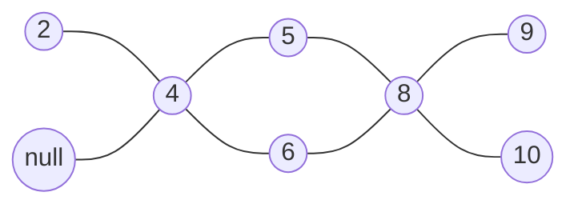

# 6.1

## [473. 火柴拼正方形](https://leetcode.cn/problems/matchsticks-to-square/)


暴力回溯肯定是过不了的，需要剪枝

第一次剪枝：首先围成正方形，相当于将数组 matchsticks 四等分，且每等分的子序列的和是一样的，所以显然需要先统计求和，至少先看看 sum 能不能四等分

```java
class Solution {
    // 统计每条边的边长
    private int edgeLen;
    // 使用掩码记录已经使用的 stick 的情况
    private int mask;
    // 原数组
    private int[] matchsticks;
    public boolean makesquare(int[] matchsticks) {
        int sum = 0;
        for (int matchstick : matchsticks) sum += matchstick;
        // 相当于模 4 
        if ((sum & 3) != 0) return false;
        // 相当于除 4
        this.edgeLen = sum >>= 2; 
        this.mask = 0;
        this.matchsticks = matchsticks;
        return dfs(0, 0);
    }
	
    /**
     * 第一个参数 count 表明当前已经凑出的边有几条
     * 第二个参数 base 表明当前递归叠加的边的长度
     */
    private boolean dfs(int count, int base) {
        if (count == 4) return true;
        
        for (int i = 0; i < matchsticks.length; i++) {
            // 找边的时候肯定需要找那些没有使用过的，并且叠加上去不会超出平均边长的
            if (((mask >> i) & 1) == 0 && base + matchsticks[i] <= edgeLen) {
                /*
                	这里使用了 tmp 前缀用来记录，count 和 base
                	主要是因为如果 base + matchsticks[i] = edgeLen 后 dfs 的条件就改变了
                	如果使用原来的变量，不仅在递归前需要判断一次，回溯的时候还需要判断一次
                	现在仅需要回溯掩码就行了，仅有掩码在不同条件下的 dfs 的变化规律是一致的
                */
                int tmpCount = count;
                int tmpBase = base + matchsticks[i];
                mask ^= 1 << i;
                if (tmpBase == edgeLen) {
                    tmpCount++;
                    tmpBase = 0;
                }
                if (dfs(tmpCount, tmpBase)) return true;
                mask ^= 1 << i;
            }
        }
        return false;
    }
}
```

实际跑的时候会 TLE，卡在输入：**[5,5,5,5,16,4,4,4,4,4,3,3,3,3,4]**

第二次剪枝：因为实际输入的数组中存在重复的项，所以如果 nums[i + 1] = nums[i]，同时我们递归的时候发现 nums[i] 不能满足条件，那么显然在回溯回来再遍历时就不需要考虑 nums[i + 1] 了，所以可以先对原数组进行排序，然后快速通过那些不满足条件的 stick

```java
// 这个代码整体上相比于上面的那一版就多了两行，就是带注释的两行
class Solution {
    private int edgeLen;
    private int mask;
    private int[] matchsticks;
    public boolean makesquare(int[] matchsticks) {
        int sum = 0;
        for (int matchstick : matchsticks) sum += matchstick;
        if ((sum & 3) != 0) return false;
        this.edgeLen = sum >>= 2; 
        this.mask = 0;
        this.matchsticks = matchsticks;
        // 排序
        Arrays.sort(matchsticks);
        return dfs(0, 0);
    }

    private boolean dfs(int count, int base) {
        if (count == 4) return true;
        for (int i = 0; i < matchsticks.length; i++) {
            if (((mask >> i) & 1) == 0 && base + matchsticks[i] <= edgeLen) {
                int tmpCount = count;
                int tmpBase = base + matchsticks[i];
                mask ^= 1 << i;
                if (tmpBase == edgeLen) {
                    tmpCount++;
                    tmpBase = 0;
                }
                if (dfs(tmpCount, tmpBase)) return true;
                mask ^= 1 << i;
                // 既然能走到这里，说明 nums[i] 一定时不满足条件的，此时快速排除掉和其相当的就可以了
                while (i < matchsticks.length - 1 && matchsticks[i + 1] == matchsticks[i]) i++;
            }
        }
        return false;
    }
}
```

上面的这一版能过，但是结果不好看，还可以继续剪枝

第三次剪枝：这个是参考了别人的写法后改进的，具体的就是上面每次递归的时候都从 i = 0 位置开始，这里可以优化在未满足 base + matchsticks[i] = edgeLen 的时候，下一次递归从 i + 1 开始，而当满足了条件时，才考虑将递归开始的位置重置为 0

```java
class Solution {
    private int edgeLen;
    private int mask;
    private int[] matchsticks;
    public boolean makesquare(int[] matchsticks) {
        int sum = 0;
        for (int matchstick : matchsticks) sum += matchstick;
        if ((sum & 3) != 0) return false;
        this.edgeLen = sum >> 2; 
        this.mask = 0;
        this.matchsticks = matchsticks;
        Arrays.sort(matchsticks);
        // 现在输入多了一个参数 idx，表示递归开始的位置
        return dfs(0, 0, 0);
    }

    private boolean dfs(int count, int base, int idx) {
        if (count == 4) return true;
        for (int i = idx; i < matchsticks.length; i++) {
            if (((mask >> i) & 1) == 0 && base + matchsticks[i] <= edgeLen) {
                int tmpCount = count;
                int tmpBase = base + matchsticks[i];
                /*
                	同样的因为不同条件下进行 dfs 的参数 idx 也是不同的
                	为了避免在回溯的时候也进行判断，所以也是用局部变量 tmp 存储 idx 
                */
                int tmpIdx = i + 1;
                mask ^= 1 << i;
                // 满足条件后将 idx 置为 0
                if (tmpBase == edgeLen) {
                    tmpCount++;
                    tmpBase = 0;
                    tmpIdx = 0;
                }
                if (dfs(tmpCount, tmpBase, tmpIdx)) return true;
                mask ^= 1 << i;
                while (i < matchsticks.length - 1 && matchsticks[i + 1] == matchsticks[i]) i++;
            }
        }
        return false;
    }
}
```

> 这种将递归开始位置动态变化的正确性给不出严格的证明，参考的解答中都是将原数组进行降序排列后，按照这种方式求解，这里偷懒了，还是按照升序排列，反正提交也过了

# 6.3

## [829. 连续整数求和](https://leetcode.cn/problems/consecutive-numbers-sum/)


就是简单的遍历，对于窗口大小为 win 的，最小大小为：$\frac{\text{(1 + win)} \times \text{win}}{2}$，称其为$\text{win}_\text{min}$窗口每移动一次，这个这个值增长 win

如果 n 可以分解为连续的，大小为 win 的窗口，那么从数值上一定有：n = $\text{win}_\text{min} + \text{win} \times \text{k}$ ，其中 k 为整数

所以可以遍历窗口，如果 n - $\text{win}_\text{min}$ 可以整除 win，说明可以将 n 分解为连续的长度为 win 的加和

现在的关键点在于遍历的终点，第一次的想法是让 $\text{win}_\text{min} \leq \text{n}$，作为迭代的条件

```java
class Solution {
    public int consecutiveNumbersSum(int n) {
        int base = 1;
        int win = 1;
        int rst = 0;
        while (base <= n) {
            if ((n - base) % win == 0) rst++;
            base += ++win;
        }   
        return rst;
    }
}
```

还挺快的，不过有更科学的边界求法，假设窗口从 a 开始，大小为 win，那么有：
$$
\begin{equation}
	\begin{aligned}
	\frac{\text{(a + a + k - 1)k}}{2} = \text{n}&\\
	\text{2a} = \frac{\text{2n}}{\text{k}} + 1 - \text{k}&\\
	\end{aligned}
\end{equation}
$$
因为 a 从 1开始，所以一定有：
$$
\begin{equation}
	\begin{aligned}
		\text{2a} = \frac{\text{2n}}{\text{k}} + 1 - \text{k} \geq 2\\
		\text{2n} \geq \text{(k + 1)k} \geq \text{k}^2\\
	\end{aligned}
\end{equation}
$$
从而长度 k 一定满足：$k \leq \sqrt{\text{2n}}$

```java
class Solution {
    public int consecutiveNumbersSum(int n) {
        int base = 1;
        int win = 1;
        int rst = 0;
        int target = (int)Math.sqrt(2 * n);
        while (win <= target) {
            if ((n - base) % win == 0) rst++;
            base += ++win;
        }
        return rst;
    }
}
```

# 6.5

## [478. 在圆内随机生成点](https://leetcode.cn/problems/generate-random-point-in-a-circle/)


显然直接的想法是转化为极坐标求解，分别随机得到求出 $\rho$ 和 $\theta$，再根据直角坐标和极坐标的转化公式得到对应的直角坐标公式

如果只是这样简单的随机的话，会有大问题，对于长度为 r 的半径，$\rho$ 有 0.5 的概率选到 [0, 0.5r]，而这部分对应的面积为 $\frac{\pi r^2}{4}$，仅为整个圆面积的 0.25 倍；即随机的点将以 0.5 的概率随机到半径为 0.5r 的圆内

出现这个问题的根本原因在于面积公式中 r 是平方项，r 的随机选取在转化到面积时会被放大

所以一个方法是从 [0, $\text{r}^2$] 内选取随机值，然后将得到的结果值开根号得到最终的 $\rho$

> 个人理解这种随机相当于对面积取随机，然后反向将结果映射给 $\rho$

```java
class Solution {
    private double vir_radius;
    private double x_center;
    private double y_center;
    private Random random;
    public Solution(double radius, double x_center, double y_center) {
        this.vir_radius = radius * radius;
        this.x_center = x_center;
        this.y_center = y_center;
        this.random = new Random();
    }
    
    public double[] randPoint() {
        double rho = Math.sqrt(random.nextDouble(vir_radius));
        double theta = random.nextDouble(Math.PI * 2);
        return new double[]{x_center + rho * Math.cos(theta), y_center + rho * Math.sin(theta)};
    }
}
```

# 6.7

## 不重叠区间问题

这类问题是最多会议数问题的抽象(给定了一堆会议，然后问可以参加的最大会议数，更进一步的还可能再给一个数组表示价值，参加会议可以获得的最大价值)

这里仅讨论不重叠区间，不包含每个区间的价值

母题为[435. 无重叠区间](https://leetcode.cn/problems/non-overlapping-intervals/)

一般的做法是贪心求解，贪心的思路是按照区间结束的位置进行排序，结束位置相同的类型不必再按照区间的开始排序

为了让选择的区间个数尽可能多，应该选择区间结束尽可能"早"的，这样可以给后面的区间留下更多空间


```java
class Solution {
    public int eraseOverlapIntervals(int[][] intervals) {
        int len = intervals.length;
        if (len == 1) return 0;
        // 按照区间的结束位置排序
        Arrays.sort(intervals, (nums1, nums2) -> nums1[1] - nums2[1]);
        int rst = 1;
        int end = intervals[0][1];
        for (int i = 1; i < len; i++) {
            if (intervals[i][0] < end) continue;
            rst++;
            end = intervals[i][1];
        }
        return len - rst;
    }
}
```

### [646. 最长数对链](https://leetcode.cn/problems/maximum-length-of-pair-chain/)


和上面的就是一个题换了个问法

```java
class Solution {
    public int findLongestChain(int[][] pairs) {
        Arrays.sort(pairs, (nums1, nums2) -> nums1[1] - nums2[1]);
        int rst = 1;
        int end = pairs[0][1];
        for (int i = 1; i < pairs.length; i++) {
            if (pairs[i][0] <= end) continue;
            rst++;
            end = pairs[i][1];
        }
        return rst;
    }
}
```

### [452. 用最少数量的箭引爆气球](https://leetcode.cn/problems/minimum-number-of-arrows-to-burst-balloons/)


这个题的问法稍微隐晦了一点，他要求最小的弓箭个数，不过本质上还是一样的，还是求解不重叠区间的个数，如果区间不重叠，那么一定不能公用弓箭(这里根据示例 3 可知，区间边界相等也算是区间重叠的情况)

```java
class Solution {
    public int findMinArrowShots(int[][] points) {
        // 这里排序的时候没有使用减法，是因为 输入范围太大了，超出了 int 类型的f
        Arrays.sort(points, (nums1, nums2) -> {
            if (nums1[1] < nums2[1]) return -1;
            return 1;
        });
        int rst = 1;
        int end = points[0][1];
        for (int i = 1; i < points.length; i++) {
            if (points[i][0] <= end) continue;
            rst++;
            end = points[i][1];
        }
        return rst;
    }
}
```

# 6.10

## [730. 统计不同回文子序列](https://leetcode.cn/problems/count-different-palindromic-subsequences/)


这个题的突破口在于 `s[i]` 仅包含 a，b，c，d；那么不管什么样的子序列，都可以分成四类，以 a 开头的，以 b 开头的，以 c 开头的，以 d 开头的

假如定义 `dp[i][j]` 为从 i 到 j 中不同的子序列的个数，那么这些子序列一定属于上面的四类中的一种，所以统计的时候也可以分成四类统计

假如从 i 到 j 中最左侧的 a 的下标为 left 而最右侧的 a 的下标为 right，那么，如果：

*   left = right：此时在 i 到 j 段中 a 开头的回文子序列的贡献仅为 1，即 a 本身

*   left + 1 = right：此时在 i 到 j 段中 a 开头的回文子序列的贡献为 2，即 a 和 aa 两个子序列

*   left + 1 < right：此时在 i 到 j 段中 a 开头的子序列的贡献需要考虑 dp\[left + 1][right - 1] 的影响，此时的子序列包括：

    *   a
    *   aa
    *   left + 1 到 right - 1 段的所有子序列的两侧加上 a 

    所以此时 a 开头的回文子序列对 dp\[i][j] 的贡献为 2 + dp\[left + 1][right - 1]

>   剩下的对于 b，c，d 开头的回文子序列的分析是一样的

我们上面的分析，都基于了 left 和 right，即我们需要快速求出字符串的某段(从 i 到 j)中某种字符(比如上面的 a)的最左侧下标 left 和最右侧下标 right

事实上，我们的二层遍历本身就帮我们解决了这个问题，外层循环从左向右遍历，本身就是不断更新右边界的过程，那么可以定义一个大小为 4 的数组，表示为某种字符的右边界；而内层循环从右向左遍历，本身也就是不断更新左边界的过程，同样的定义一个大小为 4 的数组，表示为某种字符的左边界

```java
class Solution {
    private static final int MOD = (int)1e9 + 7;
    public int countPalindromicSubsequences(String s) {
        int len = s.length();
        int[][] dp = new int[len][len];
        // 左右边界
        int[] left = new int[4];
        int[] right = new int[4];
        // 初始化默认值为 -1 表示无效
        Arrays.fill(right, -1);
		// 外层循环从左向右
        for (int i = 0; i < len; i++) {
            // 更新右边界
            right[s.charAt(i) - 'a'] = i;
            // 这里注意每次要重置左边界
            Arrays.fill(left, -1);
            // 内层循环从右向左
            for (int j = i; j >= 0; j--) {
                left[s.charAt(j) - 'a'] = j;
                for (int k = 0; k < 4; k++) {
                    // 这里只需要判断左边界即可，因为如果右边界非法，那么左边界一定也非法
                    if (left[k] == -1) continue;
                    // 注意到每次更新的是 dp[j][i]，因为在我们的这种循环中 j 更新的是左边界，而 i 更新的是右边界
                    if (left[k] == right[k]) {
                        dp[j][i]++;
                    } else if (left[k] + 1 == right[k]){
                        dp[j][i] += 2;
                    } else {
                        dp[j][i] += dp[left[k] + 1][right[k] - 1] + 2;
                    }
                    dp[j][i] %= MOD;
                }
            }
        }
        return dp[0][len - 1];
    }
}
```

>   注意上面的文字型说明中的变量定义和代码中的变量定义不完全一致，一定要理解后再看代码

# 6.11

## [926. 将字符串翻转到单调递增](https://leetcode.cn/problems/flip-string-to-monotone-increasing/)


这个题真的想不到居然是 LIS，找到最长递增的子序列(如果长度为 l)，求解的是 len - l

```java
class Solution {
    public int minFlipsMonoIncr(String s) {
        int[] d = new int[s.length()];
        int idx = 0;
        for (int i = 0; i < s.length(); i++) {
            int num = s.charAt(i) - '0';
            if (idx == 0 || num >= d[idx - 1]) {
                d[idx++] = num; 
            } else {
                int left = 0;
                int right = idx;
                while (left < right) {
                    int mid = left + ((right - left) >> 1);
                    if (d[mid] <= num) {
                        left = mid + 1;
                    } else {
                        right = mid;
                    }
                }
                d[left] = num;
            }
        }
        return s.length() - idx;
    }
}
```

一个更好的办法是枚举，因为最终的字符串一定是一堆 0 后面跟着一堆 1，那么我们可以枚举 0 结束的终点，借助前缀和数组，求解不同终点下需要变更的字符的个数

```java
class Solution {
    public int minFlipsMonoIncr(String s) {
        int len = s.length();
        int[] preSum = new int[len + 1];
        for (int i = 1; i <= len; i++) {
            int num = s.charAt(i - 1) - '0';
            preSum[i] = preSum[i - 1] + num;
        }
        int rst = len - preSum[len];
        for (int i = 0; i < len; i++) {
            int left = preSum[i + 1];
            int right = len - 1 - i - (preSum[len] - preSum[i + 1]);
            rst = Math.min(rst, left + right);
        }
        return rst;
    }
}
```

# 6.12

## [890. 查找和替换模式](https://leetcode.cn/problems/find-and-replace-pattern/)


答案就在题面中，说了可以建立一个一一映射，一个比较简单的做法就是建立两个 map 然后遍历

```java
class Solution {
    public List<String> findAndReplacePattern(String[] words, String pattern) {
        List<String> rst = new ArrayList<>();
        for (String word : words) {
            Map<Character, Character> front = new HashMap<>();
            Map<Character, Character> back = new HashMap<>();
            int i = 0;
            for (; i < word.length(); i++) {
                if (front.containsKey(word.charAt(i)) && front.get(word.charAt(i)) != pattern.charAt(i)) break;
                front.put(word.charAt(i), pattern.charAt(i));
                if (back.containsKey(pattern.charAt(i)) && back.get(pattern.charAt(i)) != word.charAt(i)) break;
                back.put(pattern.charAt(i), word.charAt(i));
            }
            if (i == word.length()) rst.add(word);
        }
        return rst;
    }
}
```

因为原来使用的是 map，这里可以使用数组进行优化，此外我们没必要使用两个映射关系，通过一个数组表示从 word 到 pattern 的映射关系，然后使用 mask 记录 pattern 中已经使用的字符

```java
class Solution {
    public List<String> findAndReplacePattern(String[] words, String pattern) {
        List<String> rst = new ArrayList<>();
        int[] map = new int[26];
        for (String word : words) {
            int mask = 0;
            Arrays.fill(map, -1);
            int i = 0;
            for (; i < word.length(); i++) {
                int w = word.charAt(i) - 'a';
                int p = pattern.charAt(i) - 'a';
                if (map[w] != -1) {
                    if (map[w] != p) break;
                } else {
                    if (((mask >> p) & 1) == 1) break;
                    mask |= 1 << p;
                    map[w] = p;
                }
            }
            if (i == word.length()) rst.add(word);
        }
        return rst;
    }
}
```

# 6.15

## [719. 找出第 K 小的数对距离](https://leetcode.cn/problems/find-k-th-smallest-pair-distance/)


暴力解法是使用一个堆，然后把所有的距离都放进堆中，不出意料的 MLE

真正的解法其实是根据结果的二段性进行二分

```java
class Solution {
    public int smallestDistancePair(int[] nums, int k) {
        Arrays.sort(nums);
        int left = 0;
        int right = nums[nums.length - 1] - nums[0];
        while (left < right) {
            int mid = left + ((right - left) >> 1);
            if (getCount(mid, nums) < k) {
                left = mid + 1;
            } else {
                right = mid;
            }
        }
        return left;
    }

    /**
     * 统计数组 nums 中距离小于等于 dis 的数对个数
     * 对于排序之后的数组，使用滑动窗口的方式求解，将时间复杂度降低为 O(n)
     */
    private int getCount(int dis, int[] nums) {
        int rst = 0;
        int left = 0;
        int right = 1;
        while (left < nums.length) {
            while (right < nums.length && nums[right] - nums[left] <= dis) right++;
            rst += right - left - 1;
            left++;
        }
        return rst;
    }
}
```

# 6.16

## [532. 数组中的 k-diff 数对](https://leetcode.cn/problems/k-diff-pairs-in-an-array/)


排序后重组，比 map 更快

```java
class Solution {
    public int findPairs(int[] nums, int k) {
        Arrays.sort(nums);
        int left = 0;
        int len = nums.length;
        int rst = 0;
        while (left < len) {
            int right = left + 1;
            while (right < len && nums[right] < nums[left] + k) right++;
            if (right < len && nums[right] == nums[left] + k) rst++;
            left++;
            while (left < len && nums[left] == nums[left - 1]) left++;
        }
        return rst;
    }
}
```


# 6.17

## [1089. 复写零](https://leetcode.cn/problems/duplicate-zeros/)


要实现原地修改；因为本身这个修改是一个扩张的过程，为了实现原地修改，需要从后面向前复写

```java
class Solution {
	public void duplicateZeros(int[] arr) {
		int idx = 0;
		int newLen = 0;
		int len = arr.length;
		while (newLen < len) {
			newLen++;
			if (arr[idx] == 0) newLen++;
			if (newLen >= len) break;
			idx++;
		}
		for (int i = len - 1; i >= 0; i--, idx--) {
			arr[i] = arr[idx];
			if (arr[idx] == 0) {
				if (i == len - 1 && newLen > len) continue;
				arr[--i] = 0;
			}
		}
	}
}
```

# 6.18

## [剑指 Offer II 029. 排序的循环链表](https://leetcode.cn/problems/4ueAj6/)


```java
/*
// Definition for a Node.
class Node {
    public int val;
    public Node next;

    public Node() {}

    public Node(int _val) {
        val = _val;
    }

    public Node(int _val, Node _next) {
        val = _val;
        next = _next;
    }
};
*/

class Solution {
    /**
     * 插入的点要么位于链表内部，要么比链表的最后一个元素更大(或者比链表的第一个元素更小)
     * 特别注意输入为 [1,1,1] 插入 2 和 [1,1,2] 插入 2 的区别
     * (也即我们判断链表的结尾时，一定有 node.next.val < node.val)
     */
    public Node insert(Node head, int insertVal) {
        if (head == null) {
            head = new Node(insertVal);
            head.next = head;
            return head;
        }
		
        // 从 head.next 开始遍历，如果遍历回到 head 时还未完成插入，那么节点一定可以插入到 head 后面
        Node per = head.next;
        while (per != head) {
            if ((per.val <= insertVal && insertVal <= per.next.val) || 
            (per.next.val < per.val && (insertVal >= per.val || insertVal <= per.next.val))) {
                Node node = new Node(insertVal);
                node.next = per.next;
                per.next = node;
                return head;
            }
            per = per.next;
        }
        
        Node node = new Node(insertVal);
        node.next = head.next;
        head.next = node;
        return head;
    }
}
```

# 6.20

## [715. Range 模块](https://leetcode.cn/problems/range-module/)


线段树模板题，因为只有 addRange 和 removeRange 两个状态，所以节点的 val 可以使用 boolean 类型表示，同时因为输入的范围很大，使用动态开点的方式实现节点的懒加载

```java
class RangeModule {
    private static final int MIN = 1;
    private static final int MAX = (int)1e9;
    private Node root;
    public RangeModule() {
        this.root = new Node();
    }

    private void pushLazy(Node node) {
        if (node.lazy == 0) return;
        node.left.lazy = node.lazy;
        node.left.val = node.lazy == 1;
        node.right.lazy = node.lazy;
        node.right.val = node.lazy == 1;
        node.lazy = 0;
    }

    private void createLazy(Node node) {
        if (node.left == null) node.left = new Node();
        if (node.right == null) node.right = new Node();
    }
	
    /**
     * 更新方法的四个步骤：
     * 是否覆盖
     * 懒加载、pushLazy
     * 是否有交集
     * 更新当前节点
     */
    private void add(int left, int right, int l, int r, Node node, boolean val) {
        if (left <= l && r <= right) {
            node.val = val;
            node.lazy = val ? 1 : -1;
            return;
        }

        createLazy(node);
        pushLazy(node);

        int mid = l + ((r - l) >> 1);
        if (mid >= left) add(left, right, l, mid, node.left, val);
        if (mid < right) add(left, right, mid + 1, r, node.right, val);
        node.val = node.left.val && node.right.val;
    }
	
    /**
     * 查询方法的三个步骤：
     * 是否覆盖
     * 懒加载、pushLazy
     * 是否存在交集
     */
    private boolean queryRange(int left, int right, int l, int r, Node node) {
        if (left <= l && r <= right) return node.val;
		
        createLazy(node);
        pushLazy(node);
        
        int mid = l + ((r - l) >> 1);
        boolean rst = true;
        if (mid >= left) rst &= queryRange(left, right, l, mid, node.left);
        if (mid < right) rst &= queryRange(left, right, mid + 1, r, node.right);
        return rst;
    }
    
    public void addRange(int left, int right) {
        add(left, right - 1, MIN, MAX, root, true);
    }
    
    public boolean queryRange(int left, int right) {
        return queryRange(left, right - 1, 1, MAX, root);
    }
    
    public void removeRange(int left, int right) {
        add(left, right - 1, MIN, MAX, root, false);
    }
}

class Node {
    boolean val;
    int lazy;
    Node left;
    Node right;
}
```

# 6.23

## [30. 串联所有单词的子串](https://leetcode.cn/problems/substring-with-concatenation-of-all-words/)


因为 words 中的每个单词的长度都是一样的，所以使用滑动窗口时，以每个单词的长度为单位，优化的点在于使用变量 diff 记录当前窗口和 words 数组的不同的地方

```java
class Solution {
    public List<Integer> findSubstring(String s, String[] words) {
        List<Integer> rst = new ArrayList<>();
        // 段大小，即当前窗口的滑动单位
        int segment = words[0].length();
        // 窗口大小
        int win = words.length * segment;
        if (win > s.length()) return rst;
        // map 用来记录当前窗口内的词频
        Map<String, Integer> map = new HashMap<>();
        for (String word : words) map.put(word, map.getOrDefault(word, 0) + 1);
        // 注意我们并不能确定滑动窗口的起始位置，所以外层需要枚举滑动的起点
        for (int i = 0; i < segment; i++) {
            // diff 初始值为 map 的大小
            int diff = map.size();
            // tmp 是 map 的一个复制，因为不能在 map 上直接操作
            Map<String, Integer> tmp = new HashMap<>();
            for (String key : map.keySet()) tmp.put(key, map.get(key));
            // 先统计第一个窗口的 diff 的情况
            for (int j = i; j < win - segment + i; j += segment) {
                String in = s.substring(j, j + segment);
                if (!tmp.containsKey(in)) continue;
                int freq = tmp.get(in);
                if (freq == 1) diff--;
                if (freq == 0) diff++;
                tmp.put(in, freq - 1);
            }
            // 滑动窗口
            for (int j = i; j + win <= s.length(); j += segment) {
                String in = s.substring(j + win - segment, j + win);
                if (tmp.containsKey(in)) {
                    int freq = tmp.get(in);
                    if (freq == 1) diff--;
                    if (freq == 0) diff++;
                    tmp.put(in, freq - 1);
                    if (diff == 0) rst.add(j);
                }
                String out = s.substring(j, j + segment);
                if (!tmp.containsKey(out)) continue;
                int freq = tmp.get(out);
                if (freq == -1) diff--;
                if (freq == 0) diff++;
                tmp.put(out, freq + 1);
            }   
        }
        return rst;
    }
}
```


# 6.24

## [1537. 最大得分](https://leetcode.cn/problems/get-the-maximum-score/)


感觉像是 dp 尝试的写了一下，发现写不出来，找不到状态转移方程，还得参考[题解](https://mp.weixin.qq.com/s/4GziyREElfa2Iy8sSImVOQ)

观察序列，发现最大的合法路径上一定包括了所有的公共点

比如对于上面的示例一，可以写成：



图中节点 4 和节点 8 是可选的，而剩下的路径可以从两条中选择一个更大的

所以我们需要计算：公共节点的和 + 每条可选路径上的最大值

一个简单的方法是遍历两个数组，获取公共的节点的下标索引，并成对的保存，因为两个数组的严格单调递增的特性，使得我们可以在 $O(n + m)$ 的时间内计算下标索引对

使用前缀和数组，计算每个可选段的和，进行比较选择更大的那个加入结果 rst 即可

```java
class Solution {
    private static final int MOD = (int)1e9 + 7;
    public int maxSum(int[] nums1, int[] nums2) {
        int len1 = nums1.length;
        int len2 = nums2.length;
        // 前缀和数组，后面用来计算每个可选段的和
        long[] preSum1 = new long[len1 + 1];
        long[] preSum2 = new long[len2 + 1];
        for (int i = 1; i <= len1; i++) preSum1[i] = preSum1[i - 1] + nums1[i - 1];
        for (int i = 1; i <= len2; i++) preSum2[i] = preSum2[i - 1] + nums2[i - 1];
        int i = 0;
        int j = 0;
        // 保存相同取值的下标对
        List<int[]> comIdx = new ArrayList<>();
        long rst = 0;
        while (i < len1 && j < len2) {
            if (nums1[i] < nums2[j]) {
                i++;
            } else if (nums1[i] > nums2[j]) {
                j++;
            } else {
                comIdx.add(new int[]{i, j});
                rst += nums1[i];
                rst %= MOD;
                i++;
                j++;
                
            }
        }
        int size = comIdx.size();
        // 如果不存在公共节点直接返回二者前缀和中较大的那个
        if (size == 0) return (int)(Math.max(preSum1[len1], preSum2[len2]) % MOD);
        // head 表示从开头到第一个公共节点的最大段的和
        long head = Math.max(preSum1[comIdx.get(0)[0]], preSum2[comIdx.get(0)[1]]);
        // foot 表示从最后一个公共节点到结尾的最大段的和
        long foot = Math.max(preSum1[len1] - preSum1[comIdx.get(size - 1)[0] + 1], preSum2[len2] - preSum2[comIdx.get(size - 1)[1] + 1]);
        rst += head + foot;
        for (int idx = 1; idx < size; idx++) {
            long num1 = preSum1[comIdx.get(idx)[0]] - preSum1[comIdx.get(idx - 1)[0] + 1];
            long num2 = preSum2[comIdx.get(idx)[1]] - preSum2[comIdx.get(idx - 1)[1] + 1]; 
            rst += Math.max(num1, num2);
            rst %= MOD;
        }
        return (int)(rst % MOD);
    }
}
```

但其实这个题是可以使用 dp 的，只不过这里使用了两个 dp 数组，对于 nums1 使用数组 arr1 其中 arr1[i] 表示为遍历到 nums[i]时的最大和(nums2 数组同理)，具体的状态转移方程分为两种情况讨论：

*   如果 nums2 数组中不存在和 nums1[i] 相等的位置，那么有 arr1[i] = arr1[i - 1] + nums1[i]

*   如果存在，且对应的下标位置为 j，那么此时有 nums1[i] = nums2[j];**arr1[i] = arr2[j] = nums1[i] + Math.max(arr1[i - 1], arr2[j - 1])**

    >   注意上面的第二个方程

上面的状态转移方程需要知道在 nums2 中是否存在和 nums1[i] 相等的位置；得益于两个数组的严格单调递增的特性，可以通过特定的遍历顺序，避免遍历查找的行为

```java
class Solution {
	private static final int MOD = (int)1e9 + 7;
	public int maxSum(int[] nums1, int[] nums2) {
		int len1 = nums1.length;
		int len2 = nums2.length;
		long[] arr1 = new long[len1 + 1];
		long[] arr2 = new long[len2 + 1];
		int i = 1;
		int j = 1;
        // 每轮让小的那个数组进行状态转移
		while (i <= len1 && j <= len2) {
			if (nums1[i - 1] < nums2[j - 1]) {
				arr1[i] = arr1[i - 1] + nums1[i - 1];
                i++;
			} else if (nums1[i - 1] > nums2[j - 1]) {
				arr2[j] = arr2[j - 1] + nums2[j - 1];
                j++;
			} else {
				long tmp = nums1[i - 1] + Math.max(arr1[i - 1], arr2[j - 1]);
				arr1[i] = tmp;
				arr2[j] = tmp;
                i++;
                j++;
			}
		}
		while (i <= len1) {
            arr1[i] = arr1[i - 1] + nums1[i - 1];
            i++;
        }
		while (j <= len2) {
            arr2[j] = arr2[j - 1] + nums2[j - 1];
            j++;
        }
		return (int)(Math.max(arr1[len1], arr2[len2]) % MOD);
	}
}
```

# 6.25

## [剑指 Offer II 091. 粉刷房子](https://leetcode.cn/problems/JEj789/)


含泪血赚，今天的是锁题，而且还很简单，直接上去就是一个滚动数组 dp

```java
class Solution {
    public int minCost(int[][] costs) {
        int len = costs.length;
        int[][] dp = new int[2][3];
        dp[0][0] = costs[0][0];
        dp[0][1] = costs[0][1];
        dp[0][2] = costs[0][2];
        for (int i = 1; i < len; i++) {
            int per = i & 1;
            int pre = (i - 1) & 1;
            dp[per][0] = Math.min(dp[pre][1], dp[pre][2]) + costs[i][0];
            dp[per][1] = Math.min(dp[pre][0], dp[pre][2]) + costs[i][1];
            dp[per][2] = Math.min(dp[pre][0], dp[pre][1]) + costs[i][2];
        }
        int idx = (len - 1) & 1;
        return Math.min(dp[idx][0], Math.min(dp[idx][1], dp[idx][2]));
    }
}
```


# 6.28

## [324. 摆动排序 II](https://leetcode.cn/problems/wiggle-sort-ii/)


从最后需要的数组的变化规律来看，可以针对排序后的 nums 数组，使用双指针，分别从数组开始位置 left 和数组最后一个位置 right 开始，特别的对于偶数的下标位置根据 left 下标进行取值，而奇数的下标位置根据 right 下标进行取值

```java
class Solution {
    private static final int N = 5001;
    public void wiggleSort(int[] nums) {
        // 桶排序
        int[] arr = new int[N];
        for (int num : nums) arr[num]++;
       	int idx = 0;
        int left = 0;
        int right = N - 1;
        while (idx < nums.length) {
            if ((idx & 1) == 0) {
                while (arr[left] == 0) left++;
                nums[idx] = left;
                arr[left]--;
            } else {
                while (arr[right] == 0) right--;
                nums[idx] = right;
                arr[right]--;
            }
        }
    }
}
```

上面的解法在第二组输入中出现了问题，当输入为[1,1,2,2,3,3]时，最终 left 和 right 会在 2 处汇聚，而根据题目要求，左右两侧的数据不可相同

第二个思路和第一个差不多，不过这回不再是同时从左右两个端点开始便利了，考虑先放置 nums 中下标为奇数的位置(和上面的一样，还是越大越好)，然后再考虑下标为偶数的位置具体的如下

```java
class Solution {
    private static final int N = 5001;
    public void wiggleSort(int[] nums) {
        // 桶排序
        int[] arr = new int[N];
        for (int num : nums) arr[num]++;
       	int idx = N - 1;
        for (int i = 1; i < nums.length; i += 2) {
            while (arr[idx] == 0) idx--;
            nums[i] = idx;
            arr[idx]--;
        }
        for (int i = 0; i < nums.length; i += 2) {
            while (arr[idx] == 0) idx--;
            nums[i] = idx;
            arr[idx]--;
        }
    }
}
```

## [1647. 字符频次唯一的最小删除次数](https://leetcode.cn/problems/minimum-deletions-to-make-character-frequencies-unique/)


一共有 26 种字符，要求是使得每种字符出现频率不同，删除字符的最小个数

遍历每种字符的词频，并统计词频的占用情况，如果出现了词频重复的情况，就尝试删除，通过循环的形式，查找下一个没有被占用的词频，时间复杂度为 $O(n^2)$

因为输入的范围最大给到了 $10^5$ ，且最多仅会占用 26 个不同的位置，如果使用大数组表示某个大小的词频是否被占用，显然有点浪费，所以这里使用 set 进行词频统计

```java
class Solution {
    private static final int N = 26;
    public int minDeletions(String s) {
        int[] freq = new int[N];
        for (int i = 0; i < s.length(); i++) freq[s.charAt(i) - 'a']++;
        Set<Integer> set = new HashSet<>();
        int rst = 0;
        for (int i = 0; i < N; i++) {
            if (freq[i] == 0) continue;
            if (!set.contains(freq[i])) {
                set.add(freq[i]);
            } else {
                int j = freq[i] - 1;
                while (j >= 1 && set.contains(j)) j--;
                rst += freq[i] - j;
                set.add(j);
            }
        }
        return rst;
    }
}
```

还有一种避免了使用 set 的方法：先对 freq 进行排序，然后从后向前遍历，求出每个位置应该的词频大小

```java
class Solution {
    private static final int N = 26;
    public int minDeletions(String s) {
        int[] freq = new int[N];
        for (int i = 0; i < s.length(); i++) freq[s.charAt(i) - 'a']++;
        Arrays.sort(freq);
        int rst = 0;
        for (int i = 24; i >= 0; i--) {
            // 遍历到 0，遍历结束
            if (freq[i] == 0) break;
            // 注意这个位置必须是 [大于等于] 因为可能出现多个重复的词频，此时修改后边的词频，会影响数组的大小关系
            if (freq[i] >= freq[i + 1]) {
                int tmp = freq[i];
                // 如果后一个词频为 0 证明所有的词频都已经被占用了，此时，当前字符必须全部删除
                freq[i] = freq[i + 1] == 0 ? 0 : freq[i + 1] - 1;
                rst += tmp - freq[i];
            }
        }
        return rst;
    }
}
```

# 6.30

## [1175. 质数排列](https://leetcode.cn/problems/prime-arrangements/)


关键点在于求解小于 n 的质数的个数，具体的方法可以参考[质数筛](./基础不牢地动山摇.md#素数筛)

```java
class Solution {
    private static final long MOD = (int)1e9 + 7;
    public int numPrimeArrangements(int n) {
        int[] arr = new int[n + 1];
        int[] prim = new int[n];
        int idx = 0;
        for (int i = 2; i <= n; i++) {
            if (arr[i] == 0) prim[idx++] = i;
            for (int j = 0; j < idx && prim[j] * i <= n; j++) {
                arr[prim[j] * i] = 1;
                if (i % prim[j] == 0) break;
            }
        }
        return (int)((arrange(idx) * arrange(n - idx)) % MOD);
    }

    private long arrange(int n) {
        if (n <= 1) return 1;
        return (n * arrange(n - 1)) % MOD;
    }
}
```


