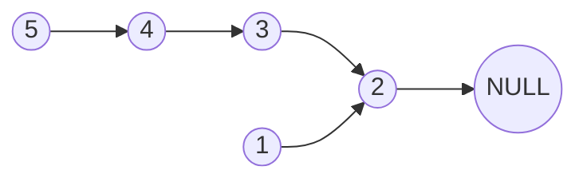
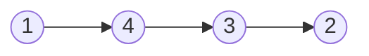

# 7.1

## [241. 为运算表达式设计优先级](https://leetcode.cn/problems/different-ways-to-add-parentheses/)


这题居然不会，还是看了题解才做出来，分明是简单的 dfs + 暴力搜索

```java
class Solution {
    public List<Integer> diffWaysToCompute(String expression) {
        return dfs(expression, 0, expression.length() - 1);
    }
	
    /**
     * dfs 函数用来计算 expressioon 中从 left 到 right 一共具有多少种解
     */
    private List<Integer> dfs(String expression, int left, int right) {
        List<Integer> rst = new ArrayList<>();
        for (int i = left; i <= right; i++) {
            char c = expression.charAt(i);
            if (c >= '0' && c <= '9') continue;
            List<Integer> l = dfs(expression, left, i - 1);
            List<Integer> r = dfs(expression, i + 1, right);
            for (int j = 0; j < l.size(); j++) {
                int ll = l.get(j);
                for (int k = 0; k < r.size(); k++) {
                    int rr = r.get(k);
                    if (c == '-') {
                        rst.add(ll - rr);
                    } else if (c == '+') {
                        rst.add(ll + rr);
                    } else {
                        rst.add(ll * rr);
                    }
                }
            }
        }
        if (rst.size() == 0) rst.add(Integer.parseInt(expression.substring(left, right + 1)));
        return rst;
    }
}
```

# 7.2

## [871. 最低加油次数](https://leetcode.cn/problems/minimum-number-of-refueling-stops/)


虽然做过，但是还是不会做，寄

贪心的想法是：假设路过加油站的时候，我先把油带上，但我不加；路上能不加就不加，如果不得不加，就找油最多的加


```java
class Solution {
    public int minRefuelStops(int target, int startFuel, int[][] stations) {
        PriorityQueue<Integer> heap = new PriorityQueue<>((num1, num2) -> num2 - num1);
        int rst = 0;
        int pos = 0;
        for (int[] station : stations) {
            startFuel -= station[0] - pos;
            // 如果走不到下一站，属于不得不加油，此时找油最多的加
            while (!heap.isEmpty() && startFuel < 0) {
                startFuel += heap.poll();
                rst++;
            }
            // 如果没得加，或者加完了还是走不到，那就寄了
            if (startFuel < 0) return -1;
            pos = station[0];
            // 先把油带上，但不加
            heap.offer(station[1]);
        }
        // 注意出循环后仅仅是走完了所有的加油站，并没有到达终点
        startFuel -= target - pos;
        while (!heap.isEmpty() && startFuel < 0) {
            startFuel += heap.poll();
            rst++;
        }
        if (startFuel < 0) return -1;
        return rst;
    }
}
```

上面这种做法是遍历加油站驱动的，但事实上更好的做法是不断更新起点：

```java
class Solution {
    public int minRefuelStops(int target, int startFuel, int[][] stations) {
        PriorityQueue<Integer> heap = new PriorityQueue<>((num1, num2) -> num2 - num1);
        int rst = 0;
        int dis = startFuel;
        int idx = 0;
		// 只要当前没走到 target 就一直循环
        while (dis < target) {
            // 把当前路过的加油站的油都带上
            while (idx < stations.length && dis >= stations[idx][0]) heap.offer(stations[idx++][1]);
            if (!heap.isEmpty()) {
                // x
                dis += heap.poll();
                rst++;
            } else return -1;
        }
        return rst;
    }
}
```

# 7.3

## [376. 摆动序列](https://leetcode.cn/problems/wiggle-subsequence/)


看到这个题的第一眼，想到了 LIS 问题，想着使用类似的方法求解，首先是 $O(n^2)$ 的解法

```java
class Solution {
    public int wiggleMaxLength(int[] nums) {
        int len = nums.length;
        // dp[i][0] 表示以 i 结尾，最后是降序的最长子序列的长度
        // dp[i][1] 表示以 i 结尾，最后是升序的最长子序列的长度
        int[][] dp = new int[len][2]; 
        int rst = 1;
        for (int i = 0; i < len; i++) {
            Arrays.fill(dp[i], 1);
            for (int j = i - 1; j >= 0 ; j--) {
                if (nums[j] == nums[i]) continue;
                if (nums[j] > nums[i]) {
                    dp[i][0] = Math.max(dp[i][0], dp[j][1] + 1); 
                } else {
                    dp[i][1] = Math.max(dp[i][1], dp[j][0] + 1);
                }
            }
            rst = Math.max(rst, Math.max(dp[i][0], dp[i][1]));
        }
        return rst;
    }
}
```

优化的时候，看了题解，感觉它 dp 定义的并不是很好，状态转移方程的解释也不是很好，最后看了一个国外的题解 [(1) ✔️ C++ O ( N ) || EXPLAINED || ; \] - LeetCode Discuss](https://leetcode.com/problems/wiggle-subsequence/discuss/2229495/C%2B%2B-O-(-N-)-oror-EXPLAINED-oror)，里面有一张图：


将任意一个数组展开，都具有类似上面的这种折线图的形式，无非是折线的峰值和谷值的个数存在些许变化，不过整体上大差不差；我们需要求出的，就是所有的被红圈标注的点，这看起来就很直观了

```java
class Solution {
    public int wiggleMaxLength(int[] nums) {
        int len = nums.length;
        int rst = 1;
        int isGreater = -1;
        for (int i = 1; i < len; i++) {
            // 如果当前元素和前一个数字相等，那么就可以当这个元素不存在
            if (nums[i] == nums[i - 1]) continue;
            // 如果比前一个更大，那么不一定更新 rst，只有当前一个是谷值时(isGreater = 0)，才进行更新
            if (nums[i] > nums[i - 1]) {
                if (isGreater != 1) {
                    rst++;
                    isGreater = 1;
                }
                // 如果比前一个小，同样也不一定更新，只有当前一个时峰值时，才进行更新
            } else {
                if (isGreater != 0) {
                    rst++;
                    isGreater = 0;
                }
            }
        }
        return rst;
    }
}
```

# 7.4

## [1200. 最小绝对差](https://leetcode.cn/problems/minimum-absolute-difference/)


简单的排序题，这个题本身没什么说的，只不过这里讨论了堆排序和归并排序两种方式

### 堆排序

构建堆，节点下标索引从 0 开始，所以对于任意一个节点 idx，其左子节点为 idx * 2 + 1，右子节点为 idx * 2 + 2，其父节点为 (idx - 1) / 2

所谓堆排序，就是一个不断构建堆(大顶堆)的过程；第一次构建好堆后，堆顶一定是数组中最大的元素，对于排序之后的数组，堆顶的位置一定是在数组的末尾，如果此时将堆顶和数组末尾互换，并缩小堆的大小，并重新构建堆，这样就可以选出原数组中第二大的元素(新堆顶)，重复操作，即可得到排序后的数组

上述文字的代码形式如下：

```java
public void heapSort(int[] nums) {
    for (int i = nums.length - 1; i >= 0; i--) {
        buildHeap(nums, i);
        int tmp = nums[0];
        nums[0] = nums[i];
        nums[i] = tmp;
    }
}
// buildHeap 的方法签名如下：
public void buildHeap(int[] nums, int upLimit);
```

下一步需要完善的就是构建堆 buildHeap 方法，那么根据之前对于堆的了解，我们知道，**构建堆，就是从第一个具有子节点的节点开始到堆顶结束进行下滤**

上述文字的代码表述如下：

```java
// 因为堆中最后一个可用节点为 upLimit，所以第一个具有子节点的节点为 (upLimit - 1) / 2
public void buildHeap(int[] nums, int upLimit) {
    for (int i = (upLimit - 1) >> 1; i >= 0; i--) percolateDown(i, nums, upLimit);
}
// percolateDown 的方法签名如下：
public void percolateDown(int idx, int[] nums, int upLimit);
```

下滤操作不过是不断的比较父节点和子节点，并通过比较的结果决定是否交换父节点和子节点，如果交换，则需要考虑进行下一层迭代交换

上述文字的代码表述如下：

```java
public void percolateDown(int idx, int[] nums, int upLimit) {
    int tmp = nums[idx];
    int child = (idx << 1) + 1;
    while (child <= upLimit) {
        if (child < upLimit && nums[child + 1] > nums[child]) child++;
        if (nums[idx] < nums[child]) {
            nums[idx] = nums[child];
            idx = child;
            child = (idx << 1) + 1;
        } else break;
    }
    nums[idx] = tmp;
}
```

要注意的是对于上面的这个题，如果使用堆排序会 TLE

>   也许是堆排序写错了吧

### 归并排序

这个就简单多了

```java
public void mergeSort(int[] nums) {
    int[] tmp = new int[nums.length];
    mergeSort(0, nums.length - 1; nums, tmp);
}

public void mergeSort(int left, int right, int[] nums, int[] tmp) {
    if (left >= right) return;
    int mid = left + ((right - left) >> 1);
    mergeSort(left, mid, nums, tmp);
    mergeSort(mid + 1, right, nums, tmp);
    merge(left, mid, right, nums, tmp);
}

public void merge(int left, int mid, int right, int[] nums, int[] tmp) {
    int p = left;
    int i = left;
    int j = mid + 1;
    while (i <= mid && j <= right) {
        if (nums[i] < nums[j]) {
            tmp[p++] = nums[i++];
        } else {
            tmp[p++] = nums[j++];
        }
    }
    while (i <= mid) tmp[p++] = nums[i++];
    while (j <= right) tmp[p++] = nums[j++];
    for (int k = left; k <= right; k++) nums[k] = tmp[k];
}
```

## [135. 分发糖果](https://leetcode.cn/problems/candy/)


这个题看到的第一个想法是贪心，先给分数最少的孩子发，确定他们的糖果数，然后再考虑其他孩子

```java
class Solution {
    public int candy(int[] ratings) {
        int len = ratings.length;
        // 先一个人发一个
        int rst = len;
        // 小顶堆
        PriorityQueue<Integer> heap = new PriorityQueue<>((idx1, idx2) -> ratings[idx1] - ratings[idx2]);
        for (int i = 0; i < len; i++) heap.offer(i);
        // candy[i] 表示每个孩子发的糖果数(已经排除了每个孩子至少一个)
        int[] candy = new int[len];
		// 先给分数最少的发，如果比旁边的两个人大，那么得到的糖果数取决于旁边两个中糖果数多的那个
        while (!heap.isEmpty()) {
            int tmp = heap.poll();
            if (tmp > 0 && ratings[tmp] > ratings[tmp - 1]) candy[tmp] = candy[tmp - 1] + 1;
            if (tmp < len - 1 && ratings[tmp] > ratings[tmp + 1]) candy[tmp] = Math.max(candy[tmp], candy[tmp + 1] + 1);
            rst += candy[tmp];
        }
        return rst;
    }
}
```

这种做法的主要时间集中在了求糖果数最少的人上了，题解中的贪心做法，可以在 $O(n)$ 的时间内完成求解

定义了两个数组 left 和 right 分别表示了为了满足左侧和右侧条件，需要的最少糖果数

```java
class Solution {
    public int candy(int[] ratings) {
        int len = ratings.length;
        int[] left = new int[len];
        int[] right = new int[len];
        int rst = len;
        for (int i = 1; i < len; i++) {
            if (ratings[i] > ratings[i - 1]) left[i] = left[i -1] + 1;
        }
        for (int i = len - 2; i >= 0; i--) {
            if (ratings[i] > ratings[i + 1]) right[i] = right[i + 1] + 1;
        }
        // 选择大的加和
        for (int i = 0; i < len; i++) rst += Math.max(left[i], right[i]);
        return rst;
    }
}
```

# 7.6

## [736. Lisp 语法解析](https://leetcode.cn/problems/parse-lisp-expression/)


一道没什么意思的题，说不上多难，就是编码比较麻烦

简单来说就是递归

```java
class Solution {
	public int evaluate(String expression) {
		return parse(expression, 1, new HashMap<>())[0];
	}

	/**
	 * int[0] 表示返回的 val
	 * int[1] 表示结束下标就是字符串中 ')' 的下标
	 */
	private int[] parse(String expression, int idx, Map<String, Integer> map) {
		int i = idx;
		while (expression.charAt(i) != ' ') i++;
		String op = expression.substring(idx, i);
		i++;
		if (op.equals("let")) {
			Map<String, Integer> cpy = new HashMap<>();
			for (String key : map.keySet()) cpy.put(key, map.get(key));
			int[] rst = new int[2];
			while (true) {
				if (expression.charAt(i) == '(') {
					rst = parse(expression, i + 1, cpy);
					rst[1]++;
					return rst;
				}
				int j = i;
				while (expression.charAt(j) != ' ' && expression.charAt(j) != ')') j++;
				String s = expression.substring(i, j);
				if (expression.charAt(j) == ')') {
					int[] tmp = isDigit(s);
					if (tmp[0] == 0) {
						rst[0] = cpy.get(s);
					} else {
						rst[0] = tmp[1];
					}
					rst[1] = j;
					return rst;
				}
				String varName = s;
				i = j + 1;
				if (expression.charAt(i) == '(') {
					int[] tmp = parse(expression, i + 1, cpy);
					cpy.put(varName, tmp[0]);
					i = tmp[1] + 2;
				} else {
					j = i;
					while (expression.charAt(j) != ' ') j++;
					s = expression.substring(i, j);
					int[] tmp = isDigit(s);
					if (tmp[0] == 0) {
						cpy.put(varName, cpy.get(s));
					} else {
						cpy.put(varName, tmp[1]);
					}
					i = j + 1;
				}
			}
		} else {
			int[] tmp = parseVal(expression, i, map);
			int val1 = tmp[0];
			i = tmp[1] + 1;
			tmp = parseVal(expression, i, map);
			int val2 = tmp[0];
			int[] rst = new int[2];
			rst[0] = op.equals("add") ? val1 + val2 : val1 * val2;
			rst[1] = tmp[1];
			return rst;
		}
	}

	/**
	 * 解析 add 和 mul 中两个 expression 中的一个的表达式
	 * int[0] 表示返回的 val
	 * int[1] 表示结束的下标, 空格或 ")" 的下标
	 * 如果是空格的话那么解析的就是第一个 expression
	 * 如果是 ')' 的话，解析的就是第二个 expression
	 */
	private int[] parseVal(String expression, int i, Map<String, Integer> map) {
		int[] rst = new int[2];
		if (expression.charAt(i) == '(') {
			rst = parse(expression, i + 1, map);
			rst[1]++;
		} else {
			rst[1] = i;
			while (expression.charAt(rst[1]) != ' ' && expression.charAt(rst[1]) != ')') rst[1]++;
			String s = expression.substring(i, rst[1]);
			int[] tmp = isDigit(s);
			if (tmp[0] == 0) {
				rst[0] = map.get(s);
			} else {
				rst[0] = tmp[1];
			}
		}
		return rst;
	}

	/**
	 * 解析数值
	 * int[0] 为 0 时表示数据无效，
	 * int[1] 为解析的数值
	 */
	private int[] isDigit(String s) {
		int[] rst = new int[2];
		int i = 0;
		boolean isNeg = s.charAt(0) == '-';
		if (isNeg) i++;
		while (i < s.length()) {
			char c = s.charAt(i);
			if (c <= '9' && c >= '0') {
				rst[1] = rst[1] * 10 + c - '0';
			} else return rst;
			i++;
		}
		rst[0] = 1;
		rst[1] = isNeg ? -rst[1] : rst[1];
		return rst;
	}
}
```

# 7.7

## [648. 单词替换](https://leetcode.cn/problems/replace-words/)


[历史遗留的问题](./21_10.md#648-单词替换)，当时的解法看起来很不爽

这个题要注意示例 3，看到如果同时有 a aa aaa 那么一律以前缀 a 为主

其实这个题很好做，字典树，把字典中的前缀都放入字典树，随后枚举 sentence 中的每个单词；然后对于每个单词进行字符级别的遍历，遍历的过程其实就是搜索的过程，只要搜索到的当前节点的 isEnd 为 true 就停止搜索，并将已经遍历的字符以串的形式返回

这里有一个可以优化的地方，就是当我们将前缀放入字典树时，如果某个节点的 isEnd 已经为 true 了，就不需要将该单词放入了，因为更短的前缀已经出现了

```java
class Solution {
    private Node root;
    public String replaceWords(List<String> dictionary, String sentence) {
        this.root = new Node();
        // 这里的排序选加，其实还是优化向字典树中添加节点的操作
        // dictionary.sort((s1, s2) -> s1.length() - s2.length());
        for (String word : dictionary) add(word);
        String[] words = sentence.split(" ");
        StringBuilder builder = new StringBuilder();
        for (String word : words) builder.append(replace(word)).append(' ');
        // 别忘了把最后的一个空格删了
        builder.delete(builder.length() - 1, builder.length());
        return builder.toString();
    }

    private String replace(String word) {
        Node node = root;
        for (int i = 0; i < word.length(); i++) {
            int idx = word.charAt(i) - 'a';
            // 如果遍历到某个字符，发现字典树中没有对应的节点，直接返回原字符，表示字典中没有对应的前缀
            if (node.children[idx] == null) return word;
            // 如果遍历到某个节点发现 isEnd 为 true 了，说明找到前缀了直接返回就行
            if (node.children[idx].isEnd) return word.substring(0, i + 1);
            node = node.children[idx];
        }
        // 出循环的唯一可能性就是字符串比字典树中的前缀还短
        return word;
    }

    private void add(String word) {
        Node node = root;
        for (int i = 0; i < word.length(); i++) {
            int idx = word.charAt(i) - 'a';
            if (node.children[idx] == null) node.children[idx] = new Node();
            // 优化点(不加不影响结果)，如果当前添加的单词 word 的前缀已经添加过了，就不添加了
            if (node.children[idx].isEnd) return;
            node = node.children[idx];
        }
        node.isEnd = true;
    }
}
// 字典树中的节点
class Node {
    Node[] children;
    boolean isEnd;
    
    public Node() {
        this.isEnd = false;
        this.children = new Node[26];
    }
}
```

## [677. 键值映射](https://leetcode.cn/problems/map-sum-pairs/)


这个也是[历史遗留问题](./21_11.md#677-键值映射)，当时的解法也不太行，完全不需要额外的 map，就是字典树就行

```java
class MapSum {
    private Node root;
    public MapSum() {
        this.root = new Node();
    }
	/*
     * 插值过程，注意当前插入的键可能是新键，也可能是重复出现过的键
     * 方法的返回参数是当前遍历到节点的 sum
     */
    private int insert(Node node, int idx, String key, int val) {
        // 递归终点
        if (idx == key.length()) {
            int gap = val - node.val;
            node.sum += gap;
            node.val = val;
            return node.sum;
        }
		
        int child = key.charAt(idx) - 'a';
        if (node.children[child] == null) node.children[child] = new Node();
        int origin = node.children[child].sum;
        node.sum += insert(node.children[child], idx + 1, key, val) - origin;
        return node.sum;
    } 
    
    public void insert(String key, int val) {
        insert(root, 0, key, val);
    }
    
    public int sum(String prefix) {
        Node node = root;
        for (int i = 0; i < prefix.length(); i++) {
            int idx = prefix.charAt(i) - 'a';
            if (node.children[idx] == null) return 0;
            node = node.children[idx];
        }
        return node.sum;
    }
}
/**
 * 注意节点的定义规则
 * val 表示当前节点存储的值
 * sum 表示当前节点的子节点(包括当前节点)的 val 的总和
 */
class Node {
    Node[] children;
    int val;
    int sum;

    public Node() {
        children = new Node[26];
        val = 0;
        sum = 0;
    }
}
```

## [97. 交错字符串](https://leetcode.cn/problems/interleaving-string/)


第一次的思路是双指针，其实严格意义上应该是三指针，分别指向 s1，s2，s3；然后根据 s3，选择移动 s1 或 s2

首先说这个思路是有问题的，因为没有考虑 s1[i] == s2[j] == s3[k] 这种情况，此时选择 s1 还是 s2 需要根据字符串后面的内容而定

真正适用的方法是 dp，定义 dp\[i][j] 为 s1 的前 i 位和 s2 的前 j 位是否可以构成 s3 的前 i + j 位，那么返回值显然为 dp\[len1][len2]

状态转移方程：dp\[i][j] 对于 s3 中的第 i + j 位，可以是 s1 的第 i 位或 s2 的第 j 位，所以有：

dp\[i][j] = (dp\[i - 1][j] && (s1[i] == s3[i + j])) || (dp\[i][j - 1] && (s2[j] == s3[i + j]))

整体上是两部分的或运算，即假如 s1[i] == s3[i + j] 时，从 s1 处取字符时 dp\[i][j] 取决于 dp\[i - 1][j]；同理应用于 s2

```java
class Solution {
    public boolean isInterleave(String s1, String s2, String s3) {
        int len1 = s1.length();
        int len2 = s2.length();
        if (len1 + len2 != s3.length()) return false;
        boolean[][] dp = new boolean[len1 + 1][len2 + 1];
        dp[0][0] = true;
        for (int i = 1; i <= len1; i++) dp[i][0] = dp[i - 1][0] && s1.charAt(i - 1) == s3.charAt(i - 1);
        for (int j = 1; j <= len2; j++) dp[0][j] = dp[0][j - 1] && s2.charAt(j - 1) == s3.charAt(j - 1);
        for (int i = 1; i <= len1; i++) {
            for (int j = 1; j <= len2; j++) {
                dp[i][j] = 
                    (s1.charAt(i - 1) == s3.charAt(i + j - 1) && dp[i - 1][j]) || 
                    (s2.charAt(j - 1) == s3.charAt(i + j - 1) && dp[i][j - 1]);
            }
        }
        return dp[len1][len2];
    }
}
```

根据状态转移方程，显然可以通过滚动数组进行优化：

```java
class Solution {
    public boolean isInterleave(String s1, String s2, String s3) {
        int len1 = s1.length();
        int len2 = s2.length();
        if (len1 + len2 != s3.length()) return false;
        boolean[] dp = new boolean[len2 + 1];
        dp[0] = true;
        for (int j = 1; j <= len2; j++) dp[j] = dp[j - 1] && s2.charAt(j - 1) == s3.charAt(j - 1);
        for (int i = 1; i <= len1; i++) {
            dp[0] = dp[0] && s1.charAt(i - 1) == s3.charAt(i - 1) ;
            for (int j = 1; j <= len2; j++) {
                dp[j] = 
                    (s1.charAt(i - 1) == s3.charAt(i + j - 1) && dp[j]) || 
                    (s2.charAt(j - 1) == s3.charAt(i + j - 1) && dp[j - 1]);
            }
        }
        return dp[len2];
    }
}
```

# 7.8

## [1217. 玩筹码](https://leetcode.cn/problems/minimum-cost-to-move-chips-to-the-same-position/)


移动两步是没有成本的，那肯定尽量移动两步啊；如果所有的筹码都尽量向小的位置移动，且能移动两步就移动两步，那么最终一定会分为两类：当前下标模 2 余 1 的和当前下标模 2 余 0 的

```java
class Solution {
    public int minCostToMoveChips(int[] position) {
        int odd = 0;
        int even = 0;
        for (int p : position) {
            if ((p & 1) == 0) {
                even++;
            } else {
                odd++;
            }
        }
        return Math.min(odd, even);
    }
}
```

## [1473. 粉刷房子 III](https://leetcode.cn/problems/paint-house-iii/)


dp，dp\[i]\[j][k] 表示遍历到第 i 个屋子时，将其涂成第 j 种颜色，且当前街区数量为 k 个的最少开销

因为题干中说了，对于已经涂装好的房屋，不能重新涂装，所以在讨论状态转移方程时，可以根据原来房屋的情况，将所有的房屋分成两类

*   房屋已经涂装过了，此时根据 j 的取值分为两种情况：

    *   j 取房屋本来的颜色时：

        *   前一个房屋和当前房屋是一个颜色时：最小的开销为：dp\[i - 1]\[j][k]
        *   前一个房屋和当前房屋不是一个颜色时：最小开销为：min(dp\[i - 1]\[p][k])，其中 p $\in$ (1，n) 且 p $\neq$ j

        所以对于当前的 i 和 j，对于任意的 k，有 dp\[i]\[j][k] 的最小值为上面二者中小的那个

    *   j 不为原来的颜色，此时不管 k 为何值，都有 dp\[i]\[j][k] = INF

*   房屋尚未涂装过，此时需要枚举 j，对于每个 j，内层枚举街区数量，具体的和上面类似：

    *   前一个房屋和当前房屋是一个颜色时：最小的开销为：dp\[i - 1]\[j][k]
    *   前一个房屋和当前房屋不是一个颜色时：最小开销为：min(dp\[i - 1]\[p][k])，其中 p $\in$ (1，n) 且 p $\neq$ j

    所以对于当前的 i 和 j，对于任意的 k，有 dp\[i]\[j][k] = min(dp\[i - 1]\[j][k]，min(dp\[i - 1]\[p][k])) + cost[j]，其中 p $\in$ (1，n) 且 p $\neq$ j

一定要注意的是，在进行枚举是需要保证 i < k，因为不可能出现街区数量比用户数量多的情况

```java
class Solution {
    private static final int INF = 0x3f3f3f3f;
    public int minCost(int[] houses, int[][] cost, int m, int n, int target) {
        int[][][] dp = new int[m + 1][n + 1][target + 1];
        // 街区数量为 0 的一定是非法值，这个数量至少为 1
        for (int i = 1; i <= m; i++) {
            for (int j = 1; j <= n; j++) dp[i][j][0] = INF;
        }
        // 外层枚举屋子
        for (int i = 1; i <= m; i++) {
            // 根据当前房子是否涂刷分为两类：当前房子已经涂刷过了
            if (houses[i - 1] != 0) {
                for (int j = 1; j <= n; j++) {
                    // 根据枚举的颜色和屋子之前的颜色分为两类：二者相等时
                    if (j == houses[i - 1]) {
                        for (int k = 1; k <= target; k++) {
                            // 注意街区的数量不会超过屋子的数量
                            if (k > i) {
                                dp[i][j][k] = INF;
                                continue;
                            }
                            // 下面即为之前提到的状态转移方程
                            dp[i][j][k] = dp[i - 1][j][k];
                            for (int p = 1; p <= n; p++) {
                                if (p != j) dp[i][j][k] = Math.min(dp[i][j][k], dp[i - 1][p][k - 1]);
                            }
                        }
                        // 枚举的屋子的颜色和之前屋子的颜色不相等
                    } else Arrays.fill(dp[i][j], INF);
                } 
                // 当前房子尚未涂刷
            } else {
                for (int j = 1; j <= n; j++) {
                    for (int k = 1; k <= target; k++) {
                        // 注意街区的数量不会超过屋子的数量
                        if (k > i) {
                            dp[i][j][k] = INF;
                            continue;
                        }
                        // 下面的即为之前提到的状态转移方程
                        dp[i][j][k] = dp[i - 1][j][k];
                        for (int p = 1; p <= n; p++) {
                            if (p != j) dp[i][j][k] = Math.min(dp[i][j][k], dp[i - 1][p][k - 1]);
                        }
                        // 要注意因为屋子尚未粉刷，所以最后需要加上开销
                        dp[i][j][k] += cost[i - 1][j - 1];
                    }
                }
            }
            
        }
        // 返回的时候可能出现 INF，此时就是无解的情况
        int rst = INF;
        for (int j = 1; j <= n; j++) rst = Math.min(rst, dp[m][j][target]);
        return rst == INF ? -1 : rst;
    }
}
```

注意这个题不要先统计街区的个数，也统计不明白，因为对于输入类似：[1,0,0,0,1] 的，并不知道原来到底有几个街区

# 7.9

## [873. 最长的斐波那契子序列的长度](https://leetcode.cn/problems/length-of-longest-fibonacci-subsequence/)


反正既然是斐波那契数，自然会想着用 dp，最开始想着定义 dp[i] 表示以 i 结尾的最长的斐波那契子序列的长度，通过两层遍历找前驱的方法求解

```java
class Solution {
    private static final int INF = Integer.MIN_VALUE;
    public int lenLongestFibSubseq(int[] arr) {
        int len = arr.length;
        int[] dp = new int[len];
        Arrays.fill(dp, 1);
        int rst = 0;
        // 两层遍历分别确定一个斐波那契数中的后两位 arr[j] 和 arr[i]，再根据单调递增的特性尝试找到前驱
        for (int i = 2; i < len; i++) {
            for (int j = i - 1; j >= 1; j--) {
                int gap = arr[i] - arr[j];
                if (gap >= arr[j]) break;
                // 二分尝试找到前驱
                int left = 0;
                int right = j - 1;
                while (left < right) {
                    int mid = left + ((right - left) >> 1);
                    if (arr[mid] < gap) {
                        left = mid + 1;
                    } else {
                        right = mid;
                    }
                }
                // 如果找到了前驱，相当于在前驱后面添加了两个元素 arr[j] 和 arr[i]
                if (arr[left] == gap) dp[i] = Math.max(dp[i], dp[left] + 2);
            }
            if (dp[i] > 1) rst = Math.max(rst, dp[i]);
        }
        return rst;
    }
}

```

这个做法对于输入为 [1,2,3,5] 类型的输入就没办法了，最终返回 3；这是因为 dp 的初始化条件 dp 数组中全部元素的取值均为 1，这是符合常理的

但如果深究的话，结合 2 后面的 3，可以知道 dp[1] = 2，这种需要依靠后面的元素确定前面的状态的，就不能使用 dp

问题出现在了状态定义应该定义状态 dp\[i][j] 表示为以 arr[i] 和 arr[j] 结尾的最长的斐波那契子序列的长度，状态转移方程和上面类似，即需要找到一个 t 使得 arr[t] + arr[i] = arr[j]，那么有 dp\[i][j] = dp\[t][i] + 1

```java
class Solution {
    private static final int INF = Integer.MIN_VALUE;
    public int lenLongestFibSubseq(int[] arr) {
        int len = arr.length;
        int[][] dp = new int[len][len];
        for (int i = 0; i < len; i++) {
            // 注意初始化条件，很关键
            dp[i][i] = 1;
            for (int j = i + 1; j < len; j++) dp[i][j] = 2;
        }
        int rst = 0;
        for (int j = 1; j < len; j++) {
            for (int i = j - 1; i >= 0; i--) {
                int gap = arr[j] - arr[i];
                // 提前返回
                if (gap >= arr[i]) break;
                int left = 0;
                int right = i - 1;
                while (left < right) {
                    int mid = left + ((right - left) >> 1);
                    if (arr[mid] < gap) {
                        left = mid + 1;
                    } else {
                        right = mid;
                    }
                }
                if (left < i && arr[left] + arr[i] == arr[j]) dp[i][j] = Math.max(dp[i][j], dp[left][i] + 1);
                rst = Math.max(rst, dp[i][j]);
            }
        }
        // 注意如果 rst 小于 3 即意味着不存在这样的子序列
        return rst < 3 ? 0 : rst;
    }
}
```

## [1696. 跳跃游戏 VI](https://leetcode.cn/problems/jump-game-vi/)


这题也是[历史遗留](./21_10.md#1696-跳跃游戏 VI)问题了，当时的解法也不太优雅

说白了，就是从一个不断滑动的窗口(大小为 k)中选择一个最大的，要尽可能快

第一个想法是堆，反正一个大顶堆就可以解决这个问题

```java
class Solution {
    public int maxResult(int[] nums, int k) {
        int len = nums.length;
        int[] dp = new int[len];
        dp[0] = nums[0];
        PriorityQueue<int[]> heap = new PriorityQueue<>((nums1, nums2) -> nums2[0] - nums1[0]);
        heap.offer(new int[]{dp[0], 0});
        for (int i = 1; i < len; i++) {
            while (heap.peek()[1] < i - k) heap.poll();
            dp[i] = heap.peek()[0] + nums[i];
            heap.offer(new int[]{dp[i], i});
        }
        return dp[len - 1];
    }
}
```

但却是太慢了，你看他的输入 $10^5$，窗口太大了，都放进去确实有点慢

然后开始联想单调栈，同时结合双端队列

```java
class Solution {
    public int maxResult(int[] nums, int k) {
        int len = nums.length;
        if (len == 1) return nums[0];
        int[] dp = new int[len];
        dp[0] = nums[0];
        // 单调栈保留元素的下标
        Deque<Integer> queue = new LinkedList<>();
        queue.offer(0);
        for (int i = 1; i < len; i++) {
            // 每回合让窗口以外的位置出队(此时利用队列的性质)
            while (queue.peekFirst() < i - k) queue.pollFirst();
            dp[i] = dp[queue.peekFirst()] + nums[i];
            // 然后使用类似单调栈的特性，让小于当前位置的元素出栈(此时利用栈的性质)
            while (!queue.isEmpty() && dp[i] >= dp[queue.peekLast()]) queue.pollLast();
            queue.offerLast(i);
        }
        return dp[len - 1];
    }
}
```

>   特别注意这里的两个 while 分别利用了队列和单调栈的性质
>
>   第一个 while 不需要判断双端队列是否为空，而第二个就需要判断；原因不解释，就是从上面说的性质来的

# 7.14

## [745. 前缀和后缀搜索](https://leetcode.cn/problems/prefix-and-suffix-search/)


直觉上是字典树，而这个题需要返回的是最大的下标，所以显然需要一点点改造

可以这样做，让每个节点维护一个 list，表示当前节点下，所有插入单词的下标

这样获取到前缀和后缀的两个 list，因为我们是按照顺序插入的，所以获取到的 list 中节点的下标也是按照顺序增大的，可以很直观的进行比较

```java
class WordFilter {
    private Node front;
    private Node back;

    public WordFilter(String[] words) {
        this.front = new Node();
        this.back = new Node();
        for (int i = 0; i < words.length; i++) {
            insert(words[i], front, i);
            insert(reverse(words[i]), back, i);
        }
    }
    
    public int f(String pref, String suff) {
        List<Integer> frontList = search(pref, front);
        List<Integer> backList = search(reverse(suff), back);
        if (frontList == null || backList == null) return -1;
        int i = frontList.size() - 1;
        int j = backList.size() - 1;
        while (i >= 0 && j >= 0) {
            int iIdx = frontList.get(i);
            int jIdx = backList.get(j);
            if (iIdx > jIdx) {
                i--;
            } else if (iIdx < jIdx){
                j--;
            } else return iIdx;
        }
        return -1;
    }
    
    /**
     * 和普通的迭代插入单词没什么区别，只是多了一个 list 保存下标
     */
    private void insert(String word, Node node, int idx) {
        Node tmp = node;
        for (int i = 0; i < word.length(); i++) {
            int child = word.charAt(i) - 'a';
            if (tmp.children[child] == null) tmp.children[child] = new Node();
            tmp = tmp.children[child];
            tmp.list.add(idx);
        }
    }
	/**
	 * 获取特定前缀的 list
	 */
    private List<Integer> search(String prefix, Node node) {
        Node tmp = node;
        for (int i = 0; i < prefix.length(); i++) {
            int child = prefix.charAt(i) - 'a';
            if (tmp.children[child] == null) return null;
            tmp = tmp.children[child];
        }
        return tmp.list;
    }
	/**
	 * 就是一个工具方法，用于翻转字符串
	 */
    private String reverse(String s) {
        char[] chars = s.toCharArray();
        int i = 0;
        int j = chars.length - 1;
        while (i < j) {
            char tmp = chars[i];
            chars[i] = chars[j];
            chars[j] = tmp;
            i++;
            j--;
        }
        return new String(chars);
    }
}

class Node {
    Node[] children;
    List<Integer> list;
    boolean isEnd;

    public Node() {
        this.children = new Node[26];
        this.list = new ArrayList<>();
        this.isEnd = false;
    }
}
```

# 7.17

## [565. 数组嵌套](https://leetcode.cn/problems/array-nesting/)


也是[历史遗留](./21_11.md#565-数组嵌套)问题了

这个时候一看这个题就想着并查集了，当时的想法是 DFS 寻路

```java
class Solution {
    private int[] parent;
    private int[] weight;
    public int arrayNesting(int[] nums) {
        int len = nums.length;
        this.parent = new int[len];
        this.weight = new int[len];
        for (int i = 0; i < len; i++) {
            parent[i] = i;
            weight[i] = 1;
        }
        for (int i = 0; i < len; i++) union(i, nums[i]);
        int rst = 0;
        for (int i = 0; i < len; i++) rst = Math.max(rst, weight[i]);
        return rst;
    }

    private int getParent(int i) {
        while (parent[i] != i) i = parent[i];
        return i;
    }

    private void union(int i, int j) {
        int iParent = getParent(i);
        int jParent = getParent(j);
        if (iParent == jParent) return;
        if (weight[iParent] < weight[jParent]) {
            parent[iParent] = jParent;
            weight[jParent] += weight[iParent];
        } else {
            parent[jParent] = iParent;
            weight[iParent] += weight[jParent];
        }
    }
}
```

因为太慢了，所以看了一眼题解，他的做法是找到最长的环

对于这个数组，如果将 i -> nums[i] 认为是一条边的话，那么这个数组一定是由若干环构成的(因为每个节点的入度和出度必然是 1)

题解使用了原地修改数组的方式，具有 O(n) 的时间复杂度和 O(1) 的空间复杂度

```java
class Solution {
    public int arrayNesting(int[] nums) {
        int len = nums.length;
        int rst = 0;
        for (int i = 0; i < len; i++) {
            int count = 0;
            while (nums[i] != len) {
                count++;
                int next = nums[i];
                nums[i] = len;
                i = next;
            }
            rst = Math.max(rst, count);
        }
        return rst;
    }
}
```

## [629. K个逆序对数组](https://leetcode.cn/problems/k-inverse-pairs-array/)


[历史遗留](./21_11.md#629-k个逆序对数组)问题

但是再做的时候 dp 的状态还是搞错了，假设的是一维的 dp

实际题解中的解释是，看一看输入的范围 $10^3$，那基本上就是二维 dp 了

>   最长递增子序列的朴素做法也是一维的 dp，输入范围也是 $10^3$，呵呵
>
>   更多的还是经验问题吧

现在考虑 dp\[i][j]，为考虑第 i 个数时，逆序个数为 j 的情况的个数，显然需要返回 dp\[n][k]

考虑状态转移方程，**对于第 i 个数，前面有 i - 1 个数，因为第 i 个数比前面的数都大，那么如果将其插入到原来的 i - 1 个数中，那么会产生的逆序的个数将取决于第 i 个数后面的数的个数**

如果 i 前面具有 p 个数(0 $\leq$ p $\leq$ i - 1)，那么将产生 i - 1 - p 个逆序，因此 dp\[i][j] 可以从 dp\[i - 1][j - (i - 1 - p)] 转移而来，那么根据 k 的取值范围，有状态转移方程：dp\[i][j] = $\sum_{p = 0}^{i - 1}$ dp\[i - 1][j - (i - 1 - p)]

>   值得注意的是，dp 的第二个维度需要恒为非负，即 j - (i - 1 - p) $\geq$ 0，即 p $\geq$ j - (i - 1)
>
>   综上 p 的范围为 [Math.max(0, j - (i - 1)), i - 1]

```java
class Solution {
    private static final int MOD = (int)1e9 + 7;
    public int kInversePairs(int n, int k) {
        int[][] dp = new int[n + 1][k + 1];
        for (int i = 1; i <= n; i++) {
            dp[i][0] = 1;
            for (int j = 1; j <= k; j++) {
                for (int p = Math.max(0, i - 1 - j); p <= i - 1; p++) {
                    dp[i][j] += dp[i - 1][j - (i - 1 - p)];
                    dp[i][j] %= MOD;    
                }
            }
        }
        return dp[n][k] % MOD;
    }
}
```

而如果运行 1000 1000 这组输入的话，会发现超时，需要优化

我们发现在**计算 dp\[i][j] 的时候需要考虑前一个状态的若干项的和，且这些项是连续的**，因此可以通过前缀和数组进行优化

```java
class Solution {
	private static final long MOD = (long)1e9 + 7;
	public int kInversePairs(int n, int k) {
		long[][] dp = new long[n + 1][k + 1];
		long[][] preSum = new long[n + 1][k + 1];
		for (int i = 1; i <= n; i++) {
			dp[i][0] = 1;
			preSum[i][0] = 1;
			for (int j = 1; j <= k; j++) {
                if (j >= i - 1) {
                    dp[i][j] = (preSum[i - 1][j] - preSum[i - 1][j - (i - 1)] + dp[i - 1][j - (i - 1)] + MOD) % MOD;
                } else {
                    dp[i][j] = preSum[i - 1][j];
                }
                dp[i][j] %= MOD;
				preSum[i][j] = (preSum[i][j - 1] + dp[i][j]) % MOD;
			}
		}
		return (int)dp[n][k];
	}
}
```

>   编码确实出现了问题，因为总是出现负数的情况，甚至使用了 long 也是一样，如果在计算 dp 的时候没有 + MOD 后再取模，那么输入为 45 67 的时候就是会变成负数，也不知道怎么优化

# 7.18

## [749. 隔离病毒](https://leetcode.cn/problems/contain-virus/)


今天也是啥都不会的一天

首先要明确病毒扩散的格子的数量和防火墙的数量没什么关系，题目要求我们做的是尽可能避免病毒的扩散，即在病毒扩撒格子最多的那个群体周围布设防火墙

所以我们需要分别统计，每个群体下一次扩散到的格子的位置和如果要阻止当前群体扩散需要布设的防火墙的数目

题解中使用了 while 循环，每轮计算一次扩散格子最多的病毒群体，并对其设置防火墙

细节上，编码的时通过覆写 isInfected 数组实现标识不同的群体

```java
class Solution {
	private static final int[][] DIRECTIONS = {{1, 0}, {-1, 0}, {0, 1}, {0, -1}};
	public int containVirus(int[][] isInfected) {
		int rst = 0;
		while (true) {
            // 统计群体下一步扩散到的格子的位置
			List<Set<Integer>> list = new ArrayList<>();
            // 统计为了阻止当前群体扩散需要的防火墙的数目
			List<Integer> fireWall = new ArrayList<>();
			int row = isInfected.length;
			int col = isInfected[0].length;
			int idx = 1;
            // BFS 求解群体的扩散到的格子和对应防火墙的数目
			for (int i = 0; i < row; i++) {
				for (int j = 0; j < col; j++) {
					if (isInfected[i][j] == 0) continue;
					if (isInfected[i][j] == 1) {
						Queue<int[]> queue = new LinkedList<>();
						Set<Integer> set = new HashSet<>();
						int count = 0;
						queue.offer(new int[]{i, j});
						isInfected[i][j] = -idx;
						while (!queue.isEmpty()) {
							int[] tmp = queue.poll();
							for (int[] direction : DIRECTIONS) {
								int mx = tmp[0] + direction[0];
								int my = tmp[1] + direction[1];
								if (mx < 0 || mx >= row || my < 0 || my >= col) continue;
								if (isInfected[mx][my] == 1) {
									queue.offer(new int[]{mx, my});
									isInfected[mx][my] = -idx;
								} else if (isInfected[mx][my] == 0) {
									set.add(mx * col + my);
									count++;
								}
							}
						}
						list.add(set);
						fireWall.add(count);
						idx++;
					}
				}
			}
			if (list.size() == 0) break;
			int maxIdx = 0;
			for (int i = 1; i < list.size(); i++) {
				if (list.get(i).size() > list.get(maxIdx).size()) maxIdx = i;
			}
			rst += fireWall.get(maxIdx);
            // 每轮求解完了之后将 isInfected 数组写回，并让未被包围的病毒扩散
			for (int i = 0; i < row; i++) {
				for (int j = 0; j < col; j++) {
					if (isInfected[i][j] < 0) {
						if (-isInfected[i][j] != maxIdx + 1) {
							isInfected[i][j] = 1;
						} else {
							isInfected[i][j] = 2;
						}
					}
				}
			}
			for (int i = 0; i < list.size(); i++) {
				if (i == maxIdx) continue;
				Set<Integer> set = list.get(i);
				for (int pos : set) {
					int mx = pos / col;
					int my = pos % col;
					isInfected[mx][my] = 1;
				}
			}
		}
		return rst;
	}
}
```

## [1074. 元素和为目标值的子矩阵数量](https://leetcode.cn/problems/number-of-submatrices-that-sum-to-target/)


如果是暴力的话，无非就是枚举左上和右下两个点，时间复杂度为 O($n^2\times m^2$)，这种枚举点的方式其实就是枚举子矩阵的四个边

一开始，想到的是前缀和数组，如果数组中元素都是正数，那么可以通过枚举三边和二分的方式，降低时间复杂度，但现在问题在于矩阵中存在负数

看了一眼题解，发现和[363. 矩形区域不超过 K 的最大数值和](./22_4#363-矩形区域不超过 K 的最大数值和)，是一种类型；总而言之，本身不能使用二分，但是可以通过枚举右边界和一个 map 的方式将找左边界时间复杂度降低为 O(1)

>   如果是上面的 363 的话，使用的是有序集合，所以查找左边界的时间为 O(log n)

```java
class Solution {
    public int numSubmatrixSumTarget(int[][] matrix, int target) {
        int row = matrix.length;
        int col = matrix[0].length;
        int[][] preSum = new int[row + 1][col + 1];
        for (int i = 1; i <= row; i++) {
            for (int j = 1; j <= col; j++) {
                preSum[i][j] = preSum[i - 1][j] + preSum[i][j - 1] - preSum[i - 1][j - 1] + matrix[i - 1][j - 1];
            }
        }
        int rst = 0;
        for (int i = 0; i < row; i++) {
            for (int j = i; j < row; j++) {
                Map<Integer, Integer> map = new HashMap<>();
                map.put(0, 1);
                for (int k = 0; k < col; k++) {
                    int area = preSum[j + 1][k + 1] - preSum[i][k + 1];
                    rst += map.getOrDefault(area - target, 0);
                    map.put(area, map.getOrDefault(area, 0) + 1);
                }
            }
        }
        return rst;
    }
}
```

这样时间复杂度降低为 O($n^2\times m\log m$)，不过可以通过事先比较 m 和 n 的关系，让 m 和 n 中小的那个取平方的方式进一步优化，这里就不多写了

# 7.19

## [731. 我的日程安排表 II](https://leetcode.cn/problems/my-calendar-ii/)


这个题之前在讲[线段树](./基础不牢地动山摇.md#线段树)的时候当为例题说过，因为是大范围的区间修改，这里使用动态开点的线段树求解

>   这个链表形式的动态开点真的好用，现在写线段树基本上都是这个写法了

这里定义的节点的 val 为当前区间内预定次数的最大值

```java
class MyCalendarTwo {
    private static final int MIN = 0;
    private static final int MAX = (int)1e9 - 1;
    private Node root;

    public MyCalendarTwo() {
        this.root = new Node();
    }
    
    public boolean book(int start, int end) {
        int count = query(start, end - 1, root, MIN, MAX);
        if (count >= 2) return false;
        update(start, end - 1, root, MIN, MAX);
        return true;
    }

    private void createLazy(Node node) {
        if (node.left == null) node.left = new Node();
        if (node.right == null) node.right = new Node();
    }

    private void pushLazy(Node node) {
        node.left.val += node.lazy;
        node.left.lazy += node.lazy;
        node.right.val += node.lazy;
        node.right.lazy += node.lazy;
        node.lazy = 0;
    }
	
    private int query(int left, int right, Node node, int l, int r) {
        if (left <= l && r <= right) return node.val;
        createLazy(node);
        if (node.lazy != 0) pushLazy(node);
        int mid = l + ((r - l) >> 1);
        int rst = 0;
        if (mid >= left) rst = Math.max(rst, query(left, right, node.left, l, mid));
        if (mid < right) rst = Math.max(rst, query(left, right, node.right, mid + 1, r));
        return rst;
    }
	
    /**
     * 严格意义上讲，线段树的更新操作分为四个过程
     * 判断覆盖
     * pushDown(可能是 lazy 标记，这里已经包括了动态开点中的 createLazy)
     * 判断左右子节点的交集并更新
     * pushUp(就是更新当前节点，val)
     */
    private void update(int left, int right, Node node, int l, int r) {
        if (left <= l && r <= right) {
            node.val++;
            node.lazy++;
            return;
        }
        createLazy(node);
        if (node.lazy != 0) pushLazy(node);
        int mid = l + ((r - l) >> 1);
        if (mid >= left) update(left, right, node.left, l, mid);
        if (mid < right) update(left, right, node.right, mid + 1, r);
        node.val = Math.max(node.left.val, node.right.val);
    }
}

class Node {
    int val;
    int lazy;
    Node left;
    Node right;
}
```

## [2213. 由单个字符重复的最长子字符串](https://leetcode.cn/problems/longest-substring-of-one-repeating-character/)

>   每日一题:question:


这个题是我怎么都没想到的，他居然也是线段树

可以认为是的"单点修改，区间查询"，如果非要说的话，单点修改区间查询，应该使用树状数组，但是

**根据题意，涉及的操作 “似乎” 是「单点修改」和「区间查询」，那么根据 (题解) 307. 区域和检索 - 数组可修改 的总结，我们应该使用的是「树状数组」吗？**

**其实并不是（或者说不能直接是），原因在于我们查询的是「修改过后 `s` 中相同字符连续段的最大长度」，而当我们进行所谓的「单点修改」时，会导致原本的连续段被破坏，或者形成新的连续段。也就是此处的修改对于结果而言，并不是单点的。**

>   三叶 yyds

换句话说使用线段树还是树状数组，还挺看感觉的:coffee:

话说回来，如果使用线段树，一定要明确节点 val 的定义，在这个题中节点的 val 就是区间内单个重复字符长度的最大值

线段树中节点一定包含了 val、left(左子节点的信息)、right(右子节点的信息)，还有一些额外的信息，比如 lazy 标记，在这个题中，还需要两个额外的标记 prefix 和 suffix；分别代表了区间开头字符最大连续段的长度和区间结尾字符的最大连续段长度

在更新当前节点的时候(pushUp)，根据左右连个子节点的区间边界字符是否相等，可以分为两种情况：

*   如果边界字符不相等：

    当前节点的前缀长度 prefix 等于左子节点的前缀长度(node.prefix = node.left.prefix)

    当前节点的后缀长度 suffix 等于右子节点的后缀长度(node.suffix = node.right.suffix)

    当前节点的 val 由左右子节点中的最大值决定(node.val = Math.max(node.left.val, node.right.val))

*   如果边界字符相等：这表示区间可以合并

    当前节点 val 可能有三种取值：node.left.val、node.right.val、node.left.suffix + node.right.prefix；需要从上面三个中取最大的那个

    当前节点的前缀长度 prefix 和上面的那种情况基本一样，但需要注意，如果左子节点区间内所有字符都相等，而此时因为左右节点边界字符相等，所以此时前缀长度还需要加上右子节点的前缀，即 node.prefix = node.left.prefix(此时也是左子节点区间的长度) + node.right.prefix

    当前节点的后缀长度 suffix 的更新和上面的 prefix 类似

```java
class Solution {
    private Node root;
    private char[] chars;
    public int[] longestRepeating(String s, String queryCharacters, int[] queryIndices) {
        this.chars = s.toCharArray();
        this.root = new Node();
        for (int i = 0; i < chars.length; i++) update(chars[i], i, 0, chars.length - 1, root);
        int len = queryIndices.length;
        int[] rst = new int[len];
        for (int i = 0; i < len; i++) {
            update(queryCharacters.charAt(i), queryIndices[i], 0, chars.length - 1, root);
            rst[i] = root.val;
        }
        return rst;
    }

    private void createLazy(Node node) {
        if (node.left == null) node.left = new Node();
        if (node.right == null) node.right = new Node();
    }
	
    /**
     * 和一般的线段树更新不太一样的地方是，这里没有 pushDown 操作
     * 这是因为我们是 "单点更新"，会更新叶子节点，这里的 "lazy 标记" 不会向下传递
     */
    private void update(char c, int idx, int left, int right, Node node) {
        if (left == right && left == idx) {
            chars[idx] = c;
            node.val = 1;
            node.prefix = 1;
            node.suffix = 1;
            return;
        }

        createLazy(node);

        int mid = left + ((right - left) >> 1);
        if (idx <= mid) update(c, idx, left, mid, node.left);
        if (idx > mid) update(c, idx, mid + 1, right, node.right);
        // pushUp 操作，注意编码的时候可以合并一些情况
        node.prefix = node.left.prefix;
        node.suffix = node.right.suffix;
        node.val = Math.max(node.left.val, node.right.val);
        if (chars[mid] == chars[mid + 1]) {
            if (node.prefix == mid - left + 1) node.prefix += node.right.prefix;
            if (node.suffix == right - mid) node.suffix += node.left.suffix;
            node.val = Math.max(node.left.suffix + node.right.prefix, node.val);
        }
    }
}

class Node {
    int val;
    Node left;
    Node right;
    int prefix;
    int suffix;
}
```

# 7.20

## [792. 匹配子序列的单词数](https://leetcode.cn/problems/number-of-matching-subsequences/)


上来没看输入范围，直接就是暴力

```java
class Solution {
    public int numMatchingSubseq(String s, String[] words) {
        int rst = 0;
        for (String word : words) {
            if (isSubseq(s, word)) rst++;
        }
        return rst;
    }
    
    private boolean isSubseq(String s1, String s2) {
        int i = 0;
        int j = 0;
        while (i < s1.length() && j < s2.length()) {
            if (s1.charAt(i) == s2.charAt(j)) j++;
            i++;
        }
        return j == s2.length();
    }
}
```

然后就 TLE，分析一下，时间复杂度为 O(Math.max(words[i].length, s.length()) * words.length)，所以大概就是 $10^8$ 级别，算是比较危险了

看了一下 TLE 的示例，其实在 words 中存在很多的重复输入，所以想着使用 map 优化一下
```java
class Solution {
    public int numMatchingSubseq(String s, String[] words) {
        Map<String, Boolean> buf = new HashMap<>();
        int rst = 0;
        for (String word : words) {
            if (!buf.containsKey(word)) buf.put(word, isSubseq(s, word));
            if (buf.get(word)) rst++;
        }
        return rst;
    }
    
    private boolean isSubseq(String s1, String s2) {
        int i = 0;
        int j = 0;
        while (i < s1.length() && j < s2.length()) {
            if (s1.charAt(i) == s2.charAt(j)) j++;
            i++;
        }
        return j == s2.length();
    }
}
```

反正能过，但是数据不好看

后来根据题解的想法，使用桶子的思想，仅遍历一次 s，就可以知道子序列的个数

```java
class Solution {
    public int numMatchingSubseq(String s, String[] words) {
        // 26 个桶，表示 26 个字符
        List<Queue<Word>> list = new ArrayList<>(26);
        for (int i = 0; i < 26; i++) list.add(new LinkedList<>());
        // 第一步根据首字符放入桶
        for (String word : words) list.get(word.charAt(0) - 'a').offer(new Word(word));
        int rst = 0;
        for (int i = 0; i < s.length(); i++) {
            // 根据 s 中的字符将桶中的 word 取出，并放入下一个桶，或让 rst 自增
            Queue<Word> queue = list.get(s.charAt(i) - 'a');
            int size = queue.size();
            for (int j = 0; j < size; j++) {
                Word tmp = queue.poll();
                if (++tmp.idx == tmp.len) {
                    rst++;
                } else {
                    list.get(tmp.word.charAt(tmp.idx) - 'a').offer(tmp);
                }
            }
        }
        return rst;
    }
}
class Word {
    String word;
    int idx;
    int len;
    
    public Word(String word) {
        this.word = word;
        // 这里其实可以不写的
        //this.idx = 0;
        this.len = word.length();
    }
}
```

# 7.21

## 反转链表系列

梦开始的地方，也是递归苦痛的开始

递归的大忌就是把自己的思路带入递归，如果示例太长了，压不了几个栈，脑子就要报 OOM 了

首先要明确递归函数的意义，这个函数是干什么的，先假设我们已经写完了这个函数，那么在特定的输入情况下，他能给我们什么解

然后**考虑递归的终点**，这个很重要，不写终点，就是一直运行，debug 的时候烦死了

最后考虑每次怎么转移(递归函数的逻辑部分)，这部分每个题都不太一样，需要有自己的判断(经验)

反转链表系列很适合练习递归，因为对于一次没写过的人，基本上是不能暴力模拟出来的，必须按照递归的步骤才能求解出来

>   我当时暴力求解的时候老费劲了

### [206. 反转链表](https://leetcode.cn/problems/reverse-linked-list/)


首先明确递归函数的意义，反转链表，那么递归函数的输入为头节点，输出为尾节点

然后是递归终点，递归到头，最后如果剩一个节点(head.next == null)，此时对于一个节点的链表，反转后还是自己，那么直接返回 head 就行了

>   别说前面要是还有节点怎么办，我们考虑递归的终点，此时就剩下了一个节点

然而如果留意一下这个题的输入，会发现输入节点数目最少为 0，即一上来就是 head == null，正常想一下，如果输入为 null，我们的输出应该也是 null(head)

综上两点，想出了递归终点：

```java
if (head == null || head.next == null) return head;
```

最后是递归的逻辑，这里可以思考一个问题，递归函数中一定有这样的写法：

```java
public ListNode reverseList(ListNode head) {
    // ... 若干行
	ListNode node = reverseList(head.next);
    // ... 若干行
    return ...;
}
```

reverseList(head) **返回的是一个反转后的链表，返回值为尾节点**，那 reverseList(head.next) 返回的应该是**除了 head 以外，链表剩下部分的反转，返回值也是尾节点**

知道这点很重要，因为如果在递归函数中调用这个 reverseList(head.next)，那么将获得尾节点(本轮递归的返回值)，和一个除了 head 以外都反转好的链表

>   写递归，调用递归函数，就假设调用的递归函数已经实现了递归逻辑

特别的，对于输入示例 1，当 head 为 1 ，调用了 reverseList(head.next)后，将得到一个链表如下：



现在我们需要做的就是让 2 指向 1 而让 1 指向 null，最后将 reverseList(head.next) 的值返回就可以完成递归

将其抽象为递归逻辑可以写为：

```java
ListNode node = reverseList(head.next);
// 让 2 指向 1
head.next.next = head;
// 让 1 指向 null
head.next = null;
// 返回递归调用 reverseList 的返回值
return node;
```

到这里递归函数就写完了，整体上形式为：

```java
class Solution {
    public ListNode reverseList(ListNode head) {
        if (head == null || head.next == null) return head;
        ListNode node = reverseList(head.next);
        head.next.next = head;
        head.next = null;
        return node;
    }
}
```

### [92. 反转链表 II](https://leetcode.cn/problems/reverse-linked-list-ii/)


相比于之前的递归加了一个范围的限制，仅反转一个区间内的节点，其实方法都差不多

现在题目的递归函数为：

```java
public ListNode reverseBetween(ListNode head, int left, int right);
```

如果当前递归 head 还没到 left 指向的位置，此时的递归逻辑好写：

```java
head.next = reverseBetween(head.next, left, right);
return head;
```

简单来说就是啥都不干，直接向后递归

如果当前的 head 和 left 指向的位置相同，此时好像可以调用之前写好的反转链表的函数，好像又不行，因为我们确实要反转后面的部分，但相比反转整个链表，这里的限制是 right，这说明我们需要反转链表的递归终点，原来的递归终点是 head.next == null 现在修改为 

```java
if (head == [right 指向的节点]) return head;
// 递归逻辑不变
```

修改好 reverseList 方法，在 reverseBetween 方法中，head == left 的时候调用，那么就可以得到一个部分反转的链表

但注意到我们在 reverseList 的递归终点处直接返回了，实际上抛弃了递归终点后面的节点，对于示例 1，最后得到的为



这显然有大问题，为了把最后的 5 接到 2 的后面，至少要知道 2 和 5 对应的节点引用吧

在 reverseBetween 方法中，因为 head 为 2 时才调用 reverseList，即 2 的引用就是 head

但是 5 就不知道了，这里采用的全局变量的方式保存 5 的节点引用，还记得在递归终点，head == right 的时候表示反转链表的终点，此时 head.next 就是 5，所以在递归终点的时候可以将 5 的节点引用保存(这里保存到了 next 中)

回到 reverseBetween 中，在调用了 reverseList 后，还有要让 head.next = next，才能将反转舍弃掉的节点重新接上

此外要注意，这道题中使用 left 和 right 限制反转的范围，left 和 right 都是 int 类型，而不是 ListNode 类型，所以前面判断有没有递归到 left 指向的位置及后面反转部分递归到 right 指向的节点，可以通过改变 left 和 right 的取值实现，具体的，可以看整体代码

```java
class Solution {
    private ListNode next;
    public ListNode reverseBetween(ListNode head, int left, int right) {
        if (left == 1) return reverseList(head, right);
        // 因为 left 和 right 都是 int 类型，所以递归的时候让 left 和 right 自减表示向后递归
        head.next = reverseBetween(head.next, left - 1, right - 1);
        return head;
    }
    
    private ListNode reverseList(ListNode head, int right) {
        if (right == 1) {
            // 反转部分的下一个节点，使用全局变量 next 保存
            next = head.next;
            return head;
        }     
        ListNode node = reverseList(head.next, right - 1);
        head.next.next = head;
        head.next = next;
        return node;
    }
}
```

### [25. K 个一组翻转链表](https://leetcode.cn/problems/reverse-nodes-in-k-group/)


这个题在有了前两个题的铺垫之后，其实就没那么难了

结合上面的一个题，我们已经会了从反转链表中的部分连续的节点

对于这个题，可以先遍历链表，找到反转终点，如果找出不到，比如上面示例 1 的情况，直接返回当前的 head 就行，找到了就反转，并进入下一次递归

```java
class Solution {
    public ListNode reverseKGroup(ListNode head, int k) {
        // 因为 k == 1 是特殊情况，等价于不反转，直接返回就行
        if (k == 1 || head == null) return head;
        // 先迭代找到反转的终点
        ListNode end = head;
        for (int i = 1; i < k; i++) {
            end = end.next;
            if (end == null) return head;
        }
        // next 为 reverseKGroup 方法的下一个 head
        ListNode next = end.next;
        // node 为 reverse 方法返回的反转后的 head
        ListNode node = reverse(head, end);
        head.next = reverseKGroup(next, k);
        return node;
    }

    private ListNode reverse(ListNode head, ListNode end) {
        if (head == end) return head;
        ListNode node = reverse(head.next, end);
        head.next.next = head;
        head.next = null;
        return node;
    }
}
```

# 7.23

## [剑指 Offer II 115. 重建序列](https://leetcode.cn/problems/ur2n8P/)


这个题居然是拓扑排序，根据 sequence 建图，sequences[i] 中每两个相邻的元素之间构成一条有向边

每轮拓扑排序，队列中最多只能有一个节点，否则说明序列的顺序不是唯一的(此时直接返回 false 就行了)

每轮拓扑排序的，队列中的点，必须就是 nums 数组中的对应位置的点，否者说明序列的顺序和 nums 不一致(此时直接返回 false 就行了)

拓扑排序结束后，必须遍历完整个 nums 数组，否则说明 sequences 中缺失了部分 nums 中关于节点的信息

```java
class Solution {
    public boolean sequenceReconstruction(int[] nums, int[][] sequences) {
        int len = nums.length;
        int[] head = new int[len + 1];
        int[] edges = new int[10000];
        int[] next = new int[10000];
        int[] indegree = new int[len + 1];
        Arrays.fill(head, -1);
        int idx = 0;
        for (int[] sequence : sequences) {
            for (int i = 1; i < sequence.length; i++) {
                next[idx] = head[sequence[i - 1]];
                edges[idx] = sequence[i];
                head[sequence[i - 1]] = idx++;
                indegree[sequence[i]]++;
            }
        }
        Queue<Integer> queue = new LinkedList<>();
        for (int i = 1; i <= len; i++) {
            if (indegree[i] == 0) queue.offer(i);
        }
        if (queue.isEmpty()) return false;
        idx = 0;
        while (!queue.isEmpty()) {
            if (queue.size() > 1) return false;
            int tmp = queue.poll();
            if (tmp != nums[idx++]) return false;
            for (int edge = head[tmp]; edge != -1; edge = next[edge]) {
                indegree[edges[edge]]--;
                if (indegree[edges[edge]]== 0) queue.offer(edges[edge]);
            }
        }
        return true;
    }
}
```

## [315. 计算右侧小于当前元素的个数](https://leetcode.cn/problems/count-of-smaller-numbers-after-self/)


这个题也是[历史遗留问题](./21_11.md#315-计算右侧小于当前元素的个数)了，实话说，虽然以前做过，但看到这个题的第一眼还是没什么思路

因为是从右侧开始的，所以想着是不是可以从后向前遍历，然后通过特殊的结构，计算小于当前元素的个数，随后将当前元素加入这个结构中

因为数组的大小为 $10^5$，所以这个结构的计算和添加操作的时间复杂度必须低于 O($n^2$)，要么是 O(n)，要么是 O(nlogn)

>   之所以不是 O(1) 是因为我们需要维护一个顺序，像 map 这种查询出操作才能 O(1)

这里实际使用的结构是树状数组

```java
class Solution {
    // 因为有负数，所以将 -1e4 映射到 0，又因为是树状数组，所以实际映射到第一个有效的下标 1
	private static final int BIAS = (int)1e4 + 1;
	private static final int SIZE = (int)1e4 * 2 + 2;
	private static final int[] TREE = new int[SIZE];
	public List<Integer> countSmaller(int[] nums) {
		Arrays.fill(TREE, 0);
		int len = nums.length;
		List<Integer> rst = new ArrayList<>();
		rst.add(0);
		update(nums[len - 1] + BIAS);
		for (int i = len - 2; i >= 0; i--) {
			int sum = getSum(nums[i] + BIAS - 1);
			rst.add(sum);
			update(nums[i] + BIAS);
		}
        // 因为从后向前遍历，所以需要反转 list
		int left = 0;
		int right = len - 1;
		while (left < right) {
			int tmp = rst.get(left);
			rst.set(left, rst.get(right));
			rst.set(right, tmp);
			left++;
			right--;
		}
		return rst;
	}

	private int lowbit(int idx) {
		return idx & (-idx);
	}

	private int getSum(int idx) {
		int rst = 0;
		while (idx != 0) {
			rst += TREE[idx];
			idx -= lowbit(idx);
		}
		return rst;
	}

	private void update(int idx) {
		while (idx < SIZE) {
			TREE[idx]++;
			idx += lowbit(idx);
		}
	}
}
```

# 7.25

## [919. 完全二叉树插入器](https://leetcode.cn/problems/complete-binary-tree-inserter/)


使用 BFS 进行搜索，只要找到了第一个子节点(左或右)为空的，就停止搜索，保证队列中的节点都是缺少子节点的

因为输入本身就是一个完全二叉树，所以我们不需要考虑初始状态(因为一定是满足要求的)

```java
class CBTInserter {
    private Queue<TreeNode> queue;
    private TreeNode root;
    public CBTInserter(TreeNode root) {
        this.root = root;
        this.queue = new LinkedList<>();
        queue.offer(root);
        while (!queue.isEmpty()) {
            TreeNode tmp = queue.peek();
            if (tmp.left != null) queue.offer(tmp.left);
            if (tmp.right != null) {
                queue.poll();
                queue.offer(tmp.right);
            } else break;
        }
    }
    
    public int insert(int val) {
        TreeNode node = new TreeNode(val);
        TreeNode tmp = queue.peek();
        if (tmp.left == null) {
            tmp.left = node;
        } else {
            tmp.right = node;
            queue.poll();
        }
        queue.offer(node);
        return tmp.val;
    }
    // 我实在不知道这个方法的意义是什么
    public TreeNode get_root() {
        return this.root;
    }
}
```

# 7.26

## [236. 二叉树的最近公共祖先](https://leetcode.cn/problems/lowest-common-ancestor-of-a-binary-tree/)


这个题是永远的不会，做完就忘，一做就错

首先看函数签名：public TreeNode lowestCommonAncestor(TreeNode root, TreeNode p, TreeNode q)

返回两个节点的公共祖先节点，显然如果 root 本身就是 null，那么应该返回 null

然后思考如果树中仅包含了一个 p q 中的一个节点，那么显然，此时应该返回包含的那个节点

而如果树中两个节点都没有，那么按照逻辑，就应该返回 null

>   尽管题干中已经说过了，p q 一定都在树中，但我们思考的是如何进行递归调用，就必须思考到各种情况

递归调用，显然一定有：lowestCommonAncestor(root.left, p, q) 和 lowestCommonAncestor(root,right, p, q)

```java
TreeNode lrst = lowestCommonAncestor(root.left, p, q);
TreeNode rrst = lowestCommonAncestor(root,right, p, q);
// 树中两个节点都不包含(左树中一个也不包含、右树中也是一个也不包含)
if (lrst == null && rrst == null) return null;
// 左树中也包含，右树中也包含，唯一的可能是当前节点就是这两个节点的公共祖先节点
if (lrst != null && rrst != null) return root;
// 两者中有一个为 null，说明公共祖先节点要么是左树(lrst不为 null时)，要么是右树(rrst 不为 null 时)
if (lrst == null) return rrst;
return llrst;
```

然后考虑递归终点，根据我们前面的思考：

*   如果 root 为 null，那么应该返回 null

*   如果 root 为 p 或 q，那么应该直接返回 root：下面给出说明性的验证(给不出严格的证明)

    如果 root 为 p：

    *   如果 q 在 p 的树中，那么返回 p，表示 p 为二者的公共祖先
    *   如果 q 不在 p 的树中，那么返回 p，表示当前树中仅包含了 p 节点

    对于 root 为 q 的分析也是类似的，综上，只要发现了 root 为 p 或 q 直接返回就行

整体上：

```java
class Solution {
    public TreeNode lowestCommonAncestor(TreeNode root, TreeNode p, TreeNode q) {
        if (root == null || root == p || root == q) return root;

        TreeNode lrst = lowestCommonAncestor(root.left, p, q);
        TreeNode rrst = lowestCommonAncestor(root.right, p, q);

        if (lrst == null && rrst == null) return null;
        if (lrst != null && rrst != null) return root;

        if (lrst == null) return rrst;
        return lrst;
    }
}
```

# 7.27

## [592. 分数加减运算](https://leetcode.cn/problems/fraction-addition-and-subtraction/)


这个题本身没什么说的，简单的模拟求解，主要想说一下分子分母的约分，这里使用的是[辗转相除法](./基础不牢地动山摇.md#辗转相除法)

```java
class Solution {
	public String fractionAddition(String expression) {
		char[] chars = expression.toCharArray();
		int len = chars.length;
		int baseDiv = 0;
		int baseFac = 1;
		int idx = 0;
		while (idx < len) {
			boolean isNeg = chars[idx] == '-';
			if (isNeg || chars[idx] == '+') idx++;
			int tmpDiv = 0;
			while (chars[idx] != '/') tmpDiv = tmpDiv * 10 + chars[idx++] - '0';
			if (isNeg) tmpDiv = -tmpDiv;
			idx++;
			int tmpFac = 0;
			while (idx < len && chars[idx] != '+' && chars[idx] != '-') tmpFac = tmpFac * 10 + chars[idx++] - '0';
			baseDiv = baseDiv * tmpFac + tmpDiv * baseFac;
			baseFac *= tmpFac;
			if (baseDiv == 0) {
				baseFac = 1;
				continue;
			}
			int div = baseDiv;
			if (baseDiv < 0) div = -div;
			int com = gcd(div, baseFac);
			if (com == 1) continue;
			baseDiv /= com;
			baseFac /= com;
		}
		return baseDiv + "/" + baseFac;
	}

	private int gcd(int num1, int num2) {
		if (num1 > num2) {
			int tmp = num1;
			num1 = num2;
			num2 = tmp;
		}
		int mod = num2 % num1;
		if (mod != 0) return gcd(mod, num1);
		return num1;
	}
}
```

## [114. 二叉树展开为链表](https://leetcode.cn/problems/flatten-binary-tree-to-linked-list/)


这个题是递归第二天的题，看来国外的 leetcode 很习惯训练一个系列的题啊

这个题其实比昨天的公共祖先简单一点，还是思考函数签名 public void flatten(TreeNode root)，给定一个根节点，然后没有返回值，说明这个函数就是把根节点这个引用本身进行了修改

递归的思考 flatten(root.left) 和 flatten(root.right) 的作用

首先这两个调用之后，左子树变成了一个链表，右子树也变成了一个链表，因为我们需要最终的链表是先序遍历，所以此时需要做的是

*   把左子树的这个链表接在根节点的右子树上
*   把原来的右子树接在左子树最后一个节点后
*   最后把根节点的左子树置空

```java
// 左右子树递归调用
flatten(root.left);
flatten(root.right);
// 获取左右子树
TreeNode left = root.left;
TreeNode right = root.right;
// 将左子树接到右子树上
root.right = left;
// 把右子树接到左子树最后一个节点后面
TreeNode node = root;
while (node.right != null) node = node.right;
node.right = right;
// 将左子树置空
root.left = null;
```

到这里我们的递归逻辑就写完了，然后思考一下递归的终点，一般性的，我们需要处理节点为 null 的情况，如果 root 本身就是 null，那么我们直接返回就好

```java
/**
 * 相比于之前的递归逻辑，就多了一行判断递归终点
 */
class Solution {
    public void flatten(TreeNode root) {
        if (root == null) return;
        flatten(root.left);
        TreeNode left = root.left;
        flatten(root.right);
        TreeNode right = root.right;
        root.right = left;
        root.left = null;
        TreeNode node = root;
        while (node.right != null) node = node.right;
        node.right = right;
    }
}
```

# 7.28

## [593. 有效的正方形](https://leetcode.cn/problems/valid-square/)


一眼模拟，鉴定为没啥用

正方形，首先就是边的条件，四个边都相等，然后好需要让一个角为直角就行了

```java
class Solution {
    public boolean validSquare(int[] p1, int[] p2, int[] p3, int[] p4) {
        // points 数组没什么特殊的意义，就是把点放进来了，方便一点
        int[][] points = new int[4][2];
        points[0] = p1;
        points[1] = p2;
        points[2] = p3;
        points[3] = p4;
        // 每个点和可以和剩下的三个点构成三条边
        int[][] borders = new int[4][4];
        for (int i = 0; i < 4; i++) {
            for (int j = i; j < 4; j++) {
                // 求解任意两个点之间的边长
                int len = getBorderLen(points[i], points[j]);
                borders[i][j] = len;
                borders[j][i] = len;
            }
        }
        // border1 是邻边，border2 是对角线
        int border1 = 0;
        int border2 = 0;
        // 反正从第一个点发出的三个边，肯定是两个邻边，一个对角线
        if (borders[0][1] == borders[0][2]) {
            border1 = borders[0][1];
            border2 = borders[0][3];
        } else {
            if (borders[0][1] < borders[0][2]) {
            	border1 = borders[0][1];
            	border2 = borders[0][2];
        	} else {
            	border1 = borders[0][2];
            	border2 = borders[0][1];
            }
           	// 判断两个邻边
            if (border1 != borders[0][3]) return false;
        }
        // 勾股定理判断直角
        if ((border1 << 1) != border2) return false;
        for (int i = 1; i < 4; i++) {
            int count1 = 0;
            int count2 = 0;
            for (int j = 0; j < 4; j++) {
                if (borders[i][j] == 0) continue;
                if (borders[i][j] == border1) count1++;
                if (borders[i][j] == border2) count2++;
            }
            if (!(count1 == 2 && count2 == 1)) return false;
        }
        return true;
    }

    private int getBorderLen(int[] p1, int[] p2) {
        int x = Math.abs(p1[0] - p2[0]);
        int y = Math.abs(p1[1] - p2[1]);
        return x * x + y * y;
    }
}
```

## [746. 使用最小花费爬楼梯](https://leetcode.cn/problems/min-cost-climbing-stairs/)


他这个题仿佛有毛病一样，定义 dp[i] 为到达楼梯 i 需要的最小开销，但要注意 dp[cost.length - 1] 指代的是到达最后一个楼梯的开销，在这个题中到达最后一个楼梯后需要爬过才算结束，所以我们真正应该返回的是 dp[cost.length]

```java
class Solution {
    public int minCostClimbingStairs(int[] cost) {
		int len = cost.length;
        if (len < 2);
        int[] dp = new int[len + 1];
        // 默认的 dp[0], dp[1] 都是 0
        for (int i = 2; i <= len; i++) dp[i] = Math.min(dp[i - 1] + cost[i - 1], dp[i - 2] + cost[i - 2]);
        return dp[len];
    }
}
```

# 7.30

## [952. 按公因数计算最大组件大小](https://leetcode.cn/problems/largest-component-size-by-common-factor/)


看到这个题的第一眼，我都乐了，这不就并查集就行了吗

```java
class Solution {
    private int[] parent;
    private int[] weight;
    public int largestComponentSize(int[] nums) {
        int len = nums.length;
        this.parent = new int[len];
        this.weight = new int[len];
        for (int i = 0; i < len; i++) {
            parent[i] = i;
            weight[i] = 1;
        }
        for (int i = 0; i < len; i++) {
            for (int j = i + 1; j < len; j++) {
                if (gcd(nums[i], nums[j]) > 1) union(i, j);
            }
        }
        int rst = 0;
        for (int i = 0; i < len; i++) rst = Math.max(weight[i], rst);
        return rst;
    }

    private void union(int num1, int num2) {
        int p1 = getParent(num1);
        int p2 = getParent(num2);
        if (p1 == p2) return;
        if (weight[p1] > weight[p2]) {
            parent[p2] = p1;
            weight[p1] += weight[p2];
        } else {
            parent[p1] = p2;
            weight[p2] += weight[p1];
        }
    }
    
    private int getParent(int num) {
        while (parent[num] != num) num = parent[num];
        return num;
    }
	// 计算两个数的最大公因数
    private int gcd(int num1, int num2) {
        if (num1 < num2) {
            int tmp = num1;
            num1 = num2;
            num2 = tmp;
        }
        if (num1 % num2 == 0) return num2;
        return gcd(num2, num1 % num2);
    }
}
```

我这个思路很好理解，数组中的一个 num 就是一个节点，然后遍历数组，两两找最大公因数，遍历的时间复杂度为 $O(n^2)$，而 gcd 的计算时间复杂度一般按照 log 计算，并查集的时间复杂度也是 log，输入范围 $2\times 10^4$，那么看起来好像有点悬

结果不出所料 TLE 了

这里面最费时的操作是那个二层的遍历，因为需要找他们的公因数，所以必须这么做；因此这个题显然从输入范围上，限制了，不能找两个数的公因数

参考了部分题解后，发现可以将一个整数进行因数分解，并查集其实就是将遍历到的数和其因数放在一个集合中，而最终统计的时候，**不是查看那个区块最大，而是统计 nums 数组中对根的引用情况**

拿第一组输入为例子，[4,6,15,35]：

遍历到 4 时 union(2, 4)；

遍历到 6 时，先 union(2, 6)，再 union(3, 6)，而因为 2，4，6 已经在一个集合中了，union(3, 6) 操作其实相当于把 3 也加入这个集合中

遍历到 15 时，先 union(3, 15)，因为 3 已经加入了 2 的集合中，所以 union(3, 15) 其实相当于把 15 加入 2 的集合中...

最后统计的时候，再遍历一次数组，统计 nums 中每个元素根的出现频率，返回出现频率最高的根，特别的对于当前数组，所有元素都具有共同的根：2

编码：

```java
class Solution {
    // 使用 static final 在多组输入的情况下，优化时间，避免多次分配数组的时间浪费
    private static final int SIZE = (int)1e5 + 10;
    private static final int[] PARENT = new int[SIZE];
    private static final int[] WEIGHT = new int[SIZE];
    private static final int[] FRE = new int[SIZE];
    public int largestComponentSize(int[] nums) {
        // 初始化 PARENT、WEIGHT、FRE 数组
        Arrays.fill(WEIGHT, 1);
        Arrays.fill(FRE, 0);
        for (int i = 0; i < SIZE; i++) PARENT[i] = i;
        int len = nums.length;
        for (int i = 0; i < len; i++) {
			// 显然因数分解的终点是 sqrt(nums[i])
            // 其他情况下，我们直接让 nums[i] 和两个因数合并就行了
            for (int j = 2; j < SIZE && j * j <= nums[i]; j++) {
                if (nums[i] % j == 0) {
                    union(nums[i], j);
                    union(nums[i], nums[i] / j);
                }
            }
        }
        int rst = 0;
        // 统计出现频率最高的根
        for (int num : nums) rst = Math.max(rst, ++FRE[getParent(num)]);
        return rst;
    }
	// 按秩合并，降低平均树高
    private void union(int num1, int num2) {
        int p1 = getParent(num1);
        int p2 = getParent(num2);
        if (p1 == p2) return;
        if (WEIGHT[p1] > WEIGHT[p2]) {
            PARENT[p2] = p1;
            WEIGHT[p1] += WEIGHT[p2];
        } else {
            PARENT[p1] = p2;
            WEIGHT[p2] += WEIGHT[p1];
        }
    }
	// 采用压缩路径，进一步优化时间复杂度
    private int getParent(int num) {
        while (PARENT[num] != num) {
            PARENT[num] = PARENT[PARENT[num]];
            WEIGHT[PARENT[num]]--;
            WEIGHT[PARENT[PARENT[num]]]++;
            num = PARENT[num];
        }
        return num;
    }
}
```

这回总算能过了，但并不是很快，随后在题解看到了，有人提出了质因数分解，因为去掉了那些合数的因数，所以在进行因数分解(内层循环)的时候，遍历次数更少，从时间上看，应该是更快一点

不过现在的关键在于找到内层循环的终点，对于普通的因数分解，显然是可以通过 j x j <= nums[i] 作为出循环条件的，然而作为质因数，就复杂多了，具体的可以看编码部分

```java
class Solution {
    private static final int SIZE = (int)1e5 + 10;
    private static final int[] IS_PRIME = new int[SIZE];
    private static final int[] PRIME = new int[SIZE];
    private static int idx = 0;
    private static final int[] PARENT = new int[SIZE];
    private static final int[] WEIGHT = new int[SIZE];
    private static final int[] FRE = new int[SIZE];
   	// 使用欧拉筛，加快查找素数的过程
    static {
        for (int i = 2; i < SIZE; i++) {
            if (IS_PRIME[i] == 0) PRIME[idx++] = i;
            for (int j = 0; j < idx && PRIME[j] * i < SIZE; j++) {
                IS_PRIME[PRIME[j] * i] = 1;
                if (i % PRIME[j] == 0) break;
            }
        }
    }

    public int largestComponentSize(int[] nums) {
        Arrays.fill(WEIGHT, 1);
        Arrays.fill(FRE, 0);
        for (int i = 0; i < SIZE; i++) PARENT[i] = i;
        int len = nums.length;
        for (int i = 0; i < len; i++) {
            // 保存 nums[i] 的一个副本
            int num = nums[i];
            // 注意这里出循环的条件
            for (int j = 0; j < idx && PRIME[j] * PRIME[j] <= num; j++) {
                if (num % PRIME[j] == 0) {
                    union(nums[i], PRIME[j]);
                	// 注意这里，我们将除掉所有相同的指数
                    while (num % PRIME[j] == 0) num /= PRIME[j];
                }
            }
            /*
            	上面最让人困惑的部分在于出循环的条件
            	比如输入为 6 的情况，我们在 union(2, 6) 之后，就会因为 3 * 3 > 6 而出循环
            	这里统一解释一下，我们在 for 中的 while 循环保证了, nums[i] 的副本 num
            	在遍历完 PRIME[j] 后，包含的质因数都比 PRIME[j] 更大
            	当遍历到 k(k > j)时，如果 num 中仅包含 PRIME[k] 将跳出 for 循环，
            	而如果 num 中包含比 PRIME[k] 更大(或相等)的质数时将继续循环
            	所以我们发现了，for 循环结束后 num：
            	要么为 1(分解完所有的质因数，且最后一次分解了多个相等的质因数)
            	要么为最后遍历到的质数
            	有且仅有这两种情况，因此下面的这个 if 判断，其实为了保证后一种情况下 num 和 质数可以正常合并
            	特别的对于输入为 6 的情况，下面的 if 将 union(3, 6)
            */
            if (num > 1) union(nums[i], num); 
        }

        int rst = 0;
        for (int num : nums) rst = Math.max(rst, ++FRE[getParent(num)]);
        return rst;
    }
	// 按秩合并
    private void union(int num1, int num2) {
        int p1 = getParent(num1);
        int p2 = getParent(num2);
        if (p1 == p2) return;
        if (WEIGHT[p1] > WEIGHT[p2]) {
            PARENT[p2] = p1;
            WEIGHT[p1] += WEIGHT[p2];
        } else {
            PARENT[p1] = p2;
            WEIGHT[p2] += WEIGHT[p1];
        }
    }
	// 路径压缩
    private int getParent(int num) {
        while (PARENT[num] != num) {
            PARENT[num] = PARENT[PARENT[num]];
            WEIGHT[PARENT[num]]--;
            WEIGHT[PARENT[PARENT[num]]]++;
            num = PARENT[num];
        }
        return num;
    }
}
```


