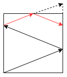

# 8.3

## [899. 有序队列](https://leetcode.cn/problems/orderly-queue/)


这个题居然是有规律的，可以证明的是，对于任意的 k >= 2 均可以实现字符串的升序排列

对于长度为 n 的字符串，他的升序排列定义为：$c_0 c_1...c_{n - 1}$，那么对于任意的字符串，可以按照如下操作进行升序：

每次将最头部的字符移动到字符串尾部，直到遍历到 $c_{n - 1}$，此后每次将头部后一个位置的字符移动到尾部，直到遍历到 $c_{n - 2}$

此时将具有如下结构：$c_{n - 1} c_{n - 2}...$，后面的事情就很简单了，继续让 $c_{n - 2}$ 放到尾部，而 $c_{n - 1}$ 紧随其后

下一步就是找 $c_{n - 3}$ 这个过程和上面类似，还是一样的，每次将头部字符移动到字符串尾部，直到遍历到 $c_{n - 3}$；然后每次一定头部后面的那个字符串，直到遇到 $c_{n - 2}$，此时结构为：$c_{n - 3} c_{n - 2} c_{n - 1} ...$；后面的事情就很简单了

持续这个过程，直到排好顺序

而对于 k = 1 的情况，此时整个字符串是一个环，我们完全可以通过枚举的形式找到最小的字符串

```java
class Solution {
    public String orderlyQueue(String s, int k) {
        if (k > 1) {
            int[] freq = new int[26];
            for (int i = 0; i < s.length(); i++) freq[s.charAt(i) - 'a']++;
            StringBuilder builder = new StringBuilder();
            for (int i = 0; i < 26; i++) {
                while (freq[i] > 0) {
                    builder.append((char)(i + 'a'));
                    freq[i]--;
                }
            }
            return builder.toString();
        } else {
            String min = s;
            for (int i = 1; i < s.length(); i++) {
                String tmp = s.substring(i) + s.substring(0, i);
                if (tmp.compareTo(min) < 0) min = tmp;
            }
            return min;
        }
    }
}
```

# 8.4

## [858. 镜面反射](https://leetcode.cn/problems/mirror-reflection/)


一个数学题，按照题意，不管反射多少次，最终总会到达一个角落



注意上图中的红线算作一次有效的光路，其存在对称的虚线等效

假设从开始到行走到终点，一共走过了 k 个有效光路，那么竖直方向上，行走的距离为 kq

而因为最终一定落到了某个角落，因此，竖直方向上行走的距离一定是 p(竖边边长) 的整数倍，即存在整数 m 使得 kq = mp

我们需要求的就是最小的 k 值(因为到达一个角落后，就不会在运动了)

显然，求解的就是最小公倍数，按照小学数学，最小公倍数是和最大公因数相关的，假设 gcd(p, q) = g，那么 k = $\frac{p}{g}$，m = $\frac{q}{g}$

如果 m 是一个偶数，说明最后回到了底边，而因为输入保证了最终的答案一定是：0 1 2 中的一个(就是说我们不需要考虑回到左下角的情况)，此时直接返回 0 即可

如果 m 是一个奇数，说明最后回到了顶边，此时如果 k 是一个偶数，说明我们走过了偶数个有效光路，到达了右上角

```java
class Solution {
    public int mirrorReflection(int p, int q) {
        int com = p < q ? gcd(q, p) : gcd(p, q);
        int k = p / com;
        int m = q / com;
        if ((m & 1) == 0) {
            return 0;
        } else if ((k & 1) == 0) {
            return 2;
        } else return 1;
    }
    
    private int gcd(int p, int q) { 
        if (p % q == 0) return q;
        return gcd(q, p % q);
    }
}
```

# 8.6

## [458. 可怜的小猪](https://leetcode.cn/problems/poor-pigs/)


[历史遗留问题](./21_11.md#458-可怜的小猪)

首先考虑**只能测试一次**的情况，此时如果小猪的个数和桶数一样多肯定是可以确定哪个桶有毒的，但显然这不是最优解

提供一种思路，即将桶数写成二进制表示，比如 1000 个桶就是 (0011|1110|1000)，在二进制中 1000 是一个 10 位数，此时只需要 10 只小猪就可以判断哪个桶带毒，我们的思路是：让其中第 i 只小猪(0 <= i <= 9) 喝掉所有第 i 位是 1 的水

比如第 9 只猪需要从 512(0010|0000|0000) 桶水开始，一直喝到第 1000 桶；而第八只小猪需要喝从第 256(0001|0000|0000) 到第 511 桶和 768(0011|0000|0000) 到第 1000 桶水...

因为只有一桶带毒，所以如果第 i 只猪死掉，那么说明带毒的桶，其二进制中第 i 位表示一定是 1

这样，我们其实是将所有的桶，根据其二进制表示进行了分类，并安排小猪根据二进制表示喝水，最终可以确定带毒的桶的二进制表示

而实际中，情况会稍微复杂一点，因为我们测试的次数可能不止 1 次，如果我们可以多次喝水，那么还依旧使用 2 进制表示的话，就有点浪费了

此时考虑我们一共可以喝 k 次水(k = $\lfloor\frac{mintuteToTest}{minutesToDie}\rfloor$)，此时可以将桶按照 k + 1 进制表示，如果其 k + 1 进制表示具有 m 位，那么我们也只需要 m 只小猪就可以判断哪个桶带毒，思路为：第 n 轮(1 <= n <= k)，让第 i 只小猪(0 <= i < m) 喝掉所有第 i 位为 n 的水

所以这个题的思路已经很明确了，首先将桶写成 k + 1 进制的形式，然后看看有多少位就行了

>   题解中并没有说明为什么这么做是最佳的

更进一步的，题解中提到了使用信息熵加速查找的方法，即对于 n 个桶，其中只有一个桶带毒，那么第 i 个桶带毒的概率为 $\frac{1}{n}$，其所包含的的信息熵为：$-\frac{1}{n} \times \log(\frac{1}{n}) = \frac{1}{n}\log(n)$

因此对于 n 个桶，只有一个桶带毒，判断哪个桶带毒，需要的信息熵为 $\log n$

而我们将 n 写成了 k + 1 进制，假设有 m 位

因为 m 位 k + 1 进制最多可以表示 $(k + 1)^m$ 个桶，所以本身我们希望发现 n 个桶中哪个带毒，而使用方法，其包含的信息，可以用来判断 $(k + 1)^m$ 个桶中的带毒情况

所以我们使用的这个方法，其所包含的信息熵为 $m\log(k + 1)$

为了求出 n 个桶的带毒情况，我们需要让 $m\log(k + 1) \geq \log n$，从而有 $m \geq \frac{\log n}{\log(k + 1)}$

```java
class Solution {
    public int poorPigs(int buckets, int minutesToDie, int minutesToTest) {
        int k = (minutesToTest / minutesToDie) + 1;
        return (int)Math.ceil(Math.log(buckets) / Math.log(k));
    }
}
```

# 8.9

## [823. 带因子的二叉树](https://leetcode.cn/problems/binary-trees-with-factors/)


第一眼看上去没想着使用 dp，而是简单的排序，遍历，通过一个 map 记录当前节点作为根节点时的，具有的二叉树个数

根节点的其两个子节点一定是他的两个因数，因数又可以进一步分解，所以排序后从前向后遍历，就可以准确的知道当前数字作为根节点时，因数的情况

```java
class Solution {
    private static final int MOD = (int)1e9 + 7;
    public int numFactoredBinaryTrees(int[] arr) {
        Arrays.sort(arr);
        Map<Integer, Integer> map = new HashMap<>();
        int rst = 0;
        for (int num : arr) {
            map.put(num, 1);
            rst++;
        }
        for (int num : arr) {
            int target = (int)Math.sqrt(num);
            // 简单的因数分解，时间复杂度为 sqrt(num)，所以还是很费时的
            for (int j = 2; j <= target; j++) {
                if (num % j != 0) continue;
                int other = num / j;
                if (!(map.containsKey(j) && map.containsKey(other))) continue;
                // 找到两个因数后，当前节点具有的子树情况，为两个子树的乘积(子树更小，所以之前已经遍历过了)
                int newCount = (int)(((long)map.get(j) * map.get(other)) % MOD);
                // 如果两个因数不同，那么还可以进行左右子树之间的交换(这里使用位运算替换了乘 2 的操作)
                if (j != other) newCount = (int)((((long)newCount) << 1) % MOD);
                rst = (rst + newCount) % MOD;
                map.put(num, (map.get(num) + newCount) % MOD);
            }
        }
        return rst;
    }
}
```

这个方法可以过，但问题就在于时间复杂度还是挺高的，主要集中在内层循环求因数上，尽管数组中只有 1000 个数，但输入数据大小达到了 $10^9$，那么 $\sqrt{10^9}\approx 10^5$，这样整体的计算量会达到 $10^8$，时间上确实不好看

优化的关键在于输入范围 1000，完全可以通过 $O(n^2)$ 的两层遍历降低时间复杂度

```java
class Solution {
    private static final int MOD = (int)1e9 + 7;
    public int numFactoredBinaryTrees(int[] arr) {
        Arrays.sort(arr);
        Map<Integer, Integer> map = new HashMap<>(len);
        int rst = 0;
        for (int num : arr) {
            map.put(num, 1);
            rst++;
        }
        for (int i = 0; i < arr.length; i++) {
            int target = (int)Math.sqrt(arr[i]);
            // 双重的条件限制，尽量减少内层循环的次数
            for (int j = 0; j < i && arr[j] <= target; j++) {
                if (arr[i] % arr[j] != 0) continue;
                int other = arr[i] / arr[j];
                if (!(map.containsKey(arr[j]) && map.containsKey(other))) continue;
                int newCount = (int)(((long)map.get(arr[j]) * map.get(other)) % MOD);
                if (arr[j] != other) newCount = (int)((((long)newCount) << 1) % MOD);
                rst = (rst + newCount) % MOD;
                map.put(arr[i], (map.get(arr[i]) + newCount) % MOD);
            }
        }
        return rst;
    }
}
```

此外，上面的两个题解都是使用 map 存储数据，存取的均摊时间复杂度为 $O(1)$，但那也只是统计意义上的，如果使用数组保存数据，可以进一步降低时间复杂度

```java
class Solution {
    private static final int MOD = (int)1e9 + 7;
    public int numFactoredBinaryTrees(int[] arr) {
        int len = arr.length;
        Arrays.sort(arr);
        // 注意，这里的下标仅仅起到映射 arr[i] 到 i 的作用，存储一次，不会再对其进行修改了，后面就都是查询了
        Map<Integer, Integer> valToIdx = new HashMap<>(len);
        for (int i = 0; i < len; i++) valToIdx.put(arr[i], i);
        int[] dp = new int[len];
        Arrays.fill(dp, 1);
        int rst = len;
        for (int i = 0; i < arr.length; i++) {
            int target = (int)Math.sqrt(arr[i]);
            for (int j = 0; j < i && arr[j] <= target; j++) {
                if (arr[i] % arr[j] != 0) continue;
                // map 的作用就是快速的获取到 other 的位置
                int other = arr[i] / arr[j];
                if (!valToIdx.containsKey(other)) continue;
                int newCount = (int)(((long)dp[j] * dp[valToIdx.get(other)]) % MOD);
                if (arr[j] != other) newCount = (int)((((long)newCount) << 1) % MOD);
                rst = (rst + newCount) % MOD;
                dp[i] = (dp[i] + newCount) % MOD;
            }
        }
        return rst;
    }
}
```

其实使用数组存储数据，就可以认为是 dp 了，毕竟也算是从之前的状态转移而来

# 8.11

## [852. 山脉数组的峰顶索引](https://leetcode.cn/problems/peak-index-in-a-mountain-array/)


输入保证了一定是一个山峰数组，所以不需要考虑输入为单调增或单调减的情况

提示部分也说了，O(n) 的解法很好想，毕竟直接遍历找最大值就行了，关键在于如何在 O(log n) 的时间内找到解

看到 log 直接就想着二分了，可是这个数组一定不是单调的啊

二分并不代表着单调，二分表示了二段性，一段满足，一段不满足，这样每次可以排除一段

在左侧一段，一定存在 arr[mid - 1] < arr[mid]，而在右侧不满足

在右侧一段，一定存在 arr[mid] > arr[mid + 1]，而在左侧不满足

上面两个条件，选择一个条件作为二段性的排除依据就好：

*   以左侧 arr[mid - 1] < arr[mid] 为条件作为二段性判断依据：

    ```java
    class Solution {
        public int peakIndexInMountainArray(int[] arr) {
            int left = 0;
            int right = arr.length;
            while (left < right) {
                int mid = left + ((right - left + 1) >> 1);
                if (arr[mid - 1] < arr[mid]) {
                    left = mid;
                } else {
                    right = mid - 1;
                }
            }
            return left;
        }
    }
    ```

*   以右侧 arr[mid] < arr[mid + 1] 为条件作为二段性判断依据：

    ```java
    class Solution {
        public int peakIndexInMountainArray(int[] arr) {
            int left = 0;
            int right = arr.length;
            while (left < right) {
                int mid = left + ((right - left) >> 1);
                if (arr[mid] > arr[mid + 1]) {
                    right = mid;
                } else {
                    left = mid + 1;
                }
            }
            return left;
        }
    }
    ```

# 8.13

## [768. 最多能完成排序的块 II](https://leetcode.cn/problems/max-chunks-to-make-sorted-ii/)


说简单了，就是统计词频，数组可以分成的块，和排序后数组的对应部分的词频是一致的

当时在学习滑动窗口的时候，通过一个 diff 变量记录词频不同的个数，这里也是借用了这个变量，并不需要两个 map 同时记录排序数组和原数组的词频情况，可以通过 diff 等于 0 为判断条件，判断词频是否为零(是否可以构成一个块)

```java
class Solution {
    public int maxChunksToSorted(int[] arr) {
        int len = arr.length;
        int[] sorted = new int[len];
        for (int i = 0; i < len; i++) sorted[i] = arr[i];
        Arrays.sort(sorted);
        int diff = 0;
        int rst = 0;
        Map<Integer, Integer> map = new HashMap<>();
        for (int i = 0; i < len; i++) {
            int pre = map.getOrDefault(arr[i], 0);
            if (pre == 0) diff++;
            pre++;
            map.put(arr[i], pre);
            if (pre == 0) diff--;
            pre = map.getOrDefault(sorted[i], 0);
            if (pre == 0) diff++;
            pre--;
            map.put(sorted[i], pre);
            if (pre == 0) diff--;
            if (diff == 0) rst++;
        }
        return rst;
    }
}
```

# 8.18

## [1224. 最大相等频率](https://leetcode.cn/problems/maximum-equal-frequency/)


使用两个数组，freq 和 count，其中 freq 表示每个数字出现的频率，count 每个频数对应的元素个数；开始遍历前，因为认为 count[0] = nums.length，即所有数字都是未出现的状态

使用 max 记录频率的最大值

更新 rst 的情况分为四种(其实严格意义上是三种)：

>   下面的遍历 i 从 0 开始取值，所以当前遍历到的数字的个数为 i + 1

*   遍历到的数字都仅出现了一次，对应了 max == 1

*   遍历到的数字都相等，对应了 max == i + 1

*   遍历到的数字中，出现频率最大的数字只有一种，剩下的数字出现频率都相等，且仅比最大值少 1 ，对应了 count[max] == 1，且 count[max - 1] * (max - 1) + max == i + 1

    >   上式中 count[max - 1] * (max - 1) 表示出现频数为 max - 1 的数字占用的数组长度

*   遍历到的数字中，出现频率为 1 的仅有一种，剩下的数字出现频率都相等，且都是最大值，对应了 count[1] == 1 且 count[max] * max == i

严格意义上，上面的第二种和第三种可以并在一起

```java
class Solution {
	private static final int SIZE = (int)1e5 + 10;
	public int maxEqualFreq(int[] nums) {
		int rst = 0;
		int[] freq = new int[SIZE];
		int max = 0;
		int[] count = new int[SIZE];
		int len = nums.length;
		count[0] = len;
		for (int i = 0; i < len; i++) {
			freq[nums[i]]++;
			max = Math.max(max, freq[nums[i]]);
			count[freq[nums[i]] - 1]--;
			count[freq[nums[i]]]++;
			if ((max == 1)
                || (max * count[max] == i && count[1] == 1)
                || (count[max] == 1 && count[max - 1] * (max - 1) == i + 1 - max)) rst = i + 1;
		}
		return rst;
	}
}
```

# 8.22

## [2334. 元素值大于变化阈值的子数组](https://leetcode.cn/problems/subarray-with-elements-greater-than-varying-threshold/)


这个题其实是没思路的，主要看了题干下面的提示：


让子数组的元素值大于阈值，其实就是让子数组的最小值大于阈值就行(hint 1)，看完这个索然无味，你不说我也知道

对于数组中的每个元素，是不是可以计算出以其作为最小值的子数组的最大区间?(hint 2)，看完这个豁然开朗

因为找到是最大区间，所以如果在最大区间长度下，当前元素的大小关系还是不能满足条件，那么当区间收窄了就更没可能了，这样遍历数组中的每个元素，找到各自的最大区间，然后计算是否满足 threshold 条件，只要满足就返回区间长度

找到以当前元素为最大值(最小值)的最大区间，这不就是单调栈做的事情吗

```java
class Solution {
    public int validSubarraySize(int[] nums, int threshold) {
        int len = nums.length;
        // left 保存区间左边界(闭区间)
        int[] left = new int[len];
        // right 保存区间右边界(闭区间)
        int[] right = new int[len];
        Deque<Integer> stack = new LinkedList<>();
        for (int i = 0; i < len; i++) {
            while (!stack.isEmpty() && nums[stack.peekLast()] > nums[i]) {
                int tmp = stack.pollLast();
                right[tmp] = i - 1;
            }
            if (stack.isEmpty()) {
                left[i] = 0;
            } else {
                left[i] = stack.peekLast() + 1;
            }
            stack.offerLast(i);
        }
        while (!stack.isEmpty()) right[stack.pollLast()] = len - 1;
        for (int i = 0; i < len; i++) {
            int win = right[i] - left[i] + 1;
            if (nums[i] * win > threshold) return win; 
        }
        return -1;
    }
}
```

# 8.23

## [782. 变为棋盘](https://leetcode.cn/problems/transform-to-chessboard/)


为了让一行变为合法序列(010101xxxx 或者 101010xxxx)，只能通过交换棋盘中的某两列实现

>   这一点其实很显然

交换两列，不会让原来棋盘的**列关系**发生变化(原来列是非法，就还是非法，原来是合法，就还是合法)，所以将棋盘的**行**从非法变为合法，那么棋盘的列关系不变

所以列修改使得行合法，和行修改使得列合法是互不影响的，因此当考虑如何修改棋盘时，可以分开分别考虑行和列

而在考虑如何实现操作数最小之前，首先需要考虑矩阵本身就不能无法构成棋盘的情况

比较好想的是 01 个数的情况：如果一行(或者一列)一个 0 都没有，那么显然是不能构成合法输入的

最终期待的的行(或者列)要么形式为 010101xxxx 要么为 101010xxxx，所以

*   如果 n 是一个偶数，那么一行(或者一列)中 0 和 1 的个数必须相等

*   如果 n 是一个奇数，那么一行(或者一列)中 0 和 1 的个数只能且必须相差 1

然而仅仅有个数关系，并不能保证输入一定可以变成一个棋盘

更深一层的限制条件是，对于任意一行，如果将一行的 01 序列使用位运算写入 mask，那么剩下的所有行都必须是 mask 或着 ~mask

如果有两行：$\begin{matrix}0&0&1&1\\1&0&0&1\end{matrix}$，显然两行既不相等，也不构成取反关系，那么无论怎么交换，都无法让两行都变为合法序列

这也意味着只要修改好第一行后，剩下的所有行都修改好了

修改好的第一行要么是 0101xxxx 要么是 1010xxxx，如果 n 是一个偶数，就分别讨论变为这两种情况时，哪一种修改的次数更小，而如果 n 是一个奇数，那么第一行就只有一种情况了，如果第一行中 1 的个数比较多，就是 10101...1 如果 1 的个数比较少就是 01010...0

>   编码的注意点：
>
>   *   mask 和 ~mask：因为使用 int 类型保存 mask，int 类型具有 32 位而实际有效位仅有 n 位；所以对 int 类型的 mask 进行 ~mask 操作时会将高位变为全 1，这和期待值时不同的，比如 mask 为 (0000)(0000)...(1101)，那么取反后得到的为：(1111)(1111)...(0010)，而期待的 ~mask 为(0000)(0000)...(0010)
>
>       所以实际操作的时候，并不是直接进行取反运算，而是将当前行(或者列)的掩码和 mask 进行异或运算，如果得到的是全 1(合法范围内)，那么证明当前行(或者列)和 mask 是取反关系
>
>   *   实际中并不需要统计每一行(或者列)中 01 的个数，只要第一行(或者列)的 01 个数满足条件，同时剩下的行(或者列)在掩码关系满足条件时，01 关系自然也满足条件

```java
class Solution {
    public int movesToChessboard(int[][] board) {
        int n = board.length;
        // n 位有效的全 1 序列
        int base = (1 << n) - 1;
        // 将矩阵的行和列变为一个 mask 存储到 row 和 col 数组中
        int[] row = new int[n];
        int[] col = new int[n];
        for (int i = 0; i < n; i++) {
            for (int j = 0; j < n; j++) {
                row[i] <<= 1;
                col[j] <<= 1;
                row[i] |= board[i][j];
                col[j] |= board[i][j];
            }
        }
		// 统计第一行(第一列)的 01 个数，判断是否满足条件
        int tmp = row[0];
        int rowCount = 0;
        while (tmp > 0) {
            if ((tmp & 1) == 1) rowCount++;
            tmp >>= 1;
        }
        if (Math.abs(n - (rowCount << 1)) > 1) return -1;
        tmp = col[0];
        int colCount = 0;
        while (tmp > 0) {
            if ((tmp & 1) == 1) colCount++;
            tmp >>= 1;
        }
        if (Math.abs(n - (colCount << 1)) > 1) return -1;
        // 判断剩下的行(或者列)的掩码是否满足条件
        for (int i = 1; i < n; i++) {
            if (row[i] != row[0] && (row[i] ^ row[0]) != base) return -1;
            if (col[i] != col[0] && (col[i] ^ col[0]) != base) return -1;
        }
        int rst = 0;
        // 如果 n 为奇数
        if ((n & 1) == 1) {
            // 此时根据第一行(第一列)中 1 的个数确定最终的棋盘
            // 如果 1 的个数少，说明第一行中 1 从下标 1 开始排列，否则说明 1 从下标 0 开始排列
            // 此时 1 的位置是确定的，如果当前位置上不是 1 就一定需要一次交换(不用考虑 0 的位置)
            int begin = 0;
            if (rowCount == (n - 1) >> 1) begin++;
            for (int j = begin; j < n; j += 2) {
                if (board[0][j] != 1) rst++;
            }
            begin = 0;
            if (colCount == (n - 1) >> 1) begin++;
            for (int i = begin; i < n; i += 2) {
                if (board[i][0] != 1) rst++;
            }
        } else {
            // n 为偶数需要分两种情况讨论
            // 有多少个 0 在偶数下标上
            int count = 0;
            for (int j = 0; j < n; j += 2) {
                if (board[0][j] != 1) count++;
            }
            // 统计好 count 后，即统计好了变为 010101xxxx01 需要交换的次数
            // 接下来可以再统计一下，变为 101010xxxx10 需要交换的次数
            // 然而根本不需要这么麻烦，有 count 个 0 在偶数索引上，就对应了有 count 个 1 在奇数索引上(n 为偶数时，一定有 0 1 个数相等)
            // 所以此时变为 101010xxxx10 需要的操作数为 n/ 2 - count
            // 实际操作取二者中小的那个
            rst += Math.min(count, (n >> 1) - count);
            count = 0;
            for (int i = 0; i < n; i += 2) {
                if (board[i][0] != 1) count++;
            }
            rst += Math.min(count, (n >> 1) - count);
        }
        return rst;
    }
}
```

# 8.27

## [1104. 二叉树寻路](https://leetcode.cn/problems/path-in-zigzag-labelled-binary-tree/)


关键是想办法找到当前节点的父节点

因为是完全二叉树，所以每层的节点数都是上一层节点数的二倍，如果当前节点数为 n，那么上一层节点数为 n / 2

如果不考虑题干中之字形的排列顺序，而是从左向右依次排列，如果当前层一共有 n 个节点，可以通过 n 个编号(0 -> n - 1)对节点进行标识，如果当前层中某个节点的标号为 idx，那么其父节点因为在上一层，其编号为 idx / 2

所以**如果节点都是从左向右排列的**，那么节点的编号，及其父节点的编号很好确认，有了标号，再加上本层的基础偏移量，很容易计算出节点的原始序号，从而得到完整的路径

然而实际中是按照之字形排列的，父节点的编号和当前节点编号就不在是简单的二分之一的关系了，此时具有如下规律：

如果当前节点编号为 idx，上一层具有 n 个节点，那么父节点的编号为 (n - 1) - idx / 2

>   这个规律是总结出来的(硬找出来的)，不是推导出来的

```java
class Solution {
    // 前缀和数组，记录当前层(包括当前层)之前一共具有多少个节点
	private static final List<Integer> list = new ArrayList<>();
	private static final int limit = (int)1e6 + 10;
	static {
		int base = 1;
		int sum = 1;
		while (sum <= limit) {
			list.add(sum);
			base <<= 1;
			sum += base;
		}
		list.add(limit);
	}
	public List<Integer> pathInZigZagTree(int label) {
		List<Integer> rst = new ArrayList<>();
		int left = 0;
		int right = list.size() - 1;
		while (left < right) {
			int mid = left + ((right - left) >> 1);
			if (list.get(mid) < label) {
				left = mid + 1;
			} else {
				right = mid;
			}
		}
        // 找到 label 所在的层
		int height = left;
		int node = list.get(height) - label;
		while (height >= 1) {
			int begin = list.get(height - 1) + 1;
			int size = list.get(height) - begin;
			node = size - node;
			rst.add(node + begin);
			height--;
			node >>= 1;
		}
        // 第一层怕溢出，所以直接添加，而不是放在循环中
		rst.add(1);
		int i = 0;
		int j = rst.size() - 1;
		while (i < j) {
			int tmp = rst.get(j);
			rst.set(j, rst.get(i));
			rst.set(i, tmp);
			i++;
			j--;
		}
		return rst;
	}
}
```

# 8.28

## [793. 阶乘函数后 K 个零](https://leetcode.cn/problems/preimage-size-of-factorial-zeroes-function/)


这个题是 [172. 阶乘后的零](https://leetcode.cn/problems/factorial-trailing-zeroes/) 的一个进阶，在[以前的每日一题](./22_3.md#172-阶乘后的零)中出现过

考虑一个 n! 中 0 的个数，就是 n! 中 5 的个数，根据之前每日一题的经验， n! 中 5 的个数为：$\lfloor\frac{n}{5}\rfloor + \lfloor\frac{n}{25}\rfloor + ...$

所以 0!、1!、2!、3!、4! 中 0 的个数都是 0；而 5! -> 9! 中 0 的个数都是 1...

20! -> 24! 中 0 的个数都是 4；而到了 25!，其本身引入了两个 5，所以 25! -> 29! 中具有 6 个 5

所以对于任意的 k，其取值要么是 0 要么是 5；这个题需要做的就是找到某个 k 对应的 n，如果可以找到，返回 5 即可，如果找不到(比如 25! 中 k 直接取到 6 跳过了 5)，返回 0 即可

因为 k 随着 n 是单调递增的关系，因此可以通过二分的方式，确定 k 对应的 n，而至于上限需要取到 5k，因为 5k! 一定比 k 更大(5k! 中 0 的个数为 $\frac{5k}{5} + \frac{5k}{25} + ... = k + \frac{k}{5} + ...$)

```java
class Solution {
    public int preimageSizeFZF(int k) {
        long left = 0;
        long right = (long)k * 5;
        int rst = 0;
        while (left < right) {
            long mid = left + ((right - left) >> 1);
            if (getCount(mid) < k) {
                left = mid + 1;
            } else {
                right = mid;
            }
        }
        if (getCount(left) != k) return 0;
        return 5;
    }

    private int getCount(long num) {
        int rst = 0;
        while (num >= 5) {
            rst += num / 5;
            num /= 5;
        }
        return rst;
    }
}
```

# 8.31

## [417. 太平洋大西洋水流问题](https://leetcode.cn/problems/pacific-atlantic-water-flow/)


一道很典型的采用反向思路的题

一般的搜索都是从矩阵中的某个节点开始向其他方向搜索，而这个题却变为了从边界(外)向内搜索

正向思路：DFS 遍历矩阵中的每个位置，计算其是否能到达两个大洋

反向思路：从两个大洋开始，计算两个大洋可以蔓延到的位置

编码的时候使用一个额外的数组 buff，表示两个大洋走到的位置，其中如果太平洋可以蔓延到 (i, j)，将 buff\[i][j] 的最低位置为 1；而如果大西洋可以蔓延到 (i, j)，将 buff\[i][j] 的次低位置为 1 

DFS 和 BFS 都可以

*   DFS:

    ```java
    class Solution {
        private static final int[][] directions = {{1, 0}, {-1, 0}, {0, 1}, {0, -1}};
        public List<List<Integer>> pacificAtlantic(int[][] heights) {
            List<List<Integer>> rst = new ArrayList<>();
            int row = heights.length;
            int col = heights[0].length;
            int[][] buff = new int[row][col];
            for (int i = 0; i < row; i++) {
                dfs(i, 0, 0, buff, heights);
                dfs(i, col - 1, 1, buff, heights);
            }
            for (int j = 0; j < col; j++) {
                dfs(0, j, 0, buff, heights);
                dfs(row - 1, j, 1, buff, heights);
            }
            // 所有 buff[i][j] 为 3 的位置，就是两个大洋都可以蔓延到的位置
            for (int i = 0; i < row; i++) {
                for (int j = 0; j < col; j++) {
                    if (buff[i][j] == 3) rst.add(Arrays.asList(i, j));
                }
            }
            return rst;
        }
        
        private void dfs(int x, int y, int target, int[][] buff, int[][] heights) {
            if (((buff[x][y] >> target) & 1) == 1) return;
            buff[x][y] |= 1 << target;
            int row = heights.length;
            int col = heights[0].length;
            for (int[] direction: directions) {
                int mx = x + direction[0];
                int my = y + direction[1];
                if (mx >= 0 && mx < row && my >= 0 && my < col
                    && heights[mx][my] >= heights[x][y]
                    && ((buff[mx][my] >> target) & 1) == 0) {
                    dfs(mx, my, target, buff, heights);
                }
            }
        }
    }
    ```

*   BFS：

    ```java
    class Solution {
        private static final int[][] directions = {{1, 0}, {-1, 0}, {0, 1}, {0, -1}};
        public List<List<Integer>> pacificAtlantic(int[][] heights) {
            int row = heights.length;
            int col = heights[0].length;
            int[][] buff = new int[row][col];
            Queue<int[]> queue = new LinkedList<>();
            for (int i = 0; i < row; i++) {
                buff[i][0] |= 1;
                queue.offer(new int[]{i, 0});
            }
            for (int j = 0; j < col; j++) {
                buff[0][j] |= 1;
                queue.offer(new int[]{0, j});
            }
            while (!queue.isEmpty()) {
                int[] tmp = queue.poll();
                for (int[] direction : directions) {
                    int mx = tmp[0] + direction[0];
                    int my = tmp[1] + direction[1];
                    if (mx >= 0 && mx < row && my >= 0 && my < col
                    && heights[mx][my] >= heights[tmp[0]][tmp[1]]
                    && (buff[mx][my] & 1) == 0) {
                        buff[mx][my] |= 1;
                        queue.offer(new int[]{mx, my});
                    }
                }
            }
            for (int i = 0; i < row; i++) {
                buff[i][col - 1] |= 2;
                queue.offer(new int[]{i, col - 1});
            }
            for (int j = 0; j < col; j++) {
                buff[row - 1][j] |= 2;
                queue.offer(new int[]{row - 1, j});
            }
            while (!queue.isEmpty()) {
                int[] tmp = queue.poll();
                for (int[] direction : directions) {
                    int mx = tmp[0] + direction[0];
                    int my = tmp[1] + direction[1];
                    if (mx >= 0 && mx < row && my >= 0 && my < col
                    && heights[mx][my] >= heights[tmp[0]][tmp[1]]
                    && ((buff[mx][my] >> 1) & 1) == 0) {
                        buff[mx][my] |= 2;
                        queue.offer(new int[]{mx, my});
                    }
                }
            }
            List<List<Integer>> rst = new ArrayList<>();
            for (int i = 0; i < row; i++) {
                for (int j = 0; j < col; j++) {
                    if (buff[i][j] == 3) rst.add(Arrays.asList(i, j));
                }
            }
            return rst;
        }
    }
    ```

## [1190. 反转每对括号间的子串](https://leetcode.cn/problems/reverse-substrings-between-each-pair-of-parentheses/)


简单的栈(其实是双端队列)即可解决问题

```java
class Solution {
    public String reverseParentheses(String s) {
        Deque<Character> stack = new LinkedList<>();
        Queue<Character> tmp = new LinkedList<>();
        for (int i = 0; i < s.length(); i++) {
            char c = s.charAt(i);
            if (c != ')') {
                stack.offerLast(c);
            } else {
                while (stack.peekLast() != '(') tmp.offer(stack.pollLast());
                stack.pollLast();
                while (!tmp.isEmpty()) stack.offerLast(tmp.poll());
            }
        }
        StringBuilder builder = new StringBuilder();
        while (!stack.isEmpty()) builder.append(stack.pollFirst());
        return builder.toString();
    }
}
```

