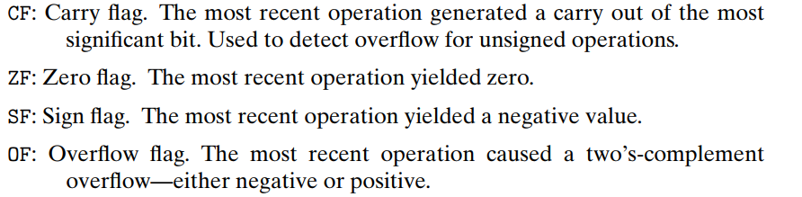
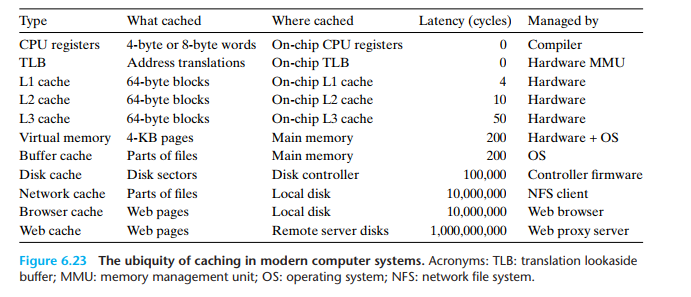
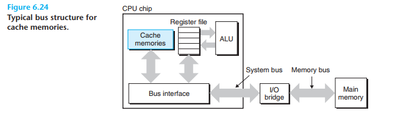
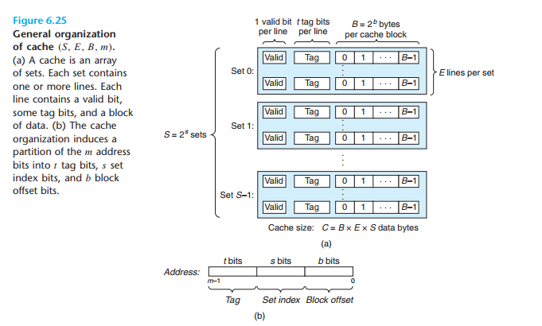
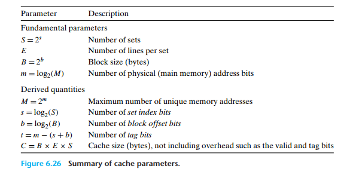
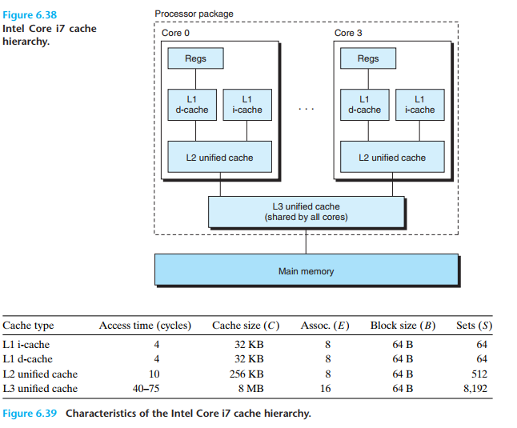
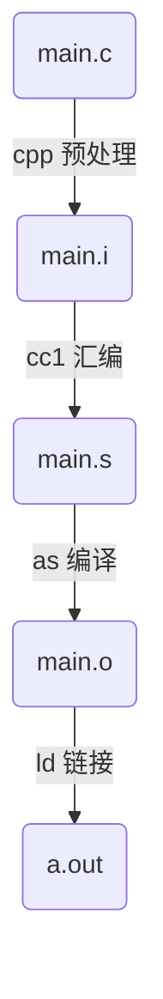
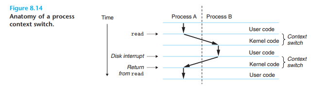
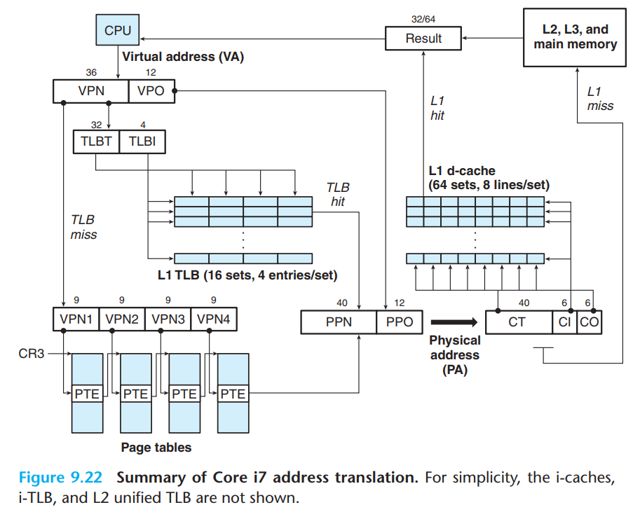

如果 gcc 又包含了奇怪的没看过的参数，就到手册中查一查：[gcc(1) - Linux manual page (man7.org)](https://man7.org/linux/man-pages/man1/gcc.1.html)

>   linux 中的其他 "预装软件" 基本上都有手册, 在 linux 中直接 man 查确实没有网页方便...

# csapp.c 的说明书

csapp.c 对各种 syscall 进行了简单的封装, 避免了手动处理返回的异常值，很大程度上降低了 low level program 的难度，个人认为还是很有必要使用的

在[官网](http://csapp.cs.cmu.edu/3e/code.html)上，找到 csapp.h 和 csapp.c(只有这两个文件是比较关键的)

## include path

把 csapp.h 放在默认的 include path，这样做的好处是任意的项目在 include 的时候都只需要写 `#include <csapp.h>`，并且新创建的项目完全不需要考虑将 csapp.h 本身放在目录下

处于可扩展性的考虑，选择在 /home/[current_user] 下创建 c_headers, 并将 caspp.h 放在该目录下

```shell
$ cd ~
$ mkdir c_headers
# 通过 cp 将 csapp.h 放在该目录下
```

为了避免每次编译都添加参数 -I，这里在环境变量中配置了 C_INCLUDE_PATH

根据 shell 类型的不同需要修改不同的配置文件，linux 下默认是 bash，那么需要在 .bashrc 中添加

```shell
export C_INCLUDE_PATH=$HOME/c_headers:$C_INCLUDE_PATH
```

>   如果在 .bashrc 中不存在 C_INCLUDE_PATH，则此时不需要进行 INCLUDE_PATH 的扩展，直接写成
>
>   ```shell
>   export C_INCLUDE_PATH=$HOME/c_headers
>   ```

当然一种更加简单的方式是直接将 csapp.h 放入 /usr/local/include 下(不建议直接放入 /usr/include 中，可能会污染系统环境)

## static linking

将 csapp.c 编译为 linkable object file

```shell
$ gcc -c -o csapp.o csapp.c
```

得到的是 csapp.o, 因为是 static linking, 所以使用的时候需要在 linking 阶段手动添加参数:

```shell
$ gcc -o test test.c csapp.o -lpthread
```

注意这里在编译的时候手动添加了参数 -lpthread 这是因为在 caspp.c 中包含了对 pthread 的 wrapper，而默认 gcc 并不会将 libpthread.so 添加到 linking 的路径中，所以需要手动指定

static linking 很简单，但是需要将 csapp.c 放在项目路径中, 且就算项目不涉及到多线程，在编译的时候还是需要额外添加参数 -lpthread 

## dynamic linking

如果将 csaspp.c 编译为 shared library，可以避免将 csapp.c 放在项目路径中

首先还是一样得到 csapp.o，但这里需要添加参数 -fPIC(position-independent code)

```shell
$ gcc -c -fPIC -o csapp.o csapp.c
```

然后创建一个 shared library

```shell
$ gcc --shared -o libcsapp.so csapp.o -lpthread
```

>   这里添加参数 -lpthread 的原因还是一样的
>
>   将 .so 文件起名为 libcsapp.so 是很有讲究的，比如 libc.so, libpthread.so 他们都以 lib 开头，在编译的时候通过参数 -lpthread 即可完成 dynamic linking(所有的程序都会链接 libc.so，不用刻意写 -lc)

然后将对应的 shared library file 放到 /usr/local/lib 中即可

```shell
$ cp libcsapp.so /usr/local/lib
```

不过要注意的是在复制过去之后最好手动更新一下 linker cache

```shell
$ ldconfig -n /usr/local/lib
```

这样在后面的项目中编译时只需要添加参数 -lcaspp 即可

# 信息的表示和处理

8 bit 作为一个 Byte 是最小的可寻址的内存单元，所以在内存中的一个地址对应了 1 Btye(8 bits)

内存对于程序而言就是一个大字节数组，内存中的每个字节都具有自己的地址，所有可能的地址集合称为虚拟地址空间

在 c 中指针的值其实是指针指向的某个存储块的第一个字节的虚拟地址

字长表明了指针数据的标称大小(nominal size)

>   我这里理解的标称大小为数据最小单元

32 位的系统决定了虚拟地址空间的大小上限为 $2^{32}$，即具有 4G 个不同的地址，可以表示最多 4 GBytes 的数据

>   从 0x00000000 到 0xFFFFFFFF
>
>   当变为 64 位 的系统，最多具有 16E 个不同的地址 (K -> M -> G -> T -> P -> E)

因为 64 位机器的地址空间更大，理论上 64 位的设备是可以运行 32 位的程序的

变量在内存中占用连续的空间存储，表示变量的地址为所有字节中最小的地址，比如 int 类型变量 x，&x = 0x100；因为 int 类型占用 4 Bytes，所以实际变量 x 占用的内存地址为：0x100、0x101、0x102、0x103 四个位置

## 大端法和小端法

对于一个 w 位的整数(w 可被 8 整除)，可以将其表示为：\[$x_{w - 1}, x_{w - 2}...x_2,x_1,x_0$](每一位不是 0 就是 1)；

其高八位为：\[$x_{w - 1},x_{w - 2}... x_{w - 8}$](最高位的字节)；其低八位为：\[$x_7, x_6...x_0$](最低位的字节)

有的机器在内存中高地址表示高位字节，低地址表示低位字节，称之为小端法；而与之相反的成为大端法

举例来说：int 类型的变量 x 有 &x = 0x100，根据之前的讨论，可知 0x100 为其内存表示中最小的地址，假如 x = 0x01234567，那么大端法和小端法分别表示为：


>   注意在上述 0x01234567 中 67 是低 Byte
>
>   java 和 c 都是小端序

给出一个用来查看变量在程序中的字节表示的程序

```c
#include <stdio.h>

typedef unsigned char *byte_pointer;

void show_bytes(byte_pointer start, size_t len) {
    int i = 0;
    while (i < len) {
        // .2x 保证输出一定是两位的十六进制数据
        // 因为 byte_pointer 是 char 类型的指针，所以一次打印一个字节
        printf("%.2x\n", start[i]);
        i++;
    }
    printf("\n");
}
void show_int(int val) {
    show_bytes((byte_pointer) &val, sizeof(int));
}

void show_float(float val) {
    show_bytes((byte_pointer) &val, sizeof(float));
}

void show_pointer(void *val) {
    show_bytes((byte_pointer) &val, sizeof(void *));
}
```

这个程序用来打印不同类型的 val 在内存中的十六进制表示，在不同的机器上运行时，还能看出不同系统的数据存储表示

测试程序如下：

```c
int main(void) {
    test(12345);
    return 0;
}

void test(int val) {
    show_int(val);
    show_float((float)val);
    show_pointer(&val);
}
```

打印输出如下：

```shell
buzz@buzz:~/csapp/pointer_test$ ./test
39
30
00
00

00
e4
40
46

5c
03
23
12
ff
7f
00
00
```

输入数据 12345 其十六进制表示为：0x3039，故可以看到，在 ubuntu-18.04 下使用的是小端序

此外还能看到 float 类型的二进制表示和 int 类型有很大区别

至于 int * 类型，毕竟是指针，在 64 位系统下，其指针大小占据 8 Bytes

特别的对于字符串类型，因为 c 默认进行字符串编码的时候会把 null(即 '\0') 放到字符串结尾，运行以下程序：

```c
void test(int val) {
    const char *s = "12345";
    show_bytes((byte_pointer)s, 6);
}
```

打印输出如下：

```shell
31
32
33
34
35
00
```

要注意的是，无论是大端序还是小端序，打印输出的结果都是一样的，这说明字符串文本的平台独立性更强

>   要注意的是上面我们是手动选择的长度参数 6，如果上面变成了 strlen(s) 这个函数默认会将结尾的字符 '\0' 从字符出中剔除
>
>   此外如果需要使用方法 strlen(s) 需要引入头文件 string.h

## 布尔代数

有一个神奇的程序使用了位运算实现了交换操作

```c
void swap(int *x, int *y) {
    *y = *x ^ *y;
    *x = *x ^ *y;
    *y = *x ^ *y;
}
```

>   一点点看
>
>   第一步：$y = x \bigoplus y$
>
>   第二步：$x = x \bigoplus (x \bigoplus y) = y$
>
>   第三步：$y = y\bigoplus (x\bigoplus y) = x$
>
>   此时完成了交换操作，这个方法相比于一般的方法，不需要定义第三个变量 tmp，直接就完成了交换，看起来更加高级，效率其实没什么差别

移位运算是可结合的，比如：x << i << j 等价于：(x << i) << j

相比于左移，一般而言，具有两种右移，逻辑右移和算数右移：逻辑右移 k 位将在高位补充 0，而算数右移 k 位会补充最高位(0 或者 1)

因为对于有符号数，最高位表示是符号位，此时算出右移是有意义的(如果是负数，最高位补充 1 不会导致负数突然变为正数，此外还能保证右移的性质，即右移 1 位表示当前数字除 2)，但是对于无符号数，算数右移看起来就很奇怪了

>   在 java 中 >> 表示算数右移，而 >>> 表示逻辑右移
>
>   此外当移位超出了当前类型变量的上限时，会进行取模移位，比如定义 int a = 1，然后 a << 32 此时就相当于 a << (32) % 32 = a << 0 = a

## 数据表示

### 整数类型

#### 无符号数和有符号数

在 c 中如果运算符两侧，一个为有符号数，一个为无符号数，那么在进行运算时，会隐式的将有符号数转化为无符号数进行运算

这一点对于 < 和 > 两种运算符的影响很大，如果不知道这个规则的话，可能出现错误的判断


#### 位扩展

在 c 中对整数进行位扩展，会根据整数类型的不同，分为零扩展(无符号数)和符号扩展(符号数)，简单来说就是无符号数进行位扩展，高位只需要补充 0 即可，而对于符号数，高位需要补充 0 或 1 取决于符号数的正负(如果是负数，则需要在高位填充 1)

在 c 中如果同时出现有符号数和无符号数之间的相互转化和位扩展行为，那么默认会先进行位扩展，然后再完成有符号数和无符号数之间的转化(位扩展的优先级更高)，举例来说：

```c
int main(void) {
    short a = -12345; // 0xcfc7
    unsigned b = a;
    printf("b = %u\n", b); // b = ffffcfc7
}
```

第三行为 b 赋值时，首先需要对 a 进行位扩展，得到 0xffffcfc7，然后再变为 unsigned 类型

#### 加法

*   无符号数：在 c 中加法溢出并不会报错，不过可以通过结果判断加法是否发生了溢出，对于字长为 w 的整数 a 和 b，发生溢出时一定有 a + b < a 且 a + b < b

    在 c 中 a + b = (a + b) MOD $2^w$，所以 a < $2^w$ 且 b < $2^w$

    发生溢出时一定有 s = a + b - $2^w$ < a (或 b)

*   有符号数：分为加法正溢出和负溢出：

    *   正溢出：a > 0 且 b > 0，但 a + b < 0
    *   负溢出：a < 0 且 b < 0，但 a + b >= 0;

## data lib

官网下载 xxxhandout.tar 文件，解包，然后根据 README 修改文件

这次仅需要修改 bits.c 文件，他默认给了一个 dlc 用来判断程序是否合法(主要是他要求仅能使用位运算，还限制位运算符的个数)

测试程序是 btest，不过需要使用 makefile 自已编译出来

### bitXor

简单来说就是使用 & 和 ~ 实现异或

这个其实在数电中学过：
$$
\begin{equation}
	\begin{aligned}
		A\bigoplus B = &A\overline{B} + \overline{A}B \\
					 = &\overline{\overline{A\overline{B} + \overline{A}B}}\\
					 = &\overline{\overline{A\overline{B}}\cdot\overline{\overline{A}B}}
	\end{aligned}
\end{equation}
$$


```c
/*
 * bitXor - x^y using only ~ and &
 *   Example: bitXor(4, 5) = 1
 *   Legal ops: ~ &
 *   Max ops: 14
 *   Rating: 1
 */
int bitXor(int x, int y) {
  return ~(~(x & ~y) & ~(~x & y));
}
```

### tmin

就是返回 32 位符号数的最小值，这个移位就行了

```c
/*
 * tmin - return minimum two's complement integer
 *   Legal ops: ! ~ & ^ | + << >>
 *   Max ops: 4
 *   Rating: 1
 */
int tmin(void) {
  return 1 << 31;
}
```

### isTmax

判断输入的数是不是 32 位符号数的最大值，如果是就返回 1，否则返回 0

这里先不考虑 32 位的情况，仅考虑 8 位，有 Tmax = 0111,1111，显然 Tmax + 1 = Tmin，而 Tmax + Tmin = 1111,1111(这个数就是 -1)

所以如果输入的 x 位 Tman，那么 x + 1 + x 将得到全 1，此时按位取反将得到 0，而其他情况下按位取反后将为一个大于 0 的数

但是存在一个例外，就是 -1，即 1111,1111(这里按照 8 位进行举例)，所以需要将其排除

如果不考虑 -1 时 我们写成：

```c
/*
 * isTmax - returns 1 if x is the maximum, two's complement number,
 *     and 0 otherwise
 *   Legal ops: ! ~ & ^ | +
 *   Max ops: 10
 *   Rating: 1
 */
int isTmax(int x) {
	int y = x + 1;
    return !~(x + y); // this is a buggy program
}
```

现在进行修成，因为对于 -1 的情况 y 为 0，为了排除 y，可以令结果加上 !y

```c
/*
 * isTmax - returns 1 if x is the maximum, two's complement number,
 *     and 0 otherwise
 *   Legal ops: ! ~ & ^ | +
 *   Max ops: 10
 *   Rating: 1
 */
int isTmax(int x) {
    int y = x + 1;
    return !(~(x + y) + !y);
}
```

### allOddBits

判断一个 32 位符号数的奇数位上是不是全都为 1

做法是将输入的 x 的奇数位提取出来 -> 使用与运算提取出二进制的某一位

然后如果奇数位均为1，那么右移后"相加"后可以得到全 1

```c
/*
 * allOddBits - return 1 if all odd-numbered bits in word set to 1
 *   where bits are numbered from 0 (least significant) to 31 (most significant)
 *   Examples allOddBits(0xFFFFFFFD) = 0, allOddBits(0xAAAAAAAA) = 1
 *   Legal ops: ! ~ & ^ | + << >>
 *   Max ops: 12
 *   Rating: 2
 */
int allOddBits(int x) {
    // 构建掩码 mask 提取出所有的奇数位
    int mask = 0xAA;
    mask = (mask << 8) | mask;
    mask = (mask << 16) | mask;
    mask = mask & x;
    // 左移并通过异或进行加法，理想的话会得到 Tmax
    mask = (mask >> 1) ^ mask;
    // Tmax + 1 后得到 Tmin，二者再相加将得到 -1，按位取反后得到 0
    return !~((mask + 1) ^ mask);
}
```

### negate

送分题，返回相反数，这个就记住就行了，按位取反后加一，得到的就是相反数

```c
/*
 * negate - return -x
 *   Example: negate(1) = -1.
 *   Legal ops: ! ~ & ^ | + << >>
 *   Max ops: 5
 *   Rating: 2
 */
int negate(int x) {
  return ~x + 1;
}
```

### isAsciiDigit

判断输入的数据输入范围是不是从 0x30 到 0x39

这个最开始的想法是进行 9 次异或，如果有一个结果为 0 那么就证明在这个范围内

```c
/*
 * isAsciiDigit - return 1 if 0x30 <= x <= 0x39 (ASCII codes for characters '0' to '9')
 *   Example: isAsciiDigit(0x35) = 1.
 *            isAsciiDigit(0x3a) = 0.
 *            isAsciiDigit(0x05) = 0.
 *   Legal ops: ! ~ & ^ | + << >>
 *   Max ops: 15
 *   Rating: 3
 */
int isAsciiDigit(int x) {
  int var0 = x ^ 0x30;
  int var1 = x ^ 0x31;
  int var2 = x ^ 0x32;
  int var3 = x ^ 0x33;
  int var4 = x ^ 0x34;
  int var5 = x ^ 0x35;
  int var6 = x ^ 0x36;
  int var7 = x ^ 0x37;
  int var8 = x ^ 0x38;
  int var9 = x ^ 0x39;
  return !var0 | !var1 | !var2 | !var3 | !var4 | !var5 | !var6 | !var7 | !var8 | !var9;
}
```

这么做的问题在于操作符的个数超了，显然答案不应该是这样的

现在思考，他给定了上下限，分别为 0x30 和 0x39，是否可以这样做：**假如输入大于 0x39 时和另一个数相加将导致溢出从而边负，而当输入小于 0x30 时和另外一个数相加，由于输入太小导致结果还是负数**，然后利用负数最高位是 1 的性质求解

其实第二条很好满足，求出 0x30 的相反数不就行了吗，如果比 0x30 小，那么加和肯定还是负数

关键在于第一条，下面给出我的思考过程：

考虑 8 位的情况，0x39 = 0011,1001，而 Tmax = 0111,1111，Tmin = 1000,0000

简单来说，我们就是希望求出 Tmax - 0x39，问题在于他不让使用 -

这里最终还是从 Tmin 下手，假如现在只有 7 位数，0x39 和输入 x 导致了溢出，那么显然刚好导致溢出的 x 为 0x39 的相反数，而实际中我们有 8 位数，7 位数溢出的结果，最终体现在第8位变为了 1，即变负

如果可以求出，**0x39 在 31 位情况下的相反数**，那么这个相反数和 0x39 相加时，将正好导致 31 位溢出，而 32 位数符号位被置为1(当输入 x 大于这个相反数时，就更会导致溢出了)

普通的相反数根据[上面](#negate)可知是取反后加一，但是默认 int 类型是 32 位，如果不进行特殊处理的话，我们是无法求出 31 位情况下的相反数的，这里直接给出结论，**如果希望求出数据 31 位情况的相反数，那么我们应该保证最高位在取反后还是 0，然后再进行加一**

>   具体的证明无法给出，但是可以给出启发性的推导，我们可以认为 32 位的 int 类型，本身是 33 位的，在求相反数时，按位取反时，保证了最高位为 0，这样在求出相反数后，将相反数和原数据相加，将导致 32 位溢出，而 33 位进位变成 1

这里保证最高位取反后还是 0 的做法有很多，我这里直接和 Tmin 进行或运算，然后再取反(在取反之前，将最高位置为 1，这样再取反就能保证最高位为 0 了)

到这里其实还没完，在求完了第二个相反数后，我们保证了所有大于等于 0x39 和这个相反数运算将导致最高位被置位，这其实是有问题的，因为我们将 0x39 本身也排除掉了，所以如果是从 Tmin 下手的话，我们需要求出的 0x3a(0x39 + 1) 的相反数，而不是 0x39 的

```c
/*
 * isAsciiDigit - return 1 if 0x30 <= x <= 0x39 (ASCII codes for characters '0' to '9')
 *   Example: isAsciiDigit(0x35) = 1.
 *            isAsciiDigit(0x3a) = 0.
 *            isAsciiDigit(0x05) = 0.
 *   Legal ops: ! ~ & ^ | + << >>
 *   Max ops: 15
 *   Rating: 3
 */
int isAsciiDigit(int x) {
    int a = ~((1 << 31) | 0x3a) + 1;
    int b = ~(0x30) + 1;
    a = a + x;
    b = b + x;
    return !(a >> 31 | b >> 31);
}
```


# 程序的机器级表示

在 x86-64 中使用 64 位表示地址，而在实际中这些地址的高 16 位必须是 0，所以实际可用的地址数量仅为 $2^{48}$，最多表示 256TB 的数据

## 一个简单的例子

一个程序：

```c
// mstore.c
long mult(long, long);
void multstore(long num1, long num2, long *dest) {
    *dest = mult(num1, num2);
}
```

就是把计算两数乘积的c程序，将其编译

```shell
$ gcc -Og -S mstore.c
```

得到汇编文件：mstore.s(参数 -S 其实就是进行编译)

```shell
// mstore.s
.file   "mstore.c"
        .text
        .globl  multstore
        .type   multstore, @function
multstore:
.LFB0:
        .cfi_startproc
        pushq   %rbx
        .cfi_def_cfa_offset 16
        .cfi_offset 3, -16
        movq    %rdx, %rbx
        call    mult@PLT
        movq    %rax, (%rbx)
        popq    %rbx
        .cfi_def_cfa_offset 8
        ret
        .cfi_endproc
.LFE0:
        .size   multstore, .-multstore
        .ident  "GCC: (Ubuntu 7.5.0-3ubuntu1~18.04) 7.5.0"
        .section        .note.GNU-stack,"",@progbits
```

这个文件中 . 开头的是伪指令，和程序本身无关，和但和程序的编译有关，是用来知道汇编器和链接器工作的，这里就不考虑了，将其排除后得到：

```shell
multstore:
	pushq   %rbx
	movq    %rdx, %rbx
    call    mult@PLT
    movq    %rax, (%rbx)
    popq    %rbx
    ret
```

>   首先将寄存器 rbx 中原来的数据压入栈；然后将 rdx 中的值赋给 rbx；然后调用函数，函数返回后将 rax 的中的值写入 rbx 中对应内存中的空间；最后将弹栈恢复 rbx 的取值

使用汇编器对 .s 文件进行汇编(参数 -c 就是进行汇编)

```shell
$ gcc -Og -c mstore.s
```

得到目标文件mstore.o，这个文件是二进制的形式看不懂，但是可以通过反汇编的命令打印反汇编后的汇编代码

```shell
$ objdump -d mstore.o
```

>   objdump -d 带有反汇编的意思，不是说 objdump 就是反汇编器

其中有用的信息如下：

```shell
0000000000000000 <multstore>:
   0:   53                      push   %rbx
   1:   48 89 d3                mov    %rdx,%rbx
   4:   e8 00 00 00 00          callq  9 <multstore+0x9>
   9:   48 89 03                mov    %rax,(%rbx)
   c:   5b                      pop    %rbx
   d:   c3                      retq
```

>   我私底下看过了，mstore.o 这个文件大概有 1.4KB，反汇编得到的汇编指令有 6 条，一共 14 个字节
>
>   也就说 1.4K 个字节的文件中，只有 14 个字节是用来表示指令的

如果对比反汇编得到的汇编指令和原文件的汇编指令的话，其实是可以看到区别的，比如有的指令带 q 有的不带，其实在这些差别都不重要

现在我们补全函数 mult，并写一个 main 函数用来测试

```c
// test.c
# include <stdio.h>

void multstore(long, long, long *);

int main(void) {
        long num1 = 10;
        long num2 = 20;
        long d;
        multstore(num1, num2, &d);
        printf("%ld\n", d);
        return 0;
}

long mult(long num1, long num2) {
        return num1 * num2;
}
```

直接使用 gcc 编译得到可执行目标文件

```shell
$ gcc -o ms -Og test.c mstore.c
```

如果使用 objdump 的话也是可以看到 ms 的反编译文件的，这面仅截取函数 multstore 部分

```shell
00000000000006da <multstore>:
 6da:   53                      push   %rbx
 6db:   48 89 d3                mov    %rdx,%rbx
 6de:   e8 64 00 00 00          callq  747 <mult>
 6e3:   48 89 03                mov    %rax,(%rbx)
 6e6:   5b                      pop    %rbx
 6e7:   c3                      retq
```

对比一下可以发现，指令没变，但是地址变了，包括实际调用 mult 的地址

可以看到所谓的程序的机器级表示，就是汇编代码，汇编的效率确实高(这个不看语言，应该看程序员:joy:)

gcc 也确实厉害，在汇编、链接的时候甚至可以将保存为 .s 的汇编程序和编译得到的 .s 程序结合

>   当然在 c 中掺杂点汇编还可以使用内联汇编的形式

## 一些基础

### 数据格式

处于一些历史遗留的问题，Intel 的术语 word(字) 的大小是 16 位；所以 32 位被称为双字(double words)，64 位被称为四字(quad words)

下图展示了 c 在 x86_64 中的数据类型，占用的大小，和其在汇编程序中的简写


如果细看的话会发现，其实汇编的简写是有重复的，double 类型和 int 类型都是 l；这个其实不影响，因为整形类型和浮点型使用的不是同一组寄存器

>   这个大小关系和 java 的 8 种基本数据类型的大小是一致的
>
>   至少除了指针的剩下 6 种是一致的

### 寄存器

下图给出了在 x86_64 中的 16 个 64 位的通用目的寄存器

>   虽然很多寄存器并不是通用的，有约定俗称的用法，不能随便使用
>
>   名字记不住拉倒，反正不关键，用到的时候看图就行了


### 操作符

汇编的指令，一般是由操作数和操作符构成的，操作符表示了指令的作用，而操作数一般有三种：

*   立即数，就是常数，写法为 \$ 后跟着一个整数，比如 \$10，$0x10

*   寄存器，写法上面已经给出了，同一个寄存器，使用不同的名称时表示了不同大小的操作数，比如使用 %rax 表示了操作 64 位数据

    >   在 CSAPP 中使用 $r_a$ 表示寄存器 a，而使用 R[$r_a$] 表示寄存器 a 中存储的值
    >
    >   这种写法是认为所有的寄存器构成了一个数组 R

*   内存引用：内存对于应用程序来说不过是一个大的字节数组，在 CSAPP 中使用 M[Addr] 表示内存中地址 Addr 处存储数据

    >   值得一提的是，因为数据类型，比如 int 类型占用了 4 个字节，如果一个表示 int 类型的 Addr 为 0x100，那么为了存储这个数据，实际占用的内存空间为 0x100、0x101、0x102、0x103


值得一提的是最后的内存引用的写法，这是一种通用的写法，如果操作数写成了：Imm($r_b$, $r_i$, s)，那么实际表示的 Addr = $r_b + r_i * s + Imm$；其中 $r_b$ 和 $r_i$ 都是寄存器，而 s 为比例因子，为一个常数，Imm 为立即数，表示基础偏移量

>   看书后的 3.1 练习一下

## mov

数据传送指令，将操作数从 S 复制到 D；一般的写法为 mov S, D

### 简单的 mov


根据操作数的大小，又分为四种，分别对应移动一个字节，一个字（两个字节）、双字（4个字节）、四字（8个字节）

上表中的第五种是移动操作数，将 64 位的立即数移动到寄存器中，一定要注意 movq 操作立即数时，只能操作 32 位的，只不过会通过符号扩展到 64 位，所以如果操作的立即数过大(或者过小)，就会使用 movqabs

要注意的是，不能出现源操作数为内存且目的操作数也是内存的情况(Intel 觉得不行)

>   如果要将内存中一个地址的数复制到另一个地址，需要先将内存中的数放入寄存器，再让寄存器写入内存（分成两步）

此外 mov 指令需要和之前说的寄存器的名称对应上，不能 movl 一个 64 位的寄存器，举几个合法 mov 的例子：

```shell
movl $0x4050, %eax # movl 操作数是 32 位的，而 eax 本身也是 32 位的；这个指令的意思是将 0x4050 赋值给 eax
movw %bp, %sp # 寄存器到寄存器
movb (%rdi, %rcx), %al # 内存到寄存器，从内存中地址为 R[rdi] + R[rcx] 的地方复制 1 Byte 到 al 中
movb $-17, (%rsp) # 立即数到内存，将 -17 复制到 rsp 指向的位置，注意复制的是 1 Byte
movq %rax, -12(%rbp) # 寄存器到内存
```

### 符号扩展

mov 指令支持从较小的源复制到较大的源，这个过程需要补全高位，根据补全高位的方式不同，分为零扩展的 mov(movz) 和符号扩展的 mov(movs)


所谓零扩展，就是不管什么情况，高位补零就行了(有点类似逻辑右移)


而符号扩展的 mov 高位补位需要根据符号位而定(算数右移)

要注意的是，这里面一定有目的操作数大小大于源操作数

通过对比上下两张图，可以看到，对于零扩展的 mov，好像少了 movzlq，即从 32 位零扩展到 64 位；在 x86_64 下 movl 本身就带有零扩展的意思了，使用 movl 的时候会将目的操作数的高 32 位置为 0(Intel 你怎么总搞这些例外)

在 3.6 中的 ctlq 其实就是 movslq %eax, %rax，相当于特殊编码了

## 入栈和弹栈


push 和 pop 都只有一个操作数

**在 x86_64 中栈向下增长**，即栈底为高地址，栈顶为小地址，寄存器 %rsp 指向栈顶元素的地址

pushq 操作相当于两个操作(这里讨论 pushq %rax)

```shell
sub $8, %rsp # 将 rsp 保存的地址减八
movq %rax, (%rsp)
```

>   不过 push 操作在编码时更加紧凑 

同理 pop 操作也相当于两个操作：先 mov 后 add

栈空间在内存中是共享的，所以其实是可以通过其他手段获取到非栈顶的元素的，这里假设栈中保存的元素都是 4 字(8 Bytes) 类型的：

```shell
# 通过 mov 很容易获取到非栈顶元素
$ movq $8(%rsp), %rax # 将栈顶下的元素放到寄存器 %rax 中
```

## 算数和逻辑操作

</img>

先给一个整体图，后面围绕上图展开

### lea

load effective address，一个用来加载地址的指令，但可以进行算数运算

从指令的操作数格式上看，和普通的 mov 命令很像，但一定要区分 lea 和 mov 的区别

之前在 mov 操作中如果操作数为 Imm($r_b$, $r_i$, s) 的格式，那么其实相当于针对内存中的一个地址存取值，而这个地址大小为 $r_b + r_i * s + Imm$

但在 lea 中，同样的操作数，解释就不一样了，如果 %rdx = x，那么:

*   leaq 7(%rdx, %rdx, 4), %rax; 此后 %rax = 5x + 7

*   movq 7(%rdx, %rdx, 4), %rax; 此后 %rax = M[5x + 7]

    >   M[]，表示把内存当成了数组，取出数组下标对应的值

因为 lea 的这种特殊的性质，使得我们可以利用 lea 和 Imm($r_b$, $r_i$, s) 的格式完成一些算数操作

```c
long scale(long x, long y, long z) {
        return x + 4 * y + 12 * z;
}
```

编译得到汇编文件

```shell
$ gcc -S -Og scale.c
$ cat scale.s # 这里仅截取了有用的部分
scale:
    leaq    (%rdi,%rsi,4), %rax
    leaq    (%rdx,%rdx,2), %rcx
    leaq    0(,%rcx,4), %rdx
    addq    %rdx, %rax
    ret
```

这里要说明的是，一般 %rax 保存的是返回值

可以看到他的比例因子特别喜欢使用 2 4 8 这种数，因为此时乘法可以等效为左移，需要的时钟周期更短，更快

### 简单的一元和二元操作

在<a href="#operation">上表</a>中，给出了若干一元和二元操作，从名字上，可以看到一些加减运算和位运算操作

这些操作都比较简单，名字很好的解释了指令的行为，对于一元操作没什么好解释的；对于二元操作，比如：add %rax, %rdx，他相当于计算了 %rax 和 %rdx 的取值，并将最终的结果存储在 %rdx 中，其他的二元操作都是类似的，如果不确定，现查也行

 ### 移位

正常来说，根据左右移位和逻辑算数移位，组合一起一共具有 4 种，然而逻辑左移和算数左移是一样的(左移又不需要补充符号位)；仅右移需要考虑符号的问题

SAL(算数左移)和 SHL(逻辑左移)二者完全相同，右侧填零

SAR(算数右移)，左侧填符号位

SHR(逻辑右移)，左侧填0

### 乘除

对于 64 位数的乘法，其结果范围最大可以到 128 位，按照正常的思路，如果乘法溢出了，那么就保留低位就行了吧，而在 x86_64 中，保留了对 128 位数的支持，他相当于使用两个 64 位寄存器保存结果


随便举例子来说，imulq 指令仅包含了一个操作数，但如果看上面的解释，它默认将 其中一个操作数和 %rax 进行运算，然后将结果的高 64 位保存在 %rdx 中而低 64 位保存在 %rax 中(这样相当于覆盖掉原来的 %rax)

如果还记得前面的<a href="#operation">表</a>，在这个表中也有一个 imulq 只不过这个指令具有两个操作数，所以这个指令具有一个操作数或两个操作数的两种形式

举例来说：

```c
# include<inttypes.h>

typedef unsigned __int128 uint128_t;

void mult(uint128_t *dest, uint64_t *x, uint64_t *y) {
        *dest = (uint128_t)*x * *y;
}
```

这里使用了标准 c 中给 uint64_t 表示了无符号的 64 位整数，而因为在标准 c 中没有 128 位的整数，所以这里使用了是 gcc 提供的 __int128 类型，而为了类型名称统一，这里使用 typedef 定义类型为 uint128_t

反编译得到：

```shell
0000000000000000 <mult>:
   0:   48 8b 02                mov    (%rdx),%rax
   3:   48 f7 26                mulq   (%rsi)
   6:   48 89 07                mov    %rax,(%rdi)
   9:   48 89 57 08             mov    %rdx,0x8(%rdi)
   d:   c3                      retq
```

可以看到计算的结果分别存放在 %rdx(高 64 位) 和 %rax(低 64 位) 中，而在内存中，高 64 位保存在了 M[%rdx + 8]，低 64 位保存在 M[%rdx] 中

指令 cqto 是一个符号扩展指令，一个将 64 位整数，扩展为 128 位的指令，注意它没有操作数，默认将 %rax 符号扩展到 %rdx 中

在我思考除法运算可能除不尽的问题的时候，我看到指令 idivq，同时保存了商和余数；这个指令同时使用 %rdx 和 %rax 表示被除数，最高支持 128 位的除法，如果是普通的 64 位除法，那么在将变量保存在 %rax 后，会使用 cqto 进行符号扩展

## 条件码

### 简单的条件码



根据指令的结果设置

CF 进位标志：最近的操作使得最高位产生了进位时置位(无符号数运算溢出的时候置位)

ZF 零标志：最近的操作运算结果为 0 时置位

SF 符号标志：最近计算的结果为负数时置位

OF 溢出标志：最近的操作导致补码溢出时置位(有符号数的运算溢出的时候置位，正溢出或负溢出)

<a href="#operation">上图</a>中的所有指令都会导致条件码置位，**除了 lea**(尽管 lea 可以用来运算，但其主要作用是计算内存地址的)

此外还存在两个指令可以使得条件码置位：


要注意的是，这两个操作都是根据计算结果将条件码寄存器置位，但不会将计算结果保存

>   test一般用来看看当前这个值自己的大小；而cmp一般用来看看两个值之间的大小

### 访问条件码

条件码寄存器是不能直接访问的，但可以通过下面几种方式间接访问：

*   根据条件码寄存器的某种组合关系，将一个字节置为 0 或 1([set](#set))
*   根据条件码寄存器的某种组合关系，使得程序跳转(if 判断的基础，[jmp](#jmp))
*   根据条件码寄存器的某种组合关系，传递数据([conditional moves](#conditional moves))

### set

set 指令仅包含一个操作数，且这个操作数一定是一个寄存器，且为寄存器的最低为的字节


举例来说：

```c
int cmp(int a, int b) {
    return a > b ? 1 : 0;
}
```

反编译得到：

```shell
000000000000005f <cmp>:
  5f:   39 f7                   cmp    %esi,%edi
  61:   0f 9f c0                setg   %al
  64:   0f b6 c0                movzbl %al,%eax
  67:   c3                      retq
```

首先比较 %esi 和 %edi(一般的话第一个参数保存在 %rdi，第二个参数在 %si，第三个参数在 %rdx，后面就记不住了)，如果大于 0，那么给 %al 置位，然后将其复制给 %eax(一般返回值保存在 %rax 中)

>   注意 movzbl 零扩展到 32 位，之前说过在 x86_64 中如果计算的结果为32位的，那么会将其高32位全部设置为0

思考一下 set 指令是如何根据条件码寄存器置位的

先考虑一下符号数中的 setl 是如何置位的，假如 a，b 均为符号数，那么在 a < b 时 setl 会将寄存器置位

首先考虑 cmp 指令，cmp b, a 会根据 a - b 进行置位

>   为什么不是 cmp a, b 这个主要和 cmp 指令本身有关；当 set 和 cmp 同时使用时 setl 指代的就是 cmp 的后一个操作数小于前一个操作数的情况

如果 a < b，那么显然 a - b < 0，此时 SF 会置位，当然这是理想的情况，如果出现了负溢出，那么 OF 会置位，此时 SF 不置位(因为负溢出后变正数)

**综上 a < b，a - b < 0，所以 SF 会置位(OF 不置位)，而出现负溢出时 OF 会置位(SF 不置位)**，综上 setl 本质上就是 SF ^ OF

对于其他符号数的比较，其实都是基于 setl 的基础上添添减减得到的，比如 setle 就是添加了等于 ZF 的条件

而对于无符号数，本身是不具有负数的，但是如果 a - b < 0 时，此时 CF 会被置位，因此对于无符号数，setl 判断就比较简单了(只要和 CF 一致就行了)

### jmp

存在直接跳转和间接跳转两种情况：

*   直接跳转，跳转目标为指令编码的一部分

    那种带标签的就是直接跳转：

    ```shell
    main:
    	jmp .L1
    .L1:
    	popq %rdx
    ```

*   间接跳转，跳转目标保存在寄存器或内存中，这种跳转需要在寄存器或内存前加上 *

    一般的写法为 jmp *%rax(从寄存器中取出跳转目标) 或 jmp *(%rax)(从内存中取出跳转目标)

不同的 jmp 是无条件跳转，运行到了，就会直接跳转，更多的是条件跳转，他的写法和 set 基本一样 


#### 编码

也许会好奇，jmp 指令的跳转是如何实现的，即 jmp 是如何被汇编器和链接器处理的；

一般而言 jmp 指令的编码为 PC-relative 的，即当前 jmp 指令的偏移量为当前指令和目标指令的差值，这里使用 CSAPP 中使用的例子作为说明

>   当然也有绝对地址的编码，不过这种用的少

现在有一个 .s 汇编文件


可以看到当前文件中具有两个跳转指令，在汇编代码期间，使用标签指明跳转的位置，将他汇编得到可重定位目标文件后( .o 格式)，并进行反编译得到


这里不考虑程序执行的逻辑，仅关注两条 jmp 指令

首先是第一个 jmp 指令，我们假设第二行的后面的 0x03 就是 jmp 的偏移量，我们发现 0x03 和**下一个指令的地址** 5 相加正好得到 8(反编译得到的跳转位置)

然后看第二个 jmp 指令，还是一样的，假设第 5 行的 0xf8 就是偏移量，更具补码的特点 0xf8 其实就是 -8，将 -8 和下一个指令的地址 d(就是 13) 相加正好得到 5(反编译得到的跳转位置)

根据上面两个的规则，我们猜测 jmp 指令的**偏移量加上下一个指令编码的地址就是最终 jmp 跳转到的地址**

将 .o 文件经过链接器链接，得到可执行目标文件，并将其反编译得到


对比链接后的文件和之前的 .o 文件，可以看到指令被定位到了不同的地址，但是注意指令的编码并未发生改变，这意味着相对偏移的规律依旧存在，这就是使用 PC-relative 编码的好处

##### rep ret

在上面的例子中，我们看到了 rep 和 ret 连用的情况；都知道 ret 是用来表示方法返回的，那么这个 rep 是干什么的

如果正常查阅文档，可以知道 rep 是用来重复字符串的，即 repeating string operation，看起来和方法返回也没什么关系

不过要注意，对于第五行的指令 jg，分支不跳转时，将直接执行第六行 repz retq；AMD 说，通过分支跳转到达 ret 时，会使得处理器无法预测 ret 的目的(their processors cannot properly predict the destination of a ret instruction when it is reached from a jump instruction.)，所以这里的 rep 可以理解为占位符，并没有任何作用，目的是避免通过分支到达 ret

#### 条件判断

根据 jmp 指令的特点，显然可以实现 if 语句

举个例子：

一个用来计算差的绝对值的函数：

```c
long absdiff(long x, long y) {
    long rst;
    if (x < y) {
		rst = y - x;
    } else {
        rst = x - y;
    }
    return rst;
}
```

编译后得到：

```assembly
absdiff:
.LFB7:
    cmpq    %rsi, %rdi
    jl      .L8
    movq    %rdi, %rax
    subq    %rsi, %rax
    ret
.L8:
    movq    %rsi, %rax
    subq    %rdi, %rax
    ret
```

分支的跳转十分直观，借助 c 中的 goto 可以写成一个通用的形式：

```shell
fun:
	t = test-exp;[表达式计算 true 或 false]
	if (t)
		goto true;
	else-exp[else 部分的汇编代码]
	goto done;
true:
	then-exp[if 部分的汇编代码]
done:
	[除了 if-else 之外的其他部分]
```

即根据 if 进行跳转，当然有的时候编译器编译得到 .s 文件中会根据 else 跳转，形式如：

```shell
fun:
	t = test-exp;
	if (!t)
		goto false;
	then-exp
	goto done;
false:
	else-exp;
done:
```

这两种基本上没什么区别，但如果思考那些只有 if 没有 else 的场景，下面第二种编码更好(编码更加紧凑)

```shell
# 考虑只有 if 没有 else
# 第一种编码
fun:
	t = test-exp;
	if (t)
		goto true;
	goto done;
true:
	then-exp
done:
# 第二种编码
fun:
	t = test-exp;
	if (!t)
		goto done;
	then-exp;
done:
```

### conditional moves

带有条件的move，上面讲了根据比较的结果选择一个分支继续执行，这种做法比较贴合正常的思路，但是在处理器上需要占用的时间更长

一种代替的思路是同时计算两个分支的结果，然后根据条件判断，从两个结果中选择一个

>   这种思路看起来费力不讨好，好像计算量更大，不过因为处理器的[流水线](#流水线)机制，实际中其实表现更好

要明确的是，并不是所有的分支都可以使用 conditional moves 代替

以上面的例子为例：

```c
long absdiff(long x, long y) {
    long rst;
    if (x < y) {
		rst = y - x;
    } else {
        rst = x - y;
    }
    return rst;
}
```

编译得到：

```assembly
asbdiff:
	movq 	%rsi, %rax # 将 y 保存在 %rax 中
	subq	%rdi, %rax # %rax = y - x
	movq	%rdi, %rdx # 将 x 保存在 %rdx 中
	subq 	%rsi, %rdx # %rdx = x - y
	cmpq 	%rsi, %rdi # 比较 x 和 y
	cmovge 	%rdx, %rax # x >= y 时, %rax = %rdx
	ret				   # ret 返回时返回值保存在 %rax 中
```

更多的 conditional moves 如下


>   其实和 jmp 差不多，都是根据条件码寄存器的组合进行判断

cmov 的一般形式如下：

```shell
v = then-exp;
ve = else-exp;
t = test-exp;
if (!t) v = ve;
```

反正不用 goto 了，且仅当 t 不满足条件时才需要重新赋值

不过正如上面说过的，并不是所有的条件分支都可以使用 cmov 代替，因为有时分支可能和条件判断强相关，如果条件不满足，还是进入了分支，会导致非法访问的情况，一个最简单的例子就是访问数组的例子，传入的下标不满足条件，还是访问了数组，肯定会出错

再举一个简单的例子：

```c
long cread(long *p) {
    return p ? *p : 0;
}
```

这个程序判断指针是否为空，如果不为空就返回指针指向的地址的值，否则返回 0

看起来这个程序很容易编译为 cmov 的格式：

```assembly
cread:
	movq	(%rdi), %rax
	movl 	$0, %edx
	test	%rdi, %rdi
	cmove	%rdx, %rax
	ret
```

>   这里在赋零值的时候很细节的使用了 movl，而不是 movq，因为我们都知道 movl 进行 32 位寄存器的赋值时会将高 32 位置为 0

如果实际将两种情况带入，会发现大问题，即当 *p 为空时，显然第二行的 movq 是非法操作，程序访问了零地址，这个一定会报错；所以 gcc 在对上面的程序进行编译时，一定不会编译成 cmov 的格式

conditional move 不一定都会起到优化的作用，在运算足够复杂时(expensive computations)，使得分支的额外计算的开销远远大于了错误预测的开销时，将会导致 conditional move 的效果比分支还差

所以为了程序运行的正确性 gcc 对于 cmov 的使用是很谨慎的，基本上还是使用 jmp 比较多

#### 流水线

指令的执行并不是程序运行的最小单位，执行一个指令包括：从内存中取指、确定指令类型、从内存中获取数据、执行计算、将数据写回内存(高速缓存)、更新 PC 等操作

为了提高效率处理器会通过将指令重叠，比如在当前执行执行到从内存中获取数据阶段时，同时执行前一个指令的计算操作；这样原来单位时间内只能执行指令执行的一个操作，通过流水线技术可以执行多个操作，大大提高了效率

然而使用流水线技术的一个重要前提是指令的确定性，程序需要明确前后执行的指令，才可以同时执行多个指令

当程序遇到条件跳转时(jmp)，需要等待分支条件求值完成后才可以决定分支的走向，比较浪费时间；所以现代的处理器使用分支预测逻辑，预测分支是否执行，这种预测的准确性高达 90% (听上去还挺神的)，即便如此还是会存在预测错误的情况，此时处理器在获取到条件判断的结果后需要抛弃当前已经进行的错误运算，然后重新选择其他分支进行运算，严重浪费了处理器的时钟周期

而如果使用 conditional move 代替 jmp，因为不存在分支的情况，所以也就不存在预测错误导致的浪费，所以肯定运算速度更快

>   算错了比多算更浪费时间

#### 我就要用 cmov

其实上面的 absdiff.c 无论怎么编译，得到的汇编文件都是使用 jmp 指令的，气死我了:imp:

```shell
$ gcc -S -Og test.c                                                      
$ cat test.s                                                             
        .file   "test.c"
        .text
        .globl  absdiff
        .type   absdiff, @function
absdiff:
.LFB24:
        .cfi_startproc
        cmpq    %rsi, %rdi
        jl      .L4
        movq    %rdi, %rax
        subq    %rsi, %rax
        ret
.L4:
        movq    %rsi, %rax
        subq    %rdi, %rax
        ret
        .cfi_endproc
.LFE24:
        .size   absdiff, .-absdiff
        .section        .rodata.str1.1,"aMS",@progbits,1
.LC0:
        .string "%ld\n"
        .text
        .globl  main
        .type   main, @function
main:
.LFB23:
        .cfi_startproc
        subq    $8, %rsp
        .cfi_def_cfa_offset 16
        movl    $20, %esi
        movl    $10, %edi
        call    absdiff
        movq    %rax, %rdx
        leaq    .LC0(%rip), %rsi
        movl    $1, %edi
        movl    $0, %eax
        call    __printf_chk@PLT
        movl    $0, %eax
        addq    $8, %rsp
        .cfi_def_cfa_offset 8
        ret
        .cfi_endproc
.LFE23:
        .size   main, .-main
        .ident  "GCC: (Ubuntu 7.5.0-3ubuntu1~18.04) 7.5.0"
        .section        .note.GNU-stack,"",@progbits
```

我实在受不了了，直接先编译成 .s 文件，不就是汇编吗，那我就写成汇编

```shell
$ vim test.s
$ cat test.s
        .file   "test.c"
        .text
        .globl  absdiff
        .type   absdiff, @function
absdiff:
.LFB24:
        .cfi_startproc
        movq    %rsi, %rax
        subq    %rdi, %rax
        movq    %rdi, %rdx
        subq    %rsi, %rdx
        cmpq    %rsi, %rdi
        cmovge  %rdx, %rax # 我就是要用 cmove
        ret
        .cfi_endproc
.LFE24:
        .size   absdiff, .-absdiff
        .section        .rodata.str1.1,"aMS",@progbits,1
.LC0:
        .string "%ld\n"
        .text
        .globl  main
        .type   main, @function
main:
.LFB23:
        .cfi_startproc
        subq    $8, %rsp
        .cfi_def_cfa_offset 16
        movl    $20, %esi
        movl    $10, %edi
        call    absdiff
        movq    %rax, %rdx
        leaq    .LC0(%rip), %rsi
        movl    $1, %edi
        movl    $0, %eax
        call    __printf_chk@PLT
        movl    $0, %eax
        addq    $8, %rsp
        .cfi_def_cfa_offset 8
        ret
        .cfi_endproc
.LFE23:
        .size   main, .-main
        .ident  "GCC: (Ubuntu 7.5.0-3ubuntu1~18.04) 7.5.0"
        .section        .note.GNU-stack,"",@progbits
```

最后还是运行了:v:

```shell
$ gcc -o test test.s
$ ./test
10
```

### 循环

在汇编的层面是不存在循环的，不过通过条件判断 cmp 和 jmp 可以实现循环

#### do_while

八百年遇不到一次，其一般的形式如：

```assembly
loop:
	body-statement
	t = test-exp;
	if (t)
		goto loop;
```

举个例子，一个用来求 n 的阶乘的例子

```c
long fact_do_while(int n) {
    long rst = 1;
    do {
        rst = rst * n;
        n = n - 1;
    } while (n > 1);
    return rst;
}
```

编译得到：

```assembly
fact_do_while:
.LFB0:
    movl    $1, %eax
.L2:
    movslq  %edi, %rdx
    imulq   %rdx, %rax
    subl    $1, %edi
    cmpl    $1, %edi
    jg      .L2
    rep ret
```

呃呃，没什么好解释的，很清晰了

##### gcc 的小动作

gcc 进行编译时通常会进行指令重排，在 c 中定义的变量不一定和寄存器一一对应，比如：

```c
long loop(long x) {
        long y = x * x;
        long *p = &x;
        long n = 2 * x;
        do {
            x += y;
            (*p)++;
            n--;
        } while (n > 0);
        return x;
}
```

这是一个没什么意义的函数，这里仅仅是说明的作用，将其编译得到：

```assembly
loop:
.LFB1:
        movq    %rdi, %rax # %rax = x
        movq    %rdi, %rcx # %rcx = x
        imulq   %rdi, %rcx # %rcx = x * x
        leaq    (%rdi,%rdi), %rdx # %rdx = 2 * x
.L4:
        leaq    1(%rcx,%rax), %rax # %rax += %rcx + 1
        subq    $1, %rdx
        testq   %rdx, %rdx
        jg      .L4
        rep ret
```

我们很容易将 x 和 %rax 对应，类似的 y 和 %rcx、n 和 %rdx；但是找不到 p 对应的寄存器

实际对比代码发现，gcc 已经将 p 优化掉了，循环中的 (*p)++，其实就是 x++，反映在汇编中 lea 指令同时包括了 x += y 和 x++ 两个操作

综上在经过 gcc 编译后，变量和寄存器不能保证一一对应的关系，此外在汇编代码中会引入源代码中不存在的字面量(可能是立即数)，gcc 也会尝试使用一个寄存器保存多个变量

#### while

这个就很常见了，针对 while 循环，gcc 具有的两种编码方式：

* jump to middle

  ```assembly
  	goto test;
  loop:
  	body-statement;
  test:
  	t = test-exp;
  	if (t)
  		goto loop;
  ```

  首先无条件的跳转到结尾进行测试，满足条件后再进入循环

* guarded-do

  ```assembly
  test:
  	t = test-exp;
  	if (!t)
  		goto done;
  loop:
  	body-statement;
  	goto test;
  done:
  ```
  
  从名字上可以看出来，和 do-while 有点关系，其实就是在 do-while 前加了一次判断
  
  首先使用条件分支，如果不满足条件直接跳过循环，如果满足条件就把这个循环变为 do_while 循环

一般而言 gcc -Og 参数会将其编码为 jump to middle，而参数 -O1 会编码为 guarded-do

#### for

本质上 for 可以转化为带有更新操作的 while

```assembly
ini-exp;
while (test-exp) {
	body-statement;
	update-exp;
}
```

根据上面 [while 循环](#while) 存在两种编码，自然 for 循环也存在两种编码

*   jump to middle

    ```assembly
    ini-exp;
    goto test;
    loop:
    	body-statement;
    	update-statement;
    test:
    	t = test-exp;
    	if (t)
    		goto loop;
    ```

*   guarded-do

    ```assembly
    ini-exp;
    test:
    	t = test-exp;
    	if (!t) 
    		goto done;
    loop:
    	body-statement;
    	update-statement;
    	goto test;
    done;
    ```

### switch

使用整数索引进行多重分支

跳转表：本身就是一个数组，数组中存储的元素为内存地址，准确说时代码段的开始地址；

switch 借助跳转表，当 test-exp 等于对应的跳转表的对应下标索引时，跳转到对应代码段执行

使用 switch 相当于借助跳转表实现分支，和大量的 if-else 相比，switch 的执行实现和分支的数量无关

>   使用 if-else 的执行时间是不确定的，毕竟输入不同，进入的 if 的个数也是不一样的


上图中包含情况：

* 写了case没写break：102(因为没有 break，所以运行完当前分支后会继续运行后面的分支)
* 空case：104
* 缺少的case：101，105

编译得到得到：


首先将 n 减去 100，这是因为 case 语句的有效下标从 100 开始，这样可以将 100 - 106 映射为 0 - 6

然后比较和 6 的大小，注意跳转的地方是 ja，即无符号数的比较，同时包含了 n 大于6和 n 为负数的情况

>   因为编码格式是一样的，负数会被映射为一个很大的正数，然后使用无符号数的比较，正好将负数的情况一同排除掉

随后根据跳转表进行跳转，注意这里的写法

```assembly
jmp	*.L4(,%rsi,8)
```

这是间接跳转的写法，实际跳转的地址为 .L4 + 8 * %rsi，这里存储了跳转表，即一个数组，这部分编译后存储在可执行文件的 .rodata 部分

因为跳转表中存储的元素为地址(8 Bytes)，故使用地址的形式访问时比例因子为 8


从上到下分别对应 case 为 0,1,....6 的情况

注意到对于那些没有在 c 中出现的 case，比如 101 和 105 他默认会跳转到默认的 default 代码段

而对于重复的 case 比如 104 和 106 也仅仅需要在在跳转表中对应下标处存储相同的地址即可

而至于缺少 break 的情况，就更好说了，体现在代码段中就是在代码段结束后缺少了 jmp 语句，使其不能跳转到结束位置而进入了下一个代码段

#### 稀疏的 case

其实根据上面的跳转表连续的特征，此时可以考虑一个有趣的问题，如果 case 语句十分分散，比如只有两个 case 其中一个为 0 而另外一个为 1000000，那么 gcc 会如何优化呢

```c
int switch_case(long n) {
    int rst = 1;
    switch (n) {
        case 1:
            rst *= 11;
            break;
        case 1000:
            rst += 12;
            /* fall through(没有使用 break 终止 case) */
        case 1000000:
            rst -= 13;
            break;
        case 1000000000:
        case 10000000000000:
            rst <<= 6;
            break;
        default:
            rst = 0;
    }
    return rst;
}
```

 编译后得到：

```assembly
switch_case:
        cmpq    $1000000, %rdi
        je      .L3
        cmpq    $1000000, %rdi
        jg      .L4
        cmpq    $1, %rdi
        je      .L5
        cmpq    $1000, %rdi
        jne     .L2
        movl    $13, %eax
        jmp     .L6
.L4:
        cmpq    $1000000000, %rdi
        je      .L9
        movabsq $10000000000000, %rax
        cmpq    %rax, %rdi
        je      .L9
.L2:
        movl    $0, %eax
        ret
.L3:
        movl    $1, %eax
.L6:
        subl    $13, %eax
        ret
.L5:
        movl    $11, %eax
        ret
.L9:
        movl    $64, %eax
        ret
```

可以看到此时 gcc 会将 case 语句优化为 if 分支

## 过程

我其实感觉"过程"这个翻译不是很好，所谓的过程，其实说的是 c 中的函数，java 中的方法，在不依赖任何编程语言的时候，使用 "过程" 作为抽象名词

过程 P 调用过程 Q，过程 Q 结束运行后返回过程 P，需要依赖几个核心机制：

*   控制传递(passing control)：调用过程 Q 时，需要让 PC 指向 Q 代码段开始的地址，而当结束调用后需要将 PC 指向 P 中调用 Q 后面那条指令的地址
*   数据传递(passing data)：P 调用 Q 可以向 Q 传递参数(若干)，Q 过程结束后可以向 P 提供返回值(像 python 这种甚至可以有多个返回值)
*   内存的分配和释放(allocating and deallocating memory)：过程 Q 在运行时可能需要额外的内存空间，需要在运行前就申请分配到，而在运行结束后需要释放已经占用的内存空间

后面的介绍主要就是围绕上面这三个机制展开

### 栈结构

反正目前稍微学过一点点的 c，java 在运行时都具有栈结构

>   java 的内存模型可复杂多了，虚拟机栈仅仅是一部分，此外 java 的栈帧也更加复杂


显然在运行的 c 程序中也具有栈的结构，其中也具有栈帧，且也可以认为一个栈帧就是一个方法(c 里面叫函数)，此外这里也称呼位于栈顶的栈帧为当前栈帧

要注意栈自顶向下生长，栈顶为小地址，为了表示栈顶 x86_64 专门使用了 %rsp 保存栈顶地址

一个栈帧中包括了(可能包括了，这里的顺序为自顶向下)：被保存的寄存器的值、局部变量、参数构造区、方法返回地址

>   这四个区域随着后面的介绍也会不断说明

对栈的基本操作[前面](#入栈和弹栈)已经说过了

### 控制转移

之前应该也看到过了汇编中使用 call 进行函数调用，使用 ret 表示函数结束返回


方法的调用其实就是跑到别的地方执行一段代码，执行结束了再回到当前位置；因为 PC 寄存器(其实就是 %rip) 指向了下一条需要执行的指令的地址，那么方法调用和返回其实就是修改 %rip 的过程

注意到上面的 call 是具有操作数的，它表明了到执行位置获取调用函数的地址，但 ret 是没有操作数的，所以方法的返回地址需要在调用时就保存(不然不会回不来了吗)

举一个简单的例子：


在 main 中调用方法 multstore，我们关注的细节是调用前后和返回前后栈的变化


其实还是挺清晰的，下面给一个稍微复杂的调用例子


>   简而言之，在调用 call 后在当前栈帧中保存下一条指令的地址，为方法返回地址，而调用 ret 后会从栈中取出这个地址

### 数据传送

调用函数，需要传递参数，事实上只有 6 个寄存器可以用来保存方法调用参数，如果参数数量太多，就需要在参数放在当前栈帧中(比如 P 调用 Q，参数数量太多，就把多的参数放在 P 的栈帧中)

传递参数的寄存器的使用不是随意的，而是特定名称的寄存器，且必须按照特定顺序保存参数


需要借助栈空间保存方法调用参数，那么参数在栈中一定是 8 的倍数对其格式的；比如，参数是 int 类型的，那么在栈中传递时，也将占用 8 Bytes 的大小

举个例子吧：

```c
void proc(long a1, long *a1ptr, 
         int a2, int *a2ptr, 
         short a3, short *a3ptr, 
         char a4, char *a4ptr) {
        *a1ptr += a1;
        *a2ptr += a2;
        *a3ptr += a3;
        *a4ptr += a4;
}
```

这个函数具有 8 个参数，在当前函数中访问参数，需要访问调用当前函数的栈帧中的一些区域

```assembly
proc:
    movq    16(%rsp), %rax # 将 %rsp + 16 处的元素放在 %rax 中，这是第八个参数 a4ptr
    addq    %rdi, (%rsi) # *a1ptr += a1
    addl    %edx, (%rcx) # *a2ptr += a2
    addw    %r8w, (%r9) # *a3ptr += a3
    movl    8(%rsp), %edx # 将 %rsp + 8 处的元素放在 %edx 中，这是第七个参数 a4(尽管这里读取了 32 位，下面 addb 实际上仅用了最低的 8 位)
    addb    %dl, (%rax) # *a4ptr += a4
    ret
```

注意**调用 proc 方法的栈帧**的结构如下，其中 %rsp 处存储的是方法返回地址


### 栈中的局部变量

栈帧中保存的不仅仅有方法返回地址和调用其他方法的参数，还可能具有一些当前方法运行时需要保存的局部变量

理论上，16 个通用寄存器，怎么都够用了，但显然还是有些场景下需要在栈中保存局部变量

举例来说：


函数 call_proc 调用了之前的函数 proc，其汇编代码 16 行之前都是在为调用方法 proc 进行准备，分配了大量的栈空间用于保存局部变量

在函数调用之前，栈的结构如下：


注意函数的调用参数在栈中是以 8 Bytes 对齐的格式存储的，而局部变量占据的内存空间是根据变量类型决定的

### 保存寄存器中的值

寄存器是所有过程共享的，不同的方法(函数)使用的是同一组寄存器，在函数的调用过程中，比如 P 调用了 Q，需要保证 Q 的调用不会影响 P 使用的寄存器中数据的正确性，所以进行方法调用时，需要保存寄存器中的值

寄存器可以被分类为：被调用者保存寄存器和调用者保存寄存器

虽然名字上看起来不是那么直观，但举个例子还是很好理解的，现在考虑函数 P 调用了函数 Q；

所谓被调用者保存寄存器，就是说在 P 调用 Q 的时候，由 Q 负责保存寄存器的值，在 Q 运行自己的代码之前，需要想办法把寄存器的值保存下来，在运行结束后恢复这些寄存器的值

而与之相对的调用者保存寄存器，就是 P 调用 Q 之前，P 负责保存寄存器的值，在调用 Q 之前，需要想办法把寄存器的值保存下来，在调用 Q 结束运行后恢复这些寄存器的值

在 x86_64 中 %rbx、%rbp、%r12~%r15 属于被调用者保存寄存器；而剩下的所有(其实还要除了 %rsp)都是调用者保存寄存器

>   为什么不包括 %rsp，我猜测是因为 %rsp 的使用方式是约定好的，就是栈指针，它的使用方式是固定的，不需要额外保存

保存并不一定意味着把寄存器的取值放在某个地方存起来，然后结束调用后再恢复，因为完全有可能当前程序根本就没用到那些寄存器，此时就不保存了，随便调用程序如何修改寄存器的取值都不会影响当前程序的正确性，这一点一定要注意

当涉及到变量的保存时，就需要用到栈空间，一般而言函数倾向于让别的函数替自己保存取值；还是假如 P 调用 Q 的例子，如果 P 中局部变量保存在调用者保存寄存器中，那么在 P 调用 Q 的时候，P 会尽可能将这些调用者保存寄存器中的变量复制到被调用者保存寄存器中，让 Q 替代自己保存

不过毕竟从数量上来看，还是调用者保存寄存器多，所以如果实在放不下就按照[上面](#栈中的局部变量)的方式将局部变量保存在自己的栈帧中

考虑这样一个程序

```c
long Q(long);
long P(long x, long y) {
        long u = Q(x);
        long v = Q(y);
        return u + v;
}
```

在 P 中调用了 Q，我们在第一次调用 Q 的时候需要保证保存 y 的寄存器在调用结束后可以正常恢复，只有这样才可以保证后面第二次调用的正确性；在第二次调用 Q 的时候需要保证保存 u 的寄存器可以正常恢复，只有这样才可以保证后面返回的正确性

将其编译得到：

```assembly
P:
    pushq   %rbp	# 在 P 的逻辑代码运行之前保存了被调用者保存寄存器 %rbp 和 %rbx
    pushq   %rbx
    subq    $8, %rsp	
    movq    %rsi, %rbp # 将 y 保存在 %rbp 中，保证在调用 Q 后，可以正常恢复
    call    Q@PLT
    movq    %rax, %rbx # 将 u 保存在 %rbx 中，保证第二次调用 Q 后，可以正常恢复
    movq    %rbp, %rdi # 将 y 转移到 %rdi 中，其实就是把参数放过去
    call    Q@PLT
    addq    %rbx, %rax # 执行加法操作
    addq    $8, %rsp
    popq    %rbx	# 在 P 的逻辑代码结束后从栈中恢复原来保存的取值
    popq    %rbp
    ret
```

## 数组

之前就知道数组在 c 中占据连续的内存空间，一个数组占据的空间和数组的长度和变量的类型相关

数组本身就是一个地址(指针)，所以其实通过 *arr 访问数组和通过 arr[i] 访问是一样的

假如定义 E 为数组，数组的起始地址保存在 %rdx 中访问数组的下标索引保存在 %rcx 中，现在需要把访问的值放到 %rax 中


注意上表中最后一项返回的是两个地址的差

>   这个表其实存疑，随便看看得了

对于多维数组，这里简单讨论二维数组，底层占用的还是连续的内存空间，且按照先排满一行，再排第二行的规律排列

类型 T 的数组，有 R 行 C 列，如果数组的地址为 $x_d$ 访问 i 行 j 列元素地址为 $x_d + (i * C + j) * L$，其中 L 为类型 T 的大小

特别的 gcc 会对数组的操作进行优化，具体的分为针对定长数组和变长数组两种

要说明的是，**这里的变长和定长并不是类似 List 和 普通数组的关系**，实际上针对的都是 c 实现的普通的数组(这里 CSAPP 的说法严重背锅)

在原书中针对的应该是，根据在调用方法前，是否可以确定数组的大小分为定长数组和变长数组两类

### 定长数组

针对定长数组，一般而言可以通过如下方式定义：

```c
#define N 16
typedef int fix_matrix[N][N];
```

这样，我们在声明数组时只需要：

```c
fix_matrix a;
```

此时 a 就是一个 16x16 的矩阵

现在有一个程序计算两个矩阵的第 i 行和第 j 列的乘积

```c
# include <stdio.h>
# define N 16

typedef int fix_matrix[N][N];

int mult_matrix(fix_matrix a, int i, fix_matrix b, int j) {
    int idx = 0;
    int rst = 0;
    for (idx = 0; idx < N; idx++) {
        rst += a[i][idx] * b[idx][j];
    }
    return rst;
}
```

 对于优化等级为 -O1 时，gcc 会将这个 for 循环优化

```assembly
mult_matrix:
    movslq  %esi, %rsi	# 将 i 符号扩展
    salq    $6, %rsi	# 将 i 左移 6 位，得到 64 * i
    addq    %rsi, %rdi	# 得到 a + 64i(还是一个地址，此时 %rdi 指向了 a 矩阵的第 i 行的第一个元素) 
    movslq  %ecx, %rcx	# 将 j 符号扩展
    leaq    (%rdx,%rcx,4), %rdx	# %rdx = %rdx + 4 * %rcx(还是一个地址，此时 %rdx 指向了 b 矩阵第一行的第 j 个元素)
    leaq    1024(%rdx), %rsi	# %rsi 为一个地址大小为 %rdx + 1024(4 * 16 * 16)(此时 %rsi 指向了 b 矩阵同列下的合法值的下一行)
    movl    $0, %eax
.L2:
    movl    (%rdi), %ecx	# 第 10，11 计算了 a[i][idx] * b[idx][j]
    imull   (%rdx), %ecx
    addl    %ecx, %eax		
    addq    $4, %rdi	# %rdi 步进值为 4 为 int 类型的大小
    addq    $64, %rdx	# %rdx 步进值为 64 为一行 int 类型的大小
    cmpq    %rsi, %rdx	# 比较 %rdx 和 %rsi 的大小
    jne     .L2
    rep ret
```

可以看到 gcc 针对定长数组，将 for 循环优化为 do-while 循环，因为数组的大小为固定值，所以指针的步进单位在方法调用前就可以确定，在汇编文件中以常数的形式呈现

### 变长数组

然而我们一般更多使用的所谓的 "变长数组"，还是上面的乘积的例子，现在使用变长数组

```c
int mult_matrix(int n, int a [n][n], int i, int b [n][n], int j) {
        int idx = 0;
        int rst = 0;
        for (idx = 0; idx < n; idx++) {
                rst += a[i][idx] * b[idx][j];
        }
        return rst;
}
```

```assembly
mult_matrix:
        movslq  %edi, %rax	# %rax = n
        testl   %edi, %edi	# 判断 n 的大小
        jle     .L4
        leaq    0(,%rax,4), %r9	# %r9 = 4n
        movslq  %edx, %rdx
        salq    $2, %rdx	# %rdx = 4 * i
        imulq   %rax, %rdx	# %rdx = %rdx * n(%rdx = 4 * i * n)
        addq    %rdx, %rsi	# %rsi = %rsi + %rdx(此时 %rsi 指向 a 矩阵第 i 行 第 1 列)
        movslq  %r8d, %r8
        leaq    (%rcx,%r8,4), %rcx	# %rcx = %rcx + 4 * j(此时 %rcx 指向 b 矩阵第一行第 j 列)
        leal    -1(%rdi), %eax	# %eax = n - 1
        leaq    4(%rsi,%rax,4), %rdi	# %rdi = %rsi + 4(n - 1) + 4 = %rsi + 4n
        movl    $0, %eax
.L3:
        movl    (%rsi), %edx	# 常规的乘法后步进，a 步进的单位为 4，b 步进的单位为 4n
        imull   (%rcx), %edx
        addl    %edx, %eax
        addq    $4, %rsi
        addq    %r9, %rcx
        cmpq    %rdi, %rsi	# 比较 %rsi(a 的指针) 和 %rdi(a 矩阵遍历的终点)
        jne     .L3
        rep ret
.L4:
        movl    $0, %eax
        ret
```

总之 gcc 还是将其优化为了 do-while 循环，只不过现在步进的单位不再是确定的，需要通过参数 n 确定

访问数组底层就是根据内存地址和变量类型访问

## 结构体

这里其实关于结构体的介绍，更像是介绍 c 语言的一种特性了

结构体可以将多种不同类型的对象(就是变量)聚合到一个对象(变量)中，结构体内部的所有变量保存在内存中连续的区域中，指向结构体的指针就是指向了结构体内部第一个变量的指针(看上去和数组类似，只不过数组中保存的是同种类型的变量，而结构体可以保存不同类型的)

gcc 在编译时维护了结构体内部的类型信息，包括了每种变量类型在结构体内部的偏移量(下文为了说明都是以字节为单位)，通过偏移地址引用变量

举个例子，现在有一个结构体：

```c
struct rec{
    int i;
    int j;
    int a[2];
    int *p;
}
```

那么其在内存中的保存为：


可以看到结构体内部的内存结构很紧凑(但这不是必然的，有时为了对齐填充 gcc 会在结构体内部插入空白的字节)

知道了内存中的结构，那么自然就可以通过指针随机对结构体内部的变量进行读写了

## 联合

区别于结构体，联合内部针对的是互斥的变量，不然会重复覆盖，举个例子说明：

```c
struct s3{
    char c;
    int i[2];
    double v;
}
union u3{
    char c;
    int i[2];
    double v;
}
```

看起来写法是一样的，但是二者的内存结构很不一样，二者的变量在内存中的起始偏移如下

| 类型 |  c   |  i   |  v   | 大小 |
| :--: | :--: | :--: | :--: | :--: |
|  s3  |  0   |  4   |  16  |  24  |
|  s3  |  0   |  0   |  0   |  8   |

可以看到联合体内部的变量的偏移地址都是 0，这意味着**使用联合体中的某个变量会把其他变量覆盖掉**，因此联合体内部的变量一般是互斥的

借助联合体的特点，可以对结构体进行改造以减小其空间占用

比如一个二叉树，考虑非叶子节点不具有 val，那么使用结构体可以将其声明为：

```c
struct node_s{
    node_s *left;
    node_s *right;
   	double val[2];
};
```

默认一个 node 的大小为 32 Bytes

两个子节点和 val 是互斥的关系，所以可以使用联合体减少空间占用

```c
union node_u {
    struct {
        union node_u *left;
        union node_u *right;
    } children;
    double val[2];
};
```

这样表示二叉树的一个节点默认仅需要 16 Bytes 的空间了

然而这样编码是有问题的，因为我们无法知道一个节点是否为叶子节点，因此可以使用枚举类型进行优化

```c
typedef enum {LEAF, INTERNAL} node_t;
struct node_s_u {
    node_t type;
    union {
        struct{
            struct node_s_u *left;
            struct node_s_u *right;
        } children;
        double val[2];
    } info;
};
```

现在看起来就很完美了，一共占用 4 Bytes(enum 占用 4 个字节) + 4 Bytes(对齐填充) + 16 Bytes(info 联合体) = 24 Bytes

但是这样做严重的增加了编码的复杂性，一个简单的二叉树的节点居然使用**结构体套联合体套结构体**多层嵌套的形式，在要是其他的什么我都不敢想了

仅仅少了 8 Bytes 就需要让编码变得这么复杂，在我看来有点不值

得益于联合体内部的变量都是从统一地址偏移的特性，可以通过访问其他类型变量，修改当前变量 bit 位模式

一个简单的例子就是上面最开始的那个例子，通过修改变量 c 可以修改 double 类型的 v 的低 8 位的位模式

## 数据对齐问题

x86_64 并没有严格要求数据对齐，但在数据对齐的情况下，具有更好的性能

数据对齐的基本原则是，大小为 K 字节的变量，其地址必须是 K 的倍数(像是 int 类型变量保存地址必须是 4 的倍数才行)

编译器在编译时有的时候会添加命令，保证数据的对齐，比如在当时说[switch](#switch)，本质上使用了跳转表，而在<a href="jump_table_in_assembly">汇编代码的跳转表部分</a>，看到伪指令 .align 8，这表明了后面的数据大小都是 8 Bytes，需要位于地址为 8 的倍数处

考虑一个结构体：

```c
struct s1{
    int i,
    char c,
    int j,
};
```

如果不考虑数据填充，那么其内存中的结构如下


看起来这个结构体占用的大小为 9 Bytes，但实际编译器会在编译的时候填充数据，最终内存结构如下：


如果重新回看结构体，显然可以通过重新排列变量的方式实现小的空间占用：

```c
struct s1{
    int i,
    int j,
    char c
}
```

此时实际占用的空间将减小到 9 Bytes，如果这样就可以优化就好了，呵呵

然而实际编译器需要保证结构体数组也具有对齐的特性，所以在**结构体的结尾也需要补齐填充**，使得数组中的下一个结构体其起始地址也需要满足对齐的要求

## bomb lab

一共 6 个阶段，就是 6 个字符串

主要的命令可以从书中参考到


首先看一看 bomb.c，注释一定要看看，如果启动 bomb 的时候不带参数，那么默认的话会从标准输入中读取字符串

<a id="bomb.c"></a>

```c
/* Hmm...  Six phases must be more secure than one phase! */
input = read_line();             /* Get input                   */
phase_1(input);                  /* Run the phase               */
phase_defused();                 /* Drat!  They figured it out!
                      * Let me know how they did it. */
printf("Phase 1 defused. How about the next one?\n");

/* The second phase is harder.  No one will ever figure out
     * how to defuse this... */
input = read_line();
phase_2(input);
phase_defused();
printf("That's number 2.  Keep going!\n");

/* I guess this is too easy so far.  Some more complex code will
     * confuse people. */
input = read_line();
phase_3(input);
phase_defused();
printf("Halfway there!\n");

/* Oh yeah?  Well, how good is your math?  Try on this saucy problem! */
input = read_line();
phase_4(input);
phase_defused();
printf("So you got that one.  Try this one.\n");

/* Round and 'round in memory we go, where we stop, the bomb blows! */
input = read_line();
phase_5(input);
phase_defused();
printf("Good work!  On to the next...\n");

/* This phase will never be used, since no one will get past the
     * earlier ones.  But just in case, make this one extra hard. */
input = read_line();
phase_6(input);
phase_defused();
```

可以看到一共 6 个阶段，每次读取一行输入作为一个阶段的输入，然后进入这个阶段，我们需要反编译的就是 phase_1 到 phase_6 一共 6 个函数

>   如果反编译 bomb，还可以发现 secret_phase，算是附加题彩蛋吧

首先运行 gdb

```shell
$ gdb bomb
```

### phase_1

首先打断点，然后运行：

```shell
(gdb) break phase_1
Breakpoint 1 at 0x400ee0
(gdb) run
Welcome to my fiendish little bomb. You have 6 phases with
which to blow yourself up. Have a nice day!

```

因为我们可不知道这里应该输入什么，所以先随便输入看看，假如输入 123，然后反编译

```shell
Breakpoint 1, 0x0000000000400ee0 in phase_1 ()
(gdb) disas
Dump of assembler code for function phase_1:
=> 0x0000000000400ee0 <+0>:     sub    $0x8,%rsp	
   0x0000000000400ee4 <+4>:     mov    $0x402400,%esi
   0x0000000000400ee9 <+9>:     callq  0x401338 <strings_not_equal>
   0x0000000000400eee <+14>:    test   %eax,%eax
   0x0000000000400ef0 <+16>:    je     0x400ef7 <phase_1+23>
   0x0000000000400ef2 <+18>:    callq  0x40143a <explode_bomb>
   0x0000000000400ef7 <+23>:    add    $0x8,%rsp
   0x0000000000400efb <+27>:    retq
End of assembler dump.
```

首先要注意的是，我们的输入根据上面 bomb.c 中的样式，作为第一个参数在 phase_1 中会保存在寄存器 %rdi 中

>   寄存器保存参数的次序问题看[数据传送](#数据传送)

证实一下，打印一下 %rdi 的值

```shell
(gdb) print $rdi
$1 = 6305664
(gdb) print /x $rdi
$2 = 0x603780
```

可以看到 %rdi 中保存的是地址，因为我们输入了 abc 三个字符，可以通过 gdb x/s [Addr] 可以查看对应地址处的字符串

```shell
(gdb) x/s $rdi
0x603780 <input_strings>:       "123"
```

这里调用了函数 strings_not_equal，然后判断返回值(保存在 %rax 中)是否为 0，如果为 0 函数结束，否则调用炸弹函数

在调用函数之前为 %rsi 也进行了赋值，也是一个地址，这里假设 %rsi 对应地址处也存储了一个字符串，查看一下 %rsi 处保存的字符串

```shell
(gdb) stepi 2	# 先让程序运行两步
0x0000000000400ee9 in phase_1 ()
(gdb) x/s $rsi
0x402400:       "Border relations with Canada have never been better."
```

看来我们确实猜对了，现在就可以中断程序，重新输入 Border relations with Canada have never been better. (注意结尾有 .)

```shell
(gdb) kill
```

#### strings_not_equal

到了这一步其实 phase_1 就已经结束了，可以进行 phase_2 了，但为了验证猜想，后面的内容是关于 strings_not_equal 函数的部分

```shell
(gdb) stepi
0x0000000000401338 in strings_not_equal ()
(gdb) disas
Dump of assembler code for function strings_not_equal:
=> 0x0000000000401338 <+0>:     push   %r12
   0x000000000040133a <+2>:     push   %rbp
   0x000000000040133b <+3>:     push   %rbx
   0x000000000040133c <+4>:     mov    %rdi,%rbx	# 我们输入字符串的地址
   0x000000000040133f <+7>:     mov    %rsi,%rbp	# 汇编代码中字符串的地址
   0x0000000000401342 <+10>:    callq  0x40131b <string_length>	# 从名字上看，首先是核实了一下两个字符串的长度
   0x0000000000401347 <+15>:    mov    %eax,%r12d
   0x000000000040134a <+18>:    mov    %rbp,%rdi
   0x000000000040134d <+21>:    callq  0x40131b <string_length>
   0x0000000000401352 <+26>:    mov    $0x1,%edx
   0x0000000000401357 <+31>:    cmp    %eax,%r12d	# 如果两个字符串不一样长直接跳转到 +99 地址处，此时会把 1 赋给 %rax 后直接返回
   0x000000000040135a <+34>:    jne    0x40139b <strings_not_equal+99>	
   # ....	这里省略一下不重要
   0x000000000040139b <+99>:    mov    %edx,%eax
   0x000000000040139d <+101>:   pop    %rbx
   0x000000000040139e <+102>:   pop    %rbp
   0x000000000040139f <+103>:   pop    %r12
   0x00000000004013a1 <+105>:   retq
End of assembler dump.
```

现在看看 string_length 函数

```shell
Dump of assembler code for function string_length:
=> 0x000000000040131b <+0>:     cmpb   $0x0,(%rdi)	# %rdi 对应的地址处存储的是不是 0
   0x000000000040131e <+3>:     je     0x401332 <string_length+23>	# 如果是 0，表示字符串的结尾，直接跳转到 +23 的地方
   0x0000000000401320 <+5>:     mov    %rdi,%rdx	# 从这里开始到 +19 的地方结束，表示一个 do-while 循环，从 %rdi 处开始
   													# 不断移动指针，知道指针指向的位置为 0
   0x0000000000401323 <+8>:     add    $0x1,%rdx
   0x0000000000401327 <+12>:    mov    %edx,%eax
   0x0000000000401329 <+14>:    sub    %edi,%eax
   0x000000000040132b <+16>:    cmpb   $0x0,(%rdx)
   0x000000000040132e <+19>:    jne    0x401323 <string_length+8>
   0x0000000000401330 <+21>:    repz retq
   0x0000000000401332 <+23>:    mov    $0x0,%eax
   0x0000000000401337 <+28>:    retq
End of assembler dump.
```

其实上面说的还不是很明确，在 c 中默认会在字符串结尾处添加字符 '\0'，表示字符串结尾

现在已经很明确了，strings_not_equals 函数调用了 string_length 比较 %rdi 和 %rsi 中两个字符串的长度，如果不相等直接返回 1

如果相等的话：

```shell
Dump of assembler code for function strings_not_equal:
   # 接到上面 strings_not_equal 的 +34 的位置
   0x000000000040135c <+36>:    movzbl (%rbx),%eax	# 结合上面的内容，现在 %rbx 为第一个字符串的地址，%rbp 为第二个字符串的地址
   0x000000000040135f <+39>:    test   %al,%al	# 在两个字符串都相等的情况下，看看两个字符串是不是长度都是 0 
   												# 如果字符串长度为 0 就跳转到 +80 的地方(将 %rdx 赋值为 0，然后跳转到 +99 的地方)
   0x0000000000401361 <+41>:    je     0x401388 <strings_not_equal+80>
   0x0000000000401363 <+43>:    cmp    0x0(%rbp),%al	# 从这个位置到 +71 的位置还是一个 do_while 循环
   														# 判断两个字符串对应字符处是否相等
   0x0000000000401366 <+46>:    je     0x401372 <strings_not_equal+58>
   0x0000000000401368 <+48>:    jmp    0x40138f <strings_not_equal+87>
   0x000000000040136a <+50>:    cmp    0x0(%rbp),%al
   0x000000000040136d <+53>:    nopl   (%rax)
   0x0000000000401370 <+56>:    jne    0x401396 <strings_not_equal+94>
   0x0000000000401372 <+58>:    add    $0x1,%rbx
   0x0000000000401376 <+62>:    add    $0x1,%rbp
   0x000000000040137a <+66>:    movzbl (%rbx),%eax
   0x000000000040137d <+69>:    test   %al,%al
   0x000000000040137f <+71>:    jne    0x40136a <strings_not_equal+50>
   0x0000000000401381 <+73>:    mov    $0x0,%edx
   0x0000000000401386 <+78>:    jmp    0x40139b <strings_not_equal+99>
   0x0000000000401388 <+80>:    mov    $0x0,%edx
   0x000000000040138d <+85>:    jmp    0x40139b <strings_not_equal+99>
   0x000000000040138f <+87>:    mov    $0x1,%edx
   0x0000000000401394 <+92>:    jmp    0x40139b <strings_not_equal+99>
   0x0000000000401396 <+94>:    mov    $0x1,%edx
```

剩下的部分，在有了前面的背景后应该都很好理解了

在看完了 strings_not_equal 后，更加肯定了，这就是一个判断字符串是否相等的函数，同时我们也确定了 phase_1 的答案就是：Border relations with Canada have never been better.

### phase_2

首先删除之前的断点，并为 phase_2 打断点

```shell
(gdb) delete
Delete all breakpoints? (y or n) y
(gdb) break phase_2
Breakpoint 2 at 0x400efc
```

还是一样运行后随便输入 phase_2 阶段的字符串

```shell
(gdb) run
Starting program: /home/buzz/csapp/bomb/bomb
Welcome to my fiendish little bomb. You have 6 phases with
which to blow yourself up. Have a nice day!
Border relations with Canada have never been better.
Phase 1 defused. How about the next one?
123

Breakpoint 2, 0x0000000000400efc in phase_2 ()
(gdb) disas
Dump of assembler code for function phase_2:
=> 0x0000000000400efc <+0>:     push   %rbp	# 保存 %rbp 和 %rbx 这两个是被调用者保存寄存器，所以 phase_2 中进行保存
   0x0000000000400efd <+1>:     push   %rbx
   0x0000000000400efe <+2>:     sub    $0x28,%rsp	# 为栈分配 40 个字节的空间注意 0x28 对应的就是 40
   0x0000000000400f02 <+6>:     mov    %rsp,%rsi	# 将 %rsp 的值赋给 %rsi
   0x0000000000400f05 <+9>:     callq  0x40145c <read_six_numbers>	# 调用函数 read_six_numbers
   # ... 后面的先不看
End of assembler dump.
```

首先这里两个 push，保存了被调用者保存寄存器中的值，这个参考[保存寄存器中的值](#保存寄存器中的值)

紧接着分配了 40 个字节的栈空间，并将栈顶指针 %rsp 的值赋给 %rsi，并调用了方法 read_six_numbers

从名字上是说从读取 6 个数字，这里猜测是从我们输入的 %rdi 指向的字符串中读取 6 个数字，而又因为分配了占用空间，并将栈顶指针作为参数进行了方法调用，这里推测可能是将读取到的 6 个数字放到了栈空间中

因为 40 个字节的栈空间是无法保存 6 个 8 Bytes 大小的数据的，因此这里猜测栈中保存的数据大小是 4 Bytes，一共占据了 24 Bytes

具体的需要进入 read_six_numbers 中看看才行

```shell
Dump of assembler code for function read_six_numbers:
=> 0x000000000040145c <+0>:     sub    $0x18,%rsp
   0x0000000000401460 <+4>:     mov    %rsi,%rdx
   0x0000000000401463 <+7>:     lea    0x4(%rsi),%rcx
   # ... 后面先不看
End of assembler dump.
```

#### read_six_numbers

如果假设原来栈顶的值为 %rsp，在这个函数的开始，继续分配了栈空间，大小为 24 Bytes，此时栈顶为 %rsp - 24(记作 %rsp')

前面三个指令后：%rdx = %rsp；%rcx = %rsp + 4

```shell
Dump of assembler code for function read_six_numbers:
   # ...
   0x0000000000401467 <+11>:    lea    0x14(%rsi),%rax	# %rax = %rsp + 20
   0x000000000040146b <+15>:    mov    %rax,0x8(%rsp)	# %rsp' + 8 处保存地址 %rsp + 20
   0x0000000000401470 <+20>:    lea    0x10(%rsi),%rax	# %rax = %rsp + 16
   0x0000000000401474 <+24>:    mov    %rax,(%rsp)		# %rsp' 处保存着地址 %rsp + 16
   0x0000000000401478 <+28>:    lea    0xc(%rsi),%r9	
   0x000000000040147c <+32>:    lea    0x8(%rsi),%r8
   # ... 后面的操作先不看
End of assembler dump. 
```

进行了这些指令后 %r9 = %rsp + 12；%r8 = %rsp + 8

现在让我们回顾一下，%rdx，%rcx，%r8，%9 在完成了上述操作后，分别指向了 %rsp、%rsp + 4、%rsp + 8、%rsp + 16

还记得上面说过的，read_six_numbers 从名字上看很有可能读取 6 个数字，而因为栈顶地址被作为参数传了进来，所以很大概率从输入上读取到的 6 个数字会被放入栈中，有根据栈的大小推测，放置的数据的大小为 4 Bytes

而在这里，我们看到了一组熟悉的寄存器，%rdx，%rcx，%r8，%9，根据前面[数据传送](#数据传送)部分，这些寄存器中的值都是作为方法参数的，而现在又每隔 4 个为他们各自分配了一个地址，这应该不是巧合

而在 %rsp' 和 %rsp' + 8 处也保存这两个地址，分别指向了 %rsp + 16 和 %rsp + 20 处

>   如果还没看出点问题的话也不需要着急，接着往后看

#### sscanf

```shell
Dump of assembler code for function read_six_numbers:
   # ...
   0x0000000000401480 <+36>:    mov    $0x4025c3,%esi
   0x0000000000401485 <+41>:    mov    $0x0,%eax
   0x000000000040148a <+46>:    callq  0x400bf0 <__isoc99_sscanf@plt>
   0x000000000040148f <+51>:    cmp    $0x5,%eax
   0x0000000000401492 <+54>:    jg     0x401499 <read_six_numbers+61>
   0x0000000000401494 <+56>:    callq  0x40143a <explode_bomb>
   0x0000000000401499 <+61>:    add    $0x18,%rsp
   0x000000000040149d <+65>:    retq
End of assembler dump. 
```

这里面一上来就给 %rsi 赋了一个地址

>   注意虽然反编译中写的是给 %esi 赋值，但实际在 x86_64 中(低) 32 位的操作，默认会将高 32 位置零，所以其实可以将上面的 mov 指令的 destination 理解为 %rsi

紧接着就开始调用函数了，这个函数是 sscanf，这个函数的第一个参数是一个字符串，第二个参数是 format，即按照一个 format 读取字符串

>   可以参考这个[C 库函数 – sscanf() | 菜鸟教程 (runoob.com)](https://www.runoob.com/cprogramming/c-function-sscanf.html)

这么看来 %rsi 对应的应该也是一个字符串，毕竟他可是代表了读取字符串的格式，这还不看看

```
(gdb) x/s $rsi
0x4025c3:       "%d %d %d %d %d %d"
```

这下就放心了 read_six_numbers 就是读取了 6 个 int 类型的整数，而又因为我们这里 format 的格式，确定了当前情况下调用 sscanf 一定还需要 6 个额外的参数(指针)，用来保存从字符串中读取到的数据

所以现在 sscanf 函数一共需要 8 个参数：1 个字符串、1 个 format、6 个 int 类型指针

根据参数和寄存器的对应关系，有：

*   %rdi 保存最开始的字符串
*   %rsi 保存 format
*   %rdx 保存读取到的第一个数字
*   %rcx 保存读取到的第二个数字
*   %r8 保存读取到的第三个数字
*   %r9 保存读取到的第四个数字

看起来还差两个，我们知道如果参数过多的情况下，会使用栈空间保存参数，还记得刚才在 %rsp' 和 %rsp' + 8 保存的两个参数吗，他们分别指向了 %rsp + 16 和 %rsp + 20，现在我们知道了最后两个 int 指针保存在了栈空间中

sscanf 方法的返回值是字符串中满足 format 读取到的数据的个数，根据上面的汇编代码，sscanf 结束后就让 %rax 和 5 进行比较，只要 %rax $\leq$ 5，就直接调用 expload，因此我们必须输入 6 个整数

所以 **read_six_numbers 方法就是读取了 6 个整数，并将它们保存在 %rsp、%rsp + 4、%rsp + 8、%rsp + 12、%rsp + 16、%rsp + 20 处**

#### 重新回到phase_2

```shell
Breakpoint 2, 0x0000000000400efc in phase_2 ()
(gdb) disas
Dump of assembler code for function phase_2:
   # ...
=> 0x0000000000400f0a <+14>:    cmpl   $0x1,(%rsp)	# 将读到的第一个整数和 1 比较，只要不相等就爆炸
   0x0000000000400f0e <+18>:    je     0x400f30 <phase_2+52>
   0x0000000000400f10 <+20>:    callq  0x40143a <explode_bomb>
   0x0000000000400f15 <+25>:    jmp    0x400f30 <phase_2+52>	# 第一个整数为 1 时直接跳转到 +52 处
   0x0000000000400f17 <+27>:    mov    -0x4(%rbx),%eax
   0x0000000000400f1a <+30>:    add    %eax,%eax
   0x0000000000400f1c <+32>:    cmp    %eax,(%rbx)
   0x0000000000400f1e <+34>:    je     0x400f25 <phase_2+41>
   0x0000000000400f20 <+36>:    callq  0x40143a <explode_bomb>
   0x0000000000400f25 <+41>:    add    $0x4,%rbx
   0x0000000000400f29 <+45>:    cmp    %rbp,%rbx
   0x0000000000400f2c <+48>:    jne    0x400f17 <phase_2+27>
   0x0000000000400f2e <+50>:    jmp    0x400f3c <phase_2+64>
   0x0000000000400f30 <+52>:    lea    0x4(%rsp),%rbx	# %rbx = %rsp + 4
   0x0000000000400f35 <+57>:    lea    0x18(%rsp),%rbp	# %rbp = %rsp + 24(对应了最后一个整数的下一个地址，这是一个非法地址)
   0x0000000000400f3a <+62>:    jmp    0x400f17 <phase_2+27>
   0x0000000000400f3c <+64>:    add    $0x28,%rsp
   0x0000000000400f40 <+68>:    pop    %rbx
   0x0000000000400f41 <+69>:    pop    %rbp
   0x0000000000400f42 <+70>:    retq
End of assembler dump.
```

从 +27 到 +48 是一个 do-while 循环，+52 和 +57 起到了为这个 do-while 循环初始化的作用

每轮循环都是将前一个整数的倍数和后一个整数比较，第一轮循环时就是比较第一个整数的二倍和第二个整数的关系，只要不相等就爆炸

while 结尾的条件是 %rbx 达到非法值 %rbp

因此整数之间的关系必须是 2 倍的关系，而第一个整数又必须是 1，所以 phase_2 的 6 个整数为 1 2 4 8 16 32

### phase_3

还一样的，先输入 123，进入断点再说

```shell
(gdb) disas
Dump of assembler code for function phase_3:
=> 0x0000000000400f43 <+0>:     sub    $0x18,%rsp
   0x0000000000400f47 <+4>:     lea    0xc(%rsp),%rcx
   0x0000000000400f4c <+9>:     lea    0x8(%rsp),%rdx
   0x0000000000400f51 <+14>:    mov    $0x4025cf,%esi
   0x0000000000400f56 <+19>:    mov    $0x0,%eax
   0x0000000000400f5b <+24>:    callq  0x400bf0 <__isoc99_sscanf@plt>
   0x0000000000400f60 <+29>:    cmp    $0x1,%eax
   0x0000000000400f63 <+32>:    jg     0x400f6a <phase_3+39>
   0x0000000000400f65 <+34>:    callq  0x40143a <explode_bomb>
   # ... 后面先不看
End of assembler dump.
```

这里又分配了栈空间，大小为 24 Bytes，并且 %rcx = %rsp + 12，%rdx = %rsp + 8

随后给 %rsi 赋了一个地址，并且调用函数 sscanf(忘了 sscanf，[回去看](#sscanf))，因为 %rdi，没动过，根据前面的 <a href="#bomb.c">bomb.c</a>，显然 %rdi 就是我们的输入字符串，%rsi 就是 format，那就不得不看看这个 format 到底是什么了

```shell
(gdb) x/s $rsi
0x4025cf:       "%d %d"
```

好了，现在我们知道了读取的是两个整数，而前面又给 %rdx 和 %rcx 指明了地址，那么这个 sscanf 就是把输入的两个整数放在栈中 %rsp + 8 和 %rsp + 12 的地方

继续往后看

```shell
(gdb) disas
Dump of assembler code for function phase_3:
   # ...
   0x0000000000400f5b <+24>:    callq  0x400bf0 <__isoc99_sscanf@plt>
   0x0000000000400f60 <+29>:    cmp    $0x1,%eax	# 如果读到的参数个数比两个少就爆炸
   0x0000000000400f63 <+32>:    jg     0x400f6a <phase_3+39>
   0x0000000000400f65 <+34>:    callq  0x40143a <explode_bomb>
   0x0000000000400f6a <+39>:    cmpl   $0x7,0x8(%rsp)	# 比较读到的第一个数和 7 的大小关系，如果比 7 大(或者是负数)，就爆炸
   0x0000000000400f6f <+44>:    ja     0x400fad <phase_3+106>
   # 后面先不看
   0x0000000000400fad <+106>:   callq  0x40143a <explode_bomb>
   # 后面先不看
End of assembler dump.
```

这里面注意，我们读到的数的格式 %d 表示的是 int，是包括负数的，但是他比较的时候使用的是 ja，即无符号的条件跳转，这样如果读到的数为负数，那么将其转化为无符号数时，将被编码为一个很大的数，自然也会跳转

这种 ja 很巧妙的限制了输入的边界，**仅通过一个比较同时限制了输入的上边界和下边界**

说明我们输入的第一个数的范围：0 $\leq$ arg1 $\leq$ 7

继续往后看

```shell
(gdb) disas
Dump of assembler code for function phase_3:
   # ...
   0x0000000000400f71 <+46>:    mov    0x8(%rsp),%eax	# 将输入的第一个整数赋给了 %rax
   0x0000000000400f75 <+50>:    jmpq   *0x402470(,%rax,8)
   # 后面先不看
End of assembler dump.
```

这是一个[间接跳转](#jmp)，跳转地址从 * 后面表示的地址中取，比如在这个例子中我们的跳转地址就从 0x402470 + 8 * %rax 中取出，**一定要注意，这条指令不是说跳转地址就是 0x402470 + 8 * %rax，而是从这个地址处取出跳转地址**

根据上面的限制，我们知道第一个参数范围从 0 到 7 一共八个值，那么正常情况下就对应了 8 个地址，现在将这 8 个地址打印一下：

```shell
(gdb) print /x * (long *)(0x402470)	# 此时 arg1 为 0
$3 = 0x400f7c
(gdb) print /x * (long *)(0x402478)	# 此时 arg1 为 1
$4 = 0x400fb9
(gdb) print /x * (long *)(0x402480) # 此时 arg1 为 2
$5 = 0x400f83
(gdb) print /x * (long *)(0x402488) # 此时 arg1 为 3
$6 = 0x400f8a
(gdb) print /x * (long *)(0x402490) # 此时 arg1 为 4
$7 = 0x400f91
(gdb) print /x * (long *)(0x402498) # 此时 arg1 为 5
$8 = 0x400f98
(gdb) print /x * (long *)(0x4024a0) # 此时 arg1 为 6
$9 = 0x400f9f
(gdb) print /x * (long *)(0x4024a8) # 此时 arg1 为 7
$10 = 0x400fa6
```

>   print 表示打印输出；/x 表示以十六进制的方式输出；第一个 * 表示从地址中取值；(long *) 表示取出 8 个字节；最后一个括号内为基址
>
>   这个指令在前面的<a href="#gdb_operations">指令图</a>中是有的

再回头看看反汇编指令：

```shell
(gdb) disas
Dump of assembler code for function phase_3:
   # ...
   0x0000000000400f7c <+57>:    mov    $0xcf,%eax	# arg1 为 0 跳转到这里
   0x0000000000400f81 <+62>:    jmp    0x400fbe <phase_3+123>
   0x0000000000400f83 <+64>:    mov    $0x2c3,%eax	#arg1 为 2 跳转到这里
   0x0000000000400f88 <+69>:    jmp    0x400fbe <phase_3+123>
   0x0000000000400f8a <+71>:    mov    $0x100,%eax	#arg1 为 3 跳转到这里
   0x0000000000400f8f <+76>:    jmp    0x400fbe <phase_3+123>
   0x0000000000400f91 <+78>:    mov    $0x185,%eax	#arg1 为 4 跳转到这里
   0x0000000000400f96 <+83>:    jmp    0x400fbe <phase_3+123>
   0x0000000000400f98 <+85>:    mov    $0xce,%eax	#arg1 为 5 跳转到这里
   0x0000000000400f9d <+90>:    jmp    0x400fbe <phase_3+123>
   0x0000000000400f9f <+92>:    mov    $0x2aa,%eax	#arg1 为 6 跳转到这里
   0x0000000000400fa4 <+97>:    jmp    0x400fbe <phase_3+123>
   0x0000000000400fa6 <+99>:    mov    $0x147,%eax	#arg1 为 7 跳转到这里
   0x0000000000400fab <+104>:   jmp    0x400fbe <phase_3+123>
   0x0000000000400fad <+106>:   callq  0x40143a <explode_bomb>
   0x0000000000400fb2 <+111>:   mov    $0x0,%eax
   0x0000000000400fb7 <+116>:   jmp    0x400fbe <phase_3+123>
   0x0000000000400fb9 <+118>:   mov    $0x137,%eax	# arg1 为 1 跳转到这里
   0x0000000000400fbe <+123>:   cmp    0xc(%rsp),%eax
   0x0000000000400fc2 <+127>:   je     0x400fc9 <phase_3+134>
   0x0000000000400fc4 <+129>:   callq  0x40143a <explode_bomb>
   0x0000000000400fc9 <+134>:   add    $0x18,%rsp
   0x0000000000400fcd <+138>:   retq
End of assembler dump.
```

因为分支比较多，我们以 arg1 为 0 为例子：此后将 %rax 赋值为 0xcf(207)，并跳转到 +123，进行比较

>   不知道 0xcf 是多少，就 print 0xcf

比较的两个数为 %rax 和 %rsp + 12(这里存放的是 arg2，即第二个整数)，如果不相等就爆炸

其他分支的情况都是类似的，phase_3 一共有 8 个解：

*   arg1 = 0，arg2 = 207
*   ...

>   有了 phase_2 中 sscanf 的铺垫，phase_3 是比 phase_2 更简单的

### phase_4


## 省流

*   phase_1:Border relations with Canada have never been better.

*   phase_2:1 2 4 8 16 32

*   phase_3:6 682(猜的)

*   phase_4:7 0

*   phase_5:ionefg

*   phase_6:4 3 2 1 6 5

硬要说的话其实就 2 和 6 稍微难点；2 难在想要弄明白需要知道 sscanf 函数，6 就是纯粹的太长l

# 存储器层次结构

## RAM

分为SRAM（静态）、DRAM（动态）两种

> 存储单元实现不同

断电后RAM丢失存储信息：易失性的存储器

## ROM

非易失性，统称为只读存储器（尽管有的可读可写）

闪存存在擦写次数，超出后会损坏

## 访问存储

数据通过总线在处理器和存储器之间传递

考虑movq A, %rax，即将内存中地址为A的数据接入寄存器rax中


处理器将地址A通过总线传递到主存中，主存储器读取地址，从DRAM中取数据，并通过内存总线将数据传递到处理器中

处理器内部寄存器的读写耗时短（几个CPU周期）

对内存的读写耗时长

## 磁盘

纯机械结构，读写速度慢

访问时间主要取决于：

* 寻道时间
* 旋转时间
* 传送时间

> 其中传送时间较短

## IO总线

通过IO总线可以连接多种设备，简单的IO总线：PCI总线

DMA，磁盘控制器收到处理器读命令后，直接将数据写入内存而不经过处理器，完成写入后磁盘控制器通过中断通知处理器

## 程序局部性

程序倾向使用地址临近最近使用过的数据的数据，或者就是最近使用过的数据本身

> 加入程序访问某地址处的数据，那么短时间内，这个地址周围的数据也很有可能被访问

* 时间局部性：被引用过的内存位置，在将来很可能被再次引用
* 空间局部性：被引用过的内存位置附近，在将来很可能被引用

举例：

```java
int sum = 0;
for(int i = 0; i < array.length; i++){
    sum += array[i];
}
```

数组array在内存中连续存储

对array[i]的引用体现了空间局限性，而对sum的引用体现了时间局限性

局部性良好的程序具有更好的性能

这就是为什么在遍历二维数据的时候，选择行优先遍历（先遍历完一整行再进行下一行）

## 存储器层次结构


可以认为k层的存储设备是k+1层存储设备的缓存

> 正是因为程序的局部性，可以认为缓存可以提高访问速度

k+1层设备认为由连续的数据块组成，而第k层认为是较少数量块的集合（认为是k+1层的子集，所以更小，但是更快）

处理器获取位于k+1层的数据d时，会先查看k层是否存在数据d，如果存在，成为缓存命中，这样访问速度会变快，反之，如果缓存未命中，则需要从第k+1层获取数据，如果k层缓存满，需要进行数据替换

缓存未命中：

* 冷缓存：此时缓存为空（只要访问肯定不命中）

> 随着不断向缓存中添加数据，缓存warmup，热身，命中的可能性增加

* 容量未命中：缓存太小了，程序需要访问的数据量大于缓存的大小

> 称不断被程序访问的块为工作集，如果工作集的大小大于缓存大小，会出现容量未命中

* 冲突未命中：和放置策略有关（替换策略），如果程序访问不同的块，但这些块都被映射到缓存中的同一个位置时，此时缓存会发生多次替换（尽管此时缓存大小比这些块要大）



对于寄存器作为缓存的情况，缓存的是8个字节或4个字节，对应的通过编译器管理缓存（主要是因为汇编语言直接对寄存器操作）

## 高速缓存



使用 SRAM 实现，在 CPU 内部，完全由硬件实现

> 由于 CPU 与内存性能差距变大，现在告诉缓存分为 L1,L2,L3，三级缓存设计



将整个缓存视为由$S = 2^s$个set组成，每一个组中含有$E = 2^e$个行，每一行有$B = 2^b$个字节，每一行认为是一个块 

> 每一行中含有一位有效位，表示行是否有效
>
> 还存在标记位

认为整个高速缓存的大小为：$S\times E\times B $(Bytes)

当处理器需要从一个地址中加载数据的时候，会先查询高速缓存

处理器中的地址认为由三部分构成，其中，有s位的组偏移量，用来标识地址在高速缓存中的组的索引，有t位的标记位，用来标记同一个组内，不同的行，最后的b位标记命中块内的偏移量

查询时，现根据组偏移量确定地址所在的组，再根据标记位确定行，要注意的是，当标记位匹配的时候还需要确定有效位是否为1，只有同时满足时才能够匹配（称为命中），最后根据块偏移量确定数据

> 未命中发生时，需要查询内存获取对应的块，并在替换策略下覆盖掉缓存中的一部分



对于$E = 1$的情况，称为直接映射高速缓存

> 会出现组匹配，但是因为标识位不匹配，会经常出现缓存覆盖的情况

其余情况称为：$E$路组相联高速缓存

极端一点，如果只有一个组的情况下，称为全相联高速缓存

## 写操作

* 直接写入内存
* 写回高速缓存，直到该高速缓存要被覆盖的时候再写回内存

> 就是推迟写回的时间而已

为了实现延时的写回，需要一些额外的bit（dirty bit）用来标识，是否需要将要被覆盖的缓存写回内存中

上述延时写回基于一个前提，即被写的块存在于高速缓存中

如果write miss，那么：

* 将内存中对应的数据写入高速缓存中

> 根据空间局部性，不久的将来很有可能针对块再进行一次写操作

* 直接写回内存

不同的内存模型有不同的选择，通常：

* 直接写回内存
* 写入高速缓存，未命中时读取对应内存并写入缓存中

一个实际的模型



## 参数

* 未命中率：（顾名思义）
* 命中时间：缓存命中后，将数据从缓存传递到处理器上所需要的时间

> L1缓存器命中时间为几个时钟周期
>
> 命中时间包括访问查询是否命中的时间

* 未命中处罚：即由于未命中所需要的额外时间：对于L1级缓存，如果未命中从L2级缓存获取数据处罚时间为十几个时钟周期，L2级缓存从L3级缓存获取数据的处罚时间为50个周期，如果通过内存获取数据处罚时间为200个时间周期

一个命中率为99%的缓存设计，性能为命中率为97%的二倍

> 考虑命中时间为1cycle，处罚时间为100cycle，那么：
>
> 平均时间对于99%：1+0.01*100 = 2；
>
> 平均时间对于97%：1+0.03*100 = 4；
>
> 就离谱

## cache-lab

最好的参考资料是官方的说明文档：[cachelab.dvi](http://csapp.cs.cmu.edu/3e/cachelab.pdf)

cache-lab 一共有两个 part，第一个 part 是写一个 cache simulator；第二个 part 是优化矩阵转置

### part A

这部分需要使用到 trace 文件，这个文件是通过 [Valgrind](https://valgrind.org/) 生成的，这是一个内存检测软件，可以用来诊断是否发生了内存溢出

不过这个实验并不需要下载这个软件，实验的 tar 包从提供了许多的 trace 文件，最终就是利用这些文件进行评测的

这个文件的内容具有如下格式：

```trace
I 0400d7d4,8
 M 0421c7f0,4
 L 04f6b868,8
 S 7ff0005c8,8
```

其中 I 表示指令加载，后面紧跟的第一个参数表示地址，第二个参数表示加载大小，整个命令的意思就是从 0x0400d7d4 加载 8 个字节，将其作为下一个指令

L 代表 load，表示从指定内存地址加载数据；S 代表 store，表示将数据存储到指定内存地址处；M 代表 modify，等价于先 load 一次，再 store 回对应的内存地址

tar 包中还提供了一个可执行文件 csim-ref，part A 的任务是修改 csim.c 使得在相同输入的情况下 csim.c 和 csim-ref 具有相同的输出结果。 

csim 在执行的时候至少需要读入 4 个参数 -s、-E、-b、-t

其中参数 s、E、b，分别对应了 cache 的set、row、block 的大小；而参数 -t 对应了某个 trace 文件

csim.c 的输出为 cache hit、miss、eviction 的次数

>   hit 表示缓存命中、miss 表示缓存未命中、eviction 表示缓存替换的次数
>
>   显然当需要替换缓存之前肯定发生了一次 miss

csim.c 首先根据参数 s、E、b 确定缓存的大小，然后根据指定 trace 文件执行 load、store、modify 操作，这些操作可能出现 cache 的 hit、miss、eviction；最终模拟缓存的统计的 hit、miss、eviction 个数需要和 csim-ref 相同

>   当需要进行 cache 替换时，需要执行 LRU 算法

LRU 会根据上次使用时间进行缓存替换，替换掉的 block 是上次使用时间最久远的缓存

#### 准备工作

因为输入需要根据 flag 确定参数大小，同时还需要读取指定文件，因此在准备工作阶段的任务是：读取 flag 对应的参数、按照一定规则读取文件

在 unix 标准库中提供了方法 getopt 用于读取 flag，这里是参考了 [getopt(3) - Linux manual page](https://man7.org/linux/man-pages/man3/getopt.3.html) 和 [getopt() function in C to parse command line arguments - GeeksforGeeks](https://www.geeksforgeeks.org/getopt-function-in-c-to-parse-command-line-arguments/)

>   一个是 linux 的手册，一个是歪果仁写的 blog

getopt 方法需要三个参数：argc 表示参数个数，argv 表示参数列表(前两个参数和 main 函数一样)、第三个参数 optstring 表示一个匹配模式

>   使用这个方法的时候需要引入 unistd.h;如果在 vscode 里面报错了，就引入 getopt.h

这个函数具有几种返回值：

*   -1：表示已经没有其他返回值了
*   ？：表示出现了未知的 flag，此时可以通过全局变量 optopt 获取对应的位置 flag
*   某个 flag：如果输入参数中出现了 optstring 中的某个 flag，那么这个函数的返回值即为对应的 flag，如果对应的 flag 还对应了一个参数，那么可以通过 optarg 获取对应参数的取值

所以一般使用 getopt 的时候都会在一个 while 循环中进行调用，当返回值为 -1 时结束循环

下面给出一个使用 getopt 的典型示例：

```c
#include <stdio.h>
#include <unistd.h>
#include <getopt.h>

int main(int argc, char** argv) {

    int flag;
	// 典型的形式就是在 while 中不断循环
    while ((flag=getopt(argc, argv, ":f:a")) != -1) {
        switch (flag)
        {
            case 'f':
                printf("opt is %c, val is %s\n", flag, optarg);
                break;
            case 'a':
                printf("opt a is selected\n");
                break;
            case '?':
                printf("unknown flag %c", optopt);
            default:
                break;
        }
    }
}
```

注意到 f 后面紧跟了一个":"表示 f 还对应了一个参数

```shell
$ gcc -o test -g -test.c
$ ./test -f buzz -a -b
opt is f, val is buzz
opt a is selected
unknown flag b                    
```

注意到如果在 optstring 中对应的 flag 需要一个参数，而在实际输入的时候，并没有提供这个参数，那么默认也是将返回 "?" 的，为了区分这两种情况，在 optstring 的开头添加了一个 ":" 这样如果出现对应 flag 缺少参数的情况，那么 getopt 将返回 ":"

其余的输入情况的话，就查看一下 linux 手册吧

然后就是处理文件输入，本身 csapp 后面有一个章节讲的就是文件的读取与写入，但用的是 unix 标准库函数 open、read、write，操作起来并没有很方便

这里使用的是 stdlib 中提供的函数 fopen 和 fscanf 进行打开文件和读取文件操作

```c
FILE *fopen(const char *filename, const char *mode)
```

fopen 函数需要两个参数：文件名(文件路径)和访问模式返回一个文件标识符

mode 的不同取值表示了不同的访问模式：

*   "r": Opens a file for reading. The file must exist.

    >   只读文件

*   "w": Creates an empty file for writing. If a file with the same name already exists, its content is erased and the file is considered as a new empty file.

    >   创建一个新的文件，如果对应路径的文件已经存在了，那么会清空原文件

*   "a": Appends to a file. Writing operations, append data at the end of the file. The file is created if it does not exist.

    >   如果原始不存在文件，就创建文件；如果原始已经存在文件了，就在文件的后面添加额外字符

*   "r+": Opens a file to update both reading and writing. The file must exist.

    >   读写文件(文件需要存在)

*   "w+": Creates an empty file for both reading and writing.

    >   和 "w" 类似，现在可以读文件了

*   "a+": Opens a file for reading and appending.

    >   和 "a" 类似，现在可以读文件了

综上，"w" 其实是一个比较危险的操作，在这个实验中，只需要 "r" 权限即可

```c
int fscanf(FILE *stream, const char *format, ...)
```

fscanf 至少需要两个参数，第一个参数为文件标识符，表示了读取的文件名，第二个参数表示读取的内容格式，这个格式和 scanf 是类似的；方法的返回值表示匹配的字符个数，匹配到文件结尾后，将返回 EOF(这是一个宏，被定义为 -1)

本实验结合 fopen 和 fscanf 可以读取 trace 的指令、地址、字节大小

```c
#include <stdio.h>
#include <getopt.h>
#include <string.h>
#include <stdlib.h>

int main(int argc, char** argv) {
    int opt;
    char t[100];
    // 使用 getopt 读取参数
    while ((opt = getopt(argc, argv, ":t:")) != -1) {
        switch (opt)
        {
            case 't':
                strcpy(t, optarg);
                break;
            case '?':
                printf("unknow option: %c", optopt);
                break;
            case ':':
                printf("option require val");
                break;
            default:
                break;
        }
    }
    // 打开文件
    FILE *fd = fopen(t, "r");
    // 读取指令
    char identity;
    // 读取地址和字节大小
    unsigned int addr, size;
    while (fscanf(fd, "%c %x,%d", &identity, &addr, &size) != EOF) {
        switch (identity)
        {
            case 'L':
            case 'M':
            case 'S':
                printf("%c\n", identity);
                printf("%xu\n", addr);
                printf("%d\n", size);
                break;
            default :
                break;
        }   
    }
    // 关闭文件
    fclose(fd);
    return 0;
}
```

#### 冻手!!!

根据 csapp 课程内容，要实现的缓存可以认为是一个 S($2^s$) 行，E 列的二维数组

数组的单位是 block，block 的大小通过参数 b 确定


对于任意一个地址可以将其按照上图的方式解释，并将其放在 cache 中的某个 block 中

一个 set 内的不同 block 通过 tag 区分，因此这里实现的时候定义 block 具有如下格式：

```c
typedef struct
{
    int valid;
    int tag;
    int last_vis;
} Block;
```

注意到字段 last_vis 主要是为了记录当前 Block 的访问时间，方便通过 LRU 算法进行 Block 替换

trace 文件中的操作 I 是指令加载，不在本实验的考虑范围内，因此这里主要考虑的指令为 L、S、M

其实本实验根本就不关系导致是从内存中存还是取，而仅仅关注于访问的内存地址，所以 L 和 S 的处理其实都是一样的，通过一次 update 函数更新 cache，进而导致 hit、miss、eviction 的更新；而 M 其实相当于两次 update，所以一次 M 肯定可以产生一次 hit

为了更好的管理 cache 相关的变量，这里定义了结构体 cache

```c
typedef struct
{
    int S;
    int E;
    int B;
    int s;
    int b;
    int miss;
    int hits;
    int evi;
    int s_mask;
} Cache;
```

>   其中 s_mask 主要是为了获取一个地址的 s 字段

update 函数表示了一次更新操作，可能出现缓存命中，可能出现未命中，而在未命中可能是因为需要 heat cache 还可能需要进行 block eviction 

```c
/**
 * @param set_cnt set 的下标
 * @param tag 一个 set 内用来区分不同 row 的 tag
 * @param idx 当前 block 的访问时间
*/
void update(int set_cnt, int tag, Cache* cache, int idx, Block** blocks) {
    int j;
    // 首先遍历 set 内的所有 row 看看没有没 tag 匹配，且 valid 的 block
    for (j = 0; j < cache->E; j++) {
        if (blocks[set_cnt][j].valid && blocks[set_cnt][j].tag == tag) {
            blocks[set_cnt][j].last_vis = idx;
            cache->hits++;
            return;
        }
    }
    // 如果没有匹配成功，那么就是一次 miss
    cache->miss++;
    
    // 看看有没有空闲的 block(valid 为 0)
    for (j = 0; j < cache->E; j++) {
        if (!blocks[set_cnt][j].valid) {
            blocks[set_cnt][j].last_vis = idx;
            blocks[set_cnt][j].tag = tag;
            blocks[set_cnt][j].valid = 1;
            return;
        }
    }
    
    // 如果没有，那么就需要进行内存替换
    cache->evi++;
    int min = 0x3f3f3f3f;
    int min_idx = -1;
    
    // 找到所有 block 中访问时间距离现在最远的(last_vis 最小的)
    for (j = 0; j < cache->E; j++) {
        if (blocks[set_cnt][j].last_vis < min) {
            min = blocks[set_cnt][j].last_vis;
            min_idx = j;
        }
    }
    blocks[set_cnt][min_idx].last_vis = idx;
    blocks[set_cnt][min_idx].tag = tag;
}
```

有了这个 update 函数，整个 main 基本上就是处理输入输出了，很好写

```c
#include "cachelab.h"
#include <stdio.h>
#include <getopt.h>
#include <stdlib.h>
#include <string.h>
#include <stdlib.h>

typedef struct
{
    int valid;
    int tag;
    int last_vis;
} Block;

typedef struct
{
    int S;
    int E;
    int B;
    int s;
    int b;
    int miss;
    int hits;
    int evi;
    int s_mask;
} Cache;

/**
 * @param set_cnt set 的下标
 * @param tag 一个 set 内用来区分不同 row 的 tag
 * @param idx 当前 block 的访问时间
*/
void update(int set_cnt, int tag, Cache* cache, int idx, Block** blocks) {
    int j;
    for (j = 0; j < cache->E; j++) {
        if (blocks[set_cnt][j].valid && blocks[set_cnt][j].tag == tag) {
            blocks[set_cnt][j].last_vis = idx;
            cache->hits++;
            return;
        }
    }
    cache->miss++;
    for (j = 0; j < cache->E; j++) {
        if (!blocks[set_cnt][j].valid) {
            blocks[set_cnt][j].last_vis = idx;
            blocks[set_cnt][j].tag = tag;
            blocks[set_cnt][j].valid = 1;
            return;
        }
    }
    cache->evi++;
    int min = 0x3f3f3f3f;
    int min_idx = -1;
    for (j = 0; j < cache->E; j++) {
        if (blocks[set_cnt][j].last_vis < min) {
            min = blocks[set_cnt][j].last_vis;
            min_idx = j;
        }
    }
    blocks[set_cnt][min_idx].last_vis = idx;
    blocks[set_cnt][min_idx].tag = tag;
}

int main(int argc, char** argv)
{
    // 文件路径
    char t[100];
    // 通过 malloc 分配内存
    Cache* cache = (Cache*)malloc(sizeof (Cache));
    cache->evi = 0;
    cache->hits = 0;
    cache->miss = 0;
    // 读取 flags
    int flag;
    while ((flag = getopt(argc, argv, ":t:s:b:E:")) != -1) {
        switch (flag)
        {
        case 't':
            // 复制文件路径
            strcpy(t, optarg);
            break;
        case 's':
            // 字符串转 int
            cache->s = atoi(optarg);
            cache->S = 1 << cache->s;
            break;
        case 'b':
            cache->b = atoi(optarg);
            cache->B = 1 << cache->b;
            break;
        case 'E':
            cache->E = atoi(optarg);
            break;
        case ':':
            printf("opt require a val");
            break;
        default:
            break;
        }
    }
    cache->s_mask = (1 << cache->s) - 1;
    // 分配空间
    Block** block = (Block**)malloc(sizeof (Block*) * cache->S);
    int i;
    for (i = 0; i < cache->S; i++) {
        block[i] = (Block*)malloc(sizeof (Block) * cache->E);
        int j;
        for (j = 0; j < cache->E; j++) {
            block[i][j].last_vis = 0;
            block[i][j].tag = 0;
            block[i][j].valid = 0;
        }
    }
    // 文件描述符
    FILE* fd;
    // // 打开文件
    fd = fopen(t, "r");
    char opt;
    unsigned int addr;
    int bais;
    // 读取每一行
    int idx = 0;
    while ((fscanf(fd, "%c %x,%d", &opt, &addr, &bais)) != EOF) {
        if (opt == 'L' || opt == 'S' || opt == 'M') {
            int set_cnt = (addr >> cache->b) & (cache->s_mask);
            int tag = addr >> (cache->b + cache->s);
            update(set_cnt, tag, cache, idx++, block);
            if (opt == 'M') update(set_cnt, tag, cache, idx++, block);
        }
    }
    // 关闭文件
    if (fd != NULL) fclose(fd);
    // 释放空间
    for (i = 0; i < cache->S; i++) free(block[i]);
    free(block);
    free(cache);
    printSummary(cache->hits, cache->miss, cache->evi);
    return 0;
}
```

最后 make 生成文件，提交一下评测即可

# 链接

gcc 编译大型项目的时候会先后调用语言预处理器(language preprocessor)、编译器(compiler)、汇编器(assembler)、链接器(linker)

gcc 首先通过 cpp (c 预处理器) 将 main.c 翻译成 main.i(ASCII 码)，此时 .c 文件中的各种预编译指令都已经被正确替换了(即所有的 `#` 后的指令都被替换掉了)

随后 cc1 (c 编译器) 将 main.i 编译为汇编语言文件 main.s(ASCII 码)

最后 as(汇编器) 翻译 main.s 得到 main.o(可重定位目标文件)

若干 .o 文件后经过 linker 统一处理后得到可执行目标文件



>   在 linking 阶段如果不通过 `-o` 指定生成文件的名称, 那么默认得到的就是 a.out

## 一个例子

```c
// main.c
int sum(int*arr, int n);
int arr[2] = {1, 2};

int main() {
	return sum(arr, 2);
}

// sum.c
int sum(int* arr, int n) {
	int rst = 0;
    int i;
	for (i = 0; i < n; i++) rst += arr[i];
	return rst;
}
```

main 函数调用 sum 函数，获取数组的和


.o 文件不会直接运行，ld (链接器) 会将 main.o 和 sum.o 组合生成可执行目标文件 prog

>   在 linux 中可执行文件不是 .exe 决定的，而是通过文件标识符决定的，只要文件标识符中有 "x" 就可以执行

gcc 编译的时候只需要一行：

```shell
$ gcc -Og -o prog main.c sum.c
```

>   -Og 表示执行 debug 级别的优化
>
>   -o 后面的表示需要生成的文件，即 prog

可执行文件在运行的时候，shell 会调用 loader 函数，将 prog 的代码和数据直接复制到内存中，随后调整 %rip 即可

## why linkers ?

*   Modularity: 上面的示例中将 main 和 sum 单独拆分为两个文件，相当于是模块化编程
*   efficiency: 
    *   Time: 修改某些模块的功能不需要对整个文件进行重新编译，编译部分模块即可，最后让 linker 重新 link 就好了
    *   Space: 在使用标准库函数(比如 stdlib.b)中提供的函数时，linker 最终不会将整个标准库函数的实现 link 到最终文件中，仅仅 link 了需要使用的部分函数。就算在 main 中引入了一堆 .h 文件，但使用的函数较少，最终得到的可执行目标文件不会很大

## what linkers do ?

* Symbol resolution(符号解析)：将符号引用和唯一的符号定义关联

    >   所谓的符号就是定义的全局变量、函数，比如：
    >
    >   ```c
    >   // define symbol swap
    >   void swap() {
    >       // function body
    >   }
    >   
    >   // define symbol x
    >   int x = 10;
    >   
    >   // define symbol xp reference to x
    >   int *xp = &x;
    >   
    >   int main() {
    >       // reference to symbol swap
    >       swap();
    >   }
    >   ```
    >
    >   所有的符号在 .o 文件中存储在 symbol table 的地方(这里的 table 就是一个 struct 数组)
    >
    >   table 的每一项包含了 symbol 的信息，比如: name, size, location of symbol

    c 中可能存在重名的全局变量，此时 linker 会决策每个 reference 指向的 symbol，但不管如何，一个 reference 只能指向一个 symbol

* Relocation(重定位): 将 symbol defination 与内存位置关联，并修改所有 symbol reference 的指向，使其指向内存中的位置

## Object File

* 可重定位目标文件: .o 文件, 由 as 生成，二进制数据，包含了代码段和数据段，但不能执行，需要 linker 链接, 一个 .c 文件生成一个 .o 文件

* 可执行文件: .out 文件, 由 linker 生成, 包含了代码段和数据段, 直接放在内存里就可以运行的程序

* 共享目标文件: .so 文件, 特殊的可重定位目标文件，会被动态加载进内存并链接

    >   在 windows 下这 DLL(Dynamic Link Libraries) 文件

## ELF file format

>   Executable and Linkable File


*   ELF header: 包含了，生成这个文件的 os 的字的大小(一般的话一个 word 就是 16 bits), 字节顺序(大端位或者小端位), 文件类型(relocatable, executable, shared), 机器的类型(x86_64, arm...), section header table 在本 ELF 文件中的偏移量，同时包含了 section header table 中的 entry 大小和数量

    >   section header table 的作用是标识 ELF 中每一段的大小和偏移量
    >
    >   section header table 中的每个 entry 就对应了 ELF 中的一个 section

*   .text: 代码段, 就是编译好的二进制代码

*   .rodata: read only data, 比如 switch 中的 jump table

    >   .text 和 .rodata 都是只读的

*   .data: 保存了所有已经初始化的全局变量和 static 类型的变量

    >   局部变量放在了栈中

*   .bss: 保存了所有未初始化的全局变量(被初始化为"零值"的也认为时未初始化), 在 object file 中 .bss 并不占用实际的物理空间, 因为除了需要指定初始值的 global 和 static 的 variable, 其他的变量加载进入内存的时候本身就是 "零值"

    >   bss: better save space

*   .symtab: 这里就是符号表, 就是一个结构体数组, 保存了各种函数和 global variable 的信息

*   .ref.text: 表示了在 .text section 中需要 linker relocate 的部分，主要是那些调用了外部函数的指令; 调用本地变量的指令不需要重定位

    >   在可执行目标文件中默认是没有 .ref.text 段的，主要是因为在 executable object file 已经 link 过了，相对引用已经变成绝对引用了，已经可以直接放在内存中运行了

*   .ref.data: 表示了在 .data section 中需要 linker relocate 的部分，主要是那些对外部模块中全局变量的引用；通常是那些初始值为一个地址的全局变量(就是指针)

    >   当然也包含了函数指针

*   .debug: 编译的时候添加 -Og 的时候才会生成这部分；这部分也是一个数组，包含了 local variables, typedefs, global variables

*   .line: 编译的时候添加 -Og 的时候才会生成这部分；本身是一个 map，映射了源码中的行号和 machine code 中的行号

*   .strtab: 本身是一个字符串，以字符串的形式保存了 .symtab, .debug, 和 .section header table 中提到的各个 section 的 header 的名字

## symbol

*   global symbol: 一个模块中定义的可以被其他模块使用的符号, 在 c 中，只要没有使用 static 修饰的 function 和 variable 就是 global symbol

*   external symbol: symbols that reference to global symbols in other modules

    >   在上面的示例中 sum.c 中的函数 sum 是一个 global symbol，而在 main.c 中的 sum 就是一个 external symbol

*   local symbol: 仅在一个 module 中 define, reference 的 symbol, 在 c 中，使用了 static 修饰的 function 和 variable 就是 local symbol

    >   要注意的是 local symbol 不是 local variable, local variable 存储在栈中, linker 并不知道栈中的 local variable

    ```c
    int f() {
        // local symbol, 存储在 .data(初始化) 或 .bss(未初始化)
        static int x = 10;
        // local variable, 存储在栈中
        int y = 20;
    }
    int g() {
        static int x = 0;
    }
    ```

    注意到在 f 和 g 中都定义了 local symbol, 在 symbol table 中好像会出现重名的现象，不过此时这里变量将被重命名, 比如 f 中的 x 被重命名为 x.1, 而 g 中的 x 被重命名为 x.2

>   这么说起来, c 里面的 static 有点 private 的意思了

.symtab 段本身是一个数组，数组的每一项是一个 entry


解释一下每个字段：

*   name: 本身是一个字节的偏移量，偏移是相对于 .strtab 字段而言的，即 name 表示了 .symtab 中当前 entry 在 .strtab 中的偏移量
*   value: 符号的地址，如果是在可重定位目标文件中，那么该地址为在该符号在对应 section 中的偏移量；而如果在可执行目标文件中那么这个地址将是一个绝对地址(内存中的某个地址)
*   size: object size, 当前符号的大小
*   type：区分是当前符号是 data 还是 function，尽管使用 char 类型保存，但实际使用了 4 bit 进行区分
*   binding: 区分当前符号是 global 还是 local 的
*   section: 表示当前符号所在的 section，本身是 section header table 的一个索引

在 section header table 中除了之前提到的 .data, .bss, .text 还有三个 pseudosection(伪节):

*   ABS: 保存了不应该被重定位的 symbol
*   UNDEF: 未定义的符号，当前 symbol 是对其他 module 的某个符号的 reference
*   COMMON: 为初始化的符号

在 gcc 中通过以下规则区分 .bss 和 COMMON：

*   COMMON: 未初始化的 global symbol
*   .bss: 为初始化的 local symbol 和所有初始化为"零值"的 global symbol 和 local symbol

原书中给出了一个 .symtab 的例子，比较形象

## 符号解析

因为 extern symbol 是定义在其他 module 中的，如果出现了同名的符号，那么 linker 必须决策如何将 reference 映射到合理的 symbol 上

>   c 中尽量不要出现同名的 symbol，而在 c++ 和 java 中是支持重载的(方法层面上)
>
>   对于重载方法而言，编译器会将方法名和方法的参数列表组合得到一个 name，这样就算方法名相同，只要参数列表不同，那么编码后得到的 name 也是不同的
>
>   编译器编码方法名的过程称为 mangling，而解码的过程称为 demangling
>
>   c++ 中类名会被编码为类名的字符数量 + 原类名，比如 Foo 会被编码为 3Foo
>
>   编码方法时，会在方法名后面添加 "__",后面添加类名，和参数的单字母编码
>
>   比如 Foo::bar(int, long) 会编码为 bar__3Fooil
>
>   编码全局变量名的策略和编码方法是类似的
>
>   这也就是为什么方法重载时，方法返回值不同是不能编译通过的(因为编码的时候根本就不包括返回值)

因为一个 reference 只能指向一个 symbol, 所以如果出现了多个同名的 symbol, linker 会将不同的 symbol 区分为 strong 和 weak 类型

*   strong: 函数名或者初始化的全局变量就是 strong 类型的
*   weak: 未初始化的全局变量是 weak 类型的

```c
// x 是 strong 类型的
int x = 10;
// y 是 weak 类型的
int y;
// foo 是 strong 类型的
int foo() {
    // function body
}
```

链接规则：

* 不允许 strong symbol 重名，否则 link 阶段直接报错 -> 不允许重名方法
* strong symbol 和 weak symbol 重名时，选择 strong symbol

* 多个 weak symbol 重名，就随便选一个 -> 存在隐患

    ```c
    // foo1.c
    int x;
    
    // foo2.c
    char x;
    ```

    在 link 阶段对 x 的引用会变成 foo1.c 和 foo2.c 中随便选取一个, 那么使用的时候 x 的类型是不确定的, 可能编译的时候不会出现什么问题, 但如果实际运行起来, 那么可能因为类型错误报 segment fault

为了避免出现全局变量重名的问题，应该：

*   尽可能避免使用 global variable，如果需要使用，尽量使用 static 修饰
*   使用 global variable 最好对其进行初始化，这样在 link 阶段可以发现是否存在重名的全局变量
*   如果需要使用一个外部的全局变量，最好给变量加上 extern 修饰 

## 重定位

在符号解析阶段，linker 已经将所有的符号引用和符号定义关联起来了(将符号引用和 .o 文件的 .symtab 中的一个 entry 对应起来)

>   符号解析后目标文件中的 .text 和 .data 的大小就已经是确定的了

linker 需要整合不同的可重定位目标文件得到一个可执行目标文件，更为具体的重定位分为两个步骤：

*   relocating sections and symbol definitions: linker 会将各个文件的相同的 section 合并到一起，放在可执行目标文件的对应 section 中，并且 linker 会给部分 section 赋予内存地址，比如 .text 和 .data(包含了各种 symbol)；linker 完成这个操作后，每个 symbol 和指令都具有了一个内存地址 -> 可以直接放在内存中运行了
*   relocating symbol references within sections: 修改 .text 和 .data 中对于每个符号的 reference，使其指向正确的内存地址

### relocation entry

linker 将 refercence to symbol 指向正确的内存地址依靠的就是 relocation entry，这些 entry 放在了 .rel.text 和 .rel.data 中

汇编器遇到了一个未知的符号，就会生成一个 relocation entry，并放入 .rel.text 和 .rel.data 中，用来告诉 linker，这些符号在 link 阶段需要指向正确的内存地址

在 ELF 中 entry 具有如下格式：

```c
typedef struct {
    long offset;
    long type:32，
         symbol:32;
    long addend;
} Elf64_Rela;
```

分别解释一下上面的几个字段：

*   offset: 对应了 reference 在原来 section 中的偏移量
*   type: relocation type, 在 ELF 中定义了 32 种不同的重定位类型
*   symbol: refernce 指向的 symbol 在 .symtab 中的偏移量
*   addend: 符号常数，有的时候 linker 会用到

在 32 中 relocation 中最常见的两种：

*   R_X86_64_PC32: 重定位一个使用 32 位 PC 相对地址的引用

    >   说白了就是：最终的地址 = 该指令地址的操作数 + PC 的值 
    >
    >   当 CPU 执行到一个 PC 相对寻址的指令时，会将指令中编码的 32 位值加上 PC 值得到结果地址
    >
    >   这个结果地址可能是一个方法地址，比如 call 指令一般上都是通过相对地址寻址的

*   R_X86_64_32: 重定位一个使用 32 位 PC 绝对地址的引用

### relocation algorithm


csapp 给出了一个重定位的算法，基本的轮廓是个两层遍历，遍历每个 section 的每个 entry

对于根据 entry 的 offset 对应符号的地址(refptr)，重定位就是将 refptr 的值修改为运行时的内存地址

注意如果是相对地址引用，那么真实地址和当前符号在 section 的中的地址进行做做差编码

>   符号的真实地址为 ADDR(r.symbol) + r.addend

### 举例说明

在最前面的[例子](#一个例子)中，将 main.o 通过 objdump 得到反汇编代码：


因为 main.c 中定义了两个符号 arr 和 sum，因此 complier 生成了两个 relocation entry，这两个 entry 放在了引用的下一行，这两个 entry 是 complier 留给 linker 在 link 阶段使用的，这也就意味着在最终的可执行目标文件中不会有这两个 entry

>   前面也提到了 relocation entry 放在了 .ref.text 和 .ref.data 中，并在 .text 和 .data 中，objdump 只不过为了方便查看，将 relocation entry 和源码放在了一起

看到 main 首先移动栈指针 %rsp, 准备进行方法调用，随后将参数 2 放入 %esi(第二个参数)，将 0x0 放入 %edi(第一个参数)

#### 第一个符号

由于数组真实地址未知，所以编译器将全 0 存入 %edi 中，并标记此处需要重定位，并且 complier 告诉 linker 这个参数大小是一个 32 位的

在 main 的反编译代码中地址为 0x9 位置的操作码为 0xbf，翻译过来就是 mov 指令，后面紧跟的地址: 0xa, 0xb, 0xc, 0xd，的操作数都是 0，这 4 个字节，表明了将一个 32 位的地址 0x00000000 放入了 %edi 中

relocation entry 4 个字段的属性：

*   offset: 0xa
*   symbol: arr
*   type: R_X86_64_32
*   addend: 0

现在假设在 relocate symbol defination 时为符号 arr 分配了实际地址 0x601018，假设符号 main 分配了地址 0x4004d0

那么 linker 首先计算出需要修改的操作数的地址为 0x4004d0 + 0xa, linker 会从这个位置开始修改 32 位的操作数，将 0xa, 0xb, 0xc, 0xd 处的操作数赋值为 0x18, 0x10, 0x60, 0x00

>   小端法

即现在编译后的代码为：

```assembly
9:	bf 18 10 60 00	mov $0x601018, %edi # &arr -> edi
```

#### 第二个符号

在 main 的反编译代码中 0xe 位置的操作码位 0xe8, 翻译过来就是 call 指令，后面紧跟的地址 0xf, 0x10, 0x11, 0x12 处的操作数都是 0，这 4 个字节，表明了将一个 32 位的值 0x00000000 作为函数调用地址；理由也是同样的，complier 并不知道 sum 函数的实际地址，因此调用地址为全 0

relocation entry 4 个字段的属性：

*   offset: 0xf
*   symbol: sum
*   type: R_X86_64_PC32
*   addend: -4

现在假设 relocate symbol defination 的时候为符号 main(.text 段的开头) 分配了实际地址 0x4004d0, 为符号 sum 分配了实际地址 0x400e8

那么 linker 首先计算出计算得到需要修改操作数的地址为 0x4004d0 + 0xf = 0x4004df，linker 会在 0x4004df 修改一个 32 位的操作数，和上面的不太一样的是，因为是相对地址寻址，所以需要的操作数好需要进行计算, 操作数为 0x400e8 - 4 - 0x4004df = 0x5, 因此 0xf 处保存的为 0x05，0x10, 0x11, 0x12 保存的均为 0x00

编译后的指令为:

```assembly
4004de:	e8 05 00 00 00	callq 4004e8<sum>
```

当运行到 call 指令时，PC 此时的取值为 0x4004e3, 偏移量为 0x5, 所以 PC 将要跳转到 0x4004e3 + 0x5 = 0x4004e8

>   是的 call 指令对应的 PC 值取得并不是 0x4004de, 而是 0x4004e3 -> 下一条指令的地址
>
>   也正是因为这种跳转机制，才使得上面计算实际操作数时，需要使用 addend 进行修正(-4)

如果完整的看一下编译的结果


## 可执行目标文件

### ELF 可执行目标文件格式


基本格式和 ELF 可重定位目标文件差不多，只不过因为 symbol 的地址已经分配好了，这里不再需要 .ref.data 和 .ref.text 了，而 .text, .rodata, .data 段和可重定位目标文件都是差不多的，只不过这里的引用指向的都是 symbol 的实际地址

此外，为了让该文件加载到内存中可以直接运行，在 ELF header 中还包括了程序的入口(entry point)，注意到 ELF 中有一段 .init，这段可以认为是特殊的 .text，在 .init 中定义了一个函数 _init 这是一个初始化函数，在 main 函数之前会调用这个函数

ELF 文件的特殊格式，使得文件很容易被映射到实际的内存中(ELF 文件中连续的一段就可以映射到一段连续的内存中)，在 ELF 文件中的 program header table 提供了这种映射关系，csapp 中给出了一个[最开始例子程序](#一个例子)中的 prog 的 program header table

>   program header table 就是 ELF 中的 Segment header table


可以看到这里以两个内存段, 要注意 read-only code segment 不仅仅包含了 .text，还包括了 ELF header, .init, program header table, .rodata, 而 data segment 主要就是 .data

read-only code segment 在可执行目标文件中的地址偏移为 0x0，而当被加载到内存中后，会被映射到 0x400000, 根据 flag 可以看到这段是可读可执行的，但不可写，而对比 .data 是可写的

注意到 .data 在 ELF 文件中的大小为 0x228，而在内存中确实 0x230，这是因为 ELF 文件中包含了 .bss 段，这部分的 symbol 是未初始化的，因此 ELF 文件中并没有分配内存，但在实际加载到内存中时，需要为其分配空间

>   从 0x228 到 0x230 一共 8 个字节用来分配给未初始化的 symbol

linker 并不是随意分配地址的，文件中 segment 的偏移地址和内存的起始地址需要满足条件：off mod align = vaddr mod align

特别的因为这里的 align 为 $2^{21}$, 即 0x200000 <a id="segment_alignment_rule"></a>

*   read-only code: off mod align = 0; vaddr mod align = 0
*   read/write data: off mod align = 0xdf8; vaddr mod align = 0x600df8 mod 0x200000 = 0xdf8

这种 align 的对其原则的好处，在虚拟内存中可以体现出来

### 加载可执行目标文件到内存

在 shell 中使用命令:

```shell
$ ./prog
```

操作系统会调用 loader(一个加载器)，运行程序

>   通过 execve 系统调用，可以调用 loader，从而执行各种程序

loader 会将 ELF 文件中的代码和数据加载到内存中，并跳转到程序的 entry point

内存中的程序具有如下的格式


其中 read-only 的部分为: .init, .text(代码段), .rodata(只读数据段), 在内存中被加载到了 read-only code segment 中

保存全局变量的 .data 和 .bss 会被加载进入内存的 read/write segment(注意到不是栈!)

在 linux 中，程序都加载到 0x400000(算是一种习惯吧), read-only code segment 后面紧挨着 read/write segment; 再往后就是堆，调用 malloc 函数可以在堆中分配内存，堆顶通过全局变量 brk 指示，堆会从小地址向大地址增长，堆后面的区域为 share libraries 预留(这个后面会说)

用户栈起始地址为 $2^{48} - 1$(0x0000ffffffffffffffff), 栈会从大地地址向小地址增长，栈顶由寄存器 %rsp 指示

用户栈的上面是为操作系统内核保留的，起始地址为 $2^{48}$(0x00010000000000000000)，内核常驻在内存中，使用的就是这里的地址

尽管在图中 read-only code segment 和 read/write segment 是相连的，但根据前一节<a href="#segment_alignment_rule">对其规则</a>，可知对其的取模规则限制了，这两个部分之间可能是存在空洞的;此外出于安全性的考虑，栈、堆、共享库的位置每次程序运行的时候都是随机的 -> ASLR；因此实际的程序内存空间，并不是上图中看起来的那么"规则"

尽管用户编译程序的入口是 main 函数，但编译时 linker 会将 ctrl.o(一个系统级别的 .o 文件) link 到可执行目标文件中，在 crtl.o 中，定义了函数 _start, 这个函数才是所有程序的 entry point。\_start 会调用 **system startup function**: _libc_start_main(定义在 libc.so 中)，随后进行一些初始化操作，比如传递参数 argc, argv，之后才会调用用户编写的 main 函数，而当 main 函数返回时，这个函数也会处理 main 的返回值

## pack API

c 提供了若干个标准库函数, 显然不能将所有的库函数都放在一个文件中, 而如果将库函数进行差分的太细致, 那么又会产生大量的 .o 文件, 每次使用 gcc 编译时, 可能需要写一长串的 .o 文件

显然大量的 .o 文件需要进行管理

### 静态库

将所有需要的.o文件打包起来，称为一个独立的文件，并将其作为链接器的输入, 通过文件内的偏移量使用这些可重定位文件

c 语言默认提供了大量的库函数，比如在 libc.a 中提供了有关常见字符串操作(atoi)和输入输出(scanf, printf)相关的函数，在 libm.a 中提供了大量和数学操作相关的函数(sin, cos...)

在 .a 文件出现之前，如果希望使用库函数，那么需要让程序链接大量的 .o 文件，一个 gcc 编译的命令会写的很长，很容易写错，且不容易排查

尽管 makefile 可以解决这个问题，但在创建 makefile 的时候，还是需要小心翼翼的把 gcc 命令写对

有了 .a 文件，那么此时编译的时候只需要添加一个 libc.a(或者 libm.a) 即可，再也不需要写一堆的 .o 文件了

```shell
# csapp 的举例
$ gcc -o prog main.c /usr/lib/libc.a
```

>   注意这里的 .a 文件可以认为是一堆 .o 的集合
>
>   如果不使用 .a 而是将所有的 .o 文件变为 libc.o 那么会导致链接后的可执行文件太大了，并且当需要修改某些函数升级的时候，却需要编译整个文件
>
>   因此多个模块肯定是需要放在不同的 .o 文件中的

借助了 .a 文件，linker 可以从所有的 .o 文件中选择当前 main.c 需要的进行 linking，这样不仅方便了源码管理，同时在用户使用的时候也是很方便的

>   事实上，在编译的时候 gcc 总是会把 libc.a 作为 link 的参数，根本不需要手动添加这个参数

举个例子, 假设存在一个静态库中含有两个写好的函数, 一个用来做向量加法，一个用来做向量内积：

```c
// addvec.c

int addcnt = 0;

void addvec(int* x, int* y, int* z, int n) {
    int i;
    for (i = 0; i < n; i++) z[i] = x[i] + y[i];
    addcnt++;
}


// multvec.c
int multcnt = 0;

void multvec(int* x, int* y, int* z; int n) {
    int i;
    for (i = 0; i < n; i++) z[i] = x[i] * y[i];
    multcnt++;
}
```

现在 main 调用加法函数，那么其链接过程如下: 

linux 提供了 AR 工具，用来打包生成一个 .a 文件

```shell
$ gcc -c addvec.c multvec.c
$ ar rcs libvector.a addvec.o multvec.o
```

随后编写 main 程序


注意编译的时候需要考虑顺序问题，参数必须按照下面的顺序，具体原因后面会解释

```shell
$ gcc -o prog2c main.c libvector.a
```

>   因为 c 官方的写法都是 libxxx.a，所以 gcc 编译的时候可以简写为
>   ```shell
>   gcc -o prog2c main.c -L. -lvector
>   ```
>
>   其中"-L."表示在当前目录下查找 libvector.a

链接器仅将静态库中 addvec.o 链接进入程序中，而忽略 multvec.o

>   此外还会将 printf.o 链接到程序内部

### link 的过程

对于上面的程序，如果修改编译的顺序写成

```shell
$ gcc -o prog2c libvector.a main.c
/tmp/ccc7bzQ0.o: In function `main':
main.c:(.text+0x59): undefined reference to `addvec'
collect2: error: ld returned 1 exit status
```

可以看到直接就报错了，似乎编译的时候还需要考虑顺序问题

linker 在 link 阶段，会从 command line 上从左向右扫描所有的 .o 和 .a 文件

>   如果是 .c 文件，那么会将其编译得到 .o 文件

扫描的过程中 linker 会存储所有未能解析的符号引用, 遇到新的 .o 或 .a 文件时, linker 会尝试从这些文件中解析那些未定义的符号引用

扫描完所有的 .o 或 .a 文件后，如果 linker 中还保存了未能解析的符号引用, 那么将报错 

特别的, linker 维护了以下几个集合:

*   U: 未解析的符号的集合
*   E: 可重定位文件的集合

*   D: 文件中已经定义的符号的集合

对于每一个文件，linker 会查看其文件类型: 

*   如果是一个目标文件(.o 文件)，那么会将其加入 E 中，并根据文件内容修改集合 U、D

*   如果是一个文档文件(.a 文件)，那么会匹配 U 中的元素和文件成员定义的符号，如果文件中存在符号解析 U 中的引用，就将其加入 E 中

扫描结束，如果 U 非空，会报错

这种从左到右的扫描方式, 其实暗含了文件之间的顺序, 这也就是上面报错的原因：在因为首先扫描到了 libvector.a 因为 U 为空，因此直接跳过；而当扫描到 main.o 的时候发现出现了未定义的符号 addvec

所以使用静态库的时，习惯上将 .a 参数放在命令的结尾；但如果静态库之间本身就存在依赖关系，那么此时每个静态库之间也需要进行排序

综上静态库使用的时候时比较麻烦的，简单的命令顺序的替换就能导致报错，所以现在其实用的更多的是动态库

### 动态库(share library)

静态库的缺点：

*   命令顺序导致的编译错误问题

*   在 link 阶段, 静态库将常用的库函数 link 到可执行目标文件中, 这也许意味着一个操作系统上的不同程序可能需要 link 相同的库函数; 那些常用的库函数比如 scanf, printf 基本上所有的程序都需要 link 一下, 这会导致最终的可执行目标文件有点臃肿了, 不同的文件之间存在重复(都 link 了相同的库函数)

    >   同一段代码会进入多个程序的代码段

静态库在 link 阶段被 link 得到一个可执行目标文件, share library 会在程序实际在内存中运行时才进行 link, 甚至可能在程序运行的时候才进行 link，这个过程被称为动态链接(dynamic linking)，这个过程是通过动态链接器(dynamic linker)执行的

传统的静态库使用的目标文件以 .o 结尾，为了区分，动态库，也就是共享库使用的目标文件以 .so 结尾(share object)

>   在 windows 中使用的后缀为 .dll

所谓共享(share)具有两方面的含义：

*   所有对于某个库函数的引用，其实都是对于某一个 .so 文件的引用，.so 文件中的 .text 和 .data 是被所有其他文件共享的

    >   和静态库不同，使用静态库，不过是从一个统一的 .o 文件中复制 .text 和 .data 到自己的可执行目标文件中，每个程序之间 .text 和 .data 并不是共享的 

*   一个 share library 的 .text 可以被不同的进程共享

对于上面静态库对应的例子，可以如果将其优化为动态库, 那么对应的链接流程如下: <a id="share_library_example"></a>


可以通过下面的命令生成动态库函数

```shell
$ gcc -shared -fpic -o libvector.so addvec.c multvec.c
```

其中 -shared 指示 gcc 生成一个 .so 文件，-fpic 告诉 gcc 生成一个位置无关的代码

随后编译的命令变为

```shell
$ gcc -o prog2c -Og main.c ./libvector.so 
```

创建可执行目标文件 prog2c 时，会在 prog2c 内部执行一些静态链接，使得 pro2c 和 libvector.so 产生关联，随后只有当 prog2c 真正被 load 进入内存中时，才会完成 linking 的过程，所以在 prog2c 中并没有 libvec.so 中的代码和数据

在 load 阶段 loader 会发现 prog2c 中有一个 .interp 的 section，它包含了 dynamic linker 的路径信息

这个 dynamic linker 本身就是一个 share object，特别的在 linux 中为 ld-linux.so

此后 loader 不会直接跳转到 entry point，而是将控制交给 dynamic linker，dynamic lingker 需要对 prog2c 中的符号进行重定位，完成 linking，具体的包括了：

*   重定位 libc.so 的 .text 和 .data 到内存中的某个区域
*   重定位 libvector.so 的 .text 和 .data 到内存中的某个区域
*   重定位 prog2c 中对于 libc.so 和 libvector.so 的引用

### 在程序中加载 share library

linux 提供了一些接口，用于在程序运行时动态 load&link share library

>   这部分不管是中文版的 csapp 还是英文版的 csapp，都没太看懂
>
>   这里直接看了 [dlopen(3) - Linux manual page (man7.org)](https://man7.org/linux/man-pages/man3/dlopen.3.html#top_of_page)

```c
#include <dlfcn.h>
// 获取指向了对应 share library 的指针(后面称为 handle)，如果出错会返回 NULL
void *dlopen(const char* filename, int flag);

// 从某个 share library(handle)获取对应 symbol 的 reference，如果出错会返回 NULL
void *dlsym(void *handle, char *symbol);

// 卸载某个 handle(share library), 如果卸载成功返回 0，否则返回 -1
int dlclose(void *handle);
```

dlopen 的第一个参数为 share library 的路径，第二个参数 flag 表示当前加载的 share library 如何进行 symbol resolve

对于相互依赖的问题：If the object specified by filename has dependencies on other shared objects, then these are also automatically loaded by the dynamic linker using the same rules.  (This process may occur recursively, if those objects in turn have dependencies, and so on.)

>   如果当前的 share library 依赖了其他的 share library，那么 dynamic linker 会自动将其依赖的 library 加载到内存中，使用的规则和 当前函数的 flag 一致(这个规程会递归的进行下去)

flag 必须是下面的两个取值之一：

*   RTLD_LAZY: 懒加载 -> Resolve symbols only as the code that references them is executed. 只有函数引用才会被遵从这个规则，如果是对变量的引用，还是会在 load share library 的时候就进行解析
*   RTLD_NOW: 直接加载，在 dlopen 返回之前，直接完成 reference relocation

这个 flag 本身可以是一堆常量的或运算，但是必须包含上面两个变量中的一个

>   flag 和 RTLD_GLOBAL 进行或运算，表示从当前 share library 中定义的 symbol 可以被其他的 share library 用来进行符号解析

进行符号解析的时候难免出现问题

```c
#include <dlfcn.h>
// 如果之前的 dlopen, dlsym, dlclose 报错了，那么调用 dlerror 会返回对应的错误信息，如果前面的调用没出错，返回 NULL
const char *dlerror(void);
```

下面给出之前<a href="#share_library_example">动态加载向量运算的共享库</a>的，现在不是在 dynamic loader 在 load 阶段进行 linking，现在需要在程序运行时重定位引用

```c
#include <stdio.h>
#include <stdlib.h>
#include <dlfcn.h>

int x[2] = {1, 2};
int y[2] = {3, 4};
int z[2] = {0, 0};

int main() {
	void *handle;
	void (*add_vec)(int *, int *, int *, int);
	char *error;
	
    // RTLD_LAZY 表示只有方法 add_vec 在执行之前，才会被 relocation 到正确的地址
	handle = dlopen("./libvec.so", RTLD_LAZY);
	// 等价于 handle == NULL
	if (!handle) {
		fprintf(stderr, "%s\n", dlerror());
		// 出错了直接终止程序，一个好习惯
		exit(10);
	}

	add_vec = dlsym(handle, "add_vec");
	if ((error = dlerror()) != NULL) {
		fprintf(stderr, "%s\n", error);
		exit(20);
	}

	add_vec(x, y, z, 2);
	printf("z is [%d : %d]\n", z[0], z[1]);	// z is [4, 6]

	if (dlclose(handle) < 0) {
		fprintf(stderr, "%s\n", dlerror());
		exit(30);
	}

	return 0;
}
```

>   关于 stderror: [stderr(3): standard I/O streams - Linux man page (die.net)](https://linux.die.net/man/3/stderr)
>
>   简单来说就是 unix 程序的三条基本流之一的 error 流，尽管在 terminal 中可以看到打印输出，但要注意的是，这里打印的结果来自 stderror 而不是 stdout
>
>   关于 fprintf，可以认为这是一个高级的 printf 方法，这是一个高级的打印方法，可以将输出导出到某个输出流中，当然也包括了文件流，这里利用 fprintf 将输出导出到 error 流中了

编译 main 函数

```shell
$ gcc -o prog2c -Og main.c -ldl
```

>   其中 ldl 表示需要 link libdl 中的可重定位目标文件，主要是针对方法 dlopen, dlsym, dlclose
>
>   之前编译的时候不需要额外的参数，主要是 main 函数中主要都是 libc 中的函数，而 libc 默认就已经是 gcc 的编译参数了

### JNI

没错就是 java native interface，即通过 java 调用 c 或 c++ 程序

java 程序运行在 jvm 中，当 jvm 需要调用 c 程序中，其实就是依赖 dynamic linking

那些写好的 c(或 c++) 函数放在了 .so 文件中，jvm 会通过 dlopen 接口将 share library 动态加载进入内存，并进行 reference relocation，最后动态的调用方法

### Position-Independent Code

>   位置无关的代码

share library 可以保证所有进程共享相同的 library，同时为了保证灵活性，不同进程加载相同的 library 的时候可能加载到不同的位置

比如上面使用 gcc 生成 PIC 的 share library 的时候添加了参数 -fpic

## library interpositioning(库打桩)

截获对于共享库函数的调用，而执行自定义的代码，有点类似 AOP

interposition 可以记录对某个库函数的调用次数，验证追踪函数的输入输出，甚至可以替换其函数实现

基本的想法是对于目标函数，创建一个包装函数，尽管二者的名称可能并不相同，但通过某种特殊的打桩机制，使得程序运行时调用的是包装函数，而不是直接调用目标函数，这样当用户调用目标函数时，其实调用的是新定义的包装函数

interposition 可以发生在：compile time, link time, load time, execute time

csapp 中对打桩机制的介绍，针对的目标函数 libc 中的 malloc 和 free 函数，每次使用 malloc 分配一个 32 个字节大小的空间，并将其释放

```c
// test.c
#include <malloc.h>

int main() {
	int *p = malloc(32);
	free(p);
	return 0;
}
```

### compile time interposition

为了实现在编译时打桩，这里自定义了重名同文件 malloc.h，同时创建了包装函数 my_malloc 和 my_free

```c
// malloc.h
#define malloc(size) my_malloc(size)
#define free(ptr) my_free(ptr)

void* my_malloc(int size);

void my_free(void* ptr);

// my_malloc.c
#ifdef COMPILETIME
#include <stdio.h>
#include <malloc.h>

void* my_malloc(int t) {
    void* ptr = malloc(t);
    printf("interposition malloc, allocate size: %d, pointer is %p\n", t, ptr);
    return ptr;
}

void my_free(void* ptr) {
    printf("interposition free, pointer is %p\n", ptr);
    free(ptr);
}
#endif
```

在同名头文件 malloc.h 中定义了两个宏，将 malloc 和 free 替换为自定义的函数 my_malloc 和 my_free

在 my_malloc.c 中实现了 my_malloc 和 my_free, 可以看到这里的实现就是在 malloc 之后 free 之前添加了两条打印输出语句

注意到整个 my_malloc.c 被定义在 #ifdef 中，表示了只有在编译的时候存在宏定义 COMPILETIME 时才会编译后面的两个函数，这里这样做主要是为了和后面进行区分

编写好程序后首先编译 my_malloc.c

```shell
$ gcc -c -DCOMPILETIME -Og my_malloc.c
```

注意在编译 test.c 的时候需要添加参数 -I. 相当于告诉预编译器，从当前目录中查找头文件

>   注意这里不需要写成 #include "malloc.h"

```shell
$ gcc -o test_compile_time -Og -I. test.c my_malloc.o
```

运行一次得到：

```shell
$ ./test_compile_time
interposition malloc, allocate size: 32, pointer is 0x55c3afb69260
interposition free, pointer is 0x55c3afb69260
```

注意到在编译时实现 interposition 主要利用了 -I. 参数，在让预编译器在预处理阶段根据重名头文件 malloc.h 中宏定义替换 malloc 和 free 函数

然后在 linking 阶段手动 link 新的 malloc 和 free 的实现即可

因为 my_malloc.c 本质上还是需要 malloc 和 free 进行内存获取或释放的，因此编译 my_malloc.c 的时候不能添加参数 -I.

### link time interposition

链接器打桩的关键在于 gcc 支持参数 --wrap f, 这个参数相当于告诉编译器，把所有符号 f 翻译为 __wrap_f, 并把所有符号 \_\_real_f 翻译为 f

```c
// my_malloc.c
#ifdef LINKTIME
void* __real_malloc(int t);
void __real_free(void* ptr);

void* __wrap_malloc(int t) {
    void* ptr = __real_malloc(t);
    printf("interposition malloc, allocate size: %d, pointer is %p\n", t, ptr);
    return ptr;
}

void __wrap_free(void* ptr) {
    printf("interposition free, pointer is %p\n", ptr);
    __real_free(ptr);
}
#endif
```

注意到现在仅需要在修改 my_malloc.c 即可，完全不需要头文件替代这种操作了

编译时，操作还是一样的

```shell
$ gcc -c -DLINKTIME -Og my_malloc.c
$ gcc -c -Og test.c
```

但是在 link 阶段，需要告诉 linker，需要 wrap 符号 malloc 和 free

为了向 linker 传递参数，需要使用参数 "-Wl,option", 其中 option 为向 linker 传递的参数，option 之间通过 "," 分割，而不是空格

>   个人猜测，"-Wl" 表示向 linker 传递参数，其参数为 "-Wl" 后面的字符串，而一旦出现了空格，那么 gcc 就会认为 "-Wl" 结束了
>
>   所以这里分割传递给 linker 的参数时使用的是 "," 而不是 " "

```shell
gcc -o test_link_time -Wl,--wrap,malloc,--wrap,free test.o my_malloc.o
```

>   -Wl,--wrap,malloc,--wrap,free 表示向 linker 传递参数 "--wrap malloc --wrap free"

### run time interposition

编译时打桩需要能够接触到程序的源代码, 链接时打桩需要能够接触到程序的可重定位目标文件, 而运行时打桩只需要能接触到可执行目标文件!

关键点在于动态链接器的 LD-PRELOAD 环境变量，LD-PRELOAD 表示的是共享库的路径列表，在加载(或者运行时)如果(ld-linux.so)解析到未定义的引用时会在 LD-PRELOAD 中定义的 share object 中搜索，然后才会搜索其他库

基于这种机制，只要写好了 LD-PRELOAD 那么理论上，可以对任意的库函数实现 interposition

>   这里在 csapp 原书中的例子并不是很好，针对 malloc 的 "切面" 中包含了 printf 语句，而 printf 语句本身也需要调用 malloc 函数，这就导致了在  malloc 和 printf 的循环调用，程序直接报 segmentation fault
>
>   因此这里实际参考了 [Using Interposition (Linker and Libraries Guide) (oracle.com)](https://docs.oracle.com/cd/E19683-01/816-1386/chapter3-26/index.html) 中的写法

```c
#ifdef RUNTIME
#define _GNU_SOURCE
#include <stdio.h>
#include <sys/types.h>
#include <dlfcn.h>
#include <unistd.h>
#include <stdlib.h>
#include <string.h>
void print_error(char* msg) {
    write(2, msg, strlen(msg));
    exit(1);
}
void *malloc(size_t size) {
    void *(* malloc_ptr)(size_t);
    char buffer[50];
    char* error;

    malloc_ptr = (void *(*)(size_t))dlsym(RTLD_NEXT, "malloc");
    if ((error = dlerror()) != NULL) print_error(error);
    void* ptr = malloc_ptr(size);
    sprintf(buffer, "malloc: %ld bytes, address: %p\n", size, ptr);
    write(1, buffer, strlen(buffer));
    return ptr;
}

void free(void* ptr) {
    void(* free_ptr)(void *) = 0;
    char buffer[50];
    char* error;
    free_ptr = (void(*)(void *))dlsym(RTLD_NEXT, "free");

    if ((error = dlerror()) != NULL) print_error(error);
    
    free_ptr(ptr);
    sprintf(buffer, "free address: %p\n", ptr);
    write(1, buffer, strlen(buffer));
}
#endif
```

注意到 sprintf 用来格式化 buffer，而实际输出的时候使用的是一个 syscall，输出的时候，通过 write 写入到 1(STDOUT_FILENO)的方式实现 stdout

>   参考：[File descriptor - Wikipedia](https://en.wikipedia.org/wiki/File_descriptor)、[c - The difference between stdout and STDOUT_FILENO - Stack Overflow](https://stackoverflow.com/questions/12902627/the-difference-between-stdout-and-stdout-fileno/12902707#12902707)
>
>   特别是 stackoverflow 上的回答，STDOUT_FILENO = fileno(stdout) 真的是绝了

编译的时候首先需要生成 share object，并且在运行的时候需要手动添加 LD_PRELOAD 环境变量

```shell
$ gcc -DRUNTIME -shared -fpic -o my_malloc.so my_malloc.c -ldl
$ gcc -o test_run_time test.c
$ LD_PRELOAD="./my_malloc.so" ./test_run_time
malloc: 32 bytes, address: 0x559017193260
free address: 0x559017193260
```

# 异常控制流

## 控制流

PC 的值如果为一个序列 $a_0,a_1...a_{n -1}$，每次从 $a_k$ 到 $a_{k + 1}$ 称为控制转移，控制转移的序列就是 control flow (控制流)

>   其实就是就是指令的序列

physicial control flow (物理控制流)：硬件正在执行的实际指令序列

对于程序而言，通常控制流在内存中按照顺序执行，两种改变控制流的机制：

* 分支和跳转：branches、jumps
* 方法调用和返回：procedure call、return

以上机制根据**程序状态**变化而改变控制流，比如分支需要检查条件控制代码，基于比较的结果进行分支处理；

而有时我们希望可以根据系统状态改变控制流，为了处理对于整个系统而言的**系统状态**，需要 ECF（异常控制流）

## 异常

异常本身就是控制流的突变，如下图：


应用程序执行指令$I_{curr}$，随后处理器的状态发生变化，称为事件；一些典型的事件比如：缺页异常(fault)、请求磁盘读写(trap)、IO 中断(interrupt)

处理器检测到事件发生后，会通过异常表，调用异常处理函数处理异常

异常处理完成后有三种情况：

* 返回至当前指令$I_{cur}$

* 返回到下一条指令$I_{ne}$
* 中止程序

### 异常处理

系统中的每种异常都会被分配一个非负的异常号(exception number)，异常号一部分是处理器设计人员分配的(硬件分配)、一部分是操作系统内核设计人员分配的(软件分配)

在设备加电启动后，操作系统会分配并初始化一个跳转表，即异常表(exception table)，表中的第 k 项保存的就是异常号为 k 的对应的异常处理程序的地址

>   尽管叫做 table，其实是 array


这样只要发生了一种异常，就对应了一个异常号(非负整数)，而通过这个表(地址数组)，就可以找到当前异常对应的异常处理程序的位置


异常表的起始地址放在了异常表基址寄存器中，发生异常后，处理器寻址的方式如上图

>   这个图说的是 64 位 系统中发生了异常的查询，因为 64 位系统地址占用 8 Bytes 保存，故 exception handler 的地址保存在为：base + 8 * exception

前面对于异常的描述，让异常处理程序看起来就是调用了一个函数，只能说二者确实很类似，但：

*   普通的函数调用(过程调用)后，会直接执行下一条指令，而对于异常处理函数，调用结束后可能回到当前指令 $I_{cur}$，也可能回到下一条指令 $I_{ne}$，还可能终止程序(abort)
*   相比于普通的过程调用，调用异常处理程序前，处理器可能会把一些处理器状态压入栈中
*   当异常导致了控制从用户态转移到了内核态，上述所有的内容(包括方法返回地址、处理器状态)，其实将被压入了内核栈
*   异常处理程序本身是运行在内核态的，其对于所有的系统资源具有最高的访问权限

### 异常分类

异常可以分为同步异常和异步异常

* 异步异常：就是中断(interrupt)，通过设置处理器的引脚而改变其状态，对应的引脚就是中断引脚，完成异常处理后，**程序返回至下一条指令**

> 这个时候的异常处理程序也被称为中断处理程序
>
> 举例来讲，当数据从磁盘加载到内存中，通过设置中断引脚通知处理器完成加载

* 同步异常：有三类

  * traps：陷阱，故意的异常，完成异常处理后，程序返回至下一条指令

  * faults：故障，可能是可恢复的异常，完成异常处理后，程序返回至当前指令或中止
  
  * aborts：中止，不能恢复的异常，完成异常处理后中止程序

这里主要考虑同步异常


#### trap

就是 symtem call(系统调用)，是用户程序和内核之间的接口，用户程序通过系统调用向内核请求服务，比如请求读取文件(read)、fork 一个子进程、加载一个程序(execve)、终止当前进程(exit)

从编码的角度上，system call 和普通的 procedure call 基本没什么区别，但当运行起来就很不一样了。普通的 procedure call 进行发生在用户态，因此指令的类型，可以正常寻址的范围都是受限的；但是 system call 发生在内核态，可以执行任意的指令，访问内存空间中的任意地址

#### fault

出现了 fault 说明程序出现了错误，发生了 fault 后，控制将转移到 fault handler (通过异常表)，如果故障处理程序(fault handler)可以修复这个错误，那么程序将回到引起错误的指令处重新执行，否则将调用内核中的 abort 程序终止当前程序

典型的可修复的 fault：page fault exception(缺页异常)，指令中的虚拟地址对应的页尚未保存在内存中，那么需要从磁盘中获取

#### abort

不可修复错误，直接调用 abort 终止程序

### linux/X86_64 中的异常

X86_64 中定义了 256 种异常，其中 0~31 号异常是 Intel 架构师定义的，不管是 linux 还是 windows，这部分的异常类型都是一样的，而 32~255 对应了操作系统中定义的各种 interrupt 和 trap


#### fault&abort

*   divide error: 除 0 异常，发生这个异常之后直接终止程序，linux shell 会报错 floating exception
*   general protection fault: 很多操作都会导致这个异常，比较典型的是程序访问了不该访问的地方，发生这个异常后直接终止程序，在 linux shell 中会报错 segmentation fault
*   page fault：这个前面提到了，访问的页不在内存中，需要从硬盘中换进来，这个异常不会导致程序的终止，在完成换页之后，程序会重新执行产生 page fault 的指令
*   machine check: 硬件错误 -> 寄

#### system call(trap)

linux 中定义了几百种 system call，每种系统调用都使用了唯一的整数标识，每个标识对应了内核中一个跳转表中的一个偏移量，这样通过编号，可以快速定位对应的 system call(就像异常号定位异常一样)


>   注意这里是系统调用的跳转表，而不是异常跳转表，**所以系统调用号和异常号并不一致**

c 可以直接进行系统调用，毕竟 linux 本身就是 c 实现的，但实际中，用户很少直接原生通过 c 进行 syscall，毕竟 libc 中已经写好了很多 syscall 的包装函数，可以通过更简单的方式进行 syscall

最典型的例子就是之前在 [run time interposition](#run time interposition) 中通过 write 进行打印输出，正常去情况下使用 printf 直接打印，格式统一，既方便又简单

>   不过因为 printf 内部实现，在不同版本的 gcc 中，不能保证都不调用 malloc 函数，因此在 run time interposition 中，是通过直接 write 输出的

在汇编层面，有指令 syscall n，表示当前程序调用系统调用 n，在 linux/X86_64 中所有的系统调用都使用寄存器传递参数，和普通的过程调用不太一样的地方是，系统调用使用寄存器依次为 %rdi、%rsi、%rdx、%r10、%r8、%r9(其实就是使用 %r10 替换了 %rcx)

而在系统调用前，使用 %rax 保存系统调用号，系统调用结束后返回值放在 %rax 中，如果返回值为负值，说明系统调用发生了错误

## 进程

**进程是正在运行的程序的实例**，程序运行在进程的 context(上下文中)，context 中保存了各种状态，包括程序的代码段、数据段、栈、寄存器的内容(包括 PC)、环境变量...

进程提供了两个关键的抽象：

* logical control flow：每一个进程好像拥有独自的处理器和寄存器

  > 除了有的时候指令的时间长了一点之外，程序感觉自己拥有一颗独有的处理器

* private address space：每一个进程好像拥有独自的代码、数据、堆栈区域

    >   通过 virtual memory 实现

当进程发生切换，其实对应了 address space 和 register 的修改，也就是 context switch

### 并发流

如果使用 debugger 调试程序，使其单步执行，跟踪 PC 的取值，会发现 PC 对应了可执行目标文件中一串连续的值，对应了一组连续的指令序列，称 PC 取值的序列为 logical control flow(逻辑控制流)

当多个程序并发运行时，内存中将存在多个 logical control flow，那么一种可能的情况如下：


此时**处理器的物理控制流，被分为了三个逻辑控制流**，一个进程对应了一个逻辑控制流, 从图中可以看出，进程之间是轮流占用处理器的，然而对于一个进程上下文中的程序而言，它仿佛是独占了这个处理器，只不过有的指令的"执行时间"稍微长了一点

只要两个逻辑控制流在时间上重叠，那么两个流是并发的，其中每个逻辑控制流执行的一段时间称为 time slice(时间片)

>   上图中 AB 是并发流、AC 是并发流、BC 不是并发流

**并发和处理器核心的数量，计算机的数量都无关**，如果在两台计算机上，运行的两个程序，时间上，其逻辑控制流存在重叠，那么这两个流就是并发的

只不过，对于那些运行在不同核心、不同计算机上的多个流，一般称其为并行流

>   可以认为并行是并发的的一个子集

### 私有地址空间

进程的私有地址空间是进程的第二个特点

对于一个 n 位的设备，地址空间范围为[0, $2^n - 1$]，每个运行在进程中的程序好像都独立占用了这个空间

>   事实上程序在物理内存中占用的空间，是不能被其他进程读写的，正是因此，才体现出地址的私有特点

一般而言私有地址空间的结构是相同的在 x86_64 的 linux 中，进程占用的私有地址空间如下：


空间顶部是被内核占用的，用户程序不可以对其改写，64 位系统中用户程序实际可用的地址空间范围为[0, $2^{48} - 1$]

>   代码段都是从 0x400000开始的，栈从上往下生长，堆从下往上生长

### 用户态和内核态

虽然前面说过了用户程序可以访问的地址空间就 [0, $2^{48} - 1$] 这么大，但并不是所有的程序都会自觉遵守这个规则，所以肯定是要有一定的限制措施的

在硬件层面，处理器会使用某个控制寄存器中的 bit mod(位模式)，标识了当前进程具有的权限；当设置了位模式时当前进程运行在内核态，可以执行处理器指令集中的任何指令，并访问虚拟地址空间中的任何地址；如果没有设置，那么进程将处于用户态，此时进程不能执行 privilieged instructions(特权指令)，比如那些 IO 请求是不能直接发起的，当然改变控制寄存器的 bit mod 实现状态切换的，在用户态下也是不能访问内核代码和数据的。在用户态执行非法操作后，会引起 protection fault

运行用户代码的进程默认会处于用户状态，进程需要借用异常才能进入内核态(没错 interrupt 和 fault 也会进入内核态，不仅仅有 syscall)，发生异常后控制会传递给 exception handler，此时处理器会变为 kernel mode，完成异常处理函数后，处理器将回到 user mode

这种机制其实是一种保护，保护操作系统内核处于一个安全的状态(自己写的程序崩了，最多就是当前进程挂了，但不会影响到操作系统的正常运行)

为了让用户方便查看内核信息，linux 将内核中的各种数据结构的信息保存在了 /proc 中，比如 /proc/cpuinfo 中保存了处理器的信息，/proc/[pid] 文件夹中保存了某个进程的信息

### Context Switching

所有的进程都是通过内核管理的，内核通过 context switching 实现多任务

>   这里的内核是可以统一的概念，而并不是一个单独的进程，内核运行在现有进程的上下文中

context switch 的结果就是 logical control flow switch

内核为每个进程维护一个 context(上下文)，进程的 context 是内核重新启动一个被抢占的进程所需要的状态信息，具体的由一些对象的值构成，包括了：16 个通用寄存器、浮点寄存器、PC、用户栈、状态寄存器、内核栈、其他内核数据结构(比如页表、文件表)

在进程中的程序运行的某个时刻，内核可能抢占当前正在运行的进程，并启用一个之前被抢占的进程，这种行为称为 scheduling(调度)

>   一般的发生了异常就会进入内核，此时内核会进行调度，可能暂时挂起当前进程(注意这里不是让当前进程 stop), 然后让新的进程运行

具体的，让某个进程运行的这部分逻辑写在了内核调度器中，内核调度了进程内核，会进行以下三个操作：

*   保存当前进程的上下文信息
*   恢复被调度进程的上下文信息
*   将控制转移到被调度的进程

内核确定上下文切换的时刻可能是随意的，有可能一个进程发起了系统调用，请求读取硬盘中的数据，此时内核选择让当前进程阻塞，而调度其他进行；而当数据完成了从硬盘到内存的转移后，此时将触发中断，内核可能会再次执行进程调度，让刚刚被阻塞的进行恢复运行，具体的如下图所示：



进程 A 正在执行，随后发起系统调用后进入内核态，因为 read 而阻塞等待数据传输，此时内核选择调度 B 进程开始执行(调度部分是在内核态，B 进程运行是在用户态)，当数据完成传输后，发生中断而进入内核态，此时内核决定让阻塞的 A 进程恢复运行

>   中断处理函数返回后内核完全可以选择继续让 B 进程执行，而继续让 A 进程阻塞

## Wrap System Call

进行系统调用的时候，需要检查返回值，确认系统调用没有出现异常，再执行后面的程序

> 除非系统调用类型是 void

一般的当系统调用返回了负数说明发生了错误，此时需要进行错误处理(如果继续运行可能导致程序报错而进入 abort 被终止)

在 linux 中如果系统函数发生了错误，将返回 -1 (一般是 -1)，并设置全局整数变量 errno，用来标识错误的类型

以 fork 系统调用为例子：

```c
pid_t pid;
if （(pid = fork()) < 0) {
    // 将错误打印到 stderr 中
	fprintf(stderr, "fork error %s\n", strerror(errno));
    exit(0);
}
```

正常情况下 fork 子进程成功时，将放回子进程的 pid，但如果返回 -1 表明发生了错误，因此需要进行错误处理

这里将错误信息打印输出了，其中 strerror() 函数会根据输入的 errno 返回一个字符串，指明具体的错误原因

因为只要是系统调用基本上都是这个格式，而且每次都这么写确实太麻烦了，所以有人提出了将错误处理逻辑抽取出来封装为函数

```c
void unix_error(char* msg) {
    fprintf(stderr, "%s : %s\n", msg, strerror(errno));
    exit(0);
}
```

现在 fork 的错误处理可以被简化为：

```c
if ((pid = fork()) < 0) unix_error("fork error");
```

然而还有人觉得不行，我就是希望进行系统调用，那你就给我系统调用，如果出现了问题，那不执行就行了，为什么编码的时候还需要引入额外的代码，不够优雅，所以进一步提出了错误处理包装函数

```c
pid_t Fork(void) {
    pid_t pid;
    if ((pid = fork()) < 0) unix_error("fork error");
    return pid;
}
```

>   在 CSAPP 后面的介绍中，都是使用了错误处理函数代替了可能出错的系统调用

## 进程控制

### 获取进程ID

```c
# include <sys/types.h>
# include <unistd.h>
// 获取当前进程的 pid
pid_t getpid(void);
// 获取当前进程的父进程的 pid
pid_t getppid(void);
```

类型 pid_t 定义在 sys/types.h 中，不过这两个类型在 linux 中被定义为了 int

一个简单的例子：

```c
# include <unistd.h>
# include <sys/types.h>
# include <stdio.h>
int main() {
    pid_t pid = getpid();
    pid_t ppid = getppid();
    printf("pid is:%d\nppid is:%d\n", pid, ppid);
    return 0;
}
```

### 进程的状态

对于进程可以认为一共具有三种

* running：正在执行指令，或正处于调度队列，可以被调度
* stopped：此时进程不会被内核调度，当进程收到 SIGSTOP、SIGTSTP、SIGTTIN、SIGTTOUT 时会进入这个状态，只有收到 SIGCOUT 进程才会继续运行
* terminated：进程中止的三种原因：
    *   收到终止程序的信号
    *   从主函数 main 中返回
    *   调用 exit()

>   上面反复提到的信号的概念，先别急，后面有[信号](#信号)，信号可以认为是通过软件实现的中断，很神奇

而在 java 中，认为**线程**存在 5 种状态：new(刚刚被创建)、runnable(可以被调度或正在运行的状态)、blocked(被 IO 阻塞或争夺同步锁失败)、waiting(调用 wait 方法)、TimeWaiting(带有时间的 wait 方法)、terminated(终止了)，具体的参考[java 线程生命周期](./多线程.md#线程的声明周期)

>   因为线程和进程其实不是一个层次的东西，所以也没什么比较的

system call _exit 的签名如下：

```c
# include <unistd.h>
// 进程将以 status 退出(这个就是 main 函数的那个 return 0)
void _exit(int status);
```

>   _exit 的包装函数 exit 定义在 stdlib.h 中
>
>   exit 是一个特殊的 procedure call，因为调用一次后，这个函数不会返回(程序直接终止)

### 创建进程

父进程调用 fork 创建子进程，其函数签名如下：

```c
# include <sys/types.h>
# include <unistd.h>
// 如果是子进程的话返回 0，如果是父进程的话返回子进程的 pid，出错情况返回 -1
pid_t fork(void);
```

>   fork 是一个特殊的 system call, 调用一次，却会返回两次

完成调用后，子进程拥有和父进程相同的地址空间，但父子进程的 address space 是相互独立的

>   代码段、数据段，堆，用户栈，共享库是完全相同的
>
>   此外子进程和父进程的文件描述符是一样的，父进程打开的文件，子进程也可以访问


下面给出一个具体的例子，因为这里进行了系统调用(fork 函数)，根据前面的介绍，这里使用安全的错误处理函数进行封装，所有的的函数实现放在了 safe_call.c 中，编译的时候，将 safe_call.c 编译为 share object, 而为了将接口提供给 main 函数使用，将实现的方法声明在了 safe_call.h 中

```c
// safe_call.h
extern pid_t Fork(void);

// safe_call.c
#include <sys/types.h>
#include <unistd.h>
#include <stdio.h>
#include <stdlib.h>
#include <string.h>
#include <errno.h>

void unix_error(char* msg) {
    fprintf(stderr, "%s: %s\n", msg, strerror(errno));
    exit(1);
}

pid_t Fork(void) {
    pid_t pid;
    if ((pid = fork()) < 0) unix_error("fork error");
    return pid;
}
```

>   编译得到 share object:
>
>   ```shell
>   $ gcc -shared -fpic -o safe_call.so safe_call.c
>   ```
>
>   如果不想自己写这些安全处理函数，完全可以使用 CSAPP 自带的库：[csapp.h](http://csapp.cs.cmu.edu/3e/ics3/code/include/csapp.h)、[csapp.c](http://csapp.cs.cmu.edu/3e/ics3/code/src/csapp.c)

测试例程为：

```c
// test.c
#include "safe_call.h"
#include <stdio.h>
#include <sys/types.h>

int main(int argc, char** argv) {
    pid_t pid = Fork();
    int x = 1;
    if (pid > 0) {
        x++;
        printf("parent process, pid is %d, children pid is %d, x is %d\n", Getpid(), pid, x);
    	// parent process, pid is 20287, children pid is 20288, x is 2
    }
    else {
        x--;
        printf("children process, pid is %d, x is %d\n", Getpid(), x);
        // children process, pid is 20288, x is 0
    }
    return 0;
}
```

>   因为需要 link share object，因此编译的时候需要在参数中添加对应的 .so 文件
>
>   ```shell
>   $ gcc -o test test.c safe_call.so
>   $ ./test
>   ```

从上面的示例，可以看到：

*   fork 出来的子进程和父进程是并发的，二者的执行顺序不能确定，多次运行，有可能子进程先打印，也有可能父进程先打印
*   fork 得到的子进程的和父进程的虚拟地址空间完全一致，但二者相互独立，不受影响(printf 语句打印输出的 x 是不同的)
*   fork 出来的子进程和父进程是共享文件的(子进程和父进程都在 bash 中打印输出结果)

### 回收子进程

当子进程终止的时候，它不会直接被内核清除，而会持续占用系统资源，保持一种已终止的状态，直到被其父进程回收(reaped)

父进程回收子进程，从内核中获取子进程的退出状态(exit(status) 或者是 main 的 return)，随后内核才会彻底丢弃终止的(terminated)进程

对于那些已经终止了，但未被回收的进程，称为僵尸进程(zombie)

> 可以认为，僵尸进程是一种内存泄漏

显然，一定会出现父进程早于子继承终止的情况，此时内核会安排 init 进程，作为孤儿进程(orphaned children)的养父进程(adopted parent)

init 进程的 pid 为 1，是系统启动时内核创建的，永远不会终止，这个进程本身就是所有进程的祖宗进程

一个比较好的编程习惯就是回收子进程，特别对于 web 程序而言，创建了子进程还不回收，早晚有一天因为内存泄漏，导致程序崩溃

父进程调用 waitpid()/wait() 方法可以回收 terminated(或 stopped)的子进程，父进程可以通过这个方法获取子进程的结束信息，同时内核将清除掉子进程

```c
# include <sys/types.h>
# include <sys/wait.h>
// 正常返回子进程的 pid，如果时 WNOHANG 的话还可能返回 0，其他出错情况下，返回 -1
pid_t waitpid(pid_t pid, int *statusp, int options);
```

这个函数有三个参数，好像有点复杂，其实函数的目的还是很清晰的：调用 waitpid，在默认情况下(options 为 0)，会挂起当父进程，直到wait set(第一个参数) 中的一个进程终止了，此时 waitpid 函数会返回对应终止进程的 pid

>   默认的，如果父进程在调用 waitpid 之前子进程就终止了，那么此时 waitpid 会立刻返回

*   pid: 这个参数表示了一个集合，即 waiting set，如果 pid 为一个正数，表示当前集合中只包含了对应 pid 的进程；如果 pid 为 -1，表示当前集合为父进程的所有子进程
*   statusp: 这个参数用来保存子进程退出时的状态
*   options: 这个参数表示了 waitpid 的回收策略，可以通过宏定义修改行为，默认的话会阻塞当前进程

#### 修改默认行为

默认的情况下，会阻塞当前进程，且只会回收 terminated 的进程，不包括 stopped 的进程，options 支持以下几种参数：

*   WNOHANG：如果 waiting set 中的子进程都不处于 terminated 的状态，那么立刻返回，返回的 pid 为 0

*   WUNTRACED：阻塞当前进程，直到子进程 terminated 或 stopped

*   WNOHANG|WUNTRACED：上面两种的组合，如果都不是 terminated 或 stopped，就立刻返回，返回的 pid 为 0

*   WCONTINUED: 阻塞当前进程直到 waiting set 中的一个进程 terminated 了，或者 stopped 的进程收到 SIGCONT 了

    >   被 stopped 的进程收到 SIGCONT 后恢复为可以被调度器调度的状态

#### 检查子进程的退出状态

因为 waitpid 提供了参数 statusp，该参数是最终子进程的状态的一个 bit mode，使用定义在 sys/wait.h 中的宏，进行状态翻译

要明确的是，状态指针是 statusp，而状态使用 status 表示，即 statusp = &status

*   WIFEXITED(status)：如果子进程通过 exit() 或 return 返回的话，返回 true
*   WEXITSTATUS(status)：在满足上一条的前提下，返回子进程退出的状态码
*   WIFSIGNALED(status)：如果子进程因为收到了信号，导致当前是 terminated 状态，返回 true
*   WTERMSIG(status)：在满足上一条的前提下，返回导致子进程终止的信号编号
*   WIFSTOPPED(status)：如果子进程当前是 stopped 状态，返回 true
*   WSTOPSIG(status)：在满足上一条的前提下，返回导致子进程处于 stopped 的信号编号
*   WIFCONTINUED(status): 如果子进程收到了 SIGCONT, 返回 true

#### 错误返回

基本上系统调用都会有错误返回，对于 waitpid 而言：

如果当前进程没有未被回收的子进程，那么调用这个函数将返回 -1，同时 errno 会被编码为 ECHILD

如果当前进程调用了 waitpid 而进入阻塞，但被信号打断了，那么这个函数也会返回 -1，同时 errno 会被编码为 EINTR

>   这里就可以看到信号确实很常用

#### 简单的 wait()

毕竟 waitpid 三个参数，还是太复杂了

```c
# include <sys/types.h>
# include <sys/wait.h>

pid_t wait(int *statusp);
```

从函数签名上，就能看出，相比于 waitpid 简化了参数 pid 和 options，这个简单的 wait(&status) 其实等效于 waitpid(-1, &status, 0);

>   也就是说 wait 默认也会阻塞当前进程

#### 举个例子

```c
#include <sys/wait.h>
#include <sys/types.h>
#include <stdio.h>
#include <errno.h>
#include <stdlib.h>
#include "safe_call.h"
#define N 10000

int main() {
    int i,status;
    pid_t pid;
    for (i = 0; i < N; i++) {
        if (Fork() == 0) exit(1 + i);
    }
    int idx = 0;
    while ((pid = wait(&status)) != -1) {
        printf("child: %d terminated\n", pid);
        if (WIFEXITED(status)) printf("exit code: %d\n", WEXITSTATUS(status));
        idx++;
    }
    if (errno != ECHILD) unix_error("parent has been interrupted\n");
    printf("total children: %d\n", idx);
    return 0;
}
```

父进程会创建 N 个子进程，所有的子进程及运行后退直接退出，退出状态码是一个和 i 相关的偏移量

随后父进程完成，会回收尝试回收子进程，并将子进程的退出状态保存到 status 中

子进程全部回收完成的标志是 wait 方法返回 -1，当然，如果返回的是 -1 还有可能是阻塞状态的父进程被打断了，如果是这种情况的话，还会打印输出一下

要明确的是对子进程的回收是不确定的，我们无法知道那个进程先被回收

### 进程休眠

sleep 函数用来让进程休眠一段时间

```c
# include <unistd.h>

unsigned int sleep(unsigned int secs);
```

>   从函数签名中可以看到休眠的单位是秒

因为 sleep 函数是用来休眠的，所以按理说返回值应该没什么用才对；这里就又要提到信号了，如果 sleep 的进程被信号中断，过早的结束了休眠，那么 sleep 函数会提前返回，所以这里 sleep 函数的返回值是剩余需要休眠的时间(单位为秒), 如果 sleep 函数正常结束，显然，这个函数的返回值应该是 0

和 sleep 具有类似作用的还有函数 pause

```c
# include <unistd.h>

int pause(void);
```

这个当进程调用了这个函数，将使其进入休眠状态，这个函数的返回值一直都是 -1，pause 函数会被信号中断，收到信号后进程就会从休眠状态恢复

### 加载执行程序

调用 fork 后子进程和父进程的虚拟地址空间完全一致，这么说来代码段也是一样，那这样父进程和子进程不就执行同一种任务了吗，这怎么能行

在 linux 中可以通过调用 execve 实现子进程加载其他程序

```c
# include <unistd.h>

int execve(const char *filename, const char *argv[], const char *envp[]);
```

execve 加载并运行 filename 对应的文件，这个文件可以是一个 object file 也可以是一个 script file，并以 argv 为参数，envp 为环境变量

>   这个 system call 也很具有特点，调用一次，如果正常运行的话，永远都不会返回，而如果运行出错，会返回 -1


可以看到 argv 是一个指针数组，数组中最后一个元素指向了 null，其他的项均为一个参数字符串；envp 也是类似的，envp 的字符串都是以 [key = value] 的形式出现的

>   习惯上 argvp[0] 和 filename 相同，比如上面的 ls，其实就是 bin 下的文件 ls
>
>   其他的一般的写法，比如我们写好了 test.c 编译得到 test，执行时使用命令 ./test 那么 argv[0] 就是 ./test

execve 加载 filename，启动程序，将控制传递给新程序的主函数，其主函数的格式如下：

```c
int main(int argc, char **argv, char **envp);
```

>   argc 用来指明 argv 数组中非空指针的数量

调用 execve 之后 address space 将被覆盖，新程序的栈结构如下所示：

<blockquote id="child_extends_parent_fd">
    <p>
        整个 address space 都被替换掉了，留下来的只有 pid，和 file descriptors 是和父进程相同的
    </p>
</blockquote>


所有的字符串(使用 NULL 结尾)在栈底，从栈底到栈顶，分别是环境变量字符串，然后才是参数字符串；在往上是指针数组，包括了环境变量指针数组和参数指针数组，这两个数组的每一项都指向了字符串部分的一个字符串，不过 argv 数组和 envp 数组的结尾指向了 NULL

参数数组的开头通过 main 函数的第二个参数 argv 表示，环境变量的数组的开通通过 main 函数的第三个参数 envp 表示，或者通过全局变量 environ 表示

在栈顶，有新的 main 函数，新的 main 函数栈帧后面紧挨着的是系统启动函数 lib_start_main 的栈帧

linux 的提供了很方便的接口供用户设置环境变量：

```c
# include <stblib.h>
// 获取名为 name 的环境变量的 val，如果不存在对应 name 的环境变量返回 NULL
char *getenv(char *name);
// 设置名为 name 的环境变量的值为 val，如果设置成功返回 0，否则返回 -1
int setenv(const char *name, const char *newvalue, int overwrite);
// 删除名为 name 的环境变量
void unsetenv(char *name);
```

函数 setenv 会将名为 name 的环境变量设置为 val；注意到这个函数具有第三个参数 overwrite，如果这个参数为 0，那么如果原来环境变量已经存在时，再次调用这个函数不会进行替换；

比如现在需要在 /usr/include 目录下执行 ls 指令，并使用参数 -lt 进行查询(-l 表示展示文件全信息，-t 表示按照时间排序)

此时需要修改 safe_call.c(包装函数)，添加 execve 的包装方法 Execve()

```c
void Execve(const char* filename, char* const argv[], char* const envp[]) {
    if (execve(filename, argv, envp) < 0) {
        printf("%s: Command not found\n", argv[0]);
        exit(0);
    }
}
```

>   这里的函数声明和 unistd.h 中声明的一致

```c
#include <stdio.h>
#include <sys/wait.h>
#define __USE_GNU
#include <unistd.h>
#include "safe_call.h"

int main() {
    pid_t pid = Fork();
    // 注意到 argv[] 数组必须以 NULL 结尾
    char* const argv[] = {"/bin/ls", "-lt", "/usr/include", (char*)0};
    if (pid == 0) Execve(argv[0], argv, environ);
    else {
        int status;
        wait(&status);
        if (WIFEXITED(status)) printf("child exit with %d\n", WEXITSTATUS(status));
    }
    return 0;
}
```

### 使用 fork 和 execve 加载程序

因为 linux 下的 fork 机制，使得 linux 下所有的进程都是从 init 进程(pid 为 1) fork 得到的，比如 shell 进程, Daemon 进程(守护进程)...

在 shell 中运行程序本质上就是 fork 一个子进程，然后在这个子进程中运行指定程序

在 CSAPP 中实现了一个简单的 shell 程序

```c
#include <stdio.h>
#include <sys/types.h>
#include <string.h>
#define __USE_GNU
#include <unistd.h>
#include <wait.h>
#include <stdlib.h>
#include "safe_call.h"

#define MAXLINE 128
#define MAXARGS 10

int parse_line(char* buff, char* argv[MAXARGS]) {
    int argc = 0;
    int is_bg = 0;
    char* delim;
    
    buff[strlen(buff) - 1] = ' '; // 结尾的 '\n' 替换为 ' '
    while (buff && *buff == ' ') buff++; // 忽略开头的空格

    // 每次 delim 指向了 ' ' 开始的位置 
    while ((delim = strchr(buff, ' '))) {
        // 将分隔符位置截断
        *delim = '\0';
        argv[argc++] = buff;
        buff = delim + 1;
        while (buff && *buff == ' ') buff++;
    }

    argv[argc] = NULL;

    // 输入了空行
    if (argc == 0) return -1;

    if (!strcmp(argv[argc - 1], "&")) {
        // 仅输入了 &
        if (argc == 1) return -1;
        is_bg = 1;
        argv[--argc] = NULL;
    }

    return is_bg;
}

int build_in_command(char* argv[MAXARGS]) {
    if (!strcmp("quit", argv[0]) || !strcmp("q", argv[0])) exit(0);
    // 后续支持更多的内置命令，如果是内置命令的话返回 1
    return 0;
}

void eval(char* buffer) {
    pid_t pid;
    int is_bg;
    char* argv[MAXARGS];

    is_bg = parse_line(buffer, argv);

    // 空行
    if (is_bg < 0) return;

    if (!build_in_command(argv)) {
        if (!(pid = Fork())) Execve(argv[0], argv, environ);
        
        if (!is_bg) {
            int status;
            Waitpid(pid, &status, 0);
        } else printf("%d run %s\n", pid, argv[0]);
    }
}

int main() {
    char buffer[MAXLINE];
    while (1) {
        printf(">");
        Fgets(buffer, MAXLINE, stdin);
        eval(buffer);
    }
    return 0;
}
```

整个 shell 其实做的就是读取输入和求值，所以 main 函数很简单，打印一个 prompt，然后读取输入，并通过 eval 函数解析输入

解析时，首先需要从输入中获取需要执行的命令和其参数，具体的就是通过 parse_line 方法得到，parse_line 内部其实就是不断通过 " " 分割字符串

获取到输入命令和各个参数后，首先判断当前命令是否为 shell 内置命令，目前的内置命令只有 quit，表示退出

如果不是内置命令的话，需要 fork 子进程执行特定程序

因为 shell 支持前台进程和后台进程，具体的通过结尾参数体现，如果命令行结尾参数为 & 那么表示这是一个后台进程，此时 shell 程序不需要阻塞等待子进程结束，而更为一般的情况下，子进程为一个前台进程，此时 shell 进程需要阻塞等待子进程结束

这里其实有一个问题，那就是 shell 程序可以正常回收前台进程，但是却无法回收后台进程，这会导致内存泄漏的问题，后面的 signal handler 用来解决这个问题，简单来说，就是子进程结束的时候，会向父进程发送一个信号，父进程收到后，需要调用 signal handler 完成进程回收

## 信号

singal is a small message，当某些事件的发生时，会通知系统中的进程，下图给出了 linux 中的 30 种信号：


>   11 号信号 SIGSEGV，当进程访问了不该访问的 segmentation 后，内核会将进程发送这个信号，进程的默认行为就是终止进程
>
>   17 号信号 SIGCHILD，当子进程 termination 或 stopped 后，父进程会收到这个信号，shell 可以利用这个信号回收后台进程

底层的硬件中断，纯粹是通过硬件实现的，中断发生后，内核会调用异常处理程序处理中断，所以作为用户正常情况下是不知道已经发生了中断的。但现在有了信号，通过这种机制，可以告知用户进程发生了中断

比如一个用户进程执行了除零运算，发生了中断，随后内核会向用户进程发送信号 SIGFPE、如果用户进程运行了非法指令，内核会发送 SIGILL...

### 一些名词

* 发送信号：内核通过更改目标进程上下文的某个状态，实现将信号发送到目标进程；一般情况下内核发送向进程发送信号有两种情况：

  * 内核检测到系统事件的发生，比如子进程结束了或者进行了除零运算，或者子进程结束后内核会向其父进程发送信号 SIGCHILD

  * 一个进程调用了 kill 函数，要求内核发送信号给目标进程，比如 shell 中输入 kill -9 [pid] 可以杀死对应 pid 的进程

      >   一个进程可以通过这样的方式给自己发信号，即自己杀死自己
  
* 接收信号：当目的进程被迫对内核发送的信号做出反应的时候，进程就接受了信号，所谓的反应分为下面四种：

  * ignore the signal
  * terminated
  * stopped
  
  * 调用 signal handler 处理信号
  
* pending signal(待处理的信号<a id="pending signal"></a>)：指已经发出，但未被接收的信号

*   blocking signal：进程可以选择性的阻塞某种信号，信号被阻塞后，内核仍旧可以向对应进程发出信号，但此时 pending signal 不会被接收

内核在每一个进程的上下文中维护一个 pending 向量和一个 blocking 向量

> 都是一个32位的int类型的变量

对于信号 k，如果内核发送了信号，那么会将进程上下文中 pending 向量中对应位置上的 bit 置位，如果信号 k 被进程接收，那么 pending 向量上对应位置 bit 会被复位

这也就意味着，信号是不会排队的，毕竟 signal 是通过置位实现的，某一位被置为 1，就意味着收到了对应的信号，这样新的同种信号到达不过也就是再次置位 1 而已，因此，**信号不能反映事件发生的次数，仅能反映事件发生了**

### 进程组

每一个进程仅属于一个的进程组，进程组之间通过进程组 ID 进程区分

```c
# include <unistd.h>
# include <sys/types.h>
// 获取当前进程的进程组 ID
pid_t getpgrp(void);
// 将对应 pid 的进程组修改为 pgid，默认返回 0，如果发生错误了返回 -1
int setpgid(pid_t pid, pid_t pgid);
```

>   默认情况下父进程和子进程属于一个进程组

函数 setpgid 具有两个参数，表示将对应 pid 的进程的进程组修改为 pgid

*   当 pid 为 0 时，表示修改自身的 pgid；
*   当 pgid 为 0 时，表示修改进程组为当前进程的 pid

考虑 setpgid(0, 0), 第一个参数为 0 表示修改自身的进程组，第二个参数为 0 表示修改自身的进程组为自身的 pid，如果进程 12345 调用了 setpgid(0, 0)，那么进程 12345 的进程组为 12345

>   盲猜一下，进程组的内部实现会不会是并查集，所有的进程默认连到自己，通过 setpgid 链接到其他的连通块

### job

在 unix 中使用 job 描述 shell 中创建的进程，shell 在任意时刻最多具有 1 个 foreground job (前台任务)，但可以具有若干个 background job (后台任务)

shell 会为不同的 job 赋予不同的进程组


可以看到 shell 分别为 foreground job 和 background job 分配了不同的进程组，但在各自 job 内部通过 fork 得到的子进程默认和父进程具有相同的进程组

### 发送信号

#### /bin/kill

不要看到 kill 就认为一定是杀死进程的

```shell
$ /bin/kill -[n] [pid]
```

第一个参数表示发出的信号类型，比如最常用的信号 9 表示终止进程；第二个参数表示需要发送到进程的 pid

>   即向 pid 进程发送信号 n

当 pid 为负数时，此时会将其绝对值作为进程组 id，向进程组内的所有进程发送信号

#### 键盘中断

*   <kbd>ctrl + c</kbd>: 内核会向 foreground job 进程组中的所有进程发送 SIGINT 信号，进程收到 SIGINT 默认会进入 terminated 状态
*   <kbd>ctrl + z</kbd>: 内核回向 foreground job 进程组中的所有进程发送 SIGTSTP 信号，进程收到 SIGTSTP 默认会进入 stopped 状态

#### kill()

linux 中提供了系统调用 kill，用来发送信号

```c
# include <sys/types.h>
# include <signal.h>
// 向 pid 发送信号 sig, 正常情况下返回 0，如果出错了会返回 -1
int kill(pid_t pid, int sig);
```

基本的使用方式和上面的 /bin/kill 差不多，整个 syscall 的含义就是向进程 pid 发送信号 sig

*   pid 为 0 时，会向当前进程所在的进程组内的所有进程发送信号(包含自己)
*   pid 小于 0 时，会向进程组为 -pid 内的所有进程发送信号

举个简单的例子：

```c
int main() {

    pid_t child;

    if ((child = Fork()) == 0) {
        pause();
        // 注意这面这里永远都不会打印，因为子进程在休眠的时已经被终止了
        printf("child has been killed by parent\n");
        exit(0);
    }

    printf("parent want to kill child\n");
    kill(child, 9);
    int status;
    wait(&status);
    if (WIFEXITED(status)) printf("child terminated by exit or return\n");
    if (WIFSIGNALED(status)) printf("child terminated by parent\n");
    return 0;
}
```

#### alarm()

alarm 和 kill 最大的区别在于 alarm 主要用于定时的给自己发送信号，特别的，发送的信号为 SIGALRM

```c
# include <unistd.h>
// 要求内核在 secs(单位为 s) 后向当前进程发出 SIGALRM 信号
unsigned int alarm(unsigned int secs);
```

后一次的 alarm 调用会重置前一次的 alarm，所以 alarm 的返回值其实是前一次 alarm 的剩余时间，如果之前没有进行过 alarm 调用，将返回 0

### 接收信号

当内核将进程 p 由内核模式切换为用户模式的时候，会检查进程 p 未被阻塞的待处理的信号的集合。

因为信号在进程的上下文中是通过 padding 和 blocking 向量描述的，未被阻塞的待处理信号的 bit mode 为 padding & ~(blocking)

当该 bit mode 不为 0 时，内核会强制进程 p 接收某个信号(通常为 id 最小的那个，毕竟通过 lowbit 可以直接计算得到)，进程收到信号后会采取某些行为，进程收到信号后的默认行为有三种(前面的<a href="#signal_in_linux">信号图</a>中所有信号都是这三种反应中的一个)：

* terminate
* stop，直到接收到信号 SIGCONT
* ignore

进程接收某个信号后, padding 向量的对应 bit 将被重置

只有当进程 p 的 bit mode 为 0 时，内核才会调度 p 执行其 logical control flow 的 $\text{I}_\text{ne}$

基本上进程接受信号后的默认行为是可以通过系统调用修改的，除了两个例外 SIGKILL(进程 terminated) 和 SIGSTOP(进程 stopped)

```c
# include <signal.h>
typedef void(*sighandler_t)(int);
// 返回之前的 handler，如果调用失败会返回 SIG_ERR(不会设置 errno)
sighandler_t signal(int signum, sighandler_t handler);
```

注意到这里使用 typedef 关键字定义了一个函数指针 sighandler_t，所以 syscall signal 的意思是：设置当前进程的信号 signum 的 signal handler 为 handler

一般而言 sighandler_t 的取值有三种：

*   SIG_IGN，设置进程收到信号时忽略这个信号

* SIG_DFL，设置进程收到信号时恢复为默认的行为
* 其他值会被认为是一个函数地址，对应的函数为 signal handler，当收到信号 signum 的时候会去调用这个 handler

接收信号这里因为涉及到 signal handler，有一些名词：

*   installing the handler(设置信号处理函数): 调用 signal，修改信号的默认的处理方式
*   catching the signal(捕获信号): 调用 handler
*   handling the signal(处理信号): the execution of the handler

注意到 handler 的函数签名中存在 int 类型的参数，这表示一个 signal handler 可以处理多种类型的 signal，通过 int 类型的参数进行区分

举个例子：现在修改 <kbd>ctrl + c</kbd> 的默认行为，根据前面[使用键盘发送信号](#键盘中断)，可知本质上在 shell 中使用 <kbd>ctrl + c</kbd> 会向 foreground job 进程组内的所有进程发送信号 SIGINT，现在自定义 SIGINT 的信号处理函数，使得 SIGINT 不能 terminate 当前进程

尽管 signal 函数可能出错，但因为其出错后不会设置 errno，因此，这里的包装函数不使用 unix_error 打印错误信息

```c
// safe_call.h
// 因为在 wait.h 中 定义的类型为 __sighandler_t, 这里通过 typedef 重新定义一下
typedef __sighandler_t sighandler_t;

// safe_call.c
#include <wait.h>
sighandler_t Signal(int sig_num, sighandler_t handler) {
    sighandler_t pre = signal(sig_num, handler);
    if (pre == SIG_ERR) {
        printf("signal installing error: %d", sig_num);
        exit(1);
    }
    return pre;
}
```

因为仅仅测试能否 install signal handler，因此，这里的 main 函数仅仅是进入休眠而已

```c
#include <stdio.h>
#include <signal.h>
#include <unistd.h>
#include "safe_call.h"

void signal_handler(int sig_num) {
    if (sig_num == SIGINT) printf("ctrl + c not works\n");
}

int main() {
    sighandler_t pre = Signal(SIGINT, signal_handler);
    while (1) pause();
    return 0;
}
```

注意到 pause 函数放在了 while 死循环中，这是因为，尽管 SIGINT 不会 terminate 当前进程，但 pause 函数还是会被信号打断，打断之后会退出休眠，为了防止程序收到 SIGINT，并打印输出后直接退出，这里将 pause 放在了 while 循环中

处理信号的过程不一定是立刻执行完成的，可能出现当前正在 handling the signal，而再次到来其他信号的情况，此时会调用其他信号的信号处理函数


signal handler 本身可以认为是一个和应用程序独立的 logical flow，也即 **handler 和应用程序，handler 之间是并发的**

### block&unblock signal

linux 中阻塞信号存在 implicit 和 explicit 两种情况

* implicit block：正在被 handle 的信号不会被再次接收，因为 padding vector 中对应的 bit 在 handler 返回之前一直都是 1
* explicit block：syscall -> sigprocmask

```c
# include <signal.h>
// 以下的这些，如果执行成功，返回 0，如果执行出错返回 -1
int sigprocmask(int how, const sigset_t *set, sigset_t *oldset);
int sigemptyset(sigset_t *set);
int sigfillset(sigset_t *set);
int sigaddset(sigset_t *set, int signum);
int sigdelset(sigset_t *set, int signum);
// 这个函数是用来查看某种信号是否属于 blocking 向量的，如果 signum 属于这个集合就返回 1，如果不属于就返回 0，如果出错返回 -1
int sigismemeber(const sigset_t *set, int signum);
```

这些函数从名字上基本上都可以看出作用：

*   sigemptyset(sigset_t *set)，会初始化一个空集
*   sigfillset(sigset_t *set)，会初始化一个全集
*   sigaddset(sigset_t *set, int signum)，会将信号 signum 加入对应的 set

*   sigdelset(sigset_t *set, int signum)，会将信号 signum 移出对应的 set
*   sigismemeber(const sigset_t *set, int signum)，会查看信号 signum 是否属于对应的 set

这里 sigprocmask 稍微麻烦一点，它具有三个参数，第一个参数 how 决定了这个函数的行为，how 有三种取值

* SIG_BLOCK，会将 set 中的信号添加到 blocked 中：blocked = oldset | set
* SIG_UNBLOCK，会将 set 中的信号从 blocked 中移除：blocked = oldset & (~set)
* SIG_SETMASK，会将 set 赋值给 blocked：blocked = set

参数 oldset 不为 NULL 时，进行 sigprocmask 之前被 block 的信号集合会被放在参数 oldset 中

一般，我们使用的阻塞某种信号具有如下套路：

```c
sigset_t mask, prev_mask;
// 初始化一个空集合
sigemptyset(&mask);
// 这里可以有很多行，就是把需要阻塞的信号加入集合
sigaddset(&mask, [signum]);
// 阻塞信号
sigprocmask(SIG_BLOCK, &mask, &prev_mask);

/* 这里执行需要阻塞信号后才能进行的操作 */

// 恢复现场
sigprocmask(SIG_SETMASK, &prev_mask, NULL);
```

### 稳定的 signal handler

signal handler 并没有那么容易写，因为其本身和主程序之间属于并发关系，共享了全局变量，可能出现 race，此外不同版本的 linux 本身对待信号可能存在语义差异，如何提高代码的可移植性也是一个问题

#### safe signal handling

handler 和 main 函数，handler 之间都是<a href="#handler_handler_handler">并发</a>的关系，因此当其试图访问全局变量时很有可能出现 race, 并发的问题是很难调试的，因为程序并不会以特定的顺序执行，存在一定的偶然性，编写安全的 handler 需要遵循几个原则：

*   handler 越简单越好：比如设置一个全局变量然后就返回

*   handler 中只调用 async-signal-safe (异步信号安全)的函数：所谓 async-signal-safe，指的是那些 reentrant(可重入) 的和不会被 handler 打断的函数

    >   async-signal-safe 的函数不会访问全局变量，所有的变量都保存在 local stack 中，因此安全
    >
    >   这种函数是 reentrant 的，也是因为多次调用这种函数，使用的变量都是相互独立的

    linux 中并不是所有所有的 syscall 都是线程安全的：

    

    仅仅使用 write 输出还是太麻烦了，csapp 这里提供了 SIO(safe I/O) 包，其实 csapp 所有的包，都放在了 csapp.c 中，这里造轮子了...

    ```c
    // safe_call.c
    
    #include <unistd.h>
    #include <sys/types.h>
    
    size_t sio_strlen(char s[]) {
        int i = 0;
        while (s[i] != '\0') i++;
        return i;
    }
    
    void sio_reverse(char s[], int begin, int end) {
        int i, j;
        for (i = begin, j = end; i < j; i++, j--) {
            char tmp = s[i];
            s[i] = s[j];
            s[j] = tmp;
        }
    }
    
    // convert long to base b string
    // @return string length
    int sio_ltoa(long v, char s[], int b) {
        int is_neg = v < 0 ? 1 : 0;
        int i = 0;
        if (is_neg) v = -v;
        while (v != 0) {
            s[i++] = v % b + '0';
            v /= b;
        }
        if (is_neg) s[i++] = '-';
        s[i] = '\0';
        sio_reverse(s, 0, i - 1);
        return i;
    }
    
    ssize_t sio_puts(char s[]) {
        write(STDOUT_FILENO, s, sio_strlen(s));
    }
    
    ssize_t sio_putl(long v) {
        char s[25];
        int len = sio_ltoa(v, s, 10);
        write(STDOUT_FILENO, s, len);
    }
    
    ssize_t sio_error(char s[]) {
        write(STDERR_FILENO, s, sio_strlen(s));
    }
    ```

*   函数开始前保存 errno；函数结束前恢复 errno：因为在信号处理函数中进行系统调用会如果出现异常，会覆盖掉原来的 error，所以进入信号处理函数后，需要先进行 errno 的保存，而在离开前进行恢复

*   访问全局数据时，阻塞所有的信号：如果主程序和 handler 之间共享了全局变量，那么针对全局变量的读、写之前需要阻塞所有的信号；这是因为对于一个数据结构的读写可能涉及到多个指令，如果不阻塞信号，那么可能出现主程序修改变量一半时，被 handler 打断，随后 handler 读取到的变量不是最新的，数据是不一致的

* 使用 volatile 声明全局变量：和 java 类似 volatile 的作用是为了保证每次都是从内存中获取到全局变量，防止 gcc 把变量缓存到寄存器中

    >   如果 main 只会不断地读取全局变量，而 handler 才会写全局变量，那么在 complier 看来，main 不过是重复读取一个变量而已，可能会把变量放在寄存器中缓存起来了，这样 main 就不能读取到 handler 更新的值了 

* 使用 volatile sig_atomic_t 声明 flag：有的时候需要设置全局变量 flag 标志状态，使用 volatile sig_atomic_t 可以保证 flag 的读写操作都是原子的，即单次的读，单次的写都是原子的。但要注意的是类似 flag++ 这种操作，它涉及到一次读和一次写，并不是原子的

  >   sig_atomic_t 本质上还是整数，只不过保证了变量读写的原子性

  **如果全局变量只是 flag，那么通过 volatile sig_atomic_t 声明即可，不再需要阻塞信号了**

#### correct signal handling

收到信号，表明至少发生了一次事件，而不是事件发生了一次，因此对于信号处理，需要特别注意，不能假定信号的个数

考虑一个父进程回收子进程的例子：

```c
#include <stdio.h>
#include <signal.h>
#include <unistd.h>
#include <errno.h>
#include <sys/types.h>
#include "safe_call.h"

void signal_handler(int sig_num) {
    int old_errorno = errno;
    if (sig_num == SIGCHLD) {
        pid_t pid = Waitpid(-1, NULL, 0);
        sio_puts("parent reap child: ");
        sio_putl(pid);
        sio_puts("\n");
    }
    errno = old_errorno;
}

int main() {
    sighandler_t pre = Signal(SIGCHLD, signal_handler);
    int i;
    for (i = 0; i < 10; i++) {
        if (Fork() == 0) {
            sleep(1);
            _exit(0);
        }
    }
    while (1) pause();
    return 0;
}
```

首先 install SIGCHLD 的 handler，在 handler 中回收子进程，所有的子进程仅休眠了 1s 后，就退出了，父进程会在一个 while 循环中持续 pause，等待接收 SIGCHLD 信息，但这个程序存在一个问题，看输出结果就知道了

```shell
$ gcc -o test test.c ./safe_call.so
$ ./test
parent reap child: 1050
parent reap child: 1051
parent reap child: 1052
parent reap child: 1053
parent reap child: 1054
parent reap child: 1055


```

显然 10 个子进程，并没有全部回收完成，这个其实就对应了前面的问题，用信号计数了

因此正确的写法是在收到 SIGCHILD 后持续调用 waitpid 回收子进程，直到所有已经 terminate 的子进程都已经被回收完毕

```c
void signal_handler_t(int sig_num) {
    int old_errorno = errno;
    if (sig_num == SIGCHLD) {
        pid_t pid;
        while (1) {
            pid_t pid = waitpid(-1, NULL, WNOHANG);
            if (pid < 0) {
                if (errno != ECHILD) {
                    sio_error("wait pid error\n");
                    _exit(1);
                }
                break;
            }
            if (pid == 0) {
                sio_puts("reap done\n");
                break;
            }
            sio_puts("parent reap child: ");
            sio_putl(pid);
            sio_puts("\n");
        }
        
    }
    errno = old_errorno;
}
```

注意到这里使用 waitpid 回收子进程，其中 options 取值为 WNOHANG，而不是 0，这样父进程不会一直阻塞等待子进程结束，要注意当 waitpid 返回 -1 时还有可能是所有子进程都已经结束了，此时 errno 会被设置为 ECHILD，此时的错误并不是 wait 的错误

>   关于 waitpid syscall，具体的可以看[回收子进程](#回收子进程)

```shell
$ gcc -o test test.c ./safe_call.so
$ ./test
parent reap child: 1474
parent reap child: 1475
parent reap child: 1476
parent reap child: 1477
parent reap child: 1478
parent reap child: 1479
reap done
parent reap child: 1480
reap done
parent reap child: 1481
reap done
parent reap child: 1483
parent reap child: 1482

```

可以看到此时所有的子进程都会被正确回收

#### portable signal handling

>   使得信号处理函数具有可移植性

不同版本的 Unix 系统有不同的信号处理语义

* signal 函数语义不同：有的系统在捕获信号后就将 handler 恢复为默认值；对于这类系统，需要在 handler 的结尾手动再 install 一下 handler

* 有一些系统调用比如：read 其过程比较长，称为 slow system call。如果在 read 的时候，接收到信号，那么 read 会被中断，直接返回错误，此时 errno 会被设置为 EINTR

  > 所以需要在一个循环里进行这些调用，直到成功
  
* 一些版本的 linux 中不会 block 掉正在接收处理的信号

为了代码的可移植性，可以通过 sigaction 明确 signal 的处理语义

```c
#include <signal.h>
// 如果调用成功返回 0，如果调用失败返回 -1
int sigaction(int signum, struct sigaction *act, struct sigaction* oldact);
```

而实际中用户并不会直接使用这个函数，因为参数太复杂了，以一个结构体为参数表明信号的处理逻辑实在有点麻烦了，实际使用的是其包装函数 Signal

```c
handler_t* Signal(int signum, handler_t* handler) {
    struct sigaction action, old_action;
    action.sa_handler = handler;
    sigemptyset(&action.sa_mask);
    action.sa_flags = SA_RESTART;
    
    if (sigaction(signum, &action, &old_action) < 0) unix_error("Signal error");
    
    return old_action.sa_handler;
}
```

>   从名称上，Signal 函数和 signal 函数具有相同的含义，即 installing signal handler，只不过使用 sigaction 作为深层调用时，可以明确 signal 的语义，增强代码的可移植性

通过 Signal 函数设置的 handler 具有几种特性：

*   当执行某个 signal 的 handler 时，对应的 signal 会被 block
*   信号不排队(还是通过 bit mode 实现的信号)
*   被中断的 syscall 会自动重启(比如上面的 read 不再需要放在 while 循环中了)
*   handler 不会再调用后重置，即一次 install 终生使用

#### 避免竞争

有的时候并发真的会出问题，考虑一个 shell 的程序，其中 foreground job 任意时刻只有一个，而 background job 可以有很多个，为了方便管理，这里使用列表统一管理，每次会从 shell 的 job list 中通过 add_job 添加一个 background job，而当子进程结束后，通过 SIGCHLD 告知父进程，此时进程已经结束，进而父进程会在 SIGCHLD 的 handler 中删除对应的 job

>   这里为了方便统一使用 csapp.h

```c
#include "csapp.h"

void handler(int signum) {
    int old_errno = errno;
    sigset_t mask, prev;
    pid_t pid;

    Sigfillset(&mask);

    while ((pid = waitpid(-1, NULL, WNOHANG)) > 0) {
        Sigprocmask(SIG_BLOCK, &mask, &prev);
        delete_job(pid);
        Sigprocmask(SIG_SETMASK, &prev, NULL);
    }
    if (pid < 0 && errno != ECHILD) Sio_error("waitpid error");

    errno = old_errno;
}

int main(int argc, char* argv[]) {
    pid_t pid;
    sigset_t mask, prev;

    Sigfillset(&mask);
    Signal(SIGCHLD, handler);
    init_job();

    while (1) {
        if ((pid = Fork()) == 0) {
            Execve("/bin/date", argv, NULL);
        }

        Sigprocmask(SIG_BLOCK, &mask, &prev);
        add_job(pid);
        Sigprocmask(SIG_SETMASK, &prev, NULL);
    }

    return 0;
}
```

>   这里并不关系具体的 init_job, add_job, delete_job 的实现

因为主程序和 handler 都需要访问全局的 joblist，因此在访问之前通过 Sigprocmask 屏蔽了所有信号，尽管如此，当前程序还是存在一些问题

考虑一个场景，子进程创建之后，一直运行结束，父进程才得到控制：子进程会直接向父进程发送 SIGCHLD 表示当前进程已经结束, 从而在执行父进程代码之前会先调用 handler，即**在父进程 add_job 之前调用了一次 delete_job**；这可能不是什么大问题，但随后执行父进程代码逻辑，父进程 add_job, 即**父进程添加了一个已经结束的 job**

尽管通过 while(waitpid()) 可以保证回收所有的后台进程，但显然此时 joblist 的内容可能存在问题，即 joblist 中可能存在已经结束的进程

出现上述问题的关键在于父进程在子进程结束后才执行，导致进程先被 delete 后才被 add，一种解决方式是**在父进程 Fork 子进程之前就 block 掉 SIGCHLD**，这样即便子进程提前结束，SIGCHLD 也不会被父进程接收(handler 不会被调用)，直到父进程 add_job 后，父进程才会接收 SIGCHLD

```c
#include "csapp.h"
// handler 一点都不需要改变
void handler(int signum) {
    int old_errno = errno;
    sigset_t mask, prev;
    pid_t pid;

    Sigfillset(&mask);

    while ((pid = waitpid(-1, NULL, WNOHANG)) > 0) {
        Sigprocmask(SIG_BLOCK, &mask, &prev);
        delete_job(pid);
        Sigprocmask(SIG_SETMASK, &prev, NULL);
    }
    if (pid < 0 && errno != ECHILD) Sio_error("waitpid error");

    errno = old_errno;
}

int main(int argc, char* argv[]) {
    pid_t pid;
    sigset_t mask, prev, block_chld;

    Sigfillset(&mask);
    Signal(SIGCHLD, handler);
    init_job();
    
    // 构造一个仅 block SIGCHLD 的集合
    Sigemptyset(&block_chld);
    Sigaddset(&block_chld, SIGCHLD);

    while (1) {
        // fork 前 block SIGCHLD
        Sigprocmask(SIG_BLOCK, &block_chld, &prev);
        if ((pid = Fork()) == 0) {
            // 这里在 Execve 之前先恢复集合，因为 blocking 向量具有继承特性
            // 为了避免的子进程也 block 掉 SIGCHLD, 这里需要让子进程恢复
            Sigprocmask(SIG_SETMASK, &prev, NULL);
            Execve("/bin/date", argv, NULL);
        }

        Sigprocmask(SIG_BLOCK, &mask, NULL);
        add_job(pid);
        Sigprocmask(SIG_SETMASK, &prev, NULL);
        // 只有在这里父进程才有可能接收到信号 SIGCHLD，从而 delete 对应的 job
    }

    return 0;
}
```

#### 主动等待

对于一个 shell 来说，当创建一个前台程序的时候，shell 需要暂时进入阻塞状态，等待前台程序运行完成，当前台进程结束时，会向 shell 发送 SIGCHLD，父进程通过 handler 处理回收子进程

```c
#include "csapp.h"
// 全局的 flag, 因为使用 volatile sig_automic 声明，因此单次访问这个变量不需要屏蔽信号
volatile sig_atomic_t pid;

void handler(int signum) {
    int old_errno = errno;
    pid = waitpid(-1, NULL, 0);
    if (pid < 0 && errno != ECHILD) Sio_error("waitpid error");
    errno = old_errno;
}

int main(int argc, char* argv[]) {
    pid_t pid;
    sigset_t block_chld, prev;

    Signal(SIGCHLD, handler);
    
    // 构造一个仅 block SIGCHLD 的集合
    Sigemptyset(&block_chld);
    Sigaddset(&block_chld, SIGCHLD);

    while (1) {
        // fork 前 block SIGCHLD
        Sigprocmask(SIG_BLOCK, &block_chld, &prev);
        if ((pid = Fork()) == 0) {
            // 这里在 Execve 之前先恢复集合，因为 blocking 向量具有继承特性
            // 为了避免的子进程也 block 掉 SIGCHLD, 这里需要让子进程恢复
            Sigprocmask(SIG_SETMASK, &prev, NULL);
            Execve("/bin/date", argv, NULL);
        }
		// 父进程先给 pid 置为 0 表示前台进程尚未结束
        pid = 0;
        // 父进程解除 SIGCHLD 限制
        Sigprocmask(SIG_SETMASK, &prev, NULL);
		// 父进程 spin，等待子进程结束
        while (!pid) ;

        // 其他的操作
    }
    return 0;
}
```

这种 spin 确实可以实现需求，且没有 bug

>   Fork 之前屏蔽了 SIGCHLD, 这样父进程一定是第一个访问全局变量 pid 的, 避免出现上面的问题

但这个程序效率太低了，在子进程结束之前父进程会一直 spin，太浪费了，此时最好的做法是让父进程休眠，收到 SIGCHLD 后在醒来，即修改为：

```c
while (!pid) pause();
```

看起来这个还不错，问题在于，这次的循环有两个操作：

* 查询全局变量
* 线程休眠

考虑这样一种情况：如果父进程查询完全局变量，发现 pid 为 0 ，然后失去控制权，随后子进程一直运行结束，并向父进程发出信号 SIGCHLD，父进程通过 handler 修改 pid，随后父进程才运行到 pause，此时 父进程会直接进入休眠

另外一种修改方式为：

```c
while (!pid) sleep(1);
```

试图通过设置定时休眠，避免重复查询造成的影响，但 sleep 参数的选取是比较讲究的；如果参数太小，那么父进程将经常醒来，从而 spin，效率太低；而如果参数太大，那么可能父进程刚刚休眠，子进程就结束了，这样父进程对于子进程结束的信息会变得很不敏感

好在 linux 提供了一种 syscall，可以用来解决这个问题

```c
#include <signal.h>
// 一直返回 -1
int sigsuspend(const sigset_t* mask);
```

sigsuspend 会暂时使用 mask 集合替换目前的阻塞集合，并挂起该进程，直到收到一个信号，从逻辑上等价于：

```c
sigprocmask(SIG_BLOCK, &mask, &prev);
pause();
sigpromask(SIG_SETMASK, &prev, NULL);
```

不过对于 sigsuspend 而言，第一个 sigprocmask 和第二个 pause 之间是原子的，不会被 handler 打断

```c
#include "csapp.h"

volatile sig_atomic_t pid;

void handler(int signum) {
    int old_errno = errno;
    pid = waitpid(-1, NULL, 0);
    if (pid < 0 && errno != ECHILD) Sio_error("waitpid error");
    errno = old_errno;
}

int main(int argc, char* argv[]) {
    sigset_t block_chld, prev, mask;

    Signal(SIGCHLD, handler);
    
    // 构造一个仅 block SIGCHLD 的集合
    Sigemptyset(&block_chld);
    Sigaddset(&block_chld, SIGCHLD);
    
    Sigemptyset(&mask);

    while (1) {
        // fork 前 block SIGCHLD
        Sigprocmask(SIG_BLOCK, &block_chld, &prev);
        if ((pid = Fork()) == 0) {
            // 这里在 Execve 之前先恢复集合，因为 blocking 向量具有继承特性
            // 为了避免的子进程也 block 掉 SIGCHLD, 这里需要让子进程恢复
            Sigprocmask(SIG_SETMASK, &prev, NULL);
            Execve("/bin/date", argv, NULL);
        }

        pid = 0;
        // 临时 unblock SIGCHLD 信号
        while (!pid) sigsuspend(&prev);

        // 彻底 unblock SIGCHLD 
        Sigprocmask(SIG_SETMASK, &prev, NULL);
        // 其他的操作
    }
    return 0;
}
```

这里的关键是父进程每次会临时 unblock SIGCHLD，然后进入 pause(), 因为 unblock 和 pause 之间是原子的，保证了不会在 unblock 之后 pause 之前调用 handler

## shell lab

### 准备工作

相比于其他的 lab，这个 lab 还是比较好做的，毕竟在 csapp 原书中已经给出了一版基本的 shell，此外后面讲到 race 的时候也是以 shell 程序为例的，这些在这个 lab 中都有用到，这个 lab 想要比较顺利的做出来，还是需要好好看书的

整个 lab 就是完成对几个函数的补充，具体的为：

*   eval: 整个 shell 的基础，因为 cmdline 的字符串解析工作已经给出了，因此这个函数重点需要执行对应的命令，具体的就是区分内置命令还是其他命令，前台任务还是后台任务
*   buildin_cmd: 用来判断当前输入是否为内置命令
*   do_bgfg: 内置命令 bg 和 fg 的实现函数，bg 要求以后台任务的形式启用已经 stopped 的任务，fg 要求以前台任务的形式启用已经 stopped 的任务，此外对于那些后台任务，当使用 fg 时需要让其进入前台
*   waitfg: shell 调用这个函数后会主动等待前台任务的完成
*   sigchld_handler: SIGCHLD 的 handler，这个是重头戏，因为需要回收的不仅仅有前台任务，还有后台任务，此外如果希望处理好 trace16.txt 中的情况，还需要让这个 handler 可以处理 stopped 的任务
*   sigint_handler: SIGINT 的 handler
*   sigtstp_handler: SIGTSTP 的 handler

官方建议对照着 trace 文件从头向后做，作为对比，官方提供了 ./tshref 作为参考，编写 tsh.c 最终需要实现和 ./tshref 一样的效果

trace 对应了在 shell 中的一组输入，最开始可能看不懂，其实还是很好理解的，所有 trace 文件中调用的 /bin/echo 仅仅是为了打印输出而已，和 shell 程序本身并没有什么关系，这个 shell 执行的所有测试程序都已经在 tar 包中提供了，都是定时程序，需要一个整数参数

*   ./myspin: 一个休眠程序，参数表示休眠时间
*   ./mysplit: 一个会 fork 子进程的程序，参数 t 表示 t 秒后进行 fork
*   ./myint: 参数 t 表示 t 秒后会向自己发送 SIGINT
*   ./mystop: 参数 t 表示 t 秒后会向自己所在的进程组发送 SIGTSTP

显然 trace 文件不是用来看的，里面的一组命令也不需要手动进入 shell 中调试，官方提供了一个驱动文件 sdriver.pl 这个文件可以用来在 shell 中执行 trace 文件对应的指令，官方的 makefile 写的很好，已经可以驱动这个 sdriver.pl 了，每次通过 make 指令测试即可

```shell
# 首先通过 make 生成 ./tsh
# 每次修改 tsh.c 之后最好 make clean 后再 make(尽管 make 是增量编译)
$ make
# test15 表示使用 ./tsh 执行 trace15.txt 的指令
$ make test15
# rtest15 表示使用 ./tshref 执行 trace15.txt 的指令
$ make rtest15
```

trace15.txt 基本上已经涵盖了之前所有的内容，而 trace16.txt 更是重量级，这个脚本会分别调用 ./mystop 和 ./myint 来查看 shell 应对来自非键盘输入而产生的 SIGTSTP 和 SIGINT 的响应

>   如果希望完成 trace16.txt 就需要对原先的 sigchld_handler 进行一定的修改

### 简单的工作

首先选择向 eval 动刀，毕竟之前已经做过一个简单的 shell，基本的框架应该是知道的，首先进行解析，然后判断是是否为内置命令，如果不是的话，就 fork 一个子进程

```c
void eval(char *cmdline)
{
    char* argv[MAXARGS];
    // 这里修改了 parseline，让其在遇到空行(argc = 0)的时候直接返回负数
    int bg = parseline(cmdline, argv);
    // ignore empty lines
    if (bg < 0) return;

    if (!builtin_cmd(argv)) {
        // fork 子进程
    }
    return;
}
```

因为 shell lab 中使用 joblist 的方式记录前台任务和后台任务，这里就需要考虑到之前在 csapp 在本章最后一部分讲的关于[race](#避免竞争)的内容，简单来说，就是在 fork 子进程之前就需要 block 掉 SIGCHLD, 只有这样才能保证 joblist 中任务可以被正常添加

```c
// eval
/* 若干其他代码 */
if (!builtin_cmd(argv)) {
    sigset_t block_child, prev, mask;
    pid_t pid;
    int state = bg ? BG : FG;

    Sigemptyset(&block_child);
    Sigaddset(&block_child, SIGCHLD);
    Sigfillset(&mask);
    // block SIGCHLD before fork
    Sigprocmask(SIG_BLOCK, &block_child, &prev);
    if ((pid = Fork()) == 0) {
        Sigprocmask(SIG_SETMASK, &prev, NULL);
        /*
             * modify child process group id
             * after this modification, child process group id is identical to its process id
             */
        Setpgid(0, 0);
        if (execve(argv[0], argv, environ) < 0) {
            // execve error
            Sigprocmask(SIG_SETMASK, &block_child, NULL);
            printf("%s: Command not found\n", argv[0]);
            Sigprocmask(SIG_SETMASK, &prev, NULL);
            exit(0);
        }
    }

    Sigprocmask(SIG_BLOCK, &mask, NULL);
    addjob(jobs, pid, state, cmdline);
    Sigprocmask(SIG_SETMASK, &prev, NULL);
}
```

注意到在向 joblist 中添加任务的时候，block 掉了所有的信号，这是因为 joblist 是一个全局变量，后面所有针对 joblist 的读写操作之前都 block 掉了所有的信号，保证在本次读(写)的时候 joblist 是不变的

但这里并没有区分前台任务和后台任务，如果是前台任务的话，需要 shell 主动等待任务的完成，并在 sigchld_handler 中完成回收，根据原书中最后一部分介绍的[主动等待](#主动等待)部分的内容，可知这里关键在于使用 sigsuspend 保证原子性

```c
// 定义了全局变量 fg_flag，fg_flag 中保存的是前台任务的 pid
volatile sig_atomic_t fg_flag;

void eval(char *cmdline)
{
    char* argv[MAXARGS];
    int bg = parseline(cmdline, argv);
    // ignore empty lines
    if (bg < 0) return;

    if (!builtin_cmd(argv)) {
        sigset_t block_child, prev, mask;
        pid_t pid;
        int state = bg ? BG : FG;

        Sigemptyset(&block_child);
        Sigaddset(&block_child, SIGCHLD);
        Sigfillset(&mask);
        // block SIGCHLD before fork
        Sigprocmask(SIG_BLOCK, &block_child, &prev);
        if ((pid = Fork()) == 0) {
            Sigprocmask(SIG_SETMASK, &prev, NULL);
            /*
             * modify child process group id
             * after this modification, child process group id is identical to its process id
             */
            // 这里存粹是为了方便管理进程，强制让子进程的 group id 和 pid 相同
            Setpgid(0, 0);
            if (execve(argv[0], argv, environ) < 0) {
                // execve error
                Sigprocmask(SIG_SETMASK, &block_child, NULL);
                printf("%s: Command not found\n", argv[0]);
                Sigprocmask(SIG_SETMASK, &prev, NULL);
                exit(0);
            }
        }
		
        Sigprocmask(SIG_BLOCK, &mask, NULL);
        addjob(jobs, pid, state, cmdline);
		// 注意 printf 的时候也一定要保证信号都被 block 掉了
        // 否则如果 printf 被打断，而 handler 中也有 printf 语句的话 printf 就是不安全的
        if (bg) printf("[%d] (%d) %s", getjobpid(jobs, pid)->jid, pid, cmdline);
        else {
            // 在进入等待之前需要 block 掉 SIGCHLD，而恢复 SIGINT 和 SIGTSTP，保证 shell 阻塞等待 foreground job 的时候可以被打断
            Sigprocmask(SIG_SETMASK, &block_child, NULL);
            waitfg(pid);
        }

        Sigprocmask(SIG_SETMASK, &prev, NULL);
    }

    return;
}

void waitfg(pid_t pid)
{
    fg_flag = pid;
    sigset_t mask;
    sigemptyset(&mask);
    // 关键在于 sigsuspend 临时 unblock 了 SIGCHLD
    while (fg_flag) sigsuspend(&mask);
    return;
}

void sigchld_handler(int sig)
{
    if (sig == SIGCHLD) {
        int old_errno = errno;
        sigset_t mask, prev;
        sigfillset(&mask);
        pid_t pid;
        // 使用 option 为 WNOHANG，保证 shell 可以正常 reap 所有 terminated 的进程且不会被阻塞
        while ((pid = waitpid(-1, NULL, WNOHANG)) > 0) {
            if (pid == fg_flag) fg_flag = 0;
            sigprocmask(SIG_BLOCK, &mask, &prev);
            deletejob(jobs, pid);
            sigprocmask(SIG_SETMASK, &prev, NULL);
        }
        // 当 pid 为负数时，不一定出现问题，还可能是所有的子进程都已经别回收了，即 errno 被赋值为 ECHILD
        if (pid < 0 && errno != ECHILD) unix_error("wait pid error");
        errno = old_errno;
    }
    return;
}
```

以上部分，基本上都是来自于 csapp 中提供的基本 shell 和后面的一些例子，写好这些，其实前台任务和后台任务就已经写好了

### 支持内置命令

shell lab 需要支持的命令：

*   quit: 表示当前 shell 退出
*   jobs: 打印当前所有的任务(显然是不包含前台任务的)
*   bg: 以后台任务的形式启用已经 stopped 的任务
*   fg: 以前台任务的形式启用已经 stopped 的任务或让某个后台任务运行到前台

因为 lab 已经提供了接口 buildin_cmd，在这个方法实现中只需要通过字符串比较判断 argv\[0] 和上面四个命令名字的关系即可

>   因为 argv[0] 中保存的是命令的名称，也是一种习惯吧

```c
int builtin_cmd(char **argv)
{	
    if (!strcmp(argv[0], "quit")) {
        // shell 退出之后，要保证其所有子进程需要 terminated，这样就算 shell 来不及 reap 子进程，init 也会 reap 子进程
        // shell should send SIGINT to all its children process
        int i;
        for (i = 0; i < MAXJOBS; i++) {
            /* send SIGINT */
            if (jobs[i].pid) Kill(-jobs[i].pid, SIGINT);
        }
        exit(0);
    } else if (!strcmp(argv[0], "jobs")) {
        // lab 提供了方法 listjobs 打印所有任务
        // 因为需要访问全局变量 jobs，所以还是需要 block 信号
        sigset_t mask, prev;
        Sigfillset(&mask);
        Sigprocmask(SIG_BLOCK, &mask, &prev);
        listjobs(jobs);
        Sigprocmask(SIG_SETMASK, &prev, NULL);
        return 1;
    } else if (!strcmp(argv[0], "bg") || !strcmp(argv[0], "fg")) {
      	// 因为提供了接口 do_bgfg 因此这里先不处理命令 bg 和 fg，调用接口即可
       	do_bgfg(argv);
       	return 1;
    }
    return 0;     /* not a builtin command */
}
```

现在关键变为了支持 bg 和 fg, 其实实现起来也是不困难的，首先根据 pid(jid) 找到对应 job，然后如果是 stopped 的进程，那么需要向其发送 SIGCONT 使其运行起来

如果是 fg 的话需要让 shell 阻塞等待对应进程结束

```c
void do_bgfg(char **argv)
{
    struct job_t* job;
    pid_t pid;
    // 一些异常处理，保证最后找到的 job 不是 NULL
    if (argv[1] == NULL) {
        printf("%s command requires PID or %%jobid argument\n", argv[0]);
        return;
    }
    if (argv[1][0] == '%') {
        int jid = atoi(argv[1] + 1);
        if (jid == 0) {
            printf("%s: argument must be a PID or %%jobid\n", argv[0]);
            return;
        }
        job = getjobjid(jobs, jid);
        if (job == NULL) {
            printf("%%%d: No such job\n", jid);
            return;
        }
    } else {
        pid = atoi(argv[1]);
        if (pid == 0) {
            printf("%s: argument must be a PID or %%jobid\n", argv[0]);
            return;
        }
        job = getjobpid(jobs, pid);
        if (job == NULL) {
            printf("(%d): No such process\n", pid);
            return;
        }
    }
    
    // 输入参数为 pid 还是 jid 其实不关键，关键的在于找到对应的 job 和其对应的 pid
    pid = job->pid;
	
    sigset_t mask, prev;
    Sigemptyset(&mask);
    Sigaddset(&mask, SIGCHLD);
    Sigprocmask(SIG_BLOCK, &mask, &prev);
    // 如果是 stopped 的进程需要发送 SIGCONT 使其运行起来
    if (job->state == ST) Kill(-pid, SIGCONT);
    
	// 修改进程状态
    // handle stopped process and bring bg process to fg
    if (!strcmp(argv[0], "fg")) {
        job->state = FG;
        printf("[%d] (%d) Running %s", job->jid, job->pid, job->cmdline);
        waitfg(pid);
    } else {
        job->state = BG;
        printf("[%d] (%d) %s", job->jid, job->pid, job->cmdline);
    }
    Sigprocmask(SIG_SETMASK, &prev, NULL);

    return;
}
```

### 完成 handler

其实现在就剩下最后两个 handler 没写了，分别对应了 SIGINT 和 SIGTSTP，这两个 handler 也是类似的，当 shell 收到了对应的信号需要向前台进程发送对应信号，这两个 handler 是类似的

```c
void sigint_handler(int sig)
{
    if (sig == SIGINT) {
        int old_errno = errno;
        sigset_t mask, prev;
        Sigfillset(&mask);
        Sigprocmask(SIG_BLOCK, &mask, &prev);
        if (fg_flag > 0) {
            printf("Job [%d] (%d) terminated by signal 2\n", pid2jid(pid), pid);
            Kill(-fg_flag, SIGINT);
        }
        Sigprocmask(SIG_SETMASK, &prev, NULL);
        errno = old_errno;
    }
    return;
}

void sigtstp_handler(int sig)
{
    if (sig == SIGTSTP) {
        int old_errno = errno;
        // 和上面的最大的区别在于这里还需要修改 job 的状态
        sigset_t mask, prev;
        Sigfillset(&mask);
        Sigprocmask(SIG_BLOCK, &mask, &prev);
        if (fg_flag > 0) {
            struct job_t* job = getjobpid(jobs, pid);
            job->status = ST;
            printf("Job [%d] (%d) stopped by signal 20\n", pid2jid(pid), pid);
            Kill(-fg_flag, SIGTSTP);
        }
        Sigprocmask(SIG_SETMASK, &prev, NULL);
        errno = old_errno;
    }
    return;
}
```

### 完善一下

其实上面的部分已经可以保证前 15 个 trace 可以过了，最终的 trace16.txt 会向自己发送 SIGINT 和 SIGTSTP, 为了因为 shell 和前台任务和后台任务不在一个进程组中，因此上面的代码是不能处理这种情况的

这里关键在于修改 SIGCHLD handler，在 SIGCHLD 中会通过 waitpid 等待子进程，上面的 option 为 WNOHANG，现在将 option 修改为 WNOHANG | WUNTRACED 这样 waitpid 就可以同时处理 stopped 和 terminated 的进程，且不会进入阻塞状态

```c
void sigchld_handler(int sig)
{
    if (sig == SIGCHLD) {
        int old_errno = errno;
        sigset_t mask, prev;
        sigfillset(&mask);
        pid_t pid;
        int status;
        while ((pid = waitpid(-1, &status, WNOHANG | WUNTRACED)) > 0) {
            if (pid == fg_flag) fg_flag = 0;
            sigprocmask(SIG_BLOCK, &mask, &prev);
            // 判断是否子进程是因为收到了 SIGTSTP 而进入 stopped 状态 
            if (WIFSTOPPED(status) && WSTOPSIG(status) == 20) {
                struct job_t* st_job = getjobpid(jobs, pid);
                st_job->state = ST;
                printf("Job [%d] (%d) stopped by signal 20\n", pid2jid(pid), pid);
            }
            // 其他情况下子进程为 terminated 的，要么是因为收到了 SIGINT 要么是因为运行结束了
            // 总之这种情况下，需要 delete job
            else {
                if (WIFSIGNALED(status) && WTERMSIG(status) == 2) printf("Job [%d] (%d) terminated by signal 2\n", pid2jid(pid), pid);
                deletejob(jobs, pid);
            }
            sigprocmask(SIG_SETMASK, &prev, NULL);
        }
        if (pid < 0 && errno != ECHILD) unix_error("wait pid error");
        errno = old_errno;
    }
    return;
}

void sigint_handler(int sig)
{
    if (sig == SIGINT) {
        int old_errno = errno;
        sigset_t mask, prev;
        Sigfillset(&mask);
        Sigprocmask(SIG_BLOCK, &mask, &prev);
        if (fg_flag > 0) Kill(-fg_flag, SIGINT);
        Sigprocmask(SIG_SETMASK, &prev, NULL);
        errno = old_errno;
    }
    return;
}

void sigtstp_handler(int sig)
{
    if (sig == SIGTSTP) {
        int old_errno = errno;
        sigset_t mask, prev;
        Sigfillset(&mask);
        Sigprocmask(SIG_BLOCK, &mask, &prev);
        if (fg_flag > 0) Kill(-fg_flag, SIGTSTP);
        Sigprocmask(SIG_SETMASK, &prev, NULL);
        errno = old_errno;
    }
    return;
}
```

注意到修改后的 sigchild_handler 还负责了 printf 和状态修改，这样 sigtstp_handler 和 sigint_handler 就可以写的比较简洁了

### 省流

```c
/*
 * tsh - A tiny shell program with job control
 *
 * <Put your name and login ID here>
 */
#include <stdio.h>
#include <stdlib.h>
#include <unistd.h>
#include <string.h>
#include <ctype.h>
#include <signal.h>
#include <sys/types.h>
#include <sys/wait.h>
#include <errno.h>

/* Misc manifest constants */
#define MAXLINE    1024   /* max line size */
#define MAXARGS     128   /* max args on a command line */
#define MAXJOBS      16   /* max jobs at any point in time */
#define MAXJID    1<<16   /* max job ID */

/* Job states */
#define UNDEF 0 /* undefined */
#define FG 1    /* running in foreground */
#define BG 2    /* running in background */
#define ST 3    /* stopped */

/*
 * Jobs states: FG (foreground), BG (background), ST (stopped)
 * Job state transitions and enabling actions:
 *     FG -> ST  : ctrl-z
 *     ST -> FG  : fg command
 *     ST -> BG  : bg command
 *     BG -> FG  : fg command
 * At most 1 job can be in the FG state.
 */

/* Global variables */
extern char **environ;      /* defined in libc */
char prompt[] = "tsh> ";    /* command line prompt (DO NOT CHANGE) */
int verbose = 0;            /* if true, print additional output */
int nextjid = 1;            /* next job ID to allocate */
char sbuf[MAXLINE];         /* for composing sprintf messages */

struct job_t {              /* The job struct */
    pid_t pid;              /* job PID */
    int jid;                /* job ID [1, 2, ...] */
    int state;              /* UNDEF, BG, FG, or ST */
    char cmdline[MAXLINE];  /* command line */
};
struct job_t jobs[MAXJOBS]; /* The job list */
volatile sig_atomic_t fg_flag;

/* End global variables */


/* Function prototypes */

/* Here are the functions that you will implement */
void eval(char *cmdline);
int builtin_cmd(char **argv);
void do_bgfg(char **argv);
void waitfg(pid_t pid);

void sigchld_handler(int sig);
void sigtstp_handler(int sig);
void sigint_handler(int sig);

/* Here are helper routines that we've provided for you */
int parseline(const char *cmdline, char **argv);
void sigquit_handler(int sig);

void clearjob(struct job_t *job);
void initjobs(struct job_t *jobs);
int maxjid(struct job_t *jobs);
int addjob(struct job_t *jobs, pid_t pid, int state, char *cmdline);
int deletejob(struct job_t *jobs, pid_t pid);
pid_t fgpid(struct job_t *jobs);
struct job_t *getjobpid(struct job_t *jobs, pid_t pid);
struct job_t *getjobjid(struct job_t *jobs, int jid);
int pid2jid(pid_t pid);
void listjobs(struct job_t *jobs);

void usage(void);
void unix_error(char *msg);
void app_error(char *msg);
typedef void handler_t(int);
handler_t *Signal(int signum, handler_t *handler);


/*
 * wrappers
 */
pid_t Fork();
void Sigprocmask(int how, const sigset_t* set, sigset_t* oldset);
void Sigemptyset(sigset_t* set);
void Sigfillset(sigset_t* set);
void Sigaddset(sigset_t* set, int signum);
void Setpgid(pid_t pid, pid_t pgid);
void Kill(pid_t pid, int sig);

/*
 * main - The shell's main routine
 */
int main(int argc, char **argv)
{
    char c;
    char cmdline[MAXLINE];
    int emit_prompt = 1; /* emit prompt (default) */

    /* Redirect stderr to stdout (so that driver will get all output
     * on the pipe connected to stdout) */
    dup2(1, 2);

    /* Parse the command line */
    while ((c = getopt(argc, argv, "hvp")) != EOF) {
        switch (c) {
            case 'h':             /* print help message */
                usage();
                break;
            case 'v':             /* emit additional diagnostic info */
                verbose = 1;
                break;
            case 'p':             /* don't print a prompt */
                emit_prompt = 0;  /* handy for automatic testing */
                break;
            default:
                usage();
	    }
    }

    /* Install the signal handlers */

    /* These are the ones you will need to implement */
    Signal(SIGINT,  sigint_handler);   /* ctrl-c */
    Signal(SIGTSTP, sigtstp_handler);  /* ctrl-z */
    Signal(SIGCHLD, sigchld_handler);  /* Terminated or stopped child */

    /* This one provides a clean way to kill the shell */
    Signal(SIGQUIT, sigquit_handler);

    /* Initialize the job list */
    initjobs(jobs);

    /* Execute the shell's read/eval loop */
    while (1) {

        /* Read command line */
        if (emit_prompt) {
            printf("%s", prompt);
            fflush(stdout);
        }
	    if ((fgets(cmdline, MAXLINE, stdin) == NULL) && ferror(stdin)) app_error("fgets error");

        if (feof(stdin)) { /* End of file (ctrl-d) */
            fflush(stdout);
            exit(0);
        }

        /* Evaluate the command line */
        eval(cmdline);
        fflush(stdout);
        fflush(stdout);
    }

    exit(0); /* control never reaches here */
}

/*
 * eval - Evaluate the command line that the user has just typed in
 *
 * If the user has requested a built-in command (quit, jobs, bg or fg)
 * then execute it immediately. Otherwise, fork a child process and
 * run the job in the context of the child. If the job is running in
 * the foreground, wait for it to terminate and then return.  Note:
 * each child process must have a unique process group ID so that our
 * background children don't receive SIGINT (SIGTSTP) from the kernel
 * when we type ctrl-c (ctrl-z) at the keyboard.
*/
void eval(char *cmdline)
{
    char* argv[MAXARGS];
    int bg = parseline(cmdline, argv);
    // ignore empty lines
    if (bg < 0) return;

    if (!builtin_cmd(argv)) {
        sigset_t block_child, prev, mask;
        pid_t pid;
        int state = bg ? BG : FG;

        Sigemptyset(&block_child);
        Sigaddset(&block_child, SIGCHLD);
        Sigfillset(&mask);
        // block SIGCHLD before fork
        Sigprocmask(SIG_BLOCK, &block_child, &prev);
        if ((pid = Fork()) == 0) {
            Sigprocmask(SIG_SETMASK, &prev, NULL);
            /*
             * modify child process group id
             * after this modification, child process group id is identical to its process id
             */
            Setpgid(0, 0);
            if (execve(argv[0], argv, environ) < 0) {
                // execve error
                Sigprocmask(SIG_SETMASK, &block_child, NULL);
                printf("%s: Command not found\n", argv[0]);
                Sigprocmask(SIG_SETMASK, &prev, NULL);
                exit(0);
            }
        }

        Sigprocmask(SIG_BLOCK, &mask, NULL);
        addjob(jobs, pid, state, cmdline);

        if (bg) printf("[%d] (%d) %s", getjobpid(jobs, pid)->jid, pid, cmdline);
        else {
            Sigprocmask(SIG_SETMASK, &block_child, NULL);
            waitfg(pid);
        }

        Sigprocmask(SIG_SETMASK, &prev, NULL);
    }

    return;
}

/*
 * parseline - Parse the command line and build the argv array.
 *
 * Characters enclosed in single quotes are treated as a single
 * argument.  Return true if the user has requested a BG job, false if
 * the user has requested a FG job.
 */
int parseline(const char *cmdline, char **argv)
{
    static char array[MAXLINE]; /* holds local copy of command line */
    char *buf = array;          /* ptr that traverses command line */
    char *delim;                /* points to first space delimiter */
    int argc;                   /* number of args */
    int bg;                     /* background job? */

    strcpy(buf, cmdline);
    buf[strlen(buf)-1] = ' ';  /* replace trailing '\n' with space */
    while (*buf && (*buf == ' ')) /* ignore leading spaces */
	buf++;

    /* Build the argv list */
    argc = 0;
    if (*buf == '\'') {
	buf++;
	delim = strchr(buf, '\'');
    }
    else {
	delim = strchr(buf, ' ');
    }

    while (delim) {
	argv[argc++] = buf;
	*delim = '\0';
	buf = delim + 1;
	while (*buf && (*buf == ' ')) /* ignore spaces */
	       buf++;

	if (*buf == '\'') {
	    buf++;
	    delim = strchr(buf, '\'');
	}
	else {
	    delim = strchr(buf, ' ');
	}
    }
    argv[argc] = NULL;

    /* ignore blank line */
    if (argc == 0) return -1;

    /* should the job run in the background? */
    if ((bg = (*argv[argc-1] == '&')) != 0) argv[--argc] = NULL;

    return bg;
}

/*
 * builtin_cmd - If the user has typed a built-in command then execute
 *    it immediately.
 */
int builtin_cmd(char **argv)
{
    if (!strcmp(argv[0], "quit")) {
        // shell should send SIGINT to all its children process
        int i;
        for (i = 0; i < MAXJOBS; i++) {
            if (jobs[i].pid) Kill(-jobs[i].pid, SIGINT);
        }
        /* send SIGINT */
        exit(0);
    } else if (!strcmp(argv[0], "jobs")) {
        sigset_t mask, prev;
        Sigfillset(&mask);
        Sigprocmask(SIG_BLOCK, &mask, &prev);
        listjobs(jobs);
        Sigprocmask(SIG_SETMASK, &prev, NULL);
        return 1;
    } else if (!strcmp(argv[0], "bg") || !strcmp(argv[0], "fg")) {
       do_bgfg(argv);
       return 1;
    }
    return 0;     /* not a builtin command */
}

/*
 * do_bgfg - Execute the builtin bg and fg commands
 */
void do_bgfg(char **argv)
{
    struct job_t* job;
    pid_t pid;
    if (argv[1] == NULL) {
        printf("%s command requires PID or %%jobid argument\n", argv[0]);
        return;
    }
    if (argv[1][0] == '%') {
        int jid = atoi(argv[1] + 1);
        if (jid == 0) {
            printf("%s: argument must be a PID or %%jobid\n", argv[0]);
            return;
        }
        job = getjobjid(jobs, jid);
        if (job == NULL) {
            printf("%%%d: No such job\n", jid);
            return;
        }
    } else {
        pid = atoi(argv[1]);
        if (pid == 0) {
            printf("%s: argument must be a PID or %%jobid\n", argv[0]);
            return;
        }
        job = getjobpid(jobs, pid);
        if (job == NULL) {
            printf("(%d): No such process\n", pid);
            return;
        }
    }
    pid = job->pid;

    sigset_t mask, prev;
    Sigemptyset(&mask);
    Sigaddset(&mask, SIGCHLD);
    Sigprocmask(SIG_BLOCK, &mask, &prev);

    if (job->state == ST) Kill(-pid, SIGCONT);

    // handle stopped process and bring bg process to fg
    if (!strcmp(argv[0], "fg")) {
        job->state = FG;
        printf("[%d] (%d) Running %s", job->jid, job->pid, job->cmdline);
        waitfg(pid);
    } else {
        job->state = BG;
        printf("[%d] (%d) %s", job->jid, job->pid, job->cmdline);
    }
    Sigprocmask(SIG_SETMASK, &prev, NULL);

    return;
}

/*
 * waitfg - Block until process pid is no longer the foreground process
 */
void waitfg(pid_t pid)
{
    fg_flag = pid;
    sigset_t mask;
    sigemptyset(&mask);
    while (fg_flag) sigsuspend(&mask);
    return;
}

/*****************
 * Signal handlers
 *****************/

/*
 * sigchld_handler - The kernel sends a SIGCHLD to the shell whenever
 *     a child job terminates (becomes a zombie), or stops because it
 *     received a SIGSTOP or SIGTSTP signal. The handler reaps all
 *     available zombie children, but doesn't wait for any other
 *     currently running children to terminate.
 */
void sigchld_handler(int sig)
{
    if (sig == SIGCHLD) {
        int old_errno = errno;
        sigset_t mask, prev;
        sigfillset(&mask);
        pid_t pid;
        int status;
        while ((pid = waitpid(-1, &status, WNOHANG | WUNTRACED)) > 0) {
            if (pid == fg_flag) fg_flag = 0;
            sigprocmask(SIG_BLOCK, &mask, &prev);
            if (WIFSTOPPED(status) && WSTOPSIG(status) == 20) {
                struct job_t* st_job = getjobpid(jobs, pid);
                st_job->state = ST;
                printf("Job [%d] (%d) stopped by signal 20\n", pid2jid(pid), pid);
            }
            else {
                if (WIFSIGNALED(status) && WTERMSIG(status) == 2) printf("Job [%d] (%d) terminated by signal 2\n", pid2jid(pid), pid);
                deletejob(jobs, pid);
            }
            sigprocmask(SIG_SETMASK, &prev, NULL);
        }
        if (pid < 0 && errno != ECHILD) unix_error("wait pid error");
        errno = old_errno;
    }
    return;
}

/*
 * sigint_handler - The kernel sends a SIGINT to the shell whenver the
 *    user types ctrl-c at the keyboard.  Catch it and send it along
 *    to the foreground job.
 */
void sigint_handler(int sig)
{
    if (sig == SIGINT) {
        int old_errno = errno;
        sigset_t mask, prev;
        Sigfillset(&mask);
        Sigprocmask(SIG_BLOCK, &mask, &prev);
        if (fg_flag > 0) Kill(-fg_flag, SIGINT);
        Sigprocmask(SIG_SETMASK, &prev, NULL);
        errno = old_errno;
    }
    return;
}

/*
 * sigtstp_handler - The kernel sends a SIGTSTP to the shell whenever
 *     the user types ctrl-z at the keyboard. Catch it and suspend the
 *     foreground job by sending it a SIGTSTP.
 */
void sigtstp_handler(int sig)
{
    if (sig == SIGTSTP) {
        int old_errno = errno;
        sigset_t mask, prev;
        Sigfillset(&mask);
        Sigprocmask(SIG_BLOCK, &mask, &prev);
        if (fg_flag > 0) Kill(-fg_flag, SIGTSTP);
        Sigprocmask(SIG_SETMASK, &prev, NULL);
        errno = old_errno;
    }
    return;
}

/*********************
 * End signal handlers
 *********************/

/***********************************************
 * Helper routines that manipulate the job list
 **********************************************/

/* clearjob - Clear the entries in a job struct */
void clearjob(struct job_t *job) {
    job->pid = 0;
    job->jid = 0;
    job->state = UNDEF;
    job->cmdline[0] = '\0';
}

/* initjobs - Initialize the job list */
void initjobs(struct job_t *jobs) {
    int i;

    for (i = 0; i < MAXJOBS; i++)
	clearjob(&jobs[i]);
}

/* maxjid - Returns largest allocated job ID */
int maxjid(struct job_t *jobs)
{
    int i, max=0;

    for (i = 0; i < MAXJOBS; i++)
	if (jobs[i].jid > max)
	    max = jobs[i].jid;
    return max;
}

/* addjob - Add a job to the job list */
int addjob(struct job_t *jobs, pid_t pid, int state, char *cmdline)
{
    int i;

    if (pid < 1)
	return 0;

    for (i = 0; i < MAXJOBS; i++) {
	    if (jobs[i].pid == 0) {
	        jobs[i].pid = pid;
	        jobs[i].state = state;
	        jobs[i].jid = nextjid++;
	        if (nextjid > MAXJOBS) nextjid = 1;
	        strcpy(jobs[i].cmdline, cmdline);
  	        if (verbose) {
	            printf("Added job [%d] %d %s\n", jobs[i].jid, jobs[i].pid, jobs[i].cmdline);
            }
            return 1;
	    }
    }
    printf("Tried to create too many jobs\n");
    return 0;
}

/* deletejob - Delete a job whose PID=pid from the job list */
int deletejob(struct job_t *jobs, pid_t pid)
{
    int i;

    if (pid < 1)
	return 0;

    for (i = 0; i < MAXJOBS; i++) {
	if (jobs[i].pid == pid) {
	    clearjob(&jobs[i]);
	    nextjid = maxjid(jobs)+1;
	    return 1;
	}
    }
    return 0;
}

/* fgpid - Return PID of current foreground job, 0 if no such job */
pid_t fgpid(struct job_t *jobs) {
    int i;

    for (i = 0; i < MAXJOBS; i++)
	if (jobs[i].state == FG)
	    return jobs[i].pid;
    return 0;
}

/* getjobpid  - Find a job (by PID) on the job list */
struct job_t *getjobpid(struct job_t *jobs, pid_t pid) {
    int i;

    if (pid < 1) return NULL;
    for (i = 0; i < MAXJOBS; i++) {
        if (jobs[i].pid == pid) return &jobs[i];
    }
    return NULL;
}

/* getjobjid  - Find a job (by JID) on the job list */
struct job_t *getjobjid(struct job_t *jobs, int jid)
{
    int i;

    if (jid < 1) return NULL;
    for (i = 0; i < MAXJOBS; i++) {
        if (jobs[i].jid == jid) return &jobs[i];
    }
    return NULL;
}

/* pid2jid - Map process ID to job ID */
int pid2jid(pid_t pid)
{
    int i;

    if (pid < 1)
	return 0;
    for (i = 0; i < MAXJOBS; i++)
	if (jobs[i].pid == pid) {
            return jobs[i].jid;
        }
    return 0;
}

/* listjobs - Print the job list */
void listjobs(struct job_t *jobs)
{
    int i;

    for (i = 0; i < MAXJOBS; i++) {
	if (jobs[i].pid != 0) {
	    printf("[%d] (%d) ", jobs[i].jid, jobs[i].pid);
	    switch (jobs[i].state) {
		case BG:
		    printf("Running ");
		    break;
		case FG:
		    printf("Foreground ");
		    break;
		case ST:
		    printf("Stopped ");
		    break;
	    default:
		    printf("listjobs: Internal error: job[%d].state=%d ",
			   i, jobs[i].state);
	    }
	    printf("%s", jobs[i].cmdline);
	}
    }
}
/******************************
 * end job list helper routines
 ******************************/


/***********************
 * Other helper routines
 ***********************/

/*
 * usage - print a help message
 */
void usage(void)
{
    printf("Usage: shell [-hvp]\n");
    printf("   -h   print this message\n");
    printf("   -v   print additional diagnostic information\n");
    printf("   -p   do not emit a command prompt\n");
    exit(1);
}

/*
 * unix_error - unix-style error routine
 */
void unix_error(char *msg)
{
    fprintf(stdout, "%s: %s\n", msg, strerror(errno));
    exit(1);
}

/*
 * app_error - application-style error routine
 */
void app_error(char *msg)
{
    fprintf(stdout, "%s\n", msg);
    exit(1);
}

/*
 * Signal - wrapper for the sigaction function
 */
handler_t *Signal(int signum, handler_t *handler)
{
    struct sigaction action, old_action;

    action.sa_handler = handler;
    sigemptyset(&action.sa_mask); /* block sigs of type being handled */
    action.sa_flags = SA_RESTART; /* restart syscalls if possible */

    if (sigaction(signum, &action, &old_action) < 0)
	unix_error("Signal error");
    return (old_action.sa_handler);
}

/*
 * sigquit_handler - The driver program can gracefully terminate the
 *    child shell by sending it a SIGQUIT signal.
 */
void sigquit_handler(int sig)
{
    printf("Terminating after receipt of SIGQUIT signal\n");
    exit(1);
}

/* 下面为各种包装函数 */
pid_t Fork() {
    pid_t pid;
    if ((pid = fork()) < 0) unix_error("fork error");
    return pid;
}

void Sigprocmask(int how, const sigset_t* set, sigset_t* oldset) {
    if (sigprocmask(how, set, oldset) < 0) unix_error("sigprocmask error");
}

void Sigemptyset(sigset_t* set) {
    if (sigemptyset(set) < 0) unix_error("sigemptyset error");
}

void Sigfillset(sigset_t* set) {
    if (sigfillset(set) < 0) unix_error("sigfillset error");
}

void Sigaddset(sigset_t* set, int signum) {
    if (sigaddset(set, signum) < 0) unix_error("sigaddset error");
}

void Setpgid(pid_t pid, pid_t pgid) {
    if (setpgid(pid, pgid) < 0) unix_error("setpgid error");
}

void Kill(pid_t pid, int signum) {
    if (kill(pid, signum) < 0) unix_error("kill error");
}
```

# 系统级IO

## unix I/O

unix 使用文件抽象所有的 io 设备，不管是磁盘的读写，shell 终端的读写，甚至对于网络的读写，在 unix 看来都是对文件的读写，这样 unix 就可以通过一种统一的方式进行 io

>   对于 unix 而言，文件被看成字节序列
>
>   这下万事万物皆文件了

unix 对文件具有以下的核心操作：

*   打开文件 -> open(): 所有的应用程序会通过 syscall open() 告知内核其希望发起 IO, 内核会返回一个非负的整数，即 descriptor，这个 descriptor 对应了一个文件；内核会维护打开文件的各种信息，而对于应用程序本身而言，其通过 file descriptor 即可完成对文件的各种操作

    >   所有在 linux shell 中创建的进程，都默认打开了 3 个文件 standard input(descriptor 0), standard output(descriptor 1), standard error(descriptor 2)
    >
    >   这三个整数被定义在了 \<unistd.h> 中，分别为 STDIN_FILENO, STDOUT_FILENO, STDERR_FILENO
    >
    >   这也就是为什么之前通过 write 进行输出的时候 write(2, ) 就表示了输出，因为标识符 2 对应了标准输出

*   修改当前文件的位置: 这里的文件位置并不是文件在文件系统中的路径位置，而是一个字节的偏移量；这个文件位置就是内核维护的文件的一个属性，默认的这个值为 0，通过 syscall seek() 可以修改文件位置

    >   要注意的是并不是所有的文件都支持 seek 操作，比如 STDIN，这个文件不能通过 seek 修改已经输入的内容

*   读写 -> read()/write(): 所谓读操作就是从文件中复制 n 个字节到内存中，如果文件位置为 k，那么一次读操作后文件中 [k, k + n] 的字节就被复制到内存中了，而文件位置也变为了 k + n；注意到如果文件大小为 m，而 k + n >= m 时，将触发 EOF, 此时应用程序将得知文件读取到结尾了；但要注意的时 EOF 并不是某个特定的字符，在 csapp 原书中，将 EOF 描述为一个 condition，当读取到文件结尾时，应用程序将感知到这个 condition

    >   和读操作类似的，写操作就是将内存中的 n 字节复制到文件中，如果文件位置为 k，那么一次写操作后文件位置 k 到 k + n 的位置将被复制称内存中的 n 个字节，而在写操作后文件位置将被改变到 k + n

* 关闭文件 -> close(): 当应用程序通过 syscall close() 告知内核其结束了对文件的操作，随后内核会释放掉在 open file 时创建的数据结构，并将对应的 descriptor 放回 pool of available descriptors 中；而如果应用程序在调用 close 之前就 terminated 了，内核也会释放对应 process open 的文件资源

## 文件类型

尽管在 unix 看来所有的文件不过是字节序列，但文件还是存在类型的区别的

* regular file (普通文件)：包含了任意的数据，可能是二进制序列可能是文本，但对于 linux 而言，没有必要对其进行区分

    >   在 linux 中所有的文本文件可以认为是 text line(文本行)的一个序列，一个 text line 会以 '\n' 结尾，而字符 '\n' 在 ASCII 中使用 0xa 编码(UTF-8 前 128 位和 ASCII 相同，所以如果是 UTF-8 编码的换行符也是 0xa)
    >
    >   在 linux 中字符 '\n' -> line feed(LF) 表示换行, 但在 windows 和 HTTP 中字符 "\r\n" -> carriage return + line feed(CR + LF) 才表示换行
    >
    >   因此如果是在 win 下创建的文本直接放在 linux 中打开，那么在每行的结尾都会有一个 ^M, 这个对应了 '\r'
    >
    >   通过 perl 脚本可以很方便的进行 EOL(end of line) 的转换
    >
    >   ```shell
    >   $ perl -pi -e "s/\r\n/\n/g" foo.txt
    >   ```
    >
    >   其中 s/// 表示进行字符替换，其规则为 s/[pattern]/[placement]/

* directory (目录): 可以认为 directory 就是一个数组，这个数组中的某个元素为一个 link(链接)，一个 link 就是一个映射，其映射了 filename (文件名)到某个文件，而被映射到的文件本身也可以是一个 directory，下图给出了 linux 中的典型目录结构，图中以 "/" 结尾的文件都是 directory

    

    >   在 linux 的 directory 中至少包含了两个 link，一个是 "." 其映射到了自身，一个是 ".." 其映射到了 parent directory

* socket(套接字): 用来和其他进程通信的文件(这个后面讲到网络的时候会提到)

>   还有一些其他的文件 pipe(管道), symbolic link(符号链接), character(字符?), block devices(块设备)
>
>   这些文件具体是什么，估计要看鸟叔了

所有的进程都具有一个 current working directory(当前工作目录)，这个属性作为进程 context (上下文)的一部分保存在内核中

## open/close file

```c
#include <sys/types.h>
#include <sys/stat.h>
#include <fcntl.h>
// 如果调用成功返回 file descriptor，出错时返回 -1
int open(char* filename, int flags, mode_t mode);
```

这个方法的返回值为一个 file descriptor，其对应了某个文件，要注意的是操作系统并没有固定为某个文件分配一个 file descriptor，每次打开相同文件返回的 file descriptor 可能是不一样的，返回值是当前可用的 file descriptor 的最小值, 如果是第一个打开的文件，那么 file descriptor 为 3(因为 0, 1, 2 分别被 stdin, stdout, stderr 占用了)

>   操作系统内部对于 file descriptor 存在限制，如果一次性打开的文件时数量太多的话，会报错

参数 filename 为打开文件的文件路径, 可以是以 '/' 开头的绝对路径，还可以是以 '.' 开头的相对路径, 或者是相对当前用户的路径(以 '~' 开头的路径) 

参数 flag 为参数表明当前进程如何打开文件：

* O_RDONLY：只读

* O_WRONLY：只写

* O_RDWR：可读可写

* O_CREAT: 如果文件不存在，就创建一个 truncated (截断)的文件

    >   这里简单理解为如果不存在就创建一个空文件

* O_TRUNC: 如果文件已经存在，就将其 truncate (截断)

    >   这里理解为，如果文件已经存在，那么将覆盖原来的文件，即如果执行写操作，就从头开始并覆盖原始内容

* O_APPEND: 在每次写操作之前，将文件位置移动到文件结尾

    >   如果这样的话每次写都不会覆盖原先的内容	

这些 flag 中，前 3 个表示了当前进程会以什么方式访问文件，而后 3 个指示对于打开后的文件，如何进行读写操作

因为每个 flag 对应了 int 的某个 bit，因此 flag 之间可以通过或运算进行组合，比如: open("foo.txt", O_WRONLY | O_APPEND, 0) 表明了打开文件 foo.txt, 并且当后续执行写操作时，会将内容写在文件的结尾(不覆盖之前的内容)

参数 mode 其实是和权限相关的，在 sys/stat.h 中定义了多种文件访问权限的 bit mode


此外在进程的 context 中保存了属性 umask，这个属性可以通过 syscall umask() 修改，当进程通过 open 创建一个新的文件时，此时文件的访问权限为 mode & ~umask

```c
#include "csapp.h"

#define DEF_MODE S_IRUSR | S_IWUSR | S_IRGRP | S_IWGRP | S_IROTH | S_IWOTH
#define DEF_UMASK S_IWGRP | S_IWOTH

int main(int argc, char* argv[]) {
    umask(DEF_UMASK);
    int fd = open("foo.txt", O_CREAT | O_APPEND | O_WRONLY, DEF_MODE);
    close(fd);
    return 0;
}
```

注意到上面的例程在项目的根路径中创建了 foo.txt 这个文件拥有者具有读写权限，而其他用户只具有读权限，这个权限信息就是通过 umask 和 mode 的组合计算得到的, 通过 ll 也可以印证这个权限信息

```shell
$ ll | grep foo.txt
-rw-r--r-- 1 buzz buzz    0 Jan  2 11:34 foo.txt
```

注意到上面举例中最后通过 close 关闭了文件，关闭文件时，只需要提供需要关闭文件的 file descriptor 即可(不是 filename)

```c
#include <unistd.h>
// 正常情况下返回 0，如果出错了返回 -1
int close(int fd);
```

一般情况下 close 出错都是因为重复调用，一个已经关闭的 fd，再次调用 close 会返回 -1

## read/write file

```c
#include <unistd.h>
// 返回 read 的字节数, 如果当前文件位置为 EOF 返回 0，其他出错情况返回 -1
ssize_t read(int fd, void* buff, size_t n);
// 返回 write 的字节数，如果出错的话返回 -1
ssize_t write(int fd, const void* buff, size_t n);
```

read 表示从 fd 对应的文件中读取 n 个字节到 buff 中，其返回值表示了实际读取的字节数；write 表示将 buff 中的 n 个字节写入到 fd 对应的文件中

>   注意到这两个 syscall 的参数 n 的类型为 size_t, 这个类型在 X86_64 中为 unsigned long，而其返回值类型为 ssize_t 这个类型为 long
>
>   出现在这种区别的原因在于 syscall 出错时必须返回一个负数，所以 ssize_t 完全就是一种妥协
>
>   这种妥协也导致了，read/write 的一次性最大可读/写字节数直接砍半了(只能取到 LONG_MAX 而不是 ULONG_MAX)
>
>   不过就算砍半，62 位的缓存还是太大了，$2^{62} \text{Bytes}\approx 2^{12}\text{PB}$，因此即便砍半，以当前人类的科技还不足遇到一次写满缓存的场景

下面给出了一个一次从 stdin 中读取一个字节，并写到 stdout 的例子

```c
#include "csapp.h"

int main(int argc, char* argv[]) {
    char c;

    while (read(STDIN_FILENO, &c, 1) != 0) write(STDOUT_FILENO, &c, 1);

    return 0;
}
```

>   这其实就是一个 echo 程序, 但这个程序的性能很差，因为每次 read/write 都只会操作一个字节，如果文本内容很长的话，意味着需要执行若干次 syscall，syscall 时很费时的，毕竟涉及到 context switching

当 read/write 返回值比 n 小时，称出现了 short counts，short counts 并不一定是 read/write 出错了，它可能是以下几个原因导致的：

* 遇到 EOF: 如果文件位置到文件结尾只有 20 个字节大小了，但 n 为 50 字节，那么此次 read 将返回 20, 而下一次 read 将返回 0；也正是通过这种返回值，才使得应用程序可以知道 EOF condition
* 从终端读取文本行: 如果 read 的 file 和 terminal 相关，那么一次 read，将返回 terminal 的一个 text line，如果参数 n 比 text line 大，那么实际 read 函数的返回值为 text line 的大小
* 通过 socket 读写: 这个在后面讲到网络的时候会具体介绍，这里简单理解为通过 socket 读写时，同时会受到内部缓存和网络时延的约束，共同作用下导致 short counts

此外通过 linux pipe 进行 read/write 也可能出现 short counts

## change file position

>   严格意义上, 这个功能并不属于系统级 IO, 不过作为可以 random access file 的 API 其还是很重要的

```c
#include <unistd.h>
#include <sys/types.h>
// returns -1 on error, resul
off_t lseek(int fd, off_t offset, int whence);
```

前两个参数 fd 和 offset 分别表示文件描述符和偏移量, 很好理解, 而至于第三个参数 whence, 其表示了偏移量的计算方式, unix 规定了三种取值:

*   SEEK_SET: 从文件开头计算 offset 偏移
*   SEEK_CUR: 从当前位置计算 offset 偏移
*   SEEK_END: 从文件结尾计算 offset 偏移

## RIO

csapp 提供了一个 RIO(robust I/O) 包, 这个包其实是 write/read 的包装函数，可以处理 short counts

RIO 提供了两种封装，一种是不带 buffer 的，一种是带有 buffer 的；这里所谓的 buffer 是程序级别的 buffer，程序需要读取的内容已经在 buffer 中了就不会再通过 syscall 获取了

### unbufferd RIO

这里封装的函数为 rio_readn 和 rio_writen, 表示 read/write n 字节

```c
#include "csapp.h"
// returns number of bytes transferred, returns -1 on error
ssize_t rio_readn(int fd, void* usrbuff, size_t n);
ssize_t rio_writen(int fd, void* usrbuff, size_t n);
```

注意到封装后的函数 writen 每次的返回值一定和 n 相等，但 readn 就不一定了，如果文件位置为 EOF 会返回 0，如果读取到 EOF 结束了会返回实际读取的字节数

这个封装函数属于比较低级的封装，没有改变 read/write 本身的含义，仅仅是进行了一些处理，主要是针对系统中断的一个封装，保证了出现系统中断后，会再次调用 read/write，调用者不需要考虑系统中断对于 read/write 的影响

```c
/*
 * rio_readn - Robustly read n bytes (unbuffered)
 */
/* $begin rio_readn */
ssize_t rio_readn(int fd, void *usrbuf, size_t n) 
{
    size_t nleft = n;
    ssize_t nread;
    char *bufp = usrbuf;

    while (nleft > 0) {
        if ((nread = read(fd, bufp, nleft)) < 0) {
            if (errno == EINTR) nread = 0;  /* Interrupted by sig handler return, reset nread and call read() again*/
            else return -1;                 /* errno set by read() */ 
        } 
	    else if (nread == 0) break;         /* EOF */
	    nleft -= nread;
	    bufp += nread;
    }
    return (n - nleft);                     /* Return >= 0 */
}
/* $end rio_readn */

/*
 * rio_writen - Robustly write n bytes (unbuffered)
 */
/* $begin rio_writen */
ssize_t rio_writen(int fd, void *usrbuf, size_t n) 
{
    size_t nleft = n;
    ssize_t nwritten;
    char *bufp = usrbuf;

    while (nleft > 0) {
        if ((nwritten = write(fd, bufp, nleft)) <= 0) {
            if (errno == EINTR)  nwritten = 0;  /* Interrupted by sig handler return, reset nwritten and call write() again */
            else return -1;                     /* errno set by write() */
        }
	    nleft -= nwritten;
	    bufp += nwritten;
    }
    return n;
}
/* $end rio_writen */
```

### buffered RIO

这里的 buffer 是针对于 read 操作，当 buffer 中存在未读取的内容时，会先返回 buffer 中的内容，然后 RIO 才会考虑通过 syscall read 获取额外的字节

因为涉及到 buffer，因此定义了结构 rio_t

```c
/* Persistent state for the robust I/O (Rio) package */
/* $begin rio_t */
#define RIO_BUFSIZE 8192
typedef struct {
    int rio_fd;                /* File descriptor */
    int rio_cnt;               /* Unread bytes in internal buf */
    char rio_buf[RIO_BUFSIZE]; /* Internal buffer */
    char *rio_bufptr;          /* Next unread byte in internal buf */
} rio_t;
/* $end rio_t */
```

这里的缓存为 rio_buf, 通过 cnt 标识当前 buf 中还有多少字节没有被用户程序读取，指针 rio_bufptr 指向了用户下一个将要读取的字节

RIO 提供了为 buffered read 提供了两种接口，一种是用来读取文本行的一行的，一种是用来按照字节读取的(主要针对二进制文件)

不过因为 buff 功能需要通过 rio_t 提供，因此在使用 buffered RIO 之前需要先初始化 rio_t

```c
#include "csapp.h"

// 初始化函数
void rio_readinitb(rio_t* rp, int fd);
// 读取文本文件的一行到 usrbuff 中, 如果一行的字节数超过 maxlen - 1(最后一个字节必然为 '\0'), 那么一行会被截断
// 返回值为成功读取的字节数, 如果返回 0 表示遇到了 EOF, 返回 -1 表示出现了错误
ssize_t rio_readlineb(rio_t* rp, void* usrbuf, size_t maxlen);
// 读取文件的 n 个字节到 usrbuf 中
// 返回值为成功读取的字节数, 如果返回 0 表示遇到了 EOF, 返回 -1 表示出现了错误
ssize_t rio_readnb(rio_t* rp, void* usrbuf, size_t n);
```

初始化函数 rio_readinitb 的实现其实很简单，主要是将对应的 descriptor 和 rp 关联起来

```c
void rio_readinitb(rio_t* rp, int fd) {
    rp->rio_fd = fd;
    rp->rio_cnt = 0;
    rp->rio_bufptr = rp->rio_buf;
}
```

csapp 中实现的 buffered RIO 中 rio_readlineb 和 rio_readnb 交叠调用，对于同一个文件，可以先通过 rio_readlineb 读取一行，然后再通过 rio_readnb 读取若干字节；这其实也很好理解，毕竟不管是读文本还是读字节都是基于 rio_t 这个结构的

原书中使用 rio 再次实现了之前的 echo 例子

```c
#include "csapp.h"

int main(int argc, char* argv[]) {
    
    rio_t rp;
    Rio_readinitb(&rp, STDIN_FILENO);

    char buff[MAXLINE];
    int len;

    while ((len = Rio_readlineb(&rp, buff, MAXLINE)) != 0) Rio_writen(STDOUT_FILENO, buff, len);

    return 0;
}
```

相比于之前的版本，因为一次读取的字节数变多了，所以明显可以看到 syscall 的此时变少了

>   注意到这里调用的方法并不是原生的 RIO 方法，而是包装方法，也是 csapp.c 中提供的

不用说也知道 buffered RIO 关键点在于 buffer 功能如何实现，在 csapp.c 的内部实现中 rio_readlinb 和 rio_readnb 都基于方法 rio_read

```c
/* 
 * rio_read - This is a wrapper for the Unix read() function that
 *    transfers min(n, rio_cnt) bytes from an internal buffer to a user
 *    buffer, where n is the number of bytes requested by the user and
 *    rio_cnt is the number of unread bytes in the internal buffer. On
 *    entry, rio_read() refills the internal buffer via a call to
 *    read() if the internal buffer is empty.
 */
/* $begin rio_read */
static ssize_t rio_read(rio_t *rp, char *usrbuf, size_t n)
{
    int cnt = n; /* cnt is actual bytes count copied into usrbuf */

    while (rp->rio_cnt <= 0) { /* Refill if buf is empty */
	    rp->rio_cnt = read(rp->rio_fd, rp->rio_buf, sizeof(rp->rio_buf)); /* read buffer size bytes from fd */

	    if (rp->rio_cnt < 0) { /* encounter exception */
	        if (errno != EINTR) return -1; /* Interrupted by sig handler return */
	    } else if (rp->rio_cnt == 0) return 0; /* EOF */
	    else rp->rio_bufptr = rp->rio_buf; /* Reset buffer ptr */
    }

    /* Copy min(n, rp->rio_cnt) bytes from internal buf to user buf */         
    if (rp->rio_cnt < n) cnt = rp->rio_cnt;
    memcpy(usrbuf, rp->rio_bufptr, cnt);
    rp->rio_bufptr += cnt;
    rp->rio_cnt -= cnt;
    return cnt;
}
/* $end rio_read */
```

可以看到 rio_read 方法使用 static 声明，表示这是一个内部的方法，即不希望那些使用了 buffered RIO 的用户直接通过 rio_read 方法实现读取。

rio_read 方法并不能保证读取的字节数一定为参数 n

*   如果缓存(rio_buff)中有剩余字节的话，会将缓存中的字节返回，而不会执行 syscall read，rio_read 不会考虑剩余缓存大小和参数 n 的大小关系，因此实际的返回值 cnt <= n
*   如果缓存中没有剩余字节的话，会先将缓存填满(除非读到了 EOF), 总之 rio_read 在缓存未满时，会尽可能将缓存填满；同样的 rio_read 不会考虑缓存大小和 n 的关系，因此实际返回值 cnt <= n

但 rio_read 可以保证的是在 usrbuff 中一定有 cnt 个字节被正确填充(这 cnt 个字节可能是源自之前的缓存，还可能是刚刚读取的)，从语义上来看 rio_read 和 syscall read 是类似的，唯一的区别在于 rio_read 使用了一个缓存，csapp 在设计这个方法的时候就是希望 rio_read 可以成为 read 的带有 buffer 的一个平替

>   从语义上，rio_read 返回负数时，表示出现了异常，但 rio_read 对于中断异常(EINTR)进行了处理；rio_read 返回 0 时表示读到了 EOF; rio_read 的正数返回值表示其将对应大小的字节复制到了 usrbuf 中

函数 rio_readlineb 的目的时一次读取一行，或者读取到 maxlen 大小

```c
/* 
 * rio_readlineb - Robustly read a text line (buffered)
 */
/* $begin rio_readlineb */
ssize_t rio_readlineb(rio_t *rp, void *usrbuf, size_t maxlen) 
{
    int n, rc;
    char c, *bufp = usrbuf;

    for (n = 1; n < maxlen; n++) { 
        if ((rc = rio_read(rp, &c, 1)) == 1) {
	        *bufp++ = c;
	        if (c == '\n') {
                n++;
     		    break;
            }
	    } else if (rc == 0) {
	        if (n == 1) return 0; /* EOF, no data read */
	        else break; /* EOF, some data was read, actual bytes count is n - 1 */
	    } else return -1;	  /* Error */
    }

    *bufp = 0;
    return n-1;
}
/* $end rio_readlineb */
```

在这个实现中，因为需要保证返回给 usrbuf 的字节恰好是一行的长度，因此 read 的步进单位只能是 1，不然可能会导致读取字符串过多，但如果调用原生的 read 方法，每次读取一个字符的话，那么 syscall 的次数很大，因此这里使用 rio_read 方法对读取到的字符缓存

先比之下 rio_readnb 方法就简单的多了，从结构上基本和 rio_readn 差不多，只不过因为 rio_read 已经对中断异常进行了处理，因此，这里不需要再次处理了

```c
/*
 * rio_readnb - Robustly read n bytes (buffered)
 */
/* $begin rio_readnb */
ssize_t rio_readnb(rio_t *rp, void *usrbuf, size_t n) 
{
    size_t nleft = n;
    ssize_t nread;
    char *bufp = usrbuf;
    
    while (nleft > 0) {
	    if ((nread = rio_read(rp, bufp, nleft)) < 0) return -1;          /* errno set by read() */ 
	    else if (nread == 0) break;              /* EOF */
	    nleft -= nread;
	    bufp += nread;
    }
    return (n - nleft);         /* return >= 0 */
}
/* $end rio_readnb */
```

## metadata

> 元数据，包含了有关文件的信息

在 linux 中通过结构体 stat 表示文件的 metadata


通过 syscall stat 和 fstat 可以获取文件的 metadata, stat 和 fstat 唯一的不同在于 fstat 需要的参数是 file descriptor，而不是 filename

```c
#include <unistd.h>
#include <sys/stat.h>
// 如果成功的返回 0，否则返回 -1
int stat(const char* filename, struct stat* buff);
int fstat(int fd, struct stat* buff);
```

注意到这里的返回值并不是一个 stat 结构体，而参数为 stat，这两个 syscall 会将对应文件的 metadata 存入 stat 中

stat 中的字段比较多，这里并不全解释，csapp 原书中指出，字段 st_size 保存的文件的大小(单位为字节)， st_mode 表示了当前文件的<a href="#file_access_permission_bits">访问权限</a>和[文件类型](#文件类型)

>   在 sys/stat.h 中使用宏定义了文件类型：
>
>   *   S_ISREG(st_mode): 判断当前文件是否为普通文件
>   *   S_ISDIR(st_mode): 判断当前文件是否为目录
>   *   S_ISSOCK(st_mode): 判断当前文件是否为 socket

## 读取目录文件

尽管严格意义上目录也是一种文件，不过 linux 还是提供了一系列 syscall，专门针对目录文件

```c
#include <sys/types.h>
#include <dirent.h>
// 如果调用失败返回 NULL
DIR* opendir(const char* filename);
```

opendir 的返回值是一个指向了对应路径的 directory stream(目录流)

>   csapp 中解释 stream: A stream is an abstraction for an ordered list of items, in this case a list of directory
>   entries. 

为了获取 stream 中的每个 entry，可以通过 readdir 方法

```c
#include <dirent.h>
// 如果调用成功返回一个指向了 entry 的指针，如果调用失败或者没有更多的 entry 返回 NULL
struct dirent* readdir(DIR* dirp);

struct dirent {
    ino_t d_ino; /* inode number */
    char d_name;[256]; /* filename */
}
```

这个 readdir 有点类似迭代器的 next 方法，每次会让 dirp 对应的 entry 向后移动一位，直到全部迭代完毕

因为出错和迭代结束都会返回 NULL，因此这里只能通过 errno 的取值判断是否调用出错

```c
#include <dirent.h>
// 如果成功返回 0，失败返回 -1
int closedir(DIR* dirp);
```

close 方法没有什么特殊的，就像打开的普通文件一样，最后都需要 close 掉

## linux file hierarchy

linux kernel 使用三种的数据结构记录每个进程打开的文件

* descriptor table(描述符表)：每一个进程拥有自己的 descriptor table，每一个 entry 对应了当前进程打开的一个文件，entry 其实是一个指针，指向了 file table 中的某个 entry

    >   在 open() 中返回的 fd，其实就是 descriptor table 的一个索引

* open file table(文件表)：所有打开文件的集合组成的一张表，被所有进程共享。每一个 entry 对应了一个文件，包含了文件位置，reference count(引用计数)，和一个指向 v-node 表中某个 entry 的指针

    >   这里的文件位置，不是那个存储位置，而是一个字节偏移量
    >
    >   reference count 表示有多少个 descriptor table(包括各种进程) 中的 entry 指向了 open file table 中的当前 entry
    >
    >   只有当 refernece count 为 0 的时候，内核才会删除 open file table 对应 entry(其实就是删除掉当前到 v-node table 的指针, 从实现上使用一个标志位就行)

* v-node table：所有进程共享，每个 entry 包含了一个文件 metadata 中的绝大部分信息

下图给出了两个例子


对于第一个例子, 一个进程中 open 了两个 file, 对应了两个 fd, 即进程 context 中 descriptor table 的两个 entry, 最终指向了不同的 v-node table 中的 entry, 因此这两个 fd 本质上访问的是文件系统中的两个文件

第二个例子相对于第一个例子最大的区别在于, 两次 open 打开的是相同的文件, 因此这两个 fd 最终指向了 v-node table 中相同的 entry, 而因为是两次 open, 因此指向了 open file table 的两个独立的 entry, 这就使得这两个 fd 指向了相同的文件, 但其文件位置 (file pos) 却是独立的

>   比如先写再读一个文件，或者从两个位置读同一个文件；linux 不建议先读后写，因为这样可能导致写操作覆盖掉之前读的内容，但 linux 支持这样的操作

## 共享文件

不管是打开同一个文件还是打开不同的文件在当前进程的 file descriptor table 中都会创建不同的 entry 同时也指向了 open file table 中的不同 entry, 而之前看到 open file table 的 entry 是包括了一个 refcnt 的, 表示了指向当前 entry 的引用, 显然这个字段的存在并不是没有意义的

还记得<a href="#child_extends_parent_fd">之前说过</a>父子进程共享了 file descriptors，其实说的是通过 fork 创建的子进程，在其 context 中也保存了一个和父进程取值相同但相互独立的 descriptor table，如下图所示


因为父子进程的虚拟地址空间是复制且独立的, 因此父子进程的 file descriptor table 应该是相互独立的, 然而可能是为了减少创建进程的开销, 父子进程的 file descriptor table 中的 entry 会指向 open file table 中的相同的 entry, 从而使得对应 entry 的 refcnt 自增

这里其实是存在问题的, 如果父进程首先对一个 fd 进行 read 操作, 会导致 file pos 变化, 因为父子进程的虚拟内存地址之间的独立性, 子进程无法知道 file pos 变化的信息, 而当子进程也进行 read 时读取内容的位置已经更新为父进程 read 之后的结果了

对于某一文件的读取, 当同时考虑父子进程存在的情况时, 其结果会变得不确定

因为此时 open file table 的 entry 的 refcnt 为 2, 只有当父子进程均 close 后当前 entry 才会从 open file table 中删除

## IO 重定向

linux shell 提供了 IO 重定向符，可以将 stdout/stdin 和磁盘文件相互关联，比如：

```shell
$ ls > foo.txt
```

上面将 stdout 重定向到文件 foo.txt，而 linux 本身也提供了 syscall -> dup 用来显式的让程序进行重定向

>    这里包括 `dup()`, `dup2()`, `dup3()`, 这三个 syscall 最直观的区别在于参数的个数不同

调用 syscall dup2 可以显式的实现 IO 重定向

```c
#include <unistd.h>
int dup(int old_fd);
// returns -1 on error, new_fd on success
int dup2(int old_fd, int desired_fd);
int dup3(int old_fd, int desired_fd, int flag);
```

>   事实上这个 syscall 在 shell lab 中已经遇到过了

*   dup: 这个相对简单一点, 调用 dup 后会返回一个 new_fd，这个 new_fd 和 old_fd 指向了 open file table 中相同的 entry

*   dup2: dup2 会让 old_fd 覆盖掉 desired_fd, 特别的对于 `dup2(4, 1)` 有下图:

    

    不过要注意的是 dup2 中的 desired_fd 原先指向的文件首先会被调用 close, 所以不需要担心内存泄漏的问题

*   dup3: 相比于 dup2, 额外多了一个参数 flag, flag 可以取值为: `O_CLOEXEC`, 表示 close-on-exec, 即在调用 exec 前 close 当前的 desired_fd, 避免出现子进程和父进程公用 open file table entry 的情况

## 标准 IO

这个其实就是在 c 封装好的一系列 io 函数，比如常用的 scanf 和 printf

*   打开/关闭文件: fopen/fclose
*   向文件中读/写字节: fread/fwrite
*   向文件中读/写文本(以 LF 结尾): fgets/fputs
*   格式化的读/写: fscanf/fprintf

标准 IO 将文件抽象为 stream(流)，特别的在 c 中 stream 通过结构体 FILE 体现，比如对于 stdin, stdout, stderr, 其对应的 stream 被定义在了 stdlib.h 中

```c
#include <stdlib.h>

extern FILE* stdin; // 对应 descriptor 0
extern FILE* stdout; // 对应 descriptor 1
extern FILE* stderr; // 对应 descriptor 2
```

FILE 类型相当于对 descriptor 进行了一个包装，使得对于文件的读写具有 buffer 功能，这一点和 rio 中的 rio_t 是类似的，标准 IO 也可以避免频繁的 syscall，并且对于标准 IO 而言，写操作本身也是具有 buffer 的，可能多个 printf 最终只会通过一次 write 完成写操作

```c
# include <csapp.h>

FILE *Fopen(const char *filename, const char *mode);
void Fclose(FILE *fp);
```

以不同的 mode 打开文件, 有不同的效果:

*   `r`: Open the file for reading, 如果文件不存在 fopen 返回 NULL, 在 csapp 中使用 wrapper 进行包装, Fopen 在遇到 NULL 的时候直接报 unix_error
*   `w`: Open the file for writing, 如果文件不存在会自动创建文件, truncated writing
*   `a`: Open the file for appending, 如果文件不存在会自动创建文件, append writing
*   `+`: Open the file for both reading and writing
    *   `r+`: 文件可读可写, 文件不存在的时候报错, 文件位置重置到开头, 文件会被覆盖, 但不是重写
    *   `w+`: 文件可读可写, 文件不存在的时候创建, 文件位置重置到开头, 文件被重写(trucated)
    *   `a+`: 文件可读可写, 文件不存在的时候创建, 文件位置在文件结尾(append)
*   

# 虚拟内存

## 虚拟寻址

物理寻址：将内存认为是一个大数组，通过数组下标索引的偏移量进行寻址，处理器给出一个下标，就对应了一个地址，直接到"数组"的对应位置取数据即可

然而在实际应用中，并没有这么简单，现在更多使用的是虚拟寻址，这里就需要提到虚拟化技术了，在 csapp 对应的视频中，教授讲到，通过 intercepting access to resource 实现虚拟化，有点类似于之前在链接中提到的 [interposition](#library interpositioning(库打桩)) 机制，即通过拦截对特定资源的访问实现虚拟化，比如磁盘虚拟化，就是磁盘控制器拦截内核的 IO 请求实现磁盘虚拟化，处理器提供了一个 64 bits 的地址，访问磁盘上的对应 block，而在经过磁盘控制器的时候，磁盘控制器拦截了这个请求，并将 64 bits 的路径，翻译为某个扇区、某个磁道

对于虚拟内存而言，拦截处理器 IO 请求的，是 MMU(memory management unit), 处理器发出指令中的地址即为虚拟地址，在经过 MMU 的时候会被拦截，并翻译成物理地址，这个过程称为 address translation(地址翻译)


## 地址空间

address space(地址空间), 就是地址的集合

* linear address space(线性地址空间)：连续的非负整数集合(非负整数，那不就是自然数吗)

* virtual address space(虚拟地址空间)：大小为 $N = 2^n$ 的地址空间集合
* physical address space(物理地址空间)：大小为 $M = 2^m$ 的地址空间集合

虚拟地址空间和物理地址空间都是线性地址空间，但通常虚拟地址空间比物理地址空间大，即 $N > M$，physical address space 的大小取决于实际的内存大小，而 virtual address space 的大小和位数有关

## 使用虚拟内存的好处

* 可以更高效地使用内存，将内存看成是虚拟地址空间的缓存

* 可以简化内存管理：每一个进程使用相同的地址空间，并且还是相互独立的

* 可以实现地址空间的隔离：因为使用虚拟内存，进程的地址空间是都是相同的，也就是说不会出现一个进程非法访问另一个进程的内存地址

## 虚拟内存作为缓存的对象

可以认为虚拟内存(地址)是磁盘上的字节序列，将主存视为虚拟内存(地址)的缓存

> 就是把主存认为是虚拟内存的缓存

就像之前讲[缓存](#高速缓存)中提到的，数据在磁盘中被分割为 block，而 block 作为最小的传输单元，从磁盘到内存中传输，对于虚拟内存而言，一个 block 称为一个 virtual page，而在实际的 physical memory 中存在 physical page 和其对应，通常一个 virtual page 的大小为 4KB

>   这里的 block 就是熟悉的页

因为虚拟内存很大，因此在任意时刻，可以认为 virtual memory 中存在三类 page:

*   unallocated(未被分配的): 因为 virtual address space 很大，比磁盘空间还大，所以这部分其实说的是那些不在磁盘中的 virtual page
*   cached(已缓存的): 对应了那些已经在 physical memory 中的 page
*   uncached(未缓存的): 对应了那些已经已经分配的，但不在 physical memory 中的 page, 应该就是磁盘中的 page

下图给出了一个 virtual memory 到 physical memory 的例子


在虚拟内存中，只存在一个组，就是说是全相联的，每个页可以存储在主存中的任意位置

在虚拟内存中，总是使用延时写回(在被替换掉的时候再写回)，这种策略也叫 demand paging(按需调度)

### page table

页表由内核维护，是进程上下文的一部分，每个进程具有独立的页表

>   因为虚拟内存使得每个进程具有相同的虚拟地址空间，而程序运行的时候需要将虚拟地址转换为实际地址，所以每个进程的页表都是不同的

页表将 virtual page 映射到 physical page(DRAM/disk 中的页)，MMU 通过访问页表实现虚拟地址的翻译，而 page table 本身页保存在内存中

page table 本身是一个数组，数组中的每个元素称为一个 page table entry(PTE), PTE 维护的是一个映射关系，即从 virtual page 到 physical page 的映射，此外 PTE 还具有一个 valid 位，表示当前 PTE 中保存的物理页是否在 DRAM 中


page table 可以通过下标索引的方式索引所有的 virtual page(PTE), 而通过 entry 又可以映射到实际的 physical page

>   这里其实就有问题了，如果 page 大小为 4K($2^{12}$)，那么对于 48 位有效寻址的情况下，那么一共将产生 $2^{36}$ 项 PTE，如果每个 PTE 的大小位 64 bits，那么实际 page table 的大小为 4T, 这肯定是有问题的，这也就是为什么，实际使用的是多级页表

### page hits


处理器向 MMU 发出虚拟地址，MMU 索引 page table，发现对应的 valid bit 为 1，表示当前当前 virtual page 已经被缓存到内存中了，因此直接到对应的 physical page 中获取数据

### page fault

和之前类似的 MMU 索引 page table，发现对应 virtual page 的 valid bit 为 0，表示当前 virtual page 对应的 physical page 还没有缓存到内存中，导致 page fault，即缺页，此时会触发 page fault exception(缺页异常)，随后进入内核执行 page fault exception handler，根据复杂的替换算法，选择一个页作为 victim page，换出内存(将对应页的修改写回磁盘)，同时将 virtual page 从磁盘写入到内存的对应 physical page 中，当 handler 返回的时候，page table 中对应 virtual page 的 valid bit 已经被置为 1 了，而被换出的 virtual page 的 valid bit 应该被置为 0 了，handler 最终的返回位置为造成了 exception 发生的指令


比如上图，当 MMU 索引到 page table 中 PTE 3 的时候，发现 valid bit 被置为了 0，表示当前的 virtual page 对应的 physical 并未被缓存到内存中，触发 page fault exception，handler 根据替换算法，选择将 PTE 4 对应的 physical page 3 换出内存，并将 PTE 3 换入到 physical page 3 中

### allocate page

前面说过所有的 virtual page 分为三类: unallocated, uncached, cached，那些 unallocated 的 virtual page 在 page table 中表现为 PTE 对应的 physical page 为 null，当通过 malloc 一次分配大量内存的时候，可能会将部分 val 为 null 的 PTE 分配一个 disk address，但要注意，因为目前的操作系统都是 demand paging，malloc 分配后的 page 不会直接被换入内存中


### locality

显然每发生一次 page fault 就需要进行磁盘读写，磁盘读写还是太慢了，要尽可能避免频繁的换页，需要程序具有良好的 time locality

working set(工作集): 指的是程序运行时使用的 active page 的集合，如果 working set 的大小不超过物理内存大小，那么理论上只有当第一次访问某些 page 的时候会发生 page fault，后序完成换页后，程序将一直访问内存中的数据

>   然而如果 working set 太大了，程序会进入 thrashing(抖动) 的状态，此时会发生频发的换页，程序龟速运行

## 虚拟内存管理内存

操作系统为每个进程提供了独立了页表，从而每个进程具有相互独立的地址空间

*   简化 linking: 独立的地址空间使得所有程序在内存中都具有相同的格式，linker 进行重定位的时候不需要考虑符号在物理内存中的实际位置，所有的偏移量计算都是相对于虚拟地址而言的，比如程序的代码段都是从 0x400000 开始的，只要有了所有的可重定位目标文件，那么所有符号在运行时的位置其实都是已经确定的了，从而 linking 阶段被大大简化了；、
*   简化 loading: loading 的时候，loader 需要的也不过是为 .text 和 .data 段 allocate virtual page，在 load 阶段是不需要将 .text 和 .data 加载到内存中的，这两部分的在 page table 中都是 uncached 的状态，而当程序运行出现 page fault 的时候才会将对应的 virtual page 换入内存，所以 loading 按理说应该是很快的(只需要在 page table 中分配对应的 PTE 即可)

*   简化内存共享: 因为页表是相互独立的，进程之间实现共享内存只需要将不同页表的 PTE 映射到相同的 physical page 即可，所以 shared library 在实际的物理内存中只会保存一份，只不过很多的进程会共享这部分内存而已


*   简化内存分配: 借助 page table，当用户需要 allocate memory 的时候，实际分配给用户的是 page table 中连续的地址空间，且只有当用户使用这部分内存的时候，操作系统才会将这部分 virtual page 换入物理内存；而因为存在 virtual page 和 physical page 的映射关系，用户分配一大块连续的 virtual page 时，对应映射的 physical page 并不需要连续

## 虚拟内存保护内存

操作系统需要为内存提供保护机制，避免进程对于内存的任意操作，比如显然进程不可以修改只读的代码段，也不可以修改内存中内核代码和数据

因为整个 virtual memory 的关键在于 page table 提供的映射关系，因此只要在 PTE 中加入一些权限位即可实现对对应 physical page 的保护功能


比如上图中添加了三个权限位，SUP 表示当前位是否需要进入内核态才可以访问，READ/WRITE 分别表示当前 virtual page 的读写权限

>   在 X86_64 中，地址都是 64 位的，但实际用于寻址的，高 12 位要么全都是 0 要么全都是 1(内核使用的地址)

当一些指令访问 virtual page 的行为违反了权限，那么将触发 general protection fault，handler 会向对应的进程发送信号 SIGSEGV，默认的进程收到这个信号后就终止了，在 linux shell 中还会打印 segmentation fault

## 地址翻译

### 一些名词&符号

>   这些符号都是 csapp 原书中，用来简写名词使用的，当然可以使用其他的符号代替，第一次看的话，建议这节直接跳过，直接看例子，后面复习的时候在回到这节

*   虚拟地址: VA, 即 virtual address
*   物理地址: PA, 即 physical address

*   虚拟地址空间大小: $N = 2^n$, 即使用 n 位的虚拟地址
*   物理地址空间大小: $M = 2^m$，即使用 m 位的物理地址
*   页的大小: $P = 2^p$，即一个 block 的大小
*   虚拟页号: VPN，即 virtual page number
*   虚拟页偏移: VPO，即 virtual page offset
*   物理页号: PPN，即 physical page number
*   物理页偏移: PPO，即 physical page offset
*    缓存索引: CI，即 cache index
*    缓存标记: CT，即 cache tag
*    缓存偏移: CO，即 cache offset

### 一个简单的例子

所谓地址翻译，其实就是通过映射的方式将一个虚拟地址对应到一个物理地址上


考虑一个 n 位的虚拟地址，而一个 block(在内存这里也叫 page) 大小为 $2^p$，那么可以将整个虚拟地址分为两部分: VPN(virtual page number -> 虚拟页号)和 VNO(virtual page offset -> 虚拟页偏移)

>   虚拟内存是全相联的，即只有一个 set，所以地址中的除了 offset 部分，剩下的都是 tag，这里的 VPN 就是 tag

类似的，对于一个 m 位的物理地址也是由两部分组成: PPN(physical page number -> 物理页号)和 PPO(physical page offset -> 物理页偏移)

为了简便起见，这里考虑的 virtual page 和 physical page 的大小是相同的(实际中二者也是相同的，典型值为 4K)

前面提到过，page table 本身就是保存在内存中的，所以 MMU 查询 page table 首先需要知道 page table 的位置，page table 的起始位置放在了 page table base register(PTBR) 中，特别的在 X86_64 中，PTBR 就是寄存器 CR3 

>   注意 PTBR 中保存的是 page table 在内存中的 physical address

当处理器发出指令，需要访问一个虚拟地址时，MMU 首先根据 VPN，在 page table 中找到对应的 PTE(就是以 VPN 作为 idx 索引 page table)，如果PTE 的 valid bit 为 1，则 PTE 中存储的就是 PPN；如果为 0 将触发 page fault

下图展示了发生 page hit 时的执行流程：


处理器生成 virtual address(VA) -> MMU 根据 VA 获取 VPN, 也就是 page table entry address(PTEA) -> cache/memory 控制器收到 VPN 后将 page table 中对应的 PTE 返回给 MMU -> MMU 查看 valid bit 为 1，从而从 PTE 中获取 PPN，并和 VA 中的 VPO 结合得到一个 PPO -> cache/memory 控制器收到 PPO 后将对应 PPN 下 PPO 的数据返回给处理器

>   注意到这里 MMU 查询 page table 的时候的对象是 cache/memory，而不仅仅是 memory，这其实也就暗示了也许 page table 并不是只在内存中有，L1, L2, L3 cache 应该都参与到了地址翻译中

下图为发生 page fault 时的执行流程:


主要的流程和上面差不多，关键在于 MMU 收到 PTE 后发现 valid bit 为 0，从而触发了 page fault exception，对应的 handler 会让 cache/memory 选出 victim page，如果当前 page 下曾经进行过修改，那么此时需要将 victim page 写回磁盘，然后从磁盘中将 VA 对应的 virtual page 写入 cache/memory，同时更新 page table 中的 PTE 中的地址部分修改为新的 PPN

handler 返回的位置为之前引起 page fault exception 发生的指令，因此上图中 1 和 7 中的 VA 是相同的

### 加入高速缓存

根据上面的例子，可以发现和 MMU 交互的是 cache/memory，即高速缓存本身也参与到了地址翻译中，这里考虑一种简单的情况，即只存在 L1 cache 的情况


和上面基本一致，不过 MMU 首先会将 VPN 发送给 L1 cache，如果 L1 cache 中没有找到对应的 PTE，那么紧接着会向内存查询

### TLB 加速地址翻译

TLB: translation lookside buffer

根据上面的说法，MMU 进行地址翻译，关键在于获取 PTE，PTE 可能保存在 cache 中，也可能保存在 memory 中，TLB 作用是加速 PTE 的获取

在 MMU 中有一个小的 PTE 缓存称为 TLB，可以认为 TLB 是一个专门用来保存 PTE 的缓存，TLB 每行缓存一个 PTE，对于一个具有 $2^t$ 个 set 的 TLB，其地址具有如下格式


可以看到 VPN 的低 t 位 TLB index(TLBI)表示了当前 PTE 所在的 set，VPN 中剩下的位数都是 tag，即 TLB tag(TLBT)


在添加了 TLB 之后，MMU 在向 L1 cache 查找 PTE 之前会先向 TLB 询问，当 TLB miss 之后，才会查询 L1 cache -> L2 cache -> L3 cache -> memory

>   TLB miss 之后，TLB 一定会把新的 PTE 缓存进来

### 多级页表

X86_64 中实际用于寻址的地址空间的大小仅为 $2^{48}$，仅后面 48 位用来寻址，前面的 12 位要么全是 0，要么全是 1(用来区分内核代码和用户代码)

如果 page 大小为 4KB(一个 page 中可以放下 4K 个地址)，那么 PTE 的个数将为 $\frac{2^{48}}{2^{12}} = 2^{36}$，即 $2^6 \text{G}$ 项，粗略认为每个 PTE 只保存一个地址，那么每个 PTE 的大小在 64 位地址的情况下为 8B，那么 page table 的大小将达到 512GB，显然如果把这么大的 page table 放进内存中保存是不太现实的

通过多级页表可以压缩页表的大小，先考虑二级页表的情况，csapp 给出了一个 32 位地址，page 大小为 4KB 的例子，这样整个地址可用作索引的有 20 位，因为分为二级页表，因此前 10 位标识了一级页表的索引，后 10 位标识了二级页表的索引，最后的 12 位表示了页内偏移


32 位地址的情况下，PTE 的大小为 4 个字节，而又因为每级页表中具有 $2^{10}$ 项 PTE，因此一个页表的大小为 4KB

页表分级节省空间的关键在于高级页表中存在很多的 null 项，比如上方的一级页表中，从 PTE 2 -> PTE 7 以及 PTE 9 之后都是 null，而上图中只有 3 个二级页表，因此页表在上图中的整体开销仅为 16KB

考虑一个极限的情况，即所有的 virtual page 都被缓存到内存中了，此时一级页表中的每个 PTE 都会指向一个二级页表，因此一共需要 1K 个二级页表，从而整体页表的开销变为了 4MB + 4 KB；而如果不进行页表分级，那么页表的大小为 $2^{20}\times 4 = 4\text{MB}$

因为存在了分级，使得页表中的 PTE 不需要必须指向一个 page / page table，从而节省了空间，而如果不分级，那么因为页表是通过数组的形式存储的，不允许空洞，从而页表中的项数是固定的，必须为 $2^{20}$ 项(32 位地址，其中页表大小为 4KB)

多级页表的情况也是类似的，此时一个 page table 的大小进一步被压缩，比如在 AArch64 结构下，48 位地址参与到地址翻译，而 page 大小为 4KB，同时使用了 4 级页表，此时每级页表占用 VA 中的 9 位，故一个 page table 的大小仅为 4KB(512 * 8)


### 一个例子

原书中考虑了一个具有 14 位 virtual address，12 位 physical address，页大小为 64 Bytes 的例子

显然此时 VPO/PPO 具有 6 bit，VPN 具有 8 bit，PPN 具有 6 bit


考虑 TLB 是四路相联的，且最多具有 16 个条目，那么显然 TLBI 具有 2 bit，剩下的 6 bit 都是 TLBT


VPN 具有 8 bit 在不考虑分级页表的情况下 page table 需要保存 256 条 PTE，原书中展示了 page table 中的前 16 个 entry


在 csapp 所举的例子中，并没有考虑到 L1 cache 参与到地址翻译的情况，如果 TLB miss，那么将直接查询 memory 中的 page table

不过在完成地址翻译后，会将从 L1 cache 中根据 physical address 获取数据，即认为 L1 cache 只进行 physical address 的寻址，并且认为 L1 cache 是 direct mapped cache，即一个 set 中只包含了一个 block，且 L1 cache 中包含了 16 个 set，每个 block 的大小为 4 Btye

对于 L1 cache 而言，显然，CI(cache index) 具有 4 bit，而 CO(cache offset)具有 2 bit，physical address 剩下的 6 bit 都是 CT(cache tag)


现在考虑处理器需要从地址 0x03d4 获取 1 个字节的数据，那么显然，首先 MMU 将负责将 virtual address 0x03d4 转化为 physical address

MMU 首先会将 virtual address 分为 VPN 和 VPO，并使用 VPN 查询 TLB，将 virtual address 写为十六进制后可以发现 VPN 分别对应了 TLBI 0x3 和 TLBT 0x3


TLB 为四路相联的，根据索引和 tag 找到对应的 block，根据上面的 <a href="#tlb_emp">TLB 表格</a>，可以发现 valid bit 为 1，则对应 block 中保存的 PPN 有效，即 PPN 为 0x0d，从而 MMU 组合 PPN 和 VPO 得到实际的 physical address: 0x0354

>   注意到因为 L1 cache 不参与地址翻译，因此如果 TLB miss 了，那么下一步会查询到 page table，找到 VPN 对应的 PTE 为 0x0f，因为 valid bit 为 1，从而返回 0x0d


在 L1 cache 中将 physical address 分为三部分，找到 CI 为 0x05，CT 为 0x0d，根据上面的 <a href="#l1_cache_emp">L1 cache 表格</a> 第 6 个 set 中的 tag 匹配了 0x0d，从而返回该 block 中保存的对应 offset 为 0 的数据 -> 0x36

### 实际的内存系统

csapp 中给出了一个基于 intel i7 处理器设计的内存系统，


一共具有 4 个核心，每颗核心核心之间可以并行的处理指令，所有核心之间只有 L3 cache 是共享的，剩余的 cache，MMU，TLB 都是相互独立的

处理器内部的 cache 存储的 block 大小为 64B，而在内存中，如果是 linux 系统，那么默认的 page size 为 4KB

>   所以处理器 cache 缓存的 block 大小和内存中缓存的 block 大小根本就不是一个数量级的

可以看到每颗核心具有两个 L1 cache，分别为 d-cache(data cache) 和 i-cache(instruction cache)，从命名上可以看出来，分别是用来缓存数据和指令的；此外 L1 cache 是 8 路相联的，这意味着一个 set 内可以缓存 8 个 block，L1 cache 的大小仅为 32KB，所以 L1 cache 仅缓存 64 组 set

L2 cache 并没有进行指令和数据的区分，和 L1 cache 一样也是 8 路相联，大小扩大到 256KB，因此 L2 cache 将包含 512 组 set

>   所以 L2 cache 其实并没有比 L1 cache 大特别多，二者还是一个量级的

因为 L3 cache是所有处理器共享的，因此设计在了封装核心的外边，也是最大，达到了 8MB，此外 L3 cache 是 16 路相联的，即一个 set 中可以缓存 16 个 block，因此 L3 cache 包含了 8K 组 set

L1 cache 紧挨着寄存器，所以访问时间最短，仅需要 4 个时钟周期，L2 cache 并没有比 L1 cache 有什么特殊的地方，不过是组数变多了，访问时间约为 10 个时钟周期，L3 cahe 本身设计独立于核心，并且是 16 路相联，访问时间约为 30 - 50 个时钟

前面说过 cache 参与地址翻译，也说过 TLB 加速地址翻译，在实际的 i7 core 设计中，TLB 具有两级结构，独立于其他的 cache 存在，称其为 Lx TLB(其中 x 表示当前层级)

L1 TLB 分为 d-TLB 和 i-TLB，这一点和 L1 cache 类似，L1 TLB 是四路相联的，d-TLB 可以保存 64 条 PTE，因此具有 16 组 set，类似的 i-TLB 具有 32 组 set

L2 TLB 没有进行区分，也是四路相联，可以保存 512 条 PTE，因此具有 128 组 set

cache 和 TLB 在处理器内部都是分为两级设计，且 L1 级别进行了数据和指令的区分，这种设计是为了保证处理器执行执行，获取数据的效率；而在 L2 级别中删除了这种区分，这种设计主要是为了避免出现指令和数据数量不匹配的情况，比如一条指令多个数据，比如 lea 操作，或一条执行不涉及数据，比如寄存器内部的操作；综上，在处理器内部进行的 cache 和 TLB 分级设计，兼顾了有效性和普适性

当出现 cache/TLB miss 时，需要查询 main memory，在处理器内部具有一个统一的 memory controller 用来实现处理器和 memory 之间的交互

在 intel i7 的设计中 address space 的大小为 $2^{64}$，即支持 64 位全部用于 virtual/physical address，但在实现的时候，仅 48 bit 用于 virtual address 的寻址，而有 52 bit 用于 physical address 的寻址

考虑 page size 为 4KB，使用 4 级页表的情况下，进行 address translation



首先对于一个 48 bit 的 VA，其中后 12 bit 为 VPO/PPO，前 36 bit 为 VPN，MMU 进行地址翻译的时候，会先查询 TLB，对于 L1 d-TLB 而言，因为具有 16 组 set，因此 VPN 的后 4 bit 为 TLBI，而前面的 32 bit 都是 TLBT

>   如果是 L1 i-TLB，那么 VPN 将分为 5 bit TLBI 和 31 bit 的 TLBT

TLB hits 后，会从 PTE 中获取 40 bit 的 PPN 和 VPO/PPO 组合得到一个合法的 PA；而当 TLB miss 后，将查询 L2 TLB，具体流程和 L1 TLB 是类似的，如果还是 miss 将查询 memory

page table 的一级页表的地址保存在 main memory 中的位置保存在了寄存器 CR3 中，因为 VPN 具有 36 bit，在四级页表的情况下，每级页表通过 9 bit 进行索引，因此每级页表中包含了 512 个 entry

通过逐级查询页表的方式，找到最终 VA 对应的 PPN，如果发生了 page fault，将进行换页，最终地址翻译的结果为，将使用 VPN 查询得到的 PPN 和 VPO 组合一起得到 PA

然后为了获取对应 PA 下的数据，回先后查询 cache 和 memory，以 L1 cache 为例，因为 L1 cache 中包含了 64 set，每个 block 大小为 64B，因此 PA 的最低的 6 bit 表示了 CO，紧跟的 6 bit 表示了 CI，剩下的 40 bit 都是 CT

所有的页表通过 9 bit 进行索引，一二三级页表中的每个 entry 记录了下一级页表的物理地址，而四级页表的 entry 记录了最终的 PPN，对于一二三级页表具有如下格式  


可以看到 P 即为 PTE 的 valid bit，对于第一二三级页表，从 12 ~ 51 这 40 bit 存储的物理地址，对应的是下一级页表的基址，剩下各位的含义在上图中

第四级页表和前面的页表最大的区别在于从 12 ~ 51 这 40 bit 存储的物理地址对应的是实际 VPN 对应的 PPN


尽管 intel 支持 page size 大小为 4KB 或 4MB，但在上方的例子中，显然物理页的基址都是 40 bit 的，这是 PTE 本身的格式决定的，因此无论 virtual page size 如何变化，physical page 都是 4KB

PTE 具有三个权限位，R/W 用来表示当前页为只读或读写权限，U/S 用来保护内核代码/数据不会被用户程序获取，XD 可以用来禁止用户从对应的页取指令

页表中的 dirty bit(D) 可以用来标识当前物理页是否已经被写过了，这样发生缺页而需要选出 victim page 的时候就可以根据该 bit 选择是否将当前 page 写回磁盘

注意到之间的举例可以分为两个过程：

*   MMU 进行地址翻译将 virtual address 翻译为 physical address
*   从 L1 cache 中获取对应 physical address 中的数据

因为 L1 cache 中包含了 64 set，且每个 block 大小为 64B，因此 CI 有 6 bit，CO 也有 6 bit，剩下的 40 bit 为 CT，而对于 physical address 而言，PPN 具有 40 bit，PPO 具有 12 bit

在默认 page size 为 4KB 的情况下，VPO 和 PPO 是相等的，这也就意味着对于任意一个 VA，在进行地址翻译之前，就已经可以查询 L1 cache 了，此时可以找到对应的 set，同时明确一个 set 中某个 block 的 offset，而剩下的就是等待 MMU 完成地址翻译后，将获取 40 bit 的 PPN，将其作为 CT，如果 PPN 和某个 set 下的 tag 匹配了，直接返回数据即可

所以这种 4KB page size 的巧合，可以加速地址翻译，使得查询 cache 操作和地址翻译操作可以同时进行

## linux 中的虚拟内存


上图表示了一个进程在 linux 内存中的结构，可以看到，整个虚拟地址空间分为多个部分，从 0x400000 开始向上，依次为代码段，数据段，堆区，共享库，用户栈，以上部分和进程本身的程序相关，不同的程序这部分时不同的；而地址空间继续先上，就是内核占据的空间了，这部分用户进程是无法直接访问的

>   内核使用的地址的前 12 bit 都是 1，用户进程使用的地址前 12 bit 都是 0

在内核使用的内存中，存在所有进程相同的部分，即内核的数据和代码，也存在进程之间不同的部分，即内核用来记录进程信息的数据结构，即进程的上下文信息，比如页表，descriptor table

尽管页表支持虚拟页到物理页的任意映射，但在 linux 中一段连续的虚拟页会被映射到一段连续的物理页上，比如代码段，数据段...，上图描述的代码段和数据段好像是紧挨着的状态，而在实际中，不同段之间是存在间隙的

内核为每个进程维护了一个数据结构 task_struct，具有如下结构


task_struct 中的每个 entry 指向了一个 mm_struct，mm_struct 记录了进程对于虚拟内存的使用情况，在 csapp 原书中，重点关注了 mm_struct 中的两个属性 pgd 和 mmap，其中 pgd 指向了一级页表的基址(物理地址)，寄存器 CR3 就是从 pgd 中获取的页表基址信息

mmap 指向了一个链表，链表中的每一项都是一个 vm_area_struct，这个结构体包含了虚拟地址空间中，每个段的起止位置(vm_start/vm_end)，每个段的读写权限信息(vm_prot)，属性 vm_flag 也标识了一些属性，比如当前段是否为进程间共享的

之前对于缺页异常的描述为，当 MMU 查询页表发现当前 PTE 的 valid bit 为 0 时，将触发缺页异常，内核从而调用 handler 选出 victim page 后进行换页操作，但其实 handler 在执行复杂的算法值会首先检查地址的合法性和访问的合法性


*   地址的合法性: 访问的地址必须位于上面说过的某个段内，这就要求当前地址必须位于某个 vm_area_struct 的 vm_start 和 vm_end 之间，如果地址非法会出现 segmentation fault 异常

    >   这个检查的过程其实就是遍历整个 vm_area_struct 链表，linux 处于效率的考虑，在实际的设计中，在链表的基础上设计了树状的索引，加速查找
    >

*   访问的合法性，比如当前 page 是不是只有在内核态才可以访问? 当前 page 的读写权限是怎样的? 当前是否可以从当前 page 中取指令执行? 这些功能由页表就可以提供，上面描述页表的时候，也给出了 PTE 对于权限信息的描述；如果访问非法，此时将触发 protection exception，在 linux shell 中 protection exception 打印的结果也是 segmentation fault

## 内存映射

将 virtual memory 和磁盘上的 object(对象) 关联起来的过程被称为内存映射，virtual memory 可以和下面两种对象关联:

>   实际的映射应该是 virutal memory 中的一个 area(包含了多个连续 page 的一段) 关联到 object 中的一段连续的部分

*   regular file(普通文件): 比如可执行目标文件，将虚拟内存中对应的段映射到 ELF 文件中对应的段，要注意的是这种段和段之间的映射的最小单位是 页，所以可能出现文件加载到内存中后，实际占用的内存变大的情况

    >   linux 是按需进行页面调度的，因此 load 文件的时候，仅仅在 virtual memory 进行了 allocate，并没有将其换入内存 

*   anonymous file(匿名文件): 匿名文件是由内核创建的，具有任意的大小，数据为全 0；匿名文件不是磁盘上的一个文件，其存在的目的仅仅是为了分配一个值均为 0 的 virtual page，当处理器试图引用这部分区域的时候，将触发缺页异常，进行换入时只会将内存中对应的 page 写为 0，而不会从磁盘中获取数据

    >   被映射到 anonymous file 的 virtual page 被称为 demand-zero page

### 共享对象

这个之前已经提到过了，虚拟内存中共享库部分就是被所有进程共享的，磁盘上保存的这些对象就是共享对象，而虚拟内存中映射的其他对象，都是进程之间隔离的，也就是私有对象

如下图，展示了两个进程在不同的虚拟地址空间中映射了相同的 share object，尽管 virtual area 之间是不存在任何关系的，但映射到的底层的 share object 是相同的


私有对象在内存中使用 copy-on-write(写时拷贝) 的方式保存在内存中，简单来说不管是私有对象还是共享对象最开始在内存中都只保存了一份

比如考虑两个进程同时将私有对象映射到了各自的虚拟内存中，但最开始时，物理内存内部只保存了一个私有对象


对于映射了私有对象的内存区域，在页表中会被标记为 read-only，并且在 vm_area_struct 中的 flag 字段会被标记为 private copy-on-write(私有写时拷贝)

所以如果两个进程只对共享对象进行读操作，那么读取的也是物理内存中的相同区域，但如果其中一个进程需要对物理内存进行写操作，将因为 write 了一个 read-only 的 page，而触发 protection fault

因为这部分区域已经被标识了 private copy-on-write，因此 handler 会在内存中开辟出额外的区域，并修改页表保证对应 virtual page 指向了新开辟的区域，并且将此时 virtual page 的权限修改为可读可写，handler 会返回到触发了 protection fault 的指令

当指令重新执行的时候对应 virutal page 已经映射到了新的 physical page，并且是可读可写的，因此不会触发任何异常，顺利完成读写


### fork

上面的 copy-on-write 解决的就是父进程 fork 子进程的问题，fork 得到的子进程的页表和父进程完全一致，因此子进程具有和父进程完全相同的地址空间，但父子进程之间除了共享对象之外应该是相互独立的

最简单的隔离方法是在 fork 的时候就在内存中额外开辟空间，用来保存子进程，但这样会引起 fork 的开销过大，有了 copy-on-write 技术，可以将复制一个进程的开销均摊到每次子进程写内存的过程中

所以 fork 阶段内核只需要为新进程分配一个不重复的 PID，然后将父进程的 mm_struct 复制一份给子进程，并将所有页表中所有页面标记为只读，将 vm_area_struct 的 flag 标记为 copy-on-write 即可

>   父进程复制给子进程的 mm_struct 数值上是相同的，但地址不同，即 vm_area_struct，page table 取值相同但父进程和子进程修改对应的结构对彼此是不可见的

### execve

考虑 `execve("a.out", NULL, NULL)` 整个函数的运行过程分为三个操作:

*   删除已有的 user area(用户区域): 具体的就是虚拟内存中的代码段、数据段、堆、栈、共享库部分，其实就是删除掉所有的 vm_area_struct
*   映射私有区域: 将 a.out 的 .text，.data，.bss，映射到代码段和数据段，其中 .bss 会被映射到 anonymous file，大小是通过 a.out 文件的 .bss 部分标识的；堆和栈默认大小都是 0，也会被映射到 anonymous file 中
*   映射共享区域: 将 a.out 链接的共享对象映射到共享库中，这部分是 dynamic linker 执行的
*   修改 PC(%rip): 将 PC 的值修改为 .text 中的入口函数的位置即可


execve 的过程其实就是重新进行了内存映射，磁盘上的文件并没有真的被加载到内存中

### mmap

可以用来创建新的虚拟内存区域(vm_area_struct)，并将对象映射到这部分区域

```c
#include <unistd.h>
#include <sys/mman.h>
// 如果调用成功返回指向了对应区域的指针，如果失败的话返回 -1
void* mmap(void* start, size_t length, int prot, int flags, int fd, off_t offset);
```

syscall mmap 会然内核创建一段区域，内核会尽量从 start 开始进行分配，并将 fd 对应的文件的一段连续的 chunck 映射到新区域，fd 中的 chunk 的大小为 length， 且距离文件开头的具有 offset 的偏移量

>   参数 start 一般不需要手动给出，填入 NULL 作为占位符即可


参数 prot 标识了新区域的访问权限:

>   其实就是 vm_area_struct 中的 vm_prot

*   PROT_EXEC: 该 area 中的 page 中存储的指令可以被处理器执行
*   PROT_READ: 该 area 中的 page 可以被读取
*   PROT_WRITE: 该 area 中的 page 可以被写入
*   PROT_NONE: 该 area 中的 page 不可访问

参数 flag 是一个 bit mode:

*   MAP_ANON: 该 area 映射的是一个匿名对象
*   MAP_PRIVATE: 该 area 映射的私有对象，且是 copy-on-write 的
*   MAP_SHARED: 该 area 映射的是共享对象

比如映射一个大小为 size，只读的，私有的，demand-zero 的区域:

```c
bufp = mmap(NULL, size, PROT_READ, MAP_PRIVATE|MAP_ANON, 0, 0);
```

对应的也存在一个 syscall munmap用来删除对应 area

```c
#include <unistd.h>
#include <sys/mman.h>
// 如果成功返回 0，失败返回 -1
int munmap(void* start, size_t length);
```

# 动态内存分配

之前学到过通过 mmap 进行虚拟内存的分配，但毕竟 mmap 会直接操作虚拟地址空间，且作为 syscall，每次分配内存，释放内存的成本较高，所以更为一般的会使用 dynamic memory allocator(动态内存分配器)来进行内存分配/回收，在 linux 中 allocator 操作的内存空间为堆

堆区初始化的时候是 demand-zero 的即映射到 anonymous file 上，堆从小地址向高地址增长，堆顶通过进程内部的全局变量 brk 标识

对于 allocator 而言，整个堆区可以认为是许多 block 的集合，每个 block 都是一段连续的 virtual pages，allocator 可用的 block 要么是已经被分配的，要么是可以被分配给应用程序的

被 allocator 分配给应用程序的 block 可以被释放，根据释放方式的不同，可以将 allocator 分为

*   explicit allocator(显式分配器): allocator 提供 API 进行内存释放，比如 c 中的 free，c++ 中的 delete，用户需要手动释放被分配的 block
*   implicit allocator(隐式分配器): allocator 会自动检测不会被使用的 block，并将其回收(在 java 中就是 jvm 的 GC 机制)

## malloc/free

```c
#include <stdlib.h>
// 如果分配成功了，返回指向堆中对应空间的指针，否则返回 NULL
void* malloc(size_t size);
// 释放一个 block
void free(void* ptr);
```

malloc 会返回一个指针，该指针指向一个大小至少为 size 的 block，这里之所以说至少是因为实际进行内存分配的时候存在对齐要求，在 x86_64 下，大小需要是 16 字节对齐的，而在 32 位下，需要是 8 字节对齐的

>   使用 malloc 分配的 block 不会被初始化，所以建议在 malloc 后面紧跟一个 memset 进行初始化，当然，也可以使用 malloc 的包装函数 cmalloc 获取一个 0 值的 block
>
>   此外 remalloc 可以用来改变之前分配的一个 block 的大小

free 释放的必定是之前分配过的某个 block，因为 free 没有返回值，所以如果 free 出错了，没那么容易通过 debug 发现，所以使用的时候需要注意一下

```c
#include <unistd.h>
// 如果调用成功返回旧的 brk，调用失败返回 -1，此时 errno 为 ENOMEM
void* sbrk(intptr_t incr);
```

因为堆顶通过全局变量 brk 标识，所以修改 brk 其实就是修改了堆的大小，sbrk 标识让当前堆顶相较于之间的堆顶增长 incr 个字节，要注意的是 incr 可以是负数，从而表示缩小堆

下图给出给出了一个通过 malloc/free 控制 allocator 分配堆的示例，在示例中每个格子的大小为 4 个字节，假设 allocator 一共管理的堆区大小为 72 个字节，同时假设堆区是 8 字节对齐的


首先 malloc(4 * sizeof(int)) 会在堆中分配一个大小为 16 字节的 block，同时返回的指针 p1 指向了该 block 的开头

随后 malloc(5 * sizeof(int)) 会在堆中分配一个大小为 24 字节的 block，其中最后 4 个字节是因为 block 的对齐要求而额外分配的

而 malloc(6 * sizeof(int)) 会继续在后面分配一个大小为 24 字节的 block，至此队中一共分配了 3 个 block，且每个 block 都是紧挨着的

free(p2) 会释放掉中间的 block，当应用程序调用过 free 后，应该保证不再使用对应的区域，否者可能会出错(也许是 segmentation fault)

最后的 malloc(2 * sizeof(int)) 返回的 p4 在本例子中和 p2 相同，但不应该假设实际的 allocator 也是这样分配的

## 分配器的限制

*   allocator 需要能够处理任意的请求序列，只要满足所有 free 请求释放的都是之前 allocate 的 block，那么不管请求的顺序是怎样的，那么 allocator 都应该可以正常工作
*   allocator 需要立刻处理请求，这里的立刻是指，不允许为了提高性能而重排请求顺序，现到的请求先处理，然后在处理后面的请求(当然也可以支持并发，此时顺序可变)，不允许处于性能的考虑缓存两个请求后再处理
*   allocator 分配的内存只能在堆中
*   allocator 需要满足一定的对齐要求，即 allocator 分配的 block 需要可以保存任意的数据结构
*   allocator 不可以修改已经分配的 block，不允许将已经分配的 block 移动 

## 分配器的目标

*   最大化吞吐量: 这里的吞吐量定义为单位时间内完成请求的次数，比如如果某种 allocator 支持每秒 500 个 allocate 请求，500 个 free 请求，那么该 allocator 的吞吐量就是 1000

    一般使用请求的平均时间衡量吞吐量，即让平均请求时间最小化，从而使得吞吐量最大化；reasonably good performance 的 allocator 应该具有 allocate 请求时间和分配空间的大小成线性关系，free 请求时间为常数的性能

*   最大化内存利用率: 这里使用 peek utilization(峰值利用率)衡量内存利用率，考虑 allocator 需要处理的请求为一个序列: $R_0, R_1, R_2...$，当 allocator 处理完请求 $R_i$ 后，整个堆中的有效载荷为 $P_i$，而堆的大小为 $H_i$，那么有前 i + 1 个请求的 peek utilization $U_i =\frac{\max_{i \leq k}{P_i}}{H_i}$

    >   一个 allocate 请求一个 p 字节的 block，那么 p 就是这个 block 的有效载荷，而出于对齐等因素的考虑，实际返回的 block 可能比 p 大

一般而言 throughput 和 peek utilization 之间是相互牵制的，所以实际的设计中需要同时兼顾

## fragmentation

从分类上分为内部碎片和外部碎片

*   内部碎片: 一个分配的 block 比有效载荷更大，比如处于对齐考虑需要在分配的 block 的结尾填充若干字节
*   外部碎片: 当空闲内存的总和可以满足一个 allocate 请求，但不存在一个空闲的，且足够大的 block 可以处理 allocate 请求，比如在<a href="#malloc_emp">上图(e)</a>中 如果随后请求 allocate 一个大小为 6 Byte 的 block，尽管内存剩余的空间可以满足请求，但不存在一个足够大的 block 可以处理这个请求

外部碎片很难衡量，因为其不仅和之间所有已经分配的 block 有关，还和未来的请求序列有关，比如还是<a href="#malloc_emp">上图(e)</a>如果此时请求的是 6 Byte 的 block，那么此时可以认为因为存在 6 Byte 的外部碎片，导致无法分配，但如果请求的是 4 Byte 的 block，那么当前请求可以被正常处理，可以认为不存在外部碎片

>   一种处理外部碎片想法是让 allocator 尽可能的维护少量的大 block，而不是大量的小 block

## 如何实现 allocator

不管是哪种 allocator 都需要考虑下面的问题:

*   free block origanization: allocator 需要考虑如何记录空闲的 block
*   placement(放置): allocator 需要考虑如何为 allocate 请求选择一个合适的空闲的 block
*   splitting(分割): 某些情况下 allocator 可能需要将一个大的空闲的 block 分割为两个 block，其中一个用来满足请求，另外一个作为空闲 block 以满足未来的请求
*   coalescing(合并): allocator 需要考虑如何处理因为 free 请求而出现的连续的空闲的 block

allocator 需要实现的功能类似于 malloc 和 free，分别表示分配一个特定大小的 block 和释放一个之前分配过的 block，allocator 实际通过操作 全局变量 brk 实现对堆大小的修改，特别的在 linux 中 allocator 通过 syscall sbrk 修改全局变量 brk

## implicit free list

>   隐式空闲链表，一种 allocator 的实现

所有的 allocator 都需要考虑如何区分一个 block 是 allcate 状态还是 free 状态，很多 allocator 都选择将这一信息作为 block 的一部分，作为 block 的额外开销，隐式空闲链表采用的 block 具有如下结构(这里考虑 block 需要满足 8 字节对齐条件)


整体上一个 block 分为三部分，一部分是 4 个字节的 header，记录了 block 本身的信息，后面紧挨着的是有效载荷，最后以大小不确定的对齐填充结尾

>   header 的前 29 bit 表示了当前 block 的大小(包含头部，有效载荷，对齐填充)，而低 3 bit 留出来表示状态信息，最低位表示当前 block 是否已经被分配了

header 中的 block size 单位为字节，如果考虑在 block 需要 8 字节对齐的情况下，那么 block size 的低 3 bit 一定都是 0，因此可以利用 block size 的低 3 bit 保存额外的信息，在本例中，仅使用了最低位保存了当前 block 是否被占用的信息

在任意时刻，一个 implicit free list 可能具有下图所示结构


>   上图中的 double-word aligned 是说 block 需要满足双字对齐条件，在 csapp 原书中本章将字的大小定义为了 4 个字节，而之前说过 intel 将字的大小定义为了 16 bit，因此为了尽可能避免歧义，后面都使用字节数作为对齐单位

只要知道了堆的头部，那么 allocator 可以通过访问 block header 的 block size 信息遍历所有的 block，注意到在上图中存在一个结尾 block(terminating header)，标识为 0/1，即具有一个大小为 0 Byte 的已经被分配的 block，这个 block 标识了当前堆的结尾

implicit free list 本身的结构很简单，实现起来也没有很困难，然而其对于 allocate 请求的处理时间和 block 的个数呈线性关系，block 数量越多，线性搜索的时间越长，这显然并不是之前说过的 reasonably good performance

此外因为 block 需要满足 8 字节对齐的条件，而 header 本身已经占用 4 个字节，因此在分配小 block(有效载荷不超过 4 字节) 的时候，内存利用率不高

### placement

使用隐式空闲列表，那么在寻找合适的 block 的时候就不可避免的需要遍历所有空闲的 block，allocator 搜索方式由 placement policy(放置策略)决定，常见的放置策略分为:

*   first fit: 每次均从头开始进行搜索，选择第一个合适的 block

    ```c
    p = start;
    while (p < end) {
        // 需要找到一个未分配的 block
        if (!*p & 1) {
            int len = (*p & (-8)) - 4;
            // 找到了一个大于当前需求的 block
            if (len >= size) return p;
        }
        // 遍历到下一个 block
        p += *p & (-8);
    }
    ```

*   next fit: 从上一次查询结束的地方开始循环遍历搜索，选择第一个合适的 block

*   best fit: 遍历所有的 block 找到空闲的，且大小最合适的 block

first fit 最简单，但存在的问题是对于堆的利用比较集中，在 list 的头部会存在很多小的空闲 block，而相对较大的空闲 block 会集中在 list 的后面，增加了对于较大 block 的搜索时间

next fit 因为是循环遍历 list，因此对于较大的 block 也可以保证在相对较小的时间内进行匹配，但 "一些研究" 表明，next fit 对于内存的利用率比 first fit 还要差

best fit 从对于内存的利用的角度考虑确实是 best 的，但对于隐式空闲列表而言，这种 best 需要遍历所有的 block，因此不管是大的 block 还是小的 block 其匹配时间都是很长的

>   当使用 segregate list 时，使用 first fit 将近似于对整个堆使用 best fit

### spliting

匹配的 block 肯定是比请求分配的空间更大的，所以对于一个空闲的 block，allocator 需要决策，是直接将整个 free block 返回，还是将 free block 分割后再返回

>   直接返回，可能导致内部碎片较大；如果分割的话，还需要考虑剩余的 block 的大小，如果剩下的 block 很小，那么未来很可能成为外部碎片

比如对于<a href="#implicit_free_list_emp">上图</a>，现在需要分配一个大小为 12 个字节的 block，而此时只有一个大小为 32 个字节的 free block，所以 allcator 此时的策略为进行 block 的分割


分割之后大小为 32 个字节的 block 变为了两个大小为 16 个字节的 block，在本例中 allocator 将前一个 block 返回了

分割 block 的操作很简单:

```c
// 参数 len 为当前 block 的大小
void addBlock(ptr p, int len) {
    int old = p & (-8);
    *p |= len;
    // 新的 block
    *(p + len) = old - len;
}
```

然而分割意味着引入了额外的内部碎片，所以在考虑分割的时候，不仅需要考虑当前 allocate 请求和 free block 本身的大小关系，还需要考虑当前系统是否可以允许分割导致的额外的内部碎片

一般会为分割设定一个阈值，当分割剩下的 free block 大小大于这个阈值时，才会进行 split

### coalescing

当 allocator 释放了一个 block 中，内存中可能存在多个空闲 block 相邻的情况，此时可能出现一种叫做 false fragmentation(假碎片) 的现象，此时内存中存在多个小的连续的空闲 block，尽管整体上剩余内存很大，但因为属于多个 block，而无法被利用

比如在<a href="#implicit_free_list_split_emp">上图</a>中，如果将占用的 12 个字节释放掉，那么随后具有如下的内存结构


如果随后需要分配一个大小为 16 字节的 block，如果 allocator 直接遍历所有的空闲 block 的话，会发现，最大的 block 的有效载荷也仅为 12 Byte，因此分配失败；但很显然，在上图中中间的两个 block 是可以进行合并的，合并之后新的 block 的有效载荷为 28 Byte，肯定可以容纳 16 字节的分配需求

为了解决 false fragmentation 的问题，allocator 需要考虑对连续的空闲的 block 进行合并，根据合并时刻的不同，具体的可以分为:

*   immediate coalescing(立刻合并): 即每次一个 block 被释放掉的时候，就考虑和周围的空闲 block 合并
*   deferred coalescing(推迟合并): 即只有当出现了 allocator 无法找到空闲 block 的时候才进行空闲 block 的合并

可以明确的是 immediate coalescing 可以做到常数时间内合并，而 deferred coalescing 则需要从头遍历 list 而进行合并，因此时间开销和 block 个数呈线性关系

然而 immediate coalescing 在某些情况下可能导致抖动，考虑上面的例子，第一次请求一个 12 字节的 block 的时候，会将一个大小为 32 字节的 block 分割，当释放掉的时候又会合并回一个 32 个字节的 block，如果应用程序反复请求/释放掉一个大小为 12 字节的 block，那么会出现一个 block 反复 spliting/coalescing 的情况

在后面进行 allocator 的实现中使用的策略为 immediate coalescing，但在实际的 allocator 的设计中使用的是某种优化了时间复杂度的 deferred coalescing

#### boundary tags

上面说了 immediate coalescing 可以在常数时间内完成，借助 block 的 header 的 block size 字段，block 可以很容易的找到下一个 block，并根据 header 中的 allocate bit 判断下一个 block 是否是空闲的，如果是，就进行合并

但是显然只有 header 是无法直接和上一个空闲的 block 合并的，如果当前 block 无法和上一个空闲的 block 合并还是会出现 false fragmentation 的情况，特别的对于上图，如果先后请求大小为 12 字节的 block p1,p2 那么在内存中将具有如下格式


随后，如果**先释放 p1 后释放 p2**，那么随后内存中将依旧保存了两个空闲的大小为 16 字节的 block


这是因为如果现释放 p1，此时 allocator 检查后一个 block 发现 p2 仍然被占用，因此不会合并，而再释放 p2 同理也不会和后一个 block 合并

所以如果 block 在释放的时候无法和前一个 block 合并，那么在某种请求序列下(更为具体的是 allocate 的顺序和 free 的顺序完全一致)，还是会出现 false fragmentation，因此一定需要一种机制，使得 free block 可以和前一个 free block 合并

一种比较简单的解决方式为 boundary tag(边界标记)，其实就是在 block 中同时保存一个 header 和 footer，而新增的 footer 本身的内容和 header 完全一致，即包含了当前 block 的大小和 allocate bit，所以现在的 block 具有如下格式


整个 block 由 4 部分组成: header, payload, padding, footer

只要当前的 block 不是位于堆顶的，那么当前 block header 的前 4 个字节一定是上一个 block 的 footer，其中包含了上一个 block 的大小和占用情况

对于某个释放掉的 block，其和周围的 block 具有下面的四种关系


当前 block 的之前的 4 个字节表示了上一个 block 的占用情况，当前 block 结尾后的 4 个字节表示了下一个 block 的占用情况，有了这些信息，很容易对当前 block 进行合并操作

同时使用 header 和 footer 本身额外开销是比较大的，如果每次请求分配一个小的 block(小于 8 个字节)，那么一次性将分配一个大小为 16 字节，此时有效载荷仅占整个 block 大小的 50%

优化的思路是**尽可能减少 footer 的使用**，考虑只对 free block 添加 footer，同时将前一个 block 的状态放在当前 block 的某个闲置位中

根据前面的介绍，已经知道了 header 中的最低位 bit 表示当前 block 是否已经被占用了，现在可以让次低位 bit 表示前一个 block 是否已经被占用了，这样通过当前 block 的 header，即可知道前面 block 的状态

当释放掉一个 block 时，根据当前 block 的 header 确定前一个 block 的状态，如果前一个 block 为 allocate 状态，当前 block 一定不可以和前一个 block 合并；而当前一个 block 为 free，可以通过前一个 block 的 footer 确定前一个 block 的大小，从而进行合并

### 一种实现

csapp 原书中根据上面对于 implicit free list 的介绍设计了一个简单的 implicit free list

allocator 的内存模型基于 memlib.c，而 memlib.c 的实现又是基于 malloc 函数的；简单来说 memlib.c 会使用 malloc 向系统申请一块大的 block，而 csapp 设计的 allocator 会把这个大 block 当成整个 heap，在这个大 block 中执行 allcate 和 free 操作，这样做的目的是避免系统本身的 allocator 对于自定义的 allocator 的影响

>   完整的 [memlib.c](http://csapp.cs.cmu.edu/3e/ics3/code/vm/malloc/memlib.c) 和 [memlib.h](http://csapp.cs.cmu.edu/3e/ics3/code/vm/malloc/memlib.h) 都可以在 [csapp 官网](http://csapp.cs.cmu.edu/3e/code.html)中找到

```c
#define MAX_HEAP (20*(1<<20))  /* 20 MB */

/* $begin memlib */
/* Private global variables */
static char *mem_heap;     /* Points to first byte of heap */ 
static char *mem_brk;      /* Points to last byte of heap plus 1 */
static char *mem_max_addr; /* Max legal heap addr plus 1*/ 

/* 
 * mem_init - Initialize the memory system model
 */
void mem_init(void)
{
    mem_heap = (char *)Malloc(MAX_HEAP);
    mem_brk = (char *)mem_heap;               
    mem_max_addr = (char *)(mem_heap + MAX_HEAP); 
}

/* 
 * mem_sbrk - Simple model of the sbrk function. Extends the heap 
 *    by incr bytes and returns the start address of the new area. In
 *    this model, the heap cannot be shrunk.
 */
void *mem_sbrk(int incr) 
{
    char *old_brk = mem_brk;

    if ((incr < 0) || ((mem_brk + incr) > mem_max_addr)) {
		errno = ENOMEM;
		fprintf(stderr, "ERROR: mem_sbrk failed. Ran out of memory...\n");
		return (void *)-1;
    }
    mem_brk += incr;
    return (void *)old_brk;
}
/* $end memlib */
```

mem_init 的作用为向系统申请一个大小为 20MB 的大 block，初始化堆指针 mem_heap，堆顶指针 mem_brk，内存最大可用地址指针 mem_max_addr

mem_sbrk 和 syscall sbrk 具有相同的函数语义，表示当堆顶指针移动 incr，但在 memlib.c 提供的内存模型中认为 "brk" 不能变小，即堆只能变大，而不能缩小

allocator 的实现放在了 mm.c 中其中比较关键的函数为:

>   完整的 [mm.c](http://csapp.cs.cmu.edu/3e/ics3/code/vm/malloc/mm.c) 和 [mm.h](http://csapp.cs.cmu.edu/3e/ics3/code/vm/malloc/mm.h) 都可以在 [csapp 官网](http://csapp.cs.cmu.edu/3e/code.html)中找到

*   extern int mm_init(void): 初始化 allocator，如果成功返回 0，如果初始化失败返回 -1
*   extern void* mm_malloc(size_t size): 向 allocator 请求 allocate 一个大小为 size 的 block
*   extern void mm_free(void* ptr): 将之前申请的 block ptr 交给 allocator 进行释放

mm_malloc 和 mm_free 分别对应了 malloc 和 free，表示使用自定义 allocator 实现的分配和释放 block 函数，在这里的实现中，block 同时具有 header 和 footer，因此一个最小的 block 大小为 16 字节

>   在满足对齐要求的情况下，header, footer 分别占用 4 字节，不允许存在空 block，因此最小的载荷大小为 8 字节

整个 implicit free list 具有下图格式:


上图中每个格子表示 4 个字节，在 heap 的起始位置空出了 4 个字节不使用，后面紧跟着 8 个字节作为一个 prologue block(序言块)，这是一个特殊的 block，只有 header 和 footer，而没有有效载荷，在 allocator 初始化的时候就创建好，不会作为 free block 被分配给用户

堆顶是一个 epilogue block(结尾块)，特殊点在于其 block size 字段为 0，借助 prologue block 和 epilogue block 在编码时可以用来消除合并时的边界条件

特别的 allocator 保存了一个私有的全局变量 heap_listp，其总是指向了 prologue block，在分配/释放 block 的时候不会进行修改

#### 一些常量和宏定义

这里定义了一些常量，比如字长，扩容常数(每次扩容 heap 会增长 4KB 大小)

定义了一些宏，用来找到当前 block 的 header/footer，或者下一个/上一个 block 的地址

此外，因为 header 大小为 4 字节，而其中后 3 bit 是用来记录当前 block 的占用情况的，每次对 header 的运算也被抽象为宏，可以很方便的根据 header 获取当前 block 的准确大小，还可以构造一个新的 header/footer

```c
/*
 * If NEXT_FIT defined use next fit search, else use first-fit search 
 */
//#define NEXT_FIT

// mm.c
/* $begin mallocmacros */
/* Basic constants and macros */
#define WSIZE       4       /* Word and header/footer size (bytes) */ //line:vm:mm:beginconst
#define DSIZE       8       /* Double word size (bytes) */
#define CHUNKSIZE  (1<<12)  /* Extend heap by this amount (bytes) */  //line:vm:mm:endconst 

#define MAX(x, y) ((x) > (y)? (x) : (y))  

/* Pack a size and allocated bit into a word */
#define PACK(size, alloc)  ((size) | (alloc)) //line:vm:mm:pack

/* Read and write a word at address p */
#define GET(p)       (*(unsigned int *)(p))            //line:vm:mm:get
#define PUT(p, val)  (*(unsigned int *)(p) = (val))    //line:vm:mm:put

/* Read the size and allocated fields from address p */
#define GET_SIZE(p)  (GET(p) & ~0x7)                   //line:vm:mm:getsize
#define GET_ALLOC(p) (GET(p) & 0x1)                    //line:vm:mm:getalloc

/* Given block ptr bp, compute address of its header and footer */
#define HDRP(bp)       ((char *)(bp) - WSIZE)                      //line:vm:mm:hdrp
#define FTRP(bp)       ((char *)(bp) + GET_SIZE(HDRP(bp)) - DSIZE) //line:vm:mm:ftrp

/* Given block ptr bp, compute address of next and previous blocks */
#define NEXT_BLKP(bp)  ((char *)(bp) + GET_SIZE(((char *)(bp) - WSIZE))) //line:vm:mm:nextblkp
#define PREV_BLKP(bp)  ((char *)(bp) - GET_SIZE(((char *)(bp) - DSIZE))) //line:vm:mm:prevblkp
/* $end mallocmacros */

/* Global variables */
static char *heap_listp = 0;  /* Pointer to first block */  
#ifdef NEXT_FIT
static char *rover;           /* Next fit rover */
#endif
```

借助上述的宏定义可以很方便的操作计算相邻 block 的信息，比如需要计算当前 block 的后一个 block 的大小只需要

```c
size_t size = GET_SIZE(HDRP(NEXT_BLKP(bp)));
```

默认 allocator 的放置策略为 first fit，即从头开始匹配，在最新版的实现中，也添加了 next_fit 的支持，next_fit 的关键数据结构为全局变量 rover

#### 初始化操作

就是 mm_init 函数，这个函数首先会先向 memlib.c 申请分配 16 字节的空间，分别对应了上面说过的无用的第一个 4 字节，后面紧跟着 prologue block header 和 prologue block footer，而因为当前堆中不存在任何的空闲 block，因此 prologue block footer 后面紧跟着 epilogue block

```c
/* 
 * mm_init - Initialize the memory manager 
 */
/* $begin mminit */
int mm_init(void) 
{
    /* Create the initial empty heap */
    if ((heap_listp = mem_sbrk(4*WSIZE)) == (void *)-1) //line:vm:mm:begininit
        return -1;
    PUT(heap_listp, 0);                          /* Alignment padding */
    PUT(heap_listp + (1*WSIZE), PACK(DSIZE, 1)); /* Prologue header */ 
    PUT(heap_listp + (2*WSIZE), PACK(DSIZE, 1)); /* Prologue footer */ 
    PUT(heap_listp + (3*WSIZE), PACK(0, 1));     /* Epilogue header */
    // 让 heap_listp 指向 prologue footer
    heap_listp += (2*WSIZE);                     //line:vm:mm:endinit  
    /* $end mminit */

#ifdef NEXT_FIT
    rover = heap_listp;
#endif
    /* $begin mminit */

    /* Extend the empty heap with a free block of CHUNKSIZE bytes */
    if (extend_heap(CHUNKSIZE/WSIZE) == NULL) 
        return -1;
    return 0;
}
/* $end mminit */
```

完成了基本数据结构的初始化后，mm_init 会通过 extend_heap 让当前堆增长 4KB 大小，将其作为空闲的 block 等待分配给用户程序

csapp 实现的时候将 extend_heap 的参数设置为"字"，特别的在其实现中字的大小为 4 字节，因此在调用 extend_heap 的时候可能需要进行单位转换

extent_heap 分配的空间会作为一整个 block 存在，函数只有在初始化或或当前堆中已经不存在足够大的空闲 block 的时候被调用

```c
/* 
 * extend_heap - Extend heap with free block and return its block pointer
 */
/* $begin mmextendheap */
static void *extend_heap(size_t words) 
{
    char *bp;
    size_t size;

    /* Allocate an even number of words to maintain alignment */
    size = (words % 2) ? (words+1) * WSIZE : words * WSIZE; //line:vm:mm:beginextend
    if ((long)(bp = mem_sbrk(size)) == -1)  
        return NULL;                                        //line:vm:mm:endextend

    /* Initialize free block header/footer and the epilogue header */
    PUT(HDRP(bp), PACK(size, 0));         /* Free block header */   //line:vm:mm:freeblockhdr
    PUT(FTRP(bp), PACK(size, 0));         /* Free block footer */   //line:vm:mm:freeblockftr
    PUT(HDRP(NEXT_BLKP(bp)), PACK(0, 1)); /* New epilogue header */ //line:vm:mm:newepihdr

    /* Coalesce if the previous block was free */
    return coalesce(bp);                                          //line:vm:mm:returnblock
}
/* $end mmextendheap */
```

extend_heap 从结构上还是比较简单的，只是申请了一个大小为 size 的 block，因为需要满足双字(8 字节)对齐，words 会通过先上取整得到最小的偶数，然后为这个 block 填写 header，footer，并且将 epiologue block 写到 block 的结尾

但想要理解整个分配 block 的流程，最好画一下图，这里以分配 4 字(16 字节)的 block 为例，画一下图


注意到在调用 mem_sbrk 之后 bp 指向了新 block 的开头，此时 bp 指向的有效载荷，因此原来的 epiologue block 会被覆盖为新的 block header ，而新的 epiologue block 会写在当前分配的 block 的结尾

注意到 extend_heap 的返回值不是 bp，而是调用了 coalesce(bp)，需要考虑将其和前一个空闲 block 合并后再返回，具体的实现放在后面看

#### free&coalescing

free 操作其实很简单，只需要将当前 block 的 header 和 footer 的状态修改为 free 即可，然后调用 coalesce 函数进行前后空闲 block 的合并即可

```c
/* 
 * mm_free - Free a block 
 */
/* $begin mmfree */
void mm_free(void *bp)
{
    /* $begin mmfree */
    size_t size = GET_SIZE(HDRP(bp));

    PUT(HDRP(bp), PACK(size, 0));
    PUT(FTRP(bp), PACK(size, 0));
    coalesce(bp);
}
/* $end mmfree */
```

coalescing 操作需要检查前后两个 block 的占用情况，根据<a href="#coalescing_with_boundary_tag">四种情况</a>进行合并

```c
/*
 * coalesce - Boundary tag coalescing. Return ptr to coalesced block
 */
/* $begin mmfree */
static void *coalesce(void *bp) 
{
    size_t prev_alloc = GET_ALLOC(FTRP(PREV_BLKP(bp)));
    size_t next_alloc = GET_ALLOC(HDRP(NEXT_BLKP(bp)));
    size_t size = GET_SIZE(HDRP(bp));

    if (prev_alloc && next_alloc) {            /* Case 1，当前后两个 block 都是 allocate 的状态时，直接将当前 block 返回 */
        return bp;
    }

    else if (prev_alloc && !next_alloc) {      /* Case 2，和后一个 block 合并 */
        size += GET_SIZE(HDRP(NEXT_BLKP(bp)));
        PUT(HDRP(bp), PACK(size, 0));
        PUT(FTRP(bp), PACK(size,0));
    }

    else if (!prev_alloc && next_alloc) {      /* Case 3，和前一个 block 合并 */
        size += GET_SIZE(HDRP(PREV_BLKP(bp)));
        PUT(FTRP(bp), PACK(size, 0));
        PUT(HDRP(PREV_BLKP(bp)), PACK(size, 0));
        bp = PREV_BLKP(bp);
    }

    else {                                     /* Case 4，同时合并前后两个 block */
        size += GET_SIZE(HDRP(PREV_BLKP(bp))) + GET_SIZE(FTRP(NEXT_BLKP(bp)));
        PUT(HDRP(PREV_BLKP(bp)), PACK(size, 0));
        PUT(FTRP(NEXT_BLKP(bp)), PACK(size, 0));
        bp = PREV_BLKP(bp);
    }
    /* $end mmfree */
#ifdef NEXT_FIT
    /* Make sure the rover isn't pointing into the free block that we just coalesced */
    if ((rover > (char *)bp) && (rover < NEXT_BLKP(bp))) 
        rover = bp;
#endif
    /* $begin mmfree */
    return bp;
}
```

特别的对于 next fit 的合并，会检查 rover 指针(下一个开始匹配的配置)是否指向了一个 block 的中央，因为合并操作的存在，导致 rover 可能指向了某个 block 的中央，考虑下面一种情况


考虑如果 rover 指向了当前 block 的后一个 block，那么因为当前 block 释放，导致 block 合并之后，rover 指针将指向 block A 的中央，因此需要修正

修正的手法很简单，首先根据边界情况判断 rover 是否已经指向了当前 block 的中间，如果需要修正，直接让 rover 指向当前 block(bp)即可

#### allocate

在 header 和 footer，且 8 字节的对齐要求的限制下，一个最小的 block 大小也需要 16 字节

编码的时候是比较简单的，因为载荷大小需要向上取整达到 8 的倍数，而 header 和 footer 固定大小为 8 字节

确定了大小后，allocator 会根据大小确定一个合适的 block，如果找不到对应的 block，此时需要进行堆扩展，默认一次最小扩展 4KB 大小，当然 allcator 也是扩展更大的 block 的

>   正常来讲，当内存不足时，allocator 首先会进行内存回收，然后才会进行内存分配，不过 c 和 c++ 并不支持 GC，因此 allocator 会根据用户程序的需求，直接进行内存申请，所以编码的时候一定要注意及时回收内存

```c
/* 
 * mm_malloc - Allocate a block with at least size bytes of payload 
 */
/* $begin mmmalloc */
void *mm_malloc(size_t size) 
{
    size_t asize;      /* Adjusted block size */
    size_t extendsize; /* Amount to extend heap if no fit */
    char *bp;      

    /* $end mmmalloc */
    if (heap_listp == 0) {
        mm_init();
    }
    /* $begin mmmalloc */
    /* Ignore spurious requests */
    if (size == 0)
        return NULL;
    
    /* Adjust block size to include overhead and alignment reqs. */
	asize = DSIZE * (1 + (size + DSIZE - 1)/ DSIZE)

    /* Search the free list for a fit */
    if ((bp = find_fit(asize)) != NULL) {  //line:vm:mm:findfitcall
        place(bp, asize);                  //line:vm:mm:findfitplace
        return bp;
    }

    /* No fit found. Get more memory and place the block */
    extendsize = MAX(asize,CHUNKSIZE);                 //line:vm:mm:growheap1
    if ((bp = extend_heap(extendsize/WSIZE)) == NULL)  
        return NULL;                                  //line:vm:mm:growheap2
    place(bp, asize);                                 //line:vm:mm:growheap3
    return bp;
} 
/* $end mmmalloc */
```

根据 placement policy 的不同，find_fit 具有 first fit 和 next fit 的两种实现

```c
/* 
 * find_fit - Find a fit for a block with asize bytes 
 */
/* $begin mmfirstfit */
/* $begin mmfirstfit-proto */
static void *find_fit(size_t asize)
/* $end mmfirstfit-proto */
{
    /* $end mmfirstfit */
#ifdef NEXT_FIT 
    /* Next fit search */
    char *oldrover = rover;

    /* Search from the rover to the end of list */
    for ( ; GET_SIZE(HDRP(rover)) > 0; rover = NEXT_BLKP(rover)) {
        if (!GET_ALLOC(HDRP(rover)) && (asize <= GET_SIZE(HDRP(rover)))) return rover;
    }
    
    /* search from start of list to old rover */
    for (rover = heap_listp; rover < oldrover; rover = NEXT_BLKP(rover)) {
        if (!GET_ALLOC(HDRP(rover)) && (asize <= GET_SIZE(HDRP(rover)))) return rover;
    }
    
    return NULL;  /* no fit found */
#else 
    /* $begin mmfirstfit */
    /* First-fit search */
    void *bp;

    for (bp = heap_listp; GET_SIZE(HDRP(bp)) > 0; bp = NEXT_BLKP(bp)) {
        if (!GET_ALLOC(HDRP(bp)) && (asize <= GET_SIZE(HDRP(bp)))) return bp;
    }
    return NULL; /* No fit */
#endif
}
```

得到一个空闲的 block 后，allocator 通过 place 修改对应空闲 block 的 header 和 footer

```c
static void place(void* bp, size_t size) {
    size_t ori_size = GET_SIZE(HDRP(bp));
   	size_t left = ori_size - size;
    if (left < 2 * DSIZE) size = ori_size;
    PUT(HDRP(bp), PACK(size, 1));
    PUT(FTRP(bp), PACK(size, 1));
    if (left >= 2 * DSIZE) {
        bp = NEXT_BLKP(bp);
        PUT(HDRP(bp), PACK(left, 0));
        PUT(FTRP(bp), PACK(left, 0));
    }
}
```

在本实现中 padding 的大小小于 16 字节，当 block 剩余的大小不小于 16 字节时，将对当前 block 进行分割

## explicit free list

implicit free list 每次处理 allocate 请求的时候，其搜索时间和 block 的数量线性相关，既包含了空闲的 block 也包含了已经被分配的 block

explicit free list 可以将处理时间变为和 free block 的数量线性相关，为了实现这一点，explicit free list 中具有两种类型的 block，其中 allocated block 和 implicit free list 中的 block 相同，而 free block 是一个双向链表结构，每个 free block 额外包含了一个 pred(前驱 free block)和一个 succ(后继 free block)


然而因为 free block 是一个双向链表，当释放一个 allocated block 的时候，不仅需要 coalsece，改写 header/footer，还需要想办法将其接到 free block 的双向链表上，具体的有两种维护方式：

*   按照类似 stack 的方式维护 free block list，此时释放的 block 会直接接在 list 的开头，因为每次分配的时候从头遍历 block，因此刚刚被释放的 block 会优先被考虑占用，这样释放 block 还是可以在常数时间内完成
*   按照地址顺序维护 free block list，此时释放的 block 需要遍历 free block list，找到一个合适的位置插入，因此释放 block 的时间复杂度也会和 free block 的数量线性相关

>   按照地址顺序维护 free block list 看上去需要花费很多时间，但在都使用 first fit 的情况下，按照地址顺序维护将具有更高的内存利用率
>
>   这部分其实存疑，不太清楚利用率更高的原因

因为 explicit free list 的 free block 需要额外的 pred 和 succ，在 64 位操作系统中，需要 16 个字节保存地址，因此在 8 字节对齐的情况下，最小的 free block 大小为 32 个字节

## segregated free list

>   分离空闲列表

implicit free list 和 explicit free list 在处理 allocate 请求时，时间开销是和 block 数量相关的，并没有对达到 reasonably good performance，一种常用的优化方式为使用 segregate storage(分离存储)维护多个空闲列表，每个列表中维护的 block 都是具有相似大小的，这样当处理 allocate 请求时，首先会根据 block 的大小明确一个特定的列表，加速查找的过程

>   个人理解，所谓的 segregate storage 相当于为所有的 free block 添加了一个索引，借助索引加速查找

每个 free list 维护的 block 的集合属于一个等价类，不一定需要让一个等价类中所有 block 都是相同大小，常用 2 的幂次进行等价类的划分，比如根据 block 的大小分为: {1}, {2}, {3, 4}, {5,6,7,8}, {9 ~ 16},...

>   有的地方将这里的等价类称为 size class(大小类)

allocator 维护一个 free list 数组，数组的每一项是一个等价类，一个等价类中的 block 按照一定顺序(比如升序)排列，当请求分配一个大小为 n 的 block 时，allocator 会根据 n 的大小确定一个合适的等价类，遍历该链表中的所有 block

具体的 allocator 何时需要向堆申请内存，allocator 何时进行 coalesce，allocator 分配一个 block 后是否进行分割，这些细节的不同对应了不同的实现

从使用的结果上来看，对 segretated free list 使用 first fit 的内存利用率近似于对整个堆进行 best fit 的内存利用率

### simple segregate storage

在本实现中，假定每个 list 中均保存大小相同的 block，具体的为等价类中大小最大的 block，在考虑按照 2 的幂次进行等价类划分时，对于等价类 {17 ~ 32} 对应的 list 中将保存大小为 32 的 block

同时因为是 "simple" 的实现，所以不考虑分割 block，当 allocator 在对应 list 中找不到 free block 后，也不会分割其他 list 的 block，而是直接向堆申请内存，一般的 allocator 每次会申请一个固定大小(通常为 page size 的整数倍)的内存段，然后根据 list 对应 block 的大小，将整段内存分为多个 block，存储到对应的 list 中

释放一个 block 也是很简单的，直接将 block 放入对应大小的 list 中即可，且不会考虑将多个大小相同的，地址连续的 block 合并为一个更大的 block

显然这种 "simple" 实现的 free list 可以在常数时间内处理 allocate 和 free 请求

>   这里处理 allocate 请求的时间应该是均摊 $O(1)$ 的，而 free 的话应该就是 $O(1)$ 的

在不考虑 split 和 coalesce 时，维护 block 结构本身的开销会变得很小，首先 block 的大小可以通过 free list 的索引确定，且因为保存在 free list 中本身也不需要 allocate bit，因此 block 不需要 header 和 footer，所有的额外开销不过是 padding

但 "simple" segregate storage 将具有大量的内存碎片(block 不会分割)和外部碎片(block 不会合并)

考虑按照 2 的幂次划分等价类，此时如果具有如下的访问模式，将造成大量的外部碎片: allocate(2) -> allocate(2) -> free(2) -> free(2) -> allocate(4) -> free(4) -> allocate(8) -> free(8) -> allocate(16) -> free(16) -> ...

从 allocate(4) 开始，后面的每次 allocate 请求都无法直接满足，尽管内存中存在足够大的空间，但因为对应大小的 list 为空，所以每次 allocator 都需要向堆申请内存，且随着这个数值变大，外部碎片会变得越来越大

### segregated fit

在本实现中，allocator 维护一个 free list 数组，每个等价类中维护大小相似的 block，每个 list 本身通过 implicit/explicit free list 的方式维护

当申请 allocate 一个大小为 n 的 block 时，首先会根据 n 的大小找到合适的 free list，遍历该 list 找到合适的 block，如果 block 很大，则**会将 block 分割**，并将分割的剩余部分插入到合适的 free list 中；如果遍历结束也找不到合适的 block，会在**更大的 list 中查找**，迭代这个过程直到不存在更大的 list，此时 allocator 会向堆申请内存段，该**内存段分为两部分**，一部分处理当前请求，剩余部分直接放入合适的 list 中

当释放一个 block 后，会根据 header 和 footer 进行前后 block 的合并，并将合并之后的 block 放入合适的 list 中

>   libc 中的 malloc 的实现就是基于 segregated fit 的

### 小总结

看上去上面给出了三种类型的 segregated free list，但其实只有 segregeted fit 实现是具有普适性的，其实现也是最复杂的，不过具有较好的时间和空间复杂度

buddy system 因为 block 大小仅为 2 的幂次，根据其 block 的分配模式，简化了 allocate(主要是找到合适的 block) 和 free(主要是是合并 block)的流程，但因为没有分割 block，因此存在大量的内部碎片

simple segregete storage 既不分割也不合并，因此实现起来是最简单的，但正是因为不合并，将导致大量的外部碎片

## buddy system

buddy system 也是一种分配连续物理内存的一种方式, buddy system 管理的最小单位为 page, 一般的 page 大小为 4 KB, 

buddy system 一次可以分配若干 page, 连续的 page 组成一个 block, 所以当用户程序请求 buddy system 分配内存的时候, buddy system 会返回一个包含了若干 page 的 block 

为了方便管理, buddy system 分配的每个 block 其包含的 page 的数量一定是 2 的某个幂次

当请求分配一个大小为 M 的连续内存时, 首先会计算内存大小至少为 M 需要的页数 m, 如果有: $2^\text{n - 1} < \text{m}\leq 2^\text{n}$, 此时 buddy system 会分配一个包含了 $2^\text{n}$ 个 page 的 block

如果此时 buddy system 中不存在大小为 $2^\text{n}$ 的 block, 则会将一个大小为 $2^\text{n + 1}$ 的 block 拆分为两个大小为 $2^\text{n}$ 的 block, 其中一个用来处理请求, 另一个 buddy system 会缓存起来用来处理后面的请求, 这两个 block 互为彼此的 buddy

>   如大小为 $2^\text{n + 1}$ 的 block 还是不存在, 就继续向上递归这个过程

当某个 block 被释放后, buddy system 会查询其 buddy 是否也处于空闲状态, 如果二者均空闲, 则进行合成得到一个更大的 block, buddy system 会递归的进行这个过程直到某个 block 的 buddy 处于占用状态, 或者当前已经递归到了 buddy system 支持的最大 block

在实际的实现中, 为了快速查找到某个 block 的 buddy block, 一般使用 block 起始地址中某个 bit 进行区分, 这样通过异或运算就可以快速找到当前 block 的 buddy block 了

通过空闲列表数组 (array of free list) 可以实现 buddy system


## garbage collection

后面讨论的 allocator 是具有垃圾回收功能的，即分配给用户的内存，不需要用户手动 free 掉，特别的，这里主要讨论的是 Mark & Sweep (标记清除) 算法

### 一些基础

对于 garbage collector 而言，整个内存可以通过 reachability graph(可达图) 描述，如下图:


图中存在两种节点，每个 heap node 对应了一个被分配给用户程序的 block，有向边表示从某个节点可以访问到另一个节点

>   在上图中，只有 heap node 存在入边 

根节点不在堆中，却可以访问堆中的某些 block，可以认为根节点为栈中的变量或者全局变量

从根节点出发，访问到的所有 heap node 都是可达的，可达的 block 是可以被用户程序使用的，而不可达的 block，用户程序已经失去了对齐的索引，因此无法对其进行读写，所以不可达的 heap node 将称为垃圾

所以 garbage collector 的作用就是通过内部维护的 reachability graph，在合适的时候将图中 unreachable 的 heap node 释放

jvm 的 GC 是比较完备的，csapp 中实现的 collector 显然和它比不了，其实现的是一种 conservative garbage collcetor(保守的垃圾回收器)，其保守体现在，collector 会将一些实际已经 unreachable 的 heap node 标记为 reachable，这种保守保证了回收的 heap node 一定是垃圾，但如果使用这种 collector 还是可能导致内存泄漏

此外 csapp 也并没有启用一个 gc 线程专门用来垃圾回收，而是将 collector 插入到处理 allocate 请求中，具有下图的结构:


当 allocator 找不到合适的 block 时，会进行一次垃圾回收，释放垃圾，然后重新执行一次搜索，只有在垃圾回收后还是找不到合适的 block 才会向堆申请额外的内存

### mark&sweep

这个算法由两个阶段构成，在 mark 阶段将根节点和其所有的子节点进行标记，而在 sweep 阶段会遍历所有的 block 将没有被标记的 block 释放，同时 collector 会清除掉标记

在之前的 block 的介绍中，在 8 字节对齐的情况下 header 的低 3 bit 可以用作其他用途，之前说过 implicit free list 需要最低位记录当前 block 的占用情况，当优化使得只有 free block 中保存 footer 时需要让次低位记录前一个 block 的占用情况，而现在可以让 3 bit 中的最高 bit 作为标记，即在 mark 阶段 collector 会通过 block header 3 bit 中的最高 bit 实现标记

这里不会讨论 collector 的整体实现，仅仅给出接口设计，和部分实现：

```c
typedef void* ptr;

// 如果 p 指向了某个已经分配的 block 的某个区域，那么返回 block payload 的开头，否者返回 NULL
ptr isPtr(ptr p);
// 判断 b 所在的 block 是否已经被标记了，如果没有被标记返回 0
int blockMarked(ptr b);
// 判断 b 所在的 block 是否已经被分配了，如果是 free block 返回 0
int blockAllocated(ptr b);
// 标记 b 所在的 block
void markBlock(ptr b);
// 返回 block b 的大小
int length(ptr b);
// 清除 b 所在的 block 的标记
void unmarkedBlock(ptr b);
// 返回 block 的下一个 block
ptr nextBlock(ptr b);
```

将 mark 阶段抽象为 mark 函数，其所用就是对所有 root node 递归标记 block

```c
void mark(ptr p) {
    ptr b;
    if ((b = isPtr(p)) == NULL) return;
    if (blockMarked(b)) return;
    markBlock(b);
    int i, len = length(b);
    for (i = 0; i < len; i++) mark(b[i]);
}
```

>   在 mark 函数的外侧还需要添加一个 for 循环，遍历所有的 root node，对每个 root node 调用一次 mark 函数

sweep 阶段会释放没有被标记的 block，并清除标记

```c
void sweep(ptr b, ptr end) {
    while (b < end) {
        if (blockMarked(b)) unmarkedBlock(b);
        else if (blockAllocated(b)) free(b);
        b = nextBlock(b);
    }
}
```

>   sweep 函数会遍历整个堆，从头向后遍历每个 block，堆顶 end 一般的话就是 brk

下图为出了一个 mark&sweep 的一个例子


其中 block 2 和 5 是垃圾，在 sweep 之后均被释放掉了

上述接口中最难实现的应该是 isPtr()，首先因为 c 本身并没有区分内存和数值，100 可以是数，也可以是一个地址，所以 isPtr 很难判断输入参数是否合法，此外 block header 本身保存的也是一个数，和 block payload 中的数没什么区别，所以给出 block 中的一个 ptr，很难找到其 header

所以这里假设所有的入参均为一个地址，至于如何找到 header，可以通过在内部维护一个线段树实现，线段树保存的是一个范围，表示该范围内是否存在 block，最顶层节点维护的是整个堆的 block 信息，如果 ptr 落在了某个节点的 left 和 right 之间，那么 ptr 一定属于一个 block(left)

## malloc-lab

### 写在前面

有史以来，耗时最长的 lab，代码写了 3 天，然而 debug 用了三周，尽管最终的成绩并不高，但能够调出一个没有 bug 的版本已经太费劲了，不改进了

过程还是类似的从[官网](http://csapp.cs.cmu.edu/3e/labs.html)找到相关的 tar 包，这次需要修改的对象是 mm.c

做实验之前一定先看看这个实验的 [Writeup](http://csapp.cs.cmu.edu/3e/malloclab.pdf) 很重要

在我做实验的时间 23/2~3 的时候已经没有提供完成的 trace 文件了，后来在 github 上找到了一份 [CSAPP-Labs/yzf-malloclab-handout/traces at master · Ethan-Yan27/CSAPP-Labs](https://github.com/Ethan-Yan27/CSAPP-Labs/tree/master/yzf-malloclab-handout/traces)

直接将这个 trace 目录放进项目里面还不能用，还需要修改 config.h，修改 TRACEDIR 的定义为 "./traces"

这个实验，正常人就不要想着一遍能过了，老老实实把 gdb 的 [文档](https://www.sourceware.org/gdb/documentation/) 看看，肯定是要调试的

>   建议直接看网页版，如果下成 pdf 的话还挺慢的

### 如何实现

简单来说整个 mm.c 只需要实现 4 个函数:

*   mm_init: "堆"的初始化函数
*   mm_malloc: 含义和 malloc 完全一致
*   mm_free: 含义和 free 完全一致
*   mm_realloc: 含义和 realloc 完全一致

~~所以malloc-lab 可以认为是造轮子~~

这个实验实现的是一个 allocator，csapp 原书花了很多的篇幅以 implicit free list 为例，讲述了 allocator 的设计，从渐进式的角度考虑，该 lab 也应该先实现一个基础的 implicit free list 的版本，然而我做的时候上来就写了 segregated free list 的版本，然后就调试了三周 :sob:，果真应该循序渐进的

在我实现的版本中 free block 具有如下格式:


因为所有的 block 都是 8 个字节对齐的，因此 block size 肯定是 8 的倍数，这样使用 32 bit 存储 block size 就有点浪费了，因此这里按照之前讲过的，最低位表示当前 block 是否已经分配了，次低位表示前一个 block 是否分配了，最开始的 29 bit 表示 block 的大小

因为使用 list 存储，放在了链表中，为了高效的实现链接和删除，因此这里使用的是双向链表，在 x86_64 上地址是 64 bit 的，因此使用 8 Bytes 存储地址

>   然而 intel 并没有真的使用 64 位的地址，只有低 48 bit 用来了编址，高 16 bit 如果全是 0 的话表示访问的是用户应用程序使用的内存地址，如果全是 1 的话表示访问的是内核程序使用的内存地址
>
>   所以其实 6 Bytes 就可以存储地址了，这也是一个优化的地方，即使用 6 Bytes 存储数据，然而在实际操作的时候并没有哪个数据类型是 6 Bytes 的，实际可能需要分为高 16 bit 和低 32 bit 分别存储数据，写起来更容易出错

free block 的 footer 和 header 完全一致，由于 footer 和 pre block's allocation bit 的存在，allocated 的 block 只需要保存一个 header 即可，提高了内存利用率

对于 free block 而言 padding 的大小无关紧要，也就是说就算 padding 大小是 0 也没关系，如果想要理解这一点，最好再看看 allocated block 的格式:


allocated block 只有一个 header，free block 中的 previous block, next block, footer 都成为了新 padding 的一部分, 因此就算 free block 的 padding 大小为 0，那么分配的时候至少可以分配 12 个字节的空间

在 memlib.c 中进行了内存的初始化，这里定义了整个实验使用的堆大小为 20MB，如果使用 2 的各个幂次进行 segregated free list 的分类的话，那么其实只需要 24 个列表，其中最后一个列表 list[24] 中保存的是大小大于等于 16 MB ($2^{24}$) 的所有 block

整个"堆"和 csapp 原书中讲的类似，使用了一个 prologue block 和 epilogue block 作为边界，定义的时候将这两个 block 大小定义为 0，并将 allocation bit 设置为 1 作为标识

所以"堆"在内存中具有如下的结构:


其他的关于 split block，coalesce block，原理上和 csapp 原书中讲的基本一致，这个实验原理还是比较清晰的，就是实现的时候因此需要操作指针和链表，稍微不注意可能就出错

### functions

后面具体说到某个 function 的实现的时候使用的都是 DFS 的方式，即一条函数走到头，这样也许思路会清晰一点

#### 常量的定义

```c
#define MIN_UNIT 4
/* address length(6 Bytes is enough) */
#define ADD_LEN 8
/* single word (4) or double word (8) alignment */
#define ALIGNMENT 8
/* max list size 2^{24}(16MB) */
#define LIST_SIZE 25
/* minimum request block size */
#define MIN_CHUNK 1 << 12
/* every block(allocated/freed) should be larger than 24 Bytes */
#define MIN_BLOCK 24
/* illegal address */
#define NULL_ADD 0

typedef unsigned long long ULL;
typedef unsigned int UI;

/* segregated list */
static ULL list[LIST_SIZE];
/* points to the first block of heap */
static char* heapp;
```

基本的介绍其实注释已经标注的很明白了，注意到 MIN_CHUNCK 会被用在 extend_heap 中，也即每次扩展"堆"的时候最小扩展 4KB

此外因为需要对链表进行 4 字节和 8 字节的操作所以定义了 ULL 和 UI

#### mm_init

```c
int mm_init(void)
{
    // create prologue block and epilogue block 
    if ((heapp = mem_sbrk(2 * MIN_UNIT)) == (void*)-1) return -1;
    // mark prologue block
    pack(heapp, 0, 0, 1);
    // mark epilogue block
    pack(heapp + MIN_UNIT, 0, 1, 1);
    int i;
    // initialize segregated list
    for (i = 0; i < LIST_SIZE; i++) list[i] = NULL_ADD;
    extend_heap(MIN_CHUNK);
    return 0;
}
```

初始化 prologue block 和 epilogue block，这两个 block 的主要作用是占位符，因此大小都是 0，且 allocation bit 为 1

然后初始化 segregated free list，即将让 list 的每一项指向 NULL，表示当前大小的 list 中不存在任何空闲的 block

按理来说应该把 extend_heap 的操作推迟到第一次分配内存才进行的，不过因为在 trace 文件中进行的 allocate 和 free 操作实在是太多了，所以这种用户体验级别上的优化已经不重要了

要注意的是 extend_heap 第一次扩容的大小恰好就是 MIN_CHUNCK(4KB)

这里调用的自定义函数只有 [pack](#pack) 和 [extend_heap](#extend_heap)

#### pack

就是一个简单的将某个指针处的四个字节进行封装

```c
/* pack the header with specific value */
static void pack(void* header, UI block_size, int pre, int cur) {
    *(UI*)header = block_size | (pre & 1) << 1 | (cur & 1);
}
```

#### extend_heap

这个函数用来扩展当前的堆区

```c
/**
 * extend heap with a block at least @param:size Bytes
 * heap will extend at least MIN_CHUNK(4K) Bytes
 * @returns header of new block 
*/
static void* extend_heap(size_t size) {
    if (size < MIN_CHUNK) size = MIN_CHUNK;
    // size round up to align 8 Bytes
    size = round_up_size(size);
    void* p;
    if ((p = mem_sbrk(size)) == (void*)-1) return NULL;
    // extend heap will request a new block at the top of heap
    // thus we need to exterminate old and create new epilogue block
    void* header = p - MIN_UNIT;
    // clear current block's allocation bits
    *(UI*)header &= ~1;
    // rebuild header and footer
    rebuild_hf(header, size);
    // rebuild epilogue block
    pack(header + size, 0, 0, 1);
    // try to coalese new block with front block 
    header = coalesce(header);
    link_to_list(header);
    // clear epilogue block's pre block allocation bit
    size = block_size(header);
    *(UI*)(header + size) &= ~2;
    return header;
}
```

这个函数首先会校验参数 @param: size 的大小保证其一定不小于 4KB，然后调用 [round_up_size](#round_up_size) 进行大小对齐

要注意的是因为需要扩展堆，因此 epilogue block 会先被清除掉并重写为新 block 的头部，而构造好新 block 后会重建 epilogue block，这里的行为和之前在 implicit free list 中相同

对于一个新的 free block 首先应该 rebuild 其 header 和 footer，这意味着 header 的 size 字段，allocation 字段都需要修改，但要注意 **header 中的 previous block allocation bit 应该保留下来**，这里相关的函数是 [rebuild_hf](#rebuild_hf&new_size)

extend_heap 的行为必然会申请得到一个 free_block 在我的 allocator 的设计中，考虑只要出现了 free block 就尝试进行前后 block 的 [coalesce](#coalesce) 操作，这里也不例外，这不过因为这里 coalesce 操作主要是要合并前面的可能出现的空闲的 block，这里一定要注意，**先 rebuild epilogue block 然后再进行 coalesce**，否则 coalesce 操作就是不受控制的

要注意的是 coalesce 后的 block 并没有放回到 segeregated free list 中，还需要调用函数 [link_to_list](#link_to_list) 主动的将其链接到正确的 list 中

extend_heap 之后得到了一个 free block，当前 block 状态确定为 free，需要显式修改 epilogue block 的 previous block allocation bit

#### round_up_size

根据 8 个字节的对齐要求对 size 向上取整

```c
static UI round_up_size(UI size) {
    return ((size + ALIGNMENT - 1) / ALIGNMENT) * ALIGNMENT;
}
```

#### rebuild_hf&new_size

这里的函数 rebuild_hf 仅仅是根据 size 重建一个 header，然后再将 header 原封不动的复制到 footer，注意这个顺序一定不能改变，因为 size 会决定 footer 的位置，所有后面所有涉及到修改 header 和 footer 的操作的时候都应该先修改 header

```c
/**
 * assign free block new size
 * typically new size is larger than old one
 * only size changes, control bit remains
*/
static void new_size(void* header, UI size) {
    *(UI*)header &= 0x7;
    *(UI*)header |= size;
}

/**
 * use @param: size to rebuild header and footer
 * @param:size will not modify block's control bits
 * rebuild_hf will make sure new header and footer are identical
*/
static void rebuild_hf(void* header, UI size) {
    new_size(header, size);
    // rebuild footer
    pack(get_footer(header), size, (*(UI*)header & 0x2) >> 1, *(UI*)header & 0x1);
}
```

#### coalesce

coalesce 操作可以合并当前 block 前后空闲的 block(这里已经默认的当前 block 为 free 状态)

```c
/**
 * coalesce current free block with physical pre and succ free blocks
 * @return new header
*/
static void* coalesce(void* header) {
    UI size = block_size(header);
    void* ne = header + size;
    // if next block is free block
    if (!(*(UI*)ne & 0x1)) {
        size += block_size(ne);
        detach_off(ne);
    }
    // if pre block is free block
    if (!((*(UI*)header >> 1) & 0x1)) {
        UI pre_size =  block_size(header - MIN_UNIT);
        void* pre = header - pre_size;
        size += pre_size;
        detach_off(pre);
        header = pre;
    }
    // clear current block's allocation bit
    *(UI*)header &= ~1;
    rebuild_hf(header, size);
    // clear next block's pre block allocation bit
    *(UI*)(header + size) &= ~2;
    return header;
}
```

因为有 pre block allocation bit 的存在，直接查询本 header 就可以直到前一个 block 的占用情况了，而至于后面的 block 还是需要根据当前 block 的 size 和 header 确定后一个 block 的位置才可以

具体的发现前面的或者后面的 block 是空闲的，那么此时应该做的第一件事是将对应 free block 从其 segregated free list 中取下来，然后在将对应的 block 的大小累加到合并后的 block 大小中，要注意的是**如果前一个 block 是空闲的，那么合并之后 header 需要修改**

coalesce 操作需要完成 block 的合并，这意味着合并后的 block 其具有正常的 header 和 footer，因此最后不要忘了使用修改新 header 的 block size 和 header 中的 allocation bit，还是类似的，**修改 header 的时候不要修改 previous block’s allocation bit，此外需要将 header 复制一份给 footer**

coalesce 中神奇的 [detach_off](#detach_off) 函数会将某个空闲 block 从 segregated free list 中释放

#### detach_off

detach_off 会将对应的 free block 从 segregated free list 中删除

```c
/**
 * detach current free block from segregated free list
*/
static void detach_off(void* header) {
    UI size = block_size(header);
    int idx = high_bit(size);
    ULL pre = *(ULL*)(header + MIN_UNIT);
    ULL ne = *(ULL*)(header + MIN_UNIT + ADD_LEN);
    if (pre == NULL_ADD && ne == NULL_ADD) list[idx] = NULL_ADD;
    else {
        if (ne != NULL_ADD) {
            *(ULL*)(ne + MIN_UNIT) = pre;
            if (pre == NULL_ADD) list[idx] = ne;
        }
        if (pre != NULL_ADD) *(ULL*)(pre + MIN_UNIT + ADD_LEN) = ne;
    }
}
```

因为是双向链表，因此删除 block 的操作在 O(1) 内就可以完成，不过需要注意的是需要考虑当前 block 是否为对应 list 中的 header 节点的情况，为了提高内存利用率，可以看到 list 中是不存在所谓的 "prologue block" 和 "epilogue block" 的，因此 list 全需要依靠其取值是否为 NULL_ADD 判断是否已经遍历到 list 结尾

如果当前待删的 block 位于 list 的首部，那么需要正确的将 list 首部更新为 block 的下一个 block

这里可以看到 list 的下标计算函数 [high_bit](#high_bit)，这个函数是用来计算当前 free block 所在的 list 信息的

#### high_bit

这个函数名其实就是这个函数的意思，返回当前数字在二进制形式中的最高位，返回值在二进制中的下标即为其在 list 中的下标，如果参数 size 为 10 那么返回的就是 3

```c
/* bit wise trick */
/* arrays used by high_bit */
const static UI b[] = {0x2, 0xc, 0xf0, 0xff00, 0xffff0000};
const static int s[] = {1, 2, 4, 8, 16};
/* round down to log @param:size(2 based) */
static int high_bit(UI val) {
    int i, bit = 0;
    for (i = 4; i >= 0; i--) {
        if (val & b[i]) {
            val >>= s[i];
            bit |= s[i];
        }
    }
    return bit;
}
```

这里的函数实现直接参考了 [Bit Twiddling Hacks](http://graphics.stanford.edu/~seander/bithacks.html#IntegerLog) 这里介绍了各种 bit trick，日常能用到的基本上都有

#### link_to_list

这个函数用来将某个 free block 链接到正确的 segregated free list 中

```c
/**
 * add free block with @param: header to free list
*/
static void link_to_list(void* header) {
    int size = block_size(header);
    // find suitable list
    int idx = high_bit(size);
    *(ULL*)(header + MIN_UNIT) = NULL_ADD;
    // link free block to segregated list
    *(ULL*)(header + MIN_UNIT + ADD_LEN) = list[idx];
    if (list[idx] != NULL_ADD) *(ULL*)(list[idx] + MIN_UNIT) = (ULL)header;
    // link current block to list
    list[idx] = (ULL)header;
}
```

这里直接将 block 放置在了 list 的首部，因此整个放置操作很简单，就是直接和 list[idx] 链接上就行，因为放在首部的原因需要修改 list 的首部为新的 block

#### mm_malloc

终于到了第二个需要实现的函数

```c
/**
 * mm_malloc - Allocate a block by incrementing the brk pointer.
 *     Always allocate a block whose size is a multiple of the alignment.
*/
void *mm_malloc(size_t size)
{
    if (size == 0) return NULL;
    // every allocated block has a header with 4 Bytes
    size += MIN_UNIT;
    size = round_up_size(size);
    if (size < MIN_BLOCK) size = MIN_BLOCK;
    int idx;
    for (idx = high_bit(size); idx < LIST_SIZE; idx++) {
        ULL header;
        for (header = list[idx]; header != NULL_ADD; header = *(ULL*)(header + MIN_UNIT + ADD_LEN)) {
            UI tmp_size = block_size((void*)header);
            if (tmp_size >= size) return allocate_block((void*)header, size);
        }
    }
    void* header = extend_heap(size);
    if (header == NULL) return NULL;
    return allocate_block(header, size);
}
```

其实这个函数的实现也是很简单的，这里使用 first fit 找到第一个合适的 block 进行分配，尽管内存空间利用率上不如 best fit(毕竟可能涉及到 split_block)，但是快啊

如果遍历完全部的 list 也找达不到一个合适的 block 就申请 extend_heap

如果找到了一个 block，直接调用 [allocate_block](#allocate_block) 进行分配

#### allocate_block

```c
/**
 * allocate a free block
 * physically, a free block may much larger than @param: size Bytes, free block may be splitted
 * allocate_block returns a pointer which points to the first byte in free block
*/
static void* allocate_block(void* header, size_t size) {
    *(UI*)header |= 1;
    detach_off(header);
    UI ori_size = block_size(header);
    // if remaining space is larger than 24 Bytes(minimum cost of free block)
    // then we should split the block
    if (ori_size - size >= 24) split_block(header, size);
    // set next block's pre block allocation bit
    else *(UI*)(header + ori_size) |= 2;
    return header + MIN_UNIT;
}
```

allocate_block 并不是无脑直接分配 block，如果当前 block 剩余的空间太大了(不小于 24 个字节), 那么可以将当前 block 拆分为两个 block，以供后面使用，这种 [split_block](#split_block) 的操作其实也是变相的减少了内部碎片

要注意的因为进行了一次 allocation，不仅要修改当前 block 的 allocation bit 还需要修改后面 block 的 previous block allocation bit

#### split_block

因为只有在分配 block 的时候才有可能分割 block，因此这里假设 split 之后的前一个 block 是被分配的，而后面的 block 是空闲的

```c
/**
 * split original block with the first block has size @param: size
 * the first block will be considered as allocated block
 * the second block will be initialized as free block
 * after splitting a free block, split_block will call coalesce
 * to merge the second free block and the next free block(if present)
*/
static void split_block(void* header, UI size) {
    // rebuild first block's header
    UI ori_size = block_size(header);
    new_size(header, size);
    UI ne_size = ori_size - size;
    void* ne = header + size;
    *(UI*)(ne) |= 0x2;
    *(UI*)(ne) &= ~0x1;
    // rebuild next block's header and footer
    rebuild_hf(ne, ne_size);
    ne = coalesce(ne);
    link_to_list(ne);
    // clear next block's pre block allocation bit
    *(UI*)(ne + ne_size) &= ~0x2;
}
```

因为分割后得到了一个 free block，因此第一件事就是 rebuild header 和 footer 并尝试进行 block 合并最后不要忘了将 block 重新链接到 segregated free list 中

当前 block 的状态为 free 需要显式的修改后一个 block 的 previous block allocation bit

#### mm_free

其实有了之前的 API，free 操作变得简单了，直接合并后放入对应 segregated free list 即可，这里也需要注意，当前 block 的状态是确定的，因此需要显式的修改后面 block 的 previous block allocation bit

```c
/*
 * mm_free - Freeing a block does nothing.
 */
void mm_free(void *ptr)
{
    // coalesce block immediately
    void* header = coalesce(ptr - MIN_UNIT);
    // link free block to segregated free list
    link_to_list(header);
    // clear next block's pre block allocation bit
    UI size = block_size(header);
    *(UI*)(header + size) &= ~2;
}
```

#### mm_realloc

在实现 mm_realloc 的时候一定要看好最开始提到的  [Writeup](http://csapp.cs.cmu.edu/3e/malloclab.pdf)，它明确了 mm_realloc 在各种非法参数下的含义

```c
/*
 * mm_realloc - Implemented simply in terms of mm_malloc and mm_free
 */
void *mm_realloc(void *ptr, size_t size)
{
    if (ptr == NULL) return mm_malloc(size);
    if (size == 0) {
        mm_free(ptr);
        return NULL;
    }
    UI request_size = size + MIN_UNIT;
    request_size = round_up_size(request_size);
    void* header = ptr - MIN_UNIT;
    UI ori_size = block_size(header);
    // if original block is big enough, then we may want to return original block immediately
    // however we should check block size first, if @param:size is much smaller than block size
    // then we should split original block
    if (ori_size >= request_size) {
        if (ori_size - request_size >= 24) split_block(header, request_size);
        return ptr;
    } else {
        void* ne_block = mm_malloc(size);
        memcpy(ne_block, ptr, ori_size - MIN_UNIT);
        mm_free(ptr);
        return ne_block;
    }
}
```

### all in one

```c
/*
 * mm-naive.c - The fastest, least memory-efficient malloc package.
 * 
 * In this naive approach, a block is allocated by simply incrementing
 * the brk pointer.  A block is pure payload. There are no headers or
 * footers.  Blocks are never coalesced or reused. Realloc is
 * implemented directly using mm_malloc and mm_free.
 *
 * NOTE TO STUDENTS: Replace this header comment with your own header
 * comment that gives a high level description of your solution.
 */
#include <stdio.h>
#include <stdlib.h>
#include <assert.h>
#include <unistd.h>
#include <string.h>

#include "mm.h"
#include "memlib.h"

/*********************************************************
 * NOTE TO STUDENTS: Before you do anything else, please
 * provide your team information in the following struct.
 ********************************************************/
team_t team = {
    /* Team name */
    "ateam",
    /* First member's full name */
    "Harry Bovik",
    /* First member's email address */
    "bovik@cs.cmu.edu",
    /* Second member's full name (leave blank if none) */
    "",
    /* Second member's email address (leave blank if none) */
    ""
};

#define MIN_UNIT 4
/* address length(6 Bytes is enough) */
#define ADD_LEN 8
/* single word (4) or double word (8) alignment */
#define ALIGNMENT 8
/* rounds up to the nearest multiple of ALIGNMENT */
#define ALIGN(size) (((size) + (ALIGNMENT-1)) & ~0x7)
/* max list size 2^{24}(16MB) */
#define LIST_SIZE 25
/* minimum request block size */
#define MIN_CHUNK 1 << 12
/* every block(allocated/freed) should be larger than 24 Bytes */
#define MIN_BLOCK 24
/* illegal address */
#define NULL_ADD 0

typedef unsigned long long ULL;
typedef unsigned int UI;

/* segregated list */
static ULL list[LIST_SIZE];
/* points to the first block of heap */
static char* heapp;
static char* end;
/* arrays used by high_bit */
const static UI b[] = {0x2, 0xc, 0xf0, 0xff00, 0xffff0000};
const static int s[] = {1, 2, 4, 8, 16};
/* helper functions */
static int high_bit(UI val);
static UI block_size(void* header);
static void* extend_heap(size_t size);
static void pack(void* header, UI block_size, int pre, int cur);
static void new_size(void* header, UI size);
static void rebuild_hf(void* header, UI size);
static void* get_footer(void* header);
static void* coalesce(void* header);
static void detach_off(void* header);
static void* allocate_block(void* header, size_t size);
static void split_block(void* header, UI block_size);
static UI round_up_size(UI size);
static void link_to_list(void* header);
int a_hits = 0;
int f_hits = 0;

/**
 * mm_init - initialize the malloc package.
 * prologue block and epilogue block are 4 Bytes, they are marked with block size zero
 * prologue block begins from the heap, every list has an epilogue block
*/
int mm_init(void)
{
    // create prologue block and epilogue block 
    if ((heapp = mem_sbrk(2 * MIN_UNIT)) == (void*)-1) return -1;
    // mark prologue block
    pack(heapp, 0, 0, 1);
    // mark epilogue block
    pack(heapp + MIN_UNIT, 0, 1, 1);
    int i;
    // initialize segregated list
    for (i = 0; i < LIST_SIZE; i++) list[i] = NULL_ADD;
    extend_heap(MIN_CHUNK);
    return 0;
}

/**
 * mm_malloc - Allocate a block by incrementing the brk pointer.
 *     Always allocate a block whose size is a multiple of the alignment.
*/
void *mm_malloc(size_t size)
{
    if (size == 0) return NULL;
    // every allocated block has a header with 4 Bytes
    size += MIN_UNIT;
    size = round_up_size(size);
    if (size < MIN_BLOCK) size = MIN_BLOCK;
    int idx;
    for (idx = high_bit(size); idx < LIST_SIZE; idx++) {
        ULL header;
        for (header = list[idx]; header != NULL_ADD; header = *(ULL*)(header + MIN_UNIT + ADD_LEN)) {
            UI tmp_size = block_size((void*)header);
            if (tmp_size >= size) return allocate_block((void*)header, size);
        }
    }
    void* header = extend_heap(size);
    if (header == NULL) return NULL;
    return allocate_block(header, size);
    
}

/*
 * mm_free - Freeing a block does nothing.
 */
void mm_free(void *ptr)
{
    // coalesce block immediately
    void* header = coalesce(ptr - MIN_UNIT);
    // link free block to segregated free list
    link_to_list(header);
    // clear next block's pre block allocation bit
    UI size = block_size(header);
    *(UI*)(header + size) &= ~2;
}

/*
 * mm_realloc - Implemented simply in terms of mm_malloc and mm_free
 */
void *mm_realloc(void *ptr, size_t size)
{
    if (ptr == NULL) return mm_malloc(size);
    if (size == 0) {
        mm_free(ptr);
        return NULL;
    }
    UI request_size = size + MIN_UNIT;
    request_size = round_up_size(request_size);
    void* header = ptr - MIN_UNIT;
    UI ori_size = block_size(header);
    // if original block is big enough, then we may want to return original block immediately
    // however we should check block size first, if @param:size is much smaller than block size
    // then we should split original block
    if (ori_size >= request_size) {
        if (ori_size - request_size >= 24) split_block(header, request_size);
        return ptr;
    } else {
        void* ne_block = mm_malloc(size);
        memcpy(ne_block, ptr, ori_size - MIN_UNIT);
        mm_free(ptr);
        return ne_block;
    }
}

/**
 * extend heap with a block at least @param:size Bytes
 * heap will extend at least MIN_CHUNK(4K) Bytes
 * @returns header of new block 
*/
static void* extend_heap(size_t size) {
    if (size < MIN_CHUNK) size = MIN_CHUNK;
    // size round up to align 8 Bytes
    size = round_up_size(size);
    void* p;
    if ((p = mem_sbrk(size)) == (void*)-1) return NULL;
    // extend heap will request a new block at the top of heap
    // thus we need to exterminate old and create new epilogue block
    void* header = p - MIN_UNIT;
    // clear current block's allocation bits
    *(UI*)header &= ~1;
    // rebuild header and footer
    rebuild_hf(header, size);
    // rebuild epilogue block
    pack(header + size, 0, 0, 1);
    // try to coalese new block with front block 
    header = coalesce(header);
    link_to_list(header);
    // clear epilogue block's pre block allocation bit
    size = block_size(header);
    *(UI*)(header + size) &= ~2;
    return header;
}

/**
 * coalesce current free block with physical pre and succ free blocks
 * @return new header
*/
static void* coalesce(void* header) {
    UI size = block_size(header);
    void* ne = header + size;
    // if next block is free block
    if (!(*(UI*)ne & 0x1)) {
        size += block_size(ne);
        detach_off(ne);
    }
    // if pre block is free block
    if (!((*(UI*)header >> 1) & 0x1)) {
        UI pre_size =  block_size(header - MIN_UNIT);
        void* pre = header - pre_size;
        size += pre_size;
        detach_off(pre);
        header = pre;
    }
    // clear current block's allocation bit
    *(UI*)header &= ~1;
    rebuild_hf(header, size);
    // clear next block's pre block allocation bit
    *(UI*)(header + size) &= ~2;
    return header;
}

/**
 * allocate a free block
 * physically, a free block may much larger than @param: size Bytes, free block may be splitted
 * allocate_block returns a pointer which points to the first byte in free block
*/
static void* allocate_block(void* header, size_t size) {
    *(UI*)header |= 1;
    detach_off(header);
    UI ori_size = block_size(header);
    // if remaining space is larger than 24 Bytes(minimum cost of free block)
    // then we should split the block
    if (ori_size - size >= 24) split_block(header, size);
    // set next block's pre block allocation bit
    else *(UI*)(header + ori_size) |= 2;
    return header + MIN_UNIT;
}

/**
 * split original block with the first block has size @param: size
 * the first block will be considered as allocated block
 * the second block will be initialized as free block
 * after splitting a free block, split_block will call coalesce
 * to merge the second free block and the next free block(if present)
*/
static void split_block(void* header, UI size) {
    // rebuild first block's header
    UI ori_size = block_size(header);
    new_size(header, size);
    UI ne_size = ori_size - size;
    void* ne = header + size;
    *(UI*)(ne) |= 0x2;
    *(UI*)(ne) &= ~0x1;
    // rebuild next block's header and footer
    rebuild_hf(ne, ne_size);
    ne = coalesce(ne);
    link_to_list(ne);
    // clear next block's pre block allocation bit
    *(UI*)(ne + ne_size) &= ~0x2;
}

/**
 * add free block with @param: header to free list
*/
static void link_to_list(void* header) {
    int size = block_size(header);
    // find suitable list
    int idx = high_bit(size);
    *(ULL*)(header + MIN_UNIT) = NULL_ADD;
    // link free block to segregated list
    *(ULL*)(header + MIN_UNIT + ADD_LEN) = list[idx];
    if (list[idx] != NULL_ADD) *(ULL*)(list[idx] + MIN_UNIT) = (ULL)header;
    // link current block to list
    list[idx] = (ULL)header;
}

/**
 * detach current free block from segregated free list
*/
static void detach_off(void* header) {
    UI size = block_size(header);
    int idx = high_bit(size);
    ULL pre = *(ULL*)(header + MIN_UNIT);
    ULL ne = *(ULL*)(header + MIN_UNIT + ADD_LEN);
    if (pre == NULL_ADD && ne == NULL_ADD) list[idx] = NULL_ADD;
    else {
        if (ne != NULL_ADD) {
            *(ULL*)(ne + MIN_UNIT) = pre;
            if (pre == NULL_ADD) list[idx] = ne;
        }
        if (pre != NULL_ADD) *(ULL*)(pre + MIN_UNIT + ADD_LEN) = ne;
    }
}

static UI round_up_size(UI size) {
    return ((size + ALIGNMENT - 1) / ALIGNMENT) * ALIGNMENT;
}

/* get block size */
static UI block_size(void* header) {
    return *(UI*)header & ~0x7;
}

/**
 * assign free block new size
 * typically new size is larger than old one
 * only size changes, control bit remains
*/
static void new_size(void* header, UI size) {
    *(UI*)header &= 0x7;
    *(UI*)header |= size;
}

/**
 * use @param: size to rebuild header and footer
 * @param:size will not modify block's control bits
 * rebuild_hf will make sure new header and footer are identical
*/
static void rebuild_hf(void* header, UI size) {
    new_size(header, size);
    // rebuild footer
    pack(get_footer(header), size, (*(UI*)header & 0x2) >> 1, *(UI*)header & 0x1);
}

/* pack the header with specific value */
static void pack(void* header, UI block_size, int pre, int cur) {
    *(UI*)header = block_size | (pre & 1) << 1 | (cur & 1);
}

// only free block has footer
static void* get_footer(void* header) {
    return header + block_size(header) - MIN_UNIT;
}

/* bit wise trick */

/* round down to log @param:size(2 based) */
static int high_bit(UI val) {
    int i, bit = 0;
    for (i = 4; i >= 0; i--) {
        if (val & b[i]) {
            val >>= s[i];
            bit |= s[i];
        }
    }
    return bit;
}
```

# 网络相关

希望这章讲的不是 c 语言中的 socket API...

## C-S model


从硬件层面上主机通过 Network Adapter 接入到网络，对于主机本身而言可以将网络硬件认为是一种简单的 IO 设备，通过简单的 IO 操作实现从网络中下载和上传数据


在 unix 中本着万事万物皆对象的想法，通过向文件中写入数据，可以将数据写入磁盘，通过向 virtual file 中写入数据可以将数据上传到网络中

关于一些网络结构的介绍就不说了，csapp 讲的也比较粗糙，后面主要还是 API 相关的介绍，这下工具书了

## IP 地址

在标准库中 IP 地址是一个 32 位的无符号整数(这里特指的是 IPv4 地址)

然而在标准库中 IP 地址需要放在一个结构体中存储:

```c
struct in_addr {
	uint32_t s_addr;
}
```

>   这其实是早期设计的缺陷

通过 Internet 发送的数据都是 big-endian 的，而在大部分语言其保存数据的方式都是 little-endian，所以在使用网络发送数据之前，基本上都需要修改字节在内存中的存储顺序

>   上面的 s_addr 保存的方式是 big-endian 的

Unix 提供了方便的转换函数，可以修改字节的存储顺序

```c
#include <arpa/inet.h>
// convert host byte order to network byte order
uint32_t htonl(uint32_t hostlong);
uint16_t htons(uint16_t hostshort);
// convert network byte order to host byte order
uint32_t ntohl(uint32_t netlong);
uint16_t ntohs(uint32_t netshort);
```

尽管 32 位的无符号整数可以表示一个 IP 地址，但平时更加熟悉的 IP 地址应该是通过点分十进制表示的, 形如 A.B.C.D 其中每个位置的取值为 0 ~ 255(8 bit)

对于地址 128.2.194.242 其在内存中会被保存为一个 32 位的无符号整数 0x8002c2f2

Unix 提供了转换函数，实现 IP 地址从点分十进制和 32 位无符号整数之间的转换

```c
#include <arpa/inet.h>
// returns 1  if ok, and -1 if src is invalid
int inet_pton(AF_INET, const char* src, void* dst);

const char* inet_ntop(AF_INET, const void* src, char* dst, socklen_t size);
```

从这两个转换的函数名可以看出来，一个实现的是从 p(presentation) 到 n(network) 的转换，一个实现的是从 n 到 p 的转换

注意到上面两个函数的第一个参数 AF_INET 表示的是 32 位 IPv4 地址的转换，如果希望实现 128 位的 IPv6 地址的转换，那么可以将参数更换为 AF_INET6

inet_pton 会将字符串形式的 IP 地址 src 转换为一个 32 位 / 128 位的无符号整数，并放到 dst 中, 如果 src 本身并不是一个合法的 IP 地址那么这个函数会返回 -1，同时设置 errno

>   dest 存储的 IP 地址是 big-endian 的

inet_ntop 会将一个 32 位 / 128 位的无符号整数转化为字符串，返回值即为这个字符串，此外这个函数会将返回值的至多 size byte 放入 dst 中(dst 本身作为一个字符串是通过 '\0' 结束的)，如果这个函数报错了，会返回 NULL

csapp 提供了两个练习，需要完成 hex2dd.c 实现十六进制参数到点分十进制的转化，完成 dd2hex.c 完成点分十进制到十六进制的转换

```c
// hex2dd.c
#include "csapp.h"

int main(int argc, char** argv) {
    if (argc < 2) {
        fprintf(stderr, "ip is needed");
        exit(0);
    }
    struct in_addr n_add;
    uint32_t h_add;
    sscanf(argv[1], "%x", &h_add);
    n_add.s_addr = htonl(h_add);
    char* rst = malloc(MAXBUF);
    if (inet_ntop(AF_INET, &n_add.s_addr, rst, MAXBUF) == NULL) fprintf(stderr, "illegal address");
    else fprintf(stdout, "%s\n", rst);
    free(rst);
    return 0;
};
```

注意到输入的十六进制在进行点分十进制转换之前首先需要进行 little-endian 到 big-endian 的转换，目前为止所有介绍过的和网络相关的 API 都涉及到不同表现形式的问题 

```c
// dd2hex.c
#include "csapp.h"

int main(int argc, char** argv) {
    if (argc < 2) {
        fprintf(stderr, "ip is needed");
        exit(0);
    }
    char* add = malloc(MAXBUF);
    sscanf(argv[1], "%s", add);
    struct in_addr n_add;
    if (inet_pton(AF_INET, add, &n_add.s_addr) < 0) fprintf(stderr, "illegal address");
    else fprintf(stdout, "0x%x\n", ntohl(n_add.s_addr));
    free(add);
    return 0;
}
```

这种数据的转换其实是很麻烦的，从网络流中接收的数据，需要重新改变格式才能正确读取，需要发送到网络的数据也需要格式化后才能发送

>   写 java 的 socket 通信的时候并没有遇到过这个问题，也许是因为 jvm 一定自动完成了这种麻烦的转化

## 域名

直接通过 IP 地址访问其他设备太麻烦了，实际现在访问网站的时候都是使用域名的


各级域名组成的完整域名构成了一个树形结构，其中一级域名由 ICANN(Internet Corporation for Assigned Names and Numbers) 定义，一些比较典型的域名比如: .com, .edu, .org

申请域名的时候申请的是二级域名，比如 xxx.xyz，一个二级域名下面可以继续创建三级域名，比如 abc.def.xyz 这里的 abc 就是三级域名

有了域名还需要进行域名解析才能访问目标主机，域名解析通过 DNS 完成，简单来说 DNS 维护了域名到 ip 地址的映射关系，给定某个域名即可获得域名对应的 ip 地址

没有任何规定限制了 ip 地址和域名之间必须是一一映射的关系，可能存在若干的域名映射到某个 ip 的情况，也可能出现一个域名可以映射到若干 ip 的情况，总之映射关系是多对多的关系

在 linux 中可以通过 `nslookup` 查询某个域名的 ip

## socket

终于到了重头戏了，在 c 中使用 socket 进行通信真的很麻烦


client 其实还好，创建一个 socket 后直接 connent 就行，到了 server 端，不仅需要创建 socket 还需要 bind，listen，accept，真的很麻烦

linux 本着完事万物皆文件的思想，给 socket 提出了一种抽象，即通过文件描述符表示一个 socket，通过向这个文件写入内容实现向对方发送数据，从这个文件中读取内容实现从对方接收数据

一个 socket 相关的参数数据保存在结构体 socketaddr_in 中

```c
struct sockaddr_in {
    uint16_t sin_family; 	 	// Protocol family, AF_INET or AF_INET6
    uint16_t sin_port;		  	// port number in network byte order
   	struct in_addr sin_addr;  	// IP address in network byte order
    unsigned char sin_zero[8];	// padding
}
```

所以一个 socket 本身是通过 IP 和 port 就可以描述了，family 是用来确认当前 ip 是 v4 还是 v6 版本的，而 sin_zero 存在的目的居然仅仅是为了进行数据填充，保证一个 socketaddr_in 的大小为 16 byte

>   要注意的是上面所有的 in 表示的都是 internet 的意思，而不是 input !!!

一种更加通用的 socket 表示法具有下面的格式

```c
struct sockaddr {
    uint16_t sin_family;
    char sa_data[14];
}
```

还是一样的 16 个字节，现在前 2 个依旧表示 protocol family，后面紧跟的是一个 char 数组，用来进行数据填充

>   为什么不直接搞一个大小为 16 字节的 char 数组表示 socket 呢

在 csapp 后面的示例代码中使用的基本上都是 sockaddr

```c
typedef struct sockaddr SA;
```

通过 typedef 进一步将 sockaddr 定义为 SA

### socket()

函数 socket() 会返回一个 socket descriptor，在客户端被称为 clientfd，一个 socket 连接建立之后，client 可以通过 clientfd 读写数据实现向 server 的数据收发

```c
#include <sys/types.h>
#include <sys/socket.h>
// returns -1 on error
int socket(int domain, int type, int protocol);
```

别看这个函数具有很多参数，但其实调用的时候基本上都是写死的，一般的写法是

```c
clientfd = socket(AF_INET, SOCKET_STREAM, 0);
```

socket() 返回的 clientfd 还不能用来读写，对于 client 而言还需要调用 connect()，对于 server 则还需要调用 bind(), listen(), accept() 才行

### connect()

client 通过调用 connect 建立和 server 的连接

```c
#include <sys/socket.h>
// returns -1 on error
int connect(int clientfd, const struct sockaddr* addr, socklen_t addrlen);
```

connect() 会和地址为 addr 的 server 建立连接，参数 addrlen 一般会被设置为 sizeof(sockaddr)

connect() 被调用后会让当前进程进入阻塞，当连接建立之后函数才会返回

对于 client 而言创建一个 socket 连接是很简单的， client 并不需要考虑自己使用的 ip 和 port，只需要考虑连接的 server 的 ip 和 port 即可

connect 返回之后 client 即可通过 clientfd 和 server 进行数据交互

### bind()

从 bind() 开始，到后面的 listen(), accpet() 都是 server 需要调用的函数

```c
#include <sys/socket.h>
// returns -1 on error
int bind(int sockfd, const struct sockadd* addr, socklen_t addrlen);
```

bind() 用来告知 kernel 将 addr 对应的 ip:port 和 sockfd 关联起来，其中参数 addrlen 一般被设置为 sizeof(sockaddr)

### listen()

在 socket 连接中 client 会主动连接 server，而 server 只会被动的等待 client 的连接，在 socket 创建的时候，是没有进行 client 和 server 的区分的，默认创建得到的 socket 是 active 的，listen() 相当于告知 kernel 该 socket descriptor 是用于 server 的

```c
#include <sys/socket.h>
// returns -1 on error
int listen(int sockfd, int backlog);
```

listen() 将 sockfd 从 active socket 转变为 listening socket，从此之后该 sockfd 可以用来监听 client 的请求

backlog 可以表示最多可以处理的 socket 请求数目，要注意的是 backlog 本身并不是数目，通过某些 bitmod 可以设置这个数目，backlog 的准确含义需要到 TCP/IP 协议中查看，在实际创建 server 的时候一般将 backlog 设置为 1024

### accpet()

server 调用 accept 等待 client 的请求

```c
#include <sys/socket.h>
// returns -1 on error
int accept(int listenfd, struct sockaddr* addr, int* addrlen);
```

>   server 默认会接收来自各种 client 的请求，所以一般 sockaddr 中默认填充的是 wildcard address(通配符地址)

经过 listen() 后 socketfd 变为了 listenfd，参数 addr 为 client 的 socket 信息，这个方法的返回值为 connected descriptor

对于 server 而言 listening descriptor 和 connected descriptor 是有区别的，listening descriptor 被 server 认为是 end point for client connection requests，listening descriptor 在 server 的整个生命周期中只会创建一次，而 connected descriptor 被认为是 end point of connection，其生命周期和 connection 相同

对于 server 而言真正用于和 client 连接的是 connection descriptor

### 如何建立连接


通过 socket 函数本身创建的是一个 socket descriptor，这个 descriptor 默认是 active 的，对于 client 而言不需要额外配置，socket descriptor 本身就是一个 client descriptor；而对于 server 而言，需要通过 bind() 使其绑定一个 sockadd，然后通过 listen() 将其 socket descriptor 转化为 listening descriptor

client 调用 connect() 尝试和 server 连接，而 server 调用 accept() 等待一个 client 和其连接，connection 创建之后，client 通过 client descriptor 和 server 通信；server 通过 connection descriptor 和 client 通信

之所以为 server 同时配置了 listening descriptor 和 connection descriptor 其实是为了让 server 具备同时和多个 client 通信的能力，这样 server 通过不同的 connection descriptor 实现和不同的 client 通信，再次基础上 server 通过 listening descriptor 还可以和新的 client 建立连接

#### 高级语言的优势

在 java 里实现 socket 通信真的很简单，client 端直接 new 一个 Socket 即可绑定到某个 server；server 端直接 new 一个 ServerSocket 即可将 ip:port 绑定到一个 socket，同时调用 accept 获得一个可以和客户端通信的 socket

这里给出一个简单的 echo 例程

```java
// Client.java

import java.io.BufferedReader;
import java.io.IOException;
import java.io.InputStreamReader;
import java.io.PrintWriter;
import java.net.Socket;
import java.util.Scanner;

public class Client {
	public static void main(String[] args) throws IOException {
		Socket socket = new Socket("localhost", 8888);
		BufferedReader reader = new BufferedReader(new InputStreamReader(socket.getInputStream()));
		PrintWriter writer = new PrintWriter(socket.getOutputStream());
		Scanner in = new Scanner(System.in);
		String msg;
		while (true) {
			writer.println(in.nextLine());
			writer.flush();
			msg = reader.readLine();
			if (msg.equals("exit")) break;
			System.out.println(msg);
		}
		reader.close();
		writer.close();
		socket.close();
	}
}


// Server.java
import java.io.BufferedReader;
import java.io.IOException;
import java.io.InputStreamReader;
import java.io.PrintWriter;
import java.net.ServerSocket;
import java.net.Socket;

public class Server {
	public static void main(String[] args) throws IOException {
		ServerSocket serverSocket = new ServerSocket(8888);
		Socket socket = serverSocket.accept();
		BufferedReader reader = new BufferedReader(new InputStreamReader(socket.getInputStream()));
		PrintWriter writer = new PrintWriter(socket.getOutputStream());
		String msg;
		while (true) {
			msg = reader.readLine();
			System.out.println(msg);
			writer.println(msg);
			writer.flush();
			if (msg.equals("exit")) break;
		}
		writer.close();
		reader.close();
		socket.close();
		serverSocket.close();
	}
}
```

最简单的情况下只需要三行就可以写好一个 client 和 server

## 高级函数

### getaddrinfo()

这是一个十分复杂的函数，但是也提供了很强大的功能，它可以将字符串类型的 hostname，host address，service name，port number 转化为一个 socket address struct，特别的是，这里会转化为 addrinfo

```c
struct addrinfo {
    int ai_flags;		/* used by hints */
    int ai_family;		/* same as first arg in socket() */
    int ai_socktype;	/* same as second arg in socket() */
    int ai_protocol;	/* same as third arg in socket() */
    char* ai_cannoname; /* canonical (official) name */
    size_t ai_addrlen;  /* size of ai_addr */
    struct sockaddr* ai_addr;	/* ptr to sockaddr */
    struct addrinfo* ai_next;	/* ptr to next node in linked list */
}
```

>   可以看到这个 struct 确实很复杂，后面会详细解释一下每个属性的含义

这个函数是 reentrant 类型的，所以使用的时候不再需要考虑额外加锁，尽管这个函数很复杂，但它可以用于各种类型的协议(csapp  原书中形容的是: works with **any** protocol!!!)

```c
#include <sys/types.h>
#include <sys/socket.h>
#include <netdb.h>
// returns 0 if ok, returns nonzero error code on error
int getaddrinfo(const char* host, const char* servive, const struct addinfo* hints, struct addrinfo** result);

void freeaddrinfo(struct addrinfo* result);
// returns error message
const char* gai_strerror(int errorcode);
```

先说一下错误处理部分吧，如果 getaddrinfo 出错的话，会返回一个非零的 error code，将其作为参数调用 gaierror 返回相关 error 的信息

函数 getaddrinfo 会将返回值放入参数 result 中，根据上面的 addrinfo 的结构，可以看出，addrinfo 可以构成一个链表，返回值 result 也确实是一个链表，属性 ai_next 指向的就是下一个节点


参数 host 对应的可以是一个域名或者点分十进制的 ip 地址，参数 service 对应的可以是一个服务名(比如 http)还可以是一个十进制的端口号，这两个参数是 sockaddr 中最重要的两个部分(ip:port)

getaddrinfo 之后 client 会遍历整个链表，直到找到一个合适的 addrinfo 使其可以正常的 socket() 和 connect()，类似的 server 也会遍历整个链表，直到找到一个合适的 addrinfo 使其可以正常的 socket() 和 bind()

参数 hints 本身也是一个 addrinfo，其作用是对返回的 addrinfo 进行筛选，使用 hints 时，其只能设置其 ai_family, ai_socktype, ai_protocol, ai_flags，其他的属性必须设置为零值(0 或 NULL)，所以实际使用这个属性的时候都是先使用 memset 将整个结构体清空，然后在需要的属性上置位

*   ai_family: 可以设置只返回 IPv4 或者 IPv6 地址，此时将 ai_family 分别设置为 AF_INET 和 AF_INET6 即可
*   ai_socktype: 某个 sockaddr 可以对应三种 socket，分别用于 connection、datagram、raw sockets，后面两种具体是什么不清楚，反正不重要，需要的 socket 也仅仅是为了 connection，所以这里只需要无脑填 SOCK_STREAM 即可
*   ai_flags: 本身是一个 bit mode，可以配置的属性非常多:
    *   AI_ADDRCONFIG: 当使用的 socket 是用于 connection 时，推荐配置当前属性，将 AI_ADDRCONFIG 置位后，返回的 addrinfo 和本机配置的地址相关，如果本机配置的是 IPv4 地址，那么会返回的 addrinfo 都会是 IPv4 类型的；本机配置的是 IPv6 地址，返回的 addrinfo 就是 IPv6 类型的
    *   AI_CANNONAME(个人认为没什么用): 默认的 addrinfo 的 ai_cannoname 为 NULL，当配置了 ai_flags 的 AI_CANNONAME 后 addrinfo 字段会指向 host 的 canonical (official) name
    *   AI_NUMERICSERV: 参数 service 本身可以是一个服务名或者端口号，当该位置位后，就只能是端口号了
    *   AI_PASSIVE: 默认的 socket 是 active 的，可以给 client 用来主动连接 server，当 AI_PASSIVE 置位后，相当于主动告知 getaddrinfo() 返回的 socket 会被 server 用来作为 listening socket

ai_flags 只有参数 hints 会使用，在 getaddrinfo 返回的链表中每个 sockaddr 都会对应各自的 ai_family, ai_socktype, ai_protocol，同时借助 ai_next 指向了后一个节点

通过 getaddrinfo 返回的 addrinfo 中的各种属性可以直接用来调用 socket(), connect(), bind(), accept() 相对来讲比较方便

>   getaddrinfo 相当于把各种属性打包了，调用各自方法的时候不需要再进行硬编码了

### getnameinfo()

getnameinfo() 和 getaddrinfo 正好相反，可以将一个 sockaddr 转化为 host 和 service，getnameinfo() 也是reentrant 的，这意味着使用的时候也不需要加锁

```c
#include <sys/socket.h>
#include <netdb.h>
// returns 0 if ok, nonzero error code on error
int getnameinfo(const struct sockaddr* sa, socklen_t salen, char* host, size_t hostlen, char* service, size_t servlen, int flags);
```

从形式上，分别为 sockaddr 和其大小 salen；host 和其大小 hostlen；service 和其大小 servlen，getnameinfo 会从 sa 中读取配置，并填充到 host 和 serive 中

getnameinfo() 的错误处理和 getaddrinfo() 是类似的，错误代码都可以通过 gai_strerror() 返回一个对应的错误信息

如果不希望设置 host 或 service，可以将其设置为 NULL，并将对应的 len 设置为 0

flags 和 ai_flags 一样也是一个 bit mode，通过将某些属性置位开启对应的功能:

*   NI_NUMERICHOST: 默认的 host 属性会被填充一个域名，如果该属性被置位，那么 host 得到的将是一个 ip 地址(点分十进制-> IPv4 或冒号分十六进制 -> IPv6)
*   NI_NUMERICSERV: 默认的 getnameinfo() 通过查询 /etc/service 得到一个服务名，并将对应服务名填充到 service 中，如果该属性被置位了，那么 service 中填充的就是端口号而不是服务名 

### 简单应用

基于 getaddrinfo 和 getnameinfo 可以实现很多的功能，csapp 原书中给出了一个基于这两个函数实现的 hostinfo.c 这个程序的实现了和 nslookup 类似的功能

```c
/*
    this program acts same as nslookup
    usage: ./hostinfo [domain-name]
*/ 

#include "csapp.h"

typedef struct addrinfo AI;

int main(int argc, char** argv) {
    if (argc != 2) {
        fprintf(stderr, "usage: %s [domain-name]\n", argv[0]);
        exit(0);
    }
    // 首先根据 domain name 获取当前域名下的各种 sockaddr, 每个 sockaddr 都对应了 ip:port
    AI hints, *list, *p;
    memset(&hints, 0 , sizeof(AI));
    // socket for connection
    hints.ai_socktype = SOCK_STREAM;
    Getaddrinfo(argv[1], NULL, &hints, &list);
    char* host_name = malloc(MAXBUF);
    for (p = list; p; p = p->ai_next) {
        // 通过 getnameinfo() 将 sockaddr 转化为 ip:port, 其中 flags 设置为 NI_NUMERICHOST 强制其返回点分十进制
        Getnameinfo(p->ai_addr, p->ai_addrlen, host_name, MAXBUF, NULL, 0, NI_NUMERICHOST);
        printf("%s\n", host_name);
    }
    Freeaddrinfo(list);
    free(host_name);
    return 0;
}
```

>   facebook 甚至把自己的名字放在了 ip 里面:
>
>   ```shell
>   $ ./hostinfo facebook.com 
>   199.59.149.231
>   2a03:2880:f11a:83:face:b00c:0:25de
>   ```

### wrap socket

之前在 java 中就已经见到了实现从 client 到 server 的 socket 连接最多只需要三行，这里 csapp 利用了 getaddrinfo 和 getnameinfo() 对 socket 进行了包装

对于 client 而言，只需要明确当前需要连接的 server 的 ip:port 即可，对于 server 而言，只需要明确当前需要监听的 port 即可，因此对于 client 和 server 分别抽象得到函数 open_clientfd() 和 open_listenfd()

```c
#include "csapp.h"
// returns client descriptor if ok, returns -1 on error
int open_clientfd();
// returns listening descriptor if ok, return -1 on error
int open_listenfd();
```

open_clientfd() 封装了 socket() 和 connect() 函数，得到的 socket descriptor 最终变成了 client descriptor 通过该 fd 实现和 server 的通信

```c
int open_clientfd(char *hostname, char *port) {
    int clientfd, rc;
    struct addrinfo hints, *listp, *p;

    /* Get a list of potential server addresses */
    memset(&hints, 0, sizeof(struct addrinfo));
    hints.ai_socktype = SOCK_STREAM;  /* Open a connection */
    hints.ai_flags = AI_NUMERICSERV;  /* ... using a numeric port arg. */
    hints.ai_flags |= AI_ADDRCONFIG;  /* Recommended for connections */
    Getaddrinfo(hostname, port, &host, &listp);

    /* iterate the list for one that we can successfully connect to */
    for (p = listp; p; p = p->ai_next) {
        /* Create a socket descriptor */
        if ((clientfd = socket(p->ai_family, p->ai_socktype, p->ai_protocol)) < 0) 
            continue; /* Socket failed, try the next */

        /* Connect to the server */
        if (connect(clientfd, p->ai_addr, p->ai_addrlen) != -1) 
            break; /* Success */
        Close(clientfd);
    } 

    /* Clean up */
    freeaddrinfo(listp);
    if (!p) /* All connects failed */
        return -1;
    else    /* The last connect succeeded */
        return clientfd;
}
```

设置 hints 的属性 AI_ADDRCONFIG 使得链接的 server 的地址类型和 client 是一致的，client 使用的是 IPv4 地址，那么只会寻找对应 domain name server 的 IPv4 地址，要注意的是，open_clientfd() 和具体的协议无关，不管本机配置了什么类型的 ip 地址，都会使其可以正常运行上面的函数

设置 hints 的属性 AI_NUMERICSERV 使得参数 port 只能是数字形式的，而不是某个服务名

找到 list 后 client 会遍历所有的 sockaddr，找到一个可以建立连接成功的，如果 socket() 成功了但是 connect() 失败了，client 会通过 close() 主动释放占用的 socket 资源

open_listenfd() 封装了 socket() 和 listen() 函数，得到的 socket descriptor 最终变成了 listening descriptor 通过该 fd 可以调用 accept() 方法实现对 client 的监听

```c
int open_listenfd(char *port) 
{
    struct addrinfo hints, *listp, *p;
    int listenfd, rc, optval=1;

    /* Get a list of potential server addresses */
    memset(&hints, 0, sizeof(struct addrinfo));
    hints.ai_socktype = SOCK_STREAM;             /* Accept connections */
    hints.ai_flags = AI_PASSIVE | AI_ADDRCONFIG; /* ... on any IP address */
    hints.ai_flags |= AI_NUMERICSERV;            /* ... using port number */
    Getaddrinfo(NULL, port, &hints, &listp);

    /* iterate the list for one that we can bind to */
    for (p = listp; p; p = p->ai_next) {
        /* Create a socket descriptor */
        if ((listenfd = socket(p->ai_family, p->ai_socktype, p->ai_protocol)) < 0) 
            continue;  /* Socket failed, try the next */

        /* Eliminates "Address already in use" error from bind */
        setsockopt(listenfd, SOL_SOCKET, SO_REUSEADDR,    //line:netp:csapp:setsockopt
                   (const void *)&optval , sizeof(int));

        /* Bind the descriptor to the address */
        if (bind(listenfd, p->ai_addr, p->ai_addrlen) == 0) break; /* Success */
        Close(listenfd); /* Bind fails, try next */
    }

    /* Clean up */
    freeaddrinfo(listp);
    if (!p) /* No address worked */
        return -1;
	
    /* Make it a listening socket ready to accept connection requests */
    if (listen(listenfd, LISTENQ) < 0) {
        Close(listenfd);
		return -1;
    }
    return listenfd;
}
```

上面可能疑惑的函数是 setsocketopt()，这个函数可以使得 server 在 terminated 后立刻释放占用的 port，在 restart 后可以立刻接收 connection 请求

## echo server

csapp 后面展示了一个 echo 的实现，通过 open_clientfd 和 opend_listenfd 使得 client 和 server 建立起 socket 连接

client 读取从标准输入中获取输入，并发送给 echo server，server 将消息原封不动的返回给 client，通过 exit 可以中断当前链接

```c
// echo_client.c
#include <csapp.h>

int main(int argc, char** args) {
    if (argc != 2) {
        fprintf(stderr, "usage: %s <server-port>\n", args[0]);
        exit(1);
    }
    int clientfd = Open_clientfd("localhost", args[1]);
    rio_t rio;
    Rio_readinitb(&rio, clientfd);
    char buf[MAXBUF];
    while (Fgets(buf, MAXBUF, stdin) != NULL) {
        Rio_writen(clientfd, buf, strlen(buf));
        Rio_readlineb(&rio, buf, MAXBUF);
        if (!strcmp(buf, "exit\n")) break;
        Fputs(buf, stdout);
    }
    Close(clientfd);
    return 0;
}

// echo_server.c
#include <csapp.h>

int main(int argc, char** args) {
    if (argc != 2) {
        fprintf(stderr, "usage: %s <port>\n", args[0]);
        exit(1);
    }
    int listenfd = Open_listenfd(args[1]);
    struct sockaddr_storage client_addr;
    socklen_t addr_len;
    char host[MAXBUF], port[MAXBUF];
    char buf[MAXBUF];
    while (1) {
        addr_len = sizeof(struct sockaddr_storage);
        int connfd = Accept(listenfd, (SA*)&client_addr, &addr_len);
        Getnameinfo((SA*)&client_addr, addr_len, host, MAXBUF, port, MAXBUF, NI_NUMERICSERV);
        fprintf(stdout, "Connect to client: %s, port: %s\n", host, port);
        rio_t rio;
        Rio_readinitb(&rio, connfd);
        do {
            Rio_readlineb(&rio, buf, MAXBUF);
            Rio_writen(connfd, buf, strlen(buf));
        } while (strcmp(buf, "exit\n"));
        Close(connfd);
        fprintf(stdout, "client: %s disconnected\n", host);
    }
    Close(listenfd);
    return 0;
}
```

注意到上面的 echo server 一次只能处理一个 client 的请求，当一个 client 和 server 建立了 socket 连接，那么其他的 client 就无法和 server 连接了，这种 server 被称为 iterative server，性能很差，后面讲到并发的时候会将其优化为 concurrent server

## 关于 EOF

EOF 并不是某个字符，EOF 是一种状态，当程序进行 syscall(比如 read)的时候会返回 0，应用程序应该认为此时发生了 EOF

如果读取的是磁盘上的某个文件，如果当前文件位置达到了文件本身的大小时，将触发 EOF, 此时执行 syscall 的内核程序会返回 0，显式的告知应用程序发生了 EOF

如果读取的是某个 socket 接口，那么只有当 socket 的一个 end point 断开了连接后另一个 end point 才会检测到 EOF

## web content

对于 Web client 和 server 而言，传输的内容是一个特定 MIME(multipurpose internet mail extensions) 类型的字节序列，一些常见的 MIME 类型:


csapp 将 web 返回的内容分为两种: 

*   static content: server 在磁盘上获取的文件直接返回给 client，那么对应返回的文件被称为 static content
*   dynamic content: server 收到 client 的请求后运行某个可执行程序，并将可执行程序运行的结果返回给 client，称其为 dyanmic content

>   在有了 javascript 后 client 可以在 browser 中自己运行程序，所以上述分类已经有点旧了，参考一下即可

server 根据 URL(universal resource locator)定位 client 请求的资源，并将其返回给 client，一个典型的 URL:

```URL
http://google.com:80/index.html
```

上述 URL 相当于请求主机 google.com 中监听了 80 端口的 server 程序，访问资源 index.html

URL 中可以携带参数，通过 "?" 分割文件和参数，多个参数之间通过 "&" 分割，比如:

```URL
http://bluefish.ics.cs.cmu.edu:8000/cgi-bin/adder?15000&213
```

server 对于 URL 具有自己的解析方式，URL 中的第一个 "/" 指代的并不是 server 本身的根目录，server 完全可以自己决定映射关系，很多 server 会将 "/" 缺省映射为 "/index.html"

当 client 访问 http://google.com 时，browser 会在该 URL 后面添加一个 "/" 构成一个完成的路径，而至于 server 如何映射 "/" 就取决于 server 自己了，不过这解释了为什么在访问网站的时候只输入一个域名，就可以访问到主页了

## HTTP transation 

因为 HTTP 是基于文本的，这意味着作为 client 只要提供给 server 特定的文本，那么 server 就可以解析 client 的请求，并将对应的资源返回给 client

csapp 中使用 telnet，手写 HTTP request 的方式给出了例子，然而我这里尝试 telnet 连接了很多的 server 都失败了，后来专门在本地启了一个 tomcat

```shell
$ telnet localhost 8080		# connect to server
Trying 127.0.0.1...			# telnet print 3 lines
Connected to localhost.
Escape character is '^]'.
GET / HTTP/1.1				# request header ends will empty line
Host: localhost

HTTP/1.1 200				# response header
Content-Type: text/html;charset=UTF-8
Transfer-Encoding: chunked
Date: Tue, 21 Mar 2023 02:29:07 GMT

<!DOCTYPE html>				# response body
<html lang="en">
...
</html>
Connection closed by foreign host.
```

### HTTP request

一个 HTTP request 由下面几部分组成: request line, request header, empty line, request body

>   对于简单的 GET 请求而言，不存在 request body，一般讨论 POST 请求的时候会考虑 request body

request line 具有格式: [method] [URI] [version]，比如上面的 "GET / HTTP/1.1"

在这里的 URI(uniform resource identifier) 是 URL 的后缀 "/"，一般认为 URL 和 URI 都是用来定位资源的，只不过 URL 是一个完整的资源路径，可以起到定位作用，但 URI 尽可以用来标识资源，很多资料认为 URL 是 URI 的一个子集

request header 中保存的是键值对，格式如 header-name: header-data，在上面的例子中 header 中只包含了一个键值对，即 Host header，这是在 HTTP 1.1 中强制要求的添加的，这个 header 主要服务于 proxy server，它用来告知 proxy server 到 origin server 的请求是否已经 cached 了，对于那些已经被缓存的请求，proxy server 可以直接从 cache 中返回对应的资源

### HTTP response

一个 HTTP response 由下面几部分组成: response line, response header, empty line, response body

>   和 HTTP request 很类似

response line 具有格式: [version] [status-code] [status-message], 比如上面的 "HTTP/1.1 200 OK"

这里的 status code 是一个 3 位整数，status-message 对响应的 code 进行了简单的解释，一般而言:

*   2xx 说明 request 可以被正常解析
*   3xx 说明 request 被重定向到新的 URL 了
*   4xx 说明 request 本身存在问题，比如请求了不存在了资源(404)
*   5xx 说明 server 解析 request 返回 response 的时候出错了，这个时候一般是 server 自己的问题


response header 和 request header 的结构相同，也是键值对，其中的 Content-Type 表明了 response body 的 MIME 类型

在 empty line 后面紧跟的是 response body，即请求的资源

## dynamic content

这节的内容有点老了，这里讲的是如何通过 c 实现一个 server，包括了如何根据 URL 定位 client 访问的资源，从 URL 中获取参数，并调用方法，返回内容

如果为了 web 开发的话，是不需要这么麻烦的，现有的框架已经足够强大了，也许本节的内容主要是为了最终的 proxy lab 做铺垫

在 URL 中通过 "?" 可以分割地址和参数，多个参数之间通过 "&" 分割，这样 client 发出的 GET 请求可以携带参数，server 通过简单的字符串分割可以获取对应的参数

>   对于 POST 请求，参数放在了 request body 中，并不在 URL 中体现，通过 HTTPS 加密之后，传递参数更加安全

server 通过 fork 得到一个子进程，在子进程中通过 execve 执行一个 CGI(common gateway interface) program, 通常这个 CGI 程序会负责生成 response

CGI 子进程和父进程之间通过环境变量的方式传递参数，在 CGI 标准中定义了若干的环境变量


子进程的 descriptor table 和父进程完全一致，所以子进程可以访问父进程的 conntfd，以此实现 server 向 client 给予响应

之所以让 CGI 子进程负责响应，是因为父进程并不知道子进程的运算结果，因此 Response header 中的 Content-type 和 Content-length 字段对于父进程都是不可知的

不过在 csapp 原书中，子进程首先会通过 dup2 将 stdout 重定向到 conntfd, 这样对于 CGI 程序而言，只需要 printf 可以向 client 响应，这里使用 dup2 可能是为了降低子进程和父进程之间的耦合

csapp 中给出了一个 CGI 程序 adder.c 的举例，这个程序会计算 URL 中两个参数的和


>   这个程序其实有点奇怪, 因为它的 \<p> 标签 并不是闭合的，格式上其实是有问题的


## Tiny Server

这里是本章的最后一部分，实现了一个简单的 iterative server，可以响应 static 和 dynamic content，当程序运行起来之后，可以直接在 browser 中浏览页面

一切从简考虑，只给出了一个 dynamic content(adder) 和一个 static content(index.html)

tiny.c 负责接收请求，如果请求的是 dynamic content，那么 tiny.c 会 fork 一个子进程，通过 Dup2 将子进程的 stdout 重定向到 connfd，从而对于子进程而言，直接输出 printf 即可完成对 client 的响应

一切从简，所以这里考虑简单的映射关系，将请求路径中的 [url] 映射为 ./content/[url] 即在 tiny.c 的当前目录下存在一个 content 目录，其中保存了 tiny 响应的各种资源

```c
// tiny.c
#include <csapp.h>

#define FLIE_MOD S_IRUSR
#define FILE_FLAG O_RDONLY
#define AREA_PROT PROT_READ
#define AREA_FLAG MAP_PRIVATE

void serve_client(int connfd);
int parse_url(char* url, char* file, char* args);
void serve_static(char* file, size_t file_size, int connfd);
void serve_dynamic(char* file, char* args, int connfd);
void response_plain(char* http_code, char* code_msg, char* response_msg, int connfd);
char* get_file_type(char* file);

int main(int argc, char** argv) {
    // arg count error
    if (argc != 2) {
        fprintf(stderr, "usage: %s [port]\n", argv[0]);
        exit(1);
    }

    // open port
    int listenfd = Open_listenfd(argv[1]);
    struct sockaddr_storage client_add;
    socklen_t addr_len;
    char host[MAXBUF], port[MAXBUF]; 
    // server never stop
    while (1) {
        addr_len = sizeof(struct sockaddr_storage);
        // capture a client
        int connfd = Accept(listenfd, (SA*)&client_add, &addr_len);
        Getnameinfo((SA*)&client_add, addr_len, host, MAXBUF, port, MAXBUF, 0);
        fprintf(stdout, "connect to client: %s, port: %s\n", host, port);
        serve_client(connfd);
        Close(connfd);
        fprintf(stdout, "disconnect to client: %s\n", host);
    }
    return 0;
}

// main routine to handle request
void serve_client(int connfd) {
    char buf[MAXBUF], method[MAXBUF], url[MAXBUF], protocol[MAXBUF];
    rio_t rio;
    char response[MAXBUF];
    Rio_readinitb(&rio, connfd);
    // read request line
    Rio_readlineb(&rio, buf, MAXBUF);
    fprintf(stdout, "Request line: %s\n", buf);
    // parse header into method, url, protocol
    sscanf(buf, "%s %s %s", method, url, protocol);
    // strcmp returns 0 if two strings are equal
    if (strcmp(method, "GET")) {
        sprintf(response, "HTTP Method: %s is not supported so far", method);
        response_plain("501", "Not Implemented", response, connfd);
        return;`
    }
    
    char file[MAXBUF], args[MAXBUF];
    // parse url into file and args
    int is_static = parse_url(url, file, args);
    struct stat file_info;
    // file not found
    if (stat(file, &file_info)) {
        sprintf(response, "file: %s is not found", file);
        response_plain("404", "Not Found", response, connfd);
        return;
    }

    // if current file is not a regular file or current file cannont open by current user
    if (!S_ISREG(file_info.st_mode) || !(file_info.st_mode & S_IRUSR)) {
        sprintf(response, "file: %s cannot be read by current user", file);
        response_plain("403", "Forbidden", response, connfd);
        return;
    }

    // read request header
    while (strcmp(buf, "\r\n")) {
        rio_readlineb(&rio, buf, MAXBUF);
        fprintf(stdout, "request header[k-v]: %s\n", buf);
    }
	// handle request for static and dynamic content respectively
    if (is_static) serve_static(file, file_info.st_size, connfd);
    else serve_dynamic(file, args, connfd);
}

// handle request for static content, just read file into memory(with mmap)
// use rio_writen to write file(in memory) to connfd
void serve_static(char* file, size_t file_size, int connfd) {
    char buf[MAXBUF];
    // response line
    sprintf(buf, "HTTP/1.1 200 OK\r\n");
    Rio_writen(connfd, buf, strlen(buf));
    // response header
    sprintf(buf, "Server: Tiny-server\r\n");
    Rio_writen(connfd, buf, strlen(buf));
    // close connection if request success
    sprintf(buf, "Connection: close\r\n");
    Rio_writen(connfd, buf, strlen(buf));
    sprintf(buf, "Content-type: %s\r\n", get_file_type(file));
    Rio_writen(connfd, buf, strlen(buf));
    sprintf(buf, "Content-length: %ld\r\n", file_size);
    Rio_writen(connfd, buf, strlen(buf));
    // response empty line
    sprintf(buf, "\r\n");
    Rio_writen(connfd, buf, strlen(buf));
    // response body
    int filefd = Open(file, FILE_FLAG, FLIE_MOD);
    // map file to continuous memory, so that Rio can write file directly
    void* filebuf = Mmap(0, file_size, AREA_PROT, AREA_FLAG, filefd, 0);
    // close file descriptor immediately, in case of Rio_write fails
    Close(filefd);
    Rio_writen(connfd, filebuf, file_size);
    Munmap(filebuf, file_size);
}

// handle request for dynamic content
void serve_dynamic(char* file, char* args, int connfd) {
    char buf[MAXBUF];
    // response line
    sprintf(buf, "HTTP/1.1 200 OK\r\n");
    Rio_writen(connfd, buf, strlen(buf));
    // response header
    sprintf(buf, "Server: Tiny-server\r\n");
    Rio_writen(connfd, buf, strlen(buf));
    pid_t child;
    // fork a child and redirect stdout to connfd
    if (!(child = Fork())) {
        setenv("QUERY_STRING", args, 1);
        Dup2(connfd, STDOUT_FILENO);
        Execve(file, NULL, environ);
    }
    // Wait(NULL) will hang up until child terminated
    // for iterative server, hang up is ok
    Wait(NULL);
}

/**
 * response client with plain message
 * this function will be called when error happens
 * response_msg hints the error message
 */
void response_plain(char* http_code, char* code_msg, char* response_msg, int connfd) {
    char buf[MAXBUF], body[MAXBUF];
    sprintf(body, "<html><head><title>Your Tiny</title></head>\r\n");
    sprintf(body, "%s<body><p>%s</p></body></html>\r\n", body, response_msg);
    // generate response line
    sprintf(buf, "HTTP/1.1 %s %s\r\n", http_code, code_msg);
    Rio_writen(connfd, buf, strlen(buf));
    // generate response header
    sprintf(buf, "Server: Tiny-Server\r\n");
    Rio_writen(connfd, buf, strlen(buf));
    sprintf(buf, "Content-Type: text/html\r\n");
    Rio_writen(connfd, buf, strlen(buf));
    size_t body_size = strlen(body);
    sprintf(buf, "Content-Length: %lu\r\n", body_size);
    Rio_writen(connfd, buf, strlen(buf));
    // generate response empty line
    sprintf(buf, "\r\n");
    Rio_writen(connfd, buf, strlen(buf));
    Rio_writen(connfd, body, body_size);
}

/**
 * parse url
 * returns 1 if request static content
 * returns 0 if request dynamic content
 * split url into file and args
 * [url] will be mapped into ./content/[url]
 * all dynamic content should include path "/cgi-bin/"
 * dynamic content url without args: "/cgi-bin/echo/"
 * dynamic content url with args: "/cgi-bin/adder?[num1]&[num2]"
 * static content url: "/" or "/index.html"
*/
int parse_url(char* url, char* file, char* args) {
    char* split;
    // initial file and args
    strcpy(file, "./content");
    // url refers to dynamic content
    if (strstr(url, "/cgi-bin/")) {
        split = url;
        fprintf(stdout, "url: %s\n", url);
        while (*split != '?' && *split != '\0') split++;
        // cgi-bin has args
        if (*split != '\0') {
            *split = '\0';
            strcpy(args, split + 1);
        }
        strcat(file, url);
        return 0;
    } else {
        // url refers to static content
        strcat(file, url);
        // autocomplete file path
        if (file[strlen(file) - 1] == '/') strcat(file, "index.html");
        return 1;
    }
}

/**
 * get file type based on filename suffix
 */
char* get_file_type(char* file) {
    if (strstr(file, ".html")) return "text/html";
    else if (strstr(file, ".gif")) return "image/gif";
    else if (strstr(file, ".png")) return "image/png";
    else if (strstr(file, ".jpeg")) return "image/jpeg";
    return "text/plain";
}
```

简单的 static content 和 dynamic:

```html
<!--static content: index.html-->
<!DOCTYPE html>
<html>
    <head>
        <title>Your Tiny</title>
    </head>
    <body>
        <p>this is a index page</p>
    </body> 
</html>
```

```c
// adder.c
#include <csapp.h>

int main(void) {
    char* args;
    int n1, n2, rst;
    char content[MAXBUF], buf[MAXBUF];
    size_t content_size;
    sprintf(content, "<html><head><title>Your Tiny</title></head>\r\n");
    if (args = getenv("QUERY_STRING")) {
        char* p = args;
        while (*p != '&' && *p != '\0') p++;
        // args will not be checked, if parameter is non-number, adder will return 0
        *p = '\0';
        n1 = atoi(args);
        n2 = atoi(p + 1);
        rst = n1 + n2;
        sprintf(content, "%s<body><p>sum of %d and %d is %d</p></body></html>\r\n", content, n1, n2, rst);
    } else sprintf(content, "%s<body><p>two intergers are needed for adder</p></body></html>\r\n", content);
    sprintf(buf, "Content-type: text/html");
    Rio_writen(STDOUT_FILENO, buf, strlen(buf));
    content_size = strlen(content);
    sprintf(buf, "Content-length: %lu", content_size);
    Rio_writen(STDOUT_FILENO, buf, strlen(buf));
    sprintf(buf, "\r\n");
    Rio_writen(STDOUT_FILENO, buf, strlen(buf));
    Rio_writen(STDOUT_FILENO, content, content_size);
    return 0;
}
```

# 并发

通常来讲有三种方式实现并发:

*   进程: 每个 logical control flow 都是独立的进程，内核负责进行多个进程之间的调度，因为进程之间的地址空间相互独立，因此进程之间进行数据交互数据比较麻烦，需要用到 IPC(interprocess communication, 也就是进程间通信)的机制

*   I/O multiplexing(多路复用): 应用程序自身负责多个 logical control flow 的调度，所有的并发流运行在相同的地址空间内，因此很容易实现数据交互。并发流之间的关系可以通过状态机描述，应用程序进行调度的过程就是状态转移的过程

*   线程: 每个 logical control flow 是独立的线程，但属于同一个进程，由内核进行调度，并发流使用不同的栈空间，而其他的内存都是共享的

    >   尽管多个线程的栈应该是相互独立的，但使用 c 语言这种指针满天飞的语言，编码不当，很容易出现某个线程访问了其他线程的栈空间

## 基于进程的并发

父进程可以通过 fork 得到一个子进程，子进程通过 execve 可以运行各种程序，父子进程之间就是并发的关系

如果使用进程实现一个 concurrent server，那么完全可以让父进程负责 accept 一个 client，然后通过 fork 让子进程处理和 client 的响应

考虑一种最简单的两个 client 和一个 server 的情况，其中 server 使用某个 listening descriptor 监听来自 client 的请求

>   因为所有的程序天生打开了三个文件 stdin, stdout, stderr, 分别对应了 file descriptor: 0, 1, 2
>
>   在后面的说明中，假设 server 占用的 listening descriptor 为 3

现在考虑其中一个 client 向 server 发出了请求，server 从 accept 返回一个 connection descriptor 4


server 通过 fork 得到一个子进程，子进程具有和父进程相同的 file descriptor table，因此子进程也具有一个 listening descriptor: 3 和一个 connection descriptor: 4，因此子进程可以使用 connection descriptor 代替父进程和 client 通信

要注意的是由于父进程不再负责和 client 的响应，因此父进程不再需要 connection descriptor，同理因为子进程只需要响应已经连接的 client 而不需要监听更多的 client，因此子进程不需要 listening descriptor，为了避免内存泄漏，父进程在 fork 得到子进程后，父子进程应该做的第一件事应该是关闭不再需要的 file descriptor


随后第二个 client 向 server 发出了请求，父进程从 accept 方法返回一个 connection descriptor: 5


类似的父进程会 fork 一个子进程，并让子进程负责和 client 的交互


### echo server(process concurrent)

基于上面的图解可以实现一个 process concurrent 的 echo server

server 收到一个 client 的请求后，调用 fork 和 execve 调用 echo 例程，用来和 client 实现 echo

```c
// echo_server.c
#include <csapp.h>

void sigchld_handler(int signum) {
    if (signum == SIGCLD) {
        int olderrno = errno;
        pid_t pid;
        int status;
        // returns negative pid if error
        // returns zero if all children are running
        // return positive pid if reap children success
        while ((pid = waitpid(-1, &status, WNOHANG)) > 0) {
            if (WIFEXITED(status)) {
                int connfd = WEXITSTATUS(status);
                Sio_puts("reap child: ");
                Sio_putl(connfd);
                Sio_puts("\n");
            }
        }
        // race may happen !!!
        if (pid < 0 && errno != ECHILD) Sio_error("wait pid error\n");
        errno = olderrno;
    }
}

int main(int argc, char** args) {
    if (argc != 2) {
        fprintf(stderr, "usage: %s <port>\n", args[0]);
        exit(1);
    }
    char host[MAXBUF], port[MAXBUF];
    int listenfd = Open_listenfd(args[1]);
    struct sockaddr_storage client_add;
    socklen_t add_len;
    // install sigchld handler, parent process will reap all terminated children process
    Signal(SIGCLD, sigchld_handler);
    // the server will never stop
    while (1) {
        add_len = sizeof(struct sockaddr_storage);
        int connfd = Accept(listenfd, (SA*)&client_add, &add_len);
        Getnameinfo((SA*)&client_add, add_len, host, MAXBUF, port, MAXBUF, NI_NUMERICSERV);
        fprintf(stdout, "Connect to client: %s, port: %s\n", host, port);
        pid_t child_pid;
        if (!(child_pid = Fork())) {
            // not necessory
            Close(listenfd);
            char cfd[MAXBUF];
            // convert integer into string
            sprintf(cfd, "%d", connfd);
            char* argv[] = {"./echo", cfd, NULL};
            // call echo routine to server client
            Execve(argv[0], argv, environ);
        }
        // important !!!
        Close(connfd);
    }
    return 0;
}
```

正常来讲 server 需要长期运行，为了避免内存溢出，server 一定需要特别注意到内存回收，当使用 fork 得到子进程后，在父进程中一定要及时释放掉 connection descriptor，子进程结束运行后一定要让父进程及时回收！！！

fork 得到子进程后，子进程会将 connfd 作为参数传入 execve，注意 argv 数组必须以 NULL 结尾，否则 execve 会报错

整个 echo 例程也十分简洁，和之前的 iterative echo server 类似

```c
// echo.c
#include <csapp.h>

// main routine of echo
int main(int argc, char** args) {
    if (argc != 2) {
        fprintf(stderr, "usage: %s <fd>\n", args[0]);
        exit(-1);
    }
    int connfd = atoi(args[1]);
    char buf[MAXBUF];
    rio_t rio;
    Rio_readinitb(&rio, connfd);
    do {
        Rio_readlineb(&rio, buf, MAXBUF);
        Rio_writen(connfd, buf, strlen(buf));
    } while (strcmp(buf, "exit\n"));
    Close(connfd);
    return connfd;
}
```

### 优缺点

子进程天生继承了父进程的 file descriptor，使得子进程可以很容易的通过父进程 Accept 到的 connection descriptor 实现和 client 的通信

而子进程和父进程的地址空间是相互独立的，内核保证了他们永远不可能相互干扰，一个进程永远都不可能访问到另一个进程的内存，子进程操作地址空间的某个变量的时候不需要考虑父进程可能对其产生影响

但是这种进程之间的隔离性也使得进程之间很难共享内存，为了共享内存，进程之间必须使用 IPC(interprocess communication) 这样的机制

>   从名字上就只知道，所谓的 IPC 其实就是进程间通信技术，是各种技术的统称，比如之前在[异常控制流](#异常控制流)中说过的信号就是一种进程通信的方式，一个进程通过向另一个进程发送信号量实现进程间通信
>
>   在[网络](#网络相关)那一章说过的 socket 也是 IPC，因为 server 和 client 本身就是两个进程
>
>   不过让人们说到 Unix IPC 的时候更多的指代的一台设备上运行的多个进程之间的通信，实现方式有很多，比如 pips(管道)、FIFO, System V Shared memory, System V semaphores(信号量)
>
>   caspp 上没有关于这些技术的介绍，可以看一下 The Linux Programming Interface(已经在网上找到 pdf 版本了:laughing:)

各种 IPC 通常效率不是很高，在高吞吐量的系统中可能成为瓶颈

## 基于 I/O Multiplexing(复用) 的并发

I/O Multiplexing 是针对应用程序本身而言的，所有的应用程序自身维护了多个 logical control flow，并负责多个 logical control flow 的调度，每个 control flow 都是由一系列 event(事件)组成的

特别的对于 echo server 而言，server 需要等待两个事件：

*   client 向 server 发出请求
*   client 将用户的输入发送给 server

concurrent echo server 需要同时处理多个 logical control flow，server 对每个 logical control flow 都需要处理上面提到的两种事件

server 处理不同 logical control flow 的 event 的顺序，可以认为是 server 调度多个并发流的顺序

实现 I/O 复用的一种方式是使用 `select`，这个函数会让内核 suspend 当前 process，直到某个 I/O 事件发生，比如：

*   如果 descriptor set {0, 4} 中的某个 descriptor ready to read 时 select 会返回
*   如果 descriptor set {1, 2, 7} 中的某个 descriptor ready to write 时 select 会返回

>   在 echo server 的例子中只会使用上 ready to read 的情况

```c
#include <sys/select.h>
// returns non-zero count of ready descriptor if success, -1 on error
int select(int n, fd_set* fdset, NULL, NULL, NULL);

/* Macros for manipulating descriptor set */
/* clear all bits in fdset */
FD_ZERO(fd_set* fdset);
/* clear bit fd in fdset */
FD_CLR(int fd, fd_set* fdset);
/* Turn on bit fd in fdset */
FD_SET(int fd, fd_set* fdset);
/* Is bit fd in fdset on? */
FD_ISSET(int fd, fd_set* fdset);
```

`select` 的对象是一个类型为 fd_set 的集合(file descriptor set), 这个集合通过一个 bit vector 表示，形如: $b_{n - 1}...b_1b_0 $，如果 $b_k = 1$，说明当前 fd_set 中包含了 descriptor k

>   所有针对 fd_set 的合法操作已经通过 macro(宏) 定义好了

select 中的参数 n 表示当前 fd_set 中的最大基数，这个值一般被设置为 max file descriptor + 1

在原书中对于 select 的描述为: select will block until at least one file descriptor is ready for reading，具体的如果当前进程选择从某个 file descriptor 中 read 1 Byte，当前进程不会阻塞，那么就称对应的 file descriptor 已经 ready 了

当控制从 select 返回时，fd_set 会转化为 ready_set，且返回值表示了 ready_set 的大小，这其实是 select 的一个 side effect(副作用)，所以每次使用 select 的时候，最好不要直接把整个 fd_set 作为参数传入

### 'echo_server'

csapp 原书给出了一个基于 io multiplexing 的 echo server

```c
#include <csapp.h>

void echo_command(rio_t rio);
void echo_client(int connfd);

// simple 'echo server' based on io multiplexing
int main(int argc, char** argv) {
    if (argc != 2) {
        fprintf(stderr, "usage: %s <port>", argv[0]);
        exit(1);
    }
    fd_set set, ready;
    // initialize set
    FD_ZERO(&set);
    int listenfd = Open_listenfd(argv[1]);
    FD_SET(STDIN_FILENO, &set);
    FD_SET(listenfd, &set);
    rio_t stdin_read;
    Rio_readinitb(&stdin_read, STDIN_FILENO);
    while (1) {
        // assign set to ready in case of set is flushed after Select
        ready = set;
        int n = Select(listenfd + 1, &ready, NULL, NULL, NULL);
        // determain if stdin has input
        if (FD_ISSET(STDIN_FILENO, &ready)) echo_command(stdin_read);
        // determain if any client try to connect
        if (FD_ISSET(listenfd, &ready)) {
            struct sockaddr_storage client;
            socklen_t sock_size = sizeof(struct sockaddr_storage);
            int connfd = Accept(listenfd, (SA*)&client, &sock_size);
            char host[MAXBUF], port[MAXBUF];
            Getnameinfo((SA*)&client, sock_size, host, MAXBUF, port, MAXBUF, NI_NUMERICSERV);
            fprintf(stdout, "connect to client: %s, port: %s\n", host, port);
            echo_client(connfd);
            Close(connfd);
            fprintf(stdout, "disconnect to client: %s\n", host);
        }
    }
    return 0;
}

// echo to command
void echo_command(rio_t rio) {
    char buf[MAXBUF];
    if (Rio_readlineb(&rio, buf, MAXBUF)) fprintf(stdout, "server: %s\n", buf);
}

// echo to client
void echo_client(int connfd) {
    rio_t rio;
    Rio_readinitb(&rio, connfd);
    char buf[MAXBUF];
    while ((Rio_readlineb(&rio, buf, MAXBUF))) {
        Rio_writen(connfd, buf, strlen(buf));
        fprintf(stdout, "client: %s\n", buf);
    }
}

```

这个 server 和之前所有的都不太一样，这里的 server 不仅可以 echo client，还可以 echo command

但这并不是一个合格的并发 server，尽管 stdin 和 listenfd 是并发的，但多个 connfd 之间却不是，当某个 client 和 server 建立了链接后，其余的 client 就无法和 server 再进行链接了，client 之间会被相互阻塞掉

>   或者说，一旦 server 和某个 client 建立了链接，那么在连接断开之前，server 就无法再回应 client 的响应了

为了实现用户级别的并发，需要更细粒度的 multiplexing，即 server 监听多个 connect descriptor，每次仅回应某个 client 一行

### echo server

```c
#include <csapp.h>

typedef struct {
    fd_set read_set;
    fd_set ready_set;
    int ready_cnt;      /* ready file descripooltor count */
    int maxfd;          /* max file descripooltor in read_set(equal or greater than actual fd) */
    rio_t server_io;
    int client_fd[FD_SETSIZE];
    rio_t client_io[FD_SETSIZE];
} client_pool;

void init_pool(int listenfd);
void echo_command();
void add_client(int listenfd);
void echo_client();

static int byte_count = 0;
static client_pool pool;

int main(int argc, char** argv) {
    if (argc != 2) {
        fprintf(stderr, "usage: %s <port>\n", argv[0]);
        exit(1);
    }
    int listenfd = Open_listenfd(argv[1]);
    init_pool(listenfd);

    while (1) {
        pool.ready_set = pool.read_set;
        pool.ready_cnt = Select(pool.maxfd + 1, &pool.ready_set, NULL, NULL, NULL);
        if (FD_ISSET(STDIN_FILENO, &pool.ready_set)) echo_command();
        if (FD_ISSET(listenfd, &pool.ready_set)) add_client(listenfd);
        if (pool.ready_cnt > 0) echo_client();
    }

    return 0;
}

void init_pool(int listenfd) {
    FD_ZERO(&pool.read_set);
    FD_ZERO(&pool.ready_set);
    pool.maxfd = listenfd;
    FD_SET(listenfd, &pool.read_set);
    FD_SET(STDIN_FILENO, &pool.read_set);
    Rio_readinitb(&pool.server_io, STDIN_FILENO);
    int i;
    for (i = 0; i < FD_SETSIZE; i++) pool.client_fd[i] = -1;
}

// echo back to command;
void echo_command() {
    char buf[MAXBUF];
    Rio_readlineb(&pool.server_io, buf, MAXBUF);
    fprintf(stdout, "server: %s\n", buf);
    pool.ready_cnt--;
}

// add client to the poolool
void add_client(int listenfd) {
    int i;
    for (i = 0; i < FD_SETSIZE && pool.client_fd[i] != -1; i++);
    if (i == FD_SETSIZE) {
        fprintf(stderr, "server is busy\n");
        return;
    }
    struct sockaddr_storage client;
    socklen_t sock_len = sizeof(struct sockaddr_storage);
    int connfd = Accept(listenfd, (SA*)&client, &sock_len);
    pool.client_fd[i] = connfd;
    Rio_readinitb(&pool.client_io[i], connfd);
    FD_SET(connfd, &pool.read_set);
    if (connfd > pool.maxfd) pool.maxfd = connfd;
    char host[MAXBUF], port[MAXBUF];
    Getnameinfo((SA*)&client, sock_len, host, MAXBUF, port, MAXBUF, NI_NUMERICSERV);
    fprintf(stdout, "connect to client: %s, port: %s, connfd: %d\n", host, port, connfd);
    pool.ready_cnt--;
}

// echo to spoolecific client
void echo_client() {
    int i;
    char buf[MAXBUF];
    for (i = 0; i < FD_SETSIZE && pool.ready_cnt > 0; i++) {
        int connfd = pool.client_fd[i];
        if (connfd > 0 && FD_ISSET(connfd, &pool.ready_set)) {
            if (Rio_readlineb(&pool.client_io[i], buf, MAXBUF)) {
                size_t size = strlen(buf);
                byte_count += size;
                Rio_writen(connfd, buf, size);
                fprintf(stdout, "client(%d): %s\n", connfd, buf);
            } else {
                fprintf(stdout, "disconnect to client: %d\n", connfd);
                Close(connfd);
                FD_CLR(connfd, &pool.read_set);
                pool.client_fd[i] = -1;
            }
            pool.ready_cnt--;
        }
    }
}
```

数据结构 client_pool 使用了一个数组保存了各个 client 的 connect descriptor，和 descriptor 对应的还有 rio，用来向对应的 client echo back

其中 maxfd 仅仅起到一个上界的作用，实际的 read_set 中的 max descriptor 可能比 maxfd 更小，但 maxfd + 1 一定可以保证 select 监听了所有的 connfd

以'行'作为最小单位进行 io multiplexing，每次只会处理某个 file descrioptor 的一行，在处理并发流的时候由 echo_server 本身决定下一个处理的 file descriptor，避免了 context switching，效率上比多进程/多线程更高，同时因为可以手动处理每个 file descriptor，在 server 端很容易实现 QoS，针对不同的 client fd，可以很容易设置不同的优先级，但在多进程/多线程的情况下，就相对困难了一点

Multiplexing 会使得编码变得很复杂，且这种复杂度会随着事件颗粒度的减小而增加，注意到上面仅仅的 server 基于的事件颗粒度仅仅是'行'，考虑到如果存在某个用户恶意输入了部分文本而停止，那么此时进行 server 将因为不能读取到换行而阻塞，一种解决的方式是继续细化事件粒度，让每个 file descriptor 以字节作为基础单位，每次只响应 client 一个字节，这会导致编码变得更加复杂。

此外因为整个 server 是一个单进程，单线程的程序，使得 server 无法获取多核增益

## 基于线程的并发

使用 IO multiplexing 实现并发会使得编码变得很复杂，使用多进程实现并发，尽管编码简单，但进程的上下文切换开销太大了

在同一个进程的 context 中可以运行多个线程，线程也是由内核自动调度的，因此编码的时候保留了进程的简洁性，同时因为线程的 context(上下文)比进程小得多，所以线程切换也更快。线程运行在同一个进程 context 中, 因此线程间也很容易实现共享数据

线程之间通过 thread ID(TID) 进行标识，线程的上下文包括了栈(包括栈指针), PC, 通用寄存器, 条件数；其余部分，包括代码段, 数据段, 堆, 共享库, descriptor table 在线程间都是共享的

进程中最开始只有一个线程，称其为 main thread(主线程), 由 main thread 创建的其他线程之间不存在层级关系，都是 peer thread(相比之下进程之间是存在父子进程),

某个 thread 执行了 slow syscall(比如 read, sleep), 或者因为系统内部的 timer 超时了，都可能引起 thread context switch

所有进程之间都是同级的关系，main thraed 和其他 peer thread 最大的区别仅在于 main thread 是第一个运行的 thread, 因此所有的 thread 都具有能力 kill 其他的 peer thread, 或者通过 join 显式的等待其他的 thread terminate

### Posix Thread

posix 为 thread 定义了一系列 interface(Pthread 系列), 在 c 里使用线程都是通过这个 interface

所有的程序都是通过一段 hello world 开始的

```c
#include <csapp.h>

void* thread(void* vargp);

int main() {
    pthread_t tid;
    Pthread_create(&tid, NULL, thread, NULL);
    Pthread_join(tid, NULL);
    return 0;
}

void* thread(void* vargp) {
    fprintf(stdout, "hello world\n");
    return NULL;
}
```

这里 main thread 通过 Pthread_create 创建了一个 peer thread, 然后通过 Pthread_join 显式的等待 peer thread terminate

peer thread 很简单，打印了一个 hello world 就退出了

线程之间的栈空间是独立的，栈中的执行的方法，就是在最开始定义的 thread()，它是栈调用的入口，它具有一个通用类型指针作为参数，同时也具有一个通用类型指针的返回值，所以如果涉及到多个参数或者多个返回值，应该将所有的参数/返回值封装为一个结构体

### create thread

```c
#include <pthread.h>
typedef void*(func)(void*);
// returns 0 if ok, non-zero on error
int pthread_create(pthread_t* tid, pthread_attr_t* attr, func* f, void* arg);
```

pthread_create 在上面已经见到过了，用来创建一个 peer thread, 注意到参数 attr，可以修改创建线程的默认属性，在 csapp 原书中使用的是默认配置，所以这个参数一直都是 NULL

参数 tid 用来保存 peer thread 的 TID, f 和 arg 分别表示线程的入口函数和入口函数的参数

### get thread id

```c
#include <pthread.h>
// thread id for caller
pthread_t pthread_self(void);
```

线程可以通过 pthread_self 获取自己的 TID

### terminate thread

线程在以下的几种情况中会 terminate:

*   thread routine returns: 最简单的情况, thread 的入口函数返回了, 对应的 thread 就 terminated 了

*   call `pthread_exit()`: main thread 调用 pthread_exit() 后进入阻塞，然后等待所有的 peer thread terminate, 然后当前进程 terminate，返回值为 thread_return

    ```c
    #include <pthread.h>
    // never returns
    void pthread_exit(void* thread_return);
    ```

*   call `exit()`, 方法 `exit()` 的作用是 terminate 当前 process, 自然会 terminate 当前进程中的所有线程

*   call `pthread_cancel()`， 当某个线程调用 `pthread_cancel()` 后会显式的 kill 线程 tid

    ```c
    #include <pthread.h>
    // returns 0 if ok, non-zero on error
    int pthread_cancel(pthread_t tid);
    ```

### reap terminated thread

```c
#include <pthread.h>
// returns 0 if ok, non-zero on error
int pthread_join(pthread_t tid, void** thread_return);
```

pthread_join 可以调用的 thread, 显式的等待线程 tid terminate, 并使用 thread_return 保存对应线程的返回值, 当线程从 pthread_join 返回后, termianted 线程占用的内存空间会被释放

进程的方法 wait 可以让 parent 等待任意一个子进程, 而 pthread_join 只能让当前线程等待某个线程

>   这个其实是 pthread_join 的一个设计缺陷

### detach thread

如果按照线程的状态对线程分类的话, 那么线程可以被分为 joinable 和 detached

如果线程是 joinable 的话, 那么线程可以被 reaped or kill by peer thread, 且只有线程被 reap 之后进其占用的空间才会释放

如果线程是 detached 的话, 线程则不会被其他 peer thread reap or kill, 不过好处是线程占用的内存空间在线程 terminate 后会自动释放

默认的线程的状态是 joinable, 为了避免内存泄漏, 在进行多线程编写的时候一定不要忘了 join peer thread, 或者为了省事在 thread 的入口函数处直接让 thread detached

```c
#include <pthread.h>
// returns 0 if ok, non-zero on error
int pthread_detach(pthread_t tid);
```

在实际的场景中, 最好都让线程 detached, 比如在一个 web server 中, 每个 request 都是一个单独的线程处理的, request 之间本来就应该是独立的, 所以没有必要让 main thread 主动 wait peer thread

### initialize thread

```c
#include <pthread.h>

pthread_once_t once_control = PTHREAD_ONCE_INIT;
// always returns 0
int pthread_once(pthread_once_t* once_control, void(*init_routine)(void));
```

`pthread_once()` 的参数 once_control 是一个私有的全局变量, 第二个参数是一个入参和返回值都是 void 的方法

使用参数 once_control 调用 `pthread_once()` 的时候, 只有第一次调用时才会调用 `init_routine()`, 后续的调用不会产生任何作用

### echo server

```c
#include <csapp.h>

typedef struct {
    char host[MAXBUF];
    char port[MAXBUF];
    int connfd;
}client_info;

void* thread_routine(void* args);

int main(int argc, char** argv) {
    if (argc != 2) {
        fprintf(stderr, "usage: %s <port>\n", argv[0]);
        exit(1);
    }
    int listenfd = Open_listenfd(argv[1]);
    struct sockaddr_storage client;
    socklen_t sock_len;
    while (1) {
        sock_len = sizeof(struct sockaddr_storage);
        client_info* info = Malloc(sizeof(client_info));
        info->connfd = Accept(listenfd, (SA*)&client, &sock_len);
        Getnameinfo((SA*)&client, sock_len, info->host, MAXBUF, info->port, MAXBUF, NI_NUMERICSERV);
        pthread_t tid;
        Pthread_create(&tid, NULL, thread_routine, info);
    }
    return 0;
}

void* thread_routine(void* args) {
    // make thread detached to avoid memory leak
    Pthread_detach(Pthread_self());
    client_info* info = (client_info*)args;
    fprintf(stdout, "connect to client: %s, port: %s, fd: %d\n", info->host, info->port, info->connfd);
    rio_t rio;
    Rio_readinitb(&rio, info->connfd);
    char buf[MAXBUF];
    while (Rio_readlineb(&rio, buf, MAXBUF)) {
        Rio_writen(info->connfd, buf, strlen(buf));
        fprintf(stdout, "client(%d): %s\n", info->connfd, buf);
    }
    Close(info->connfd);
    fprintf(stdout, "disconect to client: %s, port: %s, fd: %d\n", info->host, info->port, info->connfd);
    Free(info);
    return NULL;
}
```

使用线程实现一个并发的 echo server 并不困难，其流程和之前的基于进程的 echo server 是类似的

这里面最需要注意的是在传递参数的时候使用了 Malloc 在堆上进行了内存分配, 考虑下面的一种写法:

```c
client_info info;
while (1) {
    info.connfd = Accept(listenfd, (SA*)&client, &sock_len);
    Getnameinfo((SA*)&client, sock_len, info.host, MAXBUF, info.port, MAXBUF, NI_NUMERICSERV);
    pthread_t tid;
    Pthread_create(&tid, NULL, thread_routine, &info);
}
```

在 while 外部的栈空间中创建了 info, 随后直接取址, 并直接传入 Pthread_create, 这将导致将 main thread 的栈内存引用分配给了 peer thread, 本来 peer thread 之间的栈空间应该是相互独立的, 但因为不正确操作使得两个 thread 的栈之间存在了关联(info 指针)

也许某些情况下这种关联不会出现影响, 但在本例中, 这种关联会引入 race, 如果 peer thread 在完成 create 后控制直接回到了 main thread, 而 main thread 又迅速通过 Accept 将 info 重新赋值关联了新的 client, 随后当控制返回 peer thread 时, peer thread 获取的不再是原来的 client 信息

这也算是一种特例, 即 peer thread 的栈空间之间存在了关联, 在编码的时候一定要避免这种情况出现

正确的方式是使用堆内存, 堆区本身就是被多个线程共享的, 使用堆区进行参数传递, 随后在 peer thread 中进行内存回收(Free)

>   Malloc 和 Free 是 thread safe 的

注意到在使用进程实现 echo server 的时候, 曾经小心翼翼的在 parent process 中 close 掉 connfd, 在 child process 中 close 掉 listenfd, 而在线程实现的 echo server 中, 只在 peer thread 中 close 掉了 connfd

有这种区别, 主要是因为 thread_based echo server 的 peer thread 之间是共享 file descriptor table 的, 因此某个 thread close 了 descriptor 就相当于对应的 process close 了 descriptor, 不需要再担心 memory leak 的问题, 而在 process based echo server 中, 如果 parent process 没有及时 close connfd, 那么除非 server terminate 了, 否则已经分配出去的 connfd 不会因为 child process 的终止而被回收

### shared variable in threads

在 c 中不同类型的变量会以不同的方式映射到内存中:

*   global variables: 只要定义在方法外, 那么对应的变量就是 global 的, 在整个地址空间中 global variable 只会在 .data 中保存一份, 所以多个 thread 之间的读写的都是相同的 global variable
*   local automatic variables: 只要定义在方法内部, 且没有使用 static 修饰, 变量就是 local automatic 的, 这些变量保存在 thread 的栈空间中, 所以不同 thread 中的 local automatic variable 之间应该是相互独立的(这里的使用`应该`, 是因为前面提到过的错误写法导致栈空间相互访问)
*   local static variables: 如果变量定义在方法内部，且使用了 static 修饰, 那么对应的变量就是 local static 的。local static 的变量其在内存中只会保留一份, 对该变量的读写都是针对内存中的同一个区域, 但毕竟这个变量是在某个方法内部定义的, 在方法外是无法直接访问的

### Synchronize with Semaphore

多线程的变量共享可能导致 synchronization error

#### badcount

以 csapp 原书中的 badcount.c 为例子

```c
#include <csapp.h>

void* thread_routine(void* args);

static volatile int loop_count = 0;

int main(int argc, char** argv) {
    if (argc != 2) {
        fprintf(stderr, "usage: %s\n <loop count>\n", argv[0]);
        exit(1);
    }
    int target = atoi(argv[1]);
    pthread_t tids[10];
    int i;
    for (i = 0; i < 10; i++) Pthread_create(&tids[i], NULL, thread_routine, &target);
    for (i = 0; i < 10; i++) Pthread_join(tids[i], NULL);
    fprintf(stdout, "rst: %d\n", loop_count);
    return 0;
}

void* thread_routine(void* args) {
    int i = 0;
    for (; i < *(int*)args; i++) loop_count++;
    return NULL;    
}
```

在本例中创建了 10 个线程, 每个线程对 loop_count 累加了 argv[1] 次, 将 argv[1] 调整的很大, 那么有的时候会得到很奇怪的结果:

```shell
$ ./badcount 10000
rst: 88069
$ ./badcount 10000
rst: 44659
$ ./badcount 10000
rst: 86566
$ ./badcount 10000
rst: 72384       
```

每个线程循环 10000 次, 那么最终累加的结果应该是 100000 次, 但得到的结果相差了很多, 尽管使用了 volatile 修饰也不能避免这个问题

>   此外上面的代码还有别的问题, 之前已经说过了, 不要将线程栈中的变量的地址直接作为参数传入, 但在本例中，导致循环次数出现问题的并不是这个问题, 因为在 main thread 中 target 根本就没有更新过, 且在每个 peer thread 中 target 也没有更新过, 所以这里纯粹是为了省事的写法(不过不影响功能)

为了明确到底哪里出了问题, 这些给出汇编:

```assembly
0000000000000a33 <thread_routine>:
 a33:	55                   	push   %rbp
 a34:	48 89 e5             	mov    %rsp,%rbp
 a37:	48 89 7d e8          	mov    %rdi,-0x18(%rbp)
 a3b:	c7 45 fc 00 00 00 00 	movl   $0x0,-0x4(%rbp)
 a42:	eb 13                	jmp    a57 <thread_routine+0x24>
 a44:	8b 05 02 06 20 00    	mov    0x200602(%rip),%eax        # 20104c <loop_count>
 a4a:	83 c0 01             	add    $0x1,%eax
 a4d:	89 05 f9 05 20 00    	mov    %eax,0x2005f9(%rip)        # 20104c <loop_count>
 a53:	83 45 fc 01          	addl   $0x1,-0x4(%rbp)
 a57:	48 8b 45 e8          	mov    -0x18(%rbp),%rax
 a5b:	8b 00                	mov    (%rax),%eax
 a5d:	39 45 fc             	cmp    %eax,-0x4(%rbp)
 a60:	7c e2                	jl     a44 <thread_routine+0x11>
 a62:	b8 00 00 00 00       	mov    $0x0,%eax
 a67:	5d                   	pop    %rbp
 a68:	c3                   	retq   
 a69:	0f 1f 80 00 00 00 00 	nopl   0x0(%rax)
```

因为主要操作的是栈空间, 这里给出栈的内存映射图:


注意到从 %rbp - 4 处开始存储的 0x0 就是 for 循环中的初始变量 i, 而在 %rbp - 24 处开始的 8 个字节存储的是参数指针 void* args

整个汇编代码中最关键的部分是:

```assembly
a42:	eb 13                	jmp    a57 <thread_routine+0x24>
a44:	8b 05 02 06 20 00    	mov    0x200602(%rip),%eax        # 20104c <loop_count>
a4a:	83 c0 01             	add    $0x1,%eax
a4d:	89 05 f9 05 20 00    	mov    %eax,0x2005f9(%rip)        # 20104c <loop_count>
a53:	83 45 fc 01          	addl   $0x1,-0x4(%rbp)
a57:	48 8b 45 e8          	mov    -0x18(%rbp),%rax
a5b:	8b 00                	mov    (%rax),%eax
a5d:	39 45 fc             	cmp    %eax,-0x4(%rbp)
a60:	7c e2                	jl     a44 <thread_routine+0x11>
a62:	b8 00 00 00 00       	mov    $0x0,%eax
```

在对栈空间进行了初始的赋值之后, 通过 jmp 跳转到循环, 将参数 target 放入寄存器 %eax, 然后让 i (%rbp - 4) 和 target 比较, 如果满足条件则跳转到循环内部(jl)

接下来是重头戏, 首先将全局变量 loop_count 从某个地址处取出并存入 %eax 中, 通过 add 让 %eax 自增, 最后重新将 %eax 赋值给 loop_count

一个简单的 loop_count++ 被拆分为三条汇编代码

```assembly
a44:	8b 05 02 06 20 00    	mov    0x200602(%rip),%eax        # 20104c <loop_count>
a4a:	83 c0 01             	add    $0x1,%eax
a4d:	89 05 f9 05 20 00    	mov    %eax,0x2005f9(%rip)        # 20104c <loop_count>
```

在线程执行的时候, 不能对线程的执行顺序进行预测, 不能保证线程执行完三条语句后才进行切换, 此时如果多个线程交叠, 很可能导致错误

>   在 java 中这三条汇编分别对应了 load, iinc, store

#### progress graph(进度图)

将 n 个进程的执行模型抽象为 n 维笛卡尔坐标系中的一条轨迹图, 坐标系中的每个坐标轴对应了一个进程的进度, 点 $I_j$ 表示进程 i 已经完成了指令 $I_j$


上图展示了 badcount 在两线程情况下的一种可能的轨迹图, 在第一个线程 load, update 之后 store 之前, 控制切换到了第二个线程, 第二个线程同样 load, update 之后 store 之前, 控制切换回到第一个线程

上图这种情况, 显然最终全局变量仅更新了 1 次

根据前面的分析, 如果希望自增不出错, 那么 L, U, S 操作三个操作必须是连续的, 称 L, U, S 构成了变量 loop_count 的一个  critical section(临界区),

在临界区内, 要保证变量是某个线程独有的, 即 thread has mutually exclusive access(互斥访问) to shared variable

这就是人们常说的 mutual exclusion(互斥)

在进度图中每个的线程的临界区包围的空间是一个 unsafe region, 特别的在两个线程的情况中 unsafe region 是一个矩形


要注意的是 unsafe region 是一个开集, 即边界并不属于 unsafe region, 上图中给出了两种进程轨迹, 当轨迹穿过 unsafe region 的时候一定会出现问题

只有在线程的轨迹不穿过 unsafe region 的时候, 才可以称多线程是安全的

所谓的 thread synchronization(线程同步) 就是为了保证轨迹不穿过 unsafe region

#### semaphore(信号量)

信号量 s, 是一个非负的整数(unsigned int)， 对 semaphore 只有两种合法操作:

*   P(s): 如果 s 大于 0, 则 P 操作会让 s 自减; 如果 s 已经是 0, P 操作会让当前线程进入阻塞状态, 直到一个 V 使得 s 大于 0, V 操作会从所有因为 P 操作而阻塞的线程中唤醒一个, 如果当前线程被唤醒了, 那么 P 操作会让 s 自减; 总之 P(s) 一定会让 s 自减一次, 要么直接减, 要么阻塞后再减
*   V(s): V 操作会让 s 自增, 如果存在因为 P(s) 而进入阻塞的线程, 那么 V 操作还会从所有阻塞的线程中随机选择一个唤醒

P 和 V 中的自减/自增操作的原子性由处理器保证, 不会出现上面 loop_count 计数的问题

>   这里的 P 和 V 都是荷兰单词, 分别为: proberen(to test) 和 verhogen(to increment)

P 和 V 操作可以保证一个初始值为非负的 semaphore 在操作后仍具有非负性, 这种特性被称为 semaphore invariant(信号量不变性), 基于这种特性可以避免进度图中的轨迹穿过 unsafe region

在 Posix 中定义了多种用来操作信号量方法:

```c
#include <semaphore.h>
// functions above return 0 if ok, -1 on error
int sem_init(sem_t* sem, 0, unsigned int value);	/* initialize a semaphore with value @param value */
int sem_wait(sem_t* sem);							/* P(s) */
int sem_post(sem_t* sem);							/* V(s) */
```

在 c 中, 直接声明的变量必须明确初值(默认不是零值), 所以在使用信号量之前一定需要通过 init 方法初始化信号量, init 方法的第二个参数起到控制作用, 在 csapp 原书中所有初始化的地方第二个参数都是 0

在学习信号量的时候, 使用 P 和 V 操作信号量, 但 Posix 的定义中使用的是方法 wait 和 post, 所以在 csapp.c 中使用 wrapper function 进行了封装

```c
#include <csapp.h>

void P(sem_t* s);	/* Wrapper function for sem_wait */
void V(sem_t* s);	/* Wrapper function for sem_post */
```

#### 使用信号量实现互斥

信号量的通常使用方法是: 定义一个全局的信号量, 将其初始化为 1, 然后使用 P 和 V 操作将 critical section 包围, 上面的 badcount 可以通过这种方式修改为 goodcount

```c
#include <csapp.h>

static int loop_count = 0;
static sem_t lock;

void* thread_routine(void* args);

int main(int argc, char** argv) {
    if (argc != 2) {
        fprintf(stderr, "usage: %s <loop_count>\n", argv[0]);
        exit(1);
    }
    sem_init(&lock, 0, 1);
    int target = atoi(argv[1]);
    int i;
    pthread_t tids[10];
    for (i = 0; i < 10; i++) Pthread_create(&tids[i], NULL, thread_routine, &target);
    for (i = 0; i < 10; i++) Pthread_join(tids[i], NULL);
    fprintf(stdout, "rst: %d\n", loop_count);
    return 0;
}

void* thread_routine(void* args) {
    int target = *(int*)args;
    int i;
    for (i = 0; i < target; i++) {
        P(&lock);
        loop_count++;
        V(&lock);
    }
}
```

注意到上面将 critical section 使用 P 和 V 进行了包裹, 从而保证了 loop_count++ 操作的原子性

>   在编译的时候不仅需要参数 -lcsapp 还需要参数 -lpthread

这种方式实现的互斥, 信号量的取值要么是 0 要么是 1, 因此称信号量为 binary semaphore(二元信号量), 当然它更常见的名字是 mutex(互斥锁), P 操作会对 critical section 添加互斥锁, V 操作会对 critical section 解锁

现在重新画出两个线程的进度图, 只不过这次将每个状态的信号量的取值标在对应的状态上, 得到下面的图:


unsafe region 被 forbidden region 包裹了, 由于 P 和 V 保证了 semaphore 的 非负性(invariant), 因此 P 和 V 保证了线程的轨迹一定不会经过上图中的 forbidden region, 从而保证了轨迹一定不会经过 unsafe region

#### 使用信号量进行线程调度

信号量不仅仅可以用来实现同步(互斥), 更加根本的, 信号量可以用来一定程度上控制线程对于共享变量的访问(线程调度)

##### producer-consumer


这是一个经典问题, 同时存在多个 producer 和 consumer 线程, 他们共享了一片内存区域 buffer, producer 可以向 buffer 中不断添加 product 直到 buffer 被添加满, consumer 可以不断从 buffer 中获取 product 直到 buffer 为空

>   producer-consumer 是很常见的, 比如看视频的时候, 为了避免抖动通常是带有缓存的, producer 负责从 server 接收新的帧并将其缓存下来, consumer 负责解码播放

因为内核对线程的调度是很随意的, 所以不能假设线程调度的先后顺序, 一定会出现 buffer 满和 buffer 为空的情况, 此时 producer/consumer 需要显式的等待对方线程 consume/produce 更多的 product

在 csapp 原书中使用了 sbuf 工具包解决了这个问题, 这里对 sbuf 改写成了一个双端队列, 后面说到 prethread(线程池)的时候还会再次提到这个包

```c
#include <csapp.h>

/**
 * buf is originazed as deque
*/
typedef struct {
    int* buf;       /* buffer self */
    int n;          /* buffer size */
    int front;      /* (front % n) points to the first item in buffer */
    int rear;       /* (rear % n) points to the last item in buffer */
    sem_t mutex;    /* mutex for thread safe */
    // slots and items are declared with sem_t, which ensures atomic access
    sem_t slots;    /* counts of available free space in buffer */
    sem_t items;    /* counts of items in buffer */
} sbuf_t;

void subf_init(sbuf_t* sp, int n) {
    sp->n = n;
    sp->buf = Calloc(n, sizeof(int));
    // front equals to rear indicates buffer is empty;
    sp->front = -1;
    sp->rear = -1;
    Sem_init(&sp->mutex, 0, 1);
    Sem_init(&sp->slots, 0, n);
    Sem_init(&sp->items, 0, 0);
}

/**
 * insert item at front of buf
 * same as `deque.offerFirst(item)`
*/
void sbuf_offer_first(sbuf_t* sp, int item) {
    P(&sp->slots);
    P(&sp->mutex);
    if (sp->front < 0) {
        sp->front = 0;
        sp->rear = 0;
    } else sp->front = (sp->front + sp->n - 1) % (sp->n);
    sp->buf[sp->front] = item;
    V(&sp->mutex);
    V(&sp->items);
}

/**
 * insert item at last of buf
 * same as `deque.offerLast(item)`
*/
void sbuf_offer_last(sbuf_t* sp, int item) {
    P(&sp->slots);
    P(&sp->mutex);
    int next = 0;
    if (sp->front < 0) {
        sp->front = 0;
        sp->rear = 0;
    } else sp->rear = (sp->rear + 1) % (sp->n);
    sp->buf[sp->rear] = item;
    V(&sp->mutex);
    V(&sp->items);
}

/**
 * poll front item in buf
 * same as `deque.pollFirst()`
 */ 
int sbuf_poll_first(sbuf_t* sp) {
    P(&sp->items);
    P(&sp->mutex);
    int rst = sp->buf[sp->front];
    sp->front = (sp->front + 1) % (sp->n);
    V(&sp->mutex);
    V(&sp->slots);
    return rst;
}

/**
 * poll last item in buf
 * same as `deque.pollLast()`
 */ 
int sbuf_poll_last(sbuf_t* sp) {
    P(&sp->items);
    P(&sp->mutex);
    int rst = sp->buf[sp->rear];
    sp->rear = (sp->rear + sp->n - 1) % (sp->n);
    V(&sp->mutex);
    V(&sp->slots);
    return rst;
}

/**
 * free space
*/
void sbuf_deinit(sbuf_t* sp) {
    Free(sp->buf);
}

```

>   这里提一下, 如果 buf 的大小为 1, 那么此时互斥锁 mutex 就不再是必须的了, 因为对 slots 和 items 的加锁等价于对 mutex 的加锁

##### reader-writer

对 shared variables 加锁是一个开销很大的操作, 如果 peer thread 仅仅是 read shared variables, 那么此时并不需要对其进行加锁, 此时称这些线程为 reader; 但如果 thread 还需要 modify shared variables, 此时处于线程安全性的角度就必须加锁了, 称这部分线程为 writer

writer 之间需要加锁, reader 和 writer 之间也需要加锁, 只有 reader 和 reader 之间不需要, 所以读写锁提升的主要是 reader 之间的并发的性能

reader-writer 问题是存在倾向的, 考虑在某个时刻 reader 的 critical section 中已经驻留了很多的 reader, 此时同时存在新的 reader 和 writer 想要进入各自的 critical section, 此时如果直接允许 reader 进入, writer 会被阻塞, 这也就意味着只要还有 reader 在 critical section, 那么后续的 writer 都会被阻塞, 这种现象称为 starvation, 这种只要有读者在 critical section 就阻塞 writer 的策略, 被称为偏向读者的读写锁

为了避免这种问题, 可以提高 writer 的优先级, 即在之前的 reader 离开临界区后, 优先让 writer 进入 critical section, 这种策略被称为偏向写者的读写锁

>   随之而来的是 reader 的并发性会降低, 尽管如此, 也比直接上互斥锁的并发性要好

偏向写者的读写锁实现起来太复杂了, 到后面看 os 的时候会再讨论, 这里只讨论偏向读者的读写锁

```c
#include <csapp.h>

static int reader_cnt = 0;
// should be initialize to 1
static sem_t mutex;
// should be initialize to 1
static sem_t reader_lock;

void* reader_routine(void* args) {
    P(&reader_lock);
    reader_cnt++;
    // first reader request for mutex
    if (reader_cnt == 1) P(&mutex);
    V(&reader_lock);

    // reader critical section

    P(&reader_lock);
    reader_cnt--;
    // last reader free mutex
    if (reader_cnt == 0) V(&mutex);
    V(&reader_lock);
}

void* writer_routine(void* args) {
    // all writer should request mutex for thread safe
    P(&mutex);

    // writer critical section

    V(&mutex);
}
```

注意到这里使用了两把锁, 其中 mutex 是用来保护共享数据的, 保证了 writer 之间, writer 和 reader 之间的线程安全性, 而 reader_lock 是用来保护 reader_cnt 的, 这个变量和具体的共享数据无关, 作为维护读写锁的额外开销存在

注意到只有第一个 reader 需要争夺 mutex, 而剩下的所有 reader 都可以直接进入 reader_critical section, 所以当 critical section 中存在 reader 时, 新的 reader/writer 达到时 reader 可以直接进入, 而 writer 需要等待

### prethreaded echo server

介绍完 Posix 关于线程的 API 之后, 确实实现了一版基于 thread 的 echo server, 每当一个新的 client 到达时会创建一个 thread 用来响应其请求, 当 client 断开连接时候就销毁 thread

thread 的创建和销毁的开销时很大的, 如果使用线程池, 在 server 启动的时候创建好大量线程, 等待 client 的连接, 而在 client 断开连接的时候再将 thread 回收到线程池, 这样可以节省 server 在运行时的开销

>   尽管线程池可能导致 server 启动时间变长, 但这里更加关注的是 server 在运行时的性能

在 echo server 中 main thread 用来接收 client 的请求, 其创建的 peer thread 用来 echo client 的字符串


利用 prethead 技术, 可以让 main thread 和 peer thread 共享一个 buffer, buffer 中保存 connfd, 这样 main thread 作为 producer 不断向 buffer 中存储 Accept 到的 connfd, 其余的所有 peer thread 作为 consumer, 不断从 buffer 中获取到 connfd

```c
#include <csapp.h>
#include "subf.h"

static sbuf_t pool;

static size_t byte_count = 0;
static sem_t mutex;

void* thread_routine(void* args);
void echo(int connfd);

int main(int argc, char** args) {
    if (argc != 3) {
        fprintf(stderr, "usage: %s <pool_size> <port>\n", args[0]);
        exit(1);
    }
    int pool_size = atoi(args[1]);
    subf_init(&pool, pool_size);
    Sem_init(&mutex, 0, 1);
    int listenfd = Open_listenfd(args[2]);
    int i;
    pthread_t tid;
    for (i = 0; i < pool_size; i++) Pthread_create(&tid, NULL, thread_routine, NULL);
    struct sockaddr_storage client_addr;
    socklen_t sock_len;
    while (1) {
        sock_len = sizeof(struct sockaddr_storage);
        int connfd = Accept(listenfd, (SA*)&client_addr, &sock_len);
        char host[MAXBUF], port[MAXBUF];
        Getnameinfo((SA*)&client_addr, sock_len, host, MAXBUF, port, MAXBUF, NI_NUMERICSERV);
        fprintf(stdout, "connect to client: %s, port: %s\n", host, port);
        sbuf_offer_first(&pool, connfd);
    }
    return 0;
}

void* thread_routine(void* args) {
    Pthread_detach(Pthread_self());
    while (1) {
        int connfd = sbuf_poll_first(&pool);
        echo(connfd);
    }
}

void echo(int connfd) {
    rio_t rio;
    char buf[MAXBUF];
    Rio_readinitb(&rio, connfd);
    while (Rio_readlineb(&rio, buf, MAXBUF)) {
        size_t byte_len = strlen(buf);
        Rio_writen(connfd, buf, byte_len);
        fprintf(stdout, "%s\n", buf);
        P(&mutex);
        byte_count += byte_len;
        fprintf(stdout, "totoal count: %ld\n", byte_count);
        V(&mutex);
    }
    Close(connfd);
}
```

在连接建立之前就让开启了若干个线程, 线程会尝试从 sbuf 中获取对应的 connfd, 因为最开始没有任何 client, 因此最初所有的线程都会被阻塞

在 server 中初始化了变量 byte_count 用来记录从 client 接收到的字节的总数, 并使用互斥锁 mutex 对其进行保护

>   到在上面的实现中, main thread 中对 mutex 进行了初始化, 借助 `pthread_once()` 完全可以将 mutex 初始化的操作放在 echo 方法内部

### thread for parallelism(并行)

之前考虑并发的线程都只是运行在同一个处理器核心中的, 而现代处理器大都是多个的, 当线程运行在多个核心之间时, 此时认为线程时并行的

关于 sequential, concurrent, parallelism 之间存在如下的关系:


所有的程序可以分为 sequential 和 concurrent 两类, 在并发的程序中存在一类特殊的 parallelism(并行)的程序

>   只要程序中存在多个相互交错的 logical control flow, 那么它就是并发的程序, 运行在多个核心上的 parallelism program 自然也属于这类

为了体现并发程序带来的性能提升, 这里考虑的是一个从 0 累加到 n 的例子, 同样需要进行 n 次加法, 考虑 sequential program 和 concurrent program 之间的性能差距

>   我知道有高斯求和公式, 这个问题显然可以在 $O(1)$ 的时间内得出结果, 这里只是单纯的想要对比两类程序

为了使得每个线程得到相同的负载, 考虑存在 t 个线程的情况, 那么要让 n 恰好为 t 的整数倍, 更进一步的在 csapp 中将所有的参数定义为 2 的某个幂次

为了尽可能避免其他影响, 这里编写了 driver 程序分别对单线程的计数和多线程的计数进行时间统计

```c
// driver.c
#include <csapp.h>

#define SECOND 1000000000L

long read_and_print(rio_t* rio) {
    char buf[MAXBUF];
    Rio_readlineb(rio, buf, MAXBUF);
    fprintf(stdout, "%s", buf);
    char* token = strtok(buf, ":");
    char* end_ptr;
    long rst;
    while (token != NULL) {
        long tmp = strtol(token, &end_ptr, 10);
        if (errno != ERANGE) rst = tmp;
        token = strtok(NULL, ":");
    }
    return rst;
}

// driver program for sum_thread.c and sum.c
int main(int argc, char** argv) {
    if (argc != 3) {
        fprintf(stderr, "usage: %s <log_thread_count> <log_n>\n", argv[0]);
        exit(1);
    }
    // open a file to store result
    int fd = Open("./rst.txt", O_CREAT| O_RDWR | O_APPEND, S_IRUSR | S_IWUSR);
    // build program args
    char rst_fd[MAXBUF];
    sprintf(rst_fd, "%d", fd);
    char* sum_args[] = {"./sum", argv[2], rst_fd, NULL};
    char* sum_thread_args[] = {"./sum_threads", argv[1], argv[2], rst_fd, NULL};
    // write split line into rst.txt
    char split_buf[MAXBUF];
    sprintf(split_buf, "cal result for 2^%s\n", argv[2]);
    Rio_writen(fd, split_buf, strlen(split_buf));
    // mark file position
    off_t pos = Lseek(fd, 0, SEEK_CUR);
    pid_t pid;
    struct timespec before;
    struct timespec after;

    // cal sum.c running time
    clock_gettime(CLOCK_REALTIME, &before); 
    if (!(pid = Fork())) Execve(sum_args[0], sum_args, environ);
    int status;
    wait(&status);
    clock_gettime(CLOCK_REALTIME, &after);
    long gap = after.tv_sec * SECOND + after.tv_nsec - before.tv_sec * SECOND - before.tv_nsec;
    fprintf(stdout, "sum run in: %ld nanoseconds\n", gap);

    // cal sum_thread.c running time
    clock_gettime(CLOCK_REALTIME, &before); 
    if (!(pid = Fork())) Execve(sum_thread_args[0], sum_thread_args, environ);
    wait(&status);
    clock_gettime(CLOCK_REALTIME, &after);
    gap = after.tv_sec * SECOND + after.tv_nsec - before.tv_sec * SECOND - before.tv_nsec;
    fprintf(stdout, "sum_thread run in: %ld nanoseconds\n", gap);
    // restore file position
    Lseek(fd, pos, SEEK_SET);
    // check result
    rio_t rio;
    Rio_readinitb(&rio, fd);
    long sum_rst = read_and_print(&rio);
    long sum_thread_rst = read_and_print(&rio);
    if (sum_rst != sum_thread_rst) {
        fprintf(stderr, "result missmatch\n");
        exit(1);
    }
    // not really necessory
    Close(fd);
    return 0;
}
```

driver.c 会启用两个子进程完成相同的求和功能, 分别为单线程程序和多线程程序, 为了比较两个进程的运行时间, 分别在进程的开始和回收结束的时候打印时间戳并计算运行时间; 同时为了比较两个进程的运算结果, 借助了中间文件 rst.txt 存储两个子进程的运算结果

要注意的是通过 fork 得到的子进程会继承父进程所有的 file descriptor, 这也就是说二者的 file descriptor table entry 会指向相同的 open file table entry, 这意味着当子进程向文件写入内容的时会修改 file position, 而这个位置也是父子进程共享的, 为了让父进程可以在两个子进程运行结束后可以正确读取到结果, 这里父进程在 fork 两个子进程之前首先会保存好 file position, 并在子进程结束后将 file position 恢复

```c
// sum.c
#include <csapp.h>

// sum routine, write value to spefic file
int main(int argc, char** argv) {
    if (argc < 2) {
        fprintf(stderr, "usage: %s <log_n>\n", argv[0]);
        exit(1);
    }
    int fd = STDOUT_FILENO;
    if (argc == 3) fd = atoi(argv[2]);
    int logn = atoi(argv[1]);
    long i;
    long n = 1 << logn;
    long rst = 0;
    for (i = 0; i < n; i++) rst += i;
    // write rst to stdout or specific file
    char buf[MAXBUF];
    sprintf(buf, "sum.c:get:result:%ld\n", rst);
    Rio_writen(fd, buf, strlen(buf));
    // not really necessory
    if (argc == 3) Close(fd);
    return 0;
}
```

sum.c 很简单, 直接从参数中读取 2 的某个幂次, 然后直接 for 循环求和即可, 要注意的是 sum.c 是可以独立运行的, 如果不是通过 driver 程序 fork 得到的, 那么 sum.c 会将结果打印到 console 中, 否者会将其写入某个文件中

```c
//sum_threads.c
#include <csapp.h>

// sum routine, write value to spefic file
long total = 0;
sem_t mutex;

typedef struct {
    long left;
    long right;
} boundary;

void* sum_routine(void* args);

int main(int argc, char** argv) {
    if (argc < 3) {
        fprintf(stderr, "usage: %s <log_thread_count> <log_n>\n", argv[0]);
        exit(1);
    }
    int fd = STDOUT_FILENO;
    if (argc == 4) fd = atoi(argv[3]);
    int log_tcnt = atoi(argv[1]);
    int log_n = atoi(argv[2]);
    long tcnt = 1 << log_tcnt;
    long n = 1 << log_n;
    int i;
    pthread_t tids[tcnt];
    long unit = 1 << (log_n - log_tcnt);
    long left = 0;
    long right = unit;
    Sem_init(&mutex, 0, 1);
    for (i = 0; i < tcnt; i++, left = right, right += unit) {
        boundary* b = Malloc(sizeof(boundary));
        b->left = left;
        b->right = right;
        Pthread_create(&tids[i], NULL, sum_routine, b);
    }
    for (i = 0; i < tcnt; i++) Pthread_join(tids[i], NULL);
    char buf[MAXBUF];
    sprintf(buf, "sum_thread.c:get:result:%ld\n", total);
    Rio_writen(fd, buf, strlen(buf));
    if (argc == 4) Close(fd);
    return 0;
}

void* sum_routine(void* args) {
    boundary* b = args;
    long i;
    for (i = b->left; i < b->right; i++) {
        P(&mutex);
        total += i;
        V(&mutex);
    }
    Free(b);
    return NULL;
}
```

多线程版本的 sum_threads.c 会相对复杂一点, 整体上通过结构体 boundary 进行上下边界限制, 在进行累加时, 为了线程的安全性, 这里使用 mutex 加锁, 维护 `total += i` 操作的原子性

如果实际使用 driver 比较两个程序的运行时间会发现, 多线程版本的 sum_thread.c 会比 sum.c 慢很多, 在 12700H 上执行 16 线程版本统计得到单线程和多线程的运行时间如下:

```shell
$ ./driver 4 30
sum run in: 1882571514 nanoseconds
sum_thread run in: 262432056648 nanoseconds
```

可以看到单线程版本仅在 1.8s 就完成了整个运算工作, 而多线程版本却需要运算 264s 之久, 多线程仿佛不仅没有带来增益, 反而会恶化运行时间

这种巨大的差异主要是因为在上面的求和中, 频繁的进行 P 和 V 操作, 互斥锁的开销是很大的, csapp 中的原话: `Synchronization overhead is expensive and should be avoided if possible. If it cannot be avoided, the overhead should be amortized by as much useful computation as possible.  `

一种避免同步的方式是使用全局的数组统计每个 peer thread 的加和, 当 main thread 会通过 Pthread_join 显式等待所有 peer thread 运行结束, 随后对全局的数组求和得到最终的结果，因为每个线程仅在全局数组上的某个位置运算, 所以完全没必要加锁

为了避免多次访问全局变量, 这里 peer thread 局部便变量存储求和, 并在运算结束的时候再将结果存储到全局数组中

```c
// sum_threads_enhance.c
#include <csapp.h>

// sum routine, write value to spefic file
long total = 0;
sem_t mutex;
long* arr;

typedef struct {
    long left;
    long right;
    int id;
} boundary;

void* sum_routine(void* args);

int main(int argc, char** argv) {
    if (argc < 3) {
        fprintf(stderr, "usage: %s <log_thread_count> <log_n>\n", argv[0]);
        exit(1);
    }
    int fd = STDOUT_FILENO;
    if (argc == 4) fd = atoi(argv[3]);
    int log_tcnt = atoi(argv[1]);
    int log_n = atoi(argv[2]);
    long tcnt = 1 << log_tcnt;
    long n = 1 << log_n;
    int i;
    pthread_t tids[tcnt];
    long unit = 1 << (log_n - log_tcnt);
    long left = 0;
    long right = unit;
    arr = Malloc(tcnt * sizeof(long));
    Sem_init(&mutex, 0, 1);
    for (i = 0; i < tcnt; i++, left = right, right += unit) {
        boundary* b = Malloc(sizeof(boundary));
        b->left = left;
        b->right = right;
        b->id = i;
        Pthread_create(&tids[i], NULL, sum_routine, b);
    }
    for (i = 0; i < tcnt; i++) {
        Pthread_join(tids[i], NULL);
        total += arr[i];
    }
    Free(arr);
    char buf[MAXBUF];
    sprintf(buf, "sum_thread_enhanced.c:get:result:%ld\n", total);
    Rio_writen(fd, buf, strlen(buf));
    // not really necessory
    if (argc == 4) Close(fd);
    return 0;
}

void* sum_routine(void* args) {
    boundary* b = args;
    long i;
    long tmp = 0;
    for (i = b->left; i < b->right; i++) tmp += i;
    arr[b->id] = tmp;
    Free(b);
    return NULL;
}
```

修改之后再进行比较

```shell
$ ./driver 4 30
sum run in: 1861795943 nanoseconds
sum_thread run in: 134980310 nanoseconds
```

多线程在运行时间还是具有优势的

借助多核实现并行程序确实可以带来性能增益, 然而上面给出的仅仅是一个很简单的求和的例子, 在一般的应用中将单线程程序优化为多线程程序是很困难的, 为了保证线程安全性需要考虑在某些位置上加锁, 而为了避免过度的加锁开销, 又需要尽可能避免加锁, 因此将单线程程序优化为一个有性能提升的多线程程序是很困难的

## concurrency issue

### thread safety

一些可能导致线程安全性的情况:

*   Functions that do not protect shared variables: 比如之前说过的 [badcount](#badcount), 此时直接使用 P 和 V 将 shared variable 包裹起来就可以保证安全性, 并不需要修改特别多的代码, 但为了同步需要导致的 P 和 V 会使得程序变慢

*   Functions that keep state across multiple invocations: 每次的函数调用会受到前一次函数调用的影响, 比如一个伪随机数序列生成器, 默认会使用 static 的全局变量声明一个 seed, 然后每次调用的时候会修改这个 seed 并返回一个随机数, 本质上还是因为 shared variable 的问题导致的线程安全性问题. 

    ```c
    unsigned next_seed = 1;
    
    /* rand - return pseudorandom integer in the range 0..32767 */
    unsigned rand(void) {
        next_seed = next_seed * 1103515245 + 12543;
    	return (unsigned)(next_seed >> 16) % 32768;
    }
    
    /* srand - set the initial seed for rand() */
    void srand(unsigned new_seed) {
    	next_seed = new_seed;
    }
    ```

    解决这个问题的方式其实很简单, 只要让 seed 不是全局变量即可, 但这也意味着应用程序调用 rand 的时需要额外维护当前线程局部的 seed

    ```c
    /* rand - return pseudorandom integer in the range 0..32767 */
    unsigned rand_r(unsigned int *nextp) {
        *nextp = *nextp * 1103515245 + 12543;
    	return (unsigned)(next_seed >> 16) % 32768;
    }
    ```

*   Functions that return a pointer to a static variable: 在 c 语言的标准库函数中, ctime 的返回值是一个全局变量的指针, 尽管每次调用后返回的值是不同的, 但指向的位置是相同的, 解决这个问题也很简单, 使用 wrapper function 进行包装, 并通过 Lock-and-copy 将返回值赋给局部变量即可

    ```c
    char *ctime_ts(const time_t *timep, char *privatep) {
    	char *sharedp;
    	P(&mutex);
    	sharedp = ctime(timep);
    	strcpy(privatep, sharedp); /* Copy string from shared to private */
    	V(&mutex);
    	return privatep;
    }
    ```

    P 和 V 保证了 ctime 和 strcpy 的 mutual exclusive, 每次最多只有一个线程可以进入这个 critical section, 从而使得 privatep 可以在 sharedp 修改之前完成复制

### reentrancy

reentrant function 说的是那些不使用全局变量的函数, 因此自然不会产生任何的 race, reentrant function 自然是 thread safe 的, 更为一般的具有如下的关系:


显然在多线程的环境下 reentrant function 具有更高的执行效率, 不需要同步加锁, 所以肯定是尽可能希望编写 reentrant function

将一个 thread unsafe function 修改为 reentrant function 肯定是需要重写方法的, 毕竟现在不能在使用全局变量了, 比如之前提到 libc 中的 rand 函数, rand_r 为修正版本, 效率更高

如果一个函数的参数仅仅是数值变量(而不是指针), 方法体中所有的引用也仅仅限于方法内部, 那么对应的方法肯定是 reentrant 的(此时为 explicit reentrant), 但考虑一般的情况, 如果参数中包含了指针类型的变量, 那么此时函数也是有可能是 reentrant 的, 比如上面的 rand_r(此时为 implicit reentrant)

### libc thread unsafe function

由于历史遗留问题, 早期开发 libc 的时候并没有考虑多线程的问题, 因此部分函数是 thread unsafe 的, 比如:


上面这些函数由于在 [thead safety](#thread safety) 中介绍的某个原因导致了 unsafe, 具体的解决方法也已经介绍过了, 不过这里更加推荐的是直接使用 libc 中提供的 thread-safe 版本的库函数

### dead lock

所谓 dead lock(死锁) 说的是: a collection of threads is blocked, waiting for a condition that
will never be true

使用 progress graph 描述 deadlock


使用 P 和 V 可能导致程序运行到上图中的 deadlock region, 在这个区域中当前线程会因为 P 操作而进行等待队列并等待对方线程进行 V 操作, 进入 deadlock region 区域的程序是永远都无法继续转移到下一个状态

一种避免 deadlock 的方式是使得所有的线程以相同的顺序获取 mutex lock, 比如先获取 lock s 再获取 lock t, 此时 progress graph 转变为:


## proxy-lab

这个 lab 相对而言比较简单, 可能是为了给同学们留出足够的时间复习期末考试把 :joy:

整个 lab 分为三部分, 是逐渐递增的顺序, 首先实现一个 iterative proxy server, 然后使用 thread 将其优化为并发的 proxy server, 最后使用 cache 避免 proxy server 多次发出相同的请求

### iterative

最简单的 proxy server 就是一次只处理一个请求, client 的请求到达后, 直接进行请求转发, 并陷入阻塞等待 server 的响应, 当 server 的响应达到后直接缓存下来并返回给 client

```c
#include <csapp.h>

/* You won't lose style points for including this long line in your code */
static const char *user_agent_hdr = "User-Agent: Mozilla/5.0 (X11; Linux x86_64; rv:10.0.3) Gecko/20120305 Firefox/10.0.3\r\n";
static const char *connection_hdr = "Connection: close\r\n";
static const char *proxy_connection_hdr = "Proxy-Connection: close\r\n";

void serve_client(int client_fd);
void parse_url(char* url, char* host, char* port, char* uri);

int main(int argc, char** argv) {
    if (argc != 2) {
        fprintf(stdout, "usage: %s <port>\n", argv[0]);
        exit(1);
    }
	// argv[1] 为 proxy 的端口, 所有来自 client 的请求都需要通过 argv[1] 进入 proxy
    int listen_fd = Open_listenfd(argv[1]);
    struct sockaddr_storage client_add;
    socklen_t add_len;
    
    while (1) {
        add_len = sizeof(client_add);
        // client_fd 用来和 client 进行通信
        int client_fd = Accept(listen_fd, (SA*)&client_add, &add_len);
       	// proxy 完成 url 解析, 转发, 响应 
        serve_client(client_fd);
    }
    Close(listen_fd);
    return 0;
}
```

对于一个串行的 proxy server, `main` 函数很简单, 每次接收请求转发即可, 在进行请求转发时, proxy 只需 client_fd 即可完成转发

```c
void serve_client(int client_fd) {
    // proxy read client request
    char client_buff[MAXBUF], server_buff[MAXBUF];
    rio_t read_client;
    Rio_readinitb(&read_client, client_fd);
    Rio_readlineb(&read_client, client_buff, MAXBUF);
    char method[MAXBUF], url[MAXBUF], version[MAXBUF];
    sscanf(client_buff, "%s %s %s", method, url, version);
    if (!strcmp(method, "GET")) {
        // parse url into: host, port, uri
        char host[MAXBUF], port[MAXBUF], uri[MAXBUF];
        parse_url(url, host, port, uri);
        
        // consturct HTTP request
        // request line
        sprintf(server_buff, "%s %s HTTP/1.0\r\n", method, uri);

        // request header
        sprintf(server_buff, "%sHost: %s\r\n", (char*)server_buff, host);
        sprintf(server_buff, "%s%s%s%s", (char*)server_buff, user_agent_hdr, connection_hdr, proxy_connection_hdr);
        // read headers from client
        Rio_readlineb(&read_client, client_buff, MAXBUF);
        while (strcmp(client_buff, "\r\n")) {
            char* has_connection_hdr = strstr(client_buff, "Connection:");
            char* has_proxy_connection_hdr = strstr(client_buff, "Proxy-Connection:");
            char* has_host_hdr = strstr(client_buff, "Host:");
            if (has_connection_hdr == NULL && has_proxy_connection_hdr == NULL && has_host_hdr == NULL) sprintf(server_buff, "%s%s", (char*)server_buff, (char*)client_buff);
            Rio_readlineb(&read_client, client_buff, MAXBUF);
        }

        // HTTP empty line
        sprintf(server_buff, "%s\r\n", (char*)server_buff);

        // write to server
        int server_fd = Open_clientfd(host, port);
        Rio_writen(server_fd, server_buff, strlen((char*)server_buff));

        // read HTTP response from server
        rio_t read_server;
        rio_readinitb(&read_server, server_fd);

        ssize_t n;
        while ((n = Rio_readnb(&read_server, client_buff, MAXBUF))) Rio_writen(client_fd, client_buff, n);
    }
}
```

`serve_client` 首先根据 request line 校验请求的合法性, 在本 lab 中只要求处理 GET 请求, 所以不需要过多的判断, 此外 需要将 client 的 url 解析得到需要前往的 server 的 host, port 信息, 并将剩下的 uri 作为新的 url 发给 server

本 lab 要求 proxy 的 request header 必须包含 Connection 和 Proxy-Connection 字段, 这两个字段是固定值, 因此这里直接写成了常量, 原生的 request header 中可能包含了很多 k-v, 这些 header 都需要通过 proxy 转发给 server

在 request header 后不要忘了加 request empty line 作为结尾

```c
void parse_url(char* url, char* host, char* port, char* uri) {
    char* has_protocol = strstr(url, "//");
    // url with `http(s)://` need to be trimed
    if (has_protocol != NULL) url = has_protocol + 2;
    char* has_port = strstr(url, ":");
    // url with port
    if (has_port != NULL) {
        *has_port = '\0';
        strcpy(host, url);
        url = has_port + 1;
        char* split = strstr(url, "/");
        if (split == NULL) {
            strcpy(port, url);
            sprintf(uri, "%s", "/");
        } else {
            strcpy(uri, split);
            *split = '\0';
            strcpy(port, url);
        }
    } else {
        sprintf(port, "%d", 80);
        char* split = strstr(url, "/");
        if (split == NULL) {
            strcpy(host, url);
            sprintf(uri, "%s", "/");
        }
        else {
            strcpy(uri, split);
            *split = '\0';
            strcpy(host, url);
        }
    }
}
```

parse_url 进行 url 解析, 这里默认处理 HTTP 请求, 默认的 http server 的端口是 80, 因此如果 request url 中没有包含协议, 或者端口号, 那么会将请求转发到 80 端口

HTTP 请求可能不包含任何的 uri, 比如: `localhost:8080` 此时其实相当于访问 `/`, 注意将 uri 进行补全

>   在 c 里进行字符串的处理是一件很蛋疼的事, 最主要的原因是因为 c 里面是通过 '\0' 判断字符串结尾的, 同时借助指针满天飞的特性, 一个操作不慎还可能导致原本的字符串被剪裁掉了, 此外和字符串相关的 API 或多或少有点反直觉, 比如 strcmp 进行比较的时, 当两个字符串相等的时候返回的居然是 0

### prethreaded

在 csapp 正文中介绍过基于 thread 的 echo server, 有了这个基础, 其实这个 prethread 的 proxy server 也没有那么难写了, 关键在于使用 sbuf 创建一个线程池

```c
// sbuf.c
#include <csapp.h>
#include "sbuf.h"

void subf_init(sbuf_t* sp, int n) {
    sp->n = n;
    sp->buf = (int*)Malloc(n * sizeof(int));
    sp->front = -1;
    sp->rear = -1;
    Sem_init(&sp->mutex, 0, 1);
    Sem_init(&sp->slots, 0, n);
    Sem_init(&sp->items, 0, 0);
}

void sbuf_offer_first(sbuf_t* sp, int item) {
    P(&sp->slots);
    P(&sp->mutex);
    
    if (sp->front < 0) {
        sp->front = 0;
        sp->rear = 0;
    } else sp->front = (sp->front - 1 + sp->n) % sp->n;
    
    sp->buf[sp->front] = item;

    V(&sp->mutex);
    V(&sp->items);
}

void sbuf_offer_last(sbuf_t* sp, int item) {
    P(&sp->slots);
    P(&sp->mutex);

    if (sp->front < 0) {
        sp->front = 0;
        sp->rear = 0;
    } else sp->rear = (sp->rear + 1) % sp->n;
    
    sp->buf[sp->rear] = item;

    V(&sp->mutex);
    V(&sp->items);
}

int sbuf_poll_first(sbuf_t* sp) {
    P(&sp->items);
    P(&sp->mutex);

    int rst = sp->buf[sp->front];
    sp->front = (sp->front + 1) % sp->n;

    V(&sp->mutex);
    V(&sp->slots);
    return rst;
}


int sbuf_poll_last(sbuf_t* sp) {
    P(&sp->items);
    P(&sp->mutex);

    int rst = sp->buf[sp->rear];
    sp->rear = (sp->rear - 1 + sp->n) % sp->n;

    V(&sp->mutex);
    V(&sp->slots);
    return rst;
}

void sbuf_deinit(sbuf_t* sp) {
    Free(sp->buf);
}
```

尽管在 part II 中还是只把 sbuf 当成了队列使用, 但在这里实现的时候 sbuf 是可以作为 deque 的, sbuf 是一个典型的消费者, 生产者模型的实现

有了 sbuf, 可以让 main thread 作为生产者不断等待来自 client 的请求, 每当一个请求到达, 就向 sbuf 中添加一个 client fd, 而线程池中的所有 peer thread 作为消费者不断从 buffer 中取出 client_fd, 并处理对应的请求

在 proxy 中调用 sbuf 的方法时不需要再额外加锁, 因为 sbuf 的实现已经保证了 buffer 的安全性

```c
#include <stdio.h>
#include <csapp.h>
#include "sbuf.h"

/* Recommended max cache and object sizes */
#define MAX_CACHE_SIZE 1049000
#define MAX_OBJECT_SIZE 102400
#define MAX_POOL 16
#define LOG_FILE "./proxy_log.txt"

/* You won't lose style points for including this long line in your code */
static const char *user_agent_hdr = "User-Agent: Mozilla/5.0 (X11; Linux x86_64; rv:10.0.3) Gecko/20120305 Firefox/10.0.3\r\n";
static const char *connection_hdr = "Connection: close\r\n";
static const char *proxy_connection_hdr = "Proxy-Connection: close\r\n";

static sbuf_t pool;

#ifdef LOG_FILE
static char logger[MAXBUF];
static int log_fd;
#endif

void* thread_routine(void* args);
void serve_client(int client_fd, void* client_buff, void* server_buff, pthread_t tid);
void parse_url(char* url, char* host, char* port, char* uri);

int main(int argc, char** argv) {
    if (argc != 2) {
        fprintf(stdout, "usage: %s <port>\n", argv[0]);
        exit(1);
    }
    
    // init thread pool
    subf_init(&pool, MAX_POOL);
    int i;
    pthread_t tid;
    for (i = 0; i < MAX_POOL; i++) Pthread_create(&tid, NULL, thread_routine, NULL);

    int listen_fd = Open_listenfd(argv[1]);
    struct sockaddr_storage client_add;
    socklen_t add_len;
    
#ifdef LOG_FILE
    // init logger    
    log_fd = Open(LOG_FILE, O_WRONLY | O_CREAT | O_APPEND, S_IRUSR | S_IWUSR);
    time_t current_time;
    time(&current_time);
    sprintf(logger, "proxy is ready, current time is: %s\n", ctime(&current_time));
    Write(log_fd, logger, strlen(logger));
    char host[MAXBUF];
    char port[MAXBUF];
#endif   
    
    while (1) {
        add_len = sizeof(client_add);
        int client_fd = Accept(listen_fd, (SA*)&client_add, &add_len);
#ifdef LOG_FILE
        Getnameinfo((SA*)&client_add, add_len, host, MAXBUF, port, MAXBUF, 0);
        sprintf(logger, "connect:to:client:%s:port:%s\n", host, port);
        Write(log_fd, logger, strlen(logger));
#endif
        sbuf_offer_last(&pool, client_fd);
    }
#ifdef LOG_FILE
    Close(log_fd);
#endif
    Close(listen_fd);
    sbuf_deinit(&pool);
    return 0;
}

void* thread_routine(void* args) {
    pthread_t tid = Pthread_self();
    Pthread_detach(tid);
    void* client_buff = Malloc(MAXBUF * sizeof(unsigned char));
    void* server_buff = Malloc(MAXBUF * sizeof(unsigned char));
    while (1) {
        int client_fd = sbuf_poll_first(&pool);
        serve_client(client_fd, client_buff, server_buff, tid);
        Close(client_fd);
    }
    Free(client_buff);
    Free(server_buff);
}

void serve_client(int client_fd, void* client_buff, void* server_buff, pthread_t tid) {
#ifdef LOG_FILE
    char thread_local[MAXBUF];
#endif

    rio_t read_client;
    Rio_readinitb(&read_client, client_fd);
    Rio_readlineb(&read_client, client_buff, MAXBUF);
    char method[MAXBUF], url[MAXBUF], version[MAXBUF];
    sscanf(client_buff, "%s %s %s", method, url, version);
    if (!strcmp(method, "GET")) {
        // parse url into: host, port, uri
        char host[MAXBUF], port[MAXBUF], uri[MAXBUF];
        parse_url(url, host, port, uri);

        // consturct HTTP request
        // request line
        sprintf(server_buff, "%s %s HTTP/1.0\r\n", method, uri);

        // request header
        sprintf(server_buff, "%sHost: %s\r\n", (char*)server_buff, host);
        sprintf(server_buff, "%s%s%s%s", (char*)server_buff, user_agent_hdr, connection_hdr, proxy_connection_hdr);
        // read headers from client
        Rio_readlineb(&read_client, client_buff, MAXBUF);
        while (strcmp(client_buff, "\r\n")) {
            char* has_connection_hdr = strstr(client_buff, "Connection:");
            char* has_proxy_connection_hdr = strstr(client_buff, "Proxy-Connection:");
            char* has_host_hdr = strstr(client_buff, "Host:");
            if (has_connection_hdr == NULL && has_proxy_connection_hdr == NULL && has_host_hdr == NULL) sprintf(server_buff, "%s%s", (char*)server_buff, (char*)client_buff);
            Rio_readlineb(&read_client, client_buff, MAXBUF);
        }

        // HTTP empty line
        sprintf(server_buff, "%s\r\n", (char*)server_buff);

        int request_size = strlen((char*)server_buff);

#ifdef LOG_FILE
        sprintf(thread_local, "thread:%lu:proxy:request:\n", tid);
        int request_prologue = strlen(thread_local);
        sprintf(thread_local, "%s%s", thread_local, (char*)server_buff);
        Write(log_fd, thread_local, request_prologue + request_size); 
#endif
        
        int server_fd = Open_clientfd(host, port);
        // write to server
        Rio_writen(server_fd, server_buff, request_size);

        // read HTTP response from server
        rio_t read_server;
        rio_readinitb(&read_server, server_fd);

        ssize_t n;
        while ((n = Rio_readnb(&read_server, client_buff, MAXBUF))) Rio_writen(client_fd, client_buff, n);

#ifdef LOG_FILE
        sprintf(thread_local, "thread:%lu:proxy:response\n", tid);
        Write(log_fd, thread_local, strlen(thread_local));
#endif
    }
}

void parse_url(char* url, char* host, char* port, char* uri) {
    char* has_protocol = strstr(url, "//");
    // url with `http(s)://` need to be trimed
    if (has_protocol != NULL) url = has_protocol + 2;
    char* has_port = strstr(url, ":");
    // url with port
    if (has_port != NULL) {
        *has_port = '\0';
        strcpy(host, url);
        url = has_port + 1;
        char* split = strstr(url, "/");
        if (split == NULL) {
            strcpy(port, url);
            sprintf(uri, "%s", "/");
        } else {
            strcpy(uri, split);
            *split = '\0';
            strcpy(port, url);
        }
    } else {
        sprintf(port, "%d", 80);
        char* split = strstr(url, "/");
        if (split == NULL) {
            strcpy(host, url);
            sprintf(uri, "%s", "/");
        }
        else {
            strcpy(uri, split);
            *split = '\0';
            strcpy(host, url);
        }
    }
}
```

在 part II 的实现中还添加了 log file, 在修改 proxy 的代码的时候可以方便的进行 debug

>   这里在写文件的时候使用的是 Open 而不是 Fopen, 这是因为在多线程的环境中只有 write 方法可以保证原子性, 其余的 print 操作都是线程不安全的

### cached

这里 cache 的实现主打一个力大砖飞, 直接一个 map 作为一个 cache, key 为 uri, 而 value 为整个 response, 因为 c 里面并没有直接提供 map 的实现, 因此这里的 map 是一个简单的基于拉链数组的实现

```c
// map.c
#include <csapp.h>
#include "map.h"

static int hash(char* key) {
    char* ptr = key;
    int rst = 0;
    while (*ptr != '\0') {
        rst += *ptr & MAP_SIZE;
        ptr++;
    }
    return rst & MAP_SIZE;
}

static Pair* get_pair(Map* map, char* key) {
    Pair* list = map->pairs[hash(key)];
    while (list != NULL) {
        if (!strcmp(list->key, key)) return list;
        list = list->next;
    }
    return NULL;
}

void map_init(Map* map) {
    map->pairs = Malloc(MAP_SIZE * sizeof(Pair*));
    int i;
    for (i = 0; i < MAP_SIZE; i++) map->pairs[i] = NULL;
    map->pair_cnt = 0;
    map->size = 0;
}

void map_put(Map* map, char* key, char* value) {
    Pair* pair = get_pair(map, key);
    int value_len = strlen(value);
    if (value_len > MAX_OBJECT_SIZE) {
        fprintf(stderr, "object too large\n");
        return;
    }
    if (pair != NULL) {
        int gap = value_len - pair->buffer_size;
        if (gap + map->size > MAX_CACHE_SIZE) {
            fprintf(stderr, "cache is not enough\n");
            return;
        }
        Free(pair->value);
        pair->value = Malloc((value_len + 1)* sizeof(char));
        memcpy(pair->value, value, value_len);
        pair->buffer_size = value_len;
        map->size += gap; 
        return;
    }

    if (value_len + map->size > MAX_CACHE_SIZE) {
        fprintf(stderr, "cache is not enough\n");
        return;
    }
    
    int key_len = strlen(key);
    char* key_cpy = Malloc((key_len + 1) * sizeof(char));
    char* value_cpy = Malloc((value_len + 1) * sizeof(char));
    memset(key_cpy, 0, key_len + 1);
    memcpy(key_cpy, key, key_len);
    memset(value_cpy, 0, value_len + 1);
    memcpy(value_cpy, value, value_len);
    pair = (Pair*)Malloc(1 * sizeof(Pair));
    pair->buffer_size = value_len;
    pair->key = key_cpy;
    pair->value = value_cpy;
    int hash_code = hash(pair->key);
    pair->next = map->pairs[hash_code];
    map->pairs[hash_code] = pair;
    map->pair_cnt++;
    map->size += value_len;
}

char* map_get(Map* map, char* key) {
    Pair* pair = get_pair(map, key);
    if (pair != NULL) return pair->value;
    return NULL;
}

void map_deinit(Map* map) {
    int i;
    for (i = 0; i < MAP_SIZE; i++) {
        Pair* list = map->pairs[i];
        while (list != NULL) {
            Pair* next = list->next;
            Free(list->key);
            Free(list->value);
            Free(list);
            list= next;
        }
    }
    Free(map->pairs);
}
```

尽管在本 lab 中并未考虑 cache 更新的情况, 在 map 的实现中还是考虑了 put 了相同 key 的情况, 此时的策略是直接覆盖

因为 csapp 给出了 cache 的单个 element 和 cache 整体的大小限制, 所以在存储的时候首先需要判断当前 k-v 的大小是否已经超出了限制

为 proxy 添加 cache 很简单, 在每次解析得到 uri 的时查询一下, 在每次返回 client response 的时候再添加一下即可, 不过要注意的是因为 map 的实现并不是线程安全的, 因此在多线程环境中使用时需要加锁

```c
#include <stdio.h>
#include <csapp.h>
#include "sbuf.h"
#include "map.h"

/* Recommended max cache and object sizes */

#define MAX_POOL 16
// #define LOG_FILE "./proxy_log.txt"

/* You won't lose style points for including this long line in your code */
static const char *user_agent_hdr = "User-Agent: Mozilla/5.0 (X11; Linux x86_64; rv:10.0.3) Gecko/20120305 Firefox/10.0.3\r\n";
static const char *connection_hdr = "Connection: close\r\n";
static const char *proxy_connection_hdr = "Proxy-Connection: close\r\n";

static sbuf_t pool;
static Map map;
static sem_t map_mutex;

#ifdef LOG_FILE
static char logger[MAXBUF];
static int log_fd;
#endif

void* thread_routine(void* args);
void serve_client(int client_fd, void* client_buff, void* server_buff, pthread_t tid);
void parse_url(char* url, char* host, char* port, char* uri);

int main(int argc, char** argv) {
    if (argc != 2) {
        fprintf(stdout, "usage: %s <port>\n", argv[0]);
        exit(1);
    }
    
    // init thread pool
    subf_init(&pool, MAX_POOL);
    int i;
    pthread_t tid;
    for (i = 0; i < MAX_POOL; i++) Pthread_create(&tid, NULL, thread_routine, NULL);

    // init cache(just a map)
    map_init(&map);
    Sem_init(&map_mutex, 0, 1);
    
    int listen_fd = Open_listenfd(argv[1]);
    struct sockaddr_storage client_add;
    socklen_t add_len;
    char host[MAXBUF];
    char port[MAXBUF];

#ifdef LOG_FILE
    // init logger    
    log_fd = Open(LOG_FILE, O_WRONLY | O_CREAT | O_APPEND, S_IRUSR | S_IWUSR);
    time_t current_time;
    time(&current_time);
    sprintf(logger, "proxy is ready, current time is: %s\n", ctime(&current_time));
    Write(log_fd, logger, strlen(logger));
#endif   
    
    while (1) {
        add_len = sizeof(client_add);
        int client_fd = Accept(listen_fd, (SA*)&client_add, &add_len);
        Getnameinfo((SA*)&client_add, add_len, host, MAXBUF, port, MAXBUF, 0);
#ifdef LOG_FILE
        sprintf(logger, "connect:to:client:%s:port:%s\n", host, port);
        Write(log_fd, logger, strlen(logger));
#endif
        sbuf_offer_last(&pool, client_fd);
    }
#ifdef LOG_FILE
    Close(log_fd);
#endif
    Close(listen_fd);
    sbuf_deinit(&pool);
    return 0;
}

void* thread_routine(void* args) {
    pthread_t tid = Pthread_self();
    Pthread_detach(tid);
    void* client_buff = Malloc(MAXBUF * sizeof(unsigned char));
    void* server_buff = Malloc(MAXBUF * sizeof(unsigned char));
    while (1) {
        int client_fd = sbuf_poll_first(&pool);
        serve_client(client_fd, client_buff, server_buff, tid);
        Close(client_fd);
    }
    Free(client_buff);
    Free(server_buff);
}

void serve_client(int client_fd, void* client_buff, void* server_buff, pthread_t tid) {
#ifdef LOG_FILE
    char thread_local[MAXBUF];
#endif

    rio_t read_client;
    Rio_readinitb(&read_client, client_fd);
    Rio_readlineb(&read_client, client_buff, MAXBUF);
    char method[MAXBUF], url[MAXBUF], version[MAXBUF];
    sscanf(client_buff, "%s %s %s", method, url, version);
    if (!strcmp(method, "GET")) {
        // parse url into: host, port, uri
        char host[MAXBUF], port[MAXBUF], uri[MAXBUF];
        parse_url(url, host, port, uri);

        // query buffer
        P(&map_mutex);
        char* buff = map_get(&map, uri);
        V(&map_mutex);

        if (buff != NULL) {
            Rio_writen(client_fd, buff, strlen(buff));
            return;
        }
        
        // consturct HTTP request
        // request line
        sprintf(server_buff, "%s %s HTTP/1.0\r\n", method, uri);

        // request header
        sprintf(server_buff, "%sHost: %s\r\n", (char*)server_buff, host);
        sprintf(server_buff, "%s%s%s%s", (char*)server_buff, user_agent_hdr, connection_hdr, proxy_connection_hdr);
        // read headers from client
        Rio_readlineb(&read_client, client_buff, MAXBUF);
        while (strcmp(client_buff, "\r\n")) {
            char* has_connection_hdr = strstr(client_buff, "Connection:");
            char* has_proxy_connection_hdr = strstr(client_buff, "Proxy-Connection:");
            char* has_host_hdr = strstr(client_buff, "Host:");
            if (has_connection_hdr == NULL && has_proxy_connection_hdr == NULL && has_host_hdr == NULL) sprintf(server_buff, "%s%s", (char*)server_buff, (char*)client_buff);
            Rio_readlineb(&read_client, client_buff, MAXBUF);
        }

        // HTTP empty line
        sprintf(server_buff, "%s\r\n", (char*)server_buff);

        int request_size = strlen((char*)server_buff);

#ifdef LOG_FILE
        sprintf(thread_local, "thread:%lu:proxy:request:\n", tid);
        int request_prologue = strlen(thread_local);
        sprintf(thread_local, "%s%s", thread_local, (char*)server_buff);
        Write(log_fd, thread_local, request_prologue + request_size); 
#endif
        
        // write to server
        int server_fd = Open_clientfd(host, port);
        Rio_writen(server_fd, server_buff, request_size);

        // read HTTP response from server
        rio_t read_server;
        rio_readinitb(&read_server, server_fd);

        ssize_t n;
        int real_size = 0;
        char tmp[MAX_CACHE_SIZE];
        while ((n = Rio_readnb(&read_server, client_buff, MAXBUF))) {
            memcpy(tmp + real_size, client_buff, n);
            real_size += n;
        }
        Rio_writen(client_fd, tmp, real_size);

        P(&map_mutex);
        map_put(&map, uri, tmp);
        V(&map_mutex);

#ifdef LOG_FILE
        sprintf(thread_local, "thread:%lu:proxy:response\n", tid);
        Write(log_fd, thread_local, strlen(thread_local));
#endif
    }
}

void parse_url(char* url, char* host, char* port, char* uri) {
    char* has_protocol = strstr(url, "//");
    // url with `http(s)://` need to be trimed
    if (has_protocol != NULL) url = has_protocol + 2;
    char* has_port = strstr(url, ":");
    // url with port
    if (has_port != NULL) {
        *has_port = '\0';
        strcpy(host, url);
        url = has_port + 1;
        char* split = strstr(url, "/");
        if (split == NULL) {
            strcpy(port, url);
            sprintf(uri, "%s", "/");
        } else {
            strcpy(uri, split);
            *split = '\0';
            strcpy(port, url);
        }
    } else {
        sprintf(port, "%d", 80);
        char* split = strstr(url, "/");
        if (split == NULL) {
            strcpy(host, url);
            sprintf(uri, "%s", "/");
        }
        else {
            strcpy(uri, split);
            *split = '\0';
            strcpy(host, url);
        }
    }
}
```


