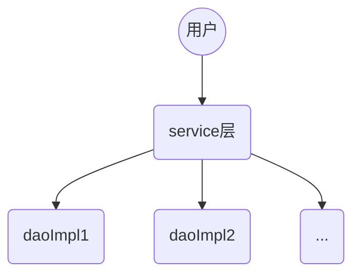

# Mybatis

三层架构：

* 表现层：展示数据
* 业务层：处理业务需求
* 持久层：持久化，和数据库交互

持久层技术：

* JDBC：Conntection、PreparedStatement、ResultSet
* JDBCtemplate：Spring对jdbc的封装
* DBUtils：Apache对jdbc的封装

mybatis：持久层框架，封装了jdbc操作，ORM思想

> ORM：Object Relational Mapping对象关系映射，将数据库表和实体类及实体类的属性对应，通过操作实体类实现操作数据库表

mybatis可以通过xml文件或者注解的形式配置

## 环境配置

### 通过xml文件配置

新建maven工程，导入对应的数据库，这里针对数据中的`user`表进行配置

* 在pom.xml文件中导入mybatis坐标

  ```xml
  <dependency>
      <groupId>org.mybatis</groupId>
      <artifactId>mybatis</artifactId>
      <version>3.5.9</version>
  </dependency>
  ```

  > 注意，不要忘了导入数据库连接池的坐标`mysql-connector-java`

* 在`domain`包下定义`User`实体类，现在将其属性的名称和数据库中表的名称一一对应；在`dao`包下，新建接口：`UsrDao`

  > 这里假设只有一个方法：`List<User> findAll`

* 创建Mybatis的主配置文件：`SqlMapConfig`

  ```xml
  <?xml version="1.0" encoding="UTF-8" ?>
  <!DOCTYPE configuration
          PUBLIC "-//mybatis.org//DTD Config 3.0//EN"
          "http://mybatis.org/dtd/mybatis-3-config.dtd">
  <!-- Mybatis的主配置文件-->
  <configuration>
      <!--配置环境-->
      <environments default="mysql">
          <!--配置mysql环境-->
          <environment id="mysql">
              <!--配置事务类型-->
              <transactionManager type="JDBC"></transactionManager>
              <!--配置数据源（连接池）-->
              <dataSource type="POOLED">
                  <!-- 四个属性
                      * 驱动
                      * 连接数据库的URL:jdbc:mysql://localhost:3306/数据库
                      * 用户名
                      * 密码
                  -->
                  <property name="dirver" value="com.mysql.jdbc.Driver"/>
                  <property name="url" value="jdbc:mysql://localhost:3306/learn_mybatis"/>
                  <property name="username" value="root"/>
                  <property name="password" value="root"/>
              </dataSource>
          </environment>
      </environments>
      <mappers>
          <mapper resource="com/buzz/dao/UserDao.xml"/>
      </mappers>
  </configuration>
  ```

  > 这里可以定义IDEA的xml文件模板

* 创建映射配置文件：`UserDao.xml`

  ```xml
  <?xml version="1.0" encoding="UTF-8"?>
  <!DOCTYPE mapper
          PUBLIC "-//mybatis.org//DTD Mapper 3.0//EN"
          "http://mybatis.org/dtd/mybatis-3-mapper.dtd">
  <!--Mybatis的映射配置文件-->
  <mapper namespace="com.buzz.dao.UserDao">
      <!--配置数据库的语句-->
      <!--首先是查询所有的方法，这个标签的id必须和方法名一致，属性resultType指定封装后的对象-->
      <select id="findAll" resultType="com.buzz.domain.User">
          select * from user
      </select>
  </mapper>
  ```

  > 注意这个文件的路径需要在`resource`下的定义新的路径，这个路径和之前配置`dao`包的路径相同，是`com.buzz.dao`，在这个路径下创建新的xml文件
  >
  > 这个配置路径的时候，需要新建文件夹 directory

几个注意：

* 在Mybatis中，持久层的操作接口和映射文件也称为Mapper，所以`UserDao`也可以定义为`UserMapper`
* IDEA新建路径`directory`的时候，如果命名：`com.buzz.dao`实际上创建的是一个目录
* mybatis的映射配置文件路径需要和`dao`包内接口路径相同
* mybatis的映射配置文件的`mapper`标签的`namespace`属性的取值必须是`dao`接口的全限定类名
* mybatis的映射配置文件的操作标签配置的id属性必须和方法名相同
* mybatis的映射配置文件的`select`标签需要制定结果集的类型`resultType`，即封装到哪个对象中

> 映射配置文件如果这么写了，就不需要再写dao接口的实现类了

### 通过注解配置

区别在于两个地方：

* 在mybatis的主配置文件中，配置mapper标签的时候，注意配置的是class属性，而不是resource属性，class属性中填入我们的dao接口的全类名

  ```xml
  <mappers>
      <mapper class="com.buzz.dao.UserDao"/>
  </mappers>
  ```

* 在接口中的对应方法中添加注解，比如我们的`findAll()`方法，执行的是查询操作

  ```java
  	@Select("select * from user")
      List<User> findAll();
  ```

## 一个实例

使用Mybatis框架执行`sql`语句的基本思路：

* 读取配置文件

  > 两种比较靠谱的读取路径的写法：
  >
  > * 使用类加载器，读取类路径的配置文件
  > * 使用`ServletContext`对象，调用方法`getRealPath()`获取路径

* 创建工厂对象：`SqlSessionFactory`

  > mybatis为了创建工厂对象，使用了构建者模式，`SqlSessionFactotyBuilder`对象为构建者
  >
  > 我们提供给构建者的输入是上面读取配置文件产生的`InputSteam`对象
  >
  > 将对象创建的细节封装，并隐藏

* 根据工厂对象获取`SqlSession`对象

  > 显然，获取`SqlSession`对象使用了工厂模式，好处在于，获取对象不是new出来的，是从工厂中获取的，而至于工厂，可以通过配置文件进行配置，这样可以通过修改配置文件获得不同的`SqlSession`对象
  >
  > 当需求改变的时候，不需要更改源码，实现了解耦

* 利用`SqlSession`对象创建`Dao`接口中的代理对象

  > 在这一步将接口实例化
  >
  > 显然，这里根据接口获取代理对象使用了代理模式
  >
  > 可以在不修改源码的基础上，对源码增强

* 代理对象执行方法

* 释放资源

```java
	@Test
    public void test() {
        try {
            //读取配置文件
            InputStream in = Resources.getResourceAsStream("SqlMapConfig.xml");
            /*
            	创建工厂对象
            	要注意的是，工厂对象SqlSessionFactory是一个接口，所以不能直接new出来
            	但是还有一个对象SqlSessionFactoryBuiler，这个对象可以用来创建工厂对象
            */
            SqlSessionFactoryBuilder builder = new SqlSessionFactoryBuilder();
            SqlSessionFactory factory = builder.build(in);
            //根据工厂对象获取sqlSession对象
            SqlSession sqlSession = factory.openSession();
            //根据工厂对象获取代理对象
            UserDao mapper = sqlSession.getMapper(UserDao.class);
            //代理对象执行方法
            List<User> all = mapper.findAll();
            System.out.println(all);
            //释放资源
            sqlSession.close();
            in.close();
        } catch (IOException e) {
            e.printStackTrace();
        }
    }
```

我们上面的操作中，没有提供Dao的实现类，但这不代表Mybatis不支持Dao实现类的写法

## 使用Mybatis进行CRUD操作

因为我们使用了单元测试，为了简化书写，进一步向上抽取

在`@Before`注解内部进行初始化的操作，在`@After`注解内部进行释放资源的操作

```java
	@Before
    public void ini() throws IOException {
        in = Resources.getResourceAsStream("SqlMapConfig.xml");
        SqlSessionFactoryBuilder builder = new SqlSessionFactoryBuilder();
        SqlSessionFactory factory = builder.build(in);
        this.sqlSession = factory.openSession();
        this.mapper = sqlSession.getMapper(UserDao.class);
    }
```

这里面将`InputSteam、sqlSession`抽取出来，因为在释放资源的时候需要释放

抽取了`mapper`，因为这个代理对象是我们实际中需要操作的对象

```java
 	@After
    public void destory() throws IOException {
        sqlSession.commit();
        sqlSession.close();
        in.close();
    }
```

这里面比较关键的是事务的提交，因为默认情况下mybatis关闭了自动提交事务

- 如果不执行sqlSession.commit()操作，直接执行sqlSession.close()，则会在close()中进行事务回滚；
- 如果不执行sqlSession.commit()操作也不手动关闭sqlSession，在程序结束时关闭数据库连接时会进行事务回滚；

当然，可以设置事务自动提交，这个可以在核心配置文件中配置，也可以在获取`SqlSession`对象的时候配置

在获取数据库连接对象的时候我们调用的方法是：`SqlSessionFactory.openSession()`，默认情况下是没有参数的，通过查看源码的方式，看到起始这个方法具有很多重载的形式，可以通过传入参数`true`，开启自动提交

```java
@Override
public SqlSession openSession(boolean autoCommit) {
    return openSessionFromDataSource(configuration.getDefaultExecutorType(), null, autoCommit);
}
```

### 查询

#### 查询所有

这个其实上面的例程就是

我们在dao接口中添加方法：`List<User> findAll()`，然后在映射配置文件中添加标签，指定标签的`id`属性，就是该标签对应的方法名，属性`resultType`指定了结果集的封装类型

标签体中就是我们的查询语句

```xml
<select id="findAll" resultType="com.buzz.domain.User">
    select * from user
</select>
```

在我们的测试文件中：

```java
	@Test
    public void testFindAll() {
        List<User> all = mapper.findAll();
        System.out.println(all);
    }
```

#### 查找一个用户

在dao接口中添加方法：`User findUserById(int id)`，然后在映射配置文件中添加`<select>`标签

```xml
<select id="findUserById" parameterType="java.lang.Integer" resultType="com.buzz.domain.User">
    select *
    from user
    where id = #{id};
</select>
```

现在这个标签需要指定两个属性，一个是参数类型，因为是根据用户id查找用户，所以参数为int类型；另一个属性结果集的封装类型，因为是找到某一个用户，所以返回值类型是`User`类型

测试文件中：

```java
 	@Test
    public void testFindUserById() {
        int id = 50;
        System.out.println(mapper.findUserById(id));
    }
```

要注意的是，相比于JdbcTemplate，这个其实友好了很多，如果查找不到对应id的用户的时候，这里不会报错，只是返回值为null

### 添加

在dao接口中添加方法：`int addUser(User user)`，方法返回类型是int，是为了粗略的确认添加是否正常，正常情况下，添加操作仅会影响一行，即返回值为1；然后在映射配置文件中添加标签`<insert>`

```xml
<insert id="addUser" parameterType="com.buzz.domain.User">
    insert into user (username, birthday, sex, address) values(#{username}, #{birthday}, #{sex}, #{address});
</insert>
```

这里面指定了参数的类型，注意上面插入语句的写法：我们在`value`对应位置出写的是：`#{}`，对比之前在jdbc中，写法为`?`；在mybatis中`#{}`是占位符，用于代替实际执行时的数据

我们在这个占位符内部写入的是对应的属性，而不是实际的成员变量；就是说它还是根据javaBean的规则，根据方法名中对应的属性，获取成员变量的名称

这种占位符是一种`ognl`表达式，即`Object Graphic Navigation Language`

在我们的测试文件中：

```java
 	@Test
    public void testAdd() {
        User tmp = new User();
        tmp.setUsername("buzz");
        tmp.setSex("M");
        tmp.setAddress("BUZZ");
        tmp.setBirthday(new Date());
        System.out.println(mapper.addUser(tmp));
    }
```

现在需求变了，要求在插入后返回新插入的数据的主键的值

其实都好做，现在仅需要在原来的`<insert>`标签中添加一个`<selectKey>`标签

```xml
 <insert id="addUser" parameterType="com.buzz.domain.User">
     <!-- keyProperty:返回值封装到的属性 keyColumn:数据库中的数据属性 resultType:返回值类型 order:在插入后进行这个操作 -->
     <selectKey keyProperty="id" keyColumn="id" order="AFTER" resultType="java.lang.Integer">
         select last_insert_id();
     </selectKey>
     insert into user (username, birthday, sex, address) values(#{username}, #{birthday}, #{sex}, #{address});
</insert>
```

其实最核心的部分在于，mysql中支持在插入操作后使用语句：`select last_insert_id()`返回刚刚插入数据的主键的大小

现在我们修改完标签，再次执行，会发现，当初我们传入的`User`中的`id`是没有赋值的，但是现在它的`id`就是主键的大小

### 修改

在dao接口中添加方法：`int updateUser(User user)`，方法返回值类型为int，正常情况下，修改操作仅会影响一行，返回值为1；然后在配置文件中添加标签：`<update>`

```xml
<update id="updateUser" parameterType="com.buzz.domain.User">
    update user set username = #{username}, birthday = #{birthday}, sex = #{sex}, address = #{address} where id = #{id};
</update>
```

其实修改都利用了主键的唯一性，保证每次修改只会修改一行

在测试文件中：

```java
	@Test
    public void testUpdate() {
        User tmp = new User();
        tmp.setUsername("bezz");
        tmp.setSex("F");
        tmp.setAddress("BEZZ");
        tmp.setBirthday(new Date());
        tmp.setId(50);
        System.out.println(mapper.updateUser(tmp));
    }
```

### 删除

在dao接口中添加方法：`int deleteUser(int id)`；然后再配置文件中添加标签：`<delete>`

```xml
<delete id="deleteUser" parameterType="java.lang.Integer">
    delete from user where id = #{id}
</delete>
```

注意上面标签中标签体的内容，我们在使用where进行限制的时候，在`#{}`占位符内部其实可以随便写，因为我们的方法参数其实就是里面的内容

在测试文件中：

```java
@Test
    public void testFindUserById() {
        int id = 50;
        System.out.println(mapper.findUserById(id));
    }
```

### 模糊查询

这里是根据用户名进行模糊查询

在dao接口中添加方法：`List<User> findUserByName(String username) `；然后再映射配置文件中添加`<select>`标签

```xml
<select id="findUserByName" parameterType="java.lang.String" resultType="com.buzz.domain.User">
    select *
    from user
    where username like  #{username};
</select>
```

之前尝试过写成拼接字符串的写法：`like '%'+#{username}+'%'`，这种写法不行，还是直接填写传入的参数

只不过为了实现模糊查询，现在在调用这个方法的时候对用户名的字符串本身进行一个拼接的操作

在测试文件中：

```java
@Test
    public void testFindUserByName() {
        String name = "%王%";
        System.out.println(mapper.findUserByName(name));
    }
```

注意这里传入的参数本身就是拼接过两个`%` 的，不然无法实现模糊查询

如果非要使用拼接字符串的形式进行模糊查询，那么请求体中应该写成：`like '%${value}%'`，这个写法是固定的，占位符内的值必须是value，这个是由源码确定的

* 如果写成`#{}`的形式，底层使用的是PreparedStatement；而如果写成上面的`%${value}%`的形式，底层使用的是Statement

#### #{}和${}的区别

* `#{}`表示一个占位符号，通过`#{}`可以实现 preparedStatement 向占位符中设置值，自动进行 java 类型和 jdbc 类型转换，`#{}`可以有效防止 sql 注入。 `#{}`可以接收简单类型值或 pojo 属性值。 如果 parameterType 传输单个简单类型值， `#{}`括号中可以是 value 或其它名称。
* `${}`表示拼接sql串，通过`${}`可以将 parameterType 传入的内容拼接在 sql 中且不进行 jdbc 类型转换， `${}`可以接收简单类型值或 pojo 属性值，如果 parameterType 传输单个简单类型值， `${}`括号中只能是 value。  

### 返回值为一行一列（聚合函数）

这种其实比较常见的是统计词条的个数，相当于select语句中带了一个count

举例来讲，在我们的dao中添加方法：`int getUsersCount()`，然后在映射配置文件中添加`select`标签

```xml
 <select id="getUsersCount" resultType="java.lang.Integer">
     select count(*) from user;
</select>
```

在测试文件中

```java
@Test
    public void testGetUsersCount() {
        System.out.println(mapper.getUsersCount());
    }
```

### 万能的map

现在考虑使用map进行传参

举例子来说，比如原来我们向添加方法，为了实现向user表中添加数据，封装数据的参数为与i个user对象，但现在我们可以通过map进行数据的封装

比如还是上面的添加方法可以现在可以定义成：

```java
int addUserByMap(Map<String, Object> map);
```

然后在映射配置文件中绑定方法：

```xml
<insert id="addUserByMap" parameterType="java.util.Map">
    insert into user (username, birthday, sex, address) values (#{username}, #{birthday}, #{sex}, #{address});
</insert>
```

注意这里面我们的参数是从一个map中存储的，也就是说其实我们不要保证map的键和数据库中对应的列是完全对应的关系，只要在我们写insert语句的时候能够实现对应就好了

然后测试一下我们的方法：

```java
@Test
    public void testAddUserByMap() {
        UserMapper mapper = sqlSession.getMapper(UserMapper.class);
        Map<String, Object> map = new HashMap<>();
        map.put("username", "buzz");
        map.put("birthday", new Date());
        //map.put("sex", "M");
        map.put("sex", 'M');
        int rst = mapper.addUserByMap(map);
        System.out.println(rst);//1
    }
```

注意我们的user表中具有address属性，这里故意没有添加，但是我们还是可以在数据库中看到对应的表项

有了这个map，我们甚至都不需要写实体类了，直接一个map全部解决，实体类的每一个属性都是map的一个键

## OGNL表达式

Object Graph Navigation Language：对象图导航语言

通过对象的取值方法获取数据，但在写法上省略了get

比如正常通过对象获取属性：`user.getUserName()`

使用OGNL表达式写成：`user.username`

如果对象的属性不是基本数据类型而是另一个对象，还可以继续通过.的形式获取值

在mybatais中因为已经在标签中提供了`parameterType`属性，这个属性指定了类，所以在写sql语句的时候，可以将：`#{user.username}`简化为：`#{username}`

## paratemerType配置参数

这个属性的参数的取值可以是

* 基本数据类型（8种）
* 引用类型（比如String）
* 实体类型（这个我觉得可以包含在引用类型里面，这里面典型的是POJO类型）
* 使用实体类的包装类

> POJO是一个简单的、普通Java对象，它包含业务逻辑处理或持久化逻辑等，但不是JavaBean、EntityBean等，不具有任何特殊角色，不继承或不实现任何其它Java框架的类或接口。 可以包含类似与JavaBean属性和对属性访问的setter和getter方法的。
>
> 反正就别把这个和javaBean搞混了

上面的内容强调最后一个内容，实体类的包装类，我们考虑进行查询的时候使用的多个条件综合查询，比如查询用户的时候，用户名有限制，用户的住址有限制，用户的性别有限制，查询同时满足了这些条件的用户；现在把这些条件封装成一个用户的属性，然后把这个用户进一步包装，成为为一个类`QueryVo`的成员变量

现在定义了查询的类：`QueryVo`

```java
package com.buzz.domain;

import java.io.Serializable;

/**
 * @program: learn_mybatis
 * @description: 查询条件的封装类
 * @author: buzz
 * @create: 2022-01-21 20:13
 **/
public class QueryVo implements Serializable {
    private User user;

    public QueryVo() {
    }

    public User getUser() {
        return user;
    }

    public void setUser(User user) {
        this.user = user;
    }
}
```

在dao接口种添加查找方法：

```java
 /**
     * @author buzz
     * @param queryVo
     * @return java.util.List<com.buzz.domain.User>
     * @description 根据特定条件封装后的实体类查询
    */
    List<User> findUserByQueryVo(QueryVo queryVo);
```

在映射配置文件中，添加`<select>`标签

```xml
 <select id="findUserByQueryVo" parameterType="com.buzz.domain.QueryVo" resultType="com.buzz.domain.User">
     select * from user where username like #{user.username}
</select>
```

> 注意，我们这里其实还是一个模糊查询，根据用户名进行模糊查询，区别在于，现在我们将这个条件封装到一个User对象中了，而这个对象由进一步被封装到一个QueryVo对象中，主要是因为在实际业务中，可能查询条件的约束不仅仅User一个，QueryVo类中可能具有很多的成员变量

在测试文件中：

```java
@Test
    public void testFindUserByQueryVo() {
        QueryVo vo = new QueryVo();
        User user = new User();
        user.setUsername("%王%");
        vo.setUser(user);
        List<User> userByQueryVo = mapper.findUserByQueryVo(vo);
        System.out.println(userByQueryVo);
    }
```

## Mybatis 的输出结果封装

上面所有的操作都建立在实体类的成员变量的名称和数据库中表的列名是一一对应的基础上

但如果实际中，这种对应关系无法得到保证，需要进行额外的配置

### 别名

比如现在实体类User的成员变量长这样：

```java
	private int userId;
    private String userName;
    private Date userBirthday;
    private String userSex;
    private String userAddress;
```

对应的，还需要更改getter和setter方法

接下来的问题就在于映射配置文件了，比如我们添加用户的`<insert>`标签：

```xml
<insert id="addUser" parameterType="com.buzz.domain.User">
    <!-- keyProperty:返回值封装到的字段 keyColumn:数据库中的数据类型 resultType:返回值类型 order:在插入后进行这个操作 -->
    <selectKey keyProperty="id" keyColumn="id" order="AFTER" resultType="java.lang.Integer">
        select last_insert_id();
    </selectKey>
    insert into user (username, birthday, sex, address) values(#{username}, #{birthday}, #{sex}, #{address});
</insert>
```

可以预见的是，我们需要对OGNL表达式中的属性进行更改，毕竟getter的方法名称已经变了，所以需要更改对应的属性名

此外在`<selectKey>`标签内的属性，keyProperty也需要更改，因为我们封装到实体类调用的setter方法的名称也变化了，所以需要让其修改为新的属性

修改后如下：

```xml
<insert id="addUser" parameterType="com.buzz.domain.User">
    <!-- keyProperty:返回值封装到的字段 keyColumn:数据库中的数据类型 resultType:返回值类型 order:在插入后进行这个操作 -->
    <selectKey keyProperty="userId" keyColumn="id" order="AFTER" resultType="java.lang.Integer">
        select last_insert_id();
    </selectKey>
    insert into user (username, birthday, sex, address) values(#{userName}, #{userBirthday}, #{userSex}, #{userAddress});
</insert>
```

这个其实好说，关键在于查询相关的标签的更改：比如我们最开始的`findAll`方法对应的`select`标签

```xml
<select id="findAll" resultType="com.buzz.domain.User">
    select * from user
</select>
```

现在需要对其起一个别名：在查询语句中将其修正

```xml
<select id="findAll" resultType="com.buzz.domain.User">
    select id as userId, username as userName, birthday as userBirthday, sex as userSex, address as userAddress from user
</select>
```

### ResultMap封装

结果集映射，这种相当于提供了结果集到实体类成员变量之间的映射配置

我们需要在映射配置文件中额外提供一个`<resultMap>`标签

```xml
<!-- id就是用来表示当前这个映射配置的，可以随便起 
	type属性要明确封装到的实体类-->
<resultMap id="userMap" type="com.buzz.domain.User">
    <!-- 首先要写的是主键的对应关系，使用的是id标签
 		property属性的值对应的是在实体类setter方法的属性名
		column属性的值对应的是数据库中对应的列名
	-->
    <id property="userId" column="id"/>
    <!-- 然后要写的是非主键的对应关系，使用的是result标签 -->
    <result property="userName" column="username"/>
    <result property="userSex" column="sex"/>
    <result property="userAddress" column="address"/>
    <result property="userBirthday" column="birthday"/>
</resultMap>
```

完成这个映射配置的声明后，在对应的`select`标签内部，需要明确属性`resultMap`的取值，这个值对应于我们`<resultMap>`标签的`id`取值，具体如下：

```xml
<select id="findAll" resultMap="userMap">
    select * from user
</select>
```

原来这个标签中的`resultType`属性就没什么用了，不一样的字段通过map进行映射就好了

## 主配置文件`mybatis-config.xml`

主要是关于这个文件下其他的标签的介绍

要记住，在这个文件中引入了DTD约束，所以我们所有标签之间都是有先后顺序的

一个大的`configuration`标签，里面的标签有的可以不存在，但只要存在了，就必须按照这个顺序来，不然会报错

- configuration（配置）
  - [properties（属性）](#properties标签)
  - [settings（设置）](#setting标签)
  - [typeAliases（类型别名）](#typeAliases标签)
  - [typeHandlers（类型处理器）](https://mybatis.org/mybatis-3/zh/configuration.html#typeHandlers)
  - [objectFactory（对象工厂）](https://mybatis.org/mybatis-3/zh/configuration.html#objectFactory)
  - [plugins（插件）](https://mybatis.org/mybatis-3/zh/configuration.html#plugins)
  - [environments（环境配置）](#environments标签)
    - environment（环境变量）
      - transactionManager（事务管理器）
      - dataSource（数据源）
  - [databaseIdProvider（数据库厂商标识）](https://mybatis.org/mybatis-3/zh/configuration.html#databaseIdProvider)
  - [mappers（映射器）](https://mybatis.org/mybatis-3/zh/configuration.html#mappers)

### [properties标签](https://mybatis.org/mybatis-3/zh/configuration.html#properties)

这个标签可以指定数据库下的配置，原来在配置数据库的连接信息的时候需要将配置写在`<dataSource>`标签内部的`<property>`标签下；

现在需求变了，我们可以从外部读取配置，即可以从另一个`.properties`文件内读取数据库连接信息

首先在resource目录下定义资源文件：`jdbcConfig.properties`

```properties
jdbc.driver=com.mysql.cj.jdbc.Driver
jdbc.url=jdbc:mysql://localhost:3306/learn_mybatis?serverTimezone=Asia/Shanghai&useUnicode=true&characterEncoding=utf8&useSSL=false
jdbc.username=root
jdbc.password=root
```

这个文件下是我们所有关于数据库连接的配置

然后我们需要在主配置文件`mybatis-config.xml`中的`<properties>`标签下引入这个配置

```xml
<properties resource="jdbcConfig.properties"></properties>
```

这里引入的方式是通过`resource`属性的方式

随后在`<dataSource>`标签内的`<property>`标签内，还需要明确数据库连接的配置：

```xml
<property name="driver" value="${jdbc.driver}"/>
<property name="url" value="${jdbc.url}"/>
<property name="username" value="${jdbc.username}"/>
<property name="password" value="${jdbc.password}"/>
```

注意到这里的value值都变成了`${}`的形式，括号内部的取值为配置文件`properties`中的键的名称

这样，我们在更改的配置的时候甚至都不需要更改主配置文件，而仅仅更改数据库连接配置文件就好了

其实上面我们引入数据库连接配置文件的时候，使用了`<properties>`标签下的`resource`属性，其实还可以通过`url`属性进行配置文件的引入

但是通过`url`属性引入的时候，格式很严格：$\text{协议/主机域名(ip)/端口号/资源相对路径}$

比如：`https://localhost:8080/myWeb/index.html`

但显然，我们这个是一个文件系统，假设资源文件存储在d盘下默认的写法：`file://localhost/d:/property.properties`

> 这里省略了端口号，主要是我也不知道file协议的端口号

所以其实很难写，就干脆用resource属性引入吧

使用`<properties>`标签引入外部配置后，还可以在这个标签体内加入额外的键值对作为配置：

```xml
<properties resource="path">
    <property name="key" value="value"/>
</properties>
```

现在，如果同时在外部的配置文件和内部标签中添加了相同的键名，那么对应键的值应该以外部配置文件为准

其本质上是这样的，他会先引入内部标签内的配置，然后再将外部配置文件的键值对读取进来，但是这个过程会覆盖掉内部标签的value

### [setting标签](https://mybatis.org/mybatis-3/zh/configuration.html#settings)

真正意义上的配置，用到的时候再看吧

### [typeAliases标签](https://mybatis.org/mybatis-3/zh/configuration.html#typeAliases)

之前在写参数类型，返回类型的时候填写的是全类名，但其实可以写别名

通过在主配置文件中添加这个标签，可以起别名，比如：

```xml
<typeAliases>
    <typeAlias type="com.buzz.domain.User" alias="user"/>
</typeAliases>
```

原来在填实体类类名的时候，需要填写全类名，但现在可以写user了

> 注意这种别名不区分大小写，就是如果写成了`USER`它也是可以识别的

在上面的配置中，我们给特定的实体类起了一个别名，简化书写；在实际开发中，我们会将实体类放在`domain`或者`pojo`包内，这些包内拥有多个实体类，如果每一个都单独配置起别名显然有点太麻烦了，所以有一种标签，它可以将整个为包内所有的实体类起一个别名，这个别名就是类名

所以上面还可以写成：

```xml
 <typeAliases>
     <package name="com.buzz.domain"/>
</typeAliases>
```

这里面配置的属性name值是包的路径

其实现在有了`<package>`标签，在主配置文件中配置映射配置文件的位置的时候也可以指定包名

比如现在可以这么写：

```xml
<mappers>
    <package name="com.buzz.dao"/>
</mappers>
```

说明我们的映射配置文件在这个包中

在一个映射配置文件中可以配置多个不同的dao接口的语句，只要多个不同的`mapper`标签就好了

每个`mapper`标签的`namespace`属性配置一个dao接口

> 起别名还可以通过给实体类添加注解：`@Alias()`的形式实现
>
> 从优先级上，如果同时配置了注解和`typeAlias`标签，那么优先注解

### environments标签

这个标签下配置的是mybatis的环境，每个环境通过`<environment>`标签下的`id`进行区分

尽管mybatis中可以配置多个环境，但实际使用的时候仅仅可以使用一个环境，不同环境的选择通过`<environments>`标签下的default属性区分，`default`的值是下面哪个`<environment>`的id，我们选择的就是哪个环境

注意每个环境下比较重要的两个子标签

* `<transactionManager>`配置事务管理器：其实在mybatis中有两种事务管理器：`JDBC`、`MANAGED`
* `<dataSource>`配置数据源：连接数据库的：三种内建的数据源类型：
  * `POOLED`：默认用的是这个
  * `UNPOOLED`：没有连接池，每次申请`sqlSession`的时候获取新的连接
  * `JNDI`：不用

mybatis默认的事务管理器是`JDBC`，默认的数据库连接池是`POOLED`

### mappers标签

是用来给主配置文件绑定Mapper文件的

几种方式：

* 使用resource属性绑定，这个时候注意路径的名称需要使用/分割
* 使用class属性绑定：这个时候注意路径名称需要使用.分割，且
  * 接口和映射配置文件必须同名
  * 接口和映射配置文件必须在同一个包内

* 通过`package`标签绑定，扫描一个包内所有的接口和映射配置文件；这个其实也有条件限制，和上面第二点一样

> 其实包扫描的方式本质上就是通过class进行注册，只不过可以一下子引入所有的接口

## 生命周期和作用域

这个使用不好会导致并发问题

* SqlSessionFactoryBuilder：一旦一个`SqlSessionFactory`被创建，就不需要这个对象了，所其最佳的实例的最佳作用域是方法作用域（也就是局部方法变量）
* SqlSessionFactory：类比于数据库连接池，一旦创建，就需要一直存在，知道程序运行结束，所以作用域最好是应用作用域，全局的，伴随程序的开始而创建，在程序被销毁的时候销毁；通过使用单例模式保证其全局的唯一性
* SqlSession：类比于Connect对象；使用后需要释放资源；因为SqlSession实例是线程不安全的，不可以共享，每个线程应该有单独的SqlSession实例；最佳作用域是请求或方法作用域


## 日志

数据库的操作出现了异常，可以使用日志进行排错；

配置mybatis的日志，需要在主配置文件中的`<settings>`标签进行配置

mybaytis支持的日志配置：

* SLF4J
* LOG4J（这个现在已经废弃掉了，毕竟都有漏洞了）
* LOG4J2
* JDK_LOGGING
* COMMONS_LOGGING
* STDOUT_LOGGING：标准日志输出
* NO_LOGGING：没有日志

## 分页查询

### Limit分页

```sql
select * from user limit 5 offset 5
```

从user表中查询数据，限制查询5个对象，且从下标索引为5的地方开始，要注意的是这里的下标索引从0开始计数

这个其实和以前没什么区别，不同点在于现在的我们配置mybatis的语句中传入两个参数一个表示分页大小，一个表示偏移量

在我们的接口中声明方法：

```java
/**
     * @author buzz
     * @return java.util.List<com.buzz.domain.User>
     * @description 分页查询，使用map作为输入的参数
    */
    List<User> getUsersByPage(Map<String, Integer> params);
```

随后编写sql语句：我们的两个参数分别是分页大小`pageSize`和起始偏移量`pageOffset`，对应着map的两个键

```xml
<select id="getUsersByPage" resultMap="userMap" parameterType="java.util.Map">
    select * from user limit #{pageSize} offset ${pageOffset};
</select>
```

### pageHelper插件

主要需要参考[官方文档](https://pagehelper.github.io/docs/howtouse/)

首先在`pom.xml`文件中导入依赖：

```xml
<dependency>
  <groupId>com.github.pagehelper</groupId>
  <artifactId>pagehelper</artifactId>
  <version>5.3.0</version>
</dependency>
```

随后在主配置文件中添加插件信息：

> 注意这里的plugins标签必须位于typeAlias标签下，environment标签上，这是约束

```xml
<plugins>
        <!-- com.github.pagehelper为PageHelper类所在包名 -->
        <plugin interceptor="com.github.pagehelper.PageInterceptor">
            <!-- 使用下面的方式配置参数，后面会有所有的参数介绍 -->
            <property name="helperDialect" value="mysql"/>
            <property name="pageSizeZero" value="true"/>
            <property name="reasonable" value="true"/>
        </plugin>
    </plugins>
```

来几个常见的属性：

* `helperDialect`：配置分页插件使用的语言，这里直接填入mysql就好
* `pageSizeZero`：这个默认值为false，如果配置为true，那么在我们查询的时候，如果调用方法的参数中`pageSize`即页面大小这个参数为0的时候，将会查询所有的数据（相当于没有执行分页操作）
* `reasonable`：这个默认值也是false，如果配置为true，那么在我们查询的时候，如果调用方法的参数中`pageNum`的取值小于1的时候会查询第一页，如果取值大于最大页数的时候会查询最后一页
* 剩下的参数到官方文档看

我们在使用的时候需要在查询语句前调用方法`PageHelper.startPage(pageNum, pageSize)`，随后调用查询所有的方法，即可实现分页

举个例子：

> 这里的例子对应下面的[多对一](#多对一)

实体类，映射配置文件，都不需要更改，我们把上面的配置写好，然后直接在测试类中更改就行

```java
@Test
public void testGetStudent() {
    //因为实际中我们知道只有三项数据，所有这里页面大小为1，查询的是第一页
    PageHelper.startPage(1, 1);
    StudentMapper mapper = session.getMapper(StudentMapper.class);
    List<Student> allStudent = mapper.getAllStudent();
    System.out.println(allStudent);
    //这里可以获取页面的信息，包含总页数当前页数，以及查询的结果，都在pageInfo对象中
    PageInfo<Student> pageInfo = new PageInfo<>(allStudent);
    System.out.println(pageInfo);
}
```

## Mybatis使用注解

注意这个时候就不需要写映射配置文件了，此时使用`<mapper>`标签的class属性用于绑定接口

```XML
<mappers>
    <mapper class="com.buzz.dao.UserMapper"/>
</mappers>
```

注意现在我们使用注解，所以实现方法的sql语句写在方法上方：

```java
	@Select("select * from user")
    List<User> getAllUsers();
```

但使用注解的方式存在一定的问题，比如如果我们的实体类的属性和数据库中的列名不是统一的，此时就很难映射

所以使用注解的方法仅仅适用于那些比较简单的情况，官方建议使用xml进行映射的配置

### @Param注解

有一个比较关键的点在于，如果我们的参数具有多个，比如根据多个属性同时查询用户，如果是原来的话，因为参数类型的配置的时候，我们就配置了一个，所以原来没有注解的时候我们将多个条件的属性封装到一个对象中，然后让这个对象作为参数（或者放入一个map中，让map作为参数）

但是现在有了注解，我们可以通过`@Param`指定参数的名称，举个例子：现在的mapper中具有一个方法：

```java
@Select("select * from user where username=#{name} and address=#{address}")
    List<User> getUsersByNameAndAddress(@Param("name") String username, @Param("address") String address);
```

我们在方法的参数中添加了注解，使得写`sql`语句的时候可以进行引用

特别的：

* 基本数据类型参数，或者String类型，需要这个注解，而其他的引用类型不需要
* 如果只有一个基本数据类型的话可以不加，但是最好也加上
* Sql中引用的就是这个注解的取值

## Lombok

这个真的超级好用，再也不写实体类的getter、setter方法了

要注意的是，这个需要现在IDEA中下好插件，并在maven仓库中导入jar包

现在在实体类中定义：

```java
package com.buzz.domain;

import lombok.Data;

/**
 * @program: tough_mybatis
 * @description: 实体类
 * @author: buzz
 * @create: 2022-01-26 11:51
 **/
@Data
public class User {
    private int uid;
    private String userName;
    private String birthday;
    private String sex;
    private String address;
}
```

我们添加了一个`@Data`的注解，然后结束；这个注解会自动帮我们添加好所有的getter、setter方法，此外还有无参的构造器，toString方法、hashCode方法、equals方法

## 一对多的表

一个很简单的例子，加入现在有两个表，一个学生表，一个教师表

学生表中的每个学生有自己的信息，同时每个学生绑定一个老师，学生和老师是多对一的关系

老师表中的老师具有自己信息

先搭建一个环境吧，一共两张表，一张学生表：

|  id  | name | tid  |
| :--: | :--: | :--: |

一张教师表

|  id  | name |
| :--: | :--: |

## 多对一

创建实体类的时候需要注意，因为学生表的tid是教师表的外键，所以，在实体类中定义：

```java
package com.buzz.pojo;

import lombok.Data;

/**
 * @program: tough_mybatis
 * @description: 学生实体类
 * @author: buzz
 * @create: 2022-01-27 16:31
 */
@Data
public class Student {
    private int id;
    private String name;
    private Teacher teacher;
}
```

查找所有学生的信息，包括学生对应老师的信息

直观印象上我们应该在接口中定义方法：

```java
/**
 * @author buzz
 * @return List<Student>
 * @description 现在第一个需求是查找所有的学生的信息，其中包括学生对应老师的信息
 */
  List<Student> getAllStudent();
```

然后进入映射配置文件编写sql语句，然后就出现问题了，因为学生表中tid作为老师表的外键，如果要我们写sql语句的话我们写：

```sql
select * from student t1, teacher t2 where t1.tid = t2.id
```

涉及到了多表查询

然而在这里

```xml
<select id="getAllStudent" resultType="com.buzz.pojo.Student">
    select * from student t1, teacher t2 where t1.tid = t2.id
</select>
```

这个是我们能写的，但是我们查询到的数据是没有办法一步封装到Student对象中的

我们的结果中具有tid，教师表的id，教师表的name这三列，直接封装成一个teacher对象

所以现在需要想额外的办法

现在我们指定结果集映射关系，并重写标签内的查询语句：

```xml
<resultMap id="studentTeacher" type="student">
    <id property="id" column="id"/>
    <result property="name" column="name"/>
    <!-- 复杂属性 teacher 需要单独处理
         如果是对象使用<association>标签
         如果是集合使用<collection>标签-->
    <!--这里使用的标签很关键，他将实体类中的属性和数据库中一个表的查询相关联-->
    <association property="teacher" column="tid" javaType="Teacher" select="getTeacher"/>
</resultMap>
<select id="getAllStudent" resultMap="studentTeacher">
    select * from student;
</select>

<select id="getTeacher" resultType="teacher">
    select * from teacher where id = #{id};
</select>
```

上面这种写法是按照查询嵌套处理

还有一种写法是按照结果嵌套处理

```xml
<resultMap id="studentTeacher" type="student">
    <id property="id" column="sid"/>
    <result property="name" column="sname"/>
    <!-- 复杂属性 teacher 需要单独处理
            如果是对象使用<association>标签
            如果是集合使用<collection>标签
        -->
    <association property="teacher" resultMap="teacherMap"/>
</resultMap>
<resultMap id="teacherMap" type="teacher">
    <id property="id" column="tid"/>
    <result property="name" column="tname"/>
</resultMap>
<select id="getAllStudent" resultMap="studentTeacher">
    select s.id sid, s.name sname, t.id tid, t.name tname from student s, teacher t where s.tid = t.id;
</select>
```

和上面的区别在于现在我们只需要写一个sql语句进行查询就好了，只不过映射结果额外处理，注意将结果集封装成一个teacher类型

当然上面的写法还可以进一步封装：

```xml
<resultMap id="studentTeacher" type="student">
    <id property="id" column="sid"/>
    <result property="name" column="sname"/>
    <!-- 复杂属性 teacher 需要单独处理
            如果是对象使用<association>标签
            如果是集合使用<collection>标签
        -->
    <association property="teacher" javaType="teacher">
        <id property="id" column="tid"/>
        <result property="name" column="tname"/>
    </association>
</resultMap>
<select id="getAllStudent" resultMap="studentTeacher">
    select s.id sid, s.name sname, t.id tid, t.name tname from student s, teacher t where s.tid = t.id;
</select>
```

其实上面第一种按照查询嵌套处理是子查询，效率稍微低一点

## 一对多

上面的老师和学生的关系，改一个角度就好了

把实体类改一下：

学生类：

```java
package com.buzz.pojo;

import lombok.Data;

/**
 * @program: tough_mybatis
 * @description: 学生实体类
 * @author: buzz
 * @create: 2022-01-27 16:31
 **/
@Data
public class Student {
    private int id;
    private String name;
    private int tid;
}
```

教师类：

```java
package com.buzz.pojo;

import lombok.Data;

import java.util.List;

/**
 * @program: tough_mybatis
 * @description: 教师实体类
 * @author: buzz
 * @create: 2022-01-27 16:33
 **/
@Data
public class Teacher {
    private int id;
    private String name;
    private List<Student> studentList;

}
```

区别在于现在一个老师关联多个学生

我们的sql语句是一样的，即

```sql
select t.id tid, t.name tname, s.id sid, s.name sname, s.tid stid
from teacher t, student s
where t.id = s.tid;
```

接口中定义方法，查询所有老师：

```java
List<Teacher> getAllTeacher();
```

关键点在于映射配置文件

```xml
<resultMap id="teacherStudent" type="teacher">
    <id property="id" column="tid"/>
    <result property="name" column="tname"/>
    <collection property="studentList" ofType="student">
        <id property="id" column="sid"/>
        <result property="name" column="sname"/>
        <result property="tid" column="stid"/>
    </collection>
</resultMap>

<select id="getAllTeacher" resultMap="teacherStudent">
    select t.id tid, t.name tname, s.id sid, s.name sname, s.tid stid
    from teacher t, student s
    where t.id = s.tid;
</select>
```

其实和多对一差不多，也是需要指定结果集的映射

我们上面针对于多对一的情况使用了`<association>`标签，而现在针对于一对多的情况使用了`<collection>`标签

> association针对于对象，而collation针对于集合
>
> 针对对象的时候需要指定对象的类型，即javaType属性
>
> 而针对集合的时候需要指定泛型的类型，即ofType属性

## 动态SQL

sql语句需要拼接的话，需要额外注意空格的问题，还很容易写错

动态SQL可以根据不同的输入动态生成SQL语句

要使用动态SQL，其实需要类似于JSTL中的标签

反正至少需要一个表，新建一个表：

```sql
CREATE TABLE `blog`(
`id` VARCHAR(50) NOT NULL,
`title` VARCHAR(100) NOT NULL,
`author` VARCHAR(30) NOT NULL,
`create_time` DATETIME NOT NULL,
`views` INT(30) NOT NULL
)ENGINE=INNODB DEFAULT CHARSET=utf8
```

配点环境，创建好实体类，定义接口，创建映射配置文件，这些就不细说了

### if 标签

类似于JSTL中的if标签：现在定义一个查询方法：`List<Blog> getBlogs(Map<String, Object> condition)`

我们会传入一个map作为参数，这个map大小可以任意大，这个和参数个数有关

随后在映射配置文件中：

```xml
<select id="getBlogs" parameterType="java.util.Map" resultType="com.buzz.pojo.Blog">
    select * from blog where 1=1
    <if test="tiltle != null">
        and title like #{title}
    </if>
    <if test="author != null">
        and author like #{author}
    </if>
    ;
</select>
```

> 这里其实只是为了说明if标签如何使用，所以其实手动判断了两个条件，理论上并没有实现这个方法

### where标签

上面写的那个匹配的时候使用了一个小技巧，即先写一个`1=1`这样后面再写的时候可以统一书写格式了，其实可以更优雅一点，直接使用一个where标签进行包裹改良上面的xml文件：

```xml
 <select id="getBlogs" parameterType="java.util.Map" resultType="com.buzz.pojo.Blog">
     select * from blog
     <where>
         <if test="title != null">
             title like #{title}
         </if>
         <if test="author != null">
             and author = #{author}
         </if>
     </where>
     ;
</select>
```

现在甚至where关键字都不需要写了：*where* 元素只会在子元素返回任何内容的情况下才插入 “WHERE” 子句。而且，若子句的开头为 “AND” 或 “OR”，*where* 元素也会将它们去除。

### set标签

现在需求变了，需要添加一个更新的方法：接口中方法的声明：`int updateBlog(Map<String, Object> conditions)`

类似于上面的where标签，我们在set的时候其实并没有必要更新全部的值，只不过需要根据传入的map而确定

```xml
 <update id="updateBlog" parameterType="java.util.Map">
     update blog
     <set>
         <if test="title != null">
             title = #{title},
         </if>
         <if test="author != null">
             author = #{author},
         </if>
         <if test="createTime != null">
             create_time = #{createTime},
         </if>
         <if test="views != null">
             views = #{views},
         </if>
     </set>
     <where>
         <if test="id != null">
             and id = #{id}
         </if>
     </where>
</update>
```

*set* 元素会动态地在行首插入 SET 关键字，并会删掉额外的逗号（这些逗号是在使用条件语句给列赋值时引入的）

注意在进行update的时候的set的每个条件之间需要使用`,`分割，这里`set`标签对于逗号的类似于上面`where`标签对于and

综上，其实set标签相当于帮我们删去了多余的逗号，而where标签会帮我们删除多余的and，所以如果用了这两个标签，逗号和and就正常加吧，反正多了也会帮忙删除，但如果是少了，他并不会帮你加

### trim标签

本质上，`where`标签和`set`标签都是通过`trim`标签实现的

where标签相当于：`<trim prefix = "where" prefixOverrides = "and |or">`

这个tirm标签具有四个属性：`prefix, suffix, prefixOverrides, suffixOverrides`

其实在这个标签体内部会根据上面的if标签生成一个sql语句，这个语句我们就认为是一个字符串就好

如果填写了`prefix`属性会在开头添加这个属性的值，如果填写了`prefixOverrides`会在字符串开头移除这个属性的值（当然前提是开头有这个值）

同理如果填写了`suffix`会在结尾添加这个属性的值，如果填写了`suffixOverrides`会在字符串结尾移除这个值

所以对于set标签，其实等价于：

`<trim prefix = "set" suffixOverrides = ",">`

有了这个trim标签，其实可以自定义一些操作

### choose标签

choose：相当于switch语句：

* 使用choose标签声明：相当于switch的声明
* 使用when标签判断，相当于case分支
* 使用otherwise标签默认，相当于default

> 原封不动从JSTL那里粘过来

### SQL标签

有的sql语句中具有共同的点，可以将其提取出来，实现复用

比如上面where标签中拼接查询的部分我们可以提取出来，写成：

```xml
<sql id="if-condition">
    <if test="title != null">
        title like #{title}
    </if>
    <if test="author != null">
        and author = #{author}
    </if>
</sql>

<select id="getBlogs" parameterType="java.util.Map" resultType="com.buzz.pojo.Blog">
    select * from blog
    <where>
        <include refid="if-condition"></include>
    </where>
</select>
```

抽取出where标签里面的内容，其他的方法实现的sql语句中都可以引用这部分

我们抽取出来的部分放在`sql`标签内部，并给其一个id

引用的时候使用include标签，并指明对应的refid

### forEach标签

反正是遍历的时候用的

现在比如说查询多个用户，这些用户使用id进行区分，即方法签名：`List<User> getUserByIDs(List<Integer> ids)`

对应的可以写成：

```sql
select * from user
	<where>
		<foreach item = "item" collection = "ids"
			open = "id in (" separator "," close = ")">
			#{item}
		</foreach
	</where>
```

## 缓存

分为一级缓存和二级缓存

默认情况下，在mybatis中一级缓存打开：`SqlSession`级别的缓存，归还`session`的时候缓存就释放了

二级缓存需要手动开启，是`namespace`级别的缓存，即一个mapper的缓存

### 一级缓存

查询操作会被缓存，重复的查询不会进入数据库查询

缓存失效：

* 进行增删改
* 手动清理：调用方法：`sqlSession.clearCache()`

### 二级缓存

为了使用二级缓存，需要在主配置文件中的`settings`标签内添加标签：`<setting name="cacheEnabled" value="true"/>`，全局性地开启或关闭所有映射器配置文件（就是mapper.xml文件）中已配置的任何缓存。

> 尽管上面的这个配置的默认值为true，但一般的话还是再写一遍配置吧，反正也不费事

然后在需要开启二级缓存的映射配置文件(xxxMapper.xml)中添加`<cache/>`标签即可开启缓存

- 映射语句文件中的所有 select 语句的结果将会被缓存。
- 映射语句文件中的所有 insert、update 和 delete 语句会刷新缓存。
- 缓存会使用最近最少使用算法（LRU, Least Recently Used）算法来清除不需要的缓存。
- 缓存不会定时进行刷新（也就是说，没有刷新间隔）。
- 缓存会保存列表或对象（无论查询方法返回哪种）的 1024 个引用。
- 缓存会被视为读/写缓存，这意味着获取到的对象并不是共享的，可以安全地被调用者修改，而不干扰其他调用者或线程所做的潜在修改。

当然可以对开启的缓存进行更精细的配置：

```xml
<cache
  eviction="FIFO"
  flushInterval="60000"
  size="512"
  readOnly="true"/>
```

创建了一个 FIFO 缓存，每隔 60 秒刷新，最多可以存储结果对象或列表的 512 个引用，而且返回的对象被认为是只读的，因此对它们进行修改可能会在不同线程中的调用者产生冲突。

现在假设已经开启了二级缓存：

* 我们先开启一个session，进行查询操作，结果集映射的数据会被存放在一级缓存中
* 当关闭一级缓存后，一级缓存中的数据会进入二级缓存
* 在此开启一个新的session，再进行一次相同的查询，此时会直接从二级缓存中获取数据，而不访问数据库

要注意的是在我们的映射配置文件中的select下还具有几个属性：

* useCache：就是说当前这条语句是否使用缓存，如果配置不适用，那么每次查询都会从数据库中获取数据，默认为true
* flushCache：上面说过进行增删改的时候会默认刷新缓存，现在如果配置查询标签的这个属性，那么进行查询操作的时候也会刷新缓存，默认为false

## 使用枚举

这里主要参考了：[mybatis官方文档](https://mybatis.org/mybatis-3/zh/configuration.html#typeHandlers)，这个主要看处理枚举类型

还有两个博客：[如何在MyBatis中优雅的使用枚举 ](https://segmentfault.com/a/1190000010755321)、[mybatis类型转换器 - 自定义全局转换enum](https://www.cnblogs.com/song27/p/10999837.html)

默认的mybatis支持枚举类型的封装，比如我们定义了枚举类型：

```java
package com.buzz.learn_springboot.pojo;

public enum ArticleType {
	PHOTO("photo"),POST("post");

	private String value;

	ArticleType(String value) {
		this.value = value;
	}

	public String getValue() {
		return this.value;
	}
}
```

mybatis自带的枚举转换器`EnumTypeHandler`会将枚举实例转换为实例名称的字符串，比如上述的`ArticleType.PHOTO`会被转换为`PHOTO`

mybatis还有一个枚举转换器`EnumOrdinalTypeHandler`，这个枚举转换器会将枚举实例转换为`ordinal`属性的值，比如`ArticleType.PHOTO`会被转换为0

但是我不满意，因为我们只能在数据库中存入枚举实例名，而不是枚举实例的value，如果要实现存入value，需要自定义枚举类转换器，即`xxxTypeHanler`，我们直接继承一个`BaseTypeHandler`的父类，重写它的四个为实现的方法即可，不过首先，我想把这个枚举类进行抽取，将其`getValue`方法抽取到一个接口中：

```java
package com.buzz.learn_springboot.pojo;

/**
 * @program: learn_springboot
 * @description: 所有具有String字段的枚举类需要实现这个接口
 * @author: buzz
 * @create: 2022-03-17 14:53
 **/
public interface BaseValueEnum {
	String getValue();
}
```

在`BaseTypeHandler`中具有四个抽象方法，需要我们实现：

```java
package com.buzz.learn_springboot.config;

import com.buzz.learn_springboot.pojo.BaseValueEnum;
import com.buzz.learn_springboot.pojo.ValueEnumUtil;
import org.apache.ibatis.type.BaseTypeHandler;
import org.apache.ibatis.type.JdbcType;
import org.apache.ibatis.type.MappedJdbcTypes;

import java.sql.CallableStatement;
import java.sql.PreparedStatement;
import java.sql.ResultSet;
import java.sql.SQLException;

/**
 * @program: learn_springboot
 * @description: 自定义枚举类型转换器
 * @author: buzz
 * @create: 2022-03-17 14:50
 **/
@MappedJdbcTypes(JdbcType.VARCHAR)
public class MyEnumTypeHanlder<E extends Enum<?> & BaseValueEnum> extends BaseTypeHandler<BaseValueEnum> {
	//枚举实例们
	private E[] enumConstants;

	public MyEnumTypeHanlder(Class<E> enumClass) {
		this.enumConstants = enumClass.getEnumConstants();
	}
	//根据从数据库中查询出来的字段，寻早对应的枚举实例，如果匹配了直接返回，否则要么是枚举类有问题，要么是数据库有问题
	private E getConstant(String value) {
		for (E enumConstant : enumConstants) {
			if (enumConstant.getValue().equals(value)) {
				return enumConstant;
			}
		}
		return null;
	}

	/**
	  * @description 存储的时候将java类型转化为数据库类型
	 */
	@Override
	public void setNonNullParameter(PreparedStatement ps, int i, BaseValueEnum parameter, JdbcType jdbcType) throws SQLException {
		ps.setString(i, parameter.getValue());
	}

	/**
	  * @description 通过字段名获取数据时，将数据库类型转换为java类型
	 */
	@Override
	public BaseValueEnum getNullableResult(ResultSet rs, String columnName) throws SQLException {
		String value = rs.getString(columnName);
		return getConstant(value);
	}

	/**
	 * @description 通过字段索引获取数据时，将数据库类型转换为java类型
	 */
	@Override
	public BaseValueEnum getNullableResult(ResultSet rs, int columnIndex) throws SQLException {
		String value = rs.getString(columnIndex);
		return getConstant(value);
	}

	@Override
	public BaseValueEnum getNullableResult(CallableStatement cs, int columnIndex) throws SQLException {
		String value = cs.getString(columnIndex);
		return getConstant(value);
	}
}
```

我们使用springboot时，需要将我们自定义的枚举类型转换器替换默认的`EnumTypeHandler`，在yaml文件中配置：

```yaml
mybatis:
  configuration:
    default-enum-type-handler: com.buzz.learn_springboot.config.MyEnumTypeHanlder
```

而如果使用spring，即还需要使用`mybatis-config.xml`文件需要添加配置：

```xml
<!DOCTYPE configuration
  PUBLIC "-//mybatis.org//DTD Config 3.0//EN"
  "http://mybatis.org/dtd/mybatis-3-config.dtd">
<configuration>
    <settings>
           <setting name="defaultEnumTypeHandler" value="com.buzz.learn_springboot.config.MyEnumTypeHanlder"/>
    </settings>
</configuration>
```

## TypeHandler

没想都又见面了，这次需要使用TypeHandler实现将long类型转换为数据库中的timestamp类型

首先还是一样的，需要自定义TypeHandler：

```java
package com.buzz.learn_springboot.config;

import org.apache.ibatis.type.*;

import java.sql.*;

/**
 * @program: learn_springboot
 * @description:
 * @author: buzz
 * @create: 2022-03-18 22:57
 **/
@MappedTypes(Long.class)
@MappedJdbcTypes(JdbcType.TIMESTAMP)
public class DateTypeHandler extends BaseTypeHandler<Long> {
	@Override
	public void setNonNullParameter(PreparedStatement ps, int i, Long parameter, JdbcType jdbcType) throws SQLException {
		Timestamp timestamp = new Timestamp(parameter);
		ps.setTimestamp(i, timestamp);
	}

	@Override
	public Long getNullableResult(ResultSet rs, String columnName) throws SQLException {
		Timestamp timestamp = rs.getTimestamp(columnName);
		return timestamp.getTime();
	}

	@Override
	public Long getNullableResult(ResultSet rs, int columnIndex) throws SQLException {
		return rs.getTimestamp(columnIndex).getTime();
	}

	@Override
	public Long getNullableResult(CallableStatement cs, int columnIndex) throws SQLException {
		return cs.getTimestamp(columnIndex).getTime();
	}
}
```

**然后配置注册Handler所在的包**，在springboot的yaml文件中添加：

```yaml
mybatis:
  # 配置typehandler所在的包
  type-handlers-package: com.buzz.handler
```

然后就可以使用了

## 杂记

记录一个关于排序失效的问题：查询数据库的时，要求结果集按照某一字段升序/降序

写的sql长这样：

```sql
order by #{orderBy}
```

然而，这样做order by居然失效了

主要是mybatis的预编译的问题：他会将`#{orderBy}`翻译为字符串

* 期望的sql语句：`order by xxx desc`
* 实际的sql语句：`order by "xxx desc"`

然后就使用`$`进行变量的取值


# Spring

IOC，AOP...

先在pom文件中导入坐标：

```xml
<dependency>
    <groupId>org.springframework</groupId>
    <artifactId>spring-webmvc</artifactId>
    <version>5.3.14</version>
</dependency>
```

导入这个，他的依赖比较多，这样一下子全都进来了

## IOC

一个正常的三层架构的逻辑是web、service、dao，在接口中定义需要实现的逻辑，并在impl包下实现

service层处理用户逻辑，用户可以直接接触到；

在原来的service中：我们通过new 关键字获取dao层的具体实现，如果用户在dao层的需求变了，那么需要修改service层的代码

通过set函数注入的方式可以避免这种修改

> ```java
> private UserDao dao = new UserDaoImpl1();
> ```
>
> 如果需求从一个dao变为了另一个dao，需要修改service层代码：
>
> ```java
> private UserDao dao = new UserDaoImpl2()
> ```
>
> 如果使用了set的方式：
>
> ```java
> private UserDao dao
> public void setUserDao(UserDao dao) {
>     this.dao = dao;
> }
> ```
>
> 现在用户在使用service层处理具体逻辑前，将需要的dao实现显式的赋值给serivice层，这样，就算用户对dao层的需求变了，也不需要更改service层代码
>
> 在修改之前，service层的dao实现类是通过new关键字创建的，是程序主动的创建对象
>
> 而修改后，service层的dao实现类是通过set注入的，程序被动的接收对象

好吧，上面的思想就是IOC，对象不在是通过主动创建的形式获取的，而是通过注入的方式被动获取，降低了系统的耦合性，程序设计可以集中于功能的实现上



在原来的时候，我们在service层通过new获取具体的dao实现类，如果用户的需求更改，需要修改service层源代码

而IOC的思想是，现在service层需要获取用户的需求（即具体的dao实现类），用户可以选择不同dao；而service层可以专注于逻辑的实现

**控制反转IoC(Inversion of Control)，是一种设计思想，DI(依赖注入)是实现IoC的一种方法**。没有IoC的程序中 , 我们使用面向对象编程 , 对象的创建与对象间的依赖关系完全硬编码在程序中，对象的创建由程序自己控制，控制反转后将对象的创建转移给第三方，个人认为所谓控制反转就是：获得依赖对象的方式反转了。

**控制反转是一种通过描述（XML或注解）并通过第三方去生产或获取特定对象的方式。在Spring中实现控制反转的是IoC容器，其实现方法是依赖注入（Dependency Injection,DI）。**

## 第一个Spring

首先需要一个简单的实体类：

```java
package com.buzz.pojo;

/**
 * @program: tough_spring
 * @description: 实体类
 * @author: buzz
 * @create: 2022-01-29 20:20
 **/
public class User {
    private String name;

    public String getName() {
        return name;
    }

    public void setName(String name) {
        this.name = name;
    }

    public User() {
    }

    @Override
    public String toString() {
        return "User{" +
                "name='" + name + '\'' +
                '}';
    }
}
```

然后在`resource`目录下新建一个xml配置文件，具体结构长这样：

```xml
<?xml version="1.0" encoding="UTF-8"?>
<beans xmlns="http://www.springframework.org/schema/beans"
    xmlns:xsi="http://www.w3.org/2001/XMLSchema-instance"
    xsi:schemaLocation="http://www.springframework.org/schema/beans
        https://www.springframework.org/schema/beans/spring-beans.xsd">

    <bean id="..." class="...">  
        <!-- collaborators and configuration for this bean go here -->
    </bean>

    <bean id="..." class="...">
        <!-- collaborators and configuration for this bean go here -->
    </bean>

    <!-- more bean definitions go here -->

</beans>
```

现在将实体类对象在spring配置文件中配置：

```xml
<?xml version="1.0" encoding="UTF-8"?>
<beans xmlns="http://www.springframework.org/schema/beans"
       xmlns:xsi="http://www.w3.org/2001/XMLSchema-instance"
       xsi:schemaLocation="http://www.springframework.org/schema/beans http://www.springframework.org/schema/beans/spring-beans.xsd">
    <!--使用Spring创建对象，需要先对对象进行配置，这些对象在spring中认为是bean-->
    <!--id是任意配置的可以认为是变量名，而class是这个bean指向的实体类，是bean所代表的对象类型-->
    <bean id="user" class="com.buzz.pojo.User">
        <!--给类中的成员变量一个取值-->
        <property name="name" value="first user"/>
    </bean>
</beans>

```

在测试类：

```java
@Test
public void test() {
    //获取Spring的上下文对象
    ApplicationContext context = new ClassPathXmlApplicationContext("applicationContext.xml");
    //认为这个上下文对象是一个容器，里面存储了多个bean，每个bean就是一个对象
    User user = (User) context.getBean("user");
    System.out.println(user);
}
```

现在可以从spring容器中获取对象了，而不需要每次new出来

## spring创建对象

 上面的方法，我们在获取对象容器，即通过new的方式获取上下文对象的时候，bean所代表的对象就已经被new出来了

我们现在重写构造方法

```java
package com.buzz.pojo;

import lombok.Data;

/**
 * @program: tough_spring
 * @description: 实体类
 * @author: buzz
 * @create: 2022-01-29 20:20
 **/
@Data
public class User {
    private String name;

    public User() {
        System.out.println("无参数构造");
    }
}
```

```java
@Test
public void test() {
    //获取Spring的上下文对象
    ApplicationContext context = new ClassPathXmlApplicationContext("applicationContext.xml");//这个时候会打印输出无参数构造
}
```

所以默认情况下，spring通过无参构造方法创建的对象

当然spring肯定是支持使用有参构造器产生对象的

官网的几种配置方式：

* 使用下标属性显式的明确构造器的参数，比如：假设现在实体类长这样：

  ```java
  package com.buzz.pojo;
  
  import lombok.Data;
  
  /**
   * @program: tough_spring
   * @description: 实体类
   * @author: buzz
   * @create: 2022-01-29 20:20
   **/
  @Data
  public class User {
      private String name;
      private int age;
  
      public User(String name, int age) {
          this.name = name;
          this.age = age;
      }
  }
  
  ```

  然后在配置文件中配置：

  ```xml
  <bean id="user" class="com.buzz.pojo.User">
      <constructor-arg index="0" value="buzz"/>
      <constructor-arg index="1" value="10"/>
  </bean>
  ```

  上述配置给构造函数在下标为0的参数赋值为'buzz'，在下标为1的参数赋值为10

* 通过变量名配置有参构造的参数，上面的配置可以更改为：

  ```xml
  <bean id="user" class="com.buzz.pojo.User">
      <constructor-arg name="name" value="buzz"/>
      <constructor-arg name="age" value="10"/>
  </bean>
  ```

* 通过类型赋值，这个其实不太行：还是上面的实体类，配置可以写成：

  ```xml
  <bean id="user" class="com.buzz.pojo.User">
      <constructor-arg type="java.lang.String" value="buzz"/>
      <constructor-arg type="int" value="10"/>
  </bean>
  ```

  但其实这个有点问题，我们实体类中的两个成员变量的类型是不同的，如果在有参构造器中存在参数类型相同的情况，就很麻烦了（我感觉还是上面第二个好一点）

  > 如果是多个同类型的参数，是按照标签的顺序对应参数的顺序赋值的

* 引用类型怎么办：我们上面注入参数的时候，都是基本数据类型，但如果参数本身就是一个实体类呢：加入现在有两个实体类：

  ```java
  package com.buzz.pojo;
  
  import lombok.Data;
  
  /**
   * @program: tough_spring
   * @description: 地址实体类
   * @author: buzz
   * @create: 2022-01-30 10:03
   **/
  @Data
  public class Address {
      private String detail;
      private String brief;
  
      public Address(String detail, String brief) {
          this.detail = detail;
          this.brief = brief;
      }
  }
  ```

  ```java
  package com.buzz.pojo;
  
  import lombok.Data;
  
  /**
   * @program: tough_spring
   * @description: 实体类
   * @author: buzz
   * @create: 2022-01-29 20:20
   **/
  @Data
  public class User {
      private String name;
      private int age;
      private Address address;
  
      public User(String name, int age, Address address) {
          this.name = name;
          this.age = age;
          this.address = address;
      }
  }
  
  ```

  现在User类具有一个成员变量Address，它对应这一个POJO类型

  我们在配置文件中，需要同时声明这两个对象

  ```xml
  <bean id="user" class="com.buzz.pojo.User">
      <constructor-arg name="name" value="buzz"/>
      <constructor-arg name="age" value="10"/>
      <!--注意这里ref的取值是一个对象（bean）的id-->
      <constructor-arg ref="address"/>
  </bean>
  
  <bean id="address" class="com.buzz.pojo.Address">
      <constructor-arg name="brief" value="Buzz"/>
      <constructor-arg name="detail" value="com.Buzz"/>
  </bean>
  ```

  > 上面的内容也说明了一个bean在spring中就是一个对象

在spring加载配置文件的时候，容器中管理的bean（对象）就已经初始化了

## 简单的标签配置

### alias标签

这个就是别名，没啥好讲的，原来我们会给spring中的bean一个id，现在可以给这个id起一个别名，即id和别名都会映射到同一个对象

```xml
<bean id="user" class="com.buzz.pojo.User">
    <constructor-arg name="name" value="buzz"/>
    <constructor-arg name="age" value="10"/>
    <constructor-arg ref="address"/>
</bean>

<bean id="address" class="com.buzz.pojo.Address">
    <constructor-arg name="brief" value="Buzz"/>
    <constructor-arg name="detail" value="com.Buzz"/>
</bean>

<alias name="user" alias="u"/>
```

现在我们调用容器的方法：`getBean()`，传入`user`和`u`都会返回同一个对象

### Bean标签

这个上面已经用了好多了：

* id属性：就是bean的变量名

* class属性：bean的类型，全限定名

* name属性：别名，这个和上面alias的作用相同，不仅如此，在这个属性上还可以取多个别名，别名之间可以通过各种符号分割，包括但不限于：空格，逗号，分号...

  ```xml
  <bean id="user" class="com.buzz.pojo.User" name="u1,u2 u3;u4">
      <constructor-arg name="name" value="buzz"/>
      <constructor-arg name="age" value="10"/>
      <constructor-arg ref="address"/>
  </bean>
  ```

  > 上面的，我一共起了4个别名

### import标签

 可以用来合并多个配置

```xml
<import resource="applicationContext.xml"/>
```

上面的内容是说我们会将`applicationContext.xml`中配置好的bean导入到我们当前的配置文件中

> 这个多人开发的时候用的比较多

## DI注入

依赖注入：bean对象的创建依赖于容器，而bean对象的所有属性由容器注入

### 通过构造器的方式注入

这个就对应了前面有参构造函数的配置

#### c命名空间

这个其实相当于简化了`<constructor-arg>`标签

需要导入额外的约束，xml文件模板：

```xml
<beans xmlns="http://www.springframework.org/schema/beans"
    xmlns:xsi="http://www.w3.org/2001/XMLSchema-instance"
    xmlns:c="http://www.springframework.org/schema/c"
    xsi:schemaLocation="http://www.springframework.org/schema/beans
        https://www.springframework.org/schema/beans/spring-beans.xsd">
</beans>
```

注意上面和普通文件的额外多出的约束，结合下面[p命名空间](#p命名空间)

```xml
<beans xmlns="http://www.springframework.org/schema/beans"
       xmlns:xsi="http://www.w3.org/2001/XMLSchema-instance"
       xmlns:p="http://www.springframework.org/schema/p"
       xmlns:c="http://www.springframework.org/schema/c"
       xsi:schemaLocation="http://www.springframework.org/schema/beans
        https://www.springframework.org/schema/beans/spring-beans.xsd">

    <bean id="s" class="com.buzz.pojo.Student"
          p:name="buzz"
          p:address-ref="a"/>
    <bean id="a" class="com.buzz.pojo.Address"
          c:_0="buzz"
          c:_1="com.buzz"/>
</beans>
```

### 通过set方式注入

我们现在要构造一个复杂的实体类，在实际中实体类的成员变量可能很复杂，上面仅仅有两种类型，即基本数据类型和POJO类型

```java
public class User {
    private String name;
    private Address address;
    private String[] args;
    private List<Integer> list;
    private Map<Object, Object> map;
    private Set<String> set;
    private Properties prop;
    private String nullString;
}
```

 此时如果需要通过set的方式注入需要使用`<property>`标签

比如：

```xml
<bean id="student" class="com.buzz.pojo.Student">
    <property name="name" value="buzz"/>
</bean>
```

我们可以通过set方法，给student对象的name属性赋值为buzz

下面补全各种类型的注入：

```xml
<bean id="address" class="com.buzz.pojo.Address">
    <constructor-arg name="brief" value="Buzz"/>
    <constructor-arg name="detail" value="com.Buzz"/>
</bean>

<bean id="student" class="com.buzz.pojo.Student">
    <!--普通值通过value属性注入-->
    <property name="name" value="buzz"/>
    <!--一个bean通过ref属性注入-->
    <property name="address" ref="address"/>
    <!--数组注入，使用value标签包围数组中元素的取值，而外层还需要使用array标签包围value标签-->
    <property name="args">
        <array>
            <value>第一个参数</value>
            <value>第二个参数</value>
            <value>第三个参数</value>
        </array>
    </property>
    <!--list集合注入，和使用数组注入类似，只不过外层变为了list标签-->
    <property name="list">
        <list>
            <value>0</value>
            <value>1</value>
            <value>2</value>
        </list>
    </property>
    <!--map集合注入，首先不变的是外层的map标签，
            内部是多个entry标签，表示键值对，
            如果键是一个基本数据类型，通过key直接赋值，键也可以是一个bean，通过key-ref属性赋值
            value同理
        -->
    <property name="map">
        <map>
            <entry key="first entry" value="buzz"/>
            <entry key="second entry" value-ref="address"/>
            <entry key-ref="address" value="address"/>
        </map>
    </property>
    <!--set集合注入，这个就没什么说的了，其实和数组，list是一样的，区别在于外层是set标签-->
    <property name="set">
        <set>
            <value>集合中的一个元素</value>
            <value>集合中另一个元素</value>
        </set>
    </property>
    <!--properties属性注入，本质上也是一个map，只不过键和值都是string类型-->
    <property name="prop">
        <props>
            <prop key="driver">com.mysql.cj.jdbc.Driver</prop>
            <prop key="url">jdbc:mysql://localhost:3306/learn_mysql</prop>
            <prop key="username">root</prop>
            <prop key="password">root</prop>
        </props>
    </property>
    <!--空指针注入，就是说现在我们的成员变量nullString指向null-->
    <property name="nullString">
        <null></null>
    </property>
</bean>
```

#### P命名空间

其实就是简化了property标签，要注意的是我们需要增加约束条件

现在我们配置文件：

```xml
<beans xmlns="http://www.springframework.org/schema/beans"
    xmlns:xsi="http://www.w3.org/2001/XMLSchema-instance"
    xmlns:p="http://www.springframework.org/schema/p"
    xsi:schemaLocation="http://www.springframework.org/schema/beans
        https://www.springframework.org/schema/beans/spring-beans.xsd">
</beans>
```

注意上面额外新增的配置

对于一些简单的属性（基本数据类型，pojo类型）可以使用p命名的方式进行注入，比如：

```xml
<beans xmlns="http://www.springframework.org/schema/beans"
       xmlns:xsi="http://www.w3.org/2001/XMLSchema-instance"
       xmlns:p="http://www.springframework.org/schema/p"
       xsi:schemaLocation="http://www.springframework.org/schema/beans
        https://www.springframework.org/schema/beans/spring-beans.xsd">

    <bean id="s" class="com.buzz.pojo.Student"
          p:name="buzz"
          p:address-ref="a"/>
    <bean id="a" class="com.buzz.pojo.Address">
        <constructor-arg index="0" value="buzz"/>
        <constructor-arg index="1" value="com.buzz"/>
    </bean>
</beans>
```

## Bean的作用域

| Scope                                                        | Description                                                  |
| :----------------------------------------------------------- | :----------------------------------------------------------- |
| [singleton](https://docs.spring.io/spring-framework/docs/current/reference/html/core.html#beans-factory-scopes-singleton) | (Default) Scopes a single bean definition to a single object instance for each Spring IoC container. |
| [prototype](https://docs.spring.io/spring-framework/docs/current/reference/html/core.html#beans-factory-scopes-prototype) | Scopes a single bean definition to any number of object instances. |
| [request](https://docs.spring.io/spring-framework/docs/current/reference/html/core.html#beans-factory-scopes-request) | Scopes a single bean definition to the lifecycle of a single HTTP request. That is, each HTTP request has its own instance of a bean created off the back of a single bean definition. Only valid in the context of a web-aware Spring `ApplicationContext`. |
| [session](https://docs.spring.io/spring-framework/docs/current/reference/html/core.html#beans-factory-scopes-session) | Scopes a single bean definition to the lifecycle of an HTTP `Session`. Only valid in the context of a web-aware Spring `ApplicationContext`. |
| [application](https://docs.spring.io/spring-framework/docs/current/reference/html/core.html#beans-factory-scopes-application) | Scopes a single bean definition to the lifecycle of a `ServletContext`. Only valid in the context of a web-aware Spring `ApplicationContext`. |
| [websocket](https://docs.spring.io/spring-framework/docs/current/reference/html/web.html#websocket-stomp-websocket-scope) | Scopes a single bean definition to the lifecycle of a `WebSocket`. Only valid in the context of a web-aware Spring `ApplicationContext`. |

默认情况下，bean是单例的，id相同的bean，均为同一个


它的作用域可以通过在bean标签中的`scope`属性中更改：

```xml
<bean id="user" class="com.buzz.pojo.User" scope="prototype">
    <constructor-arg name="name" value="buzz"/>
    <constructor-arg name="age" value="10"/>
    <constructor-arg ref="address"/>
</bean>
```

上面我们给bean的作用域设置为原型模式


此后我们在测试类中从容器中再次获取两个对象的时候，是不同的

当然上面还标明了request、session、application这三种作用域，这不正好对应了web中的三个作用域吗

## Bean的自动装配

Spring在上下文中自动寻找，给bean装配属性

>在Spring中具有三种装配的方式：
>
>* 在xml中显式的装配
>* 在java中显式的装配
>* spring自动状态bean

### 小例子

现在有三个实体类：Person、Address、BirthInfo

```java
package com.buzz.pojo;

import lombok.Data;

/**
 * @program: tough_spring
 * @description: person实体类
 * @author: buzz
 * @create: 2022-02-03 22:53
 **/
@Data
public class Person {
    private Address address;
    private BirthInfo info;
}
```

```java
package com.buzz.pojo;

import lombok.Data;

/**
 * @program: tough_spring
 * @description: BirthInfo
 * @author: buzz
 * @create: 2022-02-03 22:54
 **/
@Data
public class BirthInfo {
    private String date;
}
```

```java
package com.buzz.pojo;

import lombok.Data;

/**
 * @program: tough_spring
 * @description: 地址实体类
 * @author: buzz
 * @create: 2022-01-30 10:03
 **/
@Data
public class Address {
    private String detail;
    private String brief;

    public Address(String detail, String brief) {
        this.detail = detail;
        this.brief = brief;
    }
}
```

#### autowire:"byName"

随后在`applicationContext.xml`中配置：

```xml
<bean id="address" class="com.buzz.pojo.Address"
      c:brief="buzz"
      c:detail="com.buzz"/>
<bean id="info" class="com.buzz.pojo.BirthInfo" p:date="2022"/>
<bean id="person" class="com.buzz.pojo.Person" autowire="byName"/>
```

我们分别通过c命名空间和p命名空间给类型为Address的bean和类型为BirthInfo的bean赋值

但对于类型为Person的bean，我们并没有为其显式的赋值，仅仅在bean标签中的autowire属性中配置了byName，这是一种自动装配类型

这种类型回去寻找在上下文中bean的id和person的javabean中属性名字相同的进行装配：所以id为info的和id为address的都会被正确装配

> 注意在javaBean中属性和成员变量的区别

所以这种自动装配的方式的缺点在于，我们必须保证对应bean的id和属性名相同

#### autowire="byType"

这种会在上下文中寻找类型和person中对应成员变量相同类型的bean，并对其自动装配，好处在于再也不需要纠结bean的id必须和javaBean属性必须一致的问题了，但这种也有问题，就是在一个配置文件中，同类型的bean只能有一个，不然会因无法区分而不能装配

```xml
<bean class="com.buzz.pojo.Address"
      c:brief="buzz"
      c:detail="com.buzz"/>
<bean class="com.buzz.pojo.BirthInfo" p:date="2022"/>
<bean id="person" class="com.buzz.pojo.Person" autowire="byType"/>
```

### 注解实现装配

为了在spring中使用注解需要导入context约束，并开启注解的支持：

```xml
<?xml version="1.0" encoding="UTF-8"?>
<beans xmlns="http://www.springframework.org/schema/beans"
    xmlns:xsi="http://www.w3.org/2001/XMLSchema-instance"
       <!--导入注解的约束-->
    xmlns:context="http://www.springframework.org/schema/context"
    xsi:schemaLocation="http://www.springframework.org/schema/beans
        https://www.springframework.org/schema/beans/spring-beans.xsd
        http://www.springframework.org/schema/context
        https://www.springframework.org/schema/context/spring-context.xsd">
	<!--开启注解的支持-->
    <context:annotation-config/>

</beans>
```

现在可以更改上面的代码，我们在beans的配置中不需要使用autowire这个属性了：

```xml
<bean class="com.buzz.pojo.Address"
      c:brief="buzz"
      c:detail="com.buzz"/>
<bean class="com.buzz.pojo.BirthInfo" p:date="2022"/>
<bean id="person" class="com.buzz.pojo.Person"/>
```

在person实体类中更改：

```java
package com.buzz.pojo;

import lombok.Data;
import org.springframework.beans.factory.annotation.Autowired;

/**
 * @program: tough_spring
 * @description: person实体类
 * @author: buzz
 * @create: 2022-02-03 22:53
 **/
@Data
public class Person {
    @Autowired
    private Address address;
    @Autowired
    private BirthInfo info;
}
```

在对应的属性上使用Autowired注解即可实现自动装配，他这个自动装配就比较好了：他会先在配置文件中找到对应类型的bean，如果对应类型的bean只有一个，那么会按照类型进行自动装配；如果对应类型的bean有多个，会按照bean的id进行自动装配（既不是byName，也不是byType）；

而如果对应的类型具有多个，且实体类中成员变量的名称和配置文件中对应的id无法实现对应，正常情况下，肯定会报错，现在可以通过增加额外的注解：`@Qualifier(value = "对应的id")`，实现自动装配

Autowired这个注解具有一个属性`required`，如果在配置文件中没有对应需要注入的bean，在容器初始化bean的时候会报错，如果我们配置：`@Autowired(required = false)`那么他会在可以注入的时候进行对象的注入，如果没有对应的bean，就不注入

此外还有一个注解：`@Resource`，也可以实现自动装配，且在需要指定对应的bean的时候可以：`@Resource(name = "对应bean的id")`

## 在spring中使用注解

这里的环境中 需要导入aop相关的包，且在配置文件中需要导入context约束，并开启注解的支持

### @Component

这个注解会将当前的类作为一个组件注册到IOC容器中；使用的时候需要注意在配置文件中添加

```xml
<context:component-scan base-package="com.buzz.pojo"/>
```

其中`base-package`为需要扫描的包的名称，在这个包中的所有类，只要添加了`@Component`注解，就会将其注册到IOC容器中

这个Component注解还有几个衍生注解，他们的作用都是完全一样的，目的是为了区分不同的包，比如在springMVC中分为了三层：分别对应了不同的注解

* dao：`@Repository`
* service：`@Service`
* controller：`@Controller`

这些注解表示了将类注册到IOC容器中，装配为bean

### @Value

这个注解会为对象赋值，主要是基本数据类型和string，如果是为引用类型赋值，需要使用之前的@Autowired，比如说：

```java
package com.buzz.pojo;

import lombok.Data;
import org.springframework.beans.factory.annotation.Value;
import org.springframework.stereotype.Component;

/**
 * @program: tough_spring
 * @description: 用户实体类
 * @author: buzz
 * @create: 2022-02-04 11:06
 **/
@Component
@Data
public class User {
    @Value("buzz")
    private String name;
}
```

这个注解还可以作用于set方法上：

```java
package com.buzz.pojo;

import lombok.Data;
import org.springframework.beans.factory.annotation.Value;
import org.springframework.stereotype.Component;

/**
 * @program: tough_spring
 * @description: 用户实体类
 * @author: buzz
 * @create: 2022-02-04 11:06
 **/
@Component
@Data
public class User {

    private String name;

    @Value("buzz")
    public void setName(String name) {
        this.name = name;
    }
}
```

### @Scope

这个显然这个注解和bean的作用域相关，它的取值和上面[Bean的作用域](#Bean的作用域)相关

主要的取值：

* `singleton`：单例的
* `prototype`：原型模式

## 基于java的spring容器配置

使用这个配置后连applicationContext.xml文件都不需要了，一个java文件就够了

### 小例子

我们的实体类还是上面的User类，不变：

```java
package com.buzz.pojo;

import lombok.Data;
import org.springframework.beans.factory.annotation.Value;
import org.springframework.context.annotation.Scope;
import org.springframework.stereotype.Component;

/**
 * @program: tough_spring
 * @description: 用户实体类
 * @author: buzz
 * @create: 2022-02-04 11:06
 **/
@Data
public class User {
    private String name;

    @Value("buzz")
    public void setName(String name) {
        this.name = name;
    }
}
```

只不过现在完全通过java配置，不使用xml文件，所以新建：`com.buzz.config.AppConfig.java`

```java
package com.buzz.config;

import com.buzz.pojo.User;
import org.springframework.context.annotation.Bean;
import org.springframework.context.annotation.Configuration;

/**
 * @program: tough_spring
 * @description: Spring配置类
 * @author: buzz
 * @create: 2022-02-04 12:13
 **/
@Configuration
public class AppConfig {

    @Bean
    public User getUser() {
        return new User();
    }
}
```

在这个类中的定义等价于原来在xml文件中的配置：

```xml
<beans>
    <bean id="getUser" class="com.buzz.pojo.User"/>
</beans>
```

在我们的测试类中：

```java
@Test
public void test() {
    //通过字节码文件读取配置
    //ApplicationContext context = new AnnotationConfigApplicationContext(com.buzz.config.AppConfig.class);
    //通过包名读取配置，读取这个包下的所有配置
    ApplicationContext context = new AnnotationConfigApplicationContext("com.buzz.config");
    User user = context.getBean("getUser", User.class);
    System.out.println(user);
}
```

其实上面最核心的部分在于AppConfig这个类

### @Configuration

通过查看源码可知：`@Configuration`这个注解本身已经被`@Component`标注，在spring容器初始化的时候，`@Configuration`本身就会被当成一个组件注册

```java
@Target(ElementType.TYPE)
@Retention(RetentionPolicy.RUNTIME)
@Documented
@Component
public @interface Configuration
```

> 这个注解表示当前类是一个配置类，替代了之前的applicationContext.xml

既然这个类本身就是一个`Component`，那么我们就可以通过`applicationContext.getBean`方法获取到，参考下面的`@Bean`注解，我们知道此时可以对获取到的bean调用getUser方法，此时按照常理应该返回一个new的对象，但如果我们实际连续调用getUser方法会发现，返回的对象一直都是在容器中的同一个bean对象

这是因为我们的注解`@Configuration`有一个属性：`proxyBeanMethods` 默认是true

* 如果这个属性为true，那么我们通过getBean获取到的配置类的bean是通过代理获取的，这个bean调用getUser方法的时候会先检查容器中是否含有这个名字的bean，如果有就直接返回，而不是调用方法；
* 如果这个属性为false，那么获取到配置类的bean并不是代理对象，每次调用getUser方法的时候也都是真的new不同的对象

实际中这个参数的取值对应了两种模式：

* full模式：`proxyBeanMethods = true`：
* lite模式：`proxyBeanMethods = false`：从名字上看，轻量级，启动速度会比上一个快，毕竟是轻量级，因为在这种模式中组件之间是没有依赖关系的，容器中注入bean的时候会用检查bean的依赖关系，所以更快；如果我们的bean之间本身就不存在依赖关系，其实更推荐这种模式

### @Bean

这个相当于之前的`<bean>`标签，方法名称相当于标签的id，方法的返回值相当于标签的class

如果希望改变当前bean的作用域，可以使用`@Scope`注解更改

```java
@Bean
@Scope("prototype")
public User getUser() {
    return new User();
}
```

### @CompontentScan

这个从名字上就能看出来，是用来扫描包的，和之前的`<context:component-scan base-package="com.buzz.pojo"/>`类似，在使用了这个注解后，我们可以不在`AppConfig.java`中声明方法，就可以获得bean（这个和使用注解配置bean类似）

我们的实体类：

```java
package com.buzz.pojo;

import lombok.Data;
import org.springframework.beans.factory.annotation.Value;
import org.springframework.context.annotation.Scope;
import org.springframework.stereotype.Component;

/**
 * @program: tough_spring
 * @description: 用户实体类
 * @author: buzz
 * @create: 2022-02-04 11:06
 **/
@Data
@Component
@Scope(value = "singleton")
public class User {
    private String name;

    @Value("buzz")
    public void setName(String name) {
        this.name = name;
    }
}
```

在`AppConfig.java`中：

```java
package com.buzz.config;

import org.springframework.context.annotation.ComponentScan;
import org.springframework.context.annotation.Configuration;

/**
 * @program: tough_spring
 * @description: Spring配置类
 * @author: buzz
 * @create: 2022-02-04 12:13
 **/
@Configuration
@ComponentScan("com.buzz.pojo")
public class AppConfig {
}
```

有点类似于之前在`applicationContext.xml`中使用了注解配置，并配置扫描包的范围后，也不需要在beans标签内部写bean标签了

### @ImportResource

这个注解主要是为了向上兼容，老的spring配置是通过.xml文件配置bean的，现在使用完全注解开发，但是又不想重写以前的配置，可以使用这个标签，导入原来配置文件的位置，就可以将原来的配置文件中的bean注册

如果原来配置文件的位置就在`Resource`目录下，那么导入的写法：`@ImportResource("classpath:${文件名称}.xml")`

## AOP

反正要先知道代理模式，在SpringAOP底层就是代理模式

### 静态代理

* 抽象角色：接口或者抽象类，需要实现的业务抽象

  ```java
  public interface Service{
      void doService();
  }
  ```

* 真实对象：被代理的对象

  ```java
  public class Real implements Service{
      public void doService() {
          System.out.println("真实对象执行方法");
      }
  }
  ```

* 代理对象：代理真实对象：增强真实对象

  ```java
  public class Proxy implements Service{
      private Real real;
      
      public Proxy(Real real) {
          this.real = real;
      }
      
      public void doService() {
          System.out.println("代理对象增强方法");
          real.doService();
          System.out.println("代理对象增强方法");
      }
  }
  ```

* 客户：访问代理对象

  ```java
  public class Main {
      public static void main(String[] args) {
          Real real = new Real();
          Proxy proxy = new Proxy(real);
          proxy.doService();
      }
  }
  ```

### 动态代理

动态代理的代理对象是动态生成的，可以分为：

* 基于接口的动态代理：JDK代理
* 基于类的动态代理：cglib代理
* Javasist动态代理

还是上面代理，现在我们只需要定义一个实现了`InvocationHandler`的类就好了

```java
package com.buzz.AOP;

import java.lang.reflect.InvocationHandler;
import java.lang.reflect.Method;
import java.lang.reflect.Proxy;

/**
 * @program: tough_spring
 * @description: 自定义的InvocationHandler
 * @author: buzz
 * @create: 2022-02-04 17:17
 **/
public class MyInvocationHandler implements InvocationHandler {

    //真实对象
    private Object real;
    public MyInvocationHandler(Object real) {
        this.real = real;
    }
	//获取代理对象，这个不一定放在处理程序里面
    public Service getProxyService() {
        return (Service) Proxy.newProxyInstance(real.getClass().getClassLoader(),
                real.getClass().getInterfaces(), this);
    }

    @Override
    public Object invoke(Object proxy, Method method, Object[] args) throws Throwable {
        Object rst = null;
        if ("doService".equals(method.getName())) {
            enhanceMethodFore();
            rst = method.invoke(real, args);
            enhanceMethodAfter();
        }
        return rst;
    }

    private void enhanceMethodFore() {
        System.out.println("真实对象在调用方法前进行方法增强");
    }

    private void enhanceMethodAfter() {
        System.out.println("真实对象在调用方法后进行方法增强");
    }
}

```

我们为了实现动态代理需要调用方法：`Proxy.newProxyInstance()`

它具有三个参数：

* 这个方法具有三个参数：

  `args[0]`为代理对象的类加载器，代理对象和真实对象使用相同的类加载器

  `args[1]`为真实对象实现的接口，是一个数组

  `args[2]`为一个`InvocationHandler`接口的实现类，因为是一个接口，所以需要实现这个接口的`invoke()`方法

在动态代理中，我们生成了一个代理对象，无论我们调用代理对象的任何方法都会触发`invoke()`方法，所以我们增强真实对象的核心操作在于实现`invoke()`方法：

这个方法具有三个参数：

* `args[0]`：其实就是我们的代理对象
* `args[1]`：是一个Method对象，我们调用了代理对象的哪个方法，哪个方法对应的Method对象就会作为参数传入
* `args[2]`：这个是代理对象执行方法时传递的参数，这个参数本身是一个数组

动态代理本质上代理的是接口，对于不同的类，只要实现的接口相同，具有相同的服务，都可以使用动态代理

### Spring中的AOP


- 连接点：类中可以增强的方法（可以被增强，但不一定增强）
- 切入点：类中实际增强的方法
- 通知（增强）：实际增强的逻辑：比如对于add操作，现在我们需要增加的记录日志的功能，那么日志的逻辑就是通知；通知具有多种类型
  *  前置通知：在方法前执行
  * 后置通知：在方法后执行
  * 环绕通知：在方法前和方法后都执行
  * 异常通知：发生异常的时候执行
  * 最终通知：类似于`try-catch-fianlly`中的`finally`无论是否发生异常都会进入（如果是后置通知，在发生了异常后就不会执行）
- 切面：是一个动作，将通知应用到切入点的过程，即为切面

在Spring中使用AspectJ实现AOP，所以需要导包：

```xml
<!-- https://mvnrepository.com/artifact/org.aspectj/aspectjweaver -->
<dependency>
    <groupId>org.aspectj</groupId>
    <artifactId>aspectjweaver</artifactId>
    <version>1.9.7</version>
</dependency>
```

实现AOP可以：

* 基于xml配置文件实现
* 基于**注解**方式实现（包含完全注解的方式）

##### 切入点表达式

可以知道对哪个类中的哪个方法进行增强

形式上：`execution([权限修饰符][返回类型][类的全限定名][方法名]([参数列表]))`

* 权限修饰符：private，public...可以不写
* 返回类型：*表示所有返回类型
* 参数列表：使用`..`表示

比如说现在有一个接口：`UserDao`

```java
package com.buzz.dao

import com.buzz.domain.User;
import java.util.List;
    
public interface UserDao{
    int add(User user);
    List<User> findAll();
}
```

* 如果希望对UserDao接口下的add方法进行增强：`execution(* com.buzz.dao.UserDao.add(..))`

* 如果希望对UserDao接口下的所有方法进行增强：`execution(* com.buzz.dao.UserDao.*(,,))`

  > `.*`表示所有方法

* 如果希望对dao包下的所有类，以及类中的所有方法进行增强：`execution(* com.buzz.dao.*.*(..))`

为了实现AOP，首先需要一个被增强的真实类：

```java
package com.buzz.dao.Impl;

import com.buzz.dao.UserDao;
import com.buzz.pojo.User;

/**
 * @program: tough_spring
 * @description: UserDao实现类
 * @author: buzz
 * @create: 2022-02-05 11:08
 **/
public class UserDaoImpl implements UserDao {
    @Override
    public int add(User user) {
        System.out.println("add user");
        return 0;
    }
}
```

其次，还需要一个编写了通知逻辑的类：`UserDaoProxy`

```java
package com.buzz.AOP;

/**
 * @program: tough_spring
 * @description: 增强类
 * @author: buzz
 * @create: 2022-02-05 11:11
 **/
public class UserDaoProxy {
    
    /**
     * @author buzz
     * @description 表示前置通知
    */
    public void before(){
        System.out.println("before add");
    }

    /**
     * @author buzz
     * @description 表示最终通知
    */
    public void after() {
        System.out.println("after add");
    }
}
```

#### 基于注解的AOP

##### 配置文件的注解配置

* 在spring配置文件中导入AOP约束，并开启注解扫描，开启生成代理对象

  ```xml
  <?xml version="1.0" encoding="UTF-8"?>
  <beans xmlns="http://www.springframework.org/schema/beans"
         xmlns:xsi="http://www.w3.org/2001/XMLSchema-instance"
         xmlns:context="http://www.springframework.org/schema/context"
         xmlns:aop="http://www.springframework.org/schema/aop"
         xmlns:p="http://www.springframework.org/schema/p"
         xmlns:c="http://www.springframework.org/schema/c"
         xsi:schemaLocation="http://www.springframework.org/schema/beans
         https://www.springframework.org/schema/beans/spring-beans.xsd
         http://www.springframework.org/schema/context
         https://www.springframework.org/schema/context/spring-context.xsd
         http://www.springframework.org/schema/aop
         https://www.springframework.org/schema/aop/spring-aop.xsd">
  
      <context:annotation-config/>
      <context:component-scan base-package="com.buzz.AOP"/>
      <context:component-scan base-package="com.buzz.dao.Impl"/>
      <!--开启AspectJ，生成代理对象-->
      <aop:aspectj-autoproxy/>
  </beans>
  ```

* 使用注解创建bean：这一步主要是在需要的类上使用`@Component`注解，标识当前类是一个bean

* 在增强类上添加注解`@Aspect`：这里的增强类是`UserDaoProxy`

* 配置不同类型的通知：这一步是通过不同的注解给通知分类

  * `@Before()`：前置通知
  * `@After()`：最终通知
  * `@AfterReturning()`：后置通知
  * `@AfterThrowing()`：异常通知
  * `@Around()`：环绕通知 

  ```java
  package com.buzz.AOP;
  
  import org.aspectj.lang.ProceedingJoinPoint;
  import org.aspectj.lang.annotation.*;
  import org.springframework.stereotype.Component;
  
  /**
   * @program: tough_spring
   * @description: 增强类
   * @author: buzz
   * @create: 2022-02-05 11:11
   **/
  @Component
  @Aspect //生成代理对象
  public class UserDaoProxy {
  
      /**
       * @author buzz
       * @description 表示前置通知
      */
      @Before("execution(* com.buzz.dao.Impl.UserDaoImpl.add(..))")
      public void before(){
          System.out.println("before add");
      }
  
      /**
       * @author buzz
       * @description 表示最终通知
      */
      @After("execution(* com.buzz.dao.Impl.UserDaoImpl.add(..))")
      public void after() {
          System.out.println("after add");
      }
      @Around("execution(* com.buzz.dao.Impl.UserDaoImpl.add(..))")
      public int around(ProceedingJoinPoint proceedingJoinPoint) throws Throwable {
          System.out.println("环绕之前");
          int proceed = (int) proceedingJoinPoint.proceed();
          System.out.println("环绕之后");
          return proceed;
      }
      @AfterReturning("execution(* com.buzz.dao.Impl.UserDaoImpl.add(..))")
      public void afterReturning() {
          System.out.println("after returning");
      }
  
  }
  ```

##### 完全注解配置

其实就是说现在配置文件是我们的一个java类了

```java
package com.buzz.config;

import org.springframework.context.annotation.ComponentScan;
import org.springframework.context.annotation.Configuration;
import org.springframework.context.annotation.EnableAspectJAutoProxy;

/**
 * @program: tough_spring
 * @description: Spring配置类
 * @author: buzz
 * @create: 2022-02-04 12:13
 **/
//相当于声明这是一个配置类
@Configuration
//开启注解扫描
@ComponentScan("com.buzz.dao.Impl")
@ComponentScan("com.buzz.AOP")
//开启AspectJ，生成代理对象
@EnableAspectJAutoProxy
public class AppConfig {
}
```

剩下的配置都一样，其实这个和上面最大的区别在于配置文件变为一个配置类了

上面的增强的类在方法执行的不同时刻对真实对象的方法进行了增强，他们的切入点都是相同的，所以其实可以进行切入点的抽取

```java
package com.buzz.AOP;

import org.aspectj.lang.ProceedingJoinPoint;
import org.aspectj.lang.annotation.*;
import org.springframework.stereotype.Component;

/**
 * @program: tough_spring
 * @description: 增强类
 * @author: buzz
 * @create: 2022-02-05 11:11
 **/
@Component
@Aspect //生成代理对象
public class UserDaoProxy {
	
    //公共的切入点进行抽取
    @Pointcut("execution(* com.buzz.dao.Impl.UserDaoImpl.add(..))")
    public void point() {
    }

    /**
     * @author buzz
     * @description 表示前置通知
    */
    @Before("point()")
    public void before(){
        System.out.println("before add");
    }

    /**
     * @author buzz
     * @description 表示最终通知
    */
    @After("point()")
    public void after() {
        System.out.println("after add");
    }
    @Around("point()")
    public int around(ProceedingJoinPoint proceedingJoinPoint) throws Throwable {
        System.out.println("环绕之前");
        int proceed = (int) proceedingJoinPoint.proceed();
        System.out.println("环绕之后");
        return proceed;
    }
    @AfterReturning("point()")
    public void afterReturning() {
        System.out.println("after returning");
    }
}
```

此外如果存在多个增强类对同一个方法进行增强，可以自定义增强类的优先级：通过在增强类上增加注解：`@Order(value)`，这个value越小，优先级越高

#### 基于xml的AOP

现在需要在配置文件中写bean了

现在我们另外起一个切面：

```java
package com.buzz.AOP;

import org.aspectj.lang.ProceedingJoinPoint;

/**
 * @program: tough_spring
 * @description:
 * @author: buzz
 * @create: 2022-02-05 20:34
 **/
public class Proxy {
    public void before() {
        System.out.println("before");
    }

    public void after() {
        System.out.println("after");
    }

    public Object around(ProceedingJoinPoint proceedingJoinPoint) throws Throwable {
        System.out.println("before around");
        Object proceed = proceedingJoinPoint.proceed();
        System.out.println("after around");
        return  proceed;
    }

}
```

什么注解都没有，完全依赖配置文件的配置：

```xml
<?xml version="1.0" encoding="UTF-8"?>
<beans xmlns="http://www.springframework.org/schema/beans"
       xmlns:xsi="http://www.w3.org/2001/XMLSchema-instance"
       xmlns:context="http://www.springframework.org/schema/context"
       xmlns:aop="http://www.springframework.org/schema/aop"
       xmlns:p="http://www.springframework.org/schema/p"
       xmlns:c="http://www.springframework.org/schema/c"
       xsi:schemaLocation="http://www.springframework.org/schema/beans
       https://www.springframework.org/schema/beans/spring-beans.xsd
       http://www.springframework.org/schema/context
       https://www.springframework.org/schema/context/spring-context.xsd
       http://www.springframework.org/schema/aop
       https://www.springframework.org/schema/aop/spring-aop.xsd">
	<!--两个bean对象，一个是代理，一个是原来的对象-->
    <bean id="userDao" class="com.buzz.dao.Impl.UserDaoImpl"/>
    <bean id="proxy" class="com.buzz.AOP.Proxy"/>
	<!--aopd-->
    <aop:config>
        <!--配置切入点-->
        <aop:pointcut id="point" expression="execution(* com.buzz.dao.Impl.UserDaoImpl.add(..))"/>
        <!--配置切面-->
        <aop:aspect ref="proxy">
            <aop:before method="after" pointcut-ref="point"/>
            <aop:after method="after" pointcut-ref="point"/>
            <aop:around method="around" pointcut-ref="point"/>
        </aop:aspect>
    </aop:config>
    <!--开启AspectJ，生成代理对象-->
    <aop:aspectj-autoproxy/>
</beans>
```

## Spring整合Mybatis

这个需要导入额外的jar包：

```xml
<dependency>
  <groupId>org.mybatis</groupId>
  <artifactId>mybatis-spring</artifactId>
  <version>2.0.7</version>
</dependency>
```

我们需要配置的

* 数据源，这个可以是任意的数据源，我选择的是druid
* SqlSessionFactory：这个在spring中是SqlSessionFactoryBean，它可以用来进行mybatis的主配置
* SqlSession：这个在Spring中是SqlSessionTemplate，并且这个类是线程安全的，可以生成多个mapper
* Mapper：我们需要一个mapper的实现类，这个是spring特有的，因为我们需要将实现类在spring容器中生成一个对象，从而使用这个对象对数据库进行各种操作

在applicationContext.xml中我们需要配置的bean：数据源dataSource，SqlSessionFactory，SqlSessionTemplate，数据映射Mapper

配置数据源，因为我们的数据源其实是写在外部的配置文件中的，所以需要提前引入

```xml
<!--引入数据库配置文案-->
<context:property-placeholder location="classpath:db.properties"/>
<!--DataSource,使用spring的数据源,为了使用这个对象，需要导入springJdbc的依赖-->
<bean id="dataSource" class="org.springframework.jdbc.datasource.DriverManagerDataSource"
      p:driverClassName="${mysql.driver}"
      p:url="${mysql.url}"
      p:username="${mysql.username}"
      p:password="${mysql.password}"/>
```

配置sqlSessionFactory，使用的类是：SqlSessionFactoryBean，我们需要配置对应的数据源和mybatis主配置文件的地址

至于下面的mapper映射配置文件，这个其实也可以放在mybatis的主配置文件中

```xml
<!--sqlSessionFactory，配置好数据源，绑定mybatis-->
<bean id="sqlSessionFactory" class="org.mybatis.spring.SqlSessionFactoryBean"
      p:dataSource-ref="dataSource"
      p:configLocation="classpath:mybatis-config.xml"
      p:mapperLocations="com/buzz/dao/UserMapper.xml"/>
```

配置sqlSession，使用的类是：SqlSessionTemplate

```xml
<!--使用构造器注入sqlSessionFactory，主要是因为没有set方法-->
<bean id="sqlSession" class="org.mybatis.spring.SqlSessionTemplate"
      c:_0-ref="sqlSessionFactory"/>
```

我们的查询是通过sqlSession获取到对应的mapper，在spring中需要一个额外的mapper实现类：

```java
package com.buzz.dao.Impl;

import com.buzz.dao.UserMapper;
import com.buzz.pojo.User;
import org.mybatis.spring.SqlSessionTemplate;

import java.util.List;
import java.util.Map;

/**
 * @program: tough_spring
 * @description: UserMapper实现类
 * @author: buzz
 * @create: 2022-02-06 16:37
 **/
public class UserMapperImpl implements UserMapper {
    private SqlSessionTemplate session;

    public void setSession(SqlSessionTemplate session) {
        this.session = session;
    }

    @Override
    public List<User> findAll() {
        return  session.getMapper(UserMapper.class).findAll();
    }

    @Override
    public int addUser(User user) {
        return  session.getMapper(UserMapper.class).addUser(user);
    }

    @Override
    public int updateUser(Map<String, String> map) {
        return session.getMapper(UserMapper.class).updateUser(map);
    }
}
```

为了获取这个mapper，需要将其注册到spring的容器中：

```xml
<bean id="userMapper" class="com.buzz.dao.Impl.UserMapperImpl"
      p:session-ref="sqlSession"/>
```

实际上我们并不一定需要sqlSessionTemplate，我们可以让实现类继承于一个类：`SqlSessionDaoSupport`，这个类具有方法：`getSession()`它可以返回一个`SqlSessionTemplate`；但为了实现这个类，我们需要向着实体类的bean注入`SqlSessionFactoryBean`

所以我们更改实体类的写法：

```java
package com.buzz.dao.Impl;

import com.buzz.dao.UserMapper;
import com.buzz.pojo.User;
import org.mybatis.spring.support.SqlSessionDaoSupport;

import java.util.List;
import java.util.Map;

/**
 * @program: tough_spring
 * @description: 第二个UserMapper实现类
 * @author: buzz
 * @create: 2022-02-06 21:16
 **/
public class UserMapperImpll extends SqlSessionDaoSupport implements UserMapper {
    @Override
    public List<User> findAll() {
        return getSqlSession().getMapper(UserMapper.class).findAll();
    }

    @Override
    public int addUser(User user) {
        return getSqlSession().getMapper(UserMapper.class).addUser(user);
    }

    @Override
    public int updateUser(Map<String, String> map) {
        return getSqlSession().getMapper(UserMapper.class).updateUser(map);
    }
}
```

而在配置文件中我们需要注入sqlSessionFactoryBean：

```xml
<bean id="userMapperl" class="com.buzz.dao.Impl.UserMapperImpll"
          p:sqlSessionFactory-ref="sqlSessionFactory"/>
```

更为进一步的我们为什么必须显式的写出来一个实现类呢，之前在mybatis中就不需要写dao层的实现类了，可以在spring中配置，让其自动创建mapper对象：

```xml
<!-- 配置MapperFactoryBean,Spring帮我们创建 Mapper的代理对象
        至少需要配置一个SqlSessionFactory，和一个Mapper接口-->
<bean id="bookMapper" class="org.mybatis.spring.mapper.MapperFactoryBean">
    <property name="sqlSessionFactory" ref="sqlSessionFactory"/>
    <property name="mapperInterface" value="com.buzz.dao.BookMapper"/>
</bean>
```

这种方式只能实现注册一个mapper，为了实现同时配置dao包下的所有mapper，可以配置：

```xml
<bean class="org.mybatis.spring.mapper.MapperScannerConfigurer">
    <!--指定一个sqlSessionFactory-->
    <property name="sqlSessionFactoryBeanName" value="sqlSessionFactory"/>
    <!--指明扫描mapper的路径-->
    <property name="basePackage" value="com.buzz.dao"/>
</bean
```

当然还有一个究极配置：我们通过：`<mybatis:scan>`标签实现扫描mapper：

```xml
<mybatis:scan base-package="com.buzz.dao"/>
```

注意这个配置，他需要因为额外的约束

```xml
<beans xmlns="http://www.springframework.org/schema/beans"
  xmlns:xsi="http://www.w3.org/2001/XMLSchema-instance"
  xmlns:mybatis="http://mybatis.org/schema/mybatis-spring"
  xsi:schemaLocation="
  http://www.springframework.org/schema/beans http://www.springframework.org/schema/beans/spring-beans.xsd
  http://mybatis.org/schema/mybatis-spring http://mybatis.org/schema/mybatis-spring.xsd">
```

注意，不需要为 `<mybatis:scan/>` 指定 `SqlSessionFactory` 或 `SqlSessionTemplate`，这是因为它将使用能够被自动注入的 `MapperFactoryBean`，但是但是用多个数据源的时候，就需要明确指定了

被发现的映射器会按照 Spring 对自动发现组件的默认命名策略进行命名，也就是说，如果没有使用注解显式指定名称，将会使用映射器的首字母小写非全限定类名作为名称。

## 声明式事务

一组业务操作，要么同时成功要么同时失败

事务的ACID原则：

* 原子性
* 一致性
* 隔离性
* 持久性

### spring中的事务

* 声明式事务：AOP切片实现，不影响原有代码；显然可以通过注解或者xml进行配置
* 编程式事务：需要额外的代码进行事务管理，需要更改原有代码
  * 先开启事务
  * 调用相关方法：使用`try-catch`包裹我们的业务代码
  * 如果没有异常，提交事务；如果出现异常进行事务回滚

### 相关API


所有的事务管理的实体类都实现了接口：`PlatformTransactionManager`

因为我们使用的dao层的框架为mybatis，所以实际使用的事务管理的对象是：`DataSourceTransactionManager`

### 需求

 有一个需求：银行转账的例子，现在要求一个用户向着另一个用户转账，要求进行事务管理

我们需要的：

* 用户实体类
* dao层和service层配置
* mybatis配置文件，映射配置文件
* db配置
* spring-dao：spring整合mybatis配置

文件结构：

```shell
├───main
│   ├───java
│   │   └───com
│   │       └───buzz
│   │           ├───dao										#dao层
│   │           │   │   UserMapper.java						#dao层接口
│   │           │   │
│   │           │   └───Impl								
│   │           │           UserMapperImpl.java				#dao层实现类
│   │           │
│   │           ├───pojo									#pojo实体类
│   │           │       User.java
│   │           │
│   │           └───service									#service层
│   │               │   UserService.java					#service层接口
│   │               │
│   │               └───Impl
│   │                       UserServiceImpl.java			#service层实体类
│   │
│   └───resources
│       │   applicationContext.xml							#spring主配置文件
│       │   db.properties									#数据库配置文件
│       │   mybatis-config.xml								#mybatis主配置文件
│       │   spring-dao.xml									#spring整合mybatis配置文件
│       │
│       └───com
│           └───buzz
│               └───dao
│                       UserMapper.xml						#mapper映射配置文件
│
└───test
    └───java
        └───com
            └───buzz
                └───test
                        BasicTest.java						#测试类
```

首先我们写用户实体类，这个简单：

```java
package com.buzz.pojo;

import lombok.Data;

/**
 * @program: tough_spring
 * @description: 用户实体类
 * @author: buzz
 * @create: 2022-02-07 09:42
 **/
@Data
public class User {
    private int id;
    private String name;
    private String sex;
    private String password;
    private int money;
}
```

然后是数据库的配置，这个配置文件基本上都不会变的，就是驱动，url，username，password，为了使得jdbc连接数据库：

```properties
mysql.driver=com.mysql.cj.jdbc.Driver
mysql.url=jdbc:mysql://localhost:3306/db2?serverTimezone=Asia/Shanghai&useUnicode=true&characterEncoding=utf8&useSSL=false
mysql.username=root
mysql.password=root
```

然后是mybatis的配置文件，因为我们使用spring集成了mybatis，可以简化mybatis的配置：

```xml
<?xml version="1.0" encoding="UTF-8" ?>
<!DOCTYPE configuration
        PUBLIC "-//mybatis.org//DTD Config 3.0//EN"
        "http://mybatis.org/dtd/mybatis-3-config.dtd">
<configuration>
    <!--开启mybatis的日志-->
    <settings>
        <setting name="logImpl" value="STDOUT_LOGGING"/>
    </settings>
    <!--给实体类起一个别名，这样我们在写sql语句的时候就可以简化书写了-->
    <typeAliases>
        <package name="com.buzz.pojo"/>
    </typeAliases>
</configuration>
```

然后我们需要写映射配置文件：

```xml
<?xml version="1.0" encoding="UTF-8"?>
<!DOCTYPE mapper
        PUBLIC "-//mybatis.org//DTD Mapper 3.0//EN"
        "http://mybatis.org/dtd/mybatis-3-mapper.dtd">
<mapper namespace="com.buzz.dao.UserMapper">
    <!--前面起的别名现在就用上了-->
    <select id="findAll" resultType="user">
        select * from user;
    </select>
	
    <update id="updateUser" parameterType="map">
        update user
        <set>
            <if test="name != null">
                name = #{name},
            </if>
            <if test="sex != null">
                sex = #{sex},
            </if>
            <if test="passowrd != null">
                password = #{password},
            </if>
            <if test="money != null">
                money = #{money},
            </if>
        </set>
        <where>
            <if test="id != null">
                and id = #{id}
            </if>
        </where>
    </update>

    <select id="findById" parameterType="_int" resultType="user">
        select * from user where id = #{uid};
    </select>

</mapper>
```

然后我们需要spring的配置文件；我采取的是将spring关于mybatis的部分单独抽离出去单独配置，并将其引入主配置文件：

先是spring集成mybatis的配置文件

```xml
<?xml version="1.0" encoding="UTF-8"?>
<beans xmlns="http://www.springframework.org/schema/beans"
       xmlns:xsi="http://www.w3.org/2001/XMLSchema-instance"
       xmlns:context="http://www.springframework.org/schema/context"
       xmlns:aop="http://www.springframework.org/schema/aop"
       xmlns:p="http://www.springframework.org/schema/p"
       xmlns:c="http://www.springframework.org/schema/c"
       xsi:schemaLocation="http://www.springframework.org/schema/beans
       https://www.springframework.org/schema/beans/spring-beans.xsd
       http://www.springframework.org/schema/context
       https://www.springframework.org/schema/context/spring-context.xsd
       http://www.springframework.org/schema/aop
       https://www.springframework.org/schema/aop/spring-aop.xsd">
	
    <!--引入外部的数据库配置文件-->
    <context:property-placeholder location="classpath:db.properties"/>
	
    <!--我们继承mybatis需要的：
		* 数据源：datasource
		* 工厂类在spring中的对象：SqlSessionFactoryBean，
			我们可以在这个bean对mybatis进行更详细的配置
		* SqlSessionTemplate：这个其实是可选项，
		如果我们在MapperImpl中使用继承SqlSessionDaoSupport，就不需要这个bean了
		我们注册这个bean目的是将其注入到MapperImpl中并从中获取Mapper
	-->
    <bean id="dataSource" class="com.alibaba.druid.pool.DruidDataSource"
          p:driverClassName="${mysql.driver}"
          p:url="${mysql.url}"
          p:username="${mysql.username}"
          p:password="${mysql.password}"/>
    
	<!--配置SqlSessionFactoryBean，至少需要一个数据源datasource，
		并指定mybatis主配置文件的地址，在这里我还配置了映射配置文件的地址-->
    <bean id="sqlSessionFactory" class="org.mybatis.spring.SqlSessionFactoryBean"
          p:dataSource-ref="dataSource"
          p:configLocation="mybatis-config.xml"
          p:mapperLocations="com/buzz/dao/UserMapper.xml"/>

    <!--为了注册一个SqlSessionTemplate，我们至少需要一个SqlSessionFactoryBean-->
    <bean id="sqlSession" class="org.mybatis.spring.SqlSessionTemplate"
          c:_0-ref="sqlSessionFactory"/>
    
</beans>
```

然后是spring的主配置文件

```xml
<?xml version="1.0" encoding="UTF-8"?>
<beans xmlns="http://www.springframework.org/schema/beans"
       xmlns:xsi="http://www.w3.org/2001/XMLSchema-instance"
       xmlns:context="http://www.springframework.org/schema/context"
       xmlns:aop="http://www.springframework.org/schema/aop"
       xmlns:p="http://www.springframework.org/schema/p"
       xmlns:c="http://www.springframework.org/schema/c"
       xsi:schemaLocation="http://www.springframework.org/schema/beans
       https://www.springframework.org/schema/beans/spring-beans.xsd
       http://www.springframework.org/schema/context
       https://www.springframework.org/schema/context/spring-context.xsd
       http://www.springframework.org/schema/aop
       https://www.springframework.org/schema/aop/spring-aop.xsd">
	
    <!--开启注解，因为注册bean，主要还是靠注解-->
    <context:annotation-config/>
    
    <!--在主配置文件中引入spring中关于mybatis的配置文件-->
    <import resource="spring-dao.xml"/>
    
    <!--因为开启了注解配置bean，需要指定bean所在的包-->
    <context:component-scan base-package="com.buzz.dao.Impl"/>
    <context:component-scan base-package="com.buzz.service.Impl"/>

</beans>
```

然后是dao中的接口：

```java
package com.buzz.dao;

import com.buzz.pojo.User;
import org.apache.ibatis.annotations.Param;

import java.util.List;
import java.util.Map;

/**
 * @program: tough_spring
 * @description: UserMapper
 * @author: buzz
 * @create: 2022-02-07 09:46
 **/
public interface UserMapper {
    List<User> findAll();

    int updateUser(Map<String, Object> map);
	
    //注意这里我们给这个参数命名为uid，对应了我们在写sql语句中OGNL表达式中的参数
    User findById(@Param("uid") int id);

}
```

然后是dao实现类：

```java
package com.buzz.dao.Impl;

import com.buzz.dao.UserMapper;
import com.buzz.pojo.User;
import org.mybatis.spring.SqlSessionTemplate;
import org.springframework.beans.factory.annotation.Autowired;
import org.springframework.beans.factory.annotation.Qualifier;
import org.springframework.stereotype.Repository;

import java.util.List;
import java.util.Map;

/**
 * @program: tough_spring
 * @description: UserMapper实现类
 * @author: buzz
 * @create: 2022-02-07 10:04
 **/
//注意需要将dao实现类注册到spring中
@Repository("userMapper")
public class UserMapperImpl implements UserMapper {

    private SqlSessionTemplate sessionTemplate;
    /*将SqlSessionTemplate注入到dao实现类中
    	下面我们所有的操作都会根据这个SqlSession获取对应的mapper
    	从获取的mapper执行方法
    */
    @Autowired
    @Qualifier("sqlSession")
    public void setSessionTemplate(SqlSessionTemplate sessionTemplate) {
        this.sessionTemplate = sessionTemplate;
    }

    @Override
    public List<User> findAll() {
        return sessionTemplate.getMapper(UserMapper.class).findAll();
    }

    @Override
    public int updateUser(Map<String, Object> map) {
        return sessionTemplate.getMapper(UserMapper.class).updateUser(map);
    }

    @Override
    public User findById(int id) {
        return sessionTemplate.getMapper(UserMapper.class).findById(id);
    }
}
```

最后是service层接口和实现类：

```java
package com.buzz.service;

import com.buzz.pojo.User;

/**
 * @program: tough_spring
 * @description: UserService
 * @author: buzz
 * @create: 2022-02-07 10:03
 **/
public interface UserService {

    int updateMoney(int sid, int rid, int amount);
}
```

```java
package com.buzz.service.Impl;

import com.buzz.dao.UserMapper;
import com.buzz.pojo.User;
import com.buzz.service.UserService;
import org.springframework.beans.factory.annotation.Autowired;
import org.springframework.beans.factory.annotation.Qualifier;
import org.springframework.stereotype.Service;

import java.util.HashMap;
import java.util.Map;

/**
 * @program: tough_spring
 * @description: UserService实现类
 * @author: buzz
 * @create: 2022-02-07 10:06
 **/
//同样需要将service实现类注册到spring中
@Service("userService")
public class UserServiceImpl implements UserService {

    private UserMapper mapper;
	//将dao实现类注入到service实现类中
    @Autowired
    @Qualifier("userMapper")
    public void setMapper(UserMapper mapper) {
        this.mapper = mapper;
    }
	
    /*我们的方法就是让一个用户的资金减少，另一个用户增加
    	三个参数对应：发送方的用户id，接收方的用户id，以及转移的资金的量
    */
    @Override
    public int updateMoney(int sid, int rid, int amount) {
        int rst = 0;
        User s = mapper.findById(sid);
        User r = mapper.findById(rid);
        Map<String, Object> map = new HashMap<>(2);
        map.put("id", sid);
        map.put("money", s.getMoney() - amount);
        rst +=mapper.updateUser(map);
        map.put("id", rid);
        map.put("money", r.getMoney() + amount);
        rst += mapper.updateUser(map);
        return rst;
    }
}
```

正常情况下我们就已经完成需求，然而实际中我们的系统可能不是完全稳定的，我们的转账的需求对数据库进行了两次写操作，这两次操作在逻辑上应该是原子的，但在实际中并不是，万一业务进行到一半停电了，数据就出现问题了，所以我们需要将这个转账操作注册为一个事务

使用注解配置声明式事务管理：

* 在spring中配置事务管理器：指定事务管理器的数据源

* 在spring配置文件中开启事务注解：

  * 引入事务管理的名称空间：tx
  * 开启事务注解

* 在service实现类上添加事务注解：`@Transactional`可以添加到类或方法上：当添加到类上的时候默认对类中所有的方法开启事务

所以我们需要更改的有：spring-dao.xml，service实现类：

  ```xml
  <?xml version="1.0" encoding="UTF-8"?>
  <beans xmlns="http://www.springframework.org/schema/beans"
         xmlns:xsi="http://www.w3.org/2001/XMLSchema-instance"
         xmlns:context="http://www.springframework.org/schema/context"
         xmlns:aop="http://www.springframework.org/schema/aop"
         xmlns:tx="http://www.springframework.org/schema/tx"
         xmlns:p="http://www.springframework.org/schema/p"
         xmlns:c="http://www.springframework.org/schema/c"
         xsi:schemaLocation="http://www.springframework.org/schema/beans
         https://www.springframework.org/schema/beans/spring-beans.xsd
         http://www.springframework.org/schema/context
         https://www.springframework.org/schema/context/spring-context.xsd
         http://www.springframework.org/schema/aop
         https://www.springframework.org/schema/aop/spring-aop.xsd                          	http://www.springframework.org/schema/tx
         https://www.springframework.org/schema/tx/spring-tx.xsd">
  	
      <!--引入外部的数据库配置文件-->
      <context:property-placeholder location="classpath:db.properties"/>
  	
      <!--我们继承mybatis需要的：
  		* 数据源：datasource
  		* 工厂类在spring中的对象：SqlSessionFactoryBean，
  			我们可以在这个bean对mybatis进行更详细的配置
  		* SqlSessionTemplate：这个其实是可选项，
  		如果我们在MapperImpl中使用继承SqlSessionDaoSupport，就不需要这个bean了
  		我们注册这个bean目的是将其注入到MapperImpl中并从中获取Mapper
  	-->
      <bean id="dataSource" class="com.alibaba.druid.pool.DruidDataSource"
            p:driverClassName="${mysql.driver}"
            p:url="${mysql.url}"
            p:username="${mysql.username}"
            p:password="${mysql.password}"/>
      
  	<!--配置SqlSessionFactoryBean，至少需要一个数据源datasource，
  		并指定mybatis主配置文件的地址，在这里我还配置了映射配置文件的地址-->
      <bean id="sqlSessionFactory" class="org.mybatis.spring.SqlSessionFactoryBean"
            p:dataSource-ref="dataSource"
            p:configLocation="mybatis-config.xml"
            p:mapperLocations="com/buzz/dao/UserMapper.xml"/>
  
      <!--为了注册一个SqlSessionTemplate，我们至少需要一个SqlSessionFactoryBean-->
      <bean id="sqlSession" class="org.mybatis.spring.SqlSessionTemplate"
            c:_0-ref="sqlSessionFactory"/>
      
       <!--注册事务管理器，需要注入一个数据源-->
      <bean id="transcationManager" class="org.springframework.jdbc.datasource.DataSourceTransactionManager"
            p:dataSource-ref="dataSource"/>
  
      <!--开启事务注解-->
      <tx:annotation-driven transaction-manager="transcationManager"/>
      
  </beans>
  ```

  ```java
  package com.buzz.service.Impl;
  
  import com.buzz.dao.UserMapper;
  import com.buzz.pojo.User;
  import com.buzz.service.UserService;
  import org.springframework.beans.factory.annotation.Autowired;
  import org.springframework.beans.factory.annotation.Qualifier;
  import org.springframework.stereotype.Service;
  
  import java.util.HashMap;
  import java.util.Map;
  
  /**
   * @program: tough_spring
   * @description: UserService实现类
   * @author: buzz
   * @create: 2022-02-07 10:06
   **/
  //同样需要将service实现类注册到spring中
  @Service("userService")
  public class UserServiceImpl implements UserService {
  
      private UserMapper mapper;
  	//将dao实现类注入到service实现类中
      @Autowired
      @Qualifier("userMapper")
      public void setMapper(UserMapper mapper) {
          this.mapper = mapper;
      }
  	
      /*我们的方法就是让一个用户的资金减少，另一个用户增加
      	三个参数对应：发送方的用户id，接收方的用户id，以及转移的资金的量
      */
      @Transactional
      @Override
      public int updateMoney(int sid, int rid, int amount) {
          int rst = 0;
          User s = mapper.findById(sid);
          User r = mapper.findById(rid);
          Map<String, Object> map = new HashMap<>(2);
          map.put("id", sid);
          map.put("money", s.getMoney() - amount);
          rst +=mapper.updateUser(map);
          map.put("id", rid);
          map.put("money", r.getMoney() + amount);
          rst += mapper.updateUser(map);
          return rst;
      }
  }
  ```

### 声明式事务的参数

上面通过注解的方式配置了声明式事务，其实其中还是具有很多参数的：

#### propagation：传播参数

即事务的传播行为：多事务方法进行调用时，事务如何管理

所谓事务方法就是指那些对数据库中表数据进行更改的方法；当多个事务方法之间出现相互调用的时候需要考虑整体的事务行为，在spring中具有7中事务传播行为：

| 事务传播行为类型 | 说明                                                         |
| ---------------- | ------------------------------------------------------------ |
| REQUIRED         | 如果当前没有事务，就新建一个事务，如果已经存在一个事务中，加入到这个事务中。这是最常见的选择。 |
| SUPPORTS         | 支持当前事务，如果当前没有事务，就以非事务方式执行。         |
| MANDATORY        | 使用当前的事务，如果当前没有事务，就抛出异常。               |
| REQUIRES_NEW     | 新建事务，如果当前存在事务，把当前事务挂起。                 |
| NOT_SUPPORTED    | 以非事务方式执行操作，如果当前存在事务，就把当前事务挂起。   |
| NEVER            | 以非事务方式执行，如果当前存在事务，则抛出异常。             |
| NESTED           | 如果当前存在事务，则在嵌套事务内执行。如果当前没有事务，则开启一个事务，嵌套事务，内层事务结束后和需要等待外层事务结束后一起提交 |

默认情况下事务的行为为：required

有[事务类型详解](https://segmentfault.com/a/1190000013341344)

#### isolation：隔离级别：

事务是具有隔离性的，多事务之间不会产生影响

多线程下三种读的问题：

* 脏读：多事务下，一个未提交的事务读取到另一个未提交的事务的数据
* 不可重复读：一个未提交的事务读取到另一个提交事务修改的数据（就是因为事务的提交导致两次读取的数据不一样了），一次事务的两次读取同一行数据，查询到的结果不同
* 虚（幻）读：一个未提交的事务读取到另一个提交事务添加的数据（就是因为事务的提交导致两次读取的数据不一样了），一次事务的两次查询，第二次查询比第一次查询多出了一些数据行


默认情况下事务的隔离级别为default，为数据库的隔离级别，在mysql下默认为：`Repeatable read`

> 从名字上：
>
> read uncommitted，即读到未提交的数据，这个肯定有大问题；
>
> read committed，读到提交的数据，这个在多线程下可能出现不可重复读和幻读，因为我们每次读取的都是提交之后的事务；
>
> repeatable read，可重复读，从名字上就能看出，克服了不可重复读的问题
>
> serializable：序列化？反正这个最影响性能

事务的隔离级别越高，对性能的影响越大，从隔离级别上：`Serializable > Repeatable read > Read committed > Read uncommitted`

#### 别的参数

* timeout：超时时间：超时后事务进行回滚，spring中默认为-1，即没有超时时间，如果设置单位为秒
* readOnly：只读：默认为false，设置为true后我们执行进行查询操作
* rollbackFor：回滚：设置出现哪些异常会使得事务回滚（黑名单）
* noRollbackFor：不回滚：设置出现哪些异常不进行事务回滚（白名单）

在spring中默认针对`uncheck exception`进行回滚，即所有：`RuntimeException`及其子类进行回滚

### 使用xml文件配置事务

* 配置事务管理器
* 配置通知
* 配置切入点和切面

 ```xml
 <?xml version="1.0" encoding="UTF-8"?>
 <beans xmlns="http://www.springframework.org/schema/beans"
        xmlns:xsi="http://www.w3.org/2001/XMLSchema-instance"
        xmlns:context="http://www.springframework.org/schema/context"
        xmlns:aop="http://www.springframework.org/schema/aop"
        xmlns:tx="http://www.springframework.org/schema/tx"
        xmlns:p="http://www.springframework.org/schema/p"
        xmlns:c="http://www.springframework.org/schema/c"
        xsi:schemaLocation="http://www.springframework.org/schema/beans
        https://www.springframework.org/schema/beans/spring-beans.xsd
        http://www.springframework.org/schema/context
        https://www.springframework.org/schema/context/spring-context.xsd
        http://www.springframework.org/schema/aop
        https://www.springframework.org/schema/aop/spring-aop.xsd                          	http://www.springframework.org/schema/tx
        https://www.springframework.org/schema/tx/spring-tx.xsd">
 	
     <!--引入外部的数据库配置文件-->
     <context:property-placeholder location="classpath:db.properties"/>
 	
     <!--我们继承mybatis需要的：
 		* 数据源：datasource
 		* 工厂类在spring中的对象：SqlSessionFactoryBean，
 			我们可以在这个bean对mybatis进行更详细的配置
 		* SqlSessionTemplate：这个其实是可选项，
 		如果我们在MapperImpl中使用继承SqlSessionDaoSupport，就不需要这个bean了
 		我们注册这个bean目的是将其注入到MapperImpl中并从中获取Mapper
 	-->
     <bean id="dataSource" class="com.alibaba.druid.pool.DruidDataSource"
           p:driverClassName="${mysql.driver}"
           p:url="${mysql.url}"
           p:username="${mysql.username}"
           p:password="${mysql.password}"/>
     
 	<!--配置SqlSessionFactoryBean，至少需要一个数据源datasource，
 		并指定mybatis主配置文件的地址，在这里我还配置了映射配置文件的地址-->
     <bean id="sqlSessionFactory" class="org.mybatis.spring.SqlSessionFactoryBean"
           p:dataSource-ref="dataSource"
           p:configLocation="mybatis-config.xml"
           p:mapperLocations="com/buzz/dao/UserMapper.xml"/>
 
     <!--为了注册一个SqlSessionTemplate，我们至少需要一个SqlSessionFactoryBean-->
     <bean id="sqlSession" class="org.mybatis.spring.SqlSessionTemplate"
           c:_0-ref="sqlSessionFactory"/>
     
      <!--注册事务管理器，需要注入一个数据源-->
     <bean id="transcationManager" class="org.springframework.jdbc.datasource.DataSourceTransactionManager"
           p:dataSource-ref="dataSource"/>
 
     <!--配置通知-->
     <tx:advice transaction-manager="transcationManager" id="transactionInterceptor">
         <tx:attributes>
             <!--配置哪些方法上开启事务-->
             <tx:method name="update*" propagation="REQUIRED" isolation="REPEATABLE_READ"/>
         </tx:attributes>
     </tx:advice>
 
     <!--配置切入点和切面-->
     <aop:config>
         <!--配置切入点-->
         <aop:pointcut id="point" expression="execution(* com.buzz.service.Impl.UserServiceImpl.*(..))"/>
         <!--配置切面-->
         <aop:advisor advice-ref="transactionInterceptor" pointcut-ref="point"/>
     </aop:config> 
     
 </beans>
 ```

### 完全注解开发

现在我们摒弃了`.xml`格式的配置文件，使用使用`AppConfig.java`的方式进行配置

我们的主配置文件：`AppConfig.java`：

```java
package com.buzz.config;

import org.springframework.context.annotation.*;

/**
 * @program: tough_spring
 * @description: 配置类
 * @author: buzz
 * @create: 2022-02-07 23:49
 **/
@Configuration
//开启组件扫描
@ComponentScan(basePackages = {"com.buzz.dao.Impl","com.buzz.service.Impl"})
@Import(value = SpringDaoConfig.class)
public class AppConfig {
}
```

我把因为这些配置都是关于在dao层继承mybatis的，所以我将配置文件进行了抽取，放在了`SpringDaoConfig.java`中

```java
package com.buzz.config;

import com.alibaba.druid.pool.DruidDataSource;
import org.apache.ibatis.session.SqlSessionFactory;
import org.mybatis.spring.SqlSessionFactoryBean;
import org.mybatis.spring.SqlSessionTemplate;
import org.springframework.beans.factory.annotation.Value;
import org.springframework.context.annotation.Bean;
import org.springframework.context.annotation.Configuration;
import org.springframework.context.annotation.PropertySource;
import org.springframework.core.io.support.PathMatchingResourcePatternResolver;
import org.springframework.jdbc.datasource.DataSourceTransactionManager;
import org.springframework.transaction.annotation.EnableTransactionManagement;

import javax.sql.DataSource;

/**
 * @program: tough_spring
 * @description: Spring集成mybatis的配置
 * @author: buzz
 * @create: 2022-02-08 15:42
 **/
@Configuration
//引入外部数据库配置
@PropertySource("classpath:db.properties")
//开启事务管理
@EnableTransactionManagement
public class SpringDaoConfig {
    @Value("${mysql.driver}")
    private String driver;
    @Value("${mysql.url}")
    private String url;
    @Value("${mysql.username}")
    private String username;
    @Value("${mysql.password}")
    private String password;

    /**
     * @author buzz
     * @return com.alibaba.druid.pool.DruidDataSource
     * @description 配置数据源
     */
    @Bean(name = "dataSource")
    public DruidDataSource getDruidDataSource() {
        DruidDataSource dataSource = new DruidDataSource();
        dataSource.setDriverClassName(driver);
        dataSource.setUrl(url);
        dataSource.setUsername(username);
        dataSource.setPassword(password);
        return dataSource;
    }

    /**
     * @author buzz
     * @return org.apache.ibatis.session.SqlSessionFactory
     * @description 在IOC容器中根据参数的类型找到对象dataSource，并注入，配置mybatis的主配置文件地址和mapper映射配置文件地址
     */
    @Bean(name = "sqlSessionFactory")
    public SqlSessionFactory getSqlSessionFactory(DataSource dataSource) throws Exception {
        SqlSessionFactoryBean factoryBean = new SqlSessionFactoryBean();
        factoryBean.setDataSource(dataSource);
        PathMatchingResourcePatternResolver resolver = new PathMatchingResourcePatternResolver();
        factoryBean.setConfigLocation(resolver.getResource("classpath:mybatis-config.xml"));
        //显然我们具有多个映射配置文件，我们需要通过一个模板进行匹配
        factoryBean.setMapperLocations(resolver.getResources("classpath:com/buzz/dao/*.xml"));
        return factoryBean.getObject();
    }

    /**
     * @author buzz
     * @return org.mybatis.spring.SqlSessionTemplate
     * @description 配置SqlSessionTemplate，需要通过构造方法注入SqlSessionFactory
    */
    @Bean(name = "sqlSession")
    public SqlSessionTemplate getSqlSessionTemplate(SqlSessionFactory factory) {
        return new SqlSessionTemplate(factory);
    }

    /**
     * @author buzz
     * @return org.springframework.jdbc.datasource.DataSourceTransactionManager
     * @description 配置事务管理器，需要注入数据源
    */
    @Bean(name = "transactionMagager")
    public DataSourceTransactionManager getTransactionManager(DataSource dataSource) {
        return new DataSourceTransactionManager(dataSource);
    }
}
```

## 缓存

这里主要说两个注释：`@Cacheable`、`@CacheEvict`，一个是对方法进行缓存，一个是让缓存失效

### @`Cacheable`

主要参考[官方文档](https://docs.spring.io/spring-framework/docs/current/reference/html/integration.html#cache-annotations-cacheable)

这个注解用在方法上，可以缓存方法的参数到返回值的映射关系，只要方法的参数相同，那么第二次调用相同方法的时候，就会查询缓存，返回缓存中的结果，而不是调用方法

所以可以认为这个注解相当于是一个维护了方法参数取值到方法返回值的map

使用这个注解最少需要指明一个和方法名绑定的缓存名，比如：

```java
@Cacheable("books")
public Book findBook(ISBN isbn) {...}
```

这里我们将方法名`findBook`和缓存名`books`绑定，这样，每次进行方法调用的时候，都会在名为`books`的缓存中，根据参数（key），去寻找该方法的返回值

> 这里其实可以指定多个缓存名的，只要其中之一的缓存命中了，就可以返回，而不需要调用方法

上面已经说过了，我们是根据参数查询缓存的，更为具体的，就是根据key获取value，key的生成可以是根据`KeyGenerator`自动生成，还可以是我们自定义的

spring默认提供了一个`KeyGenerator`，这个类会根据参数，生成不同的key，它的基本规则是：

* 方法空参，`key`为`SimpleKey.EMPTY`，这是一个枚举类型的常量
* 方法仅含有一个参数，`key`就是这个参数的取值
* 方法有多个参数，`key`为一个`SimpleKey`对象，这个对象包含了方法的多个参数

> 其实这个`keyGenerator`内部是根据所有参数本身的`hashCode`去计算一个`hash`值

当然还可以使用自定义的`KeyGenerator`

其实，有的时候我们可能希望，尽管参数取值发生了变化，但是依旧可以查询结果，比如：

```java
@Cacheable("books")
public Book findBook(ISBN isbn, boolean checkWarehouse, boolean includeUsed)
```

上面的方法中含有三个参数，但其实我们方法的返回值可能仅取决于前面的两个参数，这个时候我们就希望生成缓存的`key`的时候不要包含第三个参数的信息

所以更为一般的，我们需要指定key

> 或者自定义`KeyGenerator`

在spring中，支持通过SpEL（spring expression language）表达式指定一个key


### `@CacheEvict`

主要参考[官方文档](https://docs.spring.io/spring-framework/docs/current/reference/html/integration.html#cache-annotations-evict)

这个注解就是用来删除过期缓存的，什么叫过期，反正只要进行了CUD操作的让缓存过期肯定不会出错

使用这个注解的时候需要指定特定名称的缓存

```java
@CacheEvict(cacheNames="books", allEntries=true) 
public void loadBooks(InputStream batch)
```

在这个例子中，属性`allEntries`的作用是指明，是否删除所有的键，毕竟有些情况下，我们还是希望保留一部分缓存不过期的

此外还有一个属性：`beforeInvocation`，这个属性表示是否在调用当前方法之前进行缓存的清空

因为正常情况下，清空缓存的操作是在方法调用之后的，如果在方法调用时，出现了异常，或者方法本身被缓存，导致没有进行方法调用，那么也就不会有清空缓存的操作了 

如果设置：`beforeInvocation = true`那么将会直接在方法调用之前清空缓存

> 这个默认是false

# Spring MVC

* Model：模型：dao、service

* View：表现：jsp
* Controller：控制器：Servlet

之前的：JSP+Servlet+javaBean就是MVC

## 来个简单的MVC

重新写一个web项目，这个项目具有一个欢迎页，他会传一个参数method，在servlet中我们会根据method的不去取值写回不同的参数，并转发到另一个页面上打印写回的参数

我们在使用maven构建web项目的时候，就不按照他这个模板来了，不然还有版本的问题，太麻烦了，直接一个空的maven项目，然后添加框架支持就好了

项目结构：（项目名为first_springmvc）

```shell
│   first_springmvc.iml
│   pom.xml
│
├───src
│   ├───main
│   │   ├───java
│   │   │   └───com
│   │   │       └───buzz
│   │   │           └───web
│   │   │               └───servlet
│   │   │                       FirstServlet.java			#唯一的一个selvet
│   │   │
│   │   └───resources
│   └───test
│       └───java
├───target
│   ├───classes
│   │   └───com
│   │       └───buzz
│   │           └───web
│   │               └───servlet
│   │                       FirstServlet.class
│   │
│   └───generated-sources
│       └───annotations
└───web
    │   index.jsp											#欢迎页
    │
    └───WEB-INF
        │   web.xml
        │
        └───jsp
                forwarding.jsp								#转发后的跳转页，用户不可见
```

主要逻辑都在servlet中了：

```java
package com.buzz.web.servlet;

import javax.servlet.*;
import javax.servlet.http.*;
import javax.servlet.annotation.*;
import java.io.IOException;

@WebServlet(urlPatterns = "/firstServlet")
public class FirstServlet extends HttpServlet {
    @Override
    protected void doGet(HttpServletRequest request, HttpServletResponse response) throws ServletException, IOException {
        this.doPost(request, response);
    }

    @Override
    protected void doPost(HttpServletRequest request, HttpServletResponse response) throws ServletException, IOException {
        request.setCharacterEncoding("utf-8");
        String method = request.getParameter("method");
        String rst = null;
        if ("add".equals(method)) {
            rst = "执行add方法";
        }else {
            rst = "执行其他方法";
        }
        request.setAttribute("msg",rst);
        request.getRequestDispatcher("/WEB-INF/jsp/forwarding.jsp").forward(request, response);
    }
}
```

转发后的页面`forwarding.jsp`：

```jsp
<%--
  Created by IntelliJ IDEA.
  User: buzz
  Date: 2022/2/8
  Time: 17:19
  To change this template use File | Settings | File Templates.
--%>
<%@ page contentType="text/html;charset=UTF-8" language="java" %>
<html>
<head>
    <title>Title</title>
</head>
<body>
${msg}
</body>
</html>
```

顺带一提web.xml文件：

```xml
<?xml version="1.0" encoding="UTF-8"?>
<web-app xmlns="http://xmlns.jcp.org/xml/ns/javaee"
         xmlns:xsi="http://www.w3.org/2001/XMLSchema-instance"
         xsi:schemaLocation="http://xmlns.jcp.org/xml/ns/javaee http://xmlns.jcp.org/xml/ns/javaee/web-app_4_0.xsd"
         version="4.0">
    <!--设置session超时时间-->
    <session-config>
        <session-timeout>10</session-timeout>
    </session-config>
    <!--设置欢迎页，默认值为index.jsp-->
    <welcome-file-list>
        <welcome-file>index.jsp</welcome-file>
    </welcome-file-list>
</web-app>
```

## springmvc

Spring的web框架围绕DispatcherServlet设计；DispatcherServlet的作用是将请求分发到不同的controller


我们所有的请求在springmvc中会被DispatcherServlet拦截，他就是前端控制器；

前端控制器接收到请求后会委托请求给处理器对应于mvc中的c，他会调用service层业务对象，并得到返回数据；

随后处理器会将数据封装到model中给到前端控制器；这里面的model是一个对象ModelAndView，存储数据和表现

前端控制器得到处理器的model后可以进行视图的渲染，数据的表现

## springmvc的第一次尝试

首先需要配置前端控制器：`DispatcherServlet`，这个是在`web.xml`文件中配置：

```xml
<servlet>
    <servlet-name>springmvc</servlet-name>
    <servlet-class>org.springframework.web.servlet.DispatcherServlet</servlet-class>
    <!--
		给DispacherServlet绑定一个spring的配置文件，毕竟需要注册成为bean
		这个配置文件的名称建议是：[serlvet-name]-servlet.xml
		因为这里给servlet的名字是springmvc，所以绑定的配置文件的名字就是springmvc-servlet
 		建议命名，可以起别的名字
	-->
    <init-param>
        <param-name>contextConfigLocation</param-name>
        <param-value>classpath:springmvc-servlet.xml</param-value>
    </init-param>
    <!--启动级别-1-->
    <!--表示服务器启动后，就直接开始接受请求-->
    <load-on-startup>1</load-on-startup>
</servlet>
<!--下面的路径配置为'/'表示拦截所有路径-->
<!--
	注意路径中'/'和'/*'的区别
	'/'会匹配所有的请求，不会匹配jsp页面
	'/*'会匹配所有请求，甚至会匹配jsp页面
	实际中如果用户访问了一个静态页面，直接返回就好了，不要让他匹配，所以使用'/'
-->
<servlet-mapping>
    <servlet-name>springmvc</servlet-name>
    <url-pattern>/</url-pattern>
</servlet-mapping>
```

配置好`web.xml`后需要配置spring的配置文件：`springmvc-serlvet.xml`

注意springmvc中三个比较关键的对象：

* 处理器映射器
* 处理器适配器
* 视图解析器

```xml
<?xml version="1.0" encoding="UTF-8"?>
<beans xmlns="http://www.springframework.org/schema/beans"
       xmlns:xsi="http://www.w3.org/2001/XMLSchema-instance"
       xmlns:p="http://www.springframework.org/schema/p"
       xsi:schemaLocation="http://www.springframework.org/schema/beans
       https://www.springframework.org/schema/beans/spring-beans.xsd">
    
	<!--配置一个处理器映射器，前端控制器的收到请求后会查询前端映射器，找到一个处理器-->
    <bean class="org.springframework.web.servlet.handler.BeanNameUrlHandlerMapping"/>
    <!--配置一个处理器适配器-->
    <bean class="org.springframework.web.servlet.mvc.SimpleControllerHandlerAdapter"/>
    <!--配置一个视图解析器-->
    <bean class="org.springframework.web.servlet.view.InternalResourceViewResolver"
          p:prefix="/WEB-INF/jsp/"
          p:suffix=".jsp"/>
    <!--配置自己的处理器，因为我们使用的处理器映射器需要通过名字查找bean，所以这里需要一个bean-->
    <bean id="/hello" class="com.buzz.controller.FirstController"/>
</beans>
```

然后写自定义的处理器：

```java
package com.buzz.controller;

import org.springframework.web.servlet.ModelAndView;
import org.springframework.web.servlet.mvc.Controller;

import javax.servlet.http.HttpServletRequest;
import javax.servlet.http.HttpServletResponse;

/**
 * @program: tough_springmvc
 * @description:自定义的处理器，需要实现Controller接口
 * @author: buzz
 * @create: 2022-02-08 19:24
 **/
public class FirstController implements Controller {
    @Override
    public ModelAndView handleRequest(HttpServletRequest request, HttpServletResponse response) throws Exception {
        ModelAndView modelAndView = new ModelAndView();
        //正常这里需要写业务代码...
        //相当于setAttribute
        modelAndView.addObject("msg", "springmvc");
        //相当于转发到另一个页面，名字就是forwarding.jsp
        modelAndView.setViewName("forwarding");
        return modelAndView;
    }
}
```

## 使用注解配置springmvc

因为我们所有的请求都会被前端控制器拦截，所以第一步是一样的，配置`web.xml`，配置和上面完全一样，就不写了

然后是写springmvc的配置文件：

```xml
<?xml version="1.0" encoding="UTF-8"?>
<beans xmlns="http://www.springframework.org/schema/beans"
       xmlns:xsi="http://www.w3.org/2001/XMLSchema-instance"
       xmlns:context="http://www.springframework.org/schema/context"
       xmlns:mvc="http://www.springframework.org/schema/mvc"
       xmlns:p="http://www.springframework.org/schema/p"
       xsi:schemaLocation="http://www.springframework.org/schema/beans
       https://www.springframework.org/schema/beans/spring-beans.xsd
       http://www.springframework.org/schema/context
       https://www.springframework.org/schema/context/spring-context.xsd
       http://www.springframework.org/schema/mvc
       https://www.springframework.org/schema/mvc/spring-mvc.xsd">

    <context:annotation-config/>
    <!--配置扫描包的路径，我们通过注解的形式注册bean-->
    <context:component-scan base-package="com.buzz.controller"/>

    <!--静态资源过滤，springmvc不会处理静态资源-->
    <mvc:default-servlet-handler/>

    <!--这个就比较厉害了，它可以自动注册处理器映射器，处理器适配器-->
    <mvc:annotation-driven/>

    <!--视图解析器还是得配置-->
    <bean class="org.springframework.web.servlet.view.InternalResourceViewResolver"
          p:prefix="/WEB-INF/jsp/"
          p:suffix=".jsp"/>

</beans>
```

其实就差最后一步了，就是我们需要自定义一个controller

```java
package com.buzz.controller;

import org.springframework.stereotype.Controller;
import org.springframework.ui.Model;
import org.springframework.web.bind.annotation.RequestMapping;

/**
 * @program: tough_springmvc
 * @description: 使用注解配置controller
 * @author: buzz
 * @create: 2022-02-08 22:00
 **/
//注册到spring中成为一个bean
@Controller
//访问路径
@RequestMapping("/annotationController")
public class AnnotataionController {

    /**
     * @author buzz
     * @return java.lang.String
     * @description 使用注解配置访问路径
     	访问这个方法的路径为：项目路径/annotationController/doService
    */
    @RequestMapping("/doService")
    public String doService(Model model) {
        //封装数据
        model.addAttribute("msg","springmvc with annotation");
        /*
        	这个return就对应了我们跳转的页面
        	结合我们g视图解析器的配置，路径为：WEB-INF/jsp/test.jsp
        */
        return "test";
    }
}
```

## Restful风格

就是url的一种写法，比如：`localhost/doService?method=add`，原来都是这种写法，参数都是通过?后赋值

使用Restful风格后，可以使得参数通过斜线区分比如：`localhost/doService/add`

> 多个参数之间可以通过/进行分割

比如，现在我们的控制器长这样：

```java
package com.buzz.controller;

import org.springframework.stereotype.Controller;
import org.springframework.ui.Model;
import org.springframework.web.bind.annotation.RequestMapping;

/**
 * @program: tough_springmvc
 * @description: 使用注解配置controller
 * @author: buzz
 * @create: 2022-02-08 22:00
 **/
@Controller
@RequestMapping("/annotationController")
public class AnnotataionController {

    /**
     * @author buzz
     * @return java.lang.String
     * @description 配置访问路径，访问这个方法的路径为：项目路径/annotationController/doService
    */
    @RequestMapping("/doService")
    public String doService(String method, Model model) {
        String rst = "add".equals(method) ? "使用add方法" : "使用其他方法";
        //封装数据
        model.addAttribute("msg",rst);
        //这个return就对应了我们跳转的页面
        return "test";
    }
}
```

现在虚拟路径下访问：`/annotationController/doService`需要携带参数method比如：`/annotationController/doService?method=add`

而如果使用Restful风格，可以在参数上添加注解：`@PathVariable`后，在我们的`@RequestMapping`中重新配置路径：

```java
package com.buzz.controller;

import org.springframework.stereotype.Controller;
import org.springframework.ui.Model;
import org.springframework.web.bind.annotation.PathVariable;
import org.springframework.web.bind.annotation.RequestMapping;

/**
 * @program: tough_springmvc
 * @description: 使用注解配置controller
 * @author: buzz
 * @create: 2022-02-08 22:00
 **/
@Controller
@RequestMapping("/annotationController")
public class AnnotataionController {

    /**
     * @author buzz
     * @return java.lang.String
     * @description 配置访问路径，访问这个方法的路径为：项目路径/annotationController/doService
    */
    @RequestMapping("/doService/{method}")
    public String doService(@PathVariable String method, Model model) {
        String rst = "add".equals(method) ? "使用add方法" : "使用其他方法";
        //封装数据
        model.addAttribute("msg",rst);
        //这个return就对应了我们跳转的页面
        return "test";
    }
}
```

注意到，我们现在配置的路径中是带有`method`参数的，现在可以从这里路径中获取参数，如果再想传递add参数可以写成：`/annotationController/doService/add`

此外我们在使用rest风格的时候，使用注解`@PathVarible`的时候是可以将数据封装到map中的：比如现在的controller：

```java
/*
	相当于请求路径为/user
	携带的参数为用户的id，用户的name，用户的sex
	希望通过这些信息获取到用户的完整信息
	我们接收参数的时候使用了一个map，这个map要注意必须是<String, String>类型的（源码规定的）
	这样springmvc会自动帮我们封装好数据，放到map中
*/
@RequestMapping("/user/{id}/{name}/{sex}")
public String getUserMsg(@PathVariable Map<String, String> map) {
    return map.toString();
}
```

## @xxxMapping

这个注解就是配置访问路径的，上面也看到了，如果配合方法的`@PathVariable`注解一起使用可以配置url的为Restful风格

此外这个注解还可以配置访问的方法，比如配置通过get请求传递参数：`@RequestMapping(value= "/doService/{method}", method = {RequestMethod.GET})`

当然可以不配置method属性，直接一个`@GetMapping`就好了写成：`@GetMapping("/doService/{method}")`

```java
package com.buzz.controller;

import org.springframework.stereotype.Controller;
import org.springframework.ui.Model;
import org.springframework.web.bind.annotation.GetMapping;
import org.springframework.web.bind.annotation.PathVariable;
import org.springframework.web.bind.annotation.RequestMapping;

/**
 * @program: tough_springmvc
 * @description: 使用注解配置controller
 * @author: buzz
 * @create: 2022-02-08 22:00
 **/
@Controller
@RequestMapping("/annotationController")
public class AnnotataionController {

    /**
     * @author buzz
     * @return java.lang.String
     * @description 配置访问路径，访问这个方法的路径为：项目路径/annotationController/doService
    */
    //@RequestMapping(value = "/doService/{method}", method = {RequestMethod.GET})
    @GetMapping("/doService/{method}")
    public String doService(@PathVariable String method, Model model) {
        String rst = "add".equals(method) ? "使用add方法" : "使用其他方法";
        //封装数据
        model.addAttribute("msg",rst);
        //这个return就对应了我们跳转的页面
        return "test";
    }
}
```

## 几个看上去没什么用的

### @RequestHeader

这个注解获取的是请求头的信息

使用的时候需要传入一个参数，表明请求头中的键，这样获取到对应的值：

```java
@GetMapping(path = {"/user"})
public String getUser(@RequestHeader("host") String hostName) {
    System.out.println(hostName);
    return "get方式请求";
}
```

在源码中写了：If the method parameter is Map<String, String>, MultiValueMap<String, String>, or HttpHeaders then the map is populated with all header names and values.

就是说如果我们指定参数名，而使用一个map接收将获取到所有的参数：

```java
@GetMapping(path = {"/user"})
public String getUser(@RequestHeader Map<String, String> map) {
    for (String key : map.keySet()) {
        System.out.println(key + ":" + map.get(key));
    }
    return "get方式请求";
}
```

### @CookieValue

这个从名字上就能看出来是用来获取cookie值的一个注解，我们可以使用一个String类型表示这个Cookie，也可以使用一个`javax.servlet.http.Cookie`类型表示Cookie

### @RequestBody

这个主要针对的是POST请求注意这个注解，它不需要指定请求体的吗，某个参数的名称，我们使用一个String类型的变量接收这个请求体获取的将是整个请求体

### @RequestAttribute

获取请求域中的数据，其实没什么用，主要你得先存我才能从请求域中获取，一般我们直接返回一个json字符串就结束了，哪里还需要请求域啊

### @MatrixVariable

矩阵变量：就是一种请求方式：

```shell
queryString请求方式：
/user?name=buzz&password=buzz&age=10

Rest请求方式：
/user/buzz/buzz/10

MatrixVaribale请求方式：
/user;name=buzz;password=buzz;age=10
```

#### 如果禁用了Cookie

这里扯一下，面试中可能问道：如果禁用了Cookie，怎么使用Session

首先说一下Session的原理，Session的实现是基于Cookie的：

我们在Session域中存储数据，数据存放在服务器端，但此时我们当前的会话会通过唯一的ID进行标识，随后服务器端将这个ID作为Cookie传回客户端，此后每次进行数据交互的时候，客户端都带着这个ID，表示某一个会话，这样客户端可以对Session域中的数据进行操作，即：

```
server:session.set(key, value) ---> server:jsssionId ---> server:cookie ---> 
client:coockie ---> server:session
```

禁用Cookie，此时客户端没有了sessionId，为了继续使用Session，可以将sessionId作为一个参数携带着发送给服务器，即请求变为了：`/user;jsessionid=${对应的sessionID}`

#### springboot中的矩阵变量

> 简单来说，我们需要手动实现`WebMvcConfigurer`接口，重写`configurePathMatch`方法，然后手动配置一个`UrlPathHelper`对象，并设置开启路径分号：`setRemoveSemicolonContent(false)`
>
> 在整个springboot中需要这样一个`WebMvcConfigurer`的bean，而具体实现上有两种方式：
>
> * 就是配置一个bean，类型为`WebMvcConfigurer`
> * 让整个配置类就实现这个接口并重写`configurePathMatch`方法

扯回来，在springboot中默认是关闭了矩阵变量，如果希望启用需要额外的手动配置

这里和`WebMvcAutoConfiguration`中的配置有关：

内部类 WebMvcAutoConfigurationAdapter 适配器实现了 WebMvcConfigurer 接口中的所有方法WebMvcConfigurer 接口中的所有方法都是有默认实现的，JDK8 的新特性。

```java
public class WebMvcAutoConfiguration {

	@Import({WebMvcAutoConfiguration.EnableWebMvcConfiguration.class})
	@EnableConfigurationProperties({WebMvcProperties.class, ResourceProperties.class, WebProperties.class})
	@Order(0)
	public static class WebMvcAutoConfigurationAdapter implements WebMvcConfigurer, ServletContextAware {
	   
	    public void configurePathMatch(PathMatchConfigurer configurer) {
	        if (this.mvcProperties.getPathmatch().getMatchingStrategy() == MatchingStrategy.PATH_PATTERN_PARSER) {
	            configurer.setPatternParser(new PathPatternParser());
	        }
	
	        configurer.setUseSuffixPatternMatch(this.mvcProperties.getPathmatch().isUseSuffixPattern());
	        configurer.setUseRegisteredSuffixPatternMatch(this.mvcProperties.getPathmatch().isUseRegisteredSuffixPattern());
	        this.dispatcherServletPath.ifAvailable((dispatcherPath) -> {
	            String servletUrlMapping = dispatcherPath.getServletUrlMapping();
	            if (servletUrlMapping.equals("/") && this.singleDispatcherServlet()) {
	                UrlPathHelper urlPathHelper = new UrlPathHelper();	//关闭矩阵变量	
	                urlPathHelper.setAlwaysUseFullPath(true);	
	                configurer.setUrlPathHelper(urlPathHelper);
	            }
	
	        });
	    }
	}
}
```

上面和路径解析相关的类为`UrlPathHelper`，这个类关闭了矩阵变量：

```java
public class UrlPathHelper {
	//删除分号内容，即关闭了矩阵变量
	private boolean removeSemicolonContent = true;
	
	public void setRemoveSemicolonContent(boolean removeSemicolonContent) {
		checkReadOnly();
		this.removeSemicolonContent = removeSemicolonContent;
	}
}
```

为了开启这个接口，我们需要实现WebMvcConfig接口，继而重写`configurePathMatch`方法

查看源码可知在WebMvcConfig的所有方法都是default默认方法，我们实现这个接口开启矩阵变量也就仅需要重写`configurePathMatch`方法

简单来说我们可以向配置类中添加一个bean，即`WebMvcConfig`

```java
@Configuration
public class AppConfig {

	@Bean
	public WebMvcConfigurer webMvcConfigurer() {
		return new WebMvcConfigurer() {
			@Override
			public void configurePathMatch(PathMatchConfigurer configurer) {
				UrlPathHelper helper = new UrlPathHelper();
				helper.setRemoveSemicolonContent(false);
				configurer.setUrlPathHelper(helper);
			}
		};
	}
}
```

配置好WebMvcConfigurer后我们就可以进行测试了：

```java
@GetMapping(path = {"/user/{path}"})
public String getUser(@MatrixVariable Map<String, String> map,
                      @MatrixVariable(value = "name") String name,
                      @MatrixVariable(value = "sex") String sex,
                      @MatrixVariable(value = "hobby") List<String> hobby) {
    for (String key : map.keySet()) {
        System.out.println(key + ":" + map.get(key));
    }
    System.out.println("name"+":"+ name);
    System.out.println("sex"+":"+sex);
    System.out.println("hobby"+":"+hobby);
    return "get方式请求";
}
```

注意我们访问的路径为：`/user/path;name=buzz;sex=male;hobby=bug,bug,bug`

即实际路径中是包含path的，只不过现在需要将path作为一个路径变量处理，真正的参数在分号之后

而我们如果希望表示一个键多个值（针对多选框的情况），此时需要逗号对多个value进行分割

此外如果具有多个路径，每个路径都携带参数且参数名相同的情况，比如：访问路径为：`/user/father;name=buzz;age=50/son;name=bezz;age=20`

此时我们进行参数绑定的时候，还需要指定矩阵变量对应的路径变量，即写成：

```java
@GetMapping(path = {"/user/{father}/{son}"})
public String getUser(
    @MatrixVariable(value = "name", pathVar = "father") String fatherName,
    @MatrixVariable(value = "age", pathVar = "father") int fatherAge,
    @MatrixVariable(value = "name", pathVar = "son") String sonName,
    @MatrixVariable(value = "age", pathVar = "son") int sonAge) {
    System.out.println("fatherName:" + fatherName);
    System.out.println("fatherAge:" + fatherAge);
    System.out.println("sonName:" + sonName);
    System.out.println("sonAge:" + sonAge);
    return "get方式请求";
}
```

从上面两个例子可以看出来矩阵变量的写法和Rest风格有点类似，都是利用了路径变量

## 结果跳转

当我们使用实现接口的方式实现控制器的时候，我们实现的方法中返回了一个对象：`ModelAndView`

可以根据这个对象的名称访问对应的资源：url为：视图解析器prefix+viewName+视图解析器suffix

后来通过注解实现了controller，并定义了一个返回值类型为`String`类型的方法，这个方法的返回值会作为viewName进行url拼接，从而进行资源访问

但其实我们也可以通过servlet本身的方法进行跳转，之前学过的转发，重定向都可以用：

```java
package com.buzz.controller;

import org.springframework.stereotype.Controller;
import org.springframework.ui.Model;
import org.springframework.web.bind.annotation.GetMapping;
import org.springframework.web.bind.annotation.PathVariable;
import org.springframework.web.bind.annotation.RequestMapping;

import javax.servlet.ServletException;
import javax.servlet.http.HttpServletRequest;
import javax.servlet.http.HttpServletResponse;
import java.io.IOException;

/**
 * @program: tough_springmvc
 * @description: 使用注解配置controller
 * @author: buzz
 * @create: 2022-02-08 22:00
 **/
@Controller
@RequestMapping("/annotationController")
public class AnnotataionController {

    /**
     * @author buzz
     * @return java.lang.String
     * @description 配置访问路径，访问这个方法的路径为：项目路径/annotationController/doService
    */
    //@RequestMapping(value = "/doService/{method}")
    @GetMapping("/doService/{method}")
    public String doService(@PathVariable String method, Model model) {
        String rst = "add".equals(method) ? "使用add方法" : "使用其他方法";
        //封装数据
        model.addAttribute("msg",rst);
        //这个return就对应了我们跳转的页面
        return "test";
    }

    /**
     * @author buzz
     * @description 在Controller中通过servlet转发的方式实现资源访问
    */
    @RequestMapping("/forwarding")
    public void forwardServlet(HttpServletRequest request, HttpServletResponse response) throws ServletException, IOException {
        request.setAttribute("msg","通过servlet转发");
        request.getRequestDispatcher("/WEB-INF/jsp/test.jsp").forward(request, response);
    }

    /**
     * @author buzz
     * @description 在Controller中通过servlet重定向的方式实现资源访问
    */
    @RequestMapping("/redirect")
    public void redirectServlet(HttpServletRequest request, HttpServletResponse response) throws IOException {
        request.getSession().setAttribute("msg", "通过servlet重定向");
        response.sendRedirect(request.getContextPath() + "/test.jsp");
    }
}
```

springmvc本身就可以进行转发或者重定向的操作，之前我们直接写返回值默认就是转发到对应的页面，但如果我们将返回值写成：`"redirect:/路径"`的形式，springmvc将进行重定向：

```java
@RequestMapping("/redirectSpringMVC")
public String redirectSpringMVC(HttpServletRequest request) {
    request.getSession().setAttribute("msg", "springMVC重定向传递数据");
    return "redirect:/test.jsp";
}
```

## 数据处理

前面已经写过了，如果需要接收参数的话我们直接在方法中添加参数就好了，此时需要前端传递的参数名和我们的变量名可以对应

如果我们希望接收到的参数名和方法中的参数名不一致也能接收；需要通过注解的形式配置参数的名称，比如：

```java
@RequestMapping("/test")
public String test(@RequestParam("username") String name) {
    System.out.println(name);
    return "test";
}
```

我们从前端接收到的参数为username，我们方法中参数的名字为name

当然前台提交的数据也可以作为一个对象提交，springmvc可以帮我们完成封装，比如有实体类：

```java
package com.buzz.pojo;

import lombok.Data;

/**
 * @program: tough_springmvc
 * @description: 用户实体类
 * @author: buzz
 * @create: 2022-02-09 20:52
 **/
@Data
public class User {
    private int id;
    private String username;
    private String sex;
}
```

在Controller中具有：

```java
@RequestMapping("/user")
public String getUser(User user) {
    System.out.println(user);
    return "test";
}
```

在我们访问`/annotationController/user`中传递User实体类对应的参数即可完成对象的封装，但必须要求参数名和实体类中javaBean属性名一一对应，在我们这个例子中使用的是lombok自动生成的getter和setter方法，所以此时要求前端传递的变量名和实体类中域的名称应该一一对应

### 乱码问题

如果是中文，可能存在乱码问题

* 通过过滤器解决：这个好写：

  ```java
  package com.buzz.filter;
  
  import javax.servlet.*;
  import javax.servlet.annotation.*;
  import java.io.IOException;
  
  @WebFilter(filterName = "CharacterFilter", urlPatterns = "/*")
  public class CharacterFilter implements Filter {
  
      @Override
      public void doFilter(ServletRequest request, ServletResponse response, FilterChain chain) throws ServletException, IOException {
          request.setCharacterEncoding("utf-8");
          chain.doFilter(request, response);
      }
  }
  ```

* 使用spring提供的过滤器：在web.xml中添加配置：

  ```xml
  <filter>
      <filter-name>encoding</filter-name>
      <filter-class>org.springframework.web.filter.CharacterEncodingFilter</filter-class>
      <init-param>
          <param-name>encoding</param-name>
          <param-value>utf-8</param-value>
      </init-param>
  </filter>
  <filter-mapping>
      <filter-name>encoding</filter-name>
      <url-pattern>/*</url-pattern>
  </filter-mapping>
  ```

## 数据回显

我们在后台接收前端数据，并进行处理后，又是需要将数据返回给前端

此时具有多种方式封装数据：

* 单纯的Servlet，这个肯定可以，通过在request域或者session域中存入数据，并通过转发或重定向的方法实现页面的跳转
* ModelAndView对象：这个对象是我们之前在通过实现Controller接口完成自定义Controller的时候用到的，我们通过`setViewName()`实现视图的跳转，通过`addObject()`实现数据的存储
* Model对象：这个对象是我们通过注解完成自定义Controller时用到的，这个通过`addAttribute()`可以实现数据的存储
* ModelMap对象：和Model对象差不多，也是通过`addAttribute()`实现数据的存储

这里面Model是一个接口，定义了一些存储键值对的方法，以及一些查询键的方法，方法比较少；

而ModelMap继承于LinkedHashMap，功能相比于Model更加全面

> 看源码的时候找到了这样一个类：ExtendModelMap，这个类就厉害了继承于ModelMap，并实现了Model接口
>
> 并且，私底下试了一些，我们上面如果在方法中添加了接口Model，实际传进来的就是ExtendModelMap

## 再来一遍json

```html
<!DOCTYPE html>
<html lang="en">
<head>
    <meta charset="UTF-8">
    <title>Title</title>
    <script>
        //js对象
        var user = {
            name:"buzz",
            sex:"male",
            id:1
        }
        //将js对象转化为json对象，从方法名字就能开出来，是把对象变成字符串化
        var s = JSON.stringify(user);
        console.log(s);//{"name":"buzz","sex":"male","id":1}
        //将json解析为js对象
        var jsObject = JSON.parse(json);
    </script>
</head>
<body>
</body>
</html>
```

我们前面使用@RequestMapping注解的时候会可以将数据以键值对的形式返回到前台，现在我们希望通过返回json格式的数据：

> 这里使用的是jackson工具类实现对象到json的转换需要导入包：
>
> ```xml
> <!-- https://mvnrepository.com/artifact/com.fasterxml.jackson.core/jackson-databind -->
> <dependency>
>     <groupId>com.fasterxml.jackson.core</groupId>
>     <artifactId>jackson-databind</artifactId>
>     <version>2.13.1</version>
> </dependency>
> ```

```java
@ResponseBody
@GetMapping(value = "/json", produces = "application/json;charset=utf-8")
public String getJson() throws JsonProcessingException {
    User user = new User();
    user.setUsername("buzz");
    user.setSex("male");
    user.setId(1);
    ObjectMapper mapper = new ObjectMapper();
    return mapper.writeValueAsString(user);
}
```

我们增加了注解：`@ResponseBody`这个注解表示当前返回值为一个字符串，不是一个路径，不会被视图解析器解析；同时在`@GetMapper`注解中配置produces属性，表示返回数据的MIME类型

每一个方法都添加一个`produces`属性显然有点太麻烦了，可以在spring配置文件中添加配置实现json格式的转化：

```xml
<mvc:annotation-driven>
    <!--解决json乱码-->
    <mvc:message-converters register-defaults="true">
        <bean class="org.springframework.http.converter.StringHttpMessageConverter">
            <constructor-arg value="UTF-8"/>
        </bean>
        <bean class="org.springframework.http.converter.json.MappingJackson2HttpMessageConverter">
            <property name="objectMapper">
                <bean class="org.springframework.http.converter.json.Jackson2ObjectMapperFactoryBean">
                    <property name="failOnEmptyBeans" value="false"/>
                </bean>
            </property>
        </bean>
    </mvc:message-converters>
</mvc:annotation-driven>
```

如果我们一个Controller全部方法都需要返回一个字符串，而不是视图解析，可以给类配置注解：`RestController`

> 使用fast，首先万年不变的导包
>
> ```xml
> <!-- https://mvnrepository.com/artifact/com.alibaba/fastjson -->
> <dependency>
>  <groupId>com.alibaba</groupId>
>  <artifactId>fastjson</artifactId>
>  <version>1.2.79</version>
> </dependency>
> ```
>
> 反正他里面就是很多静态的方法：
>
> ```java
> @ResponseBody
> @GetMapping(value = "/json", produces = "application/json;charset=utf-8")
> public String getJson() throws JsonProcessingException {
>  User user = new User();
>  user.setUsername("谁");
>  user.setSex("male");
>  user.setId(1);
>  return JSON.toJSONString(user);
> }
> ```
>
> toJSONString，转化为json字符串，parseObject，转化为java对象

## 拦截器

springmvc中特有的，使用的是AOP的思想，拦截器会拦截访问控制器的方法，不会拦截静态资源

为了实现自定义的拦截器需要：

* 定义一个类实现`HandlerInterceptor`接口
* 重写方法，实现不同位置的切片
* 在spring配置文件中配置拦截器

首先定义一个实现了`HandlerInterceptor`接口的类：

```java
package com.buzz.interceptor;

import org.springframework.web.servlet.HandlerInterceptor;
import org.springframework.web.servlet.ModelAndView;

import javax.servlet.http.HttpServletRequest;
import javax.servlet.http.HttpServletResponse;

/**
 * @program: tough_springmvc
 * @description:
 * @author: buzz
 * @create: 2022-02-14 21:04
 **/
public class FirstInterceptor implements HandlerInterceptor {


    /**
     * @author buzz
     * @return boolean
     * @description 该方法在执行控制器方法之前执行。
     * 返回值为Boolean类型
     * 如果返回false，表示拦截请求，不再向下执行
     * 如果返回true，表示放行，程序继续向下执行（如果后面没有其他Interceptor，就会执行controller方法）。
     * 所以此方法可对请求进行判断，决定程序是否继续执行，或者进行一些初始化操作及对请求进行预处理。
    */
    @Override
    public boolean preHandle(HttpServletRequest request, HttpServletResponse response, Object handler) throws Exception {
        System.out.println("请求进入前被拦截");
        //return true表示放行，return false表示请求被拦截
        return true;
    }

    /**
     * @author buzz
     * @description 该方法在执行控制器方法调用之后，且在返回ModelAndView之前执行。
     * 由于该方法会在DispatcherServlet进行返回视图渲染之前被调用，所以此方法多被用于处理返回的视图，可通过此方法对请求域中的模型和视图做进一步的修改。
    */
    @Override
    public void postHandle(HttpServletRequest request, HttpServletResponse response, Object handler, ModelAndView modelAndView) throws Exception {
        System.out.println("响应被拦截");
    }

    /**
     * @author buzz
     * @description 该方法在执行完控制器之后执行，由于是在Controller方法执行完毕后执行该方法，所以该方法适合进行一些资源清理，记录日志信息等处理操作。
    */
    @Override
    public void afterCompletion(HttpServletRequest request, HttpServletResponse response, Object handler, Exception ex) throws Exception {
        System.out.println("清理工作");
    }
}
```

然后需要在spring配置文件中添加拦截器的配置：

```xml
<mvc:interceptors>
    <!--如果在子标签interceptor外部配置了拦截器(bean)，那么这个拦截器会拦截所有请求-->
    <!--<bean class="com.buzz.interceptor.FirstInterceptor"/>-->
    <!--在interceptor子标签内部定义的拦截器会按照顺序执行-->
    <mvc:interceptor>
        <!--配置拦截所有请求-->
        <mvc:mapping path="/**"/>
        <!--不拦截的路径-->
        <!--<mvc:exclude-mapping path=""/>-->
        <bean class="com.buzz.interceptor.FirstInterceptor"/>
    </mvc:interceptor>
</mvc:interceptors>
```

# 再来一次UserInfo

还是原来的项目，现在使用ssm架构重写一遍

- [x] 管理员登录
- [x] 列表展示
- [x] 添加用户
- [x] 修改用户
- [x] 删除用户
- [x] 分页展示
- [x] 批量删除
- [x] 条件查询

# Vue

MVVM架构：

* Model：指数据模型， 泛指后端进行的各种业务逻辑处理和数据操控， 主要围绕数据库系统展开
* View：视图层， 也就是用户界面
* ViewModel：向上与视图层双向数据绑定，向下与Model层通过接口进行数据交互

举个例子：

```html
<!DOCTYPE html>
<html lang="en">
<head>
    <meta charset="UTF-8">
    <title>Title</title>

</head>
<body>

<!--view层，模板-->
<div id="app">
    {{message}}
</div>

<!--1.导入Vue.js-->
<script src="https://cdn.jsdelivr.net/npm/vue@2.5.21/dist/vue.min.js"></script>
<script type="text/javascript">
    var vm = new Vue({
        el:"#app",
        /*Model：数据*/
        data:{
            message:"hello,vue!"
        }
    });
</script>
</body>
</html>
```

在浏览器中，我们在控制台可以通过`vm.message`更改页面的显示

此外我们还可以通过v-bind绑定元素：

```html
<!--view层，模板-->
<div id="app">
    <span v-bind:title="message">
        悬浮一下
    </span>
</div>
```

在浏览器中将鼠标悬浮在文字上就可以看到：`hello,vue!`

## 条件判断

两个属性：`c-if`、`c-else`

```html
<!DOCTYPE html>
<head>
    <meta charset="UTF-8">
    <title>Title</title>

</head>
<body>

<!--view层，模板-->
<div id="app">
    <span v-if="message">
        消息为true
    </span>
    <span v-else>
        消息为false
    </span>
</div>

<!--1.导入Vue.js-->
<script src="https://cdn.jsdelivr.net/npm/vue@2.5.21/dist/vue.min.js"></script>
<script type="text/javascript">
    var vm = new Vue({
        el:"#app",
        /*Model：数据*/
        data:{
            message: true
        }
    });
</script>
</body>
</html>
```

将span标签分别绑定了`v-if`和`v-else`

同一时间message的取值会值得仅有一个span标签可以显示

当然还可以多个if嵌套，主要使用的是`v-else-if`标签，并绑定一个条件

```html
<!DOCTYPE html>
<head>
    <meta charset="UTF-8">
    <title>Title</title>

</head>
<body>

<!--view层，模板-->
<div id="app">
    <span v-if="message === 'A'">A</span>
    <span v-else-if="message === 'B'">B</span>
    <span v-else-if="message === 'C'">C</span>
    <span v-else>其他</span>
</div>

<!--1.导入Vue.js-->
<script src="https://cdn.jsdelivr.net/npm/vue@2.5.21/dist/vue.min.js"></script>
<script type="text/javascript">
    var vm = new Vue({
        el:"#app",
        /*Model：数据*/
        data:{
            message: "A",
        }
    });
</script>
</body>
</html>
```

注意上面的：`====`在JS表示绝对等于，即类型相同且数值相同

## 循环

 主要是`v-for`属性

```html
<!DOCTYPE html>
<head>
    <meta charset="UTF-8">
    <title>Title</title>

</head>
<body>

<!--view层，模板-->
<div id="app">
    <li v-for="item in items">
        {{item.message}}
    </li>
</div>

<!--1.导入Vue.js-->
<script src="https://cdn.jsdelivr.net/npm/vue@2.5.21/dist/vue.min.js"></script>
<script type="text/javascript">
    var vm = new Vue({
        el:"#app",
        /*Model：数据*/
        data:{
            items : [
                {message: "buzz"},
                {message: true},
                {message: 1},
                {message: 'a'}
            ]
        }
    });
</script>
</body>
</html>
```

循环是`for-each`循环的写法，数组为`items`，数组中的每一项为`item`

我们甚至可以在控制台中输入：

```shell
vm.items.push({message:'b'})
```

实现添加一行的操作

既然有push，肯定就有pop，通过pop可以减少一行

如果希望取出数组的下标：

```html
<div id="app">
    <li v-for="(item, index) in items">
        {{item.message}}<----->{{index}}
    </li>
</div>
```

注意，这里面括号的第一项就是数组中的每个元素，第二项就是该项在数组中的下标索引

## 事件

`v-on`属性

```html
<html>
<head>
    <meta charset="UTF-8">
    <title>Title</title>

</head>
<body>

<!--view层，模板-->
<div id="app">
    <button v-on:click="alertFun">点一次弹一下</button>
</div>

<!--1.导入Vue.js-->
<script src="https://cdn.jsdelivr.net/npm/vue@2.5.21/dist/vue.min.js"></script>
<script type="text/javascript">
    let vm = new Vue({
        el:"#app",
        /*Model：数据*/
        data:{
            message: "buzz"
        },
        //所有的方法需要定义在methods属性中
        methods:{
            alertFun : function () {
                alert(this.message);
            }
        }
    });
</script>
</body>
</html>
```

通过`v-on`属性为按钮绑定点击事件`alertFun`，每次点击弹出`message`（buzz）

## 双向数据绑定

双向绑定：数据发生变化的时候视图发生变化（就是前边的条件判断，循环、事件），视图发生变化的时候数据也发生变化

视图变化数据变化，比如表单中的数据

### 表单中双向数据绑定

主要是`v-model`属性

```html
<html>
<head>
    <meta charset="UTF-8">
    <title>Title</title>

</head>
<body>

<!--view层，模板-->
<div id="app">
    输入框：<input type="text" v-model="message">{{message}}
</div>

<!--1.导入Vue.js-->
<script src="https://cdn.jsdelivr.net/npm/vue@2.5.21/dist/vue.min.js"></script>
<script type="text/javascript">
    let vm = new Vue({
        el:"#app",
        /*Model：数据*/
        data:{
            message: "buzz"
        }
    });
</script>
</body>
</html>
```

页面上一个输入框，后面紧跟着的区域和vue对象中的message绑定

我们前面实现了，如果vue对象中的数据发生改变后，视图会发生变化

现在我们通过视图中的输入框进行输入，并将其绑定到vue对象中的`message`实现视图到数据的绑定

整体展示效果即为双向绑定

## 组件

通过`Vue.component()`可以定义一个模板组件

```html
<html>
<head>
    <meta charset="UTF-8">
    <title>Title</title>

</head>
<body>

<!--view层，模板-->
<div id="app">
    <buzz></buzz>
</div>

<!--1.导入Vue.js-->
<script src="https://cdn.jsdelivr.net/npm/vue@2.5.21/dist/vue.min.js"></script>
<script type="text/javascript">
    Vue.component("buzz",{
        template: "<div>lalala</div>"
    })
</script>
</body>
</html>
```

我们自定义了一个组件（标签）他是一个模板，当我们使用这个标签的时候，相当于使用这个模板

但更为关键的是可变的组件：

```html
<!DOCTYPE html>
<html lang="en">
<head>
    <meta charset="UTF-8">
    <title>Title</title>
</head>
<body>
<div id="app">
    <buzz v-for="item in items" v-bind:ele="item"></buzz>
</div>
<script src="https://cdn.jsdelivr.net/npm/vue@2.5.21/dist/vue.min.js"></script>
<script>
    //定义Vue组件
    Vue.component("buzz", {
        props: ['ele'],
        template: "<li>{{ele}}</li>"
    });
    let vm = new Vue({
        el: "#app",
        data: {
            items : ["buzz", 0, false]
        }
    })
</script>
</body>
</html>
```

我们使用：`Vue.component()`注册组件，第一个参数为组件的名称

template表示组件的模板，我们使用props属性实现视图层到数据层的参数传递

v-for实现遍历，每一项为item，我们将这个item和数据层中的ele进行绑定

## Axios

为了实现vue的异步通信

```html
<!DOCTYPE html>
<html lang="en">
<head>
    <meta charset="UTF-8">
    <title>Title</title>
</head>
<body>
<div id="app">
    <!--将json中的链接绑定到href属性上-->
    <a v-bind:href="info.url">{{info.name}}</a>
</div>
<script src="https://cdn.jsdelivr.net/npm/vue@2.5.21/dist/vue.min.js"></script>
<script src="https://unpkg.com/axios/dist/axios.min.js"></script>
<script>
    let vm = new Vue({
        el: "#app",
        data: {
            info: "a"
        },
        mounted() {
            // 链式编程，将ajax请求返回的json字符串存储在info中
            axios.get("data.json").then(response=>(this.info = response.data))
        }
    })
</script>
</body>
</html>
```

## 计算属性

可以理解为将函数缓存为一个属性，将计算结果缓存起来的属性(将行为转化成了静态的属性，比如：

```html
<!DOCTYPE html>
<html lang="en">
<head>
    <meta charset="UTF-8">
    <title>Title</title>
</head>
<body>
<div id="app">
    <span>{{getCurTime1()}}</span>
    <span>{{getCurTime2}}</span>
</div>
<script src="https://cdn.jsdelivr.net/npm/vue@2.5.21/dist/vue.min.js"></script>
<script>
    let vm = new Vue({
        el: "#app",
        methods : {
            //定义方法，获取系统时间
            getCurTime1 : function () {
                return new Date().getTime();
            }
        },
        computed: {
           	//定义计算属性，获取系统时间
            getCurTime2 : function () {
                return new Date().getTime();
            }
        }
    })
</script>
</body>
</html>
```

注意写法，我们在视图层中对于方法，引用的时候是`getCurTime1()`，而对于计算属性，我们引用的方式更像一个对变量的引用（属性）：`getCurTime2`

考虑计算属性为一个缓存，方法内部的值不发生变化的时候，多次调用返回的都是一个值，而不会每次单独计算

## 内容分发

使用`<slot>`标签，实现表现和数据端之间的解耦

我们最开始有如下页面：

```html
<div id="app">
    <div>
        <p>标题</p>
        <li>第一项</li>
        <li>第二项</li>
        <li>...</li>
    </div>
</div>
```

在div标签内部是我们的展示部分，根据前面学过的组件，我们可以将其作为一个组件：

```javascript
    //定义Vue组件
    Vue.component("buzz", {
        template: "<div>\
                    <slot name='list-title'></slot>\
                    <ul>\
                        <slot name='list-itmes'></slot>\
                    </ul>\
                   </div>"
    });
```

在我们的模板中将标题项和列表项使用`slot`标签替代

我们的标题和列表分别作为一个组件：

```javascript
Vue.component("list-title", {
    props: ['title'],
    template: '<p>{{title}}</p>'
})
Vue.component("list-items", {
    props: ['element'],
    template: '<li>{{element}}</li>'
})
```

我们的数据将会通过ajax请求获取：

```javascript
 let vm = new Vue({
        el: "#app",
        data: {
            info: null
        }
        mounted() {
            // 链式编程，将ajax请求返回的json字符串存储在info中
            axios.get("data.json").then(response=>(this.info = response.data))
        }
    })
```

页面：

```html
<buzz>
    <list-title slot="list-title" v-bind:title="info.title"></list-title>
    <list-items slot="list-itmes" v-for="item in info.users" v-bind:element="item"></list-items>
</buzz>
```

整体：

```html
<!DOCTYPE html>
<html lang="en">
<head>
    <meta charset="UTF-8">
    <title>Title</title>
</head>
<body>
<div id="app">
    <buzz>
        <list-title slot="list-title" v-bind:title="info.title"></list-title>
        <list-items slot="list-itmes" v-for="item in info.users" v-bind:element="item"></list-items>
    </buzz>
</div>
<script src="https://cdn.jsdelivr.net/npm/vue@2.5.21/dist/vue.min.js"></script>
<script src="https://unpkg.com/axios/dist/axios.min.js"></script>
<script>
    //定义Vue组件
    Vue.component("buzz", {
        template: "<div>\
                    <slot name='list-title'></slot>\
                    <ul>\
                        <slot name='list-itmes'></slot>\
                    </ul>\
                   </div>"
    });
    Vue.component("list-title", {
        props: ['title'],
        template: '<p>{{title}}</p>'
    })
    Vue.component("list-items", {
        props: ['element'],
        template: '<li>{{element}}</li>'
    })
    let vm = new Vue({
        el: "#app",
        data: {
            info: null
        },
        mounted() {
            // 链式编程，将ajax请求返回的json字符串存储在info中
            axios.get("data.json").then(response=>(this.info = response.data))
        }
    })
</script>
</body>
</html>
```

## 自定义事件

现在改变需求需要可以在组件内部进行数据的删除

我们的数据存储在vm对象中，在vm对象内部可以定义删除方法，但这些方法无法被组件直接访问到，所以实际中需要只用视图层进行方法绑定

```html
<!DOCTYPE html>
<html lang="en">
<head>
    <meta charset="UTF-8">
    <title>Title</title>
</head>
<body>
<div id="app">
    <buzz>
        <list-title slot="list-title" :title="info.title"></list-title>
        <!--自定义一个方法remove绑定vm中的方法，至于这个key这个参数我也不知道为啥，不加好像也行-->
        <list-items slot="list-itmes" v-for="(item, index) in info.users"
                    :element="item" :idx="index"
                    @remove="removeItem(index)" :key="index"></list-items>
    </buzz>
</div>
<script src="https://cdn.jsdelivr.net/npm/vue@2.5.21/dist/vue.min.js"></script>
<script src="https://unpkg.com/axios/dist/axios.min.js"></script>
<script>
    //定义Vue组件
    Vue.component("buzz", {
        template: "<div>\
                    <slot name='list-title'></slot>\
                    <ul>\
                        <slot name='list-itmes'></slot>\
                    </ul>\
                   </div>"
    });
    Vue.component("list-title", {
        props: ['title'],
        template: '<p>{{title}}</p>'
    })
    Vue.component("list-items", {
        props: ['element', 'idx'],
        //我们组件内部的按钮只能绑定组件内部的事件
        template: '<li>{{element}}<----->{{idx + 1}}<button @click="remove_mthd">删除</button></li>',
        methods: {
            remove_mthd: function (index){
                //方法的分发，分发到的方法为我们定义的和vm中绑定的方法remove
                this.$emit('remove', index)
            }
        }
    })
    let vm = new Vue({
        el: "#app",
        data: {
            "title": "users",
            "users": ["buzz", "a", "lalala", "hahaha"],
            "info": {
                "title": null,
                "users": []
            }
        },
        methods : {
            removeItem : function (index) {
                /*
                    在javascript中有有一个方法splice(),它可以进行数组中数据的增加或删除
                    它的第一个参数为起始下标索引，第二个参数为删除的个数，比如：items.splice(2, 2)，表示从下标为2的地方连续删除两个元素
                    剩下的其余参数可以认为是进行数据的添加，从第index这个位置进行元素的添加，添加的顺序和参数的顺序有关
                    我们这里的splice(index, 1)就是表示在index这个位置删除一个元素
                * */
                console.log("删除"+this.info.users[index]);
                this.info.users.splice(index, 1);
            }
        },
        //通过ajax异步请求数据
        mounted() {
            axios.get("data.json").then(response=> this.info=response.data)
        }
    })
</script>
</body>
</html>
```

# 天坑的Vue3 + vue-router + "ElementUI" + axios

> 写在前面：本来想着跟着网上的配置一步一步来的，但这天煞的vue3竟然和vue2区别那么大，没有办法，只能自已一点一点排错找错
> 安装node.js的过程就不说了，上官网上一下，点点就好
> 需要注意的是，最好修改一下镜像，不然太慢了，尝试了一下使用socks5代理，可能是我的节点太慢了吧，感觉好不如修改镜像
> 更换为淘宝的镜像：`$ npm config set registry http://registry.npmmirror.com`

## 使用Vue-cli

这里要注意，老版本的vue-cli安装命令：`npm install -g vue-cli`；而官网上新的安装命令为：`npm install -g @vue/cli`

安装好后查看一下版本号：`$ vue --version`，截止到2022/2/19，我按照这个方法装上的`vue-cli`版本为5.0.1 i

新建项目的时候使用命令：`vue create [project-name]`，这个代替了原来的`vue init webpack [project-name]`

随后进入项目目录，并安装vue-router：`npm install vue-router@4 --save-dev`

## 在vue3中使用ElementUI

这个也是坑，因为vue3中不支持ElementUI，实际使用的是Element-Plus
同样的，基于vue2的工程如果想要直接移到vue3中也是需要改动的，语法的差距可以参考前后两个的文档：

* [ElementUI文档](https://element.eleme.cn/#/zh-CN)
* [Element-Plus文档](https://element-plus.gitee.io/zh-CN/)

选择安装`Element-plus` : `npm install element-plus --save-dev`

同时需要安装SASS加载器，这个使用Element-plus的时候可能会用到：`npm install node-sass -- save-dev`,`npm install sass-loader --save-dev`

## 使用IDEA打开项目

不过要说明的是，打开项目前，最好在控制行中运行：`npm install`，看看有没有package.json中漏下的包没安装上的，并且运行`npm run serve`确定项目可以正常启动

> 是的原来启动项目需要运行：`npm run dev`
> 安装进行不下去的时候可以尝试加一下：`sudo`:cry:

进入main.js整个人都蒙了，这不对吧

```javascript
import { createApp } from 'vue'
import App from './App.vue'

createApp(App).mount("#app");
```

反正vue3的项目就长这个样

为了在vue3中使用Element-Plus，参考官网配置，对main.js进行修改：

```javascript
import { createApp } from 'vue'
import App from './App.vue'
import ElementPlus from 'element-plus'
import 'element-plus/dist/index.css'

const app = createApp(App);
app.use(ElementPlus);
app.mount("#app");
```

## 在vue3中使用vue-router

### 简单的页面跳转

主要是"重定向"和"转发"

我们新建一个views目录用来存放不同的视图，新建一个router目录存储需要的路由
在views目录下新建两个组件：`login.vue`,`main.vue`，表示登录页和主页

```vue
<template>
  <h1>首页</h1>
</template>
<script>
    export default {
        name: "MainPage"
    }
</script>
<style scoped>
</style>
```

```vue
<template>
  <div>
    <el-form ref="loginForm" :model="form" :rules="rules" label-width="80px" class="login-box">
      <h3 class="login-title">欢迎登录</h3>
      <el-form-item label="账号" prop="username">
        <el-input type="text" placeholder="请输入账号" v-model="form.username"/>
      </el-form-item>
      <el-form-item label="密码" prop="password">
        <el-input type="password" placeholder="请输入密码" v-model="form.password"/>
      </el-form-item>
      <el-form-item>
        <el-button type="primary" v-on:click="onSubmit('loginForm')">登录</el-button>
      </el-form-item>
    </el-form>

    <el-dialog
      title="温馨提示"
      :visible.sync="dialogVisible"
      width="30%"
      :before-close="handleClose">
      <span>请输入账号和密码</span>
      <span slot="footer" class="dialog-footer">
        <el-button type="primary" @click="dialogVisible = false">确 定</el-button>
      </span>
    </el-dialog>
  </div>
</template>

<script>
  export default {
    name: "LoginPage",
    data() {
      return {
        form: {
          username: '',
          password: ''
        },

        // 表单验证，需要在 el-form-item 元素中增加 prop 属性
        rules: {
          username: [
            {required: true, message: '账号不可为空', trigger: 'blur'}
          ],
          password: [
            {required: true, message: '密码不可为空', trigger: 'blur'}
          ]
        },

        // 对话框显示和隐藏
        dialogVisible: false
      }
    },
    methods: {
      onSubmit(formName) {
        // 为表单绑定验证功能
        this.$refs[formName].validate((valid) => {
          if (valid) {
            // 使用 vue-router 路由到指定页面，该方式称之为编程式导航
            this.$router.push("/main");
          } else {
            this.dialogVisible = true;
            return false;
          }
        });
      }
    }
  }
</script>

<style lang="scss" scoped>
  .login-box {
    border: 1px solid #DCDFE6;
    width: 350px;
    margin: 180px auto;
    padding: 35px 35px 15px 35px;
    border-radius: 5px;
    -webkit-border-radius: 5px;
    -moz-border-radius: 5px;
    box-shadow: 0 0 25px #909399;
  }

  .login-title {
    text-align: center;
    margin: 0 auto 40px auto;
    color: #303133;
  }
</style>
```

注意上面`login.vue`中直接复制过去会报错

上面的其实就是一个表单，这个采用的就是elementUI中的模板直接复制过去的，但是会报错
我看的教程是基于vue2的，所以可以直接将插槽作为标签的一个属性，但是更新到vue3后就不行了
简单来说将报错地方的slot属性去掉，并将对话框通过v-model属性绑定，更改后：

```vue
<el-dialog
        title="温馨提示"
        v-model="dialogVisible"
        width="30%"
        :before-close="handLeClose">
      <span>请输入账号和密码</span>
      <span class="dialog- footer">
        <el-button type="primary" @click="dialogVisible = false">确定</el-button>
      </span>
    </el-dialog>
```

> 这些更改需要参考Element-Plus的官网

然后终于到路由跳转部分了：
我们在router目录下需要新建`index.js`的文件，这个名字是可以随便起的，不过其他的名字需要进行额外的配置，所以这里就按照官方建议的来了
当然配置路由的方式和vue2也有很大不同：

```javascript
import { createRouter, createWebHistory } from 'vue-router';
import MainPage from '../views/Main'
import LoginPage from '../views/Login'

const routerHistory = createWebHistory();
const router = createRouter({
    //配置路由模式为history后路径不带#，默认情况下为hash模式，带有#
    history: routerHistory,
    routes:[
        {
            path:"/main",
            name:"main",
            component: MainPage
        },
        {
            path: "/login",
            name: "login",
            component: LoginPage
        }
    ]
});
export default router;
```

> 因为之前写的是jsp，所以下面对于工程路径将其写为：`${pageContext.request.contextPath}`
> **还要注意，这里的登录仅仅验证了用户名或密码是不是空，并没有数据库，且跳转到main页面也不会强制进行登录验证**

我们配置main页面的访问路径为`${pageContext.request.contextPath}/main`，对登录页面配置的访问路径为：`${pageContext.request.contextPath}/login`

上面的这两种路由，可以理解为一种转发，route会对访问进行拦截，随后分发请求到不同的视图

还有一种重定向，组件之间的重定向和java中的重定向还是有点区别的，但还是很好理解的，比如：

```javascript
{
  path: '/main',
  name: 'Main',
  component: Main
},
{
  path: '/goHome',
  redirect: '/main'
}
```

我们配置了访问`/main`会访问main组件，而访问`/goHome`会将请求重定向到`/main`，对应的是main组件

随后回到main.js，对其配置路由

```javascript
import { createApp } from 'vue'
import App from './App.vue'
import router from "./router";
import ElementPlus from 'element-plus'
import 'element-plus/dist/index.css'

const app = createApp(App);
app.use(ElementPlus);
app.use(router);
app.mount("#app");
```

其实这个时候就已经可以启动项目看看能不能跳转了，直接通过url访问就可以
如果希望方便也可以在`App.vue`中添加两个链接进行跳转：

```vue
<template>
<h1>vue3,haha</h1>
  <router-link to="/main">到主界面</router-link>
  <router-link to="/login">到登录页</router-link>
  <router-view/>
</template>

<script>

export default {
  name: 'App',
  components: {

  }
}
</script>

<style>
#app {
  font-family: Avenir, Helvetica, Arial, sans-serif;
  -webkit-font-smoothing: antialiased;
  -moz-osx-font-smoothing: grayscale;
  text-align: center;
  color: #2c3e50;
  margin-top: 60px;
}
</style>
```

个人对于代码的理解：`<route-link>`标签类似于原来的`a`标签，而我们的`<router-view/>`是点击链接后视图跳转到的地方，就是说我们的main页面或者login页面会在这个标签对应的位置进行展示

不要忘了运行工程需要：`npm run serve`

### 路由嵌套

又称为子路由，这个很好理解吧，在vue中组件之间是嵌套的关系
他们的访问路径在最后是不同的，比如：`/main/user/profile`、`/main/user/list`
我们在实际中总会存在一些组件存在嵌套的关系，为了体现出这些组件是嵌套的关系（可能比较符合开发的逻辑），然后我们可以对其配置子路由
不过在此之前，我们可以定义两个子组件，在views目录下新建user目录，并新建两个组件`profile`、`list`，分别表示用户的个人信息和所有用户的信息

```vue
<template>
  <h1>用户列表页</h1>
</template>

<script>
export default {
  name: "UserList"
}
</script>

<style scoped>

</style>
```

反正就是假数据

```vue
<template>
  <h1>个人信息</h1>
</template>
<script>
  export default {
    name: "UserProfile"
  }
</script>
<style scoped>
</style>
```

修改main页面，将上面两个组件嵌套进入：

```vue
<template>
  <div>
    <el-container>
      <el-aside width="200px">
        <el-menu :default-openeds="['1']">
          <el-submenu index="1">
            <template slot="title"><i class="el-icon-caret-right"></i>用户管理</template>
            <el-menu-item-group>
              <el-menu-item index="1-1">
                <!--插入的地方-->
                <router-link to="/user/profile">个人信息</router-link>
              </el-menu-item>
              <el-menu-item index="1-2">
                <!--插入的地方-->
                <router-link to="/user/list">用户列表</router-link>
              </el-menu-item>
            </el-menu-item-group>
          </el-submenu>
          <el-submenu index="2">
            <template slot="title"><i class="el-icon-caret-right"></i>内容管理</template>
            <el-menu-item-group>
              <el-menu-item index="2-1">分类管理</el-menu-item>
              <el-menu-item index="2-2">内容列表</el-menu-item>
            </el-menu-item-group>
          </el-submenu>
        </el-menu>
      </el-aside>

      <el-container>
        <el-header style="text-align: right; font-size: 12px">
          <el-dropdown>
            <i class="el-icon-setting" style="margin-right: 15px"></i>
            <el-dropdown-menu slot="dropdown">
              <el-dropdown-item>个人信息</el-dropdown-item>
              <el-dropdown-item>退出登录</el-dropdown-item>
            </el-dropdown-menu>
          </el-dropdown>
        </el-header>
        <el-main>
          <!--在这里展示视图-->
          <router-view />
        </el-main>
      </el-container>
    </el-container>
  </div>
</template>
<script>
  export default {
    name: "Main"
  }
</script>
<style scoped lang="scss">
  .el-header {
    background-color: #B3C0D1;
    color: #333;
    line-height: 60px;
  }
  .el-aside {
    color: #333;
  }
</style>
```

是的，上面的也会报错，还是插槽的问题：不能通过template的属性绑定插槽，现在需要将其通过v-slot属性绑定
而至于下面的下拉菜单的报错，这个就需要通过一个绑定了插槽的template标签进行包裹：
修改后：

```vue
<template>
  <div>
    <el-container>
      <el-aside width="200px">
        <el-menu :default-openeds="['1']">
          <el-sub-menu index="1">
            <template v-slot:title><i class="el-icon-caret-right"></i>用户管理</template>
            <el-menu-item-group>
              <el-menu-item index="1-1">
                <!--插入的地方-->
                <router-link v-bind:to='{name:"UserProfile"}'>个人信息</router-link>
              </el-menu-item>
              <el-menu-item index="1-2">
                <!--插入的地方-->
                <router-link v-bind:to="{name:'UserList'}">用户列表</router-link>
              </el-menu-item>
            </el-menu-item-group>
          </el-sub-menu>
          <el-sub-menu index="2">
            <template #title><i class="el-icon-caret-right"></i>内容管理</template>
            <el-menu-item-group>
              <el-menu-item index="2-1">分类管理</el-menu-item>
              <el-menu-item index="2-2">内容列表</el-menu-item>
            </el-menu-item-group>
          </el-sub-menu>
        </el-menu>
      </el-aside>

      <el-container>
        <el-header style="text-align: right; font-size: 12px">
          <el-dropdown>
            <el-icon :size= "20" style="vertical-align: middle">
              <svg class="icon" width="300" height="300" viewBox="0 0 1024 1024" xmlns="http://www.w3.org/2000/svg" data-v-042ca774=""><path fill="currentColor" d="M600.704 64a32 32 0 0130.464 22.208l35.2 109.376c14.784 7.232 28.928 15.36 42.432 24.512l112.384-24.192a32 32 0 0134.432 15.36L944.32 364.8a32 32 0 01-4.032 37.504l-77.12 85.12a357.12 357.12 0 010 49.024l77.12 85.248a32 32 0 014.032 37.504l-88.704 153.6a32 32 0 01-34.432 15.296L708.8 803.904c-13.44 9.088-27.648 17.28-42.368 24.512l-35.264 109.376A32 32 0 01600.704 960H423.296a32 32 0 01-30.464-22.208L357.696 828.48a351.616 351.616 0 01-42.56-24.64l-112.32 24.256a32 32 0 01-34.432-15.36L79.68 659.2a32 32 0 014.032-37.504l77.12-85.248a357.12 357.12 0 010-48.896l-77.12-85.248A32 32 0 0179.68 364.8l88.704-153.6a32 32 0 0134.432-15.296l112.32 24.256c13.568-9.152 27.776-17.408 42.56-24.64l35.2-109.312A32 32 0 01423.232 64H600.64zm-23.424 64H446.72l-36.352 113.088-24.512 11.968a294.113 294.113 0 00-34.816 20.096l-22.656 15.36-116.224-25.088-65.28 113.152 79.68 88.192-1.92 27.136a293.12 293.12 0 000 40.192l1.92 27.136-79.808 88.192 65.344 113.152 116.224-25.024 22.656 15.296a294.113 294.113 0 0034.816 20.096l24.512 11.968L446.72 896h130.688l36.48-113.152 24.448-11.904a288.282 288.282 0 0034.752-20.096l22.592-15.296 116.288 25.024 65.28-113.152-79.744-88.192 1.92-27.136a293.12 293.12 0 000-40.256l-1.92-27.136 79.808-88.128-65.344-113.152-116.288 24.96-22.592-15.232a287.616 287.616 0 00-34.752-20.096l-24.448-11.904L577.344 128zM512 320a192 192 0 110 384 192 192 0 010-384zm0 64a128 128 0 100 256 128 128 0 000-256z"></path></svg>
            </el-icon>
            <template v-slot:dropdown>
              <el-dropdown-menu>
                <el-dropdown-item>个人信息</el-dropdown-item>
                <el-dropdown-item>退出登录</el-dropdown-item>
              </el-dropdown-menu>
            </template>
          </el-dropdown>
        </el-header>
        <el-main>
          <!--在这里展示视图-->
          <router-view />
        </el-main>
      </el-container>
    </el-container>
  </div>
</template>

<script>
export default {
  name: "MainPage"
}
</script>

<style scoped lang="scss">
.el-header {
  background-color: #B3C0D1;
  color: #333;
  line-height: 60px;
}
.el-aside {
  color: #333;
}
</style>
```

注意到上面的修改还对图标进行了更改，原来是通过i标签确定一个图标，现在就需要通过el-icon标签确定了
不仅如此，直接的代码格式的标签在我这里居然不行，只能用一个svg的图标，服了

为main页面配置子路由：

```javascript
import { createRouter, createWebHistory } from 'vue-router';
import MainPage from '../views/Main'
import LoginPage from '../views/Login'
import UserProfile from '../views/user/Profile'
import UserList from '../views/user/List'
const routerHistory = createWebHistory();
const router = createRouter({
    //不带路径#，默认情况下为hash模式，带有#
    history: routerHistory,
    routes:[
        {
            path:"/main",
            name:"main",
            component: MainPage,
            //子嵌套，使用的children属性
            children:[
                {path:"/user/profile/", component:UserProfile, name:"UserProfile"},
                {path:"/user/list", component:UserList, name:"UserList"}
            ]
        },
        {
            path: "/login",
            name: "login",
            component: LoginPage
        }
    ]
});
export default router;
```

不要忘了运行工程需要：`npm run serve`

### 参数传递

我们登录后的用户数据，逻辑上应该是要传递到main页面的，所以首先需要修改login这个组件
在login组件下面可以看到，我们是通过一个onSubmit方法实现的页面跳转：

```vue
<template>
  <div>
    <el-form ref="loginForm" :model="form" :rules="rules" label-width="80px" class="login-box">
      <h3 class="login-title">欢迎登录</h3>
      <el-form-item label="账号" prop="username">
        <el-input type="text" placeholder="请输入账号" v-model="form.username"/>
      </el-form-item>
      <el-form-item label="密码" prop="password">
        <el-input type="password" placeholder="请输入密码" v-model="form.password"/>
      </el-form-item>
      <el-form-item>
        <el-button type="primary" v-on:click="onSubmit('loginForm')">登录</el-button>
      </el-form-item>
    </el-form>

    <el-dialog
      title="温馨提示"
      :visible.sync="dialogVisible"
      width="30%"
      :before-close="handleClose">
      <span>请输入账号和密码</span>
      <span slot="footer" class="dialog-footer">
        <el-button type="primary" @click="dialogVisible = false">确 定</el-button>
      </span>
    </el-dialog>
  </div>
</template>

<script>
  export default {
    name: "LoginPage",
    data() {
      return {
        form: {
          username: '',
          password: ''
        },

        // 表单验证，需要在 el-form-item 元素中增加 prop 属性
        rules: {
          username: [
            {required: true, message: '账号不可为空', trigger: 'blur'}
          ],
          password: [
            {required: true, message: '密码不可为空', trigger: 'blur'}
          ]
        },

        // 对话框显示和隐藏
        dialogVisible: false
      }
    },
    methods: {
      onSubmit(formName) {
        // 为表单绑定验证功能
        this.$refs[formName].validate((valid) => {
          if (valid) {
            // 使用 vue-router 路由到指定页面，该方式称之为编程式导航
            this.$router.push("/main");
          } else {
            this.dialogVisible = true;
            return false;
          }
        });
      }
    }
  }
</script>

<style lang="scss" scoped>
  .login-box {
    border: 1px solid #DCDFE6;
    width: 350px;
    margin: 180px auto;
    padding: 35px 35px 15px 35px;
    border-radius: 5px;
    -webkit-border-radius: 5px;
    -moz-border-radius: 5px;
    box-shadow: 0 0 25px #909399;
  }

  .login-title {
    text-align: center;
    margin: 0 auto 40px auto;
    color: #303133;
  }
</style>
```

在这个模板中，表单已经进行了双向绑定，我们可以通过`this.form.username`获取用户名，通过`this.form.password`获取密码
至于组件跳转的方法，是通过`this.$router.push("/main");`实现的，所以我们只需要修改push的参数就可以实现修改，这里以传递用户名举例，可以写成：`this.$router.push("/main/" + this.form.username)`;
此时通过login访问main页面的链接已经变更了，所以需要更改其路由，进入index.js中更改

```javascript
{
    path:"/main/:name",
        name:"main",
        props:true,
        component: MainPage,
        //子嵌套
        children:[
        {path:"/user/profile", component:UserProfile, name:"UserProfile"},
        {path:"/user/list", component:UserList, name:"UserList"}
    ]
}
```

这种参数传递的方式是类似于Restful风格的，其中的name起到占位符的作用，同时注意到我们还给这个路由新增了一个prop参数，这样我们在main.vue中就可以通过在prop中定义name接收参数了
main页面中接收参数：

```vue
<script>
export default {
  name: "MainPage",
  props:['name']
}
</script>
```

通过链接也可以进行传参，比如我们在main页面转发到profile页面的时候，使用链接的形式传参

```vue
<router-link v-bind:to='{name:"UserProfile", params:{id : 1}}'>个人信息</router-link>
```

注意到我们的to属性原来是一个字符串表示的路径，而现在是一个对象，这个对象具有两个参数，一个表示组件的名称，一个表示参数，这个组件的名称需要在路由配置文件index.js中对应
同理的，在子路由中为了接收参数，我们需要修改访问路径，同时设置prop属性为true，在profile.vue中我们就可以通过prop接收参数了
这个也不多解释

### 路由404

这个应该很常见吧，如果访问路径是非法的，就是404页面，我们可以自定义
因为在vue中都是组件话的，所以我们需要定义一个错误页面

```vue
<template>
  <div>
    <h1>这是个错误页面</h1>
  </div>
</template>

<script>
export default {
  name: "ErrorPage"
}
</script>

<style scoped>

</style>
```

并为其绑定访问路径，这里的写法和vue2中又不一样了，反正是死的东西就这么一种写法

```javascript
import { createRouter, createWebHistory } from 'vue-router';
import MainPage from '../views/Main'
import LoginPage from '../views/Login'
import UserProfile from '../views/user/Profile'
import UserList from '../views/user/List'
import ErrorPage from '../views/Error'

const routerHistory = createWebHistory();
const router = createRouter({
    //不带路径#，默认情况下为hash模式，带有#
    history: routerHistory,
    routes:[
        {
            path:"/main/:name",
            name:"main",
            props:true,
            component: MainPage,
            //子嵌套
            children:[
                {path:"/user/profile/:id", component:UserProfile, name:"UserProfile", props:true},
                {path:"/user/list", component:UserList, name:"UserList"}
            ]
        },
        {
            path: "/login",
            name: "login",
            component: LoginPage
        },
        {
            path:"/:pathMatch(.*)",
            name:"error",
            component:ErrorPage
        }
    ]
});
export default router;
```

## 在vue3中使用axios

注意引入axios的方法不同:

```javascript
import { createApp } from 'vue'
import App from './App.vue'
import axios from "axios";
const app = createApp(App);
app.config.globalProperties.$axios = axios;
app.mount("#app");
```

为了使用ajax异步请求，我们制造了假数据，放在`/public/mock/data.json`中

我们的静态资源放在public目录下，且访问静态资源路径中不包含public：比如我们在`/public/mock/data.json`中存储数据，那么访问路径应该为：`localhost:8080/mock/data.json`

使用axios进行异步请求肯定离开不了路由钩子函数
两个常见的钩子函数：`beforeRouteEnter`表示路由进入前（加载当前组件之前）、`beforRouteLeave`表示路由离开前（加载别的组件之前）
比如我们在个人信息组件中定义了两个钩子函数：

```vue
<script>
import axios from "axios";

export default {
  name: "UserProfile",
  props:['id'],
  //进入路由之前，这个函数类似于过滤器，from类比于request，to类比于respones，next类比于chain
  beforeRouteEnter:(from, to, next)=>{
    axios({
      method:'get',
      url:"http://localhost:8080/mock/data.json"
    }).then(res=>{
      console.log(res);
    })
    next();
  },
  //离开路由之前
  beforeRouteLeave:(from, to, next)=>{
    next();
  }
}
</script>
```

上面就完成了加载profile这个组件之前会进行ajax请求访问静态资源

