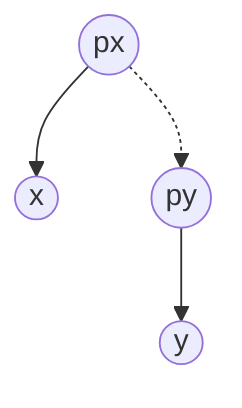
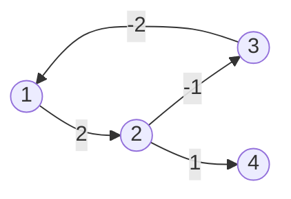
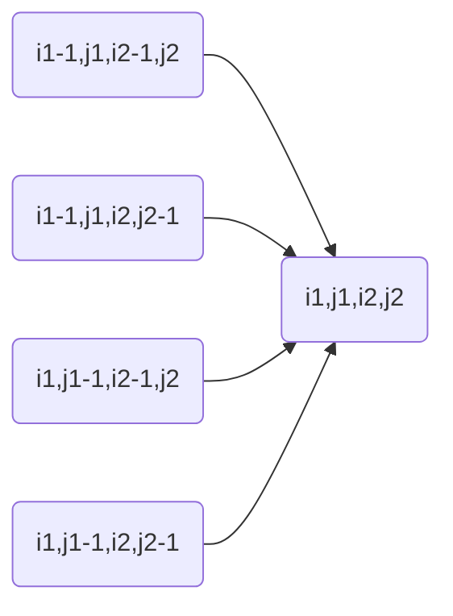
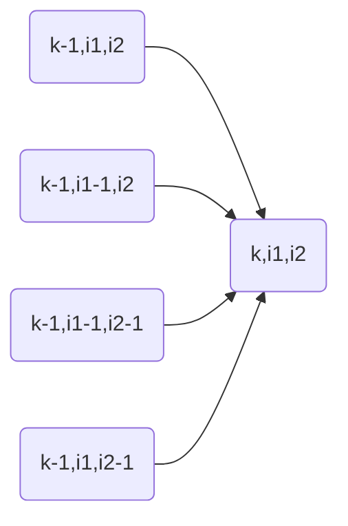

# 各种排序

基于比较的排序算法，时间复杂度具有下限 $O(n\log n)$

>   可证明，但我不会

*   交换排序:
    *   冒泡排序
    *   快速排序
*   插入排序：
    *   单纯的插入排序
    *   希尔排序
*   选择排序：
    *   单纯的选择排序
    *   堆排序
*   归并排序：
    *   二路归并
    *   多路归并

>   其实写的最多的还是快排和归并

其他的排序算法，可以将时间复杂度降到更低，比如桶排序可以在 $O(n)$ 的时间内完成排序

>   其他的还有：计数排序、基数排序

## 什么是稳定

之前看帖子的时候就经常看到 xxx 排序算法稳定，xxx 排序算法不稳定

如果原始序列中存在两个相等的数 a 和 b，如果在排序结束后 a 和 b 的相对顺序一定可以保持不变，那么这个排序算法就是稳定的 

要说明的是，说一个排序算法是稳定的，是说可以通过一定的手法实现稳定性，不是说瞎 jb 排序就能稳定；说一个算法是不稳定的，是说算法本身导致无论什么手法都可能导致不稳定

## 插入排序

思想是从前向后遍历数组，认为整个数组头部是有序的，每次对于枚举到的位置，将其插入到前面有序的序列中，此时就需要遍历前面所有的位置，为新的元素找到合适的位置

所以就是遍历所有的元素，并为所有元素找到合适的位置，因此排序时间复杂度为 $O(n^2)$

然而在序列长度比较短的时候，使用插入排序其实更方便，主要是写起来比较简单，且如果序列比较短，$O(n^2)$ 和 $O(n\log n)$ 也就没差那么多了

插入排序是稳定，前提是从后向前找位置的时候，仅在枚举到的位置比当前位置更大的时候才将其向后移动

```java
public static void sort(int[] arr) {
    for (int i = 1; i < arr.length; i++) {
        int num = arr[i];
        int idx = i - 1;
        while (idx >= 0 && arr[idx] > num) arr[idx + 1] = arr[idx--];
        arr[++idx] = num;
    }
}
```

### 希尔排序

第一个突破 $O(n^2)$ 的排序算法

也是一种插入排序，更快了，但是不稳定了

先分组，数组下标每隔 gap 分为一组，一组内部进行插入排序，然后不断缩小 gap，当 gap 缩小为 1 时将退化为一般化的插入排序

具体的 gap 的取值，可以看看算法4

## 选择排序

每轮遍历的时候找到当前最小(或者最大)的数，放在序列的最前面(或者最后面)

时间复杂度还是 $O(n^2)$

```java
public static void sort(int[] arr) {
    for (int i = 0; i < arr.length - 1; i++) {
        int min = i;
        for (int j = i + 1; j < arr.length; j++) {
            if (arr[j] < arr[min]) min = j;
        }
        int tmp = arr[i];
        arr[i] = arr[min];
        arr[min] = tmp;
    }
}
```

## 堆排序

满二叉树：二叉树每层的节点个数都达到了最大值

完全二叉树：除了最后一层外，每一层节点数都达到了最大值，最后一层的节点从左向右排列

堆其实就是数组实现的完全二叉树, 而根据堆的性质可知, 堆顶的元素一定是当前序列中最大/最小的元素, 堆排序的逻辑就是, 每轮将堆顶元素从序列中删除, 表示当前序列中最大/最小的元素, 然后将序列结尾的元素置于堆顶, 并进行堆结构的重新构建

由于每轮可以从序列中选出一个元素, 而更换堆顶后, 堆重构的时间复杂度为: $O(\log n)$, 因此堆排序整体的时间复杂度为: $O(n\log n)$

>   思想和选择排序是一样的，都是找到当前最大或最小的元素

要说明的的是堆排序不稳定, 但在其运算的过程中, 可以动态获取整个序列中最小/最大的前 n 个元素

为了维护堆的性质, 需要两种操作: push_up 和 push_down, 下面大顶堆举例:

考虑堆的下标从 1 开始，即如果当前节点为 idx，那么左子节点为 idx << 1，右子节点为 (idx << 1) + 1

*   push_down: 如果当前节点的两个子节点中存在一个比当前节点大的节点，那么需要让当前节点和子节点交换(保证了当前节点的堆的有序性)；然后还需要从当前节点开始向子节点递归的修改，即 push_down 保证整个堆的大顶堆特性

    ```java
    public void push_down(int[] heap, int idx, int size) {
        int t = idx;
        int left = idx << 1;
        int right = (idx << 1) + 1;
        if (left <= size && heap[left] > heap[t]) t = left;
        if (right <= size && heap[right] > heap[t]) t = right;
        if (t != idx) {
            int tmp = heap[idx];
            heap[idx] = heap[t];
            heap[t] = tmp;
            push_down(heap, t, size);
        }
    }
    ```

*   push_up: 如果当前节点的值比父节点更大，那么需要交换当前节点和父节点(保证当前节点大顶堆的性质)，同时还需要让父节点递归的进行更新(保证整个堆的大顶堆特性)

    ```java
    public void push_up(int[] heap, int idx) {
        int parent = idx >> 1;
        if (parent >= 1 && heap[parent] < idx) {
            int tmp = heap[idx];
            heap[idx] = heap[parent];
            heap[parent] = tmp;
            push_up(heap, parent);
        }
    }
    ```

对于堆的各种修改都可以通过这两个操作完成，如果如果向堆中添加一个元素，就是在数组的下一个有效下标处添加元素，并进行 push_up 操作; 如果对堆中的某个元素进行更新操作，那么就同时调用 push_down 和 push_up(事实证明，尽管调用了两个函数，但最终最多仅会进行 push_up 和 push_down 两个操作中的一个)...

而至于堆排序, 因为在一次输入之后, 堆中的元素就不再变化了(不管是元素个数还是元素的大小), 因此只需要考虑使用 push_down 即可

而至于堆排序，其实只会用到 push_down 操作，借助算法 4 中的思想，即维护一个大顶堆和一个 size，每次交换堆顶和最后一个元素，然后让 size 自减

>   这里暗含了有效下标从 0 开始，即 left = (idx << 1) + 1; right = (idx << 1) + 2

```java
private void heapSort(int[] arr) {
    int size = arr.length - 1;
    for (int i = (size - 1) >> 1; i >= 0; i--) push_down(arr, i, size);
    while  (size > 1) {
        int tmp = arr[0];
        arr[0] = arr[size];
        arr[size] = tmp;
        size--;
    }
}

private void push_down(int[] arr, int idx, int size) {
    int t = idx;
    int left = (t << 1) + 1;
    int right = (t << 1) + 2;
    if (left <= size && arr[left] > arr[t]) t = left;
    if (right <= size && arr[right] > arr[t]) t = right;
    if (t != idx) {
        int tmp = arr[idx];
        arr[idx] = arr[t];
        arr[t] = tmp;
        push_down(arr, t, size);
    }
}
```

最开始，因为数组不是有效的大顶堆，需要先进行构建，构建的方式是从数组中第一个具有子节点的节点开始，下滤，下滤的次数为 $\frac{n}{2}$，且每次下滤的时间复杂度为 $O(\log n)$，因此初始构建堆的时间复杂度为 $O(n\log n)$

## 冒泡排序

梦开始的地方

思想是，从头向后遍历数组，如果前一个元素比后一个元素更大就进行交换，那么一次遍历过后，数组中最后一个元素一定是整个序列中的最大的那个；然后重复上面的步骤 n 次就可以排好所有位置

冒泡排序是稳定的：前提是遇到了两个相同的数，就不进行交换

```java
public static void sort(int[] arr) {
    for (int i = arr.length - 1; i > 0; i--) {
        for (int j = 0; j < i; j++) {
            if (arr[j] > arr[j + 1]) {
                int tmp = arr[j];
                arr[j] = arr[j + 1];
                arr[j + 1] = tmp;
            }
        }
    }
}
```

优化，如果扫一轮发现没有进行过交换就提前结束

```java
public static void sort(int[] arr) {
    for (int i = arr.length - 1; i > 0; i--) {
        boolean changed = false;
        for (int j = 0; j < i; j++) {
            if (arr[j] > arr[j + 1]) {
                int tmp = arr[j];
                arr[j] = arr[j + 1];
                arr[j + 1] = tmp;
                changed = true;
            }
        }
        if (!changed) return;
    }
}
```

>   数组大部分是有序状态了，那么扫几轮就可以提前结束了

## 快速排序

主要思想是找分割点，平均时间复杂度为 $O(n\log)$，而在最坏的情况下时间开销将达到 $O(n^2)$

这里所谓最坏的情况，即为每次选择的数，都不能将整个数组分为两部分，比如如果每次选择的分割点都是当前区间的最后一个字符，而如果原始数组本身已经是有序的了，那么此时快速排序的时间复杂度将达到 $O(n^2)$

所以具体的事件复杂度和选取策略有关，如果选取分割点的手段足够随机，就很难达到 $O(n^2)$ 的运行时间

>   更为具体的，每种随机选择都对应一种最坏的情况，每次选择到最坏的情况的概率为 $\frac{1}{n!}$

```java
public void quick_sort(int[] arr, int l, int r) {
    if (l >= r) return;
    int i = l - 1;
    int j = r + 1;
    int p = arr[l + ((r - l) >> 1)];
    while (i < j) {
        do i++; while(arr[i] < p);
        do j--; while (arr[j] > p);
        if (i < j) {
            int tmp = arr[i];
            arr[i] = arr[j];
            arr[j] = arr[i];
        }
    }
    quick_sort(arr, l, j);
    quick_sort(arr, j + 1, r);
}
```

要注意的是一轮快排结束后 left 到 j 是有序的，j + 1 到 right 是有序的，但并不是说 arr[j] 这个位置恰好就是整个数组中第 j 个元素

## 归并排序

分治的思想，先分开，然后合并的时候认为两部分已经分别排好序了，合并需要的时间为 $O(n + m)$

因为每次从中间分开数组，所以递归深度为 $\log n$，每层递归需要处理的数字个数为 n 个所以时间复杂度为 $O(n\log n)$

归并排序的典型应用：[求逆序对](./一些算法.md#求逆序对)：暴力二维遍历时间复杂度为 $O(n^2)$，在归并排序的合并阶段，一边进行排序，一边进行统计

对于数组进行归并排序是很容易的，但是对于链表而言，就有点麻烦了：[对链表进行归并排序](./一些算法.md#对链表进行归并排序)

## 计数排序

其实就是桶排序，主要应对的是，输入数据的个数较多，且数据的范围相对小($10^5$ 以内没什么问题)，实现 $O(n)$ 级别的排序

核心思路就是开一个大数组，然后将对应的位置加入桶中，输出的时候就是遍历桶

```java
/**
 * @param size 表示输入数据的范围，最大可以给到 10^5，如果再大可能会 MLE
 */
public void bucket_sort(int[] arr, int size) {
    int[] bucket = new int[size + 1];
    for (int num : arr) bucket[num]++;
    int idx = 0;
    for (int i = 0; i < arr.length; i++) {
        while (idx <= size && bucket[idx] == 0) idx++;
        arr[i] = idx;
        bucket[idx]--;
    }
}
```

## 基数排序

按位排序，先按低位排序，然后逐渐遍历到高位，具体的过程可以上网看，不想写了

# 二分

题目是否能不能二分，关键点在性质的二段性，即整个结果集可以分为两部分，一部分满足性质，另一部分不满足性质，一般的，需要求解的就是满足性质的边界点(比如最大的最小值问题)

acwing 中的二分模板和我经常使用的那个是类似的，分为两类，现在考虑一个单调的数组，可能存在重复元素，要在 nums 中找到 target 的左右边界：

*   左边界：

    ```java
    /**
     * 找到 target 的左边界
     * @param arr 数组本身
     * @param left 数组左边界
     * @param right 数组右边界
     */
    public int leftBi(int[] arr, int left, int right, int target) {
        while (left < right) {
            int mid = left + ((right - left) >> 1);
            if (arr[mid] < target) left = mid + 1;
            else right = mid;
        }
        if (arr[left] == target) return left;
        return -1;
    }
    ```

*   右边界：

    ```java
    /**
     * 找到 target 的右边界
     * @param arr 数组本身
     * @param left 数组左边界
     * @param right 数组右边界
     */
    public int rightBi(int[] arr, int left, int right, int target) {
        while (left < right) {
            int mid = left + ((right - left + 1) >> 1);
            if (arr[mid] > target) right = mid - 1;
            else left = mid;
        }
        if (arr[left] == target) return left;
        return -1;
    }
    ```

## 浮点数二分

浮点数的二分不需要考虑边界的问题，所以其实是比正数二分简单一点的，不过一般浮点数的二分存在精度的问题，不一定必须返回一个精确解，一般认为在误差范围内就可以返回了

拿一个题举例：[790. 数的三次方根 | AcWing](https://www.acwing.com/problem/content/description/792/)，就是求解一个数的立方根

```cpp
#include <iostream>

using namespace std;

int main() {
    double x;
    cin >> x;
    double left = -100;
    double right = 100;
    while (right - left > 1e-8) {
        double mid = (left + right) / 3;
        double mul = mid * mid * mid;
        if (mul > x) right = mid;
        else if (mul < x) left = mid;
        else printf("%.6f", x);
    }
    printf("%.6f", left);
    return 0;
}
```

一般的，如果需要保留的小数个数为小数点后 6 位, 那么 while 的终止条件需要取到 $10^{-8}$，即精确度比小数个数多两个数量级

# 高精度问题

大数之间的运算，使用数组表示数字的每个位进行运算，将大数的每一位映射到数组的某个位置上

习惯上，更倾向于让数组的小索引保存数字的低位，即数组下标为 0 的位置，保存大数的个位

# 前缀和

现在重新考虑一下前缀和，原数组 arr，前缀和数组 preSum

考虑数组的下标从 1 开始，那么有：preSum[i] = arr[1] + arr[2] + ... + arr[i]

>   在 acwing 这种评测网站中，需要手动处理输入输出，因此，原数组和差分数组都可以在读取的时候就强制使其下标从 1 开始
>
>   下标从 1 开始，方便边界处理

在求前缀和数组时，有：preSum[i] = preSum[i - 1] + arr[i]

>   由于在 c++ 中，新建的数组需要手动初始化，因此，尽管定义了 preSum 数组下标从 1 开始，还是需要手动设置 preSum[0] = 0

当考虑一个区间 [L, R] 内的前缀和时，有 sum[L, R] = preSum[R] - preSum[L - 1]

>   其中 L，R 均大于等于 1

这一点从定义上就能看出来

## 二维前缀和

其实关键还得看二维的

类似的，考虑原矩阵下标从 1 开始，即 x 从 1 -> row；y 从 1 -> col

计算前缀和：preSum\[i][j] = preSum\[i - 1][j] + preSum\[i][j - 1] - preSum\[i - 1][j - 1] +  arr\[i][j]

计算某一个子矩阵(x1,y1) -> (x2,y2)的大小：

area = preSum\[x2][y2] - preSum\[x1 - 1][y2] - preSum\[x2][y1 - 1] + preSum\[x1 - 1][y1 - 1]

# 差分

如果原数组 arr，而差分数组为 diff，那么有 diff[i] = arr[i] - arr[i - 1], 即差分数组保存的是原数组当前位置和前一个位置的差值

从数学关系上可以将原数组 arr 看成差分数组 diff 的前缀和数组, 即: arr[i] = diff[1] + diff[2] + ... + diff[i]

>   考虑数组下标从 1 开始

使用差分数组的优势在于原数组的区间更新可以被优化为差分数组的两个端点的更新, 比如对于原数组, 如果更新区间 [L, R], 增量为 C, 等效于让 diff[L] += C; diff[R + 1] -= C

很容易证明: 

考虑原数组分为三个区间：[1, L - 1]、[L, R]、[R + 1, N]

首先对于第一个区间，因为运算不涉及到 diff[C]，因此通过前缀和的方式获取到 arr[i] 的时候，和没有进行 +C 操作一致

对于第二个区间，因为区间包含了 L，通过前缀和的方式计算 arr[i] 的时候，会将 C 加到 arr[i] 中

>   arr[i] = diff[1] + diff[2] + ... + diff[L] + diff[L + 1] + ... + diff[i]
>
>   因为 diff[L] 增加了 C，因此 arr[i] 的结果比原来改变了 C

而对于最后一个区间，计算前缀和的时候，因为同时经过了 diff[L] 和 diff[R + 1] 因此，在计算的的时候，先进行了 +C，后进行了 -C 操作，因此 arr[i] 保持不变

一维差分模板:


```cpp
#include <iostream>

using namespace std;

const int N = (int)1e5 + 10;
int arr[N];
int sub[N];

void insert(int l, int r, int c) {
    sub[l] += c;
    sub[r + 1] -= c;
}

int main() {
    int n, m;
    cin >> n >> m;
    for (int i = 1; i <= n; i++) {
        cin >> arr[i];
        insert(i, i, arr[i]);
    }
    int l, r, c;
    for (int i = 0; i < m; i++) {
        cin >> l >> r >> c;
        insert(l, r, c);
    } 
    for (int i = 1; i <= n; i++) {
        arr[i] = arr[i - 1] + sub[i];
        cout << arr[i] << ' ';
    }
}
```

更新函数 insert() 表示在区间 l 到 r 上的所有元素增加 c; 注意到差分数组 sub 不是通过让原数组做差完成初始化的, 而是同样调用 insert 函数, 其中区间的左右边界均为 i 

在一维的情况下, 其实没有必要维护原数组, 可以直接维护差分数组, 但这里还是维护了原数组, 一方面是为了更好理解, 毕竟有了原数组, 那么在由差分数组恢复原数组的时候, 直接取出一个 element 相加即可; 另一方面是为了和二维数组的模板统一

## 二维差分

这位更是重量级, 二维差分是有点抽象的, 如果实在理解不了, 就简单认为原数组是差分数组的前缀和数组, 每次修改一个子矩阵 $\text(\text{x}_1, \text{y}_1)$ -> $(\text{x}_2, \text{y}_2)$ 内的数字时，仅需要修改 diff 的边界即可, 每次的操作: diff\[x1][y1] += C; diff\[x1][y2 + 1] -= C; diff\[x2 + 1][y1] -= C; diff\[x2 + 1][y2 + 1] += C

这里直接给出二维差分的模板:


```cpp
#include <iostream>

using namespace std;

const int N = 1010;
int arr[N][N];
int sub[N][N];

int insert(int x1, int y1, int x2, int y2, int c) {
    sub[x1][y1] += c;
    sub[x1][y2 + 1] -= c;
    sub[x2 + 1][y1] -= c;
    sub[x2 + 1][y2 + 1] += c;
}

int main() {
    int n, m, q;
    cin >> n >> m >> q;
    for (int i = 1; i <= n; i++) {
        for (int j = 1; j <= m; j++) {
            cin >> arr[i][j];
            insert(i, j, i, j, arr[i][j]);
        }
    }
    
    int x1, y1, x2, y2, c;
    for (int i = 0; i < q; i++) {
        cin >> x1 >> y1 >> x2 >> y2 >> c;
        insert(x1, y1, x2, y2, c); 
    }
    
    for (int i = 1; i <= n; i++) {
        for (int j = 1; j <= m; j++) {
            arr[i][j] = sub[i][j] + arr[i - 1][j] + arr[i][j - 1] - arr[i - 1][j - 1]; 
            cout << arr[i][j] << ' ';
        }
        cout << endl;
    }
    
}
```

类似的, 使用 insert 函数表示增量, 同时初始化 sub 数组; 最后由差分数组恢复原数组时, 直接将差分数组认为是 "原数组", 而原数组为 "前缀和数组" 即可 

# 双指针

双指针利用了原有序列的性质，将暴力的两重枚举优化为一次遍历，时间复杂度从 $O(n^2)$ 降低为 $O(n)$

经典模板:


两个排好序的数组, 左右数组中分别取一个元素, 找到加和满足目标的数对, 每个数组一个指针, 一个从前向后扫, 一个从后向前扫

```cpp
#include <iostream>

using namespace std;

const int N = (int)1e5 + 10;
int a[N], b[N];

int main() {
    int n, m, x;
    scanf("%d%d%d", &n, &m, &x);
    for (int i = 0; i < n; i++) scanf("%d", &a[i]);
    for (int j = 0; j < m; j++) scanf("%d", &b[j]);
    int i = 0, j = m - 1;
    while (i < n && j >= 0) {
        if (a[i] + b[j] > x) j--;
        else if (a[i] + b[j] < x) i++;
        else {
            printf("%d %d", i, j);
            break;
        }
    }
    return 0;
}
```

整体时间复杂度为: $O(m + n)$, 这种线性级别的时间复杂度大部分题都可以过, 当然, 看到了有序的数组, 自然也就想着是不是可以使用二分优化一下

对于 a 数组中的某个位置 i, 在 b 数组中找到一个位置 j, 恰好不凑巧, 使得 a[i] + b[j] < x, 而 a[i] + b[j + 1] > x; 那么显然, a 数组后续的的任何一个位置 i' (i' > i), 继续在 b 数组中找到相应位置时, 其找到的位置 j' 一定有满足 j' <= j

>   想一下为什么

这也就给出了提示: 本轮二分的结果, 可以作为下一轮二分的上界存在, 甚至更进一步的, 不仅仅对 b 数组进行二分查找, 对于 a 数组也可以执行二分, 此时二分的搜索结果会作为下一轮二分的下界存在

```cpp
#include <iostream>

using namespace std;

const int N = (int)1e5 + 10;
int a[N], b[N];

int main() {
    int n, m, x;
    scanf("%d%d%d", &n, &m, &x);
    for (int i = 0; i < n; i++) scanf("%d", &a[i]);
    for (int j = 0; j < m; j++) scanf("%d", &b[j]);
    int i = 0, j = m - 1;
    while (i < n && j >= 0) {
        int l = 0, r = j;
        while (l < r) {
            int mid = l + ((r - l + 1) >> 1);
            if (a[i] + b[mid] > x) r = mid - 1;
            else l = mid;
        }
        j = l;
        if (a[i] + b[j] == x) break;
        l = i, r = n - 1;
        while (l < r) {
            int mid = l + ((r - l) >> 1);
            if (a[mid] + b[j] < x) l = mid + 1;
            else r = mid;
        }
        i = l;
        if (a[i] + b[j] == x) break;
    }
    printf("%d %d", i, j);
    return 0;
}
```

由于不管是 a 数组还是 b 数组, 都是通过二分的方式搜索的, 因此整体时间复杂度为: $O(\log n + \log m)$

>   这下就算输入是 $10^9$ 这个级别也能过了

# 离散化

有的时候参数的大小很大, 而参数的个数很少, 比如输入数据中, 数组的下标很大, 而数据相对比较小, 此时如果直接使用数组存储数据, 肯定会 MLE

>   甚至可能存在位置参数为负数情况, 虽然可以通过指针偏移访问负向索引, 但这不是根本的解决思路

当数据个数较少, 而数据较大的时, 可以使用离散化解决这个问题, 本质上, 离散化就是添加了一层 indirection, 访问数组的时候可以看成直接将输入作为数组索引下标, 而在使用了离散化后, 可以维护一个 "大"数据到实际下标的映射, 一般而言, 越"大"的数据下标越大, 因此一般使用一个 vector 维护 map 即可; 而为了适应任意映射关系, 更通用的形式是使用一个 map 维护映射

几个关键词：排序、去重、二分

## [802. 区间和](https://www.acwing.com/problem/content/804/)


输入数据的大小为: $10^9$ 级别, 而输入数据的个数为: $10^5$ 级别, 因此这里使用一个 vector 保存映射关系:

```c
#include <iostream>
#include <vector>
#include <algorithm>

using namespace std;

typedef pair<int, int> PII;
vector<int> mappings;
vector<PII> add, query;

// 最坏情况下, add, query 两种操作涉及的三个下标均不同
const int N = (int)3e5 + 10;
int a[N];
int pre[N];

// 二分查询映射下标
int find(int num) {
    int l = 0;
    int r = mappings.size() - 1;
    while (l < r) {
        int mid = l + ((r - l) >> 1);
        if (mappings[mid] < num) l = mid + 1;
        else r = mid;
    }
    return l;
}

int main() {
    // 在各种操作之前读取所有的数据
    int n, m;
    scanf("%d%d", &n, &m);
    int idx, val;
    for (int i = 0; i < n; i++) {
        scanf("%d%d", &idx, &val); 
        add.push_back({idx, val});
        mappings.push_back(idx);
    }
    int l, r;
    for (int i = 0; i < m; i++) {
        scanf("%d%d", &l, &r);
        query.push_back({l, r});
        mappings.push_back(l);
        mappings.push_back(r);
    }
    // 排序后去重
    sort(mappings.begin(), mappings.end());
    mappings.erase(unique(mappings.begin(), mappings.end()), mappings.end());
    
    for (int i = 0; i < n; i++) {
        idx = find(add[i].first) + 1;
        a[idx] += add[i].second;
    }
    // 计算前缀和
    for (int i = 1; i <= mappings.size(); i++) pre[i] = pre[i - 1] + a[i];
    
    for (int i = 0; i < m; i++) {
        l = find(query[i].first) + 1;
        r = find(query[i].second) + 1;
        printf("%d\n", pre[r] - pre[l - 1]);
    }
}
```

排序后 mappings, 可能存在数据下标相同的情况, 这里借助 STL 库提供的 unique() 去重

```cpp
mappings.erase(unique(mappings.begin(), mappings.end()), mappings.end());
```

>   首先 unique(nums.begin(), nums.end())，表示将 nums 中重复的的元素换到数组尾部，方法返回值为一个下标索引 idx，从 idx 开始的元素，即为 vector 中重复的元素
>
>   然后 nums.erase(idx, nums.end()) 表示将数组从 idx 位置开始的元素从数组中删除
>
>   这样，先经过一次 unique，再经过一次 erase，得到的数组就是去重后端数组
>
>   注意在 unique 之前必须先 sort 一下，不然不能正常去重，关于 unique 函数的实现，可以参考 [排序数组去重](#排序数组去重)

而如果是 java，可选的两种去重方式：

*   借助 Set 去重：这个不多解释

*   使用 java8 新特性 stream API 中的方法 distinct()

    ```java
    nums = Arrays.stream(nums).distinct().toArray();
    ```

# 排序数组去重

对于一个已经排序的数组，去重其实很简单，双指针遍历一次即可：

```cpp
int unique(int arr[], int size) {
    int j = 0;
    for (int i = 0, j = 0; i < size; i++) {
        if (i == 0 || arr[i] != arr[i - 1]) arr[j++] = arr[i];
    }
    // 返回值 j 即为去重后数组的大小
    return j;
}
```


# dp 问题

通过集合的方式理解 dp

首先，不管是求解种类个数、最值，其实都是从集合中进行各种方案的枚举，然后可能需要计算，所有方案的个数、或者方案的最值

简单的枚举，就是 DFS 暴力，有的时候方案个数是质数级别的，基本上就是超时

这个时候，可以通过 dp，从集合中，枚举一类集合(子集)，子集中包含了某一类的方案，这样，通过枚举子集，可以优化时间复杂度，可能方案的个数是指数级别的，但子集的个数可能就是可枚举的

dp 问题，关键在于：

*   确定状态的定义
*   确定状态转移方程

状态的定义，就是明确子集的定义，而一般 dp[i] 都是一个数，这个数，是集合的属性，属性可能是方案的个数，一类方案的最值...

确定状态转移方程，即计算子集的属性，一般的，一个子集需要被分成若干部分计算，将一个子集划分为若干部分，要求不重不漏，且每种划分需要是可枚举的，这样通过枚举每个子集的划分，就可以得到子集的属性(通过状态转移方程实现状态转移)

再要说明的一点是，并不是所有情况下，对于子集的划分，都需要满足不重复的，如果是计算方案的个数，显然不能让划分重复，但如果是求解最值，就算划分重复了，还是可以从重复的划分中获取到最值

但不管如何，在对子集进行划分的时候，一定需要满足不遗漏原则

子集划分的依据："寻找最后一个不同点"

# OI 中的数据结构

## 单链表

使用数组模拟单链表，初始化大数组，避免初始化结构体，更快

使用两个数组：e、ne 表示节点，其中 e[i] 表示某个节点的 val，ne[i] 表示当前节点的下一个节点

对于链表的尾节点，其 next[i] = -1(反正是一个起到标识作用的非法值)

特别的没有指定链表中第一个节点必须时 e[0]，使用了变量 head，表示头节点

因此一个典型的链表，可以通过两个指针和两个数组表示：

```cpp
int head, idx;
int e[], ne[];
```

这个结构和链式前向星的图差不多，默认 head 指向 -1，表示指向尾节点，idx 表示下一个节点存储的位置

典型的结构：

```cpp
// 实际的数据范围需要手动测试一下
const int N = (int)1e5 + 10;

int head, idx;
int e[N], ne[N];

// 初始化函数
void init() {
    head = -1;
    idx = 0;
}

// 将新的值作为头节点
void add_head(int val) {
    e[idx] = val;
    ne[idx] = head;
    head = idx++;
}

// 将当前节点添加到链表的第 i 个位置上
// 如果 i 为 1，等效于将新的值作为头节点
void add(int i, int val) {
    if (i == 1) add_head(val);
    else {
        int node = head;
        while (i > 2) {
            node = ne[node];
            i--;
        }
        e[idx] = val;
        ne[idx] = ne[node];
        ne[node] = idx++;
    }
}

// 删除头节点
void remove_head() {
    head = ne[head];
}

// 删除链表的第 i 个位置的元素
// 如果 i 为 1，等效于删除头节点
void remove(int i) {
    if (i == 1) remove_head();
    else {
        int node = head;
        while (i > 2) {
            node = ne[node];
            i--;
        }
        ne[node] = ne[ne[node]];
    }
}
```

## 双链表

也是类似的，不过这里使用了两个哨兵节点 head 和 tail 避免处理边界问题

```cpp
const int N = (int)1e5 + 10;

int idx;

int left[N], right[N], e[N];

// 引入头尾哨兵节点
// 头节点即为 idx = 0
// 尾节点即为 idx = 1
void init() {
    idx = 2;
    right[0] = 1;
    left[0] = -1;
    left[1] = 0;
    right[1] = -1;
}

// 让新的值作为头节点
void add_head(int val) {
    e[idx] = val;
    
    right[idx] = right[0];
    left[right[idx]] = idx;
    
    left[idx] = 0;
    right[0] = idx++;
}

// 将新的值作为双向链表的第 i 个元素插入
// 当 i 取 1 等效于 add_head
void add(int i, int val) {
    int node = 0;
    while (i > 1) {
        node = right[node];
        i--;
    }
    
    e[idx] = val;
    
    right[idx] = right[node];
    left[right[idx]] = idx;
    
    left[idx] = node;
    right[node] = idx++;
}

// 删除头节点
void remove_head() {
    right[0] = right[right[0]];
    left[right[0]] = 0;
}

// 删除当前链表中的第 i 个元素插入
// 如果 i 为 1 等效于 remove_head
void remove(int i) {
    int node = 0;
    while (i > 1) {
        node = right[node];
        i--;
    }
    
    right[node] = right[right[node]];
    left[right[node]] = node;
}
```

## 栈

呵呵

```cpp
const int N = (int)1e5 + 10;
// 栈顶指针
int t;
// 栈
int st[N];
// 栈的下标从数组下标suo 1 开始
void push(int val) {
    st[++t] = val;
}

int peek() {
    return st[t];
}

int size() {
    return t;
}


void pop() {
    t--;
}
```

## 队列

```cpp
const int N = (int)1e5 + 10;

int q[N];
int hh, tt = -1;

void push(int val) {
    q[++tt] = val;
}

int query() {
    return q[hh];
}

int pop() {
    return q[hh++];
}
```

这里初始化 tt 为 -1

# 并查集

<div style="text-align:center;">
	<a href="https://www.acwing.com/problem/content/838/" >
		
	</a>
</div>


模板题, 写好 find 函数比啥都重要:

```cpp
#include <iostream>

using namespace std;

const int N = (int)1e5 + 10;

int p[N], w[N];

// 路径压缩
int find(int a) {
    if (p[a] != a) p[a] = find(p[a]);
    return p[a];
}

// 按秩合并
void union_(int a, int b) {
    int pa = find(a);
    int pb = find(b);
    if (w[pa] < w[pb]) {
        p[pa] = pb;
        w[pb] += w[pa];
    } else {
        p[pb] = pa;
        w[pa] += w[pb];
    }
}

int main() {
    int n, m;
    cin >> n >> m;
    for (int i = 0; i < n; i++) {
        p[i] = i;
        w[i] = 1;
    }
    int a, b;
    char op;
    for (int i = 0; i < m; i++) {
        cin >> op >> a >> b;
        if (op == 'M') union_(a, b);
        else {
            if (find(a) == find(b)) printf("Yes\n");
            else printf("No\n");
        }
    }
    return 0;
}
```

其实在使用了路径压缩之后, 按秩合并就没有那么重要了, 路径压缩可以使得每次 find 查询都让当前节点直接连接到根节点

<div style="text-align:center;">
	<a href="https://www.acwing.com/problem/content/839/" >
		
	</a>
</div>
相比之下还查询了块的大小, 这里就能体现出 w 数组的作用了

```cpp
#include <iostream>

using namespace std;

const int N = (int)1e5 + 10;

int p[N], w[N];

int find(int a) {
    if (p[a] != a) p[a] = find(p[a]);
    return p[a];
}

void union_(int a, int b) {
    int pa = find(a);
    int pb = find(b);
    if (pa == pb) return;
    if (w[pa] < w[pb]) {
        p[pa] = pb;
        w[pb] += w[pa];
    } else {
        p[pb] = pa;
        w[pa] += w[pb];
    }
}

int main() {
    int n, m;
    cin >> n >> m;
    for (int i = 0; i <= n; i++) {
        p[i] = i;
        w[i] = 1;
    }
    for (int i = 0; i < m; i++) {
        int a, b;
        string op;
        cin >> op;
        if (op == "C") {
            cin >> a >> b;
            union_(a, b);
        } else if (op == "Q1") {
            cin >> a >> b;
            
            if (find(a) == find(b)) cout << "Yes" << endl;
            else cout << "No" << endl;
        } else {
            cin >> a;
            cout << w[find(a)] << endl;
        }
        
    }
    return 0;
}
```

位于相同集合的元素一定是有关联的, 但不一定是同类型的, 元素之间的关系可以通过带有边权的并查集维护, 考虑下面的例子:

<div style="text-align:center;">
	<a href="https://www.acwing.com/problem/content/839/" >
		
	</a>
</div>
考虑使用一个并查集维护所有动物的关系, 函数 find 还是用来查找当前元素所在集合的根元素, 不过由于集合中的元素存在同类或者捕食关系, 显然一个简单的 p 数组是不能维护这种关系的

定义 d 数组表示当前节点到父节点的距离, 在父节点 p 为某种类型的动物的情况下, 对于任意类型的动物 a 定义, d[a] mod 3 = 0 表示 a 和 p 同类, d[a] mod 3 = 1 表示 a 可以捕食 p, d[a] mod 3 = 2 表示 p 可以捕食 a

默认情况下, 所有动物之间的关系都是未知的, 此时每个每个动物都以自己为根节点, 对任意的动物 a, 有 p[a] = a, d[a] = 0

本题不是一个严格意义上的逻辑判断题, 即不是给定若干命题, 找到其中的假命题(可能是让假命题最多, 或者让假命题最少), 本题的命题先后顺序很重要, 假命题一定是基于前面的真命题的判断的

对于给定的条件, 不管是捕食关系, 还是同类关系, 这里都先需要判断这两类动物是否已经保存在同一个联通集合中了, 如果已经联通了, 就根据当前命题和 d 数组的大小关系, 进行假命题的判别

如果没有联通, 那么需要将两个动物联通, 这里没有严格顺序上的联通关系, 不管是将 Y 连接到 X 的根节点还是将 X 连接到 Y 的根结点上, 都是可行的, 这里将 Y 连接到 X 的根结点上



在连接之前, d[y] 是相对于 py 而言的, 由于 py 是其他连通块的根节点, 为了一次性修改整个 py 连通块内所有节点的距离, 这里需要手动设置 d[py]

如果 x 和 y 是同类, 那么一定有: (d[x] - (d[py] + d[y])) mod 3 = 0, 即设置 d[py] = d[x] - d[y]

>   这种直接做差的运算可能导致 d[py] 为负数的情况, 这里负数的情况不会影响边权的正确性

如果 x 和 y 是捕食关系, 在上文语境中一定有: (d[x] - (d[py] + d[y]) - 1) mod 3 = 0, 因此设置: d[py] = d[x] - d[y] - 1

最后就是 find 函数, 由于存在路径压缩, 因此在重新将节点连接到根节点时, 需要修改 d 数组

```cpp
#include <iostream>

using namespace std;

const int N = (int)5e4 + 10;

int p[N], d[N];

int find(int a) {
    if (p[a] != a) {
        // 首先找到根节点
        int root = find(p[a]);
        // 由于连接到根节点, 因此距离需要加上之前父节点到根节点的距离
        d[a] += d[p[a]];
        // 设置本节点的父节点为根节点
        p[a] = root;
    }
    return p[a];
}

int main() {
    int n, m;
    scanf("%d%d", &n, &m);
    for (int i = 1; i <= n; i++) p[i] = i;
    int rst = 0;
    int op, a, b;
    for (int i = 0; i < m; i++) {
        scanf("%d%d%d", &op, &a, &b);
        if (a > n || b > n) rst++;
        else {
            if (op == 1) {
                int pa = find(a);
                int pb = find(b);
                if (pa == pb && (d[a] - d[b]) % 3) rst++;
                else if (pa != pb) {
                    p[pb] = pa;
                    d[pb] = d[a] - d[b];
                }
            } else {
                if (a == b) rst++;
                else {
                    int pa = find(a);
                    int pb = find(b);
                    if (pa == pb && (d[a] - d[b] - 1) % 3) rst++;
                    else if (pa != pb) {
                        p[pb] = pa;
                        d[pb] = d[a] - d[b] - 1;
                    }
                }
            }
        }
    }
    printf("%d", rst);
    return 0;
}
```
# 图

## DFS

典中典之 n 皇后

<div style="text-align:center;">
	<a href="https://www.acwing.com/problem/content/845/" >
		
	</a>
</div>

>   之前一直没有注意到, 原来 n 皇后一直都需要输出所有的方案, 而搜索一个可行的方案

函数签名 dfs(x, y) 表示从坐标 (x, y) 开始按照先列后行的方式搜索, 为了记录每行/每列/对角线的使用情况, 这里使用 bit mode 进行状态压缩; 在 N 最大取到 9 的情况下, 需要标识 9 行, 9 列, 17 条对角线, 在考虑主副对角线的情况下, 一共有 34 条对角线, 为了考虑最大的输入的情况, 需要使用 52 bit 表示位置的使用情况, 在该例子中使用 long long 表示 mask

对于搜索到的每个位置, 有放置皇后/直接跳过两种操作, 特别的只有在 mask 满足要求的情况下, 才可以放置皇后

```cpp
#include <iostream>

using namespace std;

typedef long long LL;

const int N = 9;

char grid[N][N];
int n;
LL mask;

void dfs(int x, int y) {
    if (y == n) {
        // 剪枝, 每行至少放置一个皇后
        if (((mask >> x) & 1) == 0) return;
        y = 0;
        x++;
    }
    if (x == n) {
        for (int i = 0; i < n; i++) {
            for (int j = 0; j < n; j++) printf("%c", grid[i][j]);
            printf("\n");
        }
        printf("\n");
        return;
    }
    
    grid[x][y] = '.';
    dfs(x, y + 1);
    // 0 ~ 8 bit 表示行的使用情况, 9 ~ 17 bit 表示列的使用情况, 18 ~ 34 bit 表示主对角线的使用情况, 35 bit ~ 51 bit 表示副对角线的使用情况
    if (!(mask & (1 << x)) && !(mask & (1 << (y + N))) && !(mask & (1L << (x - y + N + 2 * N))) && !(mask & (1L << (x + y + 4 * N - 1)))) {
        mask ^= (1 << x) | (1 << (y + N)) | (1L << (x - y + N + 2 * N)) | (1L << (x + y + 4 * N - 1));
        grid[x][y] = 'Q';
        dfs(x, y + 1);
        mask ^= (1 << x) | (1 << (y + N)) | (1L << (x - y + N + 2 * N)) | (1L << (x + y + 4 * N - 1));
        grid[x][y] = '.';
    }
}

int main() {
    scanf("%d", &n);
    dfs(0, 0);
}
```

## BFS

<div style="text-align:center;">
	<a href="https://www.acwing.com/problem/content/847/" >
		
	</a>
</div>

没有什么技巧, 就是暴力搜索, 由于每次可以移动的只有位置 x, 尽管可能搜索的位置有很多, 但又没有那么多...

关键在于, 每种搜索结果都通过一个矩阵表示, 很难存储和比较, 一般的想法是将其转化为字符串, 并通过一个 hash map 标记去重, 这里使用的是另一种被称为[康托展开](https://zh.wikipedia.org/wiki/%E5%BA%B7%E6%89%98%E5%B1%95%E5%BC%80#)的技巧

还是使用字符串表示矩阵, 但存储的不再是字符串, 而是由康托展开计算得到的排列序号, 由于最终目标是一个正序的字符串, 因此目标排列的序号为 0

```cpp
#include <iostream>
#include <algorithm>
#include <queue>

using namespace std;

const int N = 9;
const int DIR[4][2] = {{1, 0}, {-1, 0}, {0, 1}, {0, -1}}; 
const int factors[N] = {1, 1, 2, 6, 24, 120, 720, 5040, 40320};
const int target_hash = 0;

bool visited[362880];

int permutation_hash(char *op) {
    int rst = 0, mask = 0;
    for (int i = 0; i < N; i++) {
        int cnt = 0;
        for (int j = 1; j < op[i]; j++) {
            if (!(mask >> j & 1)) cnt++;
        }
        mask |= 1 << op[i];
        rst += cnt * factors[N - i - 1];
    }
    return rst;
}

void reverse_hash(int hash, char *op) {
    int mask = 0;
    for (int i = 0; i < N; i++) {
        int cnt = hash / factors[N - i - 1];
        hash %= factors[N - i - 1];
        for (int j = 1; j <= N; j++) {
            if (!(mask >> j & 1)) {
                if (cnt == 0) {
                    op[i] = j;
                    mask |= 1 << j;
                    break;
                }
                cnt--;
            }
        }
    }
}

int main() {
    char op[N];
    for (int i = 0; i < N; i++) {
        cin >> op[i];
        if (op[i] == 'x') op[i] = '9';
        op[i] -= '0';
    }
    int start_hash = permutation_hash(op);
    if (start_hash == target_hash) {
        printf("0\n");
        return 0;
    }
    visited[start_hash] = true;
    queue<int> q;
    q.push(start_hash);
    int rst = 0;
    int size;
    
    while (size = q.size()) {
        rst++;
        while (size--) {
            reverse_hash(q.front(), op);
            q.pop();
            int pos = -1;
            for (int i = 0; i < N; i++) {
                if (op[i] == 9) {
                    pos = i;
                    break;
                }
            }
            int x = pos / 3, y = pos % 3;
            for (int i = 0; i < 4; i++) {
                int nx = x + DIR[i][0], ny = y + DIR[i][1];
                if (nx < 0 || nx >= 3 || ny < 0 || ny >= 3) continue;
                int next_pos = nx * 3 + ny;
                swap(op[pos], op[next_pos]);
                int next_hash = permutation_hash(op);
                if (next_hash == target_hash) {
                    printf("%d\n", rst);
                    return 0;
                }
                if (!visited[next_hash]) {
                    visited[next_hash] = true;
                    q.push(next_hash);
                }
                swap(op[pos], op[next_pos]);
            }
        }
    }
    printf("-1\n");
    return 0; 
}
```

## 拓扑排序

<div style="text-align:center;">
	<a href="https://www.acwing.com/problem/content/850/" >
		
	</a>
</div>

在该题设的语境下, 如果存在边 a -> b, 那么最终生成的拓扑序中 a 一定在 b 之前, 首先统计每个点的入度, 并从入度为 0 的点开始进行 bfs 搜索

```cpp
#include <iostream>
#include <cstring>
#include <queue>

using namespace std;

const int N = (int)1e5 + 10;

int h[N], e[N], ne[N], idx;
int in[N];
int stk[N], sp;

void add(int a, int b) {
    e[idx] = b;
    ne[idx] = h[a];
    h[a] = idx++;
}

int main() {
    int n, m;
    scanf("%d%d", &n , &m);
    memset(h, -1, sizeof(h));
    int a, b;
    while (m --) {
        scanf("%d%d", &a, &b);
        add(a, b);
        in[b]++;
    }
    queue<int> q;
    for (int i = 1; i <= n; i++) {
        if (in[i] == 0) {
            q.push(i);
            stk[sp++] = i;
        }
    }
    int size;
    int rst = 0;
    while (size = q.size()) {
        rst++;
        while (size --) {
            int node = q.front();
            q.pop();
            for (int i = h[node]; i != -1; i = ne[i]) {
                int j = e[i];
                // 每轮查询都会当有向边的目标节点的入度自减
                // 减到 0 的时候表示所有指向该节点的源节点都已经添加到拓扑序中了
                in[j]--;
                if (in[j] == 0) {
                    q.push(j);
                    stk[sp++] = j;    
                }
            }
        }
    }
    if (sp < n) printf("-1\n");
    else for (int i = 0; i < n; i++) printf("%d ", stk[i]);
    return 0;
}
```

在该语境下存在拓扑序的前提是, 有向图不存在环路, 包括自环

## bellman-ford

处理带有负权值的边的最短路搜索, 但要注意由于存在负权值边和环路的情况, 因此最短路不一定存在, 考虑下图:



在考虑从节点 1 到节点 4 的最短路时, 由于存在负权值的环路(1 -> 2 -> 3), 因此最短路不存在

对于某个节点, 其到各个节点最短路的搜索方式如下: 

```
	// 图中包含 n 个节点
	for (i = 0..n) {
		// 所有的由  a -> b, 权值为 w 的边
		for (所有的边 (a, b, w)) {
			dis[b] = min(dis[b], dis[a] + w);
		}
	}
```

最外层的循环次数和节点相关, 而内层的循环次数和边数相关, 因此整体时间复杂度为: $O(nm)$

外层循环具有实际的物理意义,  考虑一个具有 n 个节点的联通图, 当前外层循环轮次第 i 轮, 那么其在完成该轮次后, dis[j] 表示从原始节点出发, 到节点 j  的边的个数不超过 i 的最短路径大小

由于图中只包含了 n 个节点, 因此任意两个节点之间的边的个数一定不超过 n - 1, 所以如果只是为了找到最短路的话, 其实循环 n  - 1 次就足够了; 但要注意, 上面提到了, 在存在负边权和环路的情况下, 最短路可能不存在, 如果第 n 次循环更新了 dis 数组, 那将意味着存在负边权的环

实际遍历的时候, 可能存在级联更新, 导致每轮循环更新的结果并不是最长路径仅包含 k 条边的结果, 此时需要备份数组使得每次的更新都来自于上一轮更新的结果, 而不是本轮的结果

<div style="text-align:center;">
	<a href="https://www.acwing.com/problem/content/description/855/" >
		
	</a>
</div>

题目要求找到长度不超过 k 条边的最短路径, 因此外层循环次数被限制为 k 次

```cpp
#include <iostream>
#include <cstring>
#include <algorithm>

using namespace std;

const int N = 510;
const int M = (int)1e4 + 10;
const int INF = 0x3f3f3f3f;

typedef struct {
    int a;
    int b;
    int w;
} edge;

edge e[M];
int dis[N], bk[N];

int main() {
    memset(dis, 0x3f, sizeof dis);
    int n, m, k;
    scanf("%d%d%d", &n, &m, &k);
    for (int i = 0; i < m; i++) scanf("%d%d%d", &e[i].a, &e[i].b, &e[i].w);
    dis[1] = 0;
    while (k --) {
	    // 借助 bk, 每次使用 bk 更新, 避免级联更新
        memcpy(bk, dis, sizeof(dis));
        for (int i = 0; i < m; i++) dis[e[i].b] = min(dis[e[i].b], bk[e[i].a] + e[i].w);
    }
    if (dis[n] > INF / 2) printf("impossible\n");
    else printf("%d\n", dis[n]);
    return 0;
}

```

# dp

>   大寄

## 数字三角形模型


<div style="text-align:center;">
	<a href="https://www.acwing.com/problem/content/1017/" >
		
	</a>
</div>

定义状态 f\[i][j] 为走到 (i, j) 是收集到的最多的花生数目, 状态转移方程: f\[i][j] = max(f\[i - 1][j], f\[i][j - 1]) + grid\[i][j], 表示从上一行或者前一列转移而来

```cpp
#include <iostream>
#include <algorithm>

using namespace std;

const int N = 110;

int grid[N][N];
int f[N][N];

int main() {
    int k;
    scanf("%d", &k);
    for (int i = 0; i < k; i++) {
        int r, c;
        scanf("%d%d", &r, &c);
        for (int i = 1; i <= r; i++) {
            for (int j = 1; j <= c; j++) scanf("%d", &grid[i][j]);
        }
        for (int i = 1; i <= r; i++) {
            for  (int j = 1; j <= c; j++) f[i][j] = max(f[i - 1][j], f[i][j - 1]) + grid[i][j];
        }
        printf("%d\n", f[r][c]);
    }
    return 0;
}
```


<div style="text-align:center;">
	<a href="https://www.acwing.com/problem/content/description/1029/" >
		
	</a>
</div>

最简单的想法是先后搜索两次, 在完成第一次搜素后根据最终的结果反推 dp 的转移状态, 并将路径上所有位置置为 0, 然后再搜索一次

尽管每个单次搜索是最优的, 再考虑到两次搜索的总和时, 并不是最优的, 具体的反例可以参考: [AcWing 1027. 为什么不能分别走两次](https://www.acwing.com/problem/content/discussion/content/7201/)

>   这回贪心行不通了

因此需要让两个人同时行走, 定义状态 f\[i1]\[j1]\[i2][j2], 表示当第一个人走到 (i1, j1), 而第二个人走到 (i2, j2) 时可以获得的最大收益, 在考虑状态转移时, 由于每个人都可以从上方或者左侧转移而来, 因此一共有 4 种转移方式:



为了让取得的数字尽可能大, 当前状态应该从上述四种状态种较大的那个转移而来; 此外当状态转移到 $(i_1, j_1, i_2, j_2)$ 之后, 两人还可以同时收获 $(i_1, j_1)$ 和 $(i_2, j_2)$ 处的数字, 即 $f[i_1][j_1][i_2][j_2] = max (...) + grid[i_1][j_1] + grid[i_2][j_2]$

这里要特殊处理的是当两人同时走到相同位置的情况, 此时有: $i_1 = i_2$, $j_1=j_2$, 此时收获的只有一个位置的数字了 (记得去重)

```cpp
#include <iostream>
#include <algorithm>

using namespace std;

const int N = 11;

int grid[N][N];
int f[N][N][N][N];

int main() {
    int n;
    scanf("%d", &n);
    
    while (1) {
        int i, j, k;
        scanf("%d%d%d", &i, &j, &k);
        grid[i][j] = k;
        if (i + j + k == 0) break;
    }
    
    for (int i1 = 1; i1 <= n; i1++) {
        for (int j1 = 1; j1 <= n; j1++) {
            for (int i2 = 1; i2 <= n; i2++) {
                for (int j2 = 1; j2 <= n; j2++) {
                    int w = grid[i1][j1] + grid[i2][j2];
                    if (i1 == i2 && j1 == j2) w >>= 1;
                    int &x = f[i1][j1][i2][j2];
                    x = f[i1 - 1][j1][i2 - 1][j2];
                    x = max(x, f[i1 - 1][j1][i2][j2 - 1]);
                    x = max(x, f[i1][j1 - 1][i2 - 1][j2]);
                    x = max(x, f[i1][j1 - 1][i2][j2 - 1]);
                    x += w;
                }
            }
        }
    }
    
    printf("%d\n", f[n][n][n][n]);
}
```

如果再仔细观察一下的话, 会发现, 两个人是同时行动的, 并且每次也只能行走一个位置, 这也就意味着**在任意轮次中两人行走的距离是相等的**, 即一定有: $i_1 + j_1 = i_2 + j_2$ (二人从相同位置出发, 且行动规则一致)

因此基于此可以将维度从四维降低为三维, 状态 f\[k]\[i1][i2], 表示二人第 k 轮行走, 且第一个人走到了第 i1 行, 第二个人走到第 i2 行时可以收获的最大数字; 由于是单纯的表示方式的上的优化, 状态转移方程和上面基本一致, 还是通过四状态转移得到:



>   要注意的是, k 表示行走轮次, 因此 (k-1,i1,i2) 表示两人从 (i1, j1 - 1) 和 (i2, j2 - 1) 转移而来 

```cpp
#include <iostream>
#include <algorithm>

using namespace std;

const int N = 11;

int grid[N][N];
int f[N << 1][N][N];

int main() {
    int n;
    scanf("%d", &n);
    
    while (1) {
        int i, j, k;
        scanf("%d%d%d", &i, &j, &k);
        grid[i][j] = k;
        if (i + j + k == 0) break;
    }
    
    for (int k = 2; k <= (n << 1); k++) {
        for (int i1 = 1; i1 <= n; i1++) {
            for (int i2 = 1; i2 <= n; i2++) {
                int j1 = k - i1, j2 = k - i2;
                if (j1 >= 1 && j1 <= n && j2 >= 1 && j2 <= n) {
                    int w = grid[i1][j1] + grid[i2][j2];
                    if (i1 == i2) w >>= 1;
                    int &x = f[k][i1][i2];
                    x = f[k - 1][i1][i2];
                    x = max(x, f[k - 1][i1 - 1][i2]);
                    x = max(x, f[k - 1][i1][i2 - 1]);
                    x = max(x, f[k - 1][i1 - 1][i2 - 1]);
                    x += w;
                }
            }
        }
    }
    
    printf("%d\n", f[n << 1][n][n]);
}
```

>   从 $O(n^4)$ 降为了 $O(n^3)$

<div style="text-align:center;">
	<a href="https://www.acwing.com/problem/content/description/277/" >
		
	</a>
</div>

有点类似上面的题目, 只不过一个是从左上到右下搜索, 一个是从右下到左上搜索, 本质上还是可以看成从左上到右下的两次搜索

只不过这个题目中, 最关键的信息在于, 每个格子只能经过一次, 即不能出现两人经过相同格子的情况, 但如果直接把上面的代码复制下来发现是可以通过的, 看起来格子只能经过一次的限制和没有是一样的

这是因为, 如果存在限制, 那么必定存在一个权值不小于重合的格子的路径, 具体解释可以看: [AcWing 275. 证明传纸条为何可以使用方格取数的代码](https://www.acwing.com/solution/content/12389/)

```cpp
#include <iostream>
#include <algorithm>

using namespace std;

const int N = 51;

int grid[N][N];
int f[N << 1][N][N];

int main() {
    int n, m;
    scanf("%d%d", &n, &m);
    for (int i = 1; i <= n; i++) {
        for (int j = 1; j <= m; j++) scanf("%d", &grid[i][j]);
    }
    for (int k = 2; k <= (n + m); k++) {
        for (int i1 = 1; i1 <= n; i1++) {
            for (int i2 = 1; i2 <= n; i2++) {
                int j1 = k - i1;
                int j2 = k - i2;
                if (j1 < 1 || j1 > m || j2 < 1 || j2 > m) continue;
                int w = grid[i1][j1] + grid[i2][j2];
                if (i1 == i2) w >>= 1;
                int &x = f[k][i1][i2];
                x = f[k - 1][i1][i2];
                x = max(x, f[k - 1][i1 - 1][i2]);
                x = max(x, f[k - 1][i1 - 1][i2 - 1]);
                x = max(x, f[k - 1][i1][i2 - 1]);
                x += w;
            }
        }
    }
    printf("%d\n", f[n + m][n][n]);
    return 0;
}
```

## LIS

>   最长上升子序列

<div style="text-align:center;">
	<a href="https://www.acwing.com/problem/content/1019/" >
		
	</a>
</div>

本质上是求最长上升子序列和最长下降子序列, 对于最长上升子序列, 定义 f[i] 表示以 h[i] 结尾的, 最长上升子序列/最长下降子序列; 在考虑状态转移的时候, 需要找到当前位置的前一个位置, 有: $f[i] = max_{j < i}(f[j]) + 1$, 对于上升子序列而言, 还需要满足: $f[j] < f[i]$; 而对于下降子序列而言, 还需要满足: $f[j] > f[i]$

```cpp
#include <iostream>
#include <algorithm>

using namespace std;

const int N = 110;

int h[N], f[N], g[N];

int main() {
    int k;
    scanf("%d", &k);
    while (k--) {
        int n;
        scanf("%d", &n);
        for (int i = 0; i < n; i++) scanf("%d", &h[i]);
        for (int i = 0; i < n; i++) {
            f[i] = g[i] = 1;
            for (int j = i - 1; j >= 0; j--) {
                if (h[i] > h[j]) f[i] = max(f[i], f[j] + 1);
                else if (h[i] < h[j]) g[i] = max(g[i], g[j] + 1);
            }
        }
        int rst = 0;
        for (int i = 0; i < n; i++) {
            rst = max(rst, f[i]);
            rst = max(rst, g[i]);
        }
        printf("%d\n", rst);
    }
}
```

其中 f 用来求解最长上升子序列, 而 g 用来求解最长下降子序列

### 贪心 + 二分 (LIS)

特别的, LIS 问题还可以使用贪心 + 二分的方式求解, 可以将时间复杂度降低到: $O(n\log n)$

```cpp
#include <iostream>
#include <algorithm>

using namespace std;

const int N = 110;

int h[N], f[N], g[N];

int main() {
    int k;
    scanf("%d", &k);
    while (k--) {
        int n;
        scanf("%d", &n);
        for (int i = 0; i < n; i++) scanf("%d", &h[i]);
        int fe = 0, ge = 0;
        for (int i = 0; i < n; i++) {
            if (fe == 0 || f[fe - 1] < h[i]) f[fe++] = h[i];
            else {
                int l = 0, r = fe - 1;
                while (l < r) {
                    int m = l + ((r - l) >> 1);
                    if (f[m] < h[i]) l = m + 1;
                    else r = m;
                }
                f[l] = h[i];
            }
            if (ge == 0 || g[ge - 1] > h[i]) g[ge++] = h[i];
            else {
                int l = 0, r = ge - 1;
                while (l < r) {
                     int m = l + ((r - l) >> 1);
                     if (g[m] > h[i]) l = m + 1;
                     else r = m;
                }
                g[l] = h[i];
            }
        }
        printf("%d\n", max(fe, ge));
    }
}
```

f[i] 表示所有长度为 i + 1 的上升子序列中结尾数字最小的序列的结尾; g[i] 表示所有长度为 i + 1 的下降子序列中结尾数字最大的序列的结尾

因此在完成遍历之后, 指针 fe 表示最长上升子序列的长度, 而指针 ge 表示最长下降子序列的长度, 但要注意在完成遍历之后 f 数组中保存的并不是最长上升子序列

### 树状数组优化

LIS 问题还可以使用树状数组进行优化, 时间复杂度也可以降低到: $O(n\log n)$, 注意到对于每个位置 i, 而言, 关键在于找到其前置的 j, 并在所有满足, a[j] < a[i] 的集合中, 找到一个 j 使得 f[j] 最大, 从而有 f[i] = f[j] + 1, 树状数组就是用来优化查找 j 的过程

考虑树状数组 t[i] 表示, 如果以 i 为 LIS 的结尾时, 可以得到的最长的序列长度, 对于遍历的每个位置 i, 首先查询树状数组得到以 a[i] - 1 结尾可以得到的最长的序列长度, 从而有 f[i] = query(a[i] - 1) + 1

在完成状态计算时, 记得更新树状数组 -> t[a[i]], t[a[i] + lowbit(a[i])]...

>   这里使用树状数组维护的确实是极值, 只不过不是某个数组的区间的极值, 此外每次更新的时候, t[i] 不会变小 (每次的更新不小于当前的大小), 因此这里 add 的时候直接进行覆盖即可, 不需要像后面树状数组维护极值一样, 还需要从子节点重新更新

```cpp
#include <iostream>
#include <cstring>
#include <algorithm>

using namespace std;

const int N = 110, M = (int)1e4 + 10;

int h[N], t[M], maxm;

int lowbit(int num) {
    return num & (-num);
}

void add(int idx, int val) {
    for (int i = idx; i <= maxm; i += lowbit(i)) t[i] = max(t[i], val);
}

int query(int idx) {
    int rst = 0;
    for (int i = idx; i; i -= lowbit(i)) rst = max(rst, t[i]);
    return rst;
}

int main() {
    int k;
    scanf("%d", &k);
    while (k--) {
        int n;
        scanf("%d", &n);
        for (int i = 1; i <= n; i++) {
            scanf("%d", &h[i]);
            h[i]++;
            maxm = max(h[i], maxm);
        }
        // 最长上升子序列
        memset(t, 0, maxm * sizeof(int));
        int rst = 0;
        for (int i = 1; i <= n; i++) {
            int q = query(h[i] - 1) + 1;
            rst = max(rst, q);
            add(h[i], q);
        }
        
        // 最长下降子序列
        memset(t, 0, maxm * sizeof(int));
        for (int i = n; i; i--) {
            int q = query(h[i] - 1) + 1;
            rst = max(rst, q);
            add(h[i], q);
        }
        printf("%d\n", rst);
    }
}
```


<div style="text-align:center;">
	<a href="https://www.acwing.com/problem/content/description/1016/" >
		
	</a>
</div>

本题的意思是找到一个最长的序列满足先上升后下降, 其中不管是上升的部分还是下降的部分都可以省略, 因此搜索的时候, 需要分为两部分搜索, 定义 f[i] 表示以 a[i] 结尾的上升序列的最大长度, 定义 g[i] 表示以 a[i] 开始的下降序列的最大值, 则本题求解的是: $max_i(f[i] + g[i])$, 因此很容易将其分解为两个最长上升子序列的问题求解

```cpp
#include <iostream>
#include <algorithm>

using namespace std;

const int N = 1010;

int h[N], f[N], g[N];

int main() {
    int n;
    scanf("%d", &n);
    for (int i = 0; i < n; i++) scanf("%d", &h[i]);
    for (int i = 0; i < n; i++) {
        f[i] = 1;
        for (int j = i - 1; j >= 0; j--) {
            if (h[i] > h[j]) f[i] = max(f[i], f[j] + 1);
        }
    }
    for (int i = n - 1; i >= 0; i--) {
        g[i] = 1;
        for (int j = i + 1; j < n; j++) {
            if (h[i] > h[j]) g[i] = max(g[i], g[j] + 1);
        }
    }
    int rst = 0;
    for (int i = 0; i < n; i++) {
        rst = max(rst, f[i] + g[i] - 1);
    }
    printf("%d\n", rst);
}
```

### LIS 状态机

此外这个题还引出了状态机的解法, 具体的可以参考[AcWing 1014. 登山【状态机模型解决最长子序列问题】](https://www.acwing.com/solution/content/51645/), 定义序列上升状态为状态 0, 序列下降状态为状态 1, 并使用一个二维的数组表示序列和状态, 有 f\[i][0] 表示以 a[i] 结尾的, 序列状态为上升的最长子序列长度, f\[i][1] 表示以 a[i] 结尾的, 序列状态为先上升后下降的最长子序列长度

状态转移方程: $\begin{cases}f[i][0] = max_{a[j] < a[i]}(f[j][0] + 1)\\f[i][1] = max_{a[j] > a[i]}(f[j][0] + 1, f[j][1])\end{cases}$, 这里尤其注意 f\[i][1] 的状态转移, 其可以由 f\[j][0] 转移而来, 表示当前位置为下降的第一个序列

```cpp
#include <iostream>
#include <algorithm>

using namespace std;

const int N = 1010;

int h[N], f[N][2];

int main() {
    int n;
    scanf("%d", &n);
    for (int i = 0; i < n; i++) scanf("%d", &h[i]);
    for (int i = 0; i < n; i++) {
        f[i][0] = f[i][1] = 1;
        for (int j = i - 1; j >= 0; j--) {
            if (h[i] > h[j]) f[i][0] = max(f[i][0], f[j][0] + 1);
            if (h[i] < h[j]) {
                f[i][1] = max(f[i][1], f[j][0] + 1);
                f[i][1] = max(f[i][1], f[j][1] + 1);
            }
        }
    }
    
    int rst = 0;
    for (int i = 0; i < n; i++) {
        rst = max(rst, f[i][0]);
        rst = max(rst, f[i][1]);
    }
    
    printf("%d\n", rst);
}
```

这种状态机模型是通用的, 比如现在要找一个最长的先下降后上升再下降的序列, 也可以使用状态表示, 这里引入: [3549. 最长非递减子序列](https://www.acwing.com/problem/content/description/3552/)

<div style="text-align:center;">
	<a href="https://www.acwing.com/problem/content/description/3552/" >
		
	</a>
</div>

要注意的是序列中仅仅包含了 1 和 2, 因此要找的最长子序列在反转之后具有格式: 111...1222...2, 非递减, 而在反转之前具有格式: 111...1222...2111...1222...2 即先非递减, 后非递增, 再非递减

将上述反转之前的序列的状态进行分割: $\textcolor{red}{111...1}\textcolor{green}{222...2}\textcolor{violet}{111...1}\textcolor{pink}{222...2}$ 分为四种状态, 要注意的是由于这里将数字和状态进行了绑定, 因此这里没有必要按照 LIS 中的方式向前遍历了, 直接枚举当前遍历到的数字即可

```cpp
#include <iostream>
#include <algorithm>

using namespace std;

int f[4];

int main() {
    int n;
    scanf("%d", &n);
    int num;
    while (n --) {
        scanf("%d", &num);
        if (num == 1) {
            f[0] = f[0] + 1;
            f[2] = max(f[1], f[2]) + 1;
        } else {
            f[1] = max(f[1], f[0]) + 1;
            f[3] = max(f[2], f[3]) + 1;
        }
    }
    printf("%d", max(max(f[0], f[1]), max(f[2], f[3]));
}
```

<div style="text-align:center;">
	<a href="https://www.acwing.com/problem/content/description/1014/" >
		
	</a>
</div>

先按照城市友好关系画图, 然后从中随便选择一组不相交的建桥集合, 可以发现, 在考虑一侧城市有序的情况下, 另一侧城市的序号一定是单调递增的, 并且如果添加了任何一个可能导致交叉的建桥方式, 都会破坏另一侧的单调性

因此本题可以认为是, 将两侧城市按照一侧排序, 随后在另一侧城市中找到一个最长的上升子序列

```cpp
#include <iostream>
#include <algorithm>
#include <vector>

using namespace std;

typedef pair<int, int> PII;

const int N = (int)5e4 + 10;

int f[N], e;

int main() {
    int n;
    scanf("%d", &n);
    vector<PII> a;
    while (n --) {
        int x, y;
        scanf("%d%d", &x, &y);
        a.push_back({x, y});
    }
    sort(a.begin(), a.end());
    for (int i = 0; i < a.size(); i++) {
        int h = a[i].second;
        if (e == 0 || f[e - 1] < h) f[e++] = h;
        else {
            int l = 0;
            int r = e - 1;
            while (l < r) {
                int m = l + ((r - l) >> 1);
                if (f[m] < h) l = m + 1;
                else r = m;
            }
            f[l] = h;
        }
    }
    printf("%d", e);
}

```

<div style="text-align:center;">
	<a href="https://www.acwing.com/problem/content/1018/" >
		
	</a>
</div>

求解的是最长上升子序列的和, 朴素做法还是使用 dp, 定义 f[i] 表示以 a[i] 结尾的最大上升子序列的和, 状态转移方程变为: $f[i] = max_{j < i, a[j] < a[i]}{f[j]} + a[i]$

最长上升子序列可以使用贪心的做法优化, 在本题中不再适用, 不过树状数组优化依然成立, 有 t[i] 表示以 i 结尾的最大上升子序列和

```cpp
#include <iostream>
#include <algorithm>

using namespace std;

const int N = 1010,  M = (int)1e4 + 10;

int a[N], t[M];

int lowbit(int x) {
    return x & -x;
}

void add(int idx, int val) {
    for (; idx < M; idx += lowbit(idx)) t[idx] = max(t[idx], val);
}

int query(int idx) {
    int rst = 0;
    for (; idx; idx -= lowbit(idx)) rst = max(rst, t[idx]);
    return rst;
}

int main() {
    int n;
    scanf("%d", &n);
    for (int i = 1; i <= n; i++) scanf("%d", &a[i]);
    int rst = 0;
    for (int i = 1; i <= n; i++) {
        int tmp = query(a[i]) + a[i]; // 在最长上升子序列中, 这里为固定值 + 1, 而在考虑到和的时候变为了 + a[i]
        rst = max(rst, tmp);
        add(a[i] + 1, tmp);
    }
    printf("%d\n", rst);
}
```

### LIS 计数

<div style="text-align:center;">
	<a href="https://www.acwing.com/problem/content/1012/" >
		
	</a>
</div>

本题不仅仅需要返回最多可以拦截的导弹数, 还需要返回拦截所有导弹需要配备的系统数

第一问使用常规的贪心优化即可(或者树状数组也行), 至于第二问, 这里使用贪心的方法求解: 每个导弹只具有两种安排位置的方式

*   自己单独作为一个序列开头
*   接在某个序列的结尾

从贪心的角度出发, 为了让数量尽可能小, 肯定是要尽可能让当前导弹接在某个序列结尾的, 而根据题意, 如果当前的导弹可以接在某个序列的结尾, 那么必然有当前导弹的高度小于序列结尾的导弹的高度

从这一点出发, 看起来这里维护的导弹序列的高度应该是递减的即序列中后一个位置的高度小于前一个位置的高度, 而最终序列的个数就是配备的系统的个数, 考虑下面的一种情况:


对于当前导弹 8, 显然其可以接在上述序列 20, 12, 10 的结尾处, 单从贪心的角度考虑, 应该选择接在 10 后面, 这样如果后面遇到一个高度很大的导弹，那么它有更多的可能性接在其他序列后面

>   考虑如果将 8 接在 20 后面, 那么后续高度为 13 ~ 19 的导弹就只能单独再开一个序列了


考虑如果"最优解"将 8 接在了 12 的后面, 导致现有的序列变为了以 20, 8, 10 结尾; 而再贪心解中将 8 接在了 10 的后面, 因此现有的序列变为了以 20, 12, 8 结尾

显然, 对于"最优解"的后续接法, 都可以等价的放在贪心解中, 即贪心解不会比最优解更差

经过上面的图也能看出来, 为了求解序列的个数, 必须要维护各个序列的结尾 (是的, 不需要维护序列本身, 仅仅维护序列结尾即可)

如果将各个序列的结尾的大小对序列排序, 那么, 就可以通过二分的方式快速找到需要插值的位置, 每次插值都会让序列结尾变小, 并且考虑如果当前导弹更高时, 直接新增一个序列即可, 从编码的角度上考虑, 像极了之前使用贪心处理 LIS 问题的写法

```cpp
#include <iostream>

using namespace std;

const int N = 1010;

int f[N], g[N], fe, ge;

int main() {
    int a;
    while (cin >> a) {
        // f 数组用于贪心求解最长不上升子序列的长度
        if (fe == 0 || a <= f[fe - 1]) f[fe++] = a;
        else {
            int l = 0;
            int r = fe - 1;
            while (l < r) {
                int m = l + ((r - l) >> 1);
                if (f[m] >= a) l = m + 1;
                else r = m;
            }
            f[l] = a;
        }
        // g 数组用于贪心维护序列个数
        if (ge == 0 || a > g[ge - 1]) g[ge++] = a;
        else {
            int l = 0;
            int r = ge - 1;
            while (l < r) {
                int m = l + ((r - l) >> 1);
                if (g[m] < a) l = m + 1;
                else r = m;
            }
            g[l] = a;
        }
    }
    
    printf("%d\n%d\n", fe, ge);
}
```

<div style="text-align:center;">
	<a href="https://www.acwing.com/problem/content/description/189/" >
		
	</a>
</div>

>   注意到输入范围 n 最大仅取到 50, 我就知道这个题不简单

对于当前的导弹, 如果不知道到底放在递增序列更好还是放在递减序列更好, 那么就都放吧, 因此这个题需要爆搜, 考虑分别尝试放在递增序列和递减序列, 通过类似上面题的方式分别维护递增序列和递减序列

```cpp
#include <iostream>
#include <algorithm>

using namespace std;

const int N = 60;

// f 保存下降序列组, g 保存上升序列组
int a[N], f[N], g[N], fe, ge, rst, n;

void dfs(int idx) {
    // 剪枝
    if (fe + ge >= rst) return;
    
    if (idx == n) {
        rst = min(rst, fe + ge);
        return;
    }
    
    if (fe == 0 || a[idx] > f[fe - 1]) {
        f[fe++] = a[idx];
        dfs(idx + 1);
        fe--;
    } else {
        int l = 0;
        int r = fe - 1;
        while (l < r) {
            int m = l + ((r - l) >> 1);
            if (f[m] < a[idx]) l = m + 1;
            else r = m;
        }
        int pre = f[l];
        f[l] = a[idx];
        dfs(idx + 1);
        f[l] = pre;
    }
    
    if (ge == 0 || a[idx] < g[ge - 1]) {
        g[ge++] = a[idx];
        dfs(idx + 1);
        ge--;
    } else {
        int l = 0;
        int r = ge - 1;
        while (l < r) {
            int m = l + ((r - l) >> 1);
            if (g[m] > a[idx]) l = m + 1;
            else r = m;
        }
        int pre = g[l];
        g[l] = a[idx];
        dfs(idx + 1);
        g[l] = pre;
    }
}

int main() {
    while (cin >> n && n) {
        for (int i = 0; i < n; i++) scanf("%d", &a[i]);
        fe = ge = 0, rst = 0x3f3f3f3f;
        dfs(0);
        printf("%d\n", rst);
    }
}
```

一般而言, 如果可以表示状态的话, 就记忆化搜索了, 但是本题中状态可能需要通过确定两个序列中导弹的位置确定 (表示状态的维度较高), 因此这里也仅仅是通过最优解和当前解的大小剪枝

>   如果定义状态 dp[i] 表示从 i 开始的导弹序列的最优解, 会发现 dp[i] 的取值和数组 f, g 的当前状态有关, 可能需要三个维度的记忆化数组才能表示状态

### LCIS

>   最长公共上升子序列, 模板题? 难点在于状态的定义

<div style="text-align:center;">
	<a href="https://www.acwing.com/problem/content/description/274/" >
		
	</a>
</div>

定义状态 f\[i][j] 表示 A 数组的前 i 项和 B 数组的前 j 项 (包括第 j 项) 可以构成的最长公共上升子序列

>   注意这里的定义 f\[i][j] 一定包含了 B 数组的第 j 项, 因此最终在返回的时候需要遍历 f[i]

显然对于 A 数组的第 i 项有选和不选两种操作:

*   如果不选, 则有 f\[i][j] = f\[i - 1][j]
*   如果选, 必然有 a[i] = b[j], 此时有: $f[i][j] = max_{k < j, b[k] < b[j]}(f[i - 1][k]) + 1$ 

三重循环即可

```cpp
#include <iostream>
#include <algorithm>

using namespace std;

const int N = 3030;

int f[N][N], a[N], b[N];

int main() {
    int n;
    scanf("%d", &n);
    for (int i = 1; i <= n; i++) scanf("%d", &a[i]);
    for (int j = 1; j <= n; j++) scanf("%d", &b[j]);
    
    for (int i = 1; i <= n; i++) {
        for (int j = 1; j <= n; j++) {
            f[i][j] = f[i - 1][j];
            if (a[i] == b[j]) {
                f[i][j] = max(f[i][j], 1);
                for (int k = j - 1; k >= 1; k--) {
                    if (b[k] < b[j]) f[i][j] = max(f[i][j], f[i - 1][k] + 1);
                }
            }
        }
    }
    
    int rst = 0;
    for (int j = 1; j <= n; j++) rst = max(rst, f[n][j]); 
    
    printf("%d\n", rst);
}
```

由于输入范围为 $3\times 10^3$ 因此肯定过不了...

注意到最内层的循环需要条件 a[i] = b[j], 因此找 b[k] < b[j] 的过程也就是找 b[k] < a[i] 的过程, 对于遍历到的每一列, 这个过程是可以复用的

```cpp
#include <iostream>
#include <algorithm>

using namespace std;

const int N = 3030;

int f[N][N], a[N], b[N];

int main() {
    int n;
    scanf("%d", &n);
    for (int i = 1; i <= n; i++) scanf("%d", &a[i]);
    for (int j = 1; j <= n; j++) scanf("%d", &b[j]);
    
    for (int i = 1; i <= n; i++) {
        int len = 0;
        for (int j = 1; j <= n; j++) {
            f[i][j] = f[i - 1][j];
            if (a[i] == b[j]) f[i][j] = max(f[i][j], len + 1);
            // 每次更新 len 的时候, 都是 b[j] < a[i] 的时候, 用于在后续 b[j] = a[i] 时快速更新 
            if (b[j] < a[i]) len = max(len, f[i - 1][j]);
        }
    }
    
    int rst = 0;
    for (int j = 1; j <= n; j++) rst = max(rst, f[n][j]); 
    
    printf("%d\n", rst);
}
```

## 背包

>   如果按照常见的「背包问题」的题型来抽象模型的话，「背包问题」大概是对应这样的一类问题：
>
>   **泛指一类「给定价值与成本」，同时「限定决策规则」，在这样的条件下，如何实现价值最大化的问题。**

### 01 背包

考虑 N 个物品，每个物品的价值通过数组 val 表示；而每个物品的重量通过数组 weight 表示，现在考虑在重量不超过 W 前提下，可以获得的最大价值

01 背包的特点在于每种物品只能选取一样, 因此对于遍历到的每个物品都只有选和不选两种操作, 定义状态 f\[i][j] 表示前 i 种物品, 选取重量不超过 j 的最大价值

*   如果不选取当前物品有: f\[i][j] = f\[i - 1][j]
*   如果选取当前物品有: f\[i][j] = f\[i - 1][j - w[i]] + v[i]

由于本行的状态仅和上一行有关, 因此可以使用滚动数组优化:


<div style="text-align:center;">
	<a href="https://www.acwing.com/problem/content/description/425/" >
		
	</a>
</div>

01 背包的模板题, 直接把上面的状态转移方程套过来就行

```cpp
#include <iostream>

using namespace std;

const int N = 110, M = 1010;

int w[N], v[N], f[M];

int main() {
    int m, n;
    scanf("%d%d", &m, &n);
    for (int i = 1; i <= n; i++) scanf("%d%d", &w[i], &v[i]);
    
    for (int i = 1; i <= n; i++) {
        for (int j = m; j >= w[i]; j--) f[j] = max(f[j], f[j - w[i]] + v[i]);
    }
    
    printf("%d\n", f[m]);
}
```

注意到这里直接进行了滚动数组的优化, 当前草药可选的前提是, 背包的体积可以容纳, 因此内层循环的终点为 w[i]

<div style="text-align:center;">
	<a href="https://leetcode.cn/problems/partition-equal-subset-sum/" >
		
	</a>
</div>

本题是一个没那么显然的 01 背包问题, 因为要将一个数组均分为两部分, 如果将数字的大小看成体积和价值, 那么其实就是求解体积不超过 $\frac{sum}{2}$ 的最大价值, 如果此时价值为: $\frac{sum}{2}$ 那么直接返回 true

```java
class Solution {
    public boolean canPartition(int[] nums) {
        int t = 0;
        for (int num : nums) t += num;
        if ((t & 1) == 1) return false;
        t >>= 1;
        // 剪枝如果某个数字的大小超过了均值, 那么直接返回 false 即可
        for (int num : nums) {
            if (num > t) return false;
        }
        int n = nums.length;
        int [] f = new int[t + 1];
        for (int j = nums[0]; j <= t; j++) f[j] = nums[0];
        for (int i = 1; i < n; i++) {
            for (int j = t; j >= nums[i]; j--) f[j] = Math.max(f[j], f[j - nums[i]] + nums[i]);
        }
        return f[t] == t;
    }
}
```

<div style="text-align:center;">
	<a href="https://www.acwing.com/problem/content/280/" >
		
	</a>
</div>

本题求解的是组合的个数, 而不是最大值, 由于每个数字只能选一个, 因此可以看成是 01 背包问题, 定义 f\[i][j] 表示前 i 个数字可以凑成数字 j 的组合的个数, 对于遍历到的每个位置, 有选和不选两种方式:

*   如果不选, 有: f\[i][j] = f\[i - 1][j]
*   如果选, 有: f\[i][j] = f\[i - 1][j - nums[i]]

因为这里求解的组合数, 因此这里将两种情况相加, 这里直接进行 01 背包的优化

```cpp
#include <iostream>

const int N = 110, M = (int)1e4 + 10;

int f[M];
int a[N];

int main() {
    int n, m;
    scanf("%d%d", &n, &m);
    for (int i = 1; i <= n; i++) scanf("%d", &a[i]);
    // 组合为 0 的种类有一种
    f[0] = 1;
    for (int i = 1; i <= n; i++) {
        for (int j = m; j >= a[i]; j--) f[j] += f[j - a[i]];
    }
    
    printf("%d\n", f[m]);
}
```

### 完全背包

对于 01 背包, 其中每个物品最多只能选择一次, 但在完全背包中, 每个物品可以选择无数次; 状态定义和 01 背包完全一致: f\[i][j] 表示枚举前 i 个物品时, 总体积不超过 j 的最大价值, 对于第 i 件物品, 有不选或者选两种方式, 只不过在选的时候可以选若干个:

*   如果不选: f\[i][j] = f\[i - 1][j]
*   如果选: $f[i][j] = max_k(f[i - 1][j - kw] + kv)$, 其中 k 为使用当前物品的个数, w 为当前物品的重量, v 表示当前物品的价值

在实际进行枚举的时候, 需要枚举当前使用物品的个数, 因此需要额外添加一重循环, 导致时间复杂度达到了: $O(n^3)$ 级别, n 稍微大一点就会 TLE 了

不过通常完全背包问题都是可以优化的, 注意到状态 f\[i][j] 是由: f\[i - 1][w], f\[i - 1][j - w]...f\[i - 1][j - kw] 转移而来

而状态 f\[i][j - w] 是由: f\[i - 1][j - w], f\[i - 1][j - 2w]...f\[i - 1][j - kw] 转移而来

可以注意到 f\[i][j - w] 的状态集合是 f\[i][j] 的状态集合的真子集, 基于这一点, 在数学上有: f\[i][j] = max(f\[i - 1][j], f\[i][j - w] + v)

>   注意到这里仅仅是数学上的优化, 没必要纠结于物理含义

更进一步的, 完全背包也是可以通过滚动数组优化空间的 (画一个类似上面 01 背包的图就能看懂了)

<div style="text-align:center;">
	<a href="https://www.acwing.com/problem/content/3/" >
		
	</a>
</div>

```cpp
#include <iostream>

using namespace std;

const int N = 1010;

int dp[N];

int main () {
    int n, m;
    scanf("%d%d", &n, &m);
    
    for (int i = 1; i <= n; i++) {
        int v, w;
        scanf("%d%d", &v, &w);
        for(int j = v; j <= m; j++) dp[j] = max(dp[j], dp[j - v] + w);
    }
    
    printf("%d", dp[m]);
    
    return 0;
}
```

>   从编码上完全背包的优化和 01 背包的优化的区别是: 一个从前向后遍历, 一个是从后向前遍历
>
>   应该只是数学上的巧合吧...

<div style="text-align:center;">
	<a href="https://www.acwing.com/problem/content/1025/" >
		
	</a>
</div>

和上面的数字组合类似, 区别在于本题的每个数字可以选择若干个, 本题可以直接看成完全背包的模板题目

```cpp 
#include <iostream>

const int N = 1010;

const int w[] = {0, 10, 20, 50, 100};

int f[N];

int main() {
    int n;
    scanf("%d", &n);
    f[0] = 1;
    for (int i = 1; i <= 4; i++) {
        for (int j = w[i]; j <= n; j++) f[j] += f[j - w[i]];
    }
    printf("%d\n", f[n]);
}
```


<div style="text-align:center;">
	<a href="https://www.acwing.com/problem/content/1023/" >
		
	</a>
</div>

本题和上面的买书没有本质区别, 唯一的区别在于这里的"面额"是动态读入的

```cpp
#include <iostream>

typedef long long LL;

const int N = 20, M = 3010;

int w[N];
LL f[M];

int main() {
    int n, m;
    scanf("%d%d", &n, &m);
    for (int i = 1; i <= n; i++) scanf("%d", &w[i]);
    f[0] = 1;
    for (int i = 1; i <= n; i++) {
        for (int j = w[i]; j <= m; j++) f[j] += f[j - w[i]];
    }
    printf("%lld\n", f[m]);
}
```

>   本题的一个坑在于最终的组合数可能很大, 需要用 long long 存储 (WA 了一发才发现)


<div style="text-align:center;">
	<a href="https://www.acwing.com/problem/content/534/" >
		
	</a>
</div>

本题是阅读理解题, 给定了一组集合 (n, a), 要求一个最小的集合 (m, b) 要求二者可以扩展为完全一致的集合空间, 求解一个最小的 b

如果从线性代数的角度考虑, 可以认为原始集合 (n, a) 中存在线性相关的"向量", 而最终要求的即可 (m, b) 中应该仅仅包含相互正交的 "向量", 本题要求解的就是线性空间中基底向量的个数, 将所有 (n, a) 中线性相关的 "向量" 从集合中去除, 剩下的就是 (m, b)

本题在编码的时候, 首先将各个数字排序, 然后枚举当前数字是否可以由更小的基底构成, 如果可以则表示当前数字和集合中的基底线性相关, 为冗余部分, 否则的话加入结果集

```cpp
#include <iostream>
#include <algorithm>
#include <cstring>

using namespace std;

const int N = 110, M = (int)25e3 + 10;

int a[N], f[M];

int main() {
    int k;
    scanf("%d", &k);
    while (k--) {
        int n;
        scanf("%d", &n);
        for (int i = 1; i <= n; i++) scanf("%d", &a[i]);
        sort(a + 1, a + n + 1);
        memset(f, 0, sizeof f);
        f[0] = 1;
        int rst = 0;
        for (int i = 1; i <= n; i++) {
            if (!f[a[i]]) rst++;
            for (int j = a[i]; j <= a[n]; j++) f[j] += f[j - a[i]];
        }
        
        printf("%d\n", rst);
    }
}
```

### 多重背包

01 背包中的物品只能选择一次, 完全背包中的物品可以被选择多次, 而在多重背包中, 每种物品的选择次数由输入参数限制, 状态定义和一般的背包问题相同, f\[i][j] 表示前 i 件物品体积不超过 j 可以选择的最大价值, 对于当前枚举到的物品决策还是一样的:

*   如果不选: f\[i][j] = f\[i - 1][j]
*   如果选: $f[i][j] = max_k(f[i - 1][j - kw] + kv)$, 其中 k 由输入参数确定, 每种物品的 k 不同

显然最暴力的做法就是类似上面完全背包的做法, 直接添加一层循环枚举 k 即可, 缺点是时间复杂度爆炸, 达到了: $O(n^3)$ 级别

多重背包多种优化方式, 这里主要说明的是使用单调队列的优化

>   01 背包展开优化(包括二进制展开优化), 编码起来很简单, 这里就不详细说了, 因为其不管是时间还是空间上, 都相比单调队列开销更大

考虑状态 f\[i][j] 是由状态: f\[i - 1][j], f\[i - 1][j - w]...f\[i - 1][j - kw] 决定; 

而状态 f\[i][j - v] 是由状态 f\[i - 1][j - v], f\[i - 1][j - 2v]...f\[i - 1][j - (s + 1)v] 决定, 注意这里和完全背包的区别, f\[i][j - v] 的状态集合不再是 f\[i][j] 状态集合的子集, 有下图所示:


在考虑最大值的场景中, 当前状态一定是由滑动窗口中的最大值转移而来的, 针对滑动窗口, 一般通过单调队列进行优化, 从而在 $O(1)$ 的时间内获取窗口内的最大值

这里需要特别注意到是, 上图中, 按照列排列的话, j, j - v, j - 2v, j - 3v 并不是相邻的, 他们公共的特点是和 v 取模后的结果相同, 这一点也是在提醒编码的时候, 每次滑窗都是针对同一个模值的

<div style="text-align:center;">
	<a href="https://www.acwing.com/problem/content/6/" >
		
	</a>
</div>

```cpp
#include <iostream>
#include <algorithm>
#include <cstring>

using namespace std;

const int N = 1010, V = (int)2e4 + 10;

int w[N], v[N], c[N], f[V], g[V], q[V];

int main() {
    int n, m;
    scanf("%d%d", &n, &m);
    for (int i = 1; i <= n; i++) scanf("%d%d%d", &w[i], &v[i], &c[i]);
    for (int i = 1; i <= n; i++) {
        memcpy(g, f, sizeof f);
        // 相同余数的一组
        for (int j = 0; j < w[i]; j++) {
            // 每轮都需要重置单调队列
            int hh = 0, tt = -1;
            for (int k = j; k <= m; k += w[i]) {
                // 单调队列队首在不满足条件时出队
                if (hh <= tt && q[hh] < k - c[i] * w[i]) hh++;
                // 根据单调队列队首更新
                if (hh <= tt) f[k] = max(f[k], g[q[hh]] + (k - q[hh]) / w[i] * v[i]);
                // 维护了一个单调递减的队列, 因此入队之前可能需要先将队尾不满足条件的元素出队
                while (hh <= tt && g[q[tt]] - (q[tt] - j) / w[i] * v[i] <= g[k] - (k - j) / w[i] * v[i]) tt--; 
                q[++tt] = k;
            }
        }
    }
    printf("%d\n", f[m]);
}
```

几个注意点:

*   使用数组维护一个单调递减的队列, 这样每次的队首都是整个滑动窗口的最大值
*   队列中保存的不是元素本身, 而是数组的下标索引
*   由于当前元素的状态 f\[i][] 仅仅和 f\[i - 1][] 相关, 这里没有直接优化为滚动数组, 而是使用了两个数组, 这里主要是为了方便编码
*   看起来这里还是使用了三重循环, 不过注意到第二层循环中枚举的是余数, 而第三层循环枚举的是取余相同的各个数字, 即针对每个 0 ~ m 的数字最多只会枚举一次, 因此整体时间复杂度还是: $O(n\times m)$

整个单调队列的维护最重要的只有三行, 下面分别解释:

```cpp
// 单调队列队首在不满足条件时出队
if (hh <= tt && q[hh] < k - c[i] * w[i]) hh++;
```

条件 hh <= tt 用来判别当前队列是否为空, 在后面两行针对单调队列的操作都用到了, 注意到当前状态的窗口大小和当前物品的个数有关, 即队列中最多只能有: c[i] 个物品, 如果队首更小, 则需要滑动窗口 (队首出队)

```cpp
// 根据单调队列队首更新
if (hh <= tt) f[k] = max(f[k], g[q[hh]] + (k - q[hh]) / w[i] * v[i]);
```

滑窗之后的队首一定是最优的, 直接取 max 即可, 注意到单调队列中保存的状态都是上一行的状态, 因此下标索引需要作用于 g 数组, 并根据当前位置 k 和队首之间的相对位置差: k - q[hh] ((k - q[hh]) / w[i] 表示选择当前位置的物品个数) 计算当前位置和队首位置差距的物品个数, 并按照这个个数计算价值

```cpp
// 维护了一个单调递减的队列, 因此入队之前可能需要先将队尾不满足条件的元素出队
while (hh <= tt && g[q[tt]] - (q[tt] - j) / w[i] * v[i] <= g[k] - (k - j) / w[i] * v[i]) tt--; 
```

这一行最关键, 单调队列单调递减的特性就是靠这一行维护的, 对于当前位置 j 而言, 需要比较的是: f\[i - 1][j - w] + v, f\[i - 1][j - 2w] + 2v... f\[i - 1][j - kw] + kv 之间的大小, 可以看到每个位置的需要加的偏移量都是不同的, 比较起来并不直接, 因此这里维护单调队列时, 都是带有偏移量的比较, 偏移量都是相对于原始模数 v' 而言, 如果当前位置为 j, 那么其偏移量可以被计算为: -(j - v') / w[i] * v[i]

>   注意到这里的说明文字和上面的编码并没有一一对应, 还是需要带入具体的编码环境中, 明确各个变量的含义

最后不要忘了, 不管是单调队列还是单调栈, 枚举到的每个元素都是需要入队/入栈的

<div style="text-align:center;">
	<a href="https://www.acwing.com/problem/content/1021/" >
		
	</a>
</div>

本题可以认为是多重背包的模板应用题, 把上面的代码复制下来就能用

```cpp
#include <iostream>
#include <algorithm>
#include <cstring>

using namespace std;

const int N = 510, M = 6010;

int w[N], v[N], c[N], f[M], g[M], q[M];

int main() {
    int n, m;
    scanf("%d%d", &n, &m);
    for (int i = 1; i <= n; i++) scanf("%d%d%d", &w[i], &v[i], &c[i]);
    for (int i = 1; i <= n; i++) {
        memcpy(g, f, sizeof f); 
        for (int j = 0; j < w[i]; j++) {
            int hh = 0, tt = -1;
            for (int k = j; k <= m; k += w[i]) {
                if (hh <= tt && q[hh] < k - c[i] * w[i]) hh++;
                if (hh <= tt) f[k] = max(f[k], g[q[hh]] + (k - q[hh]) / w[i] * v[i]);
                while (hh <= tt && g[q[tt]] - (q[tt] - j) / w[i] * v[i] <= g[k] - (k - j) / w[i] * v[i]) tt--;
                q[++tt] = k;
            }
        }
    }
    printf("%d\n", f[m]);
    return 0;
}
```

<div style="text-align:center;">
	<a href="https://www.acwing.com/problem/content/7/" >
		
	</a>
</div>
本题就是把上面的三种背包类型揉在了一起, 本身并没有什么特殊的, 因为背包问题的一个特性就是本行的状态仅和上一行相关, 枚举的每个物品, 其选举行为仅仅和当前背包的类型有关

```cpp
#include <iostream>
#include <algorithm>
#include <cstring>

using namespace std;

const int N = 1010;

int w[N], v[N], s[N], f[N], g[N], q[N];

int main() {
    int n, m;
    scanf("%d%d", &n, &m);
    for (int i = 1; i <= n; i++) scanf("%d%d%d", &w[i], &v[i], &s[i]);
    
    for (int i = 1; i <= n; i++) {
        if (s[i] < 0) {
            // 如果是 01 背包就反着枚举
            for (int j = m; j >= w[i]; j--) f[j] = max(f[j], f[j - w[i]] + v[i]);
        } else if (s[i] == 0) {
            // 如果是完全背包就正向枚举
            for (int j = w[i]; j <= m; j++) f[j] = max(f[j], f[j - w[i]] + v[i]);
        } else {
            // 如果是多重背包就使用单调队列优化一下
            memcpy(g, f, sizeof f);
            for (int j = 0; j < w[i]; j++) {
                int hh = 0, tt = -1;
                for (int k = j; k <= m; k += w[i]) {
                    if (hh <= tt && q[hh] < k - s[i] * w[i]) hh++;
                    if (hh <= tt) f[k] = max(f[k], g[q[hh]] + (k - q[hh]) / w[i] * v[i]);
                    while (hh <= tt && g[q[tt]] - (q[tt] - j) / w[i] * v[i] <= g[k] - (k - j) / w[i] * v[i]) tt--;
                    q[++tt] = k;
                }
            }
        }
    }
    printf("%d\n", f[m]);
    return 0;
}
```


 


# 树状数组

一般考虑计算数组中前 n 项的和，或者是求区间和的时候，使用的是前缀和数组，很简单，也很好用

但是问题在于如果这个数组经常发生变化，那么维护这个前缀和数组的开销就很大；特别的对于单点修改，我们维护前缀和数组的时间复杂度为 $O(n)$，而对于区间修改，时间复杂度为 $O(n^2)$

我们知道对于区间修改的 (比如区间[1,3]整体加一)，可以使用差分数组降低修改的时间复杂度为 $O(1)$；差分数组可以在 $O(n)$ 以时间复杂度计算出数组中某一点的值，在 $O(n^2)$ 以时间复杂度计算出区间和

其实有一种更优的结构，它可以在 $O(\log n)$ 的时间内维护修改后的数组，在 $O(\log n)$ 的时间内计算出数组中的某一个点的值或区间和，他就是树状数组

> 这里的更优并不是绝对的，因为树状数组在维护区间修改时，时间复杂度是高于差分数组的，所以具体还是要看业务需求

## 一个简单的树状数组（单点修改，求区间和/数组中的某一点）


下方的为原来的数组，上方红色的节点为树状数组的节点

假设原来的数组长度为 8，下标为 1-8，用 A 表示，对应树状数组下标：1-8，用 C 表示

单从上面的结构中，有：`C[1] = A[1]`、`C[2] = A[1] + A[2]`...`C[8] = A[1] + A[8] + ... + A[8]`

要注意的是，这里的图不是乱画的，为什么 `C[4]` 下面表示了原数组中的四个节点，为什么 `C[7]` 只能表示 `A[7]` 一个节点，这里面有着比较详细的数学推导，这里仅提供一个记忆的方法

将数字写成二进制有:

*   $ (7)_{10} = (0111)_2$
*   $ (6)_{10} = (0110)_2$
*   $ (4)_{10} = (0100)_2$

乍一看好像没什么规律，其实主要是和最低为的 1 有关

在 `7` 的二进制中最低位的 1 在最低位 (xxx1)，记忆为 `C[7]` 可以表示原数组中的 1 个数字 -> A[7]

在 `6` 的二进制中最低位的 1 在次低位 (xx10)，记忆为 `C[6]` 可以表示原数组中的 2 个数字 -> A[6] + A[5]

在 `4` 的二进制中最低位的 1 在第三位 (x100)，记忆为 `C[4]` 可以表示原数组中的 4 个数字 -> A[4] + A[3] + A[2] + A[1]

因此 C[x] 可以表示原数组中元素的个数和最低位相关, 通过 [low bit](#low bit) 计算某个位置保存的元素的个数, 带入 7 将返回 1 ，带入 6 将返回 2 ，带入 4 将返回 4

对于树状数组有这样的性质：

* 每个 C[x] 节点覆盖的节点的个数为 lowbit(x), 因此树状数组中的一个节点保存的值和原数字中 {A[x - lowbit(x) + 1]... A[x]} 有关, 在考虑求和的的时候, 树状数组的节点 C[x] 的值为: {A[x - lowbit(x) + 1]... A[x]} 的和, 在考虑取极值的情况下, C[x] 的值为: {A[x - lowbit(x) + 1]... A[x]} 中的极值, 最大/最小
* 任意一个节点 C[x] 的父节点为：C[x + lowbit(x)]

第一条上面已经说过了，而至于第二条就是画出上面原数组和树状数组对应关系图的核心, 对于任意一个数组可以通过上面的两个性质构造出树状数组

修改原数组的 A[1] 需要修改树状数组中的 C[1], C[1 + lowbit(1)], C[1 + lowbit(1) + lowbit(1 + lowbit(1))]...

因此第一个 helper function -> add:

```cpp
// idx 从 1 开始
void add(int idx, int n, int num) {
    arr[idx] = num;
    for (; idx <= n; idx += lowbit(idx)) t[idx] += num;
}
```

因此给定一个原数组, 构造树状数组的时间复杂度为$O(n\log n)$, 相比于原始的前缀和数组, 其实时间复杂度更高, 但树状数组的优势在于修改区间

这里引入第二个 helper function -> modify

```cpp
void modify(int idx, int n, int num) {
    int delta = num - arr[idx];
    arr[idx] = num;
    for (; idx <= n; idx += lowbit(idx)) t[idx] += delta;
}
```

>   从某种程度上, add 和 modify 是同一个函数

单点修改和增加相似, 时间复杂度为$O(\log n)$

而真正神奇的地方在于前缀和的求解, 考虑计算树状数组的前 7 项和, 有 `sum = C[7] + C[6] + C[4]`, 如果细心查看的话, 会发现, 从 7 -> 6 -> 4 每一个位置都是和前一个位置的 lowbit 相关的, 有: 

```java
int sum(int idx, int n) {
    int rst = 0;
    for (; idx; idx -= lowbit(idx)) rst += t[idx];
    return rst;
}
```

数学上的证明比较复杂，这里仅作为结论进行记忆

这里便体现出来了树状数组的优势, 不管是单点修改, 还是区间求和, 都可以在 $O(\log n)$ 时间内完成, 在进行一下对比:

* 在构造数组时，前缀和数组因为迭代的公式为 `preSum[i] = preSum[i - 1] + num[i - 1]`，因此时间复杂度为 $O(n)$；而树状数组构造时，对于每一项的加入，改变的节点为 `index, index + lowBit(index), ...` 最坏情况下有 $\log n$ 项，所以时间复杂度为 $O(n\log n)$
* 在单点修改元素时，前缀和数组需要修改的有 `index, index + 1...` 在最坏的情况下有 `n` 项时间复杂度为 $O(n)$；而树状数组修改时，每一项最多也只有 $\log n$ 项需要修改，所以时间复杂度为 $O(\log n)$
* 在求区间和时，以 `[left, right]` 这种闭区间距离，前缀和数组计算方式为 `preSum[right + 1] - preSum[left]`，可以在 $O(1)$ 的时间内得到结果；而树状数组计算出前 `n` 项和本身的时间复杂度为 $O(\log n)$，所以整体时间复杂度也为 $O(\log n)$

综上, 对于一个考虑前缀和的场景, 如果原数组不进行或几乎不修改, 那么前缀和数组就是最佳的, 否则, 利用树状数组可以快速完成修改, 并以相对小的开销进行求和 

>   要注意的是, 使用树状数组必须保留一份原数组, 在 modify 中, 首先需要计算 delta, 这里需要原始位置的取值


<div style="text-align:center;">
	<a href="https://www.acwing.com/problem/content/description/243/" >
		
	</a>
</div>
考虑枚举每种图案的最低点和最高点, 构成: $\vee$ 的需要考虑当前位置左侧和右侧比当前位置高的元素的个数, 而构成: $\wedge$ 的需要考虑当前位置左侧和右侧比当前位置低的元素的个数

```cpp
#include <iostream>

using namespace std;

typedef long long LL;

const int N = (int)2e5 + 10;

int lt[N], rt[N], a[N], n;

int lowbit(int num) {
    return num & (-num);
}

int query(int idx, int *t) {
    int rst = 0;
    for (; idx; idx -= lowbit(idx)) rst += t[idx];
    return rst;
}

void inc(int idx, int *t) {
    for (; idx <= n; idx += lowbit(idx)) t[idx]++;
}

void dec(int idx, int *t) {
    for (; idx <= n; idx += lowbit(idx)) t[idx]--;
}

int main() {
    scanf("%d\n", &n);
    for (int i = 0; i < n; i++) {
        scanf("%d", &a[i]);
        inc(a[i], rt);
    }
    LL up = 0, down = 0;
    
    for (int i = 0; i < n; i++) {
        up += (LL)(query(n, lt) - query(a[i], lt)) * (query(n, rt) - query(a[i], rt));
        down += (LL)query(a[i] - 1, lt) * query(a[i] - 1, rt); 
        inc(a[i], lt);
        dec(a[i], rt);
    }
    printf("%lld %lld\n", up, down);
}
```

## 树状数组求解极值

树状数组不仅仅可以用来求解区间和, 还可以用来求解区间极值, 在求和的树状数组中, update 函数如下:

```cpp
// 这里的 val 是 delta
void update(int n, int idx, int val) {
    for (; idx < n; idx += lowbit(idx)) t[idx] += val;
}
```

类比推理在求最大值的树状数组中, update 函数如下:

```cpp
// 这里的 val 是实际的取值
void update(int n, int idx, int val) {
    for (; idx < n; idx += lowbit(idx)) t[idx] = max(t[idx], val); 
}
```

看起来这个函数是正确的, 但是最大值会覆盖掉所有的小的值, 考虑当其中一个节点的取值变小, 此时**之前的取值会覆盖新的较小的 val**, 因此对于上述方式维护了树状数组的方式, 每当进行某个位置的修改后, 都需要利用原数组重新构建树状数组, 即单点修改的时间复杂度从 $O(\log n)$ 变为了 $O(n\log n)$

考虑如下的情况:


现在考虑修改树中节点 12 的取值, 那么有: t[12] = max(a[12], t[11], t[10]); 而如果修改树中节点 8 的取值, 有: t[8] = max(a[8], t[7], t[6], t[4])

细看的话, 其实也是有规律的, lowbit(12) = 4, 而 t[12] = max(a[12], t[12 - 1], t[12 - 2]); lowbit(8) = 8, 而 t[8] = max(a[8], t[8 - 1], t[8 - 2], t[8 - 4])

有如下更新准则:

```cpp
void update(int n, int idx, int val) {
    t[idx] = val;
    int lbt = lowbit(idx);
    for (int i = 1; i < lbt; i <<= 1) t[idx] = max(t[idx], t[idx - i]);
}
```

此外由于树状数组本身的结构, 对某个节点的更新还需要考虑更新其父节点, 正式的 update 为:

```cpp
void update(int n, int idx, int val) {
    while (idx <= n) {
        int lbt = lowbit(idx);
        t[idx] = val;
        for (int i = 1; i < lbt, i <<= 1) t[idx] = max(t[idx], t[idx - i]);
        idx += lbt;
    }
}
```

由于一个节点的更新需要同步更新 $\log n$ 的子节点, 同时考虑到每个父节点都需要按照这个方式更新, 因此更新操作的时间复杂度为: $O(\log\log n)$

考虑求解一个区间内的极值, 由于 t[idx] 表示的是区间: [idx - lowbit(idx) + 1, idx] 的极值, 因此需要考虑区间 [l, r] 和 t[idx] 的区间的大小关系, 一般而言在计算极值时会从 t[r] 开始求解, 即这里需要关心区间 [r - lowbit(r) + 1, r] 和区间 [l, r] 之间的关系当:

*   r - lowbit(r) + 1 = l 时: 最美好的一集, 此时直接返回 t[r] 即可
*   r - lowbit(r) + 1 > l 时: 此时不仅仅需要考虑 t[r], 还需要考虑 t[r - lowbit(r)], 即考虑一个更小的区间
*   r - lowbit(r) + 1 < l 时: 此时只能试图通过压缩右边界, 压缩后的右边界, 其 lowbit 会修改, 因此左区间也可能同步修改

考虑区间 [6, 12] 的最大值:

*   首先 [l, r] = [6, 12], [r - lowbit(r) + 1, r] = [9, 12], 从而 r - lowbit(r) + 1 > l, 因此有 rst = t[r], 同时压缩右边界: r -= lowbit(r)
*   此时 [l, r] = [6, 8], [r - lowbit(r) + 1, r] = [1, 8], 从而 r - lowbit(r) + 1 < l, 因此有 rst = max(rst, a[r]), 同时压缩右边界: r--
*   此时 [l, r] = [6, 7]， [r - lowbit(r) + 1, r] = [7, 7], 从而 r - lowbit(r) + 1 > l， 因此有 rst = max(rst, t[r]), 同时压缩右边界: r -= lowbit(r)
*   此时 [l, r] = [6, 6], [r - lowbit(r) + 1, r] = [6, 6], 从而 r - lowbit(r) + 1 = l， 因此有 rst = max(rst, a[r]), 结束遍历

```cpp
int query(int l, int r) {
    int rst = a[r];
    while (l <= r) {
        rst = max(rst, a[r]);
        r--;
        for (; r - lowbit(r) >= l; r -= lowbit(r)) rst = max(rst, t[r]);
    }
    return rst;
}
```

## 一些没那么容易看出来的树状数组

<div style="text-align:center;">
	<a href="https://www.acwing.com/problem/content/description/61/" >
		
	</a>
</div>

一般而言逆序对的问题, 使用归并的方式很容易求解

```cpp
class Solution {
public:
    int merge_sort(vector<int>& nums, int l, int r, vector<int>& tmp) {
        if (l >= r) return 0;
        int rst = 0;
        int m = l + ((r - l) >> 1);
        rst += merge_sort(nums, l, m, tmp);
        rst += merge_sort(nums, m + 1, r, tmp);
        int i = l, j = m + 1, k = l;
        while (i <= m && j <= r) {
            if (nums[i] <= nums[j]) tmp[k++] = nums[i++];
            else {
                rst += m - i + 1;
                tmp[k++] = nums[j++];
            }
        }
        while (i <= m) tmp[k++] = nums[i++];
        while (j <= r) tmp[k++] = nums[j++];
        for (int p = l; p <= r; p++) nums[p] = tmp[p];
        return rst;
    }
    
    int inversePairs(vector<int>& nums) {
        int n = nums.size();
        vector<int> tmp(n, 0);
        return merge_sort(nums, 0, n - 1, tmp);
    }
};
```

不过既然说到这里了, 那么其一定也是可以通过树状数组求解的, 考虑对于每个位置 i, 其能产生的逆序对源自于所有小于当前位置的 j, 即 j < i, nums[j] > nums[i]

因此只要能**快速求解出大于某个位置的数字的个数**, 即可完成逆序对的求解, 考虑使用树状数组维护一个前缀和, 这里要注意的是, 题目没有给出输入的数字的大小, 这里为了避免树状数组溢出, 使用了离散化

```java
class Solution {
    private int[] t;
    
    private int lowbit(int x) {
        return x & -x;
    }
    
    private void add(int idx) {
        for (; idx < t.length; idx += lowbit(idx)) t[idx]++;
    }
    
    private int query(int idx) {
        int rst = 0;
        for (; idx > 0; idx -= lowbit(idx)) rst += t[idx];
        return rst;
    }
    
    private int unique(int[] a) {
        int j = 0;
        for (int i = 0; i < a.length; i++) {
            if (i == 0 || a[i] != a[i - 1]) a[j++] = a[i];
        }
        return j;
    }
    
    public int inversePairs(int[] nums) {
        int n = nums.length;
        int[] tmp = Arrays.copyOf(nums, n);
        // 排序 + 去重 完成离散化
        Arrays.sort(tmp);
        int size = unique(tmp);
        this.t = new int[size + 1];
        
        int rst = 0;
        for (int i = 0; i < n; i++) {
            int l = 0, r = size - 1;
            while (l < r) {
                int m = l + ((r - l) >> 1);
                if (tmp[m] < nums[i]) l = m + 1;
                else r = m;
            }
            int cur = query(l + 1);
            int total = query(size);
            rst += total - cur;
            add(l + 1);
        }
        return rst;
    }
}
```

<div style="text-align:center;">
	<a href="https://leetcode.cn/problems/count-of-smaller-numbers-after-self/" >
		
	</a>
</div>

这个题和上面的题本质上还是一个题目, 一样的还是可以通过递归(归并)或者树状数组解决, 上面的题目可以看成是求解左侧大于 nums[i] 的个数, 而这个题可以看成求解右侧小于 nums[i] 的个数

首先考虑使用树状数组, 还是一样的, 先进行离散化, 然后统计

```java
class Solution {
    private int[] t;
    
    private int lowbit(int x) {
        return x & -x;
    }
    
    private int query(int idx) {
        int rst = 0;
        for (; idx > 0; idx -= lowbit(idx)) rst += t[idx];
        return rst;
    }
    
    private void add(int idx) {
        for (; idx < t.length; idx += lowbit(idx)) t[idx]++;
    }
    
    private int unique(int[] a) {
        int rst = 0;        
        for (int i = 0; i < a.length; i++) {
            if (i == 0 || a[i] != a[i - 1]) a[rst++] = a[i];
        }
        return rst;
    }
    
    public List<Integer> countSmaller(int[] nums) {
        int n = nums.length;
        int[] tmp = Arrays.copyOf(nums, n);
        Arrays.sort(tmp);
        int size = unique(tmp);
        
        int[] rst = new int[n];
        this.t = new int[size + 1];
        for (int i = n - 1; i >= 0; i--) {
            int l = 0, r = size - 1;
            while (l < r) {
                int m = l + ((r - l) >> 1);
                if (tmp[m] < nums[i]) l = m + 1;
                else r = m;
            }
            
            rst[i] = query(l);
            add(l + 1);
        }
        
        return Arrays.stream(rst).boxed().collect(Collectors.toList());
    }
}
```

# 爆搜

<div style="text-align:center;">
	<a href="https://leetcode.cn/problems/partition-to-k-equal-sum-subsets/" >
		
	</a>
</div>

本题看起来是 [416. 分割等和子集](https://leetcode.cn/classic/problems/partition-equal-subset-sum/description/) 的进阶版, 但二者有本质区别, 本题存在若干可选集合, 不能套用 01 背包模板

在没有什么思路的时候看一眼输入范围, 本题 nums 最长也不过 16, 显然, 就是爆搜了

爆搜的思路很简单, 将各个数字放入 k 个桶中, 最终要求每个桶中均为: $\frac{sum}{k}$, 实现起来很简单:

```java
class Solution {
    private int[] b;
    private int t;
    private int[] nums;
    public boolean canPartitionKSubsets(int[] nums, int k) {
        this.nums = nums;
        this.t = 0;
        for (int num : nums) t += num;
        if (t % k != 0) return false;
        this.b = new int[k];
        t /= k;
        for (int num : nums) {
            if (num > t) return false;
        }
        return dfs(0);
    }
    
    private boolean dfs(int idx) {
        if (idx == nums.length) return true;
        
        for (int i = 0; i < b.length; i++) {
            if (b[i] + nums[idx] <= t) {
                b[i] += nums[idx];
                if (dfs(idx + 1)) return true;
                b[i] -= nums[idx];
            }
        }
        return false;
    }
}
```

对于枚举的某个数字, 找到一个可以容纳的桶, 放入桶中即可, 这种写法不出意外的 TLE 了, 一般这种情况都想着通过记忆化搜索优化, 不过本题的状态和桶的状态相关, 很难通过几个数字表示

因此本题的剪枝思路更多的是优化逻辑, 首先考虑对数字进行排序, 这里按照降序排序, 这是因为大的数字更容易触发回溯, 而通过降序可以让回溯的过程保留在浅层的递归

```java
class Solution {
    private int[] b;
    private int t;
    private int[] nums;
    public boolean canPartitionKSubsets(int[] nums, int k) {
        this.nums = nums;
        this.t = 0;
        for (int num : nums) t += num;
        if (t % k != 0) return false;
        this.b = new int[k];
        t /= k;
        for (int num : nums) {
            if (num > t) return false;
        }
        // descending order
        Arrays.sort(nums);
        for (int i = 0, j = nums.length - 1; i < j; i++, j--) {
            int tmp = nums[i];
            nums[i] = nums[j];
            nums[j] = tmp;
        }
        return dfs(0);
    }
    
    private boolean dfs(int idx) {
        if (idx == nums.length) return true;
        
        for (int i = 0; i < b.length; i++) {
            if (b[i] + nums[idx] <= t) {
                b[i] += nums[idx];
                if (dfs(idx + 1)) return true;
                b[i] -= nums[idx];
            }
        }
        return false;
    }
}
```

区区降序排序还是会导致 TLE, 下一个需要优化的点在于回溯之后, 已经遍历过的桶就可以不再遍历了, 考虑前后两个桶: i < j 满足 b[i] = b[j], 如果在桶 i 处遍历失败, 那么当前位置在桶 j 处也必然失败, 直接跳过即可

```java
class Solution {
    private int[] b;
    private int t;
    private int[] nums;
    public boolean canPartitionKSubsets(int[] nums, int k) {
        this.nums = nums;
        this.t = 0;
        for (int num : nums) t += num;
        if (t % k != 0) return false;
        this.b = new int[k];
        t /= k;
        for (int num : nums) {
            if (num > t) return false;
        }
        // descending order
        Arrays.sort(nums);
        for (int i = 0, j = nums.length - 1; i < j; i++, j--) {
            int tmp = nums[i];
            nums[i] = nums[j];
            nums[j] = tmp;
        }
        return dfs(0);
    }
    
    private boolean dfs(int idx) {
        if (idx == nums.length) return true;
        
        Set<Integer> pattern = new HashSet<>();
        
        for (int i = 0; i < b.length; i++) {
            if (b[i] + nums[idx] <= t) {
                if (pattern.contains(b[i])) continue;
                b[i] += nums[idx];
                if (dfs(idx + 1)) return true;
                b[i] -= nums[idx];
                pattern.add(b[i]);
            }
        }
        return false;
    }
}
```

>   有的时候爆搜很直观, 但是剪枝却很麻烦, 不能通过一个简单的记忆化数组优化