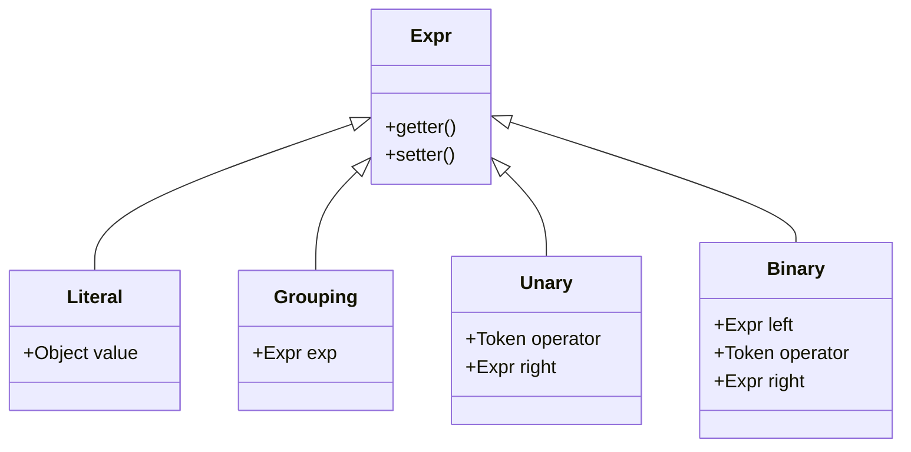
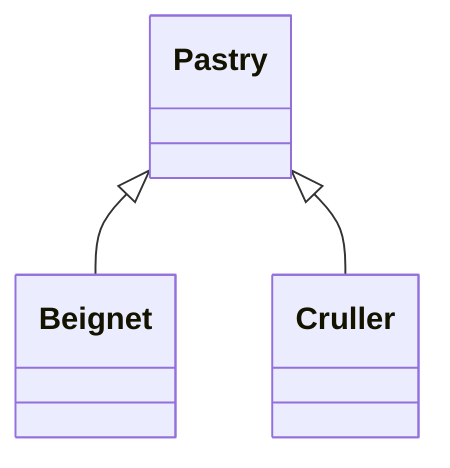

>   就差编译原理了, 尽管没啥用, 因此这里没有选择龙书, 而是 [Crafting Interpreters](http://www.craftinginterpreters.com/contents.html)

# road map

一图流:


实话说, 最开始看这个图的时候是一脸懵逼的, 作者把程序编译(转译)的整个过程比作了爬山

一切的开始都是从 souce code 开始的, 经过一系列过程, 得到的可能是可以被直接加载运行的 machine code, 或者是可以被放在 VM 中运行的字节码 (比如 java 生成的 .class 可以运行在 JVM 中), 代码还可以通过 transpile (转译) 得到其他的语言源码

整个编译的流程可以分为 front end (前端) 和 back end (后端) 两部分, 在上图中分别对应了上山和下山的两条路线, 这里可以粗略认为前端是和平台无关的, 而后端会针对特定平台进行编译, 比如 x86 和 risc-v 的 machine code 显然是不同的

编译刚刚开始的时候, 源码文件可以被认为是一个写满了字符串的文本文件, 原作者使用一个简单的例子概括了编译的各个过程, 假设源码为:


## scanning

这个过程也被称为 `lexing`, 更学名的叫法为: lexical analysis, 一般把这个过程翻译为词法分析

lexing 会将 source code 中的字符串解析为若干 token, 可以将其类比于把一个句子解析为若干单词

空白字符并不会影响程序的运行, 其意义主要是提高程序的可读性, 在 lexing 阶段会自动忽略, 在完成 lexing 后:


## parsing

一般把这个过程翻译为语法分析

parsing 过程会将若干 tokens 组成 expression 或者 statement, 最终将 tokens 构成一个 parse tree (或者 abstract syntax tree => AST)


这个过程是很复杂的, 据说早期关于人工智能的研究, 主要就是针对各个语言语法的, 不过因为人类语言的语法差异很大 (汉语和英语差的还是很多的), 早期的研究效果并不好, 不过这些研究后来都用来改进代码语言的 parser 了, 毕竟相比之下, 代码的语法还是简单多了

parser 执行语法解析, 因此在这个阶段可以用来检测代码中的语法错误

## static analysis

parsing 阶段构建的 AST 描述了代码的轮廓, 但变量的声明和变量之间并不存在关联, 这一阶段的目的也被称为 binding (resolution)

如上图, 将变量 min 和 max 进行了算数加法操作, 一般而言两个变量之间进行算数运算的前提是两个变量为相同类型, 因此对于静态类型的语言, 在 static analysis 阶段, 如果 min 和 max 的变量类型不同编译器将报类型不匹配的错误

>   然而 craft interpreter 实现的编译器编译的语言 lox 的变量是动态类型的, 其并不会在 static analysis 阶段检查变量类型, 而是在运行阶段检查

static analysis 阶段实现的是 AST 中 identifier 和 value 的绑定, identifier 的 value 不一定写死在代码中, 可能随着程序运行动态变化; identifier 的 value 会保存在 AST 的对应节点或者保存在 symbol table (符号表) 中

## intermediate representation

IDE 封装好的编译器以源码作为输入, 以目标代码作为输出, 而代码需要支持在不同的平台上运行, 考虑如果需要实现 Pascal, C, Fortran 编译器, 并使其运行于在 x86, ARM, SPARC 上, 如果编译器是一个整体, 那么根据简单的排列组合可知, 这里需要实现 9 个编译器

为了减少开发的工作量, 可以将编译分为 front end 和 back end 两部分, front end 的输入为 source code 而目标代码被称为 intermediate representation (IR) 其和最终运行的平台无关; back end 以 IR 为输入, 而输出和平台相关的目标代码

这样需要达成相同的目的仅仅需要是实现三个和语言相关的 front end compiler 和三个和平台相关的 back end complier 即可, front end compiler 和 back end compiler 之间通过 intermediate representation 关联

>   早期的 c compiler 是 single-pass compiler, 是没有 IR 的, 在那个内存是金子做的时代, 中间产物越少越好

## optimization

这部分是编译器放飞自我的部分, 比如定义变量:

```python
pennyArea = 3.14159 * (0.75 / 2) * (0.75 / 2);
```

那么编译器可以将其优化为:

```python
pennyArea = 0.4417860938;
```

即在编译阶段完成字面量的计算, 可以让程序在运行时跑的更快

>   行业黑话: "constant propagation", "common subexpression elimination", "loop invariant code motion", "global value numbering", "strength reduction", "scalar replacement of aggregates", "dead code elimination", "loop unrolling"

这部分真能发论文

## code generation

如果最后生成的代码需要运行在真实物理机中, 那么 code generation 的目标为二进制 machine code; 如果最后生成的代码需要运行在 VM 中 (比如 JVM) 中, 那么 code generation 的目标为 bytecode ...

除了 machine code 和 bytecode 之外, code generation 还可能得到其他的高级语言, 比如将 python 翻译为 c (cpython); 其实为了让程序在浏览器中运行, [很多语言](https://github.com/jashkenas/coffeescript/wiki/list-of-languages-that-compile-to-js)都包含一个可以将语言翻译为 javascript 的 transpiler

## JIT

just-in-time compilation

不管如何, 在 VM 中的运行的字节码文件的运行效率是没有直接在真实物理机上的 machine code 效率高的

HotSpot JVM 为了提高程序执行的效率, 还包含了 JIT 编译器, JVM 会检索当前程序运行的 performance critical region, JVM 将这部分字节码编译得到 machine code, 当字节码运行到这部分时, 会直接按照 machine code 的方式运行以提高运行效率

>   HotSpot 即为热点, 就是 JIT 会将 HotSpot 处的字节码编译为 machine code

## compiler & interpreter

简单来说, **Compiling** is an *implementation technique* that involves translating a source language to some other—usually lower-level—form. 所以不管是得到 machine code 还是得到 bytecode, 就算最后得到的其他某个高级语言, 都可以被认为是编译 (compile)

compiler translates source code to some other form but doesn’t execute it, compiler 得到最终的输出后不会进行过多的处理

interpreter takes in source code and executes it immediately, interpreter 完成编译后还会运行这部分结果

~~然而现实总是面对太多无奈和心酸~~

然而现实中的 compiler 和 interpreter 并不是非黑即白的关系:


在所有 compiler 和 interpreter 的交叉处的语言中唯一可以说的只有 go 了, go tool 不仅仅是 compiler 还是 interpreter

当运行 `go build` 时会编译当前文件得到一个可执行目标文件, 此时 go tool 的行为类似 gcc

而运行 `go run` 时, go tool 会直接运行编译的结果 (不会产生额外的可执行目标文件), 此时 go tool 的行为和 python interpreter 类似

# lox

craft interpreter 实现了 lox 语言的 interpreter, 作者在第二节先说了以下这个语言的语法和性质

lox 的语法和 c 是类似的, 不过为了方便实现解释器, 这里进行了部分简化

## hello world

在 lox 中 print 是一个关键字而不是一个函数

```lox
// first lox program
print "Hello world!";
```

lox 使用的注释和 c 完全一致, 并且一切从简, lox 不支持多行注释

## high-level language

lox 具有两个高级语言的特性

*   dynamic typing: lox 的变量是动态类型的, 变量在运行时可以被赋予不同的类型, 因此 interpreter 在进行编译的时候并不会检查变量操作的检查: 如果对字符串类型的变量进行除法操作, 在编译期是不会报错的, 只有在运行的时候才会报错

    >   相比之下如果变量是 static types 的, 那么在编译期间需要进行更多的检查

*   automatic memory management: lox 自带 GC

    >   主流的垃圾检测方式: ref counting, tracing
    >
    >   前者通过记录对象的引用计数维护对象的生命周期, 当某个对象的引用计数归零时其会被视为可回收的对象, 这种垃圾回收的方式很容易实现, 效率也很高, 但 ref count 很难解决循环计数的问题
    >
    >   后者实现的典型为 JVM GC, JVM 维护了一个 root set, 在 STW 阶段, JVM 会从 root set 中的每个引用出发, 标记所有可以访问到的对象节点, 在完成标记后, 所有堆区内没有被标记的对象都是垃圾, 会被回收

## data type

lox 仅支持 4 种数据类型:

*   Booleans: `true` and `false`
*   Numbers: lox 仅支持双精度的浮点数 (整数被认为是浮点数的一个特殊例) 并且 lox 认为所有的数据都是十进制的表示
*   Strings: 被双引号 `""` 包裹的内容被认为是字符串, lox 并不会对单个字符进行特殊处理
*   Nil: null value in lox

## expressions

*   arithmetic: lox 支持算数加减乘除, 逻辑上只有数字类型支持算数操作, 唯一的例外是字符串类型也支持加法操作, 此时的加法会被认为是字符串拼接操作

*   comparison and equality: lox 支持两个变量进行大小比较, 比较大小的两个变量必须是相同类型的 (lox 不支持 implicit convension)

*   logical operators: lox 支持与或非操作, 不过在 lox 中与操作使用关键字 `and` 或操作使用关键字 `or`

    >   对于 `and` 操作, lox interpreter 首先检查 left operand, 如果 left operand 为 false, 直接返回 false, 否则返回 right operand
    >
    >   对于 `or` 操作, lox interpreter 首先检查 left operand, 如果 left operand 为 true, 直接返回 true, 否则返回 right operand
    >
    >   interpreter 的实现逻辑运算, 不会对 right operand 进行解析

*   precedence and grouping: lox 的算数优先级和 c 一致, 即乘除优先, lox 支持通过括号修改运算顺序

原生 lox 不支持 bitwise, modulo, conditional operator (三元运算符)

## statements

statement 和 expression 的区别在于: expression produces a value; statement produces an effect

statement 的作用是 modify some state, read input, or produce output, 比如上面的 [hello world](#hello world)

多个 statement 可以通过一个 block 打包为一个 statement:

```lox
{
	print "One statement.";
	print "Two statements.";
}
```

## variables

在 lox 中所有的变量通过 `var` 声明, 变量是没有 zero-value 的, 所有没有初始化的变量都是 nil

```lox
var imAVariable = "here is my value";
var iAmNil;

var a = "string val";
print a; // this statement will print `string val`
a = 10;
print a; // this statment will print `10`
```

## control flow

也就是分支和循环, 有了前面 expression 中对 comparison and equality 的支持, 这里很容易实现 control flow

```lox
// if statement
if (condition) {
  print "yes";
} else {
  print "no";
}

// while statement
var a = 1;
while (a < 10) {
  print a;
  a = a + 1;
}

// for statement
for (var a = 1; a < 10; a = a + 1) {
  print a;
}
```

lox 原生不支持 do-while 和 foreach 循环

>   其实 foreach 还是很有用的

## functions

lox 调用函数的方式和 c 是一致的, 但 lox 的函数声明相对于 c 简单了很多

```lox
// define a function
fun returnSum(a, b) {
	return a + b;
}
```

lox 通过关键字 fun 声明了函数, 所有的函数都具有返回值, 如果函数体声明中没有显式包含 return, 将等价于 return nil

>   作者对 parameter 和 argument 进行了区分
>
>   *   argument: an actual value you pass to a function when you call it => actual parameter
>   *   parameter: a variable that holds the value of the argument inside the body of the function => formal parameter
>
>   ~~无用的小知识增加了~~
>
>   此外还对 function declaration 和 definition 进行了区分
>
>   *   declaration: binds the function’s type to its name so that calls can be type-checked but does not provide a body
>   *   definition declares the function and also fills in the body so that the function can be compiled.
>
>   在 c 中 declaration 指的是定义在文件顶部的函数签名, definition 指的是函数的实现

## functional language

>   在看这个材料之前, 并不知道这种类型语言的存在

由于 (几乎) 从来都没写过 functional language, 因此这里问了以下 chatgpt, functional language 具有以下特点:

*   First-Class and Higher-Order Functions: functional language 以 function 为核心 (原文为 first-class citizen), higher-order function 说的是函数可以被认为是某种特殊的数据类型, 可以作为参数传递进入函数, 也可以作为返回值从函数中返回

*   Pure Functions: functional language 保证了函数的运行结果仅仅和函数本身相关, 只要函数的入参相同, 那么函数将具有相同的返回值

*   Immutability: functional language 中的数据是不可变的, 一次创建后就不再修改了; 如果真的需要进行数据的变更, functional language 建议使用新的数据结构维护变更记录

*   Closures (中文翻译为闭包): 简单来说函数可以存在嵌套, 且内部函数可以访问外部函数的数据 (就算外部函数已经运行结束了, 内部函数还是可以访问外部函数中定义的变量)

    ```typescript
    function outer(outer_num) {
      function inner(inner_num) {
        console.log(outer_num + inner_num);
      }
      return inner;
    }
    
    var func = outer(1);
    func(2); // 3
    ```

    在函数 outer 中定义了函数 inner, 并在 outer 结尾返回函数 inner; 代码第 8 行, 调用 outer, 返回了内部函数 inner, 此时 outer 执行结束, 随后调用内部函数 inner, 打印结果为 3 => inner 访问到了 outer 中定义的变量 outer_num

lox 需要支持 closure 的特性, 从而增加了 interpreter 实现的复杂性, 至少直接按照 c 中那种按照栈帧进行函数调用的形式是不太行的, 当函数完成调用后当前栈帧不能直接出栈, 否则 inner function 是无法访问 outer function 中定义的变量的

## object-oriented language

lox 需要提供对面向对象的支持, 主流实现面向对象有两种方式:

*   class: 比如 c++, java; 在 class-based language 由两个重要概念组成: 

    *   instance: 实例对象, 保存了对象的状态 (field values) 和一个指向了对应 class 的引用
    *   class: 模板类, 维护了类的方法和继承关系

    当程序试图某个对象的方法时, 首先会找到该对象的类, 随后调用该类的方法 (one level of indirection);

    statically typed language 在编译期进行对象调用方法的检查 (method lookup) => static dispatch

    不过 c++ 还支持 dynamic dispatch, 即在运行阶段进行 method lookup => virtual method

    lox 仅需要支持 dynamic dispatch

*   prototype: 比如 javascript; prototype-based language 中并没有 class, 每个对象维护了自身的状态, 方法和继承关系, 因此在 prototype-based language 中继承为对象之间的继承

    >   javascript 中的对象包含了构造方法, 在实际编写代码的时候其写法和 java 中 new 对象的写法是类似的, javascript 是希望程序员把其当为 class-based language 使用的  

prototype-based language 相比之下更好实现, 但代价是用户程序相对会更复杂 => [waterbed theroy](http://wiki.c2.com/?WaterbedTheory)

lox 需要实现的是 class-based OOP

在 lox 中定义的典型类如下:

```lox
class SomeClass {
  someOperation(arg) {
    print "someOperation print with: " + arg;
    this.someField = arg;
  }

  printField() {
    print "printField print with: " + this.someField;
  }
}

var instance = SomeClass();
instance.someOperation("buzz");
instance.printField();
```

在 lox 的类中定义的 method 不需要关键字 fun, lox 的 field 不需要提前声明, 在成员方法中通过 `this.` 的方式即可访问当前对象的 field, 因此 lox 的 class 的 field 在运行时是动态变化的, 在第一次赋值的时候进行初始化

lox 在实例化对象的时候不需要使用关键字 new, 从写法上好像调用了 "class function"

不过 lox 支持通过关键字 `init` 定义构造方法, 进行对象的初始化 (field 的初始化)

```lox
class SomeClass {
  init(arg) {
    this.someField = arg;
  }

  someOperation(arg) {
    print "someOperation print with: " + arg;
    this.someField = arg;
  }

  printField() {
    print "printField print with: " + this.someField;
  }
}

var instance = SomeClass("buzz");
instance.printField();
```

lox 支持单根继承, 和 java 不同的是, 在 lox 并没有使用 extends 表示继承, 而是使用操作符 `<` 表示继承关系

```lox
class Parent {
  init(arg) {
    this.parentArg = arg;
  }

  parentFun() {
    print "function from parent";
  }
}

class Son < Parent {
  init(sonArg, parentArg) {
    super.init(parentArg);
    this.sonArg = sonArg; 
  }

  sonFun() {
    print "function from son";
  }
}

var son = Son("son", "parent");
son.sonFun();
son.parentFun();
print "args:" + son.parentArg + ":" + son.sonArg;
```

子类可以继承父类的成员变量和成员方法, 子类默认会继承父类的构造方法, 而如果子类进行了方法重写, 那么此时调用的将是子类的构造函数; 子类可以通过 super 关键字调用父类的构造方法; 具体的写法参考上面

>   从继承关系上来讲, 子类实例化对象可以被认为是父类的实例化对象, 因为子类对象可以调用父类的方法, 获取父类的成员变量; 而父类实例化对象和子类是没有任何关系的
>
>   因此早期的研究中认为 subclass objects is smaller than superclass's, 因此在一部分语言中确实是通过 `<` 表示继承关系的

lox 并没有具有完整 OOP 语言的特性, 在 lox 中基础数据类型 Boolean, Number, String 并没有对应类, 不具有成员方法和成员变量

# jlox

## Scanning

作者在写这部分的时候没有拖沓, 直接把代码贴出来了

### class Token

将原来的字符串分割为多个子字符串, 每个子字符串了为一个 lexeme, scanning 阶段的操作关键在于字符串分割

对于编译器而言, lexeme 将以对象 token 的形式保存, 每个 token 对象不仅包含了子字符串本身, 还具有一些其他的信息

#### type

将不同的 token 分为不同的类型, 这主要是为了方便 parser 在下一步进行解析, 对于 parser 而言所有的 token 具有下面几类:

*   single-character token: 单字符的符号
*   single/double character(s) token: 双字符的符号
*   literals: 表示了变量实际取值的字面量
*   keywords: lox 预先保留的关键字

```java
// TokenType.java

package icu.buzz;

public enum TokenType {
    /**
     * Single-character tokens.
     * '(', ')', '{', '}', ',', '.', '-', '+', ';', '/', '*'
     */
    LEFT_PAREN, RIGHT_PAREN, LEFT_BRACE, RIGHT_BRACE,
    COMMA, DOT, MINUS, PLUS, SEMICOLON, SLASH, STAR,

    /**
     * One or two character tokens.
     *  '!', "!=", '=', "==", '>' , '>=', '<', "<="
     */
    BANG, BANG_EQUAL,
    EQUAL, EQUAL_EQUAL,
    GREATER, GREATER_EQUAL,
    LESS, LESS_EQUAL,

    /**
     * Literals.
     */
    IDENTIFIER, STRING, NUMBER,

    /**
     * Keywords.
     */
    AND, CLASS, ELSE, FALSE, FUN, FOR, IF, NIL, OR,
    PRINT, RETURN, SUPER, THIS, TRUE, VAR, WHILE,

    EOF
}

```

lox 最后一个符号 EOF 仅仅是为了方便 parser 进行解析占位用的

#### literal value

尽管不是所有的 token 都具有 literal value ...

将 token value 直接转化为 literal value, 方便后续 interpreter 执行 lox 代码

#### location info

当程序编译/运行出错时, interpreter 需要显式的告知用户代码的那个地方出错了, 作者这里仅仅记录了 token 的行号, 这里同时也记录了列号

```java
// Token.java

/**
 * inner class LocationInfo
 * this class is used to record token position
 */
private static class LocationInfo {
    // line number in source code
    private final int line;
    // column number in source code (offset is measured in characters not tokens)
    private final int offset;

    public LocationInfo(int line) {
        this(line, -1);
    }

    public LocationInfo(int line, int offset) {
        this.line = line;
        this.offset = offset;
    }

    @Override
    public String toString() {
        String rst = "line number:" + this.line;
        if (offset >= 0) rst += "\n" + "column offset:" + this.offset;
        return rst;
    }
}

```

#### pack all

把上面的东西撺掇以下就行了

```java
// Token.java

package icu.buzz;

public class Token {
    // token name
    private final String lexeme;
    private final TokenType type;
    // literal value if exists, for most lexemes, this field should be null
    private final Object value;
    private final LocationInfo locationInfo;

    /**
     * inner class LocationInfo
     * this class is used to record token position
     */
    private static class LocationInfo {
        // line number in source code
        private final int line;
        // column number in source code (offset is measured in characters not tokens)
        private final int offset;

        public LocationInfo(int line) {
            this(line, -1);
        }

        public LocationInfo(int line, int offset) {
            this.line = line;
            this.offset = offset;
        }

        @Override
        public String toString() {
            String rst = "line number:" + this.line;
            if (offset >= 0) rst += "\n" + "column offset:" + this.offset;
            return rst;
        }
    }

    public Token(String lexeme, TokenType type, Object value, int line) {
        this.lexeme = lexeme;
        this.type = type;
        this.value = value;
        this.locationInfo = new LocationInfo(line);
    }

    public Token(String lexeme, TokenType type, Object value, int line, int offset) {
        this.lexeme = lexeme;
        this.type = type;
        this.value = value;
        locationInfo = new LocationInfo(line, offset);
    }

    @Override
    public String toString() {
        return "lexeme:" + this.lexeme + "\n" +
                "type:" + type + "\n" +
                "value:" + value + "\n" +
                this.locationInfo;
    }
}

```

### class Scanner

scanner 将 source 解析为 token list, 为了定位 token 的位置, 增加了对位置信息的记录, 同时为了区分普通的 identifier 和 keyword, 使用了一个 map 记录

```java
public class Scanner {
    private static final Map<String, TokenType> keywords;
    private final String source;
    private final List<Token> tokenList;
    // start position of a token
    private int start;
    // current position while scanning
    private int current;
    // current line while scanning
    private int line;
    // valid column starts from 1
    // start column of a token
    private int column;
    // current column while scanning
    private int cur_column;

    static {
        // "while" is the last keyword token, "and" is the first keyword token
        keywords = new HashMap<>(TokenType.WHILE.ordinal() - TokenType.AND.ordinal() + 1);
        keywords.put("and", TokenType.AND);
        keywords.put("class", TokenType.CLASS);
        keywords.put("else", TokenType.ELSE);
        keywords.put("false", TokenType.FALSE);
        keywords.put("fun", TokenType.FUN);
        keywords.put("for", TokenType.FOR);
        keywords.put("if", TokenType.IF);
        keywords.put("nil", TokenType.NIL);
        keywords.put("or", TokenType.OR);
        keywords.put("print", TokenType.PRINT);
        keywords.put("return", TokenType.RETURN);
        keywords.put("super", TokenType.SUPER);
        keywords.put("this", TokenType.THIS);
        keywords.put("true", TokenType.TRUE);
        keywords.put("var", TokenType.VAR);
        keywords.put("while", TokenType.WHILE);
    }
}
```

scanner 的作用是将源码转变为 token, 其入口函数如下:

```java
// Scanner.java

public List<Token> scanTokens() {
    for (; notEnd(); start = current, column = cur_column) scanToken();
    tokenList.add(new Token("", TokenType.EOF, null, line, column));
    return tokenList;
}
```

其中方法 scanToken 可以扫描后一个 token 并添加到 tokenList 中

对于特殊的运算符, 一个字符就是一个 token 的, 直接判断其类型即可

```java
// Scanner.java

private void scanToken() {
    char c = advance();
    switch (c) {
        // these cases are used for single character except for '/'
        case '(' -> addToken(TokenType.LEFT_PAREN);
        case ')' -> addToken(TokenType.RIGHT_PAREN);
        case '{' -> addToken(TokenType.LEFT_BRACE);
        case '}' -> addToken(TokenType.RIGHT_BRACE);
        case ',' -> addToken(TokenType.COMMA);
        case '.' -> addToken(TokenType.DOT);
        case '-' -> addToken(TokenType.MINUS);
        case '+' -> addToken(TokenType.PLUS);
        case ';' -> addToken(TokenType.SEMICOLON);
        case '*' -> addToken(TokenType.STAR);
    }
}

/**
 * fetch character and flip current
 * @return character at current
 */
private char advance() {
    cur_column++;
    return source.charAt(current++);
}
```

带有比较含义的运算符通过判断后一个字符可以确定 token 类型

```java
// Scanner.java

private void scanToken() {
    char c = advance();
    switch (c) {
        // these cases are used for single or double characters
        case '!' -> {
            if (match('=')) addToken(TokenType.BANG_EQUAL);
            else addToken(TokenType.BANG);
        }
        case '=' -> {
            if (match('=')) addToken(TokenType.EQUAL_EQUAL);
            else addToken(TokenType.EQUAL);
        }
        case '>' -> {
            if (match('=')) addToken(TokenType.GREATER_EQUAL);
            else addToken(TokenType.GREATER);
        }
        case '<' -> {
            if (match('=')) addToken(TokenType.LESS_EQUAL);
            else addToken(TokenType.LESS);
        }
    }
}

/**
 * find if current character is the same as @param: target
 * @param target target character
 * @return comparison result
 */
private boolean match(char target) {
    if (current == source.length()) return false;
    if (source.charAt(current) != target) return false;
    current++;
    cur_column++;
    return true;
}


```

对于 `/` 而言, 如果其表示了注释, 那么在 scanner 中, 不应该将注释的内容保存为 token, 而是应该直接忽略

```java
// Scanner.java

private void scanToken() {
    char c = advance();
    switch (c) {
        // case for slash symbol, slash may construct a comment
        case '/' -> scanSlash();
    }
}

private void scanSlash() {
    if (match('/')) {
        // single line comment
        while (notEnd() && peek(0) != '\n') advance();
        if (notEnd()) advance();
        line++;
        cur_column = 0;
    } else if (match('*')) {
        // multiple line comment
        int flag = 0;
        for (char next_char = peek(0), next_next_char = peek(1);
             next_char != '\0' && next_next_char != '\0';
             advance(), next_char = peek(0), next_next_char = peek(1)) {
            if (next_char == '*' && next_next_char == '/') {
                flag = 1;
                break;
            }
            if (next_char == '\n') {
                line++;
                cur_column = 0;
            }
        }
        if (flag == 1) {
            // flip to next_char => '*'
            advance();
            // flip to next_next_char => '/'
            advance();
        } else Lox.errorReport(line, column, "Unterminated comment");
    } else addToken(TokenType.SLASH);
}

/**
 * find if current has reach the end
 * @return comparison result
 */
private boolean notEnd() {
    return current != source.length();
}

/**
 * peek next with bias
 * @param offset offset from current
 * @return peek the character at current + @param: offset
 */
private char peek(int offset) {
    return current + offset >= source.length() ? '\0' : source.charAt(current + offset);
}
```

借助方法 notEnd 和 peek 可以安全的获取当前字符的后几个字符, 从而判断注释是否已经结束

程序中用来格式话的空白字符是没有实际含义的, scanner 遇到这些字符直接跳过

```java
// Scanner.java

private void scanToken() {
    char c = advance();
    switch (c) {
        // blank character
        case ' ', '\r', '\t' -> {}
        // newline character
        case '\n' -> {
            line++;
            cur_column = 0;
        }
    }
}
```

剩下的就是一些字面量了, 比如字符串, 数字, 或者是 identifier

```java
// Scanner.java

private void scanToken() {
    char c = advance();
    switch (c) {
        // string literal
        case '"' -> scanString();
        default -> {
            // number literal
            if (isDigit(c)) scanNumber();
            else if (isAlpha(c)) scanIdentifier();

            else Lox.errorReport(line, column, "Unexpected character");
        }
    }
}

private void scanString() {
    char next_char;
    while ((next_char = peek(0)) != '\0' && next_char != '"')  {
        if (next_char == '\n') {
            line++;
            cur_column = 0;
        }
        advance();
    }
    // error report
    if (next_char == '\0') {
        Lox.errorReport(line, column, "Unterminated string");
        return;
    }
    advance();
    // trim the source without ""
    addToken(TokenType.STRING, source.substring(start + 1, current - 1));
}

private void scanNumber() {
    char next_char;
    while (isDigit(next_char = peek(0))) advance();

    if (next_char == '.') {
        if (isDigit(peek(1))) {
            advance();
            while (isDigit(peek(0))) advance();
        }
        else {
            Lox.errorReport(line, column, "Unexpected symbol '.' without tailing digital number");
            return;
        }
    }
    // parse all number token into double value
    addToken(TokenType.NUMBER, Double.parseDouble(source.substring(start, current)));
}

private void scanIdentifier() {
    while (isAlphaNumeric(peek(0))) advance();
    String value = source.substring(start, current);
    addToken(keywords.getOrDefault(value, TokenType.IDENTIFIER));
}

/**
 * find if @param: c is an alpha or number
 * @param c target character
 * @return comparison result
 */
private boolean isAlphaNumeric(char c) {
    return isAlpha(c) || isDigit(c);
}

/**
 * find if @param: c is an alpha => letter or underscore
 * @param c target character
 * @return comparison result
 */
private boolean isAlpha(char c) {
    return (c >= 'a' && c <= 'z') ||
            (c >= 'A' && c <= 'Z') ||
            c == '_';
}

/**
 * find if @param: c is digit number
 * @param c target character
 * @return comparison result
 */
private boolean isDigit(char c) {
    return c >= '0' && c <= '9';
}
```

从解析的角度考虑, lox 支持多行字符串, lox 不会区分整数和小数, 统一使用 NUMBER 标识

最后剩下的字符就是 identifier 了, lox 中的 identifier 仅支持字母和数字的组合, 不支持下划线的写法, identifier 可能为保留的关键字, 可以通过查询最开始定义的 keywords 判断得到

## Representing Code

这一章讨论的是 parser 在对 token 完成解析后的产物 => represent code; 放在了 parser 的实现之前, interpreter 会直接根据 represent code 生成最终的 target code (bytecode/ machine code) 或者直接解析 represent code 运行代码

考虑一则简单的算数运算:

```arithmetic expression
1 + 2 * 3 - 4
```

在算数运算中, 乘除相比加减具有更高的运算优先级, 为了表示这种优先级, 可以将运算以树的形式表示, 其中树的叶子节点为操作数, 而非叶子节点为运算符, 那么运算可以通过后序遍历表示:

</img>

由于后序遍历一定会先遍历两个子树, 那么就意味着子树的运算一定先于当前节点的运算, 因此为子树的优先级高于树根, 对于任意的算数表达式, 只要可以将其抽象为一棵树, 那么一定可以通过后序遍历完成运算

对于 interpreter 而言, 如果可以将各个指令抽象为节点, 在根据指令之间之间的关系抽象为一个 tree, 那么 interpreter 就可以通过后序遍历的方式执行程序

### theory

这部分和语法的定义有关, 基本上都是概念, 最后看吧

语言的最小组成单元 atomic piece 被称为: "alphabet", 将 "alphabets" 中的各个 "letter" 按照 grammar 拼凑得到的就是 "string", 如果是英语的话, 上面的引号就是多余的, 而对代码而言, 在编译的不同阶段具有不同的涵义:

*   lexical grammar: 在词法分析阶段, "alphabet" 指代的是 character (源代码中的各个字符); 而 "string" 指代的是由 scanner 组合 characters 得到的 lexeme (token); scanner 使用 regular grammar, 将 character 组合为 lexeme, lexeme 的语言也被称为 regular language 

*   syntactic grammar: 在语法分析阶段, "alphabet" 指代的是上一步由 scanner 生成的 token; 而 "string" 指代的是由 parser 组合 lexemes 得到的 expression;

    parser 使用 context-free grammar, 并按照优先级生成 expression, expression 具有类似树的结构 (后面说到 context-free grammar 时会知道为什么其具有树的结构), expression 的语言也被称为 context-free language

这一部分专注的不是 parser 的实现, 而是 expression 的表示, 即 parser 到底需要将 token 组合为何种产物, 并将讨论 expression 的语法

不管时什么阶段的代码都具有自己的语法, 显然目前已知的几种代码并不是可枚举的, 合法代码的范围太大了, 为了描述语法, 更合理的方式是使用各种 rules (规则) 描述语法

generate "strings" that are in the grammar => derivation, 学名上, 如果 "string" 是通过语法中各种规则组合得到, 那么称 "string" 是从语法中派生出来的

用来描述语法的规则被称为 productions (产生式), 因为通过规则可以生成 "string"

### context-free grammar

在 context-free grammar 中, 每个 production 由两部分组成: head, body:

*   head: name of the production => 通常是一个 symbol
*   body: describe what it generates => 若干 symbol

context-free grammar 包含了两种 symbol:

*   terminal: 就是 "alphabets" 中的各个 letter, 放在 "编译原理" 的上下文中, terminal 就是 scanner 生成的各个 lexeme

*   nonterminal: nonterminal 指代的是 context-free 的一个 rule, 要注意的是 rule 是可以嵌套的, 即 rule 可以由若干 rule 组成(包括自身), rule 也可以只包含 terminal

    此外 context-free grammar 支持同名 rule, 此时一个 rule name 可以对应多个 rule, 此时在进行语法解析的时候, 不管选择多个 rule 中的哪一个都是合法的 (换句话说, 在进行解析的时候, 随便使用一个 rule 解析就行

>   后日谈: 如果是第一次看这里, 应该是一脸蒙蔽吧, 没事, 看一下后面的例子之后再看前面就好了

#### breakfast example

作者这里举了一个小例子描述 context-free grammar, 其表示方式类似: [Backus–Naur form](https://en.wikipedia.org/wiki/Backus–Naur_form) (如果不想看 wikipedia 就问 chatgpt: what is BNF)

在这个语法中, 每个 rule 以一个 name 开头, 后面跟着一个 `->`, 再后面是 a sequence of symbol; 每个 rule 通过一个 `;` 结尾

这个语法中所有的 terminal 都通过一个 "" 包裹, 其余没有被包裹的就是 nonterminal

```asciiarmor
breakfast  → protein "with" breakfast "on the side" ;
breakfast  → protein ;
breakfast  → bread ;

protein    → crispiness "crispy" "bacon" ;
protein    → "sausage" ;
protein    → cooked "eggs" ;

crispiness → "really" ;
crispiness → "really" crispiness ;

cooked     → "scrambled" ;
cooked     → "poached" ;
cooked     → "fried" ;

bread      → "toast" ;
bread      → "biscuits" ;
bread      → "English muffin" ;
```

还是解释以下吧, 这里的 `breakfast`, `protein`, `crispiness`, `cooked`, `bread` 都是 nonterminal

一个 `breakfast` 有三种解析方式:

*   `protein` "with" `breakfast` "on the side"
*   `protein`
*   `bread`

因此如果输入为 `breakfast`, 在解析时随便选择一个解析即可, 比如这里幸运的选择到了 `bread`, 由于 `bread` 也不是 terminal, 因此继续解析 `bread`, 其也具有三种解析方式:

*   "toast"
*   "biscuits"
*   "English muffin"

此时不管选择上面的哪一个, 都会得到一个 nonterminal, 此时解析结束, 在这一次随机中, 解析 nonterminal 的路线可能为: `breakfast` -> `bread` -> "toast"

如果没那么好运, 在解析 `breakfast` 的时候解析到了 `protein`, 此时针对 `protein` 可以按照上面的方式进行解析, 得到一个较长的解析路线

但如果十分倒霉, 解析 `breakfast` 的时候解析到了 `protein` "with" `breakfast` "on the side", 此时一个 nonterminal 得到了两个 nonterminal, 其中一个 nonterminal 还是本身, 那么解析路线就会更长了

>   第一次看到上面这种语法的时候, 其实是有些担心的, 这种解析有点类似函数的递归调用, 并且下一层递归调用可能和本层相同, 那么很有可能出现 stack overflow 的情况; 这一点其实不需要担心, 因为在 parser 构建 expression 的时候并不是这种自顶向下的解析, 而是自底向上进行 AST 的构建

综上, 如果给出一个 `breakfast` 进行解析, 那么解析的结果可以通过树状图表示:


正是由于 nonterminal 的存在, 当出现重名 rule 的时候会从多个满足条件的 rule 中任选一个进行解析, 因此即便 rule 和 "letter" 是有限的, 但在 rule 的作用下通过 "letter" 可以组成的 "string" 是无限的

上述对于语法的描述十分繁琐, 作者这里添加了语法糖, 优化了写法:

```asciiarmor
breakfast → protein ( "with" breakfast "on the side" )?
          | bread ;

protein   → crispiness + "crispy" "bacon"
          | "sausage"
          | ( "scrambled" | "poached" | "fried" ) "eggs" ;

crispiness → "really"*;

bread     → "toast" | "biscuits" | "English muffin" ;
```

`|` 表示一个解析可选项, 比如 `bread` 可以被扩展为: "toast" 或 "biscuits" 或 "English muffin"

`*` 类似正则表达式, 表示重复次数为 0 次或多次, 比如 `crispiness` 可以被扩展为 "really", "really really" ...

被 `()` 包裹的部分表示必选项, 上面对 `cooked` 进行了内联优化, 使用 `()` 包裹 `cooked`

`?` 类似正则表达式, 表示前面一项为可选项

>   某种程度上, `()` 也是正则表达式的一种

#### grammar for lox expression

尽管 lox 是一个很精简的语言, 但其语法对于 parser 的实现而言还是比较复杂的, 这里仅仅考虑 lox 支持的一部分 expression:

*   literal: 可以被解析为 Number, String, Boolean, nil
*   unary expression (一元表达式): `!` 表示逻辑非, `-` 表示取相反数
*   binary expression (二元表达式): 包含所有的算数运算符 (+, -, *, /) 和逻辑运算符 (>, >=, < ,<=, ==, !=)
*   parentheses: 通常的表现形式为 `(` + `expression` + `)`

给定一个 expression 其语法解析为:

```asciiarmor
expression     → literal
               | unary
               | binary
               | grouping ;

literal        → NUMBER | STRING | "true" | "false" | "nil" ;
grouping       → "(" expression ")" ;
unary          → ( "-" | "!" ) expression ;
binary         → expression operator expression ;
operator       → "==" | "!=" | "<" | "<=" | ">" | ">="
               | "+"  | "-"  | "*" | "/" ;
```

>   从解析的角度考虑, operator 可以解析为若干 terminal, literal 也只能被解析为若干 terminal, 而其他的 expression 进行解析时都可以得到 nonterminal

### syntax tree

语法树是由 token 各种组成的, syntax tree 和 expression 的关系可以参考<a href="#evaluate_tree">上图</a>, 将 expression 按照 AST 的方式存储, 利于 interpreter 后一步进行求值

在 OOP 语言中, 需要使用类表示 AST, 按照上面对于 lox expression grammar 的讨论, 显然可以如果如下关系表示 expression:



>   由于只有 binary 可以解析得到 operator, 而 operator 本身只能解析为 terminal, 因此这里将 operator 优化为 binary 的一个 token field
>
>   此外由于 literal 只能解析为 terminal, 在 parsing 阶段, terminal 为 token, 对于 literal token 而言, 需要关注的是 token value, 因此这里并没有保存 Token, 而是直接将 Token 的 value 解析保存起来

#### Metaprogramming

不同的 expression 之间的不同只有类名和成员变量, 原作者这里没有选择手动挨个创建每个子类, 而是写了一个 java 脚本, 通过硬编码的方式将 Expr 和其各个子类写到 Expr.java 中, 其中除了 Expr 之外的所有 nonterminal 都作为 Expr 的内部类存在

由于这个脚本并不属于 jlox 的一部分, 因此作者将这个文件放在了 package tools 下, 表示其为 jlox 的工具类

```java
// xxx.tool.GenerateAst.java

package icu.buzz.tool;

import java.io.IOException;
import java.io.PrintWriter;
import java.nio.charset.StandardCharsets;
import java.util.Arrays;
import java.util.List;

public class GenerateAst {
    public static void main(String[] args) {
        if (args.length != 1) {
            System.out.println("Usage: java -jar GenerateAst.jar [output_directory]");
            System.exit(64);
        }
        defineAst(args[0], "Expr",
                Arrays.asList("Binary: Expr left, Token operator, Expr right",
                        "Unary: Token operator, Expr right",
                        "Grouping: Expr expression",
                        "Literal: Object value"));
    }

    /**
     * this function will create @param: target.java under the directory @param: dir
     * target.java contains multiple inner static class specified by @param: types
     * @param dir base directory contains target file
     * @param target target file name
     * @param types specify inner static classes
     */
    public static void defineAst(String dir, String target, List<String> types) {
        String full_path = dir + "/" + target + ".java";
        try (PrintWriter writer = new PrintWriter(full_path, StandardCharsets.UTF_8)) {
            writer.println("package icu.buzz.lox;");
            writer.println();
            writer.println("public abstract class " + target + " {");
            types.forEach(type -> {
                String[] vars = type.split(":");
                defineType(vars[0].trim(), target, vars[1].trim(), writer);
            });
            writer.println("}");
        } catch (IOException e) {
            e.printStackTrace();
        }
    }

    /**
     * write an inner static class
     * @param className just follow the name
     * @param parentName inner class extends outer class
     * @param fields inner class fields
     * @param writer writer to print
     */
    private static void defineType(String className, String parentName, String fields, PrintWriter writer) {
        writer.println("    public static class " + className + " extends " + parentName + " {");
        String[] arrayField = fields.split(",");
        for (int i = 0; i < arrayField.length; i++) arrayField[i] = arrayField[i].trim();
        for (String field : arrayField) {
            writer.println("        private final " + field + ";");
            writer.println();
        }
        writer.println("        public " + className + "(" + fields + ") {");
        for (String field : arrayField) {
            String field_name = field.split(" ")[1].trim();
            writer.println("            this." + field_name + " = " + field_name + ";");
        }
        writer.println("        }");
        writer.println("    }");
        writer.println();
    }
}

```

### Imagination

>   这部分第一次看是真的抽象 ...

对于 interpreter 而言, 后序遍历 AST 即可执行代码, 由上述代码描述的 AST 为一个 Expr 对象, 不过对于 interpreter 而言, 针对不同 Expr 的操作应该是不同的, 比如对于 Binary 而言, 需要先计算两个子 Expr (left 和 right), 并返回 left, right 与 operator 运算后的结果; 而对于 Unary 而言, 只需计算一个子 Expr (right), 直接返回 right 和 operator 的 运算结果, 因此对于传入的某个 Expr 对象, interpreter 需要知道其类型, 其执行代码具有如下框架

```java
if (expr instanceof Expr.Binary) {
	// some operations for Binary
} else if (expr instanceof Expr.Unary) {
    // some operations for Unary
}  ...
```

也就是说**执行方法内部需要根据对象类型分类**, 这种写法常见于 functional programming, 在 OOP 语言中, 类和行为是绑定的, 完全可以在父类 Expr 中定义方法 interpret, 并让各个子类继承这个方法, 这样不管传入的对象是何种类型, 直接调用 interpret 即可

>   这种通过将 interpret 方法放在类的成员方法进行解析的方式被称为 interpreter pattern

这意味着每次添加一种 Expr 都需要添加相应的函数, 对于 lox 而言, parser, interpreter 都需要对 Expr 进行操作, 如果将不同 domain 对 Expr 的操作都定义在 Expr 内部, 将使得 => smush a bunch of different domains together; 按照作者的说法: violates [separation of concerns](https://en.wikipedia.org/wiki/Separation_of_concerns) and leads to hard-to-maintain code

#### expression problem

lox 需要对 Expr 进行多种操作, 包括但不限于:


每个 Expr 一行, 包括上面已经定义过的 Binary, Unary, Grouping, Literal; 每一列是 Expr 的一个行为, 包括上面提到过的 interpret, 此外还包括 resolve, analyze

OOP 语言的特点是, 方法定义在类的内部, 其认为类中定义的各个方法之间是相互依赖, 相互作用的, 作为一个整体存在; 子类可以继承父类的方法, 且允许子类重写 (override) 父类方法, 在上表中行扩展 (新建一个类) 是很容易的

>   overload (重载)


在新继承的类中 override 从父类继承到的方法, 不会影响到之前的代码, 但如果需要对上表进行列扩展, 则需要在每个类中都添加一个方法实现, 不仅如此如果新方法和之前的存在作用关系, 那么实际需要检查的部分就更多了

和其相对应的, functional paradigm language (函数式范式语言), 可以轻松实现列扩展; 方法和类不进行绑定, 不同的类型和不同的函数之间是相互独立的关系, 当多个类型需要调用相同函数时, 每种类型的函数实现都需要放在同一个函数中, 函数本身负责进行类型的区分 => pattern match (具体的实现机制不太好说, 但语法上和 switch 类似)


但在 functional paradigm language 中很难行扩展, 新添加一个类型, 就需要在之前定义的每个函数的 "switch" 中添加一个 pattern

看起来, 不存在什么语言可以同时方便的行扩展, 列扩展, 这种现象被称为 => expression problem

>   这个问题第一次提出的时候也是在写编译器的时候, 不过现在是存在同时方便的添加 type & operation 的语言的比如: Common Lisp’s CLOS, Dylan, and Julia (就没有一个是听说过的), 不过它们也不是完美的, 比如有的是静态类型检查, 有的需要 separate compilation (可能是多阶段编译的意思吧 ...)

不过通过借助 visitor pattern (design pattern 的一种), 可以让 OOP 方便的实现列扩展

#### visitor pattern

>    visit(), accept() => 看起来很唬人, 别担心, 只要知道 visitor pattern 的关键在于让 OOP 支持 functional style program

visitor pattern 实现 functional like 的方式是 => add a layer of indirection

>   CS 中解决问题最暴力的方法 => add a layer

原作者这里有又开始举例子了, 比如存在如下继承关系:



>   我查过了, 这几个类都是外国点心名

现在需要对每个 Pastry 的示例添加行为: cook, decorate, eat, 从 OOP 的角度出发, 就是分别在三个类中添加三个方法, 一共添加九个方法, 但这个需要通过 visitor pattern 简化复杂的方法添加, 定义接口:

```java
interface PastryVisitor {
    visitBeignet(Beignet beignet);
    visitCruller(Cruller cruller);
}
```

然后将每个行为定义为一个类并实现这个接口, 这样一个行为操作不同类的行为可以被放在一个类中

>   正常来说行为对应了方法 (函数), 而这里为了实现接口, 需要将行为抽象为类, 这一点也符合 OOP 中万事万物皆对象的思想
>
>   注意到接口中定义了两个方法, 在标准的 visitor pattern 中只有一个方法 visit, 这里是为了兼容不支持重载 (overload) 语言的写法, 不然的话, 就直接写成:
>
>   ```java
>   interface PastryVisitor {
>       void visit(Beignet beignet);
>       void visit(Cruller cruller);
>   }
>   ```

随后在父类 Pastry 中添加抽象方法:

```java
abstract class Pastry {
    public abstract void accept(PastryVisitor visitor);
}
```

并在所有子类中实现这个方法:

```java
class Beignet extends Pastry {
    @Override
    public void accept(PastryVisitor visitor) {
        visitor.visit(this);
    }
}
class Cruller extends Pastry {
    @Override
    public void accept(PastryVisitor visitor) {
        visitor.visit(this);
    }
}
```

这里要注意的是 accept() 的参数 `visitor` 其实是一个行为, 只不过在 OOP 中将其抽象为一个类了, 不同的行为实现相同的 visitor 接口, 即可为不同的类型提供不同的方法实现

>   这里借助多态, 实现方法的分发 => 调用 accept 的参数是各种行为的接口 PastryVisitor 的示例对象, 而不是各个行为本身

这样当需要行扩展的时候, 只需要在继承的时候实现 accept, 具体的写法和已经实现的完全一致; 当需要进行列扩展的时, 只需要实现接口, 并在接口中针对不同的类型进行方法分发

>   接口 ParserVisitor 中最好不要写成 `void visit(Pastry pastry)`, 这样的话在方法的实现内部还需要根据类型进行分发, 而 java 本身并不支持 pattern match, 因此还是需要写成: `if (xxx instanceof xxx) else `, 又回到原点了

#### Expr with visitor pattern

之前的 Pastry 的例子中, accpet 方法没有返回值, 而为了提高 Visitor 接口的通用性, 使用泛型对返回值进行了描述

```java
// ExprVisitor.java
package icu.buzz.lox.expr;

public interface ExprVisitor<R> {
    R visitExpr (Expr.Binary expr);
    R visitExpr (Expr.Unary expr);
    R visitExpr (Expr.Grouping expr);
    R visitExpr (Expr.Literal expr);
}

```

在前面的 java 脚本中, 并没有为每个 Expr 的子类提供 accept 方法, 这里对脚本进行修改

```java
package icu.buzz.tool;

import java.io.IOException;
import java.io.PrintWriter;
import java.nio.charset.StandardCharsets;
import java.util.ArrayList;
import java.util.Arrays;
import java.util.List;

public class GenerateAst {
    public static void main(String[] args) {
        if (args.length != 1) {
            System.out.println("Usage: java -jar GenerateAst.jar [output_directory]");
            System.exit(64);
        }
        List<String> expressions = defineAst(args[0], "Expr",
                Arrays.asList("Binary: Expr left, Token operator, Expr right",
                        "Unary: Token operator, Expr right",
                        "Grouping: Expr expression",
                        "Literal: Object value"),
                "icu.buzz.lox.token.Token");
        defineVisitor(args[0], "Expr", expressions);
    }

    /**
     * this function will create @param: target.java under the directory @param: dir
     * target.java contains multiple inner static class specified by @param: types
     * @param dir base directory contains target file
     * @param target target file name
     * @param types specify inner static classes
     */
    public static List<String> defineAst(String dir, String target, List<String> types, String ... imports) {
        String full_path = dir + "/" + target + ".java";
        List<String> classes = null;

        try (PrintWriter writer = new PrintWriter(full_path, StandardCharsets.UTF_8)) {
            writer.println("package icu.buzz.lox." + target.toLowerCase() + ";");
            writer.println();
            // extra import
            for (String s : imports) writer.println("import " + s + ";");
            writer.println();

            writer.println("public abstract class " + target + " {");
            classes = new ArrayList<>(types.size());
            List<String> fields = new ArrayList<>(types.size());
            for (String type : types) {
                String[] vars = type.split(":");
                classes.add(vars[0].trim());
                fields.add(vars[1].trim());
            }

            // visitor pattern
            writer.println("    public abstract <R> R accept(" + target + "Visitor<R> visitor);");
            writer.println();

            for (int i = 0; i < types.size(); i++) defineType(classes.get(i), target, fields.get(i), writer);

            writer.println("}");
        } catch (IOException e) {
            System.out.println("writer opens: " + full_path + " fail");
        }
        return classes;
    }

    /**
     * write an inner static class
     * @param className just follow the name
     * @param parentName inner class extends outer class
     * @param fields inner class fields
     * @param writer writer to print
     */
    private static void defineType(String className, String parentName, String fields, PrintWriter writer) {
        writer.println("    public static class " + className + " extends " + parentName + " {");
        String[] arrayField = fields.split(",");
        for (int i = 0; i < arrayField.length; i++) arrayField[i] = arrayField[i].trim();
        for (String field : arrayField) {
            writer.println("        private final " + field + ";");
            writer.println();
        }
        List<String> types = new ArrayList<>(arrayField.length);
        List<String> vars = new ArrayList<>(arrayField.length);

        // constructor
        writer.println("        public " + className + "(" + fields + ") {");
        for (String field : arrayField) {
            String[] tmp = field.split(" ");
            types.add(tmp[0].trim());
            tmp[1] = tmp[1].trim();
            vars.add(tmp[1]);
            writer.println("            this." + tmp[1] + " = " + tmp[1] + ";");
        }
        writer.println("        }");
        writer.println();

        // Visitor pattern.
        writer.println("        @Override");
        writer.println("        public <R> R accept(" + parentName + "Visitor<R> visitor) {");
        writer.println("            return visitor.visit" + parentName + "(this);");
        writer.println("        }");
        writer.println();

        // Getters
        writer.println("        // getters");
        for (int i = 0; i < arrayField.length; i++) {
            char[] chars = vars.get(i).toCharArray();
            // capitalize the first letter
            chars[0] -= 'a' - 'A';
            writer.println("        public " + types.get(i) + " get" + new String(chars) + "() {");
            writer.println("            return this." + vars.get(i) + ";");
            writer.println("        }");
            writer.println();
        }

        writer.println("    }");
        writer.println();
    }

    private static void defineVisitor(String dir, String base, List<String> classes) {
        String full_path = dir + "/" + base + "Visitor.java";
        try (PrintWriter writer = new PrintWriter(full_path, StandardCharsets.UTF_8)) {
            writer.println("package icu.buzz.lox." + base.toLowerCase() + ";");
            writer.println();
            writer.println("public interface " + base + "Visitor<R> {");
            for (String method : classes) writer.println("    R visit" + base + " (" + base + "." + method + " expr);");
            writer.println("}");
        } catch (IOException e) {
            System.out.println("writer opens: " + full_path + " fail");
        }
    }
}

```

### Printer

上面定义了 Visitor 接口, 但并没有定义任何的行为实现这个接口, parser 用来创建 Expr, 而 interpreter 用来解析 Expr, 而具体的 parser 和 interpreter 的实现都放在了后面, 这里作者为了测试接口的可用性, 为 Expr 添加了行为 print, 表示打印组成 Expr 的信息 (主要是 token 信息), 打印 AST 可以用来检查 parser 的生成结果的正确性

打印 AST 也就是进行树的遍历, 由于 AST 的层级结构暗含了 Expr 运算之间的优先级, 这里 print 为了区分根节点和左右子树, 这里的 print 采用前序遍历的方式递归打印 AST

比如对于 AST: 


其期望的打印结果为: `(* (- 123) (group 45.67))`

```java
// AstPrinter.java
package icu.buzz.test;

import icu.buzz.lox.expr.Expr;
import icu.buzz.lox.expr.ExprVisitor;

/**
 * a class to test AST correctness, it acts like anti-parser
 * entry method is print, it takes an AST tree (Expr object), and print with visitor pattern
 * print behavior is defined by @function: visitExpr
 */
public class AstPrinter implements ExprVisitor<String> {
    private final Expr expr;

    public AstPrinter(Expr expr) {
        this.expr = expr;
    }

    public String print() {
        return expr.accept(this);
    }

    private String parenthesize(String name, Expr ... exprs) {
        StringBuilder builder = new StringBuilder();
        builder.append("(").append(name);
        for (Expr expr : exprs) {
            builder.append(" ").append(expr.accept(this));
        }
        builder.append(")");

        return builder.toString();
    }

    @Override
    public String visitExpr(Expr.Binary expr) {
        return parenthesize(expr.getOperator().getLexeme(), expr.getLeft(), expr.getRight());
    }

    @Override
    public String visitExpr(Expr.Unary expr) {
        return parenthesize(expr.getOperator().getLexeme(), expr.getRight());
    }

    @Override
    public String visitExpr(Expr.Grouping expr) {
        return parenthesize("group", expr.getExpression());
    }

    @Override
    public String visitExpr(Expr.Literal expr) {
        if (expr.getValue() == null) return "nil";
        return expr.getValue().toString();
    }
}

```

>   这个文件应该放在 test 目录下, 并使用 Junit 进行测试

由于 parser 还没有实现, 这里手动创建 AST, 并打印输出

```java
// test.java
@Test
public void astPrint() {
    Expr expr = new Expr.Binary(
            new Expr.Unary(new Token("-", TokenType.MINUS, -1, 0), new Expr.Literal(123)),
            new Token("*", TokenType.STAR, -1, 0),
            new Expr.Grouping(new Expr.Literal(45.67)));
    AstPrinter printer = new AstPrinter();
    System.out.println(printer.print(expr));
}
```

## Parsing Expressions

前一章中提到的 expression 的语法:

```asciiarmor
expression     → literal
               | unary
               | binary
               | grouping ;

literal        → NUMBER | STRING | "true" | "false" | "nil" ;
grouping       → "(" expression ")" ;
unary          → ( "-" | "!" ) expression ;
binary         → expression operator expression ;
operator       → "==" | "!=" | "<" | "<=" | ">" | ">="
               | "+"  | "-"  | "*" | "/" ;
```

>   将贯穿 parser 的始终

### ambiguity

考虑一个 token 的序列:


parser 具有两种解析方式:

*   整个 expression 解析为 binary => `6` 作为 literal 属于 left-expression => `/` 作为 operator => 后续的所有操作视为一个 expression, 并使用 binary 的规则解析
*   整个 expression 解析为 binary => binary 的 left-expression 进一步解析为 binary => nest binary 的 left-expression 解析为 `6`, operator 解析为 `/`, right-expression 解析为 `3` => 将 `-` 解析为 outer binary 的 operator => 将 `1` 解析为 outer binary 的 right-expression 

按照上面两种方式解析得到的 AST 分别为:


显然两种解析方式的结果并不相同, 单从数学的角度上, 数学家们通过定义操作符的优先级和关联性解决解析歧义:

*   Precedence: 符号的优先级就是那个符号先进行运算, 在算数中乘除运算是优先于加减运算的
*   Associativity: 符号的关联性说的是当多个相同符号时, 哪个符号先进行运算; 如果符号是 left-associative, 那么左符号先运算, 比如符号 `-` 就是 left-associative 的, 因此 `5 - 3 - 1` 等价于 `(5 - 3) - 1`; 再比如 `=` 是 right-associative 的, 因此 `a = b = c` 等价于 `a = (b = c)`

上面的 parser 解析歧义的原因就是没有明确两个算数运算符的优先级, lox 并不想自定义运算优先级, 沿用了 c 的运算优先级顺序, 将所有符号的运算顺序从低到高排序, 有如下关系:

| Name       | Operators         | Associates |
| ---------- | ----------------- | ---------- |
| Equality   | `==` `!=`         | Left       |
| Comparison | `>` `>=` `<` `<=` | Left       |
| Term       | `-` `+`           | Left       |
| Factor     | `/` `*`           | Left       |
| Unary      | `!` `-`           | Right      |

operator 的优先运算顺序决定了 Binary(Unary) 在进行运算时需要按照优先级, 优先计算 subexpression, 然后再计算 expression 本身, 所以对于 parser 而言, 不能再使用 Binary 概括所有的 binary operator 了, 每个 operator 都需要自身解析的先后顺序, expression 解析的先后顺序如下:

```asciiarmor
expression     → ...
equality       → ...
comparison     → ...
term           → ...
factor         → ...
unary          → ...
primary        → ...
```

>   从低到高: 等于 -> 比较 -> 算数加减 -> 算数乘除 -> 一元运算符 (逻辑非, 相反数) -> 字面量 (包括 group)

每个 expression 可以用来匹配同等优先级或者更高优先级的 expression, 在这种逻辑下, 任意的 expression 都可以使用 equality 匹配; term 可以用来比配 1 + 2, 还可以用来匹配  3 * 4 / 5

而要注意最高优先级运算 primary 本身是包含 group 的, 这也表明了通过括号可以提高运算优先级

### expression recursion

这里并没有按照优先级顺序进行表达式的扩展, 先易后难

所有的 expression 都可以认为是 equality:

```asciiarmor
expression     → equality
```

primary 可以匹配字面量或者 group

```asciiarmor
primary     → NUMBER | STRING | "true" | "false" | "nil" | "(" expression ")"
```

unary 通过一个 operator 和一个 right-expression 组合, 但要注意的是 unary 是允许嵌套的, 比如 `!!true`, 尽管没什么含义, 但从语法上支持这种写法:

```asciiarmor
unary     → ("!" | "-") unary | primary
```

>   注意到因为 unary 可以匹配 primary, 还可以匹配 ("!" | "-") unary, 因此上述写法是包含了 unary -> ("!" | "-") primary 的情况的

其余的 expression 都是 binary, 先从 factor 开始

```asciiarmor
factor         → factor ( "/" | "*" ) unary | unary
```

factor 都是 left-associative 的, 因此 factor 可以匹配: 1 * 2 / 3 => factor 嵌套, outer left-expression 为 `1 * 2`, outer operator 为 `/`, outer right-expression 为 `3`; 由于 left-associative, 因此 left-expression 首先会进行运算

但这种 head 和 body 中第一个符号相同的情况, 意味着这个 grammar 是 left-recursive 的, 大部分 parser 不能处理 left-recursive 的 grammar (准确来说是所有仅采用递归下降法的 parser), 取而代之的使用如下方式匹配 factor

```asciiarmor
factor         → unary ( ( "/" | "*" ) unary )*
```

由于符号 `*` 表示括号内部的内容可以重复若干次(或者根本不重复), 因此 factor 可以匹配:

*   unary
*   unary ( "/" | "\*" ) unary
*   unary  ( "/" | "\*" ) unary ( "/" | "*" ) unary 
*   ...

类似的, 所有的其余 binary 都可以通过上述方式表示, lox expression grammar 可以描述为:

```asciiarmor
expression     → equality ;
equality       → comparison ( ( "!=" | "==" ) comparison )* ;
comparison     → term ( ( ">" | ">=" | "<" | "<=" ) term )* ;
term           → factor ( ( "-" | "+" ) factor )* ;
factor         → unary ( ( "/" | "*" ) unary )* ;
unary          → ( "!" | "-" ) unary | primary ;
primary        → NUMBER | STRING | "true" | "false" | "nil" | "(" expression ")" ;
```

### recursive descent

>   这里没有特别复杂的算法, 而是相对比较简单的递归下降法

recursive descent 是一种 top-down 的算法: 从最外层 expression (`expression`) 开始, 一直下降到最底层的 subexpression 组成 syntax tree 的叶子节点

>   和其相对应的 bottom-up 算法从 primary expression 开始, 组合得到更高层的 expression


top-down parser 从 lowest-precedence expression 开始解析, 将其转化为多个具有更到优先级的 subexpression

从 expression 开始, 达到 primary 后, 可能将其解析为 group, 从而再次使用 expression 的规则进行解析, 因此被称为**递归**下降

### parser

parser 的实现和 scanner 类似, 只不过这回 source 是 token 序列了

```java
// parser.java
package icu.buzz.lox;

import java.util.List;

public class Parser {
    private final List<Token> tokenList;
    private int current;

    public Parser(List<Token> tokenList) {
        this.tokenList = tokenList;
        this.current = 0;
    }
    
    public Expr parse() {
        return expression();
    }
}
```

>   这里 parse 的结果是一个 Expr, 后续 lox 需要支持更多的功能, 此后 lox 的返回值不再为一个 Expr

类似 scanner 使用 current 保存当前处理到的 token 位置, 接下来就是麻烦的递归下降了

```java
// entry method
public Expr parseExpr() {
    return expression();
}

// parse expression into equlity
private Expr expression() {
    return equality();
}

private Expr equality() {
        
}

private Expr comparison() {

}

private Expr term() {

}

private Expr factor() {

}

private Expr unary() {

}

private Expr primary() {

}
```

首先定义好入口函数和 grammar 中的第一个 rule: expression -> equality, 后面每个 rule 都具有类似的结构 (parser 的作用就是将 token 扫描为 Expr)

在进行解析的时候每个 rule 都返回一个以自身为根节点的 syntax tree, 这意味着返回的时候需要先完成对于左右两个子树的解析, 以 equality 的解析为例:

```asciiarmor
equality       → comparison ( ( "!=" | "==" ) comparison )* ;
```

```java
// equality

private Expr equality() {
    Expr expr = comparison();
    while (match(TokenType.EQUAL, TokenType.BANG_EQUAL)) {
        Token operator = previous();
        Expr right = comparison();
        expr = new Expr.Binary(expr, operator, right);
    }
    return expr;
}
```

首先调用 comparison 得到左子节点, 并通过 match 匹配下一个 token, 当下一个 token 匹配 `!=` 或 `==` 时证明一定存在右子树 (正常情况下), 此时直接进行解析

>   前面提到了 grammar 的 rule 不能是 left-recursive 的, 比如如果将 equality 写成: 
>
>   ```asciiarmor
>   equality         → equality ( "!=" | "==" ) comparison | comparison
>   ```
>
>   按照 recursive descent 的规则将递归调用 `equality` 本身, 从而导致无终点的递归 => stack overflow

注意到在上面的 equality 的解析中出现了几个 helper methods, 这些 methods 和 scanner 中具有类似的含义:

```java
private boolean match(TokenType ... types) {
    for (TokenType type : types) {
        if (check(type)) {
            advance();
            return true;
        }
    }
    return false;
}

private boolean check(TokenType type) {
    if (isEnd()) return false;
    return peek().getType() == type;
}

private Token peek() {
    return tokenList.get(current);
}

private Token advance() {
    if (!isEnd()) current++;
    return previous();
}

private boolean isEnd() {
    return tokenList.get(current).getType() == TokenType.EOF;
}

private Token previous() {
    return tokenList.get(current - 1);
}
```

由于在 scanning 阶段使用 EOF 标识文件结尾, 因此检查是否已经解析到 token sequence 结尾直接判断当前 token 是否为 EOF 即可

考虑一个 expression: `a == b == c == d`, 完成解析后:


其余的 binary expression 的解析方式都是类似的

```java
private Expr comparison() {
    Expr expr = term();
    while (match(TokenType.GREATER, TokenType.GREATER_EQUAL, TokenType.LESS, TokenType.LESS_EQUAL)) {
        Token operator = previous();
        Expr right = term();
        expr = new Expr.Binary(expr, operator, right);
    }
    return expr;
}

private Expr term() {
    Expr expr = factor();
    while (match(TokenType.PLUS, TokenType.MINUS)) {
        Token operator = previous();
        Expr right = factor();
        expr = new Expr.Binary(expr, operator, right);
    }
    return expr;
}

private Expr factor() {
    Expr expr = unary();
    while (match(TokenType.STAR, TokenType.SLASH)) {
        Token operator = previous();
        Expr right = unary();
        expr = new Expr.Binary(expr, operator, right);
    }
    return expr;
}
```

在解析 unary 和 primary 存在一些差别:

```asciiarmor
unary          → ( "!" | "-" ) unary | primary ;
primary        → NUMBER | STRING | "true" | "false" | "nil" | "(" expression ")" ;
```

对于 unary 而言, 首先需要判断当前字符是否为 unary, 如果不是, 直接进行 primary 的解析, 否则进行递归解析

>   这种首先查看下一个 token 的类型决定解析方式的 recursive descent parser 被称为 predicative parser

而对于 primary 而言, 在 parser 中对于 literal 而言, 不再需要保存 token, 直接将 token 的值解析出来保存到 expression 即可

```java
private Expr factor() {
    Expr expr = unary();
    while (match(TokenType.STAR, TokenType.SLASH)) {
        Token operator = previous();
        Expr right = unary();
        expr = new Expr.Binary(expr, operator, right);
    }
    return expr;
}

private Expr unary() {
    if (match(TokenType.MINUS, TokenType.BANG)) {
        Token operator = previous();
        return new Expr.Unary(operator, unary());
    }
    return primary();
}

private Expr primary() {
    Token currenToken = advance();
    return switch (currenToken.getType()) {
        case FALSE -> new Expr.Literal(false);
        case TRUE -> new Expr.Literal(true);
        case NIL -> new Expr.Literal(null);
        case NUMBER, STRING -> new Expr.Literal(currenToken.getValue());
        case LEFT_PAREN -> {
            Expr expr = expression();
            if (match(TokenType.RIGHT_PAREN)) {
                yield new Expr.Grouping(expr);
            } else {

            }
        }
        default -> {
            
        }
    };
}
```

值得注意的时, 上述解析并没有完成, 比如 switch 中的 default, 在比如解析 group 中没有遇到 `)`, 这些都是源码中的语法错误导致的, 在 parser 中进行异常处理也是很重要的

### syntax error

parser 不仅仅需要将 tokens 解析为 expression, 还需要将遇到的错误报告给用户; IDE 会动态给出报错信息, 比如少个括号, 分号, 这种, 在编译之前 IDE 就会爆红; 所以 IDE 本质上会不断调用 parser 扫描整个源码文件

requirement:

*   fast: 谁不希望程序运行的越来越快呢; 有一说一, 在 vs 里写代码的时候最烦的就是代码改完了, IDE 还是给出了大量的爆红, 甚至程序都编译结束了, 还是爆红 :sweat:
*   report as many errors as there are: 如果 parser 很慢, 这个就更重要了, 毕竟 parse 一次时间那么长, 如果一次只报一个错, 调试起来就更慢了; 对于 parser 而言, 需要其可以在遇到一个错误后, 继续运行, parse 后边的 tokens
*   minimize **cascaded** (级联的) errors: 代码中的错误是可能级联的, 一个地方报错, 各个地方报错 (说的就是你 vs 🤦‍♂️); 如果 parser 能够把导致一系列错误中最根源的那个检测出来, 相比调试起来的时候会方便不少吧 

从某些程序上来讲, 最后两个条件很难同时实现, 即 parser 需要尽可能的给出非级联的错误

#### panic mode

当 parser 解析出错时, parser 进入 panic mode, 为了避免 parser 直接终止, parser 需要获取当前的状态信息, 并跳过一系列 tokens, 直到 token 可以用来匹配 expression rule (可以被 parser 继续解析下去)

>   parser 跳过一系列 token 的过程被称为: synchronization

为了实现 synchronization, 需要在 parser grammar rule 中添加若干 synchronization point; 当 parser 解析出错时, parser 会持续跳过 token, 直到遇到 synchronization point, 从某种程序上而言, expression 可以通过 synchronization point, 分割为多个 subexpression, subexpression 的 parse 出错不会影响到其他的 subexpression 的解析

parser 跳过的 token stream 中可能包含了其他的错误, 由于 synchronization point 的存在, 使得其不会错误的报出级联错误, 但同时可能会使其忽略部分非级联错误

panic mode 的实现贯穿 parser 的始终

#### parser panic mode

parser 解析出错进入 panic mode, 在 java 中通过抛出异常体现, 由于是在运行时发现 parser 解析出错的异常, 因此这里自定义的异常是 `RuntimeException`

```java
// ParserError.java

package icu.buzz.exceptions;

import icu.buzz.lox.token.Token;

public class ParserError extends RuntimeException {

    private final Token token;

    public ParserError(Token token, String message) {
        super(message);
        this.token = token;
    }

    public Token getToken() {
        return token;
    }
}
```

对于只能解析 expression 的 parser 而言, 主要的错误是缺少括号, lox 定义了 `consume`, 表示如果找不到特定的 token, 就抛出异常:

```java
// Parser.java


/**
 * consume a token if matches or report an error
 * @param type target token type
 * @param errorMessage error message
 */
private void consume(TokenType type, String errorMessage) {
    if (check(type)) advance();
    else throw new ParserError(peek(), errorMessage);
}
```

`comsume` 和 `match` 有点类似, 只不过 `consume` 在检查到当前 token 的类型和目标类型不匹配时, 会抛出一个运行时异常

此时可以将 primary 修改为:

```java
private Expr primary() {
    Token currenToken = advance();

    return switch (currenToken.getType()) {
        case FALSE -> new Expr.Literal(false);
        case TRUE -> new Expr.Literal(true);
        case NIL -> new Expr.Literal(null);
        case NUMBER, STRING -> new Expr.Literal(currenToken.getValue());
        case LEFT_PAREN -> {
            Expr expr = expression();
            consume(TokenType.RIGHT_PAREN, "a ')' is expected");
            yield new Expr.Grouping(expr);
        }
        default -> throw new ParserError(peek(), "unexpected token");
    };
}
```

#### synchronize the parser

>   这部分其实可以先不看, 因为当前 parser 只能处理一个 exprsssion, 而显然 synchronization point 包括了 `;` (expression 的结尾), 所以 parser 在解析 expression 出错时, 直接终止 parse 即可

synchronization 的目的是:

*   将 parser 从 panic mode 恢复, 从而不会影响后续 expression 的解析
*   丢弃一切可能导致 cascaded error 的 token

将 parser 从 panic mode 恢复的方式很简单, 上面也提到了, 就是抛出异常; 由于 parser 是采用 recursive descent 的方式进行 expression 解析的, 因此最合适进行异常捕获的地方就是整个 parse 的入口函数 `parseExpr`, 将异常捕获后, 即可完成 parser 的恢复

lox 以 statement 为单位设置 synchronization point, statement 通常以 `;` 结尾, 此外大部分的 statment 都是以关键字开头的, 比如 `class`, `for`, `if` ...

```java
// Parser.java

/**
 * discard tokens until the next statement (for now)
 */
private void synchronize() {
    advance();
    while (!isEnd()) {
        if (previous().getType() == TokenType.SEMICOLON) return;
        switch (peek().getType()) {
            case CLASS, FUN, VAR, FOR, IF, WHILE, PRINT, RETURN -> {
                return;
            }
        }
        advance();
    }
}
```

#### catch the exception

这里就暂时在 Parser 内部捕获这个异常, 后面当 lox 提供了对 statement 之后, 会解释原因

```java
// Parser.java

public Expr parse() {
    Expr rst = null;
    try {
        rst = expression();
    } catch (ParserError error) {
        Lox.errorReport(error.getToken(), error.getMessage());
        synchronize();
    }
    return rst;
}
```

## Evaluating Expressions

parser 将 tokens 解析为 AST, 一般而言 complier 还需要将其进一步翻译为 low-level code, 比如 machine code, bytecode

>   当然还可以通过 transpiler 将 lox 翻译为其他的语言

第一个 lox interpreter 仅做最简单的事情, interpreter 不会进行额外的翻译工作, interpreter 将直接通过遍历 AST 的方式执行代码

### Represent

expression 求值的过程中, jlox 需要将临时的计算中间值保存在 jvm 内部, 由于 lox 是动态类型的, 而 java 本身是静态类型的, 因此 jlox 需要使用 Object 类型保存表达式的中间结果

| Lox type      | Java representation |
| ------------- | ------------------- |
| Any Lox value | Object              |
| `nil`         | `null`              |
| Boolean       | Boolean             |
| number        | Double              |
| string        | String              |

默认情况下 jvm 使用 Object 表示 lox 中的各种中间变量, 当需要对变量进行运算操作时, 在通过 jdk 提供的关键字 `instanceof` 判断当前变量的具体类型

>   Object 可以同时表示 string 和 number, 当遇到 binary operator 时, 比如 `+` 的时候, 显然执行的操作时不同的, 毕竟对于数字而言, 直接算数相加即可, 但对于字符串而言, 就需要进行拼接操作了
>
>   由于第一个 lox interpreter 是基于 java 的, 因此并不需要考虑数据存储的位置 (好吧 jvm new 的对象都放在了堆区), 也不需要考虑垃圾回收, jvm 本身可以足够强大了

### Evaluate

从行为上, evaluate 是针对 Expr 的行为, 因此 interpreter 可以采用 visitor pattern 实现, 类似之前写过的 AstPrinter, 这里的入口函数被抽象为 `interpret()`

所以 interpreter 的实现, 就是实现针对四种 Expr 类型的实现

#### layout

```java
// Interpreter.java
package icu.buzz.lox;

public class Interpreter implements ExprVisitor<Object> {
    private final Expr expr;

    public Interpreter(Expr expr) {
        this.expr = expr;
    }

    public void interpret() {
		expr.accept(this);
    }

    @Override
    public Object visitExpr(Expr.Binary expr) {
        return null;
    }

    @Override
    public Object visitExpr(Expr.Unary expr) {
        return null;
    }

    @Override
    public Object visitExpr(Expr.Grouping expr) {
        return null;
    }

    @Override
    public Object visitExpr(Expr.Literal expr) {
        return null;
    }
}

```

#### literals

所有类型的 expr 中最容易实现的就是 literal 的实现, 毕竟 literal 是 AST 的叶子节点, 不需要遍历两个子树了, 直接返回即可

```java
// Interpreter.java

@Override
public Object visitExpr(Expr.Literal expr) {
    return expr.getValue();
}
```

#### groups

group 可以认为是只有一个子树的节点, 本身不过是将一个 expr 对象外添加了一个括号, 所以对 group 求值其实就是对 group 中的 subexpression 求值

```java
@Override
public Object visitExpr(Expr.Grouping expr) {
    return expr.getExpression().accept(this);
}
```

#### unary expressions

unary expression 包含了一个 sub-expression 和一个操作符, interpreter 需要先对 sub-expression 进行运算, 然后再根据操作符分类操作

由于 unary 只包含了两种类型的操作符, `!` 和 `-`, 直接通过 switch 分类即可

在 parser 进行解析的时候, 构造的 Unary 只可能包含 `!` 和 `-`, 而通过 switch 根据 operator 进行分类的时候, 还是需要填写 default 分支, 这里采用类似 Parser 中的写法, 在 Interpreter 中定义了运行时异常类 ExecuteError, 

```java
package icu.buzz.exceptions;

import icu.buzz.lox.token.Token;

public class ExecuteError extends RuntimeException {
    private final Token token;

    public ExecuteError(Token token, String message) {
        super(message);
        this.token = token;
    }

    public Token getToken() {
        return token;
    }
}

```

对于数字的检查, 这里定义了一个函数, 并且使用了一个 wrapper function 进行异常封装:

```java
// Interpreter.java

/**
 * @param obj all kinds of objects
 * @return true on all objs are number
 */
private boolean isNumber(Object ... obj) {
    for (Object o : obj) {
        if (!(o instanceof Double)) return false;
    }
    return true;
}

/**
 * wrapper function for @method: isNumber
 * @param token raise an exception with token on NAN
 * @param message raise an exception with message on NAN
 * @param obj args for @method: isNumber
 */
private void checkNumber(Token token, String message, Object ... obj) {
    if (!isNumber(obj)) throw new ExecuteError(token, message);
}
```

wrapper function 首先检查当前参数是否均为数字, 如果其中一个参数不是数字类型, 直接抛出运行时异常

```java
// Interpreter.java

@Override
public Object visitExpr(Expr.Unary expr) {
    Object right = expr.getRight().accept(this);
    return switch (expr.getOperator().getType()) {
        case MINUS -> {}
        case BANG -> {}
        // never reach
        default -> throw new ExecuteError("Unexpected unary operator");
    };
}
```

对于 `-` 而言, 其作用的操作数必须是一个 number 类型, 否则 interpreter 需要抛出一个运行时异常

```java
// Interpreter.java

return switch (expr.getOperator().getType()) {
     case MINUS -> {
        checkNumber(token, "Operand for '-' should be number", right);
        yield -(double)right;
    }
    case BANG -> {}
    // never reach
    default -> throw new ExecuteError("Unexpected unary operator");
};
```

>   这就是动态语言的魅力, 所有的类型错误都需要在运行期间抛出

要注意的是在异常抛出时, Unary 的 sub-expression 一定是完成运算的状态, 因此 interpreter 的执行过程也被视为 AST 的后续遍历的过程

而至于 `!`, 返回值一定是一个布尔值, 在很多语言中, `!` 本身可以作用于任意类似的对象, 在 lox 中也是类似的, 因此 lox 定义了函数 `isTruthy` 用来判断各个对象是否为 true

```java
return switch (token.getType()) {
    case MINUS -> {
        checkNumber(token, "Operand for '-' should be number", right);
        yield -(double)right;
    }
    case BANG -> !isTruthy(right);
    // never reach
    default -> throw new ExecuteError(token, "Unexpected unary operator");
};
```

>   这里其实 lox 可以采用上面处理 `-` 的行为, 在遇到 `!` 作用于非布尔类型的变量时, 直接抛出异常, 但 lox 是一个动态类型语言, 而大多数动态类型语言都支持 `!` 作用于任意类型的对象, 所以这里其实是 compromise

lox 判断 truthy 和 falsey 的方式和 Ruby 相同, 只有 false 和 nil 会被认为是 falsey, 其余的任何对象都是 true

```java
/**
 * all kinds of object can be separated into true or false
 * @param obj any kinds of object
 * @return true or false based on Ruby lexical rules
 */
private boolean isTruthy(Object obj) {
    if (obj == null) return false;
    if (obj instanceof Boolean) return (boolean)obj;
    return true;
}
```

#### binary expressions

二元运算符可以被分为两类, 一类是算数运算, 一类是比较运算, 大部分运算都需要判断当前操作数是否为数字类型, 首先看一下算数运算:

```java
// Interpreter.java

@Override
public Object visitExpr(Expr.Binary expr) {
    Object left = expr.getLeft().accept(this);
    Object right = expr.getRight().accept(this);

    Token token = expr.getOperator();
    return switch (token.getType()) {
        case MINUS -> {
            checkNumber(token, "Operands for '-' should be number", left, right);
            yield (double)left - (double)right;
        }
        case STAR -> {
            checkNumber(token, "Operands for '*' should be number", left, right);
            yield (double)left * (double)right;
        }
        case SLASH -> {
            checkNumber(token, "Operands for '/' should be number", left, right);
            if ((double)right != 0) yield (double)left / (double)right;
            throw new ExecuteError(token, "Divisor should not be zero");
        }
        case PLUS -> {
            if (isNumber(left, right)) yield (double)left + (double)right;
            if (isString(left, right)) yield left + (String)right;
            throw new ExecuteError(token, "Operands for '+' should be number or string");
        }
        // never reach
        default -> throw new ExecuteError(token, "Unexpected binary operator");
    };
}
```

对于除法操作, 显然除数不能为 0, 此时也需要抛出异常; 在 lox 中比较特殊的算数运算是加法操作, lox 支持通过 `+` 进行算数加法操作, 在加法操作中, 需要判断两个操作数的类型, 当同时为数字时, 进行算数加法, 当同为字符串时, 进行字符串拼接操作

```java
// Interpreter.java

/**
 * @param obj all kinds of objects
 * @return true on all objs are number
 */
private boolean isString(Object ... obj) {
    for (Object o : obj) {
        if (!(o instanceof String)) return false;
    }
    return true;
}
```

然后考虑比较操作:

```java
@Override
public Object visitExpr(Expr.Binary expr) {
    Object left = expr.getLeft().accept(this);
    Object right = expr.getRight().accept(this);

    Token token = expr.getOperator();
    return switch (token.getType()) {
        case GREATER -> {
            checkNumber(token, "Operands for '>' should be number", left, right);
            yield (double)left > (double)right;
        }
        case GREATER_EQUAL -> {
            checkNumber(token, "Operands for \">=\" should be number", left, right);
            yield (double)left >= (double)right;
        }
        case LESS -> {
            checkNumber(token, "Operands for '<' should be number", left, right);
            yield (double)left < (double)right;
        }
        case LESS_EQUAL -> {
            checkNumber(token, "Operands for \"<=\" should be number", left, right);
            yield (double)left <= (double)right;
        }
        case EQUAL -> isEqual(left, right);
        case BANG_EQUAL -> !isEqual(left, right);
        // never reach
        default -> throw new ExecuteError(token, "Unexpected binary operator");
    };
}
```

在所有比较操作中, 除了 `==` 和 `!=` 操作之外, 所有的操作数都需要是数字类型 (lox 并没有明确字符串之间比较的大于, 小于关系 -> 到底按照字典序还是按照长度呢, 干脆就不判断字符串的大小关系了)

而 `==` 和 `!=` 并不需要明确类型, java 已经为各种类型提供了 .equals 方法

```java
// Interpreter.java

/**
 * @param arg1 one of the object
 * @param arg2 the other object
 * @return if two objects are equal
 */
private boolean isEqual(Object arg1, Object arg2) {
    if (arg1 == null && arg2 == null) return true;
    if (arg1 == null) return false;
    return arg1.equals(arg2);
}
```

#### catch the exception

用户而不需要关心 lox interpreter 的实现细节, 为了保证各种语言实现的 interpreter 的一致性, lox 需要处理运行时异常

>   不要将 segmentation fault 和 ClassCastException 暴露给用户

尽管 lox 是 script language, 但其支持 REPL (read -> evaluate -> print -> loop), 需要保证在 REPL 模式下, 用户可以进一步更新其输入; 所以当出现 ExecuteError 时最佳异常处理的位置就是在 `runLox()` 中

```java
// Lox.java

private static void runLox(String source) {
    Scanner scanner = new Scanner(source);
    List<Token> tokens = scanner.scanTokens();
    if (hasError) System.exit(65);
    Parser parser = new Parser(tokens);
    Expr expr = parser.parseExpr();
    if (hasError) System.exit(65);
    Interpreter interpreter = new Interpreter(expr);
    try {
        System.out.println(interpreter.interpret());
    } catch (ExecuteError e) {
        errorReport(e.getToken(), e.getMessage());
    }
}
```

## Statements

目前为止, lox 只能被看成是一个简单的计算器, 各种计算的结构都不能存储下来, 这部分添加了 statement

>   expression 的目的是 evaluate a value; 而 statement 的目的是 side effect; 从某些程度上, 可以认为 statement 能够修改程序状态机的状态, 而 expression 仅仅是计算, 从语法上, statement 可以由 expression 组成

为了提供对 statement 的支持, 需要对 lox grammar 进行修改:

```asciiarmor
program        → statement* EOF ;

statement      → exprStmt
               | printStmt ;

exprStmt       → expression ";" ;
printStmt      → "print" expression ";" ;
```

>   注意到 statement 都是以 `;` 结尾的
>
>   在上面 context-free 的表示中, 有两种 `;`, 一种带 `"`, 一种不带; 带有 `"` 的分号是包含在 lox 的语法中的,而不带 `"` 的分号是包含在 context-free 的语法中的 

一个 lox "程序" 可以被认为是由若干 statement 组成的, 目前 statement 有两种:

*   expression statement: 任何一个使用 `;` 结尾的 expression 都是一个 expression statement
*   print statement: 以 `print` 关键字开头, `;` 结尾的 expression

### GenerateAst

lox 中的 statement 并没有作为 Expr 的父类存在, 这里原作者复用了之前 GenerateAst 的结果:

```java
// GenerateAst.java

public class GenerateAst {
    public static void main(String[] args) {
        if (args.length != 1) {
            System.out.println("Usage: java -jar GenerateAst.jar [output_directory]");
            System.exit(64);
        }
        List<String> expressions = defineAst(args[0], "Expr",
                Arrays.asList("Binary: Expr left, Token operator, Expr right",
                        "Unary: Token operator, Expr right",
                        "Grouping: Expr expression",
                        "Literal: Object value"),
                "icu.buzz.lox.token.Token");
        defineVisitor(args[0], "Expr", expressions);
        List<String> statements = defineAst(args[0], "Stmt",
                Arrays.asList("Expression: Expr expr",
                        "Print: Expr expr"),
                "icu.buzz.lox.expr.Expr");
        defineVisitor(args[0], "Stmt", statements);
    }
}
```

构造的 Stmt 具有如下结构:

```java
// Stmt.java

package icu.buzz.lox.stmt;

import icu.buzz.lox.expr.Expr;

public abstract class Stmt {
    public abstract <R> R accept(StmtVisitor<R> visitor);

    public static class Expression extends Stmt {
        private final Expr expr;

        public Expression(Expr expr) {
            this.expr = expr;
        }

        @Override
        public <R> R accept(StmtVisitor<R> visitor) {
            return visitor.visitStmt(this);
        }

        // getters
        public Expr getExpr() {
            return this.expr;
        }

    }

    public static class Print extends Stmt {
        private final Expr expr;

        public Print(Expr expr) {
            this.expr = expr;
        }

        @Override
        public <R> R accept(StmtVisitor<R> visitor) {
            return visitor.visitStmt(this);
        }

        // getters
        public Expr getExpr() {
            return this.expr;
        }

    }

}

```

### Parse statement

之前 parser 的返回值是一个 Expr, 在本章对 lox grammar 进行了扩展, 整个程序被认为是一个 Statement 的集合, 因此需要对 parser 中的 `parse` 进行修改

```java
// Parser.java

public List<Stmt> parse() {
    List<Stmt> statements = new ArrayList<>();
    while (!isEnd()) {
        try {
            statements.add(statement());
        } catch (ParserError error) {
            Lox.errorReport(error.getToken(), error.getMessage());
            synchronize();
        }
    }
    return statements;
}

private Stmt statement() {
    if (match(TokenType.PRINT)) return printStmt();
    return exprStmt();
}

private Stmt printStmt() {
    Expr expr = expression();
    consume(TokenType.SEMICOLON, "a ';' is needed at the end of the statement");
    return new Stmt.Print(expr);
}

private Stmt exprStmt() {
    Expr expr = expression();
    consume(TokenType.SEMICOLON, "a ';' is needed at the end of the statement");
    return new Stmt.Expression(expr);
}
```

statement 的解析规则很简单, 目前一个 statement 要么被翻译为一个 expression statement, 要么被翻译为一个 print statement; 唯一的区别在于 print statement 是以关键字 `print` 开头的

每个 statment 需要以一个 `;` 结尾, 因此在解析结尾需要调用 `consume()`; 之前 parser 只能解析 expression, `synchronize()` 的作用没有那么明显, 现在引入了 statment 之后, `synchronize()` 的作用就是让 parser 跳过当前 statement

### interpret statement

目前一个程序可以被视为一个 statement 的集合, 所有需要修改入口函数:

```java 
// Interpreter.java

public class Interpreter implements ExprVisitor<Object>, StmtVisitor<Void> {
    private final List<Stmt> statements;

    public Interpreter(List<Stmt> statements) {
        this.statements = statements;
    }

    public void interpret() {
        try {
            statements.forEach(stmt -> stmt.accept(this));
        } catch (ExecuteError error) {
            Lox.errorReport(error.getToken(), error.getMessage());
        }
    }
}
```

interpreter 的成员变量从 Expr 类型变为一个 Statement 类型的数组, interpret 的行为变为了执行各个 statement, 之前将 ExecuteError 抛给 Lox 处理, 这里在 interpret 内部处理

>   当程序运行出错后, 不会继续运行后面的指令

目前只有两种类型的 statement, interpreter 需要为这两种类型的 statement 的定义行为

```java
// Interpreter.java

@Override
public Void visitStmt(Stmt.Expression stmt) {
    stmt.getExpr().accept(this);
    return null;
}

@Override
public Void visitStmt(Stmt.Print stmt) {
    System.out.println(stringify(stmt.getExpr().accept(this)));
    return null;
}

/**
 * stringify all kinds of lox object
 * @param loxObj lox object
 * @return string
 */
private String stringify(Object loxObj) {
    if (loxObj == null) return "nil";

    // when lox object is a number, lox should know if this is integer or double
    if (loxObj instanceof Double) {
        String rst = loxObj.toString();
        if (rst.endsWith(".0")) return rst.substring(0, rst.length() - 2);
        return rst;
    }
    
    return loxObj.toString();
}
```

Stmt 是没有返回值的, Expr 类型的 Stmt 直接调用 Expr 的 accept 即可; print 类型的 Expr 需要打印 Expr 的结果

>   Expr 类型的 Stmt 看起来很奇怪, 只进行了计算, 但没有任何的返回值

打印 lox 对象很简单, 这里要注意的是 lox 的 number 类型同时包含了整数和浮点数, 而 jlox 统一使用浮点数存储, 因此这里打印整数的时候要去除浮点数带来的小数点

## Variable

所有的变量操作可以分为两类:

*   variable declaration: 定义一个新的变量, 比如:

    ```lox
    var beverage = "espresso";
    ```

    声明一个变量 beverage, 并将其通过一个 expression 初始化

*   variable expression: 获取一个变量, 比如:

    ```lox
    print beverage;
    ```

>   某种程度上, 变量还需要 assignment 操作, 即修改变量取值, 这部分在后面实现

### global variables

全局变量并不利于程序运行, 尤其是在全局变量为 mutable (可变) 的情况; 此时任何地方都可以修改这个变量, 很难调 ...

但对于 lox 而言, 先实现全局变量, 后面实现 block scope

#### syntax

variable declaraction 本质上是 statement, 其不会产生运算结果, 仅仅改变状态 (创建一个变量), 但 variable declaration 和一般的 statment 不太一样, 其不能出现在任何位置

考虑在 `if` 的 `then` 或者 `else` 分支中只有一个 statement 时 (或者 `while` 的 body 中只包含了一个 statement 时)

```lox
// legal clause
if (monday) print "Ugh, already?";
// illegal clause
if (monday) var beverage = "espresso";
```

后者在 `if` (`while`) 中仅包含了一个变量声明, 这种声明是没有意义的, 变量不能在任何地方使用, lox 禁止这种 statement

所以 lox 将各种 statement 分为两类, 根据是否为变量声明分类

```asciiarmor
program        → declaration* EOF ;

declaration    → varDecl
               | statement ;

statement      → exprStmt
               | printStmt ;
               
varDecl        → "var" IDENTIFIER ("=" expression)? ";" ;
```

将 program 认为是 declaration 的集合, declaration 可以被分为 varDecl 和普通 statement 两类

>   从某些程度上, 并没有必要这么分类, 直接将 varDecl 作为 statement 的一部分存在即可; 这里的设计更多是为了兼容后续定义 varClass 和 varFun

lox 是动态类型语言, 因此其通过 `var` 定义一个变量, lox 并不强制一定对变量进行初始化, 如果变量没有被初始化, 默认会被初始化为 `nil`

获取变量需要修改之前 primary 的 grammar, 即一个 primary 可以被翻译为 identifier

```asciiarmor
primary        → "true" | "false" | "nil"
               | NUMBER | STRING
               | "(" expression ")"
               | IDENTIFIER ;
```

首先需要修改 `GenerateAst.java`, 为其添加 var 类型的 statement; 同时需要添加一类 Expr -> Variable, 其作为 primary 的一部分存在, 但并不属于 Expr.Literal 的一部分

```java
// GenerateAst.java

public static void main(String[] args) {
    if (args.length != 1) {
        System.out.println("Usage: java -jar GenerateAst.jar [output_directory]");
        System.exit(64);
    }
    List<String> expressions = defineAst(args[0], "Expr",
            Arrays.asList("Binary: Expr left, Token operator, Expr right",
                    "Unary: Token operator, Expr right",
                    "Grouping: Expr expression",
                    "Literal: Object value",
                    "Variable: Token name"),
            "icu.buzz.lox.token.Token");
    defineVisitor(args[0], "Expr", expressions);
    List<String> statements = defineAst(args[0], "Stmt",
            Arrays.asList("Expression: Expr expr",
                    "Print: Expr expr",
                    "Var: Token name, Expr initializer"),
            "icu.buzz.lox.expr.Expr", "icu.buzz.lox.token.Token");
    defineVisitor(args[0], "Stmt", statements);
}
```

>   注意到在 lox 并没有声明新的类型, 在实现的时候将 varDecl 作为 Stmt 的一部分

#### parse variable

入口函数的签名并不需要修改, 方法返回值还是一个 Stmt 的集合, 唯一的区别在于在 context-free grammar 中程序是由 `declaration` 构成的, 此时需要先判断当前 statment 是否为 varDeclaration

```java
// Parser.java

public List<Stmt> parse() {
    List<Stmt> statements = new ArrayList<>();
    while (!isEnd()) {
        try {
            statements.add(declaration());
        } catch (ParserError error) {
            Lox.errorReport(error.getToken(), error.getMessage());
            synchronize();
        }
    }
    return statements;
}

private Stmt declaration() {
    if (match(TokenType.VAR)) return varDecl();
    return statement();
}

private Stmt varDecl() {
    Token name = consume(TokenType.IDENTIFIER, "a identifier is needed for 'var'");
    Expr initializer = null;

    if (match(TokenType.EQUAL)) initializer = expression();

    consume(TokenType.SEMICOLON, "a ';' is needed at the end of a statement");
    return new Stmt.Var(name, initializer);
}
```

>   parser 解析的规则和 context-free grammar 完全一致

由于 primary 可以被翻译为 identifier, 因此这里也需要添加一个 case

```java
// Parser.java

private Expr primary() {
    Token currenToken = advance();

    return switch (currenToken.getType()) {
        case FALSE -> new Expr.Literal(false);
        case TRUE -> new Expr.Literal(true);
        case NIL -> new Expr.Literal(null);
        case NUMBER, STRING -> new Expr.Literal(currenToken.getValue());
        case LEFT_PAREN -> {
            Expr expr = expression();
            consume(TokenType.RIGHT_PAREN, "a ')' is expected");
            yield new Expr.Grouping(expr);
        }
        case IDENTIFIER -> new Expr.Variable(currenToken);
        default -> throw new ParserError(peek(), "unexpected token");
    };
}
```

#### environment

有了 variable 之后, 不能简单翻译 statement 了, lox 需要能够记录之前声明的各种变量, 在 Lisp 中这种可以记录变量及其取值关系的结构被称为 environment

单从功能上, 一个 variable name 可以映射得到特定的 value, 和 map 类似, 在 jlox 中通过 hashmap 实现 environment, 在 jlox 中并没有直接将 map 暴露出来, 而是使用了包装类 `Environment.java` 进行封装, 并在 Interpreter 中定义一个 Environment 对象作为成员变量

```java
// Environment.java

public class Environment {
    private final Map<String, Object> map;

    public Environment() {
        this.map = new HashMap<>();
    }
}


// Interpreter.java

public class Interpreter implements ExprVisitor<Object>, StmtVisitor<Void> {
    private Environment environment;

    private final List<Stmt> statements;

    public Interpreter(List<Stmt> statements) {
        this.environment = new Environment();
        this.statements = statements;
    }
}
```

目前需要 Environment 支持两个功能, 一个是存, 一个是取

首先考虑存, 这里需要考虑的是 lox 是否需要支持变量重定义:

```lox
var a = "before";
print a;
var a = "after";
print a;
```

在很多语言中 redefinition 会被认为是错误; 而对于 REPL 而言, 程序按行执行, 之前的 defination 不应该影响后续的 definition, 即 REPL 需要支持 redefinition 特性

>   允许 redefinition 和记录之前定义的变量并不冲突, 比如在 matlab 中, 所有定义的变量都展示在缓存区中

而对于 script 语言而言, 禁止 redefinition 更符合语言特性; 作者这里为了避免一个语言两条规则, 选择支持 redefinition

```java
// Environment.java

public void define(String name, Object value) {
    map.put(name, value);
}
```

随后考虑取, 这里需要考虑的是 lox 应该如何处理未定义的变量:

*   syntax error
*   runtime error
*   nil

作者首先放弃了第三个, 他认为如果未定义的变量直接返回 `nil` 实在是**太宽容了**; 从错误的检测角度考虑, 越早发现程序的错误, 越有利于进行修改, 即最好在 parse 阶段检测到 syntax error

然而 using variable 和 referring variable 是不同的; referring variable 不一定对 variable 进行 evaluate, 此时不应该报错; parser 需要可以区分 referring variable 和 using variable, 一种典型的例子是函数的递归调用

```lox
fun isOdd(n) {
  if (n == 0) return false;
  return isEven(n - 1);
}

fun isEven(n) {
  if (n == 0) return true;
  return isOdd(n - 1);
}
```

上面是一段判断数字奇偶性的递归函数, `isOdd` 和 `isEven` 是 refer 的关系, 此时 parser 应该允许解析通过, 而不是抛出 syntax error

所以最终作者选择使用 runtime error 处理未定义变量

>   实在是 syntax error 太难实现了, 不然也不会选择 runtime error

```java
// Environment.java

public Object get(Token name) {
    if (map.containsKey(name.getLexeme())) {
        return map.get(name.getLexeme());
    }

    throw new ExecuteError(name, "variable: " + name.getLexeme() + " is undefined");
}
```

#### interpret variable

Interpreter 实现了两个 Visitor, 在上面 `GenerateAst` 中重新生成了两个接口 `ExprVisitor` 和 `StmtVisitor`, 替换之后需要实现新的方法

```java
// Interpreter.java

// method from ExprVisitor
@Override
public Object visitExpr(Expr.Variable expr) {
    return environment.get(expr.getName());
}

// method from StmtVisitor
@Override
public Void visitStmt(Stmt.Var stmt) {
    Object rst = null;

    Expr initializer = stmt.getInitializer();
    if (initializer != null) rst = initializer.accept(this);

    environment.define(stmt.getName().getLexeme(), rst);
    return null;
}
```

这两个函数分别对应了变量获取和声明, 核心操作就是使用 environment 进行键值对的存取

>   在 varDecl 中, 如果没有定义 initializer, 变量会被定义为 nil

### assignment

严格意义上这一节也是属于 global variable 的, 只不过这一节可以支持 variable 重新赋值的操作

对于 interpreter 而言, assignment 很好实现 (毕竟 redefinition 都已经支持了); 唯一需要进行的就是让 parser 也支持 assignment

#### parse assignment

在 c 语言中, assignment 会被认为是一个 expression, 并且其在 expression 优先级最低 (之前的 equality 是优先级最低的 expression); 因此 lox 的 context-free grammar 被修正为:

```asciiarmor
expression     → assignment ;
assignment     → IDENTIFIER "=" assignment
               | equality ;
```

从语法上, 一个 assignment 由: identifier + `=` + expression 组成

>   在后续引入 OOP 的特定后, assignment 还可能是: `instance.field = "value";`

目前一个 identifier 就是一个 token, 在 `GenrateAst.java` 中可以将 assignment expression 定义为:

```java
// GenerateAst.java
List<String> expressions = defineAst(args[0], "Expr",
        Arrays.asList("Assign: Token name, Expr value",
                "Binary: Expr left, Token operator, Expr right",
                "Unary: Token operator, Expr right",
                "Grouping: Expr expression",
                "Literal: Object value",
                "Variable: Token name"),
        "icu.buzz.lox.token.Token");
```

一个 Assignment 由一个 token 和一个 expression 组成

assignment 从组成上, 可以看成一个被 `=` 分割的两部分, 有点类似二元运算符, 但又有点不同; interpreter 在遇到二元运算符时会先计算两侧的 expression, 而 interpreter 在遇到 assignment 时并不会运算 `=` 左侧的表达式

>   从学名上, assignment 左侧的表达式被称为 l-value, 右侧的表达式被称为 r-value; l-value 表示了内存中的一个位置, 而 r-value 表示由 expression 计算得到的临时值, 并不占据内存中的特定位置

正是因为 assignment 不需要计算 `=` 左侧的表达式, 因此这里才使用了 token 表示

>   后续 `=` 左侧可能是一个十分复杂的表达式, 而不再是一个简单的 token, 比如: `makeList().head.next = node;`, 此时需要再对 `Expr.Assign` 进行修改

```java
// Parser.java

private Expr expression() {
    return assignment();
}

private Expr assignment() {
    Expr expr = equality();

    if (match(TokenType.EQUAL)) {
        Token equalToken = previous();
        if (expr instanceof Expr.Variable) return new Expr.Assign(((Expr.Variable) expr).getName(), assignment());
        throw new ParserError(equalToken, "expr for '=' must be an identifier");
    }

    return expr;
}
```

修改 expression 的递归调用, 在 equality 之前插入一个 assignment; 由于 `=` 是 right-associative 的, 因此其解析方式是进行递归调用, 而不是使用 while 循环进行包装

>   原作者这里并没有抛出异常, 仅仅是 new 了一个异常, 作者认为 parser 不会因为这个异常进入 `confused state`, 不需要进行同步
>
>   但我这里还是抛出了异常, 因为我认为类似 `a + b = c` 这种代码本身

#### interpret assignment

有了 environment, 很容易实现变量的存储, interpreter 实现接口 visitAssign, 直接赋值即可

```java
// Interpreter.java
@Override
public Object visitExpr(Expr.Assign expr) {
    Object value = expr.getValue().accept(this);
    environment.assign(expr.getName(), value);
    return value;
}

// Environment.java
public void assign(Token name, Object value) {
    if (map.containsKey(name.getLexeme())) {
        map.put(name.getLexeme(), value);
        return;
    }

    throw new ExecuteError(name, "assign variable: " + name.getLexeme() + " has not been defined");
}
```

interpreter 首先对 assignment 中的 expression 求值, 并将结果存入 environment, 在遇到当前变量不存在的情况时, 抛出异常以终止程序运行

注意到 interpreter 在解释执行 Assign 类型的 Expression 时, 认为 Expression 产生的结果为变量本身:

```lox
var a = 1;
print a = 2; // "2"
```

### scope

之前的变量都是全局的, 这一节将引入变量的作用域

>   大部分主流语言的变量都是 static scope 的, 即变量作用域被其定义限制, 和程序调用的顺序无关; 而被称为 dynamic scope 的语言, 其变量作用域是和调用堆栈即程序执行序列相关的, 比如 bash:
>
>   ```bash
>   # Bash example demonstrating dynamic scope
>   function outer() {
>       local x=10
>       inner
>   }
>   
>   function inner() {
>       echo $x # Bash uses dynamic scope; inner function can access x from the caller's scope (outer function)
>   }
>   
>   outer # Output: 10
>   
>   ```
>
>   放心吧, lox 是 static scope 的

lox 通过修改 environment 实现 scope, 从语言的语法的角度, lox 通过 `{}` 表示作用域

#### how to scope

从实现上, 在一个 scope 内定义的变量会被添加到 environment 中, 以供其他 statment 使用; 当程序从一个 scope 返回时需要删除对应 scope 中生成的变量

实现 scope 的难点在于变量重名问题:

```lox
var volume = 11;

// mute
volume = 0;

{
	var volume = 3 * 4 * 5;
	print volume; // it should print 60
}

print volume; // it should print 0
```

按照上面的思路, 在 block 内部向 environment 中添加 volume (这里其实是 redefinition), 在退出时删除 volume;

但这样会错误的覆盖并删除掉 block 外的 volume, 因此仅仅一个 environment 看起来并不能实现 scope

>   When a local variable has the same name as a variable in an enclosing scope, it **shadows** the outer one

为了解决这个问题, 可以为每个作用域单独提供一个 environment, 该 environment 仅用来记录当前 block 内部定义的变量, 当从当前 block 退出时删除该 environment; 此外在 block 内部需要可以正常访问到之前在 block 外定义的变量, 因此内部 environment 应该记录其外部的 environment

内外 environment 之间构成一个层级关系, 由于 block 可以嵌套, 因此多层的 environment 之间可以构成一个链式关系, 作者更是使用了一个仙人掌比喻:


这里需要对之前定义好的 Environment 进行修改:

```java
// Environment.java

public class Environment {
    private final Map<String, Object> map;
    private final Environment enclose;

    public Environment() {
        this.map = new HashMap<>();
        this.enclose = null;
    }

    public Environment(Environment enclose) {
        this.map = new HashMap<>();
        this.enclose = enclose;
    }


    public void define(String name, Object value) {
        map.put(name, value);
    }

    public Object get(Token name) {
        if (map.containsKey(name.getLexeme())) {
            return map.get(name.getLexeme());
        }

        if (enclose != null) return enclose.get(name);

        throw new ExecuteError(name, "variable: " + name.getLexeme() + " is undefined");
    }
    public void assign(Token name, Object value) {
        if (map.containsKey(name.getLexeme())) {
            map.put(name.getLexeme(), value);
            return;
        }

        if (enclose != null) enclose.assign(name, value);

        throw new ExecuteError(name, "assign variable: " + name.getLexeme() + " has not been defined");
    }

}
```

environment 多了一个成员变量 enclose, 除了 global environment 之外都具有自己的 enclose environment; 在进行变量查找和变量赋值时, 如果在当前 environment 中找不到, 就到上一级 environment 中查找

#### parse scope

从语法上来讲, 一个 block 内可以包含整个独立的程序:

```asciiarmor
statement      → exprStmt
               | printStmt
               | block ;

block          → "{" declaration* "}" ;
```

>   主要是一个 program 需要以 EOF 结尾, 否则上面 block 就写成 `"{" program "}" ;` 了

lox 将 block 本身定义为一个 statement, 在 block 的花括号之间可以包含若干 statement, 再一次对 grammar 进行了修改, 这里需要同步修改 GenrateAst.java

```java
// GenerateAst.java

List<String> statements = defineAst(args[0], "Stmt",
        Arrays.asList("Expression: Expr expr",
                "Print: Expr expr",
                "Block: List<Stmt> statements",
                "If: Expr condition, Stmt thenBranch, Stmt elseBranch",
                "Var: Token name, Expr initializer"),
        "icu.buzz.lox.expr.Expr", "icu.buzz.lox.token.Token", "java.util.List");
```

在解析 statement 时, 添加一个对 block 的判断:

```java
// Parser.java

private Stmt statement() {
    if (match(TokenType.PRINT)) return printStmt();
    if (match(TokenType.LEFT_BRACE)) return blockStmt();
    return exprStmt();
}

private Stmt blockStmt() {
    List<Stmt> stmts = new ArrayList<>();
    while (!check(TokenType.RIGHT_BRACE) && !isEnd()) stmts.add(declaration());
    consume(TokenType.RIGHT_BRACE, "a '}' is needed at the end of the block");
    return new Stmt.Block(stmts);
}
```

#### interpret scope

实现 scope 只需要进行 environment 的替换即可:

```java
// Interpreter.java

@Override
public Void visitStmt(Stmt.Block stmt) {
    executeBlock(stmt.getStatements(), new Environment(this.environment));
    return null;
}

public void executeBlock(List<Stmt> statements, Environment environment) {
    Environment previous = this.environment;
    this.environment = environment;
    try {
        statements.forEach(s -> s.accept(this));
    } finally {
        this.environment = previous;
    }
}
```

>   这里封装了函数 executeBlock, 其主要目的是为了方便后续支持 lox 添加对函数的支持

注意到这里使用了 `try-finally` 保证了就算 block 内部 statement 运行出错, 异常抛出时, 外部 environment 还是会恢复

## Control Flow

在 lox 中需要实现两种 control flow: conditional (branching) control flow; looping control flow

### branching

c 支持两种方式实现 branching, 一种通过关键字 `if`, 一种通过三元运算符: `? :`; lox 这里仅仅实现通过 `if` 实现 branching

#### parse branching

从语法上, 一个 `if` 也是一个 statement, 由 condition 和 branch 组成

```asciiarmor
statement      → exprStmt
               | ifStmt
               | printStmt
               | block ;

ifStmt         → "if" "(" expression ")" statement
               ( "else" statement )? ;
```

`if` 通过 expression 得到 condition, 在满足 condition 后执行 then branch; `if` 有一个可选的 else branch, 在不满足 expression condition 时执行

>   之前在 varStatement 中, 说过 lox 不支持 if 中仅声明单个变量的行为; 在之前的修改中使用 declaration 表示各种 statement, declaration 不支持出现在各个位置, 而 statement 可以出现在各个位置

修改 context-free grammar 后, 在 GenerateAst.java 中添加对应语法:

```java
// GenerateAst.java

List<String> statements = defineAst(args[0], "Stmt",
        Arrays.asList("Expression: Expr expr",
                "Print: Expr expr",
                "Block: List<Stmt> statements",
                "If: Expr condition, Stmt thenBranch, Stmt elseBranch",
                "Var: Token name, Expr initializer"),
        "icu.buzz.lox.expr.Expr", "icu.buzz.lox.token.Token", "java.util.List");
```

Parser 的修改也很直接

```java
// Parser.java

private Stmt statement() {
    if (match(TokenType.PRINT)) return printStmt();
    if (match(TokenType.LEFT_BRACE)) return blockStmt();
    if (match(TokenType.IF)) return ifStmt();
    return exprStmt();
}

private Stmt ifStmt() {
    consume(TokenType.LEFT_PAREN, "a '(' is needed at the begin of 'if' condition");
    Expr condition = expression();
    consume(TokenType.RIGHT_PAREN, "a ')' is needed at the end of 'if' condition");
    Stmt thenBranch = statement();
    Stmt elseBranch = null;
    if (match(TokenType.ELSE)) elseBranch = statement();
    return new Stmt.If(condition, thenBranch, elseBranch);
}
```

lox 的 `if` 语法中 `()` 是必须的, else branch 是可选的; 从解析的角度上, parser 仅需要通过 `)` 分割 condition 和 then branch, 不过为了写法上更对称, 这里还是使用 `()` 包裹 condition

由于 `if` statment 支持嵌套, 并且 `else` 是可选的, 从而可能引入歧义, 考虑下面的情况:

```lox
if (first) if (second) whenTrue(); else whenFalse();
```

这里的歧义是, else 到底应该对应哪个 if

>   注意到出现这里的语义分歧的原因在于, if statement 的 then branch 和 else branch 并不是一个 block, 而是另外一个 if statement

上面的语法具有两种解析方式:


大部分语言通过让 else 和最仅的 if 匹配以避免歧义 (即采用上面的第二个解析方式); 事实上 lox parser 实现中已经这么实现了, 注意到对于一个 if 语句, 通过调用 `statement()` 解析其 then branch, 在最内层的 `ifSmt` 中, 会直接进行 else branch 的匹配

#### interpret branching

interpreter 翻译 ifStmt 的方式很简单, 首先对 expression 进行取值, 然后根据结果运行分支即可

```java
// Interpreter.java

@Override
public Void visitStmt(Stmt.If stmt) {
    if (isTruthy(stmt.getCondition().accept(this))) {
        stmt.getThenBranch().accept(this);
    } else if (stmt.getElseBranch() != null) {
        stmt.getElseBranch().accept(this);
    }
    return null;
}
```

### logical operator

有已经实现了 if 语句, 怎么能不实现逻辑操作符呢, 在 lox 中逻辑运算符不是通过 `&&` 和 `||` 实现的, lox 定义了 `and` 和 `or` 两个关键字用来表示逻辑运算

逻辑运算符也是 binary operator, 但和一般的 binary operator 不同的是, 逻辑运算符存在 **short-circuit** 的情况, 得到 left-operand 的运算结果时, 可能就不需要计算 right-operand 的计算结果了, 比如:

```lox
false and sideEffect();
```

在取值时, sideEffect 不会被调用, 而直接返回 false

在 c 中, logical and 与 logical or 的优先级比 binary 更低, 这里 lox 采用类似 c 中优先级的定义:

```asciiarmor
expression     → assignment ;
assignment     → IDENTIFIER "=" assignment
               | logic_or ;
logic_or       → logic_and ( "or" logic_and )* ;
logic_and      → equality ( "and" equality )* ;
```

>   按照作者的意思, 他也不知道为什么 `or` 和 `and` 的优先级不同

后面就是之前的三步走策略: 先修改 GenerateAst, 然后修改 Parser, 最后修改 Interpreter

```java
// GenerateAst.java

List<String> expressions = defineAst(args[0], "Expr",
        Arrays.asList("Assign: Token name, Expr value",
                "Logical: Expr left, Token operator, Expr right",
                "Binary: Expr left, Token operator, Expr right",
                "Unary: Token operator, Expr right",
                "Grouping: Expr expression",
                "Literal: Object value",
                "Variable: Token name"),
        "icu.buzz.lox.token.Token");
```

>   logical operator 和 binary 类似, 因此定义的时候也是类似的

```java
// Parser.java

private Expr assignment() {
    Expr expr = or();

    if (match(TokenType.EQUAL)) {
        Token equalToken = previous();
        if (expr instanceof Expr.Variable) return new Expr.Assign(((Expr.Variable) expr).getName(), assignment());
        throw new ParserError(equalToken, "expr for '=' must be an identifier");
    }

    return expr;
}

private Expr or() {
    Expr expr = and();
    while (match(TokenType.OR)) {
       Token operator = previous();
       expr = new Expr.Logical(expr, operator, and());
    }

    return expr;
}

private Expr and() {
    Expr expr = equality();
    while (match(TokenType.AND)) {
        Token operator = previous();
        expr = new Expr.Logical(expr, operator, equality());
    }
    return expr;
}
```

>   使得 logical operator 也是 left-associative 的, 因此使用 while 进行解析

interpreter 进行解析时首先解析左式, 当左式满足条件时右式将被 **short-circuit**

```java
// Interpreter.java

@Override
public Object visitExpr(Expr.Logical expr) {
    Token operator = expr.getOperator();
    Object left = expr.getLeft().accept(this);
    if (operator.getType() == TokenType.OR) {
        if (isTruthy(left)) return left;
    } else {
        if (!isTruthy(left)) return left;
    }
    return expr.getRight().accept(this);
}
```

注意到 visitExpr 的返回值并不直接为 True 或 False, lox 返回 expr 的计算结果本身 (在 lox 中只有 false 和 nil 才是真的 **false**, 其余值都是 **true**)

>   对于 `or` 而言, 如果左式为 true, 直接返回 true 即可; 对于 `and` 而言, 如果左式为 false, 直接返回 false 即可

### while

while 也是一个 statement, 其基本语法和 if 类似

```asciiarmor
statement      → exprStmt
               | ifStmt
               | printStmt
               | whileStmt
               | block ;

whileStmt      → "while" "(" expression ")" statement ;
```

>   从某些程度上 whileStmt 还比 ifStmt 更简单一些, 毕竟它连 else branch 都没有

```java
// GenerateAst.java

List<String> statements = defineAst(args[0], "Stmt",
        Arrays.asList("Expression: Expr expr",
                "Print: Expr expr",
                "Block: List<Stmt> statements",
                "If: Expr condition, Stmt thenBranch, Stmt elseBranch",
                "Var: Token name, Expr initializer",
                "While: Expr condition, Stmt body"),
        "icu.buzz.lox.expr.Expr", "icu.buzz.lox.token.Token", "java.util.List");

// Parser.java

private Stmt statement() {
    if (match(TokenType.PRINT)) return printStmt();
    if (match(TokenType.LEFT_BRACE)) return blockStmt();
    if (match(TokenType.IF)) return ifStmt();
    if (match(TokenType.WHILE)) return whileStmt();
    return exprStmt();
}

private Stmt whileStmt() {
    consume(TokenType.LEFT_PAREN, "a '(' is needed at the begin of 'while' condition");
    Expr condition = expression();
    consume(TokenType.RIGHT_PAREN, "a ')' is needed at the end of 'while' condition");
    Stmt body = statement();
    return new Stmt.While(condition, body);
}

// Interpreter.java

@Override
public Void visitStmt(Stmt.While stmt) {
    Expr condition = stmt.getCondition();
    Stmt body = stmt.getBody();
    while (isTruthy(condition.accept(this))) body.accept(this);
    return null;
}
```

### for

说到 for 循环, 会想到两种 for 循环:

```java
// for-i loop
for (int i = 0; i < 10; i++);
// enhanced for
for (int num : list);
```

第二种 for 循环用来遍历一个集合, 不在关注元素在该集合中的位置, 仅仅关注元素本身, enhanced for 的实现依赖于对类与对象的实现, 这部分 lox 还有所欠缺, 可以作为一个后续更新

```asciiarmor
statement      → exprStmt
               | forStmt
               | ifStmt
               | printStmt
               | whileStmt
               | block ;


forStmt        → "for" "(" (varDecl | exprStmt | ";") 
                           expression? ";" 
                           expression? ")" statement ;
```

一个 for 循环的语法由三部分组成:

*   第一部分为 initializer: 在整个 for 循坏开始前执行一次, 一般为变量声明语句, 不过跟为一般的还可以是一个 expression statement
*   第二部分为 condition: 在每轮迭代开始前进行判断, 这部分和 while 的 condition 相同
*   第三部分为 increment: arbitrary expression, 在每次迭代的结尾进行

for 循环的特点时上面三部分中的每一部分否可以为空语句 (就是 `;` 不能被省略)

#### desugaring

>   脱糖

for 循环和 while 循环实现的功能是相同的, 在 lox 的语法中认为 for 循环是 while 循环的一个语法糖:

```lox
// loop in for
for (var i = 0; i < 10; i++) print i;

// desugar in while
{
	var i = 0;
	while (i < 10) {
		{
			print i;
		}
		i = i + 1;
	}
}
```

因此在解析 for 语法时, lox 会通过脱糖将其转化为一个 while 循环 (这次不需要修改 GenerateAst.java, 直接解析即可)

```java
// Parser.java

private Stmt statement() {
    if (match(TokenType.PRINT)) return printStmt();
    if (match(TokenType.LEFT_BRACE)) return blockStmt();
    if (match(TokenType.IF)) return ifStmt();
    if (match(TokenType.WHILE)) return whileStmt();
    if (match(TokenType.FOR)) return forStmt();
    return exprStmt();
}

private Stmt forStmt() {
    consume(TokenType.LEFT_PAREN, "a '(' is needed at the begin of 'for'");
    Stmt initializer = null;

    if (match(TokenType.VAR)) {
        initializer = varDecl();
    } else if (!match(TokenType.SEMICOLON)) {
        initializer = exprStmt();
    }

    Expr condition = null;
    if (!match(TokenType.SEMICOLON)) {
        condition = expression();
    }
    consume(TokenType.SEMICOLON, "a ';' is needed after condition");

    Expr increment = null;
    if (!match(TokenType.RIGHT_PAREN)) {
        increment = expression();
    }
    consume(TokenType.RIGHT_PAREN, "a ')' is needed at the end of 'for'");

    Stmt body = statement();
    if (increment != null) body = new Stmt.Block(Arrays.asList(body, new Stmt.Expression(increment)));

    if (condition == null) condition = new Expr.Literal(true);
    body = new Stmt.While(condition, body);

    if (initializer != null) body = new Stmt.Block(Arrays.asList(initializer, body));

    return body;
}
```

for 循环通过关键字标识, 进入 for 循环后, 依次解析 intializer, condition, increment, body

然后按照上面的顺序, 在 body 内添加 increment, 组合 condition 得到 while 循环, 最后组合 initializer 完成 desugar

要注意的时最终解析的 block 具有如下结构:

```pseudo-lox
// original for
for (`initializer`; `condition`; `increment`) {
	`body`
}

// desugar
{
	`initializer`;
	while (`condition`) {
		{
			`body`;
		}
		`increment`;
	}
}
```

即在 while 的 body 由一个 block 和一个 increment 组成

## Functions

### function calls

>   重点在 `calls` 即调用, 这一节解析的是函数调用, 而不是函数声明

考虑一个简单的求均值函数:

```c
average(1, 2);
```

从语法上, average 是一个 identifier, 看起来一个函数调用由 identifier + "(" + [若干参数] + ")" 组成; 而事实上在函数的语法中并没有强行限制函数名必须为一个 identifier

>   the thing being called => callee (在上例中就是 average)

callee 可以由任意的 expression 通过 evaluate 得到, 考虑函数:

```c
getCallback()();
```

上面的函数包含了两个 callee, 第一个 callee 是一个 identifier => `getCallback`; 第二个 callee 是 `getCallback()`

#### parse function call

function call 由一个 expression 和 `()` 组成, 如果将 `(` 看成是一个 "operator" 的话, 其优先级比之前见到过的所有 operator 都高 (包括 unary), 因此可以将其表示为:

```asciiarmor
unary          → ( "!" | "-" ) unary | call ;
call           → primary ( "(" arguments? ")" )* ;
argument       → expression ( "," expression )* ;
```

接下来就是按照上面的语法修改 `GenerateAst.java` 了:

```java
// GenerateAst.java

List<String> expressions = defineAst(args[0], "Expr",
        Arrays.asList("Assign: Token name, Expr value",
                "Logical: Expr left, Token operator, Expr right",
                "Binary: Expr left, Token operator, Expr right",
                "Unary: Token operator, Expr right",
                "Call: Expr callee, List<Expr> arguments, Token paren",
                "Grouping: Expr expression",
                "Literal: Object value",
                "Variable: Token name"),
        "icu.buzz.lox.token.Token", "java.util.List");
```

注意到 call 类型 Expr 保存了三个参数, 分别表示了当前的 callee, 参数列表, 括号 (?); 最后一个参数用来定位当前函数调用对应的位置

作者这里使用了一个很奇怪的写法, 据他所说这是为了兼容后续对类方法调用的支持:

```java
// Parser.java

private Expr unary() {
    if (match(TokenType.MINUS, TokenType.BANG)) {
        Token operator = previous();
        return new Expr.Unary(operator, unary());
    }
    return call();
}

private Expr call() {
   Expr expr = primary();
   while (true) {
       if (match(TokenType.LEFT_PAREN)) {
          expr = finishCall(expr);
       } else{
           break;
       }
   }
   return expr;
}

private Expr finishCall(Expr callee) {
    List<Expr> arguments = new ArrayList<>();
    if (!check(TokenType.RIGHT_PAREN)) {
        do {
            if (arguments.size() >= Lox.MAX_ARGS) {
                Lox.errorReport(peek(), "cannot have more than 255 arguments in a function call");
            }
            arguments.add(expression());
        } while (match(TokenType.COMMA));
    }
    Token paren = consume(TokenType.RIGHT_PAREN, "a ')' is needed at the end of a function call");
    return new Expr.Call(callee, arguments, paren);
}

// Lox.java

public static final int MAX_ARGS = 255;
```

罕见的使用了 `while (true)` 的写法, 通过 break 跳出循环, 直观上这个写法可以被优化为 `while (match(TokenType.LEFT_PAREN))`, 在解析函数调用的各个参数时, 罕见的使用了 `do-while` 循环

然而 Parser 还没有完成修改, lox 需要对函数调用的参数列表的大小进行限制, lox 支持最多 255 个参数, 当参数列表过大时, parser 需要显式的进行提醒

```java
// Parser.java

private Expr finishCall(Expr callee) {
    List<Expr> arguments = new ArrayList<>();
    if (!check(TokenType.RIGHT_PAREN)) {
        do {
            if (arguments.size() >= 255) {
                Lox.errorReport(peek(), "cannot have more than 255 arguments in a function call");
            }
            arguments.add(expression());
        } while (match(TokenType.COMMA));
    }
    Token paren = consume(TokenType.RIGHT_PAREN, "a ')' is needed at the end of a function call");
    return new Expr.Call(callee, arguments, paren);
}
```

当参数列表超过 255 时, Parser 并没有直接将异常抛出, 因为 Parser 本身并不需要考虑参数列表的大小, 单从 context-free grammar 的角度上考虑, 解析并没有出错, 不需要进行同步

#### interpret function call

jlox 的实现基于 OOP, 这里作者使用接口 `LoxCallable` 抽象所有的 lox 函数调用, 每个在 lox 中定义的函数 (包括类中的各种方法), 都需要实现这个接口

```java
// LoxCallable.java

package icu.buzz.lox;

import java.util.List;

public interface LoxCallable {
    Object call(Interpreter interpreter, List<Object> arguments);
}
```

接口中定义了方法 `call` , 通过实现这个方法实现 lox 的函数调用

```java
// Interpreter.java

@Override
public Object visitExpr(Expr.Call expr) {
    Object callee = expr.getCallee().accept(this);
    List<Expr> argLists = expr.getArguments();
    int size = Math.min(argLists.size(), Lox.MAX_ARGS);
    List<Object> arguments = new ArrayList<>(size);
    for (int i = 0; i < size; i++) arguments.add(argLists.get(i).accept(this));

    if (!(callee instanceof LoxCallable function)) throw new ExecuteError(expr.getParen(), "only call functions and classes");
    
    return function.call(this, arguments);
}
```

由于 lox 的 callee 和 arguments 都是一个 Expr, 在进行正式的函数调用之前首先需要对 Expr 进行求值, 这里还对参数列表的大小进行了限制, 即便在执行函数调用时传入了多个参数, 只有前 255 个参数会被添加到实际的参数列表中

在执行函数调用之前, interpreter 首先会对 callee 的类型进行检查, 其必须是一个 LoxCallable 类型

>   lox 创建对象的方式不是使用 `new` 关键字, 而是直接调用类名方法
>
>   ```lox
>   class Test {
>     test() {
>       print "test method inside Test object";
>     }
>   }
>   
>   var a = Test();
>   a.test();
>   ```

然而这还没完, interpreter 在正式进行函数调用之前还应该对参数列表进行检查, interpreter 需要保证函数声明的参数个数和函数调用的参数个数一致; 至少保证函数调用时参数个数不少于函数定义时的参数个数, 因此这里对接口 `LoxCallable.java` 进行了扩展

```java
// LoxCallable.java

package icu.buzz.lox;

import java.util.List;

public interface LoxCallable {
    Object call(Interpreter interpreter, List<Object> arguments);
    
    int arity();
}
```

>   方法 `arity()` 返回函数声明中的参数个数

原作者这里对参数的检查方式和 python 一致, 既只有在参数列表大小匹配时, 才会执行函数调用

```java
// Interpreter.java

@Override
public Object visitExpr(Expr.Call expr) {
    Object callee = expr.getCallee().accept(this);
    List<Expr> argLists = expr.getArguments();
    int size = Math.min(argLists.size(), Lox.MAX_ARGS);
    List<Object> arguments = new ArrayList<>(size);
    for (int i = 0; i < size; i++) arguments.add(argLists.get(i).accept(this));

    if (!(callee instanceof LoxCallable function)) throw new ExecuteError(expr.getParen(), "only call functions and classes");
    if (function.arity() != arguments.size()) throw new ExecuteError(expr.getParen(), "function except:" + function.arity()+ " but got:" + arguments.size());

    return function.call(this, arguments);
}
```

### native function

有了函数声明还不能完成函数调用, 最重要的函数声明还没写, 在进行对函数声明的解析之前, lox 首先定义了 native function; 所谓 native function 是指使用 host language 实现的函数, 在 jlox 中就是使用 java 实现的, 在 clox 中就是使用 c 实现的

>   通常而言, native function 是 runtime 的一部分 (比如 java 的 native method 就是 jvm 的一部分)

部分语言还提供了 FFI (foreign function interface), 可以允许用户自定义 native function, 在 lox 的实现中, 暂时不支持 FFI

有了 native function, 就不再需要通过关键字的方式输出了

#### time

lox 这里实现一个获取当前时间的 native function

>   只要能获取时间, 能进行输出, 至少就可以描述 jlox 的性能了

native function 也是 lox function 的一部分, 因此 native function 的实现在 lox 中也被抽象为 LoxCallable 的对象

```java
// Clock.java

package icu.buzz.lox.foreign;

import icu.buzz.lox.Interpreter;
import icu.buzz.lox.LoxCallable;

import java.util.List;

public class Clock implements LoxCallable {

    // return time from January 1, 1970, 00:00:00 GMT in second
    @Override
    public Object call(Interpreter interpreter, List<Object> arguments) {
        return (double)System.currentTimeMillis() / 1000;
    }

    @Override
    public int arity() {
        return 0;
    }
    
    @Override
    public String toString() {
        return "<lox native function> clock";
    }
}
```

clock 的实现基于 java 原生提供的 `System.currentTimeMillis`, 用来返回当前时间; 这里还重写了 `toString` 方法, 进一步对 jlox 封装, 当 lox 程序试图打印某个 native function 时, 将打印这里的信息

>    否者的话就按照 java 的形式打印了

为了让 lox 程序可以在运行时调用, 将该 native function 添加到了 global environment 中

```java
// Interpreter.java

public class Interpreter implements ExprVisitor<Object>, StmtVisitor<Void> {
    private final Environment global;
    private Environment environment;

    public Interpreter(List<Stmt> statements) {
        this.global = new Environment();
        global.define("clock", new Clock());
        this.environment = global;
        this.statements = statements;
    }
}
```

>   实话说, 这里并没有必要将 global 单独声明出来, 反正是在构造函数中添加了 native function, 这里声明 global 主要是为了说明需要将所有的 native function 添加到全局环境中, 保证在程序运行的任何区域都可以调用这个方法

### function declarations

#### parse function declaration

有了上面 native function 的定义, 可知, lox 处理 function declaration 和 variable declaration 是类似的, 毕竟它们都会被存储在 environment 中, 因此在 context-free grammar 中可以将 function declaration 定义为:

```asciiarmor
declaration    → funDecl
               | varDecl
               | statement ;
funDecl        → "fun" function ;
function       → IDENTIFIER "(" parameter? ")" block ;
parameter      → IDENTIFIER ( "," IDENTIFIER  )* ;
```

lox 要求 function 的 body 必须被 `{}` 包围, function declaration 的参数声明列表和 function call 的参数调用列表类似, 区别在于 argument 可以是 expression, 而 parameter 必须是 identifier

还是一样的, 需要先修改 `GenerateAst.java`:

```java
// GenerateAst.java

List<String> statements = defineAst(args[0], "Stmt",
        Arrays.asList("Expression: Expr expr",
                "Print: Expr expr",
                "Block: List<Stmt> statements",
                "If: Expr condition, Stmt thenBranch, Stmt elseBranch",
                "Var: Token name, Expr initializer",
                "Fun: Token name, List<Token> parameters, List<Stmt> body",
                "While: Expr condition, Stmt body"),
        "icu.buzz.lox.expr.Expr", "icu.buzz.lox.token.Token", "java.util.List");
```

一个 function declaration 需要记录函数名, 参数列表, 函数体; 

Parser 的实现也很简单, 所有的 function declaration 都以关键字 `fun` 开头, 解析参数列表的方式类似 function call 中解析参数的方式

```java
// Parser.java

 private Stmt declaration() {
    if (match(TokenType.VAR)) return varDecl();
    if (match(TokenType.FUN)) return funDecl();
    if (match(TokenType.CLASS)) return classDecl();
    return statement();
}

private Stmt funDecl() {
    return function("function");
}

private Stmt.Fun function(String type) {
    Token funName = consume(TokenType.IDENTIFIER, "the name of a " + type + " should be an identifier");
    consume(TokenType.LEFT_PAREN, "a '(' is needed at the beginning of " + type + " parameter list");
    List<Token> parameters = new ArrayList<>();
    if (!check(TokenType.RIGHT_PAREN)) {
        do {
            if (parameters.size() >= Lox.MAX_ARGS) {
                Lox.errorReport(peek(), "cannot have more than 255 parameters in a " + type + " declaration");
            }
            Token parameter = consume(TokenType.IDENTIFIER, "expect parameter name");
            parameters.add(parameter);
        } while (match(TokenType.COMMA));
    }
    consume(TokenType.RIGHT_PAREN, "a ')' is needed at the end of " + type + " parameter list");

    Stmt stmt = statement();
    if (!(stmt instanceof Stmt.Block body)) throw new ParserError(previous(), "body of a " + type + " should be a block");

    return new Stmt.Fun(funName, parameters, body.getStatements());
}
```

这里的 funDecl 并没有直接进行解析, 而是更进一步的调用了 function 方法, 单从解析 function declaration 的角度考虑, 这个方法抽象完全是多余的, 这里这样做的目的只要是为了服务后续为 class 添加方法

#### interpret function declaration

interpret function declaration 和 interpret variable 类似, 都是存入 environment

对于 variable 而言, evaluate expression 将结果作为 map 的 value 存入即可; 然而对于 function declaration 而言就没那么简单了, 总不能 evaluate function 吧 (连 argument 都没有怎么取值)

参考上面定义的 native function, 这里需要使用类似的方法, 给 lox function 也专门添加一个实现类

```java
// LoxFunction.java

package icu.buzz.lox.callable;

import icu.buzz.lox.Environment;
import icu.buzz.lox.Interpreter;
import icu.buzz.lox.stmt.Stmt;
import icu.buzz.lox.token.Token;

import java.util.List;

public class LoxFunction implements LoxCallable {

    private final Stmt.Fun function;

    public LoxFunction(Stmt.Fun function) {
        this.function = function;
    }

    @Override
    public Object call(Interpreter interpreter, List<Object> arguments) {
        Environment funcScope = new Environment(interpreter.getGlobal());
        List<Token> parameters = function.getParameters();
        for (int i = 0; i < parameters.size(); i++) {
            funcScope.define(parameters.get(i).getLexeme(), arguments.get(i));
        }
        List<Stmt> body = function.getBody();
        interpreter.executeBlock(body, funcScope);
        return null;
    }

    @Override
    public int arity() {
        return function.getParameters().size();
    }

    @Override
    public String toString() {
        return "<lox function> " + function.getName().getLexeme();
    }
}
```

方法 `call` 是 lox 函数调用的核心, 它的逻辑和 block statement 类似, 区别在于函数调用还需要在调用之前将参数存入临时 environment, 随后调用 executeBlock 执行函数

>   之前写 block statement 的 interpret 的代码时进行了函数抽取, 就是为了这个时候使用

目前函数调用最大的缺陷是, 它是没有返回值的, 在之前的定义中 executeBlock 方法没有返回值

### return statement

return 的语法很简单

```asciiarmor
statement      → exprStmt
               | forStmt
               | ifStmt
               | printStmt
               | returnStmt
               | whileStmt
               | block ;

returnStmt     → "return" expression? ";" ;
```

修改 `GenerateAst.java` 在 statement 的 syntax tree 中添加一个 return 节点

```java
// GenerateAst.java

List<String> statements = defineAst(args[0], "Stmt",
    Arrays.asList("Expression: Expr expr",
            "Print: Expr expr",
            "Block: List<Stmt> statements",
            "If: Expr condition, Stmt thenBranch, Stmt elseBranch",
            "Var: Token name, Expr initializer",
            "Fun: Token name, List<Token> parameters, List<Stmt> body",
            "While: Expr condition, Stmt body",
            "Return: Token keyword, Expr value"),
    "icu.buzz.lox.expr.Expr", "icu.buzz.lox.token.Token", "java.util.List");
```

>   return statement 还包含了 keyword, 这主要是为了在出错时定位 token 的位置的

解析的时候搜索关键字 `return` 即可:

```java
// Parser.java

private Stmt statement() {
    if (match(TokenType.PRINT)) return printStmt();
    if (match(TokenType.LEFT_BRACE)) return blockStmt();
    if (match(TokenType.IF)) return ifStmt();
    if (match(TokenType.WHILE)) return whileStmt();
    if (match(TokenType.FOR)) return forStmt();
    if (match(TokenType.RETURN)) return retStmt();
    return exprStmt();
}

private Stmt retStmt() {
    Token keyword = previous();
    Expr value = null;
    if (!check(TokenType.SEMICOLON)) value = expression();
    consume(TokenType.SEMICOLON, "a ';' is needed at the end of return");
    return new Stmt.Return(keyword, value);
}
```

还是因为 executeBlock 没有返回值, 作者这里直接使用抛出异常的方式传递方法返回值

```java
// Return.java

package icu.buzz.lox.exceptions;

/**
 * lox returns with throwing an exception
 */
public class Return extends RuntimeException{
    private final Object value;
    public Return(Object value) {
        super(null, null, false, false);
        this.value = value;
    }

    public Object getValue() {
        return value;
    }
}
```

Return 是一个异常类, 在其构造函数中调用了父类构造函数 `super(null, null, false, false)`, 具体的含义不重要, 只需要知道这个构造函数用来告诉 jvm, 不要理会这个异常, 就让他去吧

从而在 interpret return 时, 直接抛出异常即可

```java
// Interpreter.java

@Override
public Void visitStmt(Stmt.Return stmt) {
    Object value = null;
    if (stmt.getValue() != null) value = stmt.getValue().accept(this);
    throw new Return(value);
}
```

最后在 LoxFunction 的 call 方法中处理这个异常, 即可得到返回值

```java
// LoxFunction.java

 @Override
public Object call(Interpreter interpreter, List<Object> arguments) {
    Environment funcScope = new Environment(interpreter.getGlobal());
    List<Token> parameters = function.getParameters();
    for (int i = 0; i < parameters.size(); i++) {
        funcScope.define(parameters.get(i).getLexeme(), arguments.get(i));
    }
    List<Stmt> body = function.getBody();
    try {
        interpreter.executeBlock(body, funcScope);
    } catch (Return ret) {
       return ret.getValue();
    }
    return null;
}
```

### local function & closure

上一次说到 closure 是在说 lox 语法的时候, 终于现在需要实现这个特性了, 考虑一个闭包

```lox
fun makeCounter() {
  var i = 0;
  fun count() {
    i = i + 1;
    print i;
  }

  return count;
}

var counter = makeCounter();
counter(); // "1".
counter(); // "2".
```

由于目前 jlox 并不支持闭包, 所以如果现在运行这个程序, 那么 lox 会因为 i 未定义而报错

>   如果 count 方法没有访问 i, 那么在最外层调用 counter 是可以正常运行的

导致这个情况的主要原因是, 目前函数的 environment 的 enclose environment 是 global; 在 makeCounter 中定义的变量 i 仅仅存在 makeCounter 内部临时的 environment 中, 在 makeCounter() 运行结束后, 临时 environment 被销毁, 而 i 仅仅被定义在了临时 environment 中, 在 global environment 中是不可见的

所以如果函数 count() 的 enclose environment 不是 global, 而是 makeCounter 的临时 environment, 那么在调用 counter() 即可正常访问变量 i

lox 采用最简单的方式实现 closure, 首先在 LoxFunction 中定义 closure environment, 现在 call function 的 enclose environment 为 closure environment

```java
// LoxFunction.java

public class LoxFunction implements LoxCallable {

    private final Stmt.Fun function;
    private final Environment closure;

    public LoxFunction(Stmt.Fun function, Environment closure) {
        this.function = function;
        this.closure = closure;
    }
    
    @Override
    public Object call(Interpreter interpreter, List<Object> arguments) {
        Environment funcScope = new Environment(closure);
        List<Token> parameters = function.getParameters();
        for (int i = 0; i < parameters.size(); i++) {
            funcScope.define(parameters.get(i).getLexeme(), arguments.get(i));
        }
        List<Stmt> body = function.getBody();
        try {
            interpreter.executeBlock(body, funcScope);
        } catch (Return ret) {
           return ret.getValue();
        }
        return null;
    }
}
```

构造函数中额外多出一个字段, 因此在进行函数定义的时候, 也需要将其作为参数传入:

```java
// Interpreter.java

@Override
public Void visitStmt(Stmt.Fun stmt) {
    this.environment.define(stmt.getName().getLexeme(), new LoxFunction(stmt, this.environment));
    return null;
}
```

只是这样简单的修改几行, 即可实现 closure, 还是上面的例子, 此时 function environment 的具有如下形式:


要注意的是, **函数的 enclose environment 是 function declaration 时的 environment, 而不是 function call 的 environment**

>   当发生函数调用时, 执行内部指令时的 environment 的 enclose environment 是函数定义时的 environment, 而不是函数调用时的 environment, 这一点, 只要看一下上面的 call 方法的实现就能看出来

## Resolving & Binding

之前实现的 closure 并不是完美的, 这一节通过变量解析和变量绑定解决这个问题

### static scope

lox 使用 lexical scope => 可以通过读代码的方式直接得到变量的取值

```lox
var a = "outer";
{
  var a = "inner";
  print a;
}
```

print 中绑定的变量 a 为内层声明的 `inner`

所谓 static scope: **A variable usage refers to the preceding declaration with the same name in the innermost scope that encloses the expression where the variable is used.**

variable usage 同时包含了 variable expression 和 variable assignment (上面的 `print a` 中的 a 即为 variable expression)

preceding 意味着 declaration 和 usage 在文本文件中的相对顺序, 按理来说 declaration 都应该在 usage 之前, 但还是存在特例:

```typescript
console.log(a);
var a = "abc";
```

在 js 里通过 var 定义的变量会被隐式的现在当前 scope 开始声明, 上述代码等价于

```typescript
var a;
console.log(a);
a = "abc";
```

>   var 的这种特性并不好, 后续引入了 `let` 关键字避免这种隐式的转换

innermost, 用来处理多个作用域的情况, 比如上述打印的 a 应该是 `inner`

static scope 的规则和运行时无关, 通过阅读代码就可以知道 variable usage 绑定的是哪个 variable usage

考虑一个 lox 程序:

```lox
var a = "global";
{
  fun showA() {
    print a;
  }

  showA();
  var a = "block";
  showA();
}
```

两次调用 `showA` 都应该打印 global, 因为函数 showA 定义在 inner block 的开头, 因此其 inner most variable `a` 指代的是前面在 global 作用域中定义的 global

然而事与愿违, 如果实际运行的话会先后打印 global 和 block

由于之前实现 closure 时, 定义 function 的 closure environment 为其定义位置的 environment, 在该例中第一次调用 showA 时, 由于 closure environment 没有定义 a, 因此递归查找 global environment 中的 global; 而随后再一次调用时, 由于在当前 closure environment 中定义了 a, 这回找到的就是 block

>   要注意的是 showA 中只有一个 print 语句, 没有对变量进行重新赋值, 因此理论上两次打印就应该是一致的
>
>   当然, 你可以说这是 lox 的 feature, 而不是 bug

出现这个问题的主要原因在于, 当时实现 lox 的时候认为一个 block 是一个 scope, 因此实现的 environment 就是以 block 为单位的, 这会导致 environment 本身是 mutable 的, 新的变量声明了, 就认为当前 scope 内多了一个变量, 并向 environment 中添加一个 key-value

而其实, 一个 block 是由多个 scope 组成的:

```lox
{
  var a;
  // 1.
  var b;
  // 2.
}
```

注意到在上述 block 中定义了两个变量; 考虑注释 1 所在的 scope, 其中仅仅声明了一个变量 a, 而在注释 2 所在的 scope 中声明了两个变量 a 和 b; 因此单从变量访问权限的角度考虑, 注释 1 和 注释 2 所在的应该不是一个 scope

因此**一个变量声明会将一个 scope 一分为二**: 分为变量声明前, 和变量声明后两个 scope

jlox 实现的 lox 函数对象在创建时需要提供一个 closure environment, 对于 function 而言, 它需要的是: a frozen snapshot of the environment as it existed at the moment the function was declared, function 需要的是一个 immutable 的 environment

>   有一种仅使用 persistent data structrue 的编程方式, 对象的修改将分为两步: 先创建一个当前对象的副本; 后续仅在副本上修改而不影响原来的对象
>
>   看起来这种写法有点浪费内存, 其实还好, 因为 persistent data 的原因, 实现的时候没有必要每个对象单独存储, 存在多个对象共享相同变量的情况

所以解决 closure 的问题其实很简单, 之前仅仅是让 function 保留一个到 environment 的引用, 这里完全可以创建一个新的 environment, 其和 enclose environment 完全独立

然而作者并没有这么做, 他通过在访问变量的时候添加 resolution 解决这个问题

>   这里的 resolution 其实也看成是 indirection; 果然遇到解决不了的问题, 就加一层 

### semantic analysis

>   语义分析

在计算 varaiable expression 时 interpreter 现在不再直接从 environment 中返回某个变量的值, interpreter 首先需要进行 variable resolution

static scope 保证了对于 varaiable usage 总能找到唯一的 declaration, 这个过程和程序的执行无关, 只要源码给定了, 这个过程就是唯一的; 根据 varaiable usage 找到 declaration 的过程就是 lox 需要实现的 resolution

>   **semantic analysis**: inspects the user’s program, finds every variable mentioned, and figures out which declaration each refers to
>
>   parser 生成的 AST 只能保证语法的正确性, 通常称 parser 进行的是 syntactic analysis; 而 resolver 为每个 variable 找到 declaration 的过程被称为 semantic analysis

jlox 保存 resolution 结果的方式十分简单粗暴; 之前 lox 通过递归查询 environment 的方式获取变量的取值, 这里 lox 直接将 resolve 的结果保存为查询深度, 即到指定深度的 environment 中获取变量

正是因为 static scope 和程序的运行无关, 所以这里直接把 resolve 放在了 parse 之后

>   一般而言, parse 之后还需要进行 type check (static types), optimization

resolver 和 interpreter 一样都需要遍历 AST, 不过和 interpreter 不同的是, resolver 没有 side effect, 不会 print, 不会真的执行函数和指令; resolver 不按照 control flow 执行, 同时执行 if 的 then 和 else branch; while branch 仅执行一次

### Resolver

resolver 也需要访问 AST, 因此也需要实现两个 visit 接口

```java
// Resolver.java

public class Resolver implements ExprVisitor<Void>, StmtVisitor<Void> {

    private final Interpreter interpreter;

    public Resolver(Interpreter interpreter) {
        this.interpreter = interpreter;
    }
}
```

resolver 并不需要执行代码, 将 variable usage 和 declaration 的深度进行绑定就行了; 并不是所有的语句都需要特殊对待, 这里需要特别注意的语句:

*   block statement: block 会添加一个 scope, 从而增加 environment 的深度
*   function declaration: 和 block 类似, 也会添加一个 scope; 函数的参数声明也会绑定到 scope 中
*   variable declaration: 在当前 environment 中添加一个变量
*   variable and assigment exprssion: 执行 variable resolution, 需要将这两种 expression 和 declaration 绑定

>   其余的 statement 和 expression 不需要特别处理, 在遍历 AST 的时候, 直接递归遍历两个子树就行了

#### helper function

```java
// Resolver.java

public void resolve(Expr expr) {
    expr.accept(this);
}

public void resolve(Stmt stmt) {
    stmt.accept(this);
}

public void resolve(List<Stmt> stmts) {
    stmts.forEach(stmt -> stmt.accept(this));
}
```

>   嗯

resolver 使用一个 List 表示各个 scope

```java
// Resolver

private final List<Map<String, Boolean>> scopes;

public Resolver(Interpreter interpreter) {
    this.scopes = new ArrayList<>();
    this.interpreter = interpreter;
}

/**
 * offer a new scope
 */
private void beginScope() {
    scopes.add(new HashMap<>());
}

/**
 * delete a scope
 */
private void endScope() {
    scopes.remove(scopes.size() - 1);
}
```

>   如果只有 beginScope 和 endScope 操作的话, 那其实更适合使用 stack 表示 scopes

scope 之间允许嵌套, List 中的每个 element 表示一个 scope; 这里可以认为每个 element 可以类比 interpreter 中的 environment; Map 的 key 是 variable name, 但 value 是一个布尔值

>   看起来很奇怪, 但布尔值确实很合适

#### resolve block

block 并不涉及 variable, 仅仅用来添加 scope

```java
// Resolver

@Override
public Void visitStmt(Stmt.Block stmt) {
    beginScope();
    resolve(stmt.getStatements());
    endScope();
    return null;
}
```

添加一个 scope 后, 递归遍历 block 中的每个 statement 即可

#### resolve variable declaration

当遍历到一个 variable declaration 后, 需要在 innermost scope 中把当前 variable 作为一个 key 添加; 但要注意的是, 这里需要考虑一种边界情况

```lox
var a = "outer";
{
	var a = a;
}
```

即: initializer for a local variable refers to a variable with the same name as the variable being declared; 面对这种情况, 有几种处理方式:

*   **Run the initializer, then put the new variable in scope** 在上例中表现为:

    ```lox
    var a = "outer";
    {
    	var temp = a; // run initialier
    	var a;		  // declare variable
    	a = temp;	  // initialize
    }
    ```

*   **Put the new variable in scope, then run the initializer** 在上例中表现为:

    ```lox
    var a = "outer";
    {
    	var a;	// declare variable
    	a = a;  // run initializer
    }
    ```

*   **report an error**

一般而言, 用户程序不太可能使用 outer variable 初始化同名的 inner variable (就算真的要用, 也会换个名字吧); 尤其是第二个, 看一下脱糖后的代码吧, 显然后续的 assignment 并不能把 outer variable 赋给 inner variable (因为当执行到 assignment 的时候, 当前 scope 中已经声明了变量 a)

lox 这里将这种 variable declaration 处理为 compile error, 为了实现这一点, resolver 将 variable declaration 分为两个过程: 先 declare 后 define

```java
// Resolver.java

private void declare(Token name) {
    if (this.scopes.isEmpty()) return;
    this.scopes.get(scopes.size() - 1).put(name.getLexeme(), false);
}

private void define(Token name) {
    if (this.scopes.isEmpty()) return;
    this.scopes.get(scopes.size() - 1).put(name.getLexeme(), true);
}
```

declare 的目的仅仅是将 variable 添加到 scope 中, 从而起到 shadow outer variable 的作用, 但 variable declaration 语句并没有执行完成, 所以此时 value 为 false

当 variable declaration statement 执行完成 (执行完 initializer 之后), 通过 define 将当前 variable 的 value 重写为 true, 标识当前变量可用

```java
// Resolver.java

@Override
public Void visitStmt(Stmt.Var stmt) {
    declare(stmt.getName());
    Expr initializer = stmt.getInitializer();
    if (initializer != null) resolve(initializer);
    define(stmt.getName());
    return null;
}
```

#### resolve function declaration

这里可以认为 function declaration 是 variable declaration 和 block 的一个组合

function declaration 首先需要将函数名绑定到当前的 scope 中; 而至于其参数列表则需要绑定到函数内部的 scope 中

```java
// Resovler.java

@Override
public Void visitStmt(Stmt.Fun stmt) {
    declare(stmt.getName());
    define(stmt.getName());
    resolveFunc(stmt);
    return null;
}

private void resolveFunc(Stmt.Fun stmt) {
    beginScope();
    for (Token parameter : stmt.getParameters()) {
        declare(parameter);
        define(parameter);
    }
    resolve(stmt.getBody());
    endScope();
}
```

>   从写法上, 其实可以写成直接 define, 函数名和参数列表并不需要通过 initializer 进行初始化 (不存在赋值的问题)
>
>   函数 resolveFunc 这里看来是有点多余的, 这里进行的抽取主要是为了服务后续添加 lox 对 class 的支持

#### variable expression

不用说也知道 resolve 一个 variable expression 的结果必然为将 variable 和 declaration 所在的深度绑定

```java
// Resolver.java

@Override
public Void visitExpr(Expr.Variable expr) {
    if (!scopes.isEmpty()) {
        Map<String, Boolean> scope = scopes.get(scopes.size() - 1);
        if (scope.containsKey(expr.getName().getLexeme()) && scope.get(expr.getName().getLexeme()) == Boolean.FALSE) {
            throw new ResolverError(expr.getName(), "cannot read variable from its initializer");
        }
    }
    resolveLocal(expr, expr.getName());
    return null;
}
```

首先需要检查一下 variable in initializer 中的情况

>   在 resolve declaration 的时候先通过 declare() 将新创建的 variable 设置为 false, 所以这里直接检查是否为 false 即可

随后通过 helper function, 找到当前 variable 对应 declaration 的深度

```java
// Resolver.java

private void resolveLocal(Expr expr, Token name) {
    for (int i = scopes.size() - 1; i >= 0; i--) {
        Map<String, Boolean> scope = scopes.get(i);
        if (scope.containsKey(name.getLexeme())) {
            interpreter.resolve(expr, scopes.size() - 1 - i);
            return;
        }
    }
}
```

当找到对应的 declaration 时, 通过调用 interpreter.resovle() 保存当前 expression 的深度

>   resolver 这里没有处理找不到 variable declaration 的情况, lox 让 interpreter 在运行时处理这种情况

interpreter 使用一个 map 保存 resolve 的结果

```java
// Interpeter.java

private final Map<Expr, Integer> depthMap;

public Interpreter(List<Stmt> statements) {
    this.depthMap = new HashMap<>();
    this.global = new Environment();
    global.define("clock", new Clock());
    this.environment = global;
    this.statements = statements;
}

/**
 * mark expression with depth
 * @param expr variable expression
 * @param depth resolution depth
 */
public void resolve(Expr expr, int depth) {
    depthMap.put(expr, depth);
}
```

#### assignment expression

assignment expression 和 variable expression 是类似的, 根据运算顺序, 先检查右侧的 expression, 后检查左侧的 variable

```java
// Resolver.java

@Override
public Void visitExpr(Expr.Assign expr) {
    resolve(expr.getValue());
    resolveLocal(expr, expr.getName());
    return null;
}
```

#### other nodes

剩下的节点不需要特殊的处理, 遇到的时候直接递归遍历子节点就好

```java
// Resolver.java

// Exprs
@Override
public Void visitExpr(Expr.Logical expr) {
    resolve(expr.getLeft());
    resolve(expr.getRight());
    return null;
}

@Override
public Void visitExpr(Expr.Binary expr) {
    resolve(expr.getLeft());
    resolve(expr.getRight());
    return null;
}

@Override
public Void visitExpr(Expr.Unary expr) {
    resolve(expr.getRight());
    return null;
}

@Override
public Void visitExpr(Expr.Call expr) {
    resolve(expr.getCallee());
    expr.getArguments().forEach(this::resolve);
    return null;
}

@Override
public Void visitExpr(Expr.Grouping expr) {
    resolve(expr.getExpression());
    return null;
}

@Override
public Void visitExpr(Expr.Literal expr) {
    return null;
}

// Stmts
@Override
public Void visitStmt(Stmt.Expression stmt) {
    resolve(stmt.getExpr());
    return null;
}

@Override
public Void visitStmt(Stmt.Print stmt) {
    resolve(stmt.getExpr());
    return null;
}

@Override
public Void visitStmt(Stmt.Block stmt) {
    beginScope();
    resolve(stmt.getStatements());
    endScope();
    return null;
}

@Override
public Void visitStmt(Stmt.If stmt) {
    resolve(stmt.getCondition());
    resolve(stmt.getThenBranch());
    if (stmt.getElseBranch() != null) resolve(stmt.getElseBranch());
    return null;
}

@Override
public Void visitStmt(Stmt.While stmt) {
    resolve(stmt.getCondition());
    resolve(stmt.getBody());
    return null;
}

@Override
public Void visitStmt(Stmt.Return stmt) {
    if (stmt.getValue() != null) resolve(stmt.getValue());
    return null;
}
```

### Interpret resolved variables

由于 resolver 遍历 AST 的方式和 interpreter 相同, 并且二者在遇到 block 和 function 的时候处理方式也是相同的 (都添加一层 scope); 因此 resolver 保存的结果可以直接被 interpreter 认为是当前 variable 的 declaration 所在的 environment 到当前 environment 之间的距离

>   将 resolution 的结果直接保存到 interpreter 中并不常见, 更多的时候 resolver 会将结果保存 AST 的节点中

由于只有 Assign Expr 和 Variable Expr 会访问变量, 因此这里也只需要修改 interpreter 针对这两个对象的 visit 方法

#### interpret variable expression

由于并不是所有的符号都保存在了 depthMap 中, 没有保存的, 一律认为保存在了 global scope 中

```java
// Interpreter.java

@Override
public Object visitExpr(Expr.Variable expr) {
    Integer distance = depthMap.get(expr);
    if (distance == null) return global.get(expr.getName());
    else return environment.get(expr.getName(), distance);
}
```

调用 environment 的 get 方法时额外多了一个参数 distance, 标识当前 variable 到 declaration 的距离

```java
// Environment.java

public Object get(Token name) {
    if (map.containsKey(name.getLexeme())) return map.get(name.getLexeme());
    throw new ExecuteError(name, "variable: " + name.getLexeme() + " is undefined");
}

/**
 * get variables from distance
 * @param name variable name
 * @param distance distance from current environment
 * @return variable value
 */
public Object get(Token name, int distance) {
    if (distance == 0) return this.get(name);
    if (enclose != null) return this.enclose.get(name, distance - 1);
    return null;
}
```

这里修改了之前的 get 方法, 此后, get 方法不会在 enclose environment 中查找; 对于带有 distance 的 get, 这里使用了递归查找

#### interpret assignment expression

```java
// Interpreter.java

@Override
public Object visitExpr(Expr.Variable expr) {
    return loopUp(expr, expr.getName());
}

private Object loopUp(Expr expr, Token name) {
    Integer distance = depthMap.get(expr);
    if (distance == null) return global.get(name);
    return environment.get(name, distance);
}
```

和上面的 variable expression 类似, 也是现在 depthMap 中进行查找, 如果找不到就认为其为 global variable

>   进行了函数抽取, 后面可以复用这个 helper function

```java
// Environment.java

public void assign(Token name, Object value) {
    if (map.containsKey(name.getLexeme())) map.put(name.getLexeme(), value);
    else throw new ExecuteError(name, "assign variable: " + name.getLexeme() + " has not been defined");
}

/**
 * assign variable with distance
 * @param name variable name
 * @param value new value
 * @param distance distance from current environment
 */
public void assign(Token name, Object value, int distance) {
    if (distance == 0) this.assign(name, value);
    else if (enclose != null) this.enclose.assign(name, value, distance - 1);
}
```

同样修改了 assign 方法, 其不会在 enclose environment 中查找; 带有 distance 的 assign 也使用了递归查找

注意到不管是 variable expression 还是 assign expression, interpreter 都不会对 distance 检查, 即都没有考虑 enclose 为 null 的情况, 按照作者的说法: The interpreter code trusts that the resolver did its job and resolved the variable correctly. (作者也说了, 如果可以使用 assert 关键字, 定位错误)

#### connect to lox

resolver 需要一个 interpreter 作为参数才能运行, 并且 resolver 还需要处理这里抛出的 ResolverError

```java
// Lox.java

private static void runLox(String source) {
    Scanner scanner = new Scanner(source);
    List<Token> tokens = scanner.scanTokens();
    if (hasError) System.exit(65);
    Parser parser = new Parser(tokens);
    List<Stmt> statements = parser.parse();
    if (hasError) System.exit(65);
    Interpreter interpreter = new Interpreter(statements);
    Resolver resolver = new Resolver(interpreter);
    resolver.resolveSource(statements);
    if (hasError) System.exit(65);
    interpreter.interpret();
}

// Resolver.java

public void resolveSource(List<Stmt> stmts) {
    try {
        resolve(stmts);
    } catch (ResolverError error) {
        Lox.errorReport(error.getToken(), error.getMessage());
    }
}
```

>   将异常抛出并不是一个很好的做法, 因为这样会使得 lox resolver 不能继续检测后续的代码, 不满足之间说过的, 一次性尽可能多的发现编译错误
>
>   所以原作者这里并没有定义一个异常, 而仅仅 reportError, 不过我这里还是通过抛异常的方式处理了 ...

### resolve error

#### redefinition error

lox 作者认为 global scope 允许 redefinition, 但 local scope 不允许 redefinition, 在 resolution 阶段, 很容易在 declare (define) 阶段找到这个错误

```java
// Resolver.java

private void declare(Token name) {
    if (this.scopes.isEmpty()) return;
    Map<String, Boolean> scope = this.scopes.get(scopes.size() - 1);
    if (scope.containsKey(name.getLexeme())) throw new ResolverError(name, "variable " + name.getLexeme() + " has already defined");
    scope.put(name.getLexeme(), false);
}
```

#### invalid return

return 关键字只能在函数中出现, 在 jlox 中一个 return 对应了一个异常, 如果在 global scope 中使用 return, 会导致 jlox 无法处理异常而终止

>   虽说 lox 的 resolver 主要的工作是 variable binding, 但 resolver 需要进行的是 semantic analysis, 即于语义进行分析, 显然没有函数的地方就不应该 return

这里定义了一个内部枚举类

```java
// Resolver.java

private enum FunctionType {
    NONE,
    FUNCTION,
}

private FunctionType currentFunc;

public Resolver(Interpreter interpreter) {
    this.currentFunc = FunctionType.NONE;
    this.scopes = new ArrayList<>();
    this.interpreter = interpreter;
}
```

在 Resolver 的 field 中添加了一个 FunctionType 类型的枚举类, 记录了当前的 scope 处于的函数类型, 默认为 NONE, 在 resolve function 的时候修改 currentFunc

```java
// Resolver.java

@Override
public Void visitStmt(Stmt.Fun stmt) {
    declare(stmt.getName());
    define(stmt.getName());
    resolveFunc(stmt, FunctionType.FUNCTION);
    return null;
}

private void resolveFunc(Stmt.Fun stmt, FunctionType type) {
    FunctionType encloseType = this.currentFunc;
    this.currentFunc = FunctionType.FUNCTION;
    beginScope();
    for (Token parameter : stmt.getParameters()) {
        declare(parameter);
        define(parameter);
    }
    resolve(stmt.getBody());
    endScope();
    this.currentFunc = encloseType;
}
```

可以看到这里修改了方法 resolveFunc, 额外添加了一个参数 (这里 resolver 也是为了之后添加对类的方法的支持)

最后需要修改 resolve return 关键字的逻辑, 对 currentFunc 检查

```java
// Resolver.java

@Override
public Void visitStmt(Stmt.Return stmt) {
    if (currentFunc == FunctionType.NONE) throw new ResolverError(stmt.getKeyword(), "can not return from top-level");
    if (stmt.getValue() != null) resolve(stmt.getValue());
    return null;
}
```

## Class

>   终于 lox 也需要支持 OOP 了

通常有三种实现 OOP 的方式: classes, prototyptes, multimethods

>   第三个都没听过; 第二个在 js 里听过; 之前写 java 的时候就只知道通过 class 实现 OOP

class 将数据和行为绑定, 行为即函数定义, 在 OOP 的思想中, 数据不能被直接操作, 必须通过行为进行操作


>   这一节不涉及继承

### class declarations

首先要让 lox 可以识别到 class 的定义, 还是一样的, 从 context-free language 开始

>   其实有一点不太一样了, 原来是 GenerateAst->parser->interpeter; 现在需要给到 interpreter 之前经过一个 resolver

在 context-free language 中 class 通过关键字 `class` 标识

```asciiarmor
declaration    → classDecl
               | funDecl
               | varDecl
               | statement ;

classDecl      → "class" IDENTIFIER "{" function* "}" ;
```

>   显然 class declaration 是一个 declaration (优先级比 statement 高)

还记得吗, 在 function declaration 中, function declaration 的 context-free language 中表示为:

```asciiarmor
funDecl        → "fun" function ;
function       → IDENTIFIER "(" parameter? ")" block ;
parameter      → IDENTIFIER ( "," IDENTIFIER  )* ;
```

注意到一个 class 内部是各个 function, 和一般的 function declaration 不同的是 class 中的 function 不需要关键字 fun

此外由于 lox 动态语言的特性, lox 中没有定义 field, 只有 class 的各个行为 (method)

然后修改 GenerateAst.java

```java
// GenerateAst.java

List<String> statements = defineAst(args[0], "Stmt",
        Arrays.asList("Expression: Expr expr",
                "Print: Expr expr",
                "Block: List<Stmt> statements",
                "If: Expr condition, Stmt thenBranch, Stmt elseBranch",
                "Var: Token name, Expr initializer",
                "Class: Token name, List<Stmt.Fun> methods",
                "Fun: Token name, List<Token> parameters, List<Stmt> body",
                "While: Expr condition, Stmt body",
                "Return: Token keyword, Expr value"),
        "icu.buzz.lox.expr.Expr", "icu.buzz.lox.token.Token", "java.util.List");
```

随后修改 Parser.java

```java
// Parser.java

private Stmt declaration() {
    if (match(TokenType.VAR)) return varDecl();
    if (match(TokenType.FUN)) return funDecl();
    if (match(TokenType.CLASS)) return classDecl();
    return statement();
}

private Stmt classDecl() {
    Token className = consume(TokenType.IDENTIFIER, "the name of a class should be an identifier");
    consume(TokenType.LEFT_BRACE, "a '{' is needed at the beginning of class declaration");
    List<Stmt.Fun> methods = new ArrayList<>();
    while (!check(TokenType.RIGHT_BRACE) && !isEnd()) methods.add(function("method"));
    consume(TokenType.RIGHT_BRACE, "a '}' is needed at the end of class declaration");

    return new Stmt.Class(className, methods);
}
```

class declaration 中添加 method 的时候复用了之前定义的 function 方法 (function 方法在进行匹配时候不需要考虑关键字 fun)

接下来是 resolver, 一般而言 class 都是定义在 global 范围内的, 不过 lox 也支持将 class 定义为 local variable, 此时就需要在 scopes 声明 class name

```java
// Resolver.java

@Override
public Void visitStmt(Stmt.Class stmt) {
    declare(stmt.getName());
    define(stmt.getName());
    return null;
}
```

在 interpreter 中将 class declaration 抽象为一个对象存储在 environment 中, 这里先不考虑类中的方法, 仅仅考虑类名, 此时将其定义为:

```java
// LoxClass.java

package icu.buzz.lox.oop;

public class LoxClass {
    private final String name;
    public LoxClass(String name) {
        this.name = name;
    }

    @Override
    public String toString() {
        return "<lox class> " + this.name;
    }
}
```

在 interpreter 中仅需要保存在 environment 中即可

```java
// Interpreter.java

@Override
public Void visitStmt(Stmt.Class stmt) {
    String className = stmt.getName().getLexeme();
    LoxClass loxClass = new LoxClass(className);
    environment.define(className, loxClass);
    return null;
}
```

### create instance

有了 class declaration 下一步就是想着 new 一个对象了; lox 这里创建一个对象的方式和 java 不同, lox 通过对一个类进行函数调用创建一个对象

```lox
// class declaration
class Bagel {}
// create a instance
Bagel();
```

这里并没有引入任何新的语法, lox 创建对象的语法会被 parser 解析为 function call, interpreter 中执行 function call 的方式如下:

```java
// Interpreter.java

@Override
public Object visitExpr(Expr.Call expr) {
    Object callee = expr.getCallee().accept(this);
    List<Expr> argLists = expr.getArguments();
    int size = Math.min(argLists.size(), Lox.MAX_ARGS);
    List<Object> arguments = new ArrayList<>(size);
    for (int i = 0; i < size; i++) arguments.add(argLists.get(i).accept(this));

    if (!(callee instanceof LoxCallable function)) throw new ExecuteError(expr.getParen(), "only call functions and classes");
    if (function.arity() != arguments.size()) throw new ExecuteError(expr.getParen(), "function except:" + function.arity()+ " but got:" + arguments.size());

    return function.call(this, arguments);
}
```

注意到这里执行了各种解析，要求调用者 (callee) 必须是一个 LoxCallable 对象, 这意味着上面创建的 LoxClass 对象必须实现接口 LoxCallable

在实现接口之前, 先定义好 lox 对象在 jlox 中的形式

```java
// LoxInstance.java
package icu.buzz.lox.oop;

public class LoxInstance {
    private final LoxClass klass;

    public LoxInstance(LoxClass klass) {
        this.klass = klass;
    }

    @Override
    public String toString() {
        return "<lox " + klass.getName() + "> instance";
    }
}
```

>   可以看到一个 LoxInstance 目前只包含了类模板 (klass)

```java
// LoxClass.java

public class LoxClass implements LoxCallable {
    @Override
    public Object call(Interpreter interpreter, List<Object> arguments) {
        return new LoxInstance(this);
    }

    @Override
    public int arity() {
        return 0;
    }
}
```

实现 LoxCallable 只需要实现两个接口即可, 目前 lox 不支持带参构造方法, 因此这里的 arity 方法直接返回 0 即可; 而 call 方法直接返回一个 LoxInstance 对象即可

### instance properties

instance 的 field 定义了 instance 的状态; 这一节先实现 property, 后一节实现 method, 从语法上关键需要 parser 可以正常解析 `.` 操作符

property 可以被表示为: "expression" "." "identifier"; 前面的 expression 可以很复杂, interpreter 在执行时对 expression 取值得到一个 object (instance), 随后通过 identifier 定位一个 property

lox property 支持 get 和 set 两种操作, get 可以类比于获取变量的值; set 可以类比设置变量的值

>   lox 支持直接访问对象的 field, 尽管有点违反 OOP 思想

#### get property

在 context-free language 中, `.` 具有和 `()` 一样的优先级, 这里修改 call 的语法

```asciiarmor
call           → primary ( "(" arguments? ")" | "." IDENTIFIER )* 
```

```java
// GenerateAst.java

List<String> expressions = defineAst(args[0], "Expr",
        Arrays.asList("Assign: Token name, Expr value",
                "Logical: Expr left, Token operator, Expr right",
                "Binary: Expr left, Token operator, Expr right",
                "Unary: Token operator, Expr right",
                "Call: Expr callee, List<Expr> arguments, Token paren",
                "Grouping: Expr expression",
                "Literal: Object value",
                "Get: Expr object, Token name",
                "Variable: Token name"),
        "icu.buzz.lox.token.Token", "java.util.List");
```

>   这里新定义了一种节点 `Get`, 它和 variable 很类似, 区别仅在于 get 需要一个 object

在 context-free language 中, 允许多个 `.` 级联, 使得 lox 可以支持类似: a.b().c.d().e... 这样的语法

```java
// Parser.java

private Expr call() {
   Expr expr = primary();
   while (true) {
       if (match(TokenType.LEFT_PAREN)) {
          expr = finishCall(expr);
       } else if (match(TokenType.DOT)) {
           Token name = consume(TokenType.IDENTIFIER, "an identifier is needed after '.'");
           expr = new Expr.Get(expr, name);
       } else break;
   }
   return expr;
}
```

这里的 while 循环用来解析级联的情况, 考虑如下语法:


上图例子中, 最终解析到的并不是一个 Get expression, 而是一个 method call, 可以认为 `egg.scramble(3)` 返回值为一个 object, `with(cheddar)` 是该对象的某个 method

因此对于 resolver 而言, 直接解析 object 即可 (由于 object 本身也是一个 Expr, 可以按照其余 Expr 的规则递归解析下去)

```java
// Resolver.java

@Override
public Void visitExpr(Expr.Get expr) {
    resolve(expr.getObject());
    return null;
}
```

由于 lox 允许对象随意声明 property, 因此这里使用 map 存储各个 field

```java
// LoxInstance.java

private final Map<String, Object> field;

public LoxInstance(LoxClass klass) {
    this.klass = klass;
    this.field = new HashMap<>();
}

public Object get(Token name) {
    if (field.containsKey(name.getLexeme())) return field.get(name.getLexeme());

    throw new ExecuteError(name, "Undefined property " + name.getLexeme());
}
```

interpreter 解析 get expression 时, 查询 object 的 property 即可

```java
// Interpreter.java

@Override
public Object visitExpr(Expr.Get expr) {
    Object instance = expr.getObject().accept(this);
    if (!(instance instanceof LoxInstance loxInstance)) throw new ExecuteError(expr.getName(), "property only allowed for an instance");
    return loxInstance.get(expr.getName());
}
```

首先需要计算 get expression 的 object, 只有当其为 LoxInstance 时, 其才为合法的 lox 对象, 随后调用 get 返回即可

#### set property

和 get property 类似, 只不过在 set 中需要考虑将 "dot chain" 放在 "=" 左侧的情况

```asciiarmor
assignment     → ( call "." )? IDENTIFIER "=" assignment
               | logic_or ;
```

set 只不过相比于 assignment 多了一个对象

```java
// GenerateAst.java

List<String> expressions = defineAst(args[0], "Expr",
        Arrays.asList("Assign: Token name, Expr value",
                "Set: Expr object, Token name, Expr value",
                "Logical: Expr left, Token operator, Expr right",
                "Binary: Expr left, Token operator, Expr right",
                "Unary: Token operator, Expr right",
                "Call: Expr callee, List<Expr> arguments, Token paren",
                "Grouping: Expr expression",
                "Literal: Object value",
                "Get: Expr object, Token name",
                "Variable: Token name"),
        "icu.buzz.lox.token.Token", "java.util.List");
```

解析 assign 语句并不是很直接, 因为 assign 的左式可能很复杂, 因此 parser 原来直接按照一般 expression 解析左式, 当遇到 `=` 的时候才会将其解析为 assignment

```java
// Parser.java

    private Expr assignment() {
        Expr expr = or();
        if (match(TokenType.EQUAL)) {
            Token equalToken = previous();
            if (expr instanceof Expr.Variable variable) return new Expr.Assign(variable.getName(), assignment());
            else if (expr instanceof Expr.Get get) return new Expr.Set(get.getObject(), get.getName(), assignment());
            throw new ParserError(equalToken, "expect an identifier before '='");
        }
        return expr;
    }
```

之前的 assignment 语句只有一个 variable, 这里如果左式是一个 get, 那么组合 `=` 后的右式即可得到一个 set, 由于 set 语句的左式和右式都可能很复杂, 因此在 resolver 中需要分别递归解析

```java
// Resolver.java

@Override
public Void visitExpr(Expr.Set expr) {
    resolve(expr.getObject());
    resolve(expr.getValue());
    return null;
}
```

为了支持在 lox 对象中存储新的 field, 这里在 LoxInstance 中定义了 set 方法

```java
// LoxInstance.java

public void set(Token name, Object value) {
    field.put(name.getLexeme(), value);
}
```

interpreter 执行 set 语句时和 get 类似, 唯一的区别在于需要额外解析 set 语句中的 value

```java
// Interpreter.java

@Override
public Object visitExpr(Expr.Set expr) {
    Object instance = expr.getObject().accept(this);
    if (!(instance instanceof LoxInstance loxInstance)) throw new ExecuteError(expr.getName(), "field only allowed for instance");
    Object value = expr.getValue().accept(this);
    loxInstance.set(expr.getName(), value);
    return value;
}
```

### methods

让 lox 支持 method 不需要对 AST 进行任何的修改, 也不需要对 Parser 进行任何修改, 因为现在 Parser 已经支持解析符号 `.` 和 function call, 在当前 parser 中, method 会被解析为一个 call expression, 其中 callee 可能是一个由 `.` 拼接的 chain

而 method 可能会带来一些语法问题, 比如将 callee 和 function call 分开的情况:

```lox
var m = object.method;
m(argument);
```

获取下面这种情况:

```lox
class Box{}

fun notMethod(argument) {
	print "call function with" + argument;
}

var box = Box();
box.function = notMethod;
box.function("argument");
```

不同的语言对于上面两种语法具有不同的解析方式, 语法的对错主要取决于语言设计者, 在 lox 中这两种语法都是支持的

考虑一种更奇怪的写法:

```lox
class Person {
  sayName() {
    print this.name;
  }
}

var jane = Person();
jane.name = "Jane";

var bill = Person();
bill.name = "Bill";

bill.sayName = jane.sayName;
bill.sayName(); // ?
```

不管这个 sayName 打印 "Jane" 还是 "Bill" 都是合理的

>   如果 function 和 instance 绑定, 那么 jane 的 sayName 方法就绑定了 field -> Jane, 因此当 bill 调用时打印的是 Jane; 而如果方法和类型绑定, 在 bill 的方法中通过 this 索引到当前对象的 field 从而打印 Bill

在 lox 中 this 关键字会绑定原始对象 (最开始创建的对象), 所以 lox 中上述打印会得到 Jane

>   在 Python 中这种方式被称为 bound methods

一般情况下, bound methods 更符合一般认知, 如果希望将某个对象的方法作为一个回调函数, 那么在获取到这个回调函数时, 一般会希望将该回调函数和对象绑定, 这样就算把这个回调函数传入其他对象中, 该回调函数的 this 关键字还是可以检索到正确的对象

之前在 class declaration 中 parser 正确解析了 class 中的各个 method, 现在需要让 resolver 也可以正常解析 method

```java
// Resolver.java

private enum FunctionType {
    NONE,
    FUNCTION,
    METHOD,
}

@Override
public Void visitStmt(Stmt.Class stmt) {
    declare(stmt.getName());
    define(stmt.getName());
    for (Stmt.Fun fun : stmt.getMethods()) resolveFunc(fun, FunctionType.METHOD);
    return null;
}
```

这里定义了新的枚举类型 METHOD, 并通过 helper function 解析 class 中的各个 method

在 lox 中 method 和类型绑定, 每个 LoxClass 通过 map 记录各个 method

>   instance stores state; class stores behavior

```java
// LoxClass.java

private final Map<String, LoxFunction> methods;

public LoxClass(String name, Map<String, LoxFunction> methods) {
    this.name = name;
    this.methods = methods;
}
```

注意到 methods 作为一个 map 传入了构造函数, 因此 interpreter 在解析 class declaration 时会在解析完各个 method declaration 后创建一个 LoxClass 对象

```java
// Interpreter.java

@Override
public Void visitStmt(Stmt.Class stmt) {
    String className = stmt.getName().getLexeme();
    Map<String, LoxFunction> methods = new HashMap<>();
    for (Stmt.Fun method : stmt.getMethods()) methods.put(method.getName().getLexeme(), new LoxFunction(method, environment));
    LoxClass loxClass = new LoxClass(className, methods);
    environment.define(className, loxClass);
    return null;
}
```

当执行 method call 时, callee 的形式和普通的 instance property 类似, 此时 interpreter 会调用 lox instance 的 get 方法获取 method declaration, 因此还需要修改之前写好的 get 方法

```java
// LoxInstance.java

public Object get(Token name) {
    if (field.containsKey(name.getLexeme())) return field.get(name.getLexeme());

    LoxFunction method = klass.getMethod(name.getLexeme());
    if (method != null) return method;

    throw new ExecuteError(name, "Undefined property " + name.getLexeme());
}
```

### this

lox 通过 this 关键字指代当前对象内部的各个 field, lox 需要可以通过 method 中的 this 关键字找到对应的 instance, 即便这个 method 被存储在特定的变量中,比如:

```lox
class Egotist {
  speak() {
    print this;
  }
}

var method = Egotist().speak;
method();
```

>   调用 method 方法, 等价于调用 speak, 方法内部的 this 需要明确当前的对象

从实现的角度考虑, 可以把 this 关键字看成是 variable, 如果一个 method 外还有一个 scope 包含了当前关键字, 那么在 method 中遇到 this 时递归查找到当前 method 外部的 scope 时即可找到特定的 instance

考虑下面的例子:

```lox
class Cake {
  taste() {
    var adjective = "delicious";
    print "The " + this.flavor + " cake is " + adjective + "!";
  }
}

var cake = Cake();
cake.flavor = "German chocolate";
cake.taste(); // Prints "The German chocolate cake is delicious!".
```

创建对象时, lox 内存中存在以下结构:


所有的 method 放在了 LoxClass 中的 methods (一个 map) 中, 此时 taste 的 enclose environment 为 global

当 interpreter 执行到 cake.taste 时 (不包括后面的 `()`, 此时还没有进行方法调用, 仅仅执行 get expression), 此时内存中具有如下结构


在执行 get expression 的时候没有直接将被绑定的 LoxFunction 返回, 而是创建了一个新的 LoxFunction, 这个 LoxFunction 被一个 scope 包裹, 外部的 scope 中定义了 this 关键字, 指向了当前 LoxInstance

最后当执行这个方法时, this 关键字可以正确的找到被绑定的 instance, 此时内存结构如下:


在 function call 中其 environment 关系为: closure scope -> scope; 而在 method call 中其 environment 关系为: closure scope -> this scope -> scope

因此对于 method call 而言, 其天生就比 function call 多了一个 this scope, 夹在了 closure scope 和 function scope 之间

好了, 后面就是老路了, 从语法上 this 关键字和 variable 具有类似的地位, 因此这里修改 context-free language
```asciiarmor
primary        → "true" | "false" | "nil" | "this"
               | NUMBER | STRING | IDENTIFIER | "(" expression ")"
```

首先修改 GenerateAst.java

```java
// GenerateAst.java

 List<String> expressions = defineAst(args[0], "Expr",
        Arrays.asList("Assign: Token name, Expr value",
                "Set: Expr object, Token name, Expr value",
                "Logical: Expr left, Token operator, Expr right",
                "Binary: Expr left, Token operator, Expr right",
                "Unary: Token operator, Expr right",
                "Call: Expr callee, List<Expr> arguments, Token paren",
                "Grouping: Expr expression",
                "Literal: Object value",
                "Get: Expr object, Token name",
                "Variable: Token name",
                "This: Token keyword"),
        "icu.buzz.lox.token.Token", "java.util.List");
```

然后修改 parser

```java
 private Expr primary() {
    Token currenToken = advance();
    return switch (currenToken.getType()) {
        case FALSE -> new Expr.Literal(false);
        case TRUE -> new Expr.Literal(true);
        case NIL -> new Expr.Literal(null);
        case NUMBER, STRING -> new Expr.Literal(currenToken.getValue());
        case LEFT_PAREN -> {
            Expr expr = expression();
            consume(TokenType.RIGHT_PAREN, "a ')' is expected");
            yield new Expr.Grouping(expr);
        }
        case IDENTIFIER -> new Expr.Variable(currenToken);
        case THIS -> new Expr.This(currenToken);
        default -> throw new ParserError(currenToken, "unexpected token '" + currenToken.getLexeme() + "'");
    };
}
```

由于 this 关键字引入了额外的 environment, 而 resolver 需要明确当前 variable 的深度 (包括 this 关键字), 因此 resolver 在遇到 method call 的时候需要额外添加一层 scope, 并在该 scope 中定义 this 关键字, 从而当解析到 method 内部的 this 关键字时可以从距离当前 environment 为 1 的 scope 中找到 this 关键字

```java
// Resolver.java

@Override
public Void visitStmt(Stmt.Class stmt) {
    declare(stmt.getName());
    define(stmt.getName());
    beginScope();
    scopes.get(scopes.size() - 1).put("this", true);
    for (Stmt.Fun fun : stmt.getMethods()) resolveFunc(fun, FunctionType.METHOD);
    endScope();
    return null;
}

@Override
public Void visitExpr(Expr.This expr) {
    resolveLocal(expr, expr.getKeyword());
    return null;
}
```

由于需要在 closure scope 和 method scope 之间填充 this scope, 因此需要在返回 method 之前完成 scope 的插入

```java
// LoxInstance.java

public Object get(Token name) {
    if (field.containsKey(name.getLexeme())) return field.get(name.getLexeme());

    LoxFunction method = klass.getMethod(name.getLexeme());
    if (method != null) return method.bind(this);

    throw new ExecuteError(name, "Undefined property " + name.getLexeme());
}

// LoxFunction.java

public LoxFunction bind(LoxInstance instance) {
    Environment environment = new Environment(closure);
    environment.define("this", instance);
    return new LoxFunction(function, environment);
}
```

注意之前在 LoxInstance 中找到对应的 method, 直接返回了, 这里重新打回 LoxFunction, 填充一层 this scope 并返回新的 LoxFunction

>   是的就这么几行代码就可以十分优雅的完成 this scope 的插入

最后修改 interpreter, 这里需要处理的无非就是如果找到 this 关键字对应的 instance, 这里就可以复用之前定义的 helper function -> loopUp 了

```java
// Interpreter.java

@Override
public Object visitExpr(Expr.This expr) {
    return loopUp(expr, expr.getKeyword());
}
```

#### error handling

和 return 关键字一样, this 关键字显然只能用在 method 中; lox 作者并没有利用好之前定义好的 FunctionType.METHOD, 而是新定义了一种枚举类型

```java
// Resolver.java

private enum ClassType {
    NONE,
    CLASS,
}

private ClassType currentClass;

public Resolver(Interpreter interpreter) {
    this.currentFunc = FunctionType.NONE;
    this.currentClass = ClassType.NONE;
    this.scopes = new ArrayList<>();
    this.interpreter = interpreter;
}

 @Override
public Void visitStmt(Stmt.Class stmt) {
    ClassType encloseType = this.currentClass;
    this.currentClass = ClassType.CLASS;
    declare(stmt.getName());
    define(stmt.getName());
    beginScope();
    scopes.get(scopes.size() - 1).put("this", true);
    for (Stmt.Fun fun : stmt.getMethods()) resolveFunc(fun, FunctionType.METHOD);
    endScope();
    this.currentClass = encloseType;
    return null;
}

@Override
public Void visitExpr(Expr.This expr) {
    if (currentClass == ClassType.NONE) throw new ResolverError(expr.getKeyword(), "can not use 'this' outside a class");
    resolveLocal(expr, expr.getKeyword());
    return null;
}
```

基本的逻辑判断 return 类似, 只不过之前是在 resolveFunc 中进行包裹, 现在放在了解析 class 中

### consturctors

methods 用来描述对象的行为, fields 用来描述对象的状态; 通过将 methods 暴露给应用程序, 可以让用户可以控制对象的状态, 不过对象的初始状态是在创建对象时确定的, 而前面在考虑创建对象时完全忽略了参数, 这一节通过实现构造方法, 让用户程序可以控制对象的初始状态

lox 的构造方法的写法采用 python 的写法, 即: init();

一般而言构造方法在创建对象时调用, 为了支持构造方法, 这里需要修改创建对象的方法

```java
// LoxClass.java

@Override
public Object call(Interpreter interpreter, List<Object> arguments) {
    LoxInstance instance = new LoxInstance(this);
    LoxFunction initializer = getMethod("init");
    if (initializer != null) initializer.bind(instance).call(interpreter, arguments);
    return instance;
}
```

之前直接将 new 的 instance 返回了, 这里尝试获取 initializer, 并调用这个方法, 由于构造方法和一般的方法没有什么区别, 在构造方法中用户很可能通过 this 关键字获取当前对象, 因此这里也需要在方法的 closure scope 中夹入 this scope

方法 call 和 arity 是配对的, interpreter 在执行 call 方法之前首先会调用 arity 核对参数列表大小, 因此这里同步修改 arity

```java
// LoxClass.java

@Override
public int arity() {
    LoxFunction initializer = getMethod("init");
    if (initializer != null) return initializer.arity();
    return 0;
}
```

其实到这里 lox 的语法就支持构造方法了, 但每当引入新的语法总是要处理一些边界情况

```lox
class Foo {
  init() {
    print this;
  }
}

var foo = Foo();
print foo.init();
```

lox 的语法支持程序手动调用 init 而 re-initialize object; lox 的 initializer 总会返回当前对象本身 => 就算 init() 方法本身并不包括 return statement

为了支持 initializer 这个特性, 对 LoxFunction 进行修改

```java
// LoxFunction.java

private final Stmt.Fun function;
private final Environment closure;
private final boolean initializer;

public LoxFunction(Stmt.Fun function, Environment closure, boolean initializer) {
    this.function = function;
    this.closure = closure;
    this.initializer = initializer;
}

@Override
public Object call(Interpreter interpreter, List<Object> arguments) {
    Environment funcScope = new Environment(closure);
    List<Token> parameters = function.getParameters();
    for (int i = 0; i < parameters.size(); i++) funcScope.define(parameters.get(i).getLexeme(), arguments.get(i));
    List<Stmt> body = function.getBody();
    try {
        interpreter.executeBlock(body, funcScope);
    } catch (Return ret) {
        return ret.getValue();
    }
    if (initializer) return closure.get("this", 0);
    return null;
}
```

LoxFunction 会记录当前 function 是否是一个 initializer, 对于所有 initializer lox 会从 call 方法中返回 initializer 所属的对象; 由于构造方法进行了修改, 在所有调用处也需要进行修改

```java
// Interpreter.java

@Override
public Void visitStmt(Stmt.Fun stmt) {
    this.environment.define(stmt.getName().getLexeme(), new LoxFunction(stmt, this.environment, false));
    return null;
}

@Override
public Void visitStmt(Stmt.Class stmt) {
    String className = stmt.getName().getLexeme();
    Map<String, LoxFunction> methods = new HashMap<>();
    for (Stmt.Fun method : stmt.getMethods()) methods.put(method.getName().getLexeme(), new LoxFunction(method, environment, method.getName().getLexeme().equals("init")));
    LoxClass loxClass = new LoxClass(className, methods);
    environment.define(className, loxClass);
    return null;
}


// LoxFunction.java

public LoxFunction bind(LoxInstance instance) {
    Environment environment = new Environment(closure);
    environment.define("this", instance);
    return new LoxFunction(function, environment, initializer);
}
```

>   显然 bind 方法仅仅在当前 function 外部夹了一层 this scope, 不会更改 function 本身

此外 initializer 的返回值应该具有统一性, 即应该一直返回 instance 本身, 因此 lox 的 initializer 不允许用户自定义 initializer 的返回值

涉及到不允许 return, 显然需要修改 resolver

```java
// Resolver.java

private enum FunctionType {
    NONE,
    FUNCTION,
    METHOD,
    INITIALIZER,
}

@Override
public Void visitStmt(Stmt.Class stmt) {
    ClassType encloseType = this.currentClass;
    this.currentClass = ClassType.CLASS;
    declare(stmt.getName());
    define(stmt.getName());
    beginScope();
    scopes.get(scopes.size() - 1).put("this", true);
    stmt.getMethods().forEach(method -> resolveFunc(method, method.getName().getLexeme().equals("init") ? FunctionType.INITIALIZER : FunctionType.METHOD));
    endScope();
    this.currentClass = encloseType;
    return null;
}

@Override
public Void visitStmt(Stmt.Return stmt) {
    if (currentFunc == FunctionType.NONE) throw new ResolverError(stmt.getKeyword(), "can not return from top-level");
    if (stmt.getValue() != null) {
        if (currentFunc == FunctionType.INITIALIZER) throw new ResolverError(stmt.getKeyword(), "can not return value from initializer");
        resolve(stmt.getValue());
    }
    return null;
}
```

>   lox 确实不允许 initializer 返回一个 value, 但如果 return value 是 null, 从语法的角度, lox 是支持这种写法的

不过当 interpreter 在遇到 return 时会通过抛出异常的方式返回, 在 LoxFunction 的 catch 语句中需要处理这种情况, 保证 initializer 不管什么情况下都返回 initializer 所属的 instance 本身

```java
// LoxFunction.java

@Override
public Object call(Interpreter interpreter, List<Object> arguments) {
    Environment funcScope = new Environment(closure);
    List<Token> parameters = function.getParameters();
    for (int i = 0; i < parameters.size(); i++) funcScope.define(parameters.get(i).getLexeme(), arguments.get(i));
    List<Stmt> body = function.getBody();
    try {
        interpreter.executeBlock(body, funcScope);
    } catch (Return ret) {
        if (initializer) return closure.get("this", 0);
        return ret.getValue();
    }
    if (initializer) return closure.get("this", 0);
    return null;
}
```

### Inheritance

#### declaration

在 lox 中通过 `<` 表示继承关系, 这里将 classDecl 修正

```asciiarmor
classDecl      → "class" IDENTIFIER ( "<" IDENTIFIER )?
                 "{" function* "}" ;
```

同时修改 GenerateAst 中的 Class 节点

```java
// GererateAst.java

List<String> statements = defineAst(args[0], "Stmt",
        Arrays.asList("Expression: Expr expr",
                "Print: Expr expr",
                "Block: List<Stmt> statements",
                "If: Expr condition, Stmt thenBranch, Stmt elseBranch",
                "Var: Token name, Expr initializer",
                "Class: Token name, Expr.Variable sup, List<Stmt.Fun> methods",
                "Fun: Token name, List<Token> parameters, List<Stmt> body",
                "While: Expr condition, Stmt body",
                "Return: Token keyword, Expr value"),
        "icu.buzz.lox.expr.Expr", "icu.buzz.lox.token.Token", "java.util.List");
```

注意到这里保存父类名的时候使用的是 Expr.Variable, 而不是简单的一个 Token, 这里主要是为了方便后面 resolver 进行解析的 

>   并不是所有的类都有一个父类的, lox 中没有 root class 的说法

在解析 class name 的时候需要检查可选的 '<', 从而解析父类

```java
// Parser.java

private Stmt classDecl() {
    Token className = consume(TokenType.IDENTIFIER, "the name of a class should be an identifier");

    Expr.Variable sup = null;
    if (match(TokenType.LESS)) {
        Token parentName = consume(TokenType.IDENTIFIER, "expect parent class name after '<'");
        sup =new Expr.Variable(parentName);
    }

    consume(TokenType.LEFT_BRACE, "a '{' is needed at the beginning of class declaration");
    List<Stmt.Fun> methods = new ArrayList<>();
    while (!check(TokenType.RIGHT_BRACE) && !isEnd()) methods.add(function("method"));
    consume(TokenType.RIGHT_BRACE, "a '}' is needed at the end of class declaration");

    return new Stmt.Class(className, sup, methods);
}
```

resolver 在进行解析时会对父类进行检查

```java
// Resolver.java

@Override
public Void visitStmt(Stmt.Class stmt) {
    ClassType encloseType = this.currentClass;
    this.currentClass = ClassType.CLASS;
    declare(stmt.getName());
    define(stmt.getName());
    if (stmt.getSup() != null) resolve(stmt.getSup());
    beginScope();
    scopes.get(scopes.size() - 1).put("this", true);
    stmt.getMethods().forEach(method -> resolveFunc(method, method.getName().getLexeme().equals("init") ? FunctionType.INITIALIZER : FunctionType.METHOD));
    endScope();
    this.currentClass = encloseType;
    return null;
}
```

要注意的是, resolver 进行的变量重定位不包含 global variable, 而一般而言 class 都在 global 的环境中定位; 这意味着这里的解析大概率是没有什么用的, 不过 lox 支持在一个 block 内声明 class, 这里的 resolve 就是为了针对这种情况

此外 resolver 还需要处理一种边界情况:

```lox
class Oops < Oops {}
```

显然一个类不能是自己的子类

```java
// Resolver.java

@Override
public Void visitStmt(Stmt.Class stmt) {
    ClassType encloseType = this.currentClass;
    this.currentClass = ClassType.CLASS;
    declare(stmt.getName());
    define(stmt.getName());
    Expr.Variable sup = stmt.getSup();
    if (sup != null) {
        if (sup.getName().getLexeme().equals(stmt.getName().getLexeme())) throw new ResolverError(sup.getName(), "a class can not inherit itself");
        resolve(stmt.getSup());
    }
    beginScope();
    scopes.get(scopes.size() - 1).put("this", true);
    stmt.getMethods().forEach(method -> resolveFunc(method, method.getName().getLexeme().equals("init") ? FunctionType.INITIALIZER : FunctionType.METHOD));
    endScope();
    this.currentClass = encloseType;
    return null;
}
```

在遇到 classDecl 时, interpreter 的作用是创建一个新的 LoxClass 对象, 并将这个对象和类名绑定, 为了支持父类, 需要对 LoxClass 进行修改

```java
// LoxClass.java

private final String name;
private final LoxClass sup;
private final Map<String, LoxFunction> methods;

public LoxClass(String name, LoxClass sup, Map<String, LoxFunction> methods) {
    this.name = name;
    this.sup = sup;
    this.methods = methods;
}
```

由于 Class node 中仅仅使用 Expr.Variable 保存父类, 所以其对应的 lox 运行时对象不一定是是一个 LoxClass 示例, 考虑下面的例子:

```lox
var NotAClass = "I am totally not a class";

class Subclass < NotAClass {} // ?!
```

这种错误只有 interpreter 在解析 classDecl 时才能发现

```java
// Interpreter.java

@Override
public Void visitStmt(Stmt.Class stmt) {
    String className = stmt.getName().getLexeme();
    LoxClass supClass = null;
    if (stmt.getSup() != null) {
        Object sup = stmt.getSup().accept(this);
        if (!(sup instanceof LoxClass)) throw new ExecuteError(stmt.getSup().getName(), "superclass of a class must be a class");
        supClass = (LoxClass) sup;
    }
    Map<String, LoxFunction> methods = new HashMap<>();
    for (Stmt.Fun method : stmt.getMethods()) methods.put(method.getName().getLexeme(), new LoxFunction(method, environment, method.getName().getLexeme().equals("init")));
    LoxClass loxClass = new LoxClass(className, supClass, methods);
    environment.define(className, loxClass);
    return null;
}
```

#### inherit methods

由于 lox 的 field 并没有显式在 class declaration 中声明, 继承的特性主要体现在继承方法, 回想一下, lox 在处理 method call 的时候, 通过 evaluate callee, 间接调用 LoxIntance 的 get 方法, 最终调用 LoxClass 的 getMethod 方法

在有了继承关系之后, LoxClass 不仅会查询当前的 methods map, 还会查看父类的 methods map

```java
// LoxClass.java

public LoxFunction getMethod(String name) {
    LoxFunction function = methods.getOrDefault(name, null);
    if (function == null && sup != null) function = sup.getMethod(name);
    return function;
}
```

所以 lox 提供的 inherit 隐式的提供了重写特性, 即当子类重写了父类的方法, 当子类对象执行方法时, 会执行子类重写好的方法 (而不是父类中的方法)

#### call with super

当子类重写父类的方法时, 很多时候是希望复用父类的方法, 并再次基础上进行扩展, 而根据 getMethod 中的逻辑, 看起来当出现子类和父类重名方法时, 子类将无法访问到父类的方法

为了让子类显式的调用父类的方法, lox 提供了关键字 super

从地位上 super 和 this 是平等的, 都可以结合 `.` 访问到 method, 但 super 并不指代特定的对象, 而 this 指代的是当前对象, 因此从语法二者是由差别的

```lox
// legal
print this;
// illegal
print super;
```

为了表示这种区别, 在 context-free language 中 this 和 super 具有不同的表示形式

```asciiarmor
primary        → "true" | "false" | "nil" | "this"
               | NUMBER | STRING | IDENTIFIER | "(" expression ")"
               | "super" "." IDENTIFIER ;
```

在 lox 中 super 只能用来访问父类的方法 (lox class 没有显式定义 field, 因此 field 也不会被继承, 也就不需要通过 super 获取)

```java
// GenerateAst.java

List<String> expressions = defineAst(args[0], "Expr",
        Arrays.asList("Assign: Token name, Expr value",
                "Set: Expr object, Token name, Expr value",
                "Logical: Expr left, Token operator, Expr right",
                "Binary: Expr left, Token operator, Expr right",
                "Unary: Token operator, Expr right",
                "Call: Expr callee, List<Expr> arguments, Token paren",
                "Grouping: Expr expression",
                "Literal: Object value",
                "Get: Expr object, Token name",
                "Variable: Token name",
                "This: Token keyword",
                "Super: Token keyword, Token method"),
        "icu.buzz.lox.token.Token", "java.util.List");
```

随后修改 parser

```java
// Parser.java

private Expr primary() {
    Token currenToken = advance();
    return switch (currenToken.getType()) {
        case FALSE -> new Expr.Literal(false);
        case TRUE -> new Expr.Literal(true);
        case NIL -> new Expr.Literal(null);
        case NUMBER, STRING -> new Expr.Literal(currenToken.getValue());
        case LEFT_PAREN -> {
            Expr expr = expression();
            consume(TokenType.RIGHT_PAREN, "a ')' is expected");
            yield new Expr.Grouping(expr);
        }
        case IDENTIFIER -> new Expr.Variable(currenToken);
        case THIS -> new Expr.This(currenToken);
        case SUPER -> {
            Token method = consume(TokenType.IDENTIFIER, "expect super class method name");
            yield new Expr.Super(currenToken, method);
        }
        default -> throw new ParserError(currenToken, "unexpected token '" + currenToken.getLexeme() + "'");
    };
}
```

super 并没有看起来那么简单, 考虑一个例子:

```lox
class A {
  method() {
    print "A method";
  }
}

class B < A {
  method() {
    print "B method";
  }

  test() {
    super.method();
  }
}

class C < B {}

C().test();
```

在理想情况下, c instance 调用 test 方法, 打印的结果应该是 "A method"; 在这个例子中, 由于 c 并没有声明 test 方法, 从而调用父类 (B) 的 test 方法, 在 B 的 test 方法中 super 的上下文应该以 B 的类型为准, 从而最终调用 A 中的 test 方法

所以 super 的语义是当前方法所在类的父类中的方法

看起来这里需要将 method 和 class 绑定 (LoxFunction 和 LoxClass 绑定), 这样当 interpreter 执行某个 method 的过程中遇到了 super, 可以根据当前 method 所属的 class, 找到对应的 super class

一种简单的实现方式是在 LoxFunction 中额外定义一个 field, 用来存储其指向的 LoxClass 对象; 而 lox 作者并没有使用这种方式, 而是采用了一种类似实现 this 关键字的方式, 通过额外定义一个 scope, 在这个 scope 中将 super 和 LoxClass 绑定

>   这种在两个 scope 中夹入 scope 的方式的好处是不需要在现有的代码中进行修改, 尽可能复用已有的代码, 并在此基础上进行加法; 有点类似 AOP 切面了

对于有父类的类, 在执行当前类的方法时, 其 environment 具有如下层次关系: global/local scope -> super scope -> this scope -> method scope

由于 this 关键字绑定的是 instance 实例而 super 关键字绑定的是 class, 因此 super 关键字可以在函数声明的时候就进行绑定, 不需要等到函数执行时才绑定

涉及到 super 的绑定, 这里首先修改 resolver

```java
// Resolver.java

public Void visitStmt(Stmt.Class stmt) {
    ClassType encloseType = this.currentClass;
    this.currentClass = ClassType.CLASS;
    declare(stmt.getName());
    define(stmt.getName());
    Expr.Variable sup = stmt.getSup();
    if (sup != null) {
        if (sup.getName().getLexeme().equals(stmt.getName().getLexeme())) throw new ResolverError(sup.getName(), "a class can not inherit itself");
        resolve(stmt.getSup());
        beginScope();
        scopes.get(scopes.size() - 1).put("super", true);
    }
    beginScope();
    scopes.get(scopes.size() - 1).put("this", true);
    stmt.getMethods().forEach(method -> resolveFunc(method, method.getName().getLexeme().equals("init") ? FunctionType.INITIALIZER : FunctionType.METHOD));
    endScope();
    if (sup != null) endScope();
    this.currentClass = encloseType;
    return null;
}
```

注意到在当前类存在父类时, 会额外添加一层 super scope, 而在解析当前类的方法时, 和之前一样, 添加一层 this scope; 这里需要注意的时 scope 是嵌套的关系, 因此在有父类时, 绑定结束后需要连续去除两层 scope

此外在解析到 super 时需要绑定符号和深度

```java
// Resolver.java

@Override
public Void visitExpr(Expr.Super expr) {
    resolveLocal(expr, expr.getKeyword());
    return null;
}
```

随后修改 interpreter, 当解析到 class declaration 时就将 super 和当前 class 绑定

```java
// Interpreter.java

@Override
public Void visitStmt(Stmt.Class stmt) {
    LoxClass supClass = null;
    if (stmt.getSup() != null) {
        Object sup = stmt.getSup().accept(this);
        if (!(sup instanceof LoxClass)) throw new ExecuteError(stmt.getSup().getName(), "superclass of a class must be a class");
        supClass = (LoxClass) sup;
    }
    environment.define(stmt.getName().getLexeme(), null);
    if (supClass != null) {
        environment = new Environment(environment);
        environment.define("super", supClass);
    }
    Map<String, LoxFunction> methods = new HashMap<>();
    for (Stmt.Fun method : stmt.getMethods()) methods.put(method.getName().getLexeme(), new LoxFunction(method, environment, method.getName().getLexeme().equals("init")));

    if (supClass != null) environment = environment.getEnclose();

    LoxClass loxClass = new LoxClass(stmt.getName().getLexeme(), supClass, methods);
    environment.assign(stmt.getName(), loxClass);
    return null;
}
```

在完成 class declaration 后, 不具有父类的 method, 其 environment 关系如下: closure scope -> method scope; 

具有父类的 method, 其 environment 如下: closure scope -> super scope -> method scope

>在完成解析后一定要还原 environment

当 interpreter 遇到 super expression 时, interpreter 需要返回正确的 method; interpreter 首先需要根据 resolver 的结果获取 super 对应的 LoxClass, 并根据 super expression 本身包含的 method name 找到对应 LoxClass 中的 LoxFunction

要注意的是 interpreter 在返回这个 LoxFunction 对象之前, 需要完成方法和对象的绑定 (添加一个 this scope); 由于 super 关键字只能用于 method 内部, 这意味着在 interpreter 在执行 super 语句的时候, environment 具有如下: super scope -> this scope -> method scope -> ... -> current environment

先前根据 depthMap 获取的 super 一定比 this 恰好深一层, 因此这里可以直接查询 environment 获取 instance 示例

```java
// Interpreter.java

@Override
public Object visitExpr(Expr.Super expr) {
    Integer distance = depthMap.get(expr);
    LoxClass supClass = (LoxClass) environment.get(expr.getKeyword(), distance);
    LoxFunction method = supClass.getMethod(expr.getMethod().getLexeme());
    if (method == null) throw new ExecuteError(expr.getMethod(), "undefined method " + expr.getMethod().getLexeme());
    
    LoxInstance instance = (LoxInstance) environment.get("this", distance - 1);
    return method.bind(instance);
}
```

>   这几行代码是 super 关键字操作的核心, 很重要

最后因为这一节添加了对 super 关键字的支持, 这里也需要考虑 super 关键字的合法性, 显然 super 关键字只能出现在具有父类的类的方法内部

和之前类似的, 对于 super 关键字合法性的检测也放在了 resolver 中

```java
// Resolver.java

private enum ClassType {
    NONE,
    CLASS,
    SUBCLASS,
}

@Override
public Void visitStmt(Stmt.Class stmt) {
    ClassType encloseType = this.currentClass;
    this.currentClass = ClassType.CLASS;
    declare(stmt.getName());
    define(stmt.getName());
    Expr.Variable sup = stmt.getSup();
    if (sup != null) {
        this.currentClass = ClassType.SUBCLASS;
        if (sup.getName().getLexeme().equals(stmt.getName().getLexeme())) throw new ResolverError(sup.getName(), "a class can not inherit itself");
        resolve(stmt.getSup());
        beginScope();
        scopes.get(scopes.size() - 1).put("super", true);
    }
    beginScope();
    scopes.get(scopes.size() - 1).put("this", true);
    stmt.getMethods().forEach(method -> resolveFunc(method, method.getName().getLexeme().equals("init") ? FunctionType.INITIALIZER : FunctionType.METHOD));
    endScope();
    if (sup != null) endScope();
    this.currentClass = encloseType;
    return null;
}

@Override
public Void visitExpr(Expr.Super expr) {
    return switch (currentClass) {
        case NONE -> throw new ResolverError(expr.getMethod(), "can not use 'super' outside a class");
        case CLASS -> throw new ResolverError(expr.getMethod(), "can not use 'super' inside a class without parent");
        default -> {
            resolveLocal(expr, expr.getKeyword());
            yield null;
        }
    };
}
```

# clox

jlox 已经是一个完整的 interpreter 了, 不过 lox 的运行依赖于 jvm 环境; lox 程序的运行仅仅就是遍历了 AST, 这使得 jlox 运行起来太慢了

考虑一个递归求斐波那契数的程序:

>   显然求斐波那契数最好的方式应该是 dp, 而不是递归

```lox
fun fib(n) {
  if (n < 2) return n;
  return fib(n - 1) + fib(n - 2);
}

var before = clock();
print fib(40);
var after = clock();
print after - before;
```

jlox 执行起来真的太慢了 (我自己跑用了 25 s 左右), 相比之下不管是原生的 java 程序还是 c 程序, 执行相同的递归程序, 都只需要 1s 左右

clox 的目的是提高 lox 的执行效率, 同时增加对 lox 运行时的管理, clox 需要负责对象的存储, 内存的分配和回收

## represent code

### bytecode

jlox 运行慢的主要原因在于使用遍历 AST 的方式执行程序, 先不论代码优化, 但就 AST node 而言, 其本身就是不是 memory-efficient 的, 一个简单的表达式: `1 + 2` 其 AST 在内存中具有如下形式


这个简单的表达式在 AST 中使用了 7 个对象表示, 除了用来存储对象本身 field 开销之外, jvm 存储对象时还需要一个对象头用来描述当前对象的类型;

interpreter 在执行时需要从内存中获取这 7 个对象, 由于对象在内存中并不是紧密排列的, 使得 interpreter 在执行时无法利用程序的 spatial locality

>   jvm 负责 GC, 即便对象在 new 出来的时候是紧密排列的, 在经过几轮 GC 之后, 对象在内存中的相对位置可能发生变化

因此 lox 需要一种更好的 code representation, 即 bytecode


可以看到 clox 实现的 lox interpreter 在编译时将 lox 源码编译为 bytecode, 执行 bytecode 中的指令 (按照指令执行, 这也是 clox 被称为 virtual machine 的原因)

### skeleton

这一节主要是 clox 的框架

#### entry point

程序都是以 main 开始的 ...

```c
// main.c

#include "common.h"

int main(int argc, const char* argv[]) {
    return 0;
}
```

其中 common.h 包含了常用的 .h 文件

```c
// common.h

#ifndef clox_common_h
#define clox_common_h

#include <stdbool.h>    // include type: bool
#include <stddef.h>     // include type: NULL & size_t
#include <stdint.h>     // include type: uint8_t

#endif // clox_common_h
```

>   ifndef -> def -> endif 是 c 常用的写法, 保证 c precomplier 在预编译时仅会将头文件引入一次

#### chunk

clox 使用 chunk 表示字节码流

```c
// chunk.h

#ifndef clox_chunk_h
#define clox_chunk_h

#include "common.h"

#endif  // clox_chunk_h
```

lox 的字节码对应了 clox 支持的各种指令, 这里使用一个枚举类型抽象各种指令, 初期之定义了返回指令 (clox 连函数调用都不支持, 这里的指令更多仅仅是占位符的作用)

```c
// chunk.h

typedef enum {
    CLOX_OP_RETURN,
} OpCode;
```

>   clox 并没有提供特别强大的指令集, 因此其每个指令都是 1 个字节大小

lox 使用一个动态数组表示字节码流, 由于 c 本身不提供任何关于动态数据类型的支持, 手动封装一个可变数组

```c
// chunk.h

typedef struct {
    uint8_t *code;  // bytecode
    int capacity;   // size of memory allocated
    int count;      // size of memory used
} Chunk;
```

这里使用结构体管理字节码数组, 结构体中的 capacity 表示了当前字节码数组的大小, 而 count 表示了当前已经存储到数组中的字节个数

>   这里使用动态数组, 好处是数组类型具有常数级别的索引时间, 当需要向数组中添加元素时, 时间复杂度为均摊 O(1); 此外最重要的是, 数组本身在内存中就是连续排列的, 具有很好的 spatial locality

这里定义的结构体 Chunk 需要实现类似 ArrayList 中的功能, 需要自动扩容, 每次扩容大小为上一次的一倍, 有了 Chunk 还需要编写 helper function, 首先是初始化函数

```c
// chunk.h

void init_chunk(Chunk *chunk);

// chunk.c

#include "chunk.h"

void init_chunk(Chunk *chunk) {
    chunk->capacity = 0;
    chunk->count = 0;
    chunk->code = NULL;
}
```

这里将 .h 中的声明放在了 .c 文件中实现, 初始化时, 默认大小为 0, 同时不进行数组的分配

>   其实这里可以认为结构体 Chunk 是一个字节码数组对象, 只不过 c 并不支持 OOP, 还是需要在 helper function 的函数签名中主动包含 Chunk "对象" (结构体)

向 chunk 对象中填充一个字节的操作被 clox 抽象为 write_chunk

```c
// chunk.h

void write_chunk(Chunk *chunk, uint8_t byte);


// chunk.c
#include "memory/memory.h"

void write_chunk(Chunk *chunk, uint8_t byte) {
    if (chunk->count + 1 > chunk->capacity) {
        if (chunk->capacity == 0) {
            int new_capacity = GROW_CAPACITY(chunk->capacity);
            chunk->code = GROW_ARRAY(uint8_t, chunk->code, chunk->capacity, new_capacity);
            chunk->capacity = new_capacity; 
        } 
    }
    chunk->code[chunk->count] = byte;
    chunk->count++;
}
```

clox 在写入字节之前, 首先需要对 chunk 的容量进行检查; 当 chunk 不能继续填入一个字节时, 将通过 memory.h 提供的 GROW 系列宏定义进行扩容

除此之外 clox 需要主动负责内存的分配与回收, 类似的也通过 memory.h 提供的 FREE_ARRAY 进行 chunk 的释放

```c
// chunk.h

void free_chunk(Chunk *chunk);

// chunk.c

void free_chunk(Chunk *chunk) {
    FREE_ARRAY(uint8_t, chunk->code, chunk->capacity);
    init_chunk(chunk);
}
```

在完成 chunk 的释放之后, 通过调用 init_chunk 将指针赋为 NULL

>   在 c 和 c++ 这种指针满天飞的语言中, 完成内存释放后, 最好将指针赋为 null, 及时检测到后续的非法操作

#### memory

memory 只提供了一个操作内存的函数, 即 reallocate, 但这个函数封装了对内存的各种操作, 包括了初始化, 扩容, 回收内存

为了保证 reallocate 的通用性, 使用了通用指针, 作为参数和返回值, 实际的类型由宏定义中的参数 type 决定

```c
// memory.h

#ifndef clox_memory_h
#define clox_memory_h

#include "common.h"

#define GROW_CAPACITY(capacity) ((capacity) < 8 ? 8 : (capacity) << 1)
#define GROW_ARRAY(type, pointer, old_size, new_size)\
        (type*)reallocate((type*)(pointer), sizeof(type) * (old_size), sizeof(type) * (new_size))
#define FREE_ARRAY(type, pointer, old_size)\
        (type*)reallocate((type*)(pointer), old_size, 0)

void* reallocate(void *pointer, size_t old_size, size_t new_size);

#endif  // clox_memory_h

// memory.c

#include "memory.h"
#include <stdlib.h>

void* reallocate(void *ptr, size_t old_size, size_t new_size) {
    if (new_size == 0) {
        free(ptr);
        return NULL;
    } 
    void *rst = realloc(ptr, new_size);
    // returns on run out of memory
    if (rst == NULL) exit(1);
    return rst;
}
```

clox 首次通过 reallocate 初始化内存时, 将其大小初始化为 8, 后续进行扩容时, 每次大小相比之前翻倍 (有点类似最早期 ArrayList 的实现)

>   两阶段的好处是, 既可以避免频繁调用 reallocate, 又可以避免内存浪费; 每次调用 reallocate 扩容可能导致重新开辟内存空间, 而复制现有的数组, 数组的复制是很慢的

reallocate 的各个行为通过参数控制:

| oldSize  | newSize                 | Operation                   |
| -------- | ----------------------- | --------------------------- |
| 0        | Non‑zero                | Allocate new block.         |
| Non‑zero | 0                       | Free allocation.            |
| Non‑zero | Smaller than `old_size` | Shrink existing allocation. |
| Non‑zero | Larger than `old_size`  | Grow existing allocation.   |

>   目前 old_size 还没什么用, 后续可能会支持更多的操作

为了保证程序的正常运行, 当 realloc 返回值为 NULL 时, os 无法分配更多的内存, 此时 clox 直接退出 (lox 作为一个应用程序, 不能处理物理内存不足的情况)

### disassemabling chunks

chunk 是字节码序列, 因此并不是可读的, 这一节需要实现一个 disassemabler, 将字节码序列变为指令序列

>   这一节实现的类似之前在 jlox 中实现的 AstPrinter

其函数签名如下:

```c
// disassemble.h

#ifndef clox_disassemble_h
#define clox_disassemble_h
#include "chunk.h"

void disassemble_chunk(Chunk *chunk, const char *name);
int disassemble_instruction(Chunk *chunk, int offset);

#endif  // clox_disassemble_h
```

函数 disassemble_chunk 会反编译整个 chunk, 这个函数对递归调用 disassemble_instruction 一次反编译一条指令

>   尽管一条指令包含一个 operator, 但可能包含若干 operand

目前而言, 仅在 chunk.h 中定义了一个 OP_RERETURN, 因此这里的反编译仅识别了 OP_RETURN

```c
// disassemble.c

#include "disassemble.h"
#include <stdio.h>

static int non_operand(const char *name, int offset);
static int single_operand(const char *name, Chunk *chunk, int offset);

void disassemble_chunk(Chunk* chunk, const char* name) {
    printf("== DEBUG: %s ==\n", name);
    for (int offset = 0; offset < chunk->count; offset = disassemble_instruction(chunk, offset));
    printf("==  END: %s  ==\n", name);
}

int disassemble_instruction(Chunk *chunk, int offset) {
    // 0 is used for padding (at least 4 characters width), default is right-justified
    printf("%04d ", offset);
    uint8_t instruction = chunk->code[offset];
    switch (instruction) {
        case OP_RETURN: 
            return non_operand("CLOX_OP_RETURN", offset);
            break;
        default:
            break;
    }
    return chunk->count;
}

static int non_operand(const char *name, int offset) {
    printf("%s\n", name);
    return offset + 1;
}
```

函数 disassemble_instruction 不仅会打印当前的指令, 还会更新偏移量 (offset); 因为每个指令定义的 operand 个数不同, 因此在反编译某个指令时, 需要根据指令的类型调用不同的 helper function, 特别的对于 OP_RETURN, 不需要 operand

由于一般情况下不会在 main 中执行反编译, 因此这里额外定义了 debug.c 其独立于 main 存在

```c
// debug.c

#include "disassemble/disassemble.h"

int main(int argc, const char* argv[]) {
    Chunk chunk;
    init_chunk(&chunk);
    write_chunk(&chunk, OP_RETURN);
    disassemble_chunk(&chunk, "test chunk");
    free_chunk(&chunk);
    return 0;
}
```

### constant

#### constant pool

通常而言常量并不会直接和字节码指令混在一起保存, 在 jvm 中常量存放在常量池中; clox 这里的常量池实现很简单, 使用了和 Chunk 类似的动态数组, 此外 clox 和 jlox 相同使用双精度浮点数存储各种数字 (包括整数)

```c
// value.h

#ifndef clox_value_h
#define clox_value_h
#include "common.h"

typedef double Value;

typedef struct {
    Value *values;  // constant pool ? 
    int capacity;   // size of memory allocated
    int count;      // size of memory used
} ValueArray;

void init_value_array(ValueArray *array);
void write_value_array(ValueArray *array, Value value);
void free_value_array(ValueArray *array);

#endif  // clox_value_h

// value.c

#include "value.h"
#include "memory/memory.h"

void init_value_array(ValueArray *array) {
    array->capacity = 0;
    array->count = 0;
    array->values = NULL;
}

void write_value_array(ValueArray *array, Value value) {
    if (array->count + 1 > array->capacity) {
        int new_capacity = GROW_CAPACITY(array->capacity);
        array->values = GROW_ARRAY(Value, array->values, array->capacity, new_capacity);
        array->capacity = new_capacity;
    }
    array->values[array->count] = value;
    array->count++;
}

void free_value_array(ValueArray *array) {
    FREE_ARRAY(Value, array->values, array->capacity);
    init_value_array(array);
}
```

在 clox 中常量值就是一个动态数组, 字节码流对象 chunk 通过索引下标索引常量

>   不管是 Chunk 还是 ValueArray, 都是一个动态数组, 不管是函数签名还是结构体定义, 二者都是类似的, 如果在 OOP 语言中, 这里肯定会从二者中抽象一个父类, 并分别继承实现

定义好的常量池保存在字节码流中

```c
// chunk.h

#include "value/value.h"

typedef struct {
    uint8_t *code;      // bytecode
    int capacity;       // size of memory allocated
    int count;          // size of memory used
    ValueArray constant;// constant pool in bytecode 
} Chunk;

// chunk.c

void init_chunk(Chunk *chunk) {
    chunk->capacity = 0;
    chunk->count = 0;
    chunk->code = NULL;
    init_value_array(&chunk->constant);
}

void free_chunk(Chunk *chunk) {
    free_value_array(&chunk->constant);
    FREE_ARRAY(uint8_t, chunk->code, chunk->capacity);
    init_chunk(chunk);
}
```

由于常量池也是一个动态数组, 这里将常量池的初始化放在了字节码流的初始化中, 在进行内存回收时, 字节码流对象也需要及时回收常量池

更新字节码文件时, clox 的 parser 不需要考虑 chunk 内部是如何保存常量的, 因此这里还定义了一个封装函数

```c
// chunk.c

int append_constant(Chunk *chunk, Value value) {
    write_value_array(&chunk->constant, value);
    return chunk->constant.count - 1;
}
```

函数 append_constant 的返回值为该常量在常量池中保存当前常量的下标索引

#### constant instruction

已经有了常量池, 自然也需要向常量池中获取一个常量, 这一节定义了新的指令, 表示从常量池中获取数据

>parser 进行解析, 填充字节码流 chunk 后, 常量池就已经填写好了, 因此这里只需要考虑从常量池中获取常量的指令

```c
// chunk.h

typedef enum {
    CLOX_OP_RETURN,
    CLOX_OP_CONSTANT,
} OpCode;
```

从常量值获取常量显然需要一个常量下标, 这也使得 CLOX_OP_CONSTANT 和 CLOX_OP_RETURN 不那么相同


尽管字节码指令都是一个字节长, 但一个常数字节码指令实际占用 2 个字节的大小; 后一个字节表示常量池中的常量的下标索引

>   一个字节的下标索引限制了常量池只能保存 256 个常量; 为了实现进一步的扩展, 这里定义了双字节的常数指令
>
>   ```c  
>   // chunk.h
>   
>   typedef enum {
>       CLOX_OP_RETURN,
>       CLOX_OP_CONSTANT,
>       // constant with 2 bytes
>       CLOX_OP_CONSTANT_16,
>   } OpCode;
>   ```
>
>   指令 CLOX_OP_CONSTANT_16 需要一个双字节常量池下标索引

clox 中不同的 opcode 对于 operand 的要求是不同的, 上面的 return 不需要 operand; 而 constant 需要一个 operand; 而这种约束构成了 lox bytecode instruction format

有了新的 OpCode, 可以修改 disassemable.c 使得反编译器可以识别新的字节码指令

```c
// disassemble.c

int disassemble_instruction(Chunk *chunk, int offset) {
    // 0 is used for padding (at least 4 characters width), default is right-justified
    printf("%04d ", offset);
    uint8_t instruction = chunk->code[offset];
    switch (instruction) {
        case CLOX_OP_RETURN: 
            return non_operand("CLOX_OP_RETURN", offset);
            break;
        case CLOX_OP_CONSTANT:
            return single_operand("CLOX_OP_CONSTANT", chunk, offset);
        default:
            break;
    }
    return chunk->count;
}

static int single_operand(const char *name, Chunk *chunk, int offset) {
    uint8_t idx = chunk->code[offset + 1];
    Value constant = chunk->constant.values[idx];
    // '%-16s' will padding string (at least 16 characters width), '-' is left-justified
    // '%4d' will padding number with blank (at least 4 characters width)
    printf("%-16s %4d '", name, idx);
    // %g => when number is greater than 1e6 or less than 1e-4 use %e, otherwise use %f
    printf("%g\n", constant);
    return offset + 2;
}
```

由于 CLOX_OP_CONSTANT 需要一个字节的 operand, 定义了额外的 helper function, 用来格式化打印

>   clox 的格式化打印还是很讲究的, 通过左对齐, 右对齐的方式, 填充 opcode 和 operand
>
>   打印常数的时候使用格式 %g

```c
// debug.c

int main(int argc, const char* argv[]) {
    Chunk chunk;
    init_chunk(&chunk);
    write_chunk(&chunk, CLOX_OP_RETURN);
    write_chunk(&chunk, CLOX_OP_CONSTANT);
    int idx = append_constant(&chunk, 1.2); 
    disassemble_chunk(&chunk, "test chunk");
    free_chunk(&chunk);
    return 0;
}
```

### line info

和 jlox 相同的是, clox 也需要提供行号信息, 由于 clox 不包含 AST, 因此 clox 采用了最暴力的方式存储行号信息, 即将字节码信息和行号信息对应; 这意味着 clox 需要保存一份和字节码流长度相同的行号流

在 chunk 中额外包含一个 line_info 字段:

```c
// chunk.h

typedef struct {
    uint8_t *code;      // bytecode
    int capacity;       // size of memory allocated
    int count;          // size of memory used
    ValueArray constant;// constant pool in bytecode 
    int *line_info;     // line info of bytecode
} Chunk;

// chunk.c

void init_chunk(Chunk *chunk) {
    chunk->capacity = 0;
    chunk->count = 0;
    chunk->code = NULL;
    init_value_array(&chunk->constant);
    chunk->line_info = NULL;
}

void free_chunk(Chunk *chunk) {
    free_value_array(&chunk->constant);
    FREE_ARRAY(uint8_t, chunk->code, chunk->capacity);
    FREE_ARRAY(int, chunk->line_info, chunk->capacity);
    init_chunk(chunk);
}
```

在向字节码流中写入字节时, 这里还需要同步写入行号信息

```c
// chunk.h

void write_chunk(Chunk *chunk, uint8_t byte, int line);

// chunk.c

void write_chunk(Chunk *chunk, uint8_t byte, int line) {
    if (chunk->count + 1 > chunk->capacity) {
        int new_capacity = GROW_CAPACITY(chunk->capacity);
        chunk->code = GROW_ARRAY(uint8_t, chunk->code, chunk->capacity, new_capacity);
        chunk->capacity = new_capacity;
        chunk->line_info = GROW_ARRAY(int, chunk->line_info, chunk->capacity, new_capacity);
    }
    chunk->code[chunk->count] = byte;
    chunk->line_info[chunk->count] = line;
    chunk->count++;
}
```

由于字节码流和行号流是完全同步的, 因此在字节码流扩容时, 行号流也进行扩容; 当字节码流写入时, 行号流也同步写入

有了行号信息, 现在 disassembler 打印的反编译字节码还需要同步包含行号信息, 这里 clox 进行了一个打印优化, 即当下一个字节码行号和当前字节码行号相同时, 打印 `|`

```c
// disassemble.c

int disassemble_instruction(Chunk *chunk, int offset) {
    // 0 is used for padding (at least 4 characters width), default is right-justified
    printf("%04d ", offset);
    // line info with 4 characters width
    if (offset > 0 && chunk->line_info[offset] == chunk->line_info[offset - 1]) printf("   | ");
    else printf("%4d ",chunk->line_info[offset]);
    uint8_t instruction = chunk->code[offset];
    switch (instruction) {
        case CLOX_OP_RETURN: 
            return non_operand("CLOX_OP_RETURN", offset);
            break;
        case CLOX_OP_CONSTANT:
            return single_operand("CLOX_OP_CONSTANT", chunk, offset);
        default:
            break;
    }
    return chunk->count;
}

// debug.c

int main(int argc, const char* argv[]) {
    Chunk chunk;
    init_chunk(&chunk);
    write_chunk(&chunk, CLOX_OP_CONSTANT, 123);
    int idx = append_constant(&chunk, 0.000012345);
    write_chunk(&chunk, idx, 123); 
    write_chunk(&chunk, CLOX_OP_RETURN, 123);
    disassemble_chunk(&chunk, "test chunk");
    free_chunk(&chunk);
    return 0;
}
```

格式化后的打印:

```shell
$ ./clox_debug
== DEBUG: test chunk ==
0000  123 CLOX_OP_CONSTANT         0 '1.2345e-05
0002    | CLOX_OP_RETURN
==  END: test chunk  ==
```

## virtual machine

这一节实现的 back-end 的框架, 得到了前端编译器生成的字节码流之后, clox 的后端编译器需要按照字节码执行 lox 程序

```c
// vm.h

#ifndef clox_vm_h
#define clox_vm_h
#include "chunk/chunk.h"

typedef struct {
    Chunk *chunk;
    uint8_t *pc;
} VM;

void init_vm(VM *vm);
void free_vm(VM *vm);

#endif // clox_vm_h
```

由于 vm 需要按照字节码流执行, 因此这里将字节码流 chunk 保存在 VM 内部; 同时为了明确 vm 当前执行的指令, 还在 vm 内部保存了 pc 指针, 其指向了当前执行的指令

>   在 clox 原书中将其定义为 ip (instruction pointer); 我这里按照 jvm 的习惯将其定义为 pc (program counter)

同时声明了初始化和回收函数用来初始化 vm 的数据结构

vm 执行指令的行为被抽象为 interpret, 需要对字节码执行的结果负责, 因此这里定义了枚举类表示字节码执行的结果

```c
// vm.h

typedef enum {
    INTERPRET_OK,
    INTERPRET_COMPLIE_ERROR,
    INTERPRET_RUNTIME_ERROR,
} InterpreterResult;

InterpreterResult interpret(VM *vm, Chunk *chunk);

// vm.c

InterpreterResult interpret(VM *vm, Chunk *chunk) {
    vm->chunk = chunk;
    vm->pc = vm->chunk->code;
    return run(vm);
}
```

在 vm 执行字节码指令之前, 当 pc 指向字节码流的开头, 在 clox vm 中 pc 永远指向下一个需要执行的字节码, 随后调用 helper function -> run 执行字节码指令

```c
// vm.c

static InterpreterResult run(VM *vm) {
#define READ_BYTE() (*vm->pc++)
    for (;;) {
        uint8_t instruction = READ_BYTE();
        switch (instruction) {
            case CLOX_OP_CONSTANT:
                break;
            case CLOX_OP_RETURN:
                return INTERPRET_OK;
            default:
                break;
        }
    }
#undef READ_BYTE
}
```

run 函数执行字节码指令, 基本框架就是一个循环不断读取指令; clox 将获取指令的操作使用 READ_BYTE 封装, 一次获取一个字节码, 并推动 pc 指针指向后一个字节码

>   Given a numeric opcode, we need to get to the right C code that implements that instruction’s semantics. This process is called **decoding** or **dispatching** the instruction.

特别的在方法的结尾, 通过 undef 显式的取消 READ_BYTE 的定义, 这主要是由于这个宏的目的仅为封装 run 函数内部的获取字节码的行为, 正常而言, 外界不应该看到这个定义

当前环境中, 在遇到 CLOX_OP_RETURN 时 clox 会直接返回执行成功; 由于目前定义了两种类型的字节码, 对于 CLOX_OP_CONSTANT, clox 会打印对应的常数

```c
// vm.c

static InterpreterResult run(VM *vm) {
#define READ_BYTE() (*vm->pc++)
#define READ_CONSTANT() (vm->chunk->constant.values[READ_BYTE()])
    for (;;) {
        uint8_t instruction = READ_BYTE();
        switch (instruction) {
            case CLOX_OP_CONSTANT:
                printf("%g\n", READ_CONSTANT());
                break;
            case CLOX_OP_RETURN:
                return INTERPRET_OK;
            default:
                break;
        }
    }
#undef READ_BYTE
#undef READ_CONSTANT
}
```

类似的, 使用宏定义 READ_CONSTANT 进行封装, 由于在字节码中保存的是在常量池中的索引下标, 因此这里直接根据下标获取即可

>   有了 READ_BYTE, 不必再关心再获取字节码后需要同步修改 pc 指针

### wire debug

在 common.h 额外添加两个宏定义

```c
// common.h

#define CLOX_DEBUG_TRACE_EXECUTION  // this macro will trace all instructions while executing
#define CLOX_DEBUG_DISASSEMBLE      // this macro will print the disassembled bytecode
```

其中第一个宏表示打印当前执行的字节码; 第二个宏表示执行反编译

```c
// vm.c

InterpreterResult interpret(VM *vm, Chunk *chunk) {
    vm->chunk = chunk;
    vm->pc = vm->chunk->code;
#ifdef  CLOX_DEBUG_DISASSEMBLE 
        disassemble_chunk(chunk, "clox dump");
        return INTERPRET_DEBUG;
#else
    return run(vm);
#endif  // CLOX_DEBUG_DISASSEMBLE
}


static InterpreterResult run(VM *vm) {
#define READ_BYTE() (*vm->pc++)
#define READ_CONSTANT() (vm->chunk->constant.values[READ_BYTE()])
    for (;;) {
#ifdef CLOX_DEBUG_TRACE_EXECUTION
        disassemble_instruction(vm->chunk, (int)(vm->pc - vm->chunk->code));
#endif
        uint8_t instruction = READ_BYTE();
        switch (instruction) {
            case CLOX_OP_CONSTANT:
                printf("%g\n", READ_CONSTANT());
                break;
            case CLOX_OP_RETURN:
                return INTERPRET_OK;
            default:
                break;
        }
    }
#undef READ_CONSTANT
#undef READ_BYTE
}
```

有了这两个宏定义就不再需要单独的一个 debug.c 了, 这里完全可以通过控制宏的开关, 设置 clox 的运行状态, 一个简单的 trace 就可以跟踪当前正在执行的字节码指令, 从某些程度上还可以用来调试 clox 程序

### value stack

考虑一个例子:

```lox
fun echo(n) {
  print n;
  return n;
}

print echo(echo(1) + echo(2)) + echo(echo(4) + echo(5));
```

lox function echo 会打印当前参数, 并将参数返回; 在 lox 语法中表达式进行求值时需要先对 operator 两侧的 operand 求值, 特别的对于 binary expression, lox 会先对 left operand 求值, 后对 right operand 求值, 最终将二者按照 operator 取值, 上述程序的 AST 如下:


将上述程序放在之前写好的 jlox 中执行结果如下:

```shell
1
2
3
4
5
9
12
```

>   lox 要求的语法就是按照后序遍历的方式遍历 AST 而实现求值 

在对 binary operator 求值时需要将两个子表达式的值暂存下来, 在 jlox 中, 使用当前栈帧的局部变量保存; jlox 实现递归遍历子树的方式就是进行方法调用, 从 jvm 的层面角度就是添加新的栈帧, 每个新栈帧的运算结果均为当前栈帧中的一个临时变量

而在 clox 中, executor 执行框架已经在 run 方法中写好了, 就是一个 for 循环, 没有递归结构: the nested expression tree is flattened out into a linear series of instructions. 在这种 for 循环的线性框架中, 很难使用一个统一的局部变量保存各个子树的运算结果

按照 lox 语法递归跟踪各个变量的生命周期:


上图左侧表示 lox interpreter 在解析上述代码的顺序, 右侧表示了各个临时变量, 每个临时变量的生命周期大小通过 bar 的长度表示

对于 binary operator 而言, 显然 left operand 的声明周期长于 right operand => left operand 先运算, right operand 后运算

如果 shift over numbers, 将得到下面的图例:


此时可以认为当 operator 两侧的 operand 都被运算后, 两个 operand 将被运算消除, 并得到一个新的 operand => last in, first out => stack

>   临时变量的生成和消除规则和 stack 类似

#### api

为 clox vm 添加一个 stack

```c
// vm.h

#define MAX_STACK 256

typedef struct {
    Chunk *chunk;
    uint8_t *pc;
    Value stack[MAX_STACK];
    Value *sp;
} VM;

void push(VM *vm, Value value);
Value pop(VM *vm);
```

stack 中保存的基本类型为 Value, 这里使用栈指针 sp 表示栈顶,同时定义了入栈和出栈两种操作

```c
// vm.c

void init_vm(VM *vm) {
    reset_stack(vm);
}

void push(VM *vm, Value value) {
    *vm->sp = value;
    vm->sp++;
}

Value pop(VM *vm) {
    vm->sp--;
    return *vm->sp; 
}

static void reset_stack(VM *vm) {
    vm->sp = vm->stack;
}
```

之前定义的 init_vm 并没有进行实质性的初始化操作, 现在有了栈, 那么至少在初始化的时候应该清空当前栈; 函数 push 和 pop 都十分简单, 这种基于数组实现的栈, 稍微移动一下指针就好了

>   reset_stack 中的重置栈帧使得 sp 指向的位置并不属于当前栈的合法区域, 而是栈顶上方的一个元素的位置

#### trace stack

之前的 trace 仅仅打印了下一条需要执行的字节码指令, 这里添加一个对 stack 的打印

```c
// vm.c

#ifdef CLOX_DEBUG_TRACE_EXECUTION
    printf("stack trace: ");
    for (Value *slot = vm->stack; slot < vm->sp; slot++) printf("[%g]", *slot);
    printf(" sp\n");
    disassemble_instruction(vm->chunk, (int)(vm->pc - vm->chunk->code));
#endif
```

为了检查 clox trace 是否工作, 这里为已有的两种字节码指令添加了对栈的操作, CLOX_OP_CONSTANT 会让对应的常数入栈, 而 OP_RETURN 会从栈中弹栈

```c
// vm.c

switch (instruction) {
    case CLOX_OP_RETURN:
        printf("%g\n", pop(vm));
        return INTERPRET_OK;
    case CLOX_OP_CONSTANT:
        push(vm, READ_CONSTANT());
        break;
    default:
        break;
}
```

### arithmetic calculator

clox vm 的整体框架已经完善了, 函数 run 根据字节码指令类型, 通过 switch 的方式分类执行指令; 字节码指令执行时会程序的状态通过动态修改 vm stack 体现

这一节需要根据 clox vm 已有的这两个特性实现基础的算数计算功能

>   由于 parser 还没有实现, 因此实现后, 还是需要通过在 main 中手动添加字节码指令的方式进行调试

#### unary

在算数运算中, 只有一类 unary operator, 即为 negate => 取相反数

```c
// chunk.h

typedef enum {
    CLOX_OP_RETURN,
    CLOX_OP_CONSTANT,
    CLOX_OP_NEGATE,
} OpCode;
```

在 executor 执行时, 只需要将栈顶数字取反即可

```c
// vm.c => run

switch (instruction) {
    case CLOX_OP_RETURN:
        pop(vm);
        return INTERPRET_OK;
    case CLOX_OP_CONSTANT:
        push(vm, READ_CONSTANT());
        break;
    case CLOX_OP_NEGATE:
        push(vm, -pop(vm));
        break; 
    default:
        break;
}
```

显然对于 opcode: OP_NEGATE 而言, 其并不需要一个 operand, 因此在反编译器中直接调用 non_operand 即可完成反编译

```c
// disassemble.c => disassemble_instruction

uint8_t instruction = chunk->code[offset];
switch (instruction) {
    case CLOX_OP_RETURN: 
        return non_operand("CLOX_OP_RETURN", offset);
    case CLOX_OP_CONSTANT:
        return single_operand("CLOX_OP_CONSTANT", chunk, offset);
    case CLOX_OP_NEGATE:
        return non_operand("CLOX_OP_NEGATE", offset);
    default:
        break;
}
```

#### binary

在算数运算中, binary 包括了: +, -, *, / 四则基本运算, 这里 clox 使用了宏定义对 binary operator 进行了抽取

```c
// vm.c => run

#define BINARY_OP(op) do {\
        Value b = pop(vm);\
        Value a = pop(vm);\
        push(vm, a op b);\
    } while (false)
```

从栈中取出两个 operand, 随后执行相应运算即可, 值得注意的是, 这里使用了 do-while 包裹了整个代码块, 其中 while 的判断一直为 false, 表示当前 block 中的内容最多只会执行一次, 这种奇怪的写法, 可以保证宏定义 BINARY_OP 这种包含了多行的 macro-function 可以以类似定义函数的方式被调用

>   如果没有使用 do-while, 而仅仅使用一个 block 包裹各个 statment, 考虑下面的这种情况
>
>   ```c 
>   #include <csapp.h>
>   #define FUN() {\
>                   first();\
>                   second();\
>   }
>   
>   void first();
>   void second();
>   
>   int main(int argc, char** argv) {
>           if (1) FUN();
>           else fprintf(stdout, "never happen");
>           return 0;
>   }
>   ```
>
>   在经过 preprocessor 扩展后变为:
>
>   ```c
>   void first();
>   void second();
>   
>   int main(int argc, char** argv) {
>    if (1) { first(); second();};
>    else fprintf(
>   # 13 "test.c" 3 4
>                stdout
>   # 13 "test.c"
>                      , "never happen");
>    return 0;
>   }
>   ```
>
>   此时会报错为 else 缺少 if 语句, 这主要因为 if 语句通过 FUN 后面的 `;` 而被 parser 解析为一个不包含 else 的 if 语句, 导致 else 无法匹配
>
>   所以在使用 block 包裹时, 最好使用 do-while block 包裹, 保证 "invoke macro" 后的 `;` 不会带来副作用

```c
// vm.c => run

static InterpreterResult run(VM *vm) {
#define READ_BYTE() (*vm->pc++)
#define READ_CONSTANT() (vm->chunk->constant.values[READ_BYTE()])
#define BINARY_OP(op) do {\
        Value b = pop(vm);\
        Value a = pop(vm);\
        push(vm, a op b);\
    } while(false)
    for (;;) {
#ifdef CLOX_DEBUG_TRACE_EXECUTION
        printf("stack trace: ");
        for (Value *slot = vm->stack; slot < vm->sp; slot++) printf("[%g]", *slot);
        printf(" sp\n");
        disassemble_instruction(vm->chunk, (int)(vm->pc - vm->chunk->code));
#endif
        uint8_t instruction = READ_BYTE();
        switch (instruction) {
            case CLOX_OP_RETURN:
                printf("%g\n", pop(vm));
                return INTERPRET_OK;
            case CLOX_OP_CONSTANT:
                push(vm, READ_CONSTANT());
                break;
            case CLOX_OP_CONSTANT_16:
                push(vm, READ_CONSTANT_16());
                break;
            case CLOX_OP_NEGATE:
                push(vm, -pop(vm));
                break; 
            case CLOX_OP_ADD:
                BINARY_OP(+);
                break;
            case CLOX_OP_SUBTRACT:
                BINARY_OP(-);
                break;
            case CLOX_OP_MULTIPLY:
                BINARY_OP(*);
                break;
            case CLOX_OP_DIVIDE:
                BINARY_OP(/);
                break;
            default:
                break;
        }
    }
#undef READ_CONSTANT
#undef READ_BYTE
#undef BINARY_OP
}
```

>   binary 总会消耗栈中的两个 operand, 并将运算得到的 operand 存储在栈中; 整体上来看, 每个 binary operator 会消耗一个 operand; 而 unary 不会消耗 operand

显然 binary 的 opcode 也不需要 operand, 因此在反编译的时候直接调用 non_operand 即可

```c
// disassemable.c

int disassemble_instruction(Chunk *chunk, int offset) {
    // 0 is used for padding (at least 4 characters width), default is right-justified
    printf("%04d ", offset);
    // line info with 4 characters width
    if (offset > 0 && chunk->line_info[offset] == chunk->line_info[offset - 1]) printf("   | ");
    else printf("%4d ",chunk->line_info[offset]);
    uint8_t instruction = chunk->code[offset];
	switch (instruction) {
        case CLOX_OP_RETURN: 
            return non_operand("CLOX_OP_RETURN", offset);
        case CLOX_OP_CONSTANT:
            return single_operand("CLOX_OP_CONSTANT", chunk, offset);
        case CLOX_OP_NEGATE:
            return non_operand("CLOX_OP_NEGATE", offset);
        case CLOX_OP_ADD:
            return non_operand("CLOX_OP_ADD", offset);
        case CLOX_OP_SUBTRACT:
            return non_operand("CLOX_OP_SUBTRACT", offset);
        case CLOX_OP_MULTIPLY:
            return non_operand("CLOX_OP_MULTIPLY", offset);
        case CLOX_OP_DIVIDE:
            return non_operand("CLOX_OP_DIVIDE", offset);
        default:
            break;
    }
    return chunk->count;
}
```

#### run calulator

现在考虑一个复合计算式:


>   原式应为: -((1.2 + 3.4) / 5.6)

按照 lox 语法的规则, 将 AST 以后序遍历的顺序存储在字节码流中

```c
// main.c

#include <stdlib.h>
#include <stdio.h>
#include "common.h"
#include "vm/vm.h"

int main(int argc, const char* argv[]) {
    VM vm;
    init_vm(&vm);
    Chunk chunk;
    init_chunk(&chunk);
    // append 1.2
    write_chunk(&chunk, CLOX_OP_CONSTANT, 123);
    int idx = append_constant(&chunk, 1.2);
    write_chunk(&chunk, idx, 123);
    // append 3.4
    write_chunk(&chunk, CLOX_OP_CONSTANT, 123);
    idx = append_constant(&chunk, 3.4);
    write_chunk(&chunk, idx, 123);
    // append OP_ADD
    write_chunk(&chunk, OP_ADD, 123);
    // append 5.6
    write_chunk(&chunk, CLOX_OP_CONSTANT, 123);
    idx = append_constant(&chunk, 5.6);
    write_chunk(&chunk, idx, 123);
    // append OP_DIVIDE
    write_chunk(&chunk, OP_DIVIDE, 123);
	// append OP_NEGATE
    write_chunk(&chunk, OP_NEGATE, 123);
    // append OP_RETUNR
    write_chunk(&chunk, OP_RETURN, 123); 
    InterpreterResult rst = interpret(&vm, &chunk);
    printf("running rst: %d\n", rst);
    free_chunk(&chunk);
    free_vm(&vm);
    return 0;
}
```

## scan on demand

clox 的基本结构和 jlox 相同, 主要的区别还是在于 represent code 从 AST 变为了 bytecode

</img>

这一节需要实现的是 scanner, scanner 的以 source code 为输入, 生成 token, 从功能上 clox scanner 和 jlox scanner 大体上是一致的

<a id="test"></a>

### spinning up interpreter

和 jlox 一样, clox 也需要支持 REPL 和 script code 两种模式, 在 main 函数上 clox 与 jlox 的逻辑类似

```c
// main.c

int main(int argc, const char* argv[]) {
    if (argc > 2) {
        fprintf(stderr, "Usage: %s [path]\n", argv[0]);
        // 64 stands for command line usage error
        exit(64);
    } else if (argc == 2) parse_file(argv[1]);
    else parse_prompt();
    exit(0);
}
```

和 jlox 相似, clox 也是根据输入参数个数进行分类, 当 clox 不包含参数时, 将按照 REPL 模式运行, 当 clox 包含一个参数时, 表示从指定路径读取 lox source file

```c
// vm.h

InterpreterResult interpret(const char *source);
```

和 jlox 不同的是, jlox 的入口函数是 runLox, 而 clox 中重写了 interpret 方法, 交给 vm 处理源码

```c
// main.c

static void parse_prompt() {
    char line[1024];
    for (;;) {
        fprintf(stdout, "> ");
        if (fgets(line, sizeof(line), stdin) != NULL) interpret(line);
        else {
            // ctrl + D =>  EOF
            fprintf(stdout, "\n");
            break;
        }
    }
}
```

函数 parse_prompt 和 jlox 同名方法具有相同含义, 读取用户输入作为 lox 源码并执行; 支持通过 ctrl + D 的方式退出

```c
static void parse_file(const char *path) {
    // open in binary mode
    FILE *file = fopen(path, "rb");
    if (file == NULL) {
        fprintf(stderr, "Could not open file \"%s\".\n", path);
        // 66 stands for input file is not exist or readable
        exit(66);
    }

    // set file position to end of file
    fseek(file, 0L, SEEK_END);
    // acquire current file position
    long size = ftell(file);
    // set file position to start of file
    fseek(file, 0L, SEEK_SET);

    // +1 for null terminator
    char *content = (char*)malloc(size + 1);
    if (content == NULL) {
        fclose(file);
        fprintf(stderr, "Not enough memory to read \"%s\".\n", path);
        // 71 stands for system error => out of memory
        exit(71);
    }

    // load file into memory
    size_t read_bytes = fread(content, sizeof(char), size, file);
    content[read_bytes] = '\0';
    if (read_bytes != size) {
        fclose(file);
        fprintf(stderr, "Could not read file \"%s\".\n", path);
        // 74 stands for input/output error
        exit(74);
    }
    
    fclose(file);

    InterpreterResult rst = interpret(content);
    free(content);

    // 65 stands for data format error
    if (rst == INTERPRET_COMPLIE_ERROR) exit(65);
    // 70 stands for software error => in this case, user lox program error
    if (rst == INTERPRET_RUNTIME_ERROR) exit(70);
}
```

c 处理文件比 java 麻烦多了, 主要的问题是 c 的字符串操作实在是太麻烦了, 文件处理接口都是 low-level 的, 需要用户明确 file position, 并按照 file position 读取文件

>   同样是读取文件的操作 jlox 只需要一行: `byte[] buffer = Files.readAllBytes(Path.of(path));`

在 c 中, 读取文件是一件很麻烦的事情, 因为用来保存文件数据的字符数组需要用户手动分配, 而 c 原生并不支持动态数组, 因此需要在创建数组的时候就明确数组大小; 所以这其实是一个矛盾点, 即需要一个合适大小的数组存储文件内容, 但一般而言在读文件之前并不知道文件到底多大 (读到 EOF 就认为读到了文件结尾)

这里采用一种典型的组合 seek 和 tell 的方式获取文件大小, 随后创建一个大小匹配的字符数组, 并写入文件内容

### compilation pipeline

clox 按照<a href="#clox_pipeline">上图</a>的是顺序编译执行程序, 并使用 vm 中的函数 interpret 作为驱动, 完成这个流程

这一节主要考虑的是 scanner 的生成 token 的过程, 不过这个过程在 clox 中和 jlox 并不太相同; 在 jlox 中, 定义了 Scanner 类用来扫描所有的 token, 并将结果存储在一个 list 中

根据 jlox 的经验, 进行语义分析的时候, 最多只需要 look ahead 1 个 token, 因此在编译阶段, 没有必要一次性扫描得到所有的 token; clox 这里实现的 scanner 一次性只会返回一个 token

由于所有的编译流程是由 complier 控制的, 这里 scanner 扫描生成 token 的过程也是由 complier 控制的

```c
// vm.c
InterpreterResult interpret(const char *source) {
    VM vm;
    init_vm(&vm);
    compile(source);
    free_vm(&vm);
}


// complier.h

#ifndef clox_complier_h
#define clox_complier_h

void compile(const char *source);

#endif
```

clox scanner 扫描源码的结果是一个 token, clox 在记录 token 时和 jlox 类似

```c
// scanner.h

typedef struct {
    TokenType type;
    const char *lexeme;
    int length;
    LocationInfo location;
} Token;
```

首先是 Token 的类型 => TokenType, 这里的类型和相较 jlox 而言, 多了一个 ERROR Type

```c
// scanner.h

typedef enum {
    CLOX_TOKEN_ERROR, 
    /**
     * single-character token
     * '(', ')', '{', '}'，',', '.', '-', '+', ';', '*', '/'
     */ 
    CLOX_TOKEN_LEFT_PAREN, CLOX_TOKEN_RIGHT_PAREN, CLOX_TOKEN_LEFT_BRACE, CLOX_TOKEN_RIGHT_BRACE,
    CLOX_TOKEN_COMMA, CLOX_TOKEN_DOT, CLOX_TOKEN_MINUS, CLOX_TOKEN_PLUS, CLOX_TOKEN_SEMICOLON, CLOX_TOKEN_SLASH, CLOX_TOKEN_STAR,

    /**
     * single or double characters token
     * '!', '!=', '=', '==', '>', '>=', '<', '<='
     */
    CLOX_TOKEN_BANG, CLOX_TOKEN_BANG_EQUAL, CLOX_TOKEN_EQUAL, CLOX_TOKEN_EQUAL_EQUAL,
    CLOX_TOKEN_GREATER, CLOX_TOKEN_GREATER_EQUAL, CLOX_TOKEN_LESS, CLOX_TOKEN_LESS_EQUAL,

    /**
     * literals 
     */
    CLOX_TOKEN_IDENTIFIER, CLOX_TOKEN_STRING, CLOX_TOKEN_NUMBER,

    /**
     * keywords 
     */
    CLOX_TOKEN_AND, CLOX_TOKEN_CLASS, CLOX_TOKEN_ELSE, CLOX_TOKEN_FALSE, CLOX_TOKEN_FUN, CLOX_TOKEN_FOR, CLOX_TOKEN_IF, CLOX_TOKEN_NIL, CLOX_TOKEN_OR,
    CLOX_TOKEN_PRINT, CLOX_TOKEN_RETURN, CLOX_TOKEN_SUPER, CLOX_TOKEN_THIS, CLOX_TOKEN_TRUE, CLOX_TOKEN_VAR, CLOX_TOKEN_WHILE,
    CLOX_TOKEN_EOF,
} TokenType;
```

当 jlox scanner 解析出错时, 会通过抛出异常的方式, 显式的通知用户源码不能正常解析; 而 c 并没有这样的异常机制, 因此这里等效的通过返回一个 ERROR 类型的 token "抛出异常"

>   这里 token 的命名使用了非常冗余的前缀: CLOX_TOKEN; 这是因为 c 的枚举类的作用域是全局的, 在使用枚举类时, 不需要使用类型名, 直接引用枚举实例名即可, 完全可能出现实例重名的情况

token 的 lexeme 以字符串的方式保存在 jlox 中; 而在 c 中保存字符串是十分麻烦的, c 显式的使用 `\0` 作为字符串截至符, 原生字符串并不包含截至符, 为了避免动态创建新字符串的操作, clox 在保存 lexeme 时, 仅仅在原字符串上记录开头和长度两个字段

最后的 LocationInfo 字段和 jlox 相同, 表示了当前 token 在源码中出现的位置

```c
// scanner.h

typedef struct {
    int line;
    int column;
} LocationInfo;
```

clox scanner 和 jlox 类似, 也需要保存位置信息

```c
// scanner.h

typedef struct {
    const char *start;
    const char *current;
    int line;
    int cur_column;
    int column;
} Scanner;
```

c 不能直接将方法和对象绑定, 因此 scanner 的扫描函数就只能单独声明了

```c
// scanner.h

void init_scanner(const char *source, Scanner *scanner);
Token* scan_token(Scanner *scanner);
```

目前 complier 没有 parser 的功能, 而 scanner 一次又只能返回一个 token, 查看 scanner 工作状态的方式就是让 complier 不断调用 scanner 扫描 token 并打印结果

```c
// complie.c

void compile(const char *source) {
    Scanner scanner;
    init_scanner(source, &scanner);
    for (int line = 0, end = 0; !end;) {
        Token *token = scan_token(&scanner);
        // format line info
        if (token->location.line != line) {
            fprintf(stdout, "%4d", token->location.line);
            line = token->location.line;
        } else fprintf(stdout, "   |");

        // stringify token 
        fprintf(stdout, " %2d '%.*s'\n", token->type, token->length, token->lexeme);

        if (token->type == CLOX_TOKEN_EOF) end = 1;
        free(token);
    }
}
```

这里 complier 的 for 循环的 body 其实就是变相的实现了 token 的 to_string 方法

>   `%4d` 这个之前已经说过了, 表示右对齐打印数字, 在位数不足时使用空格补齐
>
>   `%.4s` 注意到这里在数字前面添加了 `.` 表示最多只打印 4 个字符
>
>   `'%.*s'` 是一个特殊的匹配符, 本质上也是打印字符串, 即可以认为是一个特殊的 `%s`, 区别在于这个匹配符可以动态调整打印字符的数目; 其中 `*` 用来匹配打印字符的个数, 从上面的例子也看到了, 这个匹配符需要两个参数, 第一个参数表示匹配字符的个数, 第二个参数表示实际的字符串

### scan tokens

注意到上面的 for 循环结尾对 token 进行了释放, 这是因为在函数内部声明的临时变量存储在栈上, 在完成函数调用后, 这部分临时变量就是不再是安全的, 当触发新的函数调用后, 原来的局部变量可能被覆盖掉了, 因此函数 scan_token 的返回值也是一个 Token 类型的指针

#### simple token

和 jlox 类似的是, clox 也通过一个 case 语句进行 token 的分类:

```c 
// scanner.c

Token* scan_token(Scanner *scanner) {
    scanner->start = scanner->current;
    scanner->column = scanner->cur_column;

    if (is_end(scanner)) return create_token(CLOX_TOKEN_EOF, scanner);

    char c = advance(scanner);
    switch (c) {
        // single character
        case '(': return create_token(CLOX_TOKEN_LEFT_PAREN, scanner);
        case ')': return create_token(CLOX_TOKEN_RIGHT_PAREN, scanner);
        case '{': return create_token(CLOX_TOKEN_LEFT_BRACE, scanner);
        case '}': return create_token(CLOX_TOKEN_RIGHT_BRACE, scanner);
        case ',': return create_token(CLOX_TOKEN_COMMA, scanner);
        case '.': return create_token(CLOX_TOKEN_DOT, scanner);
        case '-': return create_token(CLOX_TOKEN_MINUS, scanner);
        case '+': return create_token(CLOX_TOKEN_PLUS, scanner);
        case ';': return create_token(CLOX_TOKEN_SEMICOLON, scanner);
        case '/': return create_token(CLOX_TOKEN_SLASH, scanner);
        case '*': return create_token(CLOX_TOKEN_STAR, scanner);
        // single or double characters
        case '!': return create_token(match('=', scanner) ? CLOX_TOKEN_BANG_EQUAL : CLOX_TOKEN_BANG, scanner);
        case '=': return create_token(match('=', scanner) ? CLOX_TOKEN_EQUAL_EQUAL : CLOX_TOKEN_EQUAL, scanner);
        case '>': return create_token(match('=', scanner) ? CLOX_TOKEN_GREATER_EQUAL : CLOX_TOKEN_GREATER, scanner);
        case '<': return create_token(match('=', scanner) ? CLOX_TOKEN_LESS_EQUAL : CLOX_TOKEN_LESS, scanner);
    }
    return error_token("unexpected character", scanner);
}
```

>   scanner 中的 current 指向了下一个等待解析的字符

#### helper function

scan_token 的实现依赖各个 helper function, 这里的各个 helper function 和 jlox 中同名, 具有相同含义

>   可能最大的区别在于 clox 中的 helper function 需要 scanner 本身作为参数

```c
// scanner.c => helper functions

/**
 * create a token with @param type 
 */
static Token* create_token(TokenType type, Scanner *scanner) {
    Token *token = (Token*)malloc(sizeof(Token));
    token->type = type;
    token->lexeme = scanner->start;
    token->length = scanner->current - scanner->start;
    token->location.line = scanner->line;
    token->location.column = scanner->column;
    return token;
} 

/**
 * create a error typed token with @param message  
 */
static Token* error_token(const char *message, Scanner *scanner) {
    Token *token = (Token*)malloc(sizeof(Token));
    token->type = ERROR;
    token->lexeme = message;
    token->length = strlen(message);
    token->location.line = scanner->line;
    token->location.column = scanner->column;
    return token;
}

/**
 * @brief check if the scanner has reached the end of the source code 
 */
static bool is_end(Scanner *scanner) {
    return *scanner->current == '\0';
}

/**
 * @brief advance the scanner to the next character 
 */
static char advance(Scanner *scanner) {
    scanner->current++;
    scanner->cur_column++;
    return scanner->current[-1];
}

/**
 * @brief peek character @param offset from current without advancing the scanner 
 */
static char peek(int offset, Scanner *scanner) {
    const char *c = scanner->current;
    for (int i = 0; i < offset && *c != '\0'; i++, c++); 
    return *c;
}

/**
 * @brief check if the current character matches @param c, if so, advance the scanner 
 */
static bool match(char c, Scanner *scanner) {
    if (is_end(scanner)) return false;
    if (*scanner->current != c) return false;
    scanner->current++;
    return true;
}
```

注意到函数 error_token 直接将传入的参数引用保存在 token 中了, 在 c 中, 这个操作是安全的, 因为一般而言, 调用这个函数的时候, 会以字面量作为参数, 而 string 类型的字面量在 c 中具有 static storage duration, 其在程序的上下文中一直存在, 随便用

#### useless character

注意到上面并没有考虑到空白字符的情况, 由于 scan_token 需要源码中的下一个 token, 因此 clox 在处理空白字符的时候需要不断跳过直到遇到合法字符; 此外注释不会对程序的执行产生任何影响, 因此在遇到注释时也需要跳过

>   这也就是为什么在上面进行解析的时候遇到了 `/` 就直接将其解析为除号了, 因为注释的情况已经被跳过了

```c
// scanner.c

Token* scan_token(Scanner *scanner) {
    skip_whitespace(scanner);
	while (1) {
        int is_comment = skip_comment(scanner);
        if (is_comment < 0) return error_token("unterminated comment", scanner);
        if (is_comment == 0) break;
    }
    
    scanner->start = scanner->current;
    scanner->column = scanner->cur_column;
    
}

static void skip_whitespace(Scanner *scanner) {
    for (;;) {
        char c = peek(0, scanner);
        switch (c) {
            case '\n':
                scanner->line++;
                scanner->cur_column = 0;
            case ' ':
            case '\r':
            case '\t':
                advance(scanner);
                break; 
            default:
                return;
        }
    }
}

static int skip_comment(Scanner *scanner) {
    char c = peek(0, scanner);
    if (c == '/') {
        switch (peek(1, scanner)) {
            case '/': {
                advance(scanner);
                advance(scanner);
                // a comment goes until the end of the line
                while (!is_end(scanner) && peek(0, scanner) != '\n') advance(scanner);
                if (!is_end(scanner)) {
                    // consume '\n'
                    advance(scanner);
                    scanner->line++;
                    scanner->cur_column = 0;
                }
                return 1;
            }
            case '*': {
                advance(scanner);
                advance(scanner);
                int flag = 0;
                for (char next = peek(0, scanner), next_next = peek(1, scanner); 
                    next != '\0' && next_next != '\0';
                    advance(scanner), next = peek(0, scanner), next_next = peek(1, scanner)) {
                        if (next == '*' && next_next == '/') {
                            flag = 1;
                            break;
                        }
                        if (next == '\n') {
                            scanner->line++;
                            scanner->cur_column = 0;
                        }
                } 
                if (flag) {
                    // flip to next => '*'
                    advance(scanner);
                    // flip to next_next => '/'
                    advance(scanner);
                    return 1;
                } else return -1;
            }
            default: break;
        }
    }
    return 0;
}
```

lox 源码中可能包含的空白字符只有: ' ', '\r', '\t', '\n' 这四种, 对于换行符而言, 需要更新行号, 列号信息

lox 原生仅支持单行注释, 这里添加了对多行注释: `/**/` 的支持, 单行注释的判断很简单, 而多行注释就比较麻烦了, 因为多行注释需要显式的通过 `*/` 结尾, 所以需要 look ahead 两个 character, 一定要特别注意不要让索引越界

特别的, 由于 clox 通过返回一个 TokenType 为 ERROR 的 token 而表示异常, 而正常而言函数 skip_comment 是不需要返回值的, 因此这里将返回值类型定义为 int 类型, 并在多行注释缺少终止符时返回 -1 表示

由于可能出现连续的, 多个注释块, 而函数 skip_comment 一次只能跳过一个注释块, 为了解析有效 token, 需要使用循环包裹函数 skip_comment

#### literal

lox 中一共有三种字面量: string, number, identifier; 这其中 string 类型最好判断, 因为所有的 string 都需要通过 `""` 包裹

```c
// scanner.c

Token* scan_token(Scanner *scanner) {
    skip_whitespace(scanner);
    if (skip_comment(scanner) < 0) return error_token("unterminated comment", scanner);
    
    scanner->start = scanner->current;
    scanner->column = scanner->cur_column;

    Token *token = check_keyword(scanner);
    if (token != NULL) return token;

    if (is_end(scanner)) return create_token(EOF, scanner);

    char c = advance(scanner);
    switch (c) {
        // single character
        case '(': return create_token(CLOX_TOKEN_LEFT_PAREN, scanner);
        case ')': return create_token(CLOX_TOKEN_RIGHT_PAREN, scanner);
        case '{': return create_token(CLOX_TOKEN_LEFT_BRACE, scanner);
        case '}': return create_token(CLOX_TOKEN_RIGHT_BRACE, scanner);
        case ',': return create_token(CLOX_TOKEN_COMMA, scanner);
        case '.': return create_token(CLOX_TOKEN_DOT, scanner);
        case '-': return create_token(CLOX_TOKEN_MINUS, scanner);
        case '+': return create_token(CLOX_TOKEN_PLUS, scanner);
        case ';': return create_token(CLOX_TOKEN_SEMICOLON, scanner);
        case '/': return create_token(CLOX_TOKEN_SLASH, scanner);
        case '*': return create_token(CLOX_TOKEN_STAR, scanner);
        // single or double characters
        case '!': return create_token(match('=', scanner) ? CLOX_TOKEN_BANG_EQUAL : CLOX_TOKEN_BANG, scanner);
        case '=': return create_token(match('=', scanner) ? CLOX_TOKEN_EQUAL_EQUAL : CLOX_TOKEN_EQUAL, scanner);
        case '>': return create_token(match('=', scanner) ? CLOX_TOKEN_GREATER_EQUAL : CLOX_TOKEN_GREATER, scanner);
        case '<': return create_token(match('=', scanner) ? CLOX_TOKEN_LESS_EQUAL : CLOX_TOKEN_LESS, scanner);
        // literals: identifier, string, number
        case '"': return string_token(scanner);
    }
}

static Token* string_token(Scanner *scanner) {
    char c;
    // enclosed '"' has already been consumed by advance
    while (!is_end(scanner) && (c = advance(scanner)) != '"') {
        // allow multi-line string
        if (c == '\n') {
            scanner->cur_column = 0;
            scanner->line++;
        }
    }
    // unterminated string
    if (c != '"') return error_token("unterminated string", scanner);
    return create_token(CLOX_TOKEN_STRING, scanner);
}
```

lox 允许多行的 string 字面量, 和多行注释相似, 字符串类型的字面量需要显示的通过 `"` 结尾, 不过因为 string 在 lox 中是有效的 token, 因此这里在遇到缺少终止符的 string 是可以直接调用函数 error_token() 返回

相比之下 number 以一个数字开头, 不能通过一个简单的 case 语句分类, 这里将 number 的情况放在 default 中处理

```c
// scanner.c

Token* scan_token(Scanner *scanner) {
    skip_whitespace(scanner);
   	while (1) {
        int is_comment = skip_comment(scanner);
        if (is_comment < 0) return error_token("unterminated comment", scanner);
        if (is_comment == 0) break;
    }
    
    scanner->start = scanner->current;
    scanner->column = scanner->cur_column;

    Token *token = check_keyword(scanner);
    if (token != NULL) return token;

    if (is_end(scanner)) return create_token(CLOX_TOKEN_EOF, scanner);

    char c = advance(scanner);
    switch (c) {
        // literals: identifier, string, number
        case '"': return string_token(scanner);
        default:
            if (is_digit(c)) return number_token(scanner);
    }
}

static Token* number_token(Scanner *scanner) {
    char c;
    while (!is_end(scanner) && is_digit(c = peek(0, scanner))) advance(scanner);

    if (c == '.') {
        // consume '.'
        advance(scanner);
        if (is_digit(peek(0, scanner))) {
            while (!is_end(scanner) && is_digit(c = peek(0, scanner))) advance(scanner);
        } else return error_token("'.' without tailing number", scanner);
    }
    return create_token(CLOX_TOKEN_NUMBER, scanner);
}

static bool is_digit(char c) {
    return c >= '0' && c <= '9';
}
```

lox 不区分整数和小数, 统一使用 number 类型保存, 但 lox 不允许小数点后没有数字的情况

除了字符串和数字之外的会被 lox 认为是 identifier, lox 的 identifier 都是以字母开头的, 而后续可以包含数字和下划线

```c
// scanner.c

Token* scan_token(Scanner *scanner) {
    skip_whitespace(scanner);
    while (1) {
        int is_comment = skip_comment(scanner);
        if (is_comment < 0) return error_token("unterminated comment", scanner);
        if (is_comment == 0) break;
    }
    
    scanner->start = scanner->current;
    scanner->column = scanner->cur_column;

    Token *token = check_keyword(scanner);
    if (token != NULL) return token;

    if (is_end(scanner)) return create_token(CLOX_TOKEN_EOF, scanner);

    char c = advance(scanner);
    switch (c) {
        // literals: identifier, string, number
        case '"': return string_token(scanner);
        default:
            if (is_digit(c)) return number_token(scanner);
            if (is_alpha(c)) return identifier_token(scanner);
            return error_token("unexpected character", scanner);
    }
}

static Token* identifier_token(Scanner *scanner) {
    char c;
    while (!is_end(scanner) && is_alpha_numeric(c = peek(0, scanner))) advance(scanner);
    return create_token(CLOX_TOKEN_IDENTIFIER, scanner);
}

static bool is_alpha(char c) {
    return (c >= 'a' && c <= 'z') || (c >= 'A' || c <= 'Z');
}

static bool is_alpha_numeric(char c) {
    return is_digit(c) || is_alpha(c) || c == '_';
}
```

#### keywords

clox 目前还缺少了对保留关键字的处理, 在 jlox 中可以通过一个 String -> TokenType 的 map 维护所有的关键字; 而在 c 中, 对字符串的操作本身就已经足够繁琐了, 如果再考虑到添加一个 map, 那么就更麻烦了

因此 clox 这里通过字典树维护所有的 keyword

>   ~~时隔多年,~~ 终于在除了算法之外的地方使用到了字典树

注意下面的部分和 clox 原始实现并不相同, crafting interpreter 原书中使用了一个简易的 DFA 实现了类似的匹配功能, 个人认为其缺点在于不利于后续为 lox 添加关键字, 因此这里就是直接用上了原生的 Trie 了

```c
// scanner.h

typedef struct Trie {
    struct Trie *children[26];
    TokenType type;
} Trie;

typedef struct {
    const char *start;
    const char *current;
    int line;
    int cur_column;
    int column;
    Trie *keywords;
} Scanner;

void init_scanner(const char *source, Scanner *scanner);
void free_scanner(Scanner *scanner);
```

可以看到这里定义了一种新的数据类型 Trie, 由于最初是指针, 因此需要在 init 函数中初始化, 同时为 scanner 添加了 free 函数用于在程序结束的时候回收字典树

```c
// scanner.c

void init_scanner(const char *source, Scanner *scanner) {
    scanner->current = source;
    scanner->start = source;
    scanner->line = 1;
    // initialize trie
    scanner->keywords = (Trie*)malloc(sizeof(Trie));
    memset(scanner->keywords->children, 0, sizeof(scanner->keywords->children));
    scanner->keywords->type = CLOX_TOKEN_ERROR;

    // add keywords
    add_keyword("and", CLOX_TOKEN_AND, scanner);
    add_keyword("class", CLOX_TOKEN_CLASS, scanner);
    add_keyword("else", CLOX_TOKEN_ELSE, scanner);
    add_keyword("false", CLOX_TOKEN_FALSE, scanner);
    add_keyword("for", CLOX_TOKEN_FOR, scanner);
    add_keyword("fun", CLOX_TOKEN_FUN, scanner);
    add_keyword("if", CLOX_TOKEN_IF, scanner);
    add_keyword("nil", CLOX_TOKEN_NIL, scanner);
    add_keyword("or", CLOX_TOKEN_OR, scanner);
    add_keyword("print", CLOX_TOKEN_PRINT, scanner);
    add_keyword("return", CLOX_TOKEN_RETURN, scanner);
    add_keyword("super", CLOX_TOKEN_SUPER, scanner);
    add_keyword("this", CLOX_TOKEN_THIS, scanner);
    add_keyword("true", CLOX_TOKEN_TRUE, scanner);
    add_keyword("var", CLOX_TOKEN_VAR, scanner);
    add_keyword("while", CLOX_TOKEN_WHILE, scanner);
}

void free_scanner(Scanner *scanner) {
    free_trie(&scanner->keywords);
}

static void add_keyword(const char *keyword, TokenType type, Scanner *scanner) {
    Trie *node = scanner->keywords;
    for (const char *c = keyword; *c != '\0'; c++) {
        int i = *c - 'a';
        if (node->children[i] == NULL) {
            node->children[i] = (Trie*)malloc(sizeof(Trie));
            memset(node->children[i]->children, 0, sizeof(node->children[i]->children));
            node->children[i]->type = CLOX_TOKEN_ERROR;
        }
        node = node->children[i];
    }
    node->type = type;
}

static void free_trie(Trie* trie) {
    if (trie == NULL) return;
    for (int i = 0; i < 26; i++) free_trie(trie->children[i]);
    free(trie);
}
```

字典树的节点在 init 函数中动态创建子节点, 新创建的子节点默认 type 为 ERROR, 表示当前节点无效, 随着关键字的添加, 越来越多的节点的 type 被设置为对应的关键字

收回字典树时, 调用了递归函数, 保证在子树被回收后再回收本节点, 有了字典树就可以对之前声明的 identifier_token 进行修正

```c
// scanner.c

static Token* identifier_token(Scanner *scanner) {
    char c;
    while (!is_end(scanner) && is_alpha_numeric(c = peek(0, scanner))) advance(scanner);
    TokenType keyword_type = check_keyword(scanner);
    return create_token(keyword_type != CLOX_TOKEN_ERROR ? keyword_type : CLOX_TOKEN_IDENTIFIER, scanner);
}

static TokenType check_keyword(Scanner *scanner) {
    Trie *node = scanner->keywords;
    for (const char *c = scanner->start; c != scanner->current; c++) {
        int i = *c - 'a';
        if (i < 0 || i > 25 || node->children[i] == NULL) return CLOX_TOKEN_ERROR;
        node = node->children[i];
    }
    return node->type;
}
```

>   check 函数就是一个字典树搜索函数

## compile expression

这一节需要 complier 支持将简单的 lox expression 编译为字节码

### preliminary

complier 需要将 lox 代码编译为字节码流, 因此之前的 complie 函数就需要一个 Chunk 作为参数, 用来存储编译结果

```c
// complie.h

#ifndef clox_complier_h
#define clox_complier_h

#include "chunk/chunk.h"

bool compile(const char *source, Chunk *chunk);

#endif
```

不仅添加了参数 Chunk, 还为函数添加了返回值, 表示编译结果

vm 在函数 interpret 中调用 complie, 由于函数签名已经修改过了, 这里也需要对 interpret 进行修改

```c
// vm.c

InterpreterResult interpret(const char *source) {
    VM vm;
    init_vm(&vm);
    Chunk chunk;
    init_chunk(&chunk);
    if (!compile(source, &chunk)) {
        free_chunk(&chunk);
        return INTERPRET_COMPLIE_ERROR;
    }
    vm.chunk = chunk;
    vm.pc = chunk.code;
    InterpreterResult rst;
#ifdef  CLOX_DEBUG_DISASSEMBLE 
    disassemble_chunk(&chunk, "clox dump");
    rst = INTERPRET_DEBUG;
#else
    rst = run(&vm);
#endif  // CLOX_DEBUG_DISASSEMBLE
    free_chunk(&chunk);
    return rst;
}
```

在 interpret 函数中声明了临时变量 chunk, 传入函数 compile 中, 用来保存字节码, 并在编译错误时返回错误信息

### single-pass compilation

compiler 一般需要先对代码进行解析, 并根据解析的结果生成 low-level 的等价代码; 对应于 lox 中, compiler 首先需要根据 scanner 生成的 token 生成 AST, 随后通过遍历这个 AST (不执行), 生成 lox 字节码 

>   现代编译器通常会在生成代码阶段执行各种复杂的优化, 以提升一点点的执行速率的提升

clox 的 complier 采用 single-pass, 即同时进行生成 AST, 生成代码这两个操作; 看起来将两个阶段放在一个阶段实现更复杂, 而事实上, single-pass 才是更简单的, 因为 single-pass 只能看到源代码的局部信息, 从而对于 complier 而言就很难执行复杂的优化

>   single-pass 最直观的问题是, 在编写代码时, declaration 在文字顺序上必须位于 invocation 之前

### all-in-one

在 complier 中直接操作的对象是 parser, 因此这里将传入的 chunk, 和 complier 自身会用到的 scanner 都放在了 parser 内部, 并在 complier 暴露给外部的函数 complie 中进行初始化操作

```c
// complier.h

typedef struct {
    Token *previous;
    Token *current;

    Scanner *scanner;
    Chunk *chunk;
} Parser;

// complier.c

bool compile(const char *source, Chunk *chunk) {
    Parser parser;
    Scanner scanner;
    init_scanner(source, &scanner);
    init_parser(&scanner, chunk, &parser);
    advance(&parser);
    expression(&parser);
    free_scanner(&scanner);
    return true;
}

static void init_parser(Scanner *scanner, Chunk *chunk, Parser *parser) {
    parser->previous = NULL;
    parser->current = NULL;
    
    parser->scanner = scanner;
    parser->chunk = chunk;
}

static void free_parser(Parser *parser) {
    free(parser->previous);
    free(parser->current);
}
```

>   函数 compile, 需要先后调用 advance 和 expression 完成编译, 具体的原因后面解释 

### helper functions

在进行解析时, 需要一些 helper function, 这些 helper function 大都在 jlox 中都见过

```c
// compile.c

static void advance(Parser *parser) {
    free(parser->previous);
    parser->previous = parser->current;
    for (;;) {
        parser->current = scan_token(parser->scanner);
        if (parser->current->type != CLOX_TOKEN_ERROR) break;
        error_report(parser->current, parser->current->lexeme, parser);
        free(parser->current);
    }
}
```

advance 负责更新 token, 使用 current token 覆盖 previous token, 并将扫描的结果保存在 current token 中; 由于 token 在 clox 中都是通过指针保存的, 因此这里需要及时释放 previous token

此外 compiler 需要处理编译期间的异常, 在扫描到 error token 后调用 error_report 报告这个异常; 为了尽量在一次编译期间发现尽可能多的错误, 因此这里使用了一个循环嵌套扫描 token 的过程

由于 c 不支持抛出异常, 因此错误在 vm 中需要通过返回值传递, 就像 scanner 通过返回一个 ERROR 类型的 token 表示错误, complier 也需要通过返回值向 vm 表示编译错误

```c
// complie.h

typedef struct {
    Token *previous;
    Token *current; 
    bool had_error;
    bool panic_mode;

    Scanner *scanner;
    Chunk *chunk;
} Parser;

// compile.c

static void init_parser(Scanner *scanner, Chunk *chunk, Parser *parser) {
    parser->previous = NULL;
    parser->current = NULL;
    parser->had_error = false;
    parser->panic_mode = false;
    
    parser->scanner = scanner;
    parser->chunk = chunk;
}

static void error_report(Token *token, const char *message, Parser *parser) {
    if (parser->panic_mode) return;
    parser->panic_mode = true;
    fprintf(stderr, "[line %4d column %2d Error]", token->location.line, token->location.column);
    switch (token->type) {
        case CLOX_TOKEN_EOF:
            fprintf(stderr, " at end");
            break;
        case CLOX_TOKEN_ERROR:
            // nothing to do
            break;
        default:
            fprintf(stderr, " at '%.*s'", token->length, token->lexeme);
            break;
    }
    fprintf(stderr, " : %s\n", message);
    parser->had_error = true;
}
```

这里在 parser 中额外定义了两个字段, has_error 和 panic_mode 用来处理编译期间的异常; compile 的返回值也从 true 变为了 has_error, 只要 compiler 进入一次 error_report 函数, 就会将 had_error 置为 true

jlox 通过异常捕获与 synchronize 的方式从 panic mode 中恢复; 在 clox 中, 没有办法直接跟踪异常, 因此这里定义了 panic_mode, 进入一次 error_report 后, complier 即进入了 panic_mode

lox 使用 statement 作为同步点, 由于这一节 parser 只需要解析 expression, 因此这里暂时不考虑同步; 但为了避免触发级联错误, 进入 panic_mode 后, 后续对 error_report 的调用直接返回即可

```c
// compile.c

static void consume(TokenType type, const char *message, Parser *parser) {
    if (parser->current->type == type) advance(parser);
    else error_report(parser->current, message, parser);
}
```

consume 函数用来消耗指定的 token, 并在当前 token 和指定 token 类型不同时报告错误信息; 在这一节中在处理 group expression 时需要调用 consume 函数匹配右括号

### emit bytes

complier 将生成字节码的过程抽象为各个 emit byte 函数, 实现生成字节码的过程和编译的过程解耦

```c
// compile.c

static void emit_byte(uint8_t byte, Parser *parser) {
    write_chunk(parser->chunk, byte, parser->previous->location.line);
}

static void emit_bytes(Parser *parser, int cnt, ...) {
    va_list args;
    va_start(args, cnt);
    for (int i = 0; i < cnt; i++) emit_byte(va_arg(args, int), parser);
    va_end(args);
}

static void emit_return(Parser *parser) {
    write_chunk(parser->chunk, CLOX_OP_RETURN, parser->previous->location.line);
}

/**
 * CLOX_OP_CONSTANT with 1 byte
 * CLOX_OP_CONSTANT_16 with 2 bytes
 */
static void emit_constant(Value value, Parser *parser) {
    uint16_t idx = make_constant(value, parser);
    if (idx > UINT8_MAX) emit_bytes(parser, 3, CLOX_OP_CONSTANT_16, idx & 0xff, idx >> 8);
    else emit_bytes(parser, 2, CLOX_OP_CONSTANT, idx);
}

/** 
 * max size of constant pool is 65536 (0 ~ 65535)
 */
static uint16_t make_constant(Value value, Parser *parser) {
    int idx = append_constant(parser->chunk, value);
    if (idx > UINT16_MAX) error_report(parser->previous, "Too many constants in one chunk.", parser);
    return (uint16_t)idx;
}

```

>   从 emit bytes 系列的函数中就可以看到了, 在生成字节码对象时, 主要操作的是 parser 的 previous 指针; parser 使用 previous 指针表示已经被解析, 但还没有被添加到字节码流中的 token

emit_constant 会在字节码指令中添加一个 constant 指令, 由于常量池大小使用两个字节限制, 在常量数量较少时仅使用 1 个字节就可以表示, 后续添加了之后需要两个字节表示, 这里在表示参数的时候使用了 little-endian, 即低地址表示地位, 高地址表示高位

>   65536 是一个很高的限制了, lox 作为一个短小的语言, 支持两个字节的常量池大小已经足够了

### prefix expression

要注意的是这一节实现的仅仅是将 lox 作为一个简单的计算器, 考虑的 token 类型, 仅包括:

*   number literal: 123
*   group: (123)
*   negation(unary) : -123
*   arithmetic(binary): '+', '-', '*', '/'

根据 jlox 中 parser 实现的经验, 不同的 token 的类型对应了不同的解析解析函数; 在后续添加了对各种类型的 token 的支持后, 可以使用 token 类型作为索引, 索引对应的解析函数

整个 parser 的入口函数为 expression 函数, 在 expression 中根据 token 的类型调用各个 token 对应的解析函数

```c
// compile.c

// entry point for parsing
static void expression(Parser *parser) {
    
}
```

#### expression with single token

上面的这几种类型中, 只有 number literal 只包含了一个 token, 因此其解析很简单

```c
// compile.c

static void number(Parser *parser) {
    Value value = strtod(parser->previous->lexeme, NULL);
    emit_constant(value, parser);
}
```

注意这里是将 parser 中的 previous token 通过 libc 中提供的 strtod 函数转化为 Value 类型; 并将其添加到字节码流中

#### parentheses for group token

被括号包起来的部分是一个 group, 而被包裹的部分没有特殊的限制, 直接调用通用的 expression 函数解析即可

```c 
// compile.c

static void grouping(Parser *parser) {
    expression(parser);
    consume(CLOX_TOKEN_RIGHT_PAREN, "Expect ')' after expression.", parser);
}
```

每个括号都是成对存在的, 因此在 group 的结尾需要调用 consume 函数匹配并消耗一个右括号

>   这里的 grouping 函数, 并没有判断当前 token 是否为左括号; 这是因为调用 grouping 函数的前提就是解析到左括号, 即在进入 grouping 函数后, 左括号已经被 consumed 掉了 

parser 的 entry point 是 expression 函数, 而在 grouping 函数中又递归调用 expression 函数, 因此 Pratt parser 也是一个递归的 parser, 不过其并不是一个递归下降的 parser

grouping expression 是一个特殊的 expression, 可以看到其本身并不会生成任何的字节码 (左右括号不会产生字节码), expression 函数用来生成括号内的字节码指令

#### negation

'-' 也是一个 prefix expression, 还是一样的, 当调用 unary 函数时, 作为 prefix 存在的 '-', 一定已经被消耗了, 此时只需要考虑解析后续表达式即可

```c
// compile.c

static void unary(Parser *parser) {
    TokenType type = parser->previous->type;
    
    expression(parser);
    
    switch (type) {
        case CLOX_TOKEN_MINUS: 
            emit_byte(CLOX_OP_NEGATE, parser);
            break;
        case CLOX_TOKEN_BANG:
            // no use in this chapter
            break;
        default:
            // never reach here
            break;
    }
}
```

考虑到后续需要支持取反操作, 因此这里使用了 case 语句进行了分类, 调用的 expression 函数会消耗 '-' 后的 token, 并将其结果添加到字节码流中, unary 最后只需要向字节码中添加一个 '-' 即可

>   在字节码流中, operand 在 operator 之前, 不过这也正好适配了前面说到的 vm 以栈方式保存操作数, 各种操作符操作被抽象为出栈和入栈操作; 只有将 operand 写在 operantor 之前, 才能通过 pop 获取操作数

然而 unary 并没有像之前的 number 或者 grouping 那么简单, 由于 parser 解析 expression 的入口函数是 expression(), 那么在入口函数返回时, 一个 expression 已经被完全解析, 并填入到字节码流中

这意味着调用 expression 后, 必将完成整个 expression 的解析, 考虑:

```lox
- a + b
```

在上述表达式中 '-' 应该仅仅作用于 a, 而不是 a + b; 即在解析是认为 '-' 的优先级比 '+' 更低, 因此这里可以为 unary 添加优先级, 并在 unary 中调用 expression 时, 要求 expression 仅解析优先级不小于 unary 的部分

>   在 jlox 中, unary 不会调用 expression, 而是调用优先级不低于当前 operantor 的解析函数 -> unary 本身
>
>   如果 unary 可以递归调用本身的话, 那么外层 unary 操作的 operand 将是内层 unary 的运算结果; 因此 unary 是 right-associative 的 (越靠右的操作符越先解析)
>
>   而如果某个 operantor 递归调用的是更高优先级的解析函数, 这会使得在 expression 中出现左右两个相同的 operator 时, 先解析到左侧 operator 后, 一定不会解析到右侧的 operator, 即 left-associative

首先是优先级, clox 这里直接沿用了在 jlox 中定义的运算优先级

```c
// compile.h

typedef enum {
  PREC_NONE,
  PREC_ASSIGNMENT,  // =
  PREC_OR,          // or
  PREC_AND,         // and
  PREC_EQUALITY,    // == !=
  PREC_COMPARISON,  // < > <= >=
  PREC_TERM,        // + -
  PREC_FACTOR,      // * /
  PREC_UNARY,       // ! -
  PREC_CALL,        // . ()
  PREC_PRIMARY      // literal
} Precedence;
```

由于 c 使用整数表示枚举类型, 整数的大小也暗含了枚举对象的优先级顺序

这样就可以定义一个解析包含了优先级的解析函数

```c
// compile.c

static void parse_precedence(Precedence precedence, Parser *parser) {
    
}
```

一个函数实现的是从当前 token 开始解析, 且仅解析不低于当前优先级的部分

有了这个函数, 就可以将 unary 修改为:

```c
// compile.c

static void unary(Parser *parser) {
    TokenType type = parser->previous->type;
    // right associate unary => precedence
    parse_precedence(PREC_UNARY, parser);
    switch (type) {
        case CLOX_TOKEN_MINUS:
            emit_byte(CLOX_OP_NEGATE, parser);
            break;
        case CLOX_TOKEN_BANG:
            break;
        default:
            // never reach here
            break;
    }
}
```

还是上面的例子中, 当 parser 解析到 '+' 时会直接将 a 返回, 而不是继续解析下去

此外, 因为 expression 是 parser 的 entry point, 默认按照最低优先级解析 expression, 因此函数 expression 也可以被实现了

```c
// compile.c

static void expression(Parser *parser) {
    parse_precedence(PREC_ASSIGNMENT, parser);
}
```

### infix expression

binary 是一个 infix, 这意味着在解析到 binary operator 时, 其 left operand 一定已经被添加到字节码流中了, 剩下的就是按照一定优先级解析 right operand

考虑到上面已经定义好了一个可以按照某种优先级解析的函数 parser_precedence, 这么看起来好像 binary 也没那么复杂

```c
// compile.c

static void binary(Parser *parser) {
    TokenType type = parser->previous->type;
    ParserRule *rule = &rules[type];
    // left associate binary => precedence + 1 
    parse_precedence((Precedence)(rule->precedence + 1), parser);
    switch (type) {
        case CLOX_TOKEN_PLUS:
            emit_byte(CLOX_OP_ADD, parser);
            break;
        case CLOX_TOKEN_MINUS:
            emit_byte(CLOX_OP_SUBTRACT, parser);
            break;
        case CLOX_TOKEN_STAR:
            emit_byte(CLOX_OP_MULTIPLY, parser);
            break;
        case CLOX_TOKEN_SLASH:
            emit_byte(CLOX_OP_DIVIDE, parser);
            break;
        default:
            // never reach
            break;
    }
}
```

还是一样的, 在解析 binary 时, token 已经被消耗掉了, binary operator 位于 parser 的 previous 上; 注意到后续获取到了 ParserRule 类型的 rule, 这个类型是之前没有定义过的, 这里暂时不需要特别考虑, 只需要知道 rules 是一个数组, 其可以通过 toke type 进行索引, 其索引的结果 rule 包含了当前 operator 的优先级

>   涉及到 ParserRule 的主要原因在于 binary 和 unary 还是不太一样的, binary 本身就包含了若干种优先级

获取到优先级后, 调用 parse_precedence 解析 right operand; 由于 binary operantor 是 left-associative 的, 因此调用时优先级应该比当前 operator 的优先级更高 (precedence + 1)

在字节码流中 operator 置于 operand 之后, 在完成 right operand 的解析后, 向字节码流中添加对应的 operator

### pratt parser

所有的函数都已经写好了, 剩下的就是 parse_precedence 了, 不过在此之前, 首先需要明确 ParseRule 类型的数组 rules

rules 数组使用 token type 索引, 由上述 binary 函数可知, ParserRule 肯定包含了 token 的 precedence; 

此外 ParserRule 还包含了当前 token 可以作为 prefix 而被解析的 parse function type 与可以作为 infix 而被解析的 parse function type

```c
// compile.h

typedef void (*parser_func)(Parser *);

typedef struct {
  parser_func prefix;
  parser_func infix;
  Precedence precedence;
} ParserRule;
```

注意到这里定义了一个方法 parser_func, 其需要一个 Parser 类型的指针作为参数, 而其返回值为 void; 其实这里只是对 parse function 的类型进行了约束, 上面写过的 number, grouping, unary, binary 都是 parser_func 类型的 (其实 expression 也是);

然后就是 rules 数组了, 它表示了 lox 中各个合法 token 对应的 prefix function, infix function 及当前 token 的优先级

```c
// compile.c

ParserRule rules[] = {
    [CLOX_TOKEN_ERROR]         = { NULL,     NULL,    PREC_NONE },
    [CLOX_TOKEN_LEFT_PAREN]    = { grouping, NULL,    PREC_NONE },
    [CLOX_TOKEN_RIGHT_PAREN]   = { NULL,     NULL,    PREC_NONE },
    [CLOX_TOKEN_LEFT_BRACE]    = { NULL,     NULL,    PREC_NONE },
    [CLOX_TOKEN_RIGHT_BRACE]   = { NULL,     NULL,    PREC_NONE },
    [CLOX_TOKEN_COMMA]         = { NULL,     NULL,    PREC_NONE },
    [CLOX_TOKEN_DOT]           = { NULL,     NULL,    PREC_NONE },
    [CLOX_TOKEN_MINUS]         = { unary,    binary,  PREC_TERM },
    [CLOX_TOKEN_PLUS]          = { NULL,     binary,  PREC_TERM },
    [CLOX_TOKEN_SEMICOLON]     = { NULL,     NULL,    PREC_NONE },
    [CLOX_TOKEN_SLASH]         = { NULL,     binary,  PREC_FACTOR },
    [CLOX_TOKEN_STAR]          = { NULL,     binary,  PREC_FACTOR },
    [CLOX_TOKEN_BANG]          = { unary,    NULL,    PREC_UNARY },
    [CLOX_TOKEN_BANG_EQUAL]    = { NULL,     binary,  PREC_EQUALITY },
    [CLOX_TOKEN_EQUAL]         = { NULL,     NULL,    PREC_ASSIGNMENT },
    [CLOX_TOKEN_EQUAL_EQUAL]   = { NULL,     binary,  PREC_EQUALITY },
    [CLOX_TOKEN_GREATER]       = { NULL,     binary,  PREC_COMPARISON },
    [CLOX_TOKEN_GREATER_EQUAL] = { NULL,     binary,  PREC_COMPARISON },
    [CLOX_TOKEN_LESS]          = { NULL,     binary,  PREC_COMPARISON },
    [CLOX_TOKEN_LESS_EQUAL]    = { NULL,     binary,  PREC_COMPARISON },
    [CLOX_TOKEN_IDENTIFIER]    = { NULL,     NULL,    PREC_PRIMARY },
    [CLOX_TOKEN_STRING]        = { NULL,     NULL,    PREC_PRIMARY },
    [CLOX_TOKEN_NUMBER]        = { number,   NULL,    PREC_PRIMARY },
    [CLOX_TOKEN_AND]           = { NULL,     binary,  PREC_AND },
    [CLOX_TOKEN_CLASS]         = { NULL,     NULL,    PREC_NONE },
    [CLOX_TOKEN_ELSE]          = { NULL,     NULL,    PREC_NONE },
    [CLOX_TOKEN_FALSE]         = { NULL,     NULL,    PREC_PRIMARY },
    [CLOX_TOKEN_FUN]           = { NULL,     NULL,    PREC_NONE },
    [CLOX_TOKEN_FOR]           = { NULL,     NULL,    PREC_NONE },
    [CLOX_TOKEN_IF]            = { NULL,     NULL,    PREC_NONE },
    [CLOX_TOKEN_NIL]           = { NULL,     NULL,    PREC_NONE },
    [CLOX_TOKEN_OR]            = { NULL,     binary,  PREC_OR },
    [CLOX_TOKEN_PRINT]         = { NULL,     NULL,    PREC_NONE },
    [CLOX_TOKEN_RETURN]        = { NULL,     NULL,    PREC_NONE },
    [CLOX_TOKEN_SUPER]         = { NULL,     NULL,    PREC_NONE },
    [CLOX_TOKEN_THIS]          = { NULL,     NULL,    PREC_NONE },
    [CLOX_TOKEN_TRUE]          = { NULL,     NULL,    PREC_PRIMARY },
    [CLOX_TOKEN_VAR]           = { NULL,     NULL,    PREC_NONE },
    [CLOX_TOKEN_WHILE]         = { NULL,     NULL,    PREC_NONE },
    [CLOX_TOKEN_EOF]           = { NULL,     NULL,    PREC_NONE },
};
```

给定任意一个 token, 即可获取其对应的优先级, 以及将其作为 prefix 时, 可以调用的解析函数; 将其作为 infix 时, 可以调用的解析函数

要注意的是这个表并不是完整的, 尽管这里列举了所有的 clox token, 但在本节仅仅使用到了其中 arithmetic token

>   后面就是本节最后, 也是最难的部分了

```c
// compile.c

static void parse_precedence(Precedence precedence, Parser *parser) {
    advance(parser);
    ParserRule *rule = &rules[parser->previous->type];
    parser_func prefix = rule->prefix;
    if (prefix == NULL) {
        error_report(parser->previous, "Expect expression.", parser);
        return;
    }
    
    prefix(parser);
    
    while (precedence <= rules[parser->current->type].precedence) {
        advance(parser);
        parser_func infix = rules[parser->previous->type].infix;
        infix(parser);
    }
}
```

根据前面的经验, parser 一直在处理 previous token, 这里也是一样, advance 将 current token 更新到 previous token, 随后获取 previous token 可以作为 prefix 存在的解析函数 prefix, 如果存在的话, 就直接调用并解析; 如果不存在的话, 就抛出异常, 并返回

而涉及到了 infix, 就比较有意思了, 简单的四行即可完成按照优先级先后顺序解析

>   parser 处理 previous token 的主要原因在于, compile 中先调用了一次 advance 后才调用了 expression, 使得在第一次进入 parse_precedence 并调用 advance 后, 第一个没有被 parser 处理的 token 被保存在了 parser 的 previous 中; 而后续在进行 token 解析是, 都是按需的, 调用一次 advance, 解析一个 token, 这样在 parse_precedence 中当前需要处理的 token 总是位于 parser 的 previous 中

一个合法 expression 总是以一个 prefix expression 开头的, 可能是 unary, number, group; 完成对 prefix expression 解析后, 有且只有两种结果:

*   prefix expression 就是整个 expression, 完成 prefix 的解析, 即完成了 expression 的解析
*   prefix expression 是后续 infix expression 的一部分

解析 infix 的关键是明确当前 infix 的两个 operand, 特别的 pratt parser 从左向右扫描整个 expression, 在遇到 infix 时 prefix 已经被解析完成, 并添加到字节码流中了, 因此对于 infix 而言, 需要明确其 right operand

而在遇到多个 infix 时 (本节中只能是 binary), precedence 更高的 infix 对两侧的 operand 具有更高的 "binding power", 从而优先运算; 这样优先级更高的 infix expression 整体将作为优先级更低的 infix expression 的一个 operand, 因此在解析优先级更低的 infix expression 时, 一定要先完成优先级更高的 expression 的解析 (while 循环就是在做这件事情)

>   这里 binding power 的说法借鉴于 [Top-Down operator precedence (Pratt) parsing - Eli Bendersky's website (thegreenplace.net)](https://eli.thegreenplace.net/2010/01/02/top-down-operator-precedence-parsing)

就算对于只有一个 infix 的 expression, 也可以认为其开头和结尾包裹了两个最低优先级的 infix

## types of value

这一章的内容相对简单一点, 需要 lox 支持 bool 类型与 null 类型; 由于 scanner 已经是完备的了, 因此完全不需要修改, compiler 也只是小改, 因为各种逻辑运算符本质上都会被划分为 binary; 重点需要修改的是 vm

>   在 c 中提供对 string 类型的支持相对复杂, 放在下一节中实现

### tagged with unions

clox 使用 Value 表示一个 lox 变量, 目前将 Value 定义为 double, 用来保存各种数字很合适, 但不太适合表示 bool 类型和 null 类型

clox 这里进行了修正, 使用一个 tagged union 表示变量: 每个 lox 变量在 clox 中使用了 tag 和 payload 两部分保存; 其中 tag 表示了变量的类型, payload 表示了变量的实际取值

目前 lox 中包含了三种类型的变量, clox 使用枚举类表示:

```c
// value.h

typedef enum {
    VAL_BOOL,
    VAL_NUMBER,
    VAL_NIL,
} ValueType;
```

而至于 payload 字段, clox 使用一个 union 表示

```c
// value.h

typedef struct {
    ValueType type;
    union {
        bool boolean;
        double number;
    } data;
} Value;
```

现在一个 Value 是一个结构体, 其中包含了两个成员, 分别表示类型和变量值; 其中 data 为一个匿名的 union 表示实际的变量取值

>   data 字段可以使用 struct 表示, 这里使用 union 的主要原因在于节省内存空间;
>
>   在 stdbool 中定义的 bool 类型占据 1 个字节, 如果使用 union 表示一个 data, 其大小仅为 8 个字节; 
>
>   而如果使用 struct 表示, 尽管实际使用的大小仅为 9 个字节, 但编译器为了维护 8 字节对齐的要求, 会将整个结构体填充到 16 个字节; 
>
>   正是因为编译器的对齐要求, 尽管 Value 的 type 字段和 data 字段分别占用了 4 个字节和 8 个字节, 编译后占用的大小却为 16 个字节

### utilities of value

使用 union 表示变量的一个问题在于, 任何对于变量的操作都需要明确变量的类型, 不同类型变量之间的运算不一定会导致程序报错, 但会使 data 字段混乱

因此这里紧接着定义了若干 value 相关的 macro function

```c
// value.h

#define NUMBER_VALUE(value) ((Value){VAL_NUMBER, {.number = value}})
#define BOOL_VALUE(value) ((Value){VAL_BOOL, {.boolean = value}})
#define NIL_VALUE ((Value){VAL_NIL, {.number = 0}})
```

上面的三个 macro function 的作用是在当前栈帧中定义一个新的 value 变量, 三个 macro function 正好对应了 lox 中的三种变量类型

>   value 在栈中创建, 而不是堆中; value 的传递也是值传递而不是指针传递; 这是因为 clox 使用 vm 中定义的 stack 保存各种类型 value, 也只有 vm 本身会使用到各个 value, 各个 value 的作用域也仅限于 vm 中的 run 函数, 完全没有必要在堆上分配内存

```c
// value.h

#define IS_NUMBER(value) ((value).type == VAL_NUMBER)
#define IS_BOOL(value) ((value).type == VAL_BOOL)
#define IS_NIL(value) ((value).type == VAL_NIL)
```

上面的三个 macro function 用来判断 value 的类型

```c
// value.h

#define AS_NUMBER(value)    ((value).data.number)
#define AS_BOOL(value)      ((value).data.boolean)
```

上面的两个 macro function 用来获取变量的取值, 进一步对 Value 变量进行封装, vm 不需要关心 Value 是如何维护各种类型的 lox 变量的, 其只需要关心 Value 的类型, 以及其取值

### error handling

在添加类型之前, vm 中只有一种类型的变量参与运算, 即 number 类型, 在添加了新的 lox 类型后 vm 需要在变量运算之前进行类型判断, 在类型错误时及时报告异常

#### error report

```c
// vm.c

static void runtime_error(VM *vm, const char *format, ...) {
    va_list args;
    va_start(args, format);
    vfprintf(stderr, format, args);
    va_end(args);
    fputc('\n', stderr);

    // vm will increse pc after read an instruction
    int offset = vm->pc - vm->chunk->code - 1;
    int line = vm->chunk->line_info[offset];
    int column = vm->chunk->column_info[offset];
    fprintf(stderr, "[line %d, column %d] in script\n", line, column);
    reset_stack(vm);
}
```

破天荒的, vm 中的 runtime_error 支持格式化输出, 可以把 runtime_error 的前半部分看成是 printf 的 wrapper function, 而后半部分打印了当前字节码的位置信息

>   注意到这里不仅提供了行号信息, 还包含了列号信息, 这些都是 scanner 提供的

#### unary negate

显然 '-' 运算符只能作用于数字类型, 不能再像之前一样直接将 pop 的结果取反 push 进 stack 了

```c
// vm.c -> run()

case CLOX_OP_NEGATE:
    Value value = pop(vm);
    if (!IS_NUMBER(value)) {
        runtime_error(vm, "operand for '-' must be a number.");
        return INTERPRET_RUNTIME_ERROR;
    }
    push(vm, NUMBER_VALUE(-AS_NUMBER(value)));
    break; 
```

>   在原书中并没有弹栈, 而是额外定义了 peek 函数, 我这里直接弹栈是因为截至这一节的内容为止, peek 函数最多的作用也仅仅是返回栈顶的元素; 原书定义 peek 的目的只要是为了支持后续添加 GC

#### binary arithmetic

对于算数运算, 显然也只有数字才能进行, 这里对原来的 BINARY_OP 也添加了错误处理

```c
// vm.c -> run()

#define BINARY_OP(op) do {\
        Value b = pop(vm);\
        Value a = pop(vm);\
        if (!IS_NUMBER(a) || !IS_NUMBER(b)) {\
            runtime_error(vm, "operands must be numbers.");\
            return INTERPRET_RUNTIME_ERROR;\
        }\
        push(vm, NUMBER_VALUE(AS_NUMBER(a) op AS_NUMBER(b)));\
    } while (false)
```

由于 vm stack 中使用 Value 包裹 lox 变量, 在 clox 中, 对 Value "拆箱" 后执行运算, 并将运算后的结果 "装箱" push 到 vm stack 中

### new type

既然 Value 已经定义好了, 应该用起来, 这里为 clox 定义了新的指令

```c
// chunk.h

typedef enum {
    CLOX_OP_RETURN,
    CLOX_OP_CONSTANT,
    // constant with 2 bytes
    CLOX_OP_CONSTANT_16,
    CLOX_OP_TRUE,
    CLOX_OP_FALSE,
    CLOX_OP_NIL,
    CLOX_OP_NEGATE,
    CLOX_OP_ADD,
    CLOX_OP_SUBTRACT,
    CLOX_OP_MULTIPLY,
    CLOX_OP_DIVIDE,
} OpCode;
```

除了常数类型, 还添加了布尔类型和 NULL 类型, 它们的优先级和 CONSTANT 相同, 都是 primary 级别 (最高级别)

```c
// compile.c

ParserRule rules[] = {
    [CLOX_TOKEN_FALSE]         = { literal,  NULL,    PREC_PRIMARY },
    [CLOX_TOKEN_NIL]           = { literal,  NULL,    PREC_PRIMARY },
    [CLOX_TOKEN_TRUE]          = { literal,  NULL,    PREC_PRIMARY },
};
```

此外定义了 literal 解析新添加的数据类型

```c
// compile.c

static void literal(Parser *parser) {
    TokenType type = parser->previous->type;
    switch (type) {
        case CLOX_TOKEN_NIL:
            emit_byte(CLOX_OP_NIL, parser);
            break;
        case CLOX_TOKEN_TRUE:
            emit_byte(CLOX_OP_TRUE, parser);
            break;
        case CLOX_TOKEN_FALSE:
            emit_byte(CLOX_OP_FALSE, parser);
            break;
        default:
            // never reach
            break;
    }
}
```

除此之外在 complier 中不需要进行任何修改, parse_precedence 能够根据 token (keyword) 的类型选择合适的函数解析

>   看这就是 pratt parser 的优点, 新添加的 token 只需要明确其优先级即可完成解析

修改 vm.c 以便其可以将 literal 保存到栈中

```c
// vm.c -> run()

switch (instruction) {
    case CLOX_OP_TRUE:
        push(vm, BOOL_VALUE(true));
        break;
    case CLOX_OP_FALSE:
        push(vm, BOOL_VALUE(false));
        break;
    case CLOX_OP_NIL:
        push(vm, NIL_VALUE);
        break;
}
```

在开启了 trace 之后, clox 还会打印栈信息, 之前打印的 value 都是 double, 通过 '%g' 即可打印, 但现在多了布尔类型和 null 类型, 这里修改整体的打印函数, 为 value 添加一个打印函数

```c
// value.c

void print_value(Value value) {
    switch (value.type) {
        case VAL_BOOL:
            printf(AS_BOOL(value) ? "true" : "false");
            break;
        case VAL_NUMBER:
            printf("%g", AS_NUMBER(value));
            break;
        case VAL_NIL:
            printf("nil");
            break;
    }
}
```

这个函数会根据 value 的类型, 分别打印; 在 trace instruction 时调用该 print 方法实现打印

```c
// vm.c

#ifdef CLOX_DEBUG_TRACE_EXECUTION
        printf("stack trace:[");
        for (Value *slot = vm->stack; slot < vm->sp; slot++) {
            print_value(*slot);
            printf(" ");
        } 
        printf("%%sp]\n");
        disassemble_instruction(vm->chunk, (int)(vm->pc - vm->chunk->code));
#endif
```

>   '%%' 的目的是打印符号 '%'

此外 clox 也支持反编译字节码调试, 也需要相应修改, 打印新的字节码指令

```c
// disassemble.c -> disassemble_instruction()

switch (instruction) {
	case CLOX_OP_TRUE:          return non_operand("CLOX_OP_TRUE", offset);
    case CLOX_OP_FALSE:         return non_operand("CLOX_OP_FALSE", offset);
    case CLOX_OP_NIL:           return non_operand("CLOX_OP_NIL", offset);
}
```

### logical not

有了 bool 类型, 自然也就需要考虑逻辑运算了, 这里目前仅考虑简单的逻辑非运算, 首先需要修改 complier 使其可以生成逻辑非的字节码

```c
// chunk.h

typedef enum {
    CLOX_OP_NOT,
} OpCode;

// compile.c

ParserRule rules[] = {
    [CLOX_TOKEN_BANG]          = { unary,    NULL,    PREC_UNARY },
};

static void unary(Parser *parser) {
    TokenType type = parser->previous->type;
    // right associate unary => precedence
    parse_precedence(PREC_UNARY, parser);
    switch (type) {
        case CLOX_TOKEN_MINUS:
            emit_byte(CLOX_OP_NEGATE, parser);
            break;
        case CLOX_TOKEN_BANG:
            emit_byte(CLOX_OP_NOT, parser);
            break;
        default:
            // never reach here
            break;
    }
}
```

逻辑非本身也是一个 unary, 和 '-' 一样都是 right-associative 的, 在 vm 中实现的时候可以使用和 '-' 类似的方式

```c
// vm.c -> run()

switch (instruction) {
	case CLOX_OP_NOT:
        push(vm, BOOL_VALUE(is_false(pop(vm))));
        break;
} 
```

在 jlox 中已经讨论过了, lox 中的 true, false 没有特殊的限制, 所有的变量都可以分为 true 和 false 两类, 其中只有 nil 类型和本身就是 false 的布尔变量才是真的 false, 其余的各种变量都是 true

```c
// value.c

bool is_false(Value value) {
    return IS_NIL(value) || (IS_BOOL(value) && !AS_BOOL(value));
}
```

逻辑非不会影响 trace instraction, 但会影响反编译的字节码指令

```c
// disassemble.c -> disassemble_instruction()

switch (instruction) {
    case CLOX_OP_NOT:           return non_operand("CLOX_OP_NOT", offset);
    default:                    break;
}
```

### comparison operator

这一部分为 clox 添加了各种比较操作

```c
// chunk.h

typedef enum {
    CLOX_OP_EQUAL,
    CLOX_OP_GREATER,
    CLOX_OP_LESS,
} OpCode;
```

lox 一共支持 6 中比较类型: '==', '!=', '>', '>=', '<', '<='; 但在字节码中仅仅定义了 3 种, 这是因为这三种可以通过和 `CLOX_OP_NOT` 组合得到另外三种比较操作

>   这种等效的操作, 可以让字节码指令集更加精简, 原作者这里这样设计的主要目的是将 lox 源码和 lox 字节码指令解耦, 二者可以具有完全不同的规范; 只要二者的执行的结果相同, 那么就是可以替换的

修改 compiler 以产生新的字节码指令

```c
// compile.c

ParserRule rules[] = {
    [CLOX_TOKEN_BANG_EQUAL]    = { NULL,     binary,  PREC_EQUALITY },
    [CLOX_TOKEN_EQUAL_EQUAL]   = { NULL,     binary,  PREC_EQUALITY },
    [CLOX_TOKEN_GREATER]       = { NULL,     binary,  PREC_COMPARISON },
    [CLOX_TOKEN_GREATER_EQUAL] = { NULL,     binary,  PREC_COMPARISON },
    [CLOX_TOKEN_LESS]          = { NULL,     binary,  PREC_COMPARISON },
    [CLOX_TOKEN_LESS_EQUAL]    = { NULL,     binary,  PREC_COMPARISON },
}
```

新添加的 6 种比较操作都是 binary

```c
// compile.c

static void binary(Parser *parser) {
    TokenType type = parser->previous->type;
    ParserRule *rule = &rules[type];
    // left associate binary => precedence + 1 
    parse_precedence((Precedence)(rule->precedence + 1), parser);
    switch (type) {
        case CLOX_TOKEN_EQUAL_EQUAL:
            emit_byte(CLOX_OP_EQUAL, parser);
            break;
        case CLOX_TOKEN_BANG_EQUAL:
            emit_bytes(parser, 2, CLOX_OP_EQUAL, CLOX_OP_NOT);
            break;
        case CLOX_TOKEN_GREATER:
            emit_byte(CLOX_OP_GREATER, parser);
            break;
        case CLOX_TOKEN_GREATER_EQUAL:
            emit_bytes(parser, 2, CLOX_OP_LESS, CLOX_OP_NOT);
            break;
        case CLOX_TOKEN_LESS:
            emit_byte(CLOX_OP_LESS, parser);
            break;
        case CLOX_TOKEN_LESS_EQUAL:
            emit_bytes(parser, 2, CLOX_OP_GREATER, CLOX_OP_NOT);
            break;
        default:
            // never reach
            break;
    }
```

>   其实应该庆幸, 这几个比较操作都是 left-associative 的, 不然 binary 就不能用了

在实际比较变量时, 要注意只有数字类型才可以比较大小, 而任意类型的变量都可以比较是否相等, 因此这里将比较大小和相等的操作进行了区分

为了支持 6 种比较类型, 需要在解析当比价类型的字节码时, 向后查看下一个指令是否为 OP_NOT, 在下一个指令为 NOT 时不仅需要将结果取反, 还需要及时消耗掉对应的取反指令

```c
// vm.c -> run

#define PEEK_BYTE() (*vm->pc)
switch (instruction) {
    case CLOX_OP_EQUAL: {
        Value b = pop(vm);
        Value a = pop(vm);
        if (PEEK_BYTE() == CLOX_OP_NOT) {
            vm->pc++;
            push(vm, BOOL_VALUE(!values_equal(a, b)));
        } else push(vm, BOOL_VALUE(values_equal(a, b))); 
        break;
    }
}
#undef

// value.c

bool values_equal(Value a, Value b) {
    if (a.type != b.type) return false;
    switch (a.type) {
        case VAL_BOOL: return AS_BOOL(a) == AS_BOOL(b);
        case VAL_NUMBER: return AS_NUMBER(a) == AS_NUMBER(b);
        case VAL_NIL: return true;
    }
    return false;
}
```

这里在进行比较时, 调用了为 value 封装的函数 values_equal, 变量之间首先会比较类型, 类型不同变量肯定不同

比较大小的结果肯定是一个布尔类型, 而前面定义好的 BINARY_OP 只会无脑向 stack 中 push 一个 number, 这里也对 BINARY_OP 进行了修正, 添加了一个参数表示类型 

```c
// vm.c -> run

#define BINARY_OP(val_type, op) do {\
        Value b = pop(vm);\
        Value a = pop(vm);\
        if (!IS_NUMBER(a) || !IS_NUMBER(b)) {\
            runtime_error(vm, "operands must be numbers.");\
            return INTERPRET_RUNTIME_ERROR;\
        }\
        push(vm, val_type(AS_NUMBER(a) op AS_NUMBER(b)));\
    } while (false)
```

这样之前的代码都可以复用, 唯一需要修改的只有最终添加到 stack 中的类型

```c
// vm.c -> run

switch (instruction) {
    case CLOX_OP_GREATER:
        if (PEEK_BYTE() == CLOX_OP_NOT) {
            vm->pc++;
            BINARY_OP(BOOL_VALUE, <=);
        } else BINARY_OP(BOOL_VALUE, >);
        break;
    case CLOX_OP_LESS:
        if (PEEK_BYTE() == CLOX_OP_NOT) {
            vm->pc++;
            BINARY_OP(BOOL_VALUE, >=);
        } else BINARY_OP(BOOL_VALUE, <);
        break;
    default:
        break;
}
```

最后为了支持反编译字节码, 还需要修改 disassembler

```c
// disassemble.c -> disassemble_instruction

switch (instruction) {
    case CLOX_OP_GREATER:       return non_operand("CLOX_OP_GREATER", offset);
    case CLOX_OP_LESS:          return non_operand("CLOX_OP_LESS", offset);
    case CLOX_OP_EQUAL:         return non_operand("CLOX_OP_EQUAL", offset);
    default:                    break;
}
```

在反编译时直接打印字节码指令就好, 遇到那些用于比较的字节码指令不需要查看后一个字节码了

## strings

clox 使用 Value 保存各种变量, 自然也包括字符串类型的变量, 目前的 Value 通过 union 可选的定义了布尔类型和 number 类型, 但对于字符串而言, 其大小是不确定的, 很难直接将其保存在 union 内部

一种比较直观的思路是, 使用一个足够大的 char 数组保存字符串, 可是这对 union 本身而言并不友好, union 实际的大小是根据所有成员变量中最大的那个确定的, 从而导致 Value 过大, 相比其他的 lox 变量类型， 字符串数组浪费的空间实在是太多了

在 c 中, 对于这种大小可变, 且大小普遍较大的变量, 一般将其保存在堆区中, 所以这里 clox 仅仅在 Value 中保存一个对象引用, 而对象还是声明在堆区

```c
// value.h

#define OBJ_VALUE(value)    ((Value){VAL_OBJ, {.obj = (Object*)(value)}})

#define IS_OBJ(value)       ((value).type == VAL_OBJ)

typedef struct Obj Obj;

typedef enum {
    VAL_BOOL,
    VAL_NUMBER,
    VAL_NIL,
    VAL_OBJ,
} ValueType;

typedef struct {
    ValueType type;
    union {
        bool boolean;
        double number;
        Obj *obj; 
    } data;
} Value;
```

clox 使用 Obj 表示一个对象, 在 Value 的 data 中通过指针的形式保存, 这样 value 的 data 字段大小和之前完全一致

### struct inheritance

除了字符串类型的变量, clox 也需要保存 lox 对象引用, lox 方法引用, 这些类型的变量大小都不是确定的, 在运行期间动态确定

为了将这些 lox 运行时对象使用统一的方式管理, 这里使用了 c 中一种被称为 struct inheritance 的方式定义各个类型

>   这里并不是真的继承关系, 毕竟 c 本身不支持这样的特性, 不过其利用了结构体中首个字段的对齐的特性, 实现了类似继承的特性

首先需要定义 Obj 类型作为 lox 管理的动态大小数据类型, 和上面定义 lox 中变量的 c 运行时类似的, lox 需要记录类型信息

```c
// object.h

typedef enum {
    OBJ_STRING,
} ObjType;

struct Obj {
    ObjType type;
};
```

随后定义 Obj 的"子类", lox 字符串运行时类型

```c
// object.h

struct StringObj {
    Obj obj;
    int length;
    char *str;
};
```

注意到 StringObj 中具有三个字段, 后两个字段分别用来保存字符串长度和起始地址; 而第一个字段是一个 Obj 类型的变量 obj, 目前而言仅仅用来保存类型信息 (字符串类型)

看起来 StringObj 和 Obj 是没有任何关联的, 考虑如果现在给定一个类型为 StringObj 的变量, 那么如果将使用类型强转, 将其转化为 Obj 类型, 那么通过变量是可以访问 Obj 类型的 type 字段是可以获取到正确的类型的

即 "子类" StringObj 的引用, 通过强转可以访问到 "父类" Obj 中合法的成员变量, 即这种强转是安全的, 在 OOP 语言中子类对象也可以通过强转安全的访问父类的成员变量; 反过来将 Obj 类型的引用强转为 StringObj 类型, 也可以安全的访问到子类的成员变量 (当然前提是父类引用本身就是由子类引用转化而来的)

>   这种安全的强转并不是偶然的, 在 c 中, 结构体可能通过填充的方式实现内存对齐, 这种填充可能出现在结构体的变量之间, 还有可能出现在结构体的结尾, 但无论如何不会出现在结构体的开头, 即结构体声明的第一个成员变量在内存中一定是严格排列在结构体开头的, 这使得结构体类型变量一定可以安全的强转为结构体中定义的第一个变量的类型

为了方便管理, 这里定义了若干宏定义, vm 可以方便的获取 Obj 类型

```c
// object.h

#define OBJ_TYPE(value)     ((value).data.obj->type)
#define IS_STRING(value)    (isObjType(value, OBJ_STRING))

#define AS_STRING(value)    ((StringObj*)(value).data.obj)
#define AS_CSTRING(value)   (((StringObj*)(value).data.obj)->str)

static inline bool isObjType(Value value, ObjType type) {
    return IS_OBJ(value) && OBJ_TYPE(value) == type;
}
```

对于 vm 而言, 其主要需要关心的是当前 Value 的类型, 而不是 Value 是如何管理 lox 变量运行时的, 因此这里定义了 OBJ_TYPE 用来返回当前 Obj 的类型; 

不同的 Obj 类型之前也需要区分, 这里类型判断的命名方式和之前在 value.h 中相同, 其在封装时并没有直接展开, 而是使用了一个 inline 函数进一步封装, 这主要是 IS_STRING 的实现需要两次应用参数 value, 先判断当前 value 是否为 Obj 类型, 然后再判断当前 obj 是否为 string 类型; 一般而言引用两次不会有太大问题, 但考虑到宏是在预编译期间展开的, macro function 中的参数并不是真正意义上的参数, 再运行期间可能多次求值, 考虑下面这种情况:

```c
IS_STRING(pop())
```

macro function IS_STRING 的参数本身就是需要函数调用才能获取, 在预编译阶段展开后, 会在宏定义中进行两次求值, 即 pop 两次, 这显然和当下语义是不同的

最后的两个 AS 系列 macro 和之前定义的宏类似, 都是用来获取 Value 的取值的, 分别用来获取 Obj 对象和 Obj 中保存的字符串本身

### string token

修改 clox compiler 以使其可以将 string 类型的字面量添加到常量池中, 由于本质上 string 也是 literal, 因此其优先级也是最高的 (primary)

```c
// compile.c
ParserRule rules[] = {
    [CLOX_TOKEN_STRING]        = { string,   NULL,    PREC_PRIMARY },
}
```

这里使用函数 string 解析 token, 在 value.h 中定义的宏仅仅返回一个保存了 Obj 指针的 Value, 并没有将 StringObj 在堆中创建出来, 因此这里还需要一些 wrapper function 用来生成一个 string "instance"

```c
// compile.c

static void string(Parser *parser) {
    // remove double quote
    int length = parser->previous->length - 2;
    Value value = OBJ_VALUE(new_string(parser->previous->lexeme + 1, length));
    emit_constant(value, parser);
}
```

调用函数 new_string 生成一个 string instance, 由于 clox scanner 在解析时同时保留的双引号, 在实际将字符串保存在常量池中时, 应该将两个引号去除

new_string 被定义在 object 中, 返回一个 Obj 类型的指针

```c
// object.c

StringObj* new_string(const char *str, int length) {
    char *heap_str = ALLOCATE(char, length + 1);
    memcpy(heap_str, str, length);
    heap_str[length] = '\0';
    return take_string(heap_str, length);
}

static Obj* new_obj(ObjType type, size_t size) {
    Obj *obj = (Obj*)reallocate(NULL, 0, size);
    obj->type = type;
    obj->next = vm.objs;
    vm.objs = obj;
    return obj;
}

static StringObj* take_string(const char *str, int length) {
    StringObj *string = (StringObj*)new_obj(OBJ_STRING, sizeof(StringObj));
    string->length = length;
    string->str = str;
    return string;
}

// memory.h

#define ALLOCATE(type, size)\
        (type*)reallocate(NULL, 0, sizeof(type) * (size))
```

函数 new_string 首先将原有字符串复制了一份, 随后调用 take_string, 生成新的字符串; 注意到这里写成了两个函数, 这里的 take_string 主要是为了方便后续函数功能而留的接口

new_string 的功能是创建一个字符串, 而 take_string 会创建一个 lox string 对象实例

>   函数 new_string 和 new_obj 其实是有点类似 OOP 中子类构造器和父类构造器之间的关系的, 在子类构造器中, 先调用父类构造器 "加载" 父类后, 在执行子类构造器中的 statement 完成 "对象" 初始化

注意到尽管 StringObj 中记录了字符串的长度, 但在创建对象示例时还是额外使用了终止符表示结尾, 这样做的好处是, 很多 c 用来操作字符串的标准库函数都需要依赖字符串的终止符, 通过额外的一个字节的开销就可以使用标准库函数带来的便利还是很划算的

从某些程度上, 每创建一个字符串类型的变量都需要在内存进行一次字符串的复制操作, 这其实是有些浪费空间的, 但 clox 是包含 GC 的, 在程序运行的过程中, 不被 lox 程序引用的对象需要动态释放内存, 作者希望通过一种统一的方式管理 clox 中各个 lox 对象运行时, 即 GC 需要针对的是 Obj, 而不是 StringObj, 为了避免特判, 这里通过复制一份, 使得字符串和 lox 代码中的字面量解耦

### string operations

又一次修改了 Value, 自然需要添加 Value 中的 print 和 equals 函数

```c
// value.c

void print_value(Value value) {
    switch (value.type) {
        case VAL_BOOL:
            printf(AS_BOOL(value) ? "true" : "false");
            break;
        case VAL_NUMBER:
            printf("%g", AS_NUMBER(value));
            break;
        case VAL_NIL:
            printf("nil");
            break;
        case VAL_OBJ:
            print_obj(value);
            break;
    }
}

bool values_equal(Value a, Value b) {
    if (a.type != b.type) return false;
    switch (a.type) {
        case VAL_BOOL: return AS_BOOL(a) == AS_BOOL(b);
        case VAL_NUMBER: return AS_NUMBER(a) == AS_NUMBER(b);
        case VAL_NIL: return true;
        case VAL_OBJ: return objs_equal(a, b);
    }
    return false;
}
```

clox 将各种 Obj 保存在 object.h 中, 所以这里在实现这两个 Value 相关的函数时也将具体的实现放在了 object.c 中

```c
// object.c

void print_obj(Value value) {
    switch (OBJ_TYPE(value)) {
        case OBJ_STRING:
            printf("%s", AS_CSTRING(value));
            break;
        default: break;
    }
} 

bool objs_equal(Value a, Value b) {
    if (OBJ_TYPE(a) != OBJ_TYPE(b)) return false;
    switch (OBJ_TYPE(a)) {
        case OBJ_STRING: {
            StringObj *a_str = AS_STRING(a);
            StringObj *b_str = AS_STRING(b);
            return a_str->length == b_str->length && memcmp(a_str->str, b_str->str, a_str->length) == 0;
        }
        default: break;
    }
    return false;
}
```

对于字符串类型, 打印太正常不过了, 直接调用之前定义好的 CSTRING, 获取字符串本身; 而在比较两个字符串时, 借助了 c 标准库中定义的 memcmp, 按字符顺序比较两个字符串, 这也意味着 clox 中的字符串比较是值之间的比较, 而不是引用之间的比较 (说的就是你 java)

>   clox 中提供的字符串比较需要按序比较每个字符, 使得比较的效率实际很差

此外字符串拼接也是常用的操作, lox 使用 '+' 完成两个字符串的拼接, 这里需要修改 vm, 使其在遇到 '+' 时不要只将两个操作数认为是数字类型, pop 的 value 首先需要判断类型, 对字符串类型进行拼接, 对数字类型进行加和

clox 中的字符串和 java 中的字符串相同, 都是 immutable 的, 字符串拼接的结果是返回一个新的字符串 (而不是在之前的字符串的基础上扩展)

```c
// vm.c

switch (instruction) {
    case CLOX_OP_ADD: {
        Value b = pop();
        Value a = pop();
        if (IS_STRING(a) && IS_STRING(b)) push(append_string(a, b));
        else if (IS_NUMBER(a) && IS_NUMBER(b)) push(NUMBER_VALUE(AS_NUMBER(a) + AS_NUMBER(b)));
        else {
            runtime_error("operands must be two numbers or two strings.");
            return INTERPRET_RUNTIME_ERROR;
        }
        break;
    }
}
```

由于字符串的拼接涉及到创建新的对象, 因此将其实现放在了 object.c 中实现

>   clox 这里对于字符串拼接的操作是很严格的, 很多语言中, 字符串的拼接操作只需要其中一个操作数是字符串就好了; 而另一个操作数将隐式的调用 toString 转化为一个字符串, 并进行拼接

```c
// object.c

Value append_string(Value a, Value b) {
	StringObj *a_str = AS_STRING(a);
    StringObj *b_str = AS_STRING(b);
    int length = a_str->length + b_str->length;
    char *heap_str = ALLOCATE(char, length + 1);
    memcpy(heap_str, a_str->str, a_str->length);
    memcpy(heap_str + a_str->length, b_str->str, b_str->length);
    heap_str[length] = '\0';
    return OBJ_VALUE(take_string(heap_str, length));
}
```

整体的实现和创建单个字符串类似, 区别在于拼接的字符串中的 str 字段由两个参数拼接得到, 新拼接的字符串和两个原始的字符除了数值上的关系之外, 不存在任何联系

>   我就说留出 take_string 有用吧

### free objects

clox 使用堆内存保存对象, 不仅需要考虑对象的创建, 还需要考虑对象的回收; 由于 GC 还未实现, 因此这里并不要求 clox vm 在运行阶段动态回收对象, 只需要可以在 vm 执行结束时(free_vm 中) 可以回收内存即可

这里 clox 使用链表管理声明的各个对象, 通过在 Obj 中添加 next 指针将每个 Obj 串联起来, 并通过将链表头保存在 vm 中使其可以在 free_vm 中及时释放内存

```c
// object.h

struct Obj {
    ObjType type;
    Obj *next;
};

// vm.h

typedef struct {
    Chunk *chunk;
    uint8_t *pc;
    Value stack[MAX_STACK];
    Value *sp;
    Obj *objs;
} VM;
```

在对 vm 进行初始化时, 会将指针 objs 置为空, 而在实际执行时, 会随着程序的运行动态的向链表中添加对象

```c
// vm.c

void init_vm() {
    reset_stack();
    vm.chunk = NULL;
    vm.pc = NULL;
    vm.objs = NULL;
}
```

>   这里修改 vm.c 中所有参数列表中包含 VM 的函数, 将 vm 定义为一个全局变量, 并在 vm.h 中通过 extern 关键字将其暴露给其他的文件
>
>   ```c
>   // vm.h
>   
>   extern VM vm;
>   ```

在 object 中, 每个使用 new_object 创建的对象都会被链接到 vm 的链表中

```c
// object.c

static Obj* new_obj(ObjType type, size_t size) {
    Obj *obj = (Obj*)reallocate(NULL, 0, size);
    obj->type = type;
    obj->next = vm.objs;
    vm.objs = obj;
    return obj;
}
```

最后修改 vm， 使其可以通过函数 free_vm 释放对象链表

```c
// vm.c

void free_vm() {
    free_objs();
}

InterpreterResult interpret(const char *source) {
    init_vm();
    Chunk chunk;
    init_chunk(&chunk);
    if (!compile(source, &chunk)) {
        free_chunk(&chunk);
        return INTERPRET_COMPLIE_ERROR;
    }
    vm.chunk = &chunk;
    vm.pc = chunk.code;
    InterpreterResult rst;
#ifdef  CLOX_DEBUG_DISASSEMBLE 
    disassemble_chunk(&chunk, "clox dump");
    rst = INTERPRET_DEBUG;
#else
    rst = run();
#endif  // CLOX_DEBUG_DISASSEMBLE
    free_chunk(&chunk);
    free_vm();
    return rst; 
}


// object.c

void free_objs() {
    Obj *objs = vm.objs;
    while (objs) {
        Obj *next = objs->next;
        free_obj(objs);
        objs = next;
    }
    vm.objs = NULL;
}

static void free_obj(Obj *obj) {
    switch (obj->type) {
        case OBJ_STRING:
            StringObj *string = (StringObj*)obj;
            FREE_ARRAY(char, string->str, string->length + 1);
            FREE(StringObj, obj);
            break;
        default: break;
    }
}
```

在创建字符串对象时, 就是分为两步创建的, 首先动态分配对象本身, 然后动态分配对象中的字符串, 这里在回收时需要逆序回收, 即先回收字符串, 再回收对象

## hash table

出于某些原因, clox 需要通过 hash table 的方式保存键值对 (注意是 clox 不是 lox 程序)

这一节使用 c 语言手搓一个 hash map, 比较特殊的是这里并没有使用传统的链表数组 (separate chaining) 的方式解决 hash 冲突, 而是采用了 open addressing 的方式

简单来说, 借助 open addressing 实现的 hash table, 每个 bucket 中保存还是一个键值对, 当出现 hash 冲突时, hash table 会在当前所有空闲的 bucket 中选择一个返回, 这里 clox 采用最简单的查询方式, 即从当前冲突的位置开始循环遍历整个 bucket 数组返回找到第一个空闲 entry

>   linear probing

这种方式实现的 hash table 的好处在于当出现 hash collision 时, 新被占用的 bucket 在内存中一定是连续的, 即便此时需要通过线性遍历 bucket 的方式找到特定的 entry, 在现代处理器 caching 的帮助下, 查询不会太慢

>   与之相对的, 如果采用 separate chain 的方式实现, 那么冲突的 entry 将构成一个单链表, 冲突的 entry 是动态创建的, 在内存中并不连续, 遍历链表的速度肯定是不如遍历数组的
>
>   不过比较二者的查询速度, separate chain 不一定慢, 因为 open addressing 使用连续空间存储, 可能导致级联的 hash collision; 此外一般而言, separate chain 还可以通过将其转化为红黑树而优化查询时间

由于采用了 open addressing 的方式解决 hash collision, 显然 hash table 的容量就是受限的, 且随着不断向 hash table 中填充 entry, 碰撞的概率也会越来越大, 因此这里也使用了 load factor, 在 table 被填满之前就返回

最后就是 hash 函数了, 这部分比较玄学, 这里采用的 hash 算法是 FNV-1a, chatgpt 给出了算法框架

```c
#include <stddef.h>

// FNV-1a hash constants
#define FNV_PRIME 0x01000193
#define FNV_OFFSET_BASIS 0x811C9DC5

// FNV-1a hash function
size_t fnv1a_hash(const void *data, size_t size) {
    const unsigned char *ptr = (const unsigned char *)data;
    size_t hash = FNV_OFFSET_BASIS;

    for (size_t i = 0; i < size; ++i) {
        hash ^= ptr[i];
        hash *= FNV_PRIME;
    }

    return hash;
}
```

这是一个迭代算法, 从一个质数出发, 每轮使用输入字节流更新这个质数

### talk is cheap

```c
// table.h

typedef struct {
    StringObj* key;
    Value value;
} Entry;

typedef struct {
    int count;
    int capacity;
    Entry* entries;
} Table;

void init_table(Table *table);
void free_table(Table *table);

// table.c

void init_table(Table *table) {
    table->capacity = 0;
    table->count = 0;
    table->entries = NULL;
}

void free_table(Table *table) {
    FREE_ARRAY(Entry, table->entries, table->capacity);
    init_table(table);
}

```

在 clox 中可以作为 key 的只能是一个 StringObj, 而 value 为 clox 中定义的 Value 类型; 其初始化和回收操作的写法和之前的字节码流类似, 可以看到 hash table 也是动态创建的, 一个刚刚被初始化的 table, 并不包含任何 bucket, 后续当添加第一个 key 时, 才会完成 bucket 数组的创建

>   由于 c 可以直接操作内存中的某个字节, 所以这里完全可以将 key 保存为一个字节流以适应任意的 key

### hash a string

由于 hash 值需要遍历字节流得到, 如果每次调用 hash table 相关函数时, 都需要计算一次 hash 值, 那么反倒会称为 hash table 的瓶颈, 因此这里的做法是添加一个 cache

>   经典空间换时间

即在创建 string 的时候就计算字符串的 hash 值; 都已经到字符串了 (本身就已经是字节流了), 直接把 chatgpt 生成的代码粘过来就好

>   在写这个 hash 函数时, copilot 直接帮我把这个 hash 函数补全了 ...

```c
// object.h

struct StringObj {
    Obj obj;
    int length;
    const char *str;
    uint32_t hash;
};

// object.c

static StringObj* take_string(const char *str, int length) {
    StringObj *string = (StringObj*)new_obj(OBJ_STRING, sizeof(StringObj));
    string->length = length;
    string->str = str;
    string->hash = hash_string(str, length);
    return string;
}

static uint32_t hash_string(const char *str, int length) {
#define FNV_OFFSET_BASIS 0x811c9dc5
#define FNV_PRIME 0x1000193
    uint32_t hash = FNV_OFFSET_BASIS;
    for (int i = 0; i < length; i++) {
        hash ^= str[i];
        hash *= FNV_PRIME;
    }
#undef FNV_OFFSET_BASIS
#undef FNV_PRIME
    return hash;
}
```

>   好吧, 我承认, 当写到字符串的 hash 函数时, 我才意识到需要抽取一个 take_string 函数, 不然的话, new_string 和 append_string 都需要修改

### hash table utilities

>   经典 CRUD

```c
// table.h

bool table_put(StringObj *key, Value value, Table *table);
bool table_get(StringObj *key, Value *value, Table *table);
bool table_remove(StringObj *key, Value *value, Table *table);
void table_add_all(Table *dest, Table *src);
```

这里暂时给出了 4 个接口, 实现添加、查询、删除的操作,

#### puts

首先实现一个简单的添加操作

```c
// table.c

#define TABLE_LOAD 0.75

bool table_put(StringObj *key, Value value, Table *table) {
    // resize before filling up
    if (table->count + 1 > (double)table->capacity * TABLE_LOAD) rehash_table(table);

    Entry *entry = find_entry_by_hash(key, table->entries, table->capacity);
    if (entry == NULL) return false;
    if (entry->key == NULL) table->count++;
    entry->key = key;
    entry->value = value;
    return true;
}
```

在添加之前, 首先检查大小, 在当前 hash table 的负载大小已经达到了 load factor, 就进行扩容, 要注意的是扩容并不是简单的复制, 而是要重新计算 hash 值, 可能原来冲突的 bucket, 扩容后就不再冲突了

然后调用另一个 helper function -> find_entry_by_hash, 找到一个合适的 entry 存储当前的键值对; 这里首先对 entry 进行检查, 在 entry 不为空时进行赋值

最后不能无脑更新 table 负载大小, 因为可能出现 put 相同的 key 覆盖之前 value 的情况

两个 helper function 并没有看上去那么简单, 首先是 rehash_table

```c
// table.c

static void rehash_table(Table *table) {
    int new_capacity = GROW_CAPACITY(table->capacity);
    Entry *new_entries = ALLOCATE(Entry, new_capacity);
    for (int i = 0; i < new_capacity; i++) {
        new_entries[i].key = NULL;
        new_entries[i].value = NIL_VALUE;
    }

    for (int i = 0; i < table->capacity; i++) {
        Entry *entry = &table->entries[i];
        if (entry->key == NULL) continue;
        Entry *dest = find_entry_by_hash(entry->key, new_entries, new_capacity);
        dest->key = entry->key;
        dest->value = entry->value;
    }

    FREE_ARRAY(Entry, table->entries, table->capacity);
    table->capacity = new_capacity;
    table->entries = new_entries; 
}
```

rehash_table 首先进行扩容, 申请一个新的 entry 数组, libc 申请到的连续内存可能不符合 clox 的要求, 因此这里也需要显式进行初始化操作

随后进行 rehash, 遍历原来的 bucket 数组, 将原来的每个非空的 entry 找到新的位置; 最后使用新数组覆盖原数组, 但为了避免出现内存泄漏, 需要及时将旧 entry 数组释放

>   其实如果不是因为这个 rehash 函数, 另一个 helper function 的函数签名完全可以声明为 find_entry_by_hash(StringObj *str, Table *table)

然后就是看起来效率很低的 find_entry_by_hash

```c
// table.c

static Entry* find_entry_by_hash(StringObj *key, Entry *entries, int size) {
    uint32_t idx = key->hash % size;
    for (int i = 0; i < size; i++) {
        Entry *entry = &entries[(idx + i) % size];
        if (entry->key == NULL || entry->key == key) return entry;
    }
    return NULL;
}
```

这个函数的含义是根据 key, 在 entries 中找到一个合适的位置, 并返回对应位置的 entry; 这个被返回的 entry 可能是一个空的 (用来分配新的 key), 还可能是被填充好了的 (根据  key 找到对应 entry)

>   这里有一点点小问题, find_entry_by_hash 在进行 key 的比较时, 使用的地址比较, 而不是字符串比较; 在 clox 中可能在不同的位置处保存了相同的字符串的情况
>
>   这个问题在后面会通过 intern string 的方式解决

在有了 put 函数后, put_all 也很好实现, 循环添加即可

```c
// table.c

void table_put_all(Table *dest, Table *src) {
    for (int i = 0; i < src->capacity; i++) {
        Entry *entry = &src->entries[i];
        if (entry->key == NULL) continue;
        table_put(entry->key, entry->value, dest);
    }
}
```

#### get

函数 get 的实现很大程度上依赖 find_entry_by_hash, 找到对应的 entry, 就找到了对应的 value

```c
// table.c

bool table_get(StringObj *key, Value *value, Table *table) {
    if (table->count == 0) return false;

    Entry *entry = find_entry_by_hash(key, table->entries, table->capacity);
    if (entry == NULL || entry->key == NULL) return false;
    *value = entry->value;
    return true;
}
```

函数 get 会将找到的 value 放在输入的参数中, 而使用返回值表示查询结果, 当 hash table 中不存在该 key 时, 返回 false, 当存在时返回 true, 并将结果保存在参数中

>   最好不要在找不到对应 key 的 entry 时返回 nil, 可能导致歧义, 分不清到底 key 对应的 value 就是 nil, 还是 key 不存在

注意到这里使用 table 的 count 进行了一个小优化, 在 table 为空时, 直接返回 false

#### remove

从基于 open addressing 实现的 hash table 中删除一个键值对没有看起来那么简单

>   相比之下从基于 separate chain 实现的 hash table 中删除一个键值对不过相当于删除链表中的一个节点

一般认为删除操作也是找到从 bucket 中找到对应的 entry, 然后将 entry 的 key 和 value 清空即可, 但这可能导致一个连续的 bucket 中出现一个空洞, 考虑 hash table 在删除之前具有如下的结构


由于 hash collision, 导致 hash table 中出现一段被连续占用的 bucket, 随后考虑将 biscuit 从 hash table 中删除


随后当试图通过 find_entry_by_hash 找到 jam 所在的 entry 时, 会在遍历到删除 biscuit 而产生的空洞时直接返回, 一种比较暴力的解决方式是修改 find_entry_by_hash, 使其可以搜索整个 hash table 而找到对应的 entry, 但这种方式会严重影响 hash table 的查询效率

clox 这里通过一个被称为 tombstone 的小技巧解决这个问题, 在 delete 一个 entry 之后, clox 不会直接将其标记为 null entry, 而是将其特殊标记, 使其可以被当作普通的 empty entry 返回, 同时也不会影响继续向后遍历找到 jam


通过将待删除的 entry 的 value 特殊标记以实现 tombstone

```c
// table.c

bool table_remove(StringObj *key, Value *value, Table *table) {
    if (table->count == 0) return false;

    Entry *entry = find_entry_by_hash(key, table->entries, table->capacity);
    if (entry == NULL || entry->key == NULL) return false;
    if (value != NULL) *value = entry->value;

    table->count--;
    entry->key = NULL;
    entry->value = BOOL_VALUE(true);
    return true;
}
```

注意到 remove 的逻辑在 get 的基础上, 进一步将 key 置位 NULL, 将 value 通过布尔值标记, 然后修改 count, 表示当前已经删除了一个键值对

此外, find_entry_by_hash 也需要能够识别到 tombstone

```c
// table.c

static Entry* find_entry_by_hash(StringObj *key, Entry *entries, int size) {
    uint32_t idx = key->hash % size;
    Entry *tombstone = NULL;
    for (int i = 0; i < size; i++) {
        Entry *entry = &entries[(idx + i) % size];
        if (entry->key == key) return entry;
        else if (entry->key == NULL) {
            if (entry->value.type == VAL_NIL) return tombstone == NULL ? entry : tombstone;
            else if (tombstone == NULL) tombstone = entry;
        }
    }
    return tombstone;
}
```

现在当 hash table 发现某个 entry 的 key 为 NULL 时, 还会进一步查看其 value, 经过了初始化的 hash table, 其所有 empty bucket 的 value 必然是 nil, 而由于删除而空出来的 tombstone bucket, 其 value 一定不是 nil

>   tombstone bucket 的 value 不一定必须是一个 bool, 只要能和 empty 区分开就行了

当 find_entry_by_hash 遍历到一个 tombstone 时, 不会停止， 而是继续遍历下去, find_entry_by_hash 会标记其找到的的一个 tombstone (一般而言返回的 tombstone 都是为了后续填充使用的)

>   原书实现的 find_entry_by_hash 最外层是一个 infinite loop, 因此后面还考虑到 tombstone 对于 load factor 的影响, 这里直接通过循环次数, 可以直接把 tombstone 当成是 empty bucket

### string intern

在 find_entry_by_hash 中, 比较两个 key 时仅仅执行的指针比较, 没有考虑到指针不同, 而字节相同的情况 (在字符串的语境中, 如果字符串的每个字符都相同, 就可以认为两个字符串是相同的)

依字节比较字符串实在是太慢了, 比较两个字符串需要线性时间开销, clox 采用 string intern 的方式优化这个比较过程, 从根本上加速比较, 即: 相同的字符串仅在内存中保存一份, 这样就可以通过比较引用的方式比较字符串

>   可以将 intern 理解为 internal, vm 使用一个 internal collection 维护各个实例 (clox 中即为字符串), collection 中的实例是唯一的, 当应用程序申请一个不存在 collection 中实例时, vm 会将该实例保存在 collection 中
>
>   java 会 intern 各个 literal string, java 甚至还提供了 api, 供应用程序主动 intern 某个 string

为了实现 string intern, 首先需要在 vm 中添加一个 hash table

```c
// vm.h

typedef struct {
    Chunk *chunk;
    uint8_t *pc;
    Value stack[MAX_STACK];
    Value *sp;
    Obj *objs;
    Table strings;
} VM;

// vm.c
void init_vm() {
    reset_stack();
    vm.chunk = NULL;
    vm.pc = NULL;
    vm.objs = NULL;
    init_table(&vm.strings);
}

void free_vm() {
    free_objs();
    free_table(&vm.strings);
}
```

hash table 以一个临时变量的方式保存在 vm 中, 并在初始化函数和回收函数中完成初始化和回收操作, vm 需要利用这个 hash table 保存 vm 运行过程中创建的的各个 StringObj, vm 利用 hash table key 的唯一性实现 string intern

由于每个 StringObj 最终都是 clox 通过 object.c 中的 take_string 创建的, 这里修改 take_string, 保证 take_string 不会创建字符串相同的 StringObj

```c
// object.c

static StringObj* take_string(const char *str, int length) {
    uint32_t hash = hash_string(str, length);
    StringObj *interned = table_find_string(str, length, hash, &vm.strings);
    if (interned != NULL) {
        FREE_ARRAY(char, str, length + 1);
        return interned;
    }
    StringObj *string = (StringObj*)new_obj(OBJ_STRING, sizeof(StringObj));
    string->length = length;
    string->str = str;
    string->hash = hash;
    table_put(string, NIL_VALUE, &vm.strings);
    return string;
}
```

take_string 调用 table_find_string 用来查询当前字符串是否已经存在了, 如果存在直接返回, 否则再创建 StringObj, 并将其添加到 hash table 中

注意到 take_string 中的参数 str 是一个独立的和原字符串无关的字符串, 因此这里在遇到 intern 时, 返回之前还需要将字符串释放

>   这里使用的 hash table, 更类似 hash set, clox 会无脑将 value 填写为 nil

```c
// table.c

StringObj* table_find_string(const char *str, int length, uint32_t hash, Table *table) {
    if (table->count == 0) return NULL;

    uint32_t idx = hash % table->capacity;
    for (int i = 0; i < table->capacity; i++) {
        Entry *entry = &table->entries[(idx + i) % table->capacity];
        if (entry->key != NULL) {
            if (entry->key->length == length && entry->key->hash == hash && memcmp(entry->key->str, str, length) == 0) return entry->key;
        } else if (entry->value.type == VAL_NIL) return NULL;
    }
    return NULL;
}
```

>   注意到这里查询字符串时, 并没有考虑使用之前定义好的函数 table_get, 因为 table_get 正确性的前提是可以通过字符串指针比较两个字符串

table_find_string 不会直接无脑按照字符比较字符串, 首先会比较两个字符串的长度和 hash 值, 只有在这两个值相同时, 才会进行字符串比较; 这里主要是为了在比较两个不同的字符串时可以快速返回

tombstone 也会影响这里的查询进度, 这里采用类似的 find_entry_by_hash 跳过各个 tombstone

此后在比较两个字符串时, 在也不需要按照字节顺序比较了, 直接比较引用就好了

```c
// object.c

bool objs_equal(Value a, Value b) {
    if (OBJ_TYPE(a) != OBJ_TYPE(b)) return false;
    switch (OBJ_TYPE(a)) {
        case OBJ_STRING: return AS_STRING(a) == AS_STRING(b);
        default: break;
    }
    return false;
}
```

## global variable

clox 在实现变量时, 分成了 global variable 和 local variable 两部分实现, 这一节实现的是 global variable

>   jlox 使用统一的 environment 机制同时实现了 global variable 和 local variable

global variable 在 clox 中是 "late bound" 的, 只要 global variable 在执行顺序上, 服从先定义, 后引用的顺序即可, 而不对源码文件中 global variable 的声明顺序做出任何限制, 比如下面的源码是可以通过编译的

```lox
fun showVariable() {
  print global;
}

var global = "after";
showVariable();
```

>   相比之下 local variable 的定义一定在引用之前 (文字顺序), 因此可以使用 resolver 在编译阶段将变量引用和变量定义绑定

### declaration

各种针对 variable 的 statement 都是从 variable declaration 开始的, 在 jlox 的实现中, declaration 是一种特殊的 statement, 由于其不能在任意位置出现, 因此在 context-free grammar 中将其描述为:

```asciiarmor
declaration    → classDecl
               | funDecl
               | varDecl
               | statement ;
               
statement      → exprStmt
               | forStmt
               | ifStmt
               | printStmt
               | returnStmt
               | whileStmt
               | block ;
```

即将各种的声明抽象为 declaration, 而可以将各种 statement 分为一般性的 statement 和具有变量声明含义的 Decl 

>   这种限制主要来自于 lox 不允许在 control flow statement 的 body 不能是一个 declaration, 即下面这种情况:
>
>   ```lox
>   if (monday) var croissant = "yes"; // Error.
>   ```
>
>   因为这种 local variable declaration 是没有意义的 (甚至说, 一个 body 是就是一个 declaration 就是没有意义的)

由于这一节的目的仅仅是为了实现 global variable, 上述的各种 statment 并不会全部实现, 更为具体的, 需要实现如下的 grammar:

```asciiarmor
statement      → exprStmt
               | printStmt ;

declaration    → varDecl
               | statement ;
```

此后一个 lox 程序会被认为是一个 declaration

```c
// compiler.c

bool compile(const char *source, Chunk *chunk) {
    Parser parser;
    Scanner scanner;
    init_scanner(source, &scanner);
    init_parser(&scanner, chunk, &parser);
    advance(&parser);

    while (!match(&parser, 1, CLOX_TOKEN_EOF)) declarations(&parser);

    // just for represent expression result
    emit_return(&parser);
    free_scanner(&scanner);
    free_parser(&parser);
    return !parser.had_error;
}

// check current token type
static bool match(Parser *parser, int cnt, ...) {
    va_list args;
    va_start(args, cnt);
    bool flag = false;
    for (int i = 0; i < cnt && !flag; i++) {
        if (parser->current->type == va_arg(args, TokenType)) {
            advance(parser);
            flag = true; 
        }
    }
    va_end(args);
    return flag;
}
```

由于 scanner 会在 lox 源码程序的最后添加一个 EOF 表示程序的结束, 这里 compiler 会不断调用 declaration 解析 statement, 直到遇到了一个 EOF

clox 通过递归调用 match 判断下一个 token 的类型, 类似 jlox 中的实现, 这里的 match 函数也允许多种参数类型 (尽管在后面看来是没有这个必要的)

```c
// compiler.c

static void declarations(Parser *parser) {
    if (match(parser, 1, CLOX_TOKEN_VAR)) var_declaration(parser);
    else statement(parser);
}

static void statement(Parser *parser) {
    if (match(parser, 1, CLOX_TOKEN_PRINT)) print_statement(parser);
    else expression_statement(parser);
}
```

首先 declaration 根据是否以 var 关键字开头, 将各种类型分为 var_declaration 和 statement 两类; 由于本节只需要首先 print statement 和 expression statement, 这里再根据 statement 是否以 print 进行分类

### print statement

一个 print statement 和普通的 expression statement 在 compiler 解析时仅仅是多了一个 print 关键字

```c
// compiler.c

static void print_statement(Parser *parser) {
    expression(parser);
    consume(CLOX_TOKEN_SEMICOLON, "Expect ';' after value.", parser);
    emit_byte(CLOX_OP_PRINT, parser);
}

// chunk.h

typedef enum {
    CLOX_OP_PRINT,
} OpCode;
```

在字节码文件中, 在 expression 的最后添加一个 OP_PRINT 标识

在 vm 中执行字节码文件时, print statement 中的 expression 会将运算结果保存在 vm stack 中, 因此在 print 打印的时候, 只需要将栈顶的操作数弹栈打印即可

```c
// vm.c -> run

uint8_t instruction = READ_BYTE();
switch (instruction) {
    case CLOX_OP_RETURN: return INTERPRET_OK;
    case CLOX_OP_PRINT:
        print_value(pop());
        printf("\n");
        break;
}
```

从某些程度上, print 语句和之前的 return 语句起到了类似的功能, 这里在有了 print 语句后, return 终于可以仅仅作为返回语句存在了

clox vm 在执行字节码文件时, 会对 vm stack 产生 side effect, 比如一个 OP_ADD 会从栈中弹出两个操作数, 将其相加后入栈, 因此 OP_ADD 对于 vm stack 的 side effect 为 -1; 而考虑到 expression 是由多个 opcode 组合而成的, 每种 opcode 的 side effect 并不相同, 将每种 opcode 的 side effect 相加即可得到 expression 对 vm stack 的 side effect

在 lox 中,一个合法的 expression, 其对 vm stack 的 side effect 一定为 1, 而一个合法的 statement, 其对 vm stack 的 side effect 一定为 0

相应的, 为了支持 disassembler, 这里也会相应进行修改:

```c
// disassemble.c

int disassemble_instruction(Chunk *chunk, int offset) {
    // 0 is used for padding (at least 4 characters width), default is right-justified
    printf("%04d ", offset);
    // line info with 4 characters width
    if (offset > 0 && chunk->line_info[offset] == chunk->line_info[offset - 1]) printf("   | ");
    else printf("%4d ",chunk->line_info[offset]);
    uint8_t instruction = chunk->code[offset];
    switch (instruction) {
        case CLOX_OP_PRINT:         return non_operand("CLOX_OP_PRINT", offset);
        default: break;
    }
    return chunk->count;
}
```

### expression statement

```c
// compiler.c

static void expression_statement(Parser *parser) {
    expression(parser);
    consume(CLOX_TOKEN_SEMICOLON, "Expect ';' after expression.", parser);
    emit_byte(CLOX_OP_POP, parser);
}

// chunk.c

typedef enum {
    CLOX_OP_POP,
} OpCode;
```

statement 需要以 ';' 结尾, 所以 expression_statement 的实现不过是在 expression 的基础上 consume 一个 ';'

前面也说过, 一个 expression statement 不会对 stack vm 产生任何 side effect, 因此这里在 expression statement 的最后通过 CLOX_OP_POP 将 expression 留存在 vm stack 中的结果弹栈

```c
// vm.c -> run

uint8_t instruction = READ_BYTE();
switch (instruction) {
    case CLOX_OP_POP:
        pop();
        break;
}

// disassemble.c -> disassemble_instruction

uint8_t instruction = chunk->code[offset];
switch (instruction) {
    case CLOX_OP_POP:           return non_operand("CLOX_OP_POP", offset);
}
```

### error synchronization

采用和 jlox 中相似的方式从 panic mode 中恢复, synchronization point 为 statement 的结尾和若干 lox 关键字开头

```c
// compiler.c

static void declarations(Parser *parser) {
    if (match(parser, 1, CLOX_TOKEN_VAR)) var_declaration(parser);
    else statement(parser);
    if (parser->panic_mode) synchronize(parser);
}

static void synchronize(Parser *parser) {
    parser->panic_mode = false;

    while (parser->current->type != CLOX_TOKEN_EOF) {
        if (parser->previous->type == CLOX_TOKEN_SEMICOLON) return;
        switch (parser->current->type) {
            case CLOX_TOKEN_CLASS:
            case CLOX_TOKEN_FUN:
            case CLOX_TOKEN_VAR:
            case CLOX_TOKEN_FOR:
            case CLOX_TOKEN_IF:
            case CLOX_TOKEN_WHILE:
            case CLOX_TOKEN_PRINT:
            case CLOX_TOKEN_RETURN: return;
            default: break;
        }
        advance();
    }
}
```

### variable declaration

clox 需要支持的, variable 相关的操作包括:

*   declare a new variable by 'var'
*   access the value of an variable by identifier
*   store new value into variable by assignment statement

lox 中的变量都是通过 'var' 声明的, 作为一个特殊的 statement, 可以在 declaration 中根据 'var' 关键字判断 (是的, 上面的 declaration() 中已经写好了)

'var' 关键字后的是变量名, 再后是一个可选的 initializer; 在 lox 中如果应用程序没有显式声明一个 initializer, 那么其等价于隐式使用 nil 声明, 即:

```lox
var a; // desugar to => var a = nil;
```

```c
// compiler.c

static void var_declaration(Parser *parser) {
    consume(CLOX_TOKEN_IDENTIFIER, "Expect variable name.", parser);

    uint16_t idx = make_constant(OBJ_VALUE(new_string(parser->previous->lexeme, parser->previous->length)), parser);

    // initializer
    if (match(parser, 1, CLOX_TOKEN_EQUAL)) expression(parser);
    else emit_byte(CLOX_OP_NIL, parser);

    consume(CLOX_TOKEN_SEMICOLON, "Expect ';' after variable declaration.", parser);

    if (idx > UINT8_MAX) emit_bytes(parser, 3, CLOX_OP_DEFINE_GLOBAL_16, idx & 0xff, idx >> 8);
    else emit_bytes(parser, 2, CLOX_OP_DEFINE_GLOBAL, idx);
}
```

compiler 首先会将解析到的 identifier 以字符串的形式添加到常量池中, 随后将 initializer 添加到字节码流中

initializer 通常是一个 expression, 其结果会保存在栈中, 最后将 define 指令添加到字节码流中, 表示使用刚刚保存在栈中的结果初始化当前变量

>   这里也可以看到, lox 字节码中, 操作数通常位于操作之前, 这种紧密的格式也使得对于某个操作, 其操作数是位于 vm stack 栈顶的 (至少在添加 local variable 之前是这样的)

```c
// chunk.h

typedef enum {
    CLOX_OP_DEFINE_GLOBAL,
    CLOX_OP_DEFINE_GLOBAL_16,
} OpCode;

// vm.c

uint8_t instruction = READ_BYTE();
switch (instruction) {
    case CLOX_OP_DEFINE_GLOBAL:{
        StringObj *identifier = AS_STRING(READ_CONSTANT());
        table_put(identifier, pop(), &vm.globals);
        break;
    }
    case CLOX_OP_DEFINE_GLOBAL_16: {
        StringObj *identifier = AS_STRING(READ_CONSTANT_16());
        table_put(identifier, pop(), &vm.globals);
        break;
    }
}
```

>   lox 允许 global variable redefinition, 因此在定义 global variable 时, 并没有检查 global variable 是否已经存在了

vm 在遇到了 define_global 指令时, 会将 global variable 和 value 绑定, 由于是 global 的, 在 vm 中定义了另外一个 hash table, 专门保存

```c
// vm.h

typedef struct {
    Chunk *chunk;
    uint8_t *pc;
    Value stack[MAX_STACK];
    Value *sp;
    Obj *objs;
    Table strings;
    Table globals;
} VM;

// vm.c

void init_vm() {
    reset_stack();
    vm.chunk = NULL;
    vm.pc = NULL;
    vm.objs = NULL;
    init_table(&vm.strings);
    init_table(&vm.globals);
}

void free_vm() {
    free_objs();
    free_table(&vm.strings);
    free_table(&vm.globals);
}
```

最后为了兼容 disassembler, 还需要在 disassemble_instruction 中反编译新的指令

```c
// disassemble.c

uint8_t instruction = chunk->code[offset];
switch (instruction) {
    case CLOX_OP_DEFINE_GLOBAL:     return single_operand("CLOX_OP_DEFINE_GLOBAL", chunk, offset);
    case CLOX_OP_DEFINE_GLOBAL_16:  return double_operand("CLOX_OP_DEFINE_GLOBAL_16", chunk, offset);
    default: break;
}
```

### read variable

在 assign 之前, 可以认为, 所有不以 var 为前缀的 identifier, 都是 read variable

read variable 和 read string, read number 并没有什么区别, 都是 expression 中最小的, 具有最高优先级的部分

```c
// compiler.c

ParserRule rules[] = {
    [CLOX_TOKEN_IDENTIFIER]    = { variable, NULL,    PREC_PRIMARY },
};


static void variable(Parser *parser) {
    uint16_t idx = make_constant(OBJ_VALUE(new_string(parser->previous->lexeme, parser->previous->length)), parser);
	if (idx > UINT8_MAX) emit_bytes(parser, 3, CLOX_OP_GET_GLOBAL_16, idx & 0xff, idx >> 8);
    else emit_bytes(parser, 2, CLOX_OP_GET_GLOBAL, idx);
}
```

类似的首先需要将 identifier 保存在常量池中, global variable 的 definition 和 usage 在文本中的顺序是不确定的, 常量池中的 value 的下标可能是不同的

>   之前通过 string intern, 保证了字符串只会在 clox vm 中保存一份, 但同一个字符串引用可能使用了多独立的, 不同的 value 包裹, 即常量池中会出现不同下标的 value, 但索引的字符串相同的情况

```c 
// chunk.h

typedef enum {
    CLOX_OP_GET_GLOBAL,
    CLOX_OP_GET_GLOBAL_16,
} OpCode;

// vm.c

uint8_t instruction = READ_BYTE();
switch (instruction) {
    case CLOX_OP_GET_GLOBAL: {
        StringObj *identifier = AS_STRING(READ_CONSTANT());
        Value value;
        if (!table_get(identifier, &value, &vm.globals)) {
            runtime_error("undefined variable '%s'.", identifier->str);
            return INTERPRET_RUNTIME_ERROR;
        }
        push(value);
        break;
    }
    case CLOX_OP_GET_GLOBAL_16: {
        StringObj *identifier = AS_STRING(READ_CONSTANT_16());
        Value value;
        if (!table_get(identifier, &value, &vm.globals)) {
            runtime_error("undefined variable '%s'.", identifier->str);
            return INTERPRET_RUNTIME_ERROR;
        }
        push(value);
        break;
    }
}
```

不管文本顺序如何, 在程序执行时, declaration 一定出现在 usage 之前, read variable 需要根据 identifier 找到 value; vm 需要处理 globals 中不存在某个 identifier 的情况 

因为 read variable 通常是某个 expression 的一部分, 因此这里需要将从 globals 中获取的结果保存在 vm stack 中, 最后还是一样的, 兼容一下 disassembler

```c
// disassemble.c

uint8_t instruction = chunk->code[offset];
switch (instruction) {
    case CLOX_OP_GET_GLOBAL:        return single_operand("CLOX_OP_GET_GLOBAL", chunk, offset);
    case CLOX_OP_GET_GLOBAL_16:     return double_operand("CLOX_OP_GET_GLOBAL_16", chunk, offset);
    default: break;
}
```

### assign variable

一个 variable set 和 variable get 最大的区别在于, 每个 variable set 后面都紧跟了一个 '=', 所以只需要修改之前的 variable() 就可以实现对 assign 语句的识别

```c
// compiler.c

static void variable(Parser *parser) {
    uint16_t idx = make_constant(OBJ_VALUE(new_string(parser->previous->lexeme, parser->previous->length)), parser);
    if (match(parser, 1, CLOX_TOKEN_EQUAL)) {
        expression(parser);
        if (idx > UINT8_MAX) emit_bytes(parser, 3, CLOX_OP_SET_GLOBAL_16, idx & 0xff, idx >> 8);
        else emit_bytes(parser, 2, CLOX_OP_SET_GLOBAL, idx);
    } else {
        if (idx > UINT8_MAX) emit_bytes(parser, 3, CLOX_OP_GET_GLOBAL_16, idx & 0xff, idx >> 8);
        else emit_bytes(parser, 2, CLOX_OP_GET_GLOBAL, idx);
    }
}

// chunk.h

typedef enum {
    CLOX_OP_SET_GLOBAL,
    CLOX_OP_SET_GLOBAL_16,
} OpCode;
```

一般而言都是通过一个 expression 对一个 identifier 进行 set, 在 compiler 中肯定是先解析到 '=' 再解析后续 expression, 还是一样的, 为了符合 lox 字节码的规则, 将 operand (expression) 放在 operator (identifier) 之前

```c
// vm.c

uint8_t instruction = READ_BYTE();
switch (instruction) {
    case CLOX_OP_SET_GLOBAL: {
        StringObj *identifier = AS_STRING(READ_CONSTANT());
        if (!table_get(identifier, NULL, &vm.globals)) {
            runtime_error("undefined variable '%s'.", identifier->str);
            return INTERPRET_RUNTIME_ERROR;
        }
        table_put(identifier, peek(0), &vm.globals);
        break;
    }
    case CLOX_OP_SET_GLOBAL_16: {
        StringObj *identifier = AS_STRING(READ_CONSTANT_16());
        if (!table_get(identifier, NULL, &vm.globals)) {
            runtime_error("undefined variable '%s'.", identifier->str);
            return INTERPRET_RUNTIME_ERROR;
        }
        table_put(identifier, peek(0), &vm.globals);
        break;
    }
}
```

在 assign 一个 variable 之前, 需要查询其是否存在, 不过这里并不需要保存查询结果, 因此这里的 get 函数参数为 NULL; 在变量不存在时报告运行期异常, 否者将栈顶的结果保存在 globals 中

这里一定要注意的是, 不要将栈顶的结果弹栈, 因为 assign 是一个 expression, 而不是一个 statement, 在解析 statement 的入口处 (expression_statement), compiler 显式的使用了 POP 指令弹栈, 因此这里不需要将弹栈

```c
// disassemble.c

uint8_t instruction = chunk->code[offset];
switch (instruction) {
    case CLOX_OP_SET_GLOBAL:        return single_operand("CLOX_OP_SET_GLOBAL", chunk, offset);
    case CLOX_OP_SET_GLOBAL_16:     return double_operand("CLOX_OP_SET_GLOBAL_16", chunk, offset);
    default: break;
}
```

看起来 assign expression 已经实现了, 但如果考虑下面的这种情况:

```lox
a * b = c + d
```

正常情况下, compiler 需要将其判定为非法语句, 但在上面实现的 compiler 会认为其是一个合法语句, 逐语句分析一下:

*   首先 compiler 会调用 parser_precedence, 从而调用 prefix, 完成对 identifier 'a' 的解析, 此后 parser 的 current token 变为了 '*'

*   由于当前调用参数中的 precedence 为最低优先级 (PREC_ASSIGNMENT), 小于 PREC_FACTOR, 因此调用 infix 进行解析
*   在 binary 中, 首先需要解析 right operand, 以 PREC_UNARY 的优先级再次调用 parser_precedence 
*   类似的调用 prefix, 解析 identifier 'b', 因此这里调用的 parse_fun 为 variable, 就是在这里出现了问题

在 variable 中, parser 的 previous token 是 identifier 'b', current token 是 '=', 在之前的逻辑中, 此时会直接将其解析为一个 assign expression, 当 'prefix' 返回时, 已经将 set 指令保存到了字节文件中

>   因此如果实际运行一下的话, 那么这个表达式的结果应该是 a * (c + d)

compiler 解析的结果为:


出现这个问题的主要原因在于, complier 在解析 variable assignment 时, 并没有考虑优先级, 只要找到了 '=' 就进行解析; 实际中 '=' 运算符的优先级很低 (PREC_ASSIGNMENT 应该是所有优先级中最低的), 根据 pratt parser 中定义的那样, 在 operand 会绑定优先级更高的 operator, 所以按理来说 b 应该和 '*' 绑定, 而不是 '='

但 variable 在解析语句时并没有考虑优先级关系, 见到 '=' 就将其解析为 assign, 为了修正这个问题, 原作者在 variable 中添加了一个参数 can_assign 表示当前当前是否可以解析 assign 语句, 在 lox 的解析中, 只有当前优先级不超过 assignment 才能解析 assign 语句

>   这个方法并不好, 为了单个 prefix 函数, 需要修改所有 prefix 函数的参数列表 ...

```c
// compiler.c

static void variable(Parser *parser, bool assign) {
    uint16_t idx = make_constant(OBJ_VALUE(new_string(parser->previous->lexeme, parser->previous->length)), parser);
    if (assign && match(parser, 1, CLOX_TOKEN_EQUAL)) {
        expression(parser);
        if (idx > UINT8_MAX) emit_bytes(parser, 3, CLOX_OP_SET_GLOBAL_16, idx & 0xff, idx >> 8);
        else emit_bytes(parser, 2, CLOX_OP_SET_GLOBAL, idx);
    } else {
        if (idx > UINT8_MAX) emit_bytes(parser, 3, CLOX_OP_GET_GLOBAL_16, idx & 0xff, idx >> 8);
        else emit_bytes(parser, 2, CLOX_OP_GET_GLOBAL, idx);
    }
}
```

注意到这里实现的时候, 先对 assign 进行比较, 然后才调用 match 判断后续是否为 '=', 从而导致符号 '=' 并没有被消耗

参数 assign 由 parse_precedence 的当前优先级和 PREC_ASSIGNMENT 比较得到

```c
// compiler.c

static void parse_precedence(Precedence precedence, Parser *parser) {
    advance(parser);
    ParserRule *rule = &rules[parser->previous->type];
    parser_func prefix = rule->prefix;
    if (prefix == NULL) {
        error_report(parser->previous, "Expect expression.", parser);
        return;
    }
    bool assign = precedence <= PREC_ASSIGNMENT; 
    prefix(parser, assign);
    while (precedence <= rules[parser->current->type].precedence) {
        advance(parser);
        parser_func infix = rules[parser->previous->type].infix;
        infix(parser, assign);
    }
    if (assign && match(parser, 1, CLOX_TOKEN_EQUAL)) error_report(parser->previous, "Invalid assignment target.", parser);
}
```

调用注意上面的调用中 '=' 没有被消耗, 因此在最外层的 parse_precedence 中需要捕获这种情况, 消耗 token, 并报告该异常

>   注意这里的 parse_precedence 是 identifier 'a' 的那一层, 'b' 的那一层直接跳出了

由于 variable 本身是一个 ParseFun, 修改 variable 的函数签名, 需要同步修改所有 ParseFun 的函数签名, 这里仅仅为了 variable 一个函数, 却需要在剩下所有函数, 并且在其他函数中这个参数并没用

## local variable

local variable 和 global variable 最大的区别在于, global variable 是 late bound 的, 当在编译期间 compiler 不需要考虑 global variable 的 identifier 是否已经声明过了, compiler 只会无脑的将 identifier 以 Value 的形式存入常量池, lox 源码文件中有几处引用到了这个 identifier, 常量池中就会添加几个 Value 常量, 关于 variable 是否存在的判断全权交给 vm 处理 (运行期), vm 使用了一个名为 global 的 hash table 保存所有的 global variable

>   所谓 late, 说的是 resolve after compile time, resolve 的工作放在了 runtime, 从而影响运行速度

local variable 将 resolve 的工作放在了 compile time, 从而提高执行效率

### how

将 resolve 放在 compile time 确实不错, 问题是要怎么实现

c 和 java 将 local variable 放在 stack 中保存, clox 也有一个基于数组实现的 stack, 由于这个 stack 是在 vm 执行 lox 字节码文件之前创建的, 不存在任何的动态分配所以不管是 get 还是 set 效率都很高, 同时也因为是基于数组实现的, 可以很好的利用处理器 cache

clox vm 中提供了一个 stack 用作保存当前正在执行的 expression 的临时结果, clox vm 在运行期间, 只会针对栈顶进行操作, 不同 opcode 会进行入栈/出栈操作, 不管是临时结果还是最终运行的结果都是位于栈顶, local variable 也可以保存在 stack 中, 只要不影响栈顶操作数的计算即可

一般的 expression statment 结束后, 会从 stack 中将栈顶的操作数弹栈, 而 local variable 声明后会保留栈顶的操作数, 供后续变量索引使用, 考虑下面的一个例子:


每个 variable declaration 都会将其 initializer 的 expression 留在栈中, 注意到每个 block 结束后, 当前 block 中声明的各个 variable 都会弹栈

>   local variable 和 block 深度绑定, 如果没有 block, 那么各种声明的变量都会被认为是 global variable

local variable 的入栈和弹栈操作都是在编译期间由 complier 确定的, compiler 在编译期间需要模拟类似 vm stack 的行为, 这里首先对 compiler 进行修改

```c
// compiler.h

#define MAX_STACK (UINT16_MAX + 1)

typedef struct {
  Token name;
  int depth;
} Local;

typedef struct {
  Local locals[MAX_STACK];
  int local_count;
  int scope_depth;
} Resolver;

typedef struct {
  Parser *parser;
  Resolver *resolver;
} Compiler;
```

现在一个 compiler 由一个 parser 和一个 resolver 组成, resolver 专门用来进行 local variable 的解析, 其中定义了数组 locals, 用来模拟 vm stack; local_count 用来记录当前 "栈" - locals 中已经保存的 local variable 的数目, scope_depth 表示当前栈的深度用来和 block 的深度绑定

>   jlox 使用 enclosed environment 定义上一层 environment, variable 所在的 environment 表示了其所在的深度, 而在 clox 仅仅使用 scope_depth 表示深度

这里的 stack 的大小为两个字节 (原书中使用一个字节), stack 中的每个 slot 都是一个 Local, 包括当前引用的 Token 和当前 Local 的所在 block 的深度

每个 local variable 通过 token 的名称和 local 的深度确定, 因此 lox 是允许重名 local variable 的, 只要两个 variable 的深度不同就好

由于使用了 Compiler 保存 Parser 和 Resolver, 因此后续很多函数签名都改变了, 从一个 Parser 变为了 Compiler

```c
// compiler.c

bool compile(const char *source, Chunk *chunk) {
    Parser parser;
    Scanner scanner;
    init_scanner(source, &scanner);
    init_parser(&scanner, chunk, &parser);
    Resolver resolver; 
    init_resolver(&resolver);
    Compiler compiler;
    compiler.parser = &parser;
    compiler.resolver = &resolver;
    
    advance(compiler.parser);
    while (!match(&parser, 1, CLOX_TOKEN_EOF)) {
        declarations(&compiler);
    }

    // just for represent expression result
    emit_return(&parser);
    free_scanner(&scanner);
    free_parser(&parser);
    free_resolver(&resolver);
    return !parser.had_error;
}

static void init_resolver(Resolver *resolver) {
    resolver->local_count = 0;
    resolver->scope_depth = 0;
}

static void free_resolver(Resolver *resolver) {
    // nothing to do
    init_resolver(resolver);
}
```

resolver 中不存在任何的动态结构, 因此直接赋值就完成了初始化, 现在 compile 的核心变为了 compiler

### block statement

在 context-free grammar 中, 一个 block 由若干 declaration 组成:

```asciiarmor
statement      → exprStmt
               | printStmt
               | block ;

block          → "{" declaration* "}" ;
```

>   这部分的语法和前面在 jlox 中相同

由于每个 block 都是以一个 '{' 开始的, 以一个 '}' 结束的, 因此 block 的解析是很简单的

```c
// compiler.c

static void statement(Compiler *compiler) {
    if (match(compiler->parser, 1, CLOX_TOKEN_PRINT)) print_statement(compiler);
    else if (match(compiler->parser, 1, CLOX_TOKEN_LEFT_BRACE)) {
        begin_scope(compiler->resolver);
        block(compiler);
        end_scope(compiler);
    }
    else expression_statement(compiler);
}

static void block(Compiler *compiler) {
    while (!check(compiler->parser, CLOX_TOKEN_RIGHT_BRACE) && !check(compiler->parser, CLOX_TOKEN_EOF)) declarations(compiler);
    consume(CLOX_TOKEN_RIGHT_BRACE, "Expect '}' after block.", compiler->parser);
}

static void begin_scope(Resolver *resolver) {
    resolver->scope_depth++;
}

static void end_scope(Compiler *compiler) {
    compiler->resolver->scope_depth--;
    int i = compiler->resolver->local_count - 1;
    for (; compiler->resolver->locals[i].depth > compiler->resolver->scope_depth && i >= 0; i--);
    emit_bytes(compiler->parser, 2, CLOX_OP_POP, compiler->resolver->local_count - 1 - i);
    compiler->resolver->local_count = i + 1;
}
```

每个 block 都会声明一层 scope, 体现在 compiler 中, 就是让 resolver 的深度自增; 所以在进入 block 前, 首先需要增加 scope 的深度, 在 block 结束后减小 scope 的深度

按照之前的想法, 在 block 中声明的 variable 会将 initializer (expression) 的结果保存在栈中, 在 block 结束后再弹栈, 所以这里 block 结束后, 将之前一个 block 中声明的所有 variable 弹栈

这里引入了一个新的操作码, 它具有一个 operand, 表示需要弹栈的数量

```c
// chunk.h

typedef enum {
    CLOX_OP_POP,
} OpCode;

// vm.c

uint8_t *instruction = read_bytes(1);
if (instruction == NULL) {
    runtime_error("running out of file.");
    return INTERPRET_RUNTIME_ERROR;
}
switch (*instruction) {
    case CLOX_OP_POP:
        uint8_t *num = read_bytes(1);
        for (int i = 0; i < *num; i++) pop();
        break;
}
```

这里优化了之前定义的 READ_BYTE, 将其变为了一个看起来安全了很多的函数 (反正现在 gcc 不会告诉我 pc 可能未定义了)

```c
// vm.c

static void* read_bytes(int num) {
    void *rst = vm.pc;
    vm.pc += num;
    if (vm.pc - vm.chunk->code > vm.chunk->count) {
        vm.pc = vm.chunk->code + vm.chunk->count - 1;
        rst = NULL;
    } 
    return rst;
}
```

read_bytes 会在 pc 越界时, 强行将其转换为字节码流中的最后一个字节

lox 还需要修改 disassembler, 使其可以支持新的指令, 然而, 命运的齿轮在此转动, 之前定义的 single_operand, double_operand 都是会将指令的后的 operand 作为常量池的索引并打印对应的常量信息, 然而, 这里的 POP 指令也有一个 operand, 但其并不是常量池中的索引, 仅仅表示个数, 因此这里对 disassemble 也进行了修改

```c
// disassemble.c

int disassemble_instruction(Chunk *chunk, int offset) {
    // 0 is used for padding (at least 4 characters width), default is right-justified
    printf("%04d ", offset);
    // line info with 4 characters width
    if (offset > 0 && chunk->line_info[offset] == chunk->line_info[offset - 1]) printf("   | ");
    else printf("%4d ",chunk->line_info[offset]);
    uint8_t instruction = chunk->code[offset];
    switch (instruction) {
        case CLOX_OP_CONSTANT:          return constant("CLOX_OP_CONSTANT", chunk, offset);
        case CLOX_OP_CONSTANT_16:       return constant_16("CLOX_OP_CONSTANT_16", chunk, offset);
        case CLOX_OP_POP:               return single_operand("CLOX_OP_POP", chunk, offset);
        case CLOX_OP_DEFINE_GLOBAL:     return constant("CLOX_OP_DEFINE_GLOBAL", chunk, offset);
        case CLOX_OP_DEFINE_GLOBAL_16:  return constant_16("CLOX_OP_DEFINE_GLOBAL_16", chunk, offset);
        case CLOX_OP_GET_GLOBAL:        return constant("CLOX_OP_GET_GLOBAL", chunk, offset);
        case CLOX_OP_GET_GLOBAL_16:     return constant_16("CLOX_OP_GET_GLOBAL_16", chunk, offset);
        case CLOX_OP_SET_GLOBAL:        return constant("CLOX_OP_SET_GLOBAL", chunk, offset);
        case CLOX_OP_SET_GLOBAL_16:     return constant_16("CLOX_OP_SET_GLOBAL_16", chunk, offset);
        default: break;
    }
    return chunk->count;
}

static int non_operand(const char *name, int offset) {
    printf("%s\n", name);
    return offset + 1;
}

static int single_operand(const char *name, Chunk *chunk, int offset) {
    uint8_t idx = single_byte(chunk, offset);
    print_idx(name, idx);
    return offset + 2;
}

static int double_operand(const char *name, Chunk *chunk, int offset) {
    uint16_t idx = double_bytes(chunk, offset);
    print_idx(name, idx);
    return offset + 3;
}

static void print_idx(const char *name, int idx) {
    printf("%-24s %4d \n", name, idx);
}

static int constant(const char *name, Chunk *chunk, int offset) {
    uint8_t idx = single_byte(chunk, offset);
    print_constant(name, chunk, idx); 
    return offset + 2;
}

static int constant_16(const char *name, Chunk *chunk, int offset) {
    uint16_t idx = double_bytes(chunk, offset);
    print_constant(name, chunk, idx); 
    return offset + 3;
}

static void print_constant(const char *name, Chunk *chunk, int idx) {
    Value constant = chunk->constant.values[idx];
    // '%-24s' will padding string (at least 24 characters width), '-' is left-justified
    // '%4d' will padding number with blank (at least 4 characters width)
    printf("%-24s %4d '", name, idx);
    print_value(constant);
    printf("\n");
}

static uint8_t single_byte(Chunk *chunk, int offset) {
    return chunk->code[offset + 1];
}

static uint16_t double_bytes(Chunk *chunk, int offset) {
    uint8_t forward = chunk->code[offset + 1];
    uint8_t backward = chunk->code[offset + 2];
    return (forward << 8) | backward;
}
```

现在如果希望常量池中的常量, 需要调用 constant 或者 constant_16

### declare local variables

lox 通过关键字 'var' 识别一个变量声明, 之前使用函数 var_declaration 解析 global variable declaration: 首先将 identifier token 封装为一个 StringObj, 并存入常量池中, 然后调用 initializer, 最后在字节码流中添加 DEFINE 指令

其实上面的三个阶段对应了三个流程, 即声明变量, 执行初始化, 将变量赋予初始值; lox 对于 global variable 基本没有什么约束, 允许重定义, 但 local 相对比较严格, 考虑下面的情况:

```lox
// global define
var a = "abc";
var a = a;	// redefinition

// local define
{
	var a = "abc";
	{
		var a = a;	// illegal
	}
}
```

上面的例子在 jlox 中也遇到过, local variable 是不允许重定义的, 允许同名的不同 scope 中的 variable, 不过一旦涉及到了 scope 是不允许用自己声明自己的

正是为了杜绝上面这种情况, 需要对变量的定义过程划分阶段 (像在 jlox 中那样), 同时为了区分 global variable 和 local variable, 对原来的 var_declaration 进行了修改

```c
// compiler.c

static void var_declaration(Compiler *compiler) {
    consume(CLOX_TOKEN_IDENTIFIER, "Expect variable name.", compiler->parser);
    if (compiler->resolver->scope_depth > 0) local_declaration(compiler);
    else global_declaration(compiler);
    consume(CLOX_TOKEN_SEMICOLON, "Expect ';' after variable declaration.", compiler->parser);
}

static uint16_t declare_global(Parser *parser) {
    Token *identifier = parser->previous;
    return make_constant(OBJ_VALUE(new_string(identifier->lexeme, identifier->length)), parser);
}

static void global_declaration(Compiler *compiler) {
    uint16_t global_idx = declare_global(compiler->parser);
    variable_initializer(compiler);
    define_global(compiler->parser, global_idx);
}

static void variable_initializer(Compiler *compiler) {
    // initializer
    if (match(compiler->parser, 1, CLOX_TOKEN_EQUAL)) expression(compiler);
    else emit_byte(CLOX_OP_NIL, compiler->parser);
}

static void define_global(Parser *parser, uint16_t idx) {
    if (idx > UINT8_MAX) emit_bytes(parser, 3, CLOX_OP_DEFINE_GLOBAL_16, idx & 0xff, idx >> 8);
    else emit_bytes(parser, 2, CLOX_OP_DEFINE_GLOBAL, idx);
}
```

是否 global 的标志在于当前 compiler 所在的 block 深度, 如果当前深度大于 0, 那么当前 variable 一定是在某个 block 内部定义的, 此时执行 local_declaration, 否则执行 global_declaration

整个 global declaration 的流程和上面提到的相同, 先 declare(添加到常量池), 然后 initialize(将 expression 添加到字节码中), 最后 define(将常量池下标添加到字节码中)

整体流程和之前的 var_declaration 完全相同, 只不过进行了函数抽取, 这种看起来更加复杂的写法其实是为了兼容 local_declaration

local_declaration 的流程和 global_declaration 完全相同

```c
// compiler.c

static void local_declaration(Compiler *compiler) {
    declare_local(compiler);
    variable_initializer(compiler);
    define_local(compiler->resolver);
}
```

首先是变量声明:

```c
// compiler.c

static void declare_local(Compiler *compiler) {
    Token *identifier = compiler->parser->previous;
    if (compiler->resolver->local_count == MAX_STACK) error_report(identifier, "Too many local variables in function.", compiler->parser);
    else {
        for (int i = compiler->resolver->local_count - 1; i >= 0; i--) {
            Local *local = &compiler->resolver->locals[i];
            if (local->depth != -1 && local->depth < compiler->resolver->scope_depth) break;
            if (token_equal(identifier, &local->name)) error_report(identifier, "Already variable with this name in this scope.", compiler->parser);
        }
        Local *local = &compiler->resolver->locals[compiler->resolver->local_count++];
        local->name = *identifier;
        local->depth = -1;
    }
}

static bool token_equal(Token *a, Token *b) {
    if (a->length != b->length) return false;
    return memcmp(a->lexeme, b->lexeme, a->length) == 0;
}
```

在声明变量的时候首先需要检查一下当前 'stack' 的大小 (2 个字节的大小已经很大了), 在 'stack' 足够大的情况下, 还需要检查一下当前深度的 scope 中是否存在同名的 variable, 这里采用最暴力的线性搜索, 按照 token 长度挨个字符比较

在 'stack' 足够大, 且当前深度中没有同名的 variable 的情况下, 在 "栈顶" 分配一个 slot, 注意到这里首先将深度标记为 -1, 表示此时 variable 还不可用, 后面解释写成 -1 的原因

local_variable 和 global_variable 都会调用 variable_initializer 将 initializer 添加到字节码流中, 最后 local_varaible 完成 define:

```c
static void define_local(Resolver *resolver) {
    resolver->locals[resolver->local_count - 1].depth = resolver->scope_depth;
}
```

所谓 define 就是将上面 local variable 的 scope 赋予正确的深度信息

是的这就完了, 看起来这里仅仅将 variable 保存到了 'stack' 中, 但这已经足够后续将 variable usage 和 variable definition 绑定了

### use local variables

之前使用函数 variable 解析 global variable 的 get/set 语句, 现在解析 local variable 也放在了这个函数中

```c
// compiler.c

static void variable(Compiler *compiler, bool assign) {
#define PARSE_VARIABLE(operation, idx, scope) do {\
        if ((idx) > UINT8_MAX) emit_bytes(compiler->parser, 3, CLOX_OP_##operation##_##scope##_16, (idx) & 0xff, (idx) >> 8);\
        else emit_bytes(compiler->parser, 2, CLOX_OP_##operation##_##scope, (idx));\
    } while(0);
    
    int local_idx = resolve_local(compiler, compiler->parser->previous);
    int global_idx = 0;
    if (local_idx == -1) global_idx = make_constant(OBJ_VALUE(new_string(compiler->parser->previous->lexeme, compiler->parser->previous->length)), compiler->parser); 
    if (assign && match(compiler->parser, 1, CLOX_TOKEN_EQUAL)) {
        expression(compiler);
        // set variables
        if (local_idx != -1) {
            // local set
            PARSE_VARIABLE(SET, local_idx, LOCAL);
        }
        else {
            // global set
            PARSE_VARIABLE(SET, global_idx, GLOBAL);
        }
    } else {
        // local get 
        if (local_idx != -1) {
            // local get
            PARSE_VARIABLE(GET, local_idx, LOCAL);
        }
        else {
            // global set
            PARSE_VARIABLE(GET, global_idx, GLOBAL);
        }
    }

#undef PARSE_VARIABLE
}

static int resolve_local(Compiler *compiler, Token* token) {
    for (int i = compiler->resolver->local_count - 1; i >= 0; i--) {
        Local *local = &compiler->resolver->locals[i];
        if (token_equal(token, &local->name)) {
            if (local->depth == -1) error_report(token, "Can't read local variable in its own initializer.", compiler->parser);
            return i;
        }
    }
    return -1;
}
```

任何 variable 首先会被认为是 local variable, compiler 会遍历 'stack', 查询当前解析的 identifier 是否属于某个 Local, 注意到这里对 local 的 depth 进行了判断, 如果 depth 为 -1, 即认为 variable 使用自己对自己进行了初始化, 再考虑一遍下面的例子:

```lox
{
	var a = "abc";
    {
    	var a = a;
    }
}
```

在内层的变量声明中, compiler 根据 var 关键字, 将其识别为一个 local variable definition, compiler 先调用 declare 函数, 完成声明, 然后调用 initializer, 由于 identifier 后面是一个 EQUAL token, 因此 compiler 调用 expression 将 initializer 添加到字节码流中

而恰恰就是 expression 会将 initializer 中的 'a' 识别为一个 identifier, 从而进入上面的 resolve_local 函数, 会发现 depth 为 -1, 从而认为一个 local variable 使用自己初始化自己, 而报告异常

resolve_local 通过返回 -1, 表示当前 identifier 不是 local 的 (可能为 global, 真正的未定义 identifier 只能在运行期间发现)

>   这里也能看出来了, resolve_local 表示的就是当前 local_variable 所在的深度, 在运行期间, vm 并没有为 local_variable 命名, 因为在编译期间已经将 local_variable 的名称和其在 stack 中的深度绑定了, 并且后续的字节码中, 所有对 local variable 的引用都是通过 stack 中的下标索引的表示的

variable 函数需要处理的 identifier 可能为 local/global (通过 resolver_local 的返回值判断), identifier 可能执行 set/get (通过下一个 token 是否为 EQUAL 判断), identifier 的 idx 可能为一个字节/两个字节

综上 variable 需要处理 8 种情况, 为了防止代码变得十分臃肿, 定义了宏 PARSE_VARIABLE 用来动态生成字节码

>   macro 中通过 '##' 将参数拼接得到字节码 (枚举类型)

然后就是让 vm 支持上面新定义的 opcode 了

```c
// vm.c

uint8_t *instruction = read_bytes(1);
if (instruction == NULL) {
    runtime_error("running out of file.");
    return INTERPRET_RUNTIME_ERROR;
}
switch (*instruction) {
    case CLOX_OP_GET_LOCAL: {
        uint8_t *slot = read_bytes(1);
        push(vm.stack[*slot]);
        break;
    }
    case CLOX_OP_GET_LOCAL_16: {
        uint16_t *slot = read_bytes(2);
        push(vm.stack[*slot]);
        break;
    }
    case CLOX_OP_SET_LOCAL: {
        uint8_t *slot = read_bytes(1);
        vm.stack[*slot] = peek(0);
        break;
    }
    case CLOX_OP_SET_LOCAL_16: {
        uint16_t *slot = read_bytes(2);
        vm.stack[*slot] = peek(0);
        break;
    }
    default: break;
}
```

不管是 get 还是 set, 都是针对 stack 中的某个 slot 而言的, slot 的下标是 compiler 在之前的 resolve_local 确定的

resolver 核心工作就是函数 resolve_local, 使用每个 identifier 的 token lexeme name 找到 'stack' 中的同名 slot, 从而确定 local variable 的深度, 在运行期间, vm 根据这个深度解析对应的 variable

这里面的关键是, 只有 local variable declaration statment 会让 stack 的深度自增, 其余的 statement (包括 expression statement) 都不会增加深度, 后续 expression statment 对 local variable 的引用会使用 resolve_local 标记 identifier 在 stack 中的深度

## control flow by jumps

jlox 实现分支和循环的逻辑依赖了 java 本身的 if 语句和 while 语句, 在实际的 machine code 中根本没有提供这么强大的语句, 在 clox 中, 将使用几个简单的跳转语句实现分支, 循环

在 clox 中, 程序的执行就是不断从字节码流中获取最新的字节码, 并更新下一条字节码的地址, 在之前的程序中, pc 指针根据当前指令的长度, 不断自增; 而其实 pc 的值还可以被手动设置

如果将之前的程序认为是沿着 pc 自增方向运行的流, 那么修改 pc 就是修改流的方向, 考虑一条分支语句:

```lox
if (condition) {
	print "operation";
}
```

当 condition 为 true 时, pc 按照字节码指令长度自增, 自然而言的执行 if block 内的程序; 而当 condition 为 false 时, 程序应该跳过 block 中定义的各个指令, 直接执行后面的程序, 显然此时 pc 指针就不能仅仅根据字节码长度自增了

为了让程序可以跳过 block 中的程序, 应该在 codition 为 false 时, **直接让 pc 指向 block 后的下一条指令的地址**

将 pc 的值手动赋为某个指令的地址, 这便是实现 control flow 的关键

>   真实的处理器也是这样运行的, 只不过 clox 使用的字节码是基于栈的指令集架构, 而 x86 使用的 machine code 是基于寄存器的指令集架构, 具体的指令不太一样, 但从 control flow 的实现上, 都是通过为 pc 赋值实现的

### if statements

compiler 通过关键字 if 识别 if statement

```c
// compiler.c

static void statement(Compiler *compiler) {
    if (match(compiler->parser, 1, CLOX_TOKEN_PRINT)) print_statement(compiler);
    else if (match(compiler->parser, 1, CLOX_TOKEN_LEFT_BRACE)) {
        begin_scope(compiler->resolver);
        block(compiler);
        end_scope(compiler);
    } else if (match(compiler->parser, 1, CLOX_TOKEN_IF)) if_statement(compiler);
    else expression_statement(compiler);
}

static void if_statement(Compiler *compiler) {
    consume(CLOX_TOKEN_LEFT_PAREN, "Expect '(' after 'if'.", compiler->parser);
    // if condition 
    expression(compiler); 
    consume(CLOX_TOKEN_RIGHT_PAREN, "Expect ')' after condition.", compiler->parser);
    
}
```

上述代码用来识别 if 语句中的 condition, 并将 condition expression 后的 ')' 通过函数 consume 消除掉

>   其实对于 if condition 而言, '(' 相对而言是没什么用的, 毕竟 if 关键字后一定是一个 condition expression, lox 的 if 语句完全可以写成:
>
>   ```lox
>   if condition) {
>   	print "operation";
>   }
>   ```
>
>   其中 ')' 的目的是分割 condition expression 和后续的 statement, 这里为了程序的对称 (美观), 还是添加了 '('

然后就是跳转了, vm 在执行完 if statement 中的 expression 后, vm stack 栈顶一定是当前 expression 的结果, vm 可以通过调用 is_false 判断栈顶 operand 的 bool 类型, 可是然后呢, 在 condition 不成立时, vm 应该设置 pc 的值为 if block 后的第一个地址, 因此**在 if block 之前, vm 就需要知道 if block 后的下一个指令的位置**


这里为 clox 添加了一个新的指令 JUMP_IF_FALSE, 用来表示当前栈顶为 false 时, 需要跳转到的地址, 但问题时, 如果不知道 if block 的大小, 怎么知道 block 后的下一个指令的地址呢, 这里使用了一个被称为 backpatching 的方法: 先保留当前需要跳转的位置, 在完成了 if block 的解析后, 再回头填写需要跳转的地址

#### talk is cheap

```c
// compiler.c


static void if_statement(Compiler *compiler) {
    consume(CLOX_TOKEN_LEFT_PAREN, "Expect '(' after 'if'.", compiler->parser);
    // if condition 
    expression(compiler); 
    consume(CLOX_TOKEN_RIGHT_PAREN, "Expect ')' after condition.", compiler->parser);

    int if_offset = emit_jump(compiler->parser, CLOX_OP_JUMP_IF_FALSE);
    statement(compiler);
    patch_jump(compiler->parser, if_offset);
}

static int emit_jump(Parser *parser, uint8_t instruction) {
    emit_bytes(parser, 3, instruction, 0xff, 0xff);
    return parser->chunk->count - 2;
}

// patch distance from current to @param: offset to @param:offset
// program at @param: offset, read 2 Bytes, may jump to current position
// -> offset       |
// -> offset + 1   |
//     ...         | ---- 
//     ...         |    | -> @return: jump (caled by current function)
// -> current      | ----
static void patch_jump(Parser *parser, int offset) {
    int jump = parser->chunk->count - offset - 2; 
    if (jump > UINT16_MAX) error_report(parser->previous, "Too much code to jump over.", parser);
    parser->chunk->code[offset] = jump & 0xff;
    parser->chunk->code[offset + 1] = (jump >> 8) & 0xff;
}
```

注意到指令 CLOX_OP_JUMP_IF_FALSE 的长度为 3 个字节, 其中后两个字节组合在一起为一个 operand, 表示跳转的偏移量; 函数 emit_jump 最开始将 operand 写为 -1, 并返回当前 operand 所在的地址

随后 compiler 调用 statement 完成对 if block 的解析, 最后在字节码流中, 当前地址 (compiler->parser->chunk->count) 即为 if block 后的第一个指令的地址

最后 compiler 调用 patch_jump, 在之前的地址中写好偏移量, 计算从 offset + 2 处跳转到 current (compiler->parser->chunk->count) 需要的偏移量, 并写入 offset 所在的地址

>   在 clox 中, 所有的数字都是 little-endian 的, 即低地址表示数字的低位

有了这个指令, vm 在执行的时候, 就可以通过偏移量正确的修改 pc 指针了

```c
// vm.c

uint8_t *instruction = read_bytes(1);
if (instruction == NULL) {
    runtime_error("running out of file.");
    return INTERPRET_RUNTIME_ERROR;
}
switch (*instruction) {
    case CLOX_OP_JUMP_IF_FALSE: {
        uint16_t *offset = read_bytes(2);
        if (is_false(peek(0))) vm.pc += *offset;
        break;
    }
}
```

>   从这里也能看出来, 为什么上面 patch_jump 计算的是从 offset + 2 到 current 的偏移量, 而不是从 offset 到 current 的偏移量; 主要是因为调用函数 read_bytes 本身就会修改 pc 指针, 特别的这里读取两个字节后, pc 就已经指向了 offset + 2 的地址

#### else statement

很多时候 if 和 else 都是成对存在的, 在 if 条件不满足时, 执行 else 语句

```c
// compiler.c

static void if_statement(Compiler *compiler) {
    consume(CLOX_TOKEN_LEFT_PAREN, "Expect '(' after 'if'.", compiler->parser);
    // if condition 
    expression(compiler); 
    consume(CLOX_TOKEN_RIGHT_PAREN, "Expect ')' after condition.", compiler->parser);

    int if_offset = emit_jump(compiler->parser, CLOX_OP_JUMP_IF_FALSE);
    statement(compiler);
    patch_jump(compiler->parser, if_offset);
    if (match(compiler->parser, 1, CLOX_TOKEN_ELSE)) statement(compiler);
}
```

然而, 上面的写法并不正确 (至少并不完全正确), 在 condition 为 true 的情况下, vm 不仅仅会执行 if 语句, 还会执行 else 语句, 因此需要一种方式, 在 condition 成立时, 执行完 if block 后直接跳转到 else block 后的地址, 这里又添加了一个指令: CLOX_OP_JUMP 表示无条件的跳转, 和 CLOX_OP_JUMP_IF_FALSE 一样都是三个字节长度

```c
static void if_statement(Compiler *compiler) {
    consume(CLOX_TOKEN_LEFT_PAREN, "Expect '(' after 'if'.", compiler->parser);
    // if condition 
    expression(compiler); 
    consume(CLOX_TOKEN_RIGHT_PAREN, "Expect ')' after condition.", compiler->parser);
	
    // record offset from if
    int if_offset = emit_jump(compiler->parser, CLOX_OP_JUMP_IF_FALSE);
    statement(compiler);
    // record offset from else
    int else_offset = emit_jump(compiler->parser, CLOX_OP_JUMP);
    
    patch_jump(compiler->parser, if_offset);
    if (match(compiler->parser, 1, CLOX_TOKEN_ELSE)) statement(compiler);
    patch_jump(compiler->parser, else_offset);
}
```

此时字节码文件具有如下格式:


>   在 if block 的结尾通过 jump 跳转到 else 的后面

vm 在遇到 CLOX_OP_JUMP 时直接跳转就好了

```c
// vm.c

uint8_t *instruction = read_bytes(1);
if (instruction == NULL) {
    runtime_error("running out of file.");
    return INTERPRET_RUNTIME_ERROR;
}
switch (*instruction) {
    case CLOX_OP_JUMP_IF_FALSE: {
        uint16_t *offset = read_bytes(2);
        if (is_false(peek(0))) vm.pc += *offset;
        break;
    }
    case CLOX_OP_JUMP: {
        uint16_t *offset = read_bytes(2);
        vm.pc += *offset;
        break;
    }
}
```

这还没完, 注意到 if 的 condition expression 是使用 expression 解析的, 其结果保留在了 stack 中, 在 vm 对其判断后, 不管结果如何, 其都已经完成了使命, 可以被丢弃了

在上面 vm 的实现中, 通过 peek 获取 stack 栈顶元素, 而不是使用 pop 直接弹栈, 这里其实为了个后面兼容后面实现循环语句, 因此这里通过修改 if statement, 显式的进行弹栈:

```c
// compiler.c

static void if_statement(Compiler *compiler) {
    consume(CLOX_TOKEN_LEFT_PAREN, "Expect '(' after 'if'.", compiler->parser);
    // if condition 
    expression(compiler); 
    consume(CLOX_TOKEN_RIGHT_PAREN, "Expect ')' after condition.", compiler->parser);

    int if_offset = emit_jump(compiler->parser, CLOX_OP_JUMP_IF_FALSE);
    // pop condition expression on true
    emit_bytes(compiler->parser, 2, CLOX_OP_POP, 1);
    
    statement(compiler);
    int else_offset = emit_jump(compiler->parser, CLOX_OP_JUMP);
    patch_jump(compiler->parser, if_offset);
    // pop condition expression on false
    emit_bytes(compiler->parser, 2, CLOX_OP_POP, 1);
    
    if (match(compiler->parser, 1, CLOX_TOKEN_ELSE)) statement(compiler);

    patch_jump(compiler->parser, else_offset);
}
```

### logical statements

logical 当然可以使用 binary 实现, 不过因为 logical 具有 short-circuit 的特性, 在某些情况下可以加速求值, 因此这里也是使用 jump 分支实现 logical statement

#### and

不管是 and 还是 or, 其都是 infix operator, 这意味着在解析到这两个关键字时, left operand 一定已经被解析过了, 对于 and 而言, 在 left operand 为 false 时, 触发short circuit, 后续的 operand vm 都不需要再解析了

```c
// compiler.c

static void and(Compiler *compiler, bool assign) {
    int if_jump = emit_jump(compiler->parser, CLOX_OP_JUMP_IF_FALSE);
    // pop on left operand is true
    emit_bytes(compiler->parser, 2, CLOX_OP_POP, 1);
    parse_precedence(PREC_AND, compiler);
    patch_jump(compiler->parser, if_jump);
}
```

注意到这里在调用 parse_precedence 时使用相同优先级, 即 compiler 会认为 logical operator 是 right-associative 的, 一次性完成级联的 logical operator 的解析

>   一次性完成所有级联 logical operator 的解析正好是 vm 需要的, 这样在左式为 false 时, 直接跳转到的地方一定是 logical expression 结束后的第一个语句

此外如果 left operand 是 true, 那么其对于 and 是没有任何增益的, 此时直接将 left operand 弹栈即可

此时字节码具有如下格式:


#### or

or 在 left operand 为 true 时也会 short-circuit, 在实现的时候完全可以定义一个 CLOX_OP_JUMP_IF_TRUE, 那么其字节码格式就可以和上面完全一致了

但使用之前定义的字节码指令已经足够描述 or 行为了 (将 lox 语法和字节码语法解耦, 二者只要语义上相同就行, 不需要一一对应), 考虑如下的字节码格式:


>   因为从某些程度上, 将 CLOX_OP_JUMP_IF_FALSE 和 CLOX_OP_JUMP 组合一下就是 CLOX_OP_JUMP_IF_TRUE

```c
// compiler.c

static void or(Compiler *compiler, bool assign) {
    int else_jump = emit_jump(compiler->parser, CLOX_OP_JUMP_IF_FALSE);
    int end_jump = emit_jump(compiler->parser, CLOX_OP_JUMP);
    patch_jump(compiler->parser, else_jump);
    // pop on left operand is false
    emit_bytes(compiler->parser, 2, CLOX_OP_POP, 1);
    parse_precedence(PREC_OR, compiler);
    patch_jump(compiler->parser, end_jump);
}
```

从某些程度上, logical and 和 or 的实现和 if statement 是类似的, 总可以在某些输入的情况下, 仅仅执行一个分支, 而不考虑另外的分支; 因此它们在实现的时候都具有 jump forward 的特性, 后面在考虑到循环的时候还需要考虑 jump backward

#### xor

clox 原生并不支持异或运算, 这里添加对这个运算的支持, 纯粹是因为这个相对比较容易实现, scanner 还是通过关键字的形式匹配运算符 (xor), compiler 在生成的字节码指令也都是之前已经定义好的了, 这里将 xor 运算的优先级放在了 or 之后:

```c
// compiler.h

typedef enum {
    PREC_NONE,
    PREC_ASSIGNMENT,  // =
    PREC_XOR,         // xor
    PREC_OR,          // or
    PREC_AND,         // and
    PREC_EQUALITY,    // == !=
    PREC_COMPARISON,  // < > <= >=
    PREC_TERM,        // + -
    PREC_FACTOR,      // * / %
    PREC_UNARY,       // ! -
    PREC_EXPONENT,    // **
    PREC_CALL,        // . ()
    PREC_PRIMARY      // literal
} Precedence;
```

xor 的特性是, 当其中一个操作符为 0 时, 其结果为另外一个操作符; 而当其中一个操作符为 1 时, 其结果为另外一个操作符取反

>   xor 没有短路特性, 不管如何两个操作符都需要入栈

xor 的字节码格式为:


```c
// compiler.c

static void xor(Compiler *compiler, bool assign) {
    parse_precedence(PREC_XOR, compiler);
    int if_jump = emit_jump(compiler->parser, CLOX_OP_JUMP_IF_FALSE);
    // pop on right operand is true
    emit_bytes(compiler->parser, 2, CLOX_OP_POP, 1);
    emit_byte(CLOX_OP_NOT, compiler->parser);
    int pop_jump = emit_jump(compiler->parser, CLOX_OP_JUMP);
    patch_jump(compiler->parser, if_jump);
    // pop on right operand is false
    emit_bytes(compiler->parser, 2, CLOX_OP_POP, 1);
    patch_jump(compiler->parser, pop_jump);
}
```

### while statement

每个 while statement 由两部分组成: condition expression, loop body; control flow 根据 condition expression 的结果决定是否执行 loop body, 并且在 loop body 结尾, control flow 需要 jump back 到 condition expression

上面提供的跳转指令, 不管是条件跳转 JUMP_IF_FALSE 还是无条件跳转 JUMP, 都是字节码指令的 "后面" 通过调用 patch_jump 计算 "后续位置" 到 "之前的某个位置" 之间的距离

>   简单考虑, 如果将向前跳转看成是某种反向的向后跳转, 好像就可以实现 loop jump 了 ...

clox 使用新的指令 LOOP 实现从 backword 到 forward 的跳转, 计算从当前位置到前面某个位置的偏移量

这里的字节码格式为:


所有的 while_statement 都是通过开头的 while 关键字标识的

```c
// compiler.c

static void while_statement() {
    consume(CLOX_TOKEN_LEFT_PAREN, "Expect '(' after 'while'.", compiler->parser);
    int start = current_chunk()->count;
    expression(compiler);
    consume(CLOX_TOKEN_RIGHT_PAREN, "Expect ')' after condition.", compiler->parser);
    int end_while = emit_jump(compiler->parser, CLOX_OP_JUMP_IF_FALSE);
    // pop condition expression on true
    emit_bytes(compiler->parser, 2, CLOX_OP_POP, 1);
    statement(compiler);
    emit_loop(compiler->parser, start);
    patch_jump(compiler->parser, end_while);
    // pop condition expression on false
    emit_bytes(compiler->parser, 2, CLOX_OP_POP, 1);
}

// jump to @param: start
// -> start                  | ----
//     ...                   |    |
//     ...                   |    | -> @return: jump (caled by current function)
// -> current (CLOX_OP_LOOP) |    | 
// -> low bits               |    |
// -> high bits              | ----
static void emit_loop(Parser parser, int start) {
    int jump = parser->chunk->count - start + 3;
    emit_bytes(parser, 3, CLOX_OP_LOOP, jump & 0xff, (jump >> 8) & 0xff);
}
```

>   向前跳总比向前跳简单多了, 至少不需要分为两个阶段, 直接就可以计算需要跳转到的位置

vm 需要提供对新指令的支持:

```c
// vm.c -> run()

uint8_t *instruction = read_bytes(1);
if (instruction == NULL) {
    runtime_error("running out of file.");
    return INTERPRET_RUNTIME_ERROR;
}
switch (*instruction) {
    case CLOX_OP_LOOP: {
        uint16_t *offset = read_bytes(2);
        vm.pc -= *offset;
        break;
    }
}
```

直接修改当前的 pc 指针即可, 同步修改 disassembler, 使其可以支持 LOOP 指令

```c
// disassemble.c -> disassemble_instruction()

switch (instruction) {
    case CLOX_OP_JUMP:              return double_operand("CLOX_OP_JUMP", chunk, offset);
}
```

### for statement

for 循环可比 while 循环麻烦多了, for 具有三个可选的字段:

*   initializer: variable declaration or expression, 仅在进入循环前执行一次
*   condition: expression, 这个 condition 和 while 中的 condition 相同
*   increment: expression, 每个循环体结尾执行一次

这里采用和 jlox 相同的方式, 将 for loop desugar 为一个 while loop:

```lox
// loop in for
for (var i = 0; i < 10; i++) print i;

// desugar in while
{
	var i = 0;
	while (i < 10) {
		{
			print i;
		}
		i = i + 1;
	}
}
```

首先考虑一个极简的 for 循环, 即: `for(;;)`

```c
// compiler.c

static void for_statement() {
    consume(CLOX_TOKEN_LEFT_PAREN, "Expect '(' after 'for'.");
    consume(CLOX_TOKEN_SEMICOLON, "Expect ';' after initializer.");
    int start = current_chunk()->count;
    consume(CLOX_TOKEN_SEMICOLON, "Expect ';' after loop condition.");
    consume(CLOX_TOKEN_RIGHT_PAREN, "Expect ')' after for clauses.");
    statement();
    emit_loop(start);
}
```

因为 initializer 在整个循环中仅执行一次, 在极简的 for 循环中就当其不存在了; 而 for 循环中每轮循环的起点都是一个 condition, 因此在 condition 之前记录位置, 后续使用 emit_loop 跳转到循环的起始位置

#### initializer

首先考虑为 for statement 添加对 initializer 的支持:

```c
// compiler.c

static void for_statement() {
    consume(CLOX_TOKEN_LEFT_PAREN, "Expect '(' after 'for'.");
    
    // initializer
    if (!match(CLOX_TOKEN_SEMICOLON)) {
        if (match(1, CLOX_TOKEN_VAR)) var_declaration();
        else expression_statement();
    }

    int start = current_chunk()->count;
    consume(CLOX_TOKEN_SEMICOLON, "Expect ';' after loop condition.");
    consume(CLOX_TOKEN_RIGHT_PAREN, "Expect ')' after for clauses.");
    statement();
    emit_loop(start);
}
```

在 left paren 后如果找不到一个 ';' 会认为当前 for statment 包含了一个 initializer, 前面也说过了, for statment initializer 可能是一个 variable declaration, 还可能是一个 expression

注意到这里在进行匹配的时候调用了 expression_statement, 这不仅仅会解析 initializer, 还会消耗后续的 ';', 而如果考虑不带 initializer 的情况, 此时在 if 中的 match 函数就会将后续的 ';' 及时消耗掉, 因此在添加了 initializer 后, 就不需要再使用 consume 消耗后续的 ';' 了

当然这里还有点问题, 考虑如果 initializer 本身是一个 variable declaration, 那么在 global 环境中的 for initializer 会隐式的声明一个 global variable, 显然使用 for 循环的程序肯定是希望 initializer 中的 variable declaration 仅限于 for 循环内部的, 根据上面将 for statment desugar 为一个 while statement 可知, 在每个 for 循环中可以隐式的声明一个 scope, 从而将 for initializer 中的 variable declaration 限定于 for 循环内部

```c
// compiler.c

static void for_statement() {
    begin_scope();
    consume(CLOX_TOKEN_LEFT_PAREN, "Expect '(' after 'for'.");
    
    // initializer
    if (!match(CLOX_TOKEN_SEMICOLON)) {
        if (match(1, CLOX_TOKEN_VAR)) var_declaration();
        else expression_statement();
    }

    int start = current_chunk()->count;
    consume(CLOX_TOKEN_SEMICOLON, "Expect ';' after loop condition.");
    consume(CLOX_TOKEN_RIGHT_PAREN, "Expect ')' after for clauses.");
    statement();
    emit_loop(start);
    end_scope();
}
```

#### condition

然后添加对 condition 的支持

```c
// compiler.c

static void for_statement() {
    begin_scope();
    consume(CLOX_TOKEN_LEFT_PAREN, "Expect '(' after 'for'.");
    
    // initializer
    if (!match(CLOX_TOKEN_SEMICOLON)) {
        if (match(1, CLOX_TOKEN_VAR)) var_declaration();
        else expression_statement();
    }

    // condition
    int end_for = -1;
    int start = current_chunk()->count;
    if (!match(CLOX_TOKEN_SEMICOLON)) {
        expression();
        consume(CLOX_TOKEN_SEMICOLON, "Expect ';' after loop condition.");
        end_for = emit_jump(CLOX_OP_JUMP_IF_FALSE);
        // pop condition expression on true
        emit_bytes(2, CLOX_OP_POP, 1);
    }

    consume(CLOX_TOKEN_RIGHT_PAREN, "Expect ')' after for clauses.");
    statement();
    emit_loop(start);

    if (end_for != -1) {
        patch_jump(end_for);
        // pop condition expression on false
        emit_bytes(2, CLOX_OP_POP, 1);
    }
    end_scope();
}
```

注意到这里在解析 condition expression 的时候并没有使用 expression_statement(), 而是分开, 先调用 expression, 后调用 consume, 这是因为 expression_statement 不仅仅会消耗后续的 ';', 还会将 expression 的结果从栈中弹栈, 而对于 condition 而言, 还需要依靠 condition 的结果才能判断是否需要跳转, 因此不能在运算结束后直接弹栈

在 condition 条件不满足时, 通过 JUMP_IF_FALSE 跳出循环, 和上面 while 类似的, 需要完成 loop body 的解析后通过 patch 才能跳出循环; 因为 condition 在 for 循环中是可选的, 因此 end_for 不一定总有效, 默认将 end_for 声明为 -1, condition 中对 end_for 进行修正, 后续在 patch 时也仅仅在 end_for 有效时才 patch

#### increment

increment 相对比较复杂, 因为 increment 是在每个 loop body 的结尾执行的, 而在代码中 increment 的解析又是优先于 body 的, 因此 increment 先天就需要通过依赖跳转实现

control flow 在经过 condition 后无条件的掠过 increment, 跳转到 loop body, 而在 loop body 中又需要无条件跳转到 increment 中, 执行完 increment 后, 又需要无条件跳转到下一轮的 condition 中:

更为具体的, 在字节码中具有如下结构:


```c
// compiler.c

static void for_statement() {
    // desugar 'for' into 'while', add a scope for initializer
    begin_scope();
    consume(CLOX_TOKEN_LEFT_PAREN, "Expect '(' after 'for'.");
    
    // initializer
    if (!match(1, CLOX_TOKEN_SEMICOLON)) {
        // variable declaration or expression (use statement to pop temporary value and consume ';')
        if (match(1, CLOX_TOKEN_VAR)) var_declaration();
        else expression_statement();
    }

    // condition
    int start = current_chunk()->count;
    int end_for = -1;
    if (!match(1, CLOX_TOKEN_SEMICOLON)) {
        expression();
        consume(CLOX_TOKEN_SEMICOLON, "Expect ';' after loop condition.");
        end_for = emit_jump(CLOX_OP_JUMP_IF_FALSE);
        // pop condition expression on true
        emit_bytes(2, CLOX_OP_POP, 1);
    }

    // increment
    if (!match(1, CLOX_TOKEN_RIGHT_PAREN)) {
        int body = emit_jump(CLOX_OP_JUMP);
        int increment = current_chunk()->count;
        expression();
        consume(CLOX_TOKEN_RIGHT_PAREN, "Expect ')' after for clauses.");
        emit_bytes(2, CLOX_OP_POP, 1);
        emit_loop(start);
        start = increment;
        patch_jump(body);
    }

    // body
    statement();
    emit_loop(start);
    
    if (end_for != -1) {
        patch_jump(end_for);
        // pop condition expression on false
        emit_bytes(2, CLOX_OP_POP, 1);
    }

    end_scope();
}
```

注意到这里对于上面的字节码格式进行了优化, clox 不会无脑从 condition 跳转到到 statement body, 只有 increment 不存在时, clox 才会执行跳转; 此外在不考虑 increment 部分时, clox 会直接从 loop body 跳转到 condition, 在有了 increment 后, clox 通过修改 start 的指向位置间接修改跳转的位置, 使得 loop body 可以跳转到 increment 处

## calls and function

这章内容比较多, 涉及到 clox 的函数声明和函数调用的实现; 在 lox 中 function 是 first-class object, 因此这章很重要

### function object

对于 vm 而言, function 就是一个包含了各个指令的字节码流, 函数调用就是从当前正在执行的字节码指令跳转到对应函数中的字节码流中, 而函数返回就是从特定的字节码流回到当前 "主程序" 所在的字节码流中

所以除了 lox 程序执行的先后顺序之外, lox 的主程序和 function 是相同的, 保存了各个指令序列, vm 根据 pc 指针, 从头扫描各个指令, 并执行

clox 将各个 function 抽象为一个 object:

```c
// object.h

typedef enum {
    OBJ_STRING,
    OBJ_FUNCTION,
} ObjType;

struct FunctionObj {
    Obj obj;
    StringObj *name;
    int arity;
    Chunk chunk;
};
```

和之前的 StringObj 类似的, 通过将 struct 中第一个字段定义为 Obj 类型, 使得 FunctionObj "继承" Obj, 具有一个 type 属性; 此外根据前面的描述, function 应该包含了执行的字节码流, 因此 function 包含了 chunk 保存各个字节码指令

此外 function 还具有一个参数列表, 在 FunctionObj 这里仅仅定义了 arity 表示参数个数, 根据之前 jlox 实现的经验, 每个函数并不需要保存具体参数的名称, 保存参数个数就行了

由于 lox 中 function 是 first-class, lox 应用程序可以直接操作 function, 为了让 lox 程序可以区分不同的 function, 这里为每个 function 添加了一个 name 字段

每种添加一种 Obj 类型时, 都需要修改/添加之前已经定义好的各个 helper function/macro, 用来方便的操作新的 Obj

```c
// object.h

#define IS_FUNCTION(value)  (isObjType(value, OBJ_FUNCTION))

#define AS_FUNCTION(value)  ((FunctionObj*)(value).data.obj)
```

上述两个 macro 分别用来判断 obj 的类型和将一个 value 封装为 FunctionObj

```c
// object.c

void print_obj(Value value) {
    switch (OBJ_TYPE(value)) {
        case OBJ_STRING:
            printf("%s", AS_CSTRING(value));
            break;
        case OBJ_FUNCTION:
            FunctionObj *function = AS_FUNCTION(value);
            if (function->name == NULL) printf("<clox script>");
            else printf("<clox function %s>", function->name->str);
            break;
    }
}

bool objs_equal(Value a, Value b) {
    if (OBJ_TYPE(a) != OBJ_TYPE(b)) return false;
    switch (OBJ_TYPE(a)) {
        case OBJ_STRING:    return AS_STRING(a) == AS_STRING(b);
        case OBJ_FUNCTION:  return AS_FUNCTION(a) == AS_FUNCTION(b);
    }
    return false;
}

FunctionObj* new_function() {
    FunctionObj *function = (FunctionObj*)new_obj(OBJ_FUNCTION, sizeof(FunctionObj));
    function->arity = 0;
    function->name = NULL;
    init_chunk(&function->chunk);
    return function;
}

static void free_obj(Obj *obj) {
    switch (obj->type) {
        case OBJ_STRING:
            StringObj *string = (StringObj*)obj;
            FREE_ARRAY(char, string->str, string->length + 1);
            FREE(StringObj, obj);
            break;
        case OBJ_FUNCTION:
            FunctionObj *function = (FunctionObj*)obj;
            free_chunk(&function->chunk);
            FREE(FunctionObj, obj);
            break;
    }
}
```

函数 new_function 初始化一个空的 FunctionObj, 这个函数没有名字, 默认的参数个数为 0, 这里仅仅初始化了 function 的字节码流

lox 主程序本身也可以被认为是一个函数, 作为整个 lox 程序的入口存在, 类似 c 中的 main 函数, 在上面 print_obj 中, 在遇到函数时, 根据函数的名称, 进行不同的打印; 在 clox 中, 主函数为一个 clox script; 在主函数中可以定义并调用其他函数, 每个函数的 name 字段都将和 function declaration 中的函数名绑定 

### compile to function object

将 lox 主程序看成是一个函数, 在 clox 中 FunctionObj 抽象, 之前在 compiler 中, 所有的字节码都会保存在一个 chunk 中, 在有了 function 后, complier 需要将函数编译到特定 FunctionObj 中的字节码流中

clox compiler 由 parser 和 resolver 组成, 其中 parser 负责解析 token, resolver 负责变量绑定, function 是 lox 的 first-class, 自然可以通过操作变量的方式操作 function; clox 将维护 function 的层次关系的认为交给了 resolver

```c
// compiler.c

typedef enum {
    TYPE_SCRIPT,
    TYPE_FUNCTION,
} FunctionType;

typedef struct Resolver {
    Local locals[UINT16_COUNT];
    int local_count;
    int scope_depth;
    FunctionObj *function;
    FunctionType type;
} Resolver;

Resolver *current_resolver = NULL;

static Chunk* current_chunk() {
    return &current_resolver->function->chunk;
}
```

每个 resolver 不仅仅维护各个 local variable 的层次关系, 还维护了当前生成字节码的目标 function 的信息, 在 compiler 中定义了全局的 current_resolver, 表示维护了当前函数的 resolver 信息, 并通过 current_chunk 获取用来保存新生成的指令的字节码流

由于 lox 主程序也是一个 FunctionObj, 这里修改 compiler, 修改其返回值为一个 FunctionObj:

```c
// compiler.c

FunctionObj* compile(const char *source) {
    init_parser(source);
    init_resolver(TYPE_SCRIPT);

    advance();
    while (!match(1, CLOX_TOKEN_EOF)) {
        declarations();
    }
    
    FunctionObj *rst = free_resolver(); 
    free_parser();
    return rst;
}

static void init_resolver(FunctionType type) {
    Resolver *resolver = ALLOCATE(Resolver, 1); 

    resolver->local_count = 0;
    resolver->scope_depth = 0;

    // first local is reserved for implicit function (self)
    Local *local = &resolver->locals[resolver->local_count++];
    local->depth = 0;
    local->name.lexeme = "";
    local->name.length = 0;
    // slot 0 is reserved for implicit function (self) => not captured 
    local->captured = false;

    resolver->function = new_function();
    resolver->type = type;

    current_resolver = resolver;
}

static FunctionObj* free_resolver() {
    emit_nil_return();

    FunctionObj *function = current_resolver->function;

    bool error = parser->had_error;
#ifdef  CLOX_DEBUG_DISASSEMBLE 
    if (!error) disassemble_chunk(current_chunk(), function->name == NULL ? "clox script" : function->name->str);
#endif  // CLOX_DEBUG_DISASSEMBLE

    Resolver *resolver = current_resolver;

    FREE(Resolver, resolver);
    return error ? NULL : function;
}

static void emit_nil_return() {
    emit_byte(CLOX_OP_NIL);
    emit_return();
}
```

在 init_resolver 阶段, compiler 创建一个新的 FunctionObj 对象, 用来保存后续的各个字节码指令, 而在 free_resolver 时, compiler 显式的为函数添加了一个 nil 类型的返回值

由于字节码是由 compiler 生成的, 这里将反编译的控制流程放在了 compiler 返回 FunctionObj 之前

### callframe

vm 在函数调用中, 主要需要处理两个问题

#### allocate local variables

compiler 使用 Local 数组完成 local variable 的解析绑定, 实际在 interpreter 运行字节码时, local variable 都是保存在 vm stack 中的

现在考虑存在函数调用的情况, 不同的函数在 compiler 中使用不同的 resolver 绑定, 每个 resolver 的 Local 数组是独立的; 而 vm 中目前只有一个 stack, 看起来好像 vm 在处理函数调用时需要为每个 function 单独创建一个 operator stack

而实际上, vm 只需要一个 stack 即可处理各种函数调用 (包括递归调用), 考虑下列 lox 程序:

```lox
fun first() {
  var a = 1;
  second();
  var b = 2;
}

fun second() {
  var c = 3;
  var d = 4;
}

first();
```

在仅使用 vm stack 保存各个 local variable 时, 其各个 variable 在 vm stack 中具有如下关系:


函数调用之间的关系正好符合栈的关系, 在函数 first 内调用的函数 second 会一定会在函数 first 内返回, 之后函数 first 才会返回; 当一个函数返回后, 从 vm stack 中将返回函数中声明的各个 local variable 弹栈, 剩下栈中保存的就是当前函数会使用到的 local variable

再考虑下面的 lox 程序:

```lox
fun first() {
  var a = 1;
  second();
  var b = 2;
  second();
}

fun second() {
  var c = 3;
  var d = 4;
}

first();
```

在 first 中第一次调用 second 时, vm 分别使用 stack[1] 和 stack[2] 保存变量 c 和 d; 而在第二次调用 second 时, vm 分别使用 stack[2] 和 stack[3] 保存变量 c 和 d

vm 在调用某个函数后, 并不能明确该函数在 vm stack 中保存的精确位置, 不过 vm 可以保证的是, 在一个函数中, local variable 一定会按照执行顺序先后保存在 vm stack 中, 更进一步的, 如果记录调用函数 second 时 sp 的位置, 那么 second 中的变量 c 一定会被保存在 sp 处, 而 d 一定会被保存在 sp + 1 处


这也是 vm 需要改进的地方, vm 后续不会再根据绝对索引访问 stack 中的 local variable, 所有的索引都是相对于 function call 发生时相对 sp 的位置而言的

#### return address

vm 每次执行 pc 执行的字节码指令, 根据前面 vm 实现 control flow 的经验, 直接修改 pc 的值即可实现跳转, 同样也可以实现函数调用; 然而真正麻烦的是函数返回, 当程序 control flow 跳转到另一个 function 并执行完后, 需要跳转回到当前位置

更麻烦的是函数可以递归调用, 这意味着调用同一个函数的返回地址可能是不同的, 在程序运行之前 compiler 不能再像之前那样利用 patch 技巧

这里修改了 vm 的执行结构, clox 认为每个函数都是一个 frame (包括 lox 入口函数 script), 由于函数调用的关系正好可以构成一个栈结构, 因此 lox 程序在 vm 中以 call frame stack 的形式存在

```c
// vm.h

typedef struct {
    FunctionObj *function;
    uint8_t *pc;
    Value *slots; 
} CallFrame;
```

其中 function 为 compiler 返回的结果, 包含了函数的字节码流 (chunk), pc 指向了当前 frame 中需要下一个执行的指令, slots 也是一个指针, 指向了当发生当前函数调用时, vm stack 指针 sp 指向的地址

```c
// vm.h

typedef struct {
    CallFrame frames[FRAMES_MAX];
    int frame_cnt;
    Value stack[MAX_STACK];
    Value *sp;
    Obj *objs;
    Table strings;
    Table globals;
} VM;
```

vm 使用之前保存 local variable stack 的方式保存 frame stack, 每当发生函数调用时, 一个新的 frame 入栈, 当函数返回时, frame 出栈; 通过这种方式, 这种实现等价于将返回地址保存在 caller frame (调用者栈帧) 中

>   在很多语言中, 函数返回地址都保存在了 callee frame (被调用者栈帧) 中 

现在有了调用栈, reset_stack 有了新的含义, 其重置的不再仅仅是 local variable stack, 还有 frame stack

```c
// vm.c

static void reset_stack() {
    vm.sp = vm.stack;
    vm.frame_cnt = 0;
}
```

vm 会执行当前 frame stack 中最顶层 frame 的字节码:

```c
// vm.c

static InterpreterResult run() {
    CallFrame *frame = &vm.frames[vm.frame_cnt - 1];
#define PEEK_BYTE()         (*frame->pc)
#define READ_CONSTANT()     (frame->closure->function->chunk.constant.values[(*(uint8_t*)(read_bytes(1)))])
#define READ_CONSTANT_16()  (frame->closure->function->chunk.constant.values[(*(uint16_t*)(read_bytes(2)))])
}

static void* read_bytes(int num) {
    CallFrame *frame = &vm.frames[vm.frame_cnt - 1];
    Chunk *source = &frame->closure->function->chunk;
    void *rst = frame->pc;
    frame->pc += num;
    if (frame->pc - source->code > source->count) {
        frame->pc = source->code + source->count - 1;
        rst = NULL;
    } 
    return rst;
}
```

当 vm 操作 local variable 时, 修改索引为相对当前函数调用时 sp 的位置:

```c
// vm.c -> run()

uint8_t *instruction = read_bytes(1);
if (instruction == NULL) {
    runtime_error("running out of file.");
    return INTERPRET_RUNTIME_ERROR;
}

switch (*instruction) {
    case CLOX_OP_GET_LOCAL: {
        uint8_t *slot = read_bytes(1);
        push(frame->slots[*slot]);
        break;
    }
    case CLOX_OP_GET_LOCAL_16: {
        uint16_t *slot = read_bytes(2);
        push(frame->slots[*slot]);
        break;
    }
    case CLOX_OP_SET_LOCAL: {
        uint8_t *slot = read_bytes(1);
        frame->slots[*slot] = peek(0);
        break;
    }
    case CLOX_OP_SET_LOCAL_16: {
        uint16_t *slot = read_bytes(2);
        frame->slots[*slot] = peek(0);
        break;
    }
}
```

当 vm 执行函数跳转时, 修改当前 frame 的 pc 指针前向跳转 (JUMP) 或向后跳转 (LOOP)

```c
// vm.c -> run()

uint8_t *instruction = read_bytes(1);
if (instruction == NULL) {
    runtime_error("running out of file.");
    return INTERPRET_RUNTIME_ERROR;
}

switch (*instruction) {
    case CLOX_OP_JUMP_IF_FALSE: {
        uint16_t *offset = read_bytes(2);
        if (is_false(peek(0))) frame->pc += *offset;
        break;
    }
    case CLOX_OP_JUMP: {
        uint16_t *offset = read_bytes(2);
        frame->pc += *offset;
        break;
    }
    case CLOX_OP_LOOP: {
        uint16_t *offset = read_bytes(2);
        frame->pc -= *offset;
        break;
    }
}
```

最初 vm call stack 为空, call stack 中的第一个 frame 为 lox 程序的入口函数, 即 compiler 的返回值, 在函数 interpret 中需要将其入栈

```c
// vm.c

InterpreterResult interpret(const char *source) {
    init_vm();
    FunctionObj *function = compile(source);
    if (function == NULL) return INTERPRET_COMPLIE_ERROR;
    push(OBJ_VALUE(function));
    CallFrame *frame = &vm.frames[vm.frame_cnt++];
    frame->pc = function->chunk.code;
    frame->slots = vm.sp;
    InterpreterResult rst = run();
    free_vm();
    return rst; 
}

```

这里不仅仅将 entry function 加入了 frame stack, 还将其保存在了 local variable stack, 这里应该是 lox 原作者的小癖好 ?

### function declaration

在 lox 的语法中, function declaration 以关键字 'fun' 开头

```c
// compiler.c

static void declarations() {
    if (match(1, CLOX_TOKEN_VAR)) var_declaration();
    else if(match(1, CLOX_TOKEN_FUN)) function_declaration();
    else statement();
    if (parser->panic_mode) synchronize();
}
```

从某些程度上, function 和 variable 是类似的, variable 根据 variable name 索引到 variable value, 而 function 根据 function name 索引到 function body, 因此这里解析 function 采用了和 variable 类似的方式:

```c
// compiler.c

static void function_declaration() {
    consume(CLOX_TOKEN_IDENTIFIER, "Expect function name.");
    // declare and define function before compile body
    if (current_resolver->scope_depth > 0) {
        declare_local();
        define_local();
        function(TYPE_FUNCTION);
    } else {
        uint16_t idx = declare_global();
        function(TYPE_FUNCTION);
        define_global(idx);
    }
}
```

函数 function 的作用是解析函数体, 这里先不用管, 除了这个函数之外, function declaration 和 variable declaration 几乎完全一致, 这里主要的区别在于, 当 function 是一个 local 时, function 需要先完成 function 的 definition, 因为尽管变量不允许使用自己初始化自己, 但 local function 允许在 function 内部调用自己 => 递归调用

在 lox 中 free_resolver 的返回值是一个 FunctionObj, 将整个 lox 程序认为是一个大的 FunctionObj, 那么 lox 中的每个 "子函数" 返回的也应该是一个 FunctionObj

compiler 在解析 "子函数" 时, 最后得到的也应该是一个 FunctionObj, 显然在遇到一个子函数时, 提前 free_resolver 不太合适, 这里 lox 将 resolver 定义为嵌套关系, 每当解析到 function declaration 后, 使用一个 inner resolver 覆盖 current resolver

```c
// compiler.c

static void function(FunctionType type) {
    init_resolver(type);
    begin_scope();
    consume(CLOX_TOKEN_LEFT_PAREN, "Expect '(' after function name.");
    if (!check(CLOX_TOKEN_RIGHT_PAREN)) {
        do {
            current_resolver->function->arity++;
            // limit function paratemer count
            if (current_resolver->function->arity == 256) error_report(parser->current, "Can't have more than 255 parameters.");
            consume(CLOX_TOKEN_IDENTIFIER, "Expect parameter name.");
            declare_local();
            define_local();
        } while (match(1, CLOX_TOKEN_COMMA));
    }
    consume(CLOX_TOKEN_RIGHT_PAREN, "Expect ')' after function parameters list.");
    consume(CLOX_TOKEN_LEFT_BRACE, "Expect '{' before function body.");

    block();
    // optional
    end_scope();

    free_resolver(); 
}
```

和 jlox 类似的, lox 定义的函数支持的参数个数是有限的, 这里限制最多不超过 255 个参数

为了维护嵌套关系, 每个 resolver 还需要记录上一层的 resolver

```c
// compiler.c

typedef struct Resolver {
    struct Resolver *enclose;

    Local locals[UINT16_COUNT];
    int local_count;
    int scope_depth;

    FunctionObj *function;
    FunctionType type;
} Resolver;

static void init_resolver(FunctionType type) {
    Resolver *resolver = ALLOCATE(Resolver, 1); 

    resolver->local_count = 0;
    resolver->scope_depth = 0;

    // first local is reserved for implicit function (self)
    Local *local = &resolver->locals[resolver->local_count++];
    local->depth = 0;
    local->name.lexeme = "";
    local->name.length = 0;

    resolver->function = new_function();
    if (type != TYPE_SCRIPT) {
        // function name
        resolver->function->name = new_string(parser->previous->lexeme, parser->previous->length);
    }
    resolver->type = type;

    resolver->enclose = current_resolver;
    current_resolver = resolver;
}

static FunctionObj* free_resolver() {
    emit_nil_return();

    FunctionObj *function = current_resolver->function;

    bool error = parser->had_error;
#ifdef  CLOX_DEBUG_DISASSEMBLE 
    if (!error) disassemble_chunk(current_chunk(), function->name == NULL ? "clox script" : function->name->str);
#endif  // CLOX_DEBUG_DISASSEMBLE

    Resolver *resolver = current_resolver;
    current_resolver = current_resolver->enclose;
    if (current_resolver != NULL) {
        // emit closure instruction
        uint16_t idx = make_constant(OBJ_VALUE(function));
        if (idx > UINT8_MAX) emit_bytes(3, CLOX_OP_CONSTANT_16, idx & 0xff, idx >> 8);
        else emit_bytes(2, CLOX_OP_CONSTANT, idx);
    }

    FREE(Resolver, resolver);
    return error ? NULL : function;
}
```

在 free_resolver 中, 通过 OP_CONSTNAT 的方式将 FunctionObj 保存在 vm stack 中, 因为不管是 local function, 还是 global function, 都需要将 function 保存在 vm 中 (如果是 global 的话, 后续会弹栈并将 function 以键值对的形式保存在 global map 中)

### function call

不得不承认的是, function call 是一个 infix expression, 其中 '(' 是一个 infix operator

```c
// compiler.c

ParserRule rules[] = {
    [CLOX_TOKEN_LEFT_PAREN]    = { grouping, call,    PREC_CALL },
};

static void call(bool assign) {
    uint8_t arg_cnt = argument_list();
    emit_bytes(2, CLOX_OP_CALL, arg_cnt); 
}

static uint8_t argument_list() {
    int arg_cnt = 0;
    if (!check(CLOX_TOKEN_RIGHT_PAREN)) {
        do {
            // add an argument into stack
            expression();
            if (arg_cnt == 256) error_report(parser->current, "Can't have more than 255 arguments.");
            arg_cnt++;
        } while (match(1, CLOX_TOKEN_COMMA));
    }
    consume(CLOX_TOKEN_RIGHT_PAREN, "Expect ')' after arguments.");
    return (uint8_t)arg_cnt;
}
```

当 '(' 以 infix operator 存在时, compiler 开始解析后续的参数列表, 类似的 clox 将参数个数限制为 255 个以内

当发生函数调用时, 各个参数通过 expression 的方式按照顺序压入调用栈, 并在最后生成 CLOX_OP_CALL 指令

考虑下面的函数调用:

```lox
fun sum(a, b, c) {
  return a + b + c;
}

print 4 + sum(5, 6, 7);
```

vm 在执行时, 在遇到指令 CLOX_OP_CALL 时, 栈的结构如下:


stack 按照顺序保存了三个参数和被调用的函数 sum, 由于函数调用中的各个参数均为 local variable, 而 vm stack 中的 argument list 和函数签名中的 parameter list 恰好一一对应, 因此 vm 执行函数调用其实很简单:

```c
// vm.c -> run

uint8_t *instruction = read_bytes(1);
if (instruction == NULL) {
    runtime_error("running out of file.");
    return INTERPRET_RUNTIME_ERROR;
}
switch (*instruction) {
    case CLOX_OP_CALL: {
        // read arg count
        uint8_t *arg_cnt = read_bytes(1);
        // invoke a function (add a call frame)
        if (!function_call(peek(*arg_cnt), *arg_cnt)) return INTERPRET_RUNTIME_ERROR;
        frame = &vm.frames[vm.frame_cnt - 1];
        break;
    }
}
```

clox 的函数调用发生在 function_call 中, 指令 CLOX_OP_CALL 具有一个字节的 operand 表示实际传入的参数的个数, 在 vm stack 中, 需要被调用函数的 FunctionObj 位于参数列表前面的一个 slot

```c
// vm.c

static bool function_call(Value function, uint8_t arg_cnt) {
    if (!IS_OBJ(function)) {
        runtime_error("can only call functions and classes.");
        return false;
    }
    switch(OBJ_TYPE(function)) {
        case OBJ_FUNCTION: return invoke(AS_FUNCTION(function), arg_cnt);
        default: break;
    }
    return false;
}
```

这个函数仅仅是一个 wrapper function, 其存在的主要目的是检验输入参数

>   后面也能看到, native function 不会通过 invoke 调用, 而是在 function_call 中调用

```c
// vm.c

static bool invoke(FunctionObj *function, uint8_t arg_cnt) {
    if (vm.frame_cnt == FRAMES_MAX) {
        runtime_error("stack overflow.");
        return false;
    }
    if (function->arity != arg_cnt) {
        runtime_error("expected %d arguments but got %d.", function->arity, arg_cnt);
        return false;
    }
    CallFrame *frame = &vm.frames[vm.frame_cnt++];
    frame->function = function;
    frame->pc = function->chunk.code;
    frame->slots = vm.sp - arg_cnt - 1;
    return true;
}
```

由于函数存在递归调用的情况, 所以在将新的函数压入调用栈之前首先对当前调用深度进行了检查, 如果当前的栈帧个数超过了限制, 那么 clox 会报告 stack overflow

随后执行参数个数的判断, compiler 在解析到 function declaration 时将函数参数个数保存在 FunctionObj 中, 而 compiler 在解析到 call 

否者的话, clox 会将当前 FunctionObj 压入调用栈, 在 CallFrame 上额外添加一个 frame, 由于每个 FunctionObj 基于自己的 pc 指针, 函数入栈后需要让 pc 指针指向新函数的第一条指令

compiler 在解析 function body 时, 其 local variable 都是相对于当前函数所在的 Resolver 而言的, 因此 vm 将 frame 压入 CallFrame 之后, 需要让当前函数的 local stack (slots) 指向 vm stack 中 FunctionObj 所在的 slot

在上图的例子中, vm 执行函数 sum 调用后, frame 的 slots 指针将指向 function identifier


>   frame 的 slots 指针的最大意义是计算 local variable 所在的位置

### stack trace

有了 CallFrame, vm 使用函数栈管理各个函数, 当程序执行时, 打印 stack trace 更有利于 debug lox program

```c
// vm.c

static void runtime_error(char *format, ...) {
    va_list args;
    va_start(args, format);
    vfprintf(stderr, format, args);
    va_end(args);
    fputc('\n', stderr);

    for (int i = vm.frame_cnt - 1; i >= 0; i--) {
        CallFrame *frame = &vm.frames[i];
        FunctionObj *function = frame->closure->function;
        // vm will increse pc after read an instruction
        int offset = frame->pc - function->chunk.code - 1;
        int line = function->chunk.line_info[offset];
        int column = function->chunk.column_info[offset];
        fprintf(stderr, "[line %d, column %d] in ", line, column);
        if (function->name == NULL) fprintf(stderr, "script\n"); 
        else fprintf(stderr, "%s\n", function->name->str);
    }

    reset_stack();
}
```

相比之前, 最大的区别在于不仅仅打印了当前函数的字节码位置信息, 还迭代打印了各个调用函数的信息

### function return

由于函数调用 => call 是一个 expression, 因此每个函数调用都必须有一个返回值, 在之前的 free_resolver 中, compiler 会隐式的为当前函数添加 nil 类型的返回值, 按照一般的 expression 的习惯, 每个 expression 的执行结果都是在 vm stack 占用一个 slot, 并且这个结果在 expression 执行结束后一定位于栈顶

```c
// vm.c

uint8_t *instruction = read_bytes(1);
if (instruction == NULL) {
    runtime_error("running out of file.");
    return INTERPRET_RUNTIME_ERROR;
}
switch (*instruction) {
    case CLOX_OP_RETURN: {
        // return value
        Value rst = pop();
        vm.frame_cnt--;
        if (vm.frame_cnt == 0) {
            // pop the entry function
            pop();
            return INTERPRET_OK;
        }
        // reset vm stack
        vm.sp = frame->slots;
        push(rst);
        frame = &vm.frames[vm.frame_cnt - 1];
        break;
    }
}
```

compiler 通过 OP_RETURN 进行函数返回, 其返回结果保存在 vm stack 栈顶, vm 在处理 RETURN 指令时首先将返回值弹栈; 在最开始执行函数调用时, vm 将 frame 的 slots 指针指向了 function identifier, 现在函数返回了, vm 也需要重置 sp, 并将返回值压入栈 (函数返回后, 函数返回值将占用原来 function identifier 的位置)

不过一般而言, lox 函数可能需要返回除了 nil 之外的返回值, 这就需要使用 return 关键字了, compiler 会将 return 识别为一个 statment

```c
// compiler.c

static void statement() {
    if (match(1, CLOX_TOKEN_PRINT)) print_statement();
    else if (match(1, CLOX_TOKEN_LEFT_BRACE)) {
        begin_scope(current_resolver);
        block();
        end_scope();
    } else if (match(1, CLOX_TOKEN_IF)) if_statement();
    else if (match(1, CLOX_TOKEN_WHILE)) while_statement(); 
    else if (match(1, CLOX_TOKEN_FOR)) for_statement();
    else if (match(1, CLOX_TOKEN_RETURN)) return_statement();
    else expression_statement();
}

static void return_statement() {
    if (current_resolver->type == TYPE_SCRIPT) error_report(parser->previous, "Can't return from top-level code.");
    else {
        if (match(CLOX_TOKEN_SEMICOLON)) emit_nil_return();
        else {
            expression();        
            consume(CLOX_TOKEN_SEMICOLON, "Expect ';' after return statement");
            emit_return();
        }
    }
}
```

从语法上, lox 支持引用程序显式返回一个 expression, 或者直接写成一个 'return;' 以表示隐式的返回一个 nil

值得注意的是, clox 使用 resolver 表示 function 之间的嵌套关系, 每个 resolver 对应了一层的 function, 因此在解析到 return statement 时, compiler 可以区分当前函数是否为最顶层函数

从语法上 lox 不支持在顶层 script 中使用 return 返回, 通过 resolver 的绑定关系 compiler 可以在编译阶段就发现这个错误

剩下的就和之前的函数没有任何区别了, 函数的返回值将通过 expression 的方式保存在 vm stack 中

### native function

如果 lox 程序不能支持 native function, 那么其充其量就是一个稍微高级一点的计算器, 和 jlox 相同的是, 这里也仅仅支持了一种 native function -> call

native function 的实现和 lox function 是不同的, 所谓 native function, 就是执行 c 程序, 而不是字节码, 因此在 vm 中执行时, vm 不会将 native function 压入 CallFrame stack 中, 而是直接调用 libc 提供的库函数

为了构建一个通用的 native function 模板, 这里额外定义了一种 Obj 类型专门用来表示 native function

```c
// object.h

typedef enum {
    OBJ_STRING,
    OBJ_INSTANCE,
    OBJ_FUNCTION,
    OBJ_NATIVE,
} ObjType;

typedef Value (*native_func)(int argc, Value *args);

struct NativeObj {
    Obj obj;
    native_func native;
    StringObj *name;
};
```

为了调用 c native function, vm 需要明确传入参数的个数, 以及各个参数类型, 值得庆幸的是在发生函数调用时, 函数的各个参数都已经按顺序压入 vm stack 中了, 因此只要将 vm stack 中第一个参数的地址作为 args 传入就好了

和每种类型的 Obj 类似的, clox 也为 NativeObj 提供了各种工具函数

```c
// object.h

#define IS_NATIVE(value)    (isObjType(value, OBJ_NATIVE))

#define AS_NATIVE(value)    ((NativeObj*)(value).data.obj)

// object.c

NativeObj* new_native(native_func func, StringObj *name) {
    NativeObj *native = (NativeObj*)new_obj(OBJ_NATIVE, sizeof(NativeObj));
    native->native = func;
    native->name = name;
    return native;
}

void print_obj(Value value) {
    switch (OBJ_TYPE(value)) {
        case OBJ_STRING:
            printf("%s", AS_CSTRING(value));
            break;
        case OBJ_FUNCTION:
            FunctionObj *function = AS_FUNCTION(value);
            if (function->name == NULL) printf("<clox script>");
            else printf("<clox function %s>", function->name->str);
            break;
        case OBJ_NATIVE:
            printf("<clox native %s>", AS_NATIVE(value)->name->str);
            break;
    }
} 

bool objs_equal(Value a, Value b) {
    if (OBJ_TYPE(a) != OBJ_TYPE(b)) return false;
    switch (OBJ_TYPE(a)) {
        case OBJ_STRING:    return AS_STRING(a) == AS_STRING(b);
        case OBJ_FUNCTION:  return AS_FUNCTION(a) == AS_FUNCTION(b);
        case OBJ_NATIVE:    return AS_NATIVE(a) == AS_NATIVE(b);
    }
    return false;
}

static void free_obj(Obj *obj) {
    switch (obj->type) {
        case OBJ_STRING:
            StringObj *string = (StringObj*)obj;
            FREE_ARRAY(char, string->str, string->length + 1);
            FREE(StringObj, obj);
            break;
        case OBJ_FUNCTION:
            FunctionObj *function = (FunctionObj*)obj;
            free_chunk(&function->chunk);
            FREE(FunctionObj, obj);
            break;
        case OBJ_NATIVE:
            FREE(NativeObj, obj);
            break;
    }
}
```

不管是 native function 还是普通的 function, compiler 在解析时, 都会调用 call 解析, 不同的是, 由于 native function 不会在每个 lox script 中声明, compiler 会将 native function identifier 认定为一个 global variable

>   除开 local variable 之外, compiler 会将遇到的各种 identifier 认定为一个 global variable, 由于 global hash table 是在运行期确定的, 因此只能在运行期间发现 global variable 是否可见

native function 的调用发生在函数 function_call 中:

```c
// vm.c

static bool function_call(Value function, uint8_t arg_cnt) {
    if (!IS_OBJ(function)) {
        runtime_error("can only call functions and classes.");
        return false;
    }
    switch(OBJ_TYPE(function)) {
        case OBJ_NATIVE: {
            NativeObj *native = AS_NATIVE(function);
            Value rst = native->native(arg_cnt, vm.sp - arg_cnt);
            // discard arguments and native function name
            vm.sp -= arg_cnt + 1;
            push(rst);
            return true;
        }
        case OBJ_FUNCTION: return invoke(AS_FUNCTION(function), arg_cnt);
        default: break;
    }
    return false;
}
```

native function 在 clox 以函数指针的形式存在, 可以直接根据函数指针完成 native function 的调用, 这里实现一个名为 clock 的 native function

```c
// vm.c

void init_vm() {
    reset_stack();
    vm.objs = NULL;
    init_table(&vm.strings);
    init_table(&vm.globals);
    define_native("clock", native_clock);
}

static void define_native(const char *name, native_func native) {
    StringObj *native_name = new_string(name, strlen(name));
    table_put(native_name, OBJ_VALUE(new_native(native, native_name)), &vm.globals);
}

static Value native_clock(int argc, Value *args) {
    return NUMBER_VALUE((double)clock() / CLOCKS_PER_SEC);
}
```

>    native_clock 的实现依赖 libc 中提供的 syscall clock()

在 vm 中各个 native function 在 init_vm 中添加到 global hash table 中

## closure

到目前为止, resolver 和 local variable 是绑定, 所有没有在 resolver 的 local 数组中出现的 variable 都会被 compiler 认定为是一个 global variable; 而 lox 的语法支持 function 的嵌套, 很有可能 inner function 引用了 outer function 的某个 local variable

```lox
fun outer() {
  var x = "outer";
  fun inner() {
    print x;
  }
  inner();
}
```

目前 compiler 在 inner 中会将 x 解析为 global variable, 而在实际运行时, vm 在检查 global hash table 时会因为找不到变量 x 而报错

此外 lox 是支持 closure 特性的, 考虑下面的例子:

```lox
fun makeClosure() {
  var local = "local";
  fun closure() {
    print local;
  }
  return closure;
}

var closure = makeClosure();
closure();
```

显然目前 clox 也不支持 closure 特性, 当 makeClosure 结束后, vm stack 中保存的 'local' 不再有效, 会被后续其他的 local variable 覆盖

### closure object

在此之前, lox function 被 compiler 看成是一个 FunctionObj, 并保存在该 function declaration 上下文的常量池中, vm 在运行时直接从常量池中获取一个 FunctionObj, 并执行

而因为当前函数的执行可能需要依赖外层函数的某个 local variable, 每次函数运行时这些 local variable 的取值可能是不同的, 所以实际在 vm 中运行的函数, 并不能完全在编译期间确定, 比如:

```lox
fun makeClosure(value) {
  fun closure() {
    print value;
  }
  return closure;
}

var doughnut = makeClosure("doughnut");
var bagel = makeClosure("bagel");
doughnut();
bagel();
```

显然对于内层函数 closure 而言, 其运行依赖于外层函数 makeClosure 中的 local variable: value, 在不同的函数调用中, 这个参数的取值是不同的

在运行时, clox 使用 ClosureObj 封装一个 FunctionObj, 其具有如下结构:


不过目前为止, clox 仅仅是进行了简单封装, 并没有完成 captured variable 的定义

```c
// object.h

#define IS_CLOSURE(value)   (isObjType(value, OBJ_CLOSURE))

#define AS_CLOSURE(value)   ((ClosureObj*)(value).data.obj)

typedef enum {
    OBJ_STRING,
    OBJ_INSTANCE,
    OBJ_FUNCTION,
    OBJ_NATIVE,
    OBJ_CLOSURE,
} ObjType;

struct ClosureObj {
    Obj obj;
    FunctionObj *function;
};

void print_obj(Value value) {
    switch (OBJ_TYPE(value)) {
        case OBJ_STRING:
            printf("%s", AS_CSTRING(value));
            break;
        // deprecated
        case OBJ_FUNCTION:
            FunctionObj *function = AS_FUNCTION(value);
            if (function->name == NULL) printf("<clox script>");
            else printf("<clox function %s>", function->name->str);
            break;
        case OBJ_NATIVE:
            printf("<clox native %s>", AS_NATIVE(value)->name->str);
            break;
        case OBJ_CLOSURE:
            ClosureObj *closure = AS_CLOSURE(value);
            if (closure->function->name == NULL) printf("<clox closure script>");
            else printf("<clox closure %s>", closure->function->name->str);
            break;
    }
}

bool objs_equal(Value a, Value b) {
    if (OBJ_TYPE(a) != OBJ_TYPE(b)) return false;
    switch (OBJ_TYPE(a)) {
        case OBJ_STRING:    return AS_STRING(a) == AS_STRING(b);
        case OBJ_FUNCTION:  return AS_FUNCTION(a) == AS_FUNCTION(b);
        case OBJ_NATIVE:    return AS_NATIVE(a) == AS_NATIVE(b);
        case OBJ_CLOSURE:   return AS_CLOSURE(a) == AS_CLOSURE(b);
    }
    return false;
}

ClosureObj* new_closure(FunctionObj *function) {
    ClosureObj *closure = (ClosureObj*)new_obj(OBJ_CLOSURE, sizeof(ClosureObj));
    closure->function = function;
    return closure;
}

static void free_obj(Obj *obj) {
#ifdef CLOX_DEBUG_LOG_GC
    printf("%p free type %d\n", (void*)obj, obj->type);
#endif // CLOX_DEBUG_LOX_GC
    switch (obj->type) {
        case OBJ_STRING:
            StringObj *string = (StringObj*)obj;
            FREE_ARRAY(char, string->str, string->length + 1);
            FREE(StringObj, obj);
            break;
        case OBJ_FUNCTION:
            FunctionObj *function = (FunctionObj*)obj;
            free_chunk(&function->chunk);
            FREE(FunctionObj, obj);
            break;
        case OBJ_NATIVE:
            FREE(NativeObj, obj);
            break;
        case OBJ_CLOSURE:
            ClosureObj *closure = (ClosureObj*)obj;
            FREE(ClosureObj, obj);
            break;
    }
}
```

有了 closure, compiler 不需要再把 function 当成一个 constant 了

```c
// compiler.c

static FunctionObj* free_resolver() {
    emit_nil_return();

    FunctionObj *function = current_resolver->function;

    bool error = parser->had_error;
#ifdef  CLOX_DEBUG_DISASSEMBLE 
    if (!error) disassemble_chunk(current_chunk(), function->name == NULL ? "clox script" : function->name->str);
#endif  // CLOX_DEBUG_DISASSEMBLE

    Resolver *resolver = current_resolver;
    current_resolver = current_resolver->enclose; 

    // resolve upvalues
    if (current_resolver != NULL) {
        // emit closure instruction
        uint16_t idx = make_constant(OBJ_VALUE(function));
        if (idx > UINT8_MAX) emit_bytes(3, CLOX_OP_CLOSURE_16, idx & 0xff, idx >> 8);
        else emit_bytes(2, CLOX_OP_CLOSURE, idx);
    }

    FREE(Resolver, resolver);
    return error ? NULL : function;
}
```

不过这里除了换了两个字节码指令之外也没什么特殊的了

```c
// vm.c -> run
        
uint8_t *instruction = read_bytes(1);
if (instruction == NULL) {
    runtime_error("running out of file.");
    return INTERPRET_RUNTIME_ERROR;
}
switch (*instruction) {
    case CLOX_OP_CLOSURE: {
        FunctionObj *function = AS_FUNCTION(READ_CONSTANT()); 
        ClosureObj *closure = new_closure(function);
        push(OBJ_VALUE(closure));
        break;
    }
    case CLOX_OP_CLOSURE_16: {
        FunctionObj *function = AS_FUNCTION(READ_CONSTANT_16());
        ClosureObj *closure = new_closure(function);
        push(OBJ_VALUE(closure));
        break;
    }
}
```

此外发生函数调用时, 参数从 function 变为了 closure

```c
// vm.c

static bool function_call(Value function, uint8_t arg_cnt) {
    if (!IS_OBJ(function)) {
        runtime_error("can only call functions and classes.");
        return false;
    }
    switch(OBJ_TYPE(function)) {
        case OBJ_NATIVE: {
            NativeObj *native = AS_NATIVE(function);
            Value rst = native->native(arg_cnt, vm.sp - arg_cnt);
            // discard arguments and native function name
            vm.sp -= arg_cnt + 1;
            push(rst);
            return true;
        }
        case OBJ_CLOSURE: return invoke(AS_CLOSURE(function), arg_cnt);
        default: break;
    }
    return false;
}

// all function in clox will be wrapped as closure at runtime
static bool invoke(ClosureObj *closure, uint8_t arg_cnt) {
    if (vm.frame_cnt == FRAMES_MAX) {
        runtime_error("stack overflow.");
        return false;
    }
    if (closure->function->arity != arg_cnt) {
        runtime_error("expected %d arguments but got %d.", closure->function->arity, arg_cnt);
        return false;
    }
    CallFrame *frame = &vm.frames[vm.frame_cnt++];
    frame->closure = closure;
    frame->pc = closure->function->chunk.code;
    frame->slots = vm.sp - arg_cnt - 1;
    return true;
}
```

### upvalues

这种仅仅封装了 FunctionObj 的一个 ClosureObj 其实没有什么用, ClosureObj 真正的作用是其可以 capture value from outer function, 这里被称为 upvalues

vm stack 使用数组实现, 当 inner function 访问 outer function 的 local variable 时可以通过索引相对位置实现 (vm stack 在进行函数调用时, 首先会将对应函数的 FunctionObj 压入 vm stack, 每个函数 local variable 的相对位置都是相对于这个位置而言的, 显然对于定义在 outer function local variable 而言, 也可以通过索引相对位置实现)

然而 function 在 lox 中是 first-class, inner function 可以作为 outer function 的返回值存在, 此时该 inner function 引用的 upvalue 的所在的 function 已经不在 call frame stack 中了, 自然也不能通过索引相对位置访问 outer function 的 local variable, 此时为了可以正常获取 upvalue, 要牺牲一点访问速度和内存占用, 将 upvalue 保存在堆区

一种比较折中的办法是, 先将 upvalue 保存在 vm stack 中, 避免过量的内存占用, 同时借助连续的地址空间加速 upvalue 的访问, 而在 outer function 被弹栈时, 将 outer function 中被引用的 local variable (upvalue), 保存在堆区中

这就需要 vm 可以将 function 中定义的各个 local variable 分为两类, 一类是没有被任何 inner function 引用的 variable, 这部分直接弹栈即可; 第二类是被 inner function 引用的 variable, 在弹栈之前, 要先保存一份在堆区中

不过值得庆幸的是, 在编译阶段, inner function 对 outer function 中的 local variable 的引用是可以被 compiler 正常识别的 (尽管目前 inner function 会将保存在 outer function 中的 local variable 解析为一个 global varaible), 这意味着在 vm 弹栈的时候, 可以直接根据 compiler 的编译结果进行区分 local variable 的类型 

#### compile upvalue

compiler 解析 upvalue 的关键在于, compiler 解析 function 时使用 resolver 的嵌套关系抽象 function 的嵌套关系, 在 compiler 在某个 function 中执行 variable 解析的时可以通过 resolver 的 enclose 引用索引到 outer function 所在的 resolver, 进一步在 outer function 所在的 resolver 中解析 inner function 的 variable reference

```c
// compiler.c

typedef struct {
    Token name;
    int depth;
    bool captured;
} Local;

static void declare_local() {
    Token *identifier = parser->previous;
    if (current_resolver->local_count == UINT16_COUNT) error_report(identifier, "Too many local variables in function.");
    else {
        for (int i = current_resolver->local_count - 1; i >= 0; i--) {
            Local *local = &current_resolver->locals[i];
            if (local->depth != -1 && local->depth < current_resolver->scope_depth) break;
            if (token_equal(identifier, &local->name)) error_report(identifier, "Already variable with this name in this scope.");
        }
        Local *local = &current_resolver->locals[current_resolver->local_count++];
        local->name = *identifier;
        local->depth = -1;
        // by default all variables are not captured
        local->captured = false;
    }
}
```

为了标记某个 local variable 是否被某个 inner function 引用, 这里在 local 中定义了一个额外的字段 captured, 默认情况下 local variable 是被没有被 inner function 引用的, 因此将 captured 置位 false

此外 inner function 为了记录其 upvalue 在 outer function 所在的位置, 单独使用了一个 UpValue 抽象:

```c
// compiler.c

typedef struct {
    uint16_t idx;
    bool is_local;
} UpValue;

typedef struct Resolver {
    struct Resolver *enclose;

    Local locals[UINT16_COUNT];
    int local_count;
    int scope_depth;

    UpValue *upvalues;
    int upvalues_capacity;

    FunctionObj *function;
    FunctionType type;
} Resolver;

// object.h

struct FunctionObj {
    Obj obj;
    StringObj *name;
    int arity;
    Chunk chunk;
    int upvalue_count;
};
```

注意到 resolver 使用了一个 upvalue 数组动态维护编译过程中遇到的各个 upvalue 引用, 这里没有使用一个固定大小的数组主要是为了避免一个 Resolver 结构体过大

其中每个 UpValue 有两个字段, idx 和 is_local, 在 resolver 中, 使用一个 upvalues 数组保存 inner function 中引用的各个存在于 outer function 的 local varaible, 注意到这里并没有将 upvalues 的个数保存在 resolver 中, 而是放在了 FunctionObj 中, 主要原因在于; 另外一个字段 is_local 用来表示 upvalue 是否为引用自当前 inner function 的第一个 outer function, 考虑到下面的情况:

```lox
fun outer() {
	var val = "lox";
	fun mid() {
		fun inner() {
			print val;
		}
	}
}
```

此时 inner function 引用的 upvalue 经过 mid 的嵌套, compiler 在解析该 lox 源码时, 不仅仅需要为 inner 分配 upvalue 还需要为 mid 分配 upvalue

```c
// compiler.c

static void variable(bool assign) {
#define PARSE_VARIABLE(operation, idx, scope) do {\
        if ((idx) > UINT8_MAX) emit_bytes(3, CLOX_OP_##operation##_##scope##_16, (idx) & 0xff, (idx) >> 8);\
        else emit_bytes(2, CLOX_OP_##operation##_##scope, (idx));\
    } while(0);
    
    int local_idx = resolve_local(parser->previous, current_resolver);
    int upvalue_idx = -1;
    int global_idx = -1;
    if (local_idx == -1) {
        upvalue_idx = resolve_upvalue(parser->previous, current_resolver);
        if (upvalue_idx == -1) global_idx = make_constant(OBJ_VALUE(new_string(parser->previous->lexeme, parser->previous->length)));
    }
    if (assign && match(1, CLOX_TOKEN_EQUAL)) {
        expression();
        // set variables
        if (local_idx != -1) {
            // local set
            PARSE_VARIABLE(SET, local_idx, LOCAL);
        } else if (upvalue_idx != -1) {
            // upvalue set
            PARSE_VARIABLE(SET, upvalue_idx, UPVALUE);
        } else {
            // global set
            PARSE_VARIABLE(SET, global_idx, GLOBAL);
        }
    } else {
        // local get 
        if (local_idx != -1) {
            // local get
            PARSE_VARIABLE(GET, local_idx, LOCAL);
        } else if (upvalue_idx != -1) {
            // upvalue get
            PARSE_VARIABLE(GET, upvalue_idx, UPVALUE);
        } else {
            // global set
            PARSE_VARIABLE(GET, global_idx, GLOBAL);
        }
    }

#undef PARSE_VARIABLE
}
```

当 compiler 在解析一个 variable reference 时, 首先将其认为是一个 local variable reference, 在当前 resolver 中的 Local 数组中搜索 variable declaration; 如果当前 variable 不是一个 local 的, 便将其认定为一个 upvalue, 在当前 resolver 的各个嵌套 resolver 中搜索 upvalue variable; 只有在 variable 既不是 local, 也不是 upvalue 时, 才会将其认定为一个 global variable

>   compiler 不会对 global variable 进行编译检查, 因为 lox 允许 global variable late declaration, 并没有对声明变量的文本顺序进行限制, 只要在运行时, vm 先执行到 global declaration, 后执行 global reference 即可

resolve_upvalue 不仅仅需要递归查找, 还需要将查找结果保存到当前 resolver 的 upvalue 数组中 

```c
// compiler.c

static int resolve_upvalue(Token *token, Resolver *resolver) {
    if (resolver->enclose == NULL) return -1;

    int local = resolve_local(token, resolver->enclose);
    if (local != -1) {
        // inner function upvalue a local variable => capture it
        resolver->enclose->locals[local].captured = true;
        return add_upvalue(local, true, resolver);
    } 
    
    int upvalue = resolve_upvalue(token, resolver->enclose);
    if (upvalue != -1) return add_upvalue(upvalue, false, resolver);
    
    return -1;
}

static int add_upvalue(int local, bool is_local, Resolver *resolver) {
    int upvalue_cnt = resolver->function->upvalue_cnt;
    for (int i = 0; i < upvalue_cnt; i++) {
        UpValue *upvalue = &resolver->upvalues[i];
        if (upvalue->idx == local && upvalue->is_local == is_local) return i;
    }

    if (upvalue_cnt + 1 > resolver->upvalues_capacity) {
        int old_capacity = resolver->upvalues_capacity;
        resolver->upvalues_capacity = GROW_CAPACITY(old_capacity);
        resolver->upvalues = GROW_ARRAY(UpValue, resolver->upvalues, old_capacity, resolver->upvalues_capacity);
    }

    UpValue *upvalue = &resolver->upvalues[upvalue_cnt];
    upvalue->idx = local;
    upvalue->is_local = is_local;
    return resolver->function->upvalue_cnt++;
}
```

在一个 inner function 中可能存在多个针对相同 upvalue 的 reference, compiler 并不会为每个 upvalue 都分配一个 slot, 而是进行复用, 因此在添加 upvalue 之前, resolver 先进行 upvalue 的检索, 在找到了相同的 upvalue 时, 直接返回之前的结果即可

capture upvalue 的行为发生在运行时, 当 vm 解析到一个 function declaration 后, 会将其抽象为 ClosureObj 对象, vm 不仅仅需要知道该函数的 chunk code, 还需要保存该函数引用的各个 upvalue, 因此在 free resolver 的时候, 不仅仅需要返回一个 FunctionObj 对象, 还需要保存在函数体内声明的各个 upvalue

```c
// compiler.c

static FunctionObj* free_resolver() {
    emit_nil_return();
    
    Resolver *resolver = current_resolver;
    current_resolver = current_resolver->enclose;

    FunctionObj *function = resolver->function;

    bool error = parser->had_error;
#ifdef  CLOX_DEBUG_DISASSEMBLE 
    if (!error) disassemble_chunk(current_chunk(), function->name == NULL ? "clox script" : function->name->str);
#endif  // CLOX_DEBUG_DISASSEMBLE

    // resolve upvalues
    if (current_resolver != NULL) {
        // emit closure instruction
        uint16_t idx = make_constant(OBJ_VALUE(function));
        if (idx > UINT8_MAX) emit_bytes(3, CLOX_OP_CLOSURE_16, idx & 0xff, idx >> 8);
        else emit_bytes(2, CLOX_OP_CLOSURE, idx);
		// emit upvalues
        for (int i = 0; i < function->upvalue_cnt; i++) {
            emit_byte(resolver->upvalues[i].is_local ? 1 : 0);
            emit_bytes(2, resolver->upvalues[i].idx & 0xff, resolver->upvalues[i].idx >> 8);
        }
    }

    FREE(UpValue, resolver->upvalues);
    FREE(Local, resolver->locals);
    FREE(Resolver, resolver);
    return error ? NULL : function;
}
```

### upvalue objects

在运行时, vm 使用 UpvalueObj 表示一个 upvalue

```c
// object.h

#define IS_UPVALUE(value)   (isObjType(value, OBJ_UPVALUE))

#define AS_UPVALUE(value)   ((UpvalueObj*)(value).data.obj)

typedef enum {
    OBJ_STRING,
    OBJ_FUNCTION,
    OBJ_NATIVE,
    OBJ_CLOSURE,
    OBJ_UPVALUE,
} ObjType;

struct UpvalueObj {
    Obj obj;
    Value *location;
};
```

ClosureObj 负责管理当前 function 使用的各个 UpvalueObj

```c
// object.h

struct ClosureObj {
    Obj obj;
    FunctionObj *function;
    UpvalueObj **upvalues;
    int upvalue_cnt;
};
```

>   别看这里是一个指针, 但这里的 upvalues 并不是一个动态扩容的数组, 而是一个在编译结束后就能确认大小的堆上分配的数组

和一般的 object 相同的是, UpvalueObj 也需要对应的 helper functions:

```c
// object.c


UpvalueObj* new_upvalue(Value *slot) {
    UpvalueObj *upvalue = (UpvalueObj*)new_obj(OBJ_UPVALUE, sizeof(UpvalueObj));
    upvalue->location = slot;
    return upvalue;
}

void free_obj(Obj *obj) {
#ifdef CLOX_DEBUG_LOG_GC
    printf("%p free type %d\n", (void*)obj, obj->type);
#endif // CLOX_DEBUG_LOX_GC
    switch (obj->type) {
        case OBJ_STRING:
            StringObj *string = (StringObj*)obj;
            FREE_ARRAY(char, string->str, string->length + 1);
            FREE(StringObj, obj);
            break;
        case OBJ_FUNCTION:
            FunctionObj *function = (FunctionObj*)obj;
            free_chunk(&function->chunk);
            FREE(FunctionObj, obj);
            break;
        case OBJ_NATIVE:
            FREE(NativeObj, obj);
            break;
        case OBJ_CLOSURE:
            ClosureObj *closure = (ClosureObj*)obj;
            FREE(ClosureObj, obj);
            break;
        case OBJ_UPVALUE:
            FREE(UpvalueObj, obj);
            break;
        default:
            break;
    }
}

bool objs_equal(Value a, Value b) {
    if (OBJ_TYPE(a) != OBJ_TYPE(b)) return false;
    switch (OBJ_TYPE(a)) {
        case OBJ_STRING:    return AS_STRING(a) == AS_STRING(b);
        case OBJ_FUNCTION:  return AS_FUNCTION(a) == AS_FUNCTION(b);
        case OBJ_NATIVE:    return AS_NATIVE(a) == AS_NATIVE(b);
        case OBJ_CLOSURE:   return AS_CLOSURE(a) == AS_CLOSURE(b);
        case OBJ_UPVALUE:   return AS_CLOSURE(a) == AS_CLOSURE(b);
    }
    return false;
}

void print_obj(Value value) {
    switch (OBJ_TYPE(value)) {
        case OBJ_STRING:
            printf("%s", AS_CSTRING(value));
            break;
        case OBJ_FUNCTION:
            FunctionObj *function = AS_FUNCTION(value);
            if (function->name == NULL) printf("<clox script>");
            else printf("<clox function %s>", function->name->str);
            break;
        case OBJ_NATIVE:
            printf("<clox native %s>", AS_NATIVE(value)->name->str);
            break;
        case OBJ_CLOSURE:
            ClosureObj *closure = AS_CLOSURE(value);
            if (closure->function->name == NULL) printf("<clox closure script>");
            else printf("<clox closure %s>", closure->function->name->str);
            break;
        case OBJ_UPVALUE:
            printf("<upvalue>");
            break;
    }
} 
```

前面也说过了, ClosureObj 管理的 UpvalueObj 数组的大小是在编译期间确定的, 在新建一个 ClosureObj 时, 就可以提前为其分配好空间了

```c
// object.c

ClosureObj* new_closure(FunctionObj *function) {
    UpvalueObj **upvalues = ALLOCATE(UpvalueObj*, function->upvalue_cnt);
    for (int i = 0; i < function->upvalue_cnt; i++) upvalues[i] = NULL; 
    ClosureObj *closure = (ClosureObj*)new_obj(OBJ_CLOSURE, sizeof(ClosureObj));
    closure->function = function;
    closure->upvalue_cnt = function->upvalue_cnt;
    closure->upvalues = upvalues;
    return closure;
}

void free_obj(Obj *obj) {
#ifdef CLOX_DEBUG_LOG_GC
    printf("%p free type %d\n", (void*)obj, obj->type);
#endif // CLOX_DEBUG_LOX_GC
    switch (obj->type) {
        case OBJ_STRING:
            StringObj *string = (StringObj*)obj;
            FREE_ARRAY(char, string->str, string->length + 1);
            FREE(StringObj, obj);
            break;
        case OBJ_FUNCTION:
            FunctionObj *function = (FunctionObj*)obj;
            free_chunk(&function->chunk);
            FREE(FunctionObj, obj);
            break;
        case OBJ_NATIVE:
            FREE(NativeObj, obj);
            break;
        case OBJ_CLOSURE:
            ClosureObj *closure = (ClosureObj*)obj;
            FREE_ARRAY(UpvalueObj*, closure->upvalues, closure->upvalue_cnt);
            FREE(ClosureObj, obj);
            break;
        case OBJ_UPVALUE:
            FREE(UpvalueObj, obj);
            break;
    }
}
```

>   由于 ClosureObj 额外管理了 upvalues 数组, 这里在释放的时候也需要将其及时释放

有了 UpvalueObj 在 vm 运行时再遇到, OP_CLOSURE 就可以将 compiler 解析好的 upvalue 保存到 ClosureObj 中了

```c
// vm.c -> run

uint8_t *instruction = read_bytes(1);
if (instruction == NULL) {
    runtime_error("running out of file.");
    return INTERPRET_RUNTIME_ERROR;
}
switch (*instruction) {
    case CLOX_OP_CLOSURE: {
        FunctionObj *function = AS_FUNCTION(READ_CONSTANT()); 
        ClosureObj *closure = new_closure(function);
        push(OBJ_VALUE(closure));
        for (int i = 0; i < closure->upvalue_cnt; i++) {
            uint8_t *is_local = read_bytes(1);
            uint16_t *idx = read_bytes(2);
            if (*is_local) closure->upvalues[i] = new_upvalue(frame->slots + *idx);
            else closure->upvalues[i] = frame->closure->upvalues[*idx];
        }   
        break;
    }
    case CLOX_OP_CLOSURE_16: {
        FunctionObj *function = AS_FUNCTION(READ_CONSTANT_16());
        ClosureObj *closure = new_closure(function);
        // early push (in case of gc)
        push(OBJ_VALUE(closure));
        for (int i = 0; i < closure->upvalue_cnt; i++) {
            uint8_t *is_local = read_bytes(1);
            uint16_t *idx = read_bytes(2);
            if (*is_local) closure->upvalues[i] = new_upvalue(frame->slots + *idx);
            else closure->upvalues[i] = frame->closure->upvalues[*idx];
        }
        break;
    }
}
```

当 upvalue 为 local 的时, 那么正在解析的 closure 引用了当前 function 中的某个 local variable, 因此这里调用 new_upvalue 新建一个 UpvalueObj 对象, 并在当前 function 所在的 vm stack 中索引 local variable

如果 upvalue 不是 local 的, 这意味着当前 closure 一定引用了来自正在执行的 function 外层的某个其他 function 中的 local variable; vm 不知道 closure 具体引用了哪个外层 function, 但 compiler 在上面 outer->mid->inner 的例子中, 保证了, 当 inner 引用了来自 outer 的某个 variable 的 reference, 那么在 mid 中也会保存一个到 outer 中的 upvalue

因此在 vm 中, 如果 closure 引用的 upvalue 不是 local 的, 那么这个 upvalue 一定在当前函数的 upvalues 中保存了一份, 并且此时 closure 提供的 upvalue 索引也一定时针对当前 function 的 upvalues 数组而言的

注意到 upvalue 不是针对一个 inner function 的, 考虑下面的例子:

```lox
fun outer() {
  var i = 0;
  fun inner() {
    i = i + 1;
    print i;
  }
  return inner;
}

var rst = outer();
rst();
rst();
```

两次对 rst 调用, 应该分别打印 1 和 2, 这是因为两次调用都是针对同一个 outer function 返回的 inner 而言的, outer 相同, 那么引用的 upvalue 就是同一个, 因此先前的修改对于后续的调用是可见的

>   这也就是为什么这里直接将当前 function 中的 upvalue 的地址赋给了 closure 的 upvalue, 这样不管是当前 function 还是正在解析的 closure, 引用的都是相同的 upvalue, 二者对于 upvalue 的修改对于彼此而言都是可见的

在后续不管是获取 upvalue 还是设置 upvalue, 都是对当前正在运行的 function 的 upvalues 数组进行操作

```c
// vm.c -> run

uint8_t *instruction = read_bytes(1);
if (instruction == NULL) {
    runtime_error("running out of file.");
    return INTERPRET_RUNTIME_ERROR;
}
switch (*instruction) {
    case CLOX_OP_GET_UPVALUE: {
        uint8_t *idx = read_bytes(1);
        push(*frame->closure->upvalues[*idx]->location);
        break;
    }
    case CLOX_OP_GET_UPVALUE_16: {
        uint16_t *idx = read_bytes(2);
        push(*frame->closure->upvalues[*idx]->location);
        break;
    }
    case CLOX_OP_SET_UPVALUE: {
        uint8_t *idx = read_bytes(1);
        *frame->closure->upvalues[*idx]->location = peek(0);
        break;
    }
    case CLOX_OP_SET_UPVALUE_16: {
        uint16_t *idx = read_bytes(2);
        *frame->closure->upvalues[*idx]->location = peek(0);
        break;
    }
}
```

>   set 的时候不要把操作数 pop 出来, set 是一个 expression, 而不是 statement, compiler 完成当前语句的解析后通过 OP_POP 将操作数弹栈的 

### closed upvalues

到目前为止 lox 还是不能在 outer function 运行结束后再执行 inner function, 因为一个 UpvalueObj 仅仅索引了 vm stack 中的某个 slot, 当 outer function 弹栈后, 对应 vm stack 中的 local variable 就失效了, 但目前的 inner function upvalues 还是只会引用失效的位置

既然栈空间失效了, 就只能使用堆空间了, 在 Lua 中当 upvalue 引用了来自栈的 variable 时, 称其为 open upvalue, 而当 upvalue 引用了来自堆的 variable 时, 称其为 closed upvalue

由于 UpvalueObj 本身就是在堆中创建的, 因此 closed upvalue 可以直接保存在 UpvalueObj 中

```c
// object.h

struct UpvalueObj {
    Obj obj;
    Value *location;
    Value close;
};
```

由于 clox 使用数组模拟栈空间, 对于连续地址的索引肯定是比在堆区中随机索引快很多的, 因此 vm 不会一上来就在堆区创建 upvalue, vm 会将 close upvalue 的行为尽可能的向后推迟

compiler 在编译的时候, 可以根据 '{}' 知道每个 local variable 的作用域, 当一个 local varaible 即将离开其作用域时, 并且当前 local variable 被 upvalue 引用了, 那么此时 vm 此时需要将 upvalue 的引用从栈空间转移到堆区; 在此之前, compiler 在每个 scope 结尾通过 OP_POP 告知 vm 将该作用域内的 local varaible 弹栈, 现在引用一个特殊的指令 OP_CLOSE_UPVALUE, 用来告知 vm 在将当前 local variable 弹栈之前, 还应该将引用了当前 local variable 的 upvalue 的引用转移到堆区

>   在前面说 calls 和 function 的时候, 提到了函数 function (compiler.c), 这是一个用来保存 function chunk code 的函数, 其会在函数开头处通过 begin_scope() 引入一层 local variable, lox 函数的各个参数属于这一层作用域
>
>   结尾处的 end_scope() 当时被称为一个可选的选项, 现在看来, 如果有这个 end_scope 那么 vm 会将 lox 函数中的各个参数认为是一个 local variable, compiler 会通过 OP_POP 或者 OP_CLOSE_CLOSURE 将各个参数弹栈; 而如果没有这个 end_scope 那么在函数中声明的各个参数就需要 vm 额外进行弹栈了 

为了方便查找引用了当前 local variable 的 upvalue, lox 使用一个链表管理 open upvalue, 并在 vm 中保存一个 dummy head 作为索引

```c
// object.h

struct UpvalueObj {
    Obj obj;
    Value *location;
    Value close;
    UpvalueObj *next;
};

typedef struct {
    CallFrame frames[FRAMES_MAX];
    int frame_cnt;
    Value stack[MAX_STACK];
    Value *sp;
    // a linked list with dummy head
    Obj objs;
    Table strings;
    Table globals;
    // a linked list with dummy head
    UpvalueObj upvalues;
} VM;
```

注意到这个链表只有在将一个 open upvalue 转变为一个 close upvalue 的时候才会用到, 此时 vm 需要遍历这个链表找到所有引用了当前 local variable 的各个 upvalue

因为 local variable 在 vm stack 按照编译时的深度保存, 在弹栈的时候, 浅层的 local variable 的弹栈时间一定不早于深层 local variable 的弹栈时间, 那些引用了深层 local variable 的 upvalue 一定更早的完成了从 open 到 close 的转变

因此为了优化遍历链表的过程, 减少根据 local variable 找到 upvalue 的时间, vm 可以维护一个按照 local variable 深度排序的 upvalue 链表, 越靠近链表头的 upvalue, 其引用的 local variable 所在的深度越大

>   通过增加 new_upvalue 的执行时间换来更高效的访问 upvalue, 其实是划算的

这里根据 local variable 的深度对 new_upvalue 进行修改:

```c
// object.c

UpvalueObj* new_upvalue(Value *slot) {
    UpvalueObj *head = &vm.upvalues;
    UpvalueObj *cur = head;
    while (cur->next != NULL && cur->next->location > slot) cur = cur->next;
    if (cur->next != NULL && cur->next->location == slot) return cur->next;

    UpvalueObj *upvalue = (UpvalueObj*)new_obj(OBJ_UPVALUE, sizeof(UpvalueObj));
    upvalue->location = slot;
    upvalue->close = NIL_VALUE;
    upvalue->next = cur->next;
    cur->next = upvalue;
    return upvalue;
}
```

不仅如此, 引用了相同的 local variable 的 upvalue 将不会重复创建 upvalue, 直接返回即可

当某个 local variable 弹栈时, 所有引用了深度不小于当前 local variable 的 upvalue 都需要完成从 open 到 close 的转化:

```c
// vm.c

static void close_upvalue(Value *slot) {
    UpvalueObj *head = &vm.upvalues;
    UpvalueObj *cur = head;
    while (cur->next != NULL && cur->next->location >= slot) {
        UpvalueObj *next = cur->next;
        next->close = *next->location;
        next->location = &next->close;
        cur->next = next->next;
    }
}
```

close upvalue 占用的堆区空间已经在 new_upvalue 的时候分配在 UpvalueObj 内部了, 因此这里的转化也仅仅是对 close 的分配, 由于 vm 实际使用 upvalue 时使用的是 location 指针, 因此这里还需要同步 location 指针指向堆空间 (close)

在 end_scope 中, compiler 根据 local variable 是否被 captured, 生成 OP_CLOSE_UPVALUE 和 OP_POP, 这里在遇到一个 OP_CLOSE_UPVALUE 时, 在进行一次 close_upvalue 后执行弹栈

```c
// vm.c -> run

uint8_t *instruction = read_bytes(1);
if (instruction == NULL) {
    runtime_error("running out of file.");
    return INTERPRET_RUNTIME_ERROR;
}
switch (*instruction) {
    case CLOX_OP_CLOSE_UPVALUE: {
        close_upvalue(vm.sp - 1);
        pop();
        break;
    }
}
```

神奇的地方来了, 在 compiler 中 end_scope 是一个可选的, 如果在 compiler 中没有显式进行 end_scope, 在 vm 中执行到 return 时就需要主动从当前 frame stack 进行 open 到 close upvalue 的转变

```c
// vm.c -> run

uint8_t *instruction = read_bytes(1);
if (instruction == NULL) {
    runtime_error("running out of file.");
    return INTERPRET_RUNTIME_ERROR;
}
switch (*instruction) {
    case CLOX_OP_RETURN: {
        // return value
        Value rst = pop();
        close_upvalue(frame->slots);
        vm.frame_cnt--;
        if (vm.frame_cnt == 0) {
            // pop the entry function
            pop();
            return INTERPRET_OK;
        }
        // reset vm stack
        vm.sp = frame->slots;
        push(rst);
        frame = &vm.frames[vm.frame_cnt - 1];
        break;
    }
}
```

注意调用 close_upvalue 的参数是 frame->slots, 这意味着从这个位置开始, 将所有引用了更深位置的 upvalue 进行转变

>   真正批量完成 upvalue 转变的地方其实是 close_upvalue 最外层的 while 循环

## garbage collection

对于 lox 运行阶段在堆区创建的各个对象, lox 采用保守的管理策略, 只要是对应区域仍可以通过引用访问, 那么 lox 就认为对应区域仍会被使用, 考虑下面的 lox 程序:

```lox
var a = "first value";
a = "updated";
// GC here.
print a;
```

在将变量 a 重新赋值后, 原字符串 "first value" 失去了引用, 因此其会被 lox vm 认为是 unreachable 的 => garbage

```lox
var global = "string";
{
  var local = "another";
  print global + local;
}
```

考虑在进行字符串拼接后, 打印之前, 此时 lox vm 可以通过全局变量表中 key 为 "global" 的 entry 访问到字符串 "string", 通过 vm stack 中 local 所在的 slot 找到保存在常量池中的 "another", 还可以找到经过字符串拼接操作后而刚刚压入栈中的 "string another"; 在这个时刻, lox vm 认为所有的字符串都是 reachable 的

在 gc 中, globals 和 vm stack 中的变量被称为 root, 在上面的程序中, lox vm 从各个 root 出发, 分析各个字符串的可达性

除了这种直接的引用之外, 一些 lox Value 可以被其他 lox Value 引用, 考虑一个 lox closure

```lox
fun makeClosure() {
  var a = "data";

  fun f() { print a; }
  return f;
}

{
  var closure = makeClosure();
  // GC here.
  closure();
}
```

在完成 makeClosure 调用之后, local variable closure 在 lox 中被保存为一个 ClosureObj 类型的变量, 其中包含了一个 upvalue a, 引用了字符串 "data", 因此在 gc 阶段, lox vm 不会将其回收

在 lox 中:

*   All roots are reachable.
*   Any object referred to from a reachable object is itself reachable.

 ### mark-sweep

lox gc 分为两个阶段:

*   marking: 从 root 开始, 标记 root 引用的各个对象, 被 root 标记对象可以作为新的 root, 而进一步标记其他的对象
*   sweeping: 所有被 lox 管理的对象在 marking 阶段后分为了两类, 没有被标记的那一类被称为是 garbage, 被清除

>   是的这里实现的不是 reference count gc, 我猜原作者是不想费精力解决循环引用的问题


### preclude

lox 分配堆空间的入口为 reallocate 函数, 这里将 gc 操作放在了 memory 中, 对于 interpreter 的其他组件来说, 它们都不需要关心对象是什么时候释放的

```c
// commom.h

#define CLOX_DEBUG_STRESS_GC           // this macro will force the garbage collector to run on every allocation

// memory.c

void* reallocate(void *ptr, size_t old_size, size_t new_size) {
    vm.allocated_bytes += new_size - old_size;

#ifdef CLOX_DEBUG_STRESS_GC
    if (new_size > old_size) collect_garbage();
#endif // CLOX_DEBUG_STRESS_GC

    if (new_size == 0) {
        free(ptr);
        return NULL;
    } 
    void *rst = realloc(ptr, new_size);
    // returns on run out of memory
    if (rst == NULL) exit(1);
    return rst;
}
```

这里定义了名为 STRESS_GC 的宏, 在当启用了 STRESS_GC 后, 只要 lox vm 试图进行内存分配, 那么就会触发一次 gc, 进行垃圾回收, 仅供在调试时使用, 后续 lox 会提供一个 GC 触发条件取代 STRESS_GC 

```c
// common.h

#define CLOX_DEBUG_LOG_GC              // this macro will print the garbage collector's status

void collect_garbage() {
#ifdef CLOX_DEBUG_LOG_GC
    printf("== clox gc begin ==\n");
#endif // CLOX_DEBUG_LOG_GC

    // gc logic
    
#ifdef CLOX_DEBUG_LOG_GC
    printf("== clox gc end == \n");
#endif // CLOX_DEBUG_LOG_GC
}

static Obj* new_obj(ObjType type, size_t size) {
    Obj *obj = (Obj*)reallocate(NULL, 0, size);
    obj->type = type;
    obj->next = vm.objs.next;
    vm.objs.next = obj;
#ifdef CLOX_DEBUG_LOG_GC
    printf("%p allocate %zu for %d\n", (void*)obj, size, type);
#endif // CLOX_DEBUG_LOG_GC
    return obj;
}

void free_obj(Obj *obj) {
#ifdef CLOX_DEBUG_LOG_GC
    printf("%p free type %d\n", (void*)obj, obj->type);
#endif // CLOX_DEBUG_LOX_GC
    switch (obj->type) {
        case OBJ_STRING:
            StringObj *string = (StringObj*)obj;
            FREE_ARRAY(char, string->str, string->length + 1);
            FREE(StringObj, obj);
            break;
        case OBJ_FUNCTION:
            FunctionObj *function = (FunctionObj*)obj;
            free_chunk(&function->chunk);
            FREE(FunctionObj, obj);
            break;
        case OBJ_NATIVE:
            FREE(NativeObj, obj);
            break;
        case OBJ_CLOSURE:
            ClosureObj *closure = (ClosureObj*)obj;
            FREE_ARRAY(UpvalueObj*, closure->upvalues, closure->upvalue_cnt);
            FREE(ClosureObj, obj);
            break;
        case OBJ_UPVALUE:
            FREE(UpvalueObj, obj);
            break;
    }
}
```

宏 LOG_GC 用来跟踪 lox gc 的内存管理, 在 lox 中每个被 vm 管理的堆区分配对象都是通过 new_obj 创建的, 而每个对象的也都是通过调用 free_obj 进行内存释放的, 在创建和回收处添加打印, 用来跟踪每轮 gc vm 释放的对象

### mark roots

为了方便 vm 区分对象是否被标记, 在 Obj 中添加了一个字段, 表示当前对象是否被标记:

```c
// object.h

struct Obj {
    ObjType type;
    bool is_marked;
    Obj *next;
};

// object.c

static Obj* new_obj(ObjType type, size_t size) {
    Obj *obj = (Obj*)reallocate(NULL, 0, size);
    obj->type = type;
    obj->is_marked = false;
    obj->next = vm.objs.next;
    vm.objs.next = obj;
#ifdef CLOX_DEBUG_LOG_GC
    printf("%p allocate %zu for %d\n", (void*)obj, size, type);
#endif // CLOX_DEBUG_LOG_GC
    return obj;
}
```

默认情况下, 新创建的对象都是没有被标记的

```c
// memory.c

void mark_obj(Obj *obj) {
    if (obj == NULL) return;
    // erase circular reference
    if (obj->is_marked) return;
    obj->is_marked = true;
#ifdef CLOX_DEBUG_LOG_GC
    printf("%p mark ", (void*)obj);
    print_obj(OBJ_VALUE(obj));
    printf("\n");
#endif // CLOX_DEBUG_LOG_GC
}
```

函数 mark_obj 用来标记一个对象, 注意到这里在进行标记前进行了各种检查, 首先要保证参数的合法性, 即 obj 不能是 NULL, 此外, lox vm 不能保证管理的各个对象之前没有循引用的情况, 因此在检查到当前对象已经被标记后, 直接返回

在 mark-sweep 中第一个阶段就是 mark, 这里首先标记各个 root

```c
// memory.c

/// @brief mark and sweep garbage collector
void collect_garbage() {
#ifdef CLOX_DEBUG_LOG_GC
    printf("== clox gc begin ==\n");
#endif // CLOX_DEBUG_LOG_GC
    
    // mark all reachable objects
    mark_roots();
    
#ifdef CLOX_DEBUG_LOG_GC
    printf("== clox gc end == \n");
#endif // CLOX_DEBUG_LOG_GC
}

static void mark_roots() {
    // objects in stack are roots
    for (Value *cur = vm.stack; cur < vm.sp; cur++) mark_value(cur);
    
    // objects in globals are roots
    mark_table(&vm.globals);
}
```

按照之前的说法, 所有位于 vm stack 中的 value, 所有保存在 global 中的各个 entry 均为 root

由于 vm stack 本质上是一个 Value 数组, lox 的基本数据类型都是值传递的, 不涉及到堆内存分配, 因此这里的 mark_value 仅标记 Obj 类型的 value

```c
// memory.c

static void mark_value(Value *value) {
    if (IS_OBJ(*value)) mark_obj(AS_OBJ(*value));
}
```

globals 在 clox 中是一个 hash table, 其 key 为 StringObj, 而 value 为 Value, 这里在进行标记时, 同时标记 key 和 value

```c
// memory.c

static void mark_table(Table *table) {
    for (int i = 0; i < table->capacity; i++) {
        Entry *entry = &table->entries[i];
        if (entry->key == NULL) continue;    
        mark_obj((Obj*)entry->key);
        mark_value(&entry->value);
    }
}
```

要注意的是, clox table 每次扩容时, 都会重新分配 entries 数组, 这里可以保证每个 table 的每个 entry 都是有效的, 而对于那些没有被占用的 entry, 其表现为 entry 的 key 无效, 因此这里需要跳过所有 key 为 NULL 的 entry

除了 vm stack 和 globals, lox 还有一些相对其他语言而言不那么明显的 roots

首先是 clox 的调用栈, clox 使用一个 CallFrame 数组表示调用栈, 每个调用栈中的 ClosureObj 应该也是一个 root

```c
// memory.c

static void mark_roots() {
    // objects in stack are roots
    for (Value *cur = vm.stack; cur < vm.sp; cur++) mark_value(cur);
    // objects in globals are roots
    mark_table(&vm.globals);
    // pointers to closure are roots
    for (int i = 0; i < vm.frame_cnt; i++) mark_obj((Obj*)vm.frames[i].closure);
}
```

>   这里没有考虑到每个 closure 的 upvalue 数组, 后续从 closure 开始搜索的时候, 会访问到各个 upvalue 的

在 clox 中堆区的对象不都是在运行期间分配的, 在编译阶段也进行了分配, 比较典型的就是 resolver 在解析到各个 function 的时候会创建一个 FunctionObj 对象, 并在 free_resolver 中将其添加到当前 function 的常量池中, 因此这里也需要标记各个 FunctionObj 

```c
// compiler.c

void mark_compiler_roots() {
    Resolver *resolver = current_resolver;
    // functions are roots
    while (resolver != NULL) {
        mark_obj((Obj*)resolver->function);
        resolver = resolver->enclose;
    }
}
```

>   这里进行标记的另一个原因是, clox 管理的内存都是通过 reallocate 进行分配/释放的, 在 STRESS_GC 标记下, 只要分配了更多的内存就进行 GC
>
>   实际中分配的内存可能有各种用途, 而 GC 可以回收的内存仅限于各个 lox 对象 (vm 的 objs 链表); 这就意味着, 可能当前仅仅是为了分配一个动态数组, 却触发了 GC, 此时却意外的回收了未标记的 Obj
>
>   最典型的例子就是 FunctionObj, 在编译阶段, compiler 会不断产生字节码, 使得 chuck 数组不断动态扩容, 而扩容可能导致当前 FunctionObj 被意外清除

### trace references

标记完所有的 root 后就需要考虑将 root 引用的各个对象也进行标记, 由于目前 clox 没有提供面向对象支持, 这里需要支持的引用标记主要也就就是前面刚刚添加的 ClosureObj, 因为每个 ClosureObj 都隐式的引用了一个 UpValueObj 数组, 这个数组的每个 slot 都是在堆区分配的

#### tricolor abstraction

GC 需要将 root 引用的所有对象一个不差的标记, 但更重要的是实际的 object reference 之间的关系为一个 graph, 既然是 graph, 就意味着可能存在环, GC 需要在存在环的情况下可能正常标记

检测环并不难, 但 GC 的作用不仅仅是判断环的存在, 还需要完成环上所有 object 的标记, 同时还需要兼顾一定的性能, 一种常用的, 简单的判断环的方式被称为 tricolor abstraction

所有的 object 都需要颜色, 并通过颜色将所有的 object 分为三类:

*   white: 在 GC 开始标记对象之前, 所有的 object 都是 white 的, 表示待标记 (待删除) 状态
*   gray: GC 进行标记, 就是将一个 white object 变为一个 gray object, 每个 gray object 可能引用了若干的 white object, 因此可以认为处于 gray set 中的 object 是 trace 阶段的 worklist
*   black: GC 从 gray set 中取出 gray object, 并将该 gray object 引用的所有 white object 染灰; 从而实现将 gray object 转化为 black object

要注意的是, 在 GC 开始之前, 所有的 object 都应该是 white 的, 在 GC 结束后, black object 应该被保留, white object 应该被回收, 而 gray object 仅仅是 GC 工作时的中间产物

此外任何的 black object 都不应该指向一个 white object, 这个特性也被称为: tricolor invariant

之前已经在 object 中定义了一个 bool 类型的 is_marked 变量, 仅能表示该对象是否被标记, 这里并不需要将 bool 类型提升到 int 类型, 在 lox 中 is_marked 字段为 false object 为 white object, 所有被标记 (is_marked 为 true 的), 但还没有开始搜索当前 object 的各个引用的 object 为 gray object, 剩下被标记的 object 都是 black object

#### gray stack

由于 GC 在 trace 阶段需要从 gray object 开始标记其引用的各个对象, 不管是 DFS 还是 BFS, 都需要在 mark root 阶段将各个 root 节点保存起来

```c 
// vm.h

typedef struct {
    CallFrame frames[FRAMES_MAX];
    int frame_cnt;
    Value stack[MAX_STACK];
    Value *sp;
    // a linked list with dummy head
    Obj objs;
    Table strings;
    Table globals;
    // a linked list with dummy head
    UpvalueObj upvalues;
    // class initializer name 
    StringObj *init_string;

    // gray stack for traversal
    Obj* gray_stack[MAX_STACK];
    int gray_count;
} VM;

// vm.c

void init_vm() {
    reset_stack();
    vm.objs.next = NULL;
    init_table(&vm.strings);
    init_table(&vm.globals);
    define_native("clock", native_clock);

    vm.init_string = new_string("init", 4);

    // vm.gray_stack = NULL;
    vm.gray_count = 0;
    // vm.gray_capacity = 0;
}
```

这里定义了一个 gray stack, 用来保存 gray object, 和原书中不同的是, 这里使用固定大小的数组保存 gray object, 这样做的主要目的是为了避免在运行时动态进行数组扩容, 也是处于运行性能的考虑吧

```c
// memory.c

void mark_obj(Obj *obj) {
    if (obj == NULL) return;
    obj->is_marked = true;
#ifdef CLOX_DEBUG_LOG_GC
    printf("%p mark ", (void*)obj);
    print_obj(OBJ_VALUE(obj));
    printf("\n");
#endif // CLOX_DEBUG_LOG_GC

    // push object into gray stack
    vm.gray_stack[vm.gray_count++] = obj;
}
```

#### a DFS tracing

使用栈保存 gray object, 自然而言的就想着使用 DFS tracing 各个 object

```c
// memory.c

/// @brief mark and sweep garbage collector
void collect_garbage() {
#ifdef CLOX_DEBUG_LOG_GC
    size_t before = vm.allocated_bytes;
    printf("== clox gc begin ==\n");
#endif // CLOX_DEBUG_LOG_GC
    // mark all reachable objects
    mark_roots();
    // traverse from gray stack
    traverse_references();
#ifdef CLOX_DEBUG_LOG_GC
    printf("== clox gc end == \n");
    printf("collected %zu bytes (from %zu to %zu) next at %zu\n", before - vm.allocated_bytes, before, vm.allocated_bytes, vm.next_gc); 
#endif // CLOX_DEBUG_LOG_GC
}

static void traverse_references() {
    while (vm.gray_count > 0) {
        Obj* obj = vm.gray_stack[--vm.gray_count];
        black_object(obj);
    }
}

static void black_object(Obj *obj) {
#ifdef CLOX_DEBUG_LOG_GC
    printf("%p black ", (void*)obj);
    print_obj(OBJ_VALUE(obj));
    printf("\n");
#endif // CLOX_DEBUG_LOG_GC
    switch (obj->type) {
        // string obj does not has reference to other objects
        case OBJ_STRING: break;
        // native function has name to mark
        case OBJ_NATIVE: {
            NativeObj *native = (NativeObj*)obj;
            mark_obj((Obj*)native->name);
            break;
        }
        case OBJ_UPVALUE: {
            UpvalueObj *upvalue = (UpvalueObj*)obj;
            // closed may not always valid
            mark_value(&upvalue->close);
            break;
        }
        case OBJ_FUNCTION: {
            FunctionObj *function = (FunctionObj*)obj;
            mark_obj((Obj*)function->name);
            mark_array(&function->chunk.constant);
            break;
        }
        case OBJ_CLOSURE: {
            ClosureObj *closure = (ClosureObj*)obj;
            mark_obj((Obj*)closure->function);
            for (int i = 0; i < closure->upvalue_cnt; i++) mark_obj((Obj*)closure->upvalues[i]);
            break;
        }
    }
}

static void mark_array(ValueArray *array) {
    for (int i = 0; i < array->count; i++) mark_value(&array->values[i]);
}
```

StringObj 没有引用任何其他的 Obj, 尽管其引用的 str 指针也是堆上分配的, 但 GC 只管理 lox object, 而不是任何堆上分配的内存

NativeObj 引用了一个 StringObj 表示 native 的名字; FunctionObj 也引用了一个 StringObj, 同时还有一个常量池, 这个常量池在编译期间动态生成, 但运行期间为确定大小不再改变, 这里调用 helper function mark_array 标记整个数组, 要注意的是, 常量池是一个 Value 数组, 在所有 Value 中只有 Obj 类型才是需要被标记的 (这一点其实不用特别关心, 毕竟 mark_value 已经进行了一次筛选了)

ClosureObj 引用了一个 FunctionObj 和一个 UpvalueObj 数组, 这里的 UpvalueObj 数组不是一个动态数组 (ValueArray), 在编译后就确定了大小, 因此这里直接 case block 遍历所有的 upvalue 并标记; 每个 UpvalueObj 的 close 用来保存已经从 vm stack 中弹栈的 upvalue, 这里只需要标记那些已经被弹栈的对象

最后为了避免循环遍历, 这里在标记时进行对 object 进行额外检查

```c
// memory.c

void mark_obj(Obj *obj) {
    if (obj == NULL) return;
    // erase circular reference
    if (obj->is_marked) return;
    obj->is_marked = true;
#ifdef CLOX_DEBUG_LOG_GC
    printf("%p mark ", (void*)obj);
    print_obj(OBJ_VALUE(obj));
    printf("\n");
#endif // CLOX_DEBUG_LOG_GC

    // push object into gray stack
    vm.gray_stack[vm.gray_count++] = obj;
}
```

### sweep

vm 使用一个链表保存了所有的 object, 到了 sweep 阶段, 直接遍历整个链表, 找到链表中的 white object, 删除即可

```c
// memory.c

static void sweep() {
    Obj *cur = &vm.objs;
    while (cur->next != NULL) {
        Obj *next = cur->next;
        if (next->is_marked) {
            next->is_marked = false;
            cur = cur->next;
            continue;
        }
        cur->next = next->next;
        free_obj(next);
    }
}
```

值得注意的是, 这里并没有无脑跳过所有被标记的 object, 而是将各个 black object 重新变为一个 white object, 方便后一轮的 GC

#### weak reference

在 vm 中使用一个 hash map: strings 保存各个字符串字面量, strings 并不拥有其保存的各个 StringObj, strings 的主要目的是 de-duplicate vm 在运行时使用的各个 StringObj, 实际的 StringObj 的声明周期取决于其引用关系

vm 在 sweep 阶段进行清除时, 并不会考虑 StringObj 是否已经保存在 strings 中, 因此可能出现: 某个 StringObj 丢失了所有的引用, 需要被清除, 从而使得 strings 中的某个 entry 的 key 在清除 StringObj 成为了一个 dangling pointer

为了避免这种情况, 需要在 sweep 之前, 首先将对应的 StringObj 从 strings 中删除:

```c
// memory.c

static void remove_table_white(Table *table) {
    for (int i = 0; i < table->capacity; i++) {
        Entry *entry = &table->entries[i];
        // erase dangling pointer
        if (entry->key != NULL && !entry->key->obj.is_marked) table_remove(entry->key, NULL, table); 
    }
}
```

### when to collect

在启用了 STRESS_GC 后, 每当 vm 试图分配内存时, 都会进行一次垃圾回收, 尽管其可以保证 vm 可以及时回收所有分配的 Obj, 但这样也会让 vm 运行的更慢

clox 需要一个合理的 GC 触发条件, 对于不同的平台, 不同的程序, GC 触发条件应该是不同的, 因此 clox 需要设计一个可以动态变化的 GC 界限

>   早期的 GC 的回收策略是: 在内存用完了之后, 就进行一次回收, 而现代操作系统一般情况下不太可能出现物理内存用完的情况, 就算真的用完了, os 也会主动的将一部分内存换到硬盘中, 因此这种用完就回收的策略不适合 clox

#### throughput & latency

>   为什么到哪里都是这两个参数

*   throughput: 在 GC 中 throughput 被定义为 vm 执行 lox 应用程序的时间与 vm 整体运行时间的比值; 显然 GC 的设计应该让吞吐量越大越好, 在没有 GC 之前, 吞吐量可以认为是 100%

    >   作者还非要提一下, 如果没有将 Obj 连接到一个链表上的话, 那么吞吐量就真的是 100%

*   latency: 在 GC 中 latency 被定义为 lox 程序由于 GC 的存在而被暂停的最大时间

throughput 主要针对 GC 在整个程序中的占比, latency 主要针对一次 GC 对原 lox 程序的影响; GC 设计的目的是最大化 throughput, 并最小化 latency, 而事实是这两者并不能同时得到最优

clox GC 是一个 STW GC, 每次进行回收时必须完成全部的流程 (mark, trace, sweep), 如果很长时间不进行 GC, 那么 vm 中可能积累了大量的无用 Obj, 而如果很频繁的进行 GC, 会使得 vm 花费大量时间反复标记各个仍旧可用的对象

因此 GC 界限其实是 GC 的触发频率, 即不能太快, 也不能太慢

#### self-adjust heap

clox GC 会根据当前已经在堆区分配的内存大小动态调整下一次进行 GC 触发界, vm 会记录当前已经在堆区分配的内存大小, 当分配的内存达到 GC 触发界限后, 进行一次 GC, 并在 GC 后根据剩余仍在堆区存活的 Obj 的大小动态调整下一次触发 GC 的触发界

显然这里需要 vm 额外维护两个字段, 表示当前已经分配的内存大小和触发 GC 的界限

```c
// vm.h

typedef struct {
    CallFrame frames[FRAMES_MAX];
    int frame_cnt;
    Value stack[MAX_STACK];
    Value *sp;
    // a linked list with dummy head
    Obj objs;
    Table strings;
    Table globals;
    // a linked list with dummy head
    UpvalueObj upvalues;
    // class initializer name 
    StringObj *init_string;

    // gray stack for traversal
    Obj* gray_stack[MAX_STACK];
    int gray_count;

    // fields trigger gc
    size_t allocated_bytes;
    size_t next_gc;
} VM;

// vm.c

void init_vm() {
    reset_stack();
    vm.objs.next = NULL;
    init_table(&vm.strings);
    init_table(&vm.globals);
    define_native("clock", native_clock);

    vm.gray_count = 0;

    vm.allocated_bytes = 0;
    // by default, threshold is 1MB
    vm.next_gc = 1024 * 1024;
}
```

第一次触发 GC 的界限这里取为 1 MB, 其实是一个很随意的值, 在实际的应用程序中, 这个界限可能需要统计大量的应用程序实际运行的结果得到一个经验值

```c
// memory.c

void* reallocate(void *ptr, size_t old_size, size_t new_size) {
    vm.allocated_bytes += new_size - old_size;

#ifdef CLOX_DEBUG_STRESS_GC
    if (new_size > old_size) collect_garbage();
#else
    if (vm.allocated_bytes > vm.next_gc) collect_garbage();
#endif // CLOX_DEBUG_STRESS_GC

    if (new_size == 0) {
        free(ptr);
        return NULL;
    } 
    void *rst = realloc(ptr, new_size);
    // returns on run out of memory
    if (rst == NULL) exit(1);
    return rst;
}
```

现在如果没有开启 STRESS_GC 的话, clox 会按照 allocate_bytes 和 next_gc 的数值关系决定是否进行 GC

```c
// memory.c

#define CLOX_GC_HEAP_GROW_FACTOR 2

/// @brief mark and sweep garbage collector
void collect_garbage() {
#ifdef CLOX_DEBUG_LOG_GC
    size_t before = vm.allocated_bytes;
    printf("== clox gc begin ==\n");
#endif // CLOX_DEBUG_LOG_GC
    // mark all reachable objects
    mark_roots();
    // traverse from gray stack
    traverse_references();
    // string table are interned
    remove_table_white(&vm.strings);
    // sweep unreachable objects
    sweep();
    // update threshold after gc
    vm.next_gc = vm.allocated_bytes * CLOX_GC_HEAP_GROW_FACTOR;
#ifdef CLOX_DEBUG_LOG_GC
    printf("== clox gc end == \n");
    printf("collected %zu bytes (from %zu to %zu) next at %zu\n", before - vm.allocated_bytes, before, vm.allocated_bytes, vm.next_gc); 
#endif // CLOX_DEBUG_LOG_GC
}
```

下一次触发的 GC 的条件由当前可用的内存大小决定, 这里简单将下一次触发 GC 的条件为分配内存大小为当前剩余可用内存的一倍

### bugs

按理来说上面已经提供了一个尽管很简单, 但功能完备的 GC, 但实际连到之前的 clox 中调的时候还是会遇到各种 bug, 并不是说 GC 写的有问题, 问题的关键在于, 在 GC 只能在 reallocate() 中触发, 当 GC 触发时, 有些 white object 并不真的是垃圾, 可能只是 object 在某些情况下, 恰好不是 root, 同时也不能被其他 object 引用的状态, 还别说, 真不少, 就拿入口函数来说:

```c
// vm.c

InterpreterResult interpret(const char *source) {
    init_vm();
    FunctionObj *function = compile(source);
    if (function == NULL) return INTERPRET_COMPLIE_ERROR;
    ClosureObj *closure = new_closure(function);
    push(OBJ_VALUE(closure));
    invoke(closure, 0);
    InterpreterResult rst = run();
    free_vm();
    return rst; 
}
```

函数 interpret 不过是从 compiler 中获取一个 FunctionObj, 并将其封装到 ClosureObj 中, 并放入栈中; 在 new_closure 函数中, vm 进行堆区内存分配, 此时可能触发 GC; 而此时 function 既没有保存在 vm stack 中也没有被保存在 closure 中(还没 new 出来呢), 因此如果此时触发 GC, 会导致 function 被 GC 意外回收掉

原书处理这个问题的办法十分简单粗暴, 直接将 function 先临时保存在 vm stack 中, 并在 new_closure 后将 function 弹栈, 原书在很多地方都有这样看起来很奇怪的操作, 我这里的不是这么处理的, 这里单独使用了一个 GC stack 用来保存各个临时的 Obj

```c 
// vm.h
typedef struct {
    CallFrame frames[FRAMES_MAX];
    int frame_cnt;
    Value stack[MAX_STACK];
    Value *sp;
    // a linked list with dummy head
    Obj objs;
    Table strings;
    Table globals;
    // a linked list with dummy head
    UpvalueObj upvalues;
    // class initializer name 
    StringObj *init_string;

    // gray stack for traversal
    Obj* gray_stack[MAX_STACK];
    int gray_count;
    // int gray_capacity;
    // fields trigger gc
    size_t allocated_bytes;
    size_t next_gc;
    // a temporary stack for gc
    Value gc_stack[UINT8_COUNT];
    int gc_stack_cnt;
} VM;

// vm.c

void init_vm() {
    reset_stack();
    vm.objs.next = NULL;
    init_table(&vm.strings);
    init_table(&vm.globals);
    define_native("clock", native_clock);

    vm.init_string = new_string("init", 4);

    // vm.gray_stack = NULL;
    vm.gray_count = 0;
    // vm.gray_capacity = 0;

    vm.allocated_bytes = 0;
    // by default, threshold is 1MB
    vm.next_gc = 1024 * 1024;
    vm.gc_stack_cnt = 0;
}

void push_gc(Value value) {
    if (vm.gc_stack_cnt == UINT8_COUNT) {
        runtime_error("gc stack overflow.");
        return;
    }
    vm.gc_stack[vm.gc_stack_cnt++] = value;
}

Value pop_gc() {
    return vm.gc_stack[--vm.gc_stack_cnt];
}
```

GC stack 从形式上和 vm stack 类似, 操作上完全一致, 这里仅仅是进行了 vm stack 和 gc stack 的区分

```c
// vm.c

InterpreterResult interpret(const char *source) {
    init_vm();
    FunctionObj *function = compile(source);
    if (function == NULL) return INTERPRET_COMPLIE_ERROR;
    // push function to a gc stack
    push_gc(OBJ_VALUE(function));
    ClosureObj *closure = new_closure(function);
    push(OBJ_VALUE(closure));
    pop_gc();
    invoke(closure, 0);
    InterpreterResult rst = run();
    free_vm();
    return rst; 
}
```

在 vm 将 closure 保存在 vm stack 后就将 function 从 gc stack 中弹栈, 因为此后 FunctionObj 已经被 ClosureObj 引用到了, 现在所有保存在 gc stack 中的 object 也应该是 root

```c
// memory.c

static void mark_roots() {
    // objects in stack are roots
    for (Value *cur = vm.stack; cur < vm.sp; cur++) mark_value(cur);
    // objects in globals are roots
    mark_table(&vm.globals);
    // pointers to closure are roots
    for (int i = 0; i < vm.frame_cnt; i++) mark_obj((Obj*)vm.frames[i].closure);
    // mark initializer string
    mark_obj((Obj*)vm.init_string);
    // mark roots for compile time
    mark_compiler_roots();
    // objects in gc stack are roots
    for (int i = 0; i < vm.gc_stack_cnt; i++) mark_value(&vm.gc_stack[i]);
}
```

在之前的 clox 程序中类似的地方还有很多, 这里就不一一列举了...

## classes

### ClassObj

在 clox 中任何对象都是通过 Obj 进行抽象的, 使用同样的方式抽象 ClassObj, 目前一个 ClassObj 只有一个 name 属性, 表示当前 class 的名称

```c
// object.h

#define IS_CLASS(value)     (isObjType(value, OBJ_CLASS))

#define AS_CLASS(value)     ((ClassObj*)AS_OBJ(value))

typedef enum {
    OBJ_STRING,
    OBJ_FUNCTION,
    OBJ_NATIVE,
    OBJ_CLOSURE,
    OBJ_UPVALUE,
    OBJ_CLASS,
} ObjType;

struct ClassObj {
    Obj obj;
    StringObj *name;
};
```

每次添加完 Obj 在 clox 中都需要修改若干 helper function

```c
// object.c

ClassObj* new_class(StringObj *name) {
    ClassObj *class = (ClassObj*)new_obj(OBJ_CLASS, sizeof(ClassObj));
    class->name = name;
    return class;
}

void free_obj(Obj *obj) {
#ifdef CLOX_DEBUG_LOG_GC
    printf("%p free type %d\n", (void*)obj, obj->type);
#endif // CLOX_DEBUG_LOX_GC
    switch (obj->type) {
        case OBJ_STRING: {
            StringObj *string = (StringObj*)obj;
            FREE_ARRAY(char, string->str, string->length + 1);
            FREE(StringObj, obj);
            break;
        }
        case OBJ_FUNCTION: {
            FunctionObj *function = (FunctionObj*)obj;
            free_chunk(&function->chunk);
            FREE(FunctionObj, obj);
            break;
        }
        case OBJ_NATIVE: {
            FREE(NativeObj, obj);
            break;
        }
        case OBJ_CLOSURE: {
            ClosureObj *closure = (ClosureObj*)obj;
            FREE_ARRAY(UpvalueObj*, closure->upvalues, closure->upvalue_cnt);
            FREE(ClosureObj, obj);
            break;
        }
        case OBJ_UPVALUE: {
            FREE(UpvalueObj, obj);
            break;
        }
        case OBJ_CLASS: {
            ClassObj *class = (ClassObj*)obj;
            FREE(ClassObj, obj);
            break;
        }
    }
}

bool objs_equal(Value a, Value b) {
    if (OBJ_TYPE(a) != OBJ_TYPE(b)) return false;
    switch (OBJ_TYPE(a)) {
        case OBJ_STRING:    return AS_STRING(a) == AS_STRING(b);
        case OBJ_FUNCTION:  return AS_FUNCTION(a) == AS_FUNCTION(b);
        case OBJ_NATIVE:    return AS_NATIVE(a) == AS_NATIVE(b);
        case OBJ_CLOSURE:   return AS_CLOSURE(a) == AS_CLOSURE(b);
        case OBJ_UPVALUE:   return AS_CLOSURE(a) == AS_CLOSURE(b);
        case OBJ_CLASS:     return AS_CLASS(a) == AS_CLASS(b);
    }
    return false;
}

void print_obj(Value value) {
    switch (OBJ_TYPE(value)) {
        case OBJ_STRING: {
            printf("%s", AS_CSTRING(value));
            break;
        }
        case OBJ_FUNCTION: {
            FunctionObj *function = AS_FUNCTION(value);
            if (function->name == NULL) printf("<clox script>");
            else printf("<clox function %s>", function->name->str);
            break;
        }
        case OBJ_NATIVE: {
            printf("<clox native %s>", AS_NATIVE(value)->name->str);
            break;
        }
        case OBJ_CLOSURE: {
            ClosureObj *closure = AS_CLOSURE(value);
            if (closure->function->name == NULL) printf("<clox closure script>");
            else printf("<clox closure %s>", closure->function->name->str);
            break;
        }
        case OBJ_UPVALUE: {
            printf("<upvalue>");
            break;
        }
        case OBJ_CLASS: {
            printf("<clox class %s>", AS_CLASS(value)->name->str);
            break;
        }
    }
} 
```

在 print 函数中, 直接打印该 class 的名称即可

显然 ClassObj 中保存了一个 StringObj, 在 GC 中进行对象标记的 trace 阶段也需要将其 name 也进行标记

```c
// memory.c

static void black_object(Obj *obj) {
#ifdef CLOX_DEBUG_LOG_GC
    printf("%p black ", (void*)obj);
    print_obj(OBJ_VALUE(obj));
    printf("\n");
#endif // CLOX_DEBUG_LOG_GC
    switch (obj->type) {
        // string obj does not has reference to other objects
        case OBJ_STRING: break;
        // native function has name to mark
        case OBJ_NATIVE: {
            NativeObj *native = (NativeObj*)obj;
            mark_obj((Obj*)native->name);
            break;
        }
        case OBJ_UPVALUE: {
            UpvalueObj *upvalue = (UpvalueObj*)obj;
            // closed may not always valid
            mark_value(&upvalue->close);
            break;
        }
        case OBJ_FUNCTION: {
            FunctionObj *function = (FunctionObj*)obj;
            mark_obj((Obj*)function->name);
            mark_array(&function->chunk.constant);
            break;
        }
        case OBJ_CLOSURE: {
            ClosureObj *closure = (ClosureObj*)obj;
            mark_obj((Obj*)closure->function);
            for (int i = 0; i < closure->upvalue_cnt; i++) mark_obj((Obj*)closure->upvalues[i]);
            break;
        }
        case OBJ_CLASS: {
            ClassObj *klass = (ClassObj*)obj;
            mark_obj((Obj*)klass->name);
            break;
        }
    }
}
```

### class declarations

lox 使用关键词 class 声明一个类, compiler 也直接通过关键词 class 编译 class declaration

```c
// compiler.c

static void declarations() {
    if (match(CLOX_TOKEN_VAR)) var_declaration();
    else if(match(CLOX_TOKEN_FUN)) function_declaration();
    else if (match(CLOX_TOKEN_CLASS)) class_declaration();
    else statement();
    if (parser->panic_mode) synchronize();
}
```

这里在不考虑继承, 不考虑类方法的情况下, 一个 class_declaration 的结构为: `class [identifier] {}`

```c
// compiler.c

static void class_declaration() {
    consume(CLOX_TOKEN_IDENTIFIER, "Expect class name.");
    Token class_name = *parser->previous;
    // append class name into constant pool (no matter it is local or global)
    uint16_t idx = identifier_constant(&class_name);
    // class name
    if (idx > UINT8_MAX) emit_bytes(3, CLOX_OP_CLASS_16, idx & 0xff, idx >> 8);
    else emit_bytes(2, CLOX_OP_CLASS, idx);
    
    // if class is local -> klass remain in stack (referenced as local variable)
    // if class is global -> klass poped by define_global
    if (current_resolver->scope_depth) {
        declare_local();
        define_local();
    } else {
        // define class as global
        define_global(idx);
    }
    
    consume(CLOX_TOKEN_LEFT_BRACE, "Expect '{' before class body.");
    consume(CLOX_TOKEN_RIGHT_BRACE, "Expect '}' after class body.");
}

// chunk.h

typedef enum {
    CLOX_OP_CLASS,
    CLOX_OP_CLASS_16,
} OpCode;
```

目前在 class_declaration 中, compiler 会将 identifier 保存在常量池中, 并通过 OP_CLASS 保存常量池索引, 由于目前 ClassObj 的 "构造函数" 中只需要一个 StringObj 作为类名即可, 因此这里只要能保存 identifier 就可以构造一个 ClassObj

随后根据当前 compiler 所在 scope 的深度, 选择将 class 保存在 local 或 global 中

>   要注意的是, 尽管在 OP_CLASS 后, vm stack 栈顶保存的是一个 ClassObj, 在 define global 后, 该 ClassObj 会被从 vm stack 中弹栈, 随后保存在 globals (全局变量表)中; 而如果当前是 local 的, ClassObj 会作为一个 local variable 保存在 vm stack 中, 只有当离开当前作用域时该 local variable 才会弹栈
>
>   因此不管是 global 还是 local 的, 后续在使用 ClassObj 时都需要重新 reload 

interpreter 在遇到 OP_CLASS 后会根据常量池中获取的 StringObj 创建一个 ClassObj 并保存在 vm stack 中

```c
// vm.c -> run

switch (*instruction) {
    case CLOX_OP_CLASS: {
        ClassObj *klass = new_class(AS_STRING(READ_CONSTANT()));
        push(OBJ_VALUE(klass));
        break;
    }
}
```

### InstanceObj

显然只有类是不够的, 还需要有对象

```c
// object.h

#define IS_INSTANCE(value)  (isObjType(value, OBJ_INSTANCE))

#define AS_INSTANCE(value)  ((InstanceObj*)AS_OBJ(value))

typedef enum {
    OBJ_INSTANCE,
} ObjType;

struct InstanceObj {
    Obj obj;
    ClassObj *klass;
    Table fields;
};
```

每个 InstanceObj 至少需要保存其模板类 (ClassObj), 同时由于在 clox 语法中, class declaration 中只包含了 methods, 而没有 field, 所以 lox 的 field 并不是和 class 绑定的, 而是和 instance 绑定的

```c
// object.c

void print_obj(Value value) {
    switch (OBJ_TYPE(value)) {
        case OBJ_INSTANCE: {
            InstanceObj *instance = AS_INSTANCE(value);
            printf("<clox instance %s>", instance->klass->name->str);
            break;
        }
    }
} 

bool objs_equal(Value a, Value b) {
    if (OBJ_TYPE(a) != OBJ_TYPE(b)) return false;
    switch (OBJ_TYPE(a)) {
        case OBJ_INSTANCE:  return AS_INSTANCE(a) == AS_INSTANCE(b);
    }
    return false;
}

InstanceObj* new_instance(ClassObj *klass) {
    InstanceObj *instance = (InstanceObj*)new_obj(OBJ_INSTANCE, sizeof(InstanceObj));
    instance->klass = klass;
    init_table(&instance->fields);
    return instance;
}

void free_obj(Obj *obj) {
#ifdef CLOX_DEBUG_LOG_GC
    printf("%p free type %d\n", (void*)obj, obj->type);
#endif // CLOX_DEBUG_LOX_GC
    switch (obj->type) {
        case OBJ_INSTANCE: {
            InstanceObj *instance = (InstanceObj*)obj;
            free_table(&instance->fields);
            FREE(InstanceObj, obj);
            break;
        }
    }
}

```

在 new_instance 中不仅仅需要绑定 instance 和 klass, 还需要完成 hash table 的初始化

GC 在标记 InstanceObj 时要 trace 其模板类 (klass), 同时标记整个 field table

```c
// memory.c

static void black_object(Obj *obj) {
#ifdef CLOX_DEBUG_LOG_GC
    printf("%p black ", (void*)obj);
    print_obj(OBJ_VALUE(obj));
    printf("\n");
#endif // CLOX_DEBUG_LOG_GC
    switch (obj->type) {
        case OBJ_INSTANCE: {
            InstanceObj *instance = (InstanceObj*)obj;
            mark_obj((Obj*)instance->klass);
            mark_table(&instance->fields);
            break;
        }
    }
}
```

在 lox 语法中根据类型新建 instance 语法上类似直接将类名作为函数名调用, 比如:

```lox
class Test {}

var instance = Test();
```

clox 在处理函数调用时, 首先将 function identifier 保存在 vm stack 中, 随后将各个参数列表依次压入栈中, 最后调用 function_call 执行函数调用, 和之前的函数调用不同的是, 这里传入的参数 @param: function 的类型是 ClassObj (之前的类型要么是 NativeObj, 要么是 ClosureObj)

创建实例的操作就放在了 function_call 中:

```c
// vm.c -> function_call

switch(OBJ_TYPE(function)) {
    case OBJ_CLASS: {
        ClassObj *klass = AS_CLASS(function);
        // overwrite klass slot into instance slot
        vm.sp[-arg_cnt - 1] = OBJ_VALUE(new_instance(klass));
        return true;
    }
}
```

目前的调用中, 没有考虑参数的情况, 直接将 function_call 中用来保存 ClassObj 的 slot 覆盖为 InstanceObj

>   至少可以构造一个不需要参数的 instance 了

### Get & Set expressions

由于 lox 语法中在 class declaration 中并没有 field 的声明, 在 lox 中 field 是和 instance 绑定的 (而不是 class), lox instance 通过 `.` 的方式获取/设置 field

compiler 需要对 `.` 进行特殊处理

```c
// compiler.c

static void dot(bool assign) {
    consume(CLOX_TOKEN_IDENTIFIER, "Expect property name after '.'.");
    // append previous token into constant pool
    uint16_t idx = identifier_constant(parser->previous); 
    if (assign && match(CLOX_TOKEN_EQUAL)) {
        expression();
        // set property
        if (idx > UINT8_MAX) emit_bytes(3, CLOX_OP_SET_PROPERTY_16, idx & 0xff, idx >> 8);
        else emit_bytes(2, CLOX_OP_SET_PROPERTY, idx);
    } else {
        // get property
        if (idx > UINT8_MAX) emit_bytes(3, CLOX_OP_GET_PROPERTY_16, idx & 0xff, idx >> 8);
        else emit_bytes(2, CLOX_OP_GET_PROPERTY, idx);
    }
}
```

和 variable 类似的, 也是根据后续的 `=` 判断当前是一个 set 还是一个 get 语句, `.` 不仅仅可以用于获取 field, 还可以用于 method call, 这里将 `.` 的优先级定为 PREC_CALL

>   函数 dot 不仅仅用来处理 field, 还用来处理 method; 在原书中, 将 dot 形容为 access property; dot 可以用来 access method without calling it

```c
// chunk.h

typedef enum {
    CLOX_OP_GET_PROPERTY,
    CLOX_OP_GET_PROPERTY_16,
    CLOX_OP_SET_PROPERTY,
    CLOX_OP_SET_PROPERTY_16,
} OpCode;
```

不管是 get 语句还是 set 语句, 都需要一个保存在常量池中的下标索引

```c
// disassemble.c -> disassemble_instruction()

switch (instruction) {
    case CLOX_OP_GET_PROPERTY:     return constant("CLOX_OP_GET_PROPERTY", chunk, offset);
    case CLOX_OP_GET_PROPERTY_16:  return constant_16("CLOX_OP_GET_PROPERTY_16", chunk, offset);
    case CLOX_OP_SET_PROPERTY:     return constant("CLOX_OP_SET_PROPERTY", chunk, offset);
    case CLOX_OP_SET_PROPERTY_16:  return constant_16("CLOX_OP_SET_PROPERTY_16", chunk, offset);
}
```

在 vm 执行时, 首先会通过 CLOX_OP_GET 将 `.` 在左式保存在 vm stack 中, 随后解析到 GET/SET_PROPERTY; 特别的对于 CLOX_OP_SET_PROPERTY compiler, 首先将 expression 的结果保存在 vm stack 中, 因此在解析到 SET 指令的时候, vm stack 栈顶为 expression 的结果, 而 InstanceObj 在栈顶的下的后一个 slot; 而对于 CLOX_OP_GET_PROPERTY 栈顶保存的就是 InstanceObj 了

```c
// vm.c -> run

case CLOX_OP_GET_PROPERTY: {
    StringObj *identifier = AS_STRING(READ_CONSTANT());
    Value instance = peek(0);
    if (!IS_INSTANCE(instance)) {
        runtime_error("only instances have properties.");
        return INTERPRET_RUNTIME_ERROR;
    }
    InstanceObj *instance_obj = AS_INSTANCE(instance);
    Value value;

    if (table_get(identifier, &value, &instance_obj->fields)) {
        // discard instance
        pop();
        push(value);
        break;
    }

    runtime_error("undefined property '%s'.", identifier->str);
    return INTERPRET_RUNTIME_ERROR;
}

case CLOX_OP_SET_PROPERTY: {
    StringObj *identifier = AS_STRING(READ_CONSTANT());
    Value instance = peek(1);
    if (!IS_INSTANCE(instance)) {
        runtime_error("only instances have properties.");
        return INTERPRET_RUNTIME_ERROR;
    }
    InstanceObj *instance_obj = AS_INSTANCE(instance);
    table_put(identifier, peek(0), &instance_obj->fields);
    // pop set value
    Value value = pop();
    // discard instance
    pop();
    // push set value
    push(value);
    break;
}
```

不管是 SET 语句还是 GET 语句, vm 执行结束后, vm stack 栈顶保存的都是被 SET 或者需要 GET 的 Value (所有的 InstanceObj 都会被弹栈)

### method (initializer included)

在 clox 中方法和类型绑定, 类似保存类型属性的方式, 这里在 ClassObj 中使用一个 hash table 保存 method

>   本质上 method 也是一个 procedure call, 在 clox 中使用 FunctionObj 封装

```c
// object.h
struct ClassObj {
    Obj obj;
    StringObj *name;
    Table methods;
};

// object.c
ClassObj* new_class(StringObj *name) {
    ClassObj *class = (ClassObj*)new_obj(OBJ_CLASS, sizeof(ClassObj));
    class->name = name;
    init_table(&class->methods);
    return class;
}

// object.c -> free_obj()
case OBJ_CLASS: {
    ClassObj *class = (ClassObj*)obj;
    free_table(&class->methods);
    FREE(ClassObj, obj);
    break;
}
```

>   declaration, initializer, finalizer

特别注意的是, 在 GC 的 trace 阶段, 在将 ClassObj 标记为 root 后, 还需要 trace 其下的各个 MethodObj

```c
// memory.c -> black_object
case OBJ_CLASS: {
    ClassObj *klass = (ClassObj*)obj;
    mark_obj((Obj*)klass->name);
    mark_table(&klass->methods);
    break;
}
```

所有的方法都定义在类型声明中, 因此 compiler 需要在函数 class_declaration 中对方法声明进行编译

由于 lox 中没有成员变量, 在 lox class declaration 中的每个语句都是一个 method declaration, 和一般的语句一样, 每个 method declaration 以一个 ';' 结尾

这里要注意的是, method 和 function 最主要的区别在于 method 需要绑定一个 class name, 因此在声明方法之前, 首先需要将 ClassObj 放在当前栈的栈顶

```c
// compiler.c -> class_declaration

consume(CLOX_TOKEN_LEFT_BRACE, "Expect '{' before class body.");

// reload klass to bind method
named_variable(&class_name, false);

// methods
while (!check(CLOX_TOKEN_EOF) && !check(CLOX_TOKEN_RIGHT_BRACE)) method();

consume(CLOX_TOKEN_RIGHT_BRACE, "Expect '}' after class body.");

// pop klass out of stack
emit_byte(CLOX_OP_POP);
```

只要找不到 '}' 就持续进行 method 的解析, 具体 method 解析的行为放在了函数 method 内部

因为本质上还是一个 FunctionObj, 因此这里可以复用之前 compiler 在遇到 function declaration 时定义的解析函数 function

```c
// compiler.c -> method

static void method() {
    // method name
    consume(CLOX_TOKEN_IDENTIFIER, "Expect method name.");
    uint16_t identifier = make_constant(OBJ_VALUE(new_string(parser->previous->lexeme, parser->previous->length)));

    function(TYPE_METHOD);
    
    if (identifier > UINT8_MAX) emit_bytes(3, CLOX_OP_METHOD_16, identifier & 0xff, identifier >> 8);
    else emit_bytes(2, CLOX_OP_METHOD, identifier);
}
```

每个 method (closure) 需要和 method name 绑定, 函数 method 首先借助 make_constant 将函数名保存在常量池中, 然后调用函数 function 对方法体进行解析

当 interpreter 执行完 function 中定义的字节码后, 当前 vm stack 栈顶保存了一个 closure, 下一步就是将该方法和类型绑定, 因此后续定义字节码指令 OP_METHOD 表示方法绑定

vm 在取指执行到 OP_METHOD 的时候, 当前栈空间的栈顶一定是一个 closure (method), 栈顶下一定是一个 klass (在 class_declaration 中通过 name_variable 加载入栈的), 因此 vm 在处理 OP_METHOD 的时候依次弹栈即可完成方法绑定

```c
// vm.c -> run

case CLOX_OP_METHOD: {
    StringObj *identifier = AS_STRING(READ_CONSTANT());
    Value method = peek(0);
    Value klass = peek(1);
    if (!IS_CLASS(klass)) {
        runtime_error("only classes have methods.");
        return INTERPRET_RUNTIME_ERROR;
    }
    ClassObj *klass_obj = AS_CLASS(klass);
    table_put(identifier, method, &klass_obj->methods);
    // do not forget to discard method
    pop();
    break;
}
```

首先根据常量池中的索引获取方法名, 然后取出方法体和类型本身, 在 ClassObj 中方法就是通过一个 table 保存的, 因此这里也就是直接以方法名为 key 方法体为 value 保存在这个 hash table 中即可

最后不要忘了由于一个 class 可能具有多个 method, 因此这里需要将当前 closure 弹栈

>   一个 OP_METHOD 后可能是一个 OP_CLOSURE 用来声明下一个方法的方法体


