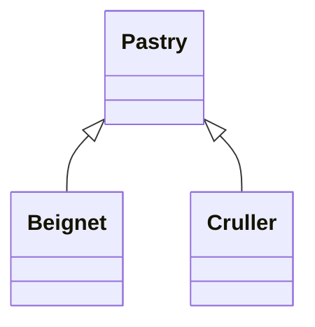

稍微看一下设计模式
# singleton pattern
只有一个实例对象的类

有的时候会看见单例的类被 `final` 修饰，这是为了防止子类破坏父类的单例，因为按理来说，父类是单例，子类应该也是单例。

> 但这种 `final` 的做法确实不够优雅

## 饿汉式

将构造器私有化, 然后创建一个类的实例化对象, 对外暴露一个静态方法用于获取该实例化对象
```java
public class SingleTon {
	// private constructor
	private SingleTon() {}
    
    // initialize with static block
	private static final SingleTon singleTon;
	static {
		singleTon = new SingleTon();
    }
    
    // get instance with static method
	public static SingleTon getInstance() {
		return singleTon;
	}
}
```
饿汉式使用静态常量, 将实例化对象写死为 final 类型, 并通过静态代码块初始化对象, 在编译期间就确定对象

但是这种单例模式的问题在于, 其对象加载不是 lazy-loading, 单例对象在类加载的时候就已经进行了实例化, 不过好处是因为使用了类加载的机制，导致不会出现线程安全的问题，不需要额外加锁，效率比较高

>   从写法上也是最容易实现的一种单例模式

## 懒汉式

实现 lazy-loading, 只有调用 getInstance() 时才进行对象的实例化

### thread-unsafe

既然在 static block 中初始化不能 lazy-loading, 那么在 getInstance() 中初始化就好了吧

```java
public class SingleTon {
	private SingleTon() {}

	private static SingleTon singleTon;
    
	public static SingleTon getInstance() {
		if (singleTon == null) {
			singleTon = new SingleTon();
		}
		return singleTon;
	}
}
```
此时实例对象 singleTon 不使用 final 修饰, 也不再编译期间实例化对象, 转而在运行期初始化, 这看起来很好, 但存在线程竞争问题

考虑多个线程进入 getInstance 方法, 并通过了 if 判断, 从而实例化多个对象

### thread-safe
既然上面的方法线程不安全, 加一个锁不就线程安全了吗

```java
public class SingleTon {
	private SingleTon() {}

	private static SingleTon singleTon;
	public synchronized static SingleTon getInstance() {
		if (singleTon == null) {
			singleTon = new SingleTon();
		}
		return singleTon;
	}
}
```
注意到使用 synchronization 对方法 getInstance 加锁, 确实实现了线程安全, 但这种写法同时引入了效率问题, 由于 getInstance 方法是静态方法, 使用 synchronization 加锁, 锁住的对象是 `SingleTon.class`, 不仅 getInstance 在线程之间会阻塞, 所有调用 static 方法的线程之间还会相互阻塞

本身 getInstance 方法的效率应该很高, 只有在对象为 null 时候需要把对象 new 出来; 其余的时候直接把对象返回就好了; 因此一种想法是使用同步代码块提高效率

```java
public class SingleTon {
	private SingleTon() {}

	private static SingleTon singleTon;
	public static SingleTon getInstance() {
		if (singleTon == null) {
			synchronized (SingleTon.class) {
				singleTon = new SingleTon();
			}
		}
		return singleTon;
	}
}
```
看起来加了, 但又没加上, 还是可能存在实例化多个对象导致单例被破坏的情况

>   考虑两个线程同时进入 if 的情况

## DCL

>   double checked-locking pattern

```java
public class SingleTon {
	private SingleTon() {}

	private static SingleTon singleTon;
	public static SingleTon getInstance() {
		if (singleTon == null) {
			synchronized (SingleTon.class) {
				if (singleTon == null) {
					singleTon = new SingleTon();
				}
			}
		}
		return singleTon;
	}
}
```
尽管第一个 if 是线程不安全的, 但第二个 if 是线程安全的 => double check

然而上面的写法还是存在问题的主要原因在于:

*   内存可见性: new 对象的在运行时不一定会立刻同步到内存中, 在多级缓存的环境中, 运算结果可能只是保存在了快速缓存中;
*   指令重排: jvm 为了优化运行速度, 可能对指令进行重新排序

在 jdk 5 使用 jvm 提供了 `volatile` 关键字, 保证对变量的修改是内存可见的, 同时不允许进行指令重排序, 因此在 DCL 实现单例的场景中需要对变量添加 `volatile` 修饰:

```java
public class SingleTon {
	private SingleTon() {}

	private static volatile SingleTon singleTon;
	public static SingleTon getInstance() {
		if (singleTon == null) {
			synchronized (SingleTon.class) {
				if (singleTon == null) {
					singleTon = new SingleTon();
				}
			}
		}
		return singleTon;
	}
}
```

## 静态内部类

```java
public class SingleTon {
	private SingleTon() {}

	private static class SingleTonHolder{
		private static final SingleTon singleTon = new SingleTon();
	}

	public static SingleTon newInstance() {
		return SingleTonHolder.singleTon;
	}
}
```
>   借助 chatgpt 的说法: This implementation is efficient, thread-safe, and follows the Initialization-on-demand holder idiom, ensuring lazy initialization of the Singleton instance and high performance

当外部类加载的时候不会同时加载静态内部类，只有当第一次调用的方法 newInstance() 的时候才会执行类的加载 (lazy loading)

lazy-loading 这个好理解，现在关键点在于如何保证线程的安全的

JVM 对类进行初始化的场景 ([Chapter 5. Loading, Linking, and Initializing (oracle.com)](https://docs.oracle.com/javase/specs/jvms/se21/html/jvms-5.html#jvms-5.5))
* 字节码指令为 `new, getsatic, setstatic, invokestatic` 时：
  
    >   分别对应于: new 一个实例化对象; 读取一个静态字段; 设置一个静态字段; 调用静态方法
* 使用 `java.lang.reflect` 包下的方法对类进行反射调用
* 考虑一个类具有一个子类, 当初始化这个类的子类时, 其本身也会被初始化
* 考虑一个声明了 `non-abstract`, `non-static` 的接口, 初始化一个实现了这个接口的类, 同时会初始化这个接口 (本质上也是类)
* JVM 启动的时候，会默认初始化用户执行的主类，即含有 main 方法的类
* The first invocation of a `java.lang.invoke.MethodHandle` instance which was the result of method handle resolution ([§5.4.3.5](https://docs.oracle.com/javase/specs/jvms/se21/html/jvms-5.html#jvms-5.4.3.5)) for a method handle of kind 2 (`REF_getStatic`), 4 (`REF_putStatic`), 6 (`REF_invokeStatic`), or 8 (`REF_newInvokeSpecial`).
> 最后一点看不懂，就直接粘过来了

如果我们查看编译后的字节码文件，可以看到，`newInstance()`方法长这样：
```byte code
 0: getstatic     #2 // Field com/buzz/SingleTon$SingleTonHolder.singleTon:Lcom/buzz/SingleTon;
 3: areturn
```
调用 `SingleTonHoler.singleTon` 相当于读取一个静态字段，此时类 `SingleTonHolder` 被初始化, jvm 保证类的初始化一定是线程安全的

>   类初始化时调用 `<clinit>`, jvm 保证这个方法在多线程环境中可以被正常的加锁, 同步

## 枚举

这里主要参考：[深入理解java枚举类型](https://blog.csdn.net/javazejian/article/details/71333103)

```java
public enum SingleTon {

	/**
	 * 单例对象
	 */
	INSTANCE;
	SingleTon() {
        System.out.println("初始化");
    }
}
```

枚举类中定义一个对象，从而实现单例

将上面的进行反编译得到：

```shell
Classfile /home/buzz/java_projects/simple_java/test/SingleTon.class
  Last modified May 14, 2022; size 898 bytes
  MD5 checksum 8bb5cd0ecad79c11318c540bf9e0c2cc
  Compiled from "SingleTon.java"
  # 这里可以看到关键字enum其实包含了一层继承关系，即继承了Enum类
public final class SingleTon extends java.lang.Enum<SingleTon>
  minor version: 0
  major version: 55
  flags: (0x4031) ACC_PUBLIC, ACC_FINAL, ACC_SUPER, ACC_ENUM
  this_class: #4                          // SingleTon
  super_class: #13                        // java/lang/Enum
  interfaces: 0, fields: 2, methods: 4, attributes: 2
Constant pool:
   #1 = Fieldref           #4.#32         // SingleTon.$VALUES:[LSingleTon;
   #2 = Methodref          #33.#34        // "[LSingleTon;".clone:()Ljava/lang/Object;
   #3 = Class              #17            // "[LSingleTon;"
   #4 = Class              #35            // SingleTon
   #5 = Methodref          #13.#36        // java/lang/Enum.valueOf:(Ljava/lang/Class;Ljava/lang/String;)Ljava/lang/Enum;
   #6 = Methodref          #13.#37        // java/lang/Enum."<init>":(Ljava/lang/String;I)V
   #7 = Fieldref           #38.#39        // java/lang/System.out:Ljava/io/PrintStream;
   #8 = String             #40            // 初始化操作
   #9 = Methodref          #41.#42        // java/io/PrintStream.println:(Ljava/lang/String;)V
  #10 = String             #14            // INSTANCE
  #11 = Methodref          #4.#37         // SingleTon."<init>":(Ljava/lang/String;I)V
  #12 = Fieldref           #4.#43         // SingleTon.INSTANCE:LSingleTon;
  #13 = Class              #44            // java/lang/Enum
  #14 = Utf8               INSTANCE
  #15 = Utf8               LSingleTon;
  #16 = Utf8               $VALUES
  #17 = Utf8               [LSingleTon;
  #18 = Utf8               values
  #19 = Utf8               ()[LSingleTon;
  #20 = Utf8               Code
  #21 = Utf8               LineNumberTable
  #22 = Utf8               valueOf
  #23 = Utf8               (Ljava/lang/String;)LSingleTon;
  #24 = Utf8               <init>
  #25 = Utf8               (Ljava/lang/String;I)V
  #26 = Utf8               Signature
  #27 = Utf8               ()V
  #28 = Utf8               <clinit>
  #29 = Utf8               Ljava/lang/Enum<LSingleTon;>;
  #30 = Utf8               SourceFile
  #31 = Utf8               SingleTon.java
  #32 = NameAndType        #16:#17        // $VALUES:[LSingleTon;
  #33 = Class              #17            // "[LSingleTon;"
  #34 = NameAndType        #45:#46        // clone:()Ljava/lang/Object;
  #35 = Utf8               SingleTon
  #36 = NameAndType        #22:#47        // valueOf:(Ljava/lang/Class;Ljava/lang/String;)Ljava/lang/Enum;
  #37 = NameAndType        #24:#25        // "<init>":(Ljava/lang/String;I)V
  #38 = Class              #48            // java/lang/System
  #39 = NameAndType        #49:#50        // out:Ljava/io/PrintStream;
  #40 = Utf8               初始化操作
  #41 = Class              #51            // java/io/PrintStream
  #42 = NameAndType        #52:#53        // println:(Ljava/lang/String;)V
  #43 = NameAndType        #14:#15        // INSTANCE:LSingleTon;
  #44 = Utf8               java/lang/Enum
  #45 = Utf8               clone
  #46 = Utf8               ()Ljava/lang/Object;
  #47 = Utf8               (Ljava/lang/Class;Ljava/lang/String;)Ljava/lang/Enum;
  #48 = Utf8               java/lang/System
  #49 = Utf8               out
  #50 = Utf8               Ljava/io/PrintStream;
  #51 = Utf8               java/io/PrintStream
  #52 = Utf8               println
  #53 = Utf8               (Ljava/lang/String;)V
{
# 这里可以看到定义的枚举类对象其实是本身就是该类的一个成员变量，使用枚举实现单例b
  public static final SingleTon INSTANCE;
    descriptor: LSingleTon;
    flags: (0x4019) ACC_PUBLIC, ACC_STATIC, ACC_FINAL, ACC_ENUM

  public static SingleTon[] values();
    descriptor: ()[LSingleTon;
    flags: (0x0009) ACC_PUBLIC, ACC_STATIC
    Code:
      stack=1, locals=0, args_size=0
         0: getstatic     #1                  // Field $VALUES:[LSingleTon;
         3: invokevirtual #2                  // Method "[LSingleTon;".clone:()Ljava/lang/Object;
         6: checkcast     #3                  // class "[LSingleTon;"
         9: areturn
      LineNumberTable:
        line 5: 0

  public static SingleTon valueOf(java.lang.String);
    descriptor: (Ljava/lang/String;)LSingleTon;
    flags: (0x0009) ACC_PUBLIC, ACC_STATIC
    Code:
      stack=2, locals=1, args_size=1
         0: ldc           #4                  // class SingleTon
         2: aload_0
         3: invokestatic  #5                  // Method java/lang/Enum.valueOf:(Ljava/lang/Class;Ljava/lang/String;)Ljava/lang/Enum;
         6: checkcast     #4                  // class SingleTon
         9: areturn
      LineNumberTable:
        line 5: 0

  static {};
    descriptor: ()V
    flags: (0x0008) ACC_STATIC
    Code:
      stack=4, locals=0, args_size=0
         0: new           #4                  // class SingleTon
         3: dup
         4: ldc           #10                 // String INSTANCE
         6: iconst_0
         7: invokespecial #11                 // Method "<init>":(Ljava/lang/String;I)V
        10: putstatic     #12                 // Field INSTANCE:LSingleTon;
        13: iconst_1
        14: anewarray     #4                  // class SingleTon
        17: dup
        18: iconst_0
        19: getstatic     #12                 // Field INSTANCE:LSingleTon;
        22: aastore
        23: putstatic     #1                  // Field $VALUES:[LSingleTon;
        26: return
      LineNumberTable:
        line 6: 0
        line 5: 13
}
Signature: #29                          // Ljava/lang/Enum<LSingleTon;>;
SourceFile: "SingleTon.java"
```

## 破坏单例模式

综上我们知道了，为了实现单例模式，我们有以下几种写法：
* 使用饿汉式
* 使用带有双重检查的懒汉式 (注意一定要带上 volatile 关键字)
* 使用静态内部类
* 使用枚举

然而，反射和序列化有可能破坏单例

要注意的是使用枚举实现单例可以避免出现反射或序列化导致单例被破坏

### 反射

```java
import java.lang.reflect.Constructor;
import java.lang.reflect.InvocationTargetException;

public class Main {
  public static void main(String[] args) {
    Class<SingleTon> singleTonClass = SingleTon.class;
    SingleTon singleTon = SingleTon.newInstance();
    SingleTon reflectSingleTon = null;
    try {
      Constructor<SingleTon> declaredConstructor = singleTonClass.getDeclaredConstructor();
      declaredConstructor.setAccessible(true);
      reflectSingleTon = declaredConstructor.newInstance();
    } catch (Exception e) {
      e.printStackTrace();
    }
    System.out.println(singleTon == reflectSingleTon);//false
  }
}
```
这是因为我们强行调用了私有的构造方法，强行new了一个对象，所以显然，这破坏了单例

解决办法是在构造器中进行条件判断，如果出现多次调用构造器，就抛出异常
```java
public class SingleTon {
	private static boolean flag = true;

	private SingleTon(){
		//注意这里必须加锁
		synchronized (SingleTon.class) {
			if (flag) {
				flag = false;
			}else {
				throw new RuntimeException("more than one instance");
			}
		}
	}

	private static class SingleTonHolder{
		private static SingleTon singleTon;
		static {
			singleTon = new SingleTon();
		}
	}

	public static SingleTon newInstance() {
		return SingleTonHolder.singleTon;
	}
}
```
但其实上面的这种做法存在一个问题，即对于双重加锁的懒汉式，和静态内部类，他们实现了懒加载。
那如果我先通过反射获取实例化对象，此后再调用`newInstance()`获取对象反而会报错，错误的获取对象不报错，但调用正确方法的却报错

> 饿汉式没有这个问题，是因为饿汉式在类加载的时候就进行了初始化，类加载是原子的，肯定不会出现上述的小bug。
> 但我认为其实是这样也没什么问题，毕竟我们还是实现了，只要出现多个实例化对象（破坏单例）就报错

关于构造器中加锁，我是这么考虑的：
如果不加，我们假设一个情景，多个线程同时通过反射创建实例，这样一个线程执行构造方法的时候，先进行条件判断，条件满足进入if，随后在更改flag标志前让出控制权，此时另一个线程也会进入if条件，这样这两个线程都可以通过反射实例化对象，在不报错的情况下，破坏了单例

### 序列化

```java
package com.buzz;

import java.io.*;

public class Main {
	public static void main(String[] args) {
		try {
			ObjectOutputStream out = new ObjectOutputStream(new FileOutputStream("classpath:singleTon"));
			out.writeObject(SingleTon.newInstance());

			ObjectInputStream in = new ObjectInputStream(new FileInputStream("classpath:singleTon"));
			SingleTon singleTon = (SingleTon) in.readObject();
			System.out.println(singleTon == SingleTon.newInstance());//false
		} catch (Exception e) {
			e.printStackTrace();
		}
	}
}
```
问题就出现在使用ObjectInputStream调用了方法：`readObject()`

这里参考了：[单例模式的破坏](https://www.jianshu.com/p/57613ff96aa5)

又到了痛苦的看源码环节，首先进入`readObject()`方法：
```java
public class ObjectInputStream{
	/*
        这里是一些没用的方法
	 */
    public final Object readObject()
            throws IOException, ClassNotFoundException
    {
      if (enableOverride) {
        return readObjectOverride();
      }
  
      // if nested read, passHandle contains handle of enclosing object
      int outerHandle = passHandle;
      try {
		  //重点是它调用了一个readObject0()的方法
		  Object obj = readObject0(false);
        /*
            这里不关键
         */
        return obj;
      } finally {
        passHandle = outerHandle;
        if (closed && depth == 0) {
          clear();
        }
      }
    }

  private Object readObject0(boolean unshared) throws IOException {
    /*
        这里都不关键
     */
    try {
		//下面就是判返回的类型
      switch (tc) {
		  //null
        case TC_NULL:
          return readNull();
        //引用类型
        case TC_REFERENCE:
          return readHandle(unshared);
		  //class类型
        case TC_CLASS:
          return readClass(unshared);
		  //代理类型
        case TC_CLASSDESC:
        case TC_PROXYCLASSDESC:
          return readClassDesc(unshared);
		  //string
        case TC_STRING:
        case TC_LONGSTRING:
          return checkResolve(readString(unshared));
            //数组
        case TC_ARRAY:
          return checkResolve(readArray(unshared));
            //枚举
        case TC_ENUM:
          return checkResolve(readEnum(unshared));
            //Object，对象类型，我们会进入这个方法，所以关键在于readOrdinaryObject方法
        case TC_OBJECT:
          return checkResolve(readOrdinaryObject(unshared));
            //异常
        case TC_EXCEPTION:
          IOException ex = readFatalException();
          throw new WriteAbortedException("writing aborted", ex);
		  /*
              后面的不认识了
		   */
      }
    } finally {
      depth--;
      bin.setBlockDataMode(oldMode);
    }
  }

  private Object readOrdinaryObject(boolean unshared)
          throws IOException
  {
    /*
        不关键
     */
    
    /*
        判断当前对象是否可以实例化，如果可以调用newInstance方法进行实例化，否则为null
        这里其实是反射，其实是有疑问的，
        如果是通过反射获取到的对象，那么它应该也是通过构造器实例化对象的，但是我们已经在单例的类中设置了flag位
        在main程序中，一次通过反射获取对象，一次通过真是调用getInstance实例化对象，按理说肯定会有问题
        不过如果实际debug的话会发现，它这个newInstance方法，其实并不是直接的反射，而是选择了一个构造器进行对象的创建
        Object newInstance()
        throws InstantiationException, InvocationTargetException,
               UnsupportedOperationException
        {
        requireInitialized();
        if (cons != null) {
            try {
                if (domains == null || domains.length == 0) {
                    return cons.newInstance();
                    ...
        这里面cons是一个构造器，不过它的类型是Object类型
        所以到这里其实才真正知道了，原来它是通过Object类的构造器实例化对象的
        不过最后序列话的对象确实是SingleTon类型
        这里其实还是有疑问的，那就是你既然是通过Object的构造器产生的对象，那么你又是怎么转变为SingleTon类型的呢
        ？？？
     */
    Object obj;
    try {
      obj = desc.isInstantiable() ? desc.newInstance() : null;
    } catch (Exception ex) {
      throw (IOException) new InvalidClassException(
              desc.forClass().getName(),
              "unable to create instance").initCause(ex);
    }

    /*
        不关键
     */
    
    /*
        这里再次是一个关键区域，它首先判断当前这个序列化的对象是否具有readResolve()方法
        如果有的话，就调用这个readResolve方法，返回一个新的对象，代替当前这个序列化对象返回
        所以我们就需要从这个位置下手，阻止序列化破坏单例
     */
    if (obj != null &&
            handles.lookupException(passHandle) == null &&
            desc.hasReadResolveMethod())
    {
      Object rep = desc.invokeReadResolve(obj);
      if (unshared && rep.getClass().isArray()) {
        rep = cloneArray(rep);
      }
      if (rep != obj) {
        // Filter the replacement object
        if (rep != null) {
          if (rep.getClass().isArray()) {
            filterCheck(rep.getClass(), Array.getLength(rep));
          } else {
            filterCheck(rep.getClass(), -1);
          }
        }
        handles.setObject(passHandle, obj = rep);
      }
    }

    return obj;
  }
}
```

通过上面源码的分析，我们知道了，如果希望阻止序列化导致单例被破坏，需要让我们的SingleTon实现一个readResolve()方法
> 这个结论如果直接给出的话，就一脸蒙，但是看了源码后也许会好一点吧

注意，这个方法的返回值类型必须是`Object`类型：
```java
public class SingleTon{
    private Object readResolve() {
      return newInstance();
    }	
}
```
> 一旦方法返回值变为`Object`类型了，IDEA就有高亮了，好奇怪

# visitor pattern

visitor pattern 可以让 OOP 的语言具有类似函数式编程的特性

简单来说, 抽象类用来定义行为, 使用多个子类继承该抽象类, 实现不同的方法; 后续对抽象类更新, 增加其他的行为时, 那么此时需要修改所有继承了该抽象类的子类, 并在各个子类中实现新的方法

## problem

这部分主要用在了当时学习 jlox 的时候, interpreter 需要对各种类型 expression 添加各种行为, 比如:


上图给出了 4 种类型的 expression, 同时每种类型都需要实现上述的三种行为, OOP 语言的特点是, 方法定义在类的内部, 其认为类中定义的各个方法之间是相互依赖, 相互作用的, 作为一个整体存在; 子类可以继承父类的方法, 且允许子类重写 (override) 父类方法, 在上表中行扩展 (新建一个 expression) 是很容易的

>   overload (重载)

在新继承的类中 override 从父类继承到的方法, 不会影响到之前在已有 expression 中各个方法的实现


但如果需要对上表进行列扩展, 则需要在每个类中都添加一个方法实现, 不仅如此如果新方法和之前的存在作用关系, 那么实际需要检查的部分就更多了

而 FP (functional paradigm language) 可以轻松实现列扩展; 方法和类不进行绑定, 不同的类型和不同的函数之间是相互独立的关系, 当多个类型需要调用相同函数时, 每种类型的函数实现都需要放在同一个函数中, 函数本身负责进行类型的区分 => pattern match (具体的实现机制不太好说, 但语法上和 switch 类似)


但在 functional paradigm language 中很难行扩展, 新添加一个类型, 就需要在之前定义的每个函数的 "switch" 中添加一个 pattern

看起来, 不存在什么语言可以同时方便的行扩展, 列扩展, 这种现象被称为 => expression problem

>   这个问题第一次提出的时候也是在写编译器的时候, 不过现在是存在同时方便的添加 type & operation 的语言的比如: Common Lisp’s CLOS, Dylan, and Julia (就没有一个是听说过的), 不过它们也不是完美的, 比如有的是静态类型检查, 有的需要 separate compilation (可能是多阶段编译的意思吧 ...)

不过通过借助 visitor pattern (design pattern 的一种), 可以让 OOP 方便的实现列扩展

## solution

CS 中解决问题最暴力的方法 => add a layer of indirection

假设存在如下的继承关系



如果需要对每个 Pastry 的实例添加行为: cook, decorate, eat, 从 OOP 的角度出发, 就是分别在三个类中添加三个方法, 一共添加九个方法

现在从 visitor pattern 的方式为这三个类完成行为的添加, 首先需要定义接口:

```java
interface PastryVisitor {
    void visitBeignet(Beignet beignet);
    void visitCruller(Cruller cruller);
}
```

>   注意到上述接口中定义了两个方法, 在标准的 visitor pattern 中只有一个方法 visit, 这里是为了兼容不支持重载 (overload) 语言的写法, 在 java 中更好的写法是将接口定义为:
>
>   ```java
>   interface PastryVisitor {
>      void visit(Beignet beignet);
>      void visit(Cruller cruller);
>   }
>   ```

然后将**行为定义为一个类并实现这个接口**

>   正常来说行为对应了方法 (函数), 而这里为了实现接口, 需要将行为抽象为类, 这一点也符合 OOP 中万事万物皆对象的思想

```java
class Cook implements PastryVisitor {

    @Override
    public void visit(Beignet beignet) {
        System.out.println("beignet visit cook");
    }

    @Override
    public void visit(Cruller cruller) {
        System.out.println("cruller visit cook");
    }
}
```

通过将行为抽象为类, 当需要添加新的行为时, 只需要新建一个类, 并实现这个接口即可

最后需要在父类中添加抽象方法 accept, 并让两个子类全都实现该方法

```java
abstract class Pastry {
    public abstract void accept(PastryVisitor visitor);
}

class Beignet extends Pastry {
    @Override
    public void accept(PastryVisitor visitor) {
        visitor.visit(this);
    }
}
class Cruller extends Pastry {
    @Override
    public void accept(PastryVisitor visitor) {
        visitor.visit(this);
    }
}
```

注意到子类实现 accept 的方法逻辑是固定的; 这里 accept 方法的参数 PastryVisitor 表示一个行为, 调用 visitor.visit(this) 就是将当前类型传入对应的行为

>   这里借助多态, 实现方法的分发

此后当需要行扩展时 (添加一个类), 只需要在继承的时候实现 accept, 具体的写法和已经实现的完全一致; 当需要进行列扩展时 (添加一个行为), 只需要实现 visitor 接口, 并在接口中针对不同的类型进行方法分发

>   接口 ParserVisitor 中最好不要写成 `void visit(Pastry pastry)`, 这样的话在方法的实现内部还需要根据类型进行分发, 而 java 本身并不支持 pattern match, 因此还是需要写成: `if (xxx instanceof xxx) else `, 又回到原点了

更为一般的, 可以使用泛型表示方法返回值, 即可以将 visitor 接口定义为:

```java
interface PastryVisitor<R> {
   R visit(Beignet beignet);
   R visit(Cruller cruller);
}
```

# adapter pattern

>   [Adapter](https://refactoring.guru/design-patterns/adapter)

在 netty 中见到了 ChannelInboundHandlerAdapter, 最开始的感觉就是这是一个 ChannelInboundHandler 的一个实现类, 没有其他的想法了...

## problem

这个问题的引入来自于上面网站给出的例子, 简单来说现在的数据表现形式是以 xml 格式呈现的, 而现有的第三方表现库仅支持以 json 格式输入

## solution

CS 中解决问题最暴力的方法 => add a layer of indirection

adapter 起到的作用是, 以 xml 为输入, 内部实现中将 xml 转化为 json 格式, 而进行第三方的调用; 更为具体的, adapter 需要实现现有的接口, 并传入现有的对象类型, 而实现的方法内部即为对象的转化和真正的第三方调用

在 java 中实现的 adapter 一般具有如下格式:


简单来说现有的行为通过 Client Interface 约束, Adapter 需要实现这个接口, 现有的对象类型在上图中使用 data 表示, 从而对于用户程序而言, 在 adapter 的帮助下, 调用第三方库的行为可以简化为 adapter.method(data)

所有神奇的地方发生在 adapter 实现的 method 中, adapter 需要想办法将 data 转化为第三方库可以接受的对象类型 serviceData, 从而使用 serviceData 进行第三方调用

下面给出一个示例:


上图中, 现有的数据类型是 SquarePeg 类型, 而现在希望调用第三方的 getRadius 方法, 现在的问题在于第三方的 getRadius 方法仅仅适用于 RoundPeg 类型

这个时候就可以添加一个 adapter, 这里定义 SquarePegAdapter 以现有的数据类型 SquarePeg 为参数, 并实现了方法 getRadius

# proxy pattern

>   [Proxy](https://refactoring.guru/design-patterns/proxy) [Java 代理模式详解](https://javaguide.cn/java/basis/proxy.html)

在各种框架中代理模式还挺常见的, 比如 AOP

## problem

和上面的 adapter pattern 有点类似, 还是一样的问题, 对于计算开销比较大的函数, 可以通过 cache 的方式将结果缓存下来, 下次相同参数下的调用直接返回结果即可; 但一个封装好的第三方库, 核心代码是不能修改的, 无法直接添加缓存逻辑

>   即便核心代码是提供好的, 最好也不需要直接修改, 在原始代码上进行修改可能导致部分功能的不稳定性

## solution

问题类似, 解决方式也类似: add a layer of indirection

在 OOP 语言中, 各种行为可以通过接口抽象, 这里首先针对基于接口的代理模式; 假设原始第三方库的复杂操作已经被抽象在一个接口中了, 默认第三方库提供了该接口的实现类

在代理模式中, 创建一个代理类, 实现相同的接口, 并维护一个原始对象的引用, 如下图所示:


各种行为通过 ServiceInterface 定义, 第三方库提供了默认的实现类 Service; 代理类 Proxy 也实现了这个类, 同时维护原始对象的引用 realService

这样应用程序真正使用的是一个 Proxy 对象, 其内部包裹了一个原始的 Service 对象; 对于应用程序而言, 其余的部分原来已有的代码完全不需要修改 -> 接口未变; 但在调用 operation 的时候, 首先会调用代理对象的 operation 方法, 然后才会调用原始对象的 operation 方法

### one more thing

本质上来说, 代理模式实现的是在进行正式的函数调用之前添加额外的逻辑, 这一点其实类似在 csapp 中学到的 interposition 机制, 这个过程可以发生在: compile time, link time, load time, execute time

因为 java 是基于字节码的语言, 其运行时 jvm 可以动态生成字节码, 动态加载对象进入 jvm 中, 这种方式实现的代理模式被称为动态代理; 一般而言可以分为 jdk 动态代理和 cglib 动态代理

>   在 cglib 的 github 主页上, 已经不建议 jdk 17 之后的版本使用 cglib 了, 如果还有动态字节码生成的需求, 官方建议可以参考 [Byte Buddy](https://bytebuddy.net/#/)

动态代理不需要指定代理类实现相同的接口, 更自由 ？

#### jdk

jdk 动态代理的核心在于 InvocationHandler 接口和 Proxy 类; 其中自定义的方法实现放在了接口 InvocationHandler 的实现类中, 代理对象通过调用静态方法 Proxy.newProxyInstance 获取

首先定义一个接口 Service, 其中定义了两个行为 f 和 g, 同时提供这个接口的实现类

```java
interface Service {
    String f();

    int g();
}

class ServiceImpl implements Service {
    public String f() {
        System.out.println("Service.f()");
        return "Service.f()";
    }

    public int g() {
        System.out.println("Service.g()");
        return 1;
    }
}
```

假设这是基本的行为, 一般的业务行为也都可以采用类似的方式抽象; 代理模式需要实现的就是对象在调用 Service 的 f 方法和 g 方法的时候会被打断, 在调用前后执行额外的逻辑

自定义的行为被保存在 InvocationHandler 的实现类中

```java
class ProxyHandler implements InvocationHandler {
    // 原始对象
    private final Service original;

    public ProxyHandler(Service original) {
        this.original = original;
    }

    @Override
    public Object invoke(Object proxy, Method method, Object[] args) throws Throwable {
        System.out.println("before invoke:" + method.getName());
        Object rst = method.invoke(original, args);
        System.out.println("after invoke:" + method.getName());
        return rst;
    }
}
```

在方法 invoke 中, 执行正式的方法调用之前, 分别进行了方法名打印; 注意到参数 proxy 在本例中尚未使用, 其为代理对象, 该对象的任何方法调用都会首先进入调用方法 invoke

然后调用 Proxy 的静态方法即可获取一个代理对象

```java
Service s = new ServiceImpl();
// 静态方法需要提供类加载器, 当前类实现的接口, 以及对应的 InvocationHandler
Service proxyInstance = (Service) Proxy.newProxyInstance(s.getClass().getClassLoader(), s.getClass().getInterfaces(), new ProxyHandler(s));
System.out.println(proxyInstance.f());
System.out.println(proxyInstance.g());
```

proxyInstance 上调用任何方法都会首先进入 invoke 方法 (包括 hash, toString 这样的方法)


