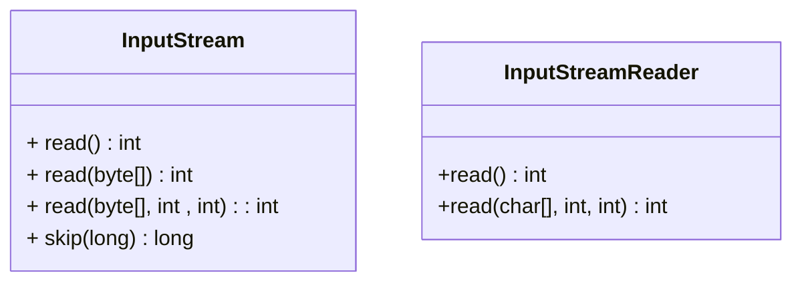
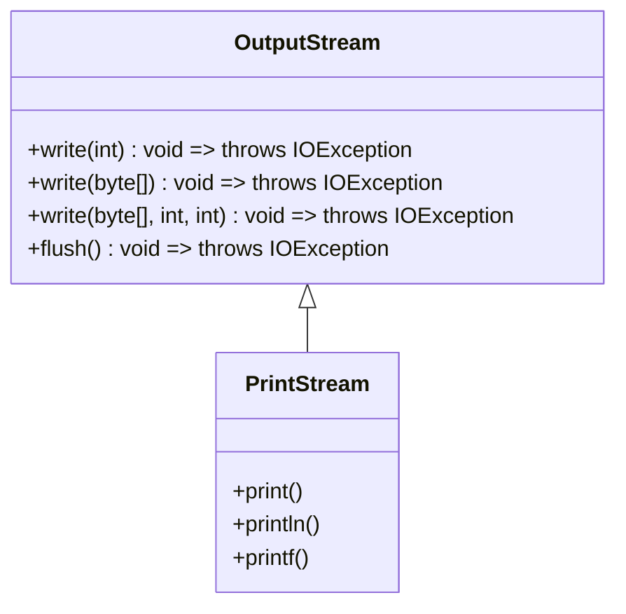

我真的很希望直接在 linux 上写 java, 但 IDEA 的远程并没有想象中的那么好用; vscode 的 java 插件也...

>   主要还是远程服务器的性能太差了, 这些 IDE (或者 vscode) 写 java 的开销太大了 ...

# IO related

java 的 IO 对 file descriptor 进行了封装, 使用了更高级的 stream API 进行读写

不过要注意的时, 和使用 file descriptor 时相同, 在完成流的 IO 操作后需要调用 close() 关闭流, 避免 JVM 对 file descriptor 的过度占用

## input

在 java 中使用类 `InputStream` 和 `InputStreamReader` 作为对输入的封装, 分别表示了读取字节(二进制文件的处理)和读取字符(文本文件的处理):



System.in 即为一个 InputStream 的实例对象, 一般而言不会直接使用 System.in 读取用户输入

## output

java 使用类 `OutputStream` 对输出进行封装:



尽管 java 并没有为 write 设计返回值, 但所有的方法都可能抛出异常, 当写操作被打断将触发写异常

System.out 为一个 PrintStream 的实例对象, PrintStream 是 OutputStream 的一个子类, 对输出进行了封装, 提供了更方便的格式化输出

最开始写 java 的时候直接 `System.out.println` 一写到底, 从来没有考虑其他的输出, 其实 java 自带的 IO library 是很丰富的:

# System related

## IO

*   System.in: InputStream instance => 可以认为是 STDIN_FILENO 的 stream 封装
*   System.out: PrintStream instance => 可以认为是 STDOUT_FILENO 的 stream 封装

*   System.err: PrintStream instance => 可以认为是 STDERR_FILENO 的 stream 封装

## array copy

```java
@IntrinsicCandidate
public static native void arraycopy(Object src,  int  srcPos,
                                    Object dest, int destPos,
                                    int length);
```

注意到 arraycopy 包含关键字 native, 表示其实现是基于 c/c++ (就这个 arraycopy 就可以认为是 memcpy 的一个高级封装)

注解 `@IntrinsicCandidate` 表示这个方法可以直接被编译为 machine code, 这个应该是 GraalVM 的特性

## exit

*   System.exit(status): 类似 exit(), exit the program with status

# Junit

是的 Junit 已经发展到 Junit 5 了, [JUnit 5 User Guide](https://junit.org/junit5/docs/current/user-guide/#overview)

因为之前一直使用 maven 构建项目, 这里可以参考 maven 的 pom 文件写法: [JUnit 5 Maven](https://junit.org/junit5/docs/current/user-guide/#running-tests-build-maven)

## parameter

对于包含了参数的方法, 在 junit test 中通过 @ParameterizedTest 标识, junit 提供了两种方式向测试方法传递参数:

*   @MethodSource: 顾名思义使用一个方法的返回值作为 parameter source, 比如:

    ```java
    @ParameterizedTest
    @MethodSource("stringProvider")
    void testWithParameters(String input) {
        // Your test logic using the 'input' parameter
    }
    
    static Stream<String> stringProvider() {
        return Stream.of("apple", "banana", "orange");
    }
    ```

    函数 `testWithParameters` 为 Test 方法, 在 junit 中可以直接运行, 通过 `@MethodSource` 绑定了函数 `stringProvider` 返回一个 Stream 对象, Stream 中 element 的个数对应了调用 test 函数的次数

*   @ValueSource: 如果参数比较简单的话, 直接将参数写在注解里:

    ```java
    @ParameterizedTest
    @ValueSource(strings = {"apple", "banana", "orange"})
    void testWithParameters(String input) {
        // Your test logic using the 'input' parameter
    }
    ```

    >   默认 `@ValueSource` 支持基本数据类型, 和 Class 对象

对于包含了多个参数的 test 方法:

*   @MethodSource:

    ```java
    @ParameterizedTest
    @MethodSource("provideArguments")
    void testWithMultipleParameters(int param1, String param2, boolean param3) {
        // Your test logic using param1, param2, and param3
    }
    
    static Stream<Arguments> provideArguments() {
        return Stream.of(
            Arguments.of(1, "apple", true),
            Arguments.of(2, "banana", false),
            Arguments.of(3, "orange", true)
        );
    }
    ```

    此时 Stream 的泛型为一个 Arguments

*   @CsvSource: comma-separated value, 只要 value 之间可以通过 `,` 分割即可

    ```java
    @ParameterizedTest
    @CsvSource({
        "1, 'apple', true",
        "2, 'banana', false",
        "3, 'orange', true"
    })
    void testWithMultipleParameters(int param1, String param2, boolean param3) {
        // Your test logic using param1, param2, and param3
    }
    ```


# Maven

## scope

到以前经常在 `pom.xml` 中见到：`<scope></scope>`，这个标签一般会作为 `<dependency></dependency>` 的子标签存在, 用来描述当前 dependency (依赖) 的作用域:

*   `<scope>compile</scope>`: 默认作用域, 存在于项目的整个生命周期中 => 编译, 测试, 运行, 并且在最终生成项目的 jar 包中也会包含这个依赖
*   `<scope>provided</scope>`: 作用域包含了: 编译, 测试中, 而不包含在最终的 jar 包中; 比如 servlet 的依赖的作用域一般会写成 `provided`, 因为最终运行在 tomcat 中时是存在依赖的
*   `<scope>runtime</scope>`: 作用域仅包含了 runtime, 在运行程序的时候可用, chatgpt 给出的解释是, java 在进行字节码编译的时候不需要考虑当前依赖, 因此这个依赖不会包含在最终的 jar 包中
*   `<scope>test</scope>`: 作用域包含了 compile 和 test, 也不会包含在最终的 tar 包中

## dependency

两个标签:

*   `<dependency>`: 表示依赖, maven 会根据被 `<dependency>` 包裹的的项目名从 repo 中获取对应依赖, 比如:

    ```xml
    <dependencies>
        <dependency>
            <groupId>org.springframework</groupId>
            <artifactId>spring-core</artifactId>
            <version>5.3.10</version>
        </dependency>
    </dependencies>
    ```

    最外层的使用 `<dependencies>` 包裹, 其中包含的每个 `<dependency>` 表示一个依赖

*   `<dependencyManagement>`: 这个一般是用来父 pom 文件中的, 它不会直接引用依赖, 而是用来管理把版本, 比如如果在父项目的 pom 中包含了:

    ```xml
    <dependencyManagement>
        <dependencies>
            <dependency>
                <groupId>org.springframework</groupId>
                <artifactId>spring-core</artifactId>
                <version>5.3.10</version>
            </dependency>
        </dependencies>
    </dependencyManagement>
    
    ```

    那么在子项目中如果需要引入 spring 的依赖, 那么只需要:

    ```xml
    <dependencies>
        <dependency>
            <groupId>org.springframework</groupId>
            <artifactId>spring-core</artifactId>
        </dependency>
    </dependencies>
    ```

    在子 pom 引入依赖的时候去掉了版本, 此时的版本和父 pom 相同, 即为 5.3.10

## pom.xml

到官网上看：[Maven – Introduction to the POM (apache.org)](https://maven.apache.org/guides/introduction/introduction-to-the-pom.html#introduction-to-the-pom)

所有的 pom.xml 文件默认都继承于 super-pom，这个文件可以在 [Apache 官网](https://maven.apache.org/ref/3.6.3/maven-model-builder/super-pom.html) 上找到

### minimal pom

新建的 pom.xml 至少由 5 组节点组成：

*   project: 根节点
*   modelVersion: 官方说这个值应该是 4.0.0
*   groupId: 项目的 groupId，在新建项目的时候一般配成了 com.buzz
*   artifactId: 当前项目的 Id，这个就是新建项目名了
*   version: 当前项目的版本，IDEA 默认创建出来是 1.0-SNAPSHOT

```xml
<!--pom.xml-->
<?xml version="1.0" encoding="UTF-8"?>
<project xmlns="http://maven.apache.org/POM/4.0.0"
         xmlns:xsi="http://www.w3.org/2001/XMLSchema-instance"
         xsi:schemaLocation="http://maven.apache.org/POM/4.0.0 http://maven.apache.org/xsd/maven-4.0.0.xsd">
    <modelVersion>4.0.0</modelVersion>

    <groupId>icu.buzzx</groupId>
    <artifactId>blog-spring</artifactId>
    <version>1.0-SNAPSHOT</version>
</project>
```

这种官网称为 [minimal pom](https://maven.apache.org/guides/introduction/introduction-to-the-pom.html#minimal-pom)

按照上面的名称，我们这个项目的全名为：icu.buzzx:blog-spring:1.0-SNAPSHOT

### 继承

子 pom 文件的配置可以从 父 pom 文件中的继承得到

为了确认继承关系，只需要在子项目中额外配置配置 \<parent>\</parent> 即配置当前子项目的父项目信息，其中需要指定父组件中的信息，比如以上面的项目为父项目做子项目，那么标签应该为：

```xml
<!--child-module pom.xml-->
<?xml version="1.0" encoding="UTF-8"?>
<project xmlns="http://maven.apache.org/POM/4.0.0" xmlns:xsi="http://www.w3.org/2001/XMLSchema-instance"
         xsi:schemaLocation="http://maven.apache.org/POM/4.0.0 https://maven.apache.org/xsd/maven-4.0.0.xsd">
    <modelVersion>4.0.0</modelVersion>
    <parent>
        <groupId>icu.buzzx</groupId>
        <artifactId>blog-spring</artifactId>
        <version>1.0-SNAPSHOT</version>
    </parent>
    <groupId>icu.buzzx</groupId>
    <artifactId>first</artifactId>
    <version>0.0.1-SNAPSHOT</version>
</project>
```

>   这样子项目就可以继承父项目的属性了，如果不写明子项目的 groupId 和 version 那么默认也会从父项目继承

特别的，如果子项目并不在父项目的当前目录下(不知道为什么会出现这种特殊的情况)，比如目录为：

```shell
.
 |-- child
 |   -- pom.xml
 |-- parent
     -- pom.xml
```

此时子项目的 pom.xml 中就需要额外注明父项目的路径了: 使用 \<relative>\</relative> 标签

>   在该例中应该为: \<relative>../parent/pom.xml\</relative>

### 聚合

聚合关系和继承有点类似，使用聚合构建项目时，需要额外创建一个的聚合模块，通过这个模块构建整个项目的所有模块。聚合模块仅仅是帮助聚合其他模块的工具，其本身并无任何实质内容，因此聚合模块中只有一个 pom 文件

所以对于聚合 pom 文件其 \<packaging>\</packaging> 属性一定是 pom

>   默认值为 jar, 表示会把这个项目打成 jar 包

此外在聚合 pom 文件中需要指明需要聚合的子项目(module)，此时对聚合项目进行 maven build 的时候就相当于对所有子项目进行 maven build

### 父子项目

继承和聚合其实没必要分那么清晰，实际中父子项目不仅具有继承关系，也具有聚合关系

继承关系使得子项目中不会出现重复的配置，而聚合关系使得通过构建父项目可以构建一整个项目

# Throwable

java 使用 Throwable 表示各种错误和异常, throwable 有两个重要的子类:

*   Error: 这个就不是异常, 这个是错误, 比如 StackOverFlowError, OutOfMemeryError, 只要发生了, 程序就挂了

* Exception: 这个才是异常, 各种异常又可以分为两类:

    *   编译期异常 (checked exception): 就是那些只要不处理就不能编译通过的异常, 这些异常必须处理, 要么 try-catch 要么 throws 抛给上一个栈帧

    *   RuntimeException (运行时异常, 包括所有继承了该类的异常): 这些异常编译器不会检查, 比如 NullPointerException (对象为 null), ArrayIndexOutOfBoundsException (数组越界)

## try-catch

*   catch 的异常可以级联, 但异常最多只会被一个 catch 捕获, 所以从写法上一般将子类异常写在父类异常前面 (使用父类异常兜底)

*   finally 块内的内容一定会被执行 (即便 catch 中包含了 return 语句)

    >   执行到 catch 中的 return 后直接跳转到 finally 中执行

*   永远不要在 finally 中包含 return 语句, 因为 finally 语句最后执行, 其会覆盖 try/catch 中的返回值

### try-with-resource

jdk 7 之后, 支持了 try-with-resource statement, 可以用于自动释放 resources => stream, reader, socket, 比如:

```java
try (BufferedReader reader = new BufferedReader(new InputStreamReader(System.in))) {
    rst = reader.read();
} catch (IOException e) {
    throw new RuntimeException(e);
}
```

将 reader 的创建放在了 try 的声明中, 可以保证离开 try-catch 之前 reader 会被正常 close 掉

try-with-resource statement 支持多个 resource, 多个 resource 之间通过 `;` 分隔开

```java
try (ResourceType resource1 = new ResourceType(); ResourceType resource2 = new ResourceType()) {
    // Code that uses resource1 and resource2
} catch (ExceptionType e) {
    // Exception handling code
}
```

## throws & throw

*   throws: 这是异常处理的一种方式, 写在方法声明中表示该方法可能抛出异常
*   throw: 这是一个 expression, 表示了程序主动抛出异常

# switch expression

之前一直避免使用 switch 的一个原因是 switch 下的每个 case 都需要显式的通过 `break` 避免执行多个 case, 现在有了 switch expression, 可以使用类似 lambda expression 的写法写 switch 语句

从名字也能看出来, 将 switch statement 变为了 switch expression, 意味着 switch 是包含了返回值的

```java
public class SwitchExpressionExample {
    public static void main(String[] args) {
        String fruit = "apple";

        // Switch expression
        int result = switch (fruit) {
            case "apple" -> 1;
            case "banana" -> 2;
            case "orange" -> 3;
            default -> 0;
        };

        System.out.println("Result: " + result); // Output: Result: 1
    }
}

```

>   既然写法和 lambda expression 类似, 自然也就支持一个 case 下可以执行多个语句, 使用 `{}` 即可

有的时候取值并没有那么直接, 在一个 case 语句中可能需要多个 expression 计算得到结果, 此时在 case 中是无法直接通过 `return` 将结果返回的, 这里就需要用到关键字 `yield` 了

```java
int result = switch (day) {
    case "Monday":
        yield 1;
    case "Tuesday":
        yield 2;
    // ...
    default:
        throw new IllegalArgumentException("Invalid day: " + day);
};
```

# jdk 8 stuff

## method reference

jdk 8 引入了 package: java.util.function, 定义了一系列接口, 可以用来表示各种 method reference, 不过要注意的是, 方法的定义可能是很复杂的, 比如参数列表和方法返回值并不一定可以和这里定义的接口吻合, 此时就需要定义新的接口

### parameter free

不知道从什么时候开始, java 使用 `::` 引用 method, 从某些程度上, 实现类似 c 中引用函数的特性, 比如可以将某个方法作为其他方法的参数传入

```java
@Test
public void methodRef() {
    testFun(this::retIntFun);
}

private void testFun(Supplier<?> supplier) {
    supplier.get();
}

private int retIntFun() {
    System.out.println("call int ret function");
    return 0;
}
```

在 `methodRef` 中调用方法 testFun, 并把 `retIntFun` 作为参数传入, 从而实现把方法以参数的形式传入方法

这里要注意的是 `testFun` 使用了参数 `Supplier<?>` 为类型表示输入参数, `Supplier` 是 java 8 中引用的 `FunctionalInterface`

>   所谓 Functional Interface, 说的是只包含了一个抽象方法的接口

`Supplier` 中仅定义了一个无参方法: `get`, `Supplier<T>` 的定义表示, 实现了这个接口的类型, 可以返回一个类型 T 的结果

而这里使用 `Supplier<?>` 用来表示方法的 argument 是为了承接具有各种返回值类型的方法, 不过要注意的是, 当使用 method reference 作为参数传入 testFun 后, 只有调用了 supplier 的 `get` 方法时才会进行实际方法的调用

要注意的是 `Supplier` 并不能承接返回值为 void 的方法, 因为 `Supplier` 表示 supply a result, 而 void 方法不具有返回值, 因此 void 方法不能被 Supplier 承接

不过这不是说 void 类型的方法不能作为 method reference, void 类型的方法可以被接口 `Runnable` 承接

```java
@Test
public void methodRef() {
    testFun(this::voidFun);
}

private void testFun(Runnable runnable) {
    runnable.run();
}

private void voidFun() {
    System.out.println("call void function");
}
```

### with parameter

上面引用的方法并没有参数列表, 更通用的形式中, 方法的调用需要提供参数, 比如 Consumer, Function

```java
// Consumer.java

@FunctionalInterface
public interface Consumer<T> {

    /**
     * Performs this operation on the given argument.
     *
     * @param t the input argument
     */
    void accept(T t);
}

// Function.java
@FunctionalInterface
public interface Function<T, R> {

    /**
     * Applies this function to the given argument.
     *
     * @param t the function argument
     * @return the function result
     */
    R apply(T t);
}
```

分别对应了带有一个参数的, 不包含/包含方法返回值的 method reference

```java
// Test.java
@Test
public void methodRef() {
    Consumer<Integer> consumer = this::voidFunWithParameter;
    Function<Integer, Integer> function = this::intFunWithParameter;
}

private void voidFunWithParameter(int arg) {
    System.out.println(arg);
}

private int intFunWithParameter(int arg) {
    System.out.println(arg);
    return arg;
}
```

jdk 8 显然没有定义足够多的的接口用来表示各种类型的方法, 如果有更多的参数方法的话, 就需要自定义函数式接口了

## stream API

# Variable parameter

通过 `...` 表示可变参数

```java
// these codes are generated by chatgpt

public class Main {
    public static void main(String[] args) {
        printNumbers(1, 2, 3, 4, 5);
        printStrings("apple", "banana", "cherry");
    }

    // Example with variable parameters of type int
    public static void printNumbers(int... numbers) {
        for (int number : numbers) {
            System.out.print(number + " ");
        }
        System.out.println();
    }

    // Example with variable parameters of type String
    public static void printStrings(String... strings) {
        for (String str : strings) {
            System.out.print(str + " ");
        }
        System.out.println();
    }
}
```

多个参数之间通过 `,` 分割, 而至于可变参数, 其索引方式和数组类似, 有大小, 有下标, 可以通过 enhanced-for 遍历; 但可变参数需要位于参数列表的最后一位 (可能是为了方便编译器编译吧...)

```java
 public static void exampleMethod(int fixedParam, String... variableParams) {
    // valid
}
public static void invalidMethod(String... variableParams, int fixedParam) {
    // invalid
}
```

# instanceof

一个关键字, 一般用在做类型强转之前检查一些类型, 避免 `ClassCastException`, 比如:

```java
if (animal instanceof Cat) {
    Cat cat = (Cat) animal;
    cat.meow();
   // other cat operations
} else if (animal instanceof Dog) {
    Dog dog = (Dog) animal;
    dog.woof();
    // other dog operations
}

// More conditional statements for different animals
```

在 jdk 14 引入了 enhanced instanceof (JEP 305) => test and assign

```java
if (animal instanceof Cat cat) {
    cat.meow();
} else if(animal instanceof Dog dog) {
    dog.woof();
}
```

要注意的是, 变量 cat (dog) 只有在 pattern match expression 成立时才有效, 即 cat 只能用在 if block 内部

# hashCode & equals

两个方法都可以用来比较对象是否相等, hashCode 通过比较对象的 hash 值比较对象是否相等, 而 equals 需要比较对象的各个字段

从运行效率上, hashCode 运行更快, 但可能存在不同对象 hashCode 相同的情况; 因此一个兼具效率和功能的比较方式是:

先比较对象的 hashCode, 如果不同, 则两个对象一定不同; 如果相同再调用 equals 进行下一步比较

>   然而有些 equals 方法本身就调用了自身的 hashCode 方法

# record

jdk 16 引入了关键字 record, record 本质上也是一个 class, 只不过其中的数据是 immutable data, 针对于那些只用来存储数据的类, 将其定义为 record 可以更简洁

```java
public record Person(String name, int age) {
    // Record automatically generates:
    // - Constructor with parameters
    // - Getters for name and age
    // - equals() and hashCode() methods
    // - toString() method
}
```

按照 gpt 的说法: Records enhance readability and maintainability, especially in scenarios where data transfer objects (DTOs) or data containers are used to represent plain data without any behavior.

>   好了这下后面再写 POJO 的时候就写成 record

# shifting

其实需要区分的也只有算数右移和逻辑右移

*   `>>`: Arithmetic Right Shift => 算数右移, 负数右移高位补 0
*   `>>>`: Unsigned Right Shift => 逻辑右移, 不管正负高位均补 0

在 java 中, 只有整数可以进行移位, 其中 byte, char, short 在进行移位时均会被先转化为 int 再执行移位

# 基础数据类型

byte, char, short, int, float, long, double, boolean => 在 java 中 char 占两个字节

基础数据类型并不一定保存在栈空间中, 如果基础数据类型是局部变量, 则其保存在栈中, 而如果其作为成员变量, 则其保存在堆中

jvm 默认对基础类型的包装类进行了缓存 => Byte, Short, Integer, Long 默认缓存 [-128, 127], Character 缓存 [0, 127], Boolean 直接缓存了 True 和 False; 浮点数不缓存

>   范围可以通过修改 jvm 启动参数修改 

基础数据类型和包装类同时使用时, 可能涉及到自动装箱/拆箱

```java
Integer a = 10; // 装箱
int b = a; // 拆箱
```

在编译时, 装箱会被编译为 Integer.valueOf(); 而拆箱会被编译为 Integer.intValue() => 字节码分别变为 invokestatic 和 invokevirtual


# static

static 类型的变量, 方法对属于类的, 在类加载阶段存在 \<clinit> => 不可以在 static 中调用非静态成员 (内存中可能不存在非静态成员)

# abstract

抽象类有点类似接口, 区别在于接口中成员变量必须为常量 (public static void), 而抽象类中成员变量可以被赋值

# 深/浅拷贝

深拷贝的对象完全独立 => 对象本身独立, 对象引用的其他对象也独立

浅拷贝的对象也是独立的, 但是拷贝的对象引用的对象时一致的, 只有拷贝的对象本身是独立的

在 java 中对象传递都是引用拷贝的 => 对象也不独立, 可以认为传递的只是一个引用而已, 不同的变量名保存的引用指向的都是同一个对象

# equals() & hashCode()

至少在集合类中, hashCode 也被用来比较对象是否一致, 在进行对象比较的时候, 通过先比较 hashCode() 快速判断对象不相同的情况, 一定程度上加速了比较对象的效率

与此同时, 也意味着, 相同的对象必然具有相同的 hashCode, 如果需要重写 equals() 方法, 则必须也要同步修改 hashCode(), 保证对象 equals() 为 true 时, hashCode() 必然相同

# 字符串

其实就是 String 那一系列东西:

*   String 在 java 中时 immutable 的, String 类型的拼接其实是创建了新的 String 对象; 而 StringBuffer 与 StringBuilder 是可变字符串, 通过 append() 方法进行字符串拼接时不会创建新的 StringBuffer(StringBuilder) 对象

*   StringBuffer 与 StringBuilder 最大的区别在于, StringBuffer 是多线程安全的, 操作之前需要先获取锁, 在单线程环境下, StringBuilder 的效率是最高的

*   String 类型十分特殊, 使用关键字 final 修饰, 不可以被继承; 此外用来保存字符的 byte(char) 数组被 private final 修饰, 无法被访问修改; 尽管不建议这么做, 但 StringBuilder 确实可以通过修改 byte 数组实现字符的修改

*   jdk 9 之后, String 使用 byte 数组保存字符, 支持单字符编码和多字符编码两种编码方式, 在大多数情况下 (ASCII 字符下), 可以压缩字符串空间 => char 在 java 中占用两个字节

*   jdk 9 之后, 字面量的字符串拼接 "+", 会被优化为方法 makeContractWithConstants() => 编译优化保证了字面量的拼接不再需要使用 StringBuilder 拼接了

*   字符串可以通过 intern 保存在字符串常量池中 => 注意字面量形式声明的字符串对象与通过 new 方式声明的字符串变量的区别

*   对于字符串字面量尽可能使用 final 修饰:

    ```java
    String s1 = "abc";
    String s2 = "def";
    String s3 = s1 + s2; // 此时的字符串拼接调用 makeConstractWithConstants() 返回一个堆上分配对象
    
    final String s1 = "abc";
    final String s2 = "def";
    String s3 = s1 + s2; // 此时的字符串拼接被编译器通过 constant folding 优化, s3 其实指向了字符串常量池 
    ```

>   不管八股怎么考, 都不建议使用 == 进行字符串相等的判别, 一律调用 equals 处理

# generic

一般而言都称泛型用在三个地方: 泛型接口, 泛型类, 泛型方法 => 其中泛型方法主要针对静态方法, 如果是非静态的, 完全可以使用泛型类表示

```java
public static <T> void func(T t) {}
```

静态泛型方法的意义是, 泛型类只有在实例化对象时才传入泛型对应的实际类型, 而静态方法显然在完成类加载后就可以调用了, 不需要等待对象实例化, 自然没有办法将类型的泛型传递到静态方法的泛型类型上

jdk 提供的泛型机制在编译期间会进行泛型擦除, 因此泛型其实可以认为是编译器提供的机制, 和 jvm 无关, 好处是 jvm 在运行时不需要识别额外的对象, 减少 jvm 开销

这种类型擦除会导致方法重载报错

```java
void print(List<Integer> list);
void print(List<String> list);
```

jvm 在运行时只认识类型 List, 既不是 List\<Integer>, 也不是 List\<String>

## 桥方法

主要用于子类继承父类时, 使用指定的类类型重写了父类的方法

```java
class Parent<T> {
    void func(T t) {
    }
}

class Son extends Parent<Integer> {
    @Override
    void func(Integer x) {
        x ++; 
    }
}
```

注意到在编译期间进行类型擦除, 导致父类方法 func 被编译为

```java
class Parent {
    void func(Object t) {
    }
}
```

由于子类继承了父类, 并重写了方法 func, 因此编译器在编译时会自动生成桥方法, 将子类编译为

```java
class Son extends Parent {
    
    @Override
    void func(Object x) {
        func((Integer)x);
    }
    
    void func(Integer x) {
        x ++; 
    }
}
```

## 通配符

尽管类型存在继承关系, 但是泛型后的集合并不存在继承关系, 比如 Integer extends Object, 但是 List\<Integer> 并不是 List\<Object> 的子类

为了让泛型之间存在继承关系, java 规范中添加了通配符

无界通配符 `?`, 上界通配符 `? extends xxx` => 泛型类型是上界 (父类) 受限的, 下界通配符 `? super xxx` => 泛型了类型是下界 (子类) 受限的

>   List\<?> 与 List 存在本质区别, List\<?> 表示当前 list 存储了某种特定类型, 但由于没有上下界, 因此并不能确定当前类型具体是什么类型, 因此不能向 list 中添加元素

`? extends xxx` 与 `? super xxx` 存在区别: PECS (producer use extend, consumer use super), 使用 `? extends xxx` 的可以用于获取泛型元素, 而使用 `? super xxx` 的可用用于存储泛型元素

# annotation

jdk 5 引入的新特性, java 代码变臭的主要原因, 注解在解析后生效, 一般而言, 注解要么在编译期间被注解处理器扫描处理, 要么保留在运行期, 通过反射的方式获取注解的值

>   必然在 @QueryRedis 中通过注解的方式保存保存在 Redis 中的 key

# serialize/deserialize

主要的作用是用于对象的传输/存储

通过将关键字 transient 作用在对象成员变量中, 可以使得对应字段不会被序列化, 而在反序列化时, 对应字段会被赋为 0 值

>   transient 只能作用与成员变量
>
>   static 类型的字段属于类, 在对象的序列化时, static 的字段不会被序列化

为了使用 jdk 自带的序列化, 需要让对象实现接口 Serializable, 该接口中并没有定义任何方法, 仅仅用来告知编译器当前类型是可以进行序列化的

此外如果使用 jdk 序列化, 最好在实例对象中添加常量 serialVersionUID, 根据编译规范, 类型必须为 `static final long`, 用来标识当前对象的版本号, 这样在进行反序列化时, 首先会比较当前二进制对象和 java 对象的版本号是否相同, 如果不同会抛出异常 InvalidClassException

>   serialVersionUID 使用 static 修饰, 但依旧会被序列化, 这是 java 本身的语言规范, 也只有名字为 serialVersionUID 的静态 long 类型的常量才会被序列化

# reflection

获取 Class 对象的方式:

*   通过类型本身:

    ```java
    Class<Integer> c = Integer.class
    ```

*   通过对象获取: 

    ```java
    Integer i = 10;
    Class<? extends Integer> c = i.getClass();
    ```

*   通过类型全路径名获取:

    ```java
    Class<?> c = Class.forName("java.lang.Integer");
    ```

*   通过类加载器获取:

    ```java
    Class<?> c = ClassLoader.getSystemClassLoader().loadClass("java.lang.Integer");
    ```

    >   当通过类加载器获取某个类时, 并不会完成类加载, 即不会调用 \<clinit>

# 语法糖

很多 java 语法其实都是语法糖的封装, 这些语法糖在编译阶段会经历 de-sugar (脱糖), jvm 本身不识别语法糖

*   switch for string: switch 的 case 语句中一般写的都是基础数据类型, 在 jdk 7 之后, case 的类型可以为 String 类型, 这个其实就是语法糖, 在编译时, String 类型的变量会被等效为 hashCode + equals() 的形式, 即 case 的是 long 类型的 hashCode, 而在 case 内部进一步通过 equals() 判断字符串是否真的匹配
*   generic: 其实就是泛型的类型擦除 (也不算是语法糖吧)
*   装箱/拆箱: 这个前面说过, 本质上调用了 valueOf 与 intValue (对于 int 类型而言)
*   可变参数方法: 其实就是数组, 首先该方法声明会将参数声明脱糖为数组, 而所有调用的地方也都会将各个参数以数组的方式传入
*   枚举: 编译器会将其翻译为被 final 修饰的继承了 Enum 类型的类
*   for-each: 最经典的语法糖


