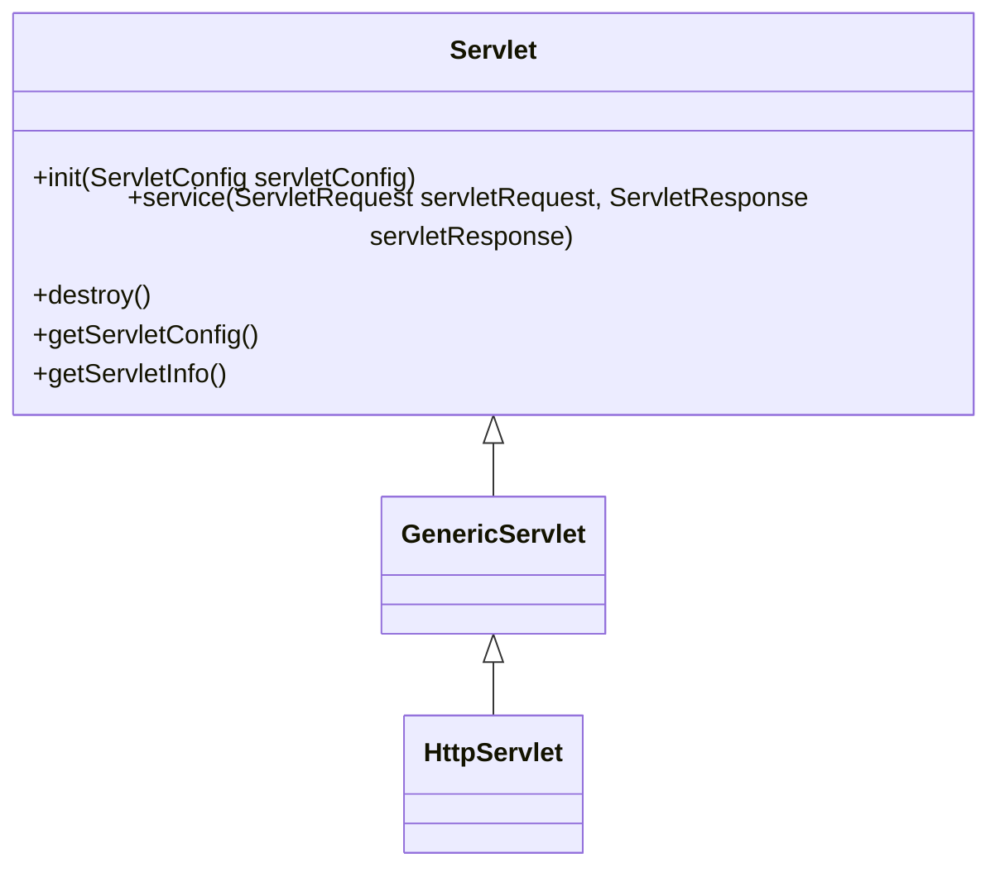
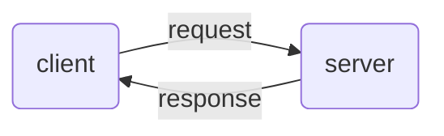
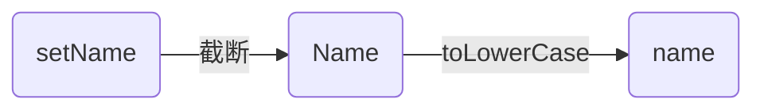
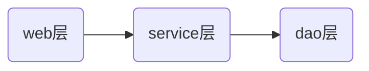
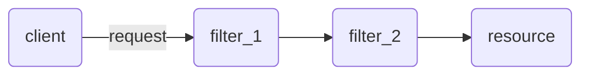
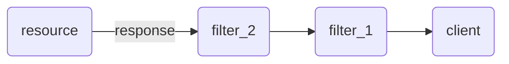
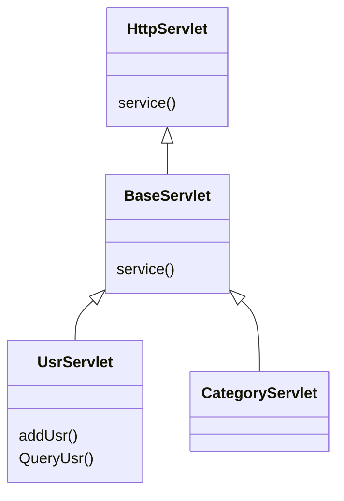

# 	XML

其实就是配置文件

## 语法

还是有自己的语法的：

* xml第一行必须定义为文档声明：严格意义上的第一行，不能说内容的第一行是声明就行

  ```xml
  
  <?xml version="1.0" encoding="UTF-8"?>
  ```

  像这样的就解析不了

* xml文档中有且仅有一个根标签：必须仅有一个根标签

* 属性值必须使用引号(单双都可)引起来：行吧，现在没有整形的属性了

* 标签必须正确关闭：自闭和的标签也行

* 标签名称区分大小写

## 组成部分

* 文档声明：长这样

  ```xml
  <?xml version="1.0" encoding="UTF-8"?>
  ```

  两个问号，中间是xml和一些属性：`version`、`encoding`、`standalone`

  其中version是必须有的、解码方式默认值：ISO-8859-1

* 指令：结合CSS，没什么用

* 标签：反正都是自定义的，但是还是有规则：
  * 不能以数字或者标点符号开始 
  * 不能以字母 xml（或者 XML、Xml 等等）开始 
  * 不能包含空格 

* 属性：id属性值唯一

* 文本：有一个CDATA区，如果不使用这个区的话，需要进行字符转移，像＞，＜这种字符都不能直接用

  ```xml
  <?xml version="1.0" encoding="UTF-8"?>
  <code>
      <![CDATA[
     if (num > 1) num--;
     ]]>
  </code>
  ```

## 约束

规定xml文档的书写规则

### DTD

引入DTD：

* 内部DTD：约束的规则定义在内部xml文件中，没什么用

* 外部DTD：约束的规则定义在外部的dtd文件中
  * 本地：<!DOCTYPE 根标签名 SYSTEM "dtd文件的位置">
  * 网络：<!DOCTYPE 根标签名 PUBLIC "dtd文件名字" "dtd文件的位置URL">

DTD问题在于不能约束标签内部文本的格式

### Schema

引入Schema：

* 填写xml文档的根元素：就是先写一个根标签
* 引入xsi前缀
* 引入xsd文件命名空间
* 为每一个xsd约束声明一个前缀,作为标识

## 解析

*  DOM：将标记语言文档一次性加载进内存，在内存中形成一颗dom树
  * 优点：操作方便，可以对文档进行CRUD的所有操作
  * 缺点：占内存
* SAX：逐行读取，基于事件驱动的
  * 优点：不占内存。
  * 缺点：只能读取，不能增删改

这里使用jsoup解析xml，DOM的方式解析，好吧其实这个Jsoup主要是用来解析HTML的，不过也可以用来解析XML文件

反正流程是这样的：

* 获取Document对象
* 获取对应标签的Element对象
* 获取数据

举个例子吧：假如有一个persons的一个xml文件长这样：

```xml
<?xml version="1.0" encoding="UTF-8"?>
<persons>
    <person id = '1'>
        <name>buzz</name>
        <age>10</age>
    </person>
    <person id = '2'>
        <name>a</name>
        <age>15</age>
    </person>
</persons>
```

现在通过Jsoup对这个文件进行解析，可以这么写：

```java
@Test
    public void test() {
        String path = LearnJsoup.class.getClassLoader().getResource("persons.xml").getPath();
        try {
            //获取document对象
            Document document = Jsoup.parse(new File(path), "utf-8");
            //获取person标签的所有element对象
            Elements persons = document.getElementsByTag("person");
            //获取数据
            persons.forEach(System.out::println);
        } catch (IOException e) {
            e.printStackTrace();
        }

    }
```

上面打印输出的结果和原xml文件基本上一样

值得注意的时上面关于Elements这个类，他其实是ArrayList的一个子类：

```java
public class Elements extends ArrayList<Element>
```

### 几个对象

* Jsoup：工具类，调用静态方法`parse()`返回Document

  * `parse(File in, String charsetName)`：解析xml或html文件，第一个参数表示文件路径，第二个参数表示文件的字符集

  * `parse(String html)`：解析xml或html字符串，其实就是把xml文件中所有的内容变成了一个字符串，当作参数传进来（其实没什么用）

  * `parse(URL url, int timeoutMillis)`：通过网络路径获取指定的html或xml的文档对象；这个就有意思了，先当与从网络中解析XML，我们前面也说了，Jsoup主要是用来解析HTML的，所以其实你随便输入一个网址都可以解析，举个例子吧：

    ```java
    @Test
        public void test() {
            URL url = null;
            try {
                url = new URL("https://bilibili.com");
                Document document = Jsoup.parse(url, 1000);
                System.out.println(document);
            } catch (MalformedURLException e) {
                e.printStackTrace();
            } catch (IOException e) {
                e.printStackTrace();
            }
        }
    ```

    打印的结果和直接按<kbd>F12</kbd>其实是一样的

* Document：文档类，代表内存中的dom树，主要作用是放回Elements对象，从继承关系上来看，Document类是继承于Element类的

  * `getElementById(String id)`：根据id属性值获取唯一的Element对象，其实这个在javascript中用的比较多，注意这个方法返回的是一个Element对象，而不是一个集合了，而且返回的是，标签属性为id的，属性值为传入参数的Element对象

  * `getElementsByTag(String tagName)`：根据标签名称获取元素对象集合，这个就是我们上面用的那个

  * `getElementsByAttribute(String key)`：根据属性名称获取元素对象集合

    还是上面同样的xml文件，`test()`方法内部长这样：就是说我们现在通过属性获取elements

    ```java
    @Test
        public void test() {
            String path = LearnJsoup.class.getClassLoader().getResource("persons.xml").getPath();
            try {
                Document document = Jsoup.parse(new File(path), "utf-8");
                Elements persons = document.getElementsByAttribute("id");
                persons.forEach(System.out::println);
                //System.out.println(persons);
            } catch (IOException e) {
                e.printStackTrace();
            }
        }
    ```

  * `getElementsByAttributeValue(String key, String value)`：根据对应的属性名和属性值获取元素对象集合，和上面最大的区别在于现在收集到的Elements对象中属性的名字给定了，属性的值也给定了

* Elements：元素Element对象的集合，继承于一个泛型为Element的ArrayLIst

* Element：元素类

  * 获取子元素对象：因为前面说了，Document类继承于Element类，所以其实Document所具有的获取Elements方法，Element类也都具有，但是Document获取范围是整个XML文件，而Element作用的范围只有他的子标签
  * 获取属性值：`String attr(String key)`根据属性名称获取属性值
  * 获取文本内容：
    * `String text()`：获取文本内容，如果这个标签含有子标签的时候，返回的值包含所有子标签的文本值（中间使用空格隔开）
    * `String html()`：获取标签体的所有内容(包括字标签的字符串内容)

* Node：节点类：是Document类和Element类的父类

### 快速查询

还是上面的XML文件，如果我想要找到person中id为1的name标签下文本内容

根据上面的介绍，我们需要先获取对应id为1的Element对象，从其子标签中找到tag为name的对象，然后再获取其文本内容

现在考虑使用快速查询的方式获取

* selector选择器：说实话不想用
* XPath：XPath即为XML路径语言，它是一种用来确定XML（标准通用标记语言的子集）文档中某部分位置的语言

是的，如果要使用xpath的话还需要额外导入jar包

# Tomcat

## 文件目录


* bin：可执行文件，二进制文件
* conf：配置文件
* lib：依赖，是是一些jar包
* logs：日志文件
* temp：临时文件
* webapps：项目就放入这个目录里面
* work：存放运行时数据

tomcat默认端口号为8080，如果要修改的话进入目录：conf/server.xml。一般会将tomcat的默认端口号修改为80。80端口号是http协议的默认端口号。在访问时，就不用输入端口号

## 部署

* 直接将项目放入webapps目录下就好（可以将整个项目打包.war的格式，放入目录会自动解压缩，删除压缩文件的时候项目也会自动删除）
* 配置conf/server.xml文件：在<Host>标签体中配置<Context docBase=项目存放的路径 path=虚拟目录 />，现在可以让项目的实际目录的名称和访问项目的虚拟路径不一样了
* 在conf\Catalina\localhost创建任意名称的xml文件。在文件中编写<Context docBase="D:\hello" />，访问的时候虚拟目录就是xml文件的名称

# Servlet

直译：运行在服务器端的小程序，其实本身是一个接口，部署项目就是实现这个接口

举个例子吧：

定义一个类：`ServletTest`实现了`Servlet`接口：

```java
package learn_servlet;

import javax.servlet.*;
import java.io.IOException;

public class ServletTest implements Servlet {
    @Override
    public void init(ServletConfig servletConfig) throws ServletException {}

    @Override
    public ServletConfig getServletConfig() {return null;}

    @Override
    public void service(ServletRequest servletRequest, ServletResponse servletResponse) throws ServletException, IOException {
        System.out.println("hello servlet");
    }

    @Override
    public String getServletInfo() { return null;}

    @Override
    public void destroy() {}
}
```

好吧，其实我们就只是实现了`service()`这个方法，里面打印输出

下一步需要配置Servlet，就是配置web.xml文件

```xml
<servlet>
    <servlet-name>firstServlet</servlet-name>
    <servlet-class>learn_servlet.ServletTest</servlet-class>
</servlet>
<servlet-mapping>
    <servlet-name>firstServlet</servlet-name>
    <url-pattern>/hello</url-pattern>
</servlet-mapping>
```

启动tomcat服务器，并访问虚拟路径/hello，从控制台就可以得到输出了

当我们访问虚拟路径/hello的时候，tomcat会查询所有的url-pattern，找到对应的映射关系，获取对应url的servlet的名字；随后根据servlet的名字找到servlet标签，从而获得对应的servlet实现类；tomcat会将对应的类加载进入内存，并创建对象（整个过程通过反射完成）,访问对应虚拟路径的时候tomcat会调用这个对象的`service()`方法

## Servlet的生命周期

* 创建
* 提供服务
* 销毁

就是上面我们实现的方法

* `init()`：在servlet被创建的时候执行，只会执行一次
* `serivce()`：提供服务的方法，可以多次执行
* `destory()`：在服务器正常关闭的时候执行，只会执行一次，释放资源

还有两个方法：

* `getServletConfig()`：获取ServletConfig对象
* `getServletInfo()`：个人理解为Servlet中的`toString()`方法

Servlet默认情况下在第一次被访问的时候创建，不过可以配置web.xml文件改变对象创建的时间，通过在servlet标签下，改变`<load-on-startup></load-on-startup>`标签内部的内容改变对象创建的时间

默认情况下load-on-startup标签内为一个负数（不配这个标签，相当于配一个负数），如果希望在服务器启动的时候就创建Servlet，那么需要手动将其改为一个正数（或者0）

```xml
<servlet>
    <servlet-name>firstServlet</servlet-name>
    <servlet-class>learn_servlet.ServletTest</servlet-class>
    <load-on-startup>10</load-on-startup>
</servlet>
```

像上面这种写法，会在服务器启动的时候就创建servlet对象

因为init方法仅会调用一次，说明内存中仅有一个servlet对象（单例的），多个用户同时访问时，可能存在线程安全问题，所以尽量不要在Servlet中定义成员变量。即使定义了成员变量，也不要对修改值

## Servlet3.0

现在就不必要每个servlet都通过web.xml文件进行配置了，通过注解的方式就可以完成配置

举个例子吧：还是上面的同样的配置，现在我在web.xml文件中什么都不写了，不过我在定义Servlet实现类的时候添加一个注解：`@WebServlet()`

```java
package learn_servlet;

import javax.servlet.*;
import javax.servlet.annotation.WebServlet;
import java.io.IOException;

@WebServlet(urlPatterns = {"/test"}, loadOnStartup = 5)
public class ServletTest implements Servlet {
    @Override
    public void init(ServletConfig servletConfig) throws ServletException {
        System.out.println("init");
    }

    @Override
    public ServletConfig getServletConfig() {
        return null;
    }

    @Override
    public void service(ServletRequest servletRequest, ServletResponse servletResponse) throws ServletException, IOException {
        System.out.println("hello servlet");
    }

    @Override
    public String getServletInfo() {
        return null;
    }

    @Override
    public void destroy() {
        System.out.println("destory the servlet");

    }
}
```

同样能够达到上面的效果

甚至于上面的注解可以写成：`@WebServlet("/test")`（此时相当于仅仅配置了一个url-pattern）

> 小知识：一个servlet可以定义多个访问路径，就像等于给url-pattern配置一个数组

## Servlet体系结构



就是说Servlet是一个接口，它具有一个实现了这个接口的抽象子类，`GenericServlet`，而`GenericServlet`也具有一个抽象子类`HttpServlet`

如果我们继承了`GenericServlet`，那么我们仅仅需要实现一个方法：`service()`，剩下的从`Servlet`中实现的方法都是空实现

好吧，其实用的最多的是`HttpServlet`，这个类是对http协议的一个封装

举个例子吧，比如说我们通过表单提交数据，form标签可以通过`GET`和`POST`两种方式提交数据，一般情况下，我们会分开处理这两种情况，所以一般`service()`方法会先判断，我们是通过那种方法提交的：

```java
public void service(ServletRequest servletRequest, ServletResponse servletResponse) throws ServletException, IOException {
    String method = servletRequset.getMethod();
    if (method.euqals("GET")) {
        //GET的操作
    } else if (method.equals("POST")) {
        //POST的操作
    }
}
```

这个判断基本上每个实现了Servlet的类都要做，比较重复，现在`HttpServlet`类就相当于把这个繁琐的操作抽离出来，将来我们继承这个类，然后重写他的`doPost()`方法和`doGet()`方法就好

举个例子：我们通过继承HttpServlet类，并重写了`doPost()`方法和`doGet()`方法

```java
package learn_servlet;

import javax.servlet.ServletException;
import javax.servlet.annotation.WebServlet;
import javax.servlet.http.HttpServlet;
import javax.servlet.http.HttpServletRequest;
import javax.servlet.http.HttpServletResponse;
import java.io.IOException;

@WebServlet("/hahaha")
public class ServletFromHttpServlet extends HttpServlet {
    @Override
    protected void doGet(HttpServletRequest req, HttpServletResponse resp) throws ServletException, IOException {
        //super.doGet(req, resp);
        System.out.println("doGet is executing");
    }

    @Override
    protected void doPost(HttpServletRequest req, HttpServletResponse resp) throws ServletException, IOException {
        //super.doPost(req, resp);
        System.out.println("doPost is executing");
    }
}
```

然后我们的页面长这样，就是一个表单，通过get或者post的方式将表单内容提交

```html
<!DOCTYPE html>
<html lang="en">
<head>
    <meta charset="UTF-8">
    <title>this is a title</title>
</head>
<body>
    <form action="/hahaha" method="get">
        <input type="text" name="usrname">
        <input type="submit" value="submit">
    </form>
</body>
</html>
```

# HTTP

Hyper Text Transfer Protocol 超文本传输协议：定义了，客户端和服务器端通信时，发送数据的格式



## 特点

* 居于TCP/IP
* 默认端口号：80
* 基于请求/响应模型的:一次请求对应一次响应
* 无状态的：每次请求之间相互独立，不能交互数据

历史上：http1.0版本每一次请求响应都会建立新的连接，而1.1版本实现了复用连接

## 请求消息数据格式

### 请求行

包括请求方式（POST/GET）、请求URI、请求协议/版本（HTTP/1.1）

请求方式：在HTTP中一共有7种，而常用的是GET和POST

* GET：
  * 请求参数在请求行中（可以认为在url中），所以不太安全
  * 请求的url有限制
* POST：
  * 请求参数在请求体中，相对安全一点
  * 请求的url无限制

### 请求头

就是用冒号分隔的键值对，格式为：请求头名称：请求头的值

常见的请求头：

* User-Agent：浏览器告诉服务器，访问服务器使用的浏览器版本信息
* Connection：keep-alive（如果有这样的键值说明连接可以复用）
* Referer：告诉服务器，当前请求从哪里
  * 防盗链
  * 统计

### 请求空行

字面意义的空行，分割POST请求的请求头和请求体

### 请求体

可以认为是正文信息，GET没有请求体

 主要用来封装POST请求消息的请求参数

## 响应消息数据格式

### 响应行

 响应协议/版本（HTTP/1.1）、响应状态码、状态码描述

> 状态码-状态码描述，举个例子：200 OK

响应状态码：服务器告诉客户端浏览器本次请求和响应的一个状态。

要明确的是状态码都是三位数，从大的层面上分类一共有5种状态码：

* 1xx：服务器接收客户端消息，但没有接受完成，等待一段时间后，发送1xx状态码
* 2xx：成功。代表：200
* 3xx：重定向。代表：302(重定向)，304(访问缓存)
* 4xx：客户端错误：
  * 404（请求路径没有对应的资源） 路径写错了
  * 405：请求方式没有对应的doXxx方法
* 5xx：服务器端错误。代表：500(服务器内部出现异常)

### 响应头

键值对的形式，格式：头名称： 值

常见的响应头：

* Content-Type：服务器告诉客户端本次响应体数据格式以及编码格式，举个例子`Content-Type: text/html;charset=UTF-8`，表示当前响应是文本内容，且格式为HTML，采用uft-8的格式进行编码
* Content-Length：就是响应体的字节个数
* Content-disposition：服务器告诉客户端以什么格式打开响应体数据
  * 未设置的时候默认值为：`in-line`：表示在当前页面内打开
  * `attachment`：以附件形式打开响应体。文件下载

### 响应空行

字面意思，就是空行起到分隔作用

### 响应体

是我们传输的数据，可以是文本的，可以是二进制的字节流（图片，音频）

## Request

先说一下访问服务器的流程：首先tomcat服务器收到请求消息后会根据url中的路径创建对应的Servlet对象；然后创建requset对象和response对象，其中request对象中会封装请求消息数据；然后调用servlet对象的service方法，将已经生成的request对象和response对象传递进去；正常情况下，我们可以根据requset对象获取请求消息数据，并作出对应的响应，将响应数据封装到response对象中；服务器响应消息数据的时候会从response对象中解析出响应数据，并添加到响应报文中发送给客户端

所以： request和response对象是由服务器创建的；request对象是来获取请求消息，response对象是来设置响应消息

### requset的体系结构

顶层的接口：`ServletRequest`，它还具有一个子接口：`HttpServletRequest`

这个子接口真正的实现类是：` org.apache.catalina.connector.RequestFacade`

好吧其实我们主要使用的是`HttpServletRequest`接口中定义的方法

### requset对象的功能

上面说了request分成：请求头，请求行，请求空行，请求体四个部分

所以通过request对象可以获取的数据也包括：请求头，请求行，请求体（毕竟请求空行就是空，没什么意义）

#### 获取请求行

反正就是请求方式、url、协议/版本这三个部分（这里面把GET方法传递的参数也认为是url的一部分了）

* 获取请求方式：`getMethod()`，返回值为`String`类型

* 获取虚拟目录：`getContextPath()`，返回值为`String`类型（虚拟路径就是我们给当前项目绑定Tomcat配置的路径，如果什么都没有配置的话就是`/`）

* 获取Servlet路径：`getServletPath()`，返回值为`String`类型（就是我们在WebServlet中配置的url-pattern）

* 获取get方式请求参数：`getQueryString()`，返回值为`String`类型

* 获取请求URI：`getRequestURI()`，返回值为`String`类型；`getRequestURL()`，返回值为`StringBuilder`类型

  URI：统一资源标识符；URL：统一资源定位符

* 获取协议及版本：`getProtocol()`，返回值为`String`类型

* 获取客户机的IP地址：`getRemoteAddr()`，返回值为`String`类型

#### 获取请求头

* `getHeader(String name)`，返回值为`String`类型，通过请求头的名称获取请求头的值

* `getHeaderNames()`，返回值为`Enumeration<String>`，获取所有的请求头名称，这个`Enumeration<String>`，看起来是一个枚举类型，其实更像是一个迭代器，核心的两个方法：
  * `hasMoreElement`，返回值为布尔类型，判断枚举中是否含有更多元素
  * `nextElement`，返回值为泛型的类型，返回下一个元素

#### 获取请求体

仅POST请求中含有请求体，请求体中包含的是POST请求的请求参数；请求体以流的形式存在，所以获取的步骤：

* 获取流对象：
  * 获取字符输入流：`getReader()`，返回值是`BufferedReader`类型，仅对字符进行操作
  * 获取字节输入流：`getInputStream()`，返回值是`ServletInputStream`类型，因为是字节流，所以可以操作所有类型数据
* 从流中取数据：其实就是输入流的一些操作

#### 其他的方法

* 获取请求参数的通用方法：
  * `getParameter(String name)`，返回类型为`String`类型，根据参数名称获取取值
  * `getParameterValues(String name)`，返回值为`String`类型数组，根据参数名称获取参数值的数组；对于那些一个键有多个值的情况，调用这个函数可以将多个值一次返回，比如使用复选框提交
  * `getParameterNames()`，返回值类型为`Enumeration<String>`，获取所有请求的参数名称
  * `getParameterMap()`，返回值类型为`Map<String,String[]>`，获取所有参数的map集合

注意：使用post方式提交中文的时候，如果出现了乱码，这是因为没有对流设置编码导致的，如果出现这种情况，在获取参数之前要调用方法：`setCharacterEncoding("utf-8")`

* 请求转发：一种在服务器内部的资源跳转方式，跳转的步骤：

  * 通过request对象获取请求转发器对象：`getRequestDispatcher(String path)`，返回值为一个`RequestDispatcher`对象
  * 使用RequestDispatcher对象来进行转发：`forward(ServletRequest request, ServletResponse response)`

  注意使用请求转发的时候：

  * 浏览器地址栏路径不发生变化（就是地址栏不会更新到跳转后的servlet路径）
  * 只能转发到当前服务器内部资源中，不能跳转到其他的网站上
  * 转发是一次请求

* 共享数据：先说一下**域对象**：一个有作用范围的对象，可以在范围内共享数据，特别的我们有**request域**：代表**一次请求的范围**，一般用于请求转发的多个资源中共享数据，几个方法：

  * `setAttribute(String name,Object obj)`，存储键值对，键为String类型，而值为Object类型
  * `getAttitude(String name)`，通过键获取值，返回类型为Object类型
  * `removeAttribute(String name)`，通过键移除键值对

* 获取`ServletContext`

## 一个案例

* 用户登录界面：编写login.html登录页面；username & password 两个输入框

* 使用Druid数据库连接池技术,操作mysql数据库中user表
* 使用JdbcTemplate技术封装JDBC
* 登录成功跳转到SuccessServlet展示
* 登录失败跳转到FailServlet展示

好吧，这个内容有点多，因为涉及到servlet和mysql一起的运用，因为这个是一个javaWeb的项目，所以我们记得导包的时候不要放错位置了：

要放在`/web/WEB-INF`下创建一个`lib`目录，然后我们所有的jar包都放进这里

首先最简单的是那个HTML页面，很简单，就一个表单，两个输入框，一个submit就好了

```html
<!DOCTYPE html>
<html lang="en">
<head>
    <meta charset="UTF-8">
    <title>login</title>
</head>
<body>
    <form action="/checkName" method="post">
        usrname<input type="text" name = "usrname" placeholder="这里是用户名称"><br>
        password<input type="password" name="usrpassword"><br>
        <input type="submit" value="提交">
    </form>
</body>
</html>
```

然后考虑要使用Druid数据库连接池，这里需要导入jar包`druid-1.2.8.jar`这个用来导入Druid的依赖，要使用数据库连接池，需要官方的jar包`mysql-connector-java-8.0.27.jar`

编写的时候，将JDBC写成一个工具类，在`src`目录下创建`utils`包，并在该包内创建`JdbcUtilsDruid.java`类

我们在创建DataSource的时候需要导入配置文件：`druid.properties`

```properties
driverClassName=com.mysql.cj.jdbc.Driver
url=jdbc:mysql://localhost:3306/abc
username=root
password=root
initialSize=5
maxActive=10
maxWait=3000
```

长成这样：

```java
package learn_servlet.utils;

import com.alibaba.druid.pool.DruidDataSourceFactory;
import javax.sql.DataSource;
import java.io.IOException;
import java.sql.*;
import java.util.ArrayList;
import java.util.List;
import java.util.Properties;

public class JdbcUtilsDruid {
    private static final String CONF = "druid.properties";
    private static DataSource dataSource = null;
    static {
        Properties properties = new Properties();
        try {
            properties.load(JdbcUtilsDruid.class.getClassLoader().getResourceAsStream(CONF));
            dataSource = DruidDataSourceFactory.createDataSource(properties);
        } catch (IOException e) {
            e.printStackTrace();
        } catch (Exception e) {
            e.printStackTrace();
        }
    }

    public static DataSource getDataSource() {
        return dataSource;
    }
    public static Connection getConnection() throws SQLException {
        return dataSource.getConnection();
    }

    public static List<String> getPasswordByName(String name) {
        List<String> rst = new ArrayList<>();
        Connection connection = null;
        PreparedStatement preparedStatement = null;
        ResultSet resultSet = null;
        try {
            String sql = "select usrpassword from users where usrname = ?";
            connection = getConnection();
            preparedStatement = connection.prepareStatement(sql);
            preparedStatement.setString(1,name);
            resultSet = preparedStatement.executeQuery();
            while (resultSet.next()) {
                rst.add(resultSet.getString("usrpassword"));
            }
        } catch (SQLException e) {
            e.printStackTrace();
        } finally {
            releaseResources(connection, preparedStatement, resultSet);
        }
        return rst;
    }

    public static void releaseResources(Connection connection, Statement statement, ResultSet resultSet) {
        if (resultSet != null) {
            try {
                resultSet.close();
            } catch (SQLException e) {
                e.printStackTrace();
            }
        }
        if (statement != null) {
            try {
                statement.close();
            } catch (SQLException e) {
                e.printStackTrace();
            }
        }
        if (connection != null) {
            try {
                connection.close();
            } catch (SQLException e) {
                e.printStackTrace();
            }
        }
    }

    public static void releaseResources(Connection connection, Statement statement) {
        releaseResources(connection, statement, null);
    }
}
```

其主要作用是获取数据库连接`Connection`对象和`DataSource`对象（以便下一步使用JdbcTemplate），同时释放资源（我其实怀疑这个释放资源的其实是不用写的，因为JdbcTemplate好像就可以释放资源）

因为要使用JdbcTemplate封装对象，所以新建一个User类表示对象，为了使用BeanUtils类，我们为这个类创建构造器，并实现GetterSetter方法：

```java
package learn_servlet;

public class User {
    private String usrname;
    private String usrpassword;
    private int id;

    public User() {
    }

    public int getId() {
        return id;
    }

    public void setId(int id) {
        this.id = id;
    }

    @Override
    public String toString() {
        return "User{" +
                "usrname='" + usrname + '\'' +
                ", usrpassword='" + usrpassword + '\'' +
                ", id=" + id +
                '}';
    }

    public String getUsrname() {
        return usrname;
    }

    public void setUsrname(String usrname) {
        this.usrname = usrname;
    }

    public String getUsrpassword() {
        return usrpassword;
    }

    public void setUsrpassword(String usrpassword) {
        this.usrpassword = usrpassword;
    }
}
```

新建一个类`OperateDataBase`，以后对数据库进行的操作都在这个类中进行，现在我们只有一个方法，就login方法，这个方法接收一个User，返回一个User，看起来好像挺奇怪的，但其实是这样的：因为我们是通过用户名和密码登录的，所以我们会将这两个属性封装成一个对象，然后进行查找，看看数据库中是否具有属性相同的对象，如果有的话，就将数据库中对应用户的所有属性封装进这个对象，进行下一步操作；如果没有的话，我们这个login方法会返回null，标识没有对应的`username-userpassword`的用户

因为要使用JdbcTemplate，所以需要导入jar包：`spring-beans-5.0.0.RELEASE.jar、spring-core-5.0.0.RELEASE.jar、spring-jdbc-5.0.0.RELEASE.jar、spring-tx-5.0.0.RELEASE.jar、commons-logging-1.2.jar、mchange-commons-java-0.2.19.jar`

```java
package learn_servlet;

import learn_servlet.utils.JdbcUtilsDruid;
import org.springframework.dao.DataAccessException;
import org.springframework.jdbc.core.BeanPropertyRowMapper;
import org.springframework.jdbc.core.JdbcTemplate;

public class OperateDataBase {
    private JdbcTemplate jdbcTemplate = new JdbcTemplate(JdbcUtilsDruid.getDataSource());

    public User login(User user) {
        String sql = "select * from users where usrname = ? && usrpassword = ?";
        User rst = null;
        try {
            rst = jdbcTemplate.queryForObject(sql,
                    new BeanPropertyRowMapper<User>(User.class),
                    user.getUsrname(), user.getUsrpassword());
        } catch (DataAccessException e) {
            e.printStackTrace();
        } finally {
        }
        return rst;
    }

}
```

终于到servlet类了，我们使用了BeanUtils用来封装对象，所以需要导入jar包：`commons-beanutils-1.9.4.jar`

如果login方法返回的不是null，说明存在对应的用户名和密码的用户，我们会先将User存储到request域中，然后跳转到loginSuccess的Servlet，如果返回值为null，就跳转到loginFail的servlet

```java
package learn_servlet.servlet;

import learn_servlet.OperateDataBase;
import learn_servlet.User;
import org.apache.commons.beanutils.BeanUtils;
import javax.servlet.ServletException;
import javax.servlet.annotation.WebServlet;
import javax.servlet.http.HttpServlet;
import javax.servlet.http.HttpServletRequest;
import javax.servlet.http.HttpServletResponse;
import java.io.IOException;
import java.lang.reflect.InvocationTargetException;
import java.util.Map;

@WebServlet("/checkName")
public class CheckServlet extends HttpServlet {
    @Override
    protected void doPost(HttpServletRequest req, HttpServletResponse resp) throws ServletException, IOException {
        req.setCharacterEncoding("utf-8");
        Map<String, String[]> parameterMap = req.getParameterMap();
        User user = new User();
        try {
            BeanUtils.populate(user, parameterMap);
        } catch (IllegalAccessException e) {
            e.printStackTrace();
        } catch (InvocationTargetException e) {
            e.printStackTrace();
        }
        OperateDataBase operateDataBase = new OperateDataBase();
        User login = operateDataBase.login(user);
        if (login != null) {
            req.setAttribute("user", user);
            req.getRequestDispatcher("/loginSuccess").forward(req,resp);
        }else {
            req.getRequestDispatcher("/loginFail").forward(req, resp);
        }


    }

    @Override
    protected void doGet(HttpServletRequest req, HttpServletResponse resp) throws ServletException, IOException {
        this.doPost(req, resp);
    }
}
```

`LoginSuccess.java`

```java
package learn_servlet.servlet;

import learn_servlet.User;
import javax.servlet.ServletException;
import javax.servlet.annotation.WebServlet;
import javax.servlet.http.HttpServlet;
import javax.servlet.http.HttpServletRequest;
import javax.servlet.http.HttpServletResponse;
import java.io.IOException;

@WebServlet("/loginSuccess")
public class LoginSuccess extends HttpServlet {
    @Override
    protected void doPost(HttpServletRequest req, HttpServletResponse resp) throws ServletException, IOException {
        resp.setContentType("text/html;charset=utf-8");
        User user = (User) req.getAttribute("user");
        resp.getWriter().write("登录成功了" + user.getUsrname());
    }

    @Override
    protected void doGet(HttpServletRequest req, HttpServletResponse resp) throws ServletException, IOException {
        System.out.println("doGet");
        this.doPost(req, resp);
    }
}
```

`LoginFail.java`

```java
package learn_servlet.servlet;

import javax.servlet.ServletException;
import javax.servlet.annotation.WebServlet;
import javax.servlet.http.HttpServlet;
import javax.servlet.http.HttpServletRequest;
import javax.servlet.http.HttpServletResponse;
import java.io.IOException;

@WebServlet("/loginFail")
public class LoginFail extends HttpServlet {
    @Override
    protected void doPost(HttpServletRequest req, HttpServletResponse resp) throws ServletException, IOException {
        resp.setContentType("text/html;charset=utf-8");
        resp.getWriter().write("登录失败了");
    }
}
```

### BeanUtils工具类

这个工具类是用来封装JavaBean的，JavaBean就是标准的java类，所谓标准就是：

* 类必须被public修饰
* 必须提供空参的构造器
* 成员变量必须使用private修饰
* 提供公共setter和getter方法

几个方法：

* `setProperty(Object obj, String name, Object value)`
* `getProperty()`
* `populate(Object obj , Map map)`：将map集合的键值对信息，封装到对应的JavaBean对象中

BeanUtils操作的是属性而不是成员变量，这两者是具有区别的

比如我们定义一个类：

```java
package learn_servlet.test;

public class person {
    private String usrname;

    public person() {
    }

    public String getUsrname() {
        return usrname;
    }

    public void setUsrname(String usrname) {
        this.usrname = usrname;
    }

    @Override
    public String toString() {
        return "person{" +
                "usrname='" + usrname + '\'' +
                '}';
    }
}
```

然后我们使用Junit进行测试：

```java
@Test
public void test() {
    person p = new person();
    try {
        BeanUtils.setProperty(p, "usrname", "buzz");
    } catch (IllegalAccessException e) {
        e.printStackTrace();
    } catch (InvocationTargetException e) {
        e.printStackTrace();
    }
    System.out.println(p);
}
```

这种显然输出肯定是没有问题的

但如果我们改变一下，我们在将pers类中的`setUsrname()`方法改名成为`setName()`，然后在`BeanUtils`类进行`setProperties`的使用设置的是name属性

就是现在person类中的方法长成这样：

```java
public void setName(String usrname) {
    this.usrname = usrname;
}
```

然后使用BeanUtils

```java
BeanUtils.setProperty(p, "name", "buzz");
```

神奇的事情发生了，我们现在得到的输出和刚才是一样的

所以其实我们使用BeanUtils的时候，我们的**第二个参数是属性，而不是成员变量**，所谓属性就是将set方法中后面的部分进行截断，然后`toLowerCase()`后得到的字符串：在我们这个例子中是这样变化的：



可以理解为实际中，我们调用了BeanUtils的方法`setProperties()`，然后，他会把对应javaBean中的所有的set方法截断，并`toLowerCase`，然后比较第二个参数和这些截断后的是不是相等，如果相等就调用对应的方法，设置对应的value

所以：**BeanUtils操作的其实是属性，而不是成员变量**

## Response

用来设置响应消息，可以设置：

* 响应行，就三个部分，版本设置不了，我们能设置的也就是状态码了：`setStatus(int sc)`

* 响应头：因为响应头是键值对的形式，设置的时候也是设置键值对：`setHeader(String name, String value) `

* 响应体：我们当时获取请求体的时候使用的是流的方式，现在设置响应体也应该是流的方式具体的：

  * 先获取输出流：

    * `getWriter()`，获取字符输出流，返回一个`PrintWriter`对象
  *  `getOutputStream()`，获取字节输出流，返回一个`ServletOutputStream`对象（就是`OutPutStream`接口的一个实现类）
  * 然后使用流写数据
  
  这里面可能会出现乱码的情况，是因为编码格式和客户端浏览器解码不匹配导致的：
  
  所以我们要考虑同时设置流的编码和浏览器的解码（让二者相同），`response.setHeader("content-type","text/html;charset=uft-8")`，当然有简化的写法`response.setContentType("text/html;charset=utf-8")`，然后再获取流（一定要先设置再获取流）

### 重定向的举例

其实步骤很简单：

* 设置状态码为302
* 这是响应头中`location`的值为需要跳转的资源的路径

我们会从`/hahaha`跳转到`/lalala`

```java
package learn_servlet;

import javax.servlet.ServletException;
import javax.servlet.annotation.WebServlet;
import javax.servlet.http.HttpServlet;
import javax.servlet.http.HttpServletRequest;
import javax.servlet.http.HttpServletResponse;
import java.io.IOException;

@WebServlet("/hahaha")
public class ServletFromHttpServlet extends HttpServlet {

    @Override
    protected void doGet(HttpServletRequest req, HttpServletResponse resp) throws ServletException, IOException {
        this.doPost(req, resp);
    }

    @Override
    protected void doPost(HttpServletRequest req, HttpServletResponse resp) throws ServletException, IOException {
        System.out.println("/hahaha" + "-" + "doPost");
        resp.setStatus(302);
        resp.setHeader("location","/lalala");
    }
}
```

```java
package learn_servlet;

import javax.servlet.*;
import javax.servlet.annotation.WebServlet;
import javax.servlet.http.HttpServlet;
import javax.servlet.http.HttpServletRequest;
import javax.servlet.http.HttpServletResponse;
import java.io.IOException;

@WebServlet("/lalala")
public class ServletTest extends HttpServlet {
    @Override
    protected void doPost(HttpServletRequest req, HttpServletResponse resp) throws ServletException, IOException {
        System.out.println("/lalala"+"-"+ "doPost");

    }

    @Override
    protected void doGet(HttpServletRequest req, HttpServletResponse resp) throws ServletException, IOException {
        System.out.println("/lalala"+"-"+ "doGet");
    }
}
```

而有一种比较简单的写法也可以完成重定向（虽然我们现在的重定向也只是需要写两行），一行代码完成：`sendRedirect(String location)`，直接调用response对象的这个方法就可以完成重定向

### 重定向和转发

其实从结果上来看，重定向特别像我们之前学过的[转发](#其他的方法)：

转发的特点：

* 转发地址栏路径不变
* 转发只能访问当前服务器下的资源
* 转发是一次请求，可以使用request对象来共享数据

重定向的特点：

* 地址栏发生变化
* 重定向可以访问其他站点(服务器)的资源（我私下试过了，可以重定向到b站...）
* 重定向是两次请求。不能使用request对象来共享数据（不是一个request域下的资源了）

> 从特点上来说，可以说是完全不一样了

### 关于路径

相对路径和绝对路径

* 绝对路径：在服务器中就是：`/虚拟路径/资源路径`；

  定义规则：判断定义的路径是给谁用的，即请求将来从哪儿发出

  * 客户端发出，需要添加虚拟目录（重定向）
  * 服务器发出，不需要添加虚拟目录（转发）

* 相对路径：`./资源路径`，其中`./`表示当前目录下；找到当前资源和目标资源之间的相对位置关系，当前目录为：`./`，上一级路径为：`../`

要注意的是，我们的项目的虚拟目录可能发生变化，这意味着如果在代码中写死了虚拟目录，如果将来发生改变需要改代码，很麻烦，所以需要动态的获取虚拟目录，使用方法：`getContextPath()`（requset对象），所以如果代码中需要使用虚拟目录的时候我们通过这个方法获取，并拼接就好了

## ServletContext

代表整个web应用，可以和程序的容器(服务器)来通信

获取方式：

* 通过request对象获取：`request.getServletContext()`
* 通过HttpServlet获取：`this.getServletContext()`

因为ServletContext对象代表的是整个web应用，所以上面这两种方式获取到到的对象是同一个对象

> 不仅如此，同一个工程下不同的servlet获取到的ServletContext对象都是同一个

### 作用

* 获取MIME类型：在互联网通信过程中定义的一种文件数据类型，格式体现为：大类型/小类型；比如说：text/html、image/jpeg；通过方法：`getMimeType(String file)`获取MIME类型，返回值为String类型，要注意的是这个方法是根据文件的扩展名获取的，而不是说这个文件是不是真的存在；在tomcat服务器内部有一个配置文件，给定了扩展名到文件类型的映射关系，所以这个方法其实相当于查表

  > 这个方法和response的setContextType方法一起使用的时候，可以是客户端以指定的方式解析传输的数据

* 本身作为一个域对象，可以用来共享数据；域范围：所有用户所有请求的数据，即不同的servlet之间可以通过这个对象传递数据，范围太大了，所以不要乱用

* 获取文件的真实(服务器)路径：`getRealPath(String path)`返回值为String类型，这个方法的参数很讲究，假设资源名称为：`a.properties`，那么为了读取这个文件：

  * 如果资源存在于web目录下：参数对应于：`"/a.properties"`

  * 如果资源存在于src目录下：参数对应对：`/WEB-INF/classes/a.properties`

    > 这是因为在src目录下的文件在部署项目的时候会被分配到`/WEB-INF/classes`目录下

### 一个文件下载的案例

就是说静态页面上展示出图片，然后点击图片实现下载

要注意的是我们的图片最好不要放入WEB-INF目录里面，这个目录客户端时无法直接访问的，需要web.xml中配置才可以访问

所以现在再根目录下新建`/img`目录并存入图片

静态页面：

```html
<!DOCTYPE html>
<html lang="en">
<head>
    <meta charset="UTF-8">
    <title>Title</title>
</head>
<body>
    <a href="/lalala">
        
    </a>
</body>
</html>
```

servlet：

考虑点击时为下载，需要让HTTP响应头的`Content-disposition`属性为`attachment`，即以附件的形式打开当前servlet

同时我们此时的HTTP响应体中存储的应该是图片，所以需要通过流的形式将图片从本地加载进入内存，并从内存中加载输出到响应体中

现实情况下需要先获取图片所在的真实路径，通过`servletContext`的`getRealPath()`方法可以获得真实路径，注意参数的写法

同时我们需要指定客户端浏览器的对HTTP响应体部分的解析方式，需要调用response的`setContentType()`方法，而至于文件类型，可以通过`servletContext`对象的方法`getMimeType()`获取

```java
package learn_servlet;

import javax.servlet.*;
import javax.servlet.annotation.WebServlet;
import javax.servlet.http.HttpServlet;
import javax.servlet.http.HttpServletRequest;
import javax.servlet.http.HttpServletResponse;
import java.io.FileInputStream;
import java.io.IOException;

@WebServlet("/lalala")
public class ServletTest extends HttpServlet {
    @Override
    protected void doPost(HttpServletRequest req, HttpServletResponse resp) throws ServletException, IOException {
        System.out.println("/lalala"+"-"+ "doPost");
    }

    @Override
    protected void doGet(HttpServletRequest req, HttpServletResponse resp) throws ServletException, IOException {
        System.out.println("do-get");
        //获取servletContext对象
        ServletContext servletContext = this.getServletContext();
        //获取图片的真实路径
        String realPath = servletContext.getRealPath("/img/wallpaper.jpg");
        //获取图片的类型
        String mimeType = servletContext.getMimeType("wallpaper.jpg");
        //设置HTTP响应的类型
        resp.setHeader("content-disposition","attachment");
        //设置传输数据的类型
        resp.setHeader("content-type",mimeType);
        //下面是通过流将图片加载进入内存，并进一步加载进入HTTP响应体
        FileInputStream fileInputStream = new FileInputStream(realPath);
        ServletOutputStream outputStream = resp.getOutputStream();
        byte[] buffer = new byte[1024];
        int len = 0;
        while ((len = fileInputStream.read(buffer)) != -1) {
            outputStream.write(buffer, 0, len);
        }
        fileInputStream.close();
        System.out.println("write done");
    }
}
```

## 会话

一次会话中包含多次请求和响应；浏览器第一次给服务器资源发送请求，会话建立，直到有一方断开为止

在一次会话的范围内的多次请求间，共享数据

HTTP协议是无状态的，它不对之前发生过的请求和响应的状态进行管理。也就是说，无法根据之前的状态进行本次的请求处理。  

所以需要通过额外的方式进行状态管理，实现共享数据，即为会话：

* 客户端会话技术：Cookie
* 服务器端会话技术：Session

### Cookie

客户端会话技术，将数据保存到客户端

Cookie 会根据从服务器端发送的响应报文内的一个叫做 Set-Cookie的首部字段信息， 通知客户端保存 Cookie。当下次客户端再往该服务器发送请求时，客户端会自动在请求报文中加入 Cookie 值后发送出去。
服务器端发现客户端发送过来的 Cookie 后， 会去检查究竟是从哪一个客户端发来的连接请求，然后对比服务器上的记录，最后得到之前的状态信息。  


#### 使用cookie

* 创建Cookie对象，并绑定数组：new Cookie对象的时候传入两个参数：`new Cookie(String name, String value)`，可以认为是键值对
* 发送Cookie对象，因为是服务器端向客户端发送响应的时候才会将Cookie添加，所以由服务器建立的Cookie应该通过`response`对象发送给客户端，即：`response.addCookie(Cookie cookie)`
* 获取Cookie对象，当服务器端再次收到客户端的请求的时候，可以从HTTPrequest中获取Cookie对象：`request.getCookies()`，返回值是一个`Cookie`类型的数组，即`Cookie`不止一个

本质上，使用cookie，是服务器在HTTP响应头中加入了字段（键值对的形式）：`Set-Cookie : name = value`，下一次当客户端再一次请求服务器的时候会在HTTP请求头中加入键值对：`Cookie : name = value`

#### 小细节

* 一次发送多个cookie：这个好说，就在response对象中多次`addCookie()`就好了

* cookie可以在浏览器中保存的时间：

  * 默认情况下，cookie存储在浏览器的内存中，关闭浏览器，释放内存，cookie不再存在
  * 持久化存储，需要调用方法：`setMaxAge(int time)`，如果参数：
    * 为正数：将Cookie数据写到硬盘的文件中。持久化存储。并指定cookie存活时间，时间到后，cookie文件自动失效；这个存储时间单位为秒
    * 为负数：默认值（cookie在内存中，关闭浏览器后释放）
    * 为0：删除cookie信息

* cookie的中文问题：

  * 在tomcat 8 之前：cookie中不能直接存储中文数据。
  * 在tomcat 8 之后：cookie支持中文数据。特殊字符还是不支持，建议使用URL编码存储，URL解码解析

* cookie的范围：这个问题主要在于同一个tomcat服务器下，同时部署了多个web项目（具有多个不同的虚拟路径），此时cookie是否还能共享

  * 默认情况下是不能共享的
  * 如果需要共享，需要调用cookie对象的方法：`setPath(String path)`，这个方法设置cookie的获取范围。默认情况下，设置当前的虚拟目录，如果要共享，则可以将path设置为"/"

  额外考虑的一点，不同的tomcat服务器间cookie共享：如果设置一级域名相同，那么多个服务器之间cookie可以共享，调用cookie的方法`setDomain(String path)`，其中参数为域名

#### 特点

* cookie存储数据在客户端浏览器
* 浏览器对于单个cookie 的大小有限制(4kb) 以及 对同一个域名下的总cookie数量也有限制(20个)

根据以上特点可知：cookie一般用于存出少量的不太敏感的数据（因为单个cookie大小和cookie个数的限制，同时因为存储在客户端，存在一定的风险）

在不登录的情况下，完成服务器对客户端的身份识别

#### 一个举例

需求是这样的：访问一个servlet，如果第一次访问，打印当前时间，如果不是第一次访问，打印上次访问的时间

```java
package learn_cookie;

import javax.servlet.ServletException;
import javax.servlet.annotation.WebServlet;
import javax.servlet.http.Cookie;
import javax.servlet.http.HttpServlet;
import javax.servlet.http.HttpServletRequest;
import javax.servlet.http.HttpServletResponse;
import java.io.IOException;
import java.io.PrintWriter;
import java.net.URLDecoder;
import java.net.URLEncoder;
import java.text.SimpleDateFormat;
import java.util.Date;
import java.nio.charset.StandardCharsets;

@WebServlet("/ServletCookie")
public class ServletCookie extends HttpServlet {
    @Override
    protected void doPost(HttpServletRequest request, HttpServletResponse response) throws ServletException, IOException {
        //这个是普遍流程了，涉及到response对象写的操作，就需要设置字符集
        response.setHeader("content-type", "text/html;charset=utf-8");
        PrintWriter writer = response.getWriter();
        //获取时间
        Date date = new Date();
        SimpleDateFormat dateFormat = new SimpleDateFormat();
        dateFormat.applyPattern("yyyy-MM-dd HH:mm:ss a");
        String time = dateFormat.format(date);
        //URL编码
        String encodeTime = URLEncoder.encode(time, StandardCharsets.UTF_8);
        Cookie[] cookies = request.getCookies();
        for (Cookie cookie : cookies) {
            if ("sinceLastTime".equals(cookie.getName())) {
                //URL解码
                String lastTime = URLDecoder.decode(cookie.getValue(), StandardCharsets.UTF_8);
                System.out.println("上次访问时间:" + lastTime);
                writer.write("上次访问时间：" + lastTime);
                cookie.setValue(encodeTime);
                //在response响应头中加入cookie，其实就是加入了Set-Cookie字段，相当于重新赋值
                response.addCookie(cookie);
                return;
            }
        }
        Cookie cookie = new Cookie("sinceLastTime", encodeTime);
        System.out.println("create cookie");
        response.addCookie(cookie);
        System.out.println("第一次访问时间:" + time);
        writer.write("第一次访问时间:" + time);
    }

    @Override
    protected void doGet(HttpServletRequest request, HttpServletResponse response) throws ServletException, IOException {
        this.doPost(request, response);
    }
}
```

* 获取时间：

```java
public static void main(String[] args) {
    Date date = new Date();
    SimpleDateFormat dateFormat = new SimpleDateFormat("yyyy-MM-dd HH:mm:ss a");
    System.out.println(dateFormat.format(date));
}
```

其实就是格式化时间，`Date`对象表示当前时间，我们使用`SimpleDateFormat`对象格式化时间，在创建对象的时候可以定义格式化的模板

* URL编解码：主要是因为cookie并不支持特殊字符，在我们格式化date中存在空格、冒号、以后还可能有中文

```java
package test;

import java.net.URLDecoder;
import java.net.URLEncoder;
import java.nio.charset.StandardCharsets;
import java.text.SimpleDateFormat;
import java.util.Date;

public class Test {
    public static void main(String[] args) {
        Date date = new Date();
        SimpleDateFormat dateFormat = new SimpleDateFormat("yyyy-MM-dd HH:mm:ss a");
        String formatDate = dateFormat.format(date);
        //注意在编解码的时候需要指定编解码格式
        String encodeTime = URLEncoder.encode(formatDate, StandardCharsets.UTF_8);
        System.out.println("encodeTime:" + encodeTime);
        String decodeTime = URLDecoder.decode(encodeTime, StandardCharsets.UTF_8);
        System.out.println("decodeTime:" + decodeTime);
    }
}
```

### session

服务器端会话技术，在一次会话的多次请求间共享数据，将数据保存在服务器端的对象中：HttpSession

* 获取session：`request.getSession()`
* 使用session：
  * `setAttribute(String name, Object value)`
  * `getAttribute(String name)`，返回值类型为一个Object类型
  * `removeAttribute(String name)`

#### 举个例子

访问第一个servlet页面的时候设置session

```java
package learn_session;

import javax.servlet.*;
import javax.servlet.http.*;
import javax.servlet.annotation.*;
import java.io.IOException;

@WebServlet(name = "ServletSession", value = "/ServletSession")
public class ServletSession extends HttpServlet {
    @Override
    protected void doGet(HttpServletRequest request, HttpServletResponse response) throws ServletException, IOException {
        this.doPost(request, response);
    }

    @Override
    protected void doPost(HttpServletRequest request, HttpServletResponse response) throws ServletException, IOException {
        HttpSession session = request.getSession();
        session.setAttribute("msg","this is a session");
    }
}
```

访问第二个页面的时候设置session

```java
package learn_session;

import javax.servlet.*;
import javax.servlet.http.*;
import javax.servlet.annotation.*;
import java.io.IOException;

@WebServlet(name = "ServletSessionTest", value = "/ServletSessionTest")
public class ServletSessionTest extends HttpServlet {
    @Override
    protected void doGet(HttpServletRequest request, HttpServletResponse response) throws ServletException, IOException {
        this.doPost(request, response);
    }

    @Override
    protected void doPost(HttpServletRequest request, HttpServletResponse response) throws ServletException, IOException {
        HttpSession session = request.getSession();
        System.out.println(session.getAttribute("msg"));
    }
}

```

#### 小细节

* Session的实现是依赖于Cookie的。客户端第一次访问服务器的时候，因为没有Cookie，所以会在服务器端的内存中创建一个Session对象，这个对象通过唯一的id进行标志；然后在响应报文中添加响应头：`set-Cookie:JSESSIONID = (对应的id)`；客户端下一次访问服务器资源的时候请求头含有字段`cookie : JSESSIONID = (对应的id)`，此后服务器可以获取到id对应的值

* 客户端关闭，服务器端不关闭，两次获取的session是否相同：

  * 默认情况下不同：因为如果客户端的请求头中没有cookie字段中如果没有`JSESSION`，那么如果调用方法`request.getSession()`，会在内存中新建一个`HttpSession`对象
  * 如果一定要保证两次的`Session`对象相同，可以人为的添加一个cookie（name属性为`JSESSION`，value属性为session的id值，这个值通过方法：`session.getId()`获取），并**为这个cookie设置存活时间**（设置存活时间是重点）

* 服务器端关闭，客户端不关闭，两次获取的session是否相同：要知道的是，服务器关闭，这会让服务器释放内存，其存储的session对象都被释放了，就算客户端提供相同的cookie值，服务器端也不认识了；现在如果希望对象不同，但是数据不丢失：

  * session的钝化：在服务器正常关闭之前，将session对象序列化到硬盘上
  * session的活化：在服务器启动后，将session文件转化为内存中的session对象

  > 上面的的钝化和活化分别对应对象的序列化和反序列化的过程

* session的失效时间

  * 服务器关闭
  * session对象调用invalidate() 
  * session默认失效时间 30分钟，可以在web.xml文件中修改这个失效时间

#### 特点

* session用于存储一次会话的多次请求的数据，存在服务器端（可以用来共享数据）
* session可以存储任意类型，任意大小的数据
* session数据安全（相对于Cookie而言）

## JSP

全称：`java server page`：一个特殊的页面，其中既可以指定定义html标签，又可以定义java代码；其主要作用是简化书写

当客户端访问.jsp文件时，服务器会解析收到的请求信息，并找到对应的资源（资源不存在的时候就404了），将对应的资源文件解析为.java文件，编译，生成字节码文件；JSP本质上就是一个Servlet，.jsp文件解析生成的.java文件继承于`HttpServlet`类

### JSP的脚本

JSP定义Java代码的方式

* `<% %>`：在该区域内的的代码定义在`service()`方法中

* `<%! %>` ：在该区域内的代码，对应于servlet对象的成员变量（最好不要用）

* `<%= %>` ：在该区域内的代码，会出输出到页面上，输出语句`System.out.println()`里面怎么写，这个标签里面怎么写

  > 要注意的是这个标签作用于service内部

### JSP的内置对象

在jsp页面中不需要获取和创建，可以直接使用的对象，一共9个，要注意的是：

* out：字符输出流对象，将字符输出到页面上，类比`response.getWriter()`

  不过要注意的是，这个out对象和`response.getWriter()`返回的`writer`对象还是有区别的，在tomcat服务器真正给客户端做出响应之前，会先找response缓冲区数据，再找out缓冲区数据。所以response.getWriter()数据输出永远在out.write()之前

* exception对象（仅当声明了`isErrorPage`属性为true的时候才具有这个对象）

全部的9个内置对象：

|    变量名     |       类型       |                        说明                        |
| :-----------: | :--------------: | :------------------------------------------------: |
| `pageContext` |  `PageContext`   | 在当前页面内部共享数据，还可以获取其他八个内置对象 |
|   `request`   |  `HttpRequest`   |       一次请求访问的范围共享数据（包含转发）       |
|   `session`   |  `HttpSession`   |       一个会话的范围内共享数据（多个请求间）       |
| `application` | `ServletContext` |   所有用户间共享数据（从服务器开启到服务器关闭）   |
|  `response`   |  `HttpResponse`  |                      不想多说                      |
|    `page`     |     `Object`     |                     相当于this                     |
|     `out`     |   `JspWriter`    |                  数据输出到页面上                  |
|   `config`    | `ServletConfig`  |                 Servlet的配置对象                  |
|  `exception`  |   `Throwable`    |                      异常对象                      |

> 表格的前四个为域对象，域的大小关系从上到下依次递增

### 指令

用于配置JSP页面，导入资源文件；格式上：<%@ 指令名称 属性名1=属性值1 属性名2=属性值2 ... %>，多个属性之间通过空格隔开，比如：

  ```jsp
  <%@ page contentType="text/html;charset=UTF-8" language="java" %>
  ```

  三种指令：

* page：配置JSP页面，具有属性：

  * `contentType`：等同于`response.setContentType()`，设置响应体的mime类型以及字符集，设置当前jsp页面的编码
  * `import`：导包
  * `errorPage`：当前页面发生异常后，会自动跳转到指定的错误页面
  * `isErrorPage`：标识当前页面是否是错误页面；如果当前页面是一个错误页面（因为异常而跳转到的页面），为当前页面添加`isErrorPage`属性，就可以在标签内使用内置对象`exception`，这个对象可以用来输出异常信息

* include：一般不用，作用是导入其他的页面

* taglib：导入资源，导入标签库，比如说：

  ```jsp
   <%@ taglib prefix="c" uri="http://java.sun.com/jsp/jstl/core" %>
  ```

  其中`prefix`是自定义的前缀

### 注释

长成这样：记住得了

```jsp
<%-- --%>
```

## login例程

现在的需求是这样的：

访问带有验证码的页面：login.jsp

分别输入用户名，密码，验证码

* 如果用户名或者密码输入错误需要跳转到登录页面，并提示对应的错误信息

* 如果验证码错误，需要跳转到登录页面，并提示对应的错误信息

如果上面三个全部输入正确需要跳转到主页success.jsp。并提示登录信息

### 分析

这里例程其实就是以前登录页面的升级版，多了验证码这个选择

验证码部分要求是每次都不一样，能够随机生成，点击验证码的时候能够刷新验证码，验证码中需要有干扰线；

验证码是一个图像，我们从Servlet中获得img

 因为登录需要验证码，所以需要将验证码储存下来，我们在`.jsp`文件中获取验证码图像，需要将``标签的src属性设置为对应生成图像的servlet

所以其实当我们访问`login.jsp`的时候其实发送了两次`get`请求，要get到页面和验证码图像

我们提交表单的时候需要提交验证码，和生成的验证码图像比较，相同的时候进行下一步判断，所以我们需要通过session共享数据比对验证码

### 验证码部分

这部分其实没什么写的，就当成模板吧：

```java
package learn_servlet;

import javax.imageio.ImageIO;
import javax.servlet.*;
import javax.servlet.http.*;
import javax.servlet.annotation.*;
import java.awt.*;
import java.awt.image.BufferedImage;
import java.io.IOException;
import java.util.Random;

@WebServlet(urlPatterns = "/ServletCheckCode")
public class ServletCheckCode extends HttpServlet {
    //验证码中每个字符从这个字符串中获取
    private static final String BASE = "ABCDEFGHIJKLMNOPQRSTUVWXYZabcdefghijhlmnopqrstuvwxyz0123456789";
    //验证码的长度
    private static final int CHECK_CODE_LENGTH = 4;
    //验证码中干扰线的个数
    private static final int LINE_AMOUNT = 8;
    @Override
    protected void doGet(HttpServletRequest request, HttpServletResponse response) throws ServletException, IOException {
        this.doPost(request, response);
    }

    @Override
    protected void doPost(HttpServletRequest request, HttpServletResponse response) throws ServletException, IOException {
        //对象表示内存中的图片，图像的大小和图像的内存表示
        int width = 100;
        int height = 30;
        BufferedImage bufferedImage = new BufferedImage(width, height, BufferedImage.TYPE_INT_RGB);
        //填充背景
        Graphics g = bufferedImage.getGraphics();
        g.setColor(Color.pink);
        g.fillRect(0, 0, width, height);
        //画边框
        g.setColor(Color.blue);
        g.drawRect(0, 0, width - 1, height - 1);
        //生成随机验证码
        Random random = new Random();
        //记录所有验证码的字符
        StringBuilder builder = new StringBuilder();
        for (int i = 0; i < CHECK_CODE_LENGTH; i++) {
            int index = random.nextInt(BASE.length());
            builder.append(BASE.charAt(index));
            g.drawString(BASE.charAt(index) + "", 20 + i * 20, 15);
        }
        
        //添加到session中
        HttpSession session = request.getSession();
        session.setAttribute("checkCode", builder.toString());
        
        //干扰线
        g.setColor(Color.GREEN);
        for (int i = 0; i < LINE_AMOUNT; i++) {
            g.drawLine(random.nextInt(width), random.nextInt(height), random.nextInt(width), random.nextInt(height));
        }

        //图片输出,三个参数，内存中的图片，图片格式，输出的位置
        ImageIO.write(bufferedImage, "jpg", response.getOutputStream());
    }
}
```

### 数据库查询部分

这部分其实前面写过，是重复的部分

为了能够和数据库连接导入jar包：`mysql-connector-java-8.0.27.jar`

#### User类

这个就是填装数据了，将我们的表单项填入到User对象的各种属性中，并从数据库中获取User的具体的全部属性，进行登录后的操作

是一个javaBean

```java
package domain;

public class User {
    private int id;
    private String usrName;
    private String usrPassword;
    public User() {

    }

    public User(String usrName, String usrPassword) {
        this.usrName = usrName;
        this.usrPassword = usrPassword;
    }

    @Override
    public String toString() {
        return "Users{" +
                "id=" + id +
                ", usrName='" + usrName + '\'' +
                ", usrPassword='" + usrPassword + '\'' +
                '}';
    }

    public int getId() {
        return id;
    }

    public void setId(int id) {
        this.id = id;
    }

    public String getUsrName() {
        return usrName;
    }

    public void setUsrName(String usrName) {
        this.usrName = usrName;
    }

    public String getUsrPassword() {
        return usrPassword;
    }

    public void setUsrPassword(String usrPassword) {
        this.usrPassword = usrPassword;
    }
}
```

#### JdbcUtils工具类

我们使用的是DruidJDBC连接池，需要导入jar包：`druid-1.2.8.jar`

同时需要在`/src`目录下定义配置文件`druid.properties`

```java
package utils;

import com.alibaba.druid.pool.DruidDataSourceFactory;

import javax.sql.DataSource;
import java.sql.Connection;
import java.sql.ResultSet;
import java.sql.SQLException;
import java.sql.Statement;
import java.util.Properties;

public class JdbcUtils {
    private static final String CONF = "druid.properties";
    private static DataSource dataSource;
    static {
        Properties properties = new Properties();
        try {
            properties.load(JdbcUtils.class.getClassLoader().getResourceAsStream(CONF));
            dataSource = DruidDataSourceFactory.createDataSource(properties);
        } catch (Exception e) {
            e.printStackTrace();
        }
    }

    public static DataSource getDataSource() {
        return dataSource;
    }

    public static Connection getConnection() throws SQLException {
        return dataSource.getConnection();
    }

    public static void releaseSources (Connection connection, Statement statement, ResultSet resultSet) {
        if (resultSet != null) {
            try {
                resultSet.close();
            } catch (SQLException e) {
                e.printStackTrace();
            }
        }

        if (statement != null) {
            try {
                statement.close();
            } catch (SQLException e) {
                e.printStackTrace();
            }
        }

        if (connection != null) {
            try {
                connection.close();
            } catch (SQLException e) {
                e.printStackTrace();
            }
        }
    }

    public static void releaseSources(Connection connection, Statement statement) {
        releaseSources(connection, statement, null);
    }
}
```

#### OperateDataBase类

这个类使用JDBCTemplate类操作数据，需要导入jar包：`spring-beans-5.0.0.RELEASE.jar、spring-core-5.0.0.RELEASE.jar、spring-jdbc-5.0.0.RELEASE.jar、spring-tx-5.0.0.RELEASE.jar、mchange-commons-java-0.2.19.jar、commons-logging-1.2.jar`

在提交表单的时候会根据用户名和密码生成一个临时的User对象，并通过这个对象查询数据库获得一个完整的对象

为了获得完整的对象，使用JDBCTemplate简化封装：

```java
package sql;

import org.springframework.jdbc.core.BeanPropertyRowMapper;
import org.springframework.jdbc.core.JdbcTemplate;
import utils.JdbcUtils;
import domain.User;

public class OperateDataBase {

    private JdbcTemplate jdbcTemplate;

    public OperateDataBase() {
        this.jdbcTemplate = new JdbcTemplate(JdbcUtils.getDataSource());
    }

    public User login (User user) {
        User rst = null;
        String sql = "select * from users where usrname = ? && usrpassword = ?";
        //这里面需要一个catch异常，因为可能未找到，此时有EmptyResult
        try {
            //这个需要的第一个参数是sql语句，第二个参数固定为一个封装User的对象
            //剩下的参数都是我们前面在sql语句中定义的？
            rst = jdbcTemplate.queryForObject(sql, new BeanPropertyRowMapper<User>(User.class), user.getUsrName(), user.getUsrPassword());
        }catch (org.springframework.dao.EmptyResultDataAccessException e) {
            e.printStackTrace();
            System.out.println("empty set");
        }finally {
            return rst;
        }
    }
}
```

### Serlvetlogin类

这个类是我们表单提交到的地方

我们会获得到提交到的用户名，密码，验证码

要注意的是，首先要检查验证码的正确性，因为已经将验证码添加到`session`中，所以第一步从`session`中获取到对应的验证码，并和表单中的验证码进行比对

如果验证码错误，通过转发的形式跳转到登录页面，同时为了确定是因为验证码错误而跳转到的登录页面，需要记录验证码错误的数据，并在login.jsp中提示；

如果验证码正确，则简单的封装用户名和密码到User对象中，并查询数据库获得具体的User对象，如果返回值为null，说明没有用户名或密码错误，此时需要跳转到`login.jsp`中，同样，需要通过转发的方式进行跳转，所以还是需要记录错误信息

好吧，如果上面两个验证都通过了，那么会通过重定向的方式跳转到`loginSuccess.jsp`中，因为此时我们已经获得了具体的User数据，可以将其封装到session中，实现数据的共享

```java
package serlvet;

import domain.User;
import sql.OperateDataBase;
import javax.servlet.*;
import javax.servlet.http.*;
import javax.servlet.annotation.*;
import java.io.IOException;

@WebServlet(urlPatterns = "/Servletlogin")
public class Servletlogin extends HttpServlet {
    @Override
    protected void doGet(HttpServletRequest request, HttpServletResponse response) throws ServletException, IOException {
        this.doPost(request, response);
    }

    @Override
    protected void doPost(HttpServletRequest request, HttpServletResponse response) throws ServletException, IOException {
        request.setCharacterEncoding("utf-8");
        HttpSession session = request.getSession();
        String checkcode = (String) session.getAttribute("checkCode");
        String checkCode = request.getParameter("checkCode");
        if (!checkcode.equalsIgnoreCase(checkCode)) {
            request.setAttribute("invalidCheckCode", true);
            request.getRequestDispatcher("/index.jsp").forward(request, response);
        }
        User user = new User();
        user.setUsrName(request.getParameter("usrname"));
        user.setUsrPassword(request.getParameter("usrpassword"));
        System.out.println(user);
        OperateDataBase operateDataBase = new OperateDataBase();
        User login = operateDataBase.login(user);
        System.out.println(login);
        if (login == null) {
            request.setAttribute("invalidUserOrPassword", true);
            request.getRequestDispatcher("index.jsp").forward(request, response);
        }else {
            session.setAttribute("usrMsg", user);
            response.sendRedirect(request.getContextPath() + "/loginSuccess.jsp");
        }
    }
}
```

### login.jsp

这个是我们定义的页面首页

其中`<script>`标签是为了保证每次点击的时候可以刷新图片，就是一个更改了src（并附加一个时间作为参数，强迫浏览器每次从服务器端获取图像数据）

```jsp
<%@ page contentType="text/html;charset=UTF-8" language="java" %>
<html>
  <head>
    <title>$Title$</title>
    <script>
      window.onload = function () {
        var img = document.getElementById("checkCodeImg");
        img.onclick = function () {
          var date = new Date().getTime();
          img.src = "/ServletCheckCode?" + date;
        }
      }
    </script>
    <style>
      div{
        color : red;
      }
    </style>
  </head>
  <body>
    <form action="/Servletlogin" method="post">
      <table>
        <tr>
          <td>
            usrname
          </td>
          <td>
            <input type="text" name = "usrname" placeholder="这里是用户名称">
          </td>
        </tr>
        <tr>
          <td>
            password
          </td>
          <td>
            <input type="password" name="usrpassword">
          </td>
        </tr>
        <tr>
          <td>
            
          </td>
          <td>
            <input type="text" name="checkCode">
          </td>
        </tr>
        <tr>
          <td colspan="2">
            <input type="submit" value="提交">
          </td>
        </tr>
      </table>
    </form>
    <br>
    <%!
    //两个常量，如果我们因为输入错误跳转回来了，此时会获得错误标志（要么是验证码，要么是输入用户名和密码），那个不是null，我们输出那个常量
      private static final String CHECK_CODE_ERROR = "验证码错误";
      private static final String LOGIN_ERROR = "用户名或密码错误";
    %>
    <%
      String checkCodeStatement = request.getAttribute("invalidCheckCode") == null ? "" : CHECK_CODE_ERROR;
      String loginStatement = request.getAttribute("invalidUserOrPassword") == null ? "" : LOGIN_ERROR;
    %>
    <div><%=checkCodeStatement + loginStatement%></div>
  </body>
</html>

```

### loginSuccess

这是我们输入正确的时候跳转到的页面，我们输出到页面上的有用户名（需要从session中获取数据）

```java
<%@ page import="domain.User" %><%--
  Created by IntelliJ IDEA.
  User: buzz
  Date: 2021/12/31
  Time: 21:43
  To change this template use File | Settings | File Templates.
--%>
<%@ page contentType="text/html;charset=UTF-8" language="java" %>
<html>
<head>
    <title>welcome</title>
</head>
<body>
    <%
        User user = (User) session.getAttribute("usrMsg");
    %>
    <p>
        hello <%= " " + user.getUsrName() %>
    </p>
</body>
</html>
```

## 从Http请求中获取IP地址

如果没有部署反向代理服务器，一般使用`resquest.getRemoteAddr()`就可以获取客户端的地址，如果使用了类似`Nginx`之类的反向代理服务器，那么就需要通过额外的请求头获取到客户端真实的IP地址了

具体的参考：[Http请求中获取请求的真实的IP地址](https://blog.csdn.net/qq_33301866/article/details/108588521)

# MVC

* M：Model，模型：业务逻辑
* V：View，表现：展示数据
* C：Controller，控制

在java web中，c即为Servlet，从request中获取用户请求输入，调用模型m完成具体的业务操作，并将数据发送给v进行视图展示

模型m为javaBean

表现v为jsp

# EL表达式

Expression Language 表达式语言，替换和简化jsp页面中java代码的编写

## 语法

`${表达式}`

默认情况下.jsp就能够识别EL表达式，如果希望忽略EL表达式，可以在page指令中设置属性：`isELIngnored = true`

> 进阶：上面的设置属性会忽略所有的EL表达式，如果我们希望能够，保留一部分，同时忽略一部分
>
> 对于忽略的表达式我们写成：`\${表达式}`
>
> 好吧其实`\`相当于转译

##  使用

其实就两个作用：运算和获取值

### 运算

* 算数：加减乘除

> 对于除法可以写成：div
>
> 对于取余可以写成：mod

* 比较：大于小于...

* 逻辑运算：与或非...

* 空运算符：`empty`，用于判断字符串、集合、数组对象是否为null或者长度是否为0 

  `${not empty str}`：表示判断字符串、集合、数组对象是否不为null 并且 长度>0

### 获取值

EL表达式只能从域对象中获取值

> 四个域对象：`pageContext`、`requset`、`session`、`application`

####  ${域名称.键名}

从指定域中获取指定键的值

关于域的名称：

* `pageScope`对应于`pageContext`对象
* `requestScope`对应于`requset`对象
* `sessionScope`对应于`session`对象
* `applicationScope`对应于`application`对象

要注意的是如果我们没有对应的键名，那么显示的将是空字符串

前面我们login历程中，在`login.jsp`页面中为了显示错误信息，我们需要使用jsp脚本的写法，然后还需要判断对应键的值是不是空，很麻烦

原来的写法：

```jsp
	<%!
    //两个常量，如果我们因为输入错误跳转回来了，此时会获得错误标志（要么是验证码，要么是输入用户名和密码），那个不是null，我们输出那个常量
      private static final String CHECK_CODE_ERROR = "验证码错误";
      private static final String LOGIN_ERROR = "用户名或密码错误";
    %>
    <%
      String checkCodeStatement = request.getAttribute("invalidCheckCode") == null ? "" : CHECK_CODE_ERROR;
      String loginStatement = request.getAttribute("invalidUserOrPassword") == null ? "" : LOGIN_ERROR;
    %>
    <div><%=checkCodeStatement + loginStatement%></div>
```

要注意的是，我们在发生验证码错误或者用户名或密码的错误的时候，是将对应键的value返回true的

所以在.jsp页面中定义了两个常量，如果得到了键，就将常量作为响应

> 之所以使用了div标签进行包裹是为了将输出的字符是红色的

现在学了EL表达式，可以直接将上面的写成这样：

```jsp
<div>
    ${requestScope.invalidCheckCode}
    ${requestScope.invalidUserOrPassword}
</div>
```

然后让serlvet在设置对应键的时候，值为我们上面两个对应的常量

#### ${键名}

表示依次从最小的域中查找是否有该键对应的值，直到找到为止

域的大小关系：`pageContext` < `request` < `session` < `application`

#### 获取对象、List集合、Map集合的值

上面的语法获取到的仅仅针对于字符串，而对于其他的引用类型就没办法了，默认情况下，会调用引用类型对象的`toString()`方法

> 注意下面针对的对象都是javaBean

如果要获得对象对应成员变量的值，写法为：`${域名称.键名.属性名}`

> 我上面写的是属性名，不是成员变量的名字，其实内部实现调用的是对应属性的get方法

如果要获取的对象是一个List集合，从集合中，获得对应索引的值，写法为：`${域名称.键名[索引]}`

> 注意对于List集合而言，如果下标索引越界了，不会报错，仅仅是显示空字符串

如果要获取的对象是一个Map集合，从集合中，获得键的对应值，写法为：`${域名称.键名.key名称}`

## 隐式对象

有点类似于jsp中的内置对象，一共有11个

我们上面的4个Scope其实就是4个隐式对象

一个比较重要的隐式对象：`pageContext`，它能够获取jsp的其他8个内置对象，举个例子：

这个是在.jsp页面中动态获取虚拟目录的方式：

```jsp
${pageContext.request.contextPath}
```

# JSTL

JavaServer Pages Tag Library  JSP标准标签库，用于简化和替换jsp页面上的java代码

使用前需要：导入jar包(jstl)并引入标签库（`<%@ taglib prefix=xxx uri=xxx%>`）

常用的jstl标签：

* if：相当于if语句，必须的属性为`test`，接收一个boolean表达式，如果这个表达式为true，则显示标签内的内容，如果为false，则不显示；一般情况下和EL表达式一起使用

  这个标签没有针对else的情况，如果需要的话，就再来一个JSTL标签

* choose：相当于switch语句：
  * 使用choose标签声明：相当于switch的声明
  * 使用when标签判断，相当于case分支
  * 使用otherwise标签默认，相当于default
* foreach：相当于循环语句
  * 普通的的for循环，具有四个属性：
    * `begin`：开始值
    * `end`：结束值
    * `var`：临时变量
    * `step`：步长
  * foreach循环：
    * `items`：表示容器
    * `var`：临时变量
    * `varStatus`：其本身具有两个属性：`index`（容器中元素的索引，从0开始）、`count`（循环次数：从1开始）

foreach标签，循环的开始包含begin，到end结束（包含end）

## 举例

在request域中存有一个`User`对象的List集合，现在需要通过JSTL和EL表达式的方式将数据展示到jsp页面中的table中

```jsp
<%@ page import="java.util.List" %>
<%@ page import="java.util.ArrayList" %>
<%@ page import="learn_servlet.User" %>
<%--
  Created by IntelliJ IDEA.
  User: buzz
  Date: 2022/1/1
  Time: 17:19
  To change this template use File | Settings | File Templates.
--%>
<%@ page contentType="text/html;charset=UTF-8" language="java" %>
<%@taglib prefix="c" uri="http://java.sun.com/jsp/jstl/core" %>
<html>
<head>
    <title>Title</title>
</head>
<body>
    <%
        List<User> list = new ArrayList<>();
        request.setAttribute("list", list);
        for (int i = 0; i < 5; i++) {
            User tmp = new User();
            tmp.setId(i);
            tmp.setUsrname(i + "a");
            tmp.setUsrpassword(i + "A");
            list.add(tmp);
        }
    %>
    <table>
        <tr>
            <td>id</td>
            <td>usrName</td>
            <td>usrPassword</td>
        </tr>
        <c:forEach items="${requestScope.list}" var="usr">
            <tr>
                <td>${usr.id}</td>
                <td>${usr.usrname}</td>
                <td>${usr.usrpassword}</td>
            </tr>
        </c:forEach>
    </table>
</body>
</html>
```

要注意标题行的属性我们是知道的，但是到底有多少个元素，我们并不知道

# 三层架构

* 界面层(表示层)（web层）：用户看的得界面。用户可以通过界面上的组件和服务器进行交互
* 业务逻辑层（service层）：处理业务逻辑的
* 数据访问层（dao层，Data Access Object）：操作数据存储文件



其中：

* dao层定义了数据库基本的CRUD操作
* service层组合了dao层的简单方法，组合形成复杂的逻辑
* web层：接受用户参数，封装数据，调用service层处理数据，并转发jsp完成显示

# 数据库实例

在这个案例中我们要求实现：

* 登录进入数据库
* 进入数据库后将数据以表格的形式呈现
* 要求可以对用户数据进行添加，删除，修改，基础操作
* 要求可以将数据以分页的形式呈现
* 要求对表格额外呈现一个复选框，实现删除指定的用户数据
* 要求可以实现复杂查询功能

这是一个比较综合的例子了

首先我们根据上面说的三层结构，我们可以将整体的业务分成三层：

* web层，主要是我们的servlet
* service层，我们定义一个接口`UsrService`，这个接口中定义了所有的业务，并定义一个类`UsrServiceImpl`实现这个接口
* dao层，我们一定一个接口`UsrDao`，这个接口中全部是我们操作数据库的方法，CRUD这些操作，并定义一个类`UsrDaoImpl`实现这个接口

我们使用了druid数据库连接池，定义了工具类`JdbcUtils`，这个类会加载配置文件，并初始化`DataSource`对象，这个工具类具有两个方法，分别返回一个`DataSource`对象和`Connection`对象

```java
package utils;

import com.alibaba.druid.pool.DruidDataSourceFactory;

import javax.sql.DataSource;
import java.sql.Connection;
import java.sql.ResultSet;
import java.sql.SQLException;
import java.sql.Statement;
import java.util.Properties;

public class JdbcUtils {
    private static final String CONF = "druid.properties";
    private static DataSource dataSource;
    static {
        Properties properties = new Properties();
        try {
            properties.load(JdbcUtils.class.getClassLoader().getResourceAsStream(CONF));
            dataSource = DruidDataSourceFactory.createDataSource(properties);
        } catch (Exception e) {
            e.printStackTrace();
        }
    }

    public static DataSource getDataSource() {
        return  dataSource;
    }

    public static Connection getConnection() throws SQLException {
        return dataSource.getConnection();
    }

    public static void release(Connection connection, Statement statement, ResultSet resultSet) {
        if (resultSet != null) {
            try {
                resultSet.close();
            } catch (SQLException e) {
                e.printStackTrace();
            }
        }

        if (statement != null) {
            try {
                statement.close();
            } catch (SQLException e) {
                e.printStackTrace();
            }
        }

        if (connection != null) {
            try {
                connection.close();
            } catch (SQLException e) {
                e.printStackTrace();
            }
        }
    }
}
```

## 简单功能

### 登录

这个其实以前做过了

我们的项目启动的时候默认会进入`login.jsp`，在这个页面中，我们将提交用户名、密码、验证码

生成验证码的`servlet`，这个其实我们以前写过，这个不写了，就直接复制

```java
package web.servlet;

import javax.imageio.ImageIO;
import javax.servlet.annotation.WebServlet;
import javax.servlet.http.HttpServlet;
import javax.servlet.http.HttpServletRequest;
import javax.servlet.http.HttpServletResponse;
import javax.servlet.http.HttpSession;
import java.awt.*;
import java.awt.image.BufferedImage;
import java.io.IOException;
import java.util.Random;

@WebServlet(urlPatterns = "/ServletCheckCode")
public class ServletCheckCode extends HttpServlet {
    private static final String BASE = "ABCDEFGHIJKLMNOPQRSTUVWXYZabcdefghijhlmnopqrstuvwxyz0123456789";
    private static final int CHECK_CODE_LENGTH = 4;
    private static final int LINE_AMOUNT = 8;
    @Override
    protected void doGet(HttpServletRequest request, HttpServletResponse response) throws IOException {
        this.doPost(request, response);
    }

    @Override
    protected void doPost(HttpServletRequest request, HttpServletResponse response) throws IOException {
        //对象表示内存中的图片
        int width = 100;
        int height = 30;
        BufferedImage bufferedImage = new BufferedImage(width, height, BufferedImage.TYPE_INT_RGB);
        //填充背景
        Graphics g = bufferedImage.getGraphics();
        g.setColor(Color.pink);
        g.fillRect(0, 0, width, height);
        //画边框
        g.setColor(Color.blue);
        g.drawRect(0, 0, width - 1, height - 1);
        //生成随机验证码
        Random random = new Random();
        StringBuilder builder = new StringBuilder();
        for (int i = 0; i < CHECK_CODE_LENGTH; i++) {
            int index = random.nextInt(BASE.length());
            builder.append(BASE.charAt(index));
            g.drawString(BASE.charAt(index) + "", 20 + i * 20, 15);
        }
        HttpSession session = request.getSession();
        session.setAttribute("checkCode", builder.toString());

        //干扰线
        g.setColor(Color.GREEN);
        for (int i = 0; i < LINE_AMOUNT; i++) {
            g.drawLine(random.nextInt(width), random.nextInt(height), random.nextInt(width), random.nextInt(height));
        }

        //图片输出,三个参数，内存中的图片，图片格式，输出的位置
        ImageIO.write(bufferedImage, "jpg", response.getOutputStream());
    }
}
```

在`login.jsp`中，通过form表单提交用户数据，如果验证码错误或者用户名与密码对应关系错误，我们会在页面返回提示信息

```java
<%--
  Created by IntelliJ IDEA.
  User: buzz
  Date: 2022/1/3
  Time: 19:07
  To change this template use File | Settings | File Templates.
--%>
<%@ page contentType="text/html;charset=UTF-8" language="java" %>
<%@ taglib prefix="c" uri="http://java.sun.com/jsp/jstl/core" %>
      
<!DOCTYPE html>
<html lang="zh-CN">
<head>
    <meta charset="utf-8"/>
    <meta http-equiv="X-UA-Compatible" content="IE=edge"/>
    <meta name="viewport" content="width=device-width, initial-scale=1"/>
    <title>管理员登录</title>

    <!-- 1. 导入CSS的全局样式 -->
    <link href="css/bootstrap.min.css" rel="stylesheet">
    <!-- 2. jQuery导入，建议使用1.9以上的版本 -->
    <script src="js/jquery-2.1.0.min.js"></script>
    <!-- 3. 导入bootstrap的js文件 -->
    <script src="js/bootstrap.min.js"></script>
    <script type="text/javascript">
    </script>
    <script>
        function refreshCode(){
            var img = document.getElementById("checkCodeImg");
            img.src = "${pageContext.request.contextPath}/ServletCheckCode?time=" + new Date().getTime();
        }
    </script>
</head>
<body>
<div class="container" style="width: 400px;">
    <h3 style="text-align: center;">管理员登录</h3>
    <form action="${pageContext.request.contextPath}/ServletLogin" method="post">
        <div class="form-group">
            <label for="usrName">用户名：</label>
            <input type="text" name="usrName" class="form-control" id="usrName" placeholder="请输入用户名"/>
        </div>

        <div class="form-group">
            <label for="usrPassword">密码：</label>
            <input type="password" name="usrPassword" class="form-control" id="usrPassword" placeholder="请输入密码"/>
        </div>

        <div class="form-inline">
            <label for="checkCodeImg">验证码：</label>
            <input type="text" name="verifycode" class="form-control" id="verifycode" placeholder="请输入验证码" style="width: 120px;"/>
            <a href="javascript:refreshCode()"></a>
        </div>
        <hr/>
        <div class="form-group" style="text-align: center;">
            <input class="btn btn btn-primary" type="submit" value="登录">
        </div>
    </form>

    <!-- 出错显示的信息框 -->
    <c:if test="${not empty requestScope.checkCodeStatement || not empty requestScope.loginError}">
        <div class="alert alert-warning alert-dismissible" role="alert">
            <button type="button" class="close" data-dismiss="alert" >
                <span>&times;</span></button>
            <strong>
                    ${requestScope.checkCodeStatement}
                    ${requestScope.loginError}
            </strong>
        </div>
    </c:if>

</div>
</body>
</html>
```

具体的就不解释了，反正页面也不是我管的:laughing:

提交表单到`ServletLogin`，对应于web层

在这个`servlet`中会先校验验证码，然后再查询用户

这个验证码生成的时候会将验证码的字符串形式放入`session`域中，其键为`checkCode`

要注意的是登录的时候我们是以管理员的身份进入的，但是我们查询数据的时候查询的是所有普通用户的数据，管理员的数据和普通用户的数据是存在两个表中的，我们将用户名和密码进行简单的封装，然后管理员校验是在service层进行的

```java
package web.servlet;

import domain.SuperUsr;
import service.UsrService;
import service.impl.UsrServiceImpl;
import javax.servlet.*;
import javax.servlet.http.*;
import javax.servlet.annotation.*;
import java.io.IOException;

@WebServlet(name = "ServletLogin", value = "/ServletLogin")
public class ServletLogin extends HttpServlet {
    @Override
    protected void doGet(HttpServletRequest request, HttpServletResponse response) throws ServletException, IOException {
        this.doPost(request, response);
    }

    @Override
    protected void doPost(HttpServletRequest request, HttpServletResponse response) throws ServletException, IOException {
        request.setCharacterEncoding("utf-8");
        HttpSession session = request.getSession();
        String checkCode = (String)session.getAttribute("checkCode");
        String verifycode = request.getParameter("verifycode");
        if (!checkCode.equalsIgnoreCase(verifycode)) {
            request.setAttribute("checkCodeStatement","验证码错误");
            request.getRequestDispatcher("/login.jsp").forward(request, response);
            return;
        }
        String usrName = request.getParameter("usrName");
        String usrPassword = request.getParameter("usrPassword");
        SuperUsr superUsr = new SuperUsr();
        superUsr.setName(usrName);
        superUsr.setPassword(usrPassword);
        UsrService usrService = new UsrServiceImpl();
        SuperUsr rst = usrService.getSuperUsr(superUsr);
        if (rst == null) {
            request.setAttribute("loginError","用户名或密码错误");
            request.getRequestDispatcher("/login.jsp").forward(request, response);
            return;
        }
        session.setAttribute("hasLogin", true);
        session.setAttribute("superUsr", rst);
        response.sendRedirect(request.getContextPath() + "/index.jsp");
    }
}
```

在`UsrService`接口中定义了方法：`SuperUsr getSuperUsr(SuperUsr superUsr)`，在`UsrServiceImpl`类中实现了这个方法：

要注意的是在`UsrServiceImpl`这个类中具有一个`UsrDao`的对象，这个通过对象进行数据库的操作

```java
	@Override
    public SuperUsr getSuperUsr(SuperUsr superUsr) {
        SuperUsr rst = usrDao.getSuperUsr(superUsr);
        return rst;
    }
```

这个方法其实就是对应于`UsrDaoImpl`中的查询方法，在`UsrDao`接口中具有方法声明：`SuperUsr getSuperUsr(SuperUsr superUsr)`，在`UsrDaoImpl`类中实现了这个方法：

```java
	@Override
    public SuperUsr getSuperUsr(SuperUsr superUsr) {
        String sql = "select * from superUsr where name = ? and password = ?";
        SuperUsr rst = null;
        try {
            rst = jdbcTemplate.queryForObject(sql, new BeanPropertyRowMapper<SuperUsr>(SuperUsr.class), superUsr.getName(), superUsr.getPassword());
        }catch (org.springframework.dao.EmptyResultDataAccessException e) {
            e.printStackTrace();
            System.out.println("no such a superUsr");
        }
        return rst;
    }
```

是的，我们将校验的重任交给了Mysql数据库

如果在`SuperUsr`表中具有对应的用户名和密码，我们将其封装为一个`SuperUsr`对象，然后返回，如果不存在，就返回null，就像在`ServletLogin`中定义的那样，如果返回的null，说明不存在这样的用户名和密码键值对，此时返回错误信息

我们的错误信息包含验证码错误和用户名或密码错误两种，如果有错误，就在request域中对应字段加入提示信息，并转发到登录页面实现回显，如果全部正确的话，会进入`index.jsp`是欢迎页面

### 数据的表格展示

在`index.jsp`中具有一个连接，会指向`ServletList`，我们在这个`servlet`中从数据库中获取所有的Usr，然后转发到`list.jsp`用于页面展示

```java
package web.servlet;

import domain.Usr;
import service.UsrService;
import service.impl.UsrServiceImpl;
import javax.servlet.*;
import javax.servlet.http.*;
import javax.servlet.annotation.*;
import java.io.IOException;
import java.util.List;

@WebServlet(urlPatterns = "/ServletList")
public class ServletList extends HttpServlet {
    @Override
    protected void doGet(HttpServletRequest request, HttpServletResponse response) throws ServletException, IOException {
        this.doPost(request, response);
    }

    @Override
    protected void doPost(HttpServletRequest request, HttpServletResponse response) throws ServletException, IOException {
        UsrService usrService = new UsrServiceImpl();
        List<Usr> all = usrService.getAll();
        request.setAttribute("usrs", all);
        request.getRequestDispatcher("/list.jsp").forward(request, response);
    }
}
```

我们查询获得所有用户的行为是在service层中进行的，对应于`UsrService`接口的方法`List<Usr> getAll()`，在`UsrServiceImpl`类中实现了这个方法

```java
 	@Override
    public List<Usr> getAll() {
        List<Usr> all = usrDao.getAll();
        return all;
    }
```

主要的查询工作对应于`UsrDao`接口中的`List<Usr> getAll()`方法，这个方法在`UsrDaoImpl`类中实现：

```java
@Override
    public List<Usr> getAll() {
        String sql = "select * from usr_info";
        List<Usr> usrs = jdbcTemplate.query(sql, new BeanPropertyRowMapper<Usr>(Usr.class));
        return usrs;
    }
```

就是一个简单的查询并封装

对于`ServletList`类，在获取到了所有的`Usr`后，将其放入request域中，键的值为`users`，然后将这个集合转发到`list.jsp`中，通过表格的形式展示

```jsp
	<table border="1" class="table table-bordered table-hover">
            <tr class="success">
                <th><input type="checkbox" name="chbox" id="chboxAll"></th>
                <th>编号</th>
                <th>姓名</th>
                <th>性别</th>
                <th>年龄</th>
                <th>籍贯</th>
                <th>QQ</th>
                <th>邮箱</th>
                <th>操作</th>
            </tr>
            <c:forEach var="usr" items="${requestScope.usrs}" varStatus="s">
                <tr>
                    <th><input type="checkbox" name="chbox" value="${usr.id}"></th>
                    <td>${s.count}</td>
                    <td>${usr.name}</td>
                    <td>${usr.sex}</td>
                    <td>${usr.age}</td>
                    <td>${usr.birthplace}</td>
                    <td>${usr.qq}</td>
                    <td>${usr.email}</td>
                    <td>
                        <a class="btn btn-default btn-sm" href="${pageContext.request.contextPath}/ServletFindUsrUpdate?id=${usr.id}">修改</a>&nbsp;
                        <a class="btn btn-default btn-sm" href="javascript:deleteUsr(${usr.id})">删除</a>
                    </td>
                </tr>

            </c:forEach>
        </table>
```

要注意的是，我们的集合中元素的个数不是恒定的，所以需要通过JSTL中的foreach标签实现循环展示，写数据的时候需要通过EL表达式的方式

### 添加用户

这个就是说页面上有一个添加的按钮，我们点击后会进入添加用户的JSP页面，其中是表单，收集好用户信息后进行提交到后台`Servlet`

我们的添加联系人和删除选中的按钮放在了一起

```jsp
	<div id="button">
        <a class="btn btn-primary" href="${pageContext.request.contextPath}/add.jsp">添加联系人</a>
        <a class="btn btn-primary" href="javascript:void(0)" id="deleteSelected">删除选中</a>
    </div>
```

下面是`add.jsp`，样式控制就不说了，剩下的部分都是表单部分

```jsp
<%--
  Created by IntelliJ IDEA.
  User: buzz
  Date: 2022/1/2
  Time: 16:44
  To change this template use File | Settings | File Templates.
--%>
<%@ page contentType="text/html;charset=UTF-8" language="java" %>
<!-- HTML5文档-->
<!DOCTYPE html>
<!-- 网页使用的语言 -->
<html lang="zh-CN">
<head>
    <!-- 指定字符集 -->
    <meta charset="utf-8">
    <!-- 使用Edge最新的浏览器的渲染方式 -->
    <meta http-equiv="X-UA-Compatible" content="IE=edge">
    <!-- viewport视口：网页可以根据设置的宽度自动进行适配，在浏览器的内部虚拟一个容器，容器的宽度与设备的宽度相同。
    width: 默认宽度与设备的宽度相同
    initial-scale: 初始的缩放比，为1:1 -->
    <meta name="viewport" content="width=device-width, initial-scale=1">
    <!-- 上述3个meta标签*必须*放在最前面，任何其他内容都*必须*跟随其后！ -->
    <title>添加用户</title>

    <!-- 1. 导入CSS的全局样式 -->
    <link href="css/bootstrap.min.css" rel="stylesheet">
    <!-- 2. jQuery导入，建议使用1.9以上的版本 -->
    <script src="js/jquery-2.1.0.min.js"></script>
    <!-- 3. 导入bootstrap的js文件 -->
    <script src="js/bootstrap.min.js"></script>
</head>
<body>
<div class="container">
    <center><h3>添加联系人页面</h3></center>
    <form action="${pageContext.request.contextPath}/ServletAddUsr" method="post">
        <div class="form-group">
            <label for="name">姓名：</label>
            <input type="text" class="form-control" id="name" name="name" placeholder="请输入姓名">
        </div>

        <div class="form-group">
            性别：
            <input type="radio" name="sex" value="male" checked="checked"/>男
            <input type="radio" name="sex" value="female"/>女
        </div>

        <div class="form-group">
            <label for="age">年龄：</label>
            <input type="text" class="form-control" id="age" name="age" placeholder="请输入年龄">
        </div>

        <div class="form-group">
            <label for="jiguan">籍贯</label>
            <select name="birthplace" class="form-control" id="jiguan">
                <option value="广东">广东</option>
                <option value="广西">广西</option>
                <option value="湖南">湖南</option>
            </select>
        </div>

        <div class="form-group">
            <label for="qq">QQ：</label>
            <input type="text" class="form-control" name="qq" placeholder="请输入QQ号码" id="qq"/>
        </div>

        <div class="form-group">
            <label for="email">Email：</label>
            <input type="text" class="form-control" name="email" placeholder="请输入邮箱地址" id="email"/>
        </div>

        <div class="form-group" style="text-align: center">
            <input class="btn btn-primary" type="submit" value="提交" />
            <input class="btn btn-default" type="reset" value="重置" />
            <a href="${pageContext.request.contextPath}/ServletList">
                <input class="btn btn-default" type="button" value="返回"/>
            </a>
        </div>
    </form>
</div>
</body>
</html>
```

下面是我们提交后的`Servlet`，我们从表单中收集到的数据会被封装成一个Usr对象，然后执行添加，添加后返回添加信息

注意添加完之后需要重新获得页面展示，所以需要重定向到`ServletList`重新获取所有的Usr对象，封装为List集合，并展示

```java
package web.servlet;

import domain.Usr;
import org.apache.commons.beanutils.BeanUtils;
import service.UsrService;
import service.impl.UsrServiceImpl;
import javax.servlet.*;
import javax.servlet.http.*;
import javax.servlet.annotation.*;
import java.io.IOException;
import java.lang.reflect.InvocationTargetException;
import java.util.Map;

@WebServlet(name = "ServletAddUsr", value = "/ServletAddUsr")
public class ServletAddUsr extends HttpServlet {
    @Override
    protected void doGet(HttpServletRequest request, HttpServletResponse response) throws ServletException, IOException {
        this.doPost(request, response);
    }

    @Override
    protected void doPost(HttpServletRequest request, HttpServletResponse response) throws ServletException, IOException {
        request.setCharacterEncoding("utf-8");
        Map<String, String[]> parameterMap = request.getParameterMap();
        Usr usr = new Usr();
        try {
            BeanUtils.populate(usr, parameterMap);
        } catch (IllegalAccessException e) {
            e.printStackTrace();
        } catch (InvocationTargetException e) {
            e.printStackTrace();
        }
        UsrService usrService = new UsrServiceImpl();
        int msg = usrService.addUsr(usr);
        if (msg == 1) {
			//msg为1说明添加了一行，属于正常添加
        }else {
			//剩下的情况都是不正常的
        }
        response.sendRedirect(request.getContextPath() + "/ServletList");
    }
}
```

下面考虑实现添加的操作：

在service层中：在接口中定义了方法：`int addUsr(Usr usr)`，并在`UsrServiceImpl`中实现这个方法：

```java
    @Override
    public int addUsr(Usr usr) {
        return usrDao.addUsr(usr);
    }
```

在dao层：在接口中定义了方法：`int addUsr(Usr usr)`，并在`UsrDaoImpl`中实现了这个方法：

```java
    @Override
    public int addUsr(Usr usr) {
        String sql = "insert into usr_info values (null, ?, ?, ?, ?, ?, ?)";
        return jdbcTemplate.update(sql, usr.getName(), usr.getSex(), usr.getAge(), usr.getBirthplace(), usr.getQq(), usr.getEmail());
    }
```

### 删除

这个是简单的删除，就是对每一行的删除，我们在`list.jsp`中进行list展示的时候，每一行中具有删除和修改

```jsp
	<td>
    	<a class="btn btn-default btn-sm" href="${pageContext.request.contextPath}/ServletFindUsrUpdate?id=${usr.id}">修改</a>&nbsp;
        <a class="btn btn-default btn-sm" href="javascript:deleteUsr(${usr.id})">删除</a>
	</td>
```

删除操作需要前端页面传入参数usr的id，我们会通过唯一的Id删除指定用户

在javascript中定义了`deleteUsr()`方法：

```javascript
	function deleteUsr(id) {
        //确认删除后才会跳转到ServletDeleteUsr
        if (confirm("确认删除")) {
            location = "${pageContext.request.contextPath}/ServletDeleteUsr?id=" + id;
        }
    }
```

在删除的`Servlet`中就是根据用户id调用删除的方法，删除结束后重定向到`ServletList`中重新获取Usr集合，并转发到`list.jsp`中展示

```java
package web.servlet;

import service.UsrService;
import service.impl.UsrServiceImpl;

import javax.servlet.*;
import javax.servlet.http.*;
import javax.servlet.annotation.*;
import java.io.IOException;

@WebServlet(name = "ServletDeleteUsr", value = "/ServletDeleteUsr")
public class ServletDeleteUsr extends HttpServlet {
    @Override
    protected void doGet(HttpServletRequest request, HttpServletResponse response) throws ServletException, IOException {
        this.doPost(request, response);
    }

    @Override
    protected void doPost(HttpServletRequest request, HttpServletResponse response) throws ServletException, IOException {
        int id = Integer.parseInt(request.getParameter("id"));
        UsrService usrService = new UsrServiceImpl();
        int msg = usrService.delete(id);
        if (msg == 1) {
			//msg为1说明删除了一行，属于正常删除
        }else {
			//剩下的情况都是不正常的
        }
        response.sendRedirect(request.getContextPath() + "/ServletList");
    }
}
```

在`UsrService`接口中定义了方法：`int delete(int id)`，在`UsrServiceImpl`中实现了这个方法：

```java
 	@Override
    public int delete(int id) {
        return usrDao.delete(id);
    }
```

在`UsrDao`接口中定义了方法：`int delete(int id)`，在`UsrDaoImpl`中实现了这个方法：

```java
	@Override
    public int delete(int id) {
        String sql = "delete from usr_info where id = ?";
        return jdbcTemplate.update(sql, id);
    }
```

### 修改

要知道的是为了实现修改，在修改页面需要先获取到原来的用户数据并默认填入

所以我们的逻辑是：先进入一个获取原来用户数据的Servlet，当然需要根据用户的`id`获取数据，封装为一个Usr对象，之后转发到`update.jsp`，并进行数据展示，然后在表单中收集好用户数据，重新封装为一个Usr对象，这里注意我们需要更改指定`id`的用户的数据，所以需要也将`id`作为表单的一项进行提交，而实际中我们并不需要用户看到`id`，所以表单中具有一个隐藏域，提交的就是用户的`id`

#### 获取原来的用户数据

这里主要是`ServletFindUsrUpdate`，通过用户的`id`获取封装好的用户，并将其填入请求域中，并转发到`update.jsp`中用作展示

```java
package web.servlet;

import domain.Usr;
import service.UsrService;
import service.impl.UsrServiceImpl;

import javax.servlet.*;
import javax.servlet.http.*;
import javax.servlet.annotation.*;
import java.io.IOException;

@WebServlet(name = "ServletFindUsrUpdate", value = "/ServletFindUsrUpdate")
public class ServletFindUsrUpdate extends HttpServlet {
    @Override
    protected void doGet(HttpServletRequest request, HttpServletResponse response) throws ServletException, IOException {
        this.doPost(request, response);
    }

    @Override
    protected void doPost(HttpServletRequest request, HttpServletResponse response) throws ServletException, IOException {
        request.setCharacterEncoding("utf-8");
        int id = Integer.parseInt(request.getParameter("id"));
        UsrService usrService = new UsrServiceImpl();
        Usr usr = usrService.getUsr(id);
        request.setAttribute("tmpUsr", usr);
        request.getRequestDispatcher("/update.jsp").forward(request, response);
    }
}
```

在`UsrService`中定义了方法：`Usr getUsr(int id)`，并在`UsrServiceImpl`中实现了这个方法：

```java
 	@Override
    public Usr getUsr(int id) {
        return usrDao.getUsr(id);
    }
```

在`UsrDao`中定义了方法：`Usr getUsr(int id)`，并在`UsrDaoImpl`中实现了这个方法：

```java
 	@Override
    public Usr getUsr(int id) {
        Usr rst = null;
        String sql = "select * from usr_info where id = ?";
        try {
            rst = jdbcTemplate.queryForObject(sql, new BeanPropertyRowMapper<Usr>(Usr.class), id);
        }catch (org.springframework.dao.EmptyResultDataAccessException e) {
            System.out.println("no such usr");
            e.printStackTrace();
        }
        return rst;
    }
```

为了避免出现`id`异常的情况，所以使用`try-catch`捕获异常，正常情况下需要让异常信息写入日志文件，但是这里就直接打印到控制台了

#### 更改数据

首先通过上面在`request`域中存储的数据，将其在`update.jsp`中进行展示，而`update.jsp`中主要是一个表单收集数据，注意隐藏域的问题，收集好的数据会被提交到`ServletUpdate`中

还是那句话，页面控制就不管了

对于text文本，填入默认数据是通过value属性实现的，对于单选框是通过checked属性实现的

这里需要注意的是单选框中，默认选中的那个是根据不同的`usr.sex`属性确定的，所以需要一个`<c:if>`标签进行判断

```jsp
<%@ taglib prefix="c" uri="http://java.sun.com/jsp/jstl/core" %>
<%--
  Created by IntelliJ IDEA.
  User: buzz
  Date: 2022/1/4
  Time: 16:04
  To change this template use File | Settings | File Templates.
--%>
<%@ page contentType="text/html;charset=UTF-8" language="java" %>
<html lang="zh-CN">
<head>
<%--    <base href="<%=basePath%>"/>--%>
    <!-- 指定字符集 -->
    <meta charset="utf-8">
    <meta http-equiv="X-UA-Compatible" content="IE=edge">
    <meta name="viewport" content="width=device-width, initial-scale=1">
    <title>修改用户</title>

    <link href="css/bootstrap.min.css" rel="stylesheet">
    <script src="js/jquery-2.1.0.min.js"></script>
    <script src="js/bootstrap.min.js"></script>
</head>
<body>
<div class="container" style="width: 400px;">
    <h3 style="text-align: center;">修改联系人</h3>
    <form action="${pageContext.request.contextPath}/ServletUpdate" method="post">
        <input type="hidden" name="id" value="${requestScope.tmpUsr.id}">
        <div class="form-group">
            <label for="name">姓名：</label>
            <input type="text" class="form-control" id="name" name="name" value="${requestScope.tmpUsr.name}" />
        </div>

        <div class="form-group">
            <label>性别：</label>
            <c:if test="${requestScope.tmpUsr.sex == 'male'}">
                <input type="radio" name="sex" value="male"  checked/>男
                <input type="radio" name="sex" value="female"  />女
            </c:if>
            <c:if test="${requestScope.tmpUsr.sex == 'female'}">
                <input type="radio" name="sex" value="male" />男
                <input type="radio" name="sex" value="female" checked/>女
            </c:if>
        </div>

        <div class="form-group">
            <label for="age">年龄：</label>
            <input type="text" class="form-control" id="age"  name="age" value="${requestScope.tmpUsr.age}" />
        </div>

        <div class="form-group">
            <label for="birthplace">籍贯：</label>
            <select name="birthplace" class="form-control" id="birthplace">
                <option value="广东">广东</option>
                <option value="广西">广西</option>
                <option value="湖南">湖南</option>
            </select>
        </div>

        <div class="form-group">
            <label for="qq">QQ：</label>
            <input type="text" class="form-control" name="qq" value="${requestScope.tmpUsr.qq}" id="qq"/>
        </div>

        <div class="form-group">
            <label for="email">Email：</label>
            <input type="text" class="form-control" name="email" value="${requestScope.tmpUsr.email}" id="email"/>
        </div>

        <div class="form-group" style="text-align: center">
            <input class="btn btn-primary" type="submit" value="提交" />
            <input class="btn btn-default" type="reset" value="重置" />
            <a href="${pageContext.request.contextPath}/ServletList"><input class="btn btn-default" type="button" value="返回" id="returnButton"/></a>
        </div>
    </form>
</div>
</body>
</html>
```

提交到`ServletUpdate`中获取到数据并封装Usr对象，然后提交到service层中修改数据

```java
package web.servlet;

import domain.Usr;
import org.apache.commons.beanutils.BeanUtils;
import service.UsrService;
import service.impl.UsrServiceImpl;

import javax.servlet.*;
import javax.servlet.http.*;
import javax.servlet.annotation.*;
import java.io.IOException;
import java.lang.reflect.InvocationTargetException;
import java.util.Map;

@WebServlet(name = "ServletUpdate", value = "/ServletUpdate")
public class ServletUpdate extends HttpServlet {
    @Override
    protected void doGet(HttpServletRequest request, HttpServletResponse response) throws ServletException, IOException {
        this.doPost(request, response);
    }

    @Override
    protected void doPost(HttpServletRequest request, HttpServletResponse response) throws ServletException, IOException {
        request.setCharacterEncoding("utf-8");
        Map<String, String[]> parameterMap = request.getParameterMap();
        Usr usr = new Usr();
        try {
            BeanUtils.populate(usr, parameterMap);
        } catch (IllegalAccessException e) {
            e.printStackTrace();
        } catch (InvocationTargetException e) {
            e.printStackTrace();
        }
        UsrService usrService = new UsrServiceImpl();
        int msg = usrService.update(usr);
        if (msg == 1) {
			//msg为1说明修改了一行，属于正常修改
        }else {
			//剩下的都是不正常的情况
        }
        response.sendRedirect(request.getContextPath() + "/ServletList");
    }
}

```

在`UsrService`接口中定义了方法：`int update(Usr usr)`，并在`UsrServiceImpl`中实现了这个方法：

```java
    @Override
    public int update(Usr usr) {
        return usrDao.update(usr);
    }
```

在`UsrDao`接口中定义了方法：`int update(Usr id)`，并在`UsrDaoImpl`中实现了这个方法：通过id确定要修改的用户

```java
@Override
    public int update(Usr usr) {
        String sql = "update usr_info set name = ?, sex = ?, age = ?, birthplace = ?, qq = ?, email = ? where id = ?";
        return jdbcTemplate.update(sql, usr.getName(), usr.getSex(), usr.getAge(), usr.getBirthplace(), usr.getQq(), usr.getEmail(), usr.getId());
    }
```

## 复杂功能

### 删除选中


### 分页查询

### 复杂查询


# Filter & Listener

## Filter

web中的过滤器：当访问服务器的资源时，过滤器可以将请求拦截下来，完成一些特殊的功能。

一般的功能：

* 登录验证
* 统一编码处理
* 敏感字符过滤
* ...

### 一个简单的过滤器

为了使用Filter进行过滤需要：

* 定义一个实现了Filter接口的类
* 实现Filter中的方法
* 配置拦截路径：
  * 通过web.xml的形式
  * 通过注解的形式，如果配置成了：`projectPath/*`的形式，意味着访问到`projectPath`目录下的任意资源都会经过过滤器

```java
package filter;

import javax.servlet.*;
import javax.servlet.annotation.WebFilter;
import java.io.IOException;

@WebFilter(urlPatterns = "/*")
public class FilterFirstTry implements Filter {
    @Override
    public void init(FilterConfig config) throws ServletException {
    }
    @Override
    public void destroy() {
    }

    @Override
    public void doFilter(ServletRequest request, ServletResponse response, FilterChain chain) throws ServletException, IOException {
        System.out.println("filter");
        chain.doFilter(request, response);
    }
}
```

### web.xml配置

这个配置和我们之前在通过`web.xml`配置servlet的时候差不多

在`web.xml`中声明：

```xml
	<filter>
        <filter-name>filter</filter-name>
        <filter-class>filter.FilterFirstTry</filter-class>
    </filter>
    <filter-mapping>
        <filter-name>filter</filter-name>
        <url-pattern>/*</url-pattern>
    </filter-mapping>
```

通过在web.xml中添加这些标签能够得到和上面通过注解配置一样的效果

 注意上面的`url-pattern`属性表示的是过滤器的拦截路径

### 过滤器的执行流程

 我们调用方法：`chain.doFilter(request, response)`，相当于对请求放行，此后这个请求可以访问服务器对应路径后的资源

当服务器对请求做出响应的时候（对应Http响应报文），此时会再次回到过滤器，此时执行的是方法`chains.doFilter(request, response)`下面的代码就是说：

```java
 @Override
    public void doFilter(ServletRequest request, ServletResponse response, FilterChain chain) throws ServletException, IOException {
        /*
            这里对应对于request请求访问服务器资源前
            这里对request数据拦截
         */
        chain.doFilter(request, response);
        /*
            这里对应于response响应，是服务器对上述请求做出响应以后
            在这里response响应报文中已经设置好数据了
         */
    }
```

总结一下，上面的流程：

* 执行过滤器
* 执行放行后的资源
* 回来执行过滤器放行代码下边的代码

### 过滤器生命周期方法

*  `init()`：在服务器启动后，会创建Filter对象，然后调用init方法。只执行一次。用于加载资源
* `doFilter()`：每一次请求被拦截资源时，会执行。执行多次
* `destory()`：在服务器关闭后，Filter对象被销毁。如果服务器是正常关闭，则会执行destroy方法。只执行一次。用于释放资源

### 过滤器配置

* 配置拦截路径：

  * 拦截具体资源：比如需要拦截访问`index.jsp`的所有请求的时候，配置路径为：`/index.jsp`；这种其实用的比较少，毕竟如果我都使用过滤器了，希望通过一种过滤的方式过滤访问多种资源的请求，如果只是希望过滤访问一种资源去请求，那我直接在资源页面过滤不就行了吗
  * 目录拦截：比如：`/projectPath/*`，这个就是我们是上面说的
  * 后缀名拦截：比如`*.jsp`，即在访问所有`.jsp`格式的文件的时候都会进行过滤
  * 拦截所有资源：`/*`

* 配置拦截方式：对某些访问方式进行拦截，只要是通过这种方式访问资源的请求都会被拦截，而不考虑路径，文件类型；我们学过的访问方式，比如说客户端的请求，服务器内部的资源转发；配置的方式和配置拦截路径是类似的，都可以通过注解或者配置文件进行配置

  * 注解配置：设置dispatcherTypes属性，这个属性是一个数组，如果希望通过多种请求方式的访问都被拦截，就写成数组的形式

    * REQUEST：默认值，就是说默认，只有通过浏览器直接请求资源的请求在访问对应资源的时候才会被拦截
    * FORWARD：转发访问资源
    * INCLUDE：包含访问资源
    * ERROR：错误跳转资源
    *  ASYNC：异步访问资源

    配置一种访问方式：`@WebFilter(urlPatterns = "/*",dispatcherTypes = DispatcherType.REQUEST)`

    配置多种访问方式：`@WebFilter(urlPatterns = "/*",dispatcherTypes = {DispatcherType.REQUEST, DispatcherType.FORWARD})`

  * web.xml配置：设置`<dispatcher></dispatcher>`标签内部的内容就好

### 过滤器链

其实就是配置多个过滤器

#### 过滤器的执行顺序

 考虑两个过滤器的场景：



请求被服务器接收后，会先经过过滤器1，然后经过过滤器2，最后访问到资源页面

响应被服务器发出的时候就是先经过过滤器2，然后经过过滤器1，最后到达客户端



#### 过滤器的优先顺序

> 注意，这里说的是在配置过滤器拦截路径完全一样的时候优先顺序

这个优先的顺序和不同的过滤器的配置有关：

* 通过注解配置的过滤器：过滤器的优先级和类名有关，字典序小的先执行

* 通过`web.xml`配置的过滤器：和标签`<filter-mapping>`的位置有关，位置靠上的先执行

### 举例

第一个例子是关于改造上面的数据库查询的，我们现在学习了过滤器，现在要求做权限控制，要求用户必须先登录才能访问数据库

```java
package web.filter;

import javax.servlet.*;
import javax.servlet.annotation.*;
import javax.servlet.http.HttpServletRequest;
import javax.servlet.http.HttpSession;
import java.io.IOException;

@WebFilter(filterName = "FilterLogin", urlPatterns = "/*")
public class FilterLogin implements Filter {

    @Override
    public void doFilter(ServletRequest request, ServletResponse response, FilterChain chain) throws ServletException, IOException {
        HttpServletRequest req = (HttpServletRequest) request;
        String requestURI = req.getRequestURI();
        if (requestURI.contains("/login.jsp") || requestURI.contains("/ServletLogin") || requestURI.contains("/css/")||
                requestURI.contains("/fonts/") || requestURI.contains("/js/") || requestURI.contains("/ServletCheckCode")) {
            chain.doFilter(request, response);
        }else {
            if (req.getSession().getAttribute("superUsr") == null) {
                request.setAttribute("login_msg","先登录");
                request.getRequestDispatcher("/login.jsp").forward(request, response);
                return;
            }
            chain.doFilter(request, response);
        }

    }
}
```

第二个例子是关于敏感词汇过滤的，考虑request请求中出现了敏感词汇，需要将其中敏感词汇进行替换

直观上，我们既然能通过`request.getParameter()`获取参数，就也能通过`setParameter`方法设置参数，然而事实并不是这样的，并没有这个方法；

但是还是为了进行过滤，实现增强request的作用，更为一般的做法是在过滤器中对原来的request进行过滤生成一个新的request，并放行

这里主要通过代理模式：代理对象代理真实对象，达到增强真实对象功能的目的

* 静态代理：有一个类文件描述代理类

* 动态代理：在内存中动态形成代理类，没有具体的代理类

  这里主要考虑动态代理：为了实现动态代理：

  * 代理对象和真实对象实现相同的接口

  * 通过`Proxy.newProxyInstance()`方法获取代理对象

    这个方法具有三个参数：

    `args[0]`为代理对象的类加载器，代理对象和真实对象使用相同的类加载器

    `args[1]`为真实对象实现的接口，是一个数组

    `args[2]`为一个`InvocationHandler`接口的实现类，因为是一个接口，所以需要实现这个接口的`invoke()`方法

  * 使用代理对象调用方法

在动态代理中，我们生成了一个代理对象，无论我们调用代理对象的任何方法都会触发`invoke()`方法，所以我们增强真实对象的核心操作在于实现`invoke()`方法：

这个方法具有三个参数：

* `args[0]`：其实就是我们的代理对象
* `args[1]`：是一个Method对象，我们调用了代理对象的哪个方法，哪个方法对应的Method对象就会作为参数传入
* `args[2]`：这个是代理对象执行方法时传递的参数，这个参数本身是一个数组

使用代理模式增强对象：

* 增强参数列表
* 增强返回值类型
* 增强方法体执行逻辑

在我们这个过滤敏感词汇的实例中，我们使用代理对象增强了方法的返回值：

要明确的是无论任何请求我们都会允许通过，我们过滤允许通行的方法：`chain.doFilter(proxyInstance, response)`，放行的不再是原来的`request`对象，而是后来通过代理模式生成的对象

这样后面的`Servlet`对这个代理对象的任何方法都会执行，我们在`InvocationHandler`中定义的`invoke()`方法

因为需要过滤敏感词汇，我们在`invoke()`方法中主要过滤`getParameter()`方法和`getParameterMap()`方法，对于剩下的方法，我们直接返回`method.invoke(request, args)`

我们的敏感词汇在这里案例中是以.txt形式的配置文件存在的，在我们初始化过滤器的时候需要将配置文件中的敏感词汇写入集合，方便进一步过滤；因为配置文件存放在`/src`目录下，所以在项目部署的时候，真实的相对路径是：`/WEB-INF/classes/sensitiveWords.txt`

```java
package web.filter;

import javax.servlet.*;
import javax.servlet.annotation.*;
import javax.servlet.http.HttpServletRequest;
import java.io.*;
import java.lang.reflect.Proxy;
import java.util.ArrayList;
import java.util.List;
import java.util.Map;
//拦截所有请求
@WebFilter(filterName = "FilterSensitiveWords",urlPatterns = "/*")
public class FilterSensitiveWords implements Filter {
    private List<String> sensitiveWords;
    @Override
    //在初始化的时候获取集合，从流中读取配置文件，不要忘了释放流资源
    public void init(FilterConfig config) throws ServletException {
        final String CONF = "/WEB-INF/classes/sensitiveWords.txt";
        sensitiveWords = new ArrayList<>();
        ServletContext servletContext = config.getServletContext();
        String realPath = servletContext.getRealPath(CONF);
        BufferedReader reader = null;
        try {
            reader = new BufferedReader(new FileReader(realPath));
            String str;
            while ((str = reader.readLine()) != null) {
                sensitiveWords.add(str);
            }
        } catch (IOException e) {
            e.printStackTrace();
        }finally {
            if (reader != null) {
                try {
   
                    reader.close();
                } catch (IOException e) {
                    e.printStackTrace();
                }
            }
        }
        System.out.println("sensitiveWords" + sensitiveWords);
    }

    @Override
    public void destroy() {
    }

    @Override
    public void doFilter(ServletRequest request, ServletResponse response, FilterChain chain) throws ServletException, IOException {
        //非法词汇写死了，如果敏感词汇就变成：***
        final String illegalWords = "***";
        HttpServletRequest proxyInstance = (HttpServletRequest) Proxy.newProxyInstance(request.getClass().getClassLoader(), request.getClass().getInterfaces(),
                ((proxy, method, args) -> {
                    //如果调用了getParamter方法，需要看看返回值是不是包含了敏感词汇，如果包含了就进行替换
                    if ("getParameter".equals(method.getName())) {
                        String value = (String) method.invoke(request, args);
                        if (value != null && value.length() > 0) {
                            for (String s : sensitiveWords) {
                                if (value.contains(s)) {
                                    value = value.replaceAll(s, illegalWords);
                                }
                            }
                        }
                        //注意一定要在这里return回去，不然就白干了
                        return value;
                    }
                    //基本逻辑和上面相同
                    if ("getParameterMap".equals(method.getName())) {
                        System.out.println("exeParameterMap");
                        Map<String, String[]> parameterMap = (Map<String, String[]>) method.invoke(request, args);
                        if (parameterMap != null) {
                            for (String key : parameterMap.keySet()) {
                                String[] values = parameterMap.get(key);
                                //这里注意不要使用for-each循环进行遍历，因为我们有可能对原数组进行修改
                                //不是说for-each不能对原数组修改，就是比较麻烦，有的时候能改，有的时候不行，这里相当于偷懒了
                                for (int i = 0; i < values.length; i++) {
                                    if (values[i] != null && values[i].length() > 0) {
                                        //这里的for-each无所谓，毕竟不会对集合修改
                                        for (String s : sensitiveWords) {
                                            if (values[i].contains(s)) {
                                                values[i] = values[i].replaceAll(s, illegalWords);
                                            }
                                        }
                                    }
                                }
                            }
                        }
                        return parameterMap;
                    }
                    return method.invoke(request, args);
                }));
        chain.doFilter(proxyInstance, response);
    }
}
```

## Listener

事件监听机制：

* 事件：一件事情
* 事件源：事件发生的地方
* 监听器：一个对象
* 注册监听：将事件、事件源、监听器绑定在一起。 当事件源上发生某个事件后，执行监听器代码；比如在javascript中为一个按钮（事件源），绑定单击事件为一个fun函数（监听器）

### ServletContextListener

一个接口，没有实现类，需要手动实现，两个方法分别监听ServletContext对象的创建和销毁，

* `contextDestroyed(ServletContextEvent sce)`：ServletContext对象被销毁之前会调用该方法
* `contextInitialized(ServletContextEvent sce)`：ServletContext对象创建后会调用该方法

为了实现监听需要：

* 定义一个类，实现ServletContextListener接口

* 实现监听创建和销毁两个方法

* 配置监听器：

  * 通过注解：直接一个注解：`@WebListener`

  * 通过web.xml：添加标签：

    ```xml
    	<listener>
        	<listener-class>(这里是实现类的全类名)</listener-class>
    	</listener>
    ```

为ServletContext绑定初始化的监听器，主要目的是加载配置文件进入内存，通过`ServletContextEvent `对象的方法：`getServletContext`可以获取`ServletContext`对象，随后根据配置文件的工程路径获得器真实路径，将配置加载进入内存

> 为了提高扩展性，一般配置文件的路径不会写死，会写在web.xml文件中，通过键值对的形式映射：键名文件名称，值为配置文件的工程路径
>
> ```xml
> 	<context-param>
>         <param-name>namespace</param-name>
>         <param-value>value</param-value>
>     </context-param>
> ```
>
> 然后通过`ServletContext`的方法：`getInitParameter()`可以获得对应键名的路径名称

# AJAX & JSON

## AJAX

ASynchronous JavaScript And XML：异步的JavaScript 和 XML

考虑一个客户端发送请求到服务器的场景：

* 同步：客户端必须等待服务器端的响应。在等待的期间客户端不能做其他操作。
* 异步：客户端不需要等待服务器端的响应。在服务器处理请求的过程中，客户端可以进行其他的操作。

对于同步场景，如果要更新页面中的局部信息需要更新整个页面（重新加载），而对于异步的场景仅仅需要加载需要的内容，而不是整个页面

### 实现

* 原生JS，看都不看

* JQuery：
  * `$.ajax()`：写法：`$.ajax({键值对})`
  
    比较重要的键：（注意值需要用引号包裹）
  
    * `url`：表示请求路径
    * `type`：表示请求方式，默认为`GET`
    * `data`：表示请求参数，一般的写法：`data:"name=buzz&id=1"`，还可以采用JSON的格式写成：`data:{"name":"buzz","id":1}`
    * `success`：表示回调函数，值为一个`function`对象，响应成功的时候会执行这个函数 
    * `error`：表示回调函数，和上面的不同在于这个是说如果响应错误会执行这个函数
    * `dateType`：表示响应的数据格式
  
    举个例子：
  
    我们的页面中具有一个按钮，点击后提交数据到`ServletTest`中
  
    ```jsp
    <%--
      Created by IntelliJ IDEA.
      User: buzz
      Date: 2022/1/7
      Time: 21:18
      To change this template use File | Settings | File Templates.
    --%>
    <%@ page contentType="text/html;charset=UTF-8" language="java" %>
    <html>
    <head>
        <title>Title</title>
    </head>
    <body>
        <script src = "/js/jquery-3.3.1.min.js"></script>
        <script>
            window.onload = function () {
                document.getElementById("button").onclick = function() {
                    $.ajax({
                        url:"/ServletTest",
                        type:"POST",
                        data:{
                            "name":"buzz",
                            "id":1
                        },
                        success:function (data) {
                            alert(data)
                        }
                    });
                }
            }
        </script>
    </body>
        <input type="button" value="button" id="button">
        <input type="text">
    </html>
    
    ```
  
    `ServletTest`类：线程获取数据后休眠5s，然后传回数据，正常情况下，传回的数据对应于回调函数中的参数data，之所以休眠是为了模拟服务器端进行的复杂运算
  
    ```java
    package test;
    
    import javax.servlet.*;
    import javax.servlet.http.*;
    import javax.servlet.annotation.*;
    import java.io.IOException;
    
    @WebServlet(urlPatterns = "/ServletTest")
    public class ServletTest extends HttpServlet {
        @Override
        protected void doGet(HttpServletRequest request, HttpServletResponse response) throws ServletException, IOException {
            this.doPost(request, response);
        }
    
        @Override
        protected void doPost(HttpServletRequest request, HttpServletResponse response) throws ServletException, IOException {
            String name = request.getParameter("name");
            System.out.println(name);
            try {
                Thread.sleep(5000);
            } catch (InterruptedException e) {
                e.printStackTrace();
            }
            response.setContentType("text/html;charset=utf-8");
            response.getWriter().write("hello:" + name);
        }
    }
    
    ```
  
  * `$.get()`：发送get请求，写法很固定：`$.get(url, [data], [callback], [type])`，仅第一个参数是必须的，后面三个参数可选
  
    * `url`：请求路径
    * `data`：请求参数
    * `callback`：回调函数
    * `type`：响应结果的类型
  
    举个例子：上面的页面就可以写成：
  
    ```jsp
    <%--
      Created by IntelliJ IDEA.
      User: buzz
      Date: 2022/1/7
      Time: 21:18
      To change this template use File | Settings | File Templates.
    --%>
    <%@ page contentType="text/html;charset=UTF-8" language="java" %>
    <html>
    <head>
        <title>Title</title>
    </head>
    <body>
        <script src = "/js/jquery-3.3.1.min.js"></script>
        <script>
            window.onload = function () {
                document.getElementById("button").onclick = function() {
                    $.get(
                        "/ServletTest",
                        {
                            name:"buzz",
                            id:1
                        },
                        function (data) {
                            alert(data)
                        },
                        "text"
                    );
                }
            }
        </script>
    </body>
        <input type="button" value="button" id="button">
        <input type="text">
    </html>
     
    ```
  
  * `$.post()`：发送post请求，这个和上面完全一样，就是方法不一样

# JSON

JavaScript Object Notation：JavaScript对象表示法

 json现在多用于存储和交换文本信息的语法，进行数据的传输，JSON 比 XML 更小、更快，更易解析。

## 语法

* json数据是由键值对构成，键用引号(单双都行)引起来，也可以不使用引号

  关于值的类型：

  * 数字，可以直接写
  * 字符串（在双引号中）
  * 逻辑值（true 或 false）
  * 数组（在方括号中），比如：`{persons:[]}`，数组中的元素本身可以是一个JSON对象
  * 对象（在花括号中），有点类似于这个键的值本身就是一个JSON格式的表示
  * null

* 数据由逗号分隔：多个键值对由逗号分隔

* 花括号保存对象：使用{}定义json 格式

* 方括号保存数组：[]

## 从JSON中获取数据

* json对象.键名

* json对象["键名"]，注意和上面的区分，使用中括号的时候键的名称需要加上引号

*  数组对象[索引]，比如：

  ```javascript
  <script>
      var persons = [
          {name:"buzz", id: 1},
          {name: "a", id: 2},
          {name: "b", id: 3}];
      alert(persons[2].name);
  </script>
  ```

为了获取数组中对象的所有的键值对，可以使用`for in`循环进行遍历，比如：

我们要注意的是，这个循环从形式上和`for-each`循环很像，我们每次获取到的是键的名称，这个键名是字符串的形式的，所以第一种形式不能获取到键的值

```javascript
<script>
    var person = {name:"buzz",id:1};
    for (var key in person) {
        //这个不能获取到键的值
        alter(key + ":" + person.key);
        //这个可以正常获取
        alert(key + ":" + person[key]);
    }
</script>
```

如果是个数组的话，需要两层循环：

```javascript
<script>
    var persons = [{name:"buzz", id: 1},
        {name: "a", id: 2},
        {name: "b", id: 3}];
    for (var i = 0; i < persons.length; i++) {
        //var person = persons[i]
        for (var key in persons[i]) {
            alert(key + ":" + persons[i][key]);
        }
        //for (var key in person) {
        //    alert(key + ":" + person[key]);
        //}
    }
</script>
```

## java对象转为JSON

 JSON解析器：常见的解析器：Jsonlib，Gson，fastjson，jackson

这里考虑使用jackson进行解析：

主要使用核心对象`ObjectMapper`进行解析，转换的方法：

* `writeValue(para1, Object obj)`，这个方法具有很多的重载形式，所以第一个参数具有很多种类型：
  * `File`：将对象转换为JSON字符串形式并保存到指定的文件中
  * `Writer`：将对象转换为JSON字符串形式并将其填充进入指定的字符输出流
  * `OutputStream`：将对象转换为JSON字符串形式并将其填充进入指定的字节输出流
* `writeValueAsString(Object obj)`：将对象转换为JSON字符串的形式

一些注解：注意这些注解写在对象的对应属性上

* `@JsonIgnore`：排除属性，对应的属性不会被解析
* `@JsonFormat`：属性值的格式化，这个注解具有一个参数：`pattern`：这个取值和我们初始化`SimpleDateFormat`对象类似，反正就记住：`yyyy-MM-dd HH:mm:ss a`

要注意的是，我们使用ObjectMapper进行解析，我们的对象，即第二个参数，也是具有多种形式的：

* 如果我们的对象是一个集合，那么返回的JSON也是一个数组格式的
* 如果我们的对象是一个Map，转换后得到的字符串和对象格式相同

## JSON转为java对象

其实和上面差不多，主要是调用方法：`readValue(json,Class)`，其中第一个参数为符合`json`格式的一个字符串，第二个为需要转换为对象的类型

> 这个其实少

# Redis

其实就是缓存，NoSQL(NoSQL = Not Only SQL)，意即“不仅仅是SQL”，是一项全新的数据库理念，泛指非关系型的数据库。

在win系统中：

* `redis.windows.conf`：配置文件
* `redis-cli.exe`：redis的客户端
* `redis-server.exe`：redis服务器端

## 命令

### redis的数据结构

redis存储的是key,value格式的数据，其中key都是字符串，value有5种不同的数据结构，其实就是键值对
value的5种数据结构：

* 字符串类型：string
* 哈希类型 hash：map格式，即value本身就是一个map
* 列表类型 list：linkedlist格式。支持重复元素
* 集合类型 set ：不允许重复元素
* 有序集合类型sortedset：不允许重复元素，且元素有顺序

### 字符串类型

* 存储：`set key value`：比如`set usrName buzz`
* 获取：`get key`：比如`get usrName`
* 删除：`del key`：比如`del usrName`

### Hash类型

* 存储：`hset key field value`：比如`set person usrName buzz`
* 获取：`hget key field`：比如`get person usrName`；通过命令：`hgetall key`，可以获取所有的键值对
* 删除：`hdel key field`：比如`del person usrName`

### List类型

其实是一个链表，可以添加一个元素到列表的头部（左边）或者尾部（右边）

* 添加：左侧添加：`lpush key value`；右侧添加：`rpush key value`
* 获取：范围获取：`lrange key start end`；对于`end`的取值，如果希望获取所有的元素，`end`取-1
* 删除：左侧删除：`lpop key`；右侧删除：`rpop key`

> 感觉像双端队列

### Set类型

* 添加：`sadd key value`
* 获取：获取集合中的所有元素：`smembers key`
* 删除：`srem key value`

### SortedSet类型

首先本身是一个set，并且保证了元素有序；为了实现数据的排序，需要对集合中的每个元素指定一个分数`score`，以后根据分数进行排序

* 添加：`zadd key score value`
* 获取：范围获取：`zrange key start end`；`zrange key start end withsocres`：这样获取到的是带有分数的
* 删除：`zrem key value`

### 通用命令

* `keys *`：获取所有的键，好吧，其实这里是一个正则表达式，`*`只不过是全匹配
* `type key`：获取对应键的类型
* `del key`：删除指定的键

## 持久化

主要因为redis是内存数据库，释放掉内存后数据丢失，所以有时需要将数据持久化保存到硬盘中

两种持久化机制：

* RDB：默认方式，不需要进行配置，默认就使用这种机制；在一定的间隔时间中，检测key的变化情况，然后持久化数据
* AOF：日志记录的方式，可以记录每一条命令的操作。可以每一次命令操作后，持久化数据。这种就变成mysql了

使用RDB，需要编辑：`redis.windows.conf`

```conf
# Save the DB on disk:
#
#   save <seconds> <changes>
#
#   Will save the DB if both the given number of seconds and the given
#   number of write operations against the DB occurred.
#
#   In the example below the behaviour will be to save:
#   after 900 sec (15 min) if at least 1 key changed
#   after 300 sec (5 min) if at least 10 keys changed
#   after 60 sec if at least 10000 keys changed
#
#   Note: you can disable saving completely by commenting out all "save" lines.
#
#   It is also possible to remove all the previously configured save
#   points by adding a save directive with a single empty string argument
#   like in the following example:
#
#   save ""

save 900 1
save 300 10
save 60 10000
```

持久化的数据会被写入本地的`.rdb`后缀结尾的文件中

 配置AOF：这种机制默认是关闭的，找到配置项，将`appendonly`配置修改为yes

```conf
# appendfsync always
appendfsync everysec
# appendfsync no
```

上述为AOF的配置：

* 第一项表示每次操作都进行一次持久化
* 第二项表示每秒一次持久化
* 第三项表示不持久化

注意因为redis的持久化和配置文件是有关的，所以如果希望使用持久化，需要再打开服务器的时候指定配置文件（通过命令行的方式打开服务器，参数为配置文件）

好吧其实从上面关于持久化的配置也能看出来了，redis并不保证数据的安全性，可能导致数据的丢失

## Jedis

两个jar包：`commons-pool2-2.11.1.jar`，`jedis-4.0.1.jar`

> 上面这两个jar包的版本有问题，换个版本吧

* 获取连接
* 执行对应操作
* 释放连接

> 歪日，和放屁一样

举个例子：

```java
	@org.junit.Test
    public void test2() {
        //获取连接
        Jedis jedis = new Jedis("127.0.0.1",6379);
        //执行对应操作
        jedis.set("name","buzz");
        System.out.println(jedis.get("name"));
        //释放连接
        jedis.close();
    }
```

 在获取连接的时候，如果传入的是空参，那么默认的参数为`"localhost",6379`

上面说过redis的值具有5中类型，且每种都说了一下对应的命令，其实这些命令对应了jedis中的方法：

* value为string类型：

  * 存储：`jedis.set(key, value)`；具有一个另外的方法：`jedis.setex(key, seconds, value)`，这个方法会让键值对在指定的时间后过期（自动删除）

    > 比如注册页面的激活码是有时效的

  * 获取：`jedis.get(key)`，返回值为`String`类型

* value为hash类型

  * 存储：`jedis.hset(key, field, value)`
  * 获取：`jedis.hget(key, field)`；另外有一个方法：`jedis.hgetAll(key)`，返回值为Map<String, String>类型，相当于返回这个map集合，要注意的是这个map的键和值都是字符串类型的

* value为list类型

  * 存储：`jedis.lpush(key, value)`、`jedis.rpush(key, value)`
  * 获取：`jedis.lrange(key, start, end)`，返回值为List类型
  * 删除：`jedis.lpop()`、`jedis.rpop()`
  
* value为set类型

  * 添加：`jedis.sadd(key, value)`
  * 获取：`jedis.smembers()`，返回值为一个`Set<String>`类型的集合

* value为sortedSet类型

  * 添加：`jedis.zadd(key, score, value)`
  * 获取：`jedis.zrange(key, start, end)`

### Jedis连接池

JedisPool：

* 创建`JedisPool`对象，这里最好有一个Jedis的配置

  ```java
  	JedisPoolConfig config = new JedisPoolConfig();
      //设置最大允许连接
  	config.setMaxTotal(10);
  	//将配置作为参数传入连接池的构造函数
      JedisPool pool = new JedisPool(config, "localhost", 6379);
  ```

* 调用方法：`getResource()`获取`Jedis`连接

* 释放资源调用`jedis.close()`时将`Jedis`连接归还到连接池中

## 其他

注意：使用redis缓存一些不经常发生变化的数据，数据库的数据一旦发生改变，则需要更新缓存。

数据库的表执行增删改的相关操作，需要将redis缓存数据清空，再次存入；在service对应的增删改方法中，将redis数据删除。

# 案例

## 注册

### 前台

这里面主要部分在于校验表单，通过正则表达式的方法校验，校验项：

* 用户名和密码：单词字符，长度为8-20位
* email：邮件格式
* 姓名：非空
* 手机号：手机号的格式
* 出生日期：这个因为是使用h5插件的形式输入的，所以输入非空即可
* 验证码：非空

我们校验函数：

* 当某一个输入框失去焦点的时候需要调用单独的校验函数
* 当点击注册时需要校验好所有的输入，并校验通过后才提交后台

## 抽取Servlet

将类似功能的Servlet向上抽取；

HttpServlet中根据请求方法的不同，对`Service`方法进行的分发

我们新建一个`BaseServlet`，根据请求方法的不同，也进行一个分发



对用户，本来具有：`AddUsrServlet`、`QueryUsrServlet`...，具有很多的Servlet，现在对这些针对用户的Servlet进行抽取，他们现在都属于`UsrServlet`中的某个方法，现在给这个`Servlet`配一个路径为：`/usr/*`，表示所有和`usr`有关的操作都会访问这个路径

我们重写了`BaseServlet`类的service方法，要注意我们的`BaseServlet`仅仅负责方法分发，所以`BaseServlet`不配路径（这一点有点类似于`HttpServlet`负责针对不同的请求进行分发，而不分配路径）

因为`BaseServlet`本身继承了`HttpServlet`，并且重写了`service()`方法，而`UsrServlet`中仅仅含有不同的方法，所以本质上，当访问`UsrServlet`的时候会调用`BaseServlet`中的`service()`方法（继承过来的方法）

所以现在关键在于在`BaseServlet`中对方法进行分发：

* 首先要获取方法路径
* 然后获取方法名称
* 通过反射的方式执行方法：
  * 获取方法对象`Method`
  * 调用方法：`method.invoke()`

# 疑难杂症

## 404

代码都没有问题，就是404：

* 看看tomcat部署的时候有没有导入对应的jar包：去project stucture下的Artifacts中看看WEB-INF目录下有没有lib目录，如果没有就创建，并把jar包都丢进去

  
