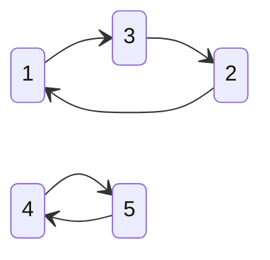
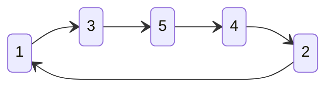

# 83 场双周赛

## [6128. 最好的扑克手牌](https://leetcode.cn/problems/best-poker-hand/)


简单的模拟题，直接写就行：

```java
class Solution {
    public String bestHand(int[] ranks, char[] suits) {
        int i = 1;
        while (i < 5) {
            if (suits[i] != suits[i - 1]) break;
            i++;
        }
        if (i == 5) return "Flush";
        int[] buckets = new int[13];
        for (int rank : ranks) buckets[rank - 1]++;
        int max = 1;
        for (int num : buckets) {
            if (num >= 3) return "Three of a Kind";
            max = Math.max(num, max);
        }
        return max == 2 ? "Pair" : "High Card";
    }
}
```

## [6129. 全 0 子数组的数目](https://leetcode.cn/problems/number-of-zero-filled-subarrays/)


因为找的是子数组，所以其实就是找连续的 0，

使用双指针找连续 0 的窗口大小，然后求解窗口内的子数组的个数即可

```java
class Solution {
    public long zeroFilledSubarray(int[] nums) {
        long rst = 0;
        int len = nums.length;
        for (int i = 0; i < len; i++) {
            if (nums[i] != 0) continue;
            int next = i;
            while (next < len && nums[next] == 0) next++;
            int size = next - idx;
            rst += (((long)(1 + size) * (long)size) >> 1);
            i = next - 1;
        }
        return rst;
    }
}
```

## [6130. 设计数字容器系统](https://leetcode.cn/problems/design-a-number-container-system/)


看到这个题，第一眼感觉就需要使用 map，来一个 map 用来保存 number 和对应的 index，因为一个 number 可能对应很多个 index，我们需要从中返回最小的，所以想到了使用有序集合(TreeSet)作为 value 存储

即定义了 Map<Integer, TreeSet\<Integer>> numToIdx，表示 number 到 index 的映射

此外因为会修改原来 index 处的 number，这会导致 number 对应 index 的最小下标的改变，需要记录 index 到 number 的映射

根据输入范围，index 和 number 较为分散，所以这里都是用传统的 map 而不是数组进行存储

```java
class NumberContainers {
    private Map<Integer, Integer> idxToNum;
    private Map<Integer, TreeSet<Integer>> numToIdx;
    public NumberContainers() {
        this.idxToNum = new HashMap<>();
        this.numToIdx = new HashMap<>();
    }
    
    public void change(int index, int number) {
        // 首先找到对应 index 下是否已经存储过 number 了
        int pre = idxToNum.getOrDefault(index, -1);
        // 如果已经存储过了，需要将对应 number 的 index 从有序集合(TreeSet)中删除
        if (pre > 0) {
            TreeSet<Integer> preSet = numToIdx.get(pre);
            preSet.remove(index);
        }
        // 然后就是添加新的映射
        idxToNum.put(index, number);
        TreeSet<Integer> set = numToIdx.getOrDefault(number, new TreeSet<>());
        set.add(index);
        numToIdx.put(number, set);
        
    }
    
    public int find(int number) {
        // 返回的时候注意 set 为空(删空了)和 set 为 null(从未添加过对应的 number)都需要返回 -1
        TreeSet<Integer> set = numToIdx.get(number);
        if (set == null || set.size() == 0) return -1;
        return set.first();
    }
}
```

## [6131. 不可能得到的最短骰子序列](https://leetcode.cn/problems/shortest-impossible-sequence-of-rolls/)


首先思路是这样的，对于一个 k 面的骰子，首先考虑序列长度为 1 的情况，此时一定存在一个最小的下标 idx(idx >= k - 1)，在 idx 之前遇到了 k - 1 种面，而在 idx 处遇到了剩下的一个面，这样遍历到 idx 时，能正好凑成一共遇到了 k 种面

比如考虑 k = 4 的情况，序列 {1,2,3,4}，这个 idx 就是 3；而序列 {1,1,1,1,1,2,3,4}，这个 idx 就是 7

我们发现这个 idx 和所有 k 面的下标中最大的那个是相关的

按照上面的第一种情况 1 对应的下标是 0；2 对应了 1；3 对应了 2；4 对应了 3，这里面最大的就是 3，所以 idx 就是 3

而第二种情况也是类似的，1 对应的是 0，1，2，3，4；2 对应了 5；3 对应了 6，4 对应了 7，所以 idx 就是 4

这个 idx 保证了，在 idx 前，以每个面都出现了一次，即保证了序列长度为 1 的情况一定存在

现在考虑序列长度为 2 的情况，此时需要在上一种情况的基础上，继续向后找，现在假设上一种情况找到了 idx，现在我们需要找到 idx'，保证从 idx 到 idx' 这个区间内， k 个面，每个面至少出现了一次

所以更为一般的做法是使用存储每个面的下标，并通过遍历的方式让子序列的长度自增，具体的看代码部分

```java
class Solution {
	public int shortestSequence(int[] rolls, int k) {
        // 存储 k 个面的下标，因为 k 是连续的，这里使用 list 存储，而不是 map
        // 对于每个面，其下标通过一个队列的方式进行存储
		List<Queue<Integer>> list = new ArrayList<>();
        // i = 0，对应了 k = 1 的面的下标
		for (int i = 0; i < k; i++) list.add(new LinkedList<>());
        // 第一次遍历数组，存储面和下标的关系
		for (int i = 0; i < rolls.length; i++) list.get(rolls[i] - 1).offer(i);
		int idx = 0;
		int rst = 1;
        // 一轮循环就是找 idx 的过程，如果找到了，就让子序列的长度自增，然后找下一轮的 idx
		while (idx < rolls.length) {
            // origin 为当前轮次，子序列的开头下标
			int origin = idx;
            // 遍历 k 个面
			for (int i = 0; i < k; i++) {
                // 第 i 个面的下标队列
				Queue<Integer> queue = list.get(i);
                // 如果得到的下标比当前轮次的开始下标还小，其对长度为 rst 的子序列是没有贡献的，需要让其出队
				while (!queue.isEmpty() && queue.peek() < origin) queue.poll();
                // 如果队列空的话，证明找不到比上一轮 idx 更大的下标了，直接返回即可
				if (queue.isEmpty()) return rst;
                // 不断更新当前轮次的最大下标
				idx = Math.max(queue.poll(), idx);
			}
			idx++;
			rst++;
		}
		return rst;
	}
}
```

## 锐评

其实是比较简单的，最后一个困难题看起来有点麻烦，有了倒数第二道题的铺垫，其实会把思路往分类统计这个方向上引，还是很容易想出来的

最开始做最后一个题，一看题就想着使用二分，因为这种题从问题上来看，好像可以根据结果的二段性进行二分，实际想了一下，实在是想不出如何判断长度为 mid 子序列是否存在，如果真是硬遍历的话，那么二分的优势反倒不在了

# 303 场周赛

## [6124. 第一个出现两次的字母](https://leetcode.cn/problems/first-letter-to-appear-twice/)


简单的模拟题，找到一个词频为 2 的字符就行

```java
class Solution {
    public char repeatedCharacter(String s) {
        char[] bucket = new char[26];
        for (int i = 0; i < s.length(); i++) {
            char c = s.charAt(i);
            if (bucket[c - 'a'] == 1) return c; 
            bucket[c - 'a']++;
        }
        // 这里没意义，因为题目说了一定有重复的字符，说明我们的程序不可能运行到这里，这里的 return 'a' 就是为了让程序不报错
        return 'a';
    }
}
```

## [6125. 相等行列对](https://leetcode.cn/problems/equal-row-and-column-pairs/)


上来没有好的思路就想着遍历，再一看输入范围才 200，暴力枚举的时间复杂度为 O($n^3$)，那就暴力吧

```java
class Solution {
    public int equalPairs(int[][] grid) {
        int rst = 0;
        int n = grid.length;
        for (int i = 0; i < n; i++) {
            for (int j = 0; j < n; j++) {
                if (compare(i, j, grid)) rst++;
            }
        }
        return rst;
    }
    
    public boolean compare(int i, int j, int[][] grid) {
        for (int idx = 0; idx < grid.length; idx++) {
            if (grid[i][idx] != grid[idx][j]) return false;
        }
        return true;
    }
}
```

## [6126. 设计食物评分系统](https://leetcode.cn/problems/design-a-food-rating-system/)


从形式上和[6130. 设计数字容器系统](#6130-设计数字容器系统)，基本差不多，都是 Map，一个 key 保存着很多的 value，然后需要从中取出最大的那个，那么就让 value 为一个有序集合就行了

```java
class FoodRatings {
    // 食物到评分
	private Map<String, Integer> foodToRates;
    // 烹饪方式到食物
	private Map<String, TreeSet<String>> cuisToFood;
    // 食物到烹饪方式
	private Map<String, String> foodTocuis;
	public FoodRatings(String[] foods, String[] cuisines, int[] ratings) {
		int len = foods.length;
		this.foodToRates = new HashMap<>(len);
		this.cuisToFood = new HashMap<>(len);
		this.foodTocuis = new HashMap<>(len);
		for (int i = 0; i < len; i++) {
			foodToRates.put(foods[i], ratings[i]);
            // 注意这里 new TreeSet 的时候注意，我们以食物的评分为标准，在评分一样的时候，字典序小的那个排在前面
			TreeSet<String> set = cuisToFood.getOrDefault(cuisines[i], new TreeSet<>((s1, s2) -> {
				int r1 = foodToRates.get(s1);
				int r2 = foodToRates.get(s2);
				if (r1 == r2) return s1.compareTo(s2);
				return r2 - r1;
			}));
			set.add(foods[i]);
			cuisToFood.put(cuisines[i], set);
			foodTocuis.put(foods[i], cuisines[i]);
		}
	}
    
	/**
	 * 先删老节点，然后修改评分后，再把节点加回去
	 * 为什么要先删再加，因为 TreeSet 不会因为节点的 val 改变了而自动重新平衡
	 * 所以需要先删，修改值后，再添加
	 */
	public void changeRating(String food, int newRating) {
		if (newRating == foodToRates.get(food)) return;
		String cuisine = foodTocuis.get(food);
		TreeSet<String> set = cuisToFood.get(cuisine);
		set.remove(food);
		foodToRates.put(food, newRating);
		set.add(food);
	}

	public String highestRated(String cuisine) {
		return cuisToFood.get(cuisine).first();
	}
}
```

## [6127. 优质数对的数目](https://leetcode.cn/problems/number-of-excellent-pairs/)


这个题其实很简单，首先 bitCount 就不说了，这个可以在 O(1) 的时间内求解([高效的bitCount](./基础不牢地动山摇.md#bitCount))，实在不行使用 Integer 自带的 bitCount 也可以在 O(1) 的时间内获取

关键点在于想明白 bitCount(num1 & num2) + bitCount(num1 | num2) = bitCount(num1) + bitCount(num2)

考虑两个位模式 num1 = xxxx；num2 = xxxx，假如我们考虑的是次高位即 x<u>x</u>xx

对于两个位模式中其中一个为 1 另一个为 0 的情况，比如 x1xx 和 x0xx，那么在统计的时候，仅 num1 | num2 会统计一次

对于两个位模式中其中一个为 1 另一个也为 1 的情况，比如 x1xx 和 x1xx，那么在统计的时候，num1 | num2 会统计一次，num1 & num2 也会统计一次

两个都是 0 的情况就不考虑的，反正都不统计，其他的位也是一样的

这样对于二进制的情况，我们发现 | 和 & 运算的统计结果，和原来数字本身的统计结果是可以对应上的，因此 bitCount(num1 & num2) + bitCount(num1 | num2) = bitCount(num1) + bitCount(num2)

这样我们仅需要使用一个数组统计每种 bitCount 的个数就好了，特别的对于正数的 int 类型最多具有 31 个 1，最少也有 1 个 1，这样所有的输入都可以被划分到 31 类中的某一类

```java
class Solution {
    public long countExcellentPairs(int[] nums, int k) {
        Set<Integer> set = new HashSet<>();
        int[] preSum = new int[32];
        // 按照题意需要过滤掉那些重复的数字
        for (int i = 0; i < nums.length; i++) {
            if (set.contains(nums[i])) continue;
            set.add(nums[i]);
            preSum[bitCount(nums[i])]++;
        }
        // 前缀和数组
        for (int i = 2; i < 32; i++) preSum[i] += preSum[i - 1];
        long rst = 0;
        // 简单的统计工作
        for (int i = Math.max(1, k - 31); i < 32; i++) {
            if (preSum[i] == preSum[i - 1]) continue;
            int count = preSum[i] - preSum[i - 1];
            int less = Math.max(1, k - i);
            rst += (long)count * (long)(preSum[31] - preSum[less - 1]);
        }
        return rst;
    }

    private int bitCount(int num) {
        num = (num & 0x55555555) + ((num >> 1) & 0x55555555);
        num = (num & 0x33333333) + ((num >> 2) & 0x33333333);
        num = (num & 0x0f0f0f0f) + ((num >> 4) & 0x0f0f0f0f);
        num = (num & 0x00ff00ff) + ((num >> 8) & 0x00ff00ff);
        num = (num & 0x0000ffff) + ((num >> 16) & 0x0000ffff);
        return num;
    }
}
```

# 304 场周赛

## [6132. 使数组中所有元素都等于零](https://leetcode.cn/problems/make-array-zero-by-subtracting-equal-amounts/)


这个题，比赛的时候按照模拟做的，当时还想着这个题怎么这么麻烦

```java
class Solution {
    public int minimumOperations(int[] nums) {
        // 桶排序，diff 个数不为 0 的桶的种类的个数
        int[] bucket = new int[101];
        int diff = 0;
        for (int num : nums) {
            if (num == 0) continue;
            if (bucket[num] == 0) diff++;
            bucket[num]++;
        }
        int rst = 0;
        while (diff != 0) {
            int idx = 1;
            while (idx <= 100 && bucket[idx] == 0) idx++;
            if (idx == 101) break;
            diff--;
            for (int j = idx + 1; j <= 100; j++) {
                if (bucket[j] == 0) continue;
                bucket[j - idx] = bucket[j];
                bucket[j] = 0;
            }
            rst++;
        }
        return rst;
    }
}
```

中间提交的时候还错了一次，真是废物

其实这个题真的很简单，虽然描述上，有时找到最小的，然后再进行减法，其实就是找原始数组中存在多少种数字

因为按照题意，每轮会消除数值上最小的数字，这里不需要考虑个数，而需要计算轮次，所以其实就是计算数字的种类

```java
class Solution {
    public int minimumOperations(int[] nums) {
        Set<Integer> set = new HashSet<>();
        for (int num : nums) {
            if (num == 0) continue;
            set.add(num);
        }
        return set.size();
    }
}
```

>   我是傻逼

## [6133. 分组的最大数量](https://leetcode.cn/problems/maximum-number-of-groups-entering-a-competition/)


一般性的想法是排序，小数放在前面，大数放在后面排序后，然后从第一组开始，每组的元素个数需要比前面大，每组的和也要比前面大

```java
class Solution {
	public int maximumGroups(int[] grades) {
		Arrays.sort(grades);
		int preSum = 0;
		int preCount = 0;
		int idx = 0;
		int rst = 0;
		while (idx < grades.length) {
			int sum = 0;
			int count = 0;
			while (idx < grades.length && (sum <= preSum || count <= preCount)) {
				sum += grades[idx];
				count++;
				idx++;
			}
			if (sum <= preSum || count <= preCount) break;
			rst++;
			preSum = sum;
			preCount = count;
		}
		return rst;
	}
}
```

但是，我想问有必要这么麻烦吗？

你都排好序了，后一组的数字的个数只要比前一组多，那么后一组的和就是比前一组大，那么为了让组数尽可能多，我们就让第一组仅包含一个，第二组包含两个...

然后我们发现，这么排列好像也并不需要排序啊，它没有问每组应该怎么分，他就问了可以分成多少组，按理说只要有 1 个元素，就可以分一组，只要有 3 个元素就可以分两组...

那么为了分成 n 组，至少需要 (1 + n) * n / 2 个元素 ...

这不就变成解方程了吗：y = (1 + n) * n / 2，求解 y，根据小学二年级学过的通项公式，很容易得出 n = $\frac{\sqrt{1 + 8y}}{2}$

直接一行代码结束战斗(看到了 8 和 2 甚至可以使用位运算避免乘除)

```java
class Solution {
    public int maximumGroups(int[] grades) {
        return ((int)Math.sqrt((grades.length << 3) + 1) - 1) >> 1;
    }
}
```

>   怎么比赛的时候没想到呢

## [6134. 找到离给定两个节点最近的节点](https://leetcode.cn/problems/find-closest-node-to-given-two-nodes/)


最暴力的做法是直接两次 dijkstra，然后遍历所有边，找到 max dis 的最小值，但这个图比较特殊，每个节点最多只具有一条出边，所以可以省去建图的环节，也正是因为只有一条出边，因此 BFS 和 DFS 是一样的，所以根本不需要借助堆找到最短边，DFS 找到的下一个点就是最短边

因此借助数组两次 DFS 遍历，即可分别得到 dis 数组，然后遍历两个 dis 数组即可

```java
class Solution {
    private static final int INF = 0x3f3f3f3f;
    public int closestMeetingNode(int[] edges, int node1, int node2) {
        int n = edges.length;
        int[] dis1 = new int[n];
        Arrays.fill(dis1, INF);
        dis1[node1] = 0;
        // 优雅的 for 循环，将所有的分支条件，更新，都写在循环内部了
        // 注意到只有当前距离 d 小于 dis[ne] 时才会更新，这是为了避免环
        for (int ne = edges[node1], d = 1; ne != -1 && d < dis1[ne]; dis1[ne] = d, ne = edges[ne], d++);
        int[] dis2 = new int[n];
        Arrays.fill(dis2, INF);
        dis2[node2] = 0;
        for (int ne = edges[node2], d = 1; ne != -1 && d < dis2[ne]; dis2[ne] = d, ne = edges[ne], d++);
        int d = INF;
        int rst = -1;
        for (int i = 0; i < n; i++) {
            int max = Math.max(dis1[i], dis2[i]);
            if (d > max) {
                d = max;
                rst = i;
            }
        }
        return rst;
    }
}
```

## [6135. 图中的最长环](https://leetcode.cn/problems/longest-cycle-in-a-graph/)


这个题别想那么多，就是简单的找最大的环，别管他是什么图，总之拓扑排序就行了，唯一需要注意的就是注意有的点是没有出边的(出边使用 -1 表示)

```java
class Solution {
    public int longestCycle(int[] edges) {
        int len = edges.length;
        int[] indegree = new int[len];
        for (int end : edges) {
            if (end == -1) continue;
            indegree[end]++;
        }
        Queue<Integer> queue = new LinkedList<>();
        for (int i = 0; i < len; i++) {
            if (indegree[i] == 0) queue.offer(i);
        }
        while (!queue.isEmpty()) {
            int tmp = queue.poll();
            if (edges[tmp] == -1) continue;
            indegree[edges[tmp]]--;
            if (indegree[edges[tmp]] == 0) queue.offer(edges[tmp]);
        }
        int rst = -1;
        for (int i = 0; i < len; i++) {
            if (indegree[i] == 0) continue;
            boolean flag = true;
            int tmp = i;
            int size = 0;
            while (flag) {
                size++;
                indegree[tmp]--;
                tmp = edges[tmp];
                flag = tmp != i;
            }
            rst = Math.max(rst, size);
        }
        return rst;
    }
}
```

# 84 场双周赛

## [6141. 合并相似的物品](https://leetcode.cn/problems/merge-similar-items/)


先使用 Map 进行合并操作，然后再进行排序即可

```java
class Solution {
    public List<List<Integer>> mergeSimilarItems(int[][] items1, int[][] items2) {
        Map<Integer, Integer> map = new HashMap<>();
        for (int[] item : items1) map.put(item[0], map.getOrDefault(item[0], 0) + item[1]);
        for (int[] item : items2) map.put(item[0], map.getOrDefault(item[0], 0) + item[1]);
        List<List<Integer>> rst = new ArrayList<>();
        for (int key : map.keySet()) {
            rst.add(Arrays.asList(key, map.get(key)));
        }
        rst.sort((nums1, nums2) -> nums1.get(0) - nums2.get(0));
        return rst;
    }
}
```

>   当然也可以先排序，然后直接放入 list 中

## [6142. 统计坏数对的数目](https://leetcode.cn/problems/count-number-of-bad-pairs/)


与其统计坏对数，不如统计好对数，最后从所有数对中减去好数对，得到的就是坏对数的个数

按照题目的说法，好对数应该是：对于 i < j，有 nums[j] - nums[i] = j - i，也即下标之差等于数值之差

乍一看好像还是需要 $O(n^2)$ 的统计，先别急

对于上式可以进行左右移项，得到 nums[j] - j = nums[i] - i

如果我们对整个数组进行修改，让 nums[i] = nums[i] - i，那么对于那些满足好数对的数字，其修改后取值应该相同

这样对于修改后的数组，我们统计有多少个重复的数字，就可以统计出有多少个好数对了

```java
class Solution {
    public long countBadPairs(int[] nums) {
        int len = nums.length;
        // 所有的数对
        long rst = ((long)(len - 1) * len) >> 1;
        for (int i = 0; i < len; i++) nums[i] = nums[i] - i;
        Arrays.sort(nums);
        int left = 0;
        while (left < len) {
            int right = left + 1;
            while (right < len && nums[right] == nums[left]) right++;
            // 好数对
            int win = right - left;
            rst -= ((long)(win - 1) * win) >> 1;
            left = right;
        }
        return rst;
    }
}
```

## [6174. 任务调度器 II](https://leetcode.cn/problems/task-scheduler-ii/)


模拟题，没什么问题，不多说

```java
class Solution {
    public long taskSchedulerII(int[] tasks, int space) {
        Map<Integer, Long> map = new HashMap<>();
        long rst = 0;
        for (int task : tasks) {
            rst++;
            long pre = map.getOrDefault(task, -1L);
            if (pre > 0 && rst - pre <= space) rst = pre + space + 1;
            map.put(task, rst);
        }
        return rst;
    }
}
```

## [6144. 将数组排序的最少替换次数](https://leetcode.cn/problems/minimum-replacements-to-sort-the-array/)


首先我们需要明确的是，应该从后向前遍历，才能决定是否需要进行元素的拆分

其次我们也知道，在从后先前遍历的过程中，如果当前元素(i)小于等于上一个元素(i + 1)：nums[i] <= nums[i + 1]，此时我们不需要拆分当前元素

唯一需要拆分的情况就是当前元素比上一个元素更大，即 nums[i] > nums[i + 1]

设 nums[i] = n; nums[i + 1] = m，显然对于拆分的情况，一定有： km < n <= (k + 1)m，其中 k >= 1

如果此时我们将 n 拆分为 k 份，那么一定有一份其取值大于 m，不满足题干条件，所以我们是一定需要将 n 拆分为 k + 1 份的，所以现在就变成了找一个上界，即 (k + 1)m

如果 n 本身就是 m 的整数倍，即 n = (k + 1)m 那么显然 $\frac{n}{m} = k + 1$，此时进行 k 次拆分，即可将 n 拆分为 k + 1 份，且每一份都精确的等于 m，此时新的边界还是 m

如果 n 不是 m 的整数倍，即 n < (k + 1)m，那么显然 $\frac{n}{m} = k$(这里指代的是 int 类型的除法，这种除法本身就会向下取整)，同样此时进行 k 次拆分，将 n 差分为 k + 1 份，但其中 k 份为 m，最后一份为 n - km，此时新的边界变为了 n - km

然而，对于第二种情况，如果我们这么拆分得到的并不是最优解，尽管我们知道 n 是无法得到 k + 1 个 m 的，但我们还是对其进行 m 整数倍的拆分，这会导致最后剩下的 n - km 太小了，这会对下一个数 nums[i - 1] 的限制收窄，按照贪心的想法，我们应该尽可能保证在等分后不大于 m 的前提下，尽可能大，这样对 num[i - 1] 的限制会被放宽

现在还是将 n 分成了 k + 1 份，但现在力求均等分(而不是每份都是 m)，这样每份的大小应该为 $\frac{n}{k + 1}$，同样是应该 int 类型的除法会向下取整，此时我们得到的 $\frac{n}{m + 1}$ 可以作为当前均分的边界，即排在 num[i - 1] 的后面

```java
class Solution {
	public long minimumReplacement(int[] nums) {
		long rst = 0;
		int back = Integer.MAX_VALUE;
		for (int i = nums.length - 1; i >= 0; i--) {
			if (nums[i] <= back) {
				back = nums[i];
				continue;
			}
            int count = nums[i] / back;
            if (nums[i] % back == 0) {
                // 如果可以整除，那么 count 对应的是 k + 1
                rst += count - 1;
            } else {
                // 如果不能整除 count 对应的是 k
                rst += count;
                back = nums[i] / (count + 1);
            }
		}
		return rst;
	}
}
```

# 305 场周赛

## [6136. 算术三元组的数目](https://leetcode.cn/problems/number-of-arithmetic-triplets/)


暴力的枚举第一个位置，然后二分的找第二个和第三个

```java
class Solution {
    public int arithmeticTriplets(int[] nums, int diff) {
        int len = nums.length;
        int rst = 0;
        for (int i = 0; i < len - 2; i++) {
            int target = nums[i] + diff;
            int left = i + 1;
            int right = len - 1;
            while (left < right) {
                int mid = left + ((right - left) >> 1);
                if (nums[mid] < target) {
                    left = mid + 1;
                } else {
                    right = mid;
                }
            }
            if (nums[left] != target) continue;
            left = left + 1;
            right = len - 1;
            target += diff;
            while (left < right) {
                int mid = left + ((right - left) >> 1);
                if (nums[mid] < target) {
                    left = mid + 1;
                } else {
                    right = mid;
                }
            }
            if (left >= nums.length || nums[left] != target) continue;
            rst++;
        }
        return rst;
    }
}
```

## [6139. 受限条件下可到达节点的数目](https://leetcode.cn/problems/reachable-nodes-with-restrictions/)


简单的 BFS

```java
class Solution {
    public int reachableNodes(int n, int[][] edges, int[] restricted) {
        Set<Integer> set = new HashSet<>();
        for (int r : restricted) set.add(r);
        int[] head = new int[n];
        Arrays.fill(head, -1);
        int[] newEdges = new int[(n - 1) << 1];
        int[] next = new int[(n - 1) << 1];
        int idx = 0;
        for (int[] edge : edges) {
            newEdges[idx] = edge[1];
            next[idx] = head[edge[0]];
            head[edge[0]] = idx++;
            newEdges[idx] = edge[0];
            next[idx] = head[edge[1]];
            head[edge[1]] = idx++;
        }
        Queue<Integer> queue = new LinkedList<>();
        queue.offer(0);
        set.add(0);
        int rst = 1;
        while (!queue.isEmpty()) {
            int size = queue.size();
            for (int i = 0; i < size; i++) {
                int tmp = queue.poll();
                for (int edge = head[tmp]; edge != -1; edge = next[edge]) {
                    int end = newEdges[edge];
                    if (set.contains(end)) continue;
                    queue.offer(end);
                    set.add(end);
                    rst++;
                }
            }
        }
        return rst;
    }
}
```

## [6137. 检查数组是否存在有效划分](https://leetcode.cn/problems/check-if-there-is-a-valid-partition-for-the-array/)


dp[i] 表示从开头到第 i 个元素之间是否满足一个有效的划分，因为元素之间需要两个到三个才能确定关系，所以状态转移方程中 dp[i] 会从 dp[i - 2]、dp[i - 3] 转移而来

这里定义 dp 数组长度为 nums.length + 1，保留了 dp[0] = true

如果满足相等的条件，即 nums[i] = nums[i - 1]，此时 dp[i] |= dp[i - 2]；而如果跟进一步的满足了 nums[i - 1] = nums[i - 2]，此时有 dp[i] |= dp[i - 3]

如果满足递增的条件，即 num[i] = nums[i - 1] + 1 = nums[i - 2] + 2，同样具有 dp[i] |= dp[i - 3]

状态的转移注意到状态之间是或的关系，即当前位置 i 只要能从上述三个位置中的一个转移而来即可

```java
class Solution {
    public boolean validPartition(int[] nums) {
        int len = nums.length;
        boolean[] dp = new boolean[len + 1];
        dp[0] = true;
        for (int i = 2; i <= len; i++) {
            if (nums[i - 1] == nums[i - 2]) {
                dp[i] |= dp[i - 2];
                if (i >= 3 && nums[i - 2] == nums[i - 3]) dp[i] |= dp[i - 3]; 
            }
            if (nums[i - 1] == nums[i - 2] + 1 && i >= 3 && nums[i - 2] == nums[i - 3] + 1) dp[i] |= dp[i - 3];
        }
        return dp[len];
    }
}
```

## [6138. 最长理想子序列](https://leetcode.cn/problems/longest-ideal-subsequence/)


定义 dp[i] 表示以 s[i] 结尾的最长理想字符串

因为是子序列，所以 dp[i] 可能从 i - 1、i - 2...0 转移而来，从其中选择最大的转移，即 dp[i] = Math.max(dp[j], dp[k], dp[m], dp[n]...) + 1 其中 i > j,k,m,n... 且一定有 Math.abs(s[j,k,m,n...] - s[i]) <= k

这样算下来的话，时间复杂度为 $O(n^2)$，看了一眼输入范围为 $10^5$，应该是超时了

但这个状态定义看起来正确无比，怎么会有问题的，而且这个状态转移还是从前面的某个位置转移到的，没有办法通过滚动数组优化

此时想到了三叶姐曾经说过可以从"小的数"作为突破口，在这里，主要是看到了小写英文字母的条件

是不是可以定义一个大小为 26 的 dp 数组，其中 dp[i] 表示以字母 i + 'a' 结尾的最长的理想字符串的长度

这样我们在第二层枚举的时候，就具有固定的开销 2k 了，整体的时间复杂度从 $O(n^2)$ 降低为 $O(n \times k)$

```java
class Solution {
    public int longestIdealString(String s, int k) {
        int[] dp = new int[26];
        char[] chars = s.toCharArray();
        int len = chars.length;
        int rst = 0;
        for (int i = 0; i < len; i++) {
            int idx = chars[i] - 'a';
            int pre = 0;
            for (int j = Math.max(0, idx - k); j <= Math.min(25, idx + k); j++) pre = Math.max(pre, dp[j]);
            dp[idx] = Math.max(dp[idx], pre + 1);
            rst = Math.max(dp[idx], rst);
        }
        return rst;
    }
}
```

# 306 场周赛

## [6148. 矩阵中的局部最大值](https://leetcode.cn/problems/largest-local-values-in-a-matrix/)


简单的模拟题

```java
class Solution {
    public int[][] largestLocal(int[][] grid) {
        int n = grid.length;
        int[][] rst = new int[n - 2][n - 2];
        for (int i = 0; i < n - 2; i++) {
            for (int j = 0; j < n - 2; j++) {
                int max = 0;
                for (int p = i; p < i + 3; p++) {
                    for (int q = j; q < j + 3; q++) {
                        max = Math.max(max, grid[p][q]);
                    }
                }
                rst[i][j] = max;
            }
        }
        return rst;
    }
}
```

## [6149. 边积分最高的节点](https://leetcode.cn/problems/node-with-highest-edge-score/)


需要注意的点是，整数可能溢出，所以还是使用 long 保存每个节点的分数吧

```java
class Solution {
    public int edgeScore(int[] edges) {
        int len = edges.length;
        // 因为 int 类型会溢出所以使用 long 类型保存
        long[] marks = new long[len];
        for (int i = 0; i < len; i++) marks[edges[i]] += i;
        long max = marks[0];
        int rst = 0;
        for (int i = 1; i < len; i++) {
            // 呵
            if (marks[i] > max) {
                max = marks[i];
                rst = i;
            }
        }
        return rst;
    }
}
```

## [6150. 根据模式串构造最小数字](https://leetcode.cn/problems/construct-smallest-number-from-di-string/)


也算是模拟题吧，有点贪心的想法在

pattern 长度为 len 时，构造的字符串长度为 len + 1

这里使用 mask 记录已经使用的 number，一共就 1 到 9，所以使用 int 表示掩码，就够了

遇到 I 的时候说明当前 num 应该比后面的一个 num 小(这样才能保证一个上升)，按照正常的升序添加 num，那么字典序就已经是最小的了

遇到 D 的时候说明当前 num 应该比后面一个 num 大，此时并不能确定当前 num 应该多大，因为不知道后面的增减情况，比如 "DD" 和 "DI" 就有很大区别，"DD" 对应的最小为 "321"；而 "DI" 对应的最小为 "213"

所以遇到 D 的处理方式是继续向后遍历，查看连续 "D" 的个数，确定当前 num 应该从多少开始取值

```java
class Solution {
	public String smallestNumber(String pattern) {
		int mask = 0;
		StringBuilder builder = new StringBuilder();
		char[] chars = pattern.toCharArray();
		int len = pattern.length();
		for (int i = 0; i < len; i++) {
            // 遇到 I 的时候直接向后找到最小的，未被使用的 num 就好了
			if (chars[i] == 'I') {
				int idx = 1;
				while (idx <= 9) {
					if (((mask >> idx) & 1) == 0) break;
					idx++;
				}
				builder.append(idx);
				mask |= 1 << idx;
			} else {
                // 如果是 D 就看看连续的 D 的个数
				int j = i + 1;
				while (j < len && chars[j] == 'D') j++;
				int win = j - i;
				int idx = 1;
                // 注意这里的循环，他对应的就是连续 D 后面的那个数字
				while (idx <= 9) {
					if (((mask >> idx) & 1) == 0) break;
					idx++;
				}
                // 自增 idx，此后对应的是在连续 D 区间的 num
				idx++;
                // 这里使用 tmp 记录连续 D 区间内的 num
				StringBuilder tmp = new StringBuilder();
				while (idx <= 9 && win > 0) {
					if (((mask >> idx) & 1) == 0) {
						tmp.append(idx);
						mask |= 1 << idx;
						win--;
					}
					idx++;
				}
				i = j - 1;
                // 直接把 tmp 反转后接在 builder 上，相当于遍历完连续 D 的区间，正是有了这个 tmp 才可以在 O(n) 的时间内完成构造
				builder.append(tmp.reverse());
			}
		}
        // 最后再添加一个，因为 pattern 的长度为 len，而 builder 的长度为 len + 1
		for (int i = 1; i <= 9; i++) {
			if (((mask >> i) & 1) == 0) {
				builder.append(i);
				break;
			}
		}
		return builder.toString();
	}
}
```

## [6151. 统计特殊整数](https://leetcode.cn/problems/count-special-integers/)


给定了 n，要找比 n 小的，满足不重复的个数，我当时的想法是，位数比 n 小的肯定都满足，所以先打个表，算一下各个位数下的不重复的个数

然后考虑位数和 n 一样的情况，此时根据最高位的情况，和 n 的关系又可以分为最高位比 n 小的和最高位和 n 一样的两类：

*   对于第一类：这个统计好统计，使用一个 mask 记录当前已经使用的 num，然后使用类似上面大表的写法，即可求出
*   对于第二类，这个稍微麻烦一点，如果最高位和 n 相同，就需要考虑次高位和 n 的次高位的关系了，这里就可以看出递归的逻辑了

```java
class Solution {
    // 打表，找到各个位数下满足的 num 的个数
	private static final int[] MAP = new int[10];
	private List<Integer> list;
	private boolean flag;
	static {
		int base = 9;
		MAP[1] = base;
		int count = 9;
		int idx = 2;
		while (idx <= 9) {
			MAP[idx] = MAP[idx - 1] * count;
			count--;
			idx++;
		}
	}
	public int countSpecialNumbers(int n) {
		this.list = new ArrayList<>();
		this.flag = false;
		int mask = 0;
        // 算一下 n 的位数，并将 n 按照位的形式保存到 list 中
		while (n != 0) {
			int tmp = n % 10;
			if (((mask >> tmp) & 1) == 1) flag = true;
			mask |= 1 << tmp;
			list.add(tmp);
			n /= 10;
		}
		int rst = 0;
        // 比 n 位数小的直接加就行了
		for (int i = 1; i < list.size(); i++) rst += MAP[i];
        // 这里是为了让 list(0) 表示 n 的最高位，所以交换了以下
		for (int i = 0, j = list.size() - 1; i < j; i++, j--) {
			int tmp = list.get(i);
			list.set(i, list.get(j));
			list.set(j, tmp);
		}
        // dfs 函数用来位数和 n 一样的，也满足条件的数字的个数
		rst += dfs(0, 0);
		return rst;
	}
	private int dfs(int idx, int mask) {
		if (idx == list.size()) {
			if (flag) return 0;
			return 1;
		}
		int high = list.get(idx);
		// 整个 rst 由两部分组成，分别对应了上面的第一类和第二类
        int rst = 0;
		int tmp = high;
        // if-else 块用来计算第一类的情况
        // 这里判断的是当前是不是最高位
       	// 因为一个数字不存在前导 0 所以如果是最高位，需要排除掉最高位为 0 的情况
		if (idx == 0) {
			tmp--;
			if (tmp > 0) {
				int count = 9;
				for (int i = idx + 1; i < list.size(); i++) {
					tmp *= count;
					count--;
				}
			}
		} else {
            // 排除掉已经占用的 num
			for (int i = 0; i < high; i++) {
				if ((mask >> i & 1) == 1) tmp--;
			}
			if (tmp > 0) {
                // 计算后面低位还可以使用的 num 的个数
				int count = 9;
				for (int i = 0; i < 10; i++) {
					if ((mask >> i & 1) == 1) count--;
				}
				if (count > 0) {
                    // 类似前面打表的做法
					for (int i = idx + 1; i < list.size(); i++) {
						tmp *= count;
						count--;
					}
				}
			}
		}
		rst = tmp;
        // 如果 n 本身就具有重复的数字，那么就不要考虑第二类了
		if ((mask >> list.get(idx) & 1) == 1) return rst;
		mask |= 1 << list.get(idx);
		rst += dfs(idx + 1, mask);
		return rst;
	}
}
```

写的跟屎一样:shit:

还是看看 [数位 dp](./基础不牢地动山摇.md#应该是数位 dp 吧) 吧家人们

# 85 场双周赛

## [6156. 得到 K 个黑块的最少涂色次数](https://leetcode.cn/problems/minimum-recolors-to-get-k-consecutive-black-blocks/)


简单的滑动窗口

```java
class Solution {
    public int minimumRecolors(String blocks, int k) {
        int left = 0;
        int right = 0;
        int wCount = 0;
        while (right < k) {
            if (blocks.charAt(right) == 'W') wCount++;
            right++;
        }
        int rst = wCount;
        while (right < blocks.length()) {
            if (blocks.charAt(right) == 'W') wCount++;
            if (blocks.charAt(left) == 'W') wCount--;
            left++;
            right++;
            rst = Math.min(rst, wCount);
        }
        return rst;
    }
}
```

## [6157. 二进制字符串重新安排顺序需要的时间](https://leetcode.cn/problems/time-needed-to-rearrange-a-binary-string/)


比赛的时候想着暴力了，感觉应该有更好的办法，没想出来

```java
class Solution {
	public int secondsToRemoveOccurrences(String s) {
		return move(s.toCharArray());
	}

	private int move(char[] chars) {
		boolean unmodified = true;
        // 如果出现了 01 就交换
		for (int i = chars.length - 1; i >= 1; i--) {
			if (chars[i] == '1' && chars[i - 1] == '0') {
				chars[i - 1] = '1';
				chars[i] = '0';
				i--;
				unmodified = false;
			}
		}
		if (unmodified) return 0;
		return 1 + move(chars);
	}
}
```

所有移动最终的形式一定是 1xxx(这些都是 1)0xxx(这些都是 0)，即一堆 1 后面跟着 0

因此某一个 1 需要移动的次数，和它前面的 0 的个数相关，有几个 0 就需要移动多少次

然而并不是说有几个 0 就需要几秒，考虑 0011这种情况，因为两个 1 连续了，所以**后一个 1 需要等待前一个 1 先移动一次(先等 1 s)**，才能移动，等待 1s 后，变为了 0101 这种情况，此时两个 1 可以同时移动

然而这些都没什么用，尽管存在 O(n) 的做法：[O(n) 一次遍历（Python/Java/C++/Go） - 二进制字符串重新安排顺序需要的时间 - 力扣（LeetCode）](https://leetcode.cn/problems/time-needed-to-rearrange-a-binary-string/solution/by-endlesscheng-pq2x/)感觉状态转移还是有点牵强，不理解，这里还是贴出来做法：

```java
class Solution {
    public int secondsToRemoveOccurrences(String s) {
        int len = s.length();
        int[] dp = new int[len];
        int zeroCount = s.charAt(0) == '0'? 1:0;
        for (int i = 1; i < len; i++) {
            if (s.charAt(i) == '0') {
                dp[i] = dp[i - 1];
                zeroCount++;
                // 如果以 1 开头，那么就不需要移动，直到遇到 0 之后遇到了 1 才需要移动
            } else if (zeroCount > 0) {
                dp[i] = Math.max(dp[i - 1] + 1, zeroCount);
            }
        }
        return dp[len - 1];
    }
}
```

>   事实上，使用 dp 的仅仅是为了说明(~~然而就这样也没理解~~)，通过变量的方式可以进一步压缩空间

## [6158. 字母移位 II](https://leetcode.cn/problems/shifting-letters-ii/)


首先是区间修改，已经明显暗示是差分数组了

```java
class Solution {
    public String shiftingLetters(String s, int[][] shifts) {
        int len = s.length();
        // 将数组开到 len + 1 是为了防止操作差分数组的时候发生索引越界，实际有效的使用的范围就是 [0, len - 1]
        // int[] diff = new int[len]; 
        int[] diff = new int[len + 1];
        for (int[] shift : shifts) {
            if (shift[2] == 0) {
                diff[shift[0]]--;
                diff[shift[1] + 1]++; // 为了防止这里的操作越界才开到 len + 1 的
            } else {
                diff[shift[0]]++;
                diff[shift[1] + 1]--;
            }
        }
        // 这里为了节省空间，直接在差分数组上进行操作，经过这个 for 循环后差分数组就变为了原数组
        for (int i = 1; i < len; i++) diff[i] += diff[i - 1];
        for (int i = 0; i < len; i++) diff[i] %= 26;
        char[] chars = s.toCharArray();
        for (int i = 0; i < len; i++) {
            chars[i] += diff[i];
            if (diff[i] > 0) {
                if (chars[i] > 'z') chars[i] -= 26; 
            } else {
                if (chars[i] < 'a') chars[i] += 26;
            }
        }
        return new String(chars);
    }
}
```

## [6159. 删除操作后的最大子段和](https://leetcode.cn/problems/maximum-segment-sum-after-removals/)


比赛的时候看这个题，就想着每轮求解多个区间，然后从其中比较获得最大值，然后因为是区间求和，并且还需要不断修改，就想着使用树状数组(写了好多)

```java
class Solution {
	private long[] tree;
	private int[] nums;
	public long[] maximumSegmentSum(int[] nums, int[] removeQueries) {
		int len = nums.length;
		this.tree = new long[len + 1];
		this.nums = nums;
		for (int i = 0; i < len; i++) {
			add(i + 1, nums[i]);
		}
		TreeSet<Integer> set = new TreeSet<>((num1, num2) -> num1 - num2);
		set.add(len);
		long[] rst = new long[len];
		for (int i = 0; i < len; i++) {
			int idx = removeQueries[i];
			add(idx + 1, -nums[idx]);
			nums[idx] = 0;
			set.add(idx);
			long max = 0;
			long pre = 0;
			for (int num : set) {
				long tmp = query(num);
				max = Math.max(max, tmp - pre);
				pre = tmp;
			}
			rst[i] = max;
		}
		return rst;
	}

	private void add(int idx, int num) {
		while(idx < tree.length) {
			tree[idx] += num;
			idx += lowbit(idx);
		}
	}

	private long query(int idx) {
		long rst = 0;
		while (idx >= 1) {
			rst += tree[idx];
			idx -= lowbit(idx);
		}
		return rst;
	}

	private int lowbit(int num) {
		return num & (-num);
	}
}
```

最外层查询 n 次，第一次查询两个区间，第二次查询三个区间...最坏的情况下，认为每轮查询 n 个区间(其实应该是 $\frac{n}{2}$ 个区间)，而每个区间的查询需要的时间复杂度为 O(logn)，因此时间复杂度为 $O(n^2\log n)$

然后看了一眼输入范围 $10^5$，得了这个肯定超时了(然后不死心的尝试性的提交了一次，果不其然，一个一万多列的输入直接超时)

这个题的正确做法是反向思考，添加元素，维护并查集进行区间合并

>   其实比赛的时候也想过考虑使用反向的思维，只不过没想联想到并查集

比完赛我就看到 **反向**、**并查集** 两个关键字就有点感觉了

```java
class Solution {
    // parent 数组用来维护当前节点的父节点
	private int[] parent;
    // height 数组记录当前节点的深度，用来"按秩合并"
	private int[] height;
    // weight 数组用来记录当前节点下的区间和
	private long[] weight;
	/**
	 * 正常的并查集一个 parent 和 height 就够了，只不过这个题还需要维护某个根节点下区间和
	 * 所以额外使用了 weight 数组记录区间和
	 */
    public long[] maximumSegmentSum(int[] nums, int[] removeQueries) {
		int len = removeQueries.length;
		long[] rst = new long[len];
		this.parent = new int[len];
        // 这里的初始化让当前节点连接到 -1，表示节点尚未加入数组 
		Arrays.fill(parent, -1);
        // 高度和重量初始化应该都是 0，毕竟节点还没连上
		this.height = new int[len];
        this.weight = new long[len];
        // 记录区间的最大值，要说明的是，当前轮次的区间最大值可能是：上一个区间的最大值、当前节点加入后产生的区间和
        // 其中当前节点加入后，可能仅仅是一个加入了一个节点本身，还有可能和左右节点连在了一起构成了一个区间
		long max = 0;
        // 因为是反向思维，所以从后向前遍历数组
		for (int i = removeQueries.length - 1; i >= 1; i--) {
            // 当前操作的元素下标为 idx
			int idx = removeQueries[i];
			parent[idx] = idx;
			weight[idx] = nums[idx];
			height[idx] = 1;
            // 更新一次 max
			max = Math.max(max, weight[idx]);
            // 如果可以和左侧区间合并就和左区间合并(前提是左侧节点有效，parent[left] != -1)
			if (idx > 0 && parent[idx - 1] != -1) {
				long w = union(idx - 1, idx);
				max = Math.max(max, w);
			}
            // 如果可以和右侧区间合并就和右侧区间合并(前提是右侧区间有效，parent[right] != -1)
			if (idx < len - 1 && parent[idx + 1] != -1) {
				long w = union(idx, idx + 1);
				max = Math.max(max, w);
			}
			rst[i - 1] = max;
		}
		return rst;
	}
	/**
	 * 找到当前节点的根节点
	 * 这里使用了路径压缩，注意因为我是用了"按秩合并"(使用 height 数组维护高度)
	 * 所以在路径压缩的时候需要修正节点的高度
	 * (存疑，以前的题没有修改高度也不影响后面的添加，但如果不修正的话，从看parent数组的数值好像有点问题)
	 */
	private int findRoot(int p) {
		while (parent[p] != p) {
            // 这里要注意(当前节点为 p)
            // p -> q -> q(找到根节点了，但还是需要路径压缩) 和 p -> q -> n -> ...(离根节点还很远) 的区别
			int newParent = parent[parent[p]];
			if (parent[p] != newParent) {
				weight[parent[p]] -= weight[p];
				height[parent[p]]--;
			}
			parent[p] = newParent;
			p = parent[p];
		}
		return p;
	}
	// 简单的 "按秩合并"
	private long union(int p, int q) {
		int pRoot = findRoot(p);
		int qRoot = findRoot(q);
		if (pRoot == qRoot) return weight[pRoot];
		if (height[pRoot] < height[qRoot]) {
			height[qRoot] += height[pRoot];
			weight[qRoot] += weight[pRoot];
			parent[pRoot] = qRoot;
			return weight[qRoot];
		} else {
			height[pRoot] += height[qRoot];
			weight[pRoot] += weight[qRoot];
			parent[qRoot] = pRoot;
			return weight[pRoot];
		}
	}
}
```


# 307 场周赛

## [6152. 赢得比赛需要的最少训练时长](https://leetcode.cn/problems/minimum-hours-of-training-to-win-a-competition/)


简单的模拟题，应该优先满足的应该是 energy，其次是 experience

>   因为 energy 只能减，所以必须一上来就满足条件，而 experience 在遍历的时候不满足时，可以随着遍历的时候添加

```java
class Solution {
    public int minNumberOfHours(int initialEnergy, int initialExperience, int[] energy, int[] experience) {
        int eSum = 0;
        for (int e : energy) eSum += e;
        int rst = eSum < initialEnergy ? 0 : eSum + 1 - initialEnergy; 
        for (int e : experience) {
            if (initialExperience <= e) {
                rst += e + 1 - initialExperience;
                initialExperience = e + 1;
            }
            initialExperience += e;
        }
        return rst;
    }
}
```

## [6166. 最大回文数字](https://leetcode.cn/problems/largest-palindromic-number/)


这个题，看起来统计一下频率，就可以模拟求解了，但这个模拟细节还挺多的：

首先这个必须时回文的，所以对称中心可能是一个字符也可能是空格(字符串长度为偶数)

对于出现数字频率为偶数的，可以正常增加字符串两端，但如果是奇数频率的，那么就要分情况讨论了，只要不是频率为 1，都可以将频率减一得到一个偶数频率(如果频率为 3，显然需要从这里面取出两个添加进结果集)

此外因为我们需要让数字尽可能大，所以应该从后向前遍历(9 -> 0)

还没完，注意到这里是不包含前导 0 的，所以如果遇到了 0 一定要特别小心，不要产生前导 0

更具体的看代码吧

```java
class Solution {
    public String largestPalindromic(String num) {
        int[] freq = new int[10];
        for (int i = 0; i < num.length(); i++) freq[num.charAt(i) - '0']++;
        Deque<Integer> stack = new LinkedList<>();
        StringBuilder builder = new StringBuilder();
        // 记录中间的奇数(如果没有奇数的话就是 -1)
        int odd = -1;
        for (int i = 9; i >= 0; i--) {
            if (freq[i] == 0) continue;
            if ((freq[i] & 1) == 1) {
                // 如果遇到了奇数，那么仅第一次遇到的时候修改 odd
                if (odd == -1) odd = i;
                freq[i]--;
                if (freq[i] == 0) continue;
            }
            // 如果遇到了 0，并且 builder 中空空如也，此时可能出现前导 0，要特别注意
            if (i == 0 && builder.length() == 0) {
                // 如果不仅 builder 为空，且还没有奇数，所以需要 append 一个 0，防止返回空
                if (odd == -1) builder.append(0);
                break;
            }
            // 对于频率为偶数的情况，遍历一半就行(剩下的一半在 append 奇数后再遍历另一半)
            for (int j = 0; j < freq[i] >> 1; j++) builder.append(i);
            // 因为需要遍历另一半，所以需要记录遇到的数字
            stack.offerLast(i);
        }
        if (odd != -1) builder.append(odd);
        // 注意到这里使用了堆，因为是从大到小遍历，为了实现镜像，所以遍历另一半需要从小到达，借助栈很容易实现
        while (!stack.isEmpty()) {
            int tmp = stack.pollLast();
            for (int i = 0; i < freq[tmp] >> 1; i++) builder.append(tmp);
        }
        return builder.toString();
    }
}
```

## [6154. 感染二叉树需要的总时间](https://leetcode.cn/problems/amount-of-time-for-binary-tree-to-be-infected/)


如果需要遍历的是一个图，那么简单的 BFS 看深度就行，但它是一个树，那**我直接在树上建图**

>   其实就是练习链式前向星建图

```java
/**
 * Definition for a binary tree node.
 * public class TreeNode {
 *     int val;
 *     TreeNode left;
 *     TreeNode right;
 *     TreeNode() {}
 *     TreeNode(int val) { this.val = val; }
 *     TreeNode(int val, TreeNode left, TreeNode right) {
 *         this.val = val;
 *         this.left = left;
 *         this.right = right;
 *     }
 * }
 */
class Solution {
    private static final int SIZE = (int)1e5 + 1;
    public int amountOfTime(TreeNode root, int start) {
        int[] head = new int[SIZE];
        Arrays.fill(head, -1);
        int[] edges = new int[(SIZE << 1) + SIZE];
        int[] next = new int[(SIZE << 1) + SIZE];
        int idx = 0;
        Queue<TreeNode> queue = new LinkedList<>();
        queue.offer(root);
        while (!queue.isEmpty()) {
            int size = queue.size();
            for (int i = 0; i < size; i++) {
                TreeNode tmp = queue.poll();
                if (tmp.left != null) {
                    queue.offer(tmp.left);
                    edges[idx] = tmp.left.val;
                    next[idx] = head[tmp.val];
                    head[tmp.val] = idx++;
                    edges[idx] = tmp.val;
                    next[idx] = head[tmp.left.val];
                    head[tmp.left.val] = idx++;
                }
                if (tmp.right != null) {
                    queue.offer(tmp.right);
                    edges[idx] = tmp.right.val;
                    next[idx] = head[tmp.val];
                    head[tmp.val] = idx++;
                    edges[idx] = tmp.val;
                    next[idx] = head[tmp.right.val];
                    head[tmp.right.val] = idx++;
                }
            }
        }
        int[] visited = new int[SIZE];
        Queue<Integer> q = new LinkedList<>();
        q.offer(start);
        visited[start] = 1;
        int rst = 0;
        while (!q.isEmpty()) {
            int size = q.size();
            for (int i = 0; i < size; i++) {
                int tmp = q.poll();
                for (int edge = head[tmp]; edge != -1; edge = next[edge]) {
                    int end = edges[edge];
                    if (visited[end] == 0) {
                        q.offer(end);
                        visited[end] = 1;
                    }
                }
            }
            rst++;
        }   
        return rst - 1; 
    }
}
```

## [6155. 找出数组的第 K 大和](https://leetcode.cn/problems/find-the-k-sum-of-an-array/)


这个题确实没什么思路，因为对于子序列的枚举，其实也只会使用暴力回溯，指数级别的复杂度，这个题肯定是不行了，这里参考的是[榜一大佬的思路](https://leetcode.cn/problems/find-the-k-sum-of-an-array/solution/by-tsreaper-ps7w/)

更具体的可以看[第 k 个最小的子序列](基础不牢地动山摇.md#第 k 个最小的子序列)

```java
class Solution {
	public long kSum(int[] nums, int k) {
        // 注意这里的 sum 为所有正数的和
		long sum = 0;
		for (int i = 0; i < nums.length; i++) {
			if (nums[i] >= 0) {
				sum += nums[i];
			} else {
				nums[i] = -nums[i];
			}
		}
		Arrays.sort(nums);
		PriorityQueue<long[]> heap = new PriorityQueue<>((nums1, nums2) -> {
			if (nums1[0] < nums2[0]) return -1;
			return 1;
		});
        // 把 0 放进去，表示子序列为空的情况
		heap.offer(new long[]{0, -1});
		while (k > 1) {
			long[] tmp = heap.poll();
			int next = (int)tmp[1] + 1;
			if (next == 0) {
				heap.offer(new long[]{nums[next], next});
			} else if (next < nums.length) {
				heap.offer(new long[]{tmp[0] + nums[next], next});
				heap.offer(new long[]{tmp[0] + nums[next] - nums[next - 1], next});
			}
			k--;
		}
		return sum - heap.poll()[0];
	}
}
```

# 九坤投资专场竞赛

实话，这个比赛真的不起眼，一共就不到 1000 人参加，并且在竞赛页面也看不到详情，结束后也没有讨论区，没有题解，题目甚至也搜不到，这里也仅仅是记录，可能不是最优解

链接在 [九坤投资专场竞赛](https://leetcode.cn/contest/ubiquant2022/)

>   可能失效

## [可以读通讯稿的组数](https://leetcode.cn/contest/ubiquant2022/problems/xdxykd/)


上来就是重量级，还标注了一个简单，看他的输入范围 $10^6$，如果上来就是一个 mirror 数组进行模拟，时间复杂度直接 $O(n^2)$ 超时

这个题的思路可以参考[6142. 统计坏数对的数目](#6142-统计坏数对的数目)，先假设原数组为 origin，镜像数组为 mirror

题干说需要满足一个等式：origin[i] + mirror[j] = origin[j] + mirror[i]，将等式移项等价于：origin[i] - mirror[i] = origin[j] - mirror[j]

所以根本就不需要一个额外的 mirror 数组，直接在原数组上进行操作即可，然后排序，只有相等的段内的元素可以构成合法数对

>   假设窗口大小为 len，那么可以和第一个元素构成合法数对的元素个数为 len - 1，可以和第二个元素构成合法数对的(排除第一个元素以避免重复)的元素个数为 len - 2...
>
>   所以长度为 len，对应个数为 (len - 1) + (len - 2) + ... + 1，直接等差数列求和：len * (len - 1) / 2

```java
class Solution {
    private static final int MOD = (int)1e9 + 7;
    public int numberOfPairs(int[] nums) {
        int len = nums.length;
        // 计算 origin[i] - mirror[i]
        for (int i = 0; i < len; i++) {
            int num = nums[i];
            int base = 0;
            while (num != 0) {
                base = base * 10 + num % 10;
                num /= 10;
            }
            nums[i] -= base;
        }
        Arrays.sort(nums);
        // 双指针计算窗口大小
        int left = 0;
        int right = 0;
        int rst = 0;
        while (right < len) {
            while (right < len && nums[right] == nums[left]) right++;
            // 这里为了防止越界使用 long 类型进行乘法
            long tmp = ((long)(right - left) * (right - left - 1)) >> 1;
            tmp %= limit;
            rst += tmp;
            rst %= limit;
            left = right;
        }
        return rst;
    }
}
```

## [池塘计数](https://leetcode.cn/contest/ubiquant2022/problems/3PHTGp/)


有一说一，这个题相比于第一个还更简单了一点，直接 DFS 计数就行了，简单的遍历

```java
class Solution {
    // 八个方向
    private static final int[][] directions = {{1, 0}, {-1, 0}, {0, 1}, {0, -1}, {1, 1}, {1, -1}, {-1, 1}, {-1, -1}};
    private int row;
    private int col;
    private int[][] visited;
    private String[] field;
    public int lakeCount(String[] field) {
        this.row = field.length;
        this.col = field[0].length();
        this.visited = new int[row][col];
        this.field = field;
        int rst = 0;
        for (int i = 0; i < row; i++) {
            for (int j = 0; j < col; j++) {
                if (field[i].charAt(j) == 'W') {
                    if (visited[i][j] == 1) continue;
                    rst++;
                    dfs(i, j);
                }
            }
        }
        return rst;
    }
    private void dfs(int x, int y) {
        for (int[] direction : directions) {
            int mx = x + direction[0];
            int my = y + direction[1];
            if (mx >= 0 && mx < row && my >= 0 && my < col) {
                if (field[mx].charAt(my) == '.') continue;
                if (visited[mx][my] == 1) continue;
                visited[mx][my] = 1;
                dfs(mx, my);
            }
        }
    }
}
```

>   如果不想使用 visited 数组，可以通过在遍历时修改原数组实现 visited 的功能；不过这种做法修改了原数组，实际中开发中不建议这么做

## [数字默契考验](https://leetcode.cn/contest/ubiquant2022/problems/uGuf0v/)


>   这个题给我的感觉就是 3 题有点难，4 题难度又不太够

简单来说就是一个求解公倍数的过程，存在解，那么 numbers 中的数字一定可以写成：$x\times 2^{m}\times 3^{n}$ 的形式，对于每个 numbers[i] 而言 m 和 n 可能存在差异，但 x 一定相同

如果存在这个形式那么最终每个数字需要变化为 $x\times 2^{m_{max}}\times 3^{n_{max}}$，其中 $m_{max}$ 为所有 m 的最大值，$n_{max}$ 为所有 n 的最大值

所以我们的操作就是使用数组记录每个数字的 m 和 n，然后维护最大值，并且在遍历的过程中检查 x 是否相同，只要发现了一个不相同，就马上返回 -1

```java
class Solution {
    public int minOperations(int[] numbers) {
        int len = numbers.length;
        int[][] map = new int[len][2];
        int mMax = 0;
        int nMax = 0;
        int x = -1;
        for (int i = 0; i < len; i++) {
            int tmp = numbers[i];
            while ((tmp & 1) == 0) {
                tmp >>= 1;
                map[i][0]++;
            }
            while (tmp % 3 == 0) {
                tmp /= 3;
                map[i][1]++;
            }
            mMax = Math.max(mMax, map[i][0]);
            nMax = Math.max(nMax, map[i][1]);
            if (x == -1) {
                x = tmp;
                continue;
            }
            if (tmp != x) return -1;
        }
        int rst = 0;
        for (int i = 0; i < len; i++) {
            rst += mMax - map[i][0];
            rst += nMax - map[i][1];
        }
        return rst;
    }
}
```

## [筹码游戏](https://leetcode.cn/contest/ubiquant2022/problems/I3Gm2h/)

放弃，没那个必要

# 308 场周赛

不得不说，这次确实简单不少，ak 的人来到了 1.3k+

## [6160. 和有限的最长子序列](https://leetcode.cn/problems/longest-subsequence-with-limited-sum/)


题目中说了：子序列，长度最大

直接排序，肯定越小的，加在一起长度才大；直接排序，然后计算前缀和，最后针对 queries 数组进行遍历二分查找最长位置

```java
class Solution {
    public int[] answerQueries(int[] nums, int[] queries) {
        Arrays.sort(nums);
        for (int i = 1; i < nums.length; i++) nums[i] += nums[i - 1];
        int[] rst = new int[queries.length];
        for (int i = 0; i < queries.length; i++) {
            int left = 0;
            int right = nums.length - 1;
            while (left < right) {
                int mid = left + ((right - left + 1) >> 1);
                if (nums[mid] > queries[i]) {
                    right = mid - 1;
                } else {
                    left = mid;
                }
            }
            if (nums[left] <= queries[i]) rst[i] = left + 1;
        }
        return rst;
    }
}
```

## [6161. 从字符串中移除星号](https://leetcode.cn/problems/removing-stars-from-a-string/)


这个题甚至比第一题还简单，直接一个栈就可以解决，遇到 '*' 就弹栈

```java
class Solution {
    public String removeStars(String s) {
        Deque<Character> stack = new LinkedList<>();
        for (int i = 0; i < s.length(); i++) {
            char c = s.charAt(i);
            if (c == '*') {
                stack.pollLast();
            } else {
                stack.offerLast(c);
            }
        }
        StringBuilder builder = new StringBuilder();
        while (!stack.isEmpty()) builder.append(stack.pollFirst());
        return builder.toString();
    }
}
```

## [6162. 收集垃圾的最少总时间](https://leetcode.cn/problems/minimum-amount-of-time-to-collect-garbage/)


整个题目中最关键的就是：**当一辆车正在行驶或者正在收拾垃圾的时候，另外两辆车不能做任何事情**

也就是说，如果模拟的话，一次只能跑一辆车，那么我们最小的开销等价于：垃圾数 + 每个垃圾车需要行走的距离

垃圾数很直观，就是所有字符串的长度；而每个垃圾车需要行走的距离，取决于对应垃圾的最远位置，这个遍历每个字符串即可

```java
class Solution {
    public int garbageCollection(String[] garbage, int[] travel) {
        int rst = 0;
        int m = 0;
        int p = 0;
        int g = 0;
        for (int i = 0; i < garbage.length; i++) {
            rst += garbage[i].length();
            // 遍历字符串中的每个字符，更新最远距离
            for (char c : garbage[i].toCharArray()) {
                if (c == 'M') {
                    m = i;
                } else if (c == 'P') {
                    p = i;
                } else g = i;
            }
        }
        for (int i = 1; i < travel.length; i++) travel[i] += travel[i - 1];
        if (m > 0) rst += travel[m - 1];
        if (p > 0) rst += travel[p - 1];
        if (g > 0) rst += travel[g - 1];
        return rst;
    }
}
```

## [6163. 给定条件下构造矩阵](https://leetcode.cn/problems/build-a-matrix-with-conditions/)


这个题也不难，行关系和列关系之间是分开的；行关系决定了 1 -> k 分别应该排在哪一行，列关系决定了 1 -> k 分别应该排在哪一列

因为 conditions 数组中的一项 conditions[i] 具有反向性，可以认为其代表了一条有向边，从而可以对所有节点建图后进行拓扑排序，得到的排序结果就是行(列)关系

行和列的关系放在一起可以决定 1 -> k 应该放置在矩阵的某个行的某个列处

```java
class Solution {
    public int[][] buildMatrix(int k, int[][] rowConditions, int[][] colConditions) {
        int[] row = topSort(k, rowConditions);
        if (row == null) return new int[0][0];
        int[] col = topSort(k, colConditions);
        if (col == null) return new int[0][0];
        int[][] rst = new int[k][k];
        // 记录 col[i] 到 i 的映射关系
        int[] map = new int[k + 1];
        for (int i = 0; i < k; i++) map[col[i]] = i;
        for (int i = 0; i < k; i++) rst[i][map[row[i]]] = row[i];
        return rst;
    }
	// 根据节点条件(节点个数)和边条件(图)进行拓扑排序
    private int[] topSort(int k, int[][] conditions) {
        int[] head = new int[k + 1];
        Arrays.fill(head, -1);
        int n = conditions.length;
        int[] edges = new int[n];
        int[] next = new int[n];
        int[] indegree = new int[k + 1];
        for (int i = 0; i < n; i++) {
            edges[i] = conditions[i][1];
            next[i] = head[conditions[i][0]];
            head[conditions[i][0]] = i;
            indegree[conditions[i][1]]++;
        }
        int[] rst = new int[k];
        int idx = 0;
        int count = k;
        Queue<Integer> queue = new LinkedList<>();
        for (int i = 1; i <= k; i++) {
            if (indegree[i] == 0) {
                queue.offer(i);
                count--;
                rst[idx++] = i;
            }
        }
        while (!queue.isEmpty()) {
            int tmp = queue.poll();
            for (int edge = head[tmp]; edge != -1; edge = next[edge]) {
                int end = edges[edge];
                indegree[end]--;
                if (indegree[end] == 0) {
                    queue.offer(end);
                    count--;
                    rst[idx++] = end;
                }
            }
        }
        if (count != 0) return null;
        return rst;
    }
}
```

# 86 场双周赛

## [6171. 和相等的子数组](https://leetcode.cn/problems/find-subarrays-with-equal-sum/)


简单的模拟题

```java
class Solution {
    public boolean findSubarrays(int[] nums) {
        Set<Integer> set = new HashSet<>();
        for (int i = 1; i < nums.length; i++) {
            int sum = nums[i] + nums[i - 1];
            if (set.contains(sum)) return true;
            set.add(sum);
        }
        return false;
    }
}
```

## [6172. 严格回文的数字](https://leetcode.cn/problems/strictly-palindromic-number/)


>   我是傻逼

竞赛的时候使用暴力，对于每个数，依次枚举从 2 进制到 n - 2 进制，如果出现了不回文的就返回 false

其实这个题，完全不需要这样做，对于任意的一个 num，考虑模 n 操作 num = n * p + q

一个数的进制越大，那么数字表示上就越短，考虑 将 num 写成 num - 2 进制时，

如果 num > 4, 一定具有 num = (num - 2) * 1  + 2，即 num 的 num - 2 进制表示一定为 12

如果 num = 4，那么其二进制就是 100

所以 num >= 4 时，其 num - 2 进制一定不回文

```java
class Solution {
    public boolean isStrictlyPalindromic(int n) {
		return false;
    }
}
```

## [6173. 被列覆盖的最多行数](https://leetcode.cn/problems/maximum-rows-covered-by-columns/)


比赛的时候使用暴力枚举，因为输入范围才 12，显然一个指数级别的枚举就行

dfs 枚举所有列的情况，然后统计每种情况下选中的行的个数，返回最大值即可

```java
class Solution {
    private int rst;
    public int maximumRows(int[][] mat, int cols) {
        this.rst = 0;
        int row = mat.length;
        int col = mat[0].length;
        // 记录每行的 mask 后面统计的时候用来判断当前行是否可取
        int[] masks = new int[row];
        for (int i = 0; i < row; i++) {
            for (int j = 0; j < col; j++) {
                masks[i] <<= 1;
                if (mat[i][j] == 1) masks[i] |= 1;
            }
        }
        dfs(0, cols, 0, masks, col);
        return rst;
    }
	
    /**
     * dfs 函数，通过暴力搜索的方式，找到每个具有 cols 个 1 的mask
     */
    private void dfs(int idx, int cols, int mask, int[] masks, int col) {
        if (idx == col) {
            int tmp = 0;
            for (int i = 0; i < masks.length; i++) {
                if ((mask & masks[i]) == masks[i]) tmp++;
            }
            rst = Math.max(rst, tmp);
            return;
        }
        mask <<= 1;
        // 只有在 cols 大于 0 的时候才可以在当前位(idx)分配 1
        if (cols > 0) dfs(idx + 1, cols - 1, mask | 1, masks, col);
        // 如果剩下的位置和 cols 大小相等，那么剩下的位置必须都分配 1 才行
        if (col - idx > cols) dfs(idx + 1, cols, mask, masks, col);
    }
}
```

除了通过 dfs 函数枚举 mask 之外，还可以通过循环的形式遍历所有的 mask，这里需要使用的是 [Gosper's Hack 算法](./一些算法.md#Gosper's Hack)

这个算法可以通过迭代的方式枚举出所有有效的 mask

```java
class Solution {
    private int rst;
    public int maximumRows(int[][] mat, int cols) {
        this.rst = 0;
        int row = mat.length;
        int col = mat[0].length;
        int[] masks = new int[row];
        for (int i = 0; i < row; i++) {
            for (int j = 0; j < col; j++) {
                masks[i] <<= 1;
                if (mat[i][j] == 1) masks[i] |= 1;
            }
        }
        int cur = (1 << cols) - 1;
        int limit = 1 << col;
        while (cur < limit) {
            rst = Math.max(rst, check(masks, cur));
            int lowbit = cur & (-cur);
            int r = cur + lowbit;
            cur = r | (((cur ^ r) >> 2) / lowbit);
        }
        return rst;
    }
    private int check(int[] masks, int mask) {
        int rst = 0;
        for (int i = 0; i < masks.length; i++) {
            if ((mask & masks[i]) == masks[i]) rst++;
        }
        return rst;
    }
}
```

## [6143. 预算内的最多机器人数目](https://leetcode.cn/problems/maximum-number-of-robots-within-budget/)


整体上就是一个双指针(滑动窗口)，毕竟需要求出的是连续区间的大小

左右指针确定区间，每轮循环让右指针向右移动，如果当前区间取值不满足要求就移动左指针

其实区间和和区间大小都很好求，难点在于高效的求出区间的 chargeTime 最大值，这其实就涉及到单调队列(双端队列)了

>   关于区间内的最大值和最小值，求解方法有单调栈和单调队列
>
>   个人总结下来，单调栈主要是求解以某个值为最值的区间的左右边界；而单调队列主要是求解某一个区间内的最值

```java
class Solution {
    public int maximumRobots(int[] chargeTimes, int[] runningCosts, long budget) {
        int left = 0;
        int right = 0;
        int len = chargeTimes.length;
        int rst = 0;
        long sum = 0;
        Deque<Integer> deque = new LinkedList<>();
        while (right < len) {
            while (!deque.isEmpty() && chargeTimes[right] >= chargeTimes[deque.peekLast()]) deque.pollLast();
            deque.offerLast(right);
            sum += runningCosts[right];
            while (!deque.isEmpty() && chargeTimes[deque.peekFirst()] + (right - left + 1) * sum > budget) {
                sum -= runningCosts[left];
                if (deque.peekFirst() <= left) deque.pollFirst();
                left++;
            }
            rst = Math.max(rst, right - left + 1);
            right++;
        }
        return rst;
    }
}
```

# 309 场周赛

## [6167. 检查相同字母间的距离](https://leetcode.cn/problems/check-distances-between-same-letters/)


简单的模拟题

```java
class Solution {
    public boolean checkDistances(String s, int[] distance) {
        int[] p = new int[26];
        for (int i = 0; i < s.length(); i++) {
            int idx = s.charAt(i) - 'a';
            if (p[idx] != 0) {
                if (i - p[idx] != distance[idx]) return false;
            } else {
                p[idx] = i + 1;
            }
        }
        return true;
    }
}
```

## [6168. 恰好移动 k 步到达某一位置的方法数目](https://leetcode.cn/problems/number-of-ways-to-reach-a-position-after-exactly-k-steps/)


算是死在了这个题上

从 startPos 到 endPos 一共至少需要"正向移动" Math.abs(endPos - startPos)，即为 cnt

所以如果 k < cnt，显然"正向移动"不到终点，直接返回 false 即可

而剩下的步数必须是一个偶数，即 k - cnt 一定是一个偶数，且在分配上一定是一半"正向移动"，一半"反向移动"

所以这个题就变为了从 k 中选出 (k - cnt) / 2 个进行反向移动，而剩下的进行正向移动，即求解：$C_{k}^{\frac{k - cnt}{2}}$

而问题就出现在了如何求解这个组合数，输入范围会导致正数溢出，题目需要及时取模

一种暴力的做法是使用 BigInteger 保存数据通过乘积的形式求解组合数，然后手动取模后返回

```java
import java.math.BigInteger;

class Solution {
	private static final int MOD = (int)1e9 + 7;
	public int numberOfWays(int startPos, int endPos, int k) {
		int dis = Math.abs(endPos - startPos);
		if (dis > k) return 0;
		if (((k - dis) & 1) == 1) return 0;
		return cFun(k, (k - dis) >> 1);
	}
	private int cFun(int m, int n) {
		BigInteger rst = new BigInteger(String.valueOf(1));
		for (int i = 0; i < n; i++) {
			rst = rst.multiply(new BigInteger(String.valueOf(m - i)));
			rst = rst.divide(new BigInteger(String.valueOf(i + 1)));
		}
		rst = rst.mod(new BigInteger(String.valueOf(MOD)));
		return rst.intValue();
	}
}
```

看起来是不断的 new BigInteger，然而实际跑起来还是很快的，但要注意需要手动导入 BigInteger，不然会报错

如果限制了使用库函数的返回，这种暴力做法有的时候可能就不太好使了

数学上具有公式：$C_{m}^{n} = C_{m - 1}^{n - 1} + C_{m - 1}^{n}$，这其实就是一个递推公式

有了递推公式也可以快速的求出组合数

```java
class Solution {
    private static final int MOD = (int)1e9 + 7;
    // 使用 buff 数组提前计算出所有的组合数
    private static final int[][] buff = new int[1001][1001];
    static {
        for (int i = 0; i <= 1000; i++) buff[i][0] = 1;
        for (int i = 1; i <= 1000; i++) {
            for (int j = 1; j <= i; j++) {
                buff[i][j] = ((buff[i - 1][j] % MOD) + (buff[i - 1][j - 1] % MOD)) % MOD;
            }
        }
    }
    public int numberOfWays(int startPos, int endPos, int k) {
        int dis = Math.abs(endPos - startPos);
        if (dis > k) return 0;
        if (((k - dis) & 1) == 1) return 0;
        return buff[k][(k - dis) >> 1];
    }
}
```

## [2401. 最长优雅子数组](https://leetcode.cn/problems/longest-nice-subarray/)


又一次栽到了子数组上，还是一样的，双指针(滑动窗口)

>   睡醒之后 3 分钟就能写出来，艹

```java
class Solution {
    public int longestNiceSubarray(int[] nums) {
        int left = 0;
        int right = 0;
        int mask = 0;
        int rst = 0;
        while (right < nums.length) {
            while ((mask & nums[right]) != 0) {
                mask ^= nums[left++];
            }
            rst = Math.max(rst, right - left + 1);
            mask |= nums[right++];
        }
        return rst;
    }
}
```

## [6170. 会议室 III](https://leetcode.cn/problems/meeting-rooms-iii/)


具体的参考[双堆问题](./一些算法.md#加权的任务分配)

```java
class Solution {
	public int mostBooked(int n, int[][] meetings) {
		int[] cnt = new int[n];
        // 维护空闲的会议室
		PriorityQueue<Integer> o = new PriorityQueue<>((num1, num2) -> {
            if (num1 < num2) return -1;
            return 1;
        });
		for (int i = 0; i < n; i++) o.offer(i);
        // 维护所有正在使用的会议室，第一个维度为结束的时刻，第二个维度为会议室序号
		PriorityQueue<long[]> busy = new PriorityQueue<>((nums1, nums2) -> {
            // 先按照结束时间排序，结束时间一样的时候按照编号排序
            if (nums1[0] == nums2[0]) {
                if (nums1[1] < nums2[1]) return -1;
                return 1;
            }
            if (nums1[0] < nums2[0]) return -1;
            return 1;
        });
        // 按照起始时间对所有的会议排序
		Arrays.sort(meetings, (nums1, nums2) -> {
            if (nums1[0] < nums2[0]) return -1;
            return 1;
        });
		for (int i = 0; i < meetings.length; i++) {
            long begin = meetings[i][0];
            long end = meetings[i][1];
            // 每轮遍历前先进行会议室回收
			while (!busy.isEmpty() && busy.peek()[0] <= begin) o.offer((int)busy.poll()[1]);
			long room = 0;
			if (!o.isEmpty()) {
				room = (long)o.poll();
			} else {
                // 如果当前没有空闲的会议室，那么需要延迟
                // 此时占用的会议室就是第二个堆堆顶的会议室
                // 此时结束时间需要延迟，延迟大小为 tmp[0] - begin，即堆顶的结束时间和当前会议的开始时间差
				long[] tmp = busy.poll();
				room = tmp[1];
                end = end + (tmp[0] - begin);
			}
			cnt[(int)room]++;
			busy.offer(new long[]{end, room});
		}
		int rst = 0;
		long max = cnt[0];
		for (int i = 1; i < n; i++) {
			if (cnt[i] > max) {
				rst = i;
				max = cnt[i];
			}
		}
		return rst;
	}
}
```

# 310 场周赛

## [6176. 出现最频繁的偶数元素](https://leetcode.cn/problems/most-frequent-even-element/)


简答的模拟题，统计偶数的频率，在遍历数组的同时维护频率的最大值，避免统计频率后，再遍历一次数组

```java
class Solution {
    public int mostFrequentEven(int[] nums) {
        // 输入范围 1e5，因为只统计偶数，所以开到 5e4 + 1(额外包含一个 0)
        int[] freq = new int[50001];
        int max = 0;
        int rst = -1;
        for (int num : nums) {
            if ((num & 1) == 1) continue;
            freq[num >> 1]++;
            if (freq[num >> 1] > max) {
                max = freq[num >> 1];
                rst = num;
            } else if (freq[num >> 1] == max) {
                if (num < rst) {
                    rst = num;
                }
            }
        }
        return rst;
    }
}
```

## [6177. 子字符串的最优划分](https://leetcode.cn/problems/optimal-partition-of-string/)


就是模拟题，不用考虑太多

```java
class Solution {
    public int partitionString(String s) {
        int rst = 1;
        int mask = 0;
        for (int i = 0; i < s.length(); i++) {
            int idx = s.charAt(i) - 'a';
            if (((mask >> idx) & 1) == 1) {
                rst++;
                mask = 1 << idx;
            } else {
                mask |= 1 << idx;
            }
        }
        return rst;
    }
}
```

## [6178. 将区间分为最少组数](https://leetcode.cn/problems/divide-intervals-into-minimum-number-of-groups/)


也是一种区间分配问题，不过它要求的不是不重叠区间，而是如何分配，使得占用的资源最小

这类问题的通解是，按照**区间的开始时间进行排序**，然后遍历所有已经被占用的组，如果当前区间的起始点大于某个组的结束点，那么当前区间就可以接在某个组的后面，否则就需要新开一个组

>   [证明](https://courses.cs.washington.edu/courses/cse421/08au/Greedy.pdf)

特别的，使用一个堆来维护所有的组

```java
class Solution {
    public int minGroups(int[][] intervals) {
        Arrays.sort(intervals, (nums1, nums2) -> nums1[0] - nums2[0]);
        PriorityQueue<Integer> heap = new PriorityQueue<>();
        heap.offer(intervals[0][1]);
        for (int i = 1; i < intervals.length; i++) {
            if (intervals[i][0] > heap.peek()) heap.poll();
            heap.offer(intervals[i][1]);
        }
        return heap.size();
    }
}
```

## [6206. 最长递增子序列 II](https://leetcode.cn/problems/longest-increasing-subsequence-ii/)


看到了最长上升子序列，其实想到的应该是那个贪心的 nlogn 的解法，然而，这个题的要求是，需要维护后一个数字和前一个数字之差不超过 k

因为贪心解法的维护的那个 dp 数组，dp[i] 的含义为所有长度大于等于 i + 1 的上升子序列中，第 i + 1 位的最小值

>   所以最终的 dp 数组并不是一个子序列，而是各个子序列每个位置上最小值的一个拼接

所以贪心的话就不好用了

使用 $O(n^2)$ 的朴素 dp，主要的时间花在了找前驱，需要遍历前面的所有项，因此内层的时间复杂度为 O(n)

现在考虑使用一种数据结构，可以找到某个范围内数组的最大值，在为数不多的了解的数据结构中，线段树可以在 O(log n) 的时间内完成最大值是查询

>   比赛的时候还想了，感觉如果使用线段树会不会太"奢侈"了，毕竟这么复杂(指模板代码量比较大)，有点大财小用的感觉

```java
class Solution {
    public int lengthOfLIS(int[] nums, int k) {
        Node root = new Node();
        int min = 1;
        int max = (int)1e5;
        int rst = 0;
        for (int num : nums) {
            if (num == 1) {
                update(root, min, max, num, 1);
            } else {
                int front = query(root, min, max, num - k, num - 1);
                update(root, min, max, num, front + 1);
            }
        }
        return root.val;
    }

    private void createLazy(Node node) {
        if (node.left == null) node.left = new Node();
        if (node.right == null) node.right = new Node();
    }

    private int query(Node node, int left, int right, int l, int r) {
        if (l <= left && right <= r) {
            return node.val;
        }

        createLazy(node);

        int mid = left + ((right - left) >> 1);
        int rst = 0;
        if (l <= mid) rst = Math.max(rst, query(node.left, left, mid, l, r));
        if (r > mid) rst = Math.max(rst, query(node.right, mid + 1, right, l, r)); 
        return rst;
    }

    private void update(Node node, int left, int right, int index, int val) {
        if (left == right) {
            node.val = val;
            return;
        }

        createLazy(node);

        int mid = left + ((right - left) >> 1);
        if (index <= mid) {
            update(node.left, left, mid, index, val); 
        } else {
            update(node.right, mid + 1, right, index, val);
        }
        // 其实写线段树的时候，就这个地方容易忘，注意在 update 左右节点后，不要忘了更新当前节点
        node.val = Math.max(node.left.val, node.right.val);
    }
}

// 因为是单点更新，这里省略了 lazy 标记
class Node {
    int val;
    Node left;
    Node right;
}
```

# [中国银联专场竞赛（2023届校园招聘专场）](https://leetcode.cn/contest/cnunionpay2022)

这里是因为找不到链接，导致比赛剩下半个小时才开始 1 题的选手

## [重构链表](https://leetcode.cn/contest/cnunionpay2022/problems/VLNEbD/)


非常经典的题目，关键点在于使用 dummy 节点

```java
class Solution {
    public ListNode reContruct(ListNode head) {
        ListNode dummy = new ListNode();
        dummy.next = head;
        ListNode per = dummy;
        while (per != null) {
            while (per.next != null && (per.next.val & 1) == 0) per.next = per.next.next;
            per = per.next;
        }
        return dummy.next;
    }
}
```

## [勘探补给](https://leetcode.cn/contest/cnunionpay2022/problems/6olJmJ/)


因为 station 已经排好序了，所以这个题其实就是一个二分就行了

```java
class Solution {
    public int[] explorationSupply(int[] station, int[] pos) {
        int[] rst = new int[pos.length];
        for (int i = 0; i < pos.length; i++) {
            int left = 0;
            int right = station.length - 1;
            while (left < right) {
                int mid = left + ((right - left) >> 1);
                if (station[mid] < pos[i]) {
                    left = mid + 1;
                } else {
                    right = mid;
                }
            }
            
            // 二分结束 left 对应位置需要大于等于 pos[i](除非 station 数组都比 pos[i] 小)
            // 所以直接给 rst[i] 赋值为 left 即可，当然如果 left > 0 时需要额外比较一次
            rst[i] = left;
            if (left > 0 && pos[i] - station[left - 1] <= station[left] - pos[i]) rst[i]--;
        }
        return rst;
    }
}
```

## [风能发电](https://leetcode.cn/contest/cnunionpay2022/problems/wMGN0t/)


其实就是模拟题

首先，每时刻都会充电，充电量就是 power[i]

然后 supply 数组表示需求，其中 supply[1] 表示此刻最少需要用到的电(如果 power 太小，就需要从 store 中取电)；supply[2] 表示此刻最多能消耗电(如果 power 太大，就需要存放入 store)

对于 store 的操作，不能使得 store 变为负数，不能让 store 超过 limit

最后返回 store 中的电

```java
class Solution {
    public int storedEnergy(int storeLimit, int[] power, int[][] supply) {
        int idx = 0;
        int min = 0;
        int max = 0;
        int rst = 0;
        for (int i = 0; i < power.length; i++) {
            if (idx < supply.length && i == supply[idx][0]) {
                min = supply[idx][1];
                max = supply[idx][2];
                idx++;
            }
            if (power[i] > max) {
                int gap = power[i] - max;
                gap = Math.min(storeLimit - rst, gap);
                rst += gap;
            }
            if (power[i] < min) {
                int gap = min - power[i];
                gap = Math.min(rst, gap);
                rst -= gap;
            }
        }
        return rst;
    }
}
```

## [设计自动售货机](https://leetcode.cn/contest/cnunionpay2022/problems/NyZD2B/)


其实也是"模拟题"，比较离谱的那种

这个题暴力可过，但不够优雅

因为商品需要同时根据"价格"、"过期时间"排序，其中价格优先

所以这里使用了复杂的 map 嵌套 TreeMap 的方式实现了排序...

这个题的代码是我唯一不想复现的

```java
class VendingMachine {
	// name -> {price -> {duration -> count}}
	private Map<String, TreeMap<Integer, TreeMap<Integer, Long>>> machine;
	private Map<String, Integer> logs;

	public VendingMachine() {
		this.machine = new HashMap<>();
		this.logs = new HashMap<>();
	}

	public void addItem(int time, int number, String item, int price, int duration) {
		TreeMap<Integer, TreeMap<Integer, Long>> itemMsg = machine.getOrDefault(item, new TreeMap<>());
		TreeMap<Integer, Long> durationToCount = itemMsg.getOrDefault(price, new TreeMap<>());
		durationToCount.put(time + duration, durationToCount.getOrDefault(time + duration, 0L) + number);
		itemMsg.put(price, durationToCount);
		machine.put(item, itemMsg);
	}

	public long sell(int time, String customer, String item, int number) {
        // 如果没有商品直接返回 -1 即可
		if (!machine.containsKey(item)) return -1;
        // 获取某个商品的 list
		TreeMap<Integer, TreeMap<Integer, Long>> itemMsg = machine.get(item);
        // 在进行正式的销售逻辑之前，需要先判断是否可以卖出
        // 因为只有在未过期的商品数量大于等于需求时才可以卖出
        // 所以这里统计所有未过期的商品数量，同时将所有过期的商品从 map 中清理出去
        // 因为使用 forEach 循环遍历的时候不能修改，所以将需要删除的键放在了 set 中等待遍历结束后统一删除
        // 因为是 map 嵌套 map 所以这里看起来就很复杂
		Set<Integer> removed = new HashSet<>();
		int count = 0;
		for (int price : itemMsg.keySet()) {
			TreeMap<Integer, Long> map = itemMsg.get(price);
			Set<Integer> tmp = new HashSet<>();
			for (int duration : map.keySet()) {
				if (duration < time) {
					tmp.add(duration);
					continue;
				}
				count += map.get(duration);
			}
			for (int duration : tmp) map.remove(duration);
			if (map.size() == 0) {
				removed.add(price);
			} else {
				itemMsg.put(price, map);
			}
		}
		for (int price : removed) itemMsg.remove(price);
		if (count < number) return -1;
        // 如果未过期的商品数量还足够，就开始贩卖
        // 注意一旦某种过期时间的商品卖完了，就将其从 map 中移除，同理，因为 forEach 不能直接删除键
        // 所以使用了一个 set 保存那些等待删除的键
		removed = new HashSet<>();
		long rst = 0;
		boolean finished = false;
		for (int price : itemMsg.keySet()) {
			TreeMap<Integer, Long> map = itemMsg.get(price);
			Set<Integer> tmp = new HashSet<>();
			for (int duration : map.keySet()) {
				long amount = map.get(duration);
				if (number < amount) {
					rst += (long)number * (long)price;
					finished = true;
					map.put(duration, amount - number);
					break;
				} else {
					rst += (long)amount * (long)price;
					number -= amount;
					tmp.add(duration);
				}
			}
			for (int duration : tmp)  map.remove(duration);
			if (map.size() == 0) {
				removed.add(price);
			} else {
				itemMsg.put(price, map);
			}
			if (finished) break;
		}
		for (int price : removed) itemMsg.remove(price);
		if (itemMsg.size() == 0) {
			machine.remove(itemMsg);
		} else {
			machine.put(item, itemMsg);
		}
		int preCount = Math.min(logs.getOrDefault(customer, 0), 30);
		logs.put(customer, preCount + 1);
		rst *= (100 - preCount);
        // 这道题唯一值得说的地方其实是如何实现向上取整
		rst = (rst + 100 - 1) / 100;
		return rst;
	}
}
```

关于如何向上取整，具体的可以看 [向上取整](./一些算法.md#向上取整)

# [第 87 场双周赛](https://leetcode.cn/contest/biweekly-contest-87/)

## [6184. 统计共同度过的日子数](https://leetcode.cn/problems/count-days-spent-together/)


比赛的时候使用了大量的 if 判断，十分的丑陋，这个题，说简单了就是区间交集的问题

对于两个区间，想要求其交集，那么交集的左边界就是两个区间左边界的较大值，交集的右边界就是两个区间右边界的较小值

有了区间的左右边界，那么区间的大小好求了

因为是同一年内的日期，显然所有的区间都属于一年 365 这个大区间的某个子区间

这里通过前缀和快速求出区间的左右边界

```java
class Solution {
    private static final int[] MAP = new int[]{31, 28, 31, 30, 31, 30, 31, 31, 30, 31, 30, 31};
    private static final int[] PRESUM;
    static {
        PRESUM = new int[13];
        for (int i = 1; i < 13; i++) {
            PRESUM[i] += PRESUM[i - 1] + MAP[i - 1];
        }
    }
    public int countDaysTogether(String arriveAlice, String leaveAlice, String arriveBob, String leaveBob) {
        int begin = Math.max(getDate(arriveAlice), getDate(arriveBob));
        int end = Math.min(getDate(leaveAlice), getDate(leaveBob));
        // 如果区间没有交集，那么 end - begin + 1 就是负数，按照题意直接返回 0 即可
        return Math.max(end - begin + 1, 0);
    }
	/**
	 * 将 String 类型的日期转化为一年中的某一天
	 */
    private int getDate(String date) {
        int rst = 0;
        int month = Integer.parseInt(date.substring(0, 2));
        rst += PRESUM[month - 1];
        rst += Integer.parseInt(date.substring(3, 5));
        return rst;
    }
}
```

## [6185. 运动员和训练师的最大匹配数](https://leetcode.cn/problems/maximum-matching-of-players-with-trainers/)


这个题，排序即可，比赛的时候认为比第一个题还简单

```java
class Solution {
    public int matchPlayersAndTrainers(int[] players, int[] trainers) {
        Arrays.sort(players);
        Arrays.sort(trainers);
        int rst = 0;
        for (int i = 0, j = 0; j < players.length && i < trainers.length; i++) {
            if (trainers[i] >= players[j]) {
                rst++;
                j++;
            }
        }
        return rst;
    }
}
```

## [6186. 按位或最大的最小子数组长度](https://leetcode.cn/problems/smallest-subarrays-with-maximum-bitwise-or/)


这个题比赛的时候使用了非常恶臭的写法，十分耗时

因为输入范围为 $10^9$，所以从某个 i 开始到数组结束，最多也只有 30 种情况

>   $2^{30} > 10^9$，所以二进制表示中最多具有 30 位(最高位从 $2^{29}$ 到最低位 $2^0$)

因为一共就三十位，所以对于每个数字，可以遍历其每一位，并维护每一位出现的最小位置，最终的区间就是从这些最小位置的最大值到当前位置的区间

```java
class Solution {
    public int[] smallestSubarrays(int[] nums) {
        // 2^30 > 10^9
        int[] bits = new int[30];
        Arrays.fill(bits, -1);
        int[] rst = new int[nums.length];
        // 根据题意，应该从后向前遍历
        for (int i = nums.length - 1; i >= 0; i--) {
            // 默认长度肯定是 1
            rst[i] = 1;
            // 遍历每一位
            for (int j = 0; j < 30; j++) {
                // 更新
                if (((nums[i] >> j) & 1) == 1) bits[j] = i;
                // 如果某一位存在，那么更新最大值
                if (bits[j] != -1) rst[i] = Math.max(bits[j] - i + 1, rst[i]);
            }
        }
        return rst;
    }
}
```

## [6187. 完成所有交易的初始最少钱数](https://leetcode.cn/problems/minimum-money-required-before-transactions/)


如果假设初始状态下资金为 money，那么在经过了 i 个交易后，为了进行第 i + 1 个交易，需要有：$money \geq (cost_0 - back_0) + ... + cost_i$

为了让 money 保证在任意的顺序下都可以完成所有的交易，所以其实求解的是 $(cost_0 - back_0) + ... + cost_i$ 的最大值

具体的可以分为两部分，即 $(cost_0 - back_0) + (cost_1 - back_1) + ... $ 的最大值和 $cost_i$ 的最大值

应该保证钱最少的时候也能进行 cost 最大的交易，所以第二项就是所有交易中 cost 的最大值

而至于第一项，其为所有亏损交易的和，因为如果把盈利的也考虑进去，那么 cost - back < 0，会让总和变小

```java
class Solution {
    public long minimumMoney(int[][] transactions) {
        long rst = 0;
        long pre = 0;
        for (int[] transaction : transactions) pre += Math.max(0, transaction[0] - transaction[1]);
        for (int[] transaction : transactions) {
            long tmp = pre;
            if (transaction[0] > transaction[1]) tmp -= transaction[0] - transaction[1];
            rst = Math.max(rst, tmp + transaction[0]);
        }
        return rst;
    }
}
```

>   不过这种题一般的写法应该是贪心的按照某种顺序排序，然后模拟遍历

# [第 311 场周赛](https://leetcode.cn/contest/weekly-contest-311/)

## [6180. 最小偶倍数](https://leetcode.cn/problems/smallest-even-multiple/)


呃呃

```java
class Solution {
    public int smallestEvenMultiple(int n) {
        if ((n & 1) == 0) return n;
        return n << 1; 
    }
}
```

不过这个题最终的考点应该是不使用 if 的前提下实现

```java
class Solution {
    public int smallestEvenMultiple(int n) {
        return (1 + (n & 1)) * n;
    }
}
```

## [6181. 最长的字母序连续子字符串的长度](https://leetcode.cn/problems/length-of-the-longest-alphabetical-continuous-substring/)


甚至称不上滑动窗口，应该就是双指针

```java
class Solution {
    public int longestContinuousSubstring(String s) {
        int left = 0;
        int rst = 0;
        while (left < s.length()) {
            int right = left + 1;
            while (right < s.length() && s.charAt(right) == s.charAt(right - 1) + 1) right++;
            rst = Math.max(rst, right - left);
            left = right;
        }
        return rst;
    }
}
```

## [6182. 反转二叉树的奇数层](https://leetcode.cn/problems/reverse-odd-levels-of-binary-tree/)


简单的 BFS 即可

```java
class Solution {
    public TreeNode reverseOddLevels(TreeNode root) {
        Queue<TreeNode> queue = new LinkedList<>();
        queue.offer(root);
        int level = 0;
        while (!queue.isEmpty()) {
            if ((level & 1) == 1) {
                List<TreeNode> list = new ArrayList<>(queue);
                int i = 0;
                int j = list.size() - 1;
                while (i < j) {
                    int tmp = list.get(i).val;
                    list.get(i).val = list.get(j).val;
                    list.get(j).val = tmp;
                    i++;
                    j--;
                }
            }
            int size = queue.size();
            for (int i = 0; i < size; i++) {
                TreeNode tmp = queue.poll();
                if (tmp.left != null) queue.offer(tmp.left);
                if (tmp.right != null) queue.offer(tmp.right);
            }
            level ^= 1;
        }
        return root;
    }
}
```

不过这个题真正应该思考的是如何使用 dfs 实现交换，即二叉树的对称遍历，具体的可以看[二叉树的对称遍历](./一些算法.md#二叉树的对称遍历)

>   dfs 真正的好处在于避免了开 list, queue 这样的空间，转而使用的栈空间，从垃圾回收的角度上，堆上分配内存回收肯定比栈上回收慢
>
>   如果实际跑一下 dfs 和 bfs 就能发现，dfs 还是快的

## [6183. 字符串的前缀分数和](https://leetcode.cn/problems/sum-of-prefix-scores-of-strings/)


典型的字典树的应用

```java
class Solution {
    private Trie root;
    public int[] sumPrefixScores(String[] words) {
        this.root = new Trie();
        for (String word : words) add(word);
        int[] rst = new int[words.length];
        for (int i = 0; i < words.length; i++) rst[i] = query(words[i]);
        return rst;
    }

    private int query(String word) {
        int rst = 0;
        Trie node = root;
        for (int i = 0; i < word.length(); i++) {
            int idx = word.charAt(i) - 'a';
            rst += node.children[idx].val;
            node = node.children[idx];
        }
        return rst;
    } 

    private void add(String word) {
        Trie node = root;
        for (int i = 0; i < word.length(); i++) {
            int idx = word.charAt(i) - 'a';
            if (node.children[idx] == null) node.children[idx] = new Trie();
            node.children[idx].val++;
            node = node.children[idx];
        }
    }
}
class Trie{
    int val;
    Trie[] children;
    public Trie() {
        this.val = 0;
        this.children = new Trie[26];
    }
}
```

# [第 312 场周赛](https://leetcode.cn/contest/weekly-contest-312/)

## [6188. 按身高排序](https://leetcode.cn/problems/sort-the-people/)


就是将数组的索引和数值绑定后排序

>   之前一直以为这个是野路子，其实并不是，确实可以这么绑定

```java
class Solution {
    public String[] sortPeople(String[] names, int[] heights) {
        int n = heights.length;
        int[][] bundle = new int[n][2];
        for (int i = 0; i < n; i++) {
            bundle[i][0] = i;
            bundle[i][1] = heights[i];
        }
        Arrays.sort(bundle, (nums1, nums2) -> nums2[1] - nums1[1]);
        String[] rst = new String[n];
        for (int i = 0; i < n; i++) rst[i] = names[bundle[i][0]];
        return rst;
    }
}
```

## [6189. 按位与最大的最长子数组](https://leetcode.cn/problems/longest-subarray-with-maximum-bitwise-and/)


因为 & 运算的特性：a & b <= a, b

数字肯定是越与越小，所以这个问题，等价于问，最大值所在的区间，即一个区间内都是数组最大值，求这个区间的最大长度

首先找到最大值，然后扩展区间即可

```java
class Solution {
    public int longestSubarray(int[] nums) {
        int max = 0;
        for (int num : nums) {
            if (num > max) max = num;
        }
        int left = 0;
        int rst = 0;
        while (left < nums.length) {
            if (nums[left] != max) {
                left++;
                continue;
            }
            int right = left + 1;
            while (right < nums.length && nums[right] == max) right++;
            rst = Math.max(right - left, rst); 
            left = right + 1;
        }
        return rst;
    }
}
```

## [6190. 找到所有好下标](https://leetcode.cn/problems/find-all-good-indices/)


这道题的解法有点类似接雨水，左右两次遍历数组，得到左右两侧的极值数组 left 和 right

其中 left[i] 表示向左以 i 结尾最长的非递增区间的长度，而 right[i] 表示向右以 i 开头的最长的非递减区间的长度

显然 left 和 right 数组都可以通过递推的方式求解，因为 right 和 left 数组本身含义的区别，在求解 left 的时候需要从左向右遍历数组，而在求解 right 的时候需要从右侧向左遍历数组

对于任意一个位置，显然 left[i] 和 right[i] 的初始值为 1；而当 nums[i] <= nums[i - 1] 时，有 left[i] = left[i - 1] + 1(对于 right 数组也是类似的递推关系)

```java
class Solution {
    public List<Integer> goodIndices(int[] nums, int k) {
        int len = nums.length;
        int[] left = new int[len];
        int[] right = new int[len];
        for (int i = 0; i < len; i++) {
            left[i] = 1;
            if (i > 0 && nums[i] <= nums[i - 1]) left[i] += left[i - 1];
        }
        for (int i = len - 1; i >= 0; i--) {
            right[i] = 1;
            if (i < len - 1 && nums[i] <= nums[i + 1]) right[i] += right[i + 1];
        }
        List<Integer> rst = new ArrayList<>();
        for (int i = k; i < len - k; i++) {
            if (left[i - 1] >= k && right[i + 1] >= k) rst.add(i);
        }
        return rst;
    }
}
```

## [6191. 好路径的数目](https://leetcode.cn/problems/number-of-good-paths/)


显然暴力建图 bfs 是不能通过的

使用并查集优化，先排序，然后从小到大枚举逐个合并

每轮枚举，计算所有 val 相同的节点，对结果集的贡献

首先让 val 相同的点和所有 val 不超过当前节点的邻居合并

合并之后需要计算当前枚举轮次下有多少个节点值为 val 的节点是连通的，即需要计算各个连通集合中和 val 相同的节点个数

>   这样，因为每轮枚举计算的 val 都是相同的(满足的题目要求一)，且之和那些 val 不超过当前节点的 val 合并(满足条件二)
>
>   因此这种枚举方式，应该是可以计算得到正确的 rst 的

这里使用并查集最关键的点是，先排序，然后再合并，这样每轮合并之后一个连通集中的节点肯定都是满足条件的，如果一上来就合并，可能无法满足条件二

编码的时候，因为合并之后还需要计算当前节点属于的连通集，所以需要使用一个 map 作为统计

考虑如果某轮次，一个连通集合中 val 相同的节点个数为 x，那么对结果集的贡献为 (x + 1) * x / 2

>   注意题干的要求，如果单个节点也算一条链路

```java
class Solution {
    public int numberOfGoodPaths(int[] vals, int[][] edges) {
        int n = vals.length;
        int e = edges.length << 1;
        int[] head = new int[n];
        Arrays.fill(head, -1);
        int[] edge = new int[e];
        int[] next = new int[e];
        int idx = 0;
        // 建图
        for (int[] ed : edges) {
            edge[idx] = ed[1];
            next[idx] = head[ed[0]];
            head[ed[0]] = idx++;
            edge[idx] = ed[0];
            next[idx] = head[ed[1]];
            head[ed[1]] = idx++;
        }
        int[][] bundle = new int[n][2];
        int[] parent = new int[n];
        int[] weight = new int[n];
        // 绑定 vals 和 下标索引，用于排序
        // 初始化并查集
        for (int i = 0; i < n; i++) {
            bundle[i][0] = i;
            bundle[i][1] = vals[i];
            parent[i] = i;
            weight[i] = 1;
        }
        Arrays.sort(bundle, (nums1, nums2) -> nums1[1] - nums2[1]);
        int rst = 0;
        int left = 0;
        // 枚举
        while (left < n) {
            int right = left + 1;
            // 每轮枚举所有 val 相同的节点
            while (right < n && bundle[right][1] == bundle[left][1]) right++;
            int val = bundle[left][1];
            // 和邻居节点合并
            for (int i = left; i < right; i++) {
                for (int ed = head[bundle[i][0]]; ed != -1; ed = next[ed]) {
                    int end = edge[ed];
                    if (vals[end] <= val) union(end, bundle[i][0], parent, weight);
                }
            }
            // 使用 map 统计每个连通集中对应节点的个数
            Map<Integer, Integer> map = new HashMap<>();
            for (int i = left; i < right; i++) {
                int root = find(bundle[i][0], parent, weight);
                map.put(root, map.getOrDefault(root, 0) + 1);
            }
            for (int key : map.keySet()) {
                rst += ((map.get(key) + 1) * map.get(key)) >> 1;
            }
            left = right;
        }
        return rst;
    }
	// 并查集搜索操作(包含了路径压缩)
    private int find(int num, int[] parent, int[] weight) {
        while (parent[num] != num) {
            if (parent[parent[num]] != parent[num]) {
                weight[parent[num]] -= weight[num];
                parent[num] = parent[parent[num]];
            }
            num = parent[num];
        }
        return num;
    }
	// 并查集合并操作(包含了按秩合并)
    private void union(int p, int q, int[] parent, int[] weight) {
        int pRoot = find(p, parent, weight);
        int qRoot = find(q, parent, weight);
        if (pRoot == qRoot) return;
        if (weight[pRoot] < weight[qRoot]) {
            weight[qRoot] += weight[pRoot];
            parent[pRoot] = qRoot;
        } else {
            weight[pRoot] += weight[qRoot];
            parent[qRoot] = pRoot;
        }
    }
}
```

# [力扣杯秋赛](https://leetcode.cn/circle/discuss/XP89Tp/)

## 个人赛

### [LCP 61. 气温变化趋势 - 力扣（LeetCode）](https://leetcode.cn/problems/6CE719/)


要求两个数组的变化趋势一致，遍历一次就行

```java
class Solution {
    public int temperatureTrend(int[] temperatureA, int[] temperatureB) {
        int len = temperatureA.length;
        int left = 0;
        int rst = 0;
        while (left < len) {
            int right = left + 1;
            while (right < len) {
                int gap1 = temperatureA[right] - temperatureA[right - 1];
                int gap2 = temperatureB[right] - temperatureB[right - 1];
                if ((gap1 == gap2) || (gap1 * gap2) > 0) {
                    right++;
                } else break;
            }
            rst = Math.max(rst, right - left - 1);
            left = right;
        }
        return rst;
    }
}
```

### [LCP 62. 交通枢纽](https://leetcode.cn/problems/D9PW8w/)


目标节点的入度为 n - 1，出度为 0，遍历一下所有边就行了

```java
class Solution {
    public int transportationHub(int[][] path) {
        int size = 1010;
        int[] in = new int[size];
        int[] out = new int[size];
        Set<Integer> set = new HashSet<>();
        for (int[] p : path) {
            out[p[0]]++;
            in[p[1]]++;
            set.add(p[0]);
            set.add(p[1]);
        }
        for (int i = 0; i < size; i++) {
            if (in[i] == set.size() - 1 && out[i] == 0) return i;
        }
        return -1;
    }
}
```

### [LCP 63. 弹珠游戏](https://leetcode.cn/problems/EXvqDp/)


比赛的时候想的很麻烦，使用 BFS 做的，让 O 周围的，非边界上的所有点入队列，然后 BFS

实际上这个题完全不用考虑那么多，因为对于四个边界而言，运动方向就是固定的，遍历四个边界上的每个点，进行 DFS，为了避免无限制的递归，题目还好心的设置了 num 作为 DFS 的最大递归深度

>   所以时间复杂度就是 O((m + n)k)，其中k 为 num

注意到 W 和 E 会改变运动方向，一共四个运动方向，所以 dfs 的函数签名应该为: dfs (int x, int y, int dir, int step)

```java
class Solution {
    private static final int[][] DIRECTIONS = new int[][]{{1, 0}, {-1, 0}, {0, 1}, {0, -1}};
    // 这里的 E 和 W 和 DIRECTIONS 数组高度相关，即每个方向在遇到了 E 或 W 后的下一个方向
    private static final int[] E = new int[]{3, 2, 0, 1};
    private static final int[] W = new int[]{2, 3, 1, 0};
    private int row;
    private int col;
    private int num;
    private String[] plate;
    public int[][] ballGame(int num, String[] plate) {
        this.row = plate.length;
        this.col = plate[0].length();
        this.num = num;
        this.plate = plate;
        List<List<Integer>> list = new ArrayList<>(); 
        // 两个竖边
        for (int i = 1; i < row - 1; i++) {
            if (plate[i].charAt(0) == '.' && dfs(i, 0, 2, 0)) list.add(List.of(i, 0));
            if (plate[i].charAt(col - 1) == '.' && dfs(i, col - 1, 3, 0)) list.add(List.of(i, col - 1));
        }
        // 两个横边
        for (int j = 1; j < col - 1; j++) {
            if (plate[0].charAt(j) == '.' && dfs(0, j, 0, 0)) list.add(List.of(0, j));
            if (plate[row - 1].charAt(j) == '.' && dfs(row - 1, j, 1, 0)) list.add(List.of(row - 1, j));
        }
        // 格式化结果集
        int[][] rst = new int[list.size()][2];
        for (int i = 0; i < list.size(); i++) {
            rst[i][0] = list.get(i).get(0);
            rst[i][1] = list.get(i).get(1);
        }
        return rst;
    }

    private boolean dfs(int x, int y, int dir, int step) {
        step++;
        x += DIRECTIONS[dir][0];
        y += DIRECTIONS[dir][1];
        if (x >= row || x < 0 || y >= col || y < 0) return false;
        char c = plate[x].charAt(y);
        if (c == 'O') return true;
        if (c == 'E') dir = E[dir];
        if (c == 'W') dir = W[dir];
        if (step == num) return false;
        return dfs(x, y, dir, step);
    }
}
```

### [LCP 64. 二叉树灯饰](https://leetcode.cn/problems/U7WvvU/)


我的评价是"寄"，比赛的时候一门心思想着贪心，贪个屁

这个题其实就是 dp，不过因为二叉树的遍历是自顶向下的，所以这里使用的其实是记忆化搜索

对于遍历到的任意一个节点，其开关状态仅和下面三项有关

*   节点本身的状态
*   所有祖父节点的开关 2 的状态 ancestors
*   父节点的开关 3 的状态 parent

特别的注意到了，对于所有开关而言，如果打开的开关个数为一个偶数，就相当于没有开关；如果打开的开关个数为奇数，相当于改变了当前开关的状态

所以开关的个数，可以使用 0 和 1 表示(能区分奇偶就行)

确定了上面的三个值，就确定了一个状态，所以记忆化搜索的 buff 数组就是一个三维的数组

编码的时候注意因为节点是 TreeNode 类型的，所以实际中使用的是 key 为 TreeNode 类型，value 为二维数组的一个 map

```java
/**
 * Definition for a binary tree node.
 * public class TreeNode {
 *     int val;
 *     TreeNode left;
 *     TreeNode right;
 *     TreeNode(int x) { val = x; }
 * }
 */
class Solution {
    private Map<TreeNode, int[][]> map;
    public int closeLampInTree(TreeNode root) {
        this.map = new HashMap<>();
        dfs(root);
        return dp(root, 0, 0);
    }
	// dfs 用来初始化记忆化搜索的 buff "数组"(其实是 map)
    private void dfs(TreeNode root) {
        if (root == null) return;
        int[][] tmp = new int[2][2];
        Arrays.fill(tmp[0], -1);
        Arrays.fill(tmp[1], -1);
        map.put(root, tmp);
        dfs(root.left);
        dfs(root.right);
    }
	// 三个值确定一个状态
    private int dp(TreeNode node, int ancestor, int father) {
        if (node == null) return 0;
        int[][] tmp = map.get(node);
        if (tmp[ancestor][father] != -1) return tmp[ancestor][father];
        int rst = Integer.MAX_VALUE;
        // 因为需要让所有灯处于关闭状态，更具初始三个值的异或运算可以确定当前灯的初始状态
        // 如果当前灯处于开启状态，那么后面的操作需要打开三个开关中的一个或者三个都开启
        // 如果当前灯已经是关闭状态了，那么后面的操作可以一个开关都不开，或者开三个开关中的任意两个
        if ((node.val ^ ancestor ^ father) == 1) {
            // 改变当前节点
            rst = Math.min(rst, dp(node.left, ancestor, 0) + dp(node.right, ancestor, 0) + 1);
            rst = Math.min(rst, dp(node.left, ancestor, 1) + dp(node.right, ancestor, 1) + 1);
            rst = Math.min(rst, dp(node.left, ancestor ^ 1, 0) + dp(node.right, ancestor ^ 1, 0) + 1);
            rst = Math.min(rst, dp(node.left, ancestor ^ 1, 1) + dp(node.right, ancestor ^ 1, 1) + 3);
        } else {
            rst = Math.min(rst, dp(node.left, ancestor, 0) + dp(node.right, ancestor, 0));
            rst = Math.min(rst, dp(node.left, ancestor ^ 1, 0) + dp(node.right, ancestor ^ 1, 0) + 2);
            rst = Math.min(rst, dp(node.left, ancestor, 1) + dp(node.right, ancestor, 1) + 2);
            rst = Math.min(rst, dp(node.left, ancestor ^ 1, 1) + dp(node.right, ancestor ^ 1, 1) + 2);
        }
        tmp[ancestor][father] = rst;
        map.put(node, tmp);
        return tmp[ancestor][father];
    }
}
```

## 团队赛

>   王哥还是强的

### [LCP 66. 最小展台数量](https://leetcode.cn/problems/600YaG/)


>   签到题

```java
class Solution {
    public int minNumBooths(String[] demand) {
        int[] freq = new int[26];
        for (String word : demand) {
            int[] tmp = new int[26];
            for (int i = 0; i < word.length(); i++) tmp[word.charAt(i) - 'a']++;
            for (int i = 0; i < 26; i++) freq[i] = Math.max(freq[i], tmp[i]);
        }
        int rst = 0;
        for (int i = 0; i < 26; i++) rst += freq[i];
        return rst;
    }
}
```

### [LCP 67. 装饰树](https://leetcode.cn/problems/KnLfVT/)


比赛的时候用的是 BFS，因为递归写起来不是很有底气，实际上这个题使用递归做更快更简单

```java
class Solution {
    public TreeNode expandBinaryTree(TreeNode root) {
        if (root.left != null) {
            TreeNode left = new TreeNode(-1);
            left.left = expandBinaryTree(root.left);
            root.left = left;
        }
        if (root.right != null) {
            TreeNode right = new TreeNode(-1);
            right.right = expandBinaryTree(root.right);
            root.right = right;
        }
        return root;
    }
}
```

>   因为输入节点个数至少为 1，所以不需要特判 root == null 的情况

### [LCP 68. 美观的花束](https://leetcode.cn/problems/1GxJYY/)


简单的双指针问题

```java
class Solution {
    private static final int MOD = (int)1e9 + 7;
    private static final int SIZE = (int)1e5 + 1;
    public int beautifulBouquet(int[] flowers, int cnt) {
        int[] freq = new int[SIZE];
        int left = 0;
        int right = 0;
        int len = flowers.length;
        int rst = 0;
        while (right < len) {
            while (freq[flowers[right]] == cnt) {
                rst += right - left;
                rst %= MOD;
                freq[flowers[left++]]--; 
            }
            freq[flowers[right++]]++;
        }
        rst = (int)(((long)rst + (((long)(right - left + 1) * (right - left)) >> 1)) % MOD);
        return rst;
    }
}
```

### [LCP 69. Hello LeetCode!](https://leetcode.cn/problems/rMeRt2/)


>   又寄又摆

涉及到两个关键点：状态压缩(根据输入范围决定的)和记忆化搜索

首先，这里的状态压缩就已经比一般的题目要难了，因为在字符串 "helloleetcode" 中存在字符多次出现的情况

这里关于如何使用位运算进行编码，可以参考[特殊的状态压缩](./一些算法.md#特殊的状态压缩)

总之，现在通过一个 map 建立了 mask 的编码规则，map 的存储结构如下：

```java
private static Map<Character, List<Integer>> map;
private static final int MASK = 2012;
static {
    map = new HashMap<>();
    map.put('e', Arrays.asList(0, 4, 7));
    map.put('l', Arrays.asList(3, 3, 3));
    map.put('o', Arrays.asList(5, 2, 3));
    map.put('h', Arrays.asList(7, 1, 1));
    map.put('t', Arrays.asList(8, 1, 1));
    map.put('c', Arrays.asList(9, 1, 1));
    map.put('d', Arrays.asList(10, 1, 1));
}
```

注意到常量 MASK，一个合法的 mask 的最大值，特别的在这个题中为：11111011100(2012)，表示了递归的终点

每个单词都是相互独立的，每个单词对于结果集的影响是和单词顺序无关的；

因此可以计算一个单词可以产生的各种 mask 的情况，每种 mask 对应了一个开销，通过一个 Map 即可记录一个单词 mask 和 开销的映射关系，组合不同单词的 Map，一定存在一些组合可以组合为 MASK，从中找到开销最小的，即为结果

这种枚举组合的方式，其实就是暴力搜索，这里通过记忆化搜索，将其转化为自顶向下的 dp

为了逻辑上更加清晰，这里先对字符串进行预处理，计算每个字符串的 Map；而在记忆化搜索的时候，就是根据 Map 中的各种 key 进行组合找到所有可以组合为 MASK 的最小开销

不过这种枚举的时间复杂度还是太高了(反正我提交超时了)，所以可以在计算每个字符串的 Map 之前，通过遍历字符串数组进行剪枝

对于那些不包含 "helloleetcode" 中任何字符的字符串，就不求解它的 Map 了，现在的代码框架为：

```java
class Solution {
	private static Map<Character, List<Integer>> map;
	private static final int MASK = 2012;
	static {
		map = new HashMap<>();
		map.put('e', Arrays.asList(0, 4, 7));
		map.put('l', Arrays.asList(3, 3, 3));
		map.put('o', Arrays.asList(5, 2, 3));
		map.put('h', Arrays.asList(7, 1, 1));
		map.put('t', Arrays.asList(8, 1, 1));
		map.put('c', Arrays.asList(9, 1, 1));
		map.put('d', Arrays.asList(10, 1, 1));
	}
	public int Leetcode(String[] words) {
		int[] freq = new int[26];
        // candidate 存储了那些对 "helloleetcode" 有贡献的字符串
		List<String> candidate = new ArrayList<>();
		for (String word : words) {
			boolean pos = false;
			for (int i = 0; i < word.length(); i++) {
				char c = word.charAt(i);
				if (!map.containsKey(c)) continue;
				pos = true;
				freq[c - 'a']++;
			}
			if (pos) candidate.add(word);
		}
        // 计算一下词频，如果所有相关字符的组合在一起根本就不能组合为结果集，那么直接返回 -1 即可
		for (char key : map.keySet()) {
			if (map.get(key).get(1) > freq[key - 'a']) return -1;
		}
		List<Map<Integer, Integer>> list = new ArrayList<>();
		for (String word : candidate) list.add(tmp);
		// 其他逻辑
	}
}
```

对于 candidate 中任意一个字符串的，可以通过爆搜得到其各种 key 和 cost 的映射关系，爆搜函数 dfs 的函数签名如下:

void dfs(String s, int mask, int cost, Map<Integer, Integer> map)；其中 mask 表示掩码，在遍历 s 计算 key 的时候要保证 mask 中特定字符出现的频率不会超过 MASK 中对应字符的频率，cost 表示组合为 mask 需要的开销，而 key 和 cost 会存储在 map 中，其函数实现如下：

```java
private void dfs(String s, int mask, int cost, Map<Integer, Integer> wordMap) {
    // 注意到如果对应 mask 不存在或者对应 mask 的 cost 更小了，就更新 map
    if (!wordMap.containsKey(mask) || cost < wordMap.get(mask)) wordMap.put(mask, cost);
    // 如果 s 已经为空了，就没必要继续搜索了，这里就算不返回，在后面 for 循环的时候也会返回
    if ("".equals(s)) return;
    for (int i = 0; i < s.length(); i++) {
        // 遍历每一个字符 c
        char c = s.charAt(i);
        // 如果 map 中(map 是编码映射表)不存在特定字符，就 continue
        if (!map.containsKey(c)) continue;
        // 获取 map 中特定字符的 list
        List<Integer> list = map.get(c);
        // 当前字符能够加入 mask 的前提是，mask 中已有字符的个数不会超过 list 中的要求
        if (((mask >> list.get(0)) & list.get(2)) < list.get(1)) {
            // 如果可以加入 mask，就加入，并对当前字符串进行切割，进入下一层的递归
            String front = s.substring(0, i);
            String back = s.substring(i + 1);
            dfs(front + back, mask + (1 << list.get(0)), cost + front.length() * back.length(), wordMap);
        }
    }
}
```

整个递归下来，可以得到从字符串 s 中取得各种 mask 的 cost 的最小值

然后就是进行记忆化搜索的过程了，进行记忆化搜索时，需要定义 dp 数组，因为枚举字符串的顺序和结果集无关，所以这里默认就是从头向后枚举字符串，因此记忆化搜索的函数签名如下：

int cal(int idx, int mask, List<Map<Integer, Integer>> list, List\<String> candidate, int\[][] dp)

函数签名其实只有前面的两项是和递归强相关的，剩下的参数其实可以作为全局变量传入，int cal(int idx, int mask) 表示了从 candidate 的 idx 开始，在初始掩码为 mask 的情况下，组合得到 MASK 的最小开销

这个函数的实现如下：

```java
private int cal(int idx, int mask, int[][] dp, List<String> words, List<Map<Integer, Integer>> list) {
    // 递归的终点为 idx 为 word.size()，此时一定是要返回的
    if (idx == words.size()) {
        // 如果 mask 和 MASK 相等，那么返回 0(参考函数定义)
        if (mask == MASK) return 0;
        // 如果 mask 和 MASK 不相等，那么需要返回一个大数，这里不返回 Integer.MAX_VALUE 是为了防止溢出变为负数
        return 0x3f3f3f3f;
    }
    // 这里的 dp 数组会被初始化为 -1，如果已经不是 -1 了表示已经搜索过了，直接返回即可
    if (dp[idx][mask] != -1) return dp[idx][mask];
    // 获取当前字符串的对应的 mask -> cost 映射
    Map<Integer, Integer> wordMap = list.get(idx);
    // 因为要取 Math.min，所以初始化为一个大数，而不是 0
    int rst = 0x3f3f3f3f;
    for (int cur : wordMap.keySet()) {
        // 这里的 merge 为将字符串对应的 mask 和 已有的 mask 进行合并
        // 注意到合并不一定成功，如果失败了，会返回 -1
        int tmp = merge(cur, mask);
        // 如果可以合并，就进行下一层递归，并取 min
        if (tmp != -1) rst = Math.min(rst, wordMap.get(cur) + cal(idx + 1, tmp, dp, words, list));
    }
    dp[idx][mask] = rst;
    return dp[idx][mask];
}
```

上面唯一的难点就在于 merge 方法了：

```java
private int merge(int cur, int mask) {
    for (Character key : map.keySet()) {
        List<Integer> tmp = map.get(key);
        int curCount = (cur >> tmp.get(0)) & tmp.get(2);
        int maskCount = (mask >> tmp.get(0)) & tmp.get(2);
        if (curCount + maskCount > tmp.get(1)) return -1;
        mask += curCount << tmp.get(0);
    }
    return mask;
}
```

其实从逻辑上，merge 是很好解释的，即将 cur 通过 map 进行"解码"，如果解码后和 mask 合并后不会超过 MASK，那么就可以合并，如果超过了，直接返回 -1 即可

题目整体：

```java
class Solution {
	private static Map<Character, List<Integer>> map;
	private static final int MASK = 2012;
	static {
		map = new HashMap<>();
		map.put('e', Arrays.asList(0, 4, 7));
		map.put('l', Arrays.asList(3, 3, 3));
		map.put('o', Arrays.asList(5, 2, 3));
		map.put('h', Arrays.asList(7, 1, 1));
		map.put('t', Arrays.asList(8, 1, 1));
		map.put('c', Arrays.asList(9, 1, 1));
		map.put('d', Arrays.asList(10, 1, 1));
	}
	public int Leetcode(String[] words) {
		int[] freq = new int[26];
		List<String> candidate = new ArrayList<>();
		for (String word : words) {
			boolean pos = false;
			for (int i = 0; i < word.length(); i++) {
				char c = word.charAt(i);
				if (!map.containsKey(c)) continue;
				pos = true;
				freq[c - 'a']++;
			}
			if (pos) candidate.add(word);
		}
		for (char key : map.keySet()) {
			if (map.get(key).get(1) > freq[key - 'a']) return -1;
		}
		List<Map<Integer, Integer>> list = new ArrayList<>();
		for (String word : candidate) {
			Map<Integer, Integer> tmp = new HashMap<>();
			dfs(word, 0, 0, tmp);
			list.add(tmp);
		}
		int[][] dp = new int[candidate.size()][1 << 11];
		for (int i = 0; i < candidate.size(); i++) Arrays.fill(dp[i], -1);
		return cal(0, 0, dp, candidate, list);
	}

	private int cal(int idx, int mask, int[][] dp, List<String> words, List<Map<Integer, Integer>> list) {
		if (idx == words.size()) {
			if (mask == MASK) return 0;
			return 0x3f3f3f3f;
        }
		if (dp[idx][mask] != -1) return dp[idx][mask];
		Map<Integer, Integer> wordMap = list.get(idx);
		int rst = 0x3f3f3f3f;
		for (int cur : wordMap.keySet()) {
			int tmp = merge(cur, mask);
			if (tmp != -1) {
				rst = Math.min(rst, wordMap.get(cur) + cal(idx + 1, tmp, dp, words, list));
			}
		}
		dp[idx][mask] = rst;
		return dp[idx][mask];
	}

	private int merge(int cur, int mask) {
		for (Character key : map.keySet()) {
			List<Integer> tmp = map.get(key);
			int curCount = (cur >> tmp.get(0)) & tmp.get(2);
			int maskCount = (mask >> tmp.get(0)) & tmp.get(2);
			if (curCount + maskCount > tmp.get(1)) return -1;
			mask += curCount << tmp.get(0);
		}
		return mask;
	}

	private void dfs(String s, int mask, int cost, Map<Integer, Integer> wordMap) {
		if (!wordMap.containsKey(mask) || cost < wordMap.get(mask)) wordMap.put(mask, cost);
		if ("".equals(s)) return;
		for (int i = 0; i < s.length(); i++) {
			char c = s.charAt(i);
			if (!map.containsKey(c)) continue;
			List<Integer> list = map.get(c);
			if (((mask >> list.get(0)) & list.get(2)) < list.get(1)) {
				String front = s.substring(0, i);
				String back = s.substring(i + 1);
				dfs(front + back, mask + (1 << list.get(0)), cost + front.length() * back.length(), wordMap);
			}
		}
	}
}
```

# [第 88 场双周赛](https://leetcode.cn/contest/biweekly-contest-88/)

## [6212. 删除字符使频率相同 - 力扣（LeetCode）](https://leetcode.cn/problems/remove-letter-to-equalize-frequency/)


8 次 WA，使用统计词频的做法，最后差点没过

这个题，输入范围 100，其实可以暴力枚举，$O(n^2)$ 写的快，还不会超时

```java
class Solution {
	public boolean equalFrequency(String word) {
		for (int i = 0; i < word.length(); i++) {
			int[] freq = new int[26];
			for (int j = 0; j < word.length(); j++) {
				if (j == i) continue;
				freq[word.charAt(j) - 'a']++;
			}
			int count = 0;
			int idx = 0;
			while (idx < 26 && freq[idx] == 0) idx++;
			int val = freq[idx];
			while (idx < 26) {
				if (freq[idx] != 0) {
					if (freq[idx] != val) break;
				}
				idx++;
			}
			if (idx == 26) return true;
		}
		return false;
	}
}
```

枚举每隔删除的位置，然后统计词频

>   如果是 O(n) 的做法，问题在于 counter case 太多了，WA 8 次写好，会被罚很多时间

## [6197. 最长上传前缀](https://leetcode.cn/problems/longest-uploaded-prefix/)


模拟题，没什么好解释的

```java
class LUPrefix {
    private int limit;
    private int prefix;
    private Set<Integer> set;
    public LUPrefix(int n) {
        this.limit = n;
        this.prefix = 0;
        this.set = new HashSet<>();
    }
    
    public void upload(int video) {
        set.add(video);
        while (set.contains(prefix + 1)) prefix++;
    }
    
    public int longest() {
        return prefix;
    }
}
```

## [6213. 所有数对的异或和](https://leetcode.cn/problems/bitwise-xor-of-all-pairings/)


简单来说，这个题就是需要求所有组合的异或

从 nums1 中任选一个和 nums2 中的任意一个数构成一个组合，所有组合的个数为 len1 * len2，所以如果枚举的话，显然会超时

考虑这里优化的空间，对于 nums1 中的任意一个 num，其在最终的结果需要异或 len2 次，如果 len2 是一个偶数，那么 nums1 中的所有数在结果中的贡献都是 0；而如果 len2 是一个奇数，那么 num 在最终结果中的贡献也仅仅就是 num 本身

对于 nums2 的分析也是类似的，因此，可以分别判断 len1 和 len2 的奇偶性，根据奇偶性进行异或的计算

```java
class Solution {
    public int xorAllNums(int[] nums1, int[] nums2) {
        int len1 = nums1.length;
        int len2 = nums2.length;
        int rst = 0;
        if ((len1 & 1) == 1) {
            for (int num : nums2) rst ^= num;  
        }
        if ((len2 & 1) == 1) {
            for (int num : nums1) rst ^= num;
        }
        return rst;
    }
}
```

## [6198. 满足不等式的数对数目](https://leetcode.cn/problems/number-of-pairs-satisfying-inequality/)


题设的条件：nums1[i] - nums1[j] <= nums2[i] - nums2[j] + diff

这种涉及到两个数组的不等式，通常会使用变形式：nums1[i] - nums2[i] <= nums1[j] - nums2[j] + diff

这样如果计算一个数组 gap，其中 gap[i] = nums1[i] - nums2[i]，那么上面的等式就是在求解满足条件：gap[i] <= gap[j] + diff 的下标 i，j 的个数

所以我的写法就是遍历数组，对于每一个位置 j，看一下当前有多少个下标满足 gap[i] <= gap[j] + diff；其中 i < j

因此这个题，可以使用树状数组或线段树求解(因为是单点修改，区间查询)

### 线段树

比赛的时候，因为线段树写的比较多了，并且因为是单点修改，不需要使用 lazy 标记，这种写法的线段树本来就比较简单，所以当时用的就是线段树

```java
class Solution {
    public long numberOfPairs(int[] nums1, int[] nums2, int diff) {
        int len = nums1.length;
        int[] gap = new int[len];
        for (int i = 0; i < len; i++) gap[i] = nums1[i] - nums2[i];
        long rst = 0;
        Node node = new Node();
        int min = -3 * (int)1e4;
        int max = -min;
        for (int i = 0; i < len; i++) {
            rst += (long)query(node, min, max, min, gap[i] + diff);
            update(node, min, max, gap[i]);
        }
        return rst;
    }

    private void update(Node node, int left, int right, int idx) {
        if (left == right) {
            node.val++;
            return;
        }

        createLazy(node);

        int mid = left + ((right - left) >> 1);
        if (idx <= mid) update(node.left, left, mid, idx);
        if (idx > mid) update(node.right, mid + 1, right, idx);

        node.val = node.left.val + node.right.val;
    }

    private void createLazy(Node node) {
        if (node.left == null) node.left = new Node();
        if (node.right == null) node.right = new Node();
    }

    private int query(Node node, int left, int right, int l, int r) {
        if (l <= left && right <= r) return node.val;

        createLazy(node);

        int mid = left + ((right - left) >> 1);
        int rst = 0;
        if (l <= mid) rst += query(node.left, left, mid, l, r);
        if (r > mid) rst += query(node.right, mid + 1, right, l, r);
        return rst;
    }
}

class Node {
    int val;
    Node left;
    Node right;
}
```

>   线段树的模板有点长

### 树状数组

因为存在负数，显然是需要建立映射的，这里面最简单的方式就是固定偏置，将最小值直接映射到树状数组中下标为 1 的节点

更一般的可以通过 map 进行离散化，将原数组的元素一一映射到特定位置上

#### 固定偏置数组

```java
class Solution {
    private static final int BIAS = (((int)1e4) << 1)+ 1;
    private static final int SIZE = 2 * BIAS;
    private static final int[] TREE = new int[SIZE];
    public long numberOfPairs(int[] nums1, int[] nums2, int diff) {
        Arrays.fill(TREE, 0);
        int len = nums1.length;
        int[] gap = new int[len];
        for (int i = 0; i < len; i++) gap[i] = nums1[i] - nums2[i] + BIAS;
        long rst = 0;
        for (int i = 0; i < len; i++) {
            int target = gap[i] + diff;
            if (target >= TREE.length) target = TREE.length - 1;
            if (target <= 0) target = 0;
            rst += (long)query(target);
            add(gap[i]);
        }
        return rst;
    }

    private int lowbit(int num) {
        return num & (-num);
    }

    private int query(int idx) {
        int rst = 0;
        while (idx > 0) {
            rst += TREE[idx];
            idx -= lowbit(idx);
        }
        return rst;
    }

    private void add(int num) {
        while (num < SIZE) {
            TREE[num]++;
            num += lowbit(num);
        }
    }
}
```

固定偏置数组运行起来很快，毕竟其离散化的过程只需要在下标索引处添加一个固定的 BIAS 即可

这样写存在一些问题：

*   为了让数组下标索引具有连续性，开的数组大小范围达到了 $8\times 10^4$，确实太大了，如果输入的范围再大一点，就 MLE 了
*   此外因为 diff 的缘故，每次查询的时候，都需要保证访问范围(索引)合法，这就导致了访问之前需要修正查询范围，十分麻烦

#### 离散化写法

```java
class Solution {
	private int[] tree;
	public long numberOfPairs(int[] nums1, int[] nums2, int diff) {
		int len = nums1.length;
		int[] gap = new int[len];
		for (int i = 0; i < len; i++) gap[i] = nums1[i] - nums2[i];
		int[] cloned = new int[len];
		System.arraycopy(gap, 0, cloned, 0, len);
		Arrays.sort(cloned);
		TreeMap<Integer, Integer> map = new TreeMap<>();
		int idx = 1;
		for (int i = 0; i < len; i++) {
			if (map.containsKey(cloned[i])) continue;
			map.put(cloned[i], idx++);
		}
		this.tree = new int[idx];
		long rst = 0;
		for (int i = 0; i < len; i++) {
			Integer target = map.floorKey(gap[i] + diff);
			if (target == null) target = 0;
			else target = map.get(target);
			rst += query(target);
			add(map.get(gap[i]));
		}
		return rst;
	}

	private int lowbit(int num) {
		return num & (-num);
	}

	private int query(int idx) {
		int rst = 0;
		while (idx > 0) {
			rst += tree[idx];
			idx -= lowbit(idx);
		}
		return rst;
	}

	private void add(int num) {
		while (num < tree.length) {
			tree[num]++;
			num += lowbit(num);
		}
	}
}
```

这种写法极大的改善了空间占用的问题，同时写起来细节也没有上一种多，最大的问题在于这里对原数组进行了排序，额外引入了 $O(n\log n)$ 的时间开销，因此时间上没有那么好看

# [第 313 场周赛](https://leetcode.cn/contest/weekly-contest-313/)

## [6192. 公因子的数目](https://leetcode.cn/problems/number-of-common-factors/)


因为输入范围只有 1000，就不要想着优化了，直接 for 循环遍历就行了

```java
class Solution {
    public int commonFactors(int a, int b) {
        int rst = 0;
        int min = Math.min(a, b);
        for (int i = 1; i <= min; i++) {
            if (a % i == 0 && b % i == 0) rst++;
        }
        return rst;
    }
}
```

>   比赛的时候想着找到最小值，并且遍历到最小值的一半
>
>   这样做法确实比现在的写法更好，但是遇到 counter case 的时候可能需要特判，比较麻烦
>
>   此外比赛就是为了快点得到结果，只要不超时，过了总比 WA 罚时强多了

## [6193. 沙漏的最大总和](https://leetcode.cn/problems/maximum-sum-of-an-hourglass/)


这道题和上面遇到了相似的问题，就是比赛的时候想着优化了，比赛的时候使用了二维前缀和数组，确实在求解和的时候可能更快，不过输入范围只有 150，且求解沙漏的大小是固定的，就是九宫格中的七个，完全没有必要使用前缀和数组

```java
class Solution {
    public int maxSum(int[][] grid) {
        int row = grid.length;
        int col = grid[0].length;
        int rst = 0;
        for (int i = 1; i < row - 1; i++) {
            for (int j = 1; j < col - 1; j++) {
                int sum = grid[i][j] 
                + grid[i - 1][j - 1] + grid[i - 1][j] + grid[i - 1][j + 1]
                + grid[i + 1][j - 1] + grid[i + 1][j] + grid[i + 1][j + 1];
                rst = Math.max(rst, sum);
            }
        }
        return rst;
    }
}
```

比二维前缀和慢，但运算复杂度是同一个数量级的，所以慢不了多少，此外还更好写了，编码细节少了很多，写起来更快

## [6194. 最小 XOR](https://leetcode.cn/problems/minimize-xor/)


贪心

首先需要看 num2 中 1 的个数

>   这里进行 bitCount 的时候直接 while 循环即可，完全没有必要使用优化的 bitCount，那个确实可以在 O(1) 的时间内求解出 1 的个数，但是写法太麻烦了，单纯的硬编码，不适合比赛写

考虑为了让结果最小，首先让 num1 的从高位的 1 开始，将其逐个通过异或置为 0，最好的效果就是将 num1 变为了 0

如果还有 bit 剩余，那么不得已需要让 num1 的从低位开始将 0 通过异或置为 1，这样可以让得到的结果最小

```java
class Solution {
    public int minimizeXor(int num1, int num2) {
        int count = 0;
        for (int i = 0; i <= 29; i++) {
            if (((num2 >> i) & 1) == 1) count++;
        }
        int rst = 0;
        for (int i = 29; i >= 0 && count > 0; i--) {
            if (((num1 >> i) & 1) == 1) {
                count--;
                rst |= 1 << i;
            }
        }
        for (int i = 0; i <= 29 && count > 0; i++) {
            if (((num1 >> i) & 1) == 0) {
                rst |= 1 << i;
                count--;
            }
        }
        return rst;
    }
}
```

## [6195. 对字母串可执行的最大删除数](https://leetcode.cn/problems/maximum-deletions-on-a-string/)


记忆化搜索(dp) 加上字符串前缀哈希

这个题也是巧合，正好在前几天就复习过字符串前缀哈希

最开始想着使用贪心的解法，看到示例二：aaabaab，其删除的顺序是

aaabaab -> aabaab -> aab -> ab -> NULL

所以我就想，有没有贪心的解法就是尽可能多的删除，然后就举出了反例：abababab，如果按照尽可能多的删除，那么删除的顺序是：

abababab -> abab -> ab -> NULL

而实际的删除顺序是：

abababab -> ababab -> abab -> ab -> NULL

看来贪心是白扯了，实在是找不到最佳的删除思路，就想着也许可以枚举所有删除的可能性，看到输入范围为 4000，想着暴力基本上也过不了，后来想着能不能试着使用记忆化搜索优化一下

因为要枚举所有的可能性，且只有在前半段和后半段是相同的才可以删除，这里就想到了使用前段时间复习的字符串前缀哈希，试了一下，没想到还真过了

```java
class Solution {
	private static final int PRIMI = 13131;
	private int[] hash;
	private int[] p;
	private int[] buff;
	public int deleteString(String s) {
		int len = s.length();
		this.hash = new int[len + 1];
		this.p = new int[len + 1];
		this.buff = new int[len];
		hash[0] = 0;
		p[0] = 1;
		for (int i = 1; i <= len; i++) {
			hash[i] = hash[i - 1] * PRIMI + s.charAt(i - 1) - 'a';
			p[i] = p[i - 1] * PRIMI;
		}
		return dfs(0, s);
	}

	/**
	 * 获取原字符串中 left 到 right 字串的 hash 值
	 * @param left 子串的左边界(left 从 0 开始)
	 * @param right 子串的右边界(right 到 s.length() - 1 结束)
	 */
	private int getHash(int left, int right) {
		return hash[right + 1] - hash[left] * p[right - left + 1];
	}

	private int dfs(int idx, String s) {
		if (idx == s.length()) return 1;

		if (buff[idx] != 0) return buff[idx];

		int limit = (s.length() - idx) >> 1;

		buff[idx] = 1;
		for (int i = 1; i <= limit; i++) {
			if (getHash(idx, idx + i - 1) == getHash(idx + i, idx + (i << 1) - 1)) {
				buff[idx] = Math.max(buff[idx], 1 + dfs(idx + i, s));
			}
		}
		return buff[idx];
	}
}
```

# [第 314 场周赛](https://leetcode.cn/contest/weekly-contest-314/)

## [6200. 处理用时最长的那个任务的员工](https://leetcode.cn/problems/the-employee-that-worked-on-the-longest-task/)


烦人的签到题，题干太长了，写起来还是很容易的

```java
class Solution {
    public int hardestWorker(int n, int[][] logs) {
        int rst = logs[0][0];
        int max = logs[0][1];
        for (int i = 1; i < logs.length; i++) {
            int gap = logs[i][1] - logs[i - 1][1];
            if (gap > max || (gap == max && logs[i][0] < rst)) {
                rst = logs[i][0];
                max = gap;
            }
        }
        return rst;
    }
}
```

## [6201. 找出前缀异或的原始数组](https://leetcode.cn/problems/find-the-original-array-of-prefix-xor/)


翻译一下就是：根据异或的前缀和求原数组

显然：pref[i] = a[0] ^ a[1] ^ ... ^ a[i]; pref[i - 1] = a[0] ^ a[1] ^ ... ^ a[i - 1]

那么: a[i] = pref[i] ^ pref[i - 1]，存在一个特殊情况，a[0] = pref[0]

```java
class Solution {
    public int[] findArray(int[] pref) {
        int[] rst = new int[pref.length];
        rst[0] = pref[0];
        for (int i = 1; i < pref.length; i++) rst[i] = pref[i - 1] ^ pref[i];
        return rst;
    }
}
```

>   第二题的代码量甚至比第一题还少

## [6202. 使用机器人打印字典序最小的字符串](https://leetcode.cn/problems/using-a-robot-to-print-the-lexicographically-smallest-string/)


全场最佳，差点死在了 t3

因为要求字典序最小，那么如果字符串中含有 a，那么不管 a 有多么靠后，都需要让 a 排在前面，即 a 之前，所有不是 a 的都需要压入栈中

然后可以看看字符串中 b 的位置，显然 b 可能在剩下的字符串或者栈中，如果 b 在栈的末尾，那么应该将 b 优先弹出并加入结果集，然后再考虑字符串中剩下的 b

这种贪心的想法已经很明确了，按照字典序，遍历所有的字符，对于每种字符，在加入结果集前先看看栈的尾部是否保存了部分字符，应该先将栈尾部的字符添加进入结果集，然后再遍历字符串 s

当然这里存在一些特殊情况，考虑输入为 bbcac，如果按照上面的思路，那么当 a 加入结果集时栈内结构为 bbc，随后因为字符串中已经不存在 b 了，所以枚举到 c，此时弹栈并完成遍历，最终的结果为 accbb，显然不是字典序最小的(acbbc)

问题出现在弹栈的时候，此时应该让栈尾部所有小于等于当前字符的，弹栈，而不是恰好等于当前字符的

下面给出 y 总代码：

```java
class Solution {
    public String robotWithString(String s) {
        // 利用 pos 统计各种字符出现的最后一个位置，默认将数组初始化为 0
        int[] pos = new int[26];
        Arrays.fill(pos, -1);
        for (int i = 0; i < s.length(); i++) pos[s.charAt(i) - 'a'] = i;
        // idx 表示在 s 上的移动的指针
        int idx = 0;
        Deque<Character> stack = new LinkedList<>();
        StringBuilder rst = new StringBuilder();
        // 注意遍历的逻辑，这里是遍历 26 种字符
        for (int i = 0; i < 26 && idx < s.length(); i++) {
            char c = (char)(i + 'a');
            // 如果栈尾部满足要求，就弹栈
            while (!stack.isEmpty() && stack.peekLast() <= c) rst.append(stack.pollLast());
            // 将当前枚举的字符加入结果集，大于当前字符的压入栈
            while (idx <= pos[i]) {
                char cc = s.charAt(idx);
                if (cc == c) rst.append(cc);
                else stack.offerLast(cc);
                idx++;
            }
        }
        // 最后不要忘了把栈中剩下的字符弹出来
        while (!stack.isEmpty()) rst.append(stack.pollLast());
        return rst.toString();
    }
}
```

比赛的时候的写法十分臃肿，没用统计位置，而是统计词频，根据词频判断位置，且最外层的遍历逻辑，遍历的字符串，而不是某种字符，额外使用 idx 统计当前字符，写起来有点难受

```java
class Solution {
	public String robotWithString(String s) {
		int[] freq = new int[26];
		for (int i = 0; i < s.length(); i++) {
			freq[s.charAt(i) - 'a']++;
		}
		int idx = 0;
		while (idx < 26 && freq[idx] == 0) idx++;
		Deque<Character> stack = new LinkedList<>();
		StringBuilder builder = new StringBuilder();
		for (int i = 0; i < s.length(); i++) {
			char c = s.charAt(i);
            freq[c - 'a']--;
			if (c - 'a' == idx) {
				builder.append(c);
				while (idx < 26 && freq[idx] == 0) idx++;
				while (!stack.isEmpty() && stack.peekLast() - 'a' <= idx) {
                    builder.append(stack.pollLast());
                }
			} else {
				stack.offerLast(c);
			}
		}
		while (!stack.isEmpty()) builder.append(stack.pollLast());
		return builder.toString();
	}
}
```

>   尽管运行时间上可能没差多少，但逻辑不够清晰

## [6203. 矩阵中和能被 K 整除的路径](https://leetcode.cn/problems/paths-in-matrix-whose-sum-is-divisible-by-k/)


y 总一眼就看出是三维的 dp 了；比赛的时候写二维的记忆化搜索，还调试了很长时间

这里贴出 y 总的思路：即三个维度的 dp，分别表示行、列、余数，三重循环即可，每次状态转移的时候，都是从上一行或者上一列转移

```java
class Solution {
    private static final int MOD = (int)1e9 + 7;
    public int numberOfPaths(int[][] grid, int k) {
        int row = grid.length;
        int col = grid[0].length;
        int[][][] dp = new int[row + 1][col + 1][k];
        dp[1][1][grid[0][0] % k] = 1;
        for (int i = 1; i <= row; i++) {
            for (int j = 1; j <= col; j++) {
                if (i == 1 && j == 1) continue;
                for (int p = 0; p < k; p++) {
                    int target = (p + grid[i - 1][j - 1]) % k;
                    dp[i][j][target] = (dp[i - 1][j][p] + dp[i][j - 1][p]) % MOD;
                }
            }
        }
        return dp[row][col][0];
    }
}
```

这里的代码细节：

*   创建数组大小为 row + 1 和 col + 1：这样做的好处是省去初始化 dp 数组一行或者一列的操作，这样对于数组中的每个位置都可以从两个状态转移而来

*   最内层遍历，遍历的逻辑是根据转移的状态而定的，而不是当前状态

    >   看内层对 k 的遍历，发现不是求解 dp\[i]\[j][p] 的取值，而是根据 dp\[i - 1]\[j][p] 和 dp\[i]\[j - 1][p] 而决定的当前状态 target

比赛的时候写的是记忆化搜索，其实逻辑和 dp 差不多，只不过是自顶向下的写法

```java
class Solution {
    private int[][][] buff;
    private static final int MOD = (int)1e9 + 7;
    public int numberOfPaths(int[][] grid, int k) {
        int row = grid.length;
        int col = grid[0].length;
        this.buff = new int[row][col][k];
        for (int i = 0; i < row; i++) {
            for (int j = 0; j < col; j++) Arrays.fill(buff[i][j], -1);
        }
        return dfs(0, 0, 0, k, row, col, buff, grid);
    }
    
    /**
     * dfs 的状态定义为从(x, y)出发，当前开销为 cost 的情况下，到底矩阵右下角时 cost 为 0 的种类个数
     */
    private int dfs(int x, int y, int cost, int k, int row, int col, int[][][] buff, int[][] grid) {
        if (x == row - 1 && y == col - 1) {
            cost += grid[x][y];
            if (cost % k == 0) return 1;
            return 0;
        }
        if (buff[x][y][cost] != -1) return buff[x][y][cost];
        int rst = 0;
        if (x < row - 1) rst = (int)(((long)rst + (long)dfs(x + 1, y, (cost + grid[x][y]) % k, k, row, col, buff, grid)) % MOD);
        if (y < col - 1) rst = (int)(((long) rst + (long)dfs(x, y + 1, (cost + grid[x][y]) % k, k, row, col, buff, grid)) % MOD);
        buff[x][y][cost] = rst;
        return buff[x][y][cost];
    }
}
```

>   可能是缺少剪枝吧，从运行时间上，比 dp 慢了很多

# [第 89 场双周赛](https://leetcode.cn/contest/biweekly-contest-89/)

## [6208. 有效时间的数目](https://leetcode.cn/problems/number-of-valid-clock-times/)


因为数据范围不大，所以爆搜就行，小时有 24 种情况，分钟有 60 种情况，所以直接爆搜时间也就是 1440

```java
class Solution {
    public int countTime(String time) {
        int num1 = count(time.substring(0, 2), 24);
        int num2 = count(time.substring(3), 60);
        return num1 * num2;
    }

    private int count(String time, int limit) {
        int rst = 0;
        for (int i = 0; i < limit; i++) {
            int p1 = i % 10;
            int p2 = i / 10;
            if (time.charAt(0) - '0' == p2 || time.charAt(0) == '?') {
                if (time.charAt(1) - '0' == p2 || time.charAt(1) == '?') rst++;
            }
        }
        return rst;
    }
}
```

写了个函数，限制范围，分别统计分钟和小时，乘起来就行

## [6209. 二的幂数组中查询范围内的乘积](https://leetcode.cn/problems/range-product-queries-of-powers/)


题目看起来很是复杂，其实第一句话，就是把 num 差分为 2 的各个幂次，然后从小到大放入一个 list 中即可

通过 lowbit 可以很容易的从小到大获取到 num 的各个幂次

因为输入 n 最大达到了 $10^9$ 大约是 $2^{30}$ 也就是说最多 30 位二进制就可以表示了(因为 $2^{30} > 10^9$)

因此 query 的范围最多就是 30，这样直接暴力乘法就行了，整体时间复杂为 $O(n \times 30)$

```java
class Solution {
    private static final int MOD = (int)1e9 + 7;
    public int[] productQueries(int n, int[][] queries) {
        List<Integer> list = new ArrayList<>();
        while (n != 0) {
            int low = lowbit(n);
            list.add(low);
            n -= low;
        }
        int[] rst = new int[queries.length];
        for (int i = 0; i < queries.length; i++) {
            long mul = 1;
            for (int j = queries[i][0]; j <= queries[i][1]; j++) {
                mul = (mul * list.get(j)) %  MOD;
            }
            rst[i] = (int)mul; 
        }
        return rst;
    }

    private int lowbit(int num) {
        return num & (-num);
    }
}
```

## [6210. 最小化数组中的最大值](https://leetcode.cn/problems/minimize-maximum-of-array/)


我是不知道为什么看到了最小化最大值就能想到二分，比赛的时候最后才想着要不使用二分试一试

二分的函数签名为：boolean check(int target)，表示能否构成以 target 为最大值的序列

因为数字只能从后向前推导，所以 check 的时候，就是从后向前遍历

如果遇到了 num 大于 target，此时我们需要让当前位置减小到 target，表示向前传递 num - target

如果遇到了 num 小于 target，此时需要从后面借数字，使得当前位置补充到 target，需要补充的数值为 target - num，但事实上，并不一定都能补充

所以 check 函数如下：

```java
private boolean check(int target, int[] nums) {
    long re = 0;
    for (int i = nums.length - 1; i >= 0; i--) {
        if (nums[i] >= target) re += nums[i] - target;
        else {
            if (re < target - nums[i]) re = 0;
            else re -= target - nums[i];
        }
    }
    return re == 0;
}
```

使用变量 re 保存从从后向前需要推倒的数字，如果最后 re 存在剩余，说明不能让 target 作为数组的最大值

二分 target，使得 target 为满足 check 条件的最小值

```java
class Solution {
    public int minimizeArrayValue(int[] nums) {
        int max = 0;
        long sum = 0;
        for (int num : nums) {
            max = Math.max(max, num);
            sum += num;
        }
        sum /= nums.length;
        // 注意到二分的左端点为整个数组的均值，target 不可能比这个值更小
        int left = (int)sum;
        // 二分的右端点为整个数组的最大值，target 不会比最大值更大
        int right = max;
        while (left < right) {
            int mid = left + ((right - left) >> 1);
            if (!check(mid, nums)) left = mid + 1;
            else right = mid;
        }
        return left;
    }

    private boolean check(int target, int[] nums) {
        long re = 0;
        for (int i = nums.length - 1; i >= 0; i--) {
            if (nums[i] >= target) re += nums[i] - target;
            else {
                if (re < target - nums[i]) re = 0;
                else re -= target - nums[i];
            }
        }
        return re == 0;
    }
}
```

## [6211. 创建价值相同的连通块](https://leetcode.cn/problems/create-components-with-same-value/)


输入 nums 和的最大值只能到 $10^6$，如果可以将树分解得到各个块，那么显然块中 num 的和一定是 nums 的和因数(至少需要满足整除关系)

数据因数的个数，大约满足 $n^{\frac{1}{3}}$ 的级别，所以这里因数最多也就是 $10^2$ 的级别

所以这里的做法就是枚举所有的因数，考虑是否可以将树可以分割为合法的块，具体的可以通过 dfs 遍历树实现，函数签名如下：int dfs(int idx, int father)

其中返回值表示当前树下所有节点的 nums 和，idx 为当前节点的坐标，father 为父节点的坐标

>   注意到这里没有使用 visited 数组，而仅仅使用了 father 变量避免重复访问
>
>   这其实也是树的优势吧，如果不是树(表示可能包含环)，那么通过简单的 father 变量不能判断某个节点是否已经访问过了

```java
class Solution {
    public int componentValue(int[] nums, int[][] e) {
        int[] head = new int[nums.length];
        Arrays.fill(head, -1);
        int[] edges = new int[e.length << 1];
        int[] next = new int[e.length << 1];
        int idx = 0;
        // 建图
        for (int[] edge : e) {
            edges[idx] = edge[1];
            next[idx] = head[edge[0]];
            head[edge[0]] = idx++;
            edges[idx] = edge[0];
            next[idx] = head[edge[1]];
            head[edge[1]] = idx++;
        }
        int sum = 0;
        int max = 0;
        for (int num : nums) {
            sum += num;
            max = Math.max(max, num);
        }
		// count 表示块的数量，块数显然不会超过 sum / max，否则整体的和就大于 sum 了
        int count = sum / max; 
        for (int i = count; i > 0; i--) {
            if (sum % i == 0) {
                // 如果有 n 个块，那么就需要删除 n - 1 个边
                if (dfs(0, -1, sum / i, head, edges, next, nums) == 0) return i - 1;
            }
        }
        return -1;
    }

    private int dfs(int idx, int father, int target, int[] head, int[] edges, int[] next, int[] nums) {
        int rst = nums[idx];
        for (int edge = head[idx]; edge != -1; edge = next[edge]) {
            int end = edges[edge];
            // 通过 father 变量避免重复递归，因为没有环，所以可以省去 visited 数组
            if (end == father) continue;
            int tmp = dfs(end, idx, target, head, edges, next, nums);
            // 如果子树已经不能构造一个合法块了，那么就没比较继续递归了，直接返回 -1
            if (tmp < 0) return -1;
            rst += tmp;
        }
        // 如果当前树下的 value 已经大于 target 了，说明无法构造这样的块，直接返回 -1 即可
        if (rst > target) return -1;
        // 如果当前树下的 value 恰好等于 target，说明当前树可以单独作为一个块
        if (rst == target) return 0;
        return rst;
    }
}
```

# [第 315 场周赛](https://leetcode.cn/contest/weekly-contest-315/)

## [6204. 与对应负数同时存在的最大正整数](https://leetcode.cn/problems/largest-positive-integer-that-exists-with-its-negative/)


模拟题，一个 set 搞定

```java
class Solution {
    public int findMaxK(int[] nums) {
        Set<Integer> set = new HashSet<>();
        for (int num : nums) set.add(num);
        int rst = -1;
        for (int num : nums) {
            if (set.contains(-num)) rst = Math.max(rst, num);
        }
        return rst;
    }
}
```

## [6205. 反转之后不同整数的数目](https://leetcode.cn/problems/count-number-of-distinct-integers-after-reverse-operations/)


简单的模拟题，一个 set 解决

```java
class Solution {
    public int countDistinctIntegers(int[] nums) {
        Set<Integer> set = new HashSet<>();
        for (int num : nums) {
            set.add(num);
            int sum = 0;
            while (num != 0) {
                sum = sum * 10 + num % 10;
                num /= 10;
            }
            set.add(sum);
        }
        return set.size();
    }
}
```

## [6219. 反转之后的数字和](https://leetcode.cn/problems/sum-of-number-and-its-reverse/)


简单的模拟题，直接暴力循环就行

```java
class Solution {
    private static final int SIZE = (int)1e5;
    public boolean sumOfNumberAndReverse(int num) {
        for (int i = 0; i < SIZE; i++) {
            int n = i;
            int sum = 0;
            while (n != 0) {
                sum = sum * 10 + n % 10;
                n /= 10;
            }
            if (sum + i == num) return true;
        }
        return false;
    }
}
```

## [6207. 统计定界子数组的数目](https://leetcode.cn/problems/count-subarrays-with-fixed-bounds/)


没看出来为什么应该使用双指针

一个子数组中的最小值必须是 minK，最大值必须是 maxK，那么对于数组中不在 [minK, maxK] 中的元素一定不在结果集中

这其实也就意味着，数组中不在上述范围中的元素将整个数组分段了，结果集应该仅包含段内满足条件的子数组

对于一个数组，其中所有元素都在 minK 和 maxK 之间，可以通过双指针在 $O(n)$ 的时间内求解合法子数组的个数

具体的做法是，枚举区间右端点 i，每轮枚举，尽可能移动左端点 j，使得左端点是恰好满足区间内同时包括 minK 和 maxK 的边界，这样子数组的个数，就是 j(从 j 开始向左的任何一个数组都是满足条件的)

综上，需要先根据区间外的点，将整个数组分段，然后在每段中使用双指针求解

```java
class Solution {
    public long countSubarrays(int[] nums, int minK, int maxK) {
        long rst = 0;
        // 段的左边界
        int pre = 0;
        // 统计区间内 min 和 max 的数量
        int minCount = 0;
        int maxCount = 0;
        for (int i = 0, j = 0; i < nums.length; i++) {
            // 如果当前元素在区间外，说明应该分段
            // 此时应该更新段的左边界，并重置 minCount 和 maxCount
            if (nums[i] < minK || nums[i] > maxK) {
                pre = i + 1;
                j = i + 1;
                minCount = 0;
                maxCount = 0;
            }
            // 统计 minCount 和 maxCount
            if (nums[i] == minK) minCount++;
            if (nums[i] == maxK) maxCount++;
            // 枚举区间的右边界的时候尽可能一定区间左边界
            while (j <= i) {
                if (nums[j] == minK) minCount--;
                if (nums[j] == maxK) maxCount--;
                // 如果某次移动导致条件不满足了，需要回滚并退出循环
                if (minCount == 0 || maxCount == 0) {
                    if (nums[j] == minK) minCount++;
                    if (nums[j] == maxK) maxCount++;
                    break;
                }
                j++;
            }
            // 在满足条件的情况下更新结果集
            if (minCount > 0 && maxCount > 0) rst += j - pre + 1;
        }
        return rst;
    }
}
```

>   比赛的时候做不出来是应该的，本来就不会

# [「天池 X LeetCode」在线编程专场选拔赛](https://leetcode.cn/contest/tianchi2022/)

## [统计链表奇数节点](https://leetcode.cn/contest/tianchi2022/problems/yGdjWb/)


签到题

```java
/**
 * Definition for singly-linked list.
 * public class ListNode {
 *     int val;
 *     ListNode next;
 *     ListNode() {}
 *     ListNode(int val) { this.val = val; }
 *     ListNode(int val, ListNode next) { this.val = val; this.next = next; }
 * }
 */
class Solution {
    public int numberEvenListNode(ListNode head) {
        int rst = 0;
        while (head != null) {
            if ((head.val & 1) == 1) rst++;
            head = head.next;
        }
        return rst;
    }
}
```

## [光线反射](https://leetcode.cn/contest/tianchi2022/problems/8KXuKl/)


简单的 DFS

```java
class Solution {
    public int getLength(String[] grid) {
        int rst = 0;
        int[][] directions = {{1, 0}, {-1, 0}, {0, 1}, {0, -1}};
        // 最开始方向 dir 为 0, R[i] 和 L[i] 表示在方向为 i 的前提下遇到 R 或 L 后的下一个方向
        int[] R = new int[]{3, 2, 1, 0};
        int[] L = new int[]{2, 3, 0, 1};
        int dir = 0;
        int x = 0;
        int y = 0;
        int row = grid.length;
        int col = grid[0].length();
        while (x >= 0 && x < row && y >= 0 && y < col) {
            char c = grid[x].charAt(y);
            if (c == 'L') dir = L[dir];
            else if (c == 'R') dir = R[dir];
            x += directions[dir][0];
            y += directions[dir][1];
            rst++;
            
        }
        return rst;
    }
}
```

## [整理书架](https://leetcode.cn/contest/tianchi2022/problems/ev2bru/)


做过一次的题，再做一次还是不会，和这个题类似的题目应该是 [316. 去除重复字母](https://leetcode.cn/problems/remove-duplicate-letters/)

贪心的想法是，如果如果后面一个数字的大小比前一个数字更小，就应该想办法去除前一个数字，不过因为题目要求尽可能少的去除数字，所以只有对于那些本身频率大于 limit 的可以在这种情况下去除

后一个数字比前一个数字小，就去除前一个数字，这个说法像极了单调栈

```java
class Solution {
    private static final int SIZE = (int)1e6 + 1;
    public int[] arrangeBookshelf(int[] order, int limit) {
        // freq 数组用来统计数组中数字出现的频率
        int[] freq = new int[SIZE];
        // count 数组用来记录栈中数字出现的频率
        int[] count = new int[SIZE];
        for (int num : order) freq[num]++;
        Deque<Integer> stack = new LinkedList<>();
        for (int i = 0; i < order.length; i++) {
            // 如果栈中存入的数字个数已经等于 limit 了，就不要存入了
            if (count[order[i]] >= limit) {
                // freq 其实更接近 left 的含义，即后面还有多少个相同大小的数字
                freq[order[i]]--;
                continue;
            }
            // 如果栈顶比当前元素大，且栈顶可去除(栈中的元素个数和后面的元素个数之和大于 limit)
            // 此时可以让栈顶出栈
            while (!stack.isEmpty() && order[i] < stack.peekLast() && freq[stack.peekLast()] + count[stack.peekLast()] > limit) {
                int tmp = stack.pollLast();
                count[tmp]--;
            }
            // 单调栈的入栈操作
            stack.offerLast(order[i]);
            count[order[i]]++;
            freq[order[i]]--;
        }
        int[] rst = new int[stack.size()];
        int idx = 0;
        while (!stack.isEmpty()) rst[idx++] = stack.poll();
        return rst;
    }
}
```

# [第 316 场周赛](https://leetcode.cn/contest/weekly-contest-316/)

>   写的跟屎一样

## [判断两个事件是否存在冲突](https://leetcode.cn/contest/weekly-contest-316/problems/determine-if-two-events-have-conflict/)


签到题，判断区间是否存在交集

定义区间左边界的较大值为 begin，区间右边界的较小值为 end

如果 begin <= end 说明区间存在交集

```java
class Solution {
    public boolean haveConflict(String[] event1, String[] event2) {
        int[] time1 = new int[2];
        int[] time2 = new int[2];
        for (int i = 0; i < 2; i++) {
            String[] split1 = event1[i].split(":");
            time1[i] = Integer.parseInt(split1[0]) * 60 + Integer.parseInt(split1[1]);
            String[] split2 = event2[i].split(":");
            time2[i] = Integer.parseInt(split2[0]) * 60 + Integer.parseInt(split2[1]);
        }
        int begin = Math.max(time1[0], time2[0]);
        int end = Math.min(time1[1], time2[1]);
        return end >= begin;
    }
}
```

## [最大公因数等于 K 的子数组数目](https://leetcode.cn/contest/weekly-contest-316/problems/number-of-subarrays-with-gcd-equal-to-k/)


因为数据范围为 $10^3$，因此可以枚举子区间的左边界，然后暴力枚举区间的右边界即可

```java
class Solution {
    public int subarrayGCD(int[] nums, int k) {
        int rst = 0;
        for (int i = 0; i < nums.length; i++) {
            int g = nums[i];
            for (int j = i; j < nums.length && g >= k; j++) {
                g = gcd(g, nums[j]);
                if (g == k) rst++;
            }
        }
        return rst;
    }
    
    private int gcd(int num1, int num2) {
        if (num1 < num2) {
            int tmp = num2;
            num2 = num1;
            num1 = tmp;
        }
        if (num1 % num2 == 0) return num2;
        return gcd(num2, num1 % num2);
    }
}
```

## [使数组相等的最小开销](https://leetcode.cn/contest/weekly-contest-316/problems/minimum-cost-to-make-array-equal/)


在做这个题之前可以看一下前置题目：[462. 最小操作次数使数组元素相等 II](https://leetcode.cn/problems/minimum-moves-to-equal-array-elements-ii/)

如果将 cost 数组看成是 nums 的频数，那么这个题，就和上面的 462 是一个题目了，相当于需要从 nums' 中找到其中位数，那么最终的最优解，就是让 nums 中的所有数取到中位数

```java
class Solution {
    public long minCost(int[] nums, int[] cost) {
        // 绑定数字和频数
        int[][] bundle = new int[nums.length][2];
        // 统计好整体数字的个数(包括了频数)
        long target = 0;
        for (int i = 0; i < nums.length; i++) {
            bundle[i][0] = nums[i];
            bundle[i][1] = cost[i];
            target += cost[i];
        }
        Arrays.sort(bundle, (nums1, nums2) -> nums1[0] - nums2[0]);
        // 计算中位数的位置
         target = (target >> 1) + 1;
        int num = 0;
        long tmp = 0;
        // 找到中位数对应的数字的位置
        for (int i = 0; i < nums.length && tmp < target; i++) {
            tmp += bundle[i][1];
            num = bundle[i][0];
        }
        long rst = 0;
        for (int i = 0; i < nums.length; i++) rst += (long)Math.abs(num - bundle[i][0]) * (long)bundle[i][1];
        return rst;
    }
}
```

## [使数组相似的最少操作次数](https://leetcode.cn/contest/weekly-contest-316/problems/minimum-number-of-operations-to-make-arrays-similar/)


因为每种运算都是 +/- 2 的操作，因此 nums 中的奇数只能映射到 target 中的奇数，偶数也是类似的

现在考虑一种简单的情况，即如果只包含了 +/- 1 的操作，那么此时应该尽可能让 nums 和 target 中接近的数字匹配

>   如果 nums 中匹配一个较大的数，那么此时需要操作的次数比匹配较小的数字更多：
>
>   nums = [1,2,5]; target = [1,3,4]，此时应该让 2 -> 3 而不是 2 -> 4

此时考虑拓展到 +/- 2 的情况，因为前面已经说了，奇数只能匹配奇数，因此此时可以根据 nums 和 target 中数字的奇偶性进行分组

然后为了让数字尽可能接近的匹配，让分别对两个组内的 nums 和 target 排序，按序差值得到 rst

此时的 rst 为考虑每次操作只能 +/- 1 的情况，而题目中每次可以操作的范围为 +/- 2 因此先让 rst >> 1

此外，操作一次，其实可以同时操作 nums 中的两个位置，因为出现了重复统计的情况，因此再让 rst >> 1

```java
class Solution {
    public long makeSimilar(int[] nums, int[] target) {
        List<List<Integer>> odd = new ArrayList<>(2);
        for (int i = 0; i < 2; i++) odd.add(new ArrayList<>());
        List<List<Integer>> even = new ArrayList<>(2);
        for (int i = 0; i < 2; i++) even.add(new ArrayList<>());
        for (int i = 0; i < nums.length; i++) {
            if ((nums[i] & 1) == 0) even.get(0).add(nums[i]);
            else odd.get(0).add(nums[i]);
            if ((target[i] & 1) == 0) even.get(1).add(target[i]);
            else odd.get(1).add(target[i]);
        }
        long rst = 0;
        odd.get(0).sort((num1, num2) -> num1 - num2);
        odd.get(1).sort((num1, num2) -> num1 - num2);
        for (int i = 0; i < odd.get(0).size(); i++) rst += Math.abs(odd.get(0).get(i) - odd.get(1).get(i));
        even.get(0).sort((num1, num2) -> num1 - num2);
        even.get(1).sort((num1, num2) -> num1 - num2);
        for (int i = 0; i < even.get(0).size(); i++) rst += Math.abs(even.get(0).get(i) - even.get(1).get(i));
        return rst / 4;
    }
}
```

# [第 90 场双周赛](https://leetcode.cn/contest/biweekly-contest-90/)

## [6225. 差值数组不同的字符串](https://leetcode.cn/problems/odd-string-difference/)


这回的签到题有点麻烦，因为需要比较差分数组是否一致，因为 java 操作字符串的方法和操作数组还是有很大区别的，因此，这里稍微麻烦了一点

简单来说，就是计算一个字符串的 hash 值，这个 hash 值本身也以字符串的形式存在，并通过 map 统计 hash 值出现的情况

```java
class Solution {
    public String oddString(String[] words) {
        Map<String, Integer> map = new HashMap<>();
        for (String s : words) {
            String hashed = hash(s);
            map.put(hashed, map.getOrDefault(hashed, 0) + 1);
        }
        for (int i = 0; i < words.length; i++) {
            if (map.get(hash(words[i])) == 1) return words[i];
        }
        return "";
    }
	/**
	 * 计算某个字符串的 hash 值
	 * @param s 某个字符串
	 * @returns hash 值
	 */
    public String hash(String s) {
        char[] chars = new char[s.length() - 1];
        for (int i = 1; i < s.length(); i++) chars[i - 1] = (char)(s.charAt(i) - s.charAt(i - 1));
        return new String(chars);
    }
}
```

## [6228. 距离字典两次编辑以内的单词](https://leetcode.cn/problems/words-within-two-edits-of-dictionary/)


因为输入范围为 100，字符串长度也是 100，因此直接暴力枚举就行，时间复杂度大概为 $10^6$ 级别

```java
class Solution {
    public List<String> twoEditWords(String[] queries, String[] dictionary) {
        List<String> rst = new ArrayList<>();
        for (String s : queries) {
            for (String d : dictionary) {
                int count = 0;
                for (int i = 0; i < d.length(); i++) {
                    if (s.charAt(i) != d.charAt(i)) count++;
                }
                if (count <= 2) {
                    rst.add(s);
                    break;
                }
            }
        }
        return rst;
    }
}
```

## [6226. 摧毁一系列目标](https://leetcode.cn/problems/destroy-sequential-targets/)


观察一下摧毁的目标的情况，为 nums[i]、nums[i] + space、nums[i] + 2space...这些数都具有一个共同的特征，即 num % space 相同

因此可以使用一个 map 统计 nums 中每个数的取模情况，然后遍历数组即可

注意因为 space 本身的大小到达了 $10^9$ 级别，因此不能开数组统计取模个数，而应该使用 map

此外，有的题解说需要进行排序，其实完全没有必要，直接遍历即可，反正一组相同模值的最小值，在遍历的时候肯定能遇到，可以正常更新结果，无需排序

```java
class Solution {
    public int destroyTargets(int[] nums, int space) {
        Map<Integer, Integer> map = new HashMap<>();
        for (int i = 0; i < nums.length; i++) {
            int mod = nums[i] % space;
            map.put(mod, map.getOrDefault(mod, 0) + 1);
        }
        int rst = nums[0];
        int count = map.get(nums[0] % space);
        for (int i = 1; i < nums.length; i++) {
            int mod = nums[i] % space;
            if (map.get(mod) > count) {
                rst = nums[i];
                count = map.get(mod);
            } else if (map.get(mod) == count && nums[i] < rst) rst = nums[i];
        }
        return rst;
    }
}
```

## [6227. 下一个更大元素 IV](https://leetcode.cn/problems/next-greater-element-iv/)


如果是下一个更大的数，直接单调栈即可，但这里需要考虑的是第二大的整数

直观上，感觉应该需要对普通的单调栈进行一些修改，很遗憾，在比赛的时候没有想出来

题解中用到了一个单调栈和一个小顶堆，其中单调栈的部分和求解下一个更大的数一致，维护一个单调递减的栈，遇到了一个更大的数后出栈；

而对于这个题，更加特殊，在从单调栈中出栈后，需要让元素加入小顶堆，所有加入了小顶堆的元素表示了：之前遇到过一个大于当前位置元素位置的元素

这样遍历的时候，先让当前位置和堆顶进行比较，如果比堆顶小，那么当前位置就是堆顶的第二个更大的元素

```java
class Solution {
    public int[] secondGreaterElement(int[] nums) {
        Deque<Integer> stack = new LinkedList<>();
        PriorityQueue<Integer> heap = new PriorityQueue<>((idx1, idx2) -> nums[idx1] - nums[idx2]);
        int[] rst = new int[nums.length];
        Arrays.fill(rst, -1);
        for (int i = 0; i < nums.length; i++) {
            while(!heap.isEmpty() && nums[heap.peek()] < nums[i]) rst[heap.poll()] = nums[i];
            while (!stack.isEmpty() && nums[stack.peekLast()] < nums[i]) heap.offer(stack.pollLast());
            stack.offerLast(i);
        }
        return rst;
    }
}
```

>   比赛的时候想着，肯定是和单调栈有点关系，但死活想不到怎么解

# [第 317 场周赛](https://leetcode.cn/contest/weekly-contest-317/)

## [6220. 可被三整除的偶数的平均值](https://leetcode.cn/problems/average-value-of-even-numbers-that-are-divisible-by-three/)


统计所有可以被 6 整除的数字即可

```java
class Solution {
    public int averageValue(int[] nums) {
        int count = 0;
        int sum = 0;
        for (int num : nums) {
            if (num % 6 == 0) {
                count++;
                sum += num;
            }
        }
        // case 2 中给出了 count 为 0 的情况，避免了一次 WA
        if (count == 0) return 0;
        return sum / count;
    }
}
```

## [6221. 最流行的视频创作者](https://leetcode.cn/problems/most-popular-video-creator/)


比赛的时候是恶臭写法，写了一个对象 Bundle 表示某个作者，Bundle 中包含了三个属性：total 表示所有的播放量总和；map 进行了作品到播放量的映射；heap(大顶堆) 保存了所有的作品 id 并按照播放量排序，大小一致时按照字符顺序排序

然后外层使用了一个 map 映射了作者到 Bundle 对象，一个 heap(大顶堆) 保存了所有的作者，并按照 bundle.total 进行排序

>   反正就是很麻烦

反正 y 总也是使用了两个 map，一个映射作者到播放量的总和，一个映射了作者和所有作品的集合(Map<String, List\<Integer>>)

这里使用 y 总的写法，比较简单一点

```java
class Solution {
    public List<List<String>> mostPopularCreator(String[] creators, String[] ids, int[] views) {
        Map<String, Long> cToV = new HashMap<>();
        Map<String, List<Integer>> cToIds = new HashMap<>();
        for (int i = 0; i < creators.length; i++) {
            cToV.put(creators[i], cToV.getOrDefault(creators[i], 0L) + views[i]);
            List<Integer> list = cToIds.getOrDefault(creators[i], new ArrayList<>());
            list.add(i);
            cToIds.put(creators[i], list);
        } 
        long max = 0L;
        for (String key : cToV.keySet()) max = Math.max(cToV.get(key), max);
        List<List<String>> rst = new ArrayList<>();
        for (String key : cToV.keySet()) {
            if (cToV.get(key) == max) {
                List<Integer> list = cToIds.get(key);
                int vmax = views[list.get(0)];
                String idMax = ids[list.get(0)];
                for (int i = 1; i < list.size(); i++) {
                    if (views[list.get(i)] > vmax) {
                        vmax = views[list.get(i)];
                        idMax = ids[list.get(i)];
                    } else if (views[list.get(i)] == vmax && ids[list.get(i)].compareTo(idMax) < 0)
                        idMax = ids[list.get(i)];
                }
                rst.add(List.of(key, idMax));
            }
        }
        return rst;
    }
}
```

## [6222. 美丽整数的最小增量](https://leetcode.cn/problems/minimum-addition-to-make-integer-beautiful/)


这个题，第一眼看上去是没什么思路的，后来发现，按位和 sum 只有在出现进位的时候才可能变小

考虑 case2，n = 467，只有 n -> 470 才可能变小

这一点对于 10 位也是类似的，考虑从 470 -> 499 这个范围内的所有数，十位上的数字都大于等于 470 十位上的数字；个位上的数字都大于等于 470 个位上的数字

因此下一个比 470 更小的数，还需要发生进位，且必须是十位上的进位，即 500

综上，找到了一个贪心的规律，即从低位开始，只有低位发生了进位，才有可能导致按位和 sum 变小，如果当前位进位后，还是不满足 sum 的条件，那么此时需要考虑更高位的情况

具体实现上，使用了 list 保存了 n 中的每一位，并从低位开始进行低位操作，特别的，最高位进位后得到的将是 100...000 (中间有若干个 0)

```java
class Solution {
	public long makeIntegerBeautiful(long n, int target) {
		List<Integer> list = new ArrayList<>();
		int sum = 0;
        // 计算 sum 并将每一位保存到 list 中
		while (n != 0) {
			int mod = (int)(n % 10);
			sum += mod;
			list.add(mod);
			n /= 10;
		}
        // 提前返回，提高速度
        if (sum <= target) return 0;
		long rst = 0;
        long base = 10;
        // 从低位开始进位
		for (int i = 0; i < list.size() && sum > target; i++, base *= 10) {
            // 如果当前位为 0，那么当前位就不要进位了
			if (list.get(i) == 0) continue;
			rst += base - list.get(i) * (base / 10);
			sum -= list.get(i);
			list.set(i, 0);
            // 向前一位进位，而前一位可能是 9，导致继续进位
            // 因此这里需要 while 直到遇到一个不是 9 的位
			int next = i + 1;
			while (next < list.size()) {
				if (list.get(next) != 9) {
					list.set(next, list.get(next) + 1);
					break;
				}
				list.set(next, 0);
				sum -= 9;
				next++;
			}
            // 如果已经溢出了，即 n 原最高位就是 9，此时只能溢出 
			if (next == list.size()) list.add(1);
            // 因为进了一位，因此 sum++
			sum++;
		}
		return rst;
	}
}
```

## [6223. 移除子树后的二叉树高度](https://leetcode.cn/problems/height-of-binary-tree-after-subtree-removal-queries/)


这里完全是按照 y 总的思路来的，首先要说明的是，这里的树高，定义为边数，而 y 总的题解中树高定义为了节点的个数，因此在最后求解的时候，只需要将每个答案的高度减一即可

对于一个节点，其高度仅和左右两个子树中较高的那个有关；如果一个节点的左右两个子树一样高，那么删除掉树中任意一个节点(不包含当前节点)，那么树的高度不变

这也就意味着，如果给定输入 root 节点的两个子节点一样高那么，任意的删除都不会导致树的高度的降低

因此后面仅考虑左右两个子树高度不一样的情况(对于子节点的分析也是类似的)

如果左右两个子树高度不同，那么可以确定一条从根节点到某个子节点之间的链路，这条链路上的所有节点相较于其兄弟节点，高度更高，因此链路上的节点决定了数的高度；换句话说，如果不删除这条链路上的节点，那么树的高度就不会变化，而如果删除了链路上的节点，树的高度可能发生变化


比如上面的红色的节点构成了一条链路，删除树中不是这个链路上的节点，那么树高不会改变，而如果删除了这个链路上的节点，树高改变

如果删除了最后一个红色节点(最下方的红色节点)，那么此时其父节点的高度发生变化，其高度将取决于父节点左子节点的高度，更新完当前节点的高度后，父节点的父节点(祖父节点)的高度也需要递归更新，直到根节点，此时更新得到新的树高

因为多次递归涉及到每个"重链"节点的兄弟节点的高度，因此，这里考虑从根节点开始进行递归，更新每个"重链"节点的兄弟节点的计算得到的树高(兄弟节点的高度与根节点到兄弟节点的距离之和)

```java
class Solution {
    private static final int SIZE = (int)1e5 + 10;
    // 记录每个节点的子节点
    private int[][] tr;
    // 记录每个节点的高度
    private int[] d;
    // 记录每个节点的儿子"重链"节点
    private int[] son;
    // 树中节点的个数
    private int n;
    public int[] treeQueries(TreeNode root, int[] queries) {
        this.tr = new int[SIZE][2];
        this.d = new int[SIZE];
        this.son = new int[SIZE];
        Arrays.fill(son, -1);
        this.n = 0;
        int max = dfs(root);
        // 假设每个节点都不是"重链"上的节点，即不管删除哪个都不影响树高
        int[] ans = new int[n + 1];
        Arrays.fill(ans, max);
        int cur = root.val;
        // 当前节点到根节点的距离
        int path = 0;
        max = 0;
        // 只要当前节点的某个子节点还是重链中的节点，就进行迭代  
        while (son[cur] != -1) {
            path++;
            // k 为 0 表示做左子节点为重链节点
            // k 为 1 表示右子节点为重链节点
            int k = son[cur];
            // 更新树高
            max = Math.max(max, d[tr[cur][k ^ 1]] + path);
            // 因为根节点不会被删除，所以从根节点下的第一个重链节点开始更新
            ans[tr[cur][k]] = max;
            cur = tr[cur][k];
        }
        int[] rst = new int[queries.length];
        // 因为树高定义不同，需要减一
        for (int i = 0; i < queries.length; i++) rst[i] = ans[queries[i]] - 1;
        return rst;
    }
	
    /**
     * 计算每个节点的高度，更新 d 和 tr 数组
     * 同时根据左右子树的高度关系，更新 son 数组
     */
    private int dfs(TreeNode root) {
        if (root == null) return 0;
        this.n++;
        int l = dfs(root.left);
        if (l > 0) tr[root.val][0] = root.left.val;
        int r = dfs(root.right);
        if (r > 0) tr[root.val][1] = root.right.val;
        d[root.val] = Math.max(l, r) + 1;
        if (l > r) son[root.val] = 0;
        else if (r > l) son[root.val] = 1;
        return d[root.val];
    }
}
```

# [第 318 场周赛](https://leetcode.cn/contest/weekly-contest-318)

## [6229. 对数组执行操作](https://leetcode.cn/problems/apply-operations-to-an-array/)


简单的签到题，模拟一遍就行

```java
class Solution {
    public int[] applyOperations(int[] nums) {
        for (int i = 0; i < nums.length - 1; i++) {
            if (nums[i] == nums[i + 1]) {
                nums[i] <<= 1;
                nums[i + 1] = 0;
            }
        }
        int[] rst = new int[nums.length];
        int j = 0;
        for (int i = 0; i < nums.length; i++) {
            if (nums[i] != 0) rst[j++] = nums[i];
        }
        return rst;
    }
}
```

>   其实是可以原地修改的
>
>   ```java
>   class Solution {
>       public int[] applyOperations(int[] nums) {
>           for (int i = 0; i < nums.length - 1; i++) {
>               if (nums[i] == nums[i + 1]) {
>                   nums[i] <<= 1;
>                   nums[i + 1] = 0;
>               }
>           }
>           int j = 0;
>           for (int i = 0; i < nums.length; i++) {
>               if (nums[i] != 0) nums[j++] = nums[i];
>           }
>           while (j < nums.length) nums[j++] = 0;
>           return nums;
>       }
>   }
>   ```
>
>   比赛的时候，肯定是怎么快怎么写

## [6230. 长度为 K 子数组中的最大和](https://leetcode.cn/problems/maximum-sum-of-distinct-subarrays-with-length-k/)


看起来像是滑动窗口，因为涉及到区间和，因此先统计了一下前缀和数组，然后仅在窗口大小合法时取值

注意到数据范围仅为 $10^5$ 因此开一个数组记录频数即可

```java
class Solution {
    private static final int N = (int)1e5 + 10;
    public long maximumSubarraySum(int[] nums, int k) {
        int len = nums.length;
        int[] freq = new int[N];
        long[] preSum = new long[len + 10];
        for (int i = 1; i <= len; i++) preSum[i] = preSum[i - 1] + nums[i - 1]; 
        int left = 0;
        int right = 0;
        long rst = 0;
        while (right < len) {
            freq[nums[right]]++;
            while (freq[nums[right]] > 1) freq[nums[left++]]--;
            while (right - left + 1 > k) freq[nums[left++]]--;
            if (right - left + 1 == k) rst = Math.max(rst, preSum[right + 1] - preSum[left]);
            right++; 
        }
        return rst;
    }
}
```

>   实际上，没必要使用前缀和数组，因为是滑动窗口，因此直接使用一个变量动态维护就行
>
>   ```java
>   class Solution {
>       private static final int N = (int)1e5 + 10;
>       public long maximumSubarraySum(int[] nums, int k) {
>           int len = nums.length;
>           int[] freq = new int[N];
>           int left = 0;
>           int right = 0;
>           long win = 0;
>           long rst = 0;
>           while (right < len) {
>               freq[nums[right]]++;
>               win += nums[right];
>               while (freq[nums[right]] > 1) {
>                   win -= nums[left];
>                   freq[nums[left++]]--;
>               }
>               while (right - left + 1 > k) {
>                   win -= nums[left];
>                   freq[nums[left++]]--;
>               }
>               if (right - left + 1 == k) rst = Math.max(rst, win);
>               right++; 
>           }
>           return rst;
>       }
>   }
>   ```
>
>   不过比赛的时候还是进尽可能快的写

## [6231. 雇佣 K 位工人的总代价](https://leetcode.cn/problems/total-cost-to-hire-k-workers/)


题目太长了，其实就是一个小顶堆就行

```java
class Solution {
    public long totalCost(int[] costs, int k, int c) {
        Queue<int[]> heap = new PriorityQueue<>((nums1, nums2) -> {
            if (nums1[0] == nums2[0]) return nums1[1] - nums2[1];
            return nums1[0] - nums2[0];
        });
        long rst = 0;
        int i = 0;
        while (i < c) heap.offer(new int[]{costs[i], i++});
        int j = costs.length - 1;
        while (costs.length - 1 - j < c && j >= i) heap.offer(new int[]{costs[j], j--});
        
        while (k > 0) {
            int[] tmp = heap.poll();
            rst += tmp[0];

            if (i <= j) {
                if (tmp[1] < i) heap.offer(new int[]{costs[i], i++});
                else heap.offer(new int[]{costs[j], j--});
            }
            k--;
        }
        return rst;
    }
}
```

## [6232. 最小移动总距离](https://leetcode.cn/problems/minimum-total-distance-traveled/)


如果将所有的机器人和工厂进行排序，可以证明的是，如果机器人 x < y，工厂 fx < fy，那么让 x 去 fx，y 去 fy 是更优的选择

因此，可以贪心的得出结论，如果机器人 x < y，那么机器人 x 最终去到的工厂的位置 fx，一定不超过机器人 y 对应的工厂 fy

这个题考虑使用记忆化搜索：

```java
class Solution {
    public long minimumTotalDistance(List<Integer> robot, int[][] factory) {
        // 不要忘了排序
        robot.sort((num1, num2) -> {
            if (num1 > num2) return 1;
            if (num1 < num2) return -1;
            return 0; 
        });
        Arrays.sort(factory, (f1, f2) -> {
            if (f1[0] < f2[0]) return -1;
            if (f1[0] > f2[0]) return 1;
            return 0;
        });
        long[][] buff = new long[factory.length][robot.size()];
        for (int i = 0; i < m; i++) Arrays.fill(buff[i], -1);
        return dfs(0, 0, buff, robot, factory);
    }

    /**
     * 当前为第 i 个工厂, 处理到了第 j 个机器人
     */
    private long dfs(int i, int j, long[][] buff, List<Integer> robot, int[][] factory) {
        // 当处理的机器人的数量已经达到要求了，直接返回 0 即可
        if (j == robot.size()) return 0;
        // 在还剩余了机器人的情况下，已经错过了最后一个工厂，此时需要返回一个非法值(大整数)
        // 这个非法值需要是一个大数，且不能是 MAX_VALUE(不然会负溢出)
        if (i == factory.length) return 0x3f3f3f3f3f3f3f3fL;
        
        // 记忆化搜索的关键
        if (buff[i][j] != -1) return buff[i][j];
		// 默认的 rst 为当前工厂一个都不处理，直接让后面的工厂处理
        long rst = dfs(i + 1, j, buff, robot, factory);
        // 计算开销
        long cost = 0;
        // 当前工厂可以处理的机器人个数，为 当前的 limit 和 剩余机器人数量的最小值
        for (int k = 1; k <= Math.min(factory[i][1], robot.size() - j); k++) {
            cost += Math.abs(robot.get(j + k - 1) - factory[i][0]);
            rst = Math.min(rst, cost + dfs(i + 1, j + k, buff, robot, factory));
        }
        buff[i][j] = rst;
        return buff[i][j];
    }
}
```

# [第 91 场双周赛](https://leetcode.cn/contest/biweekly-contest-91/)

## [6237. 不同的平均值数目](https://leetcode.cn/problems/number-of-distinct-averages/)


简单的签到题，排序后双指针即可

```java
class Solution {
    public int distinctAverages(int[] nums) {
        Arrays.sort(nums);
        Set<Integer> set = new HashSet<>();
        for (int i = 0, j = nums.length - 1; i < j; i++, j--) set.add(nums[i] + nums[j]);
        return set.size();
    }
}
```

## [6238. 统计构造好字符串的方案数](https://leetcode.cn/problems/count-ways-to-build-good-strings/)


因为双周赛是晚上，周六的每日一题是[790. 多米诺和托米诺平铺](./22_11.md#790-多米诺和托米诺平铺)，这两个题是类似的 dp，晚上的时候就尝试了一下

考虑对于一个长度为 len 的序列，其只有两种构造方法，一种为在长度为 len - zero 的字符串后面添加 zero 个 0，一种为在长度为 len - one 的字符串后面添加 one 个 1

定义 dp[i] 为长度为 i 的字符串的种类，显然 dp[i] = dp[i - zero] + dp[i - one]

```java
class Solution {
    private static final int MOD = (int)1e9 + 7;
    public int countGoodStrings(int low, int high, int zero, int one) {
        int[] dp = new int[high + 1];
        dp[0] = 1;
        for (int i = 1; i <= high; i++) {
            if (i - zero >= 0) dp[i] += dp[i - zero];
            if (i - one >= 0) dp[i] += dp[i - one];
            dp[i] %= MOD;
        }
        int rst = 0;
        for (int i = low; i <= high; i++) rst = (rst + dp[i]) % MOD;
        return rst;
    }
}
```

## [6240. 树上最大得分和路径](https://leetcode.cn/problems/most-profitable-path-in-a-tree/)


题有点长，不过意思还是很好理解的

首先 bob 的路线是确定的，就是从起点运动到 0 节点，这个可以直接通过 dfs 计算得到

现在如果不考虑 bob 的影响，就是要求 alice 从 0 节点开始遍历到叶子节点可以获得的最大分数，可以采用 bfs，即遍历所有路线，每个路线从 0 节点开始，直到遍历到叶子节点结束

因为这个图是树，因此遍历的时候不需要使用 vis 数组，直接保存变量 parent 即可，bfs 遍历的时候，保存一个数组，包含了：当前节点的下标，目前已经得到的分数，和当前节点的父节点

而现在需要考虑 bob 的影响，bob 不会影响 alice 已经走过的路，他会修改 alice 可能即将走的路(amount 设置为 0)和当前的节点(如果和 alice 同时遍历到某个节点会平分节点增益)

因此整体思路为：先通过 dfs 计算 bob 的移动路线；然后继续 bfs，每轮迭代，同步 bob 当前轮次走过的路径，如果 bob 和 alice 相遇，那么平分增益，如果没有相遇，那么 bob 会修改当前节点的 amount

```java
class Solution {
    private int[] h;
    private int[] ed;
    private int[] ne;
    private int idx;
    public int mostProfitablePath(int[][] edges, int bob, int[] amount) {
        this.h = new int[edges.length + 1];
        this.ed = new int[edges.length << 1];
        this.ne = new int[edges.length << 1];
        Arrays.fill(h, -1);
        this.idx = 0;
        for (int[] edge : edges) {
            insert(edge[0], edge[1]);
            insert(edge[1], edge[0]);
        }
        // 通过双端队列记录 bob 的路径
        Deque<Integer> path = new ArrayDeque<>();
        path.offerLast(bob);
        dfs1(bob, path, -1);
        // 队列中保存一个数组，分别表示 alice 所在的节点、alice 的分数、当前节点的父节点
        Deque<int[]> queue = new ArrayDeque<>();
        queue.offerLast(new int[]{0, 0, -1});
        int rst = Integer.MIN_VALUE;
        while (!queue.isEmpty()) {
            int size = queue.size();
            // b 表示 bob 当前所在的节点
            int b = -1;
            if (!path.isEmpty()) b = path.pollFirst();
            for (int i = 0; i < size; i++) {
                int[] tmp = queue.pollFirst();
                // 记录当前路径下 alice 收获的分数
                int mark = tmp[1];
                if (tmp[0] == b) mark += amount[tmp[0]] >> 1;
                else mark += amount[tmp[0]];
                // isEnd 表示当前节点是否为叶子节点(如果是叶子节点，那么入度出度都是 1)
                boolean isEnd = true;
                for (int e = h[tmp[0]]; e != -1; e = ne[e]) {
                    int end = ed[e];
                    if (end == tmp[2]) continue;
                    isEnd = false;
                    queue.offerLast(new int[]{end, mark, tmp[0]});
                }
                // 如果是叶子节点就更新一次结果
                if (isEnd) rst = Math.max(rst, mark);
            }
            if (b > 0) amount[b] = 0;
        }
        return rst;
    }
	
    // 链表存图
    private void insert(int a, int b) {
        ed[idx] = b;
        ne[idx] = h[a];
        h[a] = idx++;
    }
	// 递归的记录 bob 走过的路径，这里也是使用 fa 变量记录父节点，避免重复
    private boolean dfs1(int i, Deque<Integer> path, int fa) {
        if (i == 0) return true;
        for (int e = h[i]; e != -1; e = ne[e]) {
            int end = ed[e];
            if (end == fa) continue;
            path.offerLast(end);
            if (dfs1(end, path, i)) return true;
            path.pollLast();
        }
        return false;
    }
}
```

## [6239. 根据限制分割消息](https://leetcode.cn/problems/split-message-based-on-limit/)


没有单调性，因此这里使用最简单的方式，即从小打大遍历所有分组个数，确定了分组个数 n，那么引入的额外字符串开销就已经确定了，只要看看是否满足条件即可

```java
class Solution {
    private static final int INF = (int)1e4 + 10;
    public String[] splitMessage(String message, int limit) {
        int i = 1;
        for (; i < INF; i++) {
            // 新长度
            int newLen = message.length() + addition(i);
			// 计算除了前面 n - 1 个分组，剩下的分组长度
            int re = newLen - limit * (i - 1);
            // 要求必须剩下一个分组，并且这个分组长度不能超过 limit
            if (re > 0 && re <= limit) break;
        }
        if (i == INF) return new String[0];
        // 乏味的字符串拼接
        String[] rst = new String[i];
        StringBuilder builder = new StringBuilder();
        int idx = 0;
        int base = 3 + count(i);
        for (int j = 1; j <= i; j++) {
            builder.delete(0, builder.length());
            int addi = base + count(j);
            int end = idx + limit - addi;
            // 这个地方注意一下，最后一项的结尾到 message.length()，不能通过减法计算长度
            if (end >= message.length()) end = message.length();
            builder.append(message.substring(idx, end))
            .append("<").append(j).append("/").append(i).append(">");
            rst[j - 1] = builder.toString();
            idx = idx + limit - addi;
        }
        return rst;
    }   

    // 获取某个数字的位数
    private int count(int num) {
        int rst = 0;
        while (num > 0) {
            num /= 10;
            rst++;
        }
        return rst;
    }

    // 获取分组个数需要添加的长度
    private int addition(int num) {
        int rst = 0;
        int cnt = count(num);
        // 所有字符串具有格式： <?/n>, 因此固定开销为 (3 + count(n)) * n
        rst += (3 + cnt) * num;
        /** 
         * 对于 ? 每个分组额外的开销都是不一样的
         * 如果是 1 ~ 9 额外开销为 1
         * 如果是 10 ~ 99 额外开销为 2
         * ...
         * 规律为 9 个开销为 1，99 个开销为 2，999 个开销为 3...
         * 那么根据 n 的位数(比如为 4 位)，可以得到总开销为：
         * 9 * 1 + 99 * 2 + 999 * 3 + (n - 999) * 4
         * 实际计算的时候不断做减法就行了
         */
        int base = 9;
        int i = 1;
        while (num > base) {
            num -= base;
            rst += base * i;
            base *= 10;
            i++;
        }
        rst += num * cnt;
        return rst;
    }
}
```

# [第 319 场周赛](https://leetcode.cn/contest/weekly-contest-319/)

## [6233. 温度转换](https://leetcode.cn/problems/convert-the-temperature/)


>   java 终于也可以一行代码了...

```java
class Solution {
    public double[] convertTemperature(double celsius) {
        return new double[]{celsius + 273.15, celsius * 1.8 + 32};
    }
}
```

## [6234. 最小公倍数为 K 的子数组数目](https://leetcode.cn/problems/number-of-subarrays-with-lcm-equal-to-k/)


没想到好的办法，就想着暴力枚举了，这里的方法就是暴力枚举所有的子数组

对于一个数组，其最小公倍数，可以通过不断迭代得到：先计算前两个数的最小公倍数，然后计算这个公倍数和下一个数的最小公倍数...

计算最小公倍数需要使用一个性质：a x b = (a, b) x [a, b], 其中 (a, b) 为 a 和 b 的最大公约数

计算最大公约数可以通过 gcd 得到，这里的 gcd 是 y 总的最简代码：

```java
public int gcd(int a, int) {
    return b == 0 ? a : gcd(b, a % b);
}
```

这样不断计算 gcd 和乘积，就可以不断计算数组的最小公倍数

```java
class Solution {
    public int subarrayLCM(int[] nums, int k) {
        int rst = 0;
        for (int i = 0; i < nums.length; i++) {
            int common = nums[i];
            if (common == k) rst++;
            for (int j = i - 1; j >= 0; j--) {
                common = common * nums[j] / gcd(common, nums[j]);
                if (common == k) rst++;
                // 这个 break 很关键，不然 1000 项的乘积必定爆 int
                else if (common > k) break;
            }
        }
        return rst;
    }

    private int gcd(int a, int b) {
        if (b == 0) return a;
        return gcd(b, a % b);
    }
}
```

## [6235. 逐层排序二叉树所需的最少操作数目](https://leetcode.cn/problems/minimum-number-of-operations-to-sort-a-binary-tree-by-level/)


其实就是层序遍历整个二叉树，然后每层计算一下：**通过交换任意两项得到一个正序需要的最少交换次数**

这个问题，y 总称为环图：

如果一个数组为：[2,3,1,5,4], 排序后得到的数组为：[1,2,3,4,5]

可以通过如下关系建图：原数组数组中的某个位置上的元素指向了排序后中对应位置上的元素：



可以看到，一共有两个环，然而对于一个符合正序的图，那么一定存在 5 个自环，因此各种交换操作都是为了增加自环

现在如果交换两个环中的位置，比如交换 3 和 4，那么新数组为：[2,4,1,5,3]，新的图为：



坏起来了，本来就一个环，现在环的个数变多了，离 n 个自环越来越远了，而如果交换的环内的点，比如交换 4 和 5 可以预见的是，4 和 5 将产生两个自环

因此现在的操作为：交换一个自环内的两个点，每次交换都会将一个环变为两个环，数组元素个数为 n，环数为 m，那么为了得到一个正序的数组(n 个自环)，那么最少需要交换 n - m 次

因此这里关键就是求每一层的自环数，这里可以通过 while 循环或者并查集的方式求解

>   这个 while 太抽象了，还是用并查集吧

```java
class Solution {
    private static final int N = (int)1e5 + 10;
    private int[] p;
	public int minimumOperations(TreeNode root) {
        this.p = new int[N];
        for (int i = 0; i < p.length; i++) p[i] = i;
		Deque<TreeNode> queue = new ArrayDeque<>();
		queue.offerLast(root);
		int rst = 0;
		while (!queue.isEmpty()) {
			int size = queue.size();
			List<Integer> list = new ArrayList<>(size);
			for (int i = 0; i < size; i++) {
				TreeNode tmp = queue.pollFirst();
				list.add(tmp.val);
				if (tmp.left != null) queue.offerLast(tmp.left);
				if (tmp.right != null) queue.offerLast(tmp.right);
			}
			List<Integer> order = new ArrayList<>(list);
			order.sort((num1, num2) -> num1 - num2);
            int cnt = list.size();
			for (int i = 0; i < size; i++) {
				int a = find(order.get(i));
                int b = find(list.get(i));
                if (a != b) {
                    cnt--;
                    p[a] = b;
                }
			}
			rst += list.size() - cnt;
		}
		return rst;
	}

    private int find(int n) {
        if (p[n] != n) return find(p[n]);
        return n;
    }
}
```

## [6236. 不重叠回文子字符串的最大数目](https://leetcode.cn/problems/maximum-number-of-non-overlapping-palindrome-substrings/)


没看出来是两个 dp 的缝合怪

首先第一个 dp：g\[i][j] 表示 s 从 i 到 j 是否构成一个回文串，时间复杂度为 $O(n^2)$

第二个 dp: f[i] 表示 s 中前 i 个字符可以构成的最多的回文串数量，状态转移的关键在于求解以 i 结尾的回文串，枚举左边界 j，如果 j 到 i 可以构成一个回文串，那么 f[i] = f[j - 1] + 1, 初始状态下默认有 f[i] = f[i - 1]

```java
class Solution {
    public int maxPalindromes(String s, int k) {
        char[] chars = s.toCharArray();
        int len = s.length();
        int[][] g = new int[len + 1][len + 1];
        for (int i = 1; i <= len; i++) {
            g[i][i] = 1;
            for (int j = i - 1; j >= 1; j--) {
                if (chars[i - 1] == chars[j - 1]) {
                    if (j + 1 == i) g[j][i] = 1;
                    else g[j][i] = g[j + 1][i - 1];
                }
            }
        }
        int[] f = new int[len + 1];
        for (int i = k; i <= len; i++) {
            f[i] = f[i - 1];
            for (int j = i - k + 1; j >= 1; j--) {
                if (g[j][i] == 1) f[i] = Math.max(f[i], f[j - 1] + 1);
            }
        }
        return f[len];
    }
}
```

# [第 320 场周赛](https://leetcode.cn/contest/weekly-contest-320/)

>   换小号了，后面如果可以稳定上分了，再换成大号

## [6241. 数组中不等三元组的数目](https://leetcode.cn/problems/number-of-unequal-triplets-in-array/)


比赛的时候，没想那么多，直接三重循环搞定

```java
class Solution {
    public int unequalTriplets(int[] nums) {
        int rst = 0;
        int n = nums.length;
        for (int i = 0; i < n; i++) {
            for (int j = i + 1; j < n; j++) {
                if (nums[j] == nums[i]) continue;
                for (int k = j + 1; k < n; k++) {
                    if (nums[k] == nums[j] || nums[k] == nums[i]) continue;
                    rst++;
                }
            }
        }
        return rst;
    }
}
```

反正第一题做快点也没什么问题

这里可以通过排序进行优化，考虑数组排序后，相同的数字在一个区间内部，考虑选取区间内部任意一个数字，作为 nums[j]，从区间左侧任意选择一个数字作为 nums[i]，从区间右侧任意选择一个数字作为 nums[k]，即为一个可行解

```java
class Solution {
    public int unequalTriplets(int[] nums) {
        int[] freq = new int[1010];
        int[] pre = new int[1010];
        for (int num : nums) freq[num]++;
        for (int i = 1; i <= 1000; i++) pre[i] = freq[i] + pre[i - 1];
        int rst = 0;
        for (int i = 1; i <= 1000; i++) rst += freq[i] * pre[i - 1] * (pre[1000] - pre[i]);
        return rst;
    }
}
```

这里采用了桶排序加速查找，同时使用前缀和优化求解区间左右两侧的元素数目

## [6242. 二叉搜索树最近节点查询](https://leetcode.cn/problems/closest-nodes-queries-in-a-binary-search-tree/)


比赛的时候是把二叉搜索树通过中序遍历存入 list，然后通过二分求解

当时想的是，存入 list 比较保险，不需要调试二叉树，很方便，但这个题，其实正确的解法就应该是存入 list，因为本题只说了是二叉搜索树，并没有说这是一个平衡的二叉搜索树，即在最坏的情况下，二叉搜索树会退化为链表，此时查询时间复杂度为 $O(n)$，可能会超时

```java
class Solution {
    public List<List<Integer>> closestNodes(TreeNode root, List<Integer> queries) {
        List<Integer> list = new ArrayList<>();
        TreeNode node = root;
        // morris 中序遍历，通过迭代减少栈开销
        while (node != null) {
            if (node.left == null) {
                list.add(node.val);
                node = node.right;
            } else {
                TreeNode pre = node.left;
                while (pre.right != null && pre.right != node) pre = pre.right;
                if (pre.right == null) {
                    pre.right = node;
                    node = node.left;
                } else {
                    pre.right = null;
                    list.add(node.val);
                    node = node.right;
                }
            }
        }
        List<List<Integer>> rst = new ArrayList<>(queries.size());
        for (int q : queries) {
            int min = -1;
            int left = 0;
            int right = list.size() - 1;
            while (left < right) {
                int mid = left + ((right - left + 1) >> 1);
                if (list.get(mid) > q) right = mid - 1;
                else left = mid;
            }
            if (list.get(left) <= q) min = list.get(left);
            int max = -1;
            left = 0;
            right = list.size() - 1;
            while (left < right) {
                int mid = left + ((right - left) >> 1);
                if (list.get(mid) < q) left = mid + 1;
                else right = mid;
            }
            if (list.get(left) >= q) max = list.get(left);
            rst.add(List.of(min, max));
        }
        return rst;
    }
}
```

## [6243. 到达首都的最少油耗](https://leetcode.cn/problems/minimum-fuel-cost-to-report-to-the-capital/)


为了让油耗最少，能同时乘车就不要单独发车

因为 n 个节点 n - 1 条边，因此肯定不存在环，比赛的时候使用的 BFS，从叶子节点开始，每次 BFS 得到新的叶子节点，从叶子节点发车，距离根节点近的节点需要等待叶子节点到达，然后一起出发，因为 seats >= 1，因此这种策略不会让发车数比直接发车更多

```java
class Solution {
    private int[] h;
    private int[] e;
    private int[] ne;
    private int idx;
    public long minimumFuelCost(int[][] roads, int seats) {
        long rst = 0;
        int n = roads.length;
        this.h = new int[n + 1];
        this.e = new int[n << 1];
        this.ne = new int[n << 1];
        this.idx = 0;
        Arrays.fill(h, -1);
        int[] in = new int[n + 1];
        int[] ps = new int[n + 1];
        Arrays.fill(ps, 1);
        for (int[] road : roads) {
            insert(road[0], road[1]);
            insert(road[1], road[0]);
            in[road[0]]++;
            in[road[1]]++;
        }
        // 因为每次都从叶子节点(新出现的叶子节点)出发，因此不能通过 fa 避免重复
        int[] vis = new int[n + 1];
         // 队列存储格式: 节点 id，人数
        Deque<int[]> queue = new ArrayDeque<>();
        // 叶子节点(度为 1)入队
        for (int i = 1; i <= n; i++) {
            if (in[i] == 1) {
                queue.offerLast(new int[]{i, 1});
                in[i]--;
                vis[i] = 1;
            }
        }
        while (!queue.isEmpty()) {
            int size = queue.size();
            // next 中保存当前 BFS 遍历到的下一节点，这些节点不一定都是新叶子节点
            Set<Integer> next = new HashSet<>();
            for (int i = 0; i < size; i++) {
                int[] tmp = queue.pollFirst();
                for (int ee = h[tmp[0]]; ee != -1; ee = ne[ee]) {
                    int end = e[ee];
                    if (vis[end] == 1) continue;
                    // 开销需要向上取整
                    rst += (tmp[1] + seats - 1) / seats;
                    in[end]--;
                    ps[end] += tmp[1];
                    next.add(end);
                }
            }
            // 遍历 set 只有那些度为 1 的才是新叶子节点，新叶子节点入队
            for (int end : next) {
                if (end == 0) continue;
                if (in[end] == 1) {
                    queue.offerLast(new int[]{end, ps[end]});
                    in[end]--;
                    vis[end] = 1;
                }
            }
        }
        return rst;
    }
    
    private void insert(int a, int b) {
        e[idx] = b;
        ne[idx] = h[a];
        h[a] = idx++;
    }
}
```

这种写法因为需要借助 Set 去重，写起来畏首畏尾，每次 new set 也引入了额外的开销，尽管时间复杂度也是 $O(n)$ 但还不够快

比赛结束后，看到了 DFS 的解法，根据贪心的思路，就是要让某个节点等待其所有叶子节点到达后再发车(再计算开销)，因此可以通过 DFS 计算每个节点下的节点个数，即可计算出当前节点的开销；而因为总开销和 seats 相关，所以这里使用的 DFS 并没有直接返回总开销，总开销通过全局变量保存

```java
class Solution {
    private int[] h;
    private int[] e;
    private int[] ne;
    private int iidx;
    private long ans;
    public long minimumFuelCost(int[][] roads, int seats) {
        int n = roads.length;
        this.h = new int[n + 1];
        Arrays.fill(h, -1);
        this.e = new int[n << 1];
        this.ne = new int[n << 1];
        this.iidx = 0;
        this.ans = 0;
        for (int[] road : roads) {
            insert(road[0], road[1]);
            insert(road[1], road[0]);
        }
        dfs(0, -1, seats);
        return ans;
    }
	// dfs 的含义为当前节点下的所有子节点个数
    private int dfs(int idx, int fa, int seats) {
        int rst = 1;
        for (int ee = h[idx]; ee != -1; ee = ne[ee]) {
            int end = e[ee];
            if (end == fa) continue;
            rst += dfs(end, idx, seats);
        }
        // 注意到如果是根节点，是不需要计算开销的
        if (idx != 0) ans += (rst + seats - 1) / seats;
        return rst; 
    }

    private void insert(int a, int b) {
        e[iidx] = b;
        ne[iidx] = h[a];
        h[a] = iidx++;
    }
}
```

不管是代码量还是运行时间，都是 DFS 更好一点

## [6244. 完美分割的方案数](https://leetcode.cn/problems/number-of-beautiful-partitions/)


比赛的时候想到使用 dp 了，其实这个题 dp 的定义和状态转移算是比较好想的，但这个题关键在于需要优化，如果使用朴素的 dp，那么时间复杂度将达到 $O(n^2k)$ 直接超时

比赛的时候定义 f\[i][j] 表示前 i 个字符，分为 j 段的方案个数，显然只有在 s[j] 为合数时，f\[i][j]才是有效的

状态转移 $f[i][j] = \sum_{k = 0}^pf[k][j - 1]$，要求 p <= i - minLength，并且 s[p + 1] 需要为一个质数，表示当前最后一个分段的开头，这种累加，可以通过三重循环计算：

```java
class Solution {
    private static final int MOD = (int)1e9 + 7;
    public int beautifulPartitions(String s, int k, int min) {
        int n = s.length();
        if (k * min > n) return 0;
        char[] chars = s.toCharArray();
        if (!isPrime(chars[0]) || isPrime(chars[n - 1])) return 0;
        if (k == 1) return 1;
        char[] cs = new char[n + 1];
        for (int i = 1; i <= n; i++) cs[i] = chars[i - 1];
        int[][] f = new int[n + 1][k + 1];
        f[0][0] = 1;
        for (int i = 1; i <= n; i++) {
            if (isPrime(cs[i])) continue;
            for (int j = 1; j <= k; j++) {
                for (int p = i - min; p >= 0; p--) {
                    if (isPrime(cs[p + 1])) f[i][j] = (f[i][j] + f[p][j - 1]) % MOD;
                }
            }
        }
        return f[n][k];
    }

    private boolean isPrime(char c) {
        return c == '2' || c == '3' || c == '5' || c == '7';
    }
}
```

时间正好卡在边缘，TLE

显然需要进行优化，这里通过统计前缀优化，因为累加项仅和 i 相关，所以这里调换了 i 和 j 的定义，现在 f\[i][j] 表示前 j 个字符，分为 i 个段的种类数

```java
class Solution {
    private static final int MOD = (int)1e9 + 7;
    public int beautifulPartitions(String s, int k, int min) {
        int n = s.length();
        if (k * min > n) return 0;
        char[] chars = s.toCharArray();
        if (!isPrime(chars[0]) || isPrime(chars[n - 1])) return 0;
        if (k == 1) return 1;
        char[] cs = new char[n + 1];
        for (int i = 1; i <= n; i++) cs[i] = chars[i - 1];
        int[][] f = new int[k + 1][n + 1];
        f[0][0] = 1;
        for (int i = 1; i <= k; i++) {
            // sum 表示一个前缀和
            int sum = 0;
            for (int j = min; j <= n; j++) {
                // 因为前缀和为一个累加项，计算后面的 j’ 可以复用前面计算 j 的结果，因此使用 sum优化
                // 如果之前某个位置为质数，说明可以从对应状态转移来
                if (isPrime(cs[j - min + 1])) sum = (sum + f[i - 1][j - min]) % MOD;
                // 如果当前位置为合数，说明当前位置可以作为结尾
                if (!isPrime(cs[j])) f[i][j] = sum;
            }
        }

        return f[k][n];
    }

    private boolean isPrime(char c) {
        return c == '2' || c == '3' || c == '5' || c == '7';
    }
}
```

# [第 321 场周赛](https://leetcode.cn/contest/weekly-contest-321/)

## [6245. 找出中枢整数](https://leetcode.cn/problems/find-the-pivot-integer/)


简单的数学题：$\frac{(1 + x)x}{2} = \frac{(n + x)(n - x + 1)}{2}$，化简一下得到：$2x^2 = n^2 + n$，等价于 $x = \sqrt{\frac{n^2 + n}{2}}$

题目不一定有解，这个通过开跟再乘回来就能算出来

```java
class Solution {
    public int pivotInteger(int n) {
        int target = (n * n + n) >> 1;
        int x = (int)Math.sqrt(target);
        if (x * x == target) return x;
        return -1;
    }
}
```

## [6246. 追加字符以获得子序列](https://leetcode.cn/problems/append-characters-to-string-to-make-subsequence/)


简单的双指针

```java
class Solution {
    public int appendCharacters(String s, String t) {
        int j = 0;
        for (int i = 0; i < s.length() && j < t.length(); i++) {
            if (s.charAt(i) == t.charAt(j)) j++;
        }
        return t.length() - j;
    }
}
```

## [6247. 从链表中移除节点](https://leetcode.cn/problems/remove-nodes-from-linked-list/)


这个题递归也是可以求解出来的，但比赛的时候用的是单调栈

```java
/**
 * Definition for singly-linked list.
 * public class ListNode {
 *     int val;
 *     ListNode next;
 *     ListNode() {}
 *     ListNode(int val) { this.val = val; }
 *     ListNode(int val, ListNode next) { this.val = val; this.next = next; }
 * }
 */
class Solution {
    public ListNode removeNodes(ListNode head) {
        Deque<Integer> stack = new ArrayDeque<>();
        ListNode node = head;
        while (node != null) {
            while (!stack.isEmpty() && stack.peekLast() < node.val) stack.pollLast();
            stack.offerLast(node.val);
            node = node.next;
        }
        ListNode dummy = new ListNode();
        node = dummy;
        while(!stack.isEmpty()) {
            node.next = new ListNode(stack.pollFirst());
            node = node.next;
        }
        return dummy.next;
    }

}
```

和反转链表类似的递归思路：
```java
/**
 * Definition for singly-linked list.
 * public class ListNode {
 *     int val;
 *     ListNode next;
 *     ListNode() {}
 *     ListNode(int val) { this.val = val; }
 *     ListNode(int val, ListNode next) { this.val = val; this.next = next; }
 * }
 */
class Solution {
    public ListNode removeNodes(ListNode head) {
        if (head == null) return head;
        ListNode ne = removeNodes(head.next);
        if (ne != null) {
            if (ne.val > head.val) return ne;
            else head.next = ne;
        }
        return head;
    }
}
```

## [6248. 统计中位数为 K 的子数组](https://leetcode.cn/problems/count-subarrays-with-median-k/)


这个题最关键的点在于数组中所有数均不相同，这意味着 k 只有一个，子数组必须包含对应的位置

考虑本题中对于中位数的定义：如果子数组为偶数长度，那么取中间两位的低位作为中位数

因为必须包含位置 k，自然会想着能不能从当前位置向左或向右扩展数组，考虑所有的子数组可以分为三类：以位置 k 结尾的，以位置 k 开头的，跨过了位置 k 的

对于以 k 结尾的，要保证从某个起始位置 idx 开始到达位置 k，大于 k 的个数(larger)和小于 k 的个数 (smaller)相等->此时子数组长度为奇数，larger 比 smaller 大一(子数组长度为偶数)

对于以 k 结尾的也是类似的，这起始就已经暗示了，可以求解每个位置相当于位置 k 的大于 k 和小于 k 的元素个数

这里使用 arr 数组统计，对于 arr[i]，如果 i < k，那么 arr[i] 表示从 i 到 k 的大于 k 的元素个数和小于 k 的元素个数之差；而如果 i > k，那么 arr[i] 表示从 k 到 i 的大于 k 的元素个数和小于 k 的元素个数之差

对于横跨了 k 的子数组，可以认为其分为左侧和右侧两部分：

*   如果子数组长度为奇数，那么有：左侧大于 + 右侧大于 = 左侧小于 + 右侧小于，等价转换为：左侧大于 - 左侧小于 = 右侧小于 - 右侧大于
*   如果子数组长度为偶数，那么有：左侧大于 + 右侧大于 = 左侧小于 + 右侧小于 + 1，等价转换为：左侧大于 - 左侧小于 = 右侧小于 - 右侧大于 + 1

为了快速求解个数，可以通过 map 加速
```java
class Solution {
    public int countSubarrays(int[] nums, int k) {
        int idx = 0;
        while (nums[idx] != k) idx++;
        int n = nums.length;
        int[] arr = new int[n];
        for (int i = idx - 1; i >= 0; i--) {
            arr[i] = arr[i + 1];
            if (nums[i] > k) arr[i]++;
            else arr[i]--;
        }
        Map<Integer, Integer> map = new HashMap<>();
        for (int i = idx + 1; i < n; i++) {
            arr[i] = arr[i - 1];
            if (nums[i] > k) arr[i]++;
            else arr[i]--;
            map.put(arr[i], map.getOrDefault(arr[i], 0) + 1);
        }
        int rst = 0;
        // 同时求解以 k 结尾的和以 k 开头的子数组个数
        for (int i = 0; i < n; i++) {
            if (arr[i] == 0 || arr[i] == 1) rst++;
        }
        // 求解横跨 k 的子数组个数
        for (int i = idx - 1; i >= 0; i--) {
            // 子数组长度为奇数
            rst += map.getOrDefault(-arr[i], 0);
           	// 子数组长度为偶数
            rst += map.getOrDefault(-(arr[i] - 1), 0);
        }
        return rst;
    }
}
```

# [第 322 场周赛](https://leetcode.cn/contest/weekly-contest-322/)

## [6253. 回环句](https://leetcode.cn/problems/circular-sentence/)


简单的模拟题，遍历所有的单词，然后比较单词开头和结尾

```java
class Solution {
    public boolean isCircularSentence(String sentence) {
        String[] split = sentence.split(" ");
        int len = split.length;
        for (int i = 0; i < len - 1; i++) {
            if (split[i].charAt(split[i].length() - 1) != split[i + 1].charAt(0)) return false;
        }
        return split[0].charAt(0) == split[len - 1].charAt(split[len - 1].length() - 1);
    }
}
```

## [6254. 划分技能点相等的团队](https://leetcode.cn/problems/divide-players-into-teams-of-equal-skill/)


将技能点排序，贪心的将技能点最小的只能和技能点最大的组队，通过邻项交换法，很容易看出这种贪心策略是正确的

```java
class Solution {
    public long dividePlayers(int[] skill) {
        Arrays.sort(skill);
        int n = skill.length;
        int target = skill[0] + skill[n - 1];
        for (int i = 1, j = n - 2; i < j; i++, j--) {
            if (skill[i] + skill[j] != target) return -1;
        } 
        long rst = 0;
        for (int i = 0, j = n - 1; i < j; i++, j--) rst += skill[i] * skill[j];
        return rst;
    }
}
```

## [6255. 两个城市间路径的最小分数](https://leetcode.cn/problems/minimum-score-of-a-path-between-two-cities/)


比赛的时候想着最短路，使用的是类似 Dijkstra 的算法，每次更新最短的节点

```java
class Solution {
    private int[]h;
    private int[]e;
    private int[]ne;
    private int[]w;
    private int idx;
    public int minScore(int n, int[][] roads) {
        this.h = new int[n + 1];
        Arrays.fill(h, -1);
        int len = roads.length;
        this.e = new int[len << 1];
        this.ne = new int[len << 1];
        this.w = new int[len << 1];
        this.idx = 0;
        for (int[] road : roads) {
            insert(road[0], road[1], road[2]);
            insert(road[1], road[0], road[2]);
        }
        int[] dis = new int[n + 1];
        Arrays.fill(dis, 0x3f3f3f3f);
        PriorityQueue<int[]> heap = new PriorityQueue<>((nums1, nums2) -> nums1[1] - nums2[1]);
        // 将第一个点的所有邻边加入堆
        // 这里没有加第一个点，是因为到第一个点的距离不一定为 0
        // 有些情况下需要借助第一个点更新其他点，具体的可以看示例二
        for (int ed = h[1]; ed != -1; ed = ne[ed]) {
            int end = e[ed];
            dis[end] = w[ed];
            heap.offer(new int[]{end, dis[end]});
        }
        
        while (!heap.isEmpty()) {
            int[] tmp = heap.poll();
            if (tmp[1] > dis[tmp[0]]) continue;
            for (int ed = h[tmp[0]]; ed != -1; ed = ne[ed]) {
                int end = e[ed];
                int d = Math.min(w[ed], tmp[1]);
                if (d < dis[end]) {
                    dis[end] = d;
                    heap.offer(new int[]{end, dis[end]});
                }
            }
        }
        
        return dis[n];
    }
    
    private void insert(int a, int b, int v) {
        e[idx] = b;
        w[idx] = v;
        ne[idx] = h[a];
        h[a] = idx++;
    }
}
```

比赛结束后，看到大佬都是并查集做的，对于一个联通块，按照题意，任意两个节点之间的距离为联通块内所有边的最小值

```java
class Solution {
    private int[] p;
    // 当前节点的重量
    private int[] w;
    // 使用 v 表示连通块的最短距离
    private int[] v;
    public int minScore(int n, int[][] roads) {
        this.p = new int[n + 1];
        this.w = new int[n + 1];
        this.v = new int[n + 1];
        for (int i = 1; i <= n; i++) {
            p[i] = i;
            w[i] = 1;
            v[i] = 0x3f3f3f3f;
        }
        for (int[] road : roads) union(road[0], road[1], road[2]);
        return v[find(1)];
    }
	
    private int find(int idx) {
        while (p[idx] != idx) {
            if (p[p[idx]] != p[idx]) w[p[idx]] -= w[idx];
            p[idx] = p[p[idx]];
            idx = p[idx]; 
        }
        return idx;
    }

    private void union(int a, int b, int min_v) {
        int p_a = find(a);
        int p_b = find(b);
        // 更新连通块内节点之间的最短距离
        min_v = Math.min(min_v, Math.min(v[p_a], v[p_b]));
        if (p_a == p_b) {
            v[p_a] = min_v;
            return;
        }
        if (w[p_a] < w[p_b]) {
            w[p_b] += w[p_a];
            p[p_a] = p_b; 
            v[p_b] = min_v;
        } else {
            w[p_a] += w[p_b];
            p[p_b] = p_a;
            v[p_a] = min_v;
        }
    }
}
```

## [6256. 将节点分成尽可能多的组](https://leetcode.cn/problems/divide-nodes-into-the-maximum-number-of-groups/)


>   直接裂开，太麻烦了，优化后也将近 100 行了

因为图可能不是联通的，每一个连通块需要分别统计后求和即可得到最终结果

对于每一个连通块，对于连通块中的任意一个节点，如果让其为 "根节点" 那么可以等效的计算一个 "树高"，这个树高，树高即为分组个数

因为 "树高" 和 "根节点" 有关，因此这里枚举连通块内所有的节点，使其作为"根节点"，选择这里树高最大的作为联通块对于结果的增益

这里的连通块中可能出现 "环"，有下面两种情况：

*   两个节点的公共儿子导致的环：


*   同一层内两个节点的连接导致的环:


这两个环最大的区别在于，前者环中节点个数为偶数，而后者一定为奇数

对于本题而言，如果环中节点个数为偶数，那么环内的节点分组一定是相互间隔分布的，即第一个节点为第 1 组第二个节点为第 2 组，第三个节点为第 1 组...

但如果环中节点个数为奇数，那么通过画图可以看出，一定是无解的(返回 -1)

>   具体的证明，可以通过奇偶性证明，按照本题的题意：两个相邻节点的奇偶性一定是不同的
>
>   如果环中节点个数为奇数个，那么是不能实现这个特性的 

如果连通图中没有奇数环，那么通过类似求解"树高"的方式得到的就是一个解，但如果存在奇数环，那么此时不管其他联通块的情况，只能返回 -1

所以现在问题的关键是如何判断连通块内，是否存在奇数个节点的环

这一点可以通过统计节点深度计算得到：首先求解每个节点相对于另一个节点的最短距离 d\[N][N]，那么当遍历到某个节点为 "根节点" 时，此时只需要遍历所有的边，如果出现了一条边 a --- b，其中 d\[root][a] == d\[root][b]，此时说明"树"的某一层同一定出现了一个奇数长度的环

而剩下的就是在不存在奇数环的情况下，求解每个连通块的 "树高" 的最大值了

```java
class Solution {
	private static final int INF = 0x3f3f3f3f;
	private int[] p;
	private int[] w;
	private int[][] d;
	private List<List<Integer>> g;
	private int n;
	private int[] dis;
	public int magnificentSets(int n, int[][] edges) {
		this.n = n;
        // 并查集将图分成若干连通图
		this.p = new int[n + 1];
		this.w = new int[n + 1];
		for (int i = 1; i <= n; i++) {
			p[i] = i;
			w[i] = 1;
		}
        // 保存每个节点到其余所有节点的最短距离
		this.d = new int[n + 1][n + 1];
		for (int i = 1; i <= n; i++) Arrays.fill(d[i], INF);
        // 邻接表保存边
		this.g = new ArrayList<>(n + 1);
		for (int i = 0; i <= n; i++) g.add(new ArrayList<>());
		for (int[] edge : edges) {
			g.get(edge[0]).add(edge[1]);
			g.get(edge[1]).add(edge[0]);
			union(edge[0], edge[1]);
		}
		this.dis = new int[n + 1];
		for (int i = 1; i <= n; i++) bfs(i);
        // 统计某个连通块下的所有节点
		List<List<Integer>> us = new ArrayList<>(n + 1);
		for (int i = 0; i <= n; i++) us.add(new ArrayList<>(n));
		for (int i = 1; i <= n; i++) us.get(find(i)).add(i);
        // 统计某个连通块下的所有边
		List<List<Integer>> es = new ArrayList<>(n + 1);
		for (int i = 0; i <= n; i++) es.add(new ArrayList<>(n));
		for (int i = 0; i < edges.length; i++) es.get(find(edges[i][0])).add(i);
		int rst = 0;
        // 遍历所有的连通块
		for (int i = 1; i <= n; i++) {
            // 可能存在大小为 0 的连通块(不是连通块的根节点)
			if (us.get(i).isEmpty()) continue;
            // 计算每个连通块的最大树高
			int mx = 0;
            // 枚举连通块内的每个节点作为"根节点"的情况
			for (int end : us.get(i)) {
				int tmp = 0;
                // 判断当前连通块内是否存在奇数长度环
				for (int idx : es.get(i)) {
					int a = edges[idx][0];
					int b = edges[idx][1];
					if (d[end][a] == d[end][b]) return -1;
				}
                // 计算以当前节点为 "根节点" 的最大树高
				for (int other : us.get(i)) tmp = Math.max(tmp, d[end][other]);
                // 更新当前连通块的高度
				mx = Math.max(mx, tmp);
			}
            // 更新的时候注意，高度 + 1 为分组个数
			rst += mx + 1;
		}
		return rst;
	}

	/**
	 * bfs 求解每个点到其他点的最短距离
	 * @param x 当前点的编号
	 */
	private void bfs(int x) {
		Queue<Integer> queue = new ArrayDeque<>();
		Arrays.fill(dis, INF);
		queue.offer(x);
		int step = 0;
		while (!queue.isEmpty()) {
			int size = queue.size();
			for (int i = 0; i < size; i++) {
				int tmp = queue.poll();
				if (dis[tmp] > step) {
					dis[tmp] = step;
					for (int j = 0; j < g.get(tmp).size(); j++) queue.offer(g.get(tmp).get(j));
				}
			}
			step++;
		}
		for (int i = 1; i <= n; i++) d[x][i] = dis[i];
	}
	// 路径压缩
	private int find(int x) {
		while (p[x] != x) {
            int ne = parent[x];
			if (p[p[x]] != p[x]) w[p[x]] -= w[x];
			p[x] = p[p[x]];
			x = ne;
		}
		return x;
	}
	// 按秩合并
	private void union(int a, int b) {
		int p_a = find(a);
		int p_b = find(b);
		if (p_a == p_b) return;
		if (w[p_a] < w[p_b]) {
			p[p_a] = p_b;
			w[p_b] += w[p_a];
		} else {
			p[p_b] = p_a;
			w[p_a] += w[p_b];
		}
	}
}
```

# [第 323 场周赛](https://leetcode.cn/contest/weekly-contest-323/)

## [6257. 删除每行中的最大值](https://leetcode.cn/problems/delete-greatest-value-in-each-row/)


简单的模拟题，每行排个序，然后遍历所有列，找到每列的最大值

```java
class Solution {
    public int deleteGreatestValue(int[][] grid) {
        int row = grid.length;
        for (int i = 0; i < row; i++) Arrays.sort(grid[i]);
        int rst = 0;
        int col = grid[0].length;
        for (int j = 0; j < col; j++) {
            int mx = 0;
            for (int i = 0; i < row; i++) mx = Math.max(mx, grid[i][j]);
            rst += mx;
        }
        return rst;
    }
}
```

## [6258. 数组中最长的方波](https://leetcode.cn/problems/longest-square-streak-in-an-array/)


因为求解的子序列需要进行排序，因此，这里可以直接对原数组排序

本题求解类似于最长上升子序列，定义 f[i] 表示以 nums[i] 结尾的最长方波序列，找到 f[i] 的前置就是找到 $\sqrt{\text{f[i]}}$，对于一个排序后的数组，可以通过二分快速查找

```java
class Solution {
    public int longestSquareStreak(int[] nums) {
        Arrays.sort(nums);
        int len = nums.length;
        int[] f = new int[len];
        int rst = 0;
        for (int i = 0; i < len; i++) {
            // 剪枝, 快速通过
            if (i > 0 && nums[i] == nums[i - 1]) nums[i] = nums[i - 1]; 
            f[i] = 1;
            int num = (int)Math.sqrt(nums[i]);
            if (num * num == nums[i]) {
                int left = 0;
                int right = i - 1;
                while (left < right) {
                    int mid = left + ((right - left) >> 1);
                    if ((long)nums[mid] * (long)nums[mid] < (long)nums[i]) left = mid + 1;
                    else right = mid;
                }
                if ((long)nums[left] * (long)nums[left] == (long)nums[i]) f[i] = f[left] + 1;
            }
            rst = Math.max(rst, f[i]);
        }
        return rst == 1 ? -1 : rst;
    }
}
```

## [6259. 设计内存分配器](https://leetcode.cn/problems/design-memory-allocator/)


比赛的时候想的太麻烦了，数据范围为 1000，直接使用数组模拟就能过

```java
class Allocator {
    private int[] arr;
    public Allocator(int n) {
        this.arr = new int[n];
    }
    
    public int allocate(int size, int mID) {
        for (int i = 0; i < arr.length; i++) {
            if (arr[i] != 0) continue;
            int j = i + 1;
            while (j < arr.length && arr[j] == 0 && j - i < size) j++;
            if (j - i < size) i = j;
            else {
                for (int p = 0; p < size; p++) arr[p + i] = mID;
                return i;
            }
        }
        return -1;
    }
    
    public int free(int mID) {
        int rst = 0;
        for (int i = 0; i < arr.length; i++) {
            if (arr[i] == mID) {
                arr[i] = 0;
                rst++;
            }
        }
        return rst;
    }
}
```

比赛的时候害怕超时，使用的是链表

```java
class Allocator {
    private Node head;
    private Node end;
    public Allocator(int n) {
        this.head = new Node();
        this.end = new Node();
        head.ne = end;
        end.start = n;
    }
    
    public int allocate(int size, int mID) {
        Node tmp = head;
        while (tmp != end) {
            Node ne = tmp.ne;
            if (tmp.start + tmp.size + size <= ne.start) {
                Node node = new Node();
                node.start = tmp.start + tmp.size;
                node.size = size;
                node.id = mID;
                node.ne = tmp.ne;
                tmp.ne = node;
                return node.start;
            }
            tmp = ne;
        }
        return -1;
    }
    
    public int free(int mID) {
        Node tmp = head;
        int rst = 0;
        while (tmp.ne != end) {
            Node ne = tmp.ne;
            if (ne.id == mID) {
                rst += ne.size;
                tmp.ne = ne.ne;
            }
            tmp = ne;
        }
        return rst;
    }
}

class Node {
    int start;
    int size;
    int id;
    Node ne;
}
```

## [6260. 矩阵查询可获得的最大分数](https://leetcode.cn/problems/maximum-number-of-points-from-grid-queries/)


最简单的想法就是挨个矩阵 BFS，但因为 queries 大小为 $10^4$，每个位置遍历一次时间复杂度达到了 $10^9$，肯定是 TLE 的

比赛的时候想着是不是可以对普通的 BFS 进行优化，如果对 queries 进行排序，此时后一个 queries 走过的位置的已经会覆盖前面所有的位置，所以这里使用的双队列进行 BFS，其中第二个队列中存储的是比当前 queries[i] 更大的位置，这样下一轮遍历的时候直接从第二个队列中取值即可

>   显然第二个队列可以通过优先队列进行优化

```java
class Solution {
	private static final int[][] DIR = {{1, 0}, {-1, 0}, {0, 1}, {0, -1}};
	public int[] maxPoints(int[][] grid, int[] queries) {
		int len = queries.length;
		int[] rst = new int[len];
		int[][] bundle = new int[len][2];
		for (int i = 0; i < len; i++) {
			bundle[i][0] = i;
			bundle[i][1] = queries[i];
		}
		Arrays.sort(bundle, (nums1, nums2) -> nums1[1] - nums2[1]);
		int idx = 0;
		while (idx < len && bundle[idx][1] <= grid[0][0]) idx++;

		int row = grid.length;
		int col = grid[0].length;

		Queue<int[]> ne = new ArrayDeque<>();
		int[][] vis = new int[row][col];
		ne.offer(new int[]{0, 0});
		vis[0][0] = 1;
		int mark = 0;
		while (idx < len) {
			Queue<int[]> queue = new ArrayDeque<>(ne);
			ne = new ArrayDeque<>();
			while (!queue.isEmpty()) {
				int[] tmp = queue.poll();
				if (grid[tmp[0]][tmp[1]] >= bundle[idx][1]) {
					ne.offer(tmp);
					continue;
				}
				mark++;
				for (int[] d : DIR) {
					int mx = tmp[0] + d[0];
					int my = tmp[1] + d[1];
					if (mx < 0 || mx >= row || my < 0 || my >= col || vis[mx][my] == 1) continue;
					vis[mx][my] = 1;
					if (grid[mx][my] >= bundle[idx][1]) ne.offer(new int[]{mx, my});
					else queue.offer(new int[]{mx, my});
				}
			}
			rst[bundle[idx][0]] = mark;
			idx++;
		}

		return rst;
	}
}
```

但这里完全没必要使用第二个队列，使用优先队列进行优化即可

```java
class Solution {
	private static final int[][] DIR = {{1, 0}, {-1, 0}, {0, 1}, {0, -1}};
	public int[] maxPoints(int[][] grid, int[] queries) {
		int len = queries.length;
		int[] rst = new int[len];
		int[][] bundle = new int[len][2];
		for (int i = 0; i < len; i++) {
			bundle[i][0] = i;
			bundle[i][1] = queries[i];
		}
		Arrays.sort(bundle, (nums1, nums2) -> nums1[1] - nums2[1]);
		int idx = 0;
		while (idx < len && bundle[idx][1] <= grid[0][0]) idx++;

		int row = grid.length;
		int col = grid[0].length;
		// 优先队列
        // 每次将四个方向上未访问的位置入队列
        // 每次出队的都是当前遍历到的最小的位置
		Queue<int[]> queue = new PriorityQueue<>((nums1, nums2) -> nums1[2] - nums2[2]);
		int[][] vis = new int[row][col];
		queue.offer(new int[]{0, 0, grid[0][0]});
		vis[0][0] = 1;
		int mark = 0;
		while (idx < len) {
			while (!queue.isEmpty() && queue.peek()[2] < bundle[idx][1]) {
				int[] tmp = queue.poll();
				mark++;
				for (int[] d : DIR) {
					int mx = tmp[0] + d[0];
					int my = tmp[1] + d[1];
					if (mx < 0 || mx >= row || my < 0 || my >= col || vis[mx][my] == 1) continue;
					vis[mx][my] = 1;
					queue.offer(new int[]{mx, my, grid[mx][my]});
				}
			}
			rst[bundle[idx][0]] = mark;
			idx++;
		}
		return rst;
	}
}
```

# [第 324 场周赛](https://leetcode.cn/contest/weekly-contest-324/)

## [6265. 统计相似字符串对的数目](https://leetcode.cn/problems/count-pairs-of-similar-strings/)


通过位运算遍历一下就行了

```java
class Solution {
    public int similarPairs(String[] words) {
        int rst = 0;
        Map<Integer, Integer> map = new HashMap<>();
        for (String w : words) {
            int m = 0;
            for (int i = 0; i < w.length(); i++) m |= (1 << w.charAt(i) - 'a');
            map.put(m, map.getOrDefault(m, 0) + 1);
        }
        for (int key : map.keySet()) {
            int v = map.get(key);
            if (v == 1) continue;
            rst += (v * (v - 1)) >> 1;
        }
        return rst;
    }
}
```

## [6266. 使用质因数之和替换后可以取到的最小值](https://leetcode.cn/problems/smallest-value-after-replacing-with-sum-of-prime-factors/)


考虑第一次得到的为 $n_0$，质因数分解一次并加和后得到的为 $n_1$ 这个过程持续下去得到 $n_k$

现在首先证明序列 $n_0, n_1... n_k...$ 为一个非严格单调递减序列

考虑 $n_i = p_0\times p_1\times ...\times p_m$， $n_{i + 1} = p_0 + p_1 + ... + p_m$，这里假设 $a = p_0$，$b = p_1\times p_2\times ... \times p_m$ 

如果可以证明 $a\times b \geq a + b$，那么就可以通过不等式不断迭代得到 $n_i \geq n_{i + 1}$

这里因为所有的质因数都大于等于 2，从而有 $a \geq 2, b\geq 2$

等式两边同除 ab，从而要证明 $a\times b \geq a + b$， 只需要证明 $1\geq \frac{1}{b} + \frac{1}{a}$

而因为 $a \geq 2, b\geq 2$，从而有 $\frac{1}{a} \leq \frac{1}{2}, \frac{1}{b}\leq \frac{1}{2}$，得证

至此，证明了序列是一个非严格单调递减的序列，而在级数中有一条定理：单调有界序列，必定收敛

现在已经证明了单调性，而至于有界性，因为是不断递减的，且所有的质因数都大于 0，因此序列的下界必定大于 0

至此，证明了不断进行模拟运算，得到的结果一定是递减的，且最终会收敛

因此本题中，只需要不断进行做质因数分解，当出现前后两项相同时，说明序列收敛，此时终止遍历

```java
class Solution {
    private static final int N = (int)1e5 + 10;
    private static final int[] nums = new int[N];
    private static final int[] pri = new int[N];
    private static int idx;
    static {
        // 借助欧拉筛，先筛出所有的素数
        idx = 0;
        for (int i = 2; i < N; i++) {
            if (nums[i] == 0) pri[idx++] = i;
            for (int j = 0; j <= idx && pri[j] * i < N; j++) {
                nums[i * pri[j]] = 1;
                if (i % pri[j] == 0) break;
            } 
        }
    }
    public int smallestValue(int n) {
        while (n > 1) {
            int ne = cnt(n);
            if (n == ne) break;
            n = ne;
        }
        return n;
    }
	// 质因数分解
    private int cnt(int num) {
        int rst = 0;
        for (int i = 0; i < idx && num > 1; i++) {
            while (num % pri[i] == 0) {
                rst += pri[i];
                num /= pri[i];
            }
        }
        return rst;
    }
}
```

## [6267. 添加边使所有节点度数都为偶数](https://leetcode.cn/problems/add-edges-to-make-degrees-of-all-nodes-even/)


每次添加一条边，将修改两个节点的入度的奇偶性，所以为了让奇数入度的节点变少，肯定是不能为两个入度为偶数的点添加边

因为一共只能添加两条边，因此，入度为奇数的点不能超过 4 个

因为每次添加边，可能让入度为奇数的点减少两个(两个点入度都是奇数)、可能不会修改入度为奇数的点的个数(一个点为奇数一个点为偶数)、可能会让入度为奇数的点多两个(两个点入度都是偶数)

综上，如果入度为奇数的点为奇数个，那么显然不能通过添加边，得到偶数个入度为奇数点

>   从另一个维度想，一个图不会出现入度为奇数的点为奇数个的情况(不允许自环)

注意本题不允许自环和重边

因此，本题需要分类讨论：

*   入度为奇数的点个数为 0: 直接返回就行了，最理想的情况
*   入度为奇数的点个数为 2: 分类讨论
    *   如果原始两个点之间不存在边，那么直接给他们添加一条边即可
    *   如果原始两个点之间存在边，此时不能直接连接这两个点，此时需要借助第三个点；如果 a 和 b 原本存在一条边，此时借助第三个点 c(c 本身入度为偶数)，那么 a 和 b 分别连一条边到 c，c 同时添加了两条边，a 和 b 只添加了一条边；
*   入度为奇数的点个数为 4: 枚举分类情况，相当于从 4 个点中任选两个成一条边，另外两个点自然成一条边，枚举一下就行了。考虑对于任意一个点，那么其可以选择的另外的点一共就只有三种情况，因此分支三次就行了

```java
class Solution {
    private static final int N = (int)1e5;
	public boolean isPossible(int n, List<List<Integer>> edges) {
		int[] in = new int[n + 1];
        // 使用 Long 保存边
        Set<Long> set = new HashSet<>();
		for (List<Integer> edge : edges) {
			in[edge.get(0)]++;
			in[edge.get(1)]++;
            set.add(get(edge.get(0), edge.get(1)));
		}
		List<Integer> list = new ArrayList<>();
		for (int i = 1; i <= n; i++) {
			if ((in[i] & 1) == 1) list.add(i);
		}
		if (list.size() == 0) return true;
		if (list.size() != 2 && list.size() != 4) return false;
        // 4 个点，分支三次讨论
		if (list.size() == 4) {
            if (!set.contains(get(list.get(0), list.get(1))) && !set.contains(get(list.get(2), list.get(3)))) return true;
            if (!set.contains(get(list.get(0), list.get(2))) && !set.contains(get(list.get(1), list.get(3)))) return true;
            if (!set.contains(get(list.get(0), list.get(3))) && !set.contains(get(list.get(1), list.get(2)))) return true;
			return false;
		}
        // 两个点，考虑是否原始就有边
		if (!set.contains(get(list.get(0), list.get(1)))) return true;
        // 如果原始有边，就找一个第三方点，这个第三方点，不能和这两点有边
		for (int i = 1; i <= n; i++) {
            if (i == list.get(0) || i == list.get(1)) continue;
            if (!set.contains(get(list.get(0), i)) && !set.contains(get(list.get(1), i))) return true;
        }
        return false;
	}
    // hash 函数，用来计算边的 hash 值(无向边不考虑方向，因此计算 hash 的时候让小 id 的点做基底)
    private long get(int a, int b) {
        if (a < b) {
            int tmp = b;
            b = a;
            a = tmp;
        }
        return (long)a * N + b;
    }
}
```

## [6268. 查询树中环的长度](https://leetcode.cn/problems/cycle-length-queries-in-a-tree/)


其实是计算 LCA，因为是堆，所以很容易通过编号获取父节点，从而可以找到公共祖先到当前节点的深度，环的大小为两个深度的和加一

>   T4 比 T3 简单

```java
class Solution {
    public int[] cycleLengthQueries(int n, int[][] queries) {
        int[] rst = new int[queries.length];
        for (int i = 0; i < rst.length; i++) {
            int a = queries[i][0];
            int b = queries[i][1];
            // while 循环找公共祖先
            // 每次 a 和 b 中较深的那个节点上退一层
            while (a != b) {
                // 父节点 id 为 a / 2(b / 2)
                if (a > b) a >>= 1;
                else b >>= 1;
                rst[i]++;
            }
            rst[i]++;
        }
        return rst;
    }
}
```


# [第 326 场周赛](https://leetcode.cn/contest/weekly-contest-326/)

>   元旦的奖励周赛

## [6278. 统计能整除数字的位数](https://leetcode.cn/problems/count-the-digits-that-divide-a-number/)


简单的模拟题

```java
class Solution {
    public int countDigits(int num) {
        int rst = 0;
        int tmp = num;
        while (tmp != 0) {
            int n = tmp % 10;
            if (num % n == 0) rst++;
            tmp /= 10;
        }
        return rst;
    }
}
```

## [6279. 数组乘积中的不同质因数数目](https://leetcode.cn/problems/distinct-prime-factors-of-product-of-array/)


求解整个数组乘积的质因数个数，完全没必要乘积后求解，直接分别针对每个数字进行质因数分解即可

```java
class Solution {
    public int distinctPrimeFactors(int[] nums) {
        Set<Integer> set = new HashSet<>();
        for (int num : nums) {
            for (int i = 2; i * i <= num; i++) {
                if (num % i == 0) {
                    set.add(i);
                    while (num % i == 0) num /= i;
                }
            }
            if (num > 1) set.add(num);
        }
        return set.size();
    }
}
```

## [6196. 将字符串分割成值不超过 K 的子字符串](https://leetcode.cn/problems/partition-string-into-substrings-with-values-at-most-k/)


一个贪心的想法，就是尽可能长的切割字符串

对于第一段，如果在最优解中范围为 [0, i]，且 [0, i + 1] 的字符串不会超过 k，那么将第一段划分为 [0, i + 1] 不会让结果变得更坏

证明：如果最优解中第二段为 [i + 1, j], 那么按照贪心的想法，交换后的第二段为 [i + 2, j]，因为 [i + 1, j] 不超过 k，那么 [i + 2, j] 位数比最优解更小，因此也不会超过 k

综上，如果按照尽可能长的切割方法进行切割，结果不会变得比最优解更差

```java
class Solution {
    public int minimumPartition(String s, int k) {
        int rst = 0;
        for (int i = 0; i < s.length(); i++, rst++) {
            // 双指针进行分段，每次循环都会找到最长的一段
            long sum = s.charAt(i) - '0';
            // 只有在 k 为个位数的情况下才可能存在无解的情况，此时直接返回 -1 即可
            if (sum > k) return -1;
            int j = i + 1;
            while (j < s.length() && sum <= k) sum = sum * 10 + s.charAt(j++) - '0';
            // while 循环结束后，可能是 j 遍历到终点了，可能是 sum 超出 k 了
            // 如果 sum 超出 k 了那么此时 j - 1 的数字使得 sum > k，因此下一段的开头应该为 j - 1，在 for 循环中 i 应该取到 j - 2
            // 如果 j 遍历到终点了，那么直接让 i 取到 j 即可，后面会跳出循环的
            if (sum <= k) i = j;
            else i = j - 2;
        }
        return rst;
    }
}
```

## [6280. 范围内最接近的两个质数](https://leetcode.cn/problems/closest-prime-numbers-in-range/)


这里需要先找到 left 到 right 范围内的所有素数，因为需要返回素数差的最小值，可以证明的是，只有当素数之间是相邻的时候，差才可能取到最小值

因此，本题需要先经过素数筛和二分确定从 left 到 right 范围内的所有素数，然后遍历即可

```java
class Solution {
    private static final int N = (int)1e6 + 10;
    private static final int[] nums = new int[N];
    private static final int[] pri = new int[N];
    private static int idx;
    static {
        idx = 0;
        // 欧拉筛获取 N 范围内的所有素数，遍历结束后 idx 表示这个范围内的素数个数
        for (int i = 2; i < N; i++) {
            if (nums[i] == 0) pri[idx++] = i;
            for (int j = 0; j < idx && i * pri[j] < N; j++) {
                nums[i * pri[j]] = 1;
                if (i % pri[j] == 0) break;
            }
        }
    }
    public int[] closestPrimes(int left, int right) {
        int[] rst = {-1, -1};
        int l = 0;
        int r = idx -1;
        // 二分找到区间的右边界
        while (l < r) {
            int mid = l + ((r - l) >> 1);
            if (pri[mid] < left) l = mid + 1;
            else r = mid;
        }
        int begin = l;
        r = idx - 1;
        // 二分找到区间的左边界
        while (l < r) {
            int mid = l + ((r - l + 1) >> 1);
            if (pri[mid] > right) r = mid - 1;
            else l = mid;
        }
        int end = r;
        // 两次二分结束后 begin 表示第一个不小于 left 的素数下标，end 表示最后一个不大于 right 的素数下标
        // 如果只有一个素数，根据题意，为无解
        if (begin == end) return rst;
        int gap = 0x3f3f3f3f;
        for (int i = begin; i < end; i++) {
            if (pri[i + 1] - pri[i] < gap) {
                gap = pri[i + 1] - pri[i];
                rst[0] = pri[i];
                rst[1] = pri[i + 1];
            }
        }
        return rst;
    }
}
```

# [第 95 场双周赛](https://leetcode.cn/contest/biweekly-contest-95)

## [2525. 根据规则将箱子分类](https://leetcode.cn/problems/categorize-box-according-to-criteria/)


签到题，直接分类讨论即可

```java
class Solution {
    private static final int l1 = (int)1e4;
    private static final int l2 = (int)1e9;
    public String categorizeBox(int length, int width, int height, int mass) {
        boolean b = is_b(length, width, height, mass);
        boolean h = is_h(mass);
        if (b && h) return "Both";
        if (!b && !h) return "Neither";
        if (b) return "Bulky";
        return "Heavy";
    }

    private boolean is_h(int mass) {
        return mass >= 100;
    }

    private boolean is_b(int length, int width, int height, int mass) {
        if (length >= l1 || width >= l1 || height >= l1 || mass >= l1) return true;
        return (long)length * width * height >= l2;
    }
}
```

## [2526. 找到数据流中的连续整数](https://leetcode.cn/problems/find-consecutive-integers-from-a-data-stream/)


其实是一个计数问题，因为需要结尾的连续 k 位相同，所以如果 consec 的参数和 num 不同，直接重置计数器即可

```java
class DataStream {
    private int val;
    private int k;
    private int cnt;
    public DataStream(int value, int k) {
        this.cnt = 0;
        this.val = value;
        this.k = k;
    }
    
    public boolean consec(int num) {
        if (num == val) cnt++;
        else cnt = 0;
        return cnt >= k; 
    }
}

/**
 * Your DataStream object will be instantiated and called as such:
 * DataStream obj = new DataStream(value, k);
 * boolean param_1 = obj.consec(num);
 */
```

## [2527. 查询数组 Xor 美丽值](https://leetcode.cn/problems/find-xor-beauty-of-array/)


比赛的时候推导结论花了很长时间，考虑三元组 (a | b) & c, 因为 i, j, k 之间不存在大小制约关系，因此，这里考虑 a, b, c 的取值是相互独立的，且均可以取到 nums[0] 到 nums[nums.length - 1]

*   当 a, b, c 对应的下标, 均相同时，此时 (a | b) & c = a, 此时的异或为 nums 中各个元素的异或

*   当 a 和 b 对应的下标相同时，此时 (a | b) & c = a & c, 其中 a 和 c 对应下标一定不同，那么根据对称性，考虑如果有 nums[i] & nums[j], 那么一定有 nums[j] & nums[i], 即此时所有可能的取值都是成对出现的，此时异或的结果一定为 0

*   当 a 和 c 对应的下标相同时，此时 (a | b) & c = (a | b) & a, 其中 a 和 b 对应的下标一定不同, 如果存在 (nums[i] | nums[j]) & nums[i] 那么一定对称的存在 (nums[j] | nums[i]) & nums[j]

*   当 b 和 c 对应的下标相同时，此时 (a | b) & c = (a | b) & b, 其中 a 和 b 对应的下标一定不同, 这种情况和上面恰好时对应的，即如果存在 (nums[i] | nums[j]) & nums[j] 一定存在对称的情况 (nums[i] | nums[j]) & nums[i];

    综合前面两种情况，第二种中的每个情况，都能在第一种中找到与其相等的例子，因此前面两种情况异或的和为 0

*   当 a, b, c 对应的下标互不相等时, 此时 i, j, k 互不相等，如果存在 (nums[i] | nums[j]) & nums[k], 那么一定存在对称的情况 (nums[j] | nums[i]) & nums[k], 即这种情况下的异或和为 0

综合上面的五种分类，只有第一种分类的异或和是有效的，因此本题的解其实就是数组中所有数字的异或和

```java
class Solution {
    public int xorBeauty(int[] nums) {
        int rst = 0;
        for (int num : nums) rst ^= num;
        return rst;
    }
}
```

## [2528. 最大化城市的最小供电站数目](https://leetcode.cn/problems/maximize-the-minimum-powered-city/)


其实看到最大化最小值就想着使用二分了，但是这个题因为需要区间更新，比赛的时候都想着使用线段树了，后边发现无法枚举每个点的合法取值，就放弃了

这个题最讨厌的点在于区间更新，需要快速求解当添加新的供电站后，后续节点的新的个数，且因为这个个数受到了半径 r 的制约，因此看起来好像不是那么好更新

比赛的时候看到输入 station 就想着如何快速求解每个位置的初始供电站个数，因为半径 r 可以很大，因此当时的想法是通过 $O(n^2)$ 的方式遍历，确实太慢了

对于 station[i] 而言，其能够覆盖的范围为 [i - r, i + r], 那么其他的对于当前位置具有贡献的供电站也属于这个范围, 即所有 [i - r, i + r] 范围内的供电站，均对当前位置有贡献，因此 base[i] 即为一个 station 数组的 [i - r, i + r] 的区间和

这样通过前缀和数组，可以快速求解位置 i 原始的供电站数目 base[i]

而二分的一般的就是结果集，这里二分的就是最小值，check 函数的基础就是求出给定 mid 的情况下，让 base 满足所有站均不小于 mid 的最小值

根据贪心的想法，如果从前向后遍历所有的位置，那么对于位置 i，如果 base[i] 小于 mid，那么应该在 i + r 的地方建设供电站，这样其辐射面积为 [i, i + 2r], 不仅服务了当前位置，还服务了后面的位置

但如果每次更新都需要让 [i + r, i + 2r] 范围内自增的话，那么一次 check 的时间复杂度还是会来到 $O(n^2)$

因此这里使用一个差分数组更新区间和，而因为从前向后遍历位置，因此差分数组 sub，其实表示的是范围 [i, j] 的额外增益

```java
class Solution {
    public long maxPower(int[] stations, int r, int k) {
        int len = stations.length;
        long[] preSum = new long[len + 1];
        for (int i = 1; i <= len; i++) preSum[i] = preSum[i - 1] + stations[i - 1];
        long[] base = new long[len];
        // 前缀和求解每个位置的初值 base
        for (int i = 0; i < len; i++) {
            int left = Math.max(0, i - r);
            int right = Math.min(len, i + r + 1);
            base[i] = preSum[right] - preSum[left];
        }
        long left = 0;
        long right = preSum[len] + k;
        // 二分最小值
        while (left < right) {
            long mid = left + ((right - left + 1) >> 1);
            if (check(base, mid, r) > k) right = mid - 1;
            else left = mid;
        }
        return left;
    }

    private long check(long[] base, long target, int r) {
        int len = base.length;
        // 差分数组
        long[] sub = new long[len + 1];
        // pre 为差分数组的前缀和
        long pre = 0;
        long rst = 0;
        for (int i = 0; i < len; i++) {
            pre += sub[i];
            // 如果当前位置比 target 更小，那么需要在 i + r 处建站
            if (target - pre - base[i] > 0) {
                long gain = target - pre - base[i];
                rst += gain;
                // 注意这里不需要更新 sub[i], 只需要更新 sub[i + 2r] 即可, 因为当前位置遍历过之后不会再处理了
                // 当前位置的增益，可以通过 pre 体现
                pre += gain;
                sub[Math.min(i + 2 * r + 1, len)] -= gain;
            }
        }
        return rst;
    }
}
```

# [第 327 场周赛](https://leetcode.cn/contest/weekly-contest-327/)

## [6283. 正整数和负整数的最大计数](https://leetcode.cn/problems/maximum-count-of-positive-integer-and-negative-integer/)


签到题，这个题说了是非递减顺序，因此直接遍历就行

```java
class Solution {
    public int maximumCount(int[] nums) {
        int ne = 0;
        int po = 0;
        for (int num : nums) {
            if (num < 0) ne++;
            else if (num > 0) po++;
        }
        return Math.max(ne, po);
    }
}
```

>   但正是因为递减顺序，因此还可以通过二分边界 0，快速求解负数和正数的个数
>
>   只不过这个题输入范围才 2000, 根本体现不出来二分的优势

## [6285. 执行 K 次操作后的最大分数](https://leetcode.cn/problems/maximal-score-after-applying-k-operations/)


直接使用堆模拟即可

```java
class Solution {
    public long maxKelements(int[] nums, int k) {
        long rst = 0;
        Queue<Integer> heap = new PriorityQueue<>((n1, n2) -> n2 - n1);
        for (int num : nums) heap.offer(num);
        while (k > 0) {
            int tmp = heap.poll();
            rst += tmp;
            tmp = (tmp + 2) / 3;
            heap.offer(tmp);
            k--;
        }
        return rst;
    }
}
```

## [6284. 使字符串总不同字符的数目相等](https://leetcode.cn/problems/make-number-of-distinct-characters-equal/)


比赛的时候就想着分类讨论了，就想着如果类别差 0, 差 1, 差 2 这三种情况有解，然后 WA 了 5 发, 调了半天

其实根据不需要管到底到底有多少种，因为 word1 和 word2 中本身只有 26 种字符，直接暴力枚举所有交换的可能性即可，交换完之后看看新的种类个数是否相等即可

```java
class Solution {
    public boolean isItPossible(String word1, String word2) {
        int[] freq1 = new int[26];
        int[] freq2 = new int[26];
        int cnt1 = 0;
        int cnt2 = 0;
        for (int i = 0; i < word1.length(); i++) freq1[word1.charAt(i) - 'a']++;
        for (int i = 0; i < word2.length(); i++) freq2[word2.charAt(i) - 'a']++;
        for (int i = 0; i < 26; i++) {
            if (freq1[i] > 0) cnt1++;
            if (freq2[i] > 0) cnt2++;
        } 

        for (int i = 0; i < 26; i++) {
            if (freq1[i] == 0) continue;
            for (int j = 0; j < 26; j++) {
                if (freq2[j] == 0) continue;
                // 将 word1[i] 和 word2[j] 交换
                int c1 = cnt1;
                int c2 = cnt2;
                freq1[i]--;
                freq2[i]++;
                if (freq1[i] == 0) c1--;
                if (freq2[i] == 1) c2++;
                freq1[j]++;
                freq2[j]--;
                if (freq1[j] == 1) c1++;
                if (freq2[j] == 0) c2--; 
				// 如果 c1 == c2 说明有解
                if (c1 == c2) return true;
				// 恢复现场
                freq1[i]++;
                freq2[i]--;
                freq1[j]--;
                freq2[j]++;
            }
        }
        return false;
    }
}
```

## [6306. 过桥的时间](https://leetcode.cn/problems/time-to-cross-a-bridge/)


题目太长了，不想做，这是一个很麻烦的模拟题

首先过桥存在先后顺序，因为桥上同一时间只能过一个人，而从右向左的优先级大于从左向右的优先级，因此只要右侧有人等待，就需要让右侧先通行

此外如果如果存在多个需要过桥的人，那么效率最低的先过，为了高效枚举当前队列中效率最低的，需要使用堆，而显然，左侧堆和右侧堆应该是分开的，即现在需要两个堆，分别表示从左侧向右的队伍和从右侧向左的队伍

当工人到达对岸后，需要搬/放箱子，而每个工人的需要的时间开销是不同的，显然只有越快完成搬/放箱子的工人可以越早的进入桥的队列中排队，从而执行下一个任务，因此对于两岸，也需要堆，堆会根据时间进行排序

具体的细节，可以看[灵神题解](https://leetcode.cn/problems/time-to-cross-a-bridge/solution/by-endlesscheng-nzqo/)

```java
class Solution {
	private static final int INF = 0x3f3f3f3f;
	public int findCrossingTime(int n, int k, int[][] time) {
        // 时间开销
		int cur = 0;
        // 桥两岸的优先队列，保存的是 time 的下标索引
		Queue<Integer> q_l = new PriorityQueue<>((i1, i2) -> {
			int t1 = time[i1][0] + time[i1][2];
			int t2 = time[i2][0] + time[i2][2];
			if (t1 == t2) return i2 - i1;
			return t2 - t1;
		});
        Queue<Integer> q_r = new PriorityQueue<>((i1, i2) -> {
			int t1 = time[i1][0] + time[i1][2];
			int t2 = time[i2][0] + time[i2][2];
			if (t1 == t2) return i2 - i1;
			return t2 - t1;
		});
        // 两岸工厂的优先队列，保存的是 time 下标索引和时间
		Queue<int[]> w_l = new PriorityQueue<>((ns1, ns2) -> ns1[1] - ns2[1]);
		Queue<int[]> w_r = new PriorityQueue<>((ns1, ns2) -> ns1[1] - ns2[1]);
		// 默认让所有的工人进入桥左侧队列
		for (int i = 0; i < k; i++) q_l.offer(i);
		// 循环的结束条件为 n 为 0(箱子搬完了)
		while (n > 0) {
            // 工人过桥之前，让已经完成搬/放的工人进入对应的优先队列中排队
			while (!w_l.isEmpty() && w_l.peek()[1] <= cur) q_l.offer(w_l.poll()[0]);
			while (!w_r.isEmpty() && w_r.peek()[1] <= cur) q_r.offer(w_r.poll()[0]);
			// 右侧队列优先
			if (!q_r.isEmpty()) {
				int idx = q_r.poll();
                // 当前时间根据过桥时间更新
				cur += time[idx][2];
                // t 为工人到达对岸后完成任务的时间
				int t = cur + time[idx][3];
				w_l.offer(new int[]{idx, t});
                // 对于左侧的分析和对于右侧基本一致
			} else if (!q_l.isEmpty()){
				int idx = q_l.poll();
				cur += time[idx][0];
				int t = cur + time[idx][1];
				w_r.offer(new int[]{idx, t});
               	// n 自减的条件为左侧工人到达了右侧
                // 因为只要左侧派出了一个工人，就一定会带回一个箱子
				n--;
			} else {
                // 最后的 else 用来处理，左右侧工厂的工人都正在搬/放箱子，此时两个队列都是空
                // 此时让 cur 更新到第一个完成任务的工人的时间
				cur = INF;
				if (!w_l.isEmpty()) cur = w_l.peek()[1];
				if (!w_r.isEmpty()) cur = Math.min(cur, w_r.peek()[1]);
			}
		}
		// 最终出循环时，右侧工厂中还会剩余至少一个工人
        // 最终需要让所有右侧的工人回到左侧即可
		while (!w_r.isEmpty()) {
			int[] tmp = w_r.poll();
			cur = Math.max(cur, tmp[1]);
			cur += time[tmp[0]][2];
		}
		return cur;
	}
}
```

# [第 328 场周赛](https://leetcode.cn/contest/weekly-contest-328/)

## [6291. 数组元素和与数字和的绝对差](https://leetcode.cn/problems/difference-between-element-sum-and-digit-sum-of-an-array/)


签到题，直接模拟即可

```java
class Solution {
    public int differenceOfSum(int[] nums) {
        int sum = 0;
        for (int num : nums) {
            sum += num;
            while (num != 0) {
                sum -= num % 10;
                num /= 10;
            }
        }
        return sum;
    }
}
```

## [6292. 子矩阵元素加 1](https://leetcode.cn/problems/increment-submatrices-by-one/)


差分数组裸题，通过差分数组计算区间变化，然后通过对差分数组求前缀和，求出原数组，这里的难点在于这里的差分数组是二维的

```java
class Solution {
    public int[][] rangeAddQueries(int n, int[][] queries) {
        int[][] tmp = new int[n + 1][n + 1];
        for (int[] q : queries) {
            tmp[q[0]][q[1]]++;
            tmp[q[0]][q[3] + 1]--;
            tmp[q[2] + 1][q[1]]--;
            tmp[q[2] + 1][q[3] + 1]++;
        }
        int[][] rst = new int[n][n];
        rst[0][0] = tmp[0][0];
        for (int i = 1; i < n; i++) rst[i][0] = rst[i - 1][0] + tmp[i][0];
        for (int j = 1; j < n; j++) rst[0][j] = rst[0][j - 1] + tmp[0][j];
        for (int i = 1; i < n; i++) {
            for (int j = 1; j < n; j++) rst[i][j] = rst[i - 1][j] + rst[i][j - 1] - rst[i - 1][j - 1] + tmp[i][j];
        }
        return rst;
    }
}
```

原矩阵为差分矩阵的二维前缀和

## [6293. 统计好子数组的数目](https://leetcode.cn/problems/count-the-number-of-good-subarrays/)


比赛的时候没看出来是双指针，我真服了，枚举右端点，然后找到第一个非法的左端点即可

```java
class Solution {
    public long countGood(int[] nums, int k) {
        long rst = 0;
        int l = 0;
        long cnt = 0;
        // 维护合法的对数
        Map<Integer, Integer> map = new HashMap<>();
        for (int r = 0; r < nums.length; r++) {
            int val = map.getOrDefault(nums[r], 0);
            // 每个数字的加入，都会添加 freq[nums[i]] 个新数对
            // 每个数字的离开，都会减少 freq[nums[i]] - 1 个老数对
            cnt += val;
            map.put(nums[r], val + 1);
            while (cnt >= k) {
                int v = map.get(nums[l]) - 1;
                cnt -= v;
                map.put(nums[l], v);
                l++;
            }
            rst += l;
        }
        return rst;
    }
}
```

## [6294. 最大价值和与最小价值和的差值](https://leetcode.cn/problems/difference-between-maximum-and-minimum-price-sum/)


树形 dp，首先这个题开销被定义为最大和路径价值和最小路径价值的差，如果是最小路径的价值肯定就是只包含了一个节点的路径；因此这个题相当于求解整个数所有节点的最长路径的价值(不包含起点)

直接转变为树形 dp 了，相当于找到所有节点在树中的最远节点，然后求解当前节点到最远节点的"价值"并将价值最大的返回

因此这个题直接参考了[树的中心](./一些算法.md#树的中心)的做法，使用两次 DFS 第一次搜索某个节点子树中的最远节点和次远距离，第二次直接搜索某个节点的祖父节点中最远节点

```java
class Solution {
    private int[] h;
    private int[] e;
    private int[] ne;
    private int idx;
    private long[] d1;
    private long[] d2;
    private int[] p;
    private int[] price;
    private long[] u;
    public long maxOutput(int n, int[][] edges, int[] price) {
        this.h = new int[n];
        Arrays.fill(h, -1);
        this.e = new int[n << 1];
        this.ne = new int[n << 1];
        this.idx = 0;
        for (int[] es : edges) {
            add(es[0], es[1]);
            add(es[1], es[0]);
        }
        this.d1 = new long[n];
        this.d2 = new long[n];
        this.p = new int[n];
        this.price = price;
        this.u = new long[n];
        dfs_d(0, -1);
        dfs_u(0, -1);
        long rst = 0;
        for (int i = 0; i < n; i++) rst = Math.max(rst, Math.max(d1[i], u[i]));
        return rst;
    }

    private long dfs_d(int n, int fa) {
        for (int i = h[n]; i != -1; i = ne[i]) {
            int j = e[i];
            if (j == fa) continue;
            long tmp = dfs_d(j, n);
            if (tmp >= d1[n]) {
                d2[n] = d1[n];
                d1[n] = tmp;
                p[n] = j;
            } else if (tmp > d2[n]) d2[n] = tmp;
        }
        return d1[n] + price[n];
    }

    private void dfs_u(int n, int fa) {
        for (int i = h[n]; i != -1; i = ne[i]) {
            int j = e[i];
            if (j == fa) continue;
            if (p[n] == j) u[j] = Math.max(u[n], d2[n]);
            else u[j] = Math.max(u[n], d1[n]);
            u[j] += price[n];
            dfs_u(j, n);
        }
    }


    private void add(int a, int b) {
        e[idx] = b;
        ne[idx] = h[a];
        h[a] = idx++;
    }
}
```

# [第 330 场周赛](https://leetcode.cn/contest/weekly-contest-330/)

很有含金量的周赛

## [6337. 统计桌面上的不同数字](https://leetcode.cn/problems/count-distinct-numbers-on-board/)


条件太苛刻了，什么叫所有 x 满足了 x % i == 1 ?，居然还需要等待 $10^9$ 天

找不到规律，直接模拟，一轮前后，只要没有新增的数字，就返回

```java
class Solution {
    public int distinctIntegers(int n) {
        Set<Integer> set = new HashSet<>();
        set.add(n);
        while (true) {
            Set<Integer> tmp = new HashSet<>(set);
            for (int x : set) {
                for (int i = 1; i <= n; i++) {
                    if (x % i == 1) tmp.add(i);
                }
            }
            if (tmp.size() == set.size()) break;
            set.addAll(tmp);
        }
        return set.size();
    }
}
```

但其实这个题，其实有个更好的思路，对于任意大于 1 的数字 n，一定有 n % (n - 1) = 1，即一轮中可能有很多个数字被加入进来，但 n - 1 一定会被加入进来，尽管需要模拟 $10^9$ 轮次，其实最多模拟 100 天就结束了，因此直接返回 n - 1 即可

但要注意的是，1 比较特殊，需要特判

```java
class Solution {
    public int distinctIntegers(int n) {
        if (n == 1) return 1;
        return n - 1;
    }
}
```

## [6338. 猴子碰撞的方法数](https://leetcode.cn/problems/count-collisions-of-monkeys-on-a-polygon/)


其实是数学题，求 $2^n - 2$，这不过这个 n 很大，取到了 $10^9$ 所以需要取模，注意到如果是加法乘法取模的话，不影响顺序，但减法取模的时候需要补齐保证堆正数进行取模运算

```java
class Solution {
    private static final int MOD = (int)1e9 + 7;
    public int monkeyMove(int n) {
        long base = 2;
        long rst = 1;
        while (n != 0) {
            if ((n & 1) == 1) rst *= base;
            base *= base;
            n >>= 1;
            rst %= MOD;
            base %= MOD;
        }
        // 一定要 rst + MOD 后再 -2，不然可能出现负数
        return (int)((rst + MOD - 2) % MOD);
    }
}
```

## [6339. 将珠子放入背包中](https://leetcode.cn/problems/put-marbles-in-bags/)


思维题，这个题比赛的时候确实没想到

翻译一下就是将整个数组分为 k 个连续的子数组，每个子数组的价值仅和边界和有关，因此考虑的时候仅考虑边界即可

完成分割后数组中的任意元素必定属于某个子数组，因此边界一定是成对出现的，考虑如果 nums[i] 为某个子数组的结尾，那么 nums[i + 1] 一定是下一个子数组的开头

只要找到 k - 1 个 nums[i] 和 nums[i + 1] 这样的数对，即完成了分割(因为开头和结尾必定是第一个子数组和最后一个子数组的边界)

所以枚举所有的数对，然后取前 k - 1 个最小的，就是最小价值，前 k - 1 个最大的，就是最大价值，做差即可

```java
class Solution {
    public long putMarbles(int[] weights, int k) {
        int n = weights.length;
        // 最多具有 n - 1 个数对
        int[] nums = new int[n - 1];
        for (int i = 0; i < n - 1; i++) nums[i] = weights[i] + weights[i + 1];
        // 排序后前 k - 1 个就是最小的，后 k - 1 个就是最大的
        Arrays.sort(nums);
        long rst = 0;
        for (int i = 0, j = n - 2, idx = 0; idx < k - 1; idx++, i++, j--) rst += nums[j] - nums[i];
        return rst;
    }
}
```

## [6340. 统计上升四元组](https://leetcode.cn/problems/count-increasing-quadruplets/)


本题的精髓在于枚举的是 j 和 k，而不是 i 和 l

对于 i < j < k < l 的四元组，需要有 nums[i] < nums[k] < nums[j] < nums[l]

当枚举到合法的 j 和 k 的时候，一定有 nums[j] > nums[k]，此时如果在 j **前面**具有 a 个小于 nums[k] 的位置，而在 k **后面**具有 b 个大于 nums[j] 的位置，显然此时具有 a * b 个解

枚举位置 j 和 k 的时间复杂度为 $O(n^2)$，如果可以在 $O(1)$ 的时间内求出每个 a 和 b，那么整体时间复杂度为 $O(n^2)$ 在输入大小为 4000 的情况下，肯定是可以过的

这里采用类似前缀和，后缀和的方式预处理得到 a 和 b

```java
class Solution {
    public long countQuadruplets(int[] nums) {
        int n = nums.length;
        // g[i][j] 表示在 i 之后，具有多少个比 nums[j] 更大的数(类似后缀和)
        int[][] g = new int[n][n];
        // l[i][j] 表示在 i 之前，具有多少个比 nums[j] 更小的数(类似前缀和)
        int[][] l = new int[n][n];
        for (int i = 1; i < n; i++) {
            for (int j = i + 1; j < n; j++) {
                l[i][j] = l[i - 1][j];
                if (nums[i - 1] < nums[j]) l[i][j]++;
            }
        }
        for (int i = n - 2; i >= 0; i--) {
            for (int j = i - 1; j >= 0; j--) {
                g[i][j] = g[i + 1][j];
                if (nums[i + 1] > nums[j]) g[i][j]++;
            }
        }
        long rst = 0;
        for (int i = 1; i < n - 2; i++) {
            for (int j = i + 1; j < n; j++) {
                if (nums[j] >= nums[i]) continue;
                rst += (long)(l[i][j]) * g[j][i];
            }
        }
        return rst;
    }
}
```

# [第 125 场双周赛](https://leetcode.cn/contest/biweekly-contest-125/)

## [3065. 超过阈值的最少操作数 I (Minimum Operations to Exceed Threshold Value I)](https://leetcode.cn/classic/problems/minimum-operations-to-exceed-threshold-value-i/description/)

<div style="text-align:center;">
	<a href="https://leetcode.cn/classic/problems/minimum-operations-to-exceed-threshold-value-i/description/" >
		
	</a>
</div>
直接遍历的同时统计一下个数就行了

```java
class Solution {
    public int minOperations(int[] nums, int k) {
        int rst = 0;
        for (int n : nums) {
            if (n < k) rst++;
        }
        return rst;
    }
}
```


## [3066. 超过阈值的最少操作数 II (Minimum Operations to Exceed Threshold Value II)](https://leetcode.cn/classic/problems/minimum-operations-to-exceed-threshold-value-ii/description/)

<div style="text-align:center;">
	<a href="https://leetcode.cn/classic/problems/minimum-operations-to-exceed-threshold-value-ii/description/" >
		
	</a>
</div>

借助堆, 可以在 $O(\log n)$ 的时间内找到数组中最小的元素, 并在 $O(\log n)$ 的时间内将修改后的元素添加到堆中; 因此直接模拟就行了, 整体时间复杂度为: $O(n\log n)$

```java
class Solution {
    public int minOperations(int[] nums, int k) {
        Queue<Long> q = new PriorityQueue<>();
        for (int n : nums) q.offer((long)n);
        int rst = 0;
        while (q.peek() < k) {
            long a = q.poll();
            long b = q.poll();
            q.offer((a << 1) + b);
            rst++;
        }
        return rst;
    }
}
```

## [3067. 在带权树网络中统计可连接服务器对数目 (Count Pairs of Connectable Servers in a Weighted Tree Network)](https://leetcode.cn/classic/problems/count-pairs-of-connectable-servers-in-a-weighted-tree-network/description/)

<div style="text-align:center;">
	<a href="https://leetcode.cn/classic/problems/count-pairs-of-connectable-servers-in-a-weighted-tree-network/description/" >
		
	</a>
</div>

本题具有迷惑性的一点在于, 当 a < b 时, 并且满足 signalSpeed 条件时, 才能称 a 和 b 时通过 c 连接的; 实际在判别的时候, 其实不需要考虑 a 和 b 之间的大小关系, 对于任意的 c 而言, 只要 a 和 b 满足分别在两个子树上的条件, 即可认为 a 和 c 时通过 c 连接的

本题的输入范围很小, 只有 $10^3$ 级别, 因此不需要使用换根优化, 直接枚举根节点然后搜索即可, 整体时间复杂度为: $O(n^2)$ 在本题的输入下, 肯定是可以满足条件的

每轮枚举中, 统计当前节点的各个子树中满足 singalSpeed 条件的节点的数量, 并通过乘法原理进行统计, 对于节点 n 下的三棵子树 a, b, c; 其中满足 signalSpeed 条件的节点个数分别为 x, y, z; 则通过 n 可以连接的服务器的数量为: x * y + (x + y) * z -> $\sum\text{pre}\times\text{cur}$

```java
class Solution {
    private int[] h;
    private int[] e;
    private int[] ne;
    private int[] w;
    private int idx;
    private int ss;
    
    public int[] countPairsOfConnectableServers(int[][] edges, int signalSpeed) {
        int m = edges.length;
        int n = m + 1;
        this.h = new int[n];
        Arrays.fill(h, -1);
        this.e = new int[m << 1];
        this.ne = new int[m << 1];
        this.w = new int[m << 1];
        this.idx = 0;
        for (int[] es : edges) {
            add(es[0], es[1], es[2]);
            add(es[1], es[0], es[2]);
        }
        this.ss = signalSpeed;
        int[] rst = new int[n];
        for (int i = 0; i < n; i++) {
            int pre = 0;
            for (int j = h[i]; j != -1; j = ne[j]) {
                int k = e[j];
                int tmp = dfs(k, i, w[j]);
                rst[i] += pre * tmp;
                pre += tmp;
            }
        }
        return rst;
    }
    
    // 统计子树下满足 signalSpeed 条件的节点的个数
    private int dfs(int n, int fa, int dis) {
        int rst = 0;
        if (dis % ss == 0) rst ++;
        
        for (int i = h[n]; i != -1; i = ne[i]) {
            int j = e[i];
            if (j == fa) continue;
            rst += dfs(j, n, dis + w[i]);
        }
        return rst;
    }
    
    private void add(int a, int b, int c) {
        e[idx] = b;
        ne[idx] = h[a];
        w[idx] = c;
        h[a] = idx ++;
    } 
}
```


## [3068. 最大节点价值之和 (Find the Maximum Sum of Node Values)](https://leetcode.cn/classic/problems/find-the-maximum-sum-of-node-values/description/)

<div style="text-align:center;">
	<a href="https://leetcode.cn/classic/problems/find-the-maximum-sum-of-node-values/description/" >
		
	</a>
</div>

有的时候题目并不直接, 需要发现一些性质, 本题的关键点在于异或, 一个数字异或偶数次后, 会变回本身

本题的连通图是一棵树, 那么对于树中任意两个节点都存在一条路径, 本题的第一个性质是, 对于任意两个节点, 通过按照路径进行异或, 最终的结果一定是只有路径两端的节点进行了异或, 而路径上其他的节点不变, 即**任意两个节点之间都存在一条等效的可以进行异或的边**

根据这个性质, 其实就不需要考虑树的具体连接情况了, 毕竟任意两个节点之间都存在一个等效边

本题的第二个性质是, 不管怎么操作, 整棵树中参与异或运算的节点一定是偶数个, 异或操作无外乎操作有三种情况:

*   边两端的节点均未参与过异或
*   边两端的节点均参与过异或
*   边两端的节点其中之一参与异或

对于前两种情况, 分别会让参与异或的节点增加两个/减少两个; 而第三种情况, 会让参与异或的节点数量不变

所以现在的问题就变为了, 给定数组, 让其中偶数个元素参与运算可以得到的最大和, 定义状态 f\[i][0] 表示前 i 个元素, 偶数个参与异或运算可以得到的最大和; 状态 f\[i][1] 表示前 i 个元素, 奇数个参与异或运算可以得到的最大和

最终返回值为 f\[n][0]

```java
class Solution {
    private static final int INF = 0xf3f3f3f3;
    public long maximumValueSum(int[] nums, int k, int[][] edges) {
        int n = nums.length;
        long[][] f = new long[n + 1][2];
        f[0][1] = INF;
        for (int i = 1; i <= n; i ++) {
            f[i][0] = Math.max(f[i - 1][0] + nums[i - 1], f[i - 1][1] + (nums[i - 1] ^ k));
            f[i][1] = Math.max(f[i - 1][1] + nums[i - 1], f[i - 1][0] + (nums[i - 1] ^ k));
        } 
        return f[n][0];
    }
}
```

# [第 387 场周赛](https://leetcode.cn/contest/weekly-contest-387)

## [100243. 将元素分配到两个数组中 I](https://leetcode.cn/contest/weekly-contest-387/problems/distribute-elements-into-two-arrays-i/)

<div style="text-align:center;">
	<a href="https://leetcode.cn/contest/weekly-contest-387/problems/distribute-elements-into-two-arrays-i/" >
		
	</a>
</div>

签到模拟题

```java
class Solution {
    public int[] resultArray(int[] nums) {
        List<Integer> arr1 = new ArrayList<>();
        List<Integer> arr2 = new ArrayList<>();
        arr1.add(nums[0]);
        arr2.add(nums[1]);
        
        int n = nums.length;
        for (int i = 2; i < n; i++) {
            int v1 = arr1.get(arr1.size() - 1);
            int v2 = arr2.get(arr2.size() - 1);
            if (v1 > v2) arr1.add(nums[i]);
            else arr2.add(nums[i]);
        }
        
        int[] rst = new int[n];
        int idx = 0;
        for (int i = 0; i < arr1.size(); i++) rst[idx++] = arr1.get(i);
        for (int i = 0; i < arr2.size(); i++) rst[idx++] = arr2.get(i);
        return rst;
    }
}
```

## [100237. 元素和小于等于 k 的子矩阵的数目](https://leetcode.cn/contest/weekly-contest-387/problems/count-submatrices-with-top-left-element-and-sum-less-than-k/)

<div style="text-align:center;">
	<a href="https://leetcode.cn/contest/weekly-contest-387/problems/count-submatrices-with-top-left-element-and-sum-less-than-k/" >
		
	</a>
</div>

本来以为很难, 之前做过的类似的题目, 优化的思路是枚举上下边界和右边界, 而左边界可以通过二分的方式计算得到, 整体时间复杂度$O(n^2m\log m)$, 而因为 n 和 m 可以取到 $10^3$ 因此优化之后还是会超时 ...

直到看到题目要求中, 结果集**必须包含左上角的元素** ...

这样就算使用最暴力的方式, 也不过是枚举矩阵的右边界, 整体时间降低为 $O(nm)$

```java
class Solution {
    public int countSubmatrices(int[][] grid, int k) {
        int n = grid.length;
        int m = grid[0].length;
        
        // 二维前缀和
        int[][] pre = new int[n + 1][m + 1];
        for (int i = 1; i <= n; i++) {
            for (int j = 1; j <= m; j++) pre[i][j] = pre[i - 1][j] + pre[i][j - 1] + grid[i - 1][j - 1] - pre[i - 1][j - 1];
        }
        
        // 枚举下边界并二分查找右边界
        int rst = 0;
        for (int i = 1; i <= n; i++) {
            int l = 1, r = m;
            while (l < r) {
                int mid = l + ((r - l + 1) >> 1);
                int sum = pre[i][mid];
                if (pre[i][mid] > k) r = mid - 1;
                else l = mid;
            }
            if (pre[i][l] <= k) rst += l;
        }
        
        return rst;
    }
}
```

## [100234. 在矩阵上写出字母 Y 所需的最少操作次数](https://leetcode.cn/contest/weekly-contest-387/problems/minimum-operations-to-write-the-letter-y-on-a-grid/)

<div style="text-align:center;">
	<a href="https://leetcode.cn/contest/weekly-contest-387/problems/minimum-operations-to-write-the-letter-y-on-a-grid/" >
		
	</a>
</div>

一共只有三种数字, 并且两个块中的数字还不能相同, 因此一共只有 6 种组合方式, 每种都计算一下看看哪个最小就好了

```java
class Solution {
    private static final int INF = 0x3f3f3f3f;
    public int minimumOperationsToWriteY(int[][] grid) {
        // 计算整个块中各个数字出现的频率
        int[] freq = new int[3];
        // 计算 Y 块中各个数字出现的频率
        int[] ys = new int[3];
        int n = grid.length;
        int half = n >> 1;
        for (int i = 0; i < n; i++) {
            for (int j = 0; j < n; j++) {
                freq[grid[i][j]]++;
                if (i == j && i <= half) ys[grid[i][j]]++;
                else if (i + j == n - 1 && i <= half) ys[grid[i][j]]++;
                else if (i >= half && j == half) ys[grid[i][j]]++;
            }
        }
		
        // 计算 Y 块之外各个数字出现的频率
        int[] re = new int[3];
        int t_y = 0;
        for (int i = 0; i < 3; i++) {
            re[i] = freq[i] - ys[i];
            t_y += ys[i];
        }

        // 从整个循环之后, ys[i] 和 re[i] 分别表示将对应块变为 i 需要改变数字的个数
        int t_r = n * n  - t_y;
        for (int i = 0; i < 3; i++) {
            ys[i] = t_y - ys[i];
            re[i] = t_r - re[i];
        }
		
        // 枚举 6 种情况
        int rst = INF;
        for (int i = 0; i < 3; i++) {
            for (int j = 0; j < 3; j++) {
                if (i == j) continue;
                rst = Math.min(rst, ys[i] + re[j]);
            }
        }

        return rst;
    }
}
```

## [100246. 将元素分配到两个数组中 II](https://leetcode.cn/contest/weekly-contest-387/problems/distribute-elements-into-two-arrays-ii/)

<div style="text-align:center;">
	<a href="https://leetcode.cn/contest/weekly-contest-387/problems/distribute-elements-into-two-arrays-ii/" >
		
	</a>
</div>

暴力线段树, $O(\log n)$ 的时间内完成修改, $O(\log n)$ 完成查询

```java
class Solution {
    private static final int N = (int)1e9 + 10;

    public int[] resultArray(int[] nums) {
        Node a1 = new Node();
        Node a2 = new Node();

        List<Integer> arr1 = new ArrayList<>();
        List<Integer> arr2 = new ArrayList<>();
		
        // 初始化
        add(a1, 0, N, nums[0]);
        add(a2, 0, N, nums[1]);
        arr1.add(nums[0]);
        arr2.add(nums[1]);
        
        int n = nums.length;
        for (int i = 2; i < n; i++) {
            // 区间查询
            int v1 = query(a1, 0, N, nums[i] + 1, N);
            int v2 = query(a2, 0, N, nums[i] + 1, N);

            int flag = 0;
            int s1 = arr1.size();
            int s2 = arr2.size();
            if (v1 > v2 || (v1 == v2 && s1 <= s2)) flag = 1;
		
            // 区间更新
            if (flag == 1) {
                arr1.add(nums[i]);
                add(a1, 0, N, nums[i]);
            } else {
                arr2.add(nums[i]);
                add(a2, 0, N, nums[i]);
            }
        }
        int[] rst = new int[n];
        int idx = 0;

        for (int i = 0; i < arr1.size(); i++) rst[idx++] = arr1.get(i);
        for (int i = 0; i < arr2.size(); i++) rst[idx++] = arr2.get(i);
        return rst;
    }

    private void add(Node n, int l, int r, int idx) {
        if (l == r && l == idx) {
            n.val ++;
            n.lazy ++;
            return;
        }
		// 懒加载
        create_lazy(n);
        // 下发 lazy 标记
        push_lazy(n);
        int m = l + ((r - l) >> 1);
        if (idx <= m) add(n.l, l, m, idx);
        else add(n.r, m + 1, r, idx);
        n.val = n.l.val + n.r.val;
    }

    private int query(Node n, int l, int r, int s, int e) {
        if (s <= l && e >= r) return n.val;
        create_lazy(n);
        push_lazy(n);
        int m = l + ((r - l) >> 1);
        int rst = 0;
        if (s <= m) rst += query(n.l, l, m, s, e);
        if (e > m) rst += query(n.r, m + 1, r, s, e);
        return rst;
    }

    private void create_lazy(Node n) {
        if (n.l == null) n.l = new Node();
        if (n.r == null) n.r = new Node();
    }

    private void push_lazy(Node n) {
        if (n.lazy != 0) {
            n.l.lazy += n.lazy;
            n.r.lazy += n.lazy;
            n.l.val += n.lazy;
            n.r.val += n.lazy;
            n.lazy = 0;
        }
    }
}

class Node {
    Node l;
    Node r;
    int val;
    int lazy;
}
```

因为是单点修改, 甚至都不需要 lazy 标记, 也正是因为单点修改, 因此还可以使用树状数组, 此外因为输入范围太大了 $10^9$ 因此还需要离散化

```java
class Solution {
    private int[] hash;
    public int[] resultArray(int[] nums) {
        int n = nums.length;
        // 排序并去重
        this.hash = Arrays.stream(nums).sorted().distinct().toArray();
        
        int[] t1 = new int[n + 10];
        int[] t2 = new int[n + 10];
        
        List<Integer> l1 = new ArrayList<>();
        List<Integer> l2 = new ArrayList<>();
        
        int max = 0;
        for (int num : nums) max = Math.max(max, num);
        
        l1.add(nums[0]);
        l2.add(nums[1]);
        add(nums[0], t1);
        add(nums[1], t2);
        
        for (int i = 2; i < n; i++) {
            // 查询
            int v1 = query(max, t1) - query(nums[i], t1);
            int v2 = query(max, t2) - query(nums[i], t2);
            
            int s1 = l1.size();
            int s2 = l2.size();
            
            int flag = 0;
            if (v1 > v2 || (v1 == v2 && s1 <= s2)) flag = 1;
            
            // 更新
            if (flag == 1) {
                l1.add(nums[i]);
                add(nums[i], t1);
            } else {
                l2.add(nums[i]);
                add(nums[i], t2);
            }
        }
        
        int[] rst = new int[n];
        int idx = 0;
        for (int num : l1) rst[idx++] = num;
        for (int num : l2) rst[idx++] = num;
        
        return rst;
    }
    
    private void add(int x, int[] t) {
        x = map(x);
        while (x < t.length) {
            t[x] ++;
            x += lowbit(x);
        }
    }
    
    // 返回一个前缀和
    private int query(int x, int[] t) {
        int rst = 0;
        x = map(x);
        while (x > 0) {
            rst += t[x];
            x -= lowbit(x);
        }
        return rst;
    }
    
    private int lowbit(int x) {
        return x & (-x);
    }
    
    private int map(int x) {
        int l = 0, r = hash.length - 1;
        
        while (l < r) {
            int m = l + ((r - l) >> 1);
            if (hash[m] < x) l = m + 1;
            else r = m;
        }
        // map to 1 ~ n
        return l + 1;
    }
}
```

在使用树状数组的时候, 要注意下标需要从 1 开始, 因此在离散函数 map 中返回值最后 + 1

# [第 388 场周赛](https://leetcode.cn/contest/weekly-contest-388/)

## [100233重新分装苹果 (Apple Redistribution into Boxes)](https://leetcode.cn/classic/problems/apple-redistribution-into-boxes/description/)

<div style="text-align:center;">
	<a href="https://leetcode.cn/classic/problems/apple-redistribution-into-boxes/description/" >
		
	</a>
</div>
为了让使用的箱子数最少, 让箱子容量大的先放, 也就是排序 ...

```java
class Solution {
    public int minimumBoxes(int[] a, int[] c) {
        Arrays.sort(c);
        int sum = 0;
        for (int n : a) sum += n;
        int rst = 0;
        for (int j = c.length - 1; j >= 0; j--) {
            sum -= c[j];
            rst++;
            if (sum <= 0) break;
        }
        return rst;
    }
}
```


## [100247. 幸福值最大化的选择方案 (Maximize Happiness of Selected Children)](https://leetcode.cn/classic/problems/maximize-happiness-of-selected-children/description/)

<div style="text-align:center;">
	<a href="https://leetcode.cn/classic/problems/maximize-happiness-of-selected-children/description/" >
		
	</a>
</div>

贪心的选取孩子, 先选幸福值大的; 如果先选幸福值小的, 那么幸福值大的会由于轮次的增加而不断减少幸福值, 但如果先选幸福值大的, 那么幸福值小的最小也只会减少到 0, 整体上来看, 减少量不会比先选幸福值小的更大

省流: 排个序就行了

```java
class Solution {
    public long maximumHappinessSum(int[] hs, int k) {
        Arrays.sort(hs);
        int n = hs.length;
        long rst = 0;
        for (int i = 0, j = n - 1; i < k; i++, j--) {
            rst += Math.max(hs[j] - i, 0);
        }
        return rst;
    }
}
```


## [100251. 数组中的最短非公共子字符串 (Shortest Uncommon Substring in an Array)](https://leetcode.cn/classic/problems/shortest-uncommon-substring-in-an-array/description/)

<div style="text-align:center;">
	<a href="https://leetcode.cn/classic/problems/shortest-uncommon-substring-in-an-array/description/" >
		
	</a>
</div>

数组 arr 大小一共 100, 每个字符串长度才 20, 枚举每个字符串的各个子字符串时间复杂度为 $O(n\times m^2)$ 在本题中, 为 $10^4$ 级别, 那么就暴力枚举吧

因为需要检查当前枚举的子字符串是否已经在其他的字符串中出现, 这里采用字典树预处理

```java
class Solution {
    public long maximumHappinessSum(int[] hs, int k) {
        Arrays.sort(hs);
        int n = hs.length;
        long rst = 0;
        for (int i = 0, j = n - 1; i < k; i++, j--) {
            rst += Math.max(hs[j] - i, 0);
        }
        return rst;
    }
    public String[] shortestSubstrings(String[] arr) {
        int n = arr.length;
        Trie root = new Trie();
        for (int i = 0; i < n; i++) add(arr[i].toCharArray(), i, root);
        // 使用 mask 数字记录最短的子字符串出现的位置
        int[] masks = new int[n];
        Arrays.fill(masks, -1);
        for (int i = 0; i < n; i++) {
            char[] cs = arr[i].toCharArray();
            int m = cs.length;
            for (int j = 0; j < m; j++) {
                for (int k = j; k < m; k++) {
                   if (query(cs, j, k, root)) {
                       // 经典组合一下左右边界
                       if (masks[i] == -1) masks[i] = j * 30 + k;
                       else masks[i] = compare(cs, masks[i] / 30, masks[i] % 30, j, k);
                   }
                }
            }
        }
        String[] rst = new String[n];
        for (int i = 0; i < n; i++) {
            if (masks[i] == -1) rst[i] = "";
            else rst[i] = arr[i].substring(masks[i] / 30, masks[i] % 30 + 1);
        }
        return rst;
    }
	
    // 当一个字符串有多个子字符串未出现, 需要比较判别哪个更短, 字典序更小
    private int compare(char[] cs, int l1, int r1, int l2, int r2) {
        if (r1 - l1 < r2 - l2) return l1 * 30 + r1;
        else if (r1 - l1 > r2 - l2) return l2 * 30 + r2;
        int i = l1, j = l2;
        while (i <= r1 && j <= r2) {
            if (cs[i] < cs[j]) return l1 * 30 + r1;
            else if (cs[i] > cs[j]) return l2 * 30 + r2;
            i++;
            j++;
        }
        if (i > r1) return l1 * 30 + r1;
        return l2 * 30 + r2;
    }

    private boolean query(char[] cs, int l, int r, Trie root) {
        Trie node = root;
        for (int i = l; i <= r; i++) {
            int ne = cs[i] - 'a';
            node = node.children[ne];
        }
        return node.mask != -1;
    }

    private void add(char[] cs, int idx, Trie root) {
        int n = cs.length;
        for (int i = 0; i < n; i++) {
            Trie node = root;
            for (int j = i; j < n; j++) {
                int ne = cs[j] - 'a';
                if (node.children[ne] == null) node.children[ne] = new Trie();
                node = node.children[ne];
                // 因为下标 0 被设置为默认值, 因此记录下标的时候带上偏移量
                if (node.mask == 0) node.mask = idx + 1;
                else if (node.mask != idx + 1) node.mask = -1;
            }
        }
    }
}

class Trie {
    Trie[] children;
    // mask 记录当前子字符串所属的原字符串, 如果多个字符串都有相同的子字符串, masks 被置为 -1
    int mask;

    public Trie() {
        this.children = new Trie[26];
        this.mask = 0;
    }
}
```


## [100216. K 个不相交子数组的最大能量值 (Maximum Strength of K Disjoint Subarrays)](https://leetcode.cn/classic/problems/maximum-strength-of-k-disjoint-subarrays/description/)

<div style="text-align:center;">
	<a href="https://leetcode.cn/classic/problems/maximum-strength-of-k-disjoint-subarrays/description/" >
		
	</a>
</div>

因为是子数组, 且不重叠, 很容易想到使用 dp 定义状态, 定义状态 f\[i][j] 表示前 i 个数字构成 j 个不相交的子数组的最大能量值, 状态的转移取决于最后一个元素 i

*   如果不选, 有 f\[i][j] = f\[i - 1][j]

*   如果选, 将意味着前 i 个数字构成的 j 个子数组中, 第 i 个数组属于子数组, 则 i 一定是第 j 个子数组的右边界, 此时需要寻找第 j 个子数组的左边界, 有:

    *   最后一个子数组只包含 nums[i], 则 $\text{f[i][j]} = \text{f[i - 1][j - 1]} + \text{(k - j + 1)} \times (-1)^{\text{j + 1}} \times \text{sum}(\text{i})$
    *   如果最后一个子数组包含 nums[i] 和 nums[i - 1], 则 $\text{f[i][j]} = \text{f[i - 2][j - 1]} + \text{(k - j + 1)} \times (-1)^{\text{j + 1}} \times \text{sum}(\text{i, i - 1})$
    *   ...

    枚举左边界的时间复杂度为 $O(n)$, 显然应该从上面的 n 种状态种选择一个最大的转移

因此整体的时间复杂度为 $O(n\times k\times n)$, 在本题中时间复杂度达到了 $10^{10}$ 级别, 肯定是过不了的

一般这个时候就是要优化枚举左边界的过程, 随便写写发现, f\[i - 1][j] 的状态也可以根据最后一个数字 nums[i - 1] 是否可选分为两种:

*   不选, 此时 f\[i - 1][j] = f\[i - 2][j]
*   选, 此时 nums[i - 1] 一定属于第 j 个子数组的右边界, 具体原因和上面一样
    *   如果最后一个子数组只包含 nums[i - 1], 则 $\text{f[i - 1][j]} = \text{f[i - 2][j - 1]} + \text{(k - j + 1)} \times (-1)^{\text{j + 1}} \times \text{sum}(\text{i - 1})$
    *   如果最后一个子数组包含 nums[i - 1] 和 nums[i - 2], 则 $\text{f[i - 1][j]} = \text{f[i - 3][j - 1]} + \text{(k - j + 1)} \times (-1)^{\text{j + 1}} \times \text{sum}(\text{i - 1, i - 2})$
    *   ...

对比一下 f\[i][j] 和 f\[i - 1][j] 在选择了最后一个数字后, n 种可选的转移方式, 现在定义 g\[i][j] 表示在选择了第 i 个数字的情况下, 子数组数量为 j 的情况下, 最大的能量

显然有 f\[i][j] = max(f\[i - 1][j], g\[i][j]), 且 $\text{g[i][j]} = \max(\text{f[i - 1][j - 1]}, \text{g[i - 1][j]}) + \text{nums[i - 1]} \times (-1)^\text{j + 1} \times \text{(k - j + 1)}$

这样借助额外的 g 数组, 可以在 $O(1)$​ 的时间内完成转移, g 数组的关键在于本行的最大值可以通过上一行的最大值运算得到, 本行的最大值仅仅在在一行的最大值的基础上多比较了一个位置后 (f\[i - 1][j - 1]), 再增加了一个偏移量 (nums[i - 1] 和它的系数)

本题的初始化很关键, 显然 f\[i][0] = 0, 表示如果选择 0 个子数组, 则不管怎么选能量值都是 0; 而 f\[i][i + 1] 为非法值 (本题中设置为负无穷), 表示从 i 个数字, 无论如何都不可能分割出 i + 1 个子数组; g 的初始化和 f 相同 (毕竟二者从含以上只有最后一个子数组是否一定包含最后一个数字的区别)

具体在编码的时候, i 和 j 都从 1 开始, 返回值为 f\[n][k]

```java
class Solution {
    private static final long INF = 0xf3f3f3f3f3f3f3f3L;
    public long maximumStrength(int[] nums, int k) {
        int n = nums.length;
        long[][] f = new long[n + 1][k + 1];
        long[][] g = new long[n + 1][k + 1];
        for (int i = 0; i < k; i++) {
            f[i][i + 1] = INF;
            g[i][i + 1] = INF;
        }
        
        for (int i = 1; i <= n; i++) {
            for (int j = 1; j <= Math.min(i, k); j++) {
                long w = (k - j + 1) * (long)nums[i - 1];
                if ((j & 1) == 0) w *= -1;
                g[i][j] = Math.max(f[i - 1][j - 1], g[i - 1][j]) + w;
                f[i][j] = Math.max(f[i - 1][j], g[i][j]);
            }
        }
        return f[n][k];
    }
}
```

# [第 126 场双周赛](https://leetcode.cn/contest/biweekly-contest-126/)

## [100262. 求出加密整数的和 (Find the Sum of Encrypted Integers)](https://leetcode.cn/classic/problems/find-the-sum-of-encrypted-integers/description/)

<div style="text-align:center;">
	<a href="https://leetcode.cn/classic/problems/find-the-sum-of-encrypted-integers/description/" >
		
	</a>
</div>
模拟题, 每个数字挨个位数查看, 记录最大的, 然后合并

```java
class Solution {
    public int sumOfEncryptedInt(int[] nums) {
        int n = nums.length;
        for (int i = 0; i < n; i ++) {
            int[] freq = new int[10];
            int cnt = 0;
            while (nums[i] != 0) {
                int re = nums[i] % 10;
                nums[i] /= 10;
                freq[re] ++;
                cnt ++;
            }
            int j = 9;
            while (freq[j] == 0) j --;
            int base = 0;
            while (cnt > 0) {
                base *= 10;
                base += j;
                cnt --;
            }
            nums[i] = base;
        }
        
        int rst = 0;
        for (int num : nums) rst += num;
        return rst;
    }
}
```


## [3080. 执行操作标记数组中的元素 (Mark Elements on Array by Performing Queries)](https://leetcode.cn/classic/problems/mark-elements-on-array-by-performing-queries/description/)

<div style="text-align:center;">
	<a href="https://leetcode.cn/classic/problems/mark-elements-on-array-by-performing-queries/description/" >
		
	</a>
</div>

本题每次弹出的最小的元素, 因此一个堆就可以了 ...

编码细节上, 使用一个 mark 数组表示每个下标的元素是否已经被标识了

```java
class Solution {
    public long[] unmarkedSumArray(int[] nums, int[][] queries) {
        int n = nums.length;
		// 绑定下标和每个位置的元素
        int[][] b = new int[n][2];
		// 统计数组和
        long sum = 0;
        for (int i = 0; i < n; i ++) {
            b[i][0] = nums[i];
            b[i][1] = i;
            sum += nums[i];
        }

        Queue<int[]> q = new PriorityQueue<>((n1, n2) -> n1[0] == n2[0] ? n1[1] - n2[1] : n1[0] - n2[0]);

        for (int i = 0; i < n; i ++) q.offer(b[i]);

        int m = queries.length;
        long[] rst = new long[m];

        int[] mark = new int[n];

        for (int i = 0; i < m; i ++) {
            // 先标记最小的 queries[i][1] 个数字
            while (!q.isEmpty() && queries[i][1] > 0) {
                int[] tmp = q.poll();
				
               	// 遇到已经标记的直接跳过, 否则执行标记
                if (mark[tmp[1]] == 0) {
                    sum -= tmp[0];
                    mark[tmp[1]]++;
                } else continue;
				
                // 如果遇到了 queries[i][0] 就跳过, 不计入 queries[i][1]
                if (tmp[1] == queries[i][0]) continue;

                queries[i][1] --;
            }
			
            // 如果当前位置还没有被标记过, 就标记
            if (mark[queries[i][0]] == 0) {
                sum -= nums[queries[i][0]];
                mark[queries[i][0]]++;
            }

            rst[i] = sum;
        }
        return rst;
    }
}
```

>   本题的比较考验编码细节


## [100249. 替换字符串中的问号使分数最小 (Replace Question Marks in String to Minimize Its Value)](https://leetcode.cn/classic/problems/replace-question-marks-in-string-to-minimize-its-value/description/)

<div style="text-align:center;">
	<a href="https://leetcode.cn/classic/problems/replace-question-marks-in-string-to-minimize-its-value/description/" >
		
	</a>
</div>

>   本题太容易 WA 了

根据题意, 显然出现频率小的 cost 更小, 因此在进行替换的时候, 应该尽可能使用出现频率小的字符替换 '?'

因此在遍历一次字符串之后, 每种已有字符的出现频率就确定了; 此后再遍历一次字符串, 一边遍历一边更新字符的出现频率, 每次使用出现频率最小的字符替换 '?'

但这样还不够, 因为题目要求返回字典序最小的, 因此还需要对所有替换 '?' 的字符进行排序, 尽可能将小字符排在靠前的位置

```java
class Solution {
    public String minimizeStringValue(String s) {
        int[] freq = new int[26];
        
        char[] cs = s.toCharArray();
        int n = cs.length;
        
        for (int i = 0; i < n; i ++) {
            if (cs[i] != '?') freq[cs[i] - 'a'] ++;
        }
        
        List<Integer> list = new ArrayList<>();
        
        for (int i = 0; i < n; i ++) {
            if (cs[i] == '?') {
                int idx = 0;
                for (int j = 1; j < 26; j++) {
                    if (freq[j] < freq[idx]) idx = j;
                }
                list.add(idx);
                freq[idx]++;
            }
        }
        
        Collections.sort(list);
        int idx = 0;
        for (int i = 0; i < n; i++) {
            if (cs[i] == '?') cs[i] = (char)(list.get(idx++) + 'a');
        }
        
        return new String(cs);
    }
}
```

>   本题容易 WA 的第一个点: 不等第一次遍历结束就替换 '?', 因为如果没有先统计一次各个字符的顺序就填充, 最后得到不一定是全局下每种字符出现的频率都是最小的, 比如: '?aa', 显然如果第一次遍历就填充, 就填成: 'aaa' 了
>
>   本题容易 WA 的第二个点: 不等第二次遍历结束就替换 '?', 因为如果直接替换的话, 方案肯定是 cost 最小的, 但不一定是字典序最小的
>
>   是的, 我当时就是 WA 了两发

## [100241. 求出所有子序列的能量和 (Find the Sum of the Power of All Subsequences)](https://leetcode.cn/classic/problems/find-the-sum-of-the-power-of-all-subsequences/description/)

<div style="text-align:center;">
	<a href="https://leetcode.cn/classic/problems/find-the-sum-of-the-power-of-all-subsequences/description/" >
		
	</a>
</div>

比赛的时候想到使用 dp 了, 本来以为求解的是子序列的个数, 但这个题其实求解的**满足的子序列所在的子序列的个数**; 听起来有点绕, 其实只要能求解出各个满足条件的子序列的长度即可

假设加和为 k 的子序列长度为 m, 整个数组长度为 n, 那么剩下的 n - m 个数字都可以选择性的加入该子序列, 因此一共有 $2^\text{n - m}$ 个包含了目标子序列的子序列 ...

因此本题其实要求的是满足目标条件的子序列的长度, 定义状态 f\[i]\[j][k] 表示前 i 个数字中, 满足加和为 j 的, 且长度为 k 的子序列个数, 显然对于当前枚举的位置有选和不选两种操作:

*   如果选, 则 f\[i]\[j][k] = f\[i - 1]\[j - nums\[i]][k - 1] + 1
*   如果不选, 则 f\[i]\[j][k] = f\[i - 1]\[j][k]

此时枚举方案数的过程可以被简化为一个二维 01 背包, 自然也可以使用反向遍历优化空间

最后只需要枚举每个子序列的长度, 再做乘积即可

```java
class Solution {
    private static final int MOD = (int)1e9 + 7;
    public int sumOfPower(int[] nums, int k) {
        int n = nums.length;
        // f[i][j][k] 前 i 个元素, 子序列和为 j, 长度为 k 的方案数
        int[][] f = new int[k + 1][n + 1];

        // 长度为 0 的方案有 1 个
        f[0][0] = 1;
		// 二维 01 背包
        for (int i = 1; i <= n; i ++) {
            for (int j = k; j >= nums[i - 1]; j --) {
                for (int x = i; x >= 1; x--) f[j][x] = (f[j][x] + f[j - nums[i - 1]][x - 1]) % MOD;
            }
        }

        long rst = 0;
    	
        // 枚举各个长度的子序列
        long pow = 1;
        for (int x = n; x >= 1; x --) {
            rst = (rst + pow * (long)f[k][x]) % MOD; 
            pow <<= 1;
            pow %= MOD;
        }

        return (int)rst;
    }
}
```


# [第 389 场周赛](https://leetcode.cn/contest/weekly-contest-389/)

## [100248. 字符串及其反转中是否存在同一子字符串 (Existence of a Substring in a String and Its Reverse)](https://leetcode.cn/classic/problems/existence-of-a-substring-in-a-string-and-its-reverse/description/)

<div style="text-align:center;">
	<a href="https://leetcode.cn/classic/problems/existence-of-a-substring-in-a-string-and-its-reverse/description/" >
		
	</a>
</div>

签到题, 直接暴力枚举各个长度为 2 的子字符串即可

```java
class Solution {
    public boolean isSubstringPresent(String s) {
        Set<Integer> set = new HashSet<>();
        char[] cs = s.toCharArray();
        int n = cs.length;
        for (int i = 1; i < n; i ++) {
            int cur = cs[i] - 'a';
            int pre = cs[i - 1] - 'a';
            set.add(pre * 26 + cur);
        }
        
        for (int i = n - 2; i >= 0; i --) {
            int cur = cs[i] - 'a';
            int pre = cs[i + 1] - 'a';
            if (set.contains(pre * 26 + cur)) return true;
        }
        return false;
    }
}
```


## [100236. 统计以给定字符开头和结尾的子字符串总数 (Count Substrings Starting and Ending with Given Character)](https://leetcode.cn/classic/problems/count-substrings-starting-and-ending-with-given-character/description/)

<div style="text-align:center;">
	<a href="https://leetcode.cn/classic/problems/count-substrings-starting-and-ending-with-given-character/description/" >
		
	</a>
</div>

c 就一个字符, 记录 c 在字符串 s 中出现的各个位置, 假设一共有 10 个位置, 那么对于一个位置, 其一共可以构成 10 种子字符串, 而第二个位置一共可以构成 9 种子字符串 ...

直接高斯求和

```java
class Solution {
    public long countSubstrings(String s, char c) {
        char[] cs = s.toCharArray();
        int n = cs.length;
        List<Integer> list = new ArrayList<>();
        for (int i = 0; i < n; i++) {
            if (cs[i] == c) list.add(i);
        }
        int m = list.size();
        return ((long)m * (m + 1)) >> 1;
    }
}
```


## [100255. 成为 K 特殊字符串需要删除的最少字符数 (Minimum Deletions to Make String K-Special)](https://leetcode.cn/classic/problems/minimum-deletions-to-make-string-k-special/description/)

<div style="text-align:center;">
	<a href="https://leetcode.cn/classic/problems/minimum-deletions-to-make-string-k-special/description/" >
		
	</a>
</div>

由于需要比较的是字符出现的频率, 因此可以先对原字符串进行处理, 获取每个字符的词频; 本题的输入范围为 $10^5$ 级别, 因此这里直接暴力枚举最大词频

```java
class Solution {
    public int minimumDeletions(String word, int k) {
        int[] freq = new int[26];
        int n = word.length();
        for (int i = 0; i < n; i++) {
            int idx = word.charAt(i) - 'a';
            freq[idx]++;
        }
        Arrays.sort(freq);
        int rst = 0x3f3f3f3f;
        for (int i = 0; i <= freq[25]; i++) {
            int cnt = 0;
            for (int j = 0; j < 26; j++) {
                if (freq[j] < i) {
                    if (i - freq[j] > k) cnt += freq[j];
                } else if (freq[j] > i) cnt += freq[j] - i;
            }
            rst = Math.min(rst, cnt);
        }
        
        return rst;
    }
}
```

而如果从反向来看, 查看保留的字符的个数, 枚举所有保留字符中出现频率最小的字符, 反而枚举次数更小

```java
class Solution {
    public int minimumDeletions(String word, int k) {
        int[] freq = new int[26];
        int n = word.length();
        for (int i = 0; i < n; i++) {
            int idx = word.charAt(i) - 'a';
            freq[idx]++;
        }
        Arrays.sort(freq);
        
        int re = 0;
        
        for (int i = 0; i < 26; i++) {
            int cnt = 0;
            for (int j = i; j < 26; j++) {
                // 出现频率最多为 min + k, 保留个数最多为 freq[i] + k
                cnt += Math.min(freq[j], freq[i] + k);
            }
            re = Math.max(re, cnt);
        }
        
        return n - re;
    }
}
```

## [100227. 拾起 K 个 1 需要的最少行动次数 (Minimum Moves to Pick K Ones)](https://leetcode.cn/classic/problems/minimum-moves-to-pick-k-ones/description/)

<div style="text-align:center;">
	<a href="https://leetcode.cn/classic/problems/minimum-moves-to-pick-k-ones/description/" >
		
	</a>
</div>

简单来说, 获取分数的方式可以分为交换和主动设置两种:

*   交换: 任何的 1 可以和相邻的 0 交换, 假设当前位置为 idx, 最近的 1 位置为 j, 则需要交换 abs(idx - j) 次
*   主动设置: 可以将任意位置的 0 设置为 1; 从贪心的角度出发, 结合上面的思路, 可以在 2 次操作中获取到一个 1

可以看到, 主动设置是一个期望稳定的操作方式, 每 2 次操作一定可以获得分数; 而交换产生的分数就不那么稳定了, 取决于最近的 1 到当前位置的距离

如果某个位置 idx 的两个邻居 idx - 1 和 idx + 1 本身就是 1, 那么此时交换获取分数的操作次数比主动设置获取分数的操作次数更小 -> 1 次交换即可

因此本题的策略顺序是:

*   首先尽可能找一个邻居都是 1 的位置, 直接获取当前位置的 1 (操作次数为 0)
*   通过邻居一次交换获取 1 (操作次数为 1)
*   通过主动设置获取 1 (操作次数为 2)
*   通过更远的交换获取 1 (操作次数 >= 2)

除了最后一步之外, 剩下的操作, 在一个给定的数组中可以快速求解, 这里使用了特判, 如果可以通过 maxChanges 获取到 k 就不再进行更远的交换, 此时操作次数和初始位置 idx 及其周围的 1 的个数相关;

而如果不能通过 maxChanges 获取 k, 则需要考虑位置 idx 的选取, 使得周围的 k - maxChanges 个 1 到 idx 的距离之和最小 -> 这其实是一个中位数贪心的问题, 考虑一个保持了升序关系的数组 nums, 现在需要通过最小的操作让数组中的数字相等 -> 此时将所有数字变为数组的中位数操作次数一定最小

而本题在此基础上更进一步, 现在是对于一个升序的数组 nums, 要求其某个子数组的变为子数组的中位数的操作次数最小, 这里可以使用前缀和数组进行优化:

对于序列: [1, 2, 4, 7, 8], 其中位数为 4, 将所有数字变为中位数的操作可以通过前缀和计算得到, cnt = [4 * 2 - (1 + 2)] + [(7 + 8) - 4 * 2]; 上式中第一部分需要通过数组中小于中位数的前缀和计算得到, 第二部分需要通过数组中大于中位数的前缀和计算得到

```java
class Solution {
    public long minimumMoves(int[] nums, int k, int maxChanges) {
        int n = nums.length;
        int cnt = 0;
        int pre = 0;
        for (int num : nums) {
            if (num == 1) {
                pre++;
                cnt = Math.max(cnt, pre);
            } else pre = 0;
        }
        if (cnt > 3) cnt = 3;

        int re = k - cnt;
        // 特判 maxChanges 是否可以满足要求
        if (re <= maxChanges) {
            if (re > 0) re <<= 1; 

            if (cnt == 0) return re;
            return (cnt - 1) + re;
        }
		
        // maxChanges 不满足要求, 转化为中位数贪心的问题
        re = k - maxChanges;
        List<Integer> list = new ArrayList<>();
        List<Long> preSum = new ArrayList<>();
        preSum.add(0L);
        for (int i = 0; i < n; i ++) {
            if (nums[i] == 1) {
                list.add(i);
                preSum.add(preSum.get(preSum.size() - 1) + i);
            }
        }

        int m = list.size();

        long rst = 0x3f3f3f3f3f3f3f3fL;
        for (int r = re - 1; r < m; r ++) {
            int l = r - (re - 1);
            int mid = l + ((r - l) >> 1);
            long sum = (mid - l) * (long)list.get(mid) - (preSum.get(mid) - preSum.get(l));
            sum += (preSum.get(r + 1) - preSum.get(mid + 1)) - (r - mid) * (long)list.get(mid);
            rst = Math.min(rst, sum);
        }

        return rst + ((long) maxChanges << 1);
    }
}
```

本题一个很关键的点在于, 贪心策略的四个步骤中, 除了第三个步骤, **剩下的步骤都可以合并为中位数贪心**

>   这题再写一遍还是不会, 寄


