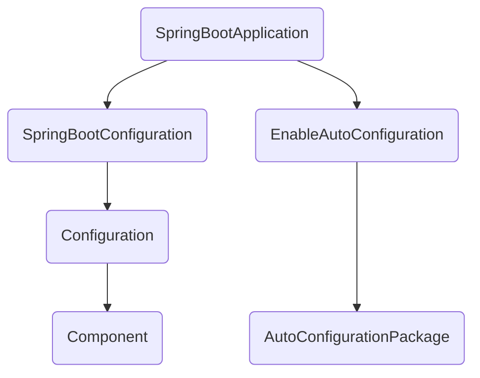

# 第一次springboot

[初始化容器的网站]([Spring Initializr](https://start.spring.io/))

> 添加依赖的时候至少需要一个spring web的依赖

下载这个初始项目，解压后使用IDEA打开

> 当然在IDEA中肯定可以直接创建

在经过漫长的导包后，可以进入唯一的一个类中，里面仅有一个main方法，运行就完事了

然后就能在`localhost:8080`下看到一个页面了

我们之后的项目结构需要在当前类的同级目录下进行创建，包括三层架构中的controller、service、dao、pojo

```shell
D:.
└───com
    └───buzz
        └───tough_springboot
            │   ToughSpringbootApplication.java
            │
            ├───controller
            │       UserController.java
            │
            ├───dao
            ├───pojo
            └───service
```

我们在controller层中新建了一个UserController，他负责接收前端的参数：

```java
package com.buzz.tough_springboot.controller;

import org.springframework.web.bind.annotation.RequestMapping;
import org.springframework.web.bind.annotation.RestController;

/**
 * @program: tough_springboot
 * @description:
 * @author: buzz
 * @create: 2022-02-20 16:25
 **/

@RestController
@RequestMapping("/user")
public class UserController {
	
    //暴露给前端的接口：localhost:8080/user/sayHi
    @RequestMapping("/sayHi")
    public String sayHi() {
        return "hi";
    }
}
```

启动项目后直接访问`/sayHi`就可以得到响应，我们甚至都没有配置web.xml，也没有配置spring中的bean

我们springboot真是太强大了:laughing:

在`pom.xml`中是我们所有的依赖，其中有我们在初始化容器的时候配置的spring web的依赖，这个依赖会帮我们配置tomcat，web.xml，bean

springboot相关的依赖的名字都是：`spring-boot-starter-xxx`，可以认为是xxx启动器

我们需要发布项目的时候，直接使用maven工具进行打包就好，生成的jar包可以直接运行（自带了tomcat的环境）

我们发布的项目默认会在8080端口上开启服务，这个配置当然是可以修改的，在`application.properties`中添加server.port字段用来修改端口号

> 启动springboot项目后，在更新日志前，会生成一个springboot的banner，这个是可以修改的，默认：
>
> ```she
>   .   ____          _            __ _ _
>  /\\ / ___'_ __ _ _(_)_ __  __ _ \ \ \ \
> ( ( )\___ | '_ | '_| | '_ \/ _` | \ \ \ \
>  \\/  ___)| |_)| | | | | || (_| |  ) ) ) )
>   '  |____| .__|_| |_|_| |_\__, | / / / /
>  =========|_|==============|___/=/_/_/_/
>  :: Spring Boot ::                (v2.6.3)
> ```
>
> 如果希望修改，就在resource目录下新建banner.txt，然后把目标样式放进入就好了

# springboot的自动装配

## 关于pom文件(依赖管理)

### 父依赖

我们新建的springboot项目的pom.xml中具有父依赖：`spring-boot-start-parent`，进入它的pom文件中，根据它的标签描述，它为通过maven方式构建的springboot项目提供了依赖和插件的管理；而这个`spring-boot-starter-parent`也具有一个父依赖：`spring-boot-dependencies`，它的pom文件中就全是各种依赖的jar包了

因为我们的springboot项目的依赖已经被顶层的pom文件管理了，所以其实很多jar包是可以直接用的，不需要额外导入了；Spring Boot的每个发布版本都会规划它所支持的依赖项，使用的时候不用指定这些依赖项的版本号，因为Spring Boot都管理好了。当更新Spring Boot时，会相应的更新依赖。

如果希望修改依赖jar包的版本（使用不同版本仲裁机制提供的版本号）：有两种方式

* 在我们项目的pom文件中使用`<properties>`标签：以mysql举例：

  ```xml
  <properties>
      <!--注意这里子标签的名字需要和spring-boot-dependencies中的对应包的名称一致-->
      <mysql.version>${目的版本号}</mysql.version>
  </properties>
  ```

* 在我们的pom文件中声明依赖的时候直接加上版本号：

  ```xml
  <dependency>
      <groupId>mysql</groupId>
      <artifactId>mysql-connector-java</artifactId>
      <version>${目标版本号}</version>
  </dependency>
  ```

此外，在`spring-boot-starter-parent`的pom文件中已经配置了各种类型的资源过滤

### 启动器

在springboot的pom文件中，依赖名称为`spring-boot-starter-xxx`的认为是启动器，比如：

```xml
<dependency>
    <groupId>org.springframework.boot</groupId>
    <artifactId>spring-boot-starter-web</artifactId>
</dependency>
```

这是一个web的启动器，他会导入所有的web的依赖

springboot将功能场景抽取成启动器，需要不同的功能就配置不同的启动器，官网上超级多：[springboot的启动器们](https://docs.spring.io/spring-boot/docs/current/reference/html/using.html#using.build-systems.starters)

springboot官方启动器的最顶层的启动器为：spring-boot-starter

此外还可以自定义启动器，一些第三方的启动器一般命名为：`xxx-spring-boot-starter`（官网上就推荐这么命名）

## 自动配置

在我们的最开始的示例中，只写了一个controller层的接口就可以实现访问，显然是springboot自动配置了很多东西

* tomcat：springboot引入了tomcat依赖（内嵌），并配置了tomcat：

  ```xml
  <!--在spring-boot-dependencies中的tomcat配置-->
  <dependency>
      <groupId>org.springframework.boot</groupId>
      <artifactId>spring-boot-starter-tomcat</artifactId>
      <version>2.6.3</version>
  </dependency>
  ```

* springmvc：引入了springMVC的组件，并配置了SpringMVC的功能：

  ```xml
  <!--在spring-boot-starter-web中配置-->
  <dependency>
      <groupId>org.springframework</groupId>
      <artifactId>spring-web</artifactId>
      <version>5.3.15</version>
      <scope>compile</scope>
  </dependency>
  <dependency>
      <groupId>org.springframework</groupId>
      <artifactId>spring-webmvc</artifactId>
      <version>5.3.15</version>
      <scope>compile</scope>
  </dependency>
  ```

  以前写web的时候在web.xml中至少需要一个dispatcherServlet，为了统一编码格式还需要配置一个过滤器，这些springboot在springmvc中都已经配好了

* 扫描包：默认扫描的包为主程序中的bean，和主程序同级目录下的所有包，这样我们只需要通过注解将类注册为bean，springboot就会自动加载其进入容器；如果是外部的包我们可以给主程序的注解`@SpringBootApplication`配置一个scanBasePackages属性（这个属性本身是一个数组），指明扫描包的位置（其实就是变相的手动配置扫描包）

  我们的注解`@SpringBootApplication`是一个复合的注解，可以使用：`@SpringBootConfiguration`、`@EnableAutoConfiguration`、`@CompontentScan`，三个注解代替，这样就需要明确扫描包的位置

* 各种配置的默认值：比如端口号、上传文件的初始大小...，前面已经说过了，可以在application.properties中更改这些默认的值，这些值其实就是最终会注册到bean中，被spring的容器管理

* 一个新的springboot项目会下载好多的jar包，这些包对应了`spring-boot-dependencies`中的所有依赖，显然这么多的依赖不会全部开启，只有我们在我们定义的pom文件中声明了依赖，才会开启对应的依赖，比如我们上面声明了对`spring-boot-starter-web`的依赖

* 自动配置定义于：`spring-boot-autoconfigurature`

## 关于主程序(自动装配)

其实就一个注解，然后一个SpringApplication.run:confused:

```java
package com.buzz.tough_springboot;

import org.springframework.boot.SpringApplication;
import org.springframework.boot.autoconfigure.SpringBootApplication;
//标注当前类是一个springboot的应用
@SpringBootApplication
public class ToughSpringbootApplication {

	public static void main(String[] args) {
        //一个反射就启动了？？？
		SpringApplication.run(ToughSpringbootApplication.class, args);
	}

}
```

### 一些预备知识

#### @Import

这个注解仅有一个value属性，是一个Class类型的数组

这个注解和`@ComponentScan`其实很像，也是用来自动导入bean的

`@ComponentScan`会扫描指定路径下的所有类，如果有被`@Component`标识（或者是`@Component`注解的复合类型的注解标识），那么会将其注册为bean

而`@Import`注解注册的是指定类型的bean，我们给定的value就是我们需要注册为bean的类

#### @Conditional

条件装配，当满足一定条件的时候会将一个类注册为bean

> 如果这个类是一个配置类，即使用了`@Configuration`标记的类，那么这个注解可以用在标识了`@Bean`的方法上

实际中使用的是它的”子类“，比如`@ConditionalOnBean`，标识只有当容器中存在对应的bean的时候才将档期那这个类注册为一个bean

> 在`@ConditionalOnBean`中我们可以指定bean的名字，或者bean的类型...

#### @ConfigurationProperties

主要是用来配置绑定的

使用注解：`@ConfigurationProperties`可以**通过springboot的`application.properties`文件获取数据**，并完成bean的封装注册

比如我们定义了实体类User：

```java
package com.buzz.tough_springboot.pojo;

import lombok.Data;
import org.springframework.boot.context.properties.ConfigurationProperties;
import org.springframework.stereotype.Component;

/**
 * @program: tough_springboot
 * @description:
 * @author: buzz
 * @create: 2022-02-21 15:36
 **/
@Data
//将实体类注册为bean
@Component
//绑定配置到配置文件application.properties中
@ConfigurationProperties(prefix = "user")
public class User {
    private int id;
    private String name;
    private String sex;
}
```

然后再配置文件中定义实体类的数据：

```properties
user.name="buzz"
user.id=1
user.sex="male"
```

在我们的主程序中就可以得到对应的用户数据

```java
package com.buzz.tough_springboot;

import com.buzz.tough_springboot.pojo.User;
import org.springframework.boot.SpringApplication;
import org.springframework.boot.autoconfigure.SpringBootApplication;
import org.springframework.context.ApplicationContext;

@SpringBootApplication
public class ToughSpringbootApplication {

	public static void main(String[] args) {
		ApplicationContext run = SpringApplication.run(ToughSpringbootApplication.class, args);
		User user = run.getBean("user", User.class);
		System.out.println(user);
	}
}
```

此外如果我们使用的是第三方的jar包，也许在源码中，注解上就没有使用`@Component`注解，这样就没有办法将实体类注册到容器中；解决办法是在springboot的配置类（或者是其他的任意的一个spring的@Component）上添加注解：`@EnableConfigurationProperties`，并在注解中添加需要绑定配置的实体类

> 其实就是剩下了`@Component`注解，但还是需要源码中的实体类上具有`@ConfigurationProperties`注解

### 注解@SpringBootApplication

进入这个注解可以看到这个注解本身就具有多个注解：

```java
//SpringBoot的配置
@SpringBootConfiguration
//自动配置
@EnableAutoConfiguration
//扫描包？？？
@ComponentScan(excludeFilters = { @Filter(type = FilterType.CUSTOM, classes = TypeExcludeFilter.class),
		@Filter(type = FilterType.CUSTOM, classes = AutoConfigurationExcludeFilter.class) })
public @interface SpringBootApplication {
```

注解之间的关系如下：



之前在spring的时候知道，如果希望使用完全注解开发spring，需要在配置类上使用注解`@Configuration`说明当前类是一个配置类，而一个Configuration，本身就是一个Component，即一个bean

springboot的自动配置的关键在于`@EnableAutoConfiguration`，这个注解其实也是一个复合注解：

```java
@AutoConfigurationPackage
@Import(AutoConfigurationImportSelector.class)
```

#### @AutoConfigurationPackage

上面的第一个注解，从名字上看，标识自动配置包，进入后发现，其实里面就是一个import：

```java
@Import(AutoConfigurationPackages.Registrar.class)
```

相当于向容器中注册了一个bean，这个类是是：`AutoConfigurationPackages.Registrar`

在这个类的源码中：

```java
@Override
public void registerBeanDefinitions(AnnotationMetadata metadata, BeanDefinitionRegistry registry) {
    register(registry, new PackageImports(metadata).getPackageNames().toArray(new String[0]));
}
```

这个方法的第一个参数标识注解的元信息，因为我们这个注解标记到了`@AutoConfigurationPackage`上，而这个`@AutoConfiguratrionPackage`又作用于`@EnableAutoConfiguration`，最终作为`@SpringBootApplication`的注解作用于我们的主程序上，所以其获取的包名就是我们主程序所在的包名

这个方法通过注解的元数据，获取到了包名，并将其放到数组中，调用注册方法，相当于把我们主程序所在包下的类注册到容器中

#### @Import(AutoConfigurationImportSelector.class)

这个注解将`AutoConfigurationImportSelector`这个类注册到容器中，进入这个类：

```java
@Override
public String[] selectImports(AnnotationMetadata annotationMetadata) {
    if (!isEnabled(annotationMetadata)) {
        return NO_IMPORTS;
    }
    AutoConfigurationEntry autoConfigurationEntry = getAutoConfigurationEntry(annotationMetadata);
    return StringUtils.toStringArray(autoConfigurationEntry.getConfigurations());
}
```

里面主要的方法：`getAutoConfigurationEntry(annotationMetadata);`整个方法的返回值就是这个方法返回值的配置的字符串形式；而这个方法的参数居然也是注解的元数据（和上面register一样的）

```java
protected AutoConfigurationEntry getAutoConfigurationEntry(AnnotationMetadata annotationMetadata) {
    if (!isEnabled(annotationMetadata)) {
        return EMPTY_ENTRY;
    }
    AnnotationAttributes attributes = getAttributes(annotationMetadata);
    List<String> configurations = getCandidateConfigurations(annotationMetadata, attributes);
    configurations = removeDuplicates(configurations);
    Set<String> exclusions = getExclusions(annotationMetadata, attributes);
    checkExcludedClasses(configurations, exclusions);
    configurations.removeAll(exclusions);
    configurations = getConfigurationClassFilter().filter(configurations);
    fireAutoConfigurationImportEvents(configurations, exclusions);
    return new AutoConfigurationEntry(configurations, exclusions);
}
```

这里的关键在于`List<String> configurations = getCandidateConfigurations(annotationMetadata, attributes);`，整个方法的返回值通过这个list进行构造

从名称上来看，这个方法的作用是获取所有的候选配置

进入这个方法：

```java
protected List<String> getCandidateConfigurations(AnnotationMetadata metadata, AnnotationAttributes attributes) {
    List<String> configurations = SpringFactoriesLoader.loadFactoryNames(getSpringFactoriesLoaderFactoryClass(),
                                                                         getBeanClassLoader());
    Assert.notEmpty(configurations, "No auto configuration classes found in META-INF/spring.factories. If you "
                    + "are using a custom packaging, make sure that file is correct.");
    return configurations;
}
```

这个方法也没干啥，它使用spring的工厂加载器通过名称加载了配置，最后将配置返回

所以必然的，我们想知道spring的加载器都干了什么：

```java
public static List<String> loadFactoryNames(Class<?> factoryType, @Nullable ClassLoader classLoader) {
    ClassLoader classLoaderToUse = classLoader;
    if (classLoaderToUse == null) {
        classLoaderToUse = SpringFactoriesLoader.class.getClassLoader();
    }
    String factoryTypeName = factoryType.getName();
    return loadSpringFactories(classLoaderToUse).getOrDefault(factoryTypeName, Collections.emptyList());
}
private static Map<String, List<String>> loadSpringFactories(ClassLoader classLoader) {
    Map<String, List<String>> result = cache.get(classLoader);
    if (result != null) {
        return result;
    }

    result = new HashMap<>();
    try {
        Enumeration<URL> urls = classLoader.getResources(FACTORIES_RESOURCE_LOCATION);
        while (urls.hasMoreElements()) {
            URL url = urls.nextElement();
            UrlResource resource = new UrlResource(url);
            Properties properties = PropertiesLoaderUtils.loadProperties(resource);
            for (Map.Entry<?, ?> entry : properties.entrySet()) {
                String factoryTypeName = ((String) entry.getKey()).trim();
                String[] factoryImplementationNames =
                    StringUtils.commaDelimitedListToStringArray((String) entry.getValue());
                for (String factoryImplementationName : factoryImplementationNames) {
                    result.computeIfAbsent(factoryTypeName, key -> new ArrayList<>())
                        .add(factoryImplementationName.trim());
                }
            }
        }

        // Replace all lists with unmodifiable lists containing unique elements
        result.replaceAll((factoryType, implementations) -> implementations.stream().distinct()
                          .collect(Collectors.collectingAndThen(Collectors.toList(), Collections::unmodifiableList)));
        cache.put(classLoader, result);
    }
    catch (IOException ex) {
        throw new IllegalArgumentException("Unable to load factories from location [" +
                                           FACTORIES_RESOURCE_LOCATION + "]", ex);
    }
    return result;
}
```

loadFactoryNames方法本质上是调用了loadSpringFactories方法，并将返回的map中的特定键对应的list返回

终于来到了最核心的方法，即loadSpringFactories方法，这个方法首先根据资源的路径获取到了资源文件，这个路径是一个常量：`FACTORIES_RESOURCE_LOCATION`，其在这个类的最上面定义为：

```java
public static final String FACTORIES_RESOURCE_LOCATION = "META-INF/spring.factories";
```

整个方法可以认为是从这个路径处加载文件，并封装到map中返回

注意，这个位置主要是针对于我们依赖的jar包的：`META-INF/spring.factories`

我们在spring-boot-auto-configure.jar中可以看到这个文件，里面包含的是一堆为自动加载的类，名字都是：`xxxAutoConfiguration`

所以我们知道了，这个方法会将所有依赖中的jar包对应路径下（META-INF/spring.factories）的类加载配置为bean，这个是写死的

但是如果实际查看的话就会发现这些类真的有很多，springboot如果真的在任何项目中都加载这么多的bean显然有点不合理

如果查看源码的话会发现，有的自动配置的类加了`@ConditionalOnClass`注解，表明只有当类路径中具有某个类的时候才会装配为bean，比如对于：`AopAutoConfiguration`，它的注解就是：`@ConditionalOnClass(Advice.class)`，也就是我们需要手动导入对织入包的依赖后，这个类才会被注册为bean

springboot的自动装配的特点：加载所有，按需装配

* springboot会加载所有的配置类：`xxxAutoConfiguration`
* 加载的配置类在满足条件的情况下会被注册为bean：主要是：`@ConditionalOnClass`；配置类底层已经绑定了配置文件：通过注解：`@EnableConfigurationProperties`使得 `xxxProperties`实体类绑定配置文件生效，并将`xxxPropeties`注册为bean，在配置类中需要的参数会从`xxxProperties`中获取，这个实体类中的数据又来自于配置文件
* 被注册为bean的配置类，会加载满足条件，且添加的`@Bean`注解的组件

> springboot底层会配置好组件，但如果用户配置了同类型的组件，就会以用户的为准

定制化组件的时候，可以选择重写bean，覆盖自动配置类底层已经配好的bean，或者干脆改一改配置文件就行，反正自动配置类生成bean也是从配置文件中取值

##  最佳实践

* 引入场景依赖，根据需求确定场景依赖，具体查询[springboot-starter](https://docs.spring.io/spring-boot/docs/current/reference/html/using.html#using.build-systems.starters)

* 查看自动配置的启用情况：
  * 直接看源码分析（费劲）
  * 在`application.properties`文件中写入debug=true，启动项目查看打印输出
* 如果自动配置不能满足需求，就自己改

### 小工具

* lombok：不说了

* devtools： 热部署，依赖的名称：

  ```xml
  <dependency>
      <groupId>org.springframework.boot</groupId>
      <artifactId>spring-boot-devtools</artifactId>
  </dependency>
  ```

  <kbd>ctrl + F9</kbd>，更新项目（其实就是只要一重新编译项目就自动重新部署）

# Springboot的配置文件

在springboot中具有一种新的类型的文件可以作为配置文件，即YAML

## 基本语法

* 键值对表示为：key: value(value和:之间有一个空格，约定)

* 大小写敏感

* 使用缩进表示层级关系，层级关系和缩进空格数无关，对其就行

* 注释使用#表示，这一点和properties文件相同

* 字符串不需要加引号，而如果真的对字符串加上引号那么：

  * 使用单引号会将：`\n`这种转移字符原封不同的打印，
  * 使用的是双引号会将其作为转移字符换行

* 日期类型使用/进行区分：比如：`date: 2022/2/21`

* 数组：两种写法：这种写法也可以表示集合

  * 行内写法：`user: [buzz, bezz, bazz]`

  * 使用横杠分割：

    ```yaml
    person:
      - buzz
      - bezz
      - bazz
    ```

* 表示对象：

  ```yaml
  user:
    name: buzz
    age: 10
    sex: male
  ```

* 表示map：行内写法：`map: {name: buzz, age: 10, sex: male}`，当然map也可以按照对象的写法来

在springboot支持松散绑定，即我们在实体类中的属性使用的是驼峰命名的方式，而在yaml文件中可以使用-分割单词：比如我们在实体类中定义：`lastName`，而在yaml文件中定义：`last-name`这样也可以实现通过配置文件赋值

## 特别的YAML

* 比如说通过在`YAML`文件中定义锚点，实现变量的定义[YAML文件(.yml)中的键(key)通过变量引用来设置 ](https://www.cnblogs.com/haycheng/p/13299183.html)
* 

## JSR303校验

核心注解为：`@Validated`

```
空检查
@Null       验证对象是否为null
@NotNull    验证对象是否不为null, 无法查检长度为0的字符串
@NotBlank 检查约束字符串是不是Null还有被Trim的长度是否大于0,只对字符串,且会去掉前后空格.
@NotEmpty 检查约束元素是否为NULL或者是EMPTY.
 
Booelan检查
@AssertTrue     验证 Boolean 对象是否为 true  
@AssertFalse    验证 Boolean 对象是否为 false  
 
长度检查
@Size(min=, max=) 验证对象（Array,Collection,Map,String）长度是否在给定的范围之内  
@Length(min=, max=) Validates that the annotated string is between min and max included.
 
日期检查
@Past           验证 Date 和 Calendar 对象是否在当前时间之前  
@Future     	验证 Date 和 Calendar 对象是否在当前时间之后  
@Pattern    	验证 String 对象是否符合正则表达式的规则
 
数值检查，建议使用在Stirng,Integer类型，不建议使用在int类型上，因为表单值为“”时无法转换为int，但可以转换为Stirng为"",Integer为null
@Min            验证 Number 和 String 对象是否大等于指定的值  
@Max            验证 Number 和 String 对象是否小等于指定的值  
@DecimalMax 被标注的值必须不大于约束中指定的最大值. 这个约束的参数是一个通过BigDecimal定义的最大值的字符串表示.小数存在精度
@DecimalMin 被标注的值必须不小于约束中指定的最小值. 这个约束的参数是一个通过BigDecimal定义的最小值的字符串表示.小数存在精度
@Digits     验证 Number 和 String 的构成是否合法  
@Digits(integer=,fraction=) 验证字符串是否是符合指定格式的数字，interger指定整数精度，fraction指定小数精度。
 
@Range(min=, max=) 检查数字是否介于min和max之间.
@Range(min=10000,max=50000,message="range.bean.wage")
private BigDecimal wage;
 
@Valid  递归的对关联对象进行校验, 如果关联对象是个集合或者数组,那么对其中的元素进行递归校验,如果是一个map,则对其中的值部分进行校验.(是否进行递归验证)
    
@CreditCardNumber 信用卡验证
@Email  验证是否是邮件地址，如果为null,不进行验证，算通过验证。
@ScriptAssert(lang= ,script=, alias=)
    
@URL(protocol=,host=, port=,regexp=, flags=)
```

比如：

```java
@Data
@Component
@ConfigurationProperties(prefix = "user")
@Validated
public class User {
    private int id;
    @NotEmpty(message="姓名不能为空")
    private String name;
    private String sex;
}
```

## 配置注解处理器

这个是用来简化开发的，上面写YAML的时候发现没有提示啊，属性什么的全部都是手动敲上去的，springboot官方提供了一个注解处理器：

```xml
<dependency>
    <groupId>org.springframework.boot</groupId>
    <artifactId>spring-boot-configuration-processor</artifactId>
    <optional>true</optional>
</dependency>
```

## 多环境配置

实际开发中使用多个配置，比如针对生产开发的dev环境和针对测试的test环境

根据官网上的描述：

> As well as `application` property files, Spring Boot will also attempt to load profile-specific files using the naming convention `application-{profile}`. For example, if your application activates a profile named `prod` and uses YAML files, then both `application.yml` and `application-prod.yml` will be considered.
>
> Profile-specific properties are loaded from the same locations as standard `application.properties`, with profile-specific files always overriding the non-specific ones. If several profiles are specified, a last-wins strategy applies. For example, if profiles `prod,live` are specified by the `spring.profiles.active` property, values in `application-prod.properties` can be overridden by those in `application-live.properties`.

我们可以配置多个环境，他们的命名都是类似的，比如：`application-dev.yaml`表示开发环境，`application-test.yaml`表示测试环境

而我们现在的配置不写在`application.yaml`中了，而在这个文件中指定不同的配置文件，这样我们仅仅更改激活的配置文件就可以实现环境的切换：写法是：

```yaml
spring:
  profiles:
    active:dev
```

比如此时激活的配置文件就是`application-dev.yaml`

同时官网上也写道，如果我们同时激活多个配置文件那么，后面被激活的配置文件将覆盖前面的配置文件

然而在springboot中还可以将一个配置文件分块，实现自身一个文件但包含了多个配置文件：

> For `application.yml` files, the standard YAML multi-document syntax is used. Three consecutive hyphens represent the end of one document, and the start of the next.

使用三个连续的-表示分割：`---`

```yaml
spring:
  profiles:
    active: dev
---
spring:
  application:
    name: dev
  config:
    activate:
      on-profile: "dev"
server:
  port: 80
---
spring:
  application:
    name: test
  config:
    activate:
      on-profile: "test"
server:
  port: 8081
```

我们配置了两个环境，并激活了dev环境

[官网关于这部分的描述](https://docs.spring.io/spring-boot/docs/2.6.3/reference/htmlsingle/#features.external-config.files.multi-document)

如果我们已经将程序打成jar包了，此时如果更改配置文件可以在使用命令：

```shell
java -jar xxx.jar --spring.profiles.active=${配置文件的名称}
```

## 一个特殊的注解

`debug:true`，如果在配置文件中添加了这个配置，那么在启动springboot后控制台会打印自动配置类的相关信息这里面打印了哪些自动配置类生效，哪些不生效

> springboot加载全部，但是不全部生效

# web

## 访问静态资源

springboot默认可以访问静态资源的目录为：`/static`(or `/public` or `/resources` or `/META-INF/resources`)

> 上述路径指类路径

当静态资源存放于上述路径中时，我们访问的路径为：`${项目根路径}/${静态资源名称}`

springboot默认请求会先被controller处理，在controller无法处理的情况下会交给静态资源处理器，查询对应的静态资源

其实根据上面访问静态资源的的方式可知，静态资源默认被映射到`/**`，如果我们希望改变这个默认设置，在yaml中修改配置：

```yaml
spring:
  mvc:
    static-path-pattern: "/resources/**"
```

上述配置将使得所有静态资源的访问都需要加上`/resource`，即访问静态资源变为了：`${项目根路径}/resource/${静态资源名称}`

> 我们修改静态资源的访问路径是具有实际意义的，比如实际项目中，我们会配置拦截器，比如登录验证的拦截器，只有当验证通过的时候才允许访问，默认配置的时候会拦截所有请求，这将导致静态资源也被拦截；
>
> 实际配置中可以将静态资源的请求配置一个统一的前缀，这样我们可以配置拦截器放行访问静态资源前缀的请求

此外我们还可以自定义静态资源的访问路径：

```yaml
spring:
  web:
    resources:
      static-locations: []
```

webjar：这个其实用的比较少，[webjar官网]([WebJars - Web Libraries in Jars](https://www.webjars.org/))，简单来说就是把之前的jquery，bootstrap...这些需要导入的静态资源导成了jar包，我们使用的时候在pom.xml中导入依赖，然后就可以正常导出了；在使用的时候使用路径和导入jar包中静态资源的路径相关，具体的看[spirngboot官方解释]([Web (spring.io)](https://docs.spring.io/spring-boot/docs/current/reference/html/web.html#web.servlet.spring-mvc.static-content))

> 原理上其实是因为本身这个jar包就是一个压缩包，打开时候里面的静态资源文件就存在在/WEB-INF/resource目录下，而这个路径本来也就springboot导出静态资源的路径

## 欢迎页

springboot支持静态的欢迎页：如果在静态资源路径下存在`index.html`这个页面，那么springboot默认会将其作为欢迎页

当然如果我们有一个Controller它可以处理`/index`这个访问路径下的请求，那么会将其作为欢迎页

## 自定义网页的图标

和上面的欢迎页类似，只要在静态资源路径下存在文件：`favicon.ico`就可以将其作为网页的图标

## 静态资源的自动配置

都说了是自动配置就离不开spring-boot-autoConfiguration这个包，特别的对于静态资源的自动配置，位于这个包内的WebMvcAutoConfiguration这个类中

先看注解：

```java
//lite模式启动，前面说了这个模式中bean直接没有依赖关系
@Configuration(proxyBeanMethods = false)
//显然只有当我们当前web应用是传统的servlet的时候参会加载这个配置
@ConditionalOnWebApplication(type = Type.SERVLET)
//当我们的环境中有以下class文件（导入了相关依赖的时候），这些依赖都是springmvc比较基本的依赖
@ConditionalOnClass({ Servlet.class, DispatcherServlet.class, WebMvcConfigurer.class })
//这个就是springboot的特点了，如果有自定义的就按照自定义的来，不然就执行自动配置
@ConditionalOnMissingBean(WebMvcConfigurationSupport.class)
//配置加载bean的顺序，下面这两个注解都是为了这个目的
@AutoConfigureOrder(Ordered.HIGHEST_PRECEDENCE + 10)
@AutoConfigureAfter({ DispatcherServletAutoConfiguration.class, TaskExecutionAutoConfiguration.class,
		ValidationAutoConfiguration.class })
```

如果我们希望定制化springmvc的自动配置，只需要向容器中注册类型为：`WebMvcConfigurationSupport`的bean

这里面看一下一个静态内部类：

```java
@SuppressWarnings("deprecation")
@Configuration(proxyBeanMethods = false)
@Import(EnableWebMvcConfiguration.class)
@EnableConfigurationProperties({ WebMvcProperties.class, WebProperties.class })
@Order(0)
public static class WebMvcAutoConfigurationAdapter implements WebMvcConfigurer, ServletContextAware {}
```

是的这个类已经废弃掉了

注意到注解上绑定了两个配置文件类：`WebMvcProperties`，这个和配置文件中的`spring.mvc`前缀绑定；`WebProperties`，这个和配置文件中的`spring.web`前缀绑定

这个类只有一个有参的构造器，此时它所有的参数会从容器中获取：

```java
/* 
	它有好多参数：
	WebProperties，WebMvcProperties这两个类就是上面绑定的配置类
	ListableBeanFactory，这个是spring的容器
	HttpMessageConverters，不重要，从名字上看应该是一个消息转换的一个类
	ResourceHandlerRegistrationCustomizer：这个找的是自定义的资源处理器，这个比较重要
	DispatcherServletPath：从名字上看就知道肯定和核心的dispatcherServlet相关
	ServletRegistrationBean：？？？
*/
public WebMvcAutoConfigurationAdapter(WebProperties webProperties, 
               	WebMvcProperties mvcProperties,
                     ListableBeanFactory beanFactory, 
                ObjectProvider<HttpMessageConverters> messageConvertersProvider,
                ObjectProvider<ResourceHandlerRegistrationCustomizer> resourceHandlerRegistrationCustomizerProvider,
				ObjectProvider<DispatcherServletPath> dispatcherServletPath,
				ObjectProvider<ServletRegistrationBean<?>> servletRegistrations) {
    this.resourceProperties = webProperties.getResources();
    this.mvcProperties = mvcProperties;
    this.beanFactory = beanFactory;
    this.messageConvertersProvider = messageConvertersProvider;
    this.resourceHandlerRegistrationCustomizer = resourceHandlerRegistrationCustomizerProvider.getIfAvailable();
    this.dispatcherServletPath = dispatcherServletPath;
    this.servletRegistrations = servletRegistrations;
    this.mvcProperties.checkConfiguration();
}
```

和静态资源处理相关的方法：

```java
/*
	this.resourceProperties这个在上面的构造器中已经赋值了，他是一个Resources类型的对象
*/
@Override
public void addResourceHandlers(ResourceHandlerRegistry registry) {
    //如果这个值是false，那么这个方法就直接返回了，所以此时静态资源都无法访问，相当于禁用静态资源
    //在配置文件中为：
    /*
    	spring:
	  		web:
    			resources:
      				add-mappings: false
      	此时将会禁用静态资源
    */
    if (!this.resourceProperties.isAddMappings()) {
        logger.debug("Default resource handling disabled");
        return;
    }
    //这里是配置webjars，如果访问路径中含有webjars，那么就会从类路径中对应的位置找对应的静态资源
    addResourceHandler(registry, "/webjars/**", "classpath:/META-INF/resources/webjars/");
    /*
    	this.mvcProperties.getStaticPathPattern()返回的是WebMvcProperties中的属性staticPathPattern
    	这个属性默认是"/**"
		private String staticPathPattern = "/**";
    	这个类本身是一个配置类，它绑定的前缀是spring.mvc，所以我们可以通过在配置文件中重新赋值，更改访问静态资源的路径
    	访问静态资源的请求最后访问的地方通过lambda表达式的写法表示
    	比较核心的部分：this.resourceProperties.getStaticLocations()
    	这个就对应了在配置文件中修改静态资源存储路径的配置
    	
    */
    addResourceHandler(registry, this.mvcProperties.getStaticPathPattern(), (registration) -> {
        registration.addResourceLocations(this.resourceProperties.getStaticLocations());
        if (this.servletContext != null) {
            ServletContextResource resource = new ServletContextResource(this.servletContext, SERVLET_LOCATION);
            registration.addResourceLocations(resource);
        }
    });
}
```

还有欢迎页，在这个自动配置类中还具有一个静态内部类：

```java
@Configuration(proxyBeanMethods = false)
@EnableConfigurationProperties(WebProperties.class)
public static class EnableWebMvcConfiguration extends DelegatingWebMvcConfiguration implements ResourceLoaderAware {}
```

这个类中有一个方法配置了表示欢迎页的bean：

```java
//在springmvc中HandlerMapping表示处理器映射，表示了处理器可以处理的请求
//简单来说这个方法就是new了一个对象然后返回，new对象的时候携带了一堆参数
@Bean
public WelcomePageHandlerMapping welcomePageHandlerMapping(ApplicationContext applicationContext,FormattingConversionService mvcConversionService, ResourceUrlProvider mvcResourceUrlProvider) {
    //注意下面new对象中的参数this.mvcProperties.getStaticPathPattern()这个对应了静态资源的访问路径
    WelcomePageHandlerMapping welcomePageHandlerMapping = new WelcomePageHandlerMapping(
        new TemplateAvailabilityProviders(applicationContext), applicationContext, getWelcomePage(),
        this.mvcProperties.getStaticPathPattern());
    welcomePageHandlerMapping.setInterceptors(getInterceptors(mvcConversionService, mvcResourceUrlProvider));
    welcomePageHandlerMapping.setCorsConfigurations(getCorsConfigurations());
    return welcomePageHandlerMapping;
}
//下面是new对象的构造方法：
WelcomePageHandlerMapping(TemplateAvailabilityProviders templateAvailabilityProviders,ApplicationContext applicationContext, Resource welcomePage, String staticPathPattern) {
    //如果欢迎页不空，并且访问路径为/**那么会设置欢迎页
    //其实也就是意味着如果我们自定义了静态资源访问路径，就不能自动配置欢迎页了
    if (welcomePage != null && "/**".equals(staticPathPattern)) {
        logger.info("Adding welcome page: " + welcomePage);
        setRootViewName("forward:index.html");
    }
    else if (welcomeTemplateExists(templateAvailabilityProviders, applicationContext)) {
        //这里相当于调用controller去处理/index请求
        logger.info("Adding welcome page template: index");
        setRootViewName("index");
    }
}
```

## 请求分发

### Rest风格是怎么做的

主要是使用注解：`@xxxMapping`

原来使用动词表示操作行为，比如：`/getUser`表示获取用户信息，`/deleteUser`表示删除用户信息，`/updateUser`表示更新用户信息，`/addUser`表示添加用户信息

现在我们使用Restful风格处理请求，使用HTTP请求类型标识对用户的不同操作：现在对用户的处理统一访问：`/user`，通过不同类型的HTTP请求表示不同的操作，比如：`GET`方式表示获取用户，`DELETE`请求表示删除用户，`PUT`请求表示更新用户信息，`POST`请求表示提交用户信息

在controller这里通过`@xxxMapping`注解的methods属性确定不同的类型的请求

然而在我们表单提交的时候只支持post和get两种方式，所以实际中我们都是通过post请求提交表单，然后再表单中添加一个隐藏域，这个隐藏域中填写请求类型；而在我们服务器端拦截这个表单，然后再通过隐藏域中值进行请求的分发，拦截的核心在于：`HiddenHttpMethodFiler`这个类

springboot中具有这个请求拦截的功能，只不过需要我们指定隐藏域的写法

这个隐藏域的写法：

```html
<input type="hidden" name="_method" value="${不同请求类型}"/>
```

只要我们添加一个名称为"_method"的隐藏域，springboot就会根据这个隐藏域的取值进行请求的分发

> 注意这里我们必须指定表单的请求方式post

而至于为什么一定要这么写就要看源码了：

这个配置其实也是再`WebMvcAutoConfiguration`中，这里面有一个方法：`hiddenHttpMethodFilter()`：

```java
@Bean
@ConditionalOnMissingBean(HiddenHttpMethodFilter.class)
//注意这个注解，它默认没有开启这个filter，所以需要我们手动开启
@ConditionalOnProperty(prefix = "spring.mvc.hiddenmethod.filter", name = "enabled")
public OrderedHiddenHttpMethodFilter hiddenHttpMethodFilter() {
    return new OrderedHiddenHttpMethodFilter();
}
```

可以看到，它注册了一个bean，进入这个对象：

```java
public class OrderedHiddenHttpMethodFilter extends HiddenHttpMethodFilter implements OrderedFilter {}
```

关键点来了，这个类继承了`HiddenHttpMethodFilter`，这个就是在spring中使用这种Rest风格请求的时候需要配置的类

这个类本身就是一个过滤器

```java
package org.springframework.web.filter;

import java.io.IOException;
import java.util.Arrays;
import java.util.Collections;
import java.util.List;
import java.util.Locale;

import javax.servlet.FilterChain;
import javax.servlet.ServletException;
import javax.servlet.http.HttpServletRequest;
import javax.servlet.http.HttpServletRequestWrapper;
import javax.servlet.http.HttpServletResponse;

import org.springframework.http.HttpMethod;
import org.springframework.util.Assert;
import org.springframework.util.StringUtils;
import org.springframework.web.util.WebUtils;


public class HiddenHttpMethodFilter extends OncePerRequestFilter {
	
    //过滤器可以额外处理的请求方式为：PUT、DELETE、PATCH
	private static final List<String> ALLOWED_METHODS =
			Collections.unmodifiableList(Arrays.asList(HttpMethod.PUT.name(),
					HttpMethod.DELETE.name(), HttpMethod.PATCH.name()));

	/** Default method parameter: {@code _method}. */
	public static final String DEFAULT_METHOD_PARAM = "_method";

	private String methodParam = DEFAULT_METHOD_PARAM;
	
	public void setMethodParam(String methodParam) {
		Assert.hasText(methodParam, "'methodParam' must not be empty");
		this.methodParam = methodParam;
	}
	
    /**
	 * 首先拿到请求第一件事情就是看看请求的类型，如果是POST（并且请求没有出错），这一点对应了
	 * 前面说了，form表单必须通过post的方式提交
	 * 然后它通过getParameter方法获取请求参数，这个参数的名字就是"_method"
	 * 
	 */
	@Override
	protected void doFilterInternal(HttpServletRequest request, HttpServletResponse response, FilterChain filterChain)
			throws ServletException, IOException {

		HttpServletRequest requestToUse = request;

		if ("POST".equals(request.getMethod()) && request.getAttribute(WebUtils.ERROR_EXCEPTION_ATTRIBUTE) == null) {
			String paramValue = request.getParameter(this.methodParam);
            //这个方法就是判断当前字符串是不是null，并且长度大于1
			if (StringUtils.hasLength(paramValue)) {
                /*
                	自动将我们的参数的value变为大写
                	这里表明了我们在form表单中可以将请求类型大写或者小写，就是随便大小写
				*/
                String method = paramValue.toUpperCase(Locale.ENGLISH);
                //这个大写的变量，一看就是个常量，它规定了method属于的范围，看上面
				if (ALLOWED_METHODS.contains(method)) {
                    //如果满足条件他会产生一个新的请求
					requestToUse = new HttpMethodRequestWrapper(request, method);
				}
			}
		}
		//不管你满不满足都放行，这个过滤器就是起到请求转化的功能的，也不需要真的验证拦截
		filterChain.doFilter(requestToUse, response);
	}


	/**
	 * Simple {@link HttpServletRequest} wrapper that returns the supplied method for
	 * {@link HttpServletRequest#getMethod()}.
	 */
	private static class HttpMethodRequestWrapper extends HttpServletRequestWrapper {

		private final String method;

		public HttpMethodRequestWrapper(HttpServletRequest request, String method) {
			super(request);
			this.method = method;
		}

		@Override
		public String getMethod() {
			return this.method;
		}
	}

}
```

下面有一个类：`HttpServletRequest`，这个类继承于：`HttpServletRequestWrapper`：

```java
public class HttpServletRequestWrapper extends ServletRequestWrapper implements
        HttpServletRequest {}
```

即一个`HttpServletRequestWrapper`本身就是一个`HttpServletRequest`，同理我们的`HttpServletRequest`也是一个`HttpServletRequest`

这个类没有别的功能，仅仅重写了`getMethod`方法，这个方法将返回我们新传入的值，相当于包装模式

过滤器放行后，springmvc调用request的`getMethod`方法相当于调用的是包装类的`getMethod`方法

> 超级加倍：经过上面的源码可知，我们在通过form表单进行post提价的时候使用一个隐藏域，并开启springboot的过滤器配置就可以实现请求分发
>
> 但是上面隐藏域必须叫`_method`，如果就是希望不叫这个名字怎么换呢
>
> 本来springboot也就是帮我们配置了一个过滤器，现在我们可以自己配：
>
> 在源码中：
>
> ```java
> @Bean
> @ConditionalOnMissingBean(HiddenHttpMethodFilter.class)
> //注意这个注解，它默认没有开启这个filter，所以需要我们手动开启
> @ConditionalOnProperty(prefix = "spring.mvc.hiddenmethod.filter", name = "enabled")
> public OrderedHiddenHttpMethodFilter hiddenHttpMethodFilter() {
>     return new OrderedHiddenHttpMethodFilter();
> }
> ```
>
> springboot配置的这个过滤器仅在容器中没有`HiddenHttpMethodFilter.class`这种类型的bean的时候才生效
>
> 那我们就写一个配置类，并配置这个过滤器就好了
>
> ```java
> package com.buzz.tough_springboot.config;
> 
> import org.springframework.context.annotation.Bean;
> import org.springframework.context.annotation.Configuration;
> import org.springframework.web.filter.HiddenHttpMethodFilter;
> 
> /**
>  * @program: tough_springboot
>  * @description:
>  * @author: buzz
>  * @create: 2022-02-21 15:50
>  **/
> @Configuration
> public class AppConfig {
> 
> 	@Bean
> 	public HiddenHttpMethodFilter hiddenHttpMethodFilter() {
> 		HiddenHttpMethodFilter hiddenHttpMethodFilter = new HiddenHttpMethodFilter();
>         //配置隐藏域中name属性为`_m`的表示请求方法
> 		hiddenHttpMethodFilter.setMethodParam("_m");
> 		return hiddenHttpMethodFilter;
> 	}
> }
> ```

### 请求是怎么分发的

在springmvc中，三个比较关键的配置：处理器映射器，处理器适配器，视图解析器

我们这里考虑请求的分发主要实现在于处理器映射器

在spirngmvc中请求的分发核心在于`DispatcherServlet`继承树：


在HttpServlet中定义了doGet、doPost...等方法，我们希望看到的是spring的Servlet将这些方法重写实现方法的请求的分发

而在HttpSerlvetBean中并没有重写这些方法，显然请求分发不是在这个类中进行的

在FrameworkServlet中我们看到，其重写了方法：

```java
@Override
protected final void doGet(HttpServletRequest request, HttpServletResponse response)
    throws ServletException, IOException {

    processRequest(request, response);
}
```

其余的doPost和doDelete方法也都是一样，里面直接调用了processRequest方法：

```java
protected final void processRequest(HttpServletRequest request, HttpServletResponse response)
			throws ServletException, IOException {

		long startTime = System.currentTimeMillis();
		Throwable failureCause = null;

		LocaleContext previousLocaleContext = LocaleContextHolder.getLocaleContext();
		LocaleContext localeContext = buildLocaleContext(request);

		RequestAttributes previousAttributes = RequestContextHolder.getRequestAttributes();
		ServletRequestAttributes requestAttributes = buildRequestAttributes(request, response, previousAttributes);

		WebAsyncManager asyncManager = WebAsyncUtils.getAsyncManager(request);
		asyncManager.registerCallableInterceptor(FrameworkServlet.class.getName(), new RequestBindingInterceptor());

		initContextHolders(request, localeContext, requestAttributes);
		//这里是关键
		try {
			doService(request, response);
		}
		catch (ServletException | IOException ex) {
			failureCause = ex;
			throw ex;
		}
		catch (Throwable ex) {
			failureCause = ex;
			throw new NestedServletException("Request processing failed", ex);
		}

		finally {
			resetContextHolders(request, previousLocaleContext, previousAttributes);
			if (requestAttributes != null) {
				requestAttributes.requestCompleted();
			}
			logResult(request, response, failureCause, asyncManager);
			publishRequestHandledEvent(request, response, startTime, failureCause);
		}
	}
```

在一顿初始化后调用了doService方法，而在这个方法中我们看到doService方法并没有实现，是一个抽象方法，所以需要子类即我们的`DispatcherServlet`实现

```java
protected abstract void doService(HttpServletRequest request, HttpServletResponse response)
    throws Exception;
```

```java
@Override
protected void doService(HttpServletRequest request, HttpServletResponse response) throws Exception {
    logRequest(request);

    // Keep a snapshot of the request attributes in case of an include,
    // to be able to restore the original attributes after the include.
    Map<String, Object> attributesSnapshot = null;
    if (WebUtils.isIncludeRequest(request)) {
        attributesSnapshot = new HashMap<>();
        Enumeration<?> attrNames = request.getAttributeNames();
        while (attrNames.hasMoreElements()) {
            String attrName = (String) attrNames.nextElement();
            if (this.cleanupAfterInclude || attrName.startsWith(DEFAULT_STRATEGIES_PREFIX)) {
                attributesSnapshot.put(attrName, request.getAttribute(attrName));
            }
        }
    }

    // Make framework objects available to handlers and view objects.
    request.setAttribute(WEB_APPLICATION_CONTEXT_ATTRIBUTE, getWebApplicationContext());
    request.setAttribute(LOCALE_RESOLVER_ATTRIBUTE, this.localeResolver);
    request.setAttribute(THEME_RESOLVER_ATTRIBUTE, this.themeResolver);
    request.setAttribute(THEME_SOURCE_ATTRIBUTE, getThemeSource());

    if (this.flashMapManager != null) {
        FlashMap inputFlashMap = this.flashMapManager.retrieveAndUpdate(request, response);
        if (inputFlashMap != null) {
            request.setAttribute(INPUT_FLASH_MAP_ATTRIBUTE, Collections.unmodifiableMap(inputFlashMap));
        }
        request.setAttribute(OUTPUT_FLASH_MAP_ATTRIBUTE, new FlashMap());
        request.setAttribute(FLASH_MAP_MANAGER_ATTRIBUTE, this.flashMapManager);
    }

    RequestPath previousRequestPath = null;
    if (this.parseRequestPath) {
        previousRequestPath = (RequestPath) request.getAttribute(ServletRequestPathUtils.PATH_ATTRIBUTE);
        ServletRequestPathUtils.parseAndCache(request);
    }

    try {
        //这里是关键，即调用doService()最终会调用到doDispatch()
        doDispatch(request, response);
    }
    finally {
        if (!WebAsyncUtils.getAsyncManager(request).isConcurrentHandlingStarted()) {
            // Restore the original attribute snapshot, in case of an include.
            if (attributesSnapshot != null) {
                restoreAttributesAfterInclude(request, attributesSnapshot);
            }
        }
        if (this.parseRequestPath) {
            ServletRequestPathUtils.setParsedRequestPath(previousRequestPath, request);
        }
    }
}
```

其实最关键的地方在于中间被`try-catch`包裹的`doDispatch`方法，所以我们的不同类型的请求最终会调用到`DispatcherServlet`中的doDispatch方法：

```java
@SuppressWarnings("deprecation")
protected void doDispatch(HttpServletRequest request, HttpServletResponse response) throws Exception {
    HttpServletRequest processedRequest = request;
    HandlerExecutionChain mappedHandler = null;
    boolean multipartRequestParsed = false;

    WebAsyncManager asyncManager = WebAsyncUtils.getAsyncManager(request);

    try {
        ModelAndView mv = null;
        Exception dispatchException = null;

        try {
            //这里是检查是不是一个文件上传的请求，如果是的话这里请求会被包装
            processedRequest = checkMultipart(request);
            multipartRequestParsed = (processedRequest != request);

            // Determine handler for the current request.
            //根据请求获取对应的处理器，这里是关键
            mappedHandler = getHandler(processedRequest);
            if (mappedHandler == null) {
                noHandlerFound(processedRequest, response);
                return;
            }

            // Determine handler adapter for the current request.
            HandlerAdapter ha = getHandlerAdapter(mappedHandler.getHandler());

            // Process last-modified header, if supported by the handler.
            String method = request.getMethod();
            boolean isGet = HttpMethod.GET.matches(method);
            if (isGet || HttpMethod.HEAD.matches(method)) {
                long lastModified = ha.getLastModified(request, mappedHandler.getHandler());
                if (new ServletWebRequest(request, response).checkNotModified(lastModified) && isGet) {
                    return;
                }
            }

            if (!mappedHandler.applyPreHandle(processedRequest, response)) {
                return;
            }

            // Actually invoke the handler.
            mv = ha.handle(processedRequest, response, mappedHandler.getHandler());

            if (asyncManager.isConcurrentHandlingStarted()) {
                return;
            }

            applyDefaultViewName(processedRequest, mv);
            mappedHandler.applyPostHandle(processedRequest, response, mv);
        }
        catch (Exception ex) {
            dispatchException = ex;
        }
        catch (Throwable err) {
            // As of 4.3, we're processing Errors thrown from handler methods as well,
            // making them available for @ExceptionHandler methods and other scenarios.
            dispatchException = new NestedServletException("Handler dispatch failed", err);
        }
        processDispatchResult(processedRequest, response, mappedHandler, mv, dispatchException);
    }
    catch (Exception ex) {
        triggerAfterCompletion(processedRequest, response, mappedHandler, ex);
    }
    catch (Throwable err) {
        triggerAfterCompletion(processedRequest, response, mappedHandler,
                               new NestedServletException("Handler processing failed", err));
    }
    finally {
        if (asyncManager.isConcurrentHandlingStarted()) {
            // Instead of postHandle and afterCompletion
            if (mappedHandler != null) {
                mappedHandler.applyAfterConcurrentHandlingStarted(processedRequest, response);
            }
        }
        else {
            // Clean up any resources used by a multipart request.
            if (multipartRequestParsed) {
                cleanupMultipart(processedRequest);
            }
        }
    }
}
```

根据请求获取对应的处理器：

```java
@Nullable
protected HandlerExecutionChain getHandler(HttpServletRequest request) throws Exception {
    //handlerMappings是HandlerMapping的一个list
    /*
    	如果实际运行的话会发现，list里面存在一个RequestMappingHandlerMapping
    	很容易联想到：@RequestMapping注解
    	可以认为这个处理器映射会映射@RequestMapping注解的请求到一个处理器
    */
    if (this.handlerMappings != null) {
        //遍历所有的处理器映射器看看那个处理器映射器可以映射这个请求
        for (HandlerMapping mapping : this.handlerMappings) {
            HandlerExecutionChain handler = mapping.getHandler(request);
            //找到l
            if (handler != null) {
                return handler;
            }
        }
    }
    return null;
}
```

HandlerMapping：处理器映射，完成请求到处理器的映射，这里面保存的是映射规则

#### debug抓一下

下面实际debug一下，看一下请求是如何分发的，这里我们的controller使用Rest风格处理`/user`请求：

```java
@RestController
public class UserController {

    @GetMapping(path = {"/user"})
    public String getUser() {
        return "get方式请求";
    }
    @PostMapping(path = {"/user"})
    public String addUser() {
        return "post方式请求";
    }

    @DeleteMapping(path = {"/user"})
    public String deleteUser() {
        return "delete方式请求";
    }

    @PutMapping(path = {"/user"})
    public String updateUser() {
        return "put方式请求";
    }
}
```

我们的页面就放在了`index.html`且没有额外配置静态资源的访问路径，此时我们访问`localhost`即可访问到欢迎页：

```java
@Nullable
protected HandlerExecutionChain getHandler(HttpServletRequest request) throws Exception {
    if (this.handlerMappings != null) {
        for (HandlerMapping mapping : this.handlerMappings) {
            HandlerExecutionChain handler = mapping.getHandler(request);
            if (handler != null) {
                return handler;
            }
        }
    }
    return null;
}
```

进入这个方法，我们可以看到此时：this.hanlderMappings中具有5个具体的handlerMapping：


这里的第一个是处理`Controller`相关请求的，而第二个就是处理我们的欢迎页请求了

下面通过delete方式的请求查看springboot是如果分发controller的请求的：

一样的步骤，只不过这次处理请求的是`RequestMappingHanlderMapping`，我们进入它的getHandler方法：

> 额外说一下，`RequestMappingHanlderMapping`中具有一个属性：`mappingRegistry`这里面存储的就是所有controller可以处理的请求：
>
> 

这里面是通过`getHandlerInternal`获取的具体的handler

```java
@Override
@Nullable
public final HandlerExecutionChain getHandler(HttpServletRequest request) throws Exception {
    //关键
    Object handler = getHandlerInternal(request);
    if (handler == null) {
        handler = getDefaultHandler();
    }
    if (handler == null) {
        return null;
    }
    // Bean name or resolved handler?
    if (handler instanceof String) {
        String handlerName = (String) handler;
        handler = obtainApplicationContext().getBean(handlerName);
    }

    // Ensure presence of cached lookupPath for interceptors and others
    if (!ServletRequestPathUtils.hasCachedPath(request)) {
        initLookupPath(request);
    }

    HandlerExecutionChain executionChain = getHandlerExecutionChain(handler, request);

    if (logger.isTraceEnabled()) {
        logger.trace("Mapped to " + handler);
    }
    else if (logger.isDebugEnabled() && !DispatcherType.ASYNC.equals(request.getDispatcherType())) {
        logger.debug("Mapped to " + executionChain.getHandler());
    }

    if (hasCorsConfigurationSource(handler) || CorsUtils.isPreFlightRequest(request)) {
        CorsConfiguration config = getCorsConfiguration(handler, request);
        if (getCorsConfigurationSource() != null) {
            CorsConfiguration globalConfig = getCorsConfigurationSource().getCorsConfiguration(request);
            config = (globalConfig != null ? globalConfig.combine(config) : config);
        }
        if (config != null) {
            config.validateAllowCredentials();
        }
        executionChain = getCorsHandlerExecutionChain(request, executionChain, config);
    }

    return executionChain;
}
```

进入这个方法：是的他又套了一层

```java
@Override
@Nullable
protected HandlerMethod getHandlerInternal(HttpServletRequest request) throws Exception {
    request.removeAttribute(PRODUCIBLE_MEDIA_TYPES_ATTRIBUTE);
    try {
        //关键
        return super.getHandlerInternal(request);
    }
    finally {
        ProducesRequestCondition.clearMediaTypesAttribute(request);
    }
}
```

进入其父类的方法：

```java
@Override
@Nullable
protected HandlerMethod getHandlerInternal(HttpServletRequest request) throws Exception {
    //这里获取请求的路径，即/user
    String lookupPath = initLookupPath(request);
    this.mappingRegistry.acquireReadLock();
    try {
        //关键
        HandlerMethod handlerMethod = lookupHandlerMethod(lookupPath, request);
        return (handlerMethod != null ? handlerMethod.createWithResolvedBean() : null);
    }
    finally {
        this.mappingRegistry.releaseReadLock();
    }
}
```

进入方法`lookupHandlerMethod`：

```java
@Nullable
protected HandlerMethod lookupHandlerMethod(String lookupPath, HttpServletRequest request) throws Exception {
    List<Match> matches = new ArrayList<>();
    /*
    	这里它是根据mappingRegistry中对应的请求路径获取所有处理器
    	这里一共可以获取到4个，分别对应了/user请求的四种请求类型
    */
    List<T> directPathMatches = this.mappingRegistry.getMappingsByDirectPath(lookupPath);
    if (directPathMatches != null) {
        /*
        	这个方法内部相当于对四个根据路径获取到的处理器
        	进一步根据请求方式找到最合适的处理器
        */
        addMatchingMappings(directPathMatches, matches, request);
    }
    //正常情况下我们的matches中就只有一个处理器了，因为一个请求对应了一个处理器
    if (matches.isEmpty()) {
        addMatchingMappings(this.mappingRegistry.getRegistrations().keySet(), matches, request);
    }
    if (!matches.isEmpty()) {
        Match bestMatch = matches.get(0);
        //如果mathch中的处理器还是大于1个那么springboot会进一步进行筛选，筛选不出来的就报错了 
        if (matches.size() > 1) {
            Comparator<Match> comparator = new MatchComparator(getMappingComparator(request));
            matches.sort(comparator);
            bestMatch = matches.get(0);
            if (logger.isTraceEnabled()) {
                logger.trace(matches.size() + " matching mappings: " + matches);
            }
            if (CorsUtils.isPreFlightRequest(request)) {
                for (Match match : matches) {
                    if (match.hasCorsConfig()) {
                        return PREFLIGHT_AMBIGUOUS_MATCH;
                    }
                }
            }
            //springboot不能处理一个请求多个处理器的时候就报错了
            else {
                Match secondBestMatch = matches.get(1);
                if (comparator.compare(bestMatch, secondBestMatch) == 0) {
                    Method m1 = bestMatch.getHandlerMethod().getMethod();
                    Method m2 = secondBestMatch.getHandlerMethod().getMethod();
                    String uri = request.getRequestURI();
                    throw new IllegalStateException(
                        "Ambiguous handler methods mapped for '" + uri + "': {" + m1 + ", " + m2 + "}");
                }
            }
        }
        request.setAttribute(BEST_MATCHING_HANDLER_ATTRIBUTE, bestMatch.getHandlerMethod());
        handleMatch(bestMatch.mapping, lookupPath, request);
        return bestMatch.getHandlerMethod();
    }
    else {
        return handleNoMatch(this.mappingRegistry.getRegistrations().keySet(), lookupPath, request);
    }
}
```

> 附上根据请求类型获取处理器，即`addMatchingMappings`方法
>
> ```java
> private void addMatchingMappings(Collection<T> mappings, List<Match> matches, HttpServletRequest request) {
>     //mappings是根据请求路径找到的处理器，而matches是根据请求类型进一步找到的处理器
>     for (T mapping : mappings) {
>         //关键
>         T match = getMatchingMapping(mapping, request);
>         if (match != null) {
>             matches.add(new Match(match, this.mappingRegistry.getRegistrations().get(mapping)));
>         }
>     }
> }
> ```

根据上面的debug，可以看到，默认情况下，springboot中就已经具有了5个处理器映射器，这个其实就是springboot的自动装配，在`WebMvcAutoConfiguration`中其实就已经装配了几个处理器映射器：

```java
@Bean
@Primary
@Override
public RequestMappingHandlerMapping requestMappingHandlerMapping(
    @Qualifier("mvcContentNegotiationManager") ContentNegotiationManager contentNegotiationManager,
    @Qualifier("mvcConversionService") FormattingConversionService conversionService,
    @Qualifier("mvcResourceUrlProvider") ResourceUrlProvider resourceUrlProvider) {
    // Must be @Primary for MvcUriComponentsBuilder to work
    return super.requestMappingHandlerMapping(contentNegotiationManager, conversionService,resourceUrlProvider);
}

@Bean
public WelcomePageHandlerMapping welcomePageHandlerMapping(ApplicationContext applicationContext, FormattingConversionService mvcConversionService, ResourceUrlProvider mvcResourceUrlProvider) {
    WelcomePageHandlerMapping welcomePageHandlerMapping = new WelcomePageHandlerMapping(
        new TemplateAvailabilityProviders(applicationContext), applicationContext, getWelcomePage(),
        this.mvcProperties.getStaticPathPattern());
    welcomePageHandlerMapping.setInterceptors(getInterceptors(mvcConversionService, mvcResourceUrlProvider));
    welcomePageHandlerMapping.setCorsConfigurations(getCorsConfigurations());
    return welcomePageHandlerMapping;
}
```

所以：

* springboot自动配置好了映射欢迎页的WelcomePageHandlerMapping，是的我们请求/路径的时候可以访问到index.html
* springboot自动配置好了映射Controller的RequestMappingHanlderMapping，所以我们访问Controller配置的请求的时候可以找到对应的处理器
* springboot找处理器映射器的过程就是遍历所有的HandlerMapping，然后通过这些映射器看看哪个可以找到Handler，如果找到了就返回

## springmvc中的注解

这里主要想知道springmvc中的注解是如何生效的，比如我们的注解`@RequestParam`、`@PathVariable`...

根据上面，我们知道在 DispatcherServlet 的 doDispatch 方法进行的请求分发，迭代调用方法 `getHandler`，找到可以处理请求的处理器

下一步比较关键的是选择一个处理器适配器

```java
protected void doDispatch(HttpServletRequest request, HttpServletResponse response) throws Exception {
    HttpServletRequest processedRequest = request;
    HandlerExecutionChain mappedHandler = null;
    boolean multipartRequestParsed = false;

    WebAsyncManager asyncManager = WebAsyncUtils.getAsyncManager(request);

    try {
        ModelAndView mv = null;
        Exception dispatchException = null;

        try {
            processedRequest = checkMultipart(request);
            multipartRequestParsed = (processedRequest != request);

            // Determine handler for the current request.
            mappedHandler = getHandler(processedRequest);
            if (mappedHandler == null) {
                noHandlerFound(processedRequest, response);
                return;
            }

            // Determine handler adapter for the current request.
            //关键
            HandlerAdapter ha = getHandlerAdapter(mappedHandler.getHandler());

            // Process last-modified header, if supported by the handler.
            String method = request.getMethod();
            boolean isGet = HttpMethod.GET.matches(method);
            if (isGet || HttpMethod.HEAD.matches(method)) {
                long lastModified = ha.getLastModified(request, mappedHandler.getHandler());
                if (new ServletWebRequest(request, response).checkNotModified(lastModified) && isGet) {
                    return;
                }
            }

            if (!mappedHandler.applyPreHandle(processedRequest, response)) {
                return;
            }

            // Actually invoke the handler.
            //实际调用方法的时候使用适配器进行方法调用
            mv = ha.handle(processedRequest, response, mappedHandler.getHandler());

            if (asyncManager.isConcurrentHandlingStarted()) {
                return;
            }

            applyDefaultViewName(processedRequest, mv);
            mappedHandler.applyPostHandle(processedRequest, response, mv);
        }
        catch (Exception ex) {
            dispatchException = ex;
        }
        catch (Throwable err) {
            // As of 4.3, we're processing Errors thrown from handler methods as well,
            // making them available for @ExceptionHandler methods and other scenarios.
            dispatchException = new NestedServletException("Handler dispatch failed", err);
        }
        processDispatchResult(processedRequest, response, mappedHandler, mv, dispatchException);
    }
    catch (Exception ex) {
        triggerAfterCompletion(processedRequest, response, mappedHandler, ex);
    }
    catch (Throwable err) {
        triggerAfterCompletion(processedRequest, response, mappedHandler,
                               new NestedServletException("Handler processing failed", err));
    }
    finally {
        if (asyncManager.isConcurrentHandlingStarted()) {
            // Instead of postHandle and afterCompletion
            if (mappedHandler != null) {
                mappedHandler.applyAfterConcurrentHandlingStarted(processedRequest, response);
            }
        }
        else {
            // Clean up any resources used by a multipart request.
            if (multipartRequestParsed) {
                cleanupMultipart(processedRequest);
            }
        }
    }
}
```

在springmvc中HandlerMappings（处理器映射器）中找到一个处理器，即找到一个Controller的某一个method

> 将方法信息封装到handler中

而实际执行的时候，需要为当前的handler找到一个适配器，实际中使用这个适配器进行方法调用

我们可以看一下适配器这个接口：

```java
//主要就两个方法
public interface HandlerAdapter {
    //当前适配器是否支持某一个handler
	boolean supports(Object handler);
	//使用当前适配器进行方法调用
    @Nullable
	ModelAndView handle(HttpServletRequest request, HttpServletResponse response, Object handler) throws Exception;
}
```

好吧，其实主要我们应该看看适配器是怎么找到的：

```java
protected HandlerAdapter getHandlerAdapter(Object handler) throws ServletException {
    if (this.handlerAdapters != null) {
        for (HandlerAdapter adapter : this.handlerAdapters) {
            if (adapter.supports(handler)) {
                return adapter;
            }
        }
    }
    throw new ServletException("No adapter for handler [" + handler +
                               "]: The DispatcherServlet configuration needs to include a HandlerAdapter that supports this handler");
}
```

看起来和找处理器的过程差不过，只不过因为HanlderAdapter本身支持调用supports方法，可以知道是不是支持某一个处理器，所以如果发现容器中某一个适配器支持当前处理器就直接返回

### debug抓一下

我们实际的处理器处理一个含有矩阵变量的请求：

```java
@GetMapping(path = {"/user/{father}/{son}"})
public String getUser(
    @MatrixVariable(value = "name", pathVar = "father") String fatherName,
    @MatrixVariable(value = "age", pathVar = "father") int fatherAge,
    @MatrixVariable(value = "name", pathVar = "son") String sonName,
    @MatrixVariable(value = "age", pathVar = "son") int sonAge) {
    System.out.println("fatherName:" + fatherName);
    System.out.println("fatherAge:" + fatherAge);
    System.out.println("sonName:" + sonName);
    System.out.println("sonAge:" + sonAge);
    return "get方式请求";
}
```

在进入处理器适配器之前，我们找到的对应的处理器：


可以看到处理器包含了controller中的方法

#### 获取处理器适配器

此时this.handlerAdapters中具有4个处理器适配器：


其实根据名字就能看出来，RequestMappingHandlerAdapter这个适配器肯定可以处理我们的请求

> `RequestMappingHandlerAdapter`支持的是在Controller中含有@RequestMapping注解的处理器
>
> 而第二个主要指针对于函数式编程的处理器

判断一个适配器是否支持一个处理器：

```java
//AbstractHanlderMethodAdapter.java
@Override
public final boolean supports(Object handler) {
    return (handler instanceof HandlerMethod && supportsInternal((HandlerMethod) handler));
}
protected abstract boolean supportsInternal(HandlerMethod handlerMethod);
```

首先要判断当前传入的是不是一个HandlerMethod，然后调用方法`supportsInternal`，这个方法在`AbstractHanlderMethodAdapter`中是一个抽象方法，所以具体实现需要看它的子类

```java
//RequestMappingHanlderAdapter.java
@Override
protected boolean supportsInternal(HandlerMethod handlerMethod) {
    return true;
}
```

行

#### 处理器适配器进行方法调用

然后我们就返回了，获取到处理当前请求的处理器适配器就是RequestMappingHandlerAdapter

```java
protected void doDispatch(HttpServletRequest request, HttpServletResponse response) throws Exception {
    ...
    try {
        ...
        try {
            ...

            // Determine handler adapter for the current request.
            //关键
            HandlerAdapter ha = getHandlerAdapter(mappedHandler.getHandler());

            // Process last-modified header, if supported by the handler.
            //这里是判断当前请求类型是不是get类型，并查看是不是有浏览器缓存，如果有的话就直接返回了
            String method = request.getMethod();
            boolean isGet = HttpMethod.GET.matches(method);
            if (isGet || HttpMethod.HEAD.matches(method)) {
                long lastModified = ha.getLastModified(request, mappedHandler.getHandler());
                if (new ServletWebRequest(request, response).checkNotModified(lastModified) && isGet) {
                    return;
                }
            }
			
            if (!mappedHandler.applyPreHandle(processedRequest, response)) {
                return;
            }

            // Actually invoke the handler.
            //实际调用方法的时候使用适配器进行方法调用，关键
            mv = ha.handle(processedRequest, response, mappedHandler.getHandler());

            if (asyncManager.isConcurrentHandlingStarted()) {
                return;
            }

            applyDefaultViewName(processedRequest, mv);
            mappedHandler.applyPostHandle(processedRequest, response, mv);
        }
        catch (Exception ex) {
            dispatchException = ex;
        }
        catch (Throwable err) {
            // As of 4.3, we're processing Errors thrown from handler methods as well,
            // making them available for @ExceptionHandler methods and other scenarios.
            dispatchException = new NestedServletException("Handler dispatch failed", err);
        }
        processDispatchResult(processedRequest, response, mappedHandler, mv, dispatchException);
    }
    catch (Exception ex) {
        triggerAfterCompletion(processedRequest, response, mappedHandler, ex);
    }
    catch (Throwable err) {
        triggerAfterCompletion(processedRequest, response, mappedHandler,
                               new NestedServletException("Handler processing failed", err));
    }
    finally {
        if (asyncManager.isConcurrentHandlingStarted()) {
            // Instead of postHandle and afterCompletion
            if (mappedHandler != null) {
                mappedHandler.applyAfterConcurrentHandlingStarted(processedRequest, response);
            }
        }
        else {
            // Clean up any resources used by a multipart request.
            if (multipartRequestParsed) {
                cleanupMultipart(processedRequest);
            }
        }
    }
}
```

实际进行方法调用的时候使用的是HandlerAdapter的handle方法，它具有三个参数，分别是请求的request，response，以及找到的处理器（包含了controller方法的信息）

好吧，所以现在关键点在于handler方法：返回值为ModelAndView，这个没问题，毕竟我们处理请求的结果既有可能封装数据，还有可能进行视图跳转

```java
//AbstractHandlerMethodAdapter.java
@Override
@Nullable
public final ModelAndView handle(HttpServletRequest request, HttpServletResponse response, Object handler)
    throws Exception {

    return handleInternal(request, response, (HandlerMethod) handler);
}
@Nullable
protected abstract ModelAndView handleInternal(HttpServletRequest request,
                                               HttpServletResponse response, HandlerMethod handlerMethod) throws Exception;
```

是的实际我们还得看子类的实现

```java
//RequestMappingHandlerAdapter.java
@Override
protected ModelAndView handleInternal(HttpServletRequest request,
                                      HttpServletResponse response, HandlerMethod handlerMethod) throws Exception {

    ModelAndView mav;
    checkRequest(request);

    // Execute invokeHandlerMethod in synchronized block if required.
    //这里是多线程需要考虑同步的部分
    if (this.synchronizeOnSession) {
        HttpSession session = request.getSession(false);
        if (session != null) {
            Object mutex = WebUtils.getSessionMutex(session);
            synchronized (mutex) {
                mav = invokeHandlerMethod(request, response, handlerMethod);
            }
        }
        else {
            // No HttpSession available -> no mutex necessary
            mav = invokeHandlerMethod(request, response, handlerMethod);
        }
    }
    else {
        // No synchronization on session demanded at all...
        //这里是关键，我们也不是并发访问
        mav = invokeHandlerMethod(request, response, handlerMethod);
    }

    if (!response.containsHeader(HEADER_CACHE_CONTROL)) {
        if (getSessionAttributesHandler(handlerMethod).hasSessionAttributes()) {
            applyCacheSeconds(response, this.cacheSecondsForSessionAttributeHandlers);
        }
        else {
            prepareResponse(response);
        }
    }

    return mav;
}
@Nullable
protected ModelAndView invokeHandlerMethod(HttpServletRequest request,
                                           HttpServletResponse response, HandlerMethod handlerMethod) throws Exception {

    ServletWebRequest webRequest = new ServletWebRequest(request, response);
    try {
        WebDataBinderFactory binderFactory = getDataBinderFactory(handlerMethod);
        ModelFactory modelFactory = getModelFactory(handlerMethod, binderFactory);

        ServletInvocableHandlerMethod invocableMethod = createInvocableHandlerMethod(handlerMethod);
        //如果参数解析器不为空，为invocableMethod设置参数解析器们
        if (this.argumentResolvers != null) {
            invocableMethod.setHandlerMethodArgumentResolvers(this.argumentResolvers);
        }
        //如果返回值处理器不为空，为invocableMethod设置返回值处理器们
        if (this.returnValueHandlers != null) {
            invocableMethod.setHandlerMethodReturnValueHandlers(this.returnValueHandlers);
        }
        invocableMethod.setDataBinderFactory(binderFactory);
        invocableMethod.setParameterNameDiscoverer(this.parameterNameDiscoverer);

        ModelAndViewContainer mavContainer = new ModelAndViewContainer();
        mavContainer.addAllAttributes(RequestContextUtils.getInputFlashMap(request));
        modelFactory.initModel(webRequest, mavContainer, invocableMethod);
        mavContainer.setIgnoreDefaultModelOnRedirect(this.ignoreDefaultModelOnRedirect);

        AsyncWebRequest asyncWebRequest = WebAsyncUtils.createAsyncWebRequest(request, response);
        asyncWebRequest.setTimeout(this.asyncRequestTimeout);

        WebAsyncManager asyncManager = WebAsyncUtils.getAsyncManager(request);
        asyncManager.setTaskExecutor(this.taskExecutor);
        asyncManager.setAsyncWebRequest(asyncWebRequest);
        asyncManager.registerCallableInterceptors(this.callableInterceptors);
        asyncManager.registerDeferredResultInterceptors(this.deferredResultInterceptors);

        if (asyncManager.hasConcurrentResult()) {
            Object result = asyncManager.getConcurrentResult();
            mavContainer = (ModelAndViewContainer) asyncManager.getConcurrentResultContext()[0];
            asyncManager.clearConcurrentResult();
            LogFormatUtils.traceDebug(logger, traceOn -> {
                String formatted = LogFormatUtils.formatValue(result, !traceOn);
                return "Resume with async result [" + formatted + "]";
            });
            invocableMethod = invocableMethod.wrapConcurrentResult(result);
        }
		//真正执行目标方法的地方，我们上面为这个invocableMethod封装了参数解析器，返回值处理器...
        invocableMethod.invokeAndHandle(webRequest, mavContainer);
        if (asyncManager.isConcurrentHandlingStarted()) {
            return null;
        }

        return getModelAndView(mavContainer, modelFactory, webRequest);
    }
    finally {
        webRequest.requestCompleted();
    }
}
```

##### 参数解析器


这些参数从名字上看，大概可以知道各自的功能，比如RequestParamArgumentResolver这个应该就是处理带有`@RequestParam`注解的参数

这些参数解析器决定了springmvc的controller的方法中可以写多少种注解

看一下参数解析器的接口：其实就是两个方法

```java
public interface HandlerMethodArgumentResolver {
	//判断当前解析器是否支持解析的参数
	boolean supportsParameter(MethodParameter parameter);
	//解析参数
	@Nullable
	Object resolveArgument(MethodParameter parameter, @Nullable ModelAndViewContainer mavContainer,
			NativeWebRequest webRequest, @Nullable WebDataBinderFactory binderFactory) throws Exception;
}
```

根据接口的定义不难得知使用参数解析器的时候应该先判断当前参数是否支持解析，如果支持就进行解析

##### 返回值处理器


这个原理和上面的的参数解析器类似，这里规定的是方法返回值的类型

##### invocableMethod

处理器适配器执行方法调用的invoke方法，先是为invocableMethod封装好了多个参数，包括参数解析器，返回值处理器...

随后调用这个对象的invokeAndHandle方法执行真正的方法调用，这个方法有两个参数：`invocableMethod.invokeAndHandle(webRequest, mavContainer);`

* 第一个参数：`ServletWebRequest webRequest = new ServletWebRequest(request, response);`就是封装了请求和响应
* 第二个参数：`ModelAndViewContainer mavContainer = new ModelAndViewContainer();`从名字上来看是ModelAndView的容器

```java
//ServletInvocableHandlerMethod.java(extends InvocableHandlerMethod)
public void invokeAndHandle(ServletWebRequest webRequest, ModelAndViewContainer mavContainer,Object... providedArgs) throws Exception {
	//通过反射执行controller中的方法
    Object returnValue = invokeForRequest(webRequest, mavContainer, providedArgs);
    setResponseStatus(webRequest);

    if (returnValue == null) {
        if (isRequestNotModified(webRequest) || getResponseStatus() != null || mavContainer.isRequestHandled()) {
            disableContentCachingIfNecessary(webRequest);
            mavContainer.setRequestHandled(true);
            return;
        }
    }
    else if (StringUtils.hasText(getResponseStatusReason())) {
        mavContainer.setRequestHandled(true);
        return;
    }

    mavContainer.setRequestHandled(false);
    Assert.state(this.returnValueHandlers != null, "No return value handlers");
    try {
        this.returnValueHandlers.handleReturnValue(
            returnValue, getReturnValueType(returnValue), mavContainer, webRequest);
    }
    catch (Exception ex) {
        if (logger.isTraceEnabled()) {
            logger.trace(formatErrorForReturnValue(returnValue), ex);
        }
        throw ex;
    }
}
//InvocableHandlerMethod.java
@Nullable
public Object invokeForRequest(NativeWebRequest request, @Nullable ModelAndViewContainer mavContainer,Object... providedArgs) throws Exception {
	//获取方法参数的值，这个相当于从我们的请求中获取controller中处理器方法需要的参数值
    Object[] args = getMethodArgumentValues(request, mavContainer, providedArgs);
    if (logger.isTraceEnabled()) {
        logger.trace("Arguments: " + Arrays.toString(args));
    }
    //利用反射调用实际的方法
    return doInvoke(args);
}
protected Object[] getMethodArgumentValues(NativeWebRequest request, @Nullable ModelAndViewContainer mavContainer,Object... providedArgs) throws Exception {
	//获取参数声明，针对方法中每个参数，参数的类型，参数上的注解...
    MethodParameter[] parameters = getMethodParameters();
    //如果没有参数的话，我们返回就好了
    if (ObjectUtils.isEmpty(parameters)) {
        return EMPTY_ARGS;
    }
	
    Object[] args = new Object[parameters.length];
    for (int i = 0; i < parameters.length; i++) {
        MethodParameter parameter = parameters[i];
        parameter.initParameterNameDiscovery(this.parameterNameDiscoverer);
        args[i] = findProvidedArgument(parameter, providedArgs);
        if (args[i] != null) {
            continue;
        }
        /*
        	判断当前controller中的方法的参数是否支持被解析
        	这里面的resovlers就是我们上面看到的全部的参数解析器
        	而这个方法本身是通过for循环的方法挨个判断当前参数是否支持被参数解析器解析
       */
        if (!this.resolvers.supportsParameter(parameter)) {
            throw new IllegalStateException(formatArgumentError(parameter, "No suitable resolver"));
        }
        try {
            //如果支持参数解析（不然就抛异常了），那么就进行参数解析
            args[i] = this.resolvers.resolveArgument(parameter, mavContainer, request, this.dataBinderFactory);
        }
        catch (Exception ex) {
            // Leave stack trace for later, exception may actually be resolved and handled...
            if (logger.isDebugEnabled()) {
                String exMsg = ex.getMessage();
                if (exMsg != null && !exMsg.contains(parameter.getExecutable().toGenericString())) {
                    logger.debug(formatArgumentError(parameter, exMsg));
                }
            }
            throw ex;
        }
    }
    return args;
}
```

判断当前参数能否被参数解析器解析：

```java
//HandlerMethodArgumentResolverComposite.java
@Nullable
private HandlerMethodArgumentResolver getArgumentResolver(MethodParameter parameter) {
    HandlerMethodArgumentResolver result = this.argumentResolverCache.get(parameter);
    if (result == null) {
        for (HandlerMethodArgumentResolver resolver : this.argumentResolvers) {
            if (resolver.supportsParameter(parameter)) {
                result = resolver;
                /*
                	注意这里用了一个缓存
                	如果判断当前参数支持解析，那么下一次就不需要遍历所有的参数解析器了
                */
                this.argumentResolverCache.put(parameter, result);
                break;
            }
        }
    }
    return result;
}
```

解析参数：

```java
//HandlerMethodArgumentResolverComposite.java
@Override
@Nullable
public Object resolveArgument(MethodParameter parameter, @Nullable ModelAndViewContainer mavContainer,NativeWebRequest webRequest, @Nullable WebDataBinderFactory binderFactory) throws Exception {
    /*
    	获取当前参数的参数解析器
    	这个方法内部就是先从缓存中找，如果没有的话就遍历所有的参数解析器
    	不过既然我们解析参数的时候是先判断能不能解析
    	所以正常情况下我们都是直接从缓存中找参数对应的参数解析器
    */
    HandlerMethodArgumentResolver resolver = getArgumentResolver(parameter);
    if (resolver == null) {
        throw new IllegalArgumentException("Unsupported parameter type [" +
                                           parameter.getParameterType().getName() + "]. supportsParameter should be called first.");
    }
    //返回解析器解析的结果
    return resolver.resolveArgument(parameter, mavContainer, webRequest, binderFactory);
}
```

我们的第一个参数为：`@MatrixVariable(value = "name", pathVar = "father") String fatherName`，查一下上面的所有的参数解析器，我们的参数解析器为：`MatrixVariableMethodArgumentResolver`，然后让这个解析器为我们解析参数：

```java
//AbstractNamedValueMethodArgumentResolver.java
@Override
@Nullable
public final Object resolveArgument(MethodParameter parameter, @Nullable ModelAndViewContainer mavContainer,NativeWebRequest webRequest, @Nullable WebDataBinderFactory binderFactory) throws Exception {
	//注解中参数的名字，把参数名字的信息封装为一个对象
    NamedValueInfo namedValueInfo = getNamedValueInfo(parameter);
    MethodParameter nestedParameter = parameter.nestedIfOptional();
	//获取注解中参数名字对应于request请求的参数名字，应该就是一个，
    Object resolvedName = resolveEmbeddedValuesAndExpressions(namedValueInfo.name);
    if (resolvedName == null) {
        throw new IllegalArgumentException(
            "Specified name must not resolve to null: [" + namedValueInfo.name + "]");
    }
	//到这里才开始解析参数在request中的值
    Object arg = resolveName(resolvedName.toString(), nestedParameter, webRequest);
    if (arg == null) {
        if (namedValueInfo.defaultValue != null) {
            arg = resolveEmbeddedValuesAndExpressions(namedValueInfo.defaultValue);
        }
        else if (namedValueInfo.required && !nestedParameter.isOptional()) {
            handleMissingValue(namedValueInfo.name, nestedParameter, webRequest);
        }
        arg = handleNullValue(namedValueInfo.name, arg, nestedParameter.getNestedParameterType());
    }
    else if ("".equals(arg) && namedValueInfo.defaultValue != null) {
        arg = resolveEmbeddedValuesAndExpressions(namedValueInfo.defaultValue);
    }

    if (binderFactory != null) {
        WebDataBinder binder = binderFactory.createBinder(webRequest, null, namedValueInfo.name);
        try {
            arg = binder.convertIfNecessary(arg, parameter.getParameterType(), parameter);
        }
        catch (ConversionNotSupportedException ex) {
            throw new MethodArgumentConversionNotSupportedException(arg, ex.getRequiredType(),
                                                                    namedValueInfo.name, parameter, ex.getCause());
        }
        catch (TypeMismatchException ex) {
            throw new MethodArgumentTypeMismatchException(arg, ex.getRequiredType(),
                                                          namedValueInfo.name, parameter, ex.getCause());
        }
        // Check for null value after conversion of incoming argument value
        if (arg == null && namedValueInfo.defaultValue == null &&
            namedValueInfo.required && !nestedParameter.isOptional()) {
            handleMissingValueAfterConversion(namedValueInfo.name, nestedParameter, webRequest);
        }
    }

    handleResolvedValue(arg, namedValueInfo.name, parameter, mavContainer, webRequest);

    return arg;
}
//MatrixVariableMethodArgumentResolver.java
@Override
@SuppressWarnings("unchecked")
@Nullable
protected Object resolveName(String name, MethodParameter parameter, NativeWebRequest request) throws Exception {
    /*
    	这里拿到的是request中的属于矩阵变量的参数的值
    	这些参数之前已经被UrlHelper放到request域中了，直接拿就行
    */
    Map<String, MultiValueMap<String, String>> pathParameters = (Map<String, MultiValueMap<String, String>>)
        request.getAttribute(HandlerMapping.MATRIX_VARIABLES_ATTRIBUTE, RequestAttributes.SCOPE_REQUEST);
    if (CollectionUtils.isEmpty(pathParameters)) {
        return null;
    }
	//获取类型为MatrixVariable的注解
    MatrixVariable ann = parameter.getParameterAnnotation(MatrixVariable.class);
    Assert.state(ann != null, "No MatrixVariable annotation");
    /*
    	从注解中获取矩阵变量对应的路径
    	（就是配置的pathVar，如果没配的话应该是默认的，源码里面默认的是url编码表示的一个路径）
    */
    String pathVar = ann.pathVar();
    List<String> paramValues = null;
	//如果上一步从注解中获取到了路径，而不是默认的路径
    if (!pathVar.equals(ValueConstants.DEFAULT_NONE)) {
        //从所有的路径变量中找到我们配置的这个路径变量
        if (pathParameters.containsKey(pathVar)) {
            //找到我们配置的这个路径变量对应的key的value
            paramValues = pathParameters.get(pathVar).get(name);
        }
    }
    else {
        boolean found = false;
        paramValues = new ArrayList<>();
        for (MultiValueMap<String, String> params : pathParameters.values()) {
            if (params.containsKey(name)) {
                if (found) {
                    String paramType = parameter.getNestedParameterType().getName();
                    throw new ServletRequestBindingException(
                        "Found more than one match for URI path parameter '" + name +
                        "' for parameter type [" + paramType + "]. Use 'pathVar' attribute to disambiguate.");
                }
                paramValues.addAll(params.get(name));
                found = true;
            }
        }
    }

    if (CollectionUtils.isEmpty(paramValues)) {
        return null;
    }
    //因为我们使用的矩阵变量是支持一个key多个value的，即复选框的形式，所以这里看情况返回
    else if (paramValues.size() == 1) {
        return paramValues.get(0);
    }
    else {
        return paramValues;
    }
}
```

### 如果Controller参数为Servlet相关的API

这个是额外的，我们上面已经知道了对于Controller，如果我们在参数中使用了注解，那么在处理器适配器调用执行方法的时候会获取到参数解析器进行参数解析，针对不同的注释有不同的参数解析器，具体可以看上面

此外我们知道在Controller处理器方法中，我们的参数可以是Servlet相关的API，比如说ServletRequest、ServletReponse...

对于这些参数他们是怎么解析的呢，其实都差不多

首先写一个Controller：

```java
@GetMapping(path = {"/test"})
public String testMapping(HttpServletRequest request) {
    return request.getHeader("host");
}
```

很简单的处理器，然后我们需要在DisptcherSerlvet中打上端点（这里我是在处理器适配器调用handle方法的位置打上断点）

还是一样的，我们请求完成分发后，获取到对应的处理器，并根据处理器获取响应的处理器适配器，调用适配器的

`handle`方法，之后一路调用：`DispatcherServlet:handle -> AbstractHandlerMethodAdapter:handldInternal -> RequestMappingHanlderAdapter:invokeAndHandle `此时设置好参数解析器们和返回值处理器们

`->ServletInvocableHandlerMethod:invokeForRequest -> InvocableHandlerMethod:getMethodArgumentValues`

在这里我们调用`getMethodArgumentValues`用来从请求中获取参数，这个方法的返回值为一个数组

`-> InvocableHandlerMethod:this.resolvers.resolveArgument`此时我们知道已经有一个参数解析器可以解析参数，于是我们进行参数解析

```java
//HandlerMethodArgumentResolverComposite.java
@Override
@Nullable
public Object resolveArgument(MethodParameter parameter, @Nullable ModelAndViewContainer mavContainer,NativeWebRequest webRequest, @Nullable WebDataBinderFactory binderFactory) throws Exception {
	//获取参数对应的参数解析器，这个之前在查询参数是否可以被解析的时候已经放入缓存了
    HandlerMethodArgumentResolver resolver = getArgumentResolver(parameter);
    if (resolver == null) {
        throw new IllegalArgumentException("Unsupported parameter type [" +
                                           parameter.getParameterType().getName() + "]. supportsParameter should be called first.");
    }
    return resolver.resolveArgument(parameter, mavContainer, webRequest, binderFactory);
}
```

到现在我们知道了，这里使用的参数解析器是：`ServletRequestMethodArgumentResolver`：

```java
//ServletRequestMethodArgumentResolver.java
@Override
//注意它的参数webRequset，这个就是把request和reponse给封装了一下，源码前面有
public Object resolveArgument(MethodParameter parameter, @Nullable ModelAndViewContainer mavContainer,NativeWebRequest webRequest, @Nullable WebDataBinderFactory binderFactory) throws Exception {
    
	//获取参数的类型，我们这里就是HttpSerlvetRequest
    Class<?> paramType = parameter.getParameterType();
	
    /*
    	下面的内容看起来复杂，其实源码中注解已经标注的很明白了
    	每个if满足的条件都已经写在注释里了
    */
    
    //判断参数类型是不是webRequest类型，就是将request和response封装后的类型
    // WebRequest / NativeWebRequest / ServletWebRequest
    if (WebRequest.class.isAssignableFrom(paramType)) {
        if (!paramType.isInstance(webRequest)) {
            throw new IllegalStateException(
                "Current request is not of type [" + paramType.getName() + "]: " + webRequest);
        }
        return webRequest;
    }
	
    //我们的参数类型就是SerlvetRequest
    // ServletRequest / HttpServletRequest / MultipartRequest / MultipartHttpServletRequest
    if (ServletRequest.class.isAssignableFrom(paramType) || MultipartRequest.class.isAssignableFrom(paramType)) {
        return resolveNativeRequest(webRequest, paramType);
    }

    // HttpServletRequest required for all further argument types
    return resolveArgument(paramType, resolveNativeRequest(webRequest, HttpServletRequest.class));
}

private <T> T resolveNativeRequest(NativeWebRequest webRequest, Class<T> requiredType) {
    //从封装好的webRequset中获取到request，并将其返回
    T nativeRequest = webRequest.getNativeRequest(requiredType);
    if (nativeRequest == null) {
        throw new IllegalStateException(
            "Current request is not of type [" + requiredType.getName() + "]: " + webRequest);
    }
    return nativeRequest;
}
```

额外提一下，这个解析器支持的参数类型：

```java
public class ServletRequestMethodArgumentResolver implements HandlerMethodArgumentResolver {

	@Override
	public boolean supportsParameter(MethodParameter parameter) {
		Class<?> paramType = parameter.getParameterType();
		return (WebRequest.class.isAssignableFrom(paramType) ||
				ServletRequest.class.isAssignableFrom(paramType) ||
				MultipartRequest.class.isAssignableFrom(paramType) ||
				HttpSession.class.isAssignableFrom(paramType) ||
				(pushBuilder != null && pushBuilder.isAssignableFrom(paramType)) ||
				(Principal.class.isAssignableFrom(paramType) && !parameter.hasParameterAnnotations()) ||
				InputStream.class.isAssignableFrom(paramType) ||
				Reader.class.isAssignableFrom(paramType) ||
				HttpMethod.class == paramType ||
				Locale.class == paramType ||
				TimeZone.class == paramType ||
				ZoneId.class == paramType);
	}
}
```

应该已经覆盖到我们常用的SerlvetAPI的参数了

## Thymeleaf

一个模板引擎，也不知道为什么不用jsp了

先导入依赖：

```xml
<!-- https://mvnrepository.com/artifact/org.springframework.boot/spring-boot-starter-thymeleaf -->
<dependency>
    <groupId>org.springframework.boot</groupId>
    <artifactId>spring-boot-starter-thymeleaf</artifactId>
    <version>2.6.3</version>
</dependency>
```

反正就是一个springboot的启动器

模板创建在resource下的template中，我们有关Thymeleaf的配置在ThymeleafProperties中都有定义，比较关注的有：

```java
@ConfigurationProperties(prefix = "spring.thymeleaf")
public class ThymeleafProperties {

	private static final Charset DEFAULT_ENCODING = StandardCharsets.UTF_8;

	public static final String DEFAULT_PREFIX = "classpath:/templates/";

	public static final String DEFAULT_SUFFIX = ".html";
}
```

可以看到它默认配置的关于springmvc视图解析器的前缀为`classpath:/templates/`，后缀为`.html`

> 我们在springmvc中使用jsp的时候，tomcat是外部配置的，所以我们当时的前缀：`/WEB-INF/jsp/`后缀为`.jsp`

 使用的时候在html中导入命名空间：

```html
<html xmlns:th="http://www.thymeleaf.org">
</html>
```

### 第一个Thymeleaf

home页从model中取出数据

```html
<!DOCTYPE html>
<html lang="en" xmlns:th="http://www.thymeleaf.org">
<head>
    <meta charset="UTF-8">
    <title>Title</title>
</head>
<body>
    <div th:text="${msg}">test</div>
</body>
</html>
```

controller中进行页面跳转：

```java
package com.buzz.tough_springboot.controller;

import org.springframework.stereotype.Controller;
import org.springframework.ui.Model;
import org.springframework.web.bind.annotation.GetMapping;
import org.springframework.web.bind.annotation.RequestMapping;

/**
 * @program: tough_springboot
 * @description:
 * @author: buzz
 * @create: 2022-02-26 22:17
 **/

@Controller
@RequestMapping("/thymeleaf")
public class ThymeleafController {

	@GetMapping("/toHomePage")
	public String toHomePage(Model model) {
		model.addAttribute("msg", "this is thymeleaf");
		return "home";
	}
}
```

thymeleaf页面定义在`/templates`中无法直接访问到，一般访问都是通过controller进行跳转

> 感觉和jsp没什么区别

### 未转义的参数

`th:utext`属性

如果controller中转发的msg参数为：`<h1> this is thymeleaf </h1>`

此时通过：`<div th:utext="${msg}">`将会对页面进行转义，页面展示为：`<div>this is thymeleaf</div>`

### 遍历

表格遍历：

```java
@GetMapping("/toHomePage")
public String toHomePage(Model model) {
    List<User> list = new ArrayList<>();
    list.add(new User(1, "buzz", "male"));
    list.add(new User(2, "bezz", "female"));
    list.add(new User(3, "bazz", "male"));
    model.addAttribute("users", list);
    return "home";
}
```

```html
<table>
    <tr>
        <th>id</th>
        <th>name</th>
        <th>sex</th>
    </tr>
    <tr th:each="user : ${users}">
        <th th:text="${user.id}"></th>
        <th th:text="${user.name}"></th>
        <th th:text="${user.sex}"></th>
    </tr>
</table>
```

写起来反倒还比jsp好写呢

```html
<h1 th:each="user : ${users}">[[user]]</h1>
```

上面这个还可以转义，行内写法

### 引入静态资源

比如使用css的时候我们引入的时候使用：

```html
<link th:href="@{css/bootstrap.min.css}" rel="stylesheet">
```

使用`@`作为前导，这个前导会自动添加我们的项目的虚拟目录，有点类似于：`${pageContext.request.contextPath}/css/...`

### th:fragment

这个标签简单来说是为了实现复用，一般会和`th:insert`，`th:include`，`th:fragment`一起使用

举个例子，我们在`template.html`中有如下定义：

```html
<!DOCTYPE html>
<html lang="en" xmlns:th="http://www.thymeleaf.org">
<head>
    <meta charset="UTF-8">
    <title>template page</title>
</head>
<body>
    <footer th:fragment="footer">
        this is footer
    </footer>
</body>
</html>
```

然后在另一个文件`test.html`中定义：

```html
<!DOCTYPE html>
<html lang="en" xmlns:th="http://www.thymeleaf.org">
<head>
    <meta charset="UTF-8">
    <title>test page</title>
</head>
<body>
    <div th:insert="template::footer"></div>

    <div th:include="template::footer"></div>

    <div th:replace="template::footer"></div>
</body>
</html>
```

最终生成的网页为：

```html
	<div>
        <footer>
            this is footer
        </footer>
	</div>

    <div>
        this is footer
    </div>

    <footer>
        this is footer
    </footer>
```

最终在页面展示的时候实现了复用

那么三者的区别在于：

* `th:insert`保留自己的主标签，保留`th:fragment`的主标签。
* `th:include`保留自己的主标签，不要`th:fragment`的主标签。
* `th:replace`不要自己的主标签，保留`th:fragment`的主标签。

此外这种复用还是可以传递参数的

比如在fragment段中定义：

```html
<footer th:fragment="footer (arg1, arg2)" 
        th:text="${arg1}+'-----'+${arg2}">
</footer>
```

在fragment段中定义了两个参数，然后将其作为标签体中的文本

然后我们引用的时候使用：

```html
<div th:insert="template::footer(${value1}, ${value2})"></div>

<div th:include="template::footer(${value1}, ${value2})"></div>

<div th:replace="template::footer(${value1}, ${value2})"></div>
```

现在请求的时候会携带两个参数作为文本

最终渲染出来的效果是：

```html
<div><footer>lala-----hehe</footer></div>

<div>
</div>

<footer>lala-----hehe</footer>
```

可以看到，insert将引用的标签全部直接拿过来用了，include取出fragment的标签体的部分，但是默认情况下fragment标签体什么都没有，replace直接将标签替换为frangment对应的标签

## WebMvcConfigurer

如果我们希望自定义（扩展）springmvc的配置，可以使用一个配置类，让他实现`WebMvcConfigurer`这个接口，但一定要注意不要使用`@EnableWebMvc`这个注解

> 为什么一定不能使用`@EnableWebMvc`：
>
> 我们进入`@EnableWebMvc`这个注解：
>
> ```java
> @Retention(RetentionPolicy.RUNTIME)
> @Target(ElementType.TYPE)
> @Documented
> @Import(DelegatingWebMvcConfiguration.class)
> public @interface EnableWebMvc {}
> ```
>
> 相当于导入了一个类：`DelegatingWebMvcConfiguration`
>
> 这个类：
>
> ```java
> @Configuration(proxyBeanMethods = false)
> public class DelegatingWebMvcConfiguration extends WebMvcConfigurationSupport {}
> ```
>
> 它继承了`WebMvcConfigurationSupport`
>
> 我们回到`WebMvcAutoConfiguration`
>
> ```java
> ...
> @ConditionalOnMissingBean(WebMvcConfigurationSupport.class)
> ...
> public class WebMvcAutoConfiguration {}
> ```
>
> 这时我们知道了：如果容器中存在`WebMvcConfigurationSupport`，那么springmvc的自动配置类将不会生效，一般情况下，我们只是想扩展springmvc的自动配置，而不是全面重写它的自动配置，毕竟有的配置还是挺方便的

`WebMvcConfigurer`这个接口内的方法都具有默认的实现，所以我们重写需要自定义配置的bean就好了

比较常见的方法：

```java
/* 拦截器配置 */
void addInterceptors(InterceptorRegistry var1);
/* 视图跳转控制器 */
void addViewControllers(ViewControllerRegistry registry);
/**
 * 静态资源处理
*/
void addResourceHandlers(ResourceHandlerRegistry registry);
/* 默认静态资源处理器 */
void configureDefaultServletHandling(DefaultServletHandlerConfigurer configurer);
/**
 * 这里配置视图解析器
 **/
void configureViewResolvers(ViewResolverRegistry registry);
/* 配置内容裁决的一些选项*/
void configureContentNegotiation(ContentNegotiationConfigurer configurer);
/** 解决跨域问题 **/
public void addCorsMappings(CorsRegistry registry) 
```

springboot默认具有自己的实现，通过实现`WebMvcConfigurer`接口，并实现对应的方法，可以向IOC容器中注入额外的bean

以方法`void addViewControllers(ViewControllerRegistry registry);`为例，这个方法是视图跳转的，即我们有一个请求，跳转到一个页面

之前使用tomcat的时候，我们为了访问位于`/WEB-INF/jsp`下的登录页，我们需要写一个Controller，处理`/toLoginPage`这个请求，然后再返回登录页

现在我们可以配置视图跳转控制器：

```java
@Override
public void addViewControllers(ViewControllerRegistry registry) {
    registry.addViewController("/toLoginPage").setViewName("login");
}
```

这样就不需要额外写Controller的方法了

要注意的是springboot默认将`/`请求映射到了`index.html`页面，原理也是通过配置视图跳转控制器

我们配置的视图跳转控制器和springboot中配置的会同时生效

## 文件上传（浏览）

本质上，相当于我们通过浏览器，访问存储在服务器上的文件

> 一般文件不会和程序放在一台服务器上，这里简化了分析

我们为了将系统上的文件映射到一个访问路径，需要对spring mvc进行额外的配置，更为准确的是配置其静态资源处理器

首先我们需要定义一个类实现`WebMvcConfigurer`接口，并重写方法：`addResourceHandlers()`，即我们需要额外的静态资源处理器：

比如：

```java
package com.buzz.config;

import org.springframework.beans.factory.annotation.Value;
import org.springframework.context.annotation.Configuration;
import org.springframework.web.servlet.config.annotation.ResourceHandlerRegistry;

/**
 * @program: blogs
 * @description:
 * @author: buzz
 * @create: 2022-03-11 20:11
 **/
@Configuration
public class WebMvcConfig implements WebMvcConfigurer {
	@Value("${file.accessPath}")
	private String fileAccessPath;
	@Value("${file.storePath}")
	private String fileStorePath;

	@Override
	public void addResourceHandlers(ResourceHandlerRegistry registry) {
		registry.addResourceHandler(fileAccessPath).addResourceLocations("file:///" + fileStorePath);
	}
}
```

> 一个比较值得夸的地方是，spring这里的配置符合链式编程

注意上面的配置，方法`addResourceHanlder()`其实就是添加了静态资源的访问路径，即浏览器中访问的路径

方法`addResourceLocations`对应了计算机本地的路径，通过这两个方法，我们实现了从浏览器中访问计算机本地的文件

一定要注意上面的写法：`file:///`这个写法是win系统下特有的写法，它表明了访问win系统下的文件

> 如果是linux系统下，路径写法为：`file:`
>
> 为了更好的说明，在 yaml文件中的配置如下：
>
> ```yaml
> # 文件存在于本机上，所以有一个储存路径，一个访问路径
> file:
>   # 配置存储路径
>   storePath: D:/upload/
>   # 配置访问路径
>   accessPath: /upload/**
> ```

springboot默认的开启了静态资源映射，访问路径为：`/**`，映射到本机的路径为：`classpath:/META-INF/resources/`,`classpath:/resource/`,`classpath:/static/`,`classpath:/public/`

上述的四个路径也就是我们平时默认的静态资源访问路径；这些路径其实对应的是项目编译后，target目录下的路径

上面说了这么多和文件上传好像还没什么关系，仅仅实现了从web应用中访问系统中的某些文件资源

而事实上，如果我们进行文件上传，其实到最后还是需要将文件保存在本地（或者其他的机器上，这里为了说明，就保存在本地）

所以我们肯定是要明确文件的绝对路径的

在spring mvc中使用对象`MultipartFile`表示一个对象，现在我们有一个`controller`：

```java
package com.buzz.controller.admin;

import org.springframework.beans.factory.annotation.Value;
import org.springframework.stereotype.Controller;
import org.springframework.web.bind.annotation.PostMapping;
import org.springframework.web.bind.annotation.RequestParam;
import org.springframework.web.bind.annotation.ResponseBody;
import org.springframework.web.multipart.MultipartFile;
import java.io.File;
import java.io.IOException;

/**
 * @program: blogs
 * @description: 附件上传控制器
 * @author: buzz
 * @create: 2022-03-24 11:18
 **/
@Controller
public class AttachmentController {
	// 这里的路径就是本机的路径，即D:/upload
	@Value("${file.storePath}")
	private String fileStorePath;
    // 这里的路径是父路径，即/upload
	@Value("${file.parentPath}")
	private String fileParentPath;

	@ResponseBody
	@PostMapping("/uploadFile")
	public String uploadImg(@RequestParam("targetFile") MultipartFile file) {
        // 使用绝对路径和文件名进行拼接，确定的上传文件存储在本机中的位置
		String path = fileStorePath + file.getOriginalFilename();
		File target = new File(path);
        // 如果当前文件不存在就先创建
		if (!target.exists()) {
			target.mkdirs();
		}
		try {
			file.transferTo(target);
            return "上传成功";
		} catch (IOException e) {
			e.printStackTrace();
            return "上传失败";
		}
	}
}
```

> 上述保存文件的操作，并没有更改文件名，这样其实是有风险的，即文件重名的问题，这里其实可以通过引入时间，或者随机数对文件重命名

至于前台页面，可以是简单的表单提交，当然最好通过ajax进行提交

## 国际化

其实就是中英切换

国际化需要多个语言的材质包（就是语言包）,在springboot中通过`MessageSource`这个类进行材质包的管理

springboot启动后会自动加载`MessageSourceAutoConfiguration`，从名字就能看出来，这是`MessageSource`的自动配置类，最终目的是生成`MessageSource`这个bean

显然我们可以通过配置文件的形式修改bean的相关配置，在springboot中和`MessageSource`配置相关的类为：`MessageSourceProperties`

```java
@Configuration(proxyBeanMethods = false)
@ConditionalOnMissingBean(name = AbstractApplicationContext.MESSAGE_SOURCE_BEAN_NAME, search = SearchStrategy.CURRENT)
@AutoConfigureOrder(Ordered.HIGHEST_PRECEDENCE)
@Conditional(ResourceBundleCondition.class)
@EnableConfigurationProperties
public class MessageSourceAutoConfiguration {
    
    ...
	/*
		这个类从名字上看就是一个自动配置类，显然我们通过这个配置类至少可以配置材质包的位置
		它的前缀是spring.messages
	*/
	@Bean
	@ConfigurationProperties(prefix = "spring.messages")
	public MessageSourceProperties messageSourceProperties() {
		return new MessageSourceProperties();
	}	
    
    /*
    	这个方法看起来唬人
    	其实就是new一个对象，然后从配置文件中读取参数加载，然后直接返回这个对象
    */
	@Bean
	public MessageSource messageSource(MessageSourceProperties properties) {
		ResourceBundleMessageSource messageSource = new ResourceBundleMessageSource();
        //我看了一下源码，这里就是确定参数中basename长度大于0，且不含空格
		if (StringUtils.hasText(properties.getBasename())) {
			messageSource.setBasenames(StringUtils
					.commaDelimitedListToStringArray(StringUtils.trimAllWhitespace(properties.getBasename())));
		}
		if (properties.getEncoding() != null) {
			messageSource.setDefaultEncoding(properties.getEncoding().name());
		}
		messageSource.setFallbackToSystemLocale(properties.isFallbackToSystemLocale());
		Duration cacheDuration = properties.getCacheDuration();
		if (cacheDuration != null) {
			messageSource.setCacheMillis(cacheDuration.toMillis());
		}
		messageSource.setAlwaysUseMessageFormat(properties.isAlwaysUseMessageFormat());
		messageSource.setUseCodeAsDefaultMessage(properties.isUseCodeAsDefaultMessage());
		return messageSource;
	}
    ...
}
//这是一个配置相关的类
public class MessageSourceProperties {

	/**
	 * Comma-separated list of basenames (essentially a fully-qualified classpath
	 * location), each following the ResourceBundle convention with relaxed support for
	 * slash based locations. If it doesn't contain a package qualifier (such as
	 * "org.mypackage"), it will be resolved from the classpath root.
	 * 说白了这个basename就是指定了材质包的位置，显然默认位置在/resource/messages.properties
	 */
	private String basename = "messages";

	/**
	 * Message bundles encoding.
	 * 默认的编码格式
	 */
	private Charset encoding = StandardCharsets.UTF_8;

	/**
	 * Loaded resource bundle files cache duration. When not set, bundles are cached
	 * forever. If a duration suffix is not specified, seconds will be used.
	 * 材质包是否缓存
	 */
	@DurationUnit(ChronoUnit.SECONDS)
	private Duration cacheDuration;

	/**
	 * Whether to fall back to the system Locale if no files for a specific Locale have
	 * been found. if this is turned off, the only fallback will be the default file (e.g.
	 * "messages.properties" for basename "messages").
	 */
	private boolean fallbackToSystemLocale = true;

	/**
	 * Whether to always apply the MessageFormat rules, parsing even messages without
	 * arguments.
	 */
	private boolean alwaysUseMessageFormat = false;

	/**
	 * Whether to use the message code as the default message instead of throwing a
	 * "NoSuchMessageException". Recommended during development only.
	 */
	private boolean useCodeAsDefaultMessage = false;
}
```

综上：springboot默认识别在resource根目录下的的国际化资源文件，如果希望更改目录需要在配置文件中加入：

```yaml
spring:
  messages:
    #basename: "${文件路径.文件名}"，
    #比如在resource目录中新建了一个i18n目录表示国际化配置
    #新建了messages.properties文件，这个文件是三个文件组合成成的一个Bundle
    basename:"i18n.messages"
```

使用spring容器管理语言包，针对不同的请求，springboot默认使用了`LocaleResolver`进行解析，从而使用不同的语言包响应

显然这种web相关的解析器是在`WebMvcAutoConfiguration`中配置的

```java
//WebMvcAutoConfiguration.java
@Override
@Bean
//bean的名字就是localeResolver，如果我们想自定义解析器，方法名称需要和springboot中默认的一样
@ConditionalOnMissingBean(name = DispatcherServlet.LOCALE_RESOLVER_BEAN_NAME)
public LocaleResolver localeResolver() {
    //针对两种LocaleResolver，new出两种不同的LocaleResolver
    if (this.webProperties.getLocaleResolver() == WebProperties.LocaleResolver.FIXED) {
        return new FixedLocaleResolver(this.webProperties.getLocale());
    }
    AcceptHeaderLocaleResolver localeResolver = new AcceptHeaderLocaleResolver();
    localeResolver.setDefaultLocale(this.webProperties.getLocale());
    return localeResolver;
}

//WebProperties.java
/*
	这个类定义了LocalResolver的类型，一共就2种类型
    要么是FIXED，要么是ACCEPT_HEADER
    我们可以通过在配置文件种指定：spring.web.localeResolver指定类型
    不过默认情况下就已经是ACCEPT_HEADER
*/
@ConfigurationProperties("spring.web")
public class WebProperties {

	/**
	 * Locale to use. By default, this locale is overridden by the "Accept-Language"
	 * header.
	 */
	private Locale locale;

	/**
	 * Define how the locale should be resolved.
	 */
	private LocaleResolver localeResolver = LocaleResolver.ACCEPT_HEADER;

	...

	public Locale getLocale() {
		return this.locale;
	}

	public void setLocale(Locale locale) {
		this.locale = locale;
	}

	public LocaleResolver getLocaleResolver() {
		return this.localeResolver;
	}

	public void setLocaleResolver(LocaleResolver localeResolver) {
		this.localeResolver = localeResolver;
	}

	...

	public enum LocaleResolver {

		/**
		 * Always use the configured locale.
		 */
		FIXED,

		/**
		 * Use the "Accept-Language" header or the configured locale if the header is not
		 * set.
		 */
		ACCEPT_HEADER

	}
}
```

因为我们希望通过不同的请求类型，获取不同的材质包，所以我们希望配置`LocaleResolver`的类型为：`ACCEPT_HEADER`，下面看一下这个：`AcceptHeaderLocaleResolver`是如何根据request请求头解析的

```java
@Override
public Locale resolveLocale(HttpServletRequest request) {
    /*
    	首先系统有一个默认的语言Locale
    	如果我们从request的请求头中不能获取到Accept-Language这个字段，就返回默认的
    */
    Locale defaultLocale = getDefaultLocale();
    if (defaultLocale != null && request.getHeader("Accept-Language") == null) {
        return defaultLocale;
    }
    /*
    	如果我们能从request请求头中获取到Accept-Language这个字段
    	我们还需要保证本地支持这种语言包
    */
    Locale requestLocale = request.getLocale();
    List<Locale> supportedLocales = getSupportedLocales();
    if (supportedLocales.isEmpty() || supportedLocales.contains(requestLocale)) {
        return requestLocale;
    }
    Locale supportedLocale = findSupportedLocale(request, supportedLocales);
    if (supportedLocale != null) {
        return supportedLocale;
    }
    return (defaultLocale != null ? defaultLocale : requestLocale);
}
```

所以通过在请求头的`Accept-Language`中填入不同的语言，可以实现获取不同的响应

> 从源码中也能看出来，进行语言解析就是返回一个LocaleResovler对象

现在我们的需求是，网页中点击链接实现语言的切换

首先需要新建语言包，习惯上我们将语言包放在：`Resource/i18n/messages.properties`中，因为是不同的语言，所以新建一个`ReourceBundle`，内含：`messages_zh_CN`和`messages_en_US`，分别表示中英文

我们的页面是一个登录页面，使用的是thymeleaf引擎，所以：

```html
<!DOCTYPE html>
<html lang="en" xmlns:th="http://www.thymeleaf.org">
	<head>
		<meta http-equiv="Content-Type" content="text/html; charset=UTF-8">
		<meta name="viewport" content="width=device-width, initial-scale=1, shrink-to-fit=no">
		<meta name="description" content="">
		<meta name="author" content="">
		<title>Signin Template for Bootstrap</title>
		<!--引用静态资源使用href属性，这个属性在thymeleaf中使用@作为前导-->
		<!-- Bootstrap core CSS -->
		<link th:href="@{css/bootstrap.min.css}" rel="stylesheet">
		<!-- Custom styles for this template -->
		<link th:href="@{css/signin.css}" rel="stylesheet">
	</head>

	<body class="text-center">
		<form class="form-signin" action="dashboard.html" method="post">
            <!--进入静态的图片使用href属性，在thymeleaf中使用@-->
			
            <!--一个标题，这个是我们i18n语言包中配置的，引入的时候使用#-->
			<h1 class="h3 mb-3 font-weight-normal" th:text="#{login.tip}"></h1>
			<label class="sr-only">Username</label>
            <!--文本输入框，默认有一个placeholder，在thymeleaf中使用th:placeholder，这里也需要引入我们的语言包-->
			<input type="text" class="form-control" th:placeholder="#{login.username}" required="" autofocus="">
			<label class="sr-only">Password</label>
			<input type="password" class="form-control" th:placeholder="#{login.password}" required="">
			<div class="checkbox mb-3">
				<label>
          <input type="checkbox" th:text="#{login.remember-me}">
        </label>
			</div>
			<button class="btn btn-lg btn-primary btn-block" type="submit" th:text="#{login.sign-in}"></button>
			<p class="mt-5 mb-3 text-muted">© 2017-2018</p>
            <!--这两个是假按键，因为还没有绑定链接，这里我们只是想证明thymeleaf可以从语言包中获取值-->
			<a class="btn btn-sm">中文</a>
			<a class="btn btn-sm">English</a>
		</form>

	</body>

</html>
```

国际化关键在于实现不同语言之间的切换

因为默认情况下，使用springboot自带的LocaleResolver，只能根据请求头处理语言包，这个一般是通过浏览器决定的

为了实现点击后能够改变语言，在前端至少需要传递语言作为参数，修改刚才的两个按钮

```html
<a class="btn btn-sm" th:href="@{/index(language=zh_CN)}">中文</a>
<a class="btn btn-sm" th:href="@{/index(language=en_US)}">English</a>
```

在thymeleaf中传递参数，需要使用括号的形式，多个参数之间通过逗号分隔

然后需要向容器中注入一个bean，bean的名字为`localeResolver`（必须是这个名字，原因看源码）

我们需要实现`LocaleResolver`这个类：

```java
@Bean
public LocaleResolver localeResolver () {
    return new MyLocaleResolver();
}

//简单来说就是根据请求中的language参数返回一个Locale对象就好
public static class MyLocaleResolver implements LocaleResolver{
    @Override
    public Locale resolveLocale(HttpServletRequest request) {
        String language = request.getParameter("language");
        //首先获取一个默认的
        Locale locale = Locale.getDefault();
        //如果参数不为空，就构造一个Lo
        if (language != null && language.length() > 0) {
            String[] s = language.split("_");
            locale = new Locale(s[0], s[1]);
        }
        return locale;
    }
    @Override
    public void setLocale(HttpServletRequest request, HttpServletResponse response, Locale locale) {}
}
```

## 配置拦截器

和在springmvc中一样需要定义一个类实现`HandlerInterceptor`接口

考虑实现登录验证的功能：

```java
package com.buzz.learn_springboot.config;

import org.springframework.web.servlet.HandlerInterceptor;

import javax.servlet.http.HttpServletRequest;
import javax.servlet.http.HttpServletResponse;

/**
 * @program: learn_springboot
 * @description:
 * @author: buzz
 * @create: 2022-03-02 17:13
 **/
public class MyInterceptor implements HandlerInterceptor {

	@Override
	public boolean preHandle(HttpServletRequest request, HttpServletResponse response, Object handler) throws Exception {
		Object user = request.getSession().getAttribute("user");
		if (user != null) {
			return true;
		}else {
			request.setAttribute("msg", "先登录");
			request.getRequestDispatcher("/index").forward(request, response);
			return false;
		}
	}
}
```

然后我们需要将这个自定义的拦截器注入spring容器中，在自定义的WebMvc配置类中：

```java
@Override
public void addInterceptors(InterceptorRegistry registry) {
    registry.addInterceptor(myInterceptor())
        .addPathPatterns("/**")
        .excludePathPatterns("/index", "/login", "/css/*", "/js/*", "/img/*");

}

@Bean
public MyInterceptor myInterceptor() {
    return new MyInterceptor();
}
```

拦截器拦截所有请求，放行访问主页，登录，静态资源

## 404页面

默认的情况下，我们在`template`下新建`/error/${错误号}.html`就可以实现错误页面的展示

查看源码：从dispatchServlet开始，方法`doDispatch`会获取到`HandlerAdapter`，并调用`invoke`方法执行

```java
// Determine handler adapter for the current request.
HandlerAdapter ha = getHandlerAdapter(mappedHandler.getHandler());

// Process last-modified header, if supported by the handler.
String method = request.getMethod();
boolean isGet = HttpMethod.GET.matches(method);
if (isGet || HttpMethod.HEAD.matches(method)) {
    long lastModified = ha.getLastModified(request, mappedHandler.getHandler());
    if (new ServletWebRequest(request, response).checkNotModified(lastModified) && isGet) {
        return;
    }
}

if (!mappedHandler.applyPreHandle(processedRequest, response)) {
    return;
}

// Actually invoke the handler.
mv = ha.handle(processedRequest, response, mappedHandler.getHandler());
```

debug的时候会发现此时我们的处理器适配器是：`HttpRequestHandlerAdapter`

一路进去可以看见：

```java
@Override
public void handleRequest(HttpServletRequest request, HttpServletResponse response)
    throws ServletException, IOException {

    // For very general mappings (e.g. "/") we need to check 404 first
    Resource resource = getResource(request);
    if (resource == null) {
        logger.trace("No matching resource found - returning 404");
        // 这个方法很简单，就是设置404响应码，然后将Response的errorState状态从0设置成1
        response.sendError(HttpServletResponse.SC_NOT_FOUND);
        // 直接返回
        return;
    }
    ... 省略部分方法
}
```

因为请求不到资源，所以`getResource()`方法返回null，然后就设置响应状态码为404了

随后请求会被转发到：`/error`

springboot默认的有一个controller可以处理`/error`的请求，就是：

```java
@Controller
@RequestMapping("${server.error.path:${error.path:/error}}")
public class BasicErrorController extends AbstractErrorController {}
```

这个controller在`ErrorMvcAutoConfiguration`中定义：

```java
@Configuration(proxyBeanMethods = false)
@ConditionalOnWebApplication(type = Type.SERVLET)
@ConditionalOnClass({ Servlet.class, DispatcherServlet.class })
// Load before the main WebMvcAutoConfiguration so that the error View is available
@AutoConfigureBefore(WebMvcAutoConfiguration.class)
@EnableConfigurationProperties({ ServerProperties.class, WebMvcProperties.class })
public class ErrorMvcAutoConfiguration {

	private final ServerProperties serverProperties;

	public ErrorMvcAutoConfiguration(ServerProperties serverProperties) {
		this.serverProperties = serverProperties;
	}
	
    ...

	@Bean
	@ConditionalOnMissingBean(value = ErrorController.class, search = SearchStrategy.CURRENT)
	public BasicErrorController basicErrorController(ErrorAttributes errorAttributes,
			ObjectProvider<ErrorViewResolver> errorViewResolvers) {
		return new BasicErrorController(errorAttributes, this.serverProperties.getError(),
				errorViewResolvers.orderedStream().collect(Collectors.toList()));
	}
    ...
}
```

在`BasicErrorController`中具有两个方法分别负责返回一个View和返回JSON字符串：

```java
//返回一个View
@RequestMapping(produces = "text/html")
public ModelAndView errorHtml(HttpServletRequest request,
                              HttpServletResponse response) {
    HttpStatus status = getStatus(request);
    Map<String, Object> model = Collections.unmodifiableMap(getErrorAttributes(
        request, isIncludeStackTrace(request, MediaType.TEXT_HTML)));
    response.setStatus(status.value());
    ModelAndView modelAndView = resolveErrorView(request, response, status, model);
    //如果能找到对应状态码的页面就返回对应页面
    return (modelAndView == null ? new ModelAndView("error", model) : modelAndView);
}

//返回JSON字符串
@RequestMapping
@ResponseBody
public ResponseEntity<Map<String, Object>> error(HttpServletRequest request) {
    Map<String, Object> body = getErrorAttributes(request,
                                                  isIncludeStackTrace(request, MediaType.ALL));
    HttpStatus status = getStatus(request);
    return new ResponseEntity<Map<String, Object>>(body, status);
}
```

# AOP

以下内容参考[Spring Boot AOP的使用](https://www.jianshu.com/p/4d22ea402d14)

## 一些概念

* 通知(有的地方叫增强)(Advice)：需要完成的工作叫做通知，就是你写的业务逻辑中需要比如事务、日志等先定义好，然后需要的地方再去用

* 连接点(Join point)：就是spring中允许使用通知的地方，基本上每个方法前后抛异常时都可以是连接点

* 切点(Poincut)：其实就是筛选出的连接点，一个类中的所有方法都是连接点，但又不全需要，会筛选出某些作为连接点做为切点。如果说通知定义了切面的动作或者执行时机的话，切点则定义了执行的地点

* 切面(Aspect)：其实就是通知和切点的结合，通知和切点共同定义了切面的全部内容，它是干什么的，什么时候在哪执行

* 引入(Introduction)：在不改变一个现有类代码的情况下，为该类添加属性和方法,可以在无需修改现有类的前提下，让它们具有新的行为和状态。其实就是把切面（也就是新方法属性：通知定义的）用到目标类中去

* 目标(target)：被通知的对象。也就是需要加入额外代码的对象，也就是真正的业务逻辑被组织织入切面。

* 织入(Weaving)：把切面加入程序代码的过程。切面在指定的连接点被织入到目标对象中，在目标对象的生命周期里有多个点可以进行织入：
  * 编译期：切面在目标类编译时被织入，这种方式需要特殊的编译器
  * 类加载期：切面在目标类加载到JVM时被织入，这种方式需要特殊的类加载器，它可以在目标类被引入应用之前增强该目标类的字节码
  * 运行期：切面在应用运行的某个时刻被织入，一般情况下，在织入切面时，AOP容器会为目标对象动态创建一个代理对象，Spring AOP就是以这种方式织入切面的。

更为具体的假如有一个service：

```java
public class UserService{
    void save(){}
    List list(){}
    ....
}
```

现在的需求是在save()方法前需要开启事务，在方法后关闭事务，在抛异常时回滚事务

那么有：`UserSerice`的所有方法都是连接点（join point），而save方法是切入点（poincut）

在save方法前后执行的内容是通知（也叫增强advice），通知和切入点联合组成一个切面（aspect）

save方法就是目标方法（target），将需要执行的代码加载save方法前后的行为叫做织入（weaving）

几种通知类型：

*  前置通知（before）：在方法前执行
*  环绕通知（around）：在方法前和方法后都执行
*  异常通知（after throwing）：发生异常的时候执行
*  后置通知（after returning）：方法返回后执行
*  最终通知（after）：类似于`try-catch-fianlly`中的`finally`无论是否发生异常都会进入（注意后置通知在发生了异常后就不会执行）

## 通过execution表达式拦截

比如现在我们定义了aop的一个切面：

```java
package com.buzz.learn_springboot.config;

import org.aspectj.lang.ProceedingJoinPoint;
import org.aspectj.lang.annotation.*;
import org.springframework.context.annotation.EnableAspectJAutoProxy;
import org.springframework.stereotype.Component;

/**
 * @program: learn_springboot
 * @description:
 * @author: buzz
 * @create: 2022-03-25 15:22
 **/
@EnableAspectJAutoProxy
@Aspect
@Component
public class AopConfig {
    // 定义切入点，切入点切入的是接口下的所有方法
	@Pointcut("execution(* com.buzz.service.UserService.*(..))")
	public void pointCut() {}
	
    // 定义前置通知
	@Before("pointCut()")
	public void beforeAdvice() {
		System.out.println("前置通知");
	}
	// 定义最终通知
	@After("pointCut()")
	public void afterAdvice() {
		System.out.println("最终通知");
	}
	// 定义环绕通知
	@Around("pointCut()")
	public void aroundAdvice(ProceedingJoinPoint joinPoint) {
		System.out.println("环绕通知：方法执行前");
		try {
            // 这里的object为方法返回值，例如我们下面的业务方法，得到的返回值就是null
			Object proceed = joinPoint.proceed();
		} catch (Throwable e) {
			System.out.println(e.getMessage());
		}
		System.out.println("环绕通知：方法执行后");
	}
	// 定义后置通知
	@AfterReturning("pointCut()")
	public void afterReturningAdvice() {
		System.out.println("后置通知：方法执行后");
	}
	// 定义异常通知
	@AfterThrowing("pointCut()")
	public void exceptionAdvice() {
		System.out.println("异常通知");
	}
}
```

随后执行方法：

```java
@Service
public class UserServiceImpl implements UserService {

	@Override
	public void aopTest() {
		System.out.println("方法执行");
		//throw new RuntimeException("抛个异常");
	}
}
```

打印输出结果：

```shell
环绕通知：方法执行前
前置通知
方法执行
后置通知：方法执行后
最终通知
环绕通知：方法执行后
```

所以执行顺序：`around -> before -> method invoke -> after returning -> after -> around`

而如果发生了异常，执行顺序为：`around -> before -> method invoke(exception) -> after -> around`

> 发生异常时控制台的打印顺序：
>
> ```shell
> 环绕通知：方法执行前
> 前置通知
> 方法执行
> 异常通知
> 最终通知
> 抛个异常
> 环绕通知：方法执行后
> ```

综上，我们知道了，如果定义了环绕通知，它就是最外层的通知，我们在环绕通知内部进行实际方法的调用

如果我们定义了环绕通知，但是不进行方法的调用，即调用方法：`joinPoint.proceed()`，那么业务的代码就不会执行了

## 通过注解拦截

上述通过定义切入点表达式`execution()`实现切面的织入，此外还可以通过注解确定切入点

首先定义注解：

```java
import java.lang.annotation.*;

@Target(ElementType.METHOD)
@Retention(RetentionPolicy.RUNTIME)
@Documented
public @interface Action {
	String value() default "";
}
```

然后定义通知的方式和上面基本一样：

```java
@EnableAspectJAutoProxy
@Aspect
@Component
public class AopConfig {
	@Pointcut("@annotation(Action)")
	public void pointCut() {}

	@Before("pointCut()")
	public void beforeAdvice() {
		System.out.println("前置通知");
	}

	@After("pointCut()")
	public void afterAdvice() {
		System.out.println("最终通知");
	}

	@Around("pointCut()")
	public void aroundAdvice(ProceedingJoinPoint joinPoint) {
		System.out.println("环绕通知：方法执行前");
		try {
			Object proceed = joinPoint.proceed();
			System.out.println(proceed);
		} catch (Throwable e) {
			System.out.println(e.getMessage());
		}
		System.out.println("环绕通知：方法执行后");
	}

	@AfterReturning("pointCut()")
	public void afterReturningAdvice() {
		System.out.println("后置通知：方法执行后");
	}

	@AfterThrowing("pointCut()")
	public void exceptionAdvice() {
		System.out.println("异常通知");
	}
}
```

之前写的是通过execution表达式描述切入点，而现在是通过注解描述

我们需要在切入点处添加自定义的注解：

```java
@Service
public class UserServiceImpl implements UserService {
	@Action("注解式拦截add方法")
	@Override
	public void aopTest() {
		System.out.println("方法执行");
		//throw new RuntimeException("抛个异常");

	}
}
```

## JoinPoint和ProceedingJoinPoint

`AspectJ`使用`org.aspectj.lang.JoinPoint`接口表示目标类连接点对象，如果是环绕增强时，使用`org.aspectj.lang.ProceedingJoinPoint`表示连接点对象，该类是`JoinPoint`的子接口

任何一个增强方法都可以通过将第一个入参声明为`JoinPoint`访问到连接点上下文的信息

### JoinPoint

我们可以在通知中增加参数`JoinPoint`，随后在切面织入时，通过这个参数可以获取切入点的上下文信息：

```java
@Before("pointCut()")
public void beforeAdvice(JoinPoint joinPoint) {
    System.out.println("前置通知");
}
```

| 方法名                     |                             功能                             |
| :------------------------- | :----------------------------------------------------------: |
| `Signature getSignature()` | 获取封装了署名信息的对象,在该对象中可以获取到目标方法名,所属类的Class等信息 |
| `Object[] getArgs()`       |                  获取传入目标方法的参数对象                  |
| `Object getTarget()`       |                       获取被代理的对象                       |
| `Object getThis()`         |                         获取代理对象                         |

比如：

```java
@Before("pointCut()")
public void beforeMethod(JoinPoint joinPoint){
    Signature signature = jointPoint.getSignature();
    System.out.println("目标方法名为:" + signature.getName()); // aopTest
    System.out.println("目标方法所属类的简单类名:" + signatrue.getDeclaringType().getSimpleName());// UserServiceImpl
    System.out.println("目标方法所属类的类名:" + signature.getDeclaringTypeName());// com.buzz.service.Impl.UserServiceImpl
    System.out.println("目标方法声明类型:" + Modifier.toString(signature.getModifiers()));// public
    //获取传入目标方法的参数
    Object[] args = joinPoint.getArgs();
    for (int i = 0; i < args.length; i++) {
        System.out.println("第" + (i+1) + "个参数为:" + args[i]);
    }
    System.out.println("被代理的对象:" + joinPoint.getTarget());
    System.out.println("代理对象自己:" + joinPoint.getThis());
}
```

上面要注意的是从结果上看，代理对象和真实对象（被代理的对象）具有相同的地址，这主要是因为打印输出时，调用的时对象的`toString()`方法，而代理对象调用了真实对象的`toString()`故二者打印值相同

## ProceedingJoinPoint

这个类其实已经见过了，就是我们在环绕通知中传入的参数，当时我们使用的是`joinPoint.proceed()`进行方法的调用

这个类也是一个接口，它继承了`JoinPoint`

| 方法名                                           | 功能                         |
| :----------------------------------------------- | :--------------------------- |
| `Object proceed() throws Throwable`              | 执行目标方法                 |
| `Object proceed(Object[] var1) throws Throwable` | 传入的新的参数去执行目标方法 |

所以我们在调用方法`proceed()`是其实是可以传入参数的，这些参数将替代原来真实对象的参数

除了上面两个参数，在使用了注解装配的AOP（即我们上面自定义的`@Action`）中，我们在通知方法里还可以传入注解作为参数：

```java
@Before("@annotation(action)")
public void beforeAdvice(JoinPoint joinPoint, Action action) {
    Signature signature = joinPoint.getSignature();
    System.out.println("方法名：" + signature.getName());
    System.out.println("该方法所属的类名：" + signature.getDeclaringType().getSimpleName());
    System.out.println(signature.getModifiers());
    System.out.println(""+ Modifier.toString(signature.getModifiers()));
    System.out.println(joinPoint.getTarget());
    System.out.println(joinPoint.getThis());
    System.out.println("前置通知");
    System.out.println(action.value());
}
```

注意此时，在`@Before`注解中使用的是参数名而不是注解名

## 在 springboot 中使用 aop

要说明的是，spring 中支持方法级别的切面，且方法所属的类必须被注册为 bean

### 导入依赖

首先切面(aspect)的思想并不是 spring 提出的，spring 在实践中的 aop 是基于 aspect 的，如果使用的是 spring 提供的 aop 相关的 api 是不需要导入 aspect 的织入包，具体的可以看[@AspectJ support](https://docs.spring.io/spring-framework/docs/current/reference/html/core.html#aop-ataspectj)

>   如果希望使用 aspect 的完整功能，还是需要导包的

因为使用了 springboot，所以最后导入的其实是 springboot 提供的一个 starter

```xml
 <dependency>
     <groupId>org.springframework.boot</groupId>
     <artifactId>spring-boot-starter-aop</artifactId>
</dependency>
```

### enable aspectj

在 spring 中需要手动 [enable @AspectJ support](https://docs.spring.io/spring-framework/docs/current/reference/html/core.html#aop-enable-aspectj-java)，其实就是编写一个配置类即可

```java
package icu.buzzx.blogspring.config;

import org.springframework.context.annotation.Configuration;
import org.springframework.context.annotation.EnableAspectJAutoProxy;

/**
 * @author buzz
 * @date 2022/10/4 16:12
 * @description aop 相关的配置
 * 其实就是一个 @EnableAspectJAutoProxy
 */
@Configuration
@EnableAspectJAutoProxy
public class AOPConfig {
}
```

>   类似的配置类还有 PropertiesConfig，在那个配置类中，通过使用 @EnableConfigurationProperties 注解启用了若干 @ConfigurationProperties 注解，使得可以将 yaml 中的配置，映射到 java object 中

### 定义切面

参考了：[Declaring an Aspect](https://docs.spring.io/spring-framework/docs/current/reference/html/core.html#aop-at-aspectj)

其实很好写，在 spring 中任何添加了 @Aspect 注解的 bean 都是一个切面

```java
package icu.buzzx.blogspring.aop;

import org.aspectj.lang.annotation.Aspect;
import org.springframework.stereotype.Component;

/**
 * @author buzz
 * @date 2022/10/4 16:10
 * @description 用来处理 service 层异常的通用切面
 */
@Aspect
@Component
public class HandleExceptionAdvice {
}
```

比如上面就定义了一个切面

### 定义切入点

参考了：[Declaring a Pointcut](https://docs.spring.io/spring-framework/docs/current/reference/html/core.html#aop-pointcuts)

一个切入点，有两部分组成：切入点的名字和一个用来描述切入位置的表达式

在 spring 可以使用注解的方式定义切入点，这种方式比较简单，只需要在上面的切面中定义一个方法即可，官方给出的例子：

```java
@Pointcut("execution(* transfer(..))") // the pointcut expression
private void anyOldTransfer() {} // the pointcut signature
```

这个切入点的名字，就是方法的名称，切入点表达式就是注解 @Pointcut 内部的表达式；这里需要注意的点是，方法的返回值必须是 void

>   主要这个方法也就是用来定义切入点的，方法体内部的逻辑，根本不是关注的重点，所以不要想着在方法体内部写逻辑了

要注意的是切入点表达式有很多写法，spring 并不是全部支持，具体的可以看：[Supported Pointcut Designators](https://docs.spring.io/spring-framework/docs/current/reference/html/core.html#aop-pointcuts-designators)

>   spring 支持的写法已经可以满足大部分应用场景了

在所有支持的方法中，我个人比较喜欢的是基于注解的切入点定义，即具有特定注解的方法，就是切入点

在实际的应用中，对于 service 层，个人十分讨厌 try-catch 进行异常处理(对于原始代码的入侵性太强了，并且重复性很高，无非就是写一下日志)，所以我使用的方式就是定义切面，在可能抛出异常的方法中添加注解，进行异常处理，写法上参考了 [pointcuts with annotation](https://docs.spring.io/spring-framework/docs/current/reference/html/core.html#aop-ataspectj-advice-params-passing)

```java
package icu.buzzx.blogspring.handlers;

import java.lang.annotation.ElementType;
import java.lang.annotation.Retention;
import java.lang.annotation.RetentionPolicy;
import java.lang.annotation.Target;

@Target(ElementType.METHOD)
@Retention(RetentionPolicy.RUNTIME)
public @interface HandleException {
	String value() default "";
}
```

首先注解的 target 就不说了，因为 spring 只支持方法级别的切面，所以这里 target 只能是 method，此外，个人推测，因为 spring 的 aop 是基于动态代理的，所以切入操作，并不是在编译期间完成，所以使用注解描述切入点的时候，需要让注解在运行期间也保留

此外官方给出了一种抽取切入点的思路，即：[Sharing Common Pointcut Definitions](https://docs.spring.io/spring-framework/docs/current/reference/html/core.html#aop-common-pointcuts)，就是将所有的切入点定义在一个文件中，统一管理，官方给出的例子如下：

```java
package com.xyz.myapp;

import org.aspectj.lang.annotation.Aspect;
import org.aspectj.lang.annotation.Pointcut;

@Aspect
public class CommonPointcuts {

    /**
     * A join point is in the web layer if the method is defined
     * in a type in the com.xyz.myapp.web package or any sub-package
     * under that.
     */
    @Pointcut("within(com.xyz.myapp.web..*)")
    public void inWebLayer() {}

    /**
     * A join point is in the service layer if the method is defined
     * in a type in the com.xyz.myapp.service package or any sub-package
     * under that.
     */
    @Pointcut("within(com.xyz.myapp.service..*)")
    public void inServiceLayer() {}

    /**
     * A join point is in the data access layer if the method is defined
     * in a type in the com.xyz.myapp.dao package or any sub-package
     * under that.
     */
    @Pointcut("within(com.xyz.myapp.dao..*)")
    public void inDataAccessLayer() {}

    /**
     * A business service is the execution of any method defined on a service
     * interface. This definition assumes that interfaces are placed in the
     * "service" package, and that implementation types are in sub-packages.
     *
     * If you group service interfaces by functional area (for example,
     * in packages com.xyz.myapp.abc.service and com.xyz.myapp.def.service) then
     * the pointcut expression "execution(* com.xyz.myapp..service.*.*(..))"
     * could be used instead.
     *
     * Alternatively, you can write the expression using the 'bean'
     * PCD, like so "bean(*Service)". (This assumes that you have
     * named your Spring service beans in a consistent fashion.)
     */
    @Pointcut("execution(* com.xyz.myapp..service.*.*(..))")
    public void businessService() {}

    /**
     * A data access operation is the execution of any method defined on a
     * dao interface. This definition assumes that interfaces are placed in the
     * "dao" package, and that implementation types are in sub-packages.
     */
    @Pointcut("execution(* com.xyz.myapp.dao.*.*(..))")
    public void dataAccessOperation() {}

}
```

所以这里我在实际进行业务处理的时候也进行了切入点的抽取

```java
package icu.buzzx.blogspring.aop;

import org.aspectj.lang.annotation.Aspect;
import org.aspectj.lang.annotation.Pointcut;
import org.springframework.stereotype.Component;

/**
 * @author buzz
 * @date 2022/10/4 17:32
 * @description 定义了很多的切面
 */
@Component
@Aspect
public class CommonPointcuts {

	/**
	 * 定义了用来处理 service 层异常的切面
	 */
	@Pointcut("@annotation(icu.buzzx.blogspring.handlers.HandleException)")
	public void serviceException(){}
}
```

这样，在每个切面中，就只有切面的逻辑部分了(clean code :thumbsup:)

### 举个例子

这里以异常通知举例

```java
package icu.buzzx.blogspring.aop;

import lombok.extern.slf4j.Slf4j;
import org.aspectj.lang.annotation.AfterThrowing;
import org.aspectj.lang.annotation.Aspect;
import org.springframework.stereotype.Component;

/**
 * @author buzz
 * @date 2022/10/4 16:10
 * @description 用来处理 service 层异常的通用切面
 */
@Aspect
@Component
@Slf4j
public class HandleExceptionAdvice {

	/**
	 * 异常通知的处理，其实就是将异常信息写入日志
	 * @param e 异常类型
	 */
	@AfterThrowing(
			pointcut = "icu.buzzx.blogspring.aop.CommonPointcuts.serviceException()",
			throwing = "e")
	public void handleException(Exception e) {
		log.error(e.toString());
	}
}

```

注解 @AfterThrowing 的属性 pointcut，对应了某个切点，因为这里的切点是通过 @Pointcut 定义的，所以这里配置的是对应切点的方法

属性 throwing 和方法中的参数 Exception 对应，表示的某种异常，尽管 spring 官方已经解释过了，@AfterThrowing 并不是用来异常处理的，因为它无法正常释放资源

所以 @AfterThrowing 一般用于在发生异常时进行日志记录的操作，注意在 service 层中的异常还是需要上抛到 controller 层，交由 spring 统一的异常处理器处理

## 事务

我相信一般人都是通过 aop 切面的方式实现事务，即声明式事务，具体的可以参考：[Declarative Transaction Management](https://docs.spring.io/spring-framework/docs/current/reference/html/data-access.html#transaction-declarative)

在 springboot 中使用事务，其实添加两个注解就行了，一个 @Transactional 放在类上，一个 @EnableTransactionalManagement 放在配置类中，剩下的交给 springboot 去做

既然都已经使用了 springboot，就应该尽可能的去 xml，能在 yaml 中配置的，就放在 yaml 中，配不了的在配置类中配置，最后结合上注解，实现最简配置

### 启用事务

```java
package icu.buzzx.blogspring.config;

import org.springframework.context.annotation.Configuration;
import org.springframework.transaction.annotation.EnableTransactionManagement;

/**
 * @author buzz
 * @date 2022/10/5 20:38
 * @description 事务管理的配置
 * 一般的如果只配置一个 Transaction manager，直接一个注解就行了
 * 如果需要自定义配置的话，就定义一个返回值为 PlatformTransactionManager 类型的方法
 * 并通过 @Bean 将其注入 spring 容器
 */
@Configuration
@EnableTransactionManagement
public class TransactionConfig {
}
```

springboot 默认提供的 transaction manager 已经足够了，如果希望自定义的话，就在这个配置类中定义一个返回值为 PlatformTransactionManager 类型的方法，并通过 @Bean 将其注入 spring 容器

### 选择使用事务的方法

在 service 层中使用 @Transactional，可以为对应的类或方法开启事务，具体的参考了：[Using @Transactional](https://docs.spring.io/spring-framework/docs/current/reference/html/data-access.html#transaction-declarative-annotations)

比如官方给出的例子：

```java
// the service class that we want to make transactional
@Transactional
public class DefaultFooService implements FooService {

    @Override
    public Foo getFoo(String fooName) {
        // ...
    }

    @Override
    public Foo getFoo(String fooName, String barName) {
        // ...
    }

    @Override
    public void insertFoo(Foo foo) {
        // ...
    }

    @Override
    public void updateFoo(Foo foo) {
        // ...
    }
}
```

因为在 Service 的实现类上添加了 @Transactional 注解，那么默认的这个类中所有的方法调用时都进行了事务处理

>   如果不需要在所有方法上使用事务，就在对应需要的方法上使用 @Transactional 注解吧
>
>   多了一层的事务管理，肯定是需要额外的开销的

官方建议，只在那些可见性为 public 的方法上使用 @Transactional 注解，而那些比如在 private 上的注解会被 spring 直接忽视掉，如果必须在 private 方法中使用事务，可以参考：[Method visibility and @Transactional](https://docs.spring.io/spring-framework/docs/current/reference/html/data-access.html#transaction-declarative-annotations-method-visibility)

子类继承了父类带有 @Transactional 的方法，最好再使用这个注解进行一次声明，不然可能出现一些问题

### 其他配置

如果事务真这么简单就好了，spring 还提供了事务的其他配置，具体的可以参考 [@Transactional Settings](https://docs.spring.io/spring-framework/docs/current/reference/html/data-access.html#transaction-declarative-attransactional-settings)

#### propagation：传播参数

即事务的传播行为：多事务方法进行调用时，事务如何管理，当多个事务方法之间出现相互调用的时候需要考虑整体的事务行为，在spring 中具有7种事务传播行为：

| 事务传播行为类型 | 说明                                                         |
| ---------------- | ------------------------------------------------------------ |
| REQUIRED         | 如果当前没有事务，就新建一个事务，如果已经存在一个事务中，加入到这个事务中。这是最常见的选择。 |
| SUPPORTS         | 支持当前事务，如果当前没有事务，就以非事务方式执行。         |
| MANDATORY        | 使用当前的事务，如果当前没有事务，就抛出异常。               |
| REQUIRES_NEW     | 新建事务，如果当前存在事务，把当前事务挂起。                 |
| NOT_SUPPORTED    | 以非事务方式执行操作，如果当前存在事务，就把当前事务挂起。   |
| NEVER            | 以非事务方式执行，如果当前存在事务，则抛出异常。             |
| NESTED           | 如果当前存在事务，则在嵌套事务内执行。如果当前没有事务，则开启一个事务，嵌套事务，内层事务结束后和需要等待外层事务结束后一起提交 |

默认情况下事务的传播参数为: PROPAGATION_REQUIRED

#### isolation：隔离级别

事务是具有隔离性的，多事务之间不会产生影响

多线程下三种读的问题：

* 脏读：多事务下，一个未提交的事务读取到另一个未提交的事务的数据
* 不可重复读：一个未提交的事务读取到另一个提交事务修改的数据（就是因为事务的提交导致两次读取的数据不一样了），一次事务的两次读取同一行数据，查询到的结果不同
* 虚（幻）读：一个未提交的事务读取到另一个提交事务添加的数据（就是因为事务的提交导致两次读取的数据不一样了），一次事务的两次查询，第二次查询比第一次查询多出了一些数据行


默认情况下事务的隔离级别为 ISOLATION_DEFAULT，

为数据库的隔离级别，在mysql下默认为：`Repeatable read`

> 从名字上：
>
> read uncommitted，即读到未提交的数据，这个肯定有大问题；
>
> read committed，读到提交的数据，这个在多线程下可能出现不可重复读和幻读，因为我们每次读取的都是提交之后的事务；
>
> repeatable read，可重复读，从名字上就能看出，克服了不可重复读的问题
>
> serializable：序列化？反正这个最影响性能

事务的隔离级别越高，对性能的影响越大，从隔离级别上：`Serializable > Repeatable read > Read committed > Read uncommitted`

#### 其他参数

*   value(alias for transactionManager)：配置当前事务使用的 transaction manager

*   readOnly：如果是 readOnly 的话，就只能进行 select 操作了

*   rollbackFor：表明当前事务在抛出了何种异常的情况下进行事务回滚

    >   默认的话 spring 针对所有 unchecked exception 进行回滚(即所有 RuntimeException)

*   noRollbackFor：回滚白名单

# Data

在springboot中使用JDBC，至少需要引入JDBC和mysql（数据库）的API

```xml
<dependency>
    <groupId>org.springframework.boot</groupId>
    <artifactId>spring-boot-starter-jdbc</artifactId>
</dependency>

<dependency>
    <groupId>mysql</groupId>
    <artifactId>mysql-connector-java</artifactId>
</dependency>
```

## 获取JDBC连接

以前使用JDBC的时候需要进行数据库的基本配置，虽然springboot很方便，但是这些还是需要配置：

```yaml
spring:
  #配置数据库连接
  datasource:
    driver-class-name: com.mysql.cj.jdbc.Driver
    url: jdbc:mysql://localhost:3306/db1?serverTimezone=Asia/Shanghai&useUnicode=true&characterEncoding=utf8&useSSL=false
    username: root
    password: root
```

然后就可以进行测试了：

```java
@SpringBootTest
class LearnSpringbootApplicationTests {

    @Autowired
    DataSource dataSource;

    @Test
    void contextLoads() throws SQLException {
        System.out.println(dataSource.getClass());//class com.zaxxer.hikari.HikariDataSource
        Connection connection = dataSource.getConnection();
        String sql = "select * from user";
        PreparedStatement preparedStatement = connection.prepareStatement(sql);
        ResultSet resultSet = preparedStatement.executeQuery();
        while (resultSet.next()) {
            int id = resultSet.getInt("id");
            String name = resultSet.getString("name");
            String sex = resultSet.getString("sex");
            System.out.println("id:" + id);
            System.out.println("name:" + name);
            System.out.println("sex:" + sex);
        }
    }
}
```

> springboot默认的数据源是`HikariDataSource`

数据源的自动配置在：`DataSourceAutoConfiguration`，显然都有自动配置类了一定有一个相关的配置类，这里是`DataSourceProperties`

```java
@ConfigurationProperties(prefix = "spring.datasource")
public class DataSourceProperties implements BeanClassLoaderAware, InitializingBean {

	private ClassLoader classLoader;

	/**
	 * Whether to generate a random datasource name.
	 */
	private boolean generateUniqueName = true;

	/**
	 * Datasource name to use if "generate-unique-name" is false. Defaults to "testdb"
	 * when using an embedded database, otherwise null.
	 */
	private String name;

	/**
	 * Fully qualified name of the connection pool implementation to use. By default, it
	 * is auto-detected from the classpath.
	 */
	private Class<? extends DataSource> type;

	/**
	 * Fully qualified name of the JDBC driver. Auto-detected based on the URL by default.
	 */
	private String driverClassName;

	/**
	 * JDBC URL of the database.
	 */
	private String url;

	/**
	 * Login username of the database.
	 */
	private String username;

	/**
	 * Login password of the database.
	 */
	private String password;
    ...
}
```

我们可以通过在yaml文件中配置：`spring.datasource.type`更改数据源

## 整合Druid

首先导入依赖：

```xml
<!-- https://mvnrepository.com/artifact/com.alibaba/druid-spring-boot-starter -->
<dependency>
    <groupId>com.alibaba</groupId>
    <artifactId>druid-spring-boot-starter</artifactId>
    <version>1.2.8</version>
</dependency>
```

主要是使用Druid的监控功能

参考官方的整合文档：[springboot-druid](https://github.com/alibaba/druid/tree/master/druid-spring-boot-starter)、[常见问题 · alibaba/druid Wiki (github.com)](https://github.com/alibaba/druid/wiki/常见问题)

还参考了一个博客：[整合Druid和MyBatis](https://www.cnblogs.com/xsge/p/13932235.html)

我们需要额外的配置有三个：

### [StatFilter](https://github.com/alibaba/druid/wiki/配置_StatViewServlet配置)

为了使用Druid的监控统计功能，我们需要配置`StatFilter`，配置的时候使用别名stat，配置过滤器的时候可以配置不止一个

### [StatViewServlet](https://github.com/alibaba/druid/wiki/配置_StatViewServlet配置)

Druid内部包含了一个监控页面`StatViewServlet`，就是一个servlet，它的功能：

- 提供监控信息展示的html页面
- 提供监控信息的JSON API

我们希望可以通过页面的形式监控sql就需要配置这个servlet，而这个页面默认是关闭的，需要手动配置

配置：

* url-pattern：官方用的是`/druid/*`
* 用户名和密码：分别对应loginUsername和loginPassword
* 访问权限：allow配置的是允许访问的ip，deny配置的是禁止访问的ip

> - deny优先于allow，如果在deny列表中，就算在allow列表中，也会被拒绝。
> - 如果allow没有配置或者为空，则允许所有访问

额外的还可以配置resetEnable属性，这个属性对应的是监控页面中的Reset All，设置为true后，执行ResetAll会将所有计数器清零

### [WebStatFilter](https://github.com/alibaba/druid/wiki/配置_配置WebStatFilter)

这是一个拦截器，用来采集web-jdbc关联监控的数据

配置：

* url-pattern：
* 静态资源过滤

使用yaml文件进行配置：

```yaml
spring:
  datasource:
    #使用druid数据库连接池
    type: com.alibaba.druid.pool.DruidDataSource
	#首先是老4样，驱动，url，用户名密码
	druid:
	  driver-class-name: com.mysql.cj.jdbc.Driver
      url: jdbc:mysql://localhost:3306/db1?serverTimezone=Asia/Shanghai&useUnicode=true&characterEncoding=utf8&useSSL=false
      username: root
      password: root
      # 配置filters:stat负责拦截sql进行统计，wall用于防火墙防御sql注入
      filters:stat,wall
      stat-view-servlet:
      	#开启StatViewServlet
        enabled: true
        #绑定访问路径
        url-pattern: /druid/*
        #配置访问页面的用户名和密码
        login-username: buzz
        login-password: buzz
       web-stat-filter:
       	#开启WebStatFilter
        enabled: true
        # 绑定拦截路径
        url-pattern: /*
        # 资源过滤
        exclusions: '*.js,*.css,/druid/*'
      

```

## 整合Mybatis

主要参考官网：[mybatis-spring-boot-autoconfigure – Introduction](http://mybatis.org/spring-boot-starter/mybatis-spring-boot-autoconfigure/index.html)

首先还是需要先导入依赖：

```xml
<dependency>
    <groupId>org.mybatis.spring.boot</groupId>
    <artifactId>mybatis-spring-boot-starter</artifactId>
    <version>2.2.2</version>
</dependency>
```

既然是dao层的，就一定需要一个表，一个实体类，一个mapper接口（至少）

还是常用的user表，三个属性id，name，sex（老三样了）

写mapper接口的时候加上注解`@Mapper`：

```java
@Mapper
public interface UserMapper {}
```

这样就可以将mapper装配进入容器中了

当然也可以在一个配置类中添加注解：`@MapperScan("${mapper所在的包}")`这样一个包下的所有mapper都会被扫描到了

然后就是mapper的xml文件，将所有的映射配置文件放在`/Resource/mapper`中（仅仅是方便统一管理）

在yaml文件中添加配置：

```yaml
mybatis:
  # 配置实体类位置，配置的是一个包，一个包内所有的实体类都起了别名
  type-aliases-package: com.buzz.learn_springboot.pojo
  # 对应了映射配置文件的地址
  mapper-locations: classpath:mapper/UserMapper.xml
  # 下面这种写法更省事，他会包含mapper路径下的所有.xml文件
  #  mapper-locations: classpath:mapper/*.xml
```

然后就可以执行测试了...

# Security

## 整合 SpringSecurity

Spring Security 基于 Spring 框架，提供了一套 Web 应用安全性的完整解决方案

关于安全方面的两个主要区域是“认证”和“授权”

* 认证 Authentication：验证某个用户是否为系统中的合法主体，也就是说用户能否访问该系统。用户认证一般要求用户提供用户名和密码。系统通过校验用户名和密码来完成认证过程。就是**系统认为用户是否能登陆。**
* 授权 Authorization：验证某个用户是否有权限执行某个操作。在一个系统中，不同用户说具有的权限是不同的。比如对一个文件夹来说，有的用户只能进行读取，有的用户可以进行修改。一般来说，系统不会为不同的用户分配不同的角色，就是**系统判断用户是否有权限去做某些事情。**

首先引入pom依赖：

```xml
<dependency>
    <groupId>org.springframework.boot</groupId>
    <artifactId>spring-boot-starter-security</artifactId>
</dependency>
```

### 一个简化的例子

为了实现权限控制，需要设置一个配置类继承 `WebSecurityConfigurerAdapter` 类

#### 授权

重写方法：`Configure(HttpSecurity http)`

```java
/**
	 * @author buzz
	 * @description 授权
	*/
@Override
protected void configure(HttpSecurity http) throws Exception {
    /*
    	开启自动配置的登录，相当于启用登录页
    	loginPage指定登录页面，这里我们使用的是自定义的表单，/tologin请求会被转发到对应的页面
    	loginProcessingUrl指定登陆页面提交的位置，这个对应了在页面form表单提交的位置
    	usernameParameter指定表单中提交用户名的参数
    	passwordParameter指定表单中提交密码的参数
    */
    http.formLogin().loginPage("/tologin").loginProcessingUrl("/login")
        .usernameParameter("username").passwordParameter("password").
        //开启授权
        and().authorizeRequests()
        //所有人都可以访问主页，但并不是所有人都可以访问level下的页面
        .antMatchers("/").permitAll()
        .antMatchers("/level1/*").hasRole("ac1")
        .antMatchers("/level2/*").hasRole("ac2")
        .antMatchers("/level3/*").hasRole("ac3")
        /*
        	设置注销
        	logoutUrl指定注销的地址
        	logoutSuccessUrl指定注销成功后跳转的地址
        */
        .and().logout().logoutUrl("/out").logoutSuccessUrl("/")
        //记住我功能的实现，rememberMeParameter指定提交参数的name属性
        .and().rememberMe().rememberMeParameter("remember");
    //默认开启了防御csrf，只有关闭后才能开启注销功能
    http.csrf().disable();
}
```

#### 认证

```java
/**
	 * @author buzz
	 * @description 认证
	*/
@Override
protected void configure(AuthenticationManagerBuilder auth) throws Exception {
    //密码需要进行加密
    PasswordEncoder encoder = new BCryptPasswordEncoder();
    //这里相当于把用户名和密码的信息写死了，运行的时候放在内存中，实际中需要查询数据库
	auth.inMemoryAuthentication()
        .withUser("user").password(encoder.encode("123456")).roles("ac1")
        .and().withUser("buzz").password(encoder.encode("buzz")).roles("ac1", "ac2", "ac3")
        .and().withUser("a").password(encoder.encode("123456")).roles("ac1", "ac2");
}
```

### 通过查询数据库获取用户权限信息

主要参考：[SpringSecurity](https://www.cnblogs.com/lindev/p/15468219.html)

首先新建一个实体类，表示管理员的信息

```java
package com.buzz.tough_springboot.pojo;

import lombok.Data;

/**
 * @program: tough_springboot
 * @description:
 * @author: buzz
 * @create: 2022-03-04 18:36
 **/
@Data
public class SuperUser {
	private String userName;
	private String password;
	private int id;
	private String authority;
}
```

其中authority表示用户拥有的权限，多个权限之间通过`,`进行分隔

然后使用Mybatis+druid进行dao层的查询

首先导入环境依赖：

```xml
<!--mybatis-springboot的自动配置依赖-->
<dependency>
    <groupId>org.mybatis.spring.boot</groupId>
    <artifactId>mybatis-spring-boot-starter</artifactId>
    <version>2.2.2</version>
</dependency>

<!--druid整合springboot的依赖-->
<dependency>
    <groupId>com.alibaba</groupId>
    <artifactId>druid-spring-boot-starter</artifactId>
    <version>1.2.8</version>
</dependency>

<!--mysql依赖-->
<dependency>
    <groupId>mysql</groupId>
    <artifactId>mysql-connector-java</artifactId>
</dependency>
```

新建接口：`SuperUserMapper`：

```java
package com.buzz.tough_springboot.dao;

import com.buzz.tough_springboot.pojo.SuperUser;
import org.apache.ibatis.annotations.Mapper;
import org.apache.ibatis.annotations.Param;
import org.springframework.stereotype.Repository;

/**
 * @program: tough_springboot
 * @description:
 * @author: buzz
 * @create: 2022-03-04 18:37
 **/
@Mapper
@Repository
public interface SuperUserMapper {
	/**
	 * @author buzz
	 * @return com.buzz.tough_springboot.pojo.SuperUser
	 * @description 根据用户名获取管理员用户信息
	*/
	SuperUser findUserByUserName(@Param("username") String userName);
}
```

因为我们这个接口的功能是为了认证，所以我们只需要一个根据用户名查找密码的方法就好

使用注解`@Mapper`后当前接口可以被mybatis的自动配置类识别为一个mapper，如果不使用这个注解的话也可以在配置类中添加注解`@MapperScan`扫描mapper所在的包

注解`@Repository`其实就是注册bean，本质上和`@Component`没什么区别，只是dao层一般都是用`@Repository`

然后需要在`/Resource/mapper`中新建映射配置文件`SuperUserMaper`

```xml
<?xml version="1.0" encoding="UTF-8"?>
<!DOCTYPE mapper
        PUBLIC "-//mybatis.org//DTD Mapper 3.0//EN"
        "http://mybatis.org/dtd/mybatis-3-mapper.dtd">
<mapper namespace="com.buzz.tough_springboot.dao.SuperUserMapper">
    <select id="findUserByUserName" resultType="superuser" parameterType="string">
        select * from db1.superuser
        <where>
            username= #{username}
        </where>
    </select>
</mapper>
```

最后在springboot的配置文件中添加mybatis和druid的配置：

```yaml
mybatis:
  # 设置实体类包名，为实体类配置别名
  type-aliases-package: com.buzz.tough_springboot.pojo
  # 设置映射配置文件的路径
  mapper-locations: classpath:mapper/*.xml
spring:
  datasource:
    # 设置数据源的类型，这里使用druid
    type: com.alibaba.druid.pool.DruidDataSource
    druid:
      # 老四样：驱动，url，用户名，密码
      driver-class-name: com.mysql.cj.jdbc.Driver
      url: jdbc:mysql://localhost:3306/db1?serverTimezone=Asia/Shanghai&userUnicode=true&characterEncoding=utf8
      username: root
      password: root
      # stat用于拦截sql信息进行统计，wall防止sql注入
      filters: stat,wall
      # 开启StatViewServlet，即druid的统计信息的View层表现
      stat-view-servlet:
        enabled: true
        # 设置进入View的用户名，密码，url路径
        login-username: buzz
        login-password: buzz
        url-pattern: /druid/*
      # 开启过滤器，配置拦截路径并放行静态资源和进入后台的请求
      web-stat-filter:
        enabled: true
        exclusions: '*.js,*.css,/druid/*'
        url-pattern: /*
```

#### 认证

为了自定义实现认证部分，我们需要实现接口：`UserDetailsService`，这个接口中仅有一个方法：`loadUserByUserName(String username)`

这个方法会根据用户名返回用户信息，返回值类型为：`UserDetails`

```java
public interface UserDetailsService {
	UserDetails loadUserByUsername(String username) throws UsernameNotFoundException;
}
```

返回值类型`UserDetails`本身也是一个接口，所以我们返回的时候返回的是它的一个实现类`org.springframework.security.core.userdetails.User`

这个类具有一个构造方法：

```java
public class User implements UserDetails, CredentialsContainer {
    
    ...
    public User(String username, String password, 
                Collection<? extends GrantedAuthority> authorities) {
		this(username, password, true, true, true, true, authorities);
	}
    ...
}
```

他会根据用户名、密码以及用户的权限信息，构造一个User

我们实际实现的时候在`Service`层中实现`UserDetailsService`接口，重写方法，并返回User对象

```java
package com.buzz.tough_springboot.service;

import com.buzz.tough_springboot.dao.SuperUserMapper;
import com.buzz.tough_springboot.pojo.SuperUser;
import org.springframework.beans.factory.annotation.Autowired;
import org.springframework.security.core.GrantedAuthority;
import org.springframework.security.core.authority.AuthorityUtils;
import org.springframework.security.core.userdetails.User;
import org.springframework.security.core.userdetails.UserDetails;
import org.springframework.security.core.userdetails.UserDetailsService;
import org.springframework.security.core.userdetails.UsernameNotFoundException;
import org.springframework.security.crypto.bcrypt.BCryptPasswordEncoder;
import org.springframework.security.crypto.password.PasswordEncoder;
import org.springframework.stereotype.Service;

import java.util.List;

/**
 * @program: tough_springboot
 * @description:
 * @author: buzz
 * @create: 2022-03-04 11:15
 **/
@Service
public class MyUserDetailServiceImpl implements UserDetailsService {


	private SuperUserMapper mapper;

	@Autowired
	public void setMapper(SuperUserMapper mapper) {
		this.mapper = mapper;
	}

	@Override
	public UserDetails loadUserByUsername(String username) throws UsernameNotFoundException {
        //构造一个编码器，因为实际认证的时候密码都是经过编码的
		PasswordEncoder encoder = new BCryptPasswordEncoder();
        //根据用户名信息查询到用户
		SuperUser userByUserName = mapper.findUserByUserName(username);
        /*
        	这里调用了工具类的静态方法
        	将String类型的权限转换为一个GrantedAuthority类型的List
			要注意的是用户的多个权限之间通过','进行分隔
		*/
		List<GrantedAuthority> auth = AuthorityUtils.commaSeparatedStringToAuthorityList(userByUserName.getAuthority());
		return new User(username, encoder.encode(userByUserName.getPassword()), auth);
	}
}
```

最后就是实际在config配置类中重写方法：`configure(AuthenticationManagerBuilder auth)`

```java
private UserDetailsService userDetailsService;

@Autowired
public void setUserDetailsService(UserDetailsService userDetailsService) {
    this.userDetailsService = userDetailsService;
}

@Override
protected void configure(AuthenticationManagerBuilder auth) throws Exception {
    auth.userDetailsService(userDetailsService).passwordEncoder(passwordEncoder());
}

@Bean
public PasswordEncoder passwordEncoder() {
    return new BCryptPasswordEncoder();
}
```

#### 授权

授权部分和之前差不多，也是重写方法：`configure(HttpSecurity http)`

```java
protected void configure(HttpSecurity http) throws Exception {
    //开启自动配置的登录，相当于启用登录页
    http.formLogin().loginPage("/tologin").loginProcessingUrl("/login")
        .usernameParameter("username").passwordParameter("password").
        and().authorizeRequests()
        //所有人都可以访问主页，但并不是所有人都可以访问level下的页面
        .antMatchers("/").permitAll()
        .antMatchers("/level1/*").hasAuthority("ac1")
        .antMatchers("/level2/*").hasAuthority("ac2")
        .antMatchers("/level3/*").hasAuthority("ac3")
        //设置注销
        .and().logout().logoutUrl("/out").logoutSuccessUrl("/")
        //记住我功能的实现
        .and().rememberMe().rememberMeParameter("remember");

    //默认开启了防御csrf，只有关闭后才能开启注销功能
    http.csrf().disable();
}
```

#### SpringSecurityConfig

```java
package com.buzz.tough_springboot.config;

import org.springframework.beans.factory.annotation.Autowired;
import org.springframework.context.annotation.Bean;
import org.springframework.context.annotation.Configuration;
import org.springframework.security.config.annotation.authentication.builders.AuthenticationManagerBuilder;
import org.springframework.security.config.annotation.web.builders.HttpSecurity;
import org.springframework.security.config.annotation.web.configuration.WebSecurityConfigurerAdapter;
import org.springframework.security.core.userdetails.UserDetailsService;
import org.springframework.security.crypto.bcrypt.BCryptPasswordEncoder;
import org.springframework.security.crypto.password.PasswordEncoder;

/**
 * @program: tough_springboot
 * @description:
 * @author: buzz
 * @create: 2022-03-04 09:45
 **/
//@EnableWebSecurity

@Configuration
public class SpringSecurityConfig extends WebSecurityConfigurerAdapter {

	private UserDetailsService userDetailsService;

	@Autowired
	public void setUserDetailsService(UserDetailsService userDetailsService) {
		this.userDetailsService = userDetailsService;
	}

	/**
	 * @author buzz
	 * @description 授权
	*/
	@Override
	protected void configure(HttpSecurity http) throws Exception {
		//开启自动配置的登录，相当于启用登录页
		http.formLogin().loginPage("/tologin").loginProcessingUrl("/login")
				.usernameParameter("username").passwordParameter("password").
				and().authorizeRequests()
				//所有人都可以访问主页，但并不是所有人都可以访问level下的页面
				.antMatchers("/").permitAll()
				.antMatchers("/level1/*").hasAuthority("ac1")
				.antMatchers("/level2/*").hasAuthority("ac2")
				.antMatchers("/level3/*").hasAuthority("ac3")
				//设置注销
				.and().logout().logoutUrl("/out").logoutSuccessUrl("/")
				//记住我功能的实现
				.and().rememberMe().rememberMeParameter("remember");

		//默认开启了防御csrf，只有关闭后才能开启注销功能
		http.csrf().disable();
	}

	/**
	 * @author buzz
	 * @description 认证
	*/
	@Override
	protected void configure(AuthenticationManagerBuilder auth) throws Exception {
		auth.userDetailsService(userDetailsService)
            .passwordEncoder(passwordEncoder());
	}

	/**
	 * @author buzz
	 * @return org.springframework.security.crypto.password.PasswordEncoder
	 * @description 默认SpringSecurity的密码进行过加密，必须映射一个passwordEncoder
	*/
	@Bean
	public PasswordEncoder passwordEncoder() {
		return new BCryptPasswordEncoder();
	}
}
```

### 其他的一些设置

#### 多权限访问

这里主要针对授权的时候，某些页面我们希望可以给他授权多个权限，比如上面的页面，`/level1/*`允许具有权限`ac1,ac2,ac3`的访问，此时还像上面一样调用方法：`hasAuthority("ac1")`就不行了

这里使用方法`hasAnyAuthority("ac1","ac2","ac3")`

```java
protected void configure(HttpSecurity http) throws Exception {
    http.authorizeRequests()
        .antMatchers("/level1/*").hasAnyAuthority("ac1", "ac2", "ac3")
        .antMatchers("/level2/*").hasAnyAuthority("ac2", "ac3")
        .antMatchers("/level3/*").hasAnyAuthority("ac3");
}
```

> 上面设置具有`ac1`以上权限的可以访问`/level1/*`
>
> 具有`ac2`以上权限的可以访问`/level2/*`

#### hasRole()和hasAuthority()

其实上面的授权部分的代码是有变化的，在通过内存查询用户的例子中我们使用的是hasRole方法进行的授权，而在通过数据库查询用户的例子中使用的是hasAuthority方法进行的授权

其实这两者源码里面就是通的，比如我们认证的时候赋予用户权限信息：

```java
List<GrantedAuthority> auths
    = AuthorityUtils.commaSeparatedStringToAuthorityList( "ac1,ROLE_ac2" );
```

在授权的时候调用方法hasRole：

```java
http.authorizeRequests()
        .antMatchers("/level2/*").hasRole("ac2")
```

本质上就是在权限信息中看看权限是不是：`ROLE_${用户role}`的格式

#### hasAnyRole

这个方法和hasAnyAuthority差不多

## without WebSecurityConfigurerAdapter

是的这个类被弃用了, [Spring Security without the WebSecurityConfigurerAdapter](https://spring.io/blog/2022/02/21/spring-security-without-the-websecurityconfigureradapter)

官方系统通过注入 bean (安全组件) 的方式配置 spring security


## shiro

主要参考：[狂神shiro笔记](https://blog.csdn.net/weixin_44449838/article/details/108692864)、[shiro](https://www.cnblogs.com/lindev/p/15468174.html)

> 官网确实不是很想看

只要是安全类的框架都离不开两个概念，即认证和授权

* 认证：判断一个用户是否为合法用户的处理过程；最常用的简单身份认证方式是系统通过核对用户输入的用户名和口令，看其是否与系统中存储的该用户的用户名和口令一致，来判断用户身份是否正确
* 授权：访问控制，控制认证的用户可以访问的资源；主体进行身份认证后，系统为其分配权限，访问资源的时候会校验是否具有访问对应资源的权限

### shiro的几个重要类

* **Subject**：即Subject主体，外部应用于subject进行交互，subject将用户作为当前操作的主体，这个主体：可以是通过浏览器请求的用户，也可能是一个运行的程序。Subject在shiro中是一个接口，接口中定义了很多认证授权相关的方法，外部程序通过subject进行认证授权，而 subject 是通过SecurityManager安全管理器进行认证授权

* **SecurityManager**：权限管理器，它是shiro的核心，负责对所有的subject进行安全管理。通过SecurityManager可以完成subject的认证、授权等，SecurityManager是通过Authenticator进行认证，通过Authorizer进行授权，通过SessionManager进行会话管理等。

  > SecurityManager是一个接口，继承了Authenticator，Authorizer，SessionManager这三个接口

* Authenticator：即认证器，对用户登录时进行身份认证

* Authorizer：授权器，用户通过认证器认证通过，在访问功能时需要通过授权其判断用户是否有此功能的操作权限。

* SessionManager：会话管理，shiro框架定义了一套会话管理，它不依赖web容器的session，所以shiro可以使用在非web应用上，也可以将分布式应用的会话集中在一点管理，此特性可使它实现单点登录

* **Realm**(数据库读取+认证功能+授权功能实现)：相当于datasource数据源，SecurityManager进行安全认证需要通过Realm获取用户权限数据，如果用户身份数据在数据库那么realm就需要从数据库获取用户身份信息。

  > 注意：不要把realm理解成只是从数据源取数据，在realm中还有认证授权的相关的代码

* Cryptography：密码管理，shiro提供了一套加密/解密的组件，方便开发。比如提供常用的散列、加/解密等功能

### 第一个shiro

这是一个用户登录的小例子，没什么实际意义，不过还是可以说明shiro的工作流程的

我们这里新建一个maven项目（shiro并不依赖于spring），老规矩先导入依赖：

```xml
<dependency>
    <groupId>org.apache.shiro</groupId>
    <artifactId>shiro-core</artifactId>
    <version>1.8.0</version>
</dependency>
```

然后再reource目录下新建配置文件：`shiro.ini`：

```ini
[users]
#用户buzz的密码为buzz，role是admin
buzz = buzz, admin
[roles]
# role为admin的主体可以访问任何资源，这里使用通配符*表示
admin = *
```

然后直接编写一个类`QuickStart`

```java
package com.buzz.learn;

import org.apache.shiro.SecurityUtils;
import org.apache.shiro.authc.*;
import org.apache.shiro.config.IniSecurityManagerFactory;
import org.apache.shiro.mgt.SecurityManager;
import org.apache.shiro.session.Session;
import org.apache.shiro.subject.Subject;

/**
 * @program: learn_shiro
 * @description:
 * @author: buzz
 * @create: 2022-03-05 14:38
 **/
public class QuickStart {
	public static void main(String[] args) {
		//导入ini文件，构造权限工厂类
		IniSecurityManagerFactory factory
				= new IniSecurityManagerFactory("classpath:shiro.ini");
		//获取SecurityManager示例
		SecurityManager manager = factory.getInstance();
		SecurityUtils.setSecurityManager(manager);
		//获取当前执行用户（当前程序）的subject
		Subject subject = SecurityUtils.getSubject();
		//根据用户名和密码生成令牌token
		UsernamePasswordToken token = new UsernamePasswordToken("buzz", "buzz");
		//当前用户登录
		try {
			subject.login(token);
		}catch (UnknownAccountException uae) {
			System.out.println("用户名不存在");
		}catch (IncorrectCredentialsException ice) {
			System.out.println("密码错误");
		}catch (LockedAccountException lae) {
			//一般如果密码错的此时太多了，就会被锁定
			System.out.println("用户被锁定");
		}catch (AuthenticationException ae) {
			System.out.println("其他异常");
		}
		//打印输出当前用户是否已经认证
		System.out.println(subject.isAuthenticated());//true
		System.out.println(subject.hasRole("admin"));//true
		//通过当前用户（主体）获取session，并向session中存值或者取值
		Session session = subject.getSession();
		session.setAttribute("msg","this is shiro");
		System.out.println(session.getAttribute("msg"));//this is shiro
	}
}
```

我们首先根据配置文件new了一个工厂类，这个通过工厂类的`newInstance()`方法获取一个`SecurityManager`对象，随后我们将其设置为当前环境中的权限管理器

然后，获取到当前程序的主体（用户），即subject对象；然后通过用户名和密码new了一个token对象，正常情况下，我们是通过前端传参数的形式获取到这个token对象的，这里为了方便起见，直接在程序里面写死了

随后我们将token交给subject，进行认证的操作，中间认证的过程，subject会将token信息交给SecurityManager，因为其本身实现了`Authenticator`接口，所以其可以进行身份认证，他会将token信息和数据源Realm进行对比，判断token是否合法

期间我们可能出现的异常已经进行了捕获，比如：

* UnknownAccountException：数据库中查询不到对应的用户名信息就会报这个异常
* IncorrectCredentialsException：数据库中对应用户名的密码和token中的不一致会报这个异常
* LockedAccountException：数据库中对应的用户已经被锁定会报这个异常，这个异常主要是因为密码输错的次数太多了
* AuthenticationException：这个异常是上面三种异常的父类，如果不知道catch那个异常，还不想程序报错，就用这个进行捕获

最后还使用了一个session，可以向session中存储数据

### Realm

这个本身是一个接口


一般使用的时候没有比较手动实现这个接口，如果希望定制化我们直接继承`AuthorizingRealm`就好了

```java
package com.buzz.learn;

import org.apache.shiro.authc.AuthenticationException;
import org.apache.shiro.authc.AuthenticationInfo;
import org.apache.shiro.authc.AuthenticationToken;
import org.apache.shiro.authz.AuthorizationInfo;
import org.apache.shiro.realm.AuthorizingRealm;
import org.apache.shiro.subject.PrincipalCollection;

/**
 * @program: learn_shiro
 * @description:
 * @author: buzz
 * @create: 2022-03-05 20:23
 **/
public class MyRealm extends AuthorizingRealm {
	/**
	 * @author buzz
	 * @param principals 主体信息
	 * @return org.apache.shiro.authz.AuthorizationInfo
	 * @description 授权方法
	*/
	@Override
	protected AuthorizationInfo doGetAuthorizationInfo(PrincipalCollection principals) {
		return null;
	}

	/**
	 * @author buzz
	 * @param token 令牌
	 * @return org.apache.shiro.authc.AuthenticationInfo
	 * @description 认证方法
	*/
	@Override
	protected AuthenticationInfo doGetAuthenticationInfo(AuthenticationToken token) throws AuthenticationException {
		return null;
	}
}
```

如上面所见，继承了`AuthorizingRealm`后必须实现它的两个抽象方法，正好一个是授权，一个是认证

一个自定义Realm的举例，我们自定义Realm本质上就是指定了认证的时候查询用户的操作通过数据库进行而不是通过在.ini配置文件中写死：

```java
package com.buzz.learn;

import org.apache.shiro.authc.*;
import org.apache.shiro.authz.AuthorizationInfo;
import org.apache.shiro.realm.AuthorizingRealm;
import org.apache.shiro.subject.PrincipalCollection;

/**
 * @program: learn_shiro
 * @description:
 * @author: buzz
 * @create: 2022-03-05 20:23
 **/
public class MyRealm extends AuthorizingRealm {
	/**
	 * @author buzz
	 * @param principals 主体信息
	 * @return org.apache.shiro.authz.AuthorizationInfo
	 * @description 授权方法
	*/
	@Override
	protected AuthorizationInfo doGetAuthorizationInfo(PrincipalCollection principals) {
		return null;
	}

	/**
	 * @author buzz
	 * @param token 令牌
	 * @return org.apache.shiro.authc.AuthenticationInfo
	 * @description 认证方法
	*/
	@Override
	protected AuthenticationInfo doGetAuthenticationInfo(AuthenticationToken token) throws AuthenticationException {
		String userName = (String) token.getPrincipal();
		/*
			正常我们拿到了userName后就进行查询数据库的操作了
			正常：User user = service.findUserByUserName(userName)
			这里直接写死给定password
		 */
		String password = "buzz";
		//模拟查询不到用户密码的情况
		if (password == null) {
			throw new UnknownAccountException("用户名不存在");
		}
		/*
		 	参数分别为用户名，密码，当前realm的名称
		 	因为这个方法getName()即获取当前realm名称的方法
		 	父类已经替我们实现了，这里直接调用就行
		 */
		return new SimpleAuthenticationInfo(userName, password, getName());
	}
}
```

同时修改shiro的配置文件：

```ini
[main]
definitionRealm = com.buzz.learn.MyRealm
securityManager.realms = $definitionRealm
```

配置自定义Realm的位置，并将其赋值给权限管理器securitymanager

### 整合springboot

#### 认证

来到了重头戏

什么都不配，我就知道，肯定需要导入一个shiro-xxx-stater的依赖，并且还得在`config`包下新建一个`ShiroConfig`配置类用于对`Shiro`进行配置

好吧：

```xml
<!--导入shiro依赖-->
<!-- https://mvnrepository.com/artifact/org.apache.shiro/shiro-spring-boot-web-starter -->
<dependency>
    <groupId>org.apache.shiro</groupId>
    <artifactId>shiro-spring-boot-web-starter</artifactId>
    <version>1.8.0</version>
</dependency>
```

然后写一个配置类，我们需要注入的bean有：Subject，SecurityManager，Realm

因为需要通过查询数据库的方式认证，所以需要自定义Realm

```java
package com.buzz.tough_springboot.config;

import com.buzz.tough_springboot.dao.SuperUserMapper;
import com.buzz.tough_springboot.pojo.SuperUser;
import org.apache.shiro.authc.*;
import org.apache.shiro.authz.AuthorizationInfo;
import org.apache.shiro.realm.AuthorizingRealm;
import org.apache.shiro.subject.PrincipalCollection;
import org.springframework.beans.factory.annotation.Autowired;
import org.springframework.stereotype.Service;

/**
 * @program: tough_springboot
 * @description:
 * @author: buzz
 * @create: 2022-03-05 21:06
 **/
@Service
public class MyRealm extends AuthorizingRealm {

	private SuperUserMapper mapper;

	@Autowired
	public void setMapper(SuperUserMapper mapper) {
		this.mapper = mapper;
	}


	@Override
	protected AuthorizationInfo doGetAuthorizationInfo(PrincipalCollection principals) {
		return null;
	}

	@Override
	protected AuthenticationInfo doGetAuthenticationInfo(AuthenticationToken token) throws AuthenticationException {
        //从登录的令牌中获取用户的个人信息，就是用户名
		String userName = (String) token.getPrincipal();
		System.out.println(userName);
        //执行查询数据库操作
		SuperUser userByUserName = mapper.findUserByUserName(userName);
		//找不到就抛异常
        if (userByUserName == null) {
			throw new UnknownAccountException();
		}
        //比对令牌中的密码和查询出来的密码的工作就交给shiro去做
		return new SimpleAuthenticationInfo(userName, userByUserName.getPassword(), getName());
	}
}
```

> 有没有感觉Realm做的事情和UserServiceDeatils差不多
>
> 都是查询数据库，所以都是service层的bean

然后编写配置类，要注意的是，我们注入的bean和其在shiro中的名字有一点点不一样

* Subject：这里注入的是ShiroFilterFactoryBean
* SecurityManager：这里注入的是DefaultWebSecurityManger
* Realm：这里注入的是自定义的Realm

```java
package com.buzz.tough_springboot.config;

import org.apache.shiro.realm.Realm;
import org.apache.shiro.spring.web.ShiroFilterFactoryBean;
import org.apache.shiro.web.mgt.DefaultWebSecurityManager;
import org.springframework.beans.factory.annotation.Autowired;
import org.springframework.context.annotation.Bean;
import org.springframework.context.annotation.Configuration;

import java.util.HashMap;
import java.util.Map;

/**
 * @program: tough_springboot
 * @description: shiro配置类
 * @author: buzz
 * @create: 2022-03-05 21:04
 **/
@Configuration
public class ShiroConfig {

	private Realm realm;

	@Autowired
	public void setRealm(Realm realm) {
		this.realm = realm;
	}

	/**
	 * @author buzz
	 * @param securityManager 我们需要给程序主体指定一个SecurityManager
	 * @return org.apache.shiro.spring.web.ShiroFilterFactoryBean
	 * @description 注册的ShiroFilterFactoryBean相当于Subject
	*/
	@Bean
	public ShiroFilterFactoryBean shiroFilterFactoryBean(DefaultWebSecurityManager securityManager) {
		ShiroFilterFactoryBean subject = new ShiroFilterFactoryBean();
		subject.setSecurityManager(securityManager);
		Map<String, String> map = new HashMap<>(8);
		/*
			shiro 的内置过滤器
			anon：不需要认证直接访问
			authc：认证后访问
			perms：拥有对某个资源的权限的时候可以访问
			roles：拥有某个角色身份的时候可以访问
			我个人感觉上面的perms和role的关系有点类似springsecurtiy中authority和role的关系
		 */
		map.put("/index", "anon");
		map.put("/", "anon");
		map.put("/level1/*", "authc");
		map.put("/level2/*", "authc");
		map.put("/level3/*", "authc");
		subject.setFilterChainDefinitionMap(map);
		subject.setLoginUrl("/tologin");
		return subject;
	}

	/**
	 * @author buzz
	 * @return org.apache.shiro.mgt.SecurityManager
	 * @description 相当于向容器中添加SecurityManager
	 * 注意这里注入bean的时候不要注入SecurityManager类型
	 * 在自动配置类中shiro会注入一个这个类，如果我们也注入的话会报错
	*/
	@Bean
	public DefaultWebSecurityManager getSecurityManager() {
		//通过查看源码可知，这个我们new这个对象的时候需要注入一个Realm
		DefaultWebSecurityManager manager = new DefaultWebSecurityManager();
		manager.setRealm(realm);
		return manager;
	}
}
```

然后就是Controller层的编写了，因为我们需要处理登录的请求：

> 这里的`/login`是表单提交的位置

```java
@PostMapping("/login")
public String login(String username, @Param("password") String password, Model model) {
    //首先生成令牌
    UsernamePasswordToken token = new UsernamePasswordToken(username, password);
    //然后获取当前web请求对应的subject（主体），并登录
    Subject subject = SecurityUtils.getSubject();
    try {
        subject.login(token);
    }catch (UnknownAccountException uae) {
        String msg = "用户名错误";
        System.out.println(msg);
        model.addAttribute("msg", msg);
    }catch (IncorrectCredentialsException ice) {
        String msg = "密码错误";
        System.out.println(msg);
        model.addAttribute("msg", msg);
    }catch (AuthenticationException ae) {
        String msg = "未知错误";
        System.out.println(msg);
        model.addAttribute("msg", msg);
    }
    String msg = "登录成功";
    model.addAttribute("msg", msg);
    return "views/login";
}
```

相比于SpringSecurity，我们需要在controller层中编写处理登录表单的请求，在SpringSecurity中我们只需要为其配置登录表单提交的位置，以及用户名和密码的信息他就会为我们自动生成一个处理对应请求的Controller

#### 授权

根据上面的在配置类中的注释，我们如果希望对访问路径添加权限，需要在map中put其他属性：

```java
/**
	 * @author buzz
	 * @param securityManager 我们需要给程序主体指定一个SecurityManager
	 * @return org.apache.shiro.spring.web.ShiroFilterFactoryBean
	 * @description 注册的ShiroFilterFactoryBean相当于Subject
	*/
@Bean
public ShiroFilterFactoryBean shiroFilterFactoryBean(DefaultWebSecurityManager securityManager) {
    ShiroFilterFactoryBean subject = new ShiroFilterFactoryBean();
    subject.setSecurityManager(securityManager);
    Map<String, String> map = new HashMap<>(8);
    /*
		shiro 的内置过滤器
		anon：不需要认证直接访问
		authc：认证后访问
		perms：拥有对某个资源的权限的时候可以访问
		roles：拥有某个角色身份的时候可以访问
	*/
    map.put("/index", "anon");
    map.put("/", "anon");
    //配置需要拥有对document的read的权限才可以访问/level1/*
    map.put("/level1/*", "authc, perms[document:read]");
    //配置需要具有对document的write的权限才可以访问/level2/*
    map.put("/level2/*", "authc, perms[document:write]");
    //配置需要拥有admin身份的时候才可以访问/leve3/*
    map.put("/level3/*", "authc, roles[admin]");
    subject.setFilterChainDefinitionMap(map);
    subject.setLoginUrl("/tologin");
    return subject;
}
```

然后就是要修改我们自定义的Realm了：主要修改方法`doGetAuthorizationInfo`，这个是用来授权的

```java
package com.buzz.tough_springboot.config;

import com.buzz.tough_springboot.dao.SuperUserMapper;
import com.buzz.tough_springboot.pojo.SuperUser;
import org.apache.shiro.SecurityUtils;
import org.apache.shiro.authc.*;
import org.apache.shiro.authz.AuthorizationInfo;
import org.apache.shiro.authz.SimpleAuthorizationInfo;
import org.apache.shiro.realm.AuthorizingRealm;
import org.apache.shiro.subject.PrincipalCollection;
import org.apache.shiro.subject.Subject;
import org.springframework.beans.factory.annotation.Autowired;
import org.springframework.stereotype.Service;

/**
 * @program: tough_springboot
 * @description:
 * @author: buzz
 * @create: 2022-03-05 21:06
 **/
@Service
public class MyRealm extends AuthorizingRealm {

	private SuperUserMapper mapper;

	@Autowired
	public void setMapper(SuperUserMapper mapper) {
		this.mapper = mapper;
	}


	@Override
	protected AuthorizationInfo doGetAuthorizationInfo(PrincipalCollection principals) {
		SimpleAuthorizationInfo info = new SimpleAuthorizationInfo();
		Subject subject = SecurityUtils.getSubject();
		//principal 表示用户的个人信息，我们其实可以在认证的时候传入查询到的User对象
		SuperUser principal = (SuperUser) subject.getPrincipal();
		//正常这里可以通过principal.getxxx()这种方法获取到权限信息
		info.addStringPermission("document:read");
		/*
			如果具有多个权限，通过这个方法可以添加多个权限
			info.addStringPermissions(Collection<String> permissions)
		 */
        /*
            同样的这里其实也可以通过直接调用方法获取到用户的身份
            毕竟认证的时候已经找到了用户的全部信息
		*/
        info.addRole("admin");
		/*
			如果有多个身份，通过这个方法可以添加多个身份
			info.addRoles(Collection<String> roles)
		 */
		return info;
	}

	@Override
	protected AuthenticationInfo doGetAuthenticationInfo(AuthenticationToken token) throws AuthenticationException {
		String userName = (String) token.getPrincipal();
		System.out.println(userName);
		SuperUser userByUserName = mapper.findUserByUserName(userName);
		if (userByUserName == null) {
			throw new UnknownAccountException();
		}
        //和上面不同的是这里认证的时候我们传入的参数是用户的全部信息，而不是用户名
		return new SimpleAuthenticationInfo(userByUserName, userByUserName.getPassword(), getName());
	}
}
```

#### 一些其他的配置

##### 未授权页面自定义

我们之前在shiro配置类中注册了一个bean`ShiroFilterFactoryBean`，我们通过一个map为这个bean初始化

现在我们还可以调用方法：`subject.setUnauthorizedUrl("${自定义的请求路径}");`定义未授权的页面

> 不然的话就是springboot默认的错误页面

##### 登录成功页面自定义

类似的调用方法：`subject.setSuccessUrl("${自定义的url}");`

# Swagger

别的不说，只要是集成别的技术，首先肯定需要导入依赖，编写一个配置类

在Swagger3.x后就有启动器了：

```xml
<dependency>
    <groupId>io.springfox</groupId>
    <artifactId>springfox-boot-starter</artifactId>
    <version>3.0.0</version>
</dependency>
```

> 额外说一下，swagger具有一个默认的后台，类似于druid，这种后台是在开发的时候可以访问的，实际生产环境中应该禁用：
>
> ```yaml
> springfox:
>   documentation:
>     swagger-ui:
>       enabled: false
> ```
>
> 访问地址为：`ip:port/${项目的名称，就是虚拟路径}/swagger-ui/index.html`
>
> 这个定义在源码中：
>
> ```java
> package springfox.boot.starter.autoconfigure;
> 
> import org.springframework.util.StringUtils;
> import org.springframework.web.servlet.config.annotation.ResourceHandlerRegistry;
> import org.springframework.web.servlet.config.annotation.ViewControllerRegistry;
> import org.springframework.web.servlet.config.annotation.WebMvcConfigurer;
> 
> // tag::swagger-ui-configurer[]
> public class SwaggerUiWebMvcConfigurer implements WebMvcConfigurer {
>   private final String baseUrl;
> 
>   public SwaggerUiWebMvcConfigurer(String baseUrl) {
>     this.baseUrl = baseUrl;
>   }
>     
>   ...
>     
>   @Override
>   public void addViewControllers(ViewControllerRegistry registry) {
>     registry.addViewController(baseUrl + "/swagger-ui/")
>         .setViewName("forward:" + baseUrl + "/swagger-ui/index.html");
>   }
> }
> ```
>

然后在Config目录下新建一个配置类：`SwaggerConfig`，并使用注解：`@EnableOpenApi`启用这个配置类

这里遇到了一个坑，在springboot2.6.x版本中mvc的路径匹配机制变成了`PathPatternMatcher`，而springfox的路径匹配机制基于`AntPathMatcher`

所以启动的时候就报错了

解决的方式无外乎就两个：

* 降springboot版本
* 修改配置文件指定：`spring.mvc.pathmatch.matching-strategy=ANT_PATH_MATCHER`

然后编写一个配置类：

```java
package com.buzz.tough_springboot.config;

import org.springframework.context.annotation.Bean;
import org.springframework.context.annotation.Configuration;
import springfox.documentation.builders.ApiInfoBuilder;
import springfox.documentation.oas.annotations.EnableOpenApi;
import springfox.documentation.service.ApiInfo;
import springfox.documentation.service.Contact;
import springfox.documentation.spi.DocumentationType;
import springfox.documentation.spring.web.plugins.Docket;

/**
 * @program: tough_springboot
 * @description:
 * @author: buzz
 * @create: 2022-03-06 17:21
 **/
@Configuration
@EnableOpenApi
public class SwaggerConfig {

	@Bean
	public Docket docket() {
		return new Docket(DocumentationType.OAS_30)
				.apiInfo(apiInfo());
	}

	private ApiInfo apiInfo() {
		ApiInfoBuilder builder = new ApiInfoBuilder();
		builder
				.title("buzz 定制 swagger")
				.description("这里是描述")
				.version("1.0")
				//这个需要一个网址url
				.termsOfServiceUrl("http://localhost")
				//字面意思联系人的信息，就是作者的信息
				.contact(new Contact("buzz","http://localhost","yuansun42@gmail.com"));
		return builder.build();
	}
}
```

最为核心的bean是docket，进入这个类，可以发现它仅有一个构造方法：

```java
public Docket(DocumentationType documentationType) {
    this.documentationType = documentationType;
}
```

即我们需要指定文件类型，进入`DocumentationType`类：

```java
public class DocumentationType extends SimplePluginMetadata {
  public static final DocumentationType SWAGGER_12 = new DocumentationType("swagger", "1.2");
  public static final DocumentationType SWAGGER_2 = new DocumentationType("swagger", "2.0");
  public static final DocumentationType OAS_30 = new DocumentationType("openApi", "3.0");
 ...
}
```

其实他默认已经给我们写好了几个常量

因为我们是依赖swagger的版本是3.0的，所以DocumentType类型选择：`DocumentType.OAS_30`

然后我们配置了一个`ApiInfo`这个配置仅和`Swagger-ui`页面展示的部分有关，无外乎是标题，描述，作者信息之类的东西，没什么实用价值

注意`ApiInfo`默认仅有一个全参构造方法，所以我们自定义的时候最好不用直接new这个对象，而是通过一个`ApiBuilder`间接的构造

## 配置扫描接口

我们上面的程序跑起来之后会发现它默认扫描到所有的Controller下的所有路径，甚至包括springboot默认配置的`/error`

> 注意如果写的注解是`@RequestMapping`，那么同样一个请求他会有好多路径

反正在swagger中只有一个bean，就是docket，什么都找它配就好了

```java
@Bean
public Docket docket() {
    return new Docket(DocumentationType.OAS_30)
        .apiInfo(apiInfo())
        //从select方法到build方法表示配置扫描路径
        .select()
        /*
			配置扫描包
			实际上RequestHandlerSelectors还具有好多中方法：
			* any():表示扫描所有包
			* none():表示一个包都不扫描
			* withClassAnnotation(final Class<? extends Annotation> annotation):表示扫描带有指定注解的类
			* withMethodAnnotation(final Class<? extends Annotation> annotation):表示扫描带有指定注解的方法
		*/
        .apis(RequestHandlerSelectors.basePackage("com.buzz.tough_springboot.controller"))
        /*
			路径过滤，ant()比较直接就是配置路径
			同样的PathSelectors也具有好多方法:
			* any():表示扫描所有路径
			* none():表示一个路径都不扫描
			* regex():这个和ant差不多，只不过这里使用的是正则表达式
		*/
        .paths(PathSelectors.ant("/**"))
        .build();
}
```

## 修改分组

这个其实也没什么的，一个Swagger的后台可以配置多个分组，其实就是向容器中注入了多个swagger的bean，就是docket对象

我们修改分组的名字通过：`docket.groupName(”${分组的名字}“)`

这样我们可以通过向容器中注入多个的docket对象，实现多个分组，每个分组具有自己的扫描路径，我们就可以实现分开测试每个接口了

## Model

这部分对应的是实体类

只要我们的Controller中返回值为实体类，在生成的API文档中就会存在对应的Model，此外还可以在实体类中使用注解，相当于在API文档中添加了注释

## 一些注解

一下的这些注解都对应了在Swagger后台API文档的注释，如果自己开发的话其实没什么用

* `@ApiModel`：这个注解需要定义在实体类上，这样我们在API文档中就可以看到对应类的注释了
* `@ApiModelProperty`：这个注解需要定义在实体类的域上，作用同上

举个例子：

```java
package com.buzz.tough_springboot.pojo;

import io.swagger.annotations.ApiModel;
import io.swagger.annotations.ApiModelProperty;
import lombok.AllArgsConstructor;
import lombok.Data;
import lombok.NoArgsConstructor;

/**
 * @program: tough_springboot
 * @description:
 * @author: buzz
 * @create: 2022-02-21 15:36
 **/
@Data
@NoArgsConstructor
@AllArgsConstructor
@ApiModel("用户实体类")
public class User {
    @ApiModelProperty("用户id")
    private int id;
    @ApiModelProperty("用户名")
    private String name;
    @ApiModelProperty("用户性别")
    private String sex;
}
```

对应的在后台文档中可以看到：


* `@ApiOperation`：这个注解定义在`Controller`对应接收请求的方法上，就是对方法的注释
* `@ApiParam`：这个注解定义在`Controller`对应方法的参数中，对参数的注释

同样的举个例子：

```java
@ApiOperation("返回用户")
@GetMapping("/user")
@ResponseBody
public User test(@ApiParam("从前端接收参数，名称为param") String param) {
    return new User(1,"buzz", "male");
}
```

在文档中：


## 测试接口

这个主要是进入后台的话可以看到对应每个Controller暴露出来的接口，都可以进行测试

# 任务

## 异步任务

实际开发过程中肯定存在一部分服务，耗时长，但是并不需要什么时效性，对于这一类任务，我们可以先给用户反馈，然后后台再执行任务

其实这个很容易联想到多线程，对于那些耗时的任务，我们可以单独开一个线程去做，然后直接给用户反馈就好

在springboot中，我们甚至不需要自己手动开辟一个线程，而是直接使用springboot默认的线程池就可以实现这个功能

我们需要使用的注解是`@Async`，只要在对应的方法上使用了这个注解，springboot就会开启一个线程去执行这个方法，但一定要注意的是需要在配置类上使用注解`@EnableAsync`启用异步方法

### 一个简单的异步方法

```java
package com.buzz.tough_springboot.service;

import org.springframework.scheduling.annotation.Async;
import org.springframework.scheduling.annotation.AsyncResult;
import org.springframework.stereotype.Service;

import java.util.concurrent.Future;

/**
 * @program: tough_springboot
 * @description:
 * @author: buzz
 * @create: 2022-03-07 09:56
 **/
@Service
public class AsyncService {

	@Async
	public void asyncWorkWithoutReturn() {
		try {
			//模拟耗时的方法
			Thread.sleep(5000);
		} catch (InterruptedException e) {
			e.printStackTrace();
		}
	}

	public Future<String> asyncWorkWithReturn() {
		try {
			Thread.sleep(5000);
		} catch (InterruptedException e) {
			e.printStackTrace();
		}
		return new AsyncResult<String>("async work done");
	}
}
```

可以看出异步方法是可以具有返回值的，但返回值类型是被限定的，要么是void，要么是`Futrue`类型，其他类型的数据需要通过泛型的形式被封装

> 注意上面我们返回的类型是`AsyncResult`这是一个`Future`的实现类

获取时，调用`.get()`方法获取返回值

```java
@ApiOperation("没有返回值的异步方法")
@ResponseBody
@GetMapping("/async")
public String asyncWithoutReturn() {
    service.asyncWorkWithoutReturn();
    return "完成方法";
}

@ApiOperation("有返回值的异步方法")
@ResponseBody
@GetMapping("/async/return")
public String asynWithReturn() {
    String rst = "";
    try {
        rst =  service.asyncWorkWithReturn().get();
    } catch (Exception e) {
        e.printStackTrace();
    }
    return rst;
}
```

`.get()`方法是一个阻塞方法，所以如果我们调用了`.get()`方法会变相的将异步方法变为同步方法，为了尽可能的优化用户体验，最好在`Controller`最后再调用这个方法

### 几个注意点

* 被`@Async`标注的方法应该是`public`的，不然无法被代理执行
* 不要在同一个类中调用`@Async`的方法，不然方法会被正常顺序调用，而不是异步方法
* 使用了`@Async`的方法对应的类需要注入到spring容器中，并只用`@AutoWire`获取

### 关于Executor

默认情况下spring开启的线程池是`SimpleAsyncTaskExecutor`，这个线程池它的大小没有上限，所以只要调用多线程任务次数足够多，迟早会OOM

```java
package com.buzz.tough_springboot.config;

import org.springframework.context.annotation.Bean;
import org.springframework.context.annotation.Configuration;
import org.springframework.core.task.TaskExecutor;
import org.springframework.scheduling.annotation.AsyncConfigurer;
import org.springframework.scheduling.annotation.EnableAsync;
import org.springframework.scheduling.concurrent.ThreadPoolTaskExecutor;

/**
 * @program: tough_springboot
 * @description:
 * @author: buzz
 * @create: 2022-03-07 10:54
 **/
@Configuration
@EnableAsync
public class AsyncConfig implements AsyncConfigurer {

	@Bean
	public TaskExecutor executor1() {
		ThreadPoolTaskExecutor executor = new ThreadPoolTaskExecutor();
		//设置核心线程数
		executor.setCorePoolSize(4);
		//设置最大线程数
		executor.setMaxPoolSize(10);
		//设置所有线程执行完毕后关闭线程池
		executor.setWaitForTasksToCompleteOnShutdown(true);
		//设置线程前缀名
		executor.setThreadNamePrefix("executor1-");
		return executor;
	}

	@Bean
	public TaskExecutor executor2() {
		ThreadPoolTaskExecutor executor = new ThreadPoolTaskExecutor();
		//设置核心线程数
		executor.setCorePoolSize(4);
		//设置最大线程数
		executor.setMaxPoolSize(10);
		//设置所有线程执行完毕后关闭线程池
		executor.setWaitForTasksToCompleteOnShutdown(true);
		//设置线程前缀名
		executor.setThreadNamePrefix("executor2-");
		return executor;
	}
}
```

注意到我们在配置类中注入了两个TaskExecutor

在使用的时候我们可以给`@Async`的value属性赋值，指定需要使用的线程池

```java
package com.buzz.tough_springboot.service;

import org.springframework.scheduling.annotation.Async;
import org.springframework.scheduling.annotation.AsyncResult;
import org.springframework.stereotype.Service;

import java.util.concurrent.Future;

/**
 * @program: tough_springboot
 * @description:
 * @author: buzz
 * @create: 2022-03-07 09:56
 **/
@Service
public class AsyncService {

	@Async("executor1")
	public void asyncWorkWithoutReturn() {
		try {
			//模拟耗时的方法
			Thread.sleep(5000);
			System.out.println(Thread.currentThread().getName() + "正在执行:asyncWorkWithoutReturn");
		} catch (InterruptedException e) {
			e.printStackTrace();
		}
	}

	@Async("executor2")
	public Future<String> asyncWorkWithReturn() {
		try {
			Thread.sleep(5000);
			System.out.println(Thread.currentThread().getName() + "正在执行:asyncWorkWithReturn");
		} catch (InterruptedException e) {
			e.printStackTrace();
		}
		return new AsyncResult<String>("async work done");
	}
}
```

要说明的是，如果我们仅向容器中注入了一个TaskExecutor，那么spring会将其替换为所有异步方法的线程池，但如果我们注入了多个Executor的话，spring仅会将`@Async`注解中设置了指定线程池的使用对应的Executor，而那些没有指定的，还是使用`SimpleAsyncTaskExecutor`

好吧，其实应该已经注意到了，我们的`AsyncConfig`配置类实现了接口：`AsyncConfigurer`，这个接口中本身就有一个方法，返回一个`Executor`，所以真实开发中，我们会直接重写这个方法，自定义一个线程池，替换spring的默认值

> 主要是spring默认的这个太坑了，它没有大小上限，也没有重复利用，这根本就不是线程池，这就是单独开了一个线程

```java
package com.buzz.tough_springboot.config;

import org.springframework.context.annotation.Bean;
import org.springframework.context.annotation.Configuration;
import org.springframework.core.task.TaskExecutor;
import org.springframework.scheduling.annotation.AsyncConfigurer;
import org.springframework.scheduling.annotation.EnableAsync;
import org.springframework.scheduling.concurrent.ThreadPoolTaskExecutor;

import java.util.concurrent.Executor;

/**
 * @program: tough_springboot
 * @description:
 * @author: buzz
 * @create: 2022-03-07 10:54
 **/
@Configuration
@EnableAsync
public class AsyncConfig implements AsyncConfigurer {

	@Bean("taskExecutor")
	@Override
	public Executor getAsyncExecutor() {
		ThreadPoolTaskExecutor executor = new ThreadPoolTaskExecutor();
		//获取可用的处理器核心数
		int core = Runtime.getRuntime().availableProcessors();
		//设置核心线程数
		executor.setCorePoolSize(core);
		//设置最大线程数
		executor.setMaxPoolSize(10);
		//设置所有线程执行完毕后关闭线程池
		executor.setWaitForTasksToCompleteOnShutdown(true);
		//设置线程前缀名
		executor.setThreadNamePrefix("taskExecutor-");
		return executor;
	}
}
```

### 异常处理

官网的描述：

**When an `@Async` method has a `Future`-typed return value, it is easy to manage an exception that was thrown during the method execution, as this exception is thrown when calling `get` on the `Future` result. With a `void` return type, however, the exception is uncaught and cannot be transmitted. You can provide an `AsyncUncaughtExceptionHandler` to handle such exceptions.**

异步方法具有`Future`和void两种返回类型，如果是对于返回值为`Future`的异步方法，如果出现了异常，那么在我们调用`.get()`方法的时候异常会被向上抛出，我们很好进行捕获

但是对于返回值类型为`void`的异步方法，异常向上抛出直接交给JVM，这样程序直接就崩了，为了捕获这个异常我们可以定义一个Handler对异常进行捕获

上面我们已经因为实现了`AsyncConfigurer`接口，实现了线程池自定义；其实这个接口中还有一个方法，就是异常处理的方法

为了捕获那些不会向上抛出的异常，我们需要：

* 自定义一个类，实现接口：`AsyncUncaughtExceptionHandler`
* 在`AsyncConfig`配置类中，配置我们自定义的异常捕获类

```java
package com.buzz.tough_springboot.config;

import org.springframework.aop.interceptor.AsyncUncaughtExceptionHandler;
import org.springframework.context.annotation.Bean;
import org.springframework.context.annotation.Configuration;
import org.springframework.scheduling.annotation.AsyncConfigurer;
import org.springframework.scheduling.annotation.EnableAsync;
import org.springframework.scheduling.concurrent.ThreadPoolTaskExecutor;

import java.lang.reflect.Method;
import java.util.concurrent.Executor;

/**
 * @program: tough_springboot
 * @description:
 * @author: buzz
 * @create: 2022-03-07 10:54
 **/
@Configuration
@EnableAsync
public class AsyncConfig implements AsyncConfigurer {

	@Bean("taskExecutor")
	@Override
	public Executor getAsyncExecutor() {
		ThreadPoolTaskExecutor executor = new ThreadPoolTaskExecutor();
		//获取可用的处理器核心数
		int core = Runtime.getRuntime().availableProcessors();
		//设置核心线程数
		executor.setCorePoolSize(core);
		//设置最大线程数
		executor.setMaxPoolSize(10);
		//设置所有线程执行完毕后关闭线程池
		executor.setWaitForTasksToCompleteOnShutdown(true);
		//设置线程前缀名
		executor.setThreadNamePrefix("taskExecutor-");
		return executor;
	}
	
    //设置异常处理器
	@Override
	public AsyncUncaughtExceptionHandler getAsyncUncaughtExceptionHandler() {
		return new MyAsyncUnCaughtExceptionHandler();
	}

	public static class MyAsyncUnCaughtExceptionHandler implements AsyncUncaughtExceptionHandler {
		@Override
		public void handleUncaughtException(Throwable ex, Method method, Object... params) {
			System.out.println("error message:" + ex.getMessage());
			System.out.println("method name:" + method.getName());
			System.out.println("parameters length:" + params.length);
			for (Object param : params) {
				System.out.println(param);
			}
			System.out.println("end of ExceptionHanlder");
		}
	}
}
```

## 邮件任务

### 协议

市面上常见的关于邮件的协议：

* `SMTP(Simple Mail Transfer Protocol)`：简单邮件传输协议，是一组用于源地址到目的地址发送邮件的规则，可以用来控制邮件的中转方式，其实就是发送邮件的协议
* `POP3(Post Office Propotocol -Version 3)`：这个是接收邮件的协议
* `IMAP(Internet Mail Access Protocal)`：Internet邮件访问协议，也是一种接收邮件的协议


### 在springboot中使用javaMail

首先编写配置文件：

```yaml
spring:
  mail:
    # 这个是对应的smtp服务器，对应qq的就是smtp.qq.com
    host: smtp.qq.com
    # 这个对应了邮箱地址
    username: 1226111847@qq.com
    # 这个对应了登录邮箱的密码，特别的对于qq邮箱而言这个是授权码
    password: mmngpjdkbrmqihjj
    # 这个对应了邮箱的额外配置，比如启用认证，ssl加密
    properties:
      # 这些配置对应了原生javaMail的配置
      mail:
        smtp:
          # 启用smtp的认证
          auth: true
          # 启用ssl加密
          ssl:
            enable: true
        # 开启debug信息
        debug: true
```

springboot对javaMail的封装，自动装配了一个类：`JavaMailSender`

我们可以通过向这个类中添加数据实现邮件信息的封装：

首先是简单文本的封装

```java
@SpringBootTest
class ToughSpringbootApplicationTests {

	@Autowired
	private JavaMailSender sender;
	private static final String SEND_FROM = "1226111847@qq.com";

	@Test
	void contextLoads() {
		SimpleMailMessage message = new SimpleMailMessage();
		message.setSubject("标题");
		message.setText("文本");
		message.setTo("1226111847@qq.com");
		message.setFrom("1226111847@qq.com");
		sender.send(message);
	}
}
```

和原生的javaMail基本上差不多

我们需要一个Message对象表示邮件，通过set方法设置接收方，主题，文本

将邮件信息封装好后，我们通过sender进行发送

而一般我们使用邮件用的最多的其实是用户注册，即邮件中带有一个链接，我们点击这个链接使得账户生效

```java
@SpringBootTest
class ToughSpringbootApplicationTests {

	@Autowired
	private JavaMailSender sender;
	private static final String SEND_FROM = "1226111847@qq.com";

	@Test
	void contextLoads() {
        //我们这里考虑邮件中添加附件，所以多了使用的Message类型是MimeMessage
		MimeMessage mimeMessage = sender.createMimeMessage();
		try {
            //获取一个MineMessageHelper对象帮助封装数据
			MimeMessageHelper helper = new MimeMessageHelper(mimeMessage, true, "utf-8");
			helper.setFrom(new InternetAddress(SEND_FROM));
			helper.setTo(new InternetAddress(SEND_FROM));
			helper.setSubject("附件主题");
			StringBuilder builder = new StringBuilder();
            //向文本中添加一个链接
			builder.append("<a href='http://google.com'>这里有一个链接</a>");
            /*
            	向文本中添加一个图片，静态解析html的形式
            	至于为什么写成cid:${文件名}，我也不知道，yuan
			*/
			builder.append("");
            //注意这个setText方法，源码里面可以启用是否解析html格式
			helper.setText(builder.toString(), true);
			helper.addInline("test pic.png", new File("C:\\Users\\buzz\\Desktop\\绷.png"));
            //添加了一个附件，重新命名
			helper.addAttachment("test pic.png", new File("C:\\Users\\buzz\\Desktop\\绷.png"));
		} catch (MessagingException e) {
			e.printStackTrace();
		}
        //同样的还是通过sender进行发送
		sender.send(mimeMessage);
	}
}
```

## 定时任务

这里面最关键的是`cron`表达式，它描述了一个定时器执行的时间，写法如下：

`{Seconds} {Minutes} {Hours} {DayofMonth} {Month} {DayofWeek} {Year}`，其中最后一项`{year}`不是必须项

| 字段                     | 允许值                                 | 允许的特殊字符             |
| ------------------------ | -------------------------------------- | -------------------------- |
| 秒（Seconds）            | 0~59的整数                             | , - * /   四个字符         |
| 分（*Minutes*）          | 0~59的整数                             | , - * /   四个字符         |
| 小时（*Hours*）          | 0~23的整数                             | , - * /   四个字符         |
| 日期（*DayofMonth*）     | 1~31的整数（但是你需要考虑你月的天数） | ,- * ? / L W C   八个字符  |
| 月份（*Month*）          | 1~12的整数或者 JAN-DEC                 | , - * /   四个字符         |
| 星期（*DayofWeek*）      | 1~7的整数或者 SUN-SAT （1=SUN）        | , - * ? / L C #   八个字符 |
| 年(可选，留空)（*Year*） | 1970~2099                              | , - * /   四个字符         |

举个例子：

`0 * * * * ?`：表示在每分钟的第0秒执行，其中注意特殊字符：

* `*`表示任意匹配，以分钟举例，相当于`0-59`，即从0到59
* `?`是用来消除歧义的，因为我们的`cron`表达式中同时使用了星期和日期作为标准，二者同时生效的时候可能存在歧义，所以一般使用的时候需要让其中一个为`?`

> 个人觉得要么你就指定日期，要么你就指定星期

* `,`表示枚举，比如在秒字段使用：`0,1`表示第0秒和第1秒都执行
* `/`表示间隔触发，实际写法中使用的是`m/n`的形式，比如在秒字段使用：`0/2`表示从第0秒开始后的每2秒触发一次

这里使用Spring Task实现定时任务

### 一个简单的定时任务

使用spring task实现定时任务，仅仅需要两个注解：

我们定义一个`service`层的服务类：

```java
@Service
public class ScheduledService {
	private static final SimpleDateFormat S_D_F = new SimpleDateFormat("yyyy-MM-dd hh:mm:ss a");

	@Scheduled(cron = "0/2 * * * * ?")
	public void cronService() {
		System.out.println("this is cron service" + S_D_F.format(new Date()));
	}
}
```

注意到我们使用了注解`@Scheduled`，并给它的cron属性赋值，value是一个cron表达式，表示从程序开始后的第0秒开始，每2秒执行一次服务

> 注意到我们使用了一个日期格式化的`SimpleDateFormat`在任务执行的时候打印日期

随后还需要在任意一个配置类，或者是主程序中添加注释：`@EnableScheduling`

### 重新分析一下

如果查看源码的话会发现`@Scheduled`注释还具有两个重要的属性：

* `fixedRate`：表示在上一个任务开始执行若干时间后开始执行该任务
* `fixedDelay`：表示在上一个任务执行结束若干时间后开始执行该任务

> 注意这两个属性的值单位都是毫秒


其实这里就有一个问题了，那就是如果task1需要的时间太长了怎么办，比如说task1本身需要的时间长度就已经大于fixedRate的大小了

如果实际实验的话会发现此时因为默认情况下**task在一个线程中串行执行**，所以当第一个任务需要的时间太长，那么第二个任务会被阻塞掉，不能执行

并且多任务之间并没有明确的优先级关系，第一个任务执行完成后可能会在等待后继续执行

### 多定时任务并行调度

springboot默认单个线程调度所有任务，这很不理想，因为一旦一个任务阻塞了，会影响后面任务的执行

我们可以自定义任务调度，编写配置类：`ScheduleConfig`，让其实现接口：`SchedulingConfigurer`，重写方法：`configureTasks`

```java
package com.buzz.tough_springboot.config;

import org.springframework.context.annotation.Bean;
import org.springframework.context.annotation.Configuration;
import org.springframework.scheduling.TaskScheduler;
import org.springframework.scheduling.annotation.SchedulingConfigurer;
import org.springframework.scheduling.concurrent.ThreadPoolTaskScheduler;
import org.springframework.scheduling.config.ScheduledTaskRegistrar;

import java.util.concurrent.ThreadPoolExecutor;

/**
 * @program: tough_springboot
 * @description:
 * @author: buzz
 * @create: 2022-03-09 19:59
 **/
@Configuration
public class ScheduleConfig implements SchedulingConfigurer {
	@Override
	public void configureTasks(ScheduledTaskRegistrar taskRegistrar) {
		taskRegistrar.setTaskScheduler(taskScheduler());
	}

	@Bean
	public TaskScheduler taskScheduler() {
		ThreadPoolTaskScheduler pool = new ThreadPoolTaskScheduler();
		//设置线程池的大小
		pool.setPoolSize(10);
		//设置线程池中线程的名称前缀
		pool.setThreadNamePrefix("spring-task-scheduler-thread-");
		//设置等待线程中任务执行完成后关闭线程池
		pool.setWaitForTasksToCompleteOnShutdown(true);
		// 如果任务数量太多，来不及执行，就丢弃任务，并抛出异常
		pool.setRejectedExecutionHandler(new ThreadPoolExecutor.AbortPolicy());
		return pool;
	}
}
```

### 多任务并行执行

看到这个估计都蒙了，上面不都已经实现了多任务之间的并行执行了吗，怎么现在还要并行执行

上面我们自定义了任务调度器，使得多任务可以被并行调度，一个任务的执行流程：


我们可以使用一个任务调度线程和多个任务执行线程，也可以实现任务的并行执行

而至于如何开启任务执行线程，这个前面已经写过了，我们之前写的异步任务，使用了一个线程池执行异步任务，这里同样适用于执行多任务

我们需要做的仅仅是在需要异步执行的方法上添加注解：`@Async`

### 使用Controller 动态开启关闭定时任务

```java
private TaskScheduler scheduler;
private ScheduledFuture<?> future;

@Autowired
public void setService(AsyncService service) {
    this.service = service;
}
@PostMapping("/schedule")
public String start(String cron, Model model) {
    /*
    	这里调用任务调度器的schedule方法，执行一个方法
    	schedule方法本身具有两个参数，他需要一个实现了Runnable接口的线程
    	还需要一个Trigger应用来指示定时任务
    	我们需要拿到方法返回值futrue，这样才可以停止任务
    */
    this.future = scheduler.schedule(() -> System.out.println("任务执行"), new CronTrigger(cron));
    model.addAttribute("msg", "");
    return "test";
}

@GetMapping("/stop")
public String stop(Model model) {
    if (future != null) {
        //调用cancel方法终止线程，可能会打断正在执行的线程
        future.cancel(true);
        model.addAttribute("msg", "任务停止执行");
    }
    return "test";
}
```

# Springboot-starter-autuator

主要参考了[Production-ready Features (spring.io)](https://docs.spring.io/spring-boot/docs/2.6.3/reference/html/actuator.html)

一个用来监控程序依赖

最好使用`starter`的方式引入依赖：

```xml
<dependency>
    <groupId>org.springframework.boot</groupId>
    <artifactId>spring-boot-starter-actuator</artifactId>
</dependency>
```

> 注意到我是没有写版本号的，因为有父项目就不需要了

## Endpoints

个人其实不太愿意翻译成终端，总之`springboot`默认提供了若干个`Endpoints`用来监控程序的运行状态。

当`Endpoints`同时是`enabled`和`exposed`的状态时，认为`Endpoints`是`avaliable`的

处于`avaliable`状态下的`Endpoint`会被`spring`自动装配，默认的这些`Endpoint`可以通过`HTTP URL`的形式被访问到，比如默认的情况下，`health`就是`avaliable`的，那么就可以通过访问：`http://{项目根路径}/actautor/health`访问

关于`spring`提供的若干终端，看[Spring Boot Actuator Web API Documentation](https://docs.spring.io/spring-boot/docs/2.6.3/actuator-api/htmlsingle/)

> 要注意的是终端默认返回的是`JSON`格式的字符串

### Enable Endpoints

这些需要写在配置文件中，主要的形式为：`management.endpoint.{终端名}.enable = true`

> 默认的，除了`shutdown`所有的`Endpoints`都是`enable`的，只不过没有`exposed`

开启`enable`比如：

```yaml
management:
  endpoint:
    shutdown:
      enabled: true
```

> 这里额外提一句，上面是`enable`了`shutdown`，如果再`exposed`，那么通过访问`/actuator/shutdown`就可以实现官网所说的`graceful shtudown`

因为默认的都是开启的，所以我们可以把那些不需要使用进行`disable`；而其实还可以将所有的`Endponit`都`disable`，而只把需要使用的`enable`

比如：

```yaml
management:
  endpoints:
    enabled-by-default: false
  endpoint:
    info:
      enabled: true
```

上面这个例子相当于仅开启了`info`一个`Endpoint`

### Expose Endpoint

仅仅`enable`，只能保证对应的终端可以统计信息，但我们可能还是无法通过`web`访问

一些默认属性：

| Property                                    | Default  |
| :------------------------------------------ | :------- |
| `management.endpoints.jmx.exposure.exclude` |          |
| `management.endpoints.jmx.exposure.include` | `*`      |
| `management.endpoints.web.exposure.exclude` |          |
| `management.endpoints.web.exposure.include` | `health` |

可以看到，默认的情况下，只有`health`是可以直接通过`web`访问的，所有的`Endpoint`都可以通过`JMX`访问

想要修改，在`yaml`文件进行相关配置即可

> 要注意的是`web`访问，最好不要暴露太多的`Endpoint`，或者暴露也行，最好加上一个安全框架，比如`spring security`

# RestTemplate

官网的地址在：[IO (spring.io)](https://docs.spring.io/spring-boot/docs/current/reference/html/io.html#io.rest-client.resttemplate)、参考博客在[RestTemplate 最详解](https://www.cnblogs.com/54chensongxia/p/11414923.html)

通过代码的形式，调用远程的接口。

通常可以通过 RestTemplateBuilder 构造 RestTemplate。

它的一些方法：


常用的比如说：`getForObject()`通过`get`请求将响应封装为一个对象
