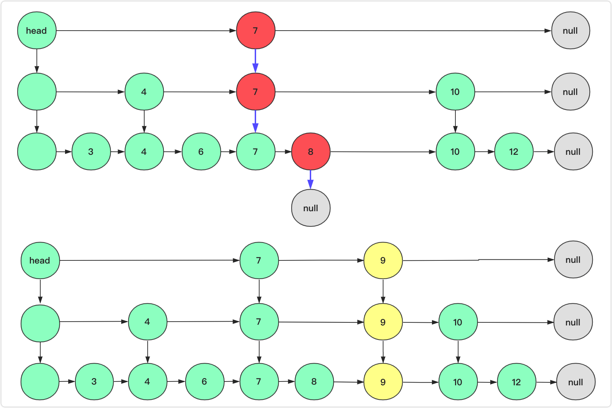
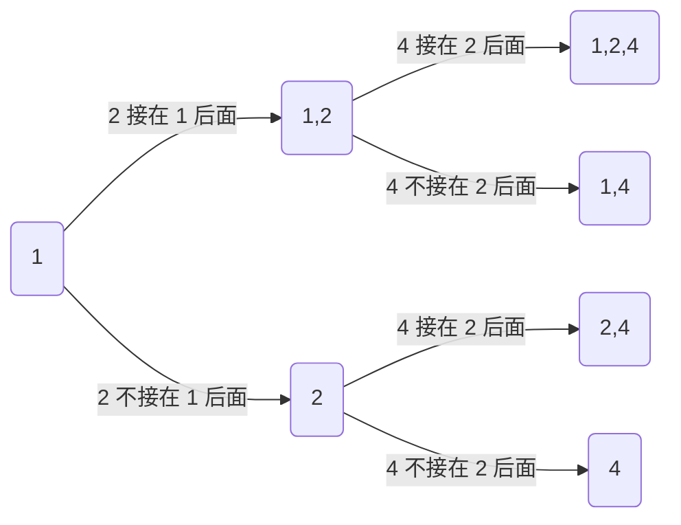

# 链式前向星建图

对于一个具有 N 个点和一共 M 条边的图，使用数组的方式将其存储，一共需要三个数组，一个数组 head 大小为 N，一个数组 edge 大小为 M ，一个数组 next 大小为 M；还需要一个全局的变量 idx 表示当前 edge 数组的使用位置

* head[i] 存储的的是以 i 为起点的第一条边的索引，用来索引 edge 数组的某条边，默认的如果 head[i] = -1 表示当前节点在图中不存在任何边

    >   注意这里的第一条，对应的边是存图的时候最后存入的边

* edge[i] 存储的是第 i 条边的终点，所以 edges[i] 存储的值是某一个节点

* next[i] 存储的是与第 i 条边具有相同的起点的下一条边，所以 next[i] 存储的是也是一个边的索引

实际使用的时候会将数组简写为 h, e, ne，全局索引还是使用 idx 表示

图的最重要的两个功能就是加边和遍历

加边的时候使用 add 函数

```java
// 加一条从 a 指向 b 的边
public void add(int a, int b) {
    e[idx] = b;
    ne[idx] = h[a];
    h[a] = idx++;
}
```

遍历的是使用 for 循环，比如如果需要遍历起点 a 的所有边/邻节点

```java
// i 表示所有的邻边
for (int i = h[a]; i != -1; i = ne[i]) {
    // j 表示了所有的邻节点
    int j = e[i];
    // do something else
}
```

要注意，因为这里通过边的索引为 -1 表示当前节点不存在其他边，所以默认需要将 h 数组添加 -1，因此建议每次创建好 h 数组后直接进行赋值

```java
// java
Arrays.fill(h, -1);
// c/c++
memset(h, -1, sizeof h);
```

比如有一个有向图：


如果按照以下顺序存图: 1 -> 2, 2 -> 3, 3 -> 4, 1 -> 3, 4 -> 1, 1 -> 5, 4 -> 5

那么得到的 head, edge, next 数组如下

| head[1] = 5 | head[2] = 1 | head[3] = 2 | head[4] = 6 | head[5] = -1 |
| :---------: | :---------: | :---------: | :---------: | :----------: |

| edge[1] = 2 | edge[2] = 3 | edge[3] = 4 | edge[4] = 3 | edge[5] = 1 | edge[6] = 5 | edge[7] = 5 |
| ----------- | ----------- | ----------- | ----------- | ----------- | ----------- | ----------- |

| next[1] = -1 | next[2] = -1 | next[3] = -1 | next[4] = 0 | next[5] = -1 | next[6] = 3 | next[7] = 4 |
| ------------ | ------------ | ------------ | ----------- | ------------ | ----------- | ----------- |

# 二分

明确一下，二分的写法有两种，一般情况下是可以混用的，但如果需要查找区间的左边界或有右边界的时候需要区分

```java
// 找到单调递增 nums 中第一个 target
public int bi_search(int[] nums, int target) {
    int l = 0;
    int r = nums.length - 1;
    while (l < r) {
        int mid = l + ((r - l) >> 1);
        if (nums[mid] < target) l = mid + 1;
        else r = mid;
    }
    return nums[l] == target ? -1 : l;
}

// 找到单调自增 nums 中最后一个 target
public int bi_search(int[] nums, int target) {
    int l = 0;
    int r = nums.length - 1;
    while (l < r) {
        int mid = l + ((r - l + 1) >> 1);
        if (nums[mid] > target) r = mid - 1;
        else l = mid;
    }
    return nums[l] == target ? -1 : l;
}
```

这种二分的特点在于，l 和 r 永远不会超过数组边界，出循环时一定具有 l = r，因此此时判断 l 和判断 r 是一样的

两种写法的唯一区别在于每次更新的条件不一样，一个是 l = mid + 1 另一个是 r = mid - 1, 特别的如果 r = mid - 1，此时计算 mid 的时候一定需要额外加 1，即 mid = l + ((r - l + 1) >> 1)

# 红黑树

## 二叉搜索树

> BST，比较鲜明的特点是中序遍历BST可以得到一个有序的数组

首先对于一个平衡的二叉搜索树BST，可以在$O(\log n)$的时间内查找到树中的任意一个节点


当然这是理想情况，即平衡二叉树的情况

实际中在极端不理想的条件下，二叉树会退化为链表：


在这种条件下，搜素的时间复杂度为$O(n)$

看来平衡真的很重要，红黑树中，黑节点是平衡的，这就是为什么它的搜索效率高

## 2-3树

为了保证平衡，某位大佬提出了2-3树

> 2-3树和后面的红黑树都是二叉搜索树，都是在最基本的BST上进行了改动，使得不管以什么顺序插入节点，都可以保证树的平衡，所以关注点应该是插入和删除节点，而不是查询节点（对于平衡的树，查询时间复杂度都是$O(\log n)$）

这个树中具有两种类型的节点，一种称为2-节点，一种称为3-节点

2-节点，是说那些可以具有两个子节点的节点，比如上面的BST中的每个节点都是2-节点

而3-节点，一个节点可以具有3个子节点，一个节点内部存放两个value

比如：


下图中的根节点即为一个3-节点，一个节点内部具有两个value

### 插入节点

2-3树在插入节点时，通过2-节点和3-节点直接的转换可以保证整个树一直保持平衡

> 个人对于平衡的理解是，所有的叶子节点的高度是相同的

比如现在向空的2-3树中插入：1到7


至此说明了为什么2-3树的插入节点时可以一直保持平衡

我们每次插入新节点并不是让其作为某个节点的子节点，而是将其融入现有的节点，如果该行为导致了2-3树被破坏，我们需要将其修复，即分解

> 当插入2节点时，会将其融入1节点，构造成一个3-节点
>
> 而插入3节点时，同样的融入会构造出4-节点，破坏了2-3树，所以需要提出一个节点
>
> 更为一般的形式，提出一个节点，向父节点融入，如果父节点已经是3-节点，就继续向上提出
>
> 最终的结果：
>
> * 找到某个2-父节点，将提出的节点融入
> * 找到了根节点为3-节点，此时将根节点分解，比如上面插入3，插入7后的过程

### 删除节点

删除节点其实很麻烦，因为我们不知道当前节点到底是2-节点还是3-节点，同时节点如果是叶子节点还好，删除后，保持平衡的操作没有那么麻烦，如果删除的是树中央部分的节点，就很麻烦了

直到另一位大佬提出，我们其实并不一定真的要删除一个节点，已知二叉搜索树的中序遍历是有序的，那么其实我们可以这样做：

* 如果删除的节点为叶子节点，考虑删除后，将其平衡；

* 如果删除的节点为数中央的节点，那么我们可以从当前节点的左子树中选择一个最大的节点，即为当前节点的前驱节点，将当前节点改写为前驱节点，随后删除前驱节点

    > 或者查询右子树，找到后继节点，改写后删除后继节点

更为具体的，比较麻烦，就不写了

## 红黑树

上面的2-3树性能确实好，但是问题在于维护起来太麻烦了，于是又一位大佬提出了红黑树

在红黑树中，只有2-节点，但他还是可以维护平衡，因为每个节点具有了颜色，区分为红节点和黑节点

> 红黑树是从2-3树演变过来的


这里采用节点左倾的形式表示红黑树，即如果有红节点，均为左子树

所以从形式上红黑树并不保证所有节点的平衡，而是保证所有叶子节点到根节点经过的黑节点的数量是一样的

我们可以认为红节点到黑节点的链接是3-节点的内部链接

红黑树的5个定义：

* 所有节点不是红节点就是黑节点
* 根节点一定是黑节点（因为我们采用了节点左倾的形式，所以即红节点一定是某个黑节点的左子节点）
* 所有叶子节点都是黑节点（这个主要还包含了空节点）
* 从叶子节点到根节点，经过的黑节点的个数是一样的（可以认为关于黑节点平衡）
* 不会出现连续的红节点（红节点的子节点一定是黑节点）

### 关于树的旋转

这部分其实和具体的什么树没关系，只不过红黑树中使用到了，所以就提一下：


### 插入节点

首先要明确，我们插入的节点都是红节点，这里类似于在2-3树中，我们所有插入的节点都是将其融入到一个父节点中，而不是作为哪个节点的子节点

当然，之前已经确认了，红节点都是左倾的，所以，如果插入的红节点作为了某个节点的右子节点是需要进行旋转的

> 右倾也行，甚至还可以认为红黑树是来自于2-3-4树的，可以参考：[图解：什么是红黑树?](https://zhuanlan.zhihu.com/p/273829162)

所有的插入情况分为三种：

* 插入的节点的比黑父节点大
* 插入的节点比红父节点小
* 插入的节点比红父节点小

> 别说还有什么插入的节点比黑父节点小，如果真的小，直接接上去就行了，因为我们新插入的节点是红节点，而且是红节点左倾，所以如果父节点是黑节点，是可以直接接上去的

#### 插入的节点比黑父节点大


正常情况下，如果当前节点（红节点）比父节点（黑节点）大，那么父节点一定具有红色左字节点

此时，会让父节点染红，而子节点染黑（例外的情况就是上面的第一行，父节点为根节点，因为根节点不红，所以父节点不染色）

当父节点作为右倾的红节点时，会让祖父节点左旋，并染色，实现红节点左倾

#### 插入节点比红父节点小


如果当前节点比红父小，那么就让祖父节点右旋，同时让其和父节点相互染色，这样就可以将这种情况转化为上面的第一种情况

> 目前看来的一个规律，旋转后进行红黑节点颜色互换
>
> 两个红色子节点会使得父节点染红，同时子节点染黑

#### 插入节点比父节点大


可以看到，如果当前节点比红父节点大，那么通过让父节点左旋，很容易将其转化为上面第二种情况

#### 小总结

注意到，上面同种颜色的节点旋转后，颜色不变（最后一种情况），不同种颜色的节点旋转后颜色互换，参考头两种情况

 对于红黑树，插入节点一共具有四种情况：

* 插入节点比黑父节点小：这种不用提，直接接上去就行）
* 插入节点比黑父节点大：这种黑父节点一定具有一个红左子节点，此时让两个子节点染色为黑，父节点染红，如果父节点右倾，考虑让祖父节点左旋
* 插入节点比红父节点小：这种祖父节点一定是黑节点，需要让祖父节点右旋（注意互换染色），此后转化为第二种情况
* 插入节点比红父节点大：这种让红父节点左旋即可转换为上面的第三种情况

### 删除节点

根据之前在2-3树中关于删除的描述，我们知道了，删除树中任意位置处的节点，其实最终都会转变为对某个叶子节点的删除

> 因为如果是树中央的某个节点，我们可以通过中序遍历找到它的前驱节点（这个前驱节点一定没有右子树），然后将前驱节点的值赋给当前位置的节点，最后删除前驱节点即可

这里因为考虑了红节点的左倾，所以删除节点的时候，找到节点的后继节点

> 后继节点的特点是它一定是某个节点的左子树，且它一定没有左子树

注意，下面讨论删除的都是后继节点，所以这些节点都不具有左子树

#### 后继节点为红节点


可以看到，删除红色后继节点很简单，直接删除就好，树高本来就不影响，依旧平衡

#### 后继节点为黑节点

黑节点可以通过动态的调整使其变为红节点，从而删除，此时可以分为两种情况讨论：

##### 后继节点的父节点为红节点


删除之前，4节点下的子树，需要经过两个黑节点（3和4）到达更深的根部，10节点下的子树需要经过一个黑节点（10）到达更深的根部

删除之后4节点下的子树，仍然需要经过两个黑节点（4和10）到达更深的根部，10节点下的子树仍然需要经过一个黑节点（10）到达更深的根部

> 上面的讨论建立在后继节点为黑节点，父节点为红节点，且后继节点具有兄弟节点的前提下
>
> 如果后继节点没有兄弟节点，那么其实也很容易变换，我们只需要对父节点进行一次右旋即可将后继节点染红，同时父节点染黑，这个时候再删除后继节点

##### 后继节点的父节点为黑节点

> 这种情况其实是最复杂的
>
> 在我们这个要求下的红黑树，只有左倾的红节点，通过这种方式实现黑节点平衡
>
> 如果一个树本身就是平衡的，那么就算所有节点都是黑节点，同样也是满足红黑树的5个条件的

如果父节点为黑节点，那么我们就去看看祖父节点是不是红节点，如果祖父也是黑节点，那么就看看曾祖父，直到找到一个红节点或者找到根节点：

* 如果找到了红节点，类似上面的方式进行染色，即父节点黑，两个子节点染红（如果没有右子树就通过右旋染色）
* 如果找到了根节点，我们直接将根节点的两个子树染红，相当于让所有节点的高度减去1

现在我们考虑一个最复杂的情况，即需要删除的节点的右子树中不存在任何一个红节点，我们需要从右子树中找到后继节点

> 其实我本人不太认为会出现当前节点是黑节点父节点也是黑节点的这种情况，因为我们所有添加的节点都是红色的，只有左右旋可能导致节点染黑，所以不太确定是否会出现连续的黑节点，不过这里的讨论按照全部为黑节点为例

比如右子树长这样：


#### 小总结

我们删除节点并不是真正将一个节点从树中删除，而是想着从它的左子树中找到一个前驱节点（或者从右子树中找到一个后继节点）将当前节点替换，最后在左子树中删除这个前驱节点（或者右子树中删除这个后继节点）

我们需要删除的节点一定是红节点，以左倾为例，此时我们需要删除的就是右子树中的后继节点

* 如果后继节点本身已经是红节点，那么直接删除就好

* 如果后继节点不是红节点，那么我们需要想办法把这个节点变为红节点，具体的方法如下：从当前节点的父节点开始找

    * 如果找到了红节点，就想办法把通过子节点的染色（可以是父节点和子节点相互染色，也可以是右旋）将红色节点传递到后继节点，然后删除后继节点
    * 如果直到找到根节点都找不到红节点，就让根节点的两个子节点变为红节点

    注意因为后继节点本身不是红节点，我们通过转化使其染红，必然付出了成本，可能导致红黑树左倾不再成立，所以删除红节点后，需要通过左旋的方式，恢复红黑树的左倾红节点的特点

### 大总结

对于红黑树的讨论从二叉搜索树开始

我们知道在平衡的二叉搜索树中查找节点所需的时间复杂度为$O(\log n)$，而在最坏的条件下，二叉搜索树退化为链表，此时搜索的成本变为$O(n)$

随后讨论了2-3树，这种树中具有两种类型的节点，2-节点中具有一个value，而其具有两个子节点，3-节点中具有两个value，而其可以有3个子节点；在这种树中插入节点时，我们考虑将新加入的节点融入某一个叶子节点，如果叶子节点因此变为4-节点，我们就需要分解，即向父节点提出一个节点，如果父节点也因此变为了4-节点，就继续向上提出，直到根节点，如果根节点也变为了4-节点，就将根节点分解，使得所有的叶子节点高度加一

最后因为2-3树较为复杂，实现起来比较麻烦，提出了简化2-3树的红黑树，在这里讨论红黑树中，所有红色节点都是左倾的，可以认为，一条黑父节点到左红子节点的链接，等效于2-3树中的3-节点

然后提出了红黑树的5个性质：

* 红黑树中的节点分为红色和黑色两种
* 根节点一定是黑节点
* 所有叶子节点到根节点经过的黑节点的数量是相同的
* 不会出现连续的红节点
* 所有叶子节点都是黑节点（存疑，这里主要是认为了如果叶子节点是红节点，那么相当于链接了两个空的黑叶子节点）

然后就是关于红黑树的插入和删除部分：首先要知道的是，红黑树中我们偏向于操作红节点，在添加节点的时候，我们就已经默认添加的节点是红节点了；在删除的时候也要先通过转化将待删除的前驱节点或后继节点变为红色；其次就是红节点左倾，这里和算法4中相同，当然红节点右倾也可以，但因为这里讨论的红黑树是由2-3树转化来的，所以正常情况下树中不会既有左倾又有右倾的红节点

关于染色，注意如果节点左旋或者右旋时，注意不同颜色的节点染色需要互换；

添加节点：新进的节点无外乎是下面的四种情况：

* 作为黑父节点的左子节点：此时什么都不需要管，因为我们默认新节点为红节点，不影响树高

* 作为黑父节点的右子节点：

    * 如果兄弟节点为红色，则黑父节点染红，当前节点和兄弟节点染黑

    这里要注意根节点为黑节点，不染色具有最高的优先级，即当根节点作为父节点时不参与染色

    * 否则如果兄弟节点不存在，或兄弟节点为黑节点，那么就让父节点左旋

* 作为红父节点的左子节点：此时让祖父节点右旋，转化为上面的第二种情况

* 作为红父节点的右子节点：此时让红父节点左旋，转化为上面的第三种情况

所以整体上看，添加节点还是比较容易的

删除节点：因为我们会将删除的任意节点变为删除前驱节点（或者后继节点），这里讨论的时删除后继节点，故删除的节点一定不存在左子树，且一定是某个节点的左子节点，这里分为两种情况讨论：

* 删除的后继节点是红节点：此时直接把后继节点的右子树挂在后继节点的位置就行

* 删除的后继节点是黑节点：此时需要考虑如果将当前的黑后继节点染红，注意把红后继节点删除后需要将红黑树中所有的红节点恢复为左倾

    分为父节点是不是红节点两种情况讨论

    * 父节点是红节点：如果有兄弟节点，就把父节点染黑，兄弟节点和后继节点同时染红；如果没有兄弟节点，那么直接让父节点右旋即可

    * 父节点不是红节点：此时需要从祖父节点开始向上找到一个红色的节点

        * 如果找得到，就按照上面第二种情况类似的方式，通过同时染色两个子节点或者右旋，使得红色可以传递下来
        * 如果找不到，就需要将根节点下的两个子节点染色（或者将根节点右旋），从而产生红色节点


至此，关于红黑树，非代码的部分已经云完了:joy:

# 树状数组

一般考虑计算数组中前 n 项的和，或者是求区间和的时候，使用的是前缀和数组，很简单，也很好用

但是问题在于如果这个数组经常发生变化，那么维护这个前缀和数组的开销就很大；特别的对于单点修改，我们维护前缀和数组的时间复杂度为$O(n)$，而对于区间修改，时间复杂度为$O(n^2)$

我们知道对于区间修改的（比如区间[1,3]整体加一），可以使用差分数组降低修改的时间复杂度为$O(1)$；差分数组可以在$O(n)$以时间复杂度计算出数组中某一点的值，在$O(n^2)$以时间复杂度计算出区间和

其实有一种更优的结构，它可以在$O(\log n)$的时间内维护修改后的数组，在$O(\log n)$的时间内计算出数组中的某一个点的值或区间和，他就是树状数组

> 这里的更优并不是绝对的，因为树状数组在维护区间修改时，时间复杂度是高于差分数组的，所以具体还是要看业务需求

## 一个简单的树状数组（单点修改，求区间和/数组中的某一点）


下方的为原来的数组，上方红色的节点为树状数组的节点

假设原来的数组长度为 8，下标为 1-8，用 A 表示，对应树状数组下标：1-8，用 C 表示

单从上面的结构中，有：`C[1] = A[1]`、`C[2] = A[1] + A[2]`...`C[8] = A[1] + A[8] + ... + A[8]`

要注意的是，这里的图不是乱画的，为什么 `C[4]` 下面表示了原数组中的四个节点，为什么 `C[7]` 只能表示 `A[7]` 一个节点，这里面有着比较详细的数学推导，这里仅提供一个记忆的方法

将数字写成二进制有:

*   $ (7)_{10} = (0111)_2$
*   $ (6)_{10} = (0110)_2$
*   $ (4)_{10} = (0100)_2$

乍一看好像没什么规律，其实主要是和最低为的 1 有关

在 `7` 的二进制中最低位的 1 在最低位 (xxx1)，记忆为 `C[7]` 可以表示原数组中的 1 个数字 -> A[7]

在 `6` 的二进制中最低位的 1 在次低位 (xx10)，记忆为 `C[6]` 可以表示原数组中的 2 个数字 -> A[6] + A[5]

在 `4` 的二进制中最低位的 1 在第三位 (x100)，记忆为 `C[4]` 可以表示原数组中的 4 个数字 -> A[4] + A[3] + A[2] + A[1]

因此 C[x] 可以表示原数组中元素的个数和最低位相关, 通过 [low bit](#low bit) 计算某个位置保存的元素的个数, 带入 7 将返回 1 ，带入 6 将返回 2 ，带入 4 将返回 4

对于树状数组有这样的性质：

* 每个 C[x] 节点覆盖的节点的个数为 lowbit(x), 因此树状数组中的一个节点保存的值和原数字中 {A[x - lowbit(x) + 1]... A[x]} 有关, 在考虑求和的的时候, 树状数组的节点 C[x] 的值为: {A[x - lowbit(x) + 1]... A[x]} 的和, 在考虑取极值的情况下, C[x] 的值为: {A[x - lowbit(x) + 1]... A[x]} 中的极值, 最大/最小
* 任意一个节点 C[x] 的父节点为：C[x + lowbit(x)]

第一条上面已经说过了，而至于第二条就是画出上面原数组和树状数组对应关系图的核心, 对于任意一个数组可以通过上面的两个性质构造出树状数组

修改原数组的 A[1] 需要修改树状数组中的 C[1], C[1 + lowbit(1)], C[1 + lowbit(1) + lowbit(1 + lowbit(1))]...

因此第一个 helper function -> add:

```cpp
// idx 从 1 开始
void add(int idx, int n, int num) {
    arr[idx] = num;
    while (idx <= n) {
        t[idx] += num;
        idx += lowbit(idx);
    }
}
```

因此给定一个原数组, 构造树状数组的时间复杂度为$O(n\log n)$, 相比于原始的前缀和数组, 其实时间复杂度更高, 但树状数组的优势在于修改区间

这里引入第二个 helper function -> modify

```cpp
void modify(int idx, int n, int num) {
    int delta = num - arr[idx];
    arr[idx] = num;
    while (idx <= n) {
        t[idx] += num;
        idx += lowbit(idx);
    }
}
```

>   从某种程度上, add 和 modify 是同一个函数

单点修改和增加相似, 时间复杂度为$O(\log n)$

而真正神奇的地方在于前缀和的求解, 考虑计算树状数组的前 7 项和, 有 `sum = C[7] + C[6] + C[4]`, 如果细心查看的话, 会发现, 从 7 -> 6 -> 4 每一个位置都是和前一个位置的 lowbit 相关的, 有: 

```java
int sum(int idx, int n) {
    int rst = 0;
    while (idx >= 1) {
        rst += t[idx];
        idx -= lowbit(idx);
    }
    return rst;
}
```

数学上的证明比较复杂，这里仅作为结论进行记忆

这里便体现出来了树状数组的优势, 不管是单点修改, 还是区间求和, 都可以在 $O(\log n)$ 时间内完成, 在进行一下对比:

* 在构造数组时，前缀和数组因为迭代的公式为 `preSum[i] = preSum[i - 1] + num[i - 1]`，因此时间复杂度为 $O(n)$；而树状数组构造时，对于每一项的加入，改变的节点为 `index, index + lowBit(index), ...` 最坏情况下有 $\log n$ 项，所以时间复杂度为 $O(n\log n)$
* 在单点修改元素时，前缀和数组需要修改的有 `index, index + 1...` 在最坏的情况下有 `n` 项时间复杂度为 $O(n)$；而树状数组修改时，每一项最多也只有 $\log n$ 项需要修改，所以时间复杂度为 $O(\log n)$
* 在求区间和时，以 `[left, right]` 这种闭区间距离，前缀和数组计算方式为 `preSum[right + 1] - preSum[left]`，可以在 $O(1)$ 的时间内得到结果；而树状数组计算出前 `n` 项和本身的时间复杂度为 $O(\log n)$，所以整体时间复杂度也为 $O(\log n)$

综上, 对于一个考虑前缀和的场景, 如果原数组不进行或几乎不修改, 那么前缀和数组就是最佳的, 否则, 利用树状数组可以快速完成修改, 并以相对小的开销进行求和 

>   要注意的是, 使用树状数组必须保留一份原数组, 在 modify 中, 首先需要计算 delta, 这里需要原始位置的取值

下面引出一道关于修改原数组的题目：

### [307. 区域和检索 - 数组可修改](https://leetcode-cn.com/problems/range-sum-query-mutable/)


```java
class NumArray {
    private int[] arr;
    private int[] tree;
    private int n;
    
    public NumArray(int[] nums) {
        this.n = nums.length;
        this.arr = new int[n + 1];
        this.tree = new int[n + 1];
        System.arraycopy(nums, 0, arr, 1, n);
        for (int i = 1; i <= n; i++) modify(i, arr[i]);
    }
    
    public void update(int index, int val) {
        modify(index + 1, val - arr[index + 1]);
        arr[index + 1] = val;
    }
    
    public int sumRange(int left, int right) {
        return pre(right + 1) - pre(left);
    }
    
    private int lowbit(int num) {
        return num & (-num);
    }
    
    private void modify(int idx, int num) {
        for (; idx <= n; idx += lowbit(idx)) tree[idx] += num;   
    }
    
    private int pre(int idx) {
        int rst = 0;
        for (; idx > 0; idx -= lowbit(idx)) rst += tree[idx];
        return rst;
    }
}
```

树状数组不仅仅可以用来求解区间和, 还可以用来求解区间极值, 在求和的树状数组中, update 函数如下:

```cpp
// 这里的 val 是 delta
void update(int n, int idx, int val) {
    for (; idx < n; idx += lowbit(idx)) t[idx] += val;
}
```

在求最大值的树状数组中, update 函数如下:

```cpp
// 这里的 val 是实际的取值
void update(int n, int idx, int val) {
    for (; idx < n; idx += lowbit(idx)) t[idx] = max(t[idx], val); 
}
```

看起来这个函数是正确的, 但是最大值会覆盖掉所有的小的值, 考虑当其中一个节点的取值变小, 此时**之前的取值会覆盖新的较小的 val**, 因此对于上述方式维护了树状数组的方式, 每当进行某个位置的修改后, 都需要利用原数组重新构建树状数组, 即单点修改的时间复杂度从 $O(\log n)$ 变为了 $O(n\log n)$


## 区间修改，求区间和/数组中的某一点

之前提到过，如果是区间修改可以使用差分数组

普通的差分数组构造时，时间复杂度为$O(n)$，执行一次对区间的修改的时间复杂度为$O(1)$，查询数组中的单点时间复杂度为$O(n)$，而查询区间和的时间复杂度为$O(n ^ 2)$

所以其实差分数组的性能并不差，这里使用的树状数组是一种应对思路，可能有的时候效果并不如普通的差分数组

考虑一个数组：`nums = [1,2,3,5,6,9]`，那么它对应的差分数组为：`diff = [1,1,1,2,1,3]`

> 注意使用差分数组后，我们就不要维护原来的数组了
>
> 本身使用差分就是为了方便维护修改区间，现在如果还要维护原数组，那么就失去了差分数组的意义，这也就是为什么使用差分数组进行单点查询的时间复杂度为$O(n)$而不是$O(1)$

对于差分数组，比如更新区间`[left, right]`（这里是闭区间），那么直接让：`diff[left] += val, diff[right + 1] -= val`即可

如果我们需要求出单点的值，需要求出差分数组的前缀和：比如求出`index`的单点的值，其实是在求：$\sum_{i = 0}^{index} diff[i]$

这样，原数组的区间修改对应了差分数组中的单点修改，原数组中的求单点，对用了求差分数组中的前缀和

这里引入一个关于区间修改，单点查询的题目：

#### [1109. 航班预订统计](https://leetcode-cn.com/problems/corporate-flight-bookings/)


```java
class Solution {
    public int[] corpFlightBookings(int[][] bookings, int n) {
        int[] rst = new int[n];
        for (int[] booking : bookings) {
            rst[booking[0] - 1] += booking[2];
            if (booking[1] < n) {
                rst[booking[1]] -= booking[2];
            }
        }
        for (int i = 1; i < n; i++) {
            rst[i] += rst[i - 1];
        }
        return rst;
    }
}
```

将差分数组中的区间修改和差分数组的单点查询，类比普通的数组的单点修改，和普通数组的前缀和

所以到这里使用树状数组实现区间修改的方式已经呼之欲出了，即**将差分数组按照`lowBit`的规则存入树状数组**

### 求数组中的某一点

```java
class TreeArray {
    private int[] c;
    private int size;
    
    public TreeArray(int[] nums) {
        this.size = nums.length;
        c = new int[size + 1];
        addDiff(1, nums[0]);
        for (int i = 1; i < size; i++) {
            addDiff(i + 1, nums[i] - nums[i - 1]);
        }
    }
    
    private int lowbit(int num) {
        return num & (-num);
    }
    
    private void addDiff(int index, int diffNum) {
        while(index <= size) {
            c[index] += diffNum;
            index += lowbit(index);
        }
    }
    
    public void update(int left, int right, int gap) {
        addDiff(left + 1, gap);
        addDiff(right + 2, -gap);
    }
    
    public int getSingle(int index) {
        int rst = 0;
        index++;
        while(index > 0) {
            rst += c[index];
            index -= lowbit(index);
        }
        return rst;
    }
}
```

### 求区间和

其实求单点能求，区间就能求，最简单的思路就是我把区间中每个单点求一遍，不就得到了

但是这样做时间复杂度为$O(n\log n)$

树状数组可以将时间复杂度降到更低

考虑：$A[i] = \sum _{k = 1}^{i}D[k]$，其中`A[i]`表示数组中的某一项，而`D[k]`表示差分数组中的某一项

那么：前n项和：$\sum_{i = 1}^{n}A[i] = \sum_{i = 1}^{n}\sum_{k = 1}^{i}D[k]$

即：$sum = A[n] + A[n - 1] + ... + A[1] = (D[n] + D[n - 1] + ... + D[1]) + (D[n - 1] + D[n - 2] + ... + D[1]) + ... + D[1]$

合并：$sum = n * (D[n] + D[n - 1] + ... + D[1]) - (n - n) D[1] - D[2] - 2 \times D[3] - ... - (n - 1)D[n]$

写的好看一点：$sum = n\times\sum_{i = 0}^nD[i] - \sum_{i = 0}^{n}(i - 1)\times D[n]$

所以维护两个数组：$D[i]$（和上面一样），和$(i - 1)D[i]$

```java
class TreeArray {
    // D[i]在树状数组中的存储
    private int[] c;
    // (i - 1)D[i]在树状数组中的存储
    private int[] de;
    private int size;
    
    public TreeArray(int[] nums) {
        this.size = nums.length;
        this.c = new int[size + 1];
        this.de = new int[size + 1];
        addDiff(1, nums[0]);
        for (int i = 1; i < size; i++) {
            int gap = nums[i] - nums[i];
            // 维护D[i]所在的树状数组
            addDiff(i + 1, gap);
            // 维护(i - 1)D[i]所在的树状数组
            addDe(i + 1, i * gap);
        }
    }
    
    private int lowbit(int num) {
        return num & (-num);
    }
    
    private void addDiff(int index, int diffNum) {
        while (index <= size) {
            c[index] += diffNum;
            index += lowbit(index);
        }
    }
    
    private void addDe(int index, int deNum) {
        while (index <= size) {
            de[index] += deNum;
            index += lowbit(index);
        }
    }
    
    public void update(int left, int right, int gap) {
        addDiff(left + 1, gap);
        addDiff(right + 2, -gap);
        addDe(left + 1, gap * left);
        addDe(right + 2, -gap * (right + 1));
    }
    // 获取D[i]的前缀和
    public int getSingle(int index) {
        int rst = 0;
        index++;
        while (index > 0) {
            rst += c[index];
            index -= lowbit(index);
        }
        return rst;
    }
    // 获取(i - 1) * D[i]的前缀和
    private int getDeSum(int index) {
        int rst = 0;
        index++;
        while (index > 0) {
            rst += de[index];
            index -= lowbit(index);
        }
        return rst;
    }
    
    public int getSum(int index) {
        return (index + 1) * getSingle(index) - getDeSum(index);
    }
}
```

将差分数组存入树状数组：

* 构造数组时，普通的差分数组时间复杂度为$O(n)$，使用树状数组的时间复杂度为$O(n\log n)$
* 区间修改时，普通差分数组的时间复杂度为$O(1)$，使用树状数组的时间复杂度为$O(\log n)$
* 查询单点时，普通差分数组的时间复杂度为$O(n)$，使用树状数组的时间复杂度为$O(\log n)$
* 查询区间时，普通差分数组的时间复杂度为$O(n^2)$，使用树状数组的时间复杂度为$O(\log n)$

## 总结一下

对于普通的前缀和可以解决的问题，就使用前缀和吧，无论从构造还是查询，都具有更低的时间复杂度

只有出现了修改时，才考虑使用差分，或使用树状数组

* 如果仅仅是单点修改，那么使用树状数组最好，尤其是那种经常修改，不怎么查询的，树状数组的优势很明显
* 如果是区间修改，那么可以考虑使用差分数组，或者将差分数组存入树状数组中；更为具体的，看需要的业务要求：
    * 如果出现查询区间的，使用树状数组可以大大降低时间复杂度
    * 如果只有查询单点的，那么使用树状数组或单独一个差分数组其实差不多，关键看看是区间修改的次数多，还是查询单点的次数多

# 线段树

这里使用线段树完成区间修改，查询的操作，因此需要 lazy 标记

> 注意如果是单点更新，然后还一定要用线段树，对于这种情况的，其实是不需要考虑lazy标记的，因为整个范围都是限定在某一个点，所以更新的时候一定是针对叶子节点的更新

要明确 lazy 标记的意义，它表示了**当前节点已经完成了修改**，而其子节点尚未进行修改，修改的大小使用 lazy 表示，这种延迟修改避免了大量修改树中的节点

> 以一种极端情况举例，考虑使用堆实现线段树，且每次更新都是整个区间加 1 ，假设区间长度为 n，那么节点的个数为 2 * n(并不精确)，这样每次修改的节点个数也是 2 * n；而如果使用了 lazy 标记，那么每次修改的节点的只是根节点，即修改1个节点

## 基于堆实现

这个比较简单，考虑数组合法下标从 1 开始(类似树状数组)，对于任意一个下标为 i 的节点，其左子节点下标为 2 * i 而右子节点下标为 2 * i + 1

主要考虑的场景为：区间修改和查询，其步骤分别为：

这里假设需要修改的区间范围使用 target 表示，需要修改的量使用 delta 表示，当前区间的范围使用 current 表示

* 区间修改：
    * 如果 target **完全覆盖了** current，那么只需要更新当前区间的 lazy 标记即可(lazy += delta)
    * 如果 target 未完全覆盖 current，那么需要先**将当前区间的 lazy 下传**(分别更新左子节点和右子节点，并更新左右子节点的 lazy 标记，然后清空当前节点的 lazy 标记)；然后分别查看左右子节点的 current 是不是和 target 有**交集**，如果有就递归的更新左右子区间，最后**更新当前区间的取值**(新值为左区间和右区间的和)
* 查询：
    * 如果 target 完全覆盖了 current，那么直接返回当前区间的取值即可
    * 如果 target 未完全覆盖 current， 那么需要先将当前区间的 lazy **下传**；然后分别查看左右子节点的 current 是不是和 target 有交集，如果有就递归的累加结果，最后返回即可

典型例题可以参考：[1109. 航班预订统计](https://leetcode.cn/problems/corporate-flight-bookings/)


这个题要求区间更新，同时还需要所有点的单点查询，所以从执行效率上，其实是不如差分数组的

```java
class Solution {
    private Node[] tree;

    public int[] corpFlightBookings(int[][] bookings, int n) {
        // 大小开到 4n 是为了防止下标越界 
        this.tree = new Node[n * 4];
        buildHeap(1, n, 1);
        for (int[] booking : bookings) {
            update(booking[0], booking[1], booking[2], 1);
        }
        int[] rst = new int[n];
        for (int i = 0; i < n; i++) {
            rst[i] = search(i + 1, i + 1, 1);
        }
        return rst;
    }

    /**
     * 区间查询函数
     */
    private int search(int left, int right, int idx) {
        // 完全覆盖
        if (tree[idx].left >= left && tree[idx].right <= right) return tree[idx].val;
        
        if (tree[idx].lazy != 0) deliverLazy(idx);
        // 注意这里判断左右子节点和 target 区间存在交集的方式，是通过比较 mid(左子节点的右边界) 和 target 范围实现的
        int mid = tree[idx].left + ((tree[idx].right - tree[idx].left) >> 1);
        int rst = 0;
        if (mid >= left) rst += search(left, right, idx << 1);
        if (mid < right) rst += search(left, right, (idx << 1) | 1);
        return rst;
    }

    /**
     * 区间更新函数，left 和 right 分别表示左右边界，val 表示在原来的基础上新增的值，idx 表示当前更新的节点下标
     */
    private void update(int left, int right, int val, int idx) {
        // 完全覆盖
        if (tree[idx].left >= left && tree[idx].right <= right) {
            tree[idx].val += val * (tree[idx].right - tree[idx].left + 1);
            tree[idx].lazy += val;
            return;
        }
        // 这里先判断 lazy 是不是0，如果是0的话就不需要传递了
        if (tree[idx].lazy != 0) deliverLazy(idx);
        int mid = tree[idx].left + ((tree[idx].right - tree[idx].left) >> 1);
        if (left <= mid) update(left, right, val, idx << 1);
        if (right > mid) update(left, right, val, (idx << 1) | 1);
        tree[idx].val = tree[idx << 1].val + tree[(idx << 1) | 1].val;
    }

    /**
     * 传递函数，把当前节点的lazy标记下方到左右子节点
     */
    private void deliverLazy(int idx) {
        int left = idx << 1;
        int right = left | 1;
        tree[left].lazy += tree[idx].lazy;
        tree[left].val += tree[idx].lazy * (tree[left].right - tree[left].left + 1);
        tree[right].lazy += tree[idx].lazy;
        tree[right].val += tree[idx].lazy * (tree[right].right - tree[right].left + 1);
        tree[idx].lazy = 0;
    }

    /**
     * buildHeap方法初始化每个节点的上下界，递归更新
     */
    private void buildHeap(int left, int right, int idx) {
        tree[idx] = new Node(left, right);
        // 如果当前节点表示的区间大小为1时(left = right时)，则没有子节点，其他情况下都具有子节点
        if (left != right) {
            // 类似二分的形式取mid
            int mid = left + ((right - left) >> 1);
            /**
             * 因为有效下标从1开始，所以左子节点的下标为 2 * i，而右子节点下标为 2 * i + 1
             * 使用位运算加速
             */
            buildHeap(left, mid, idx << 1);
            buildHeap(mid + 1, right, (idx << 1) | 1);
        }
    }
}

class Node {
    // 左右边界
    int left;
    int right;
    int val;
    int lazy;
    public Node(int left, int right) {
        this.left = left;
        this.right = right;
    }
}
```

## 动态开点

### 估算数据范围

借助堆实现的线段树在一开始调用方法 buildHeap() 新建了一棵完整的树， 因为线段树以满二叉树的形式存储，为了防止下标越界，需要开辟的空间大小为 4n

然而存在一类体型，值域范围很大，而查询次数很小，典型的例子就是[729. 我的日程安排表 I](https://leetcode.cn/problems/my-calendar-i/)，它的输入范围达到了$10^9$而查询次数仅有$10^3$次，对于这类，如果也是一上来就开辟空间，会直接报 OOM

所以可以对线段树执行懒加载，让其在更新(update())和查询(query())的时候再进行初始化，只不过此时，节点和其子节点之间的关系就已经不满足堆的要求了，所以此时，对一个节点而言，需要记录其左右子节点的下标位置，我们的新的节点定义如下: 

```java
class Node {
    // left 和 right 分别表示了左子节点和右子节点的下标
    int left;
    int right;
    int val;
    int lazy;
}
```

注意到现在我们没有维护一个节点对应区间的范围，这是因为我们完全可以通过代码的形式手动维护范围，而不需要再让节点记录了(也许会省下一些空间吧)

要注意的是每次查询或更新操作，都有可能导致线段树懒加载节点，一次懒加载节点的最多可以达到 $\log n$ 个，因为我们一共进行了 m 次操作，所以整体的空间复杂度为 $O(m\log n)$ ，然而真正的空间开销比这个要大，一般会在 $m\log n$ 前再添加一个系数，一般为 4，实在不行给到 6，但是经过我实际测试发现，在[729. 我的日程安排表 I](https://leetcode.cn/problems/my-calendar-i/)中，即便给到 6 也是不行的，所以如果实在过不了就看的大一点吧，反正在 leetcode 中卡内存到 128M，直接拉到 $10^6$ 这个级别再试试，也许就能过了

这里以[729. 我的日程安排表 I](https://leetcode.cn/problems/my-calendar-i/)为例进行说明


```java
class MyCalendar {
    // 输入范围的上限
    private static final int N = 1000000000;
    // 6 x m x logn
    private static final int M = 1000000;
    private Node[] tree;
    // 全局的 count 用来记录新创建的子节点的下标位置
    private int count;

    public MyCalendar() {
        this.tree = new Node[M];
        this.count = 1;
    }

    /**
     * 更新函数
     * 第一个参数为更新的节点下标，l 和 r 一起表示了当前节点维护的区间大小
     * start 和 end 一起表示了需要更新的区间大小，val表示了整体区间更新的val，在本题里这个 val 仅取 1
     */
    private void update(int idx, int l, int r, int start, int end, int val) {
        // 如果覆盖
        if (start <= l && end >= r) {
            tree[idx].val += val * (r - l + 1);
            tree[idx].lazy += val;
            return;
        }

        // 这一步在这个题中是不必要的，因为每次插入前都需要进行一次查询
        // createLazy(idx);
        
        // 向下传递 lazy 标记
        int mid = l + ((r - l) >> 1);
        if (tree[idx].lazy != 0) pushLazy(idx, l, r, mid);
        
        // 查看交集
        if (start <= mid) update(tree[idx].left, l, mid, start, end, val);
        if (end > mid) update(tree[idx].right, mid + 1, r, start, end, val);
        
        // 最后不要忘了更新当前节点的 val (因为当前节点的区间范围比 start 到 end 更大，所以需要手动更新最新值)
        tree[idx].val = tree[tree[idx].left].val + tree[tree[idx].right].val;
    }

    private int query(int idx, int l, int r, int start, int end) {
        // 如果覆盖
        if (start <= l && end >= r) return tree[idx].val;
        
        createLazy(idx);

        // 传递 lazy 标记
        int mid = l + ((r - l) >> 1);
        if (tree[idx].lazy != 0) pushLazy(idx, l, r, mid);
        
        // 检查交集
        int rst = 0;
        if (start <= mid) rst += query(tree[idx].left, l, mid, start, end);
        if (end > mid) rst += query(tree[idx].right, mid + 1, r, start, end);
        return rst; 
    }

    /**
     * 第一个参数为下传lazy标记的节点下标
     * 后面三个参数用来刻画区间
     */
    private void pushLazy(int idx, int l, int r, int mid) {
        tree[tree[idx].left].val += tree[idx].lazy * (mid - l + 1);
        tree[tree[idx].left].lazy += tree[idx].lazy;
        tree[tree[idx].right].val += tree[idx].lazy * (r - mid);
        tree[tree[idx].right].lazy += tree[idx].lazy;
        tree[idx].lazy = 0;
    }   

    /**
     * 懒加载
     */
    private void createLazy(int idx) {
        // 这个条件判断仅仅用来初始化根节点，然后就没用了
        if (tree[idx] == null) tree[idx] = new Node();
        /*
         * 注意count的定义，它表示了当前树中有效节点的个数
         * 默认的当 left 和 right 为 0 表示了当前节点的左右子节点尚未完成初始化操作
         */
        if (tree[idx].left == 0) {
            tree[idx].left = ++count;
            tree[tree[idx].left] = new Node();
        }
        if (tree[idx].right == 0) {
            tree[idx].right = ++count;
            tree[tree[idx].right] = new Node();
        }
    }

    
    public boolean book(int start, int end) {
        /* 
         * 注意这里的查询操作很细节的让 r 取到 N + 1
         * 因为第一次查询的时候根节点还没有初始化，我们必须让 start + 1 和 end 在 l 和 r的内部
         * 这样才能保证根节点的顺利初始化，当然，我个人感觉更好的做法其实是一开始的时候就初始化根节点
        */
        if (query(1, 1, N + 1, start + 1, end) > 0) return false;
        update(1, 1, N + 1, start + 1, end, 1); 
        return true;
    }
}

class Node {
    // 这里分别表示左右子节点的下标
    int left;
    int right;
    int val;
    int lazy;
}

/**
 * Your MyCalendar object will be instantiated and called as such:
 * MyCalendar obj = new MyCalendar();
 * boolean param_1 = obj.book(start,end);
 */
```

关键词：lazy 标记  懒加载  覆盖  传递 lazy 标记  交集  更新

### 链表存储线段树

对于动态开点，可以通过在节点中存储子节点的方式优化空间开销，将节点定义为：

```java
class Node {
    // left 和 right 分别表示左右子节点
    Node left;
    Node right;
    int val;
    int lazy;
}
```

这样我们就不需要每次都开一个大数组保存所有的子节点了，相当于把数组存储的线段树变为了链表的结构

以链表的形式维护线段树，对于那些数据范围很大，但是查询范围很小的输入类型，优化效果很好，如果查询的范围基本覆盖了整个输入范围，那么因为当前的 node 对象中需要维护两个节点对象 left 和 right，相比之下查询速度自然是比数组慢点的

## 典型例题(我的日程安排表系列)

### [729. 我的日程安排表 I](https://leetcode.cn/problems/my-calendar-i/)


根据题意定义 Node 中的 val 表示为**当前范围的被预定日期个数的和**

```java
class MyCalendar {
    // 输入范围的上限，注意到 end 可以取到 1e9，但是因为是开区间，所以这里减去了 1
    private static final int N = (int)1e9 - 1;
    // 根节点
    private Node root;

    public MyCalendar() {
        this.root = new Node();
    }

    /**
     * 更新函数：四步
     * 是否覆盖：如果覆盖直接更新当前节点并返回
     * 懒加载并传递 lazy 标记
     * 查询交集
     * 更新当前节点
     */
    private void update(Node node, int l, int r, int start, int end) {
        // 如果覆盖，直接更新，大小为区间的大小
        if (start <= l && end >= r) {
            node.val += r - l + 1;
            node.lazy++;
            return;
        }

        // 下面两步在这个题中是不必要的，因为每次插入前都需要进行一次查询
        // createLazy(idx);
        // if (node.lazy != 0) pushLazy(node);
        
        // 查看交集
        int mid = l + ((r - l) >> 1);
        if (start <= mid) update(node.left, l, mid, start, end);
        if (end > mid) update(node.right, mid + 1, r, start, end);
        // 最后不要忘了更新当前节点的 val
        node.val = node.left.val + node.right.val;
    }
    
	/**
	 * 查询函数，相比于上面的更新函数，少了最后一步更新当前节点
	 */
    private int query(Node node, int l, int r, int start, int end) {
        // 如果覆盖，直接返回
        if (start <= l && r <= end) return node.val;
        // 懒加载
        createLazy(node);
        // 传递 lazy 标记
        if (node.lazy != 0) pushLazy(node);
        // 检查交集
        int rst = 0;
        int mid = l + ((r - l) >> 1);
        if (start <= mid) rst += query(node.left, l, mid, start, end);
        if (end > mid) rst += query(node.right, mid + 1, r, start, end);
        return rst; 
    }
    
	/**
	 * 传递 lazy 标记
	 */
    private void pushLazy(Node node) {
        node.left.val += node.lazy;
        node.left.lazy += node.lazy;
        node.right.val += node.lazy;
        node.right.lazy += node.lazy;
        node.lazy = 0;
    }  
    
	/**
     * 懒加载
     */
    private void createLazy(Node node) {
        if (node.left == null) node.left = new Node();
        if (node.right == null) node.right = new Node();
    }
	
    public boolean book(int start, int end) {
        end--;
        if (query(root, 0, N, start, end) > 0) return false;
        update(root, 0, N, start, end); 
        return true;
    }
}

class Node {
    Node left;
    Node right;
    int val;
    int lazy;
}
```

### [731. 我的日程安排表 II](https://leetcode.cn/problems/my-calendar-ii/)


这个题相比于上一个题允许了出现日期交叠的情况，但是最多交叠 2 次

这里的 val 定义为**当前范围中日期被预定的最多的次数**

> 比如范围 [10, 20] 经历了两次预定 [10, 15] 和 [12, 20]，那么 [10, 20] 对应的 val 即为 2

```java
class MyCalendarTwo {
    // 输入范围的上限和上面的题目一样
    private static final int N = 1000000000 - 1;
    // 根节点
    private Node root;

    public MyCalendarTwo() {
        this.root = new Node();
    }
    
    public boolean book(int start, int end) {
        end--;
        // 如果当前范围中某日期已经被预定了 2 次直接返回就行
        if (query(root, 0, N, start, end) == 2) return false;
        update(root, 0, N, start, end);
        return true;
    }
    // 覆盖、createLazy/pushLazy、交集
    private int query(Node node, int l, int r, int start, int end) {
        if (start <= l && r <= end) return node.val;
        
        createLazy(node);
        if (node.lazy != 0) pushLazy(node);
        
        int mid = l + ((r - l) >> 1);
        int rst = 0;
        if (start <= mid) rst = Math.max(rst, query(node.left, l, mid, start, end));
        if (end > mid) rst = Math.max(rst, query(node.right, mid + 1, r, start, end));
        return rst;
    }
    // 覆盖、createLazy/pushLazy、交集、更新当前节点
    private void update(Node node, int l, int r, int start, int end) {
        if (start <= l && r <= end) {
            node.val++;
            node.lazy++;
            return;
        }
        
        createLazy(node);
        if (node.lazy != 0) pushLazy(node);
        
        int mid = l + ((r - l) >> 1);
        if (start <= mid) update(node.left, l, mid, start, end);
        if (end > mid) update(node.right, mid + 1, r, start, end);
        // 注意这里更新当前节点的方式，因为是找某个日期被预定次数的最大值，所以需要比较两个子区间
        node.val = Math.max(node.left.val, node.right.val);
    }
     
    private void pushLazy(Node node) {
        node.left.val += node.lazy;
        node.left.lazy += node.lazy;
        node.right.val += node.lazy;
        node.right.lazy += node.lazy;
        node.lazy = 0;
    }
    
    private void createLazy(Node node) {
        if (node.left == null) node.left = new Node();
        if (node.right == null) node.right = new Node();
    }
}

class Node {
    Node left;
    Node right;
    int val;
    int lazy;
}
```

### [732. 我的日程安排表 III](https://leetcode.cn/problems/my-calendar-iii/)


和上面的题最大的区别在于，不管某个日期已经预定了多少次，都可以继续预定，返回值为所有日期中，预定次数的最大值

所以 val 的定义和上面完全一致，不仅如此，这里甚至不需要写 query 方法，因为 root.val 本身的含义就是所有日期中预定次数的最大值，直接返回就行

```java
class MyCalendarThree {
    private static final int N = 1000000000 - 1;
    private Node root;
    public MyCalendarThree() {
        this.root = new Node();
    }
    
    public int book(int start, int end) {
        end--;
        update(start, end, root, 0, N);
        return root.val;
    }

    private void createNode(Node node) {
        if (node.left == null) node.left = new Node();
        if (node.right == null) node.right = new Node();
    }

    private void pushLazy(Node node) {
        node.left.val += node.lazy;
        node.left.lazy += node.lazy;
        node.right.val += node.lazy;
        node.right.lazy += node.lazy;
        node.lazy = 0;
    }

    private void update(int begin, int end, Node node, int l, int r) {
        if (begin <= l && r <= end) {
            node.val++;
            node.lazy++;
            return;
        }

        createNode(node);
        if (node.lazy != 0) pushLazy(node);

        int mid = l + ((r - l) >> 1);
        if (begin <= mid) update(begin, end, node.left, l, mid);
        if (end > mid) update(begin, end, node.right, mid + 1, r);
        node.val = Math.max(node.left.val, node.right.val);
    }
}

class Node {
    int val;
    int lazy;
    Node left;
    Node right;
}
```

## 其他(重要)

事实上，线段树并不仅仅可以解决区间修改求和这么单一的问题，只要是那种**一个区间的解可以通过合并两个子区间得到**的都可以使用线段树，比较典型的例子就是**求和和求极值**，下面给出一个求区间最大值的例子：

[699. 掉落的方块](https://leetcode.cn/problems/falling-squares/)


输入的范围如下：


```java
class Solution {
    // 输入上限
    private static final int N = 200000000;
    // 根节点
    private Node root;

    public List<Integer> fallingSquares(int[][] positions) {
        this.root = new Node();
        List<Integer> rst = new ArrayList<>();
        for (int[] position : positions) {
            int start = position[0];
            int height = position[1];
            // 注意 end 区间的取值，这是因为题意表明的区间其实是
            int end = position[0] + height - 1;
            height += query(root, 1, N, start, end);
            update(root, 1, N, start, end, height);
            rst.add(root.val);
        }
        return rst;
    }

    /**
     * 更新操作，一共四步：
     * 1.是否覆盖：如果覆盖直接更新就好，跳过后面的所有步骤
     * 2.如果子节点不存在就新建，同时下发 lazy 标记
     * 3.查询左右子节点的区间是否和当前更新区间是否有交集，对于有交集的区间进行更新
     * 4.更新当前节点的取值(这一步是最重要的)
     */
    private void update(Node node, int l, int r, int start, int end, int val) {
        if (start <= l && r <= end) {
            node.val = val;
            node.lazy = val;
            return;
        }

        // 这里的 createLazy() 和 pushLazy() 不是必须的，因为每次的 update 之前都会带有一次 query
        // createLazy(idx);
        // if (node.lazy != 0) pushLazy(idx);

        int mid = l + ((r - l) >> 1);
        if (start <= mid) update(node.left, l, mid, start, end, val);
        if (end > mid) update(node.right, mid + 1, r, start, end, val);
        node.val = Math.max(node.left.val, node.right.val);
    }

    /**
     * 查询操作，和更新操作差不多，就是少了一个更新的操作
     * 1.是否覆盖，如果覆盖直接返回
     * 2.如果子节点不存在就新建，同时下发 lazy 标记
     * 3.查询左右子节点的区间是否和当前更新区间是否有交集，对于有交集的区间进行查询
     */
    private int query(Node node, int l, int r, int start, int end) {
        if (start <= l && r <= end) return node.val;

        createLazy(node);

        if (node.lazy != 0) pushLazy(node);

        int rst = 0;
        int mid = l + ((r - l) >> 1);
        if (start <= mid) rst = Math.max(rst, query(node.left, l, mid, start, end));
        if (end > mid) rst = Math.max(rst, query(node.right, mid + 1, r, start, end));
        return rst;
    }

    /**
     * 新建左右子节点
     */
    private void createLazy(Node node) {
        if (node.left == null) node.left = new Node();
        if (node.right == null) node.right = new Node();
    }

    /**
     * 下发 lazy 标记
     */
    private void pushLazy(Node node) {
        node.left.val = node.val;
        node.left.lazy = node.lazy;
        node.right.val = node.val;
        node.right.lazy = node.lazy;
        node.lazy = 0;
    }
}

// 以链表的形式存储线段树
class Node {
    Node left;
    Node right;
    int val;
    int lazy;
}
```

其他的例题：[715. Range 模块](https://leetcode.cn/problems/range-module/)、[2213. 由单个字符重复的最长子字符串](https://leetcode.cn/problems/longest-substring-of-one-repeating-character/)

# 树状数组和线段树

线段树：将区间表示为若干区间的并集

树状数组：将区间表示为若干前缀和区间的差集

二者的深度都是 $\log n$ 级别的，所以查询的速度可以认为是一个数量级的；不过因为线段树本身的特性，是区间的并集，因此可以很方便的求出区间的极值

# >> 和 >>>

最大的不同在于`>>`是逻辑移位，而`>>>`是算数移位

说的更直白一点，对于操作数是负数的情况，`>>`移位时最高位将补`1`，而`>>>`移位时最高位补充`0`

一个很好的例子：计算：`(1 + 2147483647) >> 1`和`(1 + 2147483647) >>> 1`，注意到：`2147483647`就是`Integer.MAX_VALUE`

正常人的解法：`(1 + 2147483647) / 2 = 2147483648 / 2 = 1073741824`

如果是`>>`：

```java
          1: 00000000 00000000 00000000 00000001
+2147483647: 01111111 11111111 11111111 11111111
================================================
-2147483648: 10000000 00000000 00000000 00000000  // Overflow
>> 1
================================================
-1073741824: 11000000 00000000 00000000 00000000  // 逻辑右移
```

如果是`>>>`：

```java
          1: 00000000 00000000 00000000 00000001
+2147483647: 01111111 11111111 11111111 11111111
================================================
-2147483648: 10000000 00000000 00000000 00000000  // Overflow
>>> 1
================================================
+1073741824: 01000000 00000000 00000000 00000000  // 算数右移
```

> 参考：[arrays - what does ">>>" mean in java?](https://stackoverflow.com/questions/19058859/what-does-mean-in-java)

# bit wise

所有 bit wise 的技巧在 [Bit Twiddling Hacks (stanford.edu)](http://graphics.stanford.edu/~seander/bithacks.html#DetermineIfPowerOf2) 基本上都能找到

## power of 2

如何快速判断一个整数是否为 2 的某个幂数

```c
int power_of_two(unsigned int val) {
    return !val & (val - 1);
}
```

直观上，只有 2 的幂次才具有性质 val & (val - 1) == 0, 但其实 0 也是具有在整个性质的，所以这里为了排除 0 的影响将其修正为

```c
int power_of_two(unsigned int val) {
    return !val & !(val & (val - 1));
}
```

## low bit

num 最低位的 bit，比如 num = 12(1100) 时将返回 4

```c
int low_bit(int num) {
    return num & (-num);
}
```

## clear bit

清除掉 num 的最低位 bit

```c
int clear_bit(int val) {
    return val & (val - 1);
}
```

## high bit

获取最高位 bit，这里采用的是先 log 再移位的方式，即先通过 $\log_2 v$ 的方式计算出最高位 bit，然后通过让 1 左移还原 high bit

### 最简单的一集

```c
int high_bit(int num) {
    int rst = 0;
    while (num >>= 1) rst++;
    return 1 << rst;
}
```

### 打表优化

```c
const unsigned int b[] = {0x2, 0xc, 0xf0, 0xff00, 0xffff0000};
const unsigned int s[] = {1, 2, 4, 8, 16};
int high_bit(int num) {
    int rst = 0;
    int i;
    for (i = 4; i >= 0; i--) {
        if (num & b[i]) {
            num >>= s[i];
            rst |= s[i];
        }
    }
    return 1 << rst;
}
```

## bit count

### 最简单的一集

```c
int bit_count(unsigned int val) {
    int rst;
    for (rst = 0; val; val >>= 1) rst += val & 1;
    return rst;
}
```

### 优化

上面的 for 循环循环次数和最高位 bit 有关，遍历到的每一位 bit 可能为 0 还可能为 1，这里将循环次数优化到和数字中 1 的个数相同

```c
    int bit_count(int val) {
        int rst;
        for (rst = 0; val; rst++, val &= (val - 1));
        return rst;
    }
```

### 硬编码

> 参考：[bitCount()](https://blog.csdn.net/cnds123321/article/details/117375334)

jdk 源码的那个版本确实看不懂，就用一个简单的版本吧

```java
public static int bitCount(int i) {
    i = (i & 0x55555555) + ((i >>> 1) & 0x55555555);
    i = (i & 0x33333333) + ((i >>> 2) & 0x33333333);
    i = (i & 0x0f0f0f0f) + ((i >>> 4) & 0x0f0f0f0f);
    i = (i & 0x00ff00ff) + ((i >>> 8) & 0x00ff00ff);
    i = (i & 0x0000ffff) + ((i >>> 16) & 0x0000ffff);
    return i;
}
```

乍一看，这个也看不懂，其实他是分组统计1的个数

比如对于一个32位的整数，我们可以两两分组分为16组，也可以四个四个分组分为8组，也可以八个八个分组分为4组...

对于两两分组的

比如二进制：`00`，它的高1位和低1位都是0，所以1的个数为0，我们表示为`00`

对于二进制：`01`（或`10`）它的高1位和低1位中只有一位为1，所以1的个数为1，我们表示为`01`

对于二进制：`11`它的高1位和低1位中都是1，所以1的个数位2，我们表示为`10`

进而对于四个四个分组的：

比如：`0010`，它的低二位`10`，高二位`00`**相加**为`10`表示在该分组中具有两个1（这两个1是上一步统计来的）

```java
例如整数987654321的二进制是0011 1010 1101 1110 0110 1000 1011 0001，其中1出现的次数为17
两两分组，计算每组高1位和低1位中的1的个数，相加来计算
0011 1010 1101 1110 0110 1000 1011 0001
    ——   00  11  10  10  11  01  11  10  01  10  10  00  10  11  00  01
    ——  0+0 1+1 1+0 1+0 1+1 0+1 1+1 1+0 0+1 1+0 1+0 0+0 1+0 1+1 0+0 0+1
    ——   00  10  01  01  10  01  10  01  01  01  01  00  01  10  00  01 
    // 注意到32位数，位数没有改变，仅仅意义不同了
四四分组，计算每组高2位和低2位中的1的个数，相加来计算
0010 0101 1001 1001 0101 0100 0110 0001
    ——   0010  0101  1001  1001  0101  0100  0110  0001
    ——  00+10 01+01 10+01 10+01 01+01 01+00 01+10 00+01 // 这里最大的可能为10 + 10 = 0100
    ——   0010  0010  0011  0011  0010  0001  0011  0001 
八八分组，计算每组高4位和低4位中的1的个数，相加来计算
0010  0010  0011  0011  0010  0001  0011  0001
    ——   00100010  00110011  00100001  00110001
    ——  0010+0010 0011+0011 0010+0001 0011+0001 // 这里最大的可能为0100 + 0100 = 1000
    ——   00000100  00000110  00000011  00000100
十六十六分组，计算每组高8位和低8位中的1的个数，相加来计算
00000100  00000110  00000011  00000100
    ——   0000010000000110    0000001100000100
    ——  00000100+00000110   00000011+00000100 // 这里最大的可能为1000 + 1000 = 00010000（就是16）
    ——   0000000000001010    0000000000000111
三十二三十二分组，计算每组高16位和低16位中的1的个数，相加最后得到的二进制结果转换成十进制数就是该数中1的个数
0000000000001010  0000000000000111
    ——  0000000000001010 0000000000000111
    ——  0000000000001010+0000000000000111 // 这里最大的可能为 00010000 + 00010000 = 00100000（就是32）
    ——  0000000000000000 0000000000010001
    ——  17
```

其实这是一种分治的思想，我们需要统计一个32位数中1的个数，那么我们可以分为统计低16位和高16位数中1的个数

进一步的，可以分为统计低8位和高八位中1的个数

最后统计分为低1位和高1位中1的个数，然后把结果相加

最直观的写法是：

```java
public static int bitCount(int num) {
    return bitCount(num, 32);
}

private static int bitCount(int num, int bit) {
    // 如果当前已经递归到只有一位，那我们就直接判断就好
    if (bit == 1) return (num & 1) == 1 ? 1 : 0;
    // 正常情况下，需要继续向下递归
    int shift = bit >> 1; // bit / 2;
    // 掩码的作用是获取低shift位
    int mask = (1 << shift) - 1;
    // 计算低位
    int slow = bitCount(num & mask, shift);
    // 计算高位
    int high = bitCount(num >> shift, shift);
    return slow + high;
}
```

这么写虽然直观，但是对于一个整数，他就是32位，是固定的，没有必要这样通过递归的方式分组（递归最大的开销在于方法调用时是栈空间占用）

所以就有了上面的那种写法：

```java
public static int bitCount(int i) {
    i = (i & 0x55555555) + ((i >>> 1) & 0x55555555);
    i = (i & 0x33333333) + ((i >>> 2) & 0x33333333);
    i = (i & 0x0f0f0f0f) + ((i >>> 4) & 0x0f0f0f0f);
    i = (i & 0x00ff00ff) + ((i >>> 8) & 0x00ff00ff);
    i = (i & 0x0000ffff) + ((i >>> 16) & 0x0000ffff);
    return i;
}
0x55555555     0101 0101 0101 0101 0101 0101 0101 0101
0x33333333     0011 0011 0011 0011 0011 0011 0011 0011
0x0f0f0f0f     0000 1111 0000 1111 0000 1111 0000 1111
0x00ff00ff     0000 0000 1111 1111 0000 0000 1111 1111
0x0000ffff     0000 0000 0000 0000 1111 1111 1111 1111
例如整数987654321的二进制是0011 1010 1101 1110 0110 1000 1011 0001，其中1出现的次数为17
①i = (i & 0x55555555) + ((i >>> 1) & 0x55555555);

     (i                    0011 1010 1101 1110 0110 1000 1011 0001
      &                    &
      0x55555555)          0101 0101 0101 0101 0101 0101 0101 0101
      =                    0001 0000 0101 0100 0100 0000 0001 0001   保留每两位中的低1位
    	
     (i >>> 1)             0001 1101 0110 1111 0011 0100 0101 1000   将每二位原来的高1位1移动到低1位中
    ((i >>> 1)             0001 1101 0110 1111 0011 0100 0101 1000
      &                    &
      0x55555555)          0101 0101 0101 0101 0101 0101 0101 0101
      =                    0001 0101 0100 0101 0001 0100 0101 0000   保留每两位中的低1位（实际上是移动前中的每二位中的高1位）
         
    i & 0x55555555         0001 0000 0101 0100 0100 0000 0001 0001
    +                      +
   (i >>> 1) & 0x55555555  0001 0101 0100 0101 0001 0100 0101 0000
    =                      0010 0101 1001 1001 0101 0100 0110 0001
         
②i = (i & 0x33333333) + ((i >>> 2) & 0x33333333);

    (i &                   0010 0101 1001 1001 0101 0100 0110 0001
     &                     &
     0x33333333)           0011 0011 0011 0011 0011 0011 0011 0011
     =                     0010 0001 0001 0001 0001 0000 0010 0001  保留每四位中的低2位
        
    (i >>> 2)              0000 1001 0110 0110 0101 0101 0001 1000  将每四位原来的高2位移动到低2位中
   ((i >>> 2)              0000 1001 0110 0110 0101 0101 0001 1000
     &                     &
     0x33333333)           0011 0011 0011 0011 0011 0011 0011 0011
     =                     0000 0001 0010 0010 0001 0001 0001 0000  保留每四位中的低2位（实际上是移动前中的每四位中的高2位）
        
    i & 0x33333333         0010 0001 0001 0001 0001 0000 0010 0001                      
    +                      +
   (i >>> 2) & 0x33333333  0000 0001 0010 0010 0001 0001 0001 0000
    =                      0010 0010 0011 0011 0010 0001 0011 0001
        
③i = (i & 0x0f0f0f0f) + ((i >>> 4) & 0x0f0f0f0f);

    (i                     00100010 00110011 00100001 00110001
     &                     &
     0x0f0f0f0f)           00001111 00001111 00001111 00001111
     =                     00000010 00000011 00000001 00000001     保留每八位中的低4位
     
    (i >>> 4)              00000010 00100011 00110010 00010011     将每八位原来的高4位移动到低4位中
   ((i >>> 4)              00000010 00100011 00110010 00010011
    &                      &
    0x0f0f0f0f)            00001111 00001111 00001111 00001111
    =                      00000010 00000011 00000010 00000011     保留每八位中的低4位（实际上是移动前中的每八位中的高4位）
        
   i & 0x0f0f0f0f          00000010 00000011 00000001 00000001      
   +                       +
  (i >>> 4) & 0x0f0f0f0f   00000010 00000011 00000010 00000011
   =                       00000100 00000110 00000011 00000100
        
④i = (i & 0x00ff00ff) + ((i >>> 8) & 0x00ff00ff);
    (i                     0000010000000110 0000001100000100
     &                     &
     0x00ff00ff)           0000000011111111 0000000011111111
     =                     0000000000000110 0000000000000100        保留每十六位位中的低8位
     
    (i >>> 8)              0000000000000100 0000011000000011        将每八位原来的高8位移动到低8位中
   ((i >>> 8)              0000000000000100 0000011000000011
    &                      &
    0x00ff00ff             0000000011111111 0000000011111111
     =                     0000000000000100 0000000000000011        保留每十六位的低8位（实际上是移动前中的每十六位的高8位）
    
   i & 0x00ff00ff 	       0000000000000110 0000000000000100
   +                       +
  (i >>> 8) & 0x00ff00ff   0000000000000100 0000000000000011
   =                       0000000000001010 0000000000000111
    
⑤i = (i & 0x0000ffff) + ((i >>> 16) & 0x0000ffff);
    (i                     00000000000010100000000000000111
     &                     &
     0x0000ffff)           00000000000000001111111111111111
     =                     00000000000000000000000000000111         保留每三十二位的低16位
    
   (i >>> 16)              00000000000000000000000000001010         将每八位原来的高16位移动到低16位中
  ((i >>> 16)              00000000000000000000000000001010
    &                      &
    0x0000ffff)            00000000000000001111111111111111
    =                      00000000000000000000000000001010         保留每三十二位的低16位（实际上是移动前中的每三十二位的高16位）
     
    i & 0x0000ffff         00000000000000000000000000000111
    +                      +
   (i >>> 16) & 0x0000ffff 00000000000000000000000000001010
    =                      00000000000000000000000000010001
    =                      17（这就是最终的结果）
```

## Gosper's Hack

这是一个用来生成 n 元集合的 k 元子集的算法，说起来比较难懂，其实主要的应用是二进制领域

如果一个子集通过数对(n, k)表示，那么显然 (5, 3) = {00111, 01011, 01101, 01110, 10011, 10101, 10110, 11001, 11010, 11100}

发现所有数字都具有：一共具有 5 位，其中 3 位是 1，所有的这些元素就是 n 元集合的 k 元子集，而这个算法就是用来生成集合中的所有元素的

直接不解释了，原理说不明白，直接上代码就行

```java
public void fun(int n, int k) {
    int cur = (1 << k) - 1;
    int limit = 1 << n;
    while (cur < limit) {
        // 每轮循环中的这个位置的 cur 就是集合中的一个元素
        int lowbit = cur & (-cur);
        int r = lowbit + cur;
        cur = r | (((r ^ cur) >> 2) / lowbit);
    }
}
```

gosper's hack 的想法可以分为两部分:

*   在现有 x 的二进制中, 找到一个最右侧的左侧为 0 的 1, 交换 0 和 1
*   将该最右侧 1 后的所有的 1 都尽可能向右移位 -> 移动到没有后缀 0 为止

以 n 取 6, k 取 3 为例, 起点为: $000111_\text{b}$

第一次操作:

*   找到最右侧的左侧为 0 的 1: $00\textcolor{red}{01}11_\text{b}$, 并执行交换: $00\textcolor{red}{10}11_\text{b}$
*   将该位右侧的执行移位, $00\textcolor{red}{10}\textcolor{green}{11}_\text{b}$ (本例中无法执行移位)

第二次操作:

*   找到最右侧的左侧为 0 的 1: $001\textcolor{red}{01}1_\text{b}$, 并执行交换: $001\textcolor{red}{10}1_\text{b}$
*   将该位右侧的执行移位, $001\textcolor{red}{10}\textcolor{green}{1}_\text{b}$​ (本例中无法执行移位)

第三次操作:

*   找到最右侧的左侧为 0 的 1: $0011\textcolor{red}{01}_\text{b}$, 并执行交换: $0011\textcolor{red}{10}_\text{b}$
*   将该位右侧的执行移位, $0011\textcolor{red}{10}_\text{b}$​ (本例中无法执行移位)

第四次操作:

*   找到最右侧的左侧为 0 的 1: $0\textcolor{red}{01}110_\text{b}$, 并执行交换: $0\textcolor{red}{10}110_\text{b}$
*   将该位右侧的执行移位, $0\textcolor{red}{10}\textcolor{green}{011}\text{b}$ (执行一次移位)

gosper's hack 操作首先计算 lowbit, 并将 lowbit 和原数字相加

```c
int r = lowbit + cur;
```

假设 cur 为: $0\textcolor{red}{01}110_\text{b}$, lowbit 为: $000010_\text{b}$, 则 r 为: $0\textcolor{red}{10}000_\text{b}$, 注意到 r 的高位保持和 cur 相同, 但所有交换位后的 1 均被重置为 0

随后执行 cur ^ r, 得到: $0\textcolor{red}{11}\textcolor{green}{110}_\text{b}$, 注意到 cur ^ r 的结果一定有如下结构: $00...0\textcolor{red}{11}\textcolor{green}{1..11}00...0_\text{b}$, 即一定为连续的 1 和 0 组成的

>   这是因为 lowbit 的计算, 会让最右侧的左侧为 0 的 1 执行一次 01 互换, 在进行异或运算之后, 得到连续的 1 后跟随连续的 0
>
>   并且 r 是由 cur 和 lowbit 计算得到, 因此二者在交换之前的高位是相同的, 在进行异或之后, 一定为 0

注意到上面分为了两部分, 使用绿色标记的部分记为低位, 红色部分记为高位, 下一个子集是由绿色部分(移位之后)和 r 的高位组成

因此这里首先需要从异或的结果中取出绿色的部分, 即: ((cur ^ r) / lowbit) >> 2; 其中 '/ lowbit' 的作用是去除后缀 0, '>> 2' 的作用是去除红色部分

>   要说明的是, 实际的移位去除的其实是绿色部分的最低的 2 位 1, 并使用红色部分填充绿色部分
>
>   在 gosper's hack 中, 执行的运算是: ((cur ^ r) >> 2) / lowbit; 从数学上, 认为移位和除法可以交换, 为了快速实现完成除法, 作者首先进行移位后进行除法

```c
cur = r | (((cur ^ r) >> 2) / lowbit);
```

这里 r 的高位就是下一个子集的高位, 而异或移位除法之后得到的低位即为下一个子集的低位

## 枚举子集

考虑二进制状态 S 为全集，那么 S 的各个子集可以通过下面的方式确定

```c
for (int sub = S; sub != 0; sub = (sub - 1) & S) {
    // 这里得到的 sub 都是 S 的子集
}
```

>   这里最终 sub 将取到 0，在某些情况下 0 也会被认为是集合的一部分

从二进制表示数据大小的角度考虑 (sub - 1) & S <= sub - 1 < sub

可以证明 (sub - 1) & S 为所有 sub 的子集中最大的那个(下一个)

假设 sub 的二进制表示为 $(d_1, d_2... d_{k - 1}, d_k, 0...0)$ 其中 $d_k$ 为 sub 中的最低位的 1

>   注意 $d_k$ 本身可能位于最低位，即后面不存在任何 0

那么 sub - 1 的二进制表示一定为 $(d_1, d_2... d_{k - 1}, 0, 1...1)$

>   即 $d_k$ 变为 0 后面的所有位都变为了 1

由于 sub 中 $d_k$ 位为 1, 显然 $s_{1} = (d_1, d_2... d_{k - 1}, 0...0)$ 一定为 S 的子集

因此 $\text{sub - 1} \cap \text{S} \geq s_{1} $

### [982. 按位与为零的三元组](https://leetcode.cn/problems/triples-with-bitwise-and-equal-to-zero/)


根据数据范围，如果暴力枚举三个位数的话时间复杂度将达到 $10^9$ 级别, 必然超时，注意到题目给出了数据范围最大不过 $2^{16} - 1$(64k)

这里的做法是首先枚举两个维度 i 和 j，使用数组 freq 统计 nums[i] & nums[j] 的出现频率

然后枚举第三个维度和整个 freq 数组

```java
class Solution {
    public int countTriplets(int[] nums) {
        int n = nums.length;
        int[] freq = new int[1 << 16];
        for (int i = 0; i < n; i++) {
            for (int j = 0; j < n; j++) freq[nums[i] & nums[j]]++;
        }
        int rst = 0;
        for (int i = 0; i < n; i++) {
            for (int j = 0; j < 1 << 16; j++) {
                if ((nums[i] & j) == 0) rst += freq[j];
            }
        }
        return rst;
    }
}
```

这里面可以优化的点在于第二个循环中枚举 j 的过程，对于任意一个数字 nums[i] 可以直到[0, 1 << 16) 中最大的可以何其通过 & 运算得到的 0 的数字 max, 显然 max = 0xffff ^ nums[i]

通过上面的二进制枚举子集，可以快速得到 max 的所有子集，max 的任意一个子集(包括全集)和 nums[i] 进行 & 运算得到的都是 0

```java
class Solution {
    public int countTriplets(int[] nums) {
        int n = nums.length;
        int[] freq = new int[1 << 16];
        for (int i = 0; i < n; i++) {
            for (int j = 0; j < n; j++) freq[nums[i] & nums[j]]++;
        }
        int rst = 0;
        for (int i = 0; i < n; i++) {
            int max = nums[i] ^ 0xffff;
            for (int sub = max; sub != 0; sub = (sub - 1) & max) rst += freq[sub];
            rst += freq[0];
        }
        return rst;
    }
}
```

# 回文相关

一般而言都是针对字符串的回文问题, 这里使用一个简单的例子说明一下回文:

<div style="text-align:center;">
	<a href="https://leetcode-cn.com/problems/longest-palindrome/" >
		
	</a>
</div>

本题根据输入的字符构造一个最长的回文串, 这里说明了回文串的意思, 就是字符的对称特性

本题很简单, 直接统计词频即可, 最终构造的回文串中可以包含若干词频为偶数的字符和一个词频为奇数的字符, 要注意的是本题不要求必须使用完所有的字符, 因此本题在遇到词频为奇数的字符时需要特别处理, **只有一种词频为奇数的字符可以被全部选择**

```java
class Solution {
    public int longestPalindrome(String s) {
        int[] freq = new int[64];
        for (int i = 0; i < s.length(); i++) freq[s.charAt(i) - 'A']++;
        int rst = 0;
        int flag = 0;
        int max = 0;
        for (int i = 0; i < 64; i++) {
            if ((freq[i] & 1) == 0) rst += freq[i];
            else {
                flag = 1;
                rst += freq[i] - 1;
            }
        }
        if (flag == 1) rst++;
        return rst;
    }
}
```

## 回文子串

说到回文子串, 意味着从原字符串中截取一部分子字符串, 找到最长的字串, 一般而言时间复杂度达到了 $O(n^2)$, 比如:

*   通过 dp 解决, 定义 f\[i][j] 表示从 i 到 j 的字符串是否可以构成一个回文子串, 整体上通过枚举左边界和区间长度的方式, 整体时间复杂度为: $O(n^2)$
*   中心扩展: 其实就是枚举回文的中心, 整体上有让某个字符作为回文中心或者让两个字符中间作为回文中心两种方式, 在 $O(n)$ 的时间内枚举这两种情况, 并在 $O(n)$ 的时间内找到每种情况下的最长回文子串

上面两种方式算是面试的时候解决回文问题最基础的方式了, 后续的算法优化就要靠 Manacher 了, 其可以在 $O(n)$ 的时间内求解字符串的回文

### Manacher

在 $O(n)$ 的时间内，求解字符串**最长回文子串**的算法, 本质上是对中心扩展算法的改进，在计算每个位置的最长回文子串的时候，利用了前一个位置的信息，加速了查找

这里使用如下框架描述中心扩展算法:

```java
public String expand(char[] cs, int l, int r) {
    for (; l >= 0 && r <= cs.kength && cs[l] == cs[r]; l--, r++);
    return new String(cs, l + 1, r - l - 1);
}
```

> 注意到出循环时 l 和 r 一定都是非法值, 合法回文串从 l + 1 到 r - 1
>

在 Manacher 算法中，定义臂长 length: 如果一个回文子串的长度为 2 x length + 1，那么称臂长为 length

>   注意到这里默认回文子串长度为奇数, 这是因为 Manacher 算法需要对原来的字符串进行填充, 即如果原字符串为 abcde 的形式, 则在使用 Manacher 之前需要将其填充为 xaxbxcxdxex, 其中 x 理论上可以是任意字符, 甚至可以是原字符串中已有的字符, 唯一的限制是填充的字符需要唯一, 即不能前面填充 a 后面填充 b
>
>   实际编码的时候, 尽管填充的字符 x 理论上可以随便取, 不过前人一般都使用 # 进行填充, 故这里也遵从这个习惯

在完成字符填充后, 各种类型的回文串都可以被转化为以某个字符为对称中心的回文串 -> 在字符串中以某两个字符之间为对称中心的回文串被转化为以填充字符为中心的回文串

Manacher 求解得到的回文串一定是被填充字符包裹起来的, 即首尾字符肯定都是 x, 因此很容易去除 (遍历就行)

实际 Manacher 不会直接求解回文串, 而是求解每个位置的臂长, 只不过当前位置的臂长可以通过前面的查找而加速查找

假设现在需要求解位置 i 的最长回文子串, 且存在一个位置 j 同时满足 j < i 和 j + length > i; 此时 i 关于位置 j 的对称位置为 j - (i - j) = 2j - i, 如下图


2j - i 这个位置的回文子串的臂长 n 在前面已经求过了, 根据回文的特性, 当前的臂长一定至少为: Math.min(n, j + length - i)

注意上图中位置 2j - i 的臂长仅为 1, 而在实际中这个 n 可能很大, 超出了 j 的最长回文子串的范围, 所以当通过对称的方式求解时臂长还需要受到 j 臂长本身的限, 如下图


这样当前位置 i 的臂长至少 Math.min(n, j + length - i), 那么在调用 expand 方法时, 就可以假设 left 为 i - curLen 而 right 为 i + curLen, 通过这种方式加快搜索

这里给出一个最长回文子串的裸题 

<div style="text-align:center;">
	<a href="https://leetcode.cn/problems/longest-palindromic-substring/" >
		
	</a>
</div>

具体在编码的时候通过一个数字维护每个位置的臂长, 同时需要维护当前已经遍历到的位置通过臂长可以到达的最远位置

```java
class Solution {
    public String longestPalindrome(String s) {
        int n = s.length();
        int nn = (n << 1) + 1;
        char[] cs = new char[nn];
        cs[0] = '#';
        int idx = 1;
        for (int i = 0; i < n; i++) {
            cs[idx++] = s.charAt(i);
            cs[idx++] = '#';
        }
        // 使用 l 和 r 表示最长回文子串的位置
        int l = 0, r = -1;
        // 位置 j 处臂长可以到达的最远位置为 end
        int end = -1, j = -1;
        int[] f = new int[nn];
        for (int i = 0; i < nn; i++) {
            // 当前位置可以加速查找
            if (end > i) {
                f[i] = Math.min(f[(j << 1) - i], end - i);
                f[i] = expend(cs, i - f[i], i + f[i]);
            } else f[i] = expend(cs, i, i);
            // 更新 end
            if (f[i] + i > end) {
                j = i;
                end = f[i] + i;
            }
            // 更新结果集
            if ((f[i] << 1) + 1 > r - l + 1) {
                l = i - f[i];
                r = i + f[i];
            }
        }
        int len = (r - l + 1) >> 1;
        char[] rst = new char[len];
        idx = l + 1;
        for (int i = 0; i < len; i++, idx += 2) rst[i] = cs[idx];
        return new String(rst);
    }
    
    private int expend(char[] cs, int l, int r) {
        for (; l >= 0 && r < cs.length && cs[l] == cs[r]; l--, r++);
        return (r - (l + 1)) >> 1;
    }
}
```

>   注意到这里需改了中心扩展函数 expand 的含义, 现在其返回的是臂长

一般而言, 找完了最长的子串, 接下来就要找个数了 ...

<div style="text-align:center;">
	<a href="https://leetcode-cn.com/problems/palindromic-substrings/" >
		
	</a>
</div>

本题求解回文串的个数, 其实根据臂长很容易求解个数:

*   对于中心为原字符的位置: 如果臂长为 len, 则以其为中心的回文子串个数为 $\frac{len}{2} + 1$

    >    len 的取值为 1, 3, 5 ... (最外侧一定包裹了填充字符), 在这些取值中, 种类个数分别为 1, 2, 3 ...

*   对于中心为填充字符的位置: 如果臂长为 len, 则以其为中心回文子串个数为 $\frac{len + 1}{2}$

    >   len 的取值为 0, 2, 4 ... (最外侧一定包裹了填充字符), 在这些取值中, 种类个数分别为 0, 1, 2 ...

```java
class Solution {
    public int countSubstrings(String s) {
        int n = s.length();
        int nn = (n << 1) + 1;
        char[] cs = new char[nn];
        cs[0] = '#';
        int idx = 1;
        for (int i = 0; i < n; i++) {
            cs[idx++] = s.charAt(i);
            cs[idx++] = '#';
        }
        // 位置 j 处臂长可以到达的最远位置为 end
        int end = -1, j = -1;
        int[] f = new int[nn];
        int rst = 0;
        for (int i = 0; i < nn; i++) {
            // 当前位置可以加速查找
            if (end > i) {
                f[i] = Math.min(f[(j << 1) - i], end - i);
                f[i] = expend(cs, i - f[i], i + f[i]);
            } else f[i] = expend(cs, i, i);
            // 更新 end
            if (f[i] + i > end) {
                j = i;
                end = f[i] + i;
            }
            if (cs[i] != '#') rst += (f[i] >> 1) + 1;
            else rst += (f[i] + 1) >> 1;
        }
        return rst;
    }
    
    private int expend(char[] cs, int l, int r) {
        for (; l >= 0 && r < cs.length && cs[l] == cs[r]; l--, r++);
        return (r - (l + 1)) >> 1;
    }
}
```

除了最简单的模板题, 当然还有很多回文串的应用

<div style="text-align:center;">
	<a href="https://leetcode-cn.com/problems/palindrome-pairs/" >
		
	</a>
</div>

本题给出的假设是, 数组中的每个字符串均不相同, 并且需要找到任意两个可以拼接得到回文串的字符串对

暴力枚举的时间复杂度为: $O(m^2\times n)$, 在本题中可以达到 $5\times 10^8$ 级别, 会超时

通常枚举字符串的优化方式是借助 map, 即一边存储一边搜索, 比如使用 map 维护字符串和数组下标的关系, 对于遍历的每个字符串, 想办法找到其对应可以组成回文串的字符串, 与此同时使用 map 存储当前字符串

>   想办法让枚举两个字符的 $O(m^2)$ 的操作在 map 的帮助下变为 $O(m)$ 的遍历操作

考虑对于某个字符串 a, 如果其可以和字符串 b 构成回文关系, 那么 a 和 b 的关系一定属于如下的某一种:

*   a 和 b 相互回文, 此时 a 和 b 长度相同, 比如上面示例 1 中的 "abcd" 和 "dcba"
*   a 和 b 长度不同, 假设 a 更长时, 则如果二者可以构成回文串的话那么必定为下面两种关系的一种:
    *   a 的一部分前缀和 b 回文, 此时可以认为 a 由两部分组成: $a = b' + \hat{a}$, 其中 $b'$ 和 $b$ 回文而 $\hat{a}$ 本身就是回文子串
    *   a 的一部分后缀和 b 回文, 类似的认为 a 由两部组成: $a = \hat{a} + b'$

对于枚举到的每个字符串 a 关键在于找到对应的 $b'$, 并根据 $b'$ 在 map 中搜素 b

除了上面的第一种情况, 后面的每种情况都要求当前枚举的字符串的某个前缀/后缀具有回文性质, 这里可以借助 Manacher, 求出臂长, 并根据臂长和当前位置判断当前回文串是否包含了原字符串的前后缀

在编码的时候使用字典树代替 map, 方便根据 $b'$ 查找 $b$

```java
class Solution {
    private Trie root;
    public List<List<Integer>> palindromePairs(String[] words) {
        this.root = new Trie();
        List<List<Integer>> rst = new ArrayList<>();

        int max = 0;
        for (int i = 0; i < words.length; i++) {
            add(words[i].toCharArray(), i);
            max = Math.max(words[i].length(), max);
        }

        char[] cs = new char[(max << 1) + 1];
        int[] f = new int[(max << 1) + 1];

        for (int i = 0; i < words.length; i++) {
            char[] w = words[i].toCharArray();
            int n = w.length, nn = (n << 1) + 1;
			
            // 首先找和本身回文的字符串
            int reverse = query(w, 0, n - 1);
            if (reverse != -1 && reverse != i) rst.add(List.of(reverse, i));
            
            Arrays.fill(cs, (char)0);
            cs[0] = '#';
            int idx = 1;
            for (char c : w) {
                cs[idx++] = c;
                cs[idx++] = '#';
            }

            Arrays.fill(f, 0, nn, 0);
            int end = -1, k = -1;
            for (int j = 0; j < nn; j++) {
                if (end > j) f[j] = Math.min(f[(k << 1) - j], end - j);
                f[j] = expand(cs, j - f[j], j + f[j]);
				
                // 查看前缀是否回文
                if (j - f[j] == 0 && j >= 1) {
                    int re = query(cs, j + f[j] + 1, nn - 1);
                    if (re != -1 && re != i) rst.add(List.of(re, i));
                }
				
                // 查看后缀是否回文
                if (j + f[j] == nn - 1 && j <= nn - 2) {
                    int re = query(cs, 0, j - f[j] - 1);
                    if (re != -1 && re != i) rst.add(List.of(i, re));
                }

                // Manacher 更新
                if (f[j] + j > end) {
                    end = f[j] + j;
                    k = j;
                }
            }
        }
        return rst;
    }
	
    // 正序添加
    private void add(char[] cs, int idx) {
        Trie node = root;
        for (int i = 0; i < cs.length; i++) {
            int ne = cs[i] - 'a';
            if (node.cs[ne] == null) node.cs[ne] = new Trie();
            node = node.cs[ne];
        }
        node.idx = idx;
    }

    // 倒序查找从 r 到 l
    private int query(char[] cs, int l, int r) {
        Trie node = root;
        for (int i = r; i >= l; i--) {
            if (cs[i] == '#') continue;
            int idx = cs[i] - 'a';
            if (node.cs[idx] == null) return -1;
            node = node.cs[idx];
        }
        return node.idx;
    }

    private int expand(char[] cs, int l, int r) {
        for (; l >= 0 && r < cs.length && cs[l] == cs[r]; l--, r++);
        return (r - (l + 1) - 1) >> 1;
    }
}

class Trie {
    Trie[] cs;
    int idx;

    public Trie () {
        this.cs = new Trie[26];
        idx = -1;
    }
}
```

<div style="text-align:center;">
	<a href="https://leetcode-cn.com/problems/shortest-palindrome/" >
		
	</a>
</div>

有了上面的题作为铺垫, 本题就简单了很多了, 题目限制只能在字符串开头插入字符, 即这里需要将 s 分解为两部分: $s = \hat{s} + s'$, 其中 $\hat{s}$ 表示回文部分, 而 $s'$ 即为需要回文补充的部分; 本题就是找到一个最长的可以包含原字符串开头的位置

```java
class Solution {
    public String shortestPalindrome(String s) {
        char[] w = s.toCharArray();
        int n = w.length, nn = (n << 1) + 1;
        char[] cs = new char[nn];
        cs[0] = '#';
        int idx = 1;
        for (char c : w) {
            cs[idx++] = c;
            cs[idx++] = '#';
        }
        int[] f = new int[nn];
        int end = -1, j = -1;
        for (int i = 0; i < nn; i++) {
            if (end > i) f[i] = Math.min(end - i, f[(j << 1) - i]);
            f[i] = expand(cs, i - f[i], i + f[i]);
            if (i - f[i] == 0) idx = i;
            if (i + f[i] > end) {
                end = i + f[i];
                j = i;
            }
        }
        
        // idx 是最远的边界
        j = idx + f[idx] + 1;
        char[] rst = new char[n + ((nn - j) >> 1)];
        idx = 0;
        for (int i = nn - 1; i >= j; i--) {
            if (cs[i] == '#') continue;
            rst[idx++] = cs[i];
        }
        System.arraycopy(w, 0, rst, idx, n);
        return new String(rst);
    }
    
    private int expand(char[] cs, int l, int r) {
        for (; l >= 0 && r < cs.length && cs[l] == cs[r]; l--, r++);
        return (r - (l + 1) - 1) >> 1;
    }
}
```


# 字符串匹配

考虑模板串长度为 M，待查找的字符串长度为 N

## 暴力

最简单暴力的做法，就是枚举待查找串的起点，然后从每个起点开始进行匹配，应该有如下的格式：
```java
String str, pat;
int n, m;

// 数据读入操作

for (int i = 0; i < n; i++) {
    boolean matched = true;
    for (int j = 0; j < m; j++) {
        if (str[i + j] != pat[j]) {
            matched = false;
            break;
        }
	}
    if (matched) {
        // 此时说明已经找到了
    }
}
```

时间复杂度很容易分析，就是 $O(N\times M)$，在输入为 $10^4$ 的级别的时候，可能过不了

## KMP--算法四

根据模板 pat 生成一个有限状态机, 然后利用这个有限状态机匹配文本 txt

假设 pat 为: ABABC, 那么状态机应该长成这样:


考虑最开始状态为 0, 最终状态为 5 (即字符串的长度), 这里需要计算的是状态 0, 1, 2, 3, 4 在不同的输入情况下的状态转移

>   一旦转移到状态 5, 表明完成了一次匹配 -> 其实也可以继续计算状态转移, 表示连续匹配

考虑使用一个二维数组表示状态: f\[i][j] 表示在状态为 i 输入为 j 时, 转移到的下一个状态

>   状态数组的第一个维度取决于字符串长度, 第二个维度取决于字符表的大小

在计算完状态数组后, 匹配的过程可以被表示为:

```java
//返回值int为从index处开始匹配
public int isMatch(String txt) {
    int state = 0;
    for (int i = 0; i < txt.length(); i++) {
        //认为只存在小写字母
        state = dp[state][txt.charAt(i) - 'a'];
        if (state == pat.length()) {
            return i - txt.length() + 1;
        }
    }
    return -1;
}
```

剩下的就是构建状态数组了

> 要注意的是构建有限状态机的过程仅和 pat 有关

假设现在处于状态 4, 那么对于不同的输入有:


如果当前状态为 4 则 

* 下一个输入为 C，转移到状态 5 表示完成了匹配

* 下一个输入为 A, 转移到状态 3, 因为状态 2 和状态 4 具有相似的前缀

* 下一个输入为 B, 转移到状态 0

```java
public void construct(String pat) {
    //影子状态
    int x = 0;
    int len = pat.length();
    dp[0][pat.charAt(0) - 'a'] = 1;
    for (int i = 1; i < len; i++) {
		for (int j = 0; j < 26; j++) dp[i][j] = dp[x][j];
        dp[i][pat.charAt(i)] = i + 1;
     	//这里可以保证影子状态具有和i相同的前缀，并且影子状态落后于当前状态
        x = dp[x][pat.charAt(i)];
    }
}
```

注意到这里的关键点其实在于影子状态 x, 默认初始化为 0; 而当前状态最开始也为 0, 在循环迭代的时候从 1 状态开始

综上, KMP 可以被总结为: 

* 定义状态数组数组 f\[i][j] 被定义为当处于状态 i 输入为 j 时, 下一个转移到的状态
* 定义好影子状态 x, 默认为 0; 当前状态从 1 开始遍历

下面给出一个 KMP 的裸题

<div style="text-align:center;">
	<a href="https://leetcode.cn/problems/find-the-index-of-the-first-occurrence-in-a-string/" >
		
	</a>
</div>

```java
class Solution {
    public int strStr(String haystack, String needle) {
        if (needle.equals("")) return 0;
        // 下面为 KMP 固定写法
        int states = needle.length();
        int[][] dp = new int[states][26];
        dp[0][needle.charAt(0) - 'a'] = 1;
        int x = 0;
        for (int i = 1; i < states; i++) {
            for (int j = 0; j < 26; j++) dp[i][j] = dp[x][j];
            dp[i][needle.charAt(i) - 'a'] = i + 1;
            x = dp[x][needle.charAt(i) - 'a'];
        }
        int state = 0;
        for (int i = 0; i < haystack.length(); i++) {
            state = dp[state][haystack.charAt(i) - 'a'];
            if (state == states) return i - states + 1;
        }
        return -1;
    }
}
```

## KMP--acwing

使用上面的二维数组实现的 kmp, 在 acwing 的裸题中过不了, 时间复杂度还是太高了 ?

>   网上一些其他的 KMP 说的都是使用 next 数组, 而不是一个二维的状态数组, 也许就是因为空间太大了, 所以才过不了吧

next 数组的含义并不是很好解释, next[i] 表示以 i 结尾的后缀中和 pat 串前缀相等的最大值; 即 next[i] = j, 说明 pat 串从 0 -> j 和从 i - j -> i 相等

编码细节上, 遵从 y 总的习惯, 字符串下标从 1 开始, 且每次匹配的是 i 和 j + 1

>   即之前匹配的时候，i - 1 和 j 对应，且 str[i - 1] = pat\[j] (str 从 i - j + 1-> i - 1 和 pat 从 1 -> j - 1 是匹配的)

如果 str[i] != pat[j + 1], 那么对于 j 进行回退, 即 j = next[j]; 回退后继续比较 pat[j + 1] 和 str[i], 如果二者不相等, 那么需要继续迭代, 直到回退到 j 取 0; 此时再比较 j + 1 和 str[i], 相当于 str 开始从头和 pat 比较


```c++
#include <iostream>
#include <map>

using namespace std;

const int N = (int)1e5 + 10;
const int M = (int)1e6 + 10;

int n, m;
char pat[N], str[M];
// 习惯上更喜欢使用 ne
int ne[N];

int main() {
    scanf("%d%s%d%s", &n, pat + 1, &m, str + 1);
    
    // 类似匹配的过程, 此时 i 从 2 开始, 比较的是 pat[i] 和 pat[j + 1] 
    for (int i = 2, j = 0; i <= n; i++) {
        while (j && pat[i] != pat[j + 1]) j = ne[j];
        if (pat[i] == pat[j + 1]) j++;
        ne[i] = j;
    }
    
    // 每次进行 str[i] 和 pat[j + 1] 的匹配
    for (int i = 1, j = 0; i <= m; i++) {
        while (j && str[i] != pat[j + 1]) j = ne[j];
        // 退出循环后不一定有 str[i] = pat[j + 1], 还有可能 j = 0
        if (str[i] == pat[j + 1]) j++;
        // 匹配到一个位置
        if (j == n) printf("%d ", i - n);
    }
    return 0;
}
```

这里面比较不好理解的其实是求解 ne 数组的过程，这里可以选择写匹配的过程，然后求解 ne 数组的过程可以通过类比的方式得到，求解 ne 数组的过程中 i 从 2 开始

# 跳表

参考：[跳表(SkipList)设计与实现](https://www.cnblogs.com/bigsai/p/14193225.html)

一个很神奇的数据结构，理论上可以在 $\log(n)$ 的时间内完成查询，添加，删除的操作，简单来说跳表就是一个加了索引的有序链表

> 那我还费劲的维护红黑树、AVL树还有什么意义

比如：


最下面的一层，就是普通的链表，然后我们对这个链表中的一部分进行了抽取，抽出的一层作为索引又形成了链表，而对于作为索引的链表，本身也可以继续抽取出索引，产生索引的索引

我们观察到，每一层节点的个数都是下一层节点个数的一半，这种一半的性质，也使得对跳表中某个节点的查询本质上是在执行二分查找

> 假如第一层具有$n$个节点，那么第二层具有：$\frac{n}{2}$个节点...
>
> 那么一个跳表一共需要维护：$n + \frac{n}{2} + \frac{n}{4} + ... = n\times\sum_{i = 0}^{\infty}(\frac{1}{2})^n = 2n\times(1 - (\frac{1}{2})^\infty)\approx 2n$个节点

因为跳表的结构比较简单，所以是真的可以手撕的

## 节点定义

根据上图很容易得到跳表中节点的定义

```java
class Node {
    int val;
    // next 为同层的后一个节点
    Node next;
    // child 为下一层的节点
    Node child;
    
    public Node(int val) {
        this.val = val;
    }
}
```

## 查询

首先是最简单的查询操作

```java
/**
 * 从 head 节点开始查询，先从高层找，找不到了就进入下一层，直到最底层
 */
public boolean search(int target) {
    Node node = head;
    while (node != null) {
        while (node.next != null && node.next.val < target) node = node.next;
        if (node.next != null && node.next.val == target) return true;
        node = node.child;
    }
    return false;
}
```

## 删除

因为在跳表的结构中，删除操作其实比添加操作简单，所以这里先说一下删除操作

其实删除和查询差不多，查询在找到节点后直接返回了，而删除的话仅需要在查询的基础上，在找到目标节点时，修改前后节点的 next 节点即可

```java
/**
 * 和 search 最大的区别在于，delete 操作一定会从最高层，找到最底层
 */
public boolean delete(int target) {
    Node node = head;
    boolean rst = false;
    while (node != null) {
        while (node.next != null && node.next.val < target) node = node.next;
        if (node.next != null && node.next.val == target) {
            node.next = node.next.next;
            rst = true;
        }
        node = node.child;
    }
    return rst;
}
```

## 添加操作

首先我们一定要明确的是，对于节点的添加，我们肯定是要将这个节点添加到最底层的，而至于这个节点是否具有更高的层，我们其实是不确定的

因为跳表本身维护了节点之间的大小顺序，所以其实对于每一层，找到新节点应该添加的位置其实是很简单的

但因为跳表中上一层的节点数量为当前层的一半，所以从结构上看，应该是每隔一个节点，引出一个上层节点，此时对于新添加的节点，就很难知道其需要添加的层数了，此外就算我们维护了严格意义上的每隔一个节点，引入一个上层节点，那么当底层新添加了一个节点后，会影响原来跳表的结构，导致高层节点的删除和重建，开销确实太大了

所以真实使用中，并不是严格意义上维护了每隔一个节点抽取一个上层节点，而是采取**统计意义上**的 "每隔一个节点抽取一个上层节点"；使用了随机数的形式，对于每一个节点我们都让他以 0.5 的概率产生或不产生一个上层的节点

此外因为新节点一定要添加到底层，且我们的抽取操作也是从底层到高层的，所以**我们的添加操作一定也是从底层到高层的**，而**我们的寻找新节点的位置的操作又是从高层到底层的**

所以如果一次查找，仅对应了在一层添加，那么整个添加操作的开销就和需要插入的层数严格相关了

比如说我们给下面这个跳表添加一个 9，而这个 9 非常不巧和的是，需要构建多个高层节点：



我们一路从最高层，找到最底层，添加好了 9；随后返回再从高层重新找到次底层的位置，循环迭代几次直到全部添加完成

而事实上，我们完全可以使用空间换时间的方式，仅一次查找，实现多层添加，借助栈，在第一次添加到最底层的时候记录下每层需要添加的位置(如上图中的红色节点)，这样如果需要在当前层数的上一层添加节点，简单的弹栈就能找到位置

不过，这里需要注意的点是，如果我们新添加了一层，即需要在当前的最高层上新建一层，需要新建头节点，并为其重新赋值

```java
public void add(int num) {
    Node node = head;
    Deque<Node> stack = new LinkedList<>();
    while (node != null) {
        while (node.next != null && node.next.val < num) node = node.next;
        stack.offerLast(node);
        node = node.child;
    }
    boolean insert = true;
    int height = 1;
    Node child = null;
    while (insert) {
        Node newNode = new Node(num);
        Node pre = null;
        if (stack.isEmpty()) {
            Node newHead = new Node(-1);
            newHead.child = head;
            head = newHead;
            pre = head;
        } else pre = stack.pollLast();
        newNode.next = pre.next;
        pre.next = newNode;
        newNode.child = child;
        child = newNode;
        height++;
        insert = R.nextInt(2) == 0;
    }
}
```

## 裸题举例-[1206. 设计跳表](https://leetcode-cn.com/problems/design-skiplist/)


实际使用跳表的时候，可以限制层数节省空间，假如我们需要跳表的最高层只包含 1 个节点，次高层包含 2 个节点，依次类推，对于一个 32 层的跳表，其最底层包含了 $2^{31}$ 个节点

因为底层包含了全部的节点，所以可以根据数据的输入范围，大概看看需要多少层，比如这个题，输入最多 $5\times10^4$，那么从统计意义上，只需要 16 层就可以实现最高层 1 个节点，测高层 2 个节点 ... 的目标了

这里为了节省空间，避免随机的时候增加不必要的层数，选择限制跳表的最大高度为 16

```java
class Skiplist {
    private static final int LIMIT = 16;
    private static final Random R = new Random();
    private Node head;
    public Skiplist() {
        this.head = new Node(-1);
    }
    
    public boolean search(int target) {
        Node node = head;
        while (node != null) {
            while (node.next != null && node.next.val < target) node = node.next;
            if (node.next != null && node.next.val == target) return true;
            node = node.child;
        }
        return false;
    }
    
    public void add(int num) {
        Node node = head;
        Deque<Node> stack = new LinkedList<>();
        while (node != null) {
            while (node.next != null && node.next.val < num) node = node.next;
            stack.offerLast(node);
            node = node.child;
        }
        boolean insert = true;
        int height = 1;
        Node child = null;
        while (insert) {
            Node newNode = new Node(num);
            Node pre = null;
            if (stack.isEmpty()) {
                Node newHead = new Node(-1);
                newHead.child = head;
                head = newHead;
                pre = head;
            } else pre = stack.pollLast();
            newNode.next = pre.next;
            pre.next = newNode;
            newNode.child = child;
            child = newNode;
            height++;
            insert = R.nextInt(2) == 0 && height <= LIMIT;
        }
    }
    
    public boolean erase(int num) {
        Node node = head;
        boolean rst = false;
        while (node != null) {
            while (node.next != null && node.next.val < num) node = node.next;
            if (node.next != null && node.next.val == num) {
                node.next = node.next.next;
                rst = true;
            }
            node = node.child;
        }
        return rst;
    }
}

class Node {
    int val;
    Node next;
    Node child;

    public Node(int val) {
        this.val = val;
    }
}
```

# 拓扑排序

## 环相关

拓扑排序真的适合进行环的操作，如果存在环，那么当前点的入读不会因为拓扑排序变为 0，因此我们只需要在完成拓扑排序后，判断是不是所有的节点的入读是不是 0 即可(所有剩下的，不是 0 的都在环上，注意我这里说的是环上，而不是均在一个环上)

一些比较典型的题：[2127. 参加会议的最多员工数](#2127-参加会议的最多员工数)、[6135. 图中的最长环](./leetcode周赛.md#6135-图中的最长环)

# 基环树

>   开玩笑的，其实我屁都不会

一个具有 N 个点和 N 条边的连通图，就是一个基环树

>   如果不能保证连通图，那么构成的将是基环树森林(多个连通图)

基环树一个重要的性质就是连通图中**有且仅有一个环**

内向基环树：N 个点，每个点有且仅有一条出边(就是每个点的出度都是 1)

外向基环树：N 个点，每个点有且仅有一条入边(就是每个点的入度都是 1)

名字中的内向和外向，其实主要是形容树枝的形态：

内向基环树：


外向基环树：


基环树本质上还是一个图，所有的边可以分为基环和树枝两部分，所有环上的构成了基环，而剩下的边都是树枝

第一次看到基环树的时候并没有觉得特别，就当普通的图来做了，但真正认识到基环树，是在[2127. 参加会议的最多员工数](https://leetcode.cn/problems/maximum-employees-to-be-invited-to-a-meeting/)

## [2127. 参加会议的最多员工数](https://leetcode.cn/problems/maximum-employees-to-be-invited-to-a-meeting/)


这个题是内向基环树，且环上至少有 2 个节点，此外因为没有保证图的连通性，所以其实可能存在多个基环树

特别的对于这个题而言，需要讨论环的大小为 2 和环的大小大于 2 两种情况：

*   环的大小大于 2：

    

    此时环上的依赖关系就是圆桌的依赖关系

    此外，如果我们希望把当前连通图中的树枝插入的时候，发现不管插到哪里，都会破坏原来环中的依赖关系

    而且，对于其他连通图中的环，我们也是无法插入的，毕竟一个圆桌从形式上正好也就只能做一个环，如果和其他的环交叉的话，也是会破坏依赖关系的

*   环的大小恰好为 2：

    

    从形式上，好像看不到有环，依赖关系(0 -> 1 和 1 -> 0) 好像只占了一条边

    此时我们发现依赖关系好像是一条"链"，特别的对于上面的这个图，我们可以把：5 -> 4 -> 2 -> 0 <-> 1 -> 6 这条链放在圆桌上

    此外，对于当前连通图中，不在"链"上的树枝，我们是没有办法插入圆桌中的，但是对于其他连通图中的"链"，是可以随便插入到圆桌上的

整体上来看，我们需要从最大的环(maxRingLen)和所有链的长度总和(chainLen)中选择更大的那个返回

使用拓扑排序很容易就能计算出最大环的大小，现在问题在于，如何求链的长度

>   因为有且仅有一个环，所以拓扑排序结束后，剩下的没有遍历的点就是环上的点，且剩下的点入读肯定都是 1

这个其实可以在拓扑排序的时，通过维护一个 depth 数组，维护的当前节点的链最长的长度

```java
class Solution {
	public int maximumInvitations(int[] favorite) {
		int len = favorite.length;
        // 简单的拓扑排序
		int[] indegree = new int[len];
		for (int end : favorite) indegree[end]++;
		Queue<Integer> queue = new LinkedList<>();
		for (int i = 0; i < len; i++) {
			if (indegree[i] == 0) queue.offer(i);
		}
		int[] depth = new int[len];
		while (!queue.isEmpty()) {
			int tmp = queue.poll();
            // 维护有向边 end 节点的最长链的长度
			depth[favorite[tmp]] = Math.max(depth[favorite[tmp]], depth[tmp] + 1);
			indegree[favorite[tmp]]--;
			if (indegree[favorite[tmp]] == 0) queue.offer(favorite[tmp]);
		}
		int maxRingLen = 0;
		int chainLen = 0;
		for (int i = 0; i < len; i++) {
			if (indegree[i] <= 0) continue;
			int size = 0;
			boolean flag = true;
			int per = i;
			while (flag) {
				indegree[per] = -1;
				per = favorite[per];
				size++;
				flag = per != i;
			}
			if (size == 2) {
				chainLen += 2 + depth[i] + depth[favorite[i]];
			} else {
				maxRingLen = Math.max(maxRingLen, size);
			}
		}
		return Math.max(maxRingLen, chainLen);
	}
}
```

# 暴力回溯

我才发现，我连暴力回溯都不会

## [698. 划分为k个相等的子集](https://leetcode.cn/problems/partition-to-k-equal-sum-subsets/)


将数组分为 k 份，每份大小相等

首先如果 k 是 1，那么直接返回 true 就行，此外数组 k 等分的前提是其和可以被 k 等分

```java
class Solution {
    public boolean canPartitionKSubsets(int[] nums, int k) {
        if (k == 1) return true;
        int target = 0;
        int max = 0;
        for (int num : nums) {
            target += num;
            max = Math.max(max, num);
        }
        // 必须可以 k 等分
        if (target % k != 0) return false;
        target = target / k;
        // 如果数组中的最大值大于平均值，那也无法进行等分
        if (max > target) return false;
        // 后面的逻辑
    }
}
```

暴力回溯的逻辑，可以从数组中每个数字和每个子集的两个角度，刻画，不同的角度递归的逻辑存在差别

### 数字角度

以数组中每个数字的角度，思考将当前数字需要放入哪个子集中

那么 dfs 的函数逻辑可以写为：

```java
private boolean dfs(int idx, int[] bucket, int target, int[] nums) {
    if (idx == nums.length) {
        for (int i = 0; i < bucket.length; i++) {
            if (bucket[i] != target) return false;
        }
        return true;
    }
    
    for (int i = 0; i < bucket.length; i++) {
        if (bucket[i] + nums[i] > target) continue;
        bucket[i] += nums[idx];
        if (dfs(idx + 1, bucket, target, nums)) return true;
        bucket[i] -= nums[idx];
    }
    return false;
}
```

这个逻辑看起来很简单，就是对于任意一个数字，找到一个合适的子集，并放入，如果每个数字都能找到合适的子集，那么说明可以等分

然而直接跑的话会发现超时

那就需要进行剪枝优化了，首先在 idx == nums.length 时，不需要在额外的进行一次 for 循环判断是否满足条件了，因为进入下一层递归的前提是当前数字已经放入了一个子集中，即如果 idx = nums.length 时，此时最后一个数字 nums[idx] 已经放入了一个合适的子集中，此时就暗含着所有的子集都已经排好了

然后我们发现可以通过降序排序的方式，在进行 dfs 遍历的时候可以先往子集中放置大的数字，大的数字很容易触发 bucket[i] + nums[i] > target 的逻辑，相当于我们让剪枝的逻辑在浅层的递归中发生，避免进一步深层的递归

因此整体上代码逻辑如下：

```java
// 数字视角
class Solution {
    public boolean canPartitionKSubsets(int[] nums, int k) {
        int target = 0;
        int max = 0;
        for (int num : nums) {
            target += num;
            max = Math.max(max, num);
        }
        if (target % k != 0) return false;
        target = target / k;
        if (max > target) return false;
        int[] bucket = new int[k];
        // 排序优化 -> 尽量进入到剪枝逻辑中，避免递归
        Arrays.sort(nums);
        for (int i = 0, j = nums.length - 1; i < j; i++, j--) {
            int tmp = nums[i];
            nums[i] = nums[j];
            nums[j] = tmp;
        }
        return dfs(0, bucket, target, nums);
    }

    private boolean dfs(int idx, int[] bucket, int target, int[] nums) {
        if (idx == nums.length) return true;

        for (int i = 0; i < bucket.length; i++) {
            if (bucket[i] + nums[idx] > target) continue;
            bucket[i] += nums[idx];
            if (dfs(idx + 1, bucket, target, nums)) return true;
            bucket[i] -= nums[idx];
        }
        return false;
    }
}
```

然而这还不是最佳，上述代码还有优化空间，我们再为 nums 选择一个合适的子集的时候，如果发现当前的 bucket 和前一个 bucket 相等，直接向后即可，即在 for 循环中添加逻辑：

```java
for (int i = 0; i < bucket.length; i++) {
    if (i > 0 && bucket[i] == bucket[i - 1]) continue;
    if (bucket[i] + nums[idx] > target) continue;
    bucket[i] += nums[idx];
    if (dfs(idx + 1, bucket, target, nums)) return true;
    bucket[i] -= nums[idx];
}
```

这是因为，我们首先会将 num 放入前一个 bucket 中，只有放入失败后，才会进入下一轮迭代放入当前 bucket 中，如果前一个 bucket 放入 num 失败，而当前 bucket 和前一个 bucket 大小一致，那么在放入相同的 num 时必然也会失败，因此，可以直接跳过，进行下一个迭代

此外对于数字中的第一个元素 nums[0] 其放入哪个 bucket 都是一样的，如果第一个元素放入第一个 bucket 的时候就失败了，直接返回 false 即可

```java
// 数字视角
class Solution {
    public boolean canPartitionKSubsets(int[] nums, int k) {
        int target = 0;
        int max = 0;
        for (int num : nums) {
            target += num;
            max = Math.max(max, num);
        }
        if (target % k != 0) return false;
        target = target / k;
        if (max > target) return false;
        int[] bucket = new int[k];
        // 排序优化 -> 尽量进入到剪枝逻辑中，避免递归
        Arrays.sort(nums);
        for (int i = 0, j = nums.length - 1; i < j; i++, j--) {
            int tmp = nums[i];
            nums[i] = nums[j];
            nums[j] = tmp;
        }
        return dfs(0, bucket, target, nums);
    }

    private boolean dfs(int idx, int[] bucket, int target, int[] nums) {
        if (idx == nums.length) return true;

        for (int i = 0; i < bucket.length; i++) {
            if (i > 1) {
                // 第一个球，如果放不进第一个桶，那么后面的就不用看了，都放不进
                if (idx == 0) return false;
                // 循环部分的剪枝，通过循环的方式减少递归的次数(这种剪枝优化在爆搜中很常见)
                if (bucket[i] == bucket[i - 1]) continue;
            }
            if (bucket[i] + nums[idx] > target) continue;
            bucket[i] += nums[idx];
            if (dfs(idx + 1, bucket, target, nums)) return true;
            bucket[i] -= nums[idx];
        }
        return false;
    }
}
```

# 组合回溯

枚举各个组合, 并不是求方案数, 有一系列题目

## [39. 组合总和 (Combination Sum)](https://leetcode.cn/classic/problems/combination-sum/description/)

<div style="text-align:center;">
	<a href="https://leetcode.cn/classic/problems/combination-sum/description/" >
		
	</a>
</div>

设置递归函数签名, dfs(idx, val, path) 表示从 idx 开始, 当前递归路径上的总和已经达到了 val, 路径为 path 的方案

```java
class Solution {
    private int[] arr;
    private int target;
    private List<List<Integer>> rst;
    public List<List<Integer>> combinationSum(int[] candidates, int target) {
        this.arr = candidates;
        this.target = target;
        this.rst = new ArrayList<>();
        dfs(0, new ArrayDeque<>(), 0);
        return rst;
    }
    
    private void dfs(int idx, Deque<Integer> path, int val) {
        
         if (val == target) {
            rst.add(new ArrayList<>(path));
            return;
        }
        
        if (idx == arr.length) return;
        
        for (int i = idx; i < arr.length; i ++) {
            if (val + arr[i] <= target) {
                path.offerLast(arr[i]);
                dfs(i, path, val + arr[i]);
                path.pollLast();
            }
        }
        
    }
}
```

由于每个数字可以重复选取, 因此这里递归下一层的起点需要从 idx 开始

## [40. 组合总和 II (Combination Sum II)](https://leetcode.cn/classic/problems/combination-sum-ii/description/) 

<div style="text-align:center;">
	<a href="https://leetcode.cn/classic/problems/combination-sum-ii/description/" >
		
	</a>
</div>

和上一题相比最大的区别在于, 每个数字只能用一次, 且原数组中存在重复的数字, 要求方案不能重复, 这意味着每层递归的在枚举当前层选择的数字时都应该选择不同的

整体上先对输入集合排序, 并通过记录当前层上一次选择的数字的方式进行去重

```java
class Solution {
    private static final int INF = 0x3f3f3f3f;
    private int[] arr;
    private int target;
    private List<List<Integer>> rst;
    public List<List<Integer>> combinationSum2(int[] candidates, int target) {
        Arrays.sort(candidates);
        this.arr = candidates;
        this.target = target;
        this.rst = new ArrayList<>();
        dfs(0, new ArrayDeque<>(), 0);
        return rst;
    }
    
    private void dfs(int idx, Deque<Integer> path, int val) {
        
        if (val == target) {
            rst.add(new ArrayList<>(path));
            return;
        }
        
        if (idx == arr.length) return;
        
        int pre = INF;
        for (int i = idx; i < arr.length; i ++) {
            if (val + arr[i] <= target && arr[i] != pre) {
                path.offerLast(arr[i]);
                dfs(i + 1, path, val + arr[i]);
                path.pollLast();
                pre = arr[i];
            }
        }
        
    }
}
```

## [216. 组合总和 III (Combination Sum III)](https://leetcode.cn/classic/problems/combination-sum-iii/description/)

<div style="text-align:center;">
	<a href="https://leetcode.cn/classic/problems/combination-sum-iii/description/" >
		
	</a>
</div>

其实比上一个题还简单一些, 因为输入集合重复 (固定为 1 ~ 9), 只不过这里对结果集的大小进行了限制

```java
class Solution {
    private int k;
    private int n;
    private List<List<Integer>> rst;
    public List<List<Integer>> combinationSum3(int k, int n) {
        this.rst = new ArrayList<>();
        this.k = k;
        this.n = n;
        dfs(1, new ArrayDeque<>(), 0);
        
        return rst;
    }
    
    private void dfs(int idx, Deque<Integer> path, int val) {
        if (path.size() > k) return;
        if (path.size() == k) {
            if (val == n) rst.add(new ArrayList<>(path));
            return;
        }
        
        for (int i = idx; i <= 9 && val + i <= n; i ++) {
            path.offerLast(i);
            dfs(i + 1, path, val + i);
            path.pollLast();
        }
    }
}
```

## [46. 全排列 (Permutations)](https://leetcode.cn/classic/problems/permutations/description/)

<div style="text-align:center;">
	<a href="https://leetcode.cn/classic/problems/permutations/description/" >
		
	</a>
</div>

数字没有重复, 直接在每层递归枚举当前使用的数字即可, 整体上因为输入集合最长为 6, 可以使用 mask 表示集合中某个数字是否被选择

```java
class Solution {
    private int[] nums;
    private int target;
    private List<List<Integer>> rst;
    public List<List<Integer>> permute(int[] nums) {
        this.nums = nums;
        this.target = (1 << nums.length) - 1;
        this.rst = new ArrayList<>();
        dfs(0, new ArrayDeque<>());
        return rst;
    }
    
    private void dfs(int mask, Deque<Integer> path) {
        if (mask == target) {
            rst.add(new ArrayList<>(path));
            return;
        }
        
        for (int i = 0; i < nums.length; i ++) {
            if (((mask >> i) & 1) == 1) continue;
            mask ^= 1 << i;
            path.offerLast(nums[i]);
            dfs(mask, path);
            path.pollLast();
            mask ^= 1 << i;
        }
        
    }
}
```

## [47. 全排列 II (Permutations II)](https://leetcode.cn/classic/problems/permutations-ii/description/)

<div style="text-align:center;">
	<a href="https://leetcode.cn/classic/problems/permutations-ii/description/" >
		
	</a>
</div>

和上题的区别在于存在重复数字了, 其实也好做, 排序, 然后每层枚举的时候保证下一个枚举的数字和当前枚举的数字不同即可

```java
class Solution {
    private static final int INF = 0x3f3f3f3f;
    private int[] nums;
    private int target;
    private List<List<Integer>> rst;
    public List<List<Integer>> permuteUnique(int[] nums) {
        Arrays.sort(nums);
        this.nums = nums;
        this.target = (1 << nums.length) - 1;
        this.rst = new ArrayList<>();
        dfs(0, new ArrayDeque<>());
        return rst;
    }
    
    private void dfs(int mask, Deque<Integer> path) {
        if (mask == target) {
            rst.add(new ArrayList<>(path));
            return;
        }
        int last = INF;
        for (int i = 0; i < nums.length; i ++) {
            if (((mask >> i) & 1) == 1) continue;
            if (nums[i] == last) continue;
            mask ^= 1 << i;
            path.offerLast(nums[i]);
            dfs(mask, path);
            path.pollLast();
            mask ^= 1 << i;
            last = nums[i];
        }
        
    }
}
```

## [77. 组合 (Combinations)](https://leetcode.cn/classic/problems/combinations/description/)

<div style="text-align:center;">
	<a href="https://leetcode.cn/classic/problems/combinations/description/" >
		
	</a>
</div>

注意到本题对于组合也是有顺序要求的, 即顺序不同算作同一组, 那本质上就相当于求 $C_n^k$​​ 

```java
class Solution {
    private int n;
    private int k;
    private List<List<Integer>> rst;
    public List<List<Integer>> combine(int n, int k) {
        this.n = n;
        this.k = k;
        this.rst = new ArrayList<>();
        dfs(1, new ArrayDeque<>());
        return rst;
    }
    
    private void dfs(int idx, Deque<Integer> path) {
        if (path.size() == k) {
            rst.add(new ArrayList<>(path));
            return;
        }
        
        if (idx > n) return;
        
        for (int i = idx; i <= n; i ++) {
            path.offerLast(i);
            dfs(i + 1, path);
            path.pollLast();
        }
    }
}
```

## 伪回溯的组合

### [377. 组合总和 Ⅳ (Combination Sum IV)](https://leetcode.cn/classic/problems/combination-sum-iv/description/)

<div style="text-align:center;">
	<a href="https://leetcode.cn/classic/problems/combination-sum-iv/description/" >
		
	</a>
</div>

本题本质上其实是 dp, 定义状态 f[i] 表示 target 为 i 的方案数, 状态转移取决于最后一个数字

```java
class Solution {
    public int combinationSum4(int[] nums, int target) {
        Arrays.sort(nums);
        int[] f = new int[target + 1];
        int n = nums.length;
        // 只通过一个数字得到的组合
        for (int i = 0; i < n && nums[i] <= target; i ++) f[nums[i]] ++;
        // 多个数字的组合
        for (int i = 1; i <= target; i ++) {
            for (int j = 0; j < n && i - nums[j] > 0; j ++) f[i] += f[i - nums[j]];
        }
        
        return f[target];
    }
}
```

## [31. 下一个排列 (Next Permutation)](https://leetcode.cn/classic/problems/next-permutation/description/)

<div style="text-align:center;">
	<a href="https://leetcode.cn/classic/problems/next-permutation/description/" >
		
	</a>
</div>
其实相当于把数字变大, 这种题目有一个通用的套路, 从后向前遍历数组, 如果一直是升序, 那么当前序列就是最大的; 但只要出现了一个降序, 就可以通过交换并重排的方式得到一个更大的序列, 对于位置 i, 如果满足 nums[i] < nums[i + 1], 那么只需要从 i + 1 向后找到一个第一个大于 nums[i] 的数字, 并对 i + 1 之后的数字进行排序即可得到下一个更大的组合

>   从 i + 1 向后找到第一个大于 nums[i] 的数字, 直接二分就行了, 因为 i 是第一个出现降序的地方, 剩下的都是升序的

```java
class Solution {
    public void nextPermutation(int[] nums) {
        int n = nums.length;
        int i = n - 2;
        for (; i >= 0 && nums[i] >= nums[i + 1]; i --);
        if (i < 0) {
            for (int x = 0, y = n - 1; x < y; x ++, y --) {
                int tmp = nums[x];
                nums[x] = nums[y];
                nums[y] = tmp;
            }
        } else {
            int l = i + 1, r = n - 1;
            while (l < r) {
                int m = l + ((r - l + 1) >> 1);
                if (nums[m] <= nums[i]) r = m - 1;
                else l = m;
            }
            
            // swap l and i
            int tmp = nums[l];
            nums[l] = nums[i];
            nums[i] = tmp;
            Arrays.sort(nums, i + 1, n);
        }
    }
}
```

整体时间复杂度 $O(n\log n)$​

>   因为输入范围本身也不大, 其实可以通过桶排序将时间复杂度降低为 $O(n)$

# 关于深拷贝

两个典型例题，[138. 复制带随机指针的链表](https://leetcode.cn/problems/copy-list-with-random-pointer/) 和 [133. 克隆图](https://leetcode.cn/problems/clone-graph/)

这两个题的关键在于使用 map 进行存储原始节点和新节点之间的映射关系，这样避免了重复创建节点，还可以避免无限制的递归(这里特指的是 133-克隆图)

>   这两个题，之前都写过了，分别在 [138-复制带随机指针的链表](./21_10.md#138-复制带随机指针的链表) 和 [133-克隆图](21_10.md#133-克隆图)

## [138. 复制带随机指针的链表](https://leetcode.cn/problems/copy-list-with-random-pointer/)


这个简单一点，直接一个 map 怼过去，先不管 random 节点，遍历整个链表，然后存储原始节点到新节点的映射关系；结束后，再遍历一次，这一次通过 map 给新节点赋值

```java
/*
// Definition for a Node.
class Node {
    int val;
    Node next;
    Node random;

    public Node(int val) {
        this.val = val;
        this.next = null;
        this.random = null;
    }
}
*/

class Solution {
    public Node copyRandomList(Node head) {
        if (head == null) return null;
        Map<Node, Node> map = new HashMap<>();
        Node newHead = new Node(head.val);
        map.put(head, newHead);
        Node per = head;
        Node p = newHead;
        while (per.next != null) {
            Node tmp = new Node(per.next.val);
            map.put(per.next, tmp);
            p.next = tmp;
            p = p.next;
            per = per.next;
        }
        per = head;
        p = newHead;
        while (per != null) {
            p.random = map.get(per.random);
            per = per.next;
            p = p.next;
        }
        return newHead;
    }
}
```

两次遍历的时间复杂度已经很好了，而且代码简单易懂，限时的话我就写成两次遍历的了

而事实上，一次遍历也是可以的，因为揉在一起了，所以看起来就没那么整齐了

```java
/*
// Definition for a Node.
class Node {
    int val;
    Node next;
    Node random;

    public Node(int val) {
        this.val = val;
        this.next = null;
        this.random = null;
    }
}
*/

class Solution {
    public Node copyRandomList(Node head) {
        if (head == null) return null;
        Map<Node, Node> map = new HashMap<>();
        Node newHead = new Node(head.val);
        map.put(head, newHead);
        // 遍历的时候新建当前节点和当前节点的 random 节点
        if (head.random != null) {
            if (!map.containsKey(head.random)) {
                Node tmp = new Node(head.random.val);
                map.put(head.random, tmp);
            }
            newHead.random = map.get(head.random);
        }
        Node per = head;
        Node p = newHead;
        // 遍历的时候主要还是为了创建当前节点的下一个节点
        // 同时创建当前节点的下一个节点的 random 节点
        // 因为对于 head 而言，遍历肯定是 next 驱动的，而不是 random
        // 所以我们肯定是在创建 next 的同时捎带着把 random 节点也维护上
        // 而因为创建 next 节点使用过 per.next != null 条件限制的，这意味着我们不会遍历到链表的最后一个节点
        // 所以我们也只能选择创建 next 节点的 random 节点(而不是当前节点的 next 节点)
        while (per.next != null) {
            if (!map.containsKey(per.next)) {
                Node tmp = new Node(per.next.val);
                map.put(per.next, tmp);
            }
            p.next = map.get(per.next);
            if (per.next.random != null) {
                if (!map.containsKey(per.next.random)) {
                    Node tmp = new Node(per.next.random.val);
                    map.put(per.next.random, tmp);
                }
                p.next.random = map.get(per.next.random);
            }
            per = per.next;
            p = p.next;
        }
        return newHead;
    }
}
```

## [133. 克隆图](https://leetcode.cn/problems/clone-graph/)


这个题，首先是遍历图，然后才是克隆，一定要明确先后顺序，要是遍历都不能完成，就更不用说克隆了

这里使用 dfs 进行遍历，同时使用 map 作为旧节点到新节点的映射关系

```java
/*
// Definition for a Node.
class Node {
    public int val;
    public List<Node> neighbors;
    public Node() {
        val = 0;
        neighbors = new ArrayList<Node>();
    }
    public Node(int _val) {
        val = _val;
        neighbors = new ArrayList<Node>();
    }
    public Node(int _val, ArrayList<Node> _neighbors) {
        val = _val;
        neighbors = _neighbors;
    }
}
*/

class Solution {
    private Map<Node, Node> map;
    public Node cloneGraph(Node node) {
        if (node == null) return null;
        this.map = new HashMap<>();
        return clone(node);
    }
    private Node clone(Node node) {
        if (map.containsKey(node)) return map.get(node);
        Node head = new Node(node.val);
        map.put(node, head);
        for (Node n : node.neighbors) head.neighbors.add(clone(n));
        return head;
    }
}
```

>   dfs 时，如果 map 中存在映射，直接返回，避免无限递归

# 区间调度问题

## 无重叠区间类型

具体的题目类型为：[435. 无重叠区间](https://leetcode.cn/problems/non-overlapping-intervals/) 和 [452. 用最少数量的箭引爆气球](https://leetcode.cn/problems/minimum-number-of-arrows-to-burst-balloons/)

无重叠区间问题的具有许多贪心的思路(尽管大多数都是错的)

这个问题的通解是按照区间的结束时间进行排序，然后遍历所有的区间，如果某个区间结束位置覆盖了其他的区间，那么就说明出现了重叠

>   这种贪心的想法大概是，如果结束的早就选择，这样可以尽可能为后面的选择留有更大的空间

还是以 [435. 无重叠区间](https://leetcode.cn/problems/non-overlapping-intervals/) 说明吧


移除区间，然后使得区间不重叠，让移除的个数最少，其实就是让留下的区间尽可能多，使用上面的贪心思路

```java
class Solution {
    public int eraseOverlapIntervals(int[][] intervals) {
        Arrays.sort(intervals, (interval1, interval2) -> interval1[1] - interval2[1]);
        int count = 1;
        int max = intervals[0][1];
        for (int i = 1; i < intervals.length; i++) {
            // 不同题目这里的判断是不太一样的，主要是区间的开闭区间不太一样吧
            if (intervals[i][0] >= max) {
                count++;
                max = intervals[i][1];
            } 
        }
        return intervals.length - count;
    }
}
```

然后紧接着看一个应用题吧 [452. 用最少数量的箭引爆气球](https://leetcode.cn/problems/minimum-number-of-arrows-to-burst-balloons/)


题目要求是让射出的箭最少，因为气球是允许重叠的，重叠的气球可以被同一支箭穿过，所以射出的箭就是那些不重叠的区间，剩下的总会被穿过

```java
class Solution {
    public int findMinArrowShots(int[][] points) {
        // 注意这里的判断是不再是简单的减法，因为输入范围太大了，如果还是减法的话hui
        Arrays.sort(points, (nums1, nums2) -> {
            if(nums1[1] < nums2[1]) return -1;
            return 1; 
        });
        int rst = 1;
        int max = points[0][1];
        for (int i = 1; i < points.length; i++) {
            if (points[i][0] > max) {
                rst++;
                max = points[i][1];
            }
        }
        return rst;
    }
}
```

# 数位 DP

## [1012. 至少有 1 位重复的数字](https://leetcode.cn/problems/numbers-with-repeated-digits/)


与其想着如果正向求解个数，不如反过来，计算一下范围 [1, n] 内无重复数字的正整数的个数

假如输入 n 的位数为 count 位，那么所有的数字可以分为三类(其实严格意义上应该是两类)：

*   位数小于 count 的不重复的数字，这个好计算，直接排列组合求解就行
*   位数等于 count 的不重复的数字，这类更为具体的可以分为两类：
    *   最高位和 n 相同的数，这一类需要考虑从次高位到最低位之间的变化
    *   最高位比 n 小的数，这一类和上面的第一类差不多，也是排列组合求解，只不过最高位的选择没那么多了

对于第一类，很好求，不说了；

而对于第二类和第三类，其实严格意义上应该是同一类，在求解的时候也放在一起的，使用一个 for 循环，从最高位向低位遍历，每轮循环表示的是从最高位当当前位和 n 保持一致，而后面的低位可以通过排列组合求解(使用一个掩码 mask 记录数字的使用情况)

还是看代码比较直观：

```java
class Solution {
    // 数组 PRINT[i][j] 表示一个乘积，即: i * (i + 1) * ... * (j - 1) * j，注意是闭区间
	private static final int[][] PRINT = new int[10][10];
    // 数组 MAP[i] 表示所有位数为 i 的，包含不重复数字的个数
	private static final int[] MAP = new int[10];
	static {
		for (int i = 1; i < 10; i++) {
			PRINT[i][i] = i;
			for (int j = i + 1; j < 10; j++) PRINT[i][j] = PRINT[i][j - 1] * j;
		}
		MAP[1] = 9;
        // 通过简单的 "DP" 计算 MAP
		for (int i = 2; i < 10; i++) MAP[i] = MAP[1] * PRINT[9 - (i - 2)][9];
	}

	public int numDupDigitsAtMostN(int n) {
		return n - dp(n);
	}
	/**
	 * 这个 dp 方法的定义就是求解从 [1, n] 内无重复数的数字个数
	 */
	private int dp(int n) {
        // 一个 list 用来保存 n 的各个位
		List<Integer> list = new ArrayList<>();
        // isRepeat 表示 n 本身是否包含重复的数
		boolean isRepeat = false;
        // m 是 n 本身的掩码，不重要
		int m = 0;
		while (n > 0) {
			int tmp = n % 10;
			if (((m >> tmp) & 1) == 1) isRepeat = true;
			list.add(tmp);
			m |= 1 << tmp;
			n /= 10;
		}
        // rst 为返回值，显然，如果 n 本身包含重复的数字，那么 rst 中应该不包括自身
		int rst = isRepeat ? 0 : 1;
		// 计算位数比 n 小的个数，简单的加法
		for (int i = 1; i < list.size(); i++) rst += MAP[i];
		// 计算位数和 n 相同的个数
        // limit 用来表示当前是不是最高位
		boolean limit = true;
        // 回忆一下上面的 list 添加数字的过程，list 后面才是高位
		for (int i = list.size() - 1, mask = 0; i >= 0; i--) {
            // 获取高位的数字
			int cur = list.get(i);
            // tmp 表示当前位可以选择的数字，因为保证比 cur 更小，所以 tmp 的最大值位 cur
			int tmp = 0;
			int bottom = 0;
			if (limit) {
				bottom = 1;
				limit = false;
			}
            // 遍历的时候，注意需要排除掉 mask 中已经占用过的数字，和最高位时(注意limit)不可以取 0
			for (int j = cur - 1; j >= bottom; j--) {
				if (((mask >> j) & 1) == 1) continue;
				tmp++;
			}
            // for 之后 tmp 表示当前位 i 可以选择的数字的个数，显然只有 tmp > 0 的时候，才可以考虑第三类
			if (tmp > 0) {
                // 如果已经是最低位了，那么就不需要考虑后面更低的位了，直接加就行
				if (i == 0) {
					rst += tmp;
                    // 如果当前不是最低位，那么需要考虑后面的低位的排列方式(也是排列组合)
				} else {
					int begin = 10 - (list.size() - i);
					rst += tmp * PRINT[begin - (i - 1)][begin];
				}
			}
            // 如果当前位 cur 已经重复了，那么就不需要继续向后考虑低位相同的时的情况了
			if (((mask >> cur) & 1) == 1) break;
            // 修正 mask
			mask |= 1 << cur;
		}
		return rst;
	}
}
```

# 第 k 个最小的子序列

这是一类枚举子序列的题目, 很经典, 这种题目一般不会枚举所有的子序列, 会对 k 的取值进行限制, 要么求解的是前 k 个最小的子序列, 要么是前 k 个最大的子序列, 本质上是一样的

如果暴力回溯, 指数的时间复杂度是不能接受的，需要考虑其他方法, 因为查找的 k 比较小, 因此可以借助一些枚举的手段, 试图枚举当前子序列的下一个子序列 (顺序)

## 元素非负

首先考虑元素都是非负的简单情况: 

如果数组为: [$a_1,a_2,a_3...$] \(这里已经按照大小顺序进行排序了), 那么最小的子序列 (不包括子序列为空的情况) 就是数组中的第一个元素, 而最大的就是整个数组本身

但是对于一般的 k 的情况, 就没那么容易枚举了, 这里定义一个数对 (s, i) 表示子序列总和为 s, 且子序列中最后一个元素为 nums[i] 的子序列的和; 同时维护一个存储了(s, i) 对的小顶堆, 小顶堆按照数对的第一个维度进行排序, 在最开始的时候, 让小顶堆保存 (nums[0], 0), 即所有子序列中最小的序列

不断从小顶堆中取出元素, 对于取出的每个数对 (s, i), 取出后同时存入两个数对 (s + nums[i + 1], i + 1) 和 (s - nums[i] + nums[i + 1], i + 1)

也即: 将后一个数字存入序列, 存入的时候要么直接接在原序列后面, 要么去除原序列中最后一个数字再将新数字接在序列结尾

通过这种方式可以枚举到所有的子序列, 并且每次从堆顶取出的一定是剩余所有尚未枚举的序列中最小的那个

这里不做严格形式的证明, 仅进行说明性推导, 考虑一个数组为: [1,2,4], 那么按照上面所述方式进行枚举, 顺序应该为:



## 如果求解的是最大和怎么办

其实求解最大和和求解最小和并没有本质区别, 在考虑元素均为正数的情况下, 可以通过做差将最小和转化为最大和

具体操作的时候, 先求解最大和 -> 整个数组和 total, 然后枚举最小和, 枚举到第 k 个最小和 -> 对应的最大和为 total - sum 

其本身也是具有物理意义的, 考虑最大和为全集, 当前枚举的第 k 个最小和为子集, 那么补集即为第 k 个最大和

## 如果存在负数怎么办

如果存在负数, 那么显然, 最小的就应该是所有负数构成的子序列的和, **而不是数组中最小的元素了**

此时的解决方案是, **先求出所有负数的和 sum，然后将数组中所有的负数取反**, 并排好序, 然后再按照上面的方式求解第 k 个最小的子序列, 当需要返回结果的时候, **将结果和 sum 相加后再返回**

假如存在数组: [-3,-2,-1,4,5,6], 其负数和为 -6, 将其所有负数取反排序后得到数组: [1,2,3,4,5,6], 对新数组枚举到第 k 个最小的子序列, 可以按照如下关系映射得到原序列

*   对于结果集中出现负数的绝对值, 将其去掉
*   对于结果集中不存在的负数, 将其加入子序列

比如: 某一个结果集合为: [1,2,5,6]，那么其实映射的真实序列为: [-3,5,6], 上述映射关系在数值运算上就体现为将结果和 sum 相加再返回

直观上, 很难证明这种做法的正确性, 这里也仅仅是进行说明性的推导: 首先不管是否取绝对值, 因为原数组和绝对值数组的长度是一样的, 所以二者的子序列个数是一样的, 因此可以认为原数组存在一个到绝对值数组的一一映射; 其次既然带有负数的子序列不好求, 那么而绝对值的好求, 那么就先按照带绝对值的求解, 然后根据映射关系得到原始序列

<div style="text-align:center;">
	<a href="https://leetcode.cn/problems/find-the-k-sum-of-an-array/" >
		
	</a>
</div>
首先原数组存在负数, 因此首先需要求解负数和后, 并对负数取相反数后再进行排序, 记得返回之前一定让结果集和负数和相加

其次, 因为求解的是最大和, 因此还需要先求解出整个数组的和, 通过做差的方式将枚举到的最小和转化为最大和;

假设整个数组的负数和为 neg, 取反后整个数组和为 total, 当前枚举的第 k 小的序列和为 sum, 则本题应该返回 total - sum + neg

```java
class Solution {
    public long kSum(int[] nums, int k) {
        // neg
        long minSum = 0;
        long total = 0;
        int n = nums.length;
        for (int i = 0; i < n; i++) {
            if (nums[i] < 0) {
                minSum += nums[i];
                nums[i] = -nums[i];
            }
            total += nums[i];
        }
        Arrays.sort(nums);
        // [array sum, last index] 小顶堆
        Queue<long[]> q = new PriorityQueue<>(Comparator.comparingLong(n1 -> n1[0]));
        q.offer(new long[]{0L, -1L});
        while (k > 1) {
            long[] tmp = q.poll();
            int ne = (int)tmp[1] + 1;
            if (ne < n) {
                if (ne > 0) q.offer(new long[]{tmp[0] - nums[ne - 1] + nums[ne], ne});
                q.offer(new long[]{tmp[0] + nums[ne], ne});
            }
            k--;
        }
        return total - q.poll()[0] + minSum;
    }
}
```

# 根据子序列恢复原数组

给定了所有子序列的和的数组，现在要求恢复原数组，经典问题了属于是

## 元素非负

如果元素均为非负，具有一个典型求解方法

此时所有子序列的和都是正数，当然也包括了空子序列，此时序列和为 0，把空序列从所有的子序列中去除

剩下的序列和的集合假设为 S，集合中最小的元素即为原数组的最小元素，将其放入集合 S'，并把 最小元素从 S 中去除

S 中剩下的元素中，最小的即为原数组中第二小的元素，同样将其放入 S’，并从 S 中去除，**注意**，此时还要同步去除最小元和次小元在 S 中构成的子序列

随后迭代上面的操作，第 k 轮时，S 中最小的元素就是原数组中第 k 小的元素，将其从 S 中取出，并加入 S'，此时**还需要同步去除 S 中由第 k 个最小元素结尾的子序列**，那么到第 k + 1 轮的时候，S 中的最小元就是原数组中的第 k + 1 小的元素...

## 存在负数怎么办

如果存在负数，那么最小的子序列就是由所有负数构成的子序列，此时上面的思路好像失效了，此时可以参考[第 k 个最小的子序列](#第 k 个最小的子序列)中对于负数的处理方式

先说怎么操作，后说为什么：

### 操作

如果原始集合为 S，其中最小值为 m(m < 0)，那么将 S 中所有元素增加 m 后得到新的集合 S’，在 S' 中所有的元素都是非负数，最后针对 S' 进行上面是操作获取子序列对应的数组

此时数组中的元素应该都是正数，然后需要判断当前数组中的"正数"是否可以从其中选择一部分变为负数，使其和等于负数的总和，如果找得到，就说明存在解

### 为什么

这里也不能给出严格形式上的证明，也仅仅是进行推导性的验证：

假如包含了负数的"真实数组"为 arr 而通过上面方式求解出来，而仅包含了正数的数组为 arr'，那么两个数组的子序列和存在一定的映射关系

如果 arr = [1,-2,3,-4]，arr 的子序列的最小值为：-6，而 arr' = [1,2,3,4]

arr 的一个子序列：[1,-2,3] 其子序列和为 2，可以对应 arr' 中的一个子序列：[1,3,4]，其子序列和为 8，二者之差恰好为 6

两个子序列的映射关系为：

*   对于 arr 子序列中出现的负数，arr' 对应的子序列中不出现
*   对于 arr 子序列中未出现的负数，arr' 对应的子序列中出现(通过取反出现的其实是相反数)
*   非负数不受影响

有了这个关系，arr 的每个子序列都存在一个到 arr' 的子序列的映射，且这两个子序列从数值角度，差值恒定为 6(所有负数的和的绝对值)

所以本质上就是求解 arr，但 arr 因为有负数不好求，所以可以先求出 arr'，再通过映射关系，得到 arr，

注意到 arr' 的子序列从数值上都比对应映射的 arr 的子序列大 m(所有负数的和)，这就是为什么上面的操作中让原数组子序列中每个元素先增加 m 的原因

## [1982. 从子集的和还原数组](https://leetcode.cn/problems/find-array-given-subset-sums/)


可以说前面的铺垫就是为了这个题

实际编码时，因为需要能够找到集合中找到最小的元素，所以需要一个有序集合，在 java 中也只能是 TreeSet 或者 TreeMap了，而因为集合中可能存在重复的元素(示例 1)，所以只能使用 TreeMap

注意 TreeMap 在 val 变为 0 的时候不会将键从 map 中删除，需要手动删除，所以实际编码起来还是比较麻烦的

此外还需要准备额外的 TreeMap 用来存储所有被删除的 key，这样动态的删除所有以当前 key 结尾的子序列

```java
class Solution {
	public int[] recoverArray(int n, int[] sums) {
		int bias = 0;
        // 找最小值，即上面讲解中的 m
		for (int sum : sums) bias = Math.min(bias, sum);
		bias = -bias;
		int[] rst = new int[n];
		TreeMap<Integer, Integer> orderMap = new TreeMap<>();
        // 让 arr 数组中所有的子序列添加一个 m 后加入有序集合，注意 put 的时候更新频率
		for (int sum : sums) orderMap.put(sum + bias, orderMap.getOrDefault(sum + bias, 0) + 1);
        // 删除一个 0 表示把 arr' 中空序列的情况删除掉
        // 其实可以在上面 for 中通过 if 分支的方式删除的，只不过条件分支预测可能出错，这里的做法空间换时间，避免分支
        // 注意每次删除操作，都要判断一下，是否存在当前 key 对应的 val 是否已经变为 0 了，如果是就删除
		orderMap.put(0, orderMap.get(0) - 1);
		if (orderMap.get(0) == 0) orderMap.remove(0);
        // removed 用来表示被删除的键(因为不需要包括上面的空子序列，所以 removed 在空序列删除后才声明)
		Map<Integer, Integer> removed = new HashMap<>();
		for (int i = 0; i < n; i++) {
            // 获取当前最小键
			rst[i] = orderMap.firstKey();
			Map<Integer, Integer> tmp = new HashMap<>();
            // 获取以当前键结尾的所有子序列，并将这些子序列中 orderMap 中删除，并加入 tmp
            // 注意不能直接加入 removed，因为使用 forEach 迭代的时候，不要对正在迭代的集合进行增删操作
            // 不然会出现一些奇怪的错误
			for (int pre : removed.keySet()) {
				int target = pre + rst[i];
				int val = removed.get(pre);
				orderMap.put(target, orderMap.get(target) - val);
				if (orderMap.get(target) == 0) orderMap.remove(target);
				tmp.put(target, tmp.getOrDefault(target, 0) + val);
			}
            // 最后不要忘了将最小键本身从 orderMap 中删除，并加入 removed
            // 其实在本轮循环一开始就删也行
			orderMap.put(rst[i], orderMap.get(rst[i]) - 1);
			if (orderMap.get(rst[i]) == 0) orderMap.remove(rst[i]);
			removed.put(rst[i], removed.getOrDefault(rst[i], 0) + 1);
            // 别忘了将 tmp 中的删除的子序列加入 removed 中
			for (int key : tmp.keySet()) removed.put(key, removed.getOrDefault(key, 0) + tmp.get(key));
		}
        // 现在 rst 已经构建完成了，只不过都是正数，所以需要考虑让一部分变为负数
        // 这里采用的方式是枚举，因为 n 一共就 15 位，通过位运算的方式枚举枚举所有子序列情况
        // 被选中的，变为负数，看看负数和是否可以构成之前求出的最小值，如果可以的话，就说明找到了解
		for (int i = 0; i < 1 << n; i++) {
			int mask = i;
			int sum = 0;
			int idx = 0;
			while (mask != 0) {
				if ((mask & 1) == 1) sum += rst[idx];
				mask >>= 1;
				idx++;
			}
			if (sum == bias) {
				idx = 0;
				mask = i;
				while (mask != 0) {
					if ((mask & 1) == 1) rst[idx] = -rst[idx];
					mask >>= 1;
					idx++;
				}
				return rst;
			}
		}
		return rst;
	}
}
```

上面使用 Map，进行增删操作，实际上，根据输入范围的大小，完全可以使用数组将其替代，此时通过维护指针，同样可以找到集合中的最小值

```java
class Solution {
    private static final int SIZE = (int)1e4 + 1;
    private static final int[] MAP = new int[SIZE];
    private static final int[][] REMOVED = new int[2][SIZE];
	public int[] recoverArray(int n, int[] sums) {
        Arrays.fill(MAP, 0);
        Arrays.fill(REMOVED[0], 0);
		int bias = 0;
		for (int sum : sums) bias = Math.min(bias, sum);
		bias = -bias;
		int[] rst = new int[n];
		for (int sum : sums) MAP[sum + bias]++;
        int start = 0;
		MAP[start]--;
        while (start < SIZE && MAP[start] == 0) start++;
		for (int i = 0; i < n; i++) {
            Arrays.fill(REMOVED[1], 0);
			rst[i] = start;
            for (int j = 0; j < SIZE; j++) {
                if (REMOVED[0][j] == 0) continue;
                MAP[j + start] -= REMOVED[0][j];
                REMOVED[1][j + start] += REMOVED[0][j];
            }
            MAP[start]--;
            REMOVED[0][start]++;
            while (start < SIZE && MAP[start] == 0) start++;
            for (int j = 0; j < SIZE; j++) REMOVED[0][j] += REMOVED[1][j];
		}
		for (int i = 0; i < 1 << n; i++) {
			int mask = i;
			int sum = 0;
			int idx = 0;
			while (mask != 0) {
				if ((mask & 1) == 1) sum += rst[idx];
				mask >>= 1;
				idx++;
			}
			if (sum == bias) {
				idx = 0;
				mask = i;
				while (mask != 0) {
					if ((mask & 1) == 1) rst[idx] = -rst[idx];
					mask >>= 1;
					idx++;
				}
				return rst;
			}
		}
		return rst;
	}
}
```

# 双堆问题

## 中位数

一般而言，求解数组的中位数，直接排序遍历就行了，这里主要考虑的是计算一个数据流的中位数；


可以看到一个数据是不断输入的，如果每次都重新排序，然后遍历，那么每次求解中位数的时间复杂度都是 $n\log n$，不是很理想

这里使用两个堆，一个大顶堆、一个小顶堆，人为的控制让大顶堆的堆顶小于小顶堆的堆顶，并且控制两个堆的大小相差不会超过 1

```java
class MedianFinder {
    private PriorityQueue<Integer> large;
    private PriorityQueue<Integer> small;

    public MedianFinder() {
        this.large = new PriorityQueue<>((num1, num2) -> num2 - num1);
        this.small = new PriorityQueue<>();
    }
    
    public void addNum(int num) {
        if (!large.isEmpty() && num > large.peek()) {
            small.offer(num);
            if (small.size() - large.size() > 1) large.offer(small.poll());
        } else {
            large.offer(num);
            if (large.size() - small.size() > 1) small.offer(large.poll());
        }
    }
    
    public double findMedian() {
        if (large.size() > small.size()) return large.peek();
        if (small.size() > large.size()) return small.peek();
        double rst = large.peek() + small.peek();
        return rst / 2;
    }
}
```

## 困难的中位数

不就是求一个中位数吗，怎么还能困难呢


这道题，它要求的是滑动窗口中的中位数，因为窗口内数字一致在动态变化，所以需要在基础的双堆模型中动态删除数字

在堆中进行删除，首先需要在 O(n) 的时间内找到需要删除的元素，将其删除后还需要 $O(logn)$ 的时间进行堆的重建

本来一个 O(n) 的算法，现在有了删除操作，就需要变为 $O(n^2)$ 了，大数组的情况下就过不了了

所以需要想办法降低删除操作的时间复杂度，这里的方法就是**延迟删除**

最简单的思路，每次删除的时候就操作堆顶元素，如果需要删除的元素不是堆顶，就先通过 map 进行记录，等到后面再删除

然而编码的时候存在很多问题，首先是平衡问题，双堆可以在 O(1) 的时间内获得中位数，依靠的就是平衡性，原来依靠堆中数字的个数实现平衡性，而现在堆中数字有些是需要被删除的，所以现在需要依靠**堆中合法数字的个数**，实现平衡性

删除的时候也存在很多问题，删除一个堆顶后，还需不需要继续删，删完之后如何维护双堆的平衡性，这些都是问题

在所有类型的编码中，选择了一种最为简单的方案，即[官方题解](https://leetcode.cn/problems/sliding-window-median/solution/hua-dong-chuang-kou-zhong-wei-shu-by-lee-7ai6/)的方式: 保证在每次窗口移动后 insert 新数字，get 中位数之前，堆顶都是合法有效的

在编码之前，先进行约定：

*   max 是一个大顶堆，而 min 是一个小顶堆，且 max 大顶堆中的数字都比 min 小顶堆中小
*   大顶堆中数字个数通过 maxSize 维护，小顶堆中数字个数通过 minSize 维护
*   数字优先放入大顶堆 max，在平衡双堆时，尽量保证大顶堆中数字个数更多，即:
    *   maxSize - minSize <= 1
    *   minSize - maxSize < 1
*    定义函数：
    *   void insert(int num): 表示插入数字
    *   double get(): 表示获取中位数
    *   void ease(): 表示"删除"数字(这里的删除仅仅是使用 map 标记)
    *   void tryToDelete(PriorityQueue\<Integer> heap): 表示对某个堆进行出堆操作
    *   void balance(): 表示进行平衡操作

其实本身的框架和 insert 和 get 函数都是很好写的

```java
private PriorityQueue<Integer> min;
private int minSize;
private PriorityQueue<Integer> max;
private int maxSize;
private Map<Integer, Integer> map;
public double[] medianSlidingWindow(int[] nums, int k) {
    // 初始化大小顶堆、合法数字个数、保存待删除的数字的 map
    this.max = new PriorityQueue<>((num1, num2) -> {
        if (num1 > num2) return -1;
        return 1;
    });
    this.min = new PriorityQueue<>((num1, num2) -> {
        if (num1 < num2) return -1;
        return 1;
    });
    this.minSize = 0;
    this.maxSize = 0;
    this.map = new HashMap<>();
    // 结果集数组
    double[] rst = new double[nums.length - k + 1];
    // 首先第一个窗口直接 insert 即可，最后 get 一下获得结果
    for (int i = 0; i < k; i++) insert(nums[i]);
    rst[0] = get();
    // 窗口移动的时候，先删除上一个窗口的左边界，再添加新窗口的右边界
    for (int i = k; i < nums.length; i++) {
        ease(nums[i - k]);
        insert(nums[i]);
        rst[i - k + 1] = get();
    }
    return rst;
}

/**
 * 注意到在进行 insert 操作后进行了一次 balance
 * 要注意，balance 的行为仅和两个堆的合法数字个数关系有关
 * 所以只要合法数字的个数改变了，就需要 balance
 */
public void insert(int num) {
    if (max.isEmpty() || num <= max.peek()) {
        max.offer(num);
        maxSize++;
    } else {
        min.offer(num);
        minSize++;
    }
    balance();
}

/**
 * 注意到 get 方法中，使用了 long 类型保存两个数的和
 * 这是一个悲伤的故事(输入中包含了 Integer.MAX_VALUE，而恰好分别在一个堆中)
 */
public double get() {
    if (maxSize == minSize) return (double)((long) max.peek() - min.peek());
    return (double)max.peek();
}
```

关于删除部分，因为数字是延迟删除的，所以 maxSize(或 minSize) 的改变和 max.poll()(或 min.poll()) 并不是同步发生的，因此这里将删除操作分为了两部分

*   void ease():标记 num(通过 map)，并修改 maxSize(或 minSize)
*   void tryToDelete(PriorityQueue\<Integer> heap): 出堆操作

要说明的是，balance 操作仅仅和队中合法数字的个数相关，所以只要合法数字个数变化了，就需要调用 balance 进行平衡

而因为堆顶的限制，所以只有堆顶变化的时候才需要 tryToDelete，因此 balance 和 删除操作的组合形式如下：

```java
/**
 * 平衡函数，记住只要 maxSize 或 minSize 改变就需要重新 balance
 * 因为涉及到出堆和入堆，出堆的堆顶改变了，所以针对出堆的那个堆进行 tryToDelete 操作
 * 注意，入堆的堆顶可能也改变了，但不管是否改变，原来删除不了的数字，换了新的堆顶后还是删除不了
 * 这一点可以自行验证一下
 */
private void balance() {
    if (minSize - maxSize >= 1) {
        max.offer(min.poll());
        maxSize++;
        minSize--;
        tryToDelete(min);
    } else if (maxSize - minSize > 1) {
        min.offer(max.poll());
        maxSize--;
        minSize++;
        tryToDelete(max);
    }
}

/**
 * 标记并修改堆中合法数字的大小
 * 注意如果堆顶恰好就是当前需要删除的数字，那么可以直接调用 tryToDelete 进行删除
 */
private void ease(int num) {
    map.put(num, map.getOrDefault(num, 0) + 1);
    if (num <= max.peek()) {
        maxSize--;
        if (num == max.peek()) tryToDelete(max);
    } else {
        minSize--;
        if (num == min.peek()) tryToDelete(min);
    }
    balance();
}

/**
 * 延迟删除
 * 只要堆顶发生了改变就需要调用一次延迟删除函数
 * @param heap 需要操作的堆
 */
private void tryToDelete(PriorityQueue<Integer> heap) {
    while (!heap.isEmpty()) {
        int key = heap.peek();
        int val = map.getOrDefault(key, 0);
        if (val > 0) {
            map.put(key, val - 1);
            heap.poll();
        } else break;
    }
}
```

## 加权的任务分配

这个不好说，看题


给 meeting 分配会议室，每次从所有空闲的会议室中找到编号最小的分配，如果所有会议室都繁忙，此时需要等待直到出现空闲

>   如果需要会议等待，直到出现空闲，而某个时刻恰好出现多个空闲的会议室，那么默认也是选择编号最小的进行分配

这类问题的典型解法也是使用两个堆，一个堆维护空闲的编号，按照题干中的要求加权建堆；而另一个堆维护一个数对(i, j)，表示会议室在 j 会在 i 时刻被释放

不同的题目要求不太一样，有的说如果当前没有空闲的会议室，就跳过，不做其他安排，还有的(比如本题)就是在没有空闲的时候等待直到出现空闲

```java
class Solution {
	public int mostBooked(int n, int[][] meetings) {
		int[] cnt = new int[n];
        // 维护空闲的会议室
		PriorityQueue<Integer> o = new PriorityQueue<>((num1, num2) -> {
            if (num1 < num2) return -1;
            return 1;
        });
		for (int i = 0; i < n; i++) o.offer(i);
        // 维护所有正在使用的会议室，第一个维度为结束的时刻，第二个维度为会议室序号
		PriorityQueue<long[]> busy = new PriorityQueue<>((nums1, nums2) -> {
            // 先按照结束时间排序，结束时间一样的时候按照编号排序
            if (nums1[0] == nums2[0]) {
                if (nums1[1] < nums2[1]) return -1;
                return 1;
            }
            if (nums1[0] < nums2[0]) return -1;
            return 1;
        });
        // 按照起始时间对所有的会议排序
		Arrays.sort(meetings, (nums1, nums2) -> {
            if (nums1[0] < nums2[0]) return -1;
            return 1;
        });
		for (int i = 0; i < meetings.length; i++) {
            long begin = meetings[i][0];
            long end = meetings[i][1];
            // 每轮遍历前先进行会议室回收
			while (!busy.isEmpty() && busy.peek()[0] <= begin) o.offer((int)busy.poll()[1]);
			long room = 0;
			if (!o.isEmpty()) {
				room = (long)o.poll();
			} else {
                // 如果当前没有空闲的会议室，那么需要延迟
                // 此时占用的会议室就是第二个堆堆顶的会议室
                // 此时结束时间需要延迟，延迟大小为 tmp[0] - begin，即堆顶的结束时间和当前会议的开始时间差
				long[] tmp = busy.poll();
				room = tmp[1];
                end = end + (tmp[0] - begin);
			}
			cnt[(int)room]++;
			busy.offer(new long[]{end, room});
		}
		int rst = 0;
		long max = cnt[0];
		for (int i = 1; i < n; i++) {
			if (cnt[i] > max) {
				rst = i;
				max = cnt[i];
			}
		}
		return rst;
	}
}
```

类似的在以前的每日一题中也做过这种任务分配的题目


这个题目中就是如果都占用的话，就舍弃掉当前任务；此外这个题中，**默认任务会先占用编号为 i % k 的服务器，如果已经被占用了就延后**，注意这里和默认的占用编号最小的服务器之间的区别

因为这里每个任务需要优先占用的服务器编号都不太一样，所以这里我是用的不再是严格意义上的双堆，而是使用了一个有序集合(TreeSet)和堆

```java
class Solution {
    public List<Integer> busiestServers(int k, int[] arrival, int[] load) {
        int[] cnt = new int[k];
        // 和上面的题的区别在于这里替换成了有序数组，而不是堆
        TreeSet<Integer> set = new TreeSet<>();
        for (int i = 0; i < k; i++) set.add(i);
        // 这里的分配任务的堆还是一样的，第一个维度表示当前的服务器何时可以被释放
        PriorityQueue<long[]> queue = new PriorityQueue<>((nums1, nums2) -> {
            if (nums1[0] < nums2[0]) return -1;
            return 1;
        });
        for (int i = 0; i < arrival.length; i++) {
            // 分配任务前先进行服务器的回收
            while (!queue.isEmpty() && queue.peek()[0] <= arrival[i]) set.add((int)queue.poll()[1]);
            // 如果回收后还是没有空闲的，就丢弃当前任务(注意和上面的题的区别)
            if (set.isEmpty()) continue;
            // 如果存在服务器，就进行任务分配
            long endTime = (long) arrival[i] + load[i];
            // 注意首先需要找到编号为 i % k 的，如果找不到，就按照编号依次往上找
            Integer idx = set.ceiling(i % k);
            // 如果还找不到，相当于遍历了一轮，此时就相当于找编号最小的服务器进行分配
            if (idx == null) idx = set.first();
            set.remove(idx);
            cnt[idx]++;
            queue.offer(new long[]{endTime, (long)idx});
        }
        int max = cnt[0];
        List<Integer> rst = new ArrayList<>();
        rst.add(0);
        for (int i = 1; i < k; i++) {
            if (cnt[i] > max) {
                max = cnt[i];
                rst = new ArrayList<>();
                rst.add(i);
            } else if (cnt[i] == max) {
                rst.add(i);
            }
        }
        return rst;
    }
}
```


这个题和第一个题差不多，也是如果出现了冲突，没有空闲的，就等待，直到出现空闲的；只不过这个题也不是找编号最小的，不过好在这个题中服务器的权限是按照给定数组确定的，每个任务在面对所有服务器时都需要同样的选择优先级，即都找 server 数组中最小的

```java
class Solution {
    public int[] assignTasks(int[] servers, int[] tasks) {
        PriorityQueue<Integer> p = new PriorityQueue<>((num1, num2) -> {
            // 优先顺序首先按照 server 数组排序，如果 server 数组中相等，就找编号小的排在前面
            if (servers[num1] == servers[num2]) return num1 - num2;
            return servers[num1] - servers[num2]; 
        });
        for (int i = 0; i < servers.length; i++) p.offer(i);
        // 也是一样的，第一个维度时当前服务器何时会被释放，如果时间相同，优先释放 server 权限小的，如果 server 权限也一样就先释放编号小的
        PriorityQueue<long[]> q = new PriorityQueue<>((nums1, nums2) -> {
            if (nums1[0] == nums2[0]) {
                if (servers[(int)nums1[1]] == servers[(int)nums2[1]]) return (int)nums1[1] - (int)nums2[1];
                return servers[(int)nums1[1]] - servers[(int)nums2[1]];
            }
            if (nums1[0] < nums2[0]) return -1;
            return 1;
        });
        int[] rst = new int[tasks.length];
        for (int i = 0; i < tasks.length; i++) {
            // 每轮先回收服务器
            while (!q.isEmpty() && q.peek()[0] <= i) p.offer((int)q.poll()[1]);
            long endTime = (long)i + tasks[i];
            int server = 0;
            if (!p.isEmpty()) {
                server = p.poll();
            } else {
                // 如果没有空闲的，那么当前分配的就是第二个堆顶的被占用的服务器
                long[] tmp = q.poll();
                server = (int)tmp[1];
                endTime += tmp[0] - i;
            }
            rst[i] = server;
            q.offer(new long[]{endTime, (long)server});
        }
        return rst;
    }
}
```

# 序列化二叉树

也是很典型的题目了

在 leetcode 中，二叉树都是以字符串的形式输入，其输入格式和二叉树的层序遍历一致，输入本身就已经完成了序列化


因为 leetcode 本身二叉树的输入就是序列化的，且顺序为二叉树的层序遍历，所以使用二叉树的层序遍历，显然可以完成二叉树的序列化和反序列化操作

```java
/**
 * Definition for a binary tree node.
 * public class TreeNode {
 *     int val;
 *     TreeNode left;
 *     TreeNode right;
 *     TreeNode(int x) { val = x; }
 * }
 */
public class Codec {

    // Encodes a tree to a single string.
    public String serialize(TreeNode root) {
        if (root == null) return "null,";
        StringBuilder builder = new StringBuilder();
        builder.append(root.val).append(',');
        Queue<TreeNode> queue = new LinkedList<>();
        queue.offer(root);
        while (!queue.isEmpty()) {
            int size = queue.size();
            for (int i = 0; i < size; i++) {
                TreeNode tmp = queue.poll();
                if (tmp.left == null) {
                    builder.append("null");
                } else {
                    queue.offer(tmp.left);
                    builder.append(tmp.left.val);
                }
                builder.append(',');
                if (tmp.right == null) {
                    builder.append("null");
                } else {
                    queue.offer(tmp.right);
                    builder.append(tmp.right.val);
                }
                builder.append(',');
            }
        }
        return builder.toString();
    }

    // Decodes your encoded data to tree.
    public TreeNode deserialize(String data) {
        String[] nodes = data.split(",");
        if ("null".equals(nodes[0])) return null;
        Queue<TreeNode> queue = new LinkedList<>();
        TreeNode root = new TreeNode(Integer.parseInt(nodes[0]));
        queue.offer(root);
        int idx = 1;
        while (!queue.isEmpty()) {
            int size = queue.size();
            for (int i = 0; i < size; i++) {
                TreeNode tmp = queue.poll();
                if (!"null".equals(nodes[idx])) {
                    tmp.left = new TreeNode(Integer.parseInt(nodes[idx]));
                    queue.offer(tmp.left);
                }
                idx++;
                if (!"null".equals(nodes[idx])) {
                    tmp.right = new TreeNode(Integer.parseInt(nodes[idx]));
                    queue.offer(tmp.right);
                }
                idx++;
            }
        }
        return root;
    }
}

// Your Codec object will be instantiated and called as such:
// Codec ser = new Codec();
// Codec deser = new Codec();
// TreeNode ans = deser.deserialize(ser.serialize(root));
```

不过既然是二叉树，肯定是希望通过递归完成遍历的，所以真正需要考虑的是如何通过先序(或者后序)遍历实现序列化和反序列化

>   注意中序遍历不是很行，因为不知道根节点的位置

这里的实现是基于先序遍历的

```java
/**
 * Definition for a binary tree node.
 * public class TreeNode {
 *     int val;
 *     TreeNode left;
 *     TreeNode right;
 *     TreeNode(int x) { val = x; }
 * }
 */
public class Codec {
    // Encodes a tree to a single string.
    public String serialize(TreeNode root) {
        if (root == null) return "null,";
        String rst = String.valueOf(root.val) + ",";
        rst += serialize(root.left) + serialize(root.right);
        return rst;
    }

    // Decodes your encoded data to tree.
    public TreeNode deserialize(String data) {
        Queue<String> queue = new LinkedList<>();
        String[] nodes = data.split(",");
        for (String s : nodes) queue.offer(s);
        return deserialize(queue);
    }

    private TreeNode deserialize(Queue<String> queue) {
        String root = queue.poll();
        if ("null".equals(root)) return null;
        TreeNode rst = new TreeNode(Integer.parseInt(root));
        rst.left = deserialize(queue);
        rst.right = deserialize(queue);
        return rst;
    }
}

// Your Codec object will be instantiated and called as such:
// Codec ser = new Codec();
// Codec deser = new Codec();
// TreeNode ans = deser.deserialize(ser.serialize(root));
```

简单的序列化和反序列化并不算什么，真正重要的是基于序列化的应用


首先考虑如何判断两个树是否重复，显然可以通过遍历整个树实现，考虑到树中的节点个数，如果采用每两个节点遍历一次，那么一定会 TLE

所以现在需要考虑：如何在不遍历树的基础上，判断两个树是否相等

这里就需要运用到二叉树的序列化，如果将二叉树序列化，那么一个树其实就是一个字符串，比较两个字符串使用 equals 方法(底层是 hashcode...)，时间肯定比遍历树要低的多；不过都已经使用字符串表示树了，显然可以通过哈希表，进一步避免两两比较

```java
/**
 * Definition for a binary tree node.
 * public class TreeNode {
 *     int val;
 *     TreeNode left;
 *     TreeNode right;
 *     TreeNode() {}
 *     TreeNode(int val) { this.val = val; }
 *     TreeNode(int val, TreeNode left, TreeNode right) {
 *         this.val = val;
 *         this.left = left;
 *         this.right = right;
 *     }
 * }
 */
class Solution {
    public List<TreeNode> findDuplicateSubtrees(TreeNode root) {
        List<TreeNode> rst = new ArrayList<>();
        Map<String, Integer> map = new HashMap<>();
        // dfs 为先序遍历，在遍历的同时序列化树
        dfs(root, rst, map);
        return rst;
    }

    private String dfs(TreeNode root, List<TreeNode> list, Map<String, Integer> map) {
        if (root == null) return "null,";
        String rst = String.valueOf(root.val) + ",";
        rst += dfs(root.left, list, map) + fs(root.right, list, map);
        map.put(rst, map.getOrDefault(rst, 0) + 1);
        // 当出现次数为 2 的时候加入结果集，注意后面还可能继续出现，不过我们已经不关心了，因为已经加过一次了
        if (map.get(rst) == 2) list.add(root);
        return rst;
    }
}
```

# 一类需要预处理原数组(原序列)的子数组(子序列)的问题


题意很好理解，求所有子数组中最元素的和，对于一个长度为 n 的数组而言，一共具有 $\frac{n\times(n + 1)}{2}$ 个子数组，自然也就具有这么多个最小值

且不说得到了一个子数组后，求解数组中最小元素的时间复杂度如何，单是遍历所有的子数组就已经需要 $O(n^2)$ 的时间复杂度了，时间上已经接近上限了，可能会 TLE，所以正确的做法肯定不是枚举所有的子数组

现在换一个思路，考虑数组中任意一个元素，是否可以计算出以其作为最小值的子数组的个数

使用单调栈，可以求出以当前某个元素为最值的区间范围，知道了最大的区间范围，在这个区间内，包含了当前元素的子数组的个数可以通过左右边界的坐标和当前位置的坐标求解到，比如当前位置坐标为 i，以当前元素为最值的区间的左边界为 j，右边界为 k，那么所有在(j, k) 范围内包含了当前元素的子数组的个数为 (i - j + 1) * (k - i + 1)

>   这样想，以当前位置 i 为分界点，向 j 和 k 延申(向左右边界延申)，其中向左蔓延的元素个数和向右蔓延的元素个数相互独立，最小就一个元素都不蔓延，最大就一直蔓延到边界；所以左侧可以蔓延的选择有 i - j + 1 种，而右侧为 k - i + 1 种

```java
class Solution {
	private static final int MOD = (int)1e9 + 7;
	public int sumSubarrayMins(int[] arr) {
		Deque<Integer> stack = new LinkedList<>();
		int len = arr.length;
		int[] left = new int[len];
		long rst = 0;
		for (int i = 0; i < len; i++) {
			while (!stack.isEmpty() && arr[i] <= arr[stack.peekLast()]) {
				int tmp = stack.pollLast();
				long sum = (long)(tmp - left[tmp] + 1) * (long)(i - tmp) * (long)arr[tmp];
				rst = (rst + sum) % MOD;
			}
			if (!stack.isEmpty()) left[i] = stack.peekLast() + 1;
			stack.offerLast(i);
		}
		while (!stack.isEmpty()) {
			int tmp = stack.pollLast();
			long sum = (long)(tmp - left[tmp] + 1) * (long)(len - tmp) * (long)arr[tmp];
			rst = (rst + sum) % MOD;
		}
		return (int)rst;
	}
}
```


有了之前的铺垫，这里似乎也有了一点想法，考虑枚举数组中的每个元素，计算以每个元素为最小值的区间范围，那么这个最小乘积的最大值一定从最大范围的子数组中取得

进一步的为了避免求和，需要预处理数组，使用前缀和数组避免求解子数组的和

```java
class Solution {
    private static final int MOD = (int)1e9 + 7;
	public int maxSumMinProduct(int[] nums) {
		int len = nums.length;
		long[] preSum = new long[len + 1];
		for (int i = 1; i <= len; i++) preSum[i] = preSum[i - 1] + nums[i - 1];
		Deque<Integer> stack = new LinkedList<>();
		int[] left = new int[len];
		long rst = 0;
		for (int i = 0; i < len; i++) {
			while (!stack.isEmpty() && nums[i] <= nums[stack.peekLast()]) {
				int tmp = stack.pollLast();
				rst = Math.max(rst, (preSum[i] - preSum[left[tmp]]) * (long)nums[tmp]);
			}
			if (!stack.isEmpty()) left[i] = stack.peekLast() + 1;
			stack.offer(i);
		}
		while (!stack.isEmpty()) {
			int tmp = stack.pollLast();
			rst = Math.max(rst, (preSum[len] - preSum[left[tmp]]) * (long)nums[tmp]);
		}
        rst %= MOD;
		return (int)rst;
	}
}
```


这个题和前面的两个题没什么区别，关键字都是子数组，最值

只不过这个题需要求解两个最值，一个最大值，一个最小值，我们可以分别计算以数组中当前某个元素为最值的区间范围，从而将其累加到区间的最大值或最小值中，在计算了所有区间的最大值或最小值后，最后在返回前进行减法

>   计算最值的和，而避免考虑某个区间的最值应该是多少

```java
class Solution {
    public long subArrayRanges(int[] nums) {
        Deque<Integer> maxStack = new LinkedList<>();
        Deque<Integer> minStack = new LinkedList<>();
        int len = nums.length;
        int[] maxLeft = new int[len];
        int[] minLeft = new int[len];
        long maxSum = 0;
        long minSum = 0;
        for (int i = 0; i < len; i++) {
            while (!maxStack.isEmpty() && nums[i] >= nums[maxStack.peekLast()]) {
                int tmp = maxStack.pollLast();
                maxSum += (long)(nums[tmp]) * (long)(tmp - maxLeft[tmp] + 1) * (long)(i - tmp);
            }
            if (!maxStack.isEmpty()) maxLeft[i] = maxStack.peekLast() + 1;
            maxStack.offerLast(i);
            while (!minStack.isEmpty() && nums[i] <= nums[minStack.peekLast()]) {
                int tmp = minStack.pollLast();
                minSum += (long)(nums[tmp]) * (long)(tmp - minLeft[tmp] + 1) * (long)(i - tmp);
            }
            if (!minStack.isEmpty()) minLeft[i] = minStack.peekLast() + 1;
            minStack.offerLast(i);
        }
        while (!maxStack.isEmpty()) {
            int tmp = maxStack.pollLast();
            maxSum += (long)(nums[tmp]) * (long)(tmp - maxLeft[tmp] + 1) * (long)(len - tmp);
        }
        while (!minStack.isEmpty()) {
            int tmp = minStack.pollLast();
            minSum += (long)(nums[tmp]) * (long)(tmp - minLeft[tmp] + 1) * (long)(len - tmp);
        }
        return maxSum - minSum;
    }
}
```

之前看到的三个题，好像都是关于单调栈的题目，其实并不是，更深层次上讲，单调栈(单调队列)只不过是常用于求解区间最值而已，这里主要的关键字应该是子数组(子序列)、区间


这个题目需要统计所有子序列中不重复的字符的和，如果枚举所有的子序列，那么时间复杂度是$O(n^2)$，单单枚举这一个行为都已经逼近了时间边界了，所以肯定不是这么做的

考虑对于一个字符，它何时可以作为解的一部分：当且仅当某个子序列中字符出现的频率为 1 时

如果我可以找到一个区间，在这个区间内特定字符仅仅出现了一次，那么这个区间内，任意一个包含了特定字符的子序列都具有以特定字符的解

这就有点类似于上面的子数组的问题了，还是一样的，只要找到当前字符为"极值"的区间范围即可，注意到这里的极值其实指代的是字符出现的频率，所以这里不需要使用单调栈，而应该使用一个 list，用来记录字符串中某种字符出现的位置

```java
class Solution {
    public int uniqueLetterString(String s) {
        // 26 种字符对应了 26个 list
        List<List<Integer>> pos = new ArrayList<>(26);
        for (int i = 0; i < 26; i++) {
            List<Integer> tmp = new ArrayList<>();
            tmp.add(0);
            pos.add(tmp);
        }
        int len = s.length();
        for (int i = 0; i < len; i++) {
            int idx = s.charAt(i) - 'A';
            pos.get(idx).add(i + 1);
        }
        int rst = 0;
        for (int i = 0; i < 26; i++) {
            int pre = 0;
            List<Integer> tmp = pos.get(i);
            int j = 0;
            for (; j < tmp.size() - 1; j++) {
                rst += (tmp.get(j) - pre) * (tmp.get(j + 1) - tmp.get(j));
                pre = tmp.get(j);
            }
            rst += (tmp.get(j) - pre) * (len + 1 - tmp.get(j));
        }
        return rst;
    }
}
```


# 二叉树的对称遍历

其实这类问题使用 BFS 可以轻松的解决，不过这里主要强调的是如何实现二叉树的同时 DFS 遍历多个节点，特别的这里说的就是对称遍历，先上裸题


就当模板吧

```java
class Solution {
    public boolean isSymmetric(TreeNode root) {
        return dfs(root.left, root.right);
    }   
    private boolean dfs(TreeNode left, TreeNode right) {
        if (left == null && right == null) return true;
        if (left == null || right == null || left.val != right.val) return false;
        // 这里如果同时遍历的两个节点是对称的，那么应该遍历 left.left 和 right.right 一对，left.right 和 right.left 一对
        return dfs(left.left, right.right) && dfs(left.right, right.left);
    }
}
```

一个应用


注意到这个题需要反转奇数层的节点，从顺序上，显然就是刚刚说过的对称节点的顺序

```java
class Solution {
    public TreeNode reverseOddLevels(TreeNode root) {
        dfs(root.left, root.right, 1);
        return root;
    }

    private void dfs(TreeNode left, TreeNode right, int level) {
        if (left == null) return;
        if (level != 0) {
             int tmp = left.val;
            left.val = right.val;
            right.val = tmp;
        }
        dfs(left.left, right.right, level ^ 1);
        dfs(left.right, right.left, level ^ 1);
    }
}
```

# 字典树再就业(求最大异或)

做梦都没想到，字典树可以用来求解异或的最大值，最关键的点在于存储数字的时候从高位开始向低位存储


字典树的一个节点中保存 children 节点分别标识当前位为 0 和 1，将数字从高位到低位存储到字典树中，此时字典树就是一个二叉树，并且树的深度为 31

>   因为最大的整数为 $2^{31} - 1$ 一共 31 位

具体的流程可以看代码

```java
class Solution {
    private Trie root;
    public int findMaximumXOR(int[] nums) {
        this.root = new Trie();
        int rst = 0;
        for (int i = 0; i < nums.length; i++) {
            // 依次将所有数字存储字典树
            add(nums[i]);
            // 找到异或的最大值
            // 注意这里没有将所有数字存储完就进行了查找
            // 因为异或的最大值肯定是某两个数之间的，所以就算当前找到的不是正确的，后面也会找到的
            // 如果实在不能理解的话，就分开写吧，慢不了多少
            rst = Math.max(rst, xor(nums[i]));
        }
        return rst;
    }
	/**
	 * 求解异或的最大值，这个其实很好理解
	 * 存储的时候因为是从高位开始存储的，所以找最值的时候也是从高位开始的
	 * 如果当前位为 1 那么需要找的就是当前位为 0 的数字，如果找得到那么当前位的异或结果就是 1
	 * 反过来也是类似的
	 * 这里也就解释了为什么要从高位向低位存储
	 */
    private int xor(int num) {
        Trie node = root;
        int rst = 0;
        for (int i = 30; i >= 0; i--) {
            int idx = (num >> i) & 1;
            int x = idx ^ 1;
            if (node.children[x] != null) {
                rst |=  1 << i;
                node = node.children[x];
            } else {
                node = node.children[idx];
            }
        }
        return rst;
    }
	/**
	 * 添加数字的操作，和添加普通字符串类似，只不过这里是从高位到低位存储数字，一共 31 位
	 */
    private void add(int num) {
        Trie node = root;
        for (int i = 30; i >= 0; i--) {
            int idx = (num >> i) & 1; 
            if (node.children[idx] == null) node.children[idx] = new Trie();
            node = node.children[idx];
        }
    }
}

class Trie {
    Trie[] children;
    public Trie() {
        this.children = new Trie[2];
    }
}
```


其实和上面的题没什么区别，就是多个了排序

```java
class Solution {
    private Trie root;
    public int[] maximizeXor(int[] nums, int[][] queries) {
        this.root = new Trie();
        int[] rst = new int[queries.length];
        Arrays.fill(rst, -1);
        PriorityQueue<int[]> heap = new PriorityQueue<>((nums1, nums2) -> nums1[1] - nums2[1]);
        for (int i = 0; i < queries.length; i++) heap.offer(new int[]{queries[i][0], queries[i][1], i});
        Arrays.sort(nums);
        int idx = 0;
        while (!heap.isEmpty()) {
            int[] tmp = heap.poll();
            while (idx < nums.length && nums[idx] <= tmp[1]) add(nums[idx++]);
            if (idx != 0) rst[tmp[2]] = xor(tmp[0]);
        }
        return rst;
    }

    private int xor(int num) {
        Trie node = root;
        int rst = 0;
        // 2^30 > 10^9
        for (int i = 29; i >= 0; i--) {
            int idx = (num >> i) & 1;
            int x = idx ^ 1;
            if (node.children[x] != null) {
                rst |= 1 << i;
                node = node.children[x];
            } else {
                node = node.children[idx];
            }
        }
        return rst;
    }
	/**
	 * 注意这里 30 位就够了，因为输入最大不过 10^9
	 */
    private void add(int num) {
        Trie node = root;
        // 2^30 > 10^9
        for (int i = 29; i >= 0; i--) {
            int idx = (num >> i) & 1;
            if (node.children[idx] == null) node.children[idx] = new Trie();
            node = node.children[idx];
        }
    }
}

class Trie {
    Trie[] children;
    public Trie() {
        this.children = new Trie[2];
    }
}
```

# 如何通过 dp 数组反推结果集

一般的 dp 让其求的是最值，通过 dp 数组返回一个数，有的时候题目需要返回最值，而有的时候题目需要返回的取到最值的那个集合

在不放弃使用 dp 求解这类题目的前提下，就需要考虑如何使用 dp 数组反推结果集合

## LCS 问题

典型的 LCS 问题通过一个二维的 dp 数组可以求出最长子序列的长度，而有的题目需要返回最长子序列本身


题目中所谓的超序列，可以认为是 str1 和 str2 的一个组合，一个最短的超序列 rst 由以下几部分组成：

*   str1 和 str2 的最长公共子序列 comm
*   str1 独立于 str2 的序列 uni1
*   str2 独立于 str1 的序列 uni2

所以其实只要确定了这三个部分，就可以得到结果集，而这三部分都可以通过反推 dp 数组得到

如果 str1 长度为 len1，而 str2 长度为 len2，对于最后 dp 数组，可以考虑从后向前遍历，令 i 取 len1 且 j 取 len2，整个遍历过程如下：

*   如果 str1[i] = str2[j]，说明此时 i 和 j 指向的位置为 comm 的一部分，将对应字符加入结果集，并且让 i 和 j 同时向前移动
*   否则说明此时的 str1[i] 和 str2[j] 不是公共子序列的一部分，此时需要那么在进行位置补全的时候只能让 str1[i] 或 str2[j] 中一个加入结果集, 具体的:
    *   如果 dp\[i][j] = dp\[i - 1][j]，说明此时 i 指向的位置为 uni1 的一部分，将 i 对应的字符加入结果集，并让 i 向前移动
    *   如果 dp\[i][j] = dp\[i][j - 1]，说明此时 j 指向的位置为 uni2 的一部分，将 j 对应的字符加入结果集，并让 j 向前移动
*   最后如果 i 或 j 出现了遍历到终点的情况，此时就不需要判断了，直接把另一个未遍历到终点的剩余部分全部加入结果集即可

```java
class Solution {
    public String shortestCommonSupersequence(String str1, String str2) {
        char[] cs1 = str1.toCharArray();
        char[] cs2 = str2.toCharArray();
        int len1 = cs1.length;
        int len2 = cs2.length;
        int[][] f = new int[len1 + 1][len2 + 1];
        for (int i = 1; i <= len1; i++) {
            for (int j = 1; j <= len2; j++) {
                if (cs1[i - 1] == cs2[j - 1]) f[i][j] = f[i - 1][j - 1] + 1;
                else f[i][j] = Math.max(f[i - 1][j], f[i][j - 1]);
            }
        }
        // 假设公共最长子序列长度为 len，那么最终结果集大小一定为 (len1 - len) + (len2 - len) + len
        // 即 str1 和 str2 中不同的两部分与 str1 和 str2 相同的部分的和
        int len = len1 + len2 - f[len1][len2];
        char[] rst = new char[len];
        int i = len1, j = len2, p = len - 1;
        while (i > 0 && j > 0) {
            if (cs1[i - 1] == cs2[j - 1]) {
                rst[p--] = cs1[i - 1];
                i--;
                j--;
            } else if (f[i][j] == f[i - 1][j]) {
                rst[p--] = cs1[i - 1];
                i--;
            } else {
                rst[p--] = cs2[j - 1];
                j--;
            }
        }
        for (; i > 0; i--, p--) rst[p] = cs1[i - 1];
        for (; j > 0; j--, p--) rst[p] = cs2[j - 1];
        return new String(rst);
    }
}
```

# 字符串前缀哈希

总之就是把字符串映射成一个 hash 值（整数），我们期望的是不同的字符串具有不同的 hash 值，这样就可以通过比较两个字符串的 hash 值来判断两个字符串是否相等了

当然，一定是有 hash 值相等，但是两个字符串不相等的情况，这种情况我们称为 hash 碰撞

考虑一个长度为 len 的字符串 s，它的 hash 值可以这样表示：$hash(s) = \sum_{i = 1} ^{len}s[i]\times p^{l - i}$，一般 p 是一个质数，这样可以尽可能保证 hash 碰撞少

简单来说如果有一个字符串 abcde，那么它的 hash 值长这样：$a\times p^4 + b\times p^3 + c\times p^2 + d\times p + e$

而字符串前缀哈希说的是通过类似前缀和的形式将 hash 值存储起来，具体一点对于上面的字符串 abcde，我们现在有一个 hash 数组，长度为 6，h[1] 表示字符串第一个字符的 hash 值，这里就是 a，显然我们最终求得的 hash 值存储在 h[5] 中

这个到底有什么好处呢，反正就是如果我们把前缀 hash 值全都存一遍，那我们可以在 $o(1)$ 的时间内得到任意子串的 hash 值，比如说对于子串 bcd(即对应了原字符串从[1, 3]的字串)，它的 hash 值是：$b\times p^2 + c\times p + d$，下面考虑如何通过前缀数组得到这个 hash 值

首先：$h[4] = a\times p^3 + b\times p ^2 + c\times p + d$，而 $h[1] = a$，所以其实如果要得到子串的值可以这样算：$h[4] - h[1]\times p^3$

要求的子串：bcd 对应于原来区间为\[1, 3]的子序列，如果推广开来，想要得到对于一个长度为 len 的字符串的，区间为 [i, j] 的 hash 值，根据上面的举例，显然公式是：$h[j + 1] - h[i] \times p^{j - i + 1}$

上面其实还有优化的空间，就是如果每次都计算一次 p 的话，这个求幂次还是太大了，如果区间 [i, j] 左右边界差的很远的话，每次得到p的幂次就很费时间，所以干脆就再开一个数组，里面存的是 p 的各个幂次：比如 p[0] 表示p的0次幂（就是1），p[1] 表示 p 的一次幂(就是 p)...

字符串前缀 hash 的基本模板为：

```java
class Solution {
	private static final int SEED = 13131;
	private int[] hash;
	private int[] p;
	private int[] buff;
    /**
     * hash[1] 存储的是第一个字符
     * p[i] 对应了 seed^i
     */
	public void test(String s) {
		int len = s.length();
		this.hash = new int[len + 1];
		this.p = new int[len + 1];
		hash[0] = 0;
		p[0] = 1;
		for (int i = 1; i <= len; i++) {
			hash[i] = hash[i - 1] * SEED + s.charAt(i - 1) - 'a';
			p[i] = p[i - 1] * SEED;
		}
	}

	/**
	 * 获取原字符串中 left 到 right 字串的 hash 值
	 * @param left 子串的左边界(left 从 0 开始)
	 * @param right 子串的右边界(right 到 s.length() - 1 结束)
	 */
	private int getHash(int left, int right) {
		return hash[right + 1] - hash[left] * p[right - left + 1];
	}
}
```

# 如何进行状态压缩

## 为什么要状态压缩

通过位运算进行状态压缩其实是很常见的技巧，它最大的好处是通过特定的编码，可以将一个整数 mask 翻译为一个条件，这样，针对一个整数进行位运算即可查询条件

如果不进行状态压缩，可能需要遍历数组才能确定当前是否满足条件，遍历数组的成本一般是要比位运算更高的

此外位运算进行状态压缩，避免开数组，一定程度上也节省了空间

其实位运算最大的问题在于不方便调试，毕竟应该没有那个 IDE 会在 debug 的时候会自动将整数映射为er'jin'zhi

## 特殊的状态压缩

但有的时候，需要统计的是字符出现的频率，而不是字符是否出现，此时简单的状态压缩就不太好用了，此时需要根据不同字符的出现频率，对原有的 mask 进行特殊编码

比如：[LCP 69. Hello LeetCode!](https://leetcode.cn/problems/rMeRt2/)


首先不说具体的解法，显然可以通过掩码表示 "helloleetcode" 是否出现，而因为这个字符串中某些字符多次出现，所以无法通过简单的位运算进行状态压缩，需要额外进行编码，这个题中：

*   e 出现了 4 次，需要使用三位二进制表示
*   l 出现了 3 次，需要使用两位二进制表示
*   o 出现了 2 次，需要使用两位二进制表示
*   h、t、c、d 都只出现了一次，使用一位二进制表示即可

所以对于一个 mask，其 0 到 2 位 表示为字符 e 的出现频率；其 3，4 位标识字符 l 的出现频率；其 5，6 位表示字符 o 的出现频率...

综上，为了表示一个 mask，一共需要 11 位二进制，而刚刚，又按照一定顺序对 mask 进行了编码，显然为了固化编码，需要使用全局的 map 记录各个字符的第一个出现的位置：

```java
private static final Map<Character, Integer> map;
static {
    map = new HashMap<>();
    map.put('e', 0);
    // ...
}
```

还没等放完，就发现了问题，即如果记录个数呢，因为三位二进制表示的可以是 4，还可以是 5,6,7，因此 map 的 val 应该是一个数组，且数组的第二个维度表示了当前编码的个数上限

这里要提一下，在存储的时候，最好还将掩码存储，即 map 的 val 是一个大小为 3 的数组，其下标索引为 2 的地方存储的值的大小表示了一个掩码，如果是 3 位二进制的话，掩码即为 111(7)

根据经验，记录掩码有助于加快二进制的位运算，总之，现在的存储结构如下：

```java
private static Map<Character, List<Integer>> map;
private static final int MASK = 2012;
static {
    map = new HashMap<>();
    map.put('e', Arrays.asList(0, 4, 7));
    map.put('l', Arrays.asList(3, 3, 3));
    map.put('o', Arrays.asList(5, 2, 3));
    map.put('h', Arrays.asList(7, 1, 1));
    map.put('t', Arrays.asList(8, 1, 1));
    map.put('c', Arrays.asList(9, 1, 1));
    map.put('d', Arrays.asList(10, 1, 1));
}
```

注意到常量 MASK，一个合法的 mask 的最大值，特别的在这个题中为：11111011100(2012)，表示了递归的终点

这样通过一个 map 作为编码映射，可以确定任意一个 11 位的整数所表示的字符频率的情况

# 归并的应用

归并排序本身利用了分治的思想，实现了 $O(n\log n)$ 的排序算法，而分治的思想本身也可以有很多应用

## 求逆序对

比较典型的面试题，就是求解逆序对，普通的暴力枚举可以在 $O(n^2)$ 的时间内通过两次遍历求解，如果输入范围稍微大一点，就会 TLE

考虑一个数组被分为了两部分，如果前一半是有序的，后一半是有序的，现在要求解逆序对，完全不需要遍历

```java
public int getReverseCount(int[] nums) {
    int rst = 0;
    int left = 0;
    int right = nums.length - 1;
    // 这里的前半部分和后半部分是通过 mid 进行划分的，即从 left 到 mid 为数组的前半部分
    // 从 mid + 1 到 right 为数组的后半部分
    int mid = left + ((right - left) >> 1);
    int p = left;
    int q = mid + 1;
    while (p <= mid && q <= right) {
        if (nums[p] <= nums[q]) p++;
        // 考虑如果后半部分指针 q 指向的位置比 p 指向的位置更小
        // 这意味着 q 指向的数字和数组前半部分 p 之后的数字都构成了逆序关系
        // 逆序的个数前半部分 p 指针后面的数字个数：mid - p + 1
        else {
            rst += mid - p + 1;
            q++;
        }
    }
    return rst;
}
```

从时间复杂度上，在最坏的情况下需要遍历数组的前半部分和后半部分，因此整体的时间复杂度为 $O(n)$

>   上面的部分和归并排序的中合并的逻辑十分相似，可以说，基本上就是一个模子

现在如果考虑对于任意一个数组的逆序数，考虑一个数组的逆序可以分为三部分：

*   数组前半部分的逆序
*   数组后半部分的逆序
*   数组后半部分小于前半部分产生的逆序

还是用一道题目来说明吧：


```java
class Solution {
	public int reversePairs(int[] nums) {
        // tmp 用来帮助 nums 数组进行排序
		int[] tmp = new int[nums.length];
		return mergeSort(nums, 0, nums.length - 1, tmp);
	}
	private int mergeSort(int[] nums, int begin, int end, int[] tmp) {
		if (begin >= end) return 0;
		int mid = begin + ((end - begin) >> 1);
		int rst = 0;
        // 左半部分的逆序
		rst += mergeSort(nums, begin, mid, tmp);
        // 右半部分的逆序
		rst += mergeSort(nums, mid + 1, end, tmp);
        // 数组后半部分中小于前半部分的产生的逆序
		rst += merge(nums, begin, mid, end, tmp);
		return rst;
	}
	
    /**
     * 一边进行归并排序，一边统计逆序，整体逻辑和上面的方法相同
     */
	private int merge(int[] nums, int begin, int mid, int end, int[] tmp) {
		int p = begin;
		int q = mid + 1;
		int idx = begin;
		int rst = 0;
		while (p <= mid && q <= end) {
			if (nums[p] <= nums[q]) tmp[idx++] = nums[p++];
			else {
				rst += mid - p + 1;
				tmp[idx++] = nums[q++];
			}
		}
		while (p <= mid) tmp[idx++] = nums[p++];
		while (q <= end) tmp[idx++] = nums[q++];
		for (int i = begin; i <= end; i++) nums[i] = tmp[i];
		return rst;
	}
}
```

## 对链表进行归并排序

排序链表，最简单的做法就是将链表复制到数组中，然后对数组进行排序，最后重新构建链表

然而这种脱裤子放屁的操作，面试官肯定是不愿意看到的

这里主要考虑的是如何通过对链表进行归并排序

首先对有序链表的合并和一般的合并存在一些差别，一般的归并排序，需要额外的 $O(n)$ 的空间开销，而对于链表而言，可以通过使用递归(借助栈空间)，将额外的空间压缩到 $O(1)$，具体的可以参考：[21. 合并两个有序链表](https://leetcode.cn/problems/merge-two-sorted-lists/)


```java
class Solution {
    public ListNode mergeTwoLists(ListNode list1, ListNode list2) {
        if (list1 == null) return list2;
        if (list2 == null) return list1;
        if (list1.val < list2.val) {
            list1.next = mergeTwoLists(list1.next, list2);
            return list1;
        } else {
            list2.next = mergeTwoLists(list1, list2.next);
            return list2;
        }
    }
}
```

注意到合并链表的时候，十分依赖 list.next == null 的条件，这意味着，在使用归并排序对链表进行排序的时候，需要手动的断开链表，在 merge 的时候再将两个链表合并

普通的归并排序可以通过简单的除法获取链表中点，但如果要获取链表中点，就只能通过快慢双指针遍历了

现在分治和合并的思路都已经基本上明确了，还差一点点的编码细节，就看代码吧，具体的，针对的是 [148. 排序链表](https://leetcode.cn/problems/sort-list/)


```java
class Solution {
	public ListNode sortList(ListNode head) {
        // 空节点判断
		if (head == null) return head;
		return mergeSort(head, null);
	}

	/**
	 * 从头节点到尾节点进行排序，其中不包括尾节点
	 * @param head 头节点
	 * @param tail 尾节点
	 */
	private ListNode mergeSort(ListNode head, ListNode tail) {
        // 注意排序的范围不包括尾节点 tail，所以如果 head.next 恰好为 tail 这说明我们需要手动断开连接了
		if (head.next == tail) {
			head.next = null;
			return head;
		}
        // 快慢双指针获取链表中点
		ListNode fast = head;
		ListNode slow = head;
		while (fast != tail) {
			fast = fast.next;
			if (fast != tail) fast = fast.next;
			slow = slow.next;
		}
		ListNode head1 = mergeSort(head, slow);
		ListNode head2 = mergeSort(slow, tail);
		return merge(head1, head2);
	}

	private ListNode merge(ListNode head1, ListNode head2) {
		if (head1 == null) return head2;
		if (head2 == null) return head1;
		if (head1.val < head2.val) {
			head1.next = merge(head1.next, head2);
			return head1;
		}
		else {
			head2.next = merge(head1, head2.next);
			return head2;
		}
	}
}
```

# 货舱选址问题 (中位数贪心)

## [462. 最小操作次数使数组元素相等 II](https://leetcode.cn/problems/minimum-moves-to-equal-array-elements-ii/)


让数组中数字变为一个值, 最终取值一定是数组的中位数

>   证明: 对于一个数组, 首先考虑将其排序, 使得 $a[0]$ 为整个数组中最小的数字, $a[n - 1]$​ 为整个数组中最大的数字
>
>   对于最终的取值 $x$, 每个数字 $a[i]$ 需要操作的次数为: $|x - a[i]|$
>
>   那么如果最终取值 $x$ 不在区间 $(a[0], a[n - 1])$ 内时, 那么在将取值 $x$ 向该区间靠近的过程中, 可以看到的是每个数字的操作次数都会减少, 因此 $x$ 肯定在区间 $(a[0], a[n - 1])$ 内
>
>   在上述前提下, 不管 $x$ 如何在区间内部移动, 那么 $x$ 到 $a[0]$ 和 $a[n - 1]$ 的距离和是不会变的, 肯定为: $a[n - 1] - a[0]$, 只有剩下的 $a[1], a[2]... a[n - 2]$ 可能是变化的
>
>   那么就可以递归使用上面的结论, 最终取值一定在区间 $(a[1], a[n - 2])$ 内 -> 此后 $x$ 到 $a[1]$ 和 $a[n - 2]$ 的距离和是不会变的 ...
>
>   递归的终点就是 $x$ 取到数组的中位数

数组排序，然后令元素首尾相接构成区间，考虑偶数长度数组(假设长度为`2n`)，首尾匹配形成`n`个区间，具体的区间为：`(nums[0], nums[2n - 1])`、`(nums[1], nums[2n - 2])`...`(nums[n - 1], nums[n])`，那么**当最终取值为包含在所有区间内部时，可以保证变化的次数最小**，且变化次数为所有区间的区间长度和

```java
class Solution {
    public int minMoves2(int[] nums) {
        Arrays.sort(nums);
        int idx = nums.length >> 1;
        int rst = 0;
        for (int num : nums) rst += Math.abs(num - nums[idx]);
        return rst;
    }
}
```

## [快递中转站选址](https://leetcode.cn/contest/zj-future2022/problems/kflZMc/)


假设中继点为 (x, y)，那么路径和为：$\sum_{i = 1}^{n}(|x - x_i| + |y - y_i|)$

让路径和最小，就是上面两部分分别取到最小值，那么可以认为需要找到一个 x，使其和 $x_0,x_1...x_i$ 的距离最小，根据上面的题意，显然，应该找到 x 序列的中位数作为目标 x

对于 y 的分析也是类似的

```java
class Solution {
    public int buildTransferStation(int[][] area) {
        List<List<Integer>> points = new ArrayList<>(2);
        for (int i = 0; i < 2; i++) points.add(new ArrayList<>());
        for (int i = 0; i < area.length; i++) {
            for (int j = 0; j < area[0].length; j++) {
                if (area[i][j] == 1) {
                    points.get(0).add(i);
                    points.get(1).add(j);
                }
            }
        }
        points.get(0).sort((num1, num2) -> num1 - num2);
        points.get(1).sort((num1, num2) -> num1 - num2);
        int idx = points.get(0).size() >> 1;
        int rst = 0;
        for (int i = 0; i < points.get(0).size(); i++) {
            rst += Math.abs(points.get(0).get(idx) - points.get(0).get(i));
            rst += Math.abs(points.get(1).get(idx) - points.get(1).get(i));
        }
        return rst;
    }
}
```

# 快速选择

这类问题基于快速排序的原理

## 快速排序 

考虑对于一个区间，选择内的任意一个数字，作为边界点 num，那么可以将整个区间分为两部分，前一部分中的数据都小于等于 num，后部分的数据都大于等于 num

之后只要递归的对前后两部分区间进行相同的操作，即可完成整个数组的排序

```c++
#include <iostream>

using namespace std;

const int N = (int)1e5 + 10;

int arr[N];

// 模板
void quick_sort(int arr[], int begin, int end) {
    if (begin >= end) return;
    int mid = begin + ((end - begin) >> 1);
    int target = arr[mid];
    int i = begin - 1;
    int j = end + 1;
    while (i < j) {
        do i++; while (arr[i] < target);
        do j--; while (arr[j] > target);
        if (i < j) {
            int tmp = arr[i];
            arr[i] = arr[j];
            arr[j] = tmp;
        }
    }
    quick_sort(arr, begin, j);
    quick_sort(arr, j + 1, end);
}

int main() {
    int n;
    cin >> n;
    for (int i = 0; i < n; i++) cin >> arr[i];
    quick_sort(arr, 0, n - 1);
    for (int i = 0; i < n; i++) cout << arr[i] << " ";
    return 0;
}
```

## [786. 第k个数](https://www.acwing.com/problem/content/788/)


最简单的做法就是排好整个数组，然后直接返回 arr[k - 1] 即可，但是显然有点大材小用了

更好的做法是，每次仅选择一半进行排序

每轮递归会将一个区间分割为前后两个子区间，如果前一个子区间的大小大于(大于等于) k，那么显然，后一个区间就不需要排列了，直接递归的从前一个区间中获取即可，反之前一个区间就不需要考虑了，直接递归后一个区间即可

这样期望的时间复杂度可以降低为 $O(n)$

考虑第一次进行 quick_sort 的时候，需要遍历元素的个数为 n 个，而下一次递归需要遍历的元素个数期望为整个数组的一半即 $\frac{n}{2}$...

一共算下来，期望遍历元素的个数为：n + $\frac{n}{2}$ + $\frac{n}{4}$ + ... = 2n，期望的时间复杂度可以降低为 $O(n)$ 级别

```c++
#include <iostream>
#include <algorithm>

using namespace std;

const int N = (int)1e5 + 10;
int arr[N];

int quick_sort(int arr[], int l, int r, int count) {
    if (l >= r) return arr[l];
    int target = arr[l + ((r - l) >> 1)];
    int i = l - 1;
    int j = r + 1;
    while (i < j) {
        do i++; while (arr[i] < target);
        do j--; while (arr[j] > target);
        if (i < j) swap(arr[i], arr[j]);
    }
    int len = j - l + 1;
    if (len >= count) return quick_sort(arr, l, j, count);
    else return quick_sort(arr, j + 1, r, count - len);
}

int main() {
    int n, m;
    scanf("%d%d", &n, &m);
    for (int i = 0; i < n; i++) scanf("%d", &arr[i]);
    int rst = quick_sort(arr, 0, n - 1, m);
    printf("%d", rst);
    return 0;
}
```

>   c++ 缩进写的跟 java 一样

# 离散化

有的时候参数的大小很大, 而参数的个数很少, 比如输入数据中, 数组的下标很大, 而数据相对比较小, 此时如果直接使用数组存储数据, 肯定会 MLE

>   甚至可能存在位置参数为负数情况, 虽然可以通过指针偏移访问负向索引, 但这不是根本的解决思路

当数据个数较少, 而数据较大的时, 可以使用离散化解决这个问题, 本质上, 离散化就是添加了一层 indirection, 访问数组的时候可以看成直接将输入作为数组索引下标, 而在使用了离散化后, 可以维护一个 "大"数据到实际下标的映射, 一般而言, 越"大"的数据下标越大, 因此一般使用一个 vector 维护 map 即可; 而为了适应任意映射关系, 更通用的形式是使用一个 map 维护映射

几个关键词：排序、去重、二分

## [802. 区间和](https://www.acwing.com/problem/content/804/)


输入数据的大小为: $10^9$ 级别, 而输入数据的个数为: $10^5$ 级别, 因此这里使用一个 vector 保存映射关系:

```c
#include <iostream>
#include <vector>
#include <algorithm>

using namespace std;

typedef pair<int, int> PII;
vector<int> mappings;
vector<PII> add, query;

// 最坏情况下, add, query 两种操作涉及的三个下标均不同
const int N = (int)3e5 + 10;
int a[N];
int pre[N];

// 二分查询映射下标
int find(int num) {
    int l = 0;
    int r = mappings.size() - 1;
    while (l < r) {
        int mid = l + ((r - l) >> 1);
        if (mappings[mid] < num) l = mid + 1;
        else r = mid;
    }
    return l;
}

int main() {
    // 在各种操作之前读取所有的数据
    int n, m;
    scanf("%d%d", &n, &m);
    int idx, val;
    for (int i = 0; i < n; i++) {
        scanf("%d%d", &idx, &val); 
        add.push_back({idx, val});
        mappings.push_back(idx);
    }
    int l, r;
    for (int i = 0; i < m; i++) {
        scanf("%d%d", &l, &r);
        query.push_back({l, r});
        mappings.push_back(l);
        mappings.push_back(r);
    }
    // 排序后去重
    sort(mappings.begin(), mappings.end());
    mappings.erase(unique(mappings.begin(), mappings.end()), mappings.end());
    
    for (int i = 0; i < n; i++) {
        idx = find(add[i].first) + 1;
        a[idx] += add[i].second;
    }
    // 计算前缀和
    for (int i = 1; i <= mappings.size(); i++) pre[i] = pre[i - 1] + a[i];
    
    for (int i = 0; i < m; i++) {
        l = find(query[i].first) + 1;
        r = find(query[i].second) + 1;
        printf("%d\n", pre[r] - pre[l - 1]);
    }
}
```

排序后 mappings, 可能存在数据下标相同的情况, 这里借助 STL 库提供的 unique() 去重

```c++
mappings.erase(unique(mappings.begin(), mappings.end()), mappings.end());
```

>   首先 unique(nums.begin(), nums.end())，表示将 nums 中重复的的元素换到数组尾部，方法返回值为一个下标索引 idx，从 idx 开始的元素，即为 vector 中重复的元素
>
>   然后 nums.erase(idx, nums.end()) 表示将数组从 idx 位置开始的元素从数组中删除
>
>   这样，先经过一次 unique，再经过一次 erase，得到的数组就是去重后端数组
>
>   注意在 unique 之前必须先 sort 一下，不然不能正常去重，关于 unique 函数的实现，可以参考 [排序数组去重](#排序数组去重)

而如果是 java，可选的两种去重方式：

*   借助 Set 去重：这个不多解释

*   使用 java8 新特性 stream API 中的方法 distinct()

    ```java
    nums = Arrays.stream(nums).distinct().toArray();
    ```

# 排序数组去重

对于一个已经排序的数组，去重其实很简单，双指针遍历一次即可：

```c++
int unique(int arr[], int size) {
    int j = 0;
    for (int i = 0, j = 0; i < size; i++) {
        if (i == 0 || arr[i] != arr[i - 1]) arr[j++] = arr[i];
    }
    // 返回值 j 即为去重后数组的大小
    return j;
}
```

# 实现一个计算器

这个问题说简单了，使用一个栈就行，但其中涉及到的特殊情况，包括：各种运算符号之间的乘除关系，括号导致的优先级改变的问题...

基本的思路参考了: [【宫水三叶】使用「双栈」解决「究极表达式计算」问题](https://leetcode.cn/problems/basic-calculator-ii/solution/shi-yong-shuang-zhan-jie-jue-jiu-ji-biao-c65k/)

使用两个栈，一个操作数栈，一个操作符栈；其中操作符栈中还保存了左括号，当遇到了左括号，就进行入栈，而如果遇到了右括号，就不断弹栈，直到遇到左括号

整体上运算的思路为能运算就运算：每当遇到一个新的运算符的时候，就尽量让操作符栈弹栈并运算

这里特别的举个例子：1 + 2 * 3 和 1 * 2 + 3

首先遇到第一个操作符的时候，因为操作符栈为空，此时不能运算，而遇到了第二个操作符时:

对于第一个式子，因为 * 的优先级高于 +，因此 + 不能弹栈运算；对于第二个式子，因为 * 的优先级高于 +，因此 * 可以弹栈运算

>   这里提到了操作符的优先级，这里的优先级就是数学意义上的

所以遇到**操作符时：如果操作符栈顶的优先级大于等于当前操作符，那么就弹栈运算**

>   这个就是计算器的核心思路

对于输入 3 / 2 * 2，按照这种能运算就运算的想法，最终得到的是 2

>   因为一般这种题目都假设了中间结果都是 int 类型，因此存在舍入


```java
class Solution {
	private static final Map<Character, Integer> map = new HashMap<>();

	static {
		map.put('+', 1);
		map.put('-', 1);
		map.put('*', 2);
		map.put('/', 2);
	}

	public int calculate(String s) {
		char[] chars = s.toCharArray();
		Deque<Integer> nums = new ArrayDeque<>();
		Deque<Character> ops = new ArrayDeque<>();

		for (int i = 0; i < chars.length; i++) {
			char c = chars[i];
			if (c == ' ') continue;
			if (c <= '9' && c >= '0') {
				int tmp = 0;
				while (i < chars.length && chars[i] <= '9' && chars[i] >= '0') {
					tmp = tmp * 10 + chars[i] - '0';
					i++;
				}
				i--;
				nums.offerLast(tmp);
			} else if (map.containsKey(c)) {
				while (!ops.isEmpty() && map.containsKey(ops.peekLast()) && map.get(ops.peekLast()) >= map.get(c)) operate(ops, nums);
				ops.offerLast(c);
			} else if (c == '(') ops.offerLast(chars[i]);
			else {
				while (ops.peekLast() != '(') operate(ops, nums);
				ops.pollLast();
			}
		}
		while (!ops.isEmpty()) operate(ops, nums);
		return nums.pollLast();
	}

	private void operate(Deque<Character> ops, Deque<Integer> nums) {
		char op = ops.pollLast();
		int num1 = nums.pollLast();
		int num2 = nums.pollLast();
		if (op == '+') nums.offerLast(num2 + num1);
		else if (op == '-') nums.offerLast(num2 - num1);
		else if (op == '*') nums.offerLast(num2 * num1);
		else if (op == '/') nums.offerLast(num2 / num1);
	}
}
```


在 acwing 中也有类似的题目，这里使用 c++ 中的数组模拟栈实现

```c++
#include <iostream>
#include <map>
#include <string>

using namespace std;

const int N = (int)1e5 + 10;

int np, op;
int nums[N], ops[N];

map<char, int> m{{'+', 1}, {'-', 1}, {'*', 2}, {'/', 2}};


void operate() {
    int num1 = nums[np--];
    int num2 = nums[np--];
    char o = ops[op--];
    if (o == '+') nums[++np] = num2 + num1;
    else if (o == '-') nums[++np] = num2 - num1;
    else if (o == '*') nums[++np] = num2 * num1;
    else nums[++np] = num2 / num1;
}


int main() {
    string str;
    cin >> str;
    int len = str.size();
    for (int i = 0; i < len; i++) {
        if (str[i] == ' ') continue;
        if (str[i] <= '9' && str[i] >= '0') {
            int tmp = 0;
            while (i < len && str[i] <= '9' && str[i] >= '0') {
                tmp = tmp * 10 + str[i] - '0';
                i++;
            }
            i--;
            nums[++np] = tmp;
        } else if (m.count(str[i]) > 0) {
            while (op >= 1 && ops[op] != '(' && m[ops[op]] >= m[str[i]]) operate();
            ops[++op] = str[i];
        } else if (str[i] == '(') ops[++op] = str[i];
        else {
            while (ops[op] != '(') operate();
            op--;
        }
    }
    while (op >= 1) operate();
    printf("%d", nums[1]);
    return 0;
}
```

# 凸包问题

这个其实是数学问题，考虑平面上具有若干个点，考虑使用一个多边形将所有点包围，我们需要求解的，是多边形上的点

这个问题对应了 leetcode 上的 [587. 安装栅栏](https://leetcode-cn.com/problems/erect-the-fence/)

>   leetcode 直接就是一个裸题

这个问题有很多种解法，这里使用的是最好理解的 Andrew 算法，这个算法使用向量叉乘的方式避免求解角度，从编程实现的角度，不需要考虑角度倒置的浮点数问题

具体做法是先排序，然后一次正向遍历得到凸包的下半部分，再反向遍历一次得到凸包的上半部分，整体的时间主要体现在排序上，因此时间复杂度为 $O(n\log n)$

>   比较显然的是，x 方向(或 y 方向上) 坐标最小和最大的一定在凸包上

前置知识：[向量外积](#向量外积)

具体的算法：

*   对于所有的点，按照横坐标大小进行排序

*   使用栈维护凸包上所有点的坐标(使用的时候类似单调栈，对于遍历到的每个点，都需要入栈，只不过有的点在入栈之前需要先弹栈)

*   正向遍历一次，获取凸包的下半部分：

    * 如果栈中的点的个数小于2，那么不管了，直接把这点加入栈

    * 如果栈中的点的个数超过两个，那么需要考虑是否需要弹栈，如果当前节点为`c`，栈顶为`b`，栈顶下面的节点为`a`，那么根据下面的规则判断，栈顶`b`是否出栈

        

*   反向遍历一次，获取凸包的上半部分：

    *   正向遍历结束后，栈中的点一定都在凸包上，因此反向遍历时，弹栈不能超过正向遍历得到的栈顶
    *   弹栈规则和正向遍历一致

具体编码的时候，使用 vis 数组记录 每个位置的入栈情况，避免在正反两次遍历时让某个点重复入栈

干说还是不太行，这里就通过 leetcode 上的裸题说明一下：


```java
class Solution {
	public int[][] outerTrees(int[][] trees) {
        // 按照 x 方向排序
		Arrays.sort(trees, (nums1, nums2) -> {
			if ((nums1[0] == nums2[0])) return nums1[1] - nums2[1];
			return nums1[0] - nums2[0];
		});
		int n = trees.length;
        // 使用数组模拟栈
		int[] stk = new int[n + 10];
		int tt = 0;
        // vis 数据某个位置是否处于栈中
		int[] vis = new int[n + 10];
        // 一上来就让第一个点入栈，但此时不要让 vis[0] 为 1，具体原因看后面结束
		stk[++tt] = 0;
		for (int i = 1; i < n; i++) {
			while (tt >= 2) {
				int[] vec1 = vec(trees[stk[tt - 1]], trees[stk[tt]]);
				int[] vec2 = vec(trees[stk[tt - 1]], trees[i]);
                // 顺时针就弹栈
				if (multi(vec1, vec2) < 0) {
					vis[stk[tt--]] = 0;
				} else break;
			}
			stk[++tt] = i;
			vis[i] = 1;
		}
        // 反向遍历
		int size = tt;
		for (int i = n - 1; i >= 0; i--) {
            /**
             * 对于已经入栈的位置直接略过
             * 这里解释一下为什么一上来不让 vis[0] = 1
             * 因为最后反向遍历的时候需要借助第一个点弹栈
             * 如果一上来就让 vis[0] 为 1，那么这里反向遍历的时候会直接跳过第一个点
             */
			if (vis[i] == 1) continue;
			while (tt > size) {
				int[] vec1 = vec(trees[stk[tt - 1]], trees[stk[tt]]);
				int[] vec2 = vec(trees[stk[tt - 1]], trees[i]);
				if (multi(vec1, vec2) < 0) {
					vis[stk[tt--]] = 0;
				} else break;
			}
			stk[++tt] = i;
			vis[i] = 1;
		}
        // 根据上面的解释，可以发现 0 点入了两次栈，因此这里打印结果的时候，rst 数组大小为 tt - 1
		int[][] rst = new int[tt - 1][2];
		for (int i = 1; i < tt; i++) rst[i - 1] = trees[stk[i]];
		return rst;
	}

	/**
	 * 根据节点计算向量
	 */
	private int[] vec(int[] pos1, int[] pos2) {
		return new int[]{pos2[0] - pos1[0], pos2[1] - pos1[1]};
	}
	/**
	 * 叉乘
	 */
	private int multi(int[] vec1, int[] vec2) {
		return vec1[0] * vec2[1] - vec1[1] * vec2[0];
	}
}
```


# dp 模型

## 数字三角形模型

dp 就是从这里开始的，当时学的是爬楼梯，这里上来是摘花生

### 爬楼梯类型

#### [1015. 摘花生](https://www.acwing.com/problem/content/1017/)


>   乐

这个状态转移方程就不解释了：dp\[i][j] = max(dp\[i - 1][j], dp\[i][j - 1]) + w\[i][j];

```c++
#include <iostream>

using namespace std;

const int N = 110;

int f[N][N];

int main() {
    int t;
    scanf("%d", &t);
    for (int i = 0; i < t; i++) {
        int r, c;
        scanf("%d%d", &r, &c);
        // 因为真的太简单了，所以这里边读取边计算了
        for (int j = 1; j <= r; j++) {
            for (int k = 1; k <= c; k++) {
                scanf("%d", &f[j][k]);
                f[j][k] += max(f[j - 1][k], f[j][k - 1]);
            }
        }
        printf("%d\n", f[r][c]);
    }
}
```

### 连爬两次

有的时候爬一次是不够的...比如后面的这两个题

#### [1027. 方格取数](https://www.acwing.com/problem/content/description/1029/)


直接上强度，现在还是走这个格子，但是要走两次，并且第一个走完格子上对应的位置就置为 0 了

一个想法是，先最优的走一遍，然后根据结果反推走过了哪些格子，并让这些格子置为空，第二遍在此基础上进行最优的求解

有点类似贪心的思路，但这个题中，贪心是行不通的，因为无法通过两次最优证明得到全局最优

现在换一个思路，将两次行走修改为两个人同时出发行走，最终得到最大数，考虑状态定义 dp\[i1][j1]\[i2][j2] 表示第 1 个人从 (1, 1) 走到 (i1, j1) 并且第二个人走到 (i2, j2) 得到的最大数

考虑状态转移，第一个人走到 (i1, j1) ，其可能从上或左两个方向到达，对于第二个人也是类似的；此外因为第一个人的运动不会影响到第二个人，因此实际状态转移可以分为四种情况：

*   第一个人从上方到达，并且第二个人也从上方到达
*   第一个人从上方到达，第二个人从左侧到达
*   第一个人从左侧到达，第二个人从上方到达
*   第一个人从左侧到达，第二个人也从左侧到达

考虑两个人可能出现走到同一个格子的情况，此时当前状态的增益仅为 w\[i][j]

>   而如果两个人到达了不同的格子，此时状态的增益为 w\[i1][j1] + w\[i2][j2]

```c++
#include <iostream>
#include <algorithm>

using namespace std;

const int N = 11;

int f[N][N][N][N], w[N][N];

int n;

int main() {
    
    scanf("%d", &n);
    
    while (true) {
        int r, c, v;
        scanf("%d%d%d", &r, &c, &v);
        if (r == 0) break;
        w[r][c] = v;
    }
    
    for (int i1 = 1; i1 <= n; i1 ++ ) {
        for (int j1 = 1; j1 <= n; j1 ++ ) {
            for (int i2 = 1; i2 <= n; i2 ++ ) {
                for (int j2 = 1; j2 <= n; j2 ++ ) {
                    int t = w[i1][j1];
                    if (i2 != i1 && j2 != j1) t += w[i2][j2];
                    int &x = f[i1][j1][i2][j2];
                    x = max(x, f[i1 - 1][j1][i2 - 1][j2]);
                    x = max(x, f[i1 - 1][j1][i2][j2 - 1]);
                    x = max(x, f[i1][j1 - 1][i2 - 1][j2]);
                    x = max(x, f[i1][j1 - 1][i2][j2 - 1]);
                    x += t;
                }
            }
        }
    }

    printf("%d", f[n][n][n][n]);
    
    return 0;
}
```

其实这个题完全没有必要直接用上四个状态，考虑只有当 i1 + j1 == i2 + j2 时，此时可能出现相遇的情况，所以计算状态的时候，可以考虑压缩维度，将四个维度，压缩为三个维度

```c++
#include <iostream>
#include <algorithm>

using namespace std;

const int N = 11;

int w[N][N], f[N << 1][N][N];

int n;

int main() {
    scanf("%d", &n);
    while (true) {
        int r, c, v;
        scanf("%d%d%d", &r, &c, &v);
        if (r == 0) break;
        w[r][c] = v;
    }
    
    for (int k = 2; k <= n << 1; k++) {
        for (int i1 = 1; i1 <= n; i1++) {
            for (int i2 = 1; i2 <= n; i2++) {
                int j1 = k - i1;
                int j2 = k - i2;
                if (j1 >= 1 && j1 <= n && j2 >= 1 && j2 <= n) {
                    f[k][i1][i2] = max(f[k - 1][i1 - 1][i2 - 1], f[k - 1][i1 - 1][i2]);
                    f[k][i1][i2] = max(f[k][i1][i2], f[k - 1][i1][i2]);
                    f[k][i1][i2] = max(f[k][i1][i2], f[k - 1][i1][i2 - 1]);
                    if (i1 != i2) f[k][i1][i2] += w[i1][k - i1] + w[i2][k - i2];
                    else f[k][i1][i2] += w[i1][k - i1];
                }
            }
        }
    }
    
    printf("%d", f[n << 1][n][n]);
    
    return 0;
}
```

>   其中 f\[k]\[i1][i2] 表示移动了 k 步时，且第一个人移动到 (i1, k - i1)，第二个人移动到 (i2, k - i2) 时，可以取得的最大和

#### [275. 传纸条](https://www.acwing.com/problem/content/description/277/)


看起来这个题，好像比上面的要复杂一点，毕竟一个从上向下走，一个从下向上走...

这些都不重要，这个题和上面的就是一个题，都是在方格中找到两条路，对于相加的点，两条路只能计算一次增益

```c++
#include <iostream>
#include <algorithm>

using namespace std;

const int N = 51;

int w[N][N];

int f[N << 1][N][N];
int r, c;

int main() {
    scanf("%d%d", &r, &c);
    for (int i = 1; i <= r; i++) {
        for (int j = 1; j <= c; j++) scanf("%d", &w[i][j]);
    }
    
    for (int k = 2; k <= r + c; k ++ ) {
        for (int i1 = 1; i1 <= r; i1 ++ ) {
            for (int i2 = 1; i2 <= r; i2 ++ ) {
                int j1 = k - i1; 
                int j2 = k - i2;
                if (j1 >= 1 && j1 <= c && j2 >= 1 && j2 <= c) {
                    int rst = w[i1][j1];
                    if (i1 != i2) rst += w[i2][j2];
                    int &x = f[k][i1][i2];
                    x = max(x, f[k - 1][i1 - 1][i2 - 1] + rst);
                    x = max(x, f[k - 1][i1 - 1][i2] + rst);
                    x = max(x, f[k - 1][i1][i2 - 1] + rst);
                    x = max(x, f[k - 1][i1][i2] + rst);
                    
                }
            }
        }
    }
    
    printf("%d", f[r + c][r][r]);
    
    return 0;
}
```

## LIS

最长上升子序列问题

### 一眼顶针

#### [1017. 怪盗基德的滑翔翼](https://www.acwing.com/problem/content/1019/)


简单来说就是从任意一个点开始，向左或向右选择一个递减的序列，在所有位置，找到这个序列的最大值

LIS 问题，有一个贪心的 $O(n\log n)$ 的解法，这里直接正向一次 LIS，反向一次 LIS 求解

```c++
#include <iostream>

using namespace std;

const int N = 110;

int w[N], f[N], g[N];

int ef, eg, n, m;

int main() {
    scanf("%d", &n);
    for (int i = 0; i < n; i++) {
        scanf("%d", &m);
        ef = eg = 0;
        for (int j = 1; j <= m; j++) {
            int h;
            scanf("%d", &h);
            // f 用来求解最长递增子序列
            if (ef == 0 || f[ef] < h) f[++ef] = h;
            else {
                int left = 1;
                int right = ef;
                while (left < right) {
                    int mid = left + ((right - left) >> 1);
                    if (f[mid] < h) left = mid + 1;
                    else right = mid;
                }
                f[left] = h;
            }
            // g 用来求解最长递减子序列
            if (eg == 0 || g[eg] > h) g[++eg] = h;
            else {
                int left = 1;
                int right = eg;
                while (left < right) {
                    int mid = left + ((right - left) >> 1);
                    if (g[mid] > h) left = mid + 1;
                    else right = mid;
                }
                g[left] = h;
            }
        }
        printf("%d\n", max(ef, eg));
    }
    return 0;
}
```

#### [1014. 登山](https://www.acwing.com/problem/content/1016/)


因为登山开始下降后，就不能再上升了，因此，这里需要求解的是最大数量分为两部分，一部分是上升部分，另一部分为下降部分；遍历所有位置，对某个特定的位置，求解以这个位置结尾的最长递增子序列的长度，并求解以当前位置开始的最长递减子序列的长度，求和取最大值...

```c++
#include <iostream>
#include <algorithm>

using namespace std;

const int N = 1010;

int f[N], g[N], w[N];

int n;

int main() {
    scanf("%d", &n);
    for (int i = 1; i <= n; i++) scanf("%d", &w[i]);
    for (int i = 1; i <= n; i++) {
        f[i] = 1;
        for (int j = i - 1; j >= 1; j--) {
            if (w[i] > w[j]) f[i] = max(f[i], f[j] + 1);
        }
    }
    for (int i = n; i >= 1; i--) {
        g[i] = 1;
        for (int j = i + 1; j <= n; j++) {
            if (w[i] > w[j]) g[i] = max(g[i], g[j] + 1);
        }
    }
    int rst = 0;
    for (int i = 1; i <= n; i++) rst = max(rst, f[i] + g[i] - 1);
    printf("%d", rst);
}
```

#### [482. 合唱队形](https://www.acwing.com/problem/content/484/)


要求出列的同学数最少，也就是剩下的同学数目最多，如果这样反过来，那么这个题其实就和上面登山一样了

直接复制过来，然后返回 n - rst 即可

```c++
#include <iostream>
#include <algorithm>

using namespace std;

const int N = 1010;

int f[N], g[N], w[N];

int n;

int main() {
    scanf("%d", &n);
    for (int i = 1; i <= n; i++) scanf("%d", &w[i]);
    for (int i = 1; i <= n; i++) {
        f[i] = 1;
        for (int j = i - 1; j >= 1; j--) {
            if (w[i] > w[j]) f[i] = max(f[i], f[j] + 1);
        }
    }
    for (int i = n; i >= 1; i--) {
        g[i] = 1;
        for (int j = i + 1; j <= n; j++) {
            if (w[i] > w[j]) g[i] = max(g[i], g[j] + 1);
        }
    }
    int rst = 0;
    for (int i = 1; i <= n; i++) rst = max(rst, f[i] + g[i] - 1);
    printf("%d", n - rst);
}
```

>   呃呃

### 简单变形

#### [1012. 友好城市](https://www.acwing.com/problem/content/description/1014/)


看了一下输入，发现没什么思路，考虑到输入并不是有序的，这里就想着是不是可以先排个序

因为友好城市成对出现，所以这里使用 vector 中使用 pair 的形式保存所有的城市，并且根据北岸的城市排序

如果一对友好城市建立了桥梁，那么后一对友好城市能够建立桥梁的前提是，保证南岸的城市需要大于前一对友好城市的南岸

所以在第一个维度排好序后，需要求解的就是最长的单调递增的南岸序列

>   因为也是一维的单纯求出最长递增子序列，这里也是贪心解法

```c++
#include <iostream>
#include <algorithm>
#include <vector>

using namespace std;

typedef pair<int, int> PII;

const int N = 5010;

int f[N];

vector<PII> w;

int n;

int main() {
    scanf("%d", &n);
    for (int i = 0; i < n; i++) {
        int a, b;
        scanf("%d%d", &a, &b);
        w.push_back({a, b});
    }
    sort(w.begin(), w.end());
    int end = 0;
    for (int i = 0; i < n; i++) {
        if (end == 0 || f[end] < w[i].second) f[++end] = w[i].second;
        else {
            int left = 1;
            int right = end;
            while (left < right) {
                int mid = left + ((right - left) >> 1);
                if (f[mid] < w[i].second) left = mid + 1;
                else right = mid;
            }
            f[left] = w[i].second;
        }
    }
    printf("%d", end);
    return 0;
}
```

#### [1016. 最大上升子序列和](https://www.acwing.com/problem/content/1018/)


由最长递增子序列，变为了最大上升子序列和，其实就是简单的将 dp 的定义修改了一下，没什么特别的

```c++
#include <iostream>
#include <algorithm>

using namespace std;

const int N = 1010;

int f[N], w[N];

int n;

int main() {
    scanf("%d", &n);
    for (int i = 1; i <= n; i++) scanf("%d", &w[i]);
    int rst = 0;
    for (int i = 1; i <= n; i++) {
        f[i] = w[i];
        for (int j = i - 1; j >= 1; j--) {
            if (w[i] > w[j]) f[i] = max(f[i], w[i] + f[j]);
        }
        rst = max(rst, f[i]);
    }
    printf("%d", rst);
    return 0;
}
```

### 最长上升子序列的个数

#### [1010. 拦截导弹](https://www.acwing.com/problem/content/1012/)


如果只是求解最长递减子序列的话，其实还很好求，但这个题，还需要求解最少单调序列的数量

对于第二个问题，这里使用贪心的方法求解，可能的贪心思路为：遍历所有的导弹，每个导弹具有有两种安排位置的方式：

*   自己单独作为一个序列开头
*   接在某个序列的结尾

从贪心出发，为了让数量尽可能小，肯定是要尽可能让当前导弹接在某个序列结尾的，而根据题意，如果当前的导弹可以接在某个序列的结尾，那么必然有当前导弹的高度小于序列的高度；

对于所有满足结尾大于当前导弹高度的序列，贪心的思路为，将当前导弹接在所有大于当前导弹高度的最小高度的序列的后面，画一下图就是：


考虑现在存在若干队列，当前遍历到导弹高度为 8，这里特意根据每个序列的结尾大小排序，如果需要当前导弹选择接在一个序列后面，那么显然，只能从 10 开始选择上面三个序列中的一个，按照"贪心"的思路，应该选择接在 10 后面，这样如果后面遇到一个高度很大的导弹，那么它有更多的可能性接在其他序列后面

这种看起来的贪心思路是直觉带来的，还是需要证明一下，如果按照当前贪心思路得到的结果集为 p，而最优解为 s

那么对于遍历到的每个导弹存在一个位置 i，在当前贪心解中选择了将 i 放在了某个序列后面，而最优解放在了其他序列后面，画一下图就是：


现在证明贪心解和最优解的等价性，通过观察可以发现，所有的贪心解都可以通过交换位置得到最优解，最优解也都可以通过交换得到贪心解，以此证明了二者的等价性

所以现在为了计算最少的单调递减的序列的个数，每轮遍历到新的导弹的时候，就尽可能的将其放在第一个大于当前导弹高度的序列后面，如果不存在大于当前高度的序列，那么就新开一个序列，此时序列的个数会加一

这种需要维护序列结尾的大小的，且每次将某个位置(某个序列的位置)变小的策略，有点类似求解最长递增子序列的贪心解法中的数组

f 数组中的每个位置的大小，表示一个序列的结尾导弹高度，新的导弹到达时，先看一下 f 数组的结尾，如果结尾小于当前高度，说明需要新开一个序列，保存当前导弹；否则就在之前的高度大于当前导弹的序列中，找到一个高度最小的，进行替换，而在编码的时候，从形式上就是贪心求解最长上升子序列的长度

```c++
#include <iostream>

using namespace std;

const int N = 1010;

// f 为贪心解法求解最长下降子序列的数组
// g 为贪心解法求解最长上升子序列的数组
int f[N], g[N], w[N];

int n, fe, ge;

int main() {
    n = 1;
    while (cin >> w[n]) n++;
    for (int i = 1; i < n; i++) {
        if (fe == 0 || f[fe] >= w[i]) f[++fe] = w[i];
        else {
            int left =1;
            int right = fe;
            while (left < right) {
                int mid = left + ((right - left) >> 1);
                if (f[mid] >= w[i]) left = mid + 1;
                else right = mid;
            }
            f[left] = w[i];
        }
        
        if (ge == 0 || g[ge] < w[i]) g[++ge] = w[i];
        else {
            int left = 1;
            int right = ge;
            while (left < right) {
                int mid = left + ((right - left) >> 1);
                if (g[mid] < w[i]) left = mid + 1;
                else right = mid;
            }
            g[left] = w[i];
        }
    }
    printf("%d\n%d", fe, ge);
    return 0;
}
```

#### [187. 导弹防御系统](https://www.acwing.com/problem/content/description/189/)


和上面的题类似，只不过现在有的序列是递增的，有的序列是递减的，现在要求的是所有序列数目的最小值

对于遍历到的新的导弹，找不到具体的贪心策略，因此，这里选择 dfs 爆搜，分别尝试将当前导弹放在递减序列后和递增序列后，并从二者中选择一个最小值，作为结果

```c++
#include <iostream>
#include <algorithm>

using namespace std;

const int N = 60;

// f 为单调上升的种类类型, 因此 f 单调下降
// g 为单调下降的种类类型, 因此 g 单调上升
int f[N], g[N], w[N];

int n, fe, ge;

int rst;

void dfs(int idx) {
    // 剪枝，很关键，如果不加这一条会 TLE
    if (fe + ge >= rst) return;
    if (idx == n) {
        rst = min(rst, fe + ge);
        return;
    }
    
    if (fe == 0 || f[fe] > w[idx]) {
        f[++fe] = w[idx];
        dfs(idx + 1);
        fe--;
    } else {
        int left = 1;
        int right = fe;
        while (left < right) {
            int mid = left + ((right - left) >> 1);
            if (f[mid] >= w[idx]) left = mid + 1;
            else right = mid;
        }
        int pre = f[left];
        f[left] = w[idx];
        dfs(idx + 1);
        f[left] = pre;
    }
    
    if (ge == 0 || g[ge] < w[idx]) {
        g[++ge] = w[idx];
        dfs(idx + 1);
        ge--;
    } else {
        int left = 1;
        int right = ge;
        while (left < right) {
            int mid = left + ((right - left) >> 1);
            if (g[mid] <= w[idx]) left = mid + 1;
            else right = mid;
        }
        int pre = g[left];
        g[left] = w[idx];
        dfs(idx + 1);
        g[left] = pre;
    }
    
}

int main() {
    while (cin >> n, n) {
        for (int i = 0; i < n; i++) scanf("%d", &w[i]);
        rst = n;
        dfs(0);
        printf("%d\n", rst);
    }
    
    return 0;
}
```

### [272. 最长公共上升子序列](https://www.acwing.com/problem/content/description/274/)


呃呃题，没什么思路，但 y 总觉得很简单，状态定义同时结合了 LIS 和 LCS

首先明确 f\[i][j] 表示的集合为：A 数组的前 i 个数字和 B 数组的前 j 个数组，并且以 B[j] 结尾的最长公共上升子序列；f\[i][j] 的属性为 ... 序列的最大值

根据最后一个不同点进行集合划分：

*   如果子序列不包含 A[i], 那么 f\[i][j] = f\[i - 1][j]

*   如果子序列包含 A[i] => 前提为 A[i] == B[j]；当前子集可以进一步划分，划分依据为：当前序列的前一个位置，对于所有可选的前一个位置 k, 必然有 B[j] > B[k]

    此时 f\[i][j] = max(f\[i - 1][k] + 1)，其中 k < j，并且 B[j] > B[k]

```c++
#include <iostream>
#include <algorithm>

using namespace std;

const int N = 3010;

int f[N][N];

int a[N], b[N];

int n;

int main() {
    scanf("%d", &n);
    for (int i = 1; i <= n; i++) scanf("%d", &a[i]);
    for (int j = 1; j <= n; j++) scanf("%d", &b[j]);
    for (int i = 1; i <= n; i++) {
        for (int j = 1; j <= n; j++) {
            // 如果不选 a[i]
            f[i][j] = f[i - 1][j];
            // 如果选 a[i]
            if (a[i] == b[j]) {
                // 此时序列长度至少为 1，表示同时包含了 a[i] 和 b[j]
                f[i][j] = max(f[i][j], 1);
                // 遍历前一个位置
                for (int k = j - 1; k >= 1; k--) {
                    if (b[k] < b[j]) f[i][j] = max(f[i][j], f[i - 1][k] + 1);
                }
            }
        }
    }
    int rst = 0;
    for (int i = 1; i <= n; i++) rst = max(rst, f[n][i]);
    printf("%d", rst);
    return 0;
}
```

这里的时间复杂度为 $O(n^3)$，输入范围为 3000，可能超时，因此需要优化，看一下循环

```c++
for (int i = 1; i <= n; i++) {
    for (int j = 1; j <= n; j++) {
        // 如果不选 a[i]
        f[i][j] = f[i - 1][j];
        // 如果选 a[i]
        if (a[i] == b[j]) {
            // 此时序列长度至少为 1，表示同时包含了 a[i] 和 b[j]
            f[i][j] = max(f[i][j], 1);
            // 遍历前一个位置
            for (int k = j - 1; k >= 1; k--) {
                if (b[k] < b[j]) f[i][j] = max(f[i][j], f[i - 1][k] + 1);
            }
        }
    }
}
```

将内层循环的判断条件从 b[k] < b[j] 等效变化为 b[k] < a[i]

```c++
for (int i = 1; i <= n; i++) {
    for (int j = 1; j <= n; j++) {
        // 如果不选 a[i]
        f[i][j] = f[i - 1][j];
        // 如果选 a[i]
        if (a[i] == b[j]) {
            // 此时序列长度至少为 1，表示同时包含了 a[i] 和 b[j]
            int maxv = 1;
            // 遍历前一个位置
            for (int k = j - 1; k >= 1; k--) {
                if (b[k] < a[i]) maxv = max(maxv, f[i - 1][k] + 1);
            }
            f[i][j] = max(f[i][j], maxv);
        }
    }
}
```

注意到内层循环不过就在 a[i] > b[k] 时更新 f\[i - 1][j] + 1 的最大值

对于外层的循环 a[i] 时确定的，因为 k < j，因此可以在更新 j 时动态更新最大值

```c++
#include <iostream>
#include <algorithm>

using namespace std;

const int N = 3010;

int f[N][N];

int a[N], b[N];

int n;

int main() {
    scanf("%d", &n);
    for (int i = 1; i <= n; i++) scanf("%d", &a[i]);
    for (int j = 1; j <= n; j++) scanf("%d", &b[j]);
    for (int i = 1; i <= n; i++) {
        int maxv = 1;
        for (int j = 1; j <= n; j++) {
            f[i][j] = f[i - 1][j];
            if (a[i] == b[j]) f[i][j] = max(f[i][j], maxv);
            if (a[i] > b[j]) maxv = max(maxv, f[i - 1][j] + 1);
        }
    }
    int rst = 0;
    for (int i = 1; i <= n; i++) rst = max(rst, f[n][i]);
    printf("%d", rst);
    return 0;
}
```

如果不清楚为什么可以将内层循环提取出来，可以看一下这个状态转移图：


>   这个图其实有个问题，在 max 框中应该是 max(f, 0) + 1，其中 0 表示不跟在某个序列后面

## 背包 dp

第一次正式的学算法的时候，就是从 dp 开始的，从一个小小的斐波那契数开始的，然后就是神奇的走楼梯，然后看到了 [【动态规划/背包问题】那就从 0-1 背包问题开始讲起吧](https://mp.weixin.qq.com/s?__biz=MzU4NDE3MTEyMA==&mid=2247485638&idx=1&sn=d7468955c5b121664031fd5c1b5a6f10&chksm=fd9ca3d9caeb2acf2dd4e9f512b2d4dc820107489a094749ffe7cae646f0cc60de06f2d18898&scene=178&cur_album_id=1751702161341628417#rd)，就算是正是学起了 dp

>   如果按照常见的「背包问题」的题型来抽象模型的话，「背包问题」大概是对应这样的一类问题：
>
>   **泛指一类「给定价值与成本」，同时「限定决策规则」，在这样的条件下，如何实现价值最大化的问题。**

后面看完了这个系列，再回头看这句话，简直绝了

### 01 背包问题

考虑 N 个物品，每个物品的价值通过数组 val 表示；而每个物品的重量通过数组 weight 表示，现在考虑在重量不超过 W 前提下，可以获得的最大价值

#### 典型做法

dp\[i][j] 定义为在前 i 个物品中，选择价值不超过 j 的最大价值

>   dp 的定义，其实还挺看经验的，要是做过，就知道怎么定义，要是没做过，还真不好想
>
>   Y 总也是这么认为的 

针对遍历到的第 i 个物品，我们有选取和不选取两种选择，那么显然状态也就是从这两个状态转移而来

从而可以得到状态转移方程：dp\[i][j] = Math.max(dp\[i - 1][j], dp\[i - 1][j - weight[i]] + val[i])

>   要注意的是，如果我们要选取遍历到的第 i 个物品，前提是，一定要保证背包的剩余容量(dp 的第二个维度)大于当前物品的大小，即 j >= weight[i] 才可以

编码：

```java
class Solution{
    public int maxValue(int[] val, int[] weight, int W) {
        int len = val.length;
        int[][] dp = new int[len][W + 1];
        // 遍历到第一件物品，此时的最优选法就是能选就选
        for (int j = val[0]; j <= W; j++)  dp[0][j] = val[0];
        for (int i = 1; i < len; i++) {
            for (int j = 0; j <= W; j++) {
                // 不选第 i 件物品
                dp[i][j] = dp[i - 1][j];
                // 选择第 i 件物品
                if (j >= weight[i]) {
                    dp[i][j] = Math.max(dp[i][j], dp[i - 1][j - weight[j]] + val[i]);
                }
            }
        }
        return dp[len - 1][W];
    }
}
```

#### 滚动数组优化

状态转移可以使用下图表示：


由上图可以看出，当前行状态，可能从上一行同列的某个状态，或之前的某列的状态转移而来，因此可以使用滚动数组优化，这里要注意滚动数组内层需要从后向前遍历

>   如果从前向后遍历，那么前面状态的改变也改变了历史状态，导致后面的状态无法从正确的历史状态(上一行的状态)转移而来

```java
class Solution{
    public int maxValue(int[] val, int[] weight, int W) {
        int len = val.length;
        int[] dp = new int[W + 1];
        for (int i = 0; i < len; i++) {
            for (int j = W; j >= weight[i]; j--) dp[j] = Math.max(dp[j], dp[j - weight[i]] + val[i]);
        }
        return dp[W];
    }
}
```

#### [416. 分割等和子集](https://leetcode.cn/problems/partition-equal-subset-sum/)


这个题乍一看还真没感觉是一个 01 背包 dp 的题目

题目说需要把一个数组分成两个数组，且这两个数组的和相等，那么是不是等效于需要我们从 nums (N 个物品)中选取若干个数字，求解在和不超过 $\frac{sum}{2}$ (容量 W)前提下，得到的最大和，如果这个最大和恰巧等于 $\frac{sum}{2}$ 说明可以将数组分为两个数组

```java
class Solution {
    public boolean canPartition(int[] nums) {
        int target = 0;
        for (int num : nums) target += num;
        // 如果 target 本身是一个奇数，那么直接返回 false
        if ((target & 1) == 1) return false;
        target >>= 1;
        int len = nums.length;
        int[] dp = new int[target + 1];
        for (int i = 0; i < len; i++) {
            for (int j = target; j >= nums[i]; j--) {
                dp[j] = Math.max(dp[j], dp[j - nums[i]] + nums[i]);
            }
        }
        return dp[target] == target;
    }
}
```

>   这个题还有一个兄弟题 [698. 划分为k个相等的子集](https://leetcode.cn/problems/partition-to-k-equal-sum-subsets/)，需要将数组划分为 k 份，此时 01 背包 dp 就不太好用了

#### [423. 采药](https://www.acwing.com/problem/content/description/425/)


01 背包的裸题，直接上滚动数组写法：

```c++
#include <iostream>
#include <algorithm>

using namespace std;

const int T = 1010;

int f[T];

int n, m;

int main() {
    scanf("%d%d", &m, &n);
    
    for (int i = 1; i <= n; i++) {
        int v, w;
        scanf("%d%d", &v, &w);
        for (int j = m; j >= v; j--) f[j] = max(f[j], f[j - v] + w);
    }
    
    printf("%d", f[m]);
    return 0;
}
```

#### [1024. 装箱问题](https://www.acwing.com/problem/content/description/1026/)


稍微特别一点的 01 背包问题，这里的特别在于本题的体积和价值是相同的

剩余空间最小，问的就是在不超过体积 V 的情况下的最大体积

```c++
#include <iostream>
#include <algorithm>

using namespace std;

const int V = 2e4 + 10;

int f[V];

int n, m;

int main() {
    scanf("%d%d", &m, &n);
    for (int i = 1; i <= n; i++) {
        int v;
        scanf("%d", &v);
        for (int j = m; j >= v; j--) f[j] = max(f[j], f[j - v] + v);
    }
    printf("%d", m - f[m]);
    return 0;
}
```

#### [1022. 宠物小精灵之收服](https://www.acwing.com/problem/content/1024/)


因为每个宠物只能选择一个，因此也是一个 01 背包的问题，但本题中同时具有精灵球数量和体力两个限制，因此这里的体积是两个维度的

```c++
#include <iostream>
#include <algorithm>

using namespace std;

const int V1 = 1010, V2 = 510, K = 110;

int f[V1][V2];

int main() {
    int v1, v2, n;
    scanf("%d%d%d", &v1, &v2, &n);
    
    for (int i = 1; i <= n; i++) {
        int p, q;
        scanf("%d%d", &p, &q);
        for (int j = v1; j >= p; j--) {
            // 注意到体力不能为 0, 因此从 v2 - 1 开始遍历
            for (int k = v2 - 1; k >= q; k--) f[j][k] = max(f[j][k], f[j - p][k - q] + 1);
        }
    }
    // 第二个答案为最小的体力开销
    // f[j][k] 表示的是精灵球数量不超过 j，体力开销不超过过 k 的最大数量
    int k = v2 - 1;
    while (k > 0 && f[v1][k - 1] == f[v1][v2 - 1]) k--;
    printf("%d %d", f[v1][v2 - 1], v2 - k);
    return 0;
}
```

### 完全背包问题

#### 朴素解法

对于 01 背包，其中每个物品最多只能选择一次，但在完全背包中，每个物品可以选择无数次

现在的状态定义和 01 背包完全一致：dp\[i][j] 表示枚举前 i 个物品时，总体积不超过 j 的最大价值

考虑状态转移方程：对于第 i 个物品

*   可以不选择：dp\[i][j] = dp\[i - 1][j]
*   可以选择 1 个：dp\[i][j] = dp\[i - 1][j - v] + w
*   甚至可以选择多个：dp\[i][j] = dp\[i - 1][j - kv] + kw

即：dp\[i][j] = Math.max(dp\[i - 1][j], dp\[i - 1][j - v] + w, dp\[i - 1][j - 2v] + 2w...)

在求解时，现在需要针对选择第 i 个物品的个数，添加一重循环，需要使用三层循环进行遍历，时间复杂度达到了 $O(n^3)$，这种级别的时间复杂度，很容易 TLE

因此考虑进行优化，考虑 dp\[i][j - v]，即选取前 i 个物品，总体积不超过 j - v 的最大价值，对于第 i 个物品

*   可以不选择：dp\[i][j - v] = dp\[i - 1][j - v]
*   可以选择 1 个：dp\[i][j - v] = dp\[i - 1][j - 2v] + w
*   甚至可以选择多个：dp\[i][j - v] = dp\[i - 1][j - v - kv] + kw

即：dp\[i][j - v] = Math.max(dp\[i - 1][j - v], dp\[i - 1][j - 2v] + w, dp\[i - 1][j - 3v] + 2w...)

如果对比一下上下两个式子，可以发现：Math.max(dp\[i - 1][j - v] + w, dp\[i - 1][j - 2v] + 2w...) = dp\[i][j - v] + w

因此状态转移方程可以被优化为：dp\[i][j] = Math.max(dp\[i - 1][j], dp\[i][j - v] + w)

#### 滚动数组优化

完全背包的滚动数组和 01 背包基本一致，区别在于，这里的滚动数组内层遍历时顺序为从前向后


```c++
#include <iostream>

using namespace std;

const int N = 1010;

int dp[N];

int main () {
    int n, m;
    scanf("%d%d", &n, &m);
    
    for (int i = 1; i <= n; i++) {
        int v, w;
        scanf("%d%d", &v, &w);
        for(int j = v; j <= m; j++) dp[j] = max(dp[j], dp[j - v] + w);
    }
    
    printf("%d", dp[m]);
    
    return 0;
}
```

#### 对比一下 01 背包和完全背包问题

01 背包问题，状态转移方程：dp\[i][j] = Math.max(dp\[i - 1][j], dp\[i - 1][j - v] + w)

完全背包问题，状态转移方程：dp\[i][j] = Math.max(dp\[i - 1][j], dp\[i][j - v] + w)

对比发现，完全背包问题，某个状态需要从当前行的前面一列转移得到；而 01 背包问题，某个状态需要从上一行的前面的一列转移得到，这一点差异，使得在进行空间优化的时候，内层遍历的顺序的是不同的(01 背包需要从后向前遍历，而完全背包问题需要从前向后遍历)

### 多重背包问题

在 01 背包中，每种物品只能选取一种，而在完全背包中，每种物品可以选择无数次

而现在，如果每种物品选取的次数也是一个变量，那么就变成了多重背包问题：


#### 朴素解法

最简单的做法，就是从之前学过的引入

##### 01 背包引入

现在考虑如果从 01 背包问题引入，通过将输入平坦化，将多重背包问题降维到 01 背包问题

```c++
#include <iostream>

using namespace std;

const int N = (int)1e4 + 10;

int arr[N][2];

int dp[N][110];

int main() {
    int n, v;
    scanf("%d%d", &n, &v);
    
    int idx = 1;
    for (int i = 1; i <= n; i++) {
        int vi, wi, ci;
        scanf("%d%d%d", &vi, &wi, &ci);
        for (int j = 0; j < ci; j++) {
            arr[idx][0] = vi;
            arr[idx][1] = wi;
            idx++;
        }
    }
    
    for (int i = 1; i < idx; i++) {
        for (int j = 0; j <= v; j++) {
            dp[i][j] = dp[i - 1][j];
            if (j >= arr[i][0]) {
                dp[i][j] = max(dp[i][j], dp[i - 1][j - arr[i][0]] + arr[i][1]);
            }
        }
    }
    
    printf("%d", dp[idx - 1][v]);
    
    return 0;
}
```

##### 完全背包引入

考虑状态 dp\[i][j] = max(dp\[i - 1][j], dp\[i - 1][j - v] + w, dp\[i - 1][j - 2v] + 2w...)

这里选择的数量同时取决于体积 v 和每个物品的属性 k

```c++
#include <iostream>

using namespace std;

const int N = 110;

int dp[N][N];

int arr[N][3];

int main() {
    int n, v;
    scanf("%d%d", &n, &v);
    for (int i = 1; i <= n; i++) scanf("%d%d%d", &arr[i][0], &arr[i][1], &arr[i][2]);
    for (int i = 1; i <= n; i++) {
        for (int j = 0; j <= v; j++) {
            dp[i][j] = dp[i - 1][j];
            for (int k = 1; k <= arr[i][2] && k * arr[i][0] <= j; k++) {
                dp[i][j] = max(dp[i][j], dp[i - 1][j - k * arr[i][0]] + k * arr[i][1]);
            }
        }
    }
    printf("%d", dp[n][v]);
    return 0;
}
```

#### 二进制优化

之前 01 背包的平坦优化，在物品数量较大的情况下，可能导致物品数组空间爆炸，数组大小：$n\times v\times k$

考虑通过二进制的方式优化，对于任意的一个数字 num，考虑将其个数通过 2 的幂次分解(1 2 4 8 16 ...)

特别的对于数字 127 = 1 + 2 + 4 + 8 + 16 + 32 + 64

而如果考虑数字 200 = 1 + 2 + 4 + 8 + 16 + 32 + 64 + 73

可以证明的是，通过二进制分解的方式，可以组合出任意的数字

>   对于 200：
>
>   考虑 1：此时可以组合的数量为 0~1
>
>   再考虑 2：此时可以组合的数量为 0~3
>
>   ...
>
>   考虑 64：此时可以组合得到的数量为 0~127
>
>   对于 2 的幂次，可以认为每项对应了二进制中的某一位，而对于 73, 如果只考虑 73，此时只能得到 0 或 73
>
>   因为 1 -> 64 可以组合得到 0~127 中的任意数字，此时如果加上 73 可以得到 73~200 内的任意数字
>
>   因此将 0~127 和 73~200 取并集，通过分组，可以得到 0~200 内的任意数字
>
>   注意到可以取到，但是某些值可能不唯一，比如 73~127 的取法就不唯一

这样通过将 200 分解为 8 组，这 8 组可以任意组合，得到 0 到 200 内的任意数，所以可以将 200 这类背包分解为 8 个 01 背包

这样算下来，需要的空间复杂度从 k 降低为 $\log k$

```c++
#include <iostream>

using namespace std;

const int N = 1010;

int dp[N];

int arr[N][2];

int main() {
    int n, v;
    scanf("%d%d", &n, &v);
    int idx = 1;
    for (int i = 1; i <= n; i++) {
        int vi, wi, ci;
        scanf("%d%d%d", &vi, &wi, &ci);
        int base = 1;
        while (ci >= base) {
            arr[idx][0] = vi * base;
            arr[idx][1] = wi * base;
            ci -= base;
            base <<= 1;
            idx++;
        }
        if (ci > 0) {
            arr[idx][0] = vi * ci;
            arr[idx][1] = wi * ci;
            idx++;
        }
    }
    
    for (int i = 1; i < idx; i++) {
        for (int j = v; j >= arr[i][0]; j--) dp[j] = max(dp[j], dp[j - arr[i][0]] + arr[i][1]);
    }
    
    printf("%d", dp[v]);
    return 0;
}
```

#### 单调队列优化

dp 定义还是一样的，现在如果不考虑体积限制，那么对于当前的第 i 件物品，其状态转移方程：

f\[i][j] = max(f\[i - 1][j], f\[i - 1][j - v] + w, f\[i - 1][j - 2v] + 2w ... f\[i - 1][j - sv] + sw)

而其前一项 f\[i][j - v] = max(f\[i - 1][j - v], f\[i - 1][j - 2v] + w, f\[i - 1][j - 3v] + 2w ... f\[i - 1][j - sv] + (s - 1)w, f\[i - 1][j - (s + 1)v] + sw)

>   这里和完全背包不同，这里靠考虑的是物品数量对第二维的限制，而完全背包考虑的就是体积本身的限制
>
>   因此分组背包这里 f\[i][j] 可以从 s + 1 个状态转移而来；而 f\[i][j - v] 也可以从 s + 1 个状态转移而来，导致二者的 max 不能对齐，也就不能向完全背包一样直接转移得到


注意到状态转移 f\[i][j - v] 会从绿色框中选择一个状态转移 f\[i][j] 会从红框中选择一个状态转移

>   公共的状态为黑框

因为每次是从一个窗口中选择一个最大值作为前一个状态，因此这里其实等价于求解滑动窗口的最大值，因此可以使用单调队列加速，这样每次求解前一个状态的时间为 O(1)，这样可以把分组背包的时间压缩为 $O(N * V)$

具体到编码细节上，其实还是有很多问题的，注意到 f\[i][j] 的前一个状态(忽略掉第一个维度)为：

f\[j], f[j - v] + w, f[j - 2v] + 2w ... f\[j - sv] + sw

f\[i][j - v] 的前一个状态为：

f[j - v], f[j - 2v] + w, f[j - 3v] + 2w ... f[j - sv] + (s - 1)w, f[j - (s + 1)v] + sw

注意到两个状态之前的对应项的加和是不同的，在 f\[i][j] 中 f\[j - sv] 的增量为 sw，在 f\[i][j - v] 中 f\[j - sv] 的增量为 (s - 1)w

在 f\[i][j] 和 f\[i][j - v] 的公共项中，每一项 f\[i][j] 都比 f\[i][j - v] 多了一个 w

这个问题可以通过修改比较方式解决，这里可以看代码

此外注意到每次状态转移的余数是相似的，f\[i][j] 的所有可能的前置状态和 v 取模都是相同的，这也导致了单调队列优化的版本的遍历方式是有点不同的

```c++
// 这里也许是可以滚动数组优化的，但我不会，反正网上都是这么写的
#include <iostream>
#include <cstring>
#include <algorithm>

using namespace std;

const int N = 1010, V = 20010;

int f[V], g[V], q[V];

int main() {
    int n, m, hh, tt;
    scanf("%d%d", &n, &m);
    for (int i = 0; i < n; i++) {
        int v, w, s;
        scanf("%d%d%d", &v, &w, &s);
        // 每次将上一轮循环的结果保存到 g 数组中，这样当前轮次的更新不会修改数组本身
        memcpy(g, f, sizeof f);
        // 内层循环次数和模 v 的余数相关
        // 尽管看上去是两层 j k 的循环, 但实际上每个位置只会遍历一次，因此时间复杂度就是 NV
        for (int j = 0; j < v; j++) {
            // 每种余数情况都需要重置队列
            hh = 0, tt = -1;
            for (int k = j; k <= m; k += v) {
                // 默认让 f[i][j] = f[i - 1][j]
                f[k] = g[k];
                // 注意到 q 队列中保存的是下标，因为顺序遍历，因此下标单调(递增)
                // 此外因为是单调队列，因此下标对应的元素位置(带偏置)应该也是单调(递减)的
                // 队列头为最远下标，状态转移的最远下标为 k - sv
                // 如果队列下标小于 k - sv，说明需要更新
                if (hh <= tt && q[hh] < k - s * v) hh++;
                // 取 max，因为队列头为最大值(带偏置)对应的下标
                // 有了下标直接从 g 数组取值即可，前一个位置和当前位置的 gap 为 k - q[hh]
                // 这里 k - q[hh] 一定是 v 的倍数，因此增益为 (k - q[hh]) / v * w
                if (hh <= tt) f[k] = max(f[k],  g[q[hh]] + (k - q[hh]) / v * w);
                // 入队操作，这里的入队并不是比较 g 数组的直接大小，这里的比较值需要携带一个偏置
                // 注意到数组开头的偏置较小，而后面的偏置较大，具体的可以让
                // arr[j] 比较的时候为 arr[j] - 0v
                // arr[j + v] 比较的时候为 arr[j + v] - v
                // ...
                // 通过带有偏置的方式进行对比，从队尾出队
                while (hh <= tt && g[q[tt]] - (q[tt] - j) / v * w <= g[k] - (k - j) / v * w) tt--;
                // 简单的入队
                q[++tt] = k;
            }
        }
    }
    
    printf("%d", f[m]);
    return 0;
}
```

这里面的核心的代码其实只有三行：

```c++
if (hh <= tt && q[hh] < k - s * v) hh++;
if (hh <= tt) f[k] = max(f[k],  g[q[hh]] + (k - q[hh]) / v * w);
while (hh <= tt && g[q[tt]] - (q[tt] - j) / v * w <= g[k] - (k - j) / v * w) tt--;
```

对应的队首出队，更新 f[k]，队尾出队，一定要注意 q 队列的保存元素的定义以及入队前和队尾比较时的偏置

>   再不行就看三叶吧：[【动态规划/背包问题】多重背包の单调队列优化](https://mp.weixin.qq.com/s?__biz=MzU4NDE3MTEyMA==&mid=2247486963&idx=1&sn=51d34f0f841122ed9be2335a402041e8&chksm=fd9ca6eccaeb2ffa1abe413177be376799b427b092bfb73c13e7b77e171b460f4c24b3b7d3bc&scene=178&cur_album_id=1751702161341628417#rd)

### 分组背包问题


现在将物品分组了，每组物品中只能选择一个，这种其实和多重背包思路是类似的

多重背包的状态转移中，内层循环枚举的是当前物品选取的个数，而再分组背包的状态转移中，内层循环枚举的是当前分组中选择的物品，即定义 dp\[i][j] 为 前 i 组物品中，体积不超过 j 的最大价值

```c++
#include <iostream>

using namespace std;

const int N = 110;

int dp[N][N];

int arr[N][2];

int main() {
    int n, v;
    scanf("%d%d", &n, &v);
    
    for (int i = 1; i <= n; i++) {
        int s;
        scanf("%d", &s);
        for (int j = 1; j <= s; j++) scanf("%d%d", &arr[j][0], &arr[j][1]);
        for (int j = 0; j <= v; j++) {
            dp[i][j] = dp[i - 1][j];
            for (int k = 1; k <= s; k++) {
                if (j >= arr[k][0]) dp[i][j] = max(dp[i][j], dp[i - 1][j - arr[k][0]] + arr[k][1]);
            }
        }
    }
    
    printf("%d", dp[n][v]);
    
    return 0;
}
```

## 树形 DP

树形 dp 更多的是一种抽象，通过 DFS/BFS 暴力搜索，不过通过父节点更新子节点或子节点更新父节点的方式一次更新一类爆搜的种类

### [树的直径](https://www.acwing.com/problem/content/1074/)

对于任意一棵树，树的直径通常被定义为树中的最长路径，对于这种问题，一般采用两次 DFS(BFS) 解决

首先在树中任意找打一个点作为起点，找到树中距离起点最远的点 u，那么 u 一定为一条直径上的点，然后找到距离 u 最远的点 v，那么从 u 到 v 的路径即为树的一个直径

要证明上述结论的关键在于证明 u 一定为直径的上的点

考虑任意的一点 a 出发走到的最远点为 u，现在需要证明 u 一定为直径上的一点；因为树中的直径不唯一，可能存在其他直径 b -> c，具体的路径 a -> u

和路径 b -> c 具有下面两种关系:


因为是一棵树，肯定是一个连通图，所以从 a 出发一定是可以到达 b 和 c 的，既然 a -> u 和 b -> c 不存在重合，那么两条路径上的点一定存在某种路径关系可以到达

首先考虑第一种情况:


如图，因为 u 为 a 的最远点，那么一定有 $d_1 \geq d_2 + d_3$，即 $d_1 + d_2 \geq d_3$

而树的直径 b -> c 为树中的最远路径，因此有 $d_0 + d_3 \geq d_0 + d_1 + d_2$，即 $d_3 \geq d_1 + d_2$

综上有 $d_3 = d_1 + d_2$，即 b -> u 也是直径

而对于第二种情况，就更简单了:


还是一样的，根据 u 为 a 的最远点推断得到 $d_1 \geq d_2$，而因为 b -> c 是直径，从而推断得到 $d_2\geq d_1$，因此 $d_1 = d_2$，即 b -> u 也是直径

但如果考虑每条边的是具有权重的，那么就不能通过这种方式求解直径了


这里使用的 DFS 向下搜索的方式，对于每个节点，使用子节点的路径更新父节点的路径情况，考虑其最大的路径为所有子路径中最长的两个和当前节点构成的，DFS 函数的返回值为包含了当前节点在内的最长路径

直观上，通过这种方法找到最长路径会与根节点相关，但实际上根节点可以随意选取

```c++
#include <iostream>
#include <cstring>
#include <algorithm>

using namespace std;

const int N = 1e5 + 10, M = N << 1;

int h[N], e[M], ne[M], w[M];

int idx = 0;
int rst = 0;


void add(int a, int b, int c) {
    e[idx] = b;
    ne[idx] = h[a];
    w[idx] = c;
    h[a] = idx++;
}

int dfs(int n, int fa) {
    int l = 0;
    for (int ei = h[n]; ei != -1; ei = ne[ei]) {
        int end = e[ei];
        if (end == fa) continue;
        // 搜索所有的子树的长度
        int tmp = dfs(end, n) + w[ei];
        // 使用最长的两个子路径更新结果集
        rst = max(rst, tmp + l);
        // 更新最长的子路径
        l = max(l, tmp);
    }
    return l;
}

int main() {
    memset(h, -1, sizeof h);
    int n;
    scanf("%d", &n);
    
    for (int i = 0; i < n - 1; i++) {
        int a, b, c;
        scanf("%d %d %d", &a, &b, &c);
        add(a, b, c);
        add(b, a, c);
    }
    dfs(1, -1);
    printf("%d\n", rst);
    return 0;
}
```

### [树的中心](https://www.acwing.com/problem/content/1075/)


整体思路还是暴力求解，求解每个点的在树中的最远距离点，然后找到最远距离的最小值，对于树中的某个节点而言，其最远点可能在其子树中，也可能在其祖父节点的其他子树中，如图


如果对于 c 点而言其子树中的最远点为 x，那么距离 c 的最远点可能为 x，或在 c 的祖父节点(A/B) 的其他子树中，这里定义在 c 子树中的最远距离为 d[c], 在祖父节点中的最远距离定义为 u[c]

考虑父节点 B，如果其子树中的最远点为 Y，那么显然 u[c] = max(d[b], u[b]) + BC


但之际上 B 的子树中的最远点 Y 可能在 c 的子树中，如果出现了这种情况 u[c] = max(d'[b], u[b]) + BC 其中 d'[b] 表示 B 的所有子树中次远点的距离

因此这里求解的时候使用两次 DFS 搜索，第一次搜索到所有的点在其子节点方向上的最远点和次远点，并记录下当前节点子树中最远点对应的子节点，第一次 DFS 通过子节点的距离，更新父节点子树中的距离

第二次搜索，从根节点开始更新子节点，使用根节点的 u\[root](默认为 0) 更新所有的 u[node]，即使用父节点更新子节点信息

所以树形 dp 可能并不是直接使用某个 f 数组记录关系，而是通过子节点和父节点之间的联系，快速求解节点属性，避免爆搜的巨额开销

```c++
#include <cstring>
#include <iostream>
#include <algorithm>

using namespace std;

const int N = 1e5 + 10, M = N << 1;

int h[N], e[M], ne[M], w[M], idx = 0;

int d1[N], d2[N], u[N], p[N];

void add(int a, int b, int c) {
    e[idx] = b;
    ne[idx] = h[a];
    w[idx] = c;
    h[a] = idx++;
}
// 第一次 dfs 使用子节点更新父节点的距离 d
int dfs_d(int n, int fa) {
    for (int i = h[n]; i != -1; i = ne[i]) {
        int j = e[i];
        if (j == fa) continue;
        int tmp = dfs_d(j, n) + w[i];
        if (tmp >= d1[n]) {
            d2[n] = d1[n];
            d1[n] = tmp;
            p[n] = j;
        } else if (tmp > d2[n]) d2[n] = tmp;
    }
    return d1[n];
}
// 第二次 dfs 使用父节点更新子节点的距离 u
void dfs_u(int n, int fa) {
    if (fa == -1) u[n] = 0;
    for (int i = h[n]; i != -1; i = ne[i]) {
        int j = e[i];
        if (j == fa) continue;
        if (j != p[n]) u[j] = max(u[n], d1[n]) + w[i];
        else u[j] = max(u[n], d2[n]) + w[i];
        dfs_u(j, n);
    }
}

int main() {
    memset(h, -1, sizeof h);
    int n;
    scanf("%d", &n);
    for (int i = 0; i < n - 1; i++) {
        int a, b, c;
        scanf("%d %d %d", &a, &b, &c);
        add(a, b, c);
        add(b, a, c);
    }
    
    dfs_d(1, -1);
    dfs_u(1, -1);
    
    int rst = 0x3f3f3f3f;
    // 爆搜所有的 d 和 u，找到最小值
    for (int i = 1; i <= n; i++) rst = min(rst, max(d1[i], u[i]));
    printf("%d\n", rst);
    return 0;    
}
```

### [1075. 数字转换](https://www.acwing.com/problem/content/description/1077/)


应用题，根据数字找到其约数和，当约数和小于数字本身时，建立一条无向边，本题需要的是求解在该结构下可以得到最长路径

因为只有约数和小于数字本身时才会建立一条无向边，那么如果认为约数和是数字本身的父节点，那么所有的节点最多只具有一个父节点，即约束和与原数字之间可以构成树的关系

在求解约束的时候，使用类似筛素数的方式，枚举所有的约数，使用 sum 数组统计某个数字的约数和，可以将整体时间复杂度降低到 $O(n\log n)$

>   调和级数

```c++
#include <iostream>
#include <algorithm>
#include <cstring>

using namespace std;

const int N = 5e5 + 10, M = N << 1;

int h[N], e[M], ne[M], idx;

int sum[N];

int ans;

void add(int a, int b) {
    e[idx] = b;
    ne[idx] = h[a];
    h[a] = idx++;
}

int dfs(int n, int fa) {
    int l = 0;
    for (int i = h[n]; i != -1; i = ne[i]) {
        int j = e[i];
        if (j == fa) continue;
        int tmp = dfs(j, n) + 1;
        ans = max(ans, tmp + l);
        l = max(l, tmp);
    }
    return l;
}

int main() {
    memset(h, -1, sizeof h);
    int n;
    scanf("%d", &n);
    // sum 数组保存所有的约束和
    for (int i = 1; i < N >> 1; i++) {
        for (int j = 2; j < N / i; j++) sum[i * j] += i;
    }
    for (int i = n; i > 1; i--) {
        if (sum[i] < i) {
            add(sum[i], i);
            add(i, sum[i]);
        }
    }
    dfs(1, -1);
    printf("%d\n", ans);
    return 0;
}
```

### [1074. 二叉苹果树](https://www.acwing.com/problem/content/description/1076/)


这个题已经不再局限于普通的树形 DP 了，从爆搜的角度考虑，dfs 函数应该具有如下签名格式 dfs(int n, int left) 表示节点 n 在剩余树枝个数为 left 的情况下，可以具有的最多苹果的数量，显然应该返回 dfs(1, q)

本题为完全二叉树，即所有节点那么没有子节点，要么具有两个子节点；递归搜索的时候，显然只能递归那些具有子节点的节点，所以对于每个搜索到的节点，首先应该找到其两个子节点

如果不具有子节点，那么应该直接返回；否者应该枚举左右子树中保留树枝的个数，然后返回最大值

```c++
#include <iostream>
#include <algorithm>
#include <cstring>

using namespace std;

const int N = 110, M = N << 1;

int h[N], e[M], ne[M], v[M], idx;

int f[N][N];

void add(int a, int b, int c) {
    e[idx] = b;
    ne[idx] = h[a];
    v[idx] = c;
    h[a] = idx++;
}

int dfs(int n, int fa, int left) {
    if (left == 0) return 0;
    // 记忆化搜索
    if (f[n][left] != -1) return f[n][left];
    int l = -1, r = -1;
    int l_idx = -1, r_idx = -1;
    // 搜索得到两个子节点
    for (int i = h[n]; i != -1; i = ne[i]) {
        int j = e[i];
        if (j == fa) continue;
        if (l < 0) {
            l = j;
            l_idx = i;
        } else {
            r = j;
            r_idx = i;
        }
    }
    int rst = 0;
    // 如果子节点存在的话，进行递归搜索
    if (l > 0) {
        // 首先考虑只有左子树和只有右子树的情况
        rst = max(dfs(l, n, left -1) + v[l_idx], dfs(r, n, left - 1) + v[r_idx]);
        // 考虑左右子树都存在的情况，此时需要枚举左子树中剩余树枝，取 max 得到 rst
        for (int i = left - 1; i > 0; i--) {
            int ll = dfs(l, n, i - 1) + v[l_idx];
            int rr = dfs(r, n, left - i - 1) + v[r_idx];
            rst = max(rst, ll + rr);
        }
    }
    f[n][left] = rst;
    return rst;
}

int main() {
    memset(h, -1, sizeof h);
    memset(f, -1, sizeof f);
    int n, q;
    scanf("%d %d", &n, &q);
    for (int i = 1; i < n; i++) {
        int a, b, c;
        scanf("%d %d %d", &a, &b, &c);
        add(a, b, c);
        add(b, a, c);
    }
    int rst = dfs(1, -1, q);
    printf("%d\n", rst);
    return 0;
}
```

本题从背包的角度可以使用树形 dp 分析, 定义状态 f\[i][j] 表示节点 i 所在的子树中, 保留树枝个数不超过 j 时, 可以保留的最多的苹果数

考虑状态转移时需要枚举当前节点的子节点使用的树枝个数

```cpp
#include <iostream>
#include <cstring>
#include <algorithm>

using namespace std;

const int N = 110;

int h[N], e[N << 1], ne[N << 1], w[N << 1], idx;

int n, q;

int f[N][N];

void add(int a, int b, int c) {
    e[idx] = b;
    ne[idx] = h[a];
    w[idx] = c;
    h[a] = idx ++;
}

void dfs(int u, int fa) {
    for (int i = h[u]; i != -1; i = ne[i]) {
        int son = e[i];
        if (son == fa) continue;
        
        dfs(son, u);
        // 枚举当前节点使用的树枝个数
        for (int j = q; j > 0; j --) {
            // 枚举子节点使用的树枝个数 -> 枚举子节点时, 默认保留子节点, 已经使用了一个树枝, 因此最多只有 j - 1 的树枝给子节点用了
            for (int k = 0; k < j; k ++) {
                f[u][j] = max(f[u][j], f[son][k] + w[i] + f[u][j - k - 1]);
            }
        }
    }
}

int main() {
    scanf("%d%d", &n, &q);
    memset(h, 0xff, sizeof h);
    for (int i = 0; i < n - 1; i ++) {
        int a, b, c;
        scanf("%d%d%d", &a, &b, &c);
        add(a, b, c);
        add(b, a, c);
    }
    
    dfs(1, -1);
    
    printf("%d", f[1][q]);
}
```

### [323. 战略游戏](https://www.acwing.com/problem/content/description/325/)


树形 dp，关键点在于定义状态，定义 f\[i][0] 表示，当节点 i 不存在士兵(节点 i 的父节点存在士兵)时，i 的子树中，满足题意需要放置的最少士兵个数

状态 f\[i][1] 表示，当节点 i 存在士兵时，i 的子数中，满足题意需要放置的最少士兵个数

显然 $\begin{cases}f[i][0] = \sum_{j} f[j][1]\\f[i][1] = 1 + \sum_{j} min(f[j][0], f[j][1])\end{cases}$ , 其中 j 表示 i 的所有子节点

因为是树，不存在环，且一次可以计算出两个状态，因此不需要使用类似记忆化搜索的剪枝操作

```c++
#include <iostream>
#include <cstring>
#include <algorithm>

using namespace std;

const int N = 1510, M = (N << 1) * 10;

int h[N], e[M], ne[M], idx;

int f[N][2];

void add(int a, int b) {
    e[idx] = b;
    ne[idx] = h[a];
    h[a] = idx++;
}

void dfs(int n, int fa) {
    f[n][1] = 1;
    for (int i = h[n]; i != -1; i = ne[i]) {
        int j = e[i];
        if (j == fa) continue;
        dfs(j, n);
        f[n][1] += min(f[j][0], f[j][1]);
        f[n][0] += f[j][1];
    }
}

int main() {
    int n;
    while (cin >> n) {
        memset(h, -1, sizeof h);
        memset(f, 0, sizeof f);
        idx = 0;
        for (int i = 0; i < n; i++) {
            int a, cnt, b;
            scanf("%d:(%d)", &a, &cnt);
            for (int j = 0; j < cnt; j++) {
                scanf("%d", &b);
                add(a, b);
                add(b, a);
            }
        }
        dfs(0, -1);
        printf("%d\n", min(f[0][0], f[0][1]));
    }
    return 0;
}
```

### [1077. 皇宫看守](https://www.acwing.com/problem/content/description/1079/)


本题和上一个题的区别在于，上个一题每条边上都需要至少选择一个点，而本题要求的是每个点和其相联的点至少选择一个；尽管看上去差不多，但上一个题是边驱动的，即考虑以边为单位考虑，而本题是点驱动的，需要以点为单位考虑

树形 dp，关键在于状态定义，这里的状态定义比上一个题更复杂，定义 f\[i][0] 表示在父节点存在守卫(本节点不存在守卫)的情况下，i 所在的子树满足要求的最小开销，f\[i][1] 表示在本节点存在守卫的情况下，i 所在的子树满足要求的最小开销，f\[i][2] 表示 i 的子节点中至少存在一个守卫的情况时(i 可以被子节点看到)，i 所在的子树满足要求的最小开销

>   注意到状态定义可能是相互交叠的，但所有状态一定覆盖了所有情况

状态转移相比之下更复杂了 $\begin{cases}f[i][0] = \sum_jmin(f[j][1], f[j][2])\\f[i][1] = \sum_{j} min(f[j][0], f[j][1], f[j][2])\\f[i][2] = min(f[k][1] + \sum_{j \neq k} (f[j][1], f[j][2]))\end{cases}$，其中 j 和 k 均表示子节点

注意到状态 f\[i][2] 的状态转移相对复杂一点，因为该状态需要枚举放置守卫的子节点 k，而剩下的子节点可以选择性的从 f\[j][1] 和 f\[j][2] 中较小的那个转移得到

```c++
#include <iostream>
#include <cstring>
#include <algorithm>

using namespace std;

const int N = 1510, M = (N << 1) * N, INF = 0x3f3f3f3f;

int h[N], e[M], ne[M], idx;

int v[N], c[N];

int f[N][3];

void add(int a, int b) {
    e[idx] = b;
    ne[idx] = h[a];
    h[a] = idx++;
}

void dfs(int n, int fa) {
    f[n][1] = v[n];
    f[n][2] = 0x3f3f3f3f;
    int size = 0;
    int child[c[n]];
    for (int i = h[n]; i != -1; i = ne[i]) {
        int j = e[i];
        if (j == fa) continue;
        dfs(j, n);
        int tmp = min(f[j][1], f[j][2]);
        f[n][0] += tmp;
        f[n][1] += min(tmp, f[j][0]);
        child[size++] = j;
    }
    for (int i = 0; i < size; i++) {
        int tmp = f[child[i]][1];
        for (int j = 0; j < size; j++) {
            if (j == i) continue;
            tmp += min(f[child[j]][1], f[child[j]][2]);
        }
        f[n][2] = min(tmp, f[n][2]);
    }
}

int main() {
    memset(h, -1, sizeof h);
    int n;
    scanf("%d", &n);
    for (int i = 0; i < n; i++) {
        int a, b;
        scanf("%d", &a);
        scanf("%d %d", &v[a], &c[a]);
        for (int j = 0; j < c[a]; j++) {
            scanf("%d", &b);
            add(a, b);
            add(b, a);
        }
    }
    dfs(1, -1);
    printf("%d", min(f[1][1], f[1][2]));
    return 0;
}
```

# 数学

>   还得是数学

## 四平方和定理

数学性的证明就不说了，太难了，直接给出结论：**任何一个正整数都可以表示成不超过四个整数的平方之和。**其中，对于那些满足条件 $n = 4^{k}\times(8m + 7)$ 的所有 n，均只能通过四个正整数的平方和表示

>   k >= 0，m >= 0

### [279. 完全平方数](https://leetcode.cn/problems/perfect-squares/)


根据四平方和定理，这个结果的返回值肯定不超过 4

如果 n 本身为一个平方数，那么直接返回 1

如果 n 可以表示为两个平方数的和，那么直接返回 2

>   通过枚举一个平方数判断

如果 n 满足了 $n = 4^{k}\times(8m + 7)$，那么直接返回 4

其余情况返回 3

```java
class Solution {
	public int numSquares(int n) {
        if (isSquare(n)) return 1;
        
        for (int i = 1; i < 100; i++) {
            int re = n - i * i;
            if (re < 0) break;
            if (isSquare(re)) return 2;
        }
        
        while ((n & 3) == 0) n >>= 2;
        if (n % 8 == 7) return 4;

        return 3;
	}

    private boolean isSquare(int n) {
        int s = (int)Math.sqrt(n);
        return s * s == n;
    }
}
```

## 质因数分解

```java
public void div(int num) {
    Set<Integer> set = new HashSet<>();
    for (int i = 2; i * i <= num; i++) {
        if (num % i == 0) {
            set.add(i);
            while (num % i == 0) num /= i;
        }
    }
    if (num > 1) set.add(num);
}
```

其实就是枚举，对于整数 n，枚举所有小于 n 的质数，判断 n 是否可以整除对应的质数

但实际编码的时候完全没必要区分质数和合数，考虑当前已经遍历到 i，如果 i 是一个合数，那么之前通过 while 循环已经将 i 的质数从 num 中除去了，因此当判断条件 if (num % i == 0) 成立时，i 一定本身就是一个质数

此外注意到循环条件终止于 $\sqrt n$，这是因为在 n 的所有质数中，最多只能有 1 个大于 $\sqrt n$ 的质数，所以 i 遍历到 $\sqrt n$ 几乎已经可以覆盖所有的质因子了

如果存在一个大于 $\sqrt n$ 的质因子，那么在完成遍历后，num 本身一定大于 1，此时通过 if 特判可以将其包含在内

>   质因数分解完全没必要先把素数筛出来

## 素数筛

### 简单的 for 循环

简单的素数筛，通过两层 for 循环嵌套即可实现

```java
/**
  *	获取 1 到 n 内的所有素数
  */
public void getPrime(int n) {
    // 用来保存素数的数组
    int[] prime = new int[n];
    int idx = 0;
    for (int i = 2; i <= n; i++) {
        int j = 2;
        for (; j < i; j++) {
            if (i % j == 0) break;
        }
        if (j == i) prime[idx++] = i;
    }

}
```

就是简单的 for 循环嵌套，时间复杂度为 $O(n^2)$，当然更聪明的做法是修改内层循环的上界，我们都知道循环并不需要 j 遍历到 i，其实 j 只需要取到 $\sqrt{i}$ 就好了

```java
/**
  *	获取 1 到 n 内的所有素数
  */
public void getPrime(int n) {
    // 用来保存素数的数组
    int[] prime = new int[n];
    int idx = 0;
    for (int i = 2; i <= n; i++) {
        int j = 2;
        for (; j * j <= i; j++) {
            if (i % j == 0) break;
        }
        if (j * j > i) prime[idx++] = i;
    }

}
```

尽管上限调成为 $\sqrt{n}$，整体时间复杂度变为了 $O(n\times \sqrt{n})$，还是太慢了

>   当输入范围为 $10^9$ 的时候，那么时间的指数为 $10^{13}$ 肯定会 TLE

下面的两种方式才是真正实际中使用的筛选素数的方法，不过要说明的是，下面的两种方法都需要一个 vis 数组，表示某个元素是不是素数，即需要额外的空间

>   其实也可以看成空间换时间了

### 埃式筛

埃式筛很好理解，当一个数为素数时，那么素数的所有倍数都不是素数

```java
/**
  *	获取 1 到 n 内的所有素数
  */
public void getPrime(int n) {
	// vis 数组表示某个元素是不是素数，默认都认为是素数，下面的循环过程就是筛选的过程
    int[] vis = new int[n + 1];
    int[] prime = new int[n];
    int idx = 0;
    for (int i = 2; i <= n; i++) {
        // vis 数组取 0 表示是素数
        if (vis[i] == 0) prime[idx++] = i;
        for (int j = 2 * i; j <= n; j += i) vis[j] = 1;
    }
}
```

埃式筛的时间复杂度为 $O(n\log\log n)$(不证明，反正看别人的帖子都是这么写的)，在面对 $10^9$ 的输入范围时，还是会 TLE

埃式筛不能保证每个位置仅被筛选了一次，比如 6 他不仅被 2 筛选过，还被 3 筛选过

所以需要一种可以在 $O(n)$ 的时间内进行筛选的方法，即为欧拉筛

### 欧拉筛

关于欧拉筛，不做特殊的证明，这里仅仅说明欧拉筛的写法

上面的埃式筛说的是，素数的倍数都不是素数；而欧拉筛借助了偶数数组 prime 本身实现了筛选

```java
/**
  *	获取 1 到 n 内的所有素数
  */
public void getPrime(int n) {
	int[] vis = new int[n + 1];
    int[] prime = new int[n];
    int idx = 0;
    for (int i = 2; i <= n; i++) {
        if (vis[i] == 0) prime[idx++] = i;
        // 注意这里的 for 的出循环条件又两个，保证不会超出 prime 和 vis 数组的边界
        for (int j = 0; j < idx && i * prime[j] <= n; j++) {
            vis[i * prime[j]] = 1;
            // 一定要注意这里出循环的条件，这里是实现每个位置仅遍历一次的关键
            if (i % prime[j] == 0) break;
        }
    }
}
```

## 辗转相除法

### 公式证明

以下的内容来自[辗转相除法 - 维基百科](https://zh.wikipedia.org/wiki/輾轉相除法#正确性的证明)

>   百度百科，傻逼

一个求解两个数公约数的算法，简而言之：gcd(a, b) = gcd(b, a % b)(其中 a > b)

因为本身就是一个递归算法，每轮的输出为下一轮的输入，如果 k 表示步数

k = 0：$a = q_0b + r_0$

k = 1：$b = q_1r_0 + r_1$

k = 2：$r_1 = q_2r_0 + r_2$ 

...

$r_{n - 2} = q_nr_{n - 1} + r_n$

递归的终点为 $r_n = 0$，此时公约数为 $r_{n - 1}$

>   在递归终点处，gcd 的两个操作数 $r_{n - 2}$ 和 $r_{n - 1}$ 相除，余数为 0

现在需要证明一下，为什么最后的 $r_{n - 1}$ 就是最大公约数，这里假设最大公约数为 g；后面的证明分为两部分：

*   证明 $r_{n - 1}$ 可以同时整除 a 和 b，且 $r_{n - 1} \leq g$

    >   就是证明 $r_{n - 1}$ 是 a 和 b 的一个公约数

*   证明 g 可以整除 $r_{n - 1}$

    >   即证明 $r_{n - 1} = mg$，此时说明了 $r_{n -1} \geq g$ 

如果可以证明上面的两条，那么一定有 $r_{n - 1} = g$

首先证明第一条：

首先，最终一定有 $r_{n - 2} = q_nr_{n - 1} + r_n$，其中 $r_n = 0$，此时说明 $r_{n - 1}$ 可以整除 $r_{n - 2}$

而我们知道 $r_{n - 3} = q_{n - 1}r_{n - 2} + r_{n - 1}$，将上式代入得到：$r_{n - 3} = q_{n - 1}q_{n}r_{n - 1} + r_{n - 1}$，此时说明 $r_{n - 1}$ 可以整除 $r_{n - 3}$

同理可得 $r_{n - 1}$ 可以整除 $r_{n - 4}$...递归的可以证明 $r_{n - 1}$ 可以整除 a 和 b

所以 $r_{n - 1}$ 为 a 和 b 的一个公约数，从而有 $r_{n - 1} \leq g$

然后证明第二条

因为我们假设了 g 为 a 和 b 的最大公约数，那么一定有 a = xg，b = yg(其中 x，y 均为自然数)

从而我们知道 $r_0 = a - q_0b = xg - q_0yg = (x - q_0y)g$，即得到 g 可以整除 $r_0$ 

而将上式带入 k = 1 的等式得到 $r_1 = q_1r_0 - b = q_1(x- q_0y)g - yg$，即得到 g 可以整除 $r_1$

同理可以递归的证明 g 可以整除 $r_{n - 1}$

所以 $g \leq r_{n - 1}$

上下两条共同证明了 $r_{n - 1} = g$

### acwing

考虑 a 和 b 的最大公约数 d，那么有：d | b 且 d | a, 且根据公约数的性质，有 d | (ma + nb)

证明 gcd(a, b) = gcd(b, a % b)，不失一般性的假设 a > b, 那么一定有 a = kb + q

>   其中 0 <= q < b

因此等价于证明 gcd(a, b) = gcd(b, a - kb), 如果假设 gcd(a, b) = d

那么有 d | a 且 d | b, 根据性质 d | (ma + nb), 其中 m 和 n 可以为任意的整数

从而有 d | a - kb

### 代码实现

仅需要一行：

```c++
int gcd(int a, int b) {
    return b ? gcd(b, a % b) : a;
} 
```

>   不需要考虑 a 和 b 的大小情况

如果 b 为 0，直接返回 a，因为任何数都是 0 的约数

## LCM (最小公倍数)

通过 gcd 计算得到

```java
int lcm(int a, int b) {
    return a * b / gcd(a, b);
}
```

## 容斥原理

简单来说是用来求解并集大小的


考虑如图的集合, $A\cup B \cup C = A + B + C - A\cap B - A\cap C - B\cap C + A\cap B\cap C$

对于更为一般的形式可以简记为: 奇正偶负, 即奇数个集合的与运算取正号, 偶数个集合的与运算取负号

## 几何问题

### 向量外积

考虑两个向量 $\vec{\text{ab}} = (x_1, y_1, z_1), \vec{\text{ac}} = (x_2, y_2, z_2)$，其外积可以表示为：$\vec{\text{ab}}\times\vec{\text{ac}} = \begin{vmatrix}i&j&k\\x_1&y_1&z_1\\x_2&y_2&z_2\end{vmatrix}$

借助外积的形式可以解决很多问题

### 外积的方向

在 leetcode 的几何题中，一般都是二维的，此时 z 方向的向量都是 0，那么此时向量的外积就变为了一个数

此时外积的正负其实和两个向量的相对位置有关，如果 $\vec{ac}$ 在 $\vec{ab}$ 的逆时针方向，那么外积为正数，反之为负数

>   这一点可以通过 x 方向和 y 方向的单位向量的外积推理出来

### 共线问题

平面中的三个点是否共线的问题

这个其实借助了 $\sin = 0$，这个特殊条件，使用两个向量的外积为 0 的条件判断两个向量的


其实就是三个点中任意找两个点，计算一个向量，一共计算两个，然后计算向量的外积就行

因为实际我们考虑向量的维度的时候不使用第三个维度，所以 $z_1、z_2$ 都是 0，编码的时候计算的只考虑：$x_1y_2 - y_1x_2$，只要这个值为 0，就可以保证向量共线

注意到上面说的是平面上三个点的共线问题，但实际考虑空间中的共线时，那么上面的行列式就是通解了，此时只要计算的三个维度都是 0 那么就认为空间三点共线了

### 垂直问题

平面中三个点的是否构成直角三角形的问题

可以根据上面的共线的联想，既然向量的外积求解的是共线问题，那么向量的内积呢

因为我们都知道外积和 $\cos\theta$ 相关，而当 $\theta = 90\degree$ 时，此时向量的内积为 0，所以其实通过向量的内积可以判断三点是否构成直角三角形
$$
\vec{a} = (x_1,y_1,z_1)\\
\vec{b} = (x_2,y_2,z_2)\\
\vec{a}\cdot\vec{b} = x_1x_2 + y_1y_2 + z_1z_2
$$
当然都涉及到直角了，使用勾股定理也是可以的，而且对于那些需要求解边的题目，可能勾股定理还更简单一点

## 向上取整

一般来说出现小数取正时 int 都是直接向下取整的，如果遇到了向上取整的要求，其实可以通过一个很简单的公式实现：

考虑计算 $\frac{a}{b}$ 并向上取整

```java
public void div(int a, int b) {
    // 典型的向下取整
    int floor = a / b;
    // 向下取整
    int ceil = (a + b - 1) / b;
}
```

解释一下：考虑 a = nb + m，其中一定有：0 <= m < b

那么 a + b - 1 = (n + 1)b + m - 1

从而 $\frac{a + b - 1}{b} = n + 1 + \frac{(m - 1)}{b}$ 

显然对于 m >= 1 时，因为取了 int 类型，所以 0 <= m - 1 < b，在取 int 类型的时候第二项会被抹去

而如果 m == 0，此时因为 m - 1 < 0，将使得第二项变为负数，因此分母变为了 (n + 1)b - 1，此时和 b 相除再取 int，将得到 n(抹去了小数部分)

综上如果希望除法向上取整，直接计算 (a + b - 1) / b 即可(避免了浮点运算)

## [裴蜀定理](https://oi-wiki.org/math/number-theory/bezouts/)

如果 a, b 是不全为 0 的整数，那么一定存在整数 x, y 使得 ax + by = gcd(a, b)

### [1250. 检查「好数组」](https://leetcode.cn/problems/check-if-it-is-a-good-array/)


本题使用了裴蜀定理的扩展条件，即如果对于任取的 n 个整数 $a_1, a_2, ..., a_n$ 如果这 n 个数的最大公约数为 g，那么存在一系列整数 $x_1, x_2, ..., x_n$ 使得 $\sum_{i = 1}^{n} a_i\times x_i = g$

特别的因为本题只需要考虑最大公约数为 1 的情况，此时只需要将求整个数组的最大公约数即可

```java
class Solution {
    public boolean isGoodArray(int[] nums) {
        for (int i = 0, g = 0; i < nums.length; i++) {
            g = gcd(g, nums[i]);
            if (g == 1) return true;
        }
        return false;
    }

    private int gcd(int a, int b) {
        return b == 0 ? a : gcd(b, a % b);
    }
}
```

## 格雷码

数电里面讲格雷码的时候就是通过镜像的方式求解的，格雷码以 0 开始，后面的每一位通过**高位补一低位镜像**的方式生成

一位的格雷码，第一位直接补 1

```shell
0
1
```

二位格雷码，最高位补 1 低位和之前的格雷码构成镜像关系

```shell
00
01
11
10
```

三位格雷码，构造方式也是类似的

```shell
000
001
011
010
110
111
101
100
```

### [89. 格雷编码](https://leetcode.cn/problems/gray-code/)


直接构造即可，这里注意因为格雷码的个数是已知的，可以直接在 new 新 list 的时候确认大小，避免 list 自动扩容

```java
class Solution {
    public List<Integer> grayCode(int n) {
        List<Integer> rst = new ArrayList<>(1 << n);
        rst.add(0);
        for (int i = 0; i < n; i++) {
            int base = 1 << i;
            for (int j = rst.size() - 1; j >= 0; j--) rst.add(base | rst.get(j));
        }
        return rst;
    }
}
```

### [1238. 循环码排列](https://leetcode.cn/problems/circular-permutation-in-binary-representation/)


其实就是一个题，只不过需要在构造格雷码结束后进行数组旋转，这里采用 tmp 数组的方式进行构造，简单粗暴

```java
class Solution {
    public List<Integer> circularPermutation(int n, int start) {
        int[] tmp = new int[1 << n];
        tmp[0] = 0;
        int idx = 1;
        for (int i = 0; i < n; i++) {
            int base = 1 << i;
            for (int j = idx - 1; j >= 0; j--, idx++) {
                tmp[idx] = base | tmp[j];
            }
        }
        idx = 0;
        while (tmp[idx] != start) idx++;
        List<Integer> rst = new ArrayList<>();
        for (int i = idx; i < tmp.length; i++) rst.add(tmp[i]);
        for (int i = 0; i < idx; i++) rst.add(tmp[i]);
        return rst;
    }
}
```

## 组合数

经典公式: $C_n^m = C_{n - 1}^m + C_{n - 1}^{m - 1}$, 从 n 个元素中选择 m 个元素, 

记忆的时候以 n 元素组成的序列为例, 采用经典的 dp 转移方式: 选或不选, 最后一个元素是否选择: 

*   如果不选则相当于从 n - 1 个元素中选择 m 个元素, 也即 $C_{n - 1}^m$
*   如果选则还需要从 n - 1 个元素中选择 m - 1 个元素, 也即 $C_{n - 1}^{m - 1}$

有了递推公式, 其实也就可以通过状态转移的方式计算得到各个组合数了:

```java
class Solution {
    private static final int M = 32;
    private static final int[][] B = new int[M + 1][(M >> 1) + 1];
    static {
        for (int i = 1; i <= M; i ++) {
            B[i][0] = 1;
            B[i][1] = i;
            for (int j = 2; j <= (i >> 1); j ++) {
                int re = Math.min(i - 1 - j, j);
                B[i][j] = B[i - 1][re] + B[i - 1][j - 1];
            }
        }
    }
}
```

因为 $C_n^{m} = C_{n}^{n - m}$ 因此这里只枚举一半, 要注意的是 $C_n^0$ 需要预处理为 1, 剩下的都可以通过递推公式得到

# Dijkstra


## 朴素解法

*   使用数组 dis 存储起点到其余所有点的距离，然后循环遍历所有点 n 次
*   每次遍历，在所有未确定最短距离的点中，找到一个 dis 最小的(找到的点，就是当前轮次距离起点最近的点)，更新其邻边的 dis

```c++
#include <iostream>
#include <algorithm>

using namespace std;

const int N = 510, M = 1e5 + 10, INF = 0x3f3f3f3f;

int h[N], e[M], ne[M], w[M], idx;

int dis[N], st[N];

int n, m;

void insert (int a, int b, int ww) {
    e[idx] = b;
    w[idx] = ww;
    ne[idx] = h[a];
    h[a] = idx++;
}

int main() {
    scanf("%d%d", &n, &m);
    for (int i = 1; i <= n; i++) {
        h[i] = -1;
        dis[i] = INF;
    }
    for (int i = 1; i <= m; i++) {
        int a, b, ww;
        scanf("%d%d%d", &a, &b, &ww);
        insert(a, b, ww);
    }
    dis[1] = 0;
    for (int i = 1; i <= n; i++) {
        int nex = 1;
        int d = INF;
        for (int j = 1; j <= n; j++) {
            if (st[j]) continue;
            if (dis[j] < d) {
                nex = j;
                d = dis[j];
            }
        }
        st[nex] = 1;
        for (int ee = h[nex]; ee != -1; ee = ne[ee]) {
            int end = e[ee];
            if (dis[end] > dis[nex] + w[ee]) dis[end] = dis[nex] + w[ee]; 
        }
    }
    if (dis[n] == INF) printf("-1");
    else printf("%d", dis[n]);
    return 0;
}
```

因为每次都需要遍历一次，还是太慢了，这里可以使用优先队列进行优化

## 优先队列优化

```c++
#include <iostream>
#include <algorithm>
#include <queue>
#include <cstring>

using namespace std;

typedef pair<int, int> PII;

const int N = 2e5, INF = 0x3f3f3f3f;

int h[N], e[N], ne[N], w[N], idx;

int n, m;

int dis[N], st[N];

void insert(int a, int b, int ww) {
    e[idx] = b;
    w[idx] = ww;
    ne[idx] = h[a];
    h[a] = idx++;
}

int main() {
    scanf("%d%d", &n, &m);
    memset(h, -1, sizeof h);
    memset(dis, INF, sizeof dis);
    for (int i = 1; i <= m; i++) {
        int a, b, ww;
        scanf("%d%d%d", &a, &b, &ww);
        insert(a, b, ww);
    }
    priority_queue<PII, vector<PII>, greater<PII>> heap;
    heap.push({0, 1});
    dis[1] = 0;
    while (heap.size()) {
        PII tmp = heap.top();
        heap.pop();
        int d = tmp.first;
        int i = tmp.second;
        if (st[i]) continue;
        st[i] = 1;
        for (int ee = h[i]; ee != -1; ee = ne[ee]) {
            int end = e[ee];
            if (dis[end] > d + w[ee]) {
                dis[end] = d + w[ee];
                heap.push({dis[end], end});
            }
        }
    }
    
    if (dis[n] == INF) printf("-1");
    else printf("%d", dis[n]);
    return 0;
}
```

## 最短路的数量

通过简单的修改就可以让 dijkstra 求解最短路的数目, 在基础的 dis 数组之外额外开辟一个 cnt 数组, 在更新最短路的同时进行计数即可

<div style="text-align:center;">
	<a href="https://leetcode.cn/classic/problems/number-of-ways-to-arrive-at-destination/description/" >
		
	</a>
</div>

具体的计数规则如下:

*   在最短距离数组 dis 之外额外开辟一个计数数组 cnt
*   如果当前节点 i 更新了节点 j 的最短路径, 即 dis[j] = dis[i] + w[i -> j], 则有 cnt[j] = cnt[i], 表示所有到达 i 的最短路个数, 都可以通过相同的方式到达节点 j
*   如果当前节点 i 到达节点 j 的路径碰巧和节点 j 当前的最短路径一致, 则有 cnt[j] += cnt[i], 表示所有到达 i 的最短路个数, 都可以通过相同的方式到达节点 j

```java
class Solution {
    private static final long INF = 0x3f3f3f3f3f3f3f3fL;
    private static final int MOD = (int)1e9 + 7;
    private int[] h;
    private int[] e;
    private int[] ne;
    private int[] w;
    private int idx;
    public int countPaths(int n, int[][] roads) {
        this.h = new int[n];
        Arrays.fill(this.h, -1);
        int m = roads.length;
        this.e = new int[m << 1];
        this.ne = new int[m << 1];
        this.w = new int[m << 1];
        this.idx = 0;
        long[] dis = new long[n];
        Arrays.fill(dis, INF);
        int[] cnt = new int[n];
        int[] vis = new int[n];
        for (int[] rs : roads) {
            add(rs[0], rs[1], rs[2]);
            add(rs[1], rs[0], rs[2]);
        }
        // 第一个维度表示距离, 第二个维度表示节点 id
        Queue<long[]> q = new PriorityQueue<>(Comparator.comparingLong(b -> b[0]));
        dis[0] = 0;
        cnt[0] = 1;
        q.offer(new long[]{0, 0});
        while (!q.isEmpty()) {
            long[] b = q.poll();
            int node = (int) b[1];
            if (vis[node] == 1) continue;
            vis[node] = 1;
            for (int i = h[node]; i != -1; i = ne[i]) {
                int j = e[i];
                long cur = dis[node] + w[i];
                if (cur < dis[j]) {
                    cnt[j] = cnt[node];
                    dis[j] = cur;
                    q.offer(new long[]{dis[j], j});
                } else if (cur == dis[j]) cnt[j] = (cnt[j] + cnt[node]) % MOD;
            }
        }
        return cnt[n - 1];
    }

    private void add(int a, int b, int c) {
        e[idx] = b;
        ne[idx] = h[a];
        w[idx] = c;
        h[a] = idx++;
    }
}
```

# Morris 遍历

针对的是二叉树的遍历，使用迭代的方式完成遍历，并且因为迭代的时候没有使用栈，因此空间复杂度可以从 $O(n)$ 降低为 $O(1)$

但这个 morris 遍历不是很好理解，所以一般情况下只推荐中序遍历，熟悉之后可以写先序遍历，至于后序遍历，因为需要反转链表，因此不建议

## 中序遍历


其对于每个节点的决策方式都是类似的，具体的如上图

```java
class Solution {
    public List<Integer> inorderTraversal(TreeNode root) {
        List<Integer> list = new LinkedList<>();
        while (root != null) {
            // 如果没有左节点，就将当前节点加入结果集
            if (root.left == null) {
                list.add(root.val);
                root = root.right;
            } else {
                // 否则找到前驱节点
                TreeNode pre = root.left;
                while (pre.right != null && pre.right != root) pre = pre.right;
                if (pre.right == null) {
                    pre.right = root;
                    root = root.left;
                } else {
                    list.add(root.val);
                    pre.right = null;
                    root = root.right;
                }
            }
        }
        return list;
    }
}
```

## 先序遍历

其实也是类似的想法，即找到左子树的前驱使其指向当前节点

```java
class Solution {
    public List<Integer> preorderTraversal(TreeNode root) {
        List<Integer> list = new ArrayList<>();
        while (root != null) {
            if (root.left == null){
                list.add(root.val);
                root = root.right;
            } 
            else {
                TreeNode pre = root.left;
                while (pre.right != null && pre.right != root) pre = pre.right;
                if (pre.right == null) {
                    list.add(root.val);
                    pre.right = root;
                    root = root.left;
                } else {
                    pre.right = null;
                    root = root.right;
                }
            }
        }
        return list;
    }
}
```

这里可能有疑问的点在于，为什么不能把 list.add(root.val) 放到 while 循环的第一行中, 因为先序遍历，所以遍历的点直接加入结果集就好了，然后分别处理左右子树

这是因为对于 morris 遍历而言，如果一个 root 具有左子树，那么这个点已经会在 while 循环中遍历两次，第一次遍历的时候会让 pre 指向 root，而完成左子树的遍历后，会根据 node = node.right 的条件回到 root，即第二次遍历相同节点，与第一次不同的是，此时前驱节点已经指向了 root 节点

因此和前面的最大区分在于，先序遍历会在第一次找到前驱的时候将 root 加入结果集，而中序遍历会在第二次找到前驱的时候将 root 加入结果集

## 后序遍历

在 morris 遍历中, 很容易实现先序遍历和中序遍历 (分别在第一次遍历和第二次遍历时添加到结果集); 但是不太容易实现后序遍历

这里采用一个技巧, 默认后续遍历需要依次遍历: 左子树 -> 右子树 -> 当前节点, 如果现在修改遍历的思路为: 当前节点 -> 右子树 -> 左子树, 则这里实现的是一种特殊的 "先序遍历", 但其顺序正好和后序遍历相反, 因此在完成遍历之后进行一次反转即可

```java
class Solution {
    public List<Integer> postorderTraversal(TreeNode root) {
        List<Integer> rst = new ArrayList<>();
        TreeNode node = root;
        while (node != null) {
            if (node.right == null) {
                rst.add(node.val);
                node = node.left;
            } else {
                TreeNode pre = node.right;
                while (pre.left != null && pre.left != node) pre = pre.left;
                if (pre.left == null) {
                    rst.add(node.val);
                    pre.left = node;
                    node = node.right;
                } else {
                    pre.left = null;
                    node = node.left;
                }
            }
        }
        Collections.reverse(rst);
        return rst;
    }
}
```

要注意的是, 在默认的遍历顺序下, if 分支的条件是当前节点的左子树是否存在; 在特殊的遍历顺序下, if 分支的条件转变为当前节点的右子树是否存在; 并且右子树中的前驱节点变为了右子树中最左的节点 (剩下的就和先序遍历完全一致了)

# 欧拉路径/回路

>   代码量越少的算法越难

简称一笔画问题，对于一个图，需要找到一个起点，从这个起点出发，可以不重复的走过所有的边，那么称这个路径即为欧拉路径，而如果最终又回到了起点，那么称为找到了欧拉回路

原始的七桥问题，可以等价于下图:


A 岸和 B 岸之间有一条河，从 A 到 B 需要途径两个小岛，小岛和岸之间一共有 7 座桥，现在问题在于，能否从某个点出发不重复的走过所有的桥

更进一步的，这个问题可以抽象为一个图论问题


图中所有点的度分别为: 5(c), 3, 3, 3, 四个点都是奇数

对于一个点而言，进入一次度减 1, 出去一次度减 1; 对于起点而言，出发时出度减 1; 对于终点而言，达到时入度减 1; 对于其他所有路上的点，每次经过度会减去 2

因为要走过所有的边，所以最终要实现的是所有点的度均为 0，但根据上面的分析，发现如果要实现所有点的度均为 0，需要保证度为奇数的点只有两个(一个为起点一个为终点)，剩下的所有点的度都需要是i(每次经过度减 2)

对于四个奇数点的情况，显然是从某个点出发，不能使得所有点的度数为 0 

对于无向联通图而言，存在欧拉路径/回路的充要条件为：度数为奇数的点的个数为 2 或 0

>   如果度数为奇数的点的个数为 0，那么此时找到的就是欧拉回路

对于有向联通图，结论是类似的，存在欧拉路径/回路的充要条件为: 所有点的入度和出度相同，此时找到的是欧拉回路; 存在两个点，一个点的入度比出度大一(终点), 一个点出度比入度大一(起点)，其余所有点入度和出度均相同，此时找到的是欧拉路径

证明结论的充分性，只需要提供一种算法，可以在满足上图条件的图中，找到这样一条路径

假设存在两个点度数为奇数，对于一个连通图，一定存在一条路径，从起点指向了终点, 比如下图从 A -> B


显然，如果这条路径仅仅是从 A -> B 的话是不能包含所有其他的路径的, 假设在上图的基础上，存在某些点，其仍存在其他路径指向了其他的点, 比如 Y 存在其他路径指向了 Y1

那么可以证明的是对于上图中的所有点，其剩余的路径，只能具有偶数个

>   证明: 对于起点和终点，因为其度数为奇数，而上图中从起点出发，到终点结束，那么这两个点剩余的度数必然是偶数；而对于图中的其他点 X, Y, Z 因为本身度数就是偶数，而一次进入一次离开，度数 -2，因此剩余的度数仍是偶数

假如 Y 点具有其他路径，那么一定具有如下形式：


可以看到 Y 具有两条其他的路径，由 Y1, Y2, Y 一定可以构成一个回路，要注意的是这个回路可能和其他的回路存在交叉，比如:


此时只需要按照先红线后绿线的顺序遍历节点即可

所以按照上面的想法执行 DFS 搜索时，一定可以找到一条路径 A -> B，在这条路径上，可能存在一些点，这些点本身位于一个环(或者若干个环)内，通过上图的方式，不管是单个的环，还是存在交叠的环，都可以通过引入额外路径的方式不重复的走过环上的所有点

而对于度数为 0 的情况，也是类似的，此时起点和终点必然是同一个节点，可以找到一条路径 A -> A，而路径上的所有点，也可能存在环，化解方式和上面一样

尽管看起来找到欧拉路径会很麻烦，毕竟还需要考虑节点处存在环的情况，但实际上代码还是很简单的，基本框架为:

```c++
dfs(node) {
 	// 遍历所有边   
    for(e[node]) {
        
    }
    // 将当前点放入路径中
    add(node);
}
```

按照这种方式，在 for 遍历完所有边之后才会将当前点加入路径序列中，按照这种顺序加入节点，得到的是一个倒序的路径，有的时候需要把路径顺序反过来(比如有向图)

## [裸题](https://www.acwing.com/problem/content/1186/)


找到有向图/无向图的欧拉路径，因为欧拉路径需要遍历一个节点的所有边，因此在不优化的情况下，时间复杂度为 $O(m^2)$ 其中 m 为边数

在本题中 m 达到了 $10^5$ 级别，因此需要优化，这里的优化方式就是删除掉遍历到的边

```c++
#include <iostream>
#include <algorithm>
#include <cstring>

using namespace std;

const int N = 1e5 + 10, M = 4e5 + 10;
int h[N], e[M], ne[M], idx = 0;
int type;
// 入度和出度
int in[N], out[N];
int n, m;
int rst[M], cnt = 0;
// 标识边是否访问过
int vis[M];

void add(int a, int b) {
    e[idx] = b;
    ne[idx] = h[a];
    h[a] = idx++;
}

void dfs(int a) {
    // 因为需要动态删除边，这里的删除其实就是修改指针
    while (h[a] != -1) {
        int ei = h[a];
        // 每次找完一条边后，修改指针指向下一条边
        h[a] = ne[ei];
        // 特别的对于无向图，一条边会存两次，但只要遍历完一条对应的另一条也需要删除
        // 但因为是单链表存储，不容易直接删除对称边，因此这里采用的是 vis 进行标识
        // (0, 1) 表示一条边，(2, 3) 表示一条边 ...
        // 因此对于无向图而言通过 i ^ 1 的方式可以获取当前边的对称边
        if (vis[ei]) continue;
        if (type == 1) vis[ei ^ 1] = 1;
        dfs(e[ei]);
        if (type == 1) {
            rst[cnt] = (ei >> 1) + 1;
            if (ei & 1) rst[cnt] = -rst[cnt];
        } else rst[cnt] = ei + 1;
        cnt++;
    }
}

int main() {
    memset(h, -1, sizeof h);
    scanf("%d", &type);
    scanf("%d%d", &n, &m);
    for (int i = 0; i < m; i++) {
        int a, b;
        scanf("%d%d", &a, &b);
        add(a, b);
        in[b]++;
        out[a]++;
        if (type == 1) add(b, a);
    }
    // 因为要找欧拉回路
    // 对于有向图而言，所有点的入度必须的等于出度
    // 对于无向图而言，所有点的度数必须为偶数
    if (type == 1) {
        for (int i = 1; i <= n; i++) {
            if (((in[i] + out[i]) & 1) == 1) {
                printf("NO\n");
                return 0;
            }
        }
    } else {
        for (int i = 1; i <= n; i++) {
            if (in[i] != out[i]) {
                printf("NO\n");
                return 0;
            }
        }
    }
    // 因为要找欧拉回路，因此允许孤立点，但不允许孤立边，因此遍历的时候从一个非孤立点开始
    int idx = 1;
    while (idx <= n && h[idx] == -1) idx++;
    if (h[idx] >= 0) dfs(idx);
    // 不允许孤立边，因此需要保证从任意一点出发，可以遍历完所有边
    if (cnt < m) printf("NO\n");
    else {
        printf("YES\n");
        // 逆序输出
        for (int i = cnt - 1; i >= 0; i--) printf("%d ", rst[i]);
        printf("\n");
    }
    return 0;
}
```

## [332. 重新安排行程](https://leetcode.cn/problems/reconstruct-itinerary/)

其实只要 acwing 上的欧拉回路写过了，到了 leetcode 上就是随便写了


相比之下就是限制了需要保证先走字典序小的点，因此这里使用 map 嵌套 heap 的方式存图

```java
class Solution {
    public List<String> findItinerary(List<List<String>> tickets) {
        Map<String,Queue<String>> g = new HashMap<>();
        for (List<String> t : tickets) {
            Queue<String> q = g.getOrDefault(t.get(0), new PriorityQueue<>(String::compareTo));
            q.offer(t.get(1));
            g.put(t.get(0), q);
        }
        List<String> rst = new ArrayList<>();
        dfs("JFK", g, rst);
        for (int i = 0, j = rst.size() - 1; i < j; i++, j--) {
            String tmp = rst.get(i);
            rst.set(i, rst.get(j));
            rst.set(j, tmp);
        }
        return rst;
    }

    private void dfs(String d, Map<String, Queue<String>> g, List<String> rst) {
        Queue<String> q = g.getOrDefault(d, null);
        if (q != null) {
            while (!q.isEmpty()) dfs(q.poll(), g, rst);
        }
        rst.add(d);
    }
}
```

## [753. 破解保险箱](https://leetcode.cn/problems/cracking-the-safe/)


对于一个 n 位 k 进制的密码，一共具有 $k^n$ 种组合，题干已经说了，$k^n\leq 4096$，因此最长的密码序列长度应该为 $n\times k^n$

题目要求最短，猜想如何组合密码才能变短，考虑一个长度为 n + 1 的密码，前 n 位可以构成一种组合方式，后 n 位可以构成另外一种组合方式，比如对于 n 为 3，k 为 2 的情况，密码: 0001，可以看成是密码 000 和 密码 001 的组合

因此这里大胆猜想，最短的密码组合应该具有如下的格式，前 n 位表示了第一种密码组合，从第 1 位到第 n + 1 位表示了第二种密码组合，从第 2 位到第 n + 2 位表示了第三种密码组合... 每种组合会和前一种组合公用 n - 1 位

这样一共 $k^n$ 种组合，除了第一位需要 n 位之外，剩下的 n - 1 位都只需要在前一个组合的基础上添加一位即可，因此对于一个确定的 n, k，可以得到的最短的密码组合长度应该为 $k^n + n - 1$

现在的问题就是如何求出这个密码，参考[题解](https://leetcode.cn/problems/cracking-the-safe/solution/yi-bu-yi-bu-tui-dao-chu-0ms-jie-fa-tan-xin-gou-zao/)的思路，对于一个 n 位的密码，可以画出 n - 1 位密码的状态转移图，比如对于 n 为 3，k 为 2 的情况，可以画出下图


可以看到这是一个有向图，且每个节点的入度和出度均相等，构造密码的过程，其实就是找到图中欧拉回路的过程，比如回路 00 -> 00 -> 01 -> 11 -> 11 -> 10 -> 01 -> 10 -> 00，可以对应密码 000|1|1|1|0|1|0|0，即 0001110100

>   密码由初始状态和每个路径的开销构成

推广到一般的情况，对于一个 n - 1 位长度的状态，其下一个状态具有 k 种转移方式，因此每个节点的出度均为 k；而考虑节点入度的时候，因为所有可以转移到当前状态的其他状态具有一个共同特征，后 n - 2 位相同，而所有其他状态转移到当前状态的开销均相同，不同的只有其他状态的第一位，考虑到 k 进制数，因此任意一个节点的入度也是 k

综上，如果按照 n - 1 位表示状态，每个状态具有 k 个转移条件，那么得到的状态转移图中的每个节点的入度和出度均为 k，因此图中肯定存在一条欧拉回路

因为数字本身的特殊性，这里没有为所有点建图，而是十进制表示了节点，并通过取模表示了下一个节点，重复的边通过 set 去重

```java
class Solution {
    private StringBuilder builder;
    private Set<Integer> set;
    private int mask;
    private int n;
    private int k;
    public String crackSafe(int n, int k) {
        this.builder = new StringBuilder();
        this.set = new HashSet<>();
        this.n = n;
        this.k = k;
        this.mask = (int)Math.pow(10, n - 1);
        dfs(0);
        // 不要忘了把初始状态加入结果集，加入后 builder 得到的是一个逆向的路径
        // 不过因为是欧拉回路且在本有向图中，方向仅在 dfs 遍历的时候比较重要，结果集本身是可逆的，因此直接输出即可
        for (int i = 0; i < n - 1; i++) builder.append(0);
        return builder.toString();
    }

    private void dfs(int n) {
        for (int i = 0; i < k; i++) {
            int ne = n * 10 + i;
            if (set.contains(ne)) continue;
            set.add(ne);
            dfs(ne % mask);
            // 倒序存入边
            builder.append(i);
        }
    }
}
```

# 二维差分数组

二维前缀和相对而言还是比较好理解的，S\[i][j] 表示了矩阵 A 前 i 行，前 j 列的所有数的和: S\[i][j] = S\[i - 1][j] + S\[i][j - 1] - S\[i - 1][j - 1] + A\[i][j]

但是二维的差分就不是很直观了，不过既然是差分，那么原矩阵一定为差分矩阵的二维前缀和

在一维的情况中，如果在原数组 a 的区间 [L, R] 上每个位置加上 x，相当于在差分数组 sub 中令 sub[L] + x, sub[R + 1] - x

在二维的情况，如果需要在原矩阵 A 的左上角 [x1, y1] 到右下角 [x2, y2] 的范围内的每个加 x，需要对差分矩阵进行操作: sub\[x1][y1] + x, sub\[x1][y2 + 1] - x, sub\[x2 + 1][y1] - x, sub\[x2 + 1][y2 + 1] + x

# 康托展开

具体的内容参考了 [康托展开 - OI Wiki (oi-wiki.org)](https://oi-wiki.org/math/combinatorics/cantor/)

其主要的作用是求解 1 ~ n 排列中的排名, 当然这个排名是字典序的, 朴素的康托展开可以在 $O(n^2)$ 内求出某个排列的排名, 更高深的使用树状数组优化的 $O(n\log n)$  有空再说吧

由于排列和排名之间是双射关系(一一映射), 因此也存在逆康托展开, 实现排名到排列的映射

考虑对于任意一个排列, 其排列可以表示为为: $X = a_n(n - 1)! + a_{n - 1}(n - 2)! + ... + a_1\times 0!$, 其中 $a_i$ 不是序列中每个位置的取值, 而是根据原序列计算得到的

对于排列: 3 5 7 4 1 2 9 6 8, 其排名可以被计算为: $X= 2 \times 8! + 3 \times 7! + 4\times 6 ! + 2\times 5! + 0 \times 4! + 2\times 2! + 0\times 1! + 0\times 0!$

从高位到低位计算, 首先是 $a_9$, 因为在原序列中该位置为 3, 因此所有使用 1 或者 2 开头的序列均排在该序列前面, 其个数有: $2\times 8 !$ 个

在考虑到最高位也是 3 的情况下, 此时考虑次高位, 即 $a_8$, 在原序列中该位置为 5, 因此所有使用, 在最高位已经为 3 的情况下次高位选择 1, 2, 4 时均比当前序列小, 其个数有 $3\times 7!$ 个

剩余位置同理

有了原理, 编码其实不难:

```cpp
// 考虑一个 N 排列的序列, 这里要求 N 不超过 32, 否则 int 就存不下了
int permutation_hash(char *op) {
    int rst = 1;
    int mask = 0;
    for (int i = 0; i < N; i++) {
        int cnt = 0;
        for (int j = 1; j < op[i]; j++) {
            if (!(mask >> j & 1)) cnt++;
        }
        mask |= 1 << op[i];
        // factor 数组预存了所有的阶乘
        rst += cnt * factors[N - i - 1];
    }
    return rst;
}
```

注意到这里的返回值初始值为 1, 表示所有的排列都是从 1 开始排序的, 如果将 rst 初始化为 0, 就是从 0 开始排序

除了康托展开, 再提一下逆康托展开, 考虑 n 为 5, X 为 96 的情况 (排列从 1 开始)

```ascii
首先用 96-1 得到 95，说明 x 之前有 95 个排列.(将此数本身减去1)
用 95 去除 4! 得到 3 余 23，说明有 3 个数比最高位小，所以最高位是4.
用 23 去除 3! 得到 3余 5，说明有 3 个数比次高位小，在 4 已经出现在最高位的情况下，次高位应该是 5.
用 5 去除 2! 得到 2 余 1，类似地，这一位是 3.
用 1 去除 1! 得到 1 余 0，这一位是 2.
最后仅剩下了 1, 也就是序列的最后一位
所以原序列为 4 5 3 2 1.
```

编码的时候和康托展开类似:

```cpp
void reverse_hash(int hash, char *op) {
    int mask = 0;
    hash--;
    for (int i = 0; i < N; i++) {
        int cnt = hash / factors[N - i - 1];
        hash %= factors[N - i - 1];
        for (int j = 1; j <= N; j++) {
            if (!(mask >> j & 1)) {
                if (cnt == 0) {
                    op[i] = j;
                    mask |= 1 << j;
                    break;
                }
                cnt--;
            }
        }
    }
}
```

# 打家劫舍系列

经典 dp 系列

## [198. 打家劫舍](https://leetcode.cn/problems/house-robber/)

<div style="text-align:center;">
	<a href="https://leetcode.cn/problems/house-robber/" >
		
	</a>
</div>

定义状态 f[i] 表示前 i 个房屋可以获取的最大值, 显然对于每个房屋 i 有选和不选两种选择:

*   如果不选, 有: f[i] = f[i - 1]
*   如果选, 有: f[i] = a[i] + f[i - 2]

从两者中选一个大的就行了

```java
class Solution {
    public int rob(int[] nums) {
        int n = nums.length;
        int[] f = new int[n + 1];
        // 对于第一个房屋, 选肯定比不选好
        f[1] = nums[0];
        for (int i = 2; i <= n; i++) f[i] = Math.max(f[i - 1], nums[i - 1] + f[i - 2]);
        return f[n];
    }
}
```

## [213. 打家劫舍 II](https://leetcode.cn/problems/house-robber-ii/)

<div style="text-align:center;">
	<a href="https://leetcode.cn/problems/house-robber-ii/" >
		
	</a>
</div>

和上面的题相比添加了一个限制, 即第一个和最后一个屋子不能同时选取, 这里通过最暴力的方式: 两次遍历解决这个问题, 要么从第二个房子开始遍历, 要么遍历到倒数第二个房子结束

```java
class Solution {
    public int rob(int[] nums) {
        int n = nums.length;
        if (n == 1) return nums[0];
        int[] f = new int[n + 1];
        int rst = 0;
        // exclude the first
        for (int i = 2; i <= n; i++) f[i] = Math.max(f[i - 1], f[i - 2] + nums[i - 1]);   
        rst = f[n];
        // exclude the last
        f[1] = nums[0];
        for (int i = 2; i < n; i++) f[i] = Math.max(f[i - 1], f[i - 2] + nums[i - 1]);
        rst = Math.max(rst, f[n - 1]);
        return rst;
    }
}
```

## [337. 打家劫舍 III](https://leetcode.cn/problems/house-robber-iii/)

<div style="text-align:center;">
	<a href="https://leetcode.cn/problems/house-robber-iii/" >
		
	</a>
</div>

一眼爆搜, dfs(TreeNode node) 表示以 node 为根的数可以获得的最大金额

由于每个节点有选可不选两种方式, 因此这里在参数中额外添加了一个维度表示当前节点是否可选

```java
class Solution {
    public int rob(TreeNode root) {
        return dfs(root, true);
    }
    
    private int dfs(TreeNode node, boolean valid) {
        if (node == null) return 0;
        int rst = 0;
        if (valid) rst = Math.max(rst, node.val + dfs(node.left, false) + dfs(node.right, false));
        rst = Math.max(rst, dfs(node.left, true) + dfs(node.right, true));
        return rst;
    }
}
```

然后就超时了, 从而使用记忆化搜索优化, 使用一个 map 记录在当前节点可选时 (valid 为 true) 可以获得的最大值

```java
class Solution {
    private Map<TreeNode, Integer> map;
    public int rob(TreeNode root) {
        this.map = new HashMap<>();
        return dfs(root, true);
    }
    
    private int dfs(TreeNode node, boolean valid) {
        if (node == null) return 0;
        
        if (valid && map.containsKey(node)) return map.get(node); 
        
        int rst = 0;
        if (valid) rst = Math.max(rst, node.val + dfs(node.left, false) + dfs(node.right, false));
        rst = Math.max(rst, dfs(node.left, true) + dfs(node.right, true));
        
        if (valid) map.put(node, rst);
        
        return rst;
    }
}
```

题解给出了一种不同的思路, dfs 的返回值为一个数组, 分别表示当前节点可选和不可选下的最大值

```java
class Solution {
    public int rob(TreeNode root) {
        int[] rst = dfs(root);
        // rst[0] 表示选择根节点, rst[1] 表示不选择根节点
        return Math.max(rst[0], rst[1]);
    }
   	
    private int[] dfs(TreeNode root) {
        if (root == null) return new int[]{0, 0};
        
        int[] l = dfs(root.left);
        int[] r = dfs(root.right);
        
        return new int[]{root.val + l[1] + r[1], Math.max(l[0], l[1]) + Math.max(r[0], r[1])};
    }
}
```

## [2560. House Robber IV](https://leetcode.com/problems/house-robber-iv/)

<div style="text-align:center;">
	<a href="https://leetcode.com/problems/house-robber-iv/" >
		
	</a>
</div>

看了一眼输入范围: $10^5$ 级别, 基本上时间复杂度应该是: $O(n\log n)$ 

从二分结果的角度出发, 显然如果小偷的能力等于 max(nums), 那么小偷肯定可以偷 k 个房子, 因为任意一个房子都可以偷, 而二分的左边界取决于 min(nums)

对于给定的小偷能力, 其能够偷的最大房子数可以在 $O(n)$ 的时间内求解出, 每次从左向右遍历整个 nums 数组, 找到一个合法的窗口; 如果窗口大小为偶数, 那么可以偷的最多房子个数为窗口个数的一半, 如果窗口大小为奇数, 那么可以偷的最多的房子的个数为窗口一半 + 1

```java
class Solution {
    private int[] nums;
    private int k;
    public int minCapability(int[] nums, int k) {
        this.nums = nums;
        this.k = k;
        int l = 0x3f3f3f3f;
        int r = 0;
        for (int n : nums) {
            l = Math.min(n, l);
            r = Math.max(n, r);
        }
        while (l < r) {
            int m = l + ((r - l) >> 1);
            if (!check(m)) l = m + 1;
            else r = m;
        }
        return l;
    }
    
    private boolean check(int mx) {
        int rst = 0;
        for (int l = 0; l < nums.length; l++) {
            if (nums[l] > mx) continue;
            // 找到一个窗口
            int r = l + 1;
            while (r < nums.length && nums[r] <= mx) r++;
            int len = r - l;
            rst += len >> 1;
            if ((len & 1) == 1) rst++;
            l = r;   
        }
        
        return rst >= k;
    }
}
```

# Boyer-Moore Voting (摩尔投票法)

一种求众数的方式 -> 比如需要知道整个数组中, 出现次数超过: $\lfloor\frac{n}{2}\rfloor, \lfloor\frac{n}{3}\rfloor ... $ 的数字, 一般的, 可以推广到出现次数超过: $\lfloor\frac{n}{k}\rfloor$ 的数字

>   可以证明的是, 上述求解的数字在一个数组中, 出现次数超过: $\lfloor\frac{n}{2}\rfloor$ 的数字只能有一个, 而出现次数超过: $\lfloor\frac{n}{k}\rfloor$ 的数字只能有 k - 1 个

整体上可以在 $O(n)$ 的时间内, 利用 $O(1)$ 的空间完成求解 (其实时间复杂度借助一个 map 都可以达到 $O(n)$ 主要是这里的空间可以达到 $O(1)$)

基本的思想就是基于一个事实: 使用出现次数多的数字和出现测试少的数字相互抵消之后, 那么数组中最终剩余的一定是出现次数多的数字

## [169-多数元素](https://leetcode-cn.com/problems/majority-element/)

<div style="text-align:center;">
	<a href="https://leetcode-cn.com/problems/majority-element/" >
		
	</a>
</div>

直接带入上面的想法, 使用出现次数多的数字和出现次数少的数字相互抵消

```java
class Solution {
    public int majorityElement(int[] nums) {
        int t = 0, c = 0;
        for (int i = 0; i < nums.length; i++) {
            if (t == 0) {
                c = nums[i];
                t = 1;
            } else if (nums[i] == c) t++;
            else t--;
        }
        return c;
    }
}
```

## [229. 多数元素 II](https://leetcode.cn/problems/majority-element-ii/description/)

<div style="text-align:center;">
	<a href="https://leetcode.cn/problems/majority-element-ii/description/" >
		
	</a>
</div>

对于 k 大于 2 的情况, 在套用摩尔投票法的时候, 需要记录 k - 1 个数字的出现次数, 并在遇到了一个不同的数字之后, 对这 k - 1 个数字进行抵消, 最终剩下的 k - 1 个一定是可能满足条件的数字

>   k 大于 2 之后, 求解出来的各个数字还需要经过核验, 尽管最多有 k - 1 个, 但实际中可能不到 k - 1 个, 比如上面的示例 1 和 2, 都是 k 取 3, 但只有一个数字满足条件

```java
class Solution {
    public List<Integer> majorityElement(int[] nums) {
        int a = 0, b = 0;
        int t1 = 0, t2 = 0;
        for (int n : nums) {
            if (t1 != 0 && a == n) t1++;
            else if (t2 != 0 && b == n) t2++;
            else if (t1 == 0) {
                t1 = 1;
                a = n;
            } else if (t2 == 0) {
                t2 = 1;
                b = n;
            } else {
                t1--;
                t2--;
            }
        }
        t1 = 0;
        t2 = 0;
        for (int n : nums) {
            if (n == a) t1++;
            else if (n == b) t2++;
        }
        List<Integer> rst = new ArrayList<>();
        if (t1 > nums.length / 3) rst.add(a);
        if (t2 > nums.length / 3) rst.add(b);
        return rst;
    }
}
```

>   注意这里的每轮迭代中的操作顺序, 首先更新两个数字的出现频次, 然后再考虑是否更新数字, 最后才进行抵消 -> 别一上来就抵消了

# LCA (leetcode)

leetcode 中求解 LCA 的题目一般而言都是针对一对节点, 而不是一组输入, 很多时候一个递归就可以求解了, 反倒比正经使用倍增法求解 LCA 更简单

<div style="text-align:center;">
	<a href="https://leetcode-cn.com/problems/lowest-common-ancestor-of-a-binary-search-tree/" >
		
	</a>
</div>

比如本题, 如果已知是一个二叉搜索树, 那么这个树就是有序的, 对于给定的根节点 root 和需要查找的两个节点 p, q

如果 root 的取值夹在了 p 和 q 中间, 那么显然 root 就是 LCA; 如果 p, q 都比 root 更大/更小 就递归搜索右子树/左子树, 而如果 root 已经就是 p 或者 q, 那么直接返回即可

```java
class Solution {
    public TreeNode lowestCommonAncestor(TreeNode root, TreeNode p, TreeNode q) {
        if (root.val == p.val || root.val == q.val) return root;
        if (root.val > p.val && root.val > q.val) return lowestCommonAncestor(root.left, p, q);
        if (root.val < p.val && root.val < q.val) return lowestCommonAncestor(root.right, p, q);
        return root;
    }
}
```

<div style="text-align:center;">
	<a href="https://leetcode-cn.com/problems/lowest-common-ancestor-of-a-binary-tree/" >
		
	</a>
</div>

现在如果放宽二叉搜索树变为一个二叉树, 也是可以通过直接递归的方式求解的, 定义函数签名 dfs(root, p, q) 为在 root 所在的树中搜索 p 和 q 的 LCA

如果 root 就是 p 或者 q 本身的话就直接返回, 这就意味着如果递归搜索左右子树, 并且所有子树都不为空的时候, 那么 root 就是 LCA

否则只要有一个子树为空, 就意味着 p 和 q 都不再对应的子树中, 应该在另外一个子树中进行搜索

```java
class Solution {
    public TreeNode lowestCommonAncestor(TreeNode root, TreeNode p, TreeNode q) {
        if (root == null || root == p || root == q) return root;
        TreeNode l = lowestCommonAncestor(root.left, p, q);
        TreeNode r = lowestCommonAncestor(root.right, p, q);
        if (l != null && r != null) return root;
        return l == null ? r : l;
    }
}
```

# 约瑟夫环

这类问题是 n 个数字, 每隔 m 个删除一个, 求解最后可以被剩下的数字

<div style="text-align:center;">
	<a href="https://leetcode-cn.com/problems/yuan-quan-zhong-zui-hou-sheng-xia-de-shu-zi-lcof/" >
		
	</a>
</div>
一般的解法是采用递推公式, 考虑 n = 10, m = 3, 则 f(10, 3) 为最终答案


在删除一个数字后得到的序列和 f(9, 3) 存在相似的地方, 主要区别在于具体每个元素的序号发生了一点偏移


通过这种方式转变得到了递推公式, f(10, 3) = (f(9, 3) + 3) % 10 -> 推广开来, n 个数字, 每隔 m 个删除一个, 则有 f(n, m) = (f(n - 1, m) + m) % n

递推终点 n 为 1, 此时直接返回 0 即可

```java
class Solution {
    public int lastRemaining(int n, int m) {
        if (n == 1) return 0;
        return (lastRemaining(n - 1, m) + m) % n;
    }
}
```

# 换根 dp

目前见到的换根 dp 使用的情况出现在, 需要枚举以每个节点为根时, 通过遍历整棵树得到一个结果, 整体时间复杂度为 $O(n^2)$

换根 dp 的关键在于, 当根节点和其某个子节点换根之后, 只有彼此节点之间的父子关系发生了转变, 树中其余节点的父子关系还是依旧; 旧根节点的某些计算结果可以辅助新节点的计算 -> 增量计算, 在 $O(1)$ 的时间内完成计算, 从而将时间复杂度从 $O(n^2)$ 降低为 $O(n)$ -> 两次 dfs

<div style="text-align:center;">
	<a href="https://leetcode.cn/classic/problems/count-number-of-possible-root-nodes/description/" >
		
	</a>
</div>

本题采用的换根思路是, 当根节点和其某个子节点换根之后, 只有彼此节点之间的父子关系发生了转变, 树中其余节点的父子关系还是依旧, 可以增量计算新的满足条件的关系式的个数

```java
class Solution {
    private int[] h;
    private int[] e;
    private int[] ne;
    private int idx;
    private Set<Long> set;
    private int k;
    public int rootCount(int[][] edges, int[][] guesses, int k) {
        int m = edges.length;
        int n = m + 1;
        this.h = new int[n];
        Arrays.fill(h, -1);
        this.e = new int[m << 1];
        this.ne = new int[m << 1];
        this.idx = 0;
        for (int[] es : edges) {
            add(es[0], es[1]);
            add(es[1], es[0]);
        }
        this.set = new HashSet<>();
        // 将父子关系压缩为一个 Long 类型的数
        for (int[] gs : guesses) set.add(((long)gs[0]) << 32 | gs[1]);
        // 计算以 0 为根时满足条件的关系式的个数
        int cnt = dfs(0, -1);
        this.k = k;
        return chroot(0, -1, cnt);
    }

    // chroot 返回值即为各个节点为根时, 满足条件的根的个数
    // 本质上 chroot 是树的先序遍历
    private int chroot(int n, int fa, int cnt) {
        int rst = 0;
        if (cnt >= k) rst++;

        for (int i = h[n]; i != -1; i = ne[i]) {
            int j = e[i];
            if (j == fa) continue;
            // 使用 ne_cnt 维护满足条件的关系式个数
            int ne_cnt = cnt;
            // 旧父子关系
            long pos = (long)n << 32 | j;
            // 新父子关系
            long neg = (long)j << 32 | n;
            if (set.contains(pos)) ne_cnt--;
            if (set.contains(neg)) ne_cnt++;
            rst += chroot(j, n, ne_cnt);
        }
        return rst;
    }

    private int dfs(int n, int fa) {
        int rst = 0;
        for (int i = h[n]; i != -1; i = ne[i]) {
            int j = e[i];
            if (j == fa) continue;
            long target = (long)n << 32 | j;
            if (set.contains(target)) rst++;
            rst += dfs(j, n);
        }
        return rst;
    }

    private void add(int a, int b) {
        e[idx] = b;
        ne[idx] = h[a];
        h[a] = idx++;
    }
}
```

<div style="text-align:center;">
	<a href="https://cdn.jsdelivr.net/gh/SunYuanI/img@latest/img/834.png" >
		
	</a>
</div>

本题的换根思路是, 根节点 r 其中任意一个子节点 u 更换之后, 原子节点 u 下的各个节点到新根节点的距离整体减少 1 (包括原子节点 u 本身), 而原来树中不属于 u 的其余节点到新根节点的距离整体增加 1

因此本题不仅仅需要计算除原始根节点的距离和, 还要求出在原始根节点下, 各个节点下的子节点的个数

```java
class Solution {
    private int[] h;
    private int[] e;
    private int[] ne;
    private int idx;
    // 保存各个节点下, 子节点的个数
    private int[] w;
    // 保存以 0 作为根节点时的路径和
    private int dis;
    private int total;
    private int[] rst;
    public int[] sumOfDistancesInTree(int n, int[][] edges) {
        this.h = new int[n];
        Arrays.fill(h, -1);
        int m = edges.length;
        this.e = new int[m << 1];
        this.ne = new int[m << 1];
        this.idx = 0;
        for (int[] es : edges) {
            add(es[0], es[1]);
            add(es[1], es[0]);
        }
        this.dis = 0;
        this.w = new int[n];
        dfs(0, -1, 0);
        this.total = n;
        this.rst = new int[n];
        chroot(0, -1, dis);
        return rst;
    }
    
    private void chroot(int n, int fa, int dis) {
        rst[n] = dis;
        for (int i = h[n]; i != -1; i = ne[i]) {
            int j = e[i];
            if (j == fa) continue;
            // 换根后, re 个节点的距离增加 1, w[j] 个节点的距离减少 1
            int re = total - w[j];
            chroot(j, n, dis + re - w[j]);
        }
    }
    
    // 参数 dep 表示当前节点所在的深度 (距离根节点的距离)
    // 这个函数本身的返回值是某个节点下的子节点个数 (包括本节点)
    private int dfs(int n, int fa, int dep) {
        int rst = 1;
        for (int i = h[n]; i != -1; i = ne[i]) {
            int j = e[i];
            if (j == fa) continue;
            dis += dep + 1;
            int tmp = dfs(j, n, dep + 1);
            w[j] = tmp;
            rst += w[j];
        }
        return rst;
    }
    
    private void add(int a, int b) {
        e[idx] = b;
        ne[idx] = h[a];
        h[a] = idx++;
    }
}
```

<div style="text-align:center;">
	<a href="https://leetcode.cn/classic/problems/minimum-height-trees/description/" >
		
	</a>
</div>
本题有些微妙, 如果知道某些数学上的推到, 应该可以通过拓扑排序秒杀, 但本题蕴含的数学规律并不显然, 因此这里还是采用换根的方式暴力求解

对于给定根节点, 其高度由各个子节点中最高的那个决定, 因此通过一次 dfs 即可求解任意节点作为根节点时的树高


在经历了一次如上图所示的换根之后, 以节点 u 作为根节点后, 其树高不仅仅取决于新根的各个子节点, 还取决于原父节点的各个子节点中(排除了 u)之外的高度最高的那个

因此换根函数整体逻辑如下: 首先求解节点 r 的各个子节点中, 最高的和次高的子节点; 然后联合原父节点带来的分支的高度, 求解当前节点的高度; 最后执行换根, 对于任意的新根 u, 原父节点带来的增益要么来自于原根 r 的最高子节点, 要么来自于原根 r 的次高子节点 -> 具体的取决于 u 是不是 r 的最高子节点

```java
class Solution {
    private int[] h;
    private int[] e;
    private int[] ne;
    private int idx;
    // 记录当前节点下子节点的高度
    private int[] w;
    private List<Integer> ans;
    private int min;
    public List<Integer> findMinHeightTrees(int n, int[][] edges) {
        this.h = new int[n];
        Arrays.fill(h, -1);
        int m = edges.length;
        this.e = new int[m << 1];
        this.ne = new int[m << 1];
        this.idx = 0;
        for (int[] es : edges) {
            add(es[0], es[1]);
            add(es[1], es[0]);
        }
        this.w = new int[n];
        dfs(0, -1);
        this.ans = new ArrayList<>();
        min = 0x3f3f3f3f;
        chroot(0, -1, 0);
        return ans;
    }

    private void chroot(int n, int fa, int pa_len) {
        // 使用父节点初始化最高值
        int fir = pa_len, sec = 0;
        // 使用各个子节点更新最高值和此高值
        for (int i = h[n]; i != -1; i = ne[i]) {
            int j = e[i];
            if (j == fa) continue;
            if (w[j] > fir) {
                sec = fir;
                fir = w[j];
            } else if (w[j] > sec) sec = w[j];
        }
	
        // 更新最小高度树
        if (fir + 1 < min) {
            ans.clear();
            ans.add(n);
            min = fir + 1;
        } else if (fir + 1 == min) ans.add(n);

		// 执行换根
        for (int i = h[n]; i != -1; i = ne[i]) {
            int j = e[i];
            if (j == fa) continue;
            // 父节点的增益要么来自于最高值, 要么来自于此高值
            int ne_len = fir;
            if (w[j] == fir) ne_len = sec;
            chroot(j, n, ne_len + 1);
        }
    }
	
    // 计算每个节点下子节点的高度
    private int dfs(int n, int fa) {
        int rst = 1;
        for (int i = h[n]; i != -1; i = ne[i]) {
            int j = e[i];
            if (j == fa) continue;
            w[j] = dfs(j, n);
            rst = Math.max(rst, w[j] + 1);
        }
        return rst;
    }

    private void add(int a, int b) {
        e[idx] = b;
        ne[idx] = h[a];
        h[a] = idx++;
    }
}
```

# 曼哈顿距离的性质

对于坐标系中任意两个节点 $(x_1, y_1)$ 和 $(x_2, y_2)$, 二者的曼哈顿距离可以被描述为 $|x_1 - x_2| + |y_1 - y_2|$

而两个节点之间的切比雪夫距离可以被描述为 $\max(|x_1 - x_2|, |y_1 - y_2|)$

这里的一个性质是曼哈顿距离和切比雪夫距离是可以相互转化的, 对于绝对值表达式: $|x_1 - x_2| + |y_1 - y_2|$ 可以被表示为: $\max\begin{cases}(x_1 + y_1) - (x_2 + y_2)\\(x_2 + y_2) - (x_1 + y_2)\\(x_1 - y_1) - (x_2 - y_2)\\(x_2 - y_2) - (x_1 - y_1)\end{cases}$

如果定义 p = x + y, 则 max 表达式的前两项可以表示为: $\max(p_1, p_2) - \min(p_1, p_2)$

而如果定义 q = x - y, 则 max 表达式的后两项可以表示为: $\max(q_1, q_2) - \min(q_1, q_2)$

现在如果将 p 定义为 x', q 定义为 y', 则前两项和后两项分别为: $d_1 = \max(x'_1, x'_2) - \min(x'_1, x'_2)$ 和 $d_2 = \max(y'_1, y'_2) - \min(y'_1, y'_2)$

真正的曼哈顿为两个表达式中的较大的那个, 而比较两个 d 不难发现在 x' 和 y' 作为基底的情况下, 曼哈顿距离被转化为了切比雪夫距离

>   本质上, 曼哈顿坐标系旋转 45 $\degree$ 后得到的就是切比雪夫坐标系

因此很多时候曼哈顿距离不好求解的时候可以通过坐标变化 x' = x + y, y' = x - y 将其转化为切比雪夫距离

​	
